# AdventureWorks Customer Analysis
## Predicting Customer Behavior
*Omar El Omeiri Filho*

---
### Table of Contents

* <u>[1 - Summary](#summ)</u>
* <u>[2 - Preparations](#preps)</u>
* <u>[3 - Data](#data)</u>
    * <u>[3.1 - Preprocessing](#prepr)</u>
    * <u>[3.1.1 - Data Manipulation and Cleaning](#clean)</u>
    * <u>[3.1.2 - Data Exploration](#data_exp)</u>
* <u>[4 - Classification](#classf)</u>
    * <u>[4.1 - Logistic Regression](#clf_log)</u>
    * <u>[4.2 - Neural Network](#clf_nn)</u>
* <u>[5 - Regression](#reg)</u>
    * <u>[5.1 - Logistic Regression](#reg_log)</u>
    * <u>[5.2 - Neural Network](#reg_nn)</u>
* <u>[6 - Final Comments](#final)</u>

# 1 - Summary<a class='anchor' id='summ'></a>

&nbsp;&nbsp;&nbsp;&nbsp;AdventureWorks is a fictional multinational bike manufacturer, that collected a large volume of data about their customers. The company is mainly interested in who are their customers, what are the underlying relations between their demographic qualities and the likelihood of a given customer buying a bike. Furthermore, AdventureWorks would very much like to predict their customer monthly spend given these relations and demographic features. All of these requirements will be met in this analysis.

# 2 - Preparations <a class='anchor' id='preps'></a>


```R
sup <- suppressPackageStartupMessages

sup(library(dplyr))
sup(library(tidyr))
sup(library(ggplot2))
sup(library(forcats))
sup(library(stringr))
sup(library(gridExtra))
sup(library(GGally))
sup(library(caret))
sup(library(pROC))

options(repr.matrix.max.cols = 100)
options(repr.matrix.max.rows = 500)

opts <- options()
```

# 3 - Data<a class='anchor' id='data'></a>

&nbsp;&nbsp;&nbsp;&nbsp;These data is entirely fictional, that is not important, as the analisys would be the same for a real dataset. This sample dataset is provided by Microsoft in the following [link](https://github.com/Microsoft/sql-server-samples/releases/tag/adventureworks). The data consists of three tables:

1 - Customer demographic data (Not all of them have bought AdventureWorks products).<br>
2 - Average monthly spend by customer.<br>
3 - Binary table indicating wether the customer has bought a bike or not (a customer that didn't buy a bike directly from AW could have a positive Monthly average spend by buying AW's products from a reseller).<br>


```R
customer_demo_raw <- read.csv('AdvWorksCusts.csv', header = T, stringsAsFactors = F)
dim(customer_demo_raw)
head(customer_demo_raw)
```


<ol class=list-inline>
	<li>16519</li>
	<li>23</li>
</ol>


<table>
<caption>A data.frame: 6 × 23</caption>
<thead>
	<tr><th scope=col>CustomerID</th><th scope=col>Title</th><th scope=col>FirstName</th><th scope=col>MiddleName</th><th scope=col>LastName</th><th scope=col>Suffix</th><th scope=col>AddressLine1</th><th scope=col>AddressLine2</th><th scope=col>City</th><th scope=col>StateProvinceName</th><th scope=col>CountryRegionName</th><th scope=col>PostalCode</th><th scope=col>PhoneNumber</th><th scope=col>BirthDate</th><th scope=col>Education</th><th scope=col>Occupation</th><th scope=col>Gender</th><th scope=col>MaritalStatus</th><th scope=col>HomeOwnerFlag</th><th scope=col>NumberCarsOwned</th><th scope=col>NumberChildrenAtHome</th><th scope=col>TotalChildren</th><th scope=col>YearlyIncome</th></tr>
	<tr><th scope=col>&lt;int&gt;</th><th scope=col>&lt;chr&gt;</th><th scope=col>&lt;chr&gt;</th><th scope=col>&lt;chr&gt;</th><th scope=col>&lt;chr&gt;</th><th scope=col>&lt;chr&gt;</th><th scope=col>&lt;chr&gt;</th><th scope=col>&lt;chr&gt;</th><th scope=col>&lt;chr&gt;</th><th scope=col>&lt;chr&gt;</th><th scope=col>&lt;chr&gt;</th><th scope=col>&lt;chr&gt;</th><th scope=col>&lt;chr&gt;</th><th scope=col>&lt;chr&gt;</th><th scope=col>&lt;chr&gt;</th><th scope=col>&lt;chr&gt;</th><th scope=col>&lt;chr&gt;</th><th scope=col>&lt;chr&gt;</th><th scope=col>&lt;int&gt;</th><th scope=col>&lt;int&gt;</th><th scope=col>&lt;int&gt;</th><th scope=col>&lt;int&gt;</th><th scope=col>&lt;int&gt;</th></tr>
</thead>
<tbody>
	<tr><td>11000</td><td></td><td>Jon      </td><td>V</td><td>Yang   </td><td></td><td>3761 N. 14th St    </td><td></td><td>Rockhampton  </td><td>Queensland     </td><td>Australia</td><td>4700</td><td>1 (11) 500 555-0162</td><td>1966-04-08</td><td>Bachelors </td><td>Professional</td><td>M</td><td>M</td><td>1</td><td>0</td><td>0</td><td>2</td><td>137947</td></tr>
	<tr><td>11001</td><td></td><td>Eugene   </td><td>L</td><td>Huang  </td><td></td><td>2243 W St.         </td><td></td><td>Seaford      </td><td>Victoria       </td><td>Australia</td><td>3198</td><td>1 (11) 500 555-0110</td><td>1965-05-14</td><td>Bachelors </td><td>Professional</td><td>M</td><td>S</td><td>0</td><td>1</td><td>3</td><td>3</td><td>101141</td></tr>
	<tr><td>11002</td><td></td><td>Ruben    </td><td> </td><td>Torres </td><td></td><td>5844 Linden Land   </td><td></td><td>Hobart       </td><td>Tasmania       </td><td>Australia</td><td>7001</td><td>1 (11) 500 555-0184</td><td>1965-08-12</td><td>Bachelors </td><td>Professional</td><td>M</td><td>M</td><td>1</td><td>1</td><td>3</td><td>3</td><td> 91945</td></tr>
	<tr><td>11003</td><td></td><td>Christy  </td><td> </td><td>Zhu    </td><td></td><td>1825 Village Pl.   </td><td></td><td>North Ryde   </td><td>New South Wales</td><td>Australia</td><td>2113</td><td>1 (11) 500 555-0162</td><td>1968-02-15</td><td>Bachelors </td><td>Professional</td><td>F</td><td>S</td><td>0</td><td>1</td><td>0</td><td>0</td><td> 86688</td></tr>
	<tr><td>11004</td><td></td><td>Elizabeth</td><td> </td><td>Johnson</td><td></td><td>7553 Harness Circle</td><td></td><td>Wollongong   </td><td>New South Wales</td><td>Australia</td><td>2500</td><td>1 (11) 500 555-0131</td><td>1968-08-08</td><td>Bachelors </td><td>Professional</td><td>F</td><td>S</td><td>1</td><td>4</td><td>5</td><td>5</td><td> 92771</td></tr>
	<tr><td>11005</td><td></td><td>Julio    </td><td> </td><td>Ruiz   </td><td></td><td>7305 Humphrey Drive</td><td></td><td>East Brisbane</td><td>Queensland     </td><td>Australia</td><td>4169</td><td>1 (11) 500 555-0151</td><td>1965-08-05</td><td>Bachelors </td><td>Professional</td><td>M</td><td>S</td><td>1</td><td>1</td><td>0</td><td>0</td><td>103199</td></tr>
</tbody>
</table>


```R
avg_month_spend <- read.csv('AW_AveMonthSpend.csv', header = T, stringsAsFactors = F)
dim(avg_month_spend)
head(avg_month_spend)
```


<ol class=list-inline>
	<li>16519</li>
	<li>2</li>
</ol>


<table>
<caption>A data.frame: 6 × 2</caption>
<thead>
	<tr><th scope=col>CustomerID</th><th scope=col>AveMonthSpend</th></tr>
	<tr><th scope=col>&lt;int&gt;</th><th scope=col>&lt;int&gt;</th></tr>
</thead>
<tbody>
	<tr><td>11000</td><td> 89</td></tr>
	<tr><td>11001</td><td>117</td></tr>
	<tr><td>11002</td><td>123</td></tr>
	<tr><td>11003</td><td> 50</td></tr>
	<tr><td>11004</td><td> 95</td></tr>
	<tr><td>11005</td><td> 78</td></tr>
</tbody>
</table>


```R
bike_buyer <- read.csv('AW_BikeBuyer.csv', header = T, stringsAsFactors = F)
dim(bike_buyer)
head(bike_buyer)
```


<ol class=list-inline>
	<li>16519</li>
	<li>2</li>
</ol>


<table>
<caption>A data.frame: 6 × 2</caption>
<thead>
	<tr><th scope=col>CustomerID</th><th scope=col>BikeBuyer</th></tr>
	<tr><th scope=col>&lt;int&gt;</th><th scope=col>&lt;int&gt;</th></tr>
</thead>
<tbody>
	<tr><td>11000</td><td>0</td></tr>
	<tr><td>11001</td><td>1</td></tr>
	<tr><td>11002</td><td>0</td></tr>
	<tr><td>11003</td><td>0</td></tr>
	<tr><td>11004</td><td>1</td></tr>
	<tr><td>11005</td><td>1</td></tr>
</tbody>
</table>


```R
test <- read.csv('AW_test.csv', header = T)
head(test)
```


<table>
<caption>A data.frame: 6 × 23</caption>
<thead>
	<tr><th scope=col>CustomerID</th><th scope=col>Title</th><th scope=col>FirstName</th><th scope=col>MiddleName</th><th scope=col>LastName</th><th scope=col>Suffix</th><th scope=col>AddressLine1</th><th scope=col>AddressLine2</th><th scope=col>City</th><th scope=col>StateProvinceName</th><th scope=col>CountryRegionName</th><th scope=col>PostalCode</th><th scope=col>PhoneNumber</th><th scope=col>BirthDate</th><th scope=col>Education</th><th scope=col>Occupation</th><th scope=col>Gender</th><th scope=col>MaritalStatus</th><th scope=col>HomeOwnerFlag</th><th scope=col>NumberCarsOwned</th><th scope=col>NumberChildrenAtHome</th><th scope=col>TotalChildren</th><th scope=col>YearlyIncome</th></tr>
	<tr><th scope=col>&lt;int&gt;</th><th scope=col>&lt;fct&gt;</th><th scope=col>&lt;fct&gt;</th><th scope=col>&lt;fct&gt;</th><th scope=col>&lt;fct&gt;</th><th scope=col>&lt;fct&gt;</th><th scope=col>&lt;fct&gt;</th><th scope=col>&lt;fct&gt;</th><th scope=col>&lt;fct&gt;</th><th scope=col>&lt;fct&gt;</th><th scope=col>&lt;fct&gt;</th><th scope=col>&lt;fct&gt;</th><th scope=col>&lt;fct&gt;</th><th scope=col>&lt;fct&gt;</th><th scope=col>&lt;fct&gt;</th><th scope=col>&lt;fct&gt;</th><th scope=col>&lt;fct&gt;</th><th scope=col>&lt;fct&gt;</th><th scope=col>&lt;int&gt;</th><th scope=col>&lt;int&gt;</th><th scope=col>&lt;int&gt;</th><th scope=col>&lt;int&gt;</th><th scope=col>&lt;int&gt;</th></tr>
</thead>
<tbody>
	<tr><td>18988</td><td></td><td>Courtney </td><td>A</td><td>Baker    </td><td></td><td>8727 Buena Vista Ave. </td><td></td><td>Fremont      </td><td>California      </td><td>United States</td><td>94536  </td><td>133-555-0128       </td><td>1/5/1945 </td><td>Bachelors      </td><td>Management    </td><td>F</td><td>S</td><td>0</td><td>2</td><td>0</td><td>5</td><td> 86931</td></tr>
	<tr><td>29135</td><td></td><td>Adam     </td><td>C</td><td>Allen    </td><td></td><td>3491 Cook Street      </td><td></td><td>Haney        </td><td>British Columbia</td><td>Canada       </td><td>V2W 1W2</td><td>252-555-0173       </td><td>10/4/1964</td><td>Bachelors      </td><td>Skilled Manual</td><td>M</td><td>M</td><td>1</td><td>2</td><td>2</td><td>4</td><td>100125</td></tr>
	<tr><td>12156</td><td></td><td>Bonnie   </td><td> </td><td>Raji     </td><td></td><td>359 Pleasant Hill Rd  </td><td></td><td>Burbank      </td><td>California      </td><td>United States</td><td>91502  </td><td>409-555-0193       </td><td>1/12/1934</td><td>Graduate Degree</td><td>Management    </td><td>F</td><td>M</td><td>1</td><td>2</td><td>0</td><td>4</td><td>103985</td></tr>
	<tr><td>13749</td><td></td><td>Julio    </td><td>C</td><td>Alonso   </td><td></td><td>8945 Euclid Ave.      </td><td></td><td>Burlingame   </td><td>California      </td><td>United States</td><td>94010  </td><td>175-555-0196       </td><td>9/22/1958</td><td>Graduate Degree</td><td>Skilled Manual</td><td>M</td><td>M</td><td>1</td><td>0</td><td>0</td><td>4</td><td>127161</td></tr>
	<tr><td>27780</td><td></td><td>Christy  </td><td>A</td><td>Andersen </td><td></td><td>42, boulevard Tremblay</td><td></td><td>Dunkerque    </td><td>Nord            </td><td>France       </td><td>59140  </td><td>1 (11) 500 555-0122</td><td>3/19/1965</td><td>High School    </td><td>Manual        </td><td>F</td><td>M</td><td>1</td><td>1</td><td>2</td><td>2</td><td> 21876</td></tr>
	<tr><td>16375</td><td></td><td>Gabriella</td><td> </td><td>Hernandez</td><td></td><td>5689 Almondtree Circle</td><td></td><td>Spring Valley</td><td>California      </td><td>United States</td><td>91977  </td><td>165-555-0161       </td><td>8/23/1957</td><td>Partial College</td><td>Clerical      </td><td>F</td><td>M</td><td>1</td><td>1</td><td>0</td><td>1</td><td> 44467</td></tr>
</tbody>
</table>


## 3.1 - Preprocessing<a class='anchor' id='prepr'></a>

### 3.1.1 - Data Manipulation and Cleaning<a class='anchor' id='clean'></a>

#### BirthDate column treatment

The age in years matters much more than the day and month of a person's birth date. I will transform the BirthDate column into Age.<br>
Since these data were collected in 1998, I'll assume we are performing this analysis in 1999-01-01.


```R
customer_demo_raw$BirthDate <- as.Date(customer_demo_raw$BirthDate)

customer_demo_raw$BirthDate <- round(as.numeric(difftime(as.Date('1999-01-01'), customer_demo_raw$BirthDate, units = 'weeks')) / 52.25)

colnames(customer_demo_raw)[which(colnames(customer_demo_raw) %in% c('BirthDate'))] <- c('Age')
```


```R
test$BirthDate <- as.Date(test$BirthDate, '%m/%d/%Y')

test$BirthDate <- round(as.numeric(difftime(as.Date('1999-01-01'), test$BirthDate, units = 'weeks')) / 52.25)

colnames(test)[which(colnames(test) %in% c('BirthDate'))] <- c('Age')
```

#### Joining the tables


```R
aw_data_raw <- customer_demo_raw %>%
                merge(avg_month_spend, by = 'CustomerID', all.x = T) %>%
                merge(bike_buyer, by = 'CustomerID', all.x = T)
dim(aw_data_raw)
head(aw_data_raw)
```


<ol class=list-inline>
	<li>17209</li>
	<li>25</li>
</ol>


<table>
<caption>A data.frame: 6 × 25</caption>
<thead>
	<tr><th scope=col>CustomerID</th><th scope=col>Title</th><th scope=col>FirstName</th><th scope=col>MiddleName</th><th scope=col>LastName</th><th scope=col>Suffix</th><th scope=col>AddressLine1</th><th scope=col>AddressLine2</th><th scope=col>City</th><th scope=col>StateProvinceName</th><th scope=col>CountryRegionName</th><th scope=col>PostalCode</th><th scope=col>PhoneNumber</th><th scope=col>Age</th><th scope=col>Education</th><th scope=col>Occupation</th><th scope=col>Gender</th><th scope=col>MaritalStatus</th><th scope=col>HomeOwnerFlag</th><th scope=col>NumberCarsOwned</th><th scope=col>NumberChildrenAtHome</th><th scope=col>TotalChildren</th><th scope=col>YearlyIncome</th><th scope=col>AveMonthSpend</th><th scope=col>BikeBuyer</th></tr>
	<tr><th scope=col>&lt;int&gt;</th><th scope=col>&lt;chr&gt;</th><th scope=col>&lt;chr&gt;</th><th scope=col>&lt;chr&gt;</th><th scope=col>&lt;chr&gt;</th><th scope=col>&lt;chr&gt;</th><th scope=col>&lt;chr&gt;</th><th scope=col>&lt;chr&gt;</th><th scope=col>&lt;chr&gt;</th><th scope=col>&lt;chr&gt;</th><th scope=col>&lt;chr&gt;</th><th scope=col>&lt;chr&gt;</th><th scope=col>&lt;chr&gt;</th><th scope=col>&lt;dbl&gt;</th><th scope=col>&lt;chr&gt;</th><th scope=col>&lt;chr&gt;</th><th scope=col>&lt;chr&gt;</th><th scope=col>&lt;chr&gt;</th><th scope=col>&lt;int&gt;</th><th scope=col>&lt;int&gt;</th><th scope=col>&lt;int&gt;</th><th scope=col>&lt;int&gt;</th><th scope=col>&lt;int&gt;</th><th scope=col>&lt;int&gt;</th><th scope=col>&lt;int&gt;</th></tr>
</thead>
<tbody>
	<tr><td>11000</td><td></td><td>Jon      </td><td>V</td><td>Yang   </td><td></td><td>3761 N. 14th St    </td><td></td><td>Rockhampton  </td><td>Queensland     </td><td>Australia</td><td>4700</td><td>1 (11) 500 555-0162</td><td>33</td><td>Bachelors </td><td>Professional</td><td>M</td><td>M</td><td>1</td><td>0</td><td>0</td><td>2</td><td>137947</td><td> 89</td><td>0</td></tr>
	<tr><td>11001</td><td></td><td>Eugene   </td><td>L</td><td>Huang  </td><td></td><td>2243 W St.         </td><td></td><td>Seaford      </td><td>Victoria       </td><td>Australia</td><td>3198</td><td>1 (11) 500 555-0110</td><td>34</td><td>Bachelors </td><td>Professional</td><td>M</td><td>S</td><td>0</td><td>1</td><td>3</td><td>3</td><td>101141</td><td>117</td><td>1</td></tr>
	<tr><td>11002</td><td></td><td>Ruben    </td><td> </td><td>Torres </td><td></td><td>5844 Linden Land   </td><td></td><td>Hobart       </td><td>Tasmania       </td><td>Australia</td><td>7001</td><td>1 (11) 500 555-0184</td><td>33</td><td>Bachelors </td><td>Professional</td><td>M</td><td>M</td><td>1</td><td>1</td><td>3</td><td>3</td><td> 91945</td><td>123</td><td>0</td></tr>
	<tr><td>11003</td><td></td><td>Christy  </td><td> </td><td>Zhu    </td><td></td><td>1825 Village Pl.   </td><td></td><td>North Ryde   </td><td>New South Wales</td><td>Australia</td><td>2113</td><td>1 (11) 500 555-0162</td><td>31</td><td>Bachelors </td><td>Professional</td><td>F</td><td>S</td><td>0</td><td>1</td><td>0</td><td>0</td><td> 86688</td><td> 50</td><td>0</td></tr>
	<tr><td>11004</td><td></td><td>Elizabeth</td><td> </td><td>Johnson</td><td></td><td>7553 Harness Circle</td><td></td><td>Wollongong   </td><td>New South Wales</td><td>Australia</td><td>2500</td><td>1 (11) 500 555-0131</td><td>30</td><td>Bachelors </td><td>Professional</td><td>F</td><td>S</td><td>1</td><td>4</td><td>5</td><td>5</td><td> 92771</td><td> 95</td><td>1</td></tr>
	<tr><td>11005</td><td></td><td>Julio    </td><td> </td><td>Ruiz   </td><td></td><td>7305 Humphrey Drive</td><td></td><td>East Brisbane</td><td>Queensland     </td><td>Australia</td><td>4169</td><td>1 (11) 500 555-0151</td><td>33</td><td>Bachelors </td><td>Professional</td><td>M</td><td>S</td><td>1</td><td>1</td><td>0</td><td>0</td><td>103199</td><td> 78</td><td>1</td></tr>
</tbody>
</table>


#### Dropping unecessary columns


```R
aw_data <- aw_data_raw %>%
            select(-CustomerID, -Title, -FirstName, -MiddleName, -LastName, -Suffix, -AddressLine1, -AddressLine2, -PostalCode, -City, -StateProvinceName, -PhoneNumber)
dim(aw_data)
head(aw_data)
```


<ol class=list-inline>
	<li>17209</li>
	<li>13</li>
</ol>


<table>
<caption>A data.frame: 6 × 13</caption>
<thead>
	<tr><th scope=col>CountryRegionName</th><th scope=col>Age</th><th scope=col>Education</th><th scope=col>Occupation</th><th scope=col>Gender</th><th scope=col>MaritalStatus</th><th scope=col>HomeOwnerFlag</th><th scope=col>NumberCarsOwned</th><th scope=col>NumberChildrenAtHome</th><th scope=col>TotalChildren</th><th scope=col>YearlyIncome</th><th scope=col>AveMonthSpend</th><th scope=col>BikeBuyer</th></tr>
	<tr><th scope=col>&lt;chr&gt;</th><th scope=col>&lt;dbl&gt;</th><th scope=col>&lt;chr&gt;</th><th scope=col>&lt;chr&gt;</th><th scope=col>&lt;chr&gt;</th><th scope=col>&lt;chr&gt;</th><th scope=col>&lt;int&gt;</th><th scope=col>&lt;int&gt;</th><th scope=col>&lt;int&gt;</th><th scope=col>&lt;int&gt;</th><th scope=col>&lt;int&gt;</th><th scope=col>&lt;int&gt;</th><th scope=col>&lt;int&gt;</th></tr>
</thead>
<tbody>
	<tr><td>Australia</td><td>33</td><td>Bachelors </td><td>Professional</td><td>M</td><td>M</td><td>1</td><td>0</td><td>0</td><td>2</td><td>137947</td><td> 89</td><td>0</td></tr>
	<tr><td>Australia</td><td>34</td><td>Bachelors </td><td>Professional</td><td>M</td><td>S</td><td>0</td><td>1</td><td>3</td><td>3</td><td>101141</td><td>117</td><td>1</td></tr>
	<tr><td>Australia</td><td>33</td><td>Bachelors </td><td>Professional</td><td>M</td><td>M</td><td>1</td><td>1</td><td>3</td><td>3</td><td> 91945</td><td>123</td><td>0</td></tr>
	<tr><td>Australia</td><td>31</td><td>Bachelors </td><td>Professional</td><td>F</td><td>S</td><td>0</td><td>1</td><td>0</td><td>0</td><td> 86688</td><td> 50</td><td>0</td></tr>
	<tr><td>Australia</td><td>30</td><td>Bachelors </td><td>Professional</td><td>F</td><td>S</td><td>1</td><td>4</td><td>5</td><td>5</td><td> 92771</td><td> 95</td><td>1</td></tr>
	<tr><td>Australia</td><td>33</td><td>Bachelors </td><td>Professional</td><td>M</td><td>S</td><td>1</td><td>1</td><td>0</td><td>0</td><td>103199</td><td> 78</td><td>1</td></tr>
</tbody>
</table>


```R
test <- test %>%
            select(-CustomerID, -Title, -FirstName, -MiddleName, -LastName, -Suffix, -AddressLine1, -AddressLine2, -PostalCode, -City, -StateProvinceName, -PhoneNumber)
dim(test)
head(test)
```


<ol class=list-inline>
	<li>500</li>
	<li>11</li>
</ol>


<table>
<caption>A data.frame: 6 × 11</caption>
<thead>
	<tr><th scope=col>CountryRegionName</th><th scope=col>Age</th><th scope=col>Education</th><th scope=col>Occupation</th><th scope=col>Gender</th><th scope=col>MaritalStatus</th><th scope=col>HomeOwnerFlag</th><th scope=col>NumberCarsOwned</th><th scope=col>NumberChildrenAtHome</th><th scope=col>TotalChildren</th><th scope=col>YearlyIncome</th></tr>
	<tr><th scope=col>&lt;fct&gt;</th><th scope=col>&lt;dbl&gt;</th><th scope=col>&lt;fct&gt;</th><th scope=col>&lt;fct&gt;</th><th scope=col>&lt;fct&gt;</th><th scope=col>&lt;fct&gt;</th><th scope=col>&lt;int&gt;</th><th scope=col>&lt;int&gt;</th><th scope=col>&lt;int&gt;</th><th scope=col>&lt;int&gt;</th><th scope=col>&lt;int&gt;</th></tr>
</thead>
<tbody>
	<tr><td>United States</td><td>54</td><td>Bachelors      </td><td>Management    </td><td>F</td><td>S</td><td>0</td><td>2</td><td>0</td><td>5</td><td> 86931</td></tr>
	<tr><td>Canada       </td><td>34</td><td>Bachelors      </td><td>Skilled Manual</td><td>M</td><td>M</td><td>1</td><td>2</td><td>2</td><td>4</td><td>100125</td></tr>
	<tr><td>United States</td><td>65</td><td>Graduate Degree</td><td>Management    </td><td>F</td><td>M</td><td>1</td><td>2</td><td>0</td><td>4</td><td>103985</td></tr>
	<tr><td>United States</td><td>40</td><td>Graduate Degree</td><td>Skilled Manual</td><td>M</td><td>M</td><td>1</td><td>0</td><td>0</td><td>4</td><td>127161</td></tr>
	<tr><td>France       </td><td>34</td><td>High School    </td><td>Manual        </td><td>F</td><td>M</td><td>1</td><td>1</td><td>2</td><td>2</td><td> 21876</td></tr>
	<tr><td>United States</td><td>41</td><td>Partial College</td><td>Clerical      </td><td>F</td><td>M</td><td>1</td><td>1</td><td>0</td><td>1</td><td> 44467</td></tr>
</tbody>
</table>


#### Missing Values


```R
data.frame((colSums(is.na(aw_data))))
```


<table>
<caption>A data.frame: 13 × 1</caption>
<thead>
	<tr><th></th><th scope=col>X.colSums.is.na.aw_data...</th></tr>
	<tr><th></th><th scope=col>&lt;dbl&gt;</th></tr>
</thead>
<tbody>
	<tr><th scope=row>CountryRegionName</th><td>0</td></tr>
	<tr><th scope=row>Age</th><td>0</td></tr>
	<tr><th scope=row>Education</th><td>0</td></tr>
	<tr><th scope=row>Occupation</th><td>0</td></tr>
	<tr><th scope=row>Gender</th><td>0</td></tr>
	<tr><th scope=row>MaritalStatus</th><td>0</td></tr>
	<tr><th scope=row>HomeOwnerFlag</th><td>0</td></tr>
	<tr><th scope=row>NumberCarsOwned</th><td>0</td></tr>
	<tr><th scope=row>NumberChildrenAtHome</th><td>0</td></tr>
	<tr><th scope=row>TotalChildren</th><td>0</td></tr>
	<tr><th scope=row>YearlyIncome</th><td>0</td></tr>
	<tr><th scope=row>AveMonthSpend</th><td>0</td></tr>
	<tr><th scope=row>BikeBuyer</th><td>0</td></tr>
</tbody>
</table>


```R
data.frame((colSums(is.na(test))))
```


<table>
<caption>A data.frame: 11 × 1</caption>
<thead>
	<tr><th></th><th scope=col>X.colSums.is.na.test...</th></tr>
	<tr><th></th><th scope=col>&lt;dbl&gt;</th></tr>
</thead>
<tbody>
	<tr><th scope=row>CountryRegionName</th><td>0</td></tr>
	<tr><th scope=row>Age</th><td>0</td></tr>
	<tr><th scope=row>Education</th><td>0</td></tr>
	<tr><th scope=row>Occupation</th><td>0</td></tr>
	<tr><th scope=row>Gender</th><td>0</td></tr>
	<tr><th scope=row>MaritalStatus</th><td>0</td></tr>
	<tr><th scope=row>HomeOwnerFlag</th><td>0</td></tr>
	<tr><th scope=row>NumberCarsOwned</th><td>0</td></tr>
	<tr><th scope=row>NumberChildrenAtHome</th><td>0</td></tr>
	<tr><th scope=row>TotalChildren</th><td>0</td></tr>
	<tr><th scope=row>YearlyIncome</th><td>0</td></tr>
</tbody>
</table>


#### Checking for odd values 
A table of unique variables for each column, this is done to see if there is any oddly encoded missing values or anything that would hurt our analysis.<br>
Looking at the table, it seems that the table is well organized.


```R
uniques <- lapply(aw_data[, -which(colnames(aw_data) %in% c('BirthDate', 'YearlyIncome', 'AveMonthSpend', 'BikeBuyer'))], unique)

max_length <- length(uniques[[as.numeric(which.max(lapply(uniques, length)))]])
unique_df <- data.frame(i = seq(1:max_length))
names <- colnames(aw_data[, -which(colnames(aw_data) %in% c('BirthDate', 'YearlyIncome', 'AveMonthSpend', 'BikeBuyer'))])

 for (i in seq(1:length(uniques))){
     lst <- c(uniques[[i]], rep(NA, max_length - length(uniques[[i]])))
     unique_df <- cbind(unique_df, lst)
 }

colnames(unique_df) <- c('i',names)
unique_df
```


<table>
<caption>A data.frame: 70 × 11</caption>
<thead>
	<tr><th scope=col>i</th><th scope=col>CountryRegionName</th><th scope=col>Age</th><th scope=col>Education</th><th scope=col>Occupation</th><th scope=col>Gender</th><th scope=col>MaritalStatus</th><th scope=col>HomeOwnerFlag</th><th scope=col>NumberCarsOwned</th><th scope=col>NumberChildrenAtHome</th><th scope=col>TotalChildren</th></tr>
	<tr><th scope=col>&lt;int&gt;</th><th scope=col>&lt;fct&gt;</th><th scope=col>&lt;dbl&gt;</th><th scope=col>&lt;fct&gt;</th><th scope=col>&lt;fct&gt;</th><th scope=col>&lt;fct&gt;</th><th scope=col>&lt;fct&gt;</th><th scope=col>&lt;int&gt;</th><th scope=col>&lt;int&gt;</th><th scope=col>&lt;int&gt;</th><th scope=col>&lt;int&gt;</th></tr>
</thead>
<tbody>
	<tr><td> 1</td><td>Australia     </td><td>33</td><td>Bachelors          </td><td>Professional  </td><td>M </td><td>M </td><td> 1</td><td> 0</td><td> 0</td><td> 2</td></tr>
	<tr><td> 2</td><td>United States </td><td>34</td><td>Partial College    </td><td>Management    </td><td>F </td><td>S </td><td> 0</td><td> 1</td><td> 3</td><td> 3</td></tr>
	<tr><td> 3</td><td>Canada        </td><td>31</td><td>High School        </td><td>Skilled Manual</td><td>NA</td><td>NA</td><td>NA</td><td> 4</td><td> 5</td><td> 0</td></tr>
	<tr><td> 4</td><td>Germany       </td><td>30</td><td>Partial High School</td><td>Clerical      </td><td>NA</td><td>NA</td><td>NA</td><td> 2</td><td> 4</td><td> 5</td></tr>
	<tr><td> 5</td><td>United Kingdom</td><td>35</td><td>Graduate Degree    </td><td>Manual        </td><td>NA</td><td>NA</td><td>NA</td><td> 3</td><td> 1</td><td> 4</td></tr>
	<tr><td> 6</td><td>France        </td><td>20</td><td>NA                 </td><td>NA            </td><td>NA</td><td>NA</td><td>NA</td><td>NA</td><td> 2</td><td> 1</td></tr>
	<tr><td> 7</td><td>NA            </td><td>21</td><td>NA                 </td><td>NA            </td><td>NA</td><td>NA</td><td>NA</td><td>NA</td><td>NA</td><td>NA</td></tr>
	<tr><td> 8</td><td>NA            </td><td>53</td><td>NA                 </td><td>NA            </td><td>NA</td><td>NA</td><td>NA</td><td>NA</td><td>NA</td><td>NA</td></tr>
	<tr><td> 9</td><td>NA            </td><td>52</td><td>NA                 </td><td>NA            </td><td>NA</td><td>NA</td><td>NA</td><td>NA</td><td>NA</td><td>NA</td></tr>
	<tr><td>10</td><td>NA            </td><td>51</td><td>NA                 </td><td>NA            </td><td>NA</td><td>NA</td><td>NA</td><td>NA</td><td>NA</td><td>NA</td></tr>
	<tr><td>11</td><td>NA            </td><td>22</td><td>NA                 </td><td>NA            </td><td>NA</td><td>NA</td><td>NA</td><td>NA</td><td>NA</td><td>NA</td></tr>
	<tr><td>12</td><td>NA            </td><td>23</td><td>NA                 </td><td>NA            </td><td>NA</td><td>NA</td><td>NA</td><td>NA</td><td>NA</td><td>NA</td></tr>
	<tr><td>13</td><td>NA            </td><td>50</td><td>NA                 </td><td>NA            </td><td>NA</td><td>NA</td><td>NA</td><td>NA</td><td>NA</td><td>NA</td></tr>
	<tr><td>14</td><td>NA            </td><td>49</td><td>NA                 </td><td>NA            </td><td>NA</td><td>NA</td><td>NA</td><td>NA</td><td>NA</td><td>NA</td></tr>
	<tr><td>15</td><td>NA            </td><td>18</td><td>NA                 </td><td>NA            </td><td>NA</td><td>NA</td><td>NA</td><td>NA</td><td>NA</td><td>NA</td></tr>
	<tr><td>16</td><td>NA            </td><td>47</td><td>NA                 </td><td>NA            </td><td>NA</td><td>NA</td><td>NA</td><td>NA</td><td>NA</td><td>NA</td></tr>
	<tr><td>17</td><td>NA            </td><td>46</td><td>NA                 </td><td>NA            </td><td>NA</td><td>NA</td><td>NA</td><td>NA</td><td>NA</td><td>NA</td></tr>
	<tr><td>18</td><td>NA            </td><td>45</td><td>NA                 </td><td>NA            </td><td>NA</td><td>NA</td><td>NA</td><td>NA</td><td>NA</td><td>NA</td></tr>
	<tr><td>19</td><td>NA            </td><td>24</td><td>NA                 </td><td>NA            </td><td>NA</td><td>NA</td><td>NA</td><td>NA</td><td>NA</td><td>NA</td></tr>
	<tr><td>20</td><td>NA            </td><td>25</td><td>NA                 </td><td>NA            </td><td>NA</td><td>NA</td><td>NA</td><td>NA</td><td>NA</td><td>NA</td></tr>
	<tr><td>21</td><td>NA            </td><td>44</td><td>NA                 </td><td>NA            </td><td>NA</td><td>NA</td><td>NA</td><td>NA</td><td>NA</td><td>NA</td></tr>
	<tr><td>22</td><td>NA            </td><td>43</td><td>NA                 </td><td>NA            </td><td>NA</td><td>NA</td><td>NA</td><td>NA</td><td>NA</td><td>NA</td></tr>
	<tr><td>23</td><td>NA            </td><td>42</td><td>NA                 </td><td>NA            </td><td>NA</td><td>NA</td><td>NA</td><td>NA</td><td>NA</td><td>NA</td></tr>
	<tr><td>24</td><td>NA            </td><td>41</td><td>NA                 </td><td>NA            </td><td>NA</td><td>NA</td><td>NA</td><td>NA</td><td>NA</td><td>NA</td></tr>
	<tr><td>25</td><td>NA            </td><td>40</td><td>NA                 </td><td>NA            </td><td>NA</td><td>NA</td><td>NA</td><td>NA</td><td>NA</td><td>NA</td></tr>
	<tr><td>26</td><td>NA            </td><td>39</td><td>NA                 </td><td>NA            </td><td>NA</td><td>NA</td><td>NA</td><td>NA</td><td>NA</td><td>NA</td></tr>
	<tr><td>27</td><td>NA            </td><td>32</td><td>NA                 </td><td>NA            </td><td>NA</td><td>NA</td><td>NA</td><td>NA</td><td>NA</td><td>NA</td></tr>
	<tr><td>28</td><td>NA            </td><td>37</td><td>NA                 </td><td>NA            </td><td>NA</td><td>NA</td><td>NA</td><td>NA</td><td>NA</td><td>NA</td></tr>
	<tr><td>29</td><td>NA            </td><td>36</td><td>NA                 </td><td>NA            </td><td>NA</td><td>NA</td><td>NA</td><td>NA</td><td>NA</td><td>NA</td></tr>
	<tr><td>30</td><td>NA            </td><td>38</td><td>NA                 </td><td>NA            </td><td>NA</td><td>NA</td><td>NA</td><td>NA</td><td>NA</td><td>NA</td></tr>
	<tr><td>31</td><td>NA            </td><td>64</td><td>NA                 </td><td>NA            </td><td>NA</td><td>NA</td><td>NA</td><td>NA</td><td>NA</td><td>NA</td></tr>
	<tr><td>32</td><td>NA            </td><td>62</td><td>NA                 </td><td>NA            </td><td>NA</td><td>NA</td><td>NA</td><td>NA</td><td>NA</td><td>NA</td></tr>
	<tr><td>33</td><td>NA            </td><td>19</td><td>NA                 </td><td>NA            </td><td>NA</td><td>NA</td><td>NA</td><td>NA</td><td>NA</td><td>NA</td></tr>
	<tr><td>34</td><td>NA            </td><td>60</td><td>NA                 </td><td>NA            </td><td>NA</td><td>NA</td><td>NA</td><td>NA</td><td>NA</td><td>NA</td></tr>
	<tr><td>35</td><td>NA            </td><td>59</td><td>NA                 </td><td>NA            </td><td>NA</td><td>NA</td><td>NA</td><td>NA</td><td>NA</td><td>NA</td></tr>
	<tr><td>36</td><td>NA            </td><td>57</td><td>NA                 </td><td>NA            </td><td>NA</td><td>NA</td><td>NA</td><td>NA</td><td>NA</td><td>NA</td></tr>
	<tr><td>37</td><td>NA            </td><td>58</td><td>NA                 </td><td>NA            </td><td>NA</td><td>NA</td><td>NA</td><td>NA</td><td>NA</td><td>NA</td></tr>
	<tr><td>38</td><td>NA            </td><td>27</td><td>NA                 </td><td>NA            </td><td>NA</td><td>NA</td><td>NA</td><td>NA</td><td>NA</td><td>NA</td></tr>
	<tr><td>39</td><td>NA            </td><td>56</td><td>NA                 </td><td>NA            </td><td>NA</td><td>NA</td><td>NA</td><td>NA</td><td>NA</td><td>NA</td></tr>
	<tr><td>40</td><td>NA            </td><td>55</td><td>NA                 </td><td>NA            </td><td>NA</td><td>NA</td><td>NA</td><td>NA</td><td>NA</td><td>NA</td></tr>
	<tr><td>41</td><td>NA            </td><td>54</td><td>NA                 </td><td>NA            </td><td>NA</td><td>NA</td><td>NA</td><td>NA</td><td>NA</td><td>NA</td></tr>
	<tr><td>42</td><td>NA            </td><td>48</td><td>NA                 </td><td>NA            </td><td>NA</td><td>NA</td><td>NA</td><td>NA</td><td>NA</td><td>NA</td></tr>
	<tr><td>43</td><td>NA            </td><td>66</td><td>NA                 </td><td>NA            </td><td>NA</td><td>NA</td><td>NA</td><td>NA</td><td>NA</td><td>NA</td></tr>
	<tr><td>44</td><td>NA            </td><td>65</td><td>NA                 </td><td>NA            </td><td>NA</td><td>NA</td><td>NA</td><td>NA</td><td>NA</td><td>NA</td></tr>
	<tr><td>45</td><td>NA            </td><td>63</td><td>NA                 </td><td>NA            </td><td>NA</td><td>NA</td><td>NA</td><td>NA</td><td>NA</td><td>NA</td></tr>
	<tr><td>46</td><td>NA            </td><td>61</td><td>NA                 </td><td>NA            </td><td>NA</td><td>NA</td><td>NA</td><td>NA</td><td>NA</td><td>NA</td></tr>
	<tr><td>47</td><td>NA            </td><td>29</td><td>NA                 </td><td>NA            </td><td>NA</td><td>NA</td><td>NA</td><td>NA</td><td>NA</td><td>NA</td></tr>
	<tr><td>48</td><td>NA            </td><td>28</td><td>NA                 </td><td>NA            </td><td>NA</td><td>NA</td><td>NA</td><td>NA</td><td>NA</td><td>NA</td></tr>
	<tr><td>49</td><td>NA            </td><td>26</td><td>NA                 </td><td>NA            </td><td>NA</td><td>NA</td><td>NA</td><td>NA</td><td>NA</td><td>NA</td></tr>
	<tr><td>50</td><td>NA            </td><td>68</td><td>NA                 </td><td>NA            </td><td>NA</td><td>NA</td><td>NA</td><td>NA</td><td>NA</td><td>NA</td></tr>
	<tr><td>51</td><td>NA            </td><td>72</td><td>NA                 </td><td>NA            </td><td>NA</td><td>NA</td><td>NA</td><td>NA</td><td>NA</td><td>NA</td></tr>
	<tr><td>52</td><td>NA            </td><td>74</td><td>NA                 </td><td>NA            </td><td>NA</td><td>NA</td><td>NA</td><td>NA</td><td>NA</td><td>NA</td></tr>
	<tr><td>53</td><td>NA            </td><td>88</td><td>NA                 </td><td>NA            </td><td>NA</td><td>NA</td><td>NA</td><td>NA</td><td>NA</td><td>NA</td></tr>
	<tr><td>54</td><td>NA            </td><td>67</td><td>NA                 </td><td>NA            </td><td>NA</td><td>NA</td><td>NA</td><td>NA</td><td>NA</td><td>NA</td></tr>
	<tr><td>55</td><td>NA            </td><td>71</td><td>NA                 </td><td>NA            </td><td>NA</td><td>NA</td><td>NA</td><td>NA</td><td>NA</td><td>NA</td></tr>
	<tr><td>56</td><td>NA            </td><td>70</td><td>NA                 </td><td>NA            </td><td>NA</td><td>NA</td><td>NA</td><td>NA</td><td>NA</td><td>NA</td></tr>
	<tr><td>57</td><td>NA            </td><td>73</td><td>NA                 </td><td>NA            </td><td>NA</td><td>NA</td><td>NA</td><td>NA</td><td>NA</td><td>NA</td></tr>
	<tr><td>58</td><td>NA            </td><td>69</td><td>NA                 </td><td>NA            </td><td>NA</td><td>NA</td><td>NA</td><td>NA</td><td>NA</td><td>NA</td></tr>
	<tr><td>59</td><td>NA            </td><td>76</td><td>NA                 </td><td>NA            </td><td>NA</td><td>NA</td><td>NA</td><td>NA</td><td>NA</td><td>NA</td></tr>
	<tr><td>60</td><td>NA            </td><td>87</td><td>NA                 </td><td>NA            </td><td>NA</td><td>NA</td><td>NA</td><td>NA</td><td>NA</td><td>NA</td></tr>
	<tr><td>61</td><td>NA            </td><td>86</td><td>NA                 </td><td>NA            </td><td>NA</td><td>NA</td><td>NA</td><td>NA</td><td>NA</td><td>NA</td></tr>
	<tr><td>62</td><td>NA            </td><td>79</td><td>NA                 </td><td>NA            </td><td>NA</td><td>NA</td><td>NA</td><td>NA</td><td>NA</td><td>NA</td></tr>
	<tr><td>63</td><td>NA            </td><td>78</td><td>NA                 </td><td>NA            </td><td>NA</td><td>NA</td><td>NA</td><td>NA</td><td>NA</td><td>NA</td></tr>
	<tr><td>64</td><td>NA            </td><td>77</td><td>NA                 </td><td>NA            </td><td>NA</td><td>NA</td><td>NA</td><td>NA</td><td>NA</td><td>NA</td></tr>
	<tr><td>65</td><td>NA            </td><td>85</td><td>NA                 </td><td>NA            </td><td>NA</td><td>NA</td><td>NA</td><td>NA</td><td>NA</td><td>NA</td></tr>
	<tr><td>66</td><td>NA            </td><td>82</td><td>NA                 </td><td>NA            </td><td>NA</td><td>NA</td><td>NA</td><td>NA</td><td>NA</td><td>NA</td></tr>
	<tr><td>67</td><td>NA            </td><td>81</td><td>NA                 </td><td>NA            </td><td>NA</td><td>NA</td><td>NA</td><td>NA</td><td>NA</td><td>NA</td></tr>
	<tr><td>68</td><td>NA            </td><td>75</td><td>NA                 </td><td>NA            </td><td>NA</td><td>NA</td><td>NA</td><td>NA</td><td>NA</td><td>NA</td></tr>
	<tr><td>69</td><td>NA            </td><td>80</td><td>NA                 </td><td>NA            </td><td>NA</td><td>NA</td><td>NA</td><td>NA</td><td>NA</td><td>NA</td></tr>
	<tr><td>70</td><td>NA            </td><td>84</td><td>NA                 </td><td>NA            </td><td>NA</td><td>NA</td><td>NA</td><td>NA</td><td>NA</td><td>NA</td></tr>
</tbody>
</table>


#### Duplicates


```R
print(paste('There are:',dim(aw_data)[1] - dim(distinct(aw_data))[1],' duplicate rows'))
```

    [1] "There are: 738  duplicate rows"


```R
dim1 <- dim(aw_data)[1]

aw_data <- distinct(aw_data)

dim2 <- dim(aw_data)[1]
print(paste(dim1 - dim2, 'rows removed'))
```

    [1] "738 rows removed"


## 3.1.2 - Data Exploration<a class='anchor' id='data_exp'></a>


```R
num_cols <- colnames(aw_data[, as.logical(lapply(aw_data, is.numeric))])
num_cols
```


<ol class=list-inline>
	<li>'Age'</li>
	<li>'HomeOwnerFlag'</li>
	<li>'NumberCarsOwned'</li>
	<li>'NumberChildrenAtHome'</li>
	<li>'TotalChildren'</li>
	<li>'YearlyIncome'</li>
	<li>'AveMonthSpend'</li>
	<li>'BikeBuyer'</li>
</ol>


```R
catg_cols <- colnames(aw_data %>% select(-num_cols))
catg_cols
```


<ol class=list-inline>
	<li>'CountryRegionName'</li>
	<li>'Education'</li>
	<li>'Occupation'</li>
	<li>'Gender'</li>
	<li>'MaritalStatus'</li>
</ol>


#### Summary Statistics


```R
summ <- data.frame(summary(aw_data[, num_cols]))
summ$Var1 <- rep(seq(1:6), nrow(summ)/6)

summ <- spread(summ, Var2, Freq)
summ <- summ %>%
        mutate_all(as.character)

sd <- round(as.numeric(lapply(aw_data[, c(num_cols)], sd)),4)

rbind(summ, as.character(c(1, lapply(sd, function(x){paste('SD:', as.character(x))}))))
```


<table>
<caption>A data.frame: 7 × 9</caption>
<thead>
	<tr><th scope=col>Var1</th><th scope=col>     Age</th><th scope=col>HomeOwnerFlag</th><th scope=col>NumberCarsOwned</th><th scope=col>NumberChildrenAtHome</th><th scope=col>TotalChildren</th><th scope=col> YearlyIncome</th><th scope=col>AveMonthSpend</th><th scope=col>  BikeBuyer</th></tr>
	<tr><th scope=col>&lt;chr&gt;</th><th scope=col>&lt;chr&gt;</th><th scope=col>&lt;chr&gt;</th><th scope=col>&lt;chr&gt;</th><th scope=col>&lt;chr&gt;</th><th scope=col>&lt;chr&gt;</th><th scope=col>&lt;chr&gt;</th><th scope=col>&lt;chr&gt;</th><th scope=col>&lt;chr&gt;</th></tr>
</thead>
<tbody>
	<tr><td>1</td><td>Min.   :18.0  </td><td>Min.   :0.0000  </td><td>Min.   :0.000  </td><td>Min.   :0.0000  </td><td>Min.   :0.000  </td><td>Min.   :  9482  </td><td>Min.   : 22.00  </td><td>Min.   :0.0000  </td></tr>
	<tr><td>2</td><td>1st Qu.:28.0  </td><td>1st Qu.:0.0000  </td><td>1st Qu.:1.000  </td><td>1st Qu.:0.0000  </td><td>1st Qu.:0.000  </td><td>1st Qu.: 47842  </td><td>1st Qu.: 52.00  </td><td>1st Qu.:0.0000  </td></tr>
	<tr><td>3</td><td>Median :35.0  </td><td>Median :1.0000  </td><td>Median :2.000  </td><td>Median :0.0000  </td><td>Median :2.000  </td><td>Median : 76146  </td><td>Median : 68.00  </td><td>Median :0.0000  </td></tr>
	<tr><td>4</td><td>Mean   :36.9  </td><td>Mean   :0.6745  </td><td>Mean   :1.499  </td><td>Mean   :0.9913  </td><td>Mean   :2.004  </td><td>Mean   : 78157  </td><td>Mean   : 72.42  </td><td>Mean   :0.3323  </td></tr>
	<tr><td>5</td><td>3rd Qu.:44.0  </td><td>3rd Qu.:1.0000  </td><td>3rd Qu.:2.000  </td><td>3rd Qu.:2.0000  </td><td>3rd Qu.:3.000  </td><td>3rd Qu.:105202  </td><td>3rd Qu.: 84.00  </td><td>3rd Qu.:1.0000  </td></tr>
	<tr><td>6</td><td>Max.   :88.0  </td><td>Max.   :1.0000  </td><td>Max.   :4.000  </td><td>Max.   :5.0000  </td><td>Max.   :5.000  </td><td>Max.   :196511  </td><td>Max.   :176.00  </td><td>Max.   :1.0000  </td></tr>
	<tr><td>1</td><td>SD: 11.2374   </td><td>SD: 0.4686      </td><td>SD: 1.1377     </td><td>SD: 1.5139      </td><td>SD: 1.6827     </td><td>SD: 39708.9226  </td><td>SD: 27.2681     </td><td>SD: 0.471       </td></tr>
</tbody>
</table>


#### Categorical Variable Exploration


```R
head(aw_data)
```


<table>
<caption>A data.frame: 6 × 13</caption>
<thead>
	<tr><th scope=col>CountryRegionName</th><th scope=col>Age</th><th scope=col>Education</th><th scope=col>Occupation</th><th scope=col>Gender</th><th scope=col>MaritalStatus</th><th scope=col>HomeOwnerFlag</th><th scope=col>NumberCarsOwned</th><th scope=col>NumberChildrenAtHome</th><th scope=col>TotalChildren</th><th scope=col>YearlyIncome</th><th scope=col>AveMonthSpend</th><th scope=col>BikeBuyer</th></tr>
	<tr><th scope=col>&lt;chr&gt;</th><th scope=col>&lt;dbl&gt;</th><th scope=col>&lt;chr&gt;</th><th scope=col>&lt;chr&gt;</th><th scope=col>&lt;chr&gt;</th><th scope=col>&lt;chr&gt;</th><th scope=col>&lt;int&gt;</th><th scope=col>&lt;int&gt;</th><th scope=col>&lt;int&gt;</th><th scope=col>&lt;int&gt;</th><th scope=col>&lt;int&gt;</th><th scope=col>&lt;int&gt;</th><th scope=col>&lt;int&gt;</th></tr>
</thead>
<tbody>
	<tr><td>Australia</td><td>33</td><td>Bachelors </td><td>Professional</td><td>M</td><td>M</td><td>1</td><td>0</td><td>0</td><td>2</td><td>137947</td><td> 89</td><td>0</td></tr>
	<tr><td>Australia</td><td>34</td><td>Bachelors </td><td>Professional</td><td>M</td><td>S</td><td>0</td><td>1</td><td>3</td><td>3</td><td>101141</td><td>117</td><td>1</td></tr>
	<tr><td>Australia</td><td>33</td><td>Bachelors </td><td>Professional</td><td>M</td><td>M</td><td>1</td><td>1</td><td>3</td><td>3</td><td> 91945</td><td>123</td><td>0</td></tr>
	<tr><td>Australia</td><td>31</td><td>Bachelors </td><td>Professional</td><td>F</td><td>S</td><td>0</td><td>1</td><td>0</td><td>0</td><td> 86688</td><td> 50</td><td>0</td></tr>
	<tr><td>Australia</td><td>30</td><td>Bachelors </td><td>Professional</td><td>F</td><td>S</td><td>1</td><td>4</td><td>5</td><td>5</td><td> 92771</td><td> 95</td><td>1</td></tr>
	<tr><td>Australia</td><td>33</td><td>Bachelors </td><td>Professional</td><td>M</td><td>S</td><td>1</td><td>1</td><td>0</td><td>0</td><td>103199</td><td> 78</td><td>1</td></tr>
</tbody>
</table>


#### Categorical plot helper function


```R
plot_catg <- function(data, var, name){
    tbl <- data.frame(with(data, table(eval(parse(text = var)), BikeBuyer)))
    colnames(tbl) <- c(var, 'BikeBuyer', 'Freq')
    
    #print(as.numeric(levels(tbl[,var]))[1])
    if (suppressWarnings(is.na(as.numeric(levels(tbl[,var]))[1]))){

        tbl <- tbl %>%
                    mutate(!!var := fct_rev(fct_reorder(eval(parse(text = var)), Freq)))
        }


     perc_vec <- c()
     perc <- lapply(split(tbl, tbl[,var]), function(x){
         #print(x[,3])
         perc_1 <- as.numeric((x[[2,'Freq']]) / sum(x$Freq))
         perc_0 <- as.numeric(1-(x[[2, 'Freq']]) / sum(x$Freq))
         perc_vec <- c(perc_vec, perc_1, perc_0)
         return (perc_vec)
         })

     perc <- gather(data.frame(do.call(cbind, perc)))


     perc$value <- lapply(perc$value, function(x){paste(as.character(round(x*100,2)), '%')})
     perc$BikeBuyer <- rep(c(1,0), nrow(perc)/2)
     colnames(perc) <- c(var, 'Perc', 'BikeBuyer')
     perc <- perc %>%
                 mutate(!!var := factor(eval(parse(text = var))))

     perc[, var] <- str_replace_all(perc[, var], '\\.', ' ')
    
   
    if (substr(perc[1,var], 1, 1) == 'X'){
        
        perc[,var] <- as.numeric(str_replace(perc[, var], 'X', ''))
    } 

     tb <- tbl
     tbl <- tbl %>%
             merge(perc, by = c(var, 'BikeBuyer'), all.x = T)

    options(repr.plot.width = 12)

    p1 <- ggplot(tbl, aes_string(x = var, y = 'Freq', fill = 'BikeBuyer')) +
        geom_col(position = 'stack') +
        scale_fill_discrete(name = "Bike Buyer", labels = c("No", "Yes")) +
        ggtitle(paste('Buyers vs Non-buyers per',name)) +
        geom_text(aes(label = Perc), position = position_stack(vjust = 0.5)) +
        scale_x_discrete(name = name)

    data[,var] <- factor(data[, var], levels = levels(tbl[, var]))
   
    
    p2 <- ggplot(data, aes_string(x = var, y = 'AveMonthSpend', fill = var)) +
        geom_boxplot() + 
        scale_x_discrete(name = name) + 
        ggtitle(paste('Average Monthly Spend by', name)) +
        theme(legend.position = "none")
    
    p3 <- ggplot(data, aes_string(x = var, y = 'YearlyIncome', fill = var)) +
        geom_boxplot() + 
        scale_x_discrete(name = name) + 
        ggtitle(paste('Yearly Income by', name)) +
        theme(legend.position = "none")
    
    grid.arrange(p1,p2,p3, layout_matrix = rbind(c(1,2),c(1,3)))
    
    #return (list(tbl, perc))

}
```

### Country


```R
plot_catg(aw_data, 'CountryRegionName', name = 'Country')
```


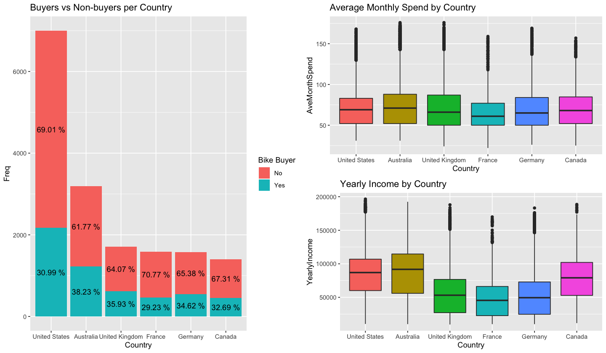


### Education


```R
plot_catg(aw_data, 'Education' , 'Education')
```


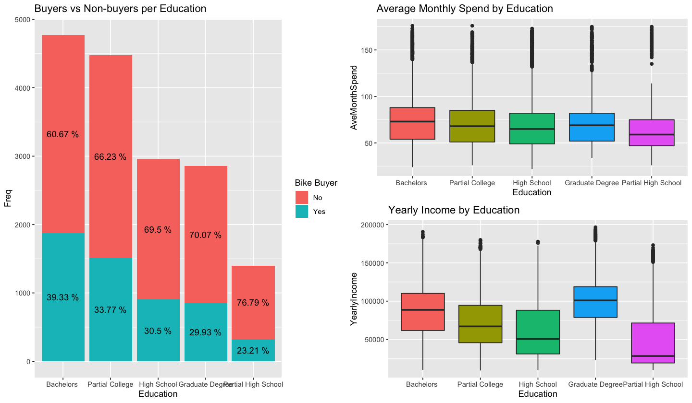


### Occupation


```R
plot_catg(aw_data, 'Occupation', 'Occupation')
```


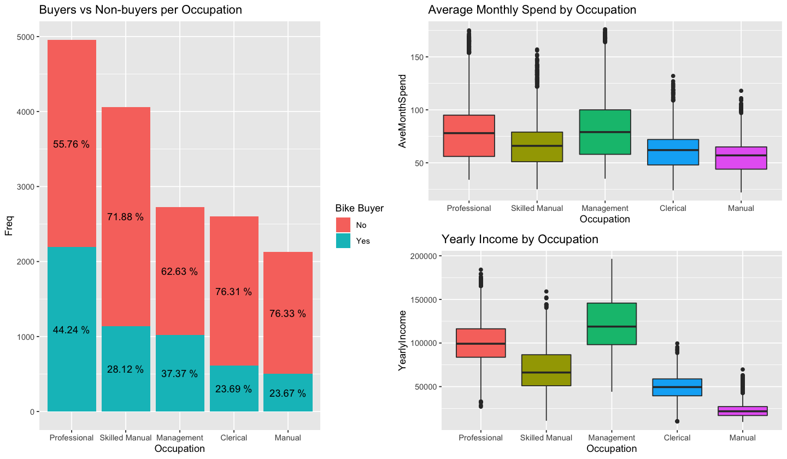


### Gender


```R
plot_catg(aw_data, 'Gender', 'Gender')
```


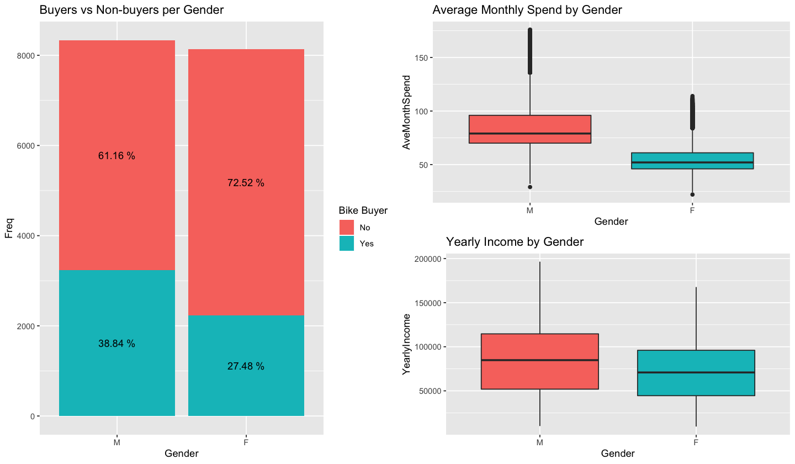


### Marital Status


```R
plot_catg(aw_data, 'MaritalStatus', 'MaritalStatus')
```


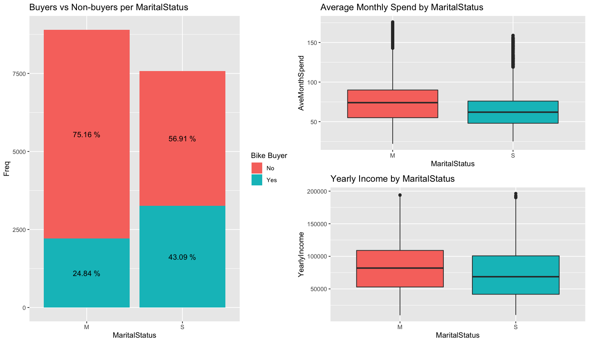


### Home Ownership


```R
plot_catg(aw_data, 'HomeOwnerFlag', 'Home Owner')
```


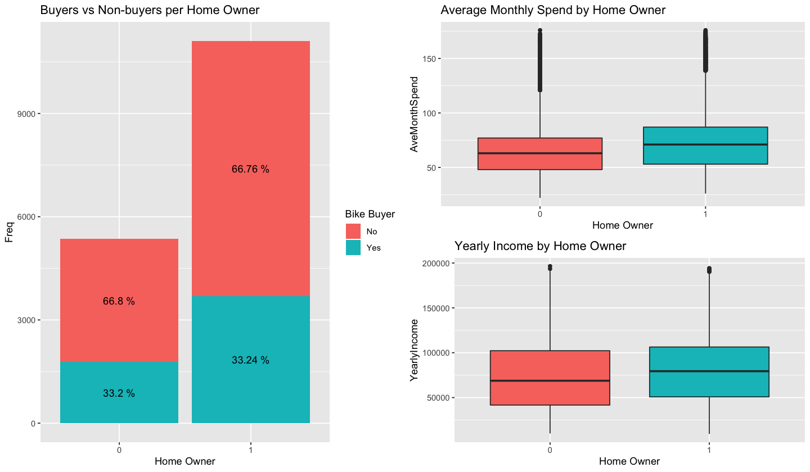


### Number of Cars


```R
plot_catg(aw_data, 'NumberCarsOwned', 'Number of Cars')
```


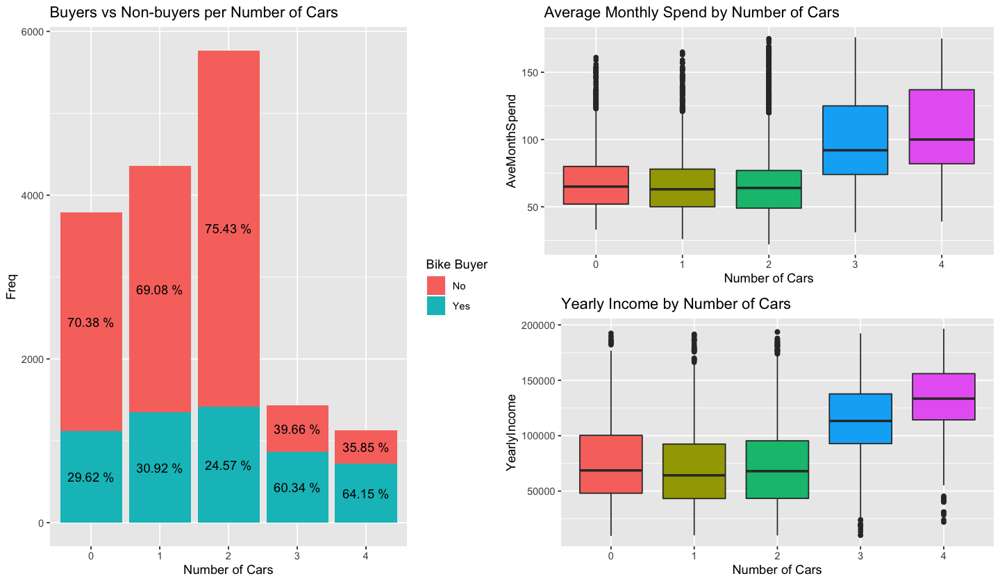


### Number of Children at Home


```R
plot_catg(aw_data, 'NumberChildrenAtHome', 'Number of Children at Home')
```


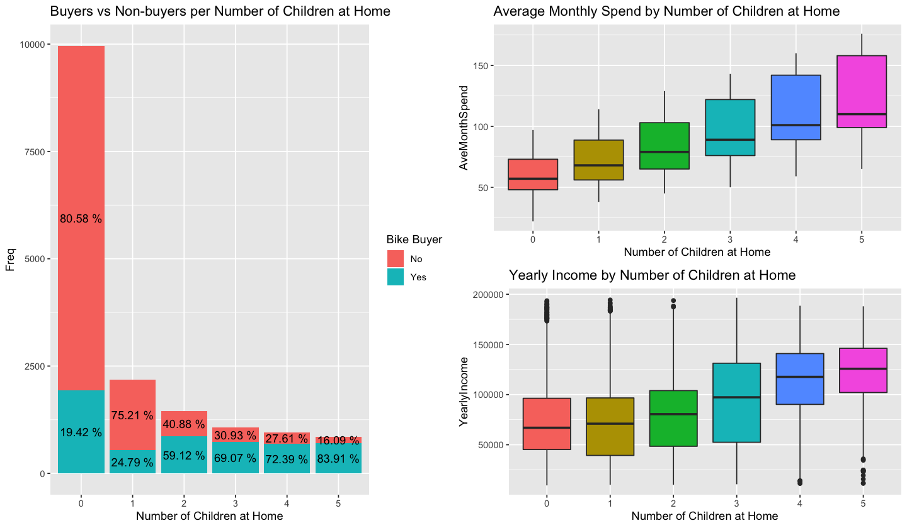


### Total Number of Children


```R
plot_catg(aw_data, 'TotalChildren', 'Total Children')
```


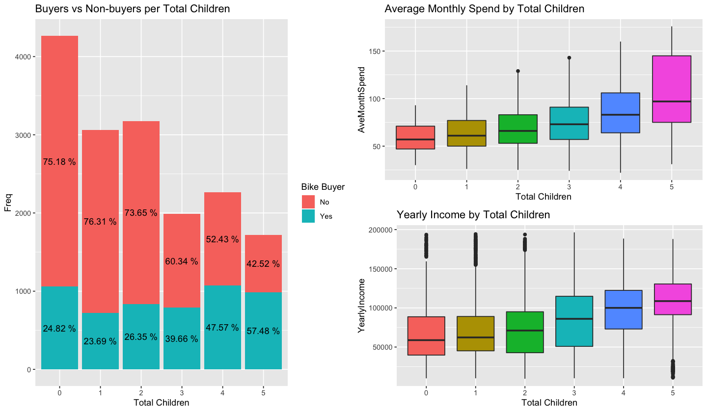


### Numerical Variables Exploration


```R
### options(repr.plot.width = 12, repr.plot.height = 9)


p1 <- ggplot(aw_data, aes(x = factor(Age), y = AveMonthSpend, color = Gender)) +
    geom_boxplot() + 
    theme(plot.margin = margin(0.3, 0.8, 0, 0.2, 'cm')) +
    scale_x_discrete(name = '') +
    ggtitle('Age')


tbl <- data.frame(with(aw_data, table(Age, BikeBuyer)))
colnames(tbl) <- c('Age', 'BikeBuyer', 'Freq')

p2 <- ggplot(NULL) +
    geom_col(data = subset(tbl, BikeBuyer == 0), aes(x = Age, y = Freq, fill = 'indianred2'), alpha = 0.7) +
    geom_col(data = subset(tbl, BikeBuyer == 1), aes(x = Age, y = Freq, fill = 'lightseagreen'), alpha = 0.7) +
    scale_fill_discrete(name = 'Bike Buyer', labels = c('No', 'Yes')) +
    scale_x_discrete(name = '')


p3 <- ggplot(aw_data, aes(x = factor(Age), y = YearlyIncome, color = factor(BikeBuyer))) +
    geom_boxplot() +
    scale_colour_manual(name ="Bike Buyer", values = c("0" = "indianred2", "1" = "lightseagreen"), labels=c("0" = "No", "1" = "Yes")) +
    scale_x_discrete(name = 'Age') + 
    theme(plot.margin = margin(0.3, 0.2, 0, 0.2, 'cm'))

    
#grid.arrange(p1, p2, p3, layout_matrix = rbind(c(NA, rep(1,29)), c(rep(2,28), rep(NA,2)), rep(3,30)))

plots <- list(p1, p2, p3)
grobs <- list()
widths <- list()

for (i in 1:length(plots)){
    grobs[[i]] <- ggplotGrob(plots[[i]])
    widths[[i]] <- grobs[[i]]$widths[2:5]
}

maxwidth <- do.call(grid::unit.pmax, widths)

for (i in 1:length(grobs)){
     grobs[[i]]$widths[2:5] <- as.list(maxwidth)
}

do.call("grid.arrange", c(grobs, ncol = 1))
```


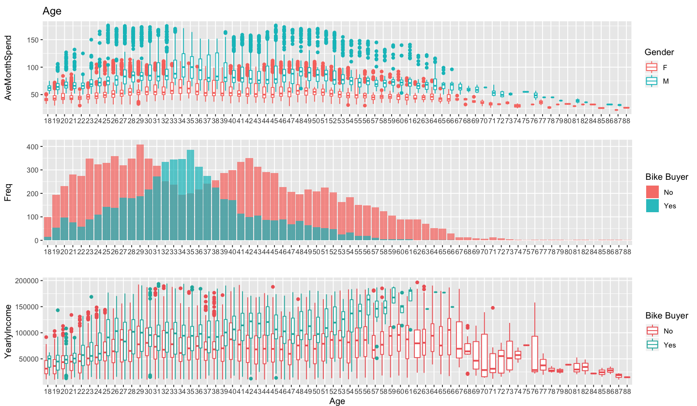


```R

```


```R
options(repr.plot.width = 8, repr.plot.height = 6)
ggplot(aw_data, aes(y = AveMonthSpend, x = YearlyIncome, fill = Gender)) + 
    geom_point(shape = 21, alpha = 0.3) +
    geom_smooth(method = 'lm') +
    ggtitle('Yearly Income vs Average Monthly Spend')
```


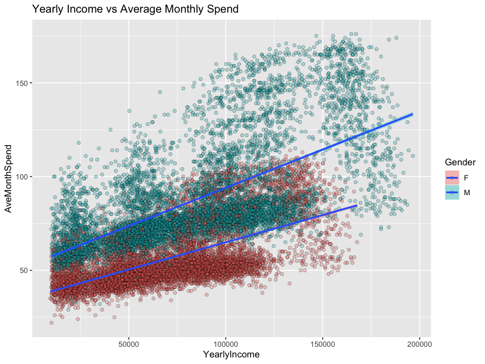


```R
ggplot(aw_data, aes(x = as.factor(BikeBuyer), y = YearlyIncome, fill = as.factor(BikeBuyer))) +
    geom_boxplot() +
    ggtitle('Yearly Income by Buyer') +
    scale_fill_discrete(name = 'Bike Buyer', labels = c('No', 'Yes')) +
    scale_x_discrete(name = 'Buyer')
```


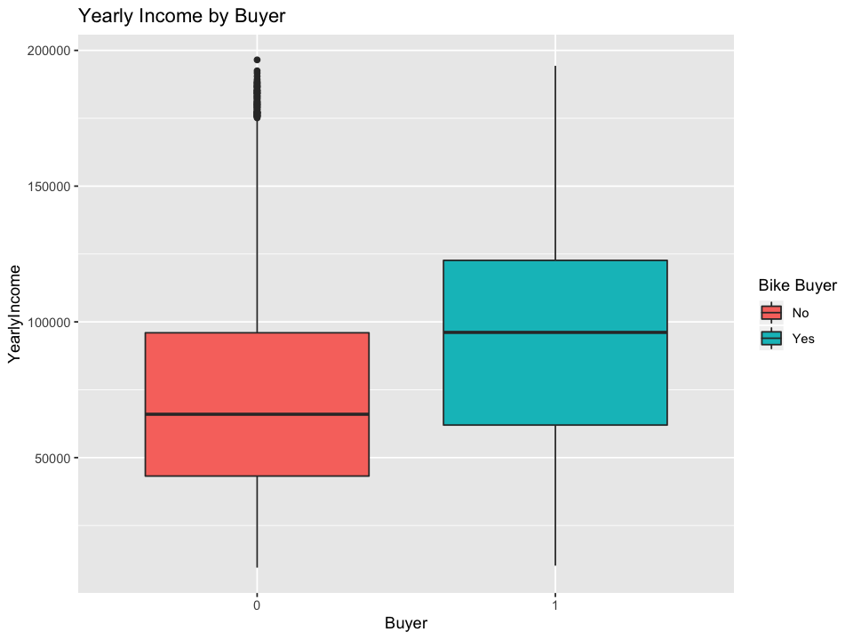


```R
ggplot(aw_data, aes(x = as.factor(BikeBuyer), y = AveMonthSpend, fill = as.factor(BikeBuyer))) +
    geom_boxplot() +
    ggtitle('Average Monthly Spend by Buyer') +
    scale_fill_discrete(name = 'Bike Buyer', labels = c('No', 'Yes')) +
    scale_x_discrete(name = 'Buyer')
```


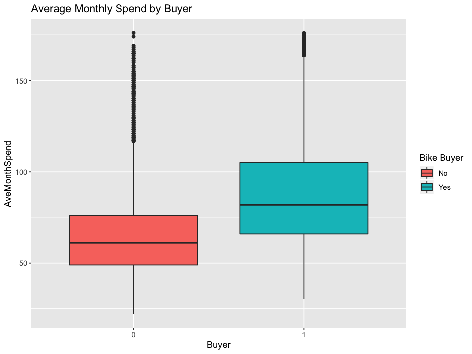


## Data Exploration Insights

* **Country:** The largest customer base is in the USA, but the biggest spenders are in Australia. The largest buyer ratios are AU, UK and DE in descending order.<br>
* **Education:** The biggest buyer ratio and spending are from people with higher degrees.<br>
* **Occupation:** Professionals and management roles are the biggest buyers and spenders.<br>
* **Gender:** Males are the main buyers, the biggest spenders and earners.<br>
* **Marital Status:** SIngles have the higher buyer ratio, but married people spend more.<br>
* **Number of Cars:** People with 3 or more cars have a signifficant higher buyer ratio and spending.<br>
* **Children:** There is a string positive linear relation between number of children and spending.<br>
* **Age:** Males between 25 and 55 are the biggest spenders, but the buyer ratio is higher in males between 27 and 40 years old.<br>
* **Yearly Income:** There is a positive linear relationship between Yearly income and Spending, as expected.<br>

## 4 - Classification<a class='anchor' id='classf'></a>

The dependent variable is not well balanced, because of this we'll need to attribute class weights.<br>
In this step we will classify customers as Buyers and Non-buyers.


```R
tbl <- data.frame(table(aw_data$BikeBuyer))

ggplot(tbl, aes(x = Var1, y = Freq, fill = Var1)) +
    geom_col()
```


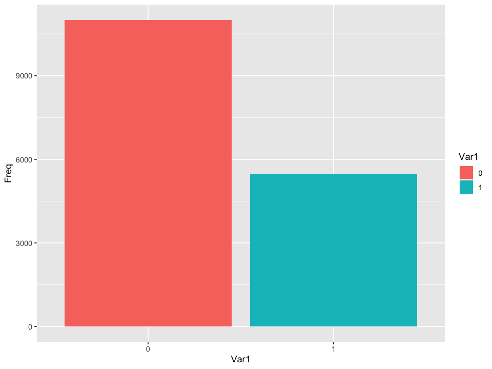


### Scaling Numerical Features


```R
scalable_cols <- c('Age', 'YearlyIncome')
scaler <- preProcess(aw_data[, scalable_cols], method = c('center', 'scale'))


train <- aw_data
scaled_values <- predict(scaler, aw_data[,scalable_cols])
train[, scalable_cols] <- scaled_values

scaled_values <- predict(scaler, test[,scalable_cols])
test[, scalable_cols] <- scaled_values
```

### 4.1 -  Logistic Regression Model<a class='anchor' id='clf_log'></a>

We'll use cross validation to assess our model metrics. The logistic regression has no tuning parameters. This model will be compared to a neural network model.


```R
weights = ifelse(aw_data$BikeBuyer == 0, 1, 2)


fitControl = trainControl(method = 'cv',
                          number = 10,
                          returnResamp="all",
                          savePredictions = TRUE,
                          classProbs = TRUE,
                          summaryFunction = twoClassSummary)

set.seed(9999)


clf_model_glm <- train(train[,-c(which(colnames(train) == 'BikeBuyer'),which(colnames(train) == 'AveMonthSpend'))],
                   factor(ifelse(train$BikeBuyer == 1, 'yes', 'no')),
                   weights = weights, method='glm', trControl = fitControl, metric = 'ROC', family = 'binomial')
clf_model_glm
```


    Generalized Linear Model 
    
    16471 samples
       12 predictor
        2 classes: 'no', 'yes' 
    
    No pre-processing
    Resampling: Cross-Validated (10 fold) 
    Summary of sample sizes: 14824, 14823, 14824, 14824, 14824, 14823, ... 
    Resampling results:
    
      ROC        Sens       Spec     
      0.8349953  0.7759568  0.7195386


#### Print Metrics Helper Function


```R
print_metrics = function(mod){

    
    cv_metrics <- mod$resample
    mean <- c(colMeans(cv_metrics[,c(1:3)]), rep(NA, ncol(cv_metrics) - 4), 'Mean')
    sd <- c(unlist(c(lapply(cv_metrics[,c(1:3)], sd))), rep(NA, ncol(cv_metrics) - 4), 'SD')

    cv_metrics <- rbind(cv_metrics, mean, sd)
    cv_metrics[, c(1:3)] <- apply(cv_metrics[, c(1:3)], 2, function(x){round(as.numeric(x), 3)})
    cv_metrics
    
}
```

 We see that our model did pretty well. Low Standard Deviation of ROC indicates good generalization.


```R
print_metrics(clf_model_glm)
```


<table>
<caption>A data.frame: 12 × 5</caption>
<thead>
	<tr><th scope=col>ROC</th><th scope=col>Sens</th><th scope=col>Spec</th><th scope=col>parameter</th><th scope=col>Resample</th></tr>
	<tr><th scope=col>&lt;dbl&gt;</th><th scope=col>&lt;dbl&gt;</th><th scope=col>&lt;dbl&gt;</th><th scope=col>&lt;fct&gt;</th><th scope=col>&lt;chr&gt;</th></tr>
</thead>
<tbody>
	<tr><td>0.839</td><td>0.765</td><td>0.746</td><td>none</td><td>Fold01</td></tr>
	<tr><td>0.820</td><td>0.769</td><td>0.706</td><td>none</td><td>Fold02</td></tr>
	<tr><td>0.851</td><td>0.792</td><td>0.722</td><td>none</td><td>Fold03</td></tr>
	<tr><td>0.828</td><td>0.784</td><td>0.698</td><td>none</td><td>Fold04</td></tr>
	<tr><td>0.852</td><td>0.788</td><td>0.751</td><td>none</td><td>Fold05</td></tr>
	<tr><td>0.816</td><td>0.783</td><td>0.699</td><td>none</td><td>Fold06</td></tr>
	<tr><td>0.836</td><td>0.767</td><td>0.719</td><td>none</td><td>Fold07</td></tr>
	<tr><td>0.833</td><td>0.758</td><td>0.724</td><td>none</td><td>Fold08</td></tr>
	<tr><td>0.829</td><td>0.777</td><td>0.691</td><td>none</td><td>Fold09</td></tr>
	<tr><td>0.847</td><td>0.777</td><td>0.739</td><td>none</td><td>Fold10</td></tr>
	<tr><td>0.835</td><td>0.776</td><td>0.720</td><td>NA  </td><td>Mean  </td></tr>
	<tr><td>0.012</td><td>0.011</td><td>0.021</td><td>NA  </td><td>SD    </td></tr>
</tbody>
</table>


```R
varImp(clf_model_glm)
```


    glm variable importance
    
      only 20 most important variables shown (out of 21)
    
                                     Overall
    MaritalStatusS                  100.0000
    NumberChildrenAtHome             91.0370
    YearlyIncome                     41.5345
    GenderM                          40.9129
    Age                              37.9825
    EducationPartial High School     16.3736
    EducationHigh School             15.3143
    EducationPartial College         12.3617
    OccupationManagement              9.4025
    EducationGraduate Degree          7.9076
    HomeOwnerFlag                     5.6754
    NumberCarsOwned                   5.0381
    CountryRegionNameUnited Kingdom   4.8429
    CountryRegionNameFrance           4.7588
    CountryRegionNameGermany          3.9362
    OccupationSkilled Manual          3.1482
    TotalChildren                     2.7449
    CountryRegionNameCanada           2.1070
    OccupationManual                  2.0852
    CountryRegionNameUnited States    0.9981


### 4.2 - Neural Network<a class='anchor' id='clf_nn'></a>

This model will be compared to the Logistic Regression.<br>
First, I'll perform a 5 fold Cross Validation to estimate optimal size and decay parameters. Once I obtain these parameters I'll estimate a new model with these parameters.


```R
fitControl = trainControl(method = 'cv',
                          number = 5,
                          returnResamp="all",
                          savePredictions = TRUE,
                          classProbs = TRUE,
                          summaryFunction = twoClassSummary)

set.seed(9999)
paramGrid <- expand.grid(size = c(12, 25), decay = c(1.0, 0.5, 0.1))

clf_model_nn <- train(train[,-c(which(colnames(train) == 'BikeBuyer'),which(colnames(train) == 'AveMonthSpend'))],
                   factor(ifelse(train$BikeBuyer == 1, 'yes', 'no')),
                   weights = weights, method='nnet', trControl = fitControl, metric = 'ROC', tuneGrid = paramGrid, trace = F)
clf_model_nn
```


    Neural Network 
    
    16471 samples
       12 predictor
        2 classes: 'no', 'yes' 
    
    No pre-processing
    Resampling: Cross-Validated (5 fold) 
    Summary of sample sizes: 13177, 13176, 13177, 13178, 13176 
    Resampling results across tuning parameters:
    
      size  decay  ROC        Sens       Spec     
      12    0.1    0.8576394  0.7789593  0.7504054
      12    0.5    0.8607264  0.7815967  0.7606361
      12    1.0    0.8609281  0.7824151  0.7538731
      25    0.1    0.8546259  0.7792315  0.7449215
      25    0.5    0.8598283  0.7815055  0.7540586
      25    1.0    0.8608757  0.7802323  0.7560669
    
    ROC was used to select the optimal model using the largest value.
    The final values used for the model were size = 12 and decay = 1.


Otimal parameters:<br>
size: 12<br>
decay: 1

#### New Model


```R
fitControl = trainControl(method = 'cv',
                          number = 10,
                          returnResamp="all",
                          savePredictions = TRUE,
                          classProbs = TRUE,
                          summaryFunction = twoClassSummary)

set.seed(9999)
paramGrid <- expand.grid(size = c(12), decay = c(1.0))

clf_model_nn <- train(train[,-c(which(colnames(train) == 'BikeBuyer'),which(colnames(train) == 'AveMonthSpend'))],
                   factor(ifelse(train$BikeBuyer == 1, 'yes', 'no')),
                   weights = weights, method='nnet', trControl = fitControl, metric = 'ROC', tuneGrid = paramGrid, trace = F)
```

The two models performed very similarly. In this case, the logistic regression model is preffered since it is much more explainable.


```R
print_metrics(clf_model_nn)
```


<table>
<caption>A data.frame: 12 × 6</caption>
<thead>
	<tr><th scope=col>ROC</th><th scope=col>Sens</th><th scope=col>Spec</th><th scope=col>size</th><th scope=col>decay</th><th scope=col>Resample</th></tr>
	<tr><th scope=col>&lt;dbl&gt;</th><th scope=col>&lt;dbl&gt;</th><th scope=col>&lt;dbl&gt;</th><th scope=col>&lt;chr&gt;</th><th scope=col>&lt;chr&gt;</th><th scope=col>&lt;chr&gt;</th></tr>
</thead>
<tbody>
	<tr><td>0.856</td><td>0.762</td><td>0.762</td><td>12</td><td>1 </td><td>Fold01</td></tr>
	<tr><td>0.844</td><td>0.767</td><td>0.757</td><td>12</td><td>1 </td><td>Fold02</td></tr>
	<tr><td>0.882</td><td>0.797</td><td>0.782</td><td>12</td><td>1 </td><td>Fold03</td></tr>
	<tr><td>0.849</td><td>0.778</td><td>0.731</td><td>12</td><td>1 </td><td>Fold04</td></tr>
	<tr><td>0.878</td><td>0.789</td><td>0.782</td><td>12</td><td>1 </td><td>Fold05</td></tr>
	<tr><td>0.845</td><td>0.790</td><td>0.712</td><td>12</td><td>1 </td><td>Fold06</td></tr>
	<tr><td>0.864</td><td>0.770</td><td>0.759</td><td>12</td><td>1 </td><td>Fold07</td></tr>
	<tr><td>0.865</td><td>0.776</td><td>0.775</td><td>12</td><td>1 </td><td>Fold08</td></tr>
	<tr><td>0.866</td><td>0.794</td><td>0.748</td><td>12</td><td>1 </td><td>Fold09</td></tr>
	<tr><td>0.874</td><td>0.792</td><td>0.768</td><td>12</td><td>1 </td><td>Fold10</td></tr>
	<tr><td>0.862</td><td>0.782</td><td>0.758</td><td>NA</td><td>NA</td><td>Mean  </td></tr>
	<tr><td>0.013</td><td>0.012</td><td>0.023</td><td>NA</td><td>NA</td><td>SD    </td></tr>
</tbody>
</table>


## 5 - Regression<a class='anchor' id='reg'></a>

The regression step of this analysis is meant to predict how much our customers will spend on a monthly basis.<br>
I'll estimate the same models as for the classification step. <br>
A logistic regression with 10 fold CV and later a neural network which will go through two CV's. One to estimate optimal parameters and the second to estimate model metrics.

### 5.1 - Logistic Regression Model<a class='anchor' id='reg_log'></a>


```R
fitControl = trainControl(method = 'cv',
                          number = 10,
                          returnResamp="all",
                          summaryFunction = defaultSummary)

set.seed(9999)
#paramGrid <- expand.grid(size = c(12, 25), decay = c(1.0, 0.5, 0.1))

reg_model_lm <- train(train[,-c(which(colnames(train) == 'BikeBuyer'),which(colnames(train) == 'AveMonthSpend'))],
                   train[,'AveMonthSpend'],
                   weights = weights, method='lm', trControl = fitControl, metric = 'RMSE')#, tuneGrid = paramGrid
reg_model_lm
```


    Linear Regression 
    
    16471 samples
       12 predictor
    
    No pre-processing
    Resampling: Cross-Validated (10 fold) 
    Summary of sample sizes: 14824, 14824, 14824, 14824, 14824, 14824, ... 
    Resampling results:
    
      RMSE      Rsquared   MAE     
      6.362427  0.9463016  4.984794
    
    Tuning parameter 'intercept' was held constant at a value of TRUE


```R
print_metrics(reg_model_lm)
```


<table>
<caption>A data.frame: 12 × 5</caption>
<thead>
	<tr><th scope=col>RMSE</th><th scope=col>Rsquared</th><th scope=col>MAE</th><th scope=col>intercept</th><th scope=col>Resample</th></tr>
	<tr><th scope=col>&lt;dbl&gt;</th><th scope=col>&lt;dbl&gt;</th><th scope=col>&lt;dbl&gt;</th><th scope=col>&lt;chr&gt;</th><th scope=col>&lt;chr&gt;</th></tr>
</thead>
<tbody>
	<tr><td>6.365</td><td>0.947</td><td>4.988</td><td>TRUE</td><td>Fold01</td></tr>
	<tr><td>6.440</td><td>0.949</td><td>5.029</td><td>TRUE</td><td>Fold02</td></tr>
	<tr><td>6.238</td><td>0.947</td><td>4.873</td><td>TRUE</td><td>Fold03</td></tr>
	<tr><td>6.331</td><td>0.945</td><td>4.979</td><td>TRUE</td><td>Fold04</td></tr>
	<tr><td>6.308</td><td>0.945</td><td>4.958</td><td>TRUE</td><td>Fold05</td></tr>
	<tr><td>6.383</td><td>0.945</td><td>5.038</td><td>TRUE</td><td>Fold06</td></tr>
	<tr><td>6.191</td><td>0.947</td><td>4.837</td><td>TRUE</td><td>Fold07</td></tr>
	<tr><td>6.578</td><td>0.943</td><td>5.177</td><td>TRUE</td><td>Fold08</td></tr>
	<tr><td>6.240</td><td>0.948</td><td>4.875</td><td>TRUE</td><td>Fold09</td></tr>
	<tr><td>6.550</td><td>0.947</td><td>5.095</td><td>TRUE</td><td>Fold10</td></tr>
	<tr><td>6.362</td><td>0.946</td><td>4.985</td><td>NA  </td><td>Mean  </td></tr>
	<tr><td>0.130</td><td>0.002</td><td>0.106</td><td>NA  </td><td>SD    </td></tr>
</tbody>
</table>


### 5.2 - Neural Network<a class='anchor' id='reg_nn'></a>


```R
fitControl = trainControl(method = 'cv',
                          number = 5,
                          returnResamp="all",
                          summaryFunction = defaultSummary)

set.seed(9999)
paramGrid <- expand.grid(size = c(12, 25), decay = c(1.0, 0.5, 0.1))

reg_model_nn <- train(train[,-c(which(colnames(train) == 'BikeBuyer'),which(colnames(train) == 'AveMonthSpend'))],
                   train[,'AveMonthSpend'],
                   weights = weights, method='nnet', trControl = fitControl, metric = 'RMSE', tuneGrid = paramGrid, trace = F, linout = T)
reg_model_nn
```


    Neural Network 
    
    16471 samples
       12 predictor
    
    No pre-processing
    Resampling: Cross-Validated (5 fold) 
    Summary of sample sizes: 13177, 13177, 13177, 13176, 13177 
    Resampling results across tuning parameters:
    
      size  decay  RMSE       Rsquared   MAE     
      12    0.1    11.245372  0.8277010  8.365019
      12    0.5     6.450831  0.9423448  4.980259
      12    1.0     6.746414  0.9398163  5.124265
      25    0.1     4.317942  0.9744174  3.361845
      25    0.5     3.792132  0.9794999  2.987571
      25    1.0     4.312870  0.9745403  3.335959
    
    RMSE was used to select the optimal model using the smallest value.
    The final values used for the model were size = 25 and decay = 0.5.


```R
fitControl = trainControl(method = 'cv',
                          number = 10,
                          returnResamp="all",
                          summaryFunction = defaultSummary)

set.seed(9999)
paramGrid <- expand.grid(size = c(25), decay = c(0.5))

reg_model_nn <- train(train[,-c(which(colnames(train) == 'BikeBuyer'),which(colnames(train) == 'AveMonthSpend'))],
                   train[,'AveMonthSpend'],
                   weights = weights, method='nnet', trControl = fitControl, metric = 'RMSE', tuneGrid = paramGrid, trace = F, linout = T)
reg_model_nn
```


    Neural Network 
    
    16471 samples
       12 predictor
    
    No pre-processing
    Resampling: Cross-Validated (10 fold) 
    Summary of sample sizes: 14824, 14824, 14824, 14824, 14824, 14824, ... 
    Resampling results:
    
      RMSE      Rsquared   MAE     
      4.769271  0.9680573  3.673273
    
    Tuning parameter 'size' was held constant at a value of 25
    Tuning
     parameter 'decay' was held constant at a value of 0.5


The neural network performed much better for this case, it will be the chosen model.


```R
print_metrics(reg_model_nn)
```


<table>
<caption>A data.frame: 12 × 6</caption>
<thead>
	<tr><th scope=col>RMSE</th><th scope=col>Rsquared</th><th scope=col>MAE</th><th scope=col>size</th><th scope=col>decay</th><th scope=col>Resample</th></tr>
	<tr><th scope=col>&lt;dbl&gt;</th><th scope=col>&lt;dbl&gt;</th><th scope=col>&lt;dbl&gt;</th><th scope=col>&lt;chr&gt;</th><th scope=col>&lt;chr&gt;</th><th scope=col>&lt;chr&gt;</th></tr>
</thead>
<tbody>
	<tr><td>4.353</td><td>0.975</td><td>3.370</td><td>25</td><td>0.5</td><td>Fold01</td></tr>
	<tr><td>5.598</td><td>0.961</td><td>4.430</td><td>25</td><td>0.5</td><td>Fold02</td></tr>
	<tr><td>6.522</td><td>0.941</td><td>4.910</td><td>25</td><td>0.5</td><td>Fold03</td></tr>
	<tr><td>5.639</td><td>0.956</td><td>4.338</td><td>25</td><td>0.5</td><td>Fold04</td></tr>
	<tr><td>5.545</td><td>0.957</td><td>4.242</td><td>25</td><td>0.5</td><td>Fold05</td></tr>
	<tr><td>4.391</td><td>0.974</td><td>3.397</td><td>25</td><td>0.5</td><td>Fold06</td></tr>
	<tr><td>4.299</td><td>0.974</td><td>3.298</td><td>25</td><td>0.5</td><td>Fold07</td></tr>
	<tr><td>4.718</td><td>0.970</td><td>3.458</td><td>25</td><td>0.5</td><td>Fold08</td></tr>
	<tr><td>3.404</td><td>0.985</td><td>2.724</td><td>25</td><td>0.5</td><td>Fold09</td></tr>
	<tr><td>3.224</td><td>0.987</td><td>2.565</td><td>25</td><td>0.5</td><td>Fold10</td></tr>
	<tr><td>4.769</td><td>0.968</td><td>3.673</td><td>NA</td><td>NA </td><td>Mean  </td></tr>
	<tr><td>1.049</td><td>0.014</td><td>0.771</td><td>NA</td><td>NA </td><td>SD    </td></tr>
</tbody>
</table>


### 6 - Final Commnents<a class='anchor' id='final'></a>

&nbsp;&nbsp;&nbsp;&nbsp;This document included Data Exploration for the customer base of a fictitional company called AdventureWorks. The database contained custoer demographic data and two dependent variables (BikeBuyer and AveMonthSpend). After the exploration, we proceeded to estimating two types statistical models. The classification models will estimate whether a person has a high chance of buying a bike or not. The regression models are used to predict how much money the customers will spend given their demographic data. <br>

&nbsp;&nbsp;&nbsp;&nbsp;The classification and regression models were chosen between two possibilities, the logistic regression and a neural network. For the classification of Buyer/Non-buyer the preffered model was the Log. regression, because it is more explainable than the NN since their metrics are close. For the regression of Average Monthly Spend the preffered model was the NN, since its metrics showed signifficant better results.


```R

```
