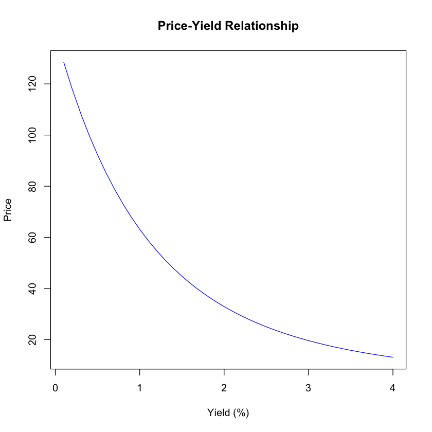
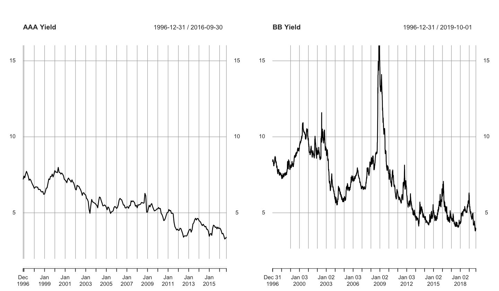
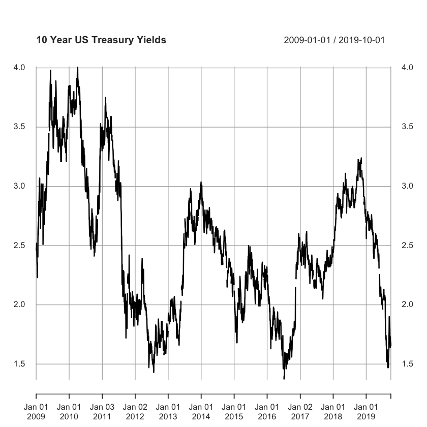
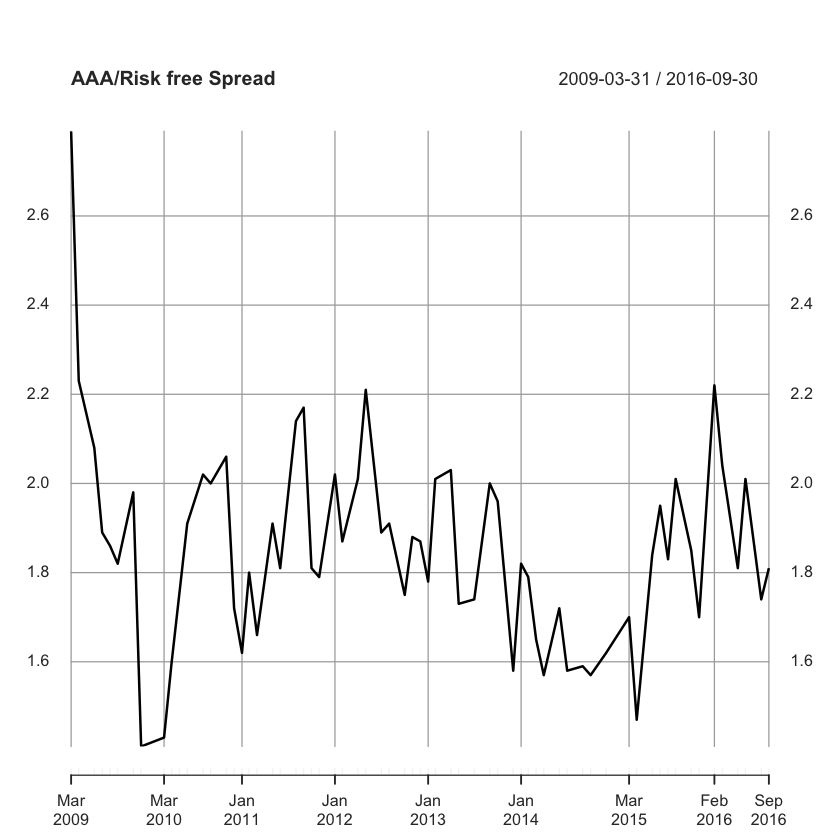
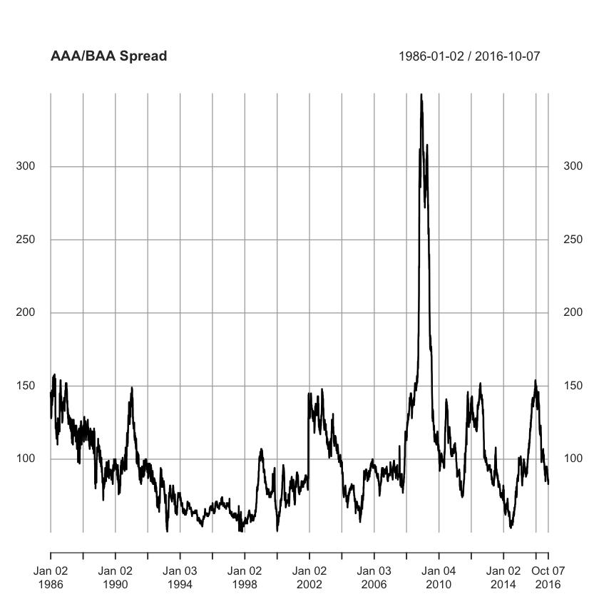
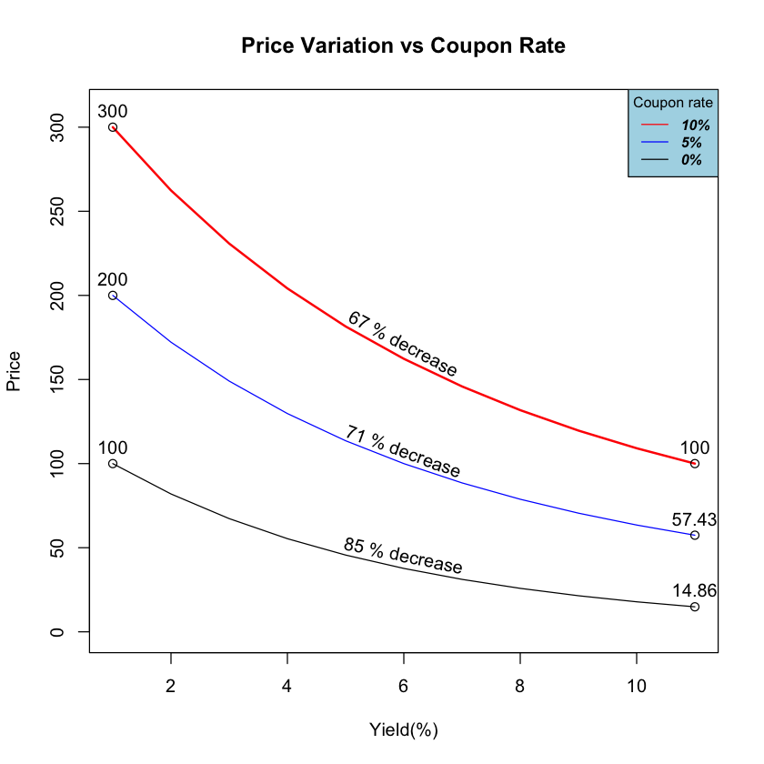
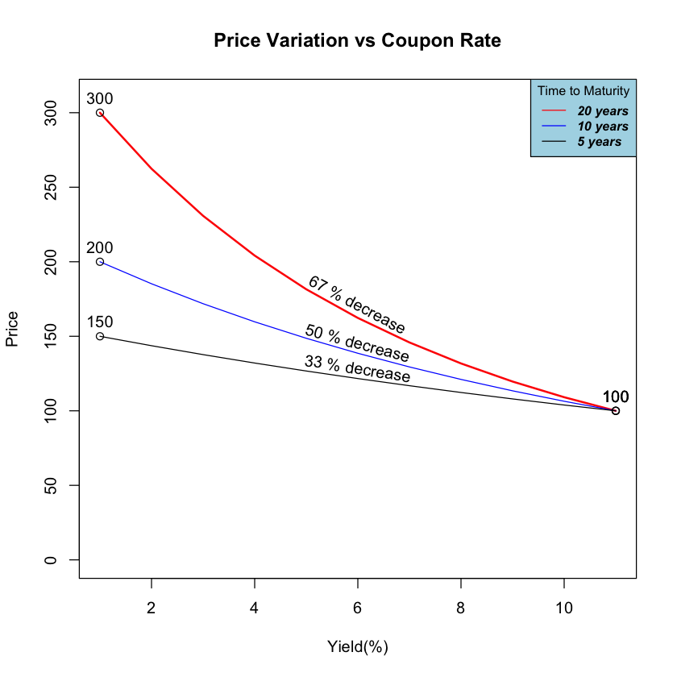

# Bond Valuation
## Looking at the fundamental characteristics of Bonds
*Omar El Omeiri Filho*<br><br>

---
### Table Of Contents

* <u>[Summary](#summ)<br></u>
* <u>[Preparations](#prep)<br></u>
* <u>[The time Value of Money](#tvm)<br></u>
    * <u>[Automating Calculations](#autom)<br></u>
* <u>[Bond Price-Yield Relationship](#bpy_rel)<br></u>
* <u>[Risks](#risks)<br></u>
    * <u>[The Components of Yield](#yld_comp)<br></u>
    * <u>[Risk Free Spread](#rsk_f_sp)<br></u>
    * <u>[Investment Grade Spread](#inv_sp)<br></u>
* <u>[Estimating Yield to maturity](#ytm)<br></u>
* <u>[Calculating Sensitivity for Expected Yield Changes](#sensit)<br></u>
    * <u>[Duration](#dur)<br></u>
    * <u>[Convexity](#conv)<br></u>
    * <u>[The Final Price](#fin_pr_1)<br></u>
* <u>[Bond Volatility](#bond_vol)<br></u>
    * <u>[Size of Yield Change](#yld_size)<br></u>
    * <u>[Lower coupon rate = higher volatility](#coup_vol)<br></u>
    * <u>[Longer maturity = More volatility](#mat_vol)<br></u>
    * <u>[Price Value of a Basis Point (PV01)](#pv01)<br></u>
* <u>[Real World Example](#rld_ex)<br></u>
    * <u>[Yield](#yld)<br></u>
    * <u>[Duration](#dur_2)<br></u>
    * <u>[Convexity](#conv_2)<br></u>
    * <u>[Final Price](#fin_pr_2)<br></u>

## Summary <a class="anchor" id="summ"></a>

&nbsp;&nbsp;&nbsp;&nbsp;A Bond is a debt instrument that requires that the issuer is required to pay the amount borrowed plus an interest rate over a specified period of time.<br><br>

The issuer is the entity that borrows the money.<br>
The principal or par value is the amount borrowed.<br>
The coupon rate is the interest rate the issuer has agreed to pay, in other words, it is the percentage of the par value that the bond earns for each period.<br>
The Yield is the percentage of the bond's <u>current price</u> (bond prices are not fixed), to maintain the same periodically cash flows. So whe price goes up, Yield must come down and vice-versa.<br>
The maturity date is the date whe the principal amount is paid back to the investor<br><br>

&nbsp;&nbsp;&nbsp;&nbsp; This report will focus on viewing how the characteristics of Bonds affect its price. For this, we will have to understand a few key concepts:<br>

* The time value of money
* The Price-Yield Relationship
* The risks involving Bond investment
* The Duration
* Convexity

## Preparations <a class="anchor" id="prep"></a>


```R
sup <- suppressPackageStartupMessages

sup(library(Quandl))
sup(library(xts))
sup(library(quantmod))
sup(library(lubridate))

opts <- options()

Quandl.api_key("Rzda1Q3WK9isQWCLxNjn")
```

## The Time Value of Money<a class='anchor' id='tvm'></a>

The value of a bond is the present value of its future cashflows.<br><br>
For example:<br>
&nbsp;&nbsp;&nbsp;&nbsp;USD  100,00 today is worth more than USD 100,00 a year from now. This occurs because if you have USD 100,00 today, you could invest it for the period of 1 year and end up with more than USD 100,00. The other way around also applies. If you can earn USD 100,00 a year from now from an investment, today that amount worths less.<br><br>

&nbsp;&nbsp;&nbsp;&nbsp;This applies to bonds in the sense of calculating today's value of a bond that will be outstanding some time after. To know if it is advantagous to buy a bond today, we need to calculate and sum the present values for all its future cashflows plus the par value at the last period.<br>
Suppose we are evaluating the buy of a Bond. It's current price is USD 95, its par value (original price at issue date) is USD 100, the coupon rate is 4% and 10 years to maturity. We need to know if its value is higher or lower than USD 95, to decide if we buy it or not.

The first step is to lay out all of its future cashflows. 


```R
par_value <- 100
price <- 95
maturity <- 10
coupon_rate <- 0.04 
yield <- 0.0421

cash_flows <- data.frame(period = seq(1:maturity))
cash_flows$cash_flow <- c(rep(par_value * coupon_rate, maturity - 1), c(par_value * (1 + coupon_rate)))

```

Your future cashflows will be as follows:


```R
cash_flows
```


<table>
<caption>A data.frame: 10 × 2</caption>
<thead>
	<tr><th scope=col>period</th><th scope=col>cash_flow</th></tr>
	<tr><th scope=col>&lt;int&gt;</th><th scope=col>&lt;dbl&gt;</th></tr>
</thead>
<tbody>
	<tr><td> 1</td><td>  4</td></tr>
	<tr><td> 2</td><td>  4</td></tr>
	<tr><td> 3</td><td>  4</td></tr>
	<tr><td> 4</td><td>  4</td></tr>
	<tr><td> 5</td><td>  4</td></tr>
	<tr><td> 6</td><td>  4</td></tr>
	<tr><td> 7</td><td>  4</td></tr>
	<tr><td> 8</td><td>  4</td></tr>
	<tr><td> 9</td><td>  4</td></tr>
	<tr><td>10</td><td>104</td></tr>
</tbody>
</table>


Now, we need to calculate and sum the present values for all these cashflows to arrive at the value of the bond today.<br><br>

The present value can be calculated using this formula:<br>
$$P_v=\frac{F_v}{(1+r)^t}$$<br><br>

The future value of an asset can be calculated by the same method:<br><br>
$$F_v=P_v*(1+r)^t$$

Where:<br>
P<sub>v</sub> = Present value<br>
F<sub>v</sub> = Future value<br>
r = Interest rate (Coupon value)<br>
t = Number of periods<br>


```R
cash_flows$present_value_multiplier <- 1 / (1 + yield)^cash_flows$period
cash_flows$present_value <- cash_flows$cash_flow * cash_flows$present_value_multiplier


print(paste('The bond value today is: $',sum(cash_flows$present_value)))
```

    [1] "The bond value today is: $ 98.3143796300359"


This means we should buy the bond, as we can pay USD 95 for something that is really worth more than USD 98.

### Automating Calculations<a class='anchor' id='autom'></a>

The same step by step Bond pricing process above inside a function that automates it.


```R
bnd_prc <- function(par, r, ttm, y){ # par = par value, r = coupon rate, ttm = time to maturity, y = yield
    
    cf <- c(rep(par * r, ttm - 1), par * (1 + r)) # cashflow vector
    cf <- data.frame(cf)
    cf$t <- seq(1:ttm) # periods
    cf$pv_factor <- 1 / (1 + y)^cf$t
    cf$pv <- cf$cf * cf$pv_factor
    sum(cf$pv)
    
}
```


```R
bnd_prc(par_value, coupon_rate, maturity, yield + 0.01)
```


90.751256445638


## <br><br>Bond Price-Yield relationship<a class='anchor' id='bpy_rel'></a>

The current yield is denoted by this formula:<br>

$$Y=\frac{i}{P}$$

Where:

Y = Current yield<br>
P = Current price<br>
i = Annual interest rate(%)

We can understand the inverse relationship between price and yield using an example:<br><br>
&nbsp;&nbsp;&nbsp;&nbsp;Picture a situation where you bought a bond for USD 1000(par value) with 10% coupon rate and a maturity of 5 years, So each year you receive USD 100. In the event that the basic economic interest rates rise to more than 10%, let's say 12,5%, if you want to sell your bond, you will be forced to lower your price, because investors would prefer to buy new bonds that pay 125 USD every year. You would have to lower your price to USD 927.90 to maintain to coupon and final payments 12.5%. The opposite happens in case the interest rates go down, your bond value would go up, because its coupon payment is now more attractive.


```R
prc_yld <- c() 

for (y in seq(0.01, 0.4, 0.01)){
    prc_yld <- c(prc_yld, bnd_prc(par_value, coupon_rate, maturity, y))
}

par(bg = 'white')
plot(index(prc_yld)/10, prc_yld, type = 'l', col = 'blue', main = 'Price-Yield Relationship', xlab = 'Yield (%)', ylab = 'Price')
```





## Risks<a class='anchor' id='risks'></a>

Yields are related to the risk of investing in bonds. We can determine the riskiness is by looking at the bond's credit rating, the ther most important rating agencies are S&P, Fitch and Moody's, they classify risk as follows:

| Grade | S&P | Fitch | Moody's |
| --- | --- | --- | --- |
| Investment Grade | AAA | AAA | Aaa |
|    | AA | AA | Aa |
|    | A | A | A |
|    | BBB | BBB | Baa |
| --- | --- | --- | --- |
| High Yield or Junk Bonds | BB | BB | Ba |
|    | B | B | B |
|    | CCC | CCC | Caa |

We can obtain the yields of different credit ratings using the Quandl package.


```R
aaa_yield <- Quandl("FED/RIMLPAAAR_N_M")
bb_yield <- Quandl("ML/BBY")
```


```R
aaa_yield <- xts(aaa_yield$Value, order.by = as.Date(aaa_yield$Date))
bb_yield <- xts(bb_yield$BAMLH0A1HYBBEY, order.by = as.Date(bb_yield$DATE))

par(bg = 'white', mfrow = c(1,2))
options(repr.plot.width = 12)

plot(window(aaa_yield, start = '1996-12-31'), type = 'l', lwd = 2, main = 'AAA Yield', ylim = c(1.99, 16.01), ylab = 'Yield(%)')
plot(bb_yield, type= 'l', lwd = 2, main = 'BB Yield', ylim = c(1.99, 16.01), ylab = '', xlab = 'Date')
```





### The components of Yield<a class='anchor' id='yld_comp'></a>

&nbsp;&nbsp;&nbsp;&nbsp;A bond that has no risk of default must earn the risk free yield, the lowest risk bond is the government treasury. The treasury yield is the minimum interest rate an investor will require. The corporate bonds are riskier than government bonds, this makes investors demand a higher yield for being exposed to this risk. This difference between yields is the spread. The spread is mostly comprised of credit risk. But spread can account for other types of risk, such as:<br><br>

* Inflation risk: When money loses its value, so every coupon payment you receive it actually worths less.<br>
* Call risk: Is when a bond issuer has the option to buy back the bond. It will happen only when it is advantageous for the issuer and disadvantageous to the investor.<br>
* Liquitdity risk: Is when you are not able to sell your bond at its value, this happens because bonds are not frequently traded.<br>

Getting data for the risk free yield is made easy with the quantmod package.


```R
t10yr <- getSymbols('DGS10', src = 'FRED', auto.assign = F)
t10yr <- window(t10yr, start = '2009-01-01')

options(opts)

plot(t10yr, ylab='Yield(%)', main = '10 Year US Treasury Yields')
```





### The Risk Free Spread <a class='anchor' id='rsk_f_sp'></a>


```R
plot(na.approx(window(aaa_yield, start = '2009-01-01') - t10yr), main = 'AAA/Risk free Spread')
```





### The Investment Grade Spread<a class='anchor' id='inv_sp'></a>

&nbsp;&nbsp;&nbsp;&nbsp;The difference between yields in the riskier and the less risky categories of investment grade bonds (Baa - Aaa). The spread is not constant, The spread size has roots in the sentiment of the market, in economic aggitated times, like in the 2008-2009 crisis, spreads were a lot higher to compensate investors for the higher risk.


```R
aaa <- Quandl("FED/RIMLPAAAR_N_B")
baa <- Quandl("FED/RIMLPBAAR_N_B")
```


```R
aaa <- xts(aaa$Value, order.by = aaa$Date)
baa <- xts(baa$Value, order.by = baa$Date)

spread <- na.omit(merge(aaa,baa))
colnames(spread) <- c('aaa', 'baa')
head(spread)
```


                aaa   baa
    1986-01-02 9.92 11.38
    1986-01-03 9.92 11.35
    1986-01-06 9.94 11.36
    1986-01-07 9.85 11.29
    1986-01-08 9.89 11.34
    1986-01-09 9.98 11.43


```R
spread$diff <- (spread$baa - spread$aaa) * 100

plot(spread$diff, ylab = 'Spread (bps)', main = 'AAA/BAA Spread')
```





## <br><br> Estimating Yield to maturity<a class='anchor' id='ytm'></a>

Aside from getting the yield from comparable bons, as shown above. But for traded bonds we can calculate the yield implied by the market. We need to lay out the cashflows just like before, but with a small modification, the first value of the vector, needs to be the proce paid for the bond.


The YTM is the anticipated return if one holds the bond until it matures, it accounts for all the future coupon payments adjusted to the present value.


```R
bond_val <- function(i, cf){
    t = seq(along = cf)
    sum(cf / (i + 1)^t)

}


ytm <- function(cf){ # Yield to maturity
    uniroot(bond_val, c(0, 1), cf = cf)$root
}
```


```R
cf <- c(-price, cash_flows$cash_flow)
cf
```


<ol class=list-inline>
	<li>-95</li>
	<li>4</li>
	<li>4</li>
	<li>4</li>
	<li>4</li>
	<li>4</li>
	<li>4</li>
	<li>4</li>
	<li>4</li>
	<li>4</li>
	<li>104</li>
</ol>


```R
print(paste('The Yield to maturity is :',ytm(cf)))
```

    [1] "The Yield to maturity is : 0.0463628147733671"


## <br><br> Calculating Sensitivity for Expected Yield Changes <a class='anchor' id='sensit'></a>

### Duration <a class='anchor' id='dur'></a>

Duration is the estimated price change for 100 basis point change in yield. Think of it as the sensitivity of your liabilities or assets for changes in interest rate. As bonds are liabilities, if interest rates climb, you lose money, one way of mitigating interest rates risk, is to find an asset that was a similar duration, when interest rates change, one will compensate for the other, this is called duration gap management.<br> 
One problem with the measure of duration is that it traces a linear relationship between yield change and price change. We have seen above, that this is not the case. For improving this estimation, we'll need to account for convexity.

The formula for approximate duration is:

$$D=\frac{(P_{down} − P_{up})}{(2*P*\Delta y)}$$<br><br>


where:<br>
P = the bond's current price<br>
P<sub>up</sub> = The price when the yield goes up<br>
P<sub>down</sub> = The price when the yield goes down<br>
$\Delta$y = The expected change in yield<br><br>


The formula to calculte the percentage effect on prices by duration is:<br>

$$pct\_chg = - D * \Delta y$$

Assuming that the expected change in yield is an increase of 1%.


```R
delta_y = 0.01

p_up <- bnd_prc(par_value, coupon_rate, maturity, yield + delta_y)
p_down <- bnd_prc(par_value, coupon_rate, maturity, yield - delta_y)


duration <- (p_down - p_up) / (2 * price * delta_y)

duration_pct_change <- - duration * delta_y
duration_price_change <- duration_pct_change * price

print(paste('The duration is:', duration))
print(paste('The percentage change in price for 1% change in rates is:', round(duration_pct_change, 2),'%'))
print(paste('The duration effect of 1% change in yield in the price is: $',duration_price_change))
```

    [1] "The duration is: 8.37681814333974"
    [1] "The percentage change in price for 1% change in rates is: -0.08 %"
    [1] "The duration effect of 1% change in yield in the price is: $ -7.95797723617275"


## Convexity<a class='anchor' id='conv'></a>

The formula for approximate convexity is:

$$C=\frac{P_{up}+P_{down}-2*P}{P*\Delta y^2}$$<br><br>

Where:<br>
P = the current price<br>
P<sub>up</sub> = The price when the yield goes up<br>
P<sub>down</sub> = The price when the yield goes down<br>
$\Delta$y = The expected change in yield<br><br>


The formula to calculte the percentage effect on prices by convexity is:<br>

$$pct\_chg = - C * 0.5 * \Delta y^2$$


```R
convexity <- (p_up + p_down - 2 * price) / (price * (delta_y)^2)

convexity_pct_change <- 0.5 * convexity * (delta_y)^2

convexity_price_change <- price * convexity_pct_change
convexity_price_change
```


3.70923368181076


## The final price<a class='anchor' id='fin_pr_1'></a>

The final price is the sum of the effects of duration and convexity


```R
total_price_change <- duration_price_change + convexity_price_change

new_price <- price + total_price_change
print(paste('If yield increases by 1%, the new price will be:',new_price))
```

    [1] "If yield increases by 1%, the new price will be: 90.751256445638"


## <br><br>Bond price volatility<a class='anchor' id='bond_vol'></a>


&nbsp;&nbsp;&nbsp;&nbsp;The effect of varying yields on prices depend on many factors, some examples are:<br>
* Size of yield change
* Coupon rate
* Time to maturity

### Size of Yield Change<a class='anchor' id='yld_size'></a>


&nbsp;&nbsp;&nbsp;&nbsp; The size of yield change has a non linear effect on bond prices, for small changes in yield the percent change in price is similar. Suppose we have a bond with a par value of USD 1000, a coupon rate of 10%, maturity of 20 years and yield of 10%. If yields go up by 1%, the bond value goes down by 0.85%, if yields go down by 1% the price goes up by 0.86%.


```R
bnd_prc(100, 0.1, 20, 0.101) / bnd_prc(100, 0.1, 20, 0.1) - 1
```


-0.00845577581018997


```R
bnd_prc(100, 0.1, 20, 0.099) / bnd_prc(100, 0.1, 20, 0.1) - 1
```


0.00857199787894514


<br><br>&nbsp;&nbsp;&nbsp;&nbsp; For large changes in yields, in general, the percentage change in prices are larger when the yiels decreases. For the same bond, suppose yields changed by 4%, when it goes up by 4%, the price change is -26.5%, but when the yield decreases 4%, the price change is 45.9%.


```R
bnd_prc(100, 0.1, 20, 0.14) / bnd_prc(100, 0.1, 20, 0.1) - 1
```


-0.264925222064638


```R
bnd_prc(100, 0.1, 20, 0.06) / bnd_prc(100, 0.1, 20, 0.1) - 1
```


0.458796848742611


## <br><br>Lower coupon rate = higher volatility<a class='anchor' id='coup_vol'></a>

Here you will be able to see how the variation in price takes place for different coupon rates. We will plot the price variation for three bonds, they have the same characteristics except for the coupon rate. We will see how yields from 0 to 10% will affect their prices.
* Par value = USD 100
* Maturity = 20 years
* Coupon rate 1 = 10%
* Coupon rate 2 = 5%
* Coupon rate 3 = 0%


```R
prices_1 <- c()
prices_2 <- c()
prices_3 <- c()

yields <- seq(0, 0.1, 0.01)


for (y in yields){
    prices_1 <- c(prices_1, bnd_prc(100, 0.1, 20, y))
    prices_2 <- c(prices_2, bnd_prc(100, 0.05, 20, y))
    prices_3 <- c(prices_3, bnd_prc(100, 0, 20, y))
}
par(bg = 'white')


p <- plot(index(prices_1), prices_1, type = 'l', col = 'red', lwd = 2, ylim = c(0, 310),
          main = 'Price Variation vs Coupon Rate', xlab = 'Yield(%)', ylab = 'Price')
lines(index(prices_2), prices_2, col = 'blue')
lines(index(prices_3), prices_3)
text(6,prices_1[5] - 10, labels = c(paste((1 - round(prices_1[11]/prices_1[1], 2)) * 100, '% decrease')), srt = -28)
text(6,prices_2[5] - 6, labels = c(paste((1 - round(prices_2[11]/prices_2[1], 2)) * 100, '% decrease')), srt = -20)
text(6,prices_3[5], labels = c(paste((1 - round(prices_3[11]/prices_3[1], 2)) * 100, '% decrease')), srt = -12)
points(index(prices_1)[1], prices_1[1])
points(index(prices_1)[11], prices_1[11])
points(index(prices_2)[1], prices_2[1])
points(index(prices_2)[11], prices_2[11])
points(index(prices_3)[1], prices_3[1])
points(index(prices_3)[11], prices_3[11])
text(index(prices_1)[1], prices_1[1] + 10, labels = prices_1[1])
text(index(prices_1)[11], prices_1[11] + 10, labels = round(prices_1[11],2))
text(index(prices_2)[1], prices_2[1] + 10, labels = prices_2[1])
text(index(prices_2)[11], prices_2[11] + 10, labels = round(prices_2[11],2))
text(index(prices_3)[1], prices_3[1] + 10, labels = prices_3[1])
text(index(prices_3)[11], prices_3[11] + 10, labels = round(prices_3[11],2))
legend('topright', legend=c("10%", "5%", '0%'),
       col=c("red", "blue", 'black'), lty=1, cex=0.8,
       title="Coupon rate", text.font=4, bg='lightblue')
```





## Longer maturity = More volatility<a class='anchor' id='mat_vol'></a>


```R
prices_1 <- c()
prices_2 <- c()
prices_3 <- c()

yields <- seq(0, 0.1, 0.01)


for (y in yields){
    prices_1 <- c(prices_1, bnd_prc(100, 0.1, 20, y))
    prices_2 <- c(prices_2, bnd_prc(100, 0.1, 10, y))
    prices_3 <- c(prices_3, bnd_prc(100, 0.1, 5, y))
}
par(bg = 'white')


p <- plot(index(prices_1), prices_1, type = 'l', col = 'red', lwd = 2, ylim = c(0, 310),
          main = 'Price Variation vs Coupon Rate', xlab = 'Yield(%)', ylab = 'Price')
lines(index(prices_2), prices_2, col = 'blue')
lines(index(prices_3), prices_3)
text(6,prices_1[5] - 10, labels = c(paste((1 - round(prices_1[11]/prices_1[1], 2)) * 100, '% decrease')), srt = -28)
text(6,prices_2[5] - 3, labels = c(paste((1 - round(prices_2[11]/prices_2[1], 2)) * 100, '% decrease')), srt = -15)
text(6,prices_3[5] + 2, labels = c(paste((1 - round(prices_3[11]/prices_3[1], 2)) * 100, '% decrease')), srt = -9)
points(index(prices_1)[1], prices_1[1])
points(index(prices_1)[11], prices_1[11])
points(index(prices_2)[1], prices_2[1])
points(index(prices_2)[11], prices_2[11])
points(index(prices_3)[1], prices_3[1])
points(index(prices_3)[11], prices_3[11])
text(index(prices_1)[1], prices_1[1] + 10, labels = prices_1[1])
text(index(prices_1)[11], prices_1[11] + 10, labels = round(prices_1[11],2))
text(index(prices_2)[1], prices_2[1] + 10, labels = prices_2[1])
text(index(prices_2)[11], prices_2[11] + 10, labels = round(prices_2[11],2))
text(index(prices_3)[1], prices_3[1] + 10, labels = prices_3[1])
text(index(prices_3)[11], prices_3[11] + 10, labels = round(prices_3[11],2))
legend('topright', legend=c("20 years", "10 years", '5 years'),
       col=c("red", "blue", 'black'), lty=1, cex=0.8,
       title="Time to Maturity", text.font=4, bg='lightblue')
```





### Price Value of a Basis Point (PV01)<a class='anchor' id='pv01'></a>

One way to measure volatility of bonds, is to calculate PV01. It means the estimated change in price of one basis point change in yield (0.01%).

<br>Solving for different maturity, as expected, longer maturity has higher volatility.


```R
abs(bnd_prc(100, 0.1, 20, 0.1001) - bnd_prc(100, 0.1, 20, 0.1))
```


0.0850775599713245


```R
abs(bnd_prc(100, 0.1, 5, 0.1001) - bnd_prc(100, 0.1, 5, 0.1))
```


0.0378981855093485


<br>Solving for different coupon rates. As expected, the lower coupon rate has higer volatility.


```R
abs(bnd_prc(100, 0.1, 5, 0.1001) - bnd_prc(100, 0.1, 5, 0.1))
```


0.0378981855093485


```R
abs(bnd_prc(100, 0.05, 5, 0.0501) - bnd_prc(100, 0.05, 5, 0.05))
```


0.0432828013276207


```R

```

## Real World example<a class='anchor' id='rld_ex'></a>

Assume a bond bond with a $100 par value, 3% coupon rate, and 8 years to maturity. This bond was rated Aaa by Moody's and it was issued on September 30, 2018. You have determined that this bond's yield is comparable to the yield of bonds with a Aaa rating.


```R
par <- 100
mat <- 8
coupon <- 0.03
```

### Yield<a class='anchor' id='yld'></a>


```R
aaa_yield <- Quandl("FRED/AAA10Y")
aaa_yield <- xts(aaa_yield$Value, order.by = aaa_yield$Date)
colnames(aaa_yield) <- 'Yield'
head(aaa_yield)
```


               Yield
    1983-01-03  1.45
    1983-01-04  1.42
    1983-01-05  1.44
    1983-01-06  1.35
    1983-01-07  1.38
    1983-01-10  1.37


```R
yield <- last(aaa_yield['2018-09'])
yield <- as.numeric(yield/ 100)
yield
```


0.0094


```R
price <- bnd_prc(par, coupon, mat, yield)

print(paste("The bond's value is: $", price))
```

    [1] "The bond's value is: $ 115.804186444433"


### Duration<a class='anchor' id='dur_2'></a>

Assuming that the expected change in yield is an increase of 1%.


```R
delta_y = 0.01

p_up <- bnd_prc(par, coupon, mat, yield + delta_y)
p_down <- bnd_prc(par, coupon, mat, yield - delta_y)


duration <- (p_down - p_up) / (2 * price * delta_y)

duration_pct_change <- - duration * delta_y
duration_price_change <- duration_pct_change * price


print(paste('The duration is:', duration))
print(paste('The percentage change in price for 1% change in rates is:', round(duration_pct_change, 2),'%'))
print(paste('The duration effect of 1% change in yield in the price is: $',duration_price_change))
```

    [1] "The duration is: 7.23682789590851"
    [1] "The percentage change in price for 1% change in rates is: -0.07 %"
    [1] "The duration effect of 1% change in yield in the price is: $ -8.38054966924062"


## Convexity<a class='anchor' id='conv_2'></a>


```R
convexity <- (p_up + p_down - 2 * price) / (price * (delta_y)^2)

convexity_pct_change <- 0.5 * convexity * (delta_y)^2

convexity_price_change <- price * convexity_pct_change
convexity_price_change
```


0.361492296757916


## The final price<a class='anchor' id='fin_pr_2'></a>


```R
total_price_change <- duration_price_change + convexity_price_change

new_price <- price + total_price_change
print(paste('If yield increases by 1%, the new price will be:',new_price))
```

    [1] "If yield increases by 1%, the new price will be: 107.78512907195"

