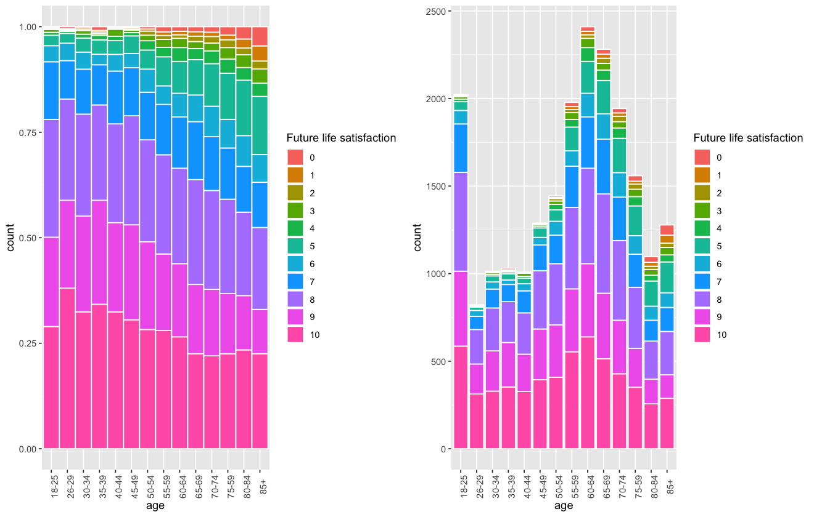
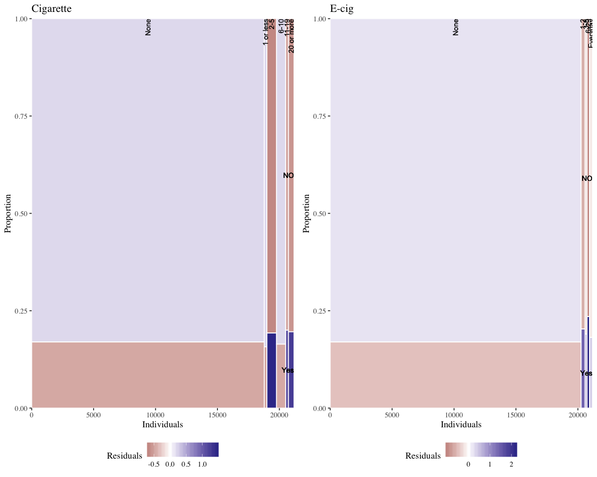
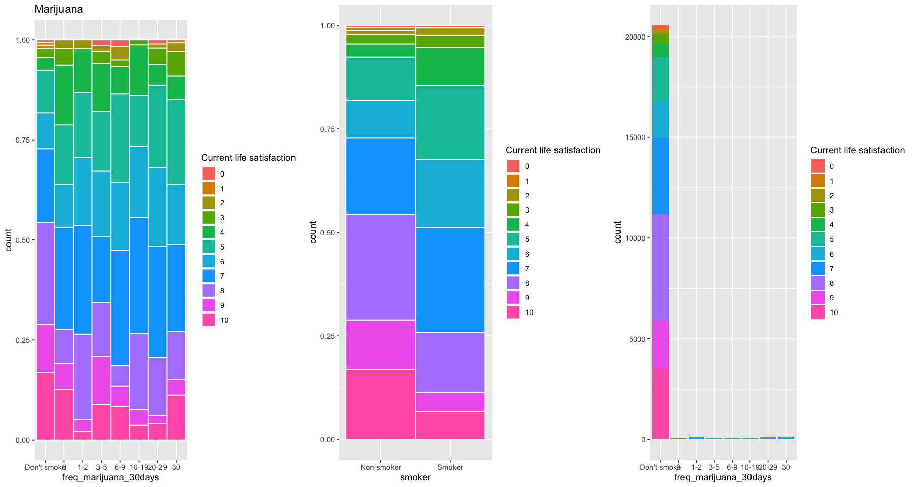
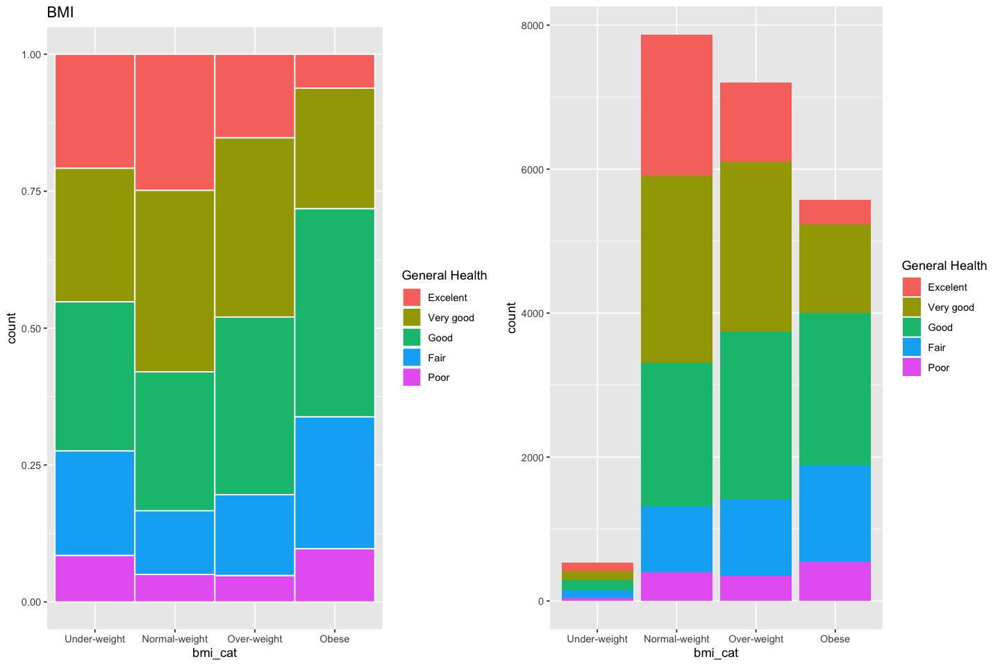

# CHIS - Exploratory Analysis

*Omar El Omeiri Filho, 2019*

---

### Table of Contents

* <u>[1 - Summary](#sum)</u>
* <u>[2 - Preparations](#prep)</u>
* <u>[3 - Data](#dat)</u>
    * <u>[3.1 - Preprocessing](#prepr)</u>
    * <u>[3.2 - Data Eyeballing](#data_eye)</u>
    * <u>[3.3 - Summary Statistics](#sum_stat)</u>
    * <u>[3.4 - Correlation Matrix](#cor_mat)</u>
    * <u>[3.5 - Renaming Categorical Variables](#rn_cat)</u>
* <u>[4 - Exploration](#expl)</u>
    * <u>[4.1 - Age](#age)</u>
        * <u>[4.1.1 - Age vs. Depression](#age_depr)</u>
        * <u>[4.1.2 - Age vs. Future Life Satisfaction](#age_fut)</u>
        * <u>[4.1.3 - Age vs. Current Life Satisfaction](#age_curr)</u>
        * <u>[4.1.3 - Age vs. General Health](#age_health)</u>
    * <u>[4.2 - Smoking Habits](#smok)</u>
        * <u>[4.2.1 - Smoking vs. Depression](#smok_depr)</u>
        * <u>[4.2.2 - Smoking vs. Future Life Satisfaction](#smok_fut)</u>
        * <u>[4.2.3 - Smoking vs. Current Life Satisfaction](#smok_curr)</u>
        * <u>[4.2.4 - Smoking vs. General Health](#smok_health)</u>
        * <u>[4.2.5 - Smoking vs. E.R. Last Year](#smok_er)</u>
        * <u>[4.2.6 - Smoking vs. Asthma](#smok_asthma)</u>
        * <u>[4.2.7 - Smoking vs. Diabetes](#smok_diab)</u>
        * <u>[4.2.8 - E-cig vs. Age](#ecig_age)</u>
    * <u>[4.3 - Marijuana](#mj)</u>
        * <u>[4.3.1 - Marijuana vs. Depression](#mj_depr)</u>
        * <u>[4.3.2 - Marijuana vs. Future Life Satisfaction](#mj_fut)</u>
        * <u>[4.3.3 - Marijuana vs. Current Life Satisfaction](#mj_curr)</u>
        * <u>[4.3.4 - Marijuana vs. Workload](#mj_work)</u>
        * <u>[4.3.5 - Marijuana vs. Age](#mj_age)</u>
        * <u>[4.3.6 - Marijuana vs. General Health](#mj_health)</u>
        * <u>[4.3.7 - Marijuana vs. E.R. Last Year](#mj_er)</u>
        * <u>[4.3.8 - Marijuana vs. Asthma](#mj_asthma)</u>
        * <u>[4.3.9 - Marijuana vs. Diabetes](#mj_diab)</u>
    * <u>[4.4 - Weekly Work Hours](#work)</u>
        * <u>[4.4.1 - Weekly Work Hours vs. Depression](#work_depr)</u>
        * <u>[4.4.2 - Weekly Work Hours vs. Future Life Satisfaction](#work_fut)</u>
        * <u>[4.4.3 - Weekly Work Hours vs. Current Life Satisfaction](#work_curr)</u>
        * <u>[4.4.4 - Weekly Work Hours vs. General Health](#work_health)</u>
        * <u>[4.4.5 - Weekly Work Hours vs. E.R. Last Year](#work_er)</u>
        * <u>[4.4.6 - Weekly Work Hours vs. Diabetes](#work_diab)</u>
    * <u>[4.5 - BMI](#bmi)</u>
        * <u>[4.5.1 - BMI vs. Depression](#bmi_depr)</u>
        * <u>[4.5.2 - BMI vs. Future Life Satisfaction](#bmi_fut)</u>
        * <u>[4.5.3 - BMI vs. Current Life Satisfaction](#bmi_curr)</u>
        * <u>[4.5.4 - BMI vs. General Health](#bmi_health)</u>
        * <u>[4.5.5 - BMI vs. E.R. Last Year](#bmi_er)</u>
        * <u>[4.5.6 - BMI vs. Diabetes](#bmi_diab)</u>


## 1 - Summary<a class='anchor' id='sum'></a>

&nbsp;&nbsp;&nbsp;&nbsp; <font size='2'>This report aims to explore and visualize the California Health Interview Survey dataset (CHIS). These data were acquired in [here](https://healthpolicy.ucla.edu/chis/data/Pages/GetCHISData.aspx) and is the largest health survey conducted in the USA. It contains a large variety of features (495), including health and economic measurements. To greatly simplify this work, I'll filter the variables which seem most important.</font>

# 2 - Preparations <a class='anchor' id='prep'></a>


```R
library(ggplot2)
library(tidyr)
library(dplyr)
library(GGally)
library(RColorBrewer)
library(grid)
library(sas7bdat)
library(haven)
library(stringr)
library(ggthemes)
library(corrplot)
library(gridExtra)
library(effsize)

options(repr.matrix.max.cols = 25)
opts <- options()
```

    
    Attaching package: ‘dplyr’
    
    The following objects are masked from ‘package:stats’:
    
        filter, lag
    
    The following objects are masked from ‘package:base’:
    
        intersect, setdiff, setequal, union
    
    Registered S3 method overwritten by 'GGally':
      method from   
      +.gg   ggplot2
    
    Attaching package: ‘GGally’
    
    The following object is masked from ‘package:dplyr’:
    
        nasa
    
    corrplot 0.84 loaded
    
    Attaching package: ‘gridExtra’
    
    The following object is masked from ‘package:dplyr’:
    
        combine
    


## 3 - Data  <a class='anchor' id='dat'></a>

Variables:

* AB1: General health condition
* AB17 : Has Asthma
* AB22: Has Diabetes
* AC82C_P1: E-cig usage
* AC146: Current life satisfaction rating
* AC147: Perceived future life satisfaction rating
* AC148:  Current financial satisfaction
* AH12: Visited ER last 12mos
* AJ32: Feel depressed last 30 days
* AK3_P1V2: Usual hours worked per week
* RBMI: BMI Category
* BMI_P: Body mass index
* AC117: Frequency of marijuana last 30 days
* NUMCIG: No. of cigarettes per day
* POVLL: Poverty level
* RACECN_P1: Race
* SRSEX: Sex
* SRAGE_P : Age

I'll try to model all of these characteristics against 4 variables:

* AB1: General health condition
* AC146: Current life satisfaction rating
* AC147: Perceived future life satisfaction rating
* AJ32: Feel depressed last 30 days


```R
chis <- read.sas7bdat("adult_2018_sas/adult.sas7bdat")
dim(chis)
```


<ol class=list-inline>
	<li>21177</li>
	<li>495</li>
</ol>


### 3.1 - Preprocessing<a class='anchor' id='prepr'></a>


```R
chis_filtered <- chis[,c('AB1', 'AB17', 'AB22', 'AC82C_P1', 'AC146', 'AC147', 'AC148', 'AC117',
                          'AH12', 'AJ32', 'AK3_P1V2', 'RBMI', 
                         'BMI_P', 'NUMCIG', 'SRSEX', 'SRAGE_P1', 'POVLL')]
```


```R
colnames(chis_filtered) <- c('gen_health', 'has_asthma', 'has_diabetes', 'ecig_usage_30days', 'curr_life_satisf',
                            'future_life_satisf', 'curr_fin_satisf', 'freq_marijuana_30days', 'ER_12mo',
                            'depressed_30days', 'weekly_work', 'bmi_cat', 'bmi',
                            'numcig', 'sex', 'age', 'pov_lvl')
```


```R
chis_filtered <- chis_filtered[,c('gen_health', 'has_asthma', 'has_diabetes', 'ecig_usage_30days', 'curr_fin_satisf', 
                                  'ER_12mo', 'weekly_work','bmi_cat', 'bmi', 'freq_marijuana_30days',
                                  'numcig', 'sex', 'age', 'pov_lvl', 
                                  'curr_life_satisf','future_life_satisf', 'depressed_30days' )]
```


```R

```
### 3.2 - Data Eyeballing<a class='anchor' id='data_eye'></a>

```R
head(chis_filtered)
```


<table>
<caption>A data.frame: 6 × 17</caption>
<thead>
	<tr><th scope=col>gen_health</th><th scope=col>has_asthma</th><th scope=col>has_diabetes</th><th scope=col>ecig_usage_30days</th><th scope=col>curr_fin_satisf</th><th scope=col>ER_12mo</th><th scope=col>weekly_work</th><th scope=col>bmi_cat</th><th scope=col>bmi</th><th scope=col>freq_marijuana_30days</th><th scope=col>numcig</th><th scope=col>sex</th><th scope=col>age</th><th scope=col>pov_lvl</th><th scope=col>curr_life_satisf</th><th scope=col>future_life_satisf</th><th scope=col>depressed_30days</th></tr>
	<tr><th scope=col>&lt;dbl&gt;</th><th scope=col>&lt;dbl&gt;</th><th scope=col>&lt;dbl&gt;</th><th scope=col>&lt;dbl&gt;</th><th scope=col>&lt;dbl&gt;</th><th scope=col>&lt;dbl&gt;</th><th scope=col>&lt;dbl&gt;</th><th scope=col>&lt;dbl&gt;</th><th scope=col>&lt;dbl&gt;</th><th scope=col>&lt;dbl&gt;</th><th scope=col>&lt;dbl&gt;</th><th scope=col>&lt;dbl&gt;</th><th scope=col>&lt;dbl&gt;</th><th scope=col>&lt;dbl&gt;</th><th scope=col>&lt;dbl&gt;</th><th scope=col>&lt;dbl&gt;</th><th scope=col>&lt;dbl&gt;</th></tr>
</thead>
<tbody>
	<tr><td>1</td><td>2</td><td>2</td><td>-1</td><td>10</td><td>2</td><td>-1</td><td>2</td><td>20.89</td><td>-1</td><td>1</td><td>2</td><td>85</td><td>4</td><td> 9</td><td>10</td><td>5</td></tr>
	<tr><td>1</td><td>1</td><td>2</td><td>-1</td><td> 8</td><td>1</td><td>-1</td><td>2</td><td>23.80</td><td>-1</td><td>1</td><td>1</td><td>80</td><td>4</td><td> 8</td><td> 8</td><td>5</td></tr>
	<tr><td>4</td><td>2</td><td>2</td><td>-1</td><td> 1</td><td>2</td><td> 3</td><td>3</td><td>29.82</td><td>-1</td><td>1</td><td>2</td><td>75</td><td>4</td><td> 2</td><td> 2</td><td>4</td></tr>
	<tr><td>5</td><td>2</td><td>2</td><td>-1</td><td> 5</td><td>2</td><td>-1</td><td>4</td><td>32.10</td><td>-1</td><td>1</td><td>2</td><td>60</td><td>4</td><td> 6</td><td> 6</td><td>4</td></tr>
	<tr><td>2</td><td>2</td><td>2</td><td>-1</td><td> 8</td><td>2</td><td>-1</td><td>2</td><td>21.62</td><td>-1</td><td>1</td><td>1</td><td>75</td><td>1</td><td> 5</td><td> 8</td><td>4</td></tr>
	<tr><td>3</td><td>2</td><td>2</td><td>-1</td><td>10</td><td>2</td><td>-1</td><td>3</td><td>26.66</td><td>-1</td><td>1</td><td>1</td><td>65</td><td>4</td><td>10</td><td> 8</td><td>5</td></tr>
</tbody>
</table>


```R
str(chis_filtered)
```

    'data.frame':	21177 obs. of  17 variables:
     $ gen_health           : num  1 1 4 5 2 3 4 3 5 2 ...
     $ has_asthma           : num  2 1 2 2 2 2 2 2 2 2 ...
     $ has_diabetes         : num  2 2 2 2 2 2 2 2 2 2 ...
     $ ecig_usage_30days    : num  -1 -1 -1 -1 -1 -1 -1 -1 -1 -1 ...
     $ curr_fin_satisf      : num  10 8 1 5 8 10 7 5 6 10 ...
     $ ER_12mo              : num  2 1 2 2 2 2 1 2 2 2 ...
     $ weekly_work          : num  -1 -1 3 -1 -1 -1 -1 -1 7 -1 ...
     $ bmi_cat              : num  2 2 3 4 2 3 2 3 2 2 ...
     $ bmi                  : num  20.9 23.8 29.8 32.1 21.6 ...
     $ freq_marijuana_30days: num  -1 -1 -1 -1 -1 -1 -1 -1 -1 -1 ...
     $ numcig               : num  1 1 1 1 1 1 1 4 1 1 ...
     $ sex                  : num  2 1 2 2 1 1 2 2 1 2 ...
     $ age                  : num  85 80 75 60 75 65 65 65 70 85 ...
     $ pov_lvl              : num  4 4 4 4 1 4 2 4 2 3 ...
     $ curr_life_satisf     : num  9 8 2 6 5 10 7 6 7 8 ...
     $ future_life_satisf   : num  10 8 2 6 8 8 7 8 7 8 ...
     $ depressed_30days     : num  5 5 4 4 4 5 5 3 4 5 ...


### 3.3 - Summary Statistics<a class='anchor' id='sum_stat'></a>


```R
summ <- data.frame(summary(chis_filtered))
summ$Var1 <- rep(seq(1:6), ncol(chis_filtered))

summ <- summ %>%
            spread(Var2, Freq)


cols <- str_trim(colnames(summ))
colnames(summ) <- cols
stat <- unname(t(data.frame(lapply(summ$gen_health, function(x){str_split(x, ':')[[1]][1]}))))
summ <- cbind(stat, summ[,-1])


summ <- cbind(stat, data.frame(do.call(cbind, lapply(colnames(summ)[-1], function(col){
    substring(summ[,col], regexpr(":", summ[,col]) + 1)
}))))

colnames(summ) <- cols


t(summ)
```


<table>
<caption>A matrix: 18 × 6 of type chr</caption>
<tbody>
	<tr><th scope=row>Var1</th><td>Min.    </td><td>1st Qu. </td><td>Median  </td><td>Mean    </td><td>3rd Qu. </td><td>Max.    </td></tr>
	<tr><th scope=row>gen_health</th><td>1.000   </td><td>2.000   </td><td>3.000   </td><td>2.658   </td><td>3.000   </td><td>5.000   </td></tr>
	<tr><th scope=row>has_asthma</th><td>1.000   </td><td>2.000   </td><td>2.000   </td><td>1.829   </td><td>2.000   </td><td>2.000   </td></tr>
	<tr><th scope=row>has_diabetes</th><td>1.000   </td><td>2.000   </td><td>2.000   </td><td>1.886   </td><td>2.000   </td><td>3.000   </td></tr>
	<tr><th scope=row>ecig_usage_30days</th><td>-1.000  </td><td>-1.000  </td><td>-1.000  </td><td>-0.625  </td><td>-1.000  </td><td> 5.000  </td></tr>
	<tr><th scope=row>curr_fin_satisf</th><td> 0.000  </td><td> 5.000  </td><td> 7.000  </td><td> 6.485  </td><td> 8.000  </td><td>10.000  </td></tr>
	<tr><th scope=row>ER_12mo</th><td>-1.000  </td><td> 2.000  </td><td> 2.000  </td><td> 1.731  </td><td> 2.000  </td><td> 2.000  </td></tr>
	<tr><th scope=row>weekly_work</th><td>-1.000  </td><td>-1.000  </td><td> 2.000  </td><td> 2.367  </td><td> 6.000  </td><td>10.000  </td></tr>
	<tr><th scope=row>bmi_cat</th><td>1.000   </td><td>2.000   </td><td>3.000   </td><td>2.842   </td><td>4.000   </td><td>4.000   </td></tr>
	<tr><th scope=row>bmi</th><td> 12.65  </td><td> 23.16  </td><td> 26.37  </td><td> 27.40  </td><td> 30.31  </td><td>123.97  </td></tr>
	<tr><th scope=row>freq_marijuana_30days</th><td>-1.000  </td><td>-1.000  </td><td>-1.000  </td><td>-0.845  </td><td>-1.000  </td><td> 7.000  </td></tr>
	<tr><th scope=row>numcig</th><td>1.000   </td><td>1.000   </td><td>1.000   </td><td>1.336   </td><td>1.000   </td><td>6.000   </td></tr>
	<tr><th scope=row>sex</th><td>1.000   </td><td>1.000   </td><td>2.000   </td><td>1.539   </td><td>2.000   </td><td>2.000   </td></tr>
	<tr><th scope=row>age</th><td>18.00   </td><td>40.00   </td><td>55.00   </td><td>54.11   </td><td>70.00   </td><td>85.00   </td></tr>
	<tr><th scope=row>pov_lvl</th><td>1.000   </td><td>2.000   </td><td>4.000   </td><td>3.097   </td><td>4.000   </td><td>4.000   </td></tr>
	<tr><th scope=row>curr_life_satisf</th><td> 0.000  </td><td> 6.000  </td><td> 8.000  </td><td> 7.356  </td><td> 9.000  </td><td>10.000  </td></tr>
	<tr><th scope=row>future_life_satisf</th><td> 0.000  </td><td> 7.000  </td><td> 8.000  </td><td> 7.901  </td><td>10.000  </td><td>10.000  </td></tr>
	<tr><th scope=row>depressed_30days</th><td>-2.000  </td><td> 5.000  </td><td> 5.000  </td><td> 4.676  </td><td> 5.000  </td><td> 5.000  </td></tr>
</tbody>
</table>


<font size = '1'>From this plot, we can see that not a lot of features are strongly correlated to our outcome variables.<br>
But it is worth commenting that perceived general health and perceived financial satisfaction play a major role in ones life quality.<br>
I was hoping marijuana and cigarrete usage would play a role also, but we'll investigate further</font>

### 3.4 - Correlation Matrix<a class-='anchor' id='cor_mat'></a>


```R
cor_matrix <- cor(chis_filtered)

options(repr.plot.width = 10, repr.plot.height = 10)
corrplot(cor_matrix, method = 'color', addCoef.col = T, number.cex = 0.6)
```


### 3.5 - Renaming Categorical Variables <a class='anchor' id='rn_cat'></a>


```R
chis_filtered$pov_lvl <- factor(chis_filtered$pov_lvl, labels = c('0-99%', '100-299%', '200-299%', '>300%'))
chis_filtered$bmi_cat <- factor(chis_filtered$bmi_cat, labels = c("Under-weight", "Normal-weight", "Over-weight", "Obese"))
chis_filtered$depressed_30days <- factor(chis_filtered$depressed_30days, labels = c('NA', 'All the time', 'Most of the time', 'Some of the time', 'A little', 'Not at all'))
chis_filtered$ER_12mo <- factor(chis_filtered$ER_12mo, labels = c('NA', 'Yes', 'No'))
chis_filtered$numcig <- factor(chis_filtered$numcig, labels = c('None', '1 or less', '2-5', '6-10', '11-19', '20 or more'))
chis_filtered$ecig_usage_30days <- ifelse(chis_filtered$ecig_usage_30days == -1 | chis_filtered$ecig_usage_30days == 1, 0, chis_filtered$ecig_usage_30days)
chis_filtered$ecig_usage_30days <- factor(chis_filtered$ecig_usage_30days, labels = c('None', '1-2', '3-5', '6-29', 'Everyday'))
chis_filtered$has_asthma <- factor(chis_filtered$has_asthma, labels = c('Yes', 'NO'))
chis_filtered$freq_marijuana_30days <- factor(chis_filtered$freq_marijuana_30days, labels = c("Don't smoke", '0', '1-2', '3-5', '6-9', '10-19', '20-29', '30'))
chis_filtered$gen_health <- factor(chis_filtered$gen_health, labels = c('Excelent', 'Very good', 'Good', 'Fair', 'Poor'))
chis_filtered$has_diabetes <- factor(chis_filtered$has_diabetes, labels = c('Yes', 'No', 'Pre-Diabetes'))
chis_filtered$age <- factor(chis_filtered$age, labels = c('18-25', '26-29', '30-34', '35-39', '40-44', '45-49', '50-54', '55-59', '60-64', '65-69', '70-74', '75-59', '80-84', '85+'))
chis_filtered$weekly_work <- ifelse(chis_filtered$weekly_work == -1, 0, chis_filtered$weekly_work)
```

## Chi-squared Mosaic helper function


```R
mosaic <-function(data, X, FILL, hjustx = 1, title = '') {
    library(reshape2)
  # Proportions in raw data
  DF <- as.data.frame.matrix(table(data[[X]], data[[FILL]]))
  DF$groupSum <- rowSums(DF)
  DF$xmax <- cumsum(DF$groupSum)
  DF$xmin <- DF$xmax - DF$groupSum
  DF$X <- row.names(DF)
  DF$groupSum <- NULL
  DF_melted <- melt(DF, id = c("X", "xmin", "xmax"), variable.name = "FILL")
  DF_melted <- DF_melted %>%
    group_by(X) %>%
    mutate(ymax = cumsum(value/sum(value)),
           ymin = ymax - value/sum(value))

  # Chi-sq test
  results <- suppressWarnings(chisq.test(table(data[[FILL]], data[[X]]))) # fill and then x
  resid <- melt(results$residuals)
  names(resid) <- c("FILL", "X", "residual")
  print(results)
  # Merge data
  DF_all <- merge(DF_melted, resid)

  # Positions for labels
  DF_all$xposn <- DF_all$xmin + (DF_all$xmax - DF_all$xmin)/2
  index <- DF_all$xmax == max(DF_all$xmax)
  DF_all$yposn <- DF_all$ymin[index] + (DF_all$ymax[index] - DF_all$ymin[index])/2

  # Plot
  g <- ggplot(DF_all, aes(ymin = ymin,  ymax = ymax, xmin = xmin,
                          xmax = xmax, fill = residual)) +
  geom_rect(col = "white") +
  geom_text(aes(x = xposn, label = X),
            y = 1, size = 3, angle = 90, hjust = hjustx, show.legend = FALSE) +
  geom_text(aes(x = max(xmax),  y = yposn, label = FILL),
            size = 3, hjust = 1, show.legend = FALSE) +
  scale_fill_gradient2("Residuals") +
  scale_x_continuous("Individuals", expand = c(0,0)) +
  scale_y_continuous("Proportion", expand = c(0,0)) +
  theme_tufte() +
  theme(legend.position = "bottom")+
  ggtitle(title)
  return(g)
}
```

## 4 - Exploration <a class='anchor' id='expl'></a>

### 4.1 - Age <a class='anchor' id='age'></a>


```R


options(opts)
ggplot(chis_filtered, aes(x = age)) + 
    geom_histogram(stat = 'count')
```

    Warning message:
    “Ignoring unknown parameters: binwidth, bins, pad”


### 4.1.1 Age vs Depression <a class='anchor' id='age_depr'></a>

<font size='1'> In these plots below, we se a small trend between age and depression, younger people tend to be more depressed.<br></font>

H0: Depression is equal for all ages, meaning independence<br>
H1: Depression is not equal for all ages, meaning they are dependent on each other<br>

The chi-squared test, tells us that it is very unlikely that we got this result by random chance, so we reject the null hypothesis and we can safeloy state that age and depression are dependent.
    


```R
options(opts)
options(repr.plot.width = 12)
p1 <- ggplot(chis_filtered, aes(x = age, fill = depressed_30days)) +
    geom_bar(position = 'fill', color = 'white', width = 1) +
    labs(fill = 'Depressed last 30 days') +
    theme(axis.text.x = element_text(angle = 90))

p2 <- ggplot(chis_filtered, aes(x = age, fill = depressed_30days)) +
    geom_histogram(stat = 'count') +
    labs(fill = 'Depressed last 30 days') +
    theme(axis.text.x = element_text(angle = 90))

grid.arrange(p1, p2, nrow = 1)
```

    Warning message:
    “Ignoring unknown parameters: binwidth, bins, pad”


```R
mosaic(chis_filtered, 'depressed_30days', 'age')
```

    
    	Pearson's Chi-squared test
    
    data:  table(data[[FILL]], data[[X]])
    X-squared = 508.38, df = 65, p-value < 2.2e-16
    


### 4.1.2 - Age vs Future life satifaction<a class='anchor' id='age_fut'></a>

<font size='1'> In these plots below, we se a small trend between age and depression, very young people tend to be less satisfied than middle agers, but from then on, there is a decrease in future life satisfaction as age increases.<br></font>

H0: Future life satisfaction is equal for all ages, meaning independence<br>
H1: Future life satisfaction is not equal for all ages, meaning they are dependent on each other<br>

The chi-squared test, tells us that it is very unlikely that we got this result by random chance, so we reject the null hypothesis and we can safely state that age and future life satisfaction are dependent.
    


```R
options(opts)
options(repr.plot.width = 11)

p1 <- ggplot(chis_filtered, aes(x = age, fill = factor(future_life_satisf))) +
    geom_bar(position = 'fill', color = 'white', width = 1) +
    labs(fill = 'Future life satisfaction') +
    theme(axis.text.x = element_text(angle = 90))

p2 <- ggplot(chis_filtered, aes(x = age, fill = factor(future_life_satisf))) +
    geom_histogram(stat = 'count', color = 'white') +
    labs(fill = 'Future life satisfaction') +
    theme(axis.text.x = element_text(angle = 90))

grid.arrange(p1, p2, nrow = 1)
```

    Warning message:
    “Ignoring unknown parameters: binwidth, bins, pad”





```R
mosaic(chis_filtered, 'future_life_satisf', 'age')
```

    
    	Pearson's Chi-squared test
    
    data:  table(data[[FILL]], data[[X]])
    X-squared = 1473.2, df = 130, p-value < 2.2e-16
    


### 4.1.3 - Age vs Current life satisfaction<a class='anchor' id='age_curr'></a>

<font size='1'> In these plots below, we se a positive correlation  between age and current life satisfaction, younger people tend to be less satisfied.<br></font>

H0: Current life satisfaction is equal for all ages, meaning independence<br>
H1: Current life satisfaction is not equal for all ages, meaning they are dependent on each other<br>

The chi-squared test, tells us that it is very unlikely that we got this result by random chance, so we reject the null hypothesis and we can safely state that age and cuurent life satisfaction are dependent.
    


```R
options(opts)
options(repr.plot.width = 11)

p1 <- ggplot(chis_filtered, aes(x = age, fill = factor(curr_life_satisf))) +
    geom_bar(position = 'fill', color = 'white', width = 1) +
    labs(fill = 'Current life satisfaction') +
    theme(axis.text.x = element_text(angle = 90))

p2 <- ggplot(chis_filtered, aes(x = age, fill = factor(curr_life_satisf))) +
    geom_histogram(stat = 'count', color = 'white') +
    labs(fill = 'Current life satisfaction') +
    theme(axis.text.x = element_text(angle = 90))

grid.arrange(p1, p2, nrow = 1)
```

    Warning message:
    “Ignoring unknown parameters: binwidth, bins, pad”


```R
mosaic(chis_filtered, 'curr_life_satisf', 'age')
```

    
    	Pearson's Chi-squared test
    
    data:  table(data[[FILL]], data[[X]])
    X-squared = 1795.5, df = 130, p-value < 2.2e-16
    


### 4.1.4 Age vs General health<a class='anchor' id='age_health'></a>


<font size='1'> In these plots below, we se a very small positive linear dependency between age and current general health, younger people tend to perceive themselves as less healthy.<br></font>

I'll not perfom a chi-squared test here, because the dependency is almost negligible.


```R
options(opts)
options(repr.plot.width = 11)


p1 <- ggplot(chis_filtered, aes(x = age, fill = factor(gen_health))) +
    geom_bar(position = 'fill', color = 'white', width = 1) +
    labs(fill = 'General Health') +
    theme(axis.text.x = element_text(angle = 90))

p2 <- ggplot(chis_filtered, aes(x = age, fill = factor(gen_health))) +
    geom_bar(stat = 'count', color = 'white') +
    labs(fill = 'General Health') +
    theme(axis.text.x = element_text(angle = 90))

grid.arrange(p1, p2, nrow = 1)
```


### 4.2 - Smoking Habits<a class='anchor' id='smok'></a>
<font size='1'>There are too few smokers for us to make meaningful inferences.</font>

### Cigarette


```R
smokers <- ifelse(chis_filtered$numcig == 'None' | chis_filtered$numcig == '1 or less' , 0, 1)
smokers <- data.frame(cbind(smoker = smokers, depressed_30days = chis_filtered$depressed_30days, curr_life_satisf = chis_filtered$curr_life_satisf,
                            future_life_satisf = chis_filtered$future_life_satisf, gen_health = chis_filtered$gen_health, ER_12mo = chis_filtered$ER_12mo,
                           has_asthma = chis_filtered$has_asthma, has_diabetes = chis_filtered$has_diabetes))
smokers$smoker <- factor(smokers$smoker, labels = c('Non-smoker', 'Smoker'))

smokers$depressed_30days <- factor(smokers$depressed_30days, labels = c('NA', 'All the time', 'Most of the time', 'Some of the time', 'A little', 'Not at all'))
smokers$gen_health <- factor(chis_filtered$gen_health, labels = c('Excelent', 'Very good', 'Good', 'Fair', 'Poor'))
smokers$has_diabetes <- factor(smokers$has_diabetes, labels = c('Yes', 'No', 'Pre-diabetes'))
smokers$ER_12mo <- factor(smokers$ER_12mo, labels = c('NA', 'Yes', 'No'))


p1 <- ggplot(chis_filtered, aes(x = numcig)) + 
    geom_bar() +
    ggtitle('Cigarettes')


p2 <- ggplot(smokers, aes(x = smoker)) + 
    geom_bar()

grid.arrange(p1, p2, nrow = 1)
```


### E-cig


```R
esmokers <- ifelse(chis_filtered$ecig_usage_30days == 'None' | chis_filtered$ecig_usage_30days == '1-2' , 0, 1)
esmokers <- data.frame(cbind(smoker = esmokers, depressed_30days = chis_filtered$depressed_30days, curr_life_satisf = chis_filtered$curr_life_satisf,
                            future_life_satisf = chis_filtered$future_life_satisf, gen_health = chis_filtered$gen_health, ER_12mo = chis_filtered$ER_12mo,
                            has_asthma = chis_filtered$has_asthma), has_diabetes = chis_filtered$has_diabetes)
esmokers$smoker <- factor(esmokers$smoker, labels = c('Non-smoker', 'Smoker'))

esmokers$depressed_30days <- factor(esmokers$depressed_30days, labels = c('NA', 'All the time', 'Most of the time', 'Some of the time', 'A little', 'Not at all'))
esmokers$gen_health <- factor(chis_filtered$gen_health, labels = c('Excelent', 'Very good', 'Good', 'Fair', 'Poor'))
esmokers$has_diabetes <- factor(smokers$has_diabetes, labels = c('Yes', 'No', 'Pre-diabetes'))
esmokers$ER_12mo <- factor(smokers$ER_12mo, labels = c('NA', 'Yes', 'No'))


p1 <- ggplot(chis_filtered, aes(x = numcig)) + 
    geom_bar() +
    ggtitle('E-cigs')


p2 <- ggplot(esmokers, aes(x = smoker)) + 
    geom_bar()

grid.arrange(p1, p2, nrow = 1)
```


### 4.2.1 - Smoking vs Depression<a class='anchor' id='smok_depr'></a>

<font size='1'> Cigarettes can play some role in increasing depression. Again, smokers are very under-represented in our data, but still.<br></font>

H0: Being a smoker does not affect depression<br>
H1: Being a smoker plays a role in depression<br>

The chi-squared test, tells us that it is very unlikely that we got this result by random chance, so we reject the null hypothesis and we can have a clue that being a smoker plays a role in depression, but we cannot safely state it, because we have too few smokers to enforce this affirmation.


```R
# Incredibly enough, in these data 
options(repr.plot.width = 12, repr.plot.height = 10)

p1 <- ggplot(chis_filtered, aes(x = numcig, fill = factor(depressed_30days))) +
    geom_bar(position = 'fill', color = 'white', width = 1) +
    labs(fill = 'Depression') +
    ggtitle('Cigarette Usage')

p2 <- ggplot(smokers, aes(x = smoker, fill = factor(depressed_30days))) +
    geom_bar(position = 'fill', color = 'white', width = 1) +
    labs(fill = 'Depression')

p3 <- ggplot(chis_filtered, aes(x = ecig_usage_30days, fill = factor(depressed_30days))) +
    geom_bar(position = 'fill', color = 'white', width = 1) +
    labs(fill = 'Depression') +
    ggtitle('E-cig Usage')

p4 <- ggplot(esmokers, aes(x = smoker, fill = factor(depressed_30days))) +
    geom_bar(position = 'fill', color = 'white', width = 1) +
    labs(fill = 'Depression')

grid.arrange(p1,p2, p3, p4, nrow = 2)
```


```R
options(repr.plot.width = 12)
p1 <- mosaic(smokers, 'depressed_30days', 'smoker', hjustx = 2, title = 'Cigarette')
p2 <- mosaic(esmokers, 'depressed_30days', 'smoker', hjustx = 2, title = 'E-cig')

grid.arrange(p1, p2, nrow = 1)
```

    
    	Pearson's Chi-squared test
    
    data:  table(data[[FILL]], data[[X]])
    X-squared = 435.21, df = 5, p-value < 2.2e-16
    
    
    	Pearson's Chi-squared test
    
    data:  table(data[[FILL]], data[[X]])
    X-squared = 149.54, df = 5, p-value < 2.2e-16
    


### 4.2.2 - Smoking vs Future Life Satisfaction<a class='anchor' id='smok_fut'></a>

<font size='1'> Looks like noise to me.</font>


```R


options(repr.plot.width = 15, repr.plot.height = 10)

p1 <- ggplot(chis_filtered, aes(x = numcig, fill = factor(future_life_satisf))) +
    geom_bar(position = 'fill', color = 'white', width = 1) +
    labs(fill = 'Future life satisfaction') +
    ggtitle('Cigarette')

p2 <-  ggplot(smokers, aes(x = smoker, fill = factor(future_life_satisf))) +
    geom_bar(position = 'fill', color = 'white', width = 1) +
    labs(fill = 'Future life satisfaction')

p3 <- ggplot(chis_filtered, aes(x = numcig, fill = factor(future_life_satisf))) +
    geom_histogram(stat = 'count') +
    labs(fill = 'Future life satisfaction') +
    ggtitle('Cigarette')

p4 <- ggplot(chis_filtered, aes(x = ecig_usage_30days, fill = factor(future_life_satisf))) +
    geom_bar(position = 'fill', color = 'white', width = 1) +
    labs(fill = 'Future life satisfaction') +
    ggtitle('E-cig')

p5 <- ggplot(esmokers, aes(x = smoker, fill = factor(future_life_satisf))) +
    geom_bar(position = 'fill', color = 'white', width = 1) +
    labs(fill = 'Future life satisfaction')


p6 <- ggplot(chis_filtered, aes(x = ecig_usage_30days, fill = factor(future_life_satisf))) +
    geom_histogram(stat = 'count') +
    labs(fill = 'Future life satisfaction') +
    ggtitle('E-cig')

grid.arrange(p1,p2, p3, p4, p5, p6, nrow = 2)
```

    Warning message:
    “Ignoring unknown parameters: binwidth, bins, pad”Warning message:
    “Ignoring unknown parameters: binwidth, bins, pad”


### 4.2.3 - Smoking vs Current life satisfaction<a class='anchor' id='curr_depr'></a>

<font size = '1'>Here we see that smokers tend to be less satisfied with their lives, as expected, since cigarette users have a higher rate of depression.<br>
Also, the proportion of smokers is much higher in the low end of satisfaction level.<br>
We can sucessfully reject the null Hypothesis and claim that smoking has an effect of perceived life satisfaction.</font>


```R
# Looks like noise to me
options(opts)
options(repr.plot.width = 15, repr.plot.height = 10)

p1 <- ggplot(chis_filtered, aes(x = numcig, fill = factor(curr_life_satisf))) +
    geom_bar(position = 'fill', color = 'white', width = 1) +
    labs(fill = 'Current life satisfation') +
    ggtitle('Cigarette')

p2 <- ggplot(smokers, aes(x = smoker, fill = factor(curr_life_satisf))) +
    geom_bar(position = 'fill', color = 'white', width = 1) +
    labs(fill = 'Current life satisfaction')

p3 <- ggplot(smokers, aes(x = smoker, y = curr_life_satisf, fill = smoker)) +
    geom_violin() +
    labs(fill = 'Current life satisfation') +
    theme(legend.position = 'none')

p4 <- ggplot(chis_filtered, aes(x = ecig_usage_30days, fill = factor(curr_life_satisf))) +
    geom_bar(position = 'fill', color = 'white', width = 1) +
    labs(fill = 'Current life satisfation') +
    ggtitle('E-cig')

p5 <- ggplot(esmokers, aes(x = smoker, fill = factor(curr_life_satisf))) +
    geom_bar(position = 'fill', color = 'white', width = 1) +
    labs(fill = 'Current life satisfaction')

p6 <- ggplot(esmokers, aes(x = smoker, y = curr_life_satisf, fill = smoker)) +
    geom_violin() +
    labs(fill = 'Current life satisfation') +
    theme(legend.position = 'none')

grid.arrange(p1, p2, p3, p4, p5, p6, nrow = 2)
```


```R
options(opts)
options(repr.plot.width = 10)
p1 <- mosaic(smokers, 'curr_life_satisf', 'smoker', title = 'Cigarette')
p2 <- mosaic(esmokers, 'curr_life_satisf', 'smoker', title = 'E-cig')

grid.arrange(p1, p2, nrow = 1)
```

    
    	Pearson's Chi-squared test
    
    data:  table(data[[FILL]], data[[X]])
    X-squared = 604.62, df = 10, p-value < 2.2e-16
    
    
    	Pearson's Chi-squared test
    
    data:  table(data[[FILL]], data[[X]])
    X-squared = 159.28, df = 10, p-value < 2.2e-16
    


### 4.2.4 - Smoking vs. General health<a class='anchor' id='smok_health'></a>

<font size = '2'> Cigarette consumption seems to affect general health negatively, as expected. <br>
---
H0: Cigarrete consumption has no effect on general health<br>
H1: Cigarette plays a role in general health<br>
Looking at the chi-squared test below, we can safely reject the null hypothesis and say that cigarette smoking plays a major role in general health. But we can't make the same causal claim for E-cig smokers, this is due to the extreme under-representativeness of E-cig smokers in our dataset.</font>


```R
options(repr.plot.height = 10, repr.plot.width = 15)

p1 <- ggplot(chis_filtered, aes(x = numcig, fill = factor(gen_health))) +
    geom_bar(position = 'fill', color = 'white', width = 1) +
    labs(fill = 'General Health') +
    ggtitle('Cigarette')

p2 <-  ggplot(smokers, aes(x = smoker, fill = factor(gen_health))) +
    geom_bar(position = 'fill', color = 'white', width = 1) +
    labs(fill = 'General Health')

p3 <- ggplot(chis_filtered, aes(x = numcig, fill = factor(gen_health))) +
    geom_histogram(stat = 'count') +
    labs(fill = 'General Health') +
    ggtitle('Cigarette')

p4 <- ggplot(chis_filtered, aes(x = numcig, fill = factor(gen_health))) +
    geom_bar(position = 'fill', color = 'white', width = 1) +
    labs(fill = 'General Health') +
    ggtitle('E-cig')

p5 <-  ggplot(smokers, aes(x = smoker, fill = factor(gen_health))) +
    geom_bar(position = 'fill', color = 'white', width = 1) +
    labs(fill = 'General Health')

p6 <- ggplot(chis_filtered, aes(x = numcig, fill = factor(gen_health))) +
    geom_bar(stat = 'count') +
    labs(fill = 'General Health') +
    ggtitle('E-cig')

grid.arrange(p1, p2, p3, p4, p5, p6, nrow = 2)
```

    Warning message:
    “Ignoring unknown parameters: binwidth, bins, pad”


```R
options(opts)
options(repr.plot.width = 10)
p1 <- mosaic(chis_filtered, 'numcig', 'gen_health', title = 'Cigarette')
p2 <- mosaic(chis_filtered, 'ecig_usage_30days', 'gen_health', title = 'E-cig')

grid.arrange(p1, p2, nrow = 1)
```

    
    	Pearson's Chi-squared test
    
    data:  table(data[[FILL]], data[[X]])
    X-squared = 375.99, df = 20, p-value < 2.2e-16
    
    
    	Pearson's Chi-squared test
    
    data:  table(data[[FILL]], data[[X]])
    X-squared = 21.366, df = 16, p-value = 0.1648
    


### 4.2.5 - Cigarette usage vs. ER in the last 12 months<a class='anchor' id='smok_er'></a>

<font size = '1'>In this plot below, we notice that smokers show up in the ER more often than non-smokers.</font>


```R
options(opts)
options(repr.plot.width = 16)

p1 <- ggplot(chis_filtered, aes(x = numcig, fill = factor(ER_12mo))) +
    geom_bar(position = 'fill', color = 'white', width = 1) +
    labs(fill = '    Visited ER \nin past 12 months')+
    ggtitle('Cigarette')

p2 <- ggplot(chis_filtered, aes(x = numcig, fill = factor(ER_12mo))) +
    geom_histogram(stat = 'count') +
    labs(fill = '    Visited ER \nin past 12 months')+
    ggtitle('Cigarette')

p3 <- ggplot(smokers, aes(x = smoker, fill = factor(ER_12mo))) +
    geom_bar(position = 'fill', color = 'white', width = 1) +
    labs(fill = '    Visited ER \nin past 12 months')+
    ggtitle('Cigarette')

p4 <- ggplot(chis_filtered, aes(x = ecig_usage_30days, fill = factor(ER_12mo))) +
    geom_bar(position = 'fill', color = 'white', width = 1) +
    labs(fill = '    Visited ER \nin past 12 months')+
    ggtitle('E-cig')

p5 <- ggplot(chis_filtered, aes(x = ecig_usage_30days, fill = factor(ER_12mo))) +
    geom_histogram(stat = 'count') +
    labs(fill = '    Visited ER \nin past 12 months')+
    ggtitle('E-cig')

p6 <- ggplot(esmokers, aes(x = smoker, fill = factor(ER_12mo))) +
    geom_bar(position = 'fill', color = 'white', width = 1) +
    labs(fill = '    Visited ER \nin past 12 months')+
    ggtitle('E-cig')

grid.arrange(p1, p2, p3, p4, p5, p6, nrow = 2)
```

    Warning message:
    “Ignoring unknown parameters: binwidth, bins, pad”Warning message:
    “Ignoring unknown parameters: binwidth, bins, pad”


```R
p1 <- mosaic(chis_filtered, 'numcig', 'ER_12mo', title = 'Cigarette')
p2 <- mosaic(chis_filtered, 'ecig_usage_30days', 'ER_12mo', title = 'E-cig')

grid.arrange(p1, p2, nrow = 1)
```

    
    	Pearson's Chi-squared test
    
    data:  table(data[[FILL]], data[[X]])
    X-squared = 99.316, df = 10, p-value < 2.2e-16
    
    
    	Pearson's Chi-squared test
    
    data:  table(data[[FILL]], data[[X]])
    X-squared = 28.748, df = 8, p-value = 0.000351
    


### 4.2.6 - Cigarette usage vs. Asthma<a class='anchor' id='smok_asthma'></a>

<font size = '1'>Oddly, in these data people who smoke show only a slight higher rate of asthma, but we cannot make this claim as we were unable to reject the null hypothesis.</font>


```R
options(opts)
options(repr.plot.width = 16)

p1 <- ggplot(chis_filtered, aes(x = numcig, fill = factor(has_asthma))) +
    geom_bar(position = 'fill', color = 'white', width = 1) +
    labs(fill = 'Has asthma') +
    ggtitle('Cigarette')

p2 <- ggplot(chis_filtered, aes(x = numcig, fill = factor(has_asthma))) +
    geom_histogram(stat = 'count') +
    labs(fill = 'Has asthma') 

p3 <- ggplot(smokers, aes(x = smoker, fill = factor(has_asthma))) +
    geom_bar(position = 'fill', color = 'white', width = 1) +
    labs(fill = 'Has asthma')


p4 <- ggplot(chis_filtered, aes(x = ecig_usage_30days, fill = factor(has_asthma))) +
    geom_bar(position = 'fill', color = 'white', width = 1) +
    labs(fill = 'Has asthma')+ 
    ggtitle('E-cig')


p5 <- ggplot(chis_filtered, aes(x = ecig_usage_30days, fill = factor(has_asthma))) +
    geom_histogram(stat = 'count') +
    labs(fill = 'Has asthma')

p6 <- ggplot(esmokers, aes(x = smoker, fill = factor(has_asthma))) +
    geom_bar(position = 'fill', color = 'white', width = 1) +
    labs(fill = 'Has asthma')

grid.arrange(p1, p2, p3, p4, p5, p6, nrow = 2)
```

    Warning message:
    “Ignoring unknown parameters: binwidth, bins, pad”Warning message:
    “Ignoring unknown parameters: binwidth, bins, pad”


```R

options(repr.plot.width = 10, repr.plot.height = 8)

p1 <- mosaic(chis_filtered, 'numcig', 'has_asthma', title = 'Cigarette')
p2 <- mosaic(chis_filtered, 'ecig_usage_30days', 'has_asthma', title = 'E-cig')

grid.arrange(p1, p2, nrow = 1)
```

    
    	Pearson's Chi-squared test
    
    data:  table(data[[FILL]], data[[X]])
    X-squared = 6.6254, df = 5, p-value = 0.25
    
    
    	Pearson's Chi-squared test
    
    data:  table(data[[FILL]], data[[X]])
    X-squared = 8.9722, df = 4, p-value = 0.0618
    





### 4.2.7 - Cigarette usage vs. Diabetes<a class='anchor' id='smok_diab'></a>

<font size = '1'>Cigarette smokers don't show different levels of diabetes, but E-cig smokers show lower incidence of diabetes, that is strange, maybe E-cig smoker are younger. Let's check it below.</font>


```R
options(opts)
options(repr.plot.width = 16)

p1 <- ggplot(chis_filtered, aes(x = numcig, fill = factor(has_diabetes))) +
    geom_bar(position = 'fill', color = 'white', width = 1) +
    labs(fill = 'Has diabetes') +
    ggtitle('Cigarette')

p2 <- ggplot(chis_filtered, aes(x = numcig, fill = factor(has_diabetes))) +
    geom_histogram(stat = 'count') +
    labs(fill = 'Has diabetes') 

p3 <- ggplot(smokers, aes(x = smoker, fill = factor(has_diabetes))) +
    geom_bar(position = 'fill', color = 'white', width = 1) +
    labs(fill = 'Has diabetes')


p4 <- ggplot(chis_filtered, aes(x = ecig_usage_30days, fill = factor(has_diabetes))) +
    geom_bar(position = 'fill', color = 'white', width = 1) +
    labs(fill = 'Has diabetes')+ 
    ggtitle('E-cig')


p5 <- ggplot(chis_filtered, aes(x = ecig_usage_30days, fill = factor(has_diabetes))) +
    geom_histogram(stat = 'count') +
    labs(fill = 'Has diabetes')

p6 <- ggplot(esmokers, aes(x = smoker, fill = factor(has_diabetes))) +
    geom_bar(position = 'fill', color = 'white', width = 1) +
    labs(fill = 'Has diabetes')

grid.arrange(p1, p2, p3, p4, p5, p6, nrow = 2)
```

    Warning message:
    “Ignoring unknown parameters: binwidth, bins, pad”Warning message:
    “Ignoring unknown parameters: binwidth, bins, pad”


```R
options(repr.plot.width = 10, repr.plot.height = 8)

p1 <- mosaic(chis_filtered, 'numcig', 'has_diabetes', title = 'Cigarette')
p2 <- mosaic(chis_filtered, 'ecig_usage_30days', 'has_diabetes', title = 'E-cig')

grid.arrange(p1, p2, nrow = 1)
```

    
    	Pearson's Chi-squared test
    
    data:  table(data[[FILL]], data[[X]])
    X-squared = 7.0561, df = 10, p-value = 0.7201
    
    
    	Pearson's Chi-squared test
    
    data:  table(data[[FILL]], data[[X]])
    X-squared = 43.229, df = 8, p-value = 7.953e-07
    


### 4.2.8 - E-cig smoker vs. Age<a class='anchor' id='ecig_age'></a>

<font size='1'>As suspected, lower levels of diabetes in E-cig smokers might be caused their younger age.</font>


```R
options(repr.polt.height = 10)
p1 <- ggplot(chis_filtered, aes(x = ecig_usage_30days, fill = factor(age))) +
    geom_bar(position = 'fill', color = 'white', width = 1) +
    labs(fill = 'Has diabetes') +
    ggtitle('E-cig')

p2 <- ggplot(chis_filtered, aes(x = ecig_usage_30days, fill = factor(age))) +
    geom_histogram(stat = 'count') +
    labs(fill = 'Has diabetes') 

grid.arrange(p1, p2, nrow = 1)
```

    Warning message:
    “Ignoring unknown parameters: binwidth, bins, pad”


```R
options(opts)

mosaic(chis_filtered, 'ecig_usage_30days', 'age')
```

    
    	Pearson's Chi-squared test
    
    data:  table(data[[FILL]], data[[X]])
    X-squared = 1140.5, df = 52, p-value < 2.2e-16
    


```R

```


```R

```


```R

```

## 4.3 - Marijuana<a class='anchor' id='mj'></a>

<font size='1'> As for cigarette smoking, marijuana smokers are very under-represented so all claims cannot be made with a very high level of certainty.</font>


```R
options(opts)
options(repr.plot.width = 10)

msmokers <- ifelse(chis_filtered$freq_marijuana_30days == "Don't smoke", 0, 1)
msmokers <- data.frame(cbind(smoker = msmokers, depressed_30days = chis_filtered$depressed_30days, curr_life_satisf = chis_filtered$curr_life_satisf,
                            future_life_satisf = chis_filtered$future_life_satisf, gen_health = chis_filtered$gen_health, ER_12mo = chis_filtered$ER_12mo,
                            has_asthma = chis_filtered$has_asthma, has_diabetes = chis_filtered$has_diabetes, age = chis_filtered$age, weekly_work = chis_filtered$weekly_work))
msmokers$smoker <- factor(msmokers$smoker, labels = c('Non-smoker', 'Smoker'))

msmokers$depressed_30days <- factor(msmokers$depressed_30days, labels = c('NA', 'All the time', 'Most of the time', 'Some of the time', 'A little', 'Not at all'))
msmokers$has_diabetes <- factor(msmokers$has_diabetes, labels = c('Yes', 'No', 'Pre-diabetes'))
msmokers$gen_health <- factor(msmokers$gen_health, labels = c('Excelent', 'Very good', 'Good', 'Fair', 'Poor'))
msmokers$age <- factor(msmokers$age, labels = c('18-25', '26-29', '30-34', '35-39', '40-44', '45-49', '50-54', '55-59', '60-64', '65-69', '70-74', '75-59', '80-84', '85+'))


p1 <- ggplot(chis_filtered, aes(x = freq_marijuana_30days)) + 
    geom_bar() +
    ggtitle('E-cigs')


p2 <- ggplot(msmokers, aes(x = smoker)) + 
    geom_bar()

grid.arrange(p1, p2, nrow = 1)
```


### 4.3.1 - Marijuana vs. Depression<a class='anchor' id='mj_depr'></a>

<font size='1'>We can reject the null hypothesis, meaning that marijuana plays a role in depression, but marijuana smokers are very under-represented as more than 97% of the people interviewed don't smoke it.<br>
We cannot say why marijuana users show a higher rate of depression, experimantation is needed. Marijuana can increase depression as well as people who are already depressive might be more inclined to smoke marijuana.</font>


```R
options(repr.plot.width = 16)


p1 <- ggplot(chis_filtered, aes(x = freq_marijuana_30days, fill = depressed_30days)) +
    geom_bar(position = 'fill', color = 'white', width = 1) +
    labs(fill = 'Depression')


p2 <- ggplot(chis_filtered, aes(x = freq_marijuana_30days, fill = depressed_30days)) +
    geom_histogram(stat = 'count') +
    scale_fill_discrete(name = 'Depression')

p3 <- ggplot(msmokers, aes(x = smoker, fill = depressed_30days)) +
    geom_bar(position = 'fill', color = 'white', width = 1) +
    labs(fill = 'Depression')


g <- grid.arrange(p1, p3, p2, nrow = 1)
ggsave('marijuana_depression.png', g, height = 8, width = 16)
```

    Warning message:
    “Ignoring unknown parameters: binwidth, bins, pad”


```R
options(opts)
mosaic(chis_filtered, 'freq_marijuana_30days', 'depressed_30days')
```

    
    	Pearson's Chi-squared test
    
    data:  table(data[[FILL]], data[[X]])
    X-squared = 240.44, df = 35, p-value < 2.2e-16
    


### 4.3.2 - Marijuana vs. Future life satisfaction<a class='anchor' id='mj_fut'></a>

<font size='1'>It seems that marijuana smokers are a bit more optimistic regarding their future lives.<br>
This statement can be backed up by the chi-squared test below.</font>


```R
options(repr.plot.width = 15, repr.plot.height = 8)

p1 <- ggplot(chis_filtered, aes(x = freq_marijuana_30days, fill = factor(future_life_satisf))) +
    geom_bar(position = 'fill', color = 'white', width = 1) +
    labs(fill = 'Future life satisfaction') +
    ggtitle('Marijuana')

p2 <-  ggplot(msmokers, aes(x = smoker, fill = factor(future_life_satisf))) +
    geom_bar(position = 'fill', color = 'white', width = 1) +
    labs(fill = 'Future life satisfaction')

p3 <- ggplot(chis_filtered, aes(x = freq_marijuana_30days, fill = factor(future_life_satisf))) +
    geom_histogram(stat = 'count') +
    labs(fill = 'Future life satisfaction')


g <- grid.arrange(p1, p2, p3, nrow = 1)
ggsave('marijuana_future_life.png', g, height = 8, width = 15)
```

    Warning message:
    “Ignoring unknown parameters: binwidth, bins, pad”


```R

options(repr.plot.width = 10, repr.plot.height = 8)

p1 <- mosaic(chis_filtered, 'freq_marijuana_30days', 'future_life_satisf')
p2 <- mosaic(msmokers, 'smoker', 'future_life_satisf')

grid.arrange(p1, p2, nrow = 1)
```

    
    	Pearson's Chi-squared test
    
    data:  table(data[[FILL]], data[[X]])
    X-squared = 109.73, df = 70, p-value = 0.001702
    
    
    	Pearson's Chi-squared test
    
    data:  table(data[[FILL]], data[[X]])
    X-squared = 73.871, df = 10, p-value = 7.888e-12
    


### 4.3.3 - Marijuana vs. Current life satisfaction<a class='anchor' id='mj_curr'></a>


<font size='1'>While marijuana smokers seem to be more optimistic regarding the future, they are not as happy about the present. We see that marijuana smokers are less satisfied with their current lives as non-smokers.<br> But maybe there is another variable causing this impact. Do marijuana smokers work less? What about their age? We'll answer these questions below.</font>


```R
options(repr.plot.width = 15, repr.plot.height = 8)

p1 <- ggplot(chis_filtered, aes(x = freq_marijuana_30days, fill = factor(curr_life_satisf))) +
    geom_bar(position = 'fill', color = 'white', width = 1) +
    labs(fill = 'Current life satisfaction') +
    ggtitle('Marijuana')

p2 <-  ggplot(msmokers, aes(x = smoker, fill = factor(curr_life_satisf))) +
    geom_bar(position = 'fill', color = 'white', width = 1) +
    labs(fill = 'Current life satisfaction')

p3 <- ggplot(chis_filtered, aes(x = freq_marijuana_30days, fill = factor(curr_life_satisf))) +
    geom_histogram(stat = 'count') +
    labs(fill = 'Current life satisfaction') 


grid.arrange(p1, p2, p3, nrow = 1)
```

    Warning message:
    “Ignoring unknown parameters: binwidth, bins, pad”





```R
options(opts)

p1 <- mosaic(chis_filtered, 'freq_marijuana_30days', 'curr_life_satisf')

p1
```

    
    	Pearson's Chi-squared test
    
    data:  table(data[[FILL]], data[[X]])
    X-squared = 323.44, df = 70, p-value < 2.2e-16
    


### 4.3.4 - Marijuana vs. Workload<a class='anchor' id='mj_work'></a>

<font>It looks like marijuana smokers actually work more than non-smokers, but that may also be affected by age. We'll investigate it next. </font>


```R
options(repr.plot.width = 15, repr.plot.height = 8)

p1 <- ggplot(chis_filtered, aes(x = freq_marijuana_30days, fill = factor(weekly_work))) +
    geom_bar(position = 'fill', color = 'white', width = 1) +
    labs(fill = 'Weekly Work') +
    ggtitle('Marijuana')

p2 <-  ggplot(msmokers, aes(x = smoker, fill = factor(weekly_work))) +
    geom_bar(position = 'fill', color = 'white', width = 1) +
    labs(fill = 'Weekly Work')

p3 <- ggplot(chis_filtered, aes(x = freq_marijuana_30days, fill = factor(weekly_work))) +
    geom_histogram(stat = 'count') +
    labs(fill = 'Weekly Work') 

grid.arrange(p1, p2, p3, nrow = 1)
```

    Warning message:
    “Ignoring unknown parameters: binwidth, bins, pad”


```R
options(opts)
mosaic(chis_filtered, 'weekly_work', 'freq_marijuana_30days')
```

    
    	Pearson's Chi-squared test
    
    data:  table(data[[FILL]], data[[X]])
    X-squared = 470.97, df = 70, p-value < 2.2e-16
    


### 4.3.5 - Marijuana vs. Age<a class='anchor' id='mj_age'></a>

<font size='2'>This might be the source of such a low current life satisfaction among marijuana smokers. I double checked this and all marijuana smokers fall in the 18-25 age category, maybe this survey was biased somehow. </font>


```R
options(repr.plot.width = 12)

p1 <- ggplot(chis_filtered, aes(x = freq_marijuana_30days, fill = factor(age))) +
    geom_bar(position = 'fill', color = 'white', width = 1) +
    labs(fill = 'Weekly Work')


p2 <-  ggplot(msmokers, aes(x = smoker, fill = factor(age))) +
    geom_bar(position = 'fill', color = 'white', width = 1) +
    labs(fill = 'Weekly Work')


p3 <- ggplot(chis_filtered, aes(x = freq_marijuana_30days, fill = factor(age))) +
    geom_histogram(stat = 'count')

grid.arrange(p1, p2, p3, nrow = 1)
```

    Warning message:
    “Ignoring unknown parameters: binwidth, bins, pad”


```R

```


```R

```


```R

```


```R

```


```R

```

### 4.3.6 - Marijuana vs. General health<a class='anchor' id='mj_health'></a>

<font size = '2'> Marijuana consumption seems to have a minor positive effect on perceived general health. <br>
Looking at the chi-squared test below, we cannot reject the null hypothesis, thus we cannot state this as a fact.</font>


```R
options(repr.plot.height = 8, repr.plot.width = 15)

p1 <- ggplot(chis_filtered, aes(x = freq_marijuana_30days, fill = factor(gen_health))) +
    geom_bar(position = 'fill', color = 'white', width = 1) +
    labs(fill = 'General Health') +
    ggtitle('Marijuana')

p2 <-  ggplot(msmokers, aes(x = smoker, fill = factor(gen_health))) +
    geom_bar(position = 'fill', color = 'white', width = 1) +
    labs(fill = 'General Health')

p3 <- ggplot(chis_filtered, aes(x = freq_marijuana_30days, fill = factor(gen_health))) +
    geom_histogram(stat = 'count') +
    labs(fill = 'General Health')


grid.arrange(p1, p2, p3, nrow = 1)
```

    Warning message:
    “Ignoring unknown parameters: binwidth, bins, pad”


```R
options(opts)

p1 <- mosaic(chis_filtered, 'freq_marijuana_30days', 'gen_health')

p1
```

    
    	Pearson's Chi-squared test
    
    data:  table(data[[FILL]], data[[X]])
    X-squared = 36.597, df = 28, p-value = 0.128
    


### 4.3.7 - Marijuana usage vs. ER in the last 12 months<a class='anchor' id='mj_er'></a>

<font size = '1'> Marijuana smokers tend to show up in the ER less often than non smokers, we cannot claim why, but we can safely say that there is a relation between smoking marijuana and going to the ER, as confirmed by the chi_squared test below.</font>


```R
options(opts)
options(repr.plot.width = 15)

p1 <- ggplot(chis_filtered, aes(x = freq_marijuana_30days, fill = factor(ER_12mo))) +
    geom_bar(position = 'fill', color = 'white', width = 1) +
    labs(fill = '    Visited ER \nin past 12 months')+
    ggtitle('Marijuana')

p2 <- ggplot(chis_filtered, aes(x = freq_marijuana_30days, fill = factor(ER_12mo))) +
    geom_histogram(stat = 'count') +
    labs(fill = '    Visited ER \nin past 12 months')

p3 <- ggplot(msmokers, aes(x = smoker, fill = factor(ER_12mo))) +
    geom_bar(position = 'fill', color = 'white', width = 1) +
    labs(fill = '    Visited ER \nin past 12 months')


g <- grid.arrange(p1, p2, p3, nrow = 1)
ggsave('Marijuana_ER.png', g, height = 8, width = 15)
```

    Warning message:
    “Ignoring unknown parameters: binwidth, bins, pad”


```R
options(repr.plot.width = 10, repr.plot.height = 8)

p1 <- mosaic(chis_filtered, 'freq_marijuana_30days', 'ER_12mo')
p2 <- mosaic(msmokers, 'smoker', 'ER_12mo')

grid.arrange(p1, p2, nrow = 1)
```

    
    	Pearson's Chi-squared test
    
    data:  table(data[[FILL]], data[[X]])
    X-squared = 56.51, df = 14, p-value = 4.755e-07
    
    
    	Pearson's Chi-squared test
    
    data:  table(data[[FILL]], data[[X]])
    X-squared = 28.627, df = 2, p-value = 6.078e-07
    


### 4.2.8 - Marijuana usage vs. Asthma<a class='anchor' id='mj_asthma'></a>

<font size = '1'>Marijuana users have a higher chance of having asthma. The test below rejects the null hypothesis.</font>


```R
options(opts)
options(repr.plot.width = 16)

p1 <- ggplot(chis_filtered, aes(x = freq_marijuana_30days, fill = factor(has_asthma))) +
    geom_bar(position = 'fill', color = 'white', width = 1) +
    labs(fill = 'Has asthma') +
    ggtitle('Marijuana')

p2 <- ggplot(chis_filtered, aes(x = freq_marijuana_30days, fill = factor(has_asthma))) +
    geom_histogram(stat = 'count') +
    labs(fill = 'Has asthma') 

p3 <- ggplot(msmokers, aes(x = smoker, fill = factor(has_asthma))) +
    geom_bar(position = 'fill', color = 'white', width = 1) +
    labs(fill = 'Has asthma')


g <- grid.arrange(p1, p2, p3, nrow = 1)
ggsave('Marijuana_asthma.png', g, height = 8, width = 15)
```

    Warning message:
    “Ignoring unknown parameters: binwidth, bins, pad”


```R

options(repr.plot.width = 10, repr.plot.height = 8)

p1 <- mosaic(chis_filtered, 'freq_marijuana_30days', 'has_asthma')
p2 <- mosaic(msmokers, 'smoker', 'has_asthma')

grid.arrange(p1, p2, nrow = 1)
```

    
    	Pearson's Chi-squared test
    
    data:  table(data[[FILL]], data[[X]])
    X-squared = 50.601, df = 7, p-value = 1.101e-08
    
    
    	Pearson's Chi-squared test with Yates' continuity correction
    
    data:  table(data[[FILL]], data[[X]])
    X-squared = 30.255, df = 1, p-value = 3.787e-08
    


### 4.3.9 - Marijuana vs. Diabetes<a class='anchor' id='mj_diab'></a>

<font size='1'>It seems that marijuana users show less signs of diabetes.</font>


```R
options(opts)
options(repr.plot.width = 16)

p1 <- ggplot(chis_filtered, aes(x = freq_marijuana_30days, fill = factor(has_diabetes))) +
    geom_bar(position = 'fill', color = 'white', width = 1) +
    labs(fill = 'Has diabetes') +
    ggtitle('Marijuana')

p2 <- ggplot(chis_filtered, aes(x = freq_marijuana_30days, fill = factor(has_diabetes))) +
    geom_histogram(stat = 'count') +
    labs(fill = 'Has diabetes') 

p3 <- ggplot(msmokers, aes(x = smoker, fill = factor(has_diabetes))) +
    geom_bar(position = 'fill', color = 'white', width = 1) +
    labs(fill = 'Has diabetes')


g <- grid.arrange(p1, p2, p3, nrow = 1)
ggsave('Marijuana_diabetes.png', g, height = 8, width = 15)
```

    Warning message:
    “Ignoring unknown parameters: binwidth, bins, pad”


```R
options(repr.plot.width = 10, repr.plot.height = 8)

p1 <- mosaic(chis_filtered, 'freq_marijuana_30days', 'has_diabetes')
p2 <- mosaic(msmokers, 'smoker', 'has_diabetes')

grid.arrange(p1, p2, nrow = 1)
```

    
    	Pearson's Chi-squared test
    
    data:  table(data[[FILL]], data[[X]])
    X-squared = 96.677, df = 14, p-value = 2.049e-14
    
    
    	Pearson's Chi-squared test
    
    data:  table(data[[FILL]], data[[X]])
    X-squared = 94.964, df = 2, p-value < 2.2e-16
    


## 4.4 - Weekly working hours<a class='anchor' id='work'></a>

<font size='2'>As expected, older people tend to work less.</font>


```R

options(repr.plot.width = 10)

p1 <- ggplot(chis_filtered, aes(x = weekly_work, fill = age)) +
    geom_bar()+
    labs(fill = 'Age')

p2 <- ggplot(chis_filtered, aes(x = weekly_work, fill = age)) +
    geom_bar(position = 'fill') +
    labs(fill = 'Age')

grid.arrange(p1, p2, nrow = 1)
```


```R
options(opts)

mosaic(chis_filtered, 'age', 'weekly_work')
```

    
    	Pearson's Chi-squared test
    
    data:  table(data[[FILL]], data[[X]])
    X-squared = 7980.8, df = 130, p-value < 2.2e-16
    


### 4.4.1 - Weekly work vs. Depression<a class='anchor' id='work_depr'></a>
<font size='1'>From these plots we notice that work has a positive effect on depression up to a point. Above this "healthy" number of work hours work has a negative effect, increasing depression levels.</font>


```R
options(repr.plot.width = 12)


p1 <- ggplot(chis_filtered, aes(x = weekly_work, fill = depressed_30days)) +
    geom_bar(position = 'fill', color = 'white', width = 1) +
    labs(fill = 'Depression') +
    ggtitle('Weekly Work')


p2 <- ggplot(chis_filtered, aes(x = weekly_work, fill = depressed_30days)) +
    geom_histogram(stat = 'count') +
    scale_fill_discrete(name = 'Depression')


g <- grid.arrange(p1, p2, nrow = 1)

```

    Warning message:
    “Ignoring unknown parameters: binwidth, bins, pad”


```R
options(opts)
mosaic(chis_filtered, 'weekly_work', 'depressed_30days')
```

    
    	Pearson's Chi-squared test
    
    data:  table(data[[FILL]], data[[X]])
    X-squared = 198.51, df = 50, p-value < 2.2e-16
    


### 4.4.2 - Weekly work vs. Future life satisfaction<a class='anchor' id='work_fut'></a>

<font size='1'>More work translates into higher future satisfaction expectancies.</font>


```R
options(repr.plot.width = 10, repr.plot.height = 8)

p1 <- ggplot(chis_filtered, aes(x = weekly_work, fill = factor(future_life_satisf))) +
    geom_bar(position = 'fill', color = 'white', width = 1) +
    labs(fill = 'Future life satisfaction') +
    ggtitle('Weekly Work')


p2 <- ggplot(chis_filtered, aes(x = weekly_work, fill = factor(future_life_satisf))) +
    geom_histogram(stat = 'count') +
    labs(fill = 'Future life satisfaction')


grid.arrange(p1, p2, nrow = 1)

```

    Warning message:
    “Ignoring unknown parameters: binwidth, bins, pad”


```R

options(opts)

mosaic(chis_filtered, 'weekly_work', 'future_life_satisf')


```

    
    	Pearson's Chi-squared test
    
    data:  table(data[[FILL]], data[[X]])
    X-squared = 1177.5, df = 100, p-value < 2.2e-16
    


### 4.4.3 - Weekly work vs. Current life satisfaction<a class='anchor' id='work_curr'></a>
<font size='2'>More work makes people a little less satisfied with their current lives, but in contrast  makes them hope for a better future, which seems intuitive.</font>


```R
options(repr.plot.width = 15, repr.plot.height = 8)

p1 <- ggplot(chis_filtered, aes(x = weekly_work, fill = factor(curr_life_satisf))) +
    geom_bar(position = 'fill', color = 'white', width = 1) +
    labs(fill = 'Current life satisfaction') +
    ggtitle('Weekly Work')


p2 <- ggplot(chis_filtered, aes(x = weekly_work, fill = factor(curr_life_satisf))) +
    geom_histogram(stat = 'count') +
    labs(fill = 'Current life satisfaction') 


grid.arrange(p1, p2, nrow = 1)
```

    Warning message:
    “Ignoring unknown parameters: binwidth, bins, pad”


```R
options(opts)

p1 <- mosaic(chis_filtered, 'weekly_work', 'curr_life_satisf')

p1
```

    
    	Pearson's Chi-squared test
    
    data:  table(data[[FILL]], data[[X]])
    X-squared = 884.6, df = 100, p-value < 2.2e-16
    


### 4.4.4 - Weekly work vs. General health<a class='anchor' id='work_health'></a>

<font size = '1'>Here we can see that an increase in workload is positively correlated with general health, up to a level. When someone works more than a healthy limit, some health problems might arise. </font>


```R
options(repr.plot.height = 8, repr.plot.width = 10)

p1 <- ggplot(chis_filtered, aes(x = weekly_work, fill = factor(gen_health))) +
    geom_bar(position = 'fill', color = 'white', width = 1) +
    labs(fill = 'General Health') +
    ggtitle('Weekly Work')


p2 <- ggplot(chis_filtered, aes(x = weekly_work, fill = factor(gen_health))) +
    geom_histogram(stat = 'count') +
    labs(fill = 'General Health')


grid.arrange(p1, p2, nrow = 1)
```

    Warning message:
    “Ignoring unknown parameters: binwidth, bins, pad”


```R
options(opts)

p1 <- mosaic(chis_filtered, 'weekly_work', 'gen_health')

p1
```

    
    	Pearson's Chi-squared test
    
    data:  table(data[[FILL]], data[[X]])
    X-squared = 1063.2, df = 40, p-value < 2.2e-16
    


### 4.4.5 - Weekly work vs. ER in the last 12 months<a class='anchor' id='work_er'></a>

<font size = '1'>Again we notice that working has a positive effect, but too much work causes people to show more often in the ER.</font>


```R
options(opts)
options(repr.plot.width = 15)

p1 <- ggplot(chis_filtered, aes(x = weekly_work, fill = factor(ER_12mo))) +
    geom_bar(position = 'fill', color = 'white', width = 1) +
    labs(fill = '    Visited ER \nin past 12 months')+
    ggtitle('Weekly Work')

p2 <- ggplot(chis_filtered, aes(x = weekly_work, fill = factor(ER_12mo))) +
    geom_histogram(stat = 'count') +
    labs(fill = '    Visited ER \nin past 12 months')


g <- grid.arrange(p1, p2, nrow = 1)

```

    Warning message:
    “Ignoring unknown parameters: binwidth, bins, pad”


```R
options(opts)

mosaic(chis_filtered, 'weekly_work', 'ER_12mo')


```

    
    	Pearson's Chi-squared test
    
    data:  table(data[[FILL]], data[[X]])
    X-squared = 210.22, df = 20, p-value < 2.2e-16
    


### 4.4.6 - Weekly work vs. Diabetes<a class='anchor' id='work_diab'></a>

<font size='1'> Diabetes rates stay constant at different leves of workload. People who don't work show higher rates of diabetes, but there are a lot of elderly people in this category, that might be the source of it.</font>


```R
options(opts)
options(repr.plot.width = 10)

p1 <- ggplot(chis_filtered, aes(x = weekly_work, fill = factor(has_diabetes))) +
    geom_bar(position = 'fill', color = 'white', width = 1) +
    labs(fill = 'Has diabetes') +
    ggtitle('Weekly Work')

p2 <- ggplot(chis_filtered, aes(x = weekly_work, fill = factor(has_diabetes))) +
    geom_histogram(stat = 'count') +
    labs(fill = 'Has diabetes') 


grid.arrange(p1, p2, nrow = 1)

```

    Warning message:
    “Ignoring unknown parameters: binwidth, bins, pad”


```R
options(repr.plot.width = 10, repr.plot.height = 8)

mosaic(chis_filtered, 'weekly_work', 'has_diabetes')

```

    
    	Pearson's Chi-squared test
    
    data:  table(data[[FILL]], data[[X]])
    X-squared = 599.81, df = 20, p-value < 2.2e-16
    


```R

```


```R

```


```R

```


```R

```

### 4.5 - BMI<a class='anchor' id='bmi'></a>
<font size='2'>Middle-aged adults are the most over-weight.</font>


```R
options(repr.plot.width = 12)
p1 <- ggplot(chis_filtered, aes(x = age, fill = factor(bmi_cat))) +
    geom_histogram(bins = length(unique(chis_filtered$age))) +
    scale_fill_discrete(name = 'BMI Category')

p2 <- ggplot(chis_filtered, aes(x = age, fill = factor(bmi_cat))) +
    geom_bar(position = 'fill') +
    scale_fill_discrete(name = 'BMI Category')

grid.arrange(p2, p1, nrow = 1)
```


```R
mosaic(chis_filtered, 'bmi_cat', 'age')
```

    
    	Pearson's Chi-squared test
    
    data:  table(data[[FILL]], data[[X]])
    X-squared = 758.86, df = 39, p-value < 2.2e-16
    


```R
BMI_fill <- scale_fill_brewer("BMI Category", palette = "Spectral")

fix_strips <- theme(strip.text.y = element_text(angle = 0, hjust = 0, vjust = 0.1, size = 14),
                    strip.background = element_blank(),
                    legend.position = "none")


age_bmi <- table(chis_filtered$bmi_cat, chis_filtered$age)

age_bmi_freq <- data.frame(apply(age_bmi, 2, function(x){x/sum(x)}))
age_bmi_freq <- cbind(bmi_cat = rownames(age_bmi_freq), age_bmi_freq)

age_bmi_freq <- gather(age_bmi_freq, key, value, -bmi_cat)
age_bmi_freq$key <-  as.character(age_bmi_freq$key)
age_bmi_freq$key <- unlist(lapply(age_bmi_freq$key, function(x) {as.integer(substring(x, 2))}))
colnames(age_bmi_freq) <- c('bmi_cat', 'age', 'prop')

ggplot(age_bmi_freq, aes(x = age, y = prop, fill = bmi_cat)) +
    geom_col() +
    BMI_fill +
    facet_grid(bmi_cat~.)
```


### 4.5.1 - BMI vs. Depression<a class='anchor' id='bmi_depr'></a>

<font size='2'>Under-weight and Obese people tend to be a little more affected by depression.</font>


```R
options(repr.plot.width = 12)


p1 <- ggplot(chis_filtered, aes(x = bmi_cat, fill = depressed_30days)) +
    geom_bar(position = 'fill', color = 'white', width = 1) +
    labs(fill = 'BMI') +
    ggtitle('BMI')


p2 <- ggplot(chis_filtered, aes(x = bmi_cat, fill = depressed_30days)) +
    geom_histogram(stat = 'count') +
    scale_fill_discrete(name = 'Depression')


g <- grid.arrange(p1, p2, nrow = 1)

```

    Warning message:
    “Ignoring unknown parameters: binwidth, bins, pad”


```R
options(opts)
mosaic(chis_filtered, 'bmi_cat', 'depressed_30days')
```

    
    	Pearson's Chi-squared test
    
    data:  table(data[[FILL]], data[[X]])
    X-squared = 96.339, df = 15, p-value = 6.42e-14
    


### 4.5.2 - BMI vs. Future life satisfaction<a class='anchor' id='bmi_fut'></a>


```R
options(repr.plot.width = 12, repr.plot.height = 8)

p1 <- ggplot(chis_filtered, aes(x = bmi_cat, fill = factor(future_life_satisf))) +
    geom_bar(position = 'fill', color = 'white', width = 1) +
    labs(fill = 'Future life satisfaction') +
    ggtitle('BMI')


p2 <- ggplot(chis_filtered, aes(x = bmi_cat, fill = factor(future_life_satisf))) +
    geom_histogram(stat = 'count') +
    labs(fill = 'Future life satisfaction')


grid.arrange(p1, p2, nrow = 1)

```

    Warning message:
    “Ignoring unknown parameters: binwidth, bins, pad”


```R

options(opts)

mosaic(chis_filtered, 'bmi_cat', 'future_life_satisf')


```

    
    	Pearson's Chi-squared test
    
    data:  table(data[[FILL]], data[[X]])
    X-squared = 127.4, df = 30, p-value = 5.745e-14
    


### 4.5.3 - BMI vs. Current life satisfaction<a class='anchor' id='bmi_curr'></a>
<font size='2'>Looks like Under-weights and obese people are a bit less satisfied with their current lives.</font>


```R
options(repr.plot.width = 12, repr.plot.height = 8)

p1 <- ggplot(chis_filtered, aes(x = bmi_cat, fill = factor(curr_life_satisf))) +
    geom_bar(position = 'fill', color = 'white', width = 1) +
    labs(fill = 'Current life satisfaction') +
    ggtitle('BMI')


p2 <- ggplot(chis_filtered, aes(x = bmi_cat, fill = factor(curr_life_satisf))) +
    geom_histogram(stat = 'count') +
    labs(fill = 'Current life satisfaction') 


grid.arrange(p1, p2, nrow = 1)
```

    Warning message:
    “Ignoring unknown parameters: binwidth, bins, pad”


```R
options(opts)

mosaic(chis_filtered, 'bmi_cat', 'curr_life_satisf')

```

    
    	Pearson's Chi-squared test
    
    data:  table(data[[FILL]], data[[X]])
    X-squared = 222.97, df = 30, p-value < 2.2e-16
    


### 4.5.4 - BMI vs. General health<a class='anchor' id='bmi_health'></a>

<font size = '2'>As weight increases, people perceive themselves less healthy. </font>


```R
options(repr.plot.height = 8, repr.plot.width = 12)

p1 <- ggplot(chis_filtered, aes(x = bmi_cat, fill = factor(gen_health))) +
    geom_bar(position = 'fill', color = 'white', width = 1) +
    labs(fill = 'General Health') +
    ggtitle('BMI')


p2 <- ggplot(chis_filtered, aes(x = bmi_cat, fill = factor(gen_health))) +
    geom_histogram(stat = 'count') +
    labs(fill = 'General Health')


grid.arrange(p1, p2, nrow = 1)
```

    Warning message:
    “Ignoring unknown parameters: binwidth, bins, pad”





```R
options(opts)

mosaic(chis_filtered, 'bmi_cat', 'gen_health')

```

    
    	Pearson's Chi-squared test
    
    data:  table(data[[FILL]], data[[X]])
    X-squared = 1529.2, df = 12, p-value < 2.2e-16
    


### 4.5.5 - BMI vs. ER in the last 12 months<a class='anchor' id='bmi_er'></a>

<font size = '2'>Obese people tend to show up in the emergency room a little bit more often.</font>


```R
options(opts)
options(repr.plot.width = 15)

p1 <- ggplot(chis_filtered, aes(x = bmi_cat, fill = factor(ER_12mo))) +
    geom_bar(position = 'fill', color = 'white', width = 1) +
    labs(fill = '    Visited ER \nin past 12 months')+
    ggtitle('BMI')

p2 <- ggplot(chis_filtered, aes(x = bmi_cat, fill = factor(ER_12mo))) +
    geom_histogram(stat = 'count') +
    labs(fill = '    Visited ER \nin past 12 months')


g <- grid.arrange(p1, p2, nrow = 1)

```

    Warning message:
    “Ignoring unknown parameters: binwidth, bins, pad”


```R
options(opts)

mosaic(chis_filtered, 'bmi_cat', 'ER_12mo')


```

    
    	Pearson's Chi-squared test
    
    data:  table(data[[FILL]], data[[X]])
    X-squared = 111.5, df = 6, p-value < 2.2e-16
    


### 4.5.6 - BMI vs. Diabetes<a class='anchor' id='bmi_diab'></a>

<font size='1'>As expected, as weight increases so does diabetes rates.</font>


```R
options(opts)
options(repr.plot.width = 10)

p1 <- ggplot(chis_filtered, aes(x = bmi_cat, fill = factor(has_diabetes))) +
    geom_bar(position = 'fill', color = 'white', width = 1) +
    labs(fill = 'Has diabetes') +
    ggtitle('BMI')

p2 <- ggplot(chis_filtered, aes(x = bmi_cat, fill = factor(has_diabetes))) +
    geom_histogram(stat = 'count') +
    labs(fill = 'Has diabetes') 


grid.arrange(p1, p2, nrow = 1)

```

    Warning message:
    “Ignoring unknown parameters: binwidth, bins, pad”


```R
options(opts)

mosaic(chis_filtered, 'bmi_cat', 'has_diabetes')

```

    
    	Pearson's Chi-squared test
    
    data:  table(data[[FILL]], data[[X]])
    X-squared = 850.56, df = 6, p-value < 2.2e-16
    


