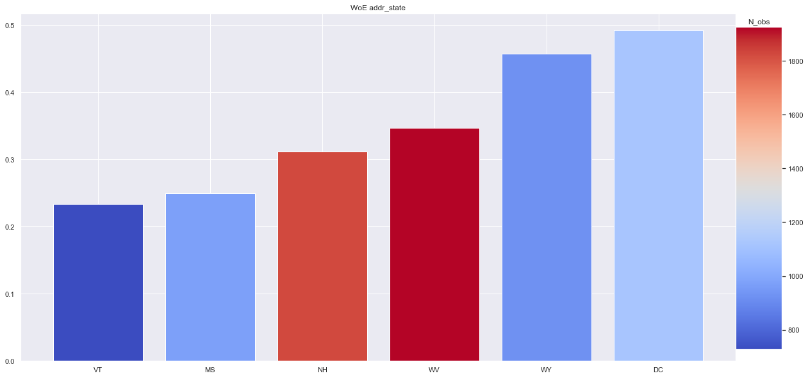
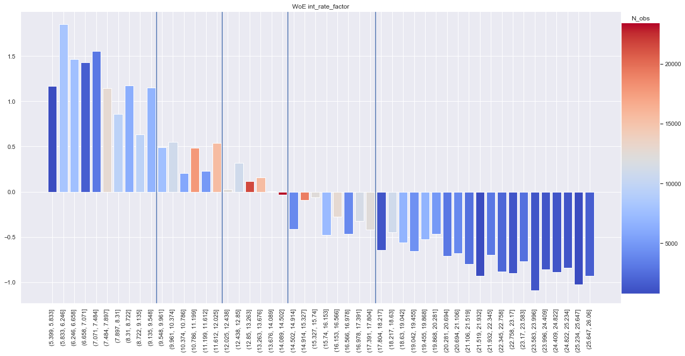
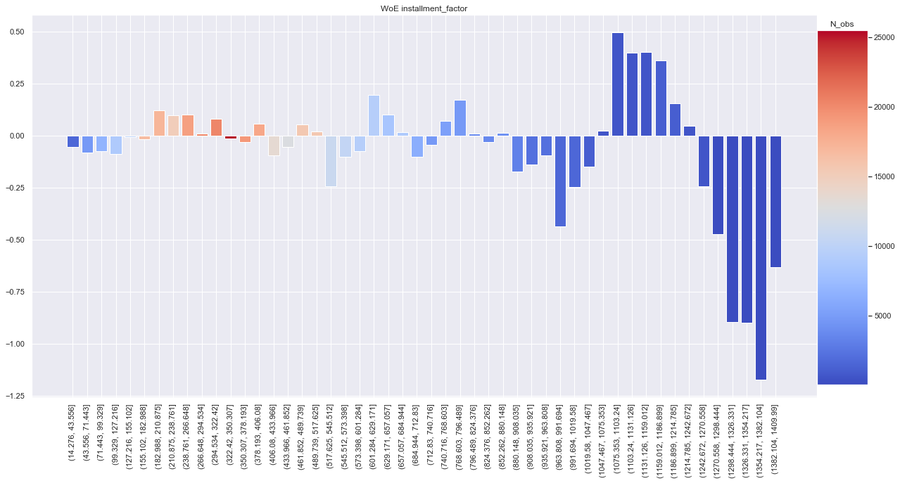
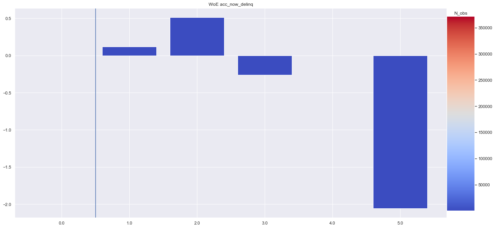

# Credit risk modelling 
## *Data Preparation*
*Omar El Omeiri Filho*<br><br>

---

### Table Of Contents

* <u>[Summary](#summ)<br></u>
* <u>[Preparations](#preps)<br></u>
* <u>[Data](#data)<br></u>
* <u>[Exploration and Preprocessing](#prep_expl)<br></u>
* <u>[Train Test Split](#tts)<br></u>
* <u>[Assesing Explanatory Power (Train Set)](#expl_pow)</u>
    * <u>[Discrete Variables](#disc_var)</u>
    * <u>[Continuous Variables](#num_var)</u>
    * <u>[Final Considerations](#final)</u>
* <u>[Now for the Test Set](#test)</u>


---

## Summary<a class='anchor' id='summ'></a>


&nbsp;&nbsp;&nbsp;&nbsp;There are three main factors involved in Credit Risk Modeling, Probablity of Default(PD), Loss Given Default (LGD) and Exposure at Default (EAD), the combination of them is called the Expected Loss (EL). Banks need to minimize their losses in providing credit to borrowers. These entities can be people, companies etc. It is very important for banks to categorize borrowers into classes, reject credit for some and provide credit to the majority. This is what Credit Modeling is all about. <br>
&nbsp;&nbsp;&nbsp;&nbsp;The first step is calculating a probability value between 0 and 1 for someone defaulting. This needs to be done in a very explainable way and solely based on their characteristics. The LGD is the share of an asset that is lost, once the borrower defaults, this will also need to be predicted based on historical data. Finally, EAD is the total amount that the lender is exposed to when a borrower defaults, it is the maximum value a bank may lose when a borrower defaults on a loan.<br>

&nbsp;&nbsp;&nbsp;&nbsp;The 2008 financial crisis made banks go bankrupt, which affected the whole world. Thousands of jobs were lost and millions of people wnet trough financial difficulties. In order to prevent sush situations, government regulators imposed some requirement on banks, to make sure they conduct their business without risking the stability of the economic system.In summary, banks are required to hold sufficient capital to to absorb the losses from defaults. This obligation is called the "Capital Adequacy". The most important document on how much banks need to have, how capital is defined and how capital is related to risk is The BASEL II Accord. The main idea of the BASEL II Accord is to ensure that the capital allocation is risk sensitive, in other words, the greater the risk a bank is exposed to, the greater the amount of capital it needs to hold. This is what makes Credit Risk Modeling so important.<br><br>

The core of Credit Risk Modeling is in this formula:<br>

$$EL=PD*LGD*EAD$$

Simple, isn't it?

## Preparations<a class='anchor' id='preps'></a>


```python
import pandas as pd
import numpy as np
import datetime as dt
import seaborn as sns
import matplotlib.pyplot as plt
from matplotlib import cm
import matplotlib as mpl
from sklearn.preprocessing import MinMaxScaler
import pickle

sns.set()
pd.options.display.max_columns=None
```

### Data

This dataset was acquired from kaggle and it belongs to Lending Club, which is an online platform the connects lenders to borrowers. It is not actually a bank, but we can treat the data as if it were from a bank's database. [link to dataset](https://www.kaggle.com/wendykan/lending-club-loan-data)


```python
raw_data_bkp = pd.read_csv('loan_data_2007_2014.csv', index_col=0, parse_dates=True)
print(raw_data_bkp.shape)
raw_data_bkp.head()
```

    /Users/omaromeiri/anaconda3/lib/python3.7/site-packages/IPython/core/interactiveshell.py:3058: DtypeWarning: Columns (20) have mixed types. Specify dtype option on import or set low_memory=False.
      interactivity=interactivity, compiler=compiler, result=result)


    (466285, 74)


<div>
<style scoped>
    .dataframe tbody tr th:only-of-type {
        vertical-align: middle;
    }

    .dataframe tbody tr th {
        vertical-align: top;
    }

    .dataframe thead th {
        text-align: right;
    }
</style>
<table border="1" class="dataframe">
  <thead>
    <tr style="text-align: right;">
      <th></th>
      <th>id</th>
      <th>member_id</th>
      <th>loan_amnt</th>
      <th>funded_amnt</th>
      <th>funded_amnt_inv</th>
      <th>term</th>
      <th>int_rate</th>
      <th>installment</th>
      <th>grade</th>
      <th>sub_grade</th>
      <th>emp_title</th>
      <th>emp_length</th>
      <th>home_ownership</th>
      <th>annual_inc</th>
      <th>verification_status</th>
      <th>issue_d</th>
      <th>loan_status</th>
      <th>pymnt_plan</th>
      <th>url</th>
      <th>desc</th>
      <th>purpose</th>
      <th>title</th>
      <th>zip_code</th>
      <th>addr_state</th>
      <th>dti</th>
      <th>delinq_2yrs</th>
      <th>earliest_cr_line</th>
      <th>inq_last_6mths</th>
      <th>mths_since_last_delinq</th>
      <th>mths_since_last_record</th>
      <th>open_acc</th>
      <th>pub_rec</th>
      <th>revol_bal</th>
      <th>revol_util</th>
      <th>total_acc</th>
      <th>initial_list_status</th>
      <th>out_prncp</th>
      <th>out_prncp_inv</th>
      <th>total_pymnt</th>
      <th>total_pymnt_inv</th>
      <th>total_rec_prncp</th>
      <th>total_rec_int</th>
      <th>total_rec_late_fee</th>
      <th>recoveries</th>
      <th>collection_recovery_fee</th>
      <th>last_pymnt_d</th>
      <th>last_pymnt_amnt</th>
      <th>next_pymnt_d</th>
      <th>last_credit_pull_d</th>
      <th>collections_12_mths_ex_med</th>
      <th>mths_since_last_major_derog</th>
      <th>policy_code</th>
      <th>application_type</th>
      <th>annual_inc_joint</th>
      <th>dti_joint</th>
      <th>verification_status_joint</th>
      <th>acc_now_delinq</th>
      <th>tot_coll_amt</th>
      <th>tot_cur_bal</th>
      <th>open_acc_6m</th>
      <th>open_il_6m</th>
      <th>open_il_12m</th>
      <th>open_il_24m</th>
      <th>mths_since_rcnt_il</th>
      <th>total_bal_il</th>
      <th>il_util</th>
      <th>open_rv_12m</th>
      <th>open_rv_24m</th>
      <th>max_bal_bc</th>
      <th>all_util</th>
      <th>total_rev_hi_lim</th>
      <th>inq_fi</th>
      <th>total_cu_tl</th>
      <th>inq_last_12m</th>
    </tr>
  </thead>
  <tbody>
    <tr>
      <th>0</th>
      <td>1077501</td>
      <td>1296599</td>
      <td>5000</td>
      <td>5000</td>
      <td>4975.0</td>
      <td>36 months</td>
      <td>10.65</td>
      <td>162.87</td>
      <td>B</td>
      <td>B2</td>
      <td>NaN</td>
      <td>10+ years</td>
      <td>RENT</td>
      <td>24000.0</td>
      <td>Verified</td>
      <td>Dec-11</td>
      <td>Fully Paid</td>
      <td>n</td>
      <td>https://www.lendingclub.com/browse/loanDetail....</td>
      <td>Borrower added on 12/22/11 &gt; I need to upgra...</td>
      <td>credit_card</td>
      <td>Computer</td>
      <td>860xx</td>
      <td>AZ</td>
      <td>27.65</td>
      <td>0.0</td>
      <td>Jan-85</td>
      <td>1.0</td>
      <td>NaN</td>
      <td>NaN</td>
      <td>3.0</td>
      <td>0.0</td>
      <td>13648</td>
      <td>83.7</td>
      <td>9.0</td>
      <td>f</td>
      <td>0.0</td>
      <td>0.0</td>
      <td>5861.071414</td>
      <td>5831.78</td>
      <td>5000.00</td>
      <td>861.07</td>
      <td>0.00</td>
      <td>0.00</td>
      <td>0.00</td>
      <td>Jan-15</td>
      <td>171.62</td>
      <td>NaN</td>
      <td>Jan-16</td>
      <td>0.0</td>
      <td>NaN</td>
      <td>1</td>
      <td>INDIVIDUAL</td>
      <td>NaN</td>
      <td>NaN</td>
      <td>NaN</td>
      <td>0.0</td>
      <td>NaN</td>
      <td>NaN</td>
      <td>NaN</td>
      <td>NaN</td>
      <td>NaN</td>
      <td>NaN</td>
      <td>NaN</td>
      <td>NaN</td>
      <td>NaN</td>
      <td>NaN</td>
      <td>NaN</td>
      <td>NaN</td>
      <td>NaN</td>
      <td>NaN</td>
      <td>NaN</td>
      <td>NaN</td>
      <td>NaN</td>
    </tr>
    <tr>
      <th>1</th>
      <td>1077430</td>
      <td>1314167</td>
      <td>2500</td>
      <td>2500</td>
      <td>2500.0</td>
      <td>60 months</td>
      <td>15.27</td>
      <td>59.83</td>
      <td>C</td>
      <td>C4</td>
      <td>Ryder</td>
      <td>&lt; 1 year</td>
      <td>RENT</td>
      <td>30000.0</td>
      <td>Source Verified</td>
      <td>Dec-11</td>
      <td>Charged Off</td>
      <td>n</td>
      <td>https://www.lendingclub.com/browse/loanDetail....</td>
      <td>Borrower added on 12/22/11 &gt; I plan to use t...</td>
      <td>car</td>
      <td>bike</td>
      <td>309xx</td>
      <td>GA</td>
      <td>1.00</td>
      <td>0.0</td>
      <td>Apr-99</td>
      <td>5.0</td>
      <td>NaN</td>
      <td>NaN</td>
      <td>3.0</td>
      <td>0.0</td>
      <td>1687</td>
      <td>9.4</td>
      <td>4.0</td>
      <td>f</td>
      <td>0.0</td>
      <td>0.0</td>
      <td>1008.710000</td>
      <td>1008.71</td>
      <td>456.46</td>
      <td>435.17</td>
      <td>0.00</td>
      <td>117.08</td>
      <td>1.11</td>
      <td>Apr-13</td>
      <td>119.66</td>
      <td>NaN</td>
      <td>Sep-13</td>
      <td>0.0</td>
      <td>NaN</td>
      <td>1</td>
      <td>INDIVIDUAL</td>
      <td>NaN</td>
      <td>NaN</td>
      <td>NaN</td>
      <td>0.0</td>
      <td>NaN</td>
      <td>NaN</td>
      <td>NaN</td>
      <td>NaN</td>
      <td>NaN</td>
      <td>NaN</td>
      <td>NaN</td>
      <td>NaN</td>
      <td>NaN</td>
      <td>NaN</td>
      <td>NaN</td>
      <td>NaN</td>
      <td>NaN</td>
      <td>NaN</td>
      <td>NaN</td>
      <td>NaN</td>
      <td>NaN</td>
    </tr>
    <tr>
      <th>2</th>
      <td>1077175</td>
      <td>1313524</td>
      <td>2400</td>
      <td>2400</td>
      <td>2400.0</td>
      <td>36 months</td>
      <td>15.96</td>
      <td>84.33</td>
      <td>C</td>
      <td>C5</td>
      <td>NaN</td>
      <td>10+ years</td>
      <td>RENT</td>
      <td>12252.0</td>
      <td>Not Verified</td>
      <td>Dec-11</td>
      <td>Fully Paid</td>
      <td>n</td>
      <td>https://www.lendingclub.com/browse/loanDetail....</td>
      <td>NaN</td>
      <td>small_business</td>
      <td>real estate business</td>
      <td>606xx</td>
      <td>IL</td>
      <td>8.72</td>
      <td>0.0</td>
      <td>Nov-01</td>
      <td>2.0</td>
      <td>NaN</td>
      <td>NaN</td>
      <td>2.0</td>
      <td>0.0</td>
      <td>2956</td>
      <td>98.5</td>
      <td>10.0</td>
      <td>f</td>
      <td>0.0</td>
      <td>0.0</td>
      <td>3003.653644</td>
      <td>3003.65</td>
      <td>2400.00</td>
      <td>603.65</td>
      <td>0.00</td>
      <td>0.00</td>
      <td>0.00</td>
      <td>Jun-14</td>
      <td>649.91</td>
      <td>NaN</td>
      <td>Jan-16</td>
      <td>0.0</td>
      <td>NaN</td>
      <td>1</td>
      <td>INDIVIDUAL</td>
      <td>NaN</td>
      <td>NaN</td>
      <td>NaN</td>
      <td>0.0</td>
      <td>NaN</td>
      <td>NaN</td>
      <td>NaN</td>
      <td>NaN</td>
      <td>NaN</td>
      <td>NaN</td>
      <td>NaN</td>
      <td>NaN</td>
      <td>NaN</td>
      <td>NaN</td>
      <td>NaN</td>
      <td>NaN</td>
      <td>NaN</td>
      <td>NaN</td>
      <td>NaN</td>
      <td>NaN</td>
      <td>NaN</td>
    </tr>
    <tr>
      <th>3</th>
      <td>1076863</td>
      <td>1277178</td>
      <td>10000</td>
      <td>10000</td>
      <td>10000.0</td>
      <td>36 months</td>
      <td>13.49</td>
      <td>339.31</td>
      <td>C</td>
      <td>C1</td>
      <td>AIR RESOURCES BOARD</td>
      <td>10+ years</td>
      <td>RENT</td>
      <td>49200.0</td>
      <td>Source Verified</td>
      <td>Dec-11</td>
      <td>Fully Paid</td>
      <td>n</td>
      <td>https://www.lendingclub.com/browse/loanDetail....</td>
      <td>Borrower added on 12/21/11 &gt; to pay for prop...</td>
      <td>other</td>
      <td>personel</td>
      <td>917xx</td>
      <td>CA</td>
      <td>20.00</td>
      <td>0.0</td>
      <td>Feb-96</td>
      <td>1.0</td>
      <td>35.0</td>
      <td>NaN</td>
      <td>10.0</td>
      <td>0.0</td>
      <td>5598</td>
      <td>21.0</td>
      <td>37.0</td>
      <td>f</td>
      <td>0.0</td>
      <td>0.0</td>
      <td>12226.302210</td>
      <td>12226.30</td>
      <td>10000.00</td>
      <td>2209.33</td>
      <td>16.97</td>
      <td>0.00</td>
      <td>0.00</td>
      <td>Jan-15</td>
      <td>357.48</td>
      <td>NaN</td>
      <td>Jan-15</td>
      <td>0.0</td>
      <td>NaN</td>
      <td>1</td>
      <td>INDIVIDUAL</td>
      <td>NaN</td>
      <td>NaN</td>
      <td>NaN</td>
      <td>0.0</td>
      <td>NaN</td>
      <td>NaN</td>
      <td>NaN</td>
      <td>NaN</td>
      <td>NaN</td>
      <td>NaN</td>
      <td>NaN</td>
      <td>NaN</td>
      <td>NaN</td>
      <td>NaN</td>
      <td>NaN</td>
      <td>NaN</td>
      <td>NaN</td>
      <td>NaN</td>
      <td>NaN</td>
      <td>NaN</td>
      <td>NaN</td>
    </tr>
    <tr>
      <th>4</th>
      <td>1075358</td>
      <td>1311748</td>
      <td>3000</td>
      <td>3000</td>
      <td>3000.0</td>
      <td>60 months</td>
      <td>12.69</td>
      <td>67.79</td>
      <td>B</td>
      <td>B5</td>
      <td>University Medical Group</td>
      <td>1 year</td>
      <td>RENT</td>
      <td>80000.0</td>
      <td>Source Verified</td>
      <td>Dec-11</td>
      <td>Current</td>
      <td>n</td>
      <td>https://www.lendingclub.com/browse/loanDetail....</td>
      <td>Borrower added on 12/21/11 &gt; I plan on combi...</td>
      <td>other</td>
      <td>Personal</td>
      <td>972xx</td>
      <td>OR</td>
      <td>17.94</td>
      <td>0.0</td>
      <td>Jan-96</td>
      <td>0.0</td>
      <td>38.0</td>
      <td>NaN</td>
      <td>15.0</td>
      <td>0.0</td>
      <td>27783</td>
      <td>53.9</td>
      <td>38.0</td>
      <td>f</td>
      <td>766.9</td>
      <td>766.9</td>
      <td>3242.170000</td>
      <td>3242.17</td>
      <td>2233.10</td>
      <td>1009.07</td>
      <td>0.00</td>
      <td>0.00</td>
      <td>0.00</td>
      <td>Jan-16</td>
      <td>67.79</td>
      <td>Feb-16</td>
      <td>Jan-16</td>
      <td>0.0</td>
      <td>NaN</td>
      <td>1</td>
      <td>INDIVIDUAL</td>
      <td>NaN</td>
      <td>NaN</td>
      <td>NaN</td>
      <td>0.0</td>
      <td>NaN</td>
      <td>NaN</td>
      <td>NaN</td>
      <td>NaN</td>
      <td>NaN</td>
      <td>NaN</td>
      <td>NaN</td>
      <td>NaN</td>
      <td>NaN</td>
      <td>NaN</td>
      <td>NaN</td>
      <td>NaN</td>
      <td>NaN</td>
      <td>NaN</td>
      <td>NaN</td>
      <td>NaN</td>
      <td>NaN</td>
    </tr>
  </tbody>
</table>
</div>


```python
raw_data = raw_data_bkp.copy()
```


```python
raw_data.info()
```

    <class 'pandas.core.frame.DataFrame'>
    Int64Index: 466285 entries, 0 to 466284
    Data columns (total 74 columns):
    id                             466285 non-null int64
    member_id                      466285 non-null int64
    loan_amnt                      466285 non-null int64
    funded_amnt                    466285 non-null int64
    funded_amnt_inv                466285 non-null float64
    term                           466285 non-null object
    int_rate                       466285 non-null float64
    installment                    466285 non-null float64
    grade                          466285 non-null object
    sub_grade                      466285 non-null object
    emp_title                      438697 non-null object
    emp_length                     445277 non-null object
    home_ownership                 466285 non-null object
    annual_inc                     466281 non-null float64
    verification_status            466285 non-null object
    issue_d                        466285 non-null object
    loan_status                    466285 non-null object
    pymnt_plan                     466285 non-null object
    url                            466285 non-null object
    desc                           125983 non-null object
    purpose                        466285 non-null object
    title                          466265 non-null object
    zip_code                       466285 non-null object
    addr_state                     466285 non-null object
    dti                            466285 non-null float64
    delinq_2yrs                    466256 non-null float64
    earliest_cr_line               466256 non-null object
    inq_last_6mths                 466256 non-null float64
    mths_since_last_delinq         215934 non-null float64
    mths_since_last_record         62638 non-null float64
    open_acc                       466256 non-null float64
    pub_rec                        466256 non-null float64
    revol_bal                      466285 non-null int64
    revol_util                     465945 non-null float64
    total_acc                      466256 non-null float64
    initial_list_status            466285 non-null object
    out_prncp                      466285 non-null float64
    out_prncp_inv                  466285 non-null float64
    total_pymnt                    466285 non-null float64
    total_pymnt_inv                466285 non-null float64
    total_rec_prncp                466285 non-null float64
    total_rec_int                  466285 non-null float64
    total_rec_late_fee             466285 non-null float64
    recoveries                     466285 non-null float64
    collection_recovery_fee        466285 non-null float64
    last_pymnt_d                   465909 non-null object
    last_pymnt_amnt                466285 non-null float64
    next_pymnt_d                   239071 non-null object
    last_credit_pull_d             466243 non-null object
    collections_12_mths_ex_med     466140 non-null float64
    mths_since_last_major_derog    98974 non-null float64
    policy_code                    466285 non-null int64
    application_type               466285 non-null object
    annual_inc_joint               0 non-null float64
    dti_joint                      0 non-null float64
    verification_status_joint      0 non-null float64
    acc_now_delinq                 466256 non-null float64
    tot_coll_amt                   396009 non-null float64
    tot_cur_bal                    396009 non-null float64
    open_acc_6m                    0 non-null float64
    open_il_6m                     0 non-null float64
    open_il_12m                    0 non-null float64
    open_il_24m                    0 non-null float64
    mths_since_rcnt_il             0 non-null float64
    total_bal_il                   0 non-null float64
    il_util                        0 non-null float64
    open_rv_12m                    0 non-null float64
    open_rv_24m                    0 non-null float64
    max_bal_bc                     0 non-null float64
    all_util                       0 non-null float64
    total_rev_hi_lim               396009 non-null float64
    inq_fi                         0 non-null float64
    total_cu_tl                    0 non-null float64
    inq_last_12m                   0 non-null float64
    dtypes: float64(46), int64(6), object(22)
    memory usage: 266.8+ MB


# Data Exploration and preprocessing<a class='anchor' id='prep_expl'></a>

'emp_length' to int


```python
raw_data['emp_length'].unique()
```


    array(['10+ years', '< 1 year', '1 year', '3 years', '8 years', '9 years',
           '4 years', '5 years', '6 years', '2 years', '7 years', nan],
          dtype=object)


```python
raw_data['emp_length_int'] = raw_data['emp_length'].apply(lambda x: str(x).replace('+ years','').replace('< 1 year','0').replace('nan','0').replace(' years','').replace(' year','')).astype('int')
```


```python
raw_data['emp_length_int'].unique()
```


    array([10,  0,  1,  3,  8,  9,  4,  5,  6,  2,  7])


'term' to int


```python
raw_data['term'].unique()
```


    array([' 36 months', ' 60 months'], dtype=object)


```python
raw_data['term'] = raw_data['term'].apply(lambda x: str(x).replace('months','').strip()).astype('int')
raw_data['term'].unique()
```


    array([36, 60])


parsing dates from ['earliest_cr_line_date', 'earliest_cr_line_date', 'issue_d']<br>
and later calculating time delta in months assuming todays date is 2017-12-01


```python
raw_data['earliest_cr_line_date'] = pd.to_datetime(raw_data['earliest_cr_line'], format='%b-%y')

raw_data['earliest_cr_line_date'].head()
```


    0   1985-01-01
    1   1999-04-01
    2   2001-11-01
    3   1996-02-01
    4   1996-01-01
    Name: earliest_cr_line_date, dtype: datetime64[ns]


```python
raw_data['mths_since_earliest_cr_line'] = round((pd.to_datetime('2017-12-01') - raw_data['earliest_cr_line_date'])/np.timedelta64(1, 'M'))
raw_data['mths_since_earliest_cr_line'].describe()
```


    count    466256.000000
    mean        239.482430
    std          93.974829
    min        -612.000000
    25%         183.000000
    50%         225.000000
    75%         285.000000
    max         587.000000
    Name: mths_since_earliest_cr_line, dtype: float64


```python
raw_data['earliest_cr_line_date'] = raw_data['earliest_cr_line_date'].apply(lambda x: x-np.timedelta64(100,'Y') if x.year > 2020 else x)
```


```python
raw_data['mths_since_earliest_cr_line'] = round((pd.to_datetime('2017-12-01') - raw_data['earliest_cr_line_date'])/np.timedelta64(1, 'M'))
raw_data['mths_since_earliest_cr_line'].describe()
```


    count    466256.000000
    mean        242.491078
    std          86.928944
    min          73.000000
    25%         184.000000
    50%         226.000000
    75%         285.000000
    max         887.000000
    Name: mths_since_earliest_cr_line, dtype: float64


```python
raw_data['issue_d'].head()
```


    0    Dec-11
    1    Dec-11
    2    Dec-11
    3    Dec-11
    4    Dec-11
    Name: issue_d, dtype: object


```python
raw_data['issue_d'] = pd.to_datetime(raw_data['issue_d'], format='%b-%y')
raw_data['issue_d'].head()
```


    0   2011-12-01
    1   2011-12-01
    2   2011-12-01
    3   2011-12-01
    4   2011-12-01
    Name: issue_d, dtype: datetime64[ns]


```python
raw_data['mths_since_issue_d'] = round((pd.to_datetime('2017-12-01') - raw_data['issue_d'])/np.timedelta64(1, 'M'))
```


```python
raw_data[['issue_d','mths_since_issue_d']].head()
```


<div>
<style scoped>
    .dataframe tbody tr th:only-of-type {
        vertical-align: middle;
    }

    .dataframe tbody tr th {
        vertical-align: top;
    }

    .dataframe thead th {
        text-align: right;
    }
</style>
<table border="1" class="dataframe">
  <thead>
    <tr style="text-align: right;">
      <th></th>
      <th>issue_d</th>
      <th>mths_since_issue_d</th>
    </tr>
  </thead>
  <tbody>
    <tr>
      <th>0</th>
      <td>2011-12-01</td>
      <td>72.0</td>
    </tr>
    <tr>
      <th>1</th>
      <td>2011-12-01</td>
      <td>72.0</td>
    </tr>
    <tr>
      <th>2</th>
      <td>2011-12-01</td>
      <td>72.0</td>
    </tr>
    <tr>
      <th>3</th>
      <td>2011-12-01</td>
      <td>72.0</td>
    </tr>
    <tr>
      <th>4</th>
      <td>2011-12-01</td>
      <td>72.0</td>
    </tr>
  </tbody>
</table>
</div>


### Categorical columns to dummy variables


```python
catg_cols = ['grade', 'sub_grade', 'home_ownership', 'verification_status',
             'loan_status', 'purpose', 'addr_state', 'initial_list_status']
```


```python
raw_data[catg_cols].head()
```


<div>
<style scoped>
    .dataframe tbody tr th:only-of-type {
        vertical-align: middle;
    }

    .dataframe tbody tr th {
        vertical-align: top;
    }

    .dataframe thead th {
        text-align: right;
    }
</style>
<table border="1" class="dataframe">
  <thead>
    <tr style="text-align: right;">
      <th></th>
      <th>grade</th>
      <th>sub_grade</th>
      <th>home_ownership</th>
      <th>verification_status</th>
      <th>loan_status</th>
      <th>purpose</th>
      <th>addr_state</th>
      <th>initial_list_status</th>
    </tr>
  </thead>
  <tbody>
    <tr>
      <th>0</th>
      <td>B</td>
      <td>B2</td>
      <td>RENT</td>
      <td>Verified</td>
      <td>Fully Paid</td>
      <td>credit_card</td>
      <td>AZ</td>
      <td>f</td>
    </tr>
    <tr>
      <th>1</th>
      <td>C</td>
      <td>C4</td>
      <td>RENT</td>
      <td>Source Verified</td>
      <td>Charged Off</td>
      <td>car</td>
      <td>GA</td>
      <td>f</td>
    </tr>
    <tr>
      <th>2</th>
      <td>C</td>
      <td>C5</td>
      <td>RENT</td>
      <td>Not Verified</td>
      <td>Fully Paid</td>
      <td>small_business</td>
      <td>IL</td>
      <td>f</td>
    </tr>
    <tr>
      <th>3</th>
      <td>C</td>
      <td>C1</td>
      <td>RENT</td>
      <td>Source Verified</td>
      <td>Fully Paid</td>
      <td>other</td>
      <td>CA</td>
      <td>f</td>
    </tr>
    <tr>
      <th>4</th>
      <td>B</td>
      <td>B5</td>
      <td>RENT</td>
      <td>Source Verified</td>
      <td>Current</td>
      <td>other</td>
      <td>OR</td>
      <td>f</td>
    </tr>
  </tbody>
</table>
</div>


```python
'''
Note that I'm not using the drop_first argument of the get_dummies function.
I'll eliminate the category with the smallest weight of evidence later on
'''

dummies = pd.DataFrame()

for col in catg_cols:
    temp_dummy = pd.get_dummies(raw_data[col], prefix=col, prefix_sep=':', drop_first=False)
    dummies = pd.concat([dummies, temp_dummy], axis=1)
dummies.head()
```


<div>
<style scoped>
    .dataframe tbody tr th:only-of-type {
        vertical-align: middle;
    }

    .dataframe tbody tr th {
        vertical-align: top;
    }

    .dataframe thead th {
        text-align: right;
    }
</style>
<table border="1" class="dataframe">
  <thead>
    <tr style="text-align: right;">
      <th></th>
      <th>grade:A</th>
      <th>grade:B</th>
      <th>grade:C</th>
      <th>grade:D</th>
      <th>grade:E</th>
      <th>grade:F</th>
      <th>grade:G</th>
      <th>sub_grade:A1</th>
      <th>sub_grade:A2</th>
      <th>sub_grade:A3</th>
      <th>sub_grade:A4</th>
      <th>sub_grade:A5</th>
      <th>sub_grade:B1</th>
      <th>sub_grade:B2</th>
      <th>sub_grade:B3</th>
      <th>sub_grade:B4</th>
      <th>sub_grade:B5</th>
      <th>sub_grade:C1</th>
      <th>sub_grade:C2</th>
      <th>sub_grade:C3</th>
      <th>sub_grade:C4</th>
      <th>sub_grade:C5</th>
      <th>sub_grade:D1</th>
      <th>sub_grade:D2</th>
      <th>sub_grade:D3</th>
      <th>sub_grade:D4</th>
      <th>sub_grade:D5</th>
      <th>sub_grade:E1</th>
      <th>sub_grade:E2</th>
      <th>sub_grade:E3</th>
      <th>sub_grade:E4</th>
      <th>sub_grade:E5</th>
      <th>sub_grade:F1</th>
      <th>sub_grade:F2</th>
      <th>sub_grade:F3</th>
      <th>sub_grade:F4</th>
      <th>sub_grade:F5</th>
      <th>sub_grade:G1</th>
      <th>sub_grade:G2</th>
      <th>sub_grade:G3</th>
      <th>sub_grade:G4</th>
      <th>sub_grade:G5</th>
      <th>home_ownership:ANY</th>
      <th>home_ownership:MORTGAGE</th>
      <th>home_ownership:NONE</th>
      <th>home_ownership:OTHER</th>
      <th>home_ownership:OWN</th>
      <th>home_ownership:RENT</th>
      <th>verification_status:Not Verified</th>
      <th>verification_status:Source Verified</th>
      <th>verification_status:Verified</th>
      <th>loan_status:Charged Off</th>
      <th>loan_status:Current</th>
      <th>loan_status:Default</th>
      <th>loan_status:Does not meet the credit policy. Status:Charged Off</th>
      <th>loan_status:Does not meet the credit policy. Status:Fully Paid</th>
      <th>loan_status:Fully Paid</th>
      <th>loan_status:In Grace Period</th>
      <th>loan_status:Late (16-30 days)</th>
      <th>loan_status:Late (31-120 days)</th>
      <th>purpose:car</th>
      <th>purpose:credit_card</th>
      <th>purpose:debt_consolidation</th>
      <th>purpose:educational</th>
      <th>purpose:home_improvement</th>
      <th>purpose:house</th>
      <th>purpose:major_purchase</th>
      <th>purpose:medical</th>
      <th>purpose:moving</th>
      <th>purpose:other</th>
      <th>purpose:renewable_energy</th>
      <th>purpose:small_business</th>
      <th>purpose:vacation</th>
      <th>purpose:wedding</th>
      <th>addr_state:AK</th>
      <th>addr_state:AL</th>
      <th>addr_state:AR</th>
      <th>addr_state:AZ</th>
      <th>addr_state:CA</th>
      <th>addr_state:CO</th>
      <th>addr_state:CT</th>
      <th>addr_state:DC</th>
      <th>addr_state:DE</th>
      <th>addr_state:FL</th>
      <th>addr_state:GA</th>
      <th>addr_state:HI</th>
      <th>addr_state:IA</th>
      <th>addr_state:ID</th>
      <th>addr_state:IL</th>
      <th>addr_state:IN</th>
      <th>addr_state:KS</th>
      <th>addr_state:KY</th>
      <th>addr_state:LA</th>
      <th>addr_state:MA</th>
      <th>addr_state:MD</th>
      <th>addr_state:ME</th>
      <th>addr_state:MI</th>
      <th>addr_state:MN</th>
      <th>addr_state:MO</th>
      <th>addr_state:MS</th>
      <th>addr_state:MT</th>
      <th>addr_state:NC</th>
      <th>addr_state:NE</th>
      <th>addr_state:NH</th>
      <th>addr_state:NJ</th>
      <th>addr_state:NM</th>
      <th>addr_state:NV</th>
      <th>addr_state:NY</th>
      <th>addr_state:OH</th>
      <th>addr_state:OK</th>
      <th>addr_state:OR</th>
      <th>addr_state:PA</th>
      <th>addr_state:RI</th>
      <th>addr_state:SC</th>
      <th>addr_state:SD</th>
      <th>addr_state:TN</th>
      <th>addr_state:TX</th>
      <th>addr_state:UT</th>
      <th>addr_state:VA</th>
      <th>addr_state:VT</th>
      <th>addr_state:WA</th>
      <th>addr_state:WI</th>
      <th>addr_state:WV</th>
      <th>addr_state:WY</th>
      <th>initial_list_status:f</th>
      <th>initial_list_status:w</th>
    </tr>
  </thead>
  <tbody>
    <tr>
      <th>0</th>
      <td>0</td>
      <td>1</td>
      <td>0</td>
      <td>0</td>
      <td>0</td>
      <td>0</td>
      <td>0</td>
      <td>0</td>
      <td>0</td>
      <td>0</td>
      <td>0</td>
      <td>0</td>
      <td>0</td>
      <td>1</td>
      <td>0</td>
      <td>0</td>
      <td>0</td>
      <td>0</td>
      <td>0</td>
      <td>0</td>
      <td>0</td>
      <td>0</td>
      <td>0</td>
      <td>0</td>
      <td>0</td>
      <td>0</td>
      <td>0</td>
      <td>0</td>
      <td>0</td>
      <td>0</td>
      <td>0</td>
      <td>0</td>
      <td>0</td>
      <td>0</td>
      <td>0</td>
      <td>0</td>
      <td>0</td>
      <td>0</td>
      <td>0</td>
      <td>0</td>
      <td>0</td>
      <td>0</td>
      <td>0</td>
      <td>0</td>
      <td>0</td>
      <td>0</td>
      <td>0</td>
      <td>1</td>
      <td>0</td>
      <td>0</td>
      <td>1</td>
      <td>0</td>
      <td>0</td>
      <td>0</td>
      <td>0</td>
      <td>0</td>
      <td>1</td>
      <td>0</td>
      <td>0</td>
      <td>0</td>
      <td>0</td>
      <td>1</td>
      <td>0</td>
      <td>0</td>
      <td>0</td>
      <td>0</td>
      <td>0</td>
      <td>0</td>
      <td>0</td>
      <td>0</td>
      <td>0</td>
      <td>0</td>
      <td>0</td>
      <td>0</td>
      <td>0</td>
      <td>0</td>
      <td>0</td>
      <td>1</td>
      <td>0</td>
      <td>0</td>
      <td>0</td>
      <td>0</td>
      <td>0</td>
      <td>0</td>
      <td>0</td>
      <td>0</td>
      <td>0</td>
      <td>0</td>
      <td>0</td>
      <td>0</td>
      <td>0</td>
      <td>0</td>
      <td>0</td>
      <td>0</td>
      <td>0</td>
      <td>0</td>
      <td>0</td>
      <td>0</td>
      <td>0</td>
      <td>0</td>
      <td>0</td>
      <td>0</td>
      <td>0</td>
      <td>0</td>
      <td>0</td>
      <td>0</td>
      <td>0</td>
      <td>0</td>
      <td>0</td>
      <td>0</td>
      <td>0</td>
      <td>0</td>
      <td>0</td>
      <td>0</td>
      <td>0</td>
      <td>0</td>
      <td>0</td>
      <td>0</td>
      <td>0</td>
      <td>0</td>
      <td>0</td>
      <td>0</td>
      <td>0</td>
      <td>0</td>
      <td>1</td>
      <td>0</td>
    </tr>
    <tr>
      <th>1</th>
      <td>0</td>
      <td>0</td>
      <td>1</td>
      <td>0</td>
      <td>0</td>
      <td>0</td>
      <td>0</td>
      <td>0</td>
      <td>0</td>
      <td>0</td>
      <td>0</td>
      <td>0</td>
      <td>0</td>
      <td>0</td>
      <td>0</td>
      <td>0</td>
      <td>0</td>
      <td>0</td>
      <td>0</td>
      <td>0</td>
      <td>1</td>
      <td>0</td>
      <td>0</td>
      <td>0</td>
      <td>0</td>
      <td>0</td>
      <td>0</td>
      <td>0</td>
      <td>0</td>
      <td>0</td>
      <td>0</td>
      <td>0</td>
      <td>0</td>
      <td>0</td>
      <td>0</td>
      <td>0</td>
      <td>0</td>
      <td>0</td>
      <td>0</td>
      <td>0</td>
      <td>0</td>
      <td>0</td>
      <td>0</td>
      <td>0</td>
      <td>0</td>
      <td>0</td>
      <td>0</td>
      <td>1</td>
      <td>0</td>
      <td>1</td>
      <td>0</td>
      <td>1</td>
      <td>0</td>
      <td>0</td>
      <td>0</td>
      <td>0</td>
      <td>0</td>
      <td>0</td>
      <td>0</td>
      <td>0</td>
      <td>1</td>
      <td>0</td>
      <td>0</td>
      <td>0</td>
      <td>0</td>
      <td>0</td>
      <td>0</td>
      <td>0</td>
      <td>0</td>
      <td>0</td>
      <td>0</td>
      <td>0</td>
      <td>0</td>
      <td>0</td>
      <td>0</td>
      <td>0</td>
      <td>0</td>
      <td>0</td>
      <td>0</td>
      <td>0</td>
      <td>0</td>
      <td>0</td>
      <td>0</td>
      <td>0</td>
      <td>1</td>
      <td>0</td>
      <td>0</td>
      <td>0</td>
      <td>0</td>
      <td>0</td>
      <td>0</td>
      <td>0</td>
      <td>0</td>
      <td>0</td>
      <td>0</td>
      <td>0</td>
      <td>0</td>
      <td>0</td>
      <td>0</td>
      <td>0</td>
      <td>0</td>
      <td>0</td>
      <td>0</td>
      <td>0</td>
      <td>0</td>
      <td>0</td>
      <td>0</td>
      <td>0</td>
      <td>0</td>
      <td>0</td>
      <td>0</td>
      <td>0</td>
      <td>0</td>
      <td>0</td>
      <td>0</td>
      <td>0</td>
      <td>0</td>
      <td>0</td>
      <td>0</td>
      <td>0</td>
      <td>0</td>
      <td>0</td>
      <td>0</td>
      <td>0</td>
      <td>1</td>
      <td>0</td>
    </tr>
    <tr>
      <th>2</th>
      <td>0</td>
      <td>0</td>
      <td>1</td>
      <td>0</td>
      <td>0</td>
      <td>0</td>
      <td>0</td>
      <td>0</td>
      <td>0</td>
      <td>0</td>
      <td>0</td>
      <td>0</td>
      <td>0</td>
      <td>0</td>
      <td>0</td>
      <td>0</td>
      <td>0</td>
      <td>0</td>
      <td>0</td>
      <td>0</td>
      <td>0</td>
      <td>1</td>
      <td>0</td>
      <td>0</td>
      <td>0</td>
      <td>0</td>
      <td>0</td>
      <td>0</td>
      <td>0</td>
      <td>0</td>
      <td>0</td>
      <td>0</td>
      <td>0</td>
      <td>0</td>
      <td>0</td>
      <td>0</td>
      <td>0</td>
      <td>0</td>
      <td>0</td>
      <td>0</td>
      <td>0</td>
      <td>0</td>
      <td>0</td>
      <td>0</td>
      <td>0</td>
      <td>0</td>
      <td>0</td>
      <td>1</td>
      <td>1</td>
      <td>0</td>
      <td>0</td>
      <td>0</td>
      <td>0</td>
      <td>0</td>
      <td>0</td>
      <td>0</td>
      <td>1</td>
      <td>0</td>
      <td>0</td>
      <td>0</td>
      <td>0</td>
      <td>0</td>
      <td>0</td>
      <td>0</td>
      <td>0</td>
      <td>0</td>
      <td>0</td>
      <td>0</td>
      <td>0</td>
      <td>0</td>
      <td>0</td>
      <td>1</td>
      <td>0</td>
      <td>0</td>
      <td>0</td>
      <td>0</td>
      <td>0</td>
      <td>0</td>
      <td>0</td>
      <td>0</td>
      <td>0</td>
      <td>0</td>
      <td>0</td>
      <td>0</td>
      <td>0</td>
      <td>0</td>
      <td>0</td>
      <td>0</td>
      <td>1</td>
      <td>0</td>
      <td>0</td>
      <td>0</td>
      <td>0</td>
      <td>0</td>
      <td>0</td>
      <td>0</td>
      <td>0</td>
      <td>0</td>
      <td>0</td>
      <td>0</td>
      <td>0</td>
      <td>0</td>
      <td>0</td>
      <td>0</td>
      <td>0</td>
      <td>0</td>
      <td>0</td>
      <td>0</td>
      <td>0</td>
      <td>0</td>
      <td>0</td>
      <td>0</td>
      <td>0</td>
      <td>0</td>
      <td>0</td>
      <td>0</td>
      <td>0</td>
      <td>0</td>
      <td>0</td>
      <td>0</td>
      <td>0</td>
      <td>0</td>
      <td>0</td>
      <td>0</td>
      <td>1</td>
      <td>0</td>
    </tr>
    <tr>
      <th>3</th>
      <td>0</td>
      <td>0</td>
      <td>1</td>
      <td>0</td>
      <td>0</td>
      <td>0</td>
      <td>0</td>
      <td>0</td>
      <td>0</td>
      <td>0</td>
      <td>0</td>
      <td>0</td>
      <td>0</td>
      <td>0</td>
      <td>0</td>
      <td>0</td>
      <td>0</td>
      <td>1</td>
      <td>0</td>
      <td>0</td>
      <td>0</td>
      <td>0</td>
      <td>0</td>
      <td>0</td>
      <td>0</td>
      <td>0</td>
      <td>0</td>
      <td>0</td>
      <td>0</td>
      <td>0</td>
      <td>0</td>
      <td>0</td>
      <td>0</td>
      <td>0</td>
      <td>0</td>
      <td>0</td>
      <td>0</td>
      <td>0</td>
      <td>0</td>
      <td>0</td>
      <td>0</td>
      <td>0</td>
      <td>0</td>
      <td>0</td>
      <td>0</td>
      <td>0</td>
      <td>0</td>
      <td>1</td>
      <td>0</td>
      <td>1</td>
      <td>0</td>
      <td>0</td>
      <td>0</td>
      <td>0</td>
      <td>0</td>
      <td>0</td>
      <td>1</td>
      <td>0</td>
      <td>0</td>
      <td>0</td>
      <td>0</td>
      <td>0</td>
      <td>0</td>
      <td>0</td>
      <td>0</td>
      <td>0</td>
      <td>0</td>
      <td>0</td>
      <td>0</td>
      <td>1</td>
      <td>0</td>
      <td>0</td>
      <td>0</td>
      <td>0</td>
      <td>0</td>
      <td>0</td>
      <td>0</td>
      <td>0</td>
      <td>1</td>
      <td>0</td>
      <td>0</td>
      <td>0</td>
      <td>0</td>
      <td>0</td>
      <td>0</td>
      <td>0</td>
      <td>0</td>
      <td>0</td>
      <td>0</td>
      <td>0</td>
      <td>0</td>
      <td>0</td>
      <td>0</td>
      <td>0</td>
      <td>0</td>
      <td>0</td>
      <td>0</td>
      <td>0</td>
      <td>0</td>
      <td>0</td>
      <td>0</td>
      <td>0</td>
      <td>0</td>
      <td>0</td>
      <td>0</td>
      <td>0</td>
      <td>0</td>
      <td>0</td>
      <td>0</td>
      <td>0</td>
      <td>0</td>
      <td>0</td>
      <td>0</td>
      <td>0</td>
      <td>0</td>
      <td>0</td>
      <td>0</td>
      <td>0</td>
      <td>0</td>
      <td>0</td>
      <td>0</td>
      <td>0</td>
      <td>0</td>
      <td>0</td>
      <td>1</td>
      <td>0</td>
    </tr>
    <tr>
      <th>4</th>
      <td>0</td>
      <td>1</td>
      <td>0</td>
      <td>0</td>
      <td>0</td>
      <td>0</td>
      <td>0</td>
      <td>0</td>
      <td>0</td>
      <td>0</td>
      <td>0</td>
      <td>0</td>
      <td>0</td>
      <td>0</td>
      <td>0</td>
      <td>0</td>
      <td>1</td>
      <td>0</td>
      <td>0</td>
      <td>0</td>
      <td>0</td>
      <td>0</td>
      <td>0</td>
      <td>0</td>
      <td>0</td>
      <td>0</td>
      <td>0</td>
      <td>0</td>
      <td>0</td>
      <td>0</td>
      <td>0</td>
      <td>0</td>
      <td>0</td>
      <td>0</td>
      <td>0</td>
      <td>0</td>
      <td>0</td>
      <td>0</td>
      <td>0</td>
      <td>0</td>
      <td>0</td>
      <td>0</td>
      <td>0</td>
      <td>0</td>
      <td>0</td>
      <td>0</td>
      <td>0</td>
      <td>1</td>
      <td>0</td>
      <td>1</td>
      <td>0</td>
      <td>0</td>
      <td>1</td>
      <td>0</td>
      <td>0</td>
      <td>0</td>
      <td>0</td>
      <td>0</td>
      <td>0</td>
      <td>0</td>
      <td>0</td>
      <td>0</td>
      <td>0</td>
      <td>0</td>
      <td>0</td>
      <td>0</td>
      <td>0</td>
      <td>0</td>
      <td>0</td>
      <td>1</td>
      <td>0</td>
      <td>0</td>
      <td>0</td>
      <td>0</td>
      <td>0</td>
      <td>0</td>
      <td>0</td>
      <td>0</td>
      <td>0</td>
      <td>0</td>
      <td>0</td>
      <td>0</td>
      <td>0</td>
      <td>0</td>
      <td>0</td>
      <td>0</td>
      <td>0</td>
      <td>0</td>
      <td>0</td>
      <td>0</td>
      <td>0</td>
      <td>0</td>
      <td>0</td>
      <td>0</td>
      <td>0</td>
      <td>0</td>
      <td>0</td>
      <td>0</td>
      <td>0</td>
      <td>0</td>
      <td>0</td>
      <td>0</td>
      <td>0</td>
      <td>0</td>
      <td>0</td>
      <td>0</td>
      <td>0</td>
      <td>0</td>
      <td>0</td>
      <td>0</td>
      <td>1</td>
      <td>0</td>
      <td>0</td>
      <td>0</td>
      <td>0</td>
      <td>0</td>
      <td>0</td>
      <td>0</td>
      <td>0</td>
      <td>0</td>
      <td>0</td>
      <td>0</td>
      <td>0</td>
      <td>0</td>
      <td>1</td>
      <td>0</td>
    </tr>
  </tbody>
</table>
</div>


```python
raw_data = pd.concat([raw_data, dummies], axis=1)
raw_data.columns
```


    Index(['id', 'member_id', 'loan_amnt', 'funded_amnt', 'funded_amnt_inv',
           'term', 'int_rate', 'installment', 'grade', 'sub_grade',
           ...
           'addr_state:TX', 'addr_state:UT', 'addr_state:VA', 'addr_state:VT',
           'addr_state:WA', 'addr_state:WI', 'addr_state:WV', 'addr_state:WY',
           'initial_list_status:f', 'initial_list_status:w'],
          dtype='object', length=204)


### Dealing with missing data


```python

fig = plt.figure(figsize=(35,10))
sns.heatmap(raw_data.isnull(), cmap='gnuplot', cbar=False)
```


    <matplotlib.axes._subplots.AxesSubplot at 0x1a287ae4a8>


```python
vars_to_clean = ['annual_inc', 'delinq_2yrs', 'inq_last_6mths', 'open_acc', 'pub_rec',
                  'total_acc', 'acc_now_delinq', 'total_rev_hi_lim', 'emp_length_int', 'mths_since_earliest_cr_line', 'tot_coll_amt', 'tot_cur_bal']
```


```python
raw_data[vars_to_clean].describe()
```


<div>
<style scoped>
    .dataframe tbody tr th:only-of-type {
        vertical-align: middle;
    }

    .dataframe tbody tr th {
        vertical-align: top;
    }

    .dataframe thead th {
        text-align: right;
    }
</style>
<table border="1" class="dataframe">
  <thead>
    <tr style="text-align: right;">
      <th></th>
      <th>annual_inc</th>
      <th>delinq_2yrs</th>
      <th>inq_last_6mths</th>
      <th>open_acc</th>
      <th>pub_rec</th>
      <th>total_acc</th>
      <th>acc_now_delinq</th>
      <th>total_rev_hi_lim</th>
      <th>emp_length_int</th>
      <th>mths_since_earliest_cr_line</th>
      <th>tot_coll_amt</th>
      <th>tot_cur_bal</th>
    </tr>
  </thead>
  <tbody>
    <tr>
      <th>count</th>
      <td>4.662810e+05</td>
      <td>466256.000000</td>
      <td>466256.000000</td>
      <td>466256.000000</td>
      <td>466256.000000</td>
      <td>466256.000000</td>
      <td>466256.000000</td>
      <td>3.960090e+05</td>
      <td>466285.000000</td>
      <td>466256.000000</td>
      <td>3.960090e+05</td>
      <td>3.960090e+05</td>
    </tr>
    <tr>
      <th>mean</th>
      <td>7.327738e+04</td>
      <td>0.284678</td>
      <td>0.804745</td>
      <td>11.187069</td>
      <td>0.160564</td>
      <td>25.064430</td>
      <td>0.004002</td>
      <td>3.037909e+04</td>
      <td>5.723307</td>
      <td>242.491078</td>
      <td>1.919135e+02</td>
      <td>1.388017e+05</td>
    </tr>
    <tr>
      <th>std</th>
      <td>5.496357e+04</td>
      <td>0.797365</td>
      <td>1.091598</td>
      <td>4.987526</td>
      <td>0.510863</td>
      <td>11.600141</td>
      <td>0.068637</td>
      <td>3.724713e+04</td>
      <td>3.756084</td>
      <td>86.928944</td>
      <td>1.463021e+04</td>
      <td>1.521147e+05</td>
    </tr>
    <tr>
      <th>min</th>
      <td>1.896000e+03</td>
      <td>0.000000</td>
      <td>0.000000</td>
      <td>0.000000</td>
      <td>0.000000</td>
      <td>1.000000</td>
      <td>0.000000</td>
      <td>0.000000e+00</td>
      <td>0.000000</td>
      <td>73.000000</td>
      <td>0.000000e+00</td>
      <td>0.000000e+00</td>
    </tr>
    <tr>
      <th>25%</th>
      <td>4.500000e+04</td>
      <td>0.000000</td>
      <td>0.000000</td>
      <td>8.000000</td>
      <td>0.000000</td>
      <td>17.000000</td>
      <td>0.000000</td>
      <td>1.350000e+04</td>
      <td>2.000000</td>
      <td>184.000000</td>
      <td>0.000000e+00</td>
      <td>2.861800e+04</td>
    </tr>
    <tr>
      <th>50%</th>
      <td>6.300000e+04</td>
      <td>0.000000</td>
      <td>0.000000</td>
      <td>10.000000</td>
      <td>0.000000</td>
      <td>23.000000</td>
      <td>0.000000</td>
      <td>2.280000e+04</td>
      <td>6.000000</td>
      <td>226.000000</td>
      <td>0.000000e+00</td>
      <td>8.153900e+04</td>
    </tr>
    <tr>
      <th>75%</th>
      <td>8.896000e+04</td>
      <td>0.000000</td>
      <td>1.000000</td>
      <td>14.000000</td>
      <td>0.000000</td>
      <td>32.000000</td>
      <td>0.000000</td>
      <td>3.790000e+04</td>
      <td>10.000000</td>
      <td>285.000000</td>
      <td>0.000000e+00</td>
      <td>2.089530e+05</td>
    </tr>
    <tr>
      <th>max</th>
      <td>7.500000e+06</td>
      <td>29.000000</td>
      <td>33.000000</td>
      <td>84.000000</td>
      <td>63.000000</td>
      <td>156.000000</td>
      <td>5.000000</td>
      <td>9.999999e+06</td>
      <td>10.000000</td>
      <td>887.000000</td>
      <td>9.152545e+06</td>
      <td>8.000078e+06</td>
    </tr>
  </tbody>
</table>
</div>


```python
fig = plt.figure(figsize=(35,10))
sns.heatmap(raw_data[vars_to_clean].isnull(), cmap='gnuplot', cbar=False)
```


    <matplotlib.axes._subplots.AxesSubplot at 0x1a294344a8>


```python
def find_missing_vals():

    missing_vals = pd.DataFrame(raw_data[vars_to_clean].isnull().sum()).T
    return missing_vals

find_missing_vals()
```


<div>
<style scoped>
    .dataframe tbody tr th:only-of-type {
        vertical-align: middle;
    }

    .dataframe tbody tr th {
        vertical-align: top;
    }

    .dataframe thead th {
        text-align: right;
    }
</style>
<table border="1" class="dataframe">
  <thead>
    <tr style="text-align: right;">
      <th></th>
      <th>annual_inc</th>
      <th>delinq_2yrs</th>
      <th>inq_last_6mths</th>
      <th>open_acc</th>
      <th>pub_rec</th>
      <th>total_acc</th>
      <th>acc_now_delinq</th>
      <th>total_rev_hi_lim</th>
      <th>emp_length_int</th>
      <th>mths_since_earliest_cr_line</th>
      <th>tot_coll_amt</th>
      <th>tot_cur_bal</th>
    </tr>
  </thead>
  <tbody>
    <tr>
      <th>0</th>
      <td>4</td>
      <td>29</td>
      <td>29</td>
      <td>29</td>
      <td>29</td>
      <td>29</td>
      <td>29</td>
      <td>70276</td>
      <td>0</td>
      <td>29</td>
      <td>70276</td>
      <td>70276</td>
    </tr>
  </tbody>
</table>
</div>


Assuming that 'total_rev_hi_lim' is equal to 'funded_amnt' where data is missing


```python
raw_data['total_rev_hi_lim'].fillna(raw_data['funded_amnt'], inplace=True)
```


```python
find_missing_vals()
```


<div>
<style scoped>
    .dataframe tbody tr th:only-of-type {
        vertical-align: middle;
    }

    .dataframe tbody tr th {
        vertical-align: top;
    }

    .dataframe thead th {
        text-align: right;
    }
</style>
<table border="1" class="dataframe">
  <thead>
    <tr style="text-align: right;">
      <th></th>
      <th>annual_inc</th>
      <th>delinq_2yrs</th>
      <th>inq_last_6mths</th>
      <th>open_acc</th>
      <th>pub_rec</th>
      <th>total_acc</th>
      <th>acc_now_delinq</th>
      <th>total_rev_hi_lim</th>
      <th>emp_length_int</th>
      <th>mths_since_earliest_cr_line</th>
      <th>tot_coll_amt</th>
      <th>tot_cur_bal</th>
    </tr>
  </thead>
  <tbody>
    <tr>
      <th>0</th>
      <td>4</td>
      <td>29</td>
      <td>29</td>
      <td>29</td>
      <td>29</td>
      <td>29</td>
      <td>29</td>
      <td>0</td>
      <td>0</td>
      <td>29</td>
      <td>70276</td>
      <td>70276</td>
    </tr>
  </tbody>
</table>
</div>


I don't know what I'm going to do with the columns ['tot_coll_amt', 'tot_cur_bal']<br>
I will check their explanatory power later, if they are good predictors, I'll impute some values or drop the missing rows<br>
If not, I'll drop the entire columns

filling 29 missing values from the important columns


```python
raw_data['mths_since_earliest_cr_line'].fillna(0, inplace=True)
raw_data['acc_now_delinq'].fillna(0, inplace=True)
raw_data['total_acc'].fillna(0, inplace=True)
raw_data['pub_rec'].fillna(0, inplace=True)
raw_data['open_acc'].fillna(0, inplace=True)
raw_data['inq_last_6mths'].fillna(0, inplace=True)
raw_data['delinq_2yrs'].fillna(0, inplace=True)
raw_data['emp_length_int'].fillna(0, inplace=True)

raw_data['annual_inc'].fillna(raw_data['annual_inc'].mean(), inplace=True)
```


```python
find_missing_vals()
```


<div>
<style scoped>
    .dataframe tbody tr th:only-of-type {
        vertical-align: middle;
    }

    .dataframe tbody tr th {
        vertical-align: top;
    }

    .dataframe thead th {
        text-align: right;
    }
</style>
<table border="1" class="dataframe">
  <thead>
    <tr style="text-align: right;">
      <th></th>
      <th>annual_inc</th>
      <th>delinq_2yrs</th>
      <th>inq_last_6mths</th>
      <th>open_acc</th>
      <th>pub_rec</th>
      <th>total_acc</th>
      <th>acc_now_delinq</th>
      <th>total_rev_hi_lim</th>
      <th>emp_length_int</th>
      <th>mths_since_earliest_cr_line</th>
      <th>tot_coll_amt</th>
      <th>tot_cur_bal</th>
    </tr>
  </thead>
  <tbody>
    <tr>
      <th>0</th>
      <td>0</td>
      <td>0</td>
      <td>0</td>
      <td>0</td>
      <td>0</td>
      <td>0</td>
      <td>0</td>
      <td>0</td>
      <td>0</td>
      <td>0</td>
      <td>70276</td>
      <td>70276</td>
    </tr>
  </tbody>
</table>
</div>


### Organizing default into binary


```python
raw_data['loan_status'].unique()
```


    array(['Fully Paid', 'Charged Off', 'Current', 'Default',
           'Late (31-120 days)', 'In Grace Period', 'Late (16-30 days)',
           'Does not meet the credit policy. Status:Fully Paid',
           'Does not meet the credit policy. Status:Charged Off'],
          dtype=object)


```python
fig = plt.figure(figsize=(12,8))
sns.barplot(raw_data['loan_status'].value_counts().index, raw_data['loan_status'].value_counts())
plt.xticks(rotation=90)
#plt.tight_layout()
```


    (array([0, 1, 2, 3, 4, 5, 6, 7, 8]), <a list of 9 Text xticklabel objects>)


```python
raw_data['Y'] = np.where(raw_data['loan_status'].isin(['Charged Off',  'Default','Late (31-120 days)',
                                                       'Does not meet the credit policy. Status:Fully Paid',
                                                       'Does not meet the credit policy. Status:Charged Off']), 0, 1)

fig = plt.figure(figsize=(12,8))
sns.barplot(raw_data['Y'].value_counts().index, raw_data['Y'].value_counts())
plt.xticks([0,1],['default', 'non_default'])
```


    ([<matplotlib.axis.XTick at 0x1a24226ac8>,
      <matplotlib.axis.XTick at 0x1a24299320>],
     <a list of 2 Text xticklabel objects>)


```python
def_nondef_ratio = round(raw_data['Y'].value_counts()[0]/raw_data['Y'].value_counts()[1],2)*100

print(f"The defaulted clients represent {def_nondef_ratio}% of the total clients")

if def_nondef_ratio > 45 and def_nondef_ratio < 55:
    print('Balanced dataset.')
else:
    print("Unbalanced, dataset. We'll need to think of sampling strategies" )
```

    The defaulted clients represent 13.0% of the total clients
    Unbalanced, dataset. We'll need to think of sampling strategies


```python
important_vars = ['grade:A', 'grade:B', 'grade:C', 'grade:D','grade:E', 'grade:F', 'grade:G',
                  'home_ownership:ANY', 'home_ownership:MORTGAGE','home_ownership:NONE',
                  'home_ownership:OTHER','home_ownership:OWN', 'home_ownership:RENT',
                  'verification_status:Not Verified','verification_status:Source Verified',
                  'verification_status:Verified','purpose:car', 'purpose:credit_card', 
                  'purpose:debt_consolidation','purpose:educational', 'purpose:home_improvement',
                  'purpose:house','purpose:major_purchase', 'purpose:medical', 'purpose:moving',
                  'purpose:other', 'purpose:renewable_energy', 'purpose:small_business', 'purpose:vacation',
                  'purpose:wedding','initial_list_status:f', 'initial_list_status:w', 'term', 'emp_length_int',
                  'mths_since_issue_d', 'mths_since_earliest_cr_line', 'funded_amnt', 'int_rate', 'installment',
                  'annual_inc', 'dti', 'delinq_2yrs', 'inq_last_6mths', 'mths_since_last_delinq', 
                  'mths_since_last_record', 'open_acc', 'pub_rec', 'total_acc', 'acc_now_delinq', 'total_rev_hi_lim']


pickle.dump(important_vars, open('vars_usable_preprocessing.pickle', 'wb'))
```


```python
raw_data.head()
```


<div>
<style scoped>
    .dataframe tbody tr th:only-of-type {
        vertical-align: middle;
    }

    .dataframe tbody tr th {
        vertical-align: top;
    }

    .dataframe thead th {
        text-align: right;
    }
</style>
<table border="1" class="dataframe">
  <thead>
    <tr style="text-align: right;">
      <th></th>
      <th>id</th>
      <th>member_id</th>
      <th>loan_amnt</th>
      <th>funded_amnt</th>
      <th>funded_amnt_inv</th>
      <th>term</th>
      <th>int_rate</th>
      <th>installment</th>
      <th>grade</th>
      <th>sub_grade</th>
      <th>emp_title</th>
      <th>emp_length</th>
      <th>home_ownership</th>
      <th>annual_inc</th>
      <th>verification_status</th>
      <th>issue_d</th>
      <th>loan_status</th>
      <th>pymnt_plan</th>
      <th>url</th>
      <th>desc</th>
      <th>purpose</th>
      <th>title</th>
      <th>zip_code</th>
      <th>addr_state</th>
      <th>dti</th>
      <th>delinq_2yrs</th>
      <th>earliest_cr_line</th>
      <th>inq_last_6mths</th>
      <th>mths_since_last_delinq</th>
      <th>mths_since_last_record</th>
      <th>open_acc</th>
      <th>pub_rec</th>
      <th>revol_bal</th>
      <th>revol_util</th>
      <th>total_acc</th>
      <th>initial_list_status</th>
      <th>out_prncp</th>
      <th>out_prncp_inv</th>
      <th>total_pymnt</th>
      <th>total_pymnt_inv</th>
      <th>total_rec_prncp</th>
      <th>total_rec_int</th>
      <th>total_rec_late_fee</th>
      <th>recoveries</th>
      <th>collection_recovery_fee</th>
      <th>last_pymnt_d</th>
      <th>last_pymnt_amnt</th>
      <th>next_pymnt_d</th>
      <th>last_credit_pull_d</th>
      <th>collections_12_mths_ex_med</th>
      <th>mths_since_last_major_derog</th>
      <th>policy_code</th>
      <th>application_type</th>
      <th>annual_inc_joint</th>
      <th>dti_joint</th>
      <th>verification_status_joint</th>
      <th>acc_now_delinq</th>
      <th>tot_coll_amt</th>
      <th>tot_cur_bal</th>
      <th>open_acc_6m</th>
      <th>open_il_6m</th>
      <th>open_il_12m</th>
      <th>open_il_24m</th>
      <th>mths_since_rcnt_il</th>
      <th>total_bal_il</th>
      <th>il_util</th>
      <th>open_rv_12m</th>
      <th>open_rv_24m</th>
      <th>max_bal_bc</th>
      <th>all_util</th>
      <th>total_rev_hi_lim</th>
      <th>inq_fi</th>
      <th>total_cu_tl</th>
      <th>inq_last_12m</th>
      <th>emp_length_int</th>
      <th>earliest_cr_line_date</th>
      <th>mths_since_earliest_cr_line</th>
      <th>mths_since_issue_d</th>
      <th>grade:A</th>
      <th>grade:B</th>
      <th>grade:C</th>
      <th>grade:D</th>
      <th>grade:E</th>
      <th>grade:F</th>
      <th>grade:G</th>
      <th>sub_grade:A1</th>
      <th>sub_grade:A2</th>
      <th>sub_grade:A3</th>
      <th>sub_grade:A4</th>
      <th>sub_grade:A5</th>
      <th>sub_grade:B1</th>
      <th>sub_grade:B2</th>
      <th>sub_grade:B3</th>
      <th>sub_grade:B4</th>
      <th>sub_grade:B5</th>
      <th>sub_grade:C1</th>
      <th>sub_grade:C2</th>
      <th>sub_grade:C3</th>
      <th>sub_grade:C4</th>
      <th>sub_grade:C5</th>
      <th>sub_grade:D1</th>
      <th>sub_grade:D2</th>
      <th>sub_grade:D3</th>
      <th>sub_grade:D4</th>
      <th>sub_grade:D5</th>
      <th>sub_grade:E1</th>
      <th>sub_grade:E2</th>
      <th>sub_grade:E3</th>
      <th>sub_grade:E4</th>
      <th>sub_grade:E5</th>
      <th>sub_grade:F1</th>
      <th>sub_grade:F2</th>
      <th>sub_grade:F3</th>
      <th>sub_grade:F4</th>
      <th>sub_grade:F5</th>
      <th>sub_grade:G1</th>
      <th>sub_grade:G2</th>
      <th>sub_grade:G3</th>
      <th>sub_grade:G4</th>
      <th>sub_grade:G5</th>
      <th>home_ownership:ANY</th>
      <th>home_ownership:MORTGAGE</th>
      <th>home_ownership:NONE</th>
      <th>home_ownership:OTHER</th>
      <th>home_ownership:OWN</th>
      <th>home_ownership:RENT</th>
      <th>verification_status:Not Verified</th>
      <th>verification_status:Source Verified</th>
      <th>verification_status:Verified</th>
      <th>loan_status:Charged Off</th>
      <th>loan_status:Current</th>
      <th>loan_status:Default</th>
      <th>loan_status:Does not meet the credit policy. Status:Charged Off</th>
      <th>loan_status:Does not meet the credit policy. Status:Fully Paid</th>
      <th>loan_status:Fully Paid</th>
      <th>loan_status:In Grace Period</th>
      <th>loan_status:Late (16-30 days)</th>
      <th>loan_status:Late (31-120 days)</th>
      <th>purpose:car</th>
      <th>purpose:credit_card</th>
      <th>purpose:debt_consolidation</th>
      <th>purpose:educational</th>
      <th>purpose:home_improvement</th>
      <th>purpose:house</th>
      <th>purpose:major_purchase</th>
      <th>purpose:medical</th>
      <th>purpose:moving</th>
      <th>purpose:other</th>
      <th>purpose:renewable_energy</th>
      <th>purpose:small_business</th>
      <th>purpose:vacation</th>
      <th>purpose:wedding</th>
      <th>addr_state:AK</th>
      <th>addr_state:AL</th>
      <th>addr_state:AR</th>
      <th>addr_state:AZ</th>
      <th>addr_state:CA</th>
      <th>addr_state:CO</th>
      <th>addr_state:CT</th>
      <th>addr_state:DC</th>
      <th>addr_state:DE</th>
      <th>addr_state:FL</th>
      <th>addr_state:GA</th>
      <th>addr_state:HI</th>
      <th>addr_state:IA</th>
      <th>addr_state:ID</th>
      <th>addr_state:IL</th>
      <th>addr_state:IN</th>
      <th>addr_state:KS</th>
      <th>addr_state:KY</th>
      <th>addr_state:LA</th>
      <th>addr_state:MA</th>
      <th>addr_state:MD</th>
      <th>addr_state:ME</th>
      <th>addr_state:MI</th>
      <th>addr_state:MN</th>
      <th>addr_state:MO</th>
      <th>addr_state:MS</th>
      <th>addr_state:MT</th>
      <th>addr_state:NC</th>
      <th>addr_state:NE</th>
      <th>addr_state:NH</th>
      <th>addr_state:NJ</th>
      <th>addr_state:NM</th>
      <th>addr_state:NV</th>
      <th>addr_state:NY</th>
      <th>addr_state:OH</th>
      <th>addr_state:OK</th>
      <th>addr_state:OR</th>
      <th>addr_state:PA</th>
      <th>addr_state:RI</th>
      <th>addr_state:SC</th>
      <th>addr_state:SD</th>
      <th>addr_state:TN</th>
      <th>addr_state:TX</th>
      <th>addr_state:UT</th>
      <th>addr_state:VA</th>
      <th>addr_state:VT</th>
      <th>addr_state:WA</th>
      <th>addr_state:WI</th>
      <th>addr_state:WV</th>
      <th>addr_state:WY</th>
      <th>initial_list_status:f</th>
      <th>initial_list_status:w</th>
      <th>Y</th>
    </tr>
  </thead>
  <tbody>
    <tr>
      <th>0</th>
      <td>1077501</td>
      <td>1296599</td>
      <td>5000</td>
      <td>5000</td>
      <td>4975.0</td>
      <td>36</td>
      <td>10.65</td>
      <td>162.87</td>
      <td>B</td>
      <td>B2</td>
      <td>NaN</td>
      <td>10+ years</td>
      <td>RENT</td>
      <td>24000.0</td>
      <td>Verified</td>
      <td>2011-12-01</td>
      <td>Fully Paid</td>
      <td>n</td>
      <td>https://www.lendingclub.com/browse/loanDetail....</td>
      <td>Borrower added on 12/22/11 &gt; I need to upgra...</td>
      <td>credit_card</td>
      <td>Computer</td>
      <td>860xx</td>
      <td>AZ</td>
      <td>27.65</td>
      <td>0.0</td>
      <td>Jan-85</td>
      <td>1.0</td>
      <td>NaN</td>
      <td>NaN</td>
      <td>3.0</td>
      <td>0.0</td>
      <td>13648</td>
      <td>83.7</td>
      <td>9.0</td>
      <td>f</td>
      <td>0.0</td>
      <td>0.0</td>
      <td>5861.071414</td>
      <td>5831.78</td>
      <td>5000.00</td>
      <td>861.07</td>
      <td>0.00</td>
      <td>0.00</td>
      <td>0.00</td>
      <td>Jan-15</td>
      <td>171.62</td>
      <td>NaN</td>
      <td>Jan-16</td>
      <td>0.0</td>
      <td>NaN</td>
      <td>1</td>
      <td>INDIVIDUAL</td>
      <td>NaN</td>
      <td>NaN</td>
      <td>NaN</td>
      <td>0.0</td>
      <td>NaN</td>
      <td>NaN</td>
      <td>NaN</td>
      <td>NaN</td>
      <td>NaN</td>
      <td>NaN</td>
      <td>NaN</td>
      <td>NaN</td>
      <td>NaN</td>
      <td>NaN</td>
      <td>NaN</td>
      <td>NaN</td>
      <td>NaN</td>
      <td>5000.0</td>
      <td>NaN</td>
      <td>NaN</td>
      <td>NaN</td>
      <td>10</td>
      <td>1985-01-01</td>
      <td>395.0</td>
      <td>72.0</td>
      <td>0</td>
      <td>1</td>
      <td>0</td>
      <td>0</td>
      <td>0</td>
      <td>0</td>
      <td>0</td>
      <td>0</td>
      <td>0</td>
      <td>0</td>
      <td>0</td>
      <td>0</td>
      <td>0</td>
      <td>1</td>
      <td>0</td>
      <td>0</td>
      <td>0</td>
      <td>0</td>
      <td>0</td>
      <td>0</td>
      <td>0</td>
      <td>0</td>
      <td>0</td>
      <td>0</td>
      <td>0</td>
      <td>0</td>
      <td>0</td>
      <td>0</td>
      <td>0</td>
      <td>0</td>
      <td>0</td>
      <td>0</td>
      <td>0</td>
      <td>0</td>
      <td>0</td>
      <td>0</td>
      <td>0</td>
      <td>0</td>
      <td>0</td>
      <td>0</td>
      <td>0</td>
      <td>0</td>
      <td>0</td>
      <td>0</td>
      <td>0</td>
      <td>0</td>
      <td>0</td>
      <td>1</td>
      <td>0</td>
      <td>0</td>
      <td>1</td>
      <td>0</td>
      <td>0</td>
      <td>0</td>
      <td>0</td>
      <td>0</td>
      <td>1</td>
      <td>0</td>
      <td>0</td>
      <td>0</td>
      <td>0</td>
      <td>1</td>
      <td>0</td>
      <td>0</td>
      <td>0</td>
      <td>0</td>
      <td>0</td>
      <td>0</td>
      <td>0</td>
      <td>0</td>
      <td>0</td>
      <td>0</td>
      <td>0</td>
      <td>0</td>
      <td>0</td>
      <td>0</td>
      <td>0</td>
      <td>1</td>
      <td>0</td>
      <td>0</td>
      <td>0</td>
      <td>0</td>
      <td>0</td>
      <td>0</td>
      <td>0</td>
      <td>0</td>
      <td>0</td>
      <td>0</td>
      <td>0</td>
      <td>0</td>
      <td>0</td>
      <td>0</td>
      <td>0</td>
      <td>0</td>
      <td>0</td>
      <td>0</td>
      <td>0</td>
      <td>0</td>
      <td>0</td>
      <td>0</td>
      <td>0</td>
      <td>0</td>
      <td>0</td>
      <td>0</td>
      <td>0</td>
      <td>0</td>
      <td>0</td>
      <td>0</td>
      <td>0</td>
      <td>0</td>
      <td>0</td>
      <td>0</td>
      <td>0</td>
      <td>0</td>
      <td>0</td>
      <td>0</td>
      <td>0</td>
      <td>0</td>
      <td>0</td>
      <td>0</td>
      <td>0</td>
      <td>0</td>
      <td>0</td>
      <td>0</td>
      <td>1</td>
      <td>0</td>
      <td>1</td>
    </tr>
    <tr>
      <th>1</th>
      <td>1077430</td>
      <td>1314167</td>
      <td>2500</td>
      <td>2500</td>
      <td>2500.0</td>
      <td>60</td>
      <td>15.27</td>
      <td>59.83</td>
      <td>C</td>
      <td>C4</td>
      <td>Ryder</td>
      <td>&lt; 1 year</td>
      <td>RENT</td>
      <td>30000.0</td>
      <td>Source Verified</td>
      <td>2011-12-01</td>
      <td>Charged Off</td>
      <td>n</td>
      <td>https://www.lendingclub.com/browse/loanDetail....</td>
      <td>Borrower added on 12/22/11 &gt; I plan to use t...</td>
      <td>car</td>
      <td>bike</td>
      <td>309xx</td>
      <td>GA</td>
      <td>1.00</td>
      <td>0.0</td>
      <td>Apr-99</td>
      <td>5.0</td>
      <td>NaN</td>
      <td>NaN</td>
      <td>3.0</td>
      <td>0.0</td>
      <td>1687</td>
      <td>9.4</td>
      <td>4.0</td>
      <td>f</td>
      <td>0.0</td>
      <td>0.0</td>
      <td>1008.710000</td>
      <td>1008.71</td>
      <td>456.46</td>
      <td>435.17</td>
      <td>0.00</td>
      <td>117.08</td>
      <td>1.11</td>
      <td>Apr-13</td>
      <td>119.66</td>
      <td>NaN</td>
      <td>Sep-13</td>
      <td>0.0</td>
      <td>NaN</td>
      <td>1</td>
      <td>INDIVIDUAL</td>
      <td>NaN</td>
      <td>NaN</td>
      <td>NaN</td>
      <td>0.0</td>
      <td>NaN</td>
      <td>NaN</td>
      <td>NaN</td>
      <td>NaN</td>
      <td>NaN</td>
      <td>NaN</td>
      <td>NaN</td>
      <td>NaN</td>
      <td>NaN</td>
      <td>NaN</td>
      <td>NaN</td>
      <td>NaN</td>
      <td>NaN</td>
      <td>2500.0</td>
      <td>NaN</td>
      <td>NaN</td>
      <td>NaN</td>
      <td>0</td>
      <td>1999-04-01</td>
      <td>224.0</td>
      <td>72.0</td>
      <td>0</td>
      <td>0</td>
      <td>1</td>
      <td>0</td>
      <td>0</td>
      <td>0</td>
      <td>0</td>
      <td>0</td>
      <td>0</td>
      <td>0</td>
      <td>0</td>
      <td>0</td>
      <td>0</td>
      <td>0</td>
      <td>0</td>
      <td>0</td>
      <td>0</td>
      <td>0</td>
      <td>0</td>
      <td>0</td>
      <td>1</td>
      <td>0</td>
      <td>0</td>
      <td>0</td>
      <td>0</td>
      <td>0</td>
      <td>0</td>
      <td>0</td>
      <td>0</td>
      <td>0</td>
      <td>0</td>
      <td>0</td>
      <td>0</td>
      <td>0</td>
      <td>0</td>
      <td>0</td>
      <td>0</td>
      <td>0</td>
      <td>0</td>
      <td>0</td>
      <td>0</td>
      <td>0</td>
      <td>0</td>
      <td>0</td>
      <td>0</td>
      <td>0</td>
      <td>0</td>
      <td>1</td>
      <td>0</td>
      <td>1</td>
      <td>0</td>
      <td>1</td>
      <td>0</td>
      <td>0</td>
      <td>0</td>
      <td>0</td>
      <td>0</td>
      <td>0</td>
      <td>0</td>
      <td>0</td>
      <td>1</td>
      <td>0</td>
      <td>0</td>
      <td>0</td>
      <td>0</td>
      <td>0</td>
      <td>0</td>
      <td>0</td>
      <td>0</td>
      <td>0</td>
      <td>0</td>
      <td>0</td>
      <td>0</td>
      <td>0</td>
      <td>0</td>
      <td>0</td>
      <td>0</td>
      <td>0</td>
      <td>0</td>
      <td>0</td>
      <td>0</td>
      <td>0</td>
      <td>0</td>
      <td>0</td>
      <td>1</td>
      <td>0</td>
      <td>0</td>
      <td>0</td>
      <td>0</td>
      <td>0</td>
      <td>0</td>
      <td>0</td>
      <td>0</td>
      <td>0</td>
      <td>0</td>
      <td>0</td>
      <td>0</td>
      <td>0</td>
      <td>0</td>
      <td>0</td>
      <td>0</td>
      <td>0</td>
      <td>0</td>
      <td>0</td>
      <td>0</td>
      <td>0</td>
      <td>0</td>
      <td>0</td>
      <td>0</td>
      <td>0</td>
      <td>0</td>
      <td>0</td>
      <td>0</td>
      <td>0</td>
      <td>0</td>
      <td>0</td>
      <td>0</td>
      <td>0</td>
      <td>0</td>
      <td>0</td>
      <td>0</td>
      <td>0</td>
      <td>0</td>
      <td>0</td>
      <td>1</td>
      <td>0</td>
      <td>0</td>
    </tr>
    <tr>
      <th>2</th>
      <td>1077175</td>
      <td>1313524</td>
      <td>2400</td>
      <td>2400</td>
      <td>2400.0</td>
      <td>36</td>
      <td>15.96</td>
      <td>84.33</td>
      <td>C</td>
      <td>C5</td>
      <td>NaN</td>
      <td>10+ years</td>
      <td>RENT</td>
      <td>12252.0</td>
      <td>Not Verified</td>
      <td>2011-12-01</td>
      <td>Fully Paid</td>
      <td>n</td>
      <td>https://www.lendingclub.com/browse/loanDetail....</td>
      <td>NaN</td>
      <td>small_business</td>
      <td>real estate business</td>
      <td>606xx</td>
      <td>IL</td>
      <td>8.72</td>
      <td>0.0</td>
      <td>Nov-01</td>
      <td>2.0</td>
      <td>NaN</td>
      <td>NaN</td>
      <td>2.0</td>
      <td>0.0</td>
      <td>2956</td>
      <td>98.5</td>
      <td>10.0</td>
      <td>f</td>
      <td>0.0</td>
      <td>0.0</td>
      <td>3003.653644</td>
      <td>3003.65</td>
      <td>2400.00</td>
      <td>603.65</td>
      <td>0.00</td>
      <td>0.00</td>
      <td>0.00</td>
      <td>Jun-14</td>
      <td>649.91</td>
      <td>NaN</td>
      <td>Jan-16</td>
      <td>0.0</td>
      <td>NaN</td>
      <td>1</td>
      <td>INDIVIDUAL</td>
      <td>NaN</td>
      <td>NaN</td>
      <td>NaN</td>
      <td>0.0</td>
      <td>NaN</td>
      <td>NaN</td>
      <td>NaN</td>
      <td>NaN</td>
      <td>NaN</td>
      <td>NaN</td>
      <td>NaN</td>
      <td>NaN</td>
      <td>NaN</td>
      <td>NaN</td>
      <td>NaN</td>
      <td>NaN</td>
      <td>NaN</td>
      <td>2400.0</td>
      <td>NaN</td>
      <td>NaN</td>
      <td>NaN</td>
      <td>10</td>
      <td>2001-11-01</td>
      <td>193.0</td>
      <td>72.0</td>
      <td>0</td>
      <td>0</td>
      <td>1</td>
      <td>0</td>
      <td>0</td>
      <td>0</td>
      <td>0</td>
      <td>0</td>
      <td>0</td>
      <td>0</td>
      <td>0</td>
      <td>0</td>
      <td>0</td>
      <td>0</td>
      <td>0</td>
      <td>0</td>
      <td>0</td>
      <td>0</td>
      <td>0</td>
      <td>0</td>
      <td>0</td>
      <td>1</td>
      <td>0</td>
      <td>0</td>
      <td>0</td>
      <td>0</td>
      <td>0</td>
      <td>0</td>
      <td>0</td>
      <td>0</td>
      <td>0</td>
      <td>0</td>
      <td>0</td>
      <td>0</td>
      <td>0</td>
      <td>0</td>
      <td>0</td>
      <td>0</td>
      <td>0</td>
      <td>0</td>
      <td>0</td>
      <td>0</td>
      <td>0</td>
      <td>0</td>
      <td>0</td>
      <td>0</td>
      <td>0</td>
      <td>1</td>
      <td>1</td>
      <td>0</td>
      <td>0</td>
      <td>0</td>
      <td>0</td>
      <td>0</td>
      <td>0</td>
      <td>0</td>
      <td>1</td>
      <td>0</td>
      <td>0</td>
      <td>0</td>
      <td>0</td>
      <td>0</td>
      <td>0</td>
      <td>0</td>
      <td>0</td>
      <td>0</td>
      <td>0</td>
      <td>0</td>
      <td>0</td>
      <td>0</td>
      <td>0</td>
      <td>1</td>
      <td>0</td>
      <td>0</td>
      <td>0</td>
      <td>0</td>
      <td>0</td>
      <td>0</td>
      <td>0</td>
      <td>0</td>
      <td>0</td>
      <td>0</td>
      <td>0</td>
      <td>0</td>
      <td>0</td>
      <td>0</td>
      <td>0</td>
      <td>0</td>
      <td>1</td>
      <td>0</td>
      <td>0</td>
      <td>0</td>
      <td>0</td>
      <td>0</td>
      <td>0</td>
      <td>0</td>
      <td>0</td>
      <td>0</td>
      <td>0</td>
      <td>0</td>
      <td>0</td>
      <td>0</td>
      <td>0</td>
      <td>0</td>
      <td>0</td>
      <td>0</td>
      <td>0</td>
      <td>0</td>
      <td>0</td>
      <td>0</td>
      <td>0</td>
      <td>0</td>
      <td>0</td>
      <td>0</td>
      <td>0</td>
      <td>0</td>
      <td>0</td>
      <td>0</td>
      <td>0</td>
      <td>0</td>
      <td>0</td>
      <td>0</td>
      <td>0</td>
      <td>0</td>
      <td>1</td>
      <td>0</td>
      <td>1</td>
    </tr>
    <tr>
      <th>3</th>
      <td>1076863</td>
      <td>1277178</td>
      <td>10000</td>
      <td>10000</td>
      <td>10000.0</td>
      <td>36</td>
      <td>13.49</td>
      <td>339.31</td>
      <td>C</td>
      <td>C1</td>
      <td>AIR RESOURCES BOARD</td>
      <td>10+ years</td>
      <td>RENT</td>
      <td>49200.0</td>
      <td>Source Verified</td>
      <td>2011-12-01</td>
      <td>Fully Paid</td>
      <td>n</td>
      <td>https://www.lendingclub.com/browse/loanDetail....</td>
      <td>Borrower added on 12/21/11 &gt; to pay for prop...</td>
      <td>other</td>
      <td>personel</td>
      <td>917xx</td>
      <td>CA</td>
      <td>20.00</td>
      <td>0.0</td>
      <td>Feb-96</td>
      <td>1.0</td>
      <td>35.0</td>
      <td>NaN</td>
      <td>10.0</td>
      <td>0.0</td>
      <td>5598</td>
      <td>21.0</td>
      <td>37.0</td>
      <td>f</td>
      <td>0.0</td>
      <td>0.0</td>
      <td>12226.302210</td>
      <td>12226.30</td>
      <td>10000.00</td>
      <td>2209.33</td>
      <td>16.97</td>
      <td>0.00</td>
      <td>0.00</td>
      <td>Jan-15</td>
      <td>357.48</td>
      <td>NaN</td>
      <td>Jan-15</td>
      <td>0.0</td>
      <td>NaN</td>
      <td>1</td>
      <td>INDIVIDUAL</td>
      <td>NaN</td>
      <td>NaN</td>
      <td>NaN</td>
      <td>0.0</td>
      <td>NaN</td>
      <td>NaN</td>
      <td>NaN</td>
      <td>NaN</td>
      <td>NaN</td>
      <td>NaN</td>
      <td>NaN</td>
      <td>NaN</td>
      <td>NaN</td>
      <td>NaN</td>
      <td>NaN</td>
      <td>NaN</td>
      <td>NaN</td>
      <td>10000.0</td>
      <td>NaN</td>
      <td>NaN</td>
      <td>NaN</td>
      <td>10</td>
      <td>1996-02-01</td>
      <td>262.0</td>
      <td>72.0</td>
      <td>0</td>
      <td>0</td>
      <td>1</td>
      <td>0</td>
      <td>0</td>
      <td>0</td>
      <td>0</td>
      <td>0</td>
      <td>0</td>
      <td>0</td>
      <td>0</td>
      <td>0</td>
      <td>0</td>
      <td>0</td>
      <td>0</td>
      <td>0</td>
      <td>0</td>
      <td>1</td>
      <td>0</td>
      <td>0</td>
      <td>0</td>
      <td>0</td>
      <td>0</td>
      <td>0</td>
      <td>0</td>
      <td>0</td>
      <td>0</td>
      <td>0</td>
      <td>0</td>
      <td>0</td>
      <td>0</td>
      <td>0</td>
      <td>0</td>
      <td>0</td>
      <td>0</td>
      <td>0</td>
      <td>0</td>
      <td>0</td>
      <td>0</td>
      <td>0</td>
      <td>0</td>
      <td>0</td>
      <td>0</td>
      <td>0</td>
      <td>0</td>
      <td>0</td>
      <td>0</td>
      <td>1</td>
      <td>0</td>
      <td>1</td>
      <td>0</td>
      <td>0</td>
      <td>0</td>
      <td>0</td>
      <td>0</td>
      <td>0</td>
      <td>1</td>
      <td>0</td>
      <td>0</td>
      <td>0</td>
      <td>0</td>
      <td>0</td>
      <td>0</td>
      <td>0</td>
      <td>0</td>
      <td>0</td>
      <td>0</td>
      <td>0</td>
      <td>0</td>
      <td>1</td>
      <td>0</td>
      <td>0</td>
      <td>0</td>
      <td>0</td>
      <td>0</td>
      <td>0</td>
      <td>0</td>
      <td>0</td>
      <td>1</td>
      <td>0</td>
      <td>0</td>
      <td>0</td>
      <td>0</td>
      <td>0</td>
      <td>0</td>
      <td>0</td>
      <td>0</td>
      <td>0</td>
      <td>0</td>
      <td>0</td>
      <td>0</td>
      <td>0</td>
      <td>0</td>
      <td>0</td>
      <td>0</td>
      <td>0</td>
      <td>0</td>
      <td>0</td>
      <td>0</td>
      <td>0</td>
      <td>0</td>
      <td>0</td>
      <td>0</td>
      <td>0</td>
      <td>0</td>
      <td>0</td>
      <td>0</td>
      <td>0</td>
      <td>0</td>
      <td>0</td>
      <td>0</td>
      <td>0</td>
      <td>0</td>
      <td>0</td>
      <td>0</td>
      <td>0</td>
      <td>0</td>
      <td>0</td>
      <td>0</td>
      <td>0</td>
      <td>0</td>
      <td>0</td>
      <td>0</td>
      <td>0</td>
      <td>1</td>
      <td>0</td>
      <td>1</td>
    </tr>
    <tr>
      <th>4</th>
      <td>1075358</td>
      <td>1311748</td>
      <td>3000</td>
      <td>3000</td>
      <td>3000.0</td>
      <td>60</td>
      <td>12.69</td>
      <td>67.79</td>
      <td>B</td>
      <td>B5</td>
      <td>University Medical Group</td>
      <td>1 year</td>
      <td>RENT</td>
      <td>80000.0</td>
      <td>Source Verified</td>
      <td>2011-12-01</td>
      <td>Current</td>
      <td>n</td>
      <td>https://www.lendingclub.com/browse/loanDetail....</td>
      <td>Borrower added on 12/21/11 &gt; I plan on combi...</td>
      <td>other</td>
      <td>Personal</td>
      <td>972xx</td>
      <td>OR</td>
      <td>17.94</td>
      <td>0.0</td>
      <td>Jan-96</td>
      <td>0.0</td>
      <td>38.0</td>
      <td>NaN</td>
      <td>15.0</td>
      <td>0.0</td>
      <td>27783</td>
      <td>53.9</td>
      <td>38.0</td>
      <td>f</td>
      <td>766.9</td>
      <td>766.9</td>
      <td>3242.170000</td>
      <td>3242.17</td>
      <td>2233.10</td>
      <td>1009.07</td>
      <td>0.00</td>
      <td>0.00</td>
      <td>0.00</td>
      <td>Jan-16</td>
      <td>67.79</td>
      <td>Feb-16</td>
      <td>Jan-16</td>
      <td>0.0</td>
      <td>NaN</td>
      <td>1</td>
      <td>INDIVIDUAL</td>
      <td>NaN</td>
      <td>NaN</td>
      <td>NaN</td>
      <td>0.0</td>
      <td>NaN</td>
      <td>NaN</td>
      <td>NaN</td>
      <td>NaN</td>
      <td>NaN</td>
      <td>NaN</td>
      <td>NaN</td>
      <td>NaN</td>
      <td>NaN</td>
      <td>NaN</td>
      <td>NaN</td>
      <td>NaN</td>
      <td>NaN</td>
      <td>3000.0</td>
      <td>NaN</td>
      <td>NaN</td>
      <td>NaN</td>
      <td>1</td>
      <td>1996-01-01</td>
      <td>263.0</td>
      <td>72.0</td>
      <td>0</td>
      <td>1</td>
      <td>0</td>
      <td>0</td>
      <td>0</td>
      <td>0</td>
      <td>0</td>
      <td>0</td>
      <td>0</td>
      <td>0</td>
      <td>0</td>
      <td>0</td>
      <td>0</td>
      <td>0</td>
      <td>0</td>
      <td>0</td>
      <td>1</td>
      <td>0</td>
      <td>0</td>
      <td>0</td>
      <td>0</td>
      <td>0</td>
      <td>0</td>
      <td>0</td>
      <td>0</td>
      <td>0</td>
      <td>0</td>
      <td>0</td>
      <td>0</td>
      <td>0</td>
      <td>0</td>
      <td>0</td>
      <td>0</td>
      <td>0</td>
      <td>0</td>
      <td>0</td>
      <td>0</td>
      <td>0</td>
      <td>0</td>
      <td>0</td>
      <td>0</td>
      <td>0</td>
      <td>0</td>
      <td>0</td>
      <td>0</td>
      <td>0</td>
      <td>0</td>
      <td>1</td>
      <td>0</td>
      <td>1</td>
      <td>0</td>
      <td>0</td>
      <td>1</td>
      <td>0</td>
      <td>0</td>
      <td>0</td>
      <td>0</td>
      <td>0</td>
      <td>0</td>
      <td>0</td>
      <td>0</td>
      <td>0</td>
      <td>0</td>
      <td>0</td>
      <td>0</td>
      <td>0</td>
      <td>0</td>
      <td>0</td>
      <td>0</td>
      <td>1</td>
      <td>0</td>
      <td>0</td>
      <td>0</td>
      <td>0</td>
      <td>0</td>
      <td>0</td>
      <td>0</td>
      <td>0</td>
      <td>0</td>
      <td>0</td>
      <td>0</td>
      <td>0</td>
      <td>0</td>
      <td>0</td>
      <td>0</td>
      <td>0</td>
      <td>0</td>
      <td>0</td>
      <td>0</td>
      <td>0</td>
      <td>0</td>
      <td>0</td>
      <td>0</td>
      <td>0</td>
      <td>0</td>
      <td>0</td>
      <td>0</td>
      <td>0</td>
      <td>0</td>
      <td>0</td>
      <td>0</td>
      <td>0</td>
      <td>0</td>
      <td>0</td>
      <td>0</td>
      <td>0</td>
      <td>0</td>
      <td>0</td>
      <td>0</td>
      <td>0</td>
      <td>1</td>
      <td>0</td>
      <td>0</td>
      <td>0</td>
      <td>0</td>
      <td>0</td>
      <td>0</td>
      <td>0</td>
      <td>0</td>
      <td>0</td>
      <td>0</td>
      <td>0</td>
      <td>0</td>
      <td>0</td>
      <td>1</td>
      <td>0</td>
      <td>1</td>
    </tr>
  </tbody>
</table>
</div>


```python
raw_data.to_csv('loan_data_2007-2014_preprocessesed_all_vars.csv')

pd.concat([raw_data[important_vars], raw_data['Y']], axis=1).to_csv('loan_data_2007-2014_preprocessesed_only_important_vars.csv')
```

# Train Test split <a class='anchor' id='tts'></a>


```python
from sklearn.model_selection import train_test_split
```


```python
x_train, x_test, y_train, y_test = train_test_split(raw_data.drop('Y', axis=1), raw_data['Y'], test_size=0.2, shuffle=True, random_state=42)

print('Train: X:', x_train.shape, '  Y:', y_train.shape)
print('Test : X:', x_test.shape, '  Y:', y_test.shape)
```

    Train: X: (373028, 204)   Y: (373028,)
    Test : X: (93257, 204)   Y: (93257,)


```python

```


```python

```

## Assessing the independent variables explanatory power with the weight of evidence and the information value<a class='anchor' id='expl_pow'></a><br><br><br>
we will check if categories need to be merged or left alone. and the end of each independent variable check, I will create a list of the new usable categories.<br>
Obs.: We also need to eliminate one of the dummy variables, to avoid multi-colinearity. The one with the smaller WoE will be eliminated


```python
x_train_prep = x_train.copy()
y_train_prep = y_train.copy()
```


```python
vars_to_use = []
ref_vars = []


'''
Helper function to calculate WoE and plot a graph, for the discrete variables
'''


def woe_discrete(df, discrete_variable_name, targets, rot_x_ticks=0, plot_rows_start=0, plot_rows_end=None, hide_df=False, vlines=None):
    
    df = pd.concat([df[discrete_variable_name], targets], axis=1)
    
    df = pd.concat([df.groupby(df.columns[0], as_index=False).count(), df.groupby(df.columns[0], as_index=False).mean()], axis=1)
    df = df.iloc[:,[0,1,3]]
    df.columns = [df.columns[0], 'n_obs', 'prop_non_defaults']
    
    df['prop_n_obs'] = df['n_obs'] / df['n_obs'].sum()
    df['n_defaults'] = (1 - df['prop_non_defaults']) * df['n_obs']
    df['n_non_defaults'] = (df['prop_non_defaults'] * df['n_obs'])
    df['prop_n_non_defaults'] = df['n_non_defaults'] / df['n_non_defaults'].sum()
    df['prop_n_defaults'] = df['n_defaults'] / df['n_defaults'].sum()
    df['WoE'] = np.log(df['prop_n_non_defaults'] / df['prop_n_defaults'])
    
    df = df.sort_values(['WoE']).reset_index(drop=True)
    
    df['diff_prop_non_defaults'] = df['prop_n_non_defaults'].diff().abs()
    
    df.replace([np.inf, -np.inf], np.nan, inplace=True)
    
    df['diff_WoE'] = df['WoE'].diff().abs()
    df['IV'] = (df['prop_n_non_defaults'] - df['prop_n_defaults']) * df['WoE']
    df['IV'] = df['IV'].sum()
    
    
    
    
    
    
    
    def gen_colormap(length, scaled_vals, colormap):
    
        '''
        Input: length = number of colors for colormap, scaled_vals = scaled between 0-1 
        '''

        cmp = cm.get_cmap(colormap, length)
        colors = cmp(scaled_vals)[:,:3]
        colors = [tuple(x) for x in colors]
        return colors

    
    
    
    if plot_rows_end == None:
        
        


        N = df.shape[0]

        cmap = df.iloc[plot_rows_start:,:]['n_obs']

        scaler = MinMaxScaler(feature_range=(0,1))

        cmap = np.ravel(scaler.fit_transform(cmap.values.reshape(-1,1)))

        cmap = np.array(gen_colormap(N, cmap, 'coolwarm'))


        fig, ax = plt.subplots(figsize=(20,10))


        index = df.iloc[plot_rows_start:,0].index.values

        c1ax = fig.add_axes([0.9, 0.15, 0.05, 0.7])
        ax.bar(range(len(df.iloc[plot_rows_start:,0])), df.iloc[plot_rows_start:,:]['WoE'], color=cmap[index])
        
        
        
        norm = mpl.colors.Normalize(vmin=df.iloc[plot_rows_start:,:]['n_obs'].min(), vmax=df.iloc[plot_rows_start:,:]['n_obs'].max())
        
        cb1 = mpl.colorbar.ColorbarBase(c1ax, cmap=mpl.cm.coolwarm, norm=norm,orientation='vertical')
        plt.title('N_obs')
        
        labels = df[discrete_variable_name].values
        #print(labels)
        ax.set_xticks(range(len(df.iloc[plot_rows_start:,:])))
        ax.set_xticklabels(labels, rotation=rot_x_ticks)
        
        if vlines != None:
            for vline in vlines:
                ax.axvline(vline)
        


    
    else:
        
        
        
        N = df.shape[0]

        cmap = df.iloc[plot_rows_start:plot_rows_end,:]['n_obs']

        scaler = MinMaxScaler(feature_range=(0,1))

        cmap = np.ravel(scaler.fit_transform(cmap.values.reshape(-1,1)))

        cmap = np.array(gen_colormap(N, cmap, 'coolwarm'))


        fig, ax = plt.subplots(figsize=(20,10))


        
        
        
        index = range(len(df.iloc[plot_rows_start:plot_rows_end,0].index.values))
        #print(index)
        c1ax = fig.add_axes([0.9, 0.15, 0.05, 0.7])
        
       
        ax.bar(range(len(df.iloc[plot_rows_start:plot_rows_end,0])), df.iloc[plot_rows_start:plot_rows_end,:]['WoE'], color=cmap[index])
        
        norm = mpl.colors.Normalize(vmin=df.iloc[plot_rows_start:plot_rows_end,:]['n_obs'].min(), vmax=df.iloc[plot_rows_start:plot_rows_end,:]['n_obs'].max())
        
        cb1 = mpl.colorbar.ColorbarBase(c1ax, cmap=mpl.cm.coolwarm, norm=norm,orientation='vertical')
        plt.title('N_obs')

        
        labels = df.iloc[plot_rows_start:plot_rows_end,:][discrete_variable_name].values
        ax.set_xticks(range(len(df.iloc[plot_rows_start:plot_rows_end,0])))
        ax.set_xticklabels(labels, rotation=rot_x_ticks)
    
    ax.set_title(f'WoE {discrete_variable_name}')
    


    return df


'''
Helper function to calculate WoE and plot a graph, for the continuous variables
'''


def woe_ordered_continuous(df, continuous_variable_name, targets, rot_x_ticks=0, plot_rows_start=0, plot_rows_end=None, vlines=None, ascending=True):
    
    df = pd.concat([df[continuous_variable_name], targets], axis=1)
    
    df = pd.concat([df.groupby(df.columns[0], as_index=False).count(), df.groupby(df.columns[0], as_index=False).mean()], axis=1)
    df = df.iloc[:,[0,1,3]]
    df.columns = [df.columns[0], 'n_obs', 'prop_non_defaults']
    
    df['prop_n_obs'] = df['n_obs'] / df['n_obs'].sum()
    df['n_defaults'] = (1 - df['prop_non_defaults']) * df['n_obs']
    df['n_non_defaults'] = (df['prop_non_defaults'] * df['n_obs'])
    df['prop_n_non_defaults'] = df['n_non_defaults'] / df['n_non_defaults'].sum()
    df['prop_n_defaults'] = df['n_defaults'] / df['n_defaults'].sum()
    df['WoE'] = np.log(df['prop_n_non_defaults'] / df['prop_n_defaults'])
    
    df = df.sort_values(continuous_variable_name, ascending=ascending).reset_index(drop=True)
    
    df['diff_prop_non_defaults'] = df['prop_n_non_defaults'].diff().abs()
    
    df.replace([np.inf, -np.inf], np.nan, inplace=True)
    
    df['diff_WoE'] = df['WoE'].diff().abs()
    df['IV'] = (df['prop_n_non_defaults'] - df['prop_n_defaults']) * df['WoE']
    df['IV'] = df['IV'].sum()
    
   


    def gen_colormap(length, scaled_vals, colormap):
    
        '''
        Input: length = number of colors for colormap, scaled_vals = scaled between 0-1 
        '''

        cmp = cm.get_cmap(colormap, length)
        colors = cmp(scaled_vals)[:,:3]
        colors = [tuple(x) for x in colors]
        return colors

    

    
    
    
    if plot_rows_end == None:
        
        


        N = df.shape[0]

        cmap = df.iloc[plot_rows_start:,:]['n_obs']

        scaler = MinMaxScaler(feature_range=(0,1))

        cmap = np.ravel(scaler.fit_transform(cmap.values.reshape(-1,1)))

        cmap = np.array(gen_colormap(N, cmap, 'coolwarm'))


        fig, ax = plt.subplots(figsize=(20,10))


        index = df.iloc[plot_rows_start:,0].index.values

        c1ax = fig.add_axes([0.9, 0.15, 0.05, 0.7])
        ax.bar(range(len(df.iloc[plot_rows_start:,0])), df.iloc[plot_rows_start:,:]['WoE'], color=cmap[index])
        
        
        
        norm = mpl.colors.Normalize(vmin=df.iloc[plot_rows_start:,:]['n_obs'].min(), vmax=df.iloc[plot_rows_start:,:]['n_obs'].max())
        
        cb1 = mpl.colorbar.ColorbarBase(c1ax, cmap=mpl.cm.coolwarm, norm=norm,orientation='vertical')
        plt.title('N_obs')
        
        labels = df[continuous_variable_name].values
        #print(labels)
        ax.set_xticks(range(len(df.iloc[plot_rows_start:,:])))
        ax.set_xticklabels(labels, rotation=rot_x_ticks)
        
        if vlines != None:
            for vline in vlines:
                ax.axvline(vline)
        


    
    else:
        
        
        
        N = df.shape[0]

        cmap = df.iloc[plot_rows_start:plot_rows_end,:]['n_obs']

        scaler = MinMaxScaler(feature_range=(0,1))

        cmap = np.ravel(scaler.fit_transform(cmap.values.reshape(-1,1)))

        cmap = np.array(gen_colormap(N, cmap, 'coolwarm'))


        fig, ax = plt.subplots(figsize=(20,10))


        
        
        
        index = range(len(df.iloc[plot_rows_start:plot_rows_end,0].index.values))
        #print(index)
        c1ax = fig.add_axes([0.9, 0.15, 0.05, 0.7])
        
        
        ax.bar(range(len(df.iloc[plot_rows_start:plot_rows_end,0])), df.iloc[plot_rows_start:plot_rows_end,:]['WoE'], color=cmap[index])
        
        norm = mpl.colors.Normalize(vmin=df.iloc[plot_rows_start:plot_rows_end,:]['n_obs'].min(), vmax=df.iloc[plot_rows_start:plot_rows_end,:]['n_obs'].max())
        
        cb1 = mpl.colorbar.ColorbarBase(c1ax, cmap=mpl.cm.coolwarm, norm=norm,orientation='vertical')
        plt.title('N_obs')

        
        labels = df.iloc[plot_rows_start:plot_rows_end,:][continuous_variable_name].values
        ax.set_xticks(range(len(df.iloc[plot_rows_start:plot_rows_end,0])))
        ax.set_xticklabels(labels, rotation=rot_x_ticks)
        
        
        if vlines != None:
            for vline in vlines:
                ax.axvline(vline)
    
    ax.set_title(f'WoE {continuous_variable_name}')
    

    
    
    
    
    
    

    return df
```


```python

```

# Discrete variables<a class='anchor' id='disc_var'></a>

### 'grade' independent variable<br>

This variable is a strong predictor of the target, the Information Value (IV) is very high


```python
woe_df = woe_discrete(x_train_prep, 'grade', y_train_prep)
woe_df
```


<div>
<style scoped>
    .dataframe tbody tr th:only-of-type {
        vertical-align: middle;
    }

    .dataframe tbody tr th {
        vertical-align: top;
    }

    .dataframe thead th {
        text-align: right;
    }
</style>
<table border="1" class="dataframe">
  <thead>
    <tr style="text-align: right;">
      <th></th>
      <th>grade</th>
      <th>n_obs</th>
      <th>prop_non_defaults</th>
      <th>prop_n_obs</th>
      <th>n_defaults</th>
      <th>n_non_defaults</th>
      <th>prop_n_non_defaults</th>
      <th>prop_n_defaults</th>
      <th>WoE</th>
      <th>diff_prop_non_defaults</th>
      <th>diff_WoE</th>
      <th>IV</th>
    </tr>
  </thead>
  <tbody>
    <tr>
      <th>0</th>
      <td>G</td>
      <td>2654</td>
      <td>0.688772</td>
      <td>0.007115</td>
      <td>826.0</td>
      <td>1828.0</td>
      <td>0.005529</td>
      <td>0.019486</td>
      <td>-1.259755</td>
      <td>NaN</td>
      <td>NaN</td>
      <td>0.304466</td>
    </tr>
    <tr>
      <th>1</th>
      <td>F</td>
      <td>10530</td>
      <td>0.742735</td>
      <td>0.028228</td>
      <td>2709.0</td>
      <td>7821.0</td>
      <td>0.023654</td>
      <td>0.063908</td>
      <td>-0.993905</td>
      <td>0.018126</td>
      <td>0.265850</td>
      <td>0.304466</td>
    </tr>
    <tr>
      <th>2</th>
      <td>E</td>
      <td>28612</td>
      <td>0.794387</td>
      <td>0.076702</td>
      <td>5883.0</td>
      <td>22729.0</td>
      <td>0.068743</td>
      <td>0.138786</td>
      <td>-0.702563</td>
      <td>0.045088</td>
      <td>0.291342</td>
      <td>0.304466</td>
    </tr>
    <tr>
      <th>3</th>
      <td>D</td>
      <td>61498</td>
      <td>0.839572</td>
      <td>0.164862</td>
      <td>9866.0</td>
      <td>51632.0</td>
      <td>0.156158</td>
      <td>0.232749</td>
      <td>-0.399091</td>
      <td>0.087416</td>
      <td>0.303472</td>
      <td>0.304466</td>
    </tr>
    <tr>
      <th>4</th>
      <td>C</td>
      <td>100245</td>
      <td>0.882069</td>
      <td>0.268733</td>
      <td>11822.0</td>
      <td>88423.0</td>
      <td>0.267431</td>
      <td>0.278893</td>
      <td>-0.041968</td>
      <td>0.111272</td>
      <td>0.357123</td>
      <td>0.304466</td>
    </tr>
    <tr>
      <th>5</th>
      <td>B</td>
      <td>109730</td>
      <td>0.919056</td>
      <td>0.294160</td>
      <td>8882.0</td>
      <td>100848.0</td>
      <td>0.305009</td>
      <td>0.209535</td>
      <td>0.375449</td>
      <td>0.037579</td>
      <td>0.417418</td>
      <td>0.304466</td>
    </tr>
    <tr>
      <th>6</th>
      <td>A</td>
      <td>59759</td>
      <td>0.959822</td>
      <td>0.160200</td>
      <td>2401.0</td>
      <td>57358.0</td>
      <td>0.173476</td>
      <td>0.056642</td>
      <td>1.119289</td>
      <td>0.131533</td>
      <td>0.743839</td>
      <td>0.304466</td>
    </tr>
  </tbody>
</table>
</div>


```python
fig, ax = plt.subplots(figsize=(20,8))

woe_df.set_index('grade').iloc[:, [3,4]].plot(kind='bar', stacked=True, ax=ax)

plt.legend()
```


    <matplotlib.legend.Legend at 0x1a1e7a8390>


```python
'''
Note that I'm not including the smaller WoE category.
I'll do this for all subsequent variables
'''
vars_to_use.append(['grade:F', 'grade:E', 'grade:D', 'grade:C', 'grade:B', 'grade:A'])
ref_vars.append(['grade:G'])

vars_to_use

```


    [['grade:F', 'grade:E', 'grade:D', 'grade:C', 'grade:B', 'grade:A']]


We'll leave the grades categories as it is, no need to change them.<br>
All categories are representative and have significantly different WoE's<br><br><br>


### 'home_ownership' independent variable<br>
This variable has a weak predicting power IV is lower than 0.1


```python
woe_df = woe_discrete(x_train_prep, 'home_ownership', y_train_prep)
woe_df
```


<div>
<style scoped>
    .dataframe tbody tr th:only-of-type {
        vertical-align: middle;
    }

    .dataframe tbody tr th {
        vertical-align: top;
    }

    .dataframe thead th {
        text-align: right;
    }
</style>
<table border="1" class="dataframe">
  <thead>
    <tr style="text-align: right;">
      <th></th>
      <th>home_ownership</th>
      <th>n_obs</th>
      <th>prop_non_defaults</th>
      <th>prop_n_obs</th>
      <th>n_defaults</th>
      <th>n_non_defaults</th>
      <th>prop_n_non_defaults</th>
      <th>prop_n_defaults</th>
      <th>WoE</th>
      <th>diff_prop_non_defaults</th>
      <th>diff_WoE</th>
      <th>IV</th>
    </tr>
  </thead>
  <tbody>
    <tr>
      <th>0</th>
      <td>OTHER</td>
      <td>137</td>
      <td>0.642336</td>
      <td>0.000367</td>
      <td>49.0</td>
      <td>88.0</td>
      <td>0.000266</td>
      <td>0.001156</td>
      <td>-1.468622</td>
      <td>NaN</td>
      <td>NaN</td>
      <td>0.022359</td>
    </tr>
    <tr>
      <th>1</th>
      <td>NONE</td>
      <td>40</td>
      <td>0.775000</td>
      <td>0.000107</td>
      <td>9.0</td>
      <td>31.0</td>
      <td>0.000094</td>
      <td>0.000212</td>
      <td>-0.817376</td>
      <td>0.000172</td>
      <td>0.651246</td>
      <td>0.022359</td>
    </tr>
    <tr>
      <th>2</th>
      <td>RENT</td>
      <td>150599</td>
      <td>0.869050</td>
      <td>0.403720</td>
      <td>19721.0</td>
      <td>130878.0</td>
      <td>0.395834</td>
      <td>0.465239</td>
      <td>-0.161557</td>
      <td>0.395740</td>
      <td>0.655819</td>
      <td>0.022359</td>
    </tr>
    <tr>
      <th>3</th>
      <td>OWN</td>
      <td>33295</td>
      <td>0.888932</td>
      <td>0.089256</td>
      <td>3698.0</td>
      <td>29597.0</td>
      <td>0.089515</td>
      <td>0.087240</td>
      <td>0.025743</td>
      <td>0.306319</td>
      <td>0.187299</td>
      <td>0.022359</td>
    </tr>
    <tr>
      <th>4</th>
      <td>MORTGAGE</td>
      <td>188956</td>
      <td>0.899913</td>
      <td>0.506546</td>
      <td>18912.0</td>
      <td>170044.0</td>
      <td>0.514289</td>
      <td>0.446153</td>
      <td>0.142122</td>
      <td>0.424774</td>
      <td>0.116380</td>
      <td>0.022359</td>
    </tr>
    <tr>
      <th>5</th>
      <td>ANY</td>
      <td>1</td>
      <td>1.000000</td>
      <td>0.000003</td>
      <td>0.0</td>
      <td>1.0</td>
      <td>0.000003</td>
      <td>0.000000</td>
      <td>NaN</td>
      <td>0.514286</td>
      <td>NaN</td>
      <td>0.022359</td>
    </tr>
  </tbody>
</table>
</div>


We can see that the 'OTHER', 'NONE' and 'ANY' categories have very low WoE's, but they have too little representation in the data. (less than 0.1%)<br>

because of this, we'll combine them with the 'RENT' category, which has the lowest WoE and still is representative.


```python
fig, ax = plt.subplots(figsize=(20,8))

woe_df.set_index('home_ownership').iloc[:, [3,4]].plot(kind='bar', stacked=True, ax=ax)

plt.legend()
```


    <matplotlib.legend.Legend at 0x1a1f04e710>


```python
fig = plt.figure(figsize=(12,8))

sns.countplot(x='home_ownership', hue='Y', data=raw_data)

index = 0
for cat in raw_data['home_ownership'].unique():
    temp_df = raw_data[raw_data['home_ownership'] == cat]
    ratio = round(temp_df[temp_df['Y'] == 0].shape[0] / temp_df[temp_df['Y'] == 1].shape[0],2)
    plt.annotate(f'{round(ratio*100,2)}% \ndefault', (index-.2, 75000), fontsize=20)
    index += 1
```


```python
print('There are ',raw_data[raw_data['home_ownership'] == 'OTHER'].shape[0],' records of clients in the "OTHER" category of home_ownership and' ,
      round((raw_data[(raw_data['home_ownership'] == 'OTHER') & (raw_data['Y'] == 0)].shape[0] / raw_data[(raw_data['home_ownership'] == 'OTHER') & (raw_data['Y'] == 1)].shape[0])*100,2),
     '% defaulted')
```

    There are  182  records of clients in the "OTHER" category of home_ownership and 55.56 % defaulted


There are few records in this category, but the default ratio is extremely high. This might be data inconsistency, but better keep an eye on it.<br>
Interestingly, people who pay mortgages are the ones that have the least probability of default.


```python
x_train_prep['home_ownership:RENT_OTHER_NONE'] = x_train_prep['home_ownership:RENT'] + x_train_prep['home_ownership:NONE'] + x_train_prep['home_ownership:OTHER'] + x_train_prep['home_ownership:ANY']
```


```python
fig, ax = plt.subplots(figsize=(20,8))

var_s = ['home_ownership:RENT_OTHER_NONE', 'home_ownership:OWN', 'home_ownership:MORTGAGE']
pd.concat([x_train_prep, y_train_prep], axis=1).groupby('Y').sum().loc[:, var_s].T.plot(kind='bar', stacked=True, ax=ax)

plt.legend()
```


    <matplotlib.legend.Legend at 0x1a1cddc978>


```python
'''
Note that I'm leaving the 'home_ownership:RENT_OTHER_NONE' category out (smallest WoE)
to avoid multicolinearity
'''

vars_to_use.append(['home_ownership:OWN', 'home_ownership:MORTGAGE'])
ref_vars.append(['home_ownership:RENT_OTHER_NONE'])
vars_to_use

```


    [['grade:F', 'grade:E', 'grade:D', 'grade:C', 'grade:B', 'grade:A'],
     ['home_ownership:OWN', 'home_ownership:MORTGAGE']]


```python

```

### 'addr_state' independent variable<br>
this variable has a very weak predictive power


```python
woe_df = woe_discrete(x_train_prep, 'addr_state', y_train_prep)
woe_df
```


<div>
<style scoped>
    .dataframe tbody tr th:only-of-type {
        vertical-align: middle;
    }

    .dataframe tbody tr th {
        vertical-align: top;
    }

    .dataframe thead th {
        text-align: right;
    }
</style>
<table border="1" class="dataframe">
  <thead>
    <tr style="text-align: right;">
      <th></th>
      <th>addr_state</th>
      <th>n_obs</th>
      <th>prop_non_defaults</th>
      <th>prop_n_obs</th>
      <th>n_defaults</th>
      <th>n_non_defaults</th>
      <th>prop_n_non_defaults</th>
      <th>prop_n_defaults</th>
      <th>WoE</th>
      <th>diff_prop_non_defaults</th>
      <th>diff_WoE</th>
      <th>IV</th>
    </tr>
  </thead>
  <tbody>
    <tr>
      <th>0</th>
      <td>NE</td>
      <td>13</td>
      <td>0.230769</td>
      <td>0.000035</td>
      <td>10.0</td>
      <td>3.0</td>
      <td>0.000009</td>
      <td>0.000236</td>
      <td>-3.258111</td>
      <td>NaN</td>
      <td>NaN</td>
      <td>0.011761</td>
    </tr>
    <tr>
      <th>1</th>
      <td>IA</td>
      <td>13</td>
      <td>0.461538</td>
      <td>0.000035</td>
      <td>7.0</td>
      <td>6.0</td>
      <td>0.000018</td>
      <td>0.000165</td>
      <td>-2.208289</td>
      <td>0.000009</td>
      <td>1.049822</td>
      <td>0.011761</td>
    </tr>
    <tr>
      <th>2</th>
      <td>ID</td>
      <td>10</td>
      <td>0.700000</td>
      <td>0.000027</td>
      <td>3.0</td>
      <td>7.0</td>
      <td>0.000021</td>
      <td>0.000071</td>
      <td>-1.206840</td>
      <td>0.000003</td>
      <td>1.001449</td>
      <td>0.011761</td>
    </tr>
    <tr>
      <th>3</th>
      <td>NV</td>
      <td>5221</td>
      <td>0.862478</td>
      <td>0.013996</td>
      <td>718.0</td>
      <td>4503.0</td>
      <td>0.013619</td>
      <td>0.016938</td>
      <td>-0.218109</td>
      <td>0.013598</td>
      <td>0.988732</td>
      <td>0.011761</td>
    </tr>
    <tr>
      <th>4</th>
      <td>FL</td>
      <td>25211</td>
      <td>0.870771</td>
      <td>0.067585</td>
      <td>3258.0</td>
      <td>21953.0</td>
      <td>0.066396</td>
      <td>0.076860</td>
      <td>-0.146348</td>
      <td>0.052777</td>
      <td>0.071761</td>
      <td>0.011761</td>
    </tr>
    <tr>
      <th>5</th>
      <td>AL</td>
      <td>4671</td>
      <td>0.873475</td>
      <td>0.012522</td>
      <td>591.0</td>
      <td>4080.0</td>
      <td>0.012340</td>
      <td>0.013942</td>
      <td>-0.122102</td>
      <td>0.054056</td>
      <td>0.024246</td>
      <td>0.011761</td>
    </tr>
    <tr>
      <th>6</th>
      <td>HI</td>
      <td>2001</td>
      <td>0.875562</td>
      <td>0.005364</td>
      <td>249.0</td>
      <td>1752.0</td>
      <td>0.005299</td>
      <td>0.005874</td>
      <td>-0.103078</td>
      <td>0.007041</td>
      <td>0.019024</td>
      <td>0.011761</td>
    </tr>
    <tr>
      <th>7</th>
      <td>MO</td>
      <td>6017</td>
      <td>0.877680</td>
      <td>0.016130</td>
      <td>736.0</td>
      <td>5281.0</td>
      <td>0.015972</td>
      <td>0.017363</td>
      <td>-0.083498</td>
      <td>0.010673</td>
      <td>0.019580</td>
      <td>0.011761</td>
    </tr>
    <tr>
      <th>8</th>
      <td>NM</td>
      <td>2075</td>
      <td>0.878072</td>
      <td>0.005563</td>
      <td>253.0</td>
      <td>1822.0</td>
      <td>0.005511</td>
      <td>0.005969</td>
      <td>-0.079838</td>
      <td>0.010462</td>
      <td>0.003660</td>
      <td>0.011761</td>
    </tr>
    <tr>
      <th>9</th>
      <td>DE</td>
      <td>1064</td>
      <td>0.878759</td>
      <td>0.002852</td>
      <td>129.0</td>
      <td>935.0</td>
      <td>0.002828</td>
      <td>0.003043</td>
      <td>-0.073404</td>
      <td>0.002683</td>
      <td>0.006434</td>
      <td>0.011761</td>
    </tr>
    <tr>
      <th>10</th>
      <td>NY</td>
      <td>32211</td>
      <td>0.879265</td>
      <td>0.086350</td>
      <td>3889.0</td>
      <td>28322.0</td>
      <td>0.085658</td>
      <td>0.091746</td>
      <td>-0.068651</td>
      <td>0.082831</td>
      <td>0.004753</td>
      <td>0.011761</td>
    </tr>
    <tr>
      <th>11</th>
      <td>VA</td>
      <td>11366</td>
      <td>0.879289</td>
      <td>0.030470</td>
      <td>1372.0</td>
      <td>9994.0</td>
      <td>0.030226</td>
      <td>0.032367</td>
      <td>-0.068423</td>
      <td>0.055432</td>
      <td>0.000229</td>
      <td>0.011761</td>
    </tr>
    <tr>
      <th>12</th>
      <td>OK</td>
      <td>3284</td>
      <td>0.881242</td>
      <td>0.008804</td>
      <td>390.0</td>
      <td>2894.0</td>
      <td>0.008753</td>
      <td>0.009201</td>
      <td>-0.049890</td>
      <td>0.021474</td>
      <td>0.018533</td>
      <td>0.011761</td>
    </tr>
    <tr>
      <th>13</th>
      <td>MD</td>
      <td>8771</td>
      <td>0.881313</td>
      <td>0.023513</td>
      <td>1041.0</td>
      <td>7730.0</td>
      <td>0.023379</td>
      <td>0.024558</td>
      <td>-0.049211</td>
      <td>0.014626</td>
      <td>0.000679</td>
      <td>0.011761</td>
    </tr>
    <tr>
      <th>14</th>
      <td>LA</td>
      <td>4359</td>
      <td>0.881624</td>
      <td>0.011685</td>
      <td>516.0</td>
      <td>3843.0</td>
      <td>0.011623</td>
      <td>0.012173</td>
      <td>-0.046236</td>
      <td>0.011756</td>
      <td>0.002975</td>
      <td>0.011761</td>
    </tr>
    <tr>
      <th>15</th>
      <td>KY</td>
      <td>3587</td>
      <td>0.882353</td>
      <td>0.009616</td>
      <td>422.0</td>
      <td>3165.0</td>
      <td>0.009572</td>
      <td>0.009955</td>
      <td>-0.039235</td>
      <td>0.002051</td>
      <td>0.007001</td>
      <td>0.011761</td>
    </tr>
    <tr>
      <th>16</th>
      <td>CA</td>
      <td>57199</td>
      <td>0.882376</td>
      <td>0.153337</td>
      <td>6728.0</td>
      <td>50471.0</td>
      <td>0.152647</td>
      <td>0.158720</td>
      <td>-0.039017</td>
      <td>0.143074</td>
      <td>0.000218</td>
      <td>0.011761</td>
    </tr>
    <tr>
      <th>17</th>
      <td>NJ</td>
      <td>14385</td>
      <td>0.882377</td>
      <td>0.038563</td>
      <td>1692.0</td>
      <td>12693.0</td>
      <td>0.038389</td>
      <td>0.039916</td>
      <td>-0.038999</td>
      <td>0.114258</td>
      <td>0.000018</td>
      <td>0.011761</td>
    </tr>
    <tr>
      <th>18</th>
      <td>TN</td>
      <td>4845</td>
      <td>0.882972</td>
      <td>0.012988</td>
      <td>567.0</td>
      <td>4278.0</td>
      <td>0.012939</td>
      <td>0.013376</td>
      <td>-0.033257</td>
      <td>0.025451</td>
      <td>0.005742</td>
      <td>0.011761</td>
    </tr>
    <tr>
      <th>19</th>
      <td>NC</td>
      <td>10204</td>
      <td>0.883379</td>
      <td>0.027355</td>
      <td>1190.0</td>
      <td>9014.0</td>
      <td>0.027262</td>
      <td>0.028073</td>
      <td>-0.029313</td>
      <td>0.014324</td>
      <td>0.003944</td>
      <td>0.011761</td>
    </tr>
    <tr>
      <th>20</th>
      <td>UT</td>
      <td>2756</td>
      <td>0.883527</td>
      <td>0.007388</td>
      <td>321.0</td>
      <td>2435.0</td>
      <td>0.007365</td>
      <td>0.007573</td>
      <td>-0.027877</td>
      <td>0.019898</td>
      <td>0.001435</td>
      <td>0.011761</td>
    </tr>
    <tr>
      <th>21</th>
      <td>PA</td>
      <td>13090</td>
      <td>0.884950</td>
      <td>0.035091</td>
      <td>1506.0</td>
      <td>11584.0</td>
      <td>0.035035</td>
      <td>0.035528</td>
      <td>-0.013971</td>
      <td>0.027671</td>
      <td>0.013907</td>
      <td>0.011761</td>
    </tr>
    <tr>
      <th>22</th>
      <td>OH</td>
      <td>12135</td>
      <td>0.885208</td>
      <td>0.032531</td>
      <td>1393.0</td>
      <td>10742.0</td>
      <td>0.032489</td>
      <td>0.032862</td>
      <td>-0.011437</td>
      <td>0.002547</td>
      <td>0.002534</td>
      <td>0.011761</td>
    </tr>
    <tr>
      <th>23</th>
      <td>MI</td>
      <td>9191</td>
      <td>0.885214</td>
      <td>0.024639</td>
      <td>1055.0</td>
      <td>8136.0</td>
      <td>0.024607</td>
      <td>0.024889</td>
      <td>-0.011380</td>
      <td>0.007882</td>
      <td>0.000056</td>
      <td>0.011761</td>
    </tr>
    <tr>
      <th>24</th>
      <td>AZ</td>
      <td>8645</td>
      <td>0.885367</td>
      <td>0.023175</td>
      <td>991.0</td>
      <td>7654.0</td>
      <td>0.023149</td>
      <td>0.023379</td>
      <td>-0.009869</td>
      <td>0.001458</td>
      <td>0.001511</td>
      <td>0.011761</td>
    </tr>
    <tr>
      <th>25</th>
      <td>MA</td>
      <td>8858</td>
      <td>0.886769</td>
      <td>0.023746</td>
      <td>1003.0</td>
      <td>7855.0</td>
      <td>0.023757</td>
      <td>0.023662</td>
      <td>0.004017</td>
      <td>0.000608</td>
      <td>0.013886</td>
      <td>0.011761</td>
    </tr>
    <tr>
      <th>26</th>
      <td>AR</td>
      <td>2760</td>
      <td>0.887681</td>
      <td>0.007399</td>
      <td>310.0</td>
      <td>2450.0</td>
      <td>0.007410</td>
      <td>0.007313</td>
      <td>0.013133</td>
      <td>0.016347</td>
      <td>0.009116</td>
      <td>0.011761</td>
    </tr>
    <tr>
      <th>27</th>
      <td>MN</td>
      <td>6526</td>
      <td>0.888293</td>
      <td>0.017495</td>
      <td>729.0</td>
      <td>5797.0</td>
      <td>0.017533</td>
      <td>0.017198</td>
      <td>0.019284</td>
      <td>0.010123</td>
      <td>0.006151</td>
      <td>0.011761</td>
    </tr>
    <tr>
      <th>28</th>
      <td>RI</td>
      <td>1647</td>
      <td>0.889496</td>
      <td>0.004415</td>
      <td>182.0</td>
      <td>1465.0</td>
      <td>0.004431</td>
      <td>0.004294</td>
      <td>0.031466</td>
      <td>0.013102</td>
      <td>0.012182</td>
      <td>0.011761</td>
    </tr>
    <tr>
      <th>29</th>
      <td>SD</td>
      <td>801</td>
      <td>0.891386</td>
      <td>0.002147</td>
      <td>87.0</td>
      <td>714.0</td>
      <td>0.002159</td>
      <td>0.002052</td>
      <td>0.050837</td>
      <td>0.002271</td>
      <td>0.019371</td>
      <td>0.011761</td>
    </tr>
    <tr>
      <th>30</th>
      <td>WI</td>
      <td>4740</td>
      <td>0.892194</td>
      <td>0.012707</td>
      <td>511.0</td>
      <td>4229.0</td>
      <td>0.012790</td>
      <td>0.012055</td>
      <td>0.059213</td>
      <td>0.010631</td>
      <td>0.008376</td>
      <td>0.011761</td>
    </tr>
    <tr>
      <th>31</th>
      <td>GA</td>
      <td>11960</td>
      <td>0.892391</td>
      <td>0.032062</td>
      <td>1287.0</td>
      <td>10673.0</td>
      <td>0.032280</td>
      <td>0.030362</td>
      <td>0.061265</td>
      <td>0.019490</td>
      <td>0.002052</td>
      <td>0.011761</td>
    </tr>
    <tr>
      <th>32</th>
      <td>IN</td>
      <td>5210</td>
      <td>0.893474</td>
      <td>0.013967</td>
      <td>555.0</td>
      <td>4655.0</td>
      <td>0.014079</td>
      <td>0.013093</td>
      <td>0.072591</td>
      <td>0.018201</td>
      <td>0.011326</td>
      <td>0.011761</td>
    </tr>
    <tr>
      <th>33</th>
      <td>WA</td>
      <td>8372</td>
      <td>0.893932</td>
      <td>0.022443</td>
      <td>888.0</td>
      <td>7484.0</td>
      <td>0.022635</td>
      <td>0.020949</td>
      <td>0.077413</td>
      <td>0.008556</td>
      <td>0.004822</td>
      <td>0.011761</td>
    </tr>
    <tr>
      <th>34</th>
      <td>OR</td>
      <td>4814</td>
      <td>0.896344</td>
      <td>0.012905</td>
      <td>499.0</td>
      <td>4315.0</td>
      <td>0.013050</td>
      <td>0.011772</td>
      <td>0.103108</td>
      <td>0.009584</td>
      <td>0.025696</td>
      <td>0.011761</td>
    </tr>
    <tr>
      <th>35</th>
      <td>MT</td>
      <td>1103</td>
      <td>0.897552</td>
      <td>0.002957</td>
      <td>113.0</td>
      <td>990.0</td>
      <td>0.002994</td>
      <td>0.002666</td>
      <td>0.116179</td>
      <td>0.010056</td>
      <td>0.013071</td>
      <td>0.011761</td>
    </tr>
    <tr>
      <th>36</th>
      <td>CT</td>
      <td>5775</td>
      <td>0.898355</td>
      <td>0.015481</td>
      <td>587.0</td>
      <td>5188.0</td>
      <td>0.015691</td>
      <td>0.013848</td>
      <td>0.124940</td>
      <td>0.012697</td>
      <td>0.008762</td>
      <td>0.011761</td>
    </tr>
    <tr>
      <th>37</th>
      <td>IL</td>
      <td>14833</td>
      <td>0.899009</td>
      <td>0.039764</td>
      <td>1498.0</td>
      <td>13335.0</td>
      <td>0.040331</td>
      <td>0.035339</td>
      <td>0.132123</td>
      <td>0.024640</td>
      <td>0.007183</td>
      <td>0.011761</td>
    </tr>
    <tr>
      <th>38</th>
      <td>TX</td>
      <td>29158</td>
      <td>0.900336</td>
      <td>0.078166</td>
      <td>2906.0</td>
      <td>26252.0</td>
      <td>0.079398</td>
      <td>0.068556</td>
      <td>0.146826</td>
      <td>0.039067</td>
      <td>0.014703</td>
      <td>0.011761</td>
    </tr>
    <tr>
      <th>39</th>
      <td>KS</td>
      <td>3360</td>
      <td>0.902976</td>
      <td>0.009007</td>
      <td>326.0</td>
      <td>3034.0</td>
      <td>0.009176</td>
      <td>0.007691</td>
      <td>0.176602</td>
      <td>0.070222</td>
      <td>0.029775</td>
      <td>0.011761</td>
    </tr>
    <tr>
      <th>40</th>
      <td>CO</td>
      <td>7823</td>
      <td>0.904129</td>
      <td>0.020972</td>
      <td>750.0</td>
      <td>7073.0</td>
      <td>0.021392</td>
      <td>0.017693</td>
      <td>0.189829</td>
      <td>0.012216</td>
      <td>0.013227</td>
      <td>0.011761</td>
    </tr>
    <tr>
      <th>41</th>
      <td>SC</td>
      <td>4448</td>
      <td>0.906924</td>
      <td>0.011924</td>
      <td>414.0</td>
      <td>4034.0</td>
      <td>0.012201</td>
      <td>0.009767</td>
      <td>0.222509</td>
      <td>0.009191</td>
      <td>0.032681</td>
      <td>0.011761</td>
    </tr>
    <tr>
      <th>42</th>
      <td>AK</td>
      <td>1003</td>
      <td>0.907278</td>
      <td>0.002689</td>
      <td>93.0</td>
      <td>910.0</td>
      <td>0.002752</td>
      <td>0.002194</td>
      <td>0.226707</td>
      <td>0.009448</td>
      <td>0.004197</td>
      <td>0.011761</td>
    </tr>
    <tr>
      <th>43</th>
      <td>VT</td>
      <td>727</td>
      <td>0.907840</td>
      <td>0.001949</td>
      <td>67.0</td>
      <td>660.0</td>
      <td>0.001996</td>
      <td>0.001581</td>
      <td>0.233409</td>
      <td>0.000756</td>
      <td>0.006702</td>
      <td>0.011761</td>
    </tr>
    <tr>
      <th>44</th>
      <td>MS</td>
      <td>980</td>
      <td>0.909184</td>
      <td>0.002627</td>
      <td>89.0</td>
      <td>891.0</td>
      <td>0.002695</td>
      <td>0.002100</td>
      <td>0.249570</td>
      <td>0.000699</td>
      <td>0.016161</td>
      <td>0.011761</td>
    </tr>
    <tr>
      <th>45</th>
      <td>NH</td>
      <td>1830</td>
      <td>0.914208</td>
      <td>0.004906</td>
      <td>157.0</td>
      <td>1673.0</td>
      <td>0.005060</td>
      <td>0.003704</td>
      <td>0.311990</td>
      <td>0.002365</td>
      <td>0.062420</td>
      <td>0.011761</td>
    </tr>
    <tr>
      <th>46</th>
      <td>WV</td>
      <td>1926</td>
      <td>0.916926</td>
      <td>0.005163</td>
      <td>160.0</td>
      <td>1766.0</td>
      <td>0.005341</td>
      <td>0.003775</td>
      <td>0.347160</td>
      <td>0.000281</td>
      <td>0.035171</td>
      <td>0.011761</td>
    </tr>
    <tr>
      <th>47</th>
      <td>WY</td>
      <td>919</td>
      <td>0.924918</td>
      <td>0.002464</td>
      <td>69.0</td>
      <td>850.0</td>
      <td>0.002571</td>
      <td>0.001628</td>
      <td>0.456992</td>
      <td>0.002770</td>
      <td>0.109831</td>
      <td>0.011761</td>
    </tr>
    <tr>
      <th>48</th>
      <td>DC</td>
      <td>1129</td>
      <td>0.927369</td>
      <td>0.003027</td>
      <td>82.0</td>
      <td>1047.0</td>
      <td>0.003167</td>
      <td>0.001934</td>
      <td>0.492827</td>
      <td>0.000596</td>
      <td>0.035835</td>
      <td>0.011761</td>
    </tr>
    <tr>
      <th>49</th>
      <td>ME</td>
      <td>2</td>
      <td>1.000000</td>
      <td>0.000005</td>
      <td>0.0</td>
      <td>2.0</td>
      <td>0.000006</td>
      <td>0.000000</td>
      <td>NaN</td>
      <td>0.003161</td>
      <td>NaN</td>
      <td>0.011761</td>
    </tr>
  </tbody>
</table>
</div>


There is no data of borrowers from 'ND', so we'll add the column in case future borrowers show up


```python
if 'addr_state:ND' in x_train_prep.columns:
    pass
else:
    x_train_prep['addr_state:ND'] = 0
```

There is not enough data for the states 'ME, ID, IA, NE and ND'<br>
I'll group them together with FL, and leave them in the highest risk category, since we want to be conservative


```python
x_train_prep['addr_state:ME_NE_IA_ID_NV_FL_ND'] = x_train_prep['addr_state:ME'] + x_train_prep['addr_state:NE'] + x_train_prep['addr_state:IA'] + x_train_prep['addr_state:ID'] +\
                                                     x_train_prep['addr_state:NV'] + x_train_prep['addr_state:FL'] + x_train_prep['addr_state:ND']
```


```python
woe_df = woe_discrete(x_train_prep, 'addr_state', y_train_prep, plot_rows_start=5, plot_rows_end=-1)
```


Moving on, the states AL, HI, MO, NM, DE are going to be combined due to their similar WoE's and their low number of observations<br><br>
NY is going to be left alone, since the number of observations for it is really high.


```python
x_train_prep['addr_state:AL_HI_MO_NM_DE'] = x_train_prep['addr_state:AL'] + x_train_prep['addr_state:HI'] + x_train_prep['addr_state:MO'] + x_train_prep['addr_state:NM'] +\
                                                     x_train_prep['addr_state:DE'] + x_train_prep['addr_state:OK'] + x_train_prep['addr_state:NC'] + x_train_prep['addr_state:SD']
```

CA is also going to be left as it is, because it has a very high number of observations.<br><br>
Next, I will group AZ and PA together, because their similar WoE's and relative high number of obs.


```python
woe_df = woe_discrete(x_train_prep, 'addr_state', y_train_prep, plot_rows_start=10, plot_rows_end=-10)
```


VA up to CA


```python
x_train_prep['addr_state:VA_OK_MD_LA_KY'] = x_train_prep['addr_state:VA'] + x_train_prep['addr_state:OK'] + x_train_prep['addr_state:MD'] + x_train_prep['addr_state:LA'] + x_train_prep['addr_state:KY']
```

Now, NJ up to UT 


```python
x_train_prep['addr_state:NJ_TN_NC_UT'] = x_train_prep['addr_state:NJ'] + x_train_prep['addr_state:TN'] + x_train_prep['addr_state:NC'] + x_train_prep['addr_state:UT']
```

PA up to AZ


```python
x_train_prep['addr_state:PA_OH_MI_AZ'] = x_train_prep['addr_state:PA'] + x_train_prep['addr_state:OH'] + x_train_prep['addr_state:MI'] + x_train_prep['addr_state:AZ']
```


```python
woe_df = woe_discrete(x_train_prep, 'addr_state', y_train_prep, plot_rows_start=24, plot_rows_end=-10)
```


Now, MA up to RI


```python
x_train_prep['addr_state:MA_AR_NM_RI'] = x_train_prep['addr_state:MA'] + x_train_prep['addr_state:AR'] + x_train_prep['addr_state:MN'] + x_train_prep['addr_state:RI']
```


```python
woe_df = woe_discrete(x_train_prep, 'addr_state', y_train_prep, plot_rows_start=28, plot_rows_end=-10)
```


Grouping SD up to WA


```python
x_train_prep['addr_state:SD_WI_GA_IN_WA'] = x_train_prep['addr_state:SD'] + x_train_prep['addr_state:WI'] + x_train_prep['addr_state:GA'] + x_train_prep['addr_state:IN'] + x_train_prep['addr_state:WA']
```


```python
woe_df = woe_discrete(x_train_prep, 'addr_state', y_train_prep, plot_rows_start=33, plot_rows_end=-1)
```


Now I'm grouping OR UP TO IL.<br>
Leaving TX as it is because of the high number of observations


```python
x_train_prep['addr_state:OR_MT_CT_IL'] = x_train_prep['addr_state:OR'] + x_train_prep['addr_state:MT'] + x_train_prep['addr_state:CT'] + x_train_prep['addr_state:IL']
```

Grouping from KS up to MS


```python
x_train_prep['addr_state:KS_CO_SC_AK_VT_MS'] = x_train_prep['addr_state:KS'] + x_train_prep['addr_state:CO'] + x_train_prep['addr_state:SC'] \
                                                + x_train_prep['addr_state:AK'] + x_train_prep['addr_state:VT'] + x_train_prep['addr_state:MS']
```

Now, I'm gonna group the 4 states that on the higher end of the scale, due to their low number of observations


```python
woe_df = woe_discrete(x_train_prep, 'addr_state', y_train_prep, plot_rows_start=43, plot_rows_end=-1)
```





```python
x_train_prep['addr_state:NH_WV_WY_DC'] = x_train_prep['addr_state:NH'] + x_train_prep['addr_state:WV'] + x_train_prep['addr_state:WY'] + x_train_prep['addr_state:DC'] 
```

#### Final 'addr_state' categories


```python
woe_df = woe_discrete(x_train_prep, 'addr_state', y_train_prep, plot_rows_start=0, plot_rows_end=None, vlines=[4.5, 9.5, 10.5, 15.5, 16.5, 20.5, 24.5, 28.5, 33.5, 37.5, 38.5, 44.5])


```


```python
fig, ax = plt.subplots(figsize=(20,8))

woe_df.set_index('addr_state').iloc[:, [3,4]].plot(kind='bar', stacked=True, ax=ax)

plt.legend()
```


    <matplotlib.legend.Legend at 0x1a21a01c18>


```python
fig, ax = plt.subplots(figsize=(20,8))

var_s = ['addr_state:ME_NE_IA_ID_NV_FL_ND' , 'addr_state:AL_HI_MO_NM_DE', 'addr_state:NY', 'addr_state:VA_OK_MD_LA_KY', 'addr_state:CA',
                    'addr_state:NJ_TN_NC_UT', 'addr_state:PA_OH_MI_AZ', 'addr_state:MA_AR_NM_RI', 'addr_state:SD_WI_GA_IN_WA',
                    'addr_state:OR_MT_CT_IL', 'addr_state:TX', 'addr_state:KS_CO_SC_AK_VT_MS', 'addr_state:NH_WV_WY_DC']
pd.concat([x_train_prep, y_train_prep], axis=1).groupby('Y').sum().loc[:, var_s].T.plot(kind='bar', stacked=True, ax=ax)

plt.legend()
```


    <matplotlib.legend.Legend at 0x1a1eded780>


```python
'''
Note that I'm leaving the smallest WoE category out ('addr_state:ME_NE_IA_ID_NV_FL_ND')
'''

vars_to_use.append(['addr_state:AL_HI_MO_NM_DE', 'addr_state:NY', 'addr_state:VA_OK_MD_LA_KY', 'addr_state:CA',
                    'addr_state:NJ_TN_NC_UT', 'addr_state:PA_OH_MI_AZ', 'addr_state:MA_AR_NM_RI', 'addr_state:SD_WI_GA_IN_WA',
                    'addr_state:OR_MT_CT_IL', 'addr_state:TX', 'addr_state:KS_CO_SC_AK_VT_MS', 'addr_state:NH_WV_WY_DC'])

ref_vars.append(['addr_state:ME_NE_IA_ID_NV_FL_ND'])

vars_to_use
```


    [['grade:F', 'grade:E', 'grade:D', 'grade:C', 'grade:B', 'grade:A'],
     ['home_ownership:OWN', 'home_ownership:MORTGAGE'],
     ['addr_state:AL_HI_MO_NM_DE',
      'addr_state:NY',
      'addr_state:VA_OK_MD_LA_KY',
      'addr_state:CA',
      'addr_state:NJ_TN_NC_UT',
      'addr_state:PA_OH_MI_AZ',
      'addr_state:MA_AR_NM_RI',
      'addr_state:SD_WI_GA_IN_WA',
      'addr_state:OR_MT_CT_IL',
      'addr_state:TX',
      'addr_state:KS_CO_SC_AK_VT_MS',
      'addr_state:NH_WV_WY_DC']]


```python

```


```python

```

#### 'verification_status' independent variable<br>
This variable has a almost no predictive power, IV is lower than 0.02


```python
woe_df = woe_discrete(x_train_prep, 'verification_status', y_train_prep)
woe_df
```


<div>
<style scoped>
    .dataframe tbody tr th:only-of-type {
        vertical-align: middle;
    }

    .dataframe tbody tr th {
        vertical-align: top;
    }

    .dataframe thead th {
        text-align: right;
    }
</style>
<table border="1" class="dataframe">
  <thead>
    <tr style="text-align: right;">
      <th></th>
      <th>verification_status</th>
      <th>n_obs</th>
      <th>prop_non_defaults</th>
      <th>prop_n_obs</th>
      <th>n_defaults</th>
      <th>n_non_defaults</th>
      <th>prop_n_non_defaults</th>
      <th>prop_n_defaults</th>
      <th>WoE</th>
      <th>diff_prop_non_defaults</th>
      <th>diff_WoE</th>
      <th>IV</th>
    </tr>
  </thead>
  <tbody>
    <tr>
      <th>0</th>
      <td>Verified</td>
      <td>134414</td>
      <td>0.870021</td>
      <td>0.360332</td>
      <td>17471.0</td>
      <td>116943.0</td>
      <td>0.353688</td>
      <td>0.412159</td>
      <td>-0.152994</td>
      <td>NaN</td>
      <td>NaN</td>
      <td>0.01458</td>
    </tr>
    <tr>
      <th>1</th>
      <td>Source Verified</td>
      <td>120030</td>
      <td>0.894451</td>
      <td>0.321772</td>
      <td>12669.0</td>
      <td>107361.0</td>
      <td>0.324708</td>
      <td>0.298875</td>
      <td>0.082901</td>
      <td>0.028980</td>
      <td>0.235895</td>
      <td>0.01458</td>
    </tr>
    <tr>
      <th>2</th>
      <td>Not Verified</td>
      <td>118584</td>
      <td>0.896706</td>
      <td>0.317896</td>
      <td>12249.0</td>
      <td>106335.0</td>
      <td>0.321605</td>
      <td>0.288966</td>
      <td>0.107012</td>
      <td>0.003103</td>
      <td>0.024111</td>
      <td>0.01458</td>
    </tr>
  </tbody>
</table>
</div>


```python
fig, ax = plt.subplots(figsize=(20,8))

woe_df.set_index('verification_status').iloc[:, [3,4]].plot(kind='bar', stacked=True, ax=ax)

plt.legend()
```


    <matplotlib.legend.Legend at 0x1a1ffbc7f0>


```python
temp_dummies = pd.get_dummies(x_train_prep['verification_status'], prefix='verification_status', prefix_sep=':')
x_train_prep = pd.concat([x_train_prep, temp_dummies], axis=1)
```


```python
vars_to_use.append(['verification_status:Not Verified', 'verification_status:Source Verified'])
ref_vars.append(['verification_status:Verified'])

vars_to_use
```


    [['grade:F', 'grade:E', 'grade:D', 'grade:C', 'grade:B', 'grade:A'],
     ['home_ownership:OWN', 'home_ownership:MORTGAGE'],
     ['addr_state:AL_HI_MO_NM_DE',
      'addr_state:NY',
      'addr_state:VA_OK_MD_LA_KY',
      'addr_state:CA',
      'addr_state:NJ_TN_NC_UT',
      'addr_state:PA_OH_MI_AZ',
      'addr_state:MA_AR_NM_RI',
      'addr_state:SD_WI_GA_IN_WA',
      'addr_state:OR_MT_CT_IL',
      'addr_state:TX',
      'addr_state:KS_CO_SC_AK_VT_MS',
      'addr_state:NH_WV_WY_DC'],
     ['verification_status:Not Verified', 'verification_status:Source Verified']]


I'll leave this as it is, since predictive power is so weak and WoE's seem ok<br>
I'll probably leave this variable out of the model

## initial_status


```python
woe_df = woe_discrete(x_train_prep, 'initial_list_status', y_train_prep)
woe_df
```


<div>
<style scoped>
    .dataframe tbody tr th:only-of-type {
        vertical-align: middle;
    }

    .dataframe tbody tr th {
        vertical-align: top;
    }

    .dataframe thead th {
        text-align: right;
    }
</style>
<table border="1" class="dataframe">
  <thead>
    <tr style="text-align: right;">
      <th></th>
      <th>initial_list_status</th>
      <th>n_obs</th>
      <th>prop_non_defaults</th>
      <th>prop_n_obs</th>
      <th>n_defaults</th>
      <th>n_non_defaults</th>
      <th>prop_n_non_defaults</th>
      <th>prop_n_defaults</th>
      <th>WoE</th>
      <th>diff_prop_non_defaults</th>
      <th>diff_WoE</th>
      <th>IV</th>
    </tr>
  </thead>
  <tbody>
    <tr>
      <th>0</th>
      <td>f</td>
      <td>242514</td>
      <td>0.873051</td>
      <td>0.650123</td>
      <td>30787.0</td>
      <td>211727.0</td>
      <td>0.640357</td>
      <td>0.726297</td>
      <td>-0.125933</td>
      <td>NaN</td>
      <td>NaN</td>
      <td>0.03429</td>
    </tr>
    <tr>
      <th>1</th>
      <td>w</td>
      <td>130514</td>
      <td>0.911105</td>
      <td>0.349877</td>
      <td>11602.0</td>
      <td>118912.0</td>
      <td>0.359643</td>
      <td>0.273703</td>
      <td>0.273068</td>
      <td>0.280714</td>
      <td>0.399001</td>
      <td>0.03429</td>
    </tr>
  </tbody>
</table>
</div>


```python
fig, ax = plt.subplots(figsize=(20,8))

woe_df.set_index('initial_list_status').iloc[:, [3,4]].plot(kind='bar', stacked=True, ax=ax)

plt.legend()
```


    <matplotlib.legend.Legend at 0x1a1e5d1630>


```python
vars_to_use.append(['initial_list_status:w'])
ref_vars.append(['initial_list_status:f'])

vars_to_use
```


    [['grade:F', 'grade:E', 'grade:D', 'grade:C', 'grade:B', 'grade:A'],
     ['home_ownership:OWN', 'home_ownership:MORTGAGE'],
     ['addr_state:AL_HI_MO_NM_DE',
      'addr_state:NY',
      'addr_state:VA_OK_MD_LA_KY',
      'addr_state:CA',
      'addr_state:NJ_TN_NC_UT',
      'addr_state:PA_OH_MI_AZ',
      'addr_state:MA_AR_NM_RI',
      'addr_state:SD_WI_GA_IN_WA',
      'addr_state:OR_MT_CT_IL',
      'addr_state:TX',
      'addr_state:KS_CO_SC_AK_VT_MS',
      'addr_state:NH_WV_WY_DC'],
     ['verification_status:Not Verified', 'verification_status:Source Verified'],
     ['initial_list_status:w']]


```python

```

## purpose


```python
woe_df = woe_discrete(x_train_prep, 'purpose', y_train_prep, rot_x_ticks=45, vlines=[3.5, 8.5])
woe_df
```


<div>
<style scoped>
    .dataframe tbody tr th:only-of-type {
        vertical-align: middle;
    }

    .dataframe tbody tr th {
        vertical-align: top;
    }

    .dataframe thead th {
        text-align: right;
    }
</style>
<table border="1" class="dataframe">
  <thead>
    <tr style="text-align: right;">
      <th></th>
      <th>purpose</th>
      <th>n_obs</th>
      <th>prop_non_defaults</th>
      <th>prop_n_obs</th>
      <th>n_defaults</th>
      <th>n_non_defaults</th>
      <th>prop_n_non_defaults</th>
      <th>prop_n_defaults</th>
      <th>WoE</th>
      <th>diff_prop_non_defaults</th>
      <th>diff_WoE</th>
      <th>IV</th>
    </tr>
  </thead>
  <tbody>
    <tr>
      <th>0</th>
      <td>educational</td>
      <td>333</td>
      <td>0.636637</td>
      <td>0.000893</td>
      <td>121.0</td>
      <td>212.0</td>
      <td>0.000641</td>
      <td>0.002855</td>
      <td>-1.493343</td>
      <td>NaN</td>
      <td>NaN</td>
      <td>0.042254</td>
    </tr>
    <tr>
      <th>1</th>
      <td>small_business</td>
      <td>5582</td>
      <td>0.771946</td>
      <td>0.014964</td>
      <td>1273.0</td>
      <td>4309.0</td>
      <td>0.013032</td>
      <td>0.030031</td>
      <td>-0.834809</td>
      <td>0.012391</td>
      <td>0.658534</td>
      <td>0.042254</td>
    </tr>
    <tr>
      <th>2</th>
      <td>moving</td>
      <td>2392</td>
      <td>0.831522</td>
      <td>0.006412</td>
      <td>403.0</td>
      <td>1989.0</td>
      <td>0.006016</td>
      <td>0.009507</td>
      <td>-0.457688</td>
      <td>0.007017</td>
      <td>0.377121</td>
      <td>0.042254</td>
    </tr>
    <tr>
      <th>3</th>
      <td>house</td>
      <td>1830</td>
      <td>0.843716</td>
      <td>0.004906</td>
      <td>286.0</td>
      <td>1544.0</td>
      <td>0.004670</td>
      <td>0.006747</td>
      <td>-0.367998</td>
      <td>0.001346</td>
      <td>0.089689</td>
      <td>0.042254</td>
    </tr>
    <tr>
      <th>4</th>
      <td>other</td>
      <td>18884</td>
      <td>0.849343</td>
      <td>0.050624</td>
      <td>2845.0</td>
      <td>16039.0</td>
      <td>0.048509</td>
      <td>0.067116</td>
      <td>-0.324678</td>
      <td>0.043839</td>
      <td>0.043320</td>
      <td>0.042254</td>
    </tr>
    <tr>
      <th>5</th>
      <td>renewable_energy</td>
      <td>281</td>
      <td>0.857651</td>
      <td>0.000753</td>
      <td>40.0</td>
      <td>241.0</td>
      <td>0.000729</td>
      <td>0.000944</td>
      <td>-0.258221</td>
      <td>0.047780</td>
      <td>0.066457</td>
      <td>0.042254</td>
    </tr>
    <tr>
      <th>6</th>
      <td>medical</td>
      <td>3684</td>
      <td>0.860478</td>
      <td>0.009876</td>
      <td>514.0</td>
      <td>3170.0</td>
      <td>0.009587</td>
      <td>0.012126</td>
      <td>-0.234875</td>
      <td>0.008859</td>
      <td>0.023346</td>
      <td>0.042254</td>
    </tr>
    <tr>
      <th>7</th>
      <td>wedding</td>
      <td>1887</td>
      <td>0.864335</td>
      <td>0.005059</td>
      <td>256.0</td>
      <td>1631.0</td>
      <td>0.004933</td>
      <td>0.006039</td>
      <td>-0.202367</td>
      <td>0.004655</td>
      <td>0.032508</td>
      <td>0.042254</td>
    </tr>
    <tr>
      <th>8</th>
      <td>vacation</td>
      <td>1991</td>
      <td>0.877951</td>
      <td>0.005337</td>
      <td>243.0</td>
      <td>1748.0</td>
      <td>0.005287</td>
      <td>0.005733</td>
      <td>-0.080972</td>
      <td>0.000354</td>
      <td>0.121395</td>
      <td>0.042254</td>
    </tr>
    <tr>
      <th>9</th>
      <td>debt_consolidation</td>
      <td>219183</td>
      <td>0.883919</td>
      <td>0.587578</td>
      <td>25443.0</td>
      <td>193740.0</td>
      <td>0.585956</td>
      <td>0.600226</td>
      <td>-0.024062</td>
      <td>0.580670</td>
      <td>0.056910</td>
      <td>0.042254</td>
    </tr>
    <tr>
      <th>10</th>
      <td>home_improvement</td>
      <td>21238</td>
      <td>0.894858</td>
      <td>0.056934</td>
      <td>2233.0</td>
      <td>19005.0</td>
      <td>0.057480</td>
      <td>0.052679</td>
      <td>0.087218</td>
      <td>0.528477</td>
      <td>0.111280</td>
      <td>0.042254</td>
    </tr>
    <tr>
      <th>11</th>
      <td>major_purchase</td>
      <td>7837</td>
      <td>0.894985</td>
      <td>0.021009</td>
      <td>823.0</td>
      <td>7014.0</td>
      <td>0.021213</td>
      <td>0.019415</td>
      <td>0.088569</td>
      <td>0.036266</td>
      <td>0.001351</td>
      <td>0.042254</td>
    </tr>
    <tr>
      <th>12</th>
      <td>car</td>
      <td>4325</td>
      <td>0.900809</td>
      <td>0.011594</td>
      <td>429.0</td>
      <td>3896.0</td>
      <td>0.011783</td>
      <td>0.010121</td>
      <td>0.152110</td>
      <td>0.009430</td>
      <td>0.063542</td>
      <td>0.042254</td>
    </tr>
    <tr>
      <th>13</th>
      <td>credit_card</td>
      <td>83581</td>
      <td>0.910506</td>
      <td>0.224061</td>
      <td>7480.0</td>
      <td>76101.0</td>
      <td>0.230163</td>
      <td>0.176461</td>
      <td>0.265690</td>
      <td>0.218380</td>
      <td>0.113580</td>
      <td>0.042254</td>
    </tr>
  </tbody>
</table>
</div>


Surprisingly, educational loans appear extremely likely to default, but there is not enough data on it to say it for sure.<br>
Small businesses loans are also very likely to default.


```python
fig, ax = plt.subplots(figsize=(20,8))

woe_df.set_index('purpose').iloc[:, [3,4]].plot(kind='bar', stacked=True, ax=ax)

plt.legend()
```


    <matplotlib.legend.Legend at 0x1a1bbab358>


Grouping educ, sm, mov and house <br>
renw, other, med, wedding, vacation<br>
debtc, majpur, homeimp, car and credc<br>


```python
x_train_prep['purpose:educ_sm_mov_house'] = x_train_prep['purpose:educational'] + x_train_prep['purpose:small_business'] + x_train_prep['purpose:moving'] + x_train_prep['purpose:house']
x_train_prep['purpose:ren_oth_med_wedd_vac'] = x_train_prep['purpose:renewable_energy'] + x_train_prep['purpose:other'] + x_train_prep['purpose:medical'] + x_train_prep['purpose:wedding'] + x_train_prep['purpose:vacation']
x_train_prep['purpose:debtc_majpur_homeimp_car_credc'] = x_train_prep['purpose:debt_consolidation'] + x_train_prep['purpose:major_purchase'] + x_train_prep['purpose:home_improvement'] + x_train_prep['purpose:car'] + x_train_prep['purpose:credit_card']
```


```python
fig, ax = plt.subplots(figsize=(20,8))

var_s = ['purpose:educ_sm_mov_house', 'purpose:ren_oth_med_wedd_vac', 'purpose:debtc_majpur_homeimp_car_credc']
pd.concat([x_train_prep, y_train_prep], axis=1).groupby('Y').sum().loc[:, var_s].T.plot(kind='bar', stacked=True, ax=ax)

plt.legend()
```


    <matplotlib.legend.Legend at 0x1a1e772160>


```python
vars_to_use.append(['purpose:ren_oth_med_wedd_vac', 'purpose:debtc_majpur_homeimp_car_credc'])
ref_vars.append(['purpose:educ_sm_mov_house'])

vars_to_use
```


    [['grade:F', 'grade:E', 'grade:D', 'grade:C', 'grade:B', 'grade:A'],
     ['home_ownership:OWN', 'home_ownership:MORTGAGE'],
     ['addr_state:AL_HI_MO_NM_DE',
      'addr_state:NY',
      'addr_state:VA_OK_MD_LA_KY',
      'addr_state:CA',
      'addr_state:NJ_TN_NC_UT',
      'addr_state:PA_OH_MI_AZ',
      'addr_state:MA_AR_NM_RI',
      'addr_state:SD_WI_GA_IN_WA',
      'addr_state:OR_MT_CT_IL',
      'addr_state:TX',
      'addr_state:KS_CO_SC_AK_VT_MS',
      'addr_state:NH_WV_WY_DC'],
     ['verification_status:Not Verified', 'verification_status:Source Verified'],
     ['initial_list_status:w'],
     ['purpose:ren_oth_med_wedd_vac', 'purpose:debtc_majpur_homeimp_car_credc']]


```python

```


```python

```


```python

```

# Continuous variables<a class='anchor' id='num_var'></a><br>

the procedure is the same as for catg variables, but we can't order tge woe_df by WoE, instead we have to order it by the values of the variable itself<br>
we want to preserve the natural order


```python

```

### term independent variable


```python
woe_df = woe_ordered_continuous(x_train_prep, 'term', y_train_prep)
woe_df
```


<div>
<style scoped>
    .dataframe tbody tr th:only-of-type {
        vertical-align: middle;
    }

    .dataframe tbody tr th {
        vertical-align: top;
    }

    .dataframe thead th {
        text-align: right;
    }
</style>
<table border="1" class="dataframe">
  <thead>
    <tr style="text-align: right;">
      <th></th>
      <th>term</th>
      <th>n_obs</th>
      <th>prop_non_defaults</th>
      <th>prop_n_obs</th>
      <th>n_defaults</th>
      <th>n_non_defaults</th>
      <th>prop_n_non_defaults</th>
      <th>prop_n_defaults</th>
      <th>WoE</th>
      <th>diff_prop_non_defaults</th>
      <th>diff_WoE</th>
      <th>IV</th>
    </tr>
  </thead>
  <tbody>
    <tr>
      <th>0</th>
      <td>36</td>
      <td>270419</td>
      <td>0.897655</td>
      <td>0.724929</td>
      <td>27676.0</td>
      <td>242743.0</td>
      <td>0.734163</td>
      <td>0.652905</td>
      <td>0.117299</td>
      <td>NaN</td>
      <td>NaN</td>
      <td>0.031204</td>
    </tr>
    <tr>
      <th>1</th>
      <td>60</td>
      <td>102609</td>
      <td>0.856611</td>
      <td>0.275071</td>
      <td>14713.0</td>
      <td>87896.0</td>
      <td>0.265837</td>
      <td>0.347095</td>
      <td>-0.266715</td>
      <td>0.468326</td>
      <td>0.384015</td>
      <td>0.031204</td>
    </tr>
  </tbody>
</table>
</div>


60 month is much riskier, I'll leave as it is. Only two very distinct categories.<br>


```python
fig, ax = plt.subplots(figsize=(20,8))

woe_df.set_index('term').iloc[:, [3,4]].plot(kind='bar', stacked=True, ax=ax)

plt.legend()
```


    <matplotlib.legend.Legend at 0x1a1d85ba58>


```python
temp_dummies = pd.get_dummies(x_train_prep['term'], prefix='term', prefix_sep=':')
x_train_prep = pd.concat([x_train_prep, temp_dummies], axis=1)
```


```python
vars_to_use.append(['term:36'])
ref_vars.append(['term:60'])

vars_to_use
```


    [['grade:F', 'grade:E', 'grade:D', 'grade:C', 'grade:B', 'grade:A'],
     ['home_ownership:OWN', 'home_ownership:MORTGAGE'],
     ['addr_state:AL_HI_MO_NM_DE',
      'addr_state:NY',
      'addr_state:VA_OK_MD_LA_KY',
      'addr_state:CA',
      'addr_state:NJ_TN_NC_UT',
      'addr_state:PA_OH_MI_AZ',
      'addr_state:MA_AR_NM_RI',
      'addr_state:SD_WI_GA_IN_WA',
      'addr_state:OR_MT_CT_IL',
      'addr_state:TX',
      'addr_state:KS_CO_SC_AK_VT_MS',
      'addr_state:NH_WV_WY_DC'],
     ['verification_status:Not Verified', 'verification_status:Source Verified'],
     ['initial_list_status:w'],
     ['purpose:ren_oth_med_wedd_vac', 'purpose:debtc_majpur_homeimp_car_credc'],
     ['term:36']]


### emp_length_int independent variable


```python
woe_df = woe_ordered_continuous(x_train_prep, 'emp_length_int', y_train_prep, vlines=[0.5,1.5, 4.5, 6.5, 9.5])
woe_df
```


<div>
<style scoped>
    .dataframe tbody tr th:only-of-type {
        vertical-align: middle;
    }

    .dataframe tbody tr th {
        vertical-align: top;
    }

    .dataframe thead th {
        text-align: right;
    }
</style>
<table border="1" class="dataframe">
  <thead>
    <tr style="text-align: right;">
      <th></th>
      <th>emp_length_int</th>
      <th>n_obs</th>
      <th>prop_non_defaults</th>
      <th>prop_n_obs</th>
      <th>n_defaults</th>
      <th>n_non_defaults</th>
      <th>prop_n_non_defaults</th>
      <th>prop_n_defaults</th>
      <th>WoE</th>
      <th>diff_prop_non_defaults</th>
      <th>diff_WoE</th>
      <th>IV</th>
    </tr>
  </thead>
  <tbody>
    <tr>
      <th>0</th>
      <td>0</td>
      <td>45720</td>
      <td>0.869488</td>
      <td>0.122565</td>
      <td>5967.0</td>
      <td>39753.0</td>
      <td>0.120231</td>
      <td>0.140768</td>
      <td>-0.157697</td>
      <td>NaN</td>
      <td>NaN</td>
      <td>0.008779</td>
    </tr>
    <tr>
      <th>1</th>
      <td>1</td>
      <td>23654</td>
      <td>0.877991</td>
      <td>0.063411</td>
      <td>2886.0</td>
      <td>20768.0</td>
      <td>0.062812</td>
      <td>0.068084</td>
      <td>-0.080596</td>
      <td>0.057419</td>
      <td>0.077101</td>
      <td>0.008779</td>
    </tr>
    <tr>
      <th>2</th>
      <td>2</td>
      <td>33078</td>
      <td>0.884455</td>
      <td>0.088674</td>
      <td>3822.0</td>
      <td>29256.0</td>
      <td>0.088483</td>
      <td>0.090165</td>
      <td>-0.018827</td>
      <td>0.025672</td>
      <td>0.061769</td>
      <td>0.008779</td>
    </tr>
    <tr>
      <th>3</th>
      <td>3</td>
      <td>29205</td>
      <td>0.885533</td>
      <td>0.078292</td>
      <td>3343.0</td>
      <td>25862.0</td>
      <td>0.078218</td>
      <td>0.078865</td>
      <td>-0.008232</td>
      <td>0.010265</td>
      <td>0.010595</td>
      <td>0.008779</td>
    </tr>
    <tr>
      <th>4</th>
      <td>4</td>
      <td>22468</td>
      <td>0.885259</td>
      <td>0.060231</td>
      <td>2578.0</td>
      <td>19890.0</td>
      <td>0.060156</td>
      <td>0.060818</td>
      <td>-0.010935</td>
      <td>0.018062</td>
      <td>0.002703</td>
      <td>0.008779</td>
    </tr>
    <tr>
      <th>5</th>
      <td>5</td>
      <td>24602</td>
      <td>0.881107</td>
      <td>0.065952</td>
      <td>2925.0</td>
      <td>21677.0</td>
      <td>0.065561</td>
      <td>0.069004</td>
      <td>-0.051181</td>
      <td>0.005405</td>
      <td>0.040246</td>
      <td>0.008779</td>
    </tr>
    <tr>
      <th>6</th>
      <td>6</td>
      <td>20887</td>
      <td>0.880260</td>
      <td>0.055993</td>
      <td>2501.0</td>
      <td>18386.0</td>
      <td>0.055607</td>
      <td>0.059001</td>
      <td>-0.059239</td>
      <td>0.009953</td>
      <td>0.008058</td>
      <td>0.008779</td>
    </tr>
    <tr>
      <th>7</th>
      <td>7</td>
      <td>21049</td>
      <td>0.884745</td>
      <td>0.056427</td>
      <td>2426.0</td>
      <td>18623.0</td>
      <td>0.056324</td>
      <td>0.057232</td>
      <td>-0.015985</td>
      <td>0.000717</td>
      <td>0.043255</td>
      <td>0.008779</td>
    </tr>
    <tr>
      <th>8</th>
      <td>8</td>
      <td>17853</td>
      <td>0.886350</td>
      <td>0.047860</td>
      <td>2029.0</td>
      <td>15824.0</td>
      <td>0.047859</td>
      <td>0.047866</td>
      <td>-0.000154</td>
      <td>0.008465</td>
      <td>0.015831</td>
      <td>0.008779</td>
    </tr>
    <tr>
      <th>9</th>
      <td>9</td>
      <td>14267</td>
      <td>0.883157</td>
      <td>0.038246</td>
      <td>1667.0</td>
      <td>12600.0</td>
      <td>0.038108</td>
      <td>0.039326</td>
      <td>-0.031467</td>
      <td>0.009751</td>
      <td>0.031314</td>
      <td>0.008779</td>
    </tr>
    <tr>
      <th>10</th>
      <td>10</td>
      <td>120245</td>
      <td>0.898166</td>
      <td>0.322348</td>
      <td>12245.0</td>
      <td>108000.0</td>
      <td>0.326640</td>
      <td>0.288872</td>
      <td>0.122875</td>
      <td>0.288532</td>
      <td>0.154342</td>
      <td>0.008779</td>
    </tr>
  </tbody>
</table>
</div>


```python
fig, ax = plt.subplots(figsize=(20,8))

woe_df.set_index('emp_length_int').iloc[:, [3,4]].plot(kind='bar', stacked=True, ax=ax)

plt.legend()
```


    <matplotlib.legend.Legend at 0x1a1d8c1668>


```python
temp_dummies = pd.get_dummies(x_train_prep['emp_length_int'], prefix='emp_length_int', prefix_sep=':')
```


```python
x_train_prep['emp_length_int:0'] = temp_dummies['emp_length_int:0'].values
x_train_prep['emp_length_int:1'] = temp_dummies['emp_length_int:1'].values
x_train_prep['emp_length_int:2_3_4'] = (temp_dummies['emp_length_int:2'] + temp_dummies['emp_length_int:3'] + temp_dummies['emp_length_int:4']).values
x_train_prep['emp_length_int:5_6'] = (temp_dummies['emp_length_int:5'] + temp_dummies['emp_length_int:6']).values
x_train_prep['emp_length_int:7_8_9'] = (temp_dummies['emp_length_int:7'] + temp_dummies['emp_length_int:8'] + temp_dummies['emp_length_int:9']).values
x_train_prep['emp_length_int:10'] = temp_dummies['emp_length_int:10'].values
```


```python
fig, ax = plt.subplots(figsize=(20,8))

var_s = ['emp_length_int:0', 'emp_length_int:1','emp_length_int:2_3_4','emp_length_int:5_6','emp_length_int:7_8_9','emp_length_int:10']
pd.concat([x_train_prep, y_train_prep], axis=1).groupby('Y').sum().loc[:, var_s].T.plot(kind='bar', stacked=True, ax=ax)

plt.legend()
```


    <matplotlib.legend.Legend at 0x1a1d8f9c88>


```python
vars_to_use.append(['emp_length_int:1','emp_length_int:2_3_4','emp_length_int:5_6','emp_length_int:7_8_9','emp_length_int:10'])
ref_vars.append(['emp_length_int:0'])


vars_to_use
```


    [['grade:F', 'grade:E', 'grade:D', 'grade:C', 'grade:B', 'grade:A'],
     ['home_ownership:OWN', 'home_ownership:MORTGAGE'],
     ['addr_state:AL_HI_MO_NM_DE',
      'addr_state:NY',
      'addr_state:VA_OK_MD_LA_KY',
      'addr_state:CA',
      'addr_state:NJ_TN_NC_UT',
      'addr_state:PA_OH_MI_AZ',
      'addr_state:MA_AR_NM_RI',
      'addr_state:SD_WI_GA_IN_WA',
      'addr_state:OR_MT_CT_IL',
      'addr_state:TX',
      'addr_state:KS_CO_SC_AK_VT_MS',
      'addr_state:NH_WV_WY_DC'],
     ['verification_status:Not Verified', 'verification_status:Source Verified'],
     ['initial_list_status:w'],
     ['purpose:ren_oth_med_wedd_vac', 'purpose:debtc_majpur_homeimp_car_credc'],
     ['term:36'],
     ['emp_length_int:1',
      'emp_length_int:2_3_4',
      'emp_length_int:5_6',
      'emp_length_int:7_8_9',
      'emp_length_int:10']]


### 'mths_since_issue_d' independent variable<br>
There are 91 distinct values, first we fine class (un-ruled grouping) and later coarse class them (group by WoE)


```python
x_train_prep['mths_since_issue_d'].nunique()
```


    91


```python
x_train_prep['mths_since_issue_d_factor'] = pd.cut(x_train_prep['mths_since_issue_d'], 50)
```


```python
woe_df = woe_ordered_continuous(x_train_prep, 'mths_since_issue_d_factor', y_train_prep, rot_x_ticks=90, vlines=[0.5, 1.5, 2.5, 6.5, 8.5, 15.5, 26.5])
plt.grid(True)


woe_df
```


<div>
<style scoped>
    .dataframe tbody tr th:only-of-type {
        vertical-align: middle;
    }

    .dataframe tbody tr th {
        vertical-align: top;
    }

    .dataframe thead th {
        text-align: right;
    }
</style>
<table border="1" class="dataframe">
  <thead>
    <tr style="text-align: right;">
      <th></th>
      <th>mths_since_issue_d_factor</th>
      <th>n_obs</th>
      <th>prop_non_defaults</th>
      <th>prop_n_obs</th>
      <th>n_defaults</th>
      <th>n_non_defaults</th>
      <th>prop_n_non_defaults</th>
      <th>prop_n_defaults</th>
      <th>WoE</th>
      <th>diff_prop_non_defaults</th>
      <th>diff_WoE</th>
      <th>IV</th>
    </tr>
  </thead>
  <tbody>
    <tr>
      <th>0</th>
      <td>(35.91, 37.8]</td>
      <td>28170</td>
      <td>0.942244</td>
      <td>0.075517</td>
      <td>1627.0</td>
      <td>26543.0</td>
      <td>0.080278</td>
      <td>0.038383</td>
      <td>0.737890</td>
      <td>NaN</td>
      <td>NaN</td>
      <td>0.182404</td>
    </tr>
    <tr>
      <th>1</th>
      <td>(37.8, 39.6]</td>
      <td>39636</td>
      <td>0.928424</td>
      <td>0.106255</td>
      <td>2837.0</td>
      <td>36799.0</td>
      <td>0.111297</td>
      <td>0.066928</td>
      <td>0.508585</td>
      <td>0.031019</td>
      <td>0.229305</td>
      <td>0.182404</td>
    </tr>
    <tr>
      <th>2</th>
      <td>(39.6, 41.4]</td>
      <td>38614</td>
      <td>0.917284</td>
      <td>0.103515</td>
      <td>3194.0</td>
      <td>35420.0</td>
      <td>0.107126</td>
      <td>0.075350</td>
      <td>0.351864</td>
      <td>0.004171</td>
      <td>0.156721</td>
      <td>0.182404</td>
    </tr>
    <tr>
      <th>3</th>
      <td>(41.4, 43.2]</td>
      <td>29038</td>
      <td>0.908603</td>
      <td>0.077844</td>
      <td>2654.0</td>
      <td>26384.0</td>
      <td>0.079797</td>
      <td>0.062611</td>
      <td>0.242552</td>
      <td>0.027329</td>
      <td>0.109313</td>
      <td>0.182404</td>
    </tr>
    <tr>
      <th>4</th>
      <td>(43.2, 45.0]</td>
      <td>28367</td>
      <td>0.901787</td>
      <td>0.076045</td>
      <td>2786.0</td>
      <td>25581.0</td>
      <td>0.077368</td>
      <td>0.065725</td>
      <td>0.163105</td>
      <td>0.002429</td>
      <td>0.079447</td>
      <td>0.182404</td>
    </tr>
    <tr>
      <th>5</th>
      <td>(45.0, 46.8]</td>
      <td>12165</td>
      <td>0.899301</td>
      <td>0.032611</td>
      <td>1225.0</td>
      <td>10940.0</td>
      <td>0.033087</td>
      <td>0.028899</td>
      <td>0.135347</td>
      <td>0.044281</td>
      <td>0.027758</td>
      <td>0.182404</td>
    </tr>
    <tr>
      <th>6</th>
      <td>(46.8, 48.6]</td>
      <td>24451</td>
      <td>0.898900</td>
      <td>0.065547</td>
      <td>2472.0</td>
      <td>21979.0</td>
      <td>0.066474</td>
      <td>0.058317</td>
      <td>0.130922</td>
      <td>0.033387</td>
      <td>0.004425</td>
      <td>0.182404</td>
    </tr>
    <tr>
      <th>7</th>
      <td>(48.6, 50.4]</td>
      <td>22969</td>
      <td>0.888328</td>
      <td>0.061574</td>
      <td>2565.0</td>
      <td>20404.0</td>
      <td>0.061711</td>
      <td>0.060511</td>
      <td>0.019634</td>
      <td>0.004764</td>
      <td>0.111287</td>
      <td>0.182404</td>
    </tr>
    <tr>
      <th>8</th>
      <td>(50.4, 52.2]</td>
      <td>20640</td>
      <td>0.880523</td>
      <td>0.055331</td>
      <td>2466.0</td>
      <td>18174.0</td>
      <td>0.054966</td>
      <td>0.058175</td>
      <td>-0.056744</td>
      <td>0.006745</td>
      <td>0.076378</td>
      <td>0.182404</td>
    </tr>
    <tr>
      <th>9</th>
      <td>(52.2, 54.0]</td>
      <td>18312</td>
      <td>0.866863</td>
      <td>0.049090</td>
      <td>2438.0</td>
      <td>15874.0</td>
      <td>0.048010</td>
      <td>0.057515</td>
      <td>-0.180634</td>
      <td>0.006956</td>
      <td>0.123890</td>
      <td>0.182404</td>
    </tr>
    <tr>
      <th>10</th>
      <td>(54.0, 55.8]</td>
      <td>8286</td>
      <td>0.856746</td>
      <td>0.022213</td>
      <td>1187.0</td>
      <td>7099.0</td>
      <td>0.021471</td>
      <td>0.028003</td>
      <td>-0.265613</td>
      <td>0.026540</td>
      <td>0.084980</td>
      <td>0.182404</td>
    </tr>
    <tr>
      <th>11</th>
      <td>(55.8, 57.6]</td>
      <td>14120</td>
      <td>0.863031</td>
      <td>0.037852</td>
      <td>1934.0</td>
      <td>12186.0</td>
      <td>0.036856</td>
      <td>0.045625</td>
      <td>-0.213441</td>
      <td>0.015385</td>
      <td>0.052173</td>
      <td>0.182404</td>
    </tr>
    <tr>
      <th>12</th>
      <td>(57.6, 59.4]</td>
      <td>11529</td>
      <td>0.859658</td>
      <td>0.030907</td>
      <td>1618.0</td>
      <td>9911.0</td>
      <td>0.029975</td>
      <td>0.038170</td>
      <td>-0.241684</td>
      <td>0.006881</td>
      <td>0.028243</td>
      <td>0.182404</td>
    </tr>
    <tr>
      <th>13</th>
      <td>(59.4, 61.2]</td>
      <td>9974</td>
      <td>0.852817</td>
      <td>0.026738</td>
      <td>1468.0</td>
      <td>8506.0</td>
      <td>0.025726</td>
      <td>0.034632</td>
      <td>-0.297267</td>
      <td>0.004249</td>
      <td>0.055584</td>
      <td>0.182404</td>
    </tr>
    <tr>
      <th>14</th>
      <td>(61.2, 63.0]</td>
      <td>9811</td>
      <td>0.851901</td>
      <td>0.026301</td>
      <td>1453.0</td>
      <td>8358.0</td>
      <td>0.025278</td>
      <td>0.034278</td>
      <td>-0.304549</td>
      <td>0.000448</td>
      <td>0.007282</td>
      <td>0.182404</td>
    </tr>
    <tr>
      <th>15</th>
      <td>(63.0, 64.8]</td>
      <td>4304</td>
      <td>0.844331</td>
      <td>0.011538</td>
      <td>670.0</td>
      <td>3634.0</td>
      <td>0.010991</td>
      <td>0.015806</td>
      <td>-0.363327</td>
      <td>0.014287</td>
      <td>0.058777</td>
      <td>0.182404</td>
    </tr>
    <tr>
      <th>16</th>
      <td>(64.8, 66.6]</td>
      <td>6723</td>
      <td>0.824781</td>
      <td>0.018023</td>
      <td>1178.0</td>
      <td>5545.0</td>
      <td>0.016771</td>
      <td>0.027790</td>
      <td>-0.505060</td>
      <td>0.005780</td>
      <td>0.141733</td>
      <td>0.182404</td>
    </tr>
    <tr>
      <th>17</th>
      <td>(66.6, 68.4]</td>
      <td>5334</td>
      <td>0.841207</td>
      <td>0.014299</td>
      <td>847.0</td>
      <td>4487.0</td>
      <td>0.013571</td>
      <td>0.019982</td>
      <td>-0.386899</td>
      <td>0.003200</td>
      <td>0.118160</td>
      <td>0.182404</td>
    </tr>
    <tr>
      <th>18</th>
      <td>(68.4, 70.2]</td>
      <td>4377</td>
      <td>0.846699</td>
      <td>0.011734</td>
      <td>671.0</td>
      <td>3706.0</td>
      <td>0.011209</td>
      <td>0.015830</td>
      <td>-0.345199</td>
      <td>0.002362</td>
      <td>0.041700</td>
      <td>0.182404</td>
    </tr>
    <tr>
      <th>19</th>
      <td>(70.2, 72.0]</td>
      <td>3868</td>
      <td>0.827559</td>
      <td>0.010369</td>
      <td>667.0</td>
      <td>3201.0</td>
      <td>0.009681</td>
      <td>0.015735</td>
      <td>-0.485710</td>
      <td>0.001527</td>
      <td>0.140511</td>
      <td>0.182404</td>
    </tr>
    <tr>
      <th>20</th>
      <td>(72.0, 73.8]</td>
      <td>1785</td>
      <td>0.855462</td>
      <td>0.004785</td>
      <td>258.0</td>
      <td>1527.0</td>
      <td>0.004618</td>
      <td>0.006086</td>
      <td>-0.276038</td>
      <td>0.005063</td>
      <td>0.209672</td>
      <td>0.182404</td>
    </tr>
    <tr>
      <th>21</th>
      <td>(73.8, 75.6]</td>
      <td>3395</td>
      <td>0.853019</td>
      <td>0.009101</td>
      <td>499.0</td>
      <td>2896.0</td>
      <td>0.008759</td>
      <td>0.011772</td>
      <td>-0.295659</td>
      <td>0.004140</td>
      <td>0.019621</td>
      <td>0.182404</td>
    </tr>
    <tr>
      <th>22</th>
      <td>(75.6, 77.4]</td>
      <td>3055</td>
      <td>0.853682</td>
      <td>0.008190</td>
      <td>447.0</td>
      <td>2608.0</td>
      <td>0.007888</td>
      <td>0.010545</td>
      <td>-0.290358</td>
      <td>0.000871</td>
      <td>0.005301</td>
      <td>0.182404</td>
    </tr>
    <tr>
      <th>23</th>
      <td>(77.4, 79.2]</td>
      <td>2849</td>
      <td>0.842050</td>
      <td>0.007637</td>
      <td>450.0</td>
      <td>2399.0</td>
      <td>0.007256</td>
      <td>0.010616</td>
      <td>-0.380579</td>
      <td>0.000632</td>
      <td>0.090221</td>
      <td>0.182404</td>
    </tr>
    <tr>
      <th>24</th>
      <td>(79.2, 81.0]</td>
      <td>2412</td>
      <td>0.851990</td>
      <td>0.006466</td>
      <td>357.0</td>
      <td>2055.0</td>
      <td>0.006215</td>
      <td>0.008422</td>
      <td>-0.303843</td>
      <td>0.001040</td>
      <td>0.076736</td>
      <td>0.182404</td>
    </tr>
    <tr>
      <th>25</th>
      <td>(81.0, 82.8]</td>
      <td>1044</td>
      <td>0.869732</td>
      <td>0.002799</td>
      <td>136.0</td>
      <td>908.0</td>
      <td>0.002746</td>
      <td>0.003208</td>
      <td>-0.155549</td>
      <td>0.003469</td>
      <td>0.148294</td>
      <td>0.182404</td>
    </tr>
    <tr>
      <th>26</th>
      <td>(82.8, 84.6]</td>
      <td>2182</td>
      <td>0.852887</td>
      <td>0.005849</td>
      <td>321.0</td>
      <td>1861.0</td>
      <td>0.005628</td>
      <td>0.007573</td>
      <td>-0.296710</td>
      <td>0.002882</td>
      <td>0.141161</td>
      <td>0.182404</td>
    </tr>
    <tr>
      <th>27</th>
      <td>(84.6, 86.4]</td>
      <td>1997</td>
      <td>0.795193</td>
      <td>0.005353</td>
      <td>409.0</td>
      <td>1588.0</td>
      <td>0.004803</td>
      <td>0.009649</td>
      <td>-0.697623</td>
      <td>0.000826</td>
      <td>0.400913</td>
      <td>0.182404</td>
    </tr>
    <tr>
      <th>28</th>
      <td>(86.4, 88.2]</td>
      <td>1921</td>
      <td>0.773035</td>
      <td>0.005150</td>
      <td>436.0</td>
      <td>1485.0</td>
      <td>0.004491</td>
      <td>0.010286</td>
      <td>-0.828610</td>
      <td>0.000312</td>
      <td>0.130988</td>
      <td>0.182404</td>
    </tr>
    <tr>
      <th>29</th>
      <td>(88.2, 90.0]</td>
      <td>1870</td>
      <td>0.797326</td>
      <td>0.005013</td>
      <td>379.0</td>
      <td>1491.0</td>
      <td>0.004509</td>
      <td>0.008941</td>
      <td>-0.684472</td>
      <td>0.000018</td>
      <td>0.144138</td>
      <td>0.182404</td>
    </tr>
    <tr>
      <th>30</th>
      <td>(90.0, 91.8]</td>
      <td>795</td>
      <td>0.807547</td>
      <td>0.002131</td>
      <td>153.0</td>
      <td>642.0</td>
      <td>0.001942</td>
      <td>0.003609</td>
      <td>-0.619988</td>
      <td>0.002568</td>
      <td>0.064484</td>
      <td>0.182404</td>
    </tr>
    <tr>
      <th>31</th>
      <td>(91.8, 93.6]</td>
      <td>1373</td>
      <td>0.805535</td>
      <td>0.003681</td>
      <td>267.0</td>
      <td>1106.0</td>
      <td>0.003345</td>
      <td>0.006299</td>
      <td>-0.632882</td>
      <td>0.001403</td>
      <td>0.012894</td>
      <td>0.182404</td>
    </tr>
    <tr>
      <th>32</th>
      <td>(93.6, 95.4]</td>
      <td>1087</td>
      <td>0.796688</td>
      <td>0.002914</td>
      <td>221.0</td>
      <td>866.0</td>
      <td>0.002619</td>
      <td>0.005214</td>
      <td>-0.688416</td>
      <td>0.000726</td>
      <td>0.055534</td>
      <td>0.182404</td>
    </tr>
    <tr>
      <th>33</th>
      <td>(95.4, 97.2]</td>
      <td>1044</td>
      <td>0.806513</td>
      <td>0.002799</td>
      <td>202.0</td>
      <td>842.0</td>
      <td>0.002547</td>
      <td>0.004765</td>
      <td>-0.626626</td>
      <td>0.000073</td>
      <td>0.061790</td>
      <td>0.182404</td>
    </tr>
    <tr>
      <th>34</th>
      <td>(97.2, 99.0]</td>
      <td>877</td>
      <td>0.761688</td>
      <td>0.002351</td>
      <td>209.0</td>
      <td>668.0</td>
      <td>0.002020</td>
      <td>0.004931</td>
      <td>-0.892184</td>
      <td>0.000526</td>
      <td>0.265558</td>
      <td>0.182404</td>
    </tr>
    <tr>
      <th>35</th>
      <td>(99.0, 100.8]</td>
      <td>346</td>
      <td>0.806358</td>
      <td>0.000928</td>
      <td>67.0</td>
      <td>279.0</td>
      <td>0.000844</td>
      <td>0.001581</td>
      <td>-0.627619</td>
      <td>0.001177</td>
      <td>0.264565</td>
      <td>0.182404</td>
    </tr>
    <tr>
      <th>36</th>
      <td>(100.8, 102.6]</td>
      <td>647</td>
      <td>0.786708</td>
      <td>0.001734</td>
      <td>138.0</td>
      <td>509.0</td>
      <td>0.001539</td>
      <td>0.003256</td>
      <td>-0.748944</td>
      <td>0.000696</td>
      <td>0.121325</td>
      <td>0.182404</td>
    </tr>
    <tr>
      <th>37</th>
      <td>(102.6, 104.4]</td>
      <td>542</td>
      <td>0.758303</td>
      <td>0.001453</td>
      <td>131.0</td>
      <td>411.0</td>
      <td>0.001243</td>
      <td>0.003090</td>
      <td>-0.910742</td>
      <td>0.000296</td>
      <td>0.161798</td>
      <td>0.182404</td>
    </tr>
    <tr>
      <th>38</th>
      <td>(104.4, 106.2]</td>
      <td>497</td>
      <td>0.754527</td>
      <td>0.001332</td>
      <td>122.0</td>
      <td>375.0</td>
      <td>0.001134</td>
      <td>0.002878</td>
      <td>-0.931233</td>
      <td>0.000109</td>
      <td>0.020491</td>
      <td>0.182404</td>
    </tr>
    <tr>
      <th>39</th>
      <td>(106.2, 108.0]</td>
      <td>403</td>
      <td>0.779156</td>
      <td>0.001080</td>
      <td>89.0</td>
      <td>314.0</td>
      <td>0.000950</td>
      <td>0.002100</td>
      <td>-0.793382</td>
      <td>0.000184</td>
      <td>0.137852</td>
      <td>0.182404</td>
    </tr>
    <tr>
      <th>40</th>
      <td>(108.0, 109.8]</td>
      <td>173</td>
      <td>0.728324</td>
      <td>0.000464</td>
      <td>47.0</td>
      <td>126.0</td>
      <td>0.000381</td>
      <td>0.001109</td>
      <td>-1.068004</td>
      <td>0.000569</td>
      <td>0.274622</td>
      <td>0.182404</td>
    </tr>
    <tr>
      <th>41</th>
      <td>(109.8, 111.6]</td>
      <td>139</td>
      <td>0.604317</td>
      <td>0.000373</td>
      <td>55.0</td>
      <td>84.0</td>
      <td>0.000254</td>
      <td>0.001298</td>
      <td>-1.630655</td>
      <td>0.000127</td>
      <td>0.562651</td>
      <td>0.182404</td>
    </tr>
    <tr>
      <th>42</th>
      <td>(111.6, 113.4]</td>
      <td>204</td>
      <td>0.529412</td>
      <td>0.000547</td>
      <td>96.0</td>
      <td>108.0</td>
      <td>0.000327</td>
      <td>0.002265</td>
      <td>-1.936355</td>
      <td>0.000073</td>
      <td>0.305701</td>
      <td>0.182404</td>
    </tr>
    <tr>
      <th>43</th>
      <td>(113.4, 115.2]</td>
      <td>182</td>
      <td>0.516484</td>
      <td>0.000488</td>
      <td>88.0</td>
      <td>94.0</td>
      <td>0.000284</td>
      <td>0.002076</td>
      <td>-1.988180</td>
      <td>0.000042</td>
      <td>0.051825</td>
      <td>0.182404</td>
    </tr>
    <tr>
      <th>44</th>
      <td>(115.2, 117.0]</td>
      <td>530</td>
      <td>0.483019</td>
      <td>0.001421</td>
      <td>274.0</td>
      <td>256.0</td>
      <td>0.000774</td>
      <td>0.006464</td>
      <td>-2.122089</td>
      <td>0.000490</td>
      <td>0.133909</td>
      <td>0.182404</td>
    </tr>
    <tr>
      <th>45</th>
      <td>(117.0, 118.8]</td>
      <td>247</td>
      <td>0.489879</td>
      <td>0.000662</td>
      <td>126.0</td>
      <td>121.0</td>
      <td>0.000366</td>
      <td>0.002972</td>
      <td>-2.094630</td>
      <td>0.000408</td>
      <td>0.027459</td>
      <td>0.182404</td>
    </tr>
    <tr>
      <th>46</th>
      <td>(118.8, 120.6]</td>
      <td>394</td>
      <td>0.431472</td>
      <td>0.001056</td>
      <td>224.0</td>
      <td>170.0</td>
      <td>0.000514</td>
      <td>0.005284</td>
      <td>-2.329986</td>
      <td>0.000148</td>
      <td>0.235356</td>
      <td>0.182404</td>
    </tr>
    <tr>
      <th>47</th>
      <td>(120.6, 122.4]</td>
      <td>176</td>
      <td>0.323864</td>
      <td>0.000472</td>
      <td>119.0</td>
      <td>57.0</td>
      <td>0.000172</td>
      <td>0.002807</td>
      <td>-2.790210</td>
      <td>0.000342</td>
      <td>0.460225</td>
      <td>0.182404</td>
    </tr>
    <tr>
      <th>48</th>
      <td>(122.4, 124.2]</td>
      <td>104</td>
      <td>0.355769</td>
      <td>0.000279</td>
      <td>67.0</td>
      <td>37.0</td>
      <td>0.000112</td>
      <td>0.001581</td>
      <td>-2.647913</td>
      <td>0.000060</td>
      <td>0.142298</td>
      <td>0.182404</td>
    </tr>
    <tr>
      <th>49</th>
      <td>(124.2, 126.0]</td>
      <td>70</td>
      <td>0.357143</td>
      <td>0.000188</td>
      <td>45.0</td>
      <td>25.0</td>
      <td>0.000076</td>
      <td>0.001062</td>
      <td>-2.641925</td>
      <td>0.000036</td>
      <td>0.005988</td>
      <td>0.182404</td>
    </tr>
  </tbody>
</table>
</div>


```python
fig, ax = plt.subplots(figsize=(20,8))

woe_df.set_index('mths_since_issue_d_factor').iloc[:, [3,4]].plot(kind='bar', stacked=True, ax=ax)

plt.legend()
```


    <matplotlib.legend.Legend at 0x1a1dce7470>


```python
x_train_prep['mths_since_issue_d:<38'] = np.where(x_train_prep['mths_since_issue_d'].isin(range(38)), 1, 0)
x_train_prep['mths_since_issue_d:38_39'] = np.where(x_train_prep['mths_since_issue_d'].isin(range(38, 40)), 1, 0)
x_train_prep['mths_since_issue_d:40_41'] = np.where(x_train_prep['mths_since_issue_d'].isin(range(40, 42)), 1, 0)

x_train_prep['mths_since_issue_d:42_48'] = np.where(x_train_prep['mths_since_issue_d'].isin(range(42, 49)), 1, 0)
x_train_prep['mths_since_issue_d:49_52'] = np.where(x_train_prep['mths_since_issue_d'].isin(range(49, 53)), 1, 0)
x_train_prep['mths_since_issue_d:53_64'] = np.where(x_train_prep['mths_since_issue_d'].isin(range(53, 65)), 1, 0)
x_train_prep['mths_since_issue_d:65_84'] = np.where(x_train_prep['mths_since_issue_d'].isin(range(65, 85)), 1, 0)
x_train_prep['mths_since_issue_d:>84'] = np.where(x_train_prep['mths_since_issue_d'] > 85, 1, 0)
```


```python
fig, ax = plt.subplots(figsize=(20,8))

var_s = ['mths_since_issue_d:<38', 'mths_since_issue_d:38_39', 'mths_since_issue_d:40_41', 'mths_since_issue_d:42_48',
                    'mths_since_issue_d:49_52', 'mths_since_issue_d:53_64', 'mths_since_issue_d:65_84', 'mths_since_issue_d:>84']
pd.concat([x_train_prep, y_train_prep], axis=1).groupby('Y').sum().loc[:, var_s].T.plot(kind='bar', stacked=True, ax=ax)

plt.legend()
```


    <matplotlib.legend.Legend at 0x1a24095f28>


```python
vars_to_use.append(['mths_since_issue_d:<38', 'mths_since_issue_d:38_39', 'mths_since_issue_d:40_41', 'mths_since_issue_d:42_48',
                    'mths_since_issue_d:49_52', 'mths_since_issue_d:53_64', 'mths_since_issue_d:65_84'])

ref_vars.append(['mths_since_issue_d:>84'])
vars_to_use
```


    [['grade:F', 'grade:E', 'grade:D', 'grade:C', 'grade:B', 'grade:A'],
     ['home_ownership:OWN', 'home_ownership:MORTGAGE'],
     ['addr_state:AL_HI_MO_NM_DE',
      'addr_state:NY',
      'addr_state:VA_OK_MD_LA_KY',
      'addr_state:CA',
      'addr_state:NJ_TN_NC_UT',
      'addr_state:PA_OH_MI_AZ',
      'addr_state:MA_AR_NM_RI',
      'addr_state:SD_WI_GA_IN_WA',
      'addr_state:OR_MT_CT_IL',
      'addr_state:TX',
      'addr_state:KS_CO_SC_AK_VT_MS',
      'addr_state:NH_WV_WY_DC'],
     ['verification_status:Not Verified', 'verification_status:Source Verified'],
     ['initial_list_status:w'],
     ['purpose:ren_oth_med_wedd_vac', 'purpose:debtc_majpur_homeimp_car_credc'],
     ['term:36'],
     ['emp_length_int:1',
      'emp_length_int:2_3_4',
      'emp_length_int:5_6',
      'emp_length_int:7_8_9',
      'emp_length_int:10'],
     ['mths_since_issue_d:<38',
      'mths_since_issue_d:38_39',
      'mths_since_issue_d:40_41',
      'mths_since_issue_d:42_48',
      'mths_since_issue_d:49_52',
      'mths_since_issue_d:53_64',
      'mths_since_issue_d:65_84']]


### 'int_rate' variable


```python
x_train_prep['int_rate_factor'] = pd.cut(x_train_prep['int_rate'], 50)

woe_df = woe_ordered_continuous(x_train_prep, 'int_rate_factor', y_train_prep, rot_x_ticks=90, vlines=[9.5, 15.5, 21.5, 29.5])

woe_df
```


<div>
<style scoped>
    .dataframe tbody tr th:only-of-type {
        vertical-align: middle;
    }

    .dataframe tbody tr th {
        vertical-align: top;
    }

    .dataframe thead th {
        text-align: right;
    }
</style>
<table border="1" class="dataframe">
  <thead>
    <tr style="text-align: right;">
      <th></th>
      <th>int_rate_factor</th>
      <th>n_obs</th>
      <th>prop_non_defaults</th>
      <th>prop_n_obs</th>
      <th>n_defaults</th>
      <th>n_non_defaults</th>
      <th>prop_n_non_defaults</th>
      <th>prop_n_defaults</th>
      <th>WoE</th>
      <th>diff_prop_non_defaults</th>
      <th>diff_WoE</th>
      <th>IV</th>
    </tr>
  </thead>
  <tbody>
    <tr>
      <th>0</th>
      <td>(5.399, 5.833]</td>
      <td>785</td>
      <td>0.961783</td>
      <td>0.002104</td>
      <td>30.0</td>
      <td>755.0</td>
      <td>0.002283</td>
      <td>0.000708</td>
      <td>1.171382</td>
      <td>NaN</td>
      <td>NaN</td>
      <td>0.33154</td>
    </tr>
    <tr>
      <th>1</th>
      <td>(5.833, 6.246]</td>
      <td>8459</td>
      <td>0.980258</td>
      <td>0.022677</td>
      <td>167.0</td>
      <td>8292.0</td>
      <td>0.025079</td>
      <td>0.003940</td>
      <td>1.850914</td>
      <td>0.022795</td>
      <td>0.679532</td>
      <td>0.33154</td>
    </tr>
    <tr>
      <th>2</th>
      <td>(6.246, 6.658]</td>
      <td>7826</td>
      <td>0.971250</td>
      <td>0.020980</td>
      <td>225.0</td>
      <td>7601.0</td>
      <td>0.022989</td>
      <td>0.005308</td>
      <td>1.465796</td>
      <td>0.002090</td>
      <td>0.385118</td>
      <td>0.33154</td>
    </tr>
    <tr>
      <th>3</th>
      <td>(6.658, 7.071]</td>
      <td>1816</td>
      <td>0.970264</td>
      <td>0.004868</td>
      <td>54.0</td>
      <td>1762.0</td>
      <td>0.005329</td>
      <td>0.001274</td>
      <td>1.431083</td>
      <td>0.017660</td>
      <td>0.034714</td>
      <td>0.33154</td>
    </tr>
    <tr>
      <th>4</th>
      <td>(7.071, 7.484]</td>
      <td>3143</td>
      <td>0.973592</td>
      <td>0.008426</td>
      <td>83.0</td>
      <td>3060.0</td>
      <td>0.009255</td>
      <td>0.001958</td>
      <td>1.553191</td>
      <td>0.003926</td>
      <td>0.122109</td>
      <td>0.33154</td>
    </tr>
    <tr>
      <th>5</th>
      <td>(7.484, 7.897]</td>
      <td>12581</td>
      <td>0.960893</td>
      <td>0.033727</td>
      <td>492.0</td>
      <td>12089.0</td>
      <td>0.036563</td>
      <td>0.011607</td>
      <td>1.147434</td>
      <td>0.027308</td>
      <td>0.405757</td>
      <td>0.33154</td>
    </tr>
    <tr>
      <th>6</th>
      <td>(7.897, 8.31]</td>
      <td>9687</td>
      <td>0.948488</td>
      <td>0.025969</td>
      <td>499.0</td>
      <td>9188.0</td>
      <td>0.027789</td>
      <td>0.011772</td>
      <td>0.858909</td>
      <td>0.008774</td>
      <td>0.288525</td>
      <td>0.33154</td>
    </tr>
    <tr>
      <th>7</th>
      <td>(8.31, 8.722]</td>
      <td>6594</td>
      <td>0.961935</td>
      <td>0.017677</td>
      <td>251.0</td>
      <td>6343.0</td>
      <td>0.019184</td>
      <td>0.005921</td>
      <td>1.175516</td>
      <td>0.008605</td>
      <td>0.316607</td>
      <td>0.33154</td>
    </tr>
    <tr>
      <th>8</th>
      <td>(8.722, 9.135]</td>
      <td>9539</td>
      <td>0.936157</td>
      <td>0.025572</td>
      <td>609.0</td>
      <td>8930.0</td>
      <td>0.027008</td>
      <td>0.014367</td>
      <td>0.631215</td>
      <td>0.007824</td>
      <td>0.544301</td>
      <td>0.33154</td>
    </tr>
    <tr>
      <th>9</th>
      <td>(9.135, 9.548]</td>
      <td>6681</td>
      <td>0.961084</td>
      <td>0.017910</td>
      <td>260.0</td>
      <td>6421.0</td>
      <td>0.019420</td>
      <td>0.006134</td>
      <td>1.152509</td>
      <td>0.007588</td>
      <td>0.521294</td>
      <td>0.33154</td>
    </tr>
    <tr>
      <th>10</th>
      <td>(9.548, 9.961]</td>
      <td>7588</td>
      <td>0.927122</td>
      <td>0.020342</td>
      <td>553.0</td>
      <td>7035.0</td>
      <td>0.021277</td>
      <td>0.013046</td>
      <td>0.489157</td>
      <td>0.001857</td>
      <td>0.663353</td>
      <td>0.33154</td>
    </tr>
    <tr>
      <th>11</th>
      <td>(9.961, 10.374]</td>
      <td>10941</td>
      <td>0.931176</td>
      <td>0.029330</td>
      <td>753.0</td>
      <td>10188.0</td>
      <td>0.030813</td>
      <td>0.017764</td>
      <td>0.550762</td>
      <td>0.009536</td>
      <td>0.061606</td>
      <td>0.33154</td>
    </tr>
    <tr>
      <th>12</th>
      <td>(10.374, 10.786]</td>
      <td>5857</td>
      <td>0.905412</td>
      <td>0.015701</td>
      <td>554.0</td>
      <td>5303.0</td>
      <td>0.016039</td>
      <td>0.013069</td>
      <td>0.204725</td>
      <td>0.014774</td>
      <td>0.346037</td>
      <td>0.33154</td>
    </tr>
    <tr>
      <th>13</th>
      <td>(10.786, 11.199]</td>
      <td>17851</td>
      <td>0.927007</td>
      <td>0.047854</td>
      <td>1303.0</td>
      <td>16548.0</td>
      <td>0.050049</td>
      <td>0.030739</td>
      <td>0.487458</td>
      <td>0.034010</td>
      <td>0.282733</td>
      <td>0.33154</td>
    </tr>
    <tr>
      <th>14</th>
      <td>(11.199, 11.612]</td>
      <td>4876</td>
      <td>0.907506</td>
      <td>0.013071</td>
      <td>451.0</td>
      <td>4425.0</td>
      <td>0.013383</td>
      <td>0.010640</td>
      <td>0.229420</td>
      <td>0.036665</td>
      <td>0.258038</td>
      <td>0.33154</td>
    </tr>
    <tr>
      <th>15</th>
      <td>(11.612, 12.025]</td>
      <td>15597</td>
      <td>0.930307</td>
      <td>0.041812</td>
      <td>1087.0</td>
      <td>14510.0</td>
      <td>0.043885</td>
      <td>0.025643</td>
      <td>0.537278</td>
      <td>0.030502</td>
      <td>0.307858</td>
      <td>0.33154</td>
    </tr>
    <tr>
      <th>16</th>
      <td>(12.025, 12.438]</td>
      <td>12336</td>
      <td>0.889186</td>
      <td>0.033070</td>
      <td>1367.0</td>
      <td>10969.0</td>
      <td>0.033175</td>
      <td>0.032249</td>
      <td>0.028316</td>
      <td>0.010710</td>
      <td>0.508962</td>
      <td>0.33154</td>
    </tr>
    <tr>
      <th>17</th>
      <td>(12.438, 12.85]</td>
      <td>11065</td>
      <td>0.914596</td>
      <td>0.029663</td>
      <td>945.0</td>
      <td>10120.0</td>
      <td>0.030607</td>
      <td>0.022294</td>
      <td>0.316946</td>
      <td>0.002568</td>
      <td>0.288629</td>
      <td>0.33154</td>
    </tr>
    <tr>
      <th>18</th>
      <td>(12.85, 13.263]</td>
      <td>21329</td>
      <td>0.897792</td>
      <td>0.057178</td>
      <td>2180.0</td>
      <td>19149.0</td>
      <td>0.057915</td>
      <td>0.051428</td>
      <td>0.118787</td>
      <td>0.027308</td>
      <td>0.198158</td>
      <td>0.33154</td>
    </tr>
    <tr>
      <th>19</th>
      <td>(13.263, 13.676]</td>
      <td>15392</td>
      <td>0.901442</td>
      <td>0.041262</td>
      <td>1517.0</td>
      <td>13875.0</td>
      <td>0.041964</td>
      <td>0.035788</td>
      <td>0.159216</td>
      <td>0.015951</td>
      <td>0.040428</td>
      <td>0.33154</td>
    </tr>
    <tr>
      <th>20</th>
      <td>(13.676, 14.089]</td>
      <td>10991</td>
      <td>0.886907</td>
      <td>0.029464</td>
      <td>1243.0</td>
      <td>9748.0</td>
      <td>0.029482</td>
      <td>0.029324</td>
      <td>0.005396</td>
      <td>0.012482</td>
      <td>0.153820</td>
      <td>0.33154</td>
    </tr>
    <tr>
      <th>21</th>
      <td>(14.089, 14.502]</td>
      <td>23436</td>
      <td>0.882915</td>
      <td>0.062826</td>
      <td>2744.0</td>
      <td>20692.0</td>
      <td>0.062582</td>
      <td>0.064734</td>
      <td>-0.033808</td>
      <td>0.033100</td>
      <td>0.039204</td>
      <td>0.33154</td>
    </tr>
    <tr>
      <th>22</th>
      <td>(14.502, 14.914]</td>
      <td>4333</td>
      <td>0.837988</td>
      <td>0.011616</td>
      <td>702.0</td>
      <td>3631.0</td>
      <td>0.010982</td>
      <td>0.016561</td>
      <td>-0.410808</td>
      <td>0.051600</td>
      <td>0.377000</td>
      <td>0.33154</td>
    </tr>
    <tr>
      <th>23</th>
      <td>(14.914, 15.327]</td>
      <td>18932</td>
      <td>0.876981</td>
      <td>0.050752</td>
      <td>2329.0</td>
      <td>16603.0</td>
      <td>0.050215</td>
      <td>0.054943</td>
      <td>-0.089994</td>
      <td>0.039233</td>
      <td>0.320814</td>
      <td>0.33154</td>
    </tr>
    <tr>
      <th>24</th>
      <td>(15.327, 15.74]</td>
      <td>12327</td>
      <td>0.879695</td>
      <td>0.033046</td>
      <td>1483.0</td>
      <td>10844.0</td>
      <td>0.032797</td>
      <td>0.034985</td>
      <td>-0.064593</td>
      <td>0.017418</td>
      <td>0.025400</td>
      <td>0.33154</td>
    </tr>
    <tr>
      <th>25</th>
      <td>(15.74, 16.153]</td>
      <td>7477</td>
      <td>0.828273</td>
      <td>0.020044</td>
      <td>1284.0</td>
      <td>6193.0</td>
      <td>0.018730</td>
      <td>0.030291</td>
      <td>-0.480699</td>
      <td>0.014067</td>
      <td>0.416105</td>
      <td>0.33154</td>
    </tr>
    <tr>
      <th>26</th>
      <td>(16.153, 16.566]</td>
      <td>12991</td>
      <td>0.855130</td>
      <td>0.034826</td>
      <td>1882.0</td>
      <td>11109.0</td>
      <td>0.033599</td>
      <td>0.044398</td>
      <td>-0.278718</td>
      <td>0.014868</td>
      <td>0.201981</td>
      <td>0.33154</td>
    </tr>
    <tr>
      <th>27</th>
      <td>(16.566, 16.978]</td>
      <td>4237</td>
      <td>0.830540</td>
      <td>0.011358</td>
      <td>718.0</td>
      <td>3519.0</td>
      <td>0.010643</td>
      <td>0.016938</td>
      <td>-0.464676</td>
      <td>0.022956</td>
      <td>0.185958</td>
      <td>0.33154</td>
    </tr>
    <tr>
      <th>28</th>
      <td>(16.978, 17.391]</td>
      <td>11396</td>
      <td>0.849596</td>
      <td>0.030550</td>
      <td>1714.0</td>
      <td>9682.0</td>
      <td>0.029283</td>
      <td>0.040435</td>
      <td>-0.322700</td>
      <td>0.018640</td>
      <td>0.141976</td>
      <td>0.33154</td>
    </tr>
    <tr>
      <th>29</th>
      <td>(17.391, 17.804]</td>
      <td>12288</td>
      <td>0.836507</td>
      <td>0.032941</td>
      <td>2009.0</td>
      <td>10279.0</td>
      <td>0.031088</td>
      <td>0.047394</td>
      <td>-0.421672</td>
      <td>0.001806</td>
      <td>0.098973</td>
      <td>0.33154</td>
    </tr>
    <tr>
      <th>30</th>
      <td>(17.804, 18.217]</td>
      <td>1306</td>
      <td>0.803982</td>
      <td>0.003501</td>
      <td>256.0</td>
      <td>1050.0</td>
      <td>0.003176</td>
      <td>0.006039</td>
      <td>-0.642770</td>
      <td>0.027913</td>
      <td>0.221098</td>
      <td>0.33154</td>
    </tr>
    <tr>
      <th>31</th>
      <td>(18.217, 18.63]</td>
      <td>11036</td>
      <td>0.832548</td>
      <td>0.029585</td>
      <td>1848.0</td>
      <td>9188.0</td>
      <td>0.027789</td>
      <td>0.043596</td>
      <td>-0.450344</td>
      <td>0.024613</td>
      <td>0.192426</td>
      <td>0.33154</td>
    </tr>
    <tr>
      <th>32</th>
      <td>(18.63, 19.042]</td>
      <td>6808</td>
      <td>0.816246</td>
      <td>0.018251</td>
      <td>1251.0</td>
      <td>5557.0</td>
      <td>0.016807</td>
      <td>0.029512</td>
      <td>-0.563023</td>
      <td>0.010982</td>
      <td>0.112679</td>
      <td>0.33154</td>
    </tr>
    <tr>
      <th>33</th>
      <td>(19.042, 19.455]</td>
      <td>4425</td>
      <td>0.801356</td>
      <td>0.011862</td>
      <td>879.0</td>
      <td>3546.0</td>
      <td>0.010725</td>
      <td>0.020737</td>
      <td>-0.659348</td>
      <td>0.006082</td>
      <td>0.096325</td>
      <td>0.33154</td>
    </tr>
    <tr>
      <th>34</th>
      <td>(19.455, 19.868]</td>
      <td>6763</td>
      <td>0.821529</td>
      <td>0.018130</td>
      <td>1207.0</td>
      <td>5556.0</td>
      <td>0.016804</td>
      <td>0.028474</td>
      <td>-0.527398</td>
      <td>0.006079</td>
      <td>0.131950</td>
      <td>0.33154</td>
    </tr>
    <tr>
      <th>35</th>
      <td>(19.868, 20.281]</td>
      <td>4899</td>
      <td>0.829965</td>
      <td>0.013133</td>
      <td>833.0</td>
      <td>4066.0</td>
      <td>0.012297</td>
      <td>0.019651</td>
      <td>-0.468757</td>
      <td>0.004506</td>
      <td>0.058641</td>
      <td>0.33154</td>
    </tr>
    <tr>
      <th>36</th>
      <td>(20.281, 20.694]</td>
      <td>3221</td>
      <td>0.792611</td>
      <td>0.008635</td>
      <td>668.0</td>
      <td>2553.0</td>
      <td>0.007721</td>
      <td>0.015759</td>
      <td>-0.713402</td>
      <td>0.004576</td>
      <td>0.244645</td>
      <td>0.33154</td>
    </tr>
    <tr>
      <th>37</th>
      <td>(20.694, 21.106]</td>
      <td>4016</td>
      <td>0.798058</td>
      <td>0.010766</td>
      <td>811.0</td>
      <td>3205.0</td>
      <td>0.009693</td>
      <td>0.019132</td>
      <td>-0.679939</td>
      <td>0.001972</td>
      <td>0.033463</td>
      <td>0.33154</td>
    </tr>
    <tr>
      <th>38</th>
      <td>(21.106, 21.519]</td>
      <td>2729</td>
      <td>0.778307</td>
      <td>0.007316</td>
      <td>605.0</td>
      <td>2124.0</td>
      <td>0.006424</td>
      <td>0.014273</td>
      <td>-0.798310</td>
      <td>0.003269</td>
      <td>0.118371</td>
      <td>0.33154</td>
    </tr>
    <tr>
      <th>39</th>
      <td>(21.519, 21.932]</td>
      <td>989</td>
      <td>0.754297</td>
      <td>0.002651</td>
      <td>243.0</td>
      <td>746.0</td>
      <td>0.002256</td>
      <td>0.005733</td>
      <td>-0.932474</td>
      <td>0.004168</td>
      <td>0.134164</td>
      <td>0.33154</td>
    </tr>
    <tr>
      <th>40</th>
      <td>(21.932, 22.345]</td>
      <td>3476</td>
      <td>0.795167</td>
      <td>0.009318</td>
      <td>712.0</td>
      <td>2764.0</td>
      <td>0.008360</td>
      <td>0.016797</td>
      <td>-0.697782</td>
      <td>0.006103</td>
      <td>0.234692</td>
      <td>0.33154</td>
    </tr>
    <tr>
      <th>41</th>
      <td>(22.345, 22.758]</td>
      <td>2251</td>
      <td>0.763661</td>
      <td>0.006034</td>
      <td>532.0</td>
      <td>1719.0</td>
      <td>0.005199</td>
      <td>0.012550</td>
      <td>-0.881284</td>
      <td>0.003161</td>
      <td>0.183502</td>
      <td>0.33154</td>
    </tr>
    <tr>
      <th>42</th>
      <td>(22.758, 23.17]</td>
      <td>1535</td>
      <td>0.759609</td>
      <td>0.004115</td>
      <td>369.0</td>
      <td>1166.0</td>
      <td>0.003527</td>
      <td>0.008705</td>
      <td>-0.903601</td>
      <td>0.001673</td>
      <td>0.022317</td>
      <td>0.33154</td>
    </tr>
    <tr>
      <th>43</th>
      <td>(23.17, 23.583]</td>
      <td>2652</td>
      <td>0.782805</td>
      <td>0.007109</td>
      <td>576.0</td>
      <td>2076.0</td>
      <td>0.006279</td>
      <td>0.013588</td>
      <td>-0.772048</td>
      <td>0.002752</td>
      <td>0.131553</td>
      <td>0.33154</td>
    </tr>
    <tr>
      <th>44</th>
      <td>(23.583, 23.996]</td>
      <td>1573</td>
      <td>0.724094</td>
      <td>0.004217</td>
      <td>434.0</td>
      <td>1139.0</td>
      <td>0.003445</td>
      <td>0.010239</td>
      <td>-1.089277</td>
      <td>0.002834</td>
      <td>0.317229</td>
      <td>0.33154</td>
    </tr>
    <tr>
      <th>45</th>
      <td>(23.996, 24.409]</td>
      <td>1455</td>
      <td>0.767698</td>
      <td>0.003901</td>
      <td>338.0</td>
      <td>1117.0</td>
      <td>0.003378</td>
      <td>0.007974</td>
      <td>-0.858782</td>
      <td>0.000067</td>
      <td>0.230494</td>
      <td>0.33154</td>
    </tr>
    <tr>
      <th>46</th>
      <td>(24.409, 24.822]</td>
      <td>1664</td>
      <td>0.762620</td>
      <td>0.004461</td>
      <td>395.0</td>
      <td>1269.0</td>
      <td>0.003838</td>
      <td>0.009318</td>
      <td>-0.887040</td>
      <td>0.000460</td>
      <td>0.028257</td>
      <td>0.33154</td>
    </tr>
    <tr>
      <th>47</th>
      <td>(24.822, 25.234]</td>
      <td>1315</td>
      <td>0.771103</td>
      <td>0.003525</td>
      <td>301.0</td>
      <td>1014.0</td>
      <td>0.003067</td>
      <td>0.007101</td>
      <td>-0.839590</td>
      <td>0.000771</td>
      <td>0.047449</td>
      <td>0.33154</td>
    </tr>
    <tr>
      <th>48</th>
      <td>(25.234, 25.647]</td>
      <td>778</td>
      <td>0.736504</td>
      <td>0.002086</td>
      <td>205.0</td>
      <td>573.0</td>
      <td>0.001733</td>
      <td>0.004836</td>
      <td>-1.026263</td>
      <td>0.001334</td>
      <td>0.186672</td>
      <td>0.33154</td>
    </tr>
    <tr>
      <th>49</th>
      <td>(25.647, 26.06]</td>
      <td>1786</td>
      <td>0.754759</td>
      <td>0.004788</td>
      <td>438.0</td>
      <td>1348.0</td>
      <td>0.004077</td>
      <td>0.010333</td>
      <td>-0.929980</td>
      <td>0.002344</td>
      <td>0.096283</td>
      <td>0.33154</td>
    </tr>
  </tbody>
</table>
</div>





```python
fig, ax = plt.subplots(figsize=(20,8))

woe_df.set_index('int_rate_factor').iloc[:, [3,4]].plot(kind='bar', stacked=True, ax=ax)

plt.legend()
```


    <matplotlib.legend.Legend at 0x1a1dd2bba8>


```python
x_train_prep['int_rate:<9.548'] = np.where(x_train_prep['int_rate'] <= 9.548, 1, 0)
x_train_prep['int_rate:9.548_12.025'] = np.where((x_train_prep['int_rate'] > 9.548) & (x_train_prep['int_rate'] <= 12.025), 1, 0)
x_train_prep['int_rate:12.025_14.502'] = np.where((x_train_prep['int_rate'] > 12.025) & (x_train_prep['int_rate'] <= 14.502), 1, 0)
x_train_prep['int_rate:14.502_17.804'] = np.where((x_train_prep['int_rate'] > 12.025) & (x_train_prep['int_rate'] <= 17.804), 1, 0)
x_train_prep['int_rate:>17.804'] = np.where(x_train_prep['int_rate'] > 17.804, 1, 0)
```


```python
fig, ax = plt.subplots(figsize=(20,8))

var_s = ['int_rate:<9.548', 'int_rate:9.548_12.025', 'int_rate:12.025_14.502', 'int_rate:14.502_17.804', 'int_rate:>17.804']

pd.concat([x_train_prep, y_train_prep], axis=1).groupby('Y').sum().loc[:, var_s].T.plot(kind='bar', stacked=True, ax=ax)

plt.legend()
```


    <matplotlib.legend.Legend at 0x1a1ffde588>


```python
vars_to_use.append(['int_rate:<9.548', 'int_rate:9.548_12.025', 'int_rate:12.025_14.502', 'int_rate:14.502_17.804'])
ref_vars.append(['int_rate:>17.804'])

vars_to_use
```


    [['grade:F', 'grade:E', 'grade:D', 'grade:C', 'grade:B', 'grade:A'],
     ['home_ownership:OWN', 'home_ownership:MORTGAGE'],
     ['addr_state:AL_HI_MO_NM_DE',
      'addr_state:NY',
      'addr_state:VA_OK_MD_LA_KY',
      'addr_state:CA',
      'addr_state:NJ_TN_NC_UT',
      'addr_state:PA_OH_MI_AZ',
      'addr_state:MA_AR_NM_RI',
      'addr_state:SD_WI_GA_IN_WA',
      'addr_state:OR_MT_CT_IL',
      'addr_state:TX',
      'addr_state:KS_CO_SC_AK_VT_MS',
      'addr_state:NH_WV_WY_DC'],
     ['verification_status:Not Verified', 'verification_status:Source Verified'],
     ['initial_list_status:w'],
     ['purpose:ren_oth_med_wedd_vac', 'purpose:debtc_majpur_homeimp_car_credc'],
     ['term:36'],
     ['emp_length_int:1',
      'emp_length_int:2_3_4',
      'emp_length_int:5_6',
      'emp_length_int:7_8_9',
      'emp_length_int:10'],
     ['mths_since_issue_d:<38',
      'mths_since_issue_d:38_39',
      'mths_since_issue_d:40_41',
      'mths_since_issue_d:42_48',
      'mths_since_issue_d:49_52',
      'mths_since_issue_d:53_64',
      'mths_since_issue_d:65_84'],
     ['int_rate:<9.548',
      'int_rate:9.548_12.025',
      'int_rate:12.025_14.502',
      'int_rate:14.502_17.804']]


### 'funded_amnt' variable


```python
x_train_prep['funded_amnt_factor'] = pd.cut(x_train_prep['funded_amnt'], 50)

woe_df = woe_ordered_continuous(x_train_prep, 'funded_amnt_factor', y_train_prep, rot_x_ticks=90)
woe_df
```


<div>
<style scoped>
    .dataframe tbody tr th:only-of-type {
        vertical-align: middle;
    }

    .dataframe tbody tr th {
        vertical-align: top;
    }

    .dataframe thead th {
        text-align: right;
    }
</style>
<table border="1" class="dataframe">
  <thead>
    <tr style="text-align: right;">
      <th></th>
      <th>funded_amnt_factor</th>
      <th>n_obs</th>
      <th>prop_non_defaults</th>
      <th>prop_n_obs</th>
      <th>n_defaults</th>
      <th>n_non_defaults</th>
      <th>prop_n_non_defaults</th>
      <th>prop_n_defaults</th>
      <th>WoE</th>
      <th>diff_prop_non_defaults</th>
      <th>diff_WoE</th>
      <th>IV</th>
    </tr>
  </thead>
  <tbody>
    <tr>
      <th>0</th>
      <td>(465.5, 1190.0]</td>
      <td>1224</td>
      <td>0.880719</td>
      <td>0.003281</td>
      <td>146.0</td>
      <td>1078.0</td>
      <td>0.003260</td>
      <td>0.003444</td>
      <td>-0.054882</td>
      <td>NaN</td>
      <td>NaN</td>
      <td>0.012639</td>
    </tr>
    <tr>
      <th>1</th>
      <td>(1190.0, 1880.0]</td>
      <td>3028</td>
      <td>0.884412</td>
      <td>0.008117</td>
      <td>350.0</td>
      <td>2678.0</td>
      <td>0.008099</td>
      <td>0.008257</td>
      <td>-0.019246</td>
      <td>0.004839</td>
      <td>0.035636</td>
      <td>0.012639</td>
    </tr>
    <tr>
      <th>2</th>
      <td>(1880.0, 2570.0]</td>
      <td>6018</td>
      <td>0.876537</td>
      <td>0.016133</td>
      <td>743.0</td>
      <td>5275.0</td>
      <td>0.015954</td>
      <td>0.017528</td>
      <td>-0.094100</td>
      <td>0.007854</td>
      <td>0.074854</td>
      <td>0.012639</td>
    </tr>
    <tr>
      <th>3</th>
      <td>(2570.0, 3260.0]</td>
      <td>7248</td>
      <td>0.875828</td>
      <td>0.019430</td>
      <td>900.0</td>
      <td>6348.0</td>
      <td>0.019199</td>
      <td>0.021232</td>
      <td>-0.100638</td>
      <td>0.003245</td>
      <td>0.006538</td>
      <td>0.012639</td>
    </tr>
    <tr>
      <th>4</th>
      <td>(3260.0, 3950.0]</td>
      <td>4751</td>
      <td>0.881078</td>
      <td>0.012736</td>
      <td>565.0</td>
      <td>4186.0</td>
      <td>0.012660</td>
      <td>0.013329</td>
      <td>-0.051463</td>
      <td>0.006539</td>
      <td>0.049175</td>
      <td>0.012639</td>
    </tr>
    <tr>
      <th>5</th>
      <td>(3950.0, 4640.0]</td>
      <td>9023</td>
      <td>0.879087</td>
      <td>0.024189</td>
      <td>1091.0</td>
      <td>7932.0</td>
      <td>0.023990</td>
      <td>0.025738</td>
      <td>-0.070328</td>
      <td>0.011330</td>
      <td>0.018865</td>
      <td>0.012639</td>
    </tr>
    <tr>
      <th>6</th>
      <td>(4640.0, 5330.0]</td>
      <td>15903</td>
      <td>0.882412</td>
      <td>0.042632</td>
      <td>1870.0</td>
      <td>14033.0</td>
      <td>0.042442</td>
      <td>0.044115</td>
      <td>-0.038665</td>
      <td>0.018452</td>
      <td>0.031663</td>
      <td>0.012639</td>
    </tr>
    <tr>
      <th>7</th>
      <td>(5330.0, 6020.0]</td>
      <td>17236</td>
      <td>0.898816</td>
      <td>0.046206</td>
      <td>1744.0</td>
      <td>15492.0</td>
      <td>0.046855</td>
      <td>0.041143</td>
      <td>0.130004</td>
      <td>0.004413</td>
      <td>0.168669</td>
      <td>0.012639</td>
    </tr>
    <tr>
      <th>8</th>
      <td>(6020.0, 6710.0]</td>
      <td>6914</td>
      <td>0.882557</td>
      <td>0.018535</td>
      <td>812.0</td>
      <td>6102.0</td>
      <td>0.018455</td>
      <td>0.019156</td>
      <td>-0.037267</td>
      <td>0.028400</td>
      <td>0.167271</td>
      <td>0.012639</td>
    </tr>
    <tr>
      <th>9</th>
      <td>(6710.0, 7400.0]</td>
      <td>11806</td>
      <td>0.892682</td>
      <td>0.031649</td>
      <td>1267.0</td>
      <td>10539.0</td>
      <td>0.031875</td>
      <td>0.029890</td>
      <td>0.064293</td>
      <td>0.013419</td>
      <td>0.101559</td>
      <td>0.012639</td>
    </tr>
    <tr>
      <th>10</th>
      <td>(7400.0, 8090.0]</td>
      <td>17692</td>
      <td>0.890798</td>
      <td>0.047428</td>
      <td>1932.0</td>
      <td>15760.0</td>
      <td>0.047665</td>
      <td>0.045578</td>
      <td>0.044781</td>
      <td>0.015791</td>
      <td>0.019511</td>
      <td>0.012639</td>
    </tr>
    <tr>
      <th>11</th>
      <td>(8090.0, 8780.0]</td>
      <td>6316</td>
      <td>0.875871</td>
      <td>0.016932</td>
      <td>784.0</td>
      <td>5532.0</td>
      <td>0.016731</td>
      <td>0.018495</td>
      <td>-0.100243</td>
      <td>0.030934</td>
      <td>0.145024</td>
      <td>0.012639</td>
    </tr>
    <tr>
      <th>12</th>
      <td>(8780.0, 9470.0]</td>
      <td>9168</td>
      <td>0.876636</td>
      <td>0.024577</td>
      <td>1131.0</td>
      <td>8037.0</td>
      <td>0.024307</td>
      <td>0.026681</td>
      <td>-0.093185</td>
      <td>0.007576</td>
      <td>0.007058</td>
      <td>0.012639</td>
    </tr>
    <tr>
      <th>13</th>
      <td>(9470.0, 10160.0]</td>
      <td>33410</td>
      <td>0.891081</td>
      <td>0.089564</td>
      <td>3639.0</td>
      <td>29771.0</td>
      <td>0.090041</td>
      <td>0.085848</td>
      <td>0.047688</td>
      <td>0.065733</td>
      <td>0.140872</td>
      <td>0.012639</td>
    </tr>
    <tr>
      <th>14</th>
      <td>(10160.0, 10850.0]</td>
      <td>6755</td>
      <td>0.869430</td>
      <td>0.018109</td>
      <td>882.0</td>
      <td>5873.0</td>
      <td>0.017763</td>
      <td>0.020807</td>
      <td>-0.158209</td>
      <td>0.072278</td>
      <td>0.205897</td>
      <td>0.012639</td>
    </tr>
    <tr>
      <th>15</th>
      <td>(10850.0, 11540.0]</td>
      <td>8559</td>
      <td>0.880710</td>
      <td>0.022945</td>
      <td>1021.0</td>
      <td>7538.0</td>
      <td>0.022798</td>
      <td>0.024086</td>
      <td>-0.054964</td>
      <td>0.005036</td>
      <td>0.103246</td>
      <td>0.012639</td>
    </tr>
    <tr>
      <th>16</th>
      <td>(11540.0, 12230.0]</td>
      <td>23506</td>
      <td>0.899940</td>
      <td>0.063014</td>
      <td>2352.0</td>
      <td>21154.0</td>
      <td>0.063979</td>
      <td>0.055486</td>
      <td>0.142425</td>
      <td>0.041181</td>
      <td>0.197389</td>
      <td>0.012639</td>
    </tr>
    <tr>
      <th>17</th>
      <td>(12230.0, 12920.0]</td>
      <td>4802</td>
      <td>0.870679</td>
      <td>0.012873</td>
      <td>621.0</td>
      <td>4181.0</td>
      <td>0.012645</td>
      <td>0.014650</td>
      <td>-0.147164</td>
      <td>0.051334</td>
      <td>0.289588</td>
      <td>0.012639</td>
    </tr>
    <tr>
      <th>18</th>
      <td>(12920.0, 13610.0]</td>
      <td>7247</td>
      <td>0.892369</td>
      <td>0.019427</td>
      <td>780.0</td>
      <td>6467.0</td>
      <td>0.019559</td>
      <td>0.018401</td>
      <td>0.061035</td>
      <td>0.006914</td>
      <td>0.208199</td>
      <td>0.012639</td>
    </tr>
    <tr>
      <th>19</th>
      <td>(13610.0, 14300.0]</td>
      <td>8123</td>
      <td>0.889819</td>
      <td>0.021776</td>
      <td>895.0</td>
      <td>7228.0</td>
      <td>0.021861</td>
      <td>0.021114</td>
      <td>0.034756</td>
      <td>0.002302</td>
      <td>0.026280</td>
      <td>0.012639</td>
    </tr>
    <tr>
      <th>20</th>
      <td>(14300.0, 14990.0]</td>
      <td>5183</td>
      <td>0.871310</td>
      <td>0.013894</td>
      <td>667.0</td>
      <td>4516.0</td>
      <td>0.013658</td>
      <td>0.015735</td>
      <td>-0.141546</td>
      <td>0.008202</td>
      <td>0.176302</td>
      <td>0.012639</td>
    </tr>
    <tr>
      <th>21</th>
      <td>(14990.0, 15680.0]</td>
      <td>21757</td>
      <td>0.895666</td>
      <td>0.058325</td>
      <td>2270.0</td>
      <td>19487.0</td>
      <td>0.058937</td>
      <td>0.053552</td>
      <td>0.095829</td>
      <td>0.045279</td>
      <td>0.237376</td>
      <td>0.012639</td>
    </tr>
    <tr>
      <th>22</th>
      <td>(15680.0, 16370.0]</td>
      <td>11788</td>
      <td>0.881065</td>
      <td>0.031601</td>
      <td>1402.0</td>
      <td>10386.0</td>
      <td>0.031412</td>
      <td>0.033075</td>
      <td>-0.051579</td>
      <td>0.027525</td>
      <td>0.147409</td>
      <td>0.012639</td>
    </tr>
    <tr>
      <th>23</th>
      <td>(16370.0, 17060.0]</td>
      <td>6538</td>
      <td>0.875803</td>
      <td>0.017527</td>
      <td>812.0</td>
      <td>5726.0</td>
      <td>0.017318</td>
      <td>0.019156</td>
      <td>-0.100866</td>
      <td>0.014094</td>
      <td>0.049287</td>
      <td>0.012639</td>
    </tr>
    <tr>
      <th>24</th>
      <td>(17060.0, 17750.0]</td>
      <td>3422</td>
      <td>0.865283</td>
      <td>0.009174</td>
      <td>461.0</td>
      <td>2961.0</td>
      <td>0.008955</td>
      <td>0.010875</td>
      <td>-0.194254</td>
      <td>0.008363</td>
      <td>0.093388</td>
      <td>0.012639</td>
    </tr>
    <tr>
      <th>25</th>
      <td>(17750.0, 18440.0]</td>
      <td>11441</td>
      <td>0.883402</td>
      <td>0.030671</td>
      <td>1334.0</td>
      <td>10107.0</td>
      <td>0.030568</td>
      <td>0.031470</td>
      <td>-0.029092</td>
      <td>0.021613</td>
      <td>0.165162</td>
      <td>0.012639</td>
    </tr>
    <tr>
      <th>26</th>
      <td>(18440.0, 19130.0]</td>
      <td>3919</td>
      <td>0.865527</td>
      <td>0.010506</td>
      <td>527.0</td>
      <td>3392.0</td>
      <td>0.010259</td>
      <td>0.012432</td>
      <td>-0.192164</td>
      <td>0.020309</td>
      <td>0.163072</td>
      <td>0.012639</td>
    </tr>
    <tr>
      <th>27</th>
      <td>(19130.0, 19820.0]</td>
      <td>4004</td>
      <td>0.856144</td>
      <td>0.010734</td>
      <td>576.0</td>
      <td>3428.0</td>
      <td>0.010368</td>
      <td>0.013588</td>
      <td>-0.270514</td>
      <td>0.000109</td>
      <td>0.078350</td>
      <td>0.012639</td>
    </tr>
    <tr>
      <th>28</th>
      <td>(19820.0, 20510.0]</td>
      <td>20287</td>
      <td>0.896288</td>
      <td>0.054385</td>
      <td>2104.0</td>
      <td>18183.0</td>
      <td>0.054994</td>
      <td>0.049636</td>
      <td>0.102509</td>
      <td>0.044626</td>
      <td>0.373022</td>
      <td>0.012639</td>
    </tr>
    <tr>
      <th>29</th>
      <td>(20510.0, 21200.0]</td>
      <td>6712</td>
      <td>0.895262</td>
      <td>0.017993</td>
      <td>703.0</td>
      <td>6009.0</td>
      <td>0.018174</td>
      <td>0.016584</td>
      <td>0.091518</td>
      <td>0.036820</td>
      <td>0.010990</td>
      <td>0.012639</td>
    </tr>
    <tr>
      <th>30</th>
      <td>(21200.0, 21890.0]</td>
      <td>2081</td>
      <td>0.851033</td>
      <td>0.005579</td>
      <td>310.0</td>
      <td>1771.0</td>
      <td>0.005356</td>
      <td>0.007313</td>
      <td>-0.311411</td>
      <td>0.012818</td>
      <td>0.402929</td>
      <td>0.012639</td>
    </tr>
    <tr>
      <th>31</th>
      <td>(21890.0, 22580.0]</td>
      <td>4114</td>
      <td>0.888673</td>
      <td>0.011029</td>
      <td>458.0</td>
      <td>3656.0</td>
      <td>0.011057</td>
      <td>0.010805</td>
      <td>0.023117</td>
      <td>0.005701</td>
      <td>0.334528</td>
      <td>0.012639</td>
    </tr>
    <tr>
      <th>32</th>
      <td>(22580.0, 23270.0]</td>
      <td>2445</td>
      <td>0.884254</td>
      <td>0.006554</td>
      <td>283.0</td>
      <td>2162.0</td>
      <td>0.006539</td>
      <td>0.006676</td>
      <td>-0.020796</td>
      <td>0.004519</td>
      <td>0.043914</td>
      <td>0.012639</td>
    </tr>
    <tr>
      <th>33</th>
      <td>(23270.0, 23960.0]</td>
      <td>1825</td>
      <td>0.843288</td>
      <td>0.004892</td>
      <td>286.0</td>
      <td>1539.0</td>
      <td>0.004655</td>
      <td>0.006747</td>
      <td>-0.371242</td>
      <td>0.001884</td>
      <td>0.350446</td>
      <td>0.012639</td>
    </tr>
    <tr>
      <th>34</th>
      <td>(23960.0, 24650.0]</td>
      <td>9836</td>
      <td>0.903111</td>
      <td>0.026368</td>
      <td>953.0</td>
      <td>8883.0</td>
      <td>0.026866</td>
      <td>0.022482</td>
      <td>0.178141</td>
      <td>0.022212</td>
      <td>0.549383</td>
      <td>0.012639</td>
    </tr>
    <tr>
      <th>35</th>
      <td>(24650.0, 25340.0]</td>
      <td>10074</td>
      <td>0.884554</td>
      <td>0.027006</td>
      <td>1163.0</td>
      <td>8911.0</td>
      <td>0.026951</td>
      <td>0.027436</td>
      <td>-0.017855</td>
      <td>0.000085</td>
      <td>0.195996</td>
      <td>0.012639</td>
    </tr>
    <tr>
      <th>36</th>
      <td>(25340.0, 26030.0]</td>
      <td>1832</td>
      <td>0.868450</td>
      <td>0.004911</td>
      <td>241.0</td>
      <td>1591.0</td>
      <td>0.004812</td>
      <td>0.005685</td>
      <td>-0.166817</td>
      <td>0.022139</td>
      <td>0.148963</td>
      <td>0.012639</td>
    </tr>
    <tr>
      <th>37</th>
      <td>(26030.0, 26720.0]</td>
      <td>1252</td>
      <td>0.835463</td>
      <td>0.003356</td>
      <td>206.0</td>
      <td>1046.0</td>
      <td>0.003164</td>
      <td>0.004860</td>
      <td>-0.429286</td>
      <td>0.001648</td>
      <td>0.262469</td>
      <td>0.012639</td>
    </tr>
    <tr>
      <th>38</th>
      <td>(26720.0, 27410.0]</td>
      <td>1510</td>
      <td>0.873510</td>
      <td>0.004048</td>
      <td>191.0</td>
      <td>1319.0</td>
      <td>0.003989</td>
      <td>0.004506</td>
      <td>-0.121783</td>
      <td>0.000826</td>
      <td>0.307503</td>
      <td>0.012639</td>
    </tr>
    <tr>
      <th>39</th>
      <td>(27410.0, 28100.0]</td>
      <td>6457</td>
      <td>0.907078</td>
      <td>0.017310</td>
      <td>600.0</td>
      <td>5857.0</td>
      <td>0.017714</td>
      <td>0.014155</td>
      <td>0.224325</td>
      <td>0.013725</td>
      <td>0.346107</td>
      <td>0.012639</td>
    </tr>
    <tr>
      <th>40</th>
      <td>(28100.0, 28790.0]</td>
      <td>795</td>
      <td>0.854088</td>
      <td>0.002131</td>
      <td>116.0</td>
      <td>679.0</td>
      <td>0.002054</td>
      <td>0.002737</td>
      <td>-0.287107</td>
      <td>0.015661</td>
      <td>0.511432</td>
      <td>0.012639</td>
    </tr>
    <tr>
      <th>41</th>
      <td>(28790.0, 29480.0]</td>
      <td>1176</td>
      <td>0.866497</td>
      <td>0.003153</td>
      <td>157.0</td>
      <td>1019.0</td>
      <td>0.003082</td>
      <td>0.003704</td>
      <td>-0.183807</td>
      <td>0.001028</td>
      <td>0.103300</td>
      <td>0.012639</td>
    </tr>
    <tr>
      <th>42</th>
      <td>(29480.0, 30170.0]</td>
      <td>7308</td>
      <td>0.884647</td>
      <td>0.019591</td>
      <td>843.0</td>
      <td>6465.0</td>
      <td>0.019553</td>
      <td>0.019887</td>
      <td>-0.016947</td>
      <td>0.016471</td>
      <td>0.166860</td>
      <td>0.012639</td>
    </tr>
    <tr>
      <th>43</th>
      <td>(30170.0, 30860.0]</td>
      <td>567</td>
      <td>0.825397</td>
      <td>0.001520</td>
      <td>99.0</td>
      <td>468.0</td>
      <td>0.001415</td>
      <td>0.002336</td>
      <td>-0.500790</td>
      <td>0.018138</td>
      <td>0.483843</td>
      <td>0.012639</td>
    </tr>
    <tr>
      <th>44</th>
      <td>(30860.0, 31550.0]</td>
      <td>884</td>
      <td>0.883484</td>
      <td>0.002370</td>
      <td>103.0</td>
      <td>781.0</td>
      <td>0.002362</td>
      <td>0.002430</td>
      <td>-0.028292</td>
      <td>0.000947</td>
      <td>0.472498</td>
      <td>0.012639</td>
    </tr>
    <tr>
      <th>45</th>
      <td>(31550.0, 32240.0]</td>
      <td>1326</td>
      <td>0.872549</td>
      <td>0.003555</td>
      <td>169.0</td>
      <td>1157.0</td>
      <td>0.003499</td>
      <td>0.003987</td>
      <td>-0.130451</td>
      <td>0.001137</td>
      <td>0.102159</td>
      <td>0.012639</td>
    </tr>
    <tr>
      <th>46</th>
      <td>(32240.0, 32930.0]</td>
      <td>631</td>
      <td>0.874802</td>
      <td>0.001692</td>
      <td>79.0</td>
      <td>552.0</td>
      <td>0.001669</td>
      <td>0.001864</td>
      <td>-0.110038</td>
      <td>0.001830</td>
      <td>0.020413</td>
      <td>0.012639</td>
    </tr>
    <tr>
      <th>47</th>
      <td>(32930.0, 33620.0]</td>
      <td>1090</td>
      <td>0.895413</td>
      <td>0.002922</td>
      <td>114.0</td>
      <td>976.0</td>
      <td>0.002952</td>
      <td>0.002689</td>
      <td>0.093126</td>
      <td>0.001282</td>
      <td>0.203164</td>
      <td>0.012639</td>
    </tr>
    <tr>
      <th>48</th>
      <td>(33620.0, 34310.0]</td>
      <td>492</td>
      <td>0.890244</td>
      <td>0.001319</td>
      <td>54.0</td>
      <td>438.0</td>
      <td>0.001325</td>
      <td>0.001274</td>
      <td>0.039097</td>
      <td>0.001627</td>
      <td>0.054029</td>
      <td>0.012639</td>
    </tr>
    <tr>
      <th>49</th>
      <td>(34310.0, 35000.0]</td>
      <td>13553</td>
      <td>0.883199</td>
      <td>0.036332</td>
      <td>1583.0</td>
      <td>11970.0</td>
      <td>0.036203</td>
      <td>0.037345</td>
      <td>-0.031057</td>
      <td>0.034878</td>
      <td>0.070153</td>
      <td>0.012639</td>
    </tr>
  </tbody>
</table>
</div>


As the WoE's of the intervals are very different, show an almost horizontal trend, and we see no actual relation between 'funded_amnt' and the dependent variable. We won't use this variable for the PD model


```python
fig, ax = plt.subplots(figsize=(20,8))

woe_df.set_index('funded_amnt_factor').iloc[:, [3,4]].plot(kind='bar', stacked=True, ax=ax)

plt.legend()
```


    <matplotlib.legend.Legend at 0x1a271d6c50>


## 'mths_since_earliest_cr_line'


```python
x_train_prep['mths_since_earliest_cr_line'].nunique()
```


    660


```python
x_train_prep['mths_since_earliest_cr_line'].describe()
```


    count    373028.000000
    mean        242.494853
    std          87.030884
    min           0.000000
    25%         183.000000
    50%         226.000000
    75%         285.000000
    max         887.000000
    Name: mths_since_earliest_cr_line, dtype: float64


```python
x_train_prep['mths_since_earliest_cr_line_factor'] = pd.cut(x_train_prep['mths_since_earliest_cr_line'], 50)

woe_df = woe_ordered_continuous(x_train_prep, 'mths_since_earliest_cr_line_factor', y_train_prep, rot_x_ticks=90, vlines=[7.5, 14.5, 19.5])
woe_df
```

    /Users/omaromeiri/anaconda3/lib/python3.7/site-packages/ipykernel_launcher.py:177: RuntimeWarning: divide by zero encountered in log


<div>
<style scoped>
    .dataframe tbody tr th:only-of-type {
        vertical-align: middle;
    }

    .dataframe tbody tr th {
        vertical-align: top;
    }

    .dataframe thead th {
        text-align: right;
    }
</style>
<table border="1" class="dataframe">
  <thead>
    <tr style="text-align: right;">
      <th></th>
      <th>mths_since_earliest_cr_line_factor</th>
      <th>n_obs</th>
      <th>prop_non_defaults</th>
      <th>prop_n_obs</th>
      <th>n_defaults</th>
      <th>n_non_defaults</th>
      <th>prop_n_non_defaults</th>
      <th>prop_n_defaults</th>
      <th>WoE</th>
      <th>diff_prop_non_defaults</th>
      <th>diff_WoE</th>
      <th>IV</th>
    </tr>
  </thead>
  <tbody>
    <tr>
      <th>0</th>
      <td>(-0.887, 17.74]</td>
      <td>24</td>
      <td>0.000000</td>
      <td>0.000064</td>
      <td>24.0</td>
      <td>0.0</td>
      <td>0.000000</td>
      <td>0.000566</td>
      <td>NaN</td>
      <td>NaN</td>
      <td>NaN</td>
      <td>0.01533</td>
    </tr>
    <tr>
      <th>1</th>
      <td>(17.74, 35.48]</td>
      <td>0</td>
      <td>NaN</td>
      <td>0.000000</td>
      <td>NaN</td>
      <td>NaN</td>
      <td>NaN</td>
      <td>NaN</td>
      <td>NaN</td>
      <td>NaN</td>
      <td>NaN</td>
      <td>0.01533</td>
    </tr>
    <tr>
      <th>2</th>
      <td>(35.48, 53.22]</td>
      <td>0</td>
      <td>NaN</td>
      <td>0.000000</td>
      <td>NaN</td>
      <td>NaN</td>
      <td>NaN</td>
      <td>NaN</td>
      <td>NaN</td>
      <td>NaN</td>
      <td>NaN</td>
      <td>0.01533</td>
    </tr>
    <tr>
      <th>3</th>
      <td>(53.22, 70.96]</td>
      <td>0</td>
      <td>NaN</td>
      <td>0.000000</td>
      <td>NaN</td>
      <td>NaN</td>
      <td>NaN</td>
      <td>NaN</td>
      <td>NaN</td>
      <td>NaN</td>
      <td>NaN</td>
      <td>0.01533</td>
    </tr>
    <tr>
      <th>4</th>
      <td>(70.96, 88.7]</td>
      <td>1815</td>
      <td>0.898623</td>
      <td>0.004866</td>
      <td>184.0</td>
      <td>1631.0</td>
      <td>0.004933</td>
      <td>0.004341</td>
      <td>0.127875</td>
      <td>NaN</td>
      <td>NaN</td>
      <td>0.01533</td>
    </tr>
    <tr>
      <th>5</th>
      <td>(88.7, 106.44]</td>
      <td>3873</td>
      <td>0.861606</td>
      <td>0.010383</td>
      <td>536.0</td>
      <td>3337.0</td>
      <td>0.010093</td>
      <td>0.012645</td>
      <td>-0.225445</td>
      <td>0.005160</td>
      <td>0.353320</td>
      <td>0.01533</td>
    </tr>
    <tr>
      <th>6</th>
      <td>(106.44, 124.18]</td>
      <td>10048</td>
      <td>0.867237</td>
      <td>0.026936</td>
      <td>1334.0</td>
      <td>8714.0</td>
      <td>0.026355</td>
      <td>0.031470</td>
      <td>-0.177389</td>
      <td>0.016262</td>
      <td>0.048056</td>
      <td>0.01533</td>
    </tr>
    <tr>
      <th>7</th>
      <td>(124.18, 141.92]</td>
      <td>16745</td>
      <td>0.858824</td>
      <td>0.044889</td>
      <td>2364.0</td>
      <td>14381.0</td>
      <td>0.043495</td>
      <td>0.055769</td>
      <td>-0.248585</td>
      <td>0.017140</td>
      <td>0.071196</td>
      <td>0.01533</td>
    </tr>
    <tr>
      <th>8</th>
      <td>(141.92, 159.66]</td>
      <td>21889</td>
      <td>0.870803</td>
      <td>0.058679</td>
      <td>2828.0</td>
      <td>19061.0</td>
      <td>0.057649</td>
      <td>0.066715</td>
      <td>-0.146064</td>
      <td>0.014154</td>
      <td>0.102522</td>
      <td>0.01533</td>
    </tr>
    <tr>
      <th>9</th>
      <td>(159.66, 177.4]</td>
      <td>27877</td>
      <td>0.878897</td>
      <td>0.074732</td>
      <td>3376.0</td>
      <td>24501.0</td>
      <td>0.074102</td>
      <td>0.079643</td>
      <td>-0.072116</td>
      <td>0.016453</td>
      <td>0.073948</td>
      <td>0.01533</td>
    </tr>
    <tr>
      <th>10</th>
      <td>(177.4, 195.14]</td>
      <td>35548</td>
      <td>0.882300</td>
      <td>0.095296</td>
      <td>4184.0</td>
      <td>31364.0</td>
      <td>0.094859</td>
      <td>0.098705</td>
      <td>-0.039745</td>
      <td>0.020757</td>
      <td>0.032371</td>
      <td>0.01533</td>
    </tr>
    <tr>
      <th>11</th>
      <td>(195.14, 212.88]</td>
      <td>39828</td>
      <td>0.881440</td>
      <td>0.106769</td>
      <td>4722.0</td>
      <td>35106.0</td>
      <td>0.106176</td>
      <td>0.111397</td>
      <td>-0.047999</td>
      <td>0.011317</td>
      <td>0.008253</td>
      <td>0.01533</td>
    </tr>
    <tr>
      <th>12</th>
      <td>(212.88, 230.62]</td>
      <td>39307</td>
      <td>0.882362</td>
      <td>0.105373</td>
      <td>4624.0</td>
      <td>34683.0</td>
      <td>0.104897</td>
      <td>0.109085</td>
      <td>-0.039149</td>
      <td>0.001279</td>
      <td>0.008850</td>
      <td>0.01533</td>
    </tr>
    <tr>
      <th>13</th>
      <td>(230.62, 248.36]</td>
      <td>29966</td>
      <td>0.885136</td>
      <td>0.080332</td>
      <td>3442.0</td>
      <td>26524.0</td>
      <td>0.080220</td>
      <td>0.081200</td>
      <td>-0.012141</td>
      <td>0.024676</td>
      <td>0.027008</td>
      <td>0.01533</td>
    </tr>
    <tr>
      <th>14</th>
      <td>(248.36, 266.1]</td>
      <td>27562</td>
      <td>0.889014</td>
      <td>0.073887</td>
      <td>3059.0</td>
      <td>24503.0</td>
      <td>0.074108</td>
      <td>0.072165</td>
      <td>0.026569</td>
      <td>0.006112</td>
      <td>0.038710</td>
      <td>0.01533</td>
    </tr>
    <tr>
      <th>15</th>
      <td>(266.1, 283.84]</td>
      <td>23062</td>
      <td>0.897711</td>
      <td>0.061824</td>
      <td>2359.0</td>
      <td>20703.0</td>
      <td>0.062615</td>
      <td>0.055651</td>
      <td>0.117903</td>
      <td>0.011493</td>
      <td>0.091333</td>
      <td>0.01533</td>
    </tr>
    <tr>
      <th>16</th>
      <td>(283.84, 301.58]</td>
      <td>19063</td>
      <td>0.898494</td>
      <td>0.051103</td>
      <td>1935.0</td>
      <td>17128.0</td>
      <td>0.051803</td>
      <td>0.045649</td>
      <td>0.126469</td>
      <td>0.010812</td>
      <td>0.008566</td>
      <td>0.01533</td>
    </tr>
    <tr>
      <th>17</th>
      <td>(301.58, 319.32]</td>
      <td>12615</td>
      <td>0.900832</td>
      <td>0.033818</td>
      <td>1251.0</td>
      <td>11364.0</td>
      <td>0.034370</td>
      <td>0.029512</td>
      <td>0.152369</td>
      <td>0.017433</td>
      <td>0.025900</td>
      <td>0.01533</td>
    </tr>
    <tr>
      <th>18</th>
      <td>(319.32, 337.06]</td>
      <td>12911</td>
      <td>0.900550</td>
      <td>0.034611</td>
      <td>1284.0</td>
      <td>11627.0</td>
      <td>0.035165</td>
      <td>0.030291</td>
      <td>0.149212</td>
      <td>0.000795</td>
      <td>0.003157</td>
      <td>0.01533</td>
    </tr>
    <tr>
      <th>19</th>
      <td>(337.06, 354.8]</td>
      <td>10368</td>
      <td>0.899209</td>
      <td>0.027794</td>
      <td>1045.0</td>
      <td>9323.0</td>
      <td>0.028197</td>
      <td>0.024653</td>
      <td>0.134329</td>
      <td>0.006968</td>
      <td>0.014882</td>
      <td>0.01533</td>
    </tr>
    <tr>
      <th>20</th>
      <td>(354.8, 372.54]</td>
      <td>8587</td>
      <td>0.906952</td>
      <td>0.023020</td>
      <td>799.0</td>
      <td>7788.0</td>
      <td>0.023554</td>
      <td>0.018849</td>
      <td>0.222840</td>
      <td>0.004643</td>
      <td>0.088511</td>
      <td>0.01533</td>
    </tr>
    <tr>
      <th>21</th>
      <td>(372.54, 390.28]</td>
      <td>6994</td>
      <td>0.905204</td>
      <td>0.018749</td>
      <td>663.0</td>
      <td>6331.0</td>
      <td>0.019148</td>
      <td>0.015641</td>
      <td>0.202300</td>
      <td>0.004407</td>
      <td>0.020540</td>
      <td>0.01533</td>
    </tr>
    <tr>
      <th>22</th>
      <td>(390.28, 408.02]</td>
      <td>6043</td>
      <td>0.903856</td>
      <td>0.016200</td>
      <td>581.0</td>
      <td>5462.0</td>
      <td>0.016520</td>
      <td>0.013706</td>
      <td>0.186681</td>
      <td>0.002628</td>
      <td>0.015619</td>
      <td>0.01533</td>
    </tr>
    <tr>
      <th>23</th>
      <td>(408.02, 425.76]</td>
      <td>4316</td>
      <td>0.905700</td>
      <td>0.011570</td>
      <td>407.0</td>
      <td>3909.0</td>
      <td>0.011823</td>
      <td>0.009602</td>
      <td>0.208085</td>
      <td>0.004697</td>
      <td>0.021404</td>
      <td>0.01533</td>
    </tr>
    <tr>
      <th>24</th>
      <td>(425.76, 443.5]</td>
      <td>3025</td>
      <td>0.911405</td>
      <td>0.008109</td>
      <td>268.0</td>
      <td>2757.0</td>
      <td>0.008338</td>
      <td>0.006322</td>
      <td>0.276773</td>
      <td>0.003484</td>
      <td>0.068688</td>
      <td>0.01533</td>
    </tr>
    <tr>
      <th>25</th>
      <td>(443.5, 461.24]</td>
      <td>2467</td>
      <td>0.904743</td>
      <td>0.006613</td>
      <td>235.0</td>
      <td>2232.0</td>
      <td>0.006751</td>
      <td>0.005544</td>
      <td>0.196930</td>
      <td>0.001588</td>
      <td>0.079844</td>
      <td>0.01533</td>
    </tr>
    <tr>
      <th>26</th>
      <td>(461.24, 478.98]</td>
      <td>2248</td>
      <td>0.909253</td>
      <td>0.006026</td>
      <td>204.0</td>
      <td>2044.0</td>
      <td>0.006182</td>
      <td>0.004813</td>
      <td>0.250406</td>
      <td>0.000569</td>
      <td>0.053476</td>
      <td>0.01533</td>
    </tr>
    <tr>
      <th>27</th>
      <td>(478.98, 496.72]</td>
      <td>1880</td>
      <td>0.903191</td>
      <td>0.005040</td>
      <td>182.0</td>
      <td>1698.0</td>
      <td>0.005136</td>
      <td>0.004294</td>
      <td>0.179061</td>
      <td>0.001046</td>
      <td>0.071344</td>
      <td>0.01533</td>
    </tr>
    <tr>
      <th>28</th>
      <td>(496.72, 514.46]</td>
      <td>1235</td>
      <td>0.910931</td>
      <td>0.003311</td>
      <td>110.0</td>
      <td>1125.0</td>
      <td>0.003403</td>
      <td>0.002595</td>
      <td>0.270920</td>
      <td>0.001733</td>
      <td>0.091858</td>
      <td>0.01533</td>
    </tr>
    <tr>
      <th>29</th>
      <td>(514.46, 532.2]</td>
      <td>986</td>
      <td>0.905680</td>
      <td>0.002643</td>
      <td>93.0</td>
      <td>893.0</td>
      <td>0.002701</td>
      <td>0.002194</td>
      <td>0.207849</td>
      <td>0.000702</td>
      <td>0.063071</td>
      <td>0.01533</td>
    </tr>
    <tr>
      <th>30</th>
      <td>(532.2, 549.94]</td>
      <td>741</td>
      <td>0.910931</td>
      <td>0.001986</td>
      <td>66.0</td>
      <td>675.0</td>
      <td>0.002042</td>
      <td>0.001557</td>
      <td>0.270920</td>
      <td>0.000659</td>
      <td>0.063071</td>
      <td>0.01533</td>
    </tr>
    <tr>
      <th>31</th>
      <td>(549.94, 567.68]</td>
      <td>534</td>
      <td>0.893258</td>
      <td>0.001432</td>
      <td>57.0</td>
      <td>477.0</td>
      <td>0.001443</td>
      <td>0.001345</td>
      <td>0.070327</td>
      <td>0.000599</td>
      <td>0.200593</td>
      <td>0.01533</td>
    </tr>
    <tr>
      <th>32</th>
      <td>(567.68, 585.42]</td>
      <td>484</td>
      <td>0.907025</td>
      <td>0.001297</td>
      <td>45.0</td>
      <td>439.0</td>
      <td>0.001328</td>
      <td>0.001062</td>
      <td>0.223699</td>
      <td>0.000115</td>
      <td>0.153372</td>
      <td>0.01533</td>
    </tr>
    <tr>
      <th>33</th>
      <td>(585.42, 603.16]</td>
      <td>329</td>
      <td>0.869301</td>
      <td>0.000882</td>
      <td>43.0</td>
      <td>286.0</td>
      <td>0.000865</td>
      <td>0.001014</td>
      <td>-0.159347</td>
      <td>0.000463</td>
      <td>0.383045</td>
      <td>0.01533</td>
    </tr>
    <tr>
      <th>34</th>
      <td>(603.16, 620.9]</td>
      <td>221</td>
      <td>0.877828</td>
      <td>0.000592</td>
      <td>27.0</td>
      <td>194.0</td>
      <td>0.000587</td>
      <td>0.000637</td>
      <td>-0.082117</td>
      <td>0.000278</td>
      <td>0.077230</td>
      <td>0.01533</td>
    </tr>
    <tr>
      <th>35</th>
      <td>(620.9, 638.64]</td>
      <td>168</td>
      <td>0.869048</td>
      <td>0.000450</td>
      <td>22.0</td>
      <td>146.0</td>
      <td>0.000442</td>
      <td>0.000519</td>
      <td>-0.161574</td>
      <td>0.000145</td>
      <td>0.079457</td>
      <td>0.01533</td>
    </tr>
    <tr>
      <th>36</th>
      <td>(638.64, 656.38]</td>
      <td>98</td>
      <td>0.826531</td>
      <td>0.000263</td>
      <td>17.0</td>
      <td>81.0</td>
      <td>0.000245</td>
      <td>0.000401</td>
      <td>-0.492902</td>
      <td>0.000197</td>
      <td>0.331328</td>
      <td>0.01533</td>
    </tr>
    <tr>
      <th>37</th>
      <td>(656.38, 674.12]</td>
      <td>67</td>
      <td>0.925373</td>
      <td>0.000180</td>
      <td>5.0</td>
      <td>62.0</td>
      <td>0.000188</td>
      <td>0.000118</td>
      <td>0.463558</td>
      <td>0.000057</td>
      <td>0.956461</td>
      <td>0.01533</td>
    </tr>
    <tr>
      <th>38</th>
      <td>(674.12, 691.86]</td>
      <td>35</td>
      <td>0.857143</td>
      <td>0.000094</td>
      <td>5.0</td>
      <td>30.0</td>
      <td>0.000091</td>
      <td>0.000118</td>
      <td>-0.262379</td>
      <td>0.000097</td>
      <td>0.725937</td>
      <td>0.01533</td>
    </tr>
    <tr>
      <th>39</th>
      <td>(691.86, 709.6]</td>
      <td>28</td>
      <td>0.892857</td>
      <td>0.000075</td>
      <td>3.0</td>
      <td>25.0</td>
      <td>0.000076</td>
      <td>0.000071</td>
      <td>0.066125</td>
      <td>0.000015</td>
      <td>0.328504</td>
      <td>0.01533</td>
    </tr>
    <tr>
      <th>40</th>
      <td>(709.6, 727.34]</td>
      <td>10</td>
      <td>0.900000</td>
      <td>0.000027</td>
      <td>1.0</td>
      <td>9.0</td>
      <td>0.000027</td>
      <td>0.000024</td>
      <td>0.143086</td>
      <td>0.000048</td>
      <td>0.076961</td>
      <td>0.01533</td>
    </tr>
    <tr>
      <th>41</th>
      <td>(727.34, 745.08]</td>
      <td>9</td>
      <td>0.666667</td>
      <td>0.000024</td>
      <td>3.0</td>
      <td>6.0</td>
      <td>0.000018</td>
      <td>0.000071</td>
      <td>-1.360991</td>
      <td>0.000009</td>
      <td>1.504077</td>
      <td>0.01533</td>
    </tr>
    <tr>
      <th>42</th>
      <td>(745.08, 762.82]</td>
      <td>7</td>
      <td>0.714286</td>
      <td>0.000019</td>
      <td>2.0</td>
      <td>5.0</td>
      <td>0.000015</td>
      <td>0.000047</td>
      <td>-1.137848</td>
      <td>0.000003</td>
      <td>0.223144</td>
      <td>0.01533</td>
    </tr>
    <tr>
      <th>43</th>
      <td>(762.82, 780.56]</td>
      <td>4</td>
      <td>1.000000</td>
      <td>0.000011</td>
      <td>0.0</td>
      <td>4.0</td>
      <td>0.000012</td>
      <td>0.000000</td>
      <td>NaN</td>
      <td>0.000003</td>
      <td>NaN</td>
      <td>0.01533</td>
    </tr>
    <tr>
      <th>44</th>
      <td>(780.56, 798.3]</td>
      <td>1</td>
      <td>1.000000</td>
      <td>0.000003</td>
      <td>0.0</td>
      <td>1.0</td>
      <td>0.000003</td>
      <td>0.000000</td>
      <td>NaN</td>
      <td>0.000009</td>
      <td>NaN</td>
      <td>0.01533</td>
    </tr>
    <tr>
      <th>45</th>
      <td>(798.3, 816.04]</td>
      <td>5</td>
      <td>1.000000</td>
      <td>0.000013</td>
      <td>0.0</td>
      <td>5.0</td>
      <td>0.000015</td>
      <td>0.000000</td>
      <td>NaN</td>
      <td>0.000012</td>
      <td>NaN</td>
      <td>0.01533</td>
    </tr>
    <tr>
      <th>46</th>
      <td>(816.04, 833.78]</td>
      <td>1</td>
      <td>1.000000</td>
      <td>0.000003</td>
      <td>0.0</td>
      <td>1.0</td>
      <td>0.000003</td>
      <td>0.000000</td>
      <td>NaN</td>
      <td>0.000012</td>
      <td>NaN</td>
      <td>0.01533</td>
    </tr>
    <tr>
      <th>47</th>
      <td>(833.78, 851.52]</td>
      <td>1</td>
      <td>1.000000</td>
      <td>0.000003</td>
      <td>0.0</td>
      <td>1.0</td>
      <td>0.000003</td>
      <td>0.000000</td>
      <td>NaN</td>
      <td>0.000000</td>
      <td>NaN</td>
      <td>0.01533</td>
    </tr>
    <tr>
      <th>48</th>
      <td>(851.52, 869.26]</td>
      <td>2</td>
      <td>1.000000</td>
      <td>0.000005</td>
      <td>0.0</td>
      <td>2.0</td>
      <td>0.000006</td>
      <td>0.000000</td>
      <td>NaN</td>
      <td>0.000003</td>
      <td>NaN</td>
      <td>0.01533</td>
    </tr>
    <tr>
      <th>49</th>
      <td>(869.26, 887.0]</td>
      <td>1</td>
      <td>1.000000</td>
      <td>0.000003</td>
      <td>0.0</td>
      <td>1.0</td>
      <td>0.000003</td>
      <td>0.000000</td>
      <td>NaN</td>
      <td>0.000003</td>
      <td>NaN</td>
      <td>0.01533</td>
    </tr>
  </tbody>
</table>
</div>


```python
fig, ax = plt.subplots(figsize=(20,8))

woe_df.set_index('mths_since_earliest_cr_line_factor').iloc[:, [3,4]].plot(kind='bar', stacked=True, ax=ax)

plt.legend()
```


    <matplotlib.legend.Legend at 0x1a247e52b0>


```python
x_train_prep['mths_since_earliest_cr_line:<140'] = np.where(x_train_prep['mths_since_earliest_cr_line'] <= 140, 1, 0)
x_train_prep['mths_since_earliest_cr_line:141_265'] = np.where((x_train_prep['mths_since_earliest_cr_line'] > 140) & (x_train_prep['mths_since_earliest_cr_line'] <= 265 ), 1, 0)
x_train_prep['mths_since_earliest_cr_line:266_353'] = np.where((x_train_prep['mths_since_earliest_cr_line'] > 265) & (x_train_prep['mths_since_earliest_cr_line'] <= 353), 1, 0)
x_train_prep['mths_since_earliest_cr_line:>354'] = np.where(x_train_prep['mths_since_earliest_cr_line'] > 354, 1, 0)
```


```python
fig, ax = plt.subplots(figsize=(20,8))

var_s = ['mths_since_earliest_cr_line:<140', 'mths_since_earliest_cr_line:141_265', 'mths_since_earliest_cr_line:266_353', 
                    'mths_since_earliest_cr_line:>354']

pd.concat([x_train_prep, y_train_prep], axis=1).groupby('Y').sum().loc[:, var_s].T.plot(kind='bar', stacked=True, ax=ax)

plt.legend()
```


    <matplotlib.legend.Legend at 0x1a2a7f60f0>


```python
vars_to_use.append(['mths_since_earliest_cr_line:<140', 'mths_since_earliest_cr_line:141_265', 'mths_since_earliest_cr_line:266_353'])

ref_vars.append(['mths_since_earliest_cr_line:>354'])

vars_to_use
```


    [['grade:F', 'grade:E', 'grade:D', 'grade:C', 'grade:B', 'grade:A'],
     ['home_ownership:OWN', 'home_ownership:MORTGAGE'],
     ['addr_state:AL_HI_MO_NM_DE',
      'addr_state:NY',
      'addr_state:VA_OK_MD_LA_KY',
      'addr_state:CA',
      'addr_state:NJ_TN_NC_UT',
      'addr_state:PA_OH_MI_AZ',
      'addr_state:MA_AR_NM_RI',
      'addr_state:SD_WI_GA_IN_WA',
      'addr_state:OR_MT_CT_IL',
      'addr_state:TX',
      'addr_state:KS_CO_SC_AK_VT_MS',
      'addr_state:NH_WV_WY_DC'],
     ['verification_status:Not Verified', 'verification_status:Source Verified'],
     ['initial_list_status:w'],
     ['purpose:ren_oth_med_wedd_vac', 'purpose:debtc_majpur_homeimp_car_credc'],
     ['term:36'],
     ['emp_length_int:1',
      'emp_length_int:2_3_4',
      'emp_length_int:5_6',
      'emp_length_int:7_8_9',
      'emp_length_int:10'],
     ['mths_since_issue_d:<38',
      'mths_since_issue_d:38_39',
      'mths_since_issue_d:40_41',
      'mths_since_issue_d:42_48',
      'mths_since_issue_d:49_52',
      'mths_since_issue_d:53_64',
      'mths_since_issue_d:65_84'],
     ['int_rate:<9.548',
      'int_rate:9.548_12.025',
      'int_rate:12.025_14.502',
      'int_rate:14.502_17.804'],
     ['mths_since_earliest_cr_line:<140',
      'mths_since_earliest_cr_line:141_265',
      'mths_since_earliest_cr_line:266_353']]


### 'installment'


```python
print(x_train_prep['installment'].nunique())
x_train_prep['installment'].describe()
```

    51429


    count    373028.000000
    mean        432.078820
    std         243.523044
    min          15.670000
    25%         256.480000
    50%         379.890000
    75%         566.332500
    max        1409.990000
    Name: installment, dtype: float64


```python
x_train_prep['installment_factor'] = pd.cut(x_train_prep['installment'], 50)
```


```python
woe_df = woe_ordered_continuous(x_train_prep, 'installment_factor', y_train_prep, rot_x_ticks=90)
woe_df
```


<div>
<style scoped>
    .dataframe tbody tr th:only-of-type {
        vertical-align: middle;
    }

    .dataframe tbody tr th {
        vertical-align: top;
    }

    .dataframe thead th {
        text-align: right;
    }
</style>
<table border="1" class="dataframe">
  <thead>
    <tr style="text-align: right;">
      <th></th>
      <th>installment_factor</th>
      <th>n_obs</th>
      <th>prop_non_defaults</th>
      <th>prop_n_obs</th>
      <th>n_defaults</th>
      <th>n_non_defaults</th>
      <th>prop_n_non_defaults</th>
      <th>prop_n_defaults</th>
      <th>WoE</th>
      <th>diff_prop_non_defaults</th>
      <th>diff_WoE</th>
      <th>IV</th>
    </tr>
  </thead>
  <tbody>
    <tr>
      <th>0</th>
      <td>(14.276, 43.556]</td>
      <td>1812</td>
      <td>0.880795</td>
      <td>0.004858</td>
      <td>216.0</td>
      <td>1596.0</td>
      <td>0.004827</td>
      <td>0.005096</td>
      <td>-0.054161</td>
      <td>NaN</td>
      <td>NaN</td>
      <td>0.012398</td>
    </tr>
    <tr>
      <th>1</th>
      <td>(43.556, 71.443]</td>
      <td>4841</td>
      <td>0.877918</td>
      <td>0.012978</td>
      <td>591.0</td>
      <td>4250.0</td>
      <td>0.012854</td>
      <td>0.013942</td>
      <td>-0.081280</td>
      <td>0.008027</td>
      <td>0.027119</td>
      <td>0.012398</td>
    </tr>
    <tr>
      <th>2</th>
      <td>(71.443, 99.329]</td>
      <td>6824</td>
      <td>0.878664</td>
      <td>0.018294</td>
      <td>828.0</td>
      <td>5996.0</td>
      <td>0.018135</td>
      <td>0.019533</td>
      <td>-0.074304</td>
      <td>0.005281</td>
      <td>0.006976</td>
      <td>0.012398</td>
    </tr>
    <tr>
      <th>3</th>
      <td>(99.329, 127.216]</td>
      <td>9138</td>
      <td>0.877216</td>
      <td>0.024497</td>
      <td>1122.0</td>
      <td>8016.0</td>
      <td>0.024244</td>
      <td>0.026469</td>
      <td>-0.087812</td>
      <td>0.006109</td>
      <td>0.013508</td>
      <td>0.012398</td>
    </tr>
    <tr>
      <th>4</th>
      <td>(127.216, 155.102]</td>
      <td>10040</td>
      <td>0.885558</td>
      <td>0.026915</td>
      <td>1149.0</td>
      <td>8891.0</td>
      <td>0.026890</td>
      <td>0.027106</td>
      <td>-0.007991</td>
      <td>0.002646</td>
      <td>0.079821</td>
      <td>0.012398</td>
    </tr>
    <tr>
      <th>5</th>
      <td>(155.102, 182.988]</td>
      <td>16816</td>
      <td>0.884634</td>
      <td>0.045080</td>
      <td>1940.0</td>
      <td>14876.0</td>
      <td>0.044992</td>
      <td>0.045767</td>
      <td>-0.017077</td>
      <td>0.018101</td>
      <td>0.009086</td>
      <td>0.012398</td>
    </tr>
    <tr>
      <th>6</th>
      <td>(182.988, 210.875]</td>
      <td>17216</td>
      <td>0.898060</td>
      <td>0.046152</td>
      <td>1755.0</td>
      <td>15461.0</td>
      <td>0.046761</td>
      <td>0.041402</td>
      <td>0.121714</td>
      <td>0.001769</td>
      <td>0.138791</td>
      <td>0.012398</td>
    </tr>
    <tr>
      <th>7</th>
      <td>(210.875, 238.761]</td>
      <td>15090</td>
      <td>0.895891</td>
      <td>0.040453</td>
      <td>1571.0</td>
      <td>13519.0</td>
      <td>0.040887</td>
      <td>0.037062</td>
      <td>0.098245</td>
      <td>0.005873</td>
      <td>0.023468</td>
      <td>0.012398</td>
    </tr>
    <tr>
      <th>8</th>
      <td>(238.761, 266.648]</td>
      <td>18842</td>
      <td>0.896136</td>
      <td>0.050511</td>
      <td>1957.0</td>
      <td>16885.0</td>
      <td>0.051068</td>
      <td>0.046168</td>
      <td>0.100875</td>
      <td>0.010180</td>
      <td>0.002629</td>
      <td>0.012398</td>
    </tr>
    <tr>
      <th>9</th>
      <td>(266.648, 294.534]</td>
      <td>20100</td>
      <td>0.887264</td>
      <td>0.053883</td>
      <td>2266.0</td>
      <td>17834.0</td>
      <td>0.053938</td>
      <td>0.053457</td>
      <td>0.008952</td>
      <td>0.002870</td>
      <td>0.091922</td>
      <td>0.012398</td>
    </tr>
    <tr>
      <th>10</th>
      <td>(294.534, 322.42]</td>
      <td>20364</td>
      <td>0.894029</td>
      <td>0.054591</td>
      <td>2158.0</td>
      <td>18206.0</td>
      <td>0.055063</td>
      <td>0.050909</td>
      <td>0.078431</td>
      <td>0.001125</td>
      <td>0.069479</td>
      <td>0.012398</td>
    </tr>
    <tr>
      <th>11</th>
      <td>(322.42, 350.307]</td>
      <td>25521</td>
      <td>0.885036</td>
      <td>0.068416</td>
      <td>2934.0</td>
      <td>22587.0</td>
      <td>0.068313</td>
      <td>0.069216</td>
      <td>-0.013130</td>
      <td>0.013250</td>
      <td>0.091562</td>
      <td>0.012398</td>
    </tr>
    <tr>
      <th>12</th>
      <td>(350.307, 378.193]</td>
      <td>19006</td>
      <td>0.883037</td>
      <td>0.050951</td>
      <td>2223.0</td>
      <td>16783.0</td>
      <td>0.050759</td>
      <td>0.052443</td>
      <td>-0.032629</td>
      <td>0.017554</td>
      <td>0.019499</td>
      <td>0.012398</td>
    </tr>
    <tr>
      <th>13</th>
      <td>(378.193, 406.08]</td>
      <td>18079</td>
      <td>0.891919</td>
      <td>0.048466</td>
      <td>1954.0</td>
      <td>16125.0</td>
      <td>0.048769</td>
      <td>0.046097</td>
      <td>0.056354</td>
      <td>0.001990</td>
      <td>0.088983</td>
      <td>0.012398</td>
    </tr>
    <tr>
      <th>14</th>
      <td>(406.08, 433.966]</td>
      <td>13345</td>
      <td>0.876433</td>
      <td>0.035775</td>
      <td>1649.0</td>
      <td>11696.0</td>
      <td>0.035374</td>
      <td>0.038902</td>
      <td>-0.095060</td>
      <td>0.013395</td>
      <td>0.151414</td>
      <td>0.012398</td>
    </tr>
    <tr>
      <th>15</th>
      <td>(433.966, 461.852]</td>
      <td>12574</td>
      <td>0.880547</td>
      <td>0.033708</td>
      <td>1502.0</td>
      <td>11072.0</td>
      <td>0.033487</td>
      <td>0.035434</td>
      <td>-0.056516</td>
      <td>0.001887</td>
      <td>0.038544</td>
      <td>0.012398</td>
    </tr>
    <tr>
      <th>16</th>
      <td>(461.852, 489.739]</td>
      <td>15685</td>
      <td>0.891616</td>
      <td>0.042048</td>
      <td>1700.0</td>
      <td>13985.0</td>
      <td>0.042297</td>
      <td>0.040105</td>
      <td>0.053219</td>
      <td>0.008810</td>
      <td>0.109735</td>
      <td>0.012398</td>
    </tr>
    <tr>
      <th>17</th>
      <td>(489.739, 517.625]</td>
      <td>15648</td>
      <td>0.888356</td>
      <td>0.041949</td>
      <td>1747.0</td>
      <td>13901.0</td>
      <td>0.042043</td>
      <td>0.041214</td>
      <td>0.019922</td>
      <td>0.000254</td>
      <td>0.033296</td>
      <td>0.012398</td>
    </tr>
    <tr>
      <th>18</th>
      <td>(517.625, 545.512]</td>
      <td>10775</td>
      <td>0.859582</td>
      <td>0.028885</td>
      <td>1513.0</td>
      <td>9262.0</td>
      <td>0.028012</td>
      <td>0.035693</td>
      <td>-0.242313</td>
      <td>0.014030</td>
      <td>0.262235</td>
      <td>0.012398</td>
    </tr>
    <tr>
      <th>19</th>
      <td>(545.512, 573.398]</td>
      <td>10558</td>
      <td>0.875639</td>
      <td>0.028304</td>
      <td>1313.0</td>
      <td>9245.0</td>
      <td>0.027961</td>
      <td>0.030975</td>
      <td>-0.102370</td>
      <td>0.000051</td>
      <td>0.139943</td>
      <td>0.012398</td>
    </tr>
    <tr>
      <th>20</th>
      <td>(573.398, 601.284]</td>
      <td>9464</td>
      <td>0.878593</td>
      <td>0.025371</td>
      <td>1149.0</td>
      <td>8315.0</td>
      <td>0.025148</td>
      <td>0.027106</td>
      <td>-0.074969</td>
      <td>0.002813</td>
      <td>0.027401</td>
      <td>0.012398</td>
    </tr>
    <tr>
      <th>21</th>
      <td>(601.284, 629.171]</td>
      <td>9341</td>
      <td>0.904614</td>
      <td>0.025041</td>
      <td>891.0</td>
      <td>8450.0</td>
      <td>0.025557</td>
      <td>0.021020</td>
      <td>0.195439</td>
      <td>0.000408</td>
      <td>0.270408</td>
      <td>0.012398</td>
    </tr>
    <tr>
      <th>22</th>
      <td>(629.171, 657.057]</td>
      <td>8357</td>
      <td>0.896015</td>
      <td>0.022403</td>
      <td>869.0</td>
      <td>7488.0</td>
      <td>0.022647</td>
      <td>0.020501</td>
      <td>0.099576</td>
      <td>0.002910</td>
      <td>0.095863</td>
      <td>0.012398</td>
    </tr>
    <tr>
      <th>23</th>
      <td>(657.057, 684.944]</td>
      <td>9171</td>
      <td>0.887798</td>
      <td>0.024585</td>
      <td>1029.0</td>
      <td>8142.0</td>
      <td>0.024625</td>
      <td>0.024275</td>
      <td>0.014310</td>
      <td>0.001978</td>
      <td>0.085265</td>
      <td>0.012398</td>
    </tr>
    <tr>
      <th>24</th>
      <td>(684.944, 712.83]</td>
      <td>6171</td>
      <td>0.875547</td>
      <td>0.016543</td>
      <td>768.0</td>
      <td>5403.0</td>
      <td>0.016341</td>
      <td>0.018118</td>
      <td>-0.103218</td>
      <td>0.008284</td>
      <td>0.117528</td>
      <td>0.012398</td>
    </tr>
    <tr>
      <th>25</th>
      <td>(712.83, 740.716]</td>
      <td>4841</td>
      <td>0.881636</td>
      <td>0.012978</td>
      <td>573.0</td>
      <td>4268.0</td>
      <td>0.012908</td>
      <td>0.013518</td>
      <td>-0.046123</td>
      <td>0.003433</td>
      <td>0.057095</td>
      <td>0.012398</td>
    </tr>
    <tr>
      <th>26</th>
      <td>(740.716, 768.603]</td>
      <td>5231</td>
      <td>0.893137</td>
      <td>0.014023</td>
      <td>559.0</td>
      <td>4672.0</td>
      <td>0.014130</td>
      <td>0.013187</td>
      <td>0.069055</td>
      <td>0.001222</td>
      <td>0.115178</td>
      <td>0.012398</td>
    </tr>
    <tr>
      <th>27</th>
      <td>(768.603, 796.489]</td>
      <td>4926</td>
      <td>0.902558</td>
      <td>0.013205</td>
      <td>480.0</td>
      <td>4446.0</td>
      <td>0.013447</td>
      <td>0.011324</td>
      <td>0.171836</td>
      <td>0.000684</td>
      <td>0.102781</td>
      <td>0.012398</td>
    </tr>
    <tr>
      <th>28</th>
      <td>(796.489, 824.376]</td>
      <td>4050</td>
      <td>0.887407</td>
      <td>0.010857</td>
      <td>456.0</td>
      <td>3594.0</td>
      <td>0.010870</td>
      <td>0.010758</td>
      <td>0.010390</td>
      <td>0.002577</td>
      <td>0.161446</td>
      <td>0.012398</td>
    </tr>
    <tr>
      <th>29</th>
      <td>(824.376, 852.262]</td>
      <td>3643</td>
      <td>0.883338</td>
      <td>0.009766</td>
      <td>425.0</td>
      <td>3218.0</td>
      <td>0.009733</td>
      <td>0.010026</td>
      <td>-0.029712</td>
      <td>0.001137</td>
      <td>0.040102</td>
      <td>0.012398</td>
    </tr>
    <tr>
      <th>30</th>
      <td>(852.262, 880.148]</td>
      <td>4260</td>
      <td>0.887793</td>
      <td>0.011420</td>
      <td>478.0</td>
      <td>3782.0</td>
      <td>0.011438</td>
      <td>0.011277</td>
      <td>0.014259</td>
      <td>0.001706</td>
      <td>0.043971</td>
      <td>0.012398</td>
    </tr>
    <tr>
      <th>31</th>
      <td>(880.148, 908.035]</td>
      <td>3247</td>
      <td>0.867570</td>
      <td>0.008704</td>
      <td>430.0</td>
      <td>2817.0</td>
      <td>0.008520</td>
      <td>0.010144</td>
      <td>-0.174496</td>
      <td>0.002919</td>
      <td>0.188755</td>
      <td>0.012398</td>
    </tr>
    <tr>
      <th>32</th>
      <td>(908.035, 935.921]</td>
      <td>2189</td>
      <td>0.871631</td>
      <td>0.005868</td>
      <td>281.0</td>
      <td>1908.0</td>
      <td>0.005771</td>
      <td>0.006629</td>
      <td>-0.138682</td>
      <td>0.002749</td>
      <td>0.035814</td>
      <td>0.012398</td>
    </tr>
    <tr>
      <th>33</th>
      <td>(935.921, 963.808]</td>
      <td>2440</td>
      <td>0.876230</td>
      <td>0.006541</td>
      <td>302.0</td>
      <td>2138.0</td>
      <td>0.006466</td>
      <td>0.007124</td>
      <td>-0.096939</td>
      <td>0.000696</td>
      <td>0.041743</td>
      <td>0.012398</td>
    </tr>
    <tr>
      <th>34</th>
      <td>(963.808, 991.694]</td>
      <td>1787</td>
      <td>0.834359</td>
      <td>0.004791</td>
      <td>296.0</td>
      <td>1491.0</td>
      <td>0.004509</td>
      <td>0.006983</td>
      <td>-0.437295</td>
      <td>0.001957</td>
      <td>0.340356</td>
      <td>0.012398</td>
    </tr>
    <tr>
      <th>35</th>
      <td>(991.694, 1019.58]</td>
      <td>1617</td>
      <td>0.858998</td>
      <td>0.004335</td>
      <td>228.0</td>
      <td>1389.0</td>
      <td>0.004201</td>
      <td>0.005379</td>
      <td>-0.247145</td>
      <td>0.000308</td>
      <td>0.190151</td>
      <td>0.012398</td>
    </tr>
    <tr>
      <th>36</th>
      <td>(1019.58, 1047.467]</td>
      <td>1267</td>
      <td>0.870560</td>
      <td>0.003397</td>
      <td>164.0</td>
      <td>1103.0</td>
      <td>0.003336</td>
      <td>0.003869</td>
      <td>-0.148216</td>
      <td>0.000865</td>
      <td>0.098929</td>
      <td>0.012398</td>
    </tr>
    <tr>
      <th>37</th>
      <td>(1047.467, 1075.353]</td>
      <td>898</td>
      <td>0.888641</td>
      <td>0.002407</td>
      <td>100.0</td>
      <td>798.0</td>
      <td>0.002414</td>
      <td>0.002359</td>
      <td>0.022800</td>
      <td>0.000922</td>
      <td>0.171016</td>
      <td>0.012398</td>
    </tr>
    <tr>
      <th>38</th>
      <td>(1075.353, 1103.24]</td>
      <td>1035</td>
      <td>0.927536</td>
      <td>0.002775</td>
      <td>75.0</td>
      <td>960.0</td>
      <td>0.002903</td>
      <td>0.001769</td>
      <td>0.495307</td>
      <td>0.000490</td>
      <td>0.472507</td>
      <td>0.012398</td>
    </tr>
    <tr>
      <th>39</th>
      <td>(1103.24, 1131.126]</td>
      <td>832</td>
      <td>0.920673</td>
      <td>0.002230</td>
      <td>66.0</td>
      <td>766.0</td>
      <td>0.002317</td>
      <td>0.001557</td>
      <td>0.397389</td>
      <td>0.000587</td>
      <td>0.097918</td>
      <td>0.012398</td>
    </tr>
    <tr>
      <th>40</th>
      <td>(1131.126, 1159.012]</td>
      <td>972</td>
      <td>0.920782</td>
      <td>0.002606</td>
      <td>77.0</td>
      <td>895.0</td>
      <td>0.002707</td>
      <td>0.001817</td>
      <td>0.398880</td>
      <td>0.000390</td>
      <td>0.001491</td>
      <td>0.012398</td>
    </tr>
    <tr>
      <th>41</th>
      <td>(1159.012, 1186.899]</td>
      <td>1181</td>
      <td>0.917866</td>
      <td>0.003166</td>
      <td>97.0</td>
      <td>1084.0</td>
      <td>0.003279</td>
      <td>0.002288</td>
      <td>0.359564</td>
      <td>0.000572</td>
      <td>0.039316</td>
      <td>0.012398</td>
    </tr>
    <tr>
      <th>42</th>
      <td>(1186.899, 1214.785]</td>
      <td>1252</td>
      <td>0.900958</td>
      <td>0.003356</td>
      <td>124.0</td>
      <td>1128.0</td>
      <td>0.003412</td>
      <td>0.002925</td>
      <td>0.153782</td>
      <td>0.000133</td>
      <td>0.205782</td>
      <td>0.012398</td>
    </tr>
    <tr>
      <th>43</th>
      <td>(1214.785, 1242.672]</td>
      <td>1019</td>
      <td>0.891070</td>
      <td>0.002732</td>
      <td>111.0</td>
      <td>908.0</td>
      <td>0.002746</td>
      <td>0.002619</td>
      <td>0.047576</td>
      <td>0.000665</td>
      <td>0.106206</td>
      <td>0.012398</td>
    </tr>
    <tr>
      <th>44</th>
      <td>(1242.672, 1270.558]</td>
      <td>711</td>
      <td>0.859353</td>
      <td>0.001906</td>
      <td>100.0</td>
      <td>611.0</td>
      <td>0.001848</td>
      <td>0.002359</td>
      <td>-0.244211</td>
      <td>0.000898</td>
      <td>0.291787</td>
      <td>0.012398</td>
    </tr>
    <tr>
      <th>45</th>
      <td>(1270.558, 1298.444]</td>
      <td>457</td>
      <td>0.829322</td>
      <td>0.001225</td>
      <td>78.0</td>
      <td>379.0</td>
      <td>0.001146</td>
      <td>0.001840</td>
      <td>-0.473311</td>
      <td>0.000702</td>
      <td>0.229099</td>
      <td>0.012398</td>
    </tr>
    <tr>
      <th>46</th>
      <td>(1298.444, 1326.331]</td>
      <td>197</td>
      <td>0.761421</td>
      <td>0.000528</td>
      <td>47.0</td>
      <td>150.0</td>
      <td>0.000454</td>
      <td>0.001109</td>
      <td>-0.893651</td>
      <td>0.000693</td>
      <td>0.420340</td>
      <td>0.012398</td>
    </tr>
    <tr>
      <th>47</th>
      <td>(1326.331, 1354.217]</td>
      <td>121</td>
      <td>0.760331</td>
      <td>0.000324</td>
      <td>29.0</td>
      <td>92.0</td>
      <td>0.000278</td>
      <td>0.000684</td>
      <td>-0.899646</td>
      <td>0.000175</td>
      <td>0.005995</td>
      <td>0.012398</td>
    </tr>
    <tr>
      <th>48</th>
      <td>(1354.217, 1382.104]</td>
      <td>41</td>
      <td>0.707317</td>
      <td>0.000110</td>
      <td>12.0</td>
      <td>29.0</td>
      <td>0.000088</td>
      <td>0.000283</td>
      <td>-1.171749</td>
      <td>0.000191</td>
      <td>0.272104</td>
      <td>0.012398</td>
    </tr>
    <tr>
      <th>49</th>
      <td>(1382.104, 1409.99]</td>
      <td>36</td>
      <td>0.805556</td>
      <td>0.000097</td>
      <td>7.0</td>
      <td>29.0</td>
      <td>0.000088</td>
      <td>0.000165</td>
      <td>-0.632753</td>
      <td>0.000000</td>
      <td>0.538997</td>
      <td>0.012398</td>
    </tr>
  </tbody>
</table>
</div>





```python
fig, ax = plt.subplots(figsize=(20,8))

woe_df.set_index('installment_factor').iloc[:, [3,4]].plot(kind='bar', stacked=True, ax=ax)

plt.legend()
```


    <matplotlib.legend.Legend at 0x1a2a3fe550>


### No need to do anything here, linear horizontal trend

### 'delinq_2yrs'


```python
print(x_train_prep['delinq_2yrs'].nunique())
x_train_prep['delinq_2yrs'].describe()
```

    24


    count    373028.000000
    mean          0.284359
    std           0.796584
    min           0.000000
    25%           0.000000
    50%           0.000000
    75%           0.000000
    max          29.000000
    Name: delinq_2yrs, dtype: float64


```python
woe_df = woe_ordered_continuous(x_train_prep, 'delinq_2yrs', y_train_prep, vlines=[0.5, 2.5, 6.5])
woe_df
```


<div>
<style scoped>
    .dataframe tbody tr th:only-of-type {
        vertical-align: middle;
    }

    .dataframe tbody tr th {
        vertical-align: top;
    }

    .dataframe thead th {
        text-align: right;
    }
</style>
<table border="1" class="dataframe">
  <thead>
    <tr style="text-align: right;">
      <th></th>
      <th>delinq_2yrs</th>
      <th>n_obs</th>
      <th>prop_non_defaults</th>
      <th>prop_n_obs</th>
      <th>n_defaults</th>
      <th>n_non_defaults</th>
      <th>prop_n_non_defaults</th>
      <th>prop_n_defaults</th>
      <th>WoE</th>
      <th>diff_prop_non_defaults</th>
      <th>diff_WoE</th>
      <th>IV</th>
    </tr>
  </thead>
  <tbody>
    <tr>
      <th>0</th>
      <td>0.0</td>
      <td>306417</td>
      <td>0.886031</td>
      <td>0.821432</td>
      <td>34922.0</td>
      <td>271495.0</td>
      <td>0.821122</td>
      <td>0.823846</td>
      <td>-0.003312</td>
      <td>NaN</td>
      <td>NaN</td>
      <td>0.000628</td>
    </tr>
    <tr>
      <th>1</th>
      <td>1.0</td>
      <td>44927</td>
      <td>0.889643</td>
      <td>0.120439</td>
      <td>4958.0</td>
      <td>39969.0</td>
      <td>0.120884</td>
      <td>0.116964</td>
      <td>0.032963</td>
      <td>0.700238</td>
      <td>0.036275</td>
      <td>0.000628</td>
    </tr>
    <tr>
      <th>2</th>
      <td>2.0</td>
      <td>13118</td>
      <td>0.885425</td>
      <td>0.035166</td>
      <td>1503.0</td>
      <td>11615.0</td>
      <td>0.035129</td>
      <td>0.035457</td>
      <td>-0.009304</td>
      <td>0.085755</td>
      <td>0.042267</td>
      <td>0.000628</td>
    </tr>
    <tr>
      <th>3</th>
      <td>3.0</td>
      <td>4550</td>
      <td>0.879780</td>
      <td>0.012197</td>
      <td>547.0</td>
      <td>4003.0</td>
      <td>0.012107</td>
      <td>0.012904</td>
      <td>-0.063788</td>
      <td>0.023022</td>
      <td>0.054484</td>
      <td>0.000628</td>
    </tr>
    <tr>
      <th>4</th>
      <td>4.0</td>
      <td>1868</td>
      <td>0.895075</td>
      <td>0.005008</td>
      <td>196.0</td>
      <td>1672.0</td>
      <td>0.005057</td>
      <td>0.004624</td>
      <td>0.089523</td>
      <td>0.007050</td>
      <td>0.153311</td>
      <td>0.000628</td>
    </tr>
    <tr>
      <th>5</th>
      <td>5.0</td>
      <td>966</td>
      <td>0.877847</td>
      <td>0.002590</td>
      <td>118.0</td>
      <td>848.0</td>
      <td>0.002565</td>
      <td>0.002784</td>
      <td>-0.081942</td>
      <td>0.002492</td>
      <td>0.171465</td>
      <td>0.000628</td>
    </tr>
    <tr>
      <th>6</th>
      <td>6.0</td>
      <td>501</td>
      <td>0.898204</td>
      <td>0.001343</td>
      <td>51.0</td>
      <td>450.0</td>
      <td>0.001361</td>
      <td>0.001203</td>
      <td>0.123284</td>
      <td>0.001204</td>
      <td>0.205226</td>
      <td>0.000628</td>
    </tr>
    <tr>
      <th>7</th>
      <td>7.0</td>
      <td>279</td>
      <td>0.853047</td>
      <td>0.000748</td>
      <td>41.0</td>
      <td>238.0</td>
      <td>0.000720</td>
      <td>0.000967</td>
      <td>-0.295440</td>
      <td>0.000641</td>
      <td>0.418723</td>
      <td>0.000628</td>
    </tr>
    <tr>
      <th>8</th>
      <td>8.0</td>
      <td>148</td>
      <td>0.898649</td>
      <td>0.000397</td>
      <td>15.0</td>
      <td>133.0</td>
      <td>0.000402</td>
      <td>0.000354</td>
      <td>0.128161</td>
      <td>0.000318</td>
      <td>0.423600</td>
      <td>0.000628</td>
    </tr>
    <tr>
      <th>9</th>
      <td>9.0</td>
      <td>89</td>
      <td>0.887640</td>
      <td>0.000239</td>
      <td>10.0</td>
      <td>79.0</td>
      <td>0.000239</td>
      <td>0.000236</td>
      <td>0.012725</td>
      <td>0.000163</td>
      <td>0.115436</td>
      <td>0.000628</td>
    </tr>
    <tr>
      <th>10</th>
      <td>10.0</td>
      <td>56</td>
      <td>0.857143</td>
      <td>0.000150</td>
      <td>8.0</td>
      <td>48.0</td>
      <td>0.000145</td>
      <td>0.000189</td>
      <td>-0.262379</td>
      <td>0.000094</td>
      <td>0.275103</td>
      <td>0.000628</td>
    </tr>
    <tr>
      <th>11</th>
      <td>11.0</td>
      <td>31</td>
      <td>0.903226</td>
      <td>0.000083</td>
      <td>3.0</td>
      <td>28.0</td>
      <td>0.000085</td>
      <td>0.000071</td>
      <td>0.179454</td>
      <td>0.000060</td>
      <td>0.441833</td>
      <td>0.000628</td>
    </tr>
    <tr>
      <th>12</th>
      <td>12.0</td>
      <td>30</td>
      <td>0.733333</td>
      <td>0.000080</td>
      <td>8.0</td>
      <td>22.0</td>
      <td>0.000067</td>
      <td>0.000189</td>
      <td>-1.042537</td>
      <td>0.000018</td>
      <td>1.221991</td>
      <td>0.000628</td>
    </tr>
    <tr>
      <th>13</th>
      <td>13.0</td>
      <td>18</td>
      <td>0.777778</td>
      <td>0.000048</td>
      <td>4.0</td>
      <td>14.0</td>
      <td>0.000042</td>
      <td>0.000094</td>
      <td>-0.801375</td>
      <td>0.000024</td>
      <td>0.241162</td>
      <td>0.000628</td>
    </tr>
    <tr>
      <th>14</th>
      <td>14.0</td>
      <td>6</td>
      <td>0.833333</td>
      <td>0.000016</td>
      <td>1.0</td>
      <td>5.0</td>
      <td>0.000015</td>
      <td>0.000024</td>
      <td>-0.444700</td>
      <td>0.000027</td>
      <td>0.356675</td>
      <td>0.000628</td>
    </tr>
    <tr>
      <th>15</th>
      <td>15.0</td>
      <td>6</td>
      <td>0.833333</td>
      <td>0.000016</td>
      <td>1.0</td>
      <td>5.0</td>
      <td>0.000015</td>
      <td>0.000024</td>
      <td>-0.444700</td>
      <td>0.000000</td>
      <td>0.000000</td>
      <td>0.000628</td>
    </tr>
    <tr>
      <th>16</th>
      <td>16.0</td>
      <td>4</td>
      <td>1.000000</td>
      <td>0.000011</td>
      <td>0.0</td>
      <td>4.0</td>
      <td>0.000012</td>
      <td>0.000000</td>
      <td>NaN</td>
      <td>0.000003</td>
      <td>NaN</td>
      <td>0.000628</td>
    </tr>
    <tr>
      <th>17</th>
      <td>17.0</td>
      <td>3</td>
      <td>0.666667</td>
      <td>0.000008</td>
      <td>1.0</td>
      <td>2.0</td>
      <td>0.000006</td>
      <td>0.000024</td>
      <td>-1.360991</td>
      <td>0.000006</td>
      <td>NaN</td>
      <td>0.000628</td>
    </tr>
    <tr>
      <th>18</th>
      <td>18.0</td>
      <td>3</td>
      <td>0.666667</td>
      <td>0.000008</td>
      <td>1.0</td>
      <td>2.0</td>
      <td>0.000006</td>
      <td>0.000024</td>
      <td>-1.360991</td>
      <td>0.000000</td>
      <td>0.000000</td>
      <td>0.000628</td>
    </tr>
    <tr>
      <th>19</th>
      <td>19.0</td>
      <td>2</td>
      <td>1.000000</td>
      <td>0.000005</td>
      <td>0.0</td>
      <td>2.0</td>
      <td>0.000006</td>
      <td>0.000000</td>
      <td>NaN</td>
      <td>0.000000</td>
      <td>NaN</td>
      <td>0.000628</td>
    </tr>
    <tr>
      <th>20</th>
      <td>21.0</td>
      <td>2</td>
      <td>0.500000</td>
      <td>0.000005</td>
      <td>1.0</td>
      <td>1.0</td>
      <td>0.000003</td>
      <td>0.000024</td>
      <td>-2.054138</td>
      <td>0.000003</td>
      <td>NaN</td>
      <td>0.000628</td>
    </tr>
    <tr>
      <th>21</th>
      <td>22.0</td>
      <td>2</td>
      <td>1.000000</td>
      <td>0.000005</td>
      <td>0.0</td>
      <td>2.0</td>
      <td>0.000006</td>
      <td>0.000000</td>
      <td>NaN</td>
      <td>0.000003</td>
      <td>NaN</td>
      <td>0.000628</td>
    </tr>
    <tr>
      <th>22</th>
      <td>24.0</td>
      <td>1</td>
      <td>1.000000</td>
      <td>0.000003</td>
      <td>0.0</td>
      <td>1.0</td>
      <td>0.000003</td>
      <td>0.000000</td>
      <td>NaN</td>
      <td>0.000003</td>
      <td>NaN</td>
      <td>0.000628</td>
    </tr>
    <tr>
      <th>23</th>
      <td>29.0</td>
      <td>1</td>
      <td>1.000000</td>
      <td>0.000003</td>
      <td>0.0</td>
      <td>1.0</td>
      <td>0.000003</td>
      <td>0.000000</td>
      <td>NaN</td>
      <td>0.000000</td>
      <td>NaN</td>
      <td>0.000628</td>
    </tr>
  </tbody>
</table>
</div>


```python
fig, ax = plt.subplots(figsize=(20,8))

woe_df.set_index('delinq_2yrs').iloc[:, [3,4]].plot(kind='bar', stacked=True, ax=ax)

plt.legend()
```


    <matplotlib.legend.Legend at 0x1a1e5aacc0>


```python
x_train_prep['delinq_2yrs:0'] = np.where((x_train_prep['delinq_2yrs'] == 0), 1, 0)
x_train_prep['delinq_2yrs:1-3'] = np.where((x_train_prep['delinq_2yrs'] >= 1) & (x_train_prep['delinq_2yrs'] <= 3), 1, 0)
x_train_prep['delinq_2yrs:>=4'] = np.where((x_train_prep['delinq_2yrs'] >= 9), 1, 0)
```


```python
fig, ax = plt.subplots(figsize=(20,8))

var_s = ['delinq_2yrs:0', 'delinq_2yrs:1-3', 'delinq_2yrs:>=4']

pd.concat([x_train_prep, y_train_prep], axis=1).groupby('Y').sum().loc[:, var_s].T.plot(kind='bar', stacked=True, ax=ax)

plt.legend()
```


    <matplotlib.legend.Legend at 0x1a2c5ffac8>


```python
vars_to_use.append(['delinq_2yrs:0', 'delinq_2yrs:1-3'])

ref_vars.append(['delinq_2yrs:>=4'])
vars_to_use
```


    [['grade:F', 'grade:E', 'grade:D', 'grade:C', 'grade:B', 'grade:A'],
     ['home_ownership:OWN', 'home_ownership:MORTGAGE'],
     ['addr_state:AL_HI_MO_NM_DE',
      'addr_state:NY',
      'addr_state:VA_OK_MD_LA_KY',
      'addr_state:CA',
      'addr_state:NJ_TN_NC_UT',
      'addr_state:PA_OH_MI_AZ',
      'addr_state:MA_AR_NM_RI',
      'addr_state:SD_WI_GA_IN_WA',
      'addr_state:OR_MT_CT_IL',
      'addr_state:TX',
      'addr_state:KS_CO_SC_AK_VT_MS',
      'addr_state:NH_WV_WY_DC'],
     ['verification_status:Not Verified', 'verification_status:Source Verified'],
     ['initial_list_status:w'],
     ['purpose:ren_oth_med_wedd_vac', 'purpose:debtc_majpur_homeimp_car_credc'],
     ['term:36'],
     ['emp_length_int:1',
      'emp_length_int:2_3_4',
      'emp_length_int:5_6',
      'emp_length_int:7_8_9',
      'emp_length_int:10'],
     ['mths_since_issue_d:<38',
      'mths_since_issue_d:38_39',
      'mths_since_issue_d:40_41',
      'mths_since_issue_d:42_48',
      'mths_since_issue_d:49_52',
      'mths_since_issue_d:53_64',
      'mths_since_issue_d:65_84'],
     ['int_rate:<9.548',
      'int_rate:9.548_12.025',
      'int_rate:12.025_14.502',
      'int_rate:14.502_17.804'],
     ['mths_since_earliest_cr_line:<140',
      'mths_since_earliest_cr_line:141_265',
      'mths_since_earliest_cr_line:266_353'],
     ['delinq_2yrs:0', 'delinq_2yrs:1-3']]


### 'inq_last_6mths'


```python
print(x_train_prep['inq_last_6mths'].nunique())
x_train_prep['inq_last_6mths'].describe()
```

    28


    count    373028.000000
    mean          0.804859
    std           1.093220
    min           0.000000
    25%           0.000000
    50%           0.000000
    75%           1.000000
    max          33.000000
    Name: inq_last_6mths, dtype: float64


```python
woe_df = woe_ordered_continuous(x_train_prep, 'inq_last_6mths', y_train_prep, vlines=[0.5, 2.5, 6.5])
woe_df
```

    /Users/omaromeiri/anaconda3/lib/python3.7/site-packages/ipykernel_launcher.py:177: RuntimeWarning: divide by zero encountered in log


<div>
<style scoped>
    .dataframe tbody tr th:only-of-type {
        vertical-align: middle;
    }

    .dataframe tbody tr th {
        vertical-align: top;
    }

    .dataframe thead th {
        text-align: right;
    }
</style>
<table border="1" class="dataframe">
  <thead>
    <tr style="text-align: right;">
      <th></th>
      <th>inq_last_6mths</th>
      <th>n_obs</th>
      <th>prop_non_defaults</th>
      <th>prop_n_obs</th>
      <th>n_defaults</th>
      <th>n_non_defaults</th>
      <th>prop_n_non_defaults</th>
      <th>prop_n_defaults</th>
      <th>WoE</th>
      <th>diff_prop_non_defaults</th>
      <th>diff_WoE</th>
      <th>IV</th>
    </tr>
  </thead>
  <tbody>
    <tr>
      <th>0</th>
      <td>0.0</td>
      <td>193232</td>
      <td>0.907200</td>
      <td>0.518009</td>
      <td>17932.0</td>
      <td>175300.0</td>
      <td>0.530185</td>
      <td>0.423034</td>
      <td>0.225774</td>
      <td>NaN</td>
      <td>NaN</td>
      <td>0.097806</td>
    </tr>
    <tr>
      <th>1</th>
      <td>1.0</td>
      <td>104163</td>
      <td>0.883442</td>
      <td>0.279236</td>
      <td>12141.0</td>
      <td>92022.0</td>
      <td>0.278316</td>
      <td>0.286419</td>
      <td>-0.028699</td>
      <td>0.251870</td>
      <td>0.254472</td>
      <td>0.097806</td>
    </tr>
    <tr>
      <th>2</th>
      <td>2.0</td>
      <td>46214</td>
      <td>0.862163</td>
      <td>0.123889</td>
      <td>6370.0</td>
      <td>39844.0</td>
      <td>0.120506</td>
      <td>0.150275</td>
      <td>-0.220766</td>
      <td>0.157810</td>
      <td>0.192067</td>
      <td>0.097806</td>
    </tr>
    <tr>
      <th>3</th>
      <td>3.0</td>
      <td>20040</td>
      <td>0.836078</td>
      <td>0.053723</td>
      <td>3285.0</td>
      <td>16755.0</td>
      <td>0.050675</td>
      <td>0.077497</td>
      <td>-0.424808</td>
      <td>0.069831</td>
      <td>0.204042</td>
      <td>0.097806</td>
    </tr>
    <tr>
      <th>4</th>
      <td>4.0</td>
      <td>5810</td>
      <td>0.771256</td>
      <td>0.015575</td>
      <td>1329.0</td>
      <td>4481.0</td>
      <td>0.013553</td>
      <td>0.031352</td>
      <td>-0.838719</td>
      <td>0.037122</td>
      <td>0.413911</td>
      <td>0.097806</td>
    </tr>
    <tr>
      <th>5</th>
      <td>5.0</td>
      <td>2217</td>
      <td>0.712224</td>
      <td>0.005943</td>
      <td>638.0</td>
      <td>1579.0</td>
      <td>0.004776</td>
      <td>0.015051</td>
      <td>-1.147930</td>
      <td>0.008777</td>
      <td>0.309211</td>
      <td>0.097806</td>
    </tr>
    <tr>
      <th>6</th>
      <td>6.0</td>
      <td>977</td>
      <td>0.630502</td>
      <td>0.002619</td>
      <td>361.0</td>
      <td>616.0</td>
      <td>0.001863</td>
      <td>0.008516</td>
      <td>-1.519769</td>
      <td>0.002913</td>
      <td>0.371840</td>
      <td>0.097806</td>
    </tr>
    <tr>
      <th>7</th>
      <td>7.0</td>
      <td>159</td>
      <td>0.169811</td>
      <td>0.000426</td>
      <td>132.0</td>
      <td>27.0</td>
      <td>0.000082</td>
      <td>0.003114</td>
      <td>-3.641103</td>
      <td>0.001781</td>
      <td>2.121334</td>
      <td>0.097806</td>
    </tr>
    <tr>
      <th>8</th>
      <td>8.0</td>
      <td>101</td>
      <td>0.148515</td>
      <td>0.000271</td>
      <td>86.0</td>
      <td>15.0</td>
      <td>0.000045</td>
      <td>0.002029</td>
      <td>-3.800435</td>
      <td>0.000036</td>
      <td>0.159332</td>
      <td>0.097806</td>
    </tr>
    <tr>
      <th>9</th>
      <td>9.0</td>
      <td>43</td>
      <td>0.000000</td>
      <td>0.000115</td>
      <td>43.0</td>
      <td>0.0</td>
      <td>0.000000</td>
      <td>0.001014</td>
      <td>NaN</td>
      <td>0.000045</td>
      <td>NaN</td>
      <td>0.097806</td>
    </tr>
    <tr>
      <th>10</th>
      <td>10.0</td>
      <td>17</td>
      <td>0.000000</td>
      <td>0.000046</td>
      <td>17.0</td>
      <td>0.0</td>
      <td>0.000000</td>
      <td>0.000401</td>
      <td>NaN</td>
      <td>0.000000</td>
      <td>NaN</td>
      <td>0.097806</td>
    </tr>
    <tr>
      <th>11</th>
      <td>11.0</td>
      <td>8</td>
      <td>0.000000</td>
      <td>0.000021</td>
      <td>8.0</td>
      <td>0.0</td>
      <td>0.000000</td>
      <td>0.000189</td>
      <td>NaN</td>
      <td>0.000000</td>
      <td>NaN</td>
      <td>0.097806</td>
    </tr>
    <tr>
      <th>12</th>
      <td>12.0</td>
      <td>12</td>
      <td>0.000000</td>
      <td>0.000032</td>
      <td>12.0</td>
      <td>0.0</td>
      <td>0.000000</td>
      <td>0.000283</td>
      <td>NaN</td>
      <td>0.000000</td>
      <td>NaN</td>
      <td>0.097806</td>
    </tr>
    <tr>
      <th>13</th>
      <td>13.0</td>
      <td>5</td>
      <td>0.000000</td>
      <td>0.000013</td>
      <td>5.0</td>
      <td>0.0</td>
      <td>0.000000</td>
      <td>0.000118</td>
      <td>NaN</td>
      <td>0.000000</td>
      <td>NaN</td>
      <td>0.097806</td>
    </tr>
    <tr>
      <th>14</th>
      <td>14.0</td>
      <td>5</td>
      <td>0.000000</td>
      <td>0.000013</td>
      <td>5.0</td>
      <td>0.0</td>
      <td>0.000000</td>
      <td>0.000118</td>
      <td>NaN</td>
      <td>0.000000</td>
      <td>NaN</td>
      <td>0.097806</td>
    </tr>
    <tr>
      <th>15</th>
      <td>15.0</td>
      <td>9</td>
      <td>0.000000</td>
      <td>0.000024</td>
      <td>9.0</td>
      <td>0.0</td>
      <td>0.000000</td>
      <td>0.000212</td>
      <td>NaN</td>
      <td>0.000000</td>
      <td>NaN</td>
      <td>0.097806</td>
    </tr>
    <tr>
      <th>16</th>
      <td>16.0</td>
      <td>3</td>
      <td>0.000000</td>
      <td>0.000008</td>
      <td>3.0</td>
      <td>0.0</td>
      <td>0.000000</td>
      <td>0.000071</td>
      <td>NaN</td>
      <td>0.000000</td>
      <td>NaN</td>
      <td>0.097806</td>
    </tr>
    <tr>
      <th>17</th>
      <td>17.0</td>
      <td>2</td>
      <td>0.000000</td>
      <td>0.000005</td>
      <td>2.0</td>
      <td>0.0</td>
      <td>0.000000</td>
      <td>0.000047</td>
      <td>NaN</td>
      <td>0.000000</td>
      <td>NaN</td>
      <td>0.097806</td>
    </tr>
    <tr>
      <th>18</th>
      <td>18.0</td>
      <td>2</td>
      <td>0.000000</td>
      <td>0.000005</td>
      <td>2.0</td>
      <td>0.0</td>
      <td>0.000000</td>
      <td>0.000047</td>
      <td>NaN</td>
      <td>0.000000</td>
      <td>NaN</td>
      <td>0.097806</td>
    </tr>
    <tr>
      <th>19</th>
      <td>19.0</td>
      <td>1</td>
      <td>0.000000</td>
      <td>0.000003</td>
      <td>1.0</td>
      <td>0.0</td>
      <td>0.000000</td>
      <td>0.000024</td>
      <td>NaN</td>
      <td>0.000000</td>
      <td>NaN</td>
      <td>0.097806</td>
    </tr>
    <tr>
      <th>20</th>
      <td>20.0</td>
      <td>1</td>
      <td>0.000000</td>
      <td>0.000003</td>
      <td>1.0</td>
      <td>0.0</td>
      <td>0.000000</td>
      <td>0.000024</td>
      <td>NaN</td>
      <td>0.000000</td>
      <td>NaN</td>
      <td>0.097806</td>
    </tr>
    <tr>
      <th>21</th>
      <td>24.0</td>
      <td>1</td>
      <td>0.000000</td>
      <td>0.000003</td>
      <td>1.0</td>
      <td>0.0</td>
      <td>0.000000</td>
      <td>0.000024</td>
      <td>NaN</td>
      <td>0.000000</td>
      <td>NaN</td>
      <td>0.097806</td>
    </tr>
    <tr>
      <th>22</th>
      <td>25.0</td>
      <td>1</td>
      <td>0.000000</td>
      <td>0.000003</td>
      <td>1.0</td>
      <td>0.0</td>
      <td>0.000000</td>
      <td>0.000024</td>
      <td>NaN</td>
      <td>0.000000</td>
      <td>NaN</td>
      <td>0.097806</td>
    </tr>
    <tr>
      <th>23</th>
      <td>27.0</td>
      <td>1</td>
      <td>0.000000</td>
      <td>0.000003</td>
      <td>1.0</td>
      <td>0.0</td>
      <td>0.000000</td>
      <td>0.000024</td>
      <td>NaN</td>
      <td>0.000000</td>
      <td>NaN</td>
      <td>0.097806</td>
    </tr>
    <tr>
      <th>24</th>
      <td>28.0</td>
      <td>1</td>
      <td>0.000000</td>
      <td>0.000003</td>
      <td>1.0</td>
      <td>0.0</td>
      <td>0.000000</td>
      <td>0.000024</td>
      <td>NaN</td>
      <td>0.000000</td>
      <td>NaN</td>
      <td>0.097806</td>
    </tr>
    <tr>
      <th>25</th>
      <td>31.0</td>
      <td>1</td>
      <td>0.000000</td>
      <td>0.000003</td>
      <td>1.0</td>
      <td>0.0</td>
      <td>0.000000</td>
      <td>0.000024</td>
      <td>NaN</td>
      <td>0.000000</td>
      <td>NaN</td>
      <td>0.097806</td>
    </tr>
    <tr>
      <th>26</th>
      <td>32.0</td>
      <td>1</td>
      <td>0.000000</td>
      <td>0.000003</td>
      <td>1.0</td>
      <td>0.0</td>
      <td>0.000000</td>
      <td>0.000024</td>
      <td>NaN</td>
      <td>0.000000</td>
      <td>NaN</td>
      <td>0.097806</td>
    </tr>
    <tr>
      <th>27</th>
      <td>33.0</td>
      <td>1</td>
      <td>0.000000</td>
      <td>0.000003</td>
      <td>1.0</td>
      <td>0.0</td>
      <td>0.000000</td>
      <td>0.000024</td>
      <td>NaN</td>
      <td>0.000000</td>
      <td>NaN</td>
      <td>0.097806</td>
    </tr>
  </tbody>
</table>
</div>


```python
fig, ax = plt.subplots(figsize=(20,8))

woe_df.set_index('inq_last_6mths').iloc[:, [3,4]].plot(kind='bar', stacked=True, ax=ax)

plt.legend()
```


    <matplotlib.legend.Legend at 0x1a2c2da9b0>


```python
x_train_prep['inq_last_6mths:0'] = np.where((x_train_prep['inq_last_6mths'] == 0), 1, 0)
x_train_prep['inq_last_6mths:1-2'] = np.where((x_train_prep['inq_last_6mths'] >= 1) & (x_train_prep['inq_last_6mths'] <= 2), 1, 0)
x_train_prep['inq_last_6mths:3-6'] = np.where((x_train_prep['inq_last_6mths'] >= 3) & (x_train_prep['inq_last_6mths'] <= 6), 1, 0)
x_train_prep['inq_last_6mths:>6'] = np.where((x_train_prep['inq_last_6mths'] > 6), 1, 0)
```


```python
fig, ax = plt.subplots(figsize=(20,8))

var_s = ['inq_last_6mths:0', 'inq_last_6mths:1-2', 'inq_last_6mths:3-6', 'inq_last_6mths:>6']

pd.concat([x_train_prep, y_train_prep], axis=1).groupby('Y').sum().loc[:, var_s].T.plot(kind='bar', stacked=True, ax=ax)

plt.legend()
```


    <matplotlib.legend.Legend at 0x1a2a5076a0>


```python
vars_to_use.append(['inq_last_6mths:0', 'inq_last_6mths:1-2', 'inq_last_6mths:3-6'])
ref_vars.append(['inq_last_6mths:>6'])

vars_to_use
```


    [['grade:F', 'grade:E', 'grade:D', 'grade:C', 'grade:B', 'grade:A'],
     ['home_ownership:OWN', 'home_ownership:MORTGAGE'],
     ['addr_state:AL_HI_MO_NM_DE',
      'addr_state:NY',
      'addr_state:VA_OK_MD_LA_KY',
      'addr_state:CA',
      'addr_state:NJ_TN_NC_UT',
      'addr_state:PA_OH_MI_AZ',
      'addr_state:MA_AR_NM_RI',
      'addr_state:SD_WI_GA_IN_WA',
      'addr_state:OR_MT_CT_IL',
      'addr_state:TX',
      'addr_state:KS_CO_SC_AK_VT_MS',
      'addr_state:NH_WV_WY_DC'],
     ['verification_status:Not Verified', 'verification_status:Source Verified'],
     ['initial_list_status:w'],
     ['purpose:ren_oth_med_wedd_vac', 'purpose:debtc_majpur_homeimp_car_credc'],
     ['term:36'],
     ['emp_length_int:1',
      'emp_length_int:2_3_4',
      'emp_length_int:5_6',
      'emp_length_int:7_8_9',
      'emp_length_int:10'],
     ['mths_since_issue_d:<38',
      'mths_since_issue_d:38_39',
      'mths_since_issue_d:40_41',
      'mths_since_issue_d:42_48',
      'mths_since_issue_d:49_52',
      'mths_since_issue_d:53_64',
      'mths_since_issue_d:65_84'],
     ['int_rate:<9.548',
      'int_rate:9.548_12.025',
      'int_rate:12.025_14.502',
      'int_rate:14.502_17.804'],
     ['mths_since_earliest_cr_line:<140',
      'mths_since_earliest_cr_line:141_265',
      'mths_since_earliest_cr_line:266_353'],
     ['delinq_2yrs:0', 'delinq_2yrs:1-3'],
     ['inq_last_6mths:0', 'inq_last_6mths:1-2', 'inq_last_6mths:3-6']]


### 'open_acc'


```python
print(x_train_prep['open_acc'].nunique())
x_train_prep['open_acc'].describe()
```

    61


    count    373028.000000
    mean         11.185579
    std           4.984202
    min           0.000000
    25%           8.000000
    50%          10.000000
    75%          14.000000
    max          84.000000
    Name: open_acc, dtype: float64


```python
woe_df = woe_ordered_continuous(x_train_prep, 'open_acc', y_train_prep, vlines=[0.5, 3.5, 12.5, 17.5, 22.5, 25.5, 30.5], rot_x_ticks=90)

woe_df
```

    /Users/omaromeiri/anaconda3/lib/python3.7/site-packages/ipykernel_launcher.py:177: RuntimeWarning: divide by zero encountered in log


<div>
<style scoped>
    .dataframe tbody tr th:only-of-type {
        vertical-align: middle;
    }

    .dataframe tbody tr th {
        vertical-align: top;
    }

    .dataframe thead th {
        text-align: right;
    }
</style>
<table border="1" class="dataframe">
  <thead>
    <tr style="text-align: right;">
      <th></th>
      <th>open_acc</th>
      <th>n_obs</th>
      <th>prop_non_defaults</th>
      <th>prop_n_obs</th>
      <th>n_defaults</th>
      <th>n_non_defaults</th>
      <th>prop_n_non_defaults</th>
      <th>prop_n_defaults</th>
      <th>WoE</th>
      <th>diff_prop_non_defaults</th>
      <th>diff_WoE</th>
      <th>IV</th>
    </tr>
  </thead>
  <tbody>
    <tr>
      <th>0</th>
      <td>0.0</td>
      <td>29</td>
      <td>0.034483</td>
      <td>0.000078</td>
      <td>28.0</td>
      <td>1.0</td>
      <td>0.000003</td>
      <td>0.000661</td>
      <td>-5.386343</td>
      <td>NaN</td>
      <td>NaN</td>
      <td>0.008217</td>
    </tr>
    <tr>
      <th>1</th>
      <td>1.0</td>
      <td>110</td>
      <td>0.636364</td>
      <td>0.000295</td>
      <td>40.0</td>
      <td>70.0</td>
      <td>0.000212</td>
      <td>0.000944</td>
      <td>-1.494522</td>
      <td>0.000209</td>
      <td>3.891820</td>
      <td>0.008217</td>
    </tr>
    <tr>
      <th>2</th>
      <td>2.0</td>
      <td>1456</td>
      <td>0.809066</td>
      <td>0.003903</td>
      <td>278.0</td>
      <td>1178.0</td>
      <td>0.003563</td>
      <td>0.006558</td>
      <td>-0.610186</td>
      <td>0.003351</td>
      <td>0.884336</td>
      <td>0.008217</td>
    </tr>
    <tr>
      <th>3</th>
      <td>3.0</td>
      <td>4378</td>
      <td>0.861124</td>
      <td>0.011736</td>
      <td>608.0</td>
      <td>3770.0</td>
      <td>0.011402</td>
      <td>0.014343</td>
      <td>-0.229483</td>
      <td>0.007839</td>
      <td>0.380703</td>
      <td>0.008217</td>
    </tr>
    <tr>
      <th>4</th>
      <td>4.0</td>
      <td>10028</td>
      <td>0.881631</td>
      <td>0.026883</td>
      <td>1187.0</td>
      <td>8841.0</td>
      <td>0.026739</td>
      <td>0.028003</td>
      <td>-0.046167</td>
      <td>0.015337</td>
      <td>0.183315</td>
      <td>0.008217</td>
    </tr>
    <tr>
      <th>5</th>
      <td>5.0</td>
      <td>17141</td>
      <td>0.885246</td>
      <td>0.045951</td>
      <td>1967.0</td>
      <td>15174.0</td>
      <td>0.045893</td>
      <td>0.046404</td>
      <td>-0.011064</td>
      <td>0.019154</td>
      <td>0.035103</td>
      <td>0.008217</td>
    </tr>
    <tr>
      <th>6</th>
      <td>6.0</td>
      <td>24621</td>
      <td>0.887332</td>
      <td>0.066003</td>
      <td>2774.0</td>
      <td>21847.0</td>
      <td>0.066075</td>
      <td>0.065442</td>
      <td>0.009635</td>
      <td>0.020182</td>
      <td>0.020699</td>
      <td>0.008217</td>
    </tr>
    <tr>
      <th>7</th>
      <td>7.0</td>
      <td>30169</td>
      <td>0.887202</td>
      <td>0.080876</td>
      <td>3403.0</td>
      <td>26766.0</td>
      <td>0.080952</td>
      <td>0.080280</td>
      <td>0.008337</td>
      <td>0.014877</td>
      <td>0.001298</td>
      <td>0.008217</td>
    </tr>
    <tr>
      <th>8</th>
      <td>8.0</td>
      <td>33579</td>
      <td>0.887013</td>
      <td>0.090017</td>
      <td>3794.0</td>
      <td>29785.0</td>
      <td>0.090083</td>
      <td>0.089504</td>
      <td>0.006446</td>
      <td>0.009131</td>
      <td>0.001891</td>
      <td>0.008217</td>
    </tr>
    <tr>
      <th>9</th>
      <td>9.0</td>
      <td>35251</td>
      <td>0.885790</td>
      <td>0.094500</td>
      <td>4026.0</td>
      <td>31225.0</td>
      <td>0.094438</td>
      <td>0.094977</td>
      <td>-0.005693</td>
      <td>0.004355</td>
      <td>0.012138</td>
      <td>0.008217</td>
    </tr>
    <tr>
      <th>10</th>
      <td>10.0</td>
      <td>33936</td>
      <td>0.886522</td>
      <td>0.090974</td>
      <td>3851.0</td>
      <td>30085.0</td>
      <td>0.090990</td>
      <td>0.090849</td>
      <td>0.001556</td>
      <td>0.003448</td>
      <td>0.007248</td>
      <td>0.008217</td>
    </tr>
    <tr>
      <th>11</th>
      <td>11.0</td>
      <td>31372</td>
      <td>0.882156</td>
      <td>0.084101</td>
      <td>3697.0</td>
      <td>27675.0</td>
      <td>0.083702</td>
      <td>0.087216</td>
      <td>-0.041130</td>
      <td>0.007289</td>
      <td>0.042686</td>
      <td>0.008217</td>
    </tr>
    <tr>
      <th>12</th>
      <td>12.0</td>
      <td>27699</td>
      <td>0.886566</td>
      <td>0.074254</td>
      <td>3142.0</td>
      <td>24557.0</td>
      <td>0.074271</td>
      <td>0.074123</td>
      <td>0.001999</td>
      <td>0.009430</td>
      <td>0.043130</td>
      <td>0.008217</td>
    </tr>
    <tr>
      <th>13</th>
      <td>13.0</td>
      <td>23892</td>
      <td>0.891888</td>
      <td>0.064049</td>
      <td>2583.0</td>
      <td>21309.0</td>
      <td>0.064448</td>
      <td>0.060936</td>
      <td>0.056040</td>
      <td>0.009823</td>
      <td>0.054041</td>
      <td>0.008217</td>
    </tr>
    <tr>
      <th>14</th>
      <td>14.0</td>
      <td>19770</td>
      <td>0.885938</td>
      <td>0.052999</td>
      <td>2255.0</td>
      <td>17515.0</td>
      <td>0.052973</td>
      <td>0.053198</td>
      <td>-0.004231</td>
      <td>0.011475</td>
      <td>0.060270</td>
      <td>0.008217</td>
    </tr>
    <tr>
      <th>15</th>
      <td>15.0</td>
      <td>16228</td>
      <td>0.887787</td>
      <td>0.043503</td>
      <td>1821.0</td>
      <td>14407.0</td>
      <td>0.043573</td>
      <td>0.042959</td>
      <td>0.014190</td>
      <td>0.009400</td>
      <td>0.018421</td>
      <td>0.008217</td>
    </tr>
    <tr>
      <th>16</th>
      <td>16.0</td>
      <td>13540</td>
      <td>0.890473</td>
      <td>0.036298</td>
      <td>1483.0</td>
      <td>12057.0</td>
      <td>0.036466</td>
      <td>0.034985</td>
      <td>0.041440</td>
      <td>0.007107</td>
      <td>0.027250</td>
      <td>0.008217</td>
    </tr>
    <tr>
      <th>17</th>
      <td>17.0</td>
      <td>10712</td>
      <td>0.887976</td>
      <td>0.028716</td>
      <td>1200.0</td>
      <td>9512.0</td>
      <td>0.028769</td>
      <td>0.028309</td>
      <td>0.016094</td>
      <td>0.007697</td>
      <td>0.025346</td>
      <td>0.008217</td>
    </tr>
    <tr>
      <th>18</th>
      <td>18.0</td>
      <td>8606</td>
      <td>0.891936</td>
      <td>0.023071</td>
      <td>930.0</td>
      <td>7676.0</td>
      <td>0.023216</td>
      <td>0.021940</td>
      <td>0.056531</td>
      <td>0.005553</td>
      <td>0.040437</td>
      <td>0.008217</td>
    </tr>
    <tr>
      <th>19</th>
      <td>19.0</td>
      <td>6836</td>
      <td>0.888970</td>
      <td>0.018326</td>
      <td>759.0</td>
      <td>6077.0</td>
      <td>0.018380</td>
      <td>0.017906</td>
      <td>0.026126</td>
      <td>0.004836</td>
      <td>0.030405</td>
      <td>0.008217</td>
    </tr>
    <tr>
      <th>20</th>
      <td>20.0</td>
      <td>5224</td>
      <td>0.889165</td>
      <td>0.014004</td>
      <td>579.0</td>
      <td>4645.0</td>
      <td>0.014049</td>
      <td>0.013659</td>
      <td>0.028106</td>
      <td>0.004331</td>
      <td>0.001980</td>
      <td>0.008217</td>
    </tr>
    <tr>
      <th>21</th>
      <td>21.0</td>
      <td>4242</td>
      <td>0.891796</td>
      <td>0.011372</td>
      <td>459.0</td>
      <td>3783.0</td>
      <td>0.011441</td>
      <td>0.010828</td>
      <td>0.055084</td>
      <td>0.002607</td>
      <td>0.026978</td>
      <td>0.008217</td>
    </tr>
    <tr>
      <th>22</th>
      <td>22.0</td>
      <td>3313</td>
      <td>0.888621</td>
      <td>0.008881</td>
      <td>369.0</td>
      <td>2944.0</td>
      <td>0.008904</td>
      <td>0.008705</td>
      <td>0.022590</td>
      <td>0.002538</td>
      <td>0.032495</td>
      <td>0.008217</td>
    </tr>
    <tr>
      <th>23</th>
      <td>23.0</td>
      <td>2530</td>
      <td>0.895257</td>
      <td>0.006782</td>
      <td>265.0</td>
      <td>2265.0</td>
      <td>0.006850</td>
      <td>0.006252</td>
      <td>0.091462</td>
      <td>0.002054</td>
      <td>0.068872</td>
      <td>0.008217</td>
    </tr>
    <tr>
      <th>24</th>
      <td>24.0</td>
      <td>1979</td>
      <td>0.889843</td>
      <td>0.005305</td>
      <td>218.0</td>
      <td>1761.0</td>
      <td>0.005326</td>
      <td>0.005143</td>
      <td>0.035004</td>
      <td>0.001524</td>
      <td>0.056458</td>
      <td>0.008217</td>
    </tr>
    <tr>
      <th>25</th>
      <td>25.0</td>
      <td>1542</td>
      <td>0.885863</td>
      <td>0.004134</td>
      <td>176.0</td>
      <td>1366.0</td>
      <td>0.004131</td>
      <td>0.004152</td>
      <td>-0.004980</td>
      <td>0.001195</td>
      <td>0.039984</td>
      <td>0.008217</td>
    </tr>
    <tr>
      <th>26</th>
      <td>26.0</td>
      <td>1064</td>
      <td>0.902256</td>
      <td>0.002852</td>
      <td>104.0</td>
      <td>960.0</td>
      <td>0.002903</td>
      <td>0.002453</td>
      <td>0.168404</td>
      <td>0.001228</td>
      <td>0.173384</td>
      <td>0.008217</td>
    </tr>
    <tr>
      <th>27</th>
      <td>27.0</td>
      <td>863</td>
      <td>0.895713</td>
      <td>0.002313</td>
      <td>90.0</td>
      <td>773.0</td>
      <td>0.002338</td>
      <td>0.002123</td>
      <td>0.096331</td>
      <td>0.000566</td>
      <td>0.072073</td>
      <td>0.008217</td>
    </tr>
    <tr>
      <th>28</th>
      <td>28.0</td>
      <td>613</td>
      <td>0.905383</td>
      <td>0.001643</td>
      <td>58.0</td>
      <td>555.0</td>
      <td>0.001679</td>
      <td>0.001368</td>
      <td>0.204387</td>
      <td>0.000659</td>
      <td>0.108056</td>
      <td>0.008217</td>
    </tr>
    <tr>
      <th>29</th>
      <td>29.0</td>
      <td>496</td>
      <td>0.899194</td>
      <td>0.001330</td>
      <td>50.0</td>
      <td>446.0</td>
      <td>0.001349</td>
      <td>0.001180</td>
      <td>0.134158</td>
      <td>0.000330</td>
      <td>0.070229</td>
      <td>0.008217</td>
    </tr>
    <tr>
      <th>...</th>
      <td>...</td>
      <td>...</td>
      <td>...</td>
      <td>...</td>
      <td>...</td>
      <td>...</td>
      <td>...</td>
      <td>...</td>
      <td>...</td>
      <td>...</td>
      <td>...</td>
      <td>...</td>
    </tr>
    <tr>
      <th>31</th>
      <td>31.0</td>
      <td>285</td>
      <td>0.898246</td>
      <td>0.000764</td>
      <td>29.0</td>
      <td>256.0</td>
      <td>0.000774</td>
      <td>0.000684</td>
      <td>0.123743</td>
      <td>0.000233</td>
      <td>0.153929</td>
      <td>0.008217</td>
    </tr>
    <tr>
      <th>32</th>
      <td>32.0</td>
      <td>234</td>
      <td>0.897436</td>
      <td>0.000627</td>
      <td>24.0</td>
      <td>210.0</td>
      <td>0.000635</td>
      <td>0.000566</td>
      <td>0.114915</td>
      <td>0.000139</td>
      <td>0.008828</td>
      <td>0.008217</td>
    </tr>
    <tr>
      <th>33</th>
      <td>33.0</td>
      <td>175</td>
      <td>0.880000</td>
      <td>0.000469</td>
      <td>21.0</td>
      <td>154.0</td>
      <td>0.000466</td>
      <td>0.000495</td>
      <td>-0.061708</td>
      <td>0.000169</td>
      <td>0.176624</td>
      <td>0.008217</td>
    </tr>
    <tr>
      <th>34</th>
      <td>34.0</td>
      <td>145</td>
      <td>0.896552</td>
      <td>0.000389</td>
      <td>15.0</td>
      <td>130.0</td>
      <td>0.000393</td>
      <td>0.000354</td>
      <td>0.105346</td>
      <td>0.000073</td>
      <td>0.167054</td>
      <td>0.008217</td>
    </tr>
    <tr>
      <th>35</th>
      <td>35.0</td>
      <td>124</td>
      <td>0.919355</td>
      <td>0.000332</td>
      <td>10.0</td>
      <td>114.0</td>
      <td>0.000345</td>
      <td>0.000236</td>
      <td>0.379475</td>
      <td>0.000048</td>
      <td>0.274129</td>
      <td>0.008217</td>
    </tr>
    <tr>
      <th>36</th>
      <td>36.0</td>
      <td>104</td>
      <td>0.865385</td>
      <td>0.000279</td>
      <td>14.0</td>
      <td>90.0</td>
      <td>0.000272</td>
      <td>0.000330</td>
      <td>-0.193386</td>
      <td>0.000073</td>
      <td>0.572861</td>
      <td>0.008217</td>
    </tr>
    <tr>
      <th>37</th>
      <td>37.0</td>
      <td>79</td>
      <td>0.873418</td>
      <td>0.000212</td>
      <td>10.0</td>
      <td>69.0</td>
      <td>0.000209</td>
      <td>0.000236</td>
      <td>-0.122617</td>
      <td>0.000064</td>
      <td>0.070769</td>
      <td>0.008217</td>
    </tr>
    <tr>
      <th>38</th>
      <td>38.0</td>
      <td>64</td>
      <td>0.859375</td>
      <td>0.000172</td>
      <td>9.0</td>
      <td>55.0</td>
      <td>0.000166</td>
      <td>0.000212</td>
      <td>-0.244030</td>
      <td>0.000042</td>
      <td>0.121413</td>
      <td>0.008217</td>
    </tr>
    <tr>
      <th>39</th>
      <td>39.0</td>
      <td>55</td>
      <td>0.927273</td>
      <td>0.000147</td>
      <td>4.0</td>
      <td>51.0</td>
      <td>0.000154</td>
      <td>0.000094</td>
      <td>0.491393</td>
      <td>0.000012</td>
      <td>0.735423</td>
      <td>0.008217</td>
    </tr>
    <tr>
      <th>40</th>
      <td>40.0</td>
      <td>30</td>
      <td>0.933333</td>
      <td>0.000080</td>
      <td>2.0</td>
      <td>28.0</td>
      <td>0.000085</td>
      <td>0.000047</td>
      <td>0.584919</td>
      <td>0.000070</td>
      <td>0.093526</td>
      <td>0.008217</td>
    </tr>
    <tr>
      <th>41</th>
      <td>41.0</td>
      <td>30</td>
      <td>0.866667</td>
      <td>0.000080</td>
      <td>4.0</td>
      <td>26.0</td>
      <td>0.000079</td>
      <td>0.000094</td>
      <td>-0.182336</td>
      <td>0.000006</td>
      <td>0.767255</td>
      <td>0.008217</td>
    </tr>
    <tr>
      <th>42</th>
      <td>42.0</td>
      <td>22</td>
      <td>0.954545</td>
      <td>0.000059</td>
      <td>1.0</td>
      <td>21.0</td>
      <td>0.000064</td>
      <td>0.000024</td>
      <td>0.990384</td>
      <td>0.000015</td>
      <td>1.172720</td>
      <td>0.008217</td>
    </tr>
    <tr>
      <th>43</th>
      <td>43.0</td>
      <td>15</td>
      <td>0.866667</td>
      <td>0.000040</td>
      <td>2.0</td>
      <td>13.0</td>
      <td>0.000039</td>
      <td>0.000047</td>
      <td>-0.182336</td>
      <td>0.000024</td>
      <td>1.172720</td>
      <td>0.008217</td>
    </tr>
    <tr>
      <th>44</th>
      <td>44.0</td>
      <td>12</td>
      <td>0.916667</td>
      <td>0.000032</td>
      <td>1.0</td>
      <td>11.0</td>
      <td>0.000033</td>
      <td>0.000024</td>
      <td>0.343757</td>
      <td>0.000006</td>
      <td>0.526093</td>
      <td>0.008217</td>
    </tr>
    <tr>
      <th>45</th>
      <td>45.0</td>
      <td>14</td>
      <td>0.857143</td>
      <td>0.000038</td>
      <td>2.0</td>
      <td>12.0</td>
      <td>0.000036</td>
      <td>0.000047</td>
      <td>-0.262379</td>
      <td>0.000003</td>
      <td>0.606136</td>
      <td>0.008217</td>
    </tr>
    <tr>
      <th>46</th>
      <td>46.0</td>
      <td>5</td>
      <td>1.000000</td>
      <td>0.000013</td>
      <td>0.0</td>
      <td>5.0</td>
      <td>0.000015</td>
      <td>0.000000</td>
      <td>NaN</td>
      <td>0.000021</td>
      <td>NaN</td>
      <td>0.008217</td>
    </tr>
    <tr>
      <th>47</th>
      <td>47.0</td>
      <td>6</td>
      <td>0.833333</td>
      <td>0.000016</td>
      <td>1.0</td>
      <td>5.0</td>
      <td>0.000015</td>
      <td>0.000024</td>
      <td>-0.444700</td>
      <td>0.000000</td>
      <td>NaN</td>
      <td>0.008217</td>
    </tr>
    <tr>
      <th>48</th>
      <td>48.0</td>
      <td>4</td>
      <td>1.000000</td>
      <td>0.000011</td>
      <td>0.0</td>
      <td>4.0</td>
      <td>0.000012</td>
      <td>0.000000</td>
      <td>NaN</td>
      <td>0.000003</td>
      <td>NaN</td>
      <td>0.008217</td>
    </tr>
    <tr>
      <th>49</th>
      <td>49.0</td>
      <td>6</td>
      <td>1.000000</td>
      <td>0.000016</td>
      <td>0.0</td>
      <td>6.0</td>
      <td>0.000018</td>
      <td>0.000000</td>
      <td>NaN</td>
      <td>0.000006</td>
      <td>NaN</td>
      <td>0.008217</td>
    </tr>
    <tr>
      <th>50</th>
      <td>50.0</td>
      <td>4</td>
      <td>1.000000</td>
      <td>0.000011</td>
      <td>0.0</td>
      <td>4.0</td>
      <td>0.000012</td>
      <td>0.000000</td>
      <td>NaN</td>
      <td>0.000006</td>
      <td>NaN</td>
      <td>0.008217</td>
    </tr>
    <tr>
      <th>51</th>
      <td>51.0</td>
      <td>5</td>
      <td>1.000000</td>
      <td>0.000013</td>
      <td>0.0</td>
      <td>5.0</td>
      <td>0.000015</td>
      <td>0.000000</td>
      <td>NaN</td>
      <td>0.000003</td>
      <td>NaN</td>
      <td>0.008217</td>
    </tr>
    <tr>
      <th>52</th>
      <td>52.0</td>
      <td>1</td>
      <td>1.000000</td>
      <td>0.000003</td>
      <td>0.0</td>
      <td>1.0</td>
      <td>0.000003</td>
      <td>0.000000</td>
      <td>NaN</td>
      <td>0.000012</td>
      <td>NaN</td>
      <td>0.008217</td>
    </tr>
    <tr>
      <th>53</th>
      <td>53.0</td>
      <td>3</td>
      <td>1.000000</td>
      <td>0.000008</td>
      <td>0.0</td>
      <td>3.0</td>
      <td>0.000009</td>
      <td>0.000000</td>
      <td>NaN</td>
      <td>0.000006</td>
      <td>NaN</td>
      <td>0.008217</td>
    </tr>
    <tr>
      <th>54</th>
      <td>54.0</td>
      <td>2</td>
      <td>1.000000</td>
      <td>0.000005</td>
      <td>0.0</td>
      <td>2.0</td>
      <td>0.000006</td>
      <td>0.000000</td>
      <td>NaN</td>
      <td>0.000003</td>
      <td>NaN</td>
      <td>0.008217</td>
    </tr>
    <tr>
      <th>55</th>
      <td>55.0</td>
      <td>2</td>
      <td>1.000000</td>
      <td>0.000005</td>
      <td>0.0</td>
      <td>2.0</td>
      <td>0.000006</td>
      <td>0.000000</td>
      <td>NaN</td>
      <td>0.000000</td>
      <td>NaN</td>
      <td>0.008217</td>
    </tr>
    <tr>
      <th>56</th>
      <td>58.0</td>
      <td>1</td>
      <td>1.000000</td>
      <td>0.000003</td>
      <td>0.0</td>
      <td>1.0</td>
      <td>0.000003</td>
      <td>0.000000</td>
      <td>NaN</td>
      <td>0.000003</td>
      <td>NaN</td>
      <td>0.008217</td>
    </tr>
    <tr>
      <th>57</th>
      <td>62.0</td>
      <td>1</td>
      <td>1.000000</td>
      <td>0.000003</td>
      <td>0.0</td>
      <td>1.0</td>
      <td>0.000003</td>
      <td>0.000000</td>
      <td>NaN</td>
      <td>0.000000</td>
      <td>NaN</td>
      <td>0.008217</td>
    </tr>
    <tr>
      <th>58</th>
      <td>75.0</td>
      <td>1</td>
      <td>1.000000</td>
      <td>0.000003</td>
      <td>0.0</td>
      <td>1.0</td>
      <td>0.000003</td>
      <td>0.000000</td>
      <td>NaN</td>
      <td>0.000000</td>
      <td>NaN</td>
      <td>0.008217</td>
    </tr>
    <tr>
      <th>59</th>
      <td>76.0</td>
      <td>2</td>
      <td>0.000000</td>
      <td>0.000005</td>
      <td>2.0</td>
      <td>0.0</td>
      <td>0.000000</td>
      <td>0.000047</td>
      <td>NaN</td>
      <td>0.000003</td>
      <td>NaN</td>
      <td>0.008217</td>
    </tr>
    <tr>
      <th>60</th>
      <td>84.0</td>
      <td>1</td>
      <td>1.000000</td>
      <td>0.000003</td>
      <td>0.0</td>
      <td>1.0</td>
      <td>0.000003</td>
      <td>0.000000</td>
      <td>NaN</td>
      <td>0.000003</td>
      <td>NaN</td>
      <td>0.008217</td>
    </tr>
  </tbody>
</table>
<p>61 rows  12 columns</p>
</div>


```python
woe_df = woe_ordered_continuous(x_train_prep, 'open_acc', y_train_prep, plot_rows_start=4, plot_rows_end=-30, vlines=[-0.5, 8.5, 13.5, 18.5, 21.5, 26.5], rot_x_ticks=90)
```

    /Users/omaromeiri/anaconda3/lib/python3.7/site-packages/ipykernel_launcher.py:177: RuntimeWarning: divide by zero encountered in log


```python
fig, ax = plt.subplots(figsize=(20,8))

woe_df.set_index('open_acc').iloc[:, [3,4]].plot(kind='bar', stacked=True, ax=ax)

plt.legend()
```


    <matplotlib.legend.Legend at 0x1a1d87f978>


```python
x_train_prep['open_acc:0'] = np.where((x_train_prep['open_acc'] == 0), 1, 0)
x_train_prep['open_acc:1-3'] = np.where((x_train_prep['open_acc'] >= 1) & (x_train_prep['open_acc'] <= 3), 1, 0)
x_train_prep['open_acc:4-12'] = np.where((x_train_prep['open_acc'] >= 4) & (x_train_prep['open_acc'] <= 12), 1, 0)
x_train_prep['open_acc:13-17'] = np.where((x_train_prep['open_acc'] >= 13) & (x_train_prep['open_acc'] <= 17), 1, 0)
x_train_prep['open_acc:18-22'] = np.where((x_train_prep['open_acc'] >= 18) & (x_train_prep['open_acc'] <= 22), 1, 0)
x_train_prep['open_acc:23-25'] = np.where((x_train_prep['open_acc'] >= 23) & (x_train_prep['open_acc'] <= 25), 1, 0)
x_train_prep['open_acc:26-30'] = np.where((x_train_prep['open_acc'] >= 26) & (x_train_prep['open_acc'] <= 30), 1, 0)
x_train_prep['open_acc:>=31'] = np.where((x_train_prep['open_acc'] >= 31), 1, 0)
```


```python
fig, ax = plt.subplots(figsize=(20,8))

var_s = ['open_acc:0', 'open_acc:1-3', 'open_acc:4-12', 'open_acc:13-17', 'open_acc:18-22', 'open_acc:23-25', 'open_acc:26-30', 'open_acc:>=31']

pd.concat([x_train_prep, y_train_prep], axis=1).groupby('Y').sum().loc[:, var_s].T.plot(kind='bar', stacked=True, ax=ax)

plt.legend()
```


    <matplotlib.legend.Legend at 0x1a25876748>


```python
vars_to_use.append(['open_acc:1-3', 'open_acc:4-12', 'open_acc:13-17', 'open_acc:18-22', 'open_acc:23-25', 'open_acc:26-30', 'open_acc:>=31'])
ref_vars.append(['open_acc:0'])

vars_to_use
```


    [['grade:F', 'grade:E', 'grade:D', 'grade:C', 'grade:B', 'grade:A'],
     ['home_ownership:OWN', 'home_ownership:MORTGAGE'],
     ['addr_state:AL_HI_MO_NM_DE',
      'addr_state:NY',
      'addr_state:VA_OK_MD_LA_KY',
      'addr_state:CA',
      'addr_state:NJ_TN_NC_UT',
      'addr_state:PA_OH_MI_AZ',
      'addr_state:MA_AR_NM_RI',
      'addr_state:SD_WI_GA_IN_WA',
      'addr_state:OR_MT_CT_IL',
      'addr_state:TX',
      'addr_state:KS_CO_SC_AK_VT_MS',
      'addr_state:NH_WV_WY_DC'],
     ['verification_status:Not Verified', 'verification_status:Source Verified'],
     ['initial_list_status:w'],
     ['purpose:ren_oth_med_wedd_vac', 'purpose:debtc_majpur_homeimp_car_credc'],
     ['term:36'],
     ['emp_length_int:1',
      'emp_length_int:2_3_4',
      'emp_length_int:5_6',
      'emp_length_int:7_8_9',
      'emp_length_int:10'],
     ['mths_since_issue_d:<38',
      'mths_since_issue_d:38_39',
      'mths_since_issue_d:40_41',
      'mths_since_issue_d:42_48',
      'mths_since_issue_d:49_52',
      'mths_since_issue_d:53_64',
      'mths_since_issue_d:65_84'],
     ['int_rate:<9.548',
      'int_rate:9.548_12.025',
      'int_rate:12.025_14.502',
      'int_rate:14.502_17.804'],
     ['mths_since_earliest_cr_line:<140',
      'mths_since_earliest_cr_line:141_265',
      'mths_since_earliest_cr_line:266_353'],
     ['delinq_2yrs:0', 'delinq_2yrs:1-3'],
     ['inq_last_6mths:0', 'inq_last_6mths:1-2', 'inq_last_6mths:3-6'],
     ['open_acc:1-3',
      'open_acc:4-12',
      'open_acc:13-17',
      'open_acc:18-22',
      'open_acc:23-25',
      'open_acc:26-30',
      'open_acc:>=31']]


### pub_rec


```python
print(x_train_prep['pub_rec'].nunique())
x_train_prep['pub_rec'].describe()
```

    24


    count    373028.000000
    mean          0.160213
    std           0.509876
    min           0.000000
    25%           0.000000
    50%           0.000000
    75%           0.000000
    max          63.000000
    Name: pub_rec, dtype: float64


```python
woe_df = woe_ordered_continuous(x_train_prep, 'pub_rec', y_train_prep, vlines=[2.5, 4.5])
woe_df
```


<div>
<style scoped>
    .dataframe tbody tr th:only-of-type {
        vertical-align: middle;
    }

    .dataframe tbody tr th {
        vertical-align: top;
    }

    .dataframe thead th {
        text-align: right;
    }
</style>
<table border="1" class="dataframe">
  <thead>
    <tr style="text-align: right;">
      <th></th>
      <th>pub_rec</th>
      <th>n_obs</th>
      <th>prop_non_defaults</th>
      <th>prop_n_obs</th>
      <th>n_defaults</th>
      <th>n_non_defaults</th>
      <th>prop_n_non_defaults</th>
      <th>prop_n_defaults</th>
      <th>WoE</th>
      <th>diff_prop_non_defaults</th>
      <th>diff_WoE</th>
      <th>IV</th>
    </tr>
  </thead>
  <tbody>
    <tr>
      <th>0</th>
      <td>0.0</td>
      <td>323999</td>
      <td>0.885345</td>
      <td>0.868565</td>
      <td>37148.0</td>
      <td>286851.0</td>
      <td>0.867566</td>
      <td>0.876359</td>
      <td>-0.010085</td>
      <td>NaN</td>
      <td>NaN</td>
      <td>0.001417</td>
    </tr>
    <tr>
      <th>1</th>
      <td>1.0</td>
      <td>42381</td>
      <td>0.890800</td>
      <td>0.113613</td>
      <td>4628.0</td>
      <td>37753.0</td>
      <td>0.114182</td>
      <td>0.109179</td>
      <td>0.044802</td>
      <td>0.753384</td>
      <td>0.054887</td>
      <td>0.001417</td>
    </tr>
    <tr>
      <th>2</th>
      <td>2.0</td>
      <td>4527</td>
      <td>0.901480</td>
      <td>0.012136</td>
      <td>446.0</td>
      <td>4081.0</td>
      <td>0.012343</td>
      <td>0.010522</td>
      <td>0.159640</td>
      <td>0.101839</td>
      <td>0.114838</td>
      <td>0.001417</td>
    </tr>
    <tr>
      <th>3</th>
      <td>3.0</td>
      <td>1280</td>
      <td>0.917969</td>
      <td>0.003431</td>
      <td>105.0</td>
      <td>1175.0</td>
      <td>0.003554</td>
      <td>0.002477</td>
      <td>0.360925</td>
      <td>0.008789</td>
      <td>0.201285</td>
      <td>0.001417</td>
    </tr>
    <tr>
      <th>4</th>
      <td>4.0</td>
      <td>408</td>
      <td>0.924020</td>
      <td>0.001094</td>
      <td>31.0</td>
      <td>377.0</td>
      <td>0.001140</td>
      <td>0.000731</td>
      <td>0.444120</td>
      <td>0.002414</td>
      <td>0.083195</td>
      <td>0.001417</td>
    </tr>
    <tr>
      <th>5</th>
      <td>5.0</td>
      <td>203</td>
      <td>0.911330</td>
      <td>0.000544</td>
      <td>18.0</td>
      <td>185.0</td>
      <td>0.000560</td>
      <td>0.000425</td>
      <td>0.275846</td>
      <td>0.000581</td>
      <td>0.168274</td>
      <td>0.001417</td>
    </tr>
    <tr>
      <th>6</th>
      <td>6.0</td>
      <td>117</td>
      <td>0.931624</td>
      <td>0.000314</td>
      <td>8.0</td>
      <td>109.0</td>
      <td>0.000330</td>
      <td>0.000189</td>
      <td>0.557768</td>
      <td>0.000230</td>
      <td>0.281922</td>
      <td>0.001417</td>
    </tr>
    <tr>
      <th>7</th>
      <td>7.0</td>
      <td>48</td>
      <td>0.958333</td>
      <td>0.000129</td>
      <td>2.0</td>
      <td>46.0</td>
      <td>0.000139</td>
      <td>0.000047</td>
      <td>1.081356</td>
      <td>0.000191</td>
      <td>0.523588</td>
      <td>0.001417</td>
    </tr>
    <tr>
      <th>8</th>
      <td>8.0</td>
      <td>24</td>
      <td>1.000000</td>
      <td>0.000064</td>
      <td>0.0</td>
      <td>24.0</td>
      <td>0.000073</td>
      <td>0.000000</td>
      <td>NaN</td>
      <td>0.000067</td>
      <td>NaN</td>
      <td>0.001417</td>
    </tr>
    <tr>
      <th>9</th>
      <td>9.0</td>
      <td>14</td>
      <td>0.785714</td>
      <td>0.000038</td>
      <td>3.0</td>
      <td>11.0</td>
      <td>0.000033</td>
      <td>0.000071</td>
      <td>-0.754855</td>
      <td>0.000039</td>
      <td>NaN</td>
      <td>0.001417</td>
    </tr>
    <tr>
      <th>10</th>
      <td>10.0</td>
      <td>10</td>
      <td>1.000000</td>
      <td>0.000027</td>
      <td>0.0</td>
      <td>10.0</td>
      <td>0.000030</td>
      <td>0.000000</td>
      <td>NaN</td>
      <td>0.000003</td>
      <td>NaN</td>
      <td>0.001417</td>
    </tr>
    <tr>
      <th>11</th>
      <td>11.0</td>
      <td>3</td>
      <td>1.000000</td>
      <td>0.000008</td>
      <td>0.0</td>
      <td>3.0</td>
      <td>0.000009</td>
      <td>0.000000</td>
      <td>NaN</td>
      <td>0.000021</td>
      <td>NaN</td>
      <td>0.001417</td>
    </tr>
    <tr>
      <th>12</th>
      <td>12.0</td>
      <td>1</td>
      <td>1.000000</td>
      <td>0.000003</td>
      <td>0.0</td>
      <td>1.0</td>
      <td>0.000003</td>
      <td>0.000000</td>
      <td>NaN</td>
      <td>0.000006</td>
      <td>NaN</td>
      <td>0.001417</td>
    </tr>
    <tr>
      <th>13</th>
      <td>13.0</td>
      <td>2</td>
      <td>1.000000</td>
      <td>0.000005</td>
      <td>0.0</td>
      <td>2.0</td>
      <td>0.000006</td>
      <td>0.000000</td>
      <td>NaN</td>
      <td>0.000003</td>
      <td>NaN</td>
      <td>0.001417</td>
    </tr>
    <tr>
      <th>14</th>
      <td>15.0</td>
      <td>1</td>
      <td>1.000000</td>
      <td>0.000003</td>
      <td>0.0</td>
      <td>1.0</td>
      <td>0.000003</td>
      <td>0.000000</td>
      <td>NaN</td>
      <td>0.000003</td>
      <td>NaN</td>
      <td>0.001417</td>
    </tr>
    <tr>
      <th>15</th>
      <td>16.0</td>
      <td>1</td>
      <td>1.000000</td>
      <td>0.000003</td>
      <td>0.0</td>
      <td>1.0</td>
      <td>0.000003</td>
      <td>0.000000</td>
      <td>NaN</td>
      <td>0.000000</td>
      <td>NaN</td>
      <td>0.001417</td>
    </tr>
    <tr>
      <th>16</th>
      <td>17.0</td>
      <td>1</td>
      <td>1.000000</td>
      <td>0.000003</td>
      <td>0.0</td>
      <td>1.0</td>
      <td>0.000003</td>
      <td>0.000000</td>
      <td>NaN</td>
      <td>0.000000</td>
      <td>NaN</td>
      <td>0.001417</td>
    </tr>
    <tr>
      <th>17</th>
      <td>18.0</td>
      <td>2</td>
      <td>1.000000</td>
      <td>0.000005</td>
      <td>0.0</td>
      <td>2.0</td>
      <td>0.000006</td>
      <td>0.000000</td>
      <td>NaN</td>
      <td>0.000003</td>
      <td>NaN</td>
      <td>0.001417</td>
    </tr>
    <tr>
      <th>18</th>
      <td>19.0</td>
      <td>1</td>
      <td>1.000000</td>
      <td>0.000003</td>
      <td>0.0</td>
      <td>1.0</td>
      <td>0.000003</td>
      <td>0.000000</td>
      <td>NaN</td>
      <td>0.000003</td>
      <td>NaN</td>
      <td>0.001417</td>
    </tr>
    <tr>
      <th>19</th>
      <td>21.0</td>
      <td>1</td>
      <td>1.000000</td>
      <td>0.000003</td>
      <td>0.0</td>
      <td>1.0</td>
      <td>0.000003</td>
      <td>0.000000</td>
      <td>NaN</td>
      <td>0.000000</td>
      <td>NaN</td>
      <td>0.001417</td>
    </tr>
    <tr>
      <th>20</th>
      <td>34.0</td>
      <td>1</td>
      <td>1.000000</td>
      <td>0.000003</td>
      <td>0.0</td>
      <td>1.0</td>
      <td>0.000003</td>
      <td>0.000000</td>
      <td>NaN</td>
      <td>0.000000</td>
      <td>NaN</td>
      <td>0.001417</td>
    </tr>
    <tr>
      <th>21</th>
      <td>40.0</td>
      <td>1</td>
      <td>1.000000</td>
      <td>0.000003</td>
      <td>0.0</td>
      <td>1.0</td>
      <td>0.000003</td>
      <td>0.000000</td>
      <td>NaN</td>
      <td>0.000000</td>
      <td>NaN</td>
      <td>0.001417</td>
    </tr>
    <tr>
      <th>22</th>
      <td>54.0</td>
      <td>1</td>
      <td>1.000000</td>
      <td>0.000003</td>
      <td>0.0</td>
      <td>1.0</td>
      <td>0.000003</td>
      <td>0.000000</td>
      <td>NaN</td>
      <td>0.000000</td>
      <td>NaN</td>
      <td>0.001417</td>
    </tr>
    <tr>
      <th>23</th>
      <td>63.0</td>
      <td>1</td>
      <td>1.000000</td>
      <td>0.000003</td>
      <td>0.0</td>
      <td>1.0</td>
      <td>0.000003</td>
      <td>0.000000</td>
      <td>NaN</td>
      <td>0.000000</td>
      <td>NaN</td>
      <td>0.001417</td>
    </tr>
  </tbody>
</table>
</div>


```python
fig, ax = plt.subplots(figsize=(20,8))

woe_df.set_index('pub_rec').iloc[:, [3,4]].plot(kind='bar', stacked=True, ax=ax)

plt.legend()
```


    <matplotlib.legend.Legend at 0x1a25845048>


```python
x_train_prep['pub_rec:0-2'] = np.where((x_train_prep['pub_rec'] >= 0) & (x_train_prep['pub_rec'] <= 2), 1, 0)
x_train_prep['pub_rec:3-4'] = np.where((x_train_prep['pub_rec'] >= 3) & (x_train_prep['pub_rec'] <= 4), 1, 0)
x_train_prep['pub_rec:>=5'] = np.where((x_train_prep['pub_rec'] >= 5), 1, 0)
```


```python
fig, ax = plt.subplots(figsize=(20,8))

var_s = ['pub_rec:0-2', 'pub_rec:3-4', 'pub_rec:>=5']

pd.concat([x_train_prep, y_train_prep], axis=1).groupby('Y').sum().loc[:, var_s].T.plot(kind='bar', stacked=True, ax=ax)

plt.legend()
```


    <matplotlib.legend.Legend at 0x1a25a487b8>


```python
vars_to_use.append(['pub_rec:0-2', 'pub_rec:3-4'])
ref_vars.append(['pub_rec:>=5'])

vars_to_use
```


    [['grade:F', 'grade:E', 'grade:D', 'grade:C', 'grade:B', 'grade:A'],
     ['home_ownership:OWN', 'home_ownership:MORTGAGE'],
     ['addr_state:AL_HI_MO_NM_DE',
      'addr_state:NY',
      'addr_state:VA_OK_MD_LA_KY',
      'addr_state:CA',
      'addr_state:NJ_TN_NC_UT',
      'addr_state:PA_OH_MI_AZ',
      'addr_state:MA_AR_NM_RI',
      'addr_state:SD_WI_GA_IN_WA',
      'addr_state:OR_MT_CT_IL',
      'addr_state:TX',
      'addr_state:KS_CO_SC_AK_VT_MS',
      'addr_state:NH_WV_WY_DC'],
     ['verification_status:Not Verified', 'verification_status:Source Verified'],
     ['initial_list_status:w'],
     ['purpose:ren_oth_med_wedd_vac', 'purpose:debtc_majpur_homeimp_car_credc'],
     ['term:36'],
     ['emp_length_int:1',
      'emp_length_int:2_3_4',
      'emp_length_int:5_6',
      'emp_length_int:7_8_9',
      'emp_length_int:10'],
     ['mths_since_issue_d:<38',
      'mths_since_issue_d:38_39',
      'mths_since_issue_d:40_41',
      'mths_since_issue_d:42_48',
      'mths_since_issue_d:49_52',
      'mths_since_issue_d:53_64',
      'mths_since_issue_d:65_84'],
     ['int_rate:<9.548',
      'int_rate:9.548_12.025',
      'int_rate:12.025_14.502',
      'int_rate:14.502_17.804'],
     ['mths_since_earliest_cr_line:<140',
      'mths_since_earliest_cr_line:141_265',
      'mths_since_earliest_cr_line:266_353'],
     ['delinq_2yrs:0', 'delinq_2yrs:1-3'],
     ['inq_last_6mths:0', 'inq_last_6mths:1-2', 'inq_last_6mths:3-6'],
     ['open_acc:1-3',
      'open_acc:4-12',
      'open_acc:13-17',
      'open_acc:18-22',
      'open_acc:23-25',
      'open_acc:26-30',
      'open_acc:>=31'],
     ['pub_rec:0-2', 'pub_rec:3-4']]


### total_acc


```python
print(x_train_prep['total_acc'].nunique())
x_train_prep['total_acc'].describe()
```

    112


    count    373028.000000
    mean         25.061148
    std          11.599953
    min           0.000000
    25%          17.000000
    50%          23.000000
    75%          32.000000
    max         150.000000
    Name: total_acc, dtype: float64


```python
x_train_prep['total_acc_factor'] = pd.cut(x_train_prep['total_acc'], 50)

woe_df = woe_ordered_continuous(x_train_prep, 'total_acc_factor', y_train_prep, rot_x_ticks=90, vlines=[8.5, 16.5])
woe_df
```


<div>
<style scoped>
    .dataframe tbody tr th:only-of-type {
        vertical-align: middle;
    }

    .dataframe tbody tr th {
        vertical-align: top;
    }

    .dataframe thead th {
        text-align: right;
    }
</style>
<table border="1" class="dataframe">
  <thead>
    <tr style="text-align: right;">
      <th></th>
      <th>total_acc_factor</th>
      <th>n_obs</th>
      <th>prop_non_defaults</th>
      <th>prop_n_obs</th>
      <th>n_defaults</th>
      <th>n_non_defaults</th>
      <th>prop_n_non_defaults</th>
      <th>prop_n_defaults</th>
      <th>WoE</th>
      <th>diff_prop_non_defaults</th>
      <th>diff_WoE</th>
      <th>IV</th>
    </tr>
  </thead>
  <tbody>
    <tr>
      <th>0</th>
      <td>(-0.15, 3.0]</td>
      <td>459</td>
      <td>0.612200</td>
      <td>0.001230</td>
      <td>178.0</td>
      <td>281.0</td>
      <td>0.000850</td>
      <td>0.004199</td>
      <td>-1.597567</td>
      <td>NaN</td>
      <td>NaN</td>
      <td>0.014553</td>
    </tr>
    <tr>
      <th>1</th>
      <td>(3.0, 6.0]</td>
      <td>6004</td>
      <td>0.844437</td>
      <td>0.016095</td>
      <td>934.0</td>
      <td>5070.0</td>
      <td>0.015334</td>
      <td>0.022034</td>
      <td>-0.362519</td>
      <td>0.014484</td>
      <td>1.235049</td>
      <td>0.014553</td>
    </tr>
    <tr>
      <th>2</th>
      <td>(6.0, 9.0]</td>
      <td>15047</td>
      <td>0.866419</td>
      <td>0.040337</td>
      <td>2010.0</td>
      <td>13037.0</td>
      <td>0.039430</td>
      <td>0.047418</td>
      <td>-0.184482</td>
      <td>0.024096</td>
      <td>0.178037</td>
      <td>0.014553</td>
    </tr>
    <tr>
      <th>3</th>
      <td>(9.0, 12.0]</td>
      <td>25169</td>
      <td>0.875919</td>
      <td>0.067472</td>
      <td>3123.0</td>
      <td>22046.0</td>
      <td>0.066677</td>
      <td>0.073675</td>
      <td>-0.099801</td>
      <td>0.027247</td>
      <td>0.084680</td>
      <td>0.014553</td>
    </tr>
    <tr>
      <th>4</th>
      <td>(12.0, 15.0]</td>
      <td>33651</td>
      <td>0.877032</td>
      <td>0.090210</td>
      <td>4138.0</td>
      <td>29513.0</td>
      <td>0.089260</td>
      <td>0.097620</td>
      <td>-0.089520</td>
      <td>0.022584</td>
      <td>0.010281</td>
      <td>0.014553</td>
    </tr>
    <tr>
      <th>5</th>
      <td>(15.0, 18.0]</td>
      <td>38711</td>
      <td>0.883676</td>
      <td>0.103775</td>
      <td>4503.0</td>
      <td>34208.0</td>
      <td>0.103460</td>
      <td>0.106230</td>
      <td>-0.026423</td>
      <td>0.014200</td>
      <td>0.063097</td>
      <td>0.014553</td>
    </tr>
    <tr>
      <th>6</th>
      <td>(18.0, 21.0]</td>
      <td>40599</td>
      <td>0.883199</td>
      <td>0.108836</td>
      <td>4742.0</td>
      <td>35857.0</td>
      <td>0.108448</td>
      <td>0.111869</td>
      <td>-0.031058</td>
      <td>0.004987</td>
      <td>0.004636</td>
      <td>0.014553</td>
    </tr>
    <tr>
      <th>7</th>
      <td>(21.0, 24.0]</td>
      <td>40163</td>
      <td>0.888455</td>
      <td>0.107668</td>
      <td>4480.0</td>
      <td>35683.0</td>
      <td>0.107921</td>
      <td>0.105688</td>
      <td>0.020913</td>
      <td>0.000526</td>
      <td>0.051972</td>
      <td>0.014553</td>
    </tr>
    <tr>
      <th>8</th>
      <td>(24.0, 27.0]</td>
      <td>36286</td>
      <td>0.892824</td>
      <td>0.097274</td>
      <td>3889.0</td>
      <td>32397.0</td>
      <td>0.097983</td>
      <td>0.091746</td>
      <td>0.065776</td>
      <td>0.009938</td>
      <td>0.044862</td>
      <td>0.014553</td>
    </tr>
    <tr>
      <th>9</th>
      <td>(27.0, 30.0]</td>
      <td>31775</td>
      <td>0.895610</td>
      <td>0.085181</td>
      <td>3317.0</td>
      <td>28458.0</td>
      <td>0.086070</td>
      <td>0.078251</td>
      <td>0.095230</td>
      <td>0.011913</td>
      <td>0.029455</td>
      <td>0.014553</td>
    </tr>
    <tr>
      <th>10</th>
      <td>(30.0, 33.0]</td>
      <td>25900</td>
      <td>0.891390</td>
      <td>0.069432</td>
      <td>2813.0</td>
      <td>23087.0</td>
      <td>0.069825</td>
      <td>0.066362</td>
      <td>0.050880</td>
      <td>0.016244</td>
      <td>0.044350</td>
      <td>0.014553</td>
    </tr>
    <tr>
      <th>11</th>
      <td>(33.0, 36.0]</td>
      <td>20748</td>
      <td>0.895508</td>
      <td>0.055620</td>
      <td>2168.0</td>
      <td>18580.0</td>
      <td>0.056194</td>
      <td>0.051145</td>
      <td>0.094142</td>
      <td>0.013631</td>
      <td>0.043262</td>
      <td>0.014553</td>
    </tr>
    <tr>
      <th>12</th>
      <td>(36.0, 39.0]</td>
      <td>16055</td>
      <td>0.898474</td>
      <td>0.043040</td>
      <td>1630.0</td>
      <td>14425.0</td>
      <td>0.043628</td>
      <td>0.038453</td>
      <td>0.126245</td>
      <td>0.012567</td>
      <td>0.032102</td>
      <td>0.014553</td>
    </tr>
    <tr>
      <th>13</th>
      <td>(39.0, 42.0]</td>
      <td>12134</td>
      <td>0.897231</td>
      <td>0.032528</td>
      <td>1247.0</td>
      <td>10887.0</td>
      <td>0.032927</td>
      <td>0.029418</td>
      <td>0.112690</td>
      <td>0.010700</td>
      <td>0.013554</td>
      <td>0.014553</td>
    </tr>
    <tr>
      <th>14</th>
      <td>(42.0, 45.0]</td>
      <td>9107</td>
      <td>0.891841</td>
      <td>0.024414</td>
      <td>985.0</td>
      <td>8122.0</td>
      <td>0.024565</td>
      <td>0.023237</td>
      <td>0.055552</td>
      <td>0.008363</td>
      <td>0.057139</td>
      <td>0.014553</td>
    </tr>
    <tr>
      <th>15</th>
      <td>(45.0, 48.0]</td>
      <td>6494</td>
      <td>0.889898</td>
      <td>0.017409</td>
      <td>715.0</td>
      <td>5779.0</td>
      <td>0.017478</td>
      <td>0.016868</td>
      <td>0.035565</td>
      <td>0.007086</td>
      <td>0.019987</td>
      <td>0.014553</td>
    </tr>
    <tr>
      <th>16</th>
      <td>(48.0, 51.0]</td>
      <td>4551</td>
      <td>0.894529</td>
      <td>0.012200</td>
      <td>480.0</td>
      <td>4071.0</td>
      <td>0.012313</td>
      <td>0.011324</td>
      <td>0.083720</td>
      <td>0.005166</td>
      <td>0.048154</td>
      <td>0.014553</td>
    </tr>
    <tr>
      <th>17</th>
      <td>(51.0, 54.0]</td>
      <td>3260</td>
      <td>0.901534</td>
      <td>0.008739</td>
      <td>321.0</td>
      <td>2939.0</td>
      <td>0.008889</td>
      <td>0.007573</td>
      <td>0.160245</td>
      <td>0.003424</td>
      <td>0.076526</td>
      <td>0.014553</td>
    </tr>
    <tr>
      <th>18</th>
      <td>(54.0, 57.0]</td>
      <td>2146</td>
      <td>0.899348</td>
      <td>0.005753</td>
      <td>216.0</td>
      <td>1930.0</td>
      <td>0.005837</td>
      <td>0.005096</td>
      <td>0.135859</td>
      <td>0.003052</td>
      <td>0.024387</td>
      <td>0.014553</td>
    </tr>
    <tr>
      <th>19</th>
      <td>(57.0, 60.0]</td>
      <td>1605</td>
      <td>0.890343</td>
      <td>0.004303</td>
      <td>176.0</td>
      <td>1429.0</td>
      <td>0.004322</td>
      <td>0.004152</td>
      <td>0.040108</td>
      <td>0.001515</td>
      <td>0.095751</td>
      <td>0.014553</td>
    </tr>
    <tr>
      <th>20</th>
      <td>(60.0, 63.0]</td>
      <td>2164</td>
      <td>0.892329</td>
      <td>0.005801</td>
      <td>233.0</td>
      <td>1931.0</td>
      <td>0.005840</td>
      <td>0.005497</td>
      <td>0.060617</td>
      <td>0.001518</td>
      <td>0.020509</td>
      <td>0.014553</td>
    </tr>
    <tr>
      <th>21</th>
      <td>(63.0, 66.0]</td>
      <td>317</td>
      <td>0.908517</td>
      <td>0.000850</td>
      <td>29.0</td>
      <td>288.0</td>
      <td>0.000871</td>
      <td>0.000684</td>
      <td>0.241526</td>
      <td>0.004969</td>
      <td>0.180910</td>
      <td>0.014553</td>
    </tr>
    <tr>
      <th>22</th>
      <td>(66.0, 69.0]</td>
      <td>218</td>
      <td>0.912844</td>
      <td>0.000584</td>
      <td>19.0</td>
      <td>199.0</td>
      <td>0.000602</td>
      <td>0.000448</td>
      <td>0.294728</td>
      <td>0.000269</td>
      <td>0.053201</td>
      <td>0.014553</td>
    </tr>
    <tr>
      <th>23</th>
      <td>(69.0, 72.0]</td>
      <td>120</td>
      <td>0.925000</td>
      <td>0.000322</td>
      <td>9.0</td>
      <td>111.0</td>
      <td>0.000336</td>
      <td>0.000212</td>
      <td>0.458167</td>
      <td>0.000266</td>
      <td>0.163440</td>
      <td>0.014553</td>
    </tr>
    <tr>
      <th>24</th>
      <td>(72.0, 75.0]</td>
      <td>114</td>
      <td>0.877193</td>
      <td>0.000306</td>
      <td>14.0</td>
      <td>100.0</td>
      <td>0.000302</td>
      <td>0.000330</td>
      <td>-0.088025</td>
      <td>0.000033</td>
      <td>0.546193</td>
      <td>0.014553</td>
    </tr>
    <tr>
      <th>25</th>
      <td>(75.0, 78.0]</td>
      <td>64</td>
      <td>0.906250</td>
      <td>0.000172</td>
      <td>6.0</td>
      <td>58.0</td>
      <td>0.000175</td>
      <td>0.000142</td>
      <td>0.214545</td>
      <td>0.000127</td>
      <td>0.302571</td>
      <td>0.014553</td>
    </tr>
    <tr>
      <th>26</th>
      <td>(78.0, 81.0]</td>
      <td>52</td>
      <td>0.903846</td>
      <td>0.000139</td>
      <td>5.0</td>
      <td>47.0</td>
      <td>0.000142</td>
      <td>0.000118</td>
      <td>0.186571</td>
      <td>0.000033</td>
      <td>0.027974</td>
      <td>0.014553</td>
    </tr>
    <tr>
      <th>27</th>
      <td>(81.0, 84.0]</td>
      <td>25</td>
      <td>0.880000</td>
      <td>0.000067</td>
      <td>3.0</td>
      <td>22.0</td>
      <td>0.000067</td>
      <td>0.000071</td>
      <td>-0.061708</td>
      <td>0.000076</td>
      <td>0.248280</td>
      <td>0.014553</td>
    </tr>
    <tr>
      <th>28</th>
      <td>(84.0, 87.0]</td>
      <td>28</td>
      <td>0.964286</td>
      <td>0.000075</td>
      <td>1.0</td>
      <td>27.0</td>
      <td>0.000082</td>
      <td>0.000024</td>
      <td>1.241699</td>
      <td>0.000015</td>
      <td>1.303407</td>
      <td>0.014553</td>
    </tr>
    <tr>
      <th>29</th>
      <td>(87.0, 90.0]</td>
      <td>22</td>
      <td>0.909091</td>
      <td>0.000059</td>
      <td>2.0</td>
      <td>20.0</td>
      <td>0.000060</td>
      <td>0.000047</td>
      <td>0.248447</td>
      <td>0.000021</td>
      <td>0.993252</td>
      <td>0.014553</td>
    </tr>
    <tr>
      <th>30</th>
      <td>(90.0, 93.0]</td>
      <td>12</td>
      <td>0.916667</td>
      <td>0.000032</td>
      <td>1.0</td>
      <td>11.0</td>
      <td>0.000033</td>
      <td>0.000024</td>
      <td>0.343757</td>
      <td>0.000027</td>
      <td>0.095310</td>
      <td>0.014553</td>
    </tr>
    <tr>
      <th>31</th>
      <td>(93.0, 96.0]</td>
      <td>8</td>
      <td>0.875000</td>
      <td>0.000021</td>
      <td>1.0</td>
      <td>7.0</td>
      <td>0.000021</td>
      <td>0.000024</td>
      <td>-0.108228</td>
      <td>0.000012</td>
      <td>0.451985</td>
      <td>0.014553</td>
    </tr>
    <tr>
      <th>32</th>
      <td>(96.0, 99.0]</td>
      <td>4</td>
      <td>0.750000</td>
      <td>0.000011</td>
      <td>1.0</td>
      <td>3.0</td>
      <td>0.000009</td>
      <td>0.000024</td>
      <td>-0.955526</td>
      <td>0.000012</td>
      <td>0.847298</td>
      <td>0.014553</td>
    </tr>
    <tr>
      <th>33</th>
      <td>(99.0, 102.0]</td>
      <td>4</td>
      <td>1.000000</td>
      <td>0.000011</td>
      <td>0.0</td>
      <td>4.0</td>
      <td>0.000012</td>
      <td>0.000000</td>
      <td>NaN</td>
      <td>0.000003</td>
      <td>NaN</td>
      <td>0.014553</td>
    </tr>
    <tr>
      <th>34</th>
      <td>(102.0, 105.0]</td>
      <td>4</td>
      <td>1.000000</td>
      <td>0.000011</td>
      <td>0.0</td>
      <td>4.0</td>
      <td>0.000012</td>
      <td>0.000000</td>
      <td>NaN</td>
      <td>0.000000</td>
      <td>NaN</td>
      <td>0.014553</td>
    </tr>
    <tr>
      <th>35</th>
      <td>(105.0, 108.0]</td>
      <td>1</td>
      <td>1.000000</td>
      <td>0.000003</td>
      <td>0.0</td>
      <td>1.0</td>
      <td>0.000003</td>
      <td>0.000000</td>
      <td>NaN</td>
      <td>0.000009</td>
      <td>NaN</td>
      <td>0.014553</td>
    </tr>
    <tr>
      <th>36</th>
      <td>(108.0, 111.0]</td>
      <td>0</td>
      <td>NaN</td>
      <td>0.000000</td>
      <td>NaN</td>
      <td>NaN</td>
      <td>NaN</td>
      <td>NaN</td>
      <td>NaN</td>
      <td>NaN</td>
      <td>NaN</td>
      <td>0.014553</td>
    </tr>
    <tr>
      <th>37</th>
      <td>(111.0, 114.0]</td>
      <td>0</td>
      <td>NaN</td>
      <td>0.000000</td>
      <td>NaN</td>
      <td>NaN</td>
      <td>NaN</td>
      <td>NaN</td>
      <td>NaN</td>
      <td>NaN</td>
      <td>NaN</td>
      <td>0.014553</td>
    </tr>
    <tr>
      <th>38</th>
      <td>(114.0, 117.0]</td>
      <td>2</td>
      <td>1.000000</td>
      <td>0.000005</td>
      <td>0.0</td>
      <td>2.0</td>
      <td>0.000006</td>
      <td>0.000000</td>
      <td>NaN</td>
      <td>NaN</td>
      <td>NaN</td>
      <td>0.014553</td>
    </tr>
    <tr>
      <th>39</th>
      <td>(117.0, 120.0]</td>
      <td>2</td>
      <td>1.000000</td>
      <td>0.000005</td>
      <td>0.0</td>
      <td>2.0</td>
      <td>0.000006</td>
      <td>0.000000</td>
      <td>NaN</td>
      <td>0.000000</td>
      <td>NaN</td>
      <td>0.014553</td>
    </tr>
    <tr>
      <th>40</th>
      <td>(120.0, 123.0]</td>
      <td>1</td>
      <td>1.000000</td>
      <td>0.000003</td>
      <td>0.0</td>
      <td>1.0</td>
      <td>0.000003</td>
      <td>0.000000</td>
      <td>NaN</td>
      <td>0.000003</td>
      <td>NaN</td>
      <td>0.014553</td>
    </tr>
    <tr>
      <th>41</th>
      <td>(123.0, 126.0]</td>
      <td>1</td>
      <td>1.000000</td>
      <td>0.000003</td>
      <td>0.0</td>
      <td>1.0</td>
      <td>0.000003</td>
      <td>0.000000</td>
      <td>NaN</td>
      <td>0.000000</td>
      <td>NaN</td>
      <td>0.014553</td>
    </tr>
    <tr>
      <th>42</th>
      <td>(126.0, 129.0]</td>
      <td>0</td>
      <td>NaN</td>
      <td>0.000000</td>
      <td>NaN</td>
      <td>NaN</td>
      <td>NaN</td>
      <td>NaN</td>
      <td>NaN</td>
      <td>NaN</td>
      <td>NaN</td>
      <td>0.014553</td>
    </tr>
    <tr>
      <th>43</th>
      <td>(129.0, 132.0]</td>
      <td>0</td>
      <td>NaN</td>
      <td>0.000000</td>
      <td>NaN</td>
      <td>NaN</td>
      <td>NaN</td>
      <td>NaN</td>
      <td>NaN</td>
      <td>NaN</td>
      <td>NaN</td>
      <td>0.014553</td>
    </tr>
    <tr>
      <th>44</th>
      <td>(132.0, 135.0]</td>
      <td>0</td>
      <td>NaN</td>
      <td>0.000000</td>
      <td>NaN</td>
      <td>NaN</td>
      <td>NaN</td>
      <td>NaN</td>
      <td>NaN</td>
      <td>NaN</td>
      <td>NaN</td>
      <td>0.014553</td>
    </tr>
    <tr>
      <th>45</th>
      <td>(135.0, 138.0]</td>
      <td>0</td>
      <td>NaN</td>
      <td>0.000000</td>
      <td>NaN</td>
      <td>NaN</td>
      <td>NaN</td>
      <td>NaN</td>
      <td>NaN</td>
      <td>NaN</td>
      <td>NaN</td>
      <td>0.014553</td>
    </tr>
    <tr>
      <th>46</th>
      <td>(138.0, 141.0]</td>
      <td>0</td>
      <td>NaN</td>
      <td>0.000000</td>
      <td>NaN</td>
      <td>NaN</td>
      <td>NaN</td>
      <td>NaN</td>
      <td>NaN</td>
      <td>NaN</td>
      <td>NaN</td>
      <td>0.014553</td>
    </tr>
    <tr>
      <th>47</th>
      <td>(141.0, 144.0]</td>
      <td>0</td>
      <td>NaN</td>
      <td>0.000000</td>
      <td>NaN</td>
      <td>NaN</td>
      <td>NaN</td>
      <td>NaN</td>
      <td>NaN</td>
      <td>NaN</td>
      <td>NaN</td>
      <td>0.014553</td>
    </tr>
    <tr>
      <th>48</th>
      <td>(144.0, 147.0]</td>
      <td>0</td>
      <td>NaN</td>
      <td>0.000000</td>
      <td>NaN</td>
      <td>NaN</td>
      <td>NaN</td>
      <td>NaN</td>
      <td>NaN</td>
      <td>NaN</td>
      <td>NaN</td>
      <td>0.014553</td>
    </tr>
    <tr>
      <th>49</th>
      <td>(147.0, 150.0]</td>
      <td>1</td>
      <td>1.000000</td>
      <td>0.000003</td>
      <td>0.0</td>
      <td>1.0</td>
      <td>0.000003</td>
      <td>0.000000</td>
      <td>NaN</td>
      <td>NaN</td>
      <td>NaN</td>
      <td>0.014553</td>
    </tr>
  </tbody>
</table>
</div>


```python
fig, ax = plt.subplots(figsize=(20,8))

woe_df.set_index('total_acc_factor').iloc[:, [3,4]].plot(kind='bar', stacked=True, ax=ax)

plt.legend()
```


    <matplotlib.legend.Legend at 0x1a2c448eb8>


```python
x_train_prep['total_acc:<=27'] = np.where((x_train_prep['total_acc'] <= 27), 1, 0)
x_train_prep['total_acc:28_51'] = np.where((x_train_prep['total_acc'] >= 28) & (x_train_prep['total_acc'] <= 51), 1, 0)
x_train_prep['total_acc:>=52'] = np.where((x_train_prep['total_acc'] >= 52), 1, 0)
```


```python
fig, ax = plt.subplots(figsize=(20,8))

var_s = ['total_acc:<=27', 'total_acc:28_51', 'total_acc:>=52']

pd.concat([x_train_prep, y_train_prep], axis=1).groupby('Y').sum().loc[:, var_s].T.plot(kind='bar', stacked=True, ax=ax)

plt.legend()
```


    <matplotlib.legend.Legend at 0x1a2c1b3cf8>


```python
vars_to_use.append(['total_acc:28_51', 'total_acc:>=52'])

ref_vars.append(['total_acc:<=27'])
vars_to_use
```


    [['grade:F', 'grade:E', 'grade:D', 'grade:C', 'grade:B', 'grade:A'],
     ['home_ownership:OWN', 'home_ownership:MORTGAGE'],
     ['addr_state:AL_HI_MO_NM_DE',
      'addr_state:NY',
      'addr_state:VA_OK_MD_LA_KY',
      'addr_state:CA',
      'addr_state:NJ_TN_NC_UT',
      'addr_state:PA_OH_MI_AZ',
      'addr_state:MA_AR_NM_RI',
      'addr_state:SD_WI_GA_IN_WA',
      'addr_state:OR_MT_CT_IL',
      'addr_state:TX',
      'addr_state:KS_CO_SC_AK_VT_MS',
      'addr_state:NH_WV_WY_DC'],
     ['verification_status:Not Verified', 'verification_status:Source Verified'],
     ['initial_list_status:w'],
     ['purpose:ren_oth_med_wedd_vac', 'purpose:debtc_majpur_homeimp_car_credc'],
     ['term:36'],
     ['emp_length_int:1',
      'emp_length_int:2_3_4',
      'emp_length_int:5_6',
      'emp_length_int:7_8_9',
      'emp_length_int:10'],
     ['mths_since_issue_d:<38',
      'mths_since_issue_d:38_39',
      'mths_since_issue_d:40_41',
      'mths_since_issue_d:42_48',
      'mths_since_issue_d:49_52',
      'mths_since_issue_d:53_64',
      'mths_since_issue_d:65_84'],
     ['int_rate:<9.548',
      'int_rate:9.548_12.025',
      'int_rate:12.025_14.502',
      'int_rate:14.502_17.804'],
     ['mths_since_earliest_cr_line:<140',
      'mths_since_earliest_cr_line:141_265',
      'mths_since_earliest_cr_line:266_353'],
     ['delinq_2yrs:0', 'delinq_2yrs:1-3'],
     ['inq_last_6mths:0', 'inq_last_6mths:1-2', 'inq_last_6mths:3-6'],
     ['open_acc:1-3',
      'open_acc:4-12',
      'open_acc:13-17',
      'open_acc:18-22',
      'open_acc:23-25',
      'open_acc:26-30',
      'open_acc:>=31'],
     ['pub_rec:0-2', 'pub_rec:3-4'],
     ['total_acc:28_51', 'total_acc:>=52']]


### 'acc_now_delinq'


```python
print(x_train_prep['acc_now_delinq'].nunique())
x_train_prep['acc_now_delinq'].describe()
```

    6


    count    373028.000000
    mean          0.003887
    std           0.067792
    min           0.000000
    25%           0.000000
    50%           0.000000
    75%           0.000000
    max           5.000000
    Name: acc_now_delinq, dtype: float64


```python
woe_df = woe_ordered_continuous(x_train_prep, 'acc_now_delinq', y_train_prep, vlines=[0.5])
woe_df
```


<div>
<style scoped>
    .dataframe tbody tr th:only-of-type {
        vertical-align: middle;
    }

    .dataframe tbody tr th {
        vertical-align: top;
    }

    .dataframe thead th {
        text-align: right;
    }
</style>
<table border="1" class="dataframe">
  <thead>
    <tr style="text-align: right;">
      <th></th>
      <th>acc_now_delinq</th>
      <th>n_obs</th>
      <th>prop_non_defaults</th>
      <th>prop_n_obs</th>
      <th>n_defaults</th>
      <th>n_non_defaults</th>
      <th>prop_n_non_defaults</th>
      <th>prop_n_defaults</th>
      <th>WoE</th>
      <th>diff_prop_non_defaults</th>
      <th>diff_WoE</th>
      <th>IV</th>
    </tr>
  </thead>
  <tbody>
    <tr>
      <th>0</th>
      <td>0.0</td>
      <td>371682</td>
      <td>0.886319</td>
      <td>0.996392</td>
      <td>42253.0</td>
      <td>329429.0</td>
      <td>0.996340</td>
      <td>0.996792</td>
      <td>-0.000453</td>
      <td>NaN</td>
      <td>NaN</td>
      <td>0.00013</td>
    </tr>
    <tr>
      <th>1</th>
      <td>1.0</td>
      <td>1263</td>
      <td>0.897862</td>
      <td>0.003386</td>
      <td>129.0</td>
      <td>1134.0</td>
      <td>0.003430</td>
      <td>0.003043</td>
      <td>0.119556</td>
      <td>0.992911</td>
      <td>0.120009</td>
      <td>0.00013</td>
    </tr>
    <tr>
      <th>2</th>
      <td>2.0</td>
      <td>70</td>
      <td>0.928571</td>
      <td>0.000188</td>
      <td>5.0</td>
      <td>65.0</td>
      <td>0.000197</td>
      <td>0.000118</td>
      <td>0.510811</td>
      <td>0.003233</td>
      <td>0.391255</td>
      <td>0.00013</td>
    </tr>
    <tr>
      <th>3</th>
      <td>3.0</td>
      <td>7</td>
      <td>0.857143</td>
      <td>0.000019</td>
      <td>1.0</td>
      <td>6.0</td>
      <td>0.000018</td>
      <td>0.000024</td>
      <td>-0.262379</td>
      <td>0.000178</td>
      <td>0.773190</td>
      <td>0.00013</td>
    </tr>
    <tr>
      <th>4</th>
      <td>4.0</td>
      <td>4</td>
      <td>1.000000</td>
      <td>0.000011</td>
      <td>0.0</td>
      <td>4.0</td>
      <td>0.000012</td>
      <td>0.000000</td>
      <td>NaN</td>
      <td>0.000006</td>
      <td>NaN</td>
      <td>0.00013</td>
    </tr>
    <tr>
      <th>5</th>
      <td>5.0</td>
      <td>2</td>
      <td>0.500000</td>
      <td>0.000005</td>
      <td>1.0</td>
      <td>1.0</td>
      <td>0.000003</td>
      <td>0.000024</td>
      <td>-2.054138</td>
      <td>0.000009</td>
      <td>NaN</td>
      <td>0.00013</td>
    </tr>
  </tbody>
</table>
</div>





```python
fig, ax = plt.subplots(figsize=(20,8))

woe_df.set_index('acc_now_delinq').iloc[:, [3,4]].plot(kind='bar', stacked=True, ax=ax)

plt.legend()
```


    <matplotlib.legend.Legend at 0x1a2bb2a4a8>


```python
x_train_prep['acc_now_delinq:0'] = np.where((x_train_prep['acc_now_delinq'] == 0), 1, 0)
x_train_prep['acc_now_delinq:>=1'] = np.where((x_train_prep['acc_now_delinq'] >= 1), 1, 0)
```


```python
fig, ax = plt.subplots(figsize=(20,8))

var_s = ['acc_now_delinq:0', 'acc_now_delinq:>=1']

pd.concat([x_train_prep, y_train_prep], axis=1).groupby('Y').sum().loc[:, var_s].T.plot(kind='bar', stacked=True, ax=ax)

plt.legend()
```


    <matplotlib.legend.Legend at 0x1a271ce940>


```python
vars_to_use.append(['acc_now_delinq:>=1'])
ref_vars.append(['acc_now_delinq:0'])

vars_to_use
```


    [['grade:F', 'grade:E', 'grade:D', 'grade:C', 'grade:B', 'grade:A'],
     ['home_ownership:OWN', 'home_ownership:MORTGAGE'],
     ['addr_state:AL_HI_MO_NM_DE',
      'addr_state:NY',
      'addr_state:VA_OK_MD_LA_KY',
      'addr_state:CA',
      'addr_state:NJ_TN_NC_UT',
      'addr_state:PA_OH_MI_AZ',
      'addr_state:MA_AR_NM_RI',
      'addr_state:SD_WI_GA_IN_WA',
      'addr_state:OR_MT_CT_IL',
      'addr_state:TX',
      'addr_state:KS_CO_SC_AK_VT_MS',
      'addr_state:NH_WV_WY_DC'],
     ['verification_status:Not Verified', 'verification_status:Source Verified'],
     ['initial_list_status:w'],
     ['purpose:ren_oth_med_wedd_vac', 'purpose:debtc_majpur_homeimp_car_credc'],
     ['term:36'],
     ['emp_length_int:1',
      'emp_length_int:2_3_4',
      'emp_length_int:5_6',
      'emp_length_int:7_8_9',
      'emp_length_int:10'],
     ['mths_since_issue_d:<38',
      'mths_since_issue_d:38_39',
      'mths_since_issue_d:40_41',
      'mths_since_issue_d:42_48',
      'mths_since_issue_d:49_52',
      'mths_since_issue_d:53_64',
      'mths_since_issue_d:65_84'],
     ['int_rate:<9.548',
      'int_rate:9.548_12.025',
      'int_rate:12.025_14.502',
      'int_rate:14.502_17.804'],
     ['mths_since_earliest_cr_line:<140',
      'mths_since_earliest_cr_line:141_265',
      'mths_since_earliest_cr_line:266_353'],
     ['delinq_2yrs:0', 'delinq_2yrs:1-3'],
     ['inq_last_6mths:0', 'inq_last_6mths:1-2', 'inq_last_6mths:3-6'],
     ['open_acc:1-3',
      'open_acc:4-12',
      'open_acc:13-17',
      'open_acc:18-22',
      'open_acc:23-25',
      'open_acc:26-30',
      'open_acc:>=31'],
     ['pub_rec:0-2', 'pub_rec:3-4'],
     ['total_acc:28_51', 'total_acc:>=52'],
     ['acc_now_delinq:>=1']]


## total_rev_hi_lim


```python
print(x_train_prep['total_rev_hi_lim'].nunique())
x_train_prep['total_rev_hi_lim'].describe()
```

    12661


    count    3.730280e+05
    mean     2.757071e+04
    std      3.637628e+04
    min      0.000000e+00
    25%      1.160000e+04
    50%      2.010000e+04
    75%      3.460000e+04
    max      9.999999e+06
    Name: total_rev_hi_lim, dtype: float64


```python
x_train_prep['total_rev_hi_lim_factor'] = pd.cut(x_train_prep['total_rev_hi_lim'], 2000)

woe_df = woe_ordered_continuous(x_train_prep, 'total_rev_hi_lim_factor', y_train_prep, rot_x_ticks=90, plot_rows_start=0, plot_rows_end=50, vlines=[0.5, 1.5, 3.5, 5.5, 7.5, 10.5, 18.5])
woe_df
```

    /Users/omaromeiri/anaconda3/lib/python3.7/site-packages/ipykernel_launcher.py:177: RuntimeWarning: divide by zero encountered in log


<div>
<style scoped>
    .dataframe tbody tr th:only-of-type {
        vertical-align: middle;
    }

    .dataframe tbody tr th {
        vertical-align: top;
    }

    .dataframe thead th {
        text-align: right;
    }
</style>
<table border="1" class="dataframe">
  <thead>
    <tr style="text-align: right;">
      <th></th>
      <th>total_rev_hi_lim_factor</th>
      <th>n_obs</th>
      <th>prop_non_defaults</th>
      <th>prop_n_obs</th>
      <th>n_defaults</th>
      <th>n_non_defaults</th>
      <th>prop_n_non_defaults</th>
      <th>prop_n_defaults</th>
      <th>WoE</th>
      <th>diff_prop_non_defaults</th>
      <th>diff_WoE</th>
      <th>IV</th>
    </tr>
  </thead>
  <tbody>
    <tr>
      <th>0</th>
      <td>(-9999.999, 5000.0]</td>
      <td>19417</td>
      <td>0.841788</td>
      <td>0.052052</td>
      <td>3072.0</td>
      <td>16345.0</td>
      <td>0.049435</td>
      <td>0.072472</td>
      <td>-0.382545</td>
      <td>NaN</td>
      <td>NaN</td>
      <td>0.057955</td>
    </tr>
    <tr>
      <th>1</th>
      <td>(5000.0, 9999.999]</td>
      <td>52655</td>
      <td>0.865844</td>
      <td>0.141156</td>
      <td>7064.0</td>
      <td>45591.0</td>
      <td>0.137888</td>
      <td>0.166647</td>
      <td>-0.189439</td>
      <td>0.088453</td>
      <td>0.193106</td>
      <td>0.057955</td>
    </tr>
    <tr>
      <th>2</th>
      <td>(9999.999, 14999.998]</td>
      <td>59570</td>
      <td>0.875575</td>
      <td>0.159693</td>
      <td>7412.0</td>
      <td>52158.0</td>
      <td>0.157749</td>
      <td>0.174857</td>
      <td>-0.102961</td>
      <td>0.019862</td>
      <td>0.086478</td>
      <td>0.057955</td>
    </tr>
    <tr>
      <th>3</th>
      <td>(14999.998, 19999.998]</td>
      <td>51455</td>
      <td>0.874395</td>
      <td>0.137939</td>
      <td>6463.0</td>
      <td>44992.0</td>
      <td>0.136076</td>
      <td>0.152469</td>
      <td>-0.113747</td>
      <td>0.021673</td>
      <td>0.010786</td>
      <td>0.057955</td>
    </tr>
    <tr>
      <th>4</th>
      <td>(19999.998, 24999.997]</td>
      <td>41582</td>
      <td>0.883748</td>
      <td>0.111472</td>
      <td>4834.0</td>
      <td>36748.0</td>
      <td>0.111142</td>
      <td>0.114039</td>
      <td>-0.025729</td>
      <td>0.024934</td>
      <td>0.088018</td>
      <td>0.057955</td>
    </tr>
    <tr>
      <th>5</th>
      <td>(24999.997, 29999.997]</td>
      <td>32093</td>
      <td>0.887795</td>
      <td>0.086034</td>
      <td>3601.0</td>
      <td>28492.0</td>
      <td>0.086173</td>
      <td>0.084951</td>
      <td>0.014274</td>
      <td>0.024970</td>
      <td>0.040002</td>
      <td>0.057955</td>
    </tr>
    <tr>
      <th>6</th>
      <td>(29999.997, 34999.996]</td>
      <td>24516</td>
      <td>0.894885</td>
      <td>0.065722</td>
      <td>2577.0</td>
      <td>21939.0</td>
      <td>0.066353</td>
      <td>0.060794</td>
      <td>0.087502</td>
      <td>0.019819</td>
      <td>0.073228</td>
      <td>0.057955</td>
    </tr>
    <tr>
      <th>7</th>
      <td>(34999.996, 39999.996]</td>
      <td>19767</td>
      <td>0.903374</td>
      <td>0.052991</td>
      <td>1910.0</td>
      <td>17857.0</td>
      <td>0.054008</td>
      <td>0.045059</td>
      <td>0.181154</td>
      <td>0.012346</td>
      <td>0.093652</td>
      <td>0.057955</td>
    </tr>
    <tr>
      <th>8</th>
      <td>(39999.996, 44999.996]</td>
      <td>14719</td>
      <td>0.914396</td>
      <td>0.039458</td>
      <td>1260.0</td>
      <td>13459.0</td>
      <td>0.040706</td>
      <td>0.029725</td>
      <td>0.314398</td>
      <td>0.013302</td>
      <td>0.133244</td>
      <td>0.057955</td>
    </tr>
    <tr>
      <th>9</th>
      <td>(44999.996, 49999.995]</td>
      <td>11585</td>
      <td>0.911869</td>
      <td>0.031057</td>
      <td>1021.0</td>
      <td>10564.0</td>
      <td>0.031950</td>
      <td>0.024086</td>
      <td>0.282531</td>
      <td>0.008756</td>
      <td>0.031867</td>
      <td>0.057955</td>
    </tr>
    <tr>
      <th>10</th>
      <td>(49999.995, 54999.994]</td>
      <td>8964</td>
      <td>0.916778</td>
      <td>0.024030</td>
      <td>746.0</td>
      <td>8218.0</td>
      <td>0.024855</td>
      <td>0.017599</td>
      <td>0.345218</td>
      <td>0.007095</td>
      <td>0.062687</td>
      <td>0.057955</td>
    </tr>
    <tr>
      <th>11</th>
      <td>(54999.994, 59999.994]</td>
      <td>6681</td>
      <td>0.927406</td>
      <td>0.017910</td>
      <td>485.0</td>
      <td>6196.0</td>
      <td>0.018739</td>
      <td>0.011442</td>
      <td>0.493372</td>
      <td>0.006115</td>
      <td>0.148154</td>
      <td>0.057955</td>
    </tr>
    <tr>
      <th>12</th>
      <td>(59999.994, 64999.994]</td>
      <td>5311</td>
      <td>0.932216</td>
      <td>0.014238</td>
      <td>360.0</td>
      <td>4951.0</td>
      <td>0.014974</td>
      <td>0.008493</td>
      <td>0.567103</td>
      <td>0.003765</td>
      <td>0.073731</td>
      <td>0.057955</td>
    </tr>
    <tr>
      <th>13</th>
      <td>(64999.994, 69999.993]</td>
      <td>4305</td>
      <td>0.924274</td>
      <td>0.011541</td>
      <td>326.0</td>
      <td>3979.0</td>
      <td>0.012034</td>
      <td>0.007691</td>
      <td>0.447750</td>
      <td>0.002940</td>
      <td>0.119352</td>
      <td>0.057955</td>
    </tr>
    <tr>
      <th>14</th>
      <td>(69999.993, 74999.992]</td>
      <td>3405</td>
      <td>0.933040</td>
      <td>0.009128</td>
      <td>228.0</td>
      <td>3177.0</td>
      <td>0.009609</td>
      <td>0.005379</td>
      <td>0.580209</td>
      <td>0.002426</td>
      <td>0.132459</td>
      <td>0.057955</td>
    </tr>
    <tr>
      <th>15</th>
      <td>(74999.992, 79999.992]</td>
      <td>2646</td>
      <td>0.924414</td>
      <td>0.007093</td>
      <td>200.0</td>
      <td>2446.0</td>
      <td>0.007398</td>
      <td>0.004718</td>
      <td>0.449754</td>
      <td>0.002211</td>
      <td>0.130455</td>
      <td>0.057955</td>
    </tr>
    <tr>
      <th>16</th>
      <td>(79999.992, 84999.992]</td>
      <td>2196</td>
      <td>0.931239</td>
      <td>0.005887</td>
      <td>151.0</td>
      <td>2045.0</td>
      <td>0.006185</td>
      <td>0.003562</td>
      <td>0.551735</td>
      <td>0.001213</td>
      <td>0.101981</td>
      <td>0.057955</td>
    </tr>
    <tr>
      <th>17</th>
      <td>(84999.992, 89999.991]</td>
      <td>1776</td>
      <td>0.931306</td>
      <td>0.004761</td>
      <td>122.0</td>
      <td>1654.0</td>
      <td>0.005002</td>
      <td>0.002878</td>
      <td>0.552793</td>
      <td>0.001183</td>
      <td>0.001058</td>
      <td>0.057955</td>
    </tr>
    <tr>
      <th>18</th>
      <td>(89999.991, 94999.99]</td>
      <td>1420</td>
      <td>0.934507</td>
      <td>0.003807</td>
      <td>93.0</td>
      <td>1327.0</td>
      <td>0.004013</td>
      <td>0.002194</td>
      <td>0.603938</td>
      <td>0.000989</td>
      <td>0.051146</td>
      <td>0.057955</td>
    </tr>
    <tr>
      <th>19</th>
      <td>(94999.99, 99999.99]</td>
      <td>1178</td>
      <td>0.952462</td>
      <td>0.003158</td>
      <td>56.0</td>
      <td>1122.0</td>
      <td>0.003393</td>
      <td>0.001321</td>
      <td>0.943378</td>
      <td>0.000620</td>
      <td>0.339440</td>
      <td>0.057955</td>
    </tr>
    <tr>
      <th>20</th>
      <td>(99999.99, 104999.99]</td>
      <td>1024</td>
      <td>0.949219</td>
      <td>0.002745</td>
      <td>52.0</td>
      <td>972.0</td>
      <td>0.002940</td>
      <td>0.001227</td>
      <td>0.873974</td>
      <td>0.000454</td>
      <td>0.069404</td>
      <td>0.057955</td>
    </tr>
    <tr>
      <th>21</th>
      <td>(104999.99, 109999.989]</td>
      <td>848</td>
      <td>0.944575</td>
      <td>0.002273</td>
      <td>47.0</td>
      <td>801.0</td>
      <td>0.002423</td>
      <td>0.001109</td>
      <td>0.781575</td>
      <td>0.000517</td>
      <td>0.092399</td>
      <td>0.057955</td>
    </tr>
    <tr>
      <th>22</th>
      <td>(109999.989, 114999.988]</td>
      <td>695</td>
      <td>0.949640</td>
      <td>0.001863</td>
      <td>35.0</td>
      <td>660.0</td>
      <td>0.001996</td>
      <td>0.000826</td>
      <td>0.882754</td>
      <td>0.000426</td>
      <td>0.101178</td>
      <td>0.057955</td>
    </tr>
    <tr>
      <th>23</th>
      <td>(114999.988, 119999.988]</td>
      <td>627</td>
      <td>0.937799</td>
      <td>0.001681</td>
      <td>39.0</td>
      <td>588.0</td>
      <td>0.001778</td>
      <td>0.000920</td>
      <td>0.659027</td>
      <td>0.000218</td>
      <td>0.223726</td>
      <td>0.057955</td>
    </tr>
    <tr>
      <th>24</th>
      <td>(119999.988, 124999.988]</td>
      <td>471</td>
      <td>0.949045</td>
      <td>0.001263</td>
      <td>24.0</td>
      <td>447.0</td>
      <td>0.001352</td>
      <td>0.000566</td>
      <td>0.870367</td>
      <td>0.000426</td>
      <td>0.211339</td>
      <td>0.057955</td>
    </tr>
    <tr>
      <th>25</th>
      <td>(124999.988, 129999.987]</td>
      <td>441</td>
      <td>0.931973</td>
      <td>0.001182</td>
      <td>30.0</td>
      <td>411.0</td>
      <td>0.001243</td>
      <td>0.000708</td>
      <td>0.563258</td>
      <td>0.000109</td>
      <td>0.307109</td>
      <td>0.057955</td>
    </tr>
    <tr>
      <th>26</th>
      <td>(129999.987, 134999.986]</td>
      <td>339</td>
      <td>0.955752</td>
      <td>0.000909</td>
      <td>15.0</td>
      <td>324.0</td>
      <td>0.000980</td>
      <td>0.000354</td>
      <td>1.018555</td>
      <td>0.000263</td>
      <td>0.455297</td>
      <td>0.057955</td>
    </tr>
    <tr>
      <th>27</th>
      <td>(134999.986, 139999.986]</td>
      <td>298</td>
      <td>0.953020</td>
      <td>0.000799</td>
      <td>14.0</td>
      <td>284.0</td>
      <td>0.000859</td>
      <td>0.000330</td>
      <td>0.955779</td>
      <td>0.000121</td>
      <td>0.062776</td>
      <td>0.057955</td>
    </tr>
    <tr>
      <th>28</th>
      <td>(139999.986, 144999.986]</td>
      <td>309</td>
      <td>0.941748</td>
      <td>0.000828</td>
      <td>18.0</td>
      <td>291.0</td>
      <td>0.000880</td>
      <td>0.000425</td>
      <td>0.728813</td>
      <td>0.000021</td>
      <td>0.226965</td>
      <td>0.057955</td>
    </tr>
    <tr>
      <th>29</th>
      <td>(144999.986, 149999.985]</td>
      <td>247</td>
      <td>0.951417</td>
      <td>0.000662</td>
      <td>12.0</td>
      <td>235.0</td>
      <td>0.000711</td>
      <td>0.000283</td>
      <td>0.920541</td>
      <td>0.000169</td>
      <td>0.191727</td>
      <td>0.057955</td>
    </tr>
    <tr>
      <th>...</th>
      <td>...</td>
      <td>...</td>
      <td>...</td>
      <td>...</td>
      <td>...</td>
      <td>...</td>
      <td>...</td>
      <td>...</td>
      <td>...</td>
      <td>...</td>
      <td>...</td>
      <td>...</td>
    </tr>
    <tr>
      <th>1970</th>
      <td>(9849999.015, 9854999.014]</td>
      <td>0</td>
      <td>NaN</td>
      <td>0.000000</td>
      <td>NaN</td>
      <td>NaN</td>
      <td>NaN</td>
      <td>NaN</td>
      <td>NaN</td>
      <td>NaN</td>
      <td>NaN</td>
      <td>0.057955</td>
    </tr>
    <tr>
      <th>1971</th>
      <td>(9854999.014, 9859999.014]</td>
      <td>0</td>
      <td>NaN</td>
      <td>0.000000</td>
      <td>NaN</td>
      <td>NaN</td>
      <td>NaN</td>
      <td>NaN</td>
      <td>NaN</td>
      <td>NaN</td>
      <td>NaN</td>
      <td>0.057955</td>
    </tr>
    <tr>
      <th>1972</th>
      <td>(9859999.014, 9864999.014]</td>
      <td>0</td>
      <td>NaN</td>
      <td>0.000000</td>
      <td>NaN</td>
      <td>NaN</td>
      <td>NaN</td>
      <td>NaN</td>
      <td>NaN</td>
      <td>NaN</td>
      <td>NaN</td>
      <td>0.057955</td>
    </tr>
    <tr>
      <th>1973</th>
      <td>(9864999.014, 9869999.013]</td>
      <td>0</td>
      <td>NaN</td>
      <td>0.000000</td>
      <td>NaN</td>
      <td>NaN</td>
      <td>NaN</td>
      <td>NaN</td>
      <td>NaN</td>
      <td>NaN</td>
      <td>NaN</td>
      <td>0.057955</td>
    </tr>
    <tr>
      <th>1974</th>
      <td>(9869999.013, 9874999.012]</td>
      <td>0</td>
      <td>NaN</td>
      <td>0.000000</td>
      <td>NaN</td>
      <td>NaN</td>
      <td>NaN</td>
      <td>NaN</td>
      <td>NaN</td>
      <td>NaN</td>
      <td>NaN</td>
      <td>0.057955</td>
    </tr>
    <tr>
      <th>1975</th>
      <td>(9874999.012, 9879999.012]</td>
      <td>0</td>
      <td>NaN</td>
      <td>0.000000</td>
      <td>NaN</td>
      <td>NaN</td>
      <td>NaN</td>
      <td>NaN</td>
      <td>NaN</td>
      <td>NaN</td>
      <td>NaN</td>
      <td>0.057955</td>
    </tr>
    <tr>
      <th>1976</th>
      <td>(9879999.012, 9884999.012]</td>
      <td>0</td>
      <td>NaN</td>
      <td>0.000000</td>
      <td>NaN</td>
      <td>NaN</td>
      <td>NaN</td>
      <td>NaN</td>
      <td>NaN</td>
      <td>NaN</td>
      <td>NaN</td>
      <td>0.057955</td>
    </tr>
    <tr>
      <th>1977</th>
      <td>(9884999.012, 9889999.011]</td>
      <td>0</td>
      <td>NaN</td>
      <td>0.000000</td>
      <td>NaN</td>
      <td>NaN</td>
      <td>NaN</td>
      <td>NaN</td>
      <td>NaN</td>
      <td>NaN</td>
      <td>NaN</td>
      <td>0.057955</td>
    </tr>
    <tr>
      <th>1978</th>
      <td>(9889999.011, 9894999.01]</td>
      <td>0</td>
      <td>NaN</td>
      <td>0.000000</td>
      <td>NaN</td>
      <td>NaN</td>
      <td>NaN</td>
      <td>NaN</td>
      <td>NaN</td>
      <td>NaN</td>
      <td>NaN</td>
      <td>0.057955</td>
    </tr>
    <tr>
      <th>1979</th>
      <td>(9894999.01, 9899999.01]</td>
      <td>0</td>
      <td>NaN</td>
      <td>0.000000</td>
      <td>NaN</td>
      <td>NaN</td>
      <td>NaN</td>
      <td>NaN</td>
      <td>NaN</td>
      <td>NaN</td>
      <td>NaN</td>
      <td>0.057955</td>
    </tr>
    <tr>
      <th>1980</th>
      <td>(9899999.01, 9904999.01]</td>
      <td>0</td>
      <td>NaN</td>
      <td>0.000000</td>
      <td>NaN</td>
      <td>NaN</td>
      <td>NaN</td>
      <td>NaN</td>
      <td>NaN</td>
      <td>NaN</td>
      <td>NaN</td>
      <td>0.057955</td>
    </tr>
    <tr>
      <th>1981</th>
      <td>(9904999.01, 9909999.009]</td>
      <td>0</td>
      <td>NaN</td>
      <td>0.000000</td>
      <td>NaN</td>
      <td>NaN</td>
      <td>NaN</td>
      <td>NaN</td>
      <td>NaN</td>
      <td>NaN</td>
      <td>NaN</td>
      <td>0.057955</td>
    </tr>
    <tr>
      <th>1982</th>
      <td>(9909999.009, 9914999.008]</td>
      <td>0</td>
      <td>NaN</td>
      <td>0.000000</td>
      <td>NaN</td>
      <td>NaN</td>
      <td>NaN</td>
      <td>NaN</td>
      <td>NaN</td>
      <td>NaN</td>
      <td>NaN</td>
      <td>0.057955</td>
    </tr>
    <tr>
      <th>1983</th>
      <td>(9914999.008, 9919999.008]</td>
      <td>0</td>
      <td>NaN</td>
      <td>0.000000</td>
      <td>NaN</td>
      <td>NaN</td>
      <td>NaN</td>
      <td>NaN</td>
      <td>NaN</td>
      <td>NaN</td>
      <td>NaN</td>
      <td>0.057955</td>
    </tr>
    <tr>
      <th>1984</th>
      <td>(9919999.008, 9924999.008]</td>
      <td>0</td>
      <td>NaN</td>
      <td>0.000000</td>
      <td>NaN</td>
      <td>NaN</td>
      <td>NaN</td>
      <td>NaN</td>
      <td>NaN</td>
      <td>NaN</td>
      <td>NaN</td>
      <td>0.057955</td>
    </tr>
    <tr>
      <th>1985</th>
      <td>(9924999.008, 9929999.007]</td>
      <td>0</td>
      <td>NaN</td>
      <td>0.000000</td>
      <td>NaN</td>
      <td>NaN</td>
      <td>NaN</td>
      <td>NaN</td>
      <td>NaN</td>
      <td>NaN</td>
      <td>NaN</td>
      <td>0.057955</td>
    </tr>
    <tr>
      <th>1986</th>
      <td>(9929999.007, 9934999.006]</td>
      <td>0</td>
      <td>NaN</td>
      <td>0.000000</td>
      <td>NaN</td>
      <td>NaN</td>
      <td>NaN</td>
      <td>NaN</td>
      <td>NaN</td>
      <td>NaN</td>
      <td>NaN</td>
      <td>0.057955</td>
    </tr>
    <tr>
      <th>1987</th>
      <td>(9934999.006, 9939999.006]</td>
      <td>0</td>
      <td>NaN</td>
      <td>0.000000</td>
      <td>NaN</td>
      <td>NaN</td>
      <td>NaN</td>
      <td>NaN</td>
      <td>NaN</td>
      <td>NaN</td>
      <td>NaN</td>
      <td>0.057955</td>
    </tr>
    <tr>
      <th>1988</th>
      <td>(9939999.006, 9944999.006]</td>
      <td>0</td>
      <td>NaN</td>
      <td>0.000000</td>
      <td>NaN</td>
      <td>NaN</td>
      <td>NaN</td>
      <td>NaN</td>
      <td>NaN</td>
      <td>NaN</td>
      <td>NaN</td>
      <td>0.057955</td>
    </tr>
    <tr>
      <th>1989</th>
      <td>(9944999.006, 9949999.005]</td>
      <td>0</td>
      <td>NaN</td>
      <td>0.000000</td>
      <td>NaN</td>
      <td>NaN</td>
      <td>NaN</td>
      <td>NaN</td>
      <td>NaN</td>
      <td>NaN</td>
      <td>NaN</td>
      <td>0.057955</td>
    </tr>
    <tr>
      <th>1990</th>
      <td>(9949999.005, 9954999.004]</td>
      <td>0</td>
      <td>NaN</td>
      <td>0.000000</td>
      <td>NaN</td>
      <td>NaN</td>
      <td>NaN</td>
      <td>NaN</td>
      <td>NaN</td>
      <td>NaN</td>
      <td>NaN</td>
      <td>0.057955</td>
    </tr>
    <tr>
      <th>1991</th>
      <td>(9954999.004, 9959999.004]</td>
      <td>0</td>
      <td>NaN</td>
      <td>0.000000</td>
      <td>NaN</td>
      <td>NaN</td>
      <td>NaN</td>
      <td>NaN</td>
      <td>NaN</td>
      <td>NaN</td>
      <td>NaN</td>
      <td>0.057955</td>
    </tr>
    <tr>
      <th>1992</th>
      <td>(9959999.004, 9964999.004]</td>
      <td>0</td>
      <td>NaN</td>
      <td>0.000000</td>
      <td>NaN</td>
      <td>NaN</td>
      <td>NaN</td>
      <td>NaN</td>
      <td>NaN</td>
      <td>NaN</td>
      <td>NaN</td>
      <td>0.057955</td>
    </tr>
    <tr>
      <th>1993</th>
      <td>(9964999.004, 9969999.003]</td>
      <td>0</td>
      <td>NaN</td>
      <td>0.000000</td>
      <td>NaN</td>
      <td>NaN</td>
      <td>NaN</td>
      <td>NaN</td>
      <td>NaN</td>
      <td>NaN</td>
      <td>NaN</td>
      <td>0.057955</td>
    </tr>
    <tr>
      <th>1994</th>
      <td>(9969999.003, 9974999.002]</td>
      <td>0</td>
      <td>NaN</td>
      <td>0.000000</td>
      <td>NaN</td>
      <td>NaN</td>
      <td>NaN</td>
      <td>NaN</td>
      <td>NaN</td>
      <td>NaN</td>
      <td>NaN</td>
      <td>0.057955</td>
    </tr>
    <tr>
      <th>1995</th>
      <td>(9974999.002, 9979999.002]</td>
      <td>0</td>
      <td>NaN</td>
      <td>0.000000</td>
      <td>NaN</td>
      <td>NaN</td>
      <td>NaN</td>
      <td>NaN</td>
      <td>NaN</td>
      <td>NaN</td>
      <td>NaN</td>
      <td>0.057955</td>
    </tr>
    <tr>
      <th>1996</th>
      <td>(9979999.002, 9984999.002]</td>
      <td>0</td>
      <td>NaN</td>
      <td>0.000000</td>
      <td>NaN</td>
      <td>NaN</td>
      <td>NaN</td>
      <td>NaN</td>
      <td>NaN</td>
      <td>NaN</td>
      <td>NaN</td>
      <td>0.057955</td>
    </tr>
    <tr>
      <th>1997</th>
      <td>(9984999.002, 9989999.001]</td>
      <td>0</td>
      <td>NaN</td>
      <td>0.000000</td>
      <td>NaN</td>
      <td>NaN</td>
      <td>NaN</td>
      <td>NaN</td>
      <td>NaN</td>
      <td>NaN</td>
      <td>NaN</td>
      <td>0.057955</td>
    </tr>
    <tr>
      <th>1998</th>
      <td>(9989999.001, 9994999.0]</td>
      <td>0</td>
      <td>NaN</td>
      <td>0.000000</td>
      <td>NaN</td>
      <td>NaN</td>
      <td>NaN</td>
      <td>NaN</td>
      <td>NaN</td>
      <td>NaN</td>
      <td>NaN</td>
      <td>0.057955</td>
    </tr>
    <tr>
      <th>1999</th>
      <td>(9994999.0, 9999999.0]</td>
      <td>2</td>
      <td>1.000000</td>
      <td>0.000005</td>
      <td>0.0</td>
      <td>2.0</td>
      <td>0.000006</td>
      <td>0.000000</td>
      <td>NaN</td>
      <td>NaN</td>
      <td>NaN</td>
      <td>0.057955</td>
    </tr>
  </tbody>
</table>
<p>2000 rows  12 columns</p>
</div>


```python
fig, ax = plt.subplots(figsize=(20,8))

woe_df.iloc[:50,:].set_index('total_rev_hi_lim_factor').iloc[:, [3,4]].plot(kind='bar', stacked=True, ax=ax)

plt.legend()
```


    <matplotlib.legend.Legend at 0x1a2c574080>


```python
x_train_prep['total_rev_hi_lim:<=5K'] = np.where((x_train_prep['total_rev_hi_lim'] <= 5000), 1, 0)
x_train_prep['total_rev_hi_lim:5K-10K'] = np.where((x_train_prep['total_rev_hi_lim'] > 5000) & (x_train_prep['total_rev_hi_lim'] <= 10000), 1, 0)
x_train_prep['total_rev_hi_lim:10K-20K'] = np.where((x_train_prep['total_rev_hi_lim'] > 10000) & (x_train_prep['total_rev_hi_lim'] <= 20000), 1, 0)
x_train_prep['total_rev_hi_lim:20K-30K'] = np.where((x_train_prep['total_rev_hi_lim'] > 20000) & (x_train_prep['total_rev_hi_lim'] <= 30000), 1, 0)
x_train_prep['total_rev_hi_lim:30K-40K'] = np.where((x_train_prep['total_rev_hi_lim'] > 30000) & (x_train_prep['total_rev_hi_lim'] <= 40000), 1, 0)
x_train_prep['total_rev_hi_lim:40K-55K'] = np.where((x_train_prep['total_rev_hi_lim'] > 40000) & (x_train_prep['total_rev_hi_lim'] <= 55000), 1, 0)
x_train_prep['total_rev_hi_lim:55K-95K'] = np.where((x_train_prep['total_rev_hi_lim'] > 55000) & (x_train_prep['total_rev_hi_lim'] <= 95000), 1, 0)
x_train_prep['total_rev_hi_lim:>95K'] = np.where((x_train_prep['total_rev_hi_lim'] > 95000), 1, 0)
```


```python

fig, ax = plt.subplots(figsize=(20,8))

var_s = ['total_rev_hi_lim:<=5K', 'total_rev_hi_lim:5K-10K', 'total_rev_hi_lim:10K-20K', 'total_rev_hi_lim:20K-30K',
         'total_rev_hi_lim:30K-40K', 'total_rev_hi_lim:40K-55K', 'total_rev_hi_lim:55K-95K', 'total_rev_hi_lim:>95K']

pd.concat([x_train_prep, y_train_prep], axis=1).groupby('Y').sum().loc[:, var_s].T.plot(kind='bar', stacked=True, ax=ax)

plt.legend()
```


    <matplotlib.legend.Legend at 0x1a2b431240>


```python
vars_to_use.append(['total_rev_hi_lim:5K-10K', 'total_rev_hi_lim:10K-20K', 'total_rev_hi_lim:20K-30K',
         'total_rev_hi_lim:30K-40K', 'total_rev_hi_lim:40K-55K', 'total_rev_hi_lim:55K-95K', 'total_rev_hi_lim:>95K'])

ref_vars.append(['total_rev_hi_lim:<=5K'])

vars_to_use
```


    [['grade:F', 'grade:E', 'grade:D', 'grade:C', 'grade:B', 'grade:A'],
     ['home_ownership:OWN', 'home_ownership:MORTGAGE'],
     ['addr_state:AL_HI_MO_NM_DE',
      'addr_state:NY',
      'addr_state:VA_OK_MD_LA_KY',
      'addr_state:CA',
      'addr_state:NJ_TN_NC_UT',
      'addr_state:PA_OH_MI_AZ',
      'addr_state:MA_AR_NM_RI',
      'addr_state:SD_WI_GA_IN_WA',
      'addr_state:OR_MT_CT_IL',
      'addr_state:TX',
      'addr_state:KS_CO_SC_AK_VT_MS',
      'addr_state:NH_WV_WY_DC'],
     ['verification_status:Not Verified', 'verification_status:Source Verified'],
     ['initial_list_status:w'],
     ['purpose:ren_oth_med_wedd_vac', 'purpose:debtc_majpur_homeimp_car_credc'],
     ['term:36'],
     ['emp_length_int:1',
      'emp_length_int:2_3_4',
      'emp_length_int:5_6',
      'emp_length_int:7_8_9',
      'emp_length_int:10'],
     ['mths_since_issue_d:<38',
      'mths_since_issue_d:38_39',
      'mths_since_issue_d:40_41',
      'mths_since_issue_d:42_48',
      'mths_since_issue_d:49_52',
      'mths_since_issue_d:53_64',
      'mths_since_issue_d:65_84'],
     ['int_rate:<9.548',
      'int_rate:9.548_12.025',
      'int_rate:12.025_14.502',
      'int_rate:14.502_17.804'],
     ['mths_since_earliest_cr_line:<140',
      'mths_since_earliest_cr_line:141_265',
      'mths_since_earliest_cr_line:266_353'],
     ['delinq_2yrs:0', 'delinq_2yrs:1-3'],
     ['inq_last_6mths:0', 'inq_last_6mths:1-2', 'inq_last_6mths:3-6'],
     ['open_acc:1-3',
      'open_acc:4-12',
      'open_acc:13-17',
      'open_acc:18-22',
      'open_acc:23-25',
      'open_acc:26-30',
      'open_acc:>=31'],
     ['pub_rec:0-2', 'pub_rec:3-4'],
     ['total_acc:28_51', 'total_acc:>=52'],
     ['acc_now_delinq:>=1'],
     ['total_rev_hi_lim:5K-10K',
      'total_rev_hi_lim:10K-20K',
      'total_rev_hi_lim:20K-30K',
      'total_rev_hi_lim:30K-40K',
      'total_rev_hi_lim:40K-55K',
      'total_rev_hi_lim:55K-95K',
      'total_rev_hi_lim:>95K']]


### loan_amnt


```python
x_train_prep['loan_amnt_factor'] = pd.cut(x_train_prep['loan_amnt'], 50)

woe_df = woe_ordered_continuous(x_train_prep, 'loan_amnt_factor', y_train_prep, rot_x_ticks=90)
woe_df
```


<div>
<style scoped>
    .dataframe tbody tr th:only-of-type {
        vertical-align: middle;
    }

    .dataframe tbody tr th {
        vertical-align: top;
    }

    .dataframe thead th {
        text-align: right;
    }
</style>
<table border="1" class="dataframe">
  <thead>
    <tr style="text-align: right;">
      <th></th>
      <th>loan_amnt_factor</th>
      <th>n_obs</th>
      <th>prop_non_defaults</th>
      <th>prop_n_obs</th>
      <th>n_defaults</th>
      <th>n_non_defaults</th>
      <th>prop_n_non_defaults</th>
      <th>prop_n_defaults</th>
      <th>WoE</th>
      <th>diff_prop_non_defaults</th>
      <th>diff_WoE</th>
      <th>IV</th>
    </tr>
  </thead>
  <tbody>
    <tr>
      <th>0</th>
      <td>(465.5, 1190.0]</td>
      <td>1220</td>
      <td>0.881967</td>
      <td>0.003271</td>
      <td>144.0</td>
      <td>1076.0</td>
      <td>0.003254</td>
      <td>0.003397</td>
      <td>-0.042946</td>
      <td>NaN</td>
      <td>NaN</td>
      <td>0.012468</td>
    </tr>
    <tr>
      <th>1</th>
      <td>(1190.0, 1880.0]</td>
      <td>3017</td>
      <td>0.885979</td>
      <td>0.008088</td>
      <td>344.0</td>
      <td>2673.0</td>
      <td>0.008084</td>
      <td>0.008115</td>
      <td>-0.003823</td>
      <td>0.004830</td>
      <td>0.039123</td>
      <td>0.012468</td>
    </tr>
    <tr>
      <th>2</th>
      <td>(1880.0, 2570.0]</td>
      <td>5997</td>
      <td>0.877272</td>
      <td>0.016077</td>
      <td>736.0</td>
      <td>5261.0</td>
      <td>0.015912</td>
      <td>0.017363</td>
      <td>-0.087292</td>
      <td>0.007827</td>
      <td>0.083469</td>
      <td>0.012468</td>
    </tr>
    <tr>
      <th>3</th>
      <td>(2570.0, 3260.0]</td>
      <td>7251</td>
      <td>0.875603</td>
      <td>0.019438</td>
      <td>902.0</td>
      <td>6349.0</td>
      <td>0.019202</td>
      <td>0.021279</td>
      <td>-0.102700</td>
      <td>0.003291</td>
      <td>0.015408</td>
      <td>0.012468</td>
    </tr>
    <tr>
      <th>4</th>
      <td>(3260.0, 3950.0]</td>
      <td>4734</td>
      <td>0.881707</td>
      <td>0.012691</td>
      <td>560.0</td>
      <td>4174.0</td>
      <td>0.012624</td>
      <td>0.013211</td>
      <td>-0.045445</td>
      <td>0.006578</td>
      <td>0.057255</td>
      <td>0.012468</td>
    </tr>
    <tr>
      <th>5</th>
      <td>(3950.0, 4640.0]</td>
      <td>8990</td>
      <td>0.880089</td>
      <td>0.024100</td>
      <td>1078.0</td>
      <td>7912.0</td>
      <td>0.023929</td>
      <td>0.025431</td>
      <td>-0.060865</td>
      <td>0.011305</td>
      <td>0.015420</td>
      <td>0.012468</td>
    </tr>
    <tr>
      <th>6</th>
      <td>(4640.0, 5330.0]</td>
      <td>15883</td>
      <td>0.882453</td>
      <td>0.042579</td>
      <td>1867.0</td>
      <td>14016.0</td>
      <td>0.042391</td>
      <td>0.044044</td>
      <td>-0.038272</td>
      <td>0.018461</td>
      <td>0.022594</td>
      <td>0.012468</td>
    </tr>
    <tr>
      <th>7</th>
      <td>(5330.0, 6020.0]</td>
      <td>17202</td>
      <td>0.899198</td>
      <td>0.046115</td>
      <td>1734.0</td>
      <td>15468.0</td>
      <td>0.046782</td>
      <td>0.040907</td>
      <td>0.134204</td>
      <td>0.004391</td>
      <td>0.172476</td>
      <td>0.012468</td>
    </tr>
    <tr>
      <th>8</th>
      <td>(6020.0, 6710.0]</td>
      <td>6859</td>
      <td>0.883073</td>
      <td>0.018387</td>
      <td>802.0</td>
      <td>6057.0</td>
      <td>0.018319</td>
      <td>0.018920</td>
      <td>-0.032277</td>
      <td>0.028463</td>
      <td>0.166481</td>
      <td>0.012468</td>
    </tr>
    <tr>
      <th>9</th>
      <td>(6710.0, 7400.0]</td>
      <td>11776</td>
      <td>0.892748</td>
      <td>0.031569</td>
      <td>1263.0</td>
      <td>10513.0</td>
      <td>0.031796</td>
      <td>0.029795</td>
      <td>0.064984</td>
      <td>0.013477</td>
      <td>0.097261</td>
      <td>0.012468</td>
    </tr>
    <tr>
      <th>10</th>
      <td>(7400.0, 8090.0]</td>
      <td>17696</td>
      <td>0.890088</td>
      <td>0.047439</td>
      <td>1945.0</td>
      <td>15751.0</td>
      <td>0.047638</td>
      <td>0.045885</td>
      <td>0.037504</td>
      <td>0.015842</td>
      <td>0.027481</td>
      <td>0.012468</td>
    </tr>
    <tr>
      <th>11</th>
      <td>(8090.0, 8780.0]</td>
      <td>6284</td>
      <td>0.876512</td>
      <td>0.016846</td>
      <td>776.0</td>
      <td>5508.0</td>
      <td>0.016659</td>
      <td>0.018307</td>
      <td>-0.094334</td>
      <td>0.030979</td>
      <td>0.131838</td>
      <td>0.012468</td>
    </tr>
    <tr>
      <th>12</th>
      <td>(8780.0, 9470.0]</td>
      <td>9122</td>
      <td>0.876124</td>
      <td>0.024454</td>
      <td>1130.0</td>
      <td>7992.0</td>
      <td>0.024171</td>
      <td>0.026658</td>
      <td>-0.097915</td>
      <td>0.007513</td>
      <td>0.003581</td>
      <td>0.012468</td>
    </tr>
    <tr>
      <th>13</th>
      <td>(9470.0, 10160.0]</td>
      <td>33429</td>
      <td>0.891023</td>
      <td>0.089615</td>
      <td>3643.0</td>
      <td>29786.0</td>
      <td>0.090086</td>
      <td>0.085942</td>
      <td>0.047093</td>
      <td>0.065915</td>
      <td>0.145008</td>
      <td>0.012468</td>
    </tr>
    <tr>
      <th>14</th>
      <td>(10160.0, 10850.0]</td>
      <td>6689</td>
      <td>0.869487</td>
      <td>0.017932</td>
      <td>873.0</td>
      <td>5816.0</td>
      <td>0.017590</td>
      <td>0.020595</td>
      <td>-0.157706</td>
      <td>0.072496</td>
      <td>0.204799</td>
      <td>0.012468</td>
    </tr>
    <tr>
      <th>15</th>
      <td>(10850.0, 11540.0]</td>
      <td>8503</td>
      <td>0.881806</td>
      <td>0.022795</td>
      <td>1005.0</td>
      <td>7498.0</td>
      <td>0.022677</td>
      <td>0.023709</td>
      <td>-0.044489</td>
      <td>0.005087</td>
      <td>0.113216</td>
      <td>0.012468</td>
    </tr>
    <tr>
      <th>16</th>
      <td>(11540.0, 12230.0]</td>
      <td>23522</td>
      <td>0.900221</td>
      <td>0.063057</td>
      <td>2347.0</td>
      <td>21175.0</td>
      <td>0.064043</td>
      <td>0.055368</td>
      <td>0.145545</td>
      <td>0.041365</td>
      <td>0.190035</td>
      <td>0.012468</td>
    </tr>
    <tr>
      <th>17</th>
      <td>(12230.0, 12920.0]</td>
      <td>4738</td>
      <td>0.871254</td>
      <td>0.012701</td>
      <td>610.0</td>
      <td>4128.0</td>
      <td>0.012485</td>
      <td>0.014391</td>
      <td>-0.142049</td>
      <td>0.051558</td>
      <td>0.287594</td>
      <td>0.012468</td>
    </tr>
    <tr>
      <th>18</th>
      <td>(12920.0, 13610.0]</td>
      <td>7208</td>
      <td>0.892897</td>
      <td>0.019323</td>
      <td>772.0</td>
      <td>6436.0</td>
      <td>0.019465</td>
      <td>0.018212</td>
      <td>0.066540</td>
      <td>0.006980</td>
      <td>0.208589</td>
      <td>0.012468</td>
    </tr>
    <tr>
      <th>19</th>
      <td>(13610.0, 14300.0]</td>
      <td>8108</td>
      <td>0.889862</td>
      <td>0.021736</td>
      <td>893.0</td>
      <td>7215.0</td>
      <td>0.021821</td>
      <td>0.021067</td>
      <td>0.035193</td>
      <td>0.002356</td>
      <td>0.031347</td>
      <td>0.012468</td>
    </tr>
    <tr>
      <th>20</th>
      <td>(14300.0, 14990.0]</td>
      <td>5149</td>
      <td>0.872597</td>
      <td>0.013803</td>
      <td>656.0</td>
      <td>4493.0</td>
      <td>0.013589</td>
      <td>0.015476</td>
      <td>-0.130023</td>
      <td>0.008233</td>
      <td>0.165216</td>
      <td>0.012468</td>
    </tr>
    <tr>
      <th>21</th>
      <td>(14990.0, 15680.0]</td>
      <td>21771</td>
      <td>0.895779</td>
      <td>0.058363</td>
      <td>2269.0</td>
      <td>19502.0</td>
      <td>0.058983</td>
      <td>0.053528</td>
      <td>0.097040</td>
      <td>0.045394</td>
      <td>0.227063</td>
      <td>0.012468</td>
    </tr>
    <tr>
      <th>22</th>
      <td>(15680.0, 16370.0]</td>
      <td>11785</td>
      <td>0.880781</td>
      <td>0.031593</td>
      <td>1405.0</td>
      <td>10380.0</td>
      <td>0.031394</td>
      <td>0.033145</td>
      <td>-0.054295</td>
      <td>0.027589</td>
      <td>0.151334</td>
      <td>0.012468</td>
    </tr>
    <tr>
      <th>23</th>
      <td>(16370.0, 17060.0]</td>
      <td>6515</td>
      <td>0.877667</td>
      <td>0.017465</td>
      <td>797.0</td>
      <td>5718.0</td>
      <td>0.017294</td>
      <td>0.018802</td>
      <td>-0.083619</td>
      <td>0.014100</td>
      <td>0.029324</td>
      <td>0.012468</td>
    </tr>
    <tr>
      <th>24</th>
      <td>(17060.0, 17750.0]</td>
      <td>3390</td>
      <td>0.864897</td>
      <td>0.009088</td>
      <td>458.0</td>
      <td>2932.0</td>
      <td>0.008868</td>
      <td>0.010805</td>
      <td>-0.197567</td>
      <td>0.008426</td>
      <td>0.113949</td>
      <td>0.012468</td>
    </tr>
    <tr>
      <th>25</th>
      <td>(17750.0, 18440.0]</td>
      <td>11474</td>
      <td>0.883127</td>
      <td>0.030759</td>
      <td>1341.0</td>
      <td>10133.0</td>
      <td>0.030647</td>
      <td>0.031636</td>
      <td>-0.031756</td>
      <td>0.021779</td>
      <td>0.165811</td>
      <td>0.012468</td>
    </tr>
    <tr>
      <th>26</th>
      <td>(18440.0, 19130.0]</td>
      <td>3903</td>
      <td>0.866001</td>
      <td>0.010463</td>
      <td>523.0</td>
      <td>3380.0</td>
      <td>0.010223</td>
      <td>0.012338</td>
      <td>-0.188089</td>
      <td>0.020424</td>
      <td>0.156332</td>
      <td>0.012468</td>
    </tr>
    <tr>
      <th>27</th>
      <td>(19130.0, 19820.0]</td>
      <td>3997</td>
      <td>0.856642</td>
      <td>0.010715</td>
      <td>573.0</td>
      <td>3424.0</td>
      <td>0.010356</td>
      <td>0.013518</td>
      <td>-0.266459</td>
      <td>0.000133</td>
      <td>0.078371</td>
      <td>0.012468</td>
    </tr>
    <tr>
      <th>28</th>
      <td>(19820.0, 20510.0]</td>
      <td>20428</td>
      <td>0.895829</td>
      <td>0.054763</td>
      <td>2128.0</td>
      <td>18300.0</td>
      <td>0.055347</td>
      <td>0.050202</td>
      <td>0.097580</td>
      <td>0.044992</td>
      <td>0.364039</td>
      <td>0.012468</td>
    </tr>
    <tr>
      <th>29</th>
      <td>(20510.0, 21200.0]</td>
      <td>6707</td>
      <td>0.895482</td>
      <td>0.017980</td>
      <td>701.0</td>
      <td>6006.0</td>
      <td>0.018165</td>
      <td>0.016537</td>
      <td>0.093868</td>
      <td>0.037183</td>
      <td>0.003712</td>
      <td>0.012468</td>
    </tr>
    <tr>
      <th>30</th>
      <td>(21200.0, 21890.0]</td>
      <td>2060</td>
      <td>0.851456</td>
      <td>0.005522</td>
      <td>306.0</td>
      <td>1754.0</td>
      <td>0.005305</td>
      <td>0.007219</td>
      <td>-0.308069</td>
      <td>0.012860</td>
      <td>0.401937</td>
      <td>0.012468</td>
    </tr>
    <tr>
      <th>31</th>
      <td>(21890.0, 22580.0]</td>
      <td>4104</td>
      <td>0.887914</td>
      <td>0.011002</td>
      <td>460.0</td>
      <td>3644.0</td>
      <td>0.011021</td>
      <td>0.010852</td>
      <td>0.015473</td>
      <td>0.005716</td>
      <td>0.323542</td>
      <td>0.012468</td>
    </tr>
    <tr>
      <th>32</th>
      <td>(22580.0, 23270.0]</td>
      <td>2433</td>
      <td>0.886149</td>
      <td>0.006522</td>
      <td>277.0</td>
      <td>2156.0</td>
      <td>0.006521</td>
      <td>0.006535</td>
      <td>-0.002146</td>
      <td>0.004500</td>
      <td>0.017618</td>
      <td>0.012468</td>
    </tr>
    <tr>
      <th>33</th>
      <td>(23270.0, 23960.0]</td>
      <td>1815</td>
      <td>0.843526</td>
      <td>0.004866</td>
      <td>284.0</td>
      <td>1531.0</td>
      <td>0.004630</td>
      <td>0.006700</td>
      <td>-0.369436</td>
      <td>0.001890</td>
      <td>0.367290</td>
      <td>0.012468</td>
    </tr>
    <tr>
      <th>34</th>
      <td>(23960.0, 24650.0]</td>
      <td>9927</td>
      <td>0.902186</td>
      <td>0.026612</td>
      <td>971.0</td>
      <td>8956.0</td>
      <td>0.027087</td>
      <td>0.022907</td>
      <td>0.167614</td>
      <td>0.022457</td>
      <td>0.537050</td>
      <td>0.012468</td>
    </tr>
    <tr>
      <th>35</th>
      <td>(24650.0, 25340.0]</td>
      <td>10287</td>
      <td>0.881598</td>
      <td>0.027577</td>
      <td>1218.0</td>
      <td>9069.0</td>
      <td>0.027429</td>
      <td>0.028734</td>
      <td>-0.046486</td>
      <td>0.000342</td>
      <td>0.214101</td>
      <td>0.012468</td>
    </tr>
    <tr>
      <th>36</th>
      <td>(25340.0, 26030.0]</td>
      <td>1834</td>
      <td>0.868048</td>
      <td>0.004917</td>
      <td>242.0</td>
      <td>1592.0</td>
      <td>0.004815</td>
      <td>0.005709</td>
      <td>-0.170330</td>
      <td>0.022614</td>
      <td>0.123843</td>
      <td>0.012468</td>
    </tr>
    <tr>
      <th>37</th>
      <td>(26030.0, 26720.0]</td>
      <td>1252</td>
      <td>0.835463</td>
      <td>0.003356</td>
      <td>206.0</td>
      <td>1046.0</td>
      <td>0.003164</td>
      <td>0.004860</td>
      <td>-0.429286</td>
      <td>0.001651</td>
      <td>0.258956</td>
      <td>0.012468</td>
    </tr>
    <tr>
      <th>38</th>
      <td>(26720.0, 27410.0]</td>
      <td>1507</td>
      <td>0.873922</td>
      <td>0.004040</td>
      <td>190.0</td>
      <td>1317.0</td>
      <td>0.003983</td>
      <td>0.004482</td>
      <td>-0.118051</td>
      <td>0.000820</td>
      <td>0.311235</td>
      <td>0.012468</td>
    </tr>
    <tr>
      <th>39</th>
      <td>(27410.0, 28100.0]</td>
      <td>6468</td>
      <td>0.907236</td>
      <td>0.017339</td>
      <td>600.0</td>
      <td>5868.0</td>
      <td>0.017747</td>
      <td>0.014155</td>
      <td>0.226201</td>
      <td>0.013764</td>
      <td>0.344252</td>
      <td>0.012468</td>
    </tr>
    <tr>
      <th>40</th>
      <td>(28100.0, 28790.0]</td>
      <td>796</td>
      <td>0.853015</td>
      <td>0.002134</td>
      <td>117.0</td>
      <td>679.0</td>
      <td>0.002054</td>
      <td>0.002760</td>
      <td>-0.295691</td>
      <td>0.015694</td>
      <td>0.521892</td>
      <td>0.012468</td>
    </tr>
    <tr>
      <th>41</th>
      <td>(28790.0, 29480.0]</td>
      <td>1177</td>
      <td>0.865760</td>
      <td>0.003155</td>
      <td>158.0</td>
      <td>1019.0</td>
      <td>0.003082</td>
      <td>0.003727</td>
      <td>-0.190156</td>
      <td>0.001028</td>
      <td>0.105535</td>
      <td>0.012468</td>
    </tr>
    <tr>
      <th>42</th>
      <td>(29480.0, 30170.0]</td>
      <td>7351</td>
      <td>0.883961</td>
      <td>0.019706</td>
      <td>853.0</td>
      <td>6498.0</td>
      <td>0.019653</td>
      <td>0.020123</td>
      <td>-0.023648</td>
      <td>0.016571</td>
      <td>0.166508</td>
      <td>0.012468</td>
    </tr>
    <tr>
      <th>43</th>
      <td>(30170.0, 30860.0]</td>
      <td>569</td>
      <td>0.824253</td>
      <td>0.001525</td>
      <td>100.0</td>
      <td>469.0</td>
      <td>0.001418</td>
      <td>0.002359</td>
      <td>-0.508706</td>
      <td>0.018234</td>
      <td>0.485058</td>
      <td>0.012468</td>
    </tr>
    <tr>
      <th>44</th>
      <td>(30860.0, 31550.0]</td>
      <td>885</td>
      <td>0.882486</td>
      <td>0.002372</td>
      <td>104.0</td>
      <td>781.0</td>
      <td>0.002362</td>
      <td>0.002453</td>
      <td>-0.037954</td>
      <td>0.000944</td>
      <td>0.470752</td>
      <td>0.012468</td>
    </tr>
    <tr>
      <th>45</th>
      <td>(31550.0, 32240.0]</td>
      <td>1332</td>
      <td>0.870871</td>
      <td>0.003571</td>
      <td>172.0</td>
      <td>1160.0</td>
      <td>0.003508</td>
      <td>0.004058</td>
      <td>-0.145457</td>
      <td>0.001146</td>
      <td>0.107503</td>
      <td>0.012468</td>
    </tr>
    <tr>
      <th>46</th>
      <td>(32240.0, 32930.0]</td>
      <td>634</td>
      <td>0.873817</td>
      <td>0.001700</td>
      <td>80.0</td>
      <td>554.0</td>
      <td>0.001676</td>
      <td>0.001887</td>
      <td>-0.119000</td>
      <td>0.001833</td>
      <td>0.026457</td>
      <td>0.012468</td>
    </tr>
    <tr>
      <th>47</th>
      <td>(32930.0, 33620.0]</td>
      <td>1093</td>
      <td>0.893870</td>
      <td>0.002930</td>
      <td>116.0</td>
      <td>977.0</td>
      <td>0.002955</td>
      <td>0.002737</td>
      <td>0.076758</td>
      <td>0.001279</td>
      <td>0.195758</td>
      <td>0.012468</td>
    </tr>
    <tr>
      <th>48</th>
      <td>(33620.0, 34310.0]</td>
      <td>496</td>
      <td>0.891129</td>
      <td>0.001330</td>
      <td>54.0</td>
      <td>442.0</td>
      <td>0.001337</td>
      <td>0.001274</td>
      <td>0.048188</td>
      <td>0.001618</td>
      <td>0.028571</td>
      <td>0.012468</td>
    </tr>
    <tr>
      <th>49</th>
      <td>(34310.0, 35000.0]</td>
      <td>13661</td>
      <td>0.882439</td>
      <td>0.036622</td>
      <td>1606.0</td>
      <td>12055.0</td>
      <td>0.036460</td>
      <td>0.037887</td>
      <td>-0.038405</td>
      <td>0.035123</td>
      <td>0.086593</td>
      <td>0.012468</td>
    </tr>
  </tbody>
</table>
</div>


```python
fig, ax = plt.subplots(figsize=(20,8))

woe_df.iloc[:50,:].set_index('loan_amnt_factor').iloc[:, [3,4]].plot(kind='bar', stacked=True, ax=ax)

plt.legend()
```


    <matplotlib.legend.Legend at 0x1a2cc01f98>


```python
fig, ax = plt.subplots(figsize=(12,8))

sns.distplot(raw_data[raw_data['Y'] == 0]['loan_amnt'], ax=ax, label='default')
sns.distplot(raw_data[raw_data['Y'] == 1]['loan_amnt'], ax=ax, label='non_default')
plt.legend()
```


    <matplotlib.legend.Legend at 0x1a309271d0>


##### Seems like the amount has a minor effect on default. But one can notice that the ratio default/default is lower on the most required amounts mainly each 5000 multiple

### annual_inc


```python
x_train_prep['annual_inc_factor'] = pd.qcut(x_train_prep['annual_inc'], 100, duplicates='drop')
```


```python
woe_df = woe_ordered_continuous(x_train_prep, 'annual_inc_factor', y_train_prep, rot_x_ticks=90, vlines=[1.5, 14.5, 25.5, 34.5, 42.5, 49.5, 55.6, 60.5, 66.5, 71.5])
woe_df
```


<div>
<style scoped>
    .dataframe tbody tr th:only-of-type {
        vertical-align: middle;
    }

    .dataframe tbody tr th {
        vertical-align: top;
    }

    .dataframe thead th {
        text-align: right;
    }
</style>
<table border="1" class="dataframe">
  <thead>
    <tr style="text-align: right;">
      <th></th>
      <th>annual_inc_factor</th>
      <th>n_obs</th>
      <th>prop_non_defaults</th>
      <th>prop_n_obs</th>
      <th>n_defaults</th>
      <th>n_non_defaults</th>
      <th>prop_n_non_defaults</th>
      <th>prop_n_defaults</th>
      <th>WoE</th>
      <th>diff_prop_non_defaults</th>
      <th>diff_WoE</th>
      <th>IV</th>
    </tr>
  </thead>
  <tbody>
    <tr>
      <th>0</th>
      <td>(1895.999, 18720.0]</td>
      <td>3750</td>
      <td>0.821067</td>
      <td>0.010053</td>
      <td>671.0</td>
      <td>3079.0</td>
      <td>0.009312</td>
      <td>0.015830</td>
      <td>-0.530547</td>
      <td>NaN</td>
      <td>NaN</td>
      <td>0.057814</td>
    </tr>
    <tr>
      <th>1</th>
      <td>(18720.0, 22000.0]</td>
      <td>3932</td>
      <td>0.836216</td>
      <td>0.010541</td>
      <td>644.0</td>
      <td>3288.0</td>
      <td>0.009944</td>
      <td>0.015193</td>
      <td>-0.423802</td>
      <td>0.000632</td>
      <td>0.106745</td>
      <td>0.057814</td>
    </tr>
    <tr>
      <th>2</th>
      <td>(22000.0, 25000.0]</td>
      <td>6210</td>
      <td>0.844767</td>
      <td>0.016648</td>
      <td>964.0</td>
      <td>5246.0</td>
      <td>0.015866</td>
      <td>0.022742</td>
      <td>-0.360008</td>
      <td>0.005922</td>
      <td>0.063794</td>
      <td>0.057814</td>
    </tr>
    <tr>
      <th>3</th>
      <td>(25000.0, 26000.0]</td>
      <td>1622</td>
      <td>0.842170</td>
      <td>0.004348</td>
      <td>256.0</td>
      <td>1366.0</td>
      <td>0.004131</td>
      <td>0.006039</td>
      <td>-0.379674</td>
      <td>0.011735</td>
      <td>0.019665</td>
      <td>0.057814</td>
    </tr>
    <tr>
      <th>4</th>
      <td>(26000.0, 28000.0]</td>
      <td>4102</td>
      <td>0.839103</td>
      <td>0.010996</td>
      <td>660.0</td>
      <td>3442.0</td>
      <td>0.010410</td>
      <td>0.015570</td>
      <td>-0.402570</td>
      <td>0.006279</td>
      <td>0.022896</td>
      <td>0.057814</td>
    </tr>
    <tr>
      <th>5</th>
      <td>(28000.0, 30000.0]</td>
      <td>8376</td>
      <td>0.854823</td>
      <td>0.022454</td>
      <td>1216.0</td>
      <td>7160.0</td>
      <td>0.021655</td>
      <td>0.028687</td>
      <td>-0.281195</td>
      <td>0.011245</td>
      <td>0.121375</td>
      <td>0.057814</td>
    </tr>
    <tr>
      <th>6</th>
      <td>(30000.0, 31200.0]</td>
      <td>2070</td>
      <td>0.860870</td>
      <td>0.005549</td>
      <td>288.0</td>
      <td>1782.0</td>
      <td>0.005390</td>
      <td>0.006794</td>
      <td>-0.231607</td>
      <td>0.016265</td>
      <td>0.049588</td>
      <td>0.057814</td>
    </tr>
    <tr>
      <th>7</th>
      <td>(31200.0, 32239.43]</td>
      <td>3511</td>
      <td>0.849615</td>
      <td>0.009412</td>
      <td>528.0</td>
      <td>2983.0</td>
      <td>0.009022</td>
      <td>0.012456</td>
      <td>-0.322550</td>
      <td>0.003632</td>
      <td>0.090943</td>
      <td>0.057814</td>
    </tr>
    <tr>
      <th>8</th>
      <td>(32239.43, 34000.0]</td>
      <td>5217</td>
      <td>0.860265</td>
      <td>0.013986</td>
      <td>729.0</td>
      <td>4488.0</td>
      <td>0.013574</td>
      <td>0.017198</td>
      <td>-0.236650</td>
      <td>0.004552</td>
      <td>0.085900</td>
      <td>0.057814</td>
    </tr>
    <tr>
      <th>9</th>
      <td>(34000.0, 35000.0]</td>
      <td>6998</td>
      <td>0.855530</td>
      <td>0.018760</td>
      <td>1011.0</td>
      <td>5987.0</td>
      <td>0.018107</td>
      <td>0.023851</td>
      <td>-0.275488</td>
      <td>0.004534</td>
      <td>0.038838</td>
      <td>0.057814</td>
    </tr>
    <tr>
      <th>10</th>
      <td>(35000.0, 36000.0]</td>
      <td>4337</td>
      <td>0.847591</td>
      <td>0.011626</td>
      <td>661.0</td>
      <td>3676.0</td>
      <td>0.011118</td>
      <td>0.015594</td>
      <td>-0.338312</td>
      <td>0.006989</td>
      <td>0.062824</td>
      <td>0.057814</td>
    </tr>
    <tr>
      <th>11</th>
      <td>(36000.0, 37000.0]</td>
      <td>2687</td>
      <td>0.855601</td>
      <td>0.007203</td>
      <td>388.0</td>
      <td>2299.0</td>
      <td>0.006953</td>
      <td>0.009153</td>
      <td>-0.274914</td>
      <td>0.004165</td>
      <td>0.063398</td>
      <td>0.057814</td>
    </tr>
    <tr>
      <th>12</th>
      <td>(37000.0, 38000.0]</td>
      <td>4224</td>
      <td>0.875473</td>
      <td>0.011324</td>
      <td>526.0</td>
      <td>3698.0</td>
      <td>0.011184</td>
      <td>0.012409</td>
      <td>-0.103892</td>
      <td>0.004231</td>
      <td>0.171022</td>
      <td>0.057814</td>
    </tr>
    <tr>
      <th>13</th>
      <td>(38000.0, 39000.0]</td>
      <td>2714</td>
      <td>0.853721</td>
      <td>0.007276</td>
      <td>397.0</td>
      <td>2317.0</td>
      <td>0.007008</td>
      <td>0.009366</td>
      <td>-0.290046</td>
      <td>0.004177</td>
      <td>0.186154</td>
      <td>0.057814</td>
    </tr>
    <tr>
      <th>14</th>
      <td>(39000.0, 40000.0]</td>
      <td>11374</td>
      <td>0.859328</td>
      <td>0.030491</td>
      <td>1600.0</td>
      <td>9774.0</td>
      <td>0.029561</td>
      <td>0.037746</td>
      <td>-0.244416</td>
      <td>0.022553</td>
      <td>0.045630</td>
      <td>0.057814</td>
    </tr>
    <tr>
      <th>15</th>
      <td>(40000.0, 41600.0]</td>
      <td>3549</td>
      <td>0.868414</td>
      <td>0.009514</td>
      <td>467.0</td>
      <td>3082.0</td>
      <td>0.009321</td>
      <td>0.011017</td>
      <td>-0.167133</td>
      <td>0.020240</td>
      <td>0.077283</td>
      <td>0.057814</td>
    </tr>
    <tr>
      <th>16</th>
      <td>(41600.0, 42000.0]</td>
      <td>5372</td>
      <td>0.859270</td>
      <td>0.014401</td>
      <td>756.0</td>
      <td>4616.0</td>
      <td>0.013961</td>
      <td>0.017835</td>
      <td>-0.244896</td>
      <td>0.004640</td>
      <td>0.077762</td>
      <td>0.057814</td>
    </tr>
    <tr>
      <th>17</th>
      <td>(42000.0, 43000.0]</td>
      <td>3780</td>
      <td>0.871164</td>
      <td>0.010133</td>
      <td>487.0</td>
      <td>3293.0</td>
      <td>0.009960</td>
      <td>0.011489</td>
      <td>-0.142848</td>
      <td>0.004001</td>
      <td>0.102048</td>
      <td>0.057814</td>
    </tr>
    <tr>
      <th>18</th>
      <td>(43000.0, 44000.0]</td>
      <td>2980</td>
      <td>0.864430</td>
      <td>0.007989</td>
      <td>404.0</td>
      <td>2576.0</td>
      <td>0.007791</td>
      <td>0.009531</td>
      <td>-0.201560</td>
      <td>0.002169</td>
      <td>0.058712</td>
      <td>0.057814</td>
    </tr>
    <tr>
      <th>19</th>
      <td>(44000.0, 45000.0]</td>
      <td>10619</td>
      <td>0.868632</td>
      <td>0.028467</td>
      <td>1395.0</td>
      <td>9224.0</td>
      <td>0.027897</td>
      <td>0.032909</td>
      <td>-0.165224</td>
      <td>0.020107</td>
      <td>0.036336</td>
      <td>0.057814</td>
    </tr>
    <tr>
      <th>20</th>
      <td>(45000.0, 46000.0]</td>
      <td>3300</td>
      <td>0.870909</td>
      <td>0.008847</td>
      <td>426.0</td>
      <td>2874.0</td>
      <td>0.008692</td>
      <td>0.010050</td>
      <td>-0.145118</td>
      <td>0.019205</td>
      <td>0.020106</td>
      <td>0.057814</td>
    </tr>
    <tr>
      <th>21</th>
      <td>(46000.0, 47500.0]</td>
      <td>3748</td>
      <td>0.878602</td>
      <td>0.010048</td>
      <td>455.0</td>
      <td>3293.0</td>
      <td>0.009960</td>
      <td>0.010734</td>
      <td>-0.074881</td>
      <td>0.001267</td>
      <td>0.070236</td>
      <td>0.057814</td>
    </tr>
    <tr>
      <th>22</th>
      <td>(47500.0, 48000.0]</td>
      <td>5258</td>
      <td>0.867630</td>
      <td>0.014095</td>
      <td>696.0</td>
      <td>4562.0</td>
      <td>0.013798</td>
      <td>0.016419</td>
      <td>-0.173972</td>
      <td>0.003838</td>
      <td>0.099090</td>
      <td>0.057814</td>
    </tr>
    <tr>
      <th>23</th>
      <td>(48000.0, 49000.0]</td>
      <td>2669</td>
      <td>0.865118</td>
      <td>0.007155</td>
      <td>360.0</td>
      <td>2309.0</td>
      <td>0.006983</td>
      <td>0.008493</td>
      <td>-0.195672</td>
      <td>0.006814</td>
      <td>0.021701</td>
      <td>0.057814</td>
    </tr>
    <tr>
      <th>24</th>
      <td>(49000.0, 50000.0]</td>
      <td>13769</td>
      <td>0.877261</td>
      <td>0.036911</td>
      <td>1690.0</td>
      <td>12079.0</td>
      <td>0.036532</td>
      <td>0.039869</td>
      <td>-0.087398</td>
      <td>0.029549</td>
      <td>0.108274</td>
      <td>0.057814</td>
    </tr>
    <tr>
      <th>25</th>
      <td>(50000.0, 50500.0]</td>
      <td>694</td>
      <td>0.861671</td>
      <td>0.001860</td>
      <td>96.0</td>
      <td>598.0</td>
      <td>0.001809</td>
      <td>0.002265</td>
      <td>-0.224896</td>
      <td>0.034724</td>
      <td>0.137497</td>
      <td>0.057814</td>
    </tr>
    <tr>
      <th>26</th>
      <td>(50500.0, 52000.0]</td>
      <td>8230</td>
      <td>0.885419</td>
      <td>0.022063</td>
      <td>943.0</td>
      <td>7287.0</td>
      <td>0.022039</td>
      <td>0.022246</td>
      <td>-0.009357</td>
      <td>0.020231</td>
      <td>0.215538</td>
      <td>0.057814</td>
    </tr>
    <tr>
      <th>27</th>
      <td>(52000.0, 53000.0]</td>
      <td>3328</td>
      <td>0.889123</td>
      <td>0.008922</td>
      <td>369.0</td>
      <td>2959.0</td>
      <td>0.008949</td>
      <td>0.008705</td>
      <td>0.027672</td>
      <td>0.013090</td>
      <td>0.037029</td>
      <td>0.057814</td>
    </tr>
    <tr>
      <th>28</th>
      <td>(53000.0, 54000.0]</td>
      <td>3762</td>
      <td>0.874269</td>
      <td>0.010085</td>
      <td>473.0</td>
      <td>3289.0</td>
      <td>0.009947</td>
      <td>0.011159</td>
      <td>-0.114895</td>
      <td>0.000998</td>
      <td>0.142567</td>
      <td>0.057814</td>
    </tr>
    <tr>
      <th>29</th>
      <td>(54000.0, 55000.0]</td>
      <td>9674</td>
      <td>0.883089</td>
      <td>0.025934</td>
      <td>1131.0</td>
      <td>8543.0</td>
      <td>0.025838</td>
      <td>0.026681</td>
      <td>-0.032128</td>
      <td>0.015890</td>
      <td>0.082767</td>
      <td>0.057814</td>
    </tr>
    <tr>
      <th>...</th>
      <td>...</td>
      <td>...</td>
      <td>...</td>
      <td>...</td>
      <td>...</td>
      <td>...</td>
      <td>...</td>
      <td>...</td>
      <td>...</td>
      <td>...</td>
      <td>...</td>
      <td>...</td>
    </tr>
    <tr>
      <th>48</th>
      <td>(77000.0, 79000.0]</td>
      <td>4185</td>
      <td>0.895341</td>
      <td>0.011219</td>
      <td>438.0</td>
      <td>3747.0</td>
      <td>0.011333</td>
      <td>0.010333</td>
      <td>0.092354</td>
      <td>0.001930</td>
      <td>0.133513</td>
      <td>0.057814</td>
    </tr>
    <tr>
      <th>49</th>
      <td>(79000.0, 80000.0]</td>
      <td>9733</td>
      <td>0.895716</td>
      <td>0.026092</td>
      <td>1015.0</td>
      <td>8718.0</td>
      <td>0.026367</td>
      <td>0.023945</td>
      <td>0.096363</td>
      <td>0.015035</td>
      <td>0.004009</td>
      <td>0.057814</td>
    </tr>
    <tr>
      <th>50</th>
      <td>(80000.0, 81000.0]</td>
      <td>1327</td>
      <td>0.902788</td>
      <td>0.003557</td>
      <td>129.0</td>
      <td>1198.0</td>
      <td>0.003623</td>
      <td>0.003043</td>
      <td>0.174458</td>
      <td>0.022744</td>
      <td>0.078095</td>
      <td>0.057814</td>
    </tr>
    <tr>
      <th>51</th>
      <td>(81000.0, 83000.0]</td>
      <td>4108</td>
      <td>0.909445</td>
      <td>0.011013</td>
      <td>372.0</td>
      <td>3736.0</td>
      <td>0.011299</td>
      <td>0.008776</td>
      <td>0.252739</td>
      <td>0.007676</td>
      <td>0.078281</td>
      <td>0.057814</td>
    </tr>
    <tr>
      <th>52</th>
      <td>(83000.0, 85000.0]</td>
      <td>8949</td>
      <td>0.906358</td>
      <td>0.023990</td>
      <td>838.0</td>
      <td>8111.0</td>
      <td>0.024531</td>
      <td>0.019769</td>
      <td>0.215820</td>
      <td>0.013232</td>
      <td>0.036919</td>
      <td>0.057814</td>
    </tr>
    <tr>
      <th>53</th>
      <td>(85000.0, 86000.0]</td>
      <td>1572</td>
      <td>0.910941</td>
      <td>0.004214</td>
      <td>140.0</td>
      <td>1432.0</td>
      <td>0.004331</td>
      <td>0.003303</td>
      <td>0.271047</td>
      <td>0.020200</td>
      <td>0.055227</td>
      <td>0.057814</td>
    </tr>
    <tr>
      <th>54</th>
      <td>(86000.0, 88800.0]</td>
      <td>3587</td>
      <td>0.907165</td>
      <td>0.009616</td>
      <td>333.0</td>
      <td>3254.0</td>
      <td>0.009842</td>
      <td>0.007856</td>
      <td>0.225360</td>
      <td>0.005511</td>
      <td>0.045687</td>
      <td>0.057814</td>
    </tr>
    <tr>
      <th>55</th>
      <td>(88800.0, 90000.0]</td>
      <td>8554</td>
      <td>0.904957</td>
      <td>0.022931</td>
      <td>813.0</td>
      <td>7741.0</td>
      <td>0.023412</td>
      <td>0.019180</td>
      <td>0.199417</td>
      <td>0.013571</td>
      <td>0.025943</td>
      <td>0.057814</td>
    </tr>
    <tr>
      <th>56</th>
      <td>(90000.0, 92000.0]</td>
      <td>2981</td>
      <td>0.908420</td>
      <td>0.007991</td>
      <td>273.0</td>
      <td>2708.0</td>
      <td>0.008190</td>
      <td>0.006440</td>
      <td>0.240356</td>
      <td>0.015222</td>
      <td>0.040939</td>
      <td>0.057814</td>
    </tr>
    <tr>
      <th>57</th>
      <td>(92000.0, 95000.0]</td>
      <td>6800</td>
      <td>0.912500</td>
      <td>0.018229</td>
      <td>595.0</td>
      <td>6205.0</td>
      <td>0.018767</td>
      <td>0.014037</td>
      <td>0.290411</td>
      <td>0.010576</td>
      <td>0.050055</td>
      <td>0.057814</td>
    </tr>
    <tr>
      <th>58</th>
      <td>(95000.0, 95900.0]</td>
      <td>317</td>
      <td>0.911672</td>
      <td>0.000850</td>
      <td>28.0</td>
      <td>289.0</td>
      <td>0.000874</td>
      <td>0.000661</td>
      <td>0.280084</td>
      <td>0.017893</td>
      <td>0.010327</td>
      <td>0.057814</td>
    </tr>
    <tr>
      <th>59</th>
      <td>(95900.0, 98000.0]</td>
      <td>4393</td>
      <td>0.908718</td>
      <td>0.011777</td>
      <td>401.0</td>
      <td>3992.0</td>
      <td>0.012074</td>
      <td>0.009460</td>
      <td>0.243948</td>
      <td>0.011200</td>
      <td>0.036136</td>
      <td>0.057814</td>
    </tr>
    <tr>
      <th>60</th>
      <td>(98000.0, 100000.0]</td>
      <td>8097</td>
      <td>0.909102</td>
      <td>0.021706</td>
      <td>736.0</td>
      <td>7361.0</td>
      <td>0.022263</td>
      <td>0.017363</td>
      <td>0.248583</td>
      <td>0.010189</td>
      <td>0.004635</td>
      <td>0.057814</td>
    </tr>
    <tr>
      <th>61</th>
      <td>(100000.0, 103000.0]</td>
      <td>3156</td>
      <td>0.918568</td>
      <td>0.008460</td>
      <td>257.0</td>
      <td>2899.0</td>
      <td>0.008768</td>
      <td>0.006063</td>
      <td>0.368907</td>
      <td>0.013495</td>
      <td>0.120324</td>
      <td>0.057814</td>
    </tr>
    <tr>
      <th>62</th>
      <td>(103000.0, 105000.0]</td>
      <td>3736</td>
      <td>0.918362</td>
      <td>0.010015</td>
      <td>305.0</td>
      <td>3431.0</td>
      <td>0.010377</td>
      <td>0.007195</td>
      <td>0.366157</td>
      <td>0.001609</td>
      <td>0.002750</td>
      <td>0.057814</td>
    </tr>
    <tr>
      <th>63</th>
      <td>(105000.0, 109000.0]</td>
      <td>3185</td>
      <td>0.914914</td>
      <td>0.008538</td>
      <td>271.0</td>
      <td>2914.0</td>
      <td>0.008813</td>
      <td>0.006393</td>
      <td>0.321025</td>
      <td>0.001564</td>
      <td>0.045132</td>
      <td>0.057814</td>
    </tr>
    <tr>
      <th>64</th>
      <td>(109000.0, 110000.0]</td>
      <td>4621</td>
      <td>0.911491</td>
      <td>0.012388</td>
      <td>409.0</td>
      <td>4212.0</td>
      <td>0.012739</td>
      <td>0.009649</td>
      <td>0.277839</td>
      <td>0.003926</td>
      <td>0.043185</td>
      <td>0.057814</td>
    </tr>
    <tr>
      <th>65</th>
      <td>(110000.0, 115000.0]</td>
      <td>4415</td>
      <td>0.930238</td>
      <td>0.011836</td>
      <td>308.0</td>
      <td>4107.0</td>
      <td>0.012421</td>
      <td>0.007266</td>
      <td>0.536210</td>
      <td>0.000318</td>
      <td>0.258371</td>
      <td>0.057814</td>
    </tr>
    <tr>
      <th>66</th>
      <td>(115000.0, 119015.36]</td>
      <td>1966</td>
      <td>0.917091</td>
      <td>0.005270</td>
      <td>163.0</td>
      <td>1803.0</td>
      <td>0.005453</td>
      <td>0.003845</td>
      <td>0.349319</td>
      <td>0.006968</td>
      <td>0.186891</td>
      <td>0.057814</td>
    </tr>
    <tr>
      <th>67</th>
      <td>(119015.36, 120000.0]</td>
      <td>5343</td>
      <td>0.909040</td>
      <td>0.014323</td>
      <td>486.0</td>
      <td>4857.0</td>
      <td>0.014690</td>
      <td>0.011465</td>
      <td>0.247829</td>
      <td>0.009237</td>
      <td>0.101489</td>
      <td>0.057814</td>
    </tr>
    <tr>
      <th>68</th>
      <td>(120000.0, 125000.0]</td>
      <td>4288</td>
      <td>0.921875</td>
      <td>0.011495</td>
      <td>335.0</td>
      <td>3953.0</td>
      <td>0.011956</td>
      <td>0.007903</td>
      <td>0.413961</td>
      <td>0.002734</td>
      <td>0.166132</td>
      <td>0.057814</td>
    </tr>
    <tr>
      <th>69</th>
      <td>(125000.0, 130000.0]</td>
      <td>3969</td>
      <td>0.926178</td>
      <td>0.010640</td>
      <td>293.0</td>
      <td>3676.0</td>
      <td>0.011118</td>
      <td>0.006912</td>
      <td>0.475270</td>
      <td>0.000838</td>
      <td>0.061308</td>
      <td>0.057814</td>
    </tr>
    <tr>
      <th>70</th>
      <td>(130000.0, 135000.0]</td>
      <td>2457</td>
      <td>0.932031</td>
      <td>0.006587</td>
      <td>167.0</td>
      <td>2290.0</td>
      <td>0.006926</td>
      <td>0.003940</td>
      <td>0.564175</td>
      <td>0.004192</td>
      <td>0.088905</td>
      <td>0.057814</td>
    </tr>
    <tr>
      <th>71</th>
      <td>(135000.0, 140000.0]</td>
      <td>3010</td>
      <td>0.922591</td>
      <td>0.008069</td>
      <td>233.0</td>
      <td>2777.0</td>
      <td>0.008399</td>
      <td>0.005497</td>
      <td>0.423950</td>
      <td>0.001473</td>
      <td>0.140225</td>
      <td>0.057814</td>
    </tr>
    <tr>
      <th>72</th>
      <td>(140000.0, 150000.0]</td>
      <td>5556</td>
      <td>0.913787</td>
      <td>0.014894</td>
      <td>479.0</td>
      <td>5077.0</td>
      <td>0.015355</td>
      <td>0.011300</td>
      <td>0.306637</td>
      <td>0.006956</td>
      <td>0.117313</td>
      <td>0.057814</td>
    </tr>
    <tr>
      <th>73</th>
      <td>(150000.0, 158000.0]</td>
      <td>1545</td>
      <td>0.928803</td>
      <td>0.004142</td>
      <td>110.0</td>
      <td>1435.0</td>
      <td>0.004340</td>
      <td>0.002595</td>
      <td>0.514302</td>
      <td>0.011015</td>
      <td>0.207665</td>
      <td>0.057814</td>
    </tr>
    <tr>
      <th>74</th>
      <td>(158000.0, 174000.0]</td>
      <td>3685</td>
      <td>0.919946</td>
      <td>0.009879</td>
      <td>295.0</td>
      <td>3390.0</td>
      <td>0.010253</td>
      <td>0.006959</td>
      <td>0.387472</td>
      <td>0.005913</td>
      <td>0.126830</td>
      <td>0.057814</td>
    </tr>
    <tr>
      <th>75</th>
      <td>(174000.0, 198000.0]</td>
      <td>3725</td>
      <td>0.924295</td>
      <td>0.009986</td>
      <td>282.0</td>
      <td>3443.0</td>
      <td>0.010413</td>
      <td>0.006653</td>
      <td>0.448053</td>
      <td>0.000160</td>
      <td>0.060582</td>
      <td>0.057814</td>
    </tr>
    <tr>
      <th>76</th>
      <td>(198000.0, 241966.25]</td>
      <td>3724</td>
      <td>0.922664</td>
      <td>0.009983</td>
      <td>288.0</td>
      <td>3436.0</td>
      <td>0.010392</td>
      <td>0.006794</td>
      <td>0.424965</td>
      <td>0.000021</td>
      <td>0.023089</td>
      <td>0.057814</td>
    </tr>
    <tr>
      <th>77</th>
      <td>(241966.25, 7141778.0]</td>
      <td>3731</td>
      <td>0.917180</td>
      <td>0.010002</td>
      <td>309.0</td>
      <td>3422.0</td>
      <td>0.010350</td>
      <td>0.007290</td>
      <td>0.350501</td>
      <td>0.000042</td>
      <td>0.074464</td>
      <td>0.057814</td>
    </tr>
  </tbody>
</table>
<p>78 rows  12 columns</p>
</div>


```python
fig, ax = plt.subplots(figsize=(20,8))

woe_df.iloc[:50,:].set_index('annual_inc_factor').iloc[:, [3,4]].plot(kind='bar', stacked=True, ax=ax)

plt.legend()
```


    <matplotlib.legend.Legend at 0x1a308253c8>


```python
x_train_prep['annual_inc:<20k'] = np.where(x_train_prep['annual_inc'] <= 20000, 1, 0)
x_train_prep['annual_inc:20k_30k'] = np.where((x_train_prep['annual_inc'] > 20000) & (x_train_prep['annual_inc'] <= 30000), 1, 0)
x_train_prep['annual_inc:30k_40k'] = np.where((x_train_prep['annual_inc'] > 30000) & (x_train_prep['annual_inc'] <= 40000), 1, 0)
x_train_prep['annual_inc:40k_50k'] = np.where((x_train_prep['annual_inc'] > 40000) & (x_train_prep['annual_inc'] <= 50000), 1, 0)
x_train_prep['annual_inc:50k_60k'] = np.where((x_train_prep['annual_inc'] > 50000) & (x_train_prep['annual_inc'] <= 60000), 1, 0)
x_train_prep['annual_inc:60k_70k'] = np.where((x_train_prep['annual_inc'] > 60000) & (x_train_prep['annual_inc'] <= 70000), 1, 0)
x_train_prep['annual_inc:70k_80k'] = np.where((x_train_prep['annual_inc'] > 70000) & (x_train_prep['annual_inc'] <= 80000), 1, 0)
x_train_prep['annual_inc:90k_100k'] = np.where((x_train_prep['annual_inc'] > 90000) & (x_train_prep['annual_inc'] <= 100000), 1, 0)
x_train_prep['annual_inc:100k_1200k'] = np.where((x_train_prep['annual_inc'] > 100000) & (x_train_prep['annual_inc'] <= 120000), 1, 0)
x_train_prep['annual_inc:120k_140k'] = np.where((x_train_prep['annual_inc'] > 120000) & (x_train_prep['annual_inc'] <= 140000), 1, 0)
x_train_prep['annual_inc:>140k'] = np.where(x_train_prep['annual_inc'] > 140000, 1, 0)

```


```python
fig, ax = plt.subplots(figsize=(20,8))

var_s = ['annual_inc:<20k', 'annual_inc:20k_30k', 'annual_inc:30k_40k','annual_inc:40k_50k', 'annual_inc:50k_60k', 'annual_inc:60k_70k', 
         'annual_inc:70k_80k', 'annual_inc:90k_100k', 'annual_inc:100k_1200k', 'annual_inc:120k_140k', 'annual_inc:>140k']

pd.concat([x_train_prep, y_train_prep], axis=1).groupby('Y').sum().loc[:, var_s].T.plot(kind='bar', stacked=True, ax=ax)

plt.legend()
```


    <matplotlib.legend.Legend at 0x1a35dcb780>


```python
vars_to_use.append([ 'annual_inc:20k_30k', 'annual_inc:30k_40k','annual_inc:40k_50k', 'annual_inc:50k_60k', 'annual_inc:60k_70k', 
                    'annual_inc:70k_80k', 'annual_inc:90k_100k', 'annual_inc:100k_1200k', 'annual_inc:120k_140k', 'annual_inc:>140k'])

ref_vars.append(['annual_inc:<20k'])

vars_to_use
```


    [['grade:F', 'grade:E', 'grade:D', 'grade:C', 'grade:B', 'grade:A'],
     ['home_ownership:OWN', 'home_ownership:MORTGAGE'],
     ['addr_state:AL_HI_MO_NM_DE',
      'addr_state:NY',
      'addr_state:VA_OK_MD_LA_KY',
      'addr_state:CA',
      'addr_state:NJ_TN_NC_UT',
      'addr_state:PA_OH_MI_AZ',
      'addr_state:MA_AR_NM_RI',
      'addr_state:SD_WI_GA_IN_WA',
      'addr_state:OR_MT_CT_IL',
      'addr_state:TX',
      'addr_state:KS_CO_SC_AK_VT_MS',
      'addr_state:NH_WV_WY_DC'],
     ['verification_status:Not Verified', 'verification_status:Source Verified'],
     ['initial_list_status:w'],
     ['purpose:ren_oth_med_wedd_vac', 'purpose:debtc_majpur_homeimp_car_credc'],
     ['term:36'],
     ['emp_length_int:1',
      'emp_length_int:2_3_4',
      'emp_length_int:5_6',
      'emp_length_int:7_8_9',
      'emp_length_int:10'],
     ['mths_since_issue_d:<38',
      'mths_since_issue_d:38_39',
      'mths_since_issue_d:40_41',
      'mths_since_issue_d:42_48',
      'mths_since_issue_d:49_52',
      'mths_since_issue_d:53_64',
      'mths_since_issue_d:65_84'],
     ['int_rate:<9.548',
      'int_rate:9.548_12.025',
      'int_rate:12.025_14.502',
      'int_rate:14.502_17.804'],
     ['mths_since_earliest_cr_line:<140',
      'mths_since_earliest_cr_line:141_265',
      'mths_since_earliest_cr_line:266_353'],
     ['delinq_2yrs:0', 'delinq_2yrs:1-3'],
     ['inq_last_6mths:0', 'inq_last_6mths:1-2', 'inq_last_6mths:3-6'],
     ['open_acc:1-3',
      'open_acc:4-12',
      'open_acc:13-17',
      'open_acc:18-22',
      'open_acc:23-25',
      'open_acc:26-30',
      'open_acc:>=31'],
     ['pub_rec:0-2', 'pub_rec:3-4'],
     ['total_acc:28_51', 'total_acc:>=52'],
     ['acc_now_delinq:>=1'],
     ['total_rev_hi_lim:5K-10K',
      'total_rev_hi_lim:10K-20K',
      'total_rev_hi_lim:20K-30K',
      'total_rev_hi_lim:30K-40K',
      'total_rev_hi_lim:40K-55K',
      'total_rev_hi_lim:55K-95K',
      'total_rev_hi_lim:>95K'],
     ['annual_inc:20k_30k',
      'annual_inc:30k_40k',
      'annual_inc:40k_50k',
      'annual_inc:50k_60k',
      'annual_inc:60k_70k',
      'annual_inc:70k_80k',
      'annual_inc:90k_100k',
      'annual_inc:100k_1200k',
      'annual_inc:120k_140k',
      'annual_inc:>140k']]


## mths_since_last_delinq


```python
print(x_train_prep['mths_since_last_delinq'].nunique(), 'unique values')
print(x_train_prep['mths_since_last_delinq'].isnull().sum(), 'missing values')
x_train_prep['mths_since_last_delinq'].describe()
```

    139 unique values
    200185 missing values


    count    172843.000000
    mean         34.097424
    std          21.770321
    min           0.000000
    25%          16.000000
    50%          31.000000
    75%          49.000000
    max         188.000000
    Name: mths_since_last_delinq, dtype: float64


```python
temp_not_null = x_train_prep[x_train_prep['mths_since_last_delinq'].notnull()]
temp_not_null['mths_since_last_delinq_factor'] = pd.cut(temp_not_null['mths_since_last_delinq'], 50)
```

    /Users/omaromeiri/anaconda3/lib/python3.7/site-packages/ipykernel_launcher.py:2: SettingWithCopyWarning: 
    A value is trying to be set on a copy of a slice from a DataFrame.
    Try using .loc[row_indexer,col_indexer] = value instead
    
    See the caveats in the documentation: http://pandas.pydata.org/pandas-docs/stable/indexing.html#indexing-view-versus-copy
      


```python
woe_df = woe_ordered_continuous(temp_not_null, 'mths_since_last_delinq_factor', y_train_prep[temp_not_null.index.values], plot_rows_start=0, plot_rows_end=22, rot_x_ticks=90, vlines=[0.5, 7.5, 14.5])
woe_df
```


<div>
<style scoped>
    .dataframe tbody tr th:only-of-type {
        vertical-align: middle;
    }

    .dataframe tbody tr th {
        vertical-align: top;
    }

    .dataframe thead th {
        text-align: right;
    }
</style>
<table border="1" class="dataframe">
  <thead>
    <tr style="text-align: right;">
      <th></th>
      <th>mths_since_last_delinq_factor</th>
      <th>n_obs</th>
      <th>prop_non_defaults</th>
      <th>prop_n_obs</th>
      <th>n_defaults</th>
      <th>n_non_defaults</th>
      <th>prop_n_non_defaults</th>
      <th>prop_n_defaults</th>
      <th>WoE</th>
      <th>diff_prop_non_defaults</th>
      <th>diff_WoE</th>
      <th>IV</th>
    </tr>
  </thead>
  <tbody>
    <tr>
      <th>0</th>
      <td>(-0.188, 3.76]</td>
      <td>5277</td>
      <td>0.831344</td>
      <td>0.030531</td>
      <td>890.0</td>
      <td>4387.0</td>
      <td>0.028603</td>
      <td>0.045721</td>
      <td>-0.469050</td>
      <td>NaN</td>
      <td>NaN</td>
      <td>0.011524</td>
    </tr>
    <tr>
      <th>1</th>
      <td>(3.76, 7.52]</td>
      <td>11167</td>
      <td>0.883496</td>
      <td>0.064608</td>
      <td>1301.0</td>
      <td>9866.0</td>
      <td>0.064325</td>
      <td>0.066834</td>
      <td>-0.038268</td>
      <td>0.035722</td>
      <td>0.430782</td>
      <td>0.011524</td>
    </tr>
    <tr>
      <th>2</th>
      <td>(7.52, 11.28]</td>
      <td>13306</td>
      <td>0.889448</td>
      <td>0.076983</td>
      <td>1471.0</td>
      <td>11835.0</td>
      <td>0.077163</td>
      <td>0.075568</td>
      <td>0.020889</td>
      <td>0.012838</td>
      <td>0.059157</td>
      <td>0.011524</td>
    </tr>
    <tr>
      <th>3</th>
      <td>(11.28, 15.04]</td>
      <td>13216</td>
      <td>0.885291</td>
      <td>0.076462</td>
      <td>1516.0</td>
      <td>11700.0</td>
      <td>0.076283</td>
      <td>0.077879</td>
      <td>-0.020716</td>
      <td>0.000880</td>
      <td>0.041605</td>
      <td>0.011524</td>
    </tr>
    <tr>
      <th>4</th>
      <td>(15.04, 18.8]</td>
      <td>9337</td>
      <td>0.891507</td>
      <td>0.054020</td>
      <td>1013.0</td>
      <td>8324.0</td>
      <td>0.054272</td>
      <td>0.052039</td>
      <td>0.041997</td>
      <td>0.022011</td>
      <td>0.062713</td>
      <td>0.011524</td>
    </tr>
    <tr>
      <th>5</th>
      <td>(18.8, 22.56]</td>
      <td>11641</td>
      <td>0.888669</td>
      <td>0.067350</td>
      <td>1296.0</td>
      <td>10345.0</td>
      <td>0.067448</td>
      <td>0.066578</td>
      <td>0.012991</td>
      <td>0.013177</td>
      <td>0.029006</td>
      <td>0.011524</td>
    </tr>
    <tr>
      <th>6</th>
      <td>(22.56, 26.32]</td>
      <td>10887</td>
      <td>0.891889</td>
      <td>0.062988</td>
      <td>1177.0</td>
      <td>9710.0</td>
      <td>0.063308</td>
      <td>0.060464</td>
      <td>0.045958</td>
      <td>0.004140</td>
      <td>0.032967</td>
      <td>0.011524</td>
    </tr>
    <tr>
      <th>7</th>
      <td>(26.32, 30.08]</td>
      <td>10560</td>
      <td>0.890436</td>
      <td>0.061096</td>
      <td>1157.0</td>
      <td>9403.0</td>
      <td>0.061306</td>
      <td>0.059437</td>
      <td>0.030969</td>
      <td>0.002002</td>
      <td>0.014989</td>
      <td>0.011524</td>
    </tr>
    <tr>
      <th>8</th>
      <td>(30.08, 33.84]</td>
      <td>7576</td>
      <td>0.898627</td>
      <td>0.043832</td>
      <td>768.0</td>
      <td>6808.0</td>
      <td>0.044387</td>
      <td>0.039453</td>
      <td>0.117834</td>
      <td>0.016919</td>
      <td>0.086866</td>
      <td>0.011524</td>
    </tr>
    <tr>
      <th>9</th>
      <td>(33.84, 37.6]</td>
      <td>9795</td>
      <td>0.893619</td>
      <td>0.056670</td>
      <td>1042.0</td>
      <td>8753.0</td>
      <td>0.057069</td>
      <td>0.053529</td>
      <td>0.064025</td>
      <td>0.012681</td>
      <td>0.053809</td>
      <td>0.011524</td>
    </tr>
    <tr>
      <th>10</th>
      <td>(37.6, 41.36]</td>
      <td>9352</td>
      <td>0.887190</td>
      <td>0.054107</td>
      <td>1055.0</td>
      <td>8297.0</td>
      <td>0.054095</td>
      <td>0.054197</td>
      <td>-0.001876</td>
      <td>0.002973</td>
      <td>0.065901</td>
      <td>0.011524</td>
    </tr>
    <tr>
      <th>11</th>
      <td>(41.36, 45.12]</td>
      <td>9202</td>
      <td>0.892958</td>
      <td>0.053239</td>
      <td>985.0</td>
      <td>8217.0</td>
      <td>0.053574</td>
      <td>0.050601</td>
      <td>0.057089</td>
      <td>0.000522</td>
      <td>0.058966</td>
      <td>0.011524</td>
    </tr>
    <tr>
      <th>12</th>
      <td>(45.12, 48.88]</td>
      <td>6538</td>
      <td>0.893545</td>
      <td>0.037826</td>
      <td>696.0</td>
      <td>5842.0</td>
      <td>0.038089</td>
      <td>0.035755</td>
      <td>0.063249</td>
      <td>0.015485</td>
      <td>0.006160</td>
      <td>0.011524</td>
    </tr>
    <tr>
      <th>13</th>
      <td>(48.88, 52.64]</td>
      <td>6486</td>
      <td>0.884675</td>
      <td>0.037525</td>
      <td>748.0</td>
      <td>5738.0</td>
      <td>0.037411</td>
      <td>0.038426</td>
      <td>-0.026767</td>
      <td>0.000678</td>
      <td>0.090016</td>
      <td>0.011524</td>
    </tr>
    <tr>
      <th>14</th>
      <td>(52.64, 56.4]</td>
      <td>6045</td>
      <td>0.887841</td>
      <td>0.034974</td>
      <td>678.0</td>
      <td>5367.0</td>
      <td>0.034992</td>
      <td>0.034830</td>
      <td>0.004647</td>
      <td>0.002419</td>
      <td>0.031414</td>
      <td>0.011524</td>
    </tr>
    <tr>
      <th>15</th>
      <td>(56.4, 60.16]</td>
      <td>5867</td>
      <td>0.899438</td>
      <td>0.033944</td>
      <td>590.0</td>
      <td>5277.0</td>
      <td>0.034405</td>
      <td>0.030309</td>
      <td>0.126761</td>
      <td>0.000587</td>
      <td>0.122113</td>
      <td>0.011524</td>
    </tr>
    <tr>
      <th>16</th>
      <td>(60.16, 63.92]</td>
      <td>4040</td>
      <td>0.882921</td>
      <td>0.023374</td>
      <td>473.0</td>
      <td>3567.0</td>
      <td>0.023256</td>
      <td>0.024299</td>
      <td>-0.043845</td>
      <td>0.011149</td>
      <td>0.170606</td>
      <td>0.011524</td>
    </tr>
    <tr>
      <th>17</th>
      <td>(63.92, 67.68]</td>
      <td>5314</td>
      <td>0.887467</td>
      <td>0.030745</td>
      <td>598.0</td>
      <td>4716.0</td>
      <td>0.030748</td>
      <td>0.030720</td>
      <td>0.000896</td>
      <td>0.007491</td>
      <td>0.044741</td>
      <td>0.011524</td>
    </tr>
    <tr>
      <th>18</th>
      <td>(67.68, 71.44]</td>
      <td>5141</td>
      <td>0.885625</td>
      <td>0.029744</td>
      <td>588.0</td>
      <td>4553.0</td>
      <td>0.029685</td>
      <td>0.030207</td>
      <td>-0.017415</td>
      <td>0.001063</td>
      <td>0.018311</td>
      <td>0.011524</td>
    </tr>
    <tr>
      <th>19</th>
      <td>(71.44, 75.2]</td>
      <td>4950</td>
      <td>0.881414</td>
      <td>0.028639</td>
      <td>587.0</td>
      <td>4363.0</td>
      <td>0.028446</td>
      <td>0.030155</td>
      <td>-0.058339</td>
      <td>0.001239</td>
      <td>0.040924</td>
      <td>0.011524</td>
    </tr>
    <tr>
      <th>20</th>
      <td>(75.2, 78.96]</td>
      <td>3312</td>
      <td>0.889191</td>
      <td>0.019162</td>
      <td>367.0</td>
      <td>2945.0</td>
      <td>0.019201</td>
      <td>0.018853</td>
      <td>0.018273</td>
      <td>0.009245</td>
      <td>0.076612</td>
      <td>0.011524</td>
    </tr>
    <tr>
      <th>21</th>
      <td>(78.96, 82.72]</td>
      <td>3577</td>
      <td>0.880347</td>
      <td>0.020695</td>
      <td>428.0</td>
      <td>3149.0</td>
      <td>0.020531</td>
      <td>0.021987</td>
      <td>-0.068513</td>
      <td>0.001330</td>
      <td>0.086785</td>
      <td>0.011524</td>
    </tr>
    <tr>
      <th>22</th>
      <td>(82.72, 86.48]</td>
      <td>94</td>
      <td>0.776596</td>
      <td>0.000544</td>
      <td>21.0</td>
      <td>73.0</td>
      <td>0.000476</td>
      <td>0.001079</td>
      <td>-0.818293</td>
      <td>0.020055</td>
      <td>0.749780</td>
      <td>0.011524</td>
    </tr>
    <tr>
      <th>23</th>
      <td>(86.48, 90.24]</td>
      <td>38</td>
      <td>0.894737</td>
      <td>0.000220</td>
      <td>4.0</td>
      <td>34.0</td>
      <td>0.000222</td>
      <td>0.000205</td>
      <td>0.075837</td>
      <td>0.000254</td>
      <td>0.894129</td>
      <td>0.011524</td>
    </tr>
    <tr>
      <th>24</th>
      <td>(90.24, 94.0]</td>
      <td>32</td>
      <td>0.937500</td>
      <td>0.000185</td>
      <td>2.0</td>
      <td>30.0</td>
      <td>0.000196</td>
      <td>0.000103</td>
      <td>0.643821</td>
      <td>0.000026</td>
      <td>0.567984</td>
      <td>0.011524</td>
    </tr>
    <tr>
      <th>25</th>
      <td>(94.0, 97.76]</td>
      <td>20</td>
      <td>0.750000</td>
      <td>0.000116</td>
      <td>5.0</td>
      <td>15.0</td>
      <td>0.000098</td>
      <td>0.000257</td>
      <td>-0.965617</td>
      <td>0.000098</td>
      <td>1.609438</td>
      <td>0.011524</td>
    </tr>
    <tr>
      <th>26</th>
      <td>(97.76, 101.52]</td>
      <td>13</td>
      <td>0.923077</td>
      <td>0.000075</td>
      <td>1.0</td>
      <td>12.0</td>
      <td>0.000078</td>
      <td>0.000051</td>
      <td>0.420677</td>
      <td>0.000020</td>
      <td>1.386294</td>
      <td>0.011524</td>
    </tr>
    <tr>
      <th>27</th>
      <td>(101.52, 105.28]</td>
      <td>11</td>
      <td>0.909091</td>
      <td>0.000064</td>
      <td>1.0</td>
      <td>10.0</td>
      <td>0.000065</td>
      <td>0.000051</td>
      <td>0.238356</td>
      <td>0.000013</td>
      <td>0.182322</td>
      <td>0.011524</td>
    </tr>
    <tr>
      <th>28</th>
      <td>(105.28, 109.04]</td>
      <td>8</td>
      <td>0.750000</td>
      <td>0.000046</td>
      <td>2.0</td>
      <td>6.0</td>
      <td>0.000039</td>
      <td>0.000103</td>
      <td>-0.965617</td>
      <td>0.000026</td>
      <td>1.203973</td>
      <td>0.011524</td>
    </tr>
    <tr>
      <th>29</th>
      <td>(109.04, 112.8]</td>
      <td>2</td>
      <td>0.500000</td>
      <td>0.000012</td>
      <td>1.0</td>
      <td>1.0</td>
      <td>0.000007</td>
      <td>0.000051</td>
      <td>-2.064230</td>
      <td>0.000033</td>
      <td>1.098612</td>
      <td>0.011524</td>
    </tr>
    <tr>
      <th>30</th>
      <td>(112.8, 116.56]</td>
      <td>7</td>
      <td>0.857143</td>
      <td>0.000040</td>
      <td>1.0</td>
      <td>6.0</td>
      <td>0.000039</td>
      <td>0.000051</td>
      <td>-0.272470</td>
      <td>0.000033</td>
      <td>1.791759</td>
      <td>0.011524</td>
    </tr>
    <tr>
      <th>31</th>
      <td>(116.56, 120.32]</td>
      <td>2</td>
      <td>1.000000</td>
      <td>0.000012</td>
      <td>0.0</td>
      <td>2.0</td>
      <td>0.000013</td>
      <td>0.000000</td>
      <td>NaN</td>
      <td>0.000026</td>
      <td>NaN</td>
      <td>0.011524</td>
    </tr>
    <tr>
      <th>32</th>
      <td>(120.32, 124.08]</td>
      <td>1</td>
      <td>1.000000</td>
      <td>0.000006</td>
      <td>0.0</td>
      <td>1.0</td>
      <td>0.000007</td>
      <td>0.000000</td>
      <td>NaN</td>
      <td>0.000007</td>
      <td>NaN</td>
      <td>0.011524</td>
    </tr>
    <tr>
      <th>33</th>
      <td>(124.08, 127.84]</td>
      <td>2</td>
      <td>1.000000</td>
      <td>0.000012</td>
      <td>0.0</td>
      <td>2.0</td>
      <td>0.000013</td>
      <td>0.000000</td>
      <td>NaN</td>
      <td>0.000007</td>
      <td>NaN</td>
      <td>0.011524</td>
    </tr>
    <tr>
      <th>34</th>
      <td>(127.84, 131.6]</td>
      <td>5</td>
      <td>1.000000</td>
      <td>0.000029</td>
      <td>0.0</td>
      <td>5.0</td>
      <td>0.000033</td>
      <td>0.000000</td>
      <td>NaN</td>
      <td>0.000020</td>
      <td>NaN</td>
      <td>0.011524</td>
    </tr>
    <tr>
      <th>35</th>
      <td>(131.6, 135.36]</td>
      <td>7</td>
      <td>0.714286</td>
      <td>0.000040</td>
      <td>2.0</td>
      <td>5.0</td>
      <td>0.000033</td>
      <td>0.000103</td>
      <td>-1.147939</td>
      <td>0.000000</td>
      <td>NaN</td>
      <td>0.011524</td>
    </tr>
    <tr>
      <th>36</th>
      <td>(135.36, 139.12]</td>
      <td>2</td>
      <td>1.000000</td>
      <td>0.000012</td>
      <td>0.0</td>
      <td>2.0</td>
      <td>0.000013</td>
      <td>0.000000</td>
      <td>NaN</td>
      <td>0.000020</td>
      <td>NaN</td>
      <td>0.011524</td>
    </tr>
    <tr>
      <th>37</th>
      <td>(139.12, 142.88]</td>
      <td>3</td>
      <td>1.000000</td>
      <td>0.000017</td>
      <td>0.0</td>
      <td>3.0</td>
      <td>0.000020</td>
      <td>0.000000</td>
      <td>NaN</td>
      <td>0.000007</td>
      <td>NaN</td>
      <td>0.011524</td>
    </tr>
    <tr>
      <th>38</th>
      <td>(142.88, 146.64]</td>
      <td>1</td>
      <td>1.000000</td>
      <td>0.000006</td>
      <td>0.0</td>
      <td>1.0</td>
      <td>0.000007</td>
      <td>0.000000</td>
      <td>NaN</td>
      <td>0.000013</td>
      <td>NaN</td>
      <td>0.011524</td>
    </tr>
    <tr>
      <th>39</th>
      <td>(146.64, 150.4]</td>
      <td>3</td>
      <td>0.666667</td>
      <td>0.000017</td>
      <td>1.0</td>
      <td>2.0</td>
      <td>0.000013</td>
      <td>0.000051</td>
      <td>-1.371082</td>
      <td>0.000007</td>
      <td>NaN</td>
      <td>0.011524</td>
    </tr>
    <tr>
      <th>40</th>
      <td>(150.4, 154.16]</td>
      <td>2</td>
      <td>0.500000</td>
      <td>0.000012</td>
      <td>1.0</td>
      <td>1.0</td>
      <td>0.000007</td>
      <td>0.000051</td>
      <td>-2.064230</td>
      <td>0.000007</td>
      <td>0.693147</td>
      <td>0.011524</td>
    </tr>
    <tr>
      <th>41</th>
      <td>(154.16, 157.92]</td>
      <td>1</td>
      <td>1.000000</td>
      <td>0.000006</td>
      <td>0.0</td>
      <td>1.0</td>
      <td>0.000007</td>
      <td>0.000000</td>
      <td>NaN</td>
      <td>0.000000</td>
      <td>NaN</td>
      <td>0.011524</td>
    </tr>
    <tr>
      <th>42</th>
      <td>(157.92, 161.68]</td>
      <td>1</td>
      <td>1.000000</td>
      <td>0.000006</td>
      <td>0.0</td>
      <td>1.0</td>
      <td>0.000007</td>
      <td>0.000000</td>
      <td>NaN</td>
      <td>0.000000</td>
      <td>NaN</td>
      <td>0.011524</td>
    </tr>
    <tr>
      <th>43</th>
      <td>(161.68, 165.44]</td>
      <td>0</td>
      <td>NaN</td>
      <td>0.000000</td>
      <td>NaN</td>
      <td>NaN</td>
      <td>NaN</td>
      <td>NaN</td>
      <td>NaN</td>
      <td>NaN</td>
      <td>NaN</td>
      <td>0.011524</td>
    </tr>
    <tr>
      <th>44</th>
      <td>(165.44, 169.2]</td>
      <td>0</td>
      <td>NaN</td>
      <td>0.000000</td>
      <td>NaN</td>
      <td>NaN</td>
      <td>NaN</td>
      <td>NaN</td>
      <td>NaN</td>
      <td>NaN</td>
      <td>NaN</td>
      <td>0.011524</td>
    </tr>
    <tr>
      <th>45</th>
      <td>(169.2, 172.96]</td>
      <td>0</td>
      <td>NaN</td>
      <td>0.000000</td>
      <td>NaN</td>
      <td>NaN</td>
      <td>NaN</td>
      <td>NaN</td>
      <td>NaN</td>
      <td>NaN</td>
      <td>NaN</td>
      <td>0.011524</td>
    </tr>
    <tr>
      <th>46</th>
      <td>(172.96, 176.72]</td>
      <td>0</td>
      <td>NaN</td>
      <td>0.000000</td>
      <td>NaN</td>
      <td>NaN</td>
      <td>NaN</td>
      <td>NaN</td>
      <td>NaN</td>
      <td>NaN</td>
      <td>NaN</td>
      <td>0.011524</td>
    </tr>
    <tr>
      <th>47</th>
      <td>(176.72, 180.48]</td>
      <td>1</td>
      <td>1.000000</td>
      <td>0.000006</td>
      <td>0.0</td>
      <td>1.0</td>
      <td>0.000007</td>
      <td>0.000000</td>
      <td>NaN</td>
      <td>NaN</td>
      <td>NaN</td>
      <td>0.011524</td>
    </tr>
    <tr>
      <th>48</th>
      <td>(180.48, 184.24]</td>
      <td>0</td>
      <td>NaN</td>
      <td>0.000000</td>
      <td>NaN</td>
      <td>NaN</td>
      <td>NaN</td>
      <td>NaN</td>
      <td>NaN</td>
      <td>NaN</td>
      <td>NaN</td>
      <td>0.011524</td>
    </tr>
    <tr>
      <th>49</th>
      <td>(184.24, 188.0]</td>
      <td>1</td>
      <td>1.000000</td>
      <td>0.000006</td>
      <td>0.0</td>
      <td>1.0</td>
      <td>0.000007</td>
      <td>0.000000</td>
      <td>NaN</td>
      <td>NaN</td>
      <td>NaN</td>
      <td>0.011524</td>
    </tr>
  </tbody>
</table>
</div>


```python
fig, ax = plt.subplots(figsize=(20,8))

woe_df.iloc[:50,:].set_index('mths_since_last_delinq_factor').iloc[:, [3,4]].plot(kind='bar', stacked=True, ax=ax)

plt.legend()
```


    <matplotlib.legend.Legend at 0x1a2d323e10>


```python
x_train_prep['mths_since_last_delinq:missing'] = np.where(x_train_prep['mths_since_last_delinq'].isnull(), 1, 0)
x_train_prep['mths_since_last_delinq:<4'] = np.where(x_train_prep['mths_since_last_delinq'] <= 4, 1, 0)
x_train_prep['mths_since_last_delinq:4_30'] = np.where((x_train_prep['mths_since_last_delinq'] > 4) & (x_train_prep['mths_since_last_delinq'] <= 30), 1, 0)
x_train_prep['mths_since_last_delinq:31_56'] = np.where((x_train_prep['mths_since_last_delinq'] > 30) & (x_train_prep['mths_since_last_delinq'] <= 56), 1, 0)
x_train_prep['mths_since_last_delinq:>57'] = np.where((x_train_prep['mths_since_last_delinq'] > 4) & (x_train_prep['mths_since_last_delinq'] <= 30), 1, 0)


```


```python
fig, ax = plt.subplots(figsize=(20,8))

var_s = ['mths_since_last_delinq:missing', 'mths_since_last_delinq:<4', 'mths_since_last_delinq:4_30',
         'mths_since_last_delinq:31_56', 'mths_since_last_delinq:>57']

pd.concat([x_train_prep, y_train_prep], axis=1).groupby('Y').sum().loc[:, var_s].T.plot(kind='bar', stacked=True, ax=ax)

plt.legend()
```


    <matplotlib.legend.Legend at 0x1a4c2250f0>


```python
vars_to_use.append(['mths_since_last_delinq:missing', 'mths_since_last_delinq:4_30',
                    'mths_since_last_delinq:31_56', 'mths_since_last_delinq:>57'])
ref_vars.append(['mths_since_last_delinq:<4'])

vars_to_use
```


    [['grade:F', 'grade:E', 'grade:D', 'grade:C', 'grade:B', 'grade:A'],
     ['home_ownership:OWN', 'home_ownership:MORTGAGE'],
     ['addr_state:AL_HI_MO_NM_DE',
      'addr_state:NY',
      'addr_state:VA_OK_MD_LA_KY',
      'addr_state:CA',
      'addr_state:NJ_TN_NC_UT',
      'addr_state:PA_OH_MI_AZ',
      'addr_state:MA_AR_NM_RI',
      'addr_state:SD_WI_GA_IN_WA',
      'addr_state:OR_MT_CT_IL',
      'addr_state:TX',
      'addr_state:KS_CO_SC_AK_VT_MS',
      'addr_state:NH_WV_WY_DC'],
     ['verification_status:Not Verified', 'verification_status:Source Verified'],
     ['initial_list_status:w'],
     ['purpose:ren_oth_med_wedd_vac', 'purpose:debtc_majpur_homeimp_car_credc'],
     ['term:36'],
     ['emp_length_int:1',
      'emp_length_int:2_3_4',
      'emp_length_int:5_6',
      'emp_length_int:7_8_9',
      'emp_length_int:10'],
     ['mths_since_issue_d:<38',
      'mths_since_issue_d:38_39',
      'mths_since_issue_d:40_41',
      'mths_since_issue_d:42_48',
      'mths_since_issue_d:49_52',
      'mths_since_issue_d:53_64',
      'mths_since_issue_d:65_84'],
     ['int_rate:<9.548',
      'int_rate:9.548_12.025',
      'int_rate:12.025_14.502',
      'int_rate:14.502_17.804'],
     ['mths_since_earliest_cr_line:<140',
      'mths_since_earliest_cr_line:141_265',
      'mths_since_earliest_cr_line:266_353'],
     ['delinq_2yrs:0', 'delinq_2yrs:1-3'],
     ['inq_last_6mths:0', 'inq_last_6mths:1-2', 'inq_last_6mths:3-6'],
     ['open_acc:1-3',
      'open_acc:4-12',
      'open_acc:13-17',
      'open_acc:18-22',
      'open_acc:23-25',
      'open_acc:26-30',
      'open_acc:>=31'],
     ['pub_rec:0-2', 'pub_rec:3-4'],
     ['total_acc:28_51', 'total_acc:>=52'],
     ['acc_now_delinq:>=1'],
     ['total_rev_hi_lim:5K-10K',
      'total_rev_hi_lim:10K-20K',
      'total_rev_hi_lim:20K-30K',
      'total_rev_hi_lim:30K-40K',
      'total_rev_hi_lim:40K-55K',
      'total_rev_hi_lim:55K-95K',
      'total_rev_hi_lim:>95K'],
     ['annual_inc:20k_30k',
      'annual_inc:30k_40k',
      'annual_inc:40k_50k',
      'annual_inc:50k_60k',
      'annual_inc:60k_70k',
      'annual_inc:70k_80k',
      'annual_inc:90k_100k',
      'annual_inc:100k_1200k',
      'annual_inc:120k_140k',
      'annual_inc:>140k'],
     ['mths_since_last_delinq:missing',
      'mths_since_last_delinq:4_30',
      'mths_since_last_delinq:31_56',
      'mths_since_last_delinq:>57']]


## dti


```python
print(x_train_prep['dti'].nunique(), 'unique values')
print(x_train_prep['dti'].isnull().sum(), 'missing values')
x_train_prep['dti'].describe()
```

    3997 unique values
    0 missing values


    count    373028.000000
    mean         17.221684
    std           7.845668
    min           0.000000
    25%          11.370000
    50%          16.880000
    75%          22.780000
    max          39.990000
    Name: dti, dtype: float64


```python
x_train_prep['dti_factor'] = pd.cut(x_train_prep['dti'], 50)
```


```python
woe_df = woe_ordered_continuous(x_train_prep, 'dti_factor', y_train_prep, rot_x_ticks=90, vlines=[1.5, 4.5, 10.5, 14.5, 18.5, 20.5, 23.5, 26.5, 29.5, 43.5])
woe_df
```


<div>
<style scoped>
    .dataframe tbody tr th:only-of-type {
        vertical-align: middle;
    }

    .dataframe tbody tr th {
        vertical-align: top;
    }

    .dataframe thead th {
        text-align: right;
    }
</style>
<table border="1" class="dataframe">
  <thead>
    <tr style="text-align: right;">
      <th></th>
      <th>dti_factor</th>
      <th>n_obs</th>
      <th>prop_non_defaults</th>
      <th>prop_n_obs</th>
      <th>n_defaults</th>
      <th>n_non_defaults</th>
      <th>prop_n_non_defaults</th>
      <th>prop_n_defaults</th>
      <th>WoE</th>
      <th>diff_prop_non_defaults</th>
      <th>diff_WoE</th>
      <th>IV</th>
    </tr>
  </thead>
  <tbody>
    <tr>
      <th>0</th>
      <td>(-0.04, 0.8]</td>
      <td>1553</td>
      <td>0.867997</td>
      <td>0.004163</td>
      <td>205.0</td>
      <td>1348.0</td>
      <td>0.004077</td>
      <td>0.004836</td>
      <td>-0.170771</td>
      <td>NaN</td>
      <td>NaN</td>
      <td>0.022165</td>
    </tr>
    <tr>
      <th>1</th>
      <td>(0.8, 1.6]</td>
      <td>1965</td>
      <td>0.878372</td>
      <td>0.005268</td>
      <td>239.0</td>
      <td>1726.0</td>
      <td>0.005220</td>
      <td>0.005638</td>
      <td>-0.077040</td>
      <td>0.001143</td>
      <td>0.093731</td>
      <td>0.022165</td>
    </tr>
    <tr>
      <th>2</th>
      <td>(1.6, 2.399]</td>
      <td>2509</td>
      <td>0.900757</td>
      <td>0.006726</td>
      <td>249.0</td>
      <td>2260.0</td>
      <td>0.006835</td>
      <td>0.005874</td>
      <td>0.151529</td>
      <td>0.001615</td>
      <td>0.228569</td>
      <td>0.022165</td>
    </tr>
    <tr>
      <th>3</th>
      <td>(2.399, 3.199]</td>
      <td>3234</td>
      <td>0.899505</td>
      <td>0.008670</td>
      <td>325.0</td>
      <td>2909.0</td>
      <td>0.008798</td>
      <td>0.007667</td>
      <td>0.137601</td>
      <td>0.001963</td>
      <td>0.013928</td>
      <td>0.022165</td>
    </tr>
    <tr>
      <th>4</th>
      <td>(3.199, 3.999]</td>
      <td>4124</td>
      <td>0.897672</td>
      <td>0.011055</td>
      <td>422.0</td>
      <td>3702.0</td>
      <td>0.011197</td>
      <td>0.009955</td>
      <td>0.117485</td>
      <td>0.002398</td>
      <td>0.020116</td>
      <td>0.022165</td>
    </tr>
    <tr>
      <th>5</th>
      <td>(3.999, 4.799]</td>
      <td>5037</td>
      <td>0.910066</td>
      <td>0.013503</td>
      <td>453.0</td>
      <td>4584.0</td>
      <td>0.013864</td>
      <td>0.010687</td>
      <td>0.260297</td>
      <td>0.002668</td>
      <td>0.142812</td>
      <td>0.022165</td>
    </tr>
    <tr>
      <th>6</th>
      <td>(4.799, 5.599]</td>
      <td>5989</td>
      <td>0.904492</td>
      <td>0.016055</td>
      <td>572.0</td>
      <td>5417.0</td>
      <td>0.016383</td>
      <td>0.013494</td>
      <td>0.194020</td>
      <td>0.002519</td>
      <td>0.066277</td>
      <td>0.022165</td>
    </tr>
    <tr>
      <th>7</th>
      <td>(5.599, 6.398]</td>
      <td>6781</td>
      <td>0.908273</td>
      <td>0.018178</td>
      <td>622.0</td>
      <td>6159.0</td>
      <td>0.018628</td>
      <td>0.014674</td>
      <td>0.238591</td>
      <td>0.002244</td>
      <td>0.044571</td>
      <td>0.022165</td>
    </tr>
    <tr>
      <th>8</th>
      <td>(6.398, 7.198]</td>
      <td>7665</td>
      <td>0.907371</td>
      <td>0.020548</td>
      <td>710.0</td>
      <td>6955.0</td>
      <td>0.021035</td>
      <td>0.016750</td>
      <td>0.227813</td>
      <td>0.002407</td>
      <td>0.010778</td>
      <td>0.022165</td>
    </tr>
    <tr>
      <th>9</th>
      <td>(7.198, 7.998]</td>
      <td>8747</td>
      <td>0.910827</td>
      <td>0.023449</td>
      <td>780.0</td>
      <td>7967.0</td>
      <td>0.024096</td>
      <td>0.018401</td>
      <td>0.269631</td>
      <td>0.003061</td>
      <td>0.041818</td>
      <td>0.022165</td>
    </tr>
    <tr>
      <th>10</th>
      <td>(7.998, 8.798]</td>
      <td>9572</td>
      <td>0.907229</td>
      <td>0.025660</td>
      <td>888.0</td>
      <td>8684.0</td>
      <td>0.026264</td>
      <td>0.020949</td>
      <td>0.226128</td>
      <td>0.002169</td>
      <td>0.043504</td>
      <td>0.022165</td>
    </tr>
    <tr>
      <th>11</th>
      <td>(8.798, 9.598]</td>
      <td>10320</td>
      <td>0.903004</td>
      <td>0.027665</td>
      <td>1001.0</td>
      <td>9319.0</td>
      <td>0.028185</td>
      <td>0.023615</td>
      <td>0.176918</td>
      <td>0.001921</td>
      <td>0.049210</td>
      <td>0.022165</td>
    </tr>
    <tr>
      <th>12</th>
      <td>(9.598, 10.397]</td>
      <td>11092</td>
      <td>0.903714</td>
      <td>0.029735</td>
      <td>1068.0</td>
      <td>10024.0</td>
      <td>0.030317</td>
      <td>0.025195</td>
      <td>0.185056</td>
      <td>0.002132</td>
      <td>0.008139</td>
      <td>0.022165</td>
    </tr>
    <tr>
      <th>13</th>
      <td>(10.397, 11.197]</td>
      <td>11940</td>
      <td>0.899162</td>
      <td>0.032008</td>
      <td>1204.0</td>
      <td>10736.0</td>
      <td>0.032470</td>
      <td>0.028404</td>
      <td>0.133815</td>
      <td>0.002153</td>
      <td>0.051241</td>
      <td>0.022165</td>
    </tr>
    <tr>
      <th>14</th>
      <td>(11.197, 11.997]</td>
      <td>12471</td>
      <td>0.902574</td>
      <td>0.033432</td>
      <td>1215.0</td>
      <td>11256.0</td>
      <td>0.034043</td>
      <td>0.028663</td>
      <td>0.172019</td>
      <td>0.001573</td>
      <td>0.038204</td>
      <td>0.022165</td>
    </tr>
    <tr>
      <th>15</th>
      <td>(11.997, 12.797]</td>
      <td>13246</td>
      <td>0.897478</td>
      <td>0.035509</td>
      <td>1358.0</td>
      <td>11888.0</td>
      <td>0.035955</td>
      <td>0.032037</td>
      <td>0.115378</td>
      <td>0.001911</td>
      <td>0.056641</td>
      <td>0.022165</td>
    </tr>
    <tr>
      <th>16</th>
      <td>(12.797, 13.597]</td>
      <td>13436</td>
      <td>0.897737</td>
      <td>0.036019</td>
      <td>1374.0</td>
      <td>12062.0</td>
      <td>0.036481</td>
      <td>0.032414</td>
      <td>0.118196</td>
      <td>0.000526</td>
      <td>0.002817</td>
      <td>0.022165</td>
    </tr>
    <tr>
      <th>17</th>
      <td>(13.597, 14.396]</td>
      <td>13709</td>
      <td>0.895105</td>
      <td>0.036751</td>
      <td>1438.0</td>
      <td>12271.0</td>
      <td>0.037113</td>
      <td>0.033924</td>
      <td>0.089847</td>
      <td>0.000632</td>
      <td>0.028348</td>
      <td>0.022165</td>
    </tr>
    <tr>
      <th>18</th>
      <td>(14.396, 15.196]</td>
      <td>14045</td>
      <td>0.898327</td>
      <td>0.037651</td>
      <td>1428.0</td>
      <td>12617.0</td>
      <td>0.038159</td>
      <td>0.033688</td>
      <td>0.124632</td>
      <td>0.001046</td>
      <td>0.034785</td>
      <td>0.022165</td>
    </tr>
    <tr>
      <th>19</th>
      <td>(15.196, 15.996]</td>
      <td>13870</td>
      <td>0.893367</td>
      <td>0.037182</td>
      <td>1479.0</td>
      <td>12391.0</td>
      <td>0.037476</td>
      <td>0.034891</td>
      <td>0.071466</td>
      <td>0.000684</td>
      <td>0.053166</td>
      <td>0.022165</td>
    </tr>
    <tr>
      <th>20</th>
      <td>(15.996, 16.796]</td>
      <td>13735</td>
      <td>0.890062</td>
      <td>0.036820</td>
      <td>1510.0</td>
      <td>12225.0</td>
      <td>0.036974</td>
      <td>0.035622</td>
      <td>0.037235</td>
      <td>0.000502</td>
      <td>0.034231</td>
      <td>0.022165</td>
    </tr>
    <tr>
      <th>21</th>
      <td>(16.796, 17.596]</td>
      <td>13710</td>
      <td>0.883297</td>
      <td>0.036753</td>
      <td>1600.0</td>
      <td>12110.0</td>
      <td>0.036626</td>
      <td>0.037746</td>
      <td>-0.030110</td>
      <td>0.000348</td>
      <td>0.067345</td>
      <td>0.022165</td>
    </tr>
    <tr>
      <th>22</th>
      <td>(17.596, 18.395]</td>
      <td>13606</td>
      <td>0.880273</td>
      <td>0.036474</td>
      <td>1629.0</td>
      <td>11977.0</td>
      <td>0.036224</td>
      <td>0.038430</td>
      <td>-0.059116</td>
      <td>0.000402</td>
      <td>0.029006</td>
      <td>0.022165</td>
    </tr>
    <tr>
      <th>23</th>
      <td>(18.395, 19.195]</td>
      <td>13209</td>
      <td>0.881369</td>
      <td>0.035410</td>
      <td>1567.0</td>
      <td>11642.0</td>
      <td>0.035211</td>
      <td>0.036967</td>
      <td>-0.048682</td>
      <td>0.001013</td>
      <td>0.010434</td>
      <td>0.022165</td>
    </tr>
    <tr>
      <th>24</th>
      <td>(19.195, 19.995]</td>
      <td>13183</td>
      <td>0.879087</td>
      <td>0.035341</td>
      <td>1594.0</td>
      <td>11589.0</td>
      <td>0.035050</td>
      <td>0.037604</td>
      <td>-0.070328</td>
      <td>0.000160</td>
      <td>0.021646</td>
      <td>0.022165</td>
    </tr>
    <tr>
      <th>25</th>
      <td>(19.995, 20.795]</td>
      <td>12435</td>
      <td>0.876880</td>
      <td>0.033335</td>
      <td>1531.0</td>
      <td>10904.0</td>
      <td>0.032979</td>
      <td>0.036118</td>
      <td>-0.090930</td>
      <td>0.002072</td>
      <td>0.020601</td>
      <td>0.022165</td>
    </tr>
    <tr>
      <th>26</th>
      <td>(20.795, 21.595]</td>
      <td>11902</td>
      <td>0.873047</td>
      <td>0.031906</td>
      <td>1511.0</td>
      <td>10391.0</td>
      <td>0.031427</td>
      <td>0.035646</td>
      <td>-0.125970</td>
      <td>0.001552</td>
      <td>0.035040</td>
      <td>0.022165</td>
    </tr>
    <tr>
      <th>27</th>
      <td>(21.595, 22.394]</td>
      <td>11303</td>
      <td>0.871185</td>
      <td>0.030301</td>
      <td>1456.0</td>
      <td>9847.0</td>
      <td>0.029782</td>
      <td>0.034349</td>
      <td>-0.142664</td>
      <td>0.001645</td>
      <td>0.016694</td>
      <td>0.022165</td>
    </tr>
    <tr>
      <th>28</th>
      <td>(22.394, 23.194]</td>
      <td>11013</td>
      <td>0.868973</td>
      <td>0.029523</td>
      <td>1443.0</td>
      <td>9570.0</td>
      <td>0.028944</td>
      <td>0.034042</td>
      <td>-0.162229</td>
      <td>0.000838</td>
      <td>0.019565</td>
      <td>0.022165</td>
    </tr>
    <tr>
      <th>29</th>
      <td>(23.194, 23.994]</td>
      <td>10229</td>
      <td>0.872422</td>
      <td>0.027422</td>
      <td>1305.0</td>
      <td>8924.0</td>
      <td>0.026990</td>
      <td>0.030786</td>
      <td>-0.131597</td>
      <td>0.001954</td>
      <td>0.030632</td>
      <td>0.022165</td>
    </tr>
    <tr>
      <th>30</th>
      <td>(23.994, 24.794]</td>
      <td>9922</td>
      <td>0.863939</td>
      <td>0.026599</td>
      <td>1350.0</td>
      <td>8572.0</td>
      <td>0.025926</td>
      <td>0.031848</td>
      <td>-0.205742</td>
      <td>0.001065</td>
      <td>0.074145</td>
      <td>0.022165</td>
    </tr>
    <tr>
      <th>31</th>
      <td>(24.794, 25.594]</td>
      <td>8566</td>
      <td>0.873687</td>
      <td>0.022963</td>
      <td>1082.0</td>
      <td>7484.0</td>
      <td>0.022635</td>
      <td>0.025525</td>
      <td>-0.120182</td>
      <td>0.003291</td>
      <td>0.085560</td>
      <td>0.022165</td>
    </tr>
    <tr>
      <th>32</th>
      <td>(25.594, 26.393]</td>
      <td>7777</td>
      <td>0.873602</td>
      <td>0.020848</td>
      <td>983.0</td>
      <td>6794.0</td>
      <td>0.020548</td>
      <td>0.023190</td>
      <td>-0.120952</td>
      <td>0.002087</td>
      <td>0.000770</td>
      <td>0.022165</td>
    </tr>
    <tr>
      <th>33</th>
      <td>(26.393, 27.193]</td>
      <td>7251</td>
      <td>0.866915</td>
      <td>0.019438</td>
      <td>965.0</td>
      <td>6286.0</td>
      <td>0.019012</td>
      <td>0.022765</td>
      <td>-0.180186</td>
      <td>0.001536</td>
      <td>0.059234</td>
      <td>0.022165</td>
    </tr>
    <tr>
      <th>34</th>
      <td>(27.193, 27.993]</td>
      <td>6627</td>
      <td>0.864494</td>
      <td>0.017765</td>
      <td>898.0</td>
      <td>5729.0</td>
      <td>0.017327</td>
      <td>0.021185</td>
      <td>-0.201012</td>
      <td>0.001685</td>
      <td>0.020826</td>
      <td>0.022165</td>
    </tr>
    <tr>
      <th>35</th>
      <td>(27.993, 28.793]</td>
      <td>6361</td>
      <td>0.865273</td>
      <td>0.017052</td>
      <td>857.0</td>
      <td>5504.0</td>
      <td>0.016647</td>
      <td>0.020218</td>
      <td>-0.194346</td>
      <td>0.000681</td>
      <td>0.006666</td>
      <td>0.022165</td>
    </tr>
    <tr>
      <th>36</th>
      <td>(28.793, 29.593]</td>
      <td>5785</td>
      <td>0.868626</td>
      <td>0.015508</td>
      <td>760.0</td>
      <td>5025.0</td>
      <td>0.015198</td>
      <td>0.017929</td>
      <td>-0.165276</td>
      <td>0.001449</td>
      <td>0.029070</td>
      <td>0.022165</td>
    </tr>
    <tr>
      <th>37</th>
      <td>(29.593, 30.392]</td>
      <td>4705</td>
      <td>0.864612</td>
      <td>0.012613</td>
      <td>637.0</td>
      <td>4068.0</td>
      <td>0.012303</td>
      <td>0.015027</td>
      <td>-0.200001</td>
      <td>0.002894</td>
      <td>0.034725</td>
      <td>0.022165</td>
    </tr>
    <tr>
      <th>38</th>
      <td>(30.392, 31.192]</td>
      <td>3852</td>
      <td>0.863448</td>
      <td>0.010326</td>
      <td>526.0</td>
      <td>3326.0</td>
      <td>0.010059</td>
      <td>0.012409</td>
      <td>-0.209914</td>
      <td>0.002244</td>
      <td>0.009913</td>
      <td>0.022165</td>
    </tr>
    <tr>
      <th>39</th>
      <td>(31.192, 31.992]</td>
      <td>3510</td>
      <td>0.870370</td>
      <td>0.009409</td>
      <td>455.0</td>
      <td>3055.0</td>
      <td>0.009240</td>
      <td>0.010734</td>
      <td>-0.149901</td>
      <td>0.000820</td>
      <td>0.060013</td>
      <td>0.022165</td>
    </tr>
    <tr>
      <th>40</th>
      <td>(31.992, 32.792]</td>
      <td>3041</td>
      <td>0.860572</td>
      <td>0.008152</td>
      <td>424.0</td>
      <td>2617.0</td>
      <td>0.007915</td>
      <td>0.010003</td>
      <td>-0.234088</td>
      <td>0.001325</td>
      <td>0.084187</td>
      <td>0.022165</td>
    </tr>
    <tr>
      <th>41</th>
      <td>(32.792, 33.592]</td>
      <td>2811</td>
      <td>0.869441</td>
      <td>0.007536</td>
      <td>367.0</td>
      <td>2444.0</td>
      <td>0.007392</td>
      <td>0.008658</td>
      <td>-0.158109</td>
      <td>0.000523</td>
      <td>0.075979</td>
      <td>0.022165</td>
    </tr>
    <tr>
      <th>42</th>
      <td>(33.592, 34.391]</td>
      <td>2592</td>
      <td>0.868056</td>
      <td>0.006949</td>
      <td>342.0</td>
      <td>2250.0</td>
      <td>0.006805</td>
      <td>0.008068</td>
      <td>-0.170263</td>
      <td>0.000587</td>
      <td>0.012155</td>
      <td>0.022165</td>
    </tr>
    <tr>
      <th>43</th>
      <td>(34.391, 35.191]</td>
      <td>1842</td>
      <td>0.859935</td>
      <td>0.004938</td>
      <td>258.0</td>
      <td>1584.0</td>
      <td>0.004791</td>
      <td>0.006086</td>
      <td>-0.239389</td>
      <td>0.002014</td>
      <td>0.069126</td>
      <td>0.022165</td>
    </tr>
    <tr>
      <th>44</th>
      <td>(35.191, 35.991]</td>
      <td>530</td>
      <td>0.900000</td>
      <td>0.001421</td>
      <td>53.0</td>
      <td>477.0</td>
      <td>0.001443</td>
      <td>0.001250</td>
      <td>0.143086</td>
      <td>0.003348</td>
      <td>0.382476</td>
      <td>0.022165</td>
    </tr>
    <tr>
      <th>45</th>
      <td>(35.991, 36.791]</td>
      <td>539</td>
      <td>0.881262</td>
      <td>0.001445</td>
      <td>64.0</td>
      <td>475.0</td>
      <td>0.001437</td>
      <td>0.001510</td>
      <td>-0.049707</td>
      <td>0.000006</td>
      <td>0.192793</td>
      <td>0.022165</td>
    </tr>
    <tr>
      <th>46</th>
      <td>(36.791, 37.591]</td>
      <td>491</td>
      <td>0.877800</td>
      <td>0.001316</td>
      <td>60.0</td>
      <td>431.0</td>
      <td>0.001304</td>
      <td>0.001415</td>
      <td>-0.082375</td>
      <td>0.000133</td>
      <td>0.032668</td>
      <td>0.022165</td>
    </tr>
    <tr>
      <th>47</th>
      <td>(37.591, 38.39]</td>
      <td>442</td>
      <td>0.889140</td>
      <td>0.001185</td>
      <td>49.0</td>
      <td>393.0</td>
      <td>0.001189</td>
      <td>0.001156</td>
      <td>0.027851</td>
      <td>0.000115</td>
      <td>0.110226</td>
      <td>0.022165</td>
    </tr>
    <tr>
      <th>48</th>
      <td>(38.39, 39.19]</td>
      <td>385</td>
      <td>0.875325</td>
      <td>0.001032</td>
      <td>48.0</td>
      <td>337.0</td>
      <td>0.001019</td>
      <td>0.001132</td>
      <td>-0.105256</td>
      <td>0.000169</td>
      <td>0.133107</td>
      <td>0.022165</td>
    </tr>
    <tr>
      <th>49</th>
      <td>(39.19, 39.99]</td>
      <td>369</td>
      <td>0.905149</td>
      <td>0.000989</td>
      <td>35.0</td>
      <td>334.0</td>
      <td>0.001010</td>
      <td>0.000826</td>
      <td>0.201655</td>
      <td>0.000009</td>
      <td>0.306911</td>
      <td>0.022165</td>
    </tr>
  </tbody>
</table>
</div>


```python
fig, ax = plt.subplots(figsize=(20,8))

woe_df.iloc[:50,:].set_index('dti_factor').iloc[:, [3,4]].plot(kind='bar', stacked=True, ax=ax)

plt.legend()
```


    <matplotlib.legend.Legend at 0x1a4c89d6a0>


```python
x_train_prep['dti:>1.6'] = np.where(x_train_prep['dti'] <= 1.6, 1, 0)
x_train_prep['dti:1.6_4'] = np.where((x_train_prep['dti'] > 1.6) & (x_train_prep['dti'] <= 4), 1, 0)
x_train_prep['dti:4_8.8'] = np.where((x_train_prep['dti'] > 4) & (x_train_prep['dti'] <= 8.8), 1, 0)
x_train_prep['dti:8.8_12'] = np.where((x_train_prep['dti'] > 8.8) & (x_train_prep['dti'] <= 12), 1, 0)

x_train_prep['dti:12_15.2'] = np.where((x_train_prep['dti'] > 12) & (x_train_prep['dti'] <= 15.2), 1, 0)
x_train_prep['dti:15.2_16.8'] = np.where((x_train_prep['dti'] > 15.2) & (x_train_prep['dti'] <= 16.8), 1, 0)
x_train_prep['dti:16.8_19.2'] = np.where((x_train_prep['dti'] > 16.8) & (x_train_prep['dti'] <= 19.2), 1, 0)
x_train_prep['dti:19.2_21.6'] = np.where((x_train_prep['dti'] > 19.8) & (x_train_prep['dti'] <= 21.6), 1, 0)

x_train_prep['dti:21.6_24'] = np.where((x_train_prep['dti'] > 21.6) & (x_train_prep['dti'] <= 24), 1, 0)
x_train_prep['dti:24_35.2'] = np.where((x_train_prep['dti'] > 24) & (x_train_prep['dti'] <= 35.2), 1, 0)
x_train_prep['dti:>35.2'] = np.where(x_train_prep['dti'] > 35.2, 1, 0)
```


```python
fig, ax = plt.subplots(figsize=(20,8))

var_s = ['dti:>1.6', 'dti:1.6_4','dti:4_8.8', 'dti:8.8_12', 'dti:12_15.2', 'dti:15.2_16.8',
         'dti:16.8_19.2', 'dti:19.2_21.6', 'dti:21.6_24', 'dti:24_35.2', 'dti:>35.2']


pd.concat([x_train_prep, y_train_prep], axis=1).groupby('Y').sum().loc[:, var_s].T.plot(kind='bar', stacked=True, ax=ax)

plt.legend()
```


    <matplotlib.legend.Legend at 0x1a4c2dda20>


```python
vars_to_use.append(['dti:>1.6', 'dti:1.6_4','dti:4_8.8', 'dti:8.8_12', 'dti:12_15.2', 'dti:15.2_16.8',
                     'dti:16.8_19.2', 'dti:19.2_21.6', 'dti:21.6_24', 'dti:24_35.2'])
ref_vars.append(['dti:>35.2'])

vars_to_use
```


    [['grade:F', 'grade:E', 'grade:D', 'grade:C', 'grade:B', 'grade:A'],
     ['home_ownership:OWN', 'home_ownership:MORTGAGE'],
     ['addr_state:AL_HI_MO_NM_DE',
      'addr_state:NY',
      'addr_state:VA_OK_MD_LA_KY',
      'addr_state:CA',
      'addr_state:NJ_TN_NC_UT',
      'addr_state:PA_OH_MI_AZ',
      'addr_state:MA_AR_NM_RI',
      'addr_state:SD_WI_GA_IN_WA',
      'addr_state:OR_MT_CT_IL',
      'addr_state:TX',
      'addr_state:KS_CO_SC_AK_VT_MS',
      'addr_state:NH_WV_WY_DC'],
     ['verification_status:Not Verified', 'verification_status:Source Verified'],
     ['initial_list_status:w'],
     ['purpose:ren_oth_med_wedd_vac', 'purpose:debtc_majpur_homeimp_car_credc'],
     ['term:36'],
     ['emp_length_int:1',
      'emp_length_int:2_3_4',
      'emp_length_int:5_6',
      'emp_length_int:7_8_9',
      'emp_length_int:10'],
     ['mths_since_issue_d:<38',
      'mths_since_issue_d:38_39',
      'mths_since_issue_d:40_41',
      'mths_since_issue_d:42_48',
      'mths_since_issue_d:49_52',
      'mths_since_issue_d:53_64',
      'mths_since_issue_d:65_84'],
     ['int_rate:<9.548',
      'int_rate:9.548_12.025',
      'int_rate:12.025_14.502',
      'int_rate:14.502_17.804'],
     ['mths_since_earliest_cr_line:<140',
      'mths_since_earliest_cr_line:141_265',
      'mths_since_earliest_cr_line:266_353'],
     ['delinq_2yrs:0', 'delinq_2yrs:1-3'],
     ['inq_last_6mths:0', 'inq_last_6mths:1-2', 'inq_last_6mths:3-6'],
     ['open_acc:1-3',
      'open_acc:4-12',
      'open_acc:13-17',
      'open_acc:18-22',
      'open_acc:23-25',
      'open_acc:26-30',
      'open_acc:>=31'],
     ['pub_rec:0-2', 'pub_rec:3-4'],
     ['total_acc:28_51', 'total_acc:>=52'],
     ['acc_now_delinq:>=1'],
     ['total_rev_hi_lim:5K-10K',
      'total_rev_hi_lim:10K-20K',
      'total_rev_hi_lim:20K-30K',
      'total_rev_hi_lim:30K-40K',
      'total_rev_hi_lim:40K-55K',
      'total_rev_hi_lim:55K-95K',
      'total_rev_hi_lim:>95K'],
     ['annual_inc:20k_30k',
      'annual_inc:30k_40k',
      'annual_inc:40k_50k',
      'annual_inc:50k_60k',
      'annual_inc:60k_70k',
      'annual_inc:70k_80k',
      'annual_inc:90k_100k',
      'annual_inc:100k_1200k',
      'annual_inc:120k_140k',
      'annual_inc:>140k'],
     ['mths_since_last_delinq:missing',
      'mths_since_last_delinq:4_30',
      'mths_since_last_delinq:31_56',
      'mths_since_last_delinq:>57'],
     ['dti:>1.6',
      'dti:1.6_4',
      'dti:4_8.8',
      'dti:8.8_12',
      'dti:12_15.2',
      'dti:15.2_16.8',
      'dti:16.8_19.2',
      'dti:19.2_21.6',
      'dti:21.6_24',
      'dti:24_35.2']]


## mths_since_last_record


```python
print(x_train_prep['mths_since_last_record'].nunique(), 'unique values')
print(x_train_prep['mths_since_last_record'].isnull().sum(), 'missing values')
x_train_prep['mths_since_last_record'].describe()
```

    122 unique values
    322961 missing values


    count    50067.000000
    mean        74.279645
    std         30.384591
    min          0.000000
    25%         53.000000
    50%         76.000000
    75%        102.000000
    max        121.000000
    Name: mths_since_last_record, dtype: float64


```python
temp_not_null = x_train_prep[x_train_prep['mths_since_last_record'].notnull()]

temp_not_null['mths_since_last_record_factor'] = pd.cut(temp_not_null['mths_since_last_record'], 60)
```

    /Users/omaromeiri/anaconda3/lib/python3.7/site-packages/ipykernel_launcher.py:3: SettingWithCopyWarning: 
    A value is trying to be set on a copy of a slice from a DataFrame.
    Try using .loc[row_indexer,col_indexer] = value instead
    
    See the caveats in the documentation: http://pandas.pydata.org/pandas-docs/stable/indexing.html#indexing-view-versus-copy
      This is separate from the ipykernel package so we can avoid doing imports until


```python
woe_df = woe_ordered_continuous(temp_not_null, 'mths_since_last_record_factor', y_train_prep[temp_not_null.index.values], rot_x_ticks=90, vlines=[0.5, 10.5, 14.5, 33.5, 41.5, 47.5])
woe_df
```


<div>
<style scoped>
    .dataframe tbody tr th:only-of-type {
        vertical-align: middle;
    }

    .dataframe tbody tr th {
        vertical-align: top;
    }

    .dataframe thead th {
        text-align: right;
    }
</style>
<table border="1" class="dataframe">
  <thead>
    <tr style="text-align: right;">
      <th></th>
      <th>mths_since_last_record_factor</th>
      <th>n_obs</th>
      <th>prop_non_defaults</th>
      <th>prop_n_obs</th>
      <th>n_defaults</th>
      <th>n_non_defaults</th>
      <th>prop_n_non_defaults</th>
      <th>prop_n_defaults</th>
      <th>WoE</th>
      <th>diff_prop_non_defaults</th>
      <th>diff_WoE</th>
      <th>IV</th>
    </tr>
  </thead>
  <tbody>
    <tr>
      <th>0</th>
      <td>(-0.121, 2.017]</td>
      <td>1086</td>
      <td>0.459484</td>
      <td>0.021691</td>
      <td>587.0</td>
      <td>499.0</td>
      <td>0.011278</td>
      <td>0.100807</td>
      <td>-2.190323</td>
      <td>NaN</td>
      <td>NaN</td>
      <td>0.259692</td>
    </tr>
    <tr>
      <th>1</th>
      <td>(2.017, 4.033]</td>
      <td>76</td>
      <td>0.894737</td>
      <td>0.001518</td>
      <td>8.0</td>
      <td>68.0</td>
      <td>0.001537</td>
      <td>0.001374</td>
      <td>0.112162</td>
      <td>0.009741</td>
      <td>2.302485</td>
      <td>0.259692</td>
    </tr>
    <tr>
      <th>2</th>
      <td>(4.033, 6.05]</td>
      <td>101</td>
      <td>0.940594</td>
      <td>0.002017</td>
      <td>6.0</td>
      <td>95.0</td>
      <td>0.002147</td>
      <td>0.001030</td>
      <td>0.734213</td>
      <td>0.000610</td>
      <td>0.622051</td>
      <td>0.259692</td>
    </tr>
    <tr>
      <th>3</th>
      <td>(6.05, 8.067]</td>
      <td>133</td>
      <td>0.887218</td>
      <td>0.002656</td>
      <td>15.0</td>
      <td>118.0</td>
      <td>0.002667</td>
      <td>0.002576</td>
      <td>0.034730</td>
      <td>0.000520</td>
      <td>0.699483</td>
      <td>0.259692</td>
    </tr>
    <tr>
      <th>4</th>
      <td>(8.067, 10.083]</td>
      <td>169</td>
      <td>0.911243</td>
      <td>0.003375</td>
      <td>15.0</td>
      <td>154.0</td>
      <td>0.003481</td>
      <td>0.002576</td>
      <td>0.300998</td>
      <td>0.000814</td>
      <td>0.266268</td>
      <td>0.259692</td>
    </tr>
    <tr>
      <th>5</th>
      <td>(10.083, 12.1]</td>
      <td>208</td>
      <td>0.903846</td>
      <td>0.004154</td>
      <td>20.0</td>
      <td>188.0</td>
      <td>0.004249</td>
      <td>0.003435</td>
      <td>0.212806</td>
      <td>0.000768</td>
      <td>0.088193</td>
      <td>0.259692</td>
    </tr>
    <tr>
      <th>6</th>
      <td>(12.1, 14.117]</td>
      <td>207</td>
      <td>0.917874</td>
      <td>0.004134</td>
      <td>17.0</td>
      <td>190.0</td>
      <td>0.004294</td>
      <td>0.002919</td>
      <td>0.385907</td>
      <td>0.000045</td>
      <td>0.173101</td>
      <td>0.259692</td>
    </tr>
    <tr>
      <th>7</th>
      <td>(14.117, 16.133]</td>
      <td>210</td>
      <td>0.919048</td>
      <td>0.004194</td>
      <td>17.0</td>
      <td>193.0</td>
      <td>0.004362</td>
      <td>0.002919</td>
      <td>0.401573</td>
      <td>0.000068</td>
      <td>0.015666</td>
      <td>0.259692</td>
    </tr>
    <tr>
      <th>8</th>
      <td>(16.133, 18.15]</td>
      <td>225</td>
      <td>0.906667</td>
      <td>0.004494</td>
      <td>21.0</td>
      <td>204.0</td>
      <td>0.004611</td>
      <td>0.003606</td>
      <td>0.245693</td>
      <td>0.000249</td>
      <td>0.155879</td>
      <td>0.259692</td>
    </tr>
    <tr>
      <th>9</th>
      <td>(18.15, 20.167]</td>
      <td>250</td>
      <td>0.920000</td>
      <td>0.004993</td>
      <td>20.0</td>
      <td>230.0</td>
      <td>0.005198</td>
      <td>0.003435</td>
      <td>0.414443</td>
      <td>0.000588</td>
      <td>0.168749</td>
      <td>0.259692</td>
    </tr>
    <tr>
      <th>10</th>
      <td>(20.167, 22.183]</td>
      <td>288</td>
      <td>0.923611</td>
      <td>0.005752</td>
      <td>22.0</td>
      <td>266.0</td>
      <td>0.006012</td>
      <td>0.003778</td>
      <td>0.464550</td>
      <td>0.000814</td>
      <td>0.050107</td>
      <td>0.259692</td>
    </tr>
    <tr>
      <th>11</th>
      <td>(22.183, 24.2]</td>
      <td>309</td>
      <td>0.883495</td>
      <td>0.006172</td>
      <td>36.0</td>
      <td>273.0</td>
      <td>0.006170</td>
      <td>0.006182</td>
      <td>-0.001951</td>
      <td>0.000158</td>
      <td>0.466501</td>
      <td>0.259692</td>
    </tr>
    <tr>
      <th>12</th>
      <td>(24.2, 26.217]</td>
      <td>339</td>
      <td>0.905605</td>
      <td>0.006771</td>
      <td>32.0</td>
      <td>307.0</td>
      <td>0.006939</td>
      <td>0.005495</td>
      <td>0.233208</td>
      <td>0.000768</td>
      <td>0.235159</td>
      <td>0.259692</td>
    </tr>
    <tr>
      <th>13</th>
      <td>(26.217, 28.233]</td>
      <td>402</td>
      <td>0.898010</td>
      <td>0.008029</td>
      <td>41.0</td>
      <td>361.0</td>
      <td>0.008159</td>
      <td>0.007041</td>
      <td>0.147402</td>
      <td>0.001221</td>
      <td>0.085806</td>
      <td>0.259692</td>
    </tr>
    <tr>
      <th>14</th>
      <td>(28.233, 30.25]</td>
      <td>451</td>
      <td>0.900222</td>
      <td>0.009008</td>
      <td>45.0</td>
      <td>406.0</td>
      <td>0.009176</td>
      <td>0.007728</td>
      <td>0.171786</td>
      <td>0.001017</td>
      <td>0.024385</td>
      <td>0.259692</td>
    </tr>
    <tr>
      <th>15</th>
      <td>(30.25, 32.267]</td>
      <td>432</td>
      <td>0.916667</td>
      <td>0.008628</td>
      <td>36.0</td>
      <td>396.0</td>
      <td>0.008950</td>
      <td>0.006182</td>
      <td>0.369991</td>
      <td>0.000226</td>
      <td>0.198205</td>
      <td>0.259692</td>
    </tr>
    <tr>
      <th>16</th>
      <td>(32.267, 34.283]</td>
      <td>510</td>
      <td>0.919608</td>
      <td>0.010186</td>
      <td>41.0</td>
      <td>469.0</td>
      <td>0.010600</td>
      <td>0.007041</td>
      <td>0.409127</td>
      <td>0.001650</td>
      <td>0.039135</td>
      <td>0.259692</td>
    </tr>
    <tr>
      <th>17</th>
      <td>(34.283, 36.3]</td>
      <td>535</td>
      <td>0.917757</td>
      <td>0.010686</td>
      <td>44.0</td>
      <td>491.0</td>
      <td>0.011098</td>
      <td>0.007556</td>
      <td>0.384350</td>
      <td>0.000497</td>
      <td>0.024776</td>
      <td>0.259692</td>
    </tr>
    <tr>
      <th>18</th>
      <td>(36.3, 38.317]</td>
      <td>659</td>
      <td>0.934750</td>
      <td>0.013162</td>
      <td>43.0</td>
      <td>616.0</td>
      <td>0.013923</td>
      <td>0.007385</td>
      <td>0.634143</td>
      <td>0.002825</td>
      <td>0.249792</td>
      <td>0.259692</td>
    </tr>
    <tr>
      <th>19</th>
      <td>(38.317, 40.333]</td>
      <td>674</td>
      <td>0.921365</td>
      <td>0.013462</td>
      <td>53.0</td>
      <td>621.0</td>
      <td>0.014036</td>
      <td>0.009102</td>
      <td>0.433135</td>
      <td>0.000113</td>
      <td>0.201008</td>
      <td>0.259692</td>
    </tr>
    <tr>
      <th>20</th>
      <td>(40.333, 42.35]</td>
      <td>760</td>
      <td>0.934211</td>
      <td>0.015180</td>
      <td>50.0</td>
      <td>710.0</td>
      <td>0.016047</td>
      <td>0.008587</td>
      <td>0.625338</td>
      <td>0.002012</td>
      <td>0.192203</td>
      <td>0.259692</td>
    </tr>
    <tr>
      <th>21</th>
      <td>(42.35, 44.367]</td>
      <td>777</td>
      <td>0.920206</td>
      <td>0.015519</td>
      <td>62.0</td>
      <td>715.0</td>
      <td>0.016160</td>
      <td>0.010647</td>
      <td>0.417244</td>
      <td>0.000113</td>
      <td>0.208094</td>
      <td>0.259692</td>
    </tr>
    <tr>
      <th>22</th>
      <td>(44.367, 46.383]</td>
      <td>830</td>
      <td>0.922892</td>
      <td>0.016578</td>
      <td>64.0</td>
      <td>766.0</td>
      <td>0.017313</td>
      <td>0.010991</td>
      <td>0.454395</td>
      <td>0.001153</td>
      <td>0.037151</td>
      <td>0.259692</td>
    </tr>
    <tr>
      <th>23</th>
      <td>(46.383, 48.4]</td>
      <td>886</td>
      <td>0.925508</td>
      <td>0.017696</td>
      <td>66.0</td>
      <td>820.0</td>
      <td>0.018534</td>
      <td>0.011334</td>
      <td>0.491745</td>
      <td>0.001221</td>
      <td>0.037351</td>
      <td>0.259692</td>
    </tr>
    <tr>
      <th>24</th>
      <td>(48.4, 50.417]</td>
      <td>945</td>
      <td>0.919577</td>
      <td>0.018875</td>
      <td>76.0</td>
      <td>869.0</td>
      <td>0.019641</td>
      <td>0.013052</td>
      <td>0.408706</td>
      <td>0.001107</td>
      <td>0.083040</td>
      <td>0.259692</td>
    </tr>
    <tr>
      <th>25</th>
      <td>(50.417, 52.433]</td>
      <td>1023</td>
      <td>0.902248</td>
      <td>0.020433</td>
      <td>100.0</td>
      <td>923.0</td>
      <td>0.020862</td>
      <td>0.017173</td>
      <td>0.194555</td>
      <td>0.001221</td>
      <td>0.214151</td>
      <td>0.259692</td>
    </tr>
    <tr>
      <th>26</th>
      <td>(52.433, 54.45]</td>
      <td>1061</td>
      <td>0.919887</td>
      <td>0.021192</td>
      <td>85.0</td>
      <td>976.0</td>
      <td>0.022059</td>
      <td>0.014597</td>
      <td>0.412907</td>
      <td>0.001198</td>
      <td>0.218352</td>
      <td>0.259692</td>
    </tr>
    <tr>
      <th>27</th>
      <td>(54.45, 56.467]</td>
      <td>1078</td>
      <td>0.919295</td>
      <td>0.021531</td>
      <td>87.0</td>
      <td>991.0</td>
      <td>0.022399</td>
      <td>0.014941</td>
      <td>0.404902</td>
      <td>0.000339</td>
      <td>0.008005</td>
      <td>0.259692</td>
    </tr>
    <tr>
      <th>28</th>
      <td>(56.467, 58.483]</td>
      <td>1098</td>
      <td>0.904372</td>
      <td>0.021931</td>
      <td>105.0</td>
      <td>993.0</td>
      <td>0.022444</td>
      <td>0.018032</td>
      <td>0.218866</td>
      <td>0.000045</td>
      <td>0.186036</td>
      <td>0.259692</td>
    </tr>
    <tr>
      <th>29</th>
      <td>(58.483, 60.5]</td>
      <td>1095</td>
      <td>0.913242</td>
      <td>0.021871</td>
      <td>95.0</td>
      <td>1000.0</td>
      <td>0.022602</td>
      <td>0.016315</td>
      <td>0.325974</td>
      <td>0.000158</td>
      <td>0.107108</td>
      <td>0.259692</td>
    </tr>
    <tr>
      <th>30</th>
      <td>(60.5, 62.517]</td>
      <td>1213</td>
      <td>0.906843</td>
      <td>0.024228</td>
      <td>113.0</td>
      <td>1100.0</td>
      <td>0.024862</td>
      <td>0.019406</td>
      <td>0.247773</td>
      <td>0.002260</td>
      <td>0.078201</td>
      <td>0.259692</td>
    </tr>
    <tr>
      <th>31</th>
      <td>(62.517, 64.533]</td>
      <td>1081</td>
      <td>0.907493</td>
      <td>0.021591</td>
      <td>100.0</td>
      <td>981.0</td>
      <td>0.022172</td>
      <td>0.017173</td>
      <td>0.255498</td>
      <td>0.002690</td>
      <td>0.007725</td>
      <td>0.259692</td>
    </tr>
    <tr>
      <th>32</th>
      <td>(64.533, 66.55]</td>
      <td>1092</td>
      <td>0.913919</td>
      <td>0.021811</td>
      <td>94.0</td>
      <td>998.0</td>
      <td>0.022557</td>
      <td>0.016143</td>
      <td>0.334554</td>
      <td>0.000384</td>
      <td>0.079056</td>
      <td>0.259692</td>
    </tr>
    <tr>
      <th>33</th>
      <td>(66.55, 68.567]</td>
      <td>1042</td>
      <td>0.921305</td>
      <td>0.020812</td>
      <td>82.0</td>
      <td>960.0</td>
      <td>0.021698</td>
      <td>0.014082</td>
      <td>0.432310</td>
      <td>0.000859</td>
      <td>0.097756</td>
      <td>0.259692</td>
    </tr>
    <tr>
      <th>34</th>
      <td>(68.567, 70.583]</td>
      <td>1017</td>
      <td>0.895772</td>
      <td>0.020313</td>
      <td>106.0</td>
      <td>911.0</td>
      <td>0.020590</td>
      <td>0.018204</td>
      <td>0.123200</td>
      <td>0.001107</td>
      <td>0.309110</td>
      <td>0.259692</td>
    </tr>
    <tr>
      <th>35</th>
      <td>(70.583, 72.6]</td>
      <td>1041</td>
      <td>0.903939</td>
      <td>0.020792</td>
      <td>100.0</td>
      <td>941.0</td>
      <td>0.021268</td>
      <td>0.017173</td>
      <td>0.213869</td>
      <td>0.000678</td>
      <td>0.090669</td>
      <td>0.259692</td>
    </tr>
    <tr>
      <th>36</th>
      <td>(72.6, 74.617]</td>
      <td>924</td>
      <td>0.893939</td>
      <td>0.018455</td>
      <td>98.0</td>
      <td>826.0</td>
      <td>0.018669</td>
      <td>0.016830</td>
      <td>0.103723</td>
      <td>0.002599</td>
      <td>0.110146</td>
      <td>0.259692</td>
    </tr>
    <tr>
      <th>37</th>
      <td>(74.617, 76.633]</td>
      <td>971</td>
      <td>0.901133</td>
      <td>0.019394</td>
      <td>96.0</td>
      <td>875.0</td>
      <td>0.019777</td>
      <td>0.016486</td>
      <td>0.181972</td>
      <td>0.001107</td>
      <td>0.078248</td>
      <td>0.259692</td>
    </tr>
    <tr>
      <th>38</th>
      <td>(76.633, 78.65]</td>
      <td>946</td>
      <td>0.898520</td>
      <td>0.018895</td>
      <td>96.0</td>
      <td>850.0</td>
      <td>0.019212</td>
      <td>0.016486</td>
      <td>0.152984</td>
      <td>0.000565</td>
      <td>0.028988</td>
      <td>0.259692</td>
    </tr>
    <tr>
      <th>39</th>
      <td>(78.65, 80.667]</td>
      <td>924</td>
      <td>0.896104</td>
      <td>0.018455</td>
      <td>96.0</td>
      <td>828.0</td>
      <td>0.018714</td>
      <td>0.016486</td>
      <td>0.126761</td>
      <td>0.000497</td>
      <td>0.026223</td>
      <td>0.259692</td>
    </tr>
    <tr>
      <th>40</th>
      <td>(80.667, 82.683]</td>
      <td>891</td>
      <td>0.884400</td>
      <td>0.017796</td>
      <td>103.0</td>
      <td>788.0</td>
      <td>0.017810</td>
      <td>0.017688</td>
      <td>0.006865</td>
      <td>0.000904</td>
      <td>0.119896</td>
      <td>0.259692</td>
    </tr>
    <tr>
      <th>41</th>
      <td>(82.683, 84.7]</td>
      <td>724</td>
      <td>0.885359</td>
      <td>0.014461</td>
      <td>83.0</td>
      <td>641.0</td>
      <td>0.014488</td>
      <td>0.014254</td>
      <td>0.016285</td>
      <td>0.003322</td>
      <td>0.009420</td>
      <td>0.259692</td>
    </tr>
    <tr>
      <th>42</th>
      <td>(84.7, 86.717]</td>
      <td>891</td>
      <td>0.848485</td>
      <td>0.017796</td>
      <td>135.0</td>
      <td>756.0</td>
      <td>0.017087</td>
      <td>0.023184</td>
      <td>-0.305138</td>
      <td>0.002599</td>
      <td>0.321422</td>
      <td>0.259692</td>
    </tr>
    <tr>
      <th>43</th>
      <td>(86.717, 88.733]</td>
      <td>860</td>
      <td>0.862791</td>
      <td>0.017177</td>
      <td>118.0</td>
      <td>742.0</td>
      <td>0.016771</td>
      <td>0.020264</td>
      <td>-0.189240</td>
      <td>0.000316</td>
      <td>0.115898</td>
      <td>0.259692</td>
    </tr>
    <tr>
      <th>44</th>
      <td>(88.733, 90.75]</td>
      <td>845</td>
      <td>0.853254</td>
      <td>0.016877</td>
      <td>124.0</td>
      <td>721.0</td>
      <td>0.016296</td>
      <td>0.021295</td>
      <td>-0.267547</td>
      <td>0.000475</td>
      <td>0.078307</td>
      <td>0.259692</td>
    </tr>
    <tr>
      <th>45</th>
      <td>(90.75, 92.767]</td>
      <td>943</td>
      <td>0.866384</td>
      <td>0.018835</td>
      <td>126.0</td>
      <td>817.0</td>
      <td>0.018466</td>
      <td>0.021638</td>
      <td>-0.158547</td>
      <td>0.002170</td>
      <td>0.109000</td>
      <td>0.259692</td>
    </tr>
    <tr>
      <th>46</th>
      <td>(92.767, 94.783]</td>
      <td>1029</td>
      <td>0.861030</td>
      <td>0.020552</td>
      <td>143.0</td>
      <td>886.0</td>
      <td>0.020025</td>
      <td>0.024558</td>
      <td>-0.204032</td>
      <td>0.001560</td>
      <td>0.045485</td>
      <td>0.259692</td>
    </tr>
    <tr>
      <th>47</th>
      <td>(94.783, 96.8]</td>
      <td>1145</td>
      <td>0.844541</td>
      <td>0.022869</td>
      <td>178.0</td>
      <td>967.0</td>
      <td>0.021856</td>
      <td>0.030568</td>
      <td>-0.335489</td>
      <td>0.001831</td>
      <td>0.131457</td>
      <td>0.259692</td>
    </tr>
    <tr>
      <th>48</th>
      <td>(96.8, 98.817]</td>
      <td>1205</td>
      <td>0.868050</td>
      <td>0.024068</td>
      <td>159.0</td>
      <td>1046.0</td>
      <td>0.023642</td>
      <td>0.027306</td>
      <td>-0.144080</td>
      <td>0.001786</td>
      <td>0.191409</td>
      <td>0.259692</td>
    </tr>
    <tr>
      <th>49</th>
      <td>(98.817, 100.833]</td>
      <td>1231</td>
      <td>0.874898</td>
      <td>0.024587</td>
      <td>154.0</td>
      <td>1077.0</td>
      <td>0.024342</td>
      <td>0.026447</td>
      <td>-0.082922</td>
      <td>0.000701</td>
      <td>0.061158</td>
      <td>0.259692</td>
    </tr>
    <tr>
      <th>50</th>
      <td>(100.833, 102.85]</td>
      <td>1296</td>
      <td>0.870370</td>
      <td>0.025885</td>
      <td>168.0</td>
      <td>1128.0</td>
      <td>0.025495</td>
      <td>0.028851</td>
      <td>-0.123667</td>
      <td>0.001153</td>
      <td>0.040745</td>
      <td>0.259692</td>
    </tr>
    <tr>
      <th>51</th>
      <td>(102.85, 104.867]</td>
      <td>1443</td>
      <td>0.878725</td>
      <td>0.028821</td>
      <td>175.0</td>
      <td>1268.0</td>
      <td>0.028659</td>
      <td>0.030053</td>
      <td>-0.047494</td>
      <td>0.003164</td>
      <td>0.076173</td>
      <td>0.259692</td>
    </tr>
    <tr>
      <th>52</th>
      <td>(104.867, 106.883]</td>
      <td>1536</td>
      <td>0.870443</td>
      <td>0.030679</td>
      <td>199.0</td>
      <td>1337.0</td>
      <td>0.030219</td>
      <td>0.034175</td>
      <td>-0.123025</td>
      <td>0.001560</td>
      <td>0.075531</td>
      <td>0.259692</td>
    </tr>
    <tr>
      <th>53</th>
      <td>(106.883, 108.9]</td>
      <td>1559</td>
      <td>0.881334</td>
      <td>0.031138</td>
      <td>185.0</td>
      <td>1374.0</td>
      <td>0.031055</td>
      <td>0.031771</td>
      <td>-0.022779</td>
      <td>0.000836</td>
      <td>0.100247</td>
      <td>0.259692</td>
    </tr>
    <tr>
      <th>54</th>
      <td>(108.9, 110.917]</td>
      <td>1623</td>
      <td>0.884165</td>
      <td>0.032417</td>
      <td>188.0</td>
      <td>1435.0</td>
      <td>0.032434</td>
      <td>0.032286</td>
      <td>0.004574</td>
      <td>0.001379</td>
      <td>0.027353</td>
      <td>0.259692</td>
    </tr>
    <tr>
      <th>55</th>
      <td>(110.917, 112.933]</td>
      <td>1406</td>
      <td>0.876956</td>
      <td>0.028082</td>
      <td>173.0</td>
      <td>1233.0</td>
      <td>0.027868</td>
      <td>0.029710</td>
      <td>-0.063990</td>
      <td>0.004566</td>
      <td>0.068564</td>
      <td>0.259692</td>
    </tr>
    <tr>
      <th>56</th>
      <td>(112.933, 114.95]</td>
      <td>1454</td>
      <td>0.872765</td>
      <td>0.029041</td>
      <td>185.0</td>
      <td>1269.0</td>
      <td>0.028682</td>
      <td>0.031771</td>
      <td>-0.102276</td>
      <td>0.000814</td>
      <td>0.038285</td>
      <td>0.259692</td>
    </tr>
    <tr>
      <th>57</th>
      <td>(114.95, 116.967]</td>
      <td>1311</td>
      <td>0.869565</td>
      <td>0.026185</td>
      <td>171.0</td>
      <td>1140.0</td>
      <td>0.025766</td>
      <td>0.029366</td>
      <td>-0.130784</td>
      <td>0.002916</td>
      <td>0.028509</td>
      <td>0.259692</td>
    </tr>
    <tr>
      <th>58</th>
      <td>(116.967, 118.983]</td>
      <td>1236</td>
      <td>0.902104</td>
      <td>0.024687</td>
      <td>121.0</td>
      <td>1115.0</td>
      <td>0.025201</td>
      <td>0.020780</td>
      <td>0.192915</td>
      <td>0.000565</td>
      <td>0.323699</td>
      <td>0.259692</td>
    </tr>
    <tr>
      <th>59</th>
      <td>(118.983, 121.0]</td>
      <td>371</td>
      <td>0.878706</td>
      <td>0.007410</td>
      <td>45.0</td>
      <td>326.0</td>
      <td>0.007368</td>
      <td>0.007728</td>
      <td>-0.047669</td>
      <td>0.017833</td>
      <td>0.240584</td>
      <td>0.259692</td>
    </tr>
  </tbody>
</table>
</div>


```python
fig, ax = plt.subplots(figsize=(20,8))

woe_df.iloc[:50,:].set_index('mths_since_last_record_factor').iloc[:, [3,4]].plot(kind='bar', stacked=True, ax=ax)

plt.legend()
```


    <matplotlib.legend.Legend at 0x1a4c1b9518>


```python
x_train_prep['mths_since_last_record:Missing'] = np.where((x_train_prep['mths_since_last_record'].isnull()), 1, 0)
x_train_prep['mths_since_last_record:0_2'] = np.where((x_train_prep['mths_since_last_record'] >= 0) & (x_train_prep['mths_since_last_record'] <= 2), 1, 0)
x_train_prep['mths_since_last_record:3_22'] = np.where((x_train_prep['mths_since_last_record'] >= 3) & (x_train_prep['mths_since_last_record'] <= 22), 1, 0)
x_train_prep['mths_since_last_record:23_30'] = np.where((x_train_prep['mths_since_last_record'] >= 23) & (x_train_prep['mths_since_last_record'] <= 30), 1, 0)
x_train_prep['mths_since_last_record:31_69'] = np.where((x_train_prep['mths_since_last_record'] >= 31) & (x_train_prep['mths_since_last_record'] <= 69), 1, 0)
x_train_prep['mths_since_last_record:70_85'] = np.where((x_train_prep['mths_since_last_record'] >= 70) & (x_train_prep['mths_since_last_record'] <= 85), 1, 0)
x_train_prep['mths_since_last_record:86_97'] = np.where((x_train_prep['mths_since_last_record'] >= 86) & (x_train_prep['mths_since_last_record'] <= 97), 1, 0)
x_train_prep['mths_since_last_record:>97'] = np.where((x_train_prep['mths_since_last_record'] > 97), 1, 0)
```


```python
fig, ax = plt.subplots(figsize=(20,8))

var_s = ['mths_since_last_record:Missing', 'mths_since_last_record:0_2', 'mths_since_last_record:3_22', 'mths_since_last_record:23_30',
         'mths_since_last_record:31_69', 'mths_since_last_record:70_85', 'mths_since_last_record:86_97', 'mths_since_last_record:>97']


pd.concat([x_train_prep, y_train_prep], axis=1).groupby('Y').sum().loc[:, var_s].T.plot(kind='bar', stacked=True, ax=ax)

plt.legend()
```


    <matplotlib.legend.Legend at 0x1a4c2dd828>


```python
vars_to_use.append(['mths_since_last_record:Missing', 'mths_since_last_record:3_22', 'mths_since_last_record:23_30','mths_since_last_record:31_69',
                    'mths_since_last_record:70_85', 'mths_since_last_record:86_97', 'mths_since_last_record:>97'])
ref_vars.append(['mths_since_last_record:0_2'])
vars_to_use
```


    [['grade:F', 'grade:E', 'grade:D', 'grade:C', 'grade:B', 'grade:A'],
     ['home_ownership:OWN', 'home_ownership:MORTGAGE'],
     ['addr_state:AL_HI_MO_NM_DE',
      'addr_state:NY',
      'addr_state:VA_OK_MD_LA_KY',
      'addr_state:CA',
      'addr_state:NJ_TN_NC_UT',
      'addr_state:PA_OH_MI_AZ',
      'addr_state:MA_AR_NM_RI',
      'addr_state:SD_WI_GA_IN_WA',
      'addr_state:OR_MT_CT_IL',
      'addr_state:TX',
      'addr_state:KS_CO_SC_AK_VT_MS',
      'addr_state:NH_WV_WY_DC'],
     ['verification_status:Not Verified', 'verification_status:Source Verified'],
     ['initial_list_status:w'],
     ['purpose:ren_oth_med_wedd_vac', 'purpose:debtc_majpur_homeimp_car_credc'],
     ['term:36'],
     ['emp_length_int:1',
      'emp_length_int:2_3_4',
      'emp_length_int:5_6',
      'emp_length_int:7_8_9',
      'emp_length_int:10'],
     ['mths_since_issue_d:<38',
      'mths_since_issue_d:38_39',
      'mths_since_issue_d:40_41',
      'mths_since_issue_d:42_48',
      'mths_since_issue_d:49_52',
      'mths_since_issue_d:53_64',
      'mths_since_issue_d:65_84'],
     ['int_rate:<9.548',
      'int_rate:9.548_12.025',
      'int_rate:12.025_14.502',
      'int_rate:14.502_17.804'],
     ['mths_since_earliest_cr_line:<140',
      'mths_since_earliest_cr_line:141_265',
      'mths_since_earliest_cr_line:266_353'],
     ['delinq_2yrs:0', 'delinq_2yrs:1-3'],
     ['inq_last_6mths:0', 'inq_last_6mths:1-2', 'inq_last_6mths:3-6'],
     ['open_acc:1-3',
      'open_acc:4-12',
      'open_acc:13-17',
      'open_acc:18-22',
      'open_acc:23-25',
      'open_acc:26-30',
      'open_acc:>=31'],
     ['pub_rec:0-2', 'pub_rec:3-4'],
     ['total_acc:28_51', 'total_acc:>=52'],
     ['acc_now_delinq:>=1'],
     ['total_rev_hi_lim:5K-10K',
      'total_rev_hi_lim:10K-20K',
      'total_rev_hi_lim:20K-30K',
      'total_rev_hi_lim:30K-40K',
      'total_rev_hi_lim:40K-55K',
      'total_rev_hi_lim:55K-95K',
      'total_rev_hi_lim:>95K'],
     ['annual_inc:20k_30k',
      'annual_inc:30k_40k',
      'annual_inc:40k_50k',
      'annual_inc:50k_60k',
      'annual_inc:60k_70k',
      'annual_inc:70k_80k',
      'annual_inc:90k_100k',
      'annual_inc:100k_1200k',
      'annual_inc:120k_140k',
      'annual_inc:>140k'],
     ['mths_since_last_delinq:missing',
      'mths_since_last_delinq:4_30',
      'mths_since_last_delinq:31_56',
      'mths_since_last_delinq:>57'],
     ['dti:>1.6',
      'dti:1.6_4',
      'dti:4_8.8',
      'dti:8.8_12',
      'dti:12_15.2',
      'dti:15.2_16.8',
      'dti:16.8_19.2',
      'dti:19.2_21.6',
      'dti:21.6_24',
      'dti:24_35.2'],
     ['mths_since_last_record:Missing',
      'mths_since_last_record:3_22',
      'mths_since_last_record:23_30',
      'mths_since_last_record:31_69',
      'mths_since_last_record:70_85',
      'mths_since_last_record:86_97',
      'mths_since_last_record:>97']]


# Final considerations<a class='anchor' id='final'></a>


```python
raw_data['year'] = raw_data['issue_d'].apply(lambda x: x.year)

plt.figure(figsize=(12,8))
sns.barplot('year', 'loan_amnt', data=raw_data, hue='Y')
plt.title('Issuance of Loans', fontsize=16)
plt.xlabel('Year', fontsize=14)
plt.ylabel('Average loan amount issued', fontsize=14)
```


    Text(0, 0.5, 'Average loan amount issued')


The avg. loan amount has practicaly doubled in 7 years. The loan amount has a minor effect in predicting defaults, except between 2011 and 2012<br>
When the average amount was considerably higher for clients who defaulted


```python
yearly_default_ratio = pd.DataFrame(index=raw_data['year'].unique())

for year in raw_data['year'].unique():
    
    temp_df = raw_data[raw_data['year'] == year]
    temp_ratio = temp_df[temp_df['Y'] == 0].shape[0] / temp_df[temp_df['Y'] == 1].shape[0]
    yearly_default_ratio.loc[year,0] = round(temp_ratio*100,2)
yearly_default_ratio = yearly_default_ratio.sort_index().reset_index()
yearly_default_ratio.columns = ['Year', 'Ratio']
```


```python
fig, ax = plt.subplots(figsize=(12,8))
sns.countplot(x=raw_data['year'], hue=raw_data['Y'], ax=ax)

ax.legend(['Default', 'Non_default'], loc='upper center')

ax2 = ax.twinx() 
ax2.plot(range(8), yearly_default_ratio['Ratio'], label='Ratio of defaults')
ax2.scatter(range(8), yearly_default_ratio['Ratio'], s=25, c='k')

for i in range(len(yearly_default_ratio)):
    ax2.annotate(f"{yearly_default_ratio['Ratio'][i]}%", (i,yearly_default_ratio['Ratio'][i]+5), fontsize=13)

ax2.grid(False)
ax2.legend(loc='upper center', bbox_to_anchor=(0.25, 0., 0.5, 0.9))
```


    <matplotlib.legend.Legend at 0x1a4dd44940>


I double checked these values and they are correct. In 2007 there were 78% more defaults than non-defaults, in 2008 81% of the total loans were defaults.<br>
Since 2009 the values started making sense and dropped almost 20%. That decrease in the default ratio means we are getting better at assessing the risk and predicting defaults.


```python
fig, ax = plt.subplots(figsize=(12,8))

sns.violinplot(y='dti', data=raw_data[raw_data['Y'] == 0], ax=ax, label='Default', legend=True)
sns.violinplot(y='dti', data=raw_data[raw_data['Y'] == 1], ax=ax, color='#d98f3f', label='Non-default', legend=False)

plt.setp(ax.collections, alpha=.7)
plt.title('Debt to income ratio', fontsize=20)
```


    Text(0.5, 1.0, 'Debt to income ratio')


# Now for the test dataset<a class='anchor' id='test'><a/>

for this, I will simply copy all the preprocessing steps from the train dataset an run it for the test set

# Discrete variables

### 'grade' independent variable<br>

This variable is a strong predictor of the target, the Information Value (IV) is very high

We'll leave the grades categories as it is, no need to change them.<br>
All categories are representative and have significantly different WoE's<br><br><br>


### 'home_ownership' independent variable<br>
This variable has a weak predicting power IV is lower than 0.1

We can see that the 'OTHER', 'NONE' and 'ANY' categories have very low WoE's, but they have too little representation in the data. (less than 0.1%)<br>

because of this, we'll combine them with the 'RENT' category, which has the lowest WoE and still is representative.


```python
x_test.head()
```


<div>
<style scoped>
    .dataframe tbody tr th:only-of-type {
        vertical-align: middle;
    }

    .dataframe tbody tr th {
        vertical-align: top;
    }

    .dataframe thead th {
        text-align: right;
    }
</style>
<table border="1" class="dataframe">
  <thead>
    <tr style="text-align: right;">
      <th></th>
      <th>id</th>
      <th>member_id</th>
      <th>loan_amnt</th>
      <th>funded_amnt</th>
      <th>funded_amnt_inv</th>
      <th>term</th>
      <th>int_rate</th>
      <th>installment</th>
      <th>grade</th>
      <th>sub_grade</th>
      <th>emp_title</th>
      <th>emp_length</th>
      <th>home_ownership</th>
      <th>annual_inc</th>
      <th>verification_status</th>
      <th>issue_d</th>
      <th>loan_status</th>
      <th>pymnt_plan</th>
      <th>url</th>
      <th>desc</th>
      <th>purpose</th>
      <th>title</th>
      <th>zip_code</th>
      <th>addr_state</th>
      <th>dti</th>
      <th>delinq_2yrs</th>
      <th>earliest_cr_line</th>
      <th>inq_last_6mths</th>
      <th>mths_since_last_delinq</th>
      <th>mths_since_last_record</th>
      <th>open_acc</th>
      <th>pub_rec</th>
      <th>revol_bal</th>
      <th>revol_util</th>
      <th>total_acc</th>
      <th>initial_list_status</th>
      <th>out_prncp</th>
      <th>out_prncp_inv</th>
      <th>total_pymnt</th>
      <th>total_pymnt_inv</th>
      <th>total_rec_prncp</th>
      <th>total_rec_int</th>
      <th>total_rec_late_fee</th>
      <th>recoveries</th>
      <th>collection_recovery_fee</th>
      <th>last_pymnt_d</th>
      <th>last_pymnt_amnt</th>
      <th>next_pymnt_d</th>
      <th>last_credit_pull_d</th>
      <th>collections_12_mths_ex_med</th>
      <th>mths_since_last_major_derog</th>
      <th>policy_code</th>
      <th>application_type</th>
      <th>annual_inc_joint</th>
      <th>dti_joint</th>
      <th>verification_status_joint</th>
      <th>acc_now_delinq</th>
      <th>tot_coll_amt</th>
      <th>tot_cur_bal</th>
      <th>open_acc_6m</th>
      <th>open_il_6m</th>
      <th>open_il_12m</th>
      <th>open_il_24m</th>
      <th>mths_since_rcnt_il</th>
      <th>total_bal_il</th>
      <th>il_util</th>
      <th>open_rv_12m</th>
      <th>open_rv_24m</th>
      <th>max_bal_bc</th>
      <th>all_util</th>
      <th>total_rev_hi_lim</th>
      <th>inq_fi</th>
      <th>total_cu_tl</th>
      <th>inq_last_12m</th>
      <th>emp_length_int</th>
      <th>earliest_cr_line_date</th>
      <th>mths_since_earliest_cr_line</th>
      <th>mths_since_issue_d</th>
      <th>grade:A</th>
      <th>grade:B</th>
      <th>grade:C</th>
      <th>grade:D</th>
      <th>grade:E</th>
      <th>grade:F</th>
      <th>grade:G</th>
      <th>sub_grade:A1</th>
      <th>sub_grade:A2</th>
      <th>sub_grade:A3</th>
      <th>sub_grade:A4</th>
      <th>sub_grade:A5</th>
      <th>sub_grade:B1</th>
      <th>sub_grade:B2</th>
      <th>sub_grade:B3</th>
      <th>sub_grade:B4</th>
      <th>sub_grade:B5</th>
      <th>sub_grade:C1</th>
      <th>sub_grade:C2</th>
      <th>sub_grade:C3</th>
      <th>sub_grade:C4</th>
      <th>sub_grade:C5</th>
      <th>sub_grade:D1</th>
      <th>sub_grade:D2</th>
      <th>sub_grade:D3</th>
      <th>sub_grade:D4</th>
      <th>sub_grade:D5</th>
      <th>sub_grade:E1</th>
      <th>sub_grade:E2</th>
      <th>sub_grade:E3</th>
      <th>sub_grade:E4</th>
      <th>sub_grade:E5</th>
      <th>sub_grade:F1</th>
      <th>sub_grade:F2</th>
      <th>sub_grade:F3</th>
      <th>sub_grade:F4</th>
      <th>sub_grade:F5</th>
      <th>sub_grade:G1</th>
      <th>sub_grade:G2</th>
      <th>sub_grade:G3</th>
      <th>sub_grade:G4</th>
      <th>sub_grade:G5</th>
      <th>home_ownership:ANY</th>
      <th>home_ownership:MORTGAGE</th>
      <th>home_ownership:NONE</th>
      <th>home_ownership:OTHER</th>
      <th>home_ownership:OWN</th>
      <th>home_ownership:RENT</th>
      <th>verification_status:Not Verified</th>
      <th>verification_status:Source Verified</th>
      <th>verification_status:Verified</th>
      <th>loan_status:Charged Off</th>
      <th>loan_status:Current</th>
      <th>loan_status:Default</th>
      <th>loan_status:Does not meet the credit policy. Status:Charged Off</th>
      <th>loan_status:Does not meet the credit policy. Status:Fully Paid</th>
      <th>loan_status:Fully Paid</th>
      <th>loan_status:In Grace Period</th>
      <th>loan_status:Late (16-30 days)</th>
      <th>loan_status:Late (31-120 days)</th>
      <th>purpose:car</th>
      <th>purpose:credit_card</th>
      <th>purpose:debt_consolidation</th>
      <th>purpose:educational</th>
      <th>purpose:home_improvement</th>
      <th>purpose:house</th>
      <th>purpose:major_purchase</th>
      <th>purpose:medical</th>
      <th>purpose:moving</th>
      <th>purpose:other</th>
      <th>purpose:renewable_energy</th>
      <th>purpose:small_business</th>
      <th>purpose:vacation</th>
      <th>purpose:wedding</th>
      <th>addr_state:AK</th>
      <th>addr_state:AL</th>
      <th>addr_state:AR</th>
      <th>addr_state:AZ</th>
      <th>addr_state:CA</th>
      <th>addr_state:CO</th>
      <th>addr_state:CT</th>
      <th>addr_state:DC</th>
      <th>addr_state:DE</th>
      <th>addr_state:FL</th>
      <th>addr_state:GA</th>
      <th>addr_state:HI</th>
      <th>addr_state:IA</th>
      <th>addr_state:ID</th>
      <th>addr_state:IL</th>
      <th>addr_state:IN</th>
      <th>addr_state:KS</th>
      <th>addr_state:KY</th>
      <th>addr_state:LA</th>
      <th>addr_state:MA</th>
      <th>addr_state:MD</th>
      <th>addr_state:ME</th>
      <th>addr_state:MI</th>
      <th>addr_state:MN</th>
      <th>addr_state:MO</th>
      <th>addr_state:MS</th>
      <th>addr_state:MT</th>
      <th>addr_state:NC</th>
      <th>addr_state:NE</th>
      <th>addr_state:NH</th>
      <th>addr_state:NJ</th>
      <th>addr_state:NM</th>
      <th>addr_state:NV</th>
      <th>addr_state:NY</th>
      <th>addr_state:OH</th>
      <th>addr_state:OK</th>
      <th>addr_state:OR</th>
      <th>addr_state:PA</th>
      <th>addr_state:RI</th>
      <th>addr_state:SC</th>
      <th>addr_state:SD</th>
      <th>addr_state:TN</th>
      <th>addr_state:TX</th>
      <th>addr_state:UT</th>
      <th>addr_state:VA</th>
      <th>addr_state:VT</th>
      <th>addr_state:WA</th>
      <th>addr_state:WI</th>
      <th>addr_state:WV</th>
      <th>addr_state:WY</th>
      <th>initial_list_status:f</th>
      <th>initial_list_status:w</th>
    </tr>
  </thead>
  <tbody>
    <tr>
      <th>362514</th>
      <td>19677589</td>
      <td>21900299</td>
      <td>32500</td>
      <td>32500</td>
      <td>32500.0</td>
      <td>60</td>
      <td>14.99</td>
      <td>773.01</td>
      <td>C</td>
      <td>C5</td>
      <td>Licensed vocational nurse</td>
      <td>&lt; 1 year</td>
      <td>MORTGAGE</td>
      <td>65000.0</td>
      <td>Verified</td>
      <td>2014-07-01</td>
      <td>Fully Paid</td>
      <td>n</td>
      <td>https://www.lendingclub.com/browse/loanDetail....</td>
      <td>NaN</td>
      <td>home_improvement</td>
      <td>Home improvement</td>
      <td>950xx</td>
      <td>CA</td>
      <td>9.32</td>
      <td>0.0</td>
      <td>Apr-02</td>
      <td>0.0</td>
      <td>NaN</td>
      <td>NaN</td>
      <td>7.0</td>
      <td>0.0</td>
      <td>1208</td>
      <td>4.3</td>
      <td>20.0</td>
      <td>f</td>
      <td>0.00</td>
      <td>0.00</td>
      <td>38213.56000</td>
      <td>38213.56</td>
      <td>32500.00</td>
      <td>5713.56</td>
      <td>0.0</td>
      <td>0.0</td>
      <td>0.0</td>
      <td>Oct-15</td>
      <td>27391.42</td>
      <td>NaN</td>
      <td>Oct-15</td>
      <td>0.0</td>
      <td>NaN</td>
      <td>1</td>
      <td>INDIVIDUAL</td>
      <td>NaN</td>
      <td>NaN</td>
      <td>NaN</td>
      <td>0.0</td>
      <td>0.0</td>
      <td>6563.0</td>
      <td>NaN</td>
      <td>NaN</td>
      <td>NaN</td>
      <td>NaN</td>
      <td>NaN</td>
      <td>NaN</td>
      <td>NaN</td>
      <td>NaN</td>
      <td>NaN</td>
      <td>NaN</td>
      <td>NaN</td>
      <td>25100.0</td>
      <td>NaN</td>
      <td>NaN</td>
      <td>NaN</td>
      <td>0</td>
      <td>2002-04-01</td>
      <td>188.0</td>
      <td>41.0</td>
      <td>0</td>
      <td>0</td>
      <td>1</td>
      <td>0</td>
      <td>0</td>
      <td>0</td>
      <td>0</td>
      <td>0</td>
      <td>0</td>
      <td>0</td>
      <td>0</td>
      <td>0</td>
      <td>0</td>
      <td>0</td>
      <td>0</td>
      <td>0</td>
      <td>0</td>
      <td>0</td>
      <td>0</td>
      <td>0</td>
      <td>0</td>
      <td>1</td>
      <td>0</td>
      <td>0</td>
      <td>0</td>
      <td>0</td>
      <td>0</td>
      <td>0</td>
      <td>0</td>
      <td>0</td>
      <td>0</td>
      <td>0</td>
      <td>0</td>
      <td>0</td>
      <td>0</td>
      <td>0</td>
      <td>0</td>
      <td>0</td>
      <td>0</td>
      <td>0</td>
      <td>0</td>
      <td>0</td>
      <td>0</td>
      <td>1</td>
      <td>0</td>
      <td>0</td>
      <td>0</td>
      <td>0</td>
      <td>0</td>
      <td>0</td>
      <td>1</td>
      <td>0</td>
      <td>0</td>
      <td>0</td>
      <td>0</td>
      <td>0</td>
      <td>1</td>
      <td>0</td>
      <td>0</td>
      <td>0</td>
      <td>0</td>
      <td>0</td>
      <td>0</td>
      <td>0</td>
      <td>1</td>
      <td>0</td>
      <td>0</td>
      <td>0</td>
      <td>0</td>
      <td>0</td>
      <td>0</td>
      <td>0</td>
      <td>0</td>
      <td>0</td>
      <td>0</td>
      <td>0</td>
      <td>0</td>
      <td>0</td>
      <td>1</td>
      <td>0</td>
      <td>0</td>
      <td>0</td>
      <td>0</td>
      <td>0</td>
      <td>0</td>
      <td>0</td>
      <td>0</td>
      <td>0</td>
      <td>0</td>
      <td>0</td>
      <td>0</td>
      <td>0</td>
      <td>0</td>
      <td>0</td>
      <td>0</td>
      <td>0</td>
      <td>0</td>
      <td>0</td>
      <td>0</td>
      <td>0</td>
      <td>0</td>
      <td>0</td>
      <td>0</td>
      <td>0</td>
      <td>0</td>
      <td>0</td>
      <td>0</td>
      <td>0</td>
      <td>0</td>
      <td>0</td>
      <td>0</td>
      <td>0</td>
      <td>0</td>
      <td>0</td>
      <td>0</td>
      <td>0</td>
      <td>0</td>
      <td>0</td>
      <td>0</td>
      <td>0</td>
      <td>0</td>
      <td>0</td>
      <td>0</td>
      <td>0</td>
      <td>1</td>
      <td>0</td>
    </tr>
    <tr>
      <th>288564</th>
      <td>29755527</td>
      <td>32278795</td>
      <td>11000</td>
      <td>11000</td>
      <td>11000.0</td>
      <td>60</td>
      <td>20.99</td>
      <td>297.53</td>
      <td>E</td>
      <td>E4</td>
      <td>shift manager</td>
      <td>10+ years</td>
      <td>MORTGAGE</td>
      <td>60000.0</td>
      <td>Verified</td>
      <td>2014-10-01</td>
      <td>Current</td>
      <td>n</td>
      <td>https://www.lendingclub.com/browse/loanDetail....</td>
      <td>NaN</td>
      <td>credit_card</td>
      <td>Credit card refinancing</td>
      <td>472xx</td>
      <td>IN</td>
      <td>24.19</td>
      <td>1.0</td>
      <td>Aug-03</td>
      <td>0.0</td>
      <td>3.0</td>
      <td>NaN</td>
      <td>18.0</td>
      <td>0.0</td>
      <td>13129</td>
      <td>54.7</td>
      <td>43.0</td>
      <td>w</td>
      <td>9214.67</td>
      <td>9214.67</td>
      <td>4450.12000</td>
      <td>4450.12</td>
      <td>1785.33</td>
      <td>2664.79</td>
      <td>0.0</td>
      <td>0.0</td>
      <td>0.0</td>
      <td>Jan-16</td>
      <td>297.53</td>
      <td>Feb-16</td>
      <td>Jan-16</td>
      <td>0.0</td>
      <td>NaN</td>
      <td>1</td>
      <td>INDIVIDUAL</td>
      <td>NaN</td>
      <td>NaN</td>
      <td>NaN</td>
      <td>0.0</td>
      <td>0.0</td>
      <td>107972.0</td>
      <td>NaN</td>
      <td>NaN</td>
      <td>NaN</td>
      <td>NaN</td>
      <td>NaN</td>
      <td>NaN</td>
      <td>NaN</td>
      <td>NaN</td>
      <td>NaN</td>
      <td>NaN</td>
      <td>NaN</td>
      <td>24000.0</td>
      <td>NaN</td>
      <td>NaN</td>
      <td>NaN</td>
      <td>10</td>
      <td>2003-08-01</td>
      <td>172.0</td>
      <td>38.0</td>
      <td>0</td>
      <td>0</td>
      <td>0</td>
      <td>0</td>
      <td>1</td>
      <td>0</td>
      <td>0</td>
      <td>0</td>
      <td>0</td>
      <td>0</td>
      <td>0</td>
      <td>0</td>
      <td>0</td>
      <td>0</td>
      <td>0</td>
      <td>0</td>
      <td>0</td>
      <td>0</td>
      <td>0</td>
      <td>0</td>
      <td>0</td>
      <td>0</td>
      <td>0</td>
      <td>0</td>
      <td>0</td>
      <td>0</td>
      <td>0</td>
      <td>0</td>
      <td>0</td>
      <td>0</td>
      <td>1</td>
      <td>0</td>
      <td>0</td>
      <td>0</td>
      <td>0</td>
      <td>0</td>
      <td>0</td>
      <td>0</td>
      <td>0</td>
      <td>0</td>
      <td>0</td>
      <td>0</td>
      <td>0</td>
      <td>1</td>
      <td>0</td>
      <td>0</td>
      <td>0</td>
      <td>0</td>
      <td>0</td>
      <td>0</td>
      <td>1</td>
      <td>0</td>
      <td>1</td>
      <td>0</td>
      <td>0</td>
      <td>0</td>
      <td>0</td>
      <td>0</td>
      <td>0</td>
      <td>0</td>
      <td>0</td>
      <td>1</td>
      <td>0</td>
      <td>0</td>
      <td>0</td>
      <td>0</td>
      <td>0</td>
      <td>0</td>
      <td>0</td>
      <td>0</td>
      <td>0</td>
      <td>0</td>
      <td>0</td>
      <td>0</td>
      <td>0</td>
      <td>0</td>
      <td>0</td>
      <td>0</td>
      <td>0</td>
      <td>0</td>
      <td>0</td>
      <td>0</td>
      <td>0</td>
      <td>0</td>
      <td>0</td>
      <td>0</td>
      <td>0</td>
      <td>0</td>
      <td>0</td>
      <td>1</td>
      <td>0</td>
      <td>0</td>
      <td>0</td>
      <td>0</td>
      <td>0</td>
      <td>0</td>
      <td>0</td>
      <td>0</td>
      <td>0</td>
      <td>0</td>
      <td>0</td>
      <td>0</td>
      <td>0</td>
      <td>0</td>
      <td>0</td>
      <td>0</td>
      <td>0</td>
      <td>0</td>
      <td>0</td>
      <td>0</td>
      <td>0</td>
      <td>0</td>
      <td>0</td>
      <td>0</td>
      <td>0</td>
      <td>0</td>
      <td>0</td>
      <td>0</td>
      <td>0</td>
      <td>0</td>
      <td>0</td>
      <td>0</td>
      <td>0</td>
      <td>0</td>
      <td>0</td>
      <td>1</td>
    </tr>
    <tr>
      <th>213591</th>
      <td>1343334</td>
      <td>1588314</td>
      <td>30000</td>
      <td>30000</td>
      <td>30000.0</td>
      <td>36</td>
      <td>14.65</td>
      <td>1034.83</td>
      <td>C</td>
      <td>C2</td>
      <td>FastMed urgent care</td>
      <td>1 year</td>
      <td>MORTGAGE</td>
      <td>175000.0</td>
      <td>Verified</td>
      <td>2012-06-01</td>
      <td>Fully Paid</td>
      <td>n</td>
      <td>https://www.lendingclub.com/browse/loanDetail....</td>
      <td>Borrower added on 06/06/12 &gt; I am seeking a ...</td>
      <td>debt_consolidation</td>
      <td>Debt Consolidation</td>
      <td>852xx</td>
      <td>AZ</td>
      <td>13.34</td>
      <td>0.0</td>
      <td>Mar-02</td>
      <td>0.0</td>
      <td>41.0</td>
      <td>NaN</td>
      <td>9.0</td>
      <td>0.0</td>
      <td>1906</td>
      <td>22.4</td>
      <td>38.0</td>
      <td>f</td>
      <td>0.00</td>
      <td>0.00</td>
      <td>32388.64000</td>
      <td>32388.64</td>
      <td>30000.00</td>
      <td>2388.64</td>
      <td>0.0</td>
      <td>0.0</td>
      <td>0.0</td>
      <td>Jan-13</td>
      <td>26181.92</td>
      <td>NaN</td>
      <td>Mar-13</td>
      <td>0.0</td>
      <td>NaN</td>
      <td>1</td>
      <td>INDIVIDUAL</td>
      <td>NaN</td>
      <td>NaN</td>
      <td>NaN</td>
      <td>0.0</td>
      <td>NaN</td>
      <td>NaN</td>
      <td>NaN</td>
      <td>NaN</td>
      <td>NaN</td>
      <td>NaN</td>
      <td>NaN</td>
      <td>NaN</td>
      <td>NaN</td>
      <td>NaN</td>
      <td>NaN</td>
      <td>NaN</td>
      <td>NaN</td>
      <td>30000.0</td>
      <td>NaN</td>
      <td>NaN</td>
      <td>NaN</td>
      <td>1</td>
      <td>2002-03-01</td>
      <td>189.0</td>
      <td>66.0</td>
      <td>0</td>
      <td>0</td>
      <td>1</td>
      <td>0</td>
      <td>0</td>
      <td>0</td>
      <td>0</td>
      <td>0</td>
      <td>0</td>
      <td>0</td>
      <td>0</td>
      <td>0</td>
      <td>0</td>
      <td>0</td>
      <td>0</td>
      <td>0</td>
      <td>0</td>
      <td>0</td>
      <td>1</td>
      <td>0</td>
      <td>0</td>
      <td>0</td>
      <td>0</td>
      <td>0</td>
      <td>0</td>
      <td>0</td>
      <td>0</td>
      <td>0</td>
      <td>0</td>
      <td>0</td>
      <td>0</td>
      <td>0</td>
      <td>0</td>
      <td>0</td>
      <td>0</td>
      <td>0</td>
      <td>0</td>
      <td>0</td>
      <td>0</td>
      <td>0</td>
      <td>0</td>
      <td>0</td>
      <td>0</td>
      <td>1</td>
      <td>0</td>
      <td>0</td>
      <td>0</td>
      <td>0</td>
      <td>0</td>
      <td>0</td>
      <td>1</td>
      <td>0</td>
      <td>0</td>
      <td>0</td>
      <td>0</td>
      <td>0</td>
      <td>1</td>
      <td>0</td>
      <td>0</td>
      <td>0</td>
      <td>0</td>
      <td>0</td>
      <td>1</td>
      <td>0</td>
      <td>0</td>
      <td>0</td>
      <td>0</td>
      <td>0</td>
      <td>0</td>
      <td>0</td>
      <td>0</td>
      <td>0</td>
      <td>0</td>
      <td>0</td>
      <td>0</td>
      <td>0</td>
      <td>0</td>
      <td>1</td>
      <td>0</td>
      <td>0</td>
      <td>0</td>
      <td>0</td>
      <td>0</td>
      <td>0</td>
      <td>0</td>
      <td>0</td>
      <td>0</td>
      <td>0</td>
      <td>0</td>
      <td>0</td>
      <td>0</td>
      <td>0</td>
      <td>0</td>
      <td>0</td>
      <td>0</td>
      <td>0</td>
      <td>0</td>
      <td>0</td>
      <td>0</td>
      <td>0</td>
      <td>0</td>
      <td>0</td>
      <td>0</td>
      <td>0</td>
      <td>0</td>
      <td>0</td>
      <td>0</td>
      <td>0</td>
      <td>0</td>
      <td>0</td>
      <td>0</td>
      <td>0</td>
      <td>0</td>
      <td>0</td>
      <td>0</td>
      <td>0</td>
      <td>0</td>
      <td>0</td>
      <td>0</td>
      <td>0</td>
      <td>0</td>
      <td>0</td>
      <td>0</td>
      <td>0</td>
      <td>1</td>
      <td>0</td>
    </tr>
    <tr>
      <th>263083</th>
      <td>33131681</td>
      <td>35775007</td>
      <td>14400</td>
      <td>14400</td>
      <td>14400.0</td>
      <td>60</td>
      <td>14.49</td>
      <td>338.74</td>
      <td>C</td>
      <td>C4</td>
      <td>Registered Nurse</td>
      <td>2 years</td>
      <td>MORTGAGE</td>
      <td>66000.0</td>
      <td>Source Verified</td>
      <td>2014-11-01</td>
      <td>Current</td>
      <td>n</td>
      <td>https://www.lendingclub.com/browse/loanDetail....</td>
      <td>NaN</td>
      <td>debt_consolidation</td>
      <td>Debt consolidation</td>
      <td>498xx</td>
      <td>MI</td>
      <td>17.69</td>
      <td>0.0</td>
      <td>Aug-08</td>
      <td>0.0</td>
      <td>NaN</td>
      <td>NaN</td>
      <td>12.0</td>
      <td>0.0</td>
      <td>12944</td>
      <td>74.4</td>
      <td>31.0</td>
      <td>w</td>
      <td>11901.76</td>
      <td>11901.76</td>
      <td>4719.18000</td>
      <td>4719.18</td>
      <td>2498.24</td>
      <td>2220.94</td>
      <td>0.0</td>
      <td>0.0</td>
      <td>0.0</td>
      <td>Dec-15</td>
      <td>338.74</td>
      <td>Jan-16</td>
      <td>Jan-16</td>
      <td>0.0</td>
      <td>NaN</td>
      <td>1</td>
      <td>INDIVIDUAL</td>
      <td>NaN</td>
      <td>NaN</td>
      <td>NaN</td>
      <td>0.0</td>
      <td>0.0</td>
      <td>139126.0</td>
      <td>NaN</td>
      <td>NaN</td>
      <td>NaN</td>
      <td>NaN</td>
      <td>NaN</td>
      <td>NaN</td>
      <td>NaN</td>
      <td>NaN</td>
      <td>NaN</td>
      <td>NaN</td>
      <td>NaN</td>
      <td>17400.0</td>
      <td>NaN</td>
      <td>NaN</td>
      <td>NaN</td>
      <td>2</td>
      <td>2008-08-01</td>
      <td>112.0</td>
      <td>37.0</td>
      <td>0</td>
      <td>0</td>
      <td>1</td>
      <td>0</td>
      <td>0</td>
      <td>0</td>
      <td>0</td>
      <td>0</td>
      <td>0</td>
      <td>0</td>
      <td>0</td>
      <td>0</td>
      <td>0</td>
      <td>0</td>
      <td>0</td>
      <td>0</td>
      <td>0</td>
      <td>0</td>
      <td>0</td>
      <td>0</td>
      <td>1</td>
      <td>0</td>
      <td>0</td>
      <td>0</td>
      <td>0</td>
      <td>0</td>
      <td>0</td>
      <td>0</td>
      <td>0</td>
      <td>0</td>
      <td>0</td>
      <td>0</td>
      <td>0</td>
      <td>0</td>
      <td>0</td>
      <td>0</td>
      <td>0</td>
      <td>0</td>
      <td>0</td>
      <td>0</td>
      <td>0</td>
      <td>0</td>
      <td>0</td>
      <td>1</td>
      <td>0</td>
      <td>0</td>
      <td>0</td>
      <td>0</td>
      <td>0</td>
      <td>1</td>
      <td>0</td>
      <td>0</td>
      <td>1</td>
      <td>0</td>
      <td>0</td>
      <td>0</td>
      <td>0</td>
      <td>0</td>
      <td>0</td>
      <td>0</td>
      <td>0</td>
      <td>0</td>
      <td>1</td>
      <td>0</td>
      <td>0</td>
      <td>0</td>
      <td>0</td>
      <td>0</td>
      <td>0</td>
      <td>0</td>
      <td>0</td>
      <td>0</td>
      <td>0</td>
      <td>0</td>
      <td>0</td>
      <td>0</td>
      <td>0</td>
      <td>0</td>
      <td>0</td>
      <td>0</td>
      <td>0</td>
      <td>0</td>
      <td>0</td>
      <td>0</td>
      <td>0</td>
      <td>0</td>
      <td>0</td>
      <td>0</td>
      <td>0</td>
      <td>0</td>
      <td>0</td>
      <td>0</td>
      <td>0</td>
      <td>0</td>
      <td>0</td>
      <td>0</td>
      <td>1</td>
      <td>0</td>
      <td>0</td>
      <td>0</td>
      <td>0</td>
      <td>0</td>
      <td>0</td>
      <td>0</td>
      <td>0</td>
      <td>0</td>
      <td>0</td>
      <td>0</td>
      <td>0</td>
      <td>0</td>
      <td>0</td>
      <td>0</td>
      <td>0</td>
      <td>0</td>
      <td>0</td>
      <td>0</td>
      <td>0</td>
      <td>0</td>
      <td>0</td>
      <td>0</td>
      <td>0</td>
      <td>0</td>
      <td>0</td>
      <td>0</td>
      <td>0</td>
      <td>1</td>
    </tr>
    <tr>
      <th>165001</th>
      <td>3293168</td>
      <td>4066358</td>
      <td>15000</td>
      <td>15000</td>
      <td>14900.0</td>
      <td>36</td>
      <td>8.90</td>
      <td>476.30</td>
      <td>A</td>
      <td>A5</td>
      <td>Courier Times</td>
      <td>10+ years</td>
      <td>MORTGAGE</td>
      <td>85000.0</td>
      <td>Verified</td>
      <td>2013-02-01</td>
      <td>Fully Paid</td>
      <td>n</td>
      <td>https://www.lendingclub.com/browse/loanDetail....</td>
      <td>Borrower added on 02/06/13 &gt; I need to cosol...</td>
      <td>debt_consolidation</td>
      <td>Consolidate 2013</td>
      <td>190xx</td>
      <td>PA</td>
      <td>8.30</td>
      <td>0.0</td>
      <td>Oct-86</td>
      <td>0.0</td>
      <td>39.0</td>
      <td>NaN</td>
      <td>7.0</td>
      <td>0.0</td>
      <td>5902</td>
      <td>67.8</td>
      <td>20.0</td>
      <td>f</td>
      <td>0.00</td>
      <td>0.00</td>
      <td>16628.33315</td>
      <td>16517.47</td>
      <td>15000.00</td>
      <td>1628.33</td>
      <td>0.0</td>
      <td>0.0</td>
      <td>0.0</td>
      <td>Sep-14</td>
      <td>8066.82</td>
      <td>NaN</td>
      <td>Jan-16</td>
      <td>0.0</td>
      <td>NaN</td>
      <td>1</td>
      <td>INDIVIDUAL</td>
      <td>NaN</td>
      <td>NaN</td>
      <td>NaN</td>
      <td>0.0</td>
      <td>0.0</td>
      <td>179532.0</td>
      <td>NaN</td>
      <td>NaN</td>
      <td>NaN</td>
      <td>NaN</td>
      <td>NaN</td>
      <td>NaN</td>
      <td>NaN</td>
      <td>NaN</td>
      <td>NaN</td>
      <td>NaN</td>
      <td>NaN</td>
      <td>8700.0</td>
      <td>NaN</td>
      <td>NaN</td>
      <td>NaN</td>
      <td>10</td>
      <td>1986-10-01</td>
      <td>374.0</td>
      <td>58.0</td>
      <td>1</td>
      <td>0</td>
      <td>0</td>
      <td>0</td>
      <td>0</td>
      <td>0</td>
      <td>0</td>
      <td>0</td>
      <td>0</td>
      <td>0</td>
      <td>0</td>
      <td>1</td>
      <td>0</td>
      <td>0</td>
      <td>0</td>
      <td>0</td>
      <td>0</td>
      <td>0</td>
      <td>0</td>
      <td>0</td>
      <td>0</td>
      <td>0</td>
      <td>0</td>
      <td>0</td>
      <td>0</td>
      <td>0</td>
      <td>0</td>
      <td>0</td>
      <td>0</td>
      <td>0</td>
      <td>0</td>
      <td>0</td>
      <td>0</td>
      <td>0</td>
      <td>0</td>
      <td>0</td>
      <td>0</td>
      <td>0</td>
      <td>0</td>
      <td>0</td>
      <td>0</td>
      <td>0</td>
      <td>0</td>
      <td>1</td>
      <td>0</td>
      <td>0</td>
      <td>0</td>
      <td>0</td>
      <td>0</td>
      <td>0</td>
      <td>1</td>
      <td>0</td>
      <td>0</td>
      <td>0</td>
      <td>0</td>
      <td>0</td>
      <td>1</td>
      <td>0</td>
      <td>0</td>
      <td>0</td>
      <td>0</td>
      <td>0</td>
      <td>1</td>
      <td>0</td>
      <td>0</td>
      <td>0</td>
      <td>0</td>
      <td>0</td>
      <td>0</td>
      <td>0</td>
      <td>0</td>
      <td>0</td>
      <td>0</td>
      <td>0</td>
      <td>0</td>
      <td>0</td>
      <td>0</td>
      <td>0</td>
      <td>0</td>
      <td>0</td>
      <td>0</td>
      <td>0</td>
      <td>0</td>
      <td>0</td>
      <td>0</td>
      <td>0</td>
      <td>0</td>
      <td>0</td>
      <td>0</td>
      <td>0</td>
      <td>0</td>
      <td>0</td>
      <td>0</td>
      <td>0</td>
      <td>0</td>
      <td>0</td>
      <td>0</td>
      <td>0</td>
      <td>0</td>
      <td>0</td>
      <td>0</td>
      <td>0</td>
      <td>0</td>
      <td>0</td>
      <td>0</td>
      <td>0</td>
      <td>0</td>
      <td>0</td>
      <td>0</td>
      <td>0</td>
      <td>0</td>
      <td>1</td>
      <td>0</td>
      <td>0</td>
      <td>0</td>
      <td>0</td>
      <td>0</td>
      <td>0</td>
      <td>0</td>
      <td>0</td>
      <td>0</td>
      <td>0</td>
      <td>0</td>
      <td>0</td>
      <td>1</td>
      <td>0</td>
    </tr>
  </tbody>
</table>
</div>


```python
x_test['home_ownership:RENT_OTHER_NONE'] = x_test['home_ownership:RENT'] + x_test['home_ownership:NONE'] + x_test['home_ownership:OTHER'] + x_test['home_ownership:ANY']
```

### 'addr_state' independent variable<br>
this variable has a very weak predictive power

There is not enough data for the states 'ME, ID, IA, NE and ND'<br>
I'll group them together with FL, and leave them in the highest risk category, since we want to be conservative


```python
if 'addr_state:ND' in x_test.columns:
    pass
else:
    x_test['addr_state:ND'] = 0
```


```python
x_test['addr_state:ME_NE_IA_ID_NV_FL_ND'] = x_test['addr_state:ME'] + x_test['addr_state:NE'] + x_test['addr_state:IA'] + x_test['addr_state:ID'] +\
                                                     x_test['addr_state:NV'] + x_test['addr_state:FL'] + x_test['addr_state:ND']
```


```python
x_test['addr_state:AL_HI_MO_NM_DE'] = x_test['addr_state:AL'] + x_test['addr_state:HI'] + x_test['addr_state:MO'] + x_test['addr_state:NM'] +\
                                                     x_test['addr_state:DE'] + x_test['addr_state:OK'] + x_test['addr_state:NC'] + x_test['addr_state:SD']
```


```python
x_test['addr_state:VA_OK_MD_LA_KY'] = x_test['addr_state:VA'] + x_test['addr_state:OK'] + x_test['addr_state:MD'] + x_test['addr_state:LA'] + x_test['addr_state:KY']
```


```python
x_test['addr_state:NJ_TN_NC_UT'] = x_test['addr_state:NJ'] + x_test['addr_state:TN'] + x_test['addr_state:NC'] + x_test['addr_state:UT']
```


```python
x_test['addr_state:PA_OH_MI_AZ'] = x_test['addr_state:PA'] + x_test['addr_state:OH'] + x_test['addr_state:MI'] + x_test['addr_state:AZ']
```


```python
x_test['addr_state:MA_AR_NM_RI'] = x_test['addr_state:MA'] + x_test['addr_state:AR'] + x_test['addr_state:MN'] + x_test['addr_state:RI']
```


```python
x_test['addr_state:SD_WI_GA_IN_WA'] = x_test['addr_state:SD'] + x_test['addr_state:WI'] + x_test['addr_state:GA'] + x_test['addr_state:IN'] + x_test['addr_state:WA']
```


```python
x_test['addr_state:OR_MT_CT_IL'] = x_test['addr_state:OR'] + x_test['addr_state:MT'] + x_test['addr_state:CT'] + x_test['addr_state:IL']
```


```python
x_test['addr_state:KS_CO_SC_AK_VT_MS'] = x_test['addr_state:KS'] + x_test['addr_state:CO'] + x_test['addr_state:SC'] \
                                                + x_test['addr_state:AK'] + x_test['addr_state:VT'] + x_test['addr_state:MS']
```


```python
x_test['addr_state:NH_WV_WY_DC'] = x_test['addr_state:NH'] + x_test['addr_state:WV'] + x_test['addr_state:WY'] + x_test['addr_state:DC'] 
```

#### 'verification_status' independent variable<br>
This variable has a almost no predictive power, IV is lower than 0.02


```python

```

I'll leave this as it is, since predictive power is so weak and WoE's seem ok<br>
I'll probably leave this variable out of the model

## purpose

Grouping educ, sm, mov and house <br>
renw, other, med, wedding, vacation<br>
debtc, majpur, homeimp, car and credc<br>


```python
x_test['purpose:educ_sm_mov_house'] = x_test['purpose:educational'] + x_test['purpose:small_business'] + x_test['purpose:moving'] + x_test['purpose:house']
x_test['purpose:ren_oth_med_wedd_vac'] = x_test['purpose:renewable_energy'] + x_test['purpose:other'] + x_test['purpose:medical'] + x_test['purpose:wedding'] + x_test['purpose:vacation']
x_test['purpose:debtc_majpur_homeimp_car_credc'] = x_test['purpose:debt_consolidation'] + x_test['purpose:major_purchase'] + x_test['purpose:home_improvement'] + x_test['purpose:car'] + x_test['purpose:credit_card']
```


```python

```

# Continuous variables<br>

the procedure is the same as for catg variables, but we can't order the woe_df by WoE, instead we have to order it by the values of the variable itself<br>
we want to preserve the natural order

### term independent variable


```python
temp_dummies = pd.get_dummies(x_test['term'], prefix='term', prefix_sep=':')
temp_dummies.head()
```


<div>
<style scoped>
    .dataframe tbody tr th:only-of-type {
        vertical-align: middle;
    }

    .dataframe tbody tr th {
        vertical-align: top;
    }

    .dataframe thead th {
        text-align: right;
    }
</style>
<table border="1" class="dataframe">
  <thead>
    <tr style="text-align: right;">
      <th></th>
      <th>term:36</th>
      <th>term:60</th>
    </tr>
  </thead>
  <tbody>
    <tr>
      <th>362514</th>
      <td>0</td>
      <td>1</td>
    </tr>
    <tr>
      <th>288564</th>
      <td>0</td>
      <td>1</td>
    </tr>
    <tr>
      <th>213591</th>
      <td>1</td>
      <td>0</td>
    </tr>
    <tr>
      <th>263083</th>
      <td>0</td>
      <td>1</td>
    </tr>
    <tr>
      <th>165001</th>
      <td>1</td>
      <td>0</td>
    </tr>
  </tbody>
</table>
</div>


```python
x_test = pd.concat([x_test, temp_dummies], axis=1)
```

60 month is much riskier, I'll leave as it is. Only two very distinct categories.<br>


### emp_length_int independent variable


```python
temp_dummies = pd.get_dummies(x_test['emp_length_int'], prefix='emp_length_int', prefix_sep=':')

```


```python
x_test['emp_length_int:0'] = temp_dummies['emp_length_int:0'].values
x_test['emp_length_int:1'] = temp_dummies['emp_length_int:1'].values
x_test['emp_length_int:2_3_4'] = (temp_dummies['emp_length_int:2'] + temp_dummies['emp_length_int:3'] + temp_dummies['emp_length_int:4']).values
x_test['emp_length_int:5_6'] = (temp_dummies['emp_length_int:5'] + temp_dummies['emp_length_int:6']).values
x_test['emp_length_int:7_8_9'] = (temp_dummies['emp_length_int:7'] + temp_dummies['emp_length_int:8'] + temp_dummies['emp_length_int:9']).values
x_test['emp_length_int:10'] = temp_dummies['emp_length_int:10'].values
```


```python
x_test['emp_length_int:1'].head()
```


    362514    0
    288564    0
    213591    1
    263083    0
    165001    0
    Name: emp_length_int:1, dtype: uint8


### 'mths_since_issue_d' independent variable<br>
There are 91 distinct values, first we fine class (un-ruled grouping) and later coarse class them (group by WoE)


```python
x_test['mths_since_issue_d'].nunique()
```


    91


```python
x_test['mths_since_issue_d:<38'] = np.where(x_test['mths_since_issue_d'].isin(range(38)), 1, 0)
x_test['mths_since_issue_d:38_39'] = np.where(x_test['mths_since_issue_d'].isin(range(38, 40)), 1, 0)
x_test['mths_since_issue_d:40_41'] = np.where(x_test['mths_since_issue_d'].isin(range(40, 42)), 1, 0)

x_test['mths_since_issue_d:42_48'] = np.where(x_test['mths_since_issue_d'].isin(range(42, 49)), 1, 0)
x_test['mths_since_issue_d:49_52'] = np.where(x_test['mths_since_issue_d'].isin(range(49, 53)), 1, 0)
x_test['mths_since_issue_d:53_64'] = np.where(x_test['mths_since_issue_d'].isin(range(53, 65)), 1, 0)
x_test['mths_since_issue_d:65_84'] = np.where(x_test['mths_since_issue_d'].isin(range(65, 85)), 1, 0)
x_test['mths_since_issue_d:>84'] = np.where(x_test['mths_since_issue_d'] > 85, 1, 0)
```

### 'int_rate' variable


```python
x_test['int_rate:<9.548'] = np.where(x_test['int_rate'] <= 9.548, 1, 0)
x_test['int_rate:9.548_12.025'] = np.where((x_test['int_rate'] > 9.548) & (x_test['int_rate'] <= 12.025), 1, 0)
x_test['int_rate:12.025_14.502'] = np.where((x_test['int_rate'] > 12.025) & (x_test['int_rate'] <= 14.502), 1, 0)
x_test['int_rate:14.502_17.804'] = np.where((x_test['int_rate'] > 12.025) & (x_test['int_rate'] <= 17.804), 1, 0)
x_test['int_rate:>17.804'] = np.where(x_test['int_rate'] > 17.804, 1, 0)
```

### 'funded_amnt' variable

As the WoE's of the intervals are very different, show an almost horizontal trend, and we see no actual relation between 'funded_amnt' and the dependent variable. We won't use this variable for the PD model

## 'mths_since_earliest_cr_line'


```python
x_test['mths_since_earliest_cr_line:<140'] = np.where(x_test['mths_since_earliest_cr_line'] <= 140, 1, 0)
x_test['mths_since_earliest_cr_line:141_265'] = np.where((x_test['mths_since_earliest_cr_line'] > 140) & (x_test['mths_since_earliest_cr_line'] <= 265 ), 1, 0)
x_test['mths_since_earliest_cr_line:266_353'] = np.where((x_test['mths_since_earliest_cr_line'] > 265) & (x_test['mths_since_earliest_cr_line'] <= 353), 1, 0)
x_test['mths_since_earliest_cr_line:>354'] = np.where(x_test['mths_since_earliest_cr_line'] > 354, 1, 0)
```

### 'installment'

### No need to do anything here, linear horizontal trend

### 'delinq_2yrs'


```python
x_test['delinq_2yrs:0'] = np.where((x_test['delinq_2yrs'] == 0), 1, 0)
x_test['delinq_2yrs:1-3'] = np.where((x_test['delinq_2yrs'] >= 1) & (x_test['delinq_2yrs'] <= 3), 1, 0)
x_test['delinq_2yrs:>=4'] = np.where((x_test['delinq_2yrs'] >= 9), 1, 0)
```

### 'inq_last_6mths'


```python
x_test['inq_last_6mths:0'] = np.where((x_test['inq_last_6mths'] == 0), 1, 0)
x_test['inq_last_6mths:1-2'] = np.where((x_test['inq_last_6mths'] >= 1) & (x_test['inq_last_6mths'] <= 2), 1, 0)
x_test['inq_last_6mths:3-6'] = np.where((x_test['inq_last_6mths'] >= 3) & (x_test['inq_last_6mths'] <= 6), 1, 0)
x_test['inq_last_6mths:>6'] = np.where((x_test['inq_last_6mths'] > 6), 1, 0)
```

### 'open_acc'


```python
x_test['open_acc:0'] = np.where((x_test['open_acc'] == 0), 1, 0)
x_test['open_acc:1-3'] = np.where((x_test['open_acc'] >= 1) & (x_test['open_acc'] <= 3), 1, 0)
x_test['open_acc:4-12'] = np.where((x_test['open_acc'] >= 4) & (x_test['open_acc'] <= 12), 1, 0)
x_test['open_acc:13-17'] = np.where((x_test['open_acc'] >= 13) & (x_test['open_acc'] <= 17), 1, 0)
x_test['open_acc:18-22'] = np.where((x_test['open_acc'] >= 18) & (x_test['open_acc'] <= 22), 1, 0)
x_test['open_acc:23-25'] = np.where((x_test['open_acc'] >= 23) & (x_test['open_acc'] <= 25), 1, 0)
x_test['open_acc:26-30'] = np.where((x_test['open_acc'] >= 26) & (x_test['open_acc'] <= 30), 1, 0)
x_test['open_acc:>=31'] = np.where((x_test['open_acc'] >= 31), 1, 0)
```

### pub_rec


```python
x_test['pub_rec:0-2'] = np.where((x_test['pub_rec'] >= 0) & (x_test['pub_rec'] <= 2), 1, 0)
x_test['pub_rec:3-4'] = np.where((x_test['pub_rec'] >= 3) & (x_test['pub_rec'] <= 4), 1, 0)
x_test['pub_rec:>=5'] = np.where((x_test['pub_rec'] >= 5), 1, 0)
```

### total_acc


```python
x_test['total_acc:<=27'] = np.where((x_test['total_acc'] <= 27), 1, 0)
x_test['total_acc:28-51'] = np.where((x_test['total_acc'] >= 28) & (x_test['total_acc'] <= 51), 1, 0)
x_test['total_acc:>=52'] = np.where((x_test['total_acc'] >= 52), 1, 0)
```

### 'acc_now_delinq'


```python
x_test['acc_now_delinq:0'] = np.where((x_test['acc_now_delinq'] == 0), 1, 0)
x_test['acc_now_delinq:>=1'] = np.where((x_test['acc_now_delinq'] >= 1), 1, 0)
```

## total_rev_hi_lim


```python
x_test['total_rev_hi_lim:<=5K'] = np.where((x_test['total_rev_hi_lim'] <= 5000), 1, 0)
x_test['total_rev_hi_lim:5K-10K'] = np.where((x_test['total_rev_hi_lim'] > 5000) & (x_test['total_rev_hi_lim'] <= 10000), 1, 0)
x_test['total_rev_hi_lim:10K-20K'] = np.where((x_test['total_rev_hi_lim'] > 10000) & (x_test['total_rev_hi_lim'] <= 20000), 1, 0)
x_test['total_rev_hi_lim:20K-30K'] = np.where((x_test['total_rev_hi_lim'] > 20000) & (x_test['total_rev_hi_lim'] <= 30000), 1, 0)
x_test['total_rev_hi_lim:30K-40K'] = np.where((x_test['total_rev_hi_lim'] > 30000) & (x_test['total_rev_hi_lim'] <= 40000), 1, 0)
x_test['total_rev_hi_lim:40K-55K'] = np.where((x_test['total_rev_hi_lim'] > 40000) & (x_test['total_rev_hi_lim'] <= 55000), 1, 0)
x_test['total_rev_hi_lim:55K-95K'] = np.where((x_test['total_rev_hi_lim'] > 55000) & (x_test['total_rev_hi_lim'] <= 95000), 1, 0)
x_test['total_rev_hi_lim:>95K'] = np.where((x_test['total_rev_hi_lim'] > 95000), 1, 0)
```

### loan_amnt


##### Seems like the amount has a minor effect on default. But one can notice that the ratio default/default is lower on the most required amounts mainly each 5000 multiple

### annual_inc


```python
x_test['annual_inc:<20k'] = np.where(x_test['annual_inc'] <= 20000, 1, 0)
x_test['annual_inc:20k_30k'] = np.where((x_test['annual_inc'] > 20000) & (x_test['annual_inc'] <= 30000), 1, 0)
x_test['annual_inc:30k_40k'] = np.where((x_test['annual_inc'] > 30000) & (x_test['annual_inc'] <= 40000), 1, 0)
x_test['annual_inc:40k_50k'] = np.where((x_test['annual_inc'] > 40000) & (x_test['annual_inc'] <= 50000), 1, 0)
x_test['annual_inc:50k_60k'] = np.where((x_test['annual_inc'] > 50000) & (x_test['annual_inc'] <= 60000), 1, 0)
x_test['annual_inc:60k_70k'] = np.where((x_test['annual_inc'] > 60000) & (x_test['annual_inc'] <= 70000), 1, 0)
x_test['annual_inc:70k_80k'] = np.where((x_test['annual_inc'] > 70000) & (x_test['annual_inc'] <= 80000), 1, 0)
x_test['annual_inc:90k_100k'] = np.where((x_test['annual_inc'] > 90000) & (x_test['annual_inc'] <= 100000), 1, 0)
x_test['annual_inc:100k_1200k'] = np.where((x_test['annual_inc'] > 100000) & (x_test['annual_inc'] <= 120000), 1, 0)
x_test['annual_inc:120k_140k'] = np.where((x_test['annual_inc'] > 120000) & (x_test['annual_inc'] <= 140000), 1, 0)
x_test['annual_inc:>140k'] = np.where(x_test['annual_inc'] > 140000, 1, 0)

```

## mths_since_last_delinq


```python
x_test['mths_since_last_delinq:missing'] = np.where(x_test['mths_since_last_delinq'].isnull(), 1, 0)
x_test['mths_since_last_delinq:<4'] = np.where(x_test['mths_since_last_delinq'] <= 4, 1, 0)
x_test['mths_since_last_delinq:4_30'] = np.where((x_test['mths_since_last_delinq'] > 4) & (x_test['mths_since_last_delinq'] <= 30), 1, 0)
x_test['mths_since_last_delinq:31_56'] = np.where((x_test['mths_since_last_delinq'] > 30) & (x_test['mths_since_last_delinq'] <= 56), 1, 0)
x_test['mths_since_last_delinq:>57'] = np.where((x_test['mths_since_last_delinq'] > 4) & (x_test['mths_since_last_delinq'] <= 30), 1, 0)


```

## dti


```python
x_test['dti:>1.6'] = np.where(x_test['dti'] <= 1.6, 1, 0)
x_test['dti:1.6_4'] = np.where((x_test['dti'] > 1.6) & (x_test['dti'] <= 4), 1, 0)
x_test['dti:4_8.8'] = np.where((x_test['dti'] > 4) & (x_test['dti'] <= 8.8), 1, 0)
x_test['dti:8.8_12'] = np.where((x_test['dti'] > 8.8) & (x_test['dti'] <= 12), 1, 0)

x_test['dti:12_15.2'] = np.where((x_test['dti'] > 12) & (x_test['dti'] <= 15.2), 1, 0)
x_test['dti:15.2_16.8'] = np.where((x_test['dti'] > 15.2) & (x_test['dti'] <= 16.8), 1, 0)
x_test['dti:16.8_19.2'] = np.where((x_test['dti'] > 16.8) & (x_test['dti'] <= 19.2), 1, 0)
x_test['dti:19.2_21.6'] = np.where((x_test['dti'] > 19.8) & (x_test['dti'] <= 21.6), 1, 0)

x_test['dti:21.6_24'] = np.where((x_test['dti'] > 21.6) & (x_test['dti'] <= 24), 1, 0)
x_test['dti:24_35.2'] = np.where((x_test['dti'] > 24) & (x_test['dti'] <= 35.2), 1, 0)
x_test['dti:>35.2'] = np.where(x_test['dti'] > 35.2, 1, 0)
```

## mths_since_last_record


```python
x_test['mths_since_last_record:Missing'] = np.where((x_test['mths_since_last_record'].isnull()), 1, 0)
x_test['mths_since_last_record:0_2'] = np.where((x_test['mths_since_last_record'] >= 0) & (x_test['mths_since_last_record'] <= 2), 1, 0)
x_test['mths_since_last_record:3_22'] = np.where((x_test['mths_since_last_record'] >= 3) & (x_test['mths_since_last_record'] <= 22), 1, 0)
x_test['mths_since_last_record:23_30'] = np.where((x_test['mths_since_last_record'] >= 23) & (x_test['mths_since_last_record'] <= 30), 1, 0)
x_test['mths_since_last_record:31_69'] = np.where((x_test['mths_since_last_record'] >= 31) & (x_test['mths_since_last_record'] <= 69), 1, 0)
x_test['mths_since_last_record:70_85'] = np.where((x_test['mths_since_last_record'] >= 70) & (x_test['mths_since_last_record'] <= 85), 1, 0)
x_test['mths_since_last_record:86_97'] = np.where((x_test['mths_since_last_record'] >= 86) & (x_test['mths_since_last_record'] <= 97), 1, 0)
x_test['mths_since_last_record:>97'] = np.where((x_test['mths_since_last_record'] > 97), 1, 0)
```


```python
pd.concat([x_train_prep, y_train_prep], axis=1).to_csv('loan_data_train_dataset_2007-2014.csv')

pd.concat([x_test, y_test], axis=1).to_csv('loan_data_test_dataset_2007-2014.csv')
```


```python
var = []

for outer_var in vars_to_use:
    for inner_var in outer_var:
        var.append(inner_var)


pickle.dump(var, open( "vars_discretized_for_PD_2007-2014.pickle", "wb" ))
pickle.dump(ref_vars, open('vars_discretized_reference_for_PD_2007-2014.pickle', 'wb'))
```


```python
x_train_prep.head()
```


<div>
<style scoped>
    .dataframe tbody tr th:only-of-type {
        vertical-align: middle;
    }

    .dataframe tbody tr th {
        vertical-align: top;
    }

    .dataframe thead th {
        text-align: right;
    }
</style>
<table border="1" class="dataframe">
  <thead>
    <tr style="text-align: right;">
      <th></th>
      <th>id</th>
      <th>member_id</th>
      <th>loan_amnt</th>
      <th>funded_amnt</th>
      <th>funded_amnt_inv</th>
      <th>term</th>
      <th>int_rate</th>
      <th>installment</th>
      <th>grade</th>
      <th>sub_grade</th>
      <th>emp_title</th>
      <th>emp_length</th>
      <th>home_ownership</th>
      <th>annual_inc</th>
      <th>verification_status</th>
      <th>issue_d</th>
      <th>loan_status</th>
      <th>pymnt_plan</th>
      <th>url</th>
      <th>desc</th>
      <th>purpose</th>
      <th>title</th>
      <th>zip_code</th>
      <th>addr_state</th>
      <th>dti</th>
      <th>delinq_2yrs</th>
      <th>earliest_cr_line</th>
      <th>inq_last_6mths</th>
      <th>mths_since_last_delinq</th>
      <th>mths_since_last_record</th>
      <th>open_acc</th>
      <th>pub_rec</th>
      <th>revol_bal</th>
      <th>revol_util</th>
      <th>total_acc</th>
      <th>initial_list_status</th>
      <th>out_prncp</th>
      <th>out_prncp_inv</th>
      <th>total_pymnt</th>
      <th>total_pymnt_inv</th>
      <th>total_rec_prncp</th>
      <th>total_rec_int</th>
      <th>total_rec_late_fee</th>
      <th>recoveries</th>
      <th>collection_recovery_fee</th>
      <th>last_pymnt_d</th>
      <th>last_pymnt_amnt</th>
      <th>next_pymnt_d</th>
      <th>last_credit_pull_d</th>
      <th>collections_12_mths_ex_med</th>
      <th>mths_since_last_major_derog</th>
      <th>policy_code</th>
      <th>application_type</th>
      <th>annual_inc_joint</th>
      <th>dti_joint</th>
      <th>verification_status_joint</th>
      <th>acc_now_delinq</th>
      <th>tot_coll_amt</th>
      <th>tot_cur_bal</th>
      <th>open_acc_6m</th>
      <th>open_il_6m</th>
      <th>open_il_12m</th>
      <th>open_il_24m</th>
      <th>mths_since_rcnt_il</th>
      <th>total_bal_il</th>
      <th>il_util</th>
      <th>open_rv_12m</th>
      <th>open_rv_24m</th>
      <th>max_bal_bc</th>
      <th>all_util</th>
      <th>total_rev_hi_lim</th>
      <th>inq_fi</th>
      <th>total_cu_tl</th>
      <th>inq_last_12m</th>
      <th>emp_length_int</th>
      <th>earliest_cr_line_date</th>
      <th>mths_since_earliest_cr_line</th>
      <th>mths_since_issue_d</th>
      <th>grade:A</th>
      <th>grade:B</th>
      <th>grade:C</th>
      <th>grade:D</th>
      <th>grade:E</th>
      <th>grade:F</th>
      <th>grade:G</th>
      <th>sub_grade:A1</th>
      <th>sub_grade:A2</th>
      <th>sub_grade:A3</th>
      <th>sub_grade:A4</th>
      <th>sub_grade:A5</th>
      <th>sub_grade:B1</th>
      <th>sub_grade:B2</th>
      <th>sub_grade:B3</th>
      <th>sub_grade:B4</th>
      <th>sub_grade:B5</th>
      <th>sub_grade:C1</th>
      <th>sub_grade:C2</th>
      <th>sub_grade:C3</th>
      <th>sub_grade:C4</th>
      <th>sub_grade:C5</th>
      <th>sub_grade:D1</th>
      <th>sub_grade:D2</th>
      <th>sub_grade:D3</th>
      <th>sub_grade:D4</th>
      <th>sub_grade:D5</th>
      <th>sub_grade:E1</th>
      <th>sub_grade:E2</th>
      <th>sub_grade:E3</th>
      <th>sub_grade:E4</th>
      <th>sub_grade:E5</th>
      <th>sub_grade:F1</th>
      <th>sub_grade:F2</th>
      <th>sub_grade:F3</th>
      <th>sub_grade:F4</th>
      <th>sub_grade:F5</th>
      <th>sub_grade:G1</th>
      <th>sub_grade:G2</th>
      <th>sub_grade:G3</th>
      <th>sub_grade:G4</th>
      <th>sub_grade:G5</th>
      <th>home_ownership:ANY</th>
      <th>home_ownership:MORTGAGE</th>
      <th>home_ownership:NONE</th>
      <th>home_ownership:OTHER</th>
      <th>home_ownership:OWN</th>
      <th>home_ownership:RENT</th>
      <th>verification_status:Not Verified</th>
      <th>verification_status:Source Verified</th>
      <th>verification_status:Verified</th>
      <th>loan_status:Charged Off</th>
      <th>loan_status:Current</th>
      <th>loan_status:Default</th>
      <th>loan_status:Does not meet the credit policy. Status:Charged Off</th>
      <th>loan_status:Does not meet the credit policy. Status:Fully Paid</th>
      <th>loan_status:Fully Paid</th>
      <th>loan_status:In Grace Period</th>
      <th>loan_status:Late (16-30 days)</th>
      <th>loan_status:Late (31-120 days)</th>
      <th>purpose:car</th>
      <th>purpose:credit_card</th>
      <th>purpose:debt_consolidation</th>
      <th>purpose:educational</th>
      <th>purpose:home_improvement</th>
      <th>purpose:house</th>
      <th>purpose:major_purchase</th>
      <th>purpose:medical</th>
      <th>purpose:moving</th>
      <th>purpose:other</th>
      <th>purpose:renewable_energy</th>
      <th>purpose:small_business</th>
      <th>purpose:vacation</th>
      <th>purpose:wedding</th>
      <th>addr_state:AK</th>
      <th>addr_state:AL</th>
      <th>addr_state:AR</th>
      <th>addr_state:AZ</th>
      <th>addr_state:CA</th>
      <th>addr_state:CO</th>
      <th>addr_state:CT</th>
      <th>addr_state:DC</th>
      <th>addr_state:DE</th>
      <th>addr_state:FL</th>
      <th>addr_state:GA</th>
      <th>addr_state:HI</th>
      <th>addr_state:IA</th>
      <th>addr_state:ID</th>
      <th>addr_state:IL</th>
      <th>addr_state:IN</th>
      <th>addr_state:KS</th>
      <th>addr_state:KY</th>
      <th>addr_state:LA</th>
      <th>addr_state:MA</th>
      <th>addr_state:MD</th>
      <th>addr_state:ME</th>
      <th>addr_state:MI</th>
      <th>addr_state:MN</th>
      <th>addr_state:MO</th>
      <th>addr_state:MS</th>
      <th>addr_state:MT</th>
      <th>addr_state:NC</th>
      <th>addr_state:NE</th>
      <th>addr_state:NH</th>
      <th>addr_state:NJ</th>
      <th>addr_state:NM</th>
      <th>addr_state:NV</th>
      <th>addr_state:NY</th>
      <th>addr_state:OH</th>
      <th>addr_state:OK</th>
      <th>addr_state:OR</th>
      <th>addr_state:PA</th>
      <th>addr_state:RI</th>
      <th>addr_state:SC</th>
      <th>addr_state:SD</th>
      <th>addr_state:TN</th>
      <th>addr_state:TX</th>
      <th>addr_state:UT</th>
      <th>addr_state:VA</th>
      <th>addr_state:VT</th>
      <th>addr_state:WA</th>
      <th>addr_state:WI</th>
      <th>addr_state:WV</th>
      <th>addr_state:WY</th>
      <th>initial_list_status:f</th>
      <th>initial_list_status:w</th>
      <th>home_ownership:RENT_OTHER_NONE</th>
      <th>addr_state:ND</th>
      <th>addr_state:ME_NE_IA_ID_NV_FL_ND</th>
      <th>addr_state:AL_HI_MO_NM_DE</th>
      <th>addr_state:VA_OK_MD_LA_KY</th>
      <th>addr_state:NJ_TN_NC_UT</th>
      <th>addr_state:PA_OH_MI_AZ</th>
      <th>addr_state:MA_AR_NM_RI</th>
      <th>addr_state:SD_WI_GA_IN_WA</th>
      <th>addr_state:OR_MT_CT_IL</th>
      <th>addr_state:KS_CO_SC_AK_VT_MS</th>
      <th>addr_state:NH_WV_WY_DC</th>
      <th>verification_status:Not Verified</th>
      <th>verification_status:Source Verified</th>
      <th>verification_status:Verified</th>
      <th>purpose:educ_sm_mov_house</th>
      <th>purpose:ren_oth_med_wedd_vac</th>
      <th>purpose:debtc_majpur_homeimp_car_credc</th>
      <th>term:36</th>
      <th>term:60</th>
      <th>emp_length_int:0</th>
      <th>emp_length_int:1</th>
      <th>emp_length_int:2_3_4</th>
      <th>emp_length_int:5_6</th>
      <th>emp_length_int:7_8_9</th>
      <th>emp_length_int:10</th>
      <th>mths_since_issue_d_factor</th>
      <th>mths_since_issue_d:&lt;38</th>
      <th>mths_since_issue_d:38_39</th>
      <th>mths_since_issue_d:40_41</th>
      <th>mths_since_issue_d:42_48</th>
      <th>mths_since_issue_d:49_52</th>
      <th>mths_since_issue_d:53_64</th>
      <th>mths_since_issue_d:65_84</th>
      <th>mths_since_issue_d:&gt;84</th>
      <th>int_rate_factor</th>
      <th>int_rate:&lt;9.548</th>
      <th>int_rate:9.548_12.025</th>
      <th>int_rate:12.025_14.502</th>
      <th>int_rate:14.502_17.804</th>
      <th>int_rate:&gt;17.804</th>
      <th>funded_amnt_factor</th>
      <th>mths_since_earliest_cr_line_factor</th>
      <th>mths_since_earliest_cr_line:&lt;140</th>
      <th>mths_since_earliest_cr_line:141_265</th>
      <th>mths_since_earliest_cr_line:266_353</th>
      <th>mths_since_earliest_cr_line:&gt;354</th>
      <th>installment_factor</th>
      <th>delinq_2yrs:0</th>
      <th>delinq_2yrs:1-3</th>
      <th>delinq_2yrs:&gt;=4</th>
      <th>inq_last_6mths:0</th>
      <th>inq_last_6mths:1-2</th>
      <th>inq_last_6mths:3-6</th>
      <th>inq_last_6mths:&gt;6</th>
      <th>open_acc:0</th>
      <th>open_acc:1-3</th>
      <th>open_acc:4-12</th>
      <th>open_acc:13-17</th>
      <th>open_acc:18-22</th>
      <th>open_acc:23-25</th>
      <th>open_acc:26-30</th>
      <th>open_acc:&gt;=31</th>
      <th>pub_rec:0-2</th>
      <th>pub_rec:3-4</th>
      <th>pub_rec:&gt;=5</th>
      <th>total_acc_factor</th>
      <th>total_acc:&lt;=27</th>
      <th>total_acc:28_51</th>
      <th>total_acc:&gt;=52</th>
      <th>acc_now_delinq:0</th>
      <th>acc_now_delinq:&gt;=1</th>
      <th>total_rev_hi_lim_factor</th>
      <th>total_rev_hi_lim:&lt;=5K</th>
      <th>total_rev_hi_lim:5K-10K</th>
      <th>total_rev_hi_lim:10K-20K</th>
      <th>total_rev_hi_lim:20K-30K</th>
      <th>total_rev_hi_lim:30K-40K</th>
      <th>total_rev_hi_lim:40K-55K</th>
      <th>total_rev_hi_lim:55K-95K</th>
      <th>total_rev_hi_lim:&gt;95K</th>
      <th>loan_amnt_factor</th>
      <th>annual_inc_factor</th>
      <th>annual_inc:&lt;20k</th>
      <th>annual_inc:20k_30k</th>
      <th>annual_inc:30k_40k</th>
      <th>annual_inc:40k_50k</th>
      <th>annual_inc:50k_60k</th>
      <th>annual_inc:60k_70k</th>
      <th>annual_inc:70k_80k</th>
      <th>annual_inc:90k_100k</th>
      <th>annual_inc:100k_1200k</th>
      <th>annual_inc:120k_140k</th>
      <th>annual_inc:&gt;140k</th>
      <th>mths_since_last_delinq:missing</th>
      <th>mths_since_last_delinq:&lt;4</th>
      <th>mths_since_last_delinq:4_30</th>
      <th>mths_since_last_delinq:31_56</th>
      <th>mths_since_last_delinq:&gt;57</th>
      <th>dti_factor</th>
      <th>dti:&gt;1.6</th>
      <th>dti:1.6_4</th>
      <th>dti:4_8.8</th>
      <th>dti:8.8_12</th>
      <th>dti:12_15.2</th>
      <th>dti:15.2_16.8</th>
      <th>dti:16.8_19.2</th>
      <th>dti:19.2_21.6</th>
      <th>dti:21.6_24</th>
      <th>dti:24_35.2</th>
      <th>dti:&gt;35.2</th>
      <th>mths_since_last_record:Missing</th>
      <th>mths_since_last_record:0_2</th>
      <th>mths_since_last_record:3_22</th>
      <th>mths_since_last_record:23_30</th>
      <th>mths_since_last_record:31_69</th>
      <th>mths_since_last_record:70_85</th>
      <th>mths_since_last_record:86_97</th>
      <th>mths_since_last_record:&gt;97</th>
    </tr>
  </thead>
  <tbody>
    <tr>
      <th>427211</th>
      <td>12796369</td>
      <td>14818505</td>
      <td>24000</td>
      <td>24000</td>
      <td>24000.0</td>
      <td>36</td>
      <td>8.90</td>
      <td>762.08</td>
      <td>A</td>
      <td>A5</td>
      <td>Supervisor inventory management</td>
      <td>3 years</td>
      <td>MORTGAGE</td>
      <td>77000.0</td>
      <td>Source Verified</td>
      <td>2014-03-01</td>
      <td>Current</td>
      <td>n</td>
      <td>https://www.lendingclub.com/browse/loanDetail....</td>
      <td>Borrower added on 03/12/14 &gt; I have 5 credit...</td>
      <td>debt_consolidation</td>
      <td>Debt consolidation</td>
      <td>295xx</td>
      <td>SC</td>
      <td>21.91</td>
      <td>0.0</td>
      <td>Dec-86</td>
      <td>1.0</td>
      <td>NaN</td>
      <td>NaN</td>
      <td>20.0</td>
      <td>0.0</td>
      <td>30489</td>
      <td>53.5</td>
      <td>32.0</td>
      <td>f</td>
      <td>10098.30</td>
      <td>10098.30</td>
      <td>16765.76000</td>
      <td>16765.76</td>
      <td>13901.70</td>
      <td>2864.06</td>
      <td>0.00</td>
      <td>0.00</td>
      <td>0.000</td>
      <td>Jan-16</td>
      <td>762.08</td>
      <td>Feb-16</td>
      <td>Jan-16</td>
      <td>0.0</td>
      <td>NaN</td>
      <td>1</td>
      <td>INDIVIDUAL</td>
      <td>NaN</td>
      <td>NaN</td>
      <td>NaN</td>
      <td>0.0</td>
      <td>0.0</td>
      <td>348253.0</td>
      <td>NaN</td>
      <td>NaN</td>
      <td>NaN</td>
      <td>NaN</td>
      <td>NaN</td>
      <td>NaN</td>
      <td>NaN</td>
      <td>NaN</td>
      <td>NaN</td>
      <td>NaN</td>
      <td>NaN</td>
      <td>57000.0</td>
      <td>NaN</td>
      <td>NaN</td>
      <td>NaN</td>
      <td>3</td>
      <td>1986-12-01</td>
      <td>372.0</td>
      <td>45.0</td>
      <td>1</td>
      <td>0</td>
      <td>0</td>
      <td>0</td>
      <td>0</td>
      <td>0</td>
      <td>0</td>
      <td>0</td>
      <td>0</td>
      <td>0</td>
      <td>0</td>
      <td>1</td>
      <td>0</td>
      <td>0</td>
      <td>0</td>
      <td>0</td>
      <td>0</td>
      <td>0</td>
      <td>0</td>
      <td>0</td>
      <td>0</td>
      <td>0</td>
      <td>0</td>
      <td>0</td>
      <td>0</td>
      <td>0</td>
      <td>0</td>
      <td>0</td>
      <td>0</td>
      <td>0</td>
      <td>0</td>
      <td>0</td>
      <td>0</td>
      <td>0</td>
      <td>0</td>
      <td>0</td>
      <td>0</td>
      <td>0</td>
      <td>0</td>
      <td>0</td>
      <td>0</td>
      <td>0</td>
      <td>0</td>
      <td>1</td>
      <td>0</td>
      <td>0</td>
      <td>0</td>
      <td>0</td>
      <td>0</td>
      <td>1</td>
      <td>0</td>
      <td>0</td>
      <td>1</td>
      <td>0</td>
      <td>0</td>
      <td>0</td>
      <td>0</td>
      <td>0</td>
      <td>0</td>
      <td>0</td>
      <td>0</td>
      <td>0</td>
      <td>1</td>
      <td>0</td>
      <td>0</td>
      <td>0</td>
      <td>0</td>
      <td>0</td>
      <td>0</td>
      <td>0</td>
      <td>0</td>
      <td>0</td>
      <td>0</td>
      <td>0</td>
      <td>0</td>
      <td>0</td>
      <td>0</td>
      <td>0</td>
      <td>0</td>
      <td>0</td>
      <td>0</td>
      <td>0</td>
      <td>0</td>
      <td>0</td>
      <td>0</td>
      <td>0</td>
      <td>0</td>
      <td>0</td>
      <td>0</td>
      <td>0</td>
      <td>0</td>
      <td>0</td>
      <td>0</td>
      <td>0</td>
      <td>0</td>
      <td>0</td>
      <td>0</td>
      <td>0</td>
      <td>0</td>
      <td>0</td>
      <td>0</td>
      <td>0</td>
      <td>0</td>
      <td>0</td>
      <td>0</td>
      <td>0</td>
      <td>0</td>
      <td>0</td>
      <td>0</td>
      <td>0</td>
      <td>0</td>
      <td>0</td>
      <td>0</td>
      <td>1</td>
      <td>0</td>
      <td>0</td>
      <td>0</td>
      <td>0</td>
      <td>0</td>
      <td>0</td>
      <td>0</td>
      <td>0</td>
      <td>0</td>
      <td>0</td>
      <td>1</td>
      <td>0</td>
      <td>0</td>
      <td>0</td>
      <td>0</td>
      <td>0</td>
      <td>0</td>
      <td>0</td>
      <td>0</td>
      <td>0</td>
      <td>0</td>
      <td>0</td>
      <td>1</td>
      <td>0</td>
      <td>0</td>
      <td>1</td>
      <td>0</td>
      <td>0</td>
      <td>0</td>
      <td>1</td>
      <td>1</td>
      <td>0</td>
      <td>0</td>
      <td>0</td>
      <td>1</td>
      <td>0</td>
      <td>0</td>
      <td>0</td>
      <td>(43.2, 45.0]</td>
      <td>0</td>
      <td>0</td>
      <td>0</td>
      <td>1</td>
      <td>0</td>
      <td>0</td>
      <td>0</td>
      <td>0</td>
      <td>(8.722, 9.135]</td>
      <td>1</td>
      <td>0</td>
      <td>0</td>
      <td>0</td>
      <td>0</td>
      <td>(23960.0, 24650.0]</td>
      <td>(354.8, 372.54]</td>
      <td>0</td>
      <td>0</td>
      <td>0</td>
      <td>1</td>
      <td>(740.716, 768.603]</td>
      <td>1</td>
      <td>0</td>
      <td>0</td>
      <td>0</td>
      <td>1</td>
      <td>0</td>
      <td>0</td>
      <td>0</td>
      <td>0</td>
      <td>0</td>
      <td>0</td>
      <td>1</td>
      <td>0</td>
      <td>0</td>
      <td>0</td>
      <td>1</td>
      <td>0</td>
      <td>0</td>
      <td>(30.0, 33.0]</td>
      <td>0</td>
      <td>1</td>
      <td>0</td>
      <td>1</td>
      <td>0</td>
      <td>(54999.994, 59999.994]</td>
      <td>0</td>
      <td>0</td>
      <td>0</td>
      <td>0</td>
      <td>0</td>
      <td>0</td>
      <td>1</td>
      <td>0</td>
      <td>(23960.0, 24650.0]</td>
      <td>(75000.0, 77000.0]</td>
      <td>0</td>
      <td>0</td>
      <td>0</td>
      <td>0</td>
      <td>0</td>
      <td>0</td>
      <td>1</td>
      <td>0</td>
      <td>0</td>
      <td>0</td>
      <td>0</td>
      <td>1</td>
      <td>0</td>
      <td>0</td>
      <td>0</td>
      <td>0</td>
      <td>(21.595, 22.394]</td>
      <td>0</td>
      <td>0</td>
      <td>0</td>
      <td>0</td>
      <td>0</td>
      <td>0</td>
      <td>0</td>
      <td>0</td>
      <td>1</td>
      <td>0</td>
      <td>0</td>
      <td>1</td>
      <td>0</td>
      <td>0</td>
      <td>0</td>
      <td>0</td>
      <td>0</td>
      <td>0</td>
      <td>0</td>
    </tr>
    <tr>
      <th>206088</th>
      <td>1439740</td>
      <td>1691948</td>
      <td>10000</td>
      <td>10000</td>
      <td>10000.0</td>
      <td>36</td>
      <td>14.33</td>
      <td>343.39</td>
      <td>C</td>
      <td>C1</td>
      <td>mizuho corporate bank</td>
      <td>6 years</td>
      <td>MORTGAGE</td>
      <td>112000.0</td>
      <td>Not Verified</td>
      <td>2012-08-01</td>
      <td>Fully Paid</td>
      <td>n</td>
      <td>https://www.lendingclub.com/browse/loanDetail....</td>
      <td>Borrower added on 07/23/12 &gt; I was looking f...</td>
      <td>debt_consolidation</td>
      <td>Credit card consolidation</td>
      <td>070xx</td>
      <td>NJ</td>
      <td>7.49</td>
      <td>1.0</td>
      <td>Dec-97</td>
      <td>2.0</td>
      <td>18.0</td>
      <td>NaN</td>
      <td>15.0</td>
      <td>0.0</td>
      <td>15836</td>
      <td>53.1</td>
      <td>38.0</td>
      <td>f</td>
      <td>0.00</td>
      <td>0.00</td>
      <td>12357.02066</td>
      <td>12357.02</td>
      <td>10000.00</td>
      <td>2357.02</td>
      <td>0.00</td>
      <td>0.00</td>
      <td>0.000</td>
      <td>Aug-15</td>
      <td>355.11</td>
      <td>NaN</td>
      <td>Jul-15</td>
      <td>0.0</td>
      <td>NaN</td>
      <td>1</td>
      <td>INDIVIDUAL</td>
      <td>NaN</td>
      <td>NaN</td>
      <td>NaN</td>
      <td>0.0</td>
      <td>NaN</td>
      <td>NaN</td>
      <td>NaN</td>
      <td>NaN</td>
      <td>NaN</td>
      <td>NaN</td>
      <td>NaN</td>
      <td>NaN</td>
      <td>NaN</td>
      <td>NaN</td>
      <td>NaN</td>
      <td>NaN</td>
      <td>NaN</td>
      <td>10000.0</td>
      <td>NaN</td>
      <td>NaN</td>
      <td>NaN</td>
      <td>6</td>
      <td>1997-12-01</td>
      <td>240.0</td>
      <td>64.0</td>
      <td>0</td>
      <td>0</td>
      <td>1</td>
      <td>0</td>
      <td>0</td>
      <td>0</td>
      <td>0</td>
      <td>0</td>
      <td>0</td>
      <td>0</td>
      <td>0</td>
      <td>0</td>
      <td>0</td>
      <td>0</td>
      <td>0</td>
      <td>0</td>
      <td>0</td>
      <td>1</td>
      <td>0</td>
      <td>0</td>
      <td>0</td>
      <td>0</td>
      <td>0</td>
      <td>0</td>
      <td>0</td>
      <td>0</td>
      <td>0</td>
      <td>0</td>
      <td>0</td>
      <td>0</td>
      <td>0</td>
      <td>0</td>
      <td>0</td>
      <td>0</td>
      <td>0</td>
      <td>0</td>
      <td>0</td>
      <td>0</td>
      <td>0</td>
      <td>0</td>
      <td>0</td>
      <td>0</td>
      <td>0</td>
      <td>1</td>
      <td>0</td>
      <td>0</td>
      <td>0</td>
      <td>0</td>
      <td>1</td>
      <td>0</td>
      <td>0</td>
      <td>0</td>
      <td>0</td>
      <td>0</td>
      <td>0</td>
      <td>0</td>
      <td>1</td>
      <td>0</td>
      <td>0</td>
      <td>0</td>
      <td>0</td>
      <td>0</td>
      <td>1</td>
      <td>0</td>
      <td>0</td>
      <td>0</td>
      <td>0</td>
      <td>0</td>
      <td>0</td>
      <td>0</td>
      <td>0</td>
      <td>0</td>
      <td>0</td>
      <td>0</td>
      <td>0</td>
      <td>0</td>
      <td>0</td>
      <td>0</td>
      <td>0</td>
      <td>0</td>
      <td>0</td>
      <td>0</td>
      <td>0</td>
      <td>0</td>
      <td>0</td>
      <td>0</td>
      <td>0</td>
      <td>0</td>
      <td>0</td>
      <td>0</td>
      <td>0</td>
      <td>0</td>
      <td>0</td>
      <td>0</td>
      <td>0</td>
      <td>0</td>
      <td>0</td>
      <td>0</td>
      <td>0</td>
      <td>0</td>
      <td>0</td>
      <td>0</td>
      <td>0</td>
      <td>0</td>
      <td>1</td>
      <td>0</td>
      <td>0</td>
      <td>0</td>
      <td>0</td>
      <td>0</td>
      <td>0</td>
      <td>0</td>
      <td>0</td>
      <td>0</td>
      <td>0</td>
      <td>0</td>
      <td>0</td>
      <td>0</td>
      <td>0</td>
      <td>0</td>
      <td>0</td>
      <td>0</td>
      <td>0</td>
      <td>0</td>
      <td>1</td>
      <td>0</td>
      <td>0</td>
      <td>0</td>
      <td>0</td>
      <td>0</td>
      <td>0</td>
      <td>1</td>
      <td>0</td>
      <td>0</td>
      <td>0</td>
      <td>0</td>
      <td>0</td>
      <td>0</td>
      <td>1</td>
      <td>0</td>
      <td>0</td>
      <td>0</td>
      <td>0</td>
      <td>1</td>
      <td>1</td>
      <td>0</td>
      <td>0</td>
      <td>0</td>
      <td>0</td>
      <td>1</td>
      <td>0</td>
      <td>0</td>
      <td>(63.0, 64.8]</td>
      <td>0</td>
      <td>0</td>
      <td>0</td>
      <td>0</td>
      <td>0</td>
      <td>1</td>
      <td>0</td>
      <td>0</td>
      <td>(14.089, 14.502]</td>
      <td>0</td>
      <td>0</td>
      <td>1</td>
      <td>1</td>
      <td>0</td>
      <td>(9470.0, 10160.0]</td>
      <td>(230.62, 248.36]</td>
      <td>0</td>
      <td>1</td>
      <td>0</td>
      <td>0</td>
      <td>(322.42, 350.307]</td>
      <td>0</td>
      <td>1</td>
      <td>0</td>
      <td>0</td>
      <td>1</td>
      <td>0</td>
      <td>0</td>
      <td>0</td>
      <td>0</td>
      <td>0</td>
      <td>1</td>
      <td>0</td>
      <td>0</td>
      <td>0</td>
      <td>0</td>
      <td>1</td>
      <td>0</td>
      <td>0</td>
      <td>(36.0, 39.0]</td>
      <td>0</td>
      <td>1</td>
      <td>0</td>
      <td>1</td>
      <td>0</td>
      <td>(9999.999, 14999.998]</td>
      <td>0</td>
      <td>1</td>
      <td>0</td>
      <td>0</td>
      <td>0</td>
      <td>0</td>
      <td>0</td>
      <td>0</td>
      <td>(9470.0, 10160.0]</td>
      <td>(110000.0, 115000.0]</td>
      <td>0</td>
      <td>0</td>
      <td>0</td>
      <td>0</td>
      <td>0</td>
      <td>0</td>
      <td>0</td>
      <td>0</td>
      <td>1</td>
      <td>0</td>
      <td>0</td>
      <td>0</td>
      <td>0</td>
      <td>1</td>
      <td>0</td>
      <td>1</td>
      <td>(7.198, 7.998]</td>
      <td>0</td>
      <td>0</td>
      <td>1</td>
      <td>0</td>
      <td>0</td>
      <td>0</td>
      <td>0</td>
      <td>0</td>
      <td>0</td>
      <td>0</td>
      <td>0</td>
      <td>1</td>
      <td>0</td>
      <td>0</td>
      <td>0</td>
      <td>0</td>
      <td>0</td>
      <td>0</td>
      <td>0</td>
    </tr>
    <tr>
      <th>136020</th>
      <td>5214749</td>
      <td>6556909</td>
      <td>20425</td>
      <td>20425</td>
      <td>20425.0</td>
      <td>36</td>
      <td>8.90</td>
      <td>648.56</td>
      <td>A</td>
      <td>A5</td>
      <td>Internal Medicine of Griffin</td>
      <td>10+ years</td>
      <td>MORTGAGE</td>
      <td>84000.0</td>
      <td>Verified</td>
      <td>2013-06-01</td>
      <td>Current</td>
      <td>n</td>
      <td>https://www.lendingclub.com/browse/loanDetail....</td>
      <td>NaN</td>
      <td>debt_consolidation</td>
      <td>Lend Club</td>
      <td>302xx</td>
      <td>GA</td>
      <td>14.83</td>
      <td>0.0</td>
      <td>Jul-91</td>
      <td>1.0</td>
      <td>46.0</td>
      <td>NaN</td>
      <td>9.0</td>
      <td>0.0</td>
      <td>29813</td>
      <td>89.5</td>
      <td>20.0</td>
      <td>f</td>
      <td>3183.62</td>
      <td>3183.62</td>
      <td>20090.40000</td>
      <td>20090.40</td>
      <td>17241.38</td>
      <td>2849.02</td>
      <td>0.00</td>
      <td>0.00</td>
      <td>0.000</td>
      <td>Jan-16</td>
      <td>648.56</td>
      <td>Feb-16</td>
      <td>Jan-16</td>
      <td>0.0</td>
      <td>NaN</td>
      <td>1</td>
      <td>INDIVIDUAL</td>
      <td>NaN</td>
      <td>NaN</td>
      <td>NaN</td>
      <td>0.0</td>
      <td>0.0</td>
      <td>385187.0</td>
      <td>NaN</td>
      <td>NaN</td>
      <td>NaN</td>
      <td>NaN</td>
      <td>NaN</td>
      <td>NaN</td>
      <td>NaN</td>
      <td>NaN</td>
      <td>NaN</td>
      <td>NaN</td>
      <td>NaN</td>
      <td>33300.0</td>
      <td>NaN</td>
      <td>NaN</td>
      <td>NaN</td>
      <td>10</td>
      <td>1991-07-01</td>
      <td>317.0</td>
      <td>54.0</td>
      <td>1</td>
      <td>0</td>
      <td>0</td>
      <td>0</td>
      <td>0</td>
      <td>0</td>
      <td>0</td>
      <td>0</td>
      <td>0</td>
      <td>0</td>
      <td>0</td>
      <td>1</td>
      <td>0</td>
      <td>0</td>
      <td>0</td>
      <td>0</td>
      <td>0</td>
      <td>0</td>
      <td>0</td>
      <td>0</td>
      <td>0</td>
      <td>0</td>
      <td>0</td>
      <td>0</td>
      <td>0</td>
      <td>0</td>
      <td>0</td>
      <td>0</td>
      <td>0</td>
      <td>0</td>
      <td>0</td>
      <td>0</td>
      <td>0</td>
      <td>0</td>
      <td>0</td>
      <td>0</td>
      <td>0</td>
      <td>0</td>
      <td>0</td>
      <td>0</td>
      <td>0</td>
      <td>0</td>
      <td>0</td>
      <td>1</td>
      <td>0</td>
      <td>0</td>
      <td>0</td>
      <td>0</td>
      <td>0</td>
      <td>0</td>
      <td>1</td>
      <td>0</td>
      <td>1</td>
      <td>0</td>
      <td>0</td>
      <td>0</td>
      <td>0</td>
      <td>0</td>
      <td>0</td>
      <td>0</td>
      <td>0</td>
      <td>0</td>
      <td>1</td>
      <td>0</td>
      <td>0</td>
      <td>0</td>
      <td>0</td>
      <td>0</td>
      <td>0</td>
      <td>0</td>
      <td>0</td>
      <td>0</td>
      <td>0</td>
      <td>0</td>
      <td>0</td>
      <td>0</td>
      <td>0</td>
      <td>0</td>
      <td>0</td>
      <td>0</td>
      <td>0</td>
      <td>0</td>
      <td>0</td>
      <td>0</td>
      <td>1</td>
      <td>0</td>
      <td>0</td>
      <td>0</td>
      <td>0</td>
      <td>0</td>
      <td>0</td>
      <td>0</td>
      <td>0</td>
      <td>0</td>
      <td>0</td>
      <td>0</td>
      <td>0</td>
      <td>0</td>
      <td>0</td>
      <td>0</td>
      <td>0</td>
      <td>0</td>
      <td>0</td>
      <td>0</td>
      <td>0</td>
      <td>0</td>
      <td>0</td>
      <td>0</td>
      <td>0</td>
      <td>0</td>
      <td>0</td>
      <td>0</td>
      <td>0</td>
      <td>0</td>
      <td>0</td>
      <td>0</td>
      <td>0</td>
      <td>0</td>
      <td>0</td>
      <td>0</td>
      <td>0</td>
      <td>0</td>
      <td>0</td>
      <td>0</td>
      <td>1</td>
      <td>0</td>
      <td>0</td>
      <td>0</td>
      <td>0</td>
      <td>0</td>
      <td>0</td>
      <td>0</td>
      <td>0</td>
      <td>0</td>
      <td>1</td>
      <td>0</td>
      <td>0</td>
      <td>0</td>
      <td>0</td>
      <td>0</td>
      <td>1</td>
      <td>0</td>
      <td>0</td>
      <td>1</td>
      <td>1</td>
      <td>0</td>
      <td>0</td>
      <td>0</td>
      <td>0</td>
      <td>0</td>
      <td>0</td>
      <td>1</td>
      <td>(52.2, 54.0]</td>
      <td>0</td>
      <td>0</td>
      <td>0</td>
      <td>0</td>
      <td>0</td>
      <td>1</td>
      <td>0</td>
      <td>0</td>
      <td>(8.722, 9.135]</td>
      <td>1</td>
      <td>0</td>
      <td>0</td>
      <td>0</td>
      <td>0</td>
      <td>(19820.0, 20510.0]</td>
      <td>(301.58, 319.32]</td>
      <td>0</td>
      <td>0</td>
      <td>1</td>
      <td>0</td>
      <td>(629.171, 657.057]</td>
      <td>1</td>
      <td>0</td>
      <td>0</td>
      <td>0</td>
      <td>1</td>
      <td>0</td>
      <td>0</td>
      <td>0</td>
      <td>0</td>
      <td>1</td>
      <td>0</td>
      <td>0</td>
      <td>0</td>
      <td>0</td>
      <td>0</td>
      <td>1</td>
      <td>0</td>
      <td>0</td>
      <td>(18.0, 21.0]</td>
      <td>1</td>
      <td>0</td>
      <td>0</td>
      <td>1</td>
      <td>0</td>
      <td>(29999.997, 34999.996]</td>
      <td>0</td>
      <td>0</td>
      <td>0</td>
      <td>0</td>
      <td>1</td>
      <td>0</td>
      <td>0</td>
      <td>0</td>
      <td>(19820.0, 20510.0]</td>
      <td>(83000.0, 85000.0]</td>
      <td>0</td>
      <td>0</td>
      <td>0</td>
      <td>0</td>
      <td>0</td>
      <td>0</td>
      <td>0</td>
      <td>0</td>
      <td>0</td>
      <td>0</td>
      <td>0</td>
      <td>0</td>
      <td>0</td>
      <td>0</td>
      <td>1</td>
      <td>0</td>
      <td>(14.396, 15.196]</td>
      <td>0</td>
      <td>0</td>
      <td>0</td>
      <td>0</td>
      <td>1</td>
      <td>0</td>
      <td>0</td>
      <td>0</td>
      <td>0</td>
      <td>0</td>
      <td>0</td>
      <td>1</td>
      <td>0</td>
      <td>0</td>
      <td>0</td>
      <td>0</td>
      <td>0</td>
      <td>0</td>
      <td>0</td>
    </tr>
    <tr>
      <th>412305</th>
      <td>13827698</td>
      <td>15890016</td>
      <td>17200</td>
      <td>17200</td>
      <td>17200.0</td>
      <td>36</td>
      <td>16.59</td>
      <td>609.73</td>
      <td>D</td>
      <td>D1</td>
      <td>Administrative Assistant</td>
      <td>7 years</td>
      <td>RENT</td>
      <td>43000.0</td>
      <td>Source Verified</td>
      <td>2014-04-01</td>
      <td>Late (31-120 days)</td>
      <td>n</td>
      <td>https://www.lendingclub.com/browse/loanDetail....</td>
      <td>NaN</td>
      <td>debt_consolidation</td>
      <td>Debt consolidation</td>
      <td>015xx</td>
      <td>MA</td>
      <td>13.68</td>
      <td>1.0</td>
      <td>Oct-98</td>
      <td>3.0</td>
      <td>6.0</td>
      <td>NaN</td>
      <td>9.0</td>
      <td>0.0</td>
      <td>7523</td>
      <td>60.2</td>
      <td>13.0</td>
      <td>f</td>
      <td>9459.50</td>
      <td>9459.50</td>
      <td>11615.36000</td>
      <td>11615.36</td>
      <td>7740.50</td>
      <td>3844.37</td>
      <td>30.49</td>
      <td>0.00</td>
      <td>0.000</td>
      <td>Jan-16</td>
      <td>640.22</td>
      <td>Feb-16</td>
      <td>Jan-16</td>
      <td>0.0</td>
      <td>50.0</td>
      <td>1</td>
      <td>INDIVIDUAL</td>
      <td>NaN</td>
      <td>NaN</td>
      <td>NaN</td>
      <td>0.0</td>
      <td>0.0</td>
      <td>22958.0</td>
      <td>NaN</td>
      <td>NaN</td>
      <td>NaN</td>
      <td>NaN</td>
      <td>NaN</td>
      <td>NaN</td>
      <td>NaN</td>
      <td>NaN</td>
      <td>NaN</td>
      <td>NaN</td>
      <td>NaN</td>
      <td>12500.0</td>
      <td>NaN</td>
      <td>NaN</td>
      <td>NaN</td>
      <td>7</td>
      <td>1998-10-01</td>
      <td>230.0</td>
      <td>44.0</td>
      <td>0</td>
      <td>0</td>
      <td>0</td>
      <td>1</td>
      <td>0</td>
      <td>0</td>
      <td>0</td>
      <td>0</td>
      <td>0</td>
      <td>0</td>
      <td>0</td>
      <td>0</td>
      <td>0</td>
      <td>0</td>
      <td>0</td>
      <td>0</td>
      <td>0</td>
      <td>0</td>
      <td>0</td>
      <td>0</td>
      <td>0</td>
      <td>0</td>
      <td>1</td>
      <td>0</td>
      <td>0</td>
      <td>0</td>
      <td>0</td>
      <td>0</td>
      <td>0</td>
      <td>0</td>
      <td>0</td>
      <td>0</td>
      <td>0</td>
      <td>0</td>
      <td>0</td>
      <td>0</td>
      <td>0</td>
      <td>0</td>
      <td>0</td>
      <td>0</td>
      <td>0</td>
      <td>0</td>
      <td>0</td>
      <td>0</td>
      <td>0</td>
      <td>0</td>
      <td>0</td>
      <td>1</td>
      <td>0</td>
      <td>1</td>
      <td>0</td>
      <td>0</td>
      <td>0</td>
      <td>0</td>
      <td>0</td>
      <td>0</td>
      <td>0</td>
      <td>0</td>
      <td>0</td>
      <td>1</td>
      <td>0</td>
      <td>0</td>
      <td>1</td>
      <td>0</td>
      <td>0</td>
      <td>0</td>
      <td>0</td>
      <td>0</td>
      <td>0</td>
      <td>0</td>
      <td>0</td>
      <td>0</td>
      <td>0</td>
      <td>0</td>
      <td>0</td>
      <td>0</td>
      <td>0</td>
      <td>0</td>
      <td>0</td>
      <td>0</td>
      <td>0</td>
      <td>0</td>
      <td>0</td>
      <td>0</td>
      <td>0</td>
      <td>0</td>
      <td>0</td>
      <td>0</td>
      <td>0</td>
      <td>0</td>
      <td>0</td>
      <td>0</td>
      <td>0</td>
      <td>1</td>
      <td>0</td>
      <td>0</td>
      <td>0</td>
      <td>0</td>
      <td>0</td>
      <td>0</td>
      <td>0</td>
      <td>0</td>
      <td>0</td>
      <td>0</td>
      <td>0</td>
      <td>0</td>
      <td>0</td>
      <td>0</td>
      <td>0</td>
      <td>0</td>
      <td>0</td>
      <td>0</td>
      <td>0</td>
      <td>0</td>
      <td>0</td>
      <td>0</td>
      <td>0</td>
      <td>0</td>
      <td>0</td>
      <td>0</td>
      <td>0</td>
      <td>0</td>
      <td>0</td>
      <td>0</td>
      <td>1</td>
      <td>0</td>
      <td>1</td>
      <td>0</td>
      <td>0</td>
      <td>0</td>
      <td>0</td>
      <td>0</td>
      <td>0</td>
      <td>1</td>
      <td>0</td>
      <td>0</td>
      <td>0</td>
      <td>0</td>
      <td>0</td>
      <td>1</td>
      <td>0</td>
      <td>0</td>
      <td>0</td>
      <td>1</td>
      <td>1</td>
      <td>0</td>
      <td>0</td>
      <td>0</td>
      <td>0</td>
      <td>0</td>
      <td>1</td>
      <td>0</td>
      <td>(43.2, 45.0]</td>
      <td>0</td>
      <td>0</td>
      <td>0</td>
      <td>1</td>
      <td>0</td>
      <td>0</td>
      <td>0</td>
      <td>0</td>
      <td>(16.566, 16.978]</td>
      <td>0</td>
      <td>0</td>
      <td>0</td>
      <td>1</td>
      <td>0</td>
      <td>(17060.0, 17750.0]</td>
      <td>(212.88, 230.62]</td>
      <td>0</td>
      <td>1</td>
      <td>0</td>
      <td>0</td>
      <td>(601.284, 629.171]</td>
      <td>0</td>
      <td>1</td>
      <td>0</td>
      <td>0</td>
      <td>0</td>
      <td>1</td>
      <td>0</td>
      <td>0</td>
      <td>0</td>
      <td>1</td>
      <td>0</td>
      <td>0</td>
      <td>0</td>
      <td>0</td>
      <td>0</td>
      <td>1</td>
      <td>0</td>
      <td>0</td>
      <td>(12.0, 15.0]</td>
      <td>1</td>
      <td>0</td>
      <td>0</td>
      <td>1</td>
      <td>0</td>
      <td>(9999.999, 14999.998]</td>
      <td>0</td>
      <td>0</td>
      <td>1</td>
      <td>0</td>
      <td>0</td>
      <td>0</td>
      <td>0</td>
      <td>0</td>
      <td>(17060.0, 17750.0]</td>
      <td>(42000.0, 43000.0]</td>
      <td>0</td>
      <td>0</td>
      <td>0</td>
      <td>1</td>
      <td>0</td>
      <td>0</td>
      <td>0</td>
      <td>0</td>
      <td>0</td>
      <td>0</td>
      <td>0</td>
      <td>0</td>
      <td>0</td>
      <td>1</td>
      <td>0</td>
      <td>1</td>
      <td>(13.597, 14.396]</td>
      <td>0</td>
      <td>0</td>
      <td>0</td>
      <td>0</td>
      <td>1</td>
      <td>0</td>
      <td>0</td>
      <td>0</td>
      <td>0</td>
      <td>0</td>
      <td>0</td>
      <td>1</td>
      <td>0</td>
      <td>0</td>
      <td>0</td>
      <td>0</td>
      <td>0</td>
      <td>0</td>
      <td>0</td>
    </tr>
    <tr>
      <th>36159</th>
      <td>422455</td>
      <td>496525</td>
      <td>8400</td>
      <td>8400</td>
      <td>7450.0</td>
      <td>36</td>
      <td>12.84</td>
      <td>282.40</td>
      <td>C</td>
      <td>C2</td>
      <td>Bank of A</td>
      <td>5 years</td>
      <td>MORTGAGE</td>
      <td>94000.0</td>
      <td>Verified</td>
      <td>2009-07-01</td>
      <td>Charged Off</td>
      <td>n</td>
      <td>https://www.lendingclub.com/browse/loanDetail....</td>
      <td>Unexpectd California tuition hike - Need help ...</td>
      <td>educational</td>
      <td>Student Loan</td>
      <td>913xx</td>
      <td>CA</td>
      <td>22.54</td>
      <td>0.0</td>
      <td>Jul-98</td>
      <td>1.0</td>
      <td>NaN</td>
      <td>NaN</td>
      <td>14.0</td>
      <td>0.0</td>
      <td>65621</td>
      <td>81.5</td>
      <td>30.0</td>
      <td>f</td>
      <td>0.00</td>
      <td>0.00</td>
      <td>5422.21000</td>
      <td>4808.80</td>
      <td>3566.58</td>
      <td>1231.84</td>
      <td>0.00</td>
      <td>623.79</td>
      <td>28.256</td>
      <td>Dec-10</td>
      <td>282.40</td>
      <td>NaN</td>
      <td>Jan-16</td>
      <td>0.0</td>
      <td>NaN</td>
      <td>1</td>
      <td>INDIVIDUAL</td>
      <td>NaN</td>
      <td>NaN</td>
      <td>NaN</td>
      <td>0.0</td>
      <td>NaN</td>
      <td>NaN</td>
      <td>NaN</td>
      <td>NaN</td>
      <td>NaN</td>
      <td>NaN</td>
      <td>NaN</td>
      <td>NaN</td>
      <td>NaN</td>
      <td>NaN</td>
      <td>NaN</td>
      <td>NaN</td>
      <td>NaN</td>
      <td>8400.0</td>
      <td>NaN</td>
      <td>NaN</td>
      <td>NaN</td>
      <td>5</td>
      <td>1998-07-01</td>
      <td>233.0</td>
      <td>101.0</td>
      <td>0</td>
      <td>0</td>
      <td>1</td>
      <td>0</td>
      <td>0</td>
      <td>0</td>
      <td>0</td>
      <td>0</td>
      <td>0</td>
      <td>0</td>
      <td>0</td>
      <td>0</td>
      <td>0</td>
      <td>0</td>
      <td>0</td>
      <td>0</td>
      <td>0</td>
      <td>0</td>
      <td>1</td>
      <td>0</td>
      <td>0</td>
      <td>0</td>
      <td>0</td>
      <td>0</td>
      <td>0</td>
      <td>0</td>
      <td>0</td>
      <td>0</td>
      <td>0</td>
      <td>0</td>
      <td>0</td>
      <td>0</td>
      <td>0</td>
      <td>0</td>
      <td>0</td>
      <td>0</td>
      <td>0</td>
      <td>0</td>
      <td>0</td>
      <td>0</td>
      <td>0</td>
      <td>0</td>
      <td>0</td>
      <td>1</td>
      <td>0</td>
      <td>0</td>
      <td>0</td>
      <td>0</td>
      <td>0</td>
      <td>0</td>
      <td>1</td>
      <td>1</td>
      <td>0</td>
      <td>0</td>
      <td>0</td>
      <td>0</td>
      <td>0</td>
      <td>0</td>
      <td>0</td>
      <td>0</td>
      <td>0</td>
      <td>0</td>
      <td>0</td>
      <td>1</td>
      <td>0</td>
      <td>0</td>
      <td>0</td>
      <td>0</td>
      <td>0</td>
      <td>0</td>
      <td>0</td>
      <td>0</td>
      <td>0</td>
      <td>0</td>
      <td>0</td>
      <td>0</td>
      <td>0</td>
      <td>0</td>
      <td>1</td>
      <td>0</td>
      <td>0</td>
      <td>0</td>
      <td>0</td>
      <td>0</td>
      <td>0</td>
      <td>0</td>
      <td>0</td>
      <td>0</td>
      <td>0</td>
      <td>0</td>
      <td>0</td>
      <td>0</td>
      <td>0</td>
      <td>0</td>
      <td>0</td>
      <td>0</td>
      <td>0</td>
      <td>0</td>
      <td>0</td>
      <td>0</td>
      <td>0</td>
      <td>0</td>
      <td>0</td>
      <td>0</td>
      <td>0</td>
      <td>0</td>
      <td>0</td>
      <td>0</td>
      <td>0</td>
      <td>0</td>
      <td>0</td>
      <td>0</td>
      <td>0</td>
      <td>0</td>
      <td>0</td>
      <td>0</td>
      <td>0</td>
      <td>0</td>
      <td>0</td>
      <td>0</td>
      <td>0</td>
      <td>0</td>
      <td>0</td>
      <td>0</td>
      <td>1</td>
      <td>0</td>
      <td>0</td>
      <td>0</td>
      <td>0</td>
      <td>0</td>
      <td>0</td>
      <td>0</td>
      <td>0</td>
      <td>0</td>
      <td>0</td>
      <td>0</td>
      <td>0</td>
      <td>0</td>
      <td>0</td>
      <td>0</td>
      <td>1</td>
      <td>1</td>
      <td>0</td>
      <td>0</td>
      <td>1</td>
      <td>0</td>
      <td>0</td>
      <td>0</td>
      <td>0</td>
      <td>1</td>
      <td>0</td>
      <td>0</td>
      <td>(100.8, 102.6]</td>
      <td>0</td>
      <td>0</td>
      <td>0</td>
      <td>0</td>
      <td>0</td>
      <td>0</td>
      <td>0</td>
      <td>1</td>
      <td>(12.438, 12.85]</td>
      <td>0</td>
      <td>0</td>
      <td>1</td>
      <td>1</td>
      <td>0</td>
      <td>(8090.0, 8780.0]</td>
      <td>(230.62, 248.36]</td>
      <td>0</td>
      <td>1</td>
      <td>0</td>
      <td>0</td>
      <td>(266.648, 294.534]</td>
      <td>1</td>
      <td>0</td>
      <td>0</td>
      <td>0</td>
      <td>1</td>
      <td>0</td>
      <td>0</td>
      <td>0</td>
      <td>0</td>
      <td>0</td>
      <td>1</td>
      <td>0</td>
      <td>0</td>
      <td>0</td>
      <td>0</td>
      <td>1</td>
      <td>0</td>
      <td>0</td>
      <td>(27.0, 30.0]</td>
      <td>0</td>
      <td>1</td>
      <td>0</td>
      <td>1</td>
      <td>0</td>
      <td>(5000.0, 9999.999]</td>
      <td>0</td>
      <td>1</td>
      <td>0</td>
      <td>0</td>
      <td>0</td>
      <td>0</td>
      <td>0</td>
      <td>0</td>
      <td>(8090.0, 8780.0]</td>
      <td>(92000.0, 95000.0]</td>
      <td>0</td>
      <td>0</td>
      <td>0</td>
      <td>0</td>
      <td>0</td>
      <td>0</td>
      <td>0</td>
      <td>1</td>
      <td>0</td>
      <td>0</td>
      <td>0</td>
      <td>1</td>
      <td>0</td>
      <td>0</td>
      <td>0</td>
      <td>0</td>
      <td>(22.394, 23.194]</td>
      <td>0</td>
      <td>0</td>
      <td>0</td>
      <td>0</td>
      <td>0</td>
      <td>0</td>
      <td>0</td>
      <td>0</td>
      <td>1</td>
      <td>0</td>
      <td>0</td>
      <td>1</td>
      <td>0</td>
      <td>0</td>
      <td>0</td>
      <td>0</td>
      <td>0</td>
      <td>0</td>
      <td>0</td>
    </tr>
  </tbody>
</table>
</div>


```python

```
