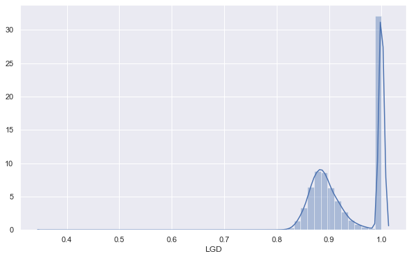
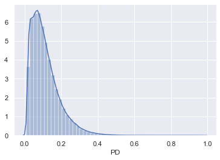
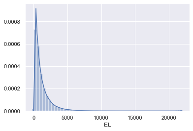

```python
import pandas as pd
import numpy as np
import pickle
import matplotlib.pyplot as plt
import seaborn as sns

sns.set()

pd.options.display.max_rows = None
pd.options.display.max_columns = None
```


```python
loan_data_preprocessed = pd.read_csv('loan_data_2007-2014_preprocessesed_all_vars.csv', index_col=0)
loan_data_preprocessed.shape
```

    /Users/omaromeiri/anaconda3/lib/python3.7/site-packages/IPython/core/interactiveshell.py:3058: DtypeWarning: Columns (20,48) have mixed types. Specify dtype option on import or set low_memory=False.
      interactivity=interactivity, compiler=compiler, result=result)


    (466285, 205)


```python
loan_data_preprocessed.index
```


    Int64Index([     0,      1,      2,      3,      4,      5,      6,      7,
                     8,      9,
                ...
                466275, 466276, 466277, 466278, 466279, 466280, 466281, 466282,
                466283, 466284],
               dtype='int64', length=466285)


```python
vars_to_use = pickle.load(open('vars_usable_preprocessing.pickle', 'rb'))

len(vars_to_use)
```


    50


```python
'''
    Popping this variable from the vars list because it has only 0 values for this dataset,
    and will cause a SINGULAR MATRIX ERROR while trying to perform the transformations for the p-value calculations
'''

vars_to_use.pop(7)
```


    'home_ownership:ANY'


```python
ref_vars = ['grade:G', 'home_ownership:RENT', 'verification_status:Verified', 'purpose:credit_card', 'initial_list_status:f']
```


```python
loan_data_preprocessed['mths_since_last_delinq'].fillna(0, inplace=True)
loan_data_preprocessed['mths_since_last_record'].fillna(0, inplace=True)
```


```python
loan_data_preprocessed_lgd_ead = loan_data_preprocessed[vars_to_use]
loan_data_preprocessed_lgd_ead.shape
```


    (466285, 49)


```python
loan_data_preprocessed_lgd_ead.drop(ref_vars, axis=1, inplace=True)
loan_data_preprocessed_lgd_ead.shape
```

    /Users/omaromeiri/anaconda3/lib/python3.7/site-packages/pandas/core/frame.py:3940: SettingWithCopyWarning: 
    A value is trying to be set on a copy of a slice from a DataFrame
    
    See the caveats in the documentation: http://pandas.pydata.org/pandas-docs/stable/indexing.html#indexing-view-versus-copy
      errors=errors)


    (466285, 44)


### LGD = 1 - recovery_rate


```python
from sklearn import linear_model
import scipy.stats as stat

class LogisticRegression_with_p_values:
    
    def __init__(self,*args,**kwargs):
        self.model = linear_model.LogisticRegression(*args,**kwargs)
        
    def fit(self,X,y):
        self.model.fit(X,y)
        
        #### Get p-values for the fitted model ####
        denom = (2.0 * (1.0 + np.cosh(self.model.decision_function(X))))
        denom = np.tile(denom,(X.shape[1],1)).T
        F_ij = np.dot((X / denom).T,X)
        Cramer_Rao = np.linalg.inv(F_ij)
        sigma_estimates = np.sqrt(np.diagonal(Cramer_Rao))
        z_scores = self.model.coef_[0] / sigma_estimates
        p_values = [stat.norm.sf(abs(x)) * 2 for x in z_scores]
        
        self.coef_ = self.model.coef_
        self.intercept_ = self.model.intercept_
        self.p_values = p_values
```


```python


class LinearRegression(linear_model.LinearRegression):
    def __init__(self, fit_intercept=True, normalize=True, copy_X=True, n_jobs=1):
        self.fit_intercept = fit_intercept
        self.normalize = normalize
        self.copy_X = copy_X
        self.n_jobs = n_jobs
        
    def fit(self, X, y, n_jobs=1):
        self = super(LinearRegression, self).fit(X, y, n_jobs)
        sse = np.sum((self.predict(X) - y) ** 2, axis=0) / float(X.shape[0] - X.shape[1])
        se = np.array([np.sqrt(np.diagonal(sse * np.linalg.inv(np.dot(X.T, X))))])
        self.t = self.coef_ / se
        self.p = np.squeeze(2 * (1 - stat.t.cdf(np.abs(self.t), y.shape[0] - X.shape[1])))
        return self
```


```python
lgd_log_reg = pickle.load(open('model_LGD_log_reg_2007-2014.sav', 'rb'))
```


```python
recovery_rate_binary = lgd_log_reg.model.predict(loan_data_preprocessed_lgd_ead)
```


```python
lgd_lin_reg = pickle.load(open('model_LGD_lin_reg_2007-2014.sav', 'rb'))
```


```python
predicted_recovery_rate_numerical = lgd_lin_reg.predict(loan_data_preprocessed_lgd_ead)
```


```python
loan_data_preprocessed['recovery_rate'] = np.multiply(recovery_rate_binary, predicted_recovery_rate_numerical) 
```


```python
loan_data_preprocessed['recovery_rate'] = loan_data_preprocessed['recovery_rate'].apply(lambda x: 0 if x <= 0 else (1 if x >=1 else x))
```


```python
loan_data_preprocessed['recovery_rate'].describe()
```


    count    466285.000000
    mean          0.064335
    std           0.058103
    min           0.000000
    25%           0.000000
    50%           0.080368
    75%           0.116985
    max           0.642352
    Name: recovery_rate, dtype: float64


## LDG calc


```python
loan_data_preprocessed['LGD'] = 1 - loan_data_preprocessed['recovery_rate']
loan_data_preprocessed['LGD'].describe()
```


    count    466285.000000
    mean          0.935665
    std           0.058103
    min           0.357648
    25%           0.883015
    50%           0.919632
    75%           1.000000
    max           1.000000
    Name: LGD, dtype: float64


```python
plt.figure(figsize=(10,6))
sns.distplot(loan_data_preprocessed['LGD'])
```


    <matplotlib.axes._subplots.AxesSubplot at 0x1a22dd3978>





### EAD


```python
ead_lin_reg = pickle.load(open('model_EAD_lin_reg_2007-2014.sav', 'rb'))
```


```python
loan_data_preprocessed['CCF'] = ead_lin_reg.predict(loan_data_preprocessed_lgd_ead)
```


```python
loan_data_preprocessed['CCF'] = loan_data_preprocessed['CCF'].apply(lambda x: 0 if x <= 0 else (1 if x >=1 else x))
```


```python
loan_data_preprocessed['CCF'].describe()
```


    count    466285.000000
    mean          0.737580
    std           0.101754
    min           0.292303
    25%           0.671008
    50%           0.730699
    75%           0.803450
    max           1.000000
    Name: CCF, dtype: float64


```python
loan_data_preprocessed['EAD'] = loan_data_preprocessed['CCF'] * loan_data_preprocessed['funded_amnt']
loan_data_preprocessed['EAD'].describe()
```


    count    466285.000000
    mean      10814.869481
    std        6935.201878
    min         190.350076
    25%        5495.007281
    50%        9208.537434
    75%       14692.764605
    max       35000.000000
    Name: EAD, dtype: float64


## PD


```python
train = pd.read_csv('loan_data_train_dataset_2007-2014.csv', index_col=0)
print(train.shape)

test = pd.read_csv('loan_data_test_dataset_2007-2014.csv', index_col=0)
print(test.shape)

loan_data_pd = pd.concat([train, test], axis=0)
loan_data_pd.shape
```

    (373028, 324)
    (93257, 311)


    /Users/omaromeiri/anaconda3/lib/python3.7/site-packages/ipykernel_launcher.py:7: FutureWarning: Sorting because non-concatenation axis is not aligned. A future version
    of pandas will change to not sort by default.
    
    To accept the future behavior, pass 'sort=False'.
    
    To retain the current behavior and silence the warning, pass 'sort=True'.
    
      import sys


    (466285, 325)


```python
del train
del test
```


```python
vars_to_use = pickle.load(open('vars_significant_PD_model_2007-2014.pickle', 'rb'))
print(len(vars_to_use))
      
ref_vars = pickle.load(open('vars_significant_reference_PD_model_2007-2014.pickle', 'rb'))
print(len(ref_vars))

pd_log_reg = pickle.load(open('model_PD_log_reg_2007-2014.sav', 'rb'))
```

    74
    16


```python
loan_data_pd = loan_data_pd[vars_to_use]
loan_data_pd.shape
```


    (466285, 74)


```python
loan_data_pd['PD'] = pd_log_reg.model.predict_proba(loan_data_pd)[:,0]
```


```python
loan_data_pd['PD'].describe()
```


    count    466285.000000
    mean          0.113616
    std           0.082341
    min           0.007955
    25%           0.055998
    50%           0.095074
    75%           0.149365
    max           0.981246
    Name: PD, dtype: float64


```python
sns.distplot(loan_data_pd['PD'])
```


    <matplotlib.axes._subplots.AxesSubplot at 0x1a260e7390>





```python
loan_data_preprocessed_new = pd.concat([loan_data_preprocessed, loan_data_pd['PD']], axis=1)
loan_data_preprocessed_new.shape
```


    (466285, 210)


```python
loan_data_preprocessed_new['EL'] = loan_data_preprocessed_new['PD'] * loan_data_preprocessed_new['LGD'] * loan_data_preprocessed_new['EAD']
```


```python
sns.distplot(loan_data_preprocessed_new['EL'])
loan_data_preprocessed_new['EL'].describe()
```


    count    466285.000000
    mean       1121.906248
    std        1160.778659
    min           8.003029
    25%         361.080046
    50%         728.540871
    75%        1459.319135
    max       21793.091361
    Name: EL, dtype: float64





* PD  : The likelihood of the inability to repay the debt in full or in time
* LGD : The share of an asset that is lost when a borrower defaults (the proportion of the total exposure that cannot be recovered)
* EAD : The total value that a lender is exposed to when a borrower defaults (The maximum that a lender can lose whae a borrower defaults)


```python
loan_data_preprocessed_new[['funded_amnt', 'PD', 'LGD', 'EAD', 'EL']].head(10)
```


<div>
<style scoped>
    .dataframe tbody tr th:only-of-type {
        vertical-align: middle;
    }

    .dataframe tbody tr th {
        vertical-align: top;
    }

    .dataframe thead th {
        text-align: right;
    }
</style>
<table border="1" class="dataframe">
  <thead>
    <tr style="text-align: right;">
      <th></th>
      <th>funded_amnt</th>
      <th>PD</th>
      <th>LGD</th>
      <th>EAD</th>
      <th>EL</th>
    </tr>
  </thead>
  <tbody>
    <tr>
      <th>0</th>
      <td>5000</td>
      <td>0.178108</td>
      <td>0.913771</td>
      <td>2949.577234</td>
      <td>480.042660</td>
    </tr>
    <tr>
      <th>1</th>
      <td>2500</td>
      <td>0.358148</td>
      <td>0.915505</td>
      <td>1944.451950</td>
      <td>637.558899</td>
    </tr>
    <tr>
      <th>2</th>
      <td>2400</td>
      <td>0.205534</td>
      <td>0.919479</td>
      <td>1579.922915</td>
      <td>298.580698</td>
    </tr>
    <tr>
      <th>3</th>
      <td>10000</td>
      <td>0.196474</td>
      <td>0.904920</td>
      <td>6606.540166</td>
      <td>1174.595569</td>
    </tr>
    <tr>
      <th>4</th>
      <td>3000</td>
      <td>0.145476</td>
      <td>0.911458</td>
      <td>2124.632805</td>
      <td>281.715479</td>
    </tr>
    <tr>
      <th>5</th>
      <td>5000</td>
      <td>0.119950</td>
      <td>0.918857</td>
      <td>3174.184351</td>
      <td>349.847898</td>
    </tr>
    <tr>
      <th>6</th>
      <td>7000</td>
      <td>0.243273</td>
      <td>0.916519</td>
      <td>5052.366244</td>
      <td>1126.497685</td>
    </tr>
    <tr>
      <th>7</th>
      <td>3000</td>
      <td>0.335781</td>
      <td>0.913684</td>
      <td>2056.328166</td>
      <td>630.877369</td>
    </tr>
    <tr>
      <th>8</th>
      <td>5600</td>
      <td>0.408005</td>
      <td>0.900229</td>
      <td>4810.657753</td>
      <td>1766.943531</td>
    </tr>
    <tr>
      <th>9</th>
      <td>5375</td>
      <td>0.156031</td>
      <td>0.919841</td>
      <td>3901.850193</td>
      <td>560.008074</td>
    </tr>
  </tbody>
</table>
</div>


```python
import locale

portfolio_EL = loan_data_preprocessed_new['EL'].sum()

locale.setlocale(locale.LC_ALL, 'en_US')
print(f'The whole portfolio Expected Loss is: ',locale.currency(portfolio_EL, grouping=True))
```

    The whole portfolio Expected Loss is:  $523,128,055.05


```python
total_funded_amount = loan_data_preprocessed_new['funded_amnt'].sum()
print("The bank's total funding amount is", locale.currency(total_funded_amount, grouping=True))
```

    The bank's total funding amount is $6,664,052,450.00


#### A bank usually holds 10% of its assets in capital. EL should be less than 0.1 * total_funded_amnt


Observed portfooio EL should be in the range of 2% and 10%, depending on this value, the bank's management can alter its strategy, giving more loans if the ratio is low or restricting loans if the portfolio EL is too high


```python
from colorama import Fore, Style

capital_adequacy_ratio = portfolio_EL / total_funded_amount

if capital_adequacy_ratio > 0.10:
    print("This bank's strategy is aggressive, their EL is " + Fore.RED+f"{round(capital_adequacy_ratio*100,3)}%" + Style.RESET_ALL+ " of the total funded amount")

if capital_adequacy_ratio < 0.10 and capital_adequacy_ratio > 0.05:
    print(f"This bank's strategy is in the normal range, their EL is " + Fore.YELLOW+ f"{round(capital_adequacy_ratio*100,3)}%" +Style.RESET_ALL + " of the total funded amount")

if capital_adequacy_ratio < 0.05:
    print(f"This bank's strategy is conservative, their EL is " + Fore.GREEN+ f"{round(capital_adequacy_ratio*100,3)}%" +Style.RESET_ALL + " of the total funded amount")


```

    This bank's strategy is in the normal range, their EL is 7.85% of the total funded amount


```python

```
