# Model re-trainment data preprocessing


Since we discovered differences in the population between 2007-2014 and 2015, we'll need to retrain the model


```python
import pandas as pd
import numpy as np
from sklearn.linear_model import LogisticRegression
import pickle
import matplotlib.pyplot as plt
from matplotlib import cm
import matplotlib as mpl
import seaborn as sns
import math

pd.options.display.max_columns = None
sns.set()
```


```python
old_data = pd.read_csv('loan_data_2007_2014.csv', index_col=0)
new_data = pd.read_csv('loan_data_2015.csv')
```

    /Users/omaromeiri/anaconda3/lib/python3.7/site-packages/IPython/core/interactiveshell.py:3058: DtypeWarning: Columns (20) have mixed types. Specify dtype option on import or set low_memory=False.
      interactivity=interactivity, compiler=compiler, result=result)
    /Users/omaromeiri/anaconda3/lib/python3.7/site-packages/IPython/core/interactiveshell.py:3058: DtypeWarning: Columns (19,55) have mixed types. Specify dtype option on import or set low_memory=False.
      interactivity=interactivity, compiler=compiler, result=result)


```python
print(old_data.shape)
print(new_data.shape)
```

    (466285, 74)
    (421094, 74)


```python
old_data.head()
```


<div>
<style scoped>
    .dataframe tbody tr th:only-of-type {
        vertical-align: middle;
    }

    .dataframe tbody tr th {
        vertical-align: top;
    }

    .dataframe thead th {
        text-align: right;
    }
</style>
<table border="1" class="dataframe">
  <thead>
    <tr style="text-align: right;">
      <th></th>
      <th>id</th>
      <th>member_id</th>
      <th>loan_amnt</th>
      <th>funded_amnt</th>
      <th>funded_amnt_inv</th>
      <th>term</th>
      <th>int_rate</th>
      <th>installment</th>
      <th>grade</th>
      <th>sub_grade</th>
      <th>emp_title</th>
      <th>emp_length</th>
      <th>home_ownership</th>
      <th>annual_inc</th>
      <th>verification_status</th>
      <th>issue_d</th>
      <th>loan_status</th>
      <th>pymnt_plan</th>
      <th>url</th>
      <th>desc</th>
      <th>purpose</th>
      <th>title</th>
      <th>zip_code</th>
      <th>addr_state</th>
      <th>dti</th>
      <th>delinq_2yrs</th>
      <th>earliest_cr_line</th>
      <th>inq_last_6mths</th>
      <th>mths_since_last_delinq</th>
      <th>mths_since_last_record</th>
      <th>open_acc</th>
      <th>pub_rec</th>
      <th>revol_bal</th>
      <th>revol_util</th>
      <th>total_acc</th>
      <th>initial_list_status</th>
      <th>out_prncp</th>
      <th>out_prncp_inv</th>
      <th>total_pymnt</th>
      <th>total_pymnt_inv</th>
      <th>total_rec_prncp</th>
      <th>total_rec_int</th>
      <th>total_rec_late_fee</th>
      <th>recoveries</th>
      <th>collection_recovery_fee</th>
      <th>last_pymnt_d</th>
      <th>last_pymnt_amnt</th>
      <th>next_pymnt_d</th>
      <th>last_credit_pull_d</th>
      <th>collections_12_mths_ex_med</th>
      <th>mths_since_last_major_derog</th>
      <th>policy_code</th>
      <th>application_type</th>
      <th>annual_inc_joint</th>
      <th>dti_joint</th>
      <th>verification_status_joint</th>
      <th>acc_now_delinq</th>
      <th>tot_coll_amt</th>
      <th>tot_cur_bal</th>
      <th>open_acc_6m</th>
      <th>open_il_6m</th>
      <th>open_il_12m</th>
      <th>open_il_24m</th>
      <th>mths_since_rcnt_il</th>
      <th>total_bal_il</th>
      <th>il_util</th>
      <th>open_rv_12m</th>
      <th>open_rv_24m</th>
      <th>max_bal_bc</th>
      <th>all_util</th>
      <th>total_rev_hi_lim</th>
      <th>inq_fi</th>
      <th>total_cu_tl</th>
      <th>inq_last_12m</th>
    </tr>
  </thead>
  <tbody>
    <tr>
      <th>0</th>
      <td>1077501</td>
      <td>1296599</td>
      <td>5000</td>
      <td>5000</td>
      <td>4975.0</td>
      <td>36 months</td>
      <td>10.65</td>
      <td>162.87</td>
      <td>B</td>
      <td>B2</td>
      <td>NaN</td>
      <td>10+ years</td>
      <td>RENT</td>
      <td>24000.0</td>
      <td>Verified</td>
      <td>Dec-11</td>
      <td>Fully Paid</td>
      <td>n</td>
      <td>https://www.lendingclub.com/browse/loanDetail....</td>
      <td>Borrower added on 12/22/11 &gt; I need to upgra...</td>
      <td>credit_card</td>
      <td>Computer</td>
      <td>860xx</td>
      <td>AZ</td>
      <td>27.65</td>
      <td>0.0</td>
      <td>Jan-85</td>
      <td>1.0</td>
      <td>NaN</td>
      <td>NaN</td>
      <td>3.0</td>
      <td>0.0</td>
      <td>13648</td>
      <td>83.7</td>
      <td>9.0</td>
      <td>f</td>
      <td>0.0</td>
      <td>0.0</td>
      <td>5861.071414</td>
      <td>5831.78</td>
      <td>5000.00</td>
      <td>861.07</td>
      <td>0.00</td>
      <td>0.00</td>
      <td>0.00</td>
      <td>Jan-15</td>
      <td>171.62</td>
      <td>NaN</td>
      <td>Jan-16</td>
      <td>0.0</td>
      <td>NaN</td>
      <td>1</td>
      <td>INDIVIDUAL</td>
      <td>NaN</td>
      <td>NaN</td>
      <td>NaN</td>
      <td>0.0</td>
      <td>NaN</td>
      <td>NaN</td>
      <td>NaN</td>
      <td>NaN</td>
      <td>NaN</td>
      <td>NaN</td>
      <td>NaN</td>
      <td>NaN</td>
      <td>NaN</td>
      <td>NaN</td>
      <td>NaN</td>
      <td>NaN</td>
      <td>NaN</td>
      <td>NaN</td>
      <td>NaN</td>
      <td>NaN</td>
      <td>NaN</td>
    </tr>
    <tr>
      <th>1</th>
      <td>1077430</td>
      <td>1314167</td>
      <td>2500</td>
      <td>2500</td>
      <td>2500.0</td>
      <td>60 months</td>
      <td>15.27</td>
      <td>59.83</td>
      <td>C</td>
      <td>C4</td>
      <td>Ryder</td>
      <td>&lt; 1 year</td>
      <td>RENT</td>
      <td>30000.0</td>
      <td>Source Verified</td>
      <td>Dec-11</td>
      <td>Charged Off</td>
      <td>n</td>
      <td>https://www.lendingclub.com/browse/loanDetail....</td>
      <td>Borrower added on 12/22/11 &gt; I plan to use t...</td>
      <td>car</td>
      <td>bike</td>
      <td>309xx</td>
      <td>GA</td>
      <td>1.00</td>
      <td>0.0</td>
      <td>Apr-99</td>
      <td>5.0</td>
      <td>NaN</td>
      <td>NaN</td>
      <td>3.0</td>
      <td>0.0</td>
      <td>1687</td>
      <td>9.4</td>
      <td>4.0</td>
      <td>f</td>
      <td>0.0</td>
      <td>0.0</td>
      <td>1008.710000</td>
      <td>1008.71</td>
      <td>456.46</td>
      <td>435.17</td>
      <td>0.00</td>
      <td>117.08</td>
      <td>1.11</td>
      <td>Apr-13</td>
      <td>119.66</td>
      <td>NaN</td>
      <td>Sep-13</td>
      <td>0.0</td>
      <td>NaN</td>
      <td>1</td>
      <td>INDIVIDUAL</td>
      <td>NaN</td>
      <td>NaN</td>
      <td>NaN</td>
      <td>0.0</td>
      <td>NaN</td>
      <td>NaN</td>
      <td>NaN</td>
      <td>NaN</td>
      <td>NaN</td>
      <td>NaN</td>
      <td>NaN</td>
      <td>NaN</td>
      <td>NaN</td>
      <td>NaN</td>
      <td>NaN</td>
      <td>NaN</td>
      <td>NaN</td>
      <td>NaN</td>
      <td>NaN</td>
      <td>NaN</td>
      <td>NaN</td>
    </tr>
    <tr>
      <th>2</th>
      <td>1077175</td>
      <td>1313524</td>
      <td>2400</td>
      <td>2400</td>
      <td>2400.0</td>
      <td>36 months</td>
      <td>15.96</td>
      <td>84.33</td>
      <td>C</td>
      <td>C5</td>
      <td>NaN</td>
      <td>10+ years</td>
      <td>RENT</td>
      <td>12252.0</td>
      <td>Not Verified</td>
      <td>Dec-11</td>
      <td>Fully Paid</td>
      <td>n</td>
      <td>https://www.lendingclub.com/browse/loanDetail....</td>
      <td>NaN</td>
      <td>small_business</td>
      <td>real estate business</td>
      <td>606xx</td>
      <td>IL</td>
      <td>8.72</td>
      <td>0.0</td>
      <td>Nov-01</td>
      <td>2.0</td>
      <td>NaN</td>
      <td>NaN</td>
      <td>2.0</td>
      <td>0.0</td>
      <td>2956</td>
      <td>98.5</td>
      <td>10.0</td>
      <td>f</td>
      <td>0.0</td>
      <td>0.0</td>
      <td>3003.653644</td>
      <td>3003.65</td>
      <td>2400.00</td>
      <td>603.65</td>
      <td>0.00</td>
      <td>0.00</td>
      <td>0.00</td>
      <td>Jun-14</td>
      <td>649.91</td>
      <td>NaN</td>
      <td>Jan-16</td>
      <td>0.0</td>
      <td>NaN</td>
      <td>1</td>
      <td>INDIVIDUAL</td>
      <td>NaN</td>
      <td>NaN</td>
      <td>NaN</td>
      <td>0.0</td>
      <td>NaN</td>
      <td>NaN</td>
      <td>NaN</td>
      <td>NaN</td>
      <td>NaN</td>
      <td>NaN</td>
      <td>NaN</td>
      <td>NaN</td>
      <td>NaN</td>
      <td>NaN</td>
      <td>NaN</td>
      <td>NaN</td>
      <td>NaN</td>
      <td>NaN</td>
      <td>NaN</td>
      <td>NaN</td>
      <td>NaN</td>
    </tr>
    <tr>
      <th>3</th>
      <td>1076863</td>
      <td>1277178</td>
      <td>10000</td>
      <td>10000</td>
      <td>10000.0</td>
      <td>36 months</td>
      <td>13.49</td>
      <td>339.31</td>
      <td>C</td>
      <td>C1</td>
      <td>AIR RESOURCES BOARD</td>
      <td>10+ years</td>
      <td>RENT</td>
      <td>49200.0</td>
      <td>Source Verified</td>
      <td>Dec-11</td>
      <td>Fully Paid</td>
      <td>n</td>
      <td>https://www.lendingclub.com/browse/loanDetail....</td>
      <td>Borrower added on 12/21/11 &gt; to pay for prop...</td>
      <td>other</td>
      <td>personel</td>
      <td>917xx</td>
      <td>CA</td>
      <td>20.00</td>
      <td>0.0</td>
      <td>Feb-96</td>
      <td>1.0</td>
      <td>35.0</td>
      <td>NaN</td>
      <td>10.0</td>
      <td>0.0</td>
      <td>5598</td>
      <td>21.0</td>
      <td>37.0</td>
      <td>f</td>
      <td>0.0</td>
      <td>0.0</td>
      <td>12226.302210</td>
      <td>12226.30</td>
      <td>10000.00</td>
      <td>2209.33</td>
      <td>16.97</td>
      <td>0.00</td>
      <td>0.00</td>
      <td>Jan-15</td>
      <td>357.48</td>
      <td>NaN</td>
      <td>Jan-15</td>
      <td>0.0</td>
      <td>NaN</td>
      <td>1</td>
      <td>INDIVIDUAL</td>
      <td>NaN</td>
      <td>NaN</td>
      <td>NaN</td>
      <td>0.0</td>
      <td>NaN</td>
      <td>NaN</td>
      <td>NaN</td>
      <td>NaN</td>
      <td>NaN</td>
      <td>NaN</td>
      <td>NaN</td>
      <td>NaN</td>
      <td>NaN</td>
      <td>NaN</td>
      <td>NaN</td>
      <td>NaN</td>
      <td>NaN</td>
      <td>NaN</td>
      <td>NaN</td>
      <td>NaN</td>
      <td>NaN</td>
    </tr>
    <tr>
      <th>4</th>
      <td>1075358</td>
      <td>1311748</td>
      <td>3000</td>
      <td>3000</td>
      <td>3000.0</td>
      <td>60 months</td>
      <td>12.69</td>
      <td>67.79</td>
      <td>B</td>
      <td>B5</td>
      <td>University Medical Group</td>
      <td>1 year</td>
      <td>RENT</td>
      <td>80000.0</td>
      <td>Source Verified</td>
      <td>Dec-11</td>
      <td>Current</td>
      <td>n</td>
      <td>https://www.lendingclub.com/browse/loanDetail....</td>
      <td>Borrower added on 12/21/11 &gt; I plan on combi...</td>
      <td>other</td>
      <td>Personal</td>
      <td>972xx</td>
      <td>OR</td>
      <td>17.94</td>
      <td>0.0</td>
      <td>Jan-96</td>
      <td>0.0</td>
      <td>38.0</td>
      <td>NaN</td>
      <td>15.0</td>
      <td>0.0</td>
      <td>27783</td>
      <td>53.9</td>
      <td>38.0</td>
      <td>f</td>
      <td>766.9</td>
      <td>766.9</td>
      <td>3242.170000</td>
      <td>3242.17</td>
      <td>2233.10</td>
      <td>1009.07</td>
      <td>0.00</td>
      <td>0.00</td>
      <td>0.00</td>
      <td>Jan-16</td>
      <td>67.79</td>
      <td>Feb-16</td>
      <td>Jan-16</td>
      <td>0.0</td>
      <td>NaN</td>
      <td>1</td>
      <td>INDIVIDUAL</td>
      <td>NaN</td>
      <td>NaN</td>
      <td>NaN</td>
      <td>0.0</td>
      <td>NaN</td>
      <td>NaN</td>
      <td>NaN</td>
      <td>NaN</td>
      <td>NaN</td>
      <td>NaN</td>
      <td>NaN</td>
      <td>NaN</td>
      <td>NaN</td>
      <td>NaN</td>
      <td>NaN</td>
      <td>NaN</td>
      <td>NaN</td>
      <td>NaN</td>
      <td>NaN</td>
      <td>NaN</td>
      <td>NaN</td>
    </tr>
  </tbody>
</table>
</div>


```python
new_data.head()
```


<div>
<style scoped>
    .dataframe tbody tr th:only-of-type {
        vertical-align: middle;
    }

    .dataframe tbody tr th {
        vertical-align: top;
    }

    .dataframe thead th {
        text-align: right;
    }
</style>
<table border="1" class="dataframe">
  <thead>
    <tr style="text-align: right;">
      <th></th>
      <th>id</th>
      <th>member_id</th>
      <th>loan_amnt</th>
      <th>funded_amnt</th>
      <th>funded_amnt_inv</th>
      <th>term</th>
      <th>int_rate</th>
      <th>installment</th>
      <th>grade</th>
      <th>sub_grade</th>
      <th>emp_title</th>
      <th>emp_length</th>
      <th>home_ownership</th>
      <th>annual_inc</th>
      <th>verification_status</th>
      <th>issue_d</th>
      <th>loan_status</th>
      <th>pymnt_plan</th>
      <th>url</th>
      <th>desc</th>
      <th>purpose</th>
      <th>title</th>
      <th>zip_code</th>
      <th>addr_state</th>
      <th>dti</th>
      <th>delinq_2yrs</th>
      <th>earliest_cr_line</th>
      <th>inq_last_6mths</th>
      <th>mths_since_last_delinq</th>
      <th>mths_since_last_record</th>
      <th>open_acc</th>
      <th>pub_rec</th>
      <th>revol_bal</th>
      <th>revol_util</th>
      <th>total_acc</th>
      <th>initial_list_status</th>
      <th>out_prncp</th>
      <th>out_prncp_inv</th>
      <th>total_pymnt</th>
      <th>total_pymnt_inv</th>
      <th>total_rec_prncp</th>
      <th>total_rec_int</th>
      <th>total_rec_late_fee</th>
      <th>recoveries</th>
      <th>collection_recovery_fee</th>
      <th>last_pymnt_d</th>
      <th>last_pymnt_amnt</th>
      <th>next_pymnt_d</th>
      <th>last_credit_pull_d</th>
      <th>collections_12_mths_ex_med</th>
      <th>mths_since_last_major_derog</th>
      <th>policy_code</th>
      <th>application_type</th>
      <th>annual_inc_joint</th>
      <th>dti_joint</th>
      <th>verification_status_joint</th>
      <th>acc_now_delinq</th>
      <th>tot_coll_amt</th>
      <th>tot_cur_bal</th>
      <th>open_acc_6m</th>
      <th>open_il_6m</th>
      <th>open_il_12m</th>
      <th>open_il_24m</th>
      <th>mths_since_rcnt_il</th>
      <th>total_bal_il</th>
      <th>il_util</th>
      <th>open_rv_12m</th>
      <th>open_rv_24m</th>
      <th>max_bal_bc</th>
      <th>all_util</th>
      <th>total_rev_hi_lim</th>
      <th>inq_fi</th>
      <th>total_cu_tl</th>
      <th>inq_last_12m</th>
    </tr>
  </thead>
  <tbody>
    <tr>
      <th>0</th>
      <td>68444620</td>
      <td>73334399</td>
      <td>35000</td>
      <td>35000</td>
      <td>35000.0</td>
      <td>60 months</td>
      <td>11.99</td>
      <td>778.38</td>
      <td>C</td>
      <td>C1</td>
      <td>Foreign Service Officer</td>
      <td>10+ years</td>
      <td>MORTGAGE</td>
      <td>128000.0</td>
      <td>Source Verified</td>
      <td>Dec-15</td>
      <td>Issued</td>
      <td>n</td>
      <td>https://www.lendingclub.com/browse/loanDetail....</td>
      <td>NaN</td>
      <td>home_improvement</td>
      <td>Home improvement</td>
      <td>200xx</td>
      <td>DC</td>
      <td>6.46</td>
      <td>0.0</td>
      <td>Feb-90</td>
      <td>0.0</td>
      <td>46.0</td>
      <td>NaN</td>
      <td>17.0</td>
      <td>0.0</td>
      <td>14277</td>
      <td>27.4</td>
      <td>46.0</td>
      <td>w</td>
      <td>35000.0</td>
      <td>35000.0</td>
      <td>0.0</td>
      <td>0.0</td>
      <td>0.0</td>
      <td>0.0</td>
      <td>0.0</td>
      <td>0.0</td>
      <td>0.0</td>
      <td>NaN</td>
      <td>0.0</td>
      <td>Jan-16</td>
      <td>Jan-16</td>
      <td>0.0</td>
      <td>56.0</td>
      <td>1</td>
      <td>INDIVIDUAL</td>
      <td>NaN</td>
      <td>NaN</td>
      <td>NaN</td>
      <td>0.0</td>
      <td>321.0</td>
      <td>146867.0</td>
      <td>1.0</td>
      <td>11.0</td>
      <td>0.0</td>
      <td>0.0</td>
      <td>28.0</td>
      <td>35367.0</td>
      <td>49.3</td>
      <td>0.0</td>
      <td>1.0</td>
      <td>5020.0</td>
      <td>40.1</td>
      <td>52200.0</td>
      <td>1.0</td>
      <td>4.0</td>
      <td>0.0</td>
    </tr>
    <tr>
      <th>1</th>
      <td>68547583</td>
      <td>73437441</td>
      <td>8650</td>
      <td>8650</td>
      <td>8650.0</td>
      <td>36 months</td>
      <td>5.32</td>
      <td>260.50</td>
      <td>A</td>
      <td>A1</td>
      <td>Associate Consultant</td>
      <td>&lt; 1 year</td>
      <td>MORTGAGE</td>
      <td>100000.0</td>
      <td>Not Verified</td>
      <td>Dec-15</td>
      <td>Issued</td>
      <td>n</td>
      <td>https://www.lendingclub.com/browse/loanDetail....</td>
      <td>NaN</td>
      <td>credit_card</td>
      <td>Credit card refinancing</td>
      <td>462xx</td>
      <td>IN</td>
      <td>7.28</td>
      <td>0.0</td>
      <td>Jul-01</td>
      <td>0.0</td>
      <td>NaN</td>
      <td>NaN</td>
      <td>15.0</td>
      <td>0.0</td>
      <td>7158</td>
      <td>26.7</td>
      <td>24.0</td>
      <td>w</td>
      <td>8650.0</td>
      <td>8650.0</td>
      <td>0.0</td>
      <td>0.0</td>
      <td>0.0</td>
      <td>0.0</td>
      <td>0.0</td>
      <td>0.0</td>
      <td>0.0</td>
      <td>NaN</td>
      <td>0.0</td>
      <td>Jan-16</td>
      <td>Jan-16</td>
      <td>0.0</td>
      <td>NaN</td>
      <td>1</td>
      <td>INDIVIDUAL</td>
      <td>NaN</td>
      <td>NaN</td>
      <td>NaN</td>
      <td>0.0</td>
      <td>0.0</td>
      <td>165450.0</td>
      <td>0.0</td>
      <td>1.0</td>
      <td>1.0</td>
      <td>1.0</td>
      <td>11.0</td>
      <td>24041.0</td>
      <td>88.8</td>
      <td>0.0</td>
      <td>3.0</td>
      <td>3081.0</td>
      <td>57.9</td>
      <td>26800.0</td>
      <td>1.0</td>
      <td>0.0</td>
      <td>5.0</td>
    </tr>
    <tr>
      <th>2</th>
      <td>67849662</td>
      <td>72708407</td>
      <td>4225</td>
      <td>4225</td>
      <td>4225.0</td>
      <td>36 months</td>
      <td>14.85</td>
      <td>146.16</td>
      <td>C</td>
      <td>C5</td>
      <td>mechanic</td>
      <td>5 years</td>
      <td>RENT</td>
      <td>35000.0</td>
      <td>Source Verified</td>
      <td>Dec-15</td>
      <td>Issued</td>
      <td>n</td>
      <td>https://www.lendingclub.com/browse/loanDetail....</td>
      <td>NaN</td>
      <td>debt_consolidation</td>
      <td>Debt consolidation</td>
      <td>672xx</td>
      <td>KS</td>
      <td>15.22</td>
      <td>2.0</td>
      <td>Jul-11</td>
      <td>0.0</td>
      <td>18.0</td>
      <td>NaN</td>
      <td>6.0</td>
      <td>0.0</td>
      <td>1058</td>
      <td>24.6</td>
      <td>6.0</td>
      <td>w</td>
      <td>4225.0</td>
      <td>4225.0</td>
      <td>0.0</td>
      <td>0.0</td>
      <td>0.0</td>
      <td>0.0</td>
      <td>0.0</td>
      <td>0.0</td>
      <td>0.0</td>
      <td>NaN</td>
      <td>0.0</td>
      <td>Jan-16</td>
      <td>Jan-16</td>
      <td>0.0</td>
      <td>NaN</td>
      <td>1</td>
      <td>INDIVIDUAL</td>
      <td>NaN</td>
      <td>NaN</td>
      <td>NaN</td>
      <td>0.0</td>
      <td>0.0</td>
      <td>4888.0</td>
      <td>0.0</td>
      <td>1.0</td>
      <td>0.0</td>
      <td>0.0</td>
      <td>47.0</td>
      <td>3830.0</td>
      <td>21.9</td>
      <td>0.0</td>
      <td>0.0</td>
      <td>367.0</td>
      <td>22.4</td>
      <td>4300.0</td>
      <td>0.0</td>
      <td>0.0</td>
      <td>0.0</td>
    </tr>
    <tr>
      <th>3</th>
      <td>68506885</td>
      <td>73396712</td>
      <td>10000</td>
      <td>10000</td>
      <td>10000.0</td>
      <td>60 months</td>
      <td>11.99</td>
      <td>222.40</td>
      <td>C</td>
      <td>C1</td>
      <td>CARDIOVASCULAR TECH</td>
      <td>10+ years</td>
      <td>RENT</td>
      <td>42500.0</td>
      <td>Not Verified</td>
      <td>Dec-15</td>
      <td>Issued</td>
      <td>n</td>
      <td>https://www.lendingclub.com/browse/loanDetail....</td>
      <td>NaN</td>
      <td>debt_consolidation</td>
      <td>Debt consolidation</td>
      <td>460xx</td>
      <td>IN</td>
      <td>31.04</td>
      <td>0.0</td>
      <td>Dec-98</td>
      <td>1.0</td>
      <td>NaN</td>
      <td>NaN</td>
      <td>10.0</td>
      <td>0.0</td>
      <td>5812</td>
      <td>40.9</td>
      <td>23.0</td>
      <td>w</td>
      <td>10000.0</td>
      <td>10000.0</td>
      <td>0.0</td>
      <td>0.0</td>
      <td>0.0</td>
      <td>0.0</td>
      <td>0.0</td>
      <td>0.0</td>
      <td>0.0</td>
      <td>NaN</td>
      <td>0.0</td>
      <td>Jan-16</td>
      <td>Jan-16</td>
      <td>0.0</td>
      <td>NaN</td>
      <td>1</td>
      <td>INDIVIDUAL</td>
      <td>NaN</td>
      <td>NaN</td>
      <td>NaN</td>
      <td>0.0</td>
      <td>0.0</td>
      <td>41166.0</td>
      <td>1.0</td>
      <td>3.0</td>
      <td>0.0</td>
      <td>2.0</td>
      <td>13.0</td>
      <td>35354.0</td>
      <td>75.5</td>
      <td>1.0</td>
      <td>1.0</td>
      <td>3118.0</td>
      <td>67.4</td>
      <td>14200.0</td>
      <td>1.0</td>
      <td>1.0</td>
      <td>1.0</td>
    </tr>
    <tr>
      <th>4</th>
      <td>68341763</td>
      <td>72928789</td>
      <td>20000</td>
      <td>20000</td>
      <td>20000.0</td>
      <td>60 months</td>
      <td>10.78</td>
      <td>432.66</td>
      <td>B</td>
      <td>B4</td>
      <td>truck driver</td>
      <td>10+ years</td>
      <td>MORTGAGE</td>
      <td>63000.0</td>
      <td>Not Verified</td>
      <td>Dec-15</td>
      <td>Issued</td>
      <td>n</td>
      <td>https://www.lendingclub.com/browse/loanDetail....</td>
      <td>NaN</td>
      <td>home_improvement</td>
      <td>NaN</td>
      <td>605xx</td>
      <td>IL</td>
      <td>10.78</td>
      <td>0.0</td>
      <td>Aug-00</td>
      <td>0.0</td>
      <td>NaN</td>
      <td>NaN</td>
      <td>6.0</td>
      <td>0.0</td>
      <td>7869</td>
      <td>56.2</td>
      <td>18.0</td>
      <td>w</td>
      <td>20000.0</td>
      <td>20000.0</td>
      <td>0.0</td>
      <td>0.0</td>
      <td>0.0</td>
      <td>0.0</td>
      <td>0.0</td>
      <td>0.0</td>
      <td>0.0</td>
      <td>NaN</td>
      <td>0.0</td>
      <td>Jan-16</td>
      <td>Dec-15</td>
      <td>0.0</td>
      <td>NaN</td>
      <td>1</td>
      <td>JOINT</td>
      <td>71000.0</td>
      <td>13.85</td>
      <td>Not Verified</td>
      <td>0.0</td>
      <td>0.0</td>
      <td>189699.0</td>
      <td>0.0</td>
      <td>1.0</td>
      <td>0.0</td>
      <td>4.0</td>
      <td>19.0</td>
      <td>10827.0</td>
      <td>72.8</td>
      <td>0.0</td>
      <td>2.0</td>
      <td>2081.0</td>
      <td>64.7</td>
      <td>14000.0</td>
      <td>2.0</td>
      <td>5.0</td>
      <td>1.0</td>
    </tr>
  </tbody>
</table>
</div>


```python
raw_data = pd.concat([old_data, new_data])
raw_data.reset_index(inplace=True, drop=True)
print(raw_data.shape)
```

    (887379, 74)


```python

```

# Data Exploration and preprocessing<br>

'emp_length' to int


```python
raw_data['emp_length'].unique()
```


    array(['10+ years', '< 1 year', '1 year', '3 years', '8 years', '9 years',
           '4 years', '5 years', '6 years', '2 years', '7 years', nan],
          dtype=object)


```python
raw_data['emp_length_int'] = raw_data['emp_length'].apply(lambda x: str(x).replace('+ years','').replace('< 1 year','0').replace('nan','0').replace(' years','').replace(' year','')).astype('int')
```


```python
raw_data['emp_length_int'].unique()
```


    array([10,  0,  1,  3,  8,  9,  4,  5,  6,  2,  7])


'term' to int


```python
raw_data['term'].unique()
```


    array([' 36 months', ' 60 months'], dtype=object)


```python
raw_data['term'] = raw_data['term'].apply(lambda x: str(x).replace('months','').strip()).astype('int')
raw_data['term'].unique()
```


    array([36, 60])


parsing dates from ['earliest_cr_line_date', 'earliest_cr_line_date', 'issue_d']<br>
and later calculating time delta in months assuming todays date is 2017-12-01


```python
raw_data['earliest_cr_line_date'] = pd.to_datetime(raw_data['earliest_cr_line'], format='%b-%y')

raw_data['earliest_cr_line_date'].head()
```


    0   1985-01-01
    1   1999-04-01
    2   2001-11-01
    3   1996-02-01
    4   1996-01-01
    Name: earliest_cr_line_date, dtype: datetime64[ns]


```python
raw_data['mths_since_earliest_cr_line'] = round((pd.to_datetime('2018-12-01') - raw_data['earliest_cr_line_date'])/np.timedelta64(1, 'M'))
raw_data['mths_since_earliest_cr_line'].describe()
```


    count    887350.000000
    mean        245.727271
    std          96.157025
    min        -600.000000
    25%         187.000000
    50%         231.000000
    75%         293.000000
    max         599.000000
    Name: mths_since_earliest_cr_line, dtype: float64


```python
raw_data['earliest_cr_line_date'] = raw_data['earliest_cr_line_date'].apply(lambda x: x-np.timedelta64(100,'Y') if x.year > 2020 else x)
```


```python
raw_data['mths_since_earliest_cr_line'] = round((pd.to_datetime('2018-12-01') - raw_data['earliest_cr_line_date'])/np.timedelta64(1, 'M'))
raw_data['mths_since_earliest_cr_line'].describe()
```


    count    887350.000000
    mean        248.841713
    std          89.242280
    min          73.000000
    25%         187.000000
    50%         231.000000
    75%         294.000000
    max         899.000000
    Name: mths_since_earliest_cr_line, dtype: float64


```python
raw_data['issue_d'].head()
```


    0    Dec-11
    1    Dec-11
    2    Dec-11
    3    Dec-11
    4    Dec-11
    Name: issue_d, dtype: object


```python
raw_data['issue_d'] = pd.to_datetime(raw_data['issue_d'], format='%b-%y')
raw_data['issue_d'].head()
```


    0   2011-12-01
    1   2011-12-01
    2   2011-12-01
    3   2011-12-01
    4   2011-12-01
    Name: issue_d, dtype: datetime64[ns]


```python
raw_data['mths_since_issue_d'] = round((pd.to_datetime('2018-12-01') - raw_data['issue_d'])/np.timedelta64(1, 'M'))
```


```python
raw_data[['issue_d','mths_since_issue_d']].head()
```


<div>
<style scoped>
    .dataframe tbody tr th:only-of-type {
        vertical-align: middle;
    }

    .dataframe tbody tr th {
        vertical-align: top;
    }

    .dataframe thead th {
        text-align: right;
    }
</style>
<table border="1" class="dataframe">
  <thead>
    <tr style="text-align: right;">
      <th></th>
      <th>issue_d</th>
      <th>mths_since_issue_d</th>
    </tr>
  </thead>
  <tbody>
    <tr>
      <th>0</th>
      <td>2011-12-01</td>
      <td>84.0</td>
    </tr>
    <tr>
      <th>1</th>
      <td>2011-12-01</td>
      <td>84.0</td>
    </tr>
    <tr>
      <th>2</th>
      <td>2011-12-01</td>
      <td>84.0</td>
    </tr>
    <tr>
      <th>3</th>
      <td>2011-12-01</td>
      <td>84.0</td>
    </tr>
    <tr>
      <th>4</th>
      <td>2011-12-01</td>
      <td>84.0</td>
    </tr>
  </tbody>
</table>
</div>


### Categorical columns to dummy variables


```python
catg_cols = ['grade', 'sub_grade', 'home_ownership', 'verification_status',
             'loan_status', 'purpose', 'addr_state', 'initial_list_status']
```


```python
raw_data[catg_cols].head()
```


<div>
<style scoped>
    .dataframe tbody tr th:only-of-type {
        vertical-align: middle;
    }

    .dataframe tbody tr th {
        vertical-align: top;
    }

    .dataframe thead th {
        text-align: right;
    }
</style>
<table border="1" class="dataframe">
  <thead>
    <tr style="text-align: right;">
      <th></th>
      <th>grade</th>
      <th>sub_grade</th>
      <th>home_ownership</th>
      <th>verification_status</th>
      <th>loan_status</th>
      <th>purpose</th>
      <th>addr_state</th>
      <th>initial_list_status</th>
    </tr>
  </thead>
  <tbody>
    <tr>
      <th>0</th>
      <td>B</td>
      <td>B2</td>
      <td>RENT</td>
      <td>Verified</td>
      <td>Fully Paid</td>
      <td>credit_card</td>
      <td>AZ</td>
      <td>f</td>
    </tr>
    <tr>
      <th>1</th>
      <td>C</td>
      <td>C4</td>
      <td>RENT</td>
      <td>Source Verified</td>
      <td>Charged Off</td>
      <td>car</td>
      <td>GA</td>
      <td>f</td>
    </tr>
    <tr>
      <th>2</th>
      <td>C</td>
      <td>C5</td>
      <td>RENT</td>
      <td>Not Verified</td>
      <td>Fully Paid</td>
      <td>small_business</td>
      <td>IL</td>
      <td>f</td>
    </tr>
    <tr>
      <th>3</th>
      <td>C</td>
      <td>C1</td>
      <td>RENT</td>
      <td>Source Verified</td>
      <td>Fully Paid</td>
      <td>other</td>
      <td>CA</td>
      <td>f</td>
    </tr>
    <tr>
      <th>4</th>
      <td>B</td>
      <td>B5</td>
      <td>RENT</td>
      <td>Source Verified</td>
      <td>Current</td>
      <td>other</td>
      <td>OR</td>
      <td>f</td>
    </tr>
  </tbody>
</table>
</div>


```python
'''
Note that I'm not using the drop_first argument of the get_dummies function.
I'll eliminate the category with the smallest weight of evidence later on
'''

dummies = pd.DataFrame()

for col in catg_cols:
    temp_dummy = pd.get_dummies(raw_data[col], prefix=col, prefix_sep=':', drop_first=False)
    dummies = pd.concat([dummies, temp_dummy], axis=1)
dummies.head()
```


<div>
<style scoped>
    .dataframe tbody tr th:only-of-type {
        vertical-align: middle;
    }

    .dataframe tbody tr th {
        vertical-align: top;
    }

    .dataframe thead th {
        text-align: right;
    }
</style>
<table border="1" class="dataframe">
  <thead>
    <tr style="text-align: right;">
      <th></th>
      <th>grade:A</th>
      <th>grade:B</th>
      <th>grade:C</th>
      <th>grade:D</th>
      <th>grade:E</th>
      <th>grade:F</th>
      <th>grade:G</th>
      <th>sub_grade:A1</th>
      <th>sub_grade:A2</th>
      <th>sub_grade:A3</th>
      <th>sub_grade:A4</th>
      <th>sub_grade:A5</th>
      <th>sub_grade:B1</th>
      <th>sub_grade:B2</th>
      <th>sub_grade:B3</th>
      <th>sub_grade:B4</th>
      <th>sub_grade:B5</th>
      <th>sub_grade:C1</th>
      <th>sub_grade:C2</th>
      <th>sub_grade:C3</th>
      <th>sub_grade:C4</th>
      <th>sub_grade:C5</th>
      <th>sub_grade:D1</th>
      <th>sub_grade:D2</th>
      <th>sub_grade:D3</th>
      <th>sub_grade:D4</th>
      <th>sub_grade:D5</th>
      <th>sub_grade:E1</th>
      <th>sub_grade:E2</th>
      <th>sub_grade:E3</th>
      <th>sub_grade:E4</th>
      <th>sub_grade:E5</th>
      <th>sub_grade:F1</th>
      <th>sub_grade:F2</th>
      <th>sub_grade:F3</th>
      <th>sub_grade:F4</th>
      <th>sub_grade:F5</th>
      <th>sub_grade:G1</th>
      <th>sub_grade:G2</th>
      <th>sub_grade:G3</th>
      <th>sub_grade:G4</th>
      <th>sub_grade:G5</th>
      <th>home_ownership:ANY</th>
      <th>home_ownership:MORTGAGE</th>
      <th>home_ownership:NONE</th>
      <th>home_ownership:OTHER</th>
      <th>home_ownership:OWN</th>
      <th>home_ownership:RENT</th>
      <th>verification_status:Not Verified</th>
      <th>verification_status:Source Verified</th>
      <th>verification_status:Verified</th>
      <th>loan_status:Charged Off</th>
      <th>loan_status:Current</th>
      <th>loan_status:Default</th>
      <th>loan_status:Does not meet the credit policy. Status:Charged Off</th>
      <th>loan_status:Does not meet the credit policy. Status:Fully Paid</th>
      <th>loan_status:Fully Paid</th>
      <th>loan_status:In Grace Period</th>
      <th>loan_status:Issued</th>
      <th>loan_status:Late (16-30 days)</th>
      <th>loan_status:Late (31-120 days)</th>
      <th>purpose:car</th>
      <th>purpose:credit_card</th>
      <th>purpose:debt_consolidation</th>
      <th>purpose:educational</th>
      <th>purpose:home_improvement</th>
      <th>purpose:house</th>
      <th>purpose:major_purchase</th>
      <th>purpose:medical</th>
      <th>purpose:moving</th>
      <th>purpose:other</th>
      <th>purpose:renewable_energy</th>
      <th>purpose:small_business</th>
      <th>purpose:vacation</th>
      <th>purpose:wedding</th>
      <th>addr_state:AK</th>
      <th>addr_state:AL</th>
      <th>addr_state:AR</th>
      <th>addr_state:AZ</th>
      <th>addr_state:CA</th>
      <th>addr_state:CO</th>
      <th>addr_state:CT</th>
      <th>addr_state:DC</th>
      <th>addr_state:DE</th>
      <th>addr_state:FL</th>
      <th>addr_state:GA</th>
      <th>addr_state:HI</th>
      <th>addr_state:IA</th>
      <th>addr_state:ID</th>
      <th>addr_state:IL</th>
      <th>addr_state:IN</th>
      <th>addr_state:KS</th>
      <th>addr_state:KY</th>
      <th>addr_state:LA</th>
      <th>addr_state:MA</th>
      <th>addr_state:MD</th>
      <th>addr_state:ME</th>
      <th>addr_state:MI</th>
      <th>addr_state:MN</th>
      <th>addr_state:MO</th>
      <th>addr_state:MS</th>
      <th>addr_state:MT</th>
      <th>addr_state:NC</th>
      <th>addr_state:ND</th>
      <th>addr_state:NE</th>
      <th>addr_state:NH</th>
      <th>addr_state:NJ</th>
      <th>addr_state:NM</th>
      <th>addr_state:NV</th>
      <th>addr_state:NY</th>
      <th>addr_state:OH</th>
      <th>addr_state:OK</th>
      <th>addr_state:OR</th>
      <th>addr_state:PA</th>
      <th>addr_state:RI</th>
      <th>addr_state:SC</th>
      <th>addr_state:SD</th>
      <th>addr_state:TN</th>
      <th>addr_state:TX</th>
      <th>addr_state:UT</th>
      <th>addr_state:VA</th>
      <th>addr_state:VT</th>
      <th>addr_state:WA</th>
      <th>addr_state:WI</th>
      <th>addr_state:WV</th>
      <th>addr_state:WY</th>
      <th>initial_list_status:f</th>
      <th>initial_list_status:w</th>
    </tr>
  </thead>
  <tbody>
    <tr>
      <th>0</th>
      <td>0</td>
      <td>1</td>
      <td>0</td>
      <td>0</td>
      <td>0</td>
      <td>0</td>
      <td>0</td>
      <td>0</td>
      <td>0</td>
      <td>0</td>
      <td>0</td>
      <td>0</td>
      <td>0</td>
      <td>1</td>
      <td>0</td>
      <td>0</td>
      <td>0</td>
      <td>0</td>
      <td>0</td>
      <td>0</td>
      <td>0</td>
      <td>0</td>
      <td>0</td>
      <td>0</td>
      <td>0</td>
      <td>0</td>
      <td>0</td>
      <td>0</td>
      <td>0</td>
      <td>0</td>
      <td>0</td>
      <td>0</td>
      <td>0</td>
      <td>0</td>
      <td>0</td>
      <td>0</td>
      <td>0</td>
      <td>0</td>
      <td>0</td>
      <td>0</td>
      <td>0</td>
      <td>0</td>
      <td>0</td>
      <td>0</td>
      <td>0</td>
      <td>0</td>
      <td>0</td>
      <td>1</td>
      <td>0</td>
      <td>0</td>
      <td>1</td>
      <td>0</td>
      <td>0</td>
      <td>0</td>
      <td>0</td>
      <td>0</td>
      <td>1</td>
      <td>0</td>
      <td>0</td>
      <td>0</td>
      <td>0</td>
      <td>0</td>
      <td>1</td>
      <td>0</td>
      <td>0</td>
      <td>0</td>
      <td>0</td>
      <td>0</td>
      <td>0</td>
      <td>0</td>
      <td>0</td>
      <td>0</td>
      <td>0</td>
      <td>0</td>
      <td>0</td>
      <td>0</td>
      <td>0</td>
      <td>0</td>
      <td>1</td>
      <td>0</td>
      <td>0</td>
      <td>0</td>
      <td>0</td>
      <td>0</td>
      <td>0</td>
      <td>0</td>
      <td>0</td>
      <td>0</td>
      <td>0</td>
      <td>0</td>
      <td>0</td>
      <td>0</td>
      <td>0</td>
      <td>0</td>
      <td>0</td>
      <td>0</td>
      <td>0</td>
      <td>0</td>
      <td>0</td>
      <td>0</td>
      <td>0</td>
      <td>0</td>
      <td>0</td>
      <td>0</td>
      <td>0</td>
      <td>0</td>
      <td>0</td>
      <td>0</td>
      <td>0</td>
      <td>0</td>
      <td>0</td>
      <td>0</td>
      <td>0</td>
      <td>0</td>
      <td>0</td>
      <td>0</td>
      <td>0</td>
      <td>0</td>
      <td>0</td>
      <td>0</td>
      <td>0</td>
      <td>0</td>
      <td>0</td>
      <td>0</td>
      <td>0</td>
      <td>0</td>
      <td>1</td>
      <td>0</td>
    </tr>
    <tr>
      <th>1</th>
      <td>0</td>
      <td>0</td>
      <td>1</td>
      <td>0</td>
      <td>0</td>
      <td>0</td>
      <td>0</td>
      <td>0</td>
      <td>0</td>
      <td>0</td>
      <td>0</td>
      <td>0</td>
      <td>0</td>
      <td>0</td>
      <td>0</td>
      <td>0</td>
      <td>0</td>
      <td>0</td>
      <td>0</td>
      <td>0</td>
      <td>1</td>
      <td>0</td>
      <td>0</td>
      <td>0</td>
      <td>0</td>
      <td>0</td>
      <td>0</td>
      <td>0</td>
      <td>0</td>
      <td>0</td>
      <td>0</td>
      <td>0</td>
      <td>0</td>
      <td>0</td>
      <td>0</td>
      <td>0</td>
      <td>0</td>
      <td>0</td>
      <td>0</td>
      <td>0</td>
      <td>0</td>
      <td>0</td>
      <td>0</td>
      <td>0</td>
      <td>0</td>
      <td>0</td>
      <td>0</td>
      <td>1</td>
      <td>0</td>
      <td>1</td>
      <td>0</td>
      <td>1</td>
      <td>0</td>
      <td>0</td>
      <td>0</td>
      <td>0</td>
      <td>0</td>
      <td>0</td>
      <td>0</td>
      <td>0</td>
      <td>0</td>
      <td>1</td>
      <td>0</td>
      <td>0</td>
      <td>0</td>
      <td>0</td>
      <td>0</td>
      <td>0</td>
      <td>0</td>
      <td>0</td>
      <td>0</td>
      <td>0</td>
      <td>0</td>
      <td>0</td>
      <td>0</td>
      <td>0</td>
      <td>0</td>
      <td>0</td>
      <td>0</td>
      <td>0</td>
      <td>0</td>
      <td>0</td>
      <td>0</td>
      <td>0</td>
      <td>0</td>
      <td>1</td>
      <td>0</td>
      <td>0</td>
      <td>0</td>
      <td>0</td>
      <td>0</td>
      <td>0</td>
      <td>0</td>
      <td>0</td>
      <td>0</td>
      <td>0</td>
      <td>0</td>
      <td>0</td>
      <td>0</td>
      <td>0</td>
      <td>0</td>
      <td>0</td>
      <td>0</td>
      <td>0</td>
      <td>0</td>
      <td>0</td>
      <td>0</td>
      <td>0</td>
      <td>0</td>
      <td>0</td>
      <td>0</td>
      <td>0</td>
      <td>0</td>
      <td>0</td>
      <td>0</td>
      <td>0</td>
      <td>0</td>
      <td>0</td>
      <td>0</td>
      <td>0</td>
      <td>0</td>
      <td>0</td>
      <td>0</td>
      <td>0</td>
      <td>0</td>
      <td>0</td>
      <td>1</td>
      <td>0</td>
    </tr>
    <tr>
      <th>2</th>
      <td>0</td>
      <td>0</td>
      <td>1</td>
      <td>0</td>
      <td>0</td>
      <td>0</td>
      <td>0</td>
      <td>0</td>
      <td>0</td>
      <td>0</td>
      <td>0</td>
      <td>0</td>
      <td>0</td>
      <td>0</td>
      <td>0</td>
      <td>0</td>
      <td>0</td>
      <td>0</td>
      <td>0</td>
      <td>0</td>
      <td>0</td>
      <td>1</td>
      <td>0</td>
      <td>0</td>
      <td>0</td>
      <td>0</td>
      <td>0</td>
      <td>0</td>
      <td>0</td>
      <td>0</td>
      <td>0</td>
      <td>0</td>
      <td>0</td>
      <td>0</td>
      <td>0</td>
      <td>0</td>
      <td>0</td>
      <td>0</td>
      <td>0</td>
      <td>0</td>
      <td>0</td>
      <td>0</td>
      <td>0</td>
      <td>0</td>
      <td>0</td>
      <td>0</td>
      <td>0</td>
      <td>1</td>
      <td>1</td>
      <td>0</td>
      <td>0</td>
      <td>0</td>
      <td>0</td>
      <td>0</td>
      <td>0</td>
      <td>0</td>
      <td>1</td>
      <td>0</td>
      <td>0</td>
      <td>0</td>
      <td>0</td>
      <td>0</td>
      <td>0</td>
      <td>0</td>
      <td>0</td>
      <td>0</td>
      <td>0</td>
      <td>0</td>
      <td>0</td>
      <td>0</td>
      <td>0</td>
      <td>0</td>
      <td>1</td>
      <td>0</td>
      <td>0</td>
      <td>0</td>
      <td>0</td>
      <td>0</td>
      <td>0</td>
      <td>0</td>
      <td>0</td>
      <td>0</td>
      <td>0</td>
      <td>0</td>
      <td>0</td>
      <td>0</td>
      <td>0</td>
      <td>0</td>
      <td>0</td>
      <td>1</td>
      <td>0</td>
      <td>0</td>
      <td>0</td>
      <td>0</td>
      <td>0</td>
      <td>0</td>
      <td>0</td>
      <td>0</td>
      <td>0</td>
      <td>0</td>
      <td>0</td>
      <td>0</td>
      <td>0</td>
      <td>0</td>
      <td>0</td>
      <td>0</td>
      <td>0</td>
      <td>0</td>
      <td>0</td>
      <td>0</td>
      <td>0</td>
      <td>0</td>
      <td>0</td>
      <td>0</td>
      <td>0</td>
      <td>0</td>
      <td>0</td>
      <td>0</td>
      <td>0</td>
      <td>0</td>
      <td>0</td>
      <td>0</td>
      <td>0</td>
      <td>0</td>
      <td>0</td>
      <td>0</td>
      <td>1</td>
      <td>0</td>
    </tr>
    <tr>
      <th>3</th>
      <td>0</td>
      <td>0</td>
      <td>1</td>
      <td>0</td>
      <td>0</td>
      <td>0</td>
      <td>0</td>
      <td>0</td>
      <td>0</td>
      <td>0</td>
      <td>0</td>
      <td>0</td>
      <td>0</td>
      <td>0</td>
      <td>0</td>
      <td>0</td>
      <td>0</td>
      <td>1</td>
      <td>0</td>
      <td>0</td>
      <td>0</td>
      <td>0</td>
      <td>0</td>
      <td>0</td>
      <td>0</td>
      <td>0</td>
      <td>0</td>
      <td>0</td>
      <td>0</td>
      <td>0</td>
      <td>0</td>
      <td>0</td>
      <td>0</td>
      <td>0</td>
      <td>0</td>
      <td>0</td>
      <td>0</td>
      <td>0</td>
      <td>0</td>
      <td>0</td>
      <td>0</td>
      <td>0</td>
      <td>0</td>
      <td>0</td>
      <td>0</td>
      <td>0</td>
      <td>0</td>
      <td>1</td>
      <td>0</td>
      <td>1</td>
      <td>0</td>
      <td>0</td>
      <td>0</td>
      <td>0</td>
      <td>0</td>
      <td>0</td>
      <td>1</td>
      <td>0</td>
      <td>0</td>
      <td>0</td>
      <td>0</td>
      <td>0</td>
      <td>0</td>
      <td>0</td>
      <td>0</td>
      <td>0</td>
      <td>0</td>
      <td>0</td>
      <td>0</td>
      <td>0</td>
      <td>1</td>
      <td>0</td>
      <td>0</td>
      <td>0</td>
      <td>0</td>
      <td>0</td>
      <td>0</td>
      <td>0</td>
      <td>0</td>
      <td>1</td>
      <td>0</td>
      <td>0</td>
      <td>0</td>
      <td>0</td>
      <td>0</td>
      <td>0</td>
      <td>0</td>
      <td>0</td>
      <td>0</td>
      <td>0</td>
      <td>0</td>
      <td>0</td>
      <td>0</td>
      <td>0</td>
      <td>0</td>
      <td>0</td>
      <td>0</td>
      <td>0</td>
      <td>0</td>
      <td>0</td>
      <td>0</td>
      <td>0</td>
      <td>0</td>
      <td>0</td>
      <td>0</td>
      <td>0</td>
      <td>0</td>
      <td>0</td>
      <td>0</td>
      <td>0</td>
      <td>0</td>
      <td>0</td>
      <td>0</td>
      <td>0</td>
      <td>0</td>
      <td>0</td>
      <td>0</td>
      <td>0</td>
      <td>0</td>
      <td>0</td>
      <td>0</td>
      <td>0</td>
      <td>0</td>
      <td>0</td>
      <td>0</td>
      <td>0</td>
      <td>1</td>
      <td>0</td>
    </tr>
    <tr>
      <th>4</th>
      <td>0</td>
      <td>1</td>
      <td>0</td>
      <td>0</td>
      <td>0</td>
      <td>0</td>
      <td>0</td>
      <td>0</td>
      <td>0</td>
      <td>0</td>
      <td>0</td>
      <td>0</td>
      <td>0</td>
      <td>0</td>
      <td>0</td>
      <td>0</td>
      <td>1</td>
      <td>0</td>
      <td>0</td>
      <td>0</td>
      <td>0</td>
      <td>0</td>
      <td>0</td>
      <td>0</td>
      <td>0</td>
      <td>0</td>
      <td>0</td>
      <td>0</td>
      <td>0</td>
      <td>0</td>
      <td>0</td>
      <td>0</td>
      <td>0</td>
      <td>0</td>
      <td>0</td>
      <td>0</td>
      <td>0</td>
      <td>0</td>
      <td>0</td>
      <td>0</td>
      <td>0</td>
      <td>0</td>
      <td>0</td>
      <td>0</td>
      <td>0</td>
      <td>0</td>
      <td>0</td>
      <td>1</td>
      <td>0</td>
      <td>1</td>
      <td>0</td>
      <td>0</td>
      <td>1</td>
      <td>0</td>
      <td>0</td>
      <td>0</td>
      <td>0</td>
      <td>0</td>
      <td>0</td>
      <td>0</td>
      <td>0</td>
      <td>0</td>
      <td>0</td>
      <td>0</td>
      <td>0</td>
      <td>0</td>
      <td>0</td>
      <td>0</td>
      <td>0</td>
      <td>0</td>
      <td>1</td>
      <td>0</td>
      <td>0</td>
      <td>0</td>
      <td>0</td>
      <td>0</td>
      <td>0</td>
      <td>0</td>
      <td>0</td>
      <td>0</td>
      <td>0</td>
      <td>0</td>
      <td>0</td>
      <td>0</td>
      <td>0</td>
      <td>0</td>
      <td>0</td>
      <td>0</td>
      <td>0</td>
      <td>0</td>
      <td>0</td>
      <td>0</td>
      <td>0</td>
      <td>0</td>
      <td>0</td>
      <td>0</td>
      <td>0</td>
      <td>0</td>
      <td>0</td>
      <td>0</td>
      <td>0</td>
      <td>0</td>
      <td>0</td>
      <td>0</td>
      <td>0</td>
      <td>0</td>
      <td>0</td>
      <td>0</td>
      <td>0</td>
      <td>0</td>
      <td>0</td>
      <td>0</td>
      <td>1</td>
      <td>0</td>
      <td>0</td>
      <td>0</td>
      <td>0</td>
      <td>0</td>
      <td>0</td>
      <td>0</td>
      <td>0</td>
      <td>0</td>
      <td>0</td>
      <td>0</td>
      <td>0</td>
      <td>0</td>
      <td>1</td>
      <td>0</td>
    </tr>
  </tbody>
</table>
</div>


```python
raw_data = pd.concat([raw_data, dummies], axis=1)
raw_data.columns
```


    Index(['id', 'member_id', 'loan_amnt', 'funded_amnt', 'funded_amnt_inv',
           'term', 'int_rate', 'installment', 'grade', 'sub_grade',
           ...
           'addr_state:TX', 'addr_state:UT', 'addr_state:VA', 'addr_state:VT',
           'addr_state:WA', 'addr_state:WI', 'addr_state:WV', 'addr_state:WY',
           'initial_list_status:f', 'initial_list_status:w'],
          dtype='object', length=206)


### Dealing with missing data


```python

fig = plt.figure(figsize=(35,10))
sns.heatmap(raw_data.isnull(), cmap='gnuplot', cbar=False)
```


    <matplotlib.axes._subplots.AxesSubplot at 0x1a3392f780>


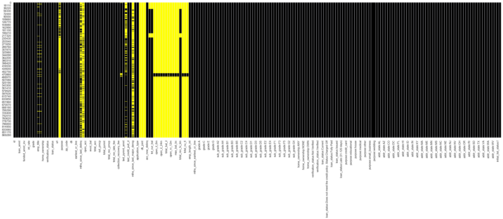


```python
vars_to_clean = ['annual_inc', 'delinq_2yrs', 'inq_last_6mths', 'open_acc', 'pub_rec',
                  'total_acc', 'acc_now_delinq', 'total_rev_hi_lim', 'emp_length_int', 'mths_since_earliest_cr_line', 'tot_coll_amt', 'tot_cur_bal']
```


```python
raw_data[vars_to_clean].describe()
```


<div>
<style scoped>
    .dataframe tbody tr th:only-of-type {
        vertical-align: middle;
    }

    .dataframe tbody tr th {
        vertical-align: top;
    }

    .dataframe thead th {
        text-align: right;
    }
</style>
<table border="1" class="dataframe">
  <thead>
    <tr style="text-align: right;">
      <th></th>
      <th>annual_inc</th>
      <th>delinq_2yrs</th>
      <th>inq_last_6mths</th>
      <th>open_acc</th>
      <th>pub_rec</th>
      <th>total_acc</th>
      <th>acc_now_delinq</th>
      <th>total_rev_hi_lim</th>
      <th>emp_length_int</th>
      <th>mths_since_earliest_cr_line</th>
      <th>tot_coll_amt</th>
      <th>tot_cur_bal</th>
    </tr>
  </thead>
  <tbody>
    <tr>
      <th>count</th>
      <td>8.873750e+05</td>
      <td>887350.000000</td>
      <td>887350.000000</td>
      <td>887350.000000</td>
      <td>887350.000000</td>
      <td>887350.000000</td>
      <td>887350.000000</td>
      <td>8.171030e+05</td>
      <td>887379.000000</td>
      <td>887350.000000</td>
      <td>8.171030e+05</td>
      <td>8.171030e+05</td>
    </tr>
    <tr>
      <th>mean</th>
      <td>7.502759e+04</td>
      <td>0.314442</td>
      <td>0.694623</td>
      <td>11.548469</td>
      <td>0.195307</td>
      <td>25.268026</td>
      <td>0.004991</td>
      <td>3.206862e+04</td>
      <td>5.705172</td>
      <td>248.841713</td>
      <td>2.257026e+02</td>
      <td>1.394582e+05</td>
    </tr>
    <tr>
      <th>std</th>
      <td>6.469830e+04</td>
      <td>0.862244</td>
      <td>0.998448</td>
      <td>5.317313</td>
      <td>0.582091</td>
      <td>11.840561</td>
      <td>0.077625</td>
      <td>3.749826e+04</td>
      <td>3.807020</td>
      <td>89.242280</td>
      <td>1.031137e+04</td>
      <td>1.537500e+05</td>
    </tr>
    <tr>
      <th>min</th>
      <td>0.000000e+00</td>
      <td>0.000000</td>
      <td>0.000000</td>
      <td>0.000000</td>
      <td>0.000000</td>
      <td>1.000000</td>
      <td>0.000000</td>
      <td>0.000000e+00</td>
      <td>0.000000</td>
      <td>73.000000</td>
      <td>0.000000e+00</td>
      <td>0.000000e+00</td>
    </tr>
    <tr>
      <th>25%</th>
      <td>4.500000e+04</td>
      <td>0.000000</td>
      <td>0.000000</td>
      <td>8.000000</td>
      <td>0.000000</td>
      <td>17.000000</td>
      <td>0.000000</td>
      <td>1.390000e+04</td>
      <td>2.000000</td>
      <td>187.000000</td>
      <td>0.000000e+00</td>
      <td>2.985300e+04</td>
    </tr>
    <tr>
      <th>50%</th>
      <td>6.500000e+04</td>
      <td>0.000000</td>
      <td>0.000000</td>
      <td>11.000000</td>
      <td>0.000000</td>
      <td>24.000000</td>
      <td>0.000000</td>
      <td>2.370000e+04</td>
      <td>6.000000</td>
      <td>231.000000</td>
      <td>0.000000e+00</td>
      <td>8.055900e+04</td>
    </tr>
    <tr>
      <th>75%</th>
      <td>9.000000e+04</td>
      <td>0.000000</td>
      <td>1.000000</td>
      <td>14.000000</td>
      <td>0.000000</td>
      <td>32.000000</td>
      <td>0.000000</td>
      <td>3.980000e+04</td>
      <td>10.000000</td>
      <td>294.000000</td>
      <td>0.000000e+00</td>
      <td>2.082050e+05</td>
    </tr>
    <tr>
      <th>max</th>
      <td>9.500000e+06</td>
      <td>39.000000</td>
      <td>33.000000</td>
      <td>90.000000</td>
      <td>86.000000</td>
      <td>169.000000</td>
      <td>14.000000</td>
      <td>9.999999e+06</td>
      <td>10.000000</td>
      <td>899.000000</td>
      <td>9.152545e+06</td>
      <td>8.000078e+06</td>
    </tr>
  </tbody>
</table>
</div>


```python
fig = plt.figure(figsize=(35,10))
sns.heatmap(raw_data[vars_to_clean].isnull(), cmap='gnuplot', cbar=False)
```


    <matplotlib.axes._subplots.AxesSubplot at 0x1a28287198>


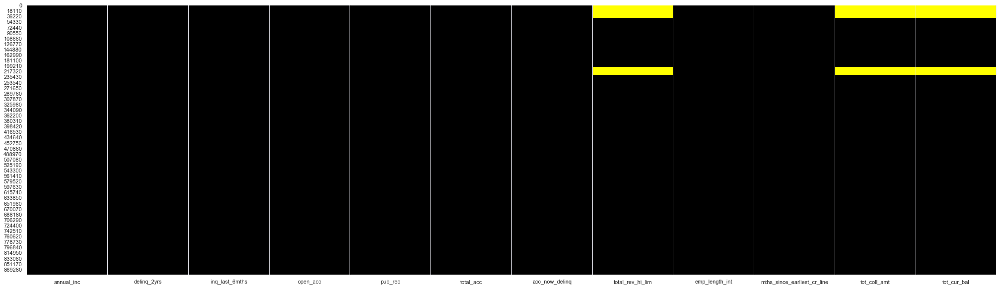


```python
def find_missing_vals():

    missing_vals = pd.DataFrame(raw_data[vars_to_clean].isnull().sum()).T
    return missing_vals

find_missing_vals()
```


<div>
<style scoped>
    .dataframe tbody tr th:only-of-type {
        vertical-align: middle;
    }

    .dataframe tbody tr th {
        vertical-align: top;
    }

    .dataframe thead th {
        text-align: right;
    }
</style>
<table border="1" class="dataframe">
  <thead>
    <tr style="text-align: right;">
      <th></th>
      <th>annual_inc</th>
      <th>delinq_2yrs</th>
      <th>inq_last_6mths</th>
      <th>open_acc</th>
      <th>pub_rec</th>
      <th>total_acc</th>
      <th>acc_now_delinq</th>
      <th>total_rev_hi_lim</th>
      <th>emp_length_int</th>
      <th>mths_since_earliest_cr_line</th>
      <th>tot_coll_amt</th>
      <th>tot_cur_bal</th>
    </tr>
  </thead>
  <tbody>
    <tr>
      <th>0</th>
      <td>4</td>
      <td>29</td>
      <td>29</td>
      <td>29</td>
      <td>29</td>
      <td>29</td>
      <td>29</td>
      <td>70276</td>
      <td>0</td>
      <td>29</td>
      <td>70276</td>
      <td>70276</td>
    </tr>
  </tbody>
</table>
</div>


Assuming that 'total_rev_hi_lim' is equal to 'funded_amnt' where data is missing


```python
raw_data['total_rev_hi_lim'].fillna(raw_data['funded_amnt'], inplace=True)
```


```python
find_missing_vals()
```


<div>
<style scoped>
    .dataframe tbody tr th:only-of-type {
        vertical-align: middle;
    }

    .dataframe tbody tr th {
        vertical-align: top;
    }

    .dataframe thead th {
        text-align: right;
    }
</style>
<table border="1" class="dataframe">
  <thead>
    <tr style="text-align: right;">
      <th></th>
      <th>annual_inc</th>
      <th>delinq_2yrs</th>
      <th>inq_last_6mths</th>
      <th>open_acc</th>
      <th>pub_rec</th>
      <th>total_acc</th>
      <th>acc_now_delinq</th>
      <th>total_rev_hi_lim</th>
      <th>emp_length_int</th>
      <th>mths_since_earliest_cr_line</th>
      <th>tot_coll_amt</th>
      <th>tot_cur_bal</th>
    </tr>
  </thead>
  <tbody>
    <tr>
      <th>0</th>
      <td>4</td>
      <td>29</td>
      <td>29</td>
      <td>29</td>
      <td>29</td>
      <td>29</td>
      <td>29</td>
      <td>0</td>
      <td>0</td>
      <td>29</td>
      <td>70276</td>
      <td>70276</td>
    </tr>
  </tbody>
</table>
</div>


I don't know what I'm going to do with the columns ['tot_coll_amt', 'tot_cur_bal']<br>
I will check their explanatory power later, if they are good predictors, I'll impute some values or drop the missing rows<br>
If not, I'll drop the entire columns

filling 29 missing values from the important columns


```python
raw_data['mths_since_earliest_cr_line'].fillna(0, inplace=True)
raw_data['acc_now_delinq'].fillna(0, inplace=True)
raw_data['total_acc'].fillna(0, inplace=True)
raw_data['pub_rec'].fillna(0, inplace=True)
raw_data['open_acc'].fillna(0, inplace=True)
raw_data['inq_last_6mths'].fillna(0, inplace=True)
raw_data['delinq_2yrs'].fillna(0, inplace=True)
raw_data['emp_length_int'].fillna(0, inplace=True)

raw_data['annual_inc'].fillna(raw_data['annual_inc'].mean(), inplace=True)
```


```python
find_missing_vals()
```


<div>
<style scoped>
    .dataframe tbody tr th:only-of-type {
        vertical-align: middle;
    }

    .dataframe tbody tr th {
        vertical-align: top;
    }

    .dataframe thead th {
        text-align: right;
    }
</style>
<table border="1" class="dataframe">
  <thead>
    <tr style="text-align: right;">
      <th></th>
      <th>annual_inc</th>
      <th>delinq_2yrs</th>
      <th>inq_last_6mths</th>
      <th>open_acc</th>
      <th>pub_rec</th>
      <th>total_acc</th>
      <th>acc_now_delinq</th>
      <th>total_rev_hi_lim</th>
      <th>emp_length_int</th>
      <th>mths_since_earliest_cr_line</th>
      <th>tot_coll_amt</th>
      <th>tot_cur_bal</th>
    </tr>
  </thead>
  <tbody>
    <tr>
      <th>0</th>
      <td>0</td>
      <td>0</td>
      <td>0</td>
      <td>0</td>
      <td>0</td>
      <td>0</td>
      <td>0</td>
      <td>0</td>
      <td>0</td>
      <td>0</td>
      <td>70276</td>
      <td>70276</td>
    </tr>
  </tbody>
</table>
</div>


### Organizing default into binary


```python
raw_data['loan_status'].unique()
```


    array(['Fully Paid', 'Charged Off', 'Current', 'Default',
           'Late (31-120 days)', 'In Grace Period', 'Late (16-30 days)',
           'Does not meet the credit policy. Status:Fully Paid',
           'Does not meet the credit policy. Status:Charged Off', 'Issued'],
          dtype=object)


```python
fig = plt.figure(figsize=(12,8))
sns.barplot(raw_data['loan_status'].value_counts().index, raw_data['loan_status'].value_counts())
plt.xticks(rotation=90)
#plt.tight_layout()
```


    (array([0, 1, 2, 3, 4, 5, 6, 7, 8, 9]), <a list of 10 Text xticklabel objects>)


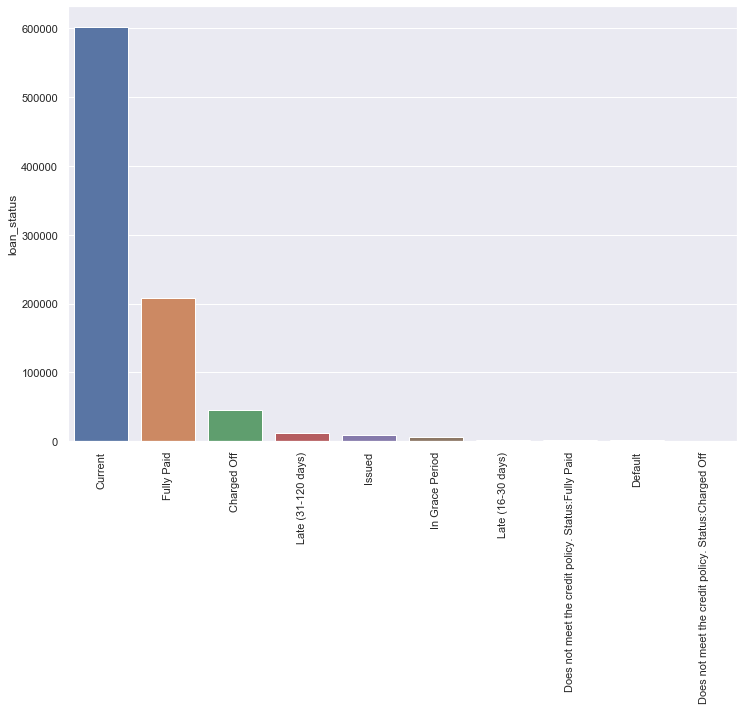


```python
raw_data['Y'] = np.where(raw_data['loan_status'].isin(['Charged Off',  'Default','Late (31-120 days)',
                                                       'Does not meet the credit policy. Status:Fully Paid',
                                                       'Does not meet the credit policy. Status:Charged Off']), 0, 1)

fig = plt.figure(figsize=(12,8))
sns.barplot(raw_data['Y'].value_counts().index, raw_data['Y'].value_counts())
plt.xticks([0,1],['default', 'non_default'])
```


    ([<matplotlib.axis.XTick at 0x1a1d96e240>,
      <matplotlib.axis.XTick at 0x1a1d9641d0>],
     <a list of 2 Text xticklabel objects>)


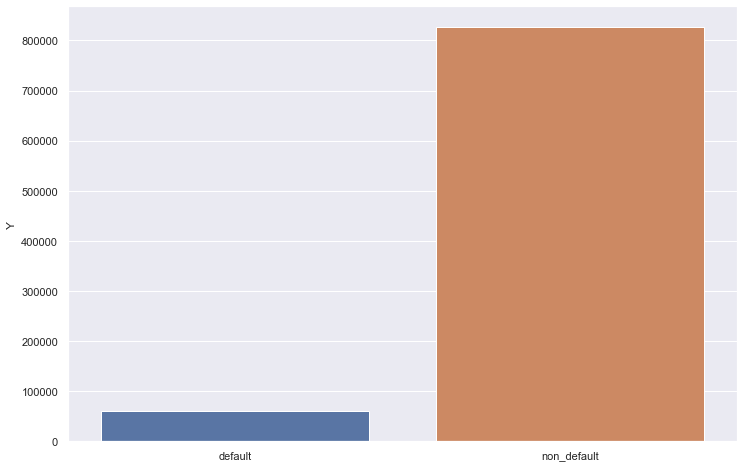


```python
def_nondef_ratio = round(raw_data['Y'].value_counts()[0]/raw_data['Y'].value_counts()[1],2)*100

print(f"The defaulted clients represent {def_nondef_ratio}% of the total clients")

if def_nondef_ratio > 45 and def_nondef_ratio < 55:
    print('Balanced dataset.')
else:
    print("Unbalanced, dataset. We'll need to think of sampling strategies" )
```

    The defaulted clients represent 7.000000000000001% of the total clients
    Unbalanced, dataset. We'll need to think of sampling strategies


```python
raw_data.to_csv('loan_data_2007-2015_preprocessed.csv')
```

### At this stage, I'll use the same pre-processing strategies as the first model, if any indicative of poor fine and coarse sclassing shows up, I'm gonna make the necessary changes.


```python

```


```python
from sklearn.model_selection import train_test_split
from sklearn.preprocessing import MinMaxScaler
```


```python
x_train, x_test, y_train, y_test = train_test_split(raw_data.drop('Y', axis=1), raw_data['Y'], test_size=0.2, shuffle=True, random_state=42)

print('Train: X:', x_train.shape, '  Y:', y_train.shape)
print('Test : X:', x_test.shape, '  Y:', y_test.shape)
```

    Train: X: (709903, 206)   Y: (709903,)
    Test : X: (177476, 206)   Y: (177476,)


```python

```


```python

```

### Assessing the independent variables explanatory power with the weight of evidence and the information value<br><br><br>
we will check if categories need to be merged or left alone. and the end of each independent variable check, I will create a list of the new usable categories.<br>
Obs.: We also need to eliminate one of the dummy variables, to avoid multi-colinearity. The one with the smaller WoE will be eliminated


```python
x_train_prep = x_train.copy()
y_train_prep = y_train.copy()
```


```python
vars_to_use = []
ref_vars = []


'''
Helper function to calculate WoE and plot a graph, for the discrete variables
'''


def woe_discrete(df, discrete_variable_name, targets, rot_x_ticks=0, plot_rows_start=0, plot_rows_end=None, hide_df=False, vlines=None):
    
    df = pd.concat([df[discrete_variable_name], targets], axis=1)
    
    df = pd.concat([df.groupby(df.columns[0], as_index=False).count(), df.groupby(df.columns[0], as_index=False).mean()], axis=1)
    df = df.iloc[:,[0,1,3]]
    df.columns = [df.columns[0], 'n_obs', 'prop_non_defaults']
    
    df['prop_n_obs'] = df['n_obs'] / df['n_obs'].sum()
    df['n_defaults'] = (1 - df['prop_non_defaults']) * df['n_obs']
    df['n_non_defaults'] = (df['prop_non_defaults'] * df['n_obs'])
    df['prop_n_non_defaults'] = df['n_non_defaults'] / df['n_non_defaults'].sum()
    df['prop_n_defaults'] = df['n_defaults'] / df['n_defaults'].sum()
    df['WoE'] = np.log(df['prop_n_non_defaults'] / df['prop_n_defaults'])
    
    df = df.sort_values(['WoE']).reset_index(drop=True)
    
    df['diff_prop_non_defaults'] = df['prop_n_non_defaults'].diff().abs()
    
    df.replace([np.inf, -np.inf], np.nan, inplace=True)
    
    df['diff_WoE'] = df['WoE'].diff().abs()
    df['IV'] = (df['prop_n_non_defaults'] - df['prop_n_defaults']) * df['WoE']
    df['IV'] = df['IV'].sum()
    
    
    
    
    
    
    
    def gen_colormap(length, scaled_vals, colormap):
    
        '''
        Input: length = number of colors for colormap, scaled_vals = scaled between 0-1 
        '''

        cmp = cm.get_cmap(colormap, length)
        colors = cmp(scaled_vals)[:,:3]
        colors = [tuple(x) for x in colors]
        return colors

    
    
    
    if plot_rows_end == None:
        
        


        N = df.shape[0]

        cmap = df.iloc[plot_rows_start:,:]['n_obs']

        scaler = MinMaxScaler(feature_range=(0,1))

        cmap = np.ravel(scaler.fit_transform(cmap.values.reshape(-1,1)))

        cmap = np.array(gen_colormap(N, cmap, 'coolwarm'))


        fig, ax = plt.subplots(figsize=(20,10))


        index = df.iloc[plot_rows_start:,0].index.values

        c1ax = fig.add_axes([0.9, 0.15, 0.05, 0.7])
        ax.bar(range(len(df.iloc[plot_rows_start:,0])), df.iloc[plot_rows_start:,:]['WoE'], color=cmap[index])
        
        
        
        norm = mpl.colors.Normalize(vmin=df.iloc[plot_rows_start:,:]['n_obs'].min(), vmax=df.iloc[plot_rows_start:,:]['n_obs'].max())
        
        cb1 = mpl.colorbar.ColorbarBase(c1ax, cmap=mpl.cm.coolwarm, norm=norm,orientation='vertical')
        plt.title('N_obs')
        
        labels = df[discrete_variable_name].values
        #print(labels)
        ax.set_xticks(range(len(df.iloc[plot_rows_start:,:])))
        ax.set_xticklabels(labels, rotation=rot_x_ticks)
        
        if vlines != None:
            for vline in vlines:
                ax.axvline(vline)
        


    
    else:
        
        
        
        N = df.shape[0]

        cmap = df.iloc[plot_rows_start:plot_rows_end,:]['n_obs']

        scaler = MinMaxScaler(feature_range=(0,1))

        cmap = np.ravel(scaler.fit_transform(cmap.values.reshape(-1,1)))

        cmap = np.array(gen_colormap(N, cmap, 'coolwarm'))


        fig, ax = plt.subplots(figsize=(20,10))


        
        
        
        index = range(len(df.iloc[plot_rows_start:plot_rows_end,0].index.values))
        #print(index)
        c1ax = fig.add_axes([0.9, 0.15, 0.05, 0.7])
        
       
        ax.bar(range(len(df.iloc[plot_rows_start:plot_rows_end,0])), df.iloc[plot_rows_start:plot_rows_end,:]['WoE'], color=cmap[index])
        
        norm = mpl.colors.Normalize(vmin=df.iloc[plot_rows_start:plot_rows_end,:]['n_obs'].min(), vmax=df.iloc[plot_rows_start:plot_rows_end,:]['n_obs'].max())
        
        cb1 = mpl.colorbar.ColorbarBase(c1ax, cmap=mpl.cm.coolwarm, norm=norm,orientation='vertical')
        plt.title('N_obs')

        
        labels = df.iloc[plot_rows_start:plot_rows_end,:][discrete_variable_name].values
        ax.set_xticks(range(len(df.iloc[plot_rows_start:plot_rows_end,0])))
        ax.set_xticklabels(labels, rotation=rot_x_ticks)
    
    ax.set_title(f'WoE {discrete_variable_name}')
    


    return df


'''
Helper function to calculate WoE and plot a graph, for the continuous variables
'''


def woe_ordered_continuous(df, continuous_variable_name, targets, rot_x_ticks=0, plot_rows_start=0, plot_rows_end=None, vlines=None, ascending=True):
    
    df = pd.concat([df[continuous_variable_name], targets], axis=1)
    
    df = pd.concat([df.groupby(df.columns[0], as_index=False).count(), df.groupby(df.columns[0], as_index=False).mean()], axis=1)
    df = df.iloc[:,[0,1,3]]
    df.columns = [df.columns[0], 'n_obs', 'prop_non_defaults']
    
    df['prop_n_obs'] = df['n_obs'] / df['n_obs'].sum()
    df['n_defaults'] = (1 - df['prop_non_defaults']) * df['n_obs']
    df['n_non_defaults'] = (df['prop_non_defaults'] * df['n_obs'])
    df['prop_n_non_defaults'] = df['n_non_defaults'] / df['n_non_defaults'].sum()
    df['prop_n_defaults'] = df['n_defaults'] / df['n_defaults'].sum()
    df['WoE'] = np.log(df['prop_n_non_defaults'] / df['prop_n_defaults'])
    
    df = df.sort_values(continuous_variable_name, ascending=ascending).reset_index(drop=True)
    
    df['diff_prop_non_defaults'] = df['prop_n_non_defaults'].diff().abs()
    
    df.replace([np.inf, -np.inf], np.nan, inplace=True)
    
    df['diff_WoE'] = df['WoE'].diff().abs()
    df['IV'] = (df['prop_n_non_defaults'] - df['prop_n_defaults']) * df['WoE']
    df['IV'] = df['IV'].sum()
    
   


    def gen_colormap(length, scaled_vals, colormap):
    
        '''
        Input: length = number of colors for colormap, scaled_vals = scaled between 0-1 
        '''

        cmp = cm.get_cmap(colormap, length)
        colors = cmp(scaled_vals)[:,:3]
        colors = [tuple(x) for x in colors]
        return colors

    

    
    
    
    if plot_rows_end == None:
        
        


        N = df.shape[0]

        cmap = df.iloc[plot_rows_start:,:]['n_obs']

        scaler = MinMaxScaler(feature_range=(0,1))

        cmap = np.ravel(scaler.fit_transform(cmap.values.reshape(-1,1)))

        cmap = np.array(gen_colormap(N, cmap, 'coolwarm'))


        fig, ax = plt.subplots(figsize=(20,10))


        index = df.iloc[plot_rows_start:,0].index.values

        c1ax = fig.add_axes([0.9, 0.15, 0.05, 0.7])
        ax.bar(range(len(df.iloc[plot_rows_start:,0])), df.iloc[plot_rows_start:,:]['WoE'], color=cmap[index])
        
        
        
        norm = mpl.colors.Normalize(vmin=df.iloc[plot_rows_start:,:]['n_obs'].min(), vmax=df.iloc[plot_rows_start:,:]['n_obs'].max())
        
        cb1 = mpl.colorbar.ColorbarBase(c1ax, cmap=mpl.cm.coolwarm, norm=norm,orientation='vertical')
        plt.title('N_obs')
        
        labels = df[continuous_variable_name].values
        #print(labels)
        ax.set_xticks(range(len(df.iloc[plot_rows_start:,:])))
        ax.set_xticklabels(labels, rotation=rot_x_ticks)
        
        if vlines != None:
            for vline in vlines:
                ax.axvline(vline)
        


    
    else:
        
        
        
        N = df.shape[0]

        cmap = df.iloc[plot_rows_start:plot_rows_end,:]['n_obs']

        scaler = MinMaxScaler(feature_range=(0,1))

        cmap = np.ravel(scaler.fit_transform(cmap.values.reshape(-1,1)))

        cmap = np.array(gen_colormap(N, cmap, 'coolwarm'))


        fig, ax = plt.subplots(figsize=(20,10))


        
        
        
        index = range(len(df.iloc[plot_rows_start:plot_rows_end,0].index.values))
        #print(index)
        c1ax = fig.add_axes([0.9, 0.15, 0.05, 0.7])
        
        
        ax.bar(range(len(df.iloc[plot_rows_start:plot_rows_end,0])), df.iloc[plot_rows_start:plot_rows_end,:]['WoE'], color=cmap[index])
        
        norm = mpl.colors.Normalize(vmin=df.iloc[plot_rows_start:plot_rows_end,:]['n_obs'].min(), vmax=df.iloc[plot_rows_start:plot_rows_end,:]['n_obs'].max())
        
        cb1 = mpl.colorbar.ColorbarBase(c1ax, cmap=mpl.cm.coolwarm, norm=norm,orientation='vertical')
        plt.title('N_obs')

        
        labels = df.iloc[plot_rows_start:plot_rows_end,:][continuous_variable_name].values
        ax.set_xticks(range(len(df.iloc[plot_rows_start:plot_rows_end,0])))
        ax.set_xticklabels(labels, rotation=rot_x_ticks)
        
        
        if vlines != None:
            for vline in vlines:
                ax.axvline(vline)
    
    ax.set_title(f'WoE {continuous_variable_name}')
    

    
    
    
    
    
    

    return df
```


```python

```

# Discrete variables

### 'grade' independent variable<br>

This variable is a strong predictor of the target, the Information Value (IV) is very high


```python
woe_df = woe_discrete(x_train_prep, 'grade', y_train_prep)
woe_df
```


<div>
<style scoped>
    .dataframe tbody tr th:only-of-type {
        vertical-align: middle;
    }

    .dataframe tbody tr th {
        vertical-align: top;
    }

    .dataframe thead th {
        text-align: right;
    }
</style>
<table border="1" class="dataframe">
  <thead>
    <tr style="text-align: right;">
      <th></th>
      <th>grade</th>
      <th>n_obs</th>
      <th>prop_non_defaults</th>
      <th>prop_n_obs</th>
      <th>n_defaults</th>
      <th>n_non_defaults</th>
      <th>prop_n_non_defaults</th>
      <th>prop_n_defaults</th>
      <th>WoE</th>
      <th>diff_prop_non_defaults</th>
      <th>diff_WoE</th>
      <th>IV</th>
    </tr>
  </thead>
  <tbody>
    <tr>
      <th>0</th>
      <td>G</td>
      <td>4385</td>
      <td>0.772862</td>
      <td>0.006177</td>
      <td>996.0</td>
      <td>3389.0</td>
      <td>0.005125</td>
      <td>0.020498</td>
      <td>-1.386244</td>
      <td>NaN</td>
      <td>NaN</td>
      <td>0.33605</td>
    </tr>
    <tr>
      <th>1</th>
      <td>F</td>
      <td>18399</td>
      <td>0.826512</td>
      <td>0.025918</td>
      <td>3192.0</td>
      <td>15207.0</td>
      <td>0.022995</td>
      <td>0.065691</td>
      <td>-1.049679</td>
      <td>0.017871</td>
      <td>0.336565</td>
      <td>0.33605</td>
    </tr>
    <tr>
      <th>2</th>
      <td>E</td>
      <td>56544</td>
      <td>0.873727</td>
      <td>0.079650</td>
      <td>7140.0</td>
      <td>49404.0</td>
      <td>0.074706</td>
      <td>0.146941</td>
      <td>-0.676469</td>
      <td>0.051711</td>
      <td>0.373210</td>
      <td>0.33605</td>
    </tr>
    <tr>
      <th>3</th>
      <td>D</td>
      <td>111637</td>
      <td>0.896737</td>
      <td>0.157257</td>
      <td>11528.0</td>
      <td>100109.0</td>
      <td>0.151379</td>
      <td>0.237246</td>
      <td>-0.449307</td>
      <td>0.076673</td>
      <td>0.227162</td>
      <td>0.33605</td>
    </tr>
    <tr>
      <th>4</th>
      <td>C</td>
      <td>196689</td>
      <td>0.931196</td>
      <td>0.277065</td>
      <td>13533.0</td>
      <td>183156.0</td>
      <td>0.276959</td>
      <td>0.278508</td>
      <td>-0.005580</td>
      <td>0.125579</td>
      <td>0.443726</td>
      <td>0.33605</td>
    </tr>
    <tr>
      <th>5</th>
      <td>B</td>
      <td>203700</td>
      <td>0.952867</td>
      <td>0.286941</td>
      <td>9601.0</td>
      <td>194099.0</td>
      <td>0.293506</td>
      <td>0.197588</td>
      <td>0.395714</td>
      <td>0.016547</td>
      <td>0.401294</td>
      <td>0.33605</td>
    </tr>
    <tr>
      <th>6</th>
      <td>A</td>
      <td>118549</td>
      <td>0.978060</td>
      <td>0.166993</td>
      <td>2601.0</td>
      <td>115948.0</td>
      <td>0.175330</td>
      <td>0.053528</td>
      <td>1.186458</td>
      <td>0.118176</td>
      <td>0.790745</td>
      <td>0.33605</td>
    </tr>
  </tbody>
</table>
</div>


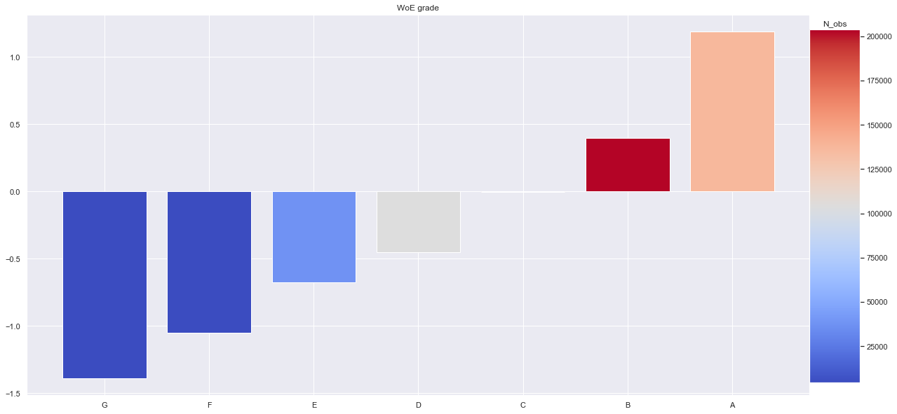


```python
fig, ax = plt.subplots(figsize=(20,8))

woe_df.set_index('grade').iloc[:, [3,4]].plot(kind='bar', stacked=True, ax=ax)

plt.legend()
```


    <matplotlib.legend.Legend at 0x1a2822f390>


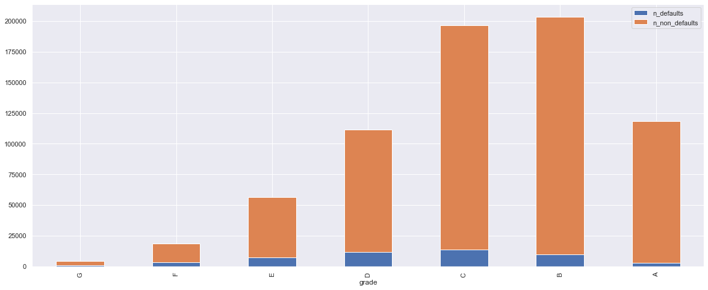


```python
'''
Note that I'm not including the smaller WoE category.
I'll do this for all subsequent variables
'''
vars_to_use.append(['grade:F', 'grade:E', 'grade:D', 'grade:C', 'grade:B', 'grade:A'])
ref_vars.append(['grade:G'])

vars_to_use

```


    [['grade:F', 'grade:E', 'grade:D', 'grade:C', 'grade:B', 'grade:A']]


We'll leave the grades categories as it is, no need to change them.<br>
All categories are representative and have significantly different WoE's<br><br><br>


### 'home_ownership' independent variable<br>
This variable has a weak predicting power IV is lower than 0.1


```python
woe_df = woe_discrete(x_train_prep, 'home_ownership', y_train_prep)
woe_df
```


<div>
<style scoped>
    .dataframe tbody tr th:only-of-type {
        vertical-align: middle;
    }

    .dataframe tbody tr th {
        vertical-align: top;
    }

    .dataframe thead th {
        text-align: right;
    }
</style>
<table border="1" class="dataframe">
  <thead>
    <tr style="text-align: right;">
      <th></th>
      <th>home_ownership</th>
      <th>n_obs</th>
      <th>prop_non_defaults</th>
      <th>prop_n_obs</th>
      <th>n_defaults</th>
      <th>n_non_defaults</th>
      <th>prop_n_non_defaults</th>
      <th>prop_n_defaults</th>
      <th>WoE</th>
      <th>diff_prop_non_defaults</th>
      <th>diff_WoE</th>
      <th>IV</th>
    </tr>
  </thead>
  <tbody>
    <tr>
      <th>0</th>
      <td>OTHER</td>
      <td>141</td>
      <td>0.652482</td>
      <td>0.000199</td>
      <td>49.0</td>
      <td>92.0</td>
      <td>0.000139</td>
      <td>0.001008</td>
      <td>-1.980819</td>
      <td>NaN</td>
      <td>NaN</td>
      <td>0.024779</td>
    </tr>
    <tr>
      <th>1</th>
      <td>NONE</td>
      <td>38</td>
      <td>0.736842</td>
      <td>0.000054</td>
      <td>10.0</td>
      <td>28.0</td>
      <td>0.000042</td>
      <td>0.000206</td>
      <td>-1.581168</td>
      <td>0.000097</td>
      <td>0.399651</td>
      <td>0.024779</td>
    </tr>
    <tr>
      <th>2</th>
      <td>RENT</td>
      <td>284609</td>
      <td>0.919816</td>
      <td>0.400913</td>
      <td>22821.0</td>
      <td>261788.0</td>
      <td>0.395862</td>
      <td>0.469655</td>
      <td>-0.170934</td>
      <td>0.395819</td>
      <td>1.410234</td>
      <td>0.024779</td>
    </tr>
    <tr>
      <th>3</th>
      <td>OWN</td>
      <td>69987</td>
      <td>0.936603</td>
      <td>0.098587</td>
      <td>4437.0</td>
      <td>65550.0</td>
      <td>0.099121</td>
      <td>0.091313</td>
      <td>0.082047</td>
      <td>0.296740</td>
      <td>0.252981</td>
      <td>0.024779</td>
    </tr>
    <tr>
      <th>4</th>
      <td>MORTGAGE</td>
      <td>355125</td>
      <td>0.940094</td>
      <td>0.500244</td>
      <td>21274.0</td>
      <td>333851.0</td>
      <td>0.504831</td>
      <td>0.437818</td>
      <td>0.142422</td>
      <td>0.405710</td>
      <td>0.060374</td>
      <td>0.024779</td>
    </tr>
    <tr>
      <th>5</th>
      <td>ANY</td>
      <td>3</td>
      <td>1.000000</td>
      <td>0.000004</td>
      <td>0.0</td>
      <td>3.0</td>
      <td>0.000005</td>
      <td>0.000000</td>
      <td>NaN</td>
      <td>0.504827</td>
      <td>NaN</td>
      <td>0.024779</td>
    </tr>
  </tbody>
</table>
</div>


We can see that the 'OTHER', 'NONE' and 'ANY' categories have very low WoE's, but they have too little representation in the data. (less than 0.1%)<br>

because of this, we'll combine them with the 'RENT' category, which has the lowest WoE and still is representative.


```python
fig, ax = plt.subplots(figsize=(20,8))

woe_df.set_index('home_ownership').iloc[:, [3,4]].plot(kind='bar', stacked=True, ax=ax)

plt.legend()
```


    <matplotlib.legend.Legend at 0x1a27487a90>


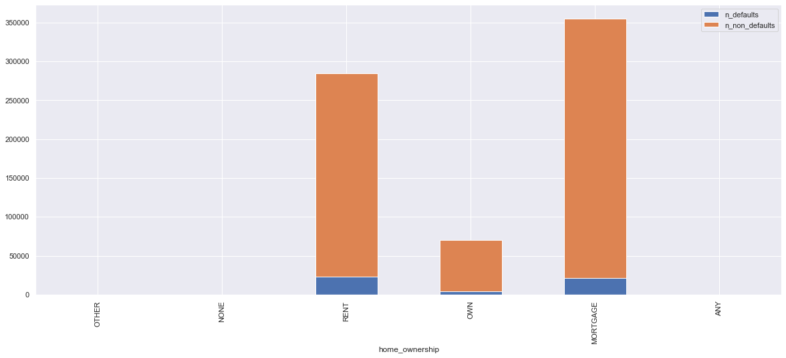


```python
fig = plt.figure(figsize=(12,8))

sns.countplot(x='home_ownership', hue='Y', data=raw_data)

index = 0
for cat in raw_data['home_ownership'].unique():
    temp_df = raw_data[raw_data['home_ownership'] == cat]
    ratio = round(temp_df[temp_df['Y'] == 0].shape[0] / temp_df[temp_df['Y'] == 1].shape[0],2)
    plt.annotate(f'{round(ratio*100,2)}% \ndefault', (index-.2, 75000), fontsize=20)
    index += 1
```


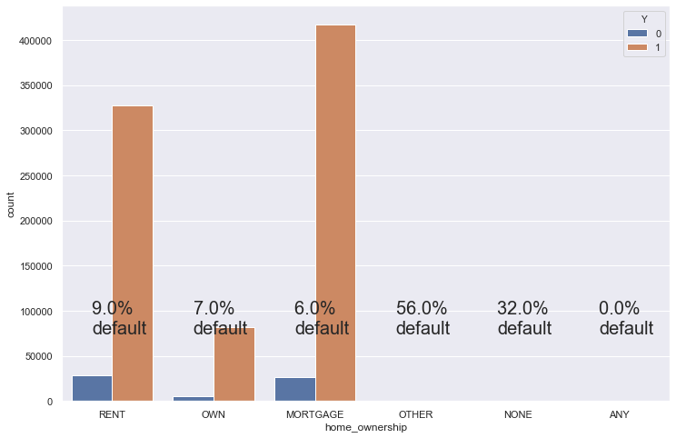


```python
print('There are ',raw_data[raw_data['home_ownership'] == 'OTHER'].shape[0],' records of clients in the "OTHER" category of home_ownership and' ,
      round((raw_data[(raw_data['home_ownership'] == 'OTHER') & (raw_data['Y'] == 0)].shape[0] / raw_data[(raw_data['home_ownership'] == 'OTHER') & (raw_data['Y'] == 1)].shape[0])*100,2),
     '% defaulted')
```

    There are  182  records of clients in the "OTHER" category of home_ownership and 55.56 % defaulted


There are few records in this category, but the default ratio is extremely high. This might be data inconsistency, but better keep an eye on it.<br>
Interestingly, people who pay mortgages are the ones that have the least probability of default.


```python
x_train_prep['home_ownership:RENT_OTHER_NONE'] = x_train_prep['home_ownership:RENT'] + x_train_prep['home_ownership:NONE'] + x_train_prep['home_ownership:OTHER'] + x_train_prep['home_ownership:ANY']
```


```python
fig, ax = plt.subplots(figsize=(20,8))

var_s = ['home_ownership:RENT_OTHER_NONE', 'home_ownership:OWN', 'home_ownership:MORTGAGE']
pd.concat([x_train_prep, y_train_prep], axis=1).groupby('Y').sum().loc[:, var_s].T.plot(kind='bar', stacked=True, ax=ax)

plt.legend()
```


    <matplotlib.legend.Legend at 0x1a272a7cf8>


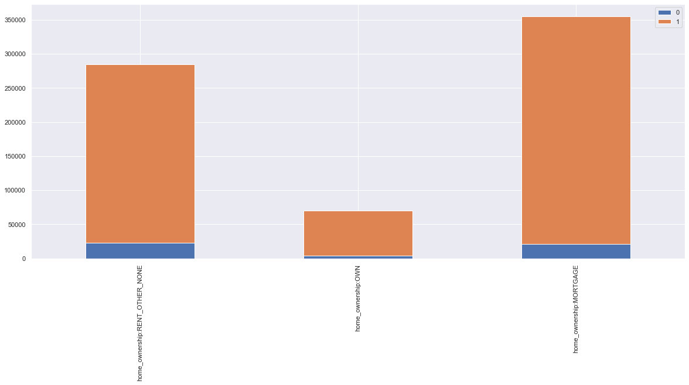


```python
'''
Note that I'm leaving the 'home_ownership:RENT_OTHER_NONE' category out (smallest WoE)
to avoid multicolinearity
'''

vars_to_use.append(['home_ownership:OWN', 'home_ownership:MORTGAGE'])
ref_vars.append(['home_ownership:RENT_OTHER_NONE'])
vars_to_use
```


    [['grade:F', 'grade:E', 'grade:D', 'grade:C', 'grade:B', 'grade:A'],
     ['home_ownership:OWN', 'home_ownership:MORTGAGE']]


```python

```

### 'addr_state' independent variable<br>
### Attention!!! This variable discretization has changed from the original model<br>
this variable has a very weak predictive power


```python
woe_df = woe_discrete(x_train_prep, 'addr_state', y_train_prep)
woe_df
```


<div>
<style scoped>
    .dataframe tbody tr th:only-of-type {
        vertical-align: middle;
    }

    .dataframe tbody tr th {
        vertical-align: top;
    }

    .dataframe thead th {
        text-align: right;
    }
</style>
<table border="1" class="dataframe">
  <thead>
    <tr style="text-align: right;">
      <th></th>
      <th>addr_state</th>
      <th>n_obs</th>
      <th>prop_non_defaults</th>
      <th>prop_n_obs</th>
      <th>n_defaults</th>
      <th>n_non_defaults</th>
      <th>prop_n_non_defaults</th>
      <th>prop_n_defaults</th>
      <th>WoE</th>
      <th>diff_prop_non_defaults</th>
      <th>diff_WoE</th>
      <th>IV</th>
    </tr>
  </thead>
  <tbody>
    <tr>
      <th>0</th>
      <td>IA</td>
      <td>12</td>
      <td>0.500000</td>
      <td>0.000017</td>
      <td>6.0</td>
      <td>6.0</td>
      <td>0.000009</td>
      <td>0.000123</td>
      <td>-2.610787</td>
      <td>NaN</td>
      <td>NaN</td>
      <td>0.017935</td>
    </tr>
    <tr>
      <th>1</th>
      <td>ID</td>
      <td>11</td>
      <td>0.727273</td>
      <td>0.000015</td>
      <td>3.0</td>
      <td>8.0</td>
      <td>0.000012</td>
      <td>0.000062</td>
      <td>-1.629958</td>
      <td>0.000003</td>
      <td>0.980829</td>
      <td>0.017935</td>
    </tr>
    <tr>
      <th>2</th>
      <td>NV</td>
      <td>9941</td>
      <td>0.912383</td>
      <td>0.014003</td>
      <td>871.0</td>
      <td>9070.0</td>
      <td>0.013715</td>
      <td>0.017925</td>
      <td>-0.267702</td>
      <td>0.013703</td>
      <td>1.362256</td>
      <td>0.017935</td>
    </tr>
    <tr>
      <th>3</th>
      <td>HI</td>
      <td>3674</td>
      <td>0.918617</td>
      <td>0.005175</td>
      <td>299.0</td>
      <td>3375.0</td>
      <td>0.005103</td>
      <td>0.006153</td>
      <td>-0.187080</td>
      <td>0.008612</td>
      <td>0.080621</td>
      <td>0.017935</td>
    </tr>
    <tr>
      <th>4</th>
      <td>FL</td>
      <td>48789</td>
      <td>0.923159</td>
      <td>0.068726</td>
      <td>3749.0</td>
      <td>45040.0</td>
      <td>0.068107</td>
      <td>0.077154</td>
      <td>-0.124726</td>
      <td>0.063004</td>
      <td>0.062355</td>
      <td>0.017935</td>
    </tr>
    <tr>
      <th>5</th>
      <td>NY</td>
      <td>59263</td>
      <td>0.924000</td>
      <td>0.083480</td>
      <td>4504.0</td>
      <td>54759.0</td>
      <td>0.082804</td>
      <td>0.092692</td>
      <td>-0.112812</td>
      <td>0.014697</td>
      <td>0.011914</td>
      <td>0.017935</td>
    </tr>
    <tr>
      <th>6</th>
      <td>VA</td>
      <td>21025</td>
      <td>0.925565</td>
      <td>0.029617</td>
      <td>1565.0</td>
      <td>19460.0</td>
      <td>0.029426</td>
      <td>0.032208</td>
      <td>-0.090312</td>
      <td>0.053377</td>
      <td>0.022499</td>
      <td>0.017935</td>
    </tr>
    <tr>
      <th>7</th>
      <td>OK</td>
      <td>6473</td>
      <td>0.926000</td>
      <td>0.009118</td>
      <td>479.0</td>
      <td>5994.0</td>
      <td>0.009064</td>
      <td>0.009858</td>
      <td>-0.083974</td>
      <td>0.020363</td>
      <td>0.006338</td>
      <td>0.017935</td>
    </tr>
    <tr>
      <th>8</th>
      <td>AL</td>
      <td>8993</td>
      <td>0.926276</td>
      <td>0.012668</td>
      <td>663.0</td>
      <td>8330.0</td>
      <td>0.012596</td>
      <td>0.013645</td>
      <td>-0.079944</td>
      <td>0.003532</td>
      <td>0.004030</td>
      <td>0.017935</td>
    </tr>
    <tr>
      <th>9</th>
      <td>SD</td>
      <td>1428</td>
      <td>0.926471</td>
      <td>0.002012</td>
      <td>105.0</td>
      <td>1323.0</td>
      <td>0.002001</td>
      <td>0.002161</td>
      <td>-0.077091</td>
      <td>0.010596</td>
      <td>0.002853</td>
      <td>0.017935</td>
    </tr>
    <tr>
      <th>10</th>
      <td>CA</td>
      <td>103649</td>
      <td>0.926541</td>
      <td>0.146004</td>
      <td>7614.0</td>
      <td>96035.0</td>
      <td>0.145219</td>
      <td>0.156696</td>
      <td>-0.076063</td>
      <td>0.143218</td>
      <td>0.001027</td>
      <td>0.017935</td>
    </tr>
    <tr>
      <th>11</th>
      <td>MO</td>
      <td>11456</td>
      <td>0.927112</td>
      <td>0.016137</td>
      <td>835.0</td>
      <td>10621.0</td>
      <td>0.016060</td>
      <td>0.017184</td>
      <td>-0.067631</td>
      <td>0.129158</td>
      <td>0.008433</td>
      <td>0.017935</td>
    </tr>
    <tr>
      <th>12</th>
      <td>DE</td>
      <td>2020</td>
      <td>0.927228</td>
      <td>0.002845</td>
      <td>147.0</td>
      <td>1873.0</td>
      <td>0.002832</td>
      <td>0.003025</td>
      <td>-0.065923</td>
      <td>0.013228</td>
      <td>0.001707</td>
      <td>0.017935</td>
    </tr>
    <tr>
      <th>13</th>
      <td>MD</td>
      <td>16778</td>
      <td>0.927465</td>
      <td>0.023634</td>
      <td>1217.0</td>
      <td>15561.0</td>
      <td>0.023530</td>
      <td>0.025046</td>
      <td>-0.062408</td>
      <td>0.020698</td>
      <td>0.003515</td>
      <td>0.017935</td>
    </tr>
    <tr>
      <th>14</th>
      <td>UT</td>
      <td>5047</td>
      <td>0.927482</td>
      <td>0.007109</td>
      <td>366.0</td>
      <td>4681.0</td>
      <td>0.007078</td>
      <td>0.007532</td>
      <td>-0.062154</td>
      <td>0.016452</td>
      <td>0.000255</td>
      <td>0.017935</td>
    </tr>
    <tr>
      <th>15</th>
      <td>LA</td>
      <td>8491</td>
      <td>0.927806</td>
      <td>0.011961</td>
      <td>613.0</td>
      <td>7878.0</td>
      <td>0.011913</td>
      <td>0.012616</td>
      <td>-0.057323</td>
      <td>0.004834</td>
      <td>0.004831</td>
      <td>0.017935</td>
    </tr>
    <tr>
      <th>16</th>
      <td>NJ</td>
      <td>26538</td>
      <td>0.927839</td>
      <td>0.037383</td>
      <td>1915.0</td>
      <td>24623.0</td>
      <td>0.037234</td>
      <td>0.039411</td>
      <td>-0.056824</td>
      <td>0.025321</td>
      <td>0.000499</td>
      <td>0.017935</td>
    </tr>
    <tr>
      <th>17</th>
      <td>NM</td>
      <td>3960</td>
      <td>0.929293</td>
      <td>0.005578</td>
      <td>280.0</td>
      <td>3680.0</td>
      <td>0.005565</td>
      <td>0.005762</td>
      <td>-0.034909</td>
      <td>0.031669</td>
      <td>0.021915</td>
      <td>0.017935</td>
    </tr>
    <tr>
      <th>18</th>
      <td>NC</td>
      <td>19787</td>
      <td>0.930409</td>
      <td>0.027873</td>
      <td>1377.0</td>
      <td>18410.0</td>
      <td>0.027839</td>
      <td>0.028339</td>
      <td>-0.017801</td>
      <td>0.022274</td>
      <td>0.017108</td>
      <td>0.017935</td>
    </tr>
    <tr>
      <th>19</th>
      <td>AZ</td>
      <td>16344</td>
      <td>0.930861</td>
      <td>0.023023</td>
      <td>1130.0</td>
      <td>15214.0</td>
      <td>0.023006</td>
      <td>0.023255</td>
      <td>-0.010789</td>
      <td>0.004833</td>
      <td>0.007012</td>
      <td>0.017935</td>
    </tr>
    <tr>
      <th>20</th>
      <td>PA</td>
      <td>25006</td>
      <td>0.931376</td>
      <td>0.035225</td>
      <td>1716.0</td>
      <td>23290.0</td>
      <td>0.035218</td>
      <td>0.035315</td>
      <td>-0.002759</td>
      <td>0.012212</td>
      <td>0.008030</td>
      <td>0.017935</td>
    </tr>
    <tr>
      <th>21</th>
      <td>MA</td>
      <td>16512</td>
      <td>0.931989</td>
      <td>0.023260</td>
      <td>1123.0</td>
      <td>15389.0</td>
      <td>0.023270</td>
      <td>0.023111</td>
      <td>0.006862</td>
      <td>0.011947</td>
      <td>0.009621</td>
      <td>0.017935</td>
    </tr>
    <tr>
      <th>22</th>
      <td>RI</td>
      <td>3112</td>
      <td>0.932198</td>
      <td>0.004384</td>
      <td>211.0</td>
      <td>2901.0</td>
      <td>0.004387</td>
      <td>0.004342</td>
      <td>0.010165</td>
      <td>0.018884</td>
      <td>0.003303</td>
      <td>0.017935</td>
    </tr>
    <tr>
      <th>23</th>
      <td>MI</td>
      <td>18385</td>
      <td>0.932227</td>
      <td>0.025898</td>
      <td>1246.0</td>
      <td>17139.0</td>
      <td>0.025917</td>
      <td>0.025643</td>
      <td>0.010631</td>
      <td>0.021530</td>
      <td>0.000465</td>
      <td>0.017935</td>
    </tr>
    <tr>
      <th>24</th>
      <td>AR</td>
      <td>5255</td>
      <td>0.932445</td>
      <td>0.007402</td>
      <td>355.0</td>
      <td>4900.0</td>
      <td>0.007410</td>
      <td>0.007306</td>
      <td>0.014085</td>
      <td>0.018507</td>
      <td>0.003455</td>
      <td>0.017935</td>
    </tr>
    <tr>
      <th>25</th>
      <td>MN</td>
      <td>12715</td>
      <td>0.933150</td>
      <td>0.017911</td>
      <td>850.0</td>
      <td>11865.0</td>
      <td>0.017942</td>
      <td>0.017493</td>
      <td>0.025324</td>
      <td>0.010532</td>
      <td>0.011239</td>
      <td>0.017935</td>
    </tr>
    <tr>
      <th>26</th>
      <td>OH</td>
      <td>23565</td>
      <td>0.933418</td>
      <td>0.033195</td>
      <td>1569.0</td>
      <td>21996.0</td>
      <td>0.033261</td>
      <td>0.032290</td>
      <td>0.029635</td>
      <td>0.015320</td>
      <td>0.004310</td>
      <td>0.017935</td>
    </tr>
    <tr>
      <th>27</th>
      <td>AK</td>
      <td>1759</td>
      <td>0.933485</td>
      <td>0.002478</td>
      <td>117.0</td>
      <td>1642.0</td>
      <td>0.002483</td>
      <td>0.002408</td>
      <td>0.030709</td>
      <td>0.030778</td>
      <td>0.001074</td>
      <td>0.017935</td>
    </tr>
    <tr>
      <th>28</th>
      <td>KY</td>
      <td>6799</td>
      <td>0.934255</td>
      <td>0.009577</td>
      <td>447.0</td>
      <td>6352.0</td>
      <td>0.009605</td>
      <td>0.009199</td>
      <td>0.043179</td>
      <td>0.007122</td>
      <td>0.012470</td>
      <td>0.017935</td>
    </tr>
    <tr>
      <th>29</th>
      <td>WI</td>
      <td>9270</td>
      <td>0.934844</td>
      <td>0.013058</td>
      <td>604.0</td>
      <td>8666.0</td>
      <td>0.013104</td>
      <td>0.012430</td>
      <td>0.052801</td>
      <td>0.003499</td>
      <td>0.009622</td>
      <td>0.017935</td>
    </tr>
    <tr>
      <th>30</th>
      <td>GA</td>
      <td>23268</td>
      <td>0.935405</td>
      <td>0.032776</td>
      <td>1503.0</td>
      <td>21765.0</td>
      <td>0.032912</td>
      <td>0.030932</td>
      <td>0.062053</td>
      <td>0.019808</td>
      <td>0.009252</td>
      <td>0.017935</td>
    </tr>
    <tr>
      <th>31</th>
      <td>WA</td>
      <td>15501</td>
      <td>0.935488</td>
      <td>0.021835</td>
      <td>1000.0</td>
      <td>14501.0</td>
      <td>0.021928</td>
      <td>0.020580</td>
      <td>0.063430</td>
      <td>0.010984</td>
      <td>0.001378</td>
      <td>0.017935</td>
    </tr>
    <tr>
      <th>32</th>
      <td>OR</td>
      <td>8728</td>
      <td>0.936755</td>
      <td>0.012295</td>
      <td>552.0</td>
      <td>8176.0</td>
      <td>0.012363</td>
      <td>0.011360</td>
      <td>0.084623</td>
      <td>0.009564</td>
      <td>0.021193</td>
      <td>0.017935</td>
    </tr>
    <tr>
      <th>33</th>
      <td>IN</td>
      <td>10923</td>
      <td>0.938295</td>
      <td>0.015387</td>
      <td>674.0</td>
      <td>10249.0</td>
      <td>0.015498</td>
      <td>0.013871</td>
      <td>0.110918</td>
      <td>0.003135</td>
      <td>0.026295</td>
      <td>0.017935</td>
    </tr>
    <tr>
      <th>34</th>
      <td>TN</td>
      <td>10280</td>
      <td>0.938813</td>
      <td>0.014481</td>
      <td>629.0</td>
      <td>9651.0</td>
      <td>0.014594</td>
      <td>0.012945</td>
      <td>0.119898</td>
      <td>0.000904</td>
      <td>0.008980</td>
      <td>0.017935</td>
    </tr>
    <tr>
      <th>35</th>
      <td>CT</td>
      <td>10845</td>
      <td>0.940249</td>
      <td>0.015277</td>
      <td>648.0</td>
      <td>10197.0</td>
      <td>0.015419</td>
      <td>0.013336</td>
      <td>0.145171</td>
      <td>0.000826</td>
      <td>0.025273</td>
      <td>0.017935</td>
    </tr>
    <tr>
      <th>36</th>
      <td>TX</td>
      <td>57086</td>
      <td>0.940318</td>
      <td>0.080414</td>
      <td>3407.0</td>
      <td>53679.0</td>
      <td>0.081170</td>
      <td>0.070116</td>
      <td>0.146402</td>
      <td>0.065751</td>
      <td>0.001232</td>
      <td>0.017935</td>
    </tr>
    <tr>
      <th>37</th>
      <td>IL</td>
      <td>28422</td>
      <td>0.941489</td>
      <td>0.040036</td>
      <td>1663.0</td>
      <td>26759.0</td>
      <td>0.040464</td>
      <td>0.034224</td>
      <td>0.167460</td>
      <td>0.040707</td>
      <td>0.021058</td>
      <td>0.017935</td>
    </tr>
    <tr>
      <th>38</th>
      <td>KS</td>
      <td>6363</td>
      <td>0.942008</td>
      <td>0.008963</td>
      <td>369.0</td>
      <td>5994.0</td>
      <td>0.009064</td>
      <td>0.007594</td>
      <td>0.176930</td>
      <td>0.031400</td>
      <td>0.009470</td>
      <td>0.017935</td>
    </tr>
    <tr>
      <th>39</th>
      <td>MT</td>
      <td>2068</td>
      <td>0.942456</td>
      <td>0.002913</td>
      <td>119.0</td>
      <td>1949.0</td>
      <td>0.002947</td>
      <td>0.002449</td>
      <td>0.185161</td>
      <td>0.006117</td>
      <td>0.008231</td>
      <td>0.017935</td>
    </tr>
    <tr>
      <th>40</th>
      <td>SC</td>
      <td>8474</td>
      <td>0.942766</td>
      <td>0.011937</td>
      <td>485.0</td>
      <td>7989.0</td>
      <td>0.012081</td>
      <td>0.009981</td>
      <td>0.190885</td>
      <td>0.009133</td>
      <td>0.005724</td>
      <td>0.017935</td>
    </tr>
    <tr>
      <th>41</th>
      <td>CO</td>
      <td>15099</td>
      <td>0.944433</td>
      <td>0.021269</td>
      <td>839.0</td>
      <td>14260.0</td>
      <td>0.021563</td>
      <td>0.017267</td>
      <td>0.222216</td>
      <td>0.009483</td>
      <td>0.031331</td>
      <td>0.017935</td>
    </tr>
    <tr>
      <th>42</th>
      <td>VT</td>
      <td>1429</td>
      <td>0.947516</td>
      <td>0.002013</td>
      <td>75.0</td>
      <td>1354.0</td>
      <td>0.002047</td>
      <td>0.001543</td>
      <td>0.282543</td>
      <td>0.019516</td>
      <td>0.060327</td>
      <td>0.017935</td>
    </tr>
    <tr>
      <th>43</th>
      <td>WV</td>
      <td>3522</td>
      <td>0.949461</td>
      <td>0.004961</td>
      <td>178.0</td>
      <td>3344.0</td>
      <td>0.005057</td>
      <td>0.003663</td>
      <td>0.322352</td>
      <td>0.003009</td>
      <td>0.039809</td>
      <td>0.017935</td>
    </tr>
    <tr>
      <th>44</th>
      <td>WY</td>
      <td>1630</td>
      <td>0.950307</td>
      <td>0.002296</td>
      <td>81.0</td>
      <td>1549.0</td>
      <td>0.002342</td>
      <td>0.001667</td>
      <td>0.340128</td>
      <td>0.002714</td>
      <td>0.017776</td>
      <td>0.017935</td>
    </tr>
    <tr>
      <th>45</th>
      <td>NH</td>
      <td>3453</td>
      <td>0.951636</td>
      <td>0.004864</td>
      <td>167.0</td>
      <td>3286.0</td>
      <td>0.004969</td>
      <td>0.003437</td>
      <td>0.368645</td>
      <td>0.002627</td>
      <td>0.028517</td>
      <td>0.017935</td>
    </tr>
    <tr>
      <th>46</th>
      <td>DC</td>
      <td>1947</td>
      <td>0.954802</td>
      <td>0.002743</td>
      <td>88.0</td>
      <td>1859.0</td>
      <td>0.002811</td>
      <td>0.001811</td>
      <td>0.439670</td>
      <td>0.002158</td>
      <td>0.071025</td>
      <td>0.017935</td>
    </tr>
    <tr>
      <th>47</th>
      <td>MS</td>
      <td>3045</td>
      <td>0.958621</td>
      <td>0.004289</td>
      <td>126.0</td>
      <td>2919.0</td>
      <td>0.004414</td>
      <td>0.002593</td>
      <td>0.531927</td>
      <td>0.001603</td>
      <td>0.092257</td>
      <td>0.017935</td>
    </tr>
    <tr>
      <th>48</th>
      <td>NE</td>
      <td>959</td>
      <td>0.988530</td>
      <td>0.001351</td>
      <td>11.0</td>
      <td>948.0</td>
      <td>0.001434</td>
      <td>0.000226</td>
      <td>1.845672</td>
      <td>0.002980</td>
      <td>1.313745</td>
      <td>0.017935</td>
    </tr>
    <tr>
      <th>49</th>
      <td>ND</td>
      <td>380</td>
      <td>0.997368</td>
      <td>0.000535</td>
      <td>1.0</td>
      <td>379.0</td>
      <td>0.000573</td>
      <td>0.000021</td>
      <td>3.326749</td>
      <td>0.000860</td>
      <td>1.481077</td>
      <td>0.017935</td>
    </tr>
    <tr>
      <th>50</th>
      <td>ME</td>
      <td>424</td>
      <td>1.000000</td>
      <td>0.000597</td>
      <td>0.0</td>
      <td>424.0</td>
      <td>0.000641</td>
      <td>0.000000</td>
      <td>NaN</td>
      <td>0.000068</td>
      <td>NaN</td>
      <td>0.017935</td>
    </tr>
  </tbody>
</table>
</div>


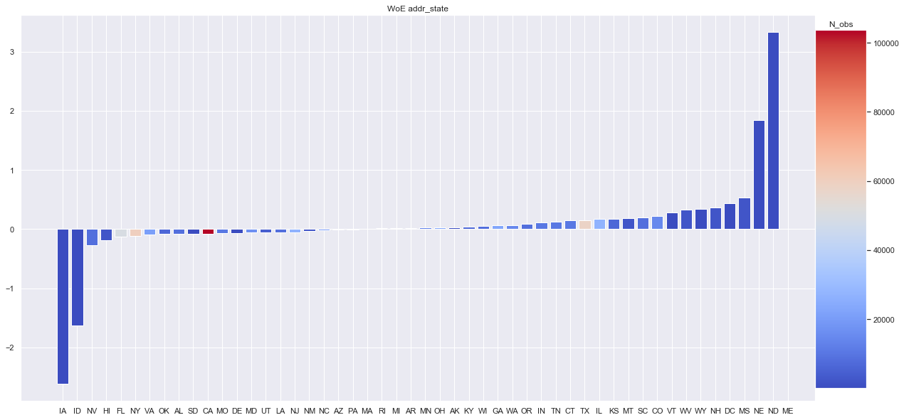


There is no data of borrowers from 'ND', so we'll add the column in case future borrowers show up


```python
if 'addr_state:ND' in x_train_prep.columns:
    pass
else:
    x_train_prep['addr_state:ND'] = 0
```

There is not enough data for the states 'ME, ID, IA, NE and ND'<br>
I'll group them together with FL and HI, and leave them in the highest risk category, since we want to be conservative


```python
x_train_prep['addr_state:NE_ND_ME_IA_ID_NV_HI_FL'] = x_train_prep['addr_state:NE'] + x_train_prep['addr_state:ND'] + x_train_prep['addr_state:ME'] + x_train_prep['addr_state:IA'] +\
                                                     x_train_prep['addr_state:ID'] + x_train_prep['addr_state:NV'] + x_train_prep['addr_state:HI'] + x_train_prep['addr_state:FL']
```


```python
woe_df = woe_discrete(x_train_prep, 'addr_state', y_train_prep, plot_rows_start=5, plot_rows_end=-1)
```


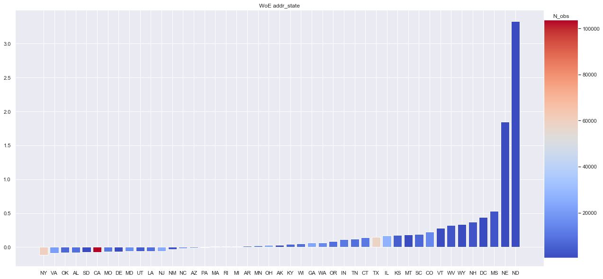


Moving on, the states VA, OK, AL and SD are going to be combined due to their similar WoE's and their low number of observations<br><br>
NY is going to be left alone, since the number of observations for it is really high.


```python
x_train_prep['addr_state:VA_OK_AL_SD'] = x_train_prep['addr_state:VA'] + x_train_prep['addr_state:OK'] + x_train_prep['addr_state:AL'] + x_train_prep['addr_state:SD']
```

CA is also going to be left as it is, because it has a very high number of observations.<br><br>
Next, I will group MO up to NJ together, because their similar WoE's and relative high number of obs.


```python
woe_df = woe_discrete(x_train_prep, 'addr_state', y_train_prep, plot_rows_start=10, plot_rows_end=-10)
```


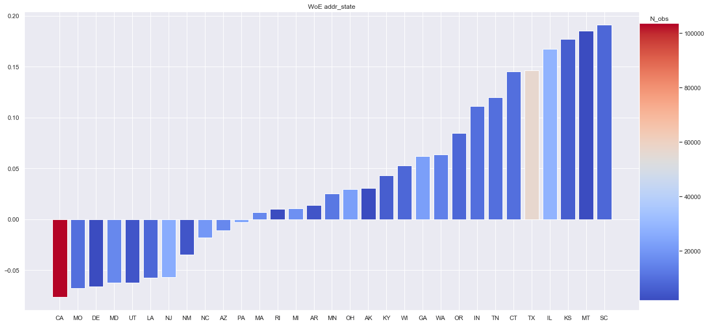


```python
x_train_prep['addr_state:MO_DE_MD_UT_LA_NJ'] = x_train_prep['addr_state:MO'] + x_train_prep['addr_state:DE'] + x_train_prep['addr_state:MD'] + x_train_prep['addr_state:UT'] + \
                                                x_train_prep['addr_state:LA'] + x_train_prep['addr_state:NJ']
```

Now, NM up to AZ 


```python
x_train_prep['addr_state:NM_NC_AZ'] = x_train_prep['addr_state:NM'] + x_train_prep['addr_state:NC'] + x_train_prep['addr_state:AZ']
```

PA up to AR


```python
x_train_prep['addr_state:PA_MA_RI_MI_AR'] = x_train_prep['addr_state:PA'] + x_train_prep['addr_state:MA'] + x_train_prep['addr_state:RI'] + x_train_prep['addr_state:MI'] + x_train_prep['addr_state:AR']
```


```python
woe_df = woe_discrete(x_train_prep, 'addr_state', y_train_prep, plot_rows_start=24, plot_rows_end=-10)
```


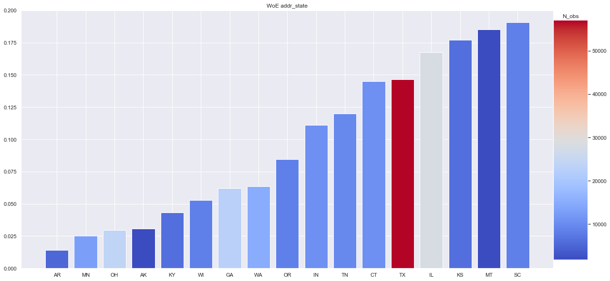


Now, MN up to AK


```python
x_train_prep['addr_state:MN_OH_AK'] = x_train_prep['addr_state:MN'] + x_train_prep['addr_state:OH'] + x_train_prep['addr_state:AK']
```


```python
woe_df = woe_discrete(x_train_prep, 'addr_state', y_train_prep, plot_rows_start=27, plot_rows_end=-10)
```


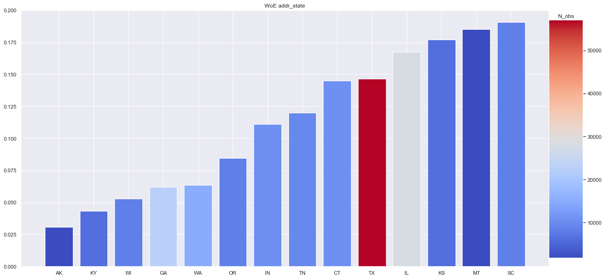


Grouping KY up to WA


```python
x_train_prep['addr_state:KY_WI_GA_WA'] = x_train_prep['addr_state:KY'] + x_train_prep['addr_state:WI'] + x_train_prep['addr_state:GA'] + x_train_prep['addr_state:WA']
```


```python
woe_df = woe_discrete(x_train_prep, 'addr_state', y_train_prep, plot_rows_start=31, plot_rows_end=-1)
```


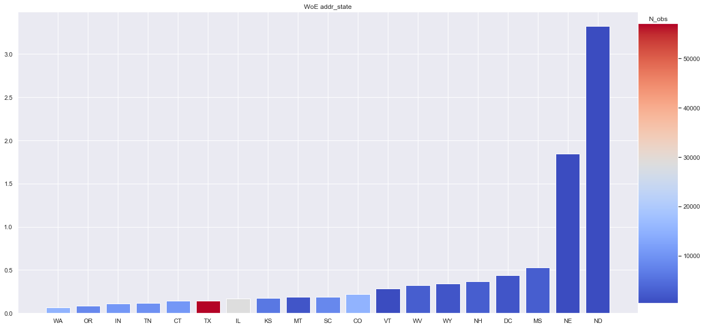


Now I'm grouping OR UP TO CT.<br>
Leaving TX as it is because of the high number of observations


```python
x_train_prep['addr_state:OR_IN_TN_CT'] = x_train_prep['addr_state:OR'] + x_train_prep['addr_state:IN'] + x_train_prep['addr_state:TN'] + x_train_prep['addr_state:CT']
```

Grouping from IL up to CO


```python
x_train_prep['addr_state:IL_KS_MT_SC_CO'] = x_train_prep['addr_state:IL'] + x_train_prep['addr_state:KS'] + x_train_prep['addr_state:MT'] \
                                                + x_train_prep['addr_state:SC'] + x_train_prep['addr_state:CO']
```

Now, I'm gonna group the 6 states that on the higher end of the scale, due to their low number of observations


```python
woe_df = woe_discrete(x_train_prep, 'addr_state', y_train_prep, plot_rows_start=41, plot_rows_end=-3)
```


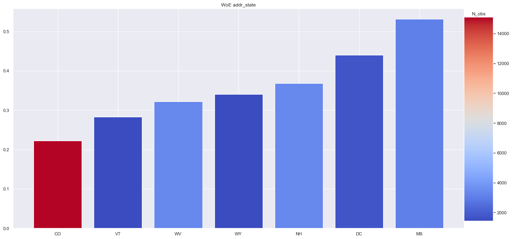


```python
x_train_prep['addr_state:VT_WV_WY_NH_DC_MS'] = x_train_prep['addr_state:VT'] + x_train_prep['addr_state:WV'] + x_train_prep['addr_state:WY'] + x_train_prep['addr_state:NH'] +\
                                                 + x_train_prep['addr_state:DC'] + x_train_prep['addr_state:MS']  
```

#### Final 'addr_state' categories


```python
woe_df = woe_discrete(x_train_prep, 'addr_state', y_train_prep, plot_rows_start=0, plot_rows_end=None, vlines=[4.5, 5.5, 9.5, 10.5, 16.5, 19.5, 24.5, 27.5, 31.5, 35.5, 36.5, 41.5, 47.5])


```


```python
fig, ax = plt.subplots(figsize=(20,8))

woe_df.set_index('addr_state').iloc[:, [3,4]].plot(kind='bar', stacked=True, ax=ax)

plt.legend()
```


    <matplotlib.legend.Legend at 0x1a28048160>


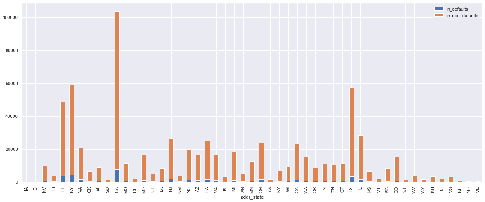


```python
fig, ax = plt.subplots(figsize=(20,8))

var_s = ['addr_state:NE_ND_ME_IA_ID_NV_HI_FL' , 'addr_state:NY', 'addr_state:VA_OK_AL_SD', 'addr_state:CA', 'addr_state:MO_DE_MD_UT_LA_NJ',
                    'addr_state:NM_NC_AZ', 'addr_state:PA_MA_RI_MI_AR', 'addr_state:MN_OH_AK', 'addr_state:KY_WI_GA_WA',
                    'addr_state:OR_IN_TN_CT', 'addr_state:TX', 'addr_state:IL_KS_MT_SC_CO', 'addr_state:VT_WV_WY_NH_DC_MS']
pd.concat([x_train_prep, y_train_prep], axis=1).groupby('Y').sum().loc[:, var_s].T.plot(kind='bar', stacked=True, ax=ax)

plt.legend()
```


    <matplotlib.legend.Legend at 0x1a280485f8>


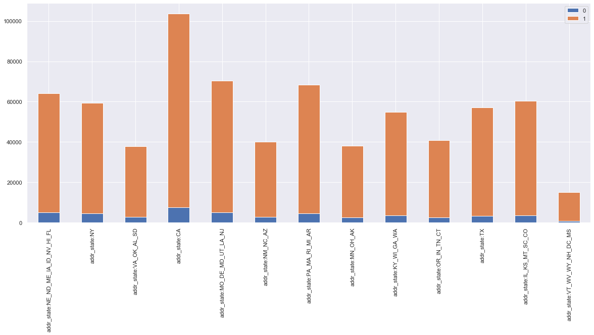


```python
'''
Note that I'm leaving the smallest WoE category out ('addr_state:ME_NE_IA_ID_NV_FL_ND')
'''

vars_to_use.append([ 'addr_state:NY', 'addr_state:VA_OK_AL_SD', 'addr_state:CA', 'addr_state:MO_DE_MD_UT_LA_NJ',
                    'addr_state:NM_NC_AZ', 'addr_state:PA_MA_RI_MI_AR', 'addr_state:MN_OH_AK', 'addr_state:KY_WI_GA_WA',
                    'addr_state:OR_IN_TN_CT', 'addr_state:TX', 'addr_state:IL_KS_MT_SC_CO', 'addr_state:VT_WV_WY_NH_DC_MS'])

ref_vars.append(['addr_state:NE_ND_ME_IA_ID_NV_HI_FL'])

vars_to_use
```


    [['grade:F', 'grade:E', 'grade:D', 'grade:C', 'grade:B', 'grade:A'],
     ['home_ownership:OWN', 'home_ownership:MORTGAGE'],
     ['addr_state:NY',
      'addr_state:VA_OK_AL_SD',
      'addr_state:CA',
      'addr_state:MO_DE_MD_UT_LA_NJ',
      'addr_state:NM_NC_AZ',
      'addr_state:PA_MA_RI_MI_AR',
      'addr_state:MN_OH_AK',
      'addr_state:KY_WI_GA_WA',
      'addr_state:OR_IN_TN_CT',
      'addr_state:TX',
      'addr_state:IL_KS_MT_SC_CO',
      'addr_state:VT_WV_WY_NH_DC_MS']]


```python

```


```python

```

#### 'verification_status' independent variable<br>
This variable has a almost no predictive power, IV is lower than 0.02


```python
woe_df = woe_discrete(x_train_prep, 'verification_status', y_train_prep)
woe_df
```


<div>
<style scoped>
    .dataframe tbody tr th:only-of-type {
        vertical-align: middle;
    }

    .dataframe tbody tr th {
        vertical-align: top;
    }

    .dataframe thead th {
        text-align: right;
    }
</style>
<table border="1" class="dataframe">
  <thead>
    <tr style="text-align: right;">
      <th></th>
      <th>verification_status</th>
      <th>n_obs</th>
      <th>prop_non_defaults</th>
      <th>prop_n_obs</th>
      <th>n_defaults</th>
      <th>n_non_defaults</th>
      <th>prop_n_non_defaults</th>
      <th>prop_n_defaults</th>
      <th>WoE</th>
      <th>diff_prop_non_defaults</th>
      <th>diff_WoE</th>
      <th>IV</th>
    </tr>
  </thead>
  <tbody>
    <tr>
      <th>0</th>
      <td>Verified</td>
      <td>232715</td>
      <td>0.915025</td>
      <td>0.327812</td>
      <td>19775.0</td>
      <td>212940.0</td>
      <td>0.321996</td>
      <td>0.406968</td>
      <td>-0.234195</td>
      <td>NaN</td>
      <td>NaN</td>
      <td>0.032259</td>
    </tr>
    <tr>
      <th>1</th>
      <td>Not Verified</td>
      <td>213312</td>
      <td>0.937130</td>
      <td>0.300480</td>
      <td>13411.0</td>
      <td>199901.0</td>
      <td>0.302279</td>
      <td>0.275998</td>
      <td>0.090960</td>
      <td>0.019717</td>
      <td>0.325155</td>
      <td>0.032259</td>
    </tr>
    <tr>
      <th>2</th>
      <td>Source Verified</td>
      <td>263876</td>
      <td>0.941620</td>
      <td>0.371707</td>
      <td>15405.0</td>
      <td>248471.0</td>
      <td>0.375724</td>
      <td>0.317034</td>
      <td>0.169847</td>
      <td>0.073445</td>
      <td>0.078887</td>
      <td>0.032259</td>
    </tr>
  </tbody>
</table>
</div>


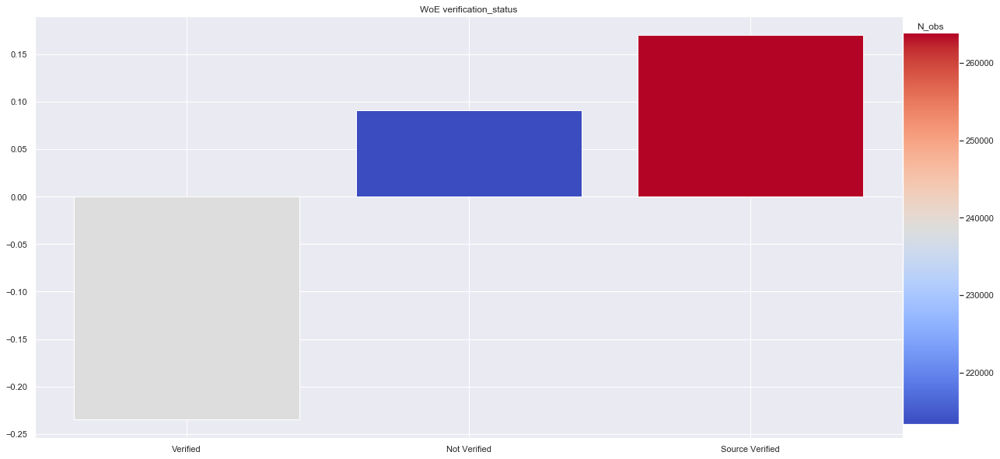


```python
fig, ax = plt.subplots(figsize=(20,8))

woe_df.set_index('verification_status').iloc[:, [3,4]].plot(kind='bar', stacked=True, ax=ax)

plt.legend()
```


    <matplotlib.legend.Legend at 0x1a27108358>


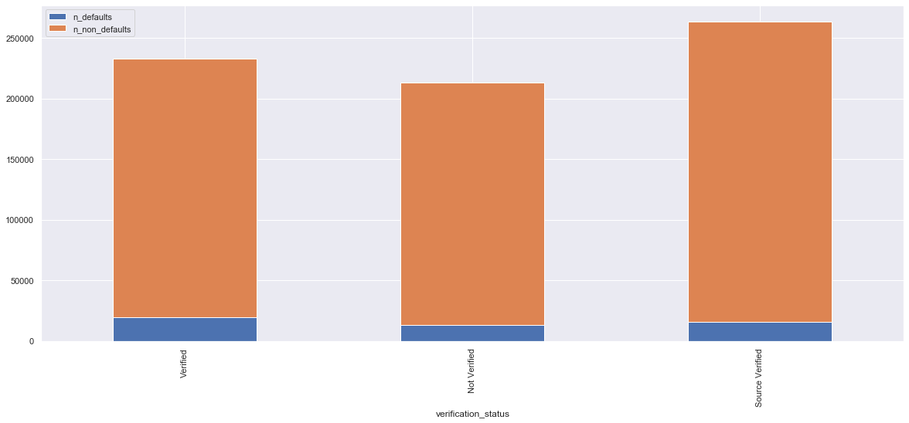


```python
vars_to_use.append(['verification_status:Not Verified', 'verification_status:Source Verified'])
ref_vars.append(['verification_status:Verified'])

vars_to_use
```


    [['grade:F', 'grade:E', 'grade:D', 'grade:C', 'grade:B', 'grade:A'],
     ['home_ownership:OWN', 'home_ownership:MORTGAGE'],
     ['addr_state:NY',
      'addr_state:VA_OK_AL_SD',
      'addr_state:CA',
      'addr_state:MO_DE_MD_UT_LA_NJ',
      'addr_state:NM_NC_AZ',
      'addr_state:PA_MA_RI_MI_AR',
      'addr_state:MN_OH_AK',
      'addr_state:KY_WI_GA_WA',
      'addr_state:OR_IN_TN_CT',
      'addr_state:TX',
      'addr_state:IL_KS_MT_SC_CO',
      'addr_state:VT_WV_WY_NH_DC_MS'],
     ['verification_status:Not Verified', 'verification_status:Source Verified']]


I'll leave this as it is, since predictive power is so weak and WoE's seem ok<br>
I'll probably leave this variable out of the model

## initial_status


```python
woe_df = woe_discrete(x_train_prep, 'initial_list_status', y_train_prep)
woe_df
```


<div>
<style scoped>
    .dataframe tbody tr th:only-of-type {
        vertical-align: middle;
    }

    .dataframe tbody tr th {
        vertical-align: top;
    }

    .dataframe thead th {
        text-align: right;
    }
</style>
<table border="1" class="dataframe">
  <thead>
    <tr style="text-align: right;">
      <th></th>
      <th>initial_list_status</th>
      <th>n_obs</th>
      <th>prop_non_defaults</th>
      <th>prop_n_obs</th>
      <th>n_defaults</th>
      <th>n_non_defaults</th>
      <th>prop_n_non_defaults</th>
      <th>prop_n_defaults</th>
      <th>WoE</th>
      <th>diff_prop_non_defaults</th>
      <th>diff_WoE</th>
      <th>IV</th>
    </tr>
  </thead>
  <tbody>
    <tr>
      <th>0</th>
      <td>f</td>
      <td>365305</td>
      <td>0.906694</td>
      <td>0.514584</td>
      <td>34085.0</td>
      <td>331220.0</td>
      <td>0.500853</td>
      <td>0.701467</td>
      <td>-0.336862</td>
      <td>NaN</td>
      <td>NaN</td>
      <td>0.1707</td>
    </tr>
    <tr>
      <th>1</th>
      <td>w</td>
      <td>344598</td>
      <td>0.957905</td>
      <td>0.485416</td>
      <td>14506.0</td>
      <td>330092.0</td>
      <td>0.499147</td>
      <td>0.298533</td>
      <td>0.514022</td>
      <td>0.001706</td>
      <td>0.850884</td>
      <td>0.1707</td>
    </tr>
  </tbody>
</table>
</div>


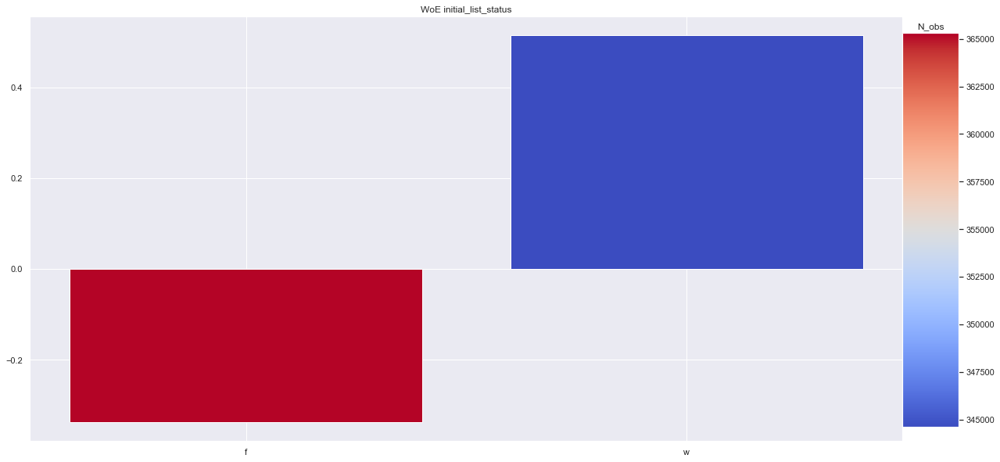


```python
fig, ax = plt.subplots(figsize=(20,8))

woe_df.set_index('initial_list_status').iloc[:, [3,4]].plot(kind='bar', stacked=True, ax=ax)

plt.legend()
```


    <matplotlib.legend.Legend at 0x1a2729f5c0>


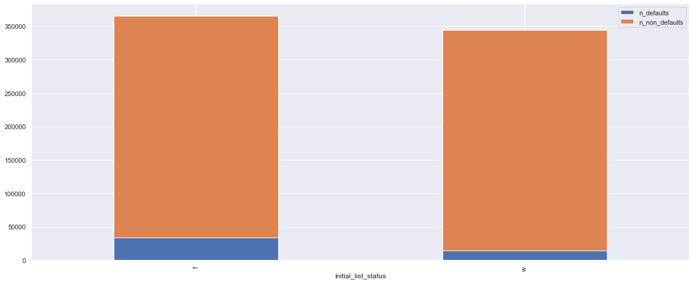


```python
vars_to_use.append(['initial_list_status:w'])
ref_vars.append(['initial_list_status:f'])

vars_to_use
```


    [['grade:F', 'grade:E', 'grade:D', 'grade:C', 'grade:B', 'grade:A'],
     ['home_ownership:OWN', 'home_ownership:MORTGAGE'],
     ['addr_state:NY',
      'addr_state:VA_OK_AL_SD',
      'addr_state:CA',
      'addr_state:MO_DE_MD_UT_LA_NJ',
      'addr_state:NM_NC_AZ',
      'addr_state:PA_MA_RI_MI_AR',
      'addr_state:MN_OH_AK',
      'addr_state:KY_WI_GA_WA',
      'addr_state:OR_IN_TN_CT',
      'addr_state:TX',
      'addr_state:IL_KS_MT_SC_CO',
      'addr_state:VT_WV_WY_NH_DC_MS'],
     ['verification_status:Not Verified', 'verification_status:Source Verified'],
     ['initial_list_status:w']]


```python

```

## purpose<br>

## Attention!!! This variable discretization has changed in relation to the first model


```python
woe_df = woe_discrete(x_train_prep, 'purpose', y_train_prep, rot_x_ticks=45, vlines=[2.5, 7.5, 12.5])
woe_df
```


<div>
<style scoped>
    .dataframe tbody tr th:only-of-type {
        vertical-align: middle;
    }

    .dataframe tbody tr th {
        vertical-align: top;
    }

    .dataframe thead th {
        text-align: right;
    }
</style>
<table border="1" class="dataframe">
  <thead>
    <tr style="text-align: right;">
      <th></th>
      <th>purpose</th>
      <th>n_obs</th>
      <th>prop_non_defaults</th>
      <th>prop_n_obs</th>
      <th>n_defaults</th>
      <th>n_non_defaults</th>
      <th>prop_n_non_defaults</th>
      <th>prop_n_defaults</th>
      <th>WoE</th>
      <th>diff_prop_non_defaults</th>
      <th>diff_WoE</th>
      <th>IV</th>
    </tr>
  </thead>
  <tbody>
    <tr>
      <th>0</th>
      <td>educational</td>
      <td>328</td>
      <td>0.621951</td>
      <td>0.000462</td>
      <td>124.0</td>
      <td>204.0</td>
      <td>0.000308</td>
      <td>0.002552</td>
      <td>-2.112949</td>
      <td>NaN</td>
      <td>NaN</td>
      <td>0.05757</td>
    </tr>
    <tr>
      <th>1</th>
      <td>small_business</td>
      <td>8307</td>
      <td>0.832310</td>
      <td>0.011702</td>
      <td>1393.0</td>
      <td>6914.0</td>
      <td>0.010455</td>
      <td>0.028668</td>
      <td>-1.008699</td>
      <td>0.010146</td>
      <td>1.104250</td>
      <td>0.05757</td>
    </tr>
    <tr>
      <th>2</th>
      <td>wedding</td>
      <td>1873</td>
      <td>0.857982</td>
      <td>0.002638</td>
      <td>266.0</td>
      <td>1607.0</td>
      <td>0.002430</td>
      <td>0.005474</td>
      <td>-0.812159</td>
      <td>0.008025</td>
      <td>0.196539</td>
      <td>0.05757</td>
    </tr>
    <tr>
      <th>3</th>
      <td>house</td>
      <td>2960</td>
      <td>0.890203</td>
      <td>0.004170</td>
      <td>325.0</td>
      <td>2635.0</td>
      <td>0.003985</td>
      <td>0.006688</td>
      <td>-0.517974</td>
      <td>0.001554</td>
      <td>0.294185</td>
      <td>0.05757</td>
    </tr>
    <tr>
      <th>4</th>
      <td>moving</td>
      <td>4306</td>
      <td>0.896191</td>
      <td>0.006066</td>
      <td>447.0</td>
      <td>3859.0</td>
      <td>0.005835</td>
      <td>0.009199</td>
      <td>-0.455183</td>
      <td>0.001851</td>
      <td>0.062791</td>
      <td>0.05757</td>
    </tr>
    <tr>
      <th>5</th>
      <td>renewable_energy</td>
      <td>463</td>
      <td>0.896328</td>
      <td>0.000652</td>
      <td>48.0</td>
      <td>415.0</td>
      <td>0.000628</td>
      <td>0.000988</td>
      <td>-0.453710</td>
      <td>0.005208</td>
      <td>0.001473</td>
      <td>0.05757</td>
    </tr>
    <tr>
      <th>6</th>
      <td>other</td>
      <td>34307</td>
      <td>0.905529</td>
      <td>0.048326</td>
      <td>3241.0</td>
      <td>31066.0</td>
      <td>0.046976</td>
      <td>0.066700</td>
      <td>-0.350555</td>
      <td>0.046349</td>
      <td>0.103155</td>
      <td>0.05757</td>
    </tr>
    <tr>
      <th>7</th>
      <td>medical</td>
      <td>6845</td>
      <td>0.910446</td>
      <td>0.009642</td>
      <td>613.0</td>
      <td>6232.0</td>
      <td>0.009424</td>
      <td>0.012616</td>
      <td>-0.291700</td>
      <td>0.037553</td>
      <td>0.058856</td>
      <td>0.05757</td>
    </tr>
    <tr>
      <th>8</th>
      <td>vacation</td>
      <td>3771</td>
      <td>0.926014</td>
      <td>0.005312</td>
      <td>279.0</td>
      <td>3492.0</td>
      <td>0.005280</td>
      <td>0.005742</td>
      <td>-0.083769</td>
      <td>0.004143</td>
      <td>0.207930</td>
      <td>0.05757</td>
    </tr>
    <tr>
      <th>9</th>
      <td>debt_consolidation</td>
      <td>419504</td>
      <td>0.929772</td>
      <td>0.590931</td>
      <td>29461.0</td>
      <td>390043.0</td>
      <td>0.589802</td>
      <td>0.606306</td>
      <td>-0.027598</td>
      <td>0.584521</td>
      <td>0.056171</td>
      <td>0.05757</td>
    </tr>
    <tr>
      <th>10</th>
      <td>major_purchase</td>
      <td>13777</td>
      <td>0.930464</td>
      <td>0.019407</td>
      <td>958.0</td>
      <td>12819.0</td>
      <td>0.019384</td>
      <td>0.019716</td>
      <td>-0.016951</td>
      <td>0.570418</td>
      <td>0.010646</td>
      <td>0.05757</td>
    </tr>
    <tr>
      <th>11</th>
      <td>car</td>
      <td>7136</td>
      <td>0.934137</td>
      <td>0.010052</td>
      <td>470.0</td>
      <td>6666.0</td>
      <td>0.010080</td>
      <td>0.009673</td>
      <td>0.041255</td>
      <td>0.009304</td>
      <td>0.058207</td>
      <td>0.05757</td>
    </tr>
    <tr>
      <th>12</th>
      <td>home_improvement</td>
      <td>41368</td>
      <td>0.938382</td>
      <td>0.058273</td>
      <td>2549.0</td>
      <td>38819.0</td>
      <td>0.058700</td>
      <td>0.052458</td>
      <td>0.112421</td>
      <td>0.048620</td>
      <td>0.071166</td>
      <td>0.05757</td>
    </tr>
    <tr>
      <th>13</th>
      <td>credit_card</td>
      <td>164958</td>
      <td>0.948975</td>
      <td>0.232367</td>
      <td>8417.0</td>
      <td>156541.0</td>
      <td>0.236713</td>
      <td>0.173221</td>
      <td>0.312277</td>
      <td>0.178013</td>
      <td>0.199856</td>
      <td>0.05757</td>
    </tr>
  </tbody>
</table>
</div>


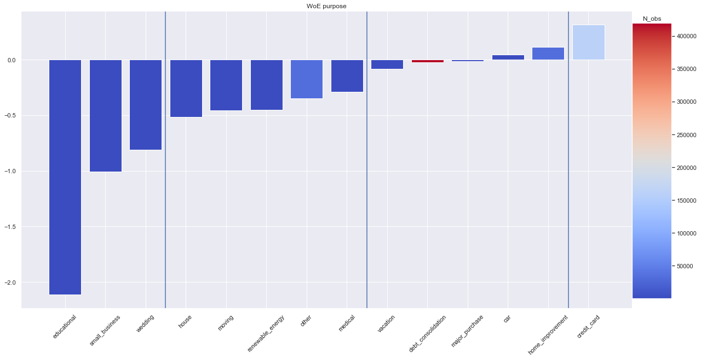


Surprisingly, educational loans appear extremely likely to default, but there is not enough data on it to say it for sure.<br>
Small businesses loans are also very likely to default.


```python
fig, ax = plt.subplots(figsize=(20,8))

woe_df.set_index('purpose').iloc[:, [3,4]].plot(kind='bar', stacked=True, ax=ax)

plt.legend()
```


    <matplotlib.legend.Legend at 0x1a27245940>


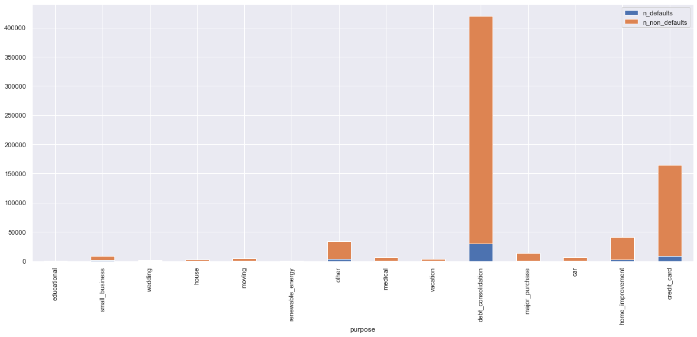


Grouping educ, sm and wedding <br>
House, moving, ren_energy, other and medical<br>
vacation, debtc, majpur, car, homeimp<br>
and credit_card alone


```python
x_train_prep['purpose:educ_sm_wedd'] = x_train_prep['purpose:educational'] + x_train_prep['purpose:small_business'] + x_train_prep['purpose:wedding']
x_train_prep['purpose:house_mov_ren_oth_med'] = x_train_prep['purpose:house'] + x_train_prep['purpose:moving'] + x_train_prep['purpose:renewable_energy'] + x_train_prep['purpose:other'] + x_train_prep['purpose:medical']
x_train_prep['purpose:vac_debtc_majpur_car_homeimp'] = x_train_prep['purpose:vacation'] + x_train_prep['purpose:debt_consolidation'] + x_train_prep['purpose:major_purchase'] + x_train_prep['purpose:car'] + x_train_prep['purpose:home_improvement']

```


```python
fig, ax = plt.subplots(figsize=(20,8))

var_s = ['purpose:educ_sm_wedd', 'purpose:house_mov_ren_oth_med', 'purpose:vac_debtc_majpur_car_homeimp', 'purpose:credit_card']
pd.concat([x_train_prep, y_train_prep], axis=1).groupby('Y').sum().loc[:, var_s].T.plot(kind='bar', stacked=True, ax=ax)

plt.legend()
```


    <matplotlib.legend.Legend at 0x1a2d256dd8>


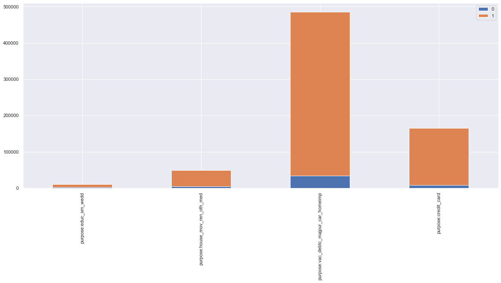


```python
vars_to_use.append(['purpose:house_mov_ren_oth_med', 'purpose:vac_debtc_majpur_car_homeimp', 'purpose:credit_card'])
ref_vars.append(['purpose:educ_sm_wedd'])

vars_to_use
```


    [['grade:F', 'grade:E', 'grade:D', 'grade:C', 'grade:B', 'grade:A'],
     ['home_ownership:OWN', 'home_ownership:MORTGAGE'],
     ['addr_state:NY',
      'addr_state:VA_OK_AL_SD',
      'addr_state:CA',
      'addr_state:MO_DE_MD_UT_LA_NJ',
      'addr_state:NM_NC_AZ',
      'addr_state:PA_MA_RI_MI_AR',
      'addr_state:MN_OH_AK',
      'addr_state:KY_WI_GA_WA',
      'addr_state:OR_IN_TN_CT',
      'addr_state:TX',
      'addr_state:IL_KS_MT_SC_CO',
      'addr_state:VT_WV_WY_NH_DC_MS'],
     ['verification_status:Not Verified', 'verification_status:Source Verified'],
     ['initial_list_status:w'],
     ['purpose:house_mov_ren_oth_med',
      'purpose:vac_debtc_majpur_car_homeimp',
      'purpose:credit_card']]


```python

```


```python

```


```python

```

# Continuous variables<br>

the procedure is the same as for catg variables, but we can't order tge woe_df by WoE, instead we have to order it by the values of the variable itself<br>
we want to preserve the natural order


```python

```

### term independent variable


```python
woe_df = woe_ordered_continuous(x_train_prep, 'term', y_train_prep)
woe_df
```


<div>
<style scoped>
    .dataframe tbody tr th:only-of-type {
        vertical-align: middle;
    }

    .dataframe tbody tr th {
        vertical-align: top;
    }

    .dataframe thead th {
        text-align: right;
    }
</style>
<table border="1" class="dataframe">
  <thead>
    <tr style="text-align: right;">
      <th></th>
      <th>term</th>
      <th>n_obs</th>
      <th>prop_non_defaults</th>
      <th>prop_n_obs</th>
      <th>n_defaults</th>
      <th>n_non_defaults</th>
      <th>prop_n_non_defaults</th>
      <th>prop_n_defaults</th>
      <th>WoE</th>
      <th>diff_prop_non_defaults</th>
      <th>diff_WoE</th>
      <th>IV</th>
    </tr>
  </thead>
  <tbody>
    <tr>
      <th>0</th>
      <td>36</td>
      <td>496644</td>
      <td>0.936900</td>
      <td>0.699594</td>
      <td>31338.0</td>
      <td>465306.0</td>
      <td>0.70361</td>
      <td>0.644934</td>
      <td>0.087076</td>
      <td>NaN</td>
      <td>NaN</td>
      <td>0.015708</td>
    </tr>
    <tr>
      <th>1</th>
      <td>60</td>
      <td>213259</td>
      <td>0.919098</td>
      <td>0.300406</td>
      <td>17253.0</td>
      <td>196006.0</td>
      <td>0.29639</td>
      <td>0.355066</td>
      <td>-0.180628</td>
      <td>0.407221</td>
      <td>0.267705</td>
      <td>0.015708</td>
    </tr>
  </tbody>
</table>
</div>


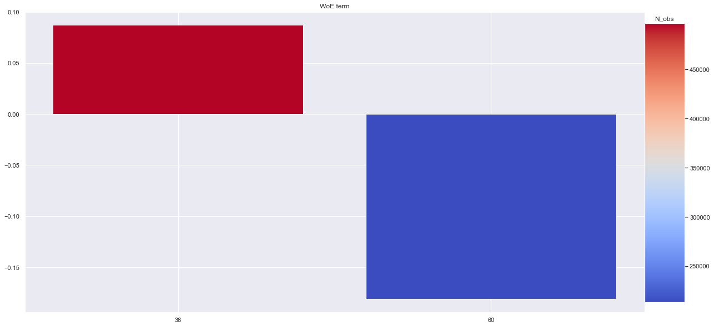


60 month is much riskier, I'll leave as it is. Only two very distinct categories.<br>


```python
fig, ax = plt.subplots(figsize=(20,8))

woe_df.set_index('term').iloc[:, [3,4]].plot(kind='bar', stacked=True, ax=ax)

plt.legend()
```


    <matplotlib.legend.Legend at 0x1a2722d898>


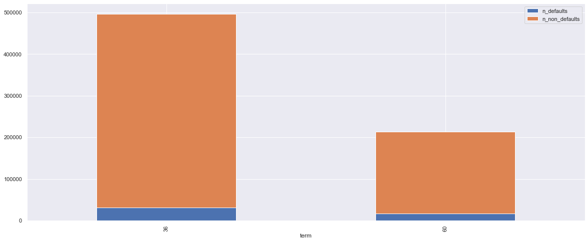


```python
temp_dummies = pd.get_dummies(x_train_prep['term'], prefix='term', prefix_sep=':')
x_train_prep = pd.concat([x_train_prep, temp_dummies], axis=1)
```


```python
vars_to_use.append(['term:36'])
ref_vars.append(['term:60'])

vars_to_use
```


    [['grade:F', 'grade:E', 'grade:D', 'grade:C', 'grade:B', 'grade:A'],
     ['home_ownership:OWN', 'home_ownership:MORTGAGE'],
     ['addr_state:NY',
      'addr_state:VA_OK_AL_SD',
      'addr_state:CA',
      'addr_state:MO_DE_MD_UT_LA_NJ',
      'addr_state:NM_NC_AZ',
      'addr_state:PA_MA_RI_MI_AR',
      'addr_state:MN_OH_AK',
      'addr_state:KY_WI_GA_WA',
      'addr_state:OR_IN_TN_CT',
      'addr_state:TX',
      'addr_state:IL_KS_MT_SC_CO',
      'addr_state:VT_WV_WY_NH_DC_MS'],
     ['verification_status:Not Verified', 'verification_status:Source Verified'],
     ['initial_list_status:w'],
     ['purpose:house_mov_ren_oth_med',
      'purpose:vac_debtc_majpur_car_homeimp',
      'purpose:credit_card'],
     ['term:36']]


### emp_length_int independent variable

## ATTENTION!!! This variable discretization changed in relation to the first model


```python
woe_df = woe_ordered_continuous(x_train_prep, 'emp_length_int', y_train_prep, vlines=[0.5, 1.5, 4.5, 7.5, 9.5])
woe_df
```


<div>
<style scoped>
    .dataframe tbody tr th:only-of-type {
        vertical-align: middle;
    }

    .dataframe tbody tr th {
        vertical-align: top;
    }

    .dataframe thead th {
        text-align: right;
    }
</style>
<table border="1" class="dataframe">
  <thead>
    <tr style="text-align: right;">
      <th></th>
      <th>emp_length_int</th>
      <th>n_obs</th>
      <th>prop_non_defaults</th>
      <th>prop_n_obs</th>
      <th>n_defaults</th>
      <th>n_non_defaults</th>
      <th>prop_n_non_defaults</th>
      <th>prop_n_defaults</th>
      <th>WoE</th>
      <th>diff_prop_non_defaults</th>
      <th>diff_WoE</th>
      <th>IV</th>
    </tr>
  </thead>
  <tbody>
    <tr>
      <th>0</th>
      <td>0</td>
      <td>92271</td>
      <td>0.923692</td>
      <td>0.129977</td>
      <td>7041.0</td>
      <td>85230.0</td>
      <td>0.128880</td>
      <td>0.144903</td>
      <td>-0.117184</td>
      <td>NaN</td>
      <td>NaN</td>
      <td>0.01212</td>
    </tr>
    <tr>
      <th>1</th>
      <td>1</td>
      <td>45480</td>
      <td>0.926473</td>
      <td>0.064065</td>
      <td>3344.0</td>
      <td>42136.0</td>
      <td>0.063716</td>
      <td>0.068819</td>
      <td>-0.077053</td>
      <td>0.065164</td>
      <td>0.040132</td>
      <td>0.01212</td>
    </tr>
    <tr>
      <th>2</th>
      <td>2</td>
      <td>63051</td>
      <td>0.930009</td>
      <td>0.088816</td>
      <td>4413.0</td>
      <td>58638.0</td>
      <td>0.088669</td>
      <td>0.090819</td>
      <td>-0.023959</td>
      <td>0.024953</td>
      <td>0.053093</td>
      <td>0.01212</td>
    </tr>
    <tr>
      <th>3</th>
      <td>3</td>
      <td>55968</td>
      <td>0.930746</td>
      <td>0.078839</td>
      <td>3876.0</td>
      <td>52092.0</td>
      <td>0.078771</td>
      <td>0.079768</td>
      <td>-0.012580</td>
      <td>0.009899</td>
      <td>0.011379</td>
      <td>0.01212</td>
    </tr>
    <tr>
      <th>4</th>
      <td>4</td>
      <td>42024</td>
      <td>0.929207</td>
      <td>0.059197</td>
      <td>2975.0</td>
      <td>39049.0</td>
      <td>0.059048</td>
      <td>0.061225</td>
      <td>-0.036214</td>
      <td>0.019723</td>
      <td>0.023634</td>
      <td>0.01212</td>
    </tr>
    <tr>
      <th>5</th>
      <td>5</td>
      <td>44495</td>
      <td>0.926059</td>
      <td>0.062678</td>
      <td>3290.0</td>
      <td>41205.0</td>
      <td>0.062308</td>
      <td>0.067708</td>
      <td>-0.083115</td>
      <td>0.003260</td>
      <td>0.046901</td>
      <td>0.01212</td>
    </tr>
    <tr>
      <th>6</th>
      <td>6</td>
      <td>34470</td>
      <td>0.918770</td>
      <td>0.048556</td>
      <td>2800.0</td>
      <td>31670.0</td>
      <td>0.047890</td>
      <td>0.057624</td>
      <td>-0.185037</td>
      <td>0.014418</td>
      <td>0.101922</td>
      <td>0.01212</td>
    </tr>
    <tr>
      <th>7</th>
      <td>7</td>
      <td>35654</td>
      <td>0.923319</td>
      <td>0.050224</td>
      <td>2734.0</td>
      <td>32920.0</td>
      <td>0.049780</td>
      <td>0.056266</td>
      <td>-0.122473</td>
      <td>0.001890</td>
      <td>0.062564</td>
      <td>0.01212</td>
    </tr>
    <tr>
      <th>8</th>
      <td>8</td>
      <td>35102</td>
      <td>0.934562</td>
      <td>0.049446</td>
      <td>2297.0</td>
      <td>32805.0</td>
      <td>0.049606</td>
      <td>0.047272</td>
      <td>0.048190</td>
      <td>0.000174</td>
      <td>0.170662</td>
      <td>0.01212</td>
    </tr>
    <tr>
      <th>9</th>
      <td>9</td>
      <td>27760</td>
      <td>0.932853</td>
      <td>0.039104</td>
      <td>1864.0</td>
      <td>25896.0</td>
      <td>0.039159</td>
      <td>0.038361</td>
      <td>0.020576</td>
      <td>0.010447</td>
      <td>0.027613</td>
      <td>0.01212</td>
    </tr>
    <tr>
      <th>10</th>
      <td>10</td>
      <td>233628</td>
      <td>0.940260</td>
      <td>0.329098</td>
      <td>13957.0</td>
      <td>219671.0</td>
      <td>0.332175</td>
      <td>0.287234</td>
      <td>0.145362</td>
      <td>0.293016</td>
      <td>0.124786</td>
      <td>0.01212</td>
    </tr>
  </tbody>
</table>
</div>


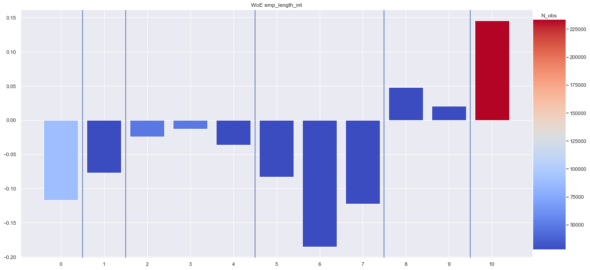


```python
fig, ax = plt.subplots(figsize=(20,8))

woe_df.set_index('emp_length_int').iloc[:, [3,4]].plot(kind='bar', stacked=True, ax=ax)

plt.legend()
```


    <matplotlib.legend.Legend at 0x1a2e0d72b0>


```python
temp_dummies = pd.get_dummies(x_train_prep['emp_length_int'], prefix='emp_length_int', prefix_sep=':')
```


```python
x_train_prep['emp_length_int:0'] = temp_dummies['emp_length_int:0'].values
x_train_prep['emp_length_int:1'] = temp_dummies['emp_length_int:1'].values
x_train_prep['emp_length_int:2_3_4'] = (temp_dummies['emp_length_int:2'] + temp_dummies['emp_length_int:3'] + temp_dummies['emp_length_int:4']).values
x_train_prep['emp_length_int:5_6_7'] = (temp_dummies['emp_length_int:5'] + temp_dummies['emp_length_int:6'] + temp_dummies['emp_length_int:6']).values
x_train_prep['emp_length_int:8_9'] = (temp_dummies['emp_length_int:8'] + temp_dummies['emp_length_int:9']).values
x_train_prep['emp_length_int:10'] = temp_dummies['emp_length_int:10'].values
```


```python
fig, ax = plt.subplots(figsize=(20,8))

var_s = ['emp_length_int:0', 'emp_length_int:1','emp_length_int:2_3_4','emp_length_int:5_6_7','emp_length_int:8_9','emp_length_int:10']
pd.concat([x_train_prep, y_train_prep], axis=1).groupby('Y').sum().loc[:, var_s].T.plot(kind='bar', stacked=True, ax=ax)

plt.legend()
```


    <matplotlib.legend.Legend at 0x1a2e10bdd8>


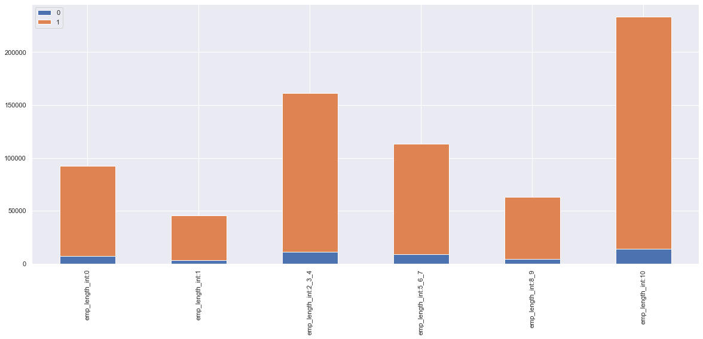


```python
vars_to_use.append(['emp_length_int:1','emp_length_int:2_3_4','emp_length_int:5_6_7','emp_length_int:8_9','emp_length_int:10'])
ref_vars.append(['emp_length_int:0'])


vars_to_use
```


    [['grade:F', 'grade:E', 'grade:D', 'grade:C', 'grade:B', 'grade:A'],
     ['home_ownership:OWN', 'home_ownership:MORTGAGE'],
     ['addr_state:NY',
      'addr_state:VA_OK_AL_SD',
      'addr_state:CA',
      'addr_state:MO_DE_MD_UT_LA_NJ',
      'addr_state:NM_NC_AZ',
      'addr_state:PA_MA_RI_MI_AR',
      'addr_state:MN_OH_AK',
      'addr_state:KY_WI_GA_WA',
      'addr_state:OR_IN_TN_CT',
      'addr_state:TX',
      'addr_state:IL_KS_MT_SC_CO',
      'addr_state:VT_WV_WY_NH_DC_MS'],
     ['verification_status:Not Verified', 'verification_status:Source Verified'],
     ['initial_list_status:w'],
     ['purpose:house_mov_ren_oth_med',
      'purpose:vac_debtc_majpur_car_homeimp',
      'purpose:credit_card'],
     ['term:36'],
     ['emp_length_int:1',
      'emp_length_int:2_3_4',
      'emp_length_int:5_6_7',
      'emp_length_int:8_9',
      'emp_length_int:10']]


### 'mths_since_issue_d' independent variable<br>

## ATTENTION!!! This variable discretization changed in relation to the first model
There are 91 distinct values, first we fine class (un-ruled grouping) and later coarse class them (group by WoE)


```python
x_train_prep['mths_since_issue_d'].nunique()
```


    103


```python
x_train_prep['mths_since_issue_d_factor'] = pd.cut(x_train_prep['mths_since_issue_d'], 50)
```


```python
woe_df = woe_ordered_continuous(x_train_prep, 'mths_since_issue_d_factor', y_train_prep, rot_x_ticks=90, vlines=[0.5, 1.5, 2.5, 5.5, 8.5, 15.5, 28.5])
plt.grid(True)


woe_df
```


<div>
<style scoped>
    .dataframe tbody tr th:only-of-type {
        vertical-align: middle;
    }

    .dataframe tbody tr th {
        vertical-align: top;
    }

    .dataframe thead th {
        text-align: right;
    }
</style>
<table border="1" class="dataframe">
  <thead>
    <tr style="text-align: right;">
      <th></th>
      <th>mths_since_issue_d_factor</th>
      <th>n_obs</th>
      <th>prop_non_defaults</th>
      <th>prop_n_obs</th>
      <th>n_defaults</th>
      <th>n_non_defaults</th>
      <th>prop_n_non_defaults</th>
      <th>prop_n_defaults</th>
      <th>WoE</th>
      <th>diff_prop_non_defaults</th>
      <th>diff_WoE</th>
      <th>IV</th>
    </tr>
  </thead>
  <tbody>
    <tr>
      <th>0</th>
      <td>(35.898, 38.04]</td>
      <td>104510</td>
      <td>0.998479</td>
      <td>0.147217</td>
      <td>159.0</td>
      <td>104351.0</td>
      <td>0.157794</td>
      <td>0.003272</td>
      <td>3.875824</td>
      <td>NaN</td>
      <td>NaN</td>
      <td>1.237888</td>
    </tr>
    <tr>
      <th>1</th>
      <td>(38.04, 40.08]</td>
      <td>51451</td>
      <td>0.992070</td>
      <td>0.072476</td>
      <td>408.0</td>
      <td>51043.0</td>
      <td>0.077184</td>
      <td>0.008397</td>
      <td>2.218369</td>
      <td>0.080609</td>
      <td>1.657455</td>
      <td>1.237888</td>
    </tr>
    <tr>
      <th>2</th>
      <td>(40.08, 42.12]</td>
      <td>59745</td>
      <td>0.982693</td>
      <td>0.084159</td>
      <td>1034.0</td>
      <td>58711.0</td>
      <td>0.088780</td>
      <td>0.021280</td>
      <td>1.428405</td>
      <td>0.011595</td>
      <td>0.789964</td>
      <td>1.237888</td>
    </tr>
    <tr>
      <th>3</th>
      <td>(42.12, 44.16]</td>
      <td>53781</td>
      <td>0.970213</td>
      <td>0.075758</td>
      <td>1602.0</td>
      <td>52179.0</td>
      <td>0.078902</td>
      <td>0.032969</td>
      <td>0.872640</td>
      <td>0.009877</td>
      <td>0.555765</td>
      <td>1.237888</td>
    </tr>
    <tr>
      <th>4</th>
      <td>(44.16, 46.2]</td>
      <td>39303</td>
      <td>0.957560</td>
      <td>0.055364</td>
      <td>1668.0</td>
      <td>37635.0</td>
      <td>0.056910</td>
      <td>0.034327</td>
      <td>0.505522</td>
      <td>0.021993</td>
      <td>0.367118</td>
      <td>1.237888</td>
    </tr>
    <tr>
      <th>5</th>
      <td>(46.2, 48.24]</td>
      <td>36263</td>
      <td>0.950280</td>
      <td>0.051082</td>
      <td>1803.0</td>
      <td>34460.0</td>
      <td>0.052109</td>
      <td>0.037106</td>
      <td>0.339560</td>
      <td>0.004801</td>
      <td>0.165962</td>
      <td>1.237888</td>
    </tr>
    <tr>
      <th>6</th>
      <td>(48.24, 50.28]</td>
      <td>51016</td>
      <td>0.934236</td>
      <td>0.071863</td>
      <td>3355.0</td>
      <td>47661.0</td>
      <td>0.072070</td>
      <td>0.069046</td>
      <td>0.042874</td>
      <td>0.019962</td>
      <td>0.296686</td>
      <td>1.237888</td>
    </tr>
    <tr>
      <th>7</th>
      <td>(50.28, 52.32]</td>
      <td>23626</td>
      <td>0.920469</td>
      <td>0.033281</td>
      <td>1879.0</td>
      <td>21747.0</td>
      <td>0.032885</td>
      <td>0.038670</td>
      <td>-0.162051</td>
      <td>0.039186</td>
      <td>0.204926</td>
      <td>1.237888</td>
    </tr>
    <tr>
      <th>8</th>
      <td>(52.32, 54.36]</td>
      <td>37267</td>
      <td>0.913462</td>
      <td>0.052496</td>
      <td>3225.0</td>
      <td>34042.0</td>
      <td>0.051476</td>
      <td>0.066370</td>
      <td>-0.254125</td>
      <td>0.018592</td>
      <td>0.092074</td>
      <td>1.237888</td>
    </tr>
    <tr>
      <th>9</th>
      <td>(54.36, 56.4]</td>
      <td>30514</td>
      <td>0.904568</td>
      <td>0.042983</td>
      <td>2912.0</td>
      <td>27602.0</td>
      <td>0.041738</td>
      <td>0.059929</td>
      <td>-0.361739</td>
      <td>0.009738</td>
      <td>0.107614</td>
      <td>1.237888</td>
    </tr>
    <tr>
      <th>10</th>
      <td>(56.4, 58.44]</td>
      <td>25484</td>
      <td>0.901193</td>
      <td>0.035898</td>
      <td>2518.0</td>
      <td>22966.0</td>
      <td>0.034728</td>
      <td>0.051820</td>
      <td>-0.400237</td>
      <td>0.007010</td>
      <td>0.038498</td>
      <td>1.237888</td>
    </tr>
    <tr>
      <th>11</th>
      <td>(58.44, 60.48]</td>
      <td>24532</td>
      <td>0.897073</td>
      <td>0.034557</td>
      <td>2525.0</td>
      <td>22007.0</td>
      <td>0.033278</td>
      <td>0.051964</td>
      <td>-0.445668</td>
      <td>0.001450</td>
      <td>0.045430</td>
      <td>1.237888</td>
    </tr>
    <tr>
      <th>12</th>
      <td>(60.48, 62.52]</td>
      <td>22991</td>
      <td>0.888261</td>
      <td>0.032386</td>
      <td>2569.0</td>
      <td>20422.0</td>
      <td>0.030881</td>
      <td>0.052870</td>
      <td>-0.537691</td>
      <td>0.002397</td>
      <td>0.092023</td>
      <td>1.237888</td>
    </tr>
    <tr>
      <th>13</th>
      <td>(62.52, 64.56]</td>
      <td>20504</td>
      <td>0.880901</td>
      <td>0.028883</td>
      <td>2442.0</td>
      <td>18062.0</td>
      <td>0.027312</td>
      <td>0.050256</td>
      <td>-0.609795</td>
      <td>0.003569</td>
      <td>0.072103</td>
      <td>1.237888</td>
    </tr>
    <tr>
      <th>14</th>
      <td>(64.56, 66.6]</td>
      <td>18288</td>
      <td>0.868657</td>
      <td>0.025761</td>
      <td>2402.0</td>
      <td>15886.0</td>
      <td>0.024022</td>
      <td>0.049433</td>
      <td>-0.721651</td>
      <td>0.003290</td>
      <td>0.111856</td>
      <td>1.237888</td>
    </tr>
    <tr>
      <th>15</th>
      <td>(66.6, 68.64]</td>
      <td>15759</td>
      <td>0.859572</td>
      <td>0.022199</td>
      <td>2213.0</td>
      <td>13546.0</td>
      <td>0.020484</td>
      <td>0.045543</td>
      <td>-0.799045</td>
      <td>0.003538</td>
      <td>0.077394</td>
      <td>1.237888</td>
    </tr>
    <tr>
      <th>16</th>
      <td>(68.64, 70.68]</td>
      <td>12639</td>
      <td>0.862964</td>
      <td>0.017804</td>
      <td>1732.0</td>
      <td>10907.0</td>
      <td>0.016493</td>
      <td>0.035644</td>
      <td>-0.770659</td>
      <td>0.003991</td>
      <td>0.028386</td>
      <td>1.237888</td>
    </tr>
    <tr>
      <th>17</th>
      <td>(70.68, 72.72]</td>
      <td>10417</td>
      <td>0.857637</td>
      <td>0.014674</td>
      <td>1483.0</td>
      <td>8934.0</td>
      <td>0.013510</td>
      <td>0.030520</td>
      <td>-0.814990</td>
      <td>0.002983</td>
      <td>0.044331</td>
      <td>1.237888</td>
    </tr>
    <tr>
      <th>18</th>
      <td>(72.72, 74.76]</td>
      <td>10117</td>
      <td>0.848077</td>
      <td>0.014251</td>
      <td>1537.0</td>
      <td>8580.0</td>
      <td>0.012974</td>
      <td>0.031631</td>
      <td>-0.891186</td>
      <td>0.000535</td>
      <td>0.076196</td>
      <td>1.237888</td>
    </tr>
    <tr>
      <th>19</th>
      <td>(74.76, 76.8]</td>
      <td>9143</td>
      <td>0.849174</td>
      <td>0.012879</td>
      <td>1379.0</td>
      <td>7764.0</td>
      <td>0.011740</td>
      <td>0.028380</td>
      <td>-0.882648</td>
      <td>0.001234</td>
      <td>0.008538</td>
      <td>1.237888</td>
    </tr>
    <tr>
      <th>20</th>
      <td>(76.8, 78.84]</td>
      <td>6718</td>
      <td>0.823459</td>
      <td>0.009463</td>
      <td>1186.0</td>
      <td>5532.0</td>
      <td>0.008365</td>
      <td>0.024408</td>
      <td>-1.070824</td>
      <td>0.003375</td>
      <td>0.188176</td>
      <td>1.237888</td>
    </tr>
    <tr>
      <th>21</th>
      <td>(78.84, 80.88]</td>
      <td>5288</td>
      <td>0.844932</td>
      <td>0.007449</td>
      <td>820.0</td>
      <td>4468.0</td>
      <td>0.006756</td>
      <td>0.016876</td>
      <td>-0.915396</td>
      <td>0.001609</td>
      <td>0.155429</td>
      <td>1.237888</td>
    </tr>
    <tr>
      <th>22</th>
      <td>(80.88, 82.92]</td>
      <td>4372</td>
      <td>0.848124</td>
      <td>0.006159</td>
      <td>664.0</td>
      <td>3708.0</td>
      <td>0.005607</td>
      <td>0.013665</td>
      <td>-0.890822</td>
      <td>0.001149</td>
      <td>0.024574</td>
      <td>1.237888</td>
    </tr>
    <tr>
      <th>23</th>
      <td>(82.92, 84.96]</td>
      <td>3877</td>
      <td>0.823575</td>
      <td>0.005461</td>
      <td>684.0</td>
      <td>3193.0</td>
      <td>0.004828</td>
      <td>0.014077</td>
      <td>-1.070029</td>
      <td>0.000779</td>
      <td>0.179208</td>
      <td>1.237888</td>
    </tr>
    <tr>
      <th>24</th>
      <td>(84.96, 87.0]</td>
      <td>5181</td>
      <td>0.853696</td>
      <td>0.007298</td>
      <td>758.0</td>
      <td>4423.0</td>
      <td>0.006688</td>
      <td>0.015600</td>
      <td>-0.846897</td>
      <td>0.001860</td>
      <td>0.223132</td>
      <td>1.237888</td>
    </tr>
    <tr>
      <th>25</th>
      <td>(87.0, 89.04]</td>
      <td>3061</td>
      <td>0.857890</td>
      <td>0.004312</td>
      <td>435.0</td>
      <td>2626.0</td>
      <td>0.003971</td>
      <td>0.008952</td>
      <td>-0.812916</td>
      <td>0.002717</td>
      <td>0.033981</td>
      <td>1.237888</td>
    </tr>
    <tr>
      <th>26</th>
      <td>(89.04, 91.08]</td>
      <td>2828</td>
      <td>0.844059</td>
      <td>0.003984</td>
      <td>441.0</td>
      <td>2387.0</td>
      <td>0.003609</td>
      <td>0.009076</td>
      <td>-0.922040</td>
      <td>0.000361</td>
      <td>0.109123</td>
      <td>1.237888</td>
    </tr>
    <tr>
      <th>27</th>
      <td>(91.08, 93.12]</td>
      <td>2419</td>
      <td>0.855312</td>
      <td>0.003408</td>
      <td>350.0</td>
      <td>2069.0</td>
      <td>0.003129</td>
      <td>0.007203</td>
      <td>-0.833900</td>
      <td>0.000481</td>
      <td>0.088140</td>
      <td>1.237888</td>
    </tr>
    <tr>
      <th>28</th>
      <td>(93.12, 95.16]</td>
      <td>2133</td>
      <td>0.866385</td>
      <td>0.003005</td>
      <td>285.0</td>
      <td>1848.0</td>
      <td>0.002794</td>
      <td>0.005865</td>
      <td>-0.741417</td>
      <td>0.000334</td>
      <td>0.092483</td>
      <td>1.237888</td>
    </tr>
    <tr>
      <th>29</th>
      <td>(95.16, 97.2]</td>
      <td>2053</td>
      <td>0.820263</td>
      <td>0.002892</td>
      <td>369.0</td>
      <td>1684.0</td>
      <td>0.002546</td>
      <td>0.007594</td>
      <td>-1.092657</td>
      <td>0.000248</td>
      <td>0.351240</td>
      <td>1.237888</td>
    </tr>
    <tr>
      <th>30</th>
      <td>(97.2, 99.24]</td>
      <td>1973</td>
      <td>0.777496</td>
      <td>0.002779</td>
      <td>439.0</td>
      <td>1534.0</td>
      <td>0.002320</td>
      <td>0.009035</td>
      <td>-1.359653</td>
      <td>0.000227</td>
      <td>0.266996</td>
      <td>1.237888</td>
    </tr>
    <tr>
      <th>31</th>
      <td>(99.24, 101.28]</td>
      <td>1881</td>
      <td>0.799043</td>
      <td>0.002650</td>
      <td>378.0</td>
      <td>1503.0</td>
      <td>0.002273</td>
      <td>0.007779</td>
      <td>-1.230463</td>
      <td>0.000047</td>
      <td>0.129190</td>
      <td>1.237888</td>
    </tr>
    <tr>
      <th>32</th>
      <td>(101.28, 103.32]</td>
      <td>1706</td>
      <td>0.790152</td>
      <td>0.002403</td>
      <td>358.0</td>
      <td>1348.0</td>
      <td>0.002038</td>
      <td>0.007368</td>
      <td>-1.284943</td>
      <td>0.000234</td>
      <td>0.054480</td>
      <td>1.237888</td>
    </tr>
    <tr>
      <th>33</th>
      <td>(103.32, 105.36]</td>
      <td>1373</td>
      <td>0.804807</td>
      <td>0.001934</td>
      <td>268.0</td>
      <td>1105.0</td>
      <td>0.001671</td>
      <td>0.005515</td>
      <td>-1.194174</td>
      <td>0.000367</td>
      <td>0.090769</td>
      <td>1.237888</td>
    </tr>
    <tr>
      <th>34</th>
      <td>(105.36, 107.4]</td>
      <td>1056</td>
      <td>0.803977</td>
      <td>0.001488</td>
      <td>207.0</td>
      <td>849.0</td>
      <td>0.001284</td>
      <td>0.004260</td>
      <td>-1.199447</td>
      <td>0.000387</td>
      <td>0.005273</td>
      <td>1.237888</td>
    </tr>
    <tr>
      <th>35</th>
      <td>(107.4, 109.44]</td>
      <td>1048</td>
      <td>0.803435</td>
      <td>0.001476</td>
      <td>206.0</td>
      <td>842.0</td>
      <td>0.001273</td>
      <td>0.004239</td>
      <td>-1.202884</td>
      <td>0.000011</td>
      <td>0.003437</td>
      <td>1.237888</td>
    </tr>
    <tr>
      <th>36</th>
      <td>(109.44, 111.48]</td>
      <td>907</td>
      <td>0.765160</td>
      <td>0.001278</td>
      <td>213.0</td>
      <td>694.0</td>
      <td>0.001049</td>
      <td>0.004384</td>
      <td>-1.429608</td>
      <td>0.000224</td>
      <td>0.226724</td>
      <td>1.237888</td>
    </tr>
    <tr>
      <th>37</th>
      <td>(111.48, 113.52]</td>
      <td>693</td>
      <td>0.815296</td>
      <td>0.000976</td>
      <td>128.0</td>
      <td>565.0</td>
      <td>0.000854</td>
      <td>0.002634</td>
      <td>-1.125992</td>
      <td>0.000195</td>
      <td>0.303616</td>
      <td>1.237888</td>
    </tr>
    <tr>
      <th>38</th>
      <td>(113.52, 115.56]</td>
      <td>610</td>
      <td>0.770492</td>
      <td>0.000859</td>
      <td>140.0</td>
      <td>470.0</td>
      <td>0.000711</td>
      <td>0.002881</td>
      <td>-1.399697</td>
      <td>0.000144</td>
      <td>0.273705</td>
      <td>1.237888</td>
    </tr>
    <tr>
      <th>39</th>
      <td>(115.56, 117.6]</td>
      <td>530</td>
      <td>0.752830</td>
      <td>0.000747</td>
      <td>131.0</td>
      <td>399.0</td>
      <td>0.000603</td>
      <td>0.002696</td>
      <td>-1.497023</td>
      <td>0.000107</td>
      <td>0.097326</td>
      <td>1.237888</td>
    </tr>
    <tr>
      <th>40</th>
      <td>(117.6, 119.64]</td>
      <td>457</td>
      <td>0.768053</td>
      <td>0.000644</td>
      <td>106.0</td>
      <td>351.0</td>
      <td>0.000531</td>
      <td>0.002181</td>
      <td>-1.413440</td>
      <td>0.000073</td>
      <td>0.083583</td>
      <td>1.237888</td>
    </tr>
    <tr>
      <th>41</th>
      <td>(119.64, 121.68]</td>
      <td>364</td>
      <td>0.744505</td>
      <td>0.000513</td>
      <td>93.0</td>
      <td>271.0</td>
      <td>0.000410</td>
      <td>0.001914</td>
      <td>-1.541268</td>
      <td>0.000121</td>
      <td>0.127828</td>
      <td>1.237888</td>
    </tr>
    <tr>
      <th>42</th>
      <td>(121.68, 123.72]</td>
      <td>142</td>
      <td>0.591549</td>
      <td>0.000200</td>
      <td>58.0</td>
      <td>84.0</td>
      <td>0.000127</td>
      <td>0.001194</td>
      <td>-2.240414</td>
      <td>0.000283</td>
      <td>0.699146</td>
      <td>1.237888</td>
    </tr>
    <tr>
      <th>43</th>
      <td>(123.72, 125.76]</td>
      <td>191</td>
      <td>0.565445</td>
      <td>0.000269</td>
      <td>83.0</td>
      <td>108.0</td>
      <td>0.000163</td>
      <td>0.001708</td>
      <td>-2.347497</td>
      <td>0.000036</td>
      <td>0.107083</td>
      <td>1.237888</td>
    </tr>
    <tr>
      <th>44</th>
      <td>(125.76, 127.8]</td>
      <td>191</td>
      <td>0.507853</td>
      <td>0.000269</td>
      <td>94.0</td>
      <td>97.0</td>
      <td>0.000147</td>
      <td>0.001935</td>
      <td>-2.579371</td>
      <td>0.000017</td>
      <td>0.231874</td>
      <td>1.237888</td>
    </tr>
    <tr>
      <th>45</th>
      <td>(127.8, 129.84]</td>
      <td>518</td>
      <td>0.492278</td>
      <td>0.000730</td>
      <td>263.0</td>
      <td>255.0</td>
      <td>0.000386</td>
      <td>0.005413</td>
      <td>-2.641678</td>
      <td>0.000239</td>
      <td>0.062307</td>
      <td>1.237888</td>
    </tr>
    <tr>
      <th>46</th>
      <td>(129.84, 131.88]</td>
      <td>511</td>
      <td>0.471624</td>
      <td>0.000720</td>
      <td>270.0</td>
      <td>241.0</td>
      <td>0.000364</td>
      <td>0.005557</td>
      <td>-2.724412</td>
      <td>0.000021</td>
      <td>0.082735</td>
      <td>1.237888</td>
    </tr>
    <tr>
      <th>47</th>
      <td>(131.88, 133.92]</td>
      <td>221</td>
      <td>0.330317</td>
      <td>0.000311</td>
      <td>148.0</td>
      <td>73.0</td>
      <td>0.000110</td>
      <td>0.003046</td>
      <td>-3.317540</td>
      <td>0.000254</td>
      <td>0.593128</td>
      <td>1.237888</td>
    </tr>
    <tr>
      <th>48</th>
      <td>(133.92, 135.96]</td>
      <td>127</td>
      <td>0.330709</td>
      <td>0.000179</td>
      <td>85.0</td>
      <td>42.0</td>
      <td>0.000064</td>
      <td>0.001749</td>
      <td>-3.315769</td>
      <td>0.000047</td>
      <td>0.001771</td>
      <td>1.237888</td>
    </tr>
    <tr>
      <th>49</th>
      <td>(135.96, 138.0]</td>
      <td>124</td>
      <td>0.306452</td>
      <td>0.000175</td>
      <td>86.0</td>
      <td>38.0</td>
      <td>0.000057</td>
      <td>0.001770</td>
      <td>-3.427549</td>
      <td>0.000006</td>
      <td>0.111779</td>
      <td>1.237888</td>
    </tr>
  </tbody>
</table>
</div>


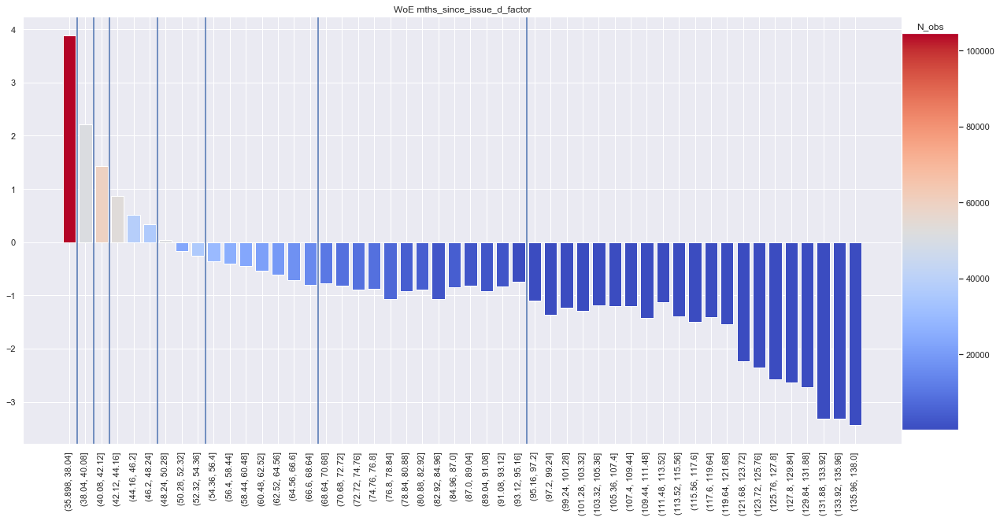


```python
fig, ax = plt.subplots(figsize=(20,8))

woe_df.set_index('mths_since_issue_d_factor').iloc[:, [3,4]].plot(kind='bar', stacked=True, ax=ax)

plt.legend()
```


    <matplotlib.legend.Legend at 0x1a2f665e10>


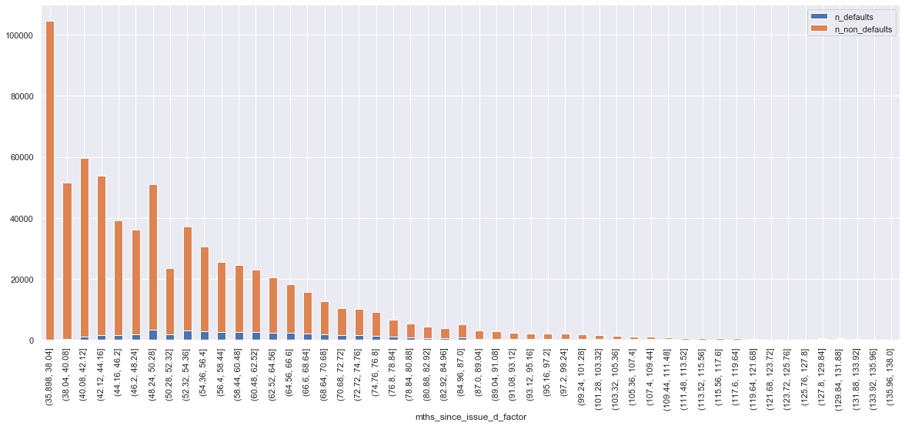


```python
x_train_prep['mths_since_issue_d:<38'] = np.where(x_train_prep['mths_since_issue_d'].isin(range(38)), 1, 0)
x_train_prep['mths_since_issue_d:38_39'] = np.where(x_train_prep['mths_since_issue_d'].isin(range(38, 40)), 1, 0)
x_train_prep['mths_since_issue_d:40_41'] = np.where(x_train_prep['mths_since_issue_d'].isin(range(40, 42)), 1, 0)

x_train_prep['mths_since_issue_d:42_48'] = np.where(x_train_prep['mths_since_issue_d'].isin(range(42, 49)), 1, 0)
x_train_prep['mths_since_issue_d:49_54'] = np.where(x_train_prep['mths_since_issue_d'].isin(range(49, 55)), 1, 0)
x_train_prep['mths_since_issue_d:55_68'] = np.where(x_train_prep['mths_since_issue_d'].isin(range(55, 69)), 1, 0)
x_train_prep['mths_since_issue_d:69_95'] = np.where(x_train_prep['mths_since_issue_d'].isin(range(69, 96)), 1, 0)
x_train_prep['mths_since_issue_d:>95'] = np.where(x_train_prep['mths_since_issue_d'] > 95, 1, 0)
```


```python
fig, ax = plt.subplots(figsize=(20,8))

var_s = ['mths_since_issue_d:<38', 'mths_since_issue_d:38_39', 'mths_since_issue_d:40_41', 'mths_since_issue_d:42_48',
                    'mths_since_issue_d:49_54', 'mths_since_issue_d:55_68', 'mths_since_issue_d:69_95', 'mths_since_issue_d:>95']
pd.concat([x_train_prep, y_train_prep], axis=1).groupby('Y').sum().loc[:, var_s].T.plot(kind='bar', stacked=True, ax=ax)

plt.legend()
```


    <matplotlib.legend.Legend at 0x1a2f77f198>


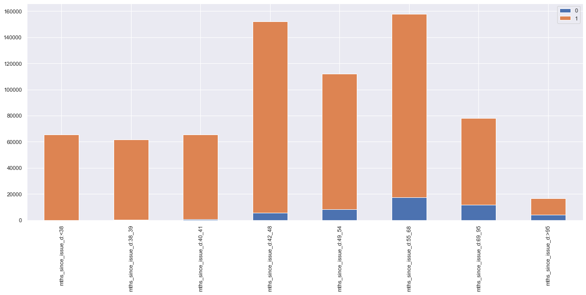


```python
vars_to_use.append(['mths_since_issue_d:<38', 'mths_since_issue_d:38_39', 'mths_since_issue_d:40_41', 'mths_since_issue_d:42_48',
                    'mths_since_issue_d:49_54', 'mths_since_issue_d:55_68', 'mths_since_issue_d:69_95'])

ref_vars.append(['mths_since_issue_d:>95'])
vars_to_use
```


    [['grade:F', 'grade:E', 'grade:D', 'grade:C', 'grade:B', 'grade:A'],
     ['home_ownership:OWN', 'home_ownership:MORTGAGE'],
     ['addr_state:NY',
      'addr_state:VA_OK_AL_SD',
      'addr_state:CA',
      'addr_state:MO_DE_MD_UT_LA_NJ',
      'addr_state:NM_NC_AZ',
      'addr_state:PA_MA_RI_MI_AR',
      'addr_state:MN_OH_AK',
      'addr_state:KY_WI_GA_WA',
      'addr_state:OR_IN_TN_CT',
      'addr_state:TX',
      'addr_state:IL_KS_MT_SC_CO',
      'addr_state:VT_WV_WY_NH_DC_MS'],
     ['verification_status:Not Verified', 'verification_status:Source Verified'],
     ['initial_list_status:w'],
     ['purpose:house_mov_ren_oth_med',
      'purpose:vac_debtc_majpur_car_homeimp',
      'purpose:credit_card'],
     ['term:36'],
     ['emp_length_int:1',
      'emp_length_int:2_3_4',
      'emp_length_int:5_6_7',
      'emp_length_int:8_9',
      'emp_length_int:10'],
     ['mths_since_issue_d:<38',
      'mths_since_issue_d:38_39',
      'mths_since_issue_d:40_41',
      'mths_since_issue_d:42_48',
      'mths_since_issue_d:49_54',
      'mths_since_issue_d:55_68',
      'mths_since_issue_d:69_95']]


### 'int_rate' variable

## ATTENTION!!! This variable discretization has changed in relation to the first model


```python
x_train_prep['int_rate_factor'] = pd.cut(x_train_prep['int_rate'], 50)

woe_df = woe_ordered_continuous(x_train_prep, 'int_rate_factor', y_train_prep, rot_x_ticks=90, vlines=[9.5, 15.5, 21.5, 30.5])

woe_df
```


<div>
<style scoped>
    .dataframe tbody tr th:only-of-type {
        vertical-align: middle;
    }

    .dataframe tbody tr th {
        vertical-align: top;
    }

    .dataframe thead th {
        text-align: right;
    }
</style>
<table border="1" class="dataframe">
  <thead>
    <tr style="text-align: right;">
      <th></th>
      <th>int_rate_factor</th>
      <th>n_obs</th>
      <th>prop_non_defaults</th>
      <th>prop_n_obs</th>
      <th>n_defaults</th>
      <th>n_non_defaults</th>
      <th>prop_n_non_defaults</th>
      <th>prop_n_defaults</th>
      <th>WoE</th>
      <th>diff_prop_non_defaults</th>
      <th>diff_WoE</th>
      <th>IV</th>
    </tr>
  </thead>
  <tbody>
    <tr>
      <th>0</th>
      <td>(5.296, 5.793]</td>
      <td>8514</td>
      <td>0.995889</td>
      <td>0.011993</td>
      <td>35.0</td>
      <td>8479.0</td>
      <td>0.012821</td>
      <td>0.000720</td>
      <td>2.879212</td>
      <td>NaN</td>
      <td>NaN</td>
      <td>0.550289</td>
    </tr>
    <tr>
      <th>1</th>
      <td>(5.793, 6.267]</td>
      <td>16578</td>
      <td>0.989504</td>
      <td>0.023352</td>
      <td>174.0</td>
      <td>16404.0</td>
      <td>0.024805</td>
      <td>0.003581</td>
      <td>1.935438</td>
      <td>0.011984</td>
      <td>0.943775</td>
      <td>0.550289</td>
    </tr>
    <tr>
      <th>2</th>
      <td>(6.267, 6.74]</td>
      <td>13061</td>
      <td>0.981701</td>
      <td>0.018398</td>
      <td>239.0</td>
      <td>12822.0</td>
      <td>0.019389</td>
      <td>0.004919</td>
      <td>1.371667</td>
      <td>0.005417</td>
      <td>0.563771</td>
      <td>0.550289</td>
    </tr>
    <tr>
      <th>3</th>
      <td>(6.74, 7.214]</td>
      <td>14521</td>
      <td>0.988499</td>
      <td>0.020455</td>
      <td>167.0</td>
      <td>14354.0</td>
      <td>0.021705</td>
      <td>0.003437</td>
      <td>1.843003</td>
      <td>0.002317</td>
      <td>0.471336</td>
      <td>0.550289</td>
    </tr>
    <tr>
      <th>4</th>
      <td>(7.214, 7.687]</td>
      <td>17541</td>
      <td>0.978736</td>
      <td>0.024709</td>
      <td>373.0</td>
      <td>17168.0</td>
      <td>0.025961</td>
      <td>0.007676</td>
      <td>1.218437</td>
      <td>0.004255</td>
      <td>0.624566</td>
      <td>0.550289</td>
    </tr>
    <tr>
      <th>5</th>
      <td>(7.687, 8.16]</td>
      <td>29445</td>
      <td>0.975717</td>
      <td>0.041477</td>
      <td>715.0</td>
      <td>28730.0</td>
      <td>0.043444</td>
      <td>0.014715</td>
      <td>1.082627</td>
      <td>0.017483</td>
      <td>0.135809</td>
      <td>0.550289</td>
    </tr>
    <tr>
      <th>6</th>
      <td>(8.16, 8.634]</td>
      <td>24791</td>
      <td>0.985398</td>
      <td>0.034922</td>
      <td>362.0</td>
      <td>24429.0</td>
      <td>0.036940</td>
      <td>0.007450</td>
      <td>1.601095</td>
      <td>0.006504</td>
      <td>0.518467</td>
      <td>0.550289</td>
    </tr>
    <tr>
      <th>7</th>
      <td>(8.634, 9.107]</td>
      <td>12385</td>
      <td>0.947759</td>
      <td>0.017446</td>
      <td>647.0</td>
      <td>11738.0</td>
      <td>0.017750</td>
      <td>0.013315</td>
      <td>0.287453</td>
      <td>0.019191</td>
      <td>1.313642</td>
      <td>0.550289</td>
    </tr>
    <tr>
      <th>8</th>
      <td>(9.107, 9.581]</td>
      <td>24505</td>
      <td>0.985146</td>
      <td>0.034519</td>
      <td>364.0</td>
      <td>24141.0</td>
      <td>0.036505</td>
      <td>0.007491</td>
      <td>1.583726</td>
      <td>0.018755</td>
      <td>1.296273</td>
      <td>0.550289</td>
    </tr>
    <tr>
      <th>9</th>
      <td>(9.581, 10.054]</td>
      <td>27211</td>
      <td>0.970821</td>
      <td>0.038331</td>
      <td>794.0</td>
      <td>26417.0</td>
      <td>0.039946</td>
      <td>0.016340</td>
      <td>0.893892</td>
      <td>0.003442</td>
      <td>0.689833</td>
      <td>0.550289</td>
    </tr>
    <tr>
      <th>10</th>
      <td>(10.054, 10.527]</td>
      <td>12624</td>
      <td>0.942570</td>
      <td>0.017783</td>
      <td>725.0</td>
      <td>11899.0</td>
      <td>0.017993</td>
      <td>0.014920</td>
      <td>0.187251</td>
      <td>0.021953</td>
      <td>0.706642</td>
      <td>0.550289</td>
    </tr>
    <tr>
      <th>11</th>
      <td>(10.527, 11.001]</td>
      <td>34232</td>
      <td>0.961936</td>
      <td>0.048221</td>
      <td>1303.0</td>
      <td>32929.0</td>
      <td>0.049793</td>
      <td>0.026816</td>
      <td>0.618897</td>
      <td>0.031800</td>
      <td>0.431646</td>
      <td>0.550289</td>
    </tr>
    <tr>
      <th>12</th>
      <td>(11.001, 11.474]</td>
      <td>11615</td>
      <td>0.933534</td>
      <td>0.016361</td>
      <td>772.0</td>
      <td>10843.0</td>
      <td>0.016396</td>
      <td>0.015888</td>
      <td>0.031503</td>
      <td>0.033397</td>
      <td>0.587394</td>
      <td>0.550289</td>
    </tr>
    <tr>
      <th>13</th>
      <td>(11.474, 11.948]</td>
      <td>25393</td>
      <td>0.960658</td>
      <td>0.035770</td>
      <td>999.0</td>
      <td>24394.0</td>
      <td>0.036887</td>
      <td>0.020559</td>
      <td>0.584550</td>
      <td>0.020491</td>
      <td>0.553047</td>
      <td>0.550289</td>
    </tr>
    <tr>
      <th>14</th>
      <td>(11.948, 12.421]</td>
      <td>43578</td>
      <td>0.947749</td>
      <td>0.061386</td>
      <td>2277.0</td>
      <td>41301.0</td>
      <td>0.062453</td>
      <td>0.046861</td>
      <td>0.287241</td>
      <td>0.025566</td>
      <td>0.297310</td>
      <td>0.550289</td>
    </tr>
    <tr>
      <th>15</th>
      <td>(12.421, 12.894]</td>
      <td>29518</td>
      <td>0.957788</td>
      <td>0.041580</td>
      <td>1246.0</td>
      <td>28272.0</td>
      <td>0.042751</td>
      <td>0.025643</td>
      <td>0.511146</td>
      <td>0.019702</td>
      <td>0.223906</td>
      <td>0.550289</td>
    </tr>
    <tr>
      <th>16</th>
      <td>(12.894, 13.368]</td>
      <td>47126</td>
      <td>0.937423</td>
      <td>0.066384</td>
      <td>2949.0</td>
      <td>44177.0</td>
      <td>0.066802</td>
      <td>0.060690</td>
      <td>0.095951</td>
      <td>0.024051</td>
      <td>0.415195</td>
      <td>0.550289</td>
    </tr>
    <tr>
      <th>17</th>
      <td>(13.368, 13.841]</td>
      <td>16844</td>
      <td>0.920150</td>
      <td>0.023727</td>
      <td>1345.0</td>
      <td>15499.0</td>
      <td>0.023437</td>
      <td>0.027680</td>
      <td>-0.166406</td>
      <td>0.043365</td>
      <td>0.262357</td>
      <td>0.550289</td>
    </tr>
    <tr>
      <th>18</th>
      <td>(13.841, 14.315]</td>
      <td>35241</td>
      <td>0.926847</td>
      <td>0.049642</td>
      <td>2578.0</td>
      <td>32663.0</td>
      <td>0.049391</td>
      <td>0.053055</td>
      <td>-0.071558</td>
      <td>0.025954</td>
      <td>0.094848</td>
      <td>0.550289</td>
    </tr>
    <tr>
      <th>19</th>
      <td>(14.315, 14.788]</td>
      <td>30821</td>
      <td>0.924532</td>
      <td>0.043416</td>
      <td>2326.0</td>
      <td>28495.0</td>
      <td>0.043089</td>
      <td>0.047869</td>
      <td>-0.105209</td>
      <td>0.006303</td>
      <td>0.033650</td>
      <td>0.550289</td>
    </tr>
    <tr>
      <th>20</th>
      <td>(14.788, 15.261]</td>
      <td>14280</td>
      <td>0.890266</td>
      <td>0.020115</td>
      <td>1567.0</td>
      <td>12713.0</td>
      <td>0.019224</td>
      <td>0.032249</td>
      <td>-0.517325</td>
      <td>0.023865</td>
      <td>0.412116</td>
      <td>0.550289</td>
    </tr>
    <tr>
      <th>21</th>
      <td>(15.261, 15.735]</td>
      <td>32743</td>
      <td>0.912989</td>
      <td>0.046123</td>
      <td>2849.0</td>
      <td>29894.0</td>
      <td>0.045204</td>
      <td>0.058632</td>
      <td>-0.260098</td>
      <td>0.025980</td>
      <td>0.257228</td>
      <td>0.550289</td>
    </tr>
    <tr>
      <th>22</th>
      <td>(15.735, 16.208]</td>
      <td>10644</td>
      <td>0.851372</td>
      <td>0.014994</td>
      <td>1582.0</td>
      <td>9062.0</td>
      <td>0.013703</td>
      <td>0.032557</td>
      <td>-0.865387</td>
      <td>0.031501</td>
      <td>0.605290</td>
      <td>0.550289</td>
    </tr>
    <tr>
      <th>23</th>
      <td>(16.208, 16.682]</td>
      <td>23270</td>
      <td>0.901891</td>
      <td>0.032779</td>
      <td>2283.0</td>
      <td>20987.0</td>
      <td>0.031735</td>
      <td>0.046984</td>
      <td>-0.392375</td>
      <td>0.018032</td>
      <td>0.473013</td>
      <td>0.550289</td>
    </tr>
    <tr>
      <th>24</th>
      <td>(16.682, 17.155]</td>
      <td>19031</td>
      <td>0.910882</td>
      <td>0.026808</td>
      <td>1696.0</td>
      <td>17335.0</td>
      <td>0.026213</td>
      <td>0.034904</td>
      <td>-0.286332</td>
      <td>0.005522</td>
      <td>0.106042</td>
      <td>0.550289</td>
    </tr>
    <tr>
      <th>25</th>
      <td>(17.155, 17.628]</td>
      <td>20204</td>
      <td>0.887399</td>
      <td>0.028460</td>
      <td>2275.0</td>
      <td>17929.0</td>
      <td>0.027111</td>
      <td>0.046819</td>
      <td>-0.546348</td>
      <td>0.000898</td>
      <td>0.260016</td>
      <td>0.550289</td>
    </tr>
    <tr>
      <th>26</th>
      <td>(17.628, 18.102]</td>
      <td>13123</td>
      <td>0.896822</td>
      <td>0.018486</td>
      <td>1354.0</td>
      <td>11769.0</td>
      <td>0.017796</td>
      <td>0.027865</td>
      <td>-0.448382</td>
      <td>0.009315</td>
      <td>0.097966</td>
      <td>0.550289</td>
    </tr>
    <tr>
      <th>27</th>
      <td>(18.102, 18.575]</td>
      <td>22656</td>
      <td>0.902631</td>
      <td>0.031914</td>
      <td>2206.0</td>
      <td>20450.0</td>
      <td>0.030923</td>
      <td>0.045399</td>
      <td>-0.383985</td>
      <td>0.013127</td>
      <td>0.064396</td>
      <td>0.550289</td>
    </tr>
    <tr>
      <th>28</th>
      <td>(18.575, 19.049]</td>
      <td>9501</td>
      <td>0.850226</td>
      <td>0.013384</td>
      <td>1423.0</td>
      <td>8078.0</td>
      <td>0.012215</td>
      <td>0.029285</td>
      <td>-0.874410</td>
      <td>0.018708</td>
      <td>0.490425</td>
      <td>0.550289</td>
    </tr>
    <tr>
      <th>29</th>
      <td>(19.049, 19.522]</td>
      <td>14447</td>
      <td>0.864262</td>
      <td>0.020351</td>
      <td>1961.0</td>
      <td>12486.0</td>
      <td>0.018881</td>
      <td>0.040357</td>
      <td>-0.759634</td>
      <td>0.006666</td>
      <td>0.114776</td>
      <td>0.550289</td>
    </tr>
    <tr>
      <th>30</th>
      <td>(19.522, 19.995]</td>
      <td>7651</td>
      <td>0.877924</td>
      <td>0.010778</td>
      <td>934.0</td>
      <td>6717.0</td>
      <td>0.010157</td>
      <td>0.019222</td>
      <td>-0.637867</td>
      <td>0.008724</td>
      <td>0.121767</td>
      <td>0.550289</td>
    </tr>
    <tr>
      <th>31</th>
      <td>(19.995, 20.469]</td>
      <td>3394</td>
      <td>0.823512</td>
      <td>0.004781</td>
      <td>599.0</td>
      <td>2795.0</td>
      <td>0.004226</td>
      <td>0.012327</td>
      <td>-1.070462</td>
      <td>0.005931</td>
      <td>0.432595</td>
      <td>0.550289</td>
    </tr>
    <tr>
      <th>32</th>
      <td>(20.469, 20.942]</td>
      <td>4037</td>
      <td>0.829824</td>
      <td>0.005687</td>
      <td>687.0</td>
      <td>3350.0</td>
      <td>0.005066</td>
      <td>0.014138</td>
      <td>-1.026406</td>
      <td>0.000839</td>
      <td>0.044056</td>
      <td>0.550289</td>
    </tr>
    <tr>
      <th>33</th>
      <td>(20.942, 21.416]</td>
      <td>7618</td>
      <td>0.857049</td>
      <td>0.010731</td>
      <td>1089.0</td>
      <td>6529.0</td>
      <td>0.009873</td>
      <td>0.022412</td>
      <td>-0.819793</td>
      <td>0.004807</td>
      <td>0.206613</td>
      <td>0.550289</td>
    </tr>
    <tr>
      <th>34</th>
      <td>(21.416, 21.889]</td>
      <td>3301</td>
      <td>0.799152</td>
      <td>0.004650</td>
      <td>663.0</td>
      <td>2638.0</td>
      <td>0.003989</td>
      <td>0.013645</td>
      <td>-1.229786</td>
      <td>0.005884</td>
      <td>0.409993</td>
      <td>0.550289</td>
    </tr>
    <tr>
      <th>35</th>
      <td>(21.889, 22.362]</td>
      <td>5583</td>
      <td>0.850797</td>
      <td>0.007864</td>
      <td>833.0</td>
      <td>4750.0</td>
      <td>0.007183</td>
      <td>0.017143</td>
      <td>-0.869921</td>
      <td>0.003194</td>
      <td>0.359865</td>
      <td>0.550289</td>
    </tr>
    <tr>
      <th>36</th>
      <td>(22.362, 22.836]</td>
      <td>2341</td>
      <td>0.760359</td>
      <td>0.003298</td>
      <td>561.0</td>
      <td>1780.0</td>
      <td>0.002692</td>
      <td>0.011545</td>
      <td>-1.456140</td>
      <td>0.004491</td>
      <td>0.586219</td>
      <td>0.550289</td>
    </tr>
    <tr>
      <th>37</th>
      <td>(22.836, 23.309]</td>
      <td>4123</td>
      <td>0.842105</td>
      <td>0.005808</td>
      <td>651.0</td>
      <td>3472.0</td>
      <td>0.005250</td>
      <td>0.013398</td>
      <td>-0.936811</td>
      <td>0.002559</td>
      <td>0.519329</td>
      <td>0.550289</td>
    </tr>
    <tr>
      <th>38</th>
      <td>(23.309, 23.783]</td>
      <td>3258</td>
      <td>0.775015</td>
      <td>0.004589</td>
      <td>733.0</td>
      <td>2525.0</td>
      <td>0.003818</td>
      <td>0.015085</td>
      <td>-1.373937</td>
      <td>0.001432</td>
      <td>0.437126</td>
      <td>0.550289</td>
    </tr>
    <tr>
      <th>39</th>
      <td>(23.783, 24.256]</td>
      <td>3418</td>
      <td>0.844353</td>
      <td>0.004815</td>
      <td>532.0</td>
      <td>2886.0</td>
      <td>0.004364</td>
      <td>0.010949</td>
      <td>-0.919804</td>
      <td>0.000546</td>
      <td>0.454133</td>
      <td>0.550289</td>
    </tr>
    <tr>
      <th>40</th>
      <td>(24.256, 24.729]</td>
      <td>2126</td>
      <td>0.785983</td>
      <td>0.002995</td>
      <td>455.0</td>
      <td>1671.0</td>
      <td>0.002527</td>
      <td>0.009364</td>
      <td>-1.309907</td>
      <td>0.001837</td>
      <td>0.390103</td>
      <td>0.550289</td>
    </tr>
    <tr>
      <th>41</th>
      <td>(24.729, 25.203]</td>
      <td>2416</td>
      <td>0.843129</td>
      <td>0.003403</td>
      <td>379.0</td>
      <td>2037.0</td>
      <td>0.003080</td>
      <td>0.007800</td>
      <td>-0.929090</td>
      <td>0.000553</td>
      <td>0.380817</td>
      <td>0.550289</td>
    </tr>
    <tr>
      <th>42</th>
      <td>(25.203, 25.676]</td>
      <td>1095</td>
      <td>0.767123</td>
      <td>0.001542</td>
      <td>255.0</td>
      <td>840.0</td>
      <td>0.001270</td>
      <td>0.005248</td>
      <td>-1.418649</td>
      <td>0.001810</td>
      <td>0.489559</td>
      <td>0.550289</td>
    </tr>
    <tr>
      <th>43</th>
      <td>(25.676, 26.15]</td>
      <td>3094</td>
      <td>0.812540</td>
      <td>0.004358</td>
      <td>580.0</td>
      <td>2514.0</td>
      <td>0.003802</td>
      <td>0.011936</td>
      <td>-1.144185</td>
      <td>0.002531</td>
      <td>0.274464</td>
      <td>0.550289</td>
    </tr>
    <tr>
      <th>44</th>
      <td>(26.15, 26.623]</td>
      <td>0</td>
      <td>NaN</td>
      <td>0.000000</td>
      <td>NaN</td>
      <td>NaN</td>
      <td>NaN</td>
      <td>NaN</td>
      <td>NaN</td>
      <td>NaN</td>
      <td>NaN</td>
      <td>0.550289</td>
    </tr>
    <tr>
      <th>45</th>
      <td>(26.623, 27.096]</td>
      <td>354</td>
      <td>0.954802</td>
      <td>0.000499</td>
      <td>16.0</td>
      <td>338.0</td>
      <td>0.000511</td>
      <td>0.000329</td>
      <td>0.439670</td>
      <td>NaN</td>
      <td>NaN</td>
      <td>0.550289</td>
    </tr>
    <tr>
      <th>46</th>
      <td>(27.096, 27.57]</td>
      <td>273</td>
      <td>0.934066</td>
      <td>0.000385</td>
      <td>18.0</td>
      <td>255.0</td>
      <td>0.000386</td>
      <td>0.000370</td>
      <td>0.040104</td>
      <td>0.000126</td>
      <td>0.399565</td>
      <td>0.550289</td>
    </tr>
    <tr>
      <th>47</th>
      <td>(27.57, 28.043]</td>
      <td>178</td>
      <td>0.960674</td>
      <td>0.000251</td>
      <td>7.0</td>
      <td>171.0</td>
      <td>0.000259</td>
      <td>0.000144</td>
      <td>0.584966</td>
      <td>0.000127</td>
      <td>0.544862</td>
      <td>0.550289</td>
    </tr>
    <tr>
      <th>48</th>
      <td>(28.043, 28.517]</td>
      <td>118</td>
      <td>0.966102</td>
      <td>0.000166</td>
      <td>4.0</td>
      <td>114.0</td>
      <td>0.000172</td>
      <td>0.000082</td>
      <td>0.739117</td>
      <td>0.000086</td>
      <td>0.154151</td>
      <td>0.550289</td>
    </tr>
    <tr>
      <th>49</th>
      <td>(28.517, 28.99]</td>
      <td>82</td>
      <td>0.890244</td>
      <td>0.000116</td>
      <td>9.0</td>
      <td>73.0</td>
      <td>0.000110</td>
      <td>0.000185</td>
      <td>-0.517553</td>
      <td>0.000062</td>
      <td>1.256669</td>
      <td>0.550289</td>
    </tr>
  </tbody>
</table>
</div>


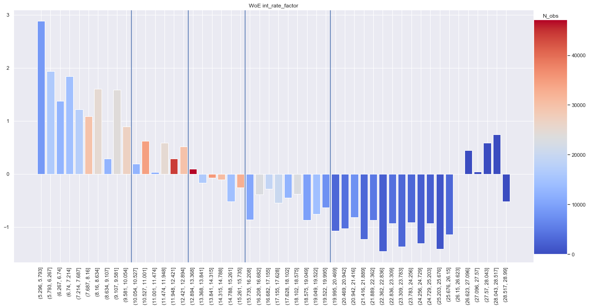


```python
fig, ax = plt.subplots(figsize=(20,8))

woe_df.set_index('int_rate_factor').iloc[:, [3,4]].plot(kind='bar', stacked=True, ax=ax)

plt.legend()
```


    <matplotlib.legend.Legend at 0x1a27fd2f28>


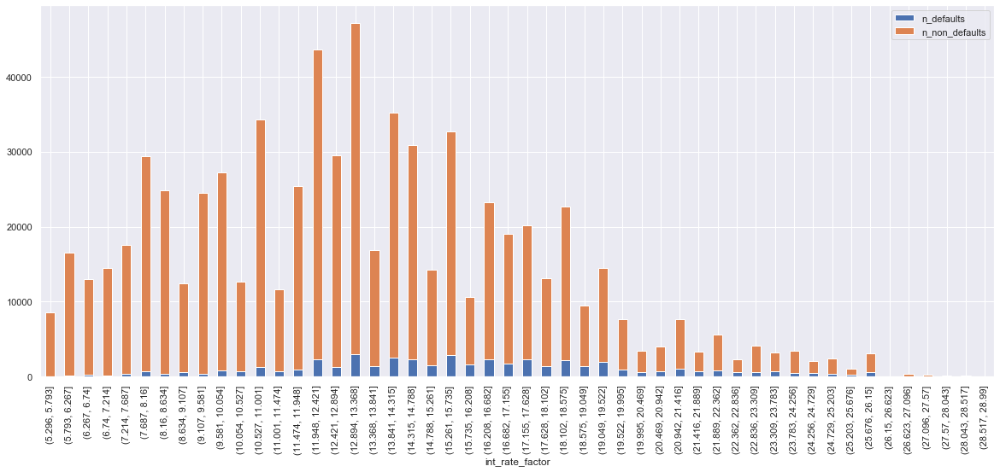


```python
x_train_prep['int_rate:<10.054'] = np.where(x_train_prep['int_rate'] <= 10.054, 1, 0)
x_train_prep['int_rate:10.054_12.849'] = np.where((x_train_prep['int_rate'] > 10.054) & (x_train_prep['int_rate'] <= 12.849), 1, 0)
x_train_prep['int_rate:12.849_15.735'] = np.where((x_train_prep['int_rate'] > 12.849) & (x_train_prep['int_rate'] <= 15.735), 1, 0)
x_train_prep['int_rate:15.735_19.995'] = np.where((x_train_prep['int_rate'] > 15.735) & (x_train_prep['int_rate'] <= 19.995), 1, 0)
x_train_prep['int_rate:>19.995'] = np.where(x_train_prep['int_rate'] > 19.995, 1, 0)
```


```python
fig, ax = plt.subplots(figsize=(20,8))

var_s = ['int_rate:<10.054', 'int_rate:10.054_12.849', 'int_rate:12.849_15.735', 'int_rate:15.735_19.995', 'int_rate:>19.995']

pd.concat([x_train_prep, y_train_prep], axis=1).groupby('Y').sum().loc[:, var_s].T.plot(kind='bar', stacked=True, ax=ax)

plt.legend()
```


    <matplotlib.legend.Legend at 0x1a27fba4e0>


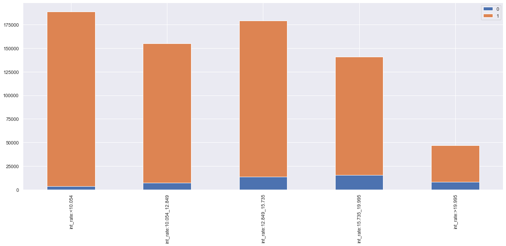


```python
vars_to_use.append(['int_rate:<10.054', 'int_rate:10.054_12.849', 'int_rate:12.849_15.735', 'int_rate:15.735_19.995'])
ref_vars.append(['int_rate:>19.995'])

vars_to_use
```


    [['grade:F', 'grade:E', 'grade:D', 'grade:C', 'grade:B', 'grade:A'],
     ['home_ownership:OWN', 'home_ownership:MORTGAGE'],
     ['addr_state:NY',
      'addr_state:VA_OK_AL_SD',
      'addr_state:CA',
      'addr_state:MO_DE_MD_UT_LA_NJ',
      'addr_state:NM_NC_AZ',
      'addr_state:PA_MA_RI_MI_AR',
      'addr_state:MN_OH_AK',
      'addr_state:KY_WI_GA_WA',
      'addr_state:OR_IN_TN_CT',
      'addr_state:TX',
      'addr_state:IL_KS_MT_SC_CO',
      'addr_state:VT_WV_WY_NH_DC_MS'],
     ['verification_status:Not Verified', 'verification_status:Source Verified'],
     ['initial_list_status:w'],
     ['purpose:house_mov_ren_oth_med',
      'purpose:vac_debtc_majpur_car_homeimp',
      'purpose:credit_card'],
     ['term:36'],
     ['emp_length_int:1',
      'emp_length_int:2_3_4',
      'emp_length_int:5_6_7',
      'emp_length_int:8_9',
      'emp_length_int:10'],
     ['mths_since_issue_d:<38',
      'mths_since_issue_d:38_39',
      'mths_since_issue_d:40_41',
      'mths_since_issue_d:42_48',
      'mths_since_issue_d:49_54',
      'mths_since_issue_d:55_68',
      'mths_since_issue_d:69_95'],
     ['int_rate:<10.054',
      'int_rate:10.054_12.849',
      'int_rate:12.849_15.735',
      'int_rate:15.735_19.995']]


### 'funded_amnt' variable


```python
x_train_prep['funded_amnt_factor'] = pd.cut(x_train_prep['funded_amnt'], 50)

woe_df = woe_ordered_continuous(x_train_prep, 'funded_amnt_factor', y_train_prep, rot_x_ticks=90)
woe_df
```


<div>
<style scoped>
    .dataframe tbody tr th:only-of-type {
        vertical-align: middle;
    }

    .dataframe tbody tr th {
        vertical-align: top;
    }

    .dataframe thead th {
        text-align: right;
    }
</style>
<table border="1" class="dataframe">
  <thead>
    <tr style="text-align: right;">
      <th></th>
      <th>funded_amnt_factor</th>
      <th>n_obs</th>
      <th>prop_non_defaults</th>
      <th>prop_n_obs</th>
      <th>n_defaults</th>
      <th>n_non_defaults</th>
      <th>prop_n_non_defaults</th>
      <th>prop_n_defaults</th>
      <th>WoE</th>
      <th>diff_prop_non_defaults</th>
      <th>diff_WoE</th>
      <th>IV</th>
    </tr>
  </thead>
  <tbody>
    <tr>
      <th>0</th>
      <td>(465.5, 1190.0]</td>
      <td>2212</td>
      <td>0.924955</td>
      <td>0.003116</td>
      <td>166.0</td>
      <td>2046.0</td>
      <td>0.003094</td>
      <td>0.003416</td>
      <td>-0.099133</td>
      <td>NaN</td>
      <td>NaN</td>
      <td>0.020062</td>
    </tr>
    <tr>
      <th>1</th>
      <td>(1190.0, 1880.0]</td>
      <td>5266</td>
      <td>0.925560</td>
      <td>0.007418</td>
      <td>392.0</td>
      <td>4874.0</td>
      <td>0.007370</td>
      <td>0.008067</td>
      <td>-0.090379</td>
      <td>0.004276</td>
      <td>0.008754</td>
      <td>0.020062</td>
    </tr>
    <tr>
      <th>2</th>
      <td>(1880.0, 2570.0]</td>
      <td>10480</td>
      <td>0.919847</td>
      <td>0.014763</td>
      <td>840.0</td>
      <td>9640.0</td>
      <td>0.014577</td>
      <td>0.017287</td>
      <td>-0.170513</td>
      <td>0.007207</td>
      <td>0.080134</td>
      <td>0.020062</td>
    </tr>
    <tr>
      <th>3</th>
      <td>(2570.0, 3260.0]</td>
      <td>12799</td>
      <td>0.921947</td>
      <td>0.018029</td>
      <td>999.0</td>
      <td>11800.0</td>
      <td>0.017843</td>
      <td>0.020559</td>
      <td>-0.141687</td>
      <td>0.003266</td>
      <td>0.028826</td>
      <td>0.020062</td>
    </tr>
    <tr>
      <th>4</th>
      <td>(3260.0, 3950.0]</td>
      <td>8467</td>
      <td>0.924294</td>
      <td>0.011927</td>
      <td>641.0</td>
      <td>7826.0</td>
      <td>0.011834</td>
      <td>0.013192</td>
      <td>-0.108610</td>
      <td>0.006009</td>
      <td>0.033077</td>
      <td>0.020062</td>
    </tr>
    <tr>
      <th>5</th>
      <td>(3950.0, 4640.0]</td>
      <td>15764</td>
      <td>0.922545</td>
      <td>0.022206</td>
      <td>1221.0</td>
      <td>14543.0</td>
      <td>0.021991</td>
      <td>0.025128</td>
      <td>-0.133348</td>
      <td>0.010157</td>
      <td>0.024738</td>
      <td>0.020062</td>
    </tr>
    <tr>
      <th>6</th>
      <td>(4640.0, 5330.0]</td>
      <td>29919</td>
      <td>0.929777</td>
      <td>0.042145</td>
      <td>2101.0</td>
      <td>27818.0</td>
      <td>0.042065</td>
      <td>0.043238</td>
      <td>-0.027518</td>
      <td>0.020074</td>
      <td>0.105830</td>
      <td>0.020062</td>
    </tr>
    <tr>
      <th>7</th>
      <td>(5330.0, 6020.0]</td>
      <td>31025</td>
      <td>0.937212</td>
      <td>0.043703</td>
      <td>1948.0</td>
      <td>29077.0</td>
      <td>0.043969</td>
      <td>0.040090</td>
      <td>0.092357</td>
      <td>0.001904</td>
      <td>0.119874</td>
      <td>0.020062</td>
    </tr>
    <tr>
      <th>8</th>
      <td>(6020.0, 6710.0]</td>
      <td>11633</td>
      <td>0.921001</td>
      <td>0.016387</td>
      <td>919.0</td>
      <td>10714.0</td>
      <td>0.016201</td>
      <td>0.018913</td>
      <td>-0.154767</td>
      <td>0.027768</td>
      <td>0.247124</td>
      <td>0.020062</td>
    </tr>
    <tr>
      <th>9</th>
      <td>(6710.0, 7400.0]</td>
      <td>21088</td>
      <td>0.931715</td>
      <td>0.029705</td>
      <td>1440.0</td>
      <td>19648.0</td>
      <td>0.029711</td>
      <td>0.029635</td>
      <td>0.002545</td>
      <td>0.013510</td>
      <td>0.157312</td>
      <td>0.020062</td>
    </tr>
    <tr>
      <th>10</th>
      <td>(7400.0, 8090.0]</td>
      <td>32193</td>
      <td>0.931849</td>
      <td>0.045348</td>
      <td>2194.0</td>
      <td>29999.0</td>
      <td>0.045363</td>
      <td>0.045152</td>
      <td>0.004650</td>
      <td>0.015652</td>
      <td>0.002105</td>
      <td>0.020062</td>
    </tr>
    <tr>
      <th>11</th>
      <td>(8090.0, 8780.0]</td>
      <td>11096</td>
      <td>0.917177</td>
      <td>0.015630</td>
      <td>919.0</td>
      <td>10177.0</td>
      <td>0.015389</td>
      <td>0.018913</td>
      <td>-0.206188</td>
      <td>0.029974</td>
      <td>0.210838</td>
      <td>0.020062</td>
    </tr>
    <tr>
      <th>12</th>
      <td>(8780.0, 9470.0]</td>
      <td>15654</td>
      <td>0.919318</td>
      <td>0.022051</td>
      <td>1263.0</td>
      <td>14391.0</td>
      <td>0.021761</td>
      <td>0.025992</td>
      <td>-0.177674</td>
      <td>0.006372</td>
      <td>0.028514</td>
      <td>0.020062</td>
    </tr>
    <tr>
      <th>13</th>
      <td>(9470.0, 10160.0]</td>
      <td>62108</td>
      <td>0.934099</td>
      <td>0.087488</td>
      <td>4093.0</td>
      <td>58015.0</td>
      <td>0.087727</td>
      <td>0.084234</td>
      <td>0.040636</td>
      <td>0.065966</td>
      <td>0.218310</td>
      <td>0.020062</td>
    </tr>
    <tr>
      <th>14</th>
      <td>(10160.0, 10850.0]</td>
      <td>11787</td>
      <td>0.915839</td>
      <td>0.016604</td>
      <td>992.0</td>
      <td>10795.0</td>
      <td>0.016324</td>
      <td>0.020415</td>
      <td>-0.223672</td>
      <td>0.071404</td>
      <td>0.264308</td>
      <td>0.020062</td>
    </tr>
    <tr>
      <th>15</th>
      <td>(10850.0, 11540.0]</td>
      <td>16119</td>
      <td>0.925119</td>
      <td>0.022706</td>
      <td>1207.0</td>
      <td>14912.0</td>
      <td>0.022549</td>
      <td>0.024840</td>
      <td>-0.096759</td>
      <td>0.006226</td>
      <td>0.126913</td>
      <td>0.020062</td>
    </tr>
    <tr>
      <th>16</th>
      <td>(11540.0, 12230.0]</td>
      <td>45649</td>
      <td>0.939670</td>
      <td>0.064303</td>
      <td>2754.0</td>
      <td>42895.0</td>
      <td>0.064863</td>
      <td>0.056677</td>
      <td>0.134913</td>
      <td>0.042314</td>
      <td>0.231673</td>
      <td>0.020062</td>
    </tr>
    <tr>
      <th>17</th>
      <td>(12230.0, 12920.0]</td>
      <td>8881</td>
      <td>0.915775</td>
      <td>0.012510</td>
      <td>748.0</td>
      <td>8133.0</td>
      <td>0.012298</td>
      <td>0.015394</td>
      <td>-0.224505</td>
      <td>0.052565</td>
      <td>0.359419</td>
      <td>0.020062</td>
    </tr>
    <tr>
      <th>18</th>
      <td>(12920.0, 13610.0]</td>
      <td>13304</td>
      <td>0.935433</td>
      <td>0.018741</td>
      <td>859.0</td>
      <td>12445.0</td>
      <td>0.018819</td>
      <td>0.017678</td>
      <td>0.062518</td>
      <td>0.006520</td>
      <td>0.287023</td>
      <td>0.020062</td>
    </tr>
    <tr>
      <th>19</th>
      <td>(13610.0, 14300.0]</td>
      <td>15435</td>
      <td>0.931714</td>
      <td>0.021742</td>
      <td>1054.0</td>
      <td>14381.0</td>
      <td>0.021746</td>
      <td>0.021691</td>
      <td>0.002528</td>
      <td>0.002928</td>
      <td>0.059990</td>
      <td>0.020062</td>
    </tr>
    <tr>
      <th>20</th>
      <td>(14300.0, 14990.0]</td>
      <td>10045</td>
      <td>0.924340</td>
      <td>0.014150</td>
      <td>760.0</td>
      <td>9285.0</td>
      <td>0.014040</td>
      <td>0.015641</td>
      <td>-0.107950</td>
      <td>0.007706</td>
      <td>0.110478</td>
      <td>0.020062</td>
    </tr>
    <tr>
      <th>21</th>
      <td>(14990.0, 15680.0]</td>
      <td>43795</td>
      <td>0.939810</td>
      <td>0.061692</td>
      <td>2636.0</td>
      <td>41159.0</td>
      <td>0.062238</td>
      <td>0.054249</td>
      <td>0.137393</td>
      <td>0.048198</td>
      <td>0.245343</td>
      <td>0.020062</td>
    </tr>
    <tr>
      <th>22</th>
      <td>(15680.0, 16370.0]</td>
      <td>22741</td>
      <td>0.931050</td>
      <td>0.032034</td>
      <td>1568.0</td>
      <td>21173.0</td>
      <td>0.032017</td>
      <td>0.032269</td>
      <td>-0.007862</td>
      <td>0.030222</td>
      <td>0.145254</td>
      <td>0.020062</td>
    </tr>
    <tr>
      <th>23</th>
      <td>(16370.0, 17060.0]</td>
      <td>11892</td>
      <td>0.924739</td>
      <td>0.016752</td>
      <td>895.0</td>
      <td>10997.0</td>
      <td>0.016629</td>
      <td>0.018419</td>
      <td>-0.102233</td>
      <td>0.015388</td>
      <td>0.094372</td>
      <td>0.020062</td>
    </tr>
    <tr>
      <th>24</th>
      <td>(17060.0, 17750.0]</td>
      <td>6129</td>
      <td>0.908794</td>
      <td>0.008634</td>
      <td>559.0</td>
      <td>5570.0</td>
      <td>0.008423</td>
      <td>0.011504</td>
      <td>-0.311787</td>
      <td>0.008206</td>
      <td>0.209553</td>
      <td>0.020062</td>
    </tr>
    <tr>
      <th>25</th>
      <td>(17750.0, 18440.0]</td>
      <td>21703</td>
      <td>0.931853</td>
      <td>0.030572</td>
      <td>1479.0</td>
      <td>20224.0</td>
      <td>0.030582</td>
      <td>0.030438</td>
      <td>0.004716</td>
      <td>0.022159</td>
      <td>0.316503</td>
      <td>0.020062</td>
    </tr>
    <tr>
      <th>26</th>
      <td>(18440.0, 19130.0]</td>
      <td>6865</td>
      <td>0.913911</td>
      <td>0.009670</td>
      <td>591.0</td>
      <td>6274.0</td>
      <td>0.009487</td>
      <td>0.012163</td>
      <td>-0.248434</td>
      <td>0.021094</td>
      <td>0.253150</td>
      <td>0.020062</td>
    </tr>
    <tr>
      <th>27</th>
      <td>(19130.0, 19820.0]</td>
      <td>7401</td>
      <td>0.914201</td>
      <td>0.010425</td>
      <td>635.0</td>
      <td>6766.0</td>
      <td>0.010231</td>
      <td>0.013068</td>
      <td>-0.244747</td>
      <td>0.000744</td>
      <td>0.003687</td>
      <td>0.020062</td>
    </tr>
    <tr>
      <th>28</th>
      <td>(19820.0, 20510.0]</td>
      <td>41350</td>
      <td>0.941911</td>
      <td>0.058247</td>
      <td>2402.0</td>
      <td>38948.0</td>
      <td>0.058895</td>
      <td>0.049433</td>
      <td>0.175138</td>
      <td>0.048664</td>
      <td>0.419885</td>
      <td>0.020062</td>
    </tr>
    <tr>
      <th>29</th>
      <td>(20510.0, 21200.0]</td>
      <td>13155</td>
      <td>0.936298</td>
      <td>0.018531</td>
      <td>838.0</td>
      <td>12317.0</td>
      <td>0.018625</td>
      <td>0.017246</td>
      <td>0.076930</td>
      <td>0.040270</td>
      <td>0.098208</td>
      <td>0.020062</td>
    </tr>
    <tr>
      <th>30</th>
      <td>(21200.0, 21890.0]</td>
      <td>3920</td>
      <td>0.904337</td>
      <td>0.005522</td>
      <td>375.0</td>
      <td>3545.0</td>
      <td>0.005361</td>
      <td>0.007717</td>
      <td>-0.364420</td>
      <td>0.013265</td>
      <td>0.441350</td>
      <td>0.020062</td>
    </tr>
    <tr>
      <th>31</th>
      <td>(21890.0, 22580.0]</td>
      <td>7925</td>
      <td>0.931987</td>
      <td>0.011163</td>
      <td>539.0</td>
      <td>7386.0</td>
      <td>0.011169</td>
      <td>0.011093</td>
      <td>0.006839</td>
      <td>0.005808</td>
      <td>0.371259</td>
      <td>0.020062</td>
    </tr>
    <tr>
      <th>32</th>
      <td>(22580.0, 23270.0]</td>
      <td>4847</td>
      <td>0.933980</td>
      <td>0.006828</td>
      <td>320.0</td>
      <td>4527.0</td>
      <td>0.006845</td>
      <td>0.006586</td>
      <td>0.038706</td>
      <td>0.004323</td>
      <td>0.031868</td>
      <td>0.020062</td>
    </tr>
    <tr>
      <th>33</th>
      <td>(23270.0, 23960.0]</td>
      <td>3200</td>
      <td>0.895938</td>
      <td>0.004508</td>
      <td>333.0</td>
      <td>2867.0</td>
      <td>0.004335</td>
      <td>0.006853</td>
      <td>-0.457908</td>
      <td>0.002510</td>
      <td>0.496615</td>
      <td>0.020062</td>
    </tr>
    <tr>
      <th>34</th>
      <td>(23960.0, 24650.0]</td>
      <td>20975</td>
      <td>0.943027</td>
      <td>0.029546</td>
      <td>1195.0</td>
      <td>19780.0</td>
      <td>0.029910</td>
      <td>0.024593</td>
      <td>0.195738</td>
      <td>0.025575</td>
      <td>0.653646</td>
      <td>0.020062</td>
    </tr>
    <tr>
      <th>35</th>
      <td>(24650.0, 25340.0]</td>
      <td>21361</td>
      <td>0.939844</td>
      <td>0.030090</td>
      <td>1285.0</td>
      <td>20076.0</td>
      <td>0.030358</td>
      <td>0.026445</td>
      <td>0.137979</td>
      <td>0.000448</td>
      <td>0.057759</td>
      <td>0.020062</td>
    </tr>
    <tr>
      <th>36</th>
      <td>(25340.0, 26030.0]</td>
      <td>3511</td>
      <td>0.923668</td>
      <td>0.004946</td>
      <td>268.0</td>
      <td>3243.0</td>
      <td>0.004904</td>
      <td>0.005515</td>
      <td>-0.117520</td>
      <td>0.025454</td>
      <td>0.255499</td>
      <td>0.020062</td>
    </tr>
    <tr>
      <th>37</th>
      <td>(26030.0, 26720.0]</td>
      <td>2341</td>
      <td>0.895344</td>
      <td>0.003298</td>
      <td>245.0</td>
      <td>2096.0</td>
      <td>0.003169</td>
      <td>0.005042</td>
      <td>-0.464260</td>
      <td>0.001734</td>
      <td>0.346739</td>
      <td>0.020062</td>
    </tr>
    <tr>
      <th>38</th>
      <td>(26720.0, 27410.0]</td>
      <td>3060</td>
      <td>0.929739</td>
      <td>0.004310</td>
      <td>215.0</td>
      <td>2845.0</td>
      <td>0.004302</td>
      <td>0.004425</td>
      <td>-0.028107</td>
      <td>0.001133</td>
      <td>0.436152</td>
      <td>0.020062</td>
    </tr>
    <tr>
      <th>39</th>
      <td>(27410.0, 28100.0]</td>
      <td>13950</td>
      <td>0.948459</td>
      <td>0.019651</td>
      <td>719.0</td>
      <td>13231.0</td>
      <td>0.020007</td>
      <td>0.014797</td>
      <td>0.301669</td>
      <td>0.015705</td>
      <td>0.329776</td>
      <td>0.020062</td>
    </tr>
    <tr>
      <th>40</th>
      <td>(28100.0, 28790.0]</td>
      <td>1480</td>
      <td>0.902027</td>
      <td>0.002085</td>
      <td>145.0</td>
      <td>1335.0</td>
      <td>0.002019</td>
      <td>0.002984</td>
      <td>-0.390835</td>
      <td>0.017988</td>
      <td>0.692504</td>
      <td>0.020062</td>
    </tr>
    <tr>
      <th>41</th>
      <td>(28790.0, 29480.0]</td>
      <td>2349</td>
      <td>0.921669</td>
      <td>0.003309</td>
      <td>184.0</td>
      <td>2165.0</td>
      <td>0.003274</td>
      <td>0.003787</td>
      <td>-0.145548</td>
      <td>0.001255</td>
      <td>0.245287</td>
      <td>0.020062</td>
    </tr>
    <tr>
      <th>42</th>
      <td>(29480.0, 30170.0]</td>
      <td>15610</td>
      <td>0.937604</td>
      <td>0.021989</td>
      <td>974.0</td>
      <td>14636.0</td>
      <td>0.022132</td>
      <td>0.020045</td>
      <td>0.099041</td>
      <td>0.018858</td>
      <td>0.244588</td>
      <td>0.020062</td>
    </tr>
    <tr>
      <th>43</th>
      <td>(30170.0, 30860.0]</td>
      <td>1052</td>
      <td>0.887833</td>
      <td>0.001482</td>
      <td>118.0</td>
      <td>934.0</td>
      <td>0.001412</td>
      <td>0.002428</td>
      <td>-0.541996</td>
      <td>0.020719</td>
      <td>0.641036</td>
      <td>0.020062</td>
    </tr>
    <tr>
      <th>44</th>
      <td>(30860.0, 31550.0]</td>
      <td>1612</td>
      <td>0.923697</td>
      <td>0.002271</td>
      <td>123.0</td>
      <td>1489.0</td>
      <td>0.002252</td>
      <td>0.002531</td>
      <td>-0.117112</td>
      <td>0.000839</td>
      <td>0.424884</td>
      <td>0.020062</td>
    </tr>
    <tr>
      <th>45</th>
      <td>(31550.0, 32240.0]</td>
      <td>2979</td>
      <td>0.931521</td>
      <td>0.004196</td>
      <td>204.0</td>
      <td>2775.0</td>
      <td>0.004196</td>
      <td>0.004198</td>
      <td>-0.000501</td>
      <td>0.001945</td>
      <td>0.116610</td>
      <td>0.020062</td>
    </tr>
    <tr>
      <th>46</th>
      <td>(32240.0, 32930.0]</td>
      <td>1115</td>
      <td>0.916592</td>
      <td>0.001571</td>
      <td>93.0</td>
      <td>1022.0</td>
      <td>0.001545</td>
      <td>0.001914</td>
      <td>-0.213870</td>
      <td>0.002651</td>
      <td>0.213369</td>
      <td>0.020062</td>
    </tr>
    <tr>
      <th>47</th>
      <td>(32930.0, 33620.0]</td>
      <td>2036</td>
      <td>0.936640</td>
      <td>0.002868</td>
      <td>129.0</td>
      <td>1907.0</td>
      <td>0.002884</td>
      <td>0.002655</td>
      <td>0.082687</td>
      <td>0.001338</td>
      <td>0.296557</td>
      <td>0.020062</td>
    </tr>
    <tr>
      <th>48</th>
      <td>(33620.0, 34310.0]</td>
      <td>1032</td>
      <td>0.943798</td>
      <td>0.001454</td>
      <td>58.0</td>
      <td>974.0</td>
      <td>0.001473</td>
      <td>0.001194</td>
      <td>0.210181</td>
      <td>0.001411</td>
      <td>0.127494</td>
      <td>0.020062</td>
    </tr>
    <tr>
      <th>49</th>
      <td>(34310.0, 35000.0]</td>
      <td>29593</td>
      <td>0.933903</td>
      <td>0.041686</td>
      <td>1956.0</td>
      <td>27637.0</td>
      <td>0.041791</td>
      <td>0.040254</td>
      <td>0.037466</td>
      <td>0.040318</td>
      <td>0.172714</td>
      <td>0.020062</td>
    </tr>
  </tbody>
</table>
</div>


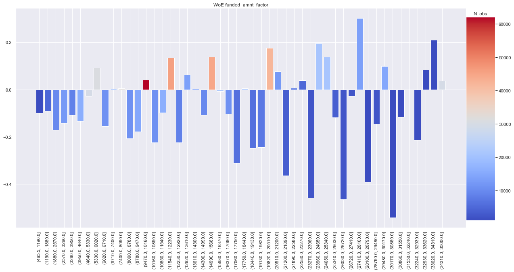


As the WoE's of the intervals are very different, show an almost horizontal trend, and we see no actual relation between 'funded_amnt' and the dependent variable. We won't use this variable for the PD model


```python
fig, ax = plt.subplots(figsize=(20,8))

woe_df.set_index('funded_amnt_factor').iloc[:, [3,4]].plot(kind='bar', stacked=True, ax=ax)

plt.legend()
```


    <matplotlib.legend.Legend at 0x1a32a81438>


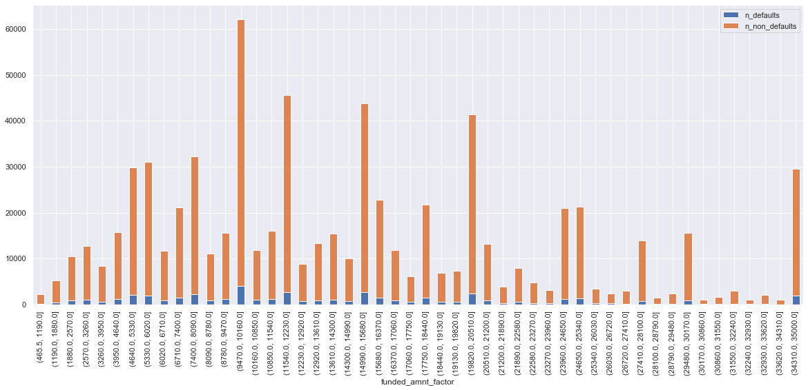


## 'mths_since_earliest_cr_line'

## ATTENTION!!! This variable discretization has changed in relation to the first model


```python
x_train_prep['mths_since_earliest_cr_line'].nunique()
```


    694


```python
x_train_prep['mths_since_earliest_cr_line'].describe()
```


    count    709903.000000
    mean        248.881718
    std          89.300089
    min           0.000000
    25%         187.000000
    50%         231.000000
    75%         294.000000
    max         899.000000
    Name: mths_since_earliest_cr_line, dtype: float64


```python
x_train_prep['mths_since_earliest_cr_line_factor'] = pd.cut(x_train_prep['mths_since_earliest_cr_line'], 50)

woe_df = woe_ordered_continuous(x_train_prep, 'mths_since_earliest_cr_line_factor', y_train_prep, rot_x_ticks=90, vlines=[8.5, 15.5, 19.5])
woe_df
```

    /Users/omaromeiri/anaconda3/lib/python3.7/site-packages/ipykernel_launcher.py:177: RuntimeWarning: divide by zero encountered in log


<div>
<style scoped>
    .dataframe tbody tr th:only-of-type {
        vertical-align: middle;
    }

    .dataframe tbody tr th {
        vertical-align: top;
    }

    .dataframe thead th {
        text-align: right;
    }
</style>
<table border="1" class="dataframe">
  <thead>
    <tr style="text-align: right;">
      <th></th>
      <th>mths_since_earliest_cr_line_factor</th>
      <th>n_obs</th>
      <th>prop_non_defaults</th>
      <th>prop_n_obs</th>
      <th>n_defaults</th>
      <th>n_non_defaults</th>
      <th>prop_n_non_defaults</th>
      <th>prop_n_defaults</th>
      <th>WoE</th>
      <th>diff_prop_non_defaults</th>
      <th>diff_WoE</th>
      <th>IV</th>
    </tr>
  </thead>
  <tbody>
    <tr>
      <th>0</th>
      <td>(-0.899, 17.98]</td>
      <td>26</td>
      <td>0.000000</td>
      <td>0.000037</td>
      <td>26.0</td>
      <td>0.0</td>
      <td>0.000000</td>
      <td>0.000535</td>
      <td>NaN</td>
      <td>NaN</td>
      <td>NaN</td>
      <td>0.014814</td>
    </tr>
    <tr>
      <th>1</th>
      <td>(17.98, 35.96]</td>
      <td>0</td>
      <td>NaN</td>
      <td>0.000000</td>
      <td>NaN</td>
      <td>NaN</td>
      <td>NaN</td>
      <td>NaN</td>
      <td>NaN</td>
      <td>NaN</td>
      <td>NaN</td>
      <td>0.014814</td>
    </tr>
    <tr>
      <th>2</th>
      <td>(35.96, 53.94]</td>
      <td>0</td>
      <td>NaN</td>
      <td>0.000000</td>
      <td>NaN</td>
      <td>NaN</td>
      <td>NaN</td>
      <td>NaN</td>
      <td>NaN</td>
      <td>NaN</td>
      <td>NaN</td>
      <td>0.014814</td>
    </tr>
    <tr>
      <th>3</th>
      <td>(53.94, 71.92]</td>
      <td>0</td>
      <td>NaN</td>
      <td>0.000000</td>
      <td>NaN</td>
      <td>NaN</td>
      <td>NaN</td>
      <td>NaN</td>
      <td>NaN</td>
      <td>NaN</td>
      <td>NaN</td>
      <td>0.014814</td>
    </tr>
    <tr>
      <th>4</th>
      <td>(71.92, 89.9]</td>
      <td>3959</td>
      <td>0.972468</td>
      <td>0.005577</td>
      <td>109.0</td>
      <td>3850.0</td>
      <td>0.005822</td>
      <td>0.002243</td>
      <td>0.953693</td>
      <td>NaN</td>
      <td>NaN</td>
      <td>0.014814</td>
    </tr>
    <tr>
      <th>5</th>
      <td>(89.9, 107.88]</td>
      <td>9190</td>
      <td>0.949946</td>
      <td>0.012945</td>
      <td>460.0</td>
      <td>8730.0</td>
      <td>0.013201</td>
      <td>0.009467</td>
      <td>0.332507</td>
      <td>0.007379</td>
      <td>0.621186</td>
      <td>0.014814</td>
    </tr>
    <tr>
      <th>6</th>
      <td>(107.88, 125.86]</td>
      <td>13886</td>
      <td>0.928849</td>
      <td>0.019560</td>
      <td>988.0</td>
      <td>12898.0</td>
      <td>0.019504</td>
      <td>0.020333</td>
      <td>-0.041643</td>
      <td>0.006303</td>
      <td>0.374149</td>
      <td>0.014814</td>
    </tr>
    <tr>
      <th>7</th>
      <td>(125.86, 143.84]</td>
      <td>27009</td>
      <td>0.921397</td>
      <td>0.038046</td>
      <td>2123.0</td>
      <td>24886.0</td>
      <td>0.037631</td>
      <td>0.043691</td>
      <td>-0.149312</td>
      <td>0.018128</td>
      <td>0.107670</td>
      <td>0.014814</td>
    </tr>
    <tr>
      <th>8</th>
      <td>(143.84, 161.82]</td>
      <td>42159</td>
      <td>0.923148</td>
      <td>0.059387</td>
      <td>3240.0</td>
      <td>38919.0</td>
      <td>0.058851</td>
      <td>0.066679</td>
      <td>-0.124878</td>
      <td>0.021220</td>
      <td>0.024434</td>
      <td>0.014814</td>
    </tr>
    <tr>
      <th>9</th>
      <td>(161.82, 179.8]</td>
      <td>52461</td>
      <td>0.932140</td>
      <td>0.073899</td>
      <td>3560.0</td>
      <td>48901.0</td>
      <td>0.073945</td>
      <td>0.073265</td>
      <td>0.009250</td>
      <td>0.015094</td>
      <td>0.134128</td>
      <td>0.014814</td>
    </tr>
    <tr>
      <th>10</th>
      <td>(179.8, 197.78]</td>
      <td>67201</td>
      <td>0.934183</td>
      <td>0.094662</td>
      <td>4423.0</td>
      <td>62778.0</td>
      <td>0.094929</td>
      <td>0.091025</td>
      <td>0.041999</td>
      <td>0.020984</td>
      <td>0.032749</td>
      <td>0.014814</td>
    </tr>
    <tr>
      <th>11</th>
      <td>(197.78, 215.76]</td>
      <td>71366</td>
      <td>0.927697</td>
      <td>0.100529</td>
      <td>5160.0</td>
      <td>66206.0</td>
      <td>0.100113</td>
      <td>0.106193</td>
      <td>-0.058953</td>
      <td>0.005184</td>
      <td>0.100952</td>
      <td>0.014814</td>
    </tr>
    <tr>
      <th>12</th>
      <td>(215.76, 233.74]</td>
      <td>76134</td>
      <td>0.925119</td>
      <td>0.107246</td>
      <td>5701.0</td>
      <td>70433.0</td>
      <td>0.106505</td>
      <td>0.117326</td>
      <td>-0.096767</td>
      <td>0.006392</td>
      <td>0.037814</td>
      <td>0.014814</td>
    </tr>
    <tr>
      <th>13</th>
      <td>(233.74, 251.72]</td>
      <td>58285</td>
      <td>0.925178</td>
      <td>0.082103</td>
      <td>4361.0</td>
      <td>53924.0</td>
      <td>0.081541</td>
      <td>0.089749</td>
      <td>-0.095913</td>
      <td>0.024964</td>
      <td>0.000854</td>
      <td>0.014814</td>
    </tr>
    <tr>
      <th>14</th>
      <td>(251.72, 269.7]</td>
      <td>50005</td>
      <td>0.928267</td>
      <td>0.070439</td>
      <td>3587.0</td>
      <td>46418.0</td>
      <td>0.070191</td>
      <td>0.073820</td>
      <td>-0.050416</td>
      <td>0.011350</td>
      <td>0.045497</td>
      <td>0.014814</td>
    </tr>
    <tr>
      <th>15</th>
      <td>(269.7, 287.68]</td>
      <td>45178</td>
      <td>0.930342</td>
      <td>0.063640</td>
      <td>3147.0</td>
      <td>42031.0</td>
      <td>0.063557</td>
      <td>0.064765</td>
      <td>-0.018830</td>
      <td>0.006634</td>
      <td>0.031587</td>
      <td>0.014814</td>
    </tr>
    <tr>
      <th>16</th>
      <td>(287.68, 305.66]</td>
      <td>40407</td>
      <td>0.936570</td>
      <td>0.056919</td>
      <td>2563.0</td>
      <td>37844.0</td>
      <td>0.057226</td>
      <td>0.052746</td>
      <td>0.081507</td>
      <td>0.006331</td>
      <td>0.100336</td>
      <td>0.014814</td>
    </tr>
    <tr>
      <th>17</th>
      <td>(305.66, 323.64]</td>
      <td>25478</td>
      <td>0.937593</td>
      <td>0.035889</td>
      <td>1590.0</td>
      <td>23888.0</td>
      <td>0.036122</td>
      <td>0.032722</td>
      <td>0.098855</td>
      <td>0.021104</td>
      <td>0.017348</td>
      <td>0.014814</td>
    </tr>
    <tr>
      <th>18</th>
      <td>(323.64, 341.62]</td>
      <td>22999</td>
      <td>0.935258</td>
      <td>0.032397</td>
      <td>1489.0</td>
      <td>21510.0</td>
      <td>0.032526</td>
      <td>0.030644</td>
      <td>0.059626</td>
      <td>0.003596</td>
      <td>0.039229</td>
      <td>0.014814</td>
    </tr>
    <tr>
      <th>19</th>
      <td>(341.62, 359.6]</td>
      <td>21868</td>
      <td>0.939089</td>
      <td>0.030804</td>
      <td>1332.0</td>
      <td>20536.0</td>
      <td>0.031053</td>
      <td>0.027412</td>
      <td>0.124710</td>
      <td>0.001473</td>
      <td>0.065085</td>
      <td>0.014814</td>
    </tr>
    <tr>
      <th>20</th>
      <td>(359.6, 377.58]</td>
      <td>17549</td>
      <td>0.942675</td>
      <td>0.024720</td>
      <td>1006.0</td>
      <td>16543.0</td>
      <td>0.025015</td>
      <td>0.020703</td>
      <td>0.189194</td>
      <td>0.006038</td>
      <td>0.064483</td>
      <td>0.014814</td>
    </tr>
    <tr>
      <th>21</th>
      <td>(377.58, 395.56]</td>
      <td>13978</td>
      <td>0.942338</td>
      <td>0.019690</td>
      <td>806.0</td>
      <td>13172.0</td>
      <td>0.019918</td>
      <td>0.016587</td>
      <td>0.182977</td>
      <td>0.005097</td>
      <td>0.006216</td>
      <td>0.014814</td>
    </tr>
    <tr>
      <th>22</th>
      <td>(395.56, 413.54]</td>
      <td>11905</td>
      <td>0.940193</td>
      <td>0.016770</td>
      <td>712.0</td>
      <td>11193.0</td>
      <td>0.016925</td>
      <td>0.014653</td>
      <td>0.144179</td>
      <td>0.002993</td>
      <td>0.038799</td>
      <td>0.014814</td>
    </tr>
    <tr>
      <th>23</th>
      <td>(413.54, 431.52]</td>
      <td>9569</td>
      <td>0.943254</td>
      <td>0.013479</td>
      <td>543.0</td>
      <td>9026.0</td>
      <td>0.013649</td>
      <td>0.011175</td>
      <td>0.199968</td>
      <td>0.003277</td>
      <td>0.055789</td>
      <td>0.014814</td>
    </tr>
    <tr>
      <th>24</th>
      <td>(431.52, 449.5]</td>
      <td>6342</td>
      <td>0.947808</td>
      <td>0.008934</td>
      <td>331.0</td>
      <td>6011.0</td>
      <td>0.009090</td>
      <td>0.006812</td>
      <td>0.288441</td>
      <td>0.004559</td>
      <td>0.088473</td>
      <td>0.014814</td>
    </tr>
    <tr>
      <th>25</th>
      <td>(449.5, 467.48]</td>
      <td>4518</td>
      <td>0.946658</td>
      <td>0.006364</td>
      <td>241.0</td>
      <td>4277.0</td>
      <td>0.006467</td>
      <td>0.004960</td>
      <td>0.265423</td>
      <td>0.002622</td>
      <td>0.023018</td>
      <td>0.014814</td>
    </tr>
    <tr>
      <th>26</th>
      <td>(467.48, 485.46]</td>
      <td>4352</td>
      <td>0.943474</td>
      <td>0.006130</td>
      <td>246.0</td>
      <td>4106.0</td>
      <td>0.006209</td>
      <td>0.005063</td>
      <td>0.204086</td>
      <td>0.000259</td>
      <td>0.061337</td>
      <td>0.014814</td>
    </tr>
    <tr>
      <th>27</th>
      <td>(485.46, 503.44]</td>
      <td>3869</td>
      <td>0.943913</td>
      <td>0.005450</td>
      <td>217.0</td>
      <td>3652.0</td>
      <td>0.005522</td>
      <td>0.004466</td>
      <td>0.212345</td>
      <td>0.000687</td>
      <td>0.008260</td>
      <td>0.014814</td>
    </tr>
    <tr>
      <th>28</th>
      <td>(503.44, 521.42]</td>
      <td>2545</td>
      <td>0.941847</td>
      <td>0.003585</td>
      <td>148.0</td>
      <td>2397.0</td>
      <td>0.003625</td>
      <td>0.003046</td>
      <td>0.173974</td>
      <td>0.001898</td>
      <td>0.038372</td>
      <td>0.014814</td>
    </tr>
    <tr>
      <th>29</th>
      <td>(521.42, 539.4]</td>
      <td>1925</td>
      <td>0.945974</td>
      <td>0.002712</td>
      <td>104.0</td>
      <td>1821.0</td>
      <td>0.002754</td>
      <td>0.002140</td>
      <td>0.251963</td>
      <td>0.000871</td>
      <td>0.077989</td>
      <td>0.014814</td>
    </tr>
    <tr>
      <th>30</th>
      <td>(539.4, 557.38]</td>
      <td>1589</td>
      <td>0.946507</td>
      <td>0.002238</td>
      <td>85.0</td>
      <td>1504.0</td>
      <td>0.002274</td>
      <td>0.001749</td>
      <td>0.262445</td>
      <td>0.000479</td>
      <td>0.010482</td>
      <td>0.014814</td>
    </tr>
    <tr>
      <th>31</th>
      <td>(557.38, 575.36]</td>
      <td>1116</td>
      <td>0.939964</td>
      <td>0.001572</td>
      <td>67.0</td>
      <td>1049.0</td>
      <td>0.001586</td>
      <td>0.001379</td>
      <td>0.140113</td>
      <td>0.000688</td>
      <td>0.122332</td>
      <td>0.014814</td>
    </tr>
    <tr>
      <th>32</th>
      <td>(575.36, 593.34]</td>
      <td>871</td>
      <td>0.927669</td>
      <td>0.001227</td>
      <td>63.0</td>
      <td>808.0</td>
      <td>0.001222</td>
      <td>0.001297</td>
      <td>-0.059360</td>
      <td>0.000364</td>
      <td>0.199473</td>
      <td>0.014814</td>
    </tr>
    <tr>
      <th>33</th>
      <td>(593.34, 611.32]</td>
      <td>696</td>
      <td>0.941092</td>
      <td>0.000980</td>
      <td>41.0</td>
      <td>655.0</td>
      <td>0.000990</td>
      <td>0.000844</td>
      <td>0.160276</td>
      <td>0.000231</td>
      <td>0.219636</td>
      <td>0.014814</td>
    </tr>
    <tr>
      <th>34</th>
      <td>(611.32, 629.3]</td>
      <td>507</td>
      <td>0.901381</td>
      <td>0.000714</td>
      <td>50.0</td>
      <td>457.0</td>
      <td>0.000691</td>
      <td>0.001029</td>
      <td>-0.398127</td>
      <td>0.000299</td>
      <td>0.558403</td>
      <td>0.014814</td>
    </tr>
    <tr>
      <th>35</th>
      <td>(629.3, 647.28]</td>
      <td>369</td>
      <td>0.926829</td>
      <td>0.000520</td>
      <td>27.0</td>
      <td>342.0</td>
      <td>0.000517</td>
      <td>0.000556</td>
      <td>-0.071814</td>
      <td>0.000174</td>
      <td>0.326313</td>
      <td>0.014814</td>
    </tr>
    <tr>
      <th>36</th>
      <td>(647.28, 665.26]</td>
      <td>209</td>
      <td>0.909091</td>
      <td>0.000294</td>
      <td>19.0</td>
      <td>190.0</td>
      <td>0.000287</td>
      <td>0.000391</td>
      <td>-0.308202</td>
      <td>0.000230</td>
      <td>0.236389</td>
      <td>0.014814</td>
    </tr>
    <tr>
      <th>37</th>
      <td>(665.26, 683.24]</td>
      <td>146</td>
      <td>0.938356</td>
      <td>0.000206</td>
      <td>9.0</td>
      <td>137.0</td>
      <td>0.000207</td>
      <td>0.000185</td>
      <td>0.111969</td>
      <td>0.000080</td>
      <td>0.420171</td>
      <td>0.014814</td>
    </tr>
    <tr>
      <th>38</th>
      <td>(683.24, 701.22]</td>
      <td>73</td>
      <td>0.931507</td>
      <td>0.000103</td>
      <td>5.0</td>
      <td>68.0</td>
      <td>0.000103</td>
      <td>0.000103</td>
      <td>-0.000718</td>
      <td>0.000104</td>
      <td>0.112687</td>
      <td>0.014814</td>
    </tr>
    <tr>
      <th>39</th>
      <td>(701.22, 719.2]</td>
      <td>76</td>
      <td>0.921053</td>
      <td>0.000107</td>
      <td>6.0</td>
      <td>70.0</td>
      <td>0.000106</td>
      <td>0.000123</td>
      <td>-0.154052</td>
      <td>0.000003</td>
      <td>0.153334</td>
      <td>0.014814</td>
    </tr>
    <tr>
      <th>40</th>
      <td>(719.2, 737.18]</td>
      <td>24</td>
      <td>0.916667</td>
      <td>0.000034</td>
      <td>2.0</td>
      <td>22.0</td>
      <td>0.000033</td>
      <td>0.000041</td>
      <td>-0.212892</td>
      <td>0.000073</td>
      <td>0.058841</td>
      <td>0.014814</td>
    </tr>
    <tr>
      <th>41</th>
      <td>(737.18, 755.16]</td>
      <td>24</td>
      <td>0.916667</td>
      <td>0.000034</td>
      <td>2.0</td>
      <td>22.0</td>
      <td>0.000033</td>
      <td>0.000041</td>
      <td>-0.212892</td>
      <td>0.000000</td>
      <td>0.000000</td>
      <td>0.014814</td>
    </tr>
    <tr>
      <th>42</th>
      <td>(755.16, 773.14]</td>
      <td>15</td>
      <td>0.866667</td>
      <td>0.000021</td>
      <td>2.0</td>
      <td>13.0</td>
      <td>0.000020</td>
      <td>0.000041</td>
      <td>-0.738985</td>
      <td>0.000014</td>
      <td>0.526093</td>
      <td>0.014814</td>
    </tr>
    <tr>
      <th>43</th>
      <td>(773.14, 791.12]</td>
      <td>5</td>
      <td>1.000000</td>
      <td>0.000007</td>
      <td>0.0</td>
      <td>5.0</td>
      <td>0.000008</td>
      <td>0.000000</td>
      <td>NaN</td>
      <td>0.000012</td>
      <td>NaN</td>
      <td>0.014814</td>
    </tr>
    <tr>
      <th>44</th>
      <td>(791.12, 809.1]</td>
      <td>6</td>
      <td>1.000000</td>
      <td>0.000008</td>
      <td>0.0</td>
      <td>6.0</td>
      <td>0.000009</td>
      <td>0.000000</td>
      <td>NaN</td>
      <td>0.000002</td>
      <td>NaN</td>
      <td>0.014814</td>
    </tr>
    <tr>
      <th>45</th>
      <td>(809.1, 827.08]</td>
      <td>9</td>
      <td>1.000000</td>
      <td>0.000013</td>
      <td>0.0</td>
      <td>9.0</td>
      <td>0.000014</td>
      <td>0.000000</td>
      <td>NaN</td>
      <td>0.000005</td>
      <td>NaN</td>
      <td>0.014814</td>
    </tr>
    <tr>
      <th>46</th>
      <td>(827.08, 845.06]</td>
      <td>1</td>
      <td>1.000000</td>
      <td>0.000001</td>
      <td>0.0</td>
      <td>1.0</td>
      <td>0.000002</td>
      <td>0.000000</td>
      <td>NaN</td>
      <td>0.000012</td>
      <td>NaN</td>
      <td>0.014814</td>
    </tr>
    <tr>
      <th>47</th>
      <td>(845.06, 863.04]</td>
      <td>0</td>
      <td>NaN</td>
      <td>0.000000</td>
      <td>NaN</td>
      <td>NaN</td>
      <td>NaN</td>
      <td>NaN</td>
      <td>NaN</td>
      <td>NaN</td>
      <td>NaN</td>
      <td>0.014814</td>
    </tr>
    <tr>
      <th>48</th>
      <td>(863.04, 881.02]</td>
      <td>2</td>
      <td>1.000000</td>
      <td>0.000003</td>
      <td>0.0</td>
      <td>2.0</td>
      <td>0.000003</td>
      <td>0.000000</td>
      <td>NaN</td>
      <td>NaN</td>
      <td>NaN</td>
      <td>0.014814</td>
    </tr>
    <tr>
      <th>49</th>
      <td>(881.02, 899.0]</td>
      <td>2</td>
      <td>1.000000</td>
      <td>0.000003</td>
      <td>0.0</td>
      <td>2.0</td>
      <td>0.000003</td>
      <td>0.000000</td>
      <td>NaN</td>
      <td>0.000000</td>
      <td>NaN</td>
      <td>0.014814</td>
    </tr>
  </tbody>
</table>
</div>


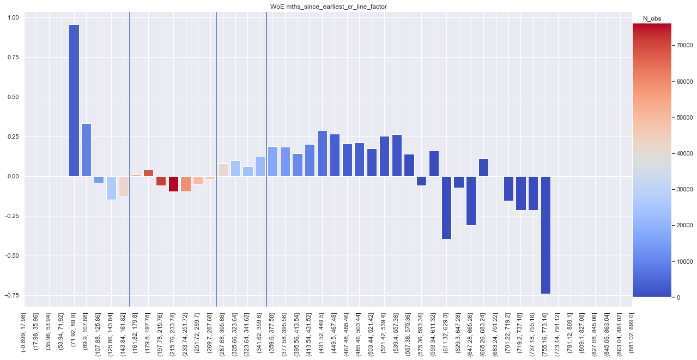


```python
fig, ax = plt.subplots(figsize=(20,8))

woe_df.set_index('mths_since_earliest_cr_line_factor').iloc[:, [3,4]].plot(kind='bar', stacked=True, ax=ax)

plt.legend()
```


    <matplotlib.legend.Legend at 0x1a35736be0>


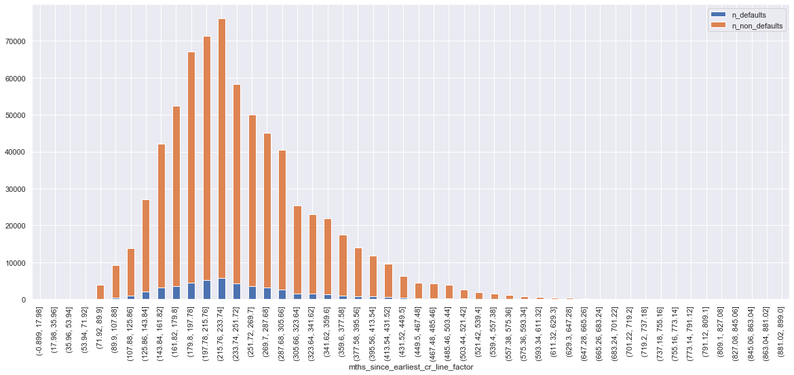


```python
x_train_prep['mths_since_earliest_cr_line:<160'] = np.where(x_train_prep['mths_since_earliest_cr_line'] <= 160, 1, 0)
x_train_prep['mths_since_earliest_cr_line:161_288'] = np.where((x_train_prep['mths_since_earliest_cr_line'] > 140) & (x_train_prep['mths_since_earliest_cr_line'] <= 288 ), 1, 0)
x_train_prep['mths_since_earliest_cr_line:289_360'] = np.where((x_train_prep['mths_since_earliest_cr_line'] > 289) & (x_train_prep['mths_since_earliest_cr_line'] <= 360), 1, 0)
x_train_prep['mths_since_earliest_cr_line:>360'] = np.where(x_train_prep['mths_since_earliest_cr_line'] > 360, 1, 0)
```


```python
fig, ax = plt.subplots(figsize=(20,8))

var_s = ['mths_since_earliest_cr_line:<160', 'mths_since_earliest_cr_line:161_288', 'mths_since_earliest_cr_line:289_360', 
                    'mths_since_earliest_cr_line:>360']

pd.concat([x_train_prep, y_train_prep], axis=1).groupby('Y').sum().loc[:, var_s].T.plot(kind='bar', stacked=True, ax=ax)

plt.legend()
```


    <matplotlib.legend.Legend at 0x1a32700828>


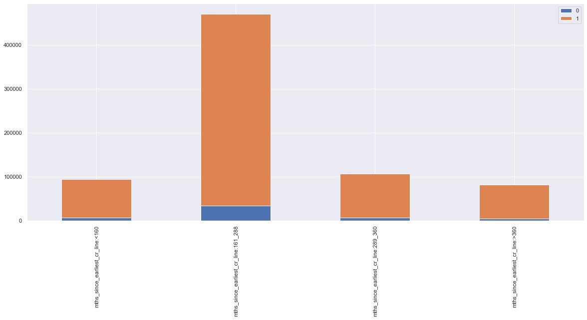


```python
vars_to_use.append(['mths_since_earliest_cr_line:<160', 'mths_since_earliest_cr_line:161_288', 'mths_since_earliest_cr_line:289_360'])

ref_vars.append(['mths_since_earliest_cr_line:>360'])

vars_to_use
```


    [['grade:F', 'grade:E', 'grade:D', 'grade:C', 'grade:B', 'grade:A'],
     ['home_ownership:OWN', 'home_ownership:MORTGAGE'],
     ['addr_state:NY',
      'addr_state:VA_OK_AL_SD',
      'addr_state:CA',
      'addr_state:MO_DE_MD_UT_LA_NJ',
      'addr_state:NM_NC_AZ',
      'addr_state:PA_MA_RI_MI_AR',
      'addr_state:MN_OH_AK',
      'addr_state:KY_WI_GA_WA',
      'addr_state:OR_IN_TN_CT',
      'addr_state:TX',
      'addr_state:IL_KS_MT_SC_CO',
      'addr_state:VT_WV_WY_NH_DC_MS'],
     ['verification_status:Not Verified', 'verification_status:Source Verified'],
     ['initial_list_status:w'],
     ['purpose:house_mov_ren_oth_med',
      'purpose:vac_debtc_majpur_car_homeimp',
      'purpose:credit_card'],
     ['term:36'],
     ['emp_length_int:1',
      'emp_length_int:2_3_4',
      'emp_length_int:5_6_7',
      'emp_length_int:8_9',
      'emp_length_int:10'],
     ['mths_since_issue_d:<38',
      'mths_since_issue_d:38_39',
      'mths_since_issue_d:40_41',
      'mths_since_issue_d:42_48',
      'mths_since_issue_d:49_54',
      'mths_since_issue_d:55_68',
      'mths_since_issue_d:69_95'],
     ['int_rate:<10.054',
      'int_rate:10.054_12.849',
      'int_rate:12.849_15.735',
      'int_rate:15.735_19.995'],
     ['mths_since_earliest_cr_line:<160',
      'mths_since_earliest_cr_line:161_288',
      'mths_since_earliest_cr_line:289_360']]


### 'installment'


```python
print(x_train_prep['installment'].nunique())
x_train_prep['installment'].describe()
```

    64437


    count    709903.000000
    mean        436.795613
    std         244.146300
    min          15.670000
    25%         260.850000
    50%         382.550000
    75%         572.720000
    max        1445.460000
    Name: installment, dtype: float64


```python
x_train_prep['installment_factor'] = pd.cut(x_train_prep['installment'], 50)
```


```python
woe_df = woe_ordered_continuous(x_train_prep, 'installment_factor', y_train_prep, rot_x_ticks=90)
woe_df
```


<div>
<style scoped>
    .dataframe tbody tr th:only-of-type {
        vertical-align: middle;
    }

    .dataframe tbody tr th {
        vertical-align: top;
    }

    .dataframe thead th {
        text-align: right;
    }
</style>
<table border="1" class="dataframe">
  <thead>
    <tr style="text-align: right;">
      <th></th>
      <th>installment_factor</th>
      <th>n_obs</th>
      <th>prop_non_defaults</th>
      <th>prop_n_obs</th>
      <th>n_defaults</th>
      <th>n_non_defaults</th>
      <th>prop_n_non_defaults</th>
      <th>prop_n_defaults</th>
      <th>WoE</th>
      <th>diff_prop_non_defaults</th>
      <th>diff_WoE</th>
      <th>IV</th>
    </tr>
  </thead>
  <tbody>
    <tr>
      <th>0</th>
      <td>(14.24, 44.266]</td>
      <td>3364</td>
      <td>0.923900</td>
      <td>0.004739</td>
      <td>256.0</td>
      <td>3108.0</td>
      <td>0.004700</td>
      <td>0.005268</td>
      <td>-0.114230</td>
      <td>NaN</td>
      <td>NaN</td>
      <td>0.022083</td>
    </tr>
    <tr>
      <th>1</th>
      <td>(44.266, 72.862]</td>
      <td>8878</td>
      <td>0.922505</td>
      <td>0.012506</td>
      <td>688.0</td>
      <td>8190.0</td>
      <td>0.012384</td>
      <td>0.014159</td>
      <td>-0.133907</td>
      <td>0.007685</td>
      <td>0.019677</td>
      <td>0.022083</td>
    </tr>
    <tr>
      <th>2</th>
      <td>(72.862, 101.457]</td>
      <td>13159</td>
      <td>0.923626</td>
      <td>0.018536</td>
      <td>1005.0</td>
      <td>12154.0</td>
      <td>0.018379</td>
      <td>0.020683</td>
      <td>-0.118117</td>
      <td>0.005994</td>
      <td>0.015790</td>
      <td>0.022083</td>
    </tr>
    <tr>
      <th>3</th>
      <td>(101.457, 130.053]</td>
      <td>15804</td>
      <td>0.922994</td>
      <td>0.022262</td>
      <td>1217.0</td>
      <td>14587.0</td>
      <td>0.022058</td>
      <td>0.025046</td>
      <td>-0.127046</td>
      <td>0.003679</td>
      <td>0.008929</td>
      <td>0.022083</td>
    </tr>
    <tr>
      <th>4</th>
      <td>(130.053, 158.649]</td>
      <td>20562</td>
      <td>0.932351</td>
      <td>0.028965</td>
      <td>1391.0</td>
      <td>19171.0</td>
      <td>0.028989</td>
      <td>0.028627</td>
      <td>0.012588</td>
      <td>0.006932</td>
      <td>0.139634</td>
      <td>0.022083</td>
    </tr>
    <tr>
      <th>5</th>
      <td>(158.649, 187.245]</td>
      <td>31682</td>
      <td>0.929424</td>
      <td>0.044629</td>
      <td>2236.0</td>
      <td>29446.0</td>
      <td>0.044527</td>
      <td>0.046017</td>
      <td>-0.032918</td>
      <td>0.015537</td>
      <td>0.045506</td>
      <td>0.022083</td>
    </tr>
    <tr>
      <th>6</th>
      <td>(187.245, 215.841]</td>
      <td>31167</td>
      <td>0.935765</td>
      <td>0.043903</td>
      <td>2002.0</td>
      <td>29165.0</td>
      <td>0.044102</td>
      <td>0.041201</td>
      <td>0.068035</td>
      <td>0.000425</td>
      <td>0.100953</td>
      <td>0.022083</td>
    </tr>
    <tr>
      <th>7</th>
      <td>(215.841, 244.436]</td>
      <td>30599</td>
      <td>0.939181</td>
      <td>0.043103</td>
      <td>1861.0</td>
      <td>28738.0</td>
      <td>0.043456</td>
      <td>0.038299</td>
      <td>0.126319</td>
      <td>0.000646</td>
      <td>0.058284</td>
      <td>0.022083</td>
    </tr>
    <tr>
      <th>8</th>
      <td>(244.436, 273.032]</td>
      <td>40806</td>
      <td>0.938661</td>
      <td>0.057481</td>
      <td>2503.0</td>
      <td>38303.0</td>
      <td>0.057920</td>
      <td>0.051512</td>
      <td>0.117251</td>
      <td>0.014464</td>
      <td>0.009068</td>
      <td>0.022083</td>
    </tr>
    <tr>
      <th>9</th>
      <td>(273.032, 301.628]</td>
      <td>37167</td>
      <td>0.925714</td>
      <td>0.052355</td>
      <td>2761.0</td>
      <td>34406.0</td>
      <td>0.052027</td>
      <td>0.056821</td>
      <td>-0.088149</td>
      <td>0.005893</td>
      <td>0.205400</td>
      <td>0.022083</td>
    </tr>
    <tr>
      <th>10</th>
      <td>(301.628, 330.224]</td>
      <td>47281</td>
      <td>0.942429</td>
      <td>0.066602</td>
      <td>2722.0</td>
      <td>44559.0</td>
      <td>0.067380</td>
      <td>0.056019</td>
      <td>0.184660</td>
      <td>0.015353</td>
      <td>0.272809</td>
      <td>0.022083</td>
    </tr>
    <tr>
      <th>11</th>
      <td>(330.224, 358.82]</td>
      <td>42588</td>
      <td>0.923570</td>
      <td>0.059991</td>
      <td>3255.0</td>
      <td>39333.0</td>
      <td>0.059477</td>
      <td>0.066988</td>
      <td>-0.118916</td>
      <td>0.007902</td>
      <td>0.303576</td>
      <td>0.022083</td>
    </tr>
    <tr>
      <th>12</th>
      <td>(358.82, 387.415]</td>
      <td>38503</td>
      <td>0.935226</td>
      <td>0.054237</td>
      <td>2494.0</td>
      <td>36009.0</td>
      <td>0.054451</td>
      <td>0.051326</td>
      <td>0.059094</td>
      <td>0.005026</td>
      <td>0.178009</td>
      <td>0.022083</td>
    </tr>
    <tr>
      <th>13</th>
      <td>(387.415, 416.011]</td>
      <td>31523</td>
      <td>0.928528</td>
      <td>0.044405</td>
      <td>2253.0</td>
      <td>29270.0</td>
      <td>0.044261</td>
      <td>0.046367</td>
      <td>-0.046487</td>
      <td>0.010190</td>
      <td>0.105581</td>
      <td>0.022083</td>
    </tr>
    <tr>
      <th>14</th>
      <td>(416.011, 444.607]</td>
      <td>22766</td>
      <td>0.923878</td>
      <td>0.032069</td>
      <td>1733.0</td>
      <td>21033.0</td>
      <td>0.031805</td>
      <td>0.035665</td>
      <td>-0.114549</td>
      <td>0.012456</td>
      <td>0.068062</td>
      <td>0.022083</td>
    </tr>
    <tr>
      <th>15</th>
      <td>(444.607, 473.203]</td>
      <td>29425</td>
      <td>0.938114</td>
      <td>0.041449</td>
      <td>1821.0</td>
      <td>27604.0</td>
      <td>0.041741</td>
      <td>0.037476</td>
      <td>0.107787</td>
      <td>0.009936</td>
      <td>0.222336</td>
      <td>0.022083</td>
    </tr>
    <tr>
      <th>16</th>
      <td>(473.203, 501.799]</td>
      <td>31776</td>
      <td>0.935329</td>
      <td>0.044761</td>
      <td>2055.0</td>
      <td>29721.0</td>
      <td>0.044942</td>
      <td>0.042292</td>
      <td>0.060791</td>
      <td>0.003201</td>
      <td>0.046997</td>
      <td>0.022083</td>
    </tr>
    <tr>
      <th>17</th>
      <td>(501.799, 530.394]</td>
      <td>24725</td>
      <td>0.923316</td>
      <td>0.034829</td>
      <td>1896.0</td>
      <td>22829.0</td>
      <td>0.034521</td>
      <td>0.039020</td>
      <td>-0.122502</td>
      <td>0.010422</td>
      <td>0.183293</td>
      <td>0.022083</td>
    </tr>
    <tr>
      <th>18</th>
      <td>(530.394, 558.99]</td>
      <td>21410</td>
      <td>0.919897</td>
      <td>0.030159</td>
      <td>1715.0</td>
      <td>19695.0</td>
      <td>0.029782</td>
      <td>0.035295</td>
      <td>-0.169836</td>
      <td>0.004739</td>
      <td>0.047334</td>
      <td>0.022083</td>
    </tr>
    <tr>
      <th>19</th>
      <td>(558.99, 587.586]</td>
      <td>18866</td>
      <td>0.925898</td>
      <td>0.026575</td>
      <td>1398.0</td>
      <td>17468.0</td>
      <td>0.026414</td>
      <td>0.028771</td>
      <td>-0.085459</td>
      <td>0.003368</td>
      <td>0.084376</td>
      <td>0.022083</td>
    </tr>
    <tr>
      <th>20</th>
      <td>(587.586, 616.182]</td>
      <td>17512</td>
      <td>0.933874</td>
      <td>0.024668</td>
      <td>1158.0</td>
      <td>16354.0</td>
      <td>0.024730</td>
      <td>0.023832</td>
      <td>0.036991</td>
      <td>0.001685</td>
      <td>0.122450</td>
      <td>0.022083</td>
    </tr>
    <tr>
      <th>21</th>
      <td>(616.182, 644.778]</td>
      <td>17946</td>
      <td>0.943274</td>
      <td>0.025280</td>
      <td>1018.0</td>
      <td>16928.0</td>
      <td>0.025598</td>
      <td>0.020950</td>
      <td>0.200342</td>
      <td>0.000868</td>
      <td>0.163351</td>
      <td>0.022083</td>
    </tr>
    <tr>
      <th>22</th>
      <td>(644.778, 673.373]</td>
      <td>17761</td>
      <td>0.937841</td>
      <td>0.025019</td>
      <td>1104.0</td>
      <td>16657.0</td>
      <td>0.025188</td>
      <td>0.022720</td>
      <td>0.103103</td>
      <td>0.000410</td>
      <td>0.097239</td>
      <td>0.022083</td>
    </tr>
    <tr>
      <th>23</th>
      <td>(673.373, 701.969]</td>
      <td>14917</td>
      <td>0.923376</td>
      <td>0.021013</td>
      <td>1143.0</td>
      <td>13774.0</td>
      <td>0.020828</td>
      <td>0.023523</td>
      <td>-0.121661</td>
      <td>0.004360</td>
      <td>0.224764</td>
      <td>0.022083</td>
    </tr>
    <tr>
      <th>24</th>
      <td>(701.969, 730.565]</td>
      <td>9053</td>
      <td>0.923340</td>
      <td>0.012752</td>
      <td>694.0</td>
      <td>8359.0</td>
      <td>0.012640</td>
      <td>0.014282</td>
      <td>-0.122165</td>
      <td>0.008188</td>
      <td>0.000504</td>
      <td>0.022083</td>
    </tr>
    <tr>
      <th>25</th>
      <td>(730.565, 759.161]</td>
      <td>10277</td>
      <td>0.937238</td>
      <td>0.014477</td>
      <td>645.0</td>
      <td>9632.0</td>
      <td>0.014565</td>
      <td>0.013274</td>
      <td>0.092808</td>
      <td>0.001925</td>
      <td>0.214974</td>
      <td>0.022083</td>
    </tr>
    <tr>
      <th>26</th>
      <td>(759.161, 787.757]</td>
      <td>12291</td>
      <td>0.949313</td>
      <td>0.017314</td>
      <td>623.0</td>
      <td>11668.0</td>
      <td>0.017644</td>
      <td>0.012821</td>
      <td>0.319271</td>
      <td>0.003079</td>
      <td>0.226463</td>
      <td>0.022083</td>
    </tr>
    <tr>
      <th>27</th>
      <td>(787.757, 816.352]</td>
      <td>9050</td>
      <td>0.935691</td>
      <td>0.012748</td>
      <td>582.0</td>
      <td>8468.0</td>
      <td>0.012805</td>
      <td>0.011978</td>
      <td>0.066792</td>
      <td>0.004839</td>
      <td>0.252480</td>
      <td>0.022083</td>
    </tr>
    <tr>
      <th>28</th>
      <td>(816.352, 844.948]</td>
      <td>7757</td>
      <td>0.930128</td>
      <td>0.010927</td>
      <td>542.0</td>
      <td>7215.0</td>
      <td>0.010910</td>
      <td>0.011154</td>
      <td>-0.022136</td>
      <td>0.001895</td>
      <td>0.088928</td>
      <td>0.022083</td>
    </tr>
    <tr>
      <th>29</th>
      <td>(844.948, 873.544]</td>
      <td>7815</td>
      <td>0.933845</td>
      <td>0.011009</td>
      <td>517.0</td>
      <td>7298.0</td>
      <td>0.011036</td>
      <td>0.010640</td>
      <td>0.036525</td>
      <td>0.000126</td>
      <td>0.058661</td>
      <td>0.022083</td>
    </tr>
    <tr>
      <th>30</th>
      <td>(873.544, 902.14]</td>
      <td>7519</td>
      <td>0.922596</td>
      <td>0.010592</td>
      <td>582.0</td>
      <td>6937.0</td>
      <td>0.010490</td>
      <td>0.011978</td>
      <td>-0.132633</td>
      <td>0.000546</td>
      <td>0.169159</td>
      <td>0.022083</td>
    </tr>
    <tr>
      <th>31</th>
      <td>(902.14, 930.736]</td>
      <td>4269</td>
      <td>0.921293</td>
      <td>0.006013</td>
      <td>336.0</td>
      <td>3933.0</td>
      <td>0.005947</td>
      <td>0.006915</td>
      <td>-0.150741</td>
      <td>0.004542</td>
      <td>0.018108</td>
      <td>0.022083</td>
    </tr>
    <tr>
      <th>32</th>
      <td>(930.736, 959.331]</td>
      <td>4493</td>
      <td>0.918985</td>
      <td>0.006329</td>
      <td>364.0</td>
      <td>4129.0</td>
      <td>0.006244</td>
      <td>0.007491</td>
      <td>-0.182151</td>
      <td>0.000296</td>
      <td>0.031410</td>
      <td>0.022083</td>
    </tr>
    <tr>
      <th>33</th>
      <td>(959.331, 987.927]</td>
      <td>3623</td>
      <td>0.897875</td>
      <td>0.005104</td>
      <td>370.0</td>
      <td>3253.0</td>
      <td>0.004919</td>
      <td>0.007615</td>
      <td>-0.436957</td>
      <td>0.001325</td>
      <td>0.254807</td>
      <td>0.022083</td>
    </tr>
    <tr>
      <th>34</th>
      <td>(987.927, 1016.523]</td>
      <td>3119</td>
      <td>0.917922</td>
      <td>0.004394</td>
      <td>256.0</td>
      <td>2863.0</td>
      <td>0.004329</td>
      <td>0.005268</td>
      <td>-0.196340</td>
      <td>0.000590</td>
      <td>0.240618</td>
      <td>0.022083</td>
    </tr>
    <tr>
      <th>35</th>
      <td>(1016.523, 1045.119]</td>
      <td>2358</td>
      <td>0.905004</td>
      <td>0.003322</td>
      <td>224.0</td>
      <td>2134.0</td>
      <td>0.003227</td>
      <td>0.004610</td>
      <td>-0.356680</td>
      <td>0.001102</td>
      <td>0.160340</td>
      <td>0.022083</td>
    </tr>
    <tr>
      <th>36</th>
      <td>(1045.119, 1073.715]</td>
      <td>1704</td>
      <td>0.924296</td>
      <td>0.002400</td>
      <td>129.0</td>
      <td>1575.0</td>
      <td>0.002382</td>
      <td>0.002655</td>
      <td>-0.108589</td>
      <td>0.000845</td>
      <td>0.248091</td>
      <td>0.022083</td>
    </tr>
    <tr>
      <th>37</th>
      <td>(1073.715, 1102.31]</td>
      <td>2937</td>
      <td>0.965271</td>
      <td>0.004137</td>
      <td>102.0</td>
      <td>2835.0</td>
      <td>0.004287</td>
      <td>0.002099</td>
      <td>0.714037</td>
      <td>0.001905</td>
      <td>0.822626</td>
      <td>0.022083</td>
    </tr>
    <tr>
      <th>38</th>
      <td>(1102.31, 1130.906]</td>
      <td>2352</td>
      <td>0.964286</td>
      <td>0.003313</td>
      <td>84.0</td>
      <td>2268.0</td>
      <td>0.003430</td>
      <td>0.001729</td>
      <td>0.685049</td>
      <td>0.000857</td>
      <td>0.028988</td>
      <td>0.022083</td>
    </tr>
    <tr>
      <th>39</th>
      <td>(1130.906, 1159.502]</td>
      <td>1839</td>
      <td>0.948885</td>
      <td>0.002590</td>
      <td>94.0</td>
      <td>1745.0</td>
      <td>0.002639</td>
      <td>0.001935</td>
      <td>0.310428</td>
      <td>0.000791</td>
      <td>0.374622</td>
      <td>0.022083</td>
    </tr>
    <tr>
      <th>40</th>
      <td>(1159.502, 1188.098]</td>
      <td>2647</td>
      <td>0.954288</td>
      <td>0.003729</td>
      <td>121.0</td>
      <td>2526.0</td>
      <td>0.003820</td>
      <td>0.002490</td>
      <td>0.427814</td>
      <td>0.001181</td>
      <td>0.117387</td>
      <td>0.022083</td>
    </tr>
    <tr>
      <th>41</th>
      <td>(1188.098, 1216.694]</td>
      <td>2244</td>
      <td>0.934938</td>
      <td>0.003161</td>
      <td>146.0</td>
      <td>2098.0</td>
      <td>0.003172</td>
      <td>0.003005</td>
      <td>0.054346</td>
      <td>0.000647</td>
      <td>0.373469</td>
      <td>0.022083</td>
    </tr>
    <tr>
      <th>42</th>
      <td>(1216.694, 1245.289]</td>
      <td>1657</td>
      <td>0.906457</td>
      <td>0.002334</td>
      <td>155.0</td>
      <td>1502.0</td>
      <td>0.002271</td>
      <td>0.003190</td>
      <td>-0.339660</td>
      <td>0.000901</td>
      <td>0.394005</td>
      <td>0.022083</td>
    </tr>
    <tr>
      <th>43</th>
      <td>(1245.289, 1273.885]</td>
      <td>1546</td>
      <td>0.910091</td>
      <td>0.002178</td>
      <td>139.0</td>
      <td>1407.0</td>
      <td>0.002128</td>
      <td>0.002861</td>
      <td>-0.296046</td>
      <td>0.000144</td>
      <td>0.043613</td>
      <td>0.022083</td>
    </tr>
    <tr>
      <th>44</th>
      <td>(1273.885, 1302.481]</td>
      <td>741</td>
      <td>0.856950</td>
      <td>0.001044</td>
      <td>106.0</td>
      <td>635.0</td>
      <td>0.000960</td>
      <td>0.002181</td>
      <td>-0.820602</td>
      <td>0.001167</td>
      <td>0.524555</td>
      <td>0.022083</td>
    </tr>
    <tr>
      <th>45</th>
      <td>(1302.481, 1331.077]</td>
      <td>214</td>
      <td>0.799065</td>
      <td>0.000301</td>
      <td>43.0</td>
      <td>171.0</td>
      <td>0.000259</td>
      <td>0.000885</td>
      <td>-1.230324</td>
      <td>0.000702</td>
      <td>0.409722</td>
      <td>0.022083</td>
    </tr>
    <tr>
      <th>46</th>
      <td>(1331.077, 1359.673]</td>
      <td>117</td>
      <td>0.726496</td>
      <td>0.000165</td>
      <td>32.0</td>
      <td>85.0</td>
      <td>0.000129</td>
      <td>0.000659</td>
      <td>-1.633872</td>
      <td>0.000130</td>
      <td>0.403548</td>
      <td>0.022083</td>
    </tr>
    <tr>
      <th>47</th>
      <td>(1359.673, 1388.268]</td>
      <td>56</td>
      <td>0.767857</td>
      <td>0.000079</td>
      <td>13.0</td>
      <td>43.0</td>
      <td>0.000065</td>
      <td>0.000268</td>
      <td>-1.414537</td>
      <td>0.000064</td>
      <td>0.219335</td>
      <td>0.022083</td>
    </tr>
    <tr>
      <th>48</th>
      <td>(1388.268, 1416.864]</td>
      <td>34</td>
      <td>0.823529</td>
      <td>0.000048</td>
      <td>6.0</td>
      <td>28.0</td>
      <td>0.000042</td>
      <td>0.000123</td>
      <td>-1.070342</td>
      <td>0.000023</td>
      <td>0.344194</td>
      <td>0.022083</td>
    </tr>
    <tr>
      <th>49</th>
      <td>(1416.864, 1445.46]</td>
      <td>4</td>
      <td>0.750000</td>
      <td>0.000006</td>
      <td>1.0</td>
      <td>3.0</td>
      <td>0.000005</td>
      <td>0.000021</td>
      <td>-1.512175</td>
      <td>0.000038</td>
      <td>0.441833</td>
      <td>0.022083</td>
    </tr>
  </tbody>
</table>
</div>


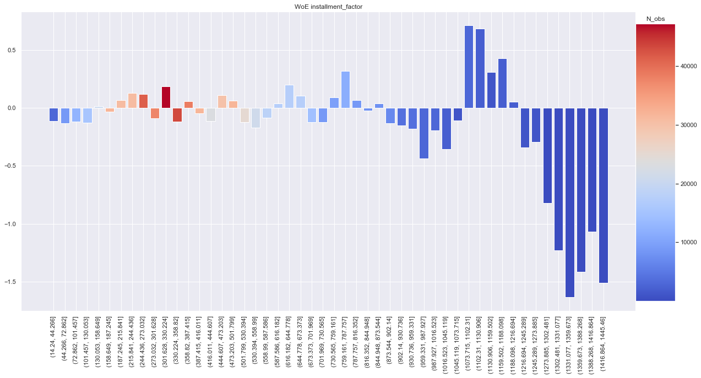


```python
fig, ax = plt.subplots(figsize=(20,8))

woe_df.set_index('installment_factor').iloc[:, [3,4]].plot(kind='bar', stacked=True, ax=ax)

plt.legend()
```


    <matplotlib.legend.Legend at 0x1a2f324860>


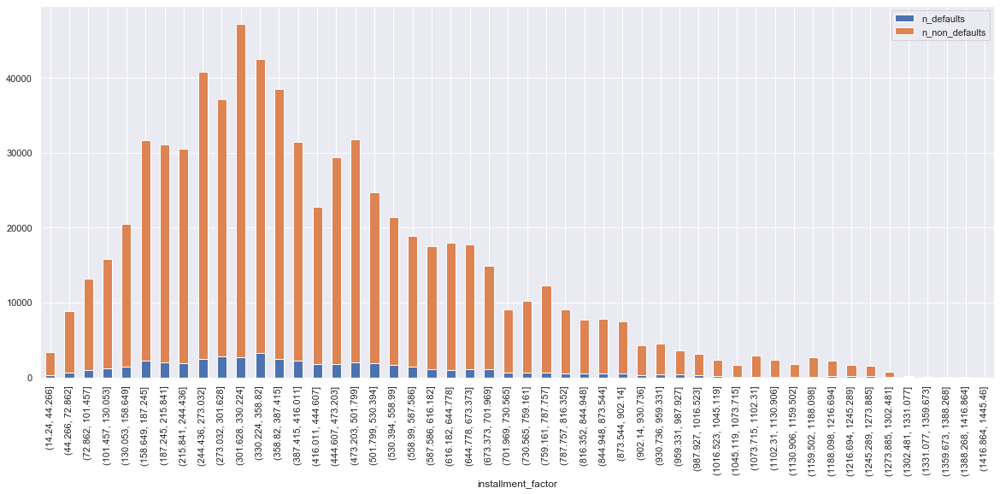


### No need to do anything here, linear horizontal trend, no relation between installment and default rate


# 'delinq_2yrs'


```python
print(x_train_prep['delinq_2yrs'].nunique())
x_train_prep['delinq_2yrs'].describe()
```

    28


    count    709903.000000
    mean          0.314658
    std           0.862909
    min           0.000000
    25%           0.000000
    50%           0.000000
    75%           0.000000
    max          39.000000
    Name: delinq_2yrs, dtype: float64


```python
woe_df = woe_ordered_continuous(x_train_prep, 'delinq_2yrs', y_train_prep, vlines=[0.5, 3.5])
woe_df
```

    /Users/omaromeiri/anaconda3/lib/python3.7/site-packages/ipykernel_launcher.py:177: RuntimeWarning: divide by zero encountered in log


<div>
<style scoped>
    .dataframe tbody tr th:only-of-type {
        vertical-align: middle;
    }

    .dataframe tbody tr th {
        vertical-align: top;
    }

    .dataframe thead th {
        text-align: right;
    }
</style>
<table border="1" class="dataframe">
  <thead>
    <tr style="text-align: right;">
      <th></th>
      <th>delinq_2yrs</th>
      <th>n_obs</th>
      <th>prop_non_defaults</th>
      <th>prop_n_obs</th>
      <th>n_defaults</th>
      <th>n_non_defaults</th>
      <th>prop_n_non_defaults</th>
      <th>prop_n_defaults</th>
      <th>WoE</th>
      <th>diff_prop_non_defaults</th>
      <th>diff_WoE</th>
      <th>IV</th>
    </tr>
  </thead>
  <tbody>
    <tr>
      <th>0</th>
      <td>0.0</td>
      <td>573609</td>
      <td>0.930897</td>
      <td>0.808010</td>
      <td>39638.0</td>
      <td>533971.0</td>
      <td>0.807442</td>
      <td>0.815748</td>
      <td>-0.010234</td>
      <td>NaN</td>
      <td>NaN</td>
      <td>0.001103</td>
    </tr>
    <tr>
      <th>1</th>
      <td>1.0</td>
      <td>90472</td>
      <td>0.934687</td>
      <td>0.127443</td>
      <td>5909.0</td>
      <td>84563.0</td>
      <td>0.127872</td>
      <td>0.121607</td>
      <td>0.050233</td>
      <td>0.679570</td>
      <td>0.060467</td>
      <td>0.001103</td>
    </tr>
    <tr>
      <th>2</th>
      <td>2.0</td>
      <td>26908</td>
      <td>0.932436</td>
      <td>0.037904</td>
      <td>1818.0</td>
      <td>25090.0</td>
      <td>0.037940</td>
      <td>0.037414</td>
      <td>0.013945</td>
      <td>0.089932</td>
      <td>0.036288</td>
      <td>0.001103</td>
    </tr>
    <tr>
      <th>3</th>
      <td>3.0</td>
      <td>9614</td>
      <td>0.931558</td>
      <td>0.013543</td>
      <td>658.0</td>
      <td>8956.0</td>
      <td>0.013543</td>
      <td>0.013542</td>
      <td>0.000087</td>
      <td>0.024397</td>
      <td>0.013858</td>
      <td>0.001103</td>
    </tr>
    <tr>
      <th>4</th>
      <td>4.0</td>
      <td>4220</td>
      <td>0.938626</td>
      <td>0.005944</td>
      <td>259.0</td>
      <td>3961.0</td>
      <td>0.005990</td>
      <td>0.005330</td>
      <td>0.116636</td>
      <td>0.007553</td>
      <td>0.116550</td>
      <td>0.001103</td>
    </tr>
    <tr>
      <th>5</th>
      <td>5.0</td>
      <td>2167</td>
      <td>0.935856</td>
      <td>0.003053</td>
      <td>139.0</td>
      <td>2028.0</td>
      <td>0.003067</td>
      <td>0.002861</td>
      <td>0.069544</td>
      <td>0.002923</td>
      <td>0.047092</td>
      <td>0.001103</td>
    </tr>
    <tr>
      <th>6</th>
      <td>6.0</td>
      <td>1220</td>
      <td>0.942623</td>
      <td>0.001719</td>
      <td>70.0</td>
      <td>1150.0</td>
      <td>0.001739</td>
      <td>0.001441</td>
      <td>0.188235</td>
      <td>0.001328</td>
      <td>0.118691</td>
      <td>0.001103</td>
    </tr>
    <tr>
      <th>7</th>
      <td>7.0</td>
      <td>615</td>
      <td>0.941463</td>
      <td>0.000866</td>
      <td>36.0</td>
      <td>579.0</td>
      <td>0.000876</td>
      <td>0.000741</td>
      <td>0.166996</td>
      <td>0.000863</td>
      <td>0.021238</td>
      <td>0.001103</td>
    </tr>
    <tr>
      <th>8</th>
      <td>8.0</td>
      <td>357</td>
      <td>0.966387</td>
      <td>0.000503</td>
      <td>12.0</td>
      <td>345.0</td>
      <td>0.000522</td>
      <td>0.000247</td>
      <td>0.747850</td>
      <td>0.000354</td>
      <td>0.580854</td>
      <td>0.001103</td>
    </tr>
    <tr>
      <th>9</th>
      <td>9.0</td>
      <td>232</td>
      <td>0.952586</td>
      <td>0.000327</td>
      <td>11.0</td>
      <td>221.0</td>
      <td>0.000334</td>
      <td>0.000226</td>
      <td>0.389480</td>
      <td>0.000188</td>
      <td>0.358370</td>
      <td>0.001103</td>
    </tr>
    <tr>
      <th>10</th>
      <td>10.0</td>
      <td>157</td>
      <td>0.929936</td>
      <td>0.000221</td>
      <td>11.0</td>
      <td>146.0</td>
      <td>0.000221</td>
      <td>0.000226</td>
      <td>-0.025076</td>
      <td>0.000113</td>
      <td>0.414556</td>
      <td>0.001103</td>
    </tr>
    <tr>
      <th>11</th>
      <td>11.0</td>
      <td>97</td>
      <td>0.927835</td>
      <td>0.000137</td>
      <td>7.0</td>
      <td>90.0</td>
      <td>0.000136</td>
      <td>0.000144</td>
      <td>-0.056888</td>
      <td>0.000085</td>
      <td>0.031812</td>
      <td>0.001103</td>
    </tr>
    <tr>
      <th>12</th>
      <td>12.0</td>
      <td>79</td>
      <td>0.835443</td>
      <td>0.000111</td>
      <td>13.0</td>
      <td>66.0</td>
      <td>0.000100</td>
      <td>0.000268</td>
      <td>-0.986082</td>
      <td>0.000036</td>
      <td>0.929194</td>
      <td>0.001103</td>
    </tr>
    <tr>
      <th>13</th>
      <td>13.0</td>
      <td>51</td>
      <td>0.901961</td>
      <td>0.000072</td>
      <td>5.0</td>
      <td>46.0</td>
      <td>0.000070</td>
      <td>0.000103</td>
      <td>-0.391584</td>
      <td>0.000030</td>
      <td>0.594498</td>
      <td>0.001103</td>
    </tr>
    <tr>
      <th>14</th>
      <td>14.0</td>
      <td>38</td>
      <td>0.973684</td>
      <td>0.000054</td>
      <td>1.0</td>
      <td>37.0</td>
      <td>0.000056</td>
      <td>0.000021</td>
      <td>1.000131</td>
      <td>0.000014</td>
      <td>1.391714</td>
      <td>0.001103</td>
    </tr>
    <tr>
      <th>15</th>
      <td>15.0</td>
      <td>22</td>
      <td>0.954545</td>
      <td>0.000031</td>
      <td>1.0</td>
      <td>21.0</td>
      <td>0.000032</td>
      <td>0.000021</td>
      <td>0.433735</td>
      <td>0.000024</td>
      <td>0.566395</td>
      <td>0.001103</td>
    </tr>
    <tr>
      <th>16</th>
      <td>16.0</td>
      <td>16</td>
      <td>1.000000</td>
      <td>0.000023</td>
      <td>0.0</td>
      <td>16.0</td>
      <td>0.000024</td>
      <td>0.000000</td>
      <td>NaN</td>
      <td>0.000008</td>
      <td>NaN</td>
      <td>0.001103</td>
    </tr>
    <tr>
      <th>17</th>
      <td>17.0</td>
      <td>6</td>
      <td>1.000000</td>
      <td>0.000008</td>
      <td>0.0</td>
      <td>6.0</td>
      <td>0.000009</td>
      <td>0.000000</td>
      <td>NaN</td>
      <td>0.000015</td>
      <td>NaN</td>
      <td>0.001103</td>
    </tr>
    <tr>
      <th>18</th>
      <td>18.0</td>
      <td>7</td>
      <td>0.857143</td>
      <td>0.000010</td>
      <td>1.0</td>
      <td>6.0</td>
      <td>0.000009</td>
      <td>0.000021</td>
      <td>-0.819028</td>
      <td>0.000000</td>
      <td>NaN</td>
      <td>0.001103</td>
    </tr>
    <tr>
      <th>19</th>
      <td>19.0</td>
      <td>5</td>
      <td>1.000000</td>
      <td>0.000007</td>
      <td>0.0</td>
      <td>5.0</td>
      <td>0.000008</td>
      <td>0.000000</td>
      <td>NaN</td>
      <td>0.000002</td>
      <td>NaN</td>
      <td>0.001103</td>
    </tr>
    <tr>
      <th>20</th>
      <td>20.0</td>
      <td>1</td>
      <td>0.000000</td>
      <td>0.000001</td>
      <td>1.0</td>
      <td>0.0</td>
      <td>0.000000</td>
      <td>0.000021</td>
      <td>NaN</td>
      <td>0.000008</td>
      <td>NaN</td>
      <td>0.001103</td>
    </tr>
    <tr>
      <th>21</th>
      <td>21.0</td>
      <td>2</td>
      <td>0.500000</td>
      <td>0.000003</td>
      <td>1.0</td>
      <td>1.0</td>
      <td>0.000002</td>
      <td>0.000021</td>
      <td>-2.610787</td>
      <td>0.000002</td>
      <td>NaN</td>
      <td>0.001103</td>
    </tr>
    <tr>
      <th>22</th>
      <td>22.0</td>
      <td>3</td>
      <td>1.000000</td>
      <td>0.000004</td>
      <td>0.0</td>
      <td>3.0</td>
      <td>0.000005</td>
      <td>0.000000</td>
      <td>NaN</td>
      <td>0.000003</td>
      <td>NaN</td>
      <td>0.001103</td>
    </tr>
    <tr>
      <th>23</th>
      <td>24.0</td>
      <td>1</td>
      <td>1.000000</td>
      <td>0.000001</td>
      <td>0.0</td>
      <td>1.0</td>
      <td>0.000002</td>
      <td>0.000000</td>
      <td>NaN</td>
      <td>0.000003</td>
      <td>NaN</td>
      <td>0.001103</td>
    </tr>
    <tr>
      <th>24</th>
      <td>26.0</td>
      <td>1</td>
      <td>1.000000</td>
      <td>0.000001</td>
      <td>0.0</td>
      <td>1.0</td>
      <td>0.000002</td>
      <td>0.000000</td>
      <td>NaN</td>
      <td>0.000000</td>
      <td>NaN</td>
      <td>0.001103</td>
    </tr>
    <tr>
      <th>25</th>
      <td>27.0</td>
      <td>1</td>
      <td>1.000000</td>
      <td>0.000001</td>
      <td>0.0</td>
      <td>1.0</td>
      <td>0.000002</td>
      <td>0.000000</td>
      <td>NaN</td>
      <td>0.000000</td>
      <td>NaN</td>
      <td>0.001103</td>
    </tr>
    <tr>
      <th>26</th>
      <td>30.0</td>
      <td>1</td>
      <td>1.000000</td>
      <td>0.000001</td>
      <td>0.0</td>
      <td>1.0</td>
      <td>0.000002</td>
      <td>0.000000</td>
      <td>NaN</td>
      <td>0.000000</td>
      <td>NaN</td>
      <td>0.001103</td>
    </tr>
    <tr>
      <th>27</th>
      <td>39.0</td>
      <td>1</td>
      <td>1.000000</td>
      <td>0.000001</td>
      <td>0.0</td>
      <td>1.0</td>
      <td>0.000002</td>
      <td>0.000000</td>
      <td>NaN</td>
      <td>0.000000</td>
      <td>NaN</td>
      <td>0.001103</td>
    </tr>
  </tbody>
</table>
</div>


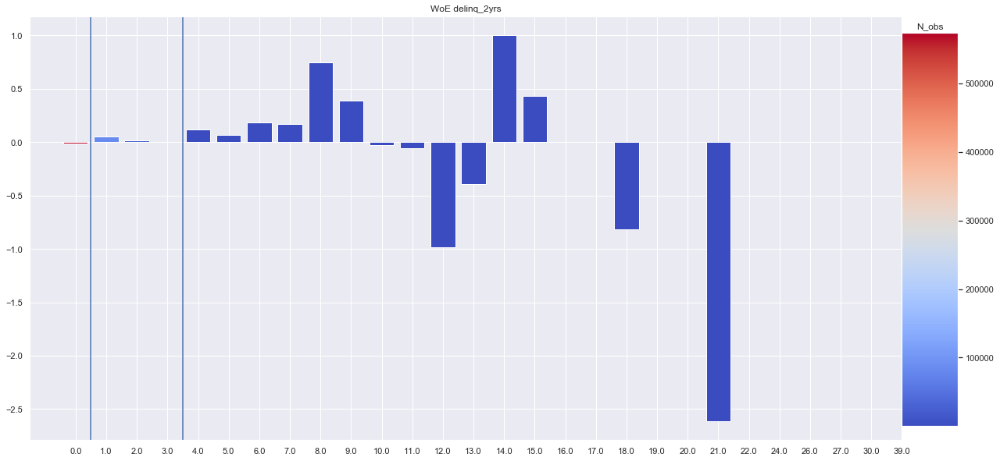


```python
fig, ax = plt.subplots(figsize=(20,8))

woe_df.set_index('delinq_2yrs').iloc[:, [3,4]].plot(kind='bar', stacked=True, ax=ax)

plt.legend()
```


    <matplotlib.legend.Legend at 0x1a327236d8>


```python
x_train_prep['delinq_2yrs:0'] = np.where((x_train_prep['delinq_2yrs'] == 0), 1, 0)
x_train_prep['delinq_2yrs:1-3'] = np.where((x_train_prep['delinq_2yrs'] >= 1) & (x_train_prep['delinq_2yrs'] <= 3), 1, 0)
x_train_prep['delinq_2yrs:>=4'] = np.where((x_train_prep['delinq_2yrs'] >= 9), 1, 0)
```


```python
fig, ax = plt.subplots(figsize=(20,8))

var_s = ['delinq_2yrs:0', 'delinq_2yrs:1-3', 'delinq_2yrs:>=4']

pd.concat([x_train_prep, y_train_prep], axis=1).groupby('Y').sum().loc[:, var_s].T.plot(kind='bar', stacked=True, ax=ax)

plt.legend()
```


    <matplotlib.legend.Legend at 0x1a2f4fbd30>


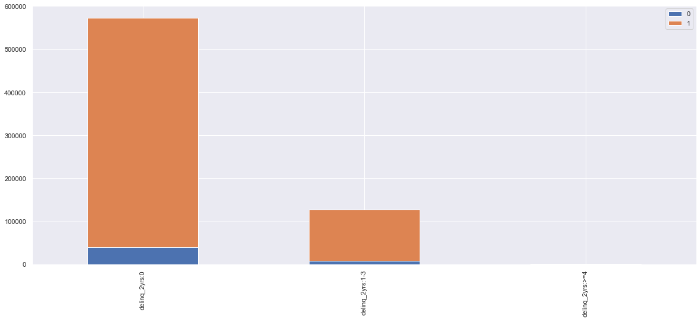


```python
vars_to_use.append(['delinq_2yrs:0', 'delinq_2yrs:1-3'])

ref_vars.append(['delinq_2yrs:>=4'])
vars_to_use
```


    [['grade:F', 'grade:E', 'grade:D', 'grade:C', 'grade:B', 'grade:A'],
     ['home_ownership:OWN', 'home_ownership:MORTGAGE'],
     ['addr_state:NY',
      'addr_state:VA_OK_AL_SD',
      'addr_state:CA',
      'addr_state:MO_DE_MD_UT_LA_NJ',
      'addr_state:NM_NC_AZ',
      'addr_state:PA_MA_RI_MI_AR',
      'addr_state:MN_OH_AK',
      'addr_state:KY_WI_GA_WA',
      'addr_state:OR_IN_TN_CT',
      'addr_state:TX',
      'addr_state:IL_KS_MT_SC_CO',
      'addr_state:VT_WV_WY_NH_DC_MS'],
     ['verification_status:Not Verified', 'verification_status:Source Verified'],
     ['initial_list_status:w'],
     ['purpose:house_mov_ren_oth_med',
      'purpose:vac_debtc_majpur_car_homeimp',
      'purpose:credit_card'],
     ['term:36'],
     ['emp_length_int:1',
      'emp_length_int:2_3_4',
      'emp_length_int:5_6_7',
      'emp_length_int:8_9',
      'emp_length_int:10'],
     ['mths_since_issue_d:<38',
      'mths_since_issue_d:38_39',
      'mths_since_issue_d:40_41',
      'mths_since_issue_d:42_48',
      'mths_since_issue_d:49_54',
      'mths_since_issue_d:55_68',
      'mths_since_issue_d:69_95'],
     ['int_rate:<10.054',
      'int_rate:10.054_12.849',
      'int_rate:12.849_15.735',
      'int_rate:15.735_19.995'],
     ['mths_since_earliest_cr_line:<160',
      'mths_since_earliest_cr_line:161_288',
      'mths_since_earliest_cr_line:289_360'],
     ['delinq_2yrs:0', 'delinq_2yrs:1-3']]


### 'inq_last_6mths'


```python
print(x_train_prep['inq_last_6mths'].nunique())
x_train_prep['inq_last_6mths'].describe()
```

    27


    count    709903.000000
    mean          0.695057
    std           0.999154
    min           0.000000
    25%           0.000000
    50%           0.000000
    75%           1.000000
    max          33.000000
    Name: inq_last_6mths, dtype: float64


```python
woe_df = woe_ordered_continuous(x_train_prep, 'inq_last_6mths', y_train_prep, vlines=[0.5, 2.5, 6.5])
woe_df
```

    /Users/omaromeiri/anaconda3/lib/python3.7/site-packages/ipykernel_launcher.py:177: RuntimeWarning: divide by zero encountered in log


<div>
<style scoped>
    .dataframe tbody tr th:only-of-type {
        vertical-align: middle;
    }

    .dataframe tbody tr th {
        vertical-align: top;
    }

    .dataframe thead th {
        text-align: right;
    }
</style>
<table border="1" class="dataframe">
  <thead>
    <tr style="text-align: right;">
      <th></th>
      <th>inq_last_6mths</th>
      <th>n_obs</th>
      <th>prop_non_defaults</th>
      <th>prop_n_obs</th>
      <th>n_defaults</th>
      <th>n_non_defaults</th>
      <th>prop_n_non_defaults</th>
      <th>prop_n_defaults</th>
      <th>WoE</th>
      <th>diff_prop_non_defaults</th>
      <th>diff_WoE</th>
      <th>IV</th>
    </tr>
  </thead>
  <tbody>
    <tr>
      <th>0</th>
      <td>0.0</td>
      <td>398156</td>
      <td>0.947425</td>
      <td>0.560860</td>
      <td>20933.0</td>
      <td>377223.0</td>
      <td>0.570416</td>
      <td>0.430800</td>
      <td>0.280722</td>
      <td>NaN</td>
      <td>NaN</td>
      <td>0.141476</td>
    </tr>
    <tr>
      <th>1</th>
      <td>1.0</td>
      <td>193335</td>
      <td>0.927209</td>
      <td>0.272340</td>
      <td>14073.0</td>
      <td>179262.0</td>
      <td>0.271070</td>
      <td>0.289622</td>
      <td>-0.066197</td>
      <td>0.299346</td>
      <td>0.346919</td>
      <td>0.141476</td>
    </tr>
    <tr>
      <th>2</th>
      <td>2.0</td>
      <td>75362</td>
      <td>0.905642</td>
      <td>0.106158</td>
      <td>7111.0</td>
      <td>68251.0</td>
      <td>0.103205</td>
      <td>0.146344</td>
      <td>-0.349238</td>
      <td>0.167865</td>
      <td>0.283041</td>
      <td>0.141476</td>
    </tr>
    <tr>
      <th>3</th>
      <td>3.0</td>
      <td>29871</td>
      <td>0.877071</td>
      <td>0.042078</td>
      <td>3672.0</td>
      <td>26199.0</td>
      <td>0.039617</td>
      <td>0.075570</td>
      <td>-0.645803</td>
      <td>0.063589</td>
      <td>0.296564</td>
      <td>0.141476</td>
    </tr>
    <tr>
      <th>4</th>
      <td>4.0</td>
      <td>8606</td>
      <td>0.833256</td>
      <td>0.012123</td>
      <td>1435.0</td>
      <td>7171.0</td>
      <td>0.010844</td>
      <td>0.029532</td>
      <td>-1.001907</td>
      <td>0.028773</td>
      <td>0.356105</td>
      <td>0.141476</td>
    </tr>
    <tr>
      <th>5</th>
      <td>5.0</td>
      <td>3204</td>
      <td>0.786517</td>
      <td>0.004513</td>
      <td>684.0</td>
      <td>2520.0</td>
      <td>0.003811</td>
      <td>0.014077</td>
      <td>-1.306731</td>
      <td>0.007033</td>
      <td>0.304824</td>
      <td>0.141476</td>
    </tr>
    <tr>
      <th>6</th>
      <td>6.0</td>
      <td>997</td>
      <td>0.642929</td>
      <td>0.001404</td>
      <td>356.0</td>
      <td>641.0</td>
      <td>0.000969</td>
      <td>0.007326</td>
      <td>-2.022689</td>
      <td>0.002841</td>
      <td>0.715958</td>
      <td>0.141476</td>
    </tr>
    <tr>
      <th>7</th>
      <td>7.0</td>
      <td>153</td>
      <td>0.183007</td>
      <td>0.000216</td>
      <td>125.0</td>
      <td>28.0</td>
      <td>0.000042</td>
      <td>0.002572</td>
      <td>-4.106897</td>
      <td>0.000927</td>
      <td>2.084208</td>
      <td>0.141476</td>
    </tr>
    <tr>
      <th>8</th>
      <td>8.0</td>
      <td>103</td>
      <td>0.165049</td>
      <td>0.000145</td>
      <td>86.0</td>
      <td>17.0</td>
      <td>0.000026</td>
      <td>0.001770</td>
      <td>-4.231921</td>
      <td>0.000017</td>
      <td>0.125025</td>
      <td>0.141476</td>
    </tr>
    <tr>
      <th>9</th>
      <td>9.0</td>
      <td>38</td>
      <td>0.000000</td>
      <td>0.000054</td>
      <td>38.0</td>
      <td>0.0</td>
      <td>0.000000</td>
      <td>0.000782</td>
      <td>NaN</td>
      <td>0.000026</td>
      <td>NaN</td>
      <td>0.141476</td>
    </tr>
    <tr>
      <th>10</th>
      <td>10.0</td>
      <td>20</td>
      <td>0.000000</td>
      <td>0.000028</td>
      <td>20.0</td>
      <td>0.0</td>
      <td>0.000000</td>
      <td>0.000412</td>
      <td>NaN</td>
      <td>0.000000</td>
      <td>NaN</td>
      <td>0.141476</td>
    </tr>
    <tr>
      <th>11</th>
      <td>11.0</td>
      <td>10</td>
      <td>0.000000</td>
      <td>0.000014</td>
      <td>10.0</td>
      <td>0.0</td>
      <td>0.000000</td>
      <td>0.000206</td>
      <td>NaN</td>
      <td>0.000000</td>
      <td>NaN</td>
      <td>0.141476</td>
    </tr>
    <tr>
      <th>12</th>
      <td>12.0</td>
      <td>15</td>
      <td>0.000000</td>
      <td>0.000021</td>
      <td>15.0</td>
      <td>0.0</td>
      <td>0.000000</td>
      <td>0.000309</td>
      <td>NaN</td>
      <td>0.000000</td>
      <td>NaN</td>
      <td>0.141476</td>
    </tr>
    <tr>
      <th>13</th>
      <td>13.0</td>
      <td>3</td>
      <td>0.000000</td>
      <td>0.000004</td>
      <td>3.0</td>
      <td>0.0</td>
      <td>0.000000</td>
      <td>0.000062</td>
      <td>NaN</td>
      <td>0.000000</td>
      <td>NaN</td>
      <td>0.141476</td>
    </tr>
    <tr>
      <th>14</th>
      <td>14.0</td>
      <td>6</td>
      <td>0.000000</td>
      <td>0.000008</td>
      <td>6.0</td>
      <td>0.0</td>
      <td>0.000000</td>
      <td>0.000123</td>
      <td>NaN</td>
      <td>0.000000</td>
      <td>NaN</td>
      <td>0.141476</td>
    </tr>
    <tr>
      <th>15</th>
      <td>15.0</td>
      <td>7</td>
      <td>0.000000</td>
      <td>0.000010</td>
      <td>7.0</td>
      <td>0.0</td>
      <td>0.000000</td>
      <td>0.000144</td>
      <td>NaN</td>
      <td>0.000000</td>
      <td>NaN</td>
      <td>0.141476</td>
    </tr>
    <tr>
      <th>16</th>
      <td>16.0</td>
      <td>3</td>
      <td>0.000000</td>
      <td>0.000004</td>
      <td>3.0</td>
      <td>0.0</td>
      <td>0.000000</td>
      <td>0.000062</td>
      <td>NaN</td>
      <td>0.000000</td>
      <td>NaN</td>
      <td>0.141476</td>
    </tr>
    <tr>
      <th>17</th>
      <td>17.0</td>
      <td>1</td>
      <td>0.000000</td>
      <td>0.000001</td>
      <td>1.0</td>
      <td>0.0</td>
      <td>0.000000</td>
      <td>0.000021</td>
      <td>NaN</td>
      <td>0.000000</td>
      <td>NaN</td>
      <td>0.141476</td>
    </tr>
    <tr>
      <th>18</th>
      <td>18.0</td>
      <td>3</td>
      <td>0.000000</td>
      <td>0.000004</td>
      <td>3.0</td>
      <td>0.0</td>
      <td>0.000000</td>
      <td>0.000062</td>
      <td>NaN</td>
      <td>0.000000</td>
      <td>NaN</td>
      <td>0.141476</td>
    </tr>
    <tr>
      <th>19</th>
      <td>19.0</td>
      <td>2</td>
      <td>0.000000</td>
      <td>0.000003</td>
      <td>2.0</td>
      <td>0.0</td>
      <td>0.000000</td>
      <td>0.000041</td>
      <td>NaN</td>
      <td>0.000000</td>
      <td>NaN</td>
      <td>0.141476</td>
    </tr>
    <tr>
      <th>20</th>
      <td>20.0</td>
      <td>1</td>
      <td>0.000000</td>
      <td>0.000001</td>
      <td>1.0</td>
      <td>0.0</td>
      <td>0.000000</td>
      <td>0.000021</td>
      <td>NaN</td>
      <td>0.000000</td>
      <td>NaN</td>
      <td>0.141476</td>
    </tr>
    <tr>
      <th>21</th>
      <td>24.0</td>
      <td>2</td>
      <td>0.000000</td>
      <td>0.000003</td>
      <td>2.0</td>
      <td>0.0</td>
      <td>0.000000</td>
      <td>0.000041</td>
      <td>NaN</td>
      <td>0.000000</td>
      <td>NaN</td>
      <td>0.141476</td>
    </tr>
    <tr>
      <th>22</th>
      <td>25.0</td>
      <td>1</td>
      <td>0.000000</td>
      <td>0.000001</td>
      <td>1.0</td>
      <td>0.0</td>
      <td>0.000000</td>
      <td>0.000021</td>
      <td>NaN</td>
      <td>0.000000</td>
      <td>NaN</td>
      <td>0.141476</td>
    </tr>
    <tr>
      <th>23</th>
      <td>27.0</td>
      <td>1</td>
      <td>0.000000</td>
      <td>0.000001</td>
      <td>1.0</td>
      <td>0.0</td>
      <td>0.000000</td>
      <td>0.000021</td>
      <td>NaN</td>
      <td>0.000000</td>
      <td>NaN</td>
      <td>0.141476</td>
    </tr>
    <tr>
      <th>24</th>
      <td>28.0</td>
      <td>1</td>
      <td>0.000000</td>
      <td>0.000001</td>
      <td>1.0</td>
      <td>0.0</td>
      <td>0.000000</td>
      <td>0.000021</td>
      <td>NaN</td>
      <td>0.000000</td>
      <td>NaN</td>
      <td>0.141476</td>
    </tr>
    <tr>
      <th>25</th>
      <td>32.0</td>
      <td>1</td>
      <td>0.000000</td>
      <td>0.000001</td>
      <td>1.0</td>
      <td>0.0</td>
      <td>0.000000</td>
      <td>0.000021</td>
      <td>NaN</td>
      <td>0.000000</td>
      <td>NaN</td>
      <td>0.141476</td>
    </tr>
    <tr>
      <th>26</th>
      <td>33.0</td>
      <td>1</td>
      <td>0.000000</td>
      <td>0.000001</td>
      <td>1.0</td>
      <td>0.0</td>
      <td>0.000000</td>
      <td>0.000021</td>
      <td>NaN</td>
      <td>0.000000</td>
      <td>NaN</td>
      <td>0.141476</td>
    </tr>
  </tbody>
</table>
</div>


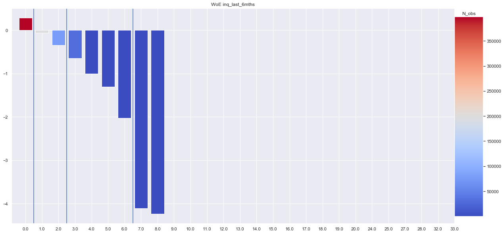


```python
fig, ax = plt.subplots(figsize=(20,8))

woe_df.set_index('inq_last_6mths').iloc[:, [3,4]].plot(kind='bar', stacked=True, ax=ax)

plt.legend()
```


    <matplotlib.legend.Legend at 0x1a34ce6b00>


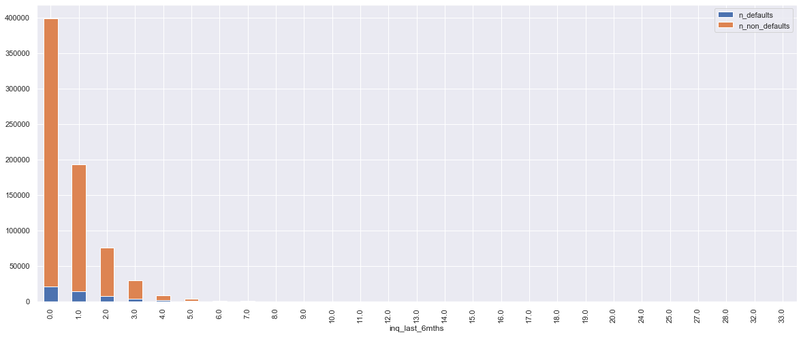


```python
x_train_prep['inq_last_6mths:0'] = np.where((x_train_prep['inq_last_6mths'] == 0), 1, 0)
x_train_prep['inq_last_6mths:1-2'] = np.where((x_train_prep['inq_last_6mths'] >= 1) & (x_train_prep['inq_last_6mths'] <= 2), 1, 0)
x_train_prep['inq_last_6mths:3-6'] = np.where((x_train_prep['inq_last_6mths'] >= 3) & (x_train_prep['inq_last_6mths'] <= 6), 1, 0)
x_train_prep['inq_last_6mths:>6'] = np.where((x_train_prep['inq_last_6mths'] > 6), 1, 0)
```


```python
fig, ax = plt.subplots(figsize=(20,8))

var_s = ['inq_last_6mths:0', 'inq_last_6mths:1-2', 'inq_last_6mths:3-6', 'inq_last_6mths:>6']

pd.concat([x_train_prep, y_train_prep], axis=1).groupby('Y').sum().loc[:, var_s].T.plot(kind='bar', stacked=True, ax=ax)

plt.legend()
```


    <matplotlib.legend.Legend at 0x1a2f10e048>


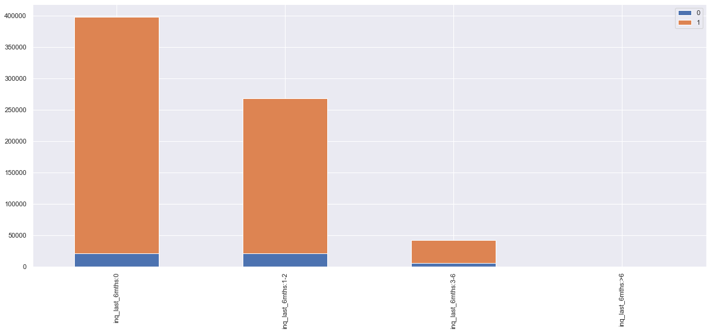


```python
vars_to_use.append(['inq_last_6mths:0', 'inq_last_6mths:1-2', 'inq_last_6mths:3-6'])
ref_vars.append(['inq_last_6mths:>6'])

vars_to_use
```


    [['grade:F', 'grade:E', 'grade:D', 'grade:C', 'grade:B', 'grade:A'],
     ['home_ownership:OWN', 'home_ownership:MORTGAGE'],
     ['addr_state:NY',
      'addr_state:VA_OK_AL_SD',
      'addr_state:CA',
      'addr_state:MO_DE_MD_UT_LA_NJ',
      'addr_state:NM_NC_AZ',
      'addr_state:PA_MA_RI_MI_AR',
      'addr_state:MN_OH_AK',
      'addr_state:KY_WI_GA_WA',
      'addr_state:OR_IN_TN_CT',
      'addr_state:TX',
      'addr_state:IL_KS_MT_SC_CO',
      'addr_state:VT_WV_WY_NH_DC_MS'],
     ['verification_status:Not Verified', 'verification_status:Source Verified'],
     ['initial_list_status:w'],
     ['purpose:house_mov_ren_oth_med',
      'purpose:vac_debtc_majpur_car_homeimp',
      'purpose:credit_card'],
     ['term:36'],
     ['emp_length_int:1',
      'emp_length_int:2_3_4',
      'emp_length_int:5_6_7',
      'emp_length_int:8_9',
      'emp_length_int:10'],
     ['mths_since_issue_d:<38',
      'mths_since_issue_d:38_39',
      'mths_since_issue_d:40_41',
      'mths_since_issue_d:42_48',
      'mths_since_issue_d:49_54',
      'mths_since_issue_d:55_68',
      'mths_since_issue_d:69_95'],
     ['int_rate:<10.054',
      'int_rate:10.054_12.849',
      'int_rate:12.849_15.735',
      'int_rate:15.735_19.995'],
     ['mths_since_earliest_cr_line:<160',
      'mths_since_earliest_cr_line:161_288',
      'mths_since_earliest_cr_line:289_360'],
     ['delinq_2yrs:0', 'delinq_2yrs:1-3'],
     ['inq_last_6mths:0', 'inq_last_6mths:1-2', 'inq_last_6mths:3-6']]


### 'open_acc'


```python
print(x_train_prep['open_acc'].nunique())
x_train_prep['open_acc'].describe()
```

    75


    count    709903.000000
    mean         11.552969
    std           5.320591
    min           0.000000
    25%           8.000000
    50%          11.000000
    75%          14.000000
    max          90.000000
    Name: open_acc, dtype: float64


```python
woe_df = woe_ordered_continuous(x_train_prep, 'open_acc', y_train_prep, vlines=[0.5, 3.5, 12.5, 17.5, 22.5, 25.5, 30.5], rot_x_ticks=90)

woe_df
```

    /Users/omaromeiri/anaconda3/lib/python3.7/site-packages/ipykernel_launcher.py:177: RuntimeWarning: divide by zero encountered in log


<div>
<style scoped>
    .dataframe tbody tr th:only-of-type {
        vertical-align: middle;
    }

    .dataframe tbody tr th {
        vertical-align: top;
    }

    .dataframe thead th {
        text-align: right;
    }
</style>
<table border="1" class="dataframe">
  <thead>
    <tr style="text-align: right;">
      <th></th>
      <th>open_acc</th>
      <th>n_obs</th>
      <th>prop_non_defaults</th>
      <th>prop_n_obs</th>
      <th>n_defaults</th>
      <th>n_non_defaults</th>
      <th>prop_n_non_defaults</th>
      <th>prop_n_defaults</th>
      <th>WoE</th>
      <th>diff_prop_non_defaults</th>
      <th>diff_WoE</th>
      <th>IV</th>
    </tr>
  </thead>
  <tbody>
    <tr>
      <th>0</th>
      <td>0.0</td>
      <td>32</td>
      <td>0.093750</td>
      <td>0.000045</td>
      <td>29.0</td>
      <td>3.0</td>
      <td>0.000005</td>
      <td>0.000597</td>
      <td>-4.879471</td>
      <td>NaN</td>
      <td>NaN</td>
      <td>0.014336</td>
    </tr>
    <tr>
      <th>1</th>
      <td>1.0</td>
      <td>192</td>
      <td>0.822917</td>
      <td>0.000270</td>
      <td>34.0</td>
      <td>158.0</td>
      <td>0.000239</td>
      <td>0.000700</td>
      <td>-1.074553</td>
      <td>0.000234</td>
      <td>3.804918</td>
      <td>0.014336</td>
    </tr>
    <tr>
      <th>2</th>
      <td>2.0</td>
      <td>2214</td>
      <td>0.867209</td>
      <td>0.003119</td>
      <td>294.0</td>
      <td>1920.0</td>
      <td>0.002903</td>
      <td>0.006051</td>
      <td>-0.734287</td>
      <td>0.002664</td>
      <td>0.340266</td>
      <td>0.014336</td>
    </tr>
    <tr>
      <th>3</th>
      <td>3.0</td>
      <td>7670</td>
      <td>0.908605</td>
      <td>0.010804</td>
      <td>701.0</td>
      <td>6969.0</td>
      <td>0.010538</td>
      <td>0.014427</td>
      <td>-0.314068</td>
      <td>0.007635</td>
      <td>0.420218</td>
      <td>0.014336</td>
    </tr>
    <tr>
      <th>4</th>
      <td>4.0</td>
      <td>18702</td>
      <td>0.926372</td>
      <td>0.026344</td>
      <td>1377.0</td>
      <td>17325.0</td>
      <td>0.026198</td>
      <td>0.028339</td>
      <td>-0.078544</td>
      <td>0.015660</td>
      <td>0.235524</td>
      <td>0.014336</td>
    </tr>
    <tr>
      <th>5</th>
      <td>5.0</td>
      <td>31698</td>
      <td>0.928923</td>
      <td>0.044651</td>
      <td>2253.0</td>
      <td>29445.0</td>
      <td>0.044525</td>
      <td>0.046367</td>
      <td>-0.040526</td>
      <td>0.018327</td>
      <td>0.038018</td>
      <td>0.014336</td>
    </tr>
    <tr>
      <th>6</th>
      <td>6.0</td>
      <td>44630</td>
      <td>0.929621</td>
      <td>0.062868</td>
      <td>3141.0</td>
      <td>41489.0</td>
      <td>0.062737</td>
      <td>0.064642</td>
      <td>-0.029900</td>
      <td>0.018212</td>
      <td>0.010626</td>
      <td>0.014336</td>
    </tr>
    <tr>
      <th>7</th>
      <td>7.0</td>
      <td>54263</td>
      <td>0.928718</td>
      <td>0.076437</td>
      <td>3868.0</td>
      <td>50395.0</td>
      <td>0.076205</td>
      <td>0.079603</td>
      <td>-0.043633</td>
      <td>0.013467</td>
      <td>0.013733</td>
      <td>0.014336</td>
    </tr>
    <tr>
      <th>8</th>
      <td>8.0</td>
      <td>61328</td>
      <td>0.930130</td>
      <td>0.086389</td>
      <td>4285.0</td>
      <td>57043.0</td>
      <td>0.086257</td>
      <td>0.088185</td>
      <td>-0.022103</td>
      <td>0.010053</td>
      <td>0.021530</td>
      <td>0.014336</td>
    </tr>
    <tr>
      <th>9</th>
      <td>9.0</td>
      <td>64210</td>
      <td>0.929668</td>
      <td>0.090449</td>
      <td>4516.0</td>
      <td>59694.0</td>
      <td>0.090266</td>
      <td>0.092939</td>
      <td>-0.029183</td>
      <td>0.004009</td>
      <td>0.007080</td>
      <td>0.014336</td>
    </tr>
    <tr>
      <th>10</th>
      <td>10.0</td>
      <td>62752</td>
      <td>0.929229</td>
      <td>0.088395</td>
      <td>4441.0</td>
      <td>58311.0</td>
      <td>0.088175</td>
      <td>0.091396</td>
      <td>-0.035876</td>
      <td>0.002091</td>
      <td>0.006694</td>
      <td>0.014336</td>
    </tr>
    <tr>
      <th>11</th>
      <td>11.0</td>
      <td>57750</td>
      <td>0.927619</td>
      <td>0.081349</td>
      <td>4180.0</td>
      <td>53570.0</td>
      <td>0.081006</td>
      <td>0.086024</td>
      <td>-0.060109</td>
      <td>0.007169</td>
      <td>0.024233</td>
      <td>0.014336</td>
    </tr>
    <tr>
      <th>12</th>
      <td>12.0</td>
      <td>51866</td>
      <td>0.928778</td>
      <td>0.073061</td>
      <td>3694.0</td>
      <td>48172.0</td>
      <td>0.072843</td>
      <td>0.076022</td>
      <td>-0.042719</td>
      <td>0.008163</td>
      <td>0.017390</td>
      <td>0.014336</td>
    </tr>
    <tr>
      <th>13</th>
      <td>13.0</td>
      <td>45306</td>
      <td>0.934115</td>
      <td>0.063820</td>
      <td>2985.0</td>
      <td>42321.0</td>
      <td>0.063996</td>
      <td>0.061431</td>
      <td>0.040896</td>
      <td>0.008848</td>
      <td>0.083616</td>
      <td>0.014336</td>
    </tr>
    <tr>
      <th>14</th>
      <td>14.0</td>
      <td>38161</td>
      <td>0.933230</td>
      <td>0.053755</td>
      <td>2548.0</td>
      <td>35613.0</td>
      <td>0.053852</td>
      <td>0.052438</td>
      <td>0.026615</td>
      <td>0.010143</td>
      <td>0.014282</td>
      <td>0.014336</td>
    </tr>
    <tr>
      <th>15</th>
      <td>15.0</td>
      <td>31895</td>
      <td>0.934755</td>
      <td>0.044929</td>
      <td>2081.0</td>
      <td>29814.0</td>
      <td>0.045083</td>
      <td>0.042827</td>
      <td>0.051342</td>
      <td>0.008769</td>
      <td>0.024728</td>
      <td>0.014336</td>
    </tr>
    <tr>
      <th>16</th>
      <td>16.0</td>
      <td>26618</td>
      <td>0.937185</td>
      <td>0.037495</td>
      <td>1672.0</td>
      <td>24946.0</td>
      <td>0.037722</td>
      <td>0.034410</td>
      <td>0.091906</td>
      <td>0.007361</td>
      <td>0.040563</td>
      <td>0.014336</td>
    </tr>
    <tr>
      <th>17</th>
      <td>17.0</td>
      <td>21769</td>
      <td>0.935505</td>
      <td>0.030665</td>
      <td>1404.0</td>
      <td>20365.0</td>
      <td>0.030795</td>
      <td>0.028894</td>
      <td>0.063705</td>
      <td>0.006927</td>
      <td>0.028201</td>
      <td>0.014336</td>
    </tr>
    <tr>
      <th>18</th>
      <td>18.0</td>
      <td>17856</td>
      <td>0.940356</td>
      <td>0.025153</td>
      <td>1065.0</td>
      <td>16791.0</td>
      <td>0.025390</td>
      <td>0.021918</td>
      <td>0.147081</td>
      <td>0.005404</td>
      <td>0.083376</td>
      <td>0.014336</td>
    </tr>
    <tr>
      <th>19</th>
      <td>19.0</td>
      <td>14725</td>
      <td>0.938744</td>
      <td>0.020742</td>
      <td>902.0</td>
      <td>13823.0</td>
      <td>0.020902</td>
      <td>0.018563</td>
      <td>0.118687</td>
      <td>0.004488</td>
      <td>0.028394</td>
      <td>0.014336</td>
    </tr>
    <tr>
      <th>20</th>
      <td>20.0</td>
      <td>11632</td>
      <td>0.941627</td>
      <td>0.016385</td>
      <td>679.0</td>
      <td>10953.0</td>
      <td>0.016563</td>
      <td>0.013974</td>
      <td>0.169960</td>
      <td>0.004340</td>
      <td>0.051273</td>
      <td>0.014336</td>
    </tr>
    <tr>
      <th>21</th>
      <td>21.0</td>
      <td>9292</td>
      <td>0.940702</td>
      <td>0.013089</td>
      <td>551.0</td>
      <td>8741.0</td>
      <td>0.013218</td>
      <td>0.011340</td>
      <td>0.153258</td>
      <td>0.003345</td>
      <td>0.016702</td>
      <td>0.014336</td>
    </tr>
    <tr>
      <th>22</th>
      <td>22.0</td>
      <td>7464</td>
      <td>0.940514</td>
      <td>0.010514</td>
      <td>444.0</td>
      <td>7020.0</td>
      <td>0.010615</td>
      <td>0.009137</td>
      <td>0.149907</td>
      <td>0.002602</td>
      <td>0.003351</td>
      <td>0.014336</td>
    </tr>
    <tr>
      <th>23</th>
      <td>23.0</td>
      <td>5896</td>
      <td>0.944878</td>
      <td>0.008305</td>
      <td>325.0</td>
      <td>5571.0</td>
      <td>0.008424</td>
      <td>0.006688</td>
      <td>0.230717</td>
      <td>0.002191</td>
      <td>0.080811</td>
      <td>0.014336</td>
    </tr>
    <tr>
      <th>24</th>
      <td>24.0</td>
      <td>4701</td>
      <td>0.939800</td>
      <td>0.006622</td>
      <td>283.0</td>
      <td>4418.0</td>
      <td>0.006681</td>
      <td>0.005824</td>
      <td>0.137208</td>
      <td>0.001744</td>
      <td>0.093509</td>
      <td>0.014336</td>
    </tr>
    <tr>
      <th>25</th>
      <td>25.0</td>
      <td>3798</td>
      <td>0.944444</td>
      <td>0.005350</td>
      <td>211.0</td>
      <td>3587.0</td>
      <td>0.005424</td>
      <td>0.004342</td>
      <td>0.222426</td>
      <td>0.001257</td>
      <td>0.085218</td>
      <td>0.014336</td>
    </tr>
    <tr>
      <th>26</th>
      <td>26.0</td>
      <td>2686</td>
      <td>0.951973</td>
      <td>0.003784</td>
      <td>129.0</td>
      <td>2557.0</td>
      <td>0.003867</td>
      <td>0.002655</td>
      <td>0.375990</td>
      <td>0.001558</td>
      <td>0.153564</td>
      <td>0.014336</td>
    </tr>
    <tr>
      <th>27</th>
      <td>27.0</td>
      <td>2241</td>
      <td>0.954931</td>
      <td>0.003157</td>
      <td>101.0</td>
      <td>2140.0</td>
      <td>0.003236</td>
      <td>0.002079</td>
      <td>0.442653</td>
      <td>0.000631</td>
      <td>0.066663</td>
      <td>0.014336</td>
    </tr>
    <tr>
      <th>28</th>
      <td>28.0</td>
      <td>1689</td>
      <td>0.953819</td>
      <td>0.002379</td>
      <td>78.0</td>
      <td>1611.0</td>
      <td>0.002436</td>
      <td>0.001605</td>
      <td>0.417114</td>
      <td>0.000800</td>
      <td>0.025539</td>
      <td>0.014336</td>
    </tr>
    <tr>
      <th>29</th>
      <td>29.0</td>
      <td>1397</td>
      <td>0.954903</td>
      <td>0.001968</td>
      <td>63.0</td>
      <td>1334.0</td>
      <td>0.002017</td>
      <td>0.001297</td>
      <td>0.442015</td>
      <td>0.000419</td>
      <td>0.024901</td>
      <td>0.014336</td>
    </tr>
    <tr>
      <th>...</th>
      <td>...</td>
      <td>...</td>
      <td>...</td>
      <td>...</td>
      <td>...</td>
      <td>...</td>
      <td>...</td>
      <td>...</td>
      <td>...</td>
      <td>...</td>
      <td>...</td>
      <td>...</td>
    </tr>
    <tr>
      <th>45</th>
      <td>45.0</td>
      <td>42</td>
      <td>0.928571</td>
      <td>0.000059</td>
      <td>3.0</td>
      <td>39.0</td>
      <td>0.000059</td>
      <td>0.000062</td>
      <td>-0.045838</td>
      <td>0.000006</td>
      <td>0.297252</td>
      <td>0.014336</td>
    </tr>
    <tr>
      <th>46</th>
      <td>46.0</td>
      <td>29</td>
      <td>0.931034</td>
      <td>0.000041</td>
      <td>2.0</td>
      <td>27.0</td>
      <td>0.000041</td>
      <td>0.000041</td>
      <td>-0.008098</td>
      <td>0.000018</td>
      <td>0.037740</td>
      <td>0.014336</td>
    </tr>
    <tr>
      <th>47</th>
      <td>47.0</td>
      <td>20</td>
      <td>0.950000</td>
      <td>0.000028</td>
      <td>1.0</td>
      <td>19.0</td>
      <td>0.000029</td>
      <td>0.000021</td>
      <td>0.333652</td>
      <td>0.000012</td>
      <td>0.341749</td>
      <td>0.014336</td>
    </tr>
    <tr>
      <th>48</th>
      <td>48.0</td>
      <td>21</td>
      <td>1.000000</td>
      <td>0.000030</td>
      <td>0.0</td>
      <td>21.0</td>
      <td>0.000032</td>
      <td>0.000000</td>
      <td>NaN</td>
      <td>0.000003</td>
      <td>NaN</td>
      <td>0.014336</td>
    </tr>
    <tr>
      <th>49</th>
      <td>49.0</td>
      <td>18</td>
      <td>1.000000</td>
      <td>0.000025</td>
      <td>0.0</td>
      <td>18.0</td>
      <td>0.000027</td>
      <td>0.000000</td>
      <td>NaN</td>
      <td>0.000005</td>
      <td>NaN</td>
      <td>0.014336</td>
    </tr>
    <tr>
      <th>50</th>
      <td>50.0</td>
      <td>12</td>
      <td>0.916667</td>
      <td>0.000017</td>
      <td>1.0</td>
      <td>11.0</td>
      <td>0.000017</td>
      <td>0.000021</td>
      <td>-0.212892</td>
      <td>0.000011</td>
      <td>NaN</td>
      <td>0.014336</td>
    </tr>
    <tr>
      <th>51</th>
      <td>51.0</td>
      <td>15</td>
      <td>1.000000</td>
      <td>0.000021</td>
      <td>0.0</td>
      <td>15.0</td>
      <td>0.000023</td>
      <td>0.000000</td>
      <td>NaN</td>
      <td>0.000006</td>
      <td>NaN</td>
      <td>0.014336</td>
    </tr>
    <tr>
      <th>52</th>
      <td>52.0</td>
      <td>12</td>
      <td>0.916667</td>
      <td>0.000017</td>
      <td>1.0</td>
      <td>11.0</td>
      <td>0.000017</td>
      <td>0.000021</td>
      <td>-0.212892</td>
      <td>0.000006</td>
      <td>NaN</td>
      <td>0.014336</td>
    </tr>
    <tr>
      <th>53</th>
      <td>53.0</td>
      <td>15</td>
      <td>1.000000</td>
      <td>0.000021</td>
      <td>0.0</td>
      <td>15.0</td>
      <td>0.000023</td>
      <td>0.000000</td>
      <td>NaN</td>
      <td>0.000006</td>
      <td>NaN</td>
      <td>0.014336</td>
    </tr>
    <tr>
      <th>54</th>
      <td>54.0</td>
      <td>5</td>
      <td>1.000000</td>
      <td>0.000007</td>
      <td>0.0</td>
      <td>5.0</td>
      <td>0.000008</td>
      <td>0.000000</td>
      <td>NaN</td>
      <td>0.000015</td>
      <td>NaN</td>
      <td>0.014336</td>
    </tr>
    <tr>
      <th>55</th>
      <td>55.0</td>
      <td>5</td>
      <td>1.000000</td>
      <td>0.000007</td>
      <td>0.0</td>
      <td>5.0</td>
      <td>0.000008</td>
      <td>0.000000</td>
      <td>NaN</td>
      <td>0.000000</td>
      <td>NaN</td>
      <td>0.014336</td>
    </tr>
    <tr>
      <th>56</th>
      <td>56.0</td>
      <td>6</td>
      <td>1.000000</td>
      <td>0.000008</td>
      <td>0.0</td>
      <td>6.0</td>
      <td>0.000009</td>
      <td>0.000000</td>
      <td>NaN</td>
      <td>0.000002</td>
      <td>NaN</td>
      <td>0.014336</td>
    </tr>
    <tr>
      <th>57</th>
      <td>57.0</td>
      <td>1</td>
      <td>1.000000</td>
      <td>0.000001</td>
      <td>0.0</td>
      <td>1.0</td>
      <td>0.000002</td>
      <td>0.000000</td>
      <td>NaN</td>
      <td>0.000008</td>
      <td>NaN</td>
      <td>0.014336</td>
    </tr>
    <tr>
      <th>58</th>
      <td>58.0</td>
      <td>3</td>
      <td>1.000000</td>
      <td>0.000004</td>
      <td>0.0</td>
      <td>3.0</td>
      <td>0.000005</td>
      <td>0.000000</td>
      <td>NaN</td>
      <td>0.000003</td>
      <td>NaN</td>
      <td>0.014336</td>
    </tr>
    <tr>
      <th>59</th>
      <td>59.0</td>
      <td>2</td>
      <td>1.000000</td>
      <td>0.000003</td>
      <td>0.0</td>
      <td>2.0</td>
      <td>0.000003</td>
      <td>0.000000</td>
      <td>NaN</td>
      <td>0.000002</td>
      <td>NaN</td>
      <td>0.014336</td>
    </tr>
    <tr>
      <th>60</th>
      <td>60.0</td>
      <td>2</td>
      <td>1.000000</td>
      <td>0.000003</td>
      <td>0.0</td>
      <td>2.0</td>
      <td>0.000003</td>
      <td>0.000000</td>
      <td>NaN</td>
      <td>0.000000</td>
      <td>NaN</td>
      <td>0.014336</td>
    </tr>
    <tr>
      <th>61</th>
      <td>61.0</td>
      <td>2</td>
      <td>1.000000</td>
      <td>0.000003</td>
      <td>0.0</td>
      <td>2.0</td>
      <td>0.000003</td>
      <td>0.000000</td>
      <td>NaN</td>
      <td>0.000000</td>
      <td>NaN</td>
      <td>0.014336</td>
    </tr>
    <tr>
      <th>62</th>
      <td>62.0</td>
      <td>2</td>
      <td>1.000000</td>
      <td>0.000003</td>
      <td>0.0</td>
      <td>2.0</td>
      <td>0.000003</td>
      <td>0.000000</td>
      <td>NaN</td>
      <td>0.000000</td>
      <td>NaN</td>
      <td>0.014336</td>
    </tr>
    <tr>
      <th>63</th>
      <td>63.0</td>
      <td>1</td>
      <td>1.000000</td>
      <td>0.000001</td>
      <td>0.0</td>
      <td>1.0</td>
      <td>0.000002</td>
      <td>0.000000</td>
      <td>NaN</td>
      <td>0.000002</td>
      <td>NaN</td>
      <td>0.014336</td>
    </tr>
    <tr>
      <th>64</th>
      <td>64.0</td>
      <td>1</td>
      <td>1.000000</td>
      <td>0.000001</td>
      <td>0.0</td>
      <td>1.0</td>
      <td>0.000002</td>
      <td>0.000000</td>
      <td>NaN</td>
      <td>0.000000</td>
      <td>NaN</td>
      <td>0.014336</td>
    </tr>
    <tr>
      <th>65</th>
      <td>65.0</td>
      <td>1</td>
      <td>1.000000</td>
      <td>0.000001</td>
      <td>0.0</td>
      <td>1.0</td>
      <td>0.000002</td>
      <td>0.000000</td>
      <td>NaN</td>
      <td>0.000000</td>
      <td>NaN</td>
      <td>0.014336</td>
    </tr>
    <tr>
      <th>66</th>
      <td>66.0</td>
      <td>1</td>
      <td>1.000000</td>
      <td>0.000001</td>
      <td>0.0</td>
      <td>1.0</td>
      <td>0.000002</td>
      <td>0.000000</td>
      <td>NaN</td>
      <td>0.000000</td>
      <td>NaN</td>
      <td>0.014336</td>
    </tr>
    <tr>
      <th>67</th>
      <td>67.0</td>
      <td>1</td>
      <td>1.000000</td>
      <td>0.000001</td>
      <td>0.0</td>
      <td>1.0</td>
      <td>0.000002</td>
      <td>0.000000</td>
      <td>NaN</td>
      <td>0.000000</td>
      <td>NaN</td>
      <td>0.014336</td>
    </tr>
    <tr>
      <th>68</th>
      <td>70.0</td>
      <td>1</td>
      <td>1.000000</td>
      <td>0.000001</td>
      <td>0.0</td>
      <td>1.0</td>
      <td>0.000002</td>
      <td>0.000000</td>
      <td>NaN</td>
      <td>0.000000</td>
      <td>NaN</td>
      <td>0.014336</td>
    </tr>
    <tr>
      <th>69</th>
      <td>74.0</td>
      <td>1</td>
      <td>1.000000</td>
      <td>0.000001</td>
      <td>0.0</td>
      <td>1.0</td>
      <td>0.000002</td>
      <td>0.000000</td>
      <td>NaN</td>
      <td>0.000000</td>
      <td>NaN</td>
      <td>0.014336</td>
    </tr>
    <tr>
      <th>70</th>
      <td>75.0</td>
      <td>1</td>
      <td>1.000000</td>
      <td>0.000001</td>
      <td>0.0</td>
      <td>1.0</td>
      <td>0.000002</td>
      <td>0.000000</td>
      <td>NaN</td>
      <td>0.000000</td>
      <td>NaN</td>
      <td>0.014336</td>
    </tr>
    <tr>
      <th>71</th>
      <td>76.0</td>
      <td>2</td>
      <td>0.000000</td>
      <td>0.000003</td>
      <td>2.0</td>
      <td>0.0</td>
      <td>0.000000</td>
      <td>0.000041</td>
      <td>NaN</td>
      <td>0.000002</td>
      <td>NaN</td>
      <td>0.014336</td>
    </tr>
    <tr>
      <th>72</th>
      <td>79.0</td>
      <td>1</td>
      <td>1.000000</td>
      <td>0.000001</td>
      <td>0.0</td>
      <td>1.0</td>
      <td>0.000002</td>
      <td>0.000000</td>
      <td>NaN</td>
      <td>0.000002</td>
      <td>NaN</td>
      <td>0.014336</td>
    </tr>
    <tr>
      <th>73</th>
      <td>84.0</td>
      <td>1</td>
      <td>1.000000</td>
      <td>0.000001</td>
      <td>0.0</td>
      <td>1.0</td>
      <td>0.000002</td>
      <td>0.000000</td>
      <td>NaN</td>
      <td>0.000000</td>
      <td>NaN</td>
      <td>0.014336</td>
    </tr>
    <tr>
      <th>74</th>
      <td>90.0</td>
      <td>1</td>
      <td>1.000000</td>
      <td>0.000001</td>
      <td>0.0</td>
      <td>1.0</td>
      <td>0.000002</td>
      <td>0.000000</td>
      <td>NaN</td>
      <td>0.000000</td>
      <td>NaN</td>
      <td>0.014336</td>
    </tr>
  </tbody>
</table>
<p>75 rows  12 columns</p>
</div>


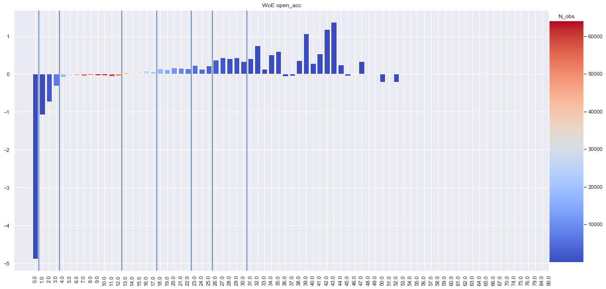


```python
woe_df = woe_ordered_continuous(x_train_prep, 'open_acc', y_train_prep, plot_rows_start=4, plot_rows_end=-30, vlines=[-0.5, 8.5, 13.5, 18.5, 21.5, 26.5], rot_x_ticks=90)
```

    /Users/omaromeiri/anaconda3/lib/python3.7/site-packages/ipykernel_launcher.py:177: RuntimeWarning: divide by zero encountered in log


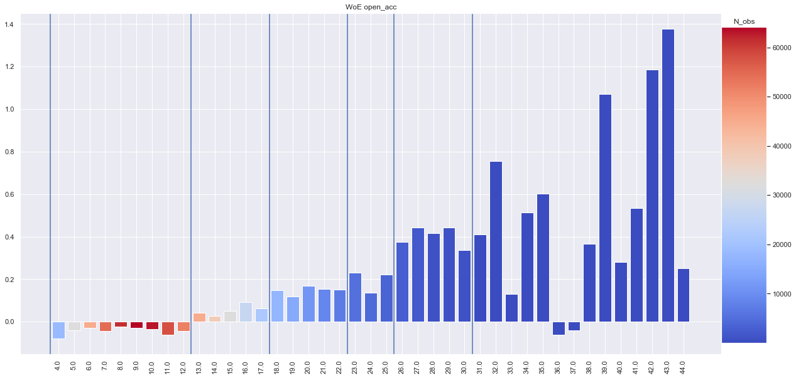


```python
fig, ax = plt.subplots(figsize=(20,8))

woe_df.set_index('open_acc').iloc[:, [3,4]].plot(kind='bar', stacked=True, ax=ax)

plt.legend()
```


    <matplotlib.legend.Legend at 0x1a27a6eef0>


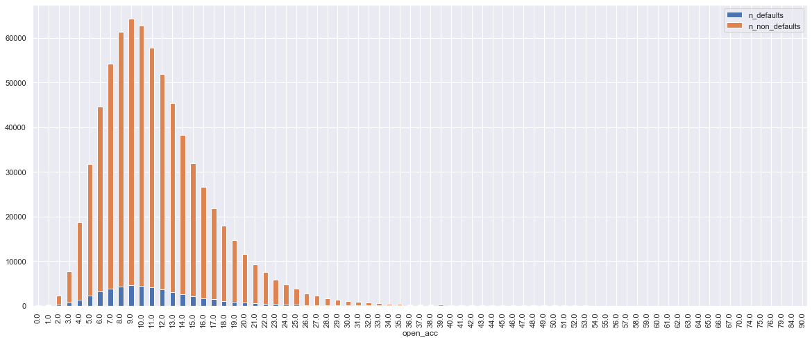


```python
x_train_prep['open_acc:0'] = np.where((x_train_prep['open_acc'] == 0), 1, 0)
x_train_prep['open_acc:1-3'] = np.where((x_train_prep['open_acc'] >= 1) & (x_train_prep['open_acc'] <= 3), 1, 0)
x_train_prep['open_acc:4-12'] = np.where((x_train_prep['open_acc'] >= 4) & (x_train_prep['open_acc'] <= 12), 1, 0)
x_train_prep['open_acc:13-17'] = np.where((x_train_prep['open_acc'] >= 13) & (x_train_prep['open_acc'] <= 17), 1, 0)
x_train_prep['open_acc:18-22'] = np.where((x_train_prep['open_acc'] >= 18) & (x_train_prep['open_acc'] <= 22), 1, 0)
x_train_prep['open_acc:23-25'] = np.where((x_train_prep['open_acc'] >= 23) & (x_train_prep['open_acc'] <= 25), 1, 0)
x_train_prep['open_acc:26-30'] = np.where((x_train_prep['open_acc'] >= 26) & (x_train_prep['open_acc'] <= 30), 1, 0)
x_train_prep['open_acc:>=31'] = np.where((x_train_prep['open_acc'] >= 31), 1, 0)
```


```python
fig, ax = plt.subplots(figsize=(20,8))

var_s = ['open_acc:0', 'open_acc:1-3', 'open_acc:4-12', 'open_acc:13-17', 'open_acc:18-22', 'open_acc:23-25', 'open_acc:26-30', 'open_acc:>=31']

pd.concat([x_train_prep, y_train_prep], axis=1).groupby('Y').sum().loc[:, var_s].T.plot(kind='bar', stacked=True, ax=ax)

plt.legend()
```


    <matplotlib.legend.Legend at 0x1a2f1debe0>


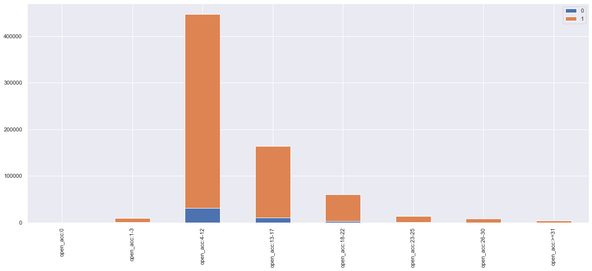


```python
vars_to_use.append(['open_acc:1-3', 'open_acc:4-12', 'open_acc:13-17', 'open_acc:18-22', 'open_acc:23-25', 'open_acc:26-30', 'open_acc:>=31'])
ref_vars.append(['open_acc:0'])

vars_to_use
```


    [['grade:F', 'grade:E', 'grade:D', 'grade:C', 'grade:B', 'grade:A'],
     ['home_ownership:OWN', 'home_ownership:MORTGAGE'],
     ['addr_state:NY',
      'addr_state:VA_OK_AL_SD',
      'addr_state:CA',
      'addr_state:MO_DE_MD_UT_LA_NJ',
      'addr_state:NM_NC_AZ',
      'addr_state:PA_MA_RI_MI_AR',
      'addr_state:MN_OH_AK',
      'addr_state:KY_WI_GA_WA',
      'addr_state:OR_IN_TN_CT',
      'addr_state:TX',
      'addr_state:IL_KS_MT_SC_CO',
      'addr_state:VT_WV_WY_NH_DC_MS'],
     ['verification_status:Not Verified', 'verification_status:Source Verified'],
     ['initial_list_status:w'],
     ['purpose:house_mov_ren_oth_med',
      'purpose:vac_debtc_majpur_car_homeimp',
      'purpose:credit_card'],
     ['term:36'],
     ['emp_length_int:1',
      'emp_length_int:2_3_4',
      'emp_length_int:5_6_7',
      'emp_length_int:8_9',
      'emp_length_int:10'],
     ['mths_since_issue_d:<38',
      'mths_since_issue_d:38_39',
      'mths_since_issue_d:40_41',
      'mths_since_issue_d:42_48',
      'mths_since_issue_d:49_54',
      'mths_since_issue_d:55_68',
      'mths_since_issue_d:69_95'],
     ['int_rate:<10.054',
      'int_rate:10.054_12.849',
      'int_rate:12.849_15.735',
      'int_rate:15.735_19.995'],
     ['mths_since_earliest_cr_line:<160',
      'mths_since_earliest_cr_line:161_288',
      'mths_since_earliest_cr_line:289_360'],
     ['delinq_2yrs:0', 'delinq_2yrs:1-3'],
     ['inq_last_6mths:0', 'inq_last_6mths:1-2', 'inq_last_6mths:3-6'],
     ['open_acc:1-3',
      'open_acc:4-12',
      'open_acc:13-17',
      'open_acc:18-22',
      'open_acc:23-25',
      'open_acc:26-30',
      'open_acc:>=31']]


## pub_rec<br>

## ATTENTION!!! This variable discretization has changed in relation to the first model


```python
print(x_train_prep['pub_rec'].nunique())
x_train_prep['pub_rec'].describe()
```

    28


    count    709903.000000
    mean          0.195086
    std           0.576462
    min           0.000000
    25%           0.000000
    50%           0.000000
    75%           0.000000
    max          86.000000
    Name: pub_rec, dtype: float64


```python
woe_df = woe_ordered_continuous(x_train_prep, 'pub_rec', y_train_prep, vlines=[1.5])
woe_df
```


<div>
<style scoped>
    .dataframe tbody tr th:only-of-type {
        vertical-align: middle;
    }

    .dataframe tbody tr th {
        vertical-align: top;
    }

    .dataframe thead th {
        text-align: right;
    }
</style>
<table border="1" class="dataframe">
  <thead>
    <tr style="text-align: right;">
      <th></th>
      <th>pub_rec</th>
      <th>n_obs</th>
      <th>prop_non_defaults</th>
      <th>prop_n_obs</th>
      <th>n_defaults</th>
      <th>n_non_defaults</th>
      <th>prop_n_non_defaults</th>
      <th>prop_n_defaults</th>
      <th>WoE</th>
      <th>diff_prop_non_defaults</th>
      <th>diff_WoE</th>
      <th>IV</th>
    </tr>
  </thead>
  <tbody>
    <tr>
      <th>0</th>
      <td>0.0</td>
      <td>601149</td>
      <td>0.929864</td>
      <td>0.846804</td>
      <td>42162.0</td>
      <td>558987.0</td>
      <td>0.845270</td>
      <td>0.867692</td>
      <td>-0.026181</td>
      <td>NaN</td>
      <td>NaN</td>
      <td>0.005819</td>
    </tr>
    <tr>
      <th>1</th>
      <td>1.0</td>
      <td>90828</td>
      <td>0.938444</td>
      <td>0.127944</td>
      <td>5591.0</td>
      <td>85237.0</td>
      <td>0.128891</td>
      <td>0.115062</td>
      <td>0.113490</td>
      <td>0.716379</td>
      <td>0.139671</td>
      <td>0.005819</td>
    </tr>
    <tr>
      <th>2</th>
      <td>2.0</td>
      <td>11841</td>
      <td>0.951271</td>
      <td>0.016680</td>
      <td>577.0</td>
      <td>11264.0</td>
      <td>0.017033</td>
      <td>0.011875</td>
      <td>0.360737</td>
      <td>0.111858</td>
      <td>0.247247</td>
      <td>0.005819</td>
    </tr>
    <tr>
      <th>3</th>
      <td>3.0</td>
      <td>3574</td>
      <td>0.956911</td>
      <td>0.005034</td>
      <td>154.0</td>
      <td>3420.0</td>
      <td>0.005172</td>
      <td>0.003169</td>
      <td>0.489656</td>
      <td>0.011861</td>
      <td>0.128918</td>
      <td>0.005819</td>
    </tr>
    <tr>
      <th>4</th>
      <td>4.0</td>
      <td>1261</td>
      <td>0.956384</td>
      <td>0.001776</td>
      <td>55.0</td>
      <td>1206.0</td>
      <td>0.001824</td>
      <td>0.001132</td>
      <td>0.476944</td>
      <td>0.003348</td>
      <td>0.012712</td>
      <td>0.005819</td>
    </tr>
    <tr>
      <th>5</th>
      <td>5.0</td>
      <td>583</td>
      <td>0.953688</td>
      <td>0.000821</td>
      <td>27.0</td>
      <td>556.0</td>
      <td>0.000841</td>
      <td>0.000556</td>
      <td>0.414144</td>
      <td>0.000983</td>
      <td>0.062800</td>
      <td>0.005819</td>
    </tr>
    <tr>
      <th>6</th>
      <td>6.0</td>
      <td>309</td>
      <td>0.954693</td>
      <td>0.000435</td>
      <td>14.0</td>
      <td>295.0</td>
      <td>0.000446</td>
      <td>0.000288</td>
      <td>0.437131</td>
      <td>0.000395</td>
      <td>0.022987</td>
      <td>0.005819</td>
    </tr>
    <tr>
      <th>7</th>
      <td>7.0</td>
      <td>128</td>
      <td>0.968750</td>
      <td>0.000180</td>
      <td>4.0</td>
      <td>124.0</td>
      <td>0.000188</td>
      <td>0.000082</td>
      <td>0.823200</td>
      <td>0.000259</td>
      <td>0.386069</td>
      <td>0.005819</td>
    </tr>
    <tr>
      <th>8</th>
      <td>8.0</td>
      <td>88</td>
      <td>0.988636</td>
      <td>0.000124</td>
      <td>1.0</td>
      <td>87.0</td>
      <td>0.000132</td>
      <td>0.000021</td>
      <td>1.855121</td>
      <td>0.000056</td>
      <td>1.031921</td>
      <td>0.005819</td>
    </tr>
    <tr>
      <th>9</th>
      <td>9.0</td>
      <td>40</td>
      <td>0.900000</td>
      <td>0.000056</td>
      <td>4.0</td>
      <td>36.0</td>
      <td>0.000054</td>
      <td>0.000082</td>
      <td>-0.413563</td>
      <td>0.000077</td>
      <td>2.268684</td>
      <td>0.005819</td>
    </tr>
    <tr>
      <th>10</th>
      <td>10.0</td>
      <td>32</td>
      <td>1.000000</td>
      <td>0.000045</td>
      <td>0.0</td>
      <td>32.0</td>
      <td>0.000048</td>
      <td>0.000000</td>
      <td>NaN</td>
      <td>0.000006</td>
      <td>NaN</td>
      <td>0.005819</td>
    </tr>
    <tr>
      <th>11</th>
      <td>11.0</td>
      <td>17</td>
      <td>0.941176</td>
      <td>0.000024</td>
      <td>1.0</td>
      <td>16.0</td>
      <td>0.000024</td>
      <td>0.000021</td>
      <td>0.161801</td>
      <td>0.000024</td>
      <td>NaN</td>
      <td>0.005819</td>
    </tr>
    <tr>
      <th>12</th>
      <td>12.0</td>
      <td>13</td>
      <td>0.923077</td>
      <td>0.000018</td>
      <td>1.0</td>
      <td>12.0</td>
      <td>0.000018</td>
      <td>0.000021</td>
      <td>-0.125881</td>
      <td>0.000006</td>
      <td>0.287682</td>
      <td>0.005819</td>
    </tr>
    <tr>
      <th>13</th>
      <td>13.0</td>
      <td>11</td>
      <td>1.000000</td>
      <td>0.000015</td>
      <td>0.0</td>
      <td>11.0</td>
      <td>0.000017</td>
      <td>0.000000</td>
      <td>NaN</td>
      <td>0.000002</td>
      <td>NaN</td>
      <td>0.005819</td>
    </tr>
    <tr>
      <th>14</th>
      <td>14.0</td>
      <td>1</td>
      <td>1.000000</td>
      <td>0.000001</td>
      <td>0.0</td>
      <td>1.0</td>
      <td>0.000002</td>
      <td>0.000000</td>
      <td>NaN</td>
      <td>0.000015</td>
      <td>NaN</td>
      <td>0.005819</td>
    </tr>
    <tr>
      <th>15</th>
      <td>15.0</td>
      <td>5</td>
      <td>1.000000</td>
      <td>0.000007</td>
      <td>0.0</td>
      <td>5.0</td>
      <td>0.000008</td>
      <td>0.000000</td>
      <td>NaN</td>
      <td>0.000006</td>
      <td>NaN</td>
      <td>0.005819</td>
    </tr>
    <tr>
      <th>16</th>
      <td>16.0</td>
      <td>4</td>
      <td>1.000000</td>
      <td>0.000006</td>
      <td>0.0</td>
      <td>4.0</td>
      <td>0.000006</td>
      <td>0.000000</td>
      <td>NaN</td>
      <td>0.000002</td>
      <td>NaN</td>
      <td>0.005819</td>
    </tr>
    <tr>
      <th>17</th>
      <td>17.0</td>
      <td>3</td>
      <td>1.000000</td>
      <td>0.000004</td>
      <td>0.0</td>
      <td>3.0</td>
      <td>0.000005</td>
      <td>0.000000</td>
      <td>NaN</td>
      <td>0.000002</td>
      <td>NaN</td>
      <td>0.005819</td>
    </tr>
    <tr>
      <th>18</th>
      <td>18.0</td>
      <td>4</td>
      <td>1.000000</td>
      <td>0.000006</td>
      <td>0.0</td>
      <td>4.0</td>
      <td>0.000006</td>
      <td>0.000000</td>
      <td>NaN</td>
      <td>0.000002</td>
      <td>NaN</td>
      <td>0.005819</td>
    </tr>
    <tr>
      <th>19</th>
      <td>19.0</td>
      <td>1</td>
      <td>1.000000</td>
      <td>0.000001</td>
      <td>0.0</td>
      <td>1.0</td>
      <td>0.000002</td>
      <td>0.000000</td>
      <td>NaN</td>
      <td>0.000005</td>
      <td>NaN</td>
      <td>0.005819</td>
    </tr>
    <tr>
      <th>20</th>
      <td>20.0</td>
      <td>1</td>
      <td>1.000000</td>
      <td>0.000001</td>
      <td>0.0</td>
      <td>1.0</td>
      <td>0.000002</td>
      <td>0.000000</td>
      <td>NaN</td>
      <td>0.000000</td>
      <td>NaN</td>
      <td>0.005819</td>
    </tr>
    <tr>
      <th>21</th>
      <td>21.0</td>
      <td>3</td>
      <td>1.000000</td>
      <td>0.000004</td>
      <td>0.0</td>
      <td>3.0</td>
      <td>0.000005</td>
      <td>0.000000</td>
      <td>NaN</td>
      <td>0.000003</td>
      <td>NaN</td>
      <td>0.005819</td>
    </tr>
    <tr>
      <th>22</th>
      <td>22.0</td>
      <td>1</td>
      <td>1.000000</td>
      <td>0.000001</td>
      <td>0.0</td>
      <td>1.0</td>
      <td>0.000002</td>
      <td>0.000000</td>
      <td>NaN</td>
      <td>0.000003</td>
      <td>NaN</td>
      <td>0.005819</td>
    </tr>
    <tr>
      <th>23</th>
      <td>23.0</td>
      <td>1</td>
      <td>1.000000</td>
      <td>0.000001</td>
      <td>0.0</td>
      <td>1.0</td>
      <td>0.000002</td>
      <td>0.000000</td>
      <td>NaN</td>
      <td>0.000000</td>
      <td>NaN</td>
      <td>0.005819</td>
    </tr>
    <tr>
      <th>24</th>
      <td>34.0</td>
      <td>1</td>
      <td>1.000000</td>
      <td>0.000001</td>
      <td>0.0</td>
      <td>1.0</td>
      <td>0.000002</td>
      <td>0.000000</td>
      <td>NaN</td>
      <td>0.000000</td>
      <td>NaN</td>
      <td>0.005819</td>
    </tr>
    <tr>
      <th>25</th>
      <td>40.0</td>
      <td>1</td>
      <td>1.000000</td>
      <td>0.000001</td>
      <td>0.0</td>
      <td>1.0</td>
      <td>0.000002</td>
      <td>0.000000</td>
      <td>NaN</td>
      <td>0.000000</td>
      <td>NaN</td>
      <td>0.005819</td>
    </tr>
    <tr>
      <th>26</th>
      <td>49.0</td>
      <td>2</td>
      <td>1.000000</td>
      <td>0.000003</td>
      <td>0.0</td>
      <td>2.0</td>
      <td>0.000003</td>
      <td>0.000000</td>
      <td>NaN</td>
      <td>0.000002</td>
      <td>NaN</td>
      <td>0.005819</td>
    </tr>
    <tr>
      <th>27</th>
      <td>86.0</td>
      <td>1</td>
      <td>1.000000</td>
      <td>0.000001</td>
      <td>0.0</td>
      <td>1.0</td>
      <td>0.000002</td>
      <td>0.000000</td>
      <td>NaN</td>
      <td>0.000002</td>
      <td>NaN</td>
      <td>0.005819</td>
    </tr>
  </tbody>
</table>
</div>


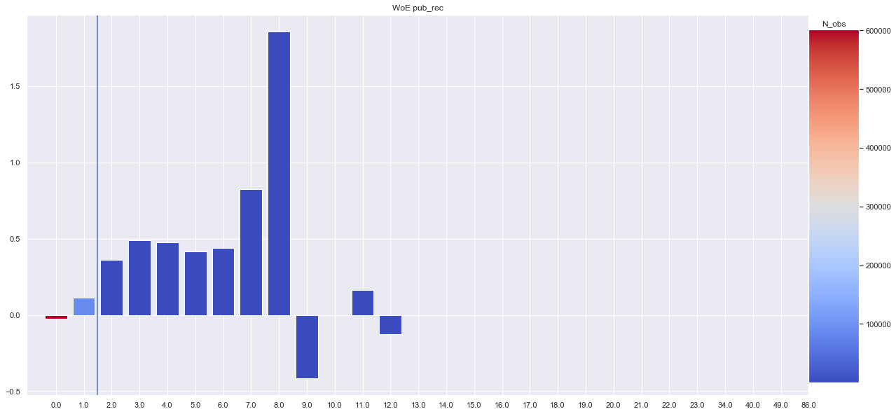


```python
fig, ax = plt.subplots(figsize=(20,8))

woe_df.set_index('pub_rec').iloc[:, [3,4]].plot(kind='bar', stacked=True, ax=ax)

plt.legend()
```


    <matplotlib.legend.Legend at 0x1a2f906b00>


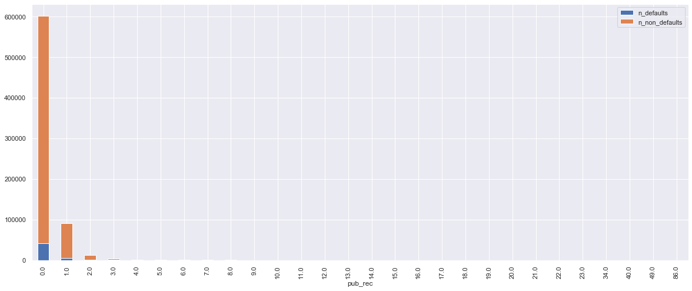


```python
x_train_prep['pub_rec:0-1'] = np.where((x_train_prep['pub_rec'] >= 0) & (x_train_prep['pub_rec'] <= 1), 1, 0)
x_train_prep['pub_rec:>1'] = np.where((x_train_prep['pub_rec'] > 1), 1, 0)
```


```python
fig, ax = plt.subplots(figsize=(20,8))

var_s = ['pub_rec:0-1', 'pub_rec:>1']

pd.concat([x_train_prep, y_train_prep], axis=1).groupby('Y').sum().loc[:, var_s].T.plot(kind='bar', stacked=True, ax=ax)

plt.legend()
```


    <matplotlib.legend.Legend at 0x1a32a2d6d8>


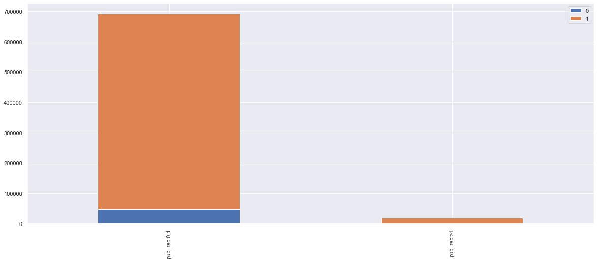


```python
vars_to_use.append(['pub_rec:>1'])
ref_vars.append(['pub_rec:0-1'])

vars_to_use
```


    [['grade:F', 'grade:E', 'grade:D', 'grade:C', 'grade:B', 'grade:A'],
     ['home_ownership:OWN', 'home_ownership:MORTGAGE'],
     ['addr_state:NY',
      'addr_state:VA_OK_AL_SD',
      'addr_state:CA',
      'addr_state:MO_DE_MD_UT_LA_NJ',
      'addr_state:NM_NC_AZ',
      'addr_state:PA_MA_RI_MI_AR',
      'addr_state:MN_OH_AK',
      'addr_state:KY_WI_GA_WA',
      'addr_state:OR_IN_TN_CT',
      'addr_state:TX',
      'addr_state:IL_KS_MT_SC_CO',
      'addr_state:VT_WV_WY_NH_DC_MS'],
     ['verification_status:Not Verified', 'verification_status:Source Verified'],
     ['initial_list_status:w'],
     ['purpose:house_mov_ren_oth_med',
      'purpose:vac_debtc_majpur_car_homeimp',
      'purpose:credit_card'],
     ['term:36'],
     ['emp_length_int:1',
      'emp_length_int:2_3_4',
      'emp_length_int:5_6_7',
      'emp_length_int:8_9',
      'emp_length_int:10'],
     ['mths_since_issue_d:<38',
      'mths_since_issue_d:38_39',
      'mths_since_issue_d:40_41',
      'mths_since_issue_d:42_48',
      'mths_since_issue_d:49_54',
      'mths_since_issue_d:55_68',
      'mths_since_issue_d:69_95'],
     ['int_rate:<10.054',
      'int_rate:10.054_12.849',
      'int_rate:12.849_15.735',
      'int_rate:15.735_19.995'],
     ['mths_since_earliest_cr_line:<160',
      'mths_since_earliest_cr_line:161_288',
      'mths_since_earliest_cr_line:289_360'],
     ['delinq_2yrs:0', 'delinq_2yrs:1-3'],
     ['inq_last_6mths:0', 'inq_last_6mths:1-2', 'inq_last_6mths:3-6'],
     ['open_acc:1-3',
      'open_acc:4-12',
      'open_acc:13-17',
      'open_acc:18-22',
      'open_acc:23-25',
      'open_acc:26-30',
      'open_acc:>=31'],
     ['pub_rec:>1']]


### total_acc

## ATTENTION!!! This variable discretization has changed in relation to the first model


```python
print(x_train_prep['total_acc'].nunique())
x_train_prep['total_acc'].describe()
```

    131


    count    709903.000000
    mean         25.278878
    std          11.849979
    min           0.000000
    25%          17.000000
    50%          24.000000
    75%          32.000000
    max         169.000000
    Name: total_acc, dtype: float64


```python
x_train_prep['total_acc_factor'] = pd.cut(x_train_prep['total_acc'], 50)

woe_df = woe_ordered_continuous(x_train_prep, 'total_acc_factor', y_train_prep, rot_x_ticks=90, vlines=[3.5, 6.5, 16.5])
woe_df
```


<div>
<style scoped>
    .dataframe tbody tr th:only-of-type {
        vertical-align: middle;
    }

    .dataframe tbody tr th {
        vertical-align: top;
    }

    .dataframe thead th {
        text-align: right;
    }
</style>
<table border="1" class="dataframe">
  <thead>
    <tr style="text-align: right;">
      <th></th>
      <th>total_acc_factor</th>
      <th>n_obs</th>
      <th>prop_non_defaults</th>
      <th>prop_n_obs</th>
      <th>n_defaults</th>
      <th>n_non_defaults</th>
      <th>prop_n_non_defaults</th>
      <th>prop_n_defaults</th>
      <th>WoE</th>
      <th>diff_prop_non_defaults</th>
      <th>diff_WoE</th>
      <th>IV</th>
    </tr>
  </thead>
  <tbody>
    <tr>
      <th>0</th>
      <td>(-0.169, 3.38]</td>
      <td>469</td>
      <td>0.609808</td>
      <td>0.000661</td>
      <td>183.0</td>
      <td>286.0</td>
      <td>0.000432</td>
      <td>0.003766</td>
      <td>-2.164282</td>
      <td>NaN</td>
      <td>NaN</td>
      <td>0.016629</td>
    </tr>
    <tr>
      <th>1</th>
      <td>(3.38, 6.76]</td>
      <td>11424</td>
      <td>0.907213</td>
      <td>0.016092</td>
      <td>1060.0</td>
      <td>10364.0</td>
      <td>0.015672</td>
      <td>0.021815</td>
      <td>-0.330718</td>
      <td>0.015239</td>
      <td>1.833564</td>
      <td>0.016629</td>
    </tr>
    <tr>
      <th>2</th>
      <td>(6.76, 10.14]</td>
      <td>42724</td>
      <td>0.922058</td>
      <td>0.060183</td>
      <td>3330.0</td>
      <td>39394.0</td>
      <td>0.059569</td>
      <td>0.068531</td>
      <td>-0.140146</td>
      <td>0.043898</td>
      <td>0.190572</td>
      <td>0.016629</td>
    </tr>
    <tr>
      <th>3</th>
      <td>(10.14, 13.52]</td>
      <td>53336</td>
      <td>0.923485</td>
      <td>0.075131</td>
      <td>4081.0</td>
      <td>49255.0</td>
      <td>0.074481</td>
      <td>0.083987</td>
      <td>-0.120119</td>
      <td>0.014911</td>
      <td>0.020028</td>
      <td>0.016629</td>
    </tr>
    <tr>
      <th>4</th>
      <td>(13.52, 16.9]</td>
      <td>66705</td>
      <td>0.927592</td>
      <td>0.093964</td>
      <td>4830.0</td>
      <td>61875.0</td>
      <td>0.093564</td>
      <td>0.099401</td>
      <td>-0.060518</td>
      <td>0.019083</td>
      <td>0.059601</td>
      <td>0.016629</td>
    </tr>
    <tr>
      <th>5</th>
      <td>(16.9, 20.28]</td>
      <td>100461</td>
      <td>0.929336</td>
      <td>0.141514</td>
      <td>7099.0</td>
      <td>93362.0</td>
      <td>0.141177</td>
      <td>0.146097</td>
      <td>-0.034257</td>
      <td>0.047613</td>
      <td>0.026261</td>
      <td>0.016629</td>
    </tr>
    <tr>
      <th>6</th>
      <td>(20.28, 23.66]</td>
      <td>76300</td>
      <td>0.932490</td>
      <td>0.107479</td>
      <td>5151.0</td>
      <td>71149.0</td>
      <td>0.107588</td>
      <td>0.106007</td>
      <td>0.014798</td>
      <td>0.033589</td>
      <td>0.049055</td>
      <td>0.016629</td>
    </tr>
    <tr>
      <th>7</th>
      <td>(23.66, 27.04]</td>
      <td>93918</td>
      <td>0.934794</td>
      <td>0.132297</td>
      <td>6124.0</td>
      <td>87794.0</td>
      <td>0.132757</td>
      <td>0.126032</td>
      <td>0.051990</td>
      <td>0.025170</td>
      <td>0.037192</td>
      <td>0.016629</td>
    </tr>
    <tr>
      <th>8</th>
      <td>(27.04, 30.42]</td>
      <td>60075</td>
      <td>0.935864</td>
      <td>0.084624</td>
      <td>3853.0</td>
      <td>56222.0</td>
      <td>0.085016</td>
      <td>0.079295</td>
      <td>0.069669</td>
      <td>0.047741</td>
      <td>0.017678</td>
      <td>0.016629</td>
    </tr>
    <tr>
      <th>9</th>
      <td>(30.42, 33.8]</td>
      <td>49653</td>
      <td>0.934646</td>
      <td>0.069943</td>
      <td>3245.0</td>
      <td>46408.0</td>
      <td>0.070176</td>
      <td>0.066782</td>
      <td>0.049569</td>
      <td>0.014840</td>
      <td>0.020100</td>
      <td>0.016629</td>
    </tr>
    <tr>
      <th>10</th>
      <td>(33.8, 37.18]</td>
      <td>50926</td>
      <td>0.938008</td>
      <td>0.071737</td>
      <td>3157.0</td>
      <td>47769.0</td>
      <td>0.072234</td>
      <td>0.064971</td>
      <td>0.105967</td>
      <td>0.002058</td>
      <td>0.056398</td>
      <td>0.016629</td>
    </tr>
    <tr>
      <th>11</th>
      <td>(37.18, 40.56]</td>
      <td>28093</td>
      <td>0.937102</td>
      <td>0.039573</td>
      <td>1767.0</td>
      <td>26326.0</td>
      <td>0.039809</td>
      <td>0.036365</td>
      <td>0.090486</td>
      <td>0.032425</td>
      <td>0.015481</td>
      <td>0.016629</td>
    </tr>
    <tr>
      <th>12</th>
      <td>(40.56, 43.94]</td>
      <td>21428</td>
      <td>0.938212</td>
      <td>0.030184</td>
      <td>1324.0</td>
      <td>20104.0</td>
      <td>0.030400</td>
      <td>0.027248</td>
      <td>0.109474</td>
      <td>0.009409</td>
      <td>0.018987</td>
      <td>0.016629</td>
    </tr>
    <tr>
      <th>13</th>
      <td>(43.94, 47.32]</td>
      <td>20323</td>
      <td>0.935836</td>
      <td>0.028628</td>
      <td>1304.0</td>
      <td>19019.0</td>
      <td>0.028759</td>
      <td>0.026836</td>
      <td>0.069215</td>
      <td>0.001641</td>
      <td>0.040259</td>
      <td>0.016629</td>
    </tr>
    <tr>
      <th>14</th>
      <td>(47.32, 50.7]</td>
      <td>10345</td>
      <td>0.937264</td>
      <td>0.014572</td>
      <td>649.0</td>
      <td>9696.0</td>
      <td>0.014662</td>
      <td>0.013356</td>
      <td>0.093249</td>
      <td>0.014098</td>
      <td>0.024034</td>
      <td>0.016629</td>
    </tr>
    <tr>
      <th>15</th>
      <td>(50.7, 54.08]</td>
      <td>9146</td>
      <td>0.941176</td>
      <td>0.012883</td>
      <td>538.0</td>
      <td>8608.0</td>
      <td>0.013017</td>
      <td>0.011072</td>
      <td>0.161801</td>
      <td>0.001645</td>
      <td>0.068553</td>
      <td>0.016629</td>
    </tr>
    <tr>
      <th>16</th>
      <td>(54.08, 57.46]</td>
      <td>4362</td>
      <td>0.937643</td>
      <td>0.006145</td>
      <td>272.0</td>
      <td>4090.0</td>
      <td>0.006185</td>
      <td>0.005598</td>
      <td>0.099711</td>
      <td>0.006832</td>
      <td>0.062091</td>
      <td>0.016629</td>
    </tr>
    <tr>
      <th>17</th>
      <td>(57.46, 60.84]</td>
      <td>3206</td>
      <td>0.934810</td>
      <td>0.004516</td>
      <td>209.0</td>
      <td>2997.0</td>
      <td>0.004532</td>
      <td>0.004301</td>
      <td>0.052245</td>
      <td>0.001653</td>
      <td>0.047465</td>
      <td>0.016629</td>
    </tr>
    <tr>
      <th>18</th>
      <td>(60.84, 64.22]</td>
      <td>3812</td>
      <td>0.924711</td>
      <td>0.005370</td>
      <td>287.0</td>
      <td>3525.0</td>
      <td>0.005330</td>
      <td>0.005906</td>
      <td>-0.102634</td>
      <td>0.000798</td>
      <td>0.154879</td>
      <td>0.016629</td>
    </tr>
    <tr>
      <th>19</th>
      <td>(64.22, 67.6]</td>
      <td>922</td>
      <td>0.965293</td>
      <td>0.001299</td>
      <td>32.0</td>
      <td>890.0</td>
      <td>0.001346</td>
      <td>0.000659</td>
      <td>0.714698</td>
      <td>0.003985</td>
      <td>0.817332</td>
      <td>0.016629</td>
    </tr>
    <tr>
      <th>20</th>
      <td>(67.6, 70.98]</td>
      <td>698</td>
      <td>0.965616</td>
      <td>0.000983</td>
      <td>24.0</td>
      <td>674.0</td>
      <td>0.001019</td>
      <td>0.000494</td>
      <td>0.724389</td>
      <td>0.000327</td>
      <td>0.009691</td>
      <td>0.016629</td>
    </tr>
    <tr>
      <th>21</th>
      <td>(70.98, 74.36]</td>
      <td>557</td>
      <td>0.964093</td>
      <td>0.000785</td>
      <td>20.0</td>
      <td>537.0</td>
      <td>0.000812</td>
      <td>0.000412</td>
      <td>0.679478</td>
      <td>0.000207</td>
      <td>0.044910</td>
      <td>0.016629</td>
    </tr>
    <tr>
      <th>22</th>
      <td>(74.36, 77.74]</td>
      <td>293</td>
      <td>0.945392</td>
      <td>0.000413</td>
      <td>16.0</td>
      <td>277.0</td>
      <td>0.000419</td>
      <td>0.000329</td>
      <td>0.240641</td>
      <td>0.000393</td>
      <td>0.438837</td>
      <td>0.016629</td>
    </tr>
    <tr>
      <th>23</th>
      <td>(77.74, 81.12]</td>
      <td>261</td>
      <td>0.934866</td>
      <td>0.000368</td>
      <td>17.0</td>
      <td>244.0</td>
      <td>0.000369</td>
      <td>0.000350</td>
      <td>0.053167</td>
      <td>0.000050</td>
      <td>0.187474</td>
      <td>0.016629</td>
    </tr>
    <tr>
      <th>24</th>
      <td>(81.12, 84.5]</td>
      <td>112</td>
      <td>0.946429</td>
      <td>0.000158</td>
      <td>6.0</td>
      <td>106.0</td>
      <td>0.000160</td>
      <td>0.000123</td>
      <td>0.260892</td>
      <td>0.000209</td>
      <td>0.207725</td>
      <td>0.016629</td>
    </tr>
    <tr>
      <th>25</th>
      <td>(84.5, 87.88]</td>
      <td>103</td>
      <td>0.961165</td>
      <td>0.000145</td>
      <td>4.0</td>
      <td>99.0</td>
      <td>0.000150</td>
      <td>0.000082</td>
      <td>0.598038</td>
      <td>0.000011</td>
      <td>0.337146</td>
      <td>0.016629</td>
    </tr>
    <tr>
      <th>26</th>
      <td>(87.88, 91.26]</td>
      <td>95</td>
      <td>0.978947</td>
      <td>0.000134</td>
      <td>2.0</td>
      <td>93.0</td>
      <td>0.000141</td>
      <td>0.000041</td>
      <td>1.228665</td>
      <td>0.000009</td>
      <td>0.630627</td>
      <td>0.016629</td>
    </tr>
    <tr>
      <th>27</th>
      <td>(91.26, 94.64]</td>
      <td>43</td>
      <td>0.953488</td>
      <td>0.000061</td>
      <td>2.0</td>
      <td>41.0</td>
      <td>0.000062</td>
      <td>0.000041</td>
      <td>0.409637</td>
      <td>0.000079</td>
      <td>0.819027</td>
      <td>0.016629</td>
    </tr>
    <tr>
      <th>28</th>
      <td>(94.64, 98.02]</td>
      <td>37</td>
      <td>0.918919</td>
      <td>0.000052</td>
      <td>3.0</td>
      <td>34.0</td>
      <td>0.000051</td>
      <td>0.000062</td>
      <td>-0.183039</td>
      <td>0.000011</td>
      <td>0.592677</td>
      <td>0.016629</td>
    </tr>
    <tr>
      <th>29</th>
      <td>(98.02, 101.4]</td>
      <td>18</td>
      <td>1.000000</td>
      <td>0.000025</td>
      <td>0.0</td>
      <td>18.0</td>
      <td>0.000027</td>
      <td>0.000000</td>
      <td>NaN</td>
      <td>0.000024</td>
      <td>NaN</td>
      <td>0.016629</td>
    </tr>
    <tr>
      <th>30</th>
      <td>(101.4, 104.78]</td>
      <td>10</td>
      <td>1.000000</td>
      <td>0.000014</td>
      <td>0.0</td>
      <td>10.0</td>
      <td>0.000015</td>
      <td>0.000000</td>
      <td>NaN</td>
      <td>0.000012</td>
      <td>NaN</td>
      <td>0.016629</td>
    </tr>
    <tr>
      <th>31</th>
      <td>(104.78, 108.16]</td>
      <td>16</td>
      <td>1.000000</td>
      <td>0.000023</td>
      <td>0.0</td>
      <td>16.0</td>
      <td>0.000024</td>
      <td>0.000000</td>
      <td>NaN</td>
      <td>0.000009</td>
      <td>NaN</td>
      <td>0.016629</td>
    </tr>
    <tr>
      <th>32</th>
      <td>(108.16, 111.54]</td>
      <td>8</td>
      <td>0.750000</td>
      <td>0.000011</td>
      <td>2.0</td>
      <td>6.0</td>
      <td>0.000009</td>
      <td>0.000041</td>
      <td>-1.512175</td>
      <td>0.000015</td>
      <td>NaN</td>
      <td>0.016629</td>
    </tr>
    <tr>
      <th>33</th>
      <td>(111.54, 114.92]</td>
      <td>3</td>
      <td>1.000000</td>
      <td>0.000004</td>
      <td>0.0</td>
      <td>3.0</td>
      <td>0.000005</td>
      <td>0.000000</td>
      <td>NaN</td>
      <td>0.000005</td>
      <td>NaN</td>
      <td>0.016629</td>
    </tr>
    <tr>
      <th>34</th>
      <td>(114.92, 118.3]</td>
      <td>5</td>
      <td>1.000000</td>
      <td>0.000007</td>
      <td>0.0</td>
      <td>5.0</td>
      <td>0.000008</td>
      <td>0.000000</td>
      <td>NaN</td>
      <td>0.000003</td>
      <td>NaN</td>
      <td>0.016629</td>
    </tr>
    <tr>
      <th>35</th>
      <td>(118.3, 121.68]</td>
      <td>2</td>
      <td>1.000000</td>
      <td>0.000003</td>
      <td>0.0</td>
      <td>2.0</td>
      <td>0.000003</td>
      <td>0.000000</td>
      <td>NaN</td>
      <td>0.000005</td>
      <td>NaN</td>
      <td>0.016629</td>
    </tr>
    <tr>
      <th>36</th>
      <td>(121.68, 125.06]</td>
      <td>4</td>
      <td>1.000000</td>
      <td>0.000006</td>
      <td>0.0</td>
      <td>4.0</td>
      <td>0.000006</td>
      <td>0.000000</td>
      <td>NaN</td>
      <td>0.000003</td>
      <td>NaN</td>
      <td>0.016629</td>
    </tr>
    <tr>
      <th>37</th>
      <td>(125.06, 128.44]</td>
      <td>1</td>
      <td>1.000000</td>
      <td>0.000001</td>
      <td>0.0</td>
      <td>1.0</td>
      <td>0.000002</td>
      <td>0.000000</td>
      <td>NaN</td>
      <td>0.000005</td>
      <td>NaN</td>
      <td>0.016629</td>
    </tr>
    <tr>
      <th>38</th>
      <td>(128.44, 131.82]</td>
      <td>1</td>
      <td>1.000000</td>
      <td>0.000001</td>
      <td>0.0</td>
      <td>1.0</td>
      <td>0.000002</td>
      <td>0.000000</td>
      <td>NaN</td>
      <td>0.000000</td>
      <td>NaN</td>
      <td>0.016629</td>
    </tr>
    <tr>
      <th>39</th>
      <td>(131.82, 135.2]</td>
      <td>1</td>
      <td>1.000000</td>
      <td>0.000001</td>
      <td>0.0</td>
      <td>1.0</td>
      <td>0.000002</td>
      <td>0.000000</td>
      <td>NaN</td>
      <td>0.000000</td>
      <td>NaN</td>
      <td>0.016629</td>
    </tr>
    <tr>
      <th>40</th>
      <td>(135.2, 138.58]</td>
      <td>1</td>
      <td>1.000000</td>
      <td>0.000001</td>
      <td>0.0</td>
      <td>1.0</td>
      <td>0.000002</td>
      <td>0.000000</td>
      <td>NaN</td>
      <td>0.000000</td>
      <td>NaN</td>
      <td>0.016629</td>
    </tr>
    <tr>
      <th>41</th>
      <td>(138.58, 141.96]</td>
      <td>0</td>
      <td>NaN</td>
      <td>0.000000</td>
      <td>NaN</td>
      <td>NaN</td>
      <td>NaN</td>
      <td>NaN</td>
      <td>NaN</td>
      <td>NaN</td>
      <td>NaN</td>
      <td>0.016629</td>
    </tr>
    <tr>
      <th>42</th>
      <td>(141.96, 145.34]</td>
      <td>0</td>
      <td>NaN</td>
      <td>0.000000</td>
      <td>NaN</td>
      <td>NaN</td>
      <td>NaN</td>
      <td>NaN</td>
      <td>NaN</td>
      <td>NaN</td>
      <td>NaN</td>
      <td>0.016629</td>
    </tr>
    <tr>
      <th>43</th>
      <td>(145.34, 148.72]</td>
      <td>1</td>
      <td>1.000000</td>
      <td>0.000001</td>
      <td>0.0</td>
      <td>1.0</td>
      <td>0.000002</td>
      <td>0.000000</td>
      <td>NaN</td>
      <td>NaN</td>
      <td>NaN</td>
      <td>0.016629</td>
    </tr>
    <tr>
      <th>44</th>
      <td>(148.72, 152.1]</td>
      <td>2</td>
      <td>1.000000</td>
      <td>0.000003</td>
      <td>0.0</td>
      <td>2.0</td>
      <td>0.000003</td>
      <td>0.000000</td>
      <td>NaN</td>
      <td>0.000002</td>
      <td>NaN</td>
      <td>0.016629</td>
    </tr>
    <tr>
      <th>45</th>
      <td>(152.1, 155.48]</td>
      <td>0</td>
      <td>NaN</td>
      <td>0.000000</td>
      <td>NaN</td>
      <td>NaN</td>
      <td>NaN</td>
      <td>NaN</td>
      <td>NaN</td>
      <td>NaN</td>
      <td>NaN</td>
      <td>0.016629</td>
    </tr>
    <tr>
      <th>46</th>
      <td>(155.48, 158.86]</td>
      <td>1</td>
      <td>1.000000</td>
      <td>0.000001</td>
      <td>0.0</td>
      <td>1.0</td>
      <td>0.000002</td>
      <td>0.000000</td>
      <td>NaN</td>
      <td>NaN</td>
      <td>NaN</td>
      <td>0.016629</td>
    </tr>
    <tr>
      <th>47</th>
      <td>(158.86, 162.24]</td>
      <td>1</td>
      <td>1.000000</td>
      <td>0.000001</td>
      <td>0.0</td>
      <td>1.0</td>
      <td>0.000002</td>
      <td>0.000000</td>
      <td>NaN</td>
      <td>0.000000</td>
      <td>NaN</td>
      <td>0.016629</td>
    </tr>
    <tr>
      <th>48</th>
      <td>(162.24, 165.62]</td>
      <td>0</td>
      <td>NaN</td>
      <td>0.000000</td>
      <td>NaN</td>
      <td>NaN</td>
      <td>NaN</td>
      <td>NaN</td>
      <td>NaN</td>
      <td>NaN</td>
      <td>NaN</td>
      <td>0.016629</td>
    </tr>
    <tr>
      <th>49</th>
      <td>(165.62, 169.0]</td>
      <td>1</td>
      <td>1.000000</td>
      <td>0.000001</td>
      <td>0.0</td>
      <td>1.0</td>
      <td>0.000002</td>
      <td>0.000000</td>
      <td>NaN</td>
      <td>NaN</td>
      <td>NaN</td>
      <td>0.016629</td>
    </tr>
  </tbody>
</table>
</div>


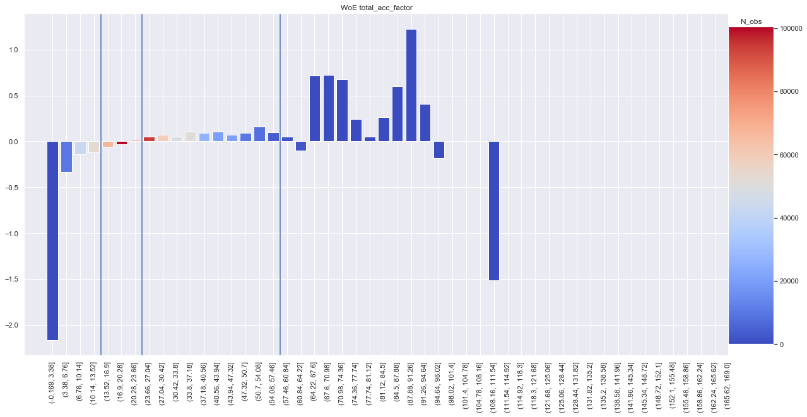


```python
fig, ax = plt.subplots(figsize=(20,8))

woe_df.set_index('total_acc_factor').iloc[:, [3,4]].plot(kind='bar', stacked=True, ax=ax)

plt.legend()
```


    <matplotlib.legend.Legend at 0x1a37b61828>


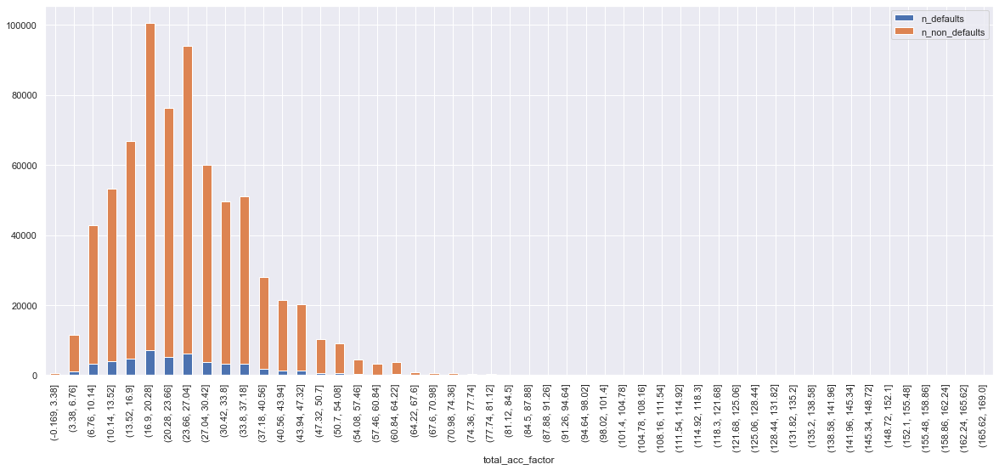


```python
x_train_prep['total_acc:<=14'] = np.where((x_train_prep['total_acc'] <= 14), 1, 0)
x_train_prep['total_acc:15_24'] = np.where((x_train_prep['total_acc'] > 14) & (x_train_prep['total_acc'] <= 24), 1, 0)
x_train_prep['total_acc:25_57'] = np.where((x_train_prep['total_acc'] > 24) & (x_train_prep['total_acc'] <= 57), 1, 0)
x_train_prep['total_acc:>=57'] = np.where((x_train_prep['total_acc'] > 57), 1, 0)
```


```python
fig, ax = plt.subplots(figsize=(20,8))

var_s = ['total_acc:<=14', 'total_acc:15_24', 'total_acc:25_57', 'total_acc:>=57']

pd.concat([x_train_prep, y_train_prep], axis=1).groupby('Y').sum().loc[:, var_s].T.plot(kind='bar', stacked=True, ax=ax)

plt.legend()
```


    <matplotlib.legend.Legend at 0x1a37b61cc0>


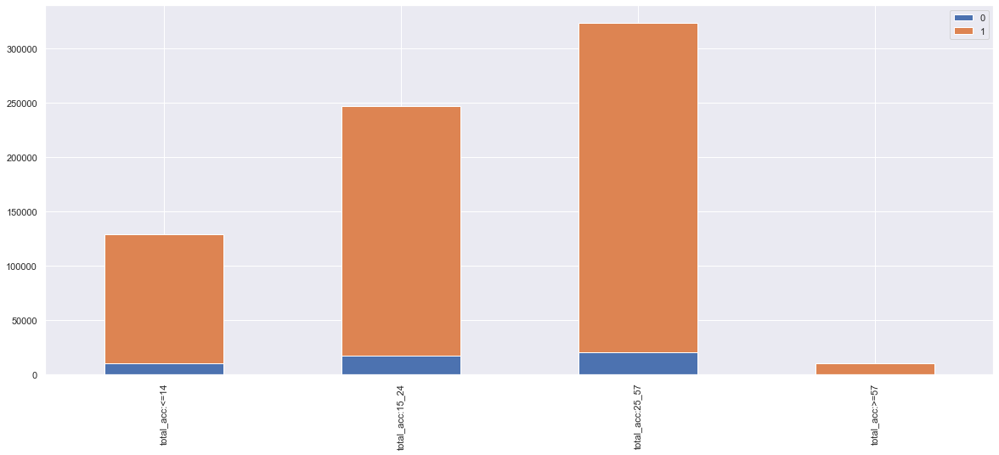


```python
vars_to_use.append(['total_acc:15_24', 'total_acc:25_57', 'total_acc:>=57'])

ref_vars.append(['total_acc:<=14'])
vars_to_use
```


    [['grade:F', 'grade:E', 'grade:D', 'grade:C', 'grade:B', 'grade:A'],
     ['home_ownership:OWN', 'home_ownership:MORTGAGE'],
     ['addr_state:NY',
      'addr_state:VA_OK_AL_SD',
      'addr_state:CA',
      'addr_state:MO_DE_MD_UT_LA_NJ',
      'addr_state:NM_NC_AZ',
      'addr_state:PA_MA_RI_MI_AR',
      'addr_state:MN_OH_AK',
      'addr_state:KY_WI_GA_WA',
      'addr_state:OR_IN_TN_CT',
      'addr_state:TX',
      'addr_state:IL_KS_MT_SC_CO',
      'addr_state:VT_WV_WY_NH_DC_MS'],
     ['verification_status:Not Verified', 'verification_status:Source Verified'],
     ['initial_list_status:w'],
     ['purpose:house_mov_ren_oth_med',
      'purpose:vac_debtc_majpur_car_homeimp',
      'purpose:credit_card'],
     ['term:36'],
     ['emp_length_int:1',
      'emp_length_int:2_3_4',
      'emp_length_int:5_6_7',
      'emp_length_int:8_9',
      'emp_length_int:10'],
     ['mths_since_issue_d:<38',
      'mths_since_issue_d:38_39',
      'mths_since_issue_d:40_41',
      'mths_since_issue_d:42_48',
      'mths_since_issue_d:49_54',
      'mths_since_issue_d:55_68',
      'mths_since_issue_d:69_95'],
     ['int_rate:<10.054',
      'int_rate:10.054_12.849',
      'int_rate:12.849_15.735',
      'int_rate:15.735_19.995'],
     ['mths_since_earliest_cr_line:<160',
      'mths_since_earliest_cr_line:161_288',
      'mths_since_earliest_cr_line:289_360'],
     ['delinq_2yrs:0', 'delinq_2yrs:1-3'],
     ['inq_last_6mths:0', 'inq_last_6mths:1-2', 'inq_last_6mths:3-6'],
     ['open_acc:1-3',
      'open_acc:4-12',
      'open_acc:13-17',
      'open_acc:18-22',
      'open_acc:23-25',
      'open_acc:26-30',
      'open_acc:>=31'],
     ['pub_rec:>1'],
     ['total_acc:15_24', 'total_acc:25_57', 'total_acc:>=57']]


### 'acc_now_delinq'


```python
print(x_train_prep['acc_now_delinq'].nunique())
x_train_prep['acc_now_delinq'].describe()
```

    8


    count    709903.000000
    mean          0.004981
    std           0.077777
    min           0.000000
    25%           0.000000
    50%           0.000000
    75%           0.000000
    max          14.000000
    Name: acc_now_delinq, dtype: float64


```python
woe_df = woe_ordered_continuous(x_train_prep, 'acc_now_delinq', y_train_prep, vlines=[0.5])
woe_df
```


<div>
<style scoped>
    .dataframe tbody tr th:only-of-type {
        vertical-align: middle;
    }

    .dataframe tbody tr th {
        vertical-align: top;
    }

    .dataframe thead th {
        text-align: right;
    }
</style>
<table border="1" class="dataframe">
  <thead>
    <tr style="text-align: right;">
      <th></th>
      <th>acc_now_delinq</th>
      <th>n_obs</th>
      <th>prop_non_defaults</th>
      <th>prop_n_obs</th>
      <th>n_defaults</th>
      <th>n_non_defaults</th>
      <th>prop_n_non_defaults</th>
      <th>prop_n_defaults</th>
      <th>WoE</th>
      <th>diff_prop_non_defaults</th>
      <th>diff_WoE</th>
      <th>IV</th>
    </tr>
  </thead>
  <tbody>
    <tr>
      <th>0</th>
      <td>0.0</td>
      <td>706616</td>
      <td>0.931534</td>
      <td>0.995370</td>
      <td>48379.0</td>
      <td>658237.0</td>
      <td>0.995350</td>
      <td>0.995637</td>
      <td>-0.000288</td>
      <td>NaN</td>
      <td>NaN</td>
      <td>0.000096</td>
    </tr>
    <tr>
      <th>1</th>
      <td>1.0</td>
      <td>3092</td>
      <td>0.936611</td>
      <td>0.004356</td>
      <td>196.0</td>
      <td>2896.0</td>
      <td>0.004379</td>
      <td>0.004034</td>
      <td>0.082184</td>
      <td>0.990971</td>
      <td>0.082472</td>
      <td>0.000096</td>
    </tr>
    <tr>
      <th>2</th>
      <td>2.0</td>
      <td>165</td>
      <td>0.921212</td>
      <td>0.000232</td>
      <td>13.0</td>
      <td>152.0</td>
      <td>0.000230</td>
      <td>0.000268</td>
      <td>-0.151856</td>
      <td>0.004149</td>
      <td>0.234040</td>
      <td>0.000096</td>
    </tr>
    <tr>
      <th>3</th>
      <td>3.0</td>
      <td>21</td>
      <td>0.952381</td>
      <td>0.000030</td>
      <td>1.0</td>
      <td>20.0</td>
      <td>0.000030</td>
      <td>0.000021</td>
      <td>0.384945</td>
      <td>0.000200</td>
      <td>0.536801</td>
      <td>0.000096</td>
    </tr>
    <tr>
      <th>4</th>
      <td>4.0</td>
      <td>4</td>
      <td>0.750000</td>
      <td>0.000006</td>
      <td>1.0</td>
      <td>3.0</td>
      <td>0.000005</td>
      <td>0.000021</td>
      <td>-1.512175</td>
      <td>0.000026</td>
      <td>1.897120</td>
      <td>0.000096</td>
    </tr>
    <tr>
      <th>5</th>
      <td>5.0</td>
      <td>3</td>
      <td>0.666667</td>
      <td>0.000004</td>
      <td>1.0</td>
      <td>2.0</td>
      <td>0.000003</td>
      <td>0.000021</td>
      <td>-1.917640</td>
      <td>0.000002</td>
      <td>0.405465</td>
      <td>0.000096</td>
    </tr>
    <tr>
      <th>6</th>
      <td>6.0</td>
      <td>1</td>
      <td>1.000000</td>
      <td>0.000001</td>
      <td>0.0</td>
      <td>1.0</td>
      <td>0.000002</td>
      <td>0.000000</td>
      <td>NaN</td>
      <td>0.000002</td>
      <td>NaN</td>
      <td>0.000096</td>
    </tr>
    <tr>
      <th>7</th>
      <td>14.0</td>
      <td>1</td>
      <td>1.000000</td>
      <td>0.000001</td>
      <td>0.0</td>
      <td>1.0</td>
      <td>0.000002</td>
      <td>0.000000</td>
      <td>NaN</td>
      <td>0.000000</td>
      <td>NaN</td>
      <td>0.000096</td>
    </tr>
  </tbody>
</table>
</div>


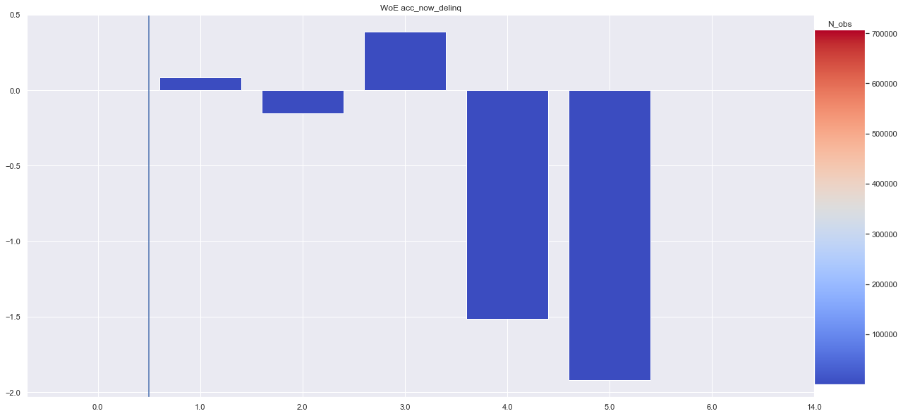


```python
fig, ax = plt.subplots(figsize=(20,8))

woe_df.set_index('acc_now_delinq').iloc[:, [3,4]].plot(kind='bar', stacked=True, ax=ax)

plt.legend()
```


    <matplotlib.legend.Legend at 0x1a2739fb00>


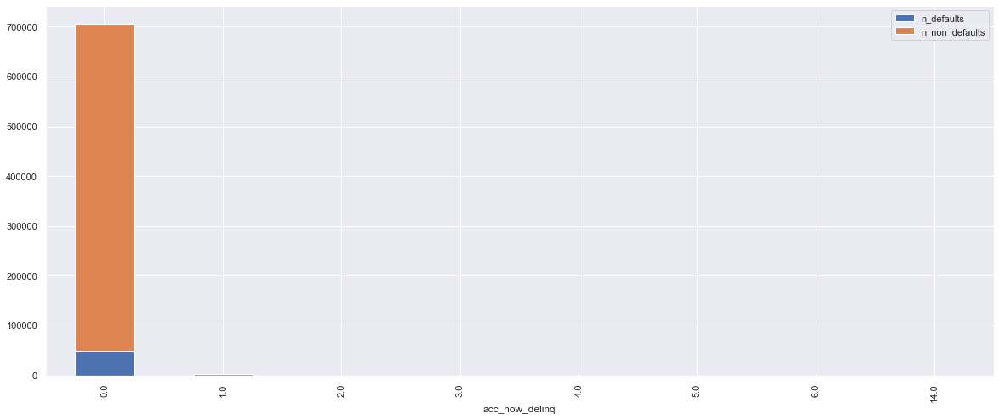


```python
x_train_prep['acc_now_delinq:0'] = np.where((x_train_prep['acc_now_delinq'] == 0), 1, 0)
x_train_prep['acc_now_delinq:>=1'] = np.where((x_train_prep['acc_now_delinq'] >= 1), 1, 0)
```


```python
fig, ax = plt.subplots(figsize=(20,8))

var_s = ['acc_now_delinq:0', 'acc_now_delinq:>=1']

pd.concat([x_train_prep, y_train_prep], axis=1).groupby('Y').sum().loc[:, var_s].T.plot(kind='bar', stacked=True, ax=ax)

plt.legend()
```


    <matplotlib.legend.Legend at 0x1a27a805f8>


```python
vars_to_use.append(['acc_now_delinq:>=1'])
ref_vars.append(['acc_now_delinq:0'])

vars_to_use
```


    [['grade:F', 'grade:E', 'grade:D', 'grade:C', 'grade:B', 'grade:A'],
     ['home_ownership:OWN', 'home_ownership:MORTGAGE'],
     ['addr_state:NY',
      'addr_state:VA_OK_AL_SD',
      'addr_state:CA',
      'addr_state:MO_DE_MD_UT_LA_NJ',
      'addr_state:NM_NC_AZ',
      'addr_state:PA_MA_RI_MI_AR',
      'addr_state:MN_OH_AK',
      'addr_state:KY_WI_GA_WA',
      'addr_state:OR_IN_TN_CT',
      'addr_state:TX',
      'addr_state:IL_KS_MT_SC_CO',
      'addr_state:VT_WV_WY_NH_DC_MS'],
     ['verification_status:Not Verified', 'verification_status:Source Verified'],
     ['initial_list_status:w'],
     ['purpose:house_mov_ren_oth_med',
      'purpose:vac_debtc_majpur_car_homeimp',
      'purpose:credit_card'],
     ['term:36'],
     ['emp_length_int:1',
      'emp_length_int:2_3_4',
      'emp_length_int:5_6_7',
      'emp_length_int:8_9',
      'emp_length_int:10'],
     ['mths_since_issue_d:<38',
      'mths_since_issue_d:38_39',
      'mths_since_issue_d:40_41',
      'mths_since_issue_d:42_48',
      'mths_since_issue_d:49_54',
      'mths_since_issue_d:55_68',
      'mths_since_issue_d:69_95'],
     ['int_rate:<10.054',
      'int_rate:10.054_12.849',
      'int_rate:12.849_15.735',
      'int_rate:15.735_19.995'],
     ['mths_since_earliest_cr_line:<160',
      'mths_since_earliest_cr_line:161_288',
      'mths_since_earliest_cr_line:289_360'],
     ['delinq_2yrs:0', 'delinq_2yrs:1-3'],
     ['inq_last_6mths:0', 'inq_last_6mths:1-2', 'inq_last_6mths:3-6'],
     ['open_acc:1-3',
      'open_acc:4-12',
      'open_acc:13-17',
      'open_acc:18-22',
      'open_acc:23-25',
      'open_acc:26-30',
      'open_acc:>=31'],
     ['pub_rec:>1'],
     ['total_acc:15_24', 'total_acc:25_57', 'total_acc:>=57'],
     ['acc_now_delinq:>=1']]


## total_rev_hi_lim


```python
print(x_train_prep['total_rev_hi_lim'].nunique())
x_train_prep['total_rev_hi_lim'].describe()
```

    18285


    count    7.099030e+05
    mean     3.045556e+04
    std      3.554575e+04
    min      0.000000e+00
    25%      1.280000e+04
    50%      2.220000e+04
    75%      3.780000e+04
    max      9.999999e+06
    Name: total_rev_hi_lim, dtype: float64


```python
x_train_prep['total_rev_hi_lim_factor'] = pd.cut(x_train_prep['total_rev_hi_lim'], 2000)

woe_df = woe_ordered_continuous(x_train_prep, 'total_rev_hi_lim_factor', y_train_prep, rot_x_ticks=90, plot_rows_start=0, plot_rows_end=50, vlines=[0.5, 1.5, 3.5, 5.5, 7.5, 10.5, 18.5])
woe_df
```

    /Users/omaromeiri/anaconda3/lib/python3.7/site-packages/ipykernel_launcher.py:177: RuntimeWarning: divide by zero encountered in log


<div>
<style scoped>
    .dataframe tbody tr th:only-of-type {
        vertical-align: middle;
    }

    .dataframe tbody tr th {
        vertical-align: top;
    }

    .dataframe thead th {
        text-align: right;
    }
</style>
<table border="1" class="dataframe">
  <thead>
    <tr style="text-align: right;">
      <th></th>
      <th>total_rev_hi_lim_factor</th>
      <th>n_obs</th>
      <th>prop_non_defaults</th>
      <th>prop_n_obs</th>
      <th>n_defaults</th>
      <th>n_non_defaults</th>
      <th>prop_n_non_defaults</th>
      <th>prop_n_defaults</th>
      <th>WoE</th>
      <th>diff_prop_non_defaults</th>
      <th>diff_WoE</th>
      <th>IV</th>
    </tr>
  </thead>
  <tbody>
    <tr>
      <th>0</th>
      <td>(-9999.999, 5000.0]</td>
      <td>29825</td>
      <td>0.885532</td>
      <td>0.042013</td>
      <td>3414.0</td>
      <td>26411.0</td>
      <td>0.039937</td>
      <td>0.070260</td>
      <td>-0.564891</td>
      <td>NaN</td>
      <td>NaN</td>
      <td>0.103858</td>
    </tr>
    <tr>
      <th>1</th>
      <td>(5000.0, 9999.999]</td>
      <td>86982</td>
      <td>0.908406</td>
      <td>0.122527</td>
      <td>7967.0</td>
      <td>79015.0</td>
      <td>0.119482</td>
      <td>0.163960</td>
      <td>-0.316458</td>
      <td>0.079545</td>
      <td>0.248434</td>
      <td>0.103858</td>
    </tr>
    <tr>
      <th>2</th>
      <td>(9999.999, 14999.998]</td>
      <td>104403</td>
      <td>0.919811</td>
      <td>0.147067</td>
      <td>8372.0</td>
      <td>96031.0</td>
      <td>0.145213</td>
      <td>0.172295</td>
      <td>-0.171009</td>
      <td>0.025731</td>
      <td>0.145449</td>
      <td>0.103858</td>
    </tr>
    <tr>
      <th>3</th>
      <td>(14999.998, 19999.998]</td>
      <td>95123</td>
      <td>0.922805</td>
      <td>0.133994</td>
      <td>7343.0</td>
      <td>87780.0</td>
      <td>0.132736</td>
      <td>0.151119</td>
      <td>-0.129701</td>
      <td>0.012477</td>
      <td>0.041308</td>
      <td>0.103858</td>
    </tr>
    <tr>
      <th>4</th>
      <td>(19999.998, 24999.997]</td>
      <td>79143</td>
      <td>0.930771</td>
      <td>0.111484</td>
      <td>5479.0</td>
      <td>73664.0</td>
      <td>0.111391</td>
      <td>0.112758</td>
      <td>-0.012196</td>
      <td>0.021345</td>
      <td>0.117505</td>
      <td>0.103858</td>
    </tr>
    <tr>
      <th>5</th>
      <td>(24999.997, 29999.997]</td>
      <td>63073</td>
      <td>0.934473</td>
      <td>0.088847</td>
      <td>4133.0</td>
      <td>58940.0</td>
      <td>0.089126</td>
      <td>0.085057</td>
      <td>0.046729</td>
      <td>0.022265</td>
      <td>0.058925</td>
      <td>0.103858</td>
    </tr>
    <tr>
      <th>6</th>
      <td>(29999.997, 34999.996]</td>
      <td>49483</td>
      <td>0.940060</td>
      <td>0.069704</td>
      <td>2966.0</td>
      <td>46517.0</td>
      <td>0.070340</td>
      <td>0.061040</td>
      <td>0.141816</td>
      <td>0.018785</td>
      <td>0.095087</td>
      <td>0.103858</td>
    </tr>
    <tr>
      <th>7</th>
      <td>(34999.996, 39999.996]</td>
      <td>39725</td>
      <td>0.941926</td>
      <td>0.055958</td>
      <td>2307.0</td>
      <td>37418.0</td>
      <td>0.056581</td>
      <td>0.047478</td>
      <td>0.175416</td>
      <td>0.013759</td>
      <td>0.033600</td>
      <td>0.103858</td>
    </tr>
    <tr>
      <th>8</th>
      <td>(39999.996, 44999.996]</td>
      <td>30791</td>
      <td>0.950537</td>
      <td>0.043374</td>
      <td>1523.0</td>
      <td>29268.0</td>
      <td>0.044257</td>
      <td>0.031343</td>
      <td>0.345025</td>
      <td>0.012324</td>
      <td>0.169609</td>
      <td>0.103858</td>
    </tr>
    <tr>
      <th>9</th>
      <td>(44999.996, 49999.995]</td>
      <td>24775</td>
      <td>0.951968</td>
      <td>0.034899</td>
      <td>1190.0</td>
      <td>23585.0</td>
      <td>0.035664</td>
      <td>0.024490</td>
      <td>0.375870</td>
      <td>0.008594</td>
      <td>0.030845</td>
      <td>0.103858</td>
    </tr>
    <tr>
      <th>10</th>
      <td>(49999.995, 54999.994]</td>
      <td>19530</td>
      <td>0.955197</td>
      <td>0.027511</td>
      <td>875.0</td>
      <td>18655.0</td>
      <td>0.028209</td>
      <td>0.018007</td>
      <td>0.448858</td>
      <td>0.007455</td>
      <td>0.072988</td>
      <td>0.103858</td>
    </tr>
    <tr>
      <th>11</th>
      <td>(54999.994, 59999.994]</td>
      <td>15334</td>
      <td>0.960936</td>
      <td>0.021600</td>
      <td>599.0</td>
      <td>14735.0</td>
      <td>0.022281</td>
      <td>0.012327</td>
      <td>0.591932</td>
      <td>0.005928</td>
      <td>0.143074</td>
      <td>0.103858</td>
    </tr>
    <tr>
      <th>12</th>
      <td>(59999.994, 64999.994]</td>
      <td>12034</td>
      <td>0.962689</td>
      <td>0.016952</td>
      <td>449.0</td>
      <td>11585.0</td>
      <td>0.017518</td>
      <td>0.009240</td>
      <td>0.639656</td>
      <td>0.004763</td>
      <td>0.047724</td>
      <td>0.103858</td>
    </tr>
    <tr>
      <th>13</th>
      <td>(64999.994, 69999.993]</td>
      <td>9666</td>
      <td>0.960170</td>
      <td>0.013616</td>
      <td>385.0</td>
      <td>9281.0</td>
      <td>0.014034</td>
      <td>0.007923</td>
      <td>0.571694</td>
      <td>0.003484</td>
      <td>0.067962</td>
      <td>0.103858</td>
    </tr>
    <tr>
      <th>14</th>
      <td>(69999.993, 74999.992]</td>
      <td>7801</td>
      <td>0.961287</td>
      <td>0.010989</td>
      <td>302.0</td>
      <td>7499.0</td>
      <td>0.011340</td>
      <td>0.006215</td>
      <td>0.601311</td>
      <td>0.002695</td>
      <td>0.029617</td>
      <td>0.103858</td>
    </tr>
    <tr>
      <th>15</th>
      <td>(74999.992, 79999.992]</td>
      <td>6262</td>
      <td>0.963909</td>
      <td>0.008821</td>
      <td>226.0</td>
      <td>6036.0</td>
      <td>0.009127</td>
      <td>0.004651</td>
      <td>0.674174</td>
      <td>0.002212</td>
      <td>0.072864</td>
      <td>0.103858</td>
    </tr>
    <tr>
      <th>16</th>
      <td>(79999.992, 84999.992]</td>
      <td>5063</td>
      <td>0.965633</td>
      <td>0.007132</td>
      <td>174.0</td>
      <td>4889.0</td>
      <td>0.007393</td>
      <td>0.003581</td>
      <td>0.724900</td>
      <td>0.001734</td>
      <td>0.050726</td>
      <td>0.103858</td>
    </tr>
    <tr>
      <th>17</th>
      <td>(84999.992, 89999.991]</td>
      <td>4244</td>
      <td>0.965127</td>
      <td>0.005978</td>
      <td>148.0</td>
      <td>4096.0</td>
      <td>0.006194</td>
      <td>0.003046</td>
      <td>0.709766</td>
      <td>0.001199</td>
      <td>0.015134</td>
      <td>0.103858</td>
    </tr>
    <tr>
      <th>18</th>
      <td>(89999.991, 94999.99]</td>
      <td>3569</td>
      <td>0.964416</td>
      <td>0.005027</td>
      <td>127.0</td>
      <td>3442.0</td>
      <td>0.005205</td>
      <td>0.002614</td>
      <td>0.688833</td>
      <td>0.000989</td>
      <td>0.020933</td>
      <td>0.103858</td>
    </tr>
    <tr>
      <th>19</th>
      <td>(94999.99, 99999.99]</td>
      <td>2936</td>
      <td>0.977180</td>
      <td>0.004136</td>
      <td>67.0</td>
      <td>2869.0</td>
      <td>0.004338</td>
      <td>0.001379</td>
      <td>1.146239</td>
      <td>0.000866</td>
      <td>0.457405</td>
      <td>0.103858</td>
    </tr>
    <tr>
      <th>20</th>
      <td>(99999.99, 104999.99]</td>
      <td>2479</td>
      <td>0.974587</td>
      <td>0.003492</td>
      <td>63.0</td>
      <td>2416.0</td>
      <td>0.003653</td>
      <td>0.001297</td>
      <td>1.035946</td>
      <td>0.000685</td>
      <td>0.110292</td>
      <td>0.103858</td>
    </tr>
    <tr>
      <th>21</th>
      <td>(104999.99, 109999.989]</td>
      <td>2068</td>
      <td>0.970986</td>
      <td>0.002913</td>
      <td>60.0</td>
      <td>2008.0</td>
      <td>0.003036</td>
      <td>0.001235</td>
      <td>0.899763</td>
      <td>0.000617</td>
      <td>0.136184</td>
      <td>0.103858</td>
    </tr>
    <tr>
      <th>22</th>
      <td>(109999.989, 114999.988]</td>
      <td>1780</td>
      <td>0.966292</td>
      <td>0.002507</td>
      <td>60.0</td>
      <td>1720.0</td>
      <td>0.002601</td>
      <td>0.001235</td>
      <td>0.744948</td>
      <td>0.000435</td>
      <td>0.154815</td>
      <td>0.103858</td>
    </tr>
    <tr>
      <th>23</th>
      <td>(114999.988, 119999.988]</td>
      <td>1598</td>
      <td>0.974969</td>
      <td>0.002251</td>
      <td>40.0</td>
      <td>1558.0</td>
      <td>0.002356</td>
      <td>0.000823</td>
      <td>1.051491</td>
      <td>0.000245</td>
      <td>0.306544</td>
      <td>0.103858</td>
    </tr>
    <tr>
      <th>24</th>
      <td>(119999.988, 124999.988]</td>
      <td>1263</td>
      <td>0.977039</td>
      <td>0.001779</td>
      <td>29.0</td>
      <td>1234.0</td>
      <td>0.001866</td>
      <td>0.000597</td>
      <td>1.139933</td>
      <td>0.000490</td>
      <td>0.088442</td>
      <td>0.103858</td>
    </tr>
    <tr>
      <th>25</th>
      <td>(124999.988, 129999.987]</td>
      <td>1087</td>
      <td>0.968721</td>
      <td>0.001531</td>
      <td>34.0</td>
      <td>1053.0</td>
      <td>0.001592</td>
      <td>0.000700</td>
      <td>0.822251</td>
      <td>0.000274</td>
      <td>0.317682</td>
      <td>0.103858</td>
    </tr>
    <tr>
      <th>26</th>
      <td>(129999.987, 134999.986]</td>
      <td>967</td>
      <td>0.977249</td>
      <td>0.001362</td>
      <td>22.0</td>
      <td>945.0</td>
      <td>0.001429</td>
      <td>0.000453</td>
      <td>1.149355</td>
      <td>0.000163</td>
      <td>0.327104</td>
      <td>0.103858</td>
    </tr>
    <tr>
      <th>27</th>
      <td>(134999.986, 139999.986]</td>
      <td>805</td>
      <td>0.976398</td>
      <td>0.001134</td>
      <td>19.0</td>
      <td>786.0</td>
      <td>0.001189</td>
      <td>0.000391</td>
      <td>1.111730</td>
      <td>0.000240</td>
      <td>0.037625</td>
      <td>0.103858</td>
    </tr>
    <tr>
      <th>28</th>
      <td>(139999.986, 144999.986]</td>
      <td>741</td>
      <td>0.967611</td>
      <td>0.001044</td>
      <td>24.0</td>
      <td>717.0</td>
      <td>0.001084</td>
      <td>0.000494</td>
      <td>0.786235</td>
      <td>0.000104</td>
      <td>0.325496</td>
      <td>0.103858</td>
    </tr>
    <tr>
      <th>29</th>
      <td>(144999.986, 149999.985]</td>
      <td>634</td>
      <td>0.968454</td>
      <td>0.000893</td>
      <td>20.0</td>
      <td>614.0</td>
      <td>0.000928</td>
      <td>0.000412</td>
      <td>0.813475</td>
      <td>0.000156</td>
      <td>0.027241</td>
      <td>0.103858</td>
    </tr>
    <tr>
      <th>...</th>
      <td>...</td>
      <td>...</td>
      <td>...</td>
      <td>...</td>
      <td>...</td>
      <td>...</td>
      <td>...</td>
      <td>...</td>
      <td>...</td>
      <td>...</td>
      <td>...</td>
      <td>...</td>
    </tr>
    <tr>
      <th>1970</th>
      <td>(9849999.015, 9854999.014]</td>
      <td>0</td>
      <td>NaN</td>
      <td>0.000000</td>
      <td>NaN</td>
      <td>NaN</td>
      <td>NaN</td>
      <td>NaN</td>
      <td>NaN</td>
      <td>NaN</td>
      <td>NaN</td>
      <td>0.103858</td>
    </tr>
    <tr>
      <th>1971</th>
      <td>(9854999.014, 9859999.014]</td>
      <td>0</td>
      <td>NaN</td>
      <td>0.000000</td>
      <td>NaN</td>
      <td>NaN</td>
      <td>NaN</td>
      <td>NaN</td>
      <td>NaN</td>
      <td>NaN</td>
      <td>NaN</td>
      <td>0.103858</td>
    </tr>
    <tr>
      <th>1972</th>
      <td>(9859999.014, 9864999.014]</td>
      <td>0</td>
      <td>NaN</td>
      <td>0.000000</td>
      <td>NaN</td>
      <td>NaN</td>
      <td>NaN</td>
      <td>NaN</td>
      <td>NaN</td>
      <td>NaN</td>
      <td>NaN</td>
      <td>0.103858</td>
    </tr>
    <tr>
      <th>1973</th>
      <td>(9864999.014, 9869999.013]</td>
      <td>0</td>
      <td>NaN</td>
      <td>0.000000</td>
      <td>NaN</td>
      <td>NaN</td>
      <td>NaN</td>
      <td>NaN</td>
      <td>NaN</td>
      <td>NaN</td>
      <td>NaN</td>
      <td>0.103858</td>
    </tr>
    <tr>
      <th>1974</th>
      <td>(9869999.013, 9874999.012]</td>
      <td>0</td>
      <td>NaN</td>
      <td>0.000000</td>
      <td>NaN</td>
      <td>NaN</td>
      <td>NaN</td>
      <td>NaN</td>
      <td>NaN</td>
      <td>NaN</td>
      <td>NaN</td>
      <td>0.103858</td>
    </tr>
    <tr>
      <th>1975</th>
      <td>(9874999.012, 9879999.012]</td>
      <td>0</td>
      <td>NaN</td>
      <td>0.000000</td>
      <td>NaN</td>
      <td>NaN</td>
      <td>NaN</td>
      <td>NaN</td>
      <td>NaN</td>
      <td>NaN</td>
      <td>NaN</td>
      <td>0.103858</td>
    </tr>
    <tr>
      <th>1976</th>
      <td>(9879999.012, 9884999.012]</td>
      <td>0</td>
      <td>NaN</td>
      <td>0.000000</td>
      <td>NaN</td>
      <td>NaN</td>
      <td>NaN</td>
      <td>NaN</td>
      <td>NaN</td>
      <td>NaN</td>
      <td>NaN</td>
      <td>0.103858</td>
    </tr>
    <tr>
      <th>1977</th>
      <td>(9884999.012, 9889999.011]</td>
      <td>0</td>
      <td>NaN</td>
      <td>0.000000</td>
      <td>NaN</td>
      <td>NaN</td>
      <td>NaN</td>
      <td>NaN</td>
      <td>NaN</td>
      <td>NaN</td>
      <td>NaN</td>
      <td>0.103858</td>
    </tr>
    <tr>
      <th>1978</th>
      <td>(9889999.011, 9894999.01]</td>
      <td>0</td>
      <td>NaN</td>
      <td>0.000000</td>
      <td>NaN</td>
      <td>NaN</td>
      <td>NaN</td>
      <td>NaN</td>
      <td>NaN</td>
      <td>NaN</td>
      <td>NaN</td>
      <td>0.103858</td>
    </tr>
    <tr>
      <th>1979</th>
      <td>(9894999.01, 9899999.01]</td>
      <td>0</td>
      <td>NaN</td>
      <td>0.000000</td>
      <td>NaN</td>
      <td>NaN</td>
      <td>NaN</td>
      <td>NaN</td>
      <td>NaN</td>
      <td>NaN</td>
      <td>NaN</td>
      <td>0.103858</td>
    </tr>
    <tr>
      <th>1980</th>
      <td>(9899999.01, 9904999.01]</td>
      <td>0</td>
      <td>NaN</td>
      <td>0.000000</td>
      <td>NaN</td>
      <td>NaN</td>
      <td>NaN</td>
      <td>NaN</td>
      <td>NaN</td>
      <td>NaN</td>
      <td>NaN</td>
      <td>0.103858</td>
    </tr>
    <tr>
      <th>1981</th>
      <td>(9904999.01, 9909999.009]</td>
      <td>0</td>
      <td>NaN</td>
      <td>0.000000</td>
      <td>NaN</td>
      <td>NaN</td>
      <td>NaN</td>
      <td>NaN</td>
      <td>NaN</td>
      <td>NaN</td>
      <td>NaN</td>
      <td>0.103858</td>
    </tr>
    <tr>
      <th>1982</th>
      <td>(9909999.009, 9914999.008]</td>
      <td>0</td>
      <td>NaN</td>
      <td>0.000000</td>
      <td>NaN</td>
      <td>NaN</td>
      <td>NaN</td>
      <td>NaN</td>
      <td>NaN</td>
      <td>NaN</td>
      <td>NaN</td>
      <td>0.103858</td>
    </tr>
    <tr>
      <th>1983</th>
      <td>(9914999.008, 9919999.008]</td>
      <td>0</td>
      <td>NaN</td>
      <td>0.000000</td>
      <td>NaN</td>
      <td>NaN</td>
      <td>NaN</td>
      <td>NaN</td>
      <td>NaN</td>
      <td>NaN</td>
      <td>NaN</td>
      <td>0.103858</td>
    </tr>
    <tr>
      <th>1984</th>
      <td>(9919999.008, 9924999.008]</td>
      <td>0</td>
      <td>NaN</td>
      <td>0.000000</td>
      <td>NaN</td>
      <td>NaN</td>
      <td>NaN</td>
      <td>NaN</td>
      <td>NaN</td>
      <td>NaN</td>
      <td>NaN</td>
      <td>0.103858</td>
    </tr>
    <tr>
      <th>1985</th>
      <td>(9924999.008, 9929999.007]</td>
      <td>0</td>
      <td>NaN</td>
      <td>0.000000</td>
      <td>NaN</td>
      <td>NaN</td>
      <td>NaN</td>
      <td>NaN</td>
      <td>NaN</td>
      <td>NaN</td>
      <td>NaN</td>
      <td>0.103858</td>
    </tr>
    <tr>
      <th>1986</th>
      <td>(9929999.007, 9934999.006]</td>
      <td>0</td>
      <td>NaN</td>
      <td>0.000000</td>
      <td>NaN</td>
      <td>NaN</td>
      <td>NaN</td>
      <td>NaN</td>
      <td>NaN</td>
      <td>NaN</td>
      <td>NaN</td>
      <td>0.103858</td>
    </tr>
    <tr>
      <th>1987</th>
      <td>(9934999.006, 9939999.006]</td>
      <td>0</td>
      <td>NaN</td>
      <td>0.000000</td>
      <td>NaN</td>
      <td>NaN</td>
      <td>NaN</td>
      <td>NaN</td>
      <td>NaN</td>
      <td>NaN</td>
      <td>NaN</td>
      <td>0.103858</td>
    </tr>
    <tr>
      <th>1988</th>
      <td>(9939999.006, 9944999.006]</td>
      <td>0</td>
      <td>NaN</td>
      <td>0.000000</td>
      <td>NaN</td>
      <td>NaN</td>
      <td>NaN</td>
      <td>NaN</td>
      <td>NaN</td>
      <td>NaN</td>
      <td>NaN</td>
      <td>0.103858</td>
    </tr>
    <tr>
      <th>1989</th>
      <td>(9944999.006, 9949999.005]</td>
      <td>0</td>
      <td>NaN</td>
      <td>0.000000</td>
      <td>NaN</td>
      <td>NaN</td>
      <td>NaN</td>
      <td>NaN</td>
      <td>NaN</td>
      <td>NaN</td>
      <td>NaN</td>
      <td>0.103858</td>
    </tr>
    <tr>
      <th>1990</th>
      <td>(9949999.005, 9954999.004]</td>
      <td>0</td>
      <td>NaN</td>
      <td>0.000000</td>
      <td>NaN</td>
      <td>NaN</td>
      <td>NaN</td>
      <td>NaN</td>
      <td>NaN</td>
      <td>NaN</td>
      <td>NaN</td>
      <td>0.103858</td>
    </tr>
    <tr>
      <th>1991</th>
      <td>(9954999.004, 9959999.004]</td>
      <td>0</td>
      <td>NaN</td>
      <td>0.000000</td>
      <td>NaN</td>
      <td>NaN</td>
      <td>NaN</td>
      <td>NaN</td>
      <td>NaN</td>
      <td>NaN</td>
      <td>NaN</td>
      <td>0.103858</td>
    </tr>
    <tr>
      <th>1992</th>
      <td>(9959999.004, 9964999.004]</td>
      <td>0</td>
      <td>NaN</td>
      <td>0.000000</td>
      <td>NaN</td>
      <td>NaN</td>
      <td>NaN</td>
      <td>NaN</td>
      <td>NaN</td>
      <td>NaN</td>
      <td>NaN</td>
      <td>0.103858</td>
    </tr>
    <tr>
      <th>1993</th>
      <td>(9964999.004, 9969999.003]</td>
      <td>0</td>
      <td>NaN</td>
      <td>0.000000</td>
      <td>NaN</td>
      <td>NaN</td>
      <td>NaN</td>
      <td>NaN</td>
      <td>NaN</td>
      <td>NaN</td>
      <td>NaN</td>
      <td>0.103858</td>
    </tr>
    <tr>
      <th>1994</th>
      <td>(9969999.003, 9974999.002]</td>
      <td>0</td>
      <td>NaN</td>
      <td>0.000000</td>
      <td>NaN</td>
      <td>NaN</td>
      <td>NaN</td>
      <td>NaN</td>
      <td>NaN</td>
      <td>NaN</td>
      <td>NaN</td>
      <td>0.103858</td>
    </tr>
    <tr>
      <th>1995</th>
      <td>(9974999.002, 9979999.002]</td>
      <td>0</td>
      <td>NaN</td>
      <td>0.000000</td>
      <td>NaN</td>
      <td>NaN</td>
      <td>NaN</td>
      <td>NaN</td>
      <td>NaN</td>
      <td>NaN</td>
      <td>NaN</td>
      <td>0.103858</td>
    </tr>
    <tr>
      <th>1996</th>
      <td>(9979999.002, 9984999.002]</td>
      <td>0</td>
      <td>NaN</td>
      <td>0.000000</td>
      <td>NaN</td>
      <td>NaN</td>
      <td>NaN</td>
      <td>NaN</td>
      <td>NaN</td>
      <td>NaN</td>
      <td>NaN</td>
      <td>0.103858</td>
    </tr>
    <tr>
      <th>1997</th>
      <td>(9984999.002, 9989999.001]</td>
      <td>0</td>
      <td>NaN</td>
      <td>0.000000</td>
      <td>NaN</td>
      <td>NaN</td>
      <td>NaN</td>
      <td>NaN</td>
      <td>NaN</td>
      <td>NaN</td>
      <td>NaN</td>
      <td>0.103858</td>
    </tr>
    <tr>
      <th>1998</th>
      <td>(9989999.001, 9994999.0]</td>
      <td>0</td>
      <td>NaN</td>
      <td>0.000000</td>
      <td>NaN</td>
      <td>NaN</td>
      <td>NaN</td>
      <td>NaN</td>
      <td>NaN</td>
      <td>NaN</td>
      <td>NaN</td>
      <td>0.103858</td>
    </tr>
    <tr>
      <th>1999</th>
      <td>(9994999.0, 9999999.0]</td>
      <td>2</td>
      <td>1.000000</td>
      <td>0.000003</td>
      <td>0.0</td>
      <td>2.0</td>
      <td>0.000003</td>
      <td>0.000000</td>
      <td>NaN</td>
      <td>NaN</td>
      <td>NaN</td>
      <td>0.103858</td>
    </tr>
  </tbody>
</table>
<p>2000 rows  12 columns</p>
</div>


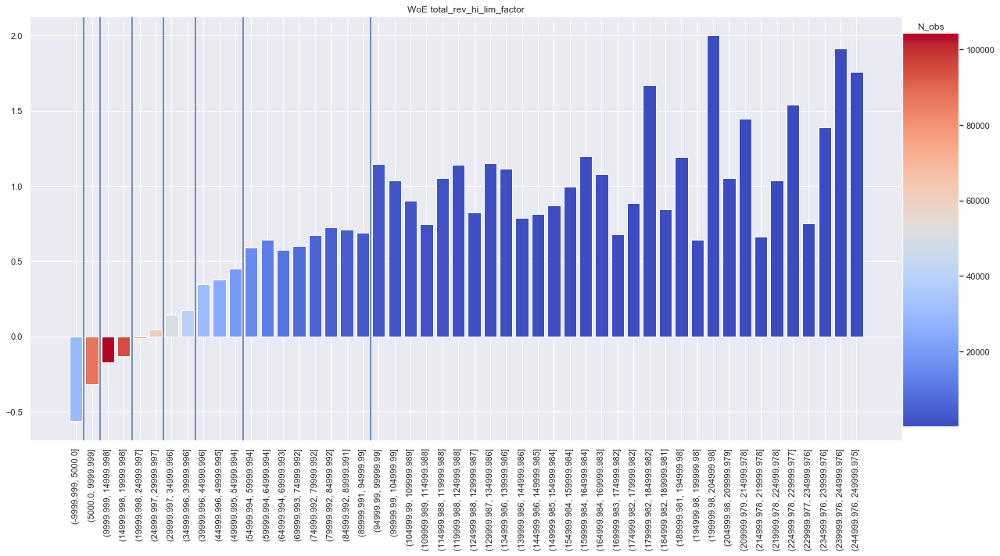


```python
fig, ax = plt.subplots(figsize=(20,8))

woe_df.iloc[:50,:].set_index('total_rev_hi_lim_factor').iloc[:, [3,4]].plot(kind='bar', stacked=True, ax=ax)

plt.legend()
```


    <matplotlib.legend.Legend at 0x1a4a439c18>


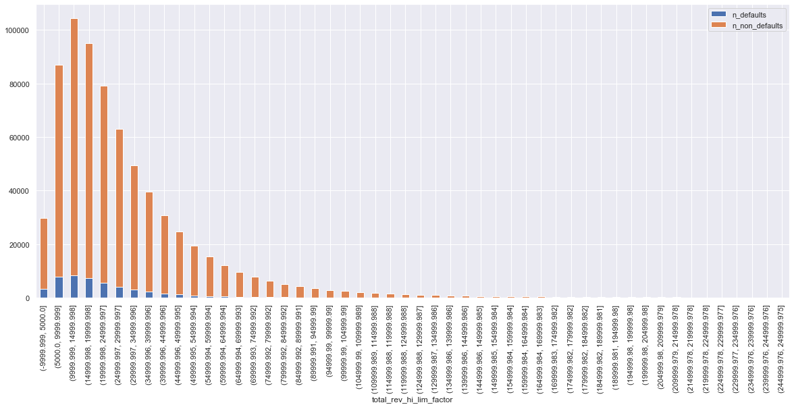


```python
x_train_prep['total_rev_hi_lim:<=5K'] = np.where((x_train_prep['total_rev_hi_lim'] <= 5000), 1, 0)
x_train_prep['total_rev_hi_lim:5K-10K'] = np.where((x_train_prep['total_rev_hi_lim'] > 5000) & (x_train_prep['total_rev_hi_lim'] <= 10000), 1, 0)
x_train_prep['total_rev_hi_lim:10K-20K'] = np.where((x_train_prep['total_rev_hi_lim'] > 10000) & (x_train_prep['total_rev_hi_lim'] <= 20000), 1, 0)
x_train_prep['total_rev_hi_lim:20K-30K'] = np.where((x_train_prep['total_rev_hi_lim'] > 20000) & (x_train_prep['total_rev_hi_lim'] <= 30000), 1, 0)
x_train_prep['total_rev_hi_lim:30K-40K'] = np.where((x_train_prep['total_rev_hi_lim'] > 30000) & (x_train_prep['total_rev_hi_lim'] <= 40000), 1, 0)
x_train_prep['total_rev_hi_lim:40K-55K'] = np.where((x_train_prep['total_rev_hi_lim'] > 40000) & (x_train_prep['total_rev_hi_lim'] <= 55000), 1, 0)
x_train_prep['total_rev_hi_lim:55K-95K'] = np.where((x_train_prep['total_rev_hi_lim'] > 55000) & (x_train_prep['total_rev_hi_lim'] <= 95000), 1, 0)
x_train_prep['total_rev_hi_lim:>95K'] = np.where((x_train_prep['total_rev_hi_lim'] > 95000), 1, 0)
```


```python

fig, ax = plt.subplots(figsize=(20,8))

var_s = ['total_rev_hi_lim:<=5K', 'total_rev_hi_lim:5K-10K', 'total_rev_hi_lim:10K-20K', 'total_rev_hi_lim:20K-30K',
         'total_rev_hi_lim:30K-40K', 'total_rev_hi_lim:40K-55K', 'total_rev_hi_lim:55K-95K', 'total_rev_hi_lim:>95K']

pd.concat([x_train_prep, y_train_prep], axis=1).groupby('Y').sum().loc[:, var_s].T.plot(kind='bar', stacked=True, ax=ax)

plt.legend()
```


    <matplotlib.legend.Legend at 0x1a4a528e80>


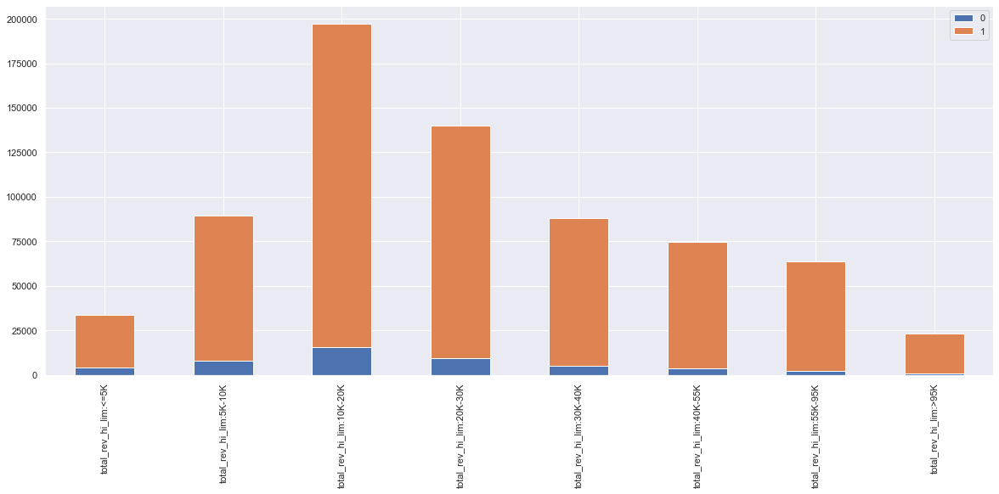


```python
vars_to_use.append(['total_rev_hi_lim:5K-10K', 'total_rev_hi_lim:10K-20K', 'total_rev_hi_lim:20K-30K',
         'total_rev_hi_lim:30K-40K', 'total_rev_hi_lim:40K-55K', 'total_rev_hi_lim:55K-95K', 'total_rev_hi_lim:>95K'])

ref_vars.append(['total_rev_hi_lim:<=5K'])

vars_to_use
```


    [['grade:F', 'grade:E', 'grade:D', 'grade:C', 'grade:B', 'grade:A'],
     ['home_ownership:OWN', 'home_ownership:MORTGAGE'],
     ['addr_state:NY',
      'addr_state:VA_OK_AL_SD',
      'addr_state:CA',
      'addr_state:MO_DE_MD_UT_LA_NJ',
      'addr_state:NM_NC_AZ',
      'addr_state:PA_MA_RI_MI_AR',
      'addr_state:MN_OH_AK',
      'addr_state:KY_WI_GA_WA',
      'addr_state:OR_IN_TN_CT',
      'addr_state:TX',
      'addr_state:IL_KS_MT_SC_CO',
      'addr_state:VT_WV_WY_NH_DC_MS'],
     ['verification_status:Not Verified', 'verification_status:Source Verified'],
     ['initial_list_status:w'],
     ['purpose:house_mov_ren_oth_med',
      'purpose:vac_debtc_majpur_car_homeimp',
      'purpose:credit_card'],
     ['term:36'],
     ['emp_length_int:1',
      'emp_length_int:2_3_4',
      'emp_length_int:5_6_7',
      'emp_length_int:8_9',
      'emp_length_int:10'],
     ['mths_since_issue_d:<38',
      'mths_since_issue_d:38_39',
      'mths_since_issue_d:40_41',
      'mths_since_issue_d:42_48',
      'mths_since_issue_d:49_54',
      'mths_since_issue_d:55_68',
      'mths_since_issue_d:69_95'],
     ['int_rate:<10.054',
      'int_rate:10.054_12.849',
      'int_rate:12.849_15.735',
      'int_rate:15.735_19.995'],
     ['mths_since_earliest_cr_line:<160',
      'mths_since_earliest_cr_line:161_288',
      'mths_since_earliest_cr_line:289_360'],
     ['delinq_2yrs:0', 'delinq_2yrs:1-3'],
     ['inq_last_6mths:0', 'inq_last_6mths:1-2', 'inq_last_6mths:3-6'],
     ['open_acc:1-3',
      'open_acc:4-12',
      'open_acc:13-17',
      'open_acc:18-22',
      'open_acc:23-25',
      'open_acc:26-30',
      'open_acc:>=31'],
     ['pub_rec:>1'],
     ['total_acc:15_24', 'total_acc:25_57', 'total_acc:>=57'],
     ['acc_now_delinq:>=1'],
     ['total_rev_hi_lim:5K-10K',
      'total_rev_hi_lim:10K-20K',
      'total_rev_hi_lim:20K-30K',
      'total_rev_hi_lim:30K-40K',
      'total_rev_hi_lim:40K-55K',
      'total_rev_hi_lim:55K-95K',
      'total_rev_hi_lim:>95K']]


### loan_amnt


```python
x_train_prep['loan_amnt_factor'] = pd.cut(x_train_prep['loan_amnt'], 50)

woe_df = woe_ordered_continuous(x_train_prep, 'loan_amnt_factor', y_train_prep, rot_x_ticks=90)
woe_df
```


<div>
<style scoped>
    .dataframe tbody tr th:only-of-type {
        vertical-align: middle;
    }

    .dataframe tbody tr th {
        vertical-align: top;
    }

    .dataframe thead th {
        text-align: right;
    }
</style>
<table border="1" class="dataframe">
  <thead>
    <tr style="text-align: right;">
      <th></th>
      <th>loan_amnt_factor</th>
      <th>n_obs</th>
      <th>prop_non_defaults</th>
      <th>prop_n_obs</th>
      <th>n_defaults</th>
      <th>n_non_defaults</th>
      <th>prop_n_non_defaults</th>
      <th>prop_n_defaults</th>
      <th>WoE</th>
      <th>diff_prop_non_defaults</th>
      <th>diff_WoE</th>
      <th>IV</th>
    </tr>
  </thead>
  <tbody>
    <tr>
      <th>0</th>
      <td>(465.5, 1190.0]</td>
      <td>2210</td>
      <td>0.925339</td>
      <td>0.003113</td>
      <td>165.0</td>
      <td>2045.0</td>
      <td>0.003092</td>
      <td>0.003396</td>
      <td>-0.093580</td>
      <td>NaN</td>
      <td>NaN</td>
      <td>0.019292</td>
    </tr>
    <tr>
      <th>1</th>
      <td>(1190.0, 1880.0]</td>
      <td>5252</td>
      <td>0.926885</td>
      <td>0.007398</td>
      <td>384.0</td>
      <td>4868.0</td>
      <td>0.007361</td>
      <td>0.007903</td>
      <td>-0.070992</td>
      <td>0.004269</td>
      <td>0.022588</td>
      <td>0.019292</td>
    </tr>
    <tr>
      <th>2</th>
      <td>(1880.0, 2570.0]</td>
      <td>10461</td>
      <td>0.920180</td>
      <td>0.014736</td>
      <td>835.0</td>
      <td>9626.0</td>
      <td>0.014556</td>
      <td>0.017184</td>
      <td>-0.165996</td>
      <td>0.007195</td>
      <td>0.095005</td>
      <td>0.019292</td>
    </tr>
    <tr>
      <th>3</th>
      <td>(2570.0, 3260.0]</td>
      <td>12803</td>
      <td>0.921893</td>
      <td>0.018035</td>
      <td>1000.0</td>
      <td>11803.0</td>
      <td>0.017848</td>
      <td>0.020580</td>
      <td>-0.142434</td>
      <td>0.003292</td>
      <td>0.023562</td>
      <td>0.019292</td>
    </tr>
    <tr>
      <th>4</th>
      <td>(3260.0, 3950.0]</td>
      <td>8449</td>
      <td>0.924962</td>
      <td>0.011902</td>
      <td>634.0</td>
      <td>7815.0</td>
      <td>0.011817</td>
      <td>0.013048</td>
      <td>-0.099036</td>
      <td>0.006030</td>
      <td>0.043398</td>
      <td>0.019292</td>
    </tr>
    <tr>
      <th>5</th>
      <td>(3950.0, 4640.0]</td>
      <td>15727</td>
      <td>0.923189</td>
      <td>0.022154</td>
      <td>1208.0</td>
      <td>14519.0</td>
      <td>0.021955</td>
      <td>0.024861</td>
      <td>-0.124295</td>
      <td>0.010137</td>
      <td>0.025259</td>
      <td>0.019292</td>
    </tr>
    <tr>
      <th>6</th>
      <td>(4640.0, 5330.0]</td>
      <td>29898</td>
      <td>0.929895</td>
      <td>0.042116</td>
      <td>2096.0</td>
      <td>27802.0</td>
      <td>0.042041</td>
      <td>0.043136</td>
      <td>-0.025710</td>
      <td>0.020086</td>
      <td>0.098585</td>
      <td>0.019292</td>
    </tr>
    <tr>
      <th>7</th>
      <td>(5330.0, 6020.0]</td>
      <td>30997</td>
      <td>0.937381</td>
      <td>0.043664</td>
      <td>1941.0</td>
      <td>29056.0</td>
      <td>0.043937</td>
      <td>0.039946</td>
      <td>0.095234</td>
      <td>0.001896</td>
      <td>0.120945</td>
      <td>0.019292</td>
    </tr>
    <tr>
      <th>8</th>
      <td>(6020.0, 6710.0]</td>
      <td>11581</td>
      <td>0.921596</td>
      <td>0.016313</td>
      <td>908.0</td>
      <td>10673.0</td>
      <td>0.016139</td>
      <td>0.018687</td>
      <td>-0.146559</td>
      <td>0.027798</td>
      <td>0.241794</td>
      <td>0.019292</td>
    </tr>
    <tr>
      <th>9</th>
      <td>(6710.0, 7400.0]</td>
      <td>21058</td>
      <td>0.931760</td>
      <td>0.029663</td>
      <td>1437.0</td>
      <td>19621.0</td>
      <td>0.029670</td>
      <td>0.029573</td>
      <td>0.003255</td>
      <td>0.013531</td>
      <td>0.149815</td>
      <td>0.019292</td>
    </tr>
    <tr>
      <th>10</th>
      <td>(7400.0, 8090.0]</td>
      <td>32202</td>
      <td>0.931495</td>
      <td>0.045361</td>
      <td>2206.0</td>
      <td>29996.0</td>
      <td>0.045358</td>
      <td>0.045399</td>
      <td>-0.000904</td>
      <td>0.015689</td>
      <td>0.004160</td>
      <td>0.019292</td>
    </tr>
    <tr>
      <th>11</th>
      <td>(8090.0, 8780.0]</td>
      <td>11063</td>
      <td>0.917563</td>
      <td>0.015584</td>
      <td>912.0</td>
      <td>10151.0</td>
      <td>0.015350</td>
      <td>0.018769</td>
      <td>-0.201100</td>
      <td>0.030009</td>
      <td>0.200196</td>
      <td>0.019292</td>
    </tr>
    <tr>
      <th>12</th>
      <td>(8780.0, 9470.0]</td>
      <td>15610</td>
      <td>0.919154</td>
      <td>0.021989</td>
      <td>1262.0</td>
      <td>14348.0</td>
      <td>0.021696</td>
      <td>0.025972</td>
      <td>-0.179875</td>
      <td>0.006346</td>
      <td>0.021225</td>
      <td>0.019292</td>
    </tr>
    <tr>
      <th>13</th>
      <td>(9470.0, 10160.0]</td>
      <td>62132</td>
      <td>0.934060</td>
      <td>0.087522</td>
      <td>4097.0</td>
      <td>58035.0</td>
      <td>0.087757</td>
      <td>0.084316</td>
      <td>0.040004</td>
      <td>0.066061</td>
      <td>0.219878</td>
      <td>0.019292</td>
    </tr>
    <tr>
      <th>14</th>
      <td>(10160.0, 10850.0]</td>
      <td>11723</td>
      <td>0.916318</td>
      <td>0.016514</td>
      <td>981.0</td>
      <td>10742.0</td>
      <td>0.016243</td>
      <td>0.020189</td>
      <td>-0.217443</td>
      <td>0.071514</td>
      <td>0.257447</td>
      <td>0.019292</td>
    </tr>
    <tr>
      <th>15</th>
      <td>(10850.0, 11540.0]</td>
      <td>16070</td>
      <td>0.925887</td>
      <td>0.022637</td>
      <td>1191.0</td>
      <td>14879.0</td>
      <td>0.022499</td>
      <td>0.024511</td>
      <td>-0.085630</td>
      <td>0.006256</td>
      <td>0.131813</td>
      <td>0.019292</td>
    </tr>
    <tr>
      <th>16</th>
      <td>(11540.0, 12230.0]</td>
      <td>45671</td>
      <td>0.939743</td>
      <td>0.064334</td>
      <td>2752.0</td>
      <td>42919.0</td>
      <td>0.064900</td>
      <td>0.056636</td>
      <td>0.136199</td>
      <td>0.042401</td>
      <td>0.221829</td>
      <td>0.019292</td>
    </tr>
    <tr>
      <th>17</th>
      <td>(12230.0, 12920.0]</td>
      <td>8818</td>
      <td>0.916308</td>
      <td>0.012421</td>
      <td>738.0</td>
      <td>8080.0</td>
      <td>0.012218</td>
      <td>0.015188</td>
      <td>-0.217584</td>
      <td>0.052682</td>
      <td>0.353783</td>
      <td>0.019292</td>
    </tr>
    <tr>
      <th>18</th>
      <td>(12920.0, 13610.0]</td>
      <td>13265</td>
      <td>0.935695</td>
      <td>0.018686</td>
      <td>853.0</td>
      <td>12412.0</td>
      <td>0.018769</td>
      <td>0.017555</td>
      <td>0.066872</td>
      <td>0.006551</td>
      <td>0.284456</td>
      <td>0.019292</td>
    </tr>
    <tr>
      <th>19</th>
      <td>(13610.0, 14300.0]</td>
      <td>15416</td>
      <td>0.931759</td>
      <td>0.021716</td>
      <td>1052.0</td>
      <td>14364.0</td>
      <td>0.021720</td>
      <td>0.021650</td>
      <td>0.003245</td>
      <td>0.002952</td>
      <td>0.063628</td>
      <td>0.019292</td>
    </tr>
    <tr>
      <th>20</th>
      <td>(14300.0, 14990.0]</td>
      <td>10010</td>
      <td>0.924975</td>
      <td>0.014101</td>
      <td>751.0</td>
      <td>9259.0</td>
      <td>0.014001</td>
      <td>0.015456</td>
      <td>-0.098842</td>
      <td>0.007720</td>
      <td>0.102086</td>
      <td>0.019292</td>
    </tr>
    <tr>
      <th>21</th>
      <td>(14990.0, 15680.0]</td>
      <td>43798</td>
      <td>0.939746</td>
      <td>0.061696</td>
      <td>2639.0</td>
      <td>41159.0</td>
      <td>0.062238</td>
      <td>0.054310</td>
      <td>0.136255</td>
      <td>0.048237</td>
      <td>0.235097</td>
      <td>0.019292</td>
    </tr>
    <tr>
      <th>22</th>
      <td>(15680.0, 16370.0]</td>
      <td>22738</td>
      <td>0.930865</td>
      <td>0.032030</td>
      <td>1572.0</td>
      <td>21166.0</td>
      <td>0.032006</td>
      <td>0.032352</td>
      <td>-0.010740</td>
      <td>0.030232</td>
      <td>0.146995</td>
      <td>0.019292</td>
    </tr>
    <tr>
      <th>23</th>
      <td>(16370.0, 17060.0]</td>
      <td>11871</td>
      <td>0.925701</td>
      <td>0.016722</td>
      <td>882.0</td>
      <td>10989.0</td>
      <td>0.016617</td>
      <td>0.018152</td>
      <td>-0.088329</td>
      <td>0.015389</td>
      <td>0.077589</td>
      <td>0.019292</td>
    </tr>
    <tr>
      <th>24</th>
      <td>(17060.0, 17750.0]</td>
      <td>6093</td>
      <td>0.908748</td>
      <td>0.008583</td>
      <td>556.0</td>
      <td>5537.0</td>
      <td>0.008373</td>
      <td>0.011442</td>
      <td>-0.312348</td>
      <td>0.008244</td>
      <td>0.224018</td>
      <td>0.019292</td>
    </tr>
    <tr>
      <th>25</th>
      <td>(17750.0, 18440.0]</td>
      <td>21739</td>
      <td>0.931736</td>
      <td>0.030622</td>
      <td>1484.0</td>
      <td>20255.0</td>
      <td>0.030629</td>
      <td>0.030541</td>
      <td>0.002873</td>
      <td>0.022256</td>
      <td>0.315221</td>
      <td>0.019292</td>
    </tr>
    <tr>
      <th>26</th>
      <td>(18440.0, 19130.0]</td>
      <td>6847</td>
      <td>0.914269</td>
      <td>0.009645</td>
      <td>587.0</td>
      <td>6260.0</td>
      <td>0.009466</td>
      <td>0.012080</td>
      <td>-0.243877</td>
      <td>0.021162</td>
      <td>0.246750</td>
      <td>0.019292</td>
    </tr>
    <tr>
      <th>27</th>
      <td>(19130.0, 19820.0]</td>
      <td>7401</td>
      <td>0.914336</td>
      <td>0.010425</td>
      <td>634.0</td>
      <td>6767.0</td>
      <td>0.010233</td>
      <td>0.013048</td>
      <td>-0.243023</td>
      <td>0.000767</td>
      <td>0.000854</td>
      <td>0.019292</td>
    </tr>
    <tr>
      <th>28</th>
      <td>(19820.0, 20510.0]</td>
      <td>41482</td>
      <td>0.941710</td>
      <td>0.058433</td>
      <td>2418.0</td>
      <td>39064.0</td>
      <td>0.059070</td>
      <td>0.049762</td>
      <td>0.171473</td>
      <td>0.048838</td>
      <td>0.414496</td>
      <td>0.019292</td>
    </tr>
    <tr>
      <th>29</th>
      <td>(20510.0, 21200.0]</td>
      <td>13145</td>
      <td>0.936554</td>
      <td>0.018517</td>
      <td>834.0</td>
      <td>12311.0</td>
      <td>0.018616</td>
      <td>0.017164</td>
      <td>0.081228</td>
      <td>0.040454</td>
      <td>0.090246</td>
      <td>0.019292</td>
    </tr>
    <tr>
      <th>30</th>
      <td>(21200.0, 21890.0]</td>
      <td>3902</td>
      <td>0.904921</td>
      <td>0.005497</td>
      <td>371.0</td>
      <td>3531.0</td>
      <td>0.005339</td>
      <td>0.007635</td>
      <td>-0.357653</td>
      <td>0.013277</td>
      <td>0.438881</td>
      <td>0.019292</td>
    </tr>
    <tr>
      <th>31</th>
      <td>(21890.0, 22580.0]</td>
      <td>7909</td>
      <td>0.931976</td>
      <td>0.011141</td>
      <td>538.0</td>
      <td>7371.0</td>
      <td>0.011146</td>
      <td>0.011072</td>
      <td>0.006663</td>
      <td>0.005807</td>
      <td>0.364316</td>
      <td>0.019292</td>
    </tr>
    <tr>
      <th>32</th>
      <td>(22580.0, 23270.0]</td>
      <td>4839</td>
      <td>0.934904</td>
      <td>0.006816</td>
      <td>315.0</td>
      <td>4524.0</td>
      <td>0.006841</td>
      <td>0.006483</td>
      <td>0.053792</td>
      <td>0.004305</td>
      <td>0.047129</td>
      <td>0.019292</td>
    </tr>
    <tr>
      <th>33</th>
      <td>(23270.0, 23960.0]</td>
      <td>3190</td>
      <td>0.895925</td>
      <td>0.004494</td>
      <td>332.0</td>
      <td>2858.0</td>
      <td>0.004322</td>
      <td>0.006833</td>
      <td>-0.458045</td>
      <td>0.002519</td>
      <td>0.511837</td>
      <td>0.019292</td>
    </tr>
    <tr>
      <th>34</th>
      <td>(23960.0, 24650.0]</td>
      <td>21059</td>
      <td>0.942637</td>
      <td>0.029665</td>
      <td>1208.0</td>
      <td>19851.0</td>
      <td>0.030018</td>
      <td>0.024861</td>
      <td>0.188501</td>
      <td>0.025696</td>
      <td>0.646546</td>
      <td>0.019292</td>
    </tr>
    <tr>
      <th>35</th>
      <td>(24650.0, 25340.0]</td>
      <td>21561</td>
      <td>0.937897</td>
      <td>0.030372</td>
      <td>1339.0</td>
      <td>20222.0</td>
      <td>0.030579</td>
      <td>0.027557</td>
      <td>0.104061</td>
      <td>0.000561</td>
      <td>0.084440</td>
      <td>0.019292</td>
    </tr>
    <tr>
      <th>36</th>
      <td>(25340.0, 26030.0]</td>
      <td>3518</td>
      <td>0.922968</td>
      <td>0.004956</td>
      <td>271.0</td>
      <td>3247.0</td>
      <td>0.004910</td>
      <td>0.005577</td>
      <td>-0.127419</td>
      <td>0.025669</td>
      <td>0.231480</td>
      <td>0.019292</td>
    </tr>
    <tr>
      <th>37</th>
      <td>(26030.0, 26720.0]</td>
      <td>2343</td>
      <td>0.895006</td>
      <td>0.003300</td>
      <td>246.0</td>
      <td>2097.0</td>
      <td>0.003171</td>
      <td>0.005063</td>
      <td>-0.467856</td>
      <td>0.001739</td>
      <td>0.340436</td>
      <td>0.019292</td>
    </tr>
    <tr>
      <th>38</th>
      <td>(26720.0, 27410.0]</td>
      <td>3058</td>
      <td>0.929366</td>
      <td>0.004308</td>
      <td>216.0</td>
      <td>2842.0</td>
      <td>0.004298</td>
      <td>0.004445</td>
      <td>-0.033803</td>
      <td>0.001127</td>
      <td>0.434053</td>
      <td>0.019292</td>
    </tr>
    <tr>
      <th>39</th>
      <td>(27410.0, 28100.0]</td>
      <td>13964</td>
      <td>0.948510</td>
      <td>0.019670</td>
      <td>719.0</td>
      <td>13245.0</td>
      <td>0.020028</td>
      <td>0.014797</td>
      <td>0.302727</td>
      <td>0.015731</td>
      <td>0.336529</td>
      <td>0.019292</td>
    </tr>
    <tr>
      <th>40</th>
      <td>(28100.0, 28790.0]</td>
      <td>1481</td>
      <td>0.901418</td>
      <td>0.002086</td>
      <td>146.0</td>
      <td>1335.0</td>
      <td>0.002019</td>
      <td>0.003005</td>
      <td>-0.397707</td>
      <td>0.018010</td>
      <td>0.700434</td>
      <td>0.019292</td>
    </tr>
    <tr>
      <th>41</th>
      <td>(28790.0, 29480.0]</td>
      <td>2351</td>
      <td>0.920885</td>
      <td>0.003312</td>
      <td>186.0</td>
      <td>2165.0</td>
      <td>0.003274</td>
      <td>0.003828</td>
      <td>-0.156358</td>
      <td>0.001255</td>
      <td>0.241349</td>
      <td>0.019292</td>
    </tr>
    <tr>
      <th>42</th>
      <td>(29480.0, 30170.0]</td>
      <td>15648</td>
      <td>0.937117</td>
      <td>0.022042</td>
      <td>984.0</td>
      <td>14664.0</td>
      <td>0.022174</td>
      <td>0.020251</td>
      <td>0.090737</td>
      <td>0.018900</td>
      <td>0.247096</td>
      <td>0.019292</td>
    </tr>
    <tr>
      <th>43</th>
      <td>(30170.0, 30860.0]</td>
      <td>1053</td>
      <td>0.886990</td>
      <td>0.001483</td>
      <td>119.0</td>
      <td>934.0</td>
      <td>0.001412</td>
      <td>0.002449</td>
      <td>-0.550434</td>
      <td>0.020762</td>
      <td>0.641172</td>
      <td>0.019292</td>
    </tr>
    <tr>
      <th>44</th>
      <td>(30860.0, 31550.0]</td>
      <td>1614</td>
      <td>0.922553</td>
      <td>0.002274</td>
      <td>125.0</td>
      <td>1489.0</td>
      <td>0.002252</td>
      <td>0.002572</td>
      <td>-0.133241</td>
      <td>0.000839</td>
      <td>0.417193</td>
      <td>0.019292</td>
    </tr>
    <tr>
      <th>45</th>
      <td>(31550.0, 32240.0]</td>
      <td>2985</td>
      <td>0.930653</td>
      <td>0.004205</td>
      <td>207.0</td>
      <td>2778.0</td>
      <td>0.004201</td>
      <td>0.004260</td>
      <td>-0.014020</td>
      <td>0.001949</td>
      <td>0.119221</td>
      <td>0.019292</td>
    </tr>
    <tr>
      <th>46</th>
      <td>(32240.0, 32930.0]</td>
      <td>1118</td>
      <td>0.915921</td>
      <td>0.001575</td>
      <td>94.0</td>
      <td>1024.0</td>
      <td>0.001548</td>
      <td>0.001935</td>
      <td>-0.222610</td>
      <td>0.002652</td>
      <td>0.208591</td>
      <td>0.019292</td>
    </tr>
    <tr>
      <th>47</th>
      <td>(32930.0, 33620.0]</td>
      <td>2039</td>
      <td>0.935753</td>
      <td>0.002872</td>
      <td>131.0</td>
      <td>1908.0</td>
      <td>0.002885</td>
      <td>0.002696</td>
      <td>0.067826</td>
      <td>0.001337</td>
      <td>0.290437</td>
      <td>0.019292</td>
    </tr>
    <tr>
      <th>48</th>
      <td>(33620.0, 34310.0]</td>
      <td>1033</td>
      <td>0.943853</td>
      <td>0.001455</td>
      <td>58.0</td>
      <td>975.0</td>
      <td>0.001474</td>
      <td>0.001194</td>
      <td>0.211207</td>
      <td>0.001411</td>
      <td>0.143381</td>
      <td>0.019292</td>
    </tr>
    <tr>
      <th>49</th>
      <td>(34310.0, 35000.0]</td>
      <td>29708</td>
      <td>0.933452</td>
      <td>0.041848</td>
      <td>1977.0</td>
      <td>27731.0</td>
      <td>0.041933</td>
      <td>0.040687</td>
      <td>0.030183</td>
      <td>0.040459</td>
      <td>0.181024</td>
      <td>0.019292</td>
    </tr>
  </tbody>
</table>
</div>


```python
fig, ax = plt.subplots(figsize=(20,8))

woe_df.iloc[:50,:].set_index('loan_amnt_factor').iloc[:, [3,4]].plot(kind='bar', stacked=True, ax=ax)

plt.legend()
```


    <matplotlib.legend.Legend at 0x1a476395f8>


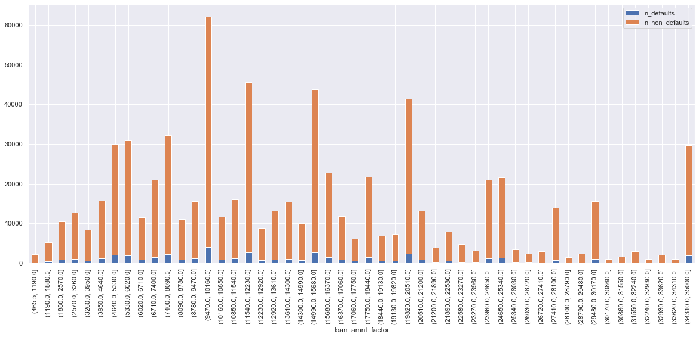


```python
fig, ax = plt.subplots(figsize=(12,8))

sns.distplot(raw_data[raw_data['Y'] == 0]['loan_amnt'], ax=ax, label='default')
sns.distplot(raw_data[raw_data['Y'] == 1]['loan_amnt'], ax=ax, label='non_default')
plt.legend()
```


    <matplotlib.legend.Legend at 0x1a4a5ea908>


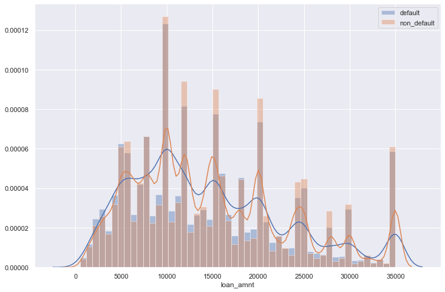


##### Seems like the amount has a minor effect on default. But one can notice that the ratio default/default is lower on the most required amounts mainly each 5000 multiple

### annual_inc

## ATTENTION!!! This variable discretization has changed in relation to the first model


```python
x_train_prep['annual_inc_factor'] = pd.qcut(x_train_prep['annual_inc'], 100, duplicates='drop')
```


```python
woe_df = woe_ordered_continuous(x_train_prep, 'annual_inc_factor', y_train_prep, rot_x_ticks=90, vlines=[1.5, 11.5, 25.5, 33.5, 38.5, 47.5, 59.5, 65.5])
woe_df
```


<div>
<style scoped>
    .dataframe tbody tr th:only-of-type {
        vertical-align: middle;
    }

    .dataframe tbody tr th {
        vertical-align: top;
    }

    .dataframe thead th {
        text-align: right;
    }
</style>
<table border="1" class="dataframe">
  <thead>
    <tr style="text-align: right;">
      <th></th>
      <th>annual_inc_factor</th>
      <th>n_obs</th>
      <th>prop_non_defaults</th>
      <th>prop_n_obs</th>
      <th>n_defaults</th>
      <th>n_non_defaults</th>
      <th>prop_n_non_defaults</th>
      <th>prop_n_defaults</th>
      <th>WoE</th>
      <th>diff_prop_non_defaults</th>
      <th>diff_WoE</th>
      <th>IV</th>
    </tr>
  </thead>
  <tbody>
    <tr>
      <th>0</th>
      <td>(-0.001, 19000.0]</td>
      <td>7472</td>
      <td>0.889320</td>
      <td>0.010525</td>
      <td>827.0</td>
      <td>6645.0</td>
      <td>0.010048</td>
      <td>0.017020</td>
      <td>-0.526972</td>
      <td>NaN</td>
      <td>NaN</td>
      <td>0.061828</td>
    </tr>
    <tr>
      <th>1</th>
      <td>(19000.0, 22000.0]</td>
      <td>6749</td>
      <td>0.897466</td>
      <td>0.009507</td>
      <td>692.0</td>
      <td>6057.0</td>
      <td>0.009159</td>
      <td>0.014241</td>
      <td>-0.441403</td>
      <td>0.000889</td>
      <td>0.085569</td>
      <td>0.061828</td>
    </tr>
    <tr>
      <th>2</th>
      <td>(22000.0, 25000.0]</td>
      <td>11458</td>
      <td>0.904957</td>
      <td>0.016140</td>
      <td>1089.0</td>
      <td>10369.0</td>
      <td>0.015679</td>
      <td>0.022412</td>
      <td>-0.357227</td>
      <td>0.006520</td>
      <td>0.084177</td>
      <td>0.061828</td>
    </tr>
    <tr>
      <th>3</th>
      <td>(25000.0, 26000.0]</td>
      <td>2991</td>
      <td>0.904714</td>
      <td>0.004213</td>
      <td>285.0</td>
      <td>2706.0</td>
      <td>0.004092</td>
      <td>0.005865</td>
      <td>-0.360050</td>
      <td>0.011588</td>
      <td>0.002823</td>
      <td>0.061828</td>
    </tr>
    <tr>
      <th>4</th>
      <td>(26000.0, 28000.0]</td>
      <td>7450</td>
      <td>0.903490</td>
      <td>0.010494</td>
      <td>719.0</td>
      <td>6731.0</td>
      <td>0.010178</td>
      <td>0.014797</td>
      <td>-0.374170</td>
      <td>0.006086</td>
      <td>0.014120</td>
      <td>0.061828</td>
    </tr>
    <tr>
      <th>5</th>
      <td>(28000.0, 30000.0]</td>
      <td>15109</td>
      <td>0.908333</td>
      <td>0.021283</td>
      <td>1385.0</td>
      <td>13724.0</td>
      <td>0.020753</td>
      <td>0.028503</td>
      <td>-0.317341</td>
      <td>0.010574</td>
      <td>0.056828</td>
      <td>0.061828</td>
    </tr>
    <tr>
      <th>6</th>
      <td>(30000.0, 32000.0]</td>
      <td>10005</td>
      <td>0.910445</td>
      <td>0.014093</td>
      <td>896.0</td>
      <td>9109.0</td>
      <td>0.013774</td>
      <td>0.018440</td>
      <td>-0.291710</td>
      <td>0.006979</td>
      <td>0.025632</td>
      <td>0.061828</td>
    </tr>
    <tr>
      <th>7</th>
      <td>(32000.0, 33000.0]</td>
      <td>4736</td>
      <td>0.908995</td>
      <td>0.006671</td>
      <td>431.0</td>
      <td>4305.0</td>
      <td>0.006510</td>
      <td>0.008870</td>
      <td>-0.309363</td>
      <td>0.007264</td>
      <td>0.017653</td>
      <td>0.061828</td>
    </tr>
    <tr>
      <th>8</th>
      <td>(33000.0, 34200.0]</td>
      <td>5063</td>
      <td>0.912897</td>
      <td>0.007132</td>
      <td>441.0</td>
      <td>4622.0</td>
      <td>0.006989</td>
      <td>0.009076</td>
      <td>-0.261249</td>
      <td>0.000479</td>
      <td>0.048114</td>
      <td>0.061828</td>
    </tr>
    <tr>
      <th>9</th>
      <td>(34200.0, 35000.0]</td>
      <td>13186</td>
      <td>0.912104</td>
      <td>0.018574</td>
      <td>1159.0</td>
      <td>12027.0</td>
      <td>0.018187</td>
      <td>0.023852</td>
      <td>-0.271191</td>
      <td>0.011197</td>
      <td>0.009941</td>
      <td>0.061828</td>
    </tr>
    <tr>
      <th>10</th>
      <td>(35000.0, 35500.0]</td>
      <td>1008</td>
      <td>0.899802</td>
      <td>0.001420</td>
      <td>101.0</td>
      <td>907.0</td>
      <td>0.001372</td>
      <td>0.002079</td>
      <td>-0.415765</td>
      <td>0.016815</td>
      <td>0.144575</td>
      <td>0.061828</td>
    </tr>
    <tr>
      <th>11</th>
      <td>(35500.0, 36298.171]</td>
      <td>7061</td>
      <td>0.902139</td>
      <td>0.009946</td>
      <td>691.0</td>
      <td>6370.0</td>
      <td>0.009632</td>
      <td>0.014221</td>
      <td>-0.389572</td>
      <td>0.008261</td>
      <td>0.026193</td>
      <td>0.061828</td>
    </tr>
    <tr>
      <th>12</th>
      <td>(36298.171, 38000.0]</td>
      <td>12385</td>
      <td>0.915139</td>
      <td>0.017446</td>
      <td>1051.0</td>
      <td>11334.0</td>
      <td>0.017139</td>
      <td>0.021630</td>
      <td>-0.232722</td>
      <td>0.007506</td>
      <td>0.156850</td>
      <td>0.061828</td>
    </tr>
    <tr>
      <th>13</th>
      <td>(38000.0, 38780.0]</td>
      <td>1814</td>
      <td>0.899669</td>
      <td>0.002555</td>
      <td>182.0</td>
      <td>1632.0</td>
      <td>0.002468</td>
      <td>0.003746</td>
      <td>-0.417233</td>
      <td>0.014671</td>
      <td>0.184510</td>
      <td>0.061828</td>
    </tr>
    <tr>
      <th>14</th>
      <td>(38780.0, 40000.0]</td>
      <td>24050</td>
      <td>0.914511</td>
      <td>0.033878</td>
      <td>2056.0</td>
      <td>21994.0</td>
      <td>0.033258</td>
      <td>0.042312</td>
      <td>-0.240780</td>
      <td>0.030790</td>
      <td>0.176452</td>
      <td>0.061828</td>
    </tr>
    <tr>
      <th>15</th>
      <td>(40000.0, 41000.0]</td>
      <td>4955</td>
      <td>0.921493</td>
      <td>0.006980</td>
      <td>389.0</td>
      <td>4566.0</td>
      <td>0.006904</td>
      <td>0.008006</td>
      <td>-0.147974</td>
      <td>0.026354</td>
      <td>0.092806</td>
      <td>0.061828</td>
    </tr>
    <tr>
      <th>16</th>
      <td>(41000.0, 42000.0]</td>
      <td>11263</td>
      <td>0.913877</td>
      <td>0.015866</td>
      <td>970.0</td>
      <td>10293.0</td>
      <td>0.015565</td>
      <td>0.019963</td>
      <td>-0.248864</td>
      <td>0.008660</td>
      <td>0.100890</td>
      <td>0.061828</td>
    </tr>
    <tr>
      <th>17</th>
      <td>(42000.0, 43000.0]</td>
      <td>6647</td>
      <td>0.915150</td>
      <td>0.009363</td>
      <td>564.0</td>
      <td>6083.0</td>
      <td>0.009198</td>
      <td>0.011607</td>
      <td>-0.232588</td>
      <td>0.006366</td>
      <td>0.016276</td>
      <td>0.061828</td>
    </tr>
    <tr>
      <th>18</th>
      <td>(43000.0, 44000.0]</td>
      <td>5454</td>
      <td>0.917492</td>
      <td>0.007683</td>
      <td>450.0</td>
      <td>5004.0</td>
      <td>0.007567</td>
      <td>0.009261</td>
      <td>-0.202042</td>
      <td>0.001632</td>
      <td>0.030546</td>
      <td>0.061828</td>
    </tr>
    <tr>
      <th>19</th>
      <td>(44000.0, 45000.0]</td>
      <td>19854</td>
      <td>0.919361</td>
      <td>0.027967</td>
      <td>1601.0</td>
      <td>18253.0</td>
      <td>0.027601</td>
      <td>0.032948</td>
      <td>-0.177086</td>
      <td>0.020034</td>
      <td>0.024956</td>
      <td>0.061828</td>
    </tr>
    <tr>
      <th>20</th>
      <td>(45000.0, 46000.0]</td>
      <td>5956</td>
      <td>0.918737</td>
      <td>0.008390</td>
      <td>484.0</td>
      <td>5472.0</td>
      <td>0.008274</td>
      <td>0.009961</td>
      <td>-0.185473</td>
      <td>0.019327</td>
      <td>0.008386</td>
      <td>0.061828</td>
    </tr>
    <tr>
      <th>21</th>
      <td>(46000.0, 47611.0]</td>
      <td>7009</td>
      <td>0.929805</td>
      <td>0.009873</td>
      <td>492.0</td>
      <td>6517.0</td>
      <td>0.009855</td>
      <td>0.010125</td>
      <td>-0.027097</td>
      <td>0.001580</td>
      <td>0.158376</td>
      <td>0.061828</td>
    </tr>
    <tr>
      <th>22</th>
      <td>(47611.0, 48000.0]</td>
      <td>9607</td>
      <td>0.918497</td>
      <td>0.013533</td>
      <td>783.0</td>
      <td>8824.0</td>
      <td>0.013343</td>
      <td>0.016114</td>
      <td>-0.188690</td>
      <td>0.003489</td>
      <td>0.161593</td>
      <td>0.061828</td>
    </tr>
    <tr>
      <th>23</th>
      <td>(48000.0, 49000.0]</td>
      <td>5032</td>
      <td>0.923887</td>
      <td>0.007088</td>
      <td>383.0</td>
      <td>4649.0</td>
      <td>0.007030</td>
      <td>0.007882</td>
      <td>-0.114415</td>
      <td>0.006313</td>
      <td>0.074275</td>
      <td>0.061828</td>
    </tr>
    <tr>
      <th>24</th>
      <td>(49000.0, 50000.0]</td>
      <td>26369</td>
      <td>0.925822</td>
      <td>0.037145</td>
      <td>1956.0</td>
      <td>24413.0</td>
      <td>0.036916</td>
      <td>0.040254</td>
      <td>-0.086573</td>
      <td>0.029886</td>
      <td>0.027842</td>
      <td>0.061828</td>
    </tr>
    <tr>
      <th>25</th>
      <td>(50000.0, 50870.0]</td>
      <td>1587</td>
      <td>0.904852</td>
      <td>0.002236</td>
      <td>151.0</td>
      <td>1436.0</td>
      <td>0.002171</td>
      <td>0.003108</td>
      <td>-0.358450</td>
      <td>0.034745</td>
      <td>0.271877</td>
      <td>0.061828</td>
    </tr>
    <tr>
      <th>26</th>
      <td>(50870.0, 52000.0]</td>
      <td>15070</td>
      <td>0.930723</td>
      <td>0.021228</td>
      <td>1044.0</td>
      <td>14026.0</td>
      <td>0.021209</td>
      <td>0.021485</td>
      <td>-0.012934</td>
      <td>0.019038</td>
      <td>0.345516</td>
      <td>0.061828</td>
    </tr>
    <tr>
      <th>27</th>
      <td>(52000.0, 53088.534]</td>
      <td>6225</td>
      <td>0.931727</td>
      <td>0.008769</td>
      <td>425.0</td>
      <td>5800.0</td>
      <td>0.008770</td>
      <td>0.008746</td>
      <td>0.002737</td>
      <td>0.012439</td>
      <td>0.015671</td>
      <td>0.061828</td>
    </tr>
    <tr>
      <th>28</th>
      <td>(53088.534, 54276.0]</td>
      <td>7100</td>
      <td>0.920563</td>
      <td>0.010001</td>
      <td>564.0</td>
      <td>6536.0</td>
      <td>0.009883</td>
      <td>0.011607</td>
      <td>-0.160761</td>
      <td>0.001113</td>
      <td>0.163498</td>
      <td>0.061828</td>
    </tr>
    <tr>
      <th>29</th>
      <td>(54276.0, 55000.0]</td>
      <td>17868</td>
      <td>0.929539</td>
      <td>0.025170</td>
      <td>1259.0</td>
      <td>16609.0</td>
      <td>0.025115</td>
      <td>0.025910</td>
      <td>-0.031160</td>
      <td>0.015232</td>
      <td>0.129601</td>
      <td>0.061828</td>
    </tr>
    <tr>
      <th>...</th>
      <td>...</td>
      <td>...</td>
      <td>...</td>
      <td>...</td>
      <td>...</td>
      <td>...</td>
      <td>...</td>
      <td>...</td>
      <td>...</td>
      <td>...</td>
      <td>...</td>
      <td>...</td>
    </tr>
    <tr>
      <th>47</th>
      <td>(78000.0, 80000.0]</td>
      <td>21725</td>
      <td>0.939056</td>
      <td>0.030603</td>
      <td>1324.0</td>
      <td>20401.0</td>
      <td>0.030849</td>
      <td>0.027248</td>
      <td>0.124139</td>
      <td>0.018926</td>
      <td>0.059318</td>
      <td>0.061828</td>
    </tr>
    <tr>
      <th>48</th>
      <td>(80000.0, 82000.0]</td>
      <td>6974</td>
      <td>0.942214</td>
      <td>0.009824</td>
      <td>403.0</td>
      <td>6571.0</td>
      <td>0.009936</td>
      <td>0.008294</td>
      <td>0.180697</td>
      <td>0.020913</td>
      <td>0.056558</td>
      <td>0.061828</td>
    </tr>
    <tr>
      <th>49</th>
      <td>(82000.0, 83500.0]</td>
      <td>3983</td>
      <td>0.945016</td>
      <td>0.005611</td>
      <td>219.0</td>
      <td>3764.0</td>
      <td>0.005692</td>
      <td>0.004507</td>
      <td>0.233378</td>
      <td>0.004245</td>
      <td>0.052681</td>
      <td>0.061828</td>
    </tr>
    <tr>
      <th>50</th>
      <td>(83500.0, 85000.0]</td>
      <td>16665</td>
      <td>0.941734</td>
      <td>0.023475</td>
      <td>971.0</td>
      <td>15694.0</td>
      <td>0.023732</td>
      <td>0.019983</td>
      <td>0.171920</td>
      <td>0.018040</td>
      <td>0.061458</td>
      <td>0.061828</td>
    </tr>
    <tr>
      <th>51</th>
      <td>(85000.0, 87000.0]</td>
      <td>5821</td>
      <td>0.942965</td>
      <td>0.008200</td>
      <td>332.0</td>
      <td>5489.0</td>
      <td>0.008300</td>
      <td>0.006833</td>
      <td>0.194579</td>
      <td>0.015431</td>
      <td>0.022659</td>
      <td>0.061828</td>
    </tr>
    <tr>
      <th>52</th>
      <td>(87000.0, 89000.0]</td>
      <td>5804</td>
      <td>0.947105</td>
      <td>0.008176</td>
      <td>307.0</td>
      <td>5497.0</td>
      <td>0.008312</td>
      <td>0.006318</td>
      <td>0.274323</td>
      <td>0.000012</td>
      <td>0.079744</td>
      <td>0.061828</td>
    </tr>
    <tr>
      <th>53</th>
      <td>(89000.0, 90000.0]</td>
      <td>14458</td>
      <td>0.944045</td>
      <td>0.020366</td>
      <td>809.0</td>
      <td>13649.0</td>
      <td>0.020639</td>
      <td>0.016649</td>
      <td>0.214835</td>
      <td>0.012327</td>
      <td>0.059487</td>
      <td>0.061828</td>
    </tr>
    <tr>
      <th>54</th>
      <td>(90000.0, 93000.0]</td>
      <td>8529</td>
      <td>0.945128</td>
      <td>0.012014</td>
      <td>468.0</td>
      <td>8061.0</td>
      <td>0.012189</td>
      <td>0.009631</td>
      <td>0.235537</td>
      <td>0.008450</td>
      <td>0.020702</td>
      <td>0.061828</td>
    </tr>
    <tr>
      <th>55</th>
      <td>(93000.0, 95000.0]</td>
      <td>10281</td>
      <td>0.947865</td>
      <td>0.014482</td>
      <td>536.0</td>
      <td>9745.0</td>
      <td>0.014736</td>
      <td>0.011031</td>
      <td>0.289588</td>
      <td>0.002546</td>
      <td>0.054051</td>
      <td>0.061828</td>
    </tr>
    <tr>
      <th>56</th>
      <td>(95000.0, 96000.0]</td>
      <td>3390</td>
      <td>0.938643</td>
      <td>0.004775</td>
      <td>208.0</td>
      <td>3182.0</td>
      <td>0.004812</td>
      <td>0.004281</td>
      <td>0.116940</td>
      <td>0.009924</td>
      <td>0.172648</td>
      <td>0.061828</td>
    </tr>
    <tr>
      <th>57</th>
      <td>(96000.0, 98500.0]</td>
      <td>6039</td>
      <td>0.945024</td>
      <td>0.008507</td>
      <td>332.0</td>
      <td>5707.0</td>
      <td>0.008630</td>
      <td>0.006833</td>
      <td>0.233526</td>
      <td>0.003818</td>
      <td>0.116587</td>
      <td>0.061828</td>
    </tr>
    <tr>
      <th>58</th>
      <td>(98500.0, 100000.0]</td>
      <td>15636</td>
      <td>0.943208</td>
      <td>0.022026</td>
      <td>888.0</td>
      <td>14748.0</td>
      <td>0.022301</td>
      <td>0.018275</td>
      <td>0.199104</td>
      <td>0.013671</td>
      <td>0.034423</td>
      <td>0.061828</td>
    </tr>
    <tr>
      <th>59</th>
      <td>(100000.0, 103000.0]</td>
      <td>6201</td>
      <td>0.947105</td>
      <td>0.008735</td>
      <td>328.0</td>
      <td>5873.0</td>
      <td>0.008881</td>
      <td>0.006750</td>
      <td>0.274320</td>
      <td>0.013420</td>
      <td>0.075216</td>
      <td>0.061828</td>
    </tr>
    <tr>
      <th>60</th>
      <td>(103000.0, 105000.0]</td>
      <td>7454</td>
      <td>0.951704</td>
      <td>0.010500</td>
      <td>360.0</td>
      <td>7094.0</td>
      <td>0.010727</td>
      <td>0.007409</td>
      <td>0.370113</td>
      <td>0.001846</td>
      <td>0.095793</td>
      <td>0.061828</td>
    </tr>
    <tr>
      <th>61</th>
      <td>(105000.0, 109000.0]</td>
      <td>6283</td>
      <td>0.951138</td>
      <td>0.008851</td>
      <td>307.0</td>
      <td>5976.0</td>
      <td>0.009037</td>
      <td>0.006318</td>
      <td>0.357872</td>
      <td>0.001691</td>
      <td>0.012242</td>
      <td>0.061828</td>
    </tr>
    <tr>
      <th>62</th>
      <td>(109000.0, 110000.0]</td>
      <td>9199</td>
      <td>0.949777</td>
      <td>0.012958</td>
      <td>462.0</td>
      <td>8737.0</td>
      <td>0.013212</td>
      <td>0.009508</td>
      <td>0.328970</td>
      <td>0.004175</td>
      <td>0.028902</td>
      <td>0.061828</td>
    </tr>
    <tr>
      <th>63</th>
      <td>(110000.0, 115000.0]</td>
      <td>8613</td>
      <td>0.956229</td>
      <td>0.012133</td>
      <td>377.0</td>
      <td>8236.0</td>
      <td>0.012454</td>
      <td>0.007759</td>
      <td>0.473237</td>
      <td>0.000758</td>
      <td>0.144268</td>
      <td>0.061828</td>
    </tr>
    <tr>
      <th>64</th>
      <td>(115000.0, 118533.04]</td>
      <td>3248</td>
      <td>0.952586</td>
      <td>0.004575</td>
      <td>154.0</td>
      <td>3094.0</td>
      <td>0.004679</td>
      <td>0.003169</td>
      <td>0.389480</td>
      <td>0.007775</td>
      <td>0.083757</td>
      <td>0.061828</td>
    </tr>
    <tr>
      <th>65</th>
      <td>(118533.04, 120000.0]</td>
      <td>11274</td>
      <td>0.945716</td>
      <td>0.015881</td>
      <td>612.0</td>
      <td>10662.0</td>
      <td>0.016122</td>
      <td>0.012595</td>
      <td>0.246922</td>
      <td>0.011444</td>
      <td>0.142558</td>
      <td>0.061828</td>
    </tr>
    <tr>
      <th>66</th>
      <td>(120000.0, 124800.0]</td>
      <td>2961</td>
      <td>0.959473</td>
      <td>0.004171</td>
      <td>120.0</td>
      <td>2841.0</td>
      <td>0.004296</td>
      <td>0.002470</td>
      <td>0.553632</td>
      <td>0.011826</td>
      <td>0.306711</td>
      <td>0.061828</td>
    </tr>
    <tr>
      <th>67</th>
      <td>(124800.0, 127000.0]</td>
      <td>7079</td>
      <td>0.952818</td>
      <td>0.009972</td>
      <td>334.0</td>
      <td>6745.0</td>
      <td>0.010199</td>
      <td>0.006874</td>
      <td>0.394628</td>
      <td>0.005903</td>
      <td>0.159004</td>
      <td>0.061828</td>
    </tr>
    <tr>
      <th>68</th>
      <td>(127000.0, 132000.0]</td>
      <td>7699</td>
      <td>0.954410</td>
      <td>0.010845</td>
      <td>351.0</td>
      <td>7348.0</td>
      <td>0.011111</td>
      <td>0.007224</td>
      <td>0.430610</td>
      <td>0.000912</td>
      <td>0.035981</td>
      <td>0.061828</td>
    </tr>
    <tr>
      <th>69</th>
      <td>(132000.0, 140000.0]</td>
      <td>10093</td>
      <td>0.959081</td>
      <td>0.014217</td>
      <td>413.0</td>
      <td>9680.0</td>
      <td>0.014638</td>
      <td>0.008500</td>
      <td>0.543582</td>
      <td>0.003526</td>
      <td>0.112972</td>
      <td>0.061828</td>
    </tr>
    <tr>
      <th>70</th>
      <td>(140000.0, 145000.0]</td>
      <td>3528</td>
      <td>0.949830</td>
      <td>0.004970</td>
      <td>177.0</td>
      <td>3351.0</td>
      <td>0.005067</td>
      <td>0.003643</td>
      <td>0.330077</td>
      <td>0.009570</td>
      <td>0.213505</td>
      <td>0.061828</td>
    </tr>
    <tr>
      <th>71</th>
      <td>(145000.0, 150000.0]</td>
      <td>7948</td>
      <td>0.953322</td>
      <td>0.011196</td>
      <td>371.0</td>
      <td>7577.0</td>
      <td>0.011458</td>
      <td>0.007635</td>
      <td>0.405883</td>
      <td>0.006390</td>
      <td>0.075806</td>
      <td>0.061828</td>
    </tr>
    <tr>
      <th>72</th>
      <td>(150000.0, 162798.8]</td>
      <td>6210</td>
      <td>0.951047</td>
      <td>0.008748</td>
      <td>304.0</td>
      <td>5906.0</td>
      <td>0.008931</td>
      <td>0.006256</td>
      <td>0.355909</td>
      <td>0.002527</td>
      <td>0.049974</td>
      <td>0.061828</td>
    </tr>
    <tr>
      <th>73</th>
      <td>(162798.8, 180000.0]</td>
      <td>8717</td>
      <td>0.952277</td>
      <td>0.012279</td>
      <td>416.0</td>
      <td>8301.0</td>
      <td>0.012552</td>
      <td>0.008561</td>
      <td>0.382659</td>
      <td>0.003622</td>
      <td>0.026750</td>
      <td>0.061828</td>
    </tr>
    <tr>
      <th>74</th>
      <td>(180000.0, 200000.0]</td>
      <td>6294</td>
      <td>0.959167</td>
      <td>0.008866</td>
      <td>257.0</td>
      <td>6037.0</td>
      <td>0.009129</td>
      <td>0.005289</td>
      <td>0.545799</td>
      <td>0.003423</td>
      <td>0.163140</td>
      <td>0.061828</td>
    </tr>
    <tr>
      <th>75</th>
      <td>(200000.0, 250000.0]</td>
      <td>7007</td>
      <td>0.956187</td>
      <td>0.009870</td>
      <td>307.0</td>
      <td>6700.0</td>
      <td>0.010131</td>
      <td>0.006318</td>
      <td>0.472228</td>
      <td>0.001003</td>
      <td>0.073571</td>
      <td>0.061828</td>
    </tr>
    <tr>
      <th>76</th>
      <td>(250000.0, 9500000.0]</td>
      <td>6379</td>
      <td>0.955949</td>
      <td>0.008986</td>
      <td>281.0</td>
      <td>6098.0</td>
      <td>0.009221</td>
      <td>0.005783</td>
      <td>0.466574</td>
      <td>0.000910</td>
      <td>0.005654</td>
      <td>0.061828</td>
    </tr>
  </tbody>
</table>
<p>77 rows  12 columns</p>
</div>


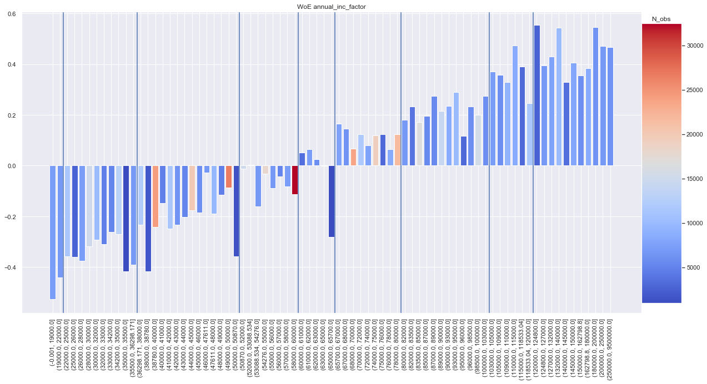


```python
fig, ax = plt.subplots(figsize=(20,8))

woe_df.iloc[:50,:].set_index('annual_inc_factor').iloc[:, [3,4]].plot(kind='bar', stacked=True, ax=ax)

plt.legend()
```


    <matplotlib.legend.Legend at 0x1a4a7b3dd8>


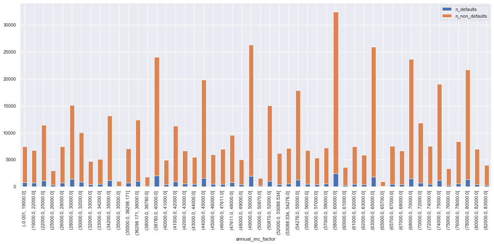


```python
x_train_prep['annual_inc:<=22k'] = np.where(x_train_prep['annual_inc'] <= 22000, 1, 0)
x_train_prep['annual_inc:22k_36k'] = np.where((x_train_prep['annual_inc'] > 22000) & (x_train_prep['annual_inc'] <= 36000), 1, 0)
x_train_prep['annual_inc:36k_51k'] = np.where((x_train_prep['annual_inc'] > 36000) & (x_train_prep['annual_inc'] <= 51000), 1, 0)
x_train_prep['annual_inc:51k_60k'] = np.where((x_train_prep['annual_inc'] > 51000) & (x_train_prep['annual_inc'] <= 60000), 1, 0)
x_train_prep['annual_inc:60k_66k'] = np.where((x_train_prep['annual_inc'] > 60000) & (x_train_prep['annual_inc'] <= 66000), 1, 0)
x_train_prep['annual_inc:66k_80k'] = np.where((x_train_prep['annual_inc'] > 66000) & (x_train_prep['annual_inc'] <= 80000), 1, 0)
x_train_prep['annual_inc:80k_103k'] = np.where((x_train_prep['annual_inc'] > 80000) & (x_train_prep['annual_inc'] <= 103000), 1, 0)
x_train_prep['annual_inc:103k_120k'] = np.where((x_train_prep['annual_inc'] > 103000) & (x_train_prep['annual_inc'] <= 120000), 1, 0)
x_train_prep['annual_inc:>120k'] = np.where(x_train_prep['annual_inc'] > 120000, 1, 0)

```


```python
fig, ax = plt.subplots(figsize=(20,8))

var_s = ['annual_inc:<=22k', 'annual_inc:22k_36k', 'annual_inc:36k_51k','annual_inc:51k_60k', 'annual_inc:60k_66k', 'annual_inc:66k_80k', 
         'annual_inc:80k_103k', 'annual_inc:103k_120k', 'annual_inc:>120k']

pd.concat([x_train_prep, y_train_prep], axis=1).groupby('Y').sum().loc[:, var_s].T.plot(kind='bar', stacked=True, ax=ax)

plt.legend()
```


    <matplotlib.legend.Legend at 0x1a4a815b38>


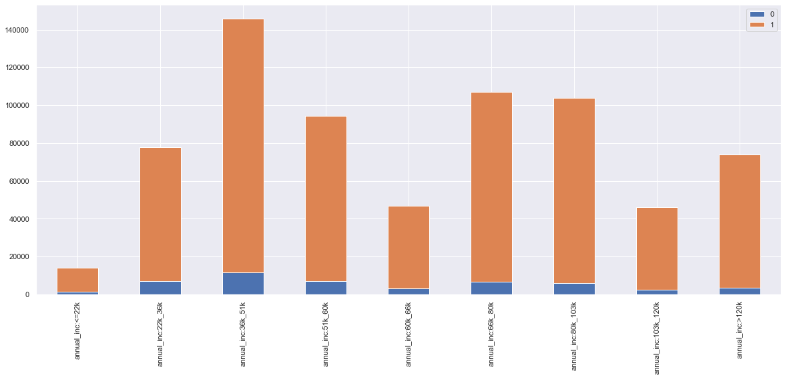


```python
vars_to_use.append(['annual_inc:22k_36k', 'annual_inc:36k_51k','annual_inc:51k_60k', 'annual_inc:60k_66k', 'annual_inc:66k_80k', 
                     'annual_inc:80k_103k', 'annual_inc:103k_120k', 'annual_inc:>120k'])

ref_vars.append(['annual_inc:<=22k'])

vars_to_use
```


    [['grade:F', 'grade:E', 'grade:D', 'grade:C', 'grade:B', 'grade:A'],
     ['home_ownership:OWN', 'home_ownership:MORTGAGE'],
     ['addr_state:NY',
      'addr_state:VA_OK_AL_SD',
      'addr_state:CA',
      'addr_state:MO_DE_MD_UT_LA_NJ',
      'addr_state:NM_NC_AZ',
      'addr_state:PA_MA_RI_MI_AR',
      'addr_state:MN_OH_AK',
      'addr_state:KY_WI_GA_WA',
      'addr_state:OR_IN_TN_CT',
      'addr_state:TX',
      'addr_state:IL_KS_MT_SC_CO',
      'addr_state:VT_WV_WY_NH_DC_MS'],
     ['verification_status:Not Verified', 'verification_status:Source Verified'],
     ['initial_list_status:w'],
     ['purpose:house_mov_ren_oth_med',
      'purpose:vac_debtc_majpur_car_homeimp',
      'purpose:credit_card'],
     ['term:36'],
     ['emp_length_int:1',
      'emp_length_int:2_3_4',
      'emp_length_int:5_6_7',
      'emp_length_int:8_9',
      'emp_length_int:10'],
     ['mths_since_issue_d:<38',
      'mths_since_issue_d:38_39',
      'mths_since_issue_d:40_41',
      'mths_since_issue_d:42_48',
      'mths_since_issue_d:49_54',
      'mths_since_issue_d:55_68',
      'mths_since_issue_d:69_95'],
     ['int_rate:<10.054',
      'int_rate:10.054_12.849',
      'int_rate:12.849_15.735',
      'int_rate:15.735_19.995'],
     ['mths_since_earliest_cr_line:<160',
      'mths_since_earliest_cr_line:161_288',
      'mths_since_earliest_cr_line:289_360'],
     ['delinq_2yrs:0', 'delinq_2yrs:1-3'],
     ['inq_last_6mths:0', 'inq_last_6mths:1-2', 'inq_last_6mths:3-6'],
     ['open_acc:1-3',
      'open_acc:4-12',
      'open_acc:13-17',
      'open_acc:18-22',
      'open_acc:23-25',
      'open_acc:26-30',
      'open_acc:>=31'],
     ['pub_rec:>1'],
     ['total_acc:15_24', 'total_acc:25_57', 'total_acc:>=57'],
     ['acc_now_delinq:>=1'],
     ['total_rev_hi_lim:5K-10K',
      'total_rev_hi_lim:10K-20K',
      'total_rev_hi_lim:20K-30K',
      'total_rev_hi_lim:30K-40K',
      'total_rev_hi_lim:40K-55K',
      'total_rev_hi_lim:55K-95K',
      'total_rev_hi_lim:>95K'],
     ['annual_inc:22k_36k',
      'annual_inc:36k_51k',
      'annual_inc:51k_60k',
      'annual_inc:60k_66k',
      'annual_inc:66k_80k',
      'annual_inc:80k_103k',
      'annual_inc:103k_120k',
      'annual_inc:>120k']]


## mths_since_last_delinq


```python
print(x_train_prep['mths_since_last_delinq'].nunique(), 'unique values')
print(x_train_prep['mths_since_last_delinq'].isnull().sum(), 'missing values')
x_train_prep['mths_since_last_delinq'].describe()
```

    150 unique values
    363346 missing values


    count    346557.000000
    mean         34.091950
    std          21.904886
    min           0.000000
    25%          15.000000
    50%          31.000000
    75%          50.000000
    max         188.000000
    Name: mths_since_last_delinq, dtype: float64


```python
temp_not_null = x_train_prep[x_train_prep['mths_since_last_delinq'].notnull()]
temp_not_null['mths_since_last_delinq_factor'] = pd.cut(temp_not_null['mths_since_last_delinq'], 50)
```

    /Users/omaromeiri/anaconda3/lib/python3.7/site-packages/ipykernel_launcher.py:2: SettingWithCopyWarning: 
    A value is trying to be set on a copy of a slice from a DataFrame.
    Try using .loc[row_indexer,col_indexer] = value instead
    
    See the caveats in the documentation: http://pandas.pydata.org/pandas-docs/stable/indexing.html#indexing-view-versus-copy
      


```python
woe_df = woe_ordered_continuous(temp_not_null, 'mths_since_last_delinq_factor', y_train_prep[temp_not_null.index.values], plot_rows_start=0, plot_rows_end=22, rot_x_ticks=90, vlines=[0.5, 7.5, 14.5])
woe_df
```


<div>
<style scoped>
    .dataframe tbody tr th:only-of-type {
        vertical-align: middle;
    }

    .dataframe tbody tr th {
        vertical-align: top;
    }

    .dataframe thead th {
        text-align: right;
    }
</style>
<table border="1" class="dataframe">
  <thead>
    <tr style="text-align: right;">
      <th></th>
      <th>mths_since_last_delinq_factor</th>
      <th>n_obs</th>
      <th>prop_non_defaults</th>
      <th>prop_n_obs</th>
      <th>n_defaults</th>
      <th>n_non_defaults</th>
      <th>prop_n_non_defaults</th>
      <th>prop_n_defaults</th>
      <th>WoE</th>
      <th>diff_prop_non_defaults</th>
      <th>diff_WoE</th>
      <th>IV</th>
    </tr>
  </thead>
  <tbody>
    <tr>
      <th>0</th>
      <td>(-0.188, 3.76]</td>
      <td>11126</td>
      <td>0.904818</td>
      <td>0.032104</td>
      <td>1059.0</td>
      <td>10067.0</td>
      <td>0.031095</td>
      <td>0.046427</td>
      <td>-0.400826</td>
      <td>NaN</td>
      <td>NaN</td>
      <td>0.009848</td>
    </tr>
    <tr>
      <th>1</th>
      <td>(3.76, 7.52]</td>
      <td>23705</td>
      <td>0.932968</td>
      <td>0.068401</td>
      <td>1589.0</td>
      <td>22116.0</td>
      <td>0.068313</td>
      <td>0.069662</td>
      <td>-0.019567</td>
      <td>0.037217</td>
      <td>0.381259</td>
      <td>0.009848</td>
    </tr>
    <tr>
      <th>2</th>
      <td>(7.52, 11.28]</td>
      <td>26361</td>
      <td>0.933311</td>
      <td>0.076065</td>
      <td>1758.0</td>
      <td>24603.0</td>
      <td>0.075995</td>
      <td>0.077071</td>
      <td>-0.014072</td>
      <td>0.007682</td>
      <td>0.005495</td>
      <td>0.009848</td>
    </tr>
    <tr>
      <th>3</th>
      <td>(11.28, 15.04]</td>
      <td>26210</td>
      <td>0.930485</td>
      <td>0.075630</td>
      <td>1822.0</td>
      <td>24388.0</td>
      <td>0.075330</td>
      <td>0.079877</td>
      <td>-0.058607</td>
      <td>0.000664</td>
      <td>0.044535</td>
      <td>0.009848</td>
    </tr>
    <tr>
      <th>4</th>
      <td>(15.04, 18.8]</td>
      <td>18154</td>
      <td>0.934064</td>
      <td>0.052384</td>
      <td>1197.0</td>
      <td>16957.0</td>
      <td>0.052377</td>
      <td>0.052477</td>
      <td>-0.001901</td>
      <td>0.022953</td>
      <td>0.056706</td>
      <td>0.009848</td>
    </tr>
    <tr>
      <th>5</th>
      <td>(18.8, 22.56]</td>
      <td>23033</td>
      <td>0.936005</td>
      <td>0.066462</td>
      <td>1474.0</td>
      <td>21559.0</td>
      <td>0.066592</td>
      <td>0.064621</td>
      <td>0.030050</td>
      <td>0.014215</td>
      <td>0.031951</td>
      <td>0.009848</td>
    </tr>
    <tr>
      <th>6</th>
      <td>(22.56, 26.32]</td>
      <td>21977</td>
      <td>0.937526</td>
      <td>0.063415</td>
      <td>1373.0</td>
      <td>20604.0</td>
      <td>0.063642</td>
      <td>0.060193</td>
      <td>0.055724</td>
      <td>0.002950</td>
      <td>0.025674</td>
      <td>0.009848</td>
    </tr>
    <tr>
      <th>7</th>
      <td>(26.32, 30.08]</td>
      <td>21286</td>
      <td>0.937612</td>
      <td>0.061421</td>
      <td>1328.0</td>
      <td>19958.0</td>
      <td>0.061647</td>
      <td>0.058220</td>
      <td>0.057193</td>
      <td>0.001995</td>
      <td>0.001469</td>
      <td>0.009848</td>
    </tr>
    <tr>
      <th>8</th>
      <td>(30.08, 33.84]</td>
      <td>15131</td>
      <td>0.941048</td>
      <td>0.043661</td>
      <td>892.0</td>
      <td>14239.0</td>
      <td>0.043982</td>
      <td>0.039106</td>
      <td>0.117511</td>
      <td>0.017665</td>
      <td>0.060318</td>
      <td>0.009848</td>
    </tr>
    <tr>
      <th>9</th>
      <td>(33.84, 37.6]</td>
      <td>19606</td>
      <td>0.938590</td>
      <td>0.056574</td>
      <td>1204.0</td>
      <td>18402.0</td>
      <td>0.056841</td>
      <td>0.052784</td>
      <td>0.074047</td>
      <td>0.012859</td>
      <td>0.043464</td>
      <td>0.009848</td>
    </tr>
    <tr>
      <th>10</th>
      <td>(37.6, 41.36]</td>
      <td>18138</td>
      <td>0.932076</td>
      <td>0.052338</td>
      <td>1232.0</td>
      <td>16906.0</td>
      <td>0.052220</td>
      <td>0.054011</td>
      <td>-0.033734</td>
      <td>0.004621</td>
      <td>0.107780</td>
      <td>0.009848</td>
    </tr>
    <tr>
      <th>11</th>
      <td>(41.36, 45.12]</td>
      <td>17748</td>
      <td>0.934359</td>
      <td>0.051212</td>
      <td>1165.0</td>
      <td>16583.0</td>
      <td>0.051222</td>
      <td>0.051074</td>
      <td>0.002894</td>
      <td>0.000998</td>
      <td>0.036627</td>
      <td>0.009848</td>
    </tr>
    <tr>
      <th>12</th>
      <td>(45.12, 48.88]</td>
      <td>12568</td>
      <td>0.936903</td>
      <td>0.036265</td>
      <td>793.0</td>
      <td>11775.0</td>
      <td>0.036371</td>
      <td>0.034765</td>
      <td>0.045147</td>
      <td>0.014851</td>
      <td>0.042254</td>
      <td>0.009848</td>
    </tr>
    <tr>
      <th>13</th>
      <td>(48.88, 52.64]</td>
      <td>12477</td>
      <td>0.931073</td>
      <td>0.036003</td>
      <td>860.0</td>
      <td>11617.0</td>
      <td>0.035883</td>
      <td>0.037703</td>
      <td>-0.049471</td>
      <td>0.000488</td>
      <td>0.094618</td>
      <td>0.009848</td>
    </tr>
    <tr>
      <th>14</th>
      <td>(52.64, 56.4]</td>
      <td>12069</td>
      <td>0.933549</td>
      <td>0.034825</td>
      <td>802.0</td>
      <td>11267.0</td>
      <td>0.034802</td>
      <td>0.035160</td>
      <td>-0.010239</td>
      <td>0.001081</td>
      <td>0.039232</td>
      <td>0.009848</td>
    </tr>
    <tr>
      <th>15</th>
      <td>(56.4, 60.16]</td>
      <td>12023</td>
      <td>0.942693</td>
      <td>0.034693</td>
      <td>689.0</td>
      <td>11334.0</td>
      <td>0.035009</td>
      <td>0.030206</td>
      <td>0.147558</td>
      <td>0.000207</td>
      <td>0.157796</td>
      <td>0.009848</td>
    </tr>
    <tr>
      <th>16</th>
      <td>(60.16, 63.92]</td>
      <td>8775</td>
      <td>0.936524</td>
      <td>0.025321</td>
      <td>557.0</td>
      <td>8218.0</td>
      <td>0.025384</td>
      <td>0.024419</td>
      <td>0.038754</td>
      <td>0.009625</td>
      <td>0.108804</td>
      <td>0.009848</td>
    </tr>
    <tr>
      <th>17</th>
      <td>(63.92, 67.68]</td>
      <td>11463</td>
      <td>0.937276</td>
      <td>0.033077</td>
      <td>719.0</td>
      <td>10744.0</td>
      <td>0.033186</td>
      <td>0.031521</td>
      <td>0.051478</td>
      <td>0.007802</td>
      <td>0.012724</td>
      <td>0.009848</td>
    </tr>
    <tr>
      <th>18</th>
      <td>(67.68, 71.44]</td>
      <td>10774</td>
      <td>0.939484</td>
      <td>0.031089</td>
      <td>652.0</td>
      <td>10122.0</td>
      <td>0.031265</td>
      <td>0.028584</td>
      <td>0.089659</td>
      <td>0.001921</td>
      <td>0.038181</td>
      <td>0.009848</td>
    </tr>
    <tr>
      <th>19</th>
      <td>(71.44, 75.2]</td>
      <td>9996</td>
      <td>0.932573</td>
      <td>0.028844</td>
      <td>674.0</td>
      <td>9322.0</td>
      <td>0.028794</td>
      <td>0.029548</td>
      <td>-0.025861</td>
      <td>0.002471</td>
      <td>0.115520</td>
      <td>0.009848</td>
    </tr>
    <tr>
      <th>20</th>
      <td>(75.2, 78.96]</td>
      <td>6588</td>
      <td>0.935489</td>
      <td>0.019010</td>
      <td>425.0</td>
      <td>6163.0</td>
      <td>0.019036</td>
      <td>0.018632</td>
      <td>0.021466</td>
      <td>0.009758</td>
      <td>0.047327</td>
      <td>0.009848</td>
    </tr>
    <tr>
      <th>21</th>
      <td>(78.96, 82.72]</td>
      <td>6748</td>
      <td>0.925904</td>
      <td>0.019472</td>
      <td>500.0</td>
      <td>6248.0</td>
      <td>0.019299</td>
      <td>0.021920</td>
      <td>-0.127355</td>
      <td>0.000263</td>
      <td>0.148821</td>
      <td>0.009848</td>
    </tr>
    <tr>
      <th>22</th>
      <td>(82.72, 86.48]</td>
      <td>244</td>
      <td>0.905738</td>
      <td>0.000704</td>
      <td>23.0</td>
      <td>221.0</td>
      <td>0.000683</td>
      <td>0.001008</td>
      <td>-0.390095</td>
      <td>0.018616</td>
      <td>0.262740</td>
      <td>0.009848</td>
    </tr>
    <tr>
      <th>23</th>
      <td>(86.48, 90.24]</td>
      <td>90</td>
      <td>0.933333</td>
      <td>0.000260</td>
      <td>6.0</td>
      <td>84.0</td>
      <td>0.000259</td>
      <td>0.000263</td>
      <td>-0.013706</td>
      <td>0.000423</td>
      <td>0.376389</td>
      <td>0.009848</td>
    </tr>
    <tr>
      <th>24</th>
      <td>(90.24, 94.0]</td>
      <td>59</td>
      <td>0.949153</td>
      <td>0.000170</td>
      <td>3.0</td>
      <td>56.0</td>
      <td>0.000173</td>
      <td>0.000132</td>
      <td>0.273976</td>
      <td>0.000086</td>
      <td>0.287682</td>
      <td>0.009848</td>
    </tr>
    <tr>
      <th>25</th>
      <td>(94.0, 97.76]</td>
      <td>44</td>
      <td>0.863636</td>
      <td>0.000127</td>
      <td>6.0</td>
      <td>38.0</td>
      <td>0.000117</td>
      <td>0.000263</td>
      <td>-0.806937</td>
      <td>0.000056</td>
      <td>1.080913</td>
      <td>0.009848</td>
    </tr>
    <tr>
      <th>26</th>
      <td>(97.76, 101.52]</td>
      <td>38</td>
      <td>0.973684</td>
      <td>0.000110</td>
      <td>1.0</td>
      <td>37.0</td>
      <td>0.000114</td>
      <td>0.000044</td>
      <td>0.958155</td>
      <td>0.000003</td>
      <td>1.765091</td>
      <td>0.009848</td>
    </tr>
    <tr>
      <th>27</th>
      <td>(101.52, 105.28]</td>
      <td>21</td>
      <td>0.952381</td>
      <td>0.000061</td>
      <td>1.0</td>
      <td>20.0</td>
      <td>0.000062</td>
      <td>0.000044</td>
      <td>0.342969</td>
      <td>0.000053</td>
      <td>0.615186</td>
      <td>0.009848</td>
    </tr>
    <tr>
      <th>28</th>
      <td>(105.28, 109.04]</td>
      <td>23</td>
      <td>0.913043</td>
      <td>0.000066</td>
      <td>2.0</td>
      <td>21.0</td>
      <td>0.000065</td>
      <td>0.000088</td>
      <td>-0.301388</td>
      <td>0.000003</td>
      <td>0.644357</td>
      <td>0.009848</td>
    </tr>
    <tr>
      <th>29</th>
      <td>(109.04, 112.8]</td>
      <td>9</td>
      <td>0.888889</td>
      <td>0.000026</td>
      <td>1.0</td>
      <td>8.0</td>
      <td>0.000025</td>
      <td>0.000044</td>
      <td>-0.573322</td>
      <td>0.000040</td>
      <td>0.271934</td>
      <td>0.009848</td>
    </tr>
    <tr>
      <th>30</th>
      <td>(112.8, 116.56]</td>
      <td>16</td>
      <td>0.937500</td>
      <td>0.000046</td>
      <td>1.0</td>
      <td>15.0</td>
      <td>0.000046</td>
      <td>0.000044</td>
      <td>0.055287</td>
      <td>0.000022</td>
      <td>0.628609</td>
      <td>0.009848</td>
    </tr>
    <tr>
      <th>31</th>
      <td>(116.56, 120.32]</td>
      <td>11</td>
      <td>1.000000</td>
      <td>0.000032</td>
      <td>0.0</td>
      <td>11.0</td>
      <td>0.000034</td>
      <td>0.000000</td>
      <td>NaN</td>
      <td>0.000012</td>
      <td>NaN</td>
      <td>0.009848</td>
    </tr>
    <tr>
      <th>32</th>
      <td>(120.32, 124.08]</td>
      <td>7</td>
      <td>1.000000</td>
      <td>0.000020</td>
      <td>0.0</td>
      <td>7.0</td>
      <td>0.000022</td>
      <td>0.000000</td>
      <td>NaN</td>
      <td>0.000012</td>
      <td>NaN</td>
      <td>0.009848</td>
    </tr>
    <tr>
      <th>33</th>
      <td>(124.08, 127.84]</td>
      <td>3</td>
      <td>1.000000</td>
      <td>0.000009</td>
      <td>0.0</td>
      <td>3.0</td>
      <td>0.000009</td>
      <td>0.000000</td>
      <td>NaN</td>
      <td>0.000012</td>
      <td>NaN</td>
      <td>0.009848</td>
    </tr>
    <tr>
      <th>34</th>
      <td>(127.84, 131.6]</td>
      <td>5</td>
      <td>1.000000</td>
      <td>0.000014</td>
      <td>0.0</td>
      <td>5.0</td>
      <td>0.000015</td>
      <td>0.000000</td>
      <td>NaN</td>
      <td>0.000006</td>
      <td>NaN</td>
      <td>0.009848</td>
    </tr>
    <tr>
      <th>35</th>
      <td>(131.6, 135.36]</td>
      <td>9</td>
      <td>0.888889</td>
      <td>0.000026</td>
      <td>1.0</td>
      <td>8.0</td>
      <td>0.000025</td>
      <td>0.000044</td>
      <td>-0.573322</td>
      <td>0.000009</td>
      <td>NaN</td>
      <td>0.009848</td>
    </tr>
    <tr>
      <th>36</th>
      <td>(135.36, 139.12]</td>
      <td>2</td>
      <td>1.000000</td>
      <td>0.000006</td>
      <td>0.0</td>
      <td>2.0</td>
      <td>0.000006</td>
      <td>0.000000</td>
      <td>NaN</td>
      <td>0.000019</td>
      <td>NaN</td>
      <td>0.009848</td>
    </tr>
    <tr>
      <th>37</th>
      <td>(139.12, 142.88]</td>
      <td>3</td>
      <td>1.000000</td>
      <td>0.000009</td>
      <td>0.0</td>
      <td>3.0</td>
      <td>0.000009</td>
      <td>0.000000</td>
      <td>NaN</td>
      <td>0.000003</td>
      <td>NaN</td>
      <td>0.009848</td>
    </tr>
    <tr>
      <th>38</th>
      <td>(142.88, 146.64]</td>
      <td>3</td>
      <td>1.000000</td>
      <td>0.000009</td>
      <td>0.0</td>
      <td>3.0</td>
      <td>0.000009</td>
      <td>0.000000</td>
      <td>NaN</td>
      <td>0.000000</td>
      <td>NaN</td>
      <td>0.009848</td>
    </tr>
    <tr>
      <th>39</th>
      <td>(146.64, 150.4]</td>
      <td>4</td>
      <td>0.750000</td>
      <td>0.000012</td>
      <td>1.0</td>
      <td>3.0</td>
      <td>0.000009</td>
      <td>0.000044</td>
      <td>-1.554151</td>
      <td>0.000000</td>
      <td>NaN</td>
      <td>0.009848</td>
    </tr>
    <tr>
      <th>40</th>
      <td>(150.4, 154.16]</td>
      <td>3</td>
      <td>1.000000</td>
      <td>0.000009</td>
      <td>0.0</td>
      <td>3.0</td>
      <td>0.000009</td>
      <td>0.000000</td>
      <td>NaN</td>
      <td>0.000000</td>
      <td>NaN</td>
      <td>0.009848</td>
    </tr>
    <tr>
      <th>41</th>
      <td>(154.16, 157.92]</td>
      <td>2</td>
      <td>1.000000</td>
      <td>0.000006</td>
      <td>0.0</td>
      <td>2.0</td>
      <td>0.000006</td>
      <td>0.000000</td>
      <td>NaN</td>
      <td>0.000003</td>
      <td>NaN</td>
      <td>0.009848</td>
    </tr>
    <tr>
      <th>42</th>
      <td>(157.92, 161.68]</td>
      <td>1</td>
      <td>1.000000</td>
      <td>0.000003</td>
      <td>0.0</td>
      <td>1.0</td>
      <td>0.000003</td>
      <td>0.000000</td>
      <td>NaN</td>
      <td>0.000003</td>
      <td>NaN</td>
      <td>0.009848</td>
    </tr>
    <tr>
      <th>43</th>
      <td>(161.68, 165.44]</td>
      <td>0</td>
      <td>NaN</td>
      <td>0.000000</td>
      <td>NaN</td>
      <td>NaN</td>
      <td>NaN</td>
      <td>NaN</td>
      <td>NaN</td>
      <td>NaN</td>
      <td>NaN</td>
      <td>0.009848</td>
    </tr>
    <tr>
      <th>44</th>
      <td>(165.44, 169.2]</td>
      <td>0</td>
      <td>NaN</td>
      <td>0.000000</td>
      <td>NaN</td>
      <td>NaN</td>
      <td>NaN</td>
      <td>NaN</td>
      <td>NaN</td>
      <td>NaN</td>
      <td>NaN</td>
      <td>0.009848</td>
    </tr>
    <tr>
      <th>45</th>
      <td>(169.2, 172.96]</td>
      <td>1</td>
      <td>1.000000</td>
      <td>0.000003</td>
      <td>0.0</td>
      <td>1.0</td>
      <td>0.000003</td>
      <td>0.000000</td>
      <td>NaN</td>
      <td>NaN</td>
      <td>NaN</td>
      <td>0.009848</td>
    </tr>
    <tr>
      <th>46</th>
      <td>(172.96, 176.72]</td>
      <td>1</td>
      <td>1.000000</td>
      <td>0.000003</td>
      <td>0.0</td>
      <td>1.0</td>
      <td>0.000003</td>
      <td>0.000000</td>
      <td>NaN</td>
      <td>0.000000</td>
      <td>NaN</td>
      <td>0.009848</td>
    </tr>
    <tr>
      <th>47</th>
      <td>(176.72, 180.48]</td>
      <td>1</td>
      <td>1.000000</td>
      <td>0.000003</td>
      <td>0.0</td>
      <td>1.0</td>
      <td>0.000003</td>
      <td>0.000000</td>
      <td>NaN</td>
      <td>0.000000</td>
      <td>NaN</td>
      <td>0.009848</td>
    </tr>
    <tr>
      <th>48</th>
      <td>(180.48, 184.24]</td>
      <td>0</td>
      <td>NaN</td>
      <td>0.000000</td>
      <td>NaN</td>
      <td>NaN</td>
      <td>NaN</td>
      <td>NaN</td>
      <td>NaN</td>
      <td>NaN</td>
      <td>NaN</td>
      <td>0.009848</td>
    </tr>
    <tr>
      <th>49</th>
      <td>(184.24, 188.0]</td>
      <td>1</td>
      <td>1.000000</td>
      <td>0.000003</td>
      <td>0.0</td>
      <td>1.0</td>
      <td>0.000003</td>
      <td>0.000000</td>
      <td>NaN</td>
      <td>NaN</td>
      <td>NaN</td>
      <td>0.009848</td>
    </tr>
  </tbody>
</table>
</div>


```python
fig, ax = plt.subplots(figsize=(20,8))

woe_df.iloc[:50,:].set_index('mths_since_last_delinq_factor').iloc[:, [3,4]].plot(kind='bar', stacked=True, ax=ax)

plt.legend()
```


    <matplotlib.legend.Legend at 0x1a4a588358>


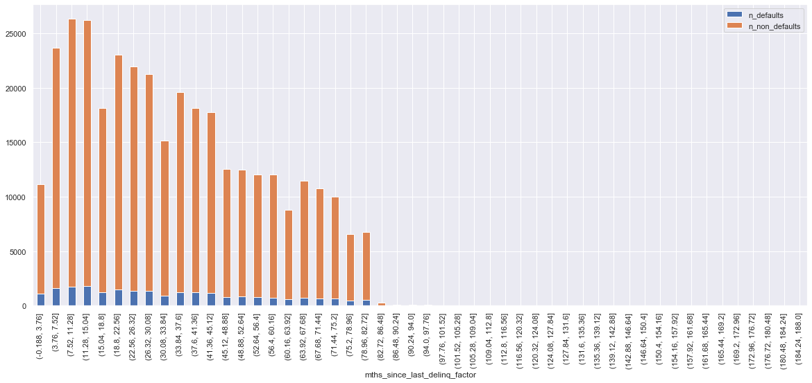


```python
x_train_prep['mths_since_last_delinq:missing'] = np.where(x_train_prep['mths_since_last_delinq'].isnull(), 1, 0)
x_train_prep['mths_since_last_delinq:<4'] = np.where(x_train_prep['mths_since_last_delinq'] <= 4, 1, 0)
x_train_prep['mths_since_last_delinq:4_30'] = np.where((x_train_prep['mths_since_last_delinq'] > 4) & (x_train_prep['mths_since_last_delinq'] <= 30), 1, 0)
x_train_prep['mths_since_last_delinq:31_56'] = np.where((x_train_prep['mths_since_last_delinq'] > 30) & (x_train_prep['mths_since_last_delinq'] <= 56), 1, 0)
x_train_prep['mths_since_last_delinq:>57'] = np.where((x_train_prep['mths_since_last_delinq'] > 4) & (x_train_prep['mths_since_last_delinq'] <= 30), 1, 0)


```


```python
fig, ax = plt.subplots(figsize=(20,8))

var_s = ['mths_since_last_delinq:missing', 'mths_since_last_delinq:<4', 'mths_since_last_delinq:4_30',
         'mths_since_last_delinq:31_56', 'mths_since_last_delinq:>57']

pd.concat([x_train_prep, y_train_prep], axis=1).groupby('Y').sum().loc[:, var_s].T.plot(kind='bar', stacked=True, ax=ax)

plt.legend()
```


    <matplotlib.legend.Legend at 0x1a65c01208>


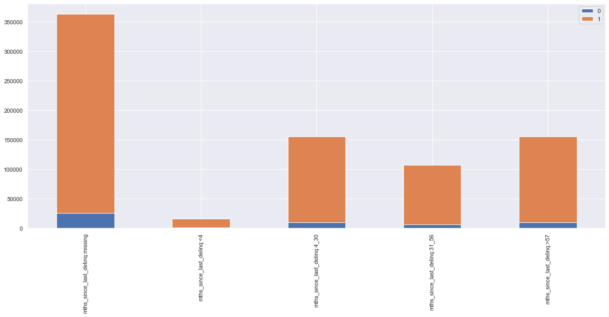


```python
vars_to_use.append(['mths_since_last_delinq:missing', 'mths_since_last_delinq:4_30',
                    'mths_since_last_delinq:31_56', 'mths_since_last_delinq:>57'])
ref_vars.append(['mths_since_last_delinq:<4'])

vars_to_use
```


    [['grade:F', 'grade:E', 'grade:D', 'grade:C', 'grade:B', 'grade:A'],
     ['home_ownership:OWN', 'home_ownership:MORTGAGE'],
     ['addr_state:NY',
      'addr_state:VA_OK_AL_SD',
      'addr_state:CA',
      'addr_state:MO_DE_MD_UT_LA_NJ',
      'addr_state:NM_NC_AZ',
      'addr_state:PA_MA_RI_MI_AR',
      'addr_state:MN_OH_AK',
      'addr_state:KY_WI_GA_WA',
      'addr_state:OR_IN_TN_CT',
      'addr_state:TX',
      'addr_state:IL_KS_MT_SC_CO',
      'addr_state:VT_WV_WY_NH_DC_MS'],
     ['verification_status:Not Verified', 'verification_status:Source Verified'],
     ['initial_list_status:w'],
     ['purpose:house_mov_ren_oth_med',
      'purpose:vac_debtc_majpur_car_homeimp',
      'purpose:credit_card'],
     ['term:36'],
     ['emp_length_int:1',
      'emp_length_int:2_3_4',
      'emp_length_int:5_6_7',
      'emp_length_int:8_9',
      'emp_length_int:10'],
     ['mths_since_issue_d:<38',
      'mths_since_issue_d:38_39',
      'mths_since_issue_d:40_41',
      'mths_since_issue_d:42_48',
      'mths_since_issue_d:49_54',
      'mths_since_issue_d:55_68',
      'mths_since_issue_d:69_95'],
     ['int_rate:<10.054',
      'int_rate:10.054_12.849',
      'int_rate:12.849_15.735',
      'int_rate:15.735_19.995'],
     ['mths_since_earliest_cr_line:<160',
      'mths_since_earliest_cr_line:161_288',
      'mths_since_earliest_cr_line:289_360'],
     ['delinq_2yrs:0', 'delinq_2yrs:1-3'],
     ['inq_last_6mths:0', 'inq_last_6mths:1-2', 'inq_last_6mths:3-6'],
     ['open_acc:1-3',
      'open_acc:4-12',
      'open_acc:13-17',
      'open_acc:18-22',
      'open_acc:23-25',
      'open_acc:26-30',
      'open_acc:>=31'],
     ['pub_rec:>1'],
     ['total_acc:15_24', 'total_acc:25_57', 'total_acc:>=57'],
     ['acc_now_delinq:>=1'],
     ['total_rev_hi_lim:5K-10K',
      'total_rev_hi_lim:10K-20K',
      'total_rev_hi_lim:20K-30K',
      'total_rev_hi_lim:30K-40K',
      'total_rev_hi_lim:40K-55K',
      'total_rev_hi_lim:55K-95K',
      'total_rev_hi_lim:>95K'],
     ['annual_inc:22k_36k',
      'annual_inc:36k_51k',
      'annual_inc:51k_60k',
      'annual_inc:60k_66k',
      'annual_inc:66k_80k',
      'annual_inc:80k_103k',
      'annual_inc:103k_120k',
      'annual_inc:>120k'],
     ['mths_since_last_delinq:missing',
      'mths_since_last_delinq:4_30',
      'mths_since_last_delinq:31_56',
      'mths_since_last_delinq:>57']]


## dti

## ATTENTION!!! This variable discretization has changed in relation to the first model


```python
print(x_train_prep['dti'].nunique(), 'unique values')
print(x_train_prep['dti'].isnull().sum(), 'missing values')
x_train_prep['dti'].describe()
```

    4062 unique values
    0 missing values


    count    709903.000000
    mean         18.148729
    std          14.531477
    min           0.000000
    25%          11.910000
    50%          17.660000
    75%          23.950000
    max        9999.000000
    Name: dti, dtype: float64


```python
x_train_prep['dti_factor'] = pd.cut(x_train_prep['dti'], 50)

woe_df = woe_ordered_continuous(x_train_prep, 'dti_factor', y_train_prep, rot_x_ticks=90)
woe_df
```


<div>
<style scoped>
    .dataframe tbody tr th:only-of-type {
        vertical-align: middle;
    }

    .dataframe tbody tr th {
        vertical-align: top;
    }

    .dataframe thead th {
        text-align: right;
    }
</style>
<table border="1" class="dataframe">
  <thead>
    <tr style="text-align: right;">
      <th></th>
      <th>dti_factor</th>
      <th>n_obs</th>
      <th>prop_non_defaults</th>
      <th>prop_n_obs</th>
      <th>n_defaults</th>
      <th>n_non_defaults</th>
      <th>prop_n_non_defaults</th>
      <th>prop_n_defaults</th>
      <th>WoE</th>
      <th>diff_prop_non_defaults</th>
      <th>diff_WoE</th>
      <th>IV</th>
    </tr>
  </thead>
  <tbody>
    <tr>
      <th>0</th>
      <td>(-9.999, 199.98]</td>
      <td>709900</td>
      <td>0.931552</td>
      <td>0.999996</td>
      <td>48591.0</td>
      <td>661309.0</td>
      <td>0.999995</td>
      <td>1.0</td>
      <td>-0.000005</td>
      <td>NaN</td>
      <td>NaN</td>
      <td>2.057930e-11</td>
    </tr>
    <tr>
      <th>1</th>
      <td>(199.98, 399.96]</td>
      <td>1</td>
      <td>1.000000</td>
      <td>0.000001</td>
      <td>0.0</td>
      <td>1.0</td>
      <td>0.000002</td>
      <td>0.0</td>
      <td>NaN</td>
      <td>0.999994</td>
      <td>NaN</td>
      <td>2.057930e-11</td>
    </tr>
    <tr>
      <th>2</th>
      <td>(399.96, 599.94]</td>
      <td>0</td>
      <td>NaN</td>
      <td>0.000000</td>
      <td>NaN</td>
      <td>NaN</td>
      <td>NaN</td>
      <td>NaN</td>
      <td>NaN</td>
      <td>NaN</td>
      <td>NaN</td>
      <td>2.057930e-11</td>
    </tr>
    <tr>
      <th>3</th>
      <td>(599.94, 799.92]</td>
      <td>0</td>
      <td>NaN</td>
      <td>0.000000</td>
      <td>NaN</td>
      <td>NaN</td>
      <td>NaN</td>
      <td>NaN</td>
      <td>NaN</td>
      <td>NaN</td>
      <td>NaN</td>
      <td>2.057930e-11</td>
    </tr>
    <tr>
      <th>4</th>
      <td>(799.92, 999.9]</td>
      <td>0</td>
      <td>NaN</td>
      <td>0.000000</td>
      <td>NaN</td>
      <td>NaN</td>
      <td>NaN</td>
      <td>NaN</td>
      <td>NaN</td>
      <td>NaN</td>
      <td>NaN</td>
      <td>2.057930e-11</td>
    </tr>
    <tr>
      <th>5</th>
      <td>(999.9, 1199.88]</td>
      <td>1</td>
      <td>1.000000</td>
      <td>0.000001</td>
      <td>0.0</td>
      <td>1.0</td>
      <td>0.000002</td>
      <td>0.0</td>
      <td>NaN</td>
      <td>NaN</td>
      <td>NaN</td>
      <td>2.057930e-11</td>
    </tr>
    <tr>
      <th>6</th>
      <td>(1199.88, 1399.86]</td>
      <td>0</td>
      <td>NaN</td>
      <td>0.000000</td>
      <td>NaN</td>
      <td>NaN</td>
      <td>NaN</td>
      <td>NaN</td>
      <td>NaN</td>
      <td>NaN</td>
      <td>NaN</td>
      <td>2.057930e-11</td>
    </tr>
    <tr>
      <th>7</th>
      <td>(1399.86, 1599.84]</td>
      <td>0</td>
      <td>NaN</td>
      <td>0.000000</td>
      <td>NaN</td>
      <td>NaN</td>
      <td>NaN</td>
      <td>NaN</td>
      <td>NaN</td>
      <td>NaN</td>
      <td>NaN</td>
      <td>2.057930e-11</td>
    </tr>
    <tr>
      <th>8</th>
      <td>(1599.84, 1799.82]</td>
      <td>0</td>
      <td>NaN</td>
      <td>0.000000</td>
      <td>NaN</td>
      <td>NaN</td>
      <td>NaN</td>
      <td>NaN</td>
      <td>NaN</td>
      <td>NaN</td>
      <td>NaN</td>
      <td>2.057930e-11</td>
    </tr>
    <tr>
      <th>9</th>
      <td>(1799.82, 1999.8]</td>
      <td>0</td>
      <td>NaN</td>
      <td>0.000000</td>
      <td>NaN</td>
      <td>NaN</td>
      <td>NaN</td>
      <td>NaN</td>
      <td>NaN</td>
      <td>NaN</td>
      <td>NaN</td>
      <td>2.057930e-11</td>
    </tr>
    <tr>
      <th>10</th>
      <td>(1999.8, 2199.78]</td>
      <td>0</td>
      <td>NaN</td>
      <td>0.000000</td>
      <td>NaN</td>
      <td>NaN</td>
      <td>NaN</td>
      <td>NaN</td>
      <td>NaN</td>
      <td>NaN</td>
      <td>NaN</td>
      <td>2.057930e-11</td>
    </tr>
    <tr>
      <th>11</th>
      <td>(2199.78, 2399.76]</td>
      <td>0</td>
      <td>NaN</td>
      <td>0.000000</td>
      <td>NaN</td>
      <td>NaN</td>
      <td>NaN</td>
      <td>NaN</td>
      <td>NaN</td>
      <td>NaN</td>
      <td>NaN</td>
      <td>2.057930e-11</td>
    </tr>
    <tr>
      <th>12</th>
      <td>(2399.76, 2599.74]</td>
      <td>0</td>
      <td>NaN</td>
      <td>0.000000</td>
      <td>NaN</td>
      <td>NaN</td>
      <td>NaN</td>
      <td>NaN</td>
      <td>NaN</td>
      <td>NaN</td>
      <td>NaN</td>
      <td>2.057930e-11</td>
    </tr>
    <tr>
      <th>13</th>
      <td>(2599.74, 2799.72]</td>
      <td>0</td>
      <td>NaN</td>
      <td>0.000000</td>
      <td>NaN</td>
      <td>NaN</td>
      <td>NaN</td>
      <td>NaN</td>
      <td>NaN</td>
      <td>NaN</td>
      <td>NaN</td>
      <td>2.057930e-11</td>
    </tr>
    <tr>
      <th>14</th>
      <td>(2799.72, 2999.7]</td>
      <td>0</td>
      <td>NaN</td>
      <td>0.000000</td>
      <td>NaN</td>
      <td>NaN</td>
      <td>NaN</td>
      <td>NaN</td>
      <td>NaN</td>
      <td>NaN</td>
      <td>NaN</td>
      <td>2.057930e-11</td>
    </tr>
    <tr>
      <th>15</th>
      <td>(2999.7, 3199.68]</td>
      <td>0</td>
      <td>NaN</td>
      <td>0.000000</td>
      <td>NaN</td>
      <td>NaN</td>
      <td>NaN</td>
      <td>NaN</td>
      <td>NaN</td>
      <td>NaN</td>
      <td>NaN</td>
      <td>2.057930e-11</td>
    </tr>
    <tr>
      <th>16</th>
      <td>(3199.68, 3399.66]</td>
      <td>0</td>
      <td>NaN</td>
      <td>0.000000</td>
      <td>NaN</td>
      <td>NaN</td>
      <td>NaN</td>
      <td>NaN</td>
      <td>NaN</td>
      <td>NaN</td>
      <td>NaN</td>
      <td>2.057930e-11</td>
    </tr>
    <tr>
      <th>17</th>
      <td>(3399.66, 3599.64]</td>
      <td>0</td>
      <td>NaN</td>
      <td>0.000000</td>
      <td>NaN</td>
      <td>NaN</td>
      <td>NaN</td>
      <td>NaN</td>
      <td>NaN</td>
      <td>NaN</td>
      <td>NaN</td>
      <td>2.057930e-11</td>
    </tr>
    <tr>
      <th>18</th>
      <td>(3599.64, 3799.62]</td>
      <td>0</td>
      <td>NaN</td>
      <td>0.000000</td>
      <td>NaN</td>
      <td>NaN</td>
      <td>NaN</td>
      <td>NaN</td>
      <td>NaN</td>
      <td>NaN</td>
      <td>NaN</td>
      <td>2.057930e-11</td>
    </tr>
    <tr>
      <th>19</th>
      <td>(3799.62, 3999.6]</td>
      <td>0</td>
      <td>NaN</td>
      <td>0.000000</td>
      <td>NaN</td>
      <td>NaN</td>
      <td>NaN</td>
      <td>NaN</td>
      <td>NaN</td>
      <td>NaN</td>
      <td>NaN</td>
      <td>2.057930e-11</td>
    </tr>
    <tr>
      <th>20</th>
      <td>(3999.6, 4199.58]</td>
      <td>0</td>
      <td>NaN</td>
      <td>0.000000</td>
      <td>NaN</td>
      <td>NaN</td>
      <td>NaN</td>
      <td>NaN</td>
      <td>NaN</td>
      <td>NaN</td>
      <td>NaN</td>
      <td>2.057930e-11</td>
    </tr>
    <tr>
      <th>21</th>
      <td>(4199.58, 4399.56]</td>
      <td>0</td>
      <td>NaN</td>
      <td>0.000000</td>
      <td>NaN</td>
      <td>NaN</td>
      <td>NaN</td>
      <td>NaN</td>
      <td>NaN</td>
      <td>NaN</td>
      <td>NaN</td>
      <td>2.057930e-11</td>
    </tr>
    <tr>
      <th>22</th>
      <td>(4399.56, 4599.54]</td>
      <td>0</td>
      <td>NaN</td>
      <td>0.000000</td>
      <td>NaN</td>
      <td>NaN</td>
      <td>NaN</td>
      <td>NaN</td>
      <td>NaN</td>
      <td>NaN</td>
      <td>NaN</td>
      <td>2.057930e-11</td>
    </tr>
    <tr>
      <th>23</th>
      <td>(4599.54, 4799.52]</td>
      <td>0</td>
      <td>NaN</td>
      <td>0.000000</td>
      <td>NaN</td>
      <td>NaN</td>
      <td>NaN</td>
      <td>NaN</td>
      <td>NaN</td>
      <td>NaN</td>
      <td>NaN</td>
      <td>2.057930e-11</td>
    </tr>
    <tr>
      <th>24</th>
      <td>(4799.52, 4999.5]</td>
      <td>0</td>
      <td>NaN</td>
      <td>0.000000</td>
      <td>NaN</td>
      <td>NaN</td>
      <td>NaN</td>
      <td>NaN</td>
      <td>NaN</td>
      <td>NaN</td>
      <td>NaN</td>
      <td>2.057930e-11</td>
    </tr>
    <tr>
      <th>25</th>
      <td>(4999.5, 5199.48]</td>
      <td>0</td>
      <td>NaN</td>
      <td>0.000000</td>
      <td>NaN</td>
      <td>NaN</td>
      <td>NaN</td>
      <td>NaN</td>
      <td>NaN</td>
      <td>NaN</td>
      <td>NaN</td>
      <td>2.057930e-11</td>
    </tr>
    <tr>
      <th>26</th>
      <td>(5199.48, 5399.46]</td>
      <td>0</td>
      <td>NaN</td>
      <td>0.000000</td>
      <td>NaN</td>
      <td>NaN</td>
      <td>NaN</td>
      <td>NaN</td>
      <td>NaN</td>
      <td>NaN</td>
      <td>NaN</td>
      <td>2.057930e-11</td>
    </tr>
    <tr>
      <th>27</th>
      <td>(5399.46, 5599.44]</td>
      <td>0</td>
      <td>NaN</td>
      <td>0.000000</td>
      <td>NaN</td>
      <td>NaN</td>
      <td>NaN</td>
      <td>NaN</td>
      <td>NaN</td>
      <td>NaN</td>
      <td>NaN</td>
      <td>2.057930e-11</td>
    </tr>
    <tr>
      <th>28</th>
      <td>(5599.44, 5799.42]</td>
      <td>0</td>
      <td>NaN</td>
      <td>0.000000</td>
      <td>NaN</td>
      <td>NaN</td>
      <td>NaN</td>
      <td>NaN</td>
      <td>NaN</td>
      <td>NaN</td>
      <td>NaN</td>
      <td>2.057930e-11</td>
    </tr>
    <tr>
      <th>29</th>
      <td>(5799.42, 5999.4]</td>
      <td>0</td>
      <td>NaN</td>
      <td>0.000000</td>
      <td>NaN</td>
      <td>NaN</td>
      <td>NaN</td>
      <td>NaN</td>
      <td>NaN</td>
      <td>NaN</td>
      <td>NaN</td>
      <td>2.057930e-11</td>
    </tr>
    <tr>
      <th>30</th>
      <td>(5999.4, 6199.38]</td>
      <td>0</td>
      <td>NaN</td>
      <td>0.000000</td>
      <td>NaN</td>
      <td>NaN</td>
      <td>NaN</td>
      <td>NaN</td>
      <td>NaN</td>
      <td>NaN</td>
      <td>NaN</td>
      <td>2.057930e-11</td>
    </tr>
    <tr>
      <th>31</th>
      <td>(6199.38, 6399.36]</td>
      <td>0</td>
      <td>NaN</td>
      <td>0.000000</td>
      <td>NaN</td>
      <td>NaN</td>
      <td>NaN</td>
      <td>NaN</td>
      <td>NaN</td>
      <td>NaN</td>
      <td>NaN</td>
      <td>2.057930e-11</td>
    </tr>
    <tr>
      <th>32</th>
      <td>(6399.36, 6599.34]</td>
      <td>0</td>
      <td>NaN</td>
      <td>0.000000</td>
      <td>NaN</td>
      <td>NaN</td>
      <td>NaN</td>
      <td>NaN</td>
      <td>NaN</td>
      <td>NaN</td>
      <td>NaN</td>
      <td>2.057930e-11</td>
    </tr>
    <tr>
      <th>33</th>
      <td>(6599.34, 6799.32]</td>
      <td>0</td>
      <td>NaN</td>
      <td>0.000000</td>
      <td>NaN</td>
      <td>NaN</td>
      <td>NaN</td>
      <td>NaN</td>
      <td>NaN</td>
      <td>NaN</td>
      <td>NaN</td>
      <td>2.057930e-11</td>
    </tr>
    <tr>
      <th>34</th>
      <td>(6799.32, 6999.3]</td>
      <td>0</td>
      <td>NaN</td>
      <td>0.000000</td>
      <td>NaN</td>
      <td>NaN</td>
      <td>NaN</td>
      <td>NaN</td>
      <td>NaN</td>
      <td>NaN</td>
      <td>NaN</td>
      <td>2.057930e-11</td>
    </tr>
    <tr>
      <th>35</th>
      <td>(6999.3, 7199.28]</td>
      <td>0</td>
      <td>NaN</td>
      <td>0.000000</td>
      <td>NaN</td>
      <td>NaN</td>
      <td>NaN</td>
      <td>NaN</td>
      <td>NaN</td>
      <td>NaN</td>
      <td>NaN</td>
      <td>2.057930e-11</td>
    </tr>
    <tr>
      <th>36</th>
      <td>(7199.28, 7399.26]</td>
      <td>0</td>
      <td>NaN</td>
      <td>0.000000</td>
      <td>NaN</td>
      <td>NaN</td>
      <td>NaN</td>
      <td>NaN</td>
      <td>NaN</td>
      <td>NaN</td>
      <td>NaN</td>
      <td>2.057930e-11</td>
    </tr>
    <tr>
      <th>37</th>
      <td>(7399.26, 7599.24]</td>
      <td>0</td>
      <td>NaN</td>
      <td>0.000000</td>
      <td>NaN</td>
      <td>NaN</td>
      <td>NaN</td>
      <td>NaN</td>
      <td>NaN</td>
      <td>NaN</td>
      <td>NaN</td>
      <td>2.057930e-11</td>
    </tr>
    <tr>
      <th>38</th>
      <td>(7599.24, 7799.22]</td>
      <td>0</td>
      <td>NaN</td>
      <td>0.000000</td>
      <td>NaN</td>
      <td>NaN</td>
      <td>NaN</td>
      <td>NaN</td>
      <td>NaN</td>
      <td>NaN</td>
      <td>NaN</td>
      <td>2.057930e-11</td>
    </tr>
    <tr>
      <th>39</th>
      <td>(7799.22, 7999.2]</td>
      <td>0</td>
      <td>NaN</td>
      <td>0.000000</td>
      <td>NaN</td>
      <td>NaN</td>
      <td>NaN</td>
      <td>NaN</td>
      <td>NaN</td>
      <td>NaN</td>
      <td>NaN</td>
      <td>2.057930e-11</td>
    </tr>
    <tr>
      <th>40</th>
      <td>(7999.2, 8199.18]</td>
      <td>0</td>
      <td>NaN</td>
      <td>0.000000</td>
      <td>NaN</td>
      <td>NaN</td>
      <td>NaN</td>
      <td>NaN</td>
      <td>NaN</td>
      <td>NaN</td>
      <td>NaN</td>
      <td>2.057930e-11</td>
    </tr>
    <tr>
      <th>41</th>
      <td>(8199.18, 8399.16]</td>
      <td>0</td>
      <td>NaN</td>
      <td>0.000000</td>
      <td>NaN</td>
      <td>NaN</td>
      <td>NaN</td>
      <td>NaN</td>
      <td>NaN</td>
      <td>NaN</td>
      <td>NaN</td>
      <td>2.057930e-11</td>
    </tr>
    <tr>
      <th>42</th>
      <td>(8399.16, 8599.14]</td>
      <td>0</td>
      <td>NaN</td>
      <td>0.000000</td>
      <td>NaN</td>
      <td>NaN</td>
      <td>NaN</td>
      <td>NaN</td>
      <td>NaN</td>
      <td>NaN</td>
      <td>NaN</td>
      <td>2.057930e-11</td>
    </tr>
    <tr>
      <th>43</th>
      <td>(8599.14, 8799.12]</td>
      <td>0</td>
      <td>NaN</td>
      <td>0.000000</td>
      <td>NaN</td>
      <td>NaN</td>
      <td>NaN</td>
      <td>NaN</td>
      <td>NaN</td>
      <td>NaN</td>
      <td>NaN</td>
      <td>2.057930e-11</td>
    </tr>
    <tr>
      <th>44</th>
      <td>(8799.12, 8999.1]</td>
      <td>0</td>
      <td>NaN</td>
      <td>0.000000</td>
      <td>NaN</td>
      <td>NaN</td>
      <td>NaN</td>
      <td>NaN</td>
      <td>NaN</td>
      <td>NaN</td>
      <td>NaN</td>
      <td>2.057930e-11</td>
    </tr>
    <tr>
      <th>45</th>
      <td>(8999.1, 9199.08]</td>
      <td>0</td>
      <td>NaN</td>
      <td>0.000000</td>
      <td>NaN</td>
      <td>NaN</td>
      <td>NaN</td>
      <td>NaN</td>
      <td>NaN</td>
      <td>NaN</td>
      <td>NaN</td>
      <td>2.057930e-11</td>
    </tr>
    <tr>
      <th>46</th>
      <td>(9199.08, 9399.06]</td>
      <td>0</td>
      <td>NaN</td>
      <td>0.000000</td>
      <td>NaN</td>
      <td>NaN</td>
      <td>NaN</td>
      <td>NaN</td>
      <td>NaN</td>
      <td>NaN</td>
      <td>NaN</td>
      <td>2.057930e-11</td>
    </tr>
    <tr>
      <th>47</th>
      <td>(9399.06, 9599.04]</td>
      <td>0</td>
      <td>NaN</td>
      <td>0.000000</td>
      <td>NaN</td>
      <td>NaN</td>
      <td>NaN</td>
      <td>NaN</td>
      <td>NaN</td>
      <td>NaN</td>
      <td>NaN</td>
      <td>2.057930e-11</td>
    </tr>
    <tr>
      <th>48</th>
      <td>(9599.04, 9799.02]</td>
      <td>0</td>
      <td>NaN</td>
      <td>0.000000</td>
      <td>NaN</td>
      <td>NaN</td>
      <td>NaN</td>
      <td>NaN</td>
      <td>NaN</td>
      <td>NaN</td>
      <td>NaN</td>
      <td>2.057930e-11</td>
    </tr>
    <tr>
      <th>49</th>
      <td>(9799.02, 9999.0]</td>
      <td>1</td>
      <td>1.000000</td>
      <td>0.000001</td>
      <td>0.0</td>
      <td>1.0</td>
      <td>0.000002</td>
      <td>0.0</td>
      <td>NaN</td>
      <td>NaN</td>
      <td>NaN</td>
      <td>2.057930e-11</td>
    </tr>
  </tbody>
</table>
</div>


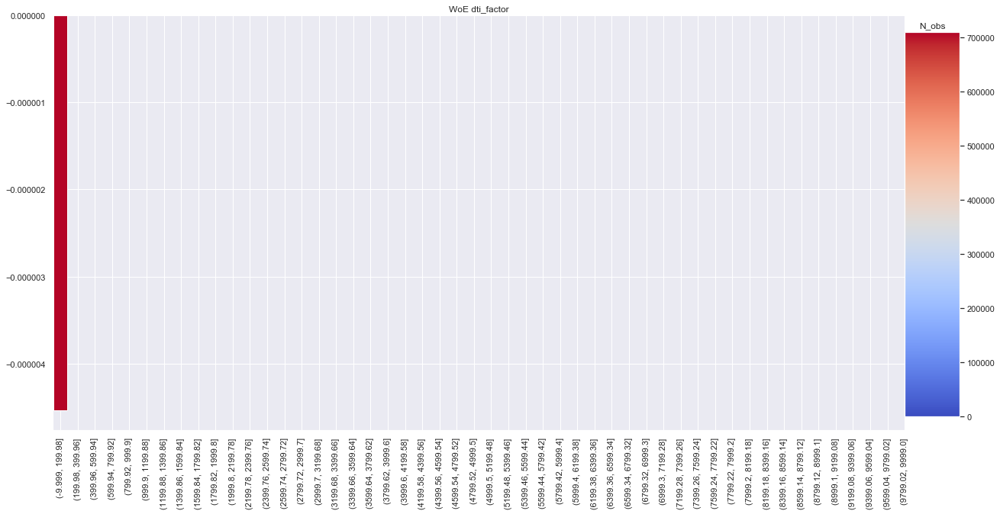


#### this happened because very few data points in the 'annual_inc' column is incorrect. I will impute the mean


```python
x_train_prep[x_train_prep['dti'] >= 200]
```


<div>
<style scoped>
    .dataframe tbody tr th:only-of-type {
        vertical-align: middle;
    }

    .dataframe tbody tr th {
        vertical-align: top;
    }

    .dataframe thead th {
        text-align: right;
    }
</style>
<table border="1" class="dataframe">
  <thead>
    <tr style="text-align: right;">
      <th></th>
      <th>id</th>
      <th>member_id</th>
      <th>loan_amnt</th>
      <th>funded_amnt</th>
      <th>funded_amnt_inv</th>
      <th>term</th>
      <th>int_rate</th>
      <th>installment</th>
      <th>grade</th>
      <th>sub_grade</th>
      <th>emp_title</th>
      <th>emp_length</th>
      <th>home_ownership</th>
      <th>annual_inc</th>
      <th>verification_status</th>
      <th>issue_d</th>
      <th>loan_status</th>
      <th>pymnt_plan</th>
      <th>url</th>
      <th>desc</th>
      <th>purpose</th>
      <th>title</th>
      <th>zip_code</th>
      <th>addr_state</th>
      <th>dti</th>
      <th>delinq_2yrs</th>
      <th>earliest_cr_line</th>
      <th>inq_last_6mths</th>
      <th>mths_since_last_delinq</th>
      <th>mths_since_last_record</th>
      <th>open_acc</th>
      <th>pub_rec</th>
      <th>revol_bal</th>
      <th>revol_util</th>
      <th>total_acc</th>
      <th>initial_list_status</th>
      <th>out_prncp</th>
      <th>out_prncp_inv</th>
      <th>total_pymnt</th>
      <th>total_pymnt_inv</th>
      <th>total_rec_prncp</th>
      <th>total_rec_int</th>
      <th>total_rec_late_fee</th>
      <th>recoveries</th>
      <th>collection_recovery_fee</th>
      <th>last_pymnt_d</th>
      <th>last_pymnt_amnt</th>
      <th>next_pymnt_d</th>
      <th>last_credit_pull_d</th>
      <th>collections_12_mths_ex_med</th>
      <th>mths_since_last_major_derog</th>
      <th>policy_code</th>
      <th>application_type</th>
      <th>annual_inc_joint</th>
      <th>dti_joint</th>
      <th>verification_status_joint</th>
      <th>acc_now_delinq</th>
      <th>tot_coll_amt</th>
      <th>tot_cur_bal</th>
      <th>open_acc_6m</th>
      <th>open_il_6m</th>
      <th>open_il_12m</th>
      <th>open_il_24m</th>
      <th>mths_since_rcnt_il</th>
      <th>total_bal_il</th>
      <th>il_util</th>
      <th>open_rv_12m</th>
      <th>open_rv_24m</th>
      <th>max_bal_bc</th>
      <th>all_util</th>
      <th>total_rev_hi_lim</th>
      <th>inq_fi</th>
      <th>total_cu_tl</th>
      <th>inq_last_12m</th>
      <th>emp_length_int</th>
      <th>earliest_cr_line_date</th>
      <th>mths_since_earliest_cr_line</th>
      <th>mths_since_issue_d</th>
      <th>grade:A</th>
      <th>grade:B</th>
      <th>grade:C</th>
      <th>grade:D</th>
      <th>grade:E</th>
      <th>grade:F</th>
      <th>grade:G</th>
      <th>sub_grade:A1</th>
      <th>sub_grade:A2</th>
      <th>sub_grade:A3</th>
      <th>sub_grade:A4</th>
      <th>sub_grade:A5</th>
      <th>sub_grade:B1</th>
      <th>sub_grade:B2</th>
      <th>sub_grade:B3</th>
      <th>sub_grade:B4</th>
      <th>sub_grade:B5</th>
      <th>sub_grade:C1</th>
      <th>sub_grade:C2</th>
      <th>sub_grade:C3</th>
      <th>sub_grade:C4</th>
      <th>sub_grade:C5</th>
      <th>sub_grade:D1</th>
      <th>sub_grade:D2</th>
      <th>sub_grade:D3</th>
      <th>sub_grade:D4</th>
      <th>sub_grade:D5</th>
      <th>sub_grade:E1</th>
      <th>sub_grade:E2</th>
      <th>sub_grade:E3</th>
      <th>sub_grade:E4</th>
      <th>sub_grade:E5</th>
      <th>sub_grade:F1</th>
      <th>sub_grade:F2</th>
      <th>sub_grade:F3</th>
      <th>sub_grade:F4</th>
      <th>sub_grade:F5</th>
      <th>sub_grade:G1</th>
      <th>sub_grade:G2</th>
      <th>sub_grade:G3</th>
      <th>sub_grade:G4</th>
      <th>sub_grade:G5</th>
      <th>home_ownership:ANY</th>
      <th>home_ownership:MORTGAGE</th>
      <th>home_ownership:NONE</th>
      <th>home_ownership:OTHER</th>
      <th>home_ownership:OWN</th>
      <th>home_ownership:RENT</th>
      <th>verification_status:Not Verified</th>
      <th>verification_status:Source Verified</th>
      <th>verification_status:Verified</th>
      <th>loan_status:Charged Off</th>
      <th>loan_status:Current</th>
      <th>loan_status:Default</th>
      <th>loan_status:Does not meet the credit policy. Status:Charged Off</th>
      <th>loan_status:Does not meet the credit policy. Status:Fully Paid</th>
      <th>loan_status:Fully Paid</th>
      <th>loan_status:In Grace Period</th>
      <th>loan_status:Issued</th>
      <th>loan_status:Late (16-30 days)</th>
      <th>loan_status:Late (31-120 days)</th>
      <th>purpose:car</th>
      <th>purpose:credit_card</th>
      <th>purpose:debt_consolidation</th>
      <th>purpose:educational</th>
      <th>purpose:home_improvement</th>
      <th>purpose:house</th>
      <th>purpose:major_purchase</th>
      <th>purpose:medical</th>
      <th>purpose:moving</th>
      <th>purpose:other</th>
      <th>purpose:renewable_energy</th>
      <th>purpose:small_business</th>
      <th>purpose:vacation</th>
      <th>purpose:wedding</th>
      <th>addr_state:AK</th>
      <th>addr_state:AL</th>
      <th>addr_state:AR</th>
      <th>addr_state:AZ</th>
      <th>addr_state:CA</th>
      <th>addr_state:CO</th>
      <th>addr_state:CT</th>
      <th>addr_state:DC</th>
      <th>addr_state:DE</th>
      <th>addr_state:FL</th>
      <th>addr_state:GA</th>
      <th>addr_state:HI</th>
      <th>addr_state:IA</th>
      <th>addr_state:ID</th>
      <th>addr_state:IL</th>
      <th>addr_state:IN</th>
      <th>addr_state:KS</th>
      <th>addr_state:KY</th>
      <th>addr_state:LA</th>
      <th>addr_state:MA</th>
      <th>addr_state:MD</th>
      <th>addr_state:ME</th>
      <th>addr_state:MI</th>
      <th>addr_state:MN</th>
      <th>addr_state:MO</th>
      <th>addr_state:MS</th>
      <th>addr_state:MT</th>
      <th>addr_state:NC</th>
      <th>addr_state:ND</th>
      <th>addr_state:NE</th>
      <th>addr_state:NH</th>
      <th>addr_state:NJ</th>
      <th>addr_state:NM</th>
      <th>addr_state:NV</th>
      <th>addr_state:NY</th>
      <th>addr_state:OH</th>
      <th>addr_state:OK</th>
      <th>addr_state:OR</th>
      <th>addr_state:PA</th>
      <th>addr_state:RI</th>
      <th>addr_state:SC</th>
      <th>addr_state:SD</th>
      <th>addr_state:TN</th>
      <th>addr_state:TX</th>
      <th>addr_state:UT</th>
      <th>addr_state:VA</th>
      <th>addr_state:VT</th>
      <th>addr_state:WA</th>
      <th>addr_state:WI</th>
      <th>addr_state:WV</th>
      <th>addr_state:WY</th>
      <th>initial_list_status:f</th>
      <th>initial_list_status:w</th>
      <th>home_ownership:RENT_OTHER_NONE</th>
      <th>addr_state:NE_ND_ME_IA_ID_NV_HI_FL</th>
      <th>addr_state:VA_OK_AL_SD</th>
      <th>addr_state:MO_DE_MD_UT_LA_NJ</th>
      <th>addr_state:NM_NC_AZ</th>
      <th>addr_state:PA_MA_RI_MI_AR</th>
      <th>addr_state:MN_OH_AK</th>
      <th>addr_state:KY_WI_GA_WA</th>
      <th>addr_state:OR_IN_TN_CT</th>
      <th>addr_state:IL_KS_MT_SC_CO</th>
      <th>addr_state:VT_WV_WY_NH_DC_MS</th>
      <th>purpose:educ_sm_wedd</th>
      <th>purpose:house_mov_ren_oth_med</th>
      <th>purpose:vac_debtc_majpur_car_homeimp</th>
      <th>term:36</th>
      <th>term:60</th>
      <th>emp_length_int:0</th>
      <th>emp_length_int:1</th>
      <th>emp_length_int:2_3_4</th>
      <th>emp_length_int:5_6_7</th>
      <th>emp_length_int:8_9</th>
      <th>emp_length_int:10</th>
      <th>mths_since_issue_d_factor</th>
      <th>mths_since_issue_d:&lt;38</th>
      <th>mths_since_issue_d:38_39</th>
      <th>mths_since_issue_d:40_41</th>
      <th>mths_since_issue_d:42_48</th>
      <th>mths_since_issue_d:49_54</th>
      <th>mths_since_issue_d:55_68</th>
      <th>mths_since_issue_d:69_95</th>
      <th>mths_since_issue_d:&gt;95</th>
      <th>int_rate_factor</th>
      <th>int_rate:&lt;10.054</th>
      <th>int_rate:10.054_12.849</th>
      <th>int_rate:12.849_15.735</th>
      <th>int_rate:15.735_19.995</th>
      <th>int_rate:&gt;19.995</th>
      <th>funded_amnt_factor</th>
      <th>mths_since_earliest_cr_line_factor</th>
      <th>mths_since_earliest_cr_line:&lt;160</th>
      <th>mths_since_earliest_cr_line:161_288</th>
      <th>mths_since_earliest_cr_line:289_360</th>
      <th>mths_since_earliest_cr_line:&gt;360</th>
      <th>installment_factor</th>
      <th>delinq_2yrs:0</th>
      <th>delinq_2yrs:1-3</th>
      <th>delinq_2yrs:&gt;=4</th>
      <th>inq_last_6mths:0</th>
      <th>inq_last_6mths:1-2</th>
      <th>inq_last_6mths:3-6</th>
      <th>inq_last_6mths:&gt;6</th>
      <th>open_acc:0</th>
      <th>open_acc:1-3</th>
      <th>open_acc:4-12</th>
      <th>open_acc:13-17</th>
      <th>open_acc:18-22</th>
      <th>open_acc:23-25</th>
      <th>open_acc:26-30</th>
      <th>open_acc:&gt;=31</th>
      <th>pub_rec:0-1</th>
      <th>pub_rec:&gt;1</th>
      <th>total_acc_factor</th>
      <th>total_acc:&lt;=14</th>
      <th>total_acc:15_24</th>
      <th>total_acc:25_57</th>
      <th>total_acc:&gt;=57</th>
      <th>acc_now_delinq:0</th>
      <th>acc_now_delinq:&gt;=1</th>
      <th>total_rev_hi_lim_factor</th>
      <th>total_rev_hi_lim:&lt;=5K</th>
      <th>total_rev_hi_lim:5K-10K</th>
      <th>total_rev_hi_lim:10K-20K</th>
      <th>total_rev_hi_lim:20K-30K</th>
      <th>total_rev_hi_lim:30K-40K</th>
      <th>total_rev_hi_lim:40K-55K</th>
      <th>total_rev_hi_lim:55K-95K</th>
      <th>total_rev_hi_lim:&gt;95K</th>
      <th>loan_amnt_factor</th>
      <th>annual_inc_factor</th>
      <th>annual_inc:&lt;=22k</th>
      <th>annual_inc:22k_36k</th>
      <th>annual_inc:36k_51k</th>
      <th>annual_inc:51k_60k</th>
      <th>annual_inc:60k_66k</th>
      <th>annual_inc:66k_80k</th>
      <th>annual_inc:80k_103k</th>
      <th>annual_inc:103k_120k</th>
      <th>annual_inc:&gt;120k</th>
      <th>mths_since_last_delinq:missing</th>
      <th>mths_since_last_delinq:&lt;4</th>
      <th>mths_since_last_delinq:4_30</th>
      <th>mths_since_last_delinq:31_56</th>
      <th>mths_since_last_delinq:&gt;57</th>
      <th>dti_factor</th>
    </tr>
  </thead>
  <tbody>
    <tr>
      <th>475046</th>
      <td>67405134</td>
      <td>72216846</td>
      <td>6550</td>
      <td>6550</td>
      <td>6550.0</td>
      <td>36</td>
      <td>17.86</td>
      <td>236.34</td>
      <td>D</td>
      <td>D5</td>
      <td>NaN</td>
      <td>NaN</td>
      <td>MORTGAGE</td>
      <td>1770.0</td>
      <td>Not Verified</td>
      <td>2015-12-01</td>
      <td>Current</td>
      <td>n</td>
      <td>https://www.lendingclub.com/browse/loanDetail....</td>
      <td>NaN</td>
      <td>credit_card</td>
      <td>Credit card refinancing</td>
      <td>773xx</td>
      <td>TX</td>
      <td>1092.52</td>
      <td>2.0</td>
      <td>Jul-91</td>
      <td>0.0</td>
      <td>9.0</td>
      <td>NaN</td>
      <td>10.0</td>
      <td>0.0</td>
      <td>29029</td>
      <td>84.4</td>
      <td>25.0</td>
      <td>w</td>
      <td>6550.00</td>
      <td>6550.00</td>
      <td>0.00</td>
      <td>0.00</td>
      <td>0.00</td>
      <td>0.00</td>
      <td>0.0</td>
      <td>0.0</td>
      <td>0.0</td>
      <td>NaN</td>
      <td>0.00</td>
      <td>Feb-16</td>
      <td>Jan-16</td>
      <td>0.0</td>
      <td>NaN</td>
      <td>1</td>
      <td>JOINT</td>
      <td>62151.0</td>
      <td>31.01</td>
      <td>Not Verified</td>
      <td>0.0</td>
      <td>0.0</td>
      <td>192764.0</td>
      <td>1.0</td>
      <td>1.0</td>
      <td>1.0</td>
      <td>1.0</td>
      <td>6.0</td>
      <td>20519.0</td>
      <td>93.7</td>
      <td>1.0</td>
      <td>5.0</td>
      <td>15885.0</td>
      <td>88.0</td>
      <td>34400.0</td>
      <td>1.0</td>
      <td>0.0</td>
      <td>3.0</td>
      <td>0</td>
      <td>1991-07-01</td>
      <td>329.0</td>
      <td>36.0</td>
      <td>0</td>
      <td>0</td>
      <td>0</td>
      <td>1</td>
      <td>0</td>
      <td>0</td>
      <td>0</td>
      <td>0</td>
      <td>0</td>
      <td>0</td>
      <td>0</td>
      <td>0</td>
      <td>0</td>
      <td>0</td>
      <td>0</td>
      <td>0</td>
      <td>0</td>
      <td>0</td>
      <td>0</td>
      <td>0</td>
      <td>0</td>
      <td>0</td>
      <td>0</td>
      <td>0</td>
      <td>0</td>
      <td>0</td>
      <td>1</td>
      <td>0</td>
      <td>0</td>
      <td>0</td>
      <td>0</td>
      <td>0</td>
      <td>0</td>
      <td>0</td>
      <td>0</td>
      <td>0</td>
      <td>0</td>
      <td>0</td>
      <td>0</td>
      <td>0</td>
      <td>0</td>
      <td>0</td>
      <td>0</td>
      <td>1</td>
      <td>0</td>
      <td>0</td>
      <td>0</td>
      <td>0</td>
      <td>1</td>
      <td>0</td>
      <td>0</td>
      <td>0</td>
      <td>1</td>
      <td>0</td>
      <td>0</td>
      <td>0</td>
      <td>0</td>
      <td>0</td>
      <td>0</td>
      <td>0</td>
      <td>0</td>
      <td>0</td>
      <td>1</td>
      <td>0</td>
      <td>0</td>
      <td>0</td>
      <td>0</td>
      <td>0</td>
      <td>0</td>
      <td>0</td>
      <td>0</td>
      <td>0</td>
      <td>0</td>
      <td>0</td>
      <td>0</td>
      <td>0</td>
      <td>0</td>
      <td>0</td>
      <td>0</td>
      <td>0</td>
      <td>0</td>
      <td>0</td>
      <td>0</td>
      <td>0</td>
      <td>0</td>
      <td>0</td>
      <td>0</td>
      <td>0</td>
      <td>0</td>
      <td>0</td>
      <td>0</td>
      <td>0</td>
      <td>0</td>
      <td>0</td>
      <td>0</td>
      <td>0</td>
      <td>0</td>
      <td>0</td>
      <td>0</td>
      <td>0</td>
      <td>0</td>
      <td>0</td>
      <td>0</td>
      <td>0</td>
      <td>0</td>
      <td>0</td>
      <td>0</td>
      <td>0</td>
      <td>0</td>
      <td>0</td>
      <td>0</td>
      <td>0</td>
      <td>0</td>
      <td>0</td>
      <td>0</td>
      <td>0</td>
      <td>0</td>
      <td>0</td>
      <td>1</td>
      <td>0</td>
      <td>0</td>
      <td>0</td>
      <td>0</td>
      <td>0</td>
      <td>0</td>
      <td>0</td>
      <td>0</td>
      <td>1</td>
      <td>0</td>
      <td>0</td>
      <td>0</td>
      <td>0</td>
      <td>0</td>
      <td>0</td>
      <td>0</td>
      <td>0</td>
      <td>0</td>
      <td>0</td>
      <td>0</td>
      <td>0</td>
      <td>0</td>
      <td>0</td>
      <td>1</td>
      <td>0</td>
      <td>1</td>
      <td>0</td>
      <td>0</td>
      <td>0</td>
      <td>0</td>
      <td>0</td>
      <td>(35.898, 38.04]</td>
      <td>1</td>
      <td>0</td>
      <td>0</td>
      <td>0</td>
      <td>0</td>
      <td>0</td>
      <td>0</td>
      <td>0</td>
      <td>(17.628, 18.102]</td>
      <td>0</td>
      <td>0</td>
      <td>0</td>
      <td>1</td>
      <td>0</td>
      <td>(6020.0, 6710.0]</td>
      <td>(323.64, 341.62]</td>
      <td>0</td>
      <td>0</td>
      <td>1</td>
      <td>0</td>
      <td>(215.841, 244.436]</td>
      <td>0</td>
      <td>1</td>
      <td>0</td>
      <td>1</td>
      <td>0</td>
      <td>0</td>
      <td>0</td>
      <td>0</td>
      <td>0</td>
      <td>1</td>
      <td>0</td>
      <td>0</td>
      <td>0</td>
      <td>0</td>
      <td>0</td>
      <td>1</td>
      <td>0</td>
      <td>(23.66, 27.04]</td>
      <td>0</td>
      <td>0</td>
      <td>1</td>
      <td>0</td>
      <td>1</td>
      <td>0</td>
      <td>(29999.997, 34999.996]</td>
      <td>0</td>
      <td>0</td>
      <td>0</td>
      <td>0</td>
      <td>1</td>
      <td>0</td>
      <td>0</td>
      <td>0</td>
      <td>(6020.0, 6710.0]</td>
      <td>(-0.001, 19000.0]</td>
      <td>1</td>
      <td>0</td>
      <td>0</td>
      <td>0</td>
      <td>0</td>
      <td>0</td>
      <td>0</td>
      <td>0</td>
      <td>0</td>
      <td>0</td>
      <td>0</td>
      <td>1</td>
      <td>0</td>
      <td>1</td>
      <td>(999.9, 1199.88]</td>
    </tr>
    <tr>
      <th>531886</th>
      <td>65199509</td>
      <td>69726237</td>
      <td>3700</td>
      <td>3700</td>
      <td>3700.0</td>
      <td>36</td>
      <td>12.59</td>
      <td>123.94</td>
      <td>C</td>
      <td>C2</td>
      <td>NaN</td>
      <td>NaN</td>
      <td>MORTGAGE</td>
      <td>0.0</td>
      <td>Not Verified</td>
      <td>2015-11-01</td>
      <td>Current</td>
      <td>n</td>
      <td>https://www.lendingclub.com/browse/loanDetail....</td>
      <td>NaN</td>
      <td>credit_card</td>
      <td>Credit card refinancing</td>
      <td>765xx</td>
      <td>TX</td>
      <td>9999.00</td>
      <td>2.0</td>
      <td>Aug-78</td>
      <td>1.0</td>
      <td>10.0</td>
      <td>NaN</td>
      <td>8.0</td>
      <td>0.0</td>
      <td>10649</td>
      <td>56.9</td>
      <td>20.0</td>
      <td>f</td>
      <td>3528.87</td>
      <td>3528.87</td>
      <td>242.70</td>
      <td>242.70</td>
      <td>171.13</td>
      <td>71.57</td>
      <td>0.0</td>
      <td>0.0</td>
      <td>0.0</td>
      <td>Jan-16</td>
      <td>123.94</td>
      <td>Feb-16</td>
      <td>Jan-16</td>
      <td>0.0</td>
      <td>10.0</td>
      <td>1</td>
      <td>JOINT</td>
      <td>40988.0</td>
      <td>28.72</td>
      <td>Not Verified</td>
      <td>0.0</td>
      <td>0.0</td>
      <td>24521.0</td>
      <td>NaN</td>
      <td>NaN</td>
      <td>NaN</td>
      <td>NaN</td>
      <td>NaN</td>
      <td>NaN</td>
      <td>NaN</td>
      <td>NaN</td>
      <td>NaN</td>
      <td>NaN</td>
      <td>NaN</td>
      <td>18700.0</td>
      <td>NaN</td>
      <td>NaN</td>
      <td>NaN</td>
      <td>0</td>
      <td>1978-08-01</td>
      <td>484.0</td>
      <td>37.0</td>
      <td>0</td>
      <td>0</td>
      <td>1</td>
      <td>0</td>
      <td>0</td>
      <td>0</td>
      <td>0</td>
      <td>0</td>
      <td>0</td>
      <td>0</td>
      <td>0</td>
      <td>0</td>
      <td>0</td>
      <td>0</td>
      <td>0</td>
      <td>0</td>
      <td>0</td>
      <td>0</td>
      <td>1</td>
      <td>0</td>
      <td>0</td>
      <td>0</td>
      <td>0</td>
      <td>0</td>
      <td>0</td>
      <td>0</td>
      <td>0</td>
      <td>0</td>
      <td>0</td>
      <td>0</td>
      <td>0</td>
      <td>0</td>
      <td>0</td>
      <td>0</td>
      <td>0</td>
      <td>0</td>
      <td>0</td>
      <td>0</td>
      <td>0</td>
      <td>0</td>
      <td>0</td>
      <td>0</td>
      <td>0</td>
      <td>1</td>
      <td>0</td>
      <td>0</td>
      <td>0</td>
      <td>0</td>
      <td>1</td>
      <td>0</td>
      <td>0</td>
      <td>0</td>
      <td>1</td>
      <td>0</td>
      <td>0</td>
      <td>0</td>
      <td>0</td>
      <td>0</td>
      <td>0</td>
      <td>0</td>
      <td>0</td>
      <td>0</td>
      <td>1</td>
      <td>0</td>
      <td>0</td>
      <td>0</td>
      <td>0</td>
      <td>0</td>
      <td>0</td>
      <td>0</td>
      <td>0</td>
      <td>0</td>
      <td>0</td>
      <td>0</td>
      <td>0</td>
      <td>0</td>
      <td>0</td>
      <td>0</td>
      <td>0</td>
      <td>0</td>
      <td>0</td>
      <td>0</td>
      <td>0</td>
      <td>0</td>
      <td>0</td>
      <td>0</td>
      <td>0</td>
      <td>0</td>
      <td>0</td>
      <td>0</td>
      <td>0</td>
      <td>0</td>
      <td>0</td>
      <td>0</td>
      <td>0</td>
      <td>0</td>
      <td>0</td>
      <td>0</td>
      <td>0</td>
      <td>0</td>
      <td>0</td>
      <td>0</td>
      <td>0</td>
      <td>0</td>
      <td>0</td>
      <td>0</td>
      <td>0</td>
      <td>0</td>
      <td>0</td>
      <td>0</td>
      <td>0</td>
      <td>0</td>
      <td>0</td>
      <td>0</td>
      <td>0</td>
      <td>0</td>
      <td>0</td>
      <td>0</td>
      <td>1</td>
      <td>0</td>
      <td>0</td>
      <td>0</td>
      <td>0</td>
      <td>0</td>
      <td>0</td>
      <td>0</td>
      <td>1</td>
      <td>0</td>
      <td>0</td>
      <td>0</td>
      <td>0</td>
      <td>0</td>
      <td>0</td>
      <td>0</td>
      <td>0</td>
      <td>0</td>
      <td>0</td>
      <td>0</td>
      <td>0</td>
      <td>0</td>
      <td>0</td>
      <td>0</td>
      <td>1</td>
      <td>0</td>
      <td>1</td>
      <td>0</td>
      <td>0</td>
      <td>0</td>
      <td>0</td>
      <td>0</td>
      <td>(35.898, 38.04]</td>
      <td>1</td>
      <td>0</td>
      <td>0</td>
      <td>0</td>
      <td>0</td>
      <td>0</td>
      <td>0</td>
      <td>0</td>
      <td>(12.421, 12.894]</td>
      <td>0</td>
      <td>1</td>
      <td>0</td>
      <td>0</td>
      <td>0</td>
      <td>(3260.0, 3950.0]</td>
      <td>(467.48, 485.46]</td>
      <td>0</td>
      <td>0</td>
      <td>0</td>
      <td>1</td>
      <td>(101.457, 130.053]</td>
      <td>0</td>
      <td>1</td>
      <td>0</td>
      <td>0</td>
      <td>1</td>
      <td>0</td>
      <td>0</td>
      <td>0</td>
      <td>0</td>
      <td>1</td>
      <td>0</td>
      <td>0</td>
      <td>0</td>
      <td>0</td>
      <td>0</td>
      <td>1</td>
      <td>0</td>
      <td>(16.9, 20.28]</td>
      <td>0</td>
      <td>1</td>
      <td>0</td>
      <td>0</td>
      <td>1</td>
      <td>0</td>
      <td>(14999.998, 19999.998]</td>
      <td>0</td>
      <td>0</td>
      <td>1</td>
      <td>0</td>
      <td>0</td>
      <td>0</td>
      <td>0</td>
      <td>0</td>
      <td>(3260.0, 3950.0]</td>
      <td>(-0.001, 19000.0]</td>
      <td>1</td>
      <td>0</td>
      <td>0</td>
      <td>0</td>
      <td>0</td>
      <td>0</td>
      <td>0</td>
      <td>0</td>
      <td>0</td>
      <td>0</td>
      <td>0</td>
      <td>1</td>
      <td>0</td>
      <td>1</td>
      <td>(9799.02, 9999.0]</td>
    </tr>
    <tr>
      <th>532701</th>
      <td>64957302</td>
      <td>69484023</td>
      <td>19000</td>
      <td>19000</td>
      <td>19000.0</td>
      <td>60</td>
      <td>16.99</td>
      <td>472.10</td>
      <td>D</td>
      <td>D3</td>
      <td>Distributer</td>
      <td>1 year</td>
      <td>MORTGAGE</td>
      <td>5000.0</td>
      <td>Source Verified</td>
      <td>2015-11-01</td>
      <td>Current</td>
      <td>n</td>
      <td>https://www.lendingclub.com/browse/loanDetail....</td>
      <td>NaN</td>
      <td>other</td>
      <td>Other</td>
      <td>774xx</td>
      <td>TX</td>
      <td>380.53</td>
      <td>0.0</td>
      <td>Jul-85</td>
      <td>0.0</td>
      <td>39.0</td>
      <td>NaN</td>
      <td>25.0</td>
      <td>0.0</td>
      <td>19104</td>
      <td>33.3</td>
      <td>62.0</td>
      <td>f</td>
      <td>18796.92</td>
      <td>18796.92</td>
      <td>498.99</td>
      <td>498.99</td>
      <td>203.08</td>
      <td>295.91</td>
      <td>0.0</td>
      <td>0.0</td>
      <td>0.0</td>
      <td>Jan-16</td>
      <td>472.10</td>
      <td>Feb-16</td>
      <td>Jan-16</td>
      <td>0.0</td>
      <td>39.0</td>
      <td>1</td>
      <td>JOINT</td>
      <td>270000.0</td>
      <td>9.70</td>
      <td>Source Verified</td>
      <td>0.0</td>
      <td>0.0</td>
      <td>314343.0</td>
      <td>NaN</td>
      <td>NaN</td>
      <td>NaN</td>
      <td>NaN</td>
      <td>NaN</td>
      <td>NaN</td>
      <td>NaN</td>
      <td>NaN</td>
      <td>NaN</td>
      <td>NaN</td>
      <td>NaN</td>
      <td>57400.0</td>
      <td>NaN</td>
      <td>NaN</td>
      <td>NaN</td>
      <td>1</td>
      <td>1985-07-01</td>
      <td>401.0</td>
      <td>37.0</td>
      <td>0</td>
      <td>0</td>
      <td>0</td>
      <td>1</td>
      <td>0</td>
      <td>0</td>
      <td>0</td>
      <td>0</td>
      <td>0</td>
      <td>0</td>
      <td>0</td>
      <td>0</td>
      <td>0</td>
      <td>0</td>
      <td>0</td>
      <td>0</td>
      <td>0</td>
      <td>0</td>
      <td>0</td>
      <td>0</td>
      <td>0</td>
      <td>0</td>
      <td>0</td>
      <td>0</td>
      <td>1</td>
      <td>0</td>
      <td>0</td>
      <td>0</td>
      <td>0</td>
      <td>0</td>
      <td>0</td>
      <td>0</td>
      <td>0</td>
      <td>0</td>
      <td>0</td>
      <td>0</td>
      <td>0</td>
      <td>0</td>
      <td>0</td>
      <td>0</td>
      <td>0</td>
      <td>0</td>
      <td>0</td>
      <td>1</td>
      <td>0</td>
      <td>0</td>
      <td>0</td>
      <td>0</td>
      <td>0</td>
      <td>1</td>
      <td>0</td>
      <td>0</td>
      <td>1</td>
      <td>0</td>
      <td>0</td>
      <td>0</td>
      <td>0</td>
      <td>0</td>
      <td>0</td>
      <td>0</td>
      <td>0</td>
      <td>0</td>
      <td>0</td>
      <td>0</td>
      <td>0</td>
      <td>0</td>
      <td>0</td>
      <td>0</td>
      <td>0</td>
      <td>0</td>
      <td>1</td>
      <td>0</td>
      <td>0</td>
      <td>0</td>
      <td>0</td>
      <td>0</td>
      <td>0</td>
      <td>0</td>
      <td>0</td>
      <td>0</td>
      <td>0</td>
      <td>0</td>
      <td>0</td>
      <td>0</td>
      <td>0</td>
      <td>0</td>
      <td>0</td>
      <td>0</td>
      <td>0</td>
      <td>0</td>
      <td>0</td>
      <td>0</td>
      <td>0</td>
      <td>0</td>
      <td>0</td>
      <td>0</td>
      <td>0</td>
      <td>0</td>
      <td>0</td>
      <td>0</td>
      <td>0</td>
      <td>0</td>
      <td>0</td>
      <td>0</td>
      <td>0</td>
      <td>0</td>
      <td>0</td>
      <td>0</td>
      <td>0</td>
      <td>0</td>
      <td>0</td>
      <td>0</td>
      <td>0</td>
      <td>0</td>
      <td>0</td>
      <td>0</td>
      <td>0</td>
      <td>0</td>
      <td>1</td>
      <td>0</td>
      <td>0</td>
      <td>0</td>
      <td>0</td>
      <td>0</td>
      <td>0</td>
      <td>0</td>
      <td>1</td>
      <td>0</td>
      <td>0</td>
      <td>0</td>
      <td>0</td>
      <td>0</td>
      <td>0</td>
      <td>0</td>
      <td>0</td>
      <td>0</td>
      <td>0</td>
      <td>0</td>
      <td>0</td>
      <td>0</td>
      <td>1</td>
      <td>0</td>
      <td>0</td>
      <td>1</td>
      <td>0</td>
      <td>1</td>
      <td>0</td>
      <td>0</td>
      <td>0</td>
      <td>0</td>
      <td>(35.898, 38.04]</td>
      <td>1</td>
      <td>0</td>
      <td>0</td>
      <td>0</td>
      <td>0</td>
      <td>0</td>
      <td>0</td>
      <td>0</td>
      <td>(16.682, 17.155]</td>
      <td>0</td>
      <td>0</td>
      <td>0</td>
      <td>1</td>
      <td>0</td>
      <td>(18440.0, 19130.0]</td>
      <td>(395.56, 413.54]</td>
      <td>0</td>
      <td>0</td>
      <td>0</td>
      <td>1</td>
      <td>(444.607, 473.203]</td>
      <td>1</td>
      <td>0</td>
      <td>0</td>
      <td>1</td>
      <td>0</td>
      <td>0</td>
      <td>0</td>
      <td>0</td>
      <td>0</td>
      <td>0</td>
      <td>0</td>
      <td>0</td>
      <td>1</td>
      <td>0</td>
      <td>0</td>
      <td>1</td>
      <td>0</td>
      <td>(60.84, 64.22]</td>
      <td>0</td>
      <td>0</td>
      <td>0</td>
      <td>1</td>
      <td>1</td>
      <td>0</td>
      <td>(54999.994, 59999.994]</td>
      <td>0</td>
      <td>0</td>
      <td>0</td>
      <td>0</td>
      <td>0</td>
      <td>0</td>
      <td>1</td>
      <td>0</td>
      <td>(18440.0, 19130.0]</td>
      <td>(-0.001, 19000.0]</td>
      <td>1</td>
      <td>0</td>
      <td>0</td>
      <td>0</td>
      <td>0</td>
      <td>0</td>
      <td>0</td>
      <td>0</td>
      <td>0</td>
      <td>0</td>
      <td>0</td>
      <td>0</td>
      <td>1</td>
      <td>0</td>
      <td>(199.98, 399.96]</td>
    </tr>
  </tbody>
</table>
</div>


```python
x_train_prep.loc[[475046, 531886, 532701], 'annual_inc'] = np.mean(x_train_prep['annual_inc'])
x_train_prep.loc[[475046, 531886, 532701], 'annual_inc']
```


    475046    75035.225409
    531886    75035.225409
    532701    75035.225409
    Name: annual_inc, dtype: float64


```python
x_train_prep.loc[[475046, 531886, 532701], 'dti'] = (x_train_prep.loc[[475046, 531886, 532701], 'funded_amnt'] / x_train_prep.loc[[475046, 531886, 532701], 'annual_inc']) * 100
x_train_prep.loc[[475046, 531886, 532701], 'dti']
```


    475046     8.729233
    531886     4.931017
    532701    25.321441
    Name: dti, dtype: float64


```python
x_train_prep[x_train_prep['dti'] >= 200]
```


<div>
<style scoped>
    .dataframe tbody tr th:only-of-type {
        vertical-align: middle;
    }

    .dataframe tbody tr th {
        vertical-align: top;
    }

    .dataframe thead th {
        text-align: right;
    }
</style>
<table border="1" class="dataframe">
  <thead>
    <tr style="text-align: right;">
      <th></th>
      <th>id</th>
      <th>member_id</th>
      <th>loan_amnt</th>
      <th>funded_amnt</th>
      <th>funded_amnt_inv</th>
      <th>term</th>
      <th>int_rate</th>
      <th>installment</th>
      <th>grade</th>
      <th>sub_grade</th>
      <th>emp_title</th>
      <th>emp_length</th>
      <th>home_ownership</th>
      <th>annual_inc</th>
      <th>verification_status</th>
      <th>issue_d</th>
      <th>loan_status</th>
      <th>pymnt_plan</th>
      <th>url</th>
      <th>desc</th>
      <th>purpose</th>
      <th>title</th>
      <th>zip_code</th>
      <th>addr_state</th>
      <th>dti</th>
      <th>delinq_2yrs</th>
      <th>earliest_cr_line</th>
      <th>inq_last_6mths</th>
      <th>mths_since_last_delinq</th>
      <th>mths_since_last_record</th>
      <th>open_acc</th>
      <th>pub_rec</th>
      <th>revol_bal</th>
      <th>revol_util</th>
      <th>total_acc</th>
      <th>initial_list_status</th>
      <th>out_prncp</th>
      <th>out_prncp_inv</th>
      <th>total_pymnt</th>
      <th>total_pymnt_inv</th>
      <th>total_rec_prncp</th>
      <th>total_rec_int</th>
      <th>total_rec_late_fee</th>
      <th>recoveries</th>
      <th>collection_recovery_fee</th>
      <th>last_pymnt_d</th>
      <th>last_pymnt_amnt</th>
      <th>next_pymnt_d</th>
      <th>last_credit_pull_d</th>
      <th>collections_12_mths_ex_med</th>
      <th>mths_since_last_major_derog</th>
      <th>policy_code</th>
      <th>application_type</th>
      <th>annual_inc_joint</th>
      <th>dti_joint</th>
      <th>verification_status_joint</th>
      <th>acc_now_delinq</th>
      <th>tot_coll_amt</th>
      <th>tot_cur_bal</th>
      <th>open_acc_6m</th>
      <th>open_il_6m</th>
      <th>open_il_12m</th>
      <th>open_il_24m</th>
      <th>mths_since_rcnt_il</th>
      <th>total_bal_il</th>
      <th>il_util</th>
      <th>open_rv_12m</th>
      <th>open_rv_24m</th>
      <th>max_bal_bc</th>
      <th>all_util</th>
      <th>total_rev_hi_lim</th>
      <th>inq_fi</th>
      <th>total_cu_tl</th>
      <th>inq_last_12m</th>
      <th>emp_length_int</th>
      <th>earliest_cr_line_date</th>
      <th>mths_since_earliest_cr_line</th>
      <th>mths_since_issue_d</th>
      <th>grade:A</th>
      <th>grade:B</th>
      <th>grade:C</th>
      <th>grade:D</th>
      <th>grade:E</th>
      <th>grade:F</th>
      <th>grade:G</th>
      <th>sub_grade:A1</th>
      <th>sub_grade:A2</th>
      <th>sub_grade:A3</th>
      <th>sub_grade:A4</th>
      <th>sub_grade:A5</th>
      <th>sub_grade:B1</th>
      <th>sub_grade:B2</th>
      <th>sub_grade:B3</th>
      <th>sub_grade:B4</th>
      <th>sub_grade:B5</th>
      <th>sub_grade:C1</th>
      <th>sub_grade:C2</th>
      <th>sub_grade:C3</th>
      <th>sub_grade:C4</th>
      <th>sub_grade:C5</th>
      <th>sub_grade:D1</th>
      <th>sub_grade:D2</th>
      <th>sub_grade:D3</th>
      <th>sub_grade:D4</th>
      <th>sub_grade:D5</th>
      <th>sub_grade:E1</th>
      <th>sub_grade:E2</th>
      <th>sub_grade:E3</th>
      <th>sub_grade:E4</th>
      <th>sub_grade:E5</th>
      <th>sub_grade:F1</th>
      <th>sub_grade:F2</th>
      <th>sub_grade:F3</th>
      <th>sub_grade:F4</th>
      <th>sub_grade:F5</th>
      <th>sub_grade:G1</th>
      <th>sub_grade:G2</th>
      <th>sub_grade:G3</th>
      <th>sub_grade:G4</th>
      <th>sub_grade:G5</th>
      <th>home_ownership:ANY</th>
      <th>home_ownership:MORTGAGE</th>
      <th>home_ownership:NONE</th>
      <th>home_ownership:OTHER</th>
      <th>home_ownership:OWN</th>
      <th>home_ownership:RENT</th>
      <th>verification_status:Not Verified</th>
      <th>verification_status:Source Verified</th>
      <th>verification_status:Verified</th>
      <th>loan_status:Charged Off</th>
      <th>loan_status:Current</th>
      <th>loan_status:Default</th>
      <th>loan_status:Does not meet the credit policy. Status:Charged Off</th>
      <th>loan_status:Does not meet the credit policy. Status:Fully Paid</th>
      <th>loan_status:Fully Paid</th>
      <th>loan_status:In Grace Period</th>
      <th>loan_status:Issued</th>
      <th>loan_status:Late (16-30 days)</th>
      <th>loan_status:Late (31-120 days)</th>
      <th>purpose:car</th>
      <th>purpose:credit_card</th>
      <th>purpose:debt_consolidation</th>
      <th>purpose:educational</th>
      <th>purpose:home_improvement</th>
      <th>purpose:house</th>
      <th>purpose:major_purchase</th>
      <th>purpose:medical</th>
      <th>purpose:moving</th>
      <th>purpose:other</th>
      <th>purpose:renewable_energy</th>
      <th>purpose:small_business</th>
      <th>purpose:vacation</th>
      <th>purpose:wedding</th>
      <th>addr_state:AK</th>
      <th>addr_state:AL</th>
      <th>addr_state:AR</th>
      <th>addr_state:AZ</th>
      <th>addr_state:CA</th>
      <th>addr_state:CO</th>
      <th>addr_state:CT</th>
      <th>addr_state:DC</th>
      <th>addr_state:DE</th>
      <th>addr_state:FL</th>
      <th>addr_state:GA</th>
      <th>addr_state:HI</th>
      <th>addr_state:IA</th>
      <th>addr_state:ID</th>
      <th>addr_state:IL</th>
      <th>addr_state:IN</th>
      <th>addr_state:KS</th>
      <th>addr_state:KY</th>
      <th>addr_state:LA</th>
      <th>addr_state:MA</th>
      <th>addr_state:MD</th>
      <th>addr_state:ME</th>
      <th>addr_state:MI</th>
      <th>addr_state:MN</th>
      <th>addr_state:MO</th>
      <th>addr_state:MS</th>
      <th>addr_state:MT</th>
      <th>addr_state:NC</th>
      <th>addr_state:ND</th>
      <th>addr_state:NE</th>
      <th>addr_state:NH</th>
      <th>addr_state:NJ</th>
      <th>addr_state:NM</th>
      <th>addr_state:NV</th>
      <th>addr_state:NY</th>
      <th>addr_state:OH</th>
      <th>addr_state:OK</th>
      <th>addr_state:OR</th>
      <th>addr_state:PA</th>
      <th>addr_state:RI</th>
      <th>addr_state:SC</th>
      <th>addr_state:SD</th>
      <th>addr_state:TN</th>
      <th>addr_state:TX</th>
      <th>addr_state:UT</th>
      <th>addr_state:VA</th>
      <th>addr_state:VT</th>
      <th>addr_state:WA</th>
      <th>addr_state:WI</th>
      <th>addr_state:WV</th>
      <th>addr_state:WY</th>
      <th>initial_list_status:f</th>
      <th>initial_list_status:w</th>
      <th>home_ownership:RENT_OTHER_NONE</th>
      <th>addr_state:NE_ND_ME_IA_ID_NV_HI_FL</th>
      <th>addr_state:VA_OK_AL_SD</th>
      <th>addr_state:MO_DE_MD_UT_LA_NJ</th>
      <th>addr_state:NM_NC_AZ</th>
      <th>addr_state:PA_MA_RI_MI_AR</th>
      <th>addr_state:MN_OH_AK</th>
      <th>addr_state:KY_WI_GA_WA</th>
      <th>addr_state:OR_IN_TN_CT</th>
      <th>addr_state:IL_KS_MT_SC_CO</th>
      <th>addr_state:VT_WV_WY_NH_DC_MS</th>
      <th>purpose:educ_sm_wedd</th>
      <th>purpose:house_mov_ren_oth_med</th>
      <th>purpose:vac_debtc_majpur_car_homeimp</th>
      <th>term:36</th>
      <th>term:60</th>
      <th>emp_length_int:0</th>
      <th>emp_length_int:1</th>
      <th>emp_length_int:2_3_4</th>
      <th>emp_length_int:5_6_7</th>
      <th>emp_length_int:8_9</th>
      <th>emp_length_int:10</th>
      <th>mths_since_issue_d_factor</th>
      <th>mths_since_issue_d:&lt;38</th>
      <th>mths_since_issue_d:38_39</th>
      <th>mths_since_issue_d:40_41</th>
      <th>mths_since_issue_d:42_48</th>
      <th>mths_since_issue_d:49_54</th>
      <th>mths_since_issue_d:55_68</th>
      <th>mths_since_issue_d:69_95</th>
      <th>mths_since_issue_d:&gt;95</th>
      <th>int_rate_factor</th>
      <th>int_rate:&lt;10.054</th>
      <th>int_rate:10.054_12.849</th>
      <th>int_rate:12.849_15.735</th>
      <th>int_rate:15.735_19.995</th>
      <th>int_rate:&gt;19.995</th>
      <th>funded_amnt_factor</th>
      <th>mths_since_earliest_cr_line_factor</th>
      <th>mths_since_earliest_cr_line:&lt;160</th>
      <th>mths_since_earliest_cr_line:161_288</th>
      <th>mths_since_earliest_cr_line:289_360</th>
      <th>mths_since_earliest_cr_line:&gt;360</th>
      <th>installment_factor</th>
      <th>delinq_2yrs:0</th>
      <th>delinq_2yrs:1-3</th>
      <th>delinq_2yrs:&gt;=4</th>
      <th>inq_last_6mths:0</th>
      <th>inq_last_6mths:1-2</th>
      <th>inq_last_6mths:3-6</th>
      <th>inq_last_6mths:&gt;6</th>
      <th>open_acc:0</th>
      <th>open_acc:1-3</th>
      <th>open_acc:4-12</th>
      <th>open_acc:13-17</th>
      <th>open_acc:18-22</th>
      <th>open_acc:23-25</th>
      <th>open_acc:26-30</th>
      <th>open_acc:&gt;=31</th>
      <th>pub_rec:0-1</th>
      <th>pub_rec:&gt;1</th>
      <th>total_acc_factor</th>
      <th>total_acc:&lt;=14</th>
      <th>total_acc:15_24</th>
      <th>total_acc:25_57</th>
      <th>total_acc:&gt;=57</th>
      <th>acc_now_delinq:0</th>
      <th>acc_now_delinq:&gt;=1</th>
      <th>total_rev_hi_lim_factor</th>
      <th>total_rev_hi_lim:&lt;=5K</th>
      <th>total_rev_hi_lim:5K-10K</th>
      <th>total_rev_hi_lim:10K-20K</th>
      <th>total_rev_hi_lim:20K-30K</th>
      <th>total_rev_hi_lim:30K-40K</th>
      <th>total_rev_hi_lim:40K-55K</th>
      <th>total_rev_hi_lim:55K-95K</th>
      <th>total_rev_hi_lim:&gt;95K</th>
      <th>loan_amnt_factor</th>
      <th>annual_inc_factor</th>
      <th>annual_inc:&lt;=22k</th>
      <th>annual_inc:22k_36k</th>
      <th>annual_inc:36k_51k</th>
      <th>annual_inc:51k_60k</th>
      <th>annual_inc:60k_66k</th>
      <th>annual_inc:66k_80k</th>
      <th>annual_inc:80k_103k</th>
      <th>annual_inc:103k_120k</th>
      <th>annual_inc:&gt;120k</th>
      <th>mths_since_last_delinq:missing</th>
      <th>mths_since_last_delinq:&lt;4</th>
      <th>mths_since_last_delinq:4_30</th>
      <th>mths_since_last_delinq:31_56</th>
      <th>mths_since_last_delinq:&gt;57</th>
      <th>dti_factor</th>
    </tr>
  </thead>
  <tbody>
  </tbody>
</table>
</div>


```python
x_train_prep['dti_factor'] = pd.cut(x_train_prep['dti'], 100)
woe_df = woe_ordered_continuous(x_train_prep, 'dti_factor', y_train_prep, rot_x_ticks=90, vlines=[2.5, 6.5, 10.5, 14.5, 17.5, 19.5, 23.5, 27.5], plot_rows_start=0, plot_rows_end=-50)
woe_df
```


<div>
<style scoped>
    .dataframe tbody tr th:only-of-type {
        vertical-align: middle;
    }

    .dataframe tbody tr th {
        vertical-align: top;
    }

    .dataframe thead th {
        text-align: right;
    }
</style>
<table border="1" class="dataframe">
  <thead>
    <tr style="text-align: right;">
      <th></th>
      <th>dti_factor</th>
      <th>n_obs</th>
      <th>prop_non_defaults</th>
      <th>prop_n_obs</th>
      <th>n_defaults</th>
      <th>n_non_defaults</th>
      <th>prop_n_non_defaults</th>
      <th>prop_n_defaults</th>
      <th>WoE</th>
      <th>diff_prop_non_defaults</th>
      <th>diff_WoE</th>
      <th>IV</th>
    </tr>
  </thead>
  <tbody>
    <tr>
      <th>0</th>
      <td>(-0.125, 1.252]</td>
      <td>3851</td>
      <td>0.901065</td>
      <td>0.005425</td>
      <td>381.0</td>
      <td>3470.0</td>
      <td>0.005247</td>
      <td>0.007841</td>
      <td>-0.401677</td>
      <td>NaN</td>
      <td>NaN</td>
      <td>0.015314</td>
    </tr>
    <tr>
      <th>1</th>
      <td>(1.252, 2.505]</td>
      <td>6223</td>
      <td>0.928330</td>
      <td>0.008766</td>
      <td>446.0</td>
      <td>5777.0</td>
      <td>0.008736</td>
      <td>0.009179</td>
      <td>-0.049467</td>
      <td>0.003489</td>
      <td>0.352210</td>
      <td>0.015314</td>
    </tr>
    <tr>
      <th>2</th>
      <td>(2.505, 3.758]</td>
      <td>9667</td>
      <td>0.933071</td>
      <td>0.013617</td>
      <td>647.0</td>
      <td>9020.0</td>
      <td>0.013640</td>
      <td>0.013315</td>
      <td>0.024066</td>
      <td>0.004904</td>
      <td>0.073532</td>
      <td>0.015314</td>
    </tr>
    <tr>
      <th>3</th>
      <td>(3.758, 5.01]</td>
      <td>13561</td>
      <td>0.940565</td>
      <td>0.019103</td>
      <td>806.0</td>
      <td>12755.0</td>
      <td>0.019287</td>
      <td>0.016587</td>
      <td>0.150807</td>
      <td>0.005648</td>
      <td>0.126742</td>
      <td>0.015314</td>
    </tr>
    <tr>
      <th>4</th>
      <td>(5.01, 6.262]</td>
      <td>17571</td>
      <td>0.939901</td>
      <td>0.024751</td>
      <td>1056.0</td>
      <td>16515.0</td>
      <td>0.024973</td>
      <td>0.021732</td>
      <td>0.138993</td>
      <td>0.005686</td>
      <td>0.011814</td>
      <td>0.015314</td>
    </tr>
    <tr>
      <th>5</th>
      <td>(6.262, 7.515]</td>
      <td>21335</td>
      <td>0.941692</td>
      <td>0.030053</td>
      <td>1244.0</td>
      <td>20091.0</td>
      <td>0.030381</td>
      <td>0.025601</td>
      <td>0.171153</td>
      <td>0.005407</td>
      <td>0.032159</td>
      <td>0.015314</td>
    </tr>
    <tr>
      <th>6</th>
      <td>(7.515, 8.768]</td>
      <td>25423</td>
      <td>0.941195</td>
      <td>0.035812</td>
      <td>1495.0</td>
      <td>23928.0</td>
      <td>0.036183</td>
      <td>0.030767</td>
      <td>0.162136</td>
      <td>0.005802</td>
      <td>0.009017</td>
      <td>0.015314</td>
    </tr>
    <tr>
      <th>7</th>
      <td>(8.768, 10.02]</td>
      <td>29251</td>
      <td>0.938737</td>
      <td>0.041204</td>
      <td>1792.0</td>
      <td>27459.0</td>
      <td>0.041522</td>
      <td>0.036879</td>
      <td>0.118574</td>
      <td>0.005339</td>
      <td>0.043561</td>
      <td>0.015314</td>
    </tr>
    <tr>
      <th>8</th>
      <td>(10.02, 11.272]</td>
      <td>32719</td>
      <td>0.938568</td>
      <td>0.046089</td>
      <td>2010.0</td>
      <td>30709.0</td>
      <td>0.046436</td>
      <td>0.041366</td>
      <td>0.115634</td>
      <td>0.004914</td>
      <td>0.002941</td>
      <td>0.015314</td>
    </tr>
    <tr>
      <th>9</th>
      <td>(11.272, 12.525]</td>
      <td>35478</td>
      <td>0.937962</td>
      <td>0.049976</td>
      <td>2201.0</td>
      <td>33277.0</td>
      <td>0.050320</td>
      <td>0.045296</td>
      <td>0.105167</td>
      <td>0.003883</td>
      <td>0.010466</td>
      <td>0.015314</td>
    </tr>
    <tr>
      <th>10</th>
      <td>(12.525, 13.778]</td>
      <td>37951</td>
      <td>0.937340</td>
      <td>0.053459</td>
      <td>2378.0</td>
      <td>35573.0</td>
      <td>0.053792</td>
      <td>0.048939</td>
      <td>0.094540</td>
      <td>0.003472</td>
      <td>0.010628</td>
      <td>0.015314</td>
    </tr>
    <tr>
      <th>11</th>
      <td>(13.778, 15.03]</td>
      <td>39389</td>
      <td>0.934906</td>
      <td>0.055485</td>
      <td>2564.0</td>
      <td>36825.0</td>
      <td>0.055685</td>
      <td>0.052767</td>
      <td>0.053821</td>
      <td>0.001893</td>
      <td>0.040719</td>
      <td>0.015314</td>
    </tr>
    <tr>
      <th>12</th>
      <td>(15.03, 16.282]</td>
      <td>39264</td>
      <td>0.933782</td>
      <td>0.055309</td>
      <td>2600.0</td>
      <td>36664.0</td>
      <td>0.055441</td>
      <td>0.053508</td>
      <td>0.035496</td>
      <td>0.000243</td>
      <td>0.018325</td>
      <td>0.015314</td>
    </tr>
    <tr>
      <th>13</th>
      <td>(16.282, 17.535]</td>
      <td>39307</td>
      <td>0.929631</td>
      <td>0.055370</td>
      <td>2766.0</td>
      <td>36541.0</td>
      <td>0.055255</td>
      <td>0.056924</td>
      <td>-0.029755</td>
      <td>0.000186</td>
      <td>0.065251</td>
      <td>0.015314</td>
    </tr>
    <tr>
      <th>14</th>
      <td>(17.535, 18.787]</td>
      <td>39106</td>
      <td>0.931596</td>
      <td>0.055086</td>
      <td>2675.0</td>
      <td>36431.0</td>
      <td>0.055089</td>
      <td>0.055051</td>
      <td>0.000683</td>
      <td>0.000166</td>
      <td>0.030438</td>
      <td>0.015314</td>
    </tr>
    <tr>
      <th>15</th>
      <td>(18.787, 20.04]</td>
      <td>38024</td>
      <td>0.926573</td>
      <td>0.053562</td>
      <td>2792.0</td>
      <td>35232.0</td>
      <td>0.053276</td>
      <td>0.057459</td>
      <td>-0.075591</td>
      <td>0.001813</td>
      <td>0.076274</td>
      <td>0.015314</td>
    </tr>
    <tr>
      <th>16</th>
      <td>(20.04, 21.292]</td>
      <td>35597</td>
      <td>0.924685</td>
      <td>0.050143</td>
      <td>2681.0</td>
      <td>32916.0</td>
      <td>0.049774</td>
      <td>0.055175</td>
      <td>-0.103018</td>
      <td>0.003502</td>
      <td>0.027428</td>
      <td>0.015314</td>
    </tr>
    <tr>
      <th>17</th>
      <td>(21.292, 22.545]</td>
      <td>33557</td>
      <td>0.924129</td>
      <td>0.047270</td>
      <td>2546.0</td>
      <td>31011.0</td>
      <td>0.046893</td>
      <td>0.052397</td>
      <td>-0.110969</td>
      <td>0.002881</td>
      <td>0.007951</td>
      <td>0.015314</td>
    </tr>
    <tr>
      <th>18</th>
      <td>(22.545, 23.798]</td>
      <td>31455</td>
      <td>0.920903</td>
      <td>0.044309</td>
      <td>2488.0</td>
      <td>28967.0</td>
      <td>0.043802</td>
      <td>0.051203</td>
      <td>-0.156109</td>
      <td>0.003091</td>
      <td>0.045140</td>
      <td>0.015314</td>
    </tr>
    <tr>
      <th>19</th>
      <td>(23.798, 25.05]</td>
      <td>29143</td>
      <td>0.920667</td>
      <td>0.041052</td>
      <td>2312.0</td>
      <td>26831.0</td>
      <td>0.040572</td>
      <td>0.047581</td>
      <td>-0.159342</td>
      <td>0.003230</td>
      <td>0.003233</td>
      <td>0.015314</td>
    </tr>
    <tr>
      <th>20</th>
      <td>(25.05, 26.302]</td>
      <td>25559</td>
      <td>0.925545</td>
      <td>0.036004</td>
      <td>1903.0</td>
      <td>23656.0</td>
      <td>0.035771</td>
      <td>0.039164</td>
      <td>-0.090602</td>
      <td>0.004801</td>
      <td>0.068740</td>
      <td>0.015314</td>
    </tr>
    <tr>
      <th>21</th>
      <td>(26.302, 27.555]</td>
      <td>23022</td>
      <td>0.923030</td>
      <td>0.032430</td>
      <td>1772.0</td>
      <td>21250.0</td>
      <td>0.032133</td>
      <td>0.036468</td>
      <td>-0.126539</td>
      <td>0.003638</td>
      <td>0.035937</td>
      <td>0.015314</td>
    </tr>
    <tr>
      <th>22</th>
      <td>(27.555, 28.807]</td>
      <td>20787</td>
      <td>0.924039</td>
      <td>0.029281</td>
      <td>1579.0</td>
      <td>19208.0</td>
      <td>0.029045</td>
      <td>0.032496</td>
      <td>-0.112252</td>
      <td>0.003088</td>
      <td>0.014287</td>
      <td>0.015314</td>
    </tr>
    <tr>
      <th>23</th>
      <td>(28.807, 30.06]</td>
      <td>18517</td>
      <td>0.924934</td>
      <td>0.026084</td>
      <td>1390.0</td>
      <td>17127.0</td>
      <td>0.025899</td>
      <td>0.028606</td>
      <td>-0.099435</td>
      <td>0.003147</td>
      <td>0.012817</td>
      <td>0.015314</td>
    </tr>
    <tr>
      <th>24</th>
      <td>(30.06, 31.312]</td>
      <td>14314</td>
      <td>0.929440</td>
      <td>0.020163</td>
      <td>1010.0</td>
      <td>13304.0</td>
      <td>0.020118</td>
      <td>0.020786</td>
      <td>-0.032673</td>
      <td>0.005781</td>
      <td>0.066762</td>
      <td>0.015314</td>
    </tr>
    <tr>
      <th>25</th>
      <td>(31.312, 32.565]</td>
      <td>12923</td>
      <td>0.929660</td>
      <td>0.018204</td>
      <td>909.0</td>
      <td>12014.0</td>
      <td>0.018167</td>
      <td>0.018707</td>
      <td>-0.029305</td>
      <td>0.001951</td>
      <td>0.003368</td>
      <td>0.015314</td>
    </tr>
    <tr>
      <th>26</th>
      <td>(32.565, 33.817]</td>
      <td>11146</td>
      <td>0.928764</td>
      <td>0.015701</td>
      <td>794.0</td>
      <td>10352.0</td>
      <td>0.015654</td>
      <td>0.016340</td>
      <td>-0.042936</td>
      <td>0.002513</td>
      <td>0.013631</td>
      <td>0.015314</td>
    </tr>
    <tr>
      <th>27</th>
      <td>(33.817, 35.07]</td>
      <td>9644</td>
      <td>0.934052</td>
      <td>0.013585</td>
      <td>636.0</td>
      <td>9008.0</td>
      <td>0.013621</td>
      <td>0.013089</td>
      <td>0.039882</td>
      <td>0.002032</td>
      <td>0.082818</td>
      <td>0.015314</td>
    </tr>
    <tr>
      <th>28</th>
      <td>(35.07, 36.322]</td>
      <td>4922</td>
      <td>0.959976</td>
      <td>0.006933</td>
      <td>197.0</td>
      <td>4725.0</td>
      <td>0.007145</td>
      <td>0.004054</td>
      <td>0.566632</td>
      <td>0.006477</td>
      <td>0.526749</td>
      <td>0.015314</td>
    </tr>
    <tr>
      <th>29</th>
      <td>(36.322, 37.575]</td>
      <td>4406</td>
      <td>0.955515</td>
      <td>0.006206</td>
      <td>196.0</td>
      <td>4210.0</td>
      <td>0.006366</td>
      <td>0.004034</td>
      <td>0.456316</td>
      <td>0.000779</td>
      <td>0.110316</td>
      <td>0.015314</td>
    </tr>
    <tr>
      <th>...</th>
      <td>...</td>
      <td>...</td>
      <td>...</td>
      <td>...</td>
      <td>...</td>
      <td>...</td>
      <td>...</td>
      <td>...</td>
      <td>...</td>
      <td>...</td>
      <td>...</td>
      <td>...</td>
    </tr>
    <tr>
      <th>70</th>
      <td>(87.675, 88.928]</td>
      <td>0</td>
      <td>NaN</td>
      <td>0.000000</td>
      <td>NaN</td>
      <td>NaN</td>
      <td>NaN</td>
      <td>NaN</td>
      <td>NaN</td>
      <td>NaN</td>
      <td>NaN</td>
      <td>0.015314</td>
    </tr>
    <tr>
      <th>71</th>
      <td>(88.928, 90.18]</td>
      <td>1</td>
      <td>1.000000</td>
      <td>0.000001</td>
      <td>0.0</td>
      <td>1.0</td>
      <td>0.000002</td>
      <td>0.000000</td>
      <td>NaN</td>
      <td>NaN</td>
      <td>NaN</td>
      <td>0.015314</td>
    </tr>
    <tr>
      <th>72</th>
      <td>(90.18, 91.432]</td>
      <td>0</td>
      <td>NaN</td>
      <td>0.000000</td>
      <td>NaN</td>
      <td>NaN</td>
      <td>NaN</td>
      <td>NaN</td>
      <td>NaN</td>
      <td>NaN</td>
      <td>NaN</td>
      <td>0.015314</td>
    </tr>
    <tr>
      <th>73</th>
      <td>(91.432, 92.685]</td>
      <td>0</td>
      <td>NaN</td>
      <td>0.000000</td>
      <td>NaN</td>
      <td>NaN</td>
      <td>NaN</td>
      <td>NaN</td>
      <td>NaN</td>
      <td>NaN</td>
      <td>NaN</td>
      <td>0.015314</td>
    </tr>
    <tr>
      <th>74</th>
      <td>(92.685, 93.938]</td>
      <td>0</td>
      <td>NaN</td>
      <td>0.000000</td>
      <td>NaN</td>
      <td>NaN</td>
      <td>NaN</td>
      <td>NaN</td>
      <td>NaN</td>
      <td>NaN</td>
      <td>NaN</td>
      <td>0.015314</td>
    </tr>
    <tr>
      <th>75</th>
      <td>(93.938, 95.19]</td>
      <td>0</td>
      <td>NaN</td>
      <td>0.000000</td>
      <td>NaN</td>
      <td>NaN</td>
      <td>NaN</td>
      <td>NaN</td>
      <td>NaN</td>
      <td>NaN</td>
      <td>NaN</td>
      <td>0.015314</td>
    </tr>
    <tr>
      <th>76</th>
      <td>(95.19, 96.442]</td>
      <td>0</td>
      <td>NaN</td>
      <td>0.000000</td>
      <td>NaN</td>
      <td>NaN</td>
      <td>NaN</td>
      <td>NaN</td>
      <td>NaN</td>
      <td>NaN</td>
      <td>NaN</td>
      <td>0.015314</td>
    </tr>
    <tr>
      <th>77</th>
      <td>(96.442, 97.695]</td>
      <td>0</td>
      <td>NaN</td>
      <td>0.000000</td>
      <td>NaN</td>
      <td>NaN</td>
      <td>NaN</td>
      <td>NaN</td>
      <td>NaN</td>
      <td>NaN</td>
      <td>NaN</td>
      <td>0.015314</td>
    </tr>
    <tr>
      <th>78</th>
      <td>(97.695, 98.947]</td>
      <td>0</td>
      <td>NaN</td>
      <td>0.000000</td>
      <td>NaN</td>
      <td>NaN</td>
      <td>NaN</td>
      <td>NaN</td>
      <td>NaN</td>
      <td>NaN</td>
      <td>NaN</td>
      <td>0.015314</td>
    </tr>
    <tr>
      <th>79</th>
      <td>(98.947, 100.2]</td>
      <td>1</td>
      <td>1.000000</td>
      <td>0.000001</td>
      <td>0.0</td>
      <td>1.0</td>
      <td>0.000002</td>
      <td>0.000000</td>
      <td>NaN</td>
      <td>NaN</td>
      <td>NaN</td>
      <td>0.015314</td>
    </tr>
    <tr>
      <th>80</th>
      <td>(100.2, 101.452]</td>
      <td>0</td>
      <td>NaN</td>
      <td>0.000000</td>
      <td>NaN</td>
      <td>NaN</td>
      <td>NaN</td>
      <td>NaN</td>
      <td>NaN</td>
      <td>NaN</td>
      <td>NaN</td>
      <td>0.015314</td>
    </tr>
    <tr>
      <th>81</th>
      <td>(101.452, 102.705]</td>
      <td>0</td>
      <td>NaN</td>
      <td>0.000000</td>
      <td>NaN</td>
      <td>NaN</td>
      <td>NaN</td>
      <td>NaN</td>
      <td>NaN</td>
      <td>NaN</td>
      <td>NaN</td>
      <td>0.015314</td>
    </tr>
    <tr>
      <th>82</th>
      <td>(102.705, 103.958]</td>
      <td>0</td>
      <td>NaN</td>
      <td>0.000000</td>
      <td>NaN</td>
      <td>NaN</td>
      <td>NaN</td>
      <td>NaN</td>
      <td>NaN</td>
      <td>NaN</td>
      <td>NaN</td>
      <td>0.015314</td>
    </tr>
    <tr>
      <th>83</th>
      <td>(103.958, 105.21]</td>
      <td>1</td>
      <td>1.000000</td>
      <td>0.000001</td>
      <td>0.0</td>
      <td>1.0</td>
      <td>0.000002</td>
      <td>0.000000</td>
      <td>NaN</td>
      <td>NaN</td>
      <td>NaN</td>
      <td>0.015314</td>
    </tr>
    <tr>
      <th>84</th>
      <td>(105.21, 106.462]</td>
      <td>0</td>
      <td>NaN</td>
      <td>0.000000</td>
      <td>NaN</td>
      <td>NaN</td>
      <td>NaN</td>
      <td>NaN</td>
      <td>NaN</td>
      <td>NaN</td>
      <td>NaN</td>
      <td>0.015314</td>
    </tr>
    <tr>
      <th>85</th>
      <td>(106.462, 107.715]</td>
      <td>0</td>
      <td>NaN</td>
      <td>0.000000</td>
      <td>NaN</td>
      <td>NaN</td>
      <td>NaN</td>
      <td>NaN</td>
      <td>NaN</td>
      <td>NaN</td>
      <td>NaN</td>
      <td>0.015314</td>
    </tr>
    <tr>
      <th>86</th>
      <td>(107.715, 108.968]</td>
      <td>0</td>
      <td>NaN</td>
      <td>0.000000</td>
      <td>NaN</td>
      <td>NaN</td>
      <td>NaN</td>
      <td>NaN</td>
      <td>NaN</td>
      <td>NaN</td>
      <td>NaN</td>
      <td>0.015314</td>
    </tr>
    <tr>
      <th>87</th>
      <td>(108.968, 110.22]</td>
      <td>0</td>
      <td>NaN</td>
      <td>0.000000</td>
      <td>NaN</td>
      <td>NaN</td>
      <td>NaN</td>
      <td>NaN</td>
      <td>NaN</td>
      <td>NaN</td>
      <td>NaN</td>
      <td>0.015314</td>
    </tr>
    <tr>
      <th>88</th>
      <td>(110.22, 111.472]</td>
      <td>0</td>
      <td>NaN</td>
      <td>0.000000</td>
      <td>NaN</td>
      <td>NaN</td>
      <td>NaN</td>
      <td>NaN</td>
      <td>NaN</td>
      <td>NaN</td>
      <td>NaN</td>
      <td>0.015314</td>
    </tr>
    <tr>
      <th>89</th>
      <td>(111.472, 112.725]</td>
      <td>0</td>
      <td>NaN</td>
      <td>0.000000</td>
      <td>NaN</td>
      <td>NaN</td>
      <td>NaN</td>
      <td>NaN</td>
      <td>NaN</td>
      <td>NaN</td>
      <td>NaN</td>
      <td>0.015314</td>
    </tr>
    <tr>
      <th>90</th>
      <td>(112.725, 113.977]</td>
      <td>0</td>
      <td>NaN</td>
      <td>0.000000</td>
      <td>NaN</td>
      <td>NaN</td>
      <td>NaN</td>
      <td>NaN</td>
      <td>NaN</td>
      <td>NaN</td>
      <td>NaN</td>
      <td>0.015314</td>
    </tr>
    <tr>
      <th>91</th>
      <td>(113.977, 115.23]</td>
      <td>0</td>
      <td>NaN</td>
      <td>0.000000</td>
      <td>NaN</td>
      <td>NaN</td>
      <td>NaN</td>
      <td>NaN</td>
      <td>NaN</td>
      <td>NaN</td>
      <td>NaN</td>
      <td>0.015314</td>
    </tr>
    <tr>
      <th>92</th>
      <td>(115.23, 116.482]</td>
      <td>0</td>
      <td>NaN</td>
      <td>0.000000</td>
      <td>NaN</td>
      <td>NaN</td>
      <td>NaN</td>
      <td>NaN</td>
      <td>NaN</td>
      <td>NaN</td>
      <td>NaN</td>
      <td>0.015314</td>
    </tr>
    <tr>
      <th>93</th>
      <td>(116.482, 117.735]</td>
      <td>0</td>
      <td>NaN</td>
      <td>0.000000</td>
      <td>NaN</td>
      <td>NaN</td>
      <td>NaN</td>
      <td>NaN</td>
      <td>NaN</td>
      <td>NaN</td>
      <td>NaN</td>
      <td>0.015314</td>
    </tr>
    <tr>
      <th>94</th>
      <td>(117.735, 118.988]</td>
      <td>0</td>
      <td>NaN</td>
      <td>0.000000</td>
      <td>NaN</td>
      <td>NaN</td>
      <td>NaN</td>
      <td>NaN</td>
      <td>NaN</td>
      <td>NaN</td>
      <td>NaN</td>
      <td>0.015314</td>
    </tr>
    <tr>
      <th>95</th>
      <td>(118.988, 120.24]</td>
      <td>0</td>
      <td>NaN</td>
      <td>0.000000</td>
      <td>NaN</td>
      <td>NaN</td>
      <td>NaN</td>
      <td>NaN</td>
      <td>NaN</td>
      <td>NaN</td>
      <td>NaN</td>
      <td>0.015314</td>
    </tr>
    <tr>
      <th>96</th>
      <td>(120.24, 121.492]</td>
      <td>0</td>
      <td>NaN</td>
      <td>0.000000</td>
      <td>NaN</td>
      <td>NaN</td>
      <td>NaN</td>
      <td>NaN</td>
      <td>NaN</td>
      <td>NaN</td>
      <td>NaN</td>
      <td>0.015314</td>
    </tr>
    <tr>
      <th>97</th>
      <td>(121.492, 122.745]</td>
      <td>0</td>
      <td>NaN</td>
      <td>0.000000</td>
      <td>NaN</td>
      <td>NaN</td>
      <td>NaN</td>
      <td>NaN</td>
      <td>NaN</td>
      <td>NaN</td>
      <td>NaN</td>
      <td>0.015314</td>
    </tr>
    <tr>
      <th>98</th>
      <td>(122.745, 123.997]</td>
      <td>0</td>
      <td>NaN</td>
      <td>0.000000</td>
      <td>NaN</td>
      <td>NaN</td>
      <td>NaN</td>
      <td>NaN</td>
      <td>NaN</td>
      <td>NaN</td>
      <td>NaN</td>
      <td>0.015314</td>
    </tr>
    <tr>
      <th>99</th>
      <td>(123.997, 125.25]</td>
      <td>1</td>
      <td>1.000000</td>
      <td>0.000001</td>
      <td>0.0</td>
      <td>1.0</td>
      <td>0.000002</td>
      <td>0.000000</td>
      <td>NaN</td>
      <td>NaN</td>
      <td>NaN</td>
      <td>0.015314</td>
    </tr>
  </tbody>
</table>
<p>100 rows  12 columns</p>
</div>


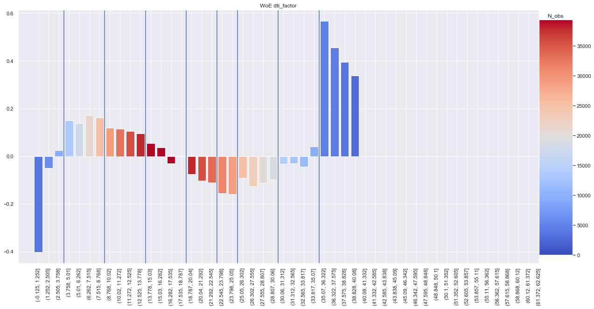


```python
fig, ax = plt.subplots(figsize=(20,8))

woe_df.iloc[:50,:].set_index('dti_factor').iloc[:, [3,4]].plot(kind='bar', stacked=True, ax=ax)

plt.legend()
```


    <matplotlib.legend.Legend at 0x1a654887b8>


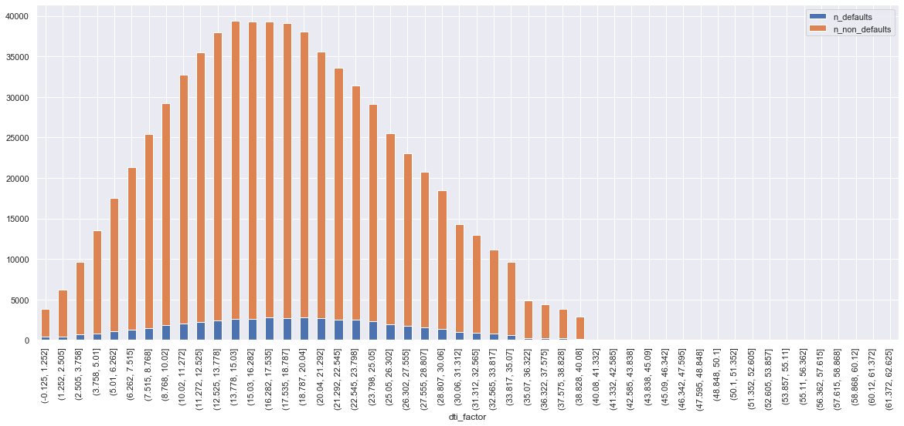


```python
x_train_prep['dti:<3.8'] = np.where(x_train_prep['dti'] <= 3.8, 1, 0)
x_train_prep['dti:3.8_8.8'] = np.where((x_train_prep['dti'] > 3.8) & (x_train_prep['dti'] <= 8.8), 1, 0)
x_train_prep['dti:8.8_13.8'] = np.where((x_train_prep['dti'] > 8.8) & (x_train_prep['dti'] <= 13.8), 1, 0)
x_train_prep['dti:13.8_18.8'] = np.where((x_train_prep['dti'] > 13.8) & (x_train_prep['dti'] <= 18.8), 1, 0)

x_train_prep['dti:18.8_22.6'] = np.where((x_train_prep['dti'] > 18.8) & (x_train_prep['dti'] <= 22.6), 1, 0)
x_train_prep['dti:22.6_25'] = np.where((x_train_prep['dti'] > 22.6) & (x_train_prep['dti'] <= 25), 1, 0)
x_train_prep['dti:25_30'] = np.where((x_train_prep['dti'] > 25) & (x_train_prep['dti'] <= 30), 1, 0)
x_train_prep['dti:30_35'] = np.where((x_train_prep['dti'] > 30) & (x_train_prep['dti'] <= 35), 1, 0)

x_train_prep['dti:>35'] = np.where(x_train_prep['dti'] > 35, 1, 0)
```


```python
fig, ax = plt.subplots(figsize=(20,8))

var_s = ['dti:<3.8', 'dti:3.8_8.8','dti:8.8_13.8', 'dti:13.8_18.8', 'dti:18.8_22.6', 'dti:22.6_25',
         'dti:25_30', 'dti:30_35', 'dti:>35']


pd.concat([x_train_prep, y_train_prep], axis=1).groupby('Y').sum().loc[:, var_s].T.plot(kind='bar', stacked=True, ax=ax)

plt.legend()
```


    <matplotlib.legend.Legend at 0x1a6564ba20>


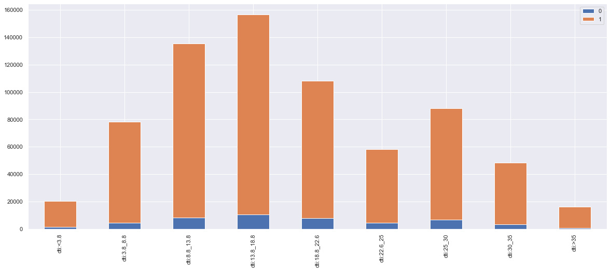


```python
vars_to_use.append(['dti:3.8_8.8','dti:8.8_13.8', 'dti:13.8_18.8', 'dti:18.8_22.6', 'dti:22.6_25',
                     'dti:25_30', 'dti:30_35', 'dti:>35'])
ref_vars.append(['dti:<3.8'])

vars_to_use
```


    [['grade:F', 'grade:E', 'grade:D', 'grade:C', 'grade:B', 'grade:A'],
     ['home_ownership:OWN', 'home_ownership:MORTGAGE'],
     ['addr_state:NY',
      'addr_state:VA_OK_AL_SD',
      'addr_state:CA',
      'addr_state:MO_DE_MD_UT_LA_NJ',
      'addr_state:NM_NC_AZ',
      'addr_state:PA_MA_RI_MI_AR',
      'addr_state:MN_OH_AK',
      'addr_state:KY_WI_GA_WA',
      'addr_state:OR_IN_TN_CT',
      'addr_state:TX',
      'addr_state:IL_KS_MT_SC_CO',
      'addr_state:VT_WV_WY_NH_DC_MS'],
     ['verification_status:Not Verified', 'verification_status:Source Verified'],
     ['initial_list_status:w'],
     ['purpose:house_mov_ren_oth_med',
      'purpose:vac_debtc_majpur_car_homeimp',
      'purpose:credit_card'],
     ['term:36'],
     ['emp_length_int:1',
      'emp_length_int:2_3_4',
      'emp_length_int:5_6_7',
      'emp_length_int:8_9',
      'emp_length_int:10'],
     ['mths_since_issue_d:<38',
      'mths_since_issue_d:38_39',
      'mths_since_issue_d:40_41',
      'mths_since_issue_d:42_48',
      'mths_since_issue_d:49_54',
      'mths_since_issue_d:55_68',
      'mths_since_issue_d:69_95'],
     ['int_rate:<10.054',
      'int_rate:10.054_12.849',
      'int_rate:12.849_15.735',
      'int_rate:15.735_19.995'],
     ['mths_since_earliest_cr_line:<160',
      'mths_since_earliest_cr_line:161_288',
      'mths_since_earliest_cr_line:289_360'],
     ['delinq_2yrs:0', 'delinq_2yrs:1-3'],
     ['inq_last_6mths:0', 'inq_last_6mths:1-2', 'inq_last_6mths:3-6'],
     ['open_acc:1-3',
      'open_acc:4-12',
      'open_acc:13-17',
      'open_acc:18-22',
      'open_acc:23-25',
      'open_acc:26-30',
      'open_acc:>=31'],
     ['pub_rec:>1'],
     ['total_acc:15_24', 'total_acc:25_57', 'total_acc:>=57'],
     ['acc_now_delinq:>=1'],
     ['total_rev_hi_lim:5K-10K',
      'total_rev_hi_lim:10K-20K',
      'total_rev_hi_lim:20K-30K',
      'total_rev_hi_lim:30K-40K',
      'total_rev_hi_lim:40K-55K',
      'total_rev_hi_lim:55K-95K',
      'total_rev_hi_lim:>95K'],
     ['annual_inc:22k_36k',
      'annual_inc:36k_51k',
      'annual_inc:51k_60k',
      'annual_inc:60k_66k',
      'annual_inc:66k_80k',
      'annual_inc:80k_103k',
      'annual_inc:103k_120k',
      'annual_inc:>120k'],
     ['mths_since_last_delinq:missing',
      'mths_since_last_delinq:4_30',
      'mths_since_last_delinq:31_56',
      'mths_since_last_delinq:>57'],
     ['dti:3.8_8.8',
      'dti:8.8_13.8',
      'dti:13.8_18.8',
      'dti:18.8_22.6',
      'dti:22.6_25',
      'dti:25_30',
      'dti:30_35',
      'dti:>35']]


## mths_since_last_record

## ATTENTION!!! This variable discretization has changed in relation to the first model


```python
print(x_train_prep['mths_since_last_record'].nunique(), 'unique values')
print(x_train_prep['mths_since_last_record'].isnull().sum(), 'missing values')
x_train_prep['mths_since_last_record'].describe()
```

    122 unique values
    600113 missing values


    count    109790.000000
    mean         70.113817
    std          28.123288
    min           0.000000
    25%          51.000000
    50%          70.000000
    75%          92.000000
    max         121.000000
    Name: mths_since_last_record, dtype: float64


```python
temp_not_null = x_train_prep[x_train_prep['mths_since_last_record'].notnull()]

temp_not_null['mths_since_last_record_factor'] = pd.cut(temp_not_null['mths_since_last_record'], 60)
```

    /Users/omaromeiri/anaconda3/lib/python3.7/site-packages/ipykernel_launcher.py:3: SettingWithCopyWarning: 
    A value is trying to be set on a copy of a slice from a DataFrame.
    Try using .loc[row_indexer,col_indexer] = value instead
    
    See the caveats in the documentation: http://pandas.pydata.org/pandas-docs/stable/indexing.html#indexing-view-versus-copy
      This is separate from the ipykernel package so we can avoid doing imports until


```python
woe_df = woe_ordered_continuous(temp_not_null, 'mths_since_last_record_factor', y_train_prep[temp_not_null.index.values], rot_x_ticks=90, vlines=[0.5, 10.5, 14.5, 33.5, 41.5, 45.5, 56.5])
woe_df
```


<div>
<style scoped>
    .dataframe tbody tr th:only-of-type {
        vertical-align: middle;
    }

    .dataframe tbody tr th {
        vertical-align: top;
    }

    .dataframe thead th {
        text-align: right;
    }
</style>
<table border="1" class="dataframe">
  <thead>
    <tr style="text-align: right;">
      <th></th>
      <th>mths_since_last_record_factor</th>
      <th>n_obs</th>
      <th>prop_non_defaults</th>
      <th>prop_n_obs</th>
      <th>n_defaults</th>
      <th>n_non_defaults</th>
      <th>prop_n_non_defaults</th>
      <th>prop_n_defaults</th>
      <th>WoE</th>
      <th>diff_prop_non_defaults</th>
      <th>diff_WoE</th>
      <th>IV</th>
    </tr>
  </thead>
  <tbody>
    <tr>
      <th>0</th>
      <td>(-0.121, 2.017]</td>
      <td>1141</td>
      <td>0.475898</td>
      <td>0.010393</td>
      <td>598.0</td>
      <td>543.0</td>
      <td>0.005284</td>
      <td>0.085185</td>
      <td>-2.780212</td>
      <td>NaN</td>
      <td>NaN</td>
      <td>0.362161</td>
    </tr>
    <tr>
      <th>1</th>
      <td>(2.017, 4.033]</td>
      <td>209</td>
      <td>0.952153</td>
      <td>0.001904</td>
      <td>10.0</td>
      <td>199.0</td>
      <td>0.001936</td>
      <td>0.001425</td>
      <td>0.306989</td>
      <td>0.003347</td>
      <td>3.087201</td>
      <td>0.362161</td>
    </tr>
    <tr>
      <th>2</th>
      <td>(4.033, 6.05]</td>
      <td>278</td>
      <td>0.956835</td>
      <td>0.002532</td>
      <td>12.0</td>
      <td>266.0</td>
      <td>0.002588</td>
      <td>0.001709</td>
      <td>0.414859</td>
      <td>0.000652</td>
      <td>0.107870</td>
      <td>0.362161</td>
    </tr>
    <tr>
      <th>3</th>
      <td>(6.05, 8.067]</td>
      <td>363</td>
      <td>0.942149</td>
      <td>0.003306</td>
      <td>21.0</td>
      <td>342.0</td>
      <td>0.003328</td>
      <td>0.002991</td>
      <td>0.106558</td>
      <td>0.000740</td>
      <td>0.308301</td>
      <td>0.362161</td>
    </tr>
    <tr>
      <th>4</th>
      <td>(8.067, 10.083]</td>
      <td>424</td>
      <td>0.950472</td>
      <td>0.003862</td>
      <td>21.0</td>
      <td>403.0</td>
      <td>0.003921</td>
      <td>0.002991</td>
      <td>0.270684</td>
      <td>0.000594</td>
      <td>0.164126</td>
      <td>0.362161</td>
    </tr>
    <tr>
      <th>5</th>
      <td>(10.083, 12.1]</td>
      <td>504</td>
      <td>0.946429</td>
      <td>0.004591</td>
      <td>27.0</td>
      <td>477.0</td>
      <td>0.004641</td>
      <td>0.003846</td>
      <td>0.187949</td>
      <td>0.000720</td>
      <td>0.082734</td>
      <td>0.362161</td>
    </tr>
    <tr>
      <th>6</th>
      <td>(12.1, 14.117]</td>
      <td>524</td>
      <td>0.959924</td>
      <td>0.004773</td>
      <td>21.0</td>
      <td>503.0</td>
      <td>0.004894</td>
      <td>0.002991</td>
      <td>0.492337</td>
      <td>0.000253</td>
      <td>0.304388</td>
      <td>0.362161</td>
    </tr>
    <tr>
      <th>7</th>
      <td>(14.117, 16.133]</td>
      <td>532</td>
      <td>0.949248</td>
      <td>0.004846</td>
      <td>27.0</td>
      <td>505.0</td>
      <td>0.004914</td>
      <td>0.003846</td>
      <td>0.244991</td>
      <td>0.000019</td>
      <td>0.247346</td>
      <td>0.362161</td>
    </tr>
    <tr>
      <th>8</th>
      <td>(16.133, 18.15]</td>
      <td>597</td>
      <td>0.949749</td>
      <td>0.005438</td>
      <td>30.0</td>
      <td>567.0</td>
      <td>0.005517</td>
      <td>0.004274</td>
      <td>0.255432</td>
      <td>0.000603</td>
      <td>0.010440</td>
      <td>0.362161</td>
    </tr>
    <tr>
      <th>9</th>
      <td>(18.15, 20.167]</td>
      <td>645</td>
      <td>0.958140</td>
      <td>0.005875</td>
      <td>27.0</td>
      <td>618.0</td>
      <td>0.006013</td>
      <td>0.003846</td>
      <td>0.446921</td>
      <td>0.000496</td>
      <td>0.191490</td>
      <td>0.362161</td>
    </tr>
    <tr>
      <th>10</th>
      <td>(20.167, 22.183]</td>
      <td>717</td>
      <td>0.965132</td>
      <td>0.006531</td>
      <td>25.0</td>
      <td>692.0</td>
      <td>0.006733</td>
      <td>0.003561</td>
      <td>0.636980</td>
      <td>0.000720</td>
      <td>0.190059</td>
      <td>0.362161</td>
    </tr>
    <tr>
      <th>11</th>
      <td>(22.183, 24.2]</td>
      <td>753</td>
      <td>0.942895</td>
      <td>0.006859</td>
      <td>43.0</td>
      <td>710.0</td>
      <td>0.006909</td>
      <td>0.006125</td>
      <td>0.120335</td>
      <td>0.000175</td>
      <td>0.516645</td>
      <td>0.362161</td>
    </tr>
    <tr>
      <th>12</th>
      <td>(24.2, 26.217]</td>
      <td>871</td>
      <td>0.943743</td>
      <td>0.007933</td>
      <td>49.0</td>
      <td>822.0</td>
      <td>0.007998</td>
      <td>0.006980</td>
      <td>0.136190</td>
      <td>0.001090</td>
      <td>0.015855</td>
      <td>0.362161</td>
    </tr>
    <tr>
      <th>13</th>
      <td>(26.217, 28.233]</td>
      <td>994</td>
      <td>0.946680</td>
      <td>0.009054</td>
      <td>53.0</td>
      <td>941.0</td>
      <td>0.009156</td>
      <td>0.007550</td>
      <td>0.192921</td>
      <td>0.001158</td>
      <td>0.056731</td>
      <td>0.362161</td>
    </tr>
    <tr>
      <th>14</th>
      <td>(28.233, 30.25]</td>
      <td>1087</td>
      <td>0.942962</td>
      <td>0.009901</td>
      <td>62.0</td>
      <td>1025.0</td>
      <td>0.009974</td>
      <td>0.008832</td>
      <td>0.121583</td>
      <td>0.000817</td>
      <td>0.071338</td>
      <td>0.362161</td>
    </tr>
    <tr>
      <th>15</th>
      <td>(30.25, 32.267]</td>
      <td>1133</td>
      <td>0.965578</td>
      <td>0.010320</td>
      <td>39.0</td>
      <td>1094.0</td>
      <td>0.010645</td>
      <td>0.005556</td>
      <td>0.650304</td>
      <td>0.000671</td>
      <td>0.528721</td>
      <td>0.362161</td>
    </tr>
    <tr>
      <th>16</th>
      <td>(32.267, 34.283]</td>
      <td>1321</td>
      <td>0.964421</td>
      <td>0.012032</td>
      <td>47.0</td>
      <td>1274.0</td>
      <td>0.012397</td>
      <td>0.006695</td>
      <td>0.616039</td>
      <td>0.001751</td>
      <td>0.034265</td>
      <td>0.362161</td>
    </tr>
    <tr>
      <th>17</th>
      <td>(34.283, 36.3]</td>
      <td>1343</td>
      <td>0.956813</td>
      <td>0.012232</td>
      <td>58.0</td>
      <td>1285.0</td>
      <td>0.012504</td>
      <td>0.008262</td>
      <td>0.414341</td>
      <td>0.000107</td>
      <td>0.201698</td>
      <td>0.362161</td>
    </tr>
    <tr>
      <th>18</th>
      <td>(36.3, 38.317]</td>
      <td>1601</td>
      <td>0.959400</td>
      <td>0.014582</td>
      <td>65.0</td>
      <td>1536.0</td>
      <td>0.014946</td>
      <td>0.009259</td>
      <td>0.478819</td>
      <td>0.002442</td>
      <td>0.064479</td>
      <td>0.362161</td>
    </tr>
    <tr>
      <th>19</th>
      <td>(38.317, 40.333]</td>
      <td>1618</td>
      <td>0.962299</td>
      <td>0.014737</td>
      <td>61.0</td>
      <td>1557.0</td>
      <td>0.015150</td>
      <td>0.008689</td>
      <td>0.555912</td>
      <td>0.000204</td>
      <td>0.077093</td>
      <td>0.362161</td>
    </tr>
    <tr>
      <th>20</th>
      <td>(40.333, 42.35]</td>
      <td>1799</td>
      <td>0.959978</td>
      <td>0.016386</td>
      <td>72.0</td>
      <td>1727.0</td>
      <td>0.016805</td>
      <td>0.010256</td>
      <td>0.493745</td>
      <td>0.001654</td>
      <td>0.062167</td>
      <td>0.362161</td>
    </tr>
    <tr>
      <th>21</th>
      <td>(42.35, 44.367]</td>
      <td>1822</td>
      <td>0.953348</td>
      <td>0.016595</td>
      <td>85.0</td>
      <td>1737.0</td>
      <td>0.016902</td>
      <td>0.012108</td>
      <td>0.333533</td>
      <td>0.000097</td>
      <td>0.160211</td>
      <td>0.362161</td>
    </tr>
    <tr>
      <th>22</th>
      <td>(44.367, 46.383]</td>
      <td>2005</td>
      <td>0.957107</td>
      <td>0.018262</td>
      <td>86.0</td>
      <td>1919.0</td>
      <td>0.018673</td>
      <td>0.012251</td>
      <td>0.421482</td>
      <td>0.001771</td>
      <td>0.087949</td>
      <td>0.362161</td>
    </tr>
    <tr>
      <th>23</th>
      <td>(46.383, 48.4]</td>
      <td>2096</td>
      <td>0.953244</td>
      <td>0.019091</td>
      <td>98.0</td>
      <td>1998.0</td>
      <td>0.019441</td>
      <td>0.013960</td>
      <td>0.331204</td>
      <td>0.000769</td>
      <td>0.090278</td>
      <td>0.362161</td>
    </tr>
    <tr>
      <th>24</th>
      <td>(48.4, 50.417]</td>
      <td>2289</td>
      <td>0.956750</td>
      <td>0.020849</td>
      <td>99.0</td>
      <td>2190.0</td>
      <td>0.021310</td>
      <td>0.014103</td>
      <td>0.412807</td>
      <td>0.001868</td>
      <td>0.081602</td>
      <td>0.362161</td>
    </tr>
    <tr>
      <th>25</th>
      <td>(50.417, 52.433]</td>
      <td>2483</td>
      <td>0.950060</td>
      <td>0.022616</td>
      <td>124.0</td>
      <td>2359.0</td>
      <td>0.022954</td>
      <td>0.017664</td>
      <td>0.261981</td>
      <td>0.001644</td>
      <td>0.150825</td>
      <td>0.362161</td>
    </tr>
    <tr>
      <th>26</th>
      <td>(52.433, 54.45]</td>
      <td>2779</td>
      <td>0.953580</td>
      <td>0.025312</td>
      <td>129.0</td>
      <td>2650.0</td>
      <td>0.025786</td>
      <td>0.018376</td>
      <td>0.338772</td>
      <td>0.002832</td>
      <td>0.076791</td>
      <td>0.362161</td>
    </tr>
    <tr>
      <th>27</th>
      <td>(54.45, 56.467]</td>
      <td>2803</td>
      <td>0.953978</td>
      <td>0.025531</td>
      <td>129.0</td>
      <td>2674.0</td>
      <td>0.026019</td>
      <td>0.018376</td>
      <td>0.347788</td>
      <td>0.000234</td>
      <td>0.009016</td>
      <td>0.362161</td>
    </tr>
    <tr>
      <th>28</th>
      <td>(56.467, 58.483]</td>
      <td>2886</td>
      <td>0.953222</td>
      <td>0.026287</td>
      <td>135.0</td>
      <td>2751.0</td>
      <td>0.026769</td>
      <td>0.019231</td>
      <td>0.330715</td>
      <td>0.000749</td>
      <td>0.017073</td>
      <td>0.362161</td>
    </tr>
    <tr>
      <th>29</th>
      <td>(58.483, 60.5]</td>
      <td>2898</td>
      <td>0.955487</td>
      <td>0.026396</td>
      <td>129.0</td>
      <td>2769.0</td>
      <td>0.026944</td>
      <td>0.018376</td>
      <td>0.382699</td>
      <td>0.000175</td>
      <td>0.051984</td>
      <td>0.362161</td>
    </tr>
    <tr>
      <th>30</th>
      <td>(60.5, 62.517]</td>
      <td>3130</td>
      <td>0.958147</td>
      <td>0.028509</td>
      <td>131.0</td>
      <td>2999.0</td>
      <td>0.029182</td>
      <td>0.018661</td>
      <td>0.447107</td>
      <td>0.002238</td>
      <td>0.064408</td>
      <td>0.362161</td>
    </tr>
    <tr>
      <th>31</th>
      <td>(62.517, 64.533]</td>
      <td>3094</td>
      <td>0.954105</td>
      <td>0.028181</td>
      <td>142.0</td>
      <td>2952.0</td>
      <td>0.028724</td>
      <td>0.020228</td>
      <td>0.350681</td>
      <td>0.000457</td>
      <td>0.096426</td>
      <td>0.362161</td>
    </tr>
    <tr>
      <th>32</th>
      <td>(64.533, 66.55]</td>
      <td>3052</td>
      <td>0.960682</td>
      <td>0.027799</td>
      <td>120.0</td>
      <td>2932.0</td>
      <td>0.028530</td>
      <td>0.017094</td>
      <td>0.512218</td>
      <td>0.000195</td>
      <td>0.161537</td>
      <td>0.362161</td>
    </tr>
    <tr>
      <th>33</th>
      <td>(66.55, 68.567]</td>
      <td>3000</td>
      <td>0.959333</td>
      <td>0.027325</td>
      <td>122.0</td>
      <td>2878.0</td>
      <td>0.028004</td>
      <td>0.017379</td>
      <td>0.477100</td>
      <td>0.000525</td>
      <td>0.035118</td>
      <td>0.362161</td>
    </tr>
    <tr>
      <th>34</th>
      <td>(68.567, 70.583]</td>
      <td>2994</td>
      <td>0.951236</td>
      <td>0.027270</td>
      <td>146.0</td>
      <td>2848.0</td>
      <td>0.027712</td>
      <td>0.020798</td>
      <td>0.287035</td>
      <td>0.000292</td>
      <td>0.190064</td>
      <td>0.362161</td>
    </tr>
    <tr>
      <th>35</th>
      <td>(70.583, 72.6]</td>
      <td>3037</td>
      <td>0.956865</td>
      <td>0.027662</td>
      <td>131.0</td>
      <td>2906.0</td>
      <td>0.028277</td>
      <td>0.018661</td>
      <td>0.415605</td>
      <td>0.000564</td>
      <td>0.128570</td>
      <td>0.362161</td>
    </tr>
    <tr>
      <th>36</th>
      <td>(72.6, 74.617]</td>
      <td>2803</td>
      <td>0.954335</td>
      <td>0.025531</td>
      <td>128.0</td>
      <td>2675.0</td>
      <td>0.026029</td>
      <td>0.018234</td>
      <td>0.355944</td>
      <td>0.002248</td>
      <td>0.059661</td>
      <td>0.362161</td>
    </tr>
    <tr>
      <th>37</th>
      <td>(74.617, 76.633]</td>
      <td>2957</td>
      <td>0.951978</td>
      <td>0.026933</td>
      <td>142.0</td>
      <td>2815.0</td>
      <td>0.027391</td>
      <td>0.020228</td>
      <td>0.303160</td>
      <td>0.001362</td>
      <td>0.052784</td>
      <td>0.362161</td>
    </tr>
    <tr>
      <th>38</th>
      <td>(76.633, 78.65]</td>
      <td>2773</td>
      <td>0.961414</td>
      <td>0.025257</td>
      <td>107.0</td>
      <td>2666.0</td>
      <td>0.025941</td>
      <td>0.015242</td>
      <td>0.531775</td>
      <td>0.001450</td>
      <td>0.228615</td>
      <td>0.362161</td>
    </tr>
    <tr>
      <th>39</th>
      <td>(78.65, 80.667]</td>
      <td>2801</td>
      <td>0.953588</td>
      <td>0.025512</td>
      <td>130.0</td>
      <td>2671.0</td>
      <td>0.025990</td>
      <td>0.018519</td>
      <td>0.338943</td>
      <td>0.000049</td>
      <td>0.192832</td>
      <td>0.362161</td>
    </tr>
    <tr>
      <th>40</th>
      <td>(80.667, 82.683]</td>
      <td>2607</td>
      <td>0.946298</td>
      <td>0.023745</td>
      <td>140.0</td>
      <td>2467.0</td>
      <td>0.024005</td>
      <td>0.019943</td>
      <td>0.185385</td>
      <td>0.001985</td>
      <td>0.153558</td>
      <td>0.362161</td>
    </tr>
    <tr>
      <th>41</th>
      <td>(82.683, 84.7]</td>
      <td>2086</td>
      <td>0.951103</td>
      <td>0.019000</td>
      <td>102.0</td>
      <td>1984.0</td>
      <td>0.019305</td>
      <td>0.014530</td>
      <td>0.284167</td>
      <td>0.004700</td>
      <td>0.098782</td>
      <td>0.362161</td>
    </tr>
    <tr>
      <th>42</th>
      <td>(84.7, 86.717]</td>
      <td>2224</td>
      <td>0.929856</td>
      <td>0.020257</td>
      <td>156.0</td>
      <td>2068.0</td>
      <td>0.020123</td>
      <td>0.022222</td>
      <td>-0.099249</td>
      <td>0.000817</td>
      <td>0.383416</td>
      <td>0.362161</td>
    </tr>
    <tr>
      <th>43</th>
      <td>(86.717, 88.733]</td>
      <td>2054</td>
      <td>0.925998</td>
      <td>0.018708</td>
      <td>152.0</td>
      <td>1902.0</td>
      <td>0.018507</td>
      <td>0.021652</td>
      <td>-0.156950</td>
      <td>0.001615</td>
      <td>0.057701</td>
      <td>0.362161</td>
    </tr>
    <tr>
      <th>44</th>
      <td>(88.733, 90.75]</td>
      <td>1848</td>
      <td>0.919913</td>
      <td>0.016832</td>
      <td>148.0</td>
      <td>1700.0</td>
      <td>0.016542</td>
      <td>0.021083</td>
      <td>-0.242559</td>
      <td>0.001966</td>
      <td>0.085609</td>
      <td>0.362161</td>
    </tr>
    <tr>
      <th>45</th>
      <td>(90.75, 92.767]</td>
      <td>1766</td>
      <td>0.919592</td>
      <td>0.016085</td>
      <td>142.0</td>
      <td>1624.0</td>
      <td>0.015802</td>
      <td>0.020228</td>
      <td>-0.246910</td>
      <td>0.000740</td>
      <td>0.004351</td>
      <td>0.362161</td>
    </tr>
    <tr>
      <th>46</th>
      <td>(92.767, 94.783]</td>
      <td>1834</td>
      <td>0.908942</td>
      <td>0.016705</td>
      <td>167.0</td>
      <td>1667.0</td>
      <td>0.016221</td>
      <td>0.023789</td>
      <td>-0.382943</td>
      <td>0.000418</td>
      <td>0.136033</td>
      <td>0.362161</td>
    </tr>
    <tr>
      <th>47</th>
      <td>(94.783, 96.8]</td>
      <td>1780</td>
      <td>0.896067</td>
      <td>0.016213</td>
      <td>185.0</td>
      <td>1595.0</td>
      <td>0.015520</td>
      <td>0.026353</td>
      <td>-0.529457</td>
      <td>0.000701</td>
      <td>0.146514</td>
      <td>0.362161</td>
    </tr>
    <tr>
      <th>48</th>
      <td>(96.8, 98.817]</td>
      <td>1822</td>
      <td>0.906696</td>
      <td>0.016595</td>
      <td>170.0</td>
      <td>1652.0</td>
      <td>0.016075</td>
      <td>0.024217</td>
      <td>-0.409787</td>
      <td>0.000555</td>
      <td>0.119670</td>
      <td>0.362161</td>
    </tr>
    <tr>
      <th>49</th>
      <td>(98.817, 100.833]</td>
      <td>1842</td>
      <td>0.900651</td>
      <td>0.016777</td>
      <td>183.0</td>
      <td>1659.0</td>
      <td>0.016143</td>
      <td>0.026068</td>
      <td>-0.479246</td>
      <td>0.000068</td>
      <td>0.069459</td>
      <td>0.362161</td>
    </tr>
    <tr>
      <th>50</th>
      <td>(100.833, 102.85]</td>
      <td>1841</td>
      <td>0.906029</td>
      <td>0.016768</td>
      <td>173.0</td>
      <td>1668.0</td>
      <td>0.016230</td>
      <td>0.024644</td>
      <td>-0.417641</td>
      <td>0.000088</td>
      <td>0.061605</td>
      <td>0.362161</td>
    </tr>
    <tr>
      <th>51</th>
      <td>(102.85, 104.867]</td>
      <td>2004</td>
      <td>0.902695</td>
      <td>0.018253</td>
      <td>195.0</td>
      <td>1809.0</td>
      <td>0.017602</td>
      <td>0.027778</td>
      <td>-0.456200</td>
      <td>0.001372</td>
      <td>0.038559</td>
      <td>0.362161</td>
    </tr>
    <tr>
      <th>52</th>
      <td>(104.867, 106.883]</td>
      <td>1978</td>
      <td>0.892821</td>
      <td>0.018016</td>
      <td>212.0</td>
      <td>1766.0</td>
      <td>0.017184</td>
      <td>0.030199</td>
      <td>-0.563844</td>
      <td>0.000418</td>
      <td>0.107644</td>
      <td>0.362161</td>
    </tr>
    <tr>
      <th>53</th>
      <td>(106.883, 108.9]</td>
      <td>1957</td>
      <td>0.895759</td>
      <td>0.017825</td>
      <td>204.0</td>
      <td>1753.0</td>
      <td>0.017058</td>
      <td>0.029060</td>
      <td>-0.532766</td>
      <td>0.000126</td>
      <td>0.031078</td>
      <td>0.362161</td>
    </tr>
    <tr>
      <th>54</th>
      <td>(108.9, 110.917]</td>
      <td>2066</td>
      <td>0.906099</td>
      <td>0.018818</td>
      <td>194.0</td>
      <td>1872.0</td>
      <td>0.018215</td>
      <td>0.027635</td>
      <td>-0.416826</td>
      <td>0.001158</td>
      <td>0.115941</td>
      <td>0.362161</td>
    </tr>
    <tr>
      <th>55</th>
      <td>(110.917, 112.933]</td>
      <td>2127</td>
      <td>0.905031</td>
      <td>0.019373</td>
      <td>202.0</td>
      <td>1925.0</td>
      <td>0.018731</td>
      <td>0.028775</td>
      <td>-0.429317</td>
      <td>0.000516</td>
      <td>0.012491</td>
      <td>0.362161</td>
    </tr>
    <tr>
      <th>56</th>
      <td>(112.933, 114.95]</td>
      <td>2336</td>
      <td>0.912671</td>
      <td>0.021277</td>
      <td>204.0</td>
      <td>2132.0</td>
      <td>0.020745</td>
      <td>0.029060</td>
      <td>-0.337034</td>
      <td>0.002014</td>
      <td>0.092282</td>
      <td>0.362161</td>
    </tr>
    <tr>
      <th>57</th>
      <td>(114.95, 116.967]</td>
      <td>2356</td>
      <td>0.919355</td>
      <td>0.021459</td>
      <td>190.0</td>
      <td>2166.0</td>
      <td>0.021076</td>
      <td>0.027066</td>
      <td>-0.250117</td>
      <td>0.000331</td>
      <td>0.086918</td>
      <td>0.362161</td>
    </tr>
    <tr>
      <th>58</th>
      <td>(116.967, 118.983]</td>
      <td>2377</td>
      <td>0.930585</td>
      <td>0.021650</td>
      <td>165.0</td>
      <td>2212.0</td>
      <td>0.021524</td>
      <td>0.023504</td>
      <td>-0.088023</td>
      <td>0.000448</td>
      <td>0.162094</td>
      <td>0.362161</td>
    </tr>
    <tr>
      <th>59</th>
      <td>(118.983, 121.0]</td>
      <td>729</td>
      <td>0.924554</td>
      <td>0.006640</td>
      <td>55.0</td>
      <td>674.0</td>
      <td>0.006558</td>
      <td>0.007835</td>
      <td>-0.177833</td>
      <td>0.014965</td>
      <td>0.089810</td>
      <td>0.362161</td>
    </tr>
  </tbody>
</table>
</div>


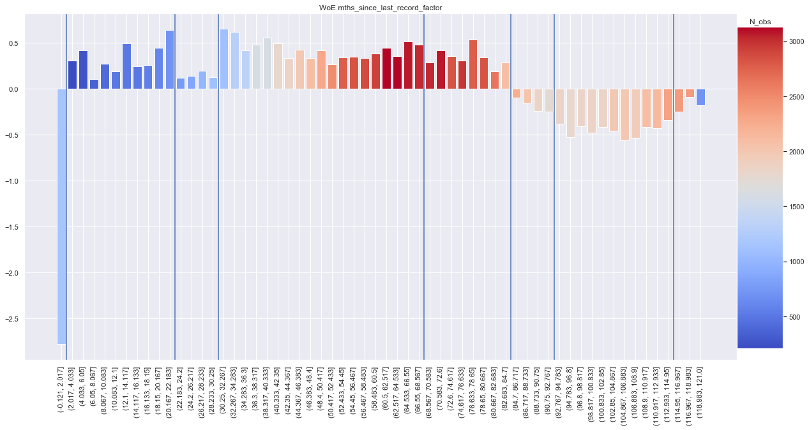


```python
fig, ax = plt.subplots(figsize=(20,8))

woe_df.iloc[:50,:].set_index('mths_since_last_record_factor').iloc[:, [3,4]].plot(kind='bar', stacked=True, ax=ax)

plt.legend()
```


    <matplotlib.legend.Legend at 0x1a65bae748>


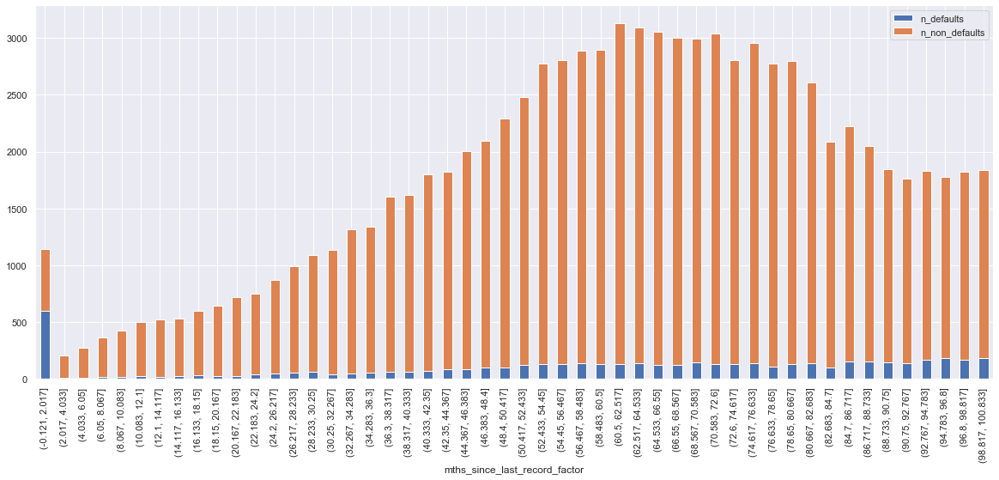


```python
x_train_prep['mths_since_last_record:Missing'] = np.where((x_train_prep['mths_since_last_record'].isnull()), 1, 0)
x_train_prep['mths_since_last_record:0_2'] = np.where((x_train_prep['mths_since_last_record'] >= 0) & (x_train_prep['mths_since_last_record'] <= 2), 1, 0)
x_train_prep['mths_since_last_record:3_22'] = np.where((x_train_prep['mths_since_last_record'] >= 3) & (x_train_prep['mths_since_last_record'] <= 22), 1, 0)
x_train_prep['mths_since_last_record:23_30'] = np.where((x_train_prep['mths_since_last_record'] >= 23) & (x_train_prep['mths_since_last_record'] <= 30), 1, 0)
x_train_prep['mths_since_last_record:31_69'] = np.where((x_train_prep['mths_since_last_record'] >= 31) & (x_train_prep['mths_since_last_record'] <= 69), 1, 0)
x_train_prep['mths_since_last_record:70_85'] = np.where((x_train_prep['mths_since_last_record'] >= 70) & (x_train_prep['mths_since_last_record'] <= 85), 1, 0)
x_train_prep['mths_since_last_record:86_93'] = np.where((x_train_prep['mths_since_last_record'] >= 86) & (x_train_prep['mths_since_last_record'] <= 93), 1, 0)
x_train_prep['mths_since_last_record:94_115'] = np.where((x_train_prep['mths_since_last_record'] >= 94) & (x_train_prep['mths_since_last_record'] <= 115), 1, 0)
x_train_prep['mths_since_last_record:>115'] = np.where((x_train_prep['mths_since_last_record'] > 115), 1, 0)
```


```python
fig, ax = plt.subplots(figsize=(20,8))

var_s = ['mths_since_last_record:Missing', 'mths_since_last_record:0_2', 'mths_since_last_record:3_22', 'mths_since_last_record:23_30',
         'mths_since_last_record:31_69', 'mths_since_last_record:70_85', 'mths_since_last_record:86_93', 'mths_since_last_record:94_115', 'mths_since_last_record:>115']


pd.concat([x_train_prep, y_train_prep], axis=1).groupby('Y').sum().loc[:, var_s].T.plot(kind='bar', stacked=True, ax=ax)

plt.legend()
```


    <matplotlib.legend.Legend at 0x1a4b375a58>


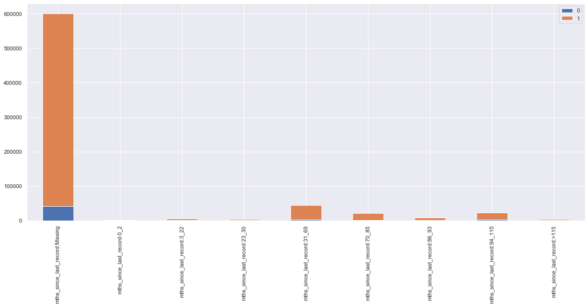


```python
vars_to_use.append(['mths_since_last_record:Missing', 'mths_since_last_record:3_22', 'mths_since_last_record:23_30',
         'mths_since_last_record:31_69', 'mths_since_last_record:70_85', 'mths_since_last_record:86_93', 'mths_since_last_record:94_115', 'mths_since_last_record:>115'])


ref_vars.append(['mths_since_last_record:0_2'])

vars_to_use
```


    [['grade:F', 'grade:E', 'grade:D', 'grade:C', 'grade:B', 'grade:A'],
     ['home_ownership:OWN', 'home_ownership:MORTGAGE'],
     ['addr_state:NY',
      'addr_state:VA_OK_AL_SD',
      'addr_state:CA',
      'addr_state:MO_DE_MD_UT_LA_NJ',
      'addr_state:NM_NC_AZ',
      'addr_state:PA_MA_RI_MI_AR',
      'addr_state:MN_OH_AK',
      'addr_state:KY_WI_GA_WA',
      'addr_state:OR_IN_TN_CT',
      'addr_state:TX',
      'addr_state:IL_KS_MT_SC_CO',
      'addr_state:VT_WV_WY_NH_DC_MS'],
     ['verification_status:Not Verified', 'verification_status:Source Verified'],
     ['initial_list_status:w'],
     ['purpose:house_mov_ren_oth_med',
      'purpose:vac_debtc_majpur_car_homeimp',
      'purpose:credit_card'],
     ['term:36'],
     ['emp_length_int:1',
      'emp_length_int:2_3_4',
      'emp_length_int:5_6_7',
      'emp_length_int:8_9',
      'emp_length_int:10'],
     ['mths_since_issue_d:<38',
      'mths_since_issue_d:38_39',
      'mths_since_issue_d:40_41',
      'mths_since_issue_d:42_48',
      'mths_since_issue_d:49_54',
      'mths_since_issue_d:55_68',
      'mths_since_issue_d:69_95'],
     ['int_rate:<10.054',
      'int_rate:10.054_12.849',
      'int_rate:12.849_15.735',
      'int_rate:15.735_19.995'],
     ['mths_since_earliest_cr_line:<160',
      'mths_since_earliest_cr_line:161_288',
      'mths_since_earliest_cr_line:289_360'],
     ['delinq_2yrs:0', 'delinq_2yrs:1-3'],
     ['inq_last_6mths:0', 'inq_last_6mths:1-2', 'inq_last_6mths:3-6'],
     ['open_acc:1-3',
      'open_acc:4-12',
      'open_acc:13-17',
      'open_acc:18-22',
      'open_acc:23-25',
      'open_acc:26-30',
      'open_acc:>=31'],
     ['pub_rec:>1'],
     ['total_acc:15_24', 'total_acc:25_57', 'total_acc:>=57'],
     ['acc_now_delinq:>=1'],
     ['total_rev_hi_lim:5K-10K',
      'total_rev_hi_lim:10K-20K',
      'total_rev_hi_lim:20K-30K',
      'total_rev_hi_lim:30K-40K',
      'total_rev_hi_lim:40K-55K',
      'total_rev_hi_lim:55K-95K',
      'total_rev_hi_lim:>95K'],
     ['annual_inc:22k_36k',
      'annual_inc:36k_51k',
      'annual_inc:51k_60k',
      'annual_inc:60k_66k',
      'annual_inc:66k_80k',
      'annual_inc:80k_103k',
      'annual_inc:103k_120k',
      'annual_inc:>120k'],
     ['mths_since_last_delinq:missing',
      'mths_since_last_delinq:4_30',
      'mths_since_last_delinq:31_56',
      'mths_since_last_delinq:>57'],
     ['dti:3.8_8.8',
      'dti:8.8_13.8',
      'dti:13.8_18.8',
      'dti:18.8_22.6',
      'dti:22.6_25',
      'dti:25_30',
      'dti:30_35',
      'dti:>35'],
     ['mths_since_last_record:Missing',
      'mths_since_last_record:3_22',
      'mths_since_last_record:23_30',
      'mths_since_last_record:31_69',
      'mths_since_last_record:70_85',
      'mths_since_last_record:86_93',
      'mths_since_last_record:94_115',
      'mths_since_last_record:>115']]


# Final considerations


```python
raw_data['year'] = raw_data['issue_d'].apply(lambda x: x.year)

plt.figure(figsize=(12,8))
sns.barplot('year', 'loan_amnt', data=raw_data, hue='Y')
plt.title('Issuance of Loans', fontsize=16)
plt.xlabel('Year', fontsize=14)
plt.ylabel('Average loan amount issued', fontsize=14)
```


    Text(0, 0.5, 'Average loan amount issued')


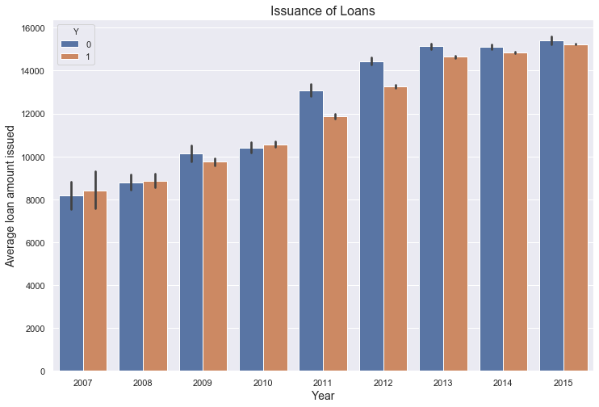


The avg. loan amount has practicaly doubled in 7 years.<br>


```python
yearly_default_ratio = pd.DataFrame(index=raw_data['year'].unique())

for year in raw_data['year'].unique():
    
    temp_df = raw_data[raw_data['year'] == year]
    temp_ratio = temp_df[temp_df['Y'] == 0].shape[0] / temp_df[temp_df['Y'] == 1].shape[0]
    yearly_default_ratio.loc[year,0] = round(temp_ratio*100,2)
yearly_default_ratio = yearly_default_ratio.sort_index().reset_index()
yearly_default_ratio.columns = ['Year', 'Ratio']
```


```python
fig, ax = plt.subplots(figsize=(12,8))
sns.countplot(x=raw_data['year'], hue=raw_data['Y'], ax=ax)

ax.legend(['Default', 'Non_default'], loc='upper center')

ax2 = ax.twinx() 
ax2.plot(range(9), yearly_default_ratio['Ratio'], label='Ratio of defaults')
ax2.scatter(range(9), yearly_default_ratio['Ratio'], s=25, c='k')

for i in range(len(yearly_default_ratio)):
    ax2.annotate(f"{yearly_default_ratio['Ratio'][i]}%", (i,yearly_default_ratio['Ratio'][i]+5), fontsize=13)

ax2.grid(False)
ax2.legend(loc='upper center', bbox_to_anchor=(0.25, 0., 0.5, 0.9))
```


    <matplotlib.legend.Legend at 0x1a65463160>


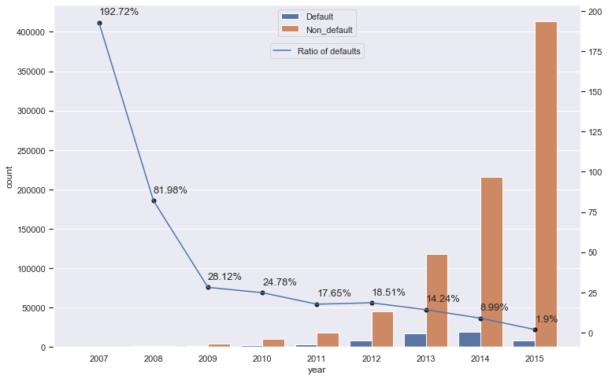


Since 2009 the values started making sense and dropped around 26%. That decrease in the default ratio means we are getting better at assessing the risk and predicting defaults.


```python
fig, ax = plt.subplots(figsize=(12,8))

sns.violinplot(y='dti', data=raw_data[raw_data['Y'] == 0], ax=ax, label='Default', legend=True)
sns.violinplot(y='dti', data=raw_data[raw_data['Y'] == 1], ax=ax, color='#d98f3f', label='Non-default', legend=False)

plt.setp(ax.collections, alpha=.7)
plt.title('Debt to income ratio', fontsize=20)
```


    Text(0.5, 1.0, 'Debt to income ratio')


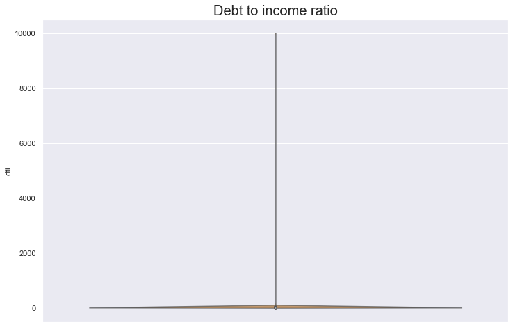


# Now for the test dataset

for this, I will simply copy all the preprocessing steps from the train dataset an run it for the test set


```python
x_test_prep = x_test.copy()
```

# Discrete variables

### 'grade' independent variable<br>

This variable is a strong predictor of the target, the Information Value (IV) is very high

We'll leave the grades categories as it is, no need to change them.<br>
All categories are representative and have significantly different WoE's<br><br><br>


### 'home_ownership' independent variable<br>
This variable has a weak predicting power IV is lower than 0.1

We can see that the 'OTHER', 'NONE' and 'ANY' categories have very low WoE's, but they have too little representation in the data. (less than 0.1%)<br>

because of this, we'll combine them with the 'RENT' category, which has the lowest WoE and still is representative.

There are few records in this category, but the default ratio is extremely high. This might be data inconsistency, but better keep an eye on it.<br>
Interestingly, people who pay mortgages are the ones that have the least probability of default.


```python
x_test_prep['home_ownership:RENT_OTHER_NONE'] = x_test_prep['home_ownership:RENT'] + x_test_prep['home_ownership:NONE'] + x_test_prep['home_ownership:OTHER'] + x_test_prep['home_ownership:ANY']
```


```python

```

### 'addr_state' independent variable<br>
### Attention!!! This variable discretization has changed from the original model<br>
this variable has a very weak predictive power

There is no data of borrowers from 'ND', so we'll add the column in case future borrowers show up

There is not enough data for the states 'ME, ID, IA, NE and ND'<br>
I'll group them together with FL and HI, and leave them in the highest risk category, since we want to be conservative


```python
x_test_prep['addr_state:NE_ND_ME_IA_ID_NV_HI_FL'] = x_test_prep['addr_state:NE'] + x_test_prep['addr_state:ND'] + x_test_prep['addr_state:ME'] + x_test_prep['addr_state:IA'] +\
                                                     x_test_prep['addr_state:ID'] + x_test_prep['addr_state:NV'] + x_test_prep['addr_state:HI'] + x_test_prep['addr_state:FL']
```


Moving on, the states VA, OK, AL and SD are going to be combined due to their similar WoE's and their low number of observations<br><br>
NY is going to be left alone, since the number of observations for it is really high.


```python
x_test_prep['addr_state:VA_OK_AL_SD'] = x_test_prep['addr_state:VA'] + x_test_prep['addr_state:OK'] + x_test_prep['addr_state:AL'] + x_test_prep['addr_state:SD']
```

CA is also going to be left as it is, because it has a very high number of observations.<br><br>
Next, I will group MO up to NJ together, because their similar WoE's and relative high number of obs.


```python
x_test_prep['addr_state:MO_DE_MD_UT_LA_NJ'] = x_test_prep['addr_state:MO'] + x_test_prep['addr_state:DE'] + x_test_prep['addr_state:MD'] + x_test_prep['addr_state:UT'] + \
                                                x_test_prep['addr_state:LA'] + x_test_prep['addr_state:NJ']
```

Now, NM up to AZ 


```python
x_test_prep['addr_state:NM_NC_AZ'] = x_test_prep['addr_state:NM'] + x_test_prep['addr_state:NC'] + x_test_prep['addr_state:AZ']
```

PA up to AR


```python
x_test_prep['addr_state:PA_MA_RI_MI_AR'] = x_test_prep['addr_state:PA'] + x_test_prep['addr_state:MA'] + x_test_prep['addr_state:RI'] + x_test_prep['addr_state:MI'] + x_test_prep['addr_state:AR']
```

Now, MN up to AK


```python
x_test_prep['addr_state:MN_OH_AK'] = x_test_prep['addr_state:MN'] + x_test_prep['addr_state:OH'] + x_test_prep['addr_state:AK']
```

Grouping KY up to WA


```python
x_test_prep['addr_state:KY_WI_GA_WA'] = x_test_prep['addr_state:KY'] + x_test_prep['addr_state:WI'] + x_test_prep['addr_state:GA'] + x_test_prep['addr_state:WA']
```

Now I'm grouping OR UP TO CT.<br>
Leaving TX as it is because of the high number of observations


```python
x_test_prep['addr_state:OR_IN_TN_CT'] = x_test_prep['addr_state:OR'] + x_test_prep['addr_state:IN'] + x_test_prep['addr_state:TN'] + x_test_prep['addr_state:CT']
```

Grouping from IL up to CO


```python
x_test_prep['addr_state:IL_KS_MT_SC_CO'] = x_test_prep['addr_state:IL'] + x_test_prep['addr_state:KS'] + x_test_prep['addr_state:MT'] \
                                                + x_test_prep['addr_state:SC'] + x_test_prep['addr_state:CO']
```

Now, I'm gonna group the 6 states that on the higher end of the scale, due to their low number of observations


```python
x_test_prep['addr_state:VT_WV_WY_NH_DC_MS'] = x_test_prep['addr_state:VT'] + x_test_prep['addr_state:WV'] + x_test_prep['addr_state:WY'] + x_test_prep['addr_state:NH'] +\
                                                 + x_test_prep['addr_state:DC'] + x_test_prep['addr_state:MS']  
```


```python

```


```python

```

#### 'verification_status' independent variable<br>
This variable has a almost no predictive power, IV is lower than 0.02

I'll leave this as it is, since predictive power is so weak and WoE's seem ok<br>
I'll probably leave this variable out of the model

## initial_status


```python

```

## purpose<br>

## Attention!!! This variable discretization has changed in relation to the first model

Grouping educ, sm and wedding <br>
House, moving, ren_energy, other and medical<br>
vacation, debtc, majpur, car, homeimp<br>
and credit_card alone


```python
x_test_prep['purpose:educ_sm_wedd'] = x_test_prep['purpose:educational'] +  x_test_prep['purpose:small_business'] + x_test_prep['purpose:wedding']
x_test_prep['purpose:house_mov_ren_oth_med'] = x_test_prep['purpose:house'] + x_test_prep['purpose:moving'] + x_test_prep['purpose:renewable_energy'] + x_test_prep['purpose:other'] + x_test_prep['purpose:medical']
x_test_prep['purpose:vac_debtc_majpur_car_homeimp'] = x_test_prep['purpose:vacation'] + x_test_prep['purpose:debt_consolidation'] + x_test_prep['purpose:major_purchase'] + x_test_prep['purpose:car'] + x_test_prep['purpose:home_improvement']

```


```python

```

# Continuous variables<br>

the procedure is the same as for catg variables, but we can't order tge woe_df by WoE, instead we have to order it by the values of the variable itself<br>
we want to preserve the natural order


```python

```

### term independent variable

60 month is much riskier, I'll leave as it is. Only two very distinct categories.<br>


```python
temp_dummies = pd.get_dummies(x_test_prep['term'], prefix='term', prefix_sep=':')
x_test_prep = pd.concat([x_test_prep, temp_dummies], axis=1)
```

### emp_length_int independent variable

## ATTENTION!!! This variable discretization changed in relation to the first model


```python
temp_dummies = pd.get_dummies(x_test_prep['emp_length_int'], prefix='emp_length_int', prefix_sep=':')
```


```python
x_test_prep['emp_length_int:0'] = temp_dummies['emp_length_int:0'].values
x_test_prep['emp_length_int:1'] = temp_dummies['emp_length_int:1'].values
x_test_prep['emp_length_int:2_3_4'] = (temp_dummies['emp_length_int:2'] + temp_dummies['emp_length_int:3'] + temp_dummies['emp_length_int:4']).values
x_test_prep['emp_length_int:5_6_7'] = (temp_dummies['emp_length_int:5'] + temp_dummies['emp_length_int:6'] + temp_dummies['emp_length_int:6']).values
x_test_prep['emp_length_int:8_9'] = (temp_dummies['emp_length_int:8'] + temp_dummies['emp_length_int:9']).values
x_test_prep['emp_length_int:10'] = temp_dummies['emp_length_int:10'].values
```

### 'mths_since_issue_d' independent variable<br>

## ATTENTION!!! This variable discretization changed in relation to the first model
There are 91 distinct values, first we fine class (un-ruled grouping) and later coarse class them (group by WoE)


```python
x_test_prep['mths_since_issue_d:<38'] = np.where(x_test_prep['mths_since_issue_d'].isin(range(38)), 1, 0)
x_test_prep['mths_since_issue_d:38_39'] = np.where(x_test_prep['mths_since_issue_d'].isin(range(38, 40)), 1, 0)
x_test_prep['mths_since_issue_d:40_41'] = np.where(x_test_prep['mths_since_issue_d'].isin(range(40, 42)), 1, 0)

x_test_prep['mths_since_issue_d:42_48'] = np.where(x_test_prep['mths_since_issue_d'].isin(range(42, 49)), 1, 0)
x_test_prep['mths_since_issue_d:49_54'] = np.where(x_test_prep['mths_since_issue_d'].isin(range(49, 55)), 1, 0)
x_test_prep['mths_since_issue_d:55_68'] = np.where(x_test_prep['mths_since_issue_d'].isin(range(55, 69)), 1, 0)
x_test_prep['mths_since_issue_d:69_95'] = np.where(x_test_prep['mths_since_issue_d'].isin(range(69, 96)), 1, 0)
x_test_prep['mths_since_issue_d:>95'] = np.where(x_test_prep['mths_since_issue_d'] > 95, 1, 0)
```

### 'int_rate' variable

## ATTENTION!!! This variable discretization has changed in relation to the first model


```python
x_test_prep['int_rate:<10.054'] = np.where(x_test_prep['int_rate'] <= 10.054, 1, 0)
x_test_prep['int_rate:10.054_12.849'] = np.where((x_test_prep['int_rate'] > 10.054) & (x_test_prep['int_rate'] <= 12.849), 1, 0)
x_test_prep['int_rate:12.849_15.735'] = np.where((x_test_prep['int_rate'] > 12.849) & (x_test_prep['int_rate'] <= 15.735), 1, 0)
x_test_prep['int_rate:15.735_19.995'] = np.where((x_test_prep['int_rate'] > 15.735) & (x_test_prep['int_rate'] <= 19.995), 1, 0)
x_test_prep['int_rate:>19.995'] = np.where(x_test_prep['int_rate'] > 19.995, 1, 0)
```

### 'funded_amnt' variable

As the WoE's of the intervals are very different, show an almost horizontal trend, and we see no actual relation between 'funded_amnt' and the dependent variable. We won't use this variable for the PD model

## 'mths_since_earliest_cr_line'

## ATTENTION!!! This variable discretization has changed in relation to the first model


```python
x_test_prep['mths_since_earliest_cr_line:<160'] = np.where(x_test_prep['mths_since_earliest_cr_line'] <= 160, 1, 0)
x_test_prep['mths_since_earliest_cr_line:161_288'] = np.where((x_test_prep['mths_since_earliest_cr_line'] > 140) & (x_test_prep['mths_since_earliest_cr_line'] <= 288 ), 1, 0)
x_test_prep['mths_since_earliest_cr_line:289_360'] = np.where((x_test_prep['mths_since_earliest_cr_line'] > 289) & (x_test_prep['mths_since_earliest_cr_line'] <= 360), 1, 0)
x_test_prep['mths_since_earliest_cr_line:>360'] = np.where(x_test_prep['mths_since_earliest_cr_line'] > 360, 1, 0)
```

### 'installment'


### No need to do anything here, linear horizontal trend, no relation between installment and default rate


# 'delinq_2yrs'


```python
x_test_prep['delinq_2yrs:0'] = np.where((x_test_prep['delinq_2yrs'] == 0), 1, 0)
x_test_prep['delinq_2yrs:1-3'] = np.where((x_test_prep['delinq_2yrs'] >= 1) & (x_test_prep['delinq_2yrs'] <= 3), 1, 0)
x_test_prep['delinq_2yrs:>=4'] = np.where((x_test_prep['delinq_2yrs'] >= 9), 1, 0)
```

### 'inq_last_6mths'


```python
x_test_prep['inq_last_6mths:0'] = np.where((x_test_prep['inq_last_6mths'] == 0), 1, 0)
x_test_prep['inq_last_6mths:1-2'] = np.where((x_test_prep['inq_last_6mths'] >= 1) & (x_test_prep['inq_last_6mths'] <= 2), 1, 0)
x_test_prep['inq_last_6mths:3-6'] = np.where((x_test_prep['inq_last_6mths'] >= 3) & (x_test_prep['inq_last_6mths'] <= 6), 1, 0)
x_test_prep['inq_last_6mths:>6'] = np.where((x_test_prep['inq_last_6mths'] > 6), 1, 0)
```

### 'open_acc'


```python
x_test_prep['open_acc:0'] = np.where((x_test_prep['open_acc'] == 0), 1, 0)
x_test_prep['open_acc:1-3'] = np.where((x_test_prep['open_acc'] >= 1) & (x_test_prep['open_acc'] <= 3), 1, 0)
x_test_prep['open_acc:4-12'] = np.where((x_test_prep['open_acc'] >= 4) & (x_test_prep['open_acc'] <= 12), 1, 0)
x_test_prep['open_acc:13-17'] = np.where((x_test_prep['open_acc'] >= 13) & (x_test_prep['open_acc'] <= 17), 1, 0)
x_test_prep['open_acc:18-22'] = np.where((x_test_prep['open_acc'] >= 18) & (x_test_prep['open_acc'] <= 22), 1, 0)
x_test_prep['open_acc:23-25'] = np.where((x_test_prep['open_acc'] >= 23) & (x_test_prep['open_acc'] <= 25), 1, 0)
x_test_prep['open_acc:26-30'] = np.where((x_test_prep['open_acc'] >= 26) & (x_test_prep['open_acc'] <= 30), 1, 0)
x_test_prep['open_acc:>=31'] = np.where((x_test_prep['open_acc'] >= 31), 1, 0)
```

## pub_rec<br>

## ATTENTION!!! This variable discretization has changed in relation to the first model


```python
x_test_prep['pub_rec:0-1'] = np.where((x_test_prep['pub_rec'] >= 0) & (x_test_prep['pub_rec'] <= 1), 1, 0)
x_test_prep['pub_rec:>1'] = np.where((x_test_prep['pub_rec'] > 1), 1, 0)
```

### total_acc

## ATTENTION!!! This variable discretization has changed in relation to the first model


```python
x_test_prep['total_acc:<=14'] = np.where((x_test_prep['total_acc'] <= 14), 1, 0)
x_test_prep['total_acc:15_24'] = np.where((x_test_prep['total_acc'] > 14) & (x_test_prep['total_acc'] <= 24), 1, 0)
x_test_prep['total_acc:25_57'] = np.where((x_test_prep['total_acc'] > 24) & (x_test_prep['total_acc'] <= 57), 1, 0)
x_test_prep['total_acc:>=57'] = np.where((x_test_prep['total_acc'] > 57), 1, 0)
```

### 'acc_now_delinq'


```python
x_test_prep['acc_now_delinq:0'] = np.where((x_test_prep['acc_now_delinq'] == 0), 1, 0)
x_test_prep['acc_now_delinq:>=1'] = np.where((x_test_prep['acc_now_delinq'] >= 1), 1, 0)
```

## total_rev_hi_lim


```python
x_test_prep['total_rev_hi_lim:<=5K'] = np.where((x_test_prep['total_rev_hi_lim'] <= 5000), 1, 0)
x_test_prep['total_rev_hi_lim:5K-10K'] = np.where((x_test_prep['total_rev_hi_lim'] > 5000) & (x_test_prep['total_rev_hi_lim'] <= 10000), 1, 0)
x_test_prep['total_rev_hi_lim:10K-20K'] = np.where((x_test_prep['total_rev_hi_lim'] > 10000) & (x_test_prep['total_rev_hi_lim'] <= 20000), 1, 0)
x_test_prep['total_rev_hi_lim:20K-30K'] = np.where((x_test_prep['total_rev_hi_lim'] > 20000) & (x_test_prep['total_rev_hi_lim'] <= 30000), 1, 0)
x_test_prep['total_rev_hi_lim:30K-40K'] = np.where((x_test_prep['total_rev_hi_lim'] > 30000) & (x_test_prep['total_rev_hi_lim'] <= 40000), 1, 0)
x_test_prep['total_rev_hi_lim:40K-55K'] = np.where((x_test_prep['total_rev_hi_lim'] > 40000) & (x_test_prep['total_rev_hi_lim'] <= 55000), 1, 0)
x_test_prep['total_rev_hi_lim:55K-95K'] = np.where((x_test_prep['total_rev_hi_lim'] > 55000) & (x_test_prep['total_rev_hi_lim'] <= 95000), 1, 0)
x_test_prep['total_rev_hi_lim:>95K'] = np.where((x_test_prep['total_rev_hi_lim'] > 95000), 1, 0)
```

### loan_amnt


##### Seems like the amount has a minor effect on default. But one can notice that the ratio default/default is lower on the most required amounts mainly each 5000 multiple

### annual_inc

## ATTENTION!!! This variable discretization has changed in relation to the first model


```python
x_test_prep['annual_inc:<=22k'] = np.where(x_test_prep['annual_inc'] <= 22000, 1, 0)
x_test_prep['annual_inc:22k_36k'] = np.where((x_test_prep['annual_inc'] > 22000) & (x_test_prep['annual_inc'] <= 36000), 1, 0)
x_test_prep['annual_inc:36k_51k'] = np.where((x_test_prep['annual_inc'] > 36000) & (x_test_prep['annual_inc'] <= 51000), 1, 0)
x_test_prep['annual_inc:51k_60k'] = np.where((x_test_prep['annual_inc'] > 51000) & (x_test_prep['annual_inc'] <= 60000), 1, 0)
x_test_prep['annual_inc:60k_66k'] = np.where((x_test_prep['annual_inc'] > 60000) & (x_test_prep['annual_inc'] <= 66000), 1, 0)
x_test_prep['annual_inc:66k_80k'] = np.where((x_test_prep['annual_inc'] > 66000) & (x_test_prep['annual_inc'] <= 80000), 1, 0)
x_test_prep['annual_inc:80k_103k'] = np.where((x_test_prep['annual_inc'] > 80000) & (x_test_prep['annual_inc'] <= 103000), 1, 0)
x_test_prep['annual_inc:103k_120k'] = np.where((x_test_prep['annual_inc'] > 103000) & (x_test_prep['annual_inc'] <= 120000), 1, 0)
x_test_prep['annual_inc:>120k'] = np.where(x_test_prep['annual_inc'] > 120000, 1, 0)

```

## mths_since_last_delinq


```python
x_test_prep['mths_since_last_delinq:missing'] = np.where(x_test_prep['mths_since_last_delinq'].isnull(), 1, 0)
x_test_prep['mths_since_last_delinq:<4'] = np.where(x_test_prep['mths_since_last_delinq'] <= 4, 1, 0)
x_test_prep['mths_since_last_delinq:4_30'] = np.where((x_test_prep['mths_since_last_delinq'] > 4) & (x_test_prep['mths_since_last_delinq'] <= 30), 1, 0)
x_test_prep['mths_since_last_delinq:31_56'] = np.where((x_test_prep['mths_since_last_delinq'] > 30) & (x_test_prep['mths_since_last_delinq'] <= 56), 1, 0)
x_test_prep['mths_since_last_delinq:>57'] = np.where((x_test_prep['mths_since_last_delinq'] > 4) & (x_test_prep['mths_since_last_delinq'] <= 30), 1, 0)


```

## dti

## ATTENTION!!! This variable discretization has changed in relation to the first model


```python
impute_index = x_test_prep[x_test_prep['dti'] >= 200].index.values
```


```python
x_test_prep.loc[impute_index, 'annual_inc'] = np.mean(x_test_prep['annual_inc'])
x_test_prep.loc[impute_index, 'annual_inc']
```


    540456    74997.037212
    484446    74997.037212
    Name: annual_inc, dtype: float64


```python
x_test_prep.loc[impute_index, 'dti'] = (x_test_prep.loc[impute_index, 'funded_amnt'] / x_test_prep.loc[impute_index, 'annual_inc']) * 100
x_test_prep.loc[impute_index, 'dti']
```


    540456    16.000632
    484446    26.667720
    Name: dti, dtype: float64


```python
x_test_prep[x_test_prep['dti'] >= 200]
```


<div>
<style scoped>
    .dataframe tbody tr th:only-of-type {
        vertical-align: middle;
    }

    .dataframe tbody tr th {
        vertical-align: top;
    }

    .dataframe thead th {
        text-align: right;
    }
</style>
<table border="1" class="dataframe">
  <thead>
    <tr style="text-align: right;">
      <th></th>
      <th>id</th>
      <th>member_id</th>
      <th>loan_amnt</th>
      <th>funded_amnt</th>
      <th>funded_amnt_inv</th>
      <th>term</th>
      <th>int_rate</th>
      <th>installment</th>
      <th>grade</th>
      <th>sub_grade</th>
      <th>emp_title</th>
      <th>emp_length</th>
      <th>home_ownership</th>
      <th>annual_inc</th>
      <th>verification_status</th>
      <th>issue_d</th>
      <th>loan_status</th>
      <th>pymnt_plan</th>
      <th>url</th>
      <th>desc</th>
      <th>purpose</th>
      <th>title</th>
      <th>zip_code</th>
      <th>addr_state</th>
      <th>dti</th>
      <th>delinq_2yrs</th>
      <th>earliest_cr_line</th>
      <th>inq_last_6mths</th>
      <th>mths_since_last_delinq</th>
      <th>mths_since_last_record</th>
      <th>open_acc</th>
      <th>pub_rec</th>
      <th>revol_bal</th>
      <th>revol_util</th>
      <th>total_acc</th>
      <th>initial_list_status</th>
      <th>out_prncp</th>
      <th>out_prncp_inv</th>
      <th>total_pymnt</th>
      <th>total_pymnt_inv</th>
      <th>total_rec_prncp</th>
      <th>total_rec_int</th>
      <th>total_rec_late_fee</th>
      <th>recoveries</th>
      <th>collection_recovery_fee</th>
      <th>last_pymnt_d</th>
      <th>last_pymnt_amnt</th>
      <th>next_pymnt_d</th>
      <th>last_credit_pull_d</th>
      <th>collections_12_mths_ex_med</th>
      <th>mths_since_last_major_derog</th>
      <th>policy_code</th>
      <th>application_type</th>
      <th>annual_inc_joint</th>
      <th>dti_joint</th>
      <th>verification_status_joint</th>
      <th>acc_now_delinq</th>
      <th>tot_coll_amt</th>
      <th>tot_cur_bal</th>
      <th>open_acc_6m</th>
      <th>open_il_6m</th>
      <th>open_il_12m</th>
      <th>open_il_24m</th>
      <th>mths_since_rcnt_il</th>
      <th>total_bal_il</th>
      <th>il_util</th>
      <th>open_rv_12m</th>
      <th>open_rv_24m</th>
      <th>max_bal_bc</th>
      <th>all_util</th>
      <th>total_rev_hi_lim</th>
      <th>inq_fi</th>
      <th>total_cu_tl</th>
      <th>inq_last_12m</th>
      <th>emp_length_int</th>
      <th>earliest_cr_line_date</th>
      <th>mths_since_earliest_cr_line</th>
      <th>mths_since_issue_d</th>
      <th>grade:A</th>
      <th>grade:B</th>
      <th>grade:C</th>
      <th>grade:D</th>
      <th>grade:E</th>
      <th>grade:F</th>
      <th>grade:G</th>
      <th>sub_grade:A1</th>
      <th>sub_grade:A2</th>
      <th>sub_grade:A3</th>
      <th>sub_grade:A4</th>
      <th>sub_grade:A5</th>
      <th>sub_grade:B1</th>
      <th>sub_grade:B2</th>
      <th>sub_grade:B3</th>
      <th>sub_grade:B4</th>
      <th>sub_grade:B5</th>
      <th>sub_grade:C1</th>
      <th>sub_grade:C2</th>
      <th>sub_grade:C3</th>
      <th>sub_grade:C4</th>
      <th>sub_grade:C5</th>
      <th>sub_grade:D1</th>
      <th>sub_grade:D2</th>
      <th>sub_grade:D3</th>
      <th>sub_grade:D4</th>
      <th>sub_grade:D5</th>
      <th>sub_grade:E1</th>
      <th>sub_grade:E2</th>
      <th>sub_grade:E3</th>
      <th>sub_grade:E4</th>
      <th>sub_grade:E5</th>
      <th>sub_grade:F1</th>
      <th>sub_grade:F2</th>
      <th>sub_grade:F3</th>
      <th>sub_grade:F4</th>
      <th>sub_grade:F5</th>
      <th>sub_grade:G1</th>
      <th>sub_grade:G2</th>
      <th>sub_grade:G3</th>
      <th>sub_grade:G4</th>
      <th>sub_grade:G5</th>
      <th>home_ownership:ANY</th>
      <th>home_ownership:MORTGAGE</th>
      <th>home_ownership:NONE</th>
      <th>home_ownership:OTHER</th>
      <th>home_ownership:OWN</th>
      <th>home_ownership:RENT</th>
      <th>verification_status:Not Verified</th>
      <th>verification_status:Source Verified</th>
      <th>verification_status:Verified</th>
      <th>loan_status:Charged Off</th>
      <th>loan_status:Current</th>
      <th>loan_status:Default</th>
      <th>loan_status:Does not meet the credit policy. Status:Charged Off</th>
      <th>loan_status:Does not meet the credit policy. Status:Fully Paid</th>
      <th>loan_status:Fully Paid</th>
      <th>loan_status:In Grace Period</th>
      <th>loan_status:Issued</th>
      <th>loan_status:Late (16-30 days)</th>
      <th>loan_status:Late (31-120 days)</th>
      <th>purpose:car</th>
      <th>purpose:credit_card</th>
      <th>purpose:debt_consolidation</th>
      <th>purpose:educational</th>
      <th>purpose:home_improvement</th>
      <th>purpose:house</th>
      <th>purpose:major_purchase</th>
      <th>purpose:medical</th>
      <th>purpose:moving</th>
      <th>purpose:other</th>
      <th>purpose:renewable_energy</th>
      <th>purpose:small_business</th>
      <th>purpose:vacation</th>
      <th>purpose:wedding</th>
      <th>addr_state:AK</th>
      <th>addr_state:AL</th>
      <th>addr_state:AR</th>
      <th>addr_state:AZ</th>
      <th>addr_state:CA</th>
      <th>addr_state:CO</th>
      <th>addr_state:CT</th>
      <th>addr_state:DC</th>
      <th>addr_state:DE</th>
      <th>addr_state:FL</th>
      <th>addr_state:GA</th>
      <th>addr_state:HI</th>
      <th>addr_state:IA</th>
      <th>addr_state:ID</th>
      <th>addr_state:IL</th>
      <th>addr_state:IN</th>
      <th>addr_state:KS</th>
      <th>addr_state:KY</th>
      <th>addr_state:LA</th>
      <th>addr_state:MA</th>
      <th>addr_state:MD</th>
      <th>addr_state:ME</th>
      <th>addr_state:MI</th>
      <th>addr_state:MN</th>
      <th>addr_state:MO</th>
      <th>addr_state:MS</th>
      <th>addr_state:MT</th>
      <th>addr_state:NC</th>
      <th>addr_state:ND</th>
      <th>addr_state:NE</th>
      <th>addr_state:NH</th>
      <th>addr_state:NJ</th>
      <th>addr_state:NM</th>
      <th>addr_state:NV</th>
      <th>addr_state:NY</th>
      <th>addr_state:OH</th>
      <th>addr_state:OK</th>
      <th>addr_state:OR</th>
      <th>addr_state:PA</th>
      <th>addr_state:RI</th>
      <th>addr_state:SC</th>
      <th>addr_state:SD</th>
      <th>addr_state:TN</th>
      <th>addr_state:TX</th>
      <th>addr_state:UT</th>
      <th>addr_state:VA</th>
      <th>addr_state:VT</th>
      <th>addr_state:WA</th>
      <th>addr_state:WI</th>
      <th>addr_state:WV</th>
      <th>addr_state:WY</th>
      <th>initial_list_status:f</th>
      <th>initial_list_status:w</th>
      <th>home_ownership:RENT_OTHER_NONE</th>
      <th>addr_state:NE_ND_ME_IA_ID_NV_HI_FL</th>
      <th>addr_state:VA_OK_AL_SD</th>
      <th>addr_state:MO_DE_MD_UT_LA_NJ</th>
      <th>addr_state:NM_NC_AZ</th>
      <th>addr_state:PA_MA_RI_MI_AR</th>
      <th>addr_state:MN_OH_AK</th>
      <th>addr_state:KY_WI_GA_WA</th>
      <th>addr_state:OR_IN_TN_CT</th>
      <th>addr_state:IL_KS_MT_SC_CO</th>
      <th>addr_state:VT_WV_WY_NH_DC_MS</th>
      <th>purpose:educ_sm_wedd</th>
      <th>purpose:house_mov_ren_oth_med</th>
      <th>purpose:vac_debtc_majpur_car_homeimp</th>
      <th>term:36</th>
      <th>term:60</th>
      <th>emp_length_int:0</th>
      <th>emp_length_int:1</th>
      <th>emp_length_int:2_3_4</th>
      <th>emp_length_int:5_6_7</th>
      <th>emp_length_int:8_9</th>
      <th>emp_length_int:10</th>
      <th>mths_since_issue_d:&lt;38</th>
      <th>mths_since_issue_d:38_39</th>
      <th>mths_since_issue_d:40_41</th>
      <th>mths_since_issue_d:42_48</th>
      <th>mths_since_issue_d:49_54</th>
      <th>mths_since_issue_d:55_68</th>
      <th>mths_since_issue_d:69_95</th>
      <th>mths_since_issue_d:&gt;95</th>
      <th>int_rate:&lt;10.054</th>
      <th>int_rate:10.054_12.849</th>
      <th>int_rate:12.849_15.735</th>
      <th>int_rate:15.735_19.995</th>
      <th>int_rate:&gt;19.995</th>
      <th>mths_since_earliest_cr_line:&lt;160</th>
      <th>mths_since_earliest_cr_line:161_288</th>
      <th>mths_since_earliest_cr_line:289_360</th>
      <th>mths_since_earliest_cr_line:&gt;360</th>
      <th>delinq_2yrs:0</th>
      <th>delinq_2yrs:1-3</th>
      <th>delinq_2yrs:&gt;=4</th>
      <th>inq_last_6mths:0</th>
      <th>inq_last_6mths:1-2</th>
      <th>inq_last_6mths:3-6</th>
      <th>inq_last_6mths:&gt;6</th>
      <th>open_acc:0</th>
      <th>open_acc:1-3</th>
      <th>open_acc:4-12</th>
      <th>open_acc:13-17</th>
      <th>open_acc:18-22</th>
      <th>open_acc:23-25</th>
      <th>open_acc:26-30</th>
      <th>open_acc:&gt;=31</th>
      <th>pub_rec:0-1</th>
      <th>pub_rec:&gt;1</th>
      <th>total_acc:&lt;=14</th>
      <th>total_acc:15_24</th>
      <th>total_acc:25_57</th>
      <th>total_acc:&gt;=57</th>
      <th>acc_now_delinq:0</th>
      <th>acc_now_delinq:&gt;=1</th>
      <th>total_rev_hi_lim:&lt;=5K</th>
      <th>total_rev_hi_lim:5K-10K</th>
      <th>total_rev_hi_lim:10K-20K</th>
      <th>total_rev_hi_lim:20K-30K</th>
      <th>total_rev_hi_lim:30K-40K</th>
      <th>total_rev_hi_lim:40K-55K</th>
      <th>total_rev_hi_lim:55K-95K</th>
      <th>total_rev_hi_lim:&gt;95K</th>
      <th>annual_inc:&lt;=22k</th>
      <th>annual_inc:22k_36k</th>
      <th>annual_inc:36k_51k</th>
      <th>annual_inc:51k_60k</th>
      <th>annual_inc:60k_66k</th>
      <th>annual_inc:66k_80k</th>
      <th>annual_inc:80k_103k</th>
      <th>annual_inc:103k_120k</th>
      <th>annual_inc:&gt;120k</th>
      <th>mths_since_last_delinq:missing</th>
      <th>mths_since_last_delinq:&lt;4</th>
      <th>mths_since_last_delinq:4_30</th>
      <th>mths_since_last_delinq:31_56</th>
      <th>mths_since_last_delinq:&gt;57</th>
    </tr>
  </thead>
  <tbody>
  </tbody>
</table>
</div>


```python
x_test_prep['dti:<3.8'] = np.where(x_test_prep['dti'] <= 3.8, 1, 0)
x_test_prep['dti:3.8_8.8'] = np.where((x_test_prep['dti'] > 3.8) & (x_test_prep['dti'] <= 8.8), 1, 0)
x_test_prep['dti:8.8_13.8'] = np.where((x_test_prep['dti'] > 8.8) & (x_test_prep['dti'] <= 13.8), 1, 0)
x_test_prep['dti:13.8_18.8'] = np.where((x_test_prep['dti'] > 13.8) & (x_test_prep['dti'] <= 18.8), 1, 0)

x_test_prep['dti:18.8_22.6'] = np.where((x_test_prep['dti'] > 18.8) & (x_test_prep['dti'] <= 22.6), 1, 0)
x_test_prep['dti:22.6_25'] = np.where((x_test_prep['dti'] > 22.6) & (x_test_prep['dti'] <= 25), 1, 0)
x_test_prep['dti:25_30'] = np.where((x_test_prep['dti'] > 25) & (x_test_prep['dti'] <= 30), 1, 0)
x_test_prep['dti:30_35'] = np.where((x_test_prep['dti'] > 30) & (x_test_prep['dti'] <= 35), 1, 0)

x_test_prep['dti:>35'] = np.where(x_test_prep['dti'] > 35, 1, 0)
```

## mths_since_last_record

## ATTENTION!!! This variable discretization has changed in relation to the first model


```python
x_test_prep['mths_since_last_record:Missing'] = np.where((x_test_prep['mths_since_last_record'].isnull()), 1, 0)
x_test_prep['mths_since_last_record:0_2'] = np.where((x_test_prep['mths_since_last_record'] >= 0) & (x_test_prep['mths_since_last_record'] <= 2), 1, 0)
x_test_prep['mths_since_last_record:3_22'] = np.where((x_test_prep['mths_since_last_record'] >= 3) & (x_test_prep['mths_since_last_record'] <= 22), 1, 0)
x_test_prep['mths_since_last_record:23_30'] = np.where((x_test_prep['mths_since_last_record'] >= 23) & (x_test_prep['mths_since_last_record'] <= 30), 1, 0)
x_test_prep['mths_since_last_record:31_69'] = np.where((x_test_prep['mths_since_last_record'] >= 31) & (x_test_prep['mths_since_last_record'] <= 69), 1, 0)
x_test_prep['mths_since_last_record:70_85'] = np.where((x_test_prep['mths_since_last_record'] >= 70) & (x_test_prep['mths_since_last_record'] <= 85), 1, 0)
x_test_prep['mths_since_last_record:86_93'] = np.where((x_test_prep['mths_since_last_record'] >= 86) & (x_test_prep['mths_since_last_record'] <= 93), 1, 0)
x_test_prep['mths_since_last_record:94_115'] = np.where((x_test_prep['mths_since_last_record'] >= 94) & (x_test_prep['mths_since_last_record'] <= 115), 1, 0)
x_test_prep['mths_since_last_record:>115'] = np.where((x_test_prep['mths_since_last_record'] > 115), 1, 0)
```


```python
pd.concat([x_train_prep, y_train_prep], axis=1).to_csv('loan_data_train_dataset_2007-2015.csv')
pd.concat([x_test_prep, y_test], axis=1).to_csv('loan_data_test_dataset_2007-2015.csv')
```


```python
import pickle

var_list = []
for out_v in vars_to_use:
    for inn_v in out_v:
        var_list.append(inn_v)   


pickle.dump(var_list, open("vars_discretized_for_PD_2007-2015.pickle", "wb" ))
pickle.dump(list(np.ravel(ref_vars)), open('vars_discretized_reference_for_PD_2007-2015.pickle', 'wb'))
```


```python

```


    ['grade:G',
     'home_ownership:RENT_OTHER_NONE',
     'addr_state:NE_ND_ME_IA_ID_NV_HI_FL',
     'verification_status:Verified',
     'initial_list_status:f',
     'purpose:educ_sm_wedd',
     'term:60',
     'emp_length_int:0',
     'mths_since_issue_d:>95',
     'int_rate:>19.995',
     'mths_since_earliest_cr_line:>360',
     'delinq_2yrs:>=4',
     'inq_last_6mths:>6',
     'open_acc:0',
     'pub_rec:0-1',
     'total_acc:<=14',
     'acc_now_delinq:0',
     'total_rev_hi_lim:<=5K',
     'annual_inc:<=22k',
     'mths_since_last_delinq:<4',
     'dti:<3.8',
     'mths_since_last_record:0_2']


```python

```
