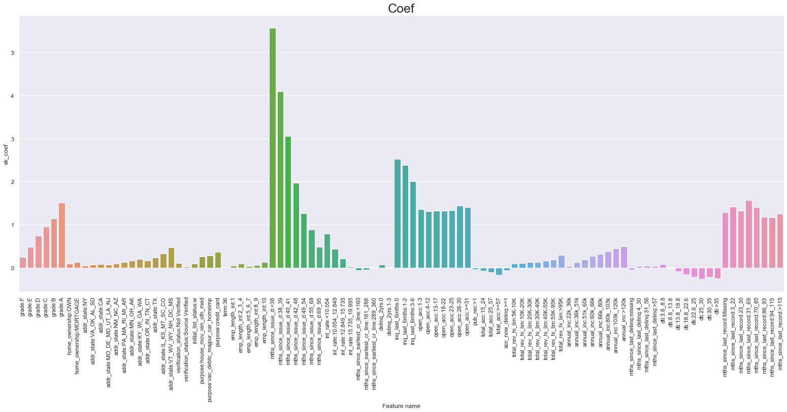
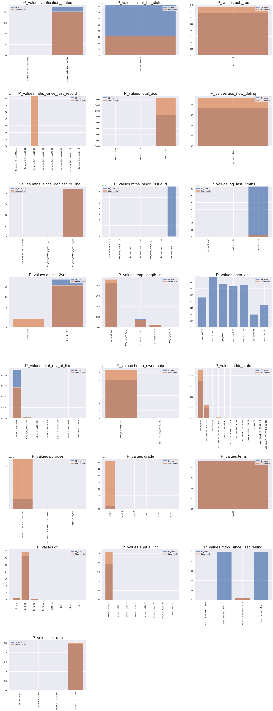
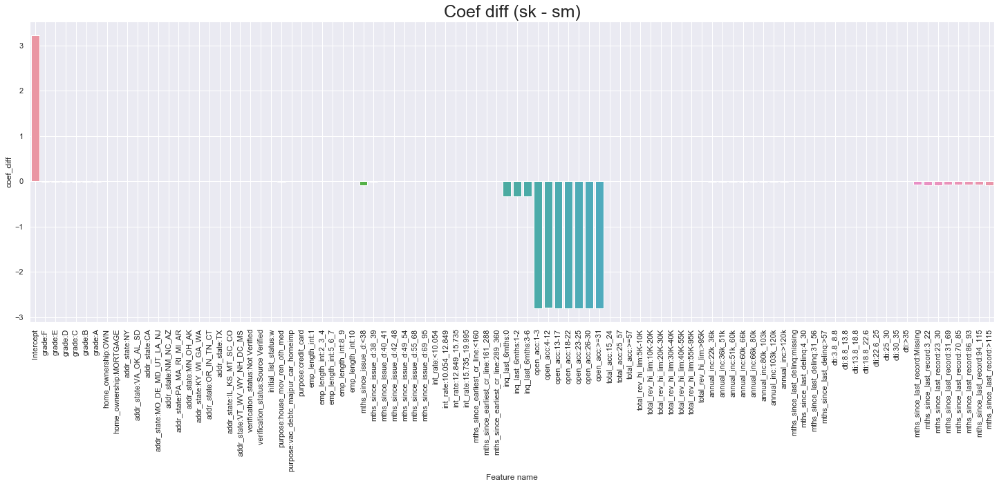
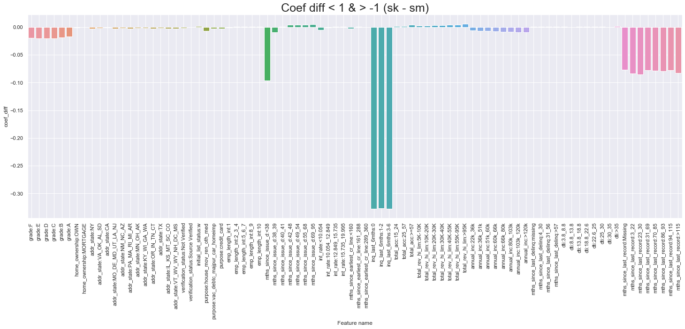
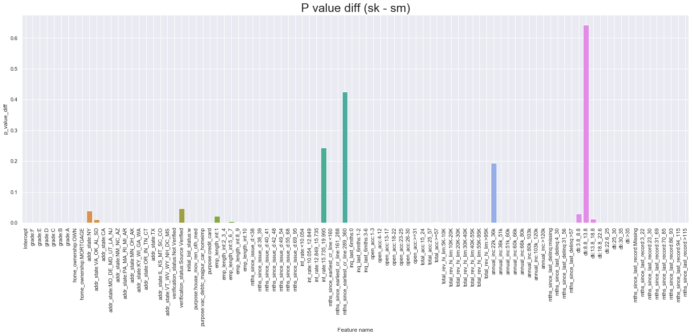
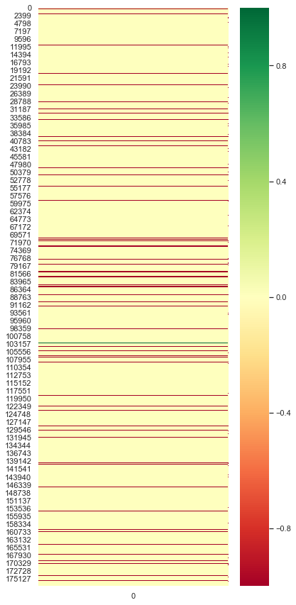
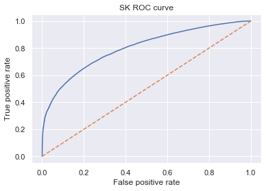
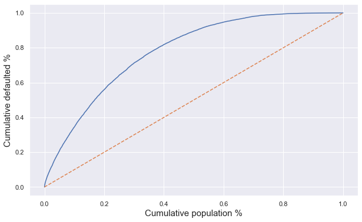
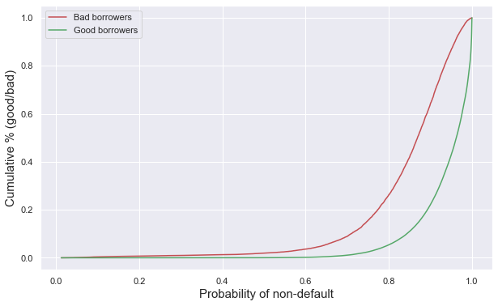
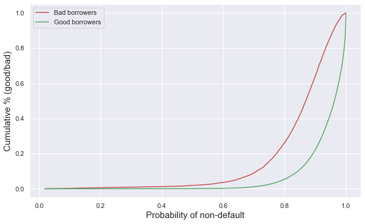

```python
import numpy as np
import pandas as pd
import pickle
import matplotlib.pyplot as plt
import seaborn as sns
import math
import sklearn.metrics as sklm


sns.set()

pd.options.display.max_rows = None
pd.options.display.max_columns = None
```


```python
train = pd.read_csv('loan_data_train_dataset_2007-2015.csv', index_col=0)
print(train.shape)
train.head()
```

    /Users/omaromeiri/anaconda3/lib/python3.7/site-packages/IPython/core/interactiveshell.py:3058: DtypeWarning: Columns (56) have mixed types. Specify dtype option on import or set low_memory=False.
      interactivity=interactivity, compiler=compiler, result=result)


    (709903, 319)


<div>
<style scoped>
    .dataframe tbody tr th:only-of-type {
        vertical-align: middle;
    }

    .dataframe tbody tr th {
        vertical-align: top;
    }

    .dataframe thead th {
        text-align: right;
    }
</style>
<table border="1" class="dataframe">
  <thead>
    <tr style="text-align: right;">
      <th></th>
      <th>id</th>
      <th>member_id</th>
      <th>loan_amnt</th>
      <th>funded_amnt</th>
      <th>funded_amnt_inv</th>
      <th>term</th>
      <th>int_rate</th>
      <th>installment</th>
      <th>grade</th>
      <th>sub_grade</th>
      <th>emp_title</th>
      <th>emp_length</th>
      <th>home_ownership</th>
      <th>annual_inc</th>
      <th>verification_status</th>
      <th>issue_d</th>
      <th>loan_status</th>
      <th>pymnt_plan</th>
      <th>url</th>
      <th>desc</th>
      <th>purpose</th>
      <th>title</th>
      <th>zip_code</th>
      <th>addr_state</th>
      <th>dti</th>
      <th>delinq_2yrs</th>
      <th>earliest_cr_line</th>
      <th>inq_last_6mths</th>
      <th>mths_since_last_delinq</th>
      <th>mths_since_last_record</th>
      <th>open_acc</th>
      <th>pub_rec</th>
      <th>revol_bal</th>
      <th>revol_util</th>
      <th>total_acc</th>
      <th>initial_list_status</th>
      <th>out_prncp</th>
      <th>out_prncp_inv</th>
      <th>total_pymnt</th>
      <th>total_pymnt_inv</th>
      <th>total_rec_prncp</th>
      <th>total_rec_int</th>
      <th>total_rec_late_fee</th>
      <th>recoveries</th>
      <th>collection_recovery_fee</th>
      <th>last_pymnt_d</th>
      <th>last_pymnt_amnt</th>
      <th>next_pymnt_d</th>
      <th>last_credit_pull_d</th>
      <th>collections_12_mths_ex_med</th>
      <th>mths_since_last_major_derog</th>
      <th>policy_code</th>
      <th>application_type</th>
      <th>annual_inc_joint</th>
      <th>dti_joint</th>
      <th>verification_status_joint</th>
      <th>acc_now_delinq</th>
      <th>tot_coll_amt</th>
      <th>tot_cur_bal</th>
      <th>open_acc_6m</th>
      <th>open_il_6m</th>
      <th>open_il_12m</th>
      <th>open_il_24m</th>
      <th>mths_since_rcnt_il</th>
      <th>total_bal_il</th>
      <th>il_util</th>
      <th>open_rv_12m</th>
      <th>open_rv_24m</th>
      <th>max_bal_bc</th>
      <th>all_util</th>
      <th>total_rev_hi_lim</th>
      <th>inq_fi</th>
      <th>total_cu_tl</th>
      <th>inq_last_12m</th>
      <th>emp_length_int</th>
      <th>earliest_cr_line_date</th>
      <th>mths_since_earliest_cr_line</th>
      <th>mths_since_issue_d</th>
      <th>grade:A</th>
      <th>grade:B</th>
      <th>grade:C</th>
      <th>grade:D</th>
      <th>grade:E</th>
      <th>grade:F</th>
      <th>grade:G</th>
      <th>sub_grade:A1</th>
      <th>sub_grade:A2</th>
      <th>sub_grade:A3</th>
      <th>sub_grade:A4</th>
      <th>sub_grade:A5</th>
      <th>sub_grade:B1</th>
      <th>sub_grade:B2</th>
      <th>sub_grade:B3</th>
      <th>sub_grade:B4</th>
      <th>sub_grade:B5</th>
      <th>sub_grade:C1</th>
      <th>sub_grade:C2</th>
      <th>sub_grade:C3</th>
      <th>sub_grade:C4</th>
      <th>sub_grade:C5</th>
      <th>sub_grade:D1</th>
      <th>sub_grade:D2</th>
      <th>sub_grade:D3</th>
      <th>sub_grade:D4</th>
      <th>sub_grade:D5</th>
      <th>sub_grade:E1</th>
      <th>sub_grade:E2</th>
      <th>sub_grade:E3</th>
      <th>sub_grade:E4</th>
      <th>sub_grade:E5</th>
      <th>sub_grade:F1</th>
      <th>sub_grade:F2</th>
      <th>sub_grade:F3</th>
      <th>sub_grade:F4</th>
      <th>sub_grade:F5</th>
      <th>sub_grade:G1</th>
      <th>sub_grade:G2</th>
      <th>sub_grade:G3</th>
      <th>sub_grade:G4</th>
      <th>sub_grade:G5</th>
      <th>home_ownership:ANY</th>
      <th>home_ownership:MORTGAGE</th>
      <th>home_ownership:NONE</th>
      <th>home_ownership:OTHER</th>
      <th>home_ownership:OWN</th>
      <th>home_ownership:RENT</th>
      <th>verification_status:Not Verified</th>
      <th>verification_status:Source Verified</th>
      <th>verification_status:Verified</th>
      <th>loan_status:Charged Off</th>
      <th>loan_status:Current</th>
      <th>loan_status:Default</th>
      <th>loan_status:Does not meet the credit policy. Status:Charged Off</th>
      <th>loan_status:Does not meet the credit policy. Status:Fully Paid</th>
      <th>loan_status:Fully Paid</th>
      <th>loan_status:In Grace Period</th>
      <th>loan_status:Issued</th>
      <th>loan_status:Late (16-30 days)</th>
      <th>loan_status:Late (31-120 days)</th>
      <th>purpose:car</th>
      <th>purpose:credit_card</th>
      <th>purpose:debt_consolidation</th>
      <th>purpose:educational</th>
      <th>purpose:home_improvement</th>
      <th>purpose:house</th>
      <th>purpose:major_purchase</th>
      <th>purpose:medical</th>
      <th>purpose:moving</th>
      <th>purpose:other</th>
      <th>purpose:renewable_energy</th>
      <th>purpose:small_business</th>
      <th>purpose:vacation</th>
      <th>purpose:wedding</th>
      <th>addr_state:AK</th>
      <th>addr_state:AL</th>
      <th>addr_state:AR</th>
      <th>addr_state:AZ</th>
      <th>addr_state:CA</th>
      <th>addr_state:CO</th>
      <th>addr_state:CT</th>
      <th>addr_state:DC</th>
      <th>addr_state:DE</th>
      <th>addr_state:FL</th>
      <th>addr_state:GA</th>
      <th>addr_state:HI</th>
      <th>addr_state:IA</th>
      <th>addr_state:ID</th>
      <th>addr_state:IL</th>
      <th>addr_state:IN</th>
      <th>addr_state:KS</th>
      <th>addr_state:KY</th>
      <th>addr_state:LA</th>
      <th>addr_state:MA</th>
      <th>addr_state:MD</th>
      <th>addr_state:ME</th>
      <th>addr_state:MI</th>
      <th>addr_state:MN</th>
      <th>addr_state:MO</th>
      <th>addr_state:MS</th>
      <th>addr_state:MT</th>
      <th>addr_state:NC</th>
      <th>addr_state:ND</th>
      <th>addr_state:NE</th>
      <th>addr_state:NH</th>
      <th>addr_state:NJ</th>
      <th>addr_state:NM</th>
      <th>addr_state:NV</th>
      <th>addr_state:NY</th>
      <th>addr_state:OH</th>
      <th>addr_state:OK</th>
      <th>addr_state:OR</th>
      <th>addr_state:PA</th>
      <th>addr_state:RI</th>
      <th>addr_state:SC</th>
      <th>addr_state:SD</th>
      <th>addr_state:TN</th>
      <th>addr_state:TX</th>
      <th>addr_state:UT</th>
      <th>addr_state:VA</th>
      <th>addr_state:VT</th>
      <th>addr_state:WA</th>
      <th>addr_state:WI</th>
      <th>addr_state:WV</th>
      <th>addr_state:WY</th>
      <th>initial_list_status:f</th>
      <th>initial_list_status:w</th>
      <th>home_ownership:RENT_OTHER_NONE</th>
      <th>addr_state:NE_ND_ME_IA_ID_NV_HI_FL</th>
      <th>addr_state:VA_OK_AL_SD</th>
      <th>addr_state:MO_DE_MD_UT_LA_NJ</th>
      <th>addr_state:NM_NC_AZ</th>
      <th>addr_state:PA_MA_RI_MI_AR</th>
      <th>addr_state:MN_OH_AK</th>
      <th>addr_state:KY_WI_GA_WA</th>
      <th>addr_state:OR_IN_TN_CT</th>
      <th>addr_state:IL_KS_MT_SC_CO</th>
      <th>addr_state:VT_WV_WY_NH_DC_MS</th>
      <th>purpose:educ_sm_wedd</th>
      <th>purpose:house_mov_ren_oth_med</th>
      <th>purpose:vac_debtc_majpur_car_homeimp</th>
      <th>term:36</th>
      <th>term:60</th>
      <th>emp_length_int:0</th>
      <th>emp_length_int:1</th>
      <th>emp_length_int:2_3_4</th>
      <th>emp_length_int:5_6_7</th>
      <th>emp_length_int:8_9</th>
      <th>emp_length_int:10</th>
      <th>mths_since_issue_d_factor</th>
      <th>mths_since_issue_d:&lt;38</th>
      <th>mths_since_issue_d:38_39</th>
      <th>mths_since_issue_d:40_41</th>
      <th>mths_since_issue_d:42_48</th>
      <th>mths_since_issue_d:49_54</th>
      <th>mths_since_issue_d:55_68</th>
      <th>mths_since_issue_d:69_95</th>
      <th>mths_since_issue_d:&gt;95</th>
      <th>int_rate_factor</th>
      <th>int_rate:&lt;10.054</th>
      <th>int_rate:10.054_12.849</th>
      <th>int_rate:12.849_15.735</th>
      <th>int_rate:15.735_19.995</th>
      <th>int_rate:&gt;19.995</th>
      <th>funded_amnt_factor</th>
      <th>mths_since_earliest_cr_line_factor</th>
      <th>mths_since_earliest_cr_line:&lt;160</th>
      <th>mths_since_earliest_cr_line:161_288</th>
      <th>mths_since_earliest_cr_line:289_360</th>
      <th>mths_since_earliest_cr_line:&gt;360</th>
      <th>installment_factor</th>
      <th>delinq_2yrs:0</th>
      <th>delinq_2yrs:1-3</th>
      <th>delinq_2yrs:&gt;=4</th>
      <th>inq_last_6mths:0</th>
      <th>inq_last_6mths:1-2</th>
      <th>inq_last_6mths:3-6</th>
      <th>inq_last_6mths:&gt;6</th>
      <th>open_acc:0</th>
      <th>open_acc:1-3</th>
      <th>open_acc:4-12</th>
      <th>open_acc:13-17</th>
      <th>open_acc:18-22</th>
      <th>open_acc:23-25</th>
      <th>open_acc:26-30</th>
      <th>open_acc:&gt;=31</th>
      <th>pub_rec:0-1</th>
      <th>pub_rec:&gt;1</th>
      <th>total_acc_factor</th>
      <th>total_acc:&lt;=14</th>
      <th>total_acc:15_24</th>
      <th>total_acc:25_57</th>
      <th>total_acc:&gt;=57</th>
      <th>acc_now_delinq:0</th>
      <th>acc_now_delinq:&gt;=1</th>
      <th>total_rev_hi_lim_factor</th>
      <th>total_rev_hi_lim:&lt;=5K</th>
      <th>total_rev_hi_lim:5K-10K</th>
      <th>total_rev_hi_lim:10K-20K</th>
      <th>total_rev_hi_lim:20K-30K</th>
      <th>total_rev_hi_lim:30K-40K</th>
      <th>total_rev_hi_lim:40K-55K</th>
      <th>total_rev_hi_lim:55K-95K</th>
      <th>total_rev_hi_lim:&gt;95K</th>
      <th>loan_amnt_factor</th>
      <th>annual_inc_factor</th>
      <th>annual_inc:&lt;=22k</th>
      <th>annual_inc:22k_36k</th>
      <th>annual_inc:36k_51k</th>
      <th>annual_inc:51k_60k</th>
      <th>annual_inc:60k_66k</th>
      <th>annual_inc:66k_80k</th>
      <th>annual_inc:80k_103k</th>
      <th>annual_inc:103k_120k</th>
      <th>annual_inc:&gt;120k</th>
      <th>mths_since_last_delinq:missing</th>
      <th>mths_since_last_delinq:&lt;4</th>
      <th>mths_since_last_delinq:4_30</th>
      <th>mths_since_last_delinq:31_56</th>
      <th>mths_since_last_delinq:&gt;57</th>
      <th>dti_factor</th>
      <th>dti:&lt;3.8</th>
      <th>dti:3.8_8.8</th>
      <th>dti:8.8_13.8</th>
      <th>dti:13.8_18.8</th>
      <th>dti:18.8_22.6</th>
      <th>dti:22.6_25</th>
      <th>dti:25_30</th>
      <th>dti:30_35</th>
      <th>dti:&gt;35</th>
      <th>mths_since_last_record:Missing</th>
      <th>mths_since_last_record:0_2</th>
      <th>mths_since_last_record:3_22</th>
      <th>mths_since_last_record:23_30</th>
      <th>mths_since_last_record:31_69</th>
      <th>mths_since_last_record:70_85</th>
      <th>mths_since_last_record:86_93</th>
      <th>mths_since_last_record:94_115</th>
      <th>mths_since_last_record:&gt;115</th>
      <th>Y</th>
    </tr>
  </thead>
  <tbody>
    <tr>
      <th>329489</th>
      <td>24043908</td>
      <td>26416773</td>
      <td>16000</td>
      <td>16000</td>
      <td>16000.0</td>
      <td>60</td>
      <td>16.29</td>
      <td>391.56</td>
      <td>D</td>
      <td>D2</td>
      <td>Early Childhood Clinician</td>
      <td>5 years</td>
      <td>OWN</td>
      <td>47000.0</td>
      <td>Not Verified</td>
      <td>2014-08-01</td>
      <td>Current</td>
      <td>n</td>
      <td>https://www.lendingclub.com/browse/loanDetail....</td>
      <td>NaN</td>
      <td>debt_consolidation</td>
      <td>Debt consolidation</td>
      <td>063xx</td>
      <td>CT</td>
      <td>36.21</td>
      <td>1.0</td>
      <td>Jul-04</td>
      <td>1.0</td>
      <td>18.0</td>
      <td>NaN</td>
      <td>20.0</td>
      <td>0.0</td>
      <td>3463</td>
      <td>24.4</td>
      <td>44.0</td>
      <td>w</td>
      <td>12691.06</td>
      <td>12691.06</td>
      <td>6698.74000</td>
      <td>6698.74</td>
      <td>3308.94</td>
      <td>3389.80</td>
      <td>0.0</td>
      <td>0.0</td>
      <td>0.0</td>
      <td>Jan-16</td>
      <td>391.56</td>
      <td>Feb-16</td>
      <td>Jan-16</td>
      <td>0.0</td>
      <td>NaN</td>
      <td>1</td>
      <td>INDIVIDUAL</td>
      <td>NaN</td>
      <td>NaN</td>
      <td>NaN</td>
      <td>0.0</td>
      <td>0.0</td>
      <td>145956.0</td>
      <td>NaN</td>
      <td>NaN</td>
      <td>NaN</td>
      <td>NaN</td>
      <td>NaN</td>
      <td>NaN</td>
      <td>NaN</td>
      <td>NaN</td>
      <td>NaN</td>
      <td>NaN</td>
      <td>NaN</td>
      <td>14200.0</td>
      <td>NaN</td>
      <td>NaN</td>
      <td>NaN</td>
      <td>5</td>
      <td>2004-07-01 00:00:00</td>
      <td>173.0</td>
      <td>52.0</td>
      <td>0</td>
      <td>0</td>
      <td>0</td>
      <td>1</td>
      <td>0</td>
      <td>0</td>
      <td>0</td>
      <td>0</td>
      <td>0</td>
      <td>0</td>
      <td>0</td>
      <td>0</td>
      <td>0</td>
      <td>0</td>
      <td>0</td>
      <td>0</td>
      <td>0</td>
      <td>0</td>
      <td>0</td>
      <td>0</td>
      <td>0</td>
      <td>0</td>
      <td>0</td>
      <td>1</td>
      <td>0</td>
      <td>0</td>
      <td>0</td>
      <td>0</td>
      <td>0</td>
      <td>0</td>
      <td>0</td>
      <td>0</td>
      <td>0</td>
      <td>0</td>
      <td>0</td>
      <td>0</td>
      <td>0</td>
      <td>0</td>
      <td>0</td>
      <td>0</td>
      <td>0</td>
      <td>0</td>
      <td>0</td>
      <td>0</td>
      <td>0</td>
      <td>0</td>
      <td>1</td>
      <td>0</td>
      <td>1</td>
      <td>0</td>
      <td>0</td>
      <td>0</td>
      <td>1</td>
      <td>0</td>
      <td>0</td>
      <td>0</td>
      <td>0</td>
      <td>0</td>
      <td>0</td>
      <td>0</td>
      <td>0</td>
      <td>0</td>
      <td>0</td>
      <td>1</td>
      <td>0</td>
      <td>0</td>
      <td>0</td>
      <td>0</td>
      <td>0</td>
      <td>0</td>
      <td>0</td>
      <td>0</td>
      <td>0</td>
      <td>0</td>
      <td>0</td>
      <td>0</td>
      <td>0</td>
      <td>0</td>
      <td>0</td>
      <td>0</td>
      <td>0</td>
      <td>1</td>
      <td>0</td>
      <td>0</td>
      <td>0</td>
      <td>0</td>
      <td>0</td>
      <td>0</td>
      <td>0</td>
      <td>0</td>
      <td>0</td>
      <td>0</td>
      <td>0</td>
      <td>0</td>
      <td>0</td>
      <td>0</td>
      <td>0</td>
      <td>0</td>
      <td>0</td>
      <td>0</td>
      <td>0</td>
      <td>0</td>
      <td>0</td>
      <td>0</td>
      <td>0</td>
      <td>0</td>
      <td>0</td>
      <td>0</td>
      <td>0</td>
      <td>0</td>
      <td>0</td>
      <td>0</td>
      <td>0</td>
      <td>0</td>
      <td>0</td>
      <td>0</td>
      <td>0</td>
      <td>0</td>
      <td>0</td>
      <td>0</td>
      <td>0</td>
      <td>0</td>
      <td>0</td>
      <td>0</td>
      <td>0</td>
      <td>0</td>
      <td>0</td>
      <td>1</td>
      <td>0</td>
      <td>0</td>
      <td>0</td>
      <td>0</td>
      <td>0</td>
      <td>0</td>
      <td>0</td>
      <td>0</td>
      <td>1</td>
      <td>0</td>
      <td>0</td>
      <td>0</td>
      <td>0</td>
      <td>1</td>
      <td>0</td>
      <td>1</td>
      <td>0</td>
      <td>0</td>
      <td>0</td>
      <td>1</td>
      <td>0</td>
      <td>0</td>
      <td>(50.28, 52.32]</td>
      <td>0</td>
      <td>0</td>
      <td>0</td>
      <td>0</td>
      <td>1</td>
      <td>0</td>
      <td>0</td>
      <td>0</td>
      <td>(16.208, 16.682]</td>
      <td>0</td>
      <td>0</td>
      <td>0</td>
      <td>1</td>
      <td>0</td>
      <td>(15680.0, 16370.0]</td>
      <td>(161.82, 179.8]</td>
      <td>0</td>
      <td>1</td>
      <td>0</td>
      <td>0</td>
      <td>(387.415, 416.011]</td>
      <td>0</td>
      <td>1</td>
      <td>0</td>
      <td>0</td>
      <td>1</td>
      <td>0</td>
      <td>0</td>
      <td>0</td>
      <td>0</td>
      <td>0</td>
      <td>0</td>
      <td>1</td>
      <td>0</td>
      <td>0</td>
      <td>0</td>
      <td>1</td>
      <td>0</td>
      <td>(43.94, 47.32]</td>
      <td>0</td>
      <td>0</td>
      <td>1</td>
      <td>0</td>
      <td>1</td>
      <td>0</td>
      <td>(9999.999, 14999.998]</td>
      <td>0</td>
      <td>0</td>
      <td>1</td>
      <td>0</td>
      <td>0</td>
      <td>0</td>
      <td>0</td>
      <td>0</td>
      <td>(15680.0, 16370.0]</td>
      <td>(46000.0, 47611.0]</td>
      <td>0</td>
      <td>0</td>
      <td>1</td>
      <td>0</td>
      <td>0</td>
      <td>0</td>
      <td>0</td>
      <td>0</td>
      <td>0</td>
      <td>0</td>
      <td>0</td>
      <td>1</td>
      <td>0</td>
      <td>1</td>
      <td>(35.07, 36.322]</td>
      <td>0</td>
      <td>0</td>
      <td>0</td>
      <td>0</td>
      <td>0</td>
      <td>0</td>
      <td>0</td>
      <td>0</td>
      <td>1</td>
      <td>1</td>
      <td>0</td>
      <td>0</td>
      <td>0</td>
      <td>0</td>
      <td>0</td>
      <td>0</td>
      <td>0</td>
      <td>0</td>
      <td>1</td>
    </tr>
    <tr>
      <th>510073</th>
      <td>65677198</td>
      <td>70310039</td>
      <td>6350</td>
      <td>6350</td>
      <td>6350.0</td>
      <td>36</td>
      <td>12.59</td>
      <td>212.71</td>
      <td>C</td>
      <td>C2</td>
      <td>Regional Director</td>
      <td>7 years</td>
      <td>MORTGAGE</td>
      <td>90000.0</td>
      <td>Source Verified</td>
      <td>2015-11-01</td>
      <td>Current</td>
      <td>n</td>
      <td>https://www.lendingclub.com/browse/loanDetail....</td>
      <td>NaN</td>
      <td>debt_consolidation</td>
      <td>Debt consolidation</td>
      <td>011xx</td>
      <td>MA</td>
      <td>17.83</td>
      <td>4.0</td>
      <td>Feb-99</td>
      <td>1.0</td>
      <td>6.0</td>
      <td>NaN</td>
      <td>16.0</td>
      <td>0.0</td>
      <td>4007</td>
      <td>17.6</td>
      <td>47.0</td>
      <td>f</td>
      <td>6203.91</td>
      <td>6203.91</td>
      <td>208.27000</td>
      <td>208.27</td>
      <td>146.09</td>
      <td>62.18</td>
      <td>0.0</td>
      <td>0.0</td>
      <td>0.0</td>
      <td>Jan-16</td>
      <td>212.71</td>
      <td>Jan-16</td>
      <td>Jan-16</td>
      <td>0.0</td>
      <td>6.0</td>
      <td>1</td>
      <td>INDIVIDUAL</td>
      <td>NaN</td>
      <td>NaN</td>
      <td>NaN</td>
      <td>0.0</td>
      <td>0.0</td>
      <td>163186.0</td>
      <td>NaN</td>
      <td>NaN</td>
      <td>NaN</td>
      <td>NaN</td>
      <td>NaN</td>
      <td>NaN</td>
      <td>NaN</td>
      <td>NaN</td>
      <td>NaN</td>
      <td>NaN</td>
      <td>NaN</td>
      <td>22800.0</td>
      <td>NaN</td>
      <td>NaN</td>
      <td>NaN</td>
      <td>7</td>
      <td>1999-02-01 00:00:00</td>
      <td>238.0</td>
      <td>37.0</td>
      <td>0</td>
      <td>0</td>
      <td>1</td>
      <td>0</td>
      <td>0</td>
      <td>0</td>
      <td>0</td>
      <td>0</td>
      <td>0</td>
      <td>0</td>
      <td>0</td>
      <td>0</td>
      <td>0</td>
      <td>0</td>
      <td>0</td>
      <td>0</td>
      <td>0</td>
      <td>0</td>
      <td>1</td>
      <td>0</td>
      <td>0</td>
      <td>0</td>
      <td>0</td>
      <td>0</td>
      <td>0</td>
      <td>0</td>
      <td>0</td>
      <td>0</td>
      <td>0</td>
      <td>0</td>
      <td>0</td>
      <td>0</td>
      <td>0</td>
      <td>0</td>
      <td>0</td>
      <td>0</td>
      <td>0</td>
      <td>0</td>
      <td>0</td>
      <td>0</td>
      <td>0</td>
      <td>0</td>
      <td>0</td>
      <td>1</td>
      <td>0</td>
      <td>0</td>
      <td>0</td>
      <td>0</td>
      <td>0</td>
      <td>1</td>
      <td>0</td>
      <td>0</td>
      <td>1</td>
      <td>0</td>
      <td>0</td>
      <td>0</td>
      <td>0</td>
      <td>0</td>
      <td>0</td>
      <td>0</td>
      <td>0</td>
      <td>0</td>
      <td>0</td>
      <td>1</td>
      <td>0</td>
      <td>0</td>
      <td>0</td>
      <td>0</td>
      <td>0</td>
      <td>0</td>
      <td>0</td>
      <td>0</td>
      <td>0</td>
      <td>0</td>
      <td>0</td>
      <td>0</td>
      <td>0</td>
      <td>0</td>
      <td>0</td>
      <td>0</td>
      <td>0</td>
      <td>0</td>
      <td>0</td>
      <td>0</td>
      <td>0</td>
      <td>0</td>
      <td>0</td>
      <td>0</td>
      <td>0</td>
      <td>0</td>
      <td>0</td>
      <td>0</td>
      <td>0</td>
      <td>0</td>
      <td>1</td>
      <td>0</td>
      <td>0</td>
      <td>0</td>
      <td>0</td>
      <td>0</td>
      <td>0</td>
      <td>0</td>
      <td>0</td>
      <td>0</td>
      <td>0</td>
      <td>0</td>
      <td>0</td>
      <td>0</td>
      <td>0</td>
      <td>0</td>
      <td>0</td>
      <td>0</td>
      <td>0</td>
      <td>0</td>
      <td>0</td>
      <td>0</td>
      <td>0</td>
      <td>0</td>
      <td>0</td>
      <td>0</td>
      <td>0</td>
      <td>0</td>
      <td>0</td>
      <td>0</td>
      <td>0</td>
      <td>0</td>
      <td>1</td>
      <td>0</td>
      <td>0</td>
      <td>0</td>
      <td>0</td>
      <td>0</td>
      <td>0</td>
      <td>1</td>
      <td>0</td>
      <td>0</td>
      <td>0</td>
      <td>0</td>
      <td>0</td>
      <td>0</td>
      <td>0</td>
      <td>1</td>
      <td>1</td>
      <td>0</td>
      <td>0</td>
      <td>0</td>
      <td>0</td>
      <td>0</td>
      <td>0</td>
      <td>0</td>
      <td>(35.898, 38.04]</td>
      <td>1</td>
      <td>0</td>
      <td>0</td>
      <td>0</td>
      <td>0</td>
      <td>0</td>
      <td>0</td>
      <td>0</td>
      <td>(12.421, 12.894]</td>
      <td>0</td>
      <td>1</td>
      <td>0</td>
      <td>0</td>
      <td>0</td>
      <td>(6020.0, 6710.0]</td>
      <td>(233.74, 251.72]</td>
      <td>0</td>
      <td>1</td>
      <td>0</td>
      <td>0</td>
      <td>(187.245, 215.841]</td>
      <td>0</td>
      <td>0</td>
      <td>0</td>
      <td>0</td>
      <td>1</td>
      <td>0</td>
      <td>0</td>
      <td>0</td>
      <td>0</td>
      <td>0</td>
      <td>1</td>
      <td>0</td>
      <td>0</td>
      <td>0</td>
      <td>0</td>
      <td>1</td>
      <td>0</td>
      <td>(43.94, 47.32]</td>
      <td>0</td>
      <td>0</td>
      <td>1</td>
      <td>0</td>
      <td>1</td>
      <td>0</td>
      <td>(19999.998, 24999.997]</td>
      <td>0</td>
      <td>0</td>
      <td>0</td>
      <td>1</td>
      <td>0</td>
      <td>0</td>
      <td>0</td>
      <td>0</td>
      <td>(6020.0, 6710.0]</td>
      <td>(89000.0, 90000.0]</td>
      <td>0</td>
      <td>0</td>
      <td>0</td>
      <td>0</td>
      <td>0</td>
      <td>0</td>
      <td>1</td>
      <td>0</td>
      <td>0</td>
      <td>0</td>
      <td>0</td>
      <td>1</td>
      <td>0</td>
      <td>1</td>
      <td>(17.535, 18.787]</td>
      <td>0</td>
      <td>0</td>
      <td>0</td>
      <td>1</td>
      <td>0</td>
      <td>0</td>
      <td>0</td>
      <td>0</td>
      <td>0</td>
      <td>1</td>
      <td>0</td>
      <td>0</td>
      <td>0</td>
      <td>0</td>
      <td>0</td>
      <td>0</td>
      <td>0</td>
      <td>0</td>
      <td>1</td>
    </tr>
    <tr>
      <th>905</th>
      <td>1058556</td>
      <td>1290346</td>
      <td>10000</td>
      <td>10000</td>
      <td>10000.0</td>
      <td>36</td>
      <td>10.65</td>
      <td>325.74</td>
      <td>B</td>
      <td>B2</td>
      <td>anchor towing and marine transport</td>
      <td>6 years</td>
      <td>MORTGAGE</td>
      <td>45500.0</td>
      <td>Source Verified</td>
      <td>2011-12-01</td>
      <td>Fully Paid</td>
      <td>n</td>
      <td>https://www.lendingclub.com/browse/loanDetail....</td>
      <td>Borrower added on 12/06/11 &gt; The purpose of ...</td>
      <td>credit_card</td>
      <td>credit card payoff</td>
      <td>349xx</td>
      <td>FL</td>
      <td>8.78</td>
      <td>0.0</td>
      <td>Jan-00</td>
      <td>0.0</td>
      <td>NaN</td>
      <td>NaN</td>
      <td>7.0</td>
      <td>0.0</td>
      <td>10802</td>
      <td>86.4</td>
      <td>14.0</td>
      <td>f</td>
      <td>0.00</td>
      <td>0.00</td>
      <td>11570.11819</td>
      <td>11570.12</td>
      <td>10000.00</td>
      <td>1570.12</td>
      <td>0.0</td>
      <td>0.0</td>
      <td>0.0</td>
      <td>Feb-14</td>
      <td>3441.18</td>
      <td>NaN</td>
      <td>Jan-16</td>
      <td>0.0</td>
      <td>NaN</td>
      <td>1</td>
      <td>INDIVIDUAL</td>
      <td>NaN</td>
      <td>NaN</td>
      <td>NaN</td>
      <td>0.0</td>
      <td>NaN</td>
      <td>NaN</td>
      <td>NaN</td>
      <td>NaN</td>
      <td>NaN</td>
      <td>NaN</td>
      <td>NaN</td>
      <td>NaN</td>
      <td>NaN</td>
      <td>NaN</td>
      <td>NaN</td>
      <td>NaN</td>
      <td>NaN</td>
      <td>10000.0</td>
      <td>NaN</td>
      <td>NaN</td>
      <td>NaN</td>
      <td>6</td>
      <td>2000-01-01 00:00:00</td>
      <td>227.0</td>
      <td>84.0</td>
      <td>0</td>
      <td>1</td>
      <td>0</td>
      <td>0</td>
      <td>0</td>
      <td>0</td>
      <td>0</td>
      <td>0</td>
      <td>0</td>
      <td>0</td>
      <td>0</td>
      <td>0</td>
      <td>0</td>
      <td>1</td>
      <td>0</td>
      <td>0</td>
      <td>0</td>
      <td>0</td>
      <td>0</td>
      <td>0</td>
      <td>0</td>
      <td>0</td>
      <td>0</td>
      <td>0</td>
      <td>0</td>
      <td>0</td>
      <td>0</td>
      <td>0</td>
      <td>0</td>
      <td>0</td>
      <td>0</td>
      <td>0</td>
      <td>0</td>
      <td>0</td>
      <td>0</td>
      <td>0</td>
      <td>0</td>
      <td>0</td>
      <td>0</td>
      <td>0</td>
      <td>0</td>
      <td>0</td>
      <td>0</td>
      <td>1</td>
      <td>0</td>
      <td>0</td>
      <td>0</td>
      <td>0</td>
      <td>0</td>
      <td>1</td>
      <td>0</td>
      <td>0</td>
      <td>0</td>
      <td>0</td>
      <td>0</td>
      <td>0</td>
      <td>1</td>
      <td>0</td>
      <td>0</td>
      <td>0</td>
      <td>0</td>
      <td>0</td>
      <td>1</td>
      <td>0</td>
      <td>0</td>
      <td>0</td>
      <td>0</td>
      <td>0</td>
      <td>0</td>
      <td>0</td>
      <td>0</td>
      <td>0</td>
      <td>0</td>
      <td>0</td>
      <td>0</td>
      <td>0</td>
      <td>0</td>
      <td>0</td>
      <td>0</td>
      <td>0</td>
      <td>0</td>
      <td>0</td>
      <td>0</td>
      <td>0</td>
      <td>1</td>
      <td>0</td>
      <td>0</td>
      <td>0</td>
      <td>0</td>
      <td>0</td>
      <td>0</td>
      <td>0</td>
      <td>0</td>
      <td>0</td>
      <td>0</td>
      <td>0</td>
      <td>0</td>
      <td>0</td>
      <td>0</td>
      <td>0</td>
      <td>0</td>
      <td>0</td>
      <td>0</td>
      <td>0</td>
      <td>0</td>
      <td>0</td>
      <td>0</td>
      <td>0</td>
      <td>0</td>
      <td>0</td>
      <td>0</td>
      <td>0</td>
      <td>0</td>
      <td>0</td>
      <td>0</td>
      <td>0</td>
      <td>0</td>
      <td>0</td>
      <td>0</td>
      <td>0</td>
      <td>0</td>
      <td>0</td>
      <td>0</td>
      <td>0</td>
      <td>0</td>
      <td>0</td>
      <td>1</td>
      <td>0</td>
      <td>0</td>
      <td>1</td>
      <td>0</td>
      <td>0</td>
      <td>0</td>
      <td>0</td>
      <td>0</td>
      <td>0</td>
      <td>0</td>
      <td>0</td>
      <td>0</td>
      <td>0</td>
      <td>0</td>
      <td>0</td>
      <td>1</td>
      <td>0</td>
      <td>0</td>
      <td>0</td>
      <td>0</td>
      <td>2</td>
      <td>0</td>
      <td>0</td>
      <td>(82.92, 84.96]</td>
      <td>0</td>
      <td>0</td>
      <td>0</td>
      <td>0</td>
      <td>0</td>
      <td>0</td>
      <td>1</td>
      <td>0</td>
      <td>(10.527, 11.001]</td>
      <td>0</td>
      <td>1</td>
      <td>0</td>
      <td>0</td>
      <td>0</td>
      <td>(9470.0, 10160.0]</td>
      <td>(215.76, 233.74]</td>
      <td>0</td>
      <td>1</td>
      <td>0</td>
      <td>0</td>
      <td>(301.628, 330.224]</td>
      <td>1</td>
      <td>0</td>
      <td>0</td>
      <td>1</td>
      <td>0</td>
      <td>0</td>
      <td>0</td>
      <td>0</td>
      <td>0</td>
      <td>1</td>
      <td>0</td>
      <td>0</td>
      <td>0</td>
      <td>0</td>
      <td>0</td>
      <td>1</td>
      <td>0</td>
      <td>(13.52, 16.9]</td>
      <td>1</td>
      <td>0</td>
      <td>0</td>
      <td>0</td>
      <td>1</td>
      <td>0</td>
      <td>(9999.999, 14999.998]</td>
      <td>0</td>
      <td>1</td>
      <td>0</td>
      <td>0</td>
      <td>0</td>
      <td>0</td>
      <td>0</td>
      <td>0</td>
      <td>(9470.0, 10160.0]</td>
      <td>(45000.0, 46000.0]</td>
      <td>0</td>
      <td>0</td>
      <td>1</td>
      <td>0</td>
      <td>0</td>
      <td>0</td>
      <td>0</td>
      <td>0</td>
      <td>0</td>
      <td>1</td>
      <td>0</td>
      <td>0</td>
      <td>0</td>
      <td>0</td>
      <td>(8.768, 10.02]</td>
      <td>0</td>
      <td>1</td>
      <td>0</td>
      <td>0</td>
      <td>0</td>
      <td>0</td>
      <td>0</td>
      <td>0</td>
      <td>0</td>
      <td>1</td>
      <td>0</td>
      <td>0</td>
      <td>0</td>
      <td>0</td>
      <td>0</td>
      <td>0</td>
      <td>0</td>
      <td>0</td>
      <td>1</td>
    </tr>
    <tr>
      <th>333036</th>
      <td>23133441</td>
      <td>25486278</td>
      <td>4800</td>
      <td>4800</td>
      <td>4800.0</td>
      <td>36</td>
      <td>11.67</td>
      <td>158.68</td>
      <td>B</td>
      <td>B4</td>
      <td>customer service</td>
      <td>8 years</td>
      <td>MORTGAGE</td>
      <td>55000.0</td>
      <td>Not Verified</td>
      <td>2014-07-01</td>
      <td>Current</td>
      <td>n</td>
      <td>https://www.lendingclub.com/browse/loanDetail....</td>
      <td>NaN</td>
      <td>debt_consolidation</td>
      <td>Debt consolidation</td>
      <td>984xx</td>
      <td>WA</td>
      <td>8.16</td>
      <td>1.0</td>
      <td>Oct-92</td>
      <td>0.0</td>
      <td>23.0</td>
      <td>NaN</td>
      <td>11.0</td>
      <td>0.0</td>
      <td>1543</td>
      <td>10.0</td>
      <td>17.0</td>
      <td>w</td>
      <td>2740.41</td>
      <td>2740.41</td>
      <td>2697.56000</td>
      <td>2697.56</td>
      <td>2059.59</td>
      <td>637.97</td>
      <td>0.0</td>
      <td>0.0</td>
      <td>0.0</td>
      <td>Jan-16</td>
      <td>158.68</td>
      <td>Jan-16</td>
      <td>Jan-16</td>
      <td>0.0</td>
      <td>NaN</td>
      <td>1</td>
      <td>INDIVIDUAL</td>
      <td>NaN</td>
      <td>NaN</td>
      <td>NaN</td>
      <td>0.0</td>
      <td>0.0</td>
      <td>174829.0</td>
      <td>NaN</td>
      <td>NaN</td>
      <td>NaN</td>
      <td>NaN</td>
      <td>NaN</td>
      <td>NaN</td>
      <td>NaN</td>
      <td>NaN</td>
      <td>NaN</td>
      <td>NaN</td>
      <td>NaN</td>
      <td>15400.0</td>
      <td>NaN</td>
      <td>NaN</td>
      <td>NaN</td>
      <td>8</td>
      <td>1992-10-01 00:00:00</td>
      <td>314.0</td>
      <td>53.0</td>
      <td>0</td>
      <td>1</td>
      <td>0</td>
      <td>0</td>
      <td>0</td>
      <td>0</td>
      <td>0</td>
      <td>0</td>
      <td>0</td>
      <td>0</td>
      <td>0</td>
      <td>0</td>
      <td>0</td>
      <td>0</td>
      <td>0</td>
      <td>1</td>
      <td>0</td>
      <td>0</td>
      <td>0</td>
      <td>0</td>
      <td>0</td>
      <td>0</td>
      <td>0</td>
      <td>0</td>
      <td>0</td>
      <td>0</td>
      <td>0</td>
      <td>0</td>
      <td>0</td>
      <td>0</td>
      <td>0</td>
      <td>0</td>
      <td>0</td>
      <td>0</td>
      <td>0</td>
      <td>0</td>
      <td>0</td>
      <td>0</td>
      <td>0</td>
      <td>0</td>
      <td>0</td>
      <td>0</td>
      <td>0</td>
      <td>1</td>
      <td>0</td>
      <td>0</td>
      <td>0</td>
      <td>0</td>
      <td>1</td>
      <td>0</td>
      <td>0</td>
      <td>0</td>
      <td>1</td>
      <td>0</td>
      <td>0</td>
      <td>0</td>
      <td>0</td>
      <td>0</td>
      <td>0</td>
      <td>0</td>
      <td>0</td>
      <td>0</td>
      <td>0</td>
      <td>1</td>
      <td>0</td>
      <td>0</td>
      <td>0</td>
      <td>0</td>
      <td>0</td>
      <td>0</td>
      <td>0</td>
      <td>0</td>
      <td>0</td>
      <td>0</td>
      <td>0</td>
      <td>0</td>
      <td>0</td>
      <td>0</td>
      <td>0</td>
      <td>0</td>
      <td>0</td>
      <td>0</td>
      <td>0</td>
      <td>0</td>
      <td>0</td>
      <td>0</td>
      <td>0</td>
      <td>0</td>
      <td>0</td>
      <td>0</td>
      <td>0</td>
      <td>0</td>
      <td>0</td>
      <td>0</td>
      <td>0</td>
      <td>0</td>
      <td>0</td>
      <td>0</td>
      <td>0</td>
      <td>0</td>
      <td>0</td>
      <td>0</td>
      <td>0</td>
      <td>0</td>
      <td>0</td>
      <td>0</td>
      <td>0</td>
      <td>0</td>
      <td>0</td>
      <td>0</td>
      <td>0</td>
      <td>0</td>
      <td>0</td>
      <td>0</td>
      <td>0</td>
      <td>0</td>
      <td>0</td>
      <td>0</td>
      <td>0</td>
      <td>0</td>
      <td>0</td>
      <td>0</td>
      <td>1</td>
      <td>0</td>
      <td>0</td>
      <td>0</td>
      <td>0</td>
      <td>1</td>
      <td>0</td>
      <td>0</td>
      <td>0</td>
      <td>0</td>
      <td>0</td>
      <td>0</td>
      <td>0</td>
      <td>1</td>
      <td>0</td>
      <td>0</td>
      <td>0</td>
      <td>0</td>
      <td>0</td>
      <td>1</td>
      <td>1</td>
      <td>0</td>
      <td>0</td>
      <td>0</td>
      <td>0</td>
      <td>0</td>
      <td>1</td>
      <td>0</td>
      <td>(52.32, 54.36]</td>
      <td>0</td>
      <td>0</td>
      <td>0</td>
      <td>0</td>
      <td>1</td>
      <td>0</td>
      <td>0</td>
      <td>0</td>
      <td>(11.474, 11.948]</td>
      <td>0</td>
      <td>1</td>
      <td>0</td>
      <td>0</td>
      <td>0</td>
      <td>(4640.0, 5330.0]</td>
      <td>(305.66, 323.64]</td>
      <td>0</td>
      <td>0</td>
      <td>1</td>
      <td>0</td>
      <td>(158.649, 187.245]</td>
      <td>0</td>
      <td>1</td>
      <td>0</td>
      <td>1</td>
      <td>0</td>
      <td>0</td>
      <td>0</td>
      <td>0</td>
      <td>0</td>
      <td>1</td>
      <td>0</td>
      <td>0</td>
      <td>0</td>
      <td>0</td>
      <td>0</td>
      <td>1</td>
      <td>0</td>
      <td>(16.9, 20.28]</td>
      <td>0</td>
      <td>1</td>
      <td>0</td>
      <td>0</td>
      <td>1</td>
      <td>0</td>
      <td>(14999.998, 19999.998]</td>
      <td>0</td>
      <td>0</td>
      <td>1</td>
      <td>0</td>
      <td>0</td>
      <td>0</td>
      <td>0</td>
      <td>0</td>
      <td>(4640.0, 5330.0]</td>
      <td>(54276.0, 55000.0]</td>
      <td>0</td>
      <td>0</td>
      <td>0</td>
      <td>1</td>
      <td>0</td>
      <td>0</td>
      <td>0</td>
      <td>0</td>
      <td>0</td>
      <td>0</td>
      <td>0</td>
      <td>1</td>
      <td>0</td>
      <td>1</td>
      <td>(7.515, 8.768]</td>
      <td>0</td>
      <td>1</td>
      <td>0</td>
      <td>0</td>
      <td>0</td>
      <td>0</td>
      <td>0</td>
      <td>0</td>
      <td>0</td>
      <td>1</td>
      <td>0</td>
      <td>0</td>
      <td>0</td>
      <td>0</td>
      <td>0</td>
      <td>0</td>
      <td>0</td>
      <td>0</td>
      <td>1</td>
    </tr>
    <tr>
      <th>298787</th>
      <td>28693850</td>
      <td>31217040</td>
      <td>4500</td>
      <td>4500</td>
      <td>4500.0</td>
      <td>36</td>
      <td>12.99</td>
      <td>151.61</td>
      <td>C</td>
      <td>C1</td>
      <td>Insurance Agent</td>
      <td>&lt; 1 year</td>
      <td>RENT</td>
      <td>34000.0</td>
      <td>Not Verified</td>
      <td>2014-10-01</td>
      <td>Late (31-120 days)</td>
      <td>n</td>
      <td>https://www.lendingclub.com/browse/loanDetail....</td>
      <td>NaN</td>
      <td>debt_consolidation</td>
      <td>Debt consolidation</td>
      <td>140xx</td>
      <td>NY</td>
      <td>28.24</td>
      <td>1.0</td>
      <td>May-00</td>
      <td>1.0</td>
      <td>23.0</td>
      <td>51.0</td>
      <td>17.0</td>
      <td>1.0</td>
      <td>6657</td>
      <td>58.9</td>
      <td>49.0</td>
      <td>w</td>
      <td>3189.00</td>
      <td>3189.00</td>
      <td>1819.32000</td>
      <td>1819.32</td>
      <td>1311.00</td>
      <td>508.32</td>
      <td>0.0</td>
      <td>0.0</td>
      <td>0.0</td>
      <td>Oct-15</td>
      <td>151.61</td>
      <td>Feb-16</td>
      <td>Jan-16</td>
      <td>0.0</td>
      <td>NaN</td>
      <td>1</td>
      <td>INDIVIDUAL</td>
      <td>NaN</td>
      <td>NaN</td>
      <td>NaN</td>
      <td>0.0</td>
      <td>0.0</td>
      <td>19204.0</td>
      <td>NaN</td>
      <td>NaN</td>
      <td>NaN</td>
      <td>NaN</td>
      <td>NaN</td>
      <td>NaN</td>
      <td>NaN</td>
      <td>NaN</td>
      <td>NaN</td>
      <td>NaN</td>
      <td>NaN</td>
      <td>11300.0</td>
      <td>NaN</td>
      <td>NaN</td>
      <td>NaN</td>
      <td>0</td>
      <td>2000-05-01 00:00:00</td>
      <td>223.0</td>
      <td>50.0</td>
      <td>0</td>
      <td>0</td>
      <td>1</td>
      <td>0</td>
      <td>0</td>
      <td>0</td>
      <td>0</td>
      <td>0</td>
      <td>0</td>
      <td>0</td>
      <td>0</td>
      <td>0</td>
      <td>0</td>
      <td>0</td>
      <td>0</td>
      <td>0</td>
      <td>0</td>
      <td>1</td>
      <td>0</td>
      <td>0</td>
      <td>0</td>
      <td>0</td>
      <td>0</td>
      <td>0</td>
      <td>0</td>
      <td>0</td>
      <td>0</td>
      <td>0</td>
      <td>0</td>
      <td>0</td>
      <td>0</td>
      <td>0</td>
      <td>0</td>
      <td>0</td>
      <td>0</td>
      <td>0</td>
      <td>0</td>
      <td>0</td>
      <td>0</td>
      <td>0</td>
      <td>0</td>
      <td>0</td>
      <td>0</td>
      <td>0</td>
      <td>0</td>
      <td>0</td>
      <td>0</td>
      <td>1</td>
      <td>1</td>
      <td>0</td>
      <td>0</td>
      <td>0</td>
      <td>0</td>
      <td>0</td>
      <td>0</td>
      <td>0</td>
      <td>0</td>
      <td>0</td>
      <td>0</td>
      <td>0</td>
      <td>1</td>
      <td>0</td>
      <td>0</td>
      <td>1</td>
      <td>0</td>
      <td>0</td>
      <td>0</td>
      <td>0</td>
      <td>0</td>
      <td>0</td>
      <td>0</td>
      <td>0</td>
      <td>0</td>
      <td>0</td>
      <td>0</td>
      <td>0</td>
      <td>0</td>
      <td>0</td>
      <td>0</td>
      <td>0</td>
      <td>0</td>
      <td>0</td>
      <td>0</td>
      <td>0</td>
      <td>0</td>
      <td>0</td>
      <td>0</td>
      <td>0</td>
      <td>0</td>
      <td>0</td>
      <td>0</td>
      <td>0</td>
      <td>0</td>
      <td>0</td>
      <td>0</td>
      <td>0</td>
      <td>0</td>
      <td>0</td>
      <td>0</td>
      <td>0</td>
      <td>0</td>
      <td>0</td>
      <td>0</td>
      <td>0</td>
      <td>0</td>
      <td>0</td>
      <td>0</td>
      <td>0</td>
      <td>0</td>
      <td>1</td>
      <td>0</td>
      <td>0</td>
      <td>0</td>
      <td>0</td>
      <td>0</td>
      <td>0</td>
      <td>0</td>
      <td>0</td>
      <td>0</td>
      <td>0</td>
      <td>0</td>
      <td>0</td>
      <td>0</td>
      <td>0</td>
      <td>0</td>
      <td>0</td>
      <td>0</td>
      <td>1</td>
      <td>1</td>
      <td>0</td>
      <td>0</td>
      <td>0</td>
      <td>0</td>
      <td>0</td>
      <td>0</td>
      <td>0</td>
      <td>0</td>
      <td>0</td>
      <td>0</td>
      <td>0</td>
      <td>0</td>
      <td>1</td>
      <td>1</td>
      <td>0</td>
      <td>1</td>
      <td>0</td>
      <td>0</td>
      <td>0</td>
      <td>0</td>
      <td>0</td>
      <td>(48.24, 50.28]</td>
      <td>0</td>
      <td>0</td>
      <td>0</td>
      <td>0</td>
      <td>1</td>
      <td>0</td>
      <td>0</td>
      <td>0</td>
      <td>(12.894, 13.368]</td>
      <td>0</td>
      <td>0</td>
      <td>1</td>
      <td>0</td>
      <td>0</td>
      <td>(3950.0, 4640.0]</td>
      <td>(215.76, 233.74]</td>
      <td>0</td>
      <td>1</td>
      <td>0</td>
      <td>0</td>
      <td>(130.053, 158.649]</td>
      <td>0</td>
      <td>1</td>
      <td>0</td>
      <td>0</td>
      <td>1</td>
      <td>0</td>
      <td>0</td>
      <td>0</td>
      <td>0</td>
      <td>0</td>
      <td>1</td>
      <td>0</td>
      <td>0</td>
      <td>0</td>
      <td>0</td>
      <td>1</td>
      <td>0</td>
      <td>(47.32, 50.7]</td>
      <td>0</td>
      <td>0</td>
      <td>1</td>
      <td>0</td>
      <td>1</td>
      <td>0</td>
      <td>(9999.999, 14999.998]</td>
      <td>0</td>
      <td>0</td>
      <td>1</td>
      <td>0</td>
      <td>0</td>
      <td>0</td>
      <td>0</td>
      <td>0</td>
      <td>(3950.0, 4640.0]</td>
      <td>(33000.0, 34200.0]</td>
      <td>0</td>
      <td>1</td>
      <td>0</td>
      <td>0</td>
      <td>0</td>
      <td>0</td>
      <td>0</td>
      <td>0</td>
      <td>0</td>
      <td>0</td>
      <td>0</td>
      <td>1</td>
      <td>0</td>
      <td>1</td>
      <td>(27.555, 28.807]</td>
      <td>0</td>
      <td>0</td>
      <td>0</td>
      <td>0</td>
      <td>0</td>
      <td>0</td>
      <td>1</td>
      <td>0</td>
      <td>0</td>
      <td>0</td>
      <td>0</td>
      <td>0</td>
      <td>0</td>
      <td>1</td>
      <td>0</td>
      <td>0</td>
      <td>0</td>
      <td>0</td>
      <td>0</td>
    </tr>
  </tbody>
</table>
</div>


```python
test = pd.read_csv('loan_data_test_dataset_2007-2015.csv', index_col=0)
print(test.shape)
test.head()
```

    /Users/omaromeiri/anaconda3/lib/python3.7/site-packages/IPython/core/interactiveshell.py:3058: DtypeWarning: Columns (56) have mixed types. Specify dtype option on import or set low_memory=False.
      interactivity=interactivity, compiler=compiler, result=result)


    (177476, 309)


<div>
<style scoped>
    .dataframe tbody tr th:only-of-type {
        vertical-align: middle;
    }

    .dataframe tbody tr th {
        vertical-align: top;
    }

    .dataframe thead th {
        text-align: right;
    }
</style>
<table border="1" class="dataframe">
  <thead>
    <tr style="text-align: right;">
      <th></th>
      <th>id</th>
      <th>member_id</th>
      <th>loan_amnt</th>
      <th>funded_amnt</th>
      <th>funded_amnt_inv</th>
      <th>term</th>
      <th>int_rate</th>
      <th>installment</th>
      <th>grade</th>
      <th>sub_grade</th>
      <th>emp_title</th>
      <th>emp_length</th>
      <th>home_ownership</th>
      <th>annual_inc</th>
      <th>verification_status</th>
      <th>issue_d</th>
      <th>loan_status</th>
      <th>pymnt_plan</th>
      <th>url</th>
      <th>desc</th>
      <th>purpose</th>
      <th>title</th>
      <th>zip_code</th>
      <th>addr_state</th>
      <th>dti</th>
      <th>delinq_2yrs</th>
      <th>earliest_cr_line</th>
      <th>inq_last_6mths</th>
      <th>mths_since_last_delinq</th>
      <th>mths_since_last_record</th>
      <th>open_acc</th>
      <th>pub_rec</th>
      <th>revol_bal</th>
      <th>revol_util</th>
      <th>total_acc</th>
      <th>initial_list_status</th>
      <th>out_prncp</th>
      <th>out_prncp_inv</th>
      <th>total_pymnt</th>
      <th>total_pymnt_inv</th>
      <th>total_rec_prncp</th>
      <th>total_rec_int</th>
      <th>total_rec_late_fee</th>
      <th>recoveries</th>
      <th>collection_recovery_fee</th>
      <th>last_pymnt_d</th>
      <th>last_pymnt_amnt</th>
      <th>next_pymnt_d</th>
      <th>last_credit_pull_d</th>
      <th>collections_12_mths_ex_med</th>
      <th>mths_since_last_major_derog</th>
      <th>policy_code</th>
      <th>application_type</th>
      <th>annual_inc_joint</th>
      <th>dti_joint</th>
      <th>verification_status_joint</th>
      <th>acc_now_delinq</th>
      <th>tot_coll_amt</th>
      <th>tot_cur_bal</th>
      <th>open_acc_6m</th>
      <th>open_il_6m</th>
      <th>open_il_12m</th>
      <th>open_il_24m</th>
      <th>mths_since_rcnt_il</th>
      <th>total_bal_il</th>
      <th>il_util</th>
      <th>open_rv_12m</th>
      <th>open_rv_24m</th>
      <th>max_bal_bc</th>
      <th>all_util</th>
      <th>total_rev_hi_lim</th>
      <th>inq_fi</th>
      <th>total_cu_tl</th>
      <th>inq_last_12m</th>
      <th>emp_length_int</th>
      <th>earliest_cr_line_date</th>
      <th>mths_since_earliest_cr_line</th>
      <th>mths_since_issue_d</th>
      <th>grade:A</th>
      <th>grade:B</th>
      <th>grade:C</th>
      <th>grade:D</th>
      <th>grade:E</th>
      <th>grade:F</th>
      <th>grade:G</th>
      <th>sub_grade:A1</th>
      <th>sub_grade:A2</th>
      <th>sub_grade:A3</th>
      <th>sub_grade:A4</th>
      <th>sub_grade:A5</th>
      <th>sub_grade:B1</th>
      <th>sub_grade:B2</th>
      <th>sub_grade:B3</th>
      <th>sub_grade:B4</th>
      <th>sub_grade:B5</th>
      <th>sub_grade:C1</th>
      <th>sub_grade:C2</th>
      <th>sub_grade:C3</th>
      <th>sub_grade:C4</th>
      <th>sub_grade:C5</th>
      <th>sub_grade:D1</th>
      <th>sub_grade:D2</th>
      <th>sub_grade:D3</th>
      <th>sub_grade:D4</th>
      <th>sub_grade:D5</th>
      <th>sub_grade:E1</th>
      <th>sub_grade:E2</th>
      <th>sub_grade:E3</th>
      <th>sub_grade:E4</th>
      <th>sub_grade:E5</th>
      <th>sub_grade:F1</th>
      <th>sub_grade:F2</th>
      <th>sub_grade:F3</th>
      <th>sub_grade:F4</th>
      <th>sub_grade:F5</th>
      <th>sub_grade:G1</th>
      <th>sub_grade:G2</th>
      <th>sub_grade:G3</th>
      <th>sub_grade:G4</th>
      <th>sub_grade:G5</th>
      <th>home_ownership:ANY</th>
      <th>home_ownership:MORTGAGE</th>
      <th>home_ownership:NONE</th>
      <th>home_ownership:OTHER</th>
      <th>home_ownership:OWN</th>
      <th>home_ownership:RENT</th>
      <th>verification_status:Not Verified</th>
      <th>verification_status:Source Verified</th>
      <th>verification_status:Verified</th>
      <th>loan_status:Charged Off</th>
      <th>loan_status:Current</th>
      <th>loan_status:Default</th>
      <th>loan_status:Does not meet the credit policy. Status:Charged Off</th>
      <th>loan_status:Does not meet the credit policy. Status:Fully Paid</th>
      <th>loan_status:Fully Paid</th>
      <th>loan_status:In Grace Period</th>
      <th>loan_status:Issued</th>
      <th>loan_status:Late (16-30 days)</th>
      <th>loan_status:Late (31-120 days)</th>
      <th>purpose:car</th>
      <th>purpose:credit_card</th>
      <th>purpose:debt_consolidation</th>
      <th>purpose:educational</th>
      <th>purpose:home_improvement</th>
      <th>purpose:house</th>
      <th>purpose:major_purchase</th>
      <th>purpose:medical</th>
      <th>purpose:moving</th>
      <th>purpose:other</th>
      <th>purpose:renewable_energy</th>
      <th>purpose:small_business</th>
      <th>purpose:vacation</th>
      <th>purpose:wedding</th>
      <th>addr_state:AK</th>
      <th>addr_state:AL</th>
      <th>addr_state:AR</th>
      <th>addr_state:AZ</th>
      <th>addr_state:CA</th>
      <th>addr_state:CO</th>
      <th>addr_state:CT</th>
      <th>addr_state:DC</th>
      <th>addr_state:DE</th>
      <th>addr_state:FL</th>
      <th>addr_state:GA</th>
      <th>addr_state:HI</th>
      <th>addr_state:IA</th>
      <th>addr_state:ID</th>
      <th>addr_state:IL</th>
      <th>addr_state:IN</th>
      <th>addr_state:KS</th>
      <th>addr_state:KY</th>
      <th>addr_state:LA</th>
      <th>addr_state:MA</th>
      <th>addr_state:MD</th>
      <th>addr_state:ME</th>
      <th>addr_state:MI</th>
      <th>addr_state:MN</th>
      <th>addr_state:MO</th>
      <th>addr_state:MS</th>
      <th>addr_state:MT</th>
      <th>addr_state:NC</th>
      <th>addr_state:ND</th>
      <th>addr_state:NE</th>
      <th>addr_state:NH</th>
      <th>addr_state:NJ</th>
      <th>addr_state:NM</th>
      <th>addr_state:NV</th>
      <th>addr_state:NY</th>
      <th>addr_state:OH</th>
      <th>addr_state:OK</th>
      <th>addr_state:OR</th>
      <th>addr_state:PA</th>
      <th>addr_state:RI</th>
      <th>addr_state:SC</th>
      <th>addr_state:SD</th>
      <th>addr_state:TN</th>
      <th>addr_state:TX</th>
      <th>addr_state:UT</th>
      <th>addr_state:VA</th>
      <th>addr_state:VT</th>
      <th>addr_state:WA</th>
      <th>addr_state:WI</th>
      <th>addr_state:WV</th>
      <th>addr_state:WY</th>
      <th>initial_list_status:f</th>
      <th>initial_list_status:w</th>
      <th>home_ownership:RENT_OTHER_NONE</th>
      <th>addr_state:NE_ND_ME_IA_ID_NV_HI_FL</th>
      <th>addr_state:VA_OK_AL_SD</th>
      <th>addr_state:MO_DE_MD_UT_LA_NJ</th>
      <th>addr_state:NM_NC_AZ</th>
      <th>addr_state:PA_MA_RI_MI_AR</th>
      <th>addr_state:MN_OH_AK</th>
      <th>addr_state:KY_WI_GA_WA</th>
      <th>addr_state:OR_IN_TN_CT</th>
      <th>addr_state:IL_KS_MT_SC_CO</th>
      <th>addr_state:VT_WV_WY_NH_DC_MS</th>
      <th>purpose:educ_sm_wedd</th>
      <th>purpose:house_mov_ren_oth_med</th>
      <th>purpose:vac_debtc_majpur_car_homeimp</th>
      <th>term:36</th>
      <th>term:60</th>
      <th>emp_length_int:0</th>
      <th>emp_length_int:1</th>
      <th>emp_length_int:2_3_4</th>
      <th>emp_length_int:5_6_7</th>
      <th>emp_length_int:8_9</th>
      <th>emp_length_int:10</th>
      <th>mths_since_issue_d:&lt;38</th>
      <th>mths_since_issue_d:38_39</th>
      <th>mths_since_issue_d:40_41</th>
      <th>mths_since_issue_d:42_48</th>
      <th>mths_since_issue_d:49_54</th>
      <th>mths_since_issue_d:55_68</th>
      <th>mths_since_issue_d:69_95</th>
      <th>mths_since_issue_d:&gt;95</th>
      <th>int_rate:&lt;10.054</th>
      <th>int_rate:10.054_12.849</th>
      <th>int_rate:12.849_15.735</th>
      <th>int_rate:15.735_19.995</th>
      <th>int_rate:&gt;19.995</th>
      <th>mths_since_earliest_cr_line:&lt;160</th>
      <th>mths_since_earliest_cr_line:161_288</th>
      <th>mths_since_earliest_cr_line:289_360</th>
      <th>mths_since_earliest_cr_line:&gt;360</th>
      <th>delinq_2yrs:0</th>
      <th>delinq_2yrs:1-3</th>
      <th>delinq_2yrs:&gt;=4</th>
      <th>inq_last_6mths:0</th>
      <th>inq_last_6mths:1-2</th>
      <th>inq_last_6mths:3-6</th>
      <th>inq_last_6mths:&gt;6</th>
      <th>open_acc:0</th>
      <th>open_acc:1-3</th>
      <th>open_acc:4-12</th>
      <th>open_acc:13-17</th>
      <th>open_acc:18-22</th>
      <th>open_acc:23-25</th>
      <th>open_acc:26-30</th>
      <th>open_acc:&gt;=31</th>
      <th>pub_rec:0-1</th>
      <th>pub_rec:&gt;1</th>
      <th>total_acc:&lt;=14</th>
      <th>total_acc:15_24</th>
      <th>total_acc:25_57</th>
      <th>total_acc:&gt;=57</th>
      <th>acc_now_delinq:0</th>
      <th>acc_now_delinq:&gt;=1</th>
      <th>total_rev_hi_lim:&lt;=5K</th>
      <th>total_rev_hi_lim:5K-10K</th>
      <th>total_rev_hi_lim:10K-20K</th>
      <th>total_rev_hi_lim:20K-30K</th>
      <th>total_rev_hi_lim:30K-40K</th>
      <th>total_rev_hi_lim:40K-55K</th>
      <th>total_rev_hi_lim:55K-95K</th>
      <th>total_rev_hi_lim:&gt;95K</th>
      <th>annual_inc:&lt;=22k</th>
      <th>annual_inc:22k_36k</th>
      <th>annual_inc:36k_51k</th>
      <th>annual_inc:51k_60k</th>
      <th>annual_inc:60k_66k</th>
      <th>annual_inc:66k_80k</th>
      <th>annual_inc:80k_103k</th>
      <th>annual_inc:103k_120k</th>
      <th>annual_inc:&gt;120k</th>
      <th>mths_since_last_delinq:missing</th>
      <th>mths_since_last_delinq:&lt;4</th>
      <th>mths_since_last_delinq:4_30</th>
      <th>mths_since_last_delinq:31_56</th>
      <th>mths_since_last_delinq:&gt;57</th>
      <th>dti:&lt;3.8</th>
      <th>dti:3.8_8.8</th>
      <th>dti:8.8_13.8</th>
      <th>dti:13.8_18.8</th>
      <th>dti:18.8_22.6</th>
      <th>dti:22.6_25</th>
      <th>dti:25_30</th>
      <th>dti:30_35</th>
      <th>dti:&gt;35</th>
      <th>mths_since_last_record:Missing</th>
      <th>mths_since_last_record:0_2</th>
      <th>mths_since_last_record:3_22</th>
      <th>mths_since_last_record:23_30</th>
      <th>mths_since_last_record:31_69</th>
      <th>mths_since_last_record:70_85</th>
      <th>mths_since_last_record:86_93</th>
      <th>mths_since_last_record:94_115</th>
      <th>mths_since_last_record:&gt;115</th>
      <th>Y</th>
    </tr>
  </thead>
  <tbody>
    <tr>
      <th>550946</th>
      <td>63398958</td>
      <td>67740818</td>
      <td>8000</td>
      <td>8000</td>
      <td>8000.0</td>
      <td>36</td>
      <td>15.61</td>
      <td>279.72</td>
      <td>D</td>
      <td>D1</td>
      <td>gas truck driver</td>
      <td>8 years</td>
      <td>RENT</td>
      <td>78000.0</td>
      <td>Verified</td>
      <td>2015-11-01</td>
      <td>Fully Paid</td>
      <td>n</td>
      <td>https://www.lendingclub.com/browse/loanDetail....</td>
      <td>NaN</td>
      <td>major_purchase</td>
      <td>Major purchase</td>
      <td>908xx</td>
      <td>CA</td>
      <td>25.71</td>
      <td>0.0</td>
      <td>Aug-01</td>
      <td>4.0</td>
      <td>NaN</td>
      <td>36.0</td>
      <td>10.0</td>
      <td>1.0</td>
      <td>3324</td>
      <td>50.0</td>
      <td>62.0</td>
      <td>f</td>
      <td>0.00</td>
      <td>0.00</td>
      <td>8079.79</td>
      <td>8079.79</td>
      <td>8000.00</td>
      <td>79.79</td>
      <td>0.0</td>
      <td>0.0</td>
      <td>0.0</td>
      <td>Dec-15</td>
      <td>8086.73</td>
      <td>NaN</td>
      <td>Oct-15</td>
      <td>0.0</td>
      <td>27.0</td>
      <td>1</td>
      <td>INDIVIDUAL</td>
      <td>NaN</td>
      <td>NaN</td>
      <td>NaN</td>
      <td>0.0</td>
      <td>0.0</td>
      <td>66233.0</td>
      <td>NaN</td>
      <td>NaN</td>
      <td>NaN</td>
      <td>NaN</td>
      <td>NaN</td>
      <td>NaN</td>
      <td>NaN</td>
      <td>NaN</td>
      <td>NaN</td>
      <td>NaN</td>
      <td>NaN</td>
      <td>6650.0</td>
      <td>NaN</td>
      <td>NaN</td>
      <td>NaN</td>
      <td>8</td>
      <td>2001-08-01 00:00:00</td>
      <td>208.0</td>
      <td>37.0</td>
      <td>0</td>
      <td>0</td>
      <td>0</td>
      <td>1</td>
      <td>0</td>
      <td>0</td>
      <td>0</td>
      <td>0</td>
      <td>0</td>
      <td>0</td>
      <td>0</td>
      <td>0</td>
      <td>0</td>
      <td>0</td>
      <td>0</td>
      <td>0</td>
      <td>0</td>
      <td>0</td>
      <td>0</td>
      <td>0</td>
      <td>0</td>
      <td>0</td>
      <td>1</td>
      <td>0</td>
      <td>0</td>
      <td>0</td>
      <td>0</td>
      <td>0</td>
      <td>0</td>
      <td>0</td>
      <td>0</td>
      <td>0</td>
      <td>0</td>
      <td>0</td>
      <td>0</td>
      <td>0</td>
      <td>0</td>
      <td>0</td>
      <td>0</td>
      <td>0</td>
      <td>0</td>
      <td>0</td>
      <td>0</td>
      <td>0</td>
      <td>0</td>
      <td>0</td>
      <td>0</td>
      <td>1</td>
      <td>0</td>
      <td>0</td>
      <td>1</td>
      <td>0</td>
      <td>0</td>
      <td>0</td>
      <td>0</td>
      <td>0</td>
      <td>1</td>
      <td>0</td>
      <td>0</td>
      <td>0</td>
      <td>0</td>
      <td>0</td>
      <td>0</td>
      <td>0</td>
      <td>0</td>
      <td>0</td>
      <td>0</td>
      <td>1</td>
      <td>0</td>
      <td>0</td>
      <td>0</td>
      <td>0</td>
      <td>0</td>
      <td>0</td>
      <td>0</td>
      <td>0</td>
      <td>0</td>
      <td>0</td>
      <td>0</td>
      <td>1</td>
      <td>0</td>
      <td>0</td>
      <td>0</td>
      <td>0</td>
      <td>0</td>
      <td>0</td>
      <td>0</td>
      <td>0</td>
      <td>0</td>
      <td>0</td>
      <td>0</td>
      <td>0</td>
      <td>0</td>
      <td>0</td>
      <td>0</td>
      <td>0</td>
      <td>0</td>
      <td>0</td>
      <td>0</td>
      <td>0</td>
      <td>0</td>
      <td>0</td>
      <td>0</td>
      <td>0</td>
      <td>0</td>
      <td>0</td>
      <td>0</td>
      <td>0</td>
      <td>0</td>
      <td>0</td>
      <td>0</td>
      <td>0</td>
      <td>0</td>
      <td>0</td>
      <td>0</td>
      <td>0</td>
      <td>0</td>
      <td>0</td>
      <td>0</td>
      <td>0</td>
      <td>0</td>
      <td>0</td>
      <td>0</td>
      <td>0</td>
      <td>0</td>
      <td>0</td>
      <td>1</td>
      <td>0</td>
      <td>1</td>
      <td>0</td>
      <td>0</td>
      <td>0</td>
      <td>0</td>
      <td>0</td>
      <td>0</td>
      <td>0</td>
      <td>0</td>
      <td>0</td>
      <td>0</td>
      <td>0</td>
      <td>0</td>
      <td>1</td>
      <td>1</td>
      <td>0</td>
      <td>0</td>
      <td>0</td>
      <td>0</td>
      <td>0</td>
      <td>1</td>
      <td>0</td>
      <td>1</td>
      <td>0</td>
      <td>0</td>
      <td>0</td>
      <td>0</td>
      <td>0</td>
      <td>0</td>
      <td>0</td>
      <td>0</td>
      <td>0</td>
      <td>1</td>
      <td>0</td>
      <td>0</td>
      <td>0</td>
      <td>1</td>
      <td>0</td>
      <td>0</td>
      <td>1</td>
      <td>0</td>
      <td>0</td>
      <td>0</td>
      <td>0</td>
      <td>1</td>
      <td>0</td>
      <td>0</td>
      <td>0</td>
      <td>1</td>
      <td>0</td>
      <td>0</td>
      <td>0</td>
      <td>0</td>
      <td>0</td>
      <td>1</td>
      <td>0</td>
      <td>0</td>
      <td>0</td>
      <td>0</td>
      <td>1</td>
      <td>1</td>
      <td>0</td>
      <td>0</td>
      <td>1</td>
      <td>0</td>
      <td>0</td>
      <td>0</td>
      <td>0</td>
      <td>0</td>
      <td>0</td>
      <td>0</td>
      <td>0</td>
      <td>0</td>
      <td>0</td>
      <td>0</td>
      <td>1</td>
      <td>0</td>
      <td>0</td>
      <td>0</td>
      <td>1</td>
      <td>0</td>
      <td>0</td>
      <td>0</td>
      <td>0</td>
      <td>0</td>
      <td>0</td>
      <td>0</td>
      <td>0</td>
      <td>0</td>
      <td>0</td>
      <td>1</td>
      <td>0</td>
      <td>0</td>
      <td>0</td>
      <td>0</td>
      <td>0</td>
      <td>0</td>
      <td>1</td>
      <td>0</td>
      <td>0</td>
      <td>0</td>
      <td>0</td>
      <td>1</td>
    </tr>
    <tr>
      <th>292628</th>
      <td>27610673</td>
      <td>30113747</td>
      <td>21000</td>
      <td>21000</td>
      <td>21000.0</td>
      <td>36</td>
      <td>10.15</td>
      <td>679.10</td>
      <td>B</td>
      <td>B2</td>
      <td>Solution Architect</td>
      <td>3 years</td>
      <td>RENT</td>
      <td>81700.0</td>
      <td>Source Verified</td>
      <td>2014-10-01</td>
      <td>Current</td>
      <td>n</td>
      <td>https://www.lendingclub.com/browse/loanDetail....</td>
      <td>NaN</td>
      <td>debt_consolidation</td>
      <td>Debt consolidation</td>
      <td>280xx</td>
      <td>NC</td>
      <td>22.33</td>
      <td>0.0</td>
      <td>Oct-06</td>
      <td>0.0</td>
      <td>NaN</td>
      <td>NaN</td>
      <td>5.0</td>
      <td>0.0</td>
      <td>11443</td>
      <td>76.8</td>
      <td>27.0</td>
      <td>w</td>
      <td>13015.76</td>
      <td>13015.76</td>
      <td>10186.50</td>
      <td>10186.50</td>
      <td>7984.24</td>
      <td>2202.26</td>
      <td>0.0</td>
      <td>0.0</td>
      <td>0.0</td>
      <td>Jan-16</td>
      <td>679.10</td>
      <td>Feb-16</td>
      <td>Jan-16</td>
      <td>0.0</td>
      <td>NaN</td>
      <td>1</td>
      <td>INDIVIDUAL</td>
      <td>NaN</td>
      <td>NaN</td>
      <td>NaN</td>
      <td>0.0</td>
      <td>0.0</td>
      <td>81146.0</td>
      <td>NaN</td>
      <td>NaN</td>
      <td>NaN</td>
      <td>NaN</td>
      <td>NaN</td>
      <td>NaN</td>
      <td>NaN</td>
      <td>NaN</td>
      <td>NaN</td>
      <td>NaN</td>
      <td>NaN</td>
      <td>14900.0</td>
      <td>NaN</td>
      <td>NaN</td>
      <td>NaN</td>
      <td>3</td>
      <td>2006-10-01 00:00:00</td>
      <td>146.0</td>
      <td>50.0</td>
      <td>0</td>
      <td>1</td>
      <td>0</td>
      <td>0</td>
      <td>0</td>
      <td>0</td>
      <td>0</td>
      <td>0</td>
      <td>0</td>
      <td>0</td>
      <td>0</td>
      <td>0</td>
      <td>0</td>
      <td>1</td>
      <td>0</td>
      <td>0</td>
      <td>0</td>
      <td>0</td>
      <td>0</td>
      <td>0</td>
      <td>0</td>
      <td>0</td>
      <td>0</td>
      <td>0</td>
      <td>0</td>
      <td>0</td>
      <td>0</td>
      <td>0</td>
      <td>0</td>
      <td>0</td>
      <td>0</td>
      <td>0</td>
      <td>0</td>
      <td>0</td>
      <td>0</td>
      <td>0</td>
      <td>0</td>
      <td>0</td>
      <td>0</td>
      <td>0</td>
      <td>0</td>
      <td>0</td>
      <td>0</td>
      <td>0</td>
      <td>0</td>
      <td>0</td>
      <td>0</td>
      <td>1</td>
      <td>0</td>
      <td>1</td>
      <td>0</td>
      <td>0</td>
      <td>1</td>
      <td>0</td>
      <td>0</td>
      <td>0</td>
      <td>0</td>
      <td>0</td>
      <td>0</td>
      <td>0</td>
      <td>0</td>
      <td>0</td>
      <td>0</td>
      <td>1</td>
      <td>0</td>
      <td>0</td>
      <td>0</td>
      <td>0</td>
      <td>0</td>
      <td>0</td>
      <td>0</td>
      <td>0</td>
      <td>0</td>
      <td>0</td>
      <td>0</td>
      <td>0</td>
      <td>0</td>
      <td>0</td>
      <td>0</td>
      <td>0</td>
      <td>0</td>
      <td>0</td>
      <td>0</td>
      <td>0</td>
      <td>0</td>
      <td>0</td>
      <td>0</td>
      <td>0</td>
      <td>0</td>
      <td>0</td>
      <td>0</td>
      <td>0</td>
      <td>0</td>
      <td>0</td>
      <td>0</td>
      <td>0</td>
      <td>0</td>
      <td>0</td>
      <td>0</td>
      <td>0</td>
      <td>0</td>
      <td>0</td>
      <td>1</td>
      <td>0</td>
      <td>0</td>
      <td>0</td>
      <td>0</td>
      <td>0</td>
      <td>0</td>
      <td>0</td>
      <td>0</td>
      <td>0</td>
      <td>0</td>
      <td>0</td>
      <td>0</td>
      <td>0</td>
      <td>0</td>
      <td>0</td>
      <td>0</td>
      <td>0</td>
      <td>0</td>
      <td>0</td>
      <td>0</td>
      <td>0</td>
      <td>0</td>
      <td>0</td>
      <td>0</td>
      <td>1</td>
      <td>1</td>
      <td>0</td>
      <td>0</td>
      <td>0</td>
      <td>1</td>
      <td>0</td>
      <td>0</td>
      <td>0</td>
      <td>0</td>
      <td>0</td>
      <td>0</td>
      <td>0</td>
      <td>0</td>
      <td>1</td>
      <td>1</td>
      <td>0</td>
      <td>0</td>
      <td>0</td>
      <td>1</td>
      <td>0</td>
      <td>0</td>
      <td>0</td>
      <td>0</td>
      <td>0</td>
      <td>0</td>
      <td>0</td>
      <td>1</td>
      <td>0</td>
      <td>0</td>
      <td>0</td>
      <td>0</td>
      <td>1</td>
      <td>0</td>
      <td>0</td>
      <td>0</td>
      <td>1</td>
      <td>1</td>
      <td>0</td>
      <td>0</td>
      <td>1</td>
      <td>0</td>
      <td>0</td>
      <td>1</td>
      <td>0</td>
      <td>0</td>
      <td>0</td>
      <td>0</td>
      <td>0</td>
      <td>1</td>
      <td>0</td>
      <td>0</td>
      <td>0</td>
      <td>0</td>
      <td>0</td>
      <td>1</td>
      <td>0</td>
      <td>0</td>
      <td>0</td>
      <td>1</td>
      <td>0</td>
      <td>1</td>
      <td>0</td>
      <td>0</td>
      <td>0</td>
      <td>1</td>
      <td>0</td>
      <td>0</td>
      <td>0</td>
      <td>0</td>
      <td>0</td>
      <td>0</td>
      <td>0</td>
      <td>0</td>
      <td>0</td>
      <td>0</td>
      <td>0</td>
      <td>1</td>
      <td>0</td>
      <td>0</td>
      <td>1</td>
      <td>0</td>
      <td>0</td>
      <td>0</td>
      <td>0</td>
      <td>0</td>
      <td>0</td>
      <td>0</td>
      <td>0</td>
      <td>1</td>
      <td>0</td>
      <td>0</td>
      <td>0</td>
      <td>0</td>
      <td>1</td>
      <td>0</td>
      <td>0</td>
      <td>0</td>
      <td>0</td>
      <td>0</td>
      <td>0</td>
      <td>0</td>
      <td>0</td>
      <td>1</td>
    </tr>
    <tr>
      <th>739899</th>
      <td>49925091</td>
      <td>53293877</td>
      <td>19725</td>
      <td>19725</td>
      <td>19725.0</td>
      <td>36</td>
      <td>7.89</td>
      <td>617.11</td>
      <td>A</td>
      <td>A5</td>
      <td>General Manager</td>
      <td>10+ years</td>
      <td>MORTGAGE</td>
      <td>78000.0</td>
      <td>Not Verified</td>
      <td>2015-05-01</td>
      <td>Fully Paid</td>
      <td>n</td>
      <td>https://www.lendingclub.com/browse/loanDetail....</td>
      <td>NaN</td>
      <td>debt_consolidation</td>
      <td>Debt consolidation</td>
      <td>190xx</td>
      <td>PA</td>
      <td>14.12</td>
      <td>0.0</td>
      <td>Sep-03</td>
      <td>0.0</td>
      <td>NaN</td>
      <td>26.0</td>
      <td>7.0</td>
      <td>2.0</td>
      <td>12272</td>
      <td>75.8</td>
      <td>28.0</td>
      <td>w</td>
      <td>0.00</td>
      <td>0.00</td>
      <td>20360.22</td>
      <td>20360.22</td>
      <td>19725.00</td>
      <td>635.22</td>
      <td>0.0</td>
      <td>0.0</td>
      <td>0.0</td>
      <td>Oct-15</td>
      <td>18474.31</td>
      <td>NaN</td>
      <td>Jan-16</td>
      <td>0.0</td>
      <td>NaN</td>
      <td>1</td>
      <td>INDIVIDUAL</td>
      <td>NaN</td>
      <td>NaN</td>
      <td>NaN</td>
      <td>0.0</td>
      <td>0.0</td>
      <td>309243.0</td>
      <td>NaN</td>
      <td>NaN</td>
      <td>NaN</td>
      <td>NaN</td>
      <td>NaN</td>
      <td>NaN</td>
      <td>NaN</td>
      <td>NaN</td>
      <td>NaN</td>
      <td>NaN</td>
      <td>NaN</td>
      <td>16200.0</td>
      <td>NaN</td>
      <td>NaN</td>
      <td>NaN</td>
      <td>10</td>
      <td>2003-09-01 00:00:00</td>
      <td>183.0</td>
      <td>43.0</td>
      <td>1</td>
      <td>0</td>
      <td>0</td>
      <td>0</td>
      <td>0</td>
      <td>0</td>
      <td>0</td>
      <td>0</td>
      <td>0</td>
      <td>0</td>
      <td>0</td>
      <td>1</td>
      <td>0</td>
      <td>0</td>
      <td>0</td>
      <td>0</td>
      <td>0</td>
      <td>0</td>
      <td>0</td>
      <td>0</td>
      <td>0</td>
      <td>0</td>
      <td>0</td>
      <td>0</td>
      <td>0</td>
      <td>0</td>
      <td>0</td>
      <td>0</td>
      <td>0</td>
      <td>0</td>
      <td>0</td>
      <td>0</td>
      <td>0</td>
      <td>0</td>
      <td>0</td>
      <td>0</td>
      <td>0</td>
      <td>0</td>
      <td>0</td>
      <td>0</td>
      <td>0</td>
      <td>0</td>
      <td>0</td>
      <td>1</td>
      <td>0</td>
      <td>0</td>
      <td>0</td>
      <td>0</td>
      <td>1</td>
      <td>0</td>
      <td>0</td>
      <td>0</td>
      <td>0</td>
      <td>0</td>
      <td>0</td>
      <td>0</td>
      <td>1</td>
      <td>0</td>
      <td>0</td>
      <td>0</td>
      <td>0</td>
      <td>0</td>
      <td>0</td>
      <td>1</td>
      <td>0</td>
      <td>0</td>
      <td>0</td>
      <td>0</td>
      <td>0</td>
      <td>0</td>
      <td>0</td>
      <td>0</td>
      <td>0</td>
      <td>0</td>
      <td>0</td>
      <td>0</td>
      <td>0</td>
      <td>0</td>
      <td>0</td>
      <td>0</td>
      <td>0</td>
      <td>0</td>
      <td>0</td>
      <td>0</td>
      <td>0</td>
      <td>0</td>
      <td>0</td>
      <td>0</td>
      <td>0</td>
      <td>0</td>
      <td>0</td>
      <td>0</td>
      <td>0</td>
      <td>0</td>
      <td>0</td>
      <td>0</td>
      <td>0</td>
      <td>0</td>
      <td>0</td>
      <td>0</td>
      <td>0</td>
      <td>0</td>
      <td>0</td>
      <td>0</td>
      <td>0</td>
      <td>0</td>
      <td>0</td>
      <td>0</td>
      <td>0</td>
      <td>0</td>
      <td>0</td>
      <td>0</td>
      <td>0</td>
      <td>1</td>
      <td>0</td>
      <td>0</td>
      <td>0</td>
      <td>0</td>
      <td>0</td>
      <td>0</td>
      <td>0</td>
      <td>0</td>
      <td>0</td>
      <td>0</td>
      <td>0</td>
      <td>0</td>
      <td>0</td>
      <td>1</td>
      <td>0</td>
      <td>0</td>
      <td>0</td>
      <td>0</td>
      <td>0</td>
      <td>1</td>
      <td>0</td>
      <td>0</td>
      <td>0</td>
      <td>0</td>
      <td>0</td>
      <td>0</td>
      <td>0</td>
      <td>1</td>
      <td>1</td>
      <td>0</td>
      <td>0</td>
      <td>0</td>
      <td>0</td>
      <td>0</td>
      <td>0</td>
      <td>1</td>
      <td>0</td>
      <td>0</td>
      <td>0</td>
      <td>1</td>
      <td>0</td>
      <td>0</td>
      <td>0</td>
      <td>0</td>
      <td>1</td>
      <td>0</td>
      <td>0</td>
      <td>0</td>
      <td>0</td>
      <td>0</td>
      <td>1</td>
      <td>0</td>
      <td>0</td>
      <td>1</td>
      <td>0</td>
      <td>0</td>
      <td>1</td>
      <td>0</td>
      <td>0</td>
      <td>0</td>
      <td>0</td>
      <td>0</td>
      <td>1</td>
      <td>0</td>
      <td>0</td>
      <td>0</td>
      <td>0</td>
      <td>0</td>
      <td>0</td>
      <td>1</td>
      <td>0</td>
      <td>0</td>
      <td>1</td>
      <td>0</td>
      <td>1</td>
      <td>0</td>
      <td>0</td>
      <td>0</td>
      <td>1</td>
      <td>0</td>
      <td>0</td>
      <td>0</td>
      <td>0</td>
      <td>0</td>
      <td>0</td>
      <td>0</td>
      <td>0</td>
      <td>0</td>
      <td>0</td>
      <td>1</td>
      <td>0</td>
      <td>0</td>
      <td>0</td>
      <td>1</td>
      <td>0</td>
      <td>0</td>
      <td>0</td>
      <td>0</td>
      <td>0</td>
      <td>0</td>
      <td>0</td>
      <td>1</td>
      <td>0</td>
      <td>0</td>
      <td>0</td>
      <td>0</td>
      <td>0</td>
      <td>0</td>
      <td>0</td>
      <td>0</td>
      <td>1</td>
      <td>0</td>
      <td>0</td>
      <td>0</td>
      <td>0</td>
      <td>0</td>
      <td>1</td>
    </tr>
    <tr>
      <th>302859</th>
      <td>28102260</td>
      <td>30615399</td>
      <td>8000</td>
      <td>8000</td>
      <td>8000.0</td>
      <td>36</td>
      <td>15.61</td>
      <td>279.72</td>
      <td>D</td>
      <td>D1</td>
      <td>bartender</td>
      <td>9 years</td>
      <td>RENT</td>
      <td>35000.0</td>
      <td>Source Verified</td>
      <td>2014-10-01</td>
      <td>Current</td>
      <td>n</td>
      <td>https://www.lendingclub.com/browse/loanDetail....</td>
      <td>NaN</td>
      <td>debt_consolidation</td>
      <td>Debt consolidation</td>
      <td>906xx</td>
      <td>CA</td>
      <td>32.07</td>
      <td>0.0</td>
      <td>Apr-06</td>
      <td>1.0</td>
      <td>NaN</td>
      <td>NaN</td>
      <td>12.0</td>
      <td>0.0</td>
      <td>8285</td>
      <td>53.5</td>
      <td>18.0</td>
      <td>f</td>
      <td>5111.22</td>
      <td>5111.22</td>
      <td>4227.73</td>
      <td>4227.73</td>
      <td>2888.78</td>
      <td>1338.95</td>
      <td>0.0</td>
      <td>0.0</td>
      <td>0.0</td>
      <td>Jan-16</td>
      <td>279.72</td>
      <td>Feb-16</td>
      <td>Jan-16</td>
      <td>0.0</td>
      <td>NaN</td>
      <td>1</td>
      <td>INDIVIDUAL</td>
      <td>NaN</td>
      <td>NaN</td>
      <td>NaN</td>
      <td>0.0</td>
      <td>0.0</td>
      <td>38526.0</td>
      <td>NaN</td>
      <td>NaN</td>
      <td>NaN</td>
      <td>NaN</td>
      <td>NaN</td>
      <td>NaN</td>
      <td>NaN</td>
      <td>NaN</td>
      <td>NaN</td>
      <td>NaN</td>
      <td>NaN</td>
      <td>15500.0</td>
      <td>NaN</td>
      <td>NaN</td>
      <td>NaN</td>
      <td>9</td>
      <td>2006-04-01 00:00:00</td>
      <td>152.0</td>
      <td>50.0</td>
      <td>0</td>
      <td>0</td>
      <td>0</td>
      <td>1</td>
      <td>0</td>
      <td>0</td>
      <td>0</td>
      <td>0</td>
      <td>0</td>
      <td>0</td>
      <td>0</td>
      <td>0</td>
      <td>0</td>
      <td>0</td>
      <td>0</td>
      <td>0</td>
      <td>0</td>
      <td>0</td>
      <td>0</td>
      <td>0</td>
      <td>0</td>
      <td>0</td>
      <td>1</td>
      <td>0</td>
      <td>0</td>
      <td>0</td>
      <td>0</td>
      <td>0</td>
      <td>0</td>
      <td>0</td>
      <td>0</td>
      <td>0</td>
      <td>0</td>
      <td>0</td>
      <td>0</td>
      <td>0</td>
      <td>0</td>
      <td>0</td>
      <td>0</td>
      <td>0</td>
      <td>0</td>
      <td>0</td>
      <td>0</td>
      <td>0</td>
      <td>0</td>
      <td>0</td>
      <td>0</td>
      <td>1</td>
      <td>0</td>
      <td>1</td>
      <td>0</td>
      <td>0</td>
      <td>1</td>
      <td>0</td>
      <td>0</td>
      <td>0</td>
      <td>0</td>
      <td>0</td>
      <td>0</td>
      <td>0</td>
      <td>0</td>
      <td>0</td>
      <td>0</td>
      <td>1</td>
      <td>0</td>
      <td>0</td>
      <td>0</td>
      <td>0</td>
      <td>0</td>
      <td>0</td>
      <td>0</td>
      <td>0</td>
      <td>0</td>
      <td>0</td>
      <td>0</td>
      <td>0</td>
      <td>0</td>
      <td>0</td>
      <td>0</td>
      <td>1</td>
      <td>0</td>
      <td>0</td>
      <td>0</td>
      <td>0</td>
      <td>0</td>
      <td>0</td>
      <td>0</td>
      <td>0</td>
      <td>0</td>
      <td>0</td>
      <td>0</td>
      <td>0</td>
      <td>0</td>
      <td>0</td>
      <td>0</td>
      <td>0</td>
      <td>0</td>
      <td>0</td>
      <td>0</td>
      <td>0</td>
      <td>0</td>
      <td>0</td>
      <td>0</td>
      <td>0</td>
      <td>0</td>
      <td>0</td>
      <td>0</td>
      <td>0</td>
      <td>0</td>
      <td>0</td>
      <td>0</td>
      <td>0</td>
      <td>0</td>
      <td>0</td>
      <td>0</td>
      <td>0</td>
      <td>0</td>
      <td>0</td>
      <td>0</td>
      <td>0</td>
      <td>0</td>
      <td>0</td>
      <td>0</td>
      <td>0</td>
      <td>0</td>
      <td>0</td>
      <td>1</td>
      <td>0</td>
      <td>1</td>
      <td>0</td>
      <td>0</td>
      <td>0</td>
      <td>0</td>
      <td>0</td>
      <td>0</td>
      <td>0</td>
      <td>0</td>
      <td>0</td>
      <td>0</td>
      <td>0</td>
      <td>0</td>
      <td>1</td>
      <td>1</td>
      <td>0</td>
      <td>0</td>
      <td>0</td>
      <td>0</td>
      <td>0</td>
      <td>1</td>
      <td>0</td>
      <td>0</td>
      <td>0</td>
      <td>0</td>
      <td>0</td>
      <td>1</td>
      <td>0</td>
      <td>0</td>
      <td>0</td>
      <td>0</td>
      <td>0</td>
      <td>1</td>
      <td>0</td>
      <td>0</td>
      <td>1</td>
      <td>1</td>
      <td>0</td>
      <td>0</td>
      <td>1</td>
      <td>0</td>
      <td>0</td>
      <td>0</td>
      <td>1</td>
      <td>0</td>
      <td>0</td>
      <td>0</td>
      <td>0</td>
      <td>1</td>
      <td>0</td>
      <td>0</td>
      <td>0</td>
      <td>0</td>
      <td>0</td>
      <td>1</td>
      <td>0</td>
      <td>0</td>
      <td>1</td>
      <td>0</td>
      <td>0</td>
      <td>1</td>
      <td>0</td>
      <td>0</td>
      <td>0</td>
      <td>1</td>
      <td>0</td>
      <td>0</td>
      <td>0</td>
      <td>0</td>
      <td>0</td>
      <td>0</td>
      <td>1</td>
      <td>0</td>
      <td>0</td>
      <td>0</td>
      <td>0</td>
      <td>0</td>
      <td>0</td>
      <td>0</td>
      <td>1</td>
      <td>0</td>
      <td>0</td>
      <td>0</td>
      <td>0</td>
      <td>0</td>
      <td>0</td>
      <td>0</td>
      <td>0</td>
      <td>0</td>
      <td>0</td>
      <td>0</td>
      <td>1</td>
      <td>0</td>
      <td>1</td>
      <td>0</td>
      <td>0</td>
      <td>0</td>
      <td>0</td>
      <td>0</td>
      <td>0</td>
      <td>0</td>
      <td>0</td>
      <td>1</td>
    </tr>
    <tr>
      <th>653323</th>
      <td>57324697</td>
      <td>61027428</td>
      <td>35000</td>
      <td>35000</td>
      <td>34875.0</td>
      <td>36</td>
      <td>16.99</td>
      <td>1247.68</td>
      <td>D</td>
      <td>D3</td>
      <td>E8</td>
      <td>10+ years</td>
      <td>RENT</td>
      <td>85000.0</td>
      <td>Source Verified</td>
      <td>2015-08-01</td>
      <td>Current</td>
      <td>n</td>
      <td>https://www.lendingclub.com/browse/loanDetail....</td>
      <td>NaN</td>
      <td>debt_consolidation</td>
      <td>Debt consolidation</td>
      <td>920xx</td>
      <td>CA</td>
      <td>25.19</td>
      <td>0.0</td>
      <td>Feb-96</td>
      <td>0.0</td>
      <td>50.0</td>
      <td>NaN</td>
      <td>9.0</td>
      <td>0.0</td>
      <td>37851</td>
      <td>70.6</td>
      <td>30.0</td>
      <td>f</td>
      <td>31131.30</td>
      <td>31020.12</td>
      <td>6205.36</td>
      <td>6183.20</td>
      <td>3868.70</td>
      <td>2336.66</td>
      <td>0.0</td>
      <td>0.0</td>
      <td>0.0</td>
      <td>Jan-16</td>
      <td>1247.68</td>
      <td>Feb-16</td>
      <td>Jan-16</td>
      <td>0.0</td>
      <td>50.0</td>
      <td>1</td>
      <td>INDIVIDUAL</td>
      <td>NaN</td>
      <td>NaN</td>
      <td>NaN</td>
      <td>0.0</td>
      <td>0.0</td>
      <td>88745.0</td>
      <td>NaN</td>
      <td>NaN</td>
      <td>NaN</td>
      <td>NaN</td>
      <td>NaN</td>
      <td>NaN</td>
      <td>NaN</td>
      <td>NaN</td>
      <td>NaN</td>
      <td>NaN</td>
      <td>NaN</td>
      <td>53600.0</td>
      <td>NaN</td>
      <td>NaN</td>
      <td>NaN</td>
      <td>10</td>
      <td>1996-02-01 00:00:00</td>
      <td>274.0</td>
      <td>40.0</td>
      <td>0</td>
      <td>0</td>
      <td>0</td>
      <td>1</td>
      <td>0</td>
      <td>0</td>
      <td>0</td>
      <td>0</td>
      <td>0</td>
      <td>0</td>
      <td>0</td>
      <td>0</td>
      <td>0</td>
      <td>0</td>
      <td>0</td>
      <td>0</td>
      <td>0</td>
      <td>0</td>
      <td>0</td>
      <td>0</td>
      <td>0</td>
      <td>0</td>
      <td>0</td>
      <td>0</td>
      <td>1</td>
      <td>0</td>
      <td>0</td>
      <td>0</td>
      <td>0</td>
      <td>0</td>
      <td>0</td>
      <td>0</td>
      <td>0</td>
      <td>0</td>
      <td>0</td>
      <td>0</td>
      <td>0</td>
      <td>0</td>
      <td>0</td>
      <td>0</td>
      <td>0</td>
      <td>0</td>
      <td>0</td>
      <td>0</td>
      <td>0</td>
      <td>0</td>
      <td>0</td>
      <td>1</td>
      <td>0</td>
      <td>1</td>
      <td>0</td>
      <td>0</td>
      <td>1</td>
      <td>0</td>
      <td>0</td>
      <td>0</td>
      <td>0</td>
      <td>0</td>
      <td>0</td>
      <td>0</td>
      <td>0</td>
      <td>0</td>
      <td>0</td>
      <td>1</td>
      <td>0</td>
      <td>0</td>
      <td>0</td>
      <td>0</td>
      <td>0</td>
      <td>0</td>
      <td>0</td>
      <td>0</td>
      <td>0</td>
      <td>0</td>
      <td>0</td>
      <td>0</td>
      <td>0</td>
      <td>0</td>
      <td>0</td>
      <td>1</td>
      <td>0</td>
      <td>0</td>
      <td>0</td>
      <td>0</td>
      <td>0</td>
      <td>0</td>
      <td>0</td>
      <td>0</td>
      <td>0</td>
      <td>0</td>
      <td>0</td>
      <td>0</td>
      <td>0</td>
      <td>0</td>
      <td>0</td>
      <td>0</td>
      <td>0</td>
      <td>0</td>
      <td>0</td>
      <td>0</td>
      <td>0</td>
      <td>0</td>
      <td>0</td>
      <td>0</td>
      <td>0</td>
      <td>0</td>
      <td>0</td>
      <td>0</td>
      <td>0</td>
      <td>0</td>
      <td>0</td>
      <td>0</td>
      <td>0</td>
      <td>0</td>
      <td>0</td>
      <td>0</td>
      <td>0</td>
      <td>0</td>
      <td>0</td>
      <td>0</td>
      <td>0</td>
      <td>0</td>
      <td>0</td>
      <td>0</td>
      <td>0</td>
      <td>0</td>
      <td>1</td>
      <td>0</td>
      <td>1</td>
      <td>0</td>
      <td>0</td>
      <td>0</td>
      <td>0</td>
      <td>0</td>
      <td>0</td>
      <td>0</td>
      <td>0</td>
      <td>0</td>
      <td>0</td>
      <td>0</td>
      <td>0</td>
      <td>1</td>
      <td>1</td>
      <td>0</td>
      <td>0</td>
      <td>0</td>
      <td>0</td>
      <td>0</td>
      <td>0</td>
      <td>1</td>
      <td>0</td>
      <td>0</td>
      <td>1</td>
      <td>0</td>
      <td>0</td>
      <td>0</td>
      <td>0</td>
      <td>0</td>
      <td>0</td>
      <td>0</td>
      <td>0</td>
      <td>1</td>
      <td>0</td>
      <td>0</td>
      <td>1</td>
      <td>0</td>
      <td>0</td>
      <td>1</td>
      <td>0</td>
      <td>0</td>
      <td>1</td>
      <td>0</td>
      <td>0</td>
      <td>0</td>
      <td>0</td>
      <td>0</td>
      <td>1</td>
      <td>0</td>
      <td>0</td>
      <td>0</td>
      <td>0</td>
      <td>0</td>
      <td>1</td>
      <td>0</td>
      <td>0</td>
      <td>0</td>
      <td>1</td>
      <td>0</td>
      <td>1</td>
      <td>0</td>
      <td>0</td>
      <td>0</td>
      <td>0</td>
      <td>0</td>
      <td>0</td>
      <td>1</td>
      <td>0</td>
      <td>0</td>
      <td>0</td>
      <td>0</td>
      <td>0</td>
      <td>0</td>
      <td>0</td>
      <td>0</td>
      <td>1</td>
      <td>0</td>
      <td>0</td>
      <td>0</td>
      <td>0</td>
      <td>0</td>
      <td>1</td>
      <td>0</td>
      <td>0</td>
      <td>0</td>
      <td>0</td>
      <td>0</td>
      <td>0</td>
      <td>0</td>
      <td>1</td>
      <td>0</td>
      <td>0</td>
      <td>1</td>
      <td>0</td>
      <td>0</td>
      <td>0</td>
      <td>0</td>
      <td>0</td>
      <td>0</td>
      <td>0</td>
      <td>0</td>
      <td>1</td>
    </tr>
  </tbody>
</table>
</div>


```python
x_train = train.drop('Y', axis=1)
y_train = train['Y']

x_test = test.drop('Y', axis=1)
y_test = test['Y']
```


```python
var_list = pickle.load(open('vars_discretized_for_PD_2007-2015.pickle', 'rb'))
ref_vars = pickle.load(open('vars_discretized_reference_for_PD_2007-2015.pickle', 'rb'))
var_list
```


    ['grade:F',
     'grade:E',
     'grade:D',
     'grade:C',
     'grade:B',
     'grade:A',
     'home_ownership:OWN',
     'home_ownership:MORTGAGE',
     'addr_state:NY',
     'addr_state:VA_OK_AL_SD',
     'addr_state:CA',
     'addr_state:MO_DE_MD_UT_LA_NJ',
     'addr_state:NM_NC_AZ',
     'addr_state:PA_MA_RI_MI_AR',
     'addr_state:MN_OH_AK',
     'addr_state:KY_WI_GA_WA',
     'addr_state:OR_IN_TN_CT',
     'addr_state:TX',
     'addr_state:IL_KS_MT_SC_CO',
     'addr_state:VT_WV_WY_NH_DC_MS',
     'verification_status:Not Verified',
     'verification_status:Source Verified',
     'initial_list_status:w',
     'purpose:house_mov_ren_oth_med',
     'purpose:vac_debtc_majpur_car_homeimp',
     'purpose:credit_card',
     'term:36',
     'emp_length_int:1',
     'emp_length_int:2_3_4',
     'emp_length_int:5_6_7',
     'emp_length_int:8_9',
     'emp_length_int:10',
     'mths_since_issue_d:<38',
     'mths_since_issue_d:38_39',
     'mths_since_issue_d:40_41',
     'mths_since_issue_d:42_48',
     'mths_since_issue_d:49_54',
     'mths_since_issue_d:55_68',
     'mths_since_issue_d:69_95',
     'int_rate:<10.054',
     'int_rate:10.054_12.849',
     'int_rate:12.849_15.735',
     'int_rate:15.735_19.995',
     'mths_since_earliest_cr_line:<160',
     'mths_since_earliest_cr_line:161_288',
     'mths_since_earliest_cr_line:289_360',
     'delinq_2yrs:0',
     'delinq_2yrs:1-3',
     'inq_last_6mths:0',
     'inq_last_6mths:1-2',
     'inq_last_6mths:3-6',
     'open_acc:1-3',
     'open_acc:4-12',
     'open_acc:13-17',
     'open_acc:18-22',
     'open_acc:23-25',
     'open_acc:26-30',
     'open_acc:>=31',
     'pub_rec:>1',
     'total_acc:15_24',
     'total_acc:25_57',
     'total_acc:>=57',
     'acc_now_delinq:>=1',
     'total_rev_hi_lim:5K-10K',
     'total_rev_hi_lim:10K-20K',
     'total_rev_hi_lim:20K-30K',
     'total_rev_hi_lim:30K-40K',
     'total_rev_hi_lim:40K-55K',
     'total_rev_hi_lim:55K-95K',
     'total_rev_hi_lim:>95K',
     'annual_inc:22k_36k',
     'annual_inc:36k_51k',
     'annual_inc:51k_60k',
     'annual_inc:60k_66k',
     'annual_inc:66k_80k',
     'annual_inc:80k_103k',
     'annual_inc:103k_120k',
     'annual_inc:>120k',
     'mths_since_last_delinq:missing',
     'mths_since_last_delinq:4_30',
     'mths_since_last_delinq:31_56',
     'mths_since_last_delinq:>57',
     'dti:3.8_8.8',
     'dti:8.8_13.8',
     'dti:13.8_18.8',
     'dti:18.8_22.6',
     'dti:22.6_25',
     'dti:25_30',
     'dti:30_35',
     'dti:>35',
     'mths_since_last_record:Missing',
     'mths_since_last_record:3_22',
     'mths_since_last_record:23_30',
     'mths_since_last_record:31_69',
     'mths_since_last_record:70_85',
     'mths_since_last_record:86_93',
     'mths_since_last_record:94_115',
     'mths_since_last_record:>115']


```python
ref_vars
```


    ['grade:G',
     'home_ownership:RENT_OTHER_NONE',
     'addr_state:NE_ND_ME_IA_ID_NV_HI_FL',
     'verification_status:Verified',
     'initial_list_status:f',
     'purpose:educ_sm_wedd',
     'term:60',
     'emp_length_int:0',
     'mths_since_issue_d:>95',
     'int_rate:>19.995',
     'mths_since_earliest_cr_line:>360',
     'delinq_2yrs:>=4',
     'inq_last_6mths:>6',
     'open_acc:0',
     'pub_rec:0-1',
     'total_acc:<=14',
     'acc_now_delinq:0',
     'total_rev_hi_lim:<=5K',
     'annual_inc:<=22k',
     'mths_since_last_delinq:<4',
     'dti:<3.8',
     'mths_since_last_record:0_2']


## Logistic regression for probability of Default


```python
x_train_no_ref = x_train.loc[:,var_list].copy()
print(x_train_no_ref.shape)
x_train_no_ref.head()
```

    (709903, 98)


<div>
<style scoped>
    .dataframe tbody tr th:only-of-type {
        vertical-align: middle;
    }

    .dataframe tbody tr th {
        vertical-align: top;
    }

    .dataframe thead th {
        text-align: right;
    }
</style>
<table border="1" class="dataframe">
  <thead>
    <tr style="text-align: right;">
      <th></th>
      <th>grade:F</th>
      <th>grade:E</th>
      <th>grade:D</th>
      <th>grade:C</th>
      <th>grade:B</th>
      <th>grade:A</th>
      <th>home_ownership:OWN</th>
      <th>home_ownership:MORTGAGE</th>
      <th>addr_state:NY</th>
      <th>addr_state:VA_OK_AL_SD</th>
      <th>addr_state:CA</th>
      <th>addr_state:MO_DE_MD_UT_LA_NJ</th>
      <th>addr_state:NM_NC_AZ</th>
      <th>addr_state:PA_MA_RI_MI_AR</th>
      <th>addr_state:MN_OH_AK</th>
      <th>addr_state:KY_WI_GA_WA</th>
      <th>addr_state:OR_IN_TN_CT</th>
      <th>addr_state:TX</th>
      <th>addr_state:IL_KS_MT_SC_CO</th>
      <th>addr_state:VT_WV_WY_NH_DC_MS</th>
      <th>verification_status:Not Verified</th>
      <th>verification_status:Source Verified</th>
      <th>initial_list_status:w</th>
      <th>purpose:house_mov_ren_oth_med</th>
      <th>purpose:vac_debtc_majpur_car_homeimp</th>
      <th>purpose:credit_card</th>
      <th>term:36</th>
      <th>emp_length_int:1</th>
      <th>emp_length_int:2_3_4</th>
      <th>emp_length_int:5_6_7</th>
      <th>emp_length_int:8_9</th>
      <th>emp_length_int:10</th>
      <th>mths_since_issue_d:&lt;38</th>
      <th>mths_since_issue_d:38_39</th>
      <th>mths_since_issue_d:40_41</th>
      <th>mths_since_issue_d:42_48</th>
      <th>mths_since_issue_d:49_54</th>
      <th>mths_since_issue_d:55_68</th>
      <th>mths_since_issue_d:69_95</th>
      <th>int_rate:&lt;10.054</th>
      <th>int_rate:10.054_12.849</th>
      <th>int_rate:12.849_15.735</th>
      <th>int_rate:15.735_19.995</th>
      <th>mths_since_earliest_cr_line:&lt;160</th>
      <th>mths_since_earliest_cr_line:161_288</th>
      <th>mths_since_earliest_cr_line:289_360</th>
      <th>delinq_2yrs:0</th>
      <th>delinq_2yrs:1-3</th>
      <th>inq_last_6mths:0</th>
      <th>inq_last_6mths:1-2</th>
      <th>inq_last_6mths:3-6</th>
      <th>open_acc:1-3</th>
      <th>open_acc:4-12</th>
      <th>open_acc:13-17</th>
      <th>open_acc:18-22</th>
      <th>open_acc:23-25</th>
      <th>open_acc:26-30</th>
      <th>open_acc:&gt;=31</th>
      <th>pub_rec:&gt;1</th>
      <th>total_acc:15_24</th>
      <th>total_acc:25_57</th>
      <th>total_acc:&gt;=57</th>
      <th>acc_now_delinq:&gt;=1</th>
      <th>total_rev_hi_lim:5K-10K</th>
      <th>total_rev_hi_lim:10K-20K</th>
      <th>total_rev_hi_lim:20K-30K</th>
      <th>total_rev_hi_lim:30K-40K</th>
      <th>total_rev_hi_lim:40K-55K</th>
      <th>total_rev_hi_lim:55K-95K</th>
      <th>total_rev_hi_lim:&gt;95K</th>
      <th>annual_inc:22k_36k</th>
      <th>annual_inc:36k_51k</th>
      <th>annual_inc:51k_60k</th>
      <th>annual_inc:60k_66k</th>
      <th>annual_inc:66k_80k</th>
      <th>annual_inc:80k_103k</th>
      <th>annual_inc:103k_120k</th>
      <th>annual_inc:&gt;120k</th>
      <th>mths_since_last_delinq:missing</th>
      <th>mths_since_last_delinq:4_30</th>
      <th>mths_since_last_delinq:31_56</th>
      <th>mths_since_last_delinq:&gt;57</th>
      <th>dti:3.8_8.8</th>
      <th>dti:8.8_13.8</th>
      <th>dti:13.8_18.8</th>
      <th>dti:18.8_22.6</th>
      <th>dti:22.6_25</th>
      <th>dti:25_30</th>
      <th>dti:30_35</th>
      <th>dti:&gt;35</th>
      <th>mths_since_last_record:Missing</th>
      <th>mths_since_last_record:3_22</th>
      <th>mths_since_last_record:23_30</th>
      <th>mths_since_last_record:31_69</th>
      <th>mths_since_last_record:70_85</th>
      <th>mths_since_last_record:86_93</th>
      <th>mths_since_last_record:94_115</th>
      <th>mths_since_last_record:&gt;115</th>
    </tr>
  </thead>
  <tbody>
    <tr>
      <th>329489</th>
      <td>0</td>
      <td>0</td>
      <td>1</td>
      <td>0</td>
      <td>0</td>
      <td>0</td>
      <td>1</td>
      <td>0</td>
      <td>0</td>
      <td>0</td>
      <td>0</td>
      <td>0</td>
      <td>0</td>
      <td>0</td>
      <td>0</td>
      <td>0</td>
      <td>1</td>
      <td>0</td>
      <td>0</td>
      <td>0</td>
      <td>1</td>
      <td>0</td>
      <td>1</td>
      <td>0</td>
      <td>1</td>
      <td>0</td>
      <td>0</td>
      <td>0</td>
      <td>0</td>
      <td>1</td>
      <td>0</td>
      <td>0</td>
      <td>0</td>
      <td>0</td>
      <td>0</td>
      <td>0</td>
      <td>1</td>
      <td>0</td>
      <td>0</td>
      <td>0</td>
      <td>0</td>
      <td>0</td>
      <td>1</td>
      <td>0</td>
      <td>1</td>
      <td>0</td>
      <td>0</td>
      <td>1</td>
      <td>0</td>
      <td>1</td>
      <td>0</td>
      <td>0</td>
      <td>0</td>
      <td>0</td>
      <td>1</td>
      <td>0</td>
      <td>0</td>
      <td>0</td>
      <td>0</td>
      <td>0</td>
      <td>1</td>
      <td>0</td>
      <td>0</td>
      <td>0</td>
      <td>1</td>
      <td>0</td>
      <td>0</td>
      <td>0</td>
      <td>0</td>
      <td>0</td>
      <td>0</td>
      <td>1</td>
      <td>0</td>
      <td>0</td>
      <td>0</td>
      <td>0</td>
      <td>0</td>
      <td>0</td>
      <td>0</td>
      <td>1</td>
      <td>0</td>
      <td>1</td>
      <td>0</td>
      <td>0</td>
      <td>0</td>
      <td>0</td>
      <td>0</td>
      <td>0</td>
      <td>0</td>
      <td>1</td>
      <td>1</td>
      <td>0</td>
      <td>0</td>
      <td>0</td>
      <td>0</td>
      <td>0</td>
      <td>0</td>
      <td>0</td>
    </tr>
    <tr>
      <th>510073</th>
      <td>0</td>
      <td>0</td>
      <td>0</td>
      <td>1</td>
      <td>0</td>
      <td>0</td>
      <td>0</td>
      <td>1</td>
      <td>0</td>
      <td>0</td>
      <td>0</td>
      <td>0</td>
      <td>0</td>
      <td>1</td>
      <td>0</td>
      <td>0</td>
      <td>0</td>
      <td>0</td>
      <td>0</td>
      <td>0</td>
      <td>0</td>
      <td>1</td>
      <td>0</td>
      <td>0</td>
      <td>1</td>
      <td>0</td>
      <td>1</td>
      <td>0</td>
      <td>0</td>
      <td>0</td>
      <td>0</td>
      <td>0</td>
      <td>1</td>
      <td>0</td>
      <td>0</td>
      <td>0</td>
      <td>0</td>
      <td>0</td>
      <td>0</td>
      <td>0</td>
      <td>1</td>
      <td>0</td>
      <td>0</td>
      <td>0</td>
      <td>1</td>
      <td>0</td>
      <td>0</td>
      <td>0</td>
      <td>0</td>
      <td>1</td>
      <td>0</td>
      <td>0</td>
      <td>0</td>
      <td>1</td>
      <td>0</td>
      <td>0</td>
      <td>0</td>
      <td>0</td>
      <td>0</td>
      <td>0</td>
      <td>1</td>
      <td>0</td>
      <td>0</td>
      <td>0</td>
      <td>0</td>
      <td>1</td>
      <td>0</td>
      <td>0</td>
      <td>0</td>
      <td>0</td>
      <td>0</td>
      <td>0</td>
      <td>0</td>
      <td>0</td>
      <td>0</td>
      <td>1</td>
      <td>0</td>
      <td>0</td>
      <td>0</td>
      <td>1</td>
      <td>0</td>
      <td>1</td>
      <td>0</td>
      <td>0</td>
      <td>1</td>
      <td>0</td>
      <td>0</td>
      <td>0</td>
      <td>0</td>
      <td>0</td>
      <td>1</td>
      <td>0</td>
      <td>0</td>
      <td>0</td>
      <td>0</td>
      <td>0</td>
      <td>0</td>
      <td>0</td>
    </tr>
    <tr>
      <th>905</th>
      <td>0</td>
      <td>0</td>
      <td>0</td>
      <td>0</td>
      <td>1</td>
      <td>0</td>
      <td>0</td>
      <td>1</td>
      <td>0</td>
      <td>0</td>
      <td>0</td>
      <td>0</td>
      <td>0</td>
      <td>0</td>
      <td>0</td>
      <td>0</td>
      <td>0</td>
      <td>0</td>
      <td>0</td>
      <td>0</td>
      <td>0</td>
      <td>1</td>
      <td>0</td>
      <td>0</td>
      <td>0</td>
      <td>1</td>
      <td>1</td>
      <td>0</td>
      <td>0</td>
      <td>2</td>
      <td>0</td>
      <td>0</td>
      <td>0</td>
      <td>0</td>
      <td>0</td>
      <td>0</td>
      <td>0</td>
      <td>0</td>
      <td>1</td>
      <td>0</td>
      <td>1</td>
      <td>0</td>
      <td>0</td>
      <td>0</td>
      <td>1</td>
      <td>0</td>
      <td>1</td>
      <td>0</td>
      <td>1</td>
      <td>0</td>
      <td>0</td>
      <td>0</td>
      <td>1</td>
      <td>0</td>
      <td>0</td>
      <td>0</td>
      <td>0</td>
      <td>0</td>
      <td>0</td>
      <td>0</td>
      <td>0</td>
      <td>0</td>
      <td>0</td>
      <td>1</td>
      <td>0</td>
      <td>0</td>
      <td>0</td>
      <td>0</td>
      <td>0</td>
      <td>0</td>
      <td>0</td>
      <td>1</td>
      <td>0</td>
      <td>0</td>
      <td>0</td>
      <td>0</td>
      <td>0</td>
      <td>0</td>
      <td>1</td>
      <td>0</td>
      <td>0</td>
      <td>0</td>
      <td>1</td>
      <td>0</td>
      <td>0</td>
      <td>0</td>
      <td>0</td>
      <td>0</td>
      <td>0</td>
      <td>0</td>
      <td>1</td>
      <td>0</td>
      <td>0</td>
      <td>0</td>
      <td>0</td>
      <td>0</td>
      <td>0</td>
      <td>0</td>
    </tr>
    <tr>
      <th>333036</th>
      <td>0</td>
      <td>0</td>
      <td>0</td>
      <td>0</td>
      <td>1</td>
      <td>0</td>
      <td>0</td>
      <td>1</td>
      <td>0</td>
      <td>0</td>
      <td>0</td>
      <td>0</td>
      <td>0</td>
      <td>0</td>
      <td>0</td>
      <td>1</td>
      <td>0</td>
      <td>0</td>
      <td>0</td>
      <td>0</td>
      <td>1</td>
      <td>0</td>
      <td>1</td>
      <td>0</td>
      <td>1</td>
      <td>0</td>
      <td>1</td>
      <td>0</td>
      <td>0</td>
      <td>0</td>
      <td>1</td>
      <td>0</td>
      <td>0</td>
      <td>0</td>
      <td>0</td>
      <td>0</td>
      <td>1</td>
      <td>0</td>
      <td>0</td>
      <td>0</td>
      <td>1</td>
      <td>0</td>
      <td>0</td>
      <td>0</td>
      <td>0</td>
      <td>1</td>
      <td>0</td>
      <td>1</td>
      <td>1</td>
      <td>0</td>
      <td>0</td>
      <td>0</td>
      <td>1</td>
      <td>0</td>
      <td>0</td>
      <td>0</td>
      <td>0</td>
      <td>0</td>
      <td>0</td>
      <td>1</td>
      <td>0</td>
      <td>0</td>
      <td>0</td>
      <td>0</td>
      <td>1</td>
      <td>0</td>
      <td>0</td>
      <td>0</td>
      <td>0</td>
      <td>0</td>
      <td>0</td>
      <td>0</td>
      <td>1</td>
      <td>0</td>
      <td>0</td>
      <td>0</td>
      <td>0</td>
      <td>0</td>
      <td>0</td>
      <td>1</td>
      <td>0</td>
      <td>1</td>
      <td>1</td>
      <td>0</td>
      <td>0</td>
      <td>0</td>
      <td>0</td>
      <td>0</td>
      <td>0</td>
      <td>0</td>
      <td>1</td>
      <td>0</td>
      <td>0</td>
      <td>0</td>
      <td>0</td>
      <td>0</td>
      <td>0</td>
      <td>0</td>
    </tr>
    <tr>
      <th>298787</th>
      <td>0</td>
      <td>0</td>
      <td>0</td>
      <td>1</td>
      <td>0</td>
      <td>0</td>
      <td>0</td>
      <td>0</td>
      <td>1</td>
      <td>0</td>
      <td>0</td>
      <td>0</td>
      <td>0</td>
      <td>0</td>
      <td>0</td>
      <td>0</td>
      <td>0</td>
      <td>0</td>
      <td>0</td>
      <td>0</td>
      <td>1</td>
      <td>0</td>
      <td>1</td>
      <td>0</td>
      <td>1</td>
      <td>0</td>
      <td>1</td>
      <td>0</td>
      <td>0</td>
      <td>0</td>
      <td>0</td>
      <td>0</td>
      <td>0</td>
      <td>0</td>
      <td>0</td>
      <td>0</td>
      <td>1</td>
      <td>0</td>
      <td>0</td>
      <td>0</td>
      <td>0</td>
      <td>1</td>
      <td>0</td>
      <td>0</td>
      <td>1</td>
      <td>0</td>
      <td>0</td>
      <td>1</td>
      <td>0</td>
      <td>1</td>
      <td>0</td>
      <td>0</td>
      <td>0</td>
      <td>1</td>
      <td>0</td>
      <td>0</td>
      <td>0</td>
      <td>0</td>
      <td>0</td>
      <td>0</td>
      <td>1</td>
      <td>0</td>
      <td>0</td>
      <td>0</td>
      <td>1</td>
      <td>0</td>
      <td>0</td>
      <td>0</td>
      <td>0</td>
      <td>0</td>
      <td>1</td>
      <td>0</td>
      <td>0</td>
      <td>0</td>
      <td>0</td>
      <td>0</td>
      <td>0</td>
      <td>0</td>
      <td>0</td>
      <td>1</td>
      <td>0</td>
      <td>1</td>
      <td>0</td>
      <td>0</td>
      <td>0</td>
      <td>0</td>
      <td>0</td>
      <td>1</td>
      <td>0</td>
      <td>0</td>
      <td>0</td>
      <td>0</td>
      <td>0</td>
      <td>1</td>
      <td>0</td>
      <td>0</td>
      <td>0</td>
      <td>0</td>
    </tr>
  </tbody>
</table>
</div>


```python
# P values for sklearn logistic regression.

# Class to display p-values for logistic regression in sklearn.

from sklearn import linear_model
import scipy.stats as stat

class LogisticRegression_with_p_values:
    
    def __init__(self,*args,**kwargs):

        
        self.model = linear_model.LogisticRegression(*args,**kwargs)
        
    def fit(self,X,y):
        self.model.fit(X,y)
        
        #### Get p-values for the fitted model ####
        denom = (2.0 * (1.0 + np.cosh(self.model.decision_function(X))))
        denom = np.tile(denom,(X.shape[1],1)).T
        F_ij = np.dot((X / denom).T,X)
        Cramer_Rao = np.linalg.inv(F_ij)
        sigma_estimates = np.sqrt(np.diagonal(Cramer_Rao))
        z_scores = self.model.coef_[0] / sigma_estimates
        p_values = [stat.norm.sf(abs(x)) * 2 for x in z_scores]
        
        self.coef_ = self.model.coef_
        self.intercept_ = self.model.intercept_
        self.p_values = p_values
```

# First sklearn


```python
reg = LogisticRegression_with_p_values()
```


```python
reg.fit(x_train_no_ref, y_train)

```

    /Users/omaromeiri/anaconda3/lib/python3.7/site-packages/sklearn/linear_model/logistic.py:432: FutureWarning: Default solver will be changed to 'lbfgs' in 0.22. Specify a solver to silence this warning.
      FutureWarning)
    /Users/omaromeiri/anaconda3/lib/python3.7/site-packages/ipykernel_launcher.py:23: RuntimeWarning: invalid value encountered in sqrt


```python

summary_table = pd.DataFrame(columns = ['Feature name', 'sk_coef'])

summary_table['Feature name'] = var_list
summary_table['sk_coef'] = reg.coef_[0]
summary_table.index = summary_table.index + 1
summary_table.loc[0] = ['Intercept', reg.intercept_[0]]
summary_table = summary_table.sort_index()

p_values = reg.p_values
p_values = np.append(np.nan, np.array(p_values))
summary_table['sk_p_values'] = p_values

summary_table
```


<div>
<style scoped>
    .dataframe tbody tr th:only-of-type {
        vertical-align: middle;
    }

    .dataframe tbody tr th {
        vertical-align: top;
    }

    .dataframe thead th {
        text-align: right;
    }
</style>
<table border="1" class="dataframe">
  <thead>
    <tr style="text-align: right;">
      <th></th>
      <th>Feature name</th>
      <th>sk_coef</th>
      <th>sk_p_values</th>
    </tr>
  </thead>
  <tbody>
    <tr>
      <th>0</th>
      <td>Intercept</td>
      <td>-5.802837</td>
      <td>NaN</td>
    </tr>
    <tr>
      <th>1</th>
      <td>grade:F</td>
      <td>0.252590</td>
      <td>1.440524e-08</td>
    </tr>
    <tr>
      <th>2</th>
      <td>grade:E</td>
      <td>0.480829</td>
      <td>4.467968e-29</td>
    </tr>
    <tr>
      <th>3</th>
      <td>grade:D</td>
      <td>0.740271</td>
      <td>3.846610e-54</td>
    </tr>
    <tr>
      <th>4</th>
      <td>grade:C</td>
      <td>0.956603</td>
      <td>1.232404e-79</td>
    </tr>
    <tr>
      <th>5</th>
      <td>grade:B</td>
      <td>1.148829</td>
      <td>1.710175e-93</td>
    </tr>
    <tr>
      <th>6</th>
      <td>grade:A</td>
      <td>1.510412</td>
      <td>1.339386e-111</td>
    </tr>
    <tr>
      <th>7</th>
      <td>home_ownership:OWN</td>
      <td>0.090248</td>
      <td>6.309090e-07</td>
    </tr>
    <tr>
      <th>8</th>
      <td>home_ownership:MORTGAGE</td>
      <td>0.130820</td>
      <td>1.032808e-29</td>
    </tr>
    <tr>
      <th>9</th>
      <td>addr_state:NY</td>
      <td>0.045749</td>
      <td>4.490380e-02</td>
    </tr>
    <tr>
      <th>10</th>
      <td>addr_state:VA_OK_AL_SD</td>
      <td>0.065016</td>
      <td>1.231492e-02</td>
    </tr>
    <tr>
      <th>11</th>
      <td>addr_state:CA</td>
      <td>0.087696</td>
      <td>1.439631e-05</td>
    </tr>
    <tr>
      <th>12</th>
      <td>addr_state:MO_DE_MD_UT_LA_NJ</td>
      <td>0.073460</td>
      <td>8.363285e-04</td>
    </tr>
    <tr>
      <th>13</th>
      <td>addr_state:NM_NC_AZ</td>
      <td>0.093952</td>
      <td>2.930891e-04</td>
    </tr>
    <tr>
      <th>14</th>
      <td>addr_state:PA_MA_RI_MI_AR</td>
      <td>0.132286</td>
      <td>3.773164e-09</td>
    </tr>
    <tr>
      <th>15</th>
      <td>addr_state:MN_OH_AK</td>
      <td>0.162545</td>
      <td>1.211974e-09</td>
    </tr>
    <tr>
      <th>16</th>
      <td>addr_state:KY_WI_GA_WA</td>
      <td>0.194503</td>
      <td>6.721167e-16</td>
    </tr>
    <tr>
      <th>17</th>
      <td>addr_state:OR_IN_TN_CT</td>
      <td>0.166981</td>
      <td>4.182007e-10</td>
    </tr>
    <tr>
      <th>18</th>
      <td>addr_state:TX</td>
      <td>0.233718</td>
      <td>7.448995e-22</td>
    </tr>
    <tr>
      <th>19</th>
      <td>addr_state:IL_KS_MT_SC_CO</td>
      <td>0.332717</td>
      <td>3.047304e-43</td>
    </tr>
    <tr>
      <th>20</th>
      <td>addr_state:VT_WV_WY_NH_DC_MS</td>
      <td>0.472389</td>
      <td>3.069347e-28</td>
    </tr>
    <tr>
      <th>21</th>
      <td>verification_status:Not Verified</td>
      <td>0.101163</td>
      <td>7.872467e-14</td>
    </tr>
    <tr>
      <th>22</th>
      <td>verification_status:Source Verified</td>
      <td>0.024829</td>
      <td>4.048591e-02</td>
    </tr>
    <tr>
      <th>23</th>
      <td>initial_list_status:w</td>
      <td>0.096244</td>
      <td>1.553275e-16</td>
    </tr>
    <tr>
      <th>24</th>
      <td>purpose:house_mov_ren_oth_med</td>
      <td>0.253532</td>
      <td>9.447439e-15</td>
    </tr>
    <tr>
      <th>25</th>
      <td>purpose:vac_debtc_majpur_car_homeimp</td>
      <td>0.279282</td>
      <td>1.507331e-21</td>
    </tr>
    <tr>
      <th>26</th>
      <td>purpose:credit_card</td>
      <td>0.360763</td>
      <td>7.220641e-31</td>
    </tr>
    <tr>
      <th>27</th>
      <td>term:36</td>
      <td>-0.001275</td>
      <td>9.208584e-01</td>
    </tr>
    <tr>
      <th>28</th>
      <td>emp_length_int:1</td>
      <td>0.050305</td>
      <td>2.271896e-02</td>
    </tr>
    <tr>
      <th>29</th>
      <td>emp_length_int:2_3_4</td>
      <td>0.095899</td>
      <td>2.278838e-10</td>
    </tr>
    <tr>
      <th>30</th>
      <td>emp_length_int:5_6_7</td>
      <td>0.033210</td>
      <td>3.678894e-03</td>
    </tr>
    <tr>
      <th>31</th>
      <td>emp_length_int:8_9</td>
      <td>0.064525</td>
      <td>1.383843e-03</td>
    </tr>
    <tr>
      <th>32</th>
      <td>emp_length_int:10</td>
      <td>0.128499</td>
      <td>1.632157e-18</td>
    </tr>
    <tr>
      <th>33</th>
      <td>mths_since_issue_d:&lt;38</td>
      <td>5.568731</td>
      <td>0.000000e+00</td>
    </tr>
    <tr>
      <th>34</th>
      <td>mths_since_issue_d:38_39</td>
      <td>4.098661</td>
      <td>0.000000e+00</td>
    </tr>
    <tr>
      <th>35</th>
      <td>mths_since_issue_d:40_41</td>
      <td>3.051298</td>
      <td>0.000000e+00</td>
    </tr>
    <tr>
      <th>36</th>
      <td>mths_since_issue_d:42_48</td>
      <td>1.968458</td>
      <td>0.000000e+00</td>
    </tr>
    <tr>
      <th>37</th>
      <td>mths_since_issue_d:49_54</td>
      <td>1.260538</td>
      <td>0.000000e+00</td>
    </tr>
    <tr>
      <th>38</th>
      <td>mths_since_issue_d:55_68</td>
      <td>0.879869</td>
      <td>2.878309e-271</td>
    </tr>
    <tr>
      <th>39</th>
      <td>mths_since_issue_d:69_95</td>
      <td>0.478171</td>
      <td>3.727310e-84</td>
    </tr>
    <tr>
      <th>40</th>
      <td>int_rate:&lt;10.054</td>
      <td>0.792982</td>
      <td>1.257013e-57</td>
    </tr>
    <tr>
      <th>41</th>
      <td>int_rate:10.054_12.849</td>
      <td>0.437957</td>
      <td>2.400559e-28</td>
    </tr>
    <tr>
      <th>42</th>
      <td>int_rate:12.849_15.735</td>
      <td>0.214132</td>
      <td>2.393585e-11</td>
    </tr>
    <tr>
      <th>43</th>
      <td>int_rate:15.735_19.995</td>
      <td>0.028737</td>
      <td>2.528882e-01</td>
    </tr>
    <tr>
      <th>44</th>
      <td>mths_since_earliest_cr_line:&lt;160</td>
      <td>-0.062499</td>
      <td>2.623660e-04</td>
    </tr>
    <tr>
      <th>45</th>
      <td>mths_since_earliest_cr_line:161_288</td>
      <td>-0.050573</td>
      <td>4.261855e-04</td>
    </tr>
    <tr>
      <th>46</th>
      <td>mths_since_earliest_cr_line:289_360</td>
      <td>0.014737</td>
      <td>4.366651e-01</td>
    </tr>
    <tr>
      <th>47</th>
      <td>delinq_2yrs:0</td>
      <td>0.067778</td>
      <td>1.642603e-01</td>
    </tr>
    <tr>
      <th>48</th>
      <td>delinq_2yrs:1-3</td>
      <td>-0.010155</td>
      <td>8.289543e-01</td>
    </tr>
    <tr>
      <th>49</th>
      <td>inq_last_6mths:0</td>
      <td>2.523059</td>
      <td>6.328580e-73</td>
    </tr>
    <tr>
      <th>50</th>
      <td>inq_last_6mths:1-2</td>
      <td>2.381996</td>
      <td>2.939520e-65</td>
    </tr>
    <tr>
      <th>51</th>
      <td>inq_last_6mths:3-6</td>
      <td>2.009193</td>
      <td>1.050161e-46</td>
    </tr>
    <tr>
      <th>52</th>
      <td>open_acc:1-3</td>
      <td>1.355567</td>
      <td>1.458357e-16</td>
    </tr>
    <tr>
      <th>53</th>
      <td>open_acc:4-12</td>
      <td>1.308655</td>
      <td>7.444837e-16</td>
    </tr>
    <tr>
      <th>54</th>
      <td>open_acc:13-17</td>
      <td>1.320400</td>
      <td>5.188553e-16</td>
    </tr>
    <tr>
      <th>55</th>
      <td>open_acc:18-22</td>
      <td>1.325531</td>
      <td>5.575785e-16</td>
    </tr>
    <tr>
      <th>56</th>
      <td>open_acc:23-25</td>
      <td>1.327211</td>
      <td>2.060197e-15</td>
    </tr>
    <tr>
      <th>57</th>
      <td>open_acc:26-30</td>
      <td>1.433967</td>
      <td>5.180917e-17</td>
    </tr>
    <tr>
      <th>58</th>
      <td>open_acc:&gt;=31</td>
      <td>1.399244</td>
      <td>9.704191e-15</td>
    </tr>
    <tr>
      <th>59</th>
      <td>pub_rec:&gt;1</td>
      <td>-0.036808</td>
      <td>3.819512e-01</td>
    </tr>
    <tr>
      <th>60</th>
      <td>total_acc:15_24</td>
      <td>-0.072495</td>
      <td>2.146668e-06</td>
    </tr>
    <tr>
      <th>61</th>
      <td>total_acc:25_57</td>
      <td>-0.102075</td>
      <td>9.026599e-09</td>
    </tr>
    <tr>
      <th>62</th>
      <td>total_acc:&gt;=57</td>
      <td>-0.167714</td>
      <td>8.225648e-04</td>
    </tr>
    <tr>
      <th>63</th>
      <td>acc_now_delinq:&gt;=1</td>
      <td>-0.056939</td>
      <td>4.638763e-01</td>
    </tr>
    <tr>
      <th>64</th>
      <td>total_rev_hi_lim:5K-10K</td>
      <td>0.089810</td>
      <td>5.729238e-05</td>
    </tr>
    <tr>
      <th>65</th>
      <td>total_rev_hi_lim:10K-20K</td>
      <td>0.103065</td>
      <td>1.615050e-06</td>
    </tr>
    <tr>
      <th>66</th>
      <td>total_rev_hi_lim:20K-30K</td>
      <td>0.131612</td>
      <td>2.227081e-08</td>
    </tr>
    <tr>
      <th>67</th>
      <td>total_rev_hi_lim:30K-40K</td>
      <td>0.129523</td>
      <td>8.684852e-07</td>
    </tr>
    <tr>
      <th>68</th>
      <td>total_rev_hi_lim:40K-55K</td>
      <td>0.168544</td>
      <td>4.039306e-09</td>
    </tr>
    <tr>
      <th>69</th>
      <td>total_rev_hi_lim:55K-95K</td>
      <td>0.185303</td>
      <td>6.859128e-09</td>
    </tr>
    <tr>
      <th>70</th>
      <td>total_rev_hi_lim:&gt;95K</td>
      <td>0.296870</td>
      <td>1.753813e-09</td>
    </tr>
    <tr>
      <th>71</th>
      <td>annual_inc:22k_36k</td>
      <td>0.036419</td>
      <td>2.600558e-01</td>
    </tr>
    <tr>
      <th>72</th>
      <td>annual_inc:36k_51k</td>
      <td>0.135298</td>
      <td>2.228464e-05</td>
    </tr>
    <tr>
      <th>73</th>
      <td>annual_inc:51k_60k</td>
      <td>0.186660</td>
      <td>2.415477e-08</td>
    </tr>
    <tr>
      <th>74</th>
      <td>annual_inc:60k_66k</td>
      <td>0.267820</td>
      <td>2.379318e-13</td>
    </tr>
    <tr>
      <th>75</th>
      <td>annual_inc:66k_80k</td>
      <td>0.323900</td>
      <td>1.616561e-21</td>
    </tr>
    <tr>
      <th>76</th>
      <td>annual_inc:80k_103k</td>
      <td>0.381079</td>
      <td>5.415897e-28</td>
    </tr>
    <tr>
      <th>77</th>
      <td>annual_inc:103k_120k</td>
      <td>0.453759</td>
      <td>5.521593e-31</td>
    </tr>
    <tr>
      <th>78</th>
      <td>annual_inc:&gt;120k</td>
      <td>0.493984</td>
      <td>3.946704e-39</td>
    </tr>
    <tr>
      <th>79</th>
      <td>mths_since_last_delinq:missing</td>
      <td>-0.050836</td>
      <td>3.335328e-03</td>
    </tr>
    <tr>
      <th>80</th>
      <td>mths_since_last_delinq:4_30</td>
      <td>0.031623</td>
      <td>NaN</td>
    </tr>
    <tr>
      <th>81</th>
      <td>mths_since_last_delinq:31_56</td>
      <td>0.042722</td>
      <td>3.513538e-02</td>
    </tr>
    <tr>
      <th>82</th>
      <td>mths_since_last_delinq:&gt;57</td>
      <td>0.031623</td>
      <td>NaN</td>
    </tr>
    <tr>
      <th>83</th>
      <td>dti:3.8_8.8</td>
      <td>0.076692</td>
      <td>2.158261e-02</td>
    </tr>
    <tr>
      <th>84</th>
      <td>dti:8.8_13.8</td>
      <td>-0.012778</td>
      <td>6.903745e-01</td>
    </tr>
    <tr>
      <th>85</th>
      <td>dti:13.8_18.8</td>
      <td>-0.079641</td>
      <td>1.281183e-02</td>
    </tr>
    <tr>
      <th>86</th>
      <td>dti:18.8_22.6</td>
      <td>-0.153794</td>
      <td>2.890329e-06</td>
    </tr>
    <tr>
      <th>87</th>
      <td>dti:22.6_25</td>
      <td>-0.213243</td>
      <td>8.613480e-10</td>
    </tr>
    <tr>
      <th>88</th>
      <td>dti:25_30</td>
      <td>-0.262483</td>
      <td>1.077313e-14</td>
    </tr>
    <tr>
      <th>89</th>
      <td>dti:30_35</td>
      <td>-0.214353</td>
      <td>5.787331e-09</td>
    </tr>
    <tr>
      <th>90</th>
      <td>dti:&gt;35</td>
      <td>-0.245669</td>
      <td>1.499337e-06</td>
    </tr>
    <tr>
      <th>91</th>
      <td>mths_since_last_record:Missing</td>
      <td>1.289635</td>
      <td>7.973572e-75</td>
    </tr>
    <tr>
      <th>92</th>
      <td>mths_since_last_record:3_22</td>
      <td>1.414227</td>
      <td>7.116303e-44</td>
    </tr>
    <tr>
      <th>93</th>
      <td>mths_since_last_record:23_30</td>
      <td>1.318106</td>
      <td>3.709464e-37</td>
    </tr>
    <tr>
      <th>94</th>
      <td>mths_since_last_record:31_69</td>
      <td>1.568781</td>
      <td>2.303787e-96</td>
    </tr>
    <tr>
      <th>95</th>
      <td>mths_since_last_record:70_85</td>
      <td>1.401733</td>
      <td>1.968851e-71</td>
    </tr>
    <tr>
      <th>96</th>
      <td>mths_since_last_record:86_93</td>
      <td>1.177762</td>
      <td>3.679979e-45</td>
    </tr>
    <tr>
      <th>97</th>
      <td>mths_since_last_record:94_115</td>
      <td>1.164085</td>
      <td>4.411949e-55</td>
    </tr>
    <tr>
      <th>98</th>
      <td>mths_since_last_record:&gt;115</td>
      <td>1.254257</td>
      <td>4.048441e-41</td>
    </tr>
  </tbody>
</table>
</div>


```python
fig = plt.figure(figsize=(27,10))

sns.barplot(x='Feature name', y='sk_coef', data=summary_table.iloc[1:,:])

plt.xticks(rotation=90)
plt.title('Coef', fontsize=25)
```


    Text(0.5, 1.0, 'Coef')





# Now statsmodels


```python
import statsmodels.api as sm
```


```python
constant = pd.DataFrame(np.ones(shape=(len(x_train_no_ref),)),columns=['Intercept'], index=x_train_no_ref.index)
```


```python
x_train_no_ref_const = pd.concat([constant, x_train_no_ref], axis=1)


log_model = sm.Logit(y_train, x_train_no_ref_const)

result = log_model.fit()
```

    Optimization terminated successfully.
             Current function value: 0.207659
             Iterations 11


```python
summary_table['sm_coef'] = result.params.values

summary_table['sm_p_values'] = result.pvalues.values

summary_table
```

    /Users/omaromeiri/anaconda3/lib/python3.7/site-packages/statsmodels/base/model.py:1286: RuntimeWarning: invalid value encountered in sqrt
      bse_ = np.sqrt(np.diag(self.cov_params()))
    /Users/omaromeiri/anaconda3/lib/python3.7/site-packages/scipy/stats/_distn_infrastructure.py:901: RuntimeWarning: invalid value encountered in greater
      return (a < x) & (x < b)
    /Users/omaromeiri/anaconda3/lib/python3.7/site-packages/scipy/stats/_distn_infrastructure.py:901: RuntimeWarning: invalid value encountered in less
      return (a < x) & (x < b)
    /Users/omaromeiri/anaconda3/lib/python3.7/site-packages/scipy/stats/_distn_infrastructure.py:1892: RuntimeWarning: invalid value encountered in less_equal
      cond2 = cond0 & (x <= _a)


<div>
<style scoped>
    .dataframe tbody tr th:only-of-type {
        vertical-align: middle;
    }

    .dataframe tbody tr th {
        vertical-align: top;
    }

    .dataframe thead th {
        text-align: right;
    }
</style>
<table border="1" class="dataframe">
  <thead>
    <tr style="text-align: right;">
      <th></th>
      <th>Feature name</th>
      <th>sk_coef</th>
      <th>sk_p_values</th>
      <th>sm_coef</th>
      <th>sm_p_values</th>
    </tr>
  </thead>
  <tbody>
    <tr>
      <th>0</th>
      <td>Intercept</td>
      <td>-5.802837</td>
      <td>NaN</td>
      <td>-9.256820</td>
      <td>1.703167e-46</td>
    </tr>
    <tr>
      <th>1</th>
      <td>grade:F</td>
      <td>0.252590</td>
      <td>1.440524e-08</td>
      <td>0.270270</td>
      <td>1.016267e-09</td>
    </tr>
    <tr>
      <th>2</th>
      <td>grade:E</td>
      <td>0.480829</td>
      <td>4.467968e-29</td>
      <td>0.498293</td>
      <td>4.486359e-31</td>
    </tr>
    <tr>
      <th>3</th>
      <td>grade:D</td>
      <td>0.740271</td>
      <td>3.846610e-54</td>
      <td>0.757195</td>
      <td>1.805162e-54</td>
    </tr>
    <tr>
      <th>4</th>
      <td>grade:C</td>
      <td>0.956603</td>
      <td>1.232404e-79</td>
      <td>0.973013</td>
      <td>9.201098e-77</td>
    </tr>
    <tr>
      <th>5</th>
      <td>grade:B</td>
      <td>1.148829</td>
      <td>1.710175e-93</td>
      <td>1.162690</td>
      <td>3.371841e-98</td>
    </tr>
    <tr>
      <th>6</th>
      <td>grade:A</td>
      <td>1.510412</td>
      <td>1.339386e-111</td>
      <td>1.522074</td>
      <td>1.682432e-114</td>
    </tr>
    <tr>
      <th>7</th>
      <td>home_ownership:OWN</td>
      <td>0.090248</td>
      <td>6.309090e-07</td>
      <td>0.090562</td>
      <td>5.046047e-07</td>
    </tr>
    <tr>
      <th>8</th>
      <td>home_ownership:MORTGAGE</td>
      <td>0.130820</td>
      <td>1.032808e-29</td>
      <td>0.131130</td>
      <td>2.890366e-92</td>
    </tr>
    <tr>
      <th>9</th>
      <td>addr_state:NY</td>
      <td>0.045749</td>
      <td>4.490380e-02</td>
      <td>0.048278</td>
      <td>3.452675e-02</td>
    </tr>
    <tr>
      <th>10</th>
      <td>addr_state:VA_OK_AL_SD</td>
      <td>0.065016</td>
      <td>1.231492e-02</td>
      <td>0.066855</td>
      <td>1.009275e-02</td>
    </tr>
    <tr>
      <th>11</th>
      <td>addr_state:CA</td>
      <td>0.087696</td>
      <td>1.439631e-05</td>
      <td>0.088802</td>
      <td>1.181086e-05</td>
    </tr>
    <tr>
      <th>12</th>
      <td>addr_state:MO_DE_MD_UT_LA_NJ</td>
      <td>0.073460</td>
      <td>8.363285e-04</td>
      <td>0.075846</td>
      <td>5.488395e-04</td>
    </tr>
    <tr>
      <th>13</th>
      <td>addr_state:NM_NC_AZ</td>
      <td>0.093952</td>
      <td>2.930891e-04</td>
      <td>0.095845</td>
      <td>2.195006e-04</td>
    </tr>
    <tr>
      <th>14</th>
      <td>addr_state:PA_MA_RI_MI_AR</td>
      <td>0.132286</td>
      <td>3.773164e-09</td>
      <td>0.134644</td>
      <td>2.016489e-09</td>
    </tr>
    <tr>
      <th>15</th>
      <td>addr_state:MN_OH_AK</td>
      <td>0.162545</td>
      <td>1.211974e-09</td>
      <td>0.164628</td>
      <td>7.305554e-10</td>
    </tr>
    <tr>
      <th>16</th>
      <td>addr_state:KY_WI_GA_WA</td>
      <td>0.194503</td>
      <td>6.721167e-16</td>
      <td>0.196451</td>
      <td>4.247543e-16</td>
    </tr>
    <tr>
      <th>17</th>
      <td>addr_state:OR_IN_TN_CT</td>
      <td>0.166981</td>
      <td>4.182007e-10</td>
      <td>0.169558</td>
      <td>2.354387e-10</td>
    </tr>
    <tr>
      <th>18</th>
      <td>addr_state:TX</td>
      <td>0.233718</td>
      <td>7.448995e-22</td>
      <td>0.235366</td>
      <td>4.133537e-22</td>
    </tr>
    <tr>
      <th>19</th>
      <td>addr_state:IL_KS_MT_SC_CO</td>
      <td>0.332717</td>
      <td>3.047304e-43</td>
      <td>0.335040</td>
      <td>9.541426e-44</td>
    </tr>
    <tr>
      <th>20</th>
      <td>addr_state:VT_WV_WY_NH_DC_MS</td>
      <td>0.472389</td>
      <td>3.069347e-28</td>
      <td>0.474346</td>
      <td>1.995268e-28</td>
    </tr>
    <tr>
      <th>21</th>
      <td>verification_status:Not Verified</td>
      <td>0.101163</td>
      <td>7.872467e-14</td>
      <td>0.103655</td>
      <td>9.968250e-15</td>
    </tr>
    <tr>
      <th>22</th>
      <td>verification_status:Source Verified</td>
      <td>0.024829</td>
      <td>4.048591e-02</td>
      <td>0.024521</td>
      <td>4.451591e-02</td>
    </tr>
    <tr>
      <th>23</th>
      <td>initial_list_status:w</td>
      <td>0.096244</td>
      <td>1.553275e-16</td>
      <td>0.095001</td>
      <td>4.141370e-16</td>
    </tr>
    <tr>
      <th>24</th>
      <td>purpose:house_mov_ren_oth_med</td>
      <td>0.253532</td>
      <td>9.447439e-15</td>
      <td>0.261307</td>
      <td>1.869247e-15</td>
    </tr>
    <tr>
      <th>25</th>
      <td>purpose:vac_debtc_majpur_car_homeimp</td>
      <td>0.279282</td>
      <td>1.507331e-21</td>
      <td>0.282983</td>
      <td>5.252786e-22</td>
    </tr>
    <tr>
      <th>26</th>
      <td>purpose:credit_card</td>
      <td>0.360763</td>
      <td>7.220641e-31</td>
      <td>0.364352</td>
      <td>1.006676e-31</td>
    </tr>
    <tr>
      <th>27</th>
      <td>term:36</td>
      <td>-0.001275</td>
      <td>9.208584e-01</td>
      <td>-0.001291</td>
      <td>9.239597e-01</td>
    </tr>
    <tr>
      <th>28</th>
      <td>emp_length_int:1</td>
      <td>0.050305</td>
      <td>2.271896e-02</td>
      <td>0.051184</td>
      <td>2.128598e-02</td>
    </tr>
    <tr>
      <th>29</th>
      <td>emp_length_int:2_3_4</td>
      <td>0.095899</td>
      <td>2.278838e-10</td>
      <td>0.095443</td>
      <td>2.949526e-10</td>
    </tr>
    <tr>
      <th>30</th>
      <td>emp_length_int:5_6_7</td>
      <td>0.033210</td>
      <td>3.678894e-03</td>
      <td>0.032911</td>
      <td>3.990367e-03</td>
    </tr>
    <tr>
      <th>31</th>
      <td>emp_length_int:8_9</td>
      <td>0.064525</td>
      <td>1.383843e-03</td>
      <td>0.064425</td>
      <td>1.317613e-03</td>
    </tr>
    <tr>
      <th>32</th>
      <td>emp_length_int:10</td>
      <td>0.128499</td>
      <td>1.632157e-18</td>
      <td>0.128221</td>
      <td>2.465063e-19</td>
    </tr>
    <tr>
      <th>33</th>
      <td>mths_since_issue_d:&lt;38</td>
      <td>5.568731</td>
      <td>0.000000e+00</td>
      <td>5.663597</td>
      <td>0.000000e+00</td>
    </tr>
    <tr>
      <th>34</th>
      <td>mths_since_issue_d:38_39</td>
      <td>4.098661</td>
      <td>0.000000e+00</td>
      <td>4.108066</td>
      <td>0.000000e+00</td>
    </tr>
    <tr>
      <th>35</th>
      <td>mths_since_issue_d:40_41</td>
      <td>3.051298</td>
      <td>0.000000e+00</td>
      <td>3.049199</td>
      <td>0.000000e+00</td>
    </tr>
    <tr>
      <th>36</th>
      <td>mths_since_issue_d:42_48</td>
      <td>1.968458</td>
      <td>0.000000e+00</td>
      <td>1.962776</td>
      <td>0.000000e+00</td>
    </tr>
    <tr>
      <th>37</th>
      <td>mths_since_issue_d:49_54</td>
      <td>1.260538</td>
      <td>0.000000e+00</td>
      <td>1.255083</td>
      <td>0.000000e+00</td>
    </tr>
    <tr>
      <th>38</th>
      <td>mths_since_issue_d:55_68</td>
      <td>0.879869</td>
      <td>2.878309e-271</td>
      <td>0.874658</td>
      <td>1.999920e-267</td>
    </tr>
    <tr>
      <th>39</th>
      <td>mths_since_issue_d:69_95</td>
      <td>0.478171</td>
      <td>3.727310e-84</td>
      <td>0.472528</td>
      <td>8.965244e-82</td>
    </tr>
    <tr>
      <th>40</th>
      <td>int_rate:&lt;10.054</td>
      <td>0.792982</td>
      <td>1.257013e-57</td>
      <td>0.801208</td>
      <td>1.354706e-58</td>
    </tr>
    <tr>
      <th>41</th>
      <td>int_rate:10.054_12.849</td>
      <td>0.437957</td>
      <td>2.400559e-28</td>
      <td>0.441750</td>
      <td>8.153208e-29</td>
    </tr>
    <tr>
      <th>42</th>
      <td>int_rate:12.849_15.735</td>
      <td>0.214132</td>
      <td>2.393585e-11</td>
      <td>0.215355</td>
      <td>2.057359e-11</td>
    </tr>
    <tr>
      <th>43</th>
      <td>int_rate:15.735_19.995</td>
      <td>0.028737</td>
      <td>2.528882e-01</td>
      <td>0.029141</td>
      <td>2.463485e-01</td>
    </tr>
    <tr>
      <th>44</th>
      <td>mths_since_earliest_cr_line:&lt;160</td>
      <td>-0.062499</td>
      <td>2.623660e-04</td>
      <td>-0.060498</td>
      <td>3.527204e-10</td>
    </tr>
    <tr>
      <th>45</th>
      <td>mths_since_earliest_cr_line:161_288</td>
      <td>-0.050573</td>
      <td>4.261855e-04</td>
      <td>-0.051278</td>
      <td>3.596749e-04</td>
    </tr>
    <tr>
      <th>46</th>
      <td>mths_since_earliest_cr_line:289_360</td>
      <td>0.014737</td>
      <td>4.366651e-01</td>
      <td>0.014628</td>
      <td>4.404055e-01</td>
    </tr>
    <tr>
      <th>47</th>
      <td>delinq_2yrs:0</td>
      <td>0.067778</td>
      <td>1.642603e-01</td>
      <td>0.083720</td>
      <td>NaN</td>
    </tr>
    <tr>
      <th>48</th>
      <td>delinq_2yrs:1-3</td>
      <td>-0.010155</td>
      <td>8.289543e-01</td>
      <td>0.003245</td>
      <td>9.450934e-01</td>
    </tr>
    <tr>
      <th>49</th>
      <td>inq_last_6mths:0</td>
      <td>2.523059</td>
      <td>6.328580e-73</td>
      <td>2.844314</td>
      <td>1.296669e-66</td>
    </tr>
    <tr>
      <th>50</th>
      <td>inq_last_6mths:1-2</td>
      <td>2.381996</td>
      <td>2.939520e-65</td>
      <td>2.702564</td>
      <td>2.375185e-60</td>
    </tr>
    <tr>
      <th>51</th>
      <td>inq_last_6mths:3-6</td>
      <td>2.009193</td>
      <td>1.050161e-46</td>
      <td>2.330512</td>
      <td>3.684925e-45</td>
    </tr>
    <tr>
      <th>52</th>
      <td>open_acc:1-3</td>
      <td>1.355567</td>
      <td>1.458357e-16</td>
      <td>4.367832</td>
      <td>1.162850e-12</td>
    </tr>
    <tr>
      <th>53</th>
      <td>open_acc:4-12</td>
      <td>1.308655</td>
      <td>7.444837e-16</td>
      <td>4.318242</td>
      <td>1.946115e-12</td>
    </tr>
    <tr>
      <th>54</th>
      <td>open_acc:13-17</td>
      <td>1.320400</td>
      <td>5.188553e-16</td>
      <td>4.331176</td>
      <td>1.694955e-12</td>
    </tr>
    <tr>
      <th>55</th>
      <td>open_acc:18-22</td>
      <td>1.325531</td>
      <td>5.575785e-16</td>
      <td>4.337055</td>
      <td>1.608675e-12</td>
    </tr>
    <tr>
      <th>56</th>
      <td>open_acc:23-25</td>
      <td>1.327211</td>
      <td>2.060197e-15</td>
      <td>4.341366</td>
      <td>1.656298e-12</td>
    </tr>
    <tr>
      <th>57</th>
      <td>open_acc:26-30</td>
      <td>1.433967</td>
      <td>5.180917e-17</td>
      <td>4.450031</td>
      <td>5.054588e-13</td>
    </tr>
    <tr>
      <th>58</th>
      <td>open_acc:&gt;=31</td>
      <td>1.399244</td>
      <td>9.704191e-15</td>
      <td>4.423224</td>
      <td>8.782610e-13</td>
    </tr>
    <tr>
      <th>59</th>
      <td>pub_rec:&gt;1</td>
      <td>-0.036808</td>
      <td>3.819512e-01</td>
      <td>-0.040717</td>
      <td>3.335747e-01</td>
    </tr>
    <tr>
      <th>60</th>
      <td>total_acc:15_24</td>
      <td>-0.072495</td>
      <td>2.146668e-06</td>
      <td>-0.073929</td>
      <td>9.937826e-07</td>
    </tr>
    <tr>
      <th>61</th>
      <td>total_acc:25_57</td>
      <td>-0.102075</td>
      <td>9.026599e-09</td>
      <td>-0.104036</td>
      <td>4.931581e-09</td>
    </tr>
    <tr>
      <th>62</th>
      <td>total_acc:&gt;=57</td>
      <td>-0.167714</td>
      <td>8.225648e-04</td>
      <td>-0.173700</td>
      <td>5.322043e-04</td>
    </tr>
    <tr>
      <th>63</th>
      <td>acc_now_delinq:&gt;=1</td>
      <td>-0.056939</td>
      <td>4.638763e-01</td>
      <td>-0.055245</td>
      <td>3.630925e-01</td>
    </tr>
    <tr>
      <th>64</th>
      <td>total_rev_hi_lim:5K-10K</td>
      <td>0.089810</td>
      <td>5.729238e-05</td>
      <td>0.087884</td>
      <td>8.915704e-05</td>
    </tr>
    <tr>
      <th>65</th>
      <td>total_rev_hi_lim:10K-20K</td>
      <td>0.103065</td>
      <td>1.615050e-06</td>
      <td>0.100917</td>
      <td>2.732180e-06</td>
    </tr>
    <tr>
      <th>66</th>
      <td>total_rev_hi_lim:20K-30K</td>
      <td>0.131612</td>
      <td>2.227081e-08</td>
      <td>0.129276</td>
      <td>2.369655e-08</td>
    </tr>
    <tr>
      <th>67</th>
      <td>total_rev_hi_lim:30K-40K</td>
      <td>0.129523</td>
      <td>8.684852e-07</td>
      <td>0.126823</td>
      <td>1.174772e-06</td>
    </tr>
    <tr>
      <th>68</th>
      <td>total_rev_hi_lim:40K-55K</td>
      <td>0.168544</td>
      <td>4.039306e-09</td>
      <td>0.165559</td>
      <td>9.424343e-09</td>
    </tr>
    <tr>
      <th>69</th>
      <td>total_rev_hi_lim:55K-95K</td>
      <td>0.185303</td>
      <td>6.859128e-09</td>
      <td>0.181544</td>
      <td>1.369054e-08</td>
    </tr>
    <tr>
      <th>70</th>
      <td>total_rev_hi_lim:&gt;95K</td>
      <td>0.296870</td>
      <td>1.753813e-09</td>
      <td>0.293348</td>
      <td>2.848581e-09</td>
    </tr>
    <tr>
      <th>71</th>
      <td>annual_inc:22k_36k</td>
      <td>0.036419</td>
      <td>2.600558e-01</td>
      <td>0.042192</td>
      <td>1.937375e-01</td>
    </tr>
    <tr>
      <th>72</th>
      <td>annual_inc:36k_51k</td>
      <td>0.135298</td>
      <td>2.228464e-05</td>
      <td>0.141593</td>
      <td>9.349124e-06</td>
    </tr>
    <tr>
      <th>73</th>
      <td>annual_inc:51k_60k</td>
      <td>0.186660</td>
      <td>2.415477e-08</td>
      <td>0.193175</td>
      <td>7.856913e-09</td>
    </tr>
    <tr>
      <th>74</th>
      <td>annual_inc:60k_66k</td>
      <td>0.267820</td>
      <td>2.379318e-13</td>
      <td>0.274766</td>
      <td>6.292583e-14</td>
    </tr>
    <tr>
      <th>75</th>
      <td>annual_inc:66k_80k</td>
      <td>0.323900</td>
      <td>1.616561e-21</td>
      <td>0.331701</td>
      <td>1.848703e-22</td>
    </tr>
    <tr>
      <th>76</th>
      <td>annual_inc:80k_103k</td>
      <td>0.381079</td>
      <td>5.415897e-28</td>
      <td>0.389141</td>
      <td>5.157930e-29</td>
    </tr>
    <tr>
      <th>77</th>
      <td>annual_inc:103k_120k</td>
      <td>0.453759</td>
      <td>5.521593e-31</td>
      <td>0.462158</td>
      <td>6.197843e-32</td>
    </tr>
    <tr>
      <th>78</th>
      <td>annual_inc:&gt;120k</td>
      <td>0.493984</td>
      <td>3.946704e-39</td>
      <td>0.502676</td>
      <td>2.693897e-40</td>
    </tr>
    <tr>
      <th>79</th>
      <td>mths_since_last_delinq:missing</td>
      <td>-0.050836</td>
      <td>3.335328e-03</td>
      <td>-0.052718</td>
      <td>NaN</td>
    </tr>
    <tr>
      <th>80</th>
      <td>mths_since_last_delinq:4_30</td>
      <td>0.031623</td>
      <td>NaN</td>
      <td>0.031959</td>
      <td>1.000000e+00</td>
    </tr>
    <tr>
      <th>81</th>
      <td>mths_since_last_delinq:31_56</td>
      <td>0.042722</td>
      <td>3.513538e-02</td>
      <td>0.040843</td>
      <td>2.921043e-02</td>
    </tr>
    <tr>
      <th>82</th>
      <td>mths_since_last_delinq:&gt;57</td>
      <td>0.031623</td>
      <td>NaN</td>
      <td>0.031959</td>
      <td>1.000000e+00</td>
    </tr>
    <tr>
      <th>83</th>
      <td>dti:3.8_8.8</td>
      <td>0.076692</td>
      <td>2.158261e-02</td>
      <td>0.074147</td>
      <td>2.684567e-02</td>
    </tr>
    <tr>
      <th>84</th>
      <td>dti:8.8_13.8</td>
      <td>-0.012778</td>
      <td>6.903745e-01</td>
      <td>-0.015306</td>
      <td>6.345237e-01</td>
    </tr>
    <tr>
      <th>85</th>
      <td>dti:13.8_18.8</td>
      <td>-0.079641</td>
      <td>1.281183e-02</td>
      <td>-0.082915</td>
      <td>9.811702e-03</td>
    </tr>
    <tr>
      <th>86</th>
      <td>dti:18.8_22.6</td>
      <td>-0.153794</td>
      <td>2.890329e-06</td>
      <td>-0.156842</td>
      <td>1.981300e-06</td>
    </tr>
    <tr>
      <th>87</th>
      <td>dti:22.6_25</td>
      <td>-0.213243</td>
      <td>8.613480e-10</td>
      <td>-0.216289</td>
      <td>5.566908e-10</td>
    </tr>
    <tr>
      <th>88</th>
      <td>dti:25_30</td>
      <td>-0.262483</td>
      <td>1.077313e-14</td>
      <td>-0.265418</td>
      <td>6.716776e-15</td>
    </tr>
    <tr>
      <th>89</th>
      <td>dti:30_35</td>
      <td>-0.214353</td>
      <td>5.787331e-09</td>
      <td>-0.217129</td>
      <td>4.014938e-09</td>
    </tr>
    <tr>
      <th>90</th>
      <td>dti:&gt;35</td>
      <td>-0.245669</td>
      <td>1.499337e-06</td>
      <td>-0.248917</td>
      <td>1.135693e-06</td>
    </tr>
    <tr>
      <th>91</th>
      <td>mths_since_last_record:Missing</td>
      <td>1.289635</td>
      <td>7.973572e-75</td>
      <td>1.380391</td>
      <td>NaN</td>
    </tr>
    <tr>
      <th>92</th>
      <td>mths_since_last_record:3_22</td>
      <td>1.414227</td>
      <td>7.116303e-44</td>
      <td>1.515388</td>
      <td>1.673003e-91</td>
    </tr>
    <tr>
      <th>93</th>
      <td>mths_since_last_record:23_30</td>
      <td>1.318106</td>
      <td>3.709464e-37</td>
      <td>1.420071</td>
      <td>2.732785e-76</td>
    </tr>
    <tr>
      <th>94</th>
      <td>mths_since_last_record:31_69</td>
      <td>1.568781</td>
      <td>2.303787e-96</td>
      <td>1.661597</td>
      <td>0.000000e+00</td>
    </tr>
    <tr>
      <th>95</th>
      <td>mths_since_last_record:70_85</td>
      <td>1.401733</td>
      <td>1.968851e-71</td>
      <td>1.495684</td>
      <td>0.000000e+00</td>
    </tr>
    <tr>
      <th>96</th>
      <td>mths_since_last_record:86_93</td>
      <td>1.177762</td>
      <td>3.679979e-45</td>
      <td>1.271349</td>
      <td>4.676090e-185</td>
    </tr>
    <tr>
      <th>97</th>
      <td>mths_since_last_record:94_115</td>
      <td>1.164085</td>
      <td>4.411949e-55</td>
      <td>1.255351</td>
      <td>0.000000e+00</td>
    </tr>
    <tr>
      <th>98</th>
      <td>mths_since_last_record:&gt;115</td>
      <td>1.254257</td>
      <td>4.048441e-41</td>
      <td>1.351492</td>
      <td>2.757262e-109</td>
    </tr>
  </tbody>
</table>
</div>


```python
unique_vars = []

for var in var_list:
    unique_vars.append(var.split(':')[0])

unique_vars = list(set(unique_vars))
```


```python

fig = plt.figure(figsize=(30,80))
N = len(unique_vars)
index = 1

for u_var in unique_vars:
    plot_vars = []
    
    for var in var_list:
        if u_var == var.split(':')[0]:
            plot_vars.append(var)
            
    
    ax = plt.subplot(math.ceil(N/3),3,index)       
    ax.bar(x='Feature name', height='sm_p_values', data=summary_table[summary_table['Feature name'].isin(plot_vars)], label='Sk_learn', alpha=0.7)
    ax.bar(x='Feature name', height='sk_p_values', data=summary_table[summary_table['Feature name'].isin(plot_vars)], label='Statsmodels', alpha=0.7)
    
    plt.subplots_adjust(hspace = 0.8)
    plt.xticks(rotation=90)
    plt.title(f'P_values {u_var}', fontsize=25)
    plt.legend()
    #plt.show()
    index += 1
```





### Removing all dummies that have a p_value higher than 0.05 for all dummies representing one variable

Conventionally, if a p-value is lower than 0.05, we conclude that the coefficient of a variable is statistically significant


```python
sk_significant_vars = list(set(summary_table[summary_table['sk_p_values'] <= 0.05]['Feature name'].apply(lambda x: x.split(':')[0]).values))

sm_significant_vars = list(set(summary_table[summary_table['sm_p_values'] <= 0.05]['Feature name'].apply(lambda x: x.split(':')[0]).values))
```


```python
print(len(sk_significant_vars))
sk_significant_vars
```

    18


    ['mths_since_issue_d',
     'verification_status',
     'initial_list_status',
     'inq_last_6mths',
     'home_ownership',
     'addr_state',
     'emp_length_int',
     'mths_since_last_record',
     'open_acc',
     'total_acc',
     'mths_since_last_delinq',
     'int_rate',
     'purpose',
     'grade',
     'total_rev_hi_lim',
     'dti',
     'mths_since_earliest_cr_line',
     'annual_inc']


```python
print(len(sm_significant_vars))
sm_significant_vars
```

    19


    ['verification_status',
     'initial_list_status',
     'mths_since_last_record',
     'total_acc',
     'mths_since_earliest_cr_line',
     'mths_since_issue_d',
     'inq_last_6mths',
     'emp_length_int',
     'open_acc',
     'total_rev_hi_lim',
     'Intercept',
     'home_ownership',
     'addr_state',
     'purpose',
     'grade',
     'dti',
     'annual_inc',
     'mths_since_last_delinq',
     'int_rate']


```python
sm_vars = []
sm_ref_vars = []
sk_vars = []
sk_ref_vars = []

for var in x_train_no_ref.columns.values:
    
    if var.split(':')[0] in sk_significant_vars:
        sk_vars.append(var)
        
        for ref_var in ref_vars:
            if ref_var.split(':')[0] == var.split(':')[0]:
                sk_ref_vars.append(ref_var)
    
    if var.split(':')[0] in sm_significant_vars:
        sm_vars.append(var)
        
        for ref_var in ref_vars:
            if ref_var.split(':')[0] == var.split(':')[0]:
                sm_ref_vars.append(ref_var)
                
                
sm_ref_vars = list(set(sm_ref_vars))
sk_ref_vars = list(set(sk_ref_vars))
```


```python
print(len(sk_ref_vars))
sk_ref_vars
```

    18


    ['mths_since_last_record:0_2',
     'grade:G',
     'emp_length_int:0',
     'home_ownership:RENT_OTHER_NONE',
     'initial_list_status:f',
     'verification_status:Verified',
     'mths_since_earliest_cr_line:>360',
     'inq_last_6mths:>6',
     'total_acc:<=14',
     'mths_since_issue_d:>95',
     'dti:<3.8',
     'int_rate:>19.995',
     'mths_since_last_delinq:<4',
     'total_rev_hi_lim:<=5K',
     'open_acc:0',
     'addr_state:NE_ND_ME_IA_ID_NV_HI_FL',
     'annual_inc:<=22k',
     'purpose:educ_sm_wedd']


```python
print(len(sm_ref_vars))
sm_ref_vars
```

    18


    ['mths_since_last_record:0_2',
     'grade:G',
     'emp_length_int:0',
     'home_ownership:RENT_OTHER_NONE',
     'initial_list_status:f',
     'verification_status:Verified',
     'mths_since_earliest_cr_line:>360',
     'inq_last_6mths:>6',
     'total_acc:<=14',
     'mths_since_issue_d:>95',
     'dti:<3.8',
     'int_rate:>19.995',
     'mths_since_last_delinq:<4',
     'total_rev_hi_lim:<=5K',
     'open_acc:0',
     'addr_state:NE_ND_ME_IA_ID_NV_HI_FL',
     'annual_inc:<=22k',
     'purpose:educ_sm_wedd']


```python

```

### Running both models again only for statisticallky significant variables

### Sklearn


```python
sk_x_train_no_ref = x_train_no_ref.loc[:, sk_vars].copy()

sk_log_reg = LogisticRegression_with_p_values()
sk_log_reg.fit(sk_x_train_no_ref, y_train)
```

    /Users/omaromeiri/anaconda3/lib/python3.7/site-packages/sklearn/linear_model/logistic.py:432: FutureWarning: Default solver will be changed to 'lbfgs' in 0.22. Specify a solver to silence this warning.
      FutureWarning)
    /Users/omaromeiri/anaconda3/lib/python3.7/site-packages/ipykernel_launcher.py:23: RuntimeWarning: invalid value encountered in sqrt


```python
sk_summary_table = pd.DataFrame(columns = ['Feature name', 'sk_coef'])

sk_summary_table['Feature name'] = sk_vars
sk_summary_table['sk_coef'] = sk_log_reg.coef_[0]
sk_summary_table.index = sk_summary_table.index + 1
sk_summary_table.loc[0] = ['Intercept', sk_log_reg.intercept_[0]]
sk_summary_table = sk_summary_table.sort_index()

p_values = sk_log_reg.p_values
p_values = np.append(np.nan, np.array(p_values))
sk_summary_table['sk_p_values'] = p_values

sk_summary_table
```


<div>
<style scoped>
    .dataframe tbody tr th:only-of-type {
        vertical-align: middle;
    }

    .dataframe tbody tr th {
        vertical-align: top;
    }

    .dataframe thead th {
        text-align: right;
    }
</style>
<table border="1" class="dataframe">
  <thead>
    <tr style="text-align: right;">
      <th></th>
      <th>Feature name</th>
      <th>sk_coef</th>
      <th>sk_p_values</th>
    </tr>
  </thead>
  <tbody>
    <tr>
      <th>0</th>
      <td>Intercept</td>
      <td>-5.953192</td>
      <td>NaN</td>
    </tr>
    <tr>
      <th>1</th>
      <td>grade:F</td>
      <td>0.251637</td>
      <td>1.043673e-07</td>
    </tr>
    <tr>
      <th>2</th>
      <td>grade:E</td>
      <td>0.478934</td>
      <td>1.098997e-28</td>
    </tr>
    <tr>
      <th>3</th>
      <td>grade:D</td>
      <td>0.737409</td>
      <td>8.983726e-49</td>
    </tr>
    <tr>
      <th>4</th>
      <td>grade:C</td>
      <td>0.953958</td>
      <td>3.227229e-87</td>
    </tr>
    <tr>
      <th>5</th>
      <td>grade:B</td>
      <td>1.145482</td>
      <td>7.951332e-93</td>
    </tr>
    <tr>
      <th>6</th>
      <td>grade:A</td>
      <td>1.506785</td>
      <td>6.021557e-112</td>
    </tr>
    <tr>
      <th>7</th>
      <td>home_ownership:OWN</td>
      <td>0.089438</td>
      <td>6.903663e-07</td>
    </tr>
    <tr>
      <th>8</th>
      <td>home_ownership:MORTGAGE</td>
      <td>0.129755</td>
      <td>1.400856e-21</td>
    </tr>
    <tr>
      <th>9</th>
      <td>addr_state:NY</td>
      <td>0.044872</td>
      <td>4.912844e-02</td>
    </tr>
    <tr>
      <th>10</th>
      <td>addr_state:VA_OK_AL_SD</td>
      <td>0.065005</td>
      <td>1.236133e-02</td>
    </tr>
    <tr>
      <th>11</th>
      <td>addr_state:CA</td>
      <td>0.087455</td>
      <td>1.724010e-05</td>
    </tr>
    <tr>
      <th>12</th>
      <td>addr_state:MO_DE_MD_UT_LA_NJ</td>
      <td>0.073131</td>
      <td>8.830480e-04</td>
    </tr>
    <tr>
      <th>13</th>
      <td>addr_state:NM_NC_AZ</td>
      <td>0.094446</td>
      <td>2.740940e-04</td>
    </tr>
    <tr>
      <th>14</th>
      <td>addr_state:PA_MA_RI_MI_AR</td>
      <td>0.132039</td>
      <td>3.981835e-09</td>
    </tr>
    <tr>
      <th>15</th>
      <td>addr_state:MN_OH_AK</td>
      <td>0.162358</td>
      <td>1.244751e-09</td>
    </tr>
    <tr>
      <th>16</th>
      <td>addr_state:KY_WI_GA_WA</td>
      <td>0.194341</td>
      <td>6.648700e-16</td>
    </tr>
    <tr>
      <th>17</th>
      <td>addr_state:OR_IN_TN_CT</td>
      <td>0.166624</td>
      <td>4.715652e-10</td>
    </tr>
    <tr>
      <th>18</th>
      <td>addr_state:TX</td>
      <td>0.233713</td>
      <td>8.268982e-22</td>
    </tr>
    <tr>
      <th>19</th>
      <td>addr_state:IL_KS_MT_SC_CO</td>
      <td>0.332538</td>
      <td>3.792807e-43</td>
    </tr>
    <tr>
      <th>20</th>
      <td>addr_state:VT_WV_WY_NH_DC_MS</td>
      <td>0.471404</td>
      <td>5.008453e-28</td>
    </tr>
    <tr>
      <th>21</th>
      <td>verification_status:Not Verified</td>
      <td>0.100780</td>
      <td>6.438975e-14</td>
    </tr>
    <tr>
      <th>22</th>
      <td>verification_status:Source Verified</td>
      <td>0.024425</td>
      <td>4.800050e-02</td>
    </tr>
    <tr>
      <th>23</th>
      <td>initial_list_status:w</td>
      <td>0.096437</td>
      <td>2.203674e-17</td>
    </tr>
    <tr>
      <th>24</th>
      <td>purpose:house_mov_ren_oth_med</td>
      <td>0.254984</td>
      <td>4.872030e-15</td>
    </tr>
    <tr>
      <th>25</th>
      <td>purpose:vac_debtc_majpur_car_homeimp</td>
      <td>0.280721</td>
      <td>7.795396e-22</td>
    </tr>
    <tr>
      <th>26</th>
      <td>purpose:credit_card</td>
      <td>0.362326</td>
      <td>2.733255e-31</td>
    </tr>
    <tr>
      <th>27</th>
      <td>emp_length_int:1</td>
      <td>0.049903</td>
      <td>2.370393e-02</td>
    </tr>
    <tr>
      <th>28</th>
      <td>emp_length_int:2_3_4</td>
      <td>0.096484</td>
      <td>1.390368e-10</td>
    </tr>
    <tr>
      <th>29</th>
      <td>emp_length_int:5_6_7</td>
      <td>0.033481</td>
      <td>3.405418e-03</td>
    </tr>
    <tr>
      <th>30</th>
      <td>emp_length_int:8_9</td>
      <td>0.064897</td>
      <td>1.252382e-03</td>
    </tr>
    <tr>
      <th>31</th>
      <td>emp_length_int:10</td>
      <td>0.128385</td>
      <td>5.404339e-19</td>
    </tr>
    <tr>
      <th>32</th>
      <td>mths_since_issue_d:&lt;38</td>
      <td>5.564969</td>
      <td>0.000000e+00</td>
    </tr>
    <tr>
      <th>33</th>
      <td>mths_since_issue_d:38_39</td>
      <td>4.095725</td>
      <td>0.000000e+00</td>
    </tr>
    <tr>
      <th>34</th>
      <td>mths_since_issue_d:40_41</td>
      <td>3.047312</td>
      <td>0.000000e+00</td>
    </tr>
    <tr>
      <th>35</th>
      <td>mths_since_issue_d:42_48</td>
      <td>1.964483</td>
      <td>0.000000e+00</td>
    </tr>
    <tr>
      <th>36</th>
      <td>mths_since_issue_d:49_54</td>
      <td>1.256824</td>
      <td>0.000000e+00</td>
    </tr>
    <tr>
      <th>37</th>
      <td>mths_since_issue_d:55_68</td>
      <td>0.876725</td>
      <td>1.864262e-255</td>
    </tr>
    <tr>
      <th>38</th>
      <td>mths_since_issue_d:69_95</td>
      <td>0.476643</td>
      <td>1.115435e-80</td>
    </tr>
    <tr>
      <th>39</th>
      <td>int_rate:&lt;10.054</td>
      <td>0.796502</td>
      <td>8.600374e-59</td>
    </tr>
    <tr>
      <th>40</th>
      <td>int_rate:10.054_12.849</td>
      <td>0.440522</td>
      <td>5.416024e-29</td>
    </tr>
    <tr>
      <th>41</th>
      <td>int_rate:12.849_15.735</td>
      <td>0.215581</td>
      <td>1.600636e-11</td>
    </tr>
    <tr>
      <th>42</th>
      <td>int_rate:15.735_19.995</td>
      <td>0.030303</td>
      <td>2.270967e-01</td>
    </tr>
    <tr>
      <th>43</th>
      <td>mths_since_earliest_cr_line:&lt;160</td>
      <td>-0.062392</td>
      <td>3.615605e-03</td>
    </tr>
    <tr>
      <th>44</th>
      <td>mths_since_earliest_cr_line:161_288</td>
      <td>-0.049586</td>
      <td>5.504439e-04</td>
    </tr>
    <tr>
      <th>45</th>
      <td>mths_since_earliest_cr_line:289_360</td>
      <td>0.015128</td>
      <td>4.221867e-01</td>
    </tr>
    <tr>
      <th>46</th>
      <td>inq_last_6mths:0</td>
      <td>2.514542</td>
      <td>1.878216e-74</td>
    </tr>
    <tr>
      <th>47</th>
      <td>inq_last_6mths:1-2</td>
      <td>2.373876</td>
      <td>2.323251e-65</td>
    </tr>
    <tr>
      <th>48</th>
      <td>inq_last_6mths:3-6</td>
      <td>2.001587</td>
      <td>4.276739e-47</td>
    </tr>
    <tr>
      <th>49</th>
      <td>open_acc:1-3</td>
      <td>1.564035</td>
      <td>2.164121e-24</td>
    </tr>
    <tr>
      <th>50</th>
      <td>open_acc:4-12</td>
      <td>1.517413</td>
      <td>4.326249e-22</td>
    </tr>
    <tr>
      <th>51</th>
      <td>open_acc:13-17</td>
      <td>1.528811</td>
      <td>1.674275e-28</td>
    </tr>
    <tr>
      <th>52</th>
      <td>open_acc:18-22</td>
      <td>1.534262</td>
      <td>4.960990e-27</td>
    </tr>
    <tr>
      <th>53</th>
      <td>open_acc:23-25</td>
      <td>1.537032</td>
      <td>7.254471e-25</td>
    </tr>
    <tr>
      <th>54</th>
      <td>open_acc:26-30</td>
      <td>1.642218</td>
      <td>1.854337e-29</td>
    </tr>
    <tr>
      <th>55</th>
      <td>open_acc:&gt;=31</td>
      <td>1.612199</td>
      <td>4.290817e-24</td>
    </tr>
    <tr>
      <th>56</th>
      <td>total_acc:15_24</td>
      <td>-0.072722</td>
      <td>1.969651e-06</td>
    </tr>
    <tr>
      <th>57</th>
      <td>total_acc:25_57</td>
      <td>-0.102552</td>
      <td>2.677295e-10</td>
    </tr>
    <tr>
      <th>58</th>
      <td>total_acc:&gt;=57</td>
      <td>-0.169185</td>
      <td>7.616220e-04</td>
    </tr>
    <tr>
      <th>59</th>
      <td>total_rev_hi_lim:5K-10K</td>
      <td>0.091045</td>
      <td>4.439493e-05</td>
    </tr>
    <tr>
      <th>60</th>
      <td>total_rev_hi_lim:10K-20K</td>
      <td>0.104939</td>
      <td>1.624586e-06</td>
    </tr>
    <tr>
      <th>61</th>
      <td>total_rev_hi_lim:20K-30K</td>
      <td>0.133799</td>
      <td>2.272454e-08</td>
    </tr>
    <tr>
      <th>62</th>
      <td>total_rev_hi_lim:30K-40K</td>
      <td>0.131758</td>
      <td>2.664858e-07</td>
    </tr>
    <tr>
      <th>63</th>
      <td>total_rev_hi_lim:40K-55K</td>
      <td>0.170825</td>
      <td>2.705885e-09</td>
    </tr>
    <tr>
      <th>64</th>
      <td>total_rev_hi_lim:55K-95K</td>
      <td>0.187350</td>
      <td>3.377990e-09</td>
    </tr>
    <tr>
      <th>65</th>
      <td>total_rev_hi_lim:&gt;95K</td>
      <td>0.300120</td>
      <td>1.032431e-10</td>
    </tr>
    <tr>
      <th>66</th>
      <td>annual_inc:22k_36k</td>
      <td>0.035986</td>
      <td>2.673805e-01</td>
    </tr>
    <tr>
      <th>67</th>
      <td>annual_inc:36k_51k</td>
      <td>0.134702</td>
      <td>2.231197e-05</td>
    </tr>
    <tr>
      <th>68</th>
      <td>annual_inc:51k_60k</td>
      <td>0.185598</td>
      <td>3.379343e-08</td>
    </tr>
    <tr>
      <th>69</th>
      <td>annual_inc:60k_66k</td>
      <td>0.266602</td>
      <td>2.745639e-13</td>
    </tr>
    <tr>
      <th>70</th>
      <td>annual_inc:66k_80k</td>
      <td>0.322537</td>
      <td>2.104080e-21</td>
    </tr>
    <tr>
      <th>71</th>
      <td>annual_inc:80k_103k</td>
      <td>0.379165</td>
      <td>9.323868e-28</td>
    </tr>
    <tr>
      <th>72</th>
      <td>annual_inc:103k_120k</td>
      <td>0.451279</td>
      <td>6.942071e-31</td>
    </tr>
    <tr>
      <th>73</th>
      <td>annual_inc:&gt;120k</td>
      <td>0.490862</td>
      <td>9.620696e-42</td>
    </tr>
    <tr>
      <th>74</th>
      <td>mths_since_last_delinq:missing</td>
      <td>-0.035967</td>
      <td>2.366854e-04</td>
    </tr>
    <tr>
      <th>75</th>
      <td>mths_since_last_delinq:4_30</td>
      <td>0.009988</td>
      <td>NaN</td>
    </tr>
    <tr>
      <th>76</th>
      <td>mths_since_last_delinq:31_56</td>
      <td>0.057917</td>
      <td>3.345866e-03</td>
    </tr>
    <tr>
      <th>77</th>
      <td>mths_since_last_delinq:&gt;57</td>
      <td>0.009988</td>
      <td>NaN</td>
    </tr>
    <tr>
      <th>78</th>
      <td>dti:3.8_8.8</td>
      <td>0.074515</td>
      <td>2.541357e-02</td>
    </tr>
    <tr>
      <th>79</th>
      <td>dti:8.8_13.8</td>
      <td>-0.015062</td>
      <td>6.382947e-01</td>
    </tr>
    <tr>
      <th>80</th>
      <td>dti:13.8_18.8</td>
      <td>-0.081999</td>
      <td>1.026411e-02</td>
    </tr>
    <tr>
      <th>81</th>
      <td>dti:18.8_22.6</td>
      <td>-0.156042</td>
      <td>1.984568e-06</td>
    </tr>
    <tr>
      <th>82</th>
      <td>dti:22.6_25</td>
      <td>-0.215492</td>
      <td>5.184331e-10</td>
    </tr>
    <tr>
      <th>83</th>
      <td>dti:25_30</td>
      <td>-0.264920</td>
      <td>5.007667e-15</td>
    </tr>
    <tr>
      <th>84</th>
      <td>dti:30_35</td>
      <td>-0.217035</td>
      <td>3.371401e-09</td>
    </tr>
    <tr>
      <th>85</th>
      <td>dti:&gt;35</td>
      <td>-0.247715</td>
      <td>1.183150e-06</td>
    </tr>
    <tr>
      <th>86</th>
      <td>mths_since_last_record:Missing</td>
      <td>1.295391</td>
      <td>0.000000e+00</td>
    </tr>
    <tr>
      <th>87</th>
      <td>mths_since_last_record:3_22</td>
      <td>1.403420</td>
      <td>1.094564e-89</td>
    </tr>
    <tr>
      <th>88</th>
      <td>mths_since_last_record:23_30</td>
      <td>1.310225</td>
      <td>4.435484e-71</td>
    </tr>
    <tr>
      <th>89</th>
      <td>mths_since_last_record:31_69</td>
      <td>1.568470</td>
      <td>NaN</td>
    </tr>
    <tr>
      <th>90</th>
      <td>mths_since_last_record:70_85</td>
      <td>1.405578</td>
      <td>0.000000e+00</td>
    </tr>
    <tr>
      <th>91</th>
      <td>mths_since_last_record:86_93</td>
      <td>1.183438</td>
      <td>1.171222e-157</td>
    </tr>
    <tr>
      <th>92</th>
      <td>mths_since_last_record:94_115</td>
      <td>1.169933</td>
      <td>0.000000e+00</td>
    </tr>
    <tr>
      <th>93</th>
      <td>mths_since_last_record:&gt;115</td>
      <td>1.261745</td>
      <td>3.195675e-92</td>
    </tr>
  </tbody>
</table>
</div>


### statsmodels


```python
sm_vars
```


    ['grade:F',
     'grade:E',
     'grade:D',
     'grade:C',
     'grade:B',
     'grade:A',
     'home_ownership:OWN',
     'home_ownership:MORTGAGE',
     'addr_state:NY',
     'addr_state:VA_OK_AL_SD',
     'addr_state:CA',
     'addr_state:MO_DE_MD_UT_LA_NJ',
     'addr_state:NM_NC_AZ',
     'addr_state:PA_MA_RI_MI_AR',
     'addr_state:MN_OH_AK',
     'addr_state:KY_WI_GA_WA',
     'addr_state:OR_IN_TN_CT',
     'addr_state:TX',
     'addr_state:IL_KS_MT_SC_CO',
     'addr_state:VT_WV_WY_NH_DC_MS',
     'verification_status:Not Verified',
     'verification_status:Source Verified',
     'initial_list_status:w',
     'purpose:house_mov_ren_oth_med',
     'purpose:vac_debtc_majpur_car_homeimp',
     'purpose:credit_card',
     'emp_length_int:1',
     'emp_length_int:2_3_4',
     'emp_length_int:5_6_7',
     'emp_length_int:8_9',
     'emp_length_int:10',
     'mths_since_issue_d:<38',
     'mths_since_issue_d:38_39',
     'mths_since_issue_d:40_41',
     'mths_since_issue_d:42_48',
     'mths_since_issue_d:49_54',
     'mths_since_issue_d:55_68',
     'mths_since_issue_d:69_95',
     'int_rate:<10.054',
     'int_rate:10.054_12.849',
     'int_rate:12.849_15.735',
     'int_rate:15.735_19.995',
     'mths_since_earliest_cr_line:<160',
     'mths_since_earliest_cr_line:161_288',
     'mths_since_earliest_cr_line:289_360',
     'inq_last_6mths:0',
     'inq_last_6mths:1-2',
     'inq_last_6mths:3-6',
     'open_acc:1-3',
     'open_acc:4-12',
     'open_acc:13-17',
     'open_acc:18-22',
     'open_acc:23-25',
     'open_acc:26-30',
     'open_acc:>=31',
     'total_acc:15_24',
     'total_acc:25_57',
     'total_acc:>=57',
     'total_rev_hi_lim:5K-10K',
     'total_rev_hi_lim:10K-20K',
     'total_rev_hi_lim:20K-30K',
     'total_rev_hi_lim:30K-40K',
     'total_rev_hi_lim:40K-55K',
     'total_rev_hi_lim:55K-95K',
     'total_rev_hi_lim:>95K',
     'annual_inc:22k_36k',
     'annual_inc:36k_51k',
     'annual_inc:51k_60k',
     'annual_inc:60k_66k',
     'annual_inc:66k_80k',
     'annual_inc:80k_103k',
     'annual_inc:103k_120k',
     'annual_inc:>120k',
     'mths_since_last_delinq:missing',
     'mths_since_last_delinq:4_30',
     'mths_since_last_delinq:31_56',
     'mths_since_last_delinq:>57',
     'dti:3.8_8.8',
     'dti:8.8_13.8',
     'dti:13.8_18.8',
     'dti:18.8_22.6',
     'dti:22.6_25',
     'dti:25_30',
     'dti:30_35',
     'dti:>35',
     'mths_since_last_record:Missing',
     'mths_since_last_record:3_22',
     'mths_since_last_record:23_30',
     'mths_since_last_record:31_69',
     'mths_since_last_record:70_85',
     'mths_since_last_record:86_93',
     'mths_since_last_record:94_115',
     'mths_since_last_record:>115']


```python
sm_x_train_no_ref = x_train_no_ref.loc[:, sm_vars].copy()


intercept = pd.DataFrame(np.ones(shape=(sm_x_train_no_ref.shape[0],)), columns=['Intercept'], index=sm_x_train_no_ref.index)
sm_x_train_no_ref = pd.concat([intercept, sm_x_train_no_ref], axis=1)

sm_x_train_no_ref_const = sm_x_train_no_ref

```


```python
sm_log_reg = sm.Logit(y_train, sm_x_train_no_ref_const)

sm_log_reg = sm_log_reg.fit()
```

    Optimization terminated successfully.
             Current function value: 0.207671
             Iterations 11


```python
sm_summary_table = pd.DataFrame(columns = ['Feature name', 'sm_coef'])
sm_vars.insert(0, 'Intercept')

sm_summary_table['Feature name'] = sm_vars
sm_summary_table['sm_coef'] = sm_log_reg.params.values
# sm_summary_table.index = sm_summary_table.index + 1
# sm_summary_table.loc[0] = ['Intercept', sm_log_reg.intercept_[0]]
# sm_summary_table = sm_summary_table.sort_index()

p_values = sm_log_reg.pvalues.values
#p_values = np.append(np.nan, np.array(p_values))
sm_summary_table['sm_p_values'] = p_values

sm_summary_table
```

    /Users/omaromeiri/anaconda3/lib/python3.7/site-packages/statsmodels/base/model.py:1286: RuntimeWarning: invalid value encountered in sqrt
      bse_ = np.sqrt(np.diag(self.cov_params()))
    /Users/omaromeiri/anaconda3/lib/python3.7/site-packages/scipy/stats/_distn_infrastructure.py:901: RuntimeWarning: invalid value encountered in greater
      return (a < x) & (x < b)
    /Users/omaromeiri/anaconda3/lib/python3.7/site-packages/scipy/stats/_distn_infrastructure.py:901: RuntimeWarning: invalid value encountered in less
      return (a < x) & (x < b)
    /Users/omaromeiri/anaconda3/lib/python3.7/site-packages/scipy/stats/_distn_infrastructure.py:1892: RuntimeWarning: invalid value encountered in less_equal
      cond2 = cond0 & (x <= _a)


<div>
<style scoped>
    .dataframe tbody tr th:only-of-type {
        vertical-align: middle;
    }

    .dataframe tbody tr th {
        vertical-align: top;
    }

    .dataframe thead th {
        text-align: right;
    }
</style>
<table border="1" class="dataframe">
  <thead>
    <tr style="text-align: right;">
      <th></th>
      <th>Feature name</th>
      <th>sm_coef</th>
      <th>sm_p_values</th>
    </tr>
  </thead>
  <tbody>
    <tr>
      <th>0</th>
      <td>Intercept</td>
      <td>-9.181061</td>
      <td>1.056791e-46</td>
    </tr>
    <tr>
      <th>1</th>
      <td>grade:F</td>
      <td>0.271303</td>
      <td>1.178007e-09</td>
    </tr>
    <tr>
      <th>2</th>
      <td>grade:E</td>
      <td>0.499089</td>
      <td>2.662447e-31</td>
    </tr>
    <tr>
      <th>3</th>
      <td>grade:D</td>
      <td>0.757954</td>
      <td>3.058194e-57</td>
    </tr>
    <tr>
      <th>4</th>
      <td>grade:C</td>
      <td>0.974406</td>
      <td>1.591540e-83</td>
    </tr>
    <tr>
      <th>5</th>
      <td>grade:B</td>
      <td>1.164317</td>
      <td>5.780920e-98</td>
    </tr>
    <tr>
      <th>6</th>
      <td>grade:A</td>
      <td>1.524133</td>
      <td>4.321729e-116</td>
    </tr>
    <tr>
      <th>7</th>
      <td>home_ownership:OWN</td>
      <td>0.090084</td>
      <td>6.706238e-07</td>
    </tr>
    <tr>
      <th>8</th>
      <td>home_ownership:MORTGAGE</td>
      <td>0.130128</td>
      <td>7.863991e-30</td>
    </tr>
    <tr>
      <th>9</th>
      <td>addr_state:NY</td>
      <td>0.047336</td>
      <td>3.815987e-02</td>
    </tr>
    <tr>
      <th>10</th>
      <td>addr_state:VA_OK_AL_SD</td>
      <td>0.066794</td>
      <td>1.012951e-02</td>
    </tr>
    <tr>
      <th>11</th>
      <td>addr_state:CA</td>
      <td>0.088706</td>
      <td>1.144783e-05</td>
    </tr>
    <tr>
      <th>12</th>
      <td>addr_state:MO_DE_MD_UT_LA_NJ</td>
      <td>0.075458</td>
      <td>6.058683e-04</td>
    </tr>
    <tr>
      <th>13</th>
      <td>addr_state:NM_NC_AZ</td>
      <td>0.096218</td>
      <td>2.118930e-04</td>
    </tr>
    <tr>
      <th>14</th>
      <td>addr_state:PA_MA_RI_MI_AR</td>
      <td>0.134373</td>
      <td>2.173185e-09</td>
    </tr>
    <tr>
      <th>15</th>
      <td>addr_state:MN_OH_AK</td>
      <td>0.164387</td>
      <td>7.915624e-10</td>
    </tr>
    <tr>
      <th>16</th>
      <td>addr_state:KY_WI_GA_WA</td>
      <td>0.196323</td>
      <td>3.776801e-16</td>
    </tr>
    <tr>
      <th>17</th>
      <td>addr_state:OR_IN_TN_CT</td>
      <td>0.169058</td>
      <td>2.597887e-10</td>
    </tr>
    <tr>
      <th>18</th>
      <td>addr_state:TX</td>
      <td>0.235295</td>
      <td>4.399071e-22</td>
    </tr>
    <tr>
      <th>19</th>
      <td>addr_state:IL_KS_MT_SC_CO</td>
      <td>0.334934</td>
      <td>7.825271e-44</td>
    </tr>
    <tr>
      <th>20</th>
      <td>addr_state:VT_WV_WY_NH_DC_MS</td>
      <td>0.473683</td>
      <td>2.322076e-28</td>
    </tr>
    <tr>
      <th>21</th>
      <td>verification_status:Not Verified</td>
      <td>0.102982</td>
      <td>9.315457e-14</td>
    </tr>
    <tr>
      <th>22</th>
      <td>verification_status:Source Verified</td>
      <td>0.024172</td>
      <td>4.595657e-02</td>
    </tr>
    <tr>
      <th>23</th>
      <td>initial_list_status:w</td>
      <td>0.095078</td>
      <td>2.766656e-16</td>
    </tr>
    <tr>
      <th>24</th>
      <td>purpose:house_mov_ren_oth_med</td>
      <td>0.261535</td>
      <td>1.548001e-15</td>
    </tr>
    <tr>
      <th>25</th>
      <td>purpose:vac_debtc_majpur_car_homeimp</td>
      <td>0.283492</td>
      <td>5.104170e-22</td>
    </tr>
    <tr>
      <th>26</th>
      <td>purpose:credit_card</td>
      <td>0.364916</td>
      <td>1.053342e-31</td>
    </tr>
    <tr>
      <th>27</th>
      <td>emp_length_int:1</td>
      <td>0.050514</td>
      <td>2.215181e-02</td>
    </tr>
    <tr>
      <th>28</th>
      <td>emp_length_int:2_3_4</td>
      <td>0.095773</td>
      <td>2.453779e-10</td>
    </tr>
    <tr>
      <th>29</th>
      <td>emp_length_int:5_6_7</td>
      <td>0.033072</td>
      <td>3.827133e-03</td>
    </tr>
    <tr>
      <th>30</th>
      <td>emp_length_int:8_9</td>
      <td>0.064393</td>
      <td>1.413683e-03</td>
    </tr>
    <tr>
      <th>31</th>
      <td>emp_length_int:10</td>
      <td>0.128000</td>
      <td>2.084576e-18</td>
    </tr>
    <tr>
      <th>32</th>
      <td>mths_since_issue_d:&lt;38</td>
      <td>5.661046</td>
      <td>0.000000e+00</td>
    </tr>
    <tr>
      <th>33</th>
      <td>mths_since_issue_d:38_39</td>
      <td>4.105418</td>
      <td>0.000000e+00</td>
    </tr>
    <tr>
      <th>34</th>
      <td>mths_since_issue_d:40_41</td>
      <td>3.046439</td>
      <td>0.000000e+00</td>
    </tr>
    <tr>
      <th>35</th>
      <td>mths_since_issue_d:42_48</td>
      <td>1.960330</td>
      <td>0.000000e+00</td>
    </tr>
    <tr>
      <th>36</th>
      <td>mths_since_issue_d:49_54</td>
      <td>1.252776</td>
      <td>0.000000e+00</td>
    </tr>
    <tr>
      <th>37</th>
      <td>mths_since_issue_d:55_68</td>
      <td>0.872596</td>
      <td>8.443846e-251</td>
    </tr>
    <tr>
      <th>38</th>
      <td>mths_since_issue_d:69_95</td>
      <td>0.472111</td>
      <td>9.861333e-82</td>
    </tr>
    <tr>
      <th>39</th>
      <td>int_rate:&lt;10.054</td>
      <td>0.801520</td>
      <td>1.005011e-58</td>
    </tr>
    <tr>
      <th>40</th>
      <td>int_rate:10.054_12.849</td>
      <td>0.441690</td>
      <td>8.444576e-29</td>
    </tr>
    <tr>
      <th>41</th>
      <td>int_rate:12.849_15.735</td>
      <td>0.214907</td>
      <td>1.835908e-11</td>
    </tr>
    <tr>
      <th>42</th>
      <td>int_rate:15.735_19.995</td>
      <td>0.029321</td>
      <td>2.435786e-01</td>
    </tr>
    <tr>
      <th>43</th>
      <td>mths_since_earliest_cr_line:&lt;160</td>
      <td>-0.060115</td>
      <td>4.284701e-04</td>
    </tr>
    <tr>
      <th>44</th>
      <td>mths_since_earliest_cr_line:161_288</td>
      <td>-0.049967</td>
      <td>4.772530e-04</td>
    </tr>
    <tr>
      <th>45</th>
      <td>mths_since_earliest_cr_line:289_360</td>
      <td>0.015092</td>
      <td>4.259571e-01</td>
    </tr>
    <tr>
      <th>46</th>
      <td>inq_last_6mths:0</td>
      <td>2.842103</td>
      <td>1.840685e-66</td>
    </tr>
    <tr>
      <th>47</th>
      <td>inq_last_6mths:1-2</td>
      <td>2.700805</td>
      <td>2.776828e-60</td>
    </tr>
    <tr>
      <th>48</th>
      <td>inq_last_6mths:3-6</td>
      <td>2.329101</td>
      <td>4.126406e-45</td>
    </tr>
    <tr>
      <th>49</th>
      <td>open_acc:1-3</td>
      <td>4.367786</td>
      <td>1.165161e-12</td>
    </tr>
    <tr>
      <th>50</th>
      <td>open_acc:4-12</td>
      <td>4.318080</td>
      <td>1.951424e-12</td>
    </tr>
    <tr>
      <th>51</th>
      <td>open_acc:13-17</td>
      <td>4.330767</td>
      <td>1.689479e-12</td>
    </tr>
    <tr>
      <th>52</th>
      <td>open_acc:18-22</td>
      <td>4.336870</td>
      <td>1.604073e-12</td>
    </tr>
    <tr>
      <th>53</th>
      <td>open_acc:23-25</td>
      <td>4.341582</td>
      <td>1.648691e-12</td>
    </tr>
    <tr>
      <th>54</th>
      <td>open_acc:26-30</td>
      <td>4.449911</td>
      <td>5.068461e-13</td>
    </tr>
    <tr>
      <th>55</th>
      <td>open_acc:&gt;=31</td>
      <td>4.423390</td>
      <td>8.879185e-13</td>
    </tr>
    <tr>
      <th>56</th>
      <td>total_acc:15_24</td>
      <td>-0.073993</td>
      <td>1.384312e-06</td>
    </tr>
    <tr>
      <th>57</th>
      <td>total_acc:25_57</td>
      <td>-0.104473</td>
      <td>2.338862e-11</td>
    </tr>
    <tr>
      <th>58</th>
      <td>total_acc:&gt;=57</td>
      <td>-0.173604</td>
      <td>9.080586e-04</td>
    </tr>
    <tr>
      <th>59</th>
      <td>total_rev_hi_lim:5K-10K</td>
      <td>0.088918</td>
      <td>7.684671e-05</td>
    </tr>
    <tr>
      <th>60</th>
      <td>total_rev_hi_lim:10K-20K</td>
      <td>0.102335</td>
      <td>1.726976e-06</td>
    </tr>
    <tr>
      <th>61</th>
      <td>total_rev_hi_lim:20K-30K</td>
      <td>0.130850</td>
      <td>2.476235e-09</td>
    </tr>
    <tr>
      <th>62</th>
      <td>total_rev_hi_lim:30K-40K</td>
      <td>0.128402</td>
      <td>3.320266e-06</td>
    </tr>
    <tr>
      <th>63</th>
      <td>total_rev_hi_lim:40K-55K</td>
      <td>0.166978</td>
      <td>1.233911e-07</td>
    </tr>
    <tr>
      <th>64</th>
      <td>total_rev_hi_lim:55K-95K</td>
      <td>0.182861</td>
      <td>3.956719e-08</td>
    </tr>
    <tr>
      <th>65</th>
      <td>total_rev_hi_lim:&gt;95K</td>
      <td>0.294192</td>
      <td>5.582249e-10</td>
    </tr>
    <tr>
      <th>66</th>
      <td>annual_inc:22k_36k</td>
      <td>0.041983</td>
      <td>1.939154e-01</td>
    </tr>
    <tr>
      <th>67</th>
      <td>annual_inc:36k_51k</td>
      <td>0.141411</td>
      <td>9.300396e-06</td>
    </tr>
    <tr>
      <th>68</th>
      <td>annual_inc:51k_60k</td>
      <td>0.192655</td>
      <td>7.813755e-09</td>
    </tr>
    <tr>
      <th>69</th>
      <td>annual_inc:60k_66k</td>
      <td>0.274190</td>
      <td>5.889901e-14</td>
    </tr>
    <tr>
      <th>70</th>
      <td>annual_inc:66k_80k</td>
      <td>0.330799</td>
      <td>1.913163e-22</td>
    </tr>
    <tr>
      <th>71</th>
      <td>annual_inc:80k_103k</td>
      <td>0.387812</td>
      <td>5.637809e-29</td>
    </tr>
    <tr>
      <th>72</th>
      <td>annual_inc:103k_120k</td>
      <td>0.460474</td>
      <td>5.790405e-32</td>
    </tr>
    <tr>
      <th>73</th>
      <td>annual_inc:&gt;120k</td>
      <td>0.500353</td>
      <td>4.368156e-40</td>
    </tr>
    <tr>
      <th>74</th>
      <td>mths_since_last_delinq:missing</td>
      <td>-0.036705</td>
      <td>1.575212e-05</td>
    </tr>
    <tr>
      <th>75</th>
      <td>mths_since_last_delinq:4_30</td>
      <td>0.009561</td>
      <td>NaN</td>
    </tr>
    <tr>
      <th>76</th>
      <td>mths_since_last_delinq:31_56</td>
      <td>0.057155</td>
      <td>4.389910e-17</td>
    </tr>
    <tr>
      <th>77</th>
      <td>mths_since_last_delinq:&gt;57</td>
      <td>0.009561</td>
      <td>NaN</td>
    </tr>
    <tr>
      <th>78</th>
      <td>dti:3.8_8.8</td>
      <td>0.074161</td>
      <td>2.912976e-02</td>
    </tr>
    <tr>
      <th>79</th>
      <td>dti:8.8_13.8</td>
      <td>-0.015309</td>
      <td>6.429468e-01</td>
    </tr>
    <tr>
      <th>80</th>
      <td>dti:13.8_18.8</td>
      <td>-0.082906</td>
      <td>1.171568e-02</td>
    </tr>
    <tr>
      <th>81</th>
      <td>dti:18.8_22.6</td>
      <td>-0.156722</td>
      <td>3.906565e-06</td>
    </tr>
    <tr>
      <th>82</th>
      <td>dti:22.6_25</td>
      <td>-0.216062</td>
      <td>1.226752e-09</td>
    </tr>
    <tr>
      <th>83</th>
      <td>dti:25_30</td>
      <td>-0.265400</td>
      <td>3.622727e-14</td>
    </tr>
    <tr>
      <th>84</th>
      <td>dti:30_35</td>
      <td>-0.217155</td>
      <td>8.148276e-09</td>
    </tr>
    <tr>
      <th>85</th>
      <td>dti:&gt;35</td>
      <td>-0.249309</td>
      <td>1.514540e-06</td>
    </tr>
    <tr>
      <th>86</th>
      <td>mths_since_last_record:Missing</td>
      <td>1.372625</td>
      <td>2.698977e-110</td>
    </tr>
    <tr>
      <th>87</th>
      <td>mths_since_last_record:3_22</td>
      <td>1.487039</td>
      <td>2.514058e-41</td>
    </tr>
    <tr>
      <th>88</th>
      <td>mths_since_last_record:23_30</td>
      <td>1.395402</td>
      <td>4.696852e-44</td>
    </tr>
    <tr>
      <th>89</th>
      <td>mths_since_last_record:31_69</td>
      <td>1.646631</td>
      <td>4.318557e-55</td>
    </tr>
    <tr>
      <th>90</th>
      <td>mths_since_last_record:70_85</td>
      <td>1.484309</td>
      <td>4.728322e-112</td>
    </tr>
    <tr>
      <th>91</th>
      <td>mths_since_last_record:86_93</td>
      <td>1.262714</td>
      <td>6.019484e-54</td>
    </tr>
    <tr>
      <th>92</th>
      <td>mths_since_last_record:94_115</td>
      <td>1.247548</td>
      <td>1.413532e-69</td>
    </tr>
    <tr>
      <th>93</th>
      <td>mths_since_last_record:&gt;115</td>
      <td>1.344512</td>
      <td>3.622673e-49</td>
    </tr>
  </tbody>
</table>
</div>


```python
summary_table = pd.concat([sk_summary_table.set_index('Feature name'), sm_summary_table.set_index('Feature name')], axis=1)
```


```python
summary_table['coef_diff'] = summary_table['sk_coef'] - summary_table['sm_coef']
summary_table['p_value_diff'] = summary_table['sk_p_values'] = summary_table['sm_p_values']

```


```python
fig = plt.figure(figsize=(25,8))


sns.barplot(x=summary_table.index, y='coef_diff', data=summary_table)
plt.title('Coef diff (sk - sm)', fontsize=25)
plt.xticks(rotation=90)
plt.grid(True)
```





```python
fig = plt.figure(figsize=(25,8))


sns.barplot(x=summary_table[(summary_table['coef_diff'] < 1) & (summary_table['coef_diff'] > -1)].index, y='coef_diff', data=summary_table[(summary_table['coef_diff'] < 1) & (summary_table['coef_diff'] > -1)])
plt.title('Coef diff < 1 & > -1 (sk - sm)', fontsize=25)
plt.xticks(rotation=90)
plt.grid(True)
```





```python
fig = plt.figure(figsize=(25,8))


sns.barplot(x=summary_table.index, y='p_value_diff', data=summary_table)
plt.title('P value diff (sk - sm)', fontsize=25)
plt.xticks(rotation=90)
plt.grid(True)
```





# Evaluating models

## Statsmodels


```python
sm_x_test_no_ref = x_test.loc[:,sm_vars]

sm_x_test_no_ref['Intercept'] = 1

sm_x_test_no_ref_const = sm_x_test_no_ref


sm_x_test_no_ref.head()
```

    /Users/omaromeiri/anaconda3/lib/python3.7/site-packages/pandas/core/indexing.py:1494: FutureWarning: 
    Passing list-likes to .loc or [] with any missing label will raise
    KeyError in the future, you can use .reindex() as an alternative.
    
    See the documentation here:
    https://pandas.pydata.org/pandas-docs/stable/indexing.html#deprecate-loc-reindex-listlike
      return self._getitem_tuple(key)


<div>
<style scoped>
    .dataframe tbody tr th:only-of-type {
        vertical-align: middle;
    }

    .dataframe tbody tr th {
        vertical-align: top;
    }

    .dataframe thead th {
        text-align: right;
    }
</style>
<table border="1" class="dataframe">
  <thead>
    <tr style="text-align: right;">
      <th></th>
      <th>Intercept</th>
      <th>grade:F</th>
      <th>grade:E</th>
      <th>grade:D</th>
      <th>grade:C</th>
      <th>grade:B</th>
      <th>grade:A</th>
      <th>home_ownership:OWN</th>
      <th>home_ownership:MORTGAGE</th>
      <th>addr_state:NY</th>
      <th>addr_state:VA_OK_AL_SD</th>
      <th>addr_state:CA</th>
      <th>addr_state:MO_DE_MD_UT_LA_NJ</th>
      <th>addr_state:NM_NC_AZ</th>
      <th>addr_state:PA_MA_RI_MI_AR</th>
      <th>addr_state:MN_OH_AK</th>
      <th>addr_state:KY_WI_GA_WA</th>
      <th>addr_state:OR_IN_TN_CT</th>
      <th>addr_state:TX</th>
      <th>addr_state:IL_KS_MT_SC_CO</th>
      <th>addr_state:VT_WV_WY_NH_DC_MS</th>
      <th>verification_status:Not Verified</th>
      <th>verification_status:Source Verified</th>
      <th>initial_list_status:w</th>
      <th>purpose:house_mov_ren_oth_med</th>
      <th>purpose:vac_debtc_majpur_car_homeimp</th>
      <th>purpose:credit_card</th>
      <th>emp_length_int:1</th>
      <th>emp_length_int:2_3_4</th>
      <th>emp_length_int:5_6_7</th>
      <th>emp_length_int:8_9</th>
      <th>emp_length_int:10</th>
      <th>mths_since_issue_d:&lt;38</th>
      <th>mths_since_issue_d:38_39</th>
      <th>mths_since_issue_d:40_41</th>
      <th>mths_since_issue_d:42_48</th>
      <th>mths_since_issue_d:49_54</th>
      <th>mths_since_issue_d:55_68</th>
      <th>mths_since_issue_d:69_95</th>
      <th>int_rate:&lt;10.054</th>
      <th>int_rate:10.054_12.849</th>
      <th>int_rate:12.849_15.735</th>
      <th>int_rate:15.735_19.995</th>
      <th>mths_since_earliest_cr_line:&lt;160</th>
      <th>mths_since_earliest_cr_line:161_288</th>
      <th>mths_since_earliest_cr_line:289_360</th>
      <th>inq_last_6mths:0</th>
      <th>inq_last_6mths:1-2</th>
      <th>inq_last_6mths:3-6</th>
      <th>open_acc:1-3</th>
      <th>open_acc:4-12</th>
      <th>open_acc:13-17</th>
      <th>open_acc:18-22</th>
      <th>open_acc:23-25</th>
      <th>open_acc:26-30</th>
      <th>open_acc:&gt;=31</th>
      <th>total_acc:15_24</th>
      <th>total_acc:25_57</th>
      <th>total_acc:&gt;=57</th>
      <th>total_rev_hi_lim:5K-10K</th>
      <th>total_rev_hi_lim:10K-20K</th>
      <th>total_rev_hi_lim:20K-30K</th>
      <th>total_rev_hi_lim:30K-40K</th>
      <th>total_rev_hi_lim:40K-55K</th>
      <th>total_rev_hi_lim:55K-95K</th>
      <th>total_rev_hi_lim:&gt;95K</th>
      <th>annual_inc:22k_36k</th>
      <th>annual_inc:36k_51k</th>
      <th>annual_inc:51k_60k</th>
      <th>annual_inc:60k_66k</th>
      <th>annual_inc:66k_80k</th>
      <th>annual_inc:80k_103k</th>
      <th>annual_inc:103k_120k</th>
      <th>annual_inc:&gt;120k</th>
      <th>mths_since_last_delinq:missing</th>
      <th>mths_since_last_delinq:4_30</th>
      <th>mths_since_last_delinq:31_56</th>
      <th>mths_since_last_delinq:&gt;57</th>
      <th>dti:3.8_8.8</th>
      <th>dti:8.8_13.8</th>
      <th>dti:13.8_18.8</th>
      <th>dti:18.8_22.6</th>
      <th>dti:22.6_25</th>
      <th>dti:25_30</th>
      <th>dti:30_35</th>
      <th>dti:&gt;35</th>
      <th>mths_since_last_record:Missing</th>
      <th>mths_since_last_record:3_22</th>
      <th>mths_since_last_record:23_30</th>
      <th>mths_since_last_record:31_69</th>
      <th>mths_since_last_record:70_85</th>
      <th>mths_since_last_record:86_93</th>
      <th>mths_since_last_record:94_115</th>
      <th>mths_since_last_record:&gt;115</th>
    </tr>
  </thead>
  <tbody>
    <tr>
      <th>550946</th>
      <td>1</td>
      <td>0</td>
      <td>0</td>
      <td>1</td>
      <td>0</td>
      <td>0</td>
      <td>0</td>
      <td>0</td>
      <td>0</td>
      <td>0</td>
      <td>0</td>
      <td>1</td>
      <td>0</td>
      <td>0</td>
      <td>0</td>
      <td>0</td>
      <td>0</td>
      <td>0</td>
      <td>0</td>
      <td>0</td>
      <td>0</td>
      <td>0</td>
      <td>0</td>
      <td>0</td>
      <td>0</td>
      <td>1</td>
      <td>0</td>
      <td>0</td>
      <td>0</td>
      <td>0</td>
      <td>1</td>
      <td>0</td>
      <td>1</td>
      <td>0</td>
      <td>0</td>
      <td>0</td>
      <td>0</td>
      <td>0</td>
      <td>0</td>
      <td>0</td>
      <td>0</td>
      <td>1</td>
      <td>0</td>
      <td>0</td>
      <td>1</td>
      <td>0</td>
      <td>0</td>
      <td>0</td>
      <td>1</td>
      <td>0</td>
      <td>1</td>
      <td>0</td>
      <td>0</td>
      <td>0</td>
      <td>0</td>
      <td>0</td>
      <td>0</td>
      <td>0</td>
      <td>1</td>
      <td>1</td>
      <td>0</td>
      <td>0</td>
      <td>0</td>
      <td>0</td>
      <td>0</td>
      <td>0</td>
      <td>0</td>
      <td>0</td>
      <td>0</td>
      <td>0</td>
      <td>1</td>
      <td>0</td>
      <td>0</td>
      <td>0</td>
      <td>1</td>
      <td>0</td>
      <td>0</td>
      <td>0</td>
      <td>0</td>
      <td>0</td>
      <td>0</td>
      <td>0</td>
      <td>0</td>
      <td>1</td>
      <td>0</td>
      <td>0</td>
      <td>0</td>
      <td>0</td>
      <td>0</td>
      <td>1</td>
      <td>0</td>
      <td>0</td>
      <td>0</td>
      <td>0</td>
    </tr>
    <tr>
      <th>292628</th>
      <td>1</td>
      <td>0</td>
      <td>0</td>
      <td>0</td>
      <td>0</td>
      <td>1</td>
      <td>0</td>
      <td>0</td>
      <td>0</td>
      <td>0</td>
      <td>0</td>
      <td>0</td>
      <td>0</td>
      <td>1</td>
      <td>0</td>
      <td>0</td>
      <td>0</td>
      <td>0</td>
      <td>0</td>
      <td>0</td>
      <td>0</td>
      <td>0</td>
      <td>1</td>
      <td>1</td>
      <td>0</td>
      <td>1</td>
      <td>0</td>
      <td>0</td>
      <td>1</td>
      <td>0</td>
      <td>0</td>
      <td>0</td>
      <td>0</td>
      <td>0</td>
      <td>0</td>
      <td>0</td>
      <td>1</td>
      <td>0</td>
      <td>0</td>
      <td>0</td>
      <td>1</td>
      <td>0</td>
      <td>0</td>
      <td>1</td>
      <td>1</td>
      <td>0</td>
      <td>1</td>
      <td>0</td>
      <td>0</td>
      <td>0</td>
      <td>1</td>
      <td>0</td>
      <td>0</td>
      <td>0</td>
      <td>0</td>
      <td>0</td>
      <td>0</td>
      <td>1</td>
      <td>0</td>
      <td>0</td>
      <td>1</td>
      <td>0</td>
      <td>0</td>
      <td>0</td>
      <td>0</td>
      <td>0</td>
      <td>0</td>
      <td>0</td>
      <td>0</td>
      <td>0</td>
      <td>0</td>
      <td>1</td>
      <td>0</td>
      <td>0</td>
      <td>1</td>
      <td>0</td>
      <td>0</td>
      <td>0</td>
      <td>0</td>
      <td>0</td>
      <td>0</td>
      <td>1</td>
      <td>0</td>
      <td>0</td>
      <td>0</td>
      <td>0</td>
      <td>1</td>
      <td>0</td>
      <td>0</td>
      <td>0</td>
      <td>0</td>
      <td>0</td>
      <td>0</td>
      <td>0</td>
    </tr>
    <tr>
      <th>739899</th>
      <td>1</td>
      <td>0</td>
      <td>0</td>
      <td>0</td>
      <td>0</td>
      <td>0</td>
      <td>1</td>
      <td>0</td>
      <td>1</td>
      <td>0</td>
      <td>0</td>
      <td>0</td>
      <td>0</td>
      <td>0</td>
      <td>1</td>
      <td>0</td>
      <td>0</td>
      <td>0</td>
      <td>0</td>
      <td>0</td>
      <td>0</td>
      <td>1</td>
      <td>0</td>
      <td>1</td>
      <td>0</td>
      <td>1</td>
      <td>0</td>
      <td>0</td>
      <td>0</td>
      <td>0</td>
      <td>0</td>
      <td>1</td>
      <td>0</td>
      <td>0</td>
      <td>0</td>
      <td>1</td>
      <td>0</td>
      <td>0</td>
      <td>0</td>
      <td>1</td>
      <td>0</td>
      <td>0</td>
      <td>0</td>
      <td>0</td>
      <td>1</td>
      <td>0</td>
      <td>1</td>
      <td>0</td>
      <td>0</td>
      <td>0</td>
      <td>1</td>
      <td>0</td>
      <td>0</td>
      <td>0</td>
      <td>0</td>
      <td>0</td>
      <td>0</td>
      <td>1</td>
      <td>0</td>
      <td>0</td>
      <td>1</td>
      <td>0</td>
      <td>0</td>
      <td>0</td>
      <td>0</td>
      <td>0</td>
      <td>0</td>
      <td>0</td>
      <td>0</td>
      <td>0</td>
      <td>1</td>
      <td>0</td>
      <td>0</td>
      <td>0</td>
      <td>1</td>
      <td>0</td>
      <td>0</td>
      <td>0</td>
      <td>0</td>
      <td>0</td>
      <td>1</td>
      <td>0</td>
      <td>0</td>
      <td>0</td>
      <td>0</td>
      <td>0</td>
      <td>0</td>
      <td>0</td>
      <td>1</td>
      <td>0</td>
      <td>0</td>
      <td>0</td>
      <td>0</td>
      <td>0</td>
    </tr>
    <tr>
      <th>302859</th>
      <td>1</td>
      <td>0</td>
      <td>0</td>
      <td>1</td>
      <td>0</td>
      <td>0</td>
      <td>0</td>
      <td>0</td>
      <td>0</td>
      <td>0</td>
      <td>0</td>
      <td>1</td>
      <td>0</td>
      <td>0</td>
      <td>0</td>
      <td>0</td>
      <td>0</td>
      <td>0</td>
      <td>0</td>
      <td>0</td>
      <td>0</td>
      <td>0</td>
      <td>1</td>
      <td>0</td>
      <td>0</td>
      <td>1</td>
      <td>0</td>
      <td>0</td>
      <td>0</td>
      <td>0</td>
      <td>1</td>
      <td>0</td>
      <td>0</td>
      <td>0</td>
      <td>0</td>
      <td>0</td>
      <td>1</td>
      <td>0</td>
      <td>0</td>
      <td>0</td>
      <td>0</td>
      <td>1</td>
      <td>0</td>
      <td>1</td>
      <td>1</td>
      <td>0</td>
      <td>0</td>
      <td>1</td>
      <td>0</td>
      <td>0</td>
      <td>1</td>
      <td>0</td>
      <td>0</td>
      <td>0</td>
      <td>0</td>
      <td>0</td>
      <td>1</td>
      <td>0</td>
      <td>0</td>
      <td>0</td>
      <td>1</td>
      <td>0</td>
      <td>0</td>
      <td>0</td>
      <td>0</td>
      <td>0</td>
      <td>1</td>
      <td>0</td>
      <td>0</td>
      <td>0</td>
      <td>0</td>
      <td>0</td>
      <td>0</td>
      <td>0</td>
      <td>1</td>
      <td>0</td>
      <td>0</td>
      <td>0</td>
      <td>0</td>
      <td>0</td>
      <td>0</td>
      <td>0</td>
      <td>0</td>
      <td>0</td>
      <td>1</td>
      <td>0</td>
      <td>1</td>
      <td>0</td>
      <td>0</td>
      <td>0</td>
      <td>0</td>
      <td>0</td>
      <td>0</td>
      <td>0</td>
    </tr>
    <tr>
      <th>653323</th>
      <td>1</td>
      <td>0</td>
      <td>0</td>
      <td>1</td>
      <td>0</td>
      <td>0</td>
      <td>0</td>
      <td>0</td>
      <td>0</td>
      <td>0</td>
      <td>0</td>
      <td>1</td>
      <td>0</td>
      <td>0</td>
      <td>0</td>
      <td>0</td>
      <td>0</td>
      <td>0</td>
      <td>0</td>
      <td>0</td>
      <td>0</td>
      <td>0</td>
      <td>1</td>
      <td>0</td>
      <td>0</td>
      <td>1</td>
      <td>0</td>
      <td>0</td>
      <td>0</td>
      <td>0</td>
      <td>0</td>
      <td>1</td>
      <td>0</td>
      <td>0</td>
      <td>1</td>
      <td>0</td>
      <td>0</td>
      <td>0</td>
      <td>0</td>
      <td>0</td>
      <td>0</td>
      <td>0</td>
      <td>1</td>
      <td>0</td>
      <td>1</td>
      <td>0</td>
      <td>1</td>
      <td>0</td>
      <td>0</td>
      <td>0</td>
      <td>1</td>
      <td>0</td>
      <td>0</td>
      <td>0</td>
      <td>0</td>
      <td>0</td>
      <td>0</td>
      <td>1</td>
      <td>0</td>
      <td>0</td>
      <td>0</td>
      <td>0</td>
      <td>0</td>
      <td>1</td>
      <td>0</td>
      <td>0</td>
      <td>0</td>
      <td>0</td>
      <td>0</td>
      <td>0</td>
      <td>0</td>
      <td>1</td>
      <td>0</td>
      <td>0</td>
      <td>0</td>
      <td>0</td>
      <td>1</td>
      <td>0</td>
      <td>0</td>
      <td>0</td>
      <td>0</td>
      <td>0</td>
      <td>0</td>
      <td>1</td>
      <td>0</td>
      <td>0</td>
      <td>1</td>
      <td>0</td>
      <td>0</td>
      <td>0</td>
      <td>0</td>
      <td>0</td>
      <td>0</td>
      <td>0</td>
    </tr>
  </tbody>
</table>
</div>


```python
sm_preds = pd.DataFrame(sm_log_reg.predict(sm_x_test_no_ref_const), columns=['Proba'])
```


```python
sm_preds['Class'] = sm_preds['Proba'].apply(lambda x: 1 if x >= 0.5 else 0)

sm_preds.head()
```


<div>
<style scoped>
    .dataframe tbody tr th:only-of-type {
        vertical-align: middle;
    }

    .dataframe tbody tr th {
        vertical-align: top;
    }

    .dataframe thead th {
        text-align: right;
    }
</style>
<table border="1" class="dataframe">
  <thead>
    <tr style="text-align: right;">
      <th></th>
      <th>Proba</th>
      <th>Class</th>
    </tr>
  </thead>
  <tbody>
    <tr>
      <th>550946</th>
      <td>0.997711</td>
      <td>1</td>
    </tr>
    <tr>
      <th>292628</th>
      <td>0.947222</td>
      <td>1</td>
    </tr>
    <tr>
      <th>739899</th>
      <td>0.990930</td>
      <td>1</td>
    </tr>
    <tr>
      <th>302859</th>
      <td>0.832470</td>
      <td>1</td>
    </tr>
    <tr>
      <th>653323</th>
      <td>0.980197</td>
      <td>1</td>
    </tr>
  </tbody>
</table>
</div>


```python
print(sklm.classification_report(y_test, sm_preds['Class']))
```

                  precision    recall  f1-score   support
    
               0       0.75      0.02      0.04     12216
               1       0.93      1.00      0.96    165260
    
        accuracy                           0.93    177476
       macro avg       0.84      0.51      0.50    177476
    weighted avg       0.92      0.93      0.90    177476
    


```python
print(sklm.confusion_matrix(y_test, sm_preds['Class']))
```

    [[   238  11978]
     [    79 165181]]


```python
from sklearn.metrics import roc_curve, roc_auc_score
```


```python
fpr, tpr, thresh = roc_curve(y_test, sm_preds['Proba'])
```


```python
plt.plot(fpr, tpr)
plt.plot(fpr, fpr, linestyle='--')
plt.xlabel('False positive rate')
plt.ylabel('True positive rate')
plt.title('SM ROC curve')
```


    Text(0.5, 1.0, 'SM ROC curve')


```python
sm_AUROC = roc_auc_score(y_test, sm_preds['Proba'])
sm_AUROC
```


    0.8001877008454301


```python
# negative (red) means False positive
# zero (yellow) means correct
# Positive (green) means false negative

diff = ((y_test - sm_preds['Class']).values).reshape(-1,1)
fig = plt.figure(figsize=(6,15))
sns.heatmap(diff, cmap='RdYlGn')
```


    <matplotlib.axes._subplots.AxesSubplot at 0x1a4839c438>





## Sklearn


```python
sk_x_test_no_ref = x_test.loc[:, sk_vars]
sk_x_test_no_ref.head()
```


<div>
<style scoped>
    .dataframe tbody tr th:only-of-type {
        vertical-align: middle;
    }

    .dataframe tbody tr th {
        vertical-align: top;
    }

    .dataframe thead th {
        text-align: right;
    }
</style>
<table border="1" class="dataframe">
  <thead>
    <tr style="text-align: right;">
      <th></th>
      <th>grade:F</th>
      <th>grade:E</th>
      <th>grade:D</th>
      <th>grade:C</th>
      <th>grade:B</th>
      <th>grade:A</th>
      <th>home_ownership:OWN</th>
      <th>home_ownership:MORTGAGE</th>
      <th>addr_state:NY</th>
      <th>addr_state:VA_OK_AL_SD</th>
      <th>addr_state:CA</th>
      <th>addr_state:MO_DE_MD_UT_LA_NJ</th>
      <th>addr_state:NM_NC_AZ</th>
      <th>addr_state:PA_MA_RI_MI_AR</th>
      <th>addr_state:MN_OH_AK</th>
      <th>addr_state:KY_WI_GA_WA</th>
      <th>addr_state:OR_IN_TN_CT</th>
      <th>addr_state:TX</th>
      <th>addr_state:IL_KS_MT_SC_CO</th>
      <th>addr_state:VT_WV_WY_NH_DC_MS</th>
      <th>verification_status:Not Verified</th>
      <th>verification_status:Source Verified</th>
      <th>initial_list_status:w</th>
      <th>purpose:house_mov_ren_oth_med</th>
      <th>purpose:vac_debtc_majpur_car_homeimp</th>
      <th>purpose:credit_card</th>
      <th>emp_length_int:1</th>
      <th>emp_length_int:2_3_4</th>
      <th>emp_length_int:5_6_7</th>
      <th>emp_length_int:8_9</th>
      <th>emp_length_int:10</th>
      <th>mths_since_issue_d:&lt;38</th>
      <th>mths_since_issue_d:38_39</th>
      <th>mths_since_issue_d:40_41</th>
      <th>mths_since_issue_d:42_48</th>
      <th>mths_since_issue_d:49_54</th>
      <th>mths_since_issue_d:55_68</th>
      <th>mths_since_issue_d:69_95</th>
      <th>int_rate:&lt;10.054</th>
      <th>int_rate:10.054_12.849</th>
      <th>int_rate:12.849_15.735</th>
      <th>int_rate:15.735_19.995</th>
      <th>mths_since_earliest_cr_line:&lt;160</th>
      <th>mths_since_earliest_cr_line:161_288</th>
      <th>mths_since_earliest_cr_line:289_360</th>
      <th>inq_last_6mths:0</th>
      <th>inq_last_6mths:1-2</th>
      <th>inq_last_6mths:3-6</th>
      <th>open_acc:1-3</th>
      <th>open_acc:4-12</th>
      <th>open_acc:13-17</th>
      <th>open_acc:18-22</th>
      <th>open_acc:23-25</th>
      <th>open_acc:26-30</th>
      <th>open_acc:&gt;=31</th>
      <th>total_acc:15_24</th>
      <th>total_acc:25_57</th>
      <th>total_acc:&gt;=57</th>
      <th>total_rev_hi_lim:5K-10K</th>
      <th>total_rev_hi_lim:10K-20K</th>
      <th>total_rev_hi_lim:20K-30K</th>
      <th>total_rev_hi_lim:30K-40K</th>
      <th>total_rev_hi_lim:40K-55K</th>
      <th>total_rev_hi_lim:55K-95K</th>
      <th>total_rev_hi_lim:&gt;95K</th>
      <th>annual_inc:22k_36k</th>
      <th>annual_inc:36k_51k</th>
      <th>annual_inc:51k_60k</th>
      <th>annual_inc:60k_66k</th>
      <th>annual_inc:66k_80k</th>
      <th>annual_inc:80k_103k</th>
      <th>annual_inc:103k_120k</th>
      <th>annual_inc:&gt;120k</th>
      <th>mths_since_last_delinq:missing</th>
      <th>mths_since_last_delinq:4_30</th>
      <th>mths_since_last_delinq:31_56</th>
      <th>mths_since_last_delinq:&gt;57</th>
      <th>dti:3.8_8.8</th>
      <th>dti:8.8_13.8</th>
      <th>dti:13.8_18.8</th>
      <th>dti:18.8_22.6</th>
      <th>dti:22.6_25</th>
      <th>dti:25_30</th>
      <th>dti:30_35</th>
      <th>dti:&gt;35</th>
      <th>mths_since_last_record:Missing</th>
      <th>mths_since_last_record:3_22</th>
      <th>mths_since_last_record:23_30</th>
      <th>mths_since_last_record:31_69</th>
      <th>mths_since_last_record:70_85</th>
      <th>mths_since_last_record:86_93</th>
      <th>mths_since_last_record:94_115</th>
      <th>mths_since_last_record:&gt;115</th>
    </tr>
  </thead>
  <tbody>
    <tr>
      <th>550946</th>
      <td>0</td>
      <td>0</td>
      <td>1</td>
      <td>0</td>
      <td>0</td>
      <td>0</td>
      <td>0</td>
      <td>0</td>
      <td>0</td>
      <td>0</td>
      <td>1</td>
      <td>0</td>
      <td>0</td>
      <td>0</td>
      <td>0</td>
      <td>0</td>
      <td>0</td>
      <td>0</td>
      <td>0</td>
      <td>0</td>
      <td>0</td>
      <td>0</td>
      <td>0</td>
      <td>0</td>
      <td>1</td>
      <td>0</td>
      <td>0</td>
      <td>0</td>
      <td>0</td>
      <td>1</td>
      <td>0</td>
      <td>1</td>
      <td>0</td>
      <td>0</td>
      <td>0</td>
      <td>0</td>
      <td>0</td>
      <td>0</td>
      <td>0</td>
      <td>0</td>
      <td>1</td>
      <td>0</td>
      <td>0</td>
      <td>1</td>
      <td>0</td>
      <td>0</td>
      <td>0</td>
      <td>1</td>
      <td>0</td>
      <td>1</td>
      <td>0</td>
      <td>0</td>
      <td>0</td>
      <td>0</td>
      <td>0</td>
      <td>0</td>
      <td>0</td>
      <td>1</td>
      <td>1</td>
      <td>0</td>
      <td>0</td>
      <td>0</td>
      <td>0</td>
      <td>0</td>
      <td>0</td>
      <td>0</td>
      <td>0</td>
      <td>0</td>
      <td>0</td>
      <td>1</td>
      <td>0</td>
      <td>0</td>
      <td>0</td>
      <td>1</td>
      <td>0</td>
      <td>0</td>
      <td>0</td>
      <td>0</td>
      <td>0</td>
      <td>0</td>
      <td>0</td>
      <td>0</td>
      <td>1</td>
      <td>0</td>
      <td>0</td>
      <td>0</td>
      <td>0</td>
      <td>0</td>
      <td>1</td>
      <td>0</td>
      <td>0</td>
      <td>0</td>
      <td>0</td>
    </tr>
    <tr>
      <th>292628</th>
      <td>0</td>
      <td>0</td>
      <td>0</td>
      <td>0</td>
      <td>1</td>
      <td>0</td>
      <td>0</td>
      <td>0</td>
      <td>0</td>
      <td>0</td>
      <td>0</td>
      <td>0</td>
      <td>1</td>
      <td>0</td>
      <td>0</td>
      <td>0</td>
      <td>0</td>
      <td>0</td>
      <td>0</td>
      <td>0</td>
      <td>0</td>
      <td>1</td>
      <td>1</td>
      <td>0</td>
      <td>1</td>
      <td>0</td>
      <td>0</td>
      <td>1</td>
      <td>0</td>
      <td>0</td>
      <td>0</td>
      <td>0</td>
      <td>0</td>
      <td>0</td>
      <td>0</td>
      <td>1</td>
      <td>0</td>
      <td>0</td>
      <td>0</td>
      <td>1</td>
      <td>0</td>
      <td>0</td>
      <td>1</td>
      <td>1</td>
      <td>0</td>
      <td>1</td>
      <td>0</td>
      <td>0</td>
      <td>0</td>
      <td>1</td>
      <td>0</td>
      <td>0</td>
      <td>0</td>
      <td>0</td>
      <td>0</td>
      <td>0</td>
      <td>1</td>
      <td>0</td>
      <td>0</td>
      <td>1</td>
      <td>0</td>
      <td>0</td>
      <td>0</td>
      <td>0</td>
      <td>0</td>
      <td>0</td>
      <td>0</td>
      <td>0</td>
      <td>0</td>
      <td>0</td>
      <td>1</td>
      <td>0</td>
      <td>0</td>
      <td>1</td>
      <td>0</td>
      <td>0</td>
      <td>0</td>
      <td>0</td>
      <td>0</td>
      <td>0</td>
      <td>1</td>
      <td>0</td>
      <td>0</td>
      <td>0</td>
      <td>0</td>
      <td>1</td>
      <td>0</td>
      <td>0</td>
      <td>0</td>
      <td>0</td>
      <td>0</td>
      <td>0</td>
      <td>0</td>
    </tr>
    <tr>
      <th>739899</th>
      <td>0</td>
      <td>0</td>
      <td>0</td>
      <td>0</td>
      <td>0</td>
      <td>1</td>
      <td>0</td>
      <td>1</td>
      <td>0</td>
      <td>0</td>
      <td>0</td>
      <td>0</td>
      <td>0</td>
      <td>1</td>
      <td>0</td>
      <td>0</td>
      <td>0</td>
      <td>0</td>
      <td>0</td>
      <td>0</td>
      <td>1</td>
      <td>0</td>
      <td>1</td>
      <td>0</td>
      <td>1</td>
      <td>0</td>
      <td>0</td>
      <td>0</td>
      <td>0</td>
      <td>0</td>
      <td>1</td>
      <td>0</td>
      <td>0</td>
      <td>0</td>
      <td>1</td>
      <td>0</td>
      <td>0</td>
      <td>0</td>
      <td>1</td>
      <td>0</td>
      <td>0</td>
      <td>0</td>
      <td>0</td>
      <td>1</td>
      <td>0</td>
      <td>1</td>
      <td>0</td>
      <td>0</td>
      <td>0</td>
      <td>1</td>
      <td>0</td>
      <td>0</td>
      <td>0</td>
      <td>0</td>
      <td>0</td>
      <td>0</td>
      <td>1</td>
      <td>0</td>
      <td>0</td>
      <td>1</td>
      <td>0</td>
      <td>0</td>
      <td>0</td>
      <td>0</td>
      <td>0</td>
      <td>0</td>
      <td>0</td>
      <td>0</td>
      <td>0</td>
      <td>1</td>
      <td>0</td>
      <td>0</td>
      <td>0</td>
      <td>1</td>
      <td>0</td>
      <td>0</td>
      <td>0</td>
      <td>0</td>
      <td>0</td>
      <td>1</td>
      <td>0</td>
      <td>0</td>
      <td>0</td>
      <td>0</td>
      <td>0</td>
      <td>0</td>
      <td>0</td>
      <td>1</td>
      <td>0</td>
      <td>0</td>
      <td>0</td>
      <td>0</td>
      <td>0</td>
    </tr>
    <tr>
      <th>302859</th>
      <td>0</td>
      <td>0</td>
      <td>1</td>
      <td>0</td>
      <td>0</td>
      <td>0</td>
      <td>0</td>
      <td>0</td>
      <td>0</td>
      <td>0</td>
      <td>1</td>
      <td>0</td>
      <td>0</td>
      <td>0</td>
      <td>0</td>
      <td>0</td>
      <td>0</td>
      <td>0</td>
      <td>0</td>
      <td>0</td>
      <td>0</td>
      <td>1</td>
      <td>0</td>
      <td>0</td>
      <td>1</td>
      <td>0</td>
      <td>0</td>
      <td>0</td>
      <td>0</td>
      <td>1</td>
      <td>0</td>
      <td>0</td>
      <td>0</td>
      <td>0</td>
      <td>0</td>
      <td>1</td>
      <td>0</td>
      <td>0</td>
      <td>0</td>
      <td>0</td>
      <td>1</td>
      <td>0</td>
      <td>1</td>
      <td>1</td>
      <td>0</td>
      <td>0</td>
      <td>1</td>
      <td>0</td>
      <td>0</td>
      <td>1</td>
      <td>0</td>
      <td>0</td>
      <td>0</td>
      <td>0</td>
      <td>0</td>
      <td>1</td>
      <td>0</td>
      <td>0</td>
      <td>0</td>
      <td>1</td>
      <td>0</td>
      <td>0</td>
      <td>0</td>
      <td>0</td>
      <td>0</td>
      <td>1</td>
      <td>0</td>
      <td>0</td>
      <td>0</td>
      <td>0</td>
      <td>0</td>
      <td>0</td>
      <td>0</td>
      <td>1</td>
      <td>0</td>
      <td>0</td>
      <td>0</td>
      <td>0</td>
      <td>0</td>
      <td>0</td>
      <td>0</td>
      <td>0</td>
      <td>0</td>
      <td>1</td>
      <td>0</td>
      <td>1</td>
      <td>0</td>
      <td>0</td>
      <td>0</td>
      <td>0</td>
      <td>0</td>
      <td>0</td>
      <td>0</td>
    </tr>
    <tr>
      <th>653323</th>
      <td>0</td>
      <td>0</td>
      <td>1</td>
      <td>0</td>
      <td>0</td>
      <td>0</td>
      <td>0</td>
      <td>0</td>
      <td>0</td>
      <td>0</td>
      <td>1</td>
      <td>0</td>
      <td>0</td>
      <td>0</td>
      <td>0</td>
      <td>0</td>
      <td>0</td>
      <td>0</td>
      <td>0</td>
      <td>0</td>
      <td>0</td>
      <td>1</td>
      <td>0</td>
      <td>0</td>
      <td>1</td>
      <td>0</td>
      <td>0</td>
      <td>0</td>
      <td>0</td>
      <td>0</td>
      <td>1</td>
      <td>0</td>
      <td>0</td>
      <td>1</td>
      <td>0</td>
      <td>0</td>
      <td>0</td>
      <td>0</td>
      <td>0</td>
      <td>0</td>
      <td>0</td>
      <td>1</td>
      <td>0</td>
      <td>1</td>
      <td>0</td>
      <td>1</td>
      <td>0</td>
      <td>0</td>
      <td>0</td>
      <td>1</td>
      <td>0</td>
      <td>0</td>
      <td>0</td>
      <td>0</td>
      <td>0</td>
      <td>0</td>
      <td>1</td>
      <td>0</td>
      <td>0</td>
      <td>0</td>
      <td>0</td>
      <td>0</td>
      <td>1</td>
      <td>0</td>
      <td>0</td>
      <td>0</td>
      <td>0</td>
      <td>0</td>
      <td>0</td>
      <td>0</td>
      <td>1</td>
      <td>0</td>
      <td>0</td>
      <td>0</td>
      <td>0</td>
      <td>1</td>
      <td>0</td>
      <td>0</td>
      <td>0</td>
      <td>0</td>
      <td>0</td>
      <td>0</td>
      <td>1</td>
      <td>0</td>
      <td>0</td>
      <td>1</td>
      <td>0</td>
      <td>0</td>
      <td>0</td>
      <td>0</td>
      <td>0</td>
      <td>0</td>
      <td>0</td>
    </tr>
  </tbody>
</table>
</div>


```python
sk_preds = pd.DataFrame(sk_log_reg.model.predict_proba(sk_x_test_no_ref)[:][:,1], columns=['Proba'])
```


```python
sk_preds['Class'] = sk_log_reg.model.predict(sk_x_test_no_ref)
```


```python
sk_preds.head()
```


<div>
<style scoped>
    .dataframe tbody tr th:only-of-type {
        vertical-align: middle;
    }

    .dataframe tbody tr th {
        vertical-align: top;
    }

    .dataframe thead th {
        text-align: right;
    }
</style>
<table border="1" class="dataframe">
  <thead>
    <tr style="text-align: right;">
      <th></th>
      <th>Proba</th>
      <th>Class</th>
    </tr>
  </thead>
  <tbody>
    <tr>
      <th>0</th>
      <td>0.997476</td>
      <td>1</td>
    </tr>
    <tr>
      <th>1</th>
      <td>0.947203</td>
      <td>1</td>
    </tr>
    <tr>
      <th>2</th>
      <td>0.990827</td>
      <td>1</td>
    </tr>
    <tr>
      <th>3</th>
      <td>0.832580</td>
      <td>1</td>
    </tr>
    <tr>
      <th>4</th>
      <td>0.980179</td>
      <td>1</td>
    </tr>
  </tbody>
</table>
</div>


```python
print(sklm.classification_report(y_test, sk_preds['Class']))
```

                  precision    recall  f1-score   support
    
               0       0.75      0.02      0.04     12216
               1       0.93      1.00      0.96    165260
    
        accuracy                           0.93    177476
       macro avg       0.84      0.51      0.50    177476
    weighted avg       0.92      0.93      0.90    177476
    


```python
print(sklm.confusion_matrix(y_test, sk_preds['Class']))
```

    [[   231  11985]
     [    75 165185]]


```python
fpr, tpr, thresh = roc_curve(y_test, sk_preds['Proba'])
```


```python
plt.plot(fpr, tpr)
plt.plot(fpr, fpr, linestyle='--')

plt.xlabel('False positive rate')
plt.ylabel('True positive rate')
plt.title('SK ROC curve')
```


    Text(0.5, 1.0, 'SK ROC curve')





```python
sk_AUROC = roc_auc_score(y_test, sk_preds['Proba'])
sk_AUROC
```


    0.8001818875374963


```python
y_test.head()
```


    550946    1
    292628    1
    739899    1
    302859    1
    653323    1
    Name: Y, dtype: int64


```python
diff = ((y_test.values - sk_preds['Class'].values)).reshape(-1,1)
fig = plt.figure(figsize=(6,15))
sns.heatmap(diff, cmap='RdYlGn')
```


    <matplotlib.axes._subplots.AxesSubplot at 0x1a73bfae80>


# Gini coefficient & Kolmogorov_Smirnov


```python
sm_preds['Y'] = y_test
sm_preds = sm_preds.sort_values('Proba', ascending=True).reset_index()


sm_preds['Cum. Population'] = sm_preds.index+1
sm_preds['Cum. Population %'] = sm_preds['Cum. Population'] / sm_preds.shape[0]
sm_preds['Cum. good_borrowers'] = sm_preds['Y'].cumsum()
sm_preds['Cum. good_borrowers %'] = sm_preds['Cum. good_borrowers'] / sm_preds['Y'].sum()
sm_preds['Cum. bad_borrowers'] = sm_preds['Cum. Population'] - sm_preds['Cum. good_borrowers']
sm_preds['Cum. bad_borrowers %'] = sm_preds['Cum. bad_borrowers'] / (sm_preds.shape[0] - sm_preds['Y'].sum())


sk_preds['Y'] = y_test.values
sk_preds = sk_preds.sort_values('Proba', ascending=True).reset_index()


sk_preds['Cum. Population'] = sk_preds.index+1
sk_preds['Cum. Population %'] = sk_preds['Cum. Population'] / sk_preds.shape[0]
sk_preds['Cum. good_borrowers'] = sk_preds['Y'].cumsum()
sk_preds['Cum. good_borrowers %'] = sk_preds['Cum. good_borrowers'] / sk_preds['Y'].sum()
sk_preds['Cum. bad_borrowers'] = sk_preds['Cum. Population'] - sk_preds['Cum. good_borrowers']
sk_preds['Cum. bad_borrowers %'] = sk_preds['Cum. bad_borrowers'] / (sk_preds.shape[0] - sk_preds['Y'].sum())
```

## Statsmodels


```python
sm_preds.head()
```


<div>
<style scoped>
    .dataframe tbody tr th:only-of-type {
        vertical-align: middle;
    }

    .dataframe tbody tr th {
        vertical-align: top;
    }

    .dataframe thead th {
        text-align: right;
    }
</style>
<table border="1" class="dataframe">
  <thead>
    <tr style="text-align: right;">
      <th></th>
      <th>index</th>
      <th>Proba</th>
      <th>Class</th>
      <th>Y</th>
      <th>Cum. Population</th>
      <th>Cum. Population %</th>
      <th>Cum. good_borrowers</th>
      <th>Cum. good_borrowers %</th>
      <th>Cum. bad_borrowers</th>
      <th>Cum. bad_borrowers %</th>
    </tr>
  </thead>
  <tbody>
    <tr>
      <th>0</th>
      <td>42398</td>
      <td>0.012363</td>
      <td>0</td>
      <td>0</td>
      <td>1</td>
      <td>0.000006</td>
      <td>0</td>
      <td>0.0</td>
      <td>1</td>
      <td>0.000082</td>
    </tr>
    <tr>
      <th>1</th>
      <td>42344</td>
      <td>0.013214</td>
      <td>0</td>
      <td>0</td>
      <td>2</td>
      <td>0.000011</td>
      <td>0</td>
      <td>0.0</td>
      <td>2</td>
      <td>0.000164</td>
    </tr>
    <tr>
      <th>2</th>
      <td>42303</td>
      <td>0.015752</td>
      <td>0</td>
      <td>0</td>
      <td>3</td>
      <td>0.000017</td>
      <td>0</td>
      <td>0.0</td>
      <td>3</td>
      <td>0.000246</td>
    </tr>
    <tr>
      <th>3</th>
      <td>42373</td>
      <td>0.027091</td>
      <td>0</td>
      <td>0</td>
      <td>4</td>
      <td>0.000023</td>
      <td>0</td>
      <td>0.0</td>
      <td>4</td>
      <td>0.000327</td>
    </tr>
    <tr>
      <th>4</th>
      <td>42263</td>
      <td>0.034320</td>
      <td>0</td>
      <td>0</td>
      <td>5</td>
      <td>0.000028</td>
      <td>0</td>
      <td>0.0</td>
      <td>5</td>
      <td>0.000409</td>
    </tr>
  </tbody>
</table>
</div>


```python
sm_preds.tail()
```


<div>
<style scoped>
    .dataframe tbody tr th:only-of-type {
        vertical-align: middle;
    }

    .dataframe tbody tr th {
        vertical-align: top;
    }

    .dataframe thead th {
        text-align: right;
    }
</style>
<table border="1" class="dataframe">
  <thead>
    <tr style="text-align: right;">
      <th></th>
      <th>index</th>
      <th>Proba</th>
      <th>Class</th>
      <th>Y</th>
      <th>Cum. Population</th>
      <th>Cum. Population %</th>
      <th>Cum. good_borrowers</th>
      <th>Cum. good_borrowers %</th>
      <th>Cum. bad_borrowers</th>
      <th>Cum. bad_borrowers %</th>
    </tr>
  </thead>
  <tbody>
    <tr>
      <th>177471</th>
      <td>514112</td>
      <td>0.999886</td>
      <td>1</td>
      <td>1</td>
      <td>177472</td>
      <td>0.999977</td>
      <td>165256</td>
      <td>0.999976</td>
      <td>12216</td>
      <td>1.0</td>
    </tr>
    <tr>
      <th>177472</th>
      <td>545908</td>
      <td>0.999889</td>
      <td>1</td>
      <td>1</td>
      <td>177473</td>
      <td>0.999983</td>
      <td>165257</td>
      <td>0.999982</td>
      <td>12216</td>
      <td>1.0</td>
    </tr>
    <tr>
      <th>177473</th>
      <td>529002</td>
      <td>0.999890</td>
      <td>1</td>
      <td>1</td>
      <td>177474</td>
      <td>0.999989</td>
      <td>165258</td>
      <td>0.999988</td>
      <td>12216</td>
      <td>1.0</td>
    </tr>
    <tr>
      <th>177474</th>
      <td>491534</td>
      <td>0.999895</td>
      <td>1</td>
      <td>1</td>
      <td>177475</td>
      <td>0.999994</td>
      <td>165259</td>
      <td>0.999994</td>
      <td>12216</td>
      <td>1.0</td>
    </tr>
    <tr>
      <th>177475</th>
      <td>501364</td>
      <td>0.999899</td>
      <td>1</td>
      <td>1</td>
      <td>177476</td>
      <td>1.000000</td>
      <td>165260</td>
      <td>1.000000</td>
      <td>12216</td>
      <td>1.0</td>
    </tr>
  </tbody>
</table>
</div>


```python
fig = plt.figure(figsize=(10,6))
plt.plot(sm_preds['Cum. Population %'], sm_preds['Cum. bad_borrowers %'])
plt.plot(sm_preds['Cum. Population %'], sm_preds['Cum. Population %'], ls='--')

plt.xlabel('Cumulative population %', fontsize=15)
plt.ylabel('Cumulative defaulted %', fontsize=15)

```


    Text(0, 0.5, 'Cumulative defaulted %')





```python
sm_gini = sm_AUROC * 2 - 1
print(f'Gini coefficient {round(sm_gini,4)}%')
```

    Gini coefficient 0.6004%


## Kolmogorov-smirnov


```python
fig = plt.figure(figsize=(10,6))
plt.plot(sm_preds['Proba'], sm_preds['Cum. bad_borrowers %'], c='r', label='Bad borrowers')
plt.plot(sm_preds['Proba'], sm_preds['Cum. good_borrowers %'], c='g', label='Good borrowers')


plt.xlabel('Probability of non-default', fontsize=15)
plt.ylabel('Cumulative % (good/bad)', fontsize=15)
plt.legend()
```


    <matplotlib.legend.Legend at 0x1a1eb2b518>


    /Users/omaromeiri/anaconda3/lib/python3.7/site-packages/IPython/core/events.py:88: UserWarning: Creating legend with loc="best" can be slow with large amounts of data.
      func(*args, **kwargs)
    /Users/omaromeiri/anaconda3/lib/python3.7/site-packages/IPython/core/pylabtools.py:128: UserWarning: Creating legend with loc="best" can be slow with large amounts of data.
      fig.canvas.print_figure(bytes_io, **kw)





```python
KS = max(sm_preds['Cum. bad_borrowers %'] - sm_preds['Cum. good_borrowers %'])
print(f'Kolmogorov-smirnov statistic {round(KS,4)}')
```

    Kolmogorov-smirnov statistic 0.4508


```python

```

## Sklearn


```python
sk_preds.head()
```


<div>
<style scoped>
    .dataframe tbody tr th:only-of-type {
        vertical-align: middle;
    }

    .dataframe tbody tr th {
        vertical-align: top;
    }

    .dataframe thead th {
        text-align: right;
    }
</style>
<table border="1" class="dataframe">
  <thead>
    <tr style="text-align: right;">
      <th></th>
      <th>index</th>
      <th>Proba</th>
      <th>Class</th>
      <th>Y</th>
      <th>Cum. Population</th>
      <th>Cum. Population %</th>
      <th>Cum. good_borrowers</th>
      <th>Cum. good_borrowers %</th>
      <th>Cum. bad_borrowers</th>
      <th>Cum. bad_borrowers %</th>
    </tr>
  </thead>
  <tbody>
    <tr>
      <th>0</th>
      <td>169228</td>
      <td>0.018663</td>
      <td>0</td>
      <td>0</td>
      <td>1</td>
      <td>0.000006</td>
      <td>0</td>
      <td>0.0</td>
      <td>1</td>
      <td>0.000082</td>
    </tr>
    <tr>
      <th>1</th>
      <td>27249</td>
      <td>0.019659</td>
      <td>0</td>
      <td>0</td>
      <td>2</td>
      <td>0.000011</td>
      <td>0</td>
      <td>0.0</td>
      <td>2</td>
      <td>0.000164</td>
    </tr>
    <tr>
      <th>2</th>
      <td>23067</td>
      <td>0.023636</td>
      <td>0</td>
      <td>0</td>
      <td>3</td>
      <td>0.000017</td>
      <td>0</td>
      <td>0.0</td>
      <td>3</td>
      <td>0.000246</td>
    </tr>
    <tr>
      <th>3</th>
      <td>49989</td>
      <td>0.039877</td>
      <td>0</td>
      <td>0</td>
      <td>4</td>
      <td>0.000023</td>
      <td>0</td>
      <td>0.0</td>
      <td>4</td>
      <td>0.000327</td>
    </tr>
    <tr>
      <th>4</th>
      <td>31719</td>
      <td>0.050033</td>
      <td>0</td>
      <td>0</td>
      <td>5</td>
      <td>0.000028</td>
      <td>0</td>
      <td>0.0</td>
      <td>5</td>
      <td>0.000409</td>
    </tr>
  </tbody>
</table>
</div>


```python
sk_preds.tail()
```


<div>
<style scoped>
    .dataframe tbody tr th:only-of-type {
        vertical-align: middle;
    }

    .dataframe tbody tr th {
        vertical-align: top;
    }

    .dataframe thead th {
        text-align: right;
    }
</style>
<table border="1" class="dataframe">
  <thead>
    <tr style="text-align: right;">
      <th></th>
      <th>index</th>
      <th>Proba</th>
      <th>Class</th>
      <th>Y</th>
      <th>Cum. Population</th>
      <th>Cum. Population %</th>
      <th>Cum. good_borrowers</th>
      <th>Cum. good_borrowers %</th>
      <th>Cum. bad_borrowers</th>
      <th>Cum. bad_borrowers %</th>
    </tr>
  </thead>
  <tbody>
    <tr>
      <th>177471</th>
      <td>66450</td>
      <td>0.999874</td>
      <td>1</td>
      <td>1</td>
      <td>177472</td>
      <td>0.999977</td>
      <td>165256</td>
      <td>0.999976</td>
      <td>12216</td>
      <td>1.0</td>
    </tr>
    <tr>
      <th>177472</th>
      <td>116199</td>
      <td>0.999877</td>
      <td>1</td>
      <td>1</td>
      <td>177473</td>
      <td>0.999983</td>
      <td>165257</td>
      <td>0.999982</td>
      <td>12216</td>
      <td>1.0</td>
    </tr>
    <tr>
      <th>177473</th>
      <td>112898</td>
      <td>0.999879</td>
      <td>1</td>
      <td>1</td>
      <td>177474</td>
      <td>0.999989</td>
      <td>165258</td>
      <td>0.999988</td>
      <td>12216</td>
      <td>1.0</td>
    </tr>
    <tr>
      <th>177474</th>
      <td>53706</td>
      <td>0.999884</td>
      <td>1</td>
      <td>1</td>
      <td>177475</td>
      <td>0.999994</td>
      <td>165259</td>
      <td>0.999994</td>
      <td>12216</td>
      <td>1.0</td>
    </tr>
    <tr>
      <th>177475</th>
      <td>136414</td>
      <td>0.999888</td>
      <td>1</td>
      <td>1</td>
      <td>177476</td>
      <td>1.000000</td>
      <td>165260</td>
      <td>1.000000</td>
      <td>12216</td>
      <td>1.0</td>
    </tr>
  </tbody>
</table>
</div>


```python
fig = plt.figure(figsize=(10,6))
plt.plot(sk_preds['Cum. Population %'], sk_preds['Cum. bad_borrowers %'])
plt.plot(sk_preds['Cum. Population %'], sk_preds['Cum. Population %'], ls='--')

plt.xlabel('Cumulative population %', fontsize=15)
plt.ylabel('Cumulative defaulted %', fontsize=15)

```


    Text(0, 0.5, 'Cumulative defaulted %')


```python
sk_gini = sk_AUROC * 2 - 1
print(f'Gini coefficient {round(sm_gini,4)}%')
```

    Gini coefficient 0.6004%


```python
fig = plt.figure(figsize=(10,6))
plt.plot(sk_preds['Proba'], sk_preds['Cum. bad_borrowers %'], c='r', label='Bad borrowers')
plt.plot(sk_preds['Proba'], sk_preds['Cum. good_borrowers %'], c='g', label='Good borrowers')


plt.xlabel('Probability of non-default', fontsize=15)
plt.ylabel('Cumulative % (good/bad)', fontsize=15)
plt.legend()
```


    <matplotlib.legend.Legend at 0x1a46ac14e0>





```python
KS = max(sk_preds['Cum. bad_borrowers %'] - sk_preds['Cum. good_borrowers %'])
print(f'Kolmogorov-smirnov statistic {round(KS,4)}')
```

    Kolmogorov-smirnov statistic 0.4508


## The KS an gini coefficient are not very high, but considered satisfactory given this data. 

### Looking at these curves, I find that a cut-off between 0.75 and 0.85 should work the best


```python
cut_off = 0.82

sm_preds['Class'] = sm_preds['Proba'].apply(lambda x: 1 if x >= cut_off else 0)
sk_preds['Class'] = sk_preds['Proba'].apply(lambda x: 1 if x >= cut_off else 0)
```


```python
print(sklm.classification_report(sm_preds['Y'], sm_preds['Class']))
```

                  precision    recall  f1-score   support
    
               0       0.25      0.32      0.28     12216
               1       0.95      0.93      0.94    165260
    
        accuracy                           0.89    177476
       macro avg       0.60      0.62      0.61    177476
    weighted avg       0.90      0.89      0.89    177476
    


```python
sm_conf_mat = pd.crosstab(sm_preds['Y'], sm_preds['Class'], rownames=['True'], colnames=['Pred'])
sm_conf_mat['Total'] = sm_conf_mat.sum(axis=1)
sm_conf_mat.loc[2, :] = sm_conf_mat.sum(axis=0)

sm_conf_mat = sm_conf_mat.astype('int')
sm_conf_mat.rename(index = {2:'Total'}, inplace=True)
sm_conf_mat
```


<div>
<style scoped>
    .dataframe tbody tr th:only-of-type {
        vertical-align: middle;
    }

    .dataframe tbody tr th {
        vertical-align: top;
    }

    .dataframe thead th {
        text-align: right;
    }
</style>
<table border="1" class="dataframe">
  <thead>
    <tr style="text-align: right;">
      <th>Pred</th>
      <th>0</th>
      <th>1</th>
      <th>Total</th>
    </tr>
    <tr>
      <th>True</th>
      <th></th>
      <th></th>
      <th></th>
    </tr>
  </thead>
  <tbody>
    <tr>
      <th>0</th>
      <td>3877</td>
      <td>8339</td>
      <td>12216</td>
    </tr>
    <tr>
      <th>1</th>
      <td>11936</td>
      <td>153324</td>
      <td>165260</td>
    </tr>
    <tr>
      <th>Total</th>
      <td>15813</td>
      <td>161663</td>
      <td>177476</td>
    </tr>
  </tbody>
</table>
</div>


```python
print(sklm.classification_report(sk_preds['Y'], sk_preds['Class']))
```

                  precision    recall  f1-score   support
    
               0       0.25      0.32      0.28     12216
               1       0.95      0.93      0.94    165260
    
        accuracy                           0.89    177476
       macro avg       0.60      0.62      0.61    177476
    weighted avg       0.90      0.89      0.89    177476
    


```python
sk_conf_mat = pd.crosstab(sk_preds['Y'], sk_preds['Class'], rownames=['True'], colnames=['Pred'])
sk_conf_mat['Total'] = sk_conf_mat.sum(axis=1)
sk_conf_mat.loc[2, :] = sk_conf_mat.sum(axis=0)

sk_conf_mat = sk_conf_mat.astype('int')
sk_conf_mat.rename(index = {2:'Total'}, inplace=True)
sk_conf_mat
```


<div>
<style scoped>
    .dataframe tbody tr th:only-of-type {
        vertical-align: middle;
    }

    .dataframe tbody tr th {
        vertical-align: top;
    }

    .dataframe thead th {
        text-align: right;
    }
</style>
<table border="1" class="dataframe">
  <thead>
    <tr style="text-align: right;">
      <th>Pred</th>
      <th>0</th>
      <th>1</th>
      <th>Total</th>
    </tr>
    <tr>
      <th>True</th>
      <th></th>
      <th></th>
      <th></th>
    </tr>
  </thead>
  <tbody>
    <tr>
      <th>0</th>
      <td>3879</td>
      <td>8337</td>
      <td>12216</td>
    </tr>
    <tr>
      <th>1</th>
      <td>11946</td>
      <td>153314</td>
      <td>165260</td>
    </tr>
    <tr>
      <th>Total</th>
      <td>15825</td>
      <td>161651</td>
      <td>177476</td>
    </tr>
  </tbody>
</table>
</div>


```python

pickle.dump(sk_log_reg,open('model_PD_log_reg_2007-2015.pickle', 'wb'))

pickle.dump(sk_vars,open('vars_significant_PD_model_2007-2015.pickle', 'wb'))
pickle.dump(sk_ref_vars, open('vars_significant_reference_PD_model_2007-2015.pickle', 'wb'))
```


```python
sm_significant_vars
```


    ['verification_status',
     'initial_list_status',
     'mths_since_last_record',
     'total_acc',
     'mths_since_earliest_cr_line',
     'mths_since_issue_d',
     'inq_last_6mths',
     'emp_length_int',
     'open_acc',
     'total_rev_hi_lim',
     'Intercept',
     'home_ownership',
     'addr_state',
     'purpose',
     'grade',
     'dti',
     'annual_inc',
     'mths_since_last_delinq',
     'int_rate']


```python
sm_ref_vars
```


    ['mths_since_last_record:0_2',
     'grade:G',
     'emp_length_int:0',
     'home_ownership:RENT_OTHER_NONE',
     'initial_list_status:f',
     'verification_status:Verified',
     'mths_since_earliest_cr_line:>360',
     'inq_last_6mths:>6',
     'total_acc:<=14',
     'mths_since_issue_d:>95',
     'dti:<3.8',
     'int_rate:>19.995',
     'mths_since_last_delinq:<4',
     'total_rev_hi_lim:<=5K',
     'open_acc:0',
     'addr_state:NE_ND_ME_IA_ID_NV_HI_FL',
     'annual_inc:<=22k',
     'purpose:educ_sm_wedd']


```python

```
