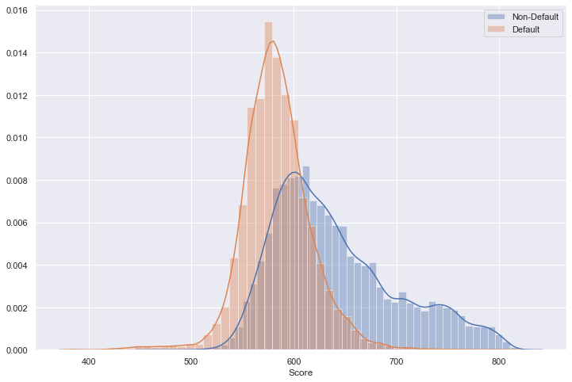
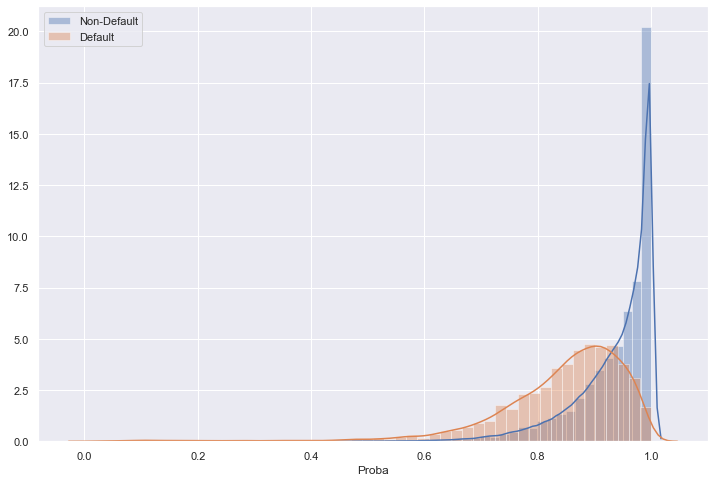
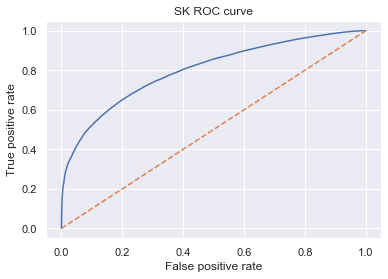

```python
import pandas as pd
import pickle
import numpy as np

pd.options.display.max_rows = None
```


```python
from sklearn import linear_model
import scipy.stats as stat

class LogisticRegression_with_p_values:
    
    def __init__(self,*args,**kwargs):
        self.model = linear_model.LogisticRegression(*args,**kwargs)
        
    def fit(self,X,y):
        self.model.fit(X,y)
        
        #### Get p-values for the fitted model ####
        denom = (2.0 * (1.0 + np.cosh(self.model.decision_function(X))))
        denom = np.tile(denom,(X.shape[1],1)).T
        F_ij = np.dot((X / denom).T,X)
        Cramer_Rao = np.linalg.inv(F_ij)
        sigma_estimates = np.sqrt(np.diagonal(Cramer_Rao))
        z_scores = self.model.coef_[0] / sigma_estimates
        p_values = [stat.norm.sf(abs(x)) * 2 for x in z_scores]
        
        self.coef_ = self.model.coef_
        self.intercept_ = self.model.intercept_
        self.p_values = p_values
```

Loading the classifier


```python
log_reg_clf = pickle.load(open('model_LGD_log_reg_2007-2015.pickle', 'rb'))
var_s = pickle.load(open('vars_significant_PD_model_2007-2015.pickle', 'rb'))
ref_vars = pickle.load(open('vars_significant_reference_PD_model_2007-2015.pickle', 'rb'))
```


```python
print(len(var_s))
var_s
```

    93


    ['grade:F',
     'grade:E',
     'grade:D',
     'grade:C',
     'grade:B',
     'grade:A',
     'home_ownership:OWN',
     'home_ownership:MORTGAGE',
     'addr_state:NY',
     'addr_state:VA_OK_AL_SD',
     'addr_state:CA',
     'addr_state:MO_DE_MD_UT_LA_NJ',
     'addr_state:NM_NC_AZ',
     'addr_state:PA_MA_RI_MI_AR',
     'addr_state:MN_OH_AK',
     'addr_state:KY_WI_GA_WA',
     'addr_state:OR_IN_TN_CT',
     'addr_state:TX',
     'addr_state:IL_KS_MT_SC_CO',
     'addr_state:VT_WV_WY_NH_DC_MS',
     'verification_status:Not Verified',
     'verification_status:Source Verified',
     'initial_list_status:w',
     'purpose:house_mov_ren_oth_med',
     'purpose:vac_debtc_majpur_car_homeimp',
     'purpose:credit_card',
     'emp_length_int:1',
     'emp_length_int:2_3_4',
     'emp_length_int:5_6_7',
     'emp_length_int:8_9',
     'emp_length_int:10',
     'mths_since_issue_d:<38',
     'mths_since_issue_d:38_39',
     'mths_since_issue_d:40_41',
     'mths_since_issue_d:42_48',
     'mths_since_issue_d:49_54',
     'mths_since_issue_d:55_68',
     'mths_since_issue_d:69_95',
     'int_rate:<10.054',
     'int_rate:10.054_12.849',
     'int_rate:12.849_15.735',
     'int_rate:15.735_19.995',
     'mths_since_earliest_cr_line:<160',
     'mths_since_earliest_cr_line:161_288',
     'mths_since_earliest_cr_line:289_360',
     'inq_last_6mths:0',
     'inq_last_6mths:1-2',
     'inq_last_6mths:3-6',
     'open_acc:1-3',
     'open_acc:4-12',
     'open_acc:13-17',
     'open_acc:18-22',
     'open_acc:23-25',
     'open_acc:26-30',
     'open_acc:>=31',
     'total_acc:15_24',
     'total_acc:25_57',
     'total_acc:>=57',
     'total_rev_hi_lim:5K-10K',
     'total_rev_hi_lim:10K-20K',
     'total_rev_hi_lim:20K-30K',
     'total_rev_hi_lim:30K-40K',
     'total_rev_hi_lim:40K-55K',
     'total_rev_hi_lim:55K-95K',
     'total_rev_hi_lim:>95K',
     'annual_inc:22k_36k',
     'annual_inc:36k_51k',
     'annual_inc:51k_60k',
     'annual_inc:60k_66k',
     'annual_inc:66k_80k',
     'annual_inc:80k_103k',
     'annual_inc:103k_120k',
     'annual_inc:>120k',
     'mths_since_last_delinq:missing',
     'mths_since_last_delinq:4_30',
     'mths_since_last_delinq:31_56',
     'mths_since_last_delinq:>57',
     'dti:3.8_8.8',
     'dti:8.8_13.8',
     'dti:13.8_18.8',
     'dti:18.8_22.6',
     'dti:22.6_25',
     'dti:25_30',
     'dti:30_35',
     'dti:>35',
     'mths_since_last_record:Missing',
     'mths_since_last_record:3_22',
     'mths_since_last_record:23_30',
     'mths_since_last_record:31_69',
     'mths_since_last_record:70_85',
     'mths_since_last_record:86_93',
     'mths_since_last_record:94_115',
     'mths_since_last_record:>115']


```python
print(len(ref_vars))
ref_vars
```

    18


    ['verification_status:Verified',
     'mths_since_issue_d:>95',
     'emp_length_int:0',
     'dti:<3.8',
     'int_rate:>19.995',
     'home_ownership:RENT_OTHER_NONE',
     'inq_last_6mths:>6',
     'initial_list_status:f',
     'total_acc:<=14',
     'addr_state:NE_ND_ME_IA_ID_NV_HI_FL',
     'mths_since_last_record:0_2',
     'annual_inc:<=22k',
     'mths_since_last_delinq:<4',
     'total_rev_hi_lim:<=5K',
     'purpose:educ_sm_wedd',
     'open_acc:0',
     'grade:G',
     'mths_since_earliest_cr_line:>360']


Assigning 0 to coefs for the reference dummy variables


```python
ref_categories = pd.DataFrame(ref_vars, columns=['Feature name'])
ref_categories['Coef'] = 0
ref_categories['p_values'] = np.nan
ref_categories
```


<div>
<style scoped>
    .dataframe tbody tr th:only-of-type {
        vertical-align: middle;
    }

    .dataframe tbody tr th {
        vertical-align: top;
    }

    .dataframe thead th {
        text-align: right;
    }
</style>
<table border="1" class="dataframe">
  <thead>
    <tr style="text-align: right;">
      <th></th>
      <th>Feature name</th>
      <th>Coef</th>
      <th>p_values</th>
    </tr>
  </thead>
  <tbody>
    <tr>
      <th>0</th>
      <td>verification_status:Verified</td>
      <td>0</td>
      <td>NaN</td>
    </tr>
    <tr>
      <th>1</th>
      <td>mths_since_issue_d:&gt;95</td>
      <td>0</td>
      <td>NaN</td>
    </tr>
    <tr>
      <th>2</th>
      <td>emp_length_int:0</td>
      <td>0</td>
      <td>NaN</td>
    </tr>
    <tr>
      <th>3</th>
      <td>dti:&lt;3.8</td>
      <td>0</td>
      <td>NaN</td>
    </tr>
    <tr>
      <th>4</th>
      <td>int_rate:&gt;19.995</td>
      <td>0</td>
      <td>NaN</td>
    </tr>
    <tr>
      <th>5</th>
      <td>home_ownership:RENT_OTHER_NONE</td>
      <td>0</td>
      <td>NaN</td>
    </tr>
    <tr>
      <th>6</th>
      <td>inq_last_6mths:&gt;6</td>
      <td>0</td>
      <td>NaN</td>
    </tr>
    <tr>
      <th>7</th>
      <td>initial_list_status:f</td>
      <td>0</td>
      <td>NaN</td>
    </tr>
    <tr>
      <th>8</th>
      <td>total_acc:&lt;=14</td>
      <td>0</td>
      <td>NaN</td>
    </tr>
    <tr>
      <th>9</th>
      <td>addr_state:NE_ND_ME_IA_ID_NV_HI_FL</td>
      <td>0</td>
      <td>NaN</td>
    </tr>
    <tr>
      <th>10</th>
      <td>mths_since_last_record:0_2</td>
      <td>0</td>
      <td>NaN</td>
    </tr>
    <tr>
      <th>11</th>
      <td>annual_inc:&lt;=22k</td>
      <td>0</td>
      <td>NaN</td>
    </tr>
    <tr>
      <th>12</th>
      <td>mths_since_last_delinq:&lt;4</td>
      <td>0</td>
      <td>NaN</td>
    </tr>
    <tr>
      <th>13</th>
      <td>total_rev_hi_lim:&lt;=5K</td>
      <td>0</td>
      <td>NaN</td>
    </tr>
    <tr>
      <th>14</th>
      <td>purpose:educ_sm_wedd</td>
      <td>0</td>
      <td>NaN</td>
    </tr>
    <tr>
      <th>15</th>
      <td>open_acc:0</td>
      <td>0</td>
      <td>NaN</td>
    </tr>
    <tr>
      <th>16</th>
      <td>grade:G</td>
      <td>0</td>
      <td>NaN</td>
    </tr>
    <tr>
      <th>17</th>
      <td>mths_since_earliest_cr_line:&gt;360</td>
      <td>0</td>
      <td>NaN</td>
    </tr>
  </tbody>
</table>
</div>


Populating dataframe with regression coefficients and p_values
categories = pd.DataFrame(log_reg_clf.params, columns=['Coef']).reset_index()
categories['p_values'] = log_reg_clf.pvalues.values
categories.columns = ['Feature name', 'Coef', 'p_values']
categories

```python
categories = pd.DataFrame(var_s, columns=['Feature name'])
categories['Coef'] = log_reg_clf.coef_[0]
categories['p_values'] = log_reg_clf.p_values

categories.index = categories.index + 1
categories.loc[0] = ['Intercept', log_reg_clf.intercept_[0], np.nan]
categories.sort_index(inplace=True)
categories
```


<div>
<style scoped>
    .dataframe tbody tr th:only-of-type {
        vertical-align: middle;
    }

    .dataframe tbody tr th {
        vertical-align: top;
    }

    .dataframe thead th {
        text-align: right;
    }
</style>
<table border="1" class="dataframe">
  <thead>
    <tr style="text-align: right;">
      <th></th>
      <th>Feature name</th>
      <th>Coef</th>
      <th>p_values</th>
    </tr>
  </thead>
  <tbody>
    <tr>
      <th>0</th>
      <td>Intercept</td>
      <td>-5.953192</td>
      <td>NaN</td>
    </tr>
    <tr>
      <th>1</th>
      <td>grade:F</td>
      <td>0.251637</td>
      <td>1.043673e-07</td>
    </tr>
    <tr>
      <th>2</th>
      <td>grade:E</td>
      <td>0.478934</td>
      <td>1.098997e-28</td>
    </tr>
    <tr>
      <th>3</th>
      <td>grade:D</td>
      <td>0.737409</td>
      <td>8.983726e-49</td>
    </tr>
    <tr>
      <th>4</th>
      <td>grade:C</td>
      <td>0.953958</td>
      <td>3.227229e-87</td>
    </tr>
    <tr>
      <th>5</th>
      <td>grade:B</td>
      <td>1.145482</td>
      <td>7.951332e-93</td>
    </tr>
    <tr>
      <th>6</th>
      <td>grade:A</td>
      <td>1.506785</td>
      <td>6.021557e-112</td>
    </tr>
    <tr>
      <th>7</th>
      <td>home_ownership:OWN</td>
      <td>0.089438</td>
      <td>6.903663e-07</td>
    </tr>
    <tr>
      <th>8</th>
      <td>home_ownership:MORTGAGE</td>
      <td>0.129755</td>
      <td>1.400856e-21</td>
    </tr>
    <tr>
      <th>9</th>
      <td>addr_state:NY</td>
      <td>0.044872</td>
      <td>4.912844e-02</td>
    </tr>
    <tr>
      <th>10</th>
      <td>addr_state:VA_OK_AL_SD</td>
      <td>0.065005</td>
      <td>1.236133e-02</td>
    </tr>
    <tr>
      <th>11</th>
      <td>addr_state:CA</td>
      <td>0.087455</td>
      <td>1.724010e-05</td>
    </tr>
    <tr>
      <th>12</th>
      <td>addr_state:MO_DE_MD_UT_LA_NJ</td>
      <td>0.073131</td>
      <td>8.830480e-04</td>
    </tr>
    <tr>
      <th>13</th>
      <td>addr_state:NM_NC_AZ</td>
      <td>0.094446</td>
      <td>2.740940e-04</td>
    </tr>
    <tr>
      <th>14</th>
      <td>addr_state:PA_MA_RI_MI_AR</td>
      <td>0.132039</td>
      <td>3.981835e-09</td>
    </tr>
    <tr>
      <th>15</th>
      <td>addr_state:MN_OH_AK</td>
      <td>0.162358</td>
      <td>1.244751e-09</td>
    </tr>
    <tr>
      <th>16</th>
      <td>addr_state:KY_WI_GA_WA</td>
      <td>0.194341</td>
      <td>6.648700e-16</td>
    </tr>
    <tr>
      <th>17</th>
      <td>addr_state:OR_IN_TN_CT</td>
      <td>0.166624</td>
      <td>4.715652e-10</td>
    </tr>
    <tr>
      <th>18</th>
      <td>addr_state:TX</td>
      <td>0.233713</td>
      <td>8.268982e-22</td>
    </tr>
    <tr>
      <th>19</th>
      <td>addr_state:IL_KS_MT_SC_CO</td>
      <td>0.332538</td>
      <td>3.792807e-43</td>
    </tr>
    <tr>
      <th>20</th>
      <td>addr_state:VT_WV_WY_NH_DC_MS</td>
      <td>0.471404</td>
      <td>5.008453e-28</td>
    </tr>
    <tr>
      <th>21</th>
      <td>verification_status:Not Verified</td>
      <td>0.100780</td>
      <td>6.438975e-14</td>
    </tr>
    <tr>
      <th>22</th>
      <td>verification_status:Source Verified</td>
      <td>0.024425</td>
      <td>4.800050e-02</td>
    </tr>
    <tr>
      <th>23</th>
      <td>initial_list_status:w</td>
      <td>0.096437</td>
      <td>2.203674e-17</td>
    </tr>
    <tr>
      <th>24</th>
      <td>purpose:house_mov_ren_oth_med</td>
      <td>0.254984</td>
      <td>4.872030e-15</td>
    </tr>
    <tr>
      <th>25</th>
      <td>purpose:vac_debtc_majpur_car_homeimp</td>
      <td>0.280721</td>
      <td>7.795396e-22</td>
    </tr>
    <tr>
      <th>26</th>
      <td>purpose:credit_card</td>
      <td>0.362326</td>
      <td>2.733255e-31</td>
    </tr>
    <tr>
      <th>27</th>
      <td>emp_length_int:1</td>
      <td>0.049903</td>
      <td>2.370393e-02</td>
    </tr>
    <tr>
      <th>28</th>
      <td>emp_length_int:2_3_4</td>
      <td>0.096484</td>
      <td>1.390368e-10</td>
    </tr>
    <tr>
      <th>29</th>
      <td>emp_length_int:5_6_7</td>
      <td>0.033481</td>
      <td>3.405418e-03</td>
    </tr>
    <tr>
      <th>30</th>
      <td>emp_length_int:8_9</td>
      <td>0.064897</td>
      <td>1.252382e-03</td>
    </tr>
    <tr>
      <th>31</th>
      <td>emp_length_int:10</td>
      <td>0.128385</td>
      <td>5.404339e-19</td>
    </tr>
    <tr>
      <th>32</th>
      <td>mths_since_issue_d:&lt;38</td>
      <td>5.564969</td>
      <td>0.000000e+00</td>
    </tr>
    <tr>
      <th>33</th>
      <td>mths_since_issue_d:38_39</td>
      <td>4.095725</td>
      <td>0.000000e+00</td>
    </tr>
    <tr>
      <th>34</th>
      <td>mths_since_issue_d:40_41</td>
      <td>3.047312</td>
      <td>0.000000e+00</td>
    </tr>
    <tr>
      <th>35</th>
      <td>mths_since_issue_d:42_48</td>
      <td>1.964483</td>
      <td>0.000000e+00</td>
    </tr>
    <tr>
      <th>36</th>
      <td>mths_since_issue_d:49_54</td>
      <td>1.256824</td>
      <td>0.000000e+00</td>
    </tr>
    <tr>
      <th>37</th>
      <td>mths_since_issue_d:55_68</td>
      <td>0.876725</td>
      <td>1.864262e-255</td>
    </tr>
    <tr>
      <th>38</th>
      <td>mths_since_issue_d:69_95</td>
      <td>0.476643</td>
      <td>1.115435e-80</td>
    </tr>
    <tr>
      <th>39</th>
      <td>int_rate:&lt;10.054</td>
      <td>0.796502</td>
      <td>8.600374e-59</td>
    </tr>
    <tr>
      <th>40</th>
      <td>int_rate:10.054_12.849</td>
      <td>0.440522</td>
      <td>5.416024e-29</td>
    </tr>
    <tr>
      <th>41</th>
      <td>int_rate:12.849_15.735</td>
      <td>0.215581</td>
      <td>1.600636e-11</td>
    </tr>
    <tr>
      <th>42</th>
      <td>int_rate:15.735_19.995</td>
      <td>0.030303</td>
      <td>2.270967e-01</td>
    </tr>
    <tr>
      <th>43</th>
      <td>mths_since_earliest_cr_line:&lt;160</td>
      <td>-0.062392</td>
      <td>3.615605e-03</td>
    </tr>
    <tr>
      <th>44</th>
      <td>mths_since_earliest_cr_line:161_288</td>
      <td>-0.049586</td>
      <td>5.504439e-04</td>
    </tr>
    <tr>
      <th>45</th>
      <td>mths_since_earliest_cr_line:289_360</td>
      <td>0.015128</td>
      <td>4.221867e-01</td>
    </tr>
    <tr>
      <th>46</th>
      <td>inq_last_6mths:0</td>
      <td>2.514542</td>
      <td>1.878216e-74</td>
    </tr>
    <tr>
      <th>47</th>
      <td>inq_last_6mths:1-2</td>
      <td>2.373876</td>
      <td>2.323251e-65</td>
    </tr>
    <tr>
      <th>48</th>
      <td>inq_last_6mths:3-6</td>
      <td>2.001587</td>
      <td>4.276739e-47</td>
    </tr>
    <tr>
      <th>49</th>
      <td>open_acc:1-3</td>
      <td>1.564035</td>
      <td>2.164121e-24</td>
    </tr>
    <tr>
      <th>50</th>
      <td>open_acc:4-12</td>
      <td>1.517413</td>
      <td>4.326249e-22</td>
    </tr>
    <tr>
      <th>51</th>
      <td>open_acc:13-17</td>
      <td>1.528811</td>
      <td>1.674275e-28</td>
    </tr>
    <tr>
      <th>52</th>
      <td>open_acc:18-22</td>
      <td>1.534262</td>
      <td>4.960990e-27</td>
    </tr>
    <tr>
      <th>53</th>
      <td>open_acc:23-25</td>
      <td>1.537032</td>
      <td>7.254471e-25</td>
    </tr>
    <tr>
      <th>54</th>
      <td>open_acc:26-30</td>
      <td>1.642218</td>
      <td>1.854337e-29</td>
    </tr>
    <tr>
      <th>55</th>
      <td>open_acc:&gt;=31</td>
      <td>1.612199</td>
      <td>4.290817e-24</td>
    </tr>
    <tr>
      <th>56</th>
      <td>total_acc:15_24</td>
      <td>-0.072722</td>
      <td>1.969651e-06</td>
    </tr>
    <tr>
      <th>57</th>
      <td>total_acc:25_57</td>
      <td>-0.102552</td>
      <td>2.677295e-10</td>
    </tr>
    <tr>
      <th>58</th>
      <td>total_acc:&gt;=57</td>
      <td>-0.169185</td>
      <td>7.616220e-04</td>
    </tr>
    <tr>
      <th>59</th>
      <td>total_rev_hi_lim:5K-10K</td>
      <td>0.091045</td>
      <td>4.439493e-05</td>
    </tr>
    <tr>
      <th>60</th>
      <td>total_rev_hi_lim:10K-20K</td>
      <td>0.104939</td>
      <td>1.624586e-06</td>
    </tr>
    <tr>
      <th>61</th>
      <td>total_rev_hi_lim:20K-30K</td>
      <td>0.133799</td>
      <td>2.272454e-08</td>
    </tr>
    <tr>
      <th>62</th>
      <td>total_rev_hi_lim:30K-40K</td>
      <td>0.131758</td>
      <td>2.664858e-07</td>
    </tr>
    <tr>
      <th>63</th>
      <td>total_rev_hi_lim:40K-55K</td>
      <td>0.170825</td>
      <td>2.705885e-09</td>
    </tr>
    <tr>
      <th>64</th>
      <td>total_rev_hi_lim:55K-95K</td>
      <td>0.187350</td>
      <td>3.377990e-09</td>
    </tr>
    <tr>
      <th>65</th>
      <td>total_rev_hi_lim:&gt;95K</td>
      <td>0.300120</td>
      <td>1.032431e-10</td>
    </tr>
    <tr>
      <th>66</th>
      <td>annual_inc:22k_36k</td>
      <td>0.035986</td>
      <td>2.673805e-01</td>
    </tr>
    <tr>
      <th>67</th>
      <td>annual_inc:36k_51k</td>
      <td>0.134702</td>
      <td>2.231197e-05</td>
    </tr>
    <tr>
      <th>68</th>
      <td>annual_inc:51k_60k</td>
      <td>0.185598</td>
      <td>3.379343e-08</td>
    </tr>
    <tr>
      <th>69</th>
      <td>annual_inc:60k_66k</td>
      <td>0.266602</td>
      <td>2.745639e-13</td>
    </tr>
    <tr>
      <th>70</th>
      <td>annual_inc:66k_80k</td>
      <td>0.322537</td>
      <td>2.104080e-21</td>
    </tr>
    <tr>
      <th>71</th>
      <td>annual_inc:80k_103k</td>
      <td>0.379165</td>
      <td>9.323868e-28</td>
    </tr>
    <tr>
      <th>72</th>
      <td>annual_inc:103k_120k</td>
      <td>0.451279</td>
      <td>6.942071e-31</td>
    </tr>
    <tr>
      <th>73</th>
      <td>annual_inc:&gt;120k</td>
      <td>0.490862</td>
      <td>9.620696e-42</td>
    </tr>
    <tr>
      <th>74</th>
      <td>mths_since_last_delinq:missing</td>
      <td>-0.035967</td>
      <td>2.366854e-04</td>
    </tr>
    <tr>
      <th>75</th>
      <td>mths_since_last_delinq:4_30</td>
      <td>0.009988</td>
      <td>NaN</td>
    </tr>
    <tr>
      <th>76</th>
      <td>mths_since_last_delinq:31_56</td>
      <td>0.057917</td>
      <td>3.345866e-03</td>
    </tr>
    <tr>
      <th>77</th>
      <td>mths_since_last_delinq:&gt;57</td>
      <td>0.009988</td>
      <td>NaN</td>
    </tr>
    <tr>
      <th>78</th>
      <td>dti:3.8_8.8</td>
      <td>0.074515</td>
      <td>2.541357e-02</td>
    </tr>
    <tr>
      <th>79</th>
      <td>dti:8.8_13.8</td>
      <td>-0.015062</td>
      <td>6.382947e-01</td>
    </tr>
    <tr>
      <th>80</th>
      <td>dti:13.8_18.8</td>
      <td>-0.081999</td>
      <td>1.026411e-02</td>
    </tr>
    <tr>
      <th>81</th>
      <td>dti:18.8_22.6</td>
      <td>-0.156042</td>
      <td>1.984568e-06</td>
    </tr>
    <tr>
      <th>82</th>
      <td>dti:22.6_25</td>
      <td>-0.215492</td>
      <td>5.184331e-10</td>
    </tr>
    <tr>
      <th>83</th>
      <td>dti:25_30</td>
      <td>-0.264920</td>
      <td>5.007667e-15</td>
    </tr>
    <tr>
      <th>84</th>
      <td>dti:30_35</td>
      <td>-0.217035</td>
      <td>3.371401e-09</td>
    </tr>
    <tr>
      <th>85</th>
      <td>dti:&gt;35</td>
      <td>-0.247715</td>
      <td>1.183150e-06</td>
    </tr>
    <tr>
      <th>86</th>
      <td>mths_since_last_record:Missing</td>
      <td>1.295391</td>
      <td>0.000000e+00</td>
    </tr>
    <tr>
      <th>87</th>
      <td>mths_since_last_record:3_22</td>
      <td>1.403420</td>
      <td>1.094564e-89</td>
    </tr>
    <tr>
      <th>88</th>
      <td>mths_since_last_record:23_30</td>
      <td>1.310225</td>
      <td>4.435484e-71</td>
    </tr>
    <tr>
      <th>89</th>
      <td>mths_since_last_record:31_69</td>
      <td>1.568470</td>
      <td>NaN</td>
    </tr>
    <tr>
      <th>90</th>
      <td>mths_since_last_record:70_85</td>
      <td>1.405578</td>
      <td>0.000000e+00</td>
    </tr>
    <tr>
      <th>91</th>
      <td>mths_since_last_record:86_93</td>
      <td>1.183438</td>
      <td>1.171222e-157</td>
    </tr>
    <tr>
      <th>92</th>
      <td>mths_since_last_record:94_115</td>
      <td>1.169933</td>
      <td>0.000000e+00</td>
    </tr>
    <tr>
      <th>93</th>
      <td>mths_since_last_record:&gt;115</td>
      <td>1.261745</td>
      <td>3.195675e-92</td>
    </tr>
  </tbody>
</table>
</div>


Concatenating with the model dummy variables


```python
len(log_reg_clf.coef_[0])
```


    93


```python
scorecard = pd.concat([ref_categories, categories]).reset_index(drop=True)
scorecard
```


<div>
<style scoped>
    .dataframe tbody tr th:only-of-type {
        vertical-align: middle;
    }

    .dataframe tbody tr th {
        vertical-align: top;
    }

    .dataframe thead th {
        text-align: right;
    }
</style>
<table border="1" class="dataframe">
  <thead>
    <tr style="text-align: right;">
      <th></th>
      <th>Feature name</th>
      <th>Coef</th>
      <th>p_values</th>
    </tr>
  </thead>
  <tbody>
    <tr>
      <th>0</th>
      <td>verification_status:Verified</td>
      <td>0.000000</td>
      <td>NaN</td>
    </tr>
    <tr>
      <th>1</th>
      <td>mths_since_issue_d:&gt;95</td>
      <td>0.000000</td>
      <td>NaN</td>
    </tr>
    <tr>
      <th>2</th>
      <td>emp_length_int:0</td>
      <td>0.000000</td>
      <td>NaN</td>
    </tr>
    <tr>
      <th>3</th>
      <td>dti:&lt;3.8</td>
      <td>0.000000</td>
      <td>NaN</td>
    </tr>
    <tr>
      <th>4</th>
      <td>int_rate:&gt;19.995</td>
      <td>0.000000</td>
      <td>NaN</td>
    </tr>
    <tr>
      <th>5</th>
      <td>home_ownership:RENT_OTHER_NONE</td>
      <td>0.000000</td>
      <td>NaN</td>
    </tr>
    <tr>
      <th>6</th>
      <td>inq_last_6mths:&gt;6</td>
      <td>0.000000</td>
      <td>NaN</td>
    </tr>
    <tr>
      <th>7</th>
      <td>initial_list_status:f</td>
      <td>0.000000</td>
      <td>NaN</td>
    </tr>
    <tr>
      <th>8</th>
      <td>total_acc:&lt;=14</td>
      <td>0.000000</td>
      <td>NaN</td>
    </tr>
    <tr>
      <th>9</th>
      <td>addr_state:NE_ND_ME_IA_ID_NV_HI_FL</td>
      <td>0.000000</td>
      <td>NaN</td>
    </tr>
    <tr>
      <th>10</th>
      <td>mths_since_last_record:0_2</td>
      <td>0.000000</td>
      <td>NaN</td>
    </tr>
    <tr>
      <th>11</th>
      <td>annual_inc:&lt;=22k</td>
      <td>0.000000</td>
      <td>NaN</td>
    </tr>
    <tr>
      <th>12</th>
      <td>mths_since_last_delinq:&lt;4</td>
      <td>0.000000</td>
      <td>NaN</td>
    </tr>
    <tr>
      <th>13</th>
      <td>total_rev_hi_lim:&lt;=5K</td>
      <td>0.000000</td>
      <td>NaN</td>
    </tr>
    <tr>
      <th>14</th>
      <td>purpose:educ_sm_wedd</td>
      <td>0.000000</td>
      <td>NaN</td>
    </tr>
    <tr>
      <th>15</th>
      <td>open_acc:0</td>
      <td>0.000000</td>
      <td>NaN</td>
    </tr>
    <tr>
      <th>16</th>
      <td>grade:G</td>
      <td>0.000000</td>
      <td>NaN</td>
    </tr>
    <tr>
      <th>17</th>
      <td>mths_since_earliest_cr_line:&gt;360</td>
      <td>0.000000</td>
      <td>NaN</td>
    </tr>
    <tr>
      <th>18</th>
      <td>Intercept</td>
      <td>-5.953192</td>
      <td>NaN</td>
    </tr>
    <tr>
      <th>19</th>
      <td>grade:F</td>
      <td>0.251637</td>
      <td>1.043673e-07</td>
    </tr>
    <tr>
      <th>20</th>
      <td>grade:E</td>
      <td>0.478934</td>
      <td>1.098997e-28</td>
    </tr>
    <tr>
      <th>21</th>
      <td>grade:D</td>
      <td>0.737409</td>
      <td>8.983726e-49</td>
    </tr>
    <tr>
      <th>22</th>
      <td>grade:C</td>
      <td>0.953958</td>
      <td>3.227229e-87</td>
    </tr>
    <tr>
      <th>23</th>
      <td>grade:B</td>
      <td>1.145482</td>
      <td>7.951332e-93</td>
    </tr>
    <tr>
      <th>24</th>
      <td>grade:A</td>
      <td>1.506785</td>
      <td>6.021557e-112</td>
    </tr>
    <tr>
      <th>25</th>
      <td>home_ownership:OWN</td>
      <td>0.089438</td>
      <td>6.903663e-07</td>
    </tr>
    <tr>
      <th>26</th>
      <td>home_ownership:MORTGAGE</td>
      <td>0.129755</td>
      <td>1.400856e-21</td>
    </tr>
    <tr>
      <th>27</th>
      <td>addr_state:NY</td>
      <td>0.044872</td>
      <td>4.912844e-02</td>
    </tr>
    <tr>
      <th>28</th>
      <td>addr_state:VA_OK_AL_SD</td>
      <td>0.065005</td>
      <td>1.236133e-02</td>
    </tr>
    <tr>
      <th>29</th>
      <td>addr_state:CA</td>
      <td>0.087455</td>
      <td>1.724010e-05</td>
    </tr>
    <tr>
      <th>30</th>
      <td>addr_state:MO_DE_MD_UT_LA_NJ</td>
      <td>0.073131</td>
      <td>8.830480e-04</td>
    </tr>
    <tr>
      <th>31</th>
      <td>addr_state:NM_NC_AZ</td>
      <td>0.094446</td>
      <td>2.740940e-04</td>
    </tr>
    <tr>
      <th>32</th>
      <td>addr_state:PA_MA_RI_MI_AR</td>
      <td>0.132039</td>
      <td>3.981835e-09</td>
    </tr>
    <tr>
      <th>33</th>
      <td>addr_state:MN_OH_AK</td>
      <td>0.162358</td>
      <td>1.244751e-09</td>
    </tr>
    <tr>
      <th>34</th>
      <td>addr_state:KY_WI_GA_WA</td>
      <td>0.194341</td>
      <td>6.648700e-16</td>
    </tr>
    <tr>
      <th>35</th>
      <td>addr_state:OR_IN_TN_CT</td>
      <td>0.166624</td>
      <td>4.715652e-10</td>
    </tr>
    <tr>
      <th>36</th>
      <td>addr_state:TX</td>
      <td>0.233713</td>
      <td>8.268982e-22</td>
    </tr>
    <tr>
      <th>37</th>
      <td>addr_state:IL_KS_MT_SC_CO</td>
      <td>0.332538</td>
      <td>3.792807e-43</td>
    </tr>
    <tr>
      <th>38</th>
      <td>addr_state:VT_WV_WY_NH_DC_MS</td>
      <td>0.471404</td>
      <td>5.008453e-28</td>
    </tr>
    <tr>
      <th>39</th>
      <td>verification_status:Not Verified</td>
      <td>0.100780</td>
      <td>6.438975e-14</td>
    </tr>
    <tr>
      <th>40</th>
      <td>verification_status:Source Verified</td>
      <td>0.024425</td>
      <td>4.800050e-02</td>
    </tr>
    <tr>
      <th>41</th>
      <td>initial_list_status:w</td>
      <td>0.096437</td>
      <td>2.203674e-17</td>
    </tr>
    <tr>
      <th>42</th>
      <td>purpose:house_mov_ren_oth_med</td>
      <td>0.254984</td>
      <td>4.872030e-15</td>
    </tr>
    <tr>
      <th>43</th>
      <td>purpose:vac_debtc_majpur_car_homeimp</td>
      <td>0.280721</td>
      <td>7.795396e-22</td>
    </tr>
    <tr>
      <th>44</th>
      <td>purpose:credit_card</td>
      <td>0.362326</td>
      <td>2.733255e-31</td>
    </tr>
    <tr>
      <th>45</th>
      <td>emp_length_int:1</td>
      <td>0.049903</td>
      <td>2.370393e-02</td>
    </tr>
    <tr>
      <th>46</th>
      <td>emp_length_int:2_3_4</td>
      <td>0.096484</td>
      <td>1.390368e-10</td>
    </tr>
    <tr>
      <th>47</th>
      <td>emp_length_int:5_6_7</td>
      <td>0.033481</td>
      <td>3.405418e-03</td>
    </tr>
    <tr>
      <th>48</th>
      <td>emp_length_int:8_9</td>
      <td>0.064897</td>
      <td>1.252382e-03</td>
    </tr>
    <tr>
      <th>49</th>
      <td>emp_length_int:10</td>
      <td>0.128385</td>
      <td>5.404339e-19</td>
    </tr>
    <tr>
      <th>50</th>
      <td>mths_since_issue_d:&lt;38</td>
      <td>5.564969</td>
      <td>0.000000e+00</td>
    </tr>
    <tr>
      <th>51</th>
      <td>mths_since_issue_d:38_39</td>
      <td>4.095725</td>
      <td>0.000000e+00</td>
    </tr>
    <tr>
      <th>52</th>
      <td>mths_since_issue_d:40_41</td>
      <td>3.047312</td>
      <td>0.000000e+00</td>
    </tr>
    <tr>
      <th>53</th>
      <td>mths_since_issue_d:42_48</td>
      <td>1.964483</td>
      <td>0.000000e+00</td>
    </tr>
    <tr>
      <th>54</th>
      <td>mths_since_issue_d:49_54</td>
      <td>1.256824</td>
      <td>0.000000e+00</td>
    </tr>
    <tr>
      <th>55</th>
      <td>mths_since_issue_d:55_68</td>
      <td>0.876725</td>
      <td>1.864262e-255</td>
    </tr>
    <tr>
      <th>56</th>
      <td>mths_since_issue_d:69_95</td>
      <td>0.476643</td>
      <td>1.115435e-80</td>
    </tr>
    <tr>
      <th>57</th>
      <td>int_rate:&lt;10.054</td>
      <td>0.796502</td>
      <td>8.600374e-59</td>
    </tr>
    <tr>
      <th>58</th>
      <td>int_rate:10.054_12.849</td>
      <td>0.440522</td>
      <td>5.416024e-29</td>
    </tr>
    <tr>
      <th>59</th>
      <td>int_rate:12.849_15.735</td>
      <td>0.215581</td>
      <td>1.600636e-11</td>
    </tr>
    <tr>
      <th>60</th>
      <td>int_rate:15.735_19.995</td>
      <td>0.030303</td>
      <td>2.270967e-01</td>
    </tr>
    <tr>
      <th>61</th>
      <td>mths_since_earliest_cr_line:&lt;160</td>
      <td>-0.062392</td>
      <td>3.615605e-03</td>
    </tr>
    <tr>
      <th>62</th>
      <td>mths_since_earliest_cr_line:161_288</td>
      <td>-0.049586</td>
      <td>5.504439e-04</td>
    </tr>
    <tr>
      <th>63</th>
      <td>mths_since_earliest_cr_line:289_360</td>
      <td>0.015128</td>
      <td>4.221867e-01</td>
    </tr>
    <tr>
      <th>64</th>
      <td>inq_last_6mths:0</td>
      <td>2.514542</td>
      <td>1.878216e-74</td>
    </tr>
    <tr>
      <th>65</th>
      <td>inq_last_6mths:1-2</td>
      <td>2.373876</td>
      <td>2.323251e-65</td>
    </tr>
    <tr>
      <th>66</th>
      <td>inq_last_6mths:3-6</td>
      <td>2.001587</td>
      <td>4.276739e-47</td>
    </tr>
    <tr>
      <th>67</th>
      <td>open_acc:1-3</td>
      <td>1.564035</td>
      <td>2.164121e-24</td>
    </tr>
    <tr>
      <th>68</th>
      <td>open_acc:4-12</td>
      <td>1.517413</td>
      <td>4.326249e-22</td>
    </tr>
    <tr>
      <th>69</th>
      <td>open_acc:13-17</td>
      <td>1.528811</td>
      <td>1.674275e-28</td>
    </tr>
    <tr>
      <th>70</th>
      <td>open_acc:18-22</td>
      <td>1.534262</td>
      <td>4.960990e-27</td>
    </tr>
    <tr>
      <th>71</th>
      <td>open_acc:23-25</td>
      <td>1.537032</td>
      <td>7.254471e-25</td>
    </tr>
    <tr>
      <th>72</th>
      <td>open_acc:26-30</td>
      <td>1.642218</td>
      <td>1.854337e-29</td>
    </tr>
    <tr>
      <th>73</th>
      <td>open_acc:&gt;=31</td>
      <td>1.612199</td>
      <td>4.290817e-24</td>
    </tr>
    <tr>
      <th>74</th>
      <td>total_acc:15_24</td>
      <td>-0.072722</td>
      <td>1.969651e-06</td>
    </tr>
    <tr>
      <th>75</th>
      <td>total_acc:25_57</td>
      <td>-0.102552</td>
      <td>2.677295e-10</td>
    </tr>
    <tr>
      <th>76</th>
      <td>total_acc:&gt;=57</td>
      <td>-0.169185</td>
      <td>7.616220e-04</td>
    </tr>
    <tr>
      <th>77</th>
      <td>total_rev_hi_lim:5K-10K</td>
      <td>0.091045</td>
      <td>4.439493e-05</td>
    </tr>
    <tr>
      <th>78</th>
      <td>total_rev_hi_lim:10K-20K</td>
      <td>0.104939</td>
      <td>1.624586e-06</td>
    </tr>
    <tr>
      <th>79</th>
      <td>total_rev_hi_lim:20K-30K</td>
      <td>0.133799</td>
      <td>2.272454e-08</td>
    </tr>
    <tr>
      <th>80</th>
      <td>total_rev_hi_lim:30K-40K</td>
      <td>0.131758</td>
      <td>2.664858e-07</td>
    </tr>
    <tr>
      <th>81</th>
      <td>total_rev_hi_lim:40K-55K</td>
      <td>0.170825</td>
      <td>2.705885e-09</td>
    </tr>
    <tr>
      <th>82</th>
      <td>total_rev_hi_lim:55K-95K</td>
      <td>0.187350</td>
      <td>3.377990e-09</td>
    </tr>
    <tr>
      <th>83</th>
      <td>total_rev_hi_lim:&gt;95K</td>
      <td>0.300120</td>
      <td>1.032431e-10</td>
    </tr>
    <tr>
      <th>84</th>
      <td>annual_inc:22k_36k</td>
      <td>0.035986</td>
      <td>2.673805e-01</td>
    </tr>
    <tr>
      <th>85</th>
      <td>annual_inc:36k_51k</td>
      <td>0.134702</td>
      <td>2.231197e-05</td>
    </tr>
    <tr>
      <th>86</th>
      <td>annual_inc:51k_60k</td>
      <td>0.185598</td>
      <td>3.379343e-08</td>
    </tr>
    <tr>
      <th>87</th>
      <td>annual_inc:60k_66k</td>
      <td>0.266602</td>
      <td>2.745639e-13</td>
    </tr>
    <tr>
      <th>88</th>
      <td>annual_inc:66k_80k</td>
      <td>0.322537</td>
      <td>2.104080e-21</td>
    </tr>
    <tr>
      <th>89</th>
      <td>annual_inc:80k_103k</td>
      <td>0.379165</td>
      <td>9.323868e-28</td>
    </tr>
    <tr>
      <th>90</th>
      <td>annual_inc:103k_120k</td>
      <td>0.451279</td>
      <td>6.942071e-31</td>
    </tr>
    <tr>
      <th>91</th>
      <td>annual_inc:&gt;120k</td>
      <td>0.490862</td>
      <td>9.620696e-42</td>
    </tr>
    <tr>
      <th>92</th>
      <td>mths_since_last_delinq:missing</td>
      <td>-0.035967</td>
      <td>2.366854e-04</td>
    </tr>
    <tr>
      <th>93</th>
      <td>mths_since_last_delinq:4_30</td>
      <td>0.009988</td>
      <td>NaN</td>
    </tr>
    <tr>
      <th>94</th>
      <td>mths_since_last_delinq:31_56</td>
      <td>0.057917</td>
      <td>3.345866e-03</td>
    </tr>
    <tr>
      <th>95</th>
      <td>mths_since_last_delinq:&gt;57</td>
      <td>0.009988</td>
      <td>NaN</td>
    </tr>
    <tr>
      <th>96</th>
      <td>dti:3.8_8.8</td>
      <td>0.074515</td>
      <td>2.541357e-02</td>
    </tr>
    <tr>
      <th>97</th>
      <td>dti:8.8_13.8</td>
      <td>-0.015062</td>
      <td>6.382947e-01</td>
    </tr>
    <tr>
      <th>98</th>
      <td>dti:13.8_18.8</td>
      <td>-0.081999</td>
      <td>1.026411e-02</td>
    </tr>
    <tr>
      <th>99</th>
      <td>dti:18.8_22.6</td>
      <td>-0.156042</td>
      <td>1.984568e-06</td>
    </tr>
    <tr>
      <th>100</th>
      <td>dti:22.6_25</td>
      <td>-0.215492</td>
      <td>5.184331e-10</td>
    </tr>
    <tr>
      <th>101</th>
      <td>dti:25_30</td>
      <td>-0.264920</td>
      <td>5.007667e-15</td>
    </tr>
    <tr>
      <th>102</th>
      <td>dti:30_35</td>
      <td>-0.217035</td>
      <td>3.371401e-09</td>
    </tr>
    <tr>
      <th>103</th>
      <td>dti:&gt;35</td>
      <td>-0.247715</td>
      <td>1.183150e-06</td>
    </tr>
    <tr>
      <th>104</th>
      <td>mths_since_last_record:Missing</td>
      <td>1.295391</td>
      <td>0.000000e+00</td>
    </tr>
    <tr>
      <th>105</th>
      <td>mths_since_last_record:3_22</td>
      <td>1.403420</td>
      <td>1.094564e-89</td>
    </tr>
    <tr>
      <th>106</th>
      <td>mths_since_last_record:23_30</td>
      <td>1.310225</td>
      <td>4.435484e-71</td>
    </tr>
    <tr>
      <th>107</th>
      <td>mths_since_last_record:31_69</td>
      <td>1.568470</td>
      <td>NaN</td>
    </tr>
    <tr>
      <th>108</th>
      <td>mths_since_last_record:70_85</td>
      <td>1.405578</td>
      <td>0.000000e+00</td>
    </tr>
    <tr>
      <th>109</th>
      <td>mths_since_last_record:86_93</td>
      <td>1.183438</td>
      <td>1.171222e-157</td>
    </tr>
    <tr>
      <th>110</th>
      <td>mths_since_last_record:94_115</td>
      <td>1.169933</td>
      <td>0.000000e+00</td>
    </tr>
    <tr>
      <th>111</th>
      <td>mths_since_last_record:&gt;115</td>
      <td>1.261745</td>
      <td>3.195675e-92</td>
    </tr>
  </tbody>
</table>
</div>


Transforming coefs into scores


```python
scorecard['Original feature name'] = scorecard['Feature name'].apply(lambda x: x.split(':')[0])
scorecard = scorecard.sort_values('Original feature name').reset_index(drop=True)
```


```python
min_score = 300
max_score = 850
```


```python
min_possible_coef = scorecard.groupby('Original feature name')['Coef'].min().sum()
min_possible_coef
```


    -6.485655098247848


```python
max_possible_coef = scorecard.groupby('Original feature name')['Coef'].max().sum()
max_possible_coef
```


    9.867921623711997


```python
scorecard['Score_pre'] = scorecard['Coef'].apply(lambda x: x*((max_score - min_score)/(max_possible_coef - min_possible_coef)))
scorecard
```


<div>
<style scoped>
    .dataframe tbody tr th:only-of-type {
        vertical-align: middle;
    }

    .dataframe tbody tr th {
        vertical-align: top;
    }

    .dataframe thead th {
        text-align: right;
    }
</style>
<table border="1" class="dataframe">
  <thead>
    <tr style="text-align: right;">
      <th></th>
      <th>Feature name</th>
      <th>Coef</th>
      <th>p_values</th>
      <th>Original feature name</th>
      <th>Score_pre</th>
    </tr>
  </thead>
  <tbody>
    <tr>
      <th>0</th>
      <td>Intercept</td>
      <td>-5.953192</td>
      <td>NaN</td>
      <td>Intercept</td>
      <td>-200.216498</td>
    </tr>
    <tr>
      <th>1</th>
      <td>addr_state:CA</td>
      <td>0.087455</td>
      <td>1.724010e-05</td>
      <td>addr_state</td>
      <td>2.941262</td>
    </tr>
    <tr>
      <th>2</th>
      <td>addr_state:NY</td>
      <td>0.044872</td>
      <td>4.912844e-02</td>
      <td>addr_state</td>
      <td>1.509124</td>
    </tr>
    <tr>
      <th>3</th>
      <td>addr_state:MO_DE_MD_UT_LA_NJ</td>
      <td>0.073131</td>
      <td>8.830480e-04</td>
      <td>addr_state</td>
      <td>2.459531</td>
    </tr>
    <tr>
      <th>4</th>
      <td>addr_state:NM_NC_AZ</td>
      <td>0.094446</td>
      <td>2.740940e-04</td>
      <td>addr_state</td>
      <td>3.176401</td>
    </tr>
    <tr>
      <th>5</th>
      <td>addr_state:PA_MA_RI_MI_AR</td>
      <td>0.132039</td>
      <td>3.981835e-09</td>
      <td>addr_state</td>
      <td>4.440712</td>
    </tr>
    <tr>
      <th>6</th>
      <td>addr_state:MN_OH_AK</td>
      <td>0.162358</td>
      <td>1.244751e-09</td>
      <td>addr_state</td>
      <td>5.460380</td>
    </tr>
    <tr>
      <th>7</th>
      <td>addr_state:KY_WI_GA_WA</td>
      <td>0.194341</td>
      <td>6.648700e-16</td>
      <td>addr_state</td>
      <td>6.536038</td>
    </tr>
    <tr>
      <th>8</th>
      <td>addr_state:OR_IN_TN_CT</td>
      <td>0.166624</td>
      <td>4.715652e-10</td>
      <td>addr_state</td>
      <td>5.603869</td>
    </tr>
    <tr>
      <th>9</th>
      <td>addr_state:TX</td>
      <td>0.233713</td>
      <td>8.268982e-22</td>
      <td>addr_state</td>
      <td>7.860175</td>
    </tr>
    <tr>
      <th>10</th>
      <td>addr_state:NE_ND_ME_IA_ID_NV_HI_FL</td>
      <td>0.000000</td>
      <td>NaN</td>
      <td>addr_state</td>
      <td>0.000000</td>
    </tr>
    <tr>
      <th>11</th>
      <td>addr_state:IL_KS_MT_SC_CO</td>
      <td>0.332538</td>
      <td>3.792807e-43</td>
      <td>addr_state</td>
      <td>11.183835</td>
    </tr>
    <tr>
      <th>12</th>
      <td>addr_state:VT_WV_WY_NH_DC_MS</td>
      <td>0.471404</td>
      <td>5.008453e-28</td>
      <td>addr_state</td>
      <td>15.854150</td>
    </tr>
    <tr>
      <th>13</th>
      <td>addr_state:VA_OK_AL_SD</td>
      <td>0.065005</td>
      <td>1.236133e-02</td>
      <td>addr_state</td>
      <td>2.186240</td>
    </tr>
    <tr>
      <th>14</th>
      <td>annual_inc:36k_51k</td>
      <td>0.134702</td>
      <td>2.231197e-05</td>
      <td>annual_inc</td>
      <td>4.530282</td>
    </tr>
    <tr>
      <th>15</th>
      <td>annual_inc:22k_36k</td>
      <td>0.035986</td>
      <td>2.673805e-01</td>
      <td>annual_inc</td>
      <td>1.210258</td>
    </tr>
    <tr>
      <th>16</th>
      <td>annual_inc:&lt;=22k</td>
      <td>0.000000</td>
      <td>NaN</td>
      <td>annual_inc</td>
      <td>0.000000</td>
    </tr>
    <tr>
      <th>17</th>
      <td>annual_inc:&gt;120k</td>
      <td>0.490862</td>
      <td>9.620696e-42</td>
      <td>annual_inc</td>
      <td>16.508558</td>
    </tr>
    <tr>
      <th>18</th>
      <td>annual_inc:103k_120k</td>
      <td>0.451279</td>
      <td>6.942071e-31</td>
      <td>annual_inc</td>
      <td>15.177327</td>
    </tr>
    <tr>
      <th>19</th>
      <td>annual_inc:80k_103k</td>
      <td>0.379165</td>
      <td>9.323868e-28</td>
      <td>annual_inc</td>
      <td>12.751995</td>
    </tr>
    <tr>
      <th>20</th>
      <td>annual_inc:66k_80k</td>
      <td>0.322537</td>
      <td>2.104080e-21</td>
      <td>annual_inc</td>
      <td>10.847487</td>
    </tr>
    <tr>
      <th>21</th>
      <td>annual_inc:60k_66k</td>
      <td>0.266602</td>
      <td>2.745639e-13</td>
      <td>annual_inc</td>
      <td>8.966314</td>
    </tr>
    <tr>
      <th>22</th>
      <td>annual_inc:51k_60k</td>
      <td>0.185598</td>
      <td>3.379343e-08</td>
      <td>annual_inc</td>
      <td>6.241989</td>
    </tr>
    <tr>
      <th>23</th>
      <td>dti:22.6_25</td>
      <td>-0.215492</td>
      <td>5.184331e-10</td>
      <td>dti</td>
      <td>-7.247395</td>
    </tr>
    <tr>
      <th>24</th>
      <td>dti:18.8_22.6</td>
      <td>-0.156042</td>
      <td>1.984568e-06</td>
      <td>dti</td>
      <td>-5.247955</td>
    </tr>
    <tr>
      <th>25</th>
      <td>dti:13.8_18.8</td>
      <td>-0.081999</td>
      <td>1.026411e-02</td>
      <td>dti</td>
      <td>-2.757765</td>
    </tr>
    <tr>
      <th>26</th>
      <td>dti:8.8_13.8</td>
      <td>-0.015062</td>
      <td>6.382947e-01</td>
      <td>dti</td>
      <td>-0.506554</td>
    </tr>
    <tr>
      <th>27</th>
      <td>dti:3.8_8.8</td>
      <td>0.074515</td>
      <td>2.541357e-02</td>
      <td>dti</td>
      <td>2.506057</td>
    </tr>
    <tr>
      <th>28</th>
      <td>dti:30_35</td>
      <td>-0.217035</td>
      <td>3.371401e-09</td>
      <td>dti</td>
      <td>-7.299264</td>
    </tr>
    <tr>
      <th>29</th>
      <td>dti:25_30</td>
      <td>-0.264920</td>
      <td>5.007667e-15</td>
      <td>dti</td>
      <td>-8.909726</td>
    </tr>
    <tr>
      <th>30</th>
      <td>dti:&gt;35</td>
      <td>-0.247715</td>
      <td>1.183150e-06</td>
      <td>dti</td>
      <td>-8.331108</td>
    </tr>
    <tr>
      <th>31</th>
      <td>dti:&lt;3.8</td>
      <td>0.000000</td>
      <td>NaN</td>
      <td>dti</td>
      <td>0.000000</td>
    </tr>
    <tr>
      <th>32</th>
      <td>emp_length_int:5_6_7</td>
      <td>0.033481</td>
      <td>3.405418e-03</td>
      <td>emp_length_int</td>
      <td>1.126026</td>
    </tr>
    <tr>
      <th>33</th>
      <td>emp_length_int:10</td>
      <td>0.128385</td>
      <td>5.404339e-19</td>
      <td>emp_length_int</td>
      <td>4.317812</td>
    </tr>
    <tr>
      <th>34</th>
      <td>emp_length_int:0</td>
      <td>0.000000</td>
      <td>NaN</td>
      <td>emp_length_int</td>
      <td>0.000000</td>
    </tr>
    <tr>
      <th>35</th>
      <td>emp_length_int:8_9</td>
      <td>0.064897</td>
      <td>1.252382e-03</td>
      <td>emp_length_int</td>
      <td>2.182616</td>
    </tr>
    <tr>
      <th>36</th>
      <td>emp_length_int:1</td>
      <td>0.049903</td>
      <td>2.370393e-02</td>
      <td>emp_length_int</td>
      <td>1.678336</td>
    </tr>
    <tr>
      <th>37</th>
      <td>emp_length_int:2_3_4</td>
      <td>0.096484</td>
      <td>1.390368e-10</td>
      <td>emp_length_int</td>
      <td>3.244927</td>
    </tr>
    <tr>
      <th>38</th>
      <td>grade:A</td>
      <td>1.506785</td>
      <td>6.021557e-112</td>
      <td>grade</td>
      <td>50.675873</td>
    </tr>
    <tr>
      <th>39</th>
      <td>grade:B</td>
      <td>1.145482</td>
      <td>7.951332e-93</td>
      <td>grade</td>
      <td>38.524616</td>
    </tr>
    <tr>
      <th>40</th>
      <td>grade:C</td>
      <td>0.953958</td>
      <td>3.227229e-87</td>
      <td>grade</td>
      <td>32.083301</td>
    </tr>
    <tr>
      <th>41</th>
      <td>grade:D</td>
      <td>0.737409</td>
      <td>8.983726e-49</td>
      <td>grade</td>
      <td>24.800383</td>
    </tr>
    <tr>
      <th>42</th>
      <td>grade:E</td>
      <td>0.478934</td>
      <td>1.098997e-28</td>
      <td>grade</td>
      <td>16.107418</td>
    </tr>
    <tr>
      <th>43</th>
      <td>grade:F</td>
      <td>0.251637</td>
      <td>1.043673e-07</td>
      <td>grade</td>
      <td>8.463001</td>
    </tr>
    <tr>
      <th>44</th>
      <td>grade:G</td>
      <td>0.000000</td>
      <td>NaN</td>
      <td>grade</td>
      <td>0.000000</td>
    </tr>
    <tr>
      <th>45</th>
      <td>home_ownership:MORTGAGE</td>
      <td>0.129755</td>
      <td>1.400856e-21</td>
      <td>home_ownership</td>
      <td>4.363891</td>
    </tr>
    <tr>
      <th>46</th>
      <td>home_ownership:RENT_OTHER_NONE</td>
      <td>0.000000</td>
      <td>NaN</td>
      <td>home_ownership</td>
      <td>0.000000</td>
    </tr>
    <tr>
      <th>47</th>
      <td>home_ownership:OWN</td>
      <td>0.089438</td>
      <td>6.903663e-07</td>
      <td>home_ownership</td>
      <td>3.007948</td>
    </tr>
    <tr>
      <th>48</th>
      <td>initial_list_status:w</td>
      <td>0.096437</td>
      <td>2.203674e-17</td>
      <td>initial_list_status</td>
      <td>3.243349</td>
    </tr>
    <tr>
      <th>49</th>
      <td>initial_list_status:f</td>
      <td>0.000000</td>
      <td>NaN</td>
      <td>initial_list_status</td>
      <td>0.000000</td>
    </tr>
    <tr>
      <th>50</th>
      <td>inq_last_6mths:&gt;6</td>
      <td>0.000000</td>
      <td>NaN</td>
      <td>inq_last_6mths</td>
      <td>0.000000</td>
    </tr>
    <tr>
      <th>51</th>
      <td>inq_last_6mths:3-6</td>
      <td>2.001587</td>
      <td>4.276739e-47</td>
      <td>inq_last_6mths</td>
      <td>67.316951</td>
    </tr>
    <tr>
      <th>52</th>
      <td>inq_last_6mths:1-2</td>
      <td>2.373876</td>
      <td>2.323251e-65</td>
      <td>inq_last_6mths</td>
      <td>79.837680</td>
    </tr>
    <tr>
      <th>53</th>
      <td>inq_last_6mths:0</td>
      <td>2.514542</td>
      <td>1.878216e-74</td>
      <td>inq_last_6mths</td>
      <td>84.568552</td>
    </tr>
    <tr>
      <th>54</th>
      <td>int_rate:&gt;19.995</td>
      <td>0.000000</td>
      <td>NaN</td>
      <td>int_rate</td>
      <td>0.000000</td>
    </tr>
    <tr>
      <th>55</th>
      <td>int_rate:&lt;10.054</td>
      <td>0.796502</td>
      <td>8.600374e-59</td>
      <td>int_rate</td>
      <td>26.787780</td>
    </tr>
    <tr>
      <th>56</th>
      <td>int_rate:10.054_12.849</td>
      <td>0.440522</td>
      <td>5.416024e-29</td>
      <td>int_rate</td>
      <td>14.815557</td>
    </tr>
    <tr>
      <th>57</th>
      <td>int_rate:12.849_15.735</td>
      <td>0.215581</td>
      <td>1.600636e-11</td>
      <td>int_rate</td>
      <td>7.250383</td>
    </tr>
    <tr>
      <th>58</th>
      <td>int_rate:15.735_19.995</td>
      <td>0.030303</td>
      <td>2.270967e-01</td>
      <td>int_rate</td>
      <td>1.019141</td>
    </tr>
    <tr>
      <th>59</th>
      <td>mths_since_earliest_cr_line:&gt;360</td>
      <td>0.000000</td>
      <td>NaN</td>
      <td>mths_since_earliest_cr_line</td>
      <td>0.000000</td>
    </tr>
    <tr>
      <th>60</th>
      <td>mths_since_earliest_cr_line:&lt;160</td>
      <td>-0.062392</td>
      <td>3.615605e-03</td>
      <td>mths_since_earliest_cr_line</td>
      <td>-2.098339</td>
    </tr>
    <tr>
      <th>61</th>
      <td>mths_since_earliest_cr_line:161_288</td>
      <td>-0.049586</td>
      <td>5.504439e-04</td>
      <td>mths_since_earliest_cr_line</td>
      <td>-1.667676</td>
    </tr>
    <tr>
      <th>62</th>
      <td>mths_since_earliest_cr_line:289_360</td>
      <td>0.015128</td>
      <td>4.221867e-01</td>
      <td>mths_since_earliest_cr_line</td>
      <td>0.508779</td>
    </tr>
    <tr>
      <th>63</th>
      <td>mths_since_issue_d:&gt;95</td>
      <td>0.000000</td>
      <td>NaN</td>
      <td>mths_since_issue_d</td>
      <td>0.000000</td>
    </tr>
    <tr>
      <th>64</th>
      <td>mths_since_issue_d:69_95</td>
      <td>0.476643</td>
      <td>1.115435e-80</td>
      <td>mths_since_issue_d</td>
      <td>16.030354</td>
    </tr>
    <tr>
      <th>65</th>
      <td>mths_since_issue_d:49_54</td>
      <td>1.256824</td>
      <td>0.000000e+00</td>
      <td>mths_since_issue_d</td>
      <td>42.269231</td>
    </tr>
    <tr>
      <th>66</th>
      <td>mths_since_issue_d:&lt;38</td>
      <td>5.564969</td>
      <td>0.000000e+00</td>
      <td>mths_since_issue_d</td>
      <td>187.159862</td>
    </tr>
    <tr>
      <th>67</th>
      <td>mths_since_issue_d:38_39</td>
      <td>4.095725</td>
      <td>0.000000e+00</td>
      <td>mths_since_issue_d</td>
      <td>137.746562</td>
    </tr>
    <tr>
      <th>68</th>
      <td>mths_since_issue_d:40_41</td>
      <td>3.047312</td>
      <td>0.000000e+00</td>
      <td>mths_since_issue_d</td>
      <td>102.486551</td>
    </tr>
    <tr>
      <th>69</th>
      <td>mths_since_issue_d:55_68</td>
      <td>0.876725</td>
      <td>1.864262e-255</td>
      <td>mths_since_issue_d</td>
      <td>29.485818</td>
    </tr>
    <tr>
      <th>70</th>
      <td>mths_since_issue_d:42_48</td>
      <td>1.964483</td>
      <td>0.000000e+00</td>
      <td>mths_since_issue_d</td>
      <td>66.069060</td>
    </tr>
    <tr>
      <th>71</th>
      <td>mths_since_last_delinq:&gt;57</td>
      <td>0.009988</td>
      <td>NaN</td>
      <td>mths_since_last_delinq</td>
      <td>0.335926</td>
    </tr>
    <tr>
      <th>72</th>
      <td>mths_since_last_delinq:31_56</td>
      <td>0.057917</td>
      <td>3.345866e-03</td>
      <td>mths_since_last_delinq</td>
      <td>1.947862</td>
    </tr>
    <tr>
      <th>73</th>
      <td>mths_since_last_delinq:4_30</td>
      <td>0.009988</td>
      <td>NaN</td>
      <td>mths_since_last_delinq</td>
      <td>0.335926</td>
    </tr>
    <tr>
      <th>74</th>
      <td>mths_since_last_delinq:&lt;4</td>
      <td>0.000000</td>
      <td>NaN</td>
      <td>mths_since_last_delinq</td>
      <td>0.000000</td>
    </tr>
    <tr>
      <th>75</th>
      <td>mths_since_last_delinq:missing</td>
      <td>-0.035967</td>
      <td>2.366854e-04</td>
      <td>mths_since_last_delinq</td>
      <td>-1.209627</td>
    </tr>
    <tr>
      <th>76</th>
      <td>mths_since_last_record:70_85</td>
      <td>1.405578</td>
      <td>0.000000e+00</td>
      <td>mths_since_last_record</td>
      <td>47.272114</td>
    </tr>
    <tr>
      <th>77</th>
      <td>mths_since_last_record:31_69</td>
      <td>1.568470</td>
      <td>NaN</td>
      <td>mths_since_last_record</td>
      <td>52.750457</td>
    </tr>
    <tr>
      <th>78</th>
      <td>mths_since_last_record:23_30</td>
      <td>1.310225</td>
      <td>4.435484e-71</td>
      <td>mths_since_last_record</td>
      <td>44.065205</td>
    </tr>
    <tr>
      <th>79</th>
      <td>mths_since_last_record:3_22</td>
      <td>1.403420</td>
      <td>1.094564e-89</td>
      <td>mths_since_last_record</td>
      <td>47.199534</td>
    </tr>
    <tr>
      <th>80</th>
      <td>mths_since_last_record:Missing</td>
      <td>1.295391</td>
      <td>0.000000e+00</td>
      <td>mths_since_last_record</td>
      <td>43.566312</td>
    </tr>
    <tr>
      <th>81</th>
      <td>mths_since_last_record:86_93</td>
      <td>1.183438</td>
      <td>1.171222e-157</td>
      <td>mths_since_last_record</td>
      <td>39.801133</td>
    </tr>
    <tr>
      <th>82</th>
      <td>mths_since_last_record:&gt;115</td>
      <td>1.261745</td>
      <td>3.195675e-92</td>
      <td>mths_since_last_record</td>
      <td>42.434747</td>
    </tr>
    <tr>
      <th>83</th>
      <td>mths_since_last_record:94_115</td>
      <td>1.169933</td>
      <td>0.000000e+00</td>
      <td>mths_since_last_record</td>
      <td>39.346952</td>
    </tr>
    <tr>
      <th>84</th>
      <td>mths_since_last_record:0_2</td>
      <td>0.000000</td>
      <td>NaN</td>
      <td>mths_since_last_record</td>
      <td>0.000000</td>
    </tr>
    <tr>
      <th>85</th>
      <td>open_acc:4-12</td>
      <td>1.517413</td>
      <td>4.326249e-22</td>
      <td>open_acc</td>
      <td>51.033321</td>
    </tr>
    <tr>
      <th>86</th>
      <td>open_acc:1-3</td>
      <td>1.564035</td>
      <td>2.164121e-24</td>
      <td>open_acc</td>
      <td>52.601293</td>
    </tr>
    <tr>
      <th>87</th>
      <td>open_acc:13-17</td>
      <td>1.528811</td>
      <td>1.674275e-28</td>
      <td>open_acc</td>
      <td>51.416643</td>
    </tr>
    <tr>
      <th>88</th>
      <td>open_acc:18-22</td>
      <td>1.534262</td>
      <td>4.960990e-27</td>
      <td>open_acc</td>
      <td>51.599977</td>
    </tr>
    <tr>
      <th>89</th>
      <td>open_acc:23-25</td>
      <td>1.537032</td>
      <td>7.254471e-25</td>
      <td>open_acc</td>
      <td>51.693128</td>
    </tr>
    <tr>
      <th>90</th>
      <td>open_acc:26-30</td>
      <td>1.642218</td>
      <td>1.854337e-29</td>
      <td>open_acc</td>
      <td>55.230729</td>
    </tr>
    <tr>
      <th>91</th>
      <td>open_acc:&gt;=31</td>
      <td>1.612199</td>
      <td>4.290817e-24</td>
      <td>open_acc</td>
      <td>54.221130</td>
    </tr>
    <tr>
      <th>92</th>
      <td>open_acc:0</td>
      <td>0.000000</td>
      <td>NaN</td>
      <td>open_acc</td>
      <td>0.000000</td>
    </tr>
    <tr>
      <th>93</th>
      <td>purpose:credit_card</td>
      <td>0.362326</td>
      <td>2.733255e-31</td>
      <td>purpose</td>
      <td>12.185661</td>
    </tr>
    <tr>
      <th>94</th>
      <td>purpose:educ_sm_wedd</td>
      <td>0.000000</td>
      <td>NaN</td>
      <td>purpose</td>
      <td>0.000000</td>
    </tr>
    <tr>
      <th>95</th>
      <td>purpose:house_mov_ren_oth_med</td>
      <td>0.254984</td>
      <td>4.872030e-15</td>
      <td>purpose</td>
      <td>8.575569</td>
    </tr>
    <tr>
      <th>96</th>
      <td>purpose:vac_debtc_majpur_car_homeimp</td>
      <td>0.280721</td>
      <td>7.795396e-22</td>
      <td>purpose</td>
      <td>9.441162</td>
    </tr>
    <tr>
      <th>97</th>
      <td>total_acc:25_57</td>
      <td>-0.102552</td>
      <td>2.677295e-10</td>
      <td>total_acc</td>
      <td>-3.449023</td>
    </tr>
    <tr>
      <th>98</th>
      <td>total_acc:&gt;=57</td>
      <td>-0.169185</td>
      <td>7.616220e-04</td>
      <td>total_acc</td>
      <td>-5.689977</td>
    </tr>
    <tr>
      <th>99</th>
      <td>total_acc:&lt;=14</td>
      <td>0.000000</td>
      <td>NaN</td>
      <td>total_acc</td>
      <td>0.000000</td>
    </tr>
    <tr>
      <th>100</th>
      <td>total_acc:15_24</td>
      <td>-0.072722</td>
      <td>1.969651e-06</td>
      <td>total_acc</td>
      <td>-2.445759</td>
    </tr>
    <tr>
      <th>101</th>
      <td>total_rev_hi_lim:&lt;=5K</td>
      <td>0.000000</td>
      <td>NaN</td>
      <td>total_rev_hi_lim</td>
      <td>0.000000</td>
    </tr>
    <tr>
      <th>102</th>
      <td>total_rev_hi_lim:&gt;95K</td>
      <td>0.300120</td>
      <td>1.032431e-10</td>
      <td>total_rev_hi_lim</td>
      <td>10.093555</td>
    </tr>
    <tr>
      <th>103</th>
      <td>total_rev_hi_lim:5K-10K</td>
      <td>0.091045</td>
      <td>4.439493e-05</td>
      <td>total_rev_hi_lim</td>
      <td>3.061993</td>
    </tr>
    <tr>
      <th>104</th>
      <td>total_rev_hi_lim:10K-20K</td>
      <td>0.104939</td>
      <td>1.624586e-06</td>
      <td>total_rev_hi_lim</td>
      <td>3.529290</td>
    </tr>
    <tr>
      <th>105</th>
      <td>total_rev_hi_lim:20K-30K</td>
      <td>0.133799</td>
      <td>2.272454e-08</td>
      <td>total_rev_hi_lim</td>
      <td>4.499894</td>
    </tr>
    <tr>
      <th>106</th>
      <td>total_rev_hi_lim:30K-40K</td>
      <td>0.131758</td>
      <td>2.664858e-07</td>
      <td>total_rev_hi_lim</td>
      <td>4.431240</td>
    </tr>
    <tr>
      <th>107</th>
      <td>total_rev_hi_lim:40K-55K</td>
      <td>0.170825</td>
      <td>2.705885e-09</td>
      <td>total_rev_hi_lim</td>
      <td>5.745162</td>
    </tr>
    <tr>
      <th>108</th>
      <td>total_rev_hi_lim:55K-95K</td>
      <td>0.187350</td>
      <td>3.377990e-09</td>
      <td>total_rev_hi_lim</td>
      <td>6.300909</td>
    </tr>
    <tr>
      <th>109</th>
      <td>verification_status:Source Verified</td>
      <td>0.024425</td>
      <td>4.800050e-02</td>
      <td>verification_status</td>
      <td>0.821473</td>
    </tr>
    <tr>
      <th>110</th>
      <td>verification_status:Not Verified</td>
      <td>0.100780</td>
      <td>6.438975e-14</td>
      <td>verification_status</td>
      <td>3.389403</td>
    </tr>
    <tr>
      <th>111</th>
      <td>verification_status:Verified</td>
      <td>0.000000</td>
      <td>NaN</td>
      <td>verification_status</td>
      <td>0.000000</td>
    </tr>
  </tbody>
</table>
</div>


### Scaling the intercept


```python
scorecard['Score_pre'][0] = ((scorecard['Coef'][0] - min_possible_coef) / (max_possible_coef - min_possible_coef)) * ((max_score - min_score)) + min_score
scorecard
```

    /Users/omaromeiri/anaconda3/lib/python3.7/site-packages/ipykernel_launcher.py:1: SettingWithCopyWarning: 
    A value is trying to be set on a copy of a slice from a DataFrame
    
    See the caveats in the documentation: http://pandas.pydata.org/pandas-docs/stable/indexing.html#indexing-view-versus-copy
      """Entry point for launching an IPython kernel.


<div>
<style scoped>
    .dataframe tbody tr th:only-of-type {
        vertical-align: middle;
    }

    .dataframe tbody tr th {
        vertical-align: top;
    }

    .dataframe thead th {
        text-align: right;
    }
</style>
<table border="1" class="dataframe">
  <thead>
    <tr style="text-align: right;">
      <th></th>
      <th>Feature name</th>
      <th>Coef</th>
      <th>p_values</th>
      <th>Original feature name</th>
      <th>Score_pre</th>
    </tr>
  </thead>
  <tbody>
    <tr>
      <th>0</th>
      <td>Intercept</td>
      <td>-5.953192</td>
      <td>NaN</td>
      <td>Intercept</td>
      <td>317.907669</td>
    </tr>
    <tr>
      <th>1</th>
      <td>addr_state:CA</td>
      <td>0.087455</td>
      <td>1.724010e-05</td>
      <td>addr_state</td>
      <td>2.941262</td>
    </tr>
    <tr>
      <th>2</th>
      <td>addr_state:NY</td>
      <td>0.044872</td>
      <td>4.912844e-02</td>
      <td>addr_state</td>
      <td>1.509124</td>
    </tr>
    <tr>
      <th>3</th>
      <td>addr_state:MO_DE_MD_UT_LA_NJ</td>
      <td>0.073131</td>
      <td>8.830480e-04</td>
      <td>addr_state</td>
      <td>2.459531</td>
    </tr>
    <tr>
      <th>4</th>
      <td>addr_state:NM_NC_AZ</td>
      <td>0.094446</td>
      <td>2.740940e-04</td>
      <td>addr_state</td>
      <td>3.176401</td>
    </tr>
    <tr>
      <th>5</th>
      <td>addr_state:PA_MA_RI_MI_AR</td>
      <td>0.132039</td>
      <td>3.981835e-09</td>
      <td>addr_state</td>
      <td>4.440712</td>
    </tr>
    <tr>
      <th>6</th>
      <td>addr_state:MN_OH_AK</td>
      <td>0.162358</td>
      <td>1.244751e-09</td>
      <td>addr_state</td>
      <td>5.460380</td>
    </tr>
    <tr>
      <th>7</th>
      <td>addr_state:KY_WI_GA_WA</td>
      <td>0.194341</td>
      <td>6.648700e-16</td>
      <td>addr_state</td>
      <td>6.536038</td>
    </tr>
    <tr>
      <th>8</th>
      <td>addr_state:OR_IN_TN_CT</td>
      <td>0.166624</td>
      <td>4.715652e-10</td>
      <td>addr_state</td>
      <td>5.603869</td>
    </tr>
    <tr>
      <th>9</th>
      <td>addr_state:TX</td>
      <td>0.233713</td>
      <td>8.268982e-22</td>
      <td>addr_state</td>
      <td>7.860175</td>
    </tr>
    <tr>
      <th>10</th>
      <td>addr_state:NE_ND_ME_IA_ID_NV_HI_FL</td>
      <td>0.000000</td>
      <td>NaN</td>
      <td>addr_state</td>
      <td>0.000000</td>
    </tr>
    <tr>
      <th>11</th>
      <td>addr_state:IL_KS_MT_SC_CO</td>
      <td>0.332538</td>
      <td>3.792807e-43</td>
      <td>addr_state</td>
      <td>11.183835</td>
    </tr>
    <tr>
      <th>12</th>
      <td>addr_state:VT_WV_WY_NH_DC_MS</td>
      <td>0.471404</td>
      <td>5.008453e-28</td>
      <td>addr_state</td>
      <td>15.854150</td>
    </tr>
    <tr>
      <th>13</th>
      <td>addr_state:VA_OK_AL_SD</td>
      <td>0.065005</td>
      <td>1.236133e-02</td>
      <td>addr_state</td>
      <td>2.186240</td>
    </tr>
    <tr>
      <th>14</th>
      <td>annual_inc:36k_51k</td>
      <td>0.134702</td>
      <td>2.231197e-05</td>
      <td>annual_inc</td>
      <td>4.530282</td>
    </tr>
    <tr>
      <th>15</th>
      <td>annual_inc:22k_36k</td>
      <td>0.035986</td>
      <td>2.673805e-01</td>
      <td>annual_inc</td>
      <td>1.210258</td>
    </tr>
    <tr>
      <th>16</th>
      <td>annual_inc:&lt;=22k</td>
      <td>0.000000</td>
      <td>NaN</td>
      <td>annual_inc</td>
      <td>0.000000</td>
    </tr>
    <tr>
      <th>17</th>
      <td>annual_inc:&gt;120k</td>
      <td>0.490862</td>
      <td>9.620696e-42</td>
      <td>annual_inc</td>
      <td>16.508558</td>
    </tr>
    <tr>
      <th>18</th>
      <td>annual_inc:103k_120k</td>
      <td>0.451279</td>
      <td>6.942071e-31</td>
      <td>annual_inc</td>
      <td>15.177327</td>
    </tr>
    <tr>
      <th>19</th>
      <td>annual_inc:80k_103k</td>
      <td>0.379165</td>
      <td>9.323868e-28</td>
      <td>annual_inc</td>
      <td>12.751995</td>
    </tr>
    <tr>
      <th>20</th>
      <td>annual_inc:66k_80k</td>
      <td>0.322537</td>
      <td>2.104080e-21</td>
      <td>annual_inc</td>
      <td>10.847487</td>
    </tr>
    <tr>
      <th>21</th>
      <td>annual_inc:60k_66k</td>
      <td>0.266602</td>
      <td>2.745639e-13</td>
      <td>annual_inc</td>
      <td>8.966314</td>
    </tr>
    <tr>
      <th>22</th>
      <td>annual_inc:51k_60k</td>
      <td>0.185598</td>
      <td>3.379343e-08</td>
      <td>annual_inc</td>
      <td>6.241989</td>
    </tr>
    <tr>
      <th>23</th>
      <td>dti:22.6_25</td>
      <td>-0.215492</td>
      <td>5.184331e-10</td>
      <td>dti</td>
      <td>-7.247395</td>
    </tr>
    <tr>
      <th>24</th>
      <td>dti:18.8_22.6</td>
      <td>-0.156042</td>
      <td>1.984568e-06</td>
      <td>dti</td>
      <td>-5.247955</td>
    </tr>
    <tr>
      <th>25</th>
      <td>dti:13.8_18.8</td>
      <td>-0.081999</td>
      <td>1.026411e-02</td>
      <td>dti</td>
      <td>-2.757765</td>
    </tr>
    <tr>
      <th>26</th>
      <td>dti:8.8_13.8</td>
      <td>-0.015062</td>
      <td>6.382947e-01</td>
      <td>dti</td>
      <td>-0.506554</td>
    </tr>
    <tr>
      <th>27</th>
      <td>dti:3.8_8.8</td>
      <td>0.074515</td>
      <td>2.541357e-02</td>
      <td>dti</td>
      <td>2.506057</td>
    </tr>
    <tr>
      <th>28</th>
      <td>dti:30_35</td>
      <td>-0.217035</td>
      <td>3.371401e-09</td>
      <td>dti</td>
      <td>-7.299264</td>
    </tr>
    <tr>
      <th>29</th>
      <td>dti:25_30</td>
      <td>-0.264920</td>
      <td>5.007667e-15</td>
      <td>dti</td>
      <td>-8.909726</td>
    </tr>
    <tr>
      <th>30</th>
      <td>dti:&gt;35</td>
      <td>-0.247715</td>
      <td>1.183150e-06</td>
      <td>dti</td>
      <td>-8.331108</td>
    </tr>
    <tr>
      <th>31</th>
      <td>dti:&lt;3.8</td>
      <td>0.000000</td>
      <td>NaN</td>
      <td>dti</td>
      <td>0.000000</td>
    </tr>
    <tr>
      <th>32</th>
      <td>emp_length_int:5_6_7</td>
      <td>0.033481</td>
      <td>3.405418e-03</td>
      <td>emp_length_int</td>
      <td>1.126026</td>
    </tr>
    <tr>
      <th>33</th>
      <td>emp_length_int:10</td>
      <td>0.128385</td>
      <td>5.404339e-19</td>
      <td>emp_length_int</td>
      <td>4.317812</td>
    </tr>
    <tr>
      <th>34</th>
      <td>emp_length_int:0</td>
      <td>0.000000</td>
      <td>NaN</td>
      <td>emp_length_int</td>
      <td>0.000000</td>
    </tr>
    <tr>
      <th>35</th>
      <td>emp_length_int:8_9</td>
      <td>0.064897</td>
      <td>1.252382e-03</td>
      <td>emp_length_int</td>
      <td>2.182616</td>
    </tr>
    <tr>
      <th>36</th>
      <td>emp_length_int:1</td>
      <td>0.049903</td>
      <td>2.370393e-02</td>
      <td>emp_length_int</td>
      <td>1.678336</td>
    </tr>
    <tr>
      <th>37</th>
      <td>emp_length_int:2_3_4</td>
      <td>0.096484</td>
      <td>1.390368e-10</td>
      <td>emp_length_int</td>
      <td>3.244927</td>
    </tr>
    <tr>
      <th>38</th>
      <td>grade:A</td>
      <td>1.506785</td>
      <td>6.021557e-112</td>
      <td>grade</td>
      <td>50.675873</td>
    </tr>
    <tr>
      <th>39</th>
      <td>grade:B</td>
      <td>1.145482</td>
      <td>7.951332e-93</td>
      <td>grade</td>
      <td>38.524616</td>
    </tr>
    <tr>
      <th>40</th>
      <td>grade:C</td>
      <td>0.953958</td>
      <td>3.227229e-87</td>
      <td>grade</td>
      <td>32.083301</td>
    </tr>
    <tr>
      <th>41</th>
      <td>grade:D</td>
      <td>0.737409</td>
      <td>8.983726e-49</td>
      <td>grade</td>
      <td>24.800383</td>
    </tr>
    <tr>
      <th>42</th>
      <td>grade:E</td>
      <td>0.478934</td>
      <td>1.098997e-28</td>
      <td>grade</td>
      <td>16.107418</td>
    </tr>
    <tr>
      <th>43</th>
      <td>grade:F</td>
      <td>0.251637</td>
      <td>1.043673e-07</td>
      <td>grade</td>
      <td>8.463001</td>
    </tr>
    <tr>
      <th>44</th>
      <td>grade:G</td>
      <td>0.000000</td>
      <td>NaN</td>
      <td>grade</td>
      <td>0.000000</td>
    </tr>
    <tr>
      <th>45</th>
      <td>home_ownership:MORTGAGE</td>
      <td>0.129755</td>
      <td>1.400856e-21</td>
      <td>home_ownership</td>
      <td>4.363891</td>
    </tr>
    <tr>
      <th>46</th>
      <td>home_ownership:RENT_OTHER_NONE</td>
      <td>0.000000</td>
      <td>NaN</td>
      <td>home_ownership</td>
      <td>0.000000</td>
    </tr>
    <tr>
      <th>47</th>
      <td>home_ownership:OWN</td>
      <td>0.089438</td>
      <td>6.903663e-07</td>
      <td>home_ownership</td>
      <td>3.007948</td>
    </tr>
    <tr>
      <th>48</th>
      <td>initial_list_status:w</td>
      <td>0.096437</td>
      <td>2.203674e-17</td>
      <td>initial_list_status</td>
      <td>3.243349</td>
    </tr>
    <tr>
      <th>49</th>
      <td>initial_list_status:f</td>
      <td>0.000000</td>
      <td>NaN</td>
      <td>initial_list_status</td>
      <td>0.000000</td>
    </tr>
    <tr>
      <th>50</th>
      <td>inq_last_6mths:&gt;6</td>
      <td>0.000000</td>
      <td>NaN</td>
      <td>inq_last_6mths</td>
      <td>0.000000</td>
    </tr>
    <tr>
      <th>51</th>
      <td>inq_last_6mths:3-6</td>
      <td>2.001587</td>
      <td>4.276739e-47</td>
      <td>inq_last_6mths</td>
      <td>67.316951</td>
    </tr>
    <tr>
      <th>52</th>
      <td>inq_last_6mths:1-2</td>
      <td>2.373876</td>
      <td>2.323251e-65</td>
      <td>inq_last_6mths</td>
      <td>79.837680</td>
    </tr>
    <tr>
      <th>53</th>
      <td>inq_last_6mths:0</td>
      <td>2.514542</td>
      <td>1.878216e-74</td>
      <td>inq_last_6mths</td>
      <td>84.568552</td>
    </tr>
    <tr>
      <th>54</th>
      <td>int_rate:&gt;19.995</td>
      <td>0.000000</td>
      <td>NaN</td>
      <td>int_rate</td>
      <td>0.000000</td>
    </tr>
    <tr>
      <th>55</th>
      <td>int_rate:&lt;10.054</td>
      <td>0.796502</td>
      <td>8.600374e-59</td>
      <td>int_rate</td>
      <td>26.787780</td>
    </tr>
    <tr>
      <th>56</th>
      <td>int_rate:10.054_12.849</td>
      <td>0.440522</td>
      <td>5.416024e-29</td>
      <td>int_rate</td>
      <td>14.815557</td>
    </tr>
    <tr>
      <th>57</th>
      <td>int_rate:12.849_15.735</td>
      <td>0.215581</td>
      <td>1.600636e-11</td>
      <td>int_rate</td>
      <td>7.250383</td>
    </tr>
    <tr>
      <th>58</th>
      <td>int_rate:15.735_19.995</td>
      <td>0.030303</td>
      <td>2.270967e-01</td>
      <td>int_rate</td>
      <td>1.019141</td>
    </tr>
    <tr>
      <th>59</th>
      <td>mths_since_earliest_cr_line:&gt;360</td>
      <td>0.000000</td>
      <td>NaN</td>
      <td>mths_since_earliest_cr_line</td>
      <td>0.000000</td>
    </tr>
    <tr>
      <th>60</th>
      <td>mths_since_earliest_cr_line:&lt;160</td>
      <td>-0.062392</td>
      <td>3.615605e-03</td>
      <td>mths_since_earliest_cr_line</td>
      <td>-2.098339</td>
    </tr>
    <tr>
      <th>61</th>
      <td>mths_since_earliest_cr_line:161_288</td>
      <td>-0.049586</td>
      <td>5.504439e-04</td>
      <td>mths_since_earliest_cr_line</td>
      <td>-1.667676</td>
    </tr>
    <tr>
      <th>62</th>
      <td>mths_since_earliest_cr_line:289_360</td>
      <td>0.015128</td>
      <td>4.221867e-01</td>
      <td>mths_since_earliest_cr_line</td>
      <td>0.508779</td>
    </tr>
    <tr>
      <th>63</th>
      <td>mths_since_issue_d:&gt;95</td>
      <td>0.000000</td>
      <td>NaN</td>
      <td>mths_since_issue_d</td>
      <td>0.000000</td>
    </tr>
    <tr>
      <th>64</th>
      <td>mths_since_issue_d:69_95</td>
      <td>0.476643</td>
      <td>1.115435e-80</td>
      <td>mths_since_issue_d</td>
      <td>16.030354</td>
    </tr>
    <tr>
      <th>65</th>
      <td>mths_since_issue_d:49_54</td>
      <td>1.256824</td>
      <td>0.000000e+00</td>
      <td>mths_since_issue_d</td>
      <td>42.269231</td>
    </tr>
    <tr>
      <th>66</th>
      <td>mths_since_issue_d:&lt;38</td>
      <td>5.564969</td>
      <td>0.000000e+00</td>
      <td>mths_since_issue_d</td>
      <td>187.159862</td>
    </tr>
    <tr>
      <th>67</th>
      <td>mths_since_issue_d:38_39</td>
      <td>4.095725</td>
      <td>0.000000e+00</td>
      <td>mths_since_issue_d</td>
      <td>137.746562</td>
    </tr>
    <tr>
      <th>68</th>
      <td>mths_since_issue_d:40_41</td>
      <td>3.047312</td>
      <td>0.000000e+00</td>
      <td>mths_since_issue_d</td>
      <td>102.486551</td>
    </tr>
    <tr>
      <th>69</th>
      <td>mths_since_issue_d:55_68</td>
      <td>0.876725</td>
      <td>1.864262e-255</td>
      <td>mths_since_issue_d</td>
      <td>29.485818</td>
    </tr>
    <tr>
      <th>70</th>
      <td>mths_since_issue_d:42_48</td>
      <td>1.964483</td>
      <td>0.000000e+00</td>
      <td>mths_since_issue_d</td>
      <td>66.069060</td>
    </tr>
    <tr>
      <th>71</th>
      <td>mths_since_last_delinq:&gt;57</td>
      <td>0.009988</td>
      <td>NaN</td>
      <td>mths_since_last_delinq</td>
      <td>0.335926</td>
    </tr>
    <tr>
      <th>72</th>
      <td>mths_since_last_delinq:31_56</td>
      <td>0.057917</td>
      <td>3.345866e-03</td>
      <td>mths_since_last_delinq</td>
      <td>1.947862</td>
    </tr>
    <tr>
      <th>73</th>
      <td>mths_since_last_delinq:4_30</td>
      <td>0.009988</td>
      <td>NaN</td>
      <td>mths_since_last_delinq</td>
      <td>0.335926</td>
    </tr>
    <tr>
      <th>74</th>
      <td>mths_since_last_delinq:&lt;4</td>
      <td>0.000000</td>
      <td>NaN</td>
      <td>mths_since_last_delinq</td>
      <td>0.000000</td>
    </tr>
    <tr>
      <th>75</th>
      <td>mths_since_last_delinq:missing</td>
      <td>-0.035967</td>
      <td>2.366854e-04</td>
      <td>mths_since_last_delinq</td>
      <td>-1.209627</td>
    </tr>
    <tr>
      <th>76</th>
      <td>mths_since_last_record:70_85</td>
      <td>1.405578</td>
      <td>0.000000e+00</td>
      <td>mths_since_last_record</td>
      <td>47.272114</td>
    </tr>
    <tr>
      <th>77</th>
      <td>mths_since_last_record:31_69</td>
      <td>1.568470</td>
      <td>NaN</td>
      <td>mths_since_last_record</td>
      <td>52.750457</td>
    </tr>
    <tr>
      <th>78</th>
      <td>mths_since_last_record:23_30</td>
      <td>1.310225</td>
      <td>4.435484e-71</td>
      <td>mths_since_last_record</td>
      <td>44.065205</td>
    </tr>
    <tr>
      <th>79</th>
      <td>mths_since_last_record:3_22</td>
      <td>1.403420</td>
      <td>1.094564e-89</td>
      <td>mths_since_last_record</td>
      <td>47.199534</td>
    </tr>
    <tr>
      <th>80</th>
      <td>mths_since_last_record:Missing</td>
      <td>1.295391</td>
      <td>0.000000e+00</td>
      <td>mths_since_last_record</td>
      <td>43.566312</td>
    </tr>
    <tr>
      <th>81</th>
      <td>mths_since_last_record:86_93</td>
      <td>1.183438</td>
      <td>1.171222e-157</td>
      <td>mths_since_last_record</td>
      <td>39.801133</td>
    </tr>
    <tr>
      <th>82</th>
      <td>mths_since_last_record:&gt;115</td>
      <td>1.261745</td>
      <td>3.195675e-92</td>
      <td>mths_since_last_record</td>
      <td>42.434747</td>
    </tr>
    <tr>
      <th>83</th>
      <td>mths_since_last_record:94_115</td>
      <td>1.169933</td>
      <td>0.000000e+00</td>
      <td>mths_since_last_record</td>
      <td>39.346952</td>
    </tr>
    <tr>
      <th>84</th>
      <td>mths_since_last_record:0_2</td>
      <td>0.000000</td>
      <td>NaN</td>
      <td>mths_since_last_record</td>
      <td>0.000000</td>
    </tr>
    <tr>
      <th>85</th>
      <td>open_acc:4-12</td>
      <td>1.517413</td>
      <td>4.326249e-22</td>
      <td>open_acc</td>
      <td>51.033321</td>
    </tr>
    <tr>
      <th>86</th>
      <td>open_acc:1-3</td>
      <td>1.564035</td>
      <td>2.164121e-24</td>
      <td>open_acc</td>
      <td>52.601293</td>
    </tr>
    <tr>
      <th>87</th>
      <td>open_acc:13-17</td>
      <td>1.528811</td>
      <td>1.674275e-28</td>
      <td>open_acc</td>
      <td>51.416643</td>
    </tr>
    <tr>
      <th>88</th>
      <td>open_acc:18-22</td>
      <td>1.534262</td>
      <td>4.960990e-27</td>
      <td>open_acc</td>
      <td>51.599977</td>
    </tr>
    <tr>
      <th>89</th>
      <td>open_acc:23-25</td>
      <td>1.537032</td>
      <td>7.254471e-25</td>
      <td>open_acc</td>
      <td>51.693128</td>
    </tr>
    <tr>
      <th>90</th>
      <td>open_acc:26-30</td>
      <td>1.642218</td>
      <td>1.854337e-29</td>
      <td>open_acc</td>
      <td>55.230729</td>
    </tr>
    <tr>
      <th>91</th>
      <td>open_acc:&gt;=31</td>
      <td>1.612199</td>
      <td>4.290817e-24</td>
      <td>open_acc</td>
      <td>54.221130</td>
    </tr>
    <tr>
      <th>92</th>
      <td>open_acc:0</td>
      <td>0.000000</td>
      <td>NaN</td>
      <td>open_acc</td>
      <td>0.000000</td>
    </tr>
    <tr>
      <th>93</th>
      <td>purpose:credit_card</td>
      <td>0.362326</td>
      <td>2.733255e-31</td>
      <td>purpose</td>
      <td>12.185661</td>
    </tr>
    <tr>
      <th>94</th>
      <td>purpose:educ_sm_wedd</td>
      <td>0.000000</td>
      <td>NaN</td>
      <td>purpose</td>
      <td>0.000000</td>
    </tr>
    <tr>
      <th>95</th>
      <td>purpose:house_mov_ren_oth_med</td>
      <td>0.254984</td>
      <td>4.872030e-15</td>
      <td>purpose</td>
      <td>8.575569</td>
    </tr>
    <tr>
      <th>96</th>
      <td>purpose:vac_debtc_majpur_car_homeimp</td>
      <td>0.280721</td>
      <td>7.795396e-22</td>
      <td>purpose</td>
      <td>9.441162</td>
    </tr>
    <tr>
      <th>97</th>
      <td>total_acc:25_57</td>
      <td>-0.102552</td>
      <td>2.677295e-10</td>
      <td>total_acc</td>
      <td>-3.449023</td>
    </tr>
    <tr>
      <th>98</th>
      <td>total_acc:&gt;=57</td>
      <td>-0.169185</td>
      <td>7.616220e-04</td>
      <td>total_acc</td>
      <td>-5.689977</td>
    </tr>
    <tr>
      <th>99</th>
      <td>total_acc:&lt;=14</td>
      <td>0.000000</td>
      <td>NaN</td>
      <td>total_acc</td>
      <td>0.000000</td>
    </tr>
    <tr>
      <th>100</th>
      <td>total_acc:15_24</td>
      <td>-0.072722</td>
      <td>1.969651e-06</td>
      <td>total_acc</td>
      <td>-2.445759</td>
    </tr>
    <tr>
      <th>101</th>
      <td>total_rev_hi_lim:&lt;=5K</td>
      <td>0.000000</td>
      <td>NaN</td>
      <td>total_rev_hi_lim</td>
      <td>0.000000</td>
    </tr>
    <tr>
      <th>102</th>
      <td>total_rev_hi_lim:&gt;95K</td>
      <td>0.300120</td>
      <td>1.032431e-10</td>
      <td>total_rev_hi_lim</td>
      <td>10.093555</td>
    </tr>
    <tr>
      <th>103</th>
      <td>total_rev_hi_lim:5K-10K</td>
      <td>0.091045</td>
      <td>4.439493e-05</td>
      <td>total_rev_hi_lim</td>
      <td>3.061993</td>
    </tr>
    <tr>
      <th>104</th>
      <td>total_rev_hi_lim:10K-20K</td>
      <td>0.104939</td>
      <td>1.624586e-06</td>
      <td>total_rev_hi_lim</td>
      <td>3.529290</td>
    </tr>
    <tr>
      <th>105</th>
      <td>total_rev_hi_lim:20K-30K</td>
      <td>0.133799</td>
      <td>2.272454e-08</td>
      <td>total_rev_hi_lim</td>
      <td>4.499894</td>
    </tr>
    <tr>
      <th>106</th>
      <td>total_rev_hi_lim:30K-40K</td>
      <td>0.131758</td>
      <td>2.664858e-07</td>
      <td>total_rev_hi_lim</td>
      <td>4.431240</td>
    </tr>
    <tr>
      <th>107</th>
      <td>total_rev_hi_lim:40K-55K</td>
      <td>0.170825</td>
      <td>2.705885e-09</td>
      <td>total_rev_hi_lim</td>
      <td>5.745162</td>
    </tr>
    <tr>
      <th>108</th>
      <td>total_rev_hi_lim:55K-95K</td>
      <td>0.187350</td>
      <td>3.377990e-09</td>
      <td>total_rev_hi_lim</td>
      <td>6.300909</td>
    </tr>
    <tr>
      <th>109</th>
      <td>verification_status:Source Verified</td>
      <td>0.024425</td>
      <td>4.800050e-02</td>
      <td>verification_status</td>
      <td>0.821473</td>
    </tr>
    <tr>
      <th>110</th>
      <td>verification_status:Not Verified</td>
      <td>0.100780</td>
      <td>6.438975e-14</td>
      <td>verification_status</td>
      <td>3.389403</td>
    </tr>
    <tr>
      <th>111</th>
      <td>verification_status:Verified</td>
      <td>0.000000</td>
      <td>NaN</td>
      <td>verification_status</td>
      <td>0.000000</td>
    </tr>
  </tbody>
</table>
</div>


```python
scorecard['Score'] = scorecard['Score_pre'].apply(lambda x: round(x))

```


```python
max_possible_score = scorecard.groupby('Original feature name')['Score'].max().sum()
max_possible_score
```


    851


```python
min_possible_score = scorecard.groupby('Original feature name')['Score'].min().sum()
min_possible_score
```


    300


the max score is now 851 due to rounding.<br>
I'm gonna subtract 1 to the variable that was rounded the most


```python
least_rounded = pd.DataFrame()

for var in scorecard['Original feature name'].unique():
    
    temp_df = scorecard[scorecard['Original feature name'] == var].reset_index(drop=True)
    idx = temp_df['Score'].idxmax()
    
    least_rounded = pd.concat([least_rounded, pd.DataFrame(temp_df.iloc[idx,:]).T], axis=0)
    
least_rounded = least_rounded.reset_index(drop=True)
least_rounded[['Coef', 'p_values', 'Score_pre', 'Score']] = least_rounded[['Coef', 'p_values', 'Score_pre', 'Score']].astype('float')
    
idx = abs(least_rounded['Score'] - least_rounded['Score_pre']).idxmax()

least_rounded_name = least_rounded.iloc[idx]['Feature name']
print(least_rounded_name)
least_rounded.iloc[idx]
```

    dti:3.8_8.8


    Feature name             dti:3.8_8.8
    Coef                       0.0745145
    p_values                   0.0254136
    Original feature name            dti
    Score_pre                    2.50606
    Score                              3
    Name: 3, dtype: object


```python
scorecard.iloc[scorecard[scorecard['Feature name'] == least_rounded_name].index.values[0], 5] = scorecard.iloc[scorecard[scorecard['Feature name'] == least_rounded_name].index.values[0], 5] - 1
```


```python
scorecard[scorecard['Feature name'] == least_rounded_name]
```


<div>
<style scoped>
    .dataframe tbody tr th:only-of-type {
        vertical-align: middle;
    }

    .dataframe tbody tr th {
        vertical-align: top;
    }

    .dataframe thead th {
        text-align: right;
    }
</style>
<table border="1" class="dataframe">
  <thead>
    <tr style="text-align: right;">
      <th></th>
      <th>Feature name</th>
      <th>Coef</th>
      <th>p_values</th>
      <th>Original feature name</th>
      <th>Score_pre</th>
      <th>Score</th>
    </tr>
  </thead>
  <tbody>
    <tr>
      <th>27</th>
      <td>dti:3.8_8.8</td>
      <td>0.074515</td>
      <td>0.025414</td>
      <td>dti</td>
      <td>2.506057</td>
      <td>2</td>
    </tr>
  </tbody>
</table>
</div>


```python
max_possible_score = scorecard.groupby('Original feature name')['Score'].max().sum()
max_possible_score
```


    850


```python
min_possible_score = scorecard.groupby('Original feature name')['Score'].min().sum()
min_possible_score
```


    300


Calculating credit scores


```python
test_dataset = pd.read_csv('loan_data_test_dataset_2007-2015.csv', index_col=0)
targets = test_dataset['Y']
print(test_dataset.shape)
test_dataset.head()
```

    /Users/omaromeiri/anaconda3/lib/python3.7/site-packages/IPython/core/interactiveshell.py:3058: DtypeWarning: Columns (56) have mixed types. Specify dtype option on import or set low_memory=False.
      interactivity=interactivity, compiler=compiler, result=result)


    (177476, 309)


<div>
<style scoped>
    .dataframe tbody tr th:only-of-type {
        vertical-align: middle;
    }

    .dataframe tbody tr th {
        vertical-align: top;
    }

    .dataframe thead th {
        text-align: right;
    }
</style>
<table border="1" class="dataframe">
  <thead>
    <tr style="text-align: right;">
      <th></th>
      <th>id</th>
      <th>member_id</th>
      <th>loan_amnt</th>
      <th>funded_amnt</th>
      <th>funded_amnt_inv</th>
      <th>term</th>
      <th>int_rate</th>
      <th>installment</th>
      <th>grade</th>
      <th>sub_grade</th>
      <th>...</th>
      <th>mths_since_last_record:Missing</th>
      <th>mths_since_last_record:0_2</th>
      <th>mths_since_last_record:3_22</th>
      <th>mths_since_last_record:23_30</th>
      <th>mths_since_last_record:31_69</th>
      <th>mths_since_last_record:70_85</th>
      <th>mths_since_last_record:86_93</th>
      <th>mths_since_last_record:94_115</th>
      <th>mths_since_last_record:&gt;115</th>
      <th>Y</th>
    </tr>
  </thead>
  <tbody>
    <tr>
      <th>550946</th>
      <td>63398958</td>
      <td>67740818</td>
      <td>8000</td>
      <td>8000</td>
      <td>8000.0</td>
      <td>36</td>
      <td>15.61</td>
      <td>279.72</td>
      <td>D</td>
      <td>D1</td>
      <td>...</td>
      <td>0</td>
      <td>0</td>
      <td>0</td>
      <td>0</td>
      <td>1</td>
      <td>0</td>
      <td>0</td>
      <td>0</td>
      <td>0</td>
      <td>1</td>
    </tr>
    <tr>
      <th>292628</th>
      <td>27610673</td>
      <td>30113747</td>
      <td>21000</td>
      <td>21000</td>
      <td>21000.0</td>
      <td>36</td>
      <td>10.15</td>
      <td>679.10</td>
      <td>B</td>
      <td>B2</td>
      <td>...</td>
      <td>1</td>
      <td>0</td>
      <td>0</td>
      <td>0</td>
      <td>0</td>
      <td>0</td>
      <td>0</td>
      <td>0</td>
      <td>0</td>
      <td>1</td>
    </tr>
    <tr>
      <th>739899</th>
      <td>49925091</td>
      <td>53293877</td>
      <td>19725</td>
      <td>19725</td>
      <td>19725.0</td>
      <td>36</td>
      <td>7.89</td>
      <td>617.11</td>
      <td>A</td>
      <td>A5</td>
      <td>...</td>
      <td>0</td>
      <td>0</td>
      <td>0</td>
      <td>1</td>
      <td>0</td>
      <td>0</td>
      <td>0</td>
      <td>0</td>
      <td>0</td>
      <td>1</td>
    </tr>
    <tr>
      <th>302859</th>
      <td>28102260</td>
      <td>30615399</td>
      <td>8000</td>
      <td>8000</td>
      <td>8000.0</td>
      <td>36</td>
      <td>15.61</td>
      <td>279.72</td>
      <td>D</td>
      <td>D1</td>
      <td>...</td>
      <td>1</td>
      <td>0</td>
      <td>0</td>
      <td>0</td>
      <td>0</td>
      <td>0</td>
      <td>0</td>
      <td>0</td>
      <td>0</td>
      <td>1</td>
    </tr>
    <tr>
      <th>653323</th>
      <td>57324697</td>
      <td>61027428</td>
      <td>35000</td>
      <td>35000</td>
      <td>34875.0</td>
      <td>36</td>
      <td>16.99</td>
      <td>1247.68</td>
      <td>D</td>
      <td>D3</td>
      <td>...</td>
      <td>1</td>
      <td>0</td>
      <td>0</td>
      <td>0</td>
      <td>0</td>
      <td>0</td>
      <td>0</td>
      <td>0</td>
      <td>0</td>
      <td>1</td>
    </tr>
  </tbody>
</table>
<p>5 rows  309 columns</p>
</div>


va = list(log_reg_clf.params.index[1:].values)
all_vars = (va+ref_vars)
all_vars.sort()
print(len(all_vars))

```python
va = list(var_s)
all_vars = (va+ref_vars)
all_vars.sort()
print(len(all_vars))
```

    111


```python
test_for_pred = test_dataset[va]
test_for_pred.shape
```


    (177476, 93)


```python
test_dataset = test_dataset[all_vars]
test_dataset.insert(0, 'Intercept', 1)
test_dataset.shape
```


    (177476, 112)


```python
test_dataset = test_dataset[scorecard['Feature name'].values]
test_dataset.shape
```


    (177476, 112)


```python
scores = pd.DataFrame(test_dataset.dot(scorecard['Score'].values), columns=['Score'])
scores['Y'] = targets
```


```python
scores.head()
```


<div>
<style scoped>
    .dataframe tbody tr th:only-of-type {
        vertical-align: middle;
    }

    .dataframe tbody tr th {
        vertical-align: top;
    }

    .dataframe thead th {
        text-align: right;
    }
</style>
<table border="1" class="dataframe">
  <thead>
    <tr style="text-align: right;">
      <th></th>
      <th>Score</th>
      <th>Y</th>
    </tr>
  </thead>
  <tbody>
    <tr>
      <th>550946</th>
      <td>718</td>
      <td>1</td>
    </tr>
    <tr>
      <th>292628</th>
      <td>617</td>
      <td>1</td>
    </tr>
    <tr>
      <th>739899</th>
      <td>675</td>
      <td>1</td>
    </tr>
    <tr>
      <th>302859</th>
      <td>573</td>
      <td>1</td>
    </tr>
    <tr>
      <th>653323</th>
      <td>650</td>
      <td>1</td>
    </tr>
  </tbody>
</table>
</div>


```python

```


```python
import seaborn as sns
import matplotlib.pyplot as plt
sns.set()
```


```python
score_1 = scores[scores['Y'] == 1]
score_0 = scores[scores['Y'] == 0]

fog = plt.figure(figsize=(12,8))
sns.distplot(score_1['Score'], label='Non-Default')
sns.distplot(score_0['Score'], label='Default')
plt.legend()
```


    <matplotlib.legend.Legend at 0x1a239cdef0>





```python

```


```python
scores.describe()
```


<div>
<style scoped>
    .dataframe tbody tr th:only-of-type {
        vertical-align: middle;
    }

    .dataframe tbody tr th {
        vertical-align: top;
    }

    .dataframe thead th {
        text-align: right;
    }
</style>
<table border="1" class="dataframe">
  <thead>
    <tr style="text-align: right;">
      <th></th>
      <th>Score</th>
      <th>Y</th>
    </tr>
  </thead>
  <tbody>
    <tr>
      <th>count</th>
      <td>177476.000000</td>
      <td>177476.000000</td>
    </tr>
    <tr>
      <th>mean</th>
      <td>636.738348</td>
      <td>0.931168</td>
    </tr>
    <tr>
      <th>std</th>
      <td>60.740935</td>
      <td>0.253169</td>
    </tr>
    <tr>
      <th>min</th>
      <td>385.000000</td>
      <td>0.000000</td>
    </tr>
    <tr>
      <th>25%</th>
      <td>592.000000</td>
      <td>1.000000</td>
    </tr>
    <tr>
      <th>50%</th>
      <td>623.000000</td>
      <td>1.000000</td>
    </tr>
    <tr>
      <th>75%</th>
      <td>671.000000</td>
      <td>1.000000</td>
    </tr>
    <tr>
      <th>max</th>
      <td>825.000000</td>
      <td>1.000000</td>
    </tr>
  </tbody>
</table>
</div>


### From score to PD


```python
sum_coef_from_score = ((scores['Score'] - min_possible_score) / (max_possible_score - min_possible_score)) * (max_possible_coef - min_possible_coef) + min_possible_coef

scores['Proba'] = np.exp(sum_coef_from_score) / (np.exp(sum_coef_from_score) + 1)
scores.head()
```


<div>
<style scoped>
    .dataframe tbody tr th:only-of-type {
        vertical-align: middle;
    }

    .dataframe tbody tr th {
        vertical-align: top;
    }

    .dataframe thead th {
        text-align: right;
    }
</style>
<table border="1" class="dataframe">
  <thead>
    <tr style="text-align: right;">
      <th></th>
      <th>Score</th>
      <th>Y</th>
      <th>Proba</th>
    </tr>
  </thead>
  <tbody>
    <tr>
      <th>550946</th>
      <td>718</td>
      <td>1</td>
      <td>0.997383</td>
    </tr>
    <tr>
      <th>292628</th>
      <td>617</td>
      <td>1</td>
      <td>0.949786</td>
    </tr>
    <tr>
      <th>739899</th>
      <td>675</td>
      <td>1</td>
      <td>0.990664</td>
    </tr>
    <tr>
      <th>302859</th>
      <td>573</td>
      <td>1</td>
      <td>0.836398</td>
    </tr>
    <tr>
      <th>653323</th>
      <td>650</td>
      <td>1</td>
      <td>0.980567</td>
    </tr>
  </tbody>
</table>
</div>


```python
score_1 = scores[scores['Y'] == 1]
score_0 = scores[scores['Y'] == 0]

fog = plt.figure(figsize=(12,8))
sns.distplot(score_1['Proba'], label='Non-Default')
sns.distplot(score_0['Proba'], label='Default')
plt.legend()
```


    <matplotlib.legend.Legend at 0x1a243a6518>





```python
scores.describe()
```


<div>
<style scoped>
    .dataframe tbody tr th:only-of-type {
        vertical-align: middle;
    }

    .dataframe tbody tr th {
        vertical-align: top;
    }

    .dataframe thead th {
        text-align: right;
    }
</style>
<table border="1" class="dataframe">
  <thead>
    <tr style="text-align: right;">
      <th></th>
      <th>Score</th>
      <th>Y</th>
      <th>Proba</th>
    </tr>
  </thead>
  <tbody>
    <tr>
      <th>count</th>
      <td>177476.000000</td>
      <td>177476.000000</td>
      <td>177476.000000</td>
    </tr>
    <tr>
      <th>mean</th>
      <td>636.738348</td>
      <td>0.931168</td>
      <td>0.931189</td>
    </tr>
    <tr>
      <th>std</th>
      <td>60.740935</td>
      <td>0.253169</td>
      <td>0.078851</td>
    </tr>
    <tr>
      <th>min</th>
      <td>385.000000</td>
      <td>0.000000</td>
      <td>0.018738</td>
    </tr>
    <tr>
      <th>25%</th>
      <td>592.000000</td>
      <td>1.000000</td>
      <td>0.899944</td>
    </tr>
    <tr>
      <th>50%</th>
      <td>623.000000</td>
      <td>1.000000</td>
      <td>0.957644</td>
    </tr>
    <tr>
      <th>75%</th>
      <td>671.000000</td>
      <td>1.000000</td>
      <td>0.989497</td>
    </tr>
    <tr>
      <th>max</th>
      <td>825.000000</td>
      <td>1.000000</td>
      <td>0.999891</td>
    </tr>
  </tbody>
</table>
</div>


### Setting a cut-off


```python
from sklearn.metrics import roc_curve, roc_auc_score
```


```python
fpr, tpr, thresh = roc_curve(scores['Y'], scores['Proba'])
```


```python
plt.plot(fpr, tpr)
plt.plot(fpr, fpr, linestyle='--')

plt.xlabel('False positive rate')
plt.ylabel('True positive rate')
plt.title('SK ROC curve')
```


    Text(0.5, 1.0, 'SK ROC curve')





```python
cutoff_df = pd.DataFrame({'Threshold': thresh, 'FPR': fpr, 'TPR': tpr})
cutoff_df.head()
```


<div>
<style scoped>
    .dataframe tbody tr th:only-of-type {
        vertical-align: middle;
    }

    .dataframe tbody tr th {
        vertical-align: top;
    }

    .dataframe thead th {
        text-align: right;
    }
</style>
<table border="1" class="dataframe">
  <thead>
    <tr style="text-align: right;">
      <th></th>
      <th>Threshold</th>
      <th>FPR</th>
      <th>TPR</th>
    </tr>
  </thead>
  <tbody>
    <tr>
      <th>0</th>
      <td>1.999891</td>
      <td>0.0</td>
      <td>0.000000</td>
    </tr>
    <tr>
      <th>1</th>
      <td>0.999891</td>
      <td>0.0</td>
      <td>0.000006</td>
    </tr>
    <tr>
      <th>2</th>
      <td>0.999884</td>
      <td>0.0</td>
      <td>0.000012</td>
    </tr>
    <tr>
      <th>3</th>
      <td>0.999874</td>
      <td>0.0</td>
      <td>0.000036</td>
    </tr>
    <tr>
      <th>4</th>
      <td>0.999870</td>
      <td>0.0</td>
      <td>0.000054</td>
    </tr>
  </tbody>
</table>
</div>


```python
cutoff_df['Threshold'][0] = 1 - 1 / np.power(10,16)
cutoff_df.head()
```


<div>
<style scoped>
    .dataframe tbody tr th:only-of-type {
        vertical-align: middle;
    }

    .dataframe tbody tr th {
        vertical-align: top;
    }

    .dataframe thead th {
        text-align: right;
    }
</style>
<table border="1" class="dataframe">
  <thead>
    <tr style="text-align: right;">
      <th></th>
      <th>Threshold</th>
      <th>FPR</th>
      <th>TPR</th>
    </tr>
  </thead>
  <tbody>
    <tr>
      <th>0</th>
      <td>1.000000</td>
      <td>0.0</td>
      <td>0.000000</td>
    </tr>
    <tr>
      <th>1</th>
      <td>0.999891</td>
      <td>0.0</td>
      <td>0.000006</td>
    </tr>
    <tr>
      <th>2</th>
      <td>0.999884</td>
      <td>0.0</td>
      <td>0.000012</td>
    </tr>
    <tr>
      <th>3</th>
      <td>0.999874</td>
      <td>0.0</td>
      <td>0.000036</td>
    </tr>
    <tr>
      <th>4</th>
      <td>0.999870</td>
      <td>0.0</td>
      <td>0.000054</td>
    </tr>
  </tbody>
</table>
</div>


```python
cutoff_df['Score'] = ((np.log(cutoff_df['Threshold'] / (1 - cutoff_df['Threshold'])) - min_possible_coef) * ((max_possible_score - min_possible_score) / (max_possible_coef - min_possible_coef)) + min_possible_score)
```


```python
cutoff_df.head()
```


<div>
<style scoped>
    .dataframe tbody tr th:only-of-type {
        vertical-align: middle;
    }

    .dataframe tbody tr th {
        vertical-align: top;
    }

    .dataframe thead th {
        text-align: right;
    }
</style>
<table border="1" class="dataframe">
  <thead>
    <tr style="text-align: right;">
      <th></th>
      <th>Threshold</th>
      <th>FPR</th>
      <th>TPR</th>
      <th>Score</th>
    </tr>
  </thead>
  <tbody>
    <tr>
      <th>0</th>
      <td>1.000000</td>
      <td>0.0</td>
      <td>0.000000</td>
      <td>1753.648399</td>
    </tr>
    <tr>
      <th>1</th>
      <td>0.999891</td>
      <td>0.0</td>
      <td>0.000006</td>
      <td>825.000000</td>
    </tr>
    <tr>
      <th>2</th>
      <td>0.999884</td>
      <td>0.0</td>
      <td>0.000012</td>
      <td>823.000000</td>
    </tr>
    <tr>
      <th>3</th>
      <td>0.999874</td>
      <td>0.0</td>
      <td>0.000036</td>
      <td>820.000000</td>
    </tr>
    <tr>
      <th>4</th>
      <td>0.999870</td>
      <td>0.0</td>
      <td>0.000054</td>
      <td>819.000000</td>
    </tr>
  </tbody>
</table>
</div>


```python
cutoff_df['Score'][0] = max_possible_score
cutoff_df.head()
```


<div>
<style scoped>
    .dataframe tbody tr th:only-of-type {
        vertical-align: middle;
    }

    .dataframe tbody tr th {
        vertical-align: top;
    }

    .dataframe thead th {
        text-align: right;
    }
</style>
<table border="1" class="dataframe">
  <thead>
    <tr style="text-align: right;">
      <th></th>
      <th>Threshold</th>
      <th>FPR</th>
      <th>TPR</th>
      <th>Score</th>
    </tr>
  </thead>
  <tbody>
    <tr>
      <th>0</th>
      <td>1.000000</td>
      <td>0.0</td>
      <td>0.000000</td>
      <td>850.0</td>
    </tr>
    <tr>
      <th>1</th>
      <td>0.999891</td>
      <td>0.0</td>
      <td>0.000006</td>
      <td>825.0</td>
    </tr>
    <tr>
      <th>2</th>
      <td>0.999884</td>
      <td>0.0</td>
      <td>0.000012</td>
      <td>823.0</td>
    </tr>
    <tr>
      <th>3</th>
      <td>0.999874</td>
      <td>0.0</td>
      <td>0.000036</td>
      <td>820.0</td>
    </tr>
    <tr>
      <th>4</th>
      <td>0.999870</td>
      <td>0.0</td>
      <td>0.000054</td>
      <td>819.0</td>
    </tr>
  </tbody>
</table>
</div>


```python
cutoff_df.tail()
```


<div>
<style scoped>
    .dataframe tbody tr th:only-of-type {
        vertical-align: middle;
    }

    .dataframe tbody tr th {
        vertical-align: top;
    }

    .dataframe thead th {
        text-align: right;
    }
</style>
<table border="1" class="dataframe">
  <thead>
    <tr style="text-align: right;">
      <th></th>
      <th>Threshold</th>
      <th>FPR</th>
      <th>TPR</th>
      <th>Score</th>
    </tr>
  </thead>
  <tbody>
    <tr>
      <th>367</th>
      <td>0.075765</td>
      <td>0.998936</td>
      <td>1.0</td>
      <td>434.0</td>
    </tr>
    <tr>
      <th>368</th>
      <td>0.069750</td>
      <td>0.999100</td>
      <td>1.0</td>
      <td>431.0</td>
    </tr>
    <tr>
      <th>369</th>
      <td>0.064180</td>
      <td>0.999263</td>
      <td>1.0</td>
      <td>428.0</td>
    </tr>
    <tr>
      <th>370</th>
      <td>0.022316</td>
      <td>0.999836</td>
      <td>1.0</td>
      <td>391.0</td>
    </tr>
    <tr>
      <th>371</th>
      <td>0.018738</td>
      <td>1.000000</td>
      <td>1.0</td>
      <td>385.0</td>
    </tr>
  </tbody>
</table>
</div>


```python
def n_approved(p):
    return np.where(scores['Proba'] >= p, 1, 0).sum()

```


```python
cutoff_df['N approved'] = cutoff_df['Threshold'].apply(n_approved)
cutoff_df['N rejected'] = scores.shape[0] - cutoff_df['N approved']
cutoff_df['Approval rate'] = cutoff_df['N approved'] / scores.shape[0]
cutoff_df['Rejection rate'] = 1 - cutoff_df['Approval rate']
cutoff_df['TPR / FPR'] = cutoff_df['TPR'] / cutoff_df['FPR']

cutoff_df.head()
```


<div>
<style scoped>
    .dataframe tbody tr th:only-of-type {
        vertical-align: middle;
    }

    .dataframe tbody tr th {
        vertical-align: top;
    }

    .dataframe thead th {
        text-align: right;
    }
</style>
<table border="1" class="dataframe">
  <thead>
    <tr style="text-align: right;">
      <th></th>
      <th>Threshold</th>
      <th>FPR</th>
      <th>TPR</th>
      <th>Score</th>
      <th>N approved</th>
      <th>N rejected</th>
      <th>Approval rate</th>
      <th>Rejection rate</th>
      <th>TPR / FPR</th>
    </tr>
  </thead>
  <tbody>
    <tr>
      <th>0</th>
      <td>1.000000</td>
      <td>0.0</td>
      <td>0.000000</td>
      <td>850.0</td>
      <td>0</td>
      <td>177476</td>
      <td>0.000000</td>
      <td>1.000000</td>
      <td>NaN</td>
    </tr>
    <tr>
      <th>1</th>
      <td>0.999891</td>
      <td>0.0</td>
      <td>0.000006</td>
      <td>825.0</td>
      <td>1</td>
      <td>177475</td>
      <td>0.000006</td>
      <td>0.999994</td>
      <td>inf</td>
    </tr>
    <tr>
      <th>2</th>
      <td>0.999884</td>
      <td>0.0</td>
      <td>0.000012</td>
      <td>823.0</td>
      <td>2</td>
      <td>177474</td>
      <td>0.000011</td>
      <td>0.999989</td>
      <td>inf</td>
    </tr>
    <tr>
      <th>3</th>
      <td>0.999874</td>
      <td>0.0</td>
      <td>0.000036</td>
      <td>820.0</td>
      <td>6</td>
      <td>177470</td>
      <td>0.000034</td>
      <td>0.999966</td>
      <td>inf</td>
    </tr>
    <tr>
      <th>4</th>
      <td>0.999870</td>
      <td>0.0</td>
      <td>0.000054</td>
      <td>819.0</td>
      <td>9</td>
      <td>177467</td>
      <td>0.000051</td>
      <td>0.999949</td>
      <td>inf</td>
    </tr>
  </tbody>
</table>
</div>


```python
cutoff_df.sort_values(['TPR / FPR', 'Approval rate'], ascending=[False, False])
```


<div>
<style scoped>
    .dataframe tbody tr th:only-of-type {
        vertical-align: middle;
    }

    .dataframe tbody tr th {
        vertical-align: top;
    }

    .dataframe thead th {
        text-align: right;
    }
</style>
<table border="1" class="dataframe">
  <thead>
    <tr style="text-align: right;">
      <th></th>
      <th>Threshold</th>
      <th>FPR</th>
      <th>TPR</th>
      <th>Score</th>
      <th>N approved</th>
      <th>N rejected</th>
      <th>Approval rate</th>
      <th>Rejection rate</th>
      <th>TPR / FPR</th>
    </tr>
  </thead>
  <tbody>
    <tr>
      <th>15</th>
      <td>0.999819</td>
      <td>0.000000</td>
      <td>0.001827</td>
      <td>808.0</td>
      <td>302</td>
      <td>177174</td>
      <td>0.001702</td>
      <td>0.998298</td>
      <td>inf</td>
    </tr>
    <tr>
      <th>14</th>
      <td>0.999825</td>
      <td>0.000000</td>
      <td>0.001489</td>
      <td>809.0</td>
      <td>246</td>
      <td>177230</td>
      <td>0.001386</td>
      <td>0.998614</td>
      <td>inf</td>
    </tr>
    <tr>
      <th>13</th>
      <td>0.999830</td>
      <td>0.000000</td>
      <td>0.001107</td>
      <td>810.0</td>
      <td>183</td>
      <td>177293</td>
      <td>0.001031</td>
      <td>0.998969</td>
      <td>inf</td>
    </tr>
    <tr>
      <th>12</th>
      <td>0.999835</td>
      <td>0.000000</td>
      <td>0.000890</td>
      <td>811.0</td>
      <td>147</td>
      <td>177329</td>
      <td>0.000828</td>
      <td>0.999172</td>
      <td>inf</td>
    </tr>
    <tr>
      <th>11</th>
      <td>0.999840</td>
      <td>0.000000</td>
      <td>0.000654</td>
      <td>812.0</td>
      <td>108</td>
      <td>177368</td>
      <td>0.000609</td>
      <td>0.999391</td>
      <td>inf</td>
    </tr>
    <tr>
      <th>10</th>
      <td>0.999844</td>
      <td>0.000000</td>
      <td>0.000532</td>
      <td>813.0</td>
      <td>88</td>
      <td>177388</td>
      <td>0.000496</td>
      <td>0.999504</td>
      <td>inf</td>
    </tr>
    <tr>
      <th>9</th>
      <td>0.999849</td>
      <td>0.000000</td>
      <td>0.000418</td>
      <td>814.0</td>
      <td>69</td>
      <td>177407</td>
      <td>0.000389</td>
      <td>0.999611</td>
      <td>inf</td>
    </tr>
    <tr>
      <th>8</th>
      <td>0.999853</td>
      <td>0.000000</td>
      <td>0.000321</td>
      <td>815.0</td>
      <td>53</td>
      <td>177423</td>
      <td>0.000299</td>
      <td>0.999701</td>
      <td>inf</td>
    </tr>
    <tr>
      <th>7</th>
      <td>0.999858</td>
      <td>0.000000</td>
      <td>0.000260</td>
      <td>816.0</td>
      <td>43</td>
      <td>177433</td>
      <td>0.000242</td>
      <td>0.999758</td>
      <td>inf</td>
    </tr>
    <tr>
      <th>6</th>
      <td>0.999862</td>
      <td>0.000000</td>
      <td>0.000169</td>
      <td>817.0</td>
      <td>28</td>
      <td>177448</td>
      <td>0.000158</td>
      <td>0.999842</td>
      <td>inf</td>
    </tr>
    <tr>
      <th>5</th>
      <td>0.999866</td>
      <td>0.000000</td>
      <td>0.000115</td>
      <td>818.0</td>
      <td>19</td>
      <td>177457</td>
      <td>0.000107</td>
      <td>0.999893</td>
      <td>inf</td>
    </tr>
    <tr>
      <th>4</th>
      <td>0.999870</td>
      <td>0.000000</td>
      <td>0.000054</td>
      <td>819.0</td>
      <td>9</td>
      <td>177467</td>
      <td>0.000051</td>
      <td>0.999949</td>
      <td>inf</td>
    </tr>
    <tr>
      <th>3</th>
      <td>0.999874</td>
      <td>0.000000</td>
      <td>0.000036</td>
      <td>820.0</td>
      <td>6</td>
      <td>177470</td>
      <td>0.000034</td>
      <td>0.999966</td>
      <td>inf</td>
    </tr>
    <tr>
      <th>2</th>
      <td>0.999884</td>
      <td>0.000000</td>
      <td>0.000012</td>
      <td>823.0</td>
      <td>2</td>
      <td>177474</td>
      <td>0.000011</td>
      <td>0.999989</td>
      <td>inf</td>
    </tr>
    <tr>
      <th>1</th>
      <td>0.999891</td>
      <td>0.000000</td>
      <td>0.000006</td>
      <td>825.0</td>
      <td>1</td>
      <td>177475</td>
      <td>0.000006</td>
      <td>0.999994</td>
      <td>inf</td>
    </tr>
    <tr>
      <th>50</th>
      <td>0.999458</td>
      <td>0.000246</td>
      <td>0.037420</td>
      <td>771.0</td>
      <td>6187</td>
      <td>171289</td>
      <td>0.034861</td>
      <td>0.965139</td>
      <td>152.373521</td>
    </tr>
    <tr>
      <th>49</th>
      <td>0.999473</td>
      <td>0.000246</td>
      <td>0.036252</td>
      <td>772.0</td>
      <td>5994</td>
      <td>171482</td>
      <td>0.033774</td>
      <td>0.966226</td>
      <td>147.618008</td>
    </tr>
    <tr>
      <th>29</th>
      <td>0.999726</td>
      <td>0.000082</td>
      <td>0.011896</td>
      <td>794.0</td>
      <td>1967</td>
      <td>175509</td>
      <td>0.011083</td>
      <td>0.988917</td>
      <td>145.326492</td>
    </tr>
    <tr>
      <th>48</th>
      <td>0.999489</td>
      <td>0.000246</td>
      <td>0.035120</td>
      <td>773.0</td>
      <td>5807</td>
      <td>171669</td>
      <td>0.032720</td>
      <td>0.967280</td>
      <td>143.010335</td>
    </tr>
    <tr>
      <th>47</th>
      <td>0.999504</td>
      <td>0.000246</td>
      <td>0.034092</td>
      <td>774.0</td>
      <td>5637</td>
      <td>171839</td>
      <td>0.031762</td>
      <td>0.968238</td>
      <td>138.821542</td>
    </tr>
    <tr>
      <th>28</th>
      <td>0.999734</td>
      <td>0.000082</td>
      <td>0.010934</td>
      <td>795.0</td>
      <td>1808</td>
      <td>175668</td>
      <td>0.010187</td>
      <td>0.989813</td>
      <td>133.573230</td>
    </tr>
    <tr>
      <th>61</th>
      <td>0.999248</td>
      <td>0.000409</td>
      <td>0.052874</td>
      <td>760.0</td>
      <td>8743</td>
      <td>168733</td>
      <td>0.049263</td>
      <td>0.950737</td>
      <td>129.182389</td>
    </tr>
    <tr>
      <th>60</th>
      <td>0.999270</td>
      <td>0.000409</td>
      <td>0.051089</td>
      <td>761.0</td>
      <td>8448</td>
      <td>169028</td>
      <td>0.047601</td>
      <td>0.952399</td>
      <td>124.821116</td>
    </tr>
    <tr>
      <th>46</th>
      <td>0.999546</td>
      <td>0.000246</td>
      <td>0.030606</td>
      <td>777.0</td>
      <td>5061</td>
      <td>172415</td>
      <td>0.028517</td>
      <td>0.971483</td>
      <td>124.628924</td>
    </tr>
    <tr>
      <th>52</th>
      <td>0.999424</td>
      <td>0.000327</td>
      <td>0.040094</td>
      <td>769.0</td>
      <td>6630</td>
      <td>170846</td>
      <td>0.037357</td>
      <td>0.962643</td>
      <td>122.448288</td>
    </tr>
    <tr>
      <th>27</th>
      <td>0.999742</td>
      <td>0.000082</td>
      <td>0.009966</td>
      <td>796.0</td>
      <td>1648</td>
      <td>175828</td>
      <td>0.009286</td>
      <td>0.990714</td>
      <td>121.746049</td>
    </tr>
    <tr>
      <th>59</th>
      <td>0.999291</td>
      <td>0.000409</td>
      <td>0.049613</td>
      <td>762.0</td>
      <td>8204</td>
      <td>169272</td>
      <td>0.046226</td>
      <td>0.953774</td>
      <td>121.213825</td>
    </tr>
    <tr>
      <th>45</th>
      <td>0.999559</td>
      <td>0.000246</td>
      <td>0.029348</td>
      <td>778.0</td>
      <td>4853</td>
      <td>172623</td>
      <td>0.027345</td>
      <td>0.972655</td>
      <td>119.503812</td>
    </tr>
    <tr>
      <th>51</th>
      <td>0.999441</td>
      <td>0.000327</td>
      <td>0.038757</td>
      <td>770.0</td>
      <td>6409</td>
      <td>171067</td>
      <td>0.036112</td>
      <td>0.963888</td>
      <td>118.364214</td>
    </tr>
    <tr>
      <th>58</th>
      <td>0.999312</td>
      <td>0.000409</td>
      <td>0.047894</td>
      <td>763.0</td>
      <td>7920</td>
      <td>169556</td>
      <td>0.044626</td>
      <td>0.955374</td>
      <td>117.015176</td>
    </tr>
    <tr>
      <th>44</th>
      <td>0.999572</td>
      <td>0.000246</td>
      <td>0.028204</td>
      <td>779.0</td>
      <td>4664</td>
      <td>172812</td>
      <td>0.026280</td>
      <td>0.973720</td>
      <td>114.846859</td>
    </tr>
    <tr>
      <th>57</th>
      <td>0.999332</td>
      <td>0.000409</td>
      <td>0.046666</td>
      <td>764.0</td>
      <td>7717</td>
      <td>169759</td>
      <td>0.043482</td>
      <td>0.956518</td>
      <td>114.014029</td>
    </tr>
    <tr>
      <th>72</th>
      <td>0.998957</td>
      <td>0.000655</td>
      <td>0.074404</td>
      <td>749.0</td>
      <td>12304</td>
      <td>165172</td>
      <td>0.069328</td>
      <td>0.930672</td>
      <td>113.614861</td>
    </tr>
    <tr>
      <th>76</th>
      <td>0.998826</td>
      <td>0.000737</td>
      <td>0.082990</td>
      <td>745.0</td>
      <td>13724</td>
      <td>163752</td>
      <td>0.077329</td>
      <td>0.922671</td>
      <td>112.645690</td>
    </tr>
    <tr>
      <th>80</th>
      <td>0.998678</td>
      <td>0.000819</td>
      <td>0.091710</td>
      <td>741.0</td>
      <td>15166</td>
      <td>162310</td>
      <td>0.085454</td>
      <td>0.914546</td>
      <td>112.032976</td>
    </tr>
    <tr>
      <th>62</th>
      <td>0.999225</td>
      <td>0.000491</td>
      <td>0.054696</td>
      <td>759.0</td>
      <td>9045</td>
      <td>168431</td>
      <td>0.050965</td>
      <td>0.949035</td>
      <td>111.360305</td>
    </tr>
    <tr>
      <th>56</th>
      <td>0.999352</td>
      <td>0.000409</td>
      <td>0.045341</td>
      <td>765.0</td>
      <td>7498</td>
      <td>169978</td>
      <td>0.042248</td>
      <td>0.957752</td>
      <td>110.776338</td>
    </tr>
    <tr>
      <th>26</th>
      <td>0.999750</td>
      <td>0.000082</td>
      <td>0.009058</td>
      <td>797.0</td>
      <td>1498</td>
      <td>175978</td>
      <td>0.008441</td>
      <td>0.991559</td>
      <td>110.658066</td>
    </tr>
    <tr>
      <th>71</th>
      <td>0.998988</td>
      <td>0.000655</td>
      <td>0.072232</td>
      <td>750.0</td>
      <td>11945</td>
      <td>165531</td>
      <td>0.067305</td>
      <td>0.932695</td>
      <td>110.297707</td>
    </tr>
    <tr>
      <th>43</th>
      <td>0.999585</td>
      <td>0.000246</td>
      <td>0.026964</td>
      <td>780.0</td>
      <td>4459</td>
      <td>173017</td>
      <td>0.025125</td>
      <td>0.974875</td>
      <td>109.795667</td>
    </tr>
    <tr>
      <th>75</th>
      <td>0.998860</td>
      <td>0.000737</td>
      <td>0.080794</td>
      <td>746.0</td>
      <td>13361</td>
      <td>164115</td>
      <td>0.075283</td>
      <td>0.924717</td>
      <td>109.664254</td>
    </tr>
    <tr>
      <th>79</th>
      <td>0.998716</td>
      <td>0.000819</td>
      <td>0.089526</td>
      <td>742.0</td>
      <td>14805</td>
      <td>162671</td>
      <td>0.083420</td>
      <td>0.916580</td>
      <td>109.364468</td>
    </tr>
    <tr>
      <th>66</th>
      <td>0.999127</td>
      <td>0.000573</td>
      <td>0.062078</td>
      <td>755.0</td>
      <td>10266</td>
      <td>167210</td>
      <td>0.057844</td>
      <td>0.942156</td>
      <td>108.334870</td>
    </tr>
    <tr>
      <th>55</th>
      <td>0.999371</td>
      <td>0.000409</td>
      <td>0.043979</td>
      <td>766.0</td>
      <td>7273</td>
      <td>170203</td>
      <td>0.040980</td>
      <td>0.959020</td>
      <td>107.449943</td>
    </tr>
    <tr>
      <th>70</th>
      <td>0.999017</td>
      <td>0.000655</td>
      <td>0.070241</td>
      <td>751.0</td>
      <td>11616</td>
      <td>165860</td>
      <td>0.065451</td>
      <td>0.934549</td>
      <td>107.257751</td>
    </tr>
    <tr>
      <th>74</th>
      <td>0.998893</td>
      <td>0.000737</td>
      <td>0.078737</td>
      <td>747.0</td>
      <td>13021</td>
      <td>164455</td>
      <td>0.073368</td>
      <td>0.926632</td>
      <td>106.871725</td>
    </tr>
    <tr>
      <th>78</th>
      <td>0.998754</td>
      <td>0.000819</td>
      <td>0.087250</td>
      <td>743.0</td>
      <td>14429</td>
      <td>163047</td>
      <td>0.081301</td>
      <td>0.918699</td>
      <td>106.585080</td>
    </tr>
    <tr>
      <th>42</th>
      <td>0.999597</td>
      <td>0.000246</td>
      <td>0.025947</td>
      <td>781.0</td>
      <td>4291</td>
      <td>173185</td>
      <td>0.024178</td>
      <td>0.975822</td>
      <td>105.656154</td>
    </tr>
    <tr>
      <th>65</th>
      <td>0.999153</td>
      <td>0.000573</td>
      <td>0.060063</td>
      <td>756.0</td>
      <td>9933</td>
      <td>167543</td>
      <td>0.055968</td>
      <td>0.944032</td>
      <td>104.818395</td>
    </tr>
    <tr>
      <th>54</th>
      <td>0.999389</td>
      <td>0.000409</td>
      <td>0.042666</td>
      <td>767.0</td>
      <td>7056</td>
      <td>170420</td>
      <td>0.039757</td>
      <td>0.960243</td>
      <td>104.241820</td>
    </tr>
    <tr>
      <th>69</th>
      <td>0.999046</td>
      <td>0.000655</td>
      <td>0.068238</td>
      <td>752.0</td>
      <td>11285</td>
      <td>166191</td>
      <td>0.063586</td>
      <td>0.936414</td>
      <td>104.199316</td>
    </tr>
    <tr>
      <th>81</th>
      <td>0.998638</td>
      <td>0.000900</td>
      <td>0.093767</td>
      <td>740.0</td>
      <td>15507</td>
      <td>161969</td>
      <td>0.087375</td>
      <td>0.912625</td>
      <td>104.132956</td>
    </tr>
    <tr>
      <th>77</th>
      <td>0.998790</td>
      <td>0.000819</td>
      <td>0.085211</td>
      <td>744.0</td>
      <td>14092</td>
      <td>163384</td>
      <td>0.079402</td>
      <td>0.920598</td>
      <td>104.093980</td>
    </tr>
    <tr>
      <th>73</th>
      <td>0.998926</td>
      <td>0.000737</td>
      <td>0.076516</td>
      <td>748.0</td>
      <td>12654</td>
      <td>164822</td>
      <td>0.071300</td>
      <td>0.928700</td>
      <td>103.857437</td>
    </tr>
    <tr>
      <th>84</th>
      <td>0.998511</td>
      <td>0.000982</td>
      <td>0.100436</td>
      <td>737.0</td>
      <td>16610</td>
      <td>160866</td>
      <td>0.093590</td>
      <td>0.906410</td>
      <td>102.243519</td>
    </tr>
    <tr>
      <th>88</th>
      <td>0.998323</td>
      <td>0.001064</td>
      <td>0.108520</td>
      <td>733.0</td>
      <td>17947</td>
      <td>159529</td>
      <td>0.101124</td>
      <td>0.898876</td>
      <td>101.975323</td>
    </tr>
    <tr>
      <th>64</th>
      <td>0.999178</td>
      <td>0.000573</td>
      <td>0.058399</td>
      <td>757.0</td>
      <td>9658</td>
      <td>167818</td>
      <td>0.054419</td>
      <td>0.945581</td>
      <td>101.914400</td>
    </tr>
    <tr>
      <th>41</th>
      <td>0.999609</td>
      <td>0.000246</td>
      <td>0.024936</td>
      <td>782.0</td>
      <td>4124</td>
      <td>173352</td>
      <td>0.023237</td>
      <td>0.976763</td>
      <td>101.541280</td>
    </tr>
    <tr>
      <th>68</th>
      <td>0.999074</td>
      <td>0.000655</td>
      <td>0.066344</td>
      <td>753.0</td>
      <td>10972</td>
      <td>166504</td>
      <td>0.061822</td>
      <td>0.938178</td>
      <td>101.307201</td>
    </tr>
    <tr>
      <th>53</th>
      <td>0.999407</td>
      <td>0.000409</td>
      <td>0.041226</td>
      <td>768.0</td>
      <td>6818</td>
      <td>170658</td>
      <td>0.038416</td>
      <td>0.961584</td>
      <td>100.723234</td>
    </tr>
    <tr>
      <th>25</th>
      <td>0.999757</td>
      <td>0.000082</td>
      <td>0.008205</td>
      <td>798.0</td>
      <td>1357</td>
      <td>176119</td>
      <td>0.007646</td>
      <td>0.992354</td>
      <td>100.235362</td>
    </tr>
    <tr>
      <th>87</th>
      <td>0.998372</td>
      <td>0.001064</td>
      <td>0.106481</td>
      <td>734.0</td>
      <td>17610</td>
      <td>159866</td>
      <td>0.099225</td>
      <td>0.900775</td>
      <td>100.059092</td>
    </tr>
    <tr>
      <th>83</th>
      <td>0.998554</td>
      <td>0.000982</td>
      <td>0.098203</td>
      <td>738.0</td>
      <td>16241</td>
      <td>161235</td>
      <td>0.091511</td>
      <td>0.908489</td>
      <td>99.970483</td>
    </tr>
    <tr>
      <th>63</th>
      <td>0.999202</td>
      <td>0.000573</td>
      <td>0.056438</td>
      <td>758.0</td>
      <td>9334</td>
      <td>168142</td>
      <td>0.052593</td>
      <td>0.947407</td>
      <td>98.492965</td>
    </tr>
    <tr>
      <th>86</th>
      <td>0.998420</td>
      <td>0.001064</td>
      <td>0.104496</td>
      <td>735.0</td>
      <td>17282</td>
      <td>160194</td>
      <td>0.097377</td>
      <td>0.902623</td>
      <td>98.194036</td>
    </tr>
    <tr>
      <th>67</th>
      <td>0.999101</td>
      <td>0.000655</td>
      <td>0.064184</td>
      <td>754.0</td>
      <td>10615</td>
      <td>166861</td>
      <td>0.059811</td>
      <td>0.940189</td>
      <td>98.008526</td>
    </tr>
    <tr>
      <th>82</th>
      <td>0.998597</td>
      <td>0.000982</td>
      <td>0.095940</td>
      <td>739.0</td>
      <td>15867</td>
      <td>161609</td>
      <td>0.089404</td>
      <td>0.910596</td>
      <td>97.666646</td>
    </tr>
    <tr>
      <th>40</th>
      <td>0.999620</td>
      <td>0.000246</td>
      <td>0.023781</td>
      <td>783.0</td>
      <td>3933</td>
      <td>173543</td>
      <td>0.022161</td>
      <td>0.977839</td>
      <td>96.835048</td>
    </tr>
    <tr>
      <th>89</th>
      <td>0.998272</td>
      <td>0.001146</td>
      <td>0.110759</td>
      <td>732.0</td>
      <td>18318</td>
      <td>159158</td>
      <td>0.103214</td>
      <td>0.896786</td>
      <td>96.644968</td>
    </tr>
    <tr>
      <th>85</th>
      <td>0.998466</td>
      <td>0.001064</td>
      <td>0.102378</td>
      <td>736.0</td>
      <td>16932</td>
      <td>160544</td>
      <td>0.095404</td>
      <td>0.904596</td>
      <td>96.203886</td>
    </tr>
    <tr>
      <th>91</th>
      <td>0.998167</td>
      <td>0.001228</td>
      <td>0.114565</td>
      <td>730.0</td>
      <td>18948</td>
      <td>158528</td>
      <td>0.106764</td>
      <td>0.893236</td>
      <td>93.301677</td>
    </tr>
    <tr>
      <th>39</th>
      <td>0.999631</td>
      <td>0.000246</td>
      <td>0.022564</td>
      <td>784.0</td>
      <td>3732</td>
      <td>173744</td>
      <td>0.021028</td>
      <td>0.978972</td>
      <td>91.882416</td>
    </tr>
    <tr>
      <th>90</th>
      <td>0.998220</td>
      <td>0.001228</td>
      <td>0.112635</td>
      <td>731.0</td>
      <td>18629</td>
      <td>158847</td>
      <td>0.104966</td>
      <td>0.895034</td>
      <td>91.729648</td>
    </tr>
    <tr>
      <th>97</th>
      <td>0.997810</td>
      <td>0.001392</td>
      <td>0.125971</td>
      <td>724.0</td>
      <td>20835</td>
      <td>156641</td>
      <td>0.117396</td>
      <td>0.882604</td>
      <td>90.521420</td>
    </tr>
    <tr>
      <th>24</th>
      <td>0.999764</td>
      <td>0.000082</td>
      <td>0.007407</td>
      <td>799.0</td>
      <td>1225</td>
      <td>176251</td>
      <td>0.006902</td>
      <td>0.993098</td>
      <td>90.477938</td>
    </tr>
    <tr>
      <th>96</th>
      <td>0.997874</td>
      <td>0.001392</td>
      <td>0.124065</td>
      <td>725.0</td>
      <td>20520</td>
      <td>156956</td>
      <td>0.115621</td>
      <td>0.884379</td>
      <td>89.151728</td>
    </tr>
    <tr>
      <th>92</th>
      <td>0.998112</td>
      <td>0.001310</td>
      <td>0.116501</td>
      <td>729.0</td>
      <td>19269</td>
      <td>158207</td>
      <td>0.108572</td>
      <td>0.891428</td>
      <td>88.948720</td>
    </tr>
    <tr>
      <th>99</th>
      <td>0.997676</td>
      <td>0.001473</td>
      <td>0.129995</td>
      <td>722.0</td>
      <td>21501</td>
      <td>155975</td>
      <td>0.121149</td>
      <td>0.878851</td>
      <td>88.223381</td>
    </tr>
    <tr>
      <th>95</th>
      <td>0.997936</td>
      <td>0.001392</td>
      <td>0.122213</td>
      <td>726.0</td>
      <td>20214</td>
      <td>157262</td>
      <td>0.113897</td>
      <td>0.886103</td>
      <td>87.821170</td>
    </tr>
    <tr>
      <th>102</th>
      <td>0.997459</td>
      <td>0.001555</td>
      <td>0.136367</td>
      <td>719.0</td>
      <td>22555</td>
      <td>154921</td>
      <td>0.127088</td>
      <td>0.872912</td>
      <td>87.676763</td>
    </tr>
    <tr>
      <th>38</th>
      <td>0.999642</td>
      <td>0.000246</td>
      <td>0.021384</td>
      <td>785.0</td>
      <td>3537</td>
      <td>173939</td>
      <td>0.019929</td>
      <td>0.980071</td>
      <td>87.077623</td>
    </tr>
    <tr>
      <th>98</th>
      <td>0.997744</td>
      <td>0.001473</td>
      <td>0.127889</td>
      <td>723.0</td>
      <td>21153</td>
      <td>156323</td>
      <td>0.119188</td>
      <td>0.880812</td>
      <td>86.794264</td>
    </tr>
    <tr>
      <th>94</th>
      <td>0.997996</td>
      <td>0.001392</td>
      <td>0.120253</td>
      <td>727.0</td>
      <td>19890</td>
      <td>157586</td>
      <td>0.112071</td>
      <td>0.887929</td>
      <td>86.412344</td>
    </tr>
    <tr>
      <th>101</th>
      <td>0.997534</td>
      <td>0.001555</td>
      <td>0.134394</td>
      <td>720.0</td>
      <td>22229</td>
      <td>155247</td>
      <td>0.125251</td>
      <td>0.874749</td>
      <td>86.408454</td>
    </tr>
    <tr>
      <th>93</th>
      <td>0.998055</td>
      <td>0.001392</td>
      <td>0.118238</td>
      <td>728.0</td>
      <td>19557</td>
      <td>157919</td>
      <td>0.110195</td>
      <td>0.889805</td>
      <td>84.964384</td>
    </tr>
    <tr>
      <th>100</th>
      <td>0.997606</td>
      <td>0.001555</td>
      <td>0.132143</td>
      <td>721.0</td>
      <td>21857</td>
      <td>155619</td>
      <td>0.123155</td>
      <td>0.876845</td>
      <td>84.961180</td>
    </tr>
    <tr>
      <th>37</th>
      <td>0.999653</td>
      <td>0.000246</td>
      <td>0.020235</td>
      <td>786.0</td>
      <td>3347</td>
      <td>174129</td>
      <td>0.018859</td>
      <td>0.981141</td>
      <td>82.396030</td>
    </tr>
    <tr>
      <th>23</th>
      <td>0.999771</td>
      <td>0.000082</td>
      <td>0.006644</td>
      <td>800.0</td>
      <td>1099</td>
      <td>176377</td>
      <td>0.006192</td>
      <td>0.993808</td>
      <td>81.164032</td>
    </tr>
    <tr>
      <th>103</th>
      <td>0.997383</td>
      <td>0.001719</td>
      <td>0.138557</td>
      <td>718.0</td>
      <td>22919</td>
      <td>154557</td>
      <td>0.129139</td>
      <td>0.870861</td>
      <td>80.600833</td>
    </tr>
    <tr>
      <th>36</th>
      <td>0.999663</td>
      <td>0.000246</td>
      <td>0.019188</td>
      <td>787.0</td>
      <td>3174</td>
      <td>174302</td>
      <td>0.017884</td>
      <td>0.982116</td>
      <td>78.133317</td>
    </tr>
    <tr>
      <th>104</th>
      <td>0.997304</td>
      <td>0.001801</td>
      <td>0.140687</td>
      <td>717.0</td>
      <td>23272</td>
      <td>154204</td>
      <td>0.131128</td>
      <td>0.868872</td>
      <td>78.119877</td>
    </tr>
    <tr>
      <th>105</th>
      <td>0.997223</td>
      <td>0.001883</td>
      <td>0.142938</td>
      <td>716.0</td>
      <td>23645</td>
      <td>153831</td>
      <td>0.133229</td>
      <td>0.866771</td>
      <td>75.918935</td>
    </tr>
    <tr>
      <th>35</th>
      <td>0.999673</td>
      <td>0.000246</td>
      <td>0.018002</td>
      <td>788.0</td>
      <td>2978</td>
      <td>174498</td>
      <td>0.016780</td>
      <td>0.983220</td>
      <td>73.303885</td>
    </tr>
    <tr>
      <th>22</th>
      <td>0.999778</td>
      <td>0.000082</td>
      <td>0.005918</td>
      <td>801.0</td>
      <td>979</td>
      <td>176497</td>
      <td>0.005516</td>
      <td>0.994484</td>
      <td>72.293646</td>
    </tr>
    <tr>
      <th>106</th>
      <td>0.997139</td>
      <td>0.002046</td>
      <td>0.145220</td>
      <td>715.0</td>
      <td>24024</td>
      <td>153452</td>
      <td>0.135365</td>
      <td>0.864635</td>
      <td>70.960132</td>
    </tr>
    <tr>
      <th>107</th>
      <td>0.997053</td>
      <td>0.002128</td>
      <td>0.147465</td>
      <td>714.0</td>
      <td>24396</td>
      <td>153080</td>
      <td>0.137461</td>
      <td>0.862539</td>
      <td>69.285676</td>
    </tr>
    <tr>
      <th>34</th>
      <td>0.999682</td>
      <td>0.000246</td>
      <td>0.016919</td>
      <td>789.0</td>
      <td>2799</td>
      <td>174677</td>
      <td>0.015771</td>
      <td>0.984229</td>
      <td>68.893332</td>
    </tr>
    <tr>
      <th>110</th>
      <td>0.996779</td>
      <td>0.002292</td>
      <td>0.154387</td>
      <td>711.0</td>
      <td>25542</td>
      <td>151934</td>
      <td>0.143918</td>
      <td>0.856082</td>
      <td>67.356854</td>
    </tr>
    <tr>
      <th>109</th>
      <td>0.996873</td>
      <td>0.002292</td>
      <td>0.152130</td>
      <td>712.0</td>
      <td>25169</td>
      <td>152307</td>
      <td>0.141816</td>
      <td>0.858184</td>
      <td>66.372136</td>
    </tr>
    <tr>
      <th>108</th>
      <td>0.996965</td>
      <td>0.002292</td>
      <td>0.149746</td>
      <td>713.0</td>
      <td>24775</td>
      <td>152701</td>
      <td>0.139596</td>
      <td>0.860404</td>
      <td>65.331977</td>
    </tr>
    <tr>
      <th>33</th>
      <td>0.999692</td>
      <td>0.000246</td>
      <td>0.015842</td>
      <td>790.0</td>
      <td>2621</td>
      <td>174855</td>
      <td>0.014768</td>
      <td>0.985232</td>
      <td>64.507419</td>
    </tr>
    <tr>
      <th>21</th>
      <td>0.999784</td>
      <td>0.000082</td>
      <td>0.005113</td>
      <td>802.0</td>
      <td>846</td>
      <td>176630</td>
      <td>0.004767</td>
      <td>0.995233</td>
      <td>62.462302</td>
    </tr>
    <tr>
      <th>111</th>
      <td>0.996682</td>
      <td>0.002538</td>
      <td>0.156741</td>
      <td>710.0</td>
      <td>25934</td>
      <td>151542</td>
      <td>0.146127</td>
      <td>0.853873</td>
      <td>61.766024</td>
    </tr>
    <tr>
      <th>112</th>
      <td>0.996583</td>
      <td>0.002620</td>
      <td>0.159149</td>
      <td>709.0</td>
      <td>26333</td>
      <td>151143</td>
      <td>0.148375</td>
      <td>0.851625</td>
      <td>60.755215</td>
    </tr>
    <tr>
      <th>32</th>
      <td>0.999701</td>
      <td>0.000246</td>
      <td>0.014874</td>
      <td>791.0</td>
      <td>2461</td>
      <td>175015</td>
      <td>0.013867</td>
      <td>0.986133</td>
      <td>60.565025</td>
    </tr>
    <tr>
      <th>113</th>
      <td>0.996480</td>
      <td>0.002701</td>
      <td>0.161533</td>
      <td>708.0</td>
      <td>26728</td>
      <td>150748</td>
      <td>0.150601</td>
      <td>0.849399</td>
      <td>59.796706</td>
    </tr>
    <tr>
      <th>118</th>
      <td>0.995918</td>
      <td>0.003029</td>
      <td>0.174350</td>
      <td>703.0</td>
      <td>28850</td>
      <td>148626</td>
      <td>0.162557</td>
      <td>0.837443</td>
      <td>57.563611</td>
    </tr>
    <tr>
      <th>119</th>
      <td>0.995795</td>
      <td>0.003111</td>
      <td>0.176637</td>
      <td>702.0</td>
      <td>29229</td>
      <td>148247</td>
      <td>0.164693</td>
      <td>0.835307</td>
      <td>56.784088</td>
    </tr>
    <tr>
      <th>117</th>
      <td>0.996037</td>
      <td>0.003029</td>
      <td>0.171923</td>
      <td>704.0</td>
      <td>28449</td>
      <td>149027</td>
      <td>0.160298</td>
      <td>0.839702</td>
      <td>56.762479</td>
    </tr>
    <tr>
      <th>115</th>
      <td>0.996265</td>
      <td>0.002947</td>
      <td>0.166798</td>
      <td>706.0</td>
      <td>27601</td>
      <td>149875</td>
      <td>0.155520</td>
      <td>0.844480</td>
      <td>56.600044</td>
    </tr>
    <tr>
      <th>31</th>
      <td>0.999709</td>
      <td>0.000246</td>
      <td>0.013784</td>
      <td>792.0</td>
      <td>2281</td>
      <td>175195</td>
      <td>0.012852</td>
      <td>0.987148</td>
      <td>56.129832</td>
    </tr>
    <tr>
      <th>116</th>
      <td>0.996153</td>
      <td>0.003029</td>
      <td>0.169369</td>
      <td>705.0</td>
      <td>28027</td>
      <td>149449</td>
      <td>0.157920</td>
      <td>0.842080</td>
      <td>55.919393</td>
    </tr>
    <tr>
      <th>114</th>
      <td>0.996374</td>
      <td>0.002947</td>
      <td>0.164135</td>
      <td>707.0</td>
      <td>27161</td>
      <td>150315</td>
      <td>0.153040</td>
      <td>0.846960</td>
      <td>55.696579</td>
    </tr>
    <tr>
      <th>120</th>
      <td>0.995669</td>
      <td>0.003356</td>
      <td>0.178966</td>
      <td>701.0</td>
      <td>29617</td>
      <td>147859</td>
      <td>0.166879</td>
      <td>0.833121</td>
      <td>53.323280</td>
    </tr>
    <tr>
      <th>20</th>
      <td>0.999790</td>
      <td>0.000082</td>
      <td>0.004345</td>
      <td>803.0</td>
      <td>719</td>
      <td>176757</td>
      <td>0.004051</td>
      <td>0.995949</td>
      <td>53.074477</td>
    </tr>
    <tr>
      <th>122</th>
      <td>0.995405</td>
      <td>0.003520</td>
      <td>0.183589</td>
      <td>699.0</td>
      <td>30383</td>
      <td>147093</td>
      <td>0.171195</td>
      <td>0.828805</td>
      <td>52.156495</td>
    </tr>
    <tr>
      <th>30</th>
      <td>0.999718</td>
      <td>0.000246</td>
      <td>0.012780</td>
      <td>793.0</td>
      <td>2115</td>
      <td>175361</td>
      <td>0.011917</td>
      <td>0.988083</td>
      <td>52.039598</td>
    </tr>
    <tr>
      <th>123</th>
      <td>0.995267</td>
      <td>0.003602</td>
      <td>0.185865</td>
      <td>698.0</td>
      <td>30760</td>
      <td>146716</td>
      <td>0.173319</td>
      <td>0.826681</td>
      <td>51.602799</td>
    </tr>
    <tr>
      <th>121</th>
      <td>0.995539</td>
      <td>0.003520</td>
      <td>0.181272</td>
      <td>700.0</td>
      <td>30000</td>
      <td>147476</td>
      <td>0.169037</td>
      <td>0.830963</td>
      <td>51.498092</td>
    </tr>
    <tr>
      <th>124</th>
      <td>0.995125</td>
      <td>0.003684</td>
      <td>0.188285</td>
      <td>697.0</td>
      <td>31161</td>
      <td>146315</td>
      <td>0.175579</td>
      <td>0.824421</td>
      <td>51.113136</td>
    </tr>
    <tr>
      <th>125</th>
      <td>0.994978</td>
      <td>0.003847</td>
      <td>0.190482</td>
      <td>696.0</td>
      <td>31526</td>
      <td>145950</td>
      <td>0.177635</td>
      <td>0.822365</td>
      <td>49.509022</td>
    </tr>
    <tr>
      <th>126</th>
      <td>0.994827</td>
      <td>0.004011</td>
      <td>0.192951</td>
      <td>695.0</td>
      <td>31936</td>
      <td>145540</td>
      <td>0.179945</td>
      <td>0.820055</td>
      <td>48.103742</td>
    </tr>
    <tr>
      <th>127</th>
      <td>0.994672</td>
      <td>0.004093</td>
      <td>0.195226</td>
      <td>694.0</td>
      <td>32313</td>
      <td>145163</td>
      <td>0.182070</td>
      <td>0.817930</td>
      <td>47.697544</td>
    </tr>
    <tr>
      <th>19</th>
      <td>0.999797</td>
      <td>0.000082</td>
      <td>0.003740</td>
      <td>804.0</td>
      <td>619</td>
      <td>176857</td>
      <td>0.003488</td>
      <td>0.996512</td>
      <td>45.682488</td>
    </tr>
    <tr>
      <th>128</th>
      <td>0.994512</td>
      <td>0.004339</td>
      <td>0.197610</td>
      <td>693.0</td>
      <td>32710</td>
      <td>144766</td>
      <td>0.184307</td>
      <td>0.815693</td>
      <td>45.547201</td>
    </tr>
    <tr>
      <th>129</th>
      <td>0.994347</td>
      <td>0.004502</td>
      <td>0.200042</td>
      <td>692.0</td>
      <td>33114</td>
      <td>144362</td>
      <td>0.186583</td>
      <td>0.813417</td>
      <td>44.431226</td>
    </tr>
    <tr>
      <th>130</th>
      <td>0.994178</td>
      <td>0.004584</td>
      <td>0.202396</td>
      <td>691.0</td>
      <td>33504</td>
      <td>143972</td>
      <td>0.188780</td>
      <td>0.811220</td>
      <td>44.151291</td>
    </tr>
    <tr>
      <th>131</th>
      <td>0.994003</td>
      <td>0.004748</td>
      <td>0.204986</td>
      <td>690.0</td>
      <td>33934</td>
      <td>143542</td>
      <td>0.191203</td>
      <td>0.808797</td>
      <td>43.174310</td>
    </tr>
    <tr>
      <th>132</th>
      <td>0.993823</td>
      <td>0.005239</td>
      <td>0.207709</td>
      <td>689.0</td>
      <td>34390</td>
      <td>143086</td>
      <td>0.193773</td>
      <td>0.806227</td>
      <td>39.646468</td>
    </tr>
    <tr>
      <th>133</th>
      <td>0.993638</td>
      <td>0.005321</td>
      <td>0.210456</td>
      <td>688.0</td>
      <td>34845</td>
      <td>142631</td>
      <td>0.196336</td>
      <td>0.803664</td>
      <td>39.552824</td>
    </tr>
    <tr>
      <th>18</th>
      <td>0.999803</td>
      <td>0.000082</td>
      <td>0.003207</td>
      <td>805.0</td>
      <td>531</td>
      <td>176945</td>
      <td>0.002992</td>
      <td>0.997008</td>
      <td>39.177538</td>
    </tr>
    <tr>
      <th>134</th>
      <td>0.993447</td>
      <td>0.005485</td>
      <td>0.213167</td>
      <td>687.0</td>
      <td>35295</td>
      <td>142181</td>
      <td>0.198872</td>
      <td>0.801128</td>
      <td>38.866413</td>
    </tr>
    <tr>
      <th>135</th>
      <td>0.993251</td>
      <td>0.005894</td>
      <td>0.216029</td>
      <td>686.0</td>
      <td>35773</td>
      <td>141703</td>
      <td>0.201565</td>
      <td>0.798435</td>
      <td>36.652969</td>
    </tr>
    <tr>
      <th>136</th>
      <td>0.993049</td>
      <td>0.006303</td>
      <td>0.218970</td>
      <td>685.0</td>
      <td>36264</td>
      <td>141212</td>
      <td>0.204332</td>
      <td>0.795668</td>
      <td>34.739465</td>
    </tr>
    <tr>
      <th>17</th>
      <td>0.999808</td>
      <td>0.000082</td>
      <td>0.002820</td>
      <td>806.0</td>
      <td>467</td>
      <td>177009</td>
      <td>0.002631</td>
      <td>0.997369</td>
      <td>34.446666</td>
    </tr>
    <tr>
      <th>137</th>
      <td>0.992840</td>
      <td>0.006876</td>
      <td>0.221947</td>
      <td>684.0</td>
      <td>36763</td>
      <td>140713</td>
      <td>0.207144</td>
      <td>0.792856</td>
      <td>32.277469</td>
    </tr>
    <tr>
      <th>138</th>
      <td>0.992626</td>
      <td>0.007286</td>
      <td>0.225045</td>
      <td>683.0</td>
      <td>37280</td>
      <td>140196</td>
      <td>0.210057</td>
      <td>0.789943</td>
      <td>30.889375</td>
    </tr>
    <tr>
      <th>139</th>
      <td>0.992405</td>
      <td>0.007531</td>
      <td>0.228386</td>
      <td>682.0</td>
      <td>37835</td>
      <td>139641</td>
      <td>0.213184</td>
      <td>0.786816</td>
      <td>30.325632</td>
    </tr>
    <tr>
      <th>141</th>
      <td>0.991943</td>
      <td>0.008022</td>
      <td>0.235284</td>
      <td>680.0</td>
      <td>38981</td>
      <td>138495</td>
      <td>0.219641</td>
      <td>0.780359</td>
      <td>29.328845</td>
    </tr>
    <tr>
      <th>140</th>
      <td>0.992178</td>
      <td>0.007940</td>
      <td>0.231865</td>
      <td>681.0</td>
      <td>38415</td>
      <td>139061</td>
      <td>0.216452</td>
      <td>0.783548</td>
      <td>29.200640</td>
    </tr>
    <tr>
      <th>142</th>
      <td>0.991702</td>
      <td>0.008268</td>
      <td>0.238781</td>
      <td>679.0</td>
      <td>39562</td>
      <td>137914</td>
      <td>0.222915</td>
      <td>0.777085</td>
      <td>28.880718</td>
    </tr>
    <tr>
      <th>143</th>
      <td>0.991454</td>
      <td>0.008432</td>
      <td>0.242509</td>
      <td>678.0</td>
      <td>40180</td>
      <td>137296</td>
      <td>0.226397</td>
      <td>0.773603</td>
      <td>28.762011</td>
    </tr>
    <tr>
      <th>16</th>
      <td>0.999814</td>
      <td>0.000082</td>
      <td>0.002299</td>
      <td>807.0</td>
      <td>381</td>
      <td>177095</td>
      <td>0.002147</td>
      <td>0.997853</td>
      <td>28.089556</td>
    </tr>
    <tr>
      <th>144</th>
      <td>0.991198</td>
      <td>0.008923</td>
      <td>0.246230</td>
      <td>677.0</td>
      <td>40801</td>
      <td>136675</td>
      <td>0.229896</td>
      <td>0.770104</td>
      <td>27.595852</td>
    </tr>
    <tr>
      <th>145</th>
      <td>0.990935</td>
      <td>0.009332</td>
      <td>0.250018</td>
      <td>676.0</td>
      <td>41432</td>
      <td>136044</td>
      <td>0.233451</td>
      <td>0.766549</td>
      <td>26.791419</td>
    </tr>
    <tr>
      <th>146</th>
      <td>0.990664</td>
      <td>0.009659</td>
      <td>0.253855</td>
      <td>675.0</td>
      <td>42070</td>
      <td>135406</td>
      <td>0.237046</td>
      <td>0.762954</td>
      <td>26.280398</td>
    </tr>
    <tr>
      <th>147</th>
      <td>0.990385</td>
      <td>0.009987</td>
      <td>0.257788</td>
      <td>674.0</td>
      <td>42724</td>
      <td>134752</td>
      <td>0.240731</td>
      <td>0.759269</td>
      <td>25.812581</td>
    </tr>
    <tr>
      <th>148</th>
      <td>0.990098</td>
      <td>0.010478</td>
      <td>0.261757</td>
      <td>673.0</td>
      <td>43386</td>
      <td>134090</td>
      <td>0.244461</td>
      <td>0.755539</td>
      <td>24.981456</td>
    </tr>
    <tr>
      <th>149</th>
      <td>0.989802</td>
      <td>0.010969</td>
      <td>0.265624</td>
      <td>672.0</td>
      <td>44031</td>
      <td>133445</td>
      <td>0.248096</td>
      <td>0.751904</td>
      <td>24.215382</td>
    </tr>
    <tr>
      <th>150</th>
      <td>0.989497</td>
      <td>0.011215</td>
      <td>0.269793</td>
      <td>671.0</td>
      <td>44723</td>
      <td>132753</td>
      <td>0.251995</td>
      <td>0.748005</td>
      <td>24.056875</td>
    </tr>
    <tr>
      <th>151</th>
      <td>0.989184</td>
      <td>0.011706</td>
      <td>0.274089</td>
      <td>670.0</td>
      <td>45439</td>
      <td>132037</td>
      <td>0.256029</td>
      <td>0.743971</td>
      <td>23.414511</td>
    </tr>
    <tr>
      <th>152</th>
      <td>0.988861</td>
      <td>0.011952</td>
      <td>0.278228</td>
      <td>669.0</td>
      <td>46126</td>
      <td>131350</td>
      <td>0.259900</td>
      <td>0.740100</td>
      <td>23.279700</td>
    </tr>
    <tr>
      <th>153</th>
      <td>0.988529</td>
      <td>0.012934</td>
      <td>0.282367</td>
      <td>668.0</td>
      <td>46822</td>
      <td>130654</td>
      <td>0.263822</td>
      <td>0.736178</td>
      <td>21.831629</td>
    </tr>
    <tr>
      <th>154</th>
      <td>0.988187</td>
      <td>0.013507</td>
      <td>0.286397</td>
      <td>667.0</td>
      <td>47495</td>
      <td>129981</td>
      <td>0.267614</td>
      <td>0.732386</td>
      <td>21.203807</td>
    </tr>
    <tr>
      <th>155</th>
      <td>0.987834</td>
      <td>0.014080</td>
      <td>0.290603</td>
      <td>666.0</td>
      <td>48197</td>
      <td>129279</td>
      <td>0.271569</td>
      <td>0.728431</td>
      <td>20.639549</td>
    </tr>
    <tr>
      <th>156</th>
      <td>0.987472</td>
      <td>0.014489</td>
      <td>0.294881</td>
      <td>665.0</td>
      <td>48909</td>
      <td>128567</td>
      <td>0.275581</td>
      <td>0.724419</td>
      <td>20.351773</td>
    </tr>
    <tr>
      <th>157</th>
      <td>0.987099</td>
      <td>0.015553</td>
      <td>0.299123</td>
      <td>664.0</td>
      <td>49623</td>
      <td>127853</td>
      <td>0.279604</td>
      <td>0.720396</td>
      <td>19.232009</td>
    </tr>
    <tr>
      <th>158</th>
      <td>0.986714</td>
      <td>0.016781</td>
      <td>0.303292</td>
      <td>663.0</td>
      <td>50327</td>
      <td>127149</td>
      <td>0.283571</td>
      <td>0.716429</td>
      <td>18.073231</td>
    </tr>
    <tr>
      <th>159</th>
      <td>0.986319</td>
      <td>0.017354</td>
      <td>0.307558</td>
      <td>662.0</td>
      <td>51039</td>
      <td>126437</td>
      <td>0.287583</td>
      <td>0.712417</td>
      <td>17.722292</td>
    </tr>
    <tr>
      <th>160</th>
      <td>0.985912</td>
      <td>0.018418</td>
      <td>0.311884</td>
      <td>661.0</td>
      <td>51767</td>
      <td>125709</td>
      <td>0.291685</td>
      <td>0.708315</td>
      <td>16.933238</td>
    </tr>
    <tr>
      <th>161</th>
      <td>0.985493</td>
      <td>0.019073</td>
      <td>0.316041</td>
      <td>660.0</td>
      <td>52462</td>
      <td>125014</td>
      <td>0.295601</td>
      <td>0.704399</td>
      <td>16.569792</td>
    </tr>
    <tr>
      <th>162</th>
      <td>0.985062</td>
      <td>0.019646</td>
      <td>0.320483</td>
      <td>659.0</td>
      <td>53203</td>
      <td>124273</td>
      <td>0.299776</td>
      <td>0.700224</td>
      <td>16.312578</td>
    </tr>
    <tr>
      <th>163</th>
      <td>0.984618</td>
      <td>0.020465</td>
      <td>0.324912</td>
      <td>658.0</td>
      <td>53945</td>
      <td>123531</td>
      <td>0.303957</td>
      <td>0.696043</td>
      <td>15.876513</td>
    </tr>
    <tr>
      <th>164</th>
      <td>0.984161</td>
      <td>0.022102</td>
      <td>0.329178</td>
      <td>657.0</td>
      <td>54670</td>
      <td>122806</td>
      <td>0.308042</td>
      <td>0.691958</td>
      <td>14.893488</td>
    </tr>
    <tr>
      <th>165</th>
      <td>0.983691</td>
      <td>0.023576</td>
      <td>0.333674</td>
      <td>656.0</td>
      <td>55431</td>
      <td>122045</td>
      <td>0.312330</td>
      <td>0.687670</td>
      <td>14.153348</td>
    </tr>
    <tr>
      <th>166</th>
      <td>0.983207</td>
      <td>0.024722</td>
      <td>0.338309</td>
      <td>655.0</td>
      <td>56211</td>
      <td>121265</td>
      <td>0.316725</td>
      <td>0.683275</td>
      <td>13.684724</td>
    </tr>
    <tr>
      <th>167</th>
      <td>0.982709</td>
      <td>0.026277</td>
      <td>0.342969</td>
      <td>654.0</td>
      <td>57000</td>
      <td>120476</td>
      <td>0.321170</td>
      <td>0.678830</td>
      <td>13.052041</td>
    </tr>
    <tr>
      <th>168</th>
      <td>0.982196</td>
      <td>0.028078</td>
      <td>0.347803</td>
      <td>653.0</td>
      <td>57821</td>
      <td>119655</td>
      <td>0.325796</td>
      <td>0.674204</td>
      <td>12.387076</td>
    </tr>
    <tr>
      <th>169</th>
      <td>0.981669</td>
      <td>0.029715</td>
      <td>0.352360</td>
      <td>652.0</td>
      <td>58594</td>
      <td>118882</td>
      <td>0.330152</td>
      <td>0.669848</td>
      <td>11.857930</td>
    </tr>
    <tr>
      <th>170</th>
      <td>0.981126</td>
      <td>0.031189</td>
      <td>0.357413</td>
      <td>651.0</td>
      <td>59447</td>
      <td>118029</td>
      <td>0.334958</td>
      <td>0.665042</td>
      <td>11.459716</td>
    </tr>
    <tr>
      <th>171</th>
      <td>0.980567</td>
      <td>0.032498</td>
      <td>0.362332</td>
      <td>650.0</td>
      <td>60276</td>
      <td>117200</td>
      <td>0.339629</td>
      <td>0.660371</td>
      <td>11.149241</td>
    </tr>
    <tr>
      <th>172</th>
      <td>0.979992</td>
      <td>0.034054</td>
      <td>0.367064</td>
      <td>649.0</td>
      <td>61077</td>
      <td>116399</td>
      <td>0.344142</td>
      <td>0.655858</td>
      <td>10.778976</td>
    </tr>
    <tr>
      <th>173</th>
      <td>0.979401</td>
      <td>0.035691</td>
      <td>0.372347</td>
      <td>648.0</td>
      <td>61970</td>
      <td>115506</td>
      <td>0.349174</td>
      <td>0.650826</td>
      <td>10.432537</td>
    </tr>
    <tr>
      <th>174</th>
      <td>0.978793</td>
      <td>0.036919</td>
      <td>0.377944</td>
      <td>647.0</td>
      <td>62910</td>
      <td>114566</td>
      <td>0.354470</td>
      <td>0.645530</td>
      <td>10.237166</td>
    </tr>
    <tr>
      <th>175</th>
      <td>0.978166</td>
      <td>0.038310</td>
      <td>0.383444</td>
      <td>646.0</td>
      <td>63836</td>
      <td>113640</td>
      <td>0.359688</td>
      <td>0.640312</td>
      <td>10.008879</td>
    </tr>
    <tr>
      <th>176</th>
      <td>0.977522</td>
      <td>0.040684</td>
      <td>0.388969</td>
      <td>645.0</td>
      <td>64778</td>
      <td>112698</td>
      <td>0.364996</td>
      <td>0.635004</td>
      <td>9.560652</td>
    </tr>
    <tr>
      <th>177</th>
      <td>0.976860</td>
      <td>0.042567</td>
      <td>0.394566</td>
      <td>644.0</td>
      <td>65726</td>
      <td>111750</td>
      <td>0.370337</td>
      <td>0.629663</td>
      <td>9.269269</td>
    </tr>
    <tr>
      <th>178</th>
      <td>0.976178</td>
      <td>0.044122</td>
      <td>0.400405</td>
      <td>643.0</td>
      <td>66710</td>
      <td>110766</td>
      <td>0.375882</td>
      <td>0.624118</td>
      <td>9.074866</td>
    </tr>
    <tr>
      <th>179</th>
      <td>0.975477</td>
      <td>0.046087</td>
      <td>0.406245</td>
      <td>642.0</td>
      <td>67699</td>
      <td>109777</td>
      <td>0.381454</td>
      <td>0.618546</td>
      <td>8.814716</td>
    </tr>
    <tr>
      <th>180</th>
      <td>0.974755</td>
      <td>0.048052</td>
      <td>0.412266</td>
      <td>641.0</td>
      <td>68718</td>
      <td>108758</td>
      <td>0.387196</td>
      <td>0.612804</td>
      <td>8.579618</td>
    </tr>
    <tr>
      <th>181</th>
      <td>0.974013</td>
      <td>0.050426</td>
      <td>0.418486</td>
      <td>640.0</td>
      <td>69775</td>
      <td>107701</td>
      <td>0.393152</td>
      <td>0.606848</td>
      <td>8.299067</td>
    </tr>
    <tr>
      <th>182</th>
      <td>0.973250</td>
      <td>0.053045</td>
      <td>0.424797</td>
      <td>639.0</td>
      <td>70850</td>
      <td>106626</td>
      <td>0.399209</td>
      <td>0.600791</td>
      <td>8.008216</td>
    </tr>
    <tr>
      <th>183</th>
      <td>0.972465</td>
      <td>0.055255</td>
      <td>0.431024</td>
      <td>638.0</td>
      <td>71906</td>
      <td>105570</td>
      <td>0.405159</td>
      <td>0.594841</td>
      <td>7.800574</td>
    </tr>
    <tr>
      <th>184</th>
      <td>0.971657</td>
      <td>0.057220</td>
      <td>0.437033</td>
      <td>637.0</td>
      <td>72923</td>
      <td>104553</td>
      <td>0.410889</td>
      <td>0.589111</td>
      <td>7.637753</td>
    </tr>
    <tr>
      <th>185</th>
      <td>0.970827</td>
      <td>0.059758</td>
      <td>0.443259</td>
      <td>636.0</td>
      <td>73983</td>
      <td>103493</td>
      <td>0.416862</td>
      <td>0.583138</td>
      <td>7.417607</td>
    </tr>
    <tr>
      <th>186</th>
      <td>0.969973</td>
      <td>0.062541</td>
      <td>0.449673</td>
      <td>635.0</td>
      <td>75077</td>
      <td>102399</td>
      <td>0.423026</td>
      <td>0.576974</td>
      <td>7.190063</td>
    </tr>
    <tr>
      <th>187</th>
      <td>0.969094</td>
      <td>0.065979</td>
      <td>0.456081</td>
      <td>634.0</td>
      <td>76178</td>
      <td>101298</td>
      <td>0.429230</td>
      <td>0.570770</td>
      <td>6.912518</td>
    </tr>
    <tr>
      <th>188</th>
      <td>0.968191</td>
      <td>0.068435</td>
      <td>0.462641</td>
      <td>633.0</td>
      <td>77292</td>
      <td>100184</td>
      <td>0.435507</td>
      <td>0.564493</td>
      <td>6.760309</td>
    </tr>
    <tr>
      <th>189</th>
      <td>0.967263</td>
      <td>0.071218</td>
      <td>0.469406</td>
      <td>632.0</td>
      <td>78444</td>
      <td>99032</td>
      <td>0.441998</td>
      <td>0.558002</td>
      <td>6.591105</td>
    </tr>
    <tr>
      <th>190</th>
      <td>0.966308</td>
      <td>0.073919</td>
      <td>0.476056</td>
      <td>631.0</td>
      <td>79576</td>
      <td>97900</td>
      <td>0.448376</td>
      <td>0.551624</td>
      <td>6.440198</td>
    </tr>
    <tr>
      <th>191</th>
      <td>0.965327</td>
      <td>0.076785</td>
      <td>0.482930</td>
      <td>630.0</td>
      <td>80747</td>
      <td>96729</td>
      <td>0.454974</td>
      <td>0.545026</td>
      <td>6.289416</td>
    </tr>
    <tr>
      <th>192</th>
      <td>0.964317</td>
      <td>0.080796</td>
      <td>0.490016</td>
      <td>629.0</td>
      <td>81967</td>
      <td>95509</td>
      <td>0.461848</td>
      <td>0.538152</td>
      <td>6.064876</td>
    </tr>
    <tr>
      <th>193</th>
      <td>0.963280</td>
      <td>0.085134</td>
      <td>0.497095</td>
      <td>628.0</td>
      <td>83190</td>
      <td>94286</td>
      <td>0.468739</td>
      <td>0.531261</td>
      <td>5.838960</td>
    </tr>
    <tr>
      <th>194</th>
      <td>0.962214</td>
      <td>0.088736</td>
      <td>0.504006</td>
      <td>627.0</td>
      <td>84376</td>
      <td>93100</td>
      <td>0.475422</td>
      <td>0.524578</td>
      <td>5.679829</td>
    </tr>
    <tr>
      <th>195</th>
      <td>0.961118</td>
      <td>0.092911</td>
      <td>0.510910</td>
      <td>626.0</td>
      <td>85568</td>
      <td>91908</td>
      <td>0.482138</td>
      <td>0.517862</td>
      <td>5.498923</td>
    </tr>
    <tr>
      <th>196</th>
      <td>0.959991</td>
      <td>0.097986</td>
      <td>0.518183</td>
      <td>625.0</td>
      <td>86832</td>
      <td>90644</td>
      <td>0.489261</td>
      <td>0.510739</td>
      <td>5.288329</td>
    </tr>
    <tr>
      <th>197</th>
      <td>0.958833</td>
      <td>0.102243</td>
      <td>0.525057</td>
      <td>624.0</td>
      <td>88020</td>
      <td>89456</td>
      <td>0.495954</td>
      <td>0.504046</td>
      <td>5.135390</td>
    </tr>
    <tr>
      <th>198</th>
      <td>0.957644</td>
      <td>0.106172</td>
      <td>0.532210</td>
      <td>623.0</td>
      <td>89250</td>
      <td>88226</td>
      <td>0.502885</td>
      <td>0.497115</td>
      <td>5.012703</td>
    </tr>
    <tr>
      <th>199</th>
      <td>0.956421</td>
      <td>0.111248</td>
      <td>0.539199</td>
      <td>622.0</td>
      <td>90467</td>
      <td>87009</td>
      <td>0.509742</td>
      <td>0.490258</td>
      <td>4.846838</td>
    </tr>
    <tr>
      <th>200</th>
      <td>0.955165</td>
      <td>0.116487</td>
      <td>0.546279</td>
      <td>621.0</td>
      <td>91701</td>
      <td>85775</td>
      <td>0.516695</td>
      <td>0.483305</td>
      <td>4.689627</td>
    </tr>
    <tr>
      <th>201</th>
      <td>0.953874</td>
      <td>0.121398</td>
      <td>0.553649</td>
      <td>620.0</td>
      <td>92979</td>
      <td>84497</td>
      <td>0.523896</td>
      <td>0.476104</td>
      <td>4.560603</td>
    </tr>
    <tr>
      <th>202</th>
      <td>0.952548</td>
      <td>0.126146</td>
      <td>0.560710</td>
      <td>619.0</td>
      <td>94204</td>
      <td>83272</td>
      <td>0.530799</td>
      <td>0.469201</td>
      <td>4.444931</td>
    </tr>
    <tr>
      <th>203</th>
      <td>0.951186</td>
      <td>0.131058</td>
      <td>0.568183</td>
      <td>618.0</td>
      <td>95499</td>
      <td>81977</td>
      <td>0.538095</td>
      <td>0.461905</td>
      <td>4.335371</td>
    </tr>
    <tr>
      <th>204</th>
      <td>0.949786</td>
      <td>0.137033</td>
      <td>0.575705</td>
      <td>617.0</td>
      <td>96815</td>
      <td>80661</td>
      <td>0.545510</td>
      <td>0.454490</td>
      <td>4.201202</td>
    </tr>
    <tr>
      <th>205</th>
      <td>0.948349</td>
      <td>0.143009</td>
      <td>0.583057</td>
      <td>616.0</td>
      <td>98103</td>
      <td>79373</td>
      <td>0.552768</td>
      <td>0.447232</td>
      <td>4.077060</td>
    </tr>
    <tr>
      <th>206</th>
      <td>0.946873</td>
      <td>0.148494</td>
      <td>0.590488</td>
      <td>615.0</td>
      <td>99398</td>
      <td>78078</td>
      <td>0.560064</td>
      <td>0.439936</td>
      <td>3.976515</td>
    </tr>
    <tr>
      <th>207</th>
      <td>0.945357</td>
      <td>0.154388</td>
      <td>0.598294</td>
      <td>614.0</td>
      <td>100760</td>
      <td>76716</td>
      <td>0.567739</td>
      <td>0.432261</td>
      <td>3.875268</td>
    </tr>
    <tr>
      <th>208</th>
      <td>0.943801</td>
      <td>0.160445</td>
      <td>0.605821</td>
      <td>613.0</td>
      <td>102078</td>
      <td>75398</td>
      <td>0.575165</td>
      <td>0.424835</td>
      <td>3.775873</td>
    </tr>
    <tr>
      <th>209</th>
      <td>0.942203</td>
      <td>0.167076</td>
      <td>0.613560</td>
      <td>612.0</td>
      <td>103438</td>
      <td>74038</td>
      <td>0.582828</td>
      <td>0.417172</td>
      <td>3.672344</td>
    </tr>
    <tr>
      <th>210</th>
      <td>0.940562</td>
      <td>0.174198</td>
      <td>0.621263</td>
      <td>611.0</td>
      <td>104798</td>
      <td>72678</td>
      <td>0.590491</td>
      <td>0.409509</td>
      <td>3.566426</td>
    </tr>
    <tr>
      <th>211</th>
      <td>0.938878</td>
      <td>0.180828</td>
      <td>0.629378</td>
      <td>610.0</td>
      <td>106220</td>
      <td>71256</td>
      <td>0.598503</td>
      <td>0.401497</td>
      <td>3.480526</td>
    </tr>
    <tr>
      <th>212</th>
      <td>0.937149</td>
      <td>0.187950</td>
      <td>0.637716</td>
      <td>609.0</td>
      <td>107685</td>
      <td>69791</td>
      <td>0.606758</td>
      <td>0.393242</td>
      <td>3.393006</td>
    </tr>
    <tr>
      <th>213</th>
      <td>0.935375</td>
      <td>0.195236</td>
      <td>0.645916</td>
      <td>608.0</td>
      <td>109129</td>
      <td>68347</td>
      <td>0.614894</td>
      <td>0.385106</td>
      <td>3.308387</td>
    </tr>
    <tr>
      <th>214</th>
      <td>0.933554</td>
      <td>0.203995</td>
      <td>0.653848</td>
      <td>607.0</td>
      <td>110547</td>
      <td>66929</td>
      <td>0.622884</td>
      <td>0.377116</td>
      <td>3.205222</td>
    </tr>
    <tr>
      <th>215</th>
      <td>0.931686</td>
      <td>0.212590</td>
      <td>0.662489</td>
      <td>606.0</td>
      <td>112080</td>
      <td>65396</td>
      <td>0.631522</td>
      <td>0.368478</td>
      <td>3.116277</td>
    </tr>
    <tr>
      <th>216</th>
      <td>0.929769</td>
      <td>0.221185</td>
      <td>0.670967</td>
      <td>605.0</td>
      <td>113586</td>
      <td>63890</td>
      <td>0.640008</td>
      <td>0.359992</td>
      <td>3.033506</td>
    </tr>
    <tr>
      <th>217</th>
      <td>0.927802</td>
      <td>0.229453</td>
      <td>0.679505</td>
      <td>604.0</td>
      <td>115098</td>
      <td>62378</td>
      <td>0.648527</td>
      <td>0.351473</td>
      <td>2.961410</td>
    </tr>
    <tr>
      <th>218</th>
      <td>0.925785</td>
      <td>0.239194</td>
      <td>0.687916</td>
      <td>603.0</td>
      <td>116607</td>
      <td>60869</td>
      <td>0.657030</td>
      <td>0.342970</td>
      <td>2.875969</td>
    </tr>
    <tr>
      <th>219</th>
      <td>0.923716</td>
      <td>0.249673</td>
      <td>0.696412</td>
      <td>602.0</td>
      <td>118139</td>
      <td>59337</td>
      <td>0.665662</td>
      <td>0.334338</td>
      <td>2.789300</td>
    </tr>
    <tr>
      <th>220</th>
      <td>0.921595</td>
      <td>0.259496</td>
      <td>0.705198</td>
      <td>601.0</td>
      <td>119711</td>
      <td>57765</td>
      <td>0.674519</td>
      <td>0.325481</td>
      <td>2.717570</td>
    </tr>
    <tr>
      <th>221</th>
      <td>0.919419</td>
      <td>0.269155</td>
      <td>0.713899</td>
      <td>600.0</td>
      <td>121267</td>
      <td>56209</td>
      <td>0.683287</td>
      <td>0.316713</td>
      <td>2.652370</td>
    </tr>
    <tr>
      <th>222</th>
      <td>0.917188</td>
      <td>0.278160</td>
      <td>0.722220</td>
      <td>599.0</td>
      <td>122752</td>
      <td>54724</td>
      <td>0.691654</td>
      <td>0.308346</td>
      <td>2.596420</td>
    </tr>
    <tr>
      <th>223</th>
      <td>0.914902</td>
      <td>0.289456</td>
      <td>0.730715</td>
      <td>598.0</td>
      <td>124294</td>
      <td>53182</td>
      <td>0.700343</td>
      <td>0.299657</td>
      <td>2.524439</td>
    </tr>
    <tr>
      <th>224</th>
      <td>0.912558</td>
      <td>0.299853</td>
      <td>0.738975</td>
      <td>597.0</td>
      <td>125786</td>
      <td>51690</td>
      <td>0.708749</td>
      <td>0.291251</td>
      <td>2.464460</td>
    </tr>
    <tr>
      <th>225</th>
      <td>0.910156</td>
      <td>0.312541</td>
      <td>0.747513</td>
      <td>596.0</td>
      <td>127352</td>
      <td>50124</td>
      <td>0.717573</td>
      <td>0.282427</td>
      <td>2.391728</td>
    </tr>
    <tr>
      <th>226</th>
      <td>0.907695</td>
      <td>0.326130</td>
      <td>0.755579</td>
      <td>595.0</td>
      <td>128851</td>
      <td>48625</td>
      <td>0.726019</td>
      <td>0.273981</td>
      <td>2.316806</td>
    </tr>
    <tr>
      <th>227</th>
      <td>0.905173</td>
      <td>0.338572</td>
      <td>0.763851</td>
      <td>594.0</td>
      <td>130370</td>
      <td>47106</td>
      <td>0.734578</td>
      <td>0.265422</td>
      <td>2.256093</td>
    </tr>
    <tr>
      <th>228</th>
      <td>0.902590</td>
      <td>0.349542</td>
      <td>0.772625</td>
      <td>593.0</td>
      <td>131954</td>
      <td>45522</td>
      <td>0.743503</td>
      <td>0.256497</td>
      <td>2.210395</td>
    </tr>
    <tr>
      <th>229</th>
      <td>0.899944</td>
      <td>0.363785</td>
      <td>0.780848</td>
      <td>592.0</td>
      <td>133487</td>
      <td>43989</td>
      <td>0.752141</td>
      <td>0.247859</td>
      <td>2.146454</td>
    </tr>
    <tr>
      <th>230</th>
      <td>0.897235</td>
      <td>0.376228</td>
      <td>0.788612</td>
      <td>591.0</td>
      <td>134922</td>
      <td>42554</td>
      <td>0.760227</td>
      <td>0.239773</td>
      <td>2.096102</td>
    </tr>
    <tr>
      <th>231</th>
      <td>0.894461</td>
      <td>0.388834</td>
      <td>0.796817</td>
      <td>590.0</td>
      <td>136432</td>
      <td>41044</td>
      <td>0.768735</td>
      <td>0.231265</td>
      <td>2.049246</td>
    </tr>
    <tr>
      <th>232</th>
      <td>0.891621</td>
      <td>0.400950</td>
      <td>0.804774</td>
      <td>589.0</td>
      <td>137895</td>
      <td>39581</td>
      <td>0.776978</td>
      <td>0.223022</td>
      <td>2.007171</td>
    </tr>
    <tr>
      <th>233</th>
      <td>0.888714</td>
      <td>0.414211</td>
      <td>0.812447</td>
      <td>588.0</td>
      <td>139325</td>
      <td>38151</td>
      <td>0.785036</td>
      <td>0.214964</td>
      <td>1.961433</td>
    </tr>
    <tr>
      <th>234</th>
      <td>0.885739</td>
      <td>0.429355</td>
      <td>0.820295</td>
      <td>587.0</td>
      <td>140807</td>
      <td>36669</td>
      <td>0.793386</td>
      <td>0.206614</td>
      <td>1.910530</td>
    </tr>
    <tr>
      <th>235</th>
      <td>0.882695</td>
      <td>0.443026</td>
      <td>0.827865</td>
      <td>586.0</td>
      <td>142225</td>
      <td>35251</td>
      <td>0.801376</td>
      <td>0.198624</td>
      <td>1.868662</td>
    </tr>
    <tr>
      <th>236</th>
      <td>0.879581</td>
      <td>0.456942</td>
      <td>0.834854</td>
      <td>585.0</td>
      <td>143550</td>
      <td>33926</td>
      <td>0.808842</td>
      <td>0.191158</td>
      <td>1.827047</td>
    </tr>
    <tr>
      <th>237</th>
      <td>0.876396</td>
      <td>0.470612</td>
      <td>0.841795</td>
      <td>584.0</td>
      <td>144864</td>
      <td>32612</td>
      <td>0.816246</td>
      <td>0.183754</td>
      <td>1.788722</td>
    </tr>
    <tr>
      <th>238</th>
      <td>0.873139</td>
      <td>0.485593</td>
      <td>0.849413</td>
      <td>583.0</td>
      <td>146306</td>
      <td>31170</td>
      <td>0.824371</td>
      <td>0.175629</td>
      <td>1.749230</td>
    </tr>
    <tr>
      <th>239</th>
      <td>0.869809</td>
      <td>0.499345</td>
      <td>0.856414</td>
      <td>582.0</td>
      <td>147631</td>
      <td>29845</td>
      <td>0.831836</td>
      <td>0.168164</td>
      <td>1.715075</td>
    </tr>
    <tr>
      <th>240</th>
      <td>0.866405</td>
      <td>0.515635</td>
      <td>0.863046</td>
      <td>581.0</td>
      <td>148926</td>
      <td>28550</td>
      <td>0.839133</td>
      <td>0.160867</td>
      <td>1.673753</td>
    </tr>
    <tr>
      <th>241</th>
      <td>0.862925</td>
      <td>0.530534</td>
      <td>0.869478</td>
      <td>580.0</td>
      <td>150171</td>
      <td>27305</td>
      <td>0.846148</td>
      <td>0.153852</td>
      <td>1.638875</td>
    </tr>
    <tr>
      <th>242</th>
      <td>0.859370</td>
      <td>0.545596</td>
      <td>0.875566</td>
      <td>579.0</td>
      <td>151361</td>
      <td>26115</td>
      <td>0.852853</td>
      <td>0.147147</td>
      <td>1.604788</td>
    </tr>
    <tr>
      <th>243</th>
      <td>0.855738</td>
      <td>0.562705</td>
      <td>0.881732</td>
      <td>578.0</td>
      <td>152589</td>
      <td>24887</td>
      <td>0.859773</td>
      <td>0.140227</td>
      <td>1.566953</td>
    </tr>
    <tr>
      <th>244</th>
      <td>0.852029</td>
      <td>0.574984</td>
      <td>0.887862</td>
      <td>577.0</td>
      <td>153752</td>
      <td>23724</td>
      <td>0.866326</td>
      <td>0.133674</td>
      <td>1.544151</td>
    </tr>
    <tr>
      <th>245</th>
      <td>0.848240</td>
      <td>0.589391</td>
      <td>0.893870</td>
      <td>576.0</td>
      <td>154921</td>
      <td>22555</td>
      <td>0.872912</td>
      <td>0.127088</td>
      <td>1.516600</td>
    </tr>
    <tr>
      <th>246</th>
      <td>0.844373</td>
      <td>0.604126</td>
      <td>0.899710</td>
      <td>575.0</td>
      <td>156066</td>
      <td>21410</td>
      <td>0.879364</td>
      <td>0.120636</td>
      <td>1.489275</td>
    </tr>
    <tr>
      <th>247</th>
      <td>0.840426</td>
      <td>0.618861</td>
      <td>0.905065</td>
      <td>574.0</td>
      <td>157131</td>
      <td>20345</td>
      <td>0.885365</td>
      <td>0.114635</td>
      <td>1.462470</td>
    </tr>
    <tr>
      <th>248</th>
      <td>0.836398</td>
      <td>0.633677</td>
      <td>0.910493</td>
      <td>573.0</td>
      <td>158209</td>
      <td>19267</td>
      <td>0.891439</td>
      <td>0.108561</td>
      <td>1.436840</td>
    </tr>
    <tr>
      <th>249</th>
      <td>0.832288</td>
      <td>0.647348</td>
      <td>0.915394</td>
      <td>572.0</td>
      <td>159186</td>
      <td>18290</td>
      <td>0.896944</td>
      <td>0.103056</td>
      <td>1.414068</td>
    </tr>
    <tr>
      <th>250</th>
      <td>0.828097</td>
      <td>0.661018</td>
      <td>0.920247</td>
      <td>571.0</td>
      <td>160155</td>
      <td>17321</td>
      <td>0.902404</td>
      <td>0.097596</td>
      <td>1.392165</td>
    </tr>
    <tr>
      <th>251</th>
      <td>0.823823</td>
      <td>0.674116</td>
      <td>0.924912</td>
      <td>570.0</td>
      <td>161086</td>
      <td>16390</td>
      <td>0.907649</td>
      <td>0.092351</td>
      <td>1.372037</td>
    </tr>
    <tr>
      <th>252</th>
      <td>0.819466</td>
      <td>0.686968</td>
      <td>0.929426</td>
      <td>569.0</td>
      <td>161989</td>
      <td>15487</td>
      <td>0.912737</td>
      <td>0.087263</td>
      <td>1.352940</td>
    </tr>
    <tr>
      <th>253</th>
      <td>0.815025</td>
      <td>0.700802</td>
      <td>0.933644</td>
      <td>568.0</td>
      <td>162855</td>
      <td>14621</td>
      <td>0.917617</td>
      <td>0.082383</td>
      <td>1.332250</td>
    </tr>
    <tr>
      <th>254</th>
      <td>0.810500</td>
      <td>0.714473</td>
      <td>0.938158</td>
      <td>567.0</td>
      <td>163768</td>
      <td>13708</td>
      <td>0.922761</td>
      <td>0.077239</td>
      <td>1.313077</td>
    </tr>
    <tr>
      <th>255</th>
      <td>0.805891</td>
      <td>0.725688</td>
      <td>0.942188</td>
      <td>566.0</td>
      <td>164571</td>
      <td>12905</td>
      <td>0.927286</td>
      <td>0.072714</td>
      <td>1.298338</td>
    </tr>
    <tr>
      <th>256</th>
      <td>0.801197</td>
      <td>0.736821</td>
      <td>0.945855</td>
      <td>565.0</td>
      <td>165313</td>
      <td>12163</td>
      <td>0.931467</td>
      <td>0.068533</td>
      <td>1.283698</td>
    </tr>
    <tr>
      <th>257</th>
      <td>0.796419</td>
      <td>0.749918</td>
      <td>0.949322</td>
      <td>564.0</td>
      <td>166046</td>
      <td>11430</td>
      <td>0.935597</td>
      <td>0.064403</td>
      <td>1.265901</td>
    </tr>
    <tr>
      <th>258</th>
      <td>0.791556</td>
      <td>0.760969</td>
      <td>0.953080</td>
      <td>563.0</td>
      <td>166802</td>
      <td>10674</td>
      <td>0.939857</td>
      <td>0.060143</td>
      <td>1.252455</td>
    </tr>
    <tr>
      <th>259</th>
      <td>0.786607</td>
      <td>0.772184</td>
      <td>0.956493</td>
      <td>562.0</td>
      <td>167503</td>
      <td>9973</td>
      <td>0.943806</td>
      <td>0.056194</td>
      <td>1.238685</td>
    </tr>
    <tr>
      <th>260</th>
      <td>0.781574</td>
      <td>0.784790</td>
      <td>0.959918</td>
      <td>561.0</td>
      <td>168223</td>
      <td>9253</td>
      <td>0.947863</td>
      <td>0.052137</td>
      <td>1.223152</td>
    </tr>
    <tr>
      <th>261</th>
      <td>0.776455</td>
      <td>0.795514</td>
      <td>0.962780</td>
      <td>560.0</td>
      <td>168827</td>
      <td>8649</td>
      <td>0.951267</td>
      <td>0.048733</td>
      <td>1.210261</td>
    </tr>
    <tr>
      <th>262</th>
      <td>0.771252</td>
      <td>0.806320</td>
      <td>0.965557</td>
      <td>559.0</td>
      <td>169418</td>
      <td>8058</td>
      <td>0.954597</td>
      <td>0.045403</td>
      <td>1.197487</td>
    </tr>
    <tr>
      <th>263</th>
      <td>0.765964</td>
      <td>0.817453</td>
      <td>0.968304</td>
      <td>558.0</td>
      <td>170008</td>
      <td>7468</td>
      <td>0.957921</td>
      <td>0.042079</td>
      <td>1.184539</td>
    </tr>
    <tr>
      <th>264</th>
      <td>0.760592</td>
      <td>0.828667</td>
      <td>0.970955</td>
      <td>557.0</td>
      <td>170583</td>
      <td>6893</td>
      <td>0.961161</td>
      <td>0.038839</td>
      <td>1.171706</td>
    </tr>
    <tr>
      <th>265</th>
      <td>0.755135</td>
      <td>0.838245</td>
      <td>0.973635</td>
      <td>556.0</td>
      <td>171143</td>
      <td>6333</td>
      <td>0.964316</td>
      <td>0.035684</td>
      <td>1.161517</td>
    </tr>
    <tr>
      <th>266</th>
      <td>0.749596</td>
      <td>0.848068</td>
      <td>0.975650</td>
      <td>555.0</td>
      <td>171596</td>
      <td>5880</td>
      <td>0.966869</td>
      <td>0.033131</td>
      <td>1.150439</td>
    </tr>
    <tr>
      <th>267</th>
      <td>0.743973</td>
      <td>0.857318</td>
      <td>0.977974</td>
      <td>554.0</td>
      <td>172093</td>
      <td>5383</td>
      <td>0.969669</td>
      <td>0.030331</td>
      <td>1.140736</td>
    </tr>
    <tr>
      <th>268</th>
      <td>0.738269</td>
      <td>0.866568</td>
      <td>0.979741</td>
      <td>553.0</td>
      <td>172498</td>
      <td>4978</td>
      <td>0.971951</td>
      <td>0.028049</td>
      <td>1.130599</td>
    </tr>
    <tr>
      <th>269</th>
      <td>0.732483</td>
      <td>0.874509</td>
      <td>0.981526</td>
      <td>552.0</td>
      <td>172890</td>
      <td>4586</td>
      <td>0.974160</td>
      <td>0.025840</td>
      <td>1.122374</td>
    </tr>
    <tr>
      <th>270</th>
      <td>0.726616</td>
      <td>0.882940</td>
      <td>0.983063</td>
      <td>551.0</td>
      <td>173247</td>
      <td>4229</td>
      <td>0.976171</td>
      <td>0.023829</td>
      <td>1.113397</td>
    </tr>
    <tr>
      <th>271</th>
      <td>0.720670</td>
      <td>0.889407</td>
      <td>0.984745</td>
      <td>550.0</td>
      <td>173604</td>
      <td>3872</td>
      <td>0.978183</td>
      <td>0.021817</td>
      <td>1.107193</td>
    </tr>
    <tr>
      <th>272</th>
      <td>0.714646</td>
      <td>0.896447</td>
      <td>0.986319</td>
      <td>549.0</td>
      <td>173950</td>
      <td>3526</td>
      <td>0.980133</td>
      <td>0.019867</td>
      <td>1.100253</td>
    </tr>
    <tr>
      <th>273</th>
      <td>0.708544</td>
      <td>0.902177</td>
      <td>0.987601</td>
      <td>548.0</td>
      <td>174232</td>
      <td>3244</td>
      <td>0.981721</td>
      <td>0.018279</td>
      <td>1.094686</td>
    </tr>
    <tr>
      <th>274</th>
      <td>0.702365</td>
      <td>0.908890</td>
      <td>0.988963</td>
      <td>547.0</td>
      <td>174539</td>
      <td>2937</td>
      <td>0.983451</td>
      <td>0.016549</td>
      <td>1.088100</td>
    </tr>
    <tr>
      <th>275</th>
      <td>0.696113</td>
      <td>0.915029</td>
      <td>0.990149</td>
      <td>546.0</td>
      <td>174810</td>
      <td>2666</td>
      <td>0.984978</td>
      <td>0.015022</td>
      <td>1.082095</td>
    </tr>
    <tr>
      <th>276</th>
      <td>0.689786</td>
      <td>0.919695</td>
      <td>0.991038</td>
      <td>545.0</td>
      <td>175014</td>
      <td>2462</td>
      <td>0.986128</td>
      <td>0.013872</td>
      <td>1.077572</td>
    </tr>
    <tr>
      <th>277</th>
      <td>0.683388</td>
      <td>0.924361</td>
      <td>0.991898</td>
      <td>544.0</td>
      <td>175213</td>
      <td>2263</td>
      <td>0.987249</td>
      <td>0.012751</td>
      <td>1.073062</td>
    </tr>
    <tr>
      <th>278</th>
      <td>0.676920</td>
      <td>0.929437</td>
      <td>0.992733</td>
      <td>543.0</td>
      <td>175413</td>
      <td>2063</td>
      <td>0.988376</td>
      <td>0.011624</td>
      <td>1.068101</td>
    </tr>
    <tr>
      <th>279</th>
      <td>0.670383</td>
      <td>0.933775</td>
      <td>0.993453</td>
      <td>542.0</td>
      <td>175585</td>
      <td>1891</td>
      <td>0.989345</td>
      <td>0.010655</td>
      <td>1.063910</td>
    </tr>
    <tr>
      <th>280</th>
      <td>0.663780</td>
      <td>0.937787</td>
      <td>0.994258</td>
      <td>541.0</td>
      <td>175767</td>
      <td>1709</td>
      <td>0.990371</td>
      <td>0.009629</td>
      <td>1.060217</td>
    </tr>
    <tr>
      <th>281</th>
      <td>0.657112</td>
      <td>0.941225</td>
      <td>0.994893</td>
      <td>540.0</td>
      <td>175914</td>
      <td>1562</td>
      <td>0.991199</td>
      <td>0.008801</td>
      <td>1.057020</td>
    </tr>
    <tr>
      <th>282</th>
      <td>0.650382</td>
      <td>0.944908</td>
      <td>0.995407</td>
      <td>539.0</td>
      <td>176044</td>
      <td>1432</td>
      <td>0.991931</td>
      <td>0.008069</td>
      <td>1.053443</td>
    </tr>
    <tr>
      <th>283</th>
      <td>0.643591</td>
      <td>0.948674</td>
      <td>0.995849</td>
      <td>538.0</td>
      <td>176163</td>
      <td>1313</td>
      <td>0.992602</td>
      <td>0.007398</td>
      <td>1.049727</td>
    </tr>
    <tr>
      <th>284</th>
      <td>0.636742</td>
      <td>0.951621</td>
      <td>0.996357</td>
      <td>537.0</td>
      <td>176283</td>
      <td>1193</td>
      <td>0.993278</td>
      <td>0.006722</td>
      <td>1.047011</td>
    </tr>
    <tr>
      <th>285</th>
      <td>0.629837</td>
      <td>0.955223</td>
      <td>0.996787</td>
      <td>536.0</td>
      <td>176398</td>
      <td>1078</td>
      <td>0.993926</td>
      <td>0.006074</td>
      <td>1.043513</td>
    </tr>
    <tr>
      <th>286</th>
      <td>0.622878</td>
      <td>0.957678</td>
      <td>0.997168</td>
      <td>535.0</td>
      <td>176491</td>
      <td>985</td>
      <td>0.994450</td>
      <td>0.005550</td>
      <td>1.041235</td>
    </tr>
    <tr>
      <th>287</th>
      <td>0.615868</td>
      <td>0.959561</td>
      <td>0.997525</td>
      <td>534.0</td>
      <td>176573</td>
      <td>903</td>
      <td>0.994912</td>
      <td>0.005088</td>
      <td>1.039564</td>
    </tr>
    <tr>
      <th>288</th>
      <td>0.608810</td>
      <td>0.961935</td>
      <td>0.997791</td>
      <td>533.0</td>
      <td>176646</td>
      <td>830</td>
      <td>0.995323</td>
      <td>0.004677</td>
      <td>1.037275</td>
    </tr>
    <tr>
      <th>289</th>
      <td>0.601707</td>
      <td>0.963982</td>
      <td>0.998039</td>
      <td>532.0</td>
      <td>176712</td>
      <td>764</td>
      <td>0.995695</td>
      <td>0.004305</td>
      <td>1.035330</td>
    </tr>
    <tr>
      <th>290</th>
      <td>0.594560</td>
      <td>0.965128</td>
      <td>0.998263</td>
      <td>531.0</td>
      <td>176763</td>
      <td>713</td>
      <td>0.995983</td>
      <td>0.004017</td>
      <td>1.034333</td>
    </tr>
    <tr>
      <th>291</th>
      <td>0.587372</td>
      <td>0.966929</td>
      <td>0.998421</td>
      <td>530.0</td>
      <td>176811</td>
      <td>665</td>
      <td>0.996253</td>
      <td>0.003747</td>
      <td>1.032569</td>
    </tr>
    <tr>
      <th>292</th>
      <td>0.580148</td>
      <td>0.968730</td>
      <td>0.998524</td>
      <td>529.0</td>
      <td>176850</td>
      <td>626</td>
      <td>0.996473</td>
      <td>0.003527</td>
      <td>1.030756</td>
    </tr>
    <tr>
      <th>293</th>
      <td>0.572888</td>
      <td>0.970858</td>
      <td>0.998681</td>
      <td>528.0</td>
      <td>176902</td>
      <td>574</td>
      <td>0.996766</td>
      <td>0.003234</td>
      <td>1.028658</td>
    </tr>
    <tr>
      <th>294</th>
      <td>0.565598</td>
      <td>0.972577</td>
      <td>0.998856</td>
      <td>527.0</td>
      <td>176952</td>
      <td>524</td>
      <td>0.997047</td>
      <td>0.002953</td>
      <td>1.027020</td>
    </tr>
    <tr>
      <th>295</th>
      <td>0.558278</td>
      <td>0.973969</td>
      <td>0.998959</td>
      <td>526.0</td>
      <td>176986</td>
      <td>490</td>
      <td>0.997239</td>
      <td>0.002761</td>
      <td>1.025659</td>
    </tr>
    <tr>
      <th>296</th>
      <td>0.550934</td>
      <td>0.975442</td>
      <td>0.999104</td>
      <td>525.0</td>
      <td>177028</td>
      <td>448</td>
      <td>0.997476</td>
      <td>0.002524</td>
      <td>1.024258</td>
    </tr>
    <tr>
      <th>297</th>
      <td>0.543567</td>
      <td>0.976343</td>
      <td>0.999201</td>
      <td>524.0</td>
      <td>177055</td>
      <td>421</td>
      <td>0.997628</td>
      <td>0.002372</td>
      <td>1.023413</td>
    </tr>
    <tr>
      <th>298</th>
      <td>0.536181</td>
      <td>0.977243</td>
      <td>0.999262</td>
      <td>523.0</td>
      <td>177076</td>
      <td>400</td>
      <td>0.997746</td>
      <td>0.002254</td>
      <td>1.022532</td>
    </tr>
    <tr>
      <th>299</th>
      <td>0.528779</td>
      <td>0.978389</td>
      <td>0.999334</td>
      <td>522.0</td>
      <td>177102</td>
      <td>374</td>
      <td>0.997893</td>
      <td>0.002107</td>
      <td>1.021408</td>
    </tr>
    <tr>
      <th>300</th>
      <td>0.521364</td>
      <td>0.979289</td>
      <td>0.999407</td>
      <td>521.0</td>
      <td>177125</td>
      <td>351</td>
      <td>0.998022</td>
      <td>0.001978</td>
      <td>1.020543</td>
    </tr>
    <tr>
      <th>301</th>
      <td>0.513940</td>
      <td>0.979944</td>
      <td>0.999468</td>
      <td>520.0</td>
      <td>177143</td>
      <td>333</td>
      <td>0.998124</td>
      <td>0.001876</td>
      <td>1.019923</td>
    </tr>
    <tr>
      <th>302</th>
      <td>0.506510</td>
      <td>0.981009</td>
      <td>0.999546</td>
      <td>519.0</td>
      <td>177169</td>
      <td>307</td>
      <td>0.998270</td>
      <td>0.001730</td>
      <td>1.018897</td>
    </tr>
    <tr>
      <th>303</th>
      <td>0.499077</td>
      <td>0.981172</td>
      <td>0.999570</td>
      <td>518.0</td>
      <td>177175</td>
      <td>301</td>
      <td>0.998304</td>
      <td>0.001696</td>
      <td>1.018751</td>
    </tr>
    <tr>
      <th>304</th>
      <td>0.491644</td>
      <td>0.981909</td>
      <td>0.999595</td>
      <td>517.0</td>
      <td>177188</td>
      <td>288</td>
      <td>0.998377</td>
      <td>0.001623</td>
      <td>1.018011</td>
    </tr>
    <tr>
      <th>305</th>
      <td>0.484215</td>
      <td>0.982728</td>
      <td>0.999655</td>
      <td>516.0</td>
      <td>177208</td>
      <td>268</td>
      <td>0.998490</td>
      <td>0.001510</td>
      <td>1.017225</td>
    </tr>
    <tr>
      <th>306</th>
      <td>0.476793</td>
      <td>0.983710</td>
      <td>0.999697</td>
      <td>515.0</td>
      <td>177227</td>
      <td>249</td>
      <td>0.998597</td>
      <td>0.001403</td>
      <td>1.016252</td>
    </tr>
    <tr>
      <th>307</th>
      <td>0.469382</td>
      <td>0.984447</td>
      <td>0.999728</td>
      <td>514.0</td>
      <td>177241</td>
      <td>235</td>
      <td>0.998676</td>
      <td>0.001324</td>
      <td>1.015523</td>
    </tr>
    <tr>
      <th>308</th>
      <td>0.461983</td>
      <td>0.985183</td>
      <td>0.999752</td>
      <td>513.0</td>
      <td>177254</td>
      <td>222</td>
      <td>0.998749</td>
      <td>0.001251</td>
      <td>1.014788</td>
    </tr>
    <tr>
      <th>309</th>
      <td>0.454602</td>
      <td>0.985347</td>
      <td>0.999758</td>
      <td>512.0</td>
      <td>177257</td>
      <td>219</td>
      <td>0.998766</td>
      <td>0.001234</td>
      <td>1.014625</td>
    </tr>
    <tr>
      <th>310</th>
      <td>0.447240</td>
      <td>0.985920</td>
      <td>0.999776</td>
      <td>511.0</td>
      <td>177267</td>
      <td>209</td>
      <td>0.998822</td>
      <td>0.001178</td>
      <td>1.014054</td>
    </tr>
    <tr>
      <th>311</th>
      <td>0.439901</td>
      <td>0.986329</td>
      <td>0.999794</td>
      <td>510.0</td>
      <td>177275</td>
      <td>201</td>
      <td>0.998867</td>
      <td>0.001133</td>
      <td>1.013651</td>
    </tr>
    <tr>
      <th>312</th>
      <td>0.425306</td>
      <td>0.986821</td>
      <td>0.999843</td>
      <td>508.0</td>
      <td>177289</td>
      <td>187</td>
      <td>0.998946</td>
      <td>0.001054</td>
      <td>1.013196</td>
    </tr>
    <tr>
      <th>313</th>
      <td>0.418055</td>
      <td>0.986984</td>
      <td>0.999861</td>
      <td>507.0</td>
      <td>177294</td>
      <td>182</td>
      <td>0.998975</td>
      <td>0.001025</td>
      <td>1.013046</td>
    </tr>
    <tr>
      <th>314</th>
      <td>0.410839</td>
      <td>0.987230</td>
      <td>0.999867</td>
      <td>506.0</td>
      <td>177298</td>
      <td>178</td>
      <td>0.998997</td>
      <td>0.001003</td>
      <td>1.012800</td>
    </tr>
    <tr>
      <th>315</th>
      <td>0.403662</td>
      <td>0.987557</td>
      <td>0.999879</td>
      <td>505.0</td>
      <td>177304</td>
      <td>172</td>
      <td>0.999031</td>
      <td>0.000969</td>
      <td>1.012477</td>
    </tr>
    <tr>
      <th>316</th>
      <td>0.396525</td>
      <td>0.987721</td>
      <td>0.999891</td>
      <td>504.0</td>
      <td>177308</td>
      <td>168</td>
      <td>0.999053</td>
      <td>0.000947</td>
      <td>1.012321</td>
    </tr>
    <tr>
      <th>318</th>
      <td>0.382386</td>
      <td>0.988048</td>
      <td>0.999903</td>
      <td>502.0</td>
      <td>177314</td>
      <td>162</td>
      <td>0.999087</td>
      <td>0.000913</td>
      <td>1.011998</td>
    </tr>
    <tr>
      <th>317</th>
      <td>0.389432</td>
      <td>0.988048</td>
      <td>0.999897</td>
      <td>503.0</td>
      <td>177313</td>
      <td>163</td>
      <td>0.999082</td>
      <td>0.000918</td>
      <td>1.011992</td>
    </tr>
    <tr>
      <th>319</th>
      <td>0.375389</td>
      <td>0.988376</td>
      <td>0.999915</td>
      <td>501.0</td>
      <td>177320</td>
      <td>156</td>
      <td>0.999121</td>
      <td>0.000879</td>
      <td>1.011675</td>
    </tr>
    <tr>
      <th>320</th>
      <td>0.368444</td>
      <td>0.988621</td>
      <td>0.999915</td>
      <td>500.0</td>
      <td>177323</td>
      <td>153</td>
      <td>0.999138</td>
      <td>0.000862</td>
      <td>1.011424</td>
    </tr>
    <tr>
      <th>321</th>
      <td>0.361552</td>
      <td>0.988949</td>
      <td>0.999921</td>
      <td>499.0</td>
      <td>177328</td>
      <td>148</td>
      <td>0.999166</td>
      <td>0.000834</td>
      <td>1.011095</td>
    </tr>
    <tr>
      <th>322</th>
      <td>0.354717</td>
      <td>0.989194</td>
      <td>0.999921</td>
      <td>498.0</td>
      <td>177331</td>
      <td>145</td>
      <td>0.999183</td>
      <td>0.000817</td>
      <td>1.010844</td>
    </tr>
    <tr>
      <th>323</th>
      <td>0.347941</td>
      <td>0.989276</td>
      <td>0.999921</td>
      <td>497.0</td>
      <td>177332</td>
      <td>144</td>
      <td>0.999189</td>
      <td>0.000811</td>
      <td>1.010760</td>
    </tr>
    <tr>
      <th>324</th>
      <td>0.341226</td>
      <td>0.989604</td>
      <td>0.999927</td>
      <td>496.0</td>
      <td>177337</td>
      <td>139</td>
      <td>0.999217</td>
      <td>0.000783</td>
      <td>1.010432</td>
    </tr>
    <tr>
      <th>325</th>
      <td>0.334574</td>
      <td>0.990013</td>
      <td>0.999939</td>
      <td>495.0</td>
      <td>177344</td>
      <td>132</td>
      <td>0.999256</td>
      <td>0.000744</td>
      <td>1.010027</td>
    </tr>
    <tr>
      <th>326</th>
      <td>0.327987</td>
      <td>0.990095</td>
      <td>0.999946</td>
      <td>494.0</td>
      <td>177346</td>
      <td>130</td>
      <td>0.999268</td>
      <td>0.000732</td>
      <td>1.009949</td>
    </tr>
    <tr>
      <th>327</th>
      <td>0.321467</td>
      <td>0.990341</td>
      <td>0.999952</td>
      <td>493.0</td>
      <td>177350</td>
      <td>126</td>
      <td>0.999290</td>
      <td>0.000710</td>
      <td>1.009705</td>
    </tr>
    <tr>
      <th>328</th>
      <td>0.315016</td>
      <td>0.990586</td>
      <td>0.999952</td>
      <td>492.0</td>
      <td>177353</td>
      <td>123</td>
      <td>0.999307</td>
      <td>0.000693</td>
      <td>1.009454</td>
    </tr>
    <tr>
      <th>329</th>
      <td>0.308636</td>
      <td>0.990668</td>
      <td>0.999964</td>
      <td>491.0</td>
      <td>177356</td>
      <td>120</td>
      <td>0.999324</td>
      <td>0.000676</td>
      <td>1.009383</td>
    </tr>
    <tr>
      <th>330</th>
      <td>0.302328</td>
      <td>0.990832</td>
      <td>0.999964</td>
      <td>490.0</td>
      <td>177358</td>
      <td>118</td>
      <td>0.999335</td>
      <td>0.000665</td>
      <td>1.009216</td>
    </tr>
    <tr>
      <th>331</th>
      <td>0.296093</td>
      <td>0.990914</td>
      <td>0.999964</td>
      <td>489.0</td>
      <td>177359</td>
      <td>117</td>
      <td>0.999341</td>
      <td>0.000659</td>
      <td>1.009133</td>
    </tr>
    <tr>
      <th>332</th>
      <td>0.289934</td>
      <td>0.991077</td>
      <td>0.999970</td>
      <td>488.0</td>
      <td>177362</td>
      <td>114</td>
      <td>0.999358</td>
      <td>0.000642</td>
      <td>1.008973</td>
    </tr>
    <tr>
      <th>333</th>
      <td>0.283851</td>
      <td>0.991405</td>
      <td>0.999970</td>
      <td>487.0</td>
      <td>177366</td>
      <td>110</td>
      <td>0.999380</td>
      <td>0.000620</td>
      <td>1.008639</td>
    </tr>
    <tr>
      <th>334</th>
      <td>0.277846</td>
      <td>0.991650</td>
      <td>0.999982</td>
      <td>486.0</td>
      <td>177371</td>
      <td>105</td>
      <td>0.999408</td>
      <td>0.000592</td>
      <td>1.008402</td>
    </tr>
    <tr>
      <th>335</th>
      <td>0.271919</td>
      <td>0.991896</td>
      <td>0.999982</td>
      <td>485.0</td>
      <td>177374</td>
      <td>102</td>
      <td>0.999425</td>
      <td>0.000575</td>
      <td>1.008152</td>
    </tr>
    <tr>
      <th>336</th>
      <td>0.266073</td>
      <td>0.992060</td>
      <td>0.999982</td>
      <td>484.0</td>
      <td>177376</td>
      <td>100</td>
      <td>0.999437</td>
      <td>0.000563</td>
      <td>1.007986</td>
    </tr>
    <tr>
      <th>337</th>
      <td>0.260307</td>
      <td>0.992141</td>
      <td>0.999982</td>
      <td>483.0</td>
      <td>177377</td>
      <td>99</td>
      <td>0.999442</td>
      <td>0.000558</td>
      <td>1.007902</td>
    </tr>
    <tr>
      <th>338</th>
      <td>0.254623</td>
      <td>0.992469</td>
      <td>0.999982</td>
      <td>482.0</td>
      <td>177381</td>
      <td>95</td>
      <td>0.999465</td>
      <td>0.000535</td>
      <td>1.007570</td>
    </tr>
    <tr>
      <th>339</th>
      <td>0.243502</td>
      <td>0.992714</td>
      <td>0.999988</td>
      <td>480.0</td>
      <td>177385</td>
      <td>91</td>
      <td>0.999487</td>
      <td>0.000513</td>
      <td>1.007327</td>
    </tr>
    <tr>
      <th>340</th>
      <td>0.232715</td>
      <td>0.993042</td>
      <td>0.999988</td>
      <td>478.0</td>
      <td>177389</td>
      <td>87</td>
      <td>0.999510</td>
      <td>0.000490</td>
      <td>1.006995</td>
    </tr>
    <tr>
      <th>341</th>
      <td>0.227448</td>
      <td>0.993124</td>
      <td>0.999988</td>
      <td>477.0</td>
      <td>177390</td>
      <td>86</td>
      <td>0.999515</td>
      <td>0.000485</td>
      <td>1.006912</td>
    </tr>
    <tr>
      <th>342</th>
      <td>0.217168</td>
      <td>0.993451</td>
      <td>0.999988</td>
      <td>475.0</td>
      <td>177394</td>
      <td>82</td>
      <td>0.999538</td>
      <td>0.000462</td>
      <td>1.006580</td>
    </tr>
    <tr>
      <th>343</th>
      <td>0.212156</td>
      <td>0.993615</td>
      <td>0.999994</td>
      <td>474.0</td>
      <td>177397</td>
      <td>79</td>
      <td>0.999555</td>
      <td>0.000445</td>
      <td>1.006420</td>
    </tr>
    <tr>
      <th>344</th>
      <td>0.207229</td>
      <td>0.993779</td>
      <td>0.999994</td>
      <td>473.0</td>
      <td>177399</td>
      <td>77</td>
      <td>0.999566</td>
      <td>0.000434</td>
      <td>1.006254</td>
    </tr>
    <tr>
      <th>345</th>
      <td>0.202386</td>
      <td>0.993861</td>
      <td>0.999994</td>
      <td>472.0</td>
      <td>177400</td>
      <td>76</td>
      <td>0.999572</td>
      <td>0.000428</td>
      <td>1.006171</td>
    </tr>
    <tr>
      <th>346</th>
      <td>0.197629</td>
      <td>0.994106</td>
      <td>0.999994</td>
      <td>471.0</td>
      <td>177403</td>
      <td>73</td>
      <td>0.999589</td>
      <td>0.000411</td>
      <td>1.005923</td>
    </tr>
    <tr>
      <th>347</th>
      <td>0.179445</td>
      <td>0.994761</td>
      <td>0.999994</td>
      <td>467.0</td>
      <td>177411</td>
      <td>65</td>
      <td>0.999634</td>
      <td>0.000366</td>
      <td>1.005261</td>
    </tr>
    <tr>
      <th>348</th>
      <td>0.175108</td>
      <td>0.994843</td>
      <td>0.999994</td>
      <td>466.0</td>
      <td>177412</td>
      <td>64</td>
      <td>0.999639</td>
      <td>0.000361</td>
      <td>1.005178</td>
    </tr>
    <tr>
      <th>349</th>
      <td>0.170855</td>
      <td>0.995088</td>
      <td>0.999994</td>
      <td>465.0</td>
      <td>177415</td>
      <td>61</td>
      <td>0.999656</td>
      <td>0.000344</td>
      <td>1.004930</td>
    </tr>
    <tr>
      <th>350</th>
      <td>0.166684</td>
      <td>0.995170</td>
      <td>0.999994</td>
      <td>464.0</td>
      <td>177416</td>
      <td>60</td>
      <td>0.999662</td>
      <td>0.000338</td>
      <td>1.004847</td>
    </tr>
    <tr>
      <th>351</th>
      <td>0.162594</td>
      <td>0.995334</td>
      <td>1.000000</td>
      <td>463.0</td>
      <td>177419</td>
      <td>57</td>
      <td>0.999679</td>
      <td>0.000321</td>
      <td>1.004688</td>
    </tr>
    <tr>
      <th>352</th>
      <td>0.150811</td>
      <td>0.995661</td>
      <td>1.000000</td>
      <td>460.0</td>
      <td>177423</td>
      <td>53</td>
      <td>0.999701</td>
      <td>0.000299</td>
      <td>1.004357</td>
    </tr>
    <tr>
      <th>353</th>
      <td>0.147043</td>
      <td>0.995825</td>
      <td>1.000000</td>
      <td>459.0</td>
      <td>177425</td>
      <td>51</td>
      <td>0.999713</td>
      <td>0.000287</td>
      <td>1.004192</td>
    </tr>
    <tr>
      <th>354</th>
      <td>0.143353</td>
      <td>0.996153</td>
      <td>1.000000</td>
      <td>458.0</td>
      <td>177429</td>
      <td>47</td>
      <td>0.999735</td>
      <td>0.000265</td>
      <td>1.003862</td>
    </tr>
    <tr>
      <th>355</th>
      <td>0.132743</td>
      <td>0.996316</td>
      <td>1.000000</td>
      <td>455.0</td>
      <td>177431</td>
      <td>45</td>
      <td>0.999746</td>
      <td>0.000254</td>
      <td>1.003697</td>
    </tr>
    <tr>
      <th>356</th>
      <td>0.129357</td>
      <td>0.996562</td>
      <td>1.000000</td>
      <td>454.0</td>
      <td>177434</td>
      <td>42</td>
      <td>0.999763</td>
      <td>0.000237</td>
      <td>1.003450</td>
    </tr>
    <tr>
      <th>357</th>
      <td>0.122806</td>
      <td>0.996726</td>
      <td>1.000000</td>
      <td>452.0</td>
      <td>177436</td>
      <td>40</td>
      <td>0.999775</td>
      <td>0.000225</td>
      <td>1.003285</td>
    </tr>
    <tr>
      <th>358</th>
      <td>0.119639</td>
      <td>0.996807</td>
      <td>1.000000</td>
      <td>451.0</td>
      <td>177437</td>
      <td>39</td>
      <td>0.999780</td>
      <td>0.000220</td>
      <td>1.003203</td>
    </tr>
    <tr>
      <th>359</th>
      <td>0.113516</td>
      <td>0.997135</td>
      <td>1.000000</td>
      <td>449.0</td>
      <td>177441</td>
      <td>35</td>
      <td>0.999803</td>
      <td>0.000197</td>
      <td>1.002873</td>
    </tr>
    <tr>
      <th>360</th>
      <td>0.110558</td>
      <td>0.997380</td>
      <td>1.000000</td>
      <td>448.0</td>
      <td>177444</td>
      <td>32</td>
      <td>0.999820</td>
      <td>0.000180</td>
      <td>1.002626</td>
    </tr>
    <tr>
      <th>361</th>
      <td>0.107668</td>
      <td>0.997708</td>
      <td>1.000000</td>
      <td>447.0</td>
      <td>177448</td>
      <td>28</td>
      <td>0.999842</td>
      <td>0.000158</td>
      <td>1.002297</td>
    </tr>
    <tr>
      <th>362</th>
      <td>0.104844</td>
      <td>0.997954</td>
      <td>1.000000</td>
      <td>446.0</td>
      <td>177451</td>
      <td>25</td>
      <td>0.999859</td>
      <td>0.000141</td>
      <td>1.002051</td>
    </tr>
    <tr>
      <th>363</th>
      <td>0.091688</td>
      <td>0.998281</td>
      <td>1.000000</td>
      <td>441.0</td>
      <td>177455</td>
      <td>21</td>
      <td>0.999882</td>
      <td>0.000118</td>
      <td>1.001722</td>
    </tr>
    <tr>
      <th>364</th>
      <td>0.084525</td>
      <td>0.998445</td>
      <td>1.000000</td>
      <td>438.0</td>
      <td>177457</td>
      <td>19</td>
      <td>0.999893</td>
      <td>0.000107</td>
      <td>1.001558</td>
    </tr>
    <tr>
      <th>365</th>
      <td>0.082253</td>
      <td>0.998608</td>
      <td>1.000000</td>
      <td>437.0</td>
      <td>177459</td>
      <td>17</td>
      <td>0.999904</td>
      <td>0.000096</td>
      <td>1.001394</td>
    </tr>
    <tr>
      <th>366</th>
      <td>0.077874</td>
      <td>0.998690</td>
      <td>1.000000</td>
      <td>435.0</td>
      <td>177460</td>
      <td>16</td>
      <td>0.999910</td>
      <td>0.000090</td>
      <td>1.001311</td>
    </tr>
    <tr>
      <th>367</th>
      <td>0.075765</td>
      <td>0.998936</td>
      <td>1.000000</td>
      <td>434.0</td>
      <td>177463</td>
      <td>13</td>
      <td>0.999927</td>
      <td>0.000073</td>
      <td>1.001065</td>
    </tr>
    <tr>
      <th>368</th>
      <td>0.069750</td>
      <td>0.999100</td>
      <td>1.000000</td>
      <td>431.0</td>
      <td>177465</td>
      <td>11</td>
      <td>0.999938</td>
      <td>0.000062</td>
      <td>1.000901</td>
    </tr>
    <tr>
      <th>369</th>
      <td>0.064180</td>
      <td>0.999263</td>
      <td>1.000000</td>
      <td>428.0</td>
      <td>177467</td>
      <td>9</td>
      <td>0.999949</td>
      <td>0.000051</td>
      <td>1.000737</td>
    </tr>
    <tr>
      <th>370</th>
      <td>0.022316</td>
      <td>0.999836</td>
      <td>1.000000</td>
      <td>391.0</td>
      <td>177474</td>
      <td>2</td>
      <td>0.999989</td>
      <td>0.000011</td>
      <td>1.000164</td>
    </tr>
    <tr>
      <th>371</th>
      <td>0.018738</td>
      <td>1.000000</td>
      <td>1.000000</td>
      <td>385.0</td>
      <td>177476</td>
      <td>0</td>
      <td>1.000000</td>
      <td>0.000000</td>
      <td>1.000000</td>
    </tr>
    <tr>
      <th>0</th>
      <td>1.000000</td>
      <td>0.000000</td>
      <td>0.000000</td>
      <td>850.0</td>
      <td>0</td>
      <td>177476</td>
      <td>0.000000</td>
      <td>1.000000</td>
      <td>NaN</td>
    </tr>
  </tbody>
</table>
</div>


```python
pd.concat([test_dataset, targets], axis=1).to_csv('loan_data_test_2007-2015_with_ref_catgs.csv')
```


```python
scorecard.to_csv('loan_data_scorecard_2007-2015.csv')
```


```python
test_dataset.shape
```


    (177476, 112)


```python

```
