# Summary

This is where the magic starts, we'll use an logistic regression to estimate a probability of a borrower defaulting.


```python
import numpy as np
import pandas as pd
import pickle
import matplotlib.pyplot as plt
import seaborn as sns
import math

sns.set()

pd.options.display.max_rows = None
pd.options.display.max_columns = None
```


```python
train = pd.read_csv('loan_data_train_dataset_2007-2014.csv', index_col=0)
test = pd.read_csv('loan_data_test_dataset_2007-2014.csv', index_col=0)
```


```python
x_train = train.drop('Y', axis=1)
y_train = train['Y']

x_test = test.drop('Y', axis=1)
y_test = test['Y']
```


```python
vars_to_use = pickle.load(open('vars_discretized_for_PD_2007-2014.pickle', 'rb'))
ref = pickle.load(open('vars_discretized_reference_for_PD_2007-2014.pickle', 'rb'))

var_list = []
for out_v in vars_to_use:
    for inn_v in out_v:
        var_list.append(inn_v)        

var_list
```


    ['grade:F',
     'grade:E',
     'grade:D',
     'grade:C',
     'grade:B',
     'grade:A',
     'home_ownership:OWN',
     'home_ownership:MORTGAGE',
     'addr_state:AL_HI_MO_NM_DE',
     'addr_state:NY',
     'addr_state:VA_OK_MD_LA_KY',
     'addr_state:CA',
     'addr_state:NJ_TN_NC_UT',
     'addr_state:PA_OH_MI_AZ',
     'addr_state:MA_AR_NM_RI',
     'addr_state:SD_WI_GA_IN_WA',
     'addr_state:OR_MT_CT_IL',
     'addr_state:TX',
     'addr_state:KS_CO_SC_AK_VT_MS',
     'addr_state:NH_WV_WY_DC',
     'addr_state:AL_HI_MO_NM_DE',
     'addr_state:NY',
     'addr_state:VA_OK_MD_LA_KY',
     'addr_state:CA',
     'addr_state:NJ_TN_NC_UT',
     'addr_state:PA_OH_MI_AZ',
     'addr_state:MA_AR_NM_RI',
     'addr_state:SD_WI_GA_IN_WA',
     'addr_state:OR_MT_CT_IL',
     'addr_state:TX',
     'addr_state:KS_CO_SC_AK_VT_MS',
     'addr_state:NH_WV_WY_DC',
     'verification_status:Not Verified',
     'verification_status:Source Verified',
     'initial_list_status:w',
     'purpose:ren_oth_med_wedd_vac',
     'purpose:debtc_majpur_homeimp_car_credc',
     'term:36',
     'emp_length_int:1',
     'emp_length_int:2_3_4',
     'emp_length_int:5_6',
     'emp_length_int:7_8_9',
     'emp_length_int:10',
     'mths_since_issue_d:<38',
     'mths_since_issue_d:38_39',
     'mths_since_issue_d:40_41',
     'mths_since_issue_d:42_48',
     'mths_since_issue_d:49_52',
     'mths_since_issue_d:53_64',
     'mths_since_issue_d:65_84',
     'int_rate:<9.548',
     'int_rate:9.548_12.025',
     'int_rate:12.025_14.502',
     'int_rate:14.502_17.804',
     'mths_since_earliest_cr_line:<140',
     'mths_since_earliest_cr_line:141_265',
     'mths_since_earliest_cr_line:266_353',
     'delinq_2yrs:0',
     'delinq_2yrs:1-3',
     'inq_last_6mths:0',
     'inq_last_6mths:1-2',
     'inq_last_6mths:3-6',
     'open_acc:1-3',
     'open_acc:4-12',
     'open_acc:13-17',
     'open_acc:18-22',
     'open_acc:23-25',
     'open_acc:26-30',
     'open_acc:>=31',
     'pub_rec:0-2',
     'pub_rec:3-4',
     'total_acc:28_51',
     'total_acc:>=52',
     'acc_now_delinq:>=1',
     'total_rev_hi_lim:5K-10K',
     'total_rev_hi_lim:10K-20K',
     'total_rev_hi_lim:20K-30K',
     'total_rev_hi_lim:30K-40K',
     'total_rev_hi_lim:40K-55K',
     'total_rev_hi_lim:55K-95K',
     'total_rev_hi_lim:>95K',
     'annual_inc:20k_30k',
     'annual_inc:30k_40k',
     'annual_inc:40k_50k',
     'annual_inc:50k_60k',
     'annual_inc:60k_70k',
     'annual_inc:70k_80k',
     'annual_inc:90k_100k',
     'annual_inc:100k_1200k',
     'annual_inc:120k_140k',
     'annual_inc:>140k',
     'mths_since_last_delinq:missing',
     'mths_since_last_delinq:4_30',
     'mths_since_last_delinq:31_56',
     'mths_since_last_delinq:>57',
     'dti:>1.6',
     'dti:1.6_4',
     'dti:4_8.8',
     'dti:8.8_12',
     'dti:12_15.2',
     'dti:15.2_16.8',
     'dti:16.8_19.2',
     'dti:19.2_21.6',
     'dti:21.6_24',
     'dti:24_35.2',
     'mths_since_last_record:Missing',
     'mths_since_last_record:3_22',
     'mths_since_last_record:23_30',
     'mths_since_last_record:31_69',
     'mths_since_last_record:70_85',
     'mths_since_last_record:86_97',
     'mths_since_last_record:>97']


```python
ref_vars = []


for out_v in ref:
    for inn_v in out_v:
        ref_vars.append(inn_v)
ref_vars
```


    ['grade:G',
     'home_ownership:RENT_OTHER_NONE',
     'addr_state:ME_NE_IA_ID_NV_FL_ND',
     'addr_state:ME_NE_IA_ID_NV_FL_ND',
     'verification_status:Verified',
     'initial_list_status:f',
     'purpose:educ_sm_mov_house',
     'term:60',
     'emp_length_int:0',
     'mths_since_issue_d:>84',
     'int_rate:>17.804',
     'mths_since_earliest_cr_line:>354',
     'delinq_2yrs:>=4',
     'inq_last_6mths:>6',
     'open_acc:0',
     'pub_rec:>=5',
     'total_acc:<=27',
     'acc_now_delinq:0',
     'total_rev_hi_lim:<=5K',
     'annual_inc:<20k',
     'mths_since_last_delinq:<4',
     'dti:>35.2',
     'mths_since_last_record:0_2']


## Logistic regression for probability of Default


```python

import sklearn.metrics as sklm
```


```python
x_train_no_ref = x_train.loc[:,var_list].copy()
x_train_no_ref.head()
```


<div>
<style scoped>
    .dataframe tbody tr th:only-of-type {
        vertical-align: middle;
    }

    .dataframe tbody tr th {
        vertical-align: top;
    }

    .dataframe thead th {
        text-align: right;
    }
</style>
<table border="1" class="dataframe">
  <thead>
    <tr style="text-align: right;">
      <th></th>
      <th>grade:F</th>
      <th>grade:E</th>
      <th>grade:D</th>
      <th>grade:C</th>
      <th>grade:B</th>
      <th>grade:A</th>
      <th>home_ownership:OWN</th>
      <th>home_ownership:MORTGAGE</th>
      <th>addr_state:AL_HI_MO_NM_DE</th>
      <th>addr_state:NY</th>
      <th>addr_state:VA_OK_MD_LA_KY</th>
      <th>addr_state:CA</th>
      <th>addr_state:NJ_TN_NC_UT</th>
      <th>addr_state:PA_OH_MI_AZ</th>
      <th>addr_state:MA_AR_NM_RI</th>
      <th>addr_state:SD_WI_GA_IN_WA</th>
      <th>addr_state:OR_MT_CT_IL</th>
      <th>addr_state:TX</th>
      <th>addr_state:KS_CO_SC_AK_VT_MS</th>
      <th>addr_state:NH_WV_WY_DC</th>
      <th>addr_state:AL_HI_MO_NM_DE</th>
      <th>addr_state:NY</th>
      <th>addr_state:VA_OK_MD_LA_KY</th>
      <th>addr_state:CA</th>
      <th>addr_state:NJ_TN_NC_UT</th>
      <th>addr_state:PA_OH_MI_AZ</th>
      <th>addr_state:MA_AR_NM_RI</th>
      <th>addr_state:SD_WI_GA_IN_WA</th>
      <th>addr_state:OR_MT_CT_IL</th>
      <th>addr_state:TX</th>
      <th>addr_state:KS_CO_SC_AK_VT_MS</th>
      <th>addr_state:NH_WV_WY_DC</th>
      <th>verification_status:Not Verified</th>
      <th>verification_status:Source Verified</th>
      <th>initial_list_status:w</th>
      <th>purpose:ren_oth_med_wedd_vac</th>
      <th>purpose:debtc_majpur_homeimp_car_credc</th>
      <th>term:36</th>
      <th>emp_length_int:1</th>
      <th>emp_length_int:2_3_4</th>
      <th>emp_length_int:5_6</th>
      <th>emp_length_int:7_8_9</th>
      <th>emp_length_int:10</th>
      <th>mths_since_issue_d:&lt;38</th>
      <th>mths_since_issue_d:38_39</th>
      <th>mths_since_issue_d:40_41</th>
      <th>mths_since_issue_d:42_48</th>
      <th>mths_since_issue_d:49_52</th>
      <th>mths_since_issue_d:53_64</th>
      <th>mths_since_issue_d:65_84</th>
      <th>int_rate:&lt;9.548</th>
      <th>int_rate:9.548_12.025</th>
      <th>int_rate:12.025_14.502</th>
      <th>int_rate:14.502_17.804</th>
      <th>mths_since_earliest_cr_line:&lt;140</th>
      <th>mths_since_earliest_cr_line:141_265</th>
      <th>mths_since_earliest_cr_line:266_353</th>
      <th>delinq_2yrs:0</th>
      <th>delinq_2yrs:1-3</th>
      <th>inq_last_6mths:0</th>
      <th>inq_last_6mths:1-2</th>
      <th>inq_last_6mths:3-6</th>
      <th>open_acc:1-3</th>
      <th>open_acc:4-12</th>
      <th>open_acc:13-17</th>
      <th>open_acc:18-22</th>
      <th>open_acc:23-25</th>
      <th>open_acc:26-30</th>
      <th>open_acc:&gt;=31</th>
      <th>pub_rec:0-2</th>
      <th>pub_rec:3-4</th>
      <th>total_acc:28_51</th>
      <th>total_acc:&gt;=52</th>
      <th>acc_now_delinq:&gt;=1</th>
      <th>total_rev_hi_lim:5K-10K</th>
      <th>total_rev_hi_lim:10K-20K</th>
      <th>total_rev_hi_lim:20K-30K</th>
      <th>total_rev_hi_lim:30K-40K</th>
      <th>total_rev_hi_lim:40K-55K</th>
      <th>total_rev_hi_lim:55K-95K</th>
      <th>total_rev_hi_lim:&gt;95K</th>
      <th>annual_inc:20k_30k</th>
      <th>annual_inc:30k_40k</th>
      <th>annual_inc:40k_50k</th>
      <th>annual_inc:50k_60k</th>
      <th>annual_inc:60k_70k</th>
      <th>annual_inc:70k_80k</th>
      <th>annual_inc:90k_100k</th>
      <th>annual_inc:100k_1200k</th>
      <th>annual_inc:120k_140k</th>
      <th>annual_inc:&gt;140k</th>
      <th>mths_since_last_delinq:missing</th>
      <th>mths_since_last_delinq:4_30</th>
      <th>mths_since_last_delinq:31_56</th>
      <th>mths_since_last_delinq:&gt;57</th>
      <th>dti:&gt;1.6</th>
      <th>dti:1.6_4</th>
      <th>dti:4_8.8</th>
      <th>dti:8.8_12</th>
      <th>dti:12_15.2</th>
      <th>dti:15.2_16.8</th>
      <th>dti:16.8_19.2</th>
      <th>dti:19.2_21.6</th>
      <th>dti:21.6_24</th>
      <th>dti:24_35.2</th>
      <th>mths_since_last_record:Missing</th>
      <th>mths_since_last_record:3_22</th>
      <th>mths_since_last_record:23_30</th>
      <th>mths_since_last_record:31_69</th>
      <th>mths_since_last_record:70_85</th>
      <th>mths_since_last_record:86_97</th>
      <th>mths_since_last_record:&gt;97</th>
    </tr>
  </thead>
  <tbody>
    <tr>
      <th>427211</th>
      <td>0</td>
      <td>0</td>
      <td>0</td>
      <td>0</td>
      <td>0</td>
      <td>1</td>
      <td>0</td>
      <td>1</td>
      <td>0</td>
      <td>0</td>
      <td>0</td>
      <td>0</td>
      <td>0</td>
      <td>0</td>
      <td>0</td>
      <td>0</td>
      <td>0</td>
      <td>0</td>
      <td>1</td>
      <td>0</td>
      <td>0</td>
      <td>0</td>
      <td>0</td>
      <td>0</td>
      <td>0</td>
      <td>0</td>
      <td>0</td>
      <td>0</td>
      <td>0</td>
      <td>0</td>
      <td>1</td>
      <td>0</td>
      <td>0</td>
      <td>1</td>
      <td>0</td>
      <td>0</td>
      <td>1</td>
      <td>1</td>
      <td>0</td>
      <td>1</td>
      <td>0</td>
      <td>0</td>
      <td>0</td>
      <td>0</td>
      <td>0</td>
      <td>0</td>
      <td>1</td>
      <td>0</td>
      <td>0</td>
      <td>0</td>
      <td>1</td>
      <td>0</td>
      <td>0</td>
      <td>0</td>
      <td>0</td>
      <td>0</td>
      <td>0</td>
      <td>1</td>
      <td>0</td>
      <td>0</td>
      <td>1</td>
      <td>0</td>
      <td>0</td>
      <td>0</td>
      <td>0</td>
      <td>1</td>
      <td>0</td>
      <td>0</td>
      <td>0</td>
      <td>1</td>
      <td>0</td>
      <td>1</td>
      <td>0</td>
      <td>0</td>
      <td>0</td>
      <td>0</td>
      <td>0</td>
      <td>0</td>
      <td>0</td>
      <td>1</td>
      <td>0</td>
      <td>0</td>
      <td>0</td>
      <td>0</td>
      <td>0</td>
      <td>0</td>
      <td>1</td>
      <td>0</td>
      <td>0</td>
      <td>0</td>
      <td>0</td>
      <td>1</td>
      <td>0</td>
      <td>0</td>
      <td>0</td>
      <td>0</td>
      <td>0</td>
      <td>0</td>
      <td>0</td>
      <td>0</td>
      <td>0</td>
      <td>0</td>
      <td>0</td>
      <td>1</td>
      <td>0</td>
      <td>1</td>
      <td>0</td>
      <td>0</td>
      <td>0</td>
      <td>0</td>
      <td>0</td>
      <td>0</td>
    </tr>
    <tr>
      <th>206088</th>
      <td>0</td>
      <td>0</td>
      <td>0</td>
      <td>1</td>
      <td>0</td>
      <td>0</td>
      <td>0</td>
      <td>1</td>
      <td>0</td>
      <td>0</td>
      <td>0</td>
      <td>0</td>
      <td>1</td>
      <td>0</td>
      <td>0</td>
      <td>0</td>
      <td>0</td>
      <td>0</td>
      <td>0</td>
      <td>0</td>
      <td>0</td>
      <td>0</td>
      <td>0</td>
      <td>0</td>
      <td>1</td>
      <td>0</td>
      <td>0</td>
      <td>0</td>
      <td>0</td>
      <td>0</td>
      <td>0</td>
      <td>0</td>
      <td>1</td>
      <td>0</td>
      <td>0</td>
      <td>0</td>
      <td>1</td>
      <td>1</td>
      <td>0</td>
      <td>0</td>
      <td>1</td>
      <td>0</td>
      <td>0</td>
      <td>0</td>
      <td>0</td>
      <td>0</td>
      <td>0</td>
      <td>0</td>
      <td>1</td>
      <td>0</td>
      <td>0</td>
      <td>0</td>
      <td>1</td>
      <td>1</td>
      <td>0</td>
      <td>1</td>
      <td>0</td>
      <td>0</td>
      <td>1</td>
      <td>0</td>
      <td>1</td>
      <td>0</td>
      <td>0</td>
      <td>0</td>
      <td>1</td>
      <td>0</td>
      <td>0</td>
      <td>0</td>
      <td>0</td>
      <td>1</td>
      <td>0</td>
      <td>1</td>
      <td>0</td>
      <td>0</td>
      <td>1</td>
      <td>0</td>
      <td>0</td>
      <td>0</td>
      <td>0</td>
      <td>0</td>
      <td>0</td>
      <td>0</td>
      <td>0</td>
      <td>0</td>
      <td>0</td>
      <td>0</td>
      <td>0</td>
      <td>0</td>
      <td>1</td>
      <td>0</td>
      <td>0</td>
      <td>0</td>
      <td>1</td>
      <td>0</td>
      <td>1</td>
      <td>0</td>
      <td>0</td>
      <td>1</td>
      <td>0</td>
      <td>0</td>
      <td>0</td>
      <td>0</td>
      <td>0</td>
      <td>0</td>
      <td>0</td>
      <td>1</td>
      <td>0</td>
      <td>0</td>
      <td>0</td>
      <td>0</td>
      <td>0</td>
      <td>0</td>
    </tr>
    <tr>
      <th>136020</th>
      <td>0</td>
      <td>0</td>
      <td>0</td>
      <td>0</td>
      <td>0</td>
      <td>1</td>
      <td>0</td>
      <td>1</td>
      <td>0</td>
      <td>0</td>
      <td>0</td>
      <td>0</td>
      <td>0</td>
      <td>0</td>
      <td>0</td>
      <td>1</td>
      <td>0</td>
      <td>0</td>
      <td>0</td>
      <td>0</td>
      <td>0</td>
      <td>0</td>
      <td>0</td>
      <td>0</td>
      <td>0</td>
      <td>0</td>
      <td>0</td>
      <td>1</td>
      <td>0</td>
      <td>0</td>
      <td>0</td>
      <td>0</td>
      <td>0</td>
      <td>0</td>
      <td>0</td>
      <td>0</td>
      <td>1</td>
      <td>1</td>
      <td>0</td>
      <td>0</td>
      <td>0</td>
      <td>0</td>
      <td>1</td>
      <td>0</td>
      <td>0</td>
      <td>0</td>
      <td>0</td>
      <td>0</td>
      <td>1</td>
      <td>0</td>
      <td>1</td>
      <td>0</td>
      <td>0</td>
      <td>0</td>
      <td>0</td>
      <td>0</td>
      <td>1</td>
      <td>1</td>
      <td>0</td>
      <td>0</td>
      <td>1</td>
      <td>0</td>
      <td>0</td>
      <td>1</td>
      <td>0</td>
      <td>0</td>
      <td>0</td>
      <td>0</td>
      <td>0</td>
      <td>1</td>
      <td>0</td>
      <td>0</td>
      <td>0</td>
      <td>0</td>
      <td>0</td>
      <td>0</td>
      <td>0</td>
      <td>1</td>
      <td>0</td>
      <td>0</td>
      <td>0</td>
      <td>0</td>
      <td>0</td>
      <td>0</td>
      <td>0</td>
      <td>0</td>
      <td>0</td>
      <td>0</td>
      <td>0</td>
      <td>0</td>
      <td>0</td>
      <td>0</td>
      <td>0</td>
      <td>1</td>
      <td>0</td>
      <td>0</td>
      <td>0</td>
      <td>0</td>
      <td>0</td>
      <td>1</td>
      <td>0</td>
      <td>0</td>
      <td>0</td>
      <td>0</td>
      <td>0</td>
      <td>1</td>
      <td>0</td>
      <td>0</td>
      <td>0</td>
      <td>0</td>
      <td>0</td>
      <td>0</td>
    </tr>
    <tr>
      <th>412305</th>
      <td>0</td>
      <td>0</td>
      <td>1</td>
      <td>0</td>
      <td>0</td>
      <td>0</td>
      <td>0</td>
      <td>0</td>
      <td>0</td>
      <td>0</td>
      <td>0</td>
      <td>0</td>
      <td>0</td>
      <td>0</td>
      <td>1</td>
      <td>0</td>
      <td>0</td>
      <td>0</td>
      <td>0</td>
      <td>0</td>
      <td>0</td>
      <td>0</td>
      <td>0</td>
      <td>0</td>
      <td>0</td>
      <td>0</td>
      <td>1</td>
      <td>0</td>
      <td>0</td>
      <td>0</td>
      <td>0</td>
      <td>0</td>
      <td>0</td>
      <td>1</td>
      <td>0</td>
      <td>0</td>
      <td>1</td>
      <td>1</td>
      <td>0</td>
      <td>0</td>
      <td>0</td>
      <td>1</td>
      <td>0</td>
      <td>0</td>
      <td>0</td>
      <td>0</td>
      <td>1</td>
      <td>0</td>
      <td>0</td>
      <td>0</td>
      <td>0</td>
      <td>0</td>
      <td>0</td>
      <td>1</td>
      <td>0</td>
      <td>1</td>
      <td>0</td>
      <td>0</td>
      <td>1</td>
      <td>0</td>
      <td>0</td>
      <td>1</td>
      <td>0</td>
      <td>1</td>
      <td>0</td>
      <td>0</td>
      <td>0</td>
      <td>0</td>
      <td>0</td>
      <td>1</td>
      <td>0</td>
      <td>0</td>
      <td>0</td>
      <td>0</td>
      <td>0</td>
      <td>1</td>
      <td>0</td>
      <td>0</td>
      <td>0</td>
      <td>0</td>
      <td>0</td>
      <td>0</td>
      <td>0</td>
      <td>1</td>
      <td>0</td>
      <td>0</td>
      <td>0</td>
      <td>0</td>
      <td>0</td>
      <td>0</td>
      <td>0</td>
      <td>0</td>
      <td>1</td>
      <td>0</td>
      <td>1</td>
      <td>0</td>
      <td>0</td>
      <td>0</td>
      <td>0</td>
      <td>1</td>
      <td>0</td>
      <td>0</td>
      <td>0</td>
      <td>0</td>
      <td>0</td>
      <td>1</td>
      <td>0</td>
      <td>0</td>
      <td>0</td>
      <td>0</td>
      <td>0</td>
      <td>0</td>
    </tr>
    <tr>
      <th>36159</th>
      <td>0</td>
      <td>0</td>
      <td>0</td>
      <td>1</td>
      <td>0</td>
      <td>0</td>
      <td>0</td>
      <td>1</td>
      <td>0</td>
      <td>0</td>
      <td>0</td>
      <td>1</td>
      <td>0</td>
      <td>0</td>
      <td>0</td>
      <td>0</td>
      <td>0</td>
      <td>0</td>
      <td>0</td>
      <td>0</td>
      <td>0</td>
      <td>0</td>
      <td>0</td>
      <td>1</td>
      <td>0</td>
      <td>0</td>
      <td>0</td>
      <td>0</td>
      <td>0</td>
      <td>0</td>
      <td>0</td>
      <td>0</td>
      <td>0</td>
      <td>0</td>
      <td>0</td>
      <td>0</td>
      <td>0</td>
      <td>1</td>
      <td>0</td>
      <td>0</td>
      <td>1</td>
      <td>0</td>
      <td>0</td>
      <td>0</td>
      <td>0</td>
      <td>0</td>
      <td>0</td>
      <td>0</td>
      <td>0</td>
      <td>0</td>
      <td>0</td>
      <td>0</td>
      <td>1</td>
      <td>1</td>
      <td>0</td>
      <td>1</td>
      <td>0</td>
      <td>1</td>
      <td>0</td>
      <td>0</td>
      <td>1</td>
      <td>0</td>
      <td>0</td>
      <td>0</td>
      <td>1</td>
      <td>0</td>
      <td>0</td>
      <td>0</td>
      <td>0</td>
      <td>1</td>
      <td>0</td>
      <td>1</td>
      <td>0</td>
      <td>0</td>
      <td>1</td>
      <td>0</td>
      <td>0</td>
      <td>0</td>
      <td>0</td>
      <td>0</td>
      <td>0</td>
      <td>0</td>
      <td>0</td>
      <td>0</td>
      <td>0</td>
      <td>0</td>
      <td>0</td>
      <td>1</td>
      <td>0</td>
      <td>0</td>
      <td>0</td>
      <td>1</td>
      <td>0</td>
      <td>0</td>
      <td>0</td>
      <td>0</td>
      <td>0</td>
      <td>0</td>
      <td>0</td>
      <td>0</td>
      <td>0</td>
      <td>0</td>
      <td>0</td>
      <td>1</td>
      <td>0</td>
      <td>1</td>
      <td>0</td>
      <td>0</td>
      <td>0</td>
      <td>0</td>
      <td>0</td>
      <td>0</td>
    </tr>
  </tbody>
</table>
</div>


```python
# P values for sklearn logistic regression.

# Class to display p-values for logistic regression in sklearn.

from sklearn import linear_model
import scipy.stats as stat

class LogisticRegression_with_p_values:
    
    def __init__(self,*args,**kwargs):
        self.model = linear_model.LogisticRegression(*args,**kwargs)
        
    def fit(self,X,y):
        self.model.fit(X,y)
        
        #### Get p-values for the fitted model ####
        denom = (2.0 * (1.0 + np.cosh(self.model.decision_function(X))))
        denom = np.tile(denom,(X.shape[1],1)).T
        F_ij = np.dot((X / denom).T,X)
        Cramer_Rao = np.linalg.inv(F_ij)
        sigma_estimates = np.sqrt(np.diagonal(Cramer_Rao))
        z_scores = self.model.coef_[0] / sigma_estimates
        p_values = [stat.norm.sf(abs(x)) * 2 for x in z_scores]
        
        self.coef_ = self.model.coef_
        self.intercept_ = self.model.intercept_
        self.p_values = p_values
```

# First sklearn


```python
reg = LogisticRegression_with_p_values()
```


```python
reg.fit(x_train_no_ref, y_train)

```

    /Users/omaromeiri/anaconda3/lib/python3.7/site-packages/sklearn/linear_model/logistic.py:432: FutureWarning: Default solver will be changed to 'lbfgs' in 0.22. Specify a solver to silence this warning.
      FutureWarning)
    /Users/omaromeiri/anaconda3/lib/python3.7/site-packages/ipykernel_launcher.py:21: RuntimeWarning: invalid value encountered in sqrt


```python

summary_table = pd.DataFrame(columns = ['Feature name', 'sk_coef'])

summary_table['Feature name'] = var_list
summary_table['sk_coef'] = reg.coef_[0]
summary_table.index = summary_table.index + 1
summary_table.loc[0] = ['Intercept', reg.intercept_[0]]
summary_table = summary_table.sort_index()

p_values = reg.p_values
p_values = np.append(np.nan, np.array(p_values))
summary_table['sk_p_values'] = p_values

summary_table
```


<div>
<style scoped>
    .dataframe tbody tr th:only-of-type {
        vertical-align: middle;
    }

    .dataframe tbody tr th {
        vertical-align: top;
    }

    .dataframe thead th {
        text-align: right;
    }
</style>
<table border="1" class="dataframe">
  <thead>
    <tr style="text-align: right;">
      <th></th>
      <th>Feature name</th>
      <th>sk_coef</th>
      <th>sk_p_values</th>
    </tr>
  </thead>
  <tbody>
    <tr>
      <th>0</th>
      <td>Intercept</td>
      <td>-5.543232</td>
      <td>NaN</td>
    </tr>
    <tr>
      <th>1</th>
      <td>grade:F</td>
      <td>0.188980</td>
      <td>1.012100e-02</td>
    </tr>
    <tr>
      <th>2</th>
      <td>grade:E</td>
      <td>0.404870</td>
      <td>6.394374e-38</td>
    </tr>
    <tr>
      <th>3</th>
      <td>grade:D</td>
      <td>0.666871</td>
      <td>5.930944e-121</td>
    </tr>
    <tr>
      <th>4</th>
      <td>grade:C</td>
      <td>0.915862</td>
      <td>4.775268e-48</td>
    </tr>
    <tr>
      <th>5</th>
      <td>grade:B</td>
      <td>1.106695</td>
      <td>NaN</td>
    </tr>
    <tr>
      <th>6</th>
      <td>grade:A</td>
      <td>1.390356</td>
      <td>4.593911e-57</td>
    </tr>
    <tr>
      <th>7</th>
      <td>home_ownership:OWN</td>
      <td>0.084570</td>
      <td>4.719548e-05</td>
    </tr>
    <tr>
      <th>8</th>
      <td>home_ownership:MORTGAGE</td>
      <td>0.102670</td>
      <td>5.106689e-18</td>
    </tr>
    <tr>
      <th>9</th>
      <td>addr_state:AL_HI_MO_NM_DE</td>
      <td>0.024814</td>
      <td>1.000000e+00</td>
    </tr>
    <tr>
      <th>10</th>
      <td>addr_state:NY</td>
      <td>0.030498</td>
      <td>1.000000e+00</td>
    </tr>
    <tr>
      <th>11</th>
      <td>addr_state:VA_OK_MD_LA_KY</td>
      <td>0.027593</td>
      <td>1.000000e+00</td>
    </tr>
    <tr>
      <th>12</th>
      <td>addr_state:CA</td>
      <td>0.036681</td>
      <td>NaN</td>
    </tr>
    <tr>
      <th>13</th>
      <td>addr_state:NJ_TN_NC_UT</td>
      <td>0.022684</td>
      <td>1.000000e+00</td>
    </tr>
    <tr>
      <th>14</th>
      <td>addr_state:PA_OH_MI_AZ</td>
      <td>0.064018</td>
      <td>NaN</td>
    </tr>
    <tr>
      <th>15</th>
      <td>addr_state:MA_AR_NM_RI</td>
      <td>0.052272</td>
      <td>NaN</td>
    </tr>
    <tr>
      <th>16</th>
      <td>addr_state:SD_WI_GA_IN_WA</td>
      <td>0.087345</td>
      <td>NaN</td>
    </tr>
    <tr>
      <th>17</th>
      <td>addr_state:OR_MT_CT_IL</td>
      <td>0.122480</td>
      <td>1.000000e+00</td>
    </tr>
    <tr>
      <th>18</th>
      <td>addr_state:TX</td>
      <td>0.116718</td>
      <td>NaN</td>
    </tr>
    <tr>
      <th>19</th>
      <td>addr_state:KS_CO_SC_AK_VT_MS</td>
      <td>0.159057</td>
      <td>NaN</td>
    </tr>
    <tr>
      <th>20</th>
      <td>addr_state:NH_WV_WY_DC</td>
      <td>0.250100</td>
      <td>1.000000e+00</td>
    </tr>
    <tr>
      <th>21</th>
      <td>addr_state:AL_HI_MO_NM_DE</td>
      <td>0.024814</td>
      <td>NaN</td>
    </tr>
    <tr>
      <th>22</th>
      <td>addr_state:NY</td>
      <td>0.030498</td>
      <td>NaN</td>
    </tr>
    <tr>
      <th>23</th>
      <td>addr_state:VA_OK_MD_LA_KY</td>
      <td>0.027593</td>
      <td>1.000000e+00</td>
    </tr>
    <tr>
      <th>24</th>
      <td>addr_state:CA</td>
      <td>0.036681</td>
      <td>NaN</td>
    </tr>
    <tr>
      <th>25</th>
      <td>addr_state:NJ_TN_NC_UT</td>
      <td>0.022684</td>
      <td>NaN</td>
    </tr>
    <tr>
      <th>26</th>
      <td>addr_state:PA_OH_MI_AZ</td>
      <td>0.064018</td>
      <td>1.000000e+00</td>
    </tr>
    <tr>
      <th>27</th>
      <td>addr_state:MA_AR_NM_RI</td>
      <td>0.052272</td>
      <td>NaN</td>
    </tr>
    <tr>
      <th>28</th>
      <td>addr_state:SD_WI_GA_IN_WA</td>
      <td>0.087345</td>
      <td>NaN</td>
    </tr>
    <tr>
      <th>29</th>
      <td>addr_state:OR_MT_CT_IL</td>
      <td>0.122480</td>
      <td>NaN</td>
    </tr>
    <tr>
      <th>30</th>
      <td>addr_state:TX</td>
      <td>0.116718</td>
      <td>1.000000e+00</td>
    </tr>
    <tr>
      <th>31</th>
      <td>addr_state:KS_CO_SC_AK_VT_MS</td>
      <td>0.159057</td>
      <td>1.000000e+00</td>
    </tr>
    <tr>
      <th>32</th>
      <td>addr_state:NH_WV_WY_DC</td>
      <td>0.250100</td>
      <td>NaN</td>
    </tr>
    <tr>
      <th>33</th>
      <td>verification_status:Not Verified</td>
      <td>0.071482</td>
      <td>3.064763e-07</td>
    </tr>
    <tr>
      <th>34</th>
      <td>verification_status:Source Verified</td>
      <td>-0.009640</td>
      <td>4.587161e-01</td>
    </tr>
    <tr>
      <th>35</th>
      <td>initial_list_status:w</td>
      <td>0.053225</td>
      <td>4.841919e-05</td>
    </tr>
    <tr>
      <th>36</th>
      <td>purpose:ren_oth_med_wedd_vac</td>
      <td>0.303921</td>
      <td>7.465460e-11</td>
    </tr>
    <tr>
      <th>37</th>
      <td>purpose:debtc_majpur_homeimp_car_credc</td>
      <td>0.294545</td>
      <td>4.615343e-20</td>
    </tr>
    <tr>
      <th>38</th>
      <td>term:36</td>
      <td>0.048810</td>
      <td>2.104292e-05</td>
    </tr>
    <tr>
      <th>39</th>
      <td>emp_length_int:1</td>
      <td>0.106385</td>
      <td>2.242957e-04</td>
    </tr>
    <tr>
      <th>40</th>
      <td>emp_length_int:2_3_4</td>
      <td>0.147669</td>
      <td>3.089705e-11</td>
    </tr>
    <tr>
      <th>41</th>
      <td>emp_length_int:5_6</td>
      <td>0.117663</td>
      <td>6.024028e-09</td>
    </tr>
    <tr>
      <th>42</th>
      <td>emp_length_int:7_8_9</td>
      <td>0.081187</td>
      <td>4.673230e-04</td>
    </tr>
    <tr>
      <th>43</th>
      <td>emp_length_int:10</td>
      <td>0.148384</td>
      <td>2.286943e-16</td>
    </tr>
    <tr>
      <th>44</th>
      <td>mths_since_issue_d:&lt;38</td>
      <td>1.570639</td>
      <td>NaN</td>
    </tr>
    <tr>
      <th>45</th>
      <td>mths_since_issue_d:38_39</td>
      <td>1.373464</td>
      <td>0.000000e+00</td>
    </tr>
    <tr>
      <th>46</th>
      <td>mths_since_issue_d:40_41</td>
      <td>1.292252</td>
      <td>1.251667e-224</td>
    </tr>
    <tr>
      <th>47</th>
      <td>mths_since_issue_d:42_48</td>
      <td>1.086113</td>
      <td>0.000000e+00</td>
    </tr>
    <tr>
      <th>48</th>
      <td>mths_since_issue_d:49_52</td>
      <td>0.903154</td>
      <td>1.159530e-147</td>
    </tr>
    <tr>
      <th>49</th>
      <td>mths_since_issue_d:53_64</td>
      <td>0.653550</td>
      <td>2.104724e-57</td>
    </tr>
    <tr>
      <th>50</th>
      <td>mths_since_issue_d:65_84</td>
      <td>0.434159</td>
      <td>8.488691e-111</td>
    </tr>
    <tr>
      <th>51</th>
      <td>int_rate:&lt;9.548</td>
      <td>0.733389</td>
      <td>2.452932e-27</td>
    </tr>
    <tr>
      <th>52</th>
      <td>int_rate:9.548_12.025</td>
      <td>0.438254</td>
      <td>1.259131e-19</td>
    </tr>
    <tr>
      <th>53</th>
      <td>int_rate:12.025_14.502</td>
      <td>0.123784</td>
      <td>4.270305e-07</td>
    </tr>
    <tr>
      <th>54</th>
      <td>int_rate:14.502_17.804</td>
      <td>0.044003</td>
      <td>3.383672e-02</td>
    </tr>
    <tr>
      <th>55</th>
      <td>mths_since_earliest_cr_line:&lt;140</td>
      <td>-0.123627</td>
      <td>3.659577e-12</td>
    </tr>
    <tr>
      <th>56</th>
      <td>mths_since_earliest_cr_line:141_265</td>
      <td>-0.064032</td>
      <td>3.331385e-03</td>
    </tr>
    <tr>
      <th>57</th>
      <td>mths_since_earliest_cr_line:266_353</td>
      <td>0.008231</td>
      <td>7.178458e-01</td>
    </tr>
    <tr>
      <th>58</th>
      <td>delinq_2yrs:0</td>
      <td>0.092936</td>
      <td>NaN</td>
    </tr>
    <tr>
      <th>59</th>
      <td>delinq_2yrs:1-3</td>
      <td>0.045957</td>
      <td>8.330333e-01</td>
    </tr>
    <tr>
      <th>60</th>
      <td>inq_last_6mths:0</td>
      <td>2.629203</td>
      <td>1.848280e-02</td>
    </tr>
    <tr>
      <th>61</th>
      <td>inq_last_6mths:1-2</td>
      <td>2.494519</td>
      <td>NaN</td>
    </tr>
    <tr>
      <th>62</th>
      <td>inq_last_6mths:3-6</td>
      <td>2.118041</td>
      <td>2.821490e-01</td>
    </tr>
    <tr>
      <th>63</th>
      <td>open_acc:1-3</td>
      <td>1.576903</td>
      <td>6.289968e-02</td>
    </tr>
    <tr>
      <th>64</th>
      <td>open_acc:4-12</td>
      <td>1.507765</td>
      <td>NaN</td>
    </tr>
    <tr>
      <th>65</th>
      <td>open_acc:13-17</td>
      <td>1.482409</td>
      <td>5.451612e-01</td>
    </tr>
    <tr>
      <th>66</th>
      <td>open_acc:18-22</td>
      <td>1.461198</td>
      <td>5.774254e-01</td>
    </tr>
    <tr>
      <th>67</th>
      <td>open_acc:23-25</td>
      <td>1.466204</td>
      <td>5.623018e-01</td>
    </tr>
    <tr>
      <th>68</th>
      <td>open_acc:26-30</td>
      <td>1.502729</td>
      <td>5.526226e-01</td>
    </tr>
    <tr>
      <th>69</th>
      <td>open_acc:&gt;=31</td>
      <td>1.420672</td>
      <td>4.258613e-01</td>
    </tr>
    <tr>
      <th>70</th>
      <td>pub_rec:0-2</td>
      <td>-0.362099</td>
      <td>7.047105e-01</td>
    </tr>
    <tr>
      <th>71</th>
      <td>pub_rec:3-4</td>
      <td>-0.243211</td>
      <td>5.565679e-01</td>
    </tr>
    <tr>
      <th>72</th>
      <td>total_acc:28_51</td>
      <td>-0.021261</td>
      <td>1.260961e-01</td>
    </tr>
    <tr>
      <th>73</th>
      <td>total_acc:&gt;=52</td>
      <td>0.025278</td>
      <td>5.193005e-01</td>
    </tr>
    <tr>
      <th>74</th>
      <td>acc_now_delinq:&gt;=1</td>
      <td>0.107822</td>
      <td>2.150338e-01</td>
    </tr>
    <tr>
      <th>75</th>
      <td>total_rev_hi_lim:5K-10K</td>
      <td>0.102820</td>
      <td>2.108720e-05</td>
    </tr>
    <tr>
      <th>76</th>
      <td>total_rev_hi_lim:10K-20K</td>
      <td>0.086499</td>
      <td>1.730255e-04</td>
    </tr>
    <tr>
      <th>77</th>
      <td>total_rev_hi_lim:20K-30K</td>
      <td>0.093546</td>
      <td>3.072929e-04</td>
    </tr>
    <tr>
      <th>78</th>
      <td>total_rev_hi_lim:30K-40K</td>
      <td>0.110876</td>
      <td>9.964916e-05</td>
    </tr>
    <tr>
      <th>79</th>
      <td>total_rev_hi_lim:40K-55K</td>
      <td>0.134694</td>
      <td>1.891973e-05</td>
    </tr>
    <tr>
      <th>80</th>
      <td>total_rev_hi_lim:55K-95K</td>
      <td>0.166288</td>
      <td>3.938263e-06</td>
    </tr>
    <tr>
      <th>81</th>
      <td>total_rev_hi_lim:&gt;95K</td>
      <td>0.325116</td>
      <td>7.650873e-09</td>
    </tr>
    <tr>
      <th>82</th>
      <td>annual_inc:20k_30k</td>
      <td>-0.341039</td>
      <td>2.787643e-36</td>
    </tr>
    <tr>
      <th>83</th>
      <td>annual_inc:30k_40k</td>
      <td>-0.281547</td>
      <td>3.033008e-32</td>
    </tr>
    <tr>
      <th>84</th>
      <td>annual_inc:40k_50k</td>
      <td>-0.197581</td>
      <td>1.998363e-17</td>
    </tr>
    <tr>
      <th>85</th>
      <td>annual_inc:50k_60k</td>
      <td>-0.133432</td>
      <td>1.027383e-08</td>
    </tr>
    <tr>
      <th>86</th>
      <td>annual_inc:60k_70k</td>
      <td>-0.061056</td>
      <td>1.070887e-02</td>
    </tr>
    <tr>
      <th>87</th>
      <td>annual_inc:70k_80k</td>
      <td>0.006598</td>
      <td>7.968926e-01</td>
    </tr>
    <tr>
      <th>88</th>
      <td>annual_inc:90k_100k</td>
      <td>0.093277</td>
      <td>2.231212e-03</td>
    </tr>
    <tr>
      <th>89</th>
      <td>annual_inc:100k_1200k</td>
      <td>0.164080</td>
      <td>1.906233e-07</td>
    </tr>
    <tr>
      <th>90</th>
      <td>annual_inc:120k_140k</td>
      <td>0.255447</td>
      <td>4.953463e-11</td>
    </tr>
    <tr>
      <th>91</th>
      <td>annual_inc:&gt;140k</td>
      <td>0.170953</td>
      <td>6.598192e-07</td>
    </tr>
    <tr>
      <th>92</th>
      <td>mths_since_last_delinq:missing</td>
      <td>-0.025112</td>
      <td>3.238206e-01</td>
    </tr>
    <tr>
      <th>93</th>
      <td>mths_since_last_delinq:4_30</td>
      <td>0.027087</td>
      <td>1.000000e+00</td>
    </tr>
    <tr>
      <th>94</th>
      <td>mths_since_last_delinq:31_56</td>
      <td>0.060215</td>
      <td>1.302343e-02</td>
    </tr>
    <tr>
      <th>95</th>
      <td>mths_since_last_delinq:&gt;57</td>
      <td>0.027087</td>
      <td>1.000000e+00</td>
    </tr>
    <tr>
      <th>96</th>
      <td>dti:&gt;1.6</td>
      <td>0.169583</td>
      <td>9.950996e-03</td>
    </tr>
    <tr>
      <th>97</th>
      <td>dti:1.6_4</td>
      <td>0.249188</td>
      <td>1.374034e-06</td>
    </tr>
    <tr>
      <th>98</th>
      <td>dti:4_8.8</td>
      <td>0.265480</td>
      <td>8.403824e-11</td>
    </tr>
    <tr>
      <th>99</th>
      <td>dti:8.8_12</td>
      <td>0.171183</td>
      <td>6.744130e-06</td>
    </tr>
    <tr>
      <th>100</th>
      <td>dti:12_15.2</td>
      <td>0.131051</td>
      <td>7.690284e-04</td>
    </tr>
    <tr>
      <th>101</th>
      <td>dti:15.2_16.8</td>
      <td>0.094185</td>
      <td>1.634361e-02</td>
    </tr>
    <tr>
      <th>102</th>
      <td>dti:16.8_19.2</td>
      <td>0.016142</td>
      <td>6.784056e-01</td>
    </tr>
    <tr>
      <th>103</th>
      <td>dti:19.2_21.6</td>
      <td>-0.005113</td>
      <td>8.966409e-01</td>
    </tr>
    <tr>
      <th>104</th>
      <td>dti:21.6_24</td>
      <td>-0.030953</td>
      <td>4.457197e-01</td>
    </tr>
    <tr>
      <th>105</th>
      <td>dti:24_35.2</td>
      <td>-0.088736</td>
      <td>1.511984e-02</td>
    </tr>
    <tr>
      <th>106</th>
      <td>mths_since_last_record:Missing</td>
      <td>1.216391</td>
      <td>4.554179e-23</td>
    </tr>
    <tr>
      <th>107</th>
      <td>mths_since_last_record:3_22</td>
      <td>1.325208</td>
      <td>2.361359e-15</td>
    </tr>
    <tr>
      <th>108</th>
      <td>mths_since_last_record:23_30</td>
      <td>1.185848</td>
      <td>6.108773e-14</td>
    </tr>
    <tr>
      <th>109</th>
      <td>mths_since_last_record:31_69</td>
      <td>1.448433</td>
      <td>3.429894e-30</td>
    </tr>
    <tr>
      <th>110</th>
      <td>mths_since_last_record:70_85</td>
      <td>1.238899</td>
      <td>2.883593e-22</td>
    </tr>
    <tr>
      <th>111</th>
      <td>mths_since_last_record:86_97</td>
      <td>1.057813</td>
      <td>1.190826e-16</td>
    </tr>
    <tr>
      <th>112</th>
      <td>mths_since_last_record:&gt;97</td>
      <td>1.147669</td>
      <td>3.157461e-20</td>
    </tr>
  </tbody>
</table>
</div>


```python
fig = plt.figure(figsize=(27,10))

sns.barplot(x='Feature name', y='sk_coef', data=summary_table.iloc[1:,:])

plt.xticks(rotation=90)
plt.title('Coef', fontsize=25)
```


    Text(0.5, 1.0, 'Coef')


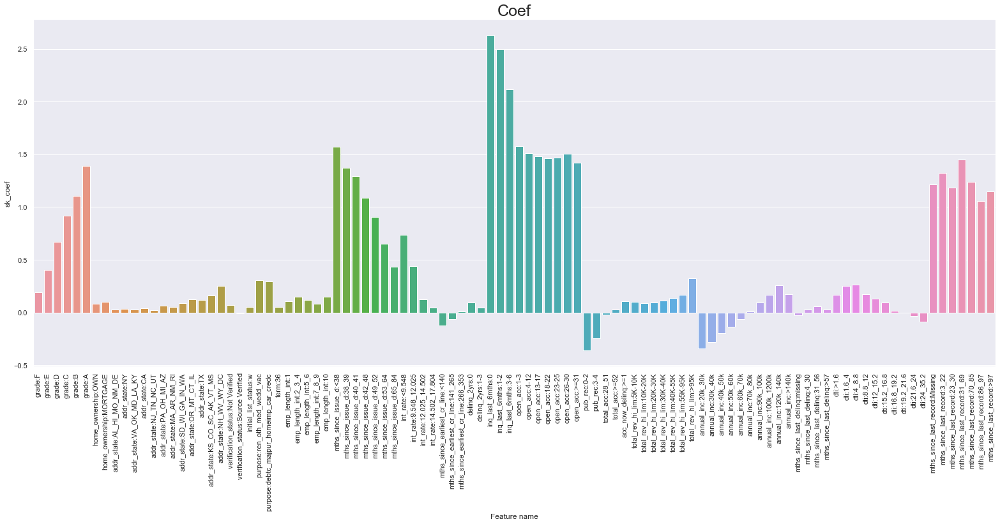


# Now statsmodels


```python
import statsmodels.api as sm
```


```python
constant = pd.DataFrame(np.ones(shape=(len(x_train_no_ref),)),columns=['Intercept'], index=x_train_no_ref.index)
```


```python
x_train_no_ref_const = pd.concat([constant, x_train_no_ref], axis=1)


log_model = sm.Logit(y_train, x_train_no_ref_const)

result = log_model.fit()
```

    Optimization terminated successfully.
             Current function value: 0.323541
             Iterations 8


```python
summary_table['sm_coef'] = result.params.values

summary_table['sm_p_values'] = result.pvalues.values

summary_table
```

    /Users/omaromeiri/anaconda3/lib/python3.7/site-packages/statsmodels/base/model.py:1286: RuntimeWarning: invalid value encountered in sqrt
      bse_ = np.sqrt(np.diag(self.cov_params()))
    /Users/omaromeiri/anaconda3/lib/python3.7/site-packages/scipy/stats/_distn_infrastructure.py:901: RuntimeWarning: invalid value encountered in greater
      return (a < x) & (x < b)
    /Users/omaromeiri/anaconda3/lib/python3.7/site-packages/scipy/stats/_distn_infrastructure.py:901: RuntimeWarning: invalid value encountered in less
      return (a < x) & (x < b)
    /Users/omaromeiri/anaconda3/lib/python3.7/site-packages/scipy/stats/_distn_infrastructure.py:1892: RuntimeWarning: invalid value encountered in less_equal
      cond2 = cond0 & (x <= _a)


<div>
<style scoped>
    .dataframe tbody tr th:only-of-type {
        vertical-align: middle;
    }

    .dataframe tbody tr th {
        vertical-align: top;
    }

    .dataframe thead th {
        text-align: right;
    }
</style>
<table border="1" class="dataframe">
  <thead>
    <tr style="text-align: right;">
      <th></th>
      <th>Feature name</th>
      <th>sk_coef</th>
      <th>sk_p_values</th>
      <th>sm_coef</th>
      <th>sm_p_values</th>
    </tr>
  </thead>
  <tbody>
    <tr>
      <th>0</th>
      <td>Intercept</td>
      <td>-5.543232</td>
      <td>NaN</td>
      <td>-10.000200</td>
      <td>1.596155e-10</td>
    </tr>
    <tr>
      <th>1</th>
      <td>grade:F</td>
      <td>0.188980</td>
      <td>1.012100e-02</td>
      <td>0.207810</td>
      <td>3.118885e-05</td>
    </tr>
    <tr>
      <th>2</th>
      <td>grade:E</td>
      <td>0.404870</td>
      <td>6.394374e-38</td>
      <td>0.423829</td>
      <td>1.848771e-19</td>
    </tr>
    <tr>
      <th>3</th>
      <td>grade:D</td>
      <td>0.666871</td>
      <td>5.930944e-121</td>
      <td>0.685389</td>
      <td>1.906448e-46</td>
    </tr>
    <tr>
      <th>4</th>
      <td>grade:C</td>
      <td>0.915862</td>
      <td>4.775268e-48</td>
      <td>0.933847</td>
      <td>4.014775e-71</td>
    </tr>
    <tr>
      <th>5</th>
      <td>grade:B</td>
      <td>1.106695</td>
      <td>NaN</td>
      <td>1.122673</td>
      <td>3.181311e-83</td>
    </tr>
    <tr>
      <th>6</th>
      <td>grade:A</td>
      <td>1.390356</td>
      <td>4.593911e-57</td>
      <td>1.400611</td>
      <td>3.793150e-58</td>
    </tr>
    <tr>
      <th>7</th>
      <td>home_ownership:OWN</td>
      <td>0.084570</td>
      <td>4.719548e-05</td>
      <td>0.085655</td>
      <td>1.819442e-05</td>
    </tr>
    <tr>
      <th>8</th>
      <td>home_ownership:MORTGAGE</td>
      <td>0.102670</td>
      <td>5.106689e-18</td>
      <td>0.103313</td>
      <td>1.350467e-16</td>
    </tr>
    <tr>
      <th>9</th>
      <td>addr_state:AL_HI_MO_NM_DE</td>
      <td>0.024814</td>
      <td>1.000000e+00</td>
      <td>0.025405</td>
      <td>1.000000e+00</td>
    </tr>
    <tr>
      <th>10</th>
      <td>addr_state:NY</td>
      <td>0.030498</td>
      <td>1.000000e+00</td>
      <td>0.031505</td>
      <td>1.000000e+00</td>
    </tr>
    <tr>
      <th>11</th>
      <td>addr_state:VA_OK_MD_LA_KY</td>
      <td>0.027593</td>
      <td>1.000000e+00</td>
      <td>0.028337</td>
      <td>NaN</td>
    </tr>
    <tr>
      <th>12</th>
      <td>addr_state:CA</td>
      <td>0.036681</td>
      <td>NaN</td>
      <td>0.037095</td>
      <td>NaN</td>
    </tr>
    <tr>
      <th>13</th>
      <td>addr_state:NJ_TN_NC_UT</td>
      <td>0.022684</td>
      <td>1.000000e+00</td>
      <td>0.023660</td>
      <td>1.000000e+00</td>
    </tr>
    <tr>
      <th>14</th>
      <td>addr_state:PA_OH_MI_AZ</td>
      <td>0.064018</td>
      <td>NaN</td>
      <td>0.064897</td>
      <td>NaN</td>
    </tr>
    <tr>
      <th>15</th>
      <td>addr_state:MA_AR_NM_RI</td>
      <td>0.052272</td>
      <td>NaN</td>
      <td>0.053510</td>
      <td>NaN</td>
    </tr>
    <tr>
      <th>16</th>
      <td>addr_state:SD_WI_GA_IN_WA</td>
      <td>0.087345</td>
      <td>NaN</td>
      <td>0.088260</td>
      <td>1.000000e+00</td>
    </tr>
    <tr>
      <th>17</th>
      <td>addr_state:OR_MT_CT_IL</td>
      <td>0.122480</td>
      <td>1.000000e+00</td>
      <td>0.123657</td>
      <td>1.000000e+00</td>
    </tr>
    <tr>
      <th>18</th>
      <td>addr_state:TX</td>
      <td>0.116718</td>
      <td>NaN</td>
      <td>0.117579</td>
      <td>1.000000e+00</td>
    </tr>
    <tr>
      <th>19</th>
      <td>addr_state:KS_CO_SC_AK_VT_MS</td>
      <td>0.159057</td>
      <td>NaN</td>
      <td>0.160427</td>
      <td>1.000000e+00</td>
    </tr>
    <tr>
      <th>20</th>
      <td>addr_state:NH_WV_WY_DC</td>
      <td>0.250100</td>
      <td>1.000000e+00</td>
      <td>0.251007</td>
      <td>NaN</td>
    </tr>
    <tr>
      <th>21</th>
      <td>addr_state:AL_HI_MO_NM_DE</td>
      <td>0.024814</td>
      <td>NaN</td>
      <td>0.025405</td>
      <td>1.000000e+00</td>
    </tr>
    <tr>
      <th>22</th>
      <td>addr_state:NY</td>
      <td>0.030498</td>
      <td>NaN</td>
      <td>0.031505</td>
      <td>NaN</td>
    </tr>
    <tr>
      <th>23</th>
      <td>addr_state:VA_OK_MD_LA_KY</td>
      <td>0.027593</td>
      <td>1.000000e+00</td>
      <td>0.028337</td>
      <td>NaN</td>
    </tr>
    <tr>
      <th>24</th>
      <td>addr_state:CA</td>
      <td>0.036681</td>
      <td>NaN</td>
      <td>0.037095</td>
      <td>NaN</td>
    </tr>
    <tr>
      <th>25</th>
      <td>addr_state:NJ_TN_NC_UT</td>
      <td>0.022684</td>
      <td>NaN</td>
      <td>0.023660</td>
      <td>1.000000e+00</td>
    </tr>
    <tr>
      <th>26</th>
      <td>addr_state:PA_OH_MI_AZ</td>
      <td>0.064018</td>
      <td>1.000000e+00</td>
      <td>0.064897</td>
      <td>NaN</td>
    </tr>
    <tr>
      <th>27</th>
      <td>addr_state:MA_AR_NM_RI</td>
      <td>0.052272</td>
      <td>NaN</td>
      <td>0.053510</td>
      <td>1.000000e+00</td>
    </tr>
    <tr>
      <th>28</th>
      <td>addr_state:SD_WI_GA_IN_WA</td>
      <td>0.087345</td>
      <td>NaN</td>
      <td>0.088260</td>
      <td>1.000000e+00</td>
    </tr>
    <tr>
      <th>29</th>
      <td>addr_state:OR_MT_CT_IL</td>
      <td>0.122480</td>
      <td>NaN</td>
      <td>0.123657</td>
      <td>1.000000e+00</td>
    </tr>
    <tr>
      <th>30</th>
      <td>addr_state:TX</td>
      <td>0.116718</td>
      <td>1.000000e+00</td>
      <td>0.117579</td>
      <td>1.000000e+00</td>
    </tr>
    <tr>
      <th>31</th>
      <td>addr_state:KS_CO_SC_AK_VT_MS</td>
      <td>0.159057</td>
      <td>1.000000e+00</td>
      <td>0.160427</td>
      <td>1.000000e+00</td>
    </tr>
    <tr>
      <th>32</th>
      <td>addr_state:NH_WV_WY_DC</td>
      <td>0.250100</td>
      <td>NaN</td>
      <td>0.251007</td>
      <td>NaN</td>
    </tr>
    <tr>
      <th>33</th>
      <td>verification_status:Not Verified</td>
      <td>0.071482</td>
      <td>3.064763e-07</td>
      <td>0.073651</td>
      <td>4.159200e-07</td>
    </tr>
    <tr>
      <th>34</th>
      <td>verification_status:Source Verified</td>
      <td>-0.009640</td>
      <td>4.587161e-01</td>
      <td>-0.009787</td>
      <td>4.656101e-01</td>
    </tr>
    <tr>
      <th>35</th>
      <td>initial_list_status:w</td>
      <td>0.053225</td>
      <td>4.841919e-05</td>
      <td>0.052658</td>
      <td>5.343161e-05</td>
    </tr>
    <tr>
      <th>36</th>
      <td>purpose:ren_oth_med_wedd_vac</td>
      <td>0.303921</td>
      <td>7.465460e-11</td>
      <td>0.310761</td>
      <td>1.541652e-22</td>
    </tr>
    <tr>
      <th>37</th>
      <td>purpose:debtc_majpur_homeimp_car_credc</td>
      <td>0.294545</td>
      <td>4.615343e-20</td>
      <td>0.297468</td>
      <td>1.112524e-27</td>
    </tr>
    <tr>
      <th>38</th>
      <td>term:36</td>
      <td>0.048810</td>
      <td>2.104292e-05</td>
      <td>0.048587</td>
      <td>5.473614e-04</td>
    </tr>
    <tr>
      <th>39</th>
      <td>emp_length_int:1</td>
      <td>0.106385</td>
      <td>2.242957e-04</td>
      <td>0.106878</td>
      <td>2.892413e-05</td>
    </tr>
    <tr>
      <th>40</th>
      <td>emp_length_int:2_3_4</td>
      <td>0.147669</td>
      <td>3.089705e-11</td>
      <td>0.146691</td>
      <td>2.882220e-15</td>
    </tr>
    <tr>
      <th>41</th>
      <td>emp_length_int:5_6</td>
      <td>0.117663</td>
      <td>6.024028e-09</td>
      <td>0.116911</td>
      <td>3.165603e-08</td>
    </tr>
    <tr>
      <th>42</th>
      <td>emp_length_int:7_8_9</td>
      <td>0.081187</td>
      <td>4.673230e-04</td>
      <td>0.080575</td>
      <td>8.588245e-05</td>
    </tr>
    <tr>
      <th>43</th>
      <td>emp_length_int:10</td>
      <td>0.148384</td>
      <td>2.286943e-16</td>
      <td>0.148077</td>
      <td>2.975340e-16</td>
    </tr>
    <tr>
      <th>44</th>
      <td>mths_since_issue_d:&lt;38</td>
      <td>1.570639</td>
      <td>NaN</td>
      <td>1.563511</td>
      <td>0.000000e+00</td>
    </tr>
    <tr>
      <th>45</th>
      <td>mths_since_issue_d:38_39</td>
      <td>1.373464</td>
      <td>0.000000e+00</td>
      <td>1.365986</td>
      <td>0.000000e+00</td>
    </tr>
    <tr>
      <th>46</th>
      <td>mths_since_issue_d:40_41</td>
      <td>1.292252</td>
      <td>1.251667e-224</td>
      <td>1.284837</td>
      <td>0.000000e+00</td>
    </tr>
    <tr>
      <th>47</th>
      <td>mths_since_issue_d:42_48</td>
      <td>1.086113</td>
      <td>0.000000e+00</td>
      <td>1.078630</td>
      <td>0.000000e+00</td>
    </tr>
    <tr>
      <th>48</th>
      <td>mths_since_issue_d:49_52</td>
      <td>0.903154</td>
      <td>1.159530e-147</td>
      <td>0.895835</td>
      <td>2.560998e-205</td>
    </tr>
    <tr>
      <th>49</th>
      <td>mths_since_issue_d:53_64</td>
      <td>0.653550</td>
      <td>2.104724e-57</td>
      <td>0.646231</td>
      <td>9.735287e-126</td>
    </tr>
    <tr>
      <th>50</th>
      <td>mths_since_issue_d:65_84</td>
      <td>0.434159</td>
      <td>8.488691e-111</td>
      <td>0.426227</td>
      <td>1.742939e-57</td>
    </tr>
    <tr>
      <th>51</th>
      <td>int_rate:&lt;9.548</td>
      <td>0.733389</td>
      <td>2.452932e-27</td>
      <td>0.744260</td>
      <td>1.648883e-25</td>
    </tr>
    <tr>
      <th>52</th>
      <td>int_rate:9.548_12.025</td>
      <td>0.438254</td>
      <td>1.259131e-19</td>
      <td>0.442031</td>
      <td>3.769855e-29</td>
    </tr>
    <tr>
      <th>53</th>
      <td>int_rate:12.025_14.502</td>
      <td>0.123784</td>
      <td>4.270305e-07</td>
      <td>0.124860</td>
      <td>8.686980e-10</td>
    </tr>
    <tr>
      <th>54</th>
      <td>int_rate:14.502_17.804</td>
      <td>0.044003</td>
      <td>3.383672e-02</td>
      <td>0.044106</td>
      <td>4.436577e-02</td>
    </tr>
    <tr>
      <th>55</th>
      <td>mths_since_earliest_cr_line:&lt;140</td>
      <td>-0.123627</td>
      <td>3.659577e-12</td>
      <td>-0.117998</td>
      <td>9.275385e-06</td>
    </tr>
    <tr>
      <th>56</th>
      <td>mths_since_earliest_cr_line:141_265</td>
      <td>-0.064032</td>
      <td>3.331385e-03</td>
      <td>-0.062356</td>
      <td>1.255253e-03</td>
    </tr>
    <tr>
      <th>57</th>
      <td>mths_since_earliest_cr_line:266_353</td>
      <td>0.008231</td>
      <td>7.178458e-01</td>
      <td>0.009866</td>
      <td>6.442260e-01</td>
    </tr>
    <tr>
      <th>58</th>
      <td>delinq_2yrs:0</td>
      <td>0.092936</td>
      <td>NaN</td>
      <td>0.107788</td>
      <td>5.202730e-02</td>
    </tr>
    <tr>
      <th>59</th>
      <td>delinq_2yrs:1-3</td>
      <td>0.045957</td>
      <td>8.330333e-01</td>
      <td>0.058395</td>
      <td>2.709721e-01</td>
    </tr>
    <tr>
      <th>60</th>
      <td>inq_last_6mths:0</td>
      <td>2.629203</td>
      <td>1.848280e-02</td>
      <td>2.947210</td>
      <td>1.101451e-68</td>
    </tr>
    <tr>
      <th>61</th>
      <td>inq_last_6mths:1-2</td>
      <td>2.494519</td>
      <td>NaN</td>
      <td>2.811645</td>
      <td>7.765741e-58</td>
    </tr>
    <tr>
      <th>62</th>
      <td>inq_last_6mths:3-6</td>
      <td>2.118041</td>
      <td>2.821490e-01</td>
      <td>2.435535</td>
      <td>6.891051e-48</td>
    </tr>
    <tr>
      <th>63</th>
      <td>open_acc:1-3</td>
      <td>1.576903</td>
      <td>6.289968e-02</td>
      <td>5.415097</td>
      <td>1.263633e-04</td>
    </tr>
    <tr>
      <th>64</th>
      <td>open_acc:4-12</td>
      <td>1.507765</td>
      <td>NaN</td>
      <td>5.346051</td>
      <td>NaN</td>
    </tr>
    <tr>
      <th>65</th>
      <td>open_acc:13-17</td>
      <td>1.482409</td>
      <td>5.451612e-01</td>
      <td>5.322125</td>
      <td>4.338883e-16</td>
    </tr>
    <tr>
      <th>66</th>
      <td>open_acc:18-22</td>
      <td>1.461198</td>
      <td>5.774254e-01</td>
      <td>5.301988</td>
      <td>8.165671e-05</td>
    </tr>
    <tr>
      <th>67</th>
      <td>open_acc:23-25</td>
      <td>1.466204</td>
      <td>5.623018e-01</td>
      <td>5.309551</td>
      <td>3.469267e-04</td>
    </tr>
    <tr>
      <th>68</th>
      <td>open_acc:26-30</td>
      <td>1.502729</td>
      <td>5.526226e-01</td>
      <td>5.348880</td>
      <td>8.002795e-08</td>
    </tr>
    <tr>
      <th>69</th>
      <td>open_acc:&gt;=31</td>
      <td>1.420672</td>
      <td>4.258613e-01</td>
      <td>5.275889</td>
      <td>5.392148e-04</td>
    </tr>
    <tr>
      <th>70</th>
      <td>pub_rec:0-2</td>
      <td>-0.362099</td>
      <td>7.047105e-01</td>
      <td>-0.167079</td>
      <td>3.836704e-01</td>
    </tr>
    <tr>
      <th>71</th>
      <td>pub_rec:3-4</td>
      <td>-0.243211</td>
      <td>5.565679e-01</td>
      <td>-0.056064</td>
      <td>7.900485e-01</td>
    </tr>
    <tr>
      <th>72</th>
      <td>total_acc:28_51</td>
      <td>-0.021261</td>
      <td>1.260961e-01</td>
      <td>-0.022070</td>
      <td>1.155026e-01</td>
    </tr>
    <tr>
      <th>73</th>
      <td>total_acc:&gt;=52</td>
      <td>0.025278</td>
      <td>5.193005e-01</td>
      <td>0.022260</td>
      <td>5.698633e-01</td>
    </tr>
    <tr>
      <th>74</th>
      <td>acc_now_delinq:&gt;=1</td>
      <td>0.107822</td>
      <td>2.150338e-01</td>
      <td>0.113262</td>
      <td>2.391251e-01</td>
    </tr>
    <tr>
      <th>75</th>
      <td>total_rev_hi_lim:5K-10K</td>
      <td>0.102820</td>
      <td>2.108720e-05</td>
      <td>0.100966</td>
      <td>2.010239e-05</td>
    </tr>
    <tr>
      <th>76</th>
      <td>total_rev_hi_lim:10K-20K</td>
      <td>0.086499</td>
      <td>1.730255e-04</td>
      <td>0.084583</td>
      <td>2.161766e-04</td>
    </tr>
    <tr>
      <th>77</th>
      <td>total_rev_hi_lim:20K-30K</td>
      <td>0.093546</td>
      <td>3.072929e-04</td>
      <td>0.091688</td>
      <td>2.853344e-04</td>
    </tr>
    <tr>
      <th>78</th>
      <td>total_rev_hi_lim:30K-40K</td>
      <td>0.110876</td>
      <td>9.964916e-05</td>
      <td>0.108732</td>
      <td>1.365856e-04</td>
    </tr>
    <tr>
      <th>79</th>
      <td>total_rev_hi_lim:40K-55K</td>
      <td>0.134694</td>
      <td>1.891973e-05</td>
      <td>0.132230</td>
      <td>2.339253e-05</td>
    </tr>
    <tr>
      <th>80</th>
      <td>total_rev_hi_lim:55K-95K</td>
      <td>0.166288</td>
      <td>3.938263e-06</td>
      <td>0.163363</td>
      <td>3.504486e-06</td>
    </tr>
    <tr>
      <th>81</th>
      <td>total_rev_hi_lim:&gt;95K</td>
      <td>0.325116</td>
      <td>7.650873e-09</td>
      <td>0.320898</td>
      <td>1.131861e-08</td>
    </tr>
    <tr>
      <th>82</th>
      <td>annual_inc:20k_30k</td>
      <td>-0.341039</td>
      <td>2.787643e-36</td>
      <td>-0.342018</td>
      <td>2.126618e-35</td>
    </tr>
    <tr>
      <th>83</th>
      <td>annual_inc:30k_40k</td>
      <td>-0.281547</td>
      <td>3.033008e-32</td>
      <td>-0.281773</td>
      <td>3.786773e-32</td>
    </tr>
    <tr>
      <th>84</th>
      <td>annual_inc:40k_50k</td>
      <td>-0.197581</td>
      <td>1.998363e-17</td>
      <td>-0.197343</td>
      <td>6.855185e-18</td>
    </tr>
    <tr>
      <th>85</th>
      <td>annual_inc:50k_60k</td>
      <td>-0.133432</td>
      <td>1.027383e-08</td>
      <td>-0.133181</td>
      <td>8.230866e-09</td>
    </tr>
    <tr>
      <th>86</th>
      <td>annual_inc:60k_70k</td>
      <td>-0.061056</td>
      <td>1.070887e-02</td>
      <td>-0.060247</td>
      <td>1.333139e-02</td>
    </tr>
    <tr>
      <th>87</th>
      <td>annual_inc:70k_80k</td>
      <td>0.006598</td>
      <td>7.968926e-01</td>
      <td>0.008127</td>
      <td>7.502038e-01</td>
    </tr>
    <tr>
      <th>88</th>
      <td>annual_inc:90k_100k</td>
      <td>0.093277</td>
      <td>2.231212e-03</td>
      <td>0.095188</td>
      <td>1.766123e-03</td>
    </tr>
    <tr>
      <th>89</th>
      <td>annual_inc:100k_1200k</td>
      <td>0.164080</td>
      <td>1.906233e-07</td>
      <td>0.165839</td>
      <td>2.411304e-08</td>
    </tr>
    <tr>
      <th>90</th>
      <td>annual_inc:120k_140k</td>
      <td>0.255447</td>
      <td>4.953463e-11</td>
      <td>0.256462</td>
      <td>2.725729e-11</td>
    </tr>
    <tr>
      <th>91</th>
      <td>annual_inc:&gt;140k</td>
      <td>0.170953</td>
      <td>6.598192e-07</td>
      <td>0.174410</td>
      <td>1.023696e-07</td>
    </tr>
    <tr>
      <th>92</th>
      <td>mths_since_last_delinq:missing</td>
      <td>-0.025112</td>
      <td>3.238206e-01</td>
      <td>-0.026380</td>
      <td>1.617790e-01</td>
    </tr>
    <tr>
      <th>93</th>
      <td>mths_since_last_delinq:4_30</td>
      <td>0.027087</td>
      <td>1.000000e+00</td>
      <td>0.027674</td>
      <td>NaN</td>
    </tr>
    <tr>
      <th>94</th>
      <td>mths_since_last_delinq:31_56</td>
      <td>0.060215</td>
      <td>1.302343e-02</td>
      <td>0.059084</td>
      <td>7.688371e-03</td>
    </tr>
    <tr>
      <th>95</th>
      <td>mths_since_last_delinq:&gt;57</td>
      <td>0.027087</td>
      <td>1.000000e+00</td>
      <td>0.027674</td>
      <td>NaN</td>
    </tr>
    <tr>
      <th>96</th>
      <td>dti:&gt;1.6</td>
      <td>0.169583</td>
      <td>9.950996e-03</td>
      <td>0.190934</td>
      <td>2.719423e-03</td>
    </tr>
    <tr>
      <th>97</th>
      <td>dti:1.6_4</td>
      <td>0.249188</td>
      <td>1.374034e-06</td>
      <td>0.257398</td>
      <td>2.631274e-08</td>
    </tr>
    <tr>
      <th>98</th>
      <td>dti:4_8.8</td>
      <td>0.265480</td>
      <td>8.403824e-11</td>
      <td>0.271199</td>
      <td>1.559274e-15</td>
    </tr>
    <tr>
      <th>99</th>
      <td>dti:8.8_12</td>
      <td>0.171183</td>
      <td>6.744130e-06</td>
      <td>0.177502</td>
      <td>9.612797e-08</td>
    </tr>
    <tr>
      <th>100</th>
      <td>dti:12_15.2</td>
      <td>0.131051</td>
      <td>7.690284e-04</td>
      <td>0.135886</td>
      <td>2.703154e-05</td>
    </tr>
    <tr>
      <th>101</th>
      <td>dti:15.2_16.8</td>
      <td>0.094185</td>
      <td>1.634361e-02</td>
      <td>0.099102</td>
      <td>4.675506e-03</td>
    </tr>
    <tr>
      <th>102</th>
      <td>dti:16.8_19.2</td>
      <td>0.016142</td>
      <td>6.784056e-01</td>
      <td>0.021128</td>
      <td>5.203142e-01</td>
    </tr>
    <tr>
      <th>103</th>
      <td>dti:19.2_21.6</td>
      <td>-0.005113</td>
      <td>8.966409e-01</td>
      <td>-0.000062</td>
      <td>9.985527e-01</td>
    </tr>
    <tr>
      <th>104</th>
      <td>dti:21.6_24</td>
      <td>-0.030953</td>
      <td>4.457197e-01</td>
      <td>-0.026060</td>
      <td>4.354215e-01</td>
    </tr>
    <tr>
      <th>105</th>
      <td>dti:24_35.2</td>
      <td>-0.088736</td>
      <td>1.511984e-02</td>
      <td>-0.083426</td>
      <td>6.818070e-03</td>
    </tr>
    <tr>
      <th>106</th>
      <td>mths_since_last_record:Missing</td>
      <td>1.216391</td>
      <td>4.554179e-23</td>
      <td>1.286774</td>
      <td>4.096374e-71</td>
    </tr>
    <tr>
      <th>107</th>
      <td>mths_since_last_record:3_22</td>
      <td>1.325208</td>
      <td>2.361359e-15</td>
      <td>1.415352</td>
      <td>1.513571e-36</td>
    </tr>
    <tr>
      <th>108</th>
      <td>mths_since_last_record:23_30</td>
      <td>1.185848</td>
      <td>6.108773e-14</td>
      <td>1.272789</td>
      <td>4.993458e-29</td>
    </tr>
    <tr>
      <th>109</th>
      <td>mths_since_last_record:31_69</td>
      <td>1.448433</td>
      <td>3.429894e-30</td>
      <td>1.523075</td>
      <td>6.855079e-85</td>
    </tr>
    <tr>
      <th>110</th>
      <td>mths_since_last_record:70_85</td>
      <td>1.238899</td>
      <td>2.883593e-22</td>
      <td>1.312663</td>
      <td>3.576181e-57</td>
    </tr>
    <tr>
      <th>111</th>
      <td>mths_since_last_record:86_97</td>
      <td>1.057813</td>
      <td>1.190826e-16</td>
      <td>1.129263</td>
      <td>2.258921e-43</td>
    </tr>
    <tr>
      <th>112</th>
      <td>mths_since_last_record:&gt;97</td>
      <td>1.147669</td>
      <td>3.157461e-20</td>
      <td>1.219132</td>
      <td>6.590386e-57</td>
    </tr>
  </tbody>
</table>
</div>


```python
unique_vars = []

for var in var_list:
    unique_vars.append(var.split(':')[0])

unique_vars = list(set(unique_vars))
```


```python

fig = plt.figure(figsize=(30,80))
N = len(unique_vars)
index = 1

for u_var in unique_vars:
    plot_vars = []
    
    for var in var_list:
        if u_var == var.split(':')[0]:
            plot_vars.append(var)
            
    
    ax = plt.subplot(math.ceil(N/3),3,index)       
    ax.bar(x='Feature name', height='sm_p_values', data=summary_table[summary_table['Feature name'].isin(plot_vars)], label='Sk_learn', alpha=0.7)
    ax.bar(x='Feature name', height='sk_p_values', data=summary_table[summary_table['Feature name'].isin(plot_vars)], label='Statsmodels', alpha=0.7)
    
    plt.subplots_adjust(hspace = 0.8)
    plt.xticks(rotation=90)
    plt.title(f'P_values {u_var}', fontsize=25)
    plt.legend()
    #plt.show()
    index += 1
```


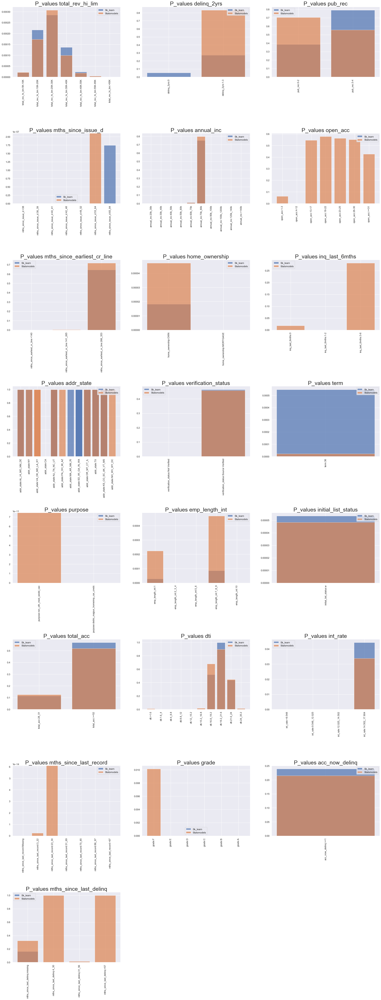


### Removing all dummies that have a p_value higher than 0.05 for all dummies representing one variable

Conventionally, if a p-value is lower than 0.05, we conclude that the coefficient of a variable is statistically significant


```python
sk_significant_vars = list(set(summary_table[summary_table['sk_p_values'] <= 0.05]['Feature name'].apply(lambda x: x.split(':')[0]).values))

sm_significant_vars = list(set(summary_table[summary_table['sm_p_values'] <= 0.05]['Feature name'].apply(lambda x: x.split(':')[0]).values))
```


```python
print(len(sk_significant_vars))
sk_significant_vars
```

    16


    ['term',
     'dti',
     'int_rate',
     'mths_since_last_record',
     'home_ownership',
     'inq_last_6mths',
     'emp_length_int',
     'total_rev_hi_lim',
     'grade',
     'initial_list_status',
     'mths_since_issue_d',
     'verification_status',
     'annual_inc',
     'purpose',
     'mths_since_last_delinq',
     'mths_since_earliest_cr_line']


```python
print(len(sm_significant_vars))
sm_significant_vars
```

    18


    ['term',
     'dti',
     'int_rate',
     'mths_since_last_record',
     'home_ownership',
     'inq_last_6mths',
     'emp_length_int',
     'Intercept',
     'total_rev_hi_lim',
     'grade',
     'mths_since_last_delinq',
     'initial_list_status',
     'mths_since_issue_d',
     'verification_status',
     'annual_inc',
     'purpose',
     'open_acc',
     'mths_since_earliest_cr_line']


```python
sm_vars = []
sm_ref_vars = []
sk_vars = []
sk_ref_vars = []

for var in x_train_no_ref.columns.values:
    
    if var.split(':')[0] in sk_significant_vars:
        sk_vars.append(var)
        
        for ref_var in ref_vars:
            if ref_var.split(':')[0] == var.split(':')[0]:
                sk_ref_vars.append(ref_var)
    
    if var.split(':')[0] in sm_significant_vars:
        sm_vars.append(var)
        
        for ref_var in ref_vars:
            if ref_var.split(':')[0] == var.split(':')[0]:
                sm_ref_vars.append(ref_var)
                
                
sm_ref_vars = list(set(sm_ref_vars))
sk_ref_vars = list(set(sk_ref_vars))
```


```python
print(len(sk_ref_vars))
sk_ref_vars
```

    16


    ['int_rate:>17.804',
     'grade:G',
     'home_ownership:RENT_OTHER_NONE',
     'initial_list_status:f',
     'purpose:educ_sm_mov_house',
     'inq_last_6mths:>6',
     'total_rev_hi_lim:<=5K',
     'mths_since_last_record:0_2',
     'mths_since_last_delinq:<4',
     'emp_length_int:0',
     'mths_since_issue_d:>84',
     'annual_inc:<20k',
     'mths_since_earliest_cr_line:>354',
     'verification_status:Verified',
     'term:60',
     'dti:>35.2']


```python
print(len(sm_ref_vars))
sm_ref_vars
```

    17


    ['int_rate:>17.804',
     'grade:G',
     'home_ownership:RENT_OTHER_NONE',
     'initial_list_status:f',
     'purpose:educ_sm_mov_house',
     'inq_last_6mths:>6',
     'total_rev_hi_lim:<=5K',
     'mths_since_last_record:0_2',
     'mths_since_last_delinq:<4',
     'emp_length_int:0',
     'mths_since_issue_d:>84',
     'open_acc:0',
     'annual_inc:<20k',
     'mths_since_earliest_cr_line:>354',
     'verification_status:Verified',
     'term:60',
     'dti:>35.2']


```python

```

### Running both models again only for statisticallky significant variables

### Sklearn


```python
sk_x_train_no_ref = x_train_no_ref.loc[:, sk_vars].copy()

sk_log_reg = LogisticRegression_with_p_values()
sk_log_reg.fit(sk_x_train_no_ref, y_train)
```

    /Users/omaromeiri/anaconda3/lib/python3.7/site-packages/sklearn/linear_model/logistic.py:432: FutureWarning: Default solver will be changed to 'lbfgs' in 0.22. Specify a solver to silence this warning.
      FutureWarning)


```python
sk_summary_table = pd.DataFrame(columns = ['Feature name', 'sk_coef'])

sk_summary_table['Feature name'] = sk_vars
sk_summary_table['sk_coef'] = sk_log_reg.coef_[0]
sk_summary_table.index = sk_summary_table.index + 1
sk_summary_table.loc[0] = ['Intercept', sk_log_reg.intercept_[0]]
sk_summary_table = sk_summary_table.sort_index()

p_values = sk_log_reg.p_values
p_values = np.append(np.nan, np.array(p_values))
sk_summary_table['sk_p_values'] = p_values

sk_summary_table
```


<div>
<style scoped>
    .dataframe tbody tr th:only-of-type {
        vertical-align: middle;
    }

    .dataframe tbody tr th {
        vertical-align: top;
    }

    .dataframe thead th {
        text-align: right;
    }
</style>
<table border="1" class="dataframe">
  <thead>
    <tr style="text-align: right;">
      <th></th>
      <th>Feature name</th>
      <th>sk_coef</th>
      <th>sk_p_values</th>
    </tr>
  </thead>
  <tbody>
    <tr>
      <th>0</th>
      <td>Intercept</td>
      <td>-4.189967</td>
      <td>NaN</td>
    </tr>
    <tr>
      <th>1</th>
      <td>grade:F</td>
      <td>0.193820</td>
      <td>7.222497e-05</td>
    </tr>
    <tr>
      <th>2</th>
      <td>grade:E</td>
      <td>0.409511</td>
      <td>4.641765e-19</td>
    </tr>
    <tr>
      <th>3</th>
      <td>grade:D</td>
      <td>0.670695</td>
      <td>3.686155e-46</td>
    </tr>
    <tr>
      <th>4</th>
      <td>grade:C</td>
      <td>0.919163</td>
      <td>1.052989e-70</td>
    </tr>
    <tr>
      <th>5</th>
      <td>grade:B</td>
      <td>1.111274</td>
      <td>8.391464e-83</td>
    </tr>
    <tr>
      <th>6</th>
      <td>grade:A</td>
      <td>1.400946</td>
      <td>7.247906e-59</td>
    </tr>
    <tr>
      <th>7</th>
      <td>home_ownership:OWN</td>
      <td>0.095492</td>
      <td>1.489972e-06</td>
    </tr>
    <tr>
      <th>8</th>
      <td>home_ownership:MORTGAGE</td>
      <td>0.117701</td>
      <td>2.258992e-22</td>
    </tr>
    <tr>
      <th>9</th>
      <td>verification_status:Not Verified</td>
      <td>0.071667</td>
      <td>7.757315e-07</td>
    </tr>
    <tr>
      <th>10</th>
      <td>verification_status:Source Verified</td>
      <td>-0.008267</td>
      <td>5.371883e-01</td>
    </tr>
    <tr>
      <th>11</th>
      <td>initial_list_status:w</td>
      <td>0.053004</td>
      <td>4.937319e-05</td>
    </tr>
    <tr>
      <th>12</th>
      <td>purpose:ren_oth_med_wedd_vac</td>
      <td>0.302969</td>
      <td>9.111408e-22</td>
    </tr>
    <tr>
      <th>13</th>
      <td>purpose:debtc_majpur_homeimp_car_credc</td>
      <td>0.295429</td>
      <td>1.291306e-27</td>
    </tr>
    <tr>
      <th>14</th>
      <td>term:36</td>
      <td>0.046988</td>
      <td>7.793946e-04</td>
    </tr>
    <tr>
      <th>15</th>
      <td>emp_length_int:1</td>
      <td>0.107104</td>
      <td>2.623329e-05</td>
    </tr>
    <tr>
      <th>16</th>
      <td>emp_length_int:2_3_4</td>
      <td>0.147271</td>
      <td>1.963639e-15</td>
    </tr>
    <tr>
      <th>17</th>
      <td>emp_length_int:5_6</td>
      <td>0.114070</td>
      <td>6.296692e-08</td>
    </tr>
    <tr>
      <th>18</th>
      <td>emp_length_int:7_8_9</td>
      <td>0.076749</td>
      <td>1.774044e-04</td>
    </tr>
    <tr>
      <th>19</th>
      <td>emp_length_int:10</td>
      <td>0.145680</td>
      <td>7.463970e-16</td>
    </tr>
    <tr>
      <th>20</th>
      <td>mths_since_issue_d:&lt;38</td>
      <td>1.577294</td>
      <td>0.000000e+00</td>
    </tr>
    <tr>
      <th>21</th>
      <td>mths_since_issue_d:38_39</td>
      <td>1.379740</td>
      <td>0.000000e+00</td>
    </tr>
    <tr>
      <th>22</th>
      <td>mths_since_issue_d:40_41</td>
      <td>1.299174</td>
      <td>0.000000e+00</td>
    </tr>
    <tr>
      <th>23</th>
      <td>mths_since_issue_d:42_48</td>
      <td>1.092963</td>
      <td>0.000000e+00</td>
    </tr>
    <tr>
      <th>24</th>
      <td>mths_since_issue_d:49_52</td>
      <td>0.908395</td>
      <td>6.116570e-214</td>
    </tr>
    <tr>
      <th>25</th>
      <td>mths_since_issue_d:53_64</td>
      <td>0.660025</td>
      <td>1.133361e-132</td>
    </tr>
    <tr>
      <th>26</th>
      <td>mths_since_issue_d:65_84</td>
      <td>0.434748</td>
      <td>2.972518e-60</td>
    </tr>
    <tr>
      <th>27</th>
      <td>int_rate:&lt;9.548</td>
      <td>0.728382</td>
      <td>8.127221e-25</td>
    </tr>
    <tr>
      <th>28</th>
      <td>int_rate:9.548_12.025</td>
      <td>0.439143</td>
      <td>6.018723e-29</td>
    </tr>
    <tr>
      <th>29</th>
      <td>int_rate:12.025_14.502</td>
      <td>0.124222</td>
      <td>9.403991e-10</td>
    </tr>
    <tr>
      <th>30</th>
      <td>int_rate:14.502_17.804</td>
      <td>0.044993</td>
      <td>3.940821e-02</td>
    </tr>
    <tr>
      <th>31</th>
      <td>mths_since_earliest_cr_line:&lt;140</td>
      <td>-0.126903</td>
      <td>1.566386e-06</td>
    </tr>
    <tr>
      <th>32</th>
      <td>mths_since_earliest_cr_line:141_265</td>
      <td>-0.061316</td>
      <td>1.416652e-03</td>
    </tr>
    <tr>
      <th>33</th>
      <td>mths_since_earliest_cr_line:266_353</td>
      <td>0.011954</td>
      <td>5.744477e-01</td>
    </tr>
    <tr>
      <th>34</th>
      <td>inq_last_6mths:0</td>
      <td>2.617120</td>
      <td>4.221785e-222</td>
    </tr>
    <tr>
      <th>35</th>
      <td>inq_last_6mths:1-2</td>
      <td>2.483851</td>
      <td>3.356538e-201</td>
    </tr>
    <tr>
      <th>36</th>
      <td>inq_last_6mths:3-6</td>
      <td>2.109779</td>
      <td>3.222516e-144</td>
    </tr>
    <tr>
      <th>37</th>
      <td>total_rev_hi_lim:5K-10K</td>
      <td>0.099563</td>
      <td>2.106405e-05</td>
    </tr>
    <tr>
      <th>38</th>
      <td>total_rev_hi_lim:10K-20K</td>
      <td>0.078829</td>
      <td>4.570580e-04</td>
    </tr>
    <tr>
      <th>39</th>
      <td>total_rev_hi_lim:20K-30K</td>
      <td>0.080420</td>
      <td>1.155267e-03</td>
    </tr>
    <tr>
      <th>40</th>
      <td>total_rev_hi_lim:30K-40K</td>
      <td>0.092042</td>
      <td>9.742301e-04</td>
    </tr>
    <tr>
      <th>41</th>
      <td>total_rev_hi_lim:40K-55K</td>
      <td>0.112775</td>
      <td>2.185013e-04</td>
    </tr>
    <tr>
      <th>42</th>
      <td>total_rev_hi_lim:55K-95K</td>
      <td>0.141057</td>
      <td>3.857359e-05</td>
    </tr>
    <tr>
      <th>43</th>
      <td>total_rev_hi_lim:&gt;95K</td>
      <td>0.284187</td>
      <td>2.829485e-07</td>
    </tr>
    <tr>
      <th>44</th>
      <td>annual_inc:20k_30k</td>
      <td>-0.335092</td>
      <td>1.588068e-34</td>
    </tr>
    <tr>
      <th>45</th>
      <td>annual_inc:30k_40k</td>
      <td>-0.279226</td>
      <td>5.014129e-32</td>
    </tr>
    <tr>
      <th>46</th>
      <td>annual_inc:40k_50k</td>
      <td>-0.196236</td>
      <td>6.836916e-18</td>
    </tr>
    <tr>
      <th>47</th>
      <td>annual_inc:50k_60k</td>
      <td>-0.133190</td>
      <td>7.198909e-09</td>
    </tr>
    <tr>
      <th>48</th>
      <td>annual_inc:60k_70k</td>
      <td>-0.063346</td>
      <td>9.026082e-03</td>
    </tr>
    <tr>
      <th>49</th>
      <td>annual_inc:70k_80k</td>
      <td>0.002918</td>
      <td>9.086991e-01</td>
    </tr>
    <tr>
      <th>50</th>
      <td>annual_inc:90k_100k</td>
      <td>0.087121</td>
      <td>4.079895e-03</td>
    </tr>
    <tr>
      <th>51</th>
      <td>annual_inc:100k_1200k</td>
      <td>0.157617</td>
      <td>1.017319e-07</td>
    </tr>
    <tr>
      <th>52</th>
      <td>annual_inc:120k_140k</td>
      <td>0.244964</td>
      <td>1.746590e-10</td>
    </tr>
    <tr>
      <th>53</th>
      <td>annual_inc:&gt;140k</td>
      <td>0.158873</td>
      <td>1.051126e-06</td>
    </tr>
    <tr>
      <th>54</th>
      <td>mths_since_last_delinq:missing</td>
      <td>-0.018025</td>
      <td>3.238862e-01</td>
    </tr>
    <tr>
      <th>55</th>
      <td>mths_since_last_delinq:4_30</td>
      <td>0.008222</td>
      <td>1.000000e+00</td>
    </tr>
    <tr>
      <th>56</th>
      <td>mths_since_last_delinq:31_56</td>
      <td>0.062258</td>
      <td>4.049765e-03</td>
    </tr>
    <tr>
      <th>57</th>
      <td>mths_since_last_delinq:&gt;57</td>
      <td>0.008222</td>
      <td>1.000000e+00</td>
    </tr>
    <tr>
      <th>58</th>
      <td>dti:&gt;1.6</td>
      <td>0.186567</td>
      <td>2.540361e-03</td>
    </tr>
    <tr>
      <th>59</th>
      <td>dti:1.6_4</td>
      <td>0.256598</td>
      <td>1.580547e-08</td>
    </tr>
    <tr>
      <th>60</th>
      <td>dti:4_8.8</td>
      <td>0.268876</td>
      <td>8.430942e-16</td>
    </tr>
    <tr>
      <th>61</th>
      <td>dti:8.8_12</td>
      <td>0.173226</td>
      <td>1.294896e-07</td>
    </tr>
    <tr>
      <th>62</th>
      <td>dti:12_15.2</td>
      <td>0.133162</td>
      <td>3.088153e-05</td>
    </tr>
    <tr>
      <th>63</th>
      <td>dti:15.2_16.8</td>
      <td>0.094345</td>
      <td>6.525694e-03</td>
    </tr>
    <tr>
      <th>64</th>
      <td>dti:16.8_19.2</td>
      <td>0.017080</td>
      <td>5.992797e-01</td>
    </tr>
    <tr>
      <th>65</th>
      <td>dti:19.2_21.6</td>
      <td>-0.005567</td>
      <td>8.699937e-01</td>
    </tr>
    <tr>
      <th>66</th>
      <td>dti:21.6_24</td>
      <td>-0.031200</td>
      <td>3.456089e-01</td>
    </tr>
    <tr>
      <th>67</th>
      <td>dti:24_35.2</td>
      <td>-0.090207</td>
      <td>3.054590e-03</td>
    </tr>
    <tr>
      <th>68</th>
      <td>mths_since_last_record:Missing</td>
      <td>1.205398</td>
      <td>1.392951e-71</td>
    </tr>
    <tr>
      <th>69</th>
      <td>mths_since_last_record:3_22</td>
      <td>1.340409</td>
      <td>1.276090e-35</td>
    </tr>
    <tr>
      <th>70</th>
      <td>mths_since_last_record:23_30</td>
      <td>1.188317</td>
      <td>3.035732e-27</td>
    </tr>
    <tr>
      <th>71</th>
      <td>mths_since_last_record:31_69</td>
      <td>1.437084</td>
      <td>7.764921e-86</td>
    </tr>
    <tr>
      <th>72</th>
      <td>mths_since_last_record:70_85</td>
      <td>1.228518</td>
      <td>7.783087e-56</td>
    </tr>
    <tr>
      <th>73</th>
      <td>mths_since_last_record:86_97</td>
      <td>1.053230</td>
      <td>5.133999e-42</td>
    </tr>
    <tr>
      <th>74</th>
      <td>mths_since_last_record:&gt;97</td>
      <td>1.143449</td>
      <td>1.530129e-56</td>
    </tr>
  </tbody>
</table>
</div>


### statsmodels


```python
sm_vars
```


    ['grade:F',
     'grade:E',
     'grade:D',
     'grade:C',
     'grade:B',
     'grade:A',
     'home_ownership:OWN',
     'home_ownership:MORTGAGE',
     'verification_status:Not Verified',
     'verification_status:Source Verified',
     'initial_list_status:w',
     'purpose:ren_oth_med_wedd_vac',
     'purpose:debtc_majpur_homeimp_car_credc',
     'term:36',
     'emp_length_int:1',
     'emp_length_int:2_3_4',
     'emp_length_int:5_6',
     'emp_length_int:7_8_9',
     'emp_length_int:10',
     'mths_since_issue_d:<38',
     'mths_since_issue_d:38_39',
     'mths_since_issue_d:40_41',
     'mths_since_issue_d:42_48',
     'mths_since_issue_d:49_52',
     'mths_since_issue_d:53_64',
     'mths_since_issue_d:65_84',
     'int_rate:<9.548',
     'int_rate:9.548_12.025',
     'int_rate:12.025_14.502',
     'int_rate:14.502_17.804',
     'mths_since_earliest_cr_line:<140',
     'mths_since_earliest_cr_line:141_265',
     'mths_since_earliest_cr_line:266_353',
     'inq_last_6mths:0',
     'inq_last_6mths:1-2',
     'inq_last_6mths:3-6',
     'open_acc:1-3',
     'open_acc:4-12',
     'open_acc:13-17',
     'open_acc:18-22',
     'open_acc:23-25',
     'open_acc:26-30',
     'open_acc:>=31',
     'total_rev_hi_lim:5K-10K',
     'total_rev_hi_lim:10K-20K',
     'total_rev_hi_lim:20K-30K',
     'total_rev_hi_lim:30K-40K',
     'total_rev_hi_lim:40K-55K',
     'total_rev_hi_lim:55K-95K',
     'total_rev_hi_lim:>95K',
     'annual_inc:20k_30k',
     'annual_inc:30k_40k',
     'annual_inc:40k_50k',
     'annual_inc:50k_60k',
     'annual_inc:60k_70k',
     'annual_inc:70k_80k',
     'annual_inc:90k_100k',
     'annual_inc:100k_1200k',
     'annual_inc:120k_140k',
     'annual_inc:>140k',
     'mths_since_last_delinq:missing',
     'mths_since_last_delinq:4_30',
     'mths_since_last_delinq:31_56',
     'mths_since_last_delinq:>57',
     'dti:>1.6',
     'dti:1.6_4',
     'dti:4_8.8',
     'dti:8.8_12',
     'dti:12_15.2',
     'dti:15.2_16.8',
     'dti:16.8_19.2',
     'dti:19.2_21.6',
     'dti:21.6_24',
     'dti:24_35.2',
     'mths_since_last_record:Missing',
     'mths_since_last_record:3_22',
     'mths_since_last_record:23_30',
     'mths_since_last_record:31_69',
     'mths_since_last_record:70_85',
     'mths_since_last_record:86_97',
     'mths_since_last_record:>97']


```python
sm_x_train_no_ref = x_train_no_ref.loc[:, sm_vars].copy()


intercept = pd.DataFrame(np.ones(shape=(sm_x_train_no_ref.shape[0],)), columns=['Intercept'], index=sm_x_train_no_ref.index)
sm_x_train_no_ref = pd.concat([intercept, sm_x_train_no_ref], axis=1)

sm_x_train_no_ref_const = sm_x_train_no_ref

```


```python
sm_log_reg = sm.Logit(y_train, sm_x_train_no_ref_const)

sm_log_reg = sm_log_reg.fit()
```

    Optimization terminated successfully.
             Current function value: 0.323962
             Iterations 8


```python
sm_summary_table = pd.DataFrame(columns = ['Feature name', 'sm_coef'])
sm_vars.insert(0, 'Intercept')

sm_summary_table['Feature name'] = sm_vars
sm_summary_table['sm_coef'] = sm_log_reg.params.values
# sm_summary_table.index = sm_summary_table.index + 1
# sm_summary_table.loc[0] = ['Intercept', sm_log_reg.intercept_[0]]
# sm_summary_table = sm_summary_table.sort_index()

p_values = sm_log_reg.pvalues.values
#p_values = np.append(np.nan, np.array(p_values))
sm_summary_table['sm_p_values'] = p_values

sm_summary_table
```

    /Users/omaromeiri/anaconda3/lib/python3.7/site-packages/statsmodels/base/model.py:1286: RuntimeWarning: invalid value encountered in sqrt
      bse_ = np.sqrt(np.diag(self.cov_params()))
    /Users/omaromeiri/anaconda3/lib/python3.7/site-packages/scipy/stats/_distn_infrastructure.py:901: RuntimeWarning: invalid value encountered in greater
      return (a < x) & (x < b)
    /Users/omaromeiri/anaconda3/lib/python3.7/site-packages/scipy/stats/_distn_infrastructure.py:901: RuntimeWarning: invalid value encountered in less
      return (a < x) & (x < b)
    /Users/omaromeiri/anaconda3/lib/python3.7/site-packages/scipy/stats/_distn_infrastructure.py:1892: RuntimeWarning: invalid value encountered in less_equal
      cond2 = cond0 & (x <= _a)


<div>
<style scoped>
    .dataframe tbody tr th:only-of-type {
        vertical-align: middle;
    }

    .dataframe tbody tr th {
        vertical-align: top;
    }

    .dataframe thead th {
        text-align: right;
    }
</style>
<table border="1" class="dataframe">
  <thead>
    <tr style="text-align: right;">
      <th></th>
      <th>Feature name</th>
      <th>sm_coef</th>
      <th>sm_p_values</th>
    </tr>
  </thead>
  <tbody>
    <tr>
      <th>0</th>
      <td>Intercept</td>
      <td>-9.928387</td>
      <td>1.358613e-21</td>
    </tr>
    <tr>
      <th>1</th>
      <td>grade:F</td>
      <td>0.209181</td>
      <td>2.713609e-05</td>
    </tr>
    <tr>
      <th>2</th>
      <td>grade:E</td>
      <td>0.425131</td>
      <td>1.305743e-19</td>
    </tr>
    <tr>
      <th>3</th>
      <td>grade:D</td>
      <td>0.686475</td>
      <td>1.137249e-46</td>
    </tr>
    <tr>
      <th>4</th>
      <td>grade:C</td>
      <td>0.934863</td>
      <td>1.745639e-71</td>
    </tr>
    <tr>
      <th>5</th>
      <td>grade:B</td>
      <td>1.123917</td>
      <td>1.364500e-83</td>
    </tr>
    <tr>
      <th>6</th>
      <td>grade:A</td>
      <td>1.403162</td>
      <td>1.752133e-58</td>
    </tr>
    <tr>
      <th>7</th>
      <td>home_ownership:OWN</td>
      <td>0.096350</td>
      <td>1.231830e-06</td>
    </tr>
    <tr>
      <th>8</th>
      <td>home_ownership:MORTGAGE</td>
      <td>0.119492</td>
      <td>6.326387e-23</td>
    </tr>
    <tr>
      <th>9</th>
      <td>verification_status:Not Verified</td>
      <td>0.075613</td>
      <td>1.995839e-07</td>
    </tr>
    <tr>
      <th>10</th>
      <td>verification_status:Source Verified</td>
      <td>-0.008346</td>
      <td>5.335025e-01</td>
    </tr>
    <tr>
      <th>11</th>
      <td>initial_list_status:w</td>
      <td>0.052425</td>
      <td>5.996420e-05</td>
    </tr>
    <tr>
      <th>12</th>
      <td>purpose:ren_oth_med_wedd_vac</td>
      <td>0.311325</td>
      <td>1.288110e-22</td>
    </tr>
    <tr>
      <th>13</th>
      <td>purpose:debtc_majpur_homeimp_car_credc</td>
      <td>0.300045</td>
      <td>4.370700e-28</td>
    </tr>
    <tr>
      <th>14</th>
      <td>term:36</td>
      <td>0.047231</td>
      <td>7.526063e-04</td>
    </tr>
    <tr>
      <th>15</th>
      <td>emp_length_int:1</td>
      <td>0.108661</td>
      <td>2.094485e-05</td>
    </tr>
    <tr>
      <th>16</th>
      <td>emp_length_int:2_3_4</td>
      <td>0.146309</td>
      <td>3.377022e-15</td>
    </tr>
    <tr>
      <th>17</th>
      <td>emp_length_int:5_6</td>
      <td>0.113071</td>
      <td>8.566457e-08</td>
    </tr>
    <tr>
      <th>18</th>
      <td>emp_length_int:7_8_9</td>
      <td>0.075625</td>
      <td>2.248525e-04</td>
    </tr>
    <tr>
      <th>19</th>
      <td>emp_length_int:10</td>
      <td>0.144085</td>
      <td>1.744779e-15</td>
    </tr>
    <tr>
      <th>20</th>
      <td>mths_since_issue_d:&lt;38</td>
      <td>1.565053</td>
      <td>0.000000e+00</td>
    </tr>
    <tr>
      <th>21</th>
      <td>mths_since_issue_d:38_39</td>
      <td>1.368170</td>
      <td>0.000000e+00</td>
    </tr>
    <tr>
      <th>22</th>
      <td>mths_since_issue_d:40_41</td>
      <td>1.287020</td>
      <td>0.000000e+00</td>
    </tr>
    <tr>
      <th>23</th>
      <td>mths_since_issue_d:42_48</td>
      <td>1.080694</td>
      <td>0.000000e+00</td>
    </tr>
    <tr>
      <th>24</th>
      <td>mths_since_issue_d:49_52</td>
      <td>0.895695</td>
      <td>4.764304e-206</td>
    </tr>
    <tr>
      <th>25</th>
      <td>mths_since_issue_d:53_64</td>
      <td>0.647617</td>
      <td>2.054533e-126</td>
    </tr>
    <tr>
      <th>26</th>
      <td>mths_since_issue_d:65_84</td>
      <td>0.423872</td>
      <td>5.833502e-57</td>
    </tr>
    <tr>
      <th>27</th>
      <td>int_rate:&lt;9.548</td>
      <td>0.745877</td>
      <td>1.296892e-25</td>
    </tr>
    <tr>
      <th>28</th>
      <td>int_rate:9.548_12.025</td>
      <td>0.443838</td>
      <td>2.507624e-29</td>
    </tr>
    <tr>
      <th>29</th>
      <td>int_rate:12.025_14.502</td>
      <td>0.125652</td>
      <td>6.474949e-10</td>
    </tr>
    <tr>
      <th>30</th>
      <td>int_rate:14.502_17.804</td>
      <td>0.044230</td>
      <td>4.335115e-02</td>
    </tr>
    <tr>
      <th>31</th>
      <td>mths_since_earliest_cr_line:&lt;140</td>
      <td>-0.120259</td>
      <td>5.733169e-06</td>
    </tr>
    <tr>
      <th>32</th>
      <td>mths_since_earliest_cr_line:141_265</td>
      <td>-0.060721</td>
      <td>1.651651e-03</td>
    </tr>
    <tr>
      <th>33</th>
      <td>mths_since_earliest_cr_line:266_353</td>
      <td>0.011720</td>
      <td>5.834732e-01</td>
    </tr>
    <tr>
      <th>34</th>
      <td>inq_last_6mths:0</td>
      <td>2.928001</td>
      <td>1.957526e-66</td>
    </tr>
    <tr>
      <th>35</th>
      <td>inq_last_6mths:1-2</td>
      <td>2.796302</td>
      <td>8.158899e-61</td>
    </tr>
    <tr>
      <th>36</th>
      <td>inq_last_6mths:3-6</td>
      <td>2.423984</td>
      <td>5.840097e-46</td>
    </tr>
    <tr>
      <th>37</th>
      <td>open_acc:1-3</td>
      <td>5.406850</td>
      <td>1.241450e-07</td>
    </tr>
    <tr>
      <th>38</th>
      <td>open_acc:4-12</td>
      <td>5.332510</td>
      <td>1.816611e-07</td>
    </tr>
    <tr>
      <th>39</th>
      <td>open_acc:13-17</td>
      <td>5.301021</td>
      <td>2.149303e-07</td>
    </tr>
    <tr>
      <th>40</th>
      <td>open_acc:18-22</td>
      <td>5.278146</td>
      <td>2.432409e-07</td>
    </tr>
    <tr>
      <th>41</th>
      <td>open_acc:23-25</td>
      <td>5.287110</td>
      <td>2.367159e-07</td>
    </tr>
    <tr>
      <th>42</th>
      <td>open_acc:26-30</td>
      <td>5.330794</td>
      <td>1.925627e-07</td>
    </tr>
    <tr>
      <th>43</th>
      <td>open_acc:&gt;=31</td>
      <td>5.274248</td>
      <td>2.750527e-07</td>
    </tr>
    <tr>
      <th>44</th>
      <td>total_rev_hi_lim:5K-10K</td>
      <td>0.100428</td>
      <td>2.193946e-05</td>
    </tr>
    <tr>
      <th>45</th>
      <td>total_rev_hi_lim:10K-20K</td>
      <td>0.083468</td>
      <td>2.585577e-04</td>
    </tr>
    <tr>
      <th>46</th>
      <td>total_rev_hi_lim:20K-30K</td>
      <td>0.090370</td>
      <td>3.378275e-04</td>
    </tr>
    <tr>
      <th>47</th>
      <td>total_rev_hi_lim:30K-40K</td>
      <td>0.105790</td>
      <td>2.027522e-04</td>
    </tr>
    <tr>
      <th>48</th>
      <td>total_rev_hi_lim:40K-55K</td>
      <td>0.129954</td>
      <td>3.122824e-05</td>
    </tr>
    <tr>
      <th>49</th>
      <td>total_rev_hi_lim:55K-95K</td>
      <td>0.160764</td>
      <td>4.758361e-06</td>
    </tr>
    <tr>
      <th>50</th>
      <td>total_rev_hi_lim:&gt;95K</td>
      <td>0.307266</td>
      <td>4.405917e-08</td>
    </tr>
    <tr>
      <th>51</th>
      <td>annual_inc:20k_30k</td>
      <td>-0.341380</td>
      <td>1.674217e-35</td>
    </tr>
    <tr>
      <th>52</th>
      <td>annual_inc:30k_40k</td>
      <td>-0.281983</td>
      <td>2.072261e-32</td>
    </tr>
    <tr>
      <th>53</th>
      <td>annual_inc:40k_50k</td>
      <td>-0.196903</td>
      <td>6.742788e-18</td>
    </tr>
    <tr>
      <th>54</th>
      <td>annual_inc:50k_60k</td>
      <td>-0.132702</td>
      <td>8.958640e-09</td>
    </tr>
    <tr>
      <th>55</th>
      <td>annual_inc:60k_70k</td>
      <td>-0.060874</td>
      <td>1.233861e-02</td>
    </tr>
    <tr>
      <th>56</th>
      <td>annual_inc:70k_80k</td>
      <td>0.006581</td>
      <td>7.964424e-01</td>
    </tr>
    <tr>
      <th>57</th>
      <td>annual_inc:90k_100k</td>
      <td>0.092602</td>
      <td>2.327934e-03</td>
    </tr>
    <tr>
      <th>58</th>
      <td>annual_inc:100k_1200k</td>
      <td>0.163231</td>
      <td>3.813570e-08</td>
    </tr>
    <tr>
      <th>59</th>
      <td>annual_inc:120k_140k</td>
      <td>0.250551</td>
      <td>7.212895e-11</td>
    </tr>
    <tr>
      <th>60</th>
      <td>annual_inc:&gt;140k</td>
      <td>0.168702</td>
      <td>2.448955e-07</td>
    </tr>
    <tr>
      <th>61</th>
      <td>mths_since_last_delinq:missing</td>
      <td>-0.021485</td>
      <td>2.404260e-01</td>
    </tr>
    <tr>
      <th>62</th>
      <td>mths_since_last_delinq:4_30</td>
      <td>0.007999</td>
      <td>NaN</td>
    </tr>
    <tr>
      <th>63</th>
      <td>mths_since_last_delinq:31_56</td>
      <td>0.061344</td>
      <td>4.671458e-03</td>
    </tr>
    <tr>
      <th>64</th>
      <td>mths_since_last_delinq:&gt;57</td>
      <td>0.007999</td>
      <td>NaN</td>
    </tr>
    <tr>
      <th>65</th>
      <td>dti:&gt;1.6</td>
      <td>0.180145</td>
      <td>4.637517e-03</td>
    </tr>
    <tr>
      <th>66</th>
      <td>dti:1.6_4</td>
      <td>0.245385</td>
      <td>1.066366e-07</td>
    </tr>
    <tr>
      <th>67</th>
      <td>dti:4_8.8</td>
      <td>0.261571</td>
      <td>1.274941e-14</td>
    </tr>
    <tr>
      <th>68</th>
      <td>dti:8.8_12</td>
      <td>0.171124</td>
      <td>2.597845e-07</td>
    </tr>
    <tr>
      <th>69</th>
      <td>dti:12_15.2</td>
      <td>0.131256</td>
      <td>4.906267e-05</td>
    </tr>
    <tr>
      <th>70</th>
      <td>dti:15.2_16.8</td>
      <td>0.094288</td>
      <td>7.060271e-03</td>
    </tr>
    <tr>
      <th>71</th>
      <td>dti:16.8_19.2</td>
      <td>0.018249</td>
      <td>5.783313e-01</td>
    </tr>
    <tr>
      <th>72</th>
      <td>dti:19.2_21.6</td>
      <td>-0.002651</td>
      <td>9.384090e-01</td>
    </tr>
    <tr>
      <th>73</th>
      <td>dti:21.6_24</td>
      <td>-0.027221</td>
      <td>4.147961e-01</td>
    </tr>
    <tr>
      <th>74</th>
      <td>dti:24_35.2</td>
      <td>-0.083118</td>
      <td>6.946317e-03</td>
    </tr>
    <tr>
      <th>75</th>
      <td>mths_since_last_record:Missing</td>
      <td>1.292043</td>
      <td>5.775942e-72</td>
    </tr>
    <tr>
      <th>76</th>
      <td>mths_since_last_record:3_22</td>
      <td>1.441443</td>
      <td>1.292523e-38</td>
    </tr>
    <tr>
      <th>77</th>
      <td>mths_since_last_record:23_30</td>
      <td>1.288439</td>
      <td>4.944389e-30</td>
    </tr>
    <tr>
      <th>78</th>
      <td>mths_since_last_record:31_69</td>
      <td>1.528528</td>
      <td>2.430020e-86</td>
    </tr>
    <tr>
      <th>79</th>
      <td>mths_since_last_record:70_85</td>
      <td>1.322085</td>
      <td>3.354264e-58</td>
    </tr>
    <tr>
      <th>80</th>
      <td>mths_since_last_record:86_97</td>
      <td>1.142737</td>
      <td>1.620528e-44</td>
    </tr>
    <tr>
      <th>81</th>
      <td>mths_since_last_record:&gt;97</td>
      <td>1.232411</td>
      <td>2.634652e-58</td>
    </tr>
  </tbody>
</table>
</div>


```python
summary_table = pd.concat([sk_summary_table.set_index('Feature name'), sm_summary_table.set_index('Feature name')], axis=1)
```

    /Users/omaromeiri/anaconda3/lib/python3.7/site-packages/ipykernel_launcher.py:1: FutureWarning: Sorting because non-concatenation axis is not aligned. A future version
    of pandas will change to not sort by default.
    
    To accept the future behavior, pass 'sort=False'.
    
    To retain the current behavior and silence the warning, pass 'sort=True'.
    
      """Entry point for launching an IPython kernel.


```python
summary_table['coef_diff'] = summary_table['sk_coef'] - summary_table['sm_coef']
summary_table['p_value_diff'] = summary_table['sk_p_values'] = summary_table['sm_p_values']

```


```python
fig = plt.figure(figsize=(25,8))


sns.barplot(x=summary_table.index, y='coef_diff', data=summary_table)
plt.title('Coef diff (sk - sm)', fontsize=25)
plt.xticks(rotation=90)
plt.grid(True)
```


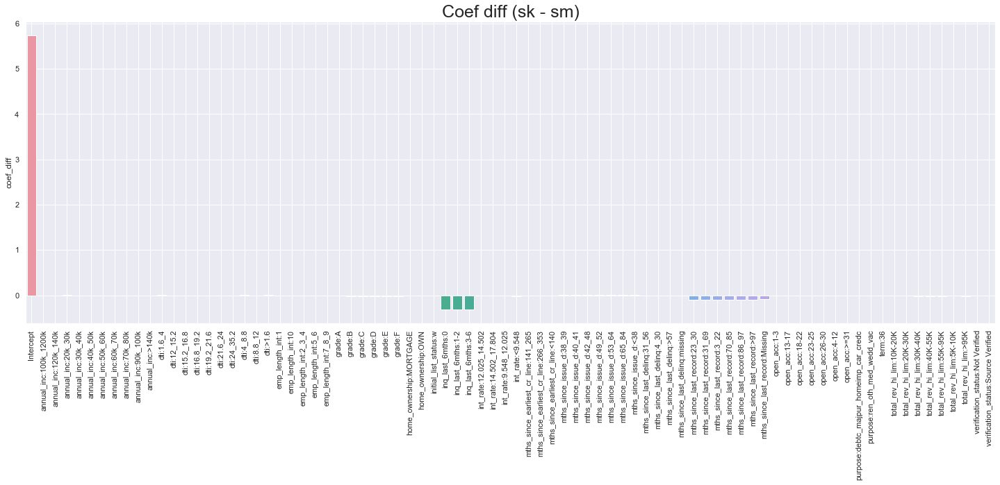


```python
fig = plt.figure(figsize=(25,8))


sns.barplot(x=summary_table[(summary_table['coef_diff'] < 1) & (summary_table['coef_diff'] > -1)].index, y='coef_diff', data=summary_table[(summary_table['coef_diff'] < 1) & (summary_table['coef_diff'] > -1)])
plt.title('Coef diff < 1 & > -1 (sk - sm)', fontsize=25)
plt.xticks(rotation=90)
plt.grid(True)
```


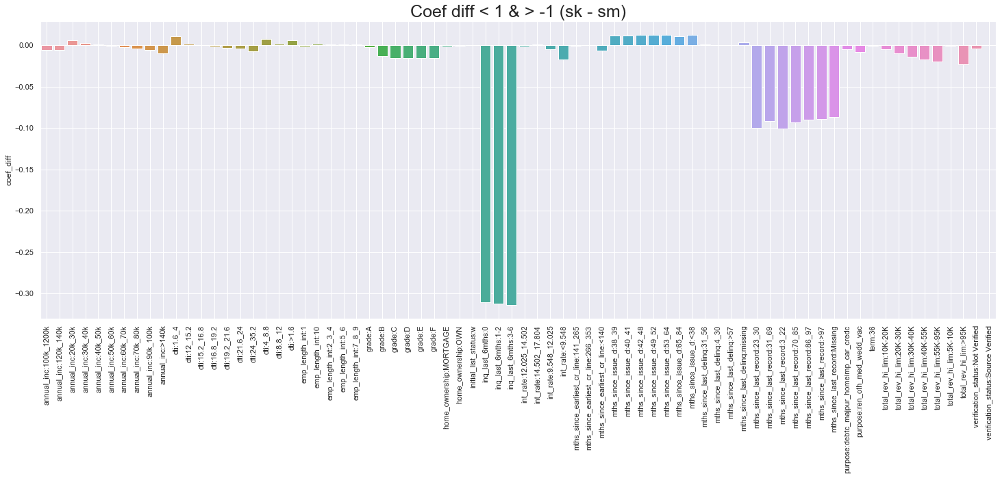


```python
fig = plt.figure(figsize=(25,8))


sns.barplot(x=summary_table.index, y='p_value_diff', data=summary_table)
plt.title('P value diff (sk - sm)', fontsize=25)
plt.xticks(rotation=90)
plt.grid(True)
```


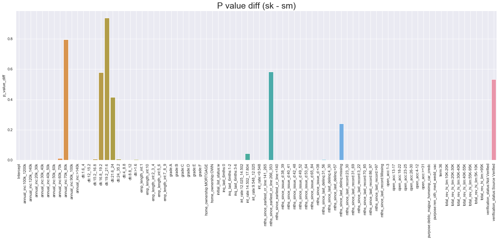


# Evaluating models

## Statsmodels


```python
sm_x_test_no_ref = x_test.loc[:,sm_vars]

sm_x_test_no_ref['Intercept'] = 1

sm_x_test_no_ref_const = sm_x_test_no_ref


sm_x_test_no_ref.head()
```

    /Users/omaromeiri/anaconda3/lib/python3.7/site-packages/pandas/core/indexing.py:1494: FutureWarning: 
    Passing list-likes to .loc or [] with any missing label will raise
    KeyError in the future, you can use .reindex() as an alternative.
    
    See the documentation here:
    https://pandas.pydata.org/pandas-docs/stable/indexing.html#deprecate-loc-reindex-listlike
      return self._getitem_tuple(key)


<div>
<style scoped>
    .dataframe tbody tr th:only-of-type {
        vertical-align: middle;
    }

    .dataframe tbody tr th {
        vertical-align: top;
    }

    .dataframe thead th {
        text-align: right;
    }
</style>
<table border="1" class="dataframe">
  <thead>
    <tr style="text-align: right;">
      <th></th>
      <th>Intercept</th>
      <th>grade:F</th>
      <th>grade:E</th>
      <th>grade:D</th>
      <th>grade:C</th>
      <th>grade:B</th>
      <th>grade:A</th>
      <th>home_ownership:OWN</th>
      <th>home_ownership:MORTGAGE</th>
      <th>verification_status:Not Verified</th>
      <th>verification_status:Source Verified</th>
      <th>initial_list_status:w</th>
      <th>purpose:ren_oth_med_wedd_vac</th>
      <th>purpose:debtc_majpur_homeimp_car_credc</th>
      <th>term:36</th>
      <th>emp_length_int:1</th>
      <th>emp_length_int:2_3_4</th>
      <th>emp_length_int:5_6</th>
      <th>emp_length_int:7_8_9</th>
      <th>emp_length_int:10</th>
      <th>mths_since_issue_d:&lt;38</th>
      <th>mths_since_issue_d:38_39</th>
      <th>mths_since_issue_d:40_41</th>
      <th>mths_since_issue_d:42_48</th>
      <th>mths_since_issue_d:49_52</th>
      <th>mths_since_issue_d:53_64</th>
      <th>mths_since_issue_d:65_84</th>
      <th>int_rate:&lt;9.548</th>
      <th>int_rate:9.548_12.025</th>
      <th>int_rate:12.025_14.502</th>
      <th>int_rate:14.502_17.804</th>
      <th>mths_since_earliest_cr_line:&lt;140</th>
      <th>mths_since_earliest_cr_line:141_265</th>
      <th>mths_since_earliest_cr_line:266_353</th>
      <th>inq_last_6mths:0</th>
      <th>inq_last_6mths:1-2</th>
      <th>inq_last_6mths:3-6</th>
      <th>open_acc:1-3</th>
      <th>open_acc:4-12</th>
      <th>open_acc:13-17</th>
      <th>open_acc:18-22</th>
      <th>open_acc:23-25</th>
      <th>open_acc:26-30</th>
      <th>open_acc:&gt;=31</th>
      <th>total_rev_hi_lim:5K-10K</th>
      <th>total_rev_hi_lim:10K-20K</th>
      <th>total_rev_hi_lim:20K-30K</th>
      <th>total_rev_hi_lim:30K-40K</th>
      <th>total_rev_hi_lim:40K-55K</th>
      <th>total_rev_hi_lim:55K-95K</th>
      <th>total_rev_hi_lim:&gt;95K</th>
      <th>annual_inc:20k_30k</th>
      <th>annual_inc:30k_40k</th>
      <th>annual_inc:40k_50k</th>
      <th>annual_inc:50k_60k</th>
      <th>annual_inc:60k_70k</th>
      <th>annual_inc:70k_80k</th>
      <th>annual_inc:90k_100k</th>
      <th>annual_inc:100k_1200k</th>
      <th>annual_inc:120k_140k</th>
      <th>annual_inc:&gt;140k</th>
      <th>mths_since_last_delinq:missing</th>
      <th>mths_since_last_delinq:4_30</th>
      <th>mths_since_last_delinq:31_56</th>
      <th>mths_since_last_delinq:&gt;57</th>
      <th>dti:&gt;1.6</th>
      <th>dti:1.6_4</th>
      <th>dti:4_8.8</th>
      <th>dti:8.8_12</th>
      <th>dti:12_15.2</th>
      <th>dti:15.2_16.8</th>
      <th>dti:16.8_19.2</th>
      <th>dti:19.2_21.6</th>
      <th>dti:21.6_24</th>
      <th>dti:24_35.2</th>
      <th>mths_since_last_record:Missing</th>
      <th>mths_since_last_record:3_22</th>
      <th>mths_since_last_record:23_30</th>
      <th>mths_since_last_record:31_69</th>
      <th>mths_since_last_record:70_85</th>
      <th>mths_since_last_record:86_97</th>
      <th>mths_since_last_record:&gt;97</th>
    </tr>
  </thead>
  <tbody>
    <tr>
      <th>362514</th>
      <td>1</td>
      <td>0</td>
      <td>0</td>
      <td>0</td>
      <td>1</td>
      <td>0</td>
      <td>0</td>
      <td>0</td>
      <td>1</td>
      <td>0</td>
      <td>0</td>
      <td>0</td>
      <td>0</td>
      <td>1</td>
      <td>0</td>
      <td>0</td>
      <td>0</td>
      <td>0</td>
      <td>0</td>
      <td>0</td>
      <td>0</td>
      <td>0</td>
      <td>1</td>
      <td>0</td>
      <td>0</td>
      <td>0</td>
      <td>0</td>
      <td>0</td>
      <td>0</td>
      <td>0</td>
      <td>1</td>
      <td>0</td>
      <td>1</td>
      <td>0</td>
      <td>1</td>
      <td>0</td>
      <td>0</td>
      <td>0</td>
      <td>1</td>
      <td>0</td>
      <td>0</td>
      <td>0</td>
      <td>0</td>
      <td>0</td>
      <td>0</td>
      <td>0</td>
      <td>1</td>
      <td>0</td>
      <td>0</td>
      <td>0</td>
      <td>0</td>
      <td>0</td>
      <td>0</td>
      <td>0</td>
      <td>0</td>
      <td>1</td>
      <td>0</td>
      <td>0</td>
      <td>0</td>
      <td>0</td>
      <td>0</td>
      <td>1</td>
      <td>0</td>
      <td>0</td>
      <td>0</td>
      <td>0</td>
      <td>0</td>
      <td>0</td>
      <td>1</td>
      <td>0</td>
      <td>0</td>
      <td>0</td>
      <td>0</td>
      <td>0</td>
      <td>0</td>
      <td>1</td>
      <td>0</td>
      <td>0</td>
      <td>0</td>
      <td>0</td>
      <td>0</td>
      <td>0</td>
    </tr>
    <tr>
      <th>288564</th>
      <td>1</td>
      <td>0</td>
      <td>1</td>
      <td>0</td>
      <td>0</td>
      <td>0</td>
      <td>0</td>
      <td>0</td>
      <td>1</td>
      <td>0</td>
      <td>0</td>
      <td>1</td>
      <td>0</td>
      <td>1</td>
      <td>0</td>
      <td>0</td>
      <td>0</td>
      <td>0</td>
      <td>0</td>
      <td>1</td>
      <td>0</td>
      <td>1</td>
      <td>0</td>
      <td>0</td>
      <td>0</td>
      <td>0</td>
      <td>0</td>
      <td>0</td>
      <td>0</td>
      <td>0</td>
      <td>0</td>
      <td>0</td>
      <td>1</td>
      <td>0</td>
      <td>1</td>
      <td>0</td>
      <td>0</td>
      <td>0</td>
      <td>0</td>
      <td>0</td>
      <td>1</td>
      <td>0</td>
      <td>0</td>
      <td>0</td>
      <td>0</td>
      <td>0</td>
      <td>1</td>
      <td>0</td>
      <td>0</td>
      <td>0</td>
      <td>0</td>
      <td>0</td>
      <td>0</td>
      <td>0</td>
      <td>1</td>
      <td>0</td>
      <td>0</td>
      <td>0</td>
      <td>0</td>
      <td>0</td>
      <td>0</td>
      <td>0</td>
      <td>0</td>
      <td>0</td>
      <td>0</td>
      <td>0</td>
      <td>0</td>
      <td>0</td>
      <td>0</td>
      <td>0</td>
      <td>0</td>
      <td>0</td>
      <td>0</td>
      <td>0</td>
      <td>1</td>
      <td>1</td>
      <td>0</td>
      <td>0</td>
      <td>0</td>
      <td>0</td>
      <td>0</td>
      <td>0</td>
    </tr>
    <tr>
      <th>213591</th>
      <td>1</td>
      <td>0</td>
      <td>0</td>
      <td>0</td>
      <td>1</td>
      <td>0</td>
      <td>0</td>
      <td>0</td>
      <td>1</td>
      <td>0</td>
      <td>0</td>
      <td>0</td>
      <td>0</td>
      <td>1</td>
      <td>1</td>
      <td>1</td>
      <td>0</td>
      <td>0</td>
      <td>0</td>
      <td>0</td>
      <td>0</td>
      <td>0</td>
      <td>0</td>
      <td>0</td>
      <td>0</td>
      <td>0</td>
      <td>1</td>
      <td>0</td>
      <td>0</td>
      <td>0</td>
      <td>1</td>
      <td>0</td>
      <td>1</td>
      <td>0</td>
      <td>1</td>
      <td>0</td>
      <td>0</td>
      <td>0</td>
      <td>1</td>
      <td>0</td>
      <td>0</td>
      <td>0</td>
      <td>0</td>
      <td>0</td>
      <td>0</td>
      <td>0</td>
      <td>1</td>
      <td>0</td>
      <td>0</td>
      <td>0</td>
      <td>0</td>
      <td>0</td>
      <td>0</td>
      <td>0</td>
      <td>0</td>
      <td>0</td>
      <td>0</td>
      <td>0</td>
      <td>0</td>
      <td>0</td>
      <td>1</td>
      <td>0</td>
      <td>0</td>
      <td>1</td>
      <td>0</td>
      <td>0</td>
      <td>0</td>
      <td>0</td>
      <td>0</td>
      <td>1</td>
      <td>0</td>
      <td>0</td>
      <td>0</td>
      <td>0</td>
      <td>0</td>
      <td>1</td>
      <td>0</td>
      <td>0</td>
      <td>0</td>
      <td>0</td>
      <td>0</td>
      <td>0</td>
    </tr>
    <tr>
      <th>263083</th>
      <td>1</td>
      <td>0</td>
      <td>0</td>
      <td>0</td>
      <td>1</td>
      <td>0</td>
      <td>0</td>
      <td>0</td>
      <td>1</td>
      <td>0</td>
      <td>1</td>
      <td>1</td>
      <td>0</td>
      <td>1</td>
      <td>0</td>
      <td>0</td>
      <td>1</td>
      <td>0</td>
      <td>0</td>
      <td>0</td>
      <td>1</td>
      <td>0</td>
      <td>0</td>
      <td>0</td>
      <td>0</td>
      <td>0</td>
      <td>0</td>
      <td>0</td>
      <td>0</td>
      <td>1</td>
      <td>1</td>
      <td>1</td>
      <td>0</td>
      <td>0</td>
      <td>1</td>
      <td>0</td>
      <td>0</td>
      <td>0</td>
      <td>1</td>
      <td>0</td>
      <td>0</td>
      <td>0</td>
      <td>0</td>
      <td>0</td>
      <td>0</td>
      <td>1</td>
      <td>0</td>
      <td>0</td>
      <td>0</td>
      <td>0</td>
      <td>0</td>
      <td>0</td>
      <td>0</td>
      <td>0</td>
      <td>0</td>
      <td>1</td>
      <td>0</td>
      <td>0</td>
      <td>0</td>
      <td>0</td>
      <td>0</td>
      <td>1</td>
      <td>0</td>
      <td>0</td>
      <td>0</td>
      <td>0</td>
      <td>0</td>
      <td>0</td>
      <td>0</td>
      <td>0</td>
      <td>0</td>
      <td>1</td>
      <td>0</td>
      <td>0</td>
      <td>0</td>
      <td>1</td>
      <td>0</td>
      <td>0</td>
      <td>0</td>
      <td>0</td>
      <td>0</td>
      <td>0</td>
    </tr>
    <tr>
      <th>165001</th>
      <td>1</td>
      <td>0</td>
      <td>0</td>
      <td>0</td>
      <td>0</td>
      <td>0</td>
      <td>1</td>
      <td>0</td>
      <td>1</td>
      <td>0</td>
      <td>0</td>
      <td>0</td>
      <td>0</td>
      <td>1</td>
      <td>1</td>
      <td>0</td>
      <td>0</td>
      <td>0</td>
      <td>0</td>
      <td>1</td>
      <td>0</td>
      <td>0</td>
      <td>0</td>
      <td>0</td>
      <td>0</td>
      <td>1</td>
      <td>0</td>
      <td>1</td>
      <td>0</td>
      <td>0</td>
      <td>0</td>
      <td>0</td>
      <td>0</td>
      <td>0</td>
      <td>1</td>
      <td>0</td>
      <td>0</td>
      <td>0</td>
      <td>1</td>
      <td>0</td>
      <td>0</td>
      <td>0</td>
      <td>0</td>
      <td>0</td>
      <td>1</td>
      <td>0</td>
      <td>0</td>
      <td>0</td>
      <td>0</td>
      <td>0</td>
      <td>0</td>
      <td>0</td>
      <td>0</td>
      <td>0</td>
      <td>0</td>
      <td>0</td>
      <td>0</td>
      <td>0</td>
      <td>0</td>
      <td>0</td>
      <td>0</td>
      <td>0</td>
      <td>0</td>
      <td>1</td>
      <td>0</td>
      <td>0</td>
      <td>0</td>
      <td>1</td>
      <td>0</td>
      <td>0</td>
      <td>0</td>
      <td>0</td>
      <td>0</td>
      <td>0</td>
      <td>0</td>
      <td>1</td>
      <td>0</td>
      <td>0</td>
      <td>0</td>
      <td>0</td>
      <td>0</td>
      <td>0</td>
    </tr>
  </tbody>
</table>
</div>


```python
sm_preds = pd.DataFrame(sm_log_reg.predict(sm_x_test_no_ref_const), columns=['Proba'])
```


```python
sm_preds['Class'] = sm_preds['Proba'].apply(lambda x: 1 if x >= 0.5 else 0)

sm_preds.head()
```


<div>
<style scoped>
    .dataframe tbody tr th:only-of-type {
        vertical-align: middle;
    }

    .dataframe tbody tr th {
        vertical-align: top;
    }

    .dataframe thead th {
        text-align: right;
    }
</style>
<table border="1" class="dataframe">
  <thead>
    <tr style="text-align: right;">
      <th></th>
      <th>Proba</th>
      <th>Class</th>
    </tr>
  </thead>
  <tbody>
    <tr>
      <th>362514</th>
      <td>0.918955</td>
      <td>1</td>
    </tr>
    <tr>
      <th>288564</th>
      <td>0.857292</td>
      <td>1</td>
    </tr>
    <tr>
      <th>213591</th>
      <td>0.880114</td>
      <td>1</td>
    </tr>
    <tr>
      <th>263083</th>
      <td>0.942837</td>
      <td>1</td>
    </tr>
    <tr>
      <th>165001</th>
      <td>0.969380</td>
      <td>1</td>
    </tr>
  </tbody>
</table>
</div>


```python
print(sklm.classification_report(y_test, sm_preds['Class']))
```

                  precision    recall  f1-score   support
    
               0       0.76      0.02      0.04     10567
               1       0.89      1.00      0.94     82690
    
        accuracy                           0.89     93257
       macro avg       0.82      0.51      0.49     93257
    weighted avg       0.87      0.89      0.84     93257
    


```python
print(sklm.confusion_matrix(y_test, sm_preds['Class']))
```

    [[  210 10357]
     [   66 82624]]


```python
from sklearn.metrics import roc_curve, roc_auc_score
```


```python
fpr, tpr, thresh = roc_curve(y_test, sm_preds['Proba'])
```


```python
plt.plot(fpr, tpr)
plt.plot(fpr, fpr, linestyle='--')
plt.xlabel('False positive rate')
plt.ylabel('True positive rate')
plt.title('SM ROC curve')
```


    Text(0.5, 1.0, 'SM ROC curve')


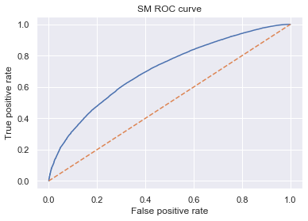


```python
sm_AUROC = roc_auc_score(y_test, sm_preds['Proba'])
sm_AUROC
```


    0.7079569112194766


```python
# negative (red) means False positive
# zero (yellow) means correct
# Positive (green) means false negative

diff = ((y_test - sm_preds['Class']).values).reshape(-1,1)
fig = plt.figure(figsize=(6,15))
sns.heatmap(diff, cmap='RdYlGn')
```


    <matplotlib.axes._subplots.AxesSubplot at 0x1a5fd7c7f0>


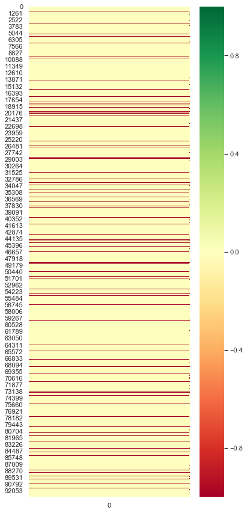


## Sklearn


```python
sk_x_test_no_ref = x_test.loc[:, sk_vars]
sk_x_test_no_ref.head()
```


<div>
<style scoped>
    .dataframe tbody tr th:only-of-type {
        vertical-align: middle;
    }

    .dataframe tbody tr th {
        vertical-align: top;
    }

    .dataframe thead th {
        text-align: right;
    }
</style>
<table border="1" class="dataframe">
  <thead>
    <tr style="text-align: right;">
      <th></th>
      <th>grade:F</th>
      <th>grade:E</th>
      <th>grade:D</th>
      <th>grade:C</th>
      <th>grade:B</th>
      <th>grade:A</th>
      <th>home_ownership:OWN</th>
      <th>home_ownership:MORTGAGE</th>
      <th>verification_status:Not Verified</th>
      <th>verification_status:Source Verified</th>
      <th>initial_list_status:w</th>
      <th>purpose:ren_oth_med_wedd_vac</th>
      <th>purpose:debtc_majpur_homeimp_car_credc</th>
      <th>term:36</th>
      <th>emp_length_int:1</th>
      <th>emp_length_int:2_3_4</th>
      <th>emp_length_int:5_6</th>
      <th>emp_length_int:7_8_9</th>
      <th>emp_length_int:10</th>
      <th>mths_since_issue_d:&lt;38</th>
      <th>mths_since_issue_d:38_39</th>
      <th>mths_since_issue_d:40_41</th>
      <th>mths_since_issue_d:42_48</th>
      <th>mths_since_issue_d:49_52</th>
      <th>mths_since_issue_d:53_64</th>
      <th>mths_since_issue_d:65_84</th>
      <th>int_rate:&lt;9.548</th>
      <th>int_rate:9.548_12.025</th>
      <th>int_rate:12.025_14.502</th>
      <th>int_rate:14.502_17.804</th>
      <th>mths_since_earliest_cr_line:&lt;140</th>
      <th>mths_since_earliest_cr_line:141_265</th>
      <th>mths_since_earliest_cr_line:266_353</th>
      <th>inq_last_6mths:0</th>
      <th>inq_last_6mths:1-2</th>
      <th>inq_last_6mths:3-6</th>
      <th>total_rev_hi_lim:5K-10K</th>
      <th>total_rev_hi_lim:10K-20K</th>
      <th>total_rev_hi_lim:20K-30K</th>
      <th>total_rev_hi_lim:30K-40K</th>
      <th>total_rev_hi_lim:40K-55K</th>
      <th>total_rev_hi_lim:55K-95K</th>
      <th>total_rev_hi_lim:&gt;95K</th>
      <th>annual_inc:20k_30k</th>
      <th>annual_inc:30k_40k</th>
      <th>annual_inc:40k_50k</th>
      <th>annual_inc:50k_60k</th>
      <th>annual_inc:60k_70k</th>
      <th>annual_inc:70k_80k</th>
      <th>annual_inc:90k_100k</th>
      <th>annual_inc:100k_1200k</th>
      <th>annual_inc:120k_140k</th>
      <th>annual_inc:&gt;140k</th>
      <th>mths_since_last_delinq:missing</th>
      <th>mths_since_last_delinq:4_30</th>
      <th>mths_since_last_delinq:31_56</th>
      <th>mths_since_last_delinq:&gt;57</th>
      <th>dti:&gt;1.6</th>
      <th>dti:1.6_4</th>
      <th>dti:4_8.8</th>
      <th>dti:8.8_12</th>
      <th>dti:12_15.2</th>
      <th>dti:15.2_16.8</th>
      <th>dti:16.8_19.2</th>
      <th>dti:19.2_21.6</th>
      <th>dti:21.6_24</th>
      <th>dti:24_35.2</th>
      <th>mths_since_last_record:Missing</th>
      <th>mths_since_last_record:3_22</th>
      <th>mths_since_last_record:23_30</th>
      <th>mths_since_last_record:31_69</th>
      <th>mths_since_last_record:70_85</th>
      <th>mths_since_last_record:86_97</th>
      <th>mths_since_last_record:&gt;97</th>
    </tr>
  </thead>
  <tbody>
    <tr>
      <th>362514</th>
      <td>0</td>
      <td>0</td>
      <td>0</td>
      <td>1</td>
      <td>0</td>
      <td>0</td>
      <td>0</td>
      <td>1</td>
      <td>0</td>
      <td>0</td>
      <td>0</td>
      <td>0</td>
      <td>1</td>
      <td>0</td>
      <td>0</td>
      <td>0</td>
      <td>0</td>
      <td>0</td>
      <td>0</td>
      <td>0</td>
      <td>0</td>
      <td>1</td>
      <td>0</td>
      <td>0</td>
      <td>0</td>
      <td>0</td>
      <td>0</td>
      <td>0</td>
      <td>0</td>
      <td>1</td>
      <td>0</td>
      <td>1</td>
      <td>0</td>
      <td>1</td>
      <td>0</td>
      <td>0</td>
      <td>0</td>
      <td>0</td>
      <td>1</td>
      <td>0</td>
      <td>0</td>
      <td>0</td>
      <td>0</td>
      <td>0</td>
      <td>0</td>
      <td>0</td>
      <td>0</td>
      <td>1</td>
      <td>0</td>
      <td>0</td>
      <td>0</td>
      <td>0</td>
      <td>0</td>
      <td>1</td>
      <td>0</td>
      <td>0</td>
      <td>0</td>
      <td>0</td>
      <td>0</td>
      <td>0</td>
      <td>1</td>
      <td>0</td>
      <td>0</td>
      <td>0</td>
      <td>0</td>
      <td>0</td>
      <td>0</td>
      <td>1</td>
      <td>0</td>
      <td>0</td>
      <td>0</td>
      <td>0</td>
      <td>0</td>
      <td>0</td>
    </tr>
    <tr>
      <th>288564</th>
      <td>0</td>
      <td>1</td>
      <td>0</td>
      <td>0</td>
      <td>0</td>
      <td>0</td>
      <td>0</td>
      <td>1</td>
      <td>0</td>
      <td>0</td>
      <td>1</td>
      <td>0</td>
      <td>1</td>
      <td>0</td>
      <td>0</td>
      <td>0</td>
      <td>0</td>
      <td>0</td>
      <td>1</td>
      <td>0</td>
      <td>1</td>
      <td>0</td>
      <td>0</td>
      <td>0</td>
      <td>0</td>
      <td>0</td>
      <td>0</td>
      <td>0</td>
      <td>0</td>
      <td>0</td>
      <td>0</td>
      <td>1</td>
      <td>0</td>
      <td>1</td>
      <td>0</td>
      <td>0</td>
      <td>0</td>
      <td>0</td>
      <td>1</td>
      <td>0</td>
      <td>0</td>
      <td>0</td>
      <td>0</td>
      <td>0</td>
      <td>0</td>
      <td>0</td>
      <td>1</td>
      <td>0</td>
      <td>0</td>
      <td>0</td>
      <td>0</td>
      <td>0</td>
      <td>0</td>
      <td>0</td>
      <td>0</td>
      <td>0</td>
      <td>0</td>
      <td>0</td>
      <td>0</td>
      <td>0</td>
      <td>0</td>
      <td>0</td>
      <td>0</td>
      <td>0</td>
      <td>0</td>
      <td>0</td>
      <td>1</td>
      <td>1</td>
      <td>0</td>
      <td>0</td>
      <td>0</td>
      <td>0</td>
      <td>0</td>
      <td>0</td>
    </tr>
    <tr>
      <th>213591</th>
      <td>0</td>
      <td>0</td>
      <td>0</td>
      <td>1</td>
      <td>0</td>
      <td>0</td>
      <td>0</td>
      <td>1</td>
      <td>0</td>
      <td>0</td>
      <td>0</td>
      <td>0</td>
      <td>1</td>
      <td>1</td>
      <td>1</td>
      <td>0</td>
      <td>0</td>
      <td>0</td>
      <td>0</td>
      <td>0</td>
      <td>0</td>
      <td>0</td>
      <td>0</td>
      <td>0</td>
      <td>0</td>
      <td>1</td>
      <td>0</td>
      <td>0</td>
      <td>0</td>
      <td>1</td>
      <td>0</td>
      <td>1</td>
      <td>0</td>
      <td>1</td>
      <td>0</td>
      <td>0</td>
      <td>0</td>
      <td>0</td>
      <td>1</td>
      <td>0</td>
      <td>0</td>
      <td>0</td>
      <td>0</td>
      <td>0</td>
      <td>0</td>
      <td>0</td>
      <td>0</td>
      <td>0</td>
      <td>0</td>
      <td>0</td>
      <td>0</td>
      <td>0</td>
      <td>1</td>
      <td>0</td>
      <td>0</td>
      <td>1</td>
      <td>0</td>
      <td>0</td>
      <td>0</td>
      <td>0</td>
      <td>0</td>
      <td>1</td>
      <td>0</td>
      <td>0</td>
      <td>0</td>
      <td>0</td>
      <td>0</td>
      <td>1</td>
      <td>0</td>
      <td>0</td>
      <td>0</td>
      <td>0</td>
      <td>0</td>
      <td>0</td>
    </tr>
    <tr>
      <th>263083</th>
      <td>0</td>
      <td>0</td>
      <td>0</td>
      <td>1</td>
      <td>0</td>
      <td>0</td>
      <td>0</td>
      <td>1</td>
      <td>0</td>
      <td>1</td>
      <td>1</td>
      <td>0</td>
      <td>1</td>
      <td>0</td>
      <td>0</td>
      <td>1</td>
      <td>0</td>
      <td>0</td>
      <td>0</td>
      <td>1</td>
      <td>0</td>
      <td>0</td>
      <td>0</td>
      <td>0</td>
      <td>0</td>
      <td>0</td>
      <td>0</td>
      <td>0</td>
      <td>1</td>
      <td>1</td>
      <td>1</td>
      <td>0</td>
      <td>0</td>
      <td>1</td>
      <td>0</td>
      <td>0</td>
      <td>0</td>
      <td>1</td>
      <td>0</td>
      <td>0</td>
      <td>0</td>
      <td>0</td>
      <td>0</td>
      <td>0</td>
      <td>0</td>
      <td>0</td>
      <td>0</td>
      <td>1</td>
      <td>0</td>
      <td>0</td>
      <td>0</td>
      <td>0</td>
      <td>0</td>
      <td>1</td>
      <td>0</td>
      <td>0</td>
      <td>0</td>
      <td>0</td>
      <td>0</td>
      <td>0</td>
      <td>0</td>
      <td>0</td>
      <td>0</td>
      <td>1</td>
      <td>0</td>
      <td>0</td>
      <td>0</td>
      <td>1</td>
      <td>0</td>
      <td>0</td>
      <td>0</td>
      <td>0</td>
      <td>0</td>
      <td>0</td>
    </tr>
    <tr>
      <th>165001</th>
      <td>0</td>
      <td>0</td>
      <td>0</td>
      <td>0</td>
      <td>0</td>
      <td>1</td>
      <td>0</td>
      <td>1</td>
      <td>0</td>
      <td>0</td>
      <td>0</td>
      <td>0</td>
      <td>1</td>
      <td>1</td>
      <td>0</td>
      <td>0</td>
      <td>0</td>
      <td>0</td>
      <td>1</td>
      <td>0</td>
      <td>0</td>
      <td>0</td>
      <td>0</td>
      <td>0</td>
      <td>1</td>
      <td>0</td>
      <td>1</td>
      <td>0</td>
      <td>0</td>
      <td>0</td>
      <td>0</td>
      <td>0</td>
      <td>0</td>
      <td>1</td>
      <td>0</td>
      <td>0</td>
      <td>1</td>
      <td>0</td>
      <td>0</td>
      <td>0</td>
      <td>0</td>
      <td>0</td>
      <td>0</td>
      <td>0</td>
      <td>0</td>
      <td>0</td>
      <td>0</td>
      <td>0</td>
      <td>0</td>
      <td>0</td>
      <td>0</td>
      <td>0</td>
      <td>0</td>
      <td>0</td>
      <td>0</td>
      <td>1</td>
      <td>0</td>
      <td>0</td>
      <td>0</td>
      <td>1</td>
      <td>0</td>
      <td>0</td>
      <td>0</td>
      <td>0</td>
      <td>0</td>
      <td>0</td>
      <td>0</td>
      <td>1</td>
      <td>0</td>
      <td>0</td>
      <td>0</td>
      <td>0</td>
      <td>0</td>
      <td>0</td>
    </tr>
  </tbody>
</table>
</div>


```python
sk_preds = pd.DataFrame(sk_log_reg.model.predict_proba(sk_x_test_no_ref)[:][:,1], columns=['Proba'])
```


```python
sk_preds['Class'] = sk_log_reg.model.predict(sk_x_test_no_ref)
```


```python
sk_preds.head()
```


<div>
<style scoped>
    .dataframe tbody tr th:only-of-type {
        vertical-align: middle;
    }

    .dataframe tbody tr th {
        vertical-align: top;
    }

    .dataframe thead th {
        text-align: right;
    }
</style>
<table border="1" class="dataframe">
  <thead>
    <tr style="text-align: right;">
      <th></th>
      <th>Proba</th>
      <th>Class</th>
    </tr>
  </thead>
  <tbody>
    <tr>
      <th>0</th>
      <td>0.918338</td>
      <td>1</td>
    </tr>
    <tr>
      <th>1</th>
      <td>0.861681</td>
      <td>1</td>
    </tr>
    <tr>
      <th>2</th>
      <td>0.877834</td>
      <td>1</td>
    </tr>
    <tr>
      <th>3</th>
      <td>0.942187</td>
      <td>1</td>
    </tr>
    <tr>
      <th>4</th>
      <td>0.969481</td>
      <td>1</td>
    </tr>
  </tbody>
</table>
</div>


```python
print(sklm.classification_report(y_test, sk_preds['Class']))
```

                  precision    recall  f1-score   support
    
               0       0.77      0.02      0.04     10567
               1       0.89      1.00      0.94     82690
    
        accuracy                           0.89     93257
       macro avg       0.83      0.51      0.49     93257
    weighted avg       0.87      0.89      0.84     93257
    


```python
print(sklm.confusion_matrix(y_test, sk_preds['Class']))
```

    [[  202 10365]
     [   61 82629]]


```python
fpr, tpr, thresh = roc_curve(y_test, sk_preds['Proba'])
```


```python
plt.plot(fpr, tpr)
plt.plot(fpr, fpr, linestyle='--')

plt.xlabel('False positive rate')
plt.ylabel('True positive rate')
plt.title('SK ROC curve')
```


    Text(0.5, 1.0, 'SK ROC curve')


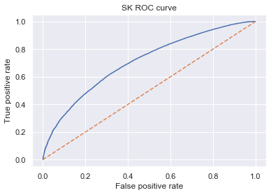


```python
sk_AUROC = roc_auc_score(y_test, sk_preds['Proba'])
sk_AUROC
```


    0.7078241154293716


```python
y_test.head()
```


    362514    1
    288564    1
    213591    1
    263083    1
    165001    1
    Name: Y, dtype: int64


```python
diff = ((y_test.values - sk_preds['Class'].values)).reshape(-1,1)
fig = plt.figure(figsize=(6,15))
sns.heatmap(diff, cmap='RdYlGn')
```


    <matplotlib.axes._subplots.AxesSubplot at 0x1a3a768550>


# Gini coefficient & Kolmogorov_Smirnov


```python
sm_preds['Y'] = y_test
sm_preds = sm_preds.sort_values('Proba', ascending=True).reset_index()


sm_preds['Cum. Population'] = sm_preds.index+1
sm_preds['Cum. Population %'] = sm_preds['Cum. Population'] / sm_preds.shape[0]
sm_preds['Cum. good_borrowers'] = sm_preds['Y'].cumsum()
sm_preds['Cum. good_borrowers %'] = sm_preds['Cum. good_borrowers'] / sm_preds['Y'].sum()
sm_preds['Cum. bad_borrowers'] = sm_preds['Cum. Population'] - sm_preds['Cum. good_borrowers']
sm_preds['Cum. bad_borrowers %'] = sm_preds['Cum. bad_borrowers'] / (sm_preds.shape[0] - sm_preds['Y'].sum())


sk_preds['Y'] = y_test.values
sk_preds = sk_preds.sort_values('Proba', ascending=True).reset_index()


sk_preds['Cum. Population'] = sk_preds.index+1
sk_preds['Cum. Population %'] = sk_preds['Cum. Population'] / sk_preds.shape[0]
sk_preds['Cum. good_borrowers'] = sk_preds['Y'].cumsum()
sk_preds['Cum. good_borrowers %'] = sk_preds['Cum. good_borrowers'] / sk_preds['Y'].sum()
sk_preds['Cum. bad_borrowers'] = sk_preds['Cum. Population'] - sk_preds['Cum. good_borrowers']
sk_preds['Cum. bad_borrowers %'] = sk_preds['Cum. bad_borrowers'] / (sk_preds.shape[0] - sk_preds['Y'].sum())
```

## Statsmodels


```python
sm_preds.head()
```


<div>
<style scoped>
    .dataframe tbody tr th:only-of-type {
        vertical-align: middle;
    }

    .dataframe tbody tr th {
        vertical-align: top;
    }

    .dataframe thead th {
        text-align: right;
    }
</style>
<table border="1" class="dataframe">
  <thead>
    <tr style="text-align: right;">
      <th></th>
      <th>index</th>
      <th>Proba</th>
      <th>Class</th>
      <th>Y</th>
      <th>Cum. Population</th>
      <th>Cum. Population %</th>
      <th>Cum. good_borrowers</th>
      <th>Cum. good_borrowers %</th>
      <th>Cum. bad_borrowers</th>
      <th>Cum. bad_borrowers %</th>
    </tr>
  </thead>
  <tbody>
    <tr>
      <th>0</th>
      <td>42344</td>
      <td>0.012833</td>
      <td>0</td>
      <td>0</td>
      <td>1</td>
      <td>0.000011</td>
      <td>0</td>
      <td>0.0</td>
      <td>1</td>
      <td>0.000095</td>
    </tr>
    <tr>
      <th>1</th>
      <td>42341</td>
      <td>0.014451</td>
      <td>0</td>
      <td>0</td>
      <td>2</td>
      <td>0.000021</td>
      <td>0</td>
      <td>0.0</td>
      <td>2</td>
      <td>0.000189</td>
    </tr>
    <tr>
      <th>2</th>
      <td>42524</td>
      <td>0.019814</td>
      <td>0</td>
      <td>0</td>
      <td>3</td>
      <td>0.000032</td>
      <td>0</td>
      <td>0.0</td>
      <td>3</td>
      <td>0.000284</td>
    </tr>
    <tr>
      <th>3</th>
      <td>42404</td>
      <td>0.022585</td>
      <td>0</td>
      <td>0</td>
      <td>4</td>
      <td>0.000043</td>
      <td>0</td>
      <td>0.0</td>
      <td>4</td>
      <td>0.000379</td>
    </tr>
    <tr>
      <th>4</th>
      <td>42380</td>
      <td>0.022728</td>
      <td>0</td>
      <td>0</td>
      <td>5</td>
      <td>0.000054</td>
      <td>0</td>
      <td>0.0</td>
      <td>5</td>
      <td>0.000473</td>
    </tr>
  </tbody>
</table>
</div>


```python
sm_preds.tail()
```


<div>
<style scoped>
    .dataframe tbody tr th:only-of-type {
        vertical-align: middle;
    }

    .dataframe tbody tr th {
        vertical-align: top;
    }

    .dataframe thead th {
        text-align: right;
    }
</style>
<table border="1" class="dataframe">
  <thead>
    <tr style="text-align: right;">
      <th></th>
      <th>index</th>
      <th>Proba</th>
      <th>Class</th>
      <th>Y</th>
      <th>Cum. Population</th>
      <th>Cum. Population %</th>
      <th>Cum. good_borrowers</th>
      <th>Cum. good_borrowers %</th>
      <th>Cum. bad_borrowers</th>
      <th>Cum. bad_borrowers %</th>
    </tr>
  </thead>
  <tbody>
    <tr>
      <th>93252</th>
      <td>269658</td>
      <td>0.990934</td>
      <td>1</td>
      <td>1</td>
      <td>93253</td>
      <td>0.999957</td>
      <td>82686</td>
      <td>0.999952</td>
      <td>10567</td>
      <td>1.0</td>
    </tr>
    <tr>
      <th>93253</th>
      <td>250380</td>
      <td>0.991444</td>
      <td>1</td>
      <td>1</td>
      <td>93254</td>
      <td>0.999968</td>
      <td>82687</td>
      <td>0.999964</td>
      <td>10567</td>
      <td>1.0</td>
    </tr>
    <tr>
      <th>93254</th>
      <td>239228</td>
      <td>0.991516</td>
      <td>1</td>
      <td>1</td>
      <td>93255</td>
      <td>0.999979</td>
      <td>82688</td>
      <td>0.999976</td>
      <td>10567</td>
      <td>1.0</td>
    </tr>
    <tr>
      <th>93255</th>
      <td>234919</td>
      <td>0.991537</td>
      <td>1</td>
      <td>1</td>
      <td>93256</td>
      <td>0.999989</td>
      <td>82689</td>
      <td>0.999988</td>
      <td>10567</td>
      <td>1.0</td>
    </tr>
    <tr>
      <th>93256</th>
      <td>242624</td>
      <td>0.992130</td>
      <td>1</td>
      <td>1</td>
      <td>93257</td>
      <td>1.000000</td>
      <td>82690</td>
      <td>1.000000</td>
      <td>10567</td>
      <td>1.0</td>
    </tr>
  </tbody>
</table>
</div>


```python
fig = plt.figure(figsize=(10,6))
plt.plot(sm_preds['Cum. Population %'], sm_preds['Cum. bad_borrowers %'])
plt.plot(sm_preds['Cum. Population %'], sm_preds['Cum. Population %'], ls='--')

plt.xlabel('Cumulative population %', fontsize=15)
plt.ylabel('Cumulative defaulted %', fontsize=15)

```


    Text(0, 0.5, 'Cumulative defaulted %')


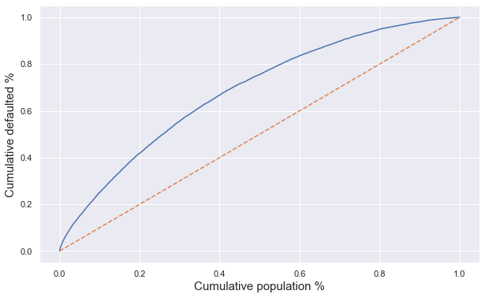


```python
sm_gini = sm_AUROC * 2 - 1
print(f'Gini coefficient {round(sm_gini,4)}%')
```

    Gini coefficient 0.4159%


## Kolmogorov-smirnov


```python
fig = plt.figure(figsize=(10,6))
plt.plot(sm_preds['Proba'], sm_preds['Cum. bad_borrowers %'], c='r', label='Bad borrowers')
plt.plot(sm_preds['Proba'], sm_preds['Cum. good_borrowers %'], c='g', label='Good borrowers')


plt.xlabel('Probability of non-default', fontsize=15)
plt.ylabel('Cumulative % (good/bad)', fontsize=15)
plt.legend()
```


    <matplotlib.legend.Legend at 0x1a619e1080>


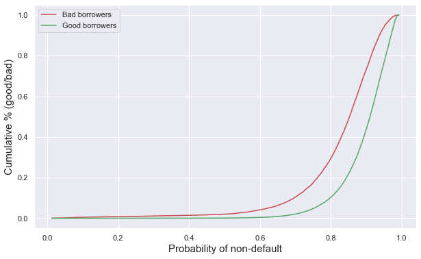


```python
KS = max(sm_preds['Cum. bad_borrowers %'] - sm_preds['Cum. good_borrowers %'])
print(f'Kolmogorov-smirnov statistic {round(KS,4)}')
```

    Kolmogorov-smirnov statistic 0.303


```python

```

## Sklearn


```python
sk_preds.head()
```


<div>
<style scoped>
    .dataframe tbody tr th:only-of-type {
        vertical-align: middle;
    }

    .dataframe tbody tr th {
        vertical-align: top;
    }

    .dataframe thead th {
        text-align: right;
    }
</style>
<table border="1" class="dataframe">
  <thead>
    <tr style="text-align: right;">
      <th></th>
      <th>index</th>
      <th>Proba</th>
      <th>Class</th>
      <th>Y</th>
      <th>Cum. Population</th>
      <th>Cum. Population %</th>
      <th>Cum. good_borrowers</th>
      <th>Cum. good_borrowers %</th>
      <th>Cum. bad_borrowers</th>
      <th>Cum. bad_borrowers %</th>
    </tr>
  </thead>
  <tbody>
    <tr>
      <th>0</th>
      <td>58288</td>
      <td>0.018754</td>
      <td>0</td>
      <td>0</td>
      <td>1</td>
      <td>0.000011</td>
      <td>0</td>
      <td>0.0</td>
      <td>1</td>
      <td>0.000095</td>
    </tr>
    <tr>
      <th>1</th>
      <td>14868</td>
      <td>0.021767</td>
      <td>0</td>
      <td>0</td>
      <td>2</td>
      <td>0.000021</td>
      <td>0</td>
      <td>0.0</td>
      <td>2</td>
      <td>0.000189</td>
    </tr>
    <tr>
      <th>2</th>
      <td>70292</td>
      <td>0.030428</td>
      <td>0</td>
      <td>0</td>
      <td>3</td>
      <td>0.000032</td>
      <td>0</td>
      <td>0.0</td>
      <td>3</td>
      <td>0.000284</td>
    </tr>
    <tr>
      <th>3</th>
      <td>65052</td>
      <td>0.033880</td>
      <td>0</td>
      <td>0</td>
      <td>4</td>
      <td>0.000043</td>
      <td>0</td>
      <td>0.0</td>
      <td>4</td>
      <td>0.000379</td>
    </tr>
    <tr>
      <th>4</th>
      <td>33009</td>
      <td>0.039619</td>
      <td>0</td>
      <td>0</td>
      <td>5</td>
      <td>0.000054</td>
      <td>0</td>
      <td>0.0</td>
      <td>5</td>
      <td>0.000473</td>
    </tr>
  </tbody>
</table>
</div>


```python
sk_preds.tail()
```


<div>
<style scoped>
    .dataframe tbody tr th:only-of-type {
        vertical-align: middle;
    }

    .dataframe tbody tr th {
        vertical-align: top;
    }

    .dataframe thead th {
        text-align: right;
    }
</style>
<table border="1" class="dataframe">
  <thead>
    <tr style="text-align: right;">
      <th></th>
      <th>index</th>
      <th>Proba</th>
      <th>Class</th>
      <th>Y</th>
      <th>Cum. Population</th>
      <th>Cum. Population %</th>
      <th>Cum. good_borrowers</th>
      <th>Cum. good_borrowers %</th>
      <th>Cum. bad_borrowers</th>
      <th>Cum. bad_borrowers %</th>
    </tr>
  </thead>
  <tbody>
    <tr>
      <th>93252</th>
      <td>18097</td>
      <td>0.990838</td>
      <td>1</td>
      <td>1</td>
      <td>93253</td>
      <td>0.999957</td>
      <td>82686</td>
      <td>0.999952</td>
      <td>10567</td>
      <td>1.0</td>
    </tr>
    <tr>
      <th>93253</th>
      <td>52639</td>
      <td>0.991240</td>
      <td>1</td>
      <td>1</td>
      <td>93254</td>
      <td>0.999968</td>
      <td>82687</td>
      <td>0.999964</td>
      <td>10567</td>
      <td>1.0</td>
    </tr>
    <tr>
      <th>93254</th>
      <td>28298</td>
      <td>0.991420</td>
      <td>1</td>
      <td>1</td>
      <td>93255</td>
      <td>0.999979</td>
      <td>82688</td>
      <td>0.999976</td>
      <td>10567</td>
      <td>1.0</td>
    </tr>
    <tr>
      <th>93255</th>
      <td>30104</td>
      <td>0.991464</td>
      <td>1</td>
      <td>1</td>
      <td>93256</td>
      <td>0.999989</td>
      <td>82689</td>
      <td>0.999988</td>
      <td>10567</td>
      <td>1.0</td>
    </tr>
    <tr>
      <th>93256</th>
      <td>54837</td>
      <td>0.992005</td>
      <td>1</td>
      <td>1</td>
      <td>93257</td>
      <td>1.000000</td>
      <td>82690</td>
      <td>1.000000</td>
      <td>10567</td>
      <td>1.0</td>
    </tr>
  </tbody>
</table>
</div>


```python
fig = plt.figure(figsize=(10,6))
plt.plot(sk_preds['Cum. Population %'], sk_preds['Cum. bad_borrowers %'])
plt.plot(sk_preds['Cum. Population %'], sk_preds['Cum. Population %'], ls='--')

plt.xlabel('Cumulative population %', fontsize=15)
plt.ylabel('Cumulative defaulted %', fontsize=15)

```


    Text(0, 0.5, 'Cumulative defaulted %')


```python
sk_gini = sk_AUROC * 2 - 1
print(f'Gini coefficient {round(sm_gini,4)}%')
```

    Gini coefficient 0.4159%


```python
fig = plt.figure(figsize=(10,6))
plt.plot(sk_preds['Proba'], sk_preds['Cum. bad_borrowers %'], c='r', label='Bad borrowers')
plt.plot(sk_preds['Proba'], sk_preds['Cum. good_borrowers %'], c='g', label='Good borrowers')


plt.xlabel('Probability of non-default', fontsize=15)
plt.ylabel('Cumulative % (good/bad)', fontsize=15)
plt.legend()
```


    <matplotlib.legend.Legend at 0x1a65440fd0>


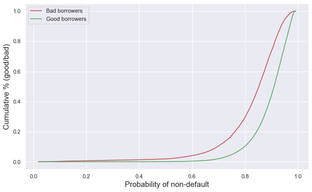


```python
KS = max(sk_preds['Cum. bad_borrowers %'] - sk_preds['Cum. good_borrowers %'])
print(f'Kolmogorov-smirnov statistic {round(KS,4)}')
```

    Kolmogorov-smirnov statistic 0.3035


## The KS an gini coefficient are not very high, but considered satisfactory given this data. 

### Looking at these curves, I find that a cut-off between 0.75 and 0.85 should work the best


```python
cut_off = 0.8

sm_preds['Class'] = sm_preds['Proba'].apply(lambda x: 1 if x >= cut_off else 0)
sk_preds['Class'] = sk_preds['Proba'].apply(lambda x: 1 if x >= cut_off else 0)
```


```python
print(sklm.classification_report(sm_preds['Y'], sm_preds['Class']))
```

                  precision    recall  f1-score   support
    
               0       0.27      0.29      0.28     10567
               1       0.91      0.90      0.90     82690
    
        accuracy                           0.83     93257
       macro avg       0.59      0.60      0.59     93257
    weighted avg       0.84      0.83      0.83     93257
    


```python
sm_conf_mat = pd.crosstab(sm_preds['Y'], sm_preds['Class'], rownames=['True'], colnames=['Pred'])
sm_conf_mat['Total'] = sm_conf_mat.sum(axis=1)
sm_conf_mat.loc[2, :] = sm_conf_mat.sum(axis=0)

sm_conf_mat = sm_conf_mat.astype('int')
sm_conf_mat.rename(index = {2:'Total'}, inplace=True)
sm_conf_mat
```


<div>
<style scoped>
    .dataframe tbody tr th:only-of-type {
        vertical-align: middle;
    }

    .dataframe tbody tr th {
        vertical-align: top;
    }

    .dataframe thead th {
        text-align: right;
    }
</style>
<table border="1" class="dataframe">
  <thead>
    <tr style="text-align: right;">
      <th>Pred</th>
      <th>0</th>
      <th>1</th>
      <th>Total</th>
    </tr>
    <tr>
      <th>True</th>
      <th></th>
      <th></th>
      <th></th>
    </tr>
  </thead>
  <tbody>
    <tr>
      <th>0</th>
      <td>3111</td>
      <td>7456</td>
      <td>10567</td>
    </tr>
    <tr>
      <th>1</th>
      <td>8496</td>
      <td>74194</td>
      <td>82690</td>
    </tr>
    <tr>
      <th>Total</th>
      <td>11607</td>
      <td>81650</td>
      <td>93257</td>
    </tr>
  </tbody>
</table>
</div>


```python
print(sklm.classification_report(sk_preds['Y'], sk_preds['Class']))
```

                  precision    recall  f1-score   support
    
               0       0.27      0.29      0.28     10567
               1       0.91      0.90      0.90     82690
    
        accuracy                           0.83     93257
       macro avg       0.59      0.60      0.59     93257
    weighted avg       0.84      0.83      0.83     93257
    


```python
sk_conf_mat = pd.crosstab(sk_preds['Y'], sk_preds['Class'], rownames=['True'], colnames=['Pred'])
sk_conf_mat['Total'] = sk_conf_mat.sum(axis=1)
sk_conf_mat.loc[2, :] = sk_conf_mat.sum(axis=0)

sk_conf_mat = sk_conf_mat.astype('int')
sk_conf_mat.rename(index = {2:'Total'}, inplace=True)
sk_conf_mat
```


<div>
<style scoped>
    .dataframe tbody tr th:only-of-type {
        vertical-align: middle;
    }

    .dataframe tbody tr th {
        vertical-align: top;
    }

    .dataframe thead th {
        text-align: right;
    }
</style>
<table border="1" class="dataframe">
  <thead>
    <tr style="text-align: right;">
      <th>Pred</th>
      <th>0</th>
      <th>1</th>
      <th>Total</th>
    </tr>
    <tr>
      <th>True</th>
      <th></th>
      <th></th>
      <th></th>
    </tr>
  </thead>
  <tbody>
    <tr>
      <th>0</th>
      <td>3108</td>
      <td>7459</td>
      <td>10567</td>
    </tr>
    <tr>
      <th>1</th>
      <td>8525</td>
      <td>74165</td>
      <td>82690</td>
    </tr>
    <tr>
      <th>Total</th>
      <td>11633</td>
      <td>81624</td>
      <td>93257</td>
    </tr>
  </tbody>
</table>
</div>


```python

pickle.dump(sk_log_reg,open('model_PD_log_reg_2007-2014.sav', 'wb'))

pickle.dump(sk_vars,open('vars_significant_PD_model_2007-2014.pickle', 'wb'))
pickle.dump(sk_ref_vars, open('vars_significant_reference_PD_model_2007-2014.pickle', 'wb'))
```


```python

```
