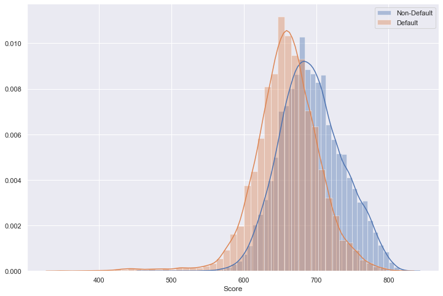
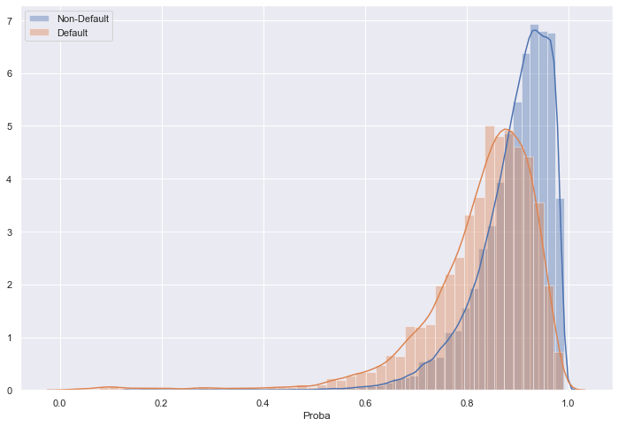
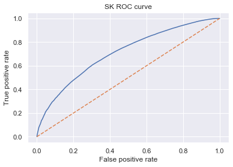

```python
import pandas as pd
import pickle
import numpy as np

pd.options.display.max_rows = None
```


```python
from sklearn import linear_model
import scipy.stats as stat

class LogisticRegression_with_p_values:
    
    def __init__(self,*args,**kwargs):
        self.model = linear_model.LogisticRegression(*args,**kwargs)
        
    def fit(self,X,y):
        self.model.fit(X,y)
        
        #### Get p-values for the fitted model ####
        denom = (2.0 * (1.0 + np.cosh(self.model.decision_function(X))))
        denom = np.tile(denom,(X.shape[1],1)).T
        F_ij = np.dot((X / denom).T,X)
        Cramer_Rao = np.linalg.inv(F_ij)
        sigma_estimates = np.sqrt(np.diagonal(Cramer_Rao))
        z_scores = self.model.coef_[0] / sigma_estimates
        p_values = [stat.norm.sf(abs(x)) * 2 for x in z_scores]
        
        self.coef_ = self.model.coef_
        self.intercept_ = self.model.intercept_
        self.p_values = p_values
```

Loading the classifier


```python
log_reg_clf = pickle.load(open('model_PD_log_reg_2007-2014.sav', 'rb'))
var_s = pickle.load(open('vars_significant_PD_model.pickle', 'rb'))
ref_vars = pickle.load(open('vars_significant_reference_PD_model.pickle', 'rb'))
```


```python
print(len(var_s))
var_s
```

    74


    ['grade:F',
     'grade:E',
     'grade:D',
     'grade:C',
     'grade:B',
     'grade:A',
     'home_ownership:OWN',
     'home_ownership:MORTGAGE',
     'verification_status:Not Verified',
     'verification_status:Source Verified',
     'initial_list_status:w',
     'purpose:ren_oth_med_wedd_vac',
     'purpose:debtc_majpur_homeimp_car_credc',
     'term:36',
     'emp_length_int:1',
     'emp_length_int:2_3_4',
     'emp_length_int:5_6',
     'emp_length_int:7_8_9',
     'emp_length_int:10',
     'mths_since_issue_d:<38',
     'mths_since_issue_d:38_39',
     'mths_since_issue_d:40_41',
     'mths_since_issue_d:42_48',
     'mths_since_issue_d:49_52',
     'mths_since_issue_d:53_64',
     'mths_since_issue_d:65_84',
     'int_rate:<9.548',
     'int_rate:9.548_12.025',
     'int_rate:12.025_14.502',
     'int_rate:14.502_17.804',
     'mths_since_earliest_cr_line:<140',
     'mths_since_earliest_cr_line:141_265',
     'mths_since_earliest_cr_line:266_353',
     'inq_last_6mths:0',
     'inq_last_6mths:1-2',
     'inq_last_6mths:3-6',
     'total_rev_hi_lim:5K-10K',
     'total_rev_hi_lim:10K-20K',
     'total_rev_hi_lim:20K-30K',
     'total_rev_hi_lim:30K-40K',
     'total_rev_hi_lim:40K-55K',
     'total_rev_hi_lim:55K-95K',
     'total_rev_hi_lim:>95K',
     'annual_inc:20k_30k',
     'annual_inc:30k_40k',
     'annual_inc:40k_50k',
     'annual_inc:50k_60k',
     'annual_inc:60k_70k',
     'annual_inc:70k_80k',
     'annual_inc:90k_100k',
     'annual_inc:100k_1200k',
     'annual_inc:120k_140k',
     'annual_inc:>140k',
     'mths_since_last_delinq:missing',
     'mths_since_last_delinq:4_30',
     'mths_since_last_delinq:31_56',
     'mths_since_last_delinq:>57',
     'dti:>1.6',
     'dti:1.6_4',
     'dti:4_8.8',
     'dti:8.8_12',
     'dti:12_15.2',
     'dti:15.2_16.8',
     'dti:16.8_19.2',
     'dti:19.2_21.6',
     'dti:21.6_24',
     'dti:24_35.2',
     'mths_since_last_record:Missing',
     'mths_since_last_record:3_22',
     'mths_since_last_record:23_30',
     'mths_since_last_record:31_69',
     'mths_since_last_record:70_85',
     'mths_since_last_record:86_97',
     'mths_since_last_record:>97']


```python
print(len(ref_vars))
ref_vars
```

    16


    ['int_rate:>17.804',
     'grade:G',
     'home_ownership:RENT_OTHER_NONE',
     'initial_list_status:f',
     'purpose:educ_sm_mov_house',
     'inq_last_6mths:>6',
     'total_rev_hi_lim:<=5K',
     'mths_since_last_record:0_2',
     'mths_since_last_delinq:<4',
     'emp_length_int:0',
     'mths_since_issue_d:>84',
     'annual_inc:<20k',
     'mths_since_earliest_cr_line:>354',
     'verification_status:Verified',
     'term:60',
     'dti:>35.2']


Assigning 0 to coefs for the reference dummy variables


```python
ref_categories = pd.DataFrame(ref_vars, columns=['Feature name'])
ref_categories['Coef'] = 0
ref_categories['p_values'] = np.nan

```

Populating dataframe with regression coefficients and p_values


```python
categories = pd.DataFrame(var_s, columns=['Feature name'])
categories['Coef'] = log_reg_clf.coef_[0]
categories['p_values'] = log_reg_clf.p_values

categories.index = categories.index + 1
categories.loc[0] = ['Intercept', log_reg_clf.intercept_[0], np.nan]
categories.sort_index(inplace=True)
categories
```


<div>
<style scoped>
    .dataframe tbody tr th:only-of-type {
        vertical-align: middle;
    }

    .dataframe tbody tr th {
        vertical-align: top;
    }

    .dataframe thead th {
        text-align: right;
    }
</style>
<table border="1" class="dataframe">
  <thead>
    <tr style="text-align: right;">
      <th></th>
      <th>Feature name</th>
      <th>Coef</th>
      <th>p_values</th>
    </tr>
  </thead>
  <tbody>
    <tr>
      <th>0</th>
      <td>Intercept</td>
      <td>-4.189967</td>
      <td>NaN</td>
    </tr>
    <tr>
      <th>1</th>
      <td>grade:F</td>
      <td>0.193820</td>
      <td>7.222497e-05</td>
    </tr>
    <tr>
      <th>2</th>
      <td>grade:E</td>
      <td>0.409511</td>
      <td>4.641765e-19</td>
    </tr>
    <tr>
      <th>3</th>
      <td>grade:D</td>
      <td>0.670695</td>
      <td>3.686155e-46</td>
    </tr>
    <tr>
      <th>4</th>
      <td>grade:C</td>
      <td>0.919163</td>
      <td>1.052989e-70</td>
    </tr>
    <tr>
      <th>5</th>
      <td>grade:B</td>
      <td>1.111274</td>
      <td>8.391464e-83</td>
    </tr>
    <tr>
      <th>6</th>
      <td>grade:A</td>
      <td>1.400946</td>
      <td>7.247906e-59</td>
    </tr>
    <tr>
      <th>7</th>
      <td>home_ownership:OWN</td>
      <td>0.095492</td>
      <td>1.489972e-06</td>
    </tr>
    <tr>
      <th>8</th>
      <td>home_ownership:MORTGAGE</td>
      <td>0.117701</td>
      <td>2.258992e-22</td>
    </tr>
    <tr>
      <th>9</th>
      <td>verification_status:Not Verified</td>
      <td>0.071667</td>
      <td>7.757315e-07</td>
    </tr>
    <tr>
      <th>10</th>
      <td>verification_status:Source Verified</td>
      <td>-0.008267</td>
      <td>5.371883e-01</td>
    </tr>
    <tr>
      <th>11</th>
      <td>initial_list_status:w</td>
      <td>0.053004</td>
      <td>4.937319e-05</td>
    </tr>
    <tr>
      <th>12</th>
      <td>purpose:ren_oth_med_wedd_vac</td>
      <td>0.302969</td>
      <td>9.111408e-22</td>
    </tr>
    <tr>
      <th>13</th>
      <td>purpose:debtc_majpur_homeimp_car_credc</td>
      <td>0.295429</td>
      <td>1.291306e-27</td>
    </tr>
    <tr>
      <th>14</th>
      <td>term:36</td>
      <td>0.046988</td>
      <td>7.793946e-04</td>
    </tr>
    <tr>
      <th>15</th>
      <td>emp_length_int:1</td>
      <td>0.107104</td>
      <td>2.623329e-05</td>
    </tr>
    <tr>
      <th>16</th>
      <td>emp_length_int:2_3_4</td>
      <td>0.147271</td>
      <td>1.963639e-15</td>
    </tr>
    <tr>
      <th>17</th>
      <td>emp_length_int:5_6</td>
      <td>0.114070</td>
      <td>6.296692e-08</td>
    </tr>
    <tr>
      <th>18</th>
      <td>emp_length_int:7_8_9</td>
      <td>0.076749</td>
      <td>1.774044e-04</td>
    </tr>
    <tr>
      <th>19</th>
      <td>emp_length_int:10</td>
      <td>0.145680</td>
      <td>7.463970e-16</td>
    </tr>
    <tr>
      <th>20</th>
      <td>mths_since_issue_d:&lt;38</td>
      <td>1.577294</td>
      <td>0.000000e+00</td>
    </tr>
    <tr>
      <th>21</th>
      <td>mths_since_issue_d:38_39</td>
      <td>1.379740</td>
      <td>0.000000e+00</td>
    </tr>
    <tr>
      <th>22</th>
      <td>mths_since_issue_d:40_41</td>
      <td>1.299174</td>
      <td>0.000000e+00</td>
    </tr>
    <tr>
      <th>23</th>
      <td>mths_since_issue_d:42_48</td>
      <td>1.092963</td>
      <td>0.000000e+00</td>
    </tr>
    <tr>
      <th>24</th>
      <td>mths_since_issue_d:49_52</td>
      <td>0.908395</td>
      <td>6.116570e-214</td>
    </tr>
    <tr>
      <th>25</th>
      <td>mths_since_issue_d:53_64</td>
      <td>0.660025</td>
      <td>1.133361e-132</td>
    </tr>
    <tr>
      <th>26</th>
      <td>mths_since_issue_d:65_84</td>
      <td>0.434748</td>
      <td>2.972518e-60</td>
    </tr>
    <tr>
      <th>27</th>
      <td>int_rate:&lt;9.548</td>
      <td>0.728382</td>
      <td>8.127221e-25</td>
    </tr>
    <tr>
      <th>28</th>
      <td>int_rate:9.548_12.025</td>
      <td>0.439143</td>
      <td>6.018723e-29</td>
    </tr>
    <tr>
      <th>29</th>
      <td>int_rate:12.025_14.502</td>
      <td>0.124222</td>
      <td>9.403991e-10</td>
    </tr>
    <tr>
      <th>30</th>
      <td>int_rate:14.502_17.804</td>
      <td>0.044993</td>
      <td>3.940821e-02</td>
    </tr>
    <tr>
      <th>31</th>
      <td>mths_since_earliest_cr_line:&lt;140</td>
      <td>-0.126903</td>
      <td>1.566386e-06</td>
    </tr>
    <tr>
      <th>32</th>
      <td>mths_since_earliest_cr_line:141_265</td>
      <td>-0.061316</td>
      <td>1.416652e-03</td>
    </tr>
    <tr>
      <th>33</th>
      <td>mths_since_earliest_cr_line:266_353</td>
      <td>0.011954</td>
      <td>5.744477e-01</td>
    </tr>
    <tr>
      <th>34</th>
      <td>inq_last_6mths:0</td>
      <td>2.617120</td>
      <td>4.221785e-222</td>
    </tr>
    <tr>
      <th>35</th>
      <td>inq_last_6mths:1-2</td>
      <td>2.483851</td>
      <td>3.356538e-201</td>
    </tr>
    <tr>
      <th>36</th>
      <td>inq_last_6mths:3-6</td>
      <td>2.109779</td>
      <td>3.222516e-144</td>
    </tr>
    <tr>
      <th>37</th>
      <td>total_rev_hi_lim:5K-10K</td>
      <td>0.099563</td>
      <td>2.106405e-05</td>
    </tr>
    <tr>
      <th>38</th>
      <td>total_rev_hi_lim:10K-20K</td>
      <td>0.078829</td>
      <td>4.570580e-04</td>
    </tr>
    <tr>
      <th>39</th>
      <td>total_rev_hi_lim:20K-30K</td>
      <td>0.080420</td>
      <td>1.155267e-03</td>
    </tr>
    <tr>
      <th>40</th>
      <td>total_rev_hi_lim:30K-40K</td>
      <td>0.092042</td>
      <td>9.742301e-04</td>
    </tr>
    <tr>
      <th>41</th>
      <td>total_rev_hi_lim:40K-55K</td>
      <td>0.112775</td>
      <td>2.185013e-04</td>
    </tr>
    <tr>
      <th>42</th>
      <td>total_rev_hi_lim:55K-95K</td>
      <td>0.141057</td>
      <td>3.857359e-05</td>
    </tr>
    <tr>
      <th>43</th>
      <td>total_rev_hi_lim:&gt;95K</td>
      <td>0.284187</td>
      <td>2.829485e-07</td>
    </tr>
    <tr>
      <th>44</th>
      <td>annual_inc:20k_30k</td>
      <td>-0.335092</td>
      <td>1.588068e-34</td>
    </tr>
    <tr>
      <th>45</th>
      <td>annual_inc:30k_40k</td>
      <td>-0.279226</td>
      <td>5.014129e-32</td>
    </tr>
    <tr>
      <th>46</th>
      <td>annual_inc:40k_50k</td>
      <td>-0.196236</td>
      <td>6.836916e-18</td>
    </tr>
    <tr>
      <th>47</th>
      <td>annual_inc:50k_60k</td>
      <td>-0.133190</td>
      <td>7.198909e-09</td>
    </tr>
    <tr>
      <th>48</th>
      <td>annual_inc:60k_70k</td>
      <td>-0.063346</td>
      <td>9.026082e-03</td>
    </tr>
    <tr>
      <th>49</th>
      <td>annual_inc:70k_80k</td>
      <td>0.002918</td>
      <td>9.086991e-01</td>
    </tr>
    <tr>
      <th>50</th>
      <td>annual_inc:90k_100k</td>
      <td>0.087121</td>
      <td>4.079895e-03</td>
    </tr>
    <tr>
      <th>51</th>
      <td>annual_inc:100k_1200k</td>
      <td>0.157617</td>
      <td>1.017319e-07</td>
    </tr>
    <tr>
      <th>52</th>
      <td>annual_inc:120k_140k</td>
      <td>0.244964</td>
      <td>1.746590e-10</td>
    </tr>
    <tr>
      <th>53</th>
      <td>annual_inc:&gt;140k</td>
      <td>0.158873</td>
      <td>1.051126e-06</td>
    </tr>
    <tr>
      <th>54</th>
      <td>mths_since_last_delinq:missing</td>
      <td>-0.018025</td>
      <td>3.238862e-01</td>
    </tr>
    <tr>
      <th>55</th>
      <td>mths_since_last_delinq:4_30</td>
      <td>0.008222</td>
      <td>1.000000e+00</td>
    </tr>
    <tr>
      <th>56</th>
      <td>mths_since_last_delinq:31_56</td>
      <td>0.062258</td>
      <td>4.049765e-03</td>
    </tr>
    <tr>
      <th>57</th>
      <td>mths_since_last_delinq:&gt;57</td>
      <td>0.008222</td>
      <td>1.000000e+00</td>
    </tr>
    <tr>
      <th>58</th>
      <td>dti:&gt;1.6</td>
      <td>0.186567</td>
      <td>2.540361e-03</td>
    </tr>
    <tr>
      <th>59</th>
      <td>dti:1.6_4</td>
      <td>0.256598</td>
      <td>1.580547e-08</td>
    </tr>
    <tr>
      <th>60</th>
      <td>dti:4_8.8</td>
      <td>0.268876</td>
      <td>8.430942e-16</td>
    </tr>
    <tr>
      <th>61</th>
      <td>dti:8.8_12</td>
      <td>0.173226</td>
      <td>1.294896e-07</td>
    </tr>
    <tr>
      <th>62</th>
      <td>dti:12_15.2</td>
      <td>0.133162</td>
      <td>3.088153e-05</td>
    </tr>
    <tr>
      <th>63</th>
      <td>dti:15.2_16.8</td>
      <td>0.094345</td>
      <td>6.525694e-03</td>
    </tr>
    <tr>
      <th>64</th>
      <td>dti:16.8_19.2</td>
      <td>0.017080</td>
      <td>5.992797e-01</td>
    </tr>
    <tr>
      <th>65</th>
      <td>dti:19.2_21.6</td>
      <td>-0.005567</td>
      <td>8.699937e-01</td>
    </tr>
    <tr>
      <th>66</th>
      <td>dti:21.6_24</td>
      <td>-0.031200</td>
      <td>3.456089e-01</td>
    </tr>
    <tr>
      <th>67</th>
      <td>dti:24_35.2</td>
      <td>-0.090207</td>
      <td>3.054590e-03</td>
    </tr>
    <tr>
      <th>68</th>
      <td>mths_since_last_record:Missing</td>
      <td>1.205398</td>
      <td>1.392951e-71</td>
    </tr>
    <tr>
      <th>69</th>
      <td>mths_since_last_record:3_22</td>
      <td>1.340409</td>
      <td>1.276090e-35</td>
    </tr>
    <tr>
      <th>70</th>
      <td>mths_since_last_record:23_30</td>
      <td>1.188317</td>
      <td>3.035732e-27</td>
    </tr>
    <tr>
      <th>71</th>
      <td>mths_since_last_record:31_69</td>
      <td>1.437084</td>
      <td>7.764921e-86</td>
    </tr>
    <tr>
      <th>72</th>
      <td>mths_since_last_record:70_85</td>
      <td>1.228518</td>
      <td>7.783087e-56</td>
    </tr>
    <tr>
      <th>73</th>
      <td>mths_since_last_record:86_97</td>
      <td>1.053230</td>
      <td>5.133999e-42</td>
    </tr>
    <tr>
      <th>74</th>
      <td>mths_since_last_record:&gt;97</td>
      <td>1.143449</td>
      <td>1.530129e-56</td>
    </tr>
  </tbody>
</table>
</div>


Concatenating with the model dummy variables


```python
len(log_reg_clf.coef_[0])
```


    74


```python
scorecard = pd.concat([ref_categories, categories]).reset_index(drop=True)
scorecard
```


<div>
<style scoped>
    .dataframe tbody tr th:only-of-type {
        vertical-align: middle;
    }

    .dataframe tbody tr th {
        vertical-align: top;
    }

    .dataframe thead th {
        text-align: right;
    }
</style>
<table border="1" class="dataframe">
  <thead>
    <tr style="text-align: right;">
      <th></th>
      <th>Feature name</th>
      <th>Coef</th>
      <th>p_values</th>
    </tr>
  </thead>
  <tbody>
    <tr>
      <th>0</th>
      <td>int_rate:&gt;17.804</td>
      <td>0.000000</td>
      <td>NaN</td>
    </tr>
    <tr>
      <th>1</th>
      <td>grade:G</td>
      <td>0.000000</td>
      <td>NaN</td>
    </tr>
    <tr>
      <th>2</th>
      <td>home_ownership:RENT_OTHER_NONE</td>
      <td>0.000000</td>
      <td>NaN</td>
    </tr>
    <tr>
      <th>3</th>
      <td>initial_list_status:f</td>
      <td>0.000000</td>
      <td>NaN</td>
    </tr>
    <tr>
      <th>4</th>
      <td>purpose:educ_sm_mov_house</td>
      <td>0.000000</td>
      <td>NaN</td>
    </tr>
    <tr>
      <th>5</th>
      <td>inq_last_6mths:&gt;6</td>
      <td>0.000000</td>
      <td>NaN</td>
    </tr>
    <tr>
      <th>6</th>
      <td>total_rev_hi_lim:&lt;=5K</td>
      <td>0.000000</td>
      <td>NaN</td>
    </tr>
    <tr>
      <th>7</th>
      <td>mths_since_last_record:0_2</td>
      <td>0.000000</td>
      <td>NaN</td>
    </tr>
    <tr>
      <th>8</th>
      <td>mths_since_last_delinq:&lt;4</td>
      <td>0.000000</td>
      <td>NaN</td>
    </tr>
    <tr>
      <th>9</th>
      <td>emp_length_int:0</td>
      <td>0.000000</td>
      <td>NaN</td>
    </tr>
    <tr>
      <th>10</th>
      <td>mths_since_issue_d:&gt;84</td>
      <td>0.000000</td>
      <td>NaN</td>
    </tr>
    <tr>
      <th>11</th>
      <td>annual_inc:&lt;20k</td>
      <td>0.000000</td>
      <td>NaN</td>
    </tr>
    <tr>
      <th>12</th>
      <td>mths_since_earliest_cr_line:&gt;354</td>
      <td>0.000000</td>
      <td>NaN</td>
    </tr>
    <tr>
      <th>13</th>
      <td>verification_status:Verified</td>
      <td>0.000000</td>
      <td>NaN</td>
    </tr>
    <tr>
      <th>14</th>
      <td>term:60</td>
      <td>0.000000</td>
      <td>NaN</td>
    </tr>
    <tr>
      <th>15</th>
      <td>dti:&gt;35.2</td>
      <td>0.000000</td>
      <td>NaN</td>
    </tr>
    <tr>
      <th>16</th>
      <td>Intercept</td>
      <td>-4.189967</td>
      <td>NaN</td>
    </tr>
    <tr>
      <th>17</th>
      <td>grade:F</td>
      <td>0.193820</td>
      <td>7.222497e-05</td>
    </tr>
    <tr>
      <th>18</th>
      <td>grade:E</td>
      <td>0.409511</td>
      <td>4.641765e-19</td>
    </tr>
    <tr>
      <th>19</th>
      <td>grade:D</td>
      <td>0.670695</td>
      <td>3.686155e-46</td>
    </tr>
    <tr>
      <th>20</th>
      <td>grade:C</td>
      <td>0.919163</td>
      <td>1.052989e-70</td>
    </tr>
    <tr>
      <th>21</th>
      <td>grade:B</td>
      <td>1.111274</td>
      <td>8.391464e-83</td>
    </tr>
    <tr>
      <th>22</th>
      <td>grade:A</td>
      <td>1.400946</td>
      <td>7.247906e-59</td>
    </tr>
    <tr>
      <th>23</th>
      <td>home_ownership:OWN</td>
      <td>0.095492</td>
      <td>1.489972e-06</td>
    </tr>
    <tr>
      <th>24</th>
      <td>home_ownership:MORTGAGE</td>
      <td>0.117701</td>
      <td>2.258992e-22</td>
    </tr>
    <tr>
      <th>25</th>
      <td>verification_status:Not Verified</td>
      <td>0.071667</td>
      <td>7.757315e-07</td>
    </tr>
    <tr>
      <th>26</th>
      <td>verification_status:Source Verified</td>
      <td>-0.008267</td>
      <td>5.371883e-01</td>
    </tr>
    <tr>
      <th>27</th>
      <td>initial_list_status:w</td>
      <td>0.053004</td>
      <td>4.937319e-05</td>
    </tr>
    <tr>
      <th>28</th>
      <td>purpose:ren_oth_med_wedd_vac</td>
      <td>0.302969</td>
      <td>9.111408e-22</td>
    </tr>
    <tr>
      <th>29</th>
      <td>purpose:debtc_majpur_homeimp_car_credc</td>
      <td>0.295429</td>
      <td>1.291306e-27</td>
    </tr>
    <tr>
      <th>30</th>
      <td>term:36</td>
      <td>0.046988</td>
      <td>7.793946e-04</td>
    </tr>
    <tr>
      <th>31</th>
      <td>emp_length_int:1</td>
      <td>0.107104</td>
      <td>2.623329e-05</td>
    </tr>
    <tr>
      <th>32</th>
      <td>emp_length_int:2_3_4</td>
      <td>0.147271</td>
      <td>1.963639e-15</td>
    </tr>
    <tr>
      <th>33</th>
      <td>emp_length_int:5_6</td>
      <td>0.114070</td>
      <td>6.296692e-08</td>
    </tr>
    <tr>
      <th>34</th>
      <td>emp_length_int:7_8_9</td>
      <td>0.076749</td>
      <td>1.774044e-04</td>
    </tr>
    <tr>
      <th>35</th>
      <td>emp_length_int:10</td>
      <td>0.145680</td>
      <td>7.463970e-16</td>
    </tr>
    <tr>
      <th>36</th>
      <td>mths_since_issue_d:&lt;38</td>
      <td>1.577294</td>
      <td>0.000000e+00</td>
    </tr>
    <tr>
      <th>37</th>
      <td>mths_since_issue_d:38_39</td>
      <td>1.379740</td>
      <td>0.000000e+00</td>
    </tr>
    <tr>
      <th>38</th>
      <td>mths_since_issue_d:40_41</td>
      <td>1.299174</td>
      <td>0.000000e+00</td>
    </tr>
    <tr>
      <th>39</th>
      <td>mths_since_issue_d:42_48</td>
      <td>1.092963</td>
      <td>0.000000e+00</td>
    </tr>
    <tr>
      <th>40</th>
      <td>mths_since_issue_d:49_52</td>
      <td>0.908395</td>
      <td>6.116570e-214</td>
    </tr>
    <tr>
      <th>41</th>
      <td>mths_since_issue_d:53_64</td>
      <td>0.660025</td>
      <td>1.133361e-132</td>
    </tr>
    <tr>
      <th>42</th>
      <td>mths_since_issue_d:65_84</td>
      <td>0.434748</td>
      <td>2.972518e-60</td>
    </tr>
    <tr>
      <th>43</th>
      <td>int_rate:&lt;9.548</td>
      <td>0.728382</td>
      <td>8.127221e-25</td>
    </tr>
    <tr>
      <th>44</th>
      <td>int_rate:9.548_12.025</td>
      <td>0.439143</td>
      <td>6.018723e-29</td>
    </tr>
    <tr>
      <th>45</th>
      <td>int_rate:12.025_14.502</td>
      <td>0.124222</td>
      <td>9.403991e-10</td>
    </tr>
    <tr>
      <th>46</th>
      <td>int_rate:14.502_17.804</td>
      <td>0.044993</td>
      <td>3.940821e-02</td>
    </tr>
    <tr>
      <th>47</th>
      <td>mths_since_earliest_cr_line:&lt;140</td>
      <td>-0.126903</td>
      <td>1.566386e-06</td>
    </tr>
    <tr>
      <th>48</th>
      <td>mths_since_earliest_cr_line:141_265</td>
      <td>-0.061316</td>
      <td>1.416652e-03</td>
    </tr>
    <tr>
      <th>49</th>
      <td>mths_since_earliest_cr_line:266_353</td>
      <td>0.011954</td>
      <td>5.744477e-01</td>
    </tr>
    <tr>
      <th>50</th>
      <td>inq_last_6mths:0</td>
      <td>2.617120</td>
      <td>4.221785e-222</td>
    </tr>
    <tr>
      <th>51</th>
      <td>inq_last_6mths:1-2</td>
      <td>2.483851</td>
      <td>3.356538e-201</td>
    </tr>
    <tr>
      <th>52</th>
      <td>inq_last_6mths:3-6</td>
      <td>2.109779</td>
      <td>3.222516e-144</td>
    </tr>
    <tr>
      <th>53</th>
      <td>total_rev_hi_lim:5K-10K</td>
      <td>0.099563</td>
      <td>2.106405e-05</td>
    </tr>
    <tr>
      <th>54</th>
      <td>total_rev_hi_lim:10K-20K</td>
      <td>0.078829</td>
      <td>4.570580e-04</td>
    </tr>
    <tr>
      <th>55</th>
      <td>total_rev_hi_lim:20K-30K</td>
      <td>0.080420</td>
      <td>1.155267e-03</td>
    </tr>
    <tr>
      <th>56</th>
      <td>total_rev_hi_lim:30K-40K</td>
      <td>0.092042</td>
      <td>9.742301e-04</td>
    </tr>
    <tr>
      <th>57</th>
      <td>total_rev_hi_lim:40K-55K</td>
      <td>0.112775</td>
      <td>2.185013e-04</td>
    </tr>
    <tr>
      <th>58</th>
      <td>total_rev_hi_lim:55K-95K</td>
      <td>0.141057</td>
      <td>3.857359e-05</td>
    </tr>
    <tr>
      <th>59</th>
      <td>total_rev_hi_lim:&gt;95K</td>
      <td>0.284187</td>
      <td>2.829485e-07</td>
    </tr>
    <tr>
      <th>60</th>
      <td>annual_inc:20k_30k</td>
      <td>-0.335092</td>
      <td>1.588068e-34</td>
    </tr>
    <tr>
      <th>61</th>
      <td>annual_inc:30k_40k</td>
      <td>-0.279226</td>
      <td>5.014129e-32</td>
    </tr>
    <tr>
      <th>62</th>
      <td>annual_inc:40k_50k</td>
      <td>-0.196236</td>
      <td>6.836916e-18</td>
    </tr>
    <tr>
      <th>63</th>
      <td>annual_inc:50k_60k</td>
      <td>-0.133190</td>
      <td>7.198909e-09</td>
    </tr>
    <tr>
      <th>64</th>
      <td>annual_inc:60k_70k</td>
      <td>-0.063346</td>
      <td>9.026082e-03</td>
    </tr>
    <tr>
      <th>65</th>
      <td>annual_inc:70k_80k</td>
      <td>0.002918</td>
      <td>9.086991e-01</td>
    </tr>
    <tr>
      <th>66</th>
      <td>annual_inc:90k_100k</td>
      <td>0.087121</td>
      <td>4.079895e-03</td>
    </tr>
    <tr>
      <th>67</th>
      <td>annual_inc:100k_1200k</td>
      <td>0.157617</td>
      <td>1.017319e-07</td>
    </tr>
    <tr>
      <th>68</th>
      <td>annual_inc:120k_140k</td>
      <td>0.244964</td>
      <td>1.746590e-10</td>
    </tr>
    <tr>
      <th>69</th>
      <td>annual_inc:&gt;140k</td>
      <td>0.158873</td>
      <td>1.051126e-06</td>
    </tr>
    <tr>
      <th>70</th>
      <td>mths_since_last_delinq:missing</td>
      <td>-0.018025</td>
      <td>3.238862e-01</td>
    </tr>
    <tr>
      <th>71</th>
      <td>mths_since_last_delinq:4_30</td>
      <td>0.008222</td>
      <td>1.000000e+00</td>
    </tr>
    <tr>
      <th>72</th>
      <td>mths_since_last_delinq:31_56</td>
      <td>0.062258</td>
      <td>4.049765e-03</td>
    </tr>
    <tr>
      <th>73</th>
      <td>mths_since_last_delinq:&gt;57</td>
      <td>0.008222</td>
      <td>1.000000e+00</td>
    </tr>
    <tr>
      <th>74</th>
      <td>dti:&gt;1.6</td>
      <td>0.186567</td>
      <td>2.540361e-03</td>
    </tr>
    <tr>
      <th>75</th>
      <td>dti:1.6_4</td>
      <td>0.256598</td>
      <td>1.580547e-08</td>
    </tr>
    <tr>
      <th>76</th>
      <td>dti:4_8.8</td>
      <td>0.268876</td>
      <td>8.430942e-16</td>
    </tr>
    <tr>
      <th>77</th>
      <td>dti:8.8_12</td>
      <td>0.173226</td>
      <td>1.294896e-07</td>
    </tr>
    <tr>
      <th>78</th>
      <td>dti:12_15.2</td>
      <td>0.133162</td>
      <td>3.088153e-05</td>
    </tr>
    <tr>
      <th>79</th>
      <td>dti:15.2_16.8</td>
      <td>0.094345</td>
      <td>6.525694e-03</td>
    </tr>
    <tr>
      <th>80</th>
      <td>dti:16.8_19.2</td>
      <td>0.017080</td>
      <td>5.992797e-01</td>
    </tr>
    <tr>
      <th>81</th>
      <td>dti:19.2_21.6</td>
      <td>-0.005567</td>
      <td>8.699937e-01</td>
    </tr>
    <tr>
      <th>82</th>
      <td>dti:21.6_24</td>
      <td>-0.031200</td>
      <td>3.456089e-01</td>
    </tr>
    <tr>
      <th>83</th>
      <td>dti:24_35.2</td>
      <td>-0.090207</td>
      <td>3.054590e-03</td>
    </tr>
    <tr>
      <th>84</th>
      <td>mths_since_last_record:Missing</td>
      <td>1.205398</td>
      <td>1.392951e-71</td>
    </tr>
    <tr>
      <th>85</th>
      <td>mths_since_last_record:3_22</td>
      <td>1.340409</td>
      <td>1.276090e-35</td>
    </tr>
    <tr>
      <th>86</th>
      <td>mths_since_last_record:23_30</td>
      <td>1.188317</td>
      <td>3.035732e-27</td>
    </tr>
    <tr>
      <th>87</th>
      <td>mths_since_last_record:31_69</td>
      <td>1.437084</td>
      <td>7.764921e-86</td>
    </tr>
    <tr>
      <th>88</th>
      <td>mths_since_last_record:70_85</td>
      <td>1.228518</td>
      <td>7.783087e-56</td>
    </tr>
    <tr>
      <th>89</th>
      <td>mths_since_last_record:86_97</td>
      <td>1.053230</td>
      <td>5.133999e-42</td>
    </tr>
    <tr>
      <th>90</th>
      <td>mths_since_last_record:&gt;97</td>
      <td>1.143449</td>
      <td>1.530129e-56</td>
    </tr>
  </tbody>
</table>
</div>


Transforming coefs into scores


```python
scorecard['Original feature name'] = scorecard['Feature name'].apply(lambda x: x.split(':')[0])
scorecard = scorecard.sort_values('Original feature name').reset_index(drop=True)
```


```python
min_score = 300
max_score = 850
```


```python
min_possible_coef = scorecard.groupby('Original feature name')['Coef'].min().sum()
min_possible_coef
```


    -4.768461549149149


```python
max_possible_coef = scorecard.groupby('Original feature name')['Coef'].max().sum()
max_possible_coef
```


    5.182700378026212


```python
scorecard['Score_pre'] = scorecard['Coef'].apply(lambda x: x*((max_score - min_score)/(max_possible_coef - min_possible_coef)))
scorecard
```


<div>
<style scoped>
    .dataframe tbody tr th:only-of-type {
        vertical-align: middle;
    }

    .dataframe tbody tr th {
        vertical-align: top;
    }

    .dataframe thead th {
        text-align: right;
    }
</style>
<table border="1" class="dataframe">
  <thead>
    <tr style="text-align: right;">
      <th></th>
      <th>Feature name</th>
      <th>Coef</th>
      <th>p_values</th>
      <th>Original feature name</th>
      <th>Score_pre</th>
    </tr>
  </thead>
  <tbody>
    <tr>
      <th>0</th>
      <td>Intercept</td>
      <td>-4.189967</td>
      <td>NaN</td>
      <td>Intercept</td>
      <td>-231.579168</td>
    </tr>
    <tr>
      <th>1</th>
      <td>annual_inc:30k_40k</td>
      <td>-0.279226</td>
      <td>5.014129e-32</td>
      <td>annual_inc</td>
      <td>-15.432819</td>
    </tr>
    <tr>
      <th>2</th>
      <td>annual_inc:100k_1200k</td>
      <td>0.157617</td>
      <td>1.017319e-07</td>
      <td>annual_inc</td>
      <td>8.711476</td>
    </tr>
    <tr>
      <th>3</th>
      <td>annual_inc:20k_30k</td>
      <td>-0.335092</td>
      <td>1.588068e-34</td>
      <td>annual_inc</td>
      <td>-18.520505</td>
    </tr>
    <tr>
      <th>4</th>
      <td>annual_inc:40k_50k</td>
      <td>-0.196236</td>
      <td>6.836916e-18</td>
      <td>annual_inc</td>
      <td>-10.845962</td>
    </tr>
    <tr>
      <th>5</th>
      <td>annual_inc:120k_140k</td>
      <td>0.244964</td>
      <td>1.746590e-10</td>
      <td>annual_inc</td>
      <td>13.539140</td>
    </tr>
    <tr>
      <th>6</th>
      <td>annual_inc:&lt;20k</td>
      <td>0.000000</td>
      <td>NaN</td>
      <td>annual_inc</td>
      <td>0.000000</td>
    </tr>
    <tr>
      <th>7</th>
      <td>annual_inc:&gt;140k</td>
      <td>0.158873</td>
      <td>1.051126e-06</td>
      <td>annual_inc</td>
      <td>8.780903</td>
    </tr>
    <tr>
      <th>8</th>
      <td>annual_inc:50k_60k</td>
      <td>-0.133190</td>
      <td>7.198909e-09</td>
      <td>annual_inc</td>
      <td>-7.361424</td>
    </tr>
    <tr>
      <th>9</th>
      <td>annual_inc:60k_70k</td>
      <td>-0.063346</td>
      <td>9.026082e-03</td>
      <td>annual_inc</td>
      <td>-3.501145</td>
    </tr>
    <tr>
      <th>10</th>
      <td>annual_inc:70k_80k</td>
      <td>0.002918</td>
      <td>9.086991e-01</td>
      <td>annual_inc</td>
      <td>0.161276</td>
    </tr>
    <tr>
      <th>11</th>
      <td>annual_inc:90k_100k</td>
      <td>0.087121</td>
      <td>4.079895e-03</td>
      <td>annual_inc</td>
      <td>4.815161</td>
    </tr>
    <tr>
      <th>12</th>
      <td>dti:16.8_19.2</td>
      <td>0.017080</td>
      <td>5.992797e-01</td>
      <td>dti</td>
      <td>0.944030</td>
    </tr>
    <tr>
      <th>13</th>
      <td>dti:&gt;1.6</td>
      <td>0.186567</td>
      <td>2.540361e-03</td>
      <td>dti</td>
      <td>10.311557</td>
    </tr>
    <tr>
      <th>14</th>
      <td>dti:1.6_4</td>
      <td>0.256598</td>
      <td>1.580547e-08</td>
      <td>dti</td>
      <td>14.182142</td>
    </tr>
    <tr>
      <th>15</th>
      <td>dti:19.2_21.6</td>
      <td>-0.005567</td>
      <td>8.699937e-01</td>
      <td>dti</td>
      <td>-0.307665</td>
    </tr>
    <tr>
      <th>16</th>
      <td>dti:4_8.8</td>
      <td>0.268876</td>
      <td>8.430942e-16</td>
      <td>dti</td>
      <td>14.860775</td>
    </tr>
    <tr>
      <th>17</th>
      <td>dti:&gt;35.2</td>
      <td>0.000000</td>
      <td>NaN</td>
      <td>dti</td>
      <td>0.000000</td>
    </tr>
    <tr>
      <th>18</th>
      <td>dti:8.8_12</td>
      <td>0.173226</td>
      <td>1.294896e-07</td>
      <td>dti</td>
      <td>9.574190</td>
    </tr>
    <tr>
      <th>19</th>
      <td>dti:12_15.2</td>
      <td>0.133162</td>
      <td>3.088153e-05</td>
      <td>dti</td>
      <td>7.359871</td>
    </tr>
    <tr>
      <th>20</th>
      <td>dti:21.6_24</td>
      <td>-0.031200</td>
      <td>3.456089e-01</td>
      <td>dti</td>
      <td>-1.724427</td>
    </tr>
    <tr>
      <th>21</th>
      <td>dti:15.2_16.8</td>
      <td>0.094345</td>
      <td>6.525694e-03</td>
      <td>dti</td>
      <td>5.214430</td>
    </tr>
    <tr>
      <th>22</th>
      <td>dti:24_35.2</td>
      <td>-0.090207</td>
      <td>3.054590e-03</td>
      <td>dti</td>
      <td>-4.985735</td>
    </tr>
    <tr>
      <th>23</th>
      <td>emp_length_int:10</td>
      <td>0.145680</td>
      <td>7.463970e-16</td>
      <td>emp_length_int</td>
      <td>8.051703</td>
    </tr>
    <tr>
      <th>24</th>
      <td>emp_length_int:5_6</td>
      <td>0.114070</td>
      <td>6.296692e-08</td>
      <td>emp_length_int</td>
      <td>6.304642</td>
    </tr>
    <tr>
      <th>25</th>
      <td>emp_length_int:2_3_4</td>
      <td>0.147271</td>
      <td>1.963639e-15</td>
      <td>emp_length_int</td>
      <td>8.139678</td>
    </tr>
    <tr>
      <th>26</th>
      <td>emp_length_int:1</td>
      <td>0.107104</td>
      <td>2.623329e-05</td>
      <td>emp_length_int</td>
      <td>5.919629</td>
    </tr>
    <tr>
      <th>27</th>
      <td>emp_length_int:0</td>
      <td>0.000000</td>
      <td>NaN</td>
      <td>emp_length_int</td>
      <td>0.000000</td>
    </tr>
    <tr>
      <th>28</th>
      <td>emp_length_int:7_8_9</td>
      <td>0.076749</td>
      <td>1.774044e-04</td>
      <td>emp_length_int</td>
      <td>4.241892</td>
    </tr>
    <tr>
      <th>29</th>
      <td>grade:A</td>
      <td>1.400946</td>
      <td>7.247906e-59</td>
      <td>grade</td>
      <td>77.430168</td>
    </tr>
    <tr>
      <th>30</th>
      <td>grade:B</td>
      <td>1.111274</td>
      <td>8.391464e-83</td>
      <td>grade</td>
      <td>61.420041</td>
    </tr>
    <tr>
      <th>31</th>
      <td>grade:D</td>
      <td>0.670695</td>
      <td>3.686155e-46</td>
      <td>grade</td>
      <td>37.069278</td>
    </tr>
    <tr>
      <th>32</th>
      <td>grade:E</td>
      <td>0.409511</td>
      <td>4.641765e-19</td>
      <td>grade</td>
      <td>22.633632</td>
    </tr>
    <tr>
      <th>33</th>
      <td>grade:F</td>
      <td>0.193820</td>
      <td>7.222497e-05</td>
      <td>grade</td>
      <td>10.712422</td>
    </tr>
    <tr>
      <th>34</th>
      <td>grade:G</td>
      <td>0.000000</td>
      <td>NaN</td>
      <td>grade</td>
      <td>0.000000</td>
    </tr>
    <tr>
      <th>35</th>
      <td>grade:C</td>
      <td>0.919163</td>
      <td>1.052989e-70</td>
      <td>grade</td>
      <td>50.802091</td>
    </tr>
    <tr>
      <th>36</th>
      <td>home_ownership:MORTGAGE</td>
      <td>0.117701</td>
      <td>2.258992e-22</td>
      <td>home_ownership</td>
      <td>6.505336</td>
    </tr>
    <tr>
      <th>37</th>
      <td>home_ownership:OWN</td>
      <td>0.095492</td>
      <td>1.489972e-06</td>
      <td>home_ownership</td>
      <td>5.277813</td>
    </tr>
    <tr>
      <th>38</th>
      <td>home_ownership:RENT_OTHER_NONE</td>
      <td>0.000000</td>
      <td>NaN</td>
      <td>home_ownership</td>
      <td>0.000000</td>
    </tr>
    <tr>
      <th>39</th>
      <td>initial_list_status:f</td>
      <td>0.000000</td>
      <td>NaN</td>
      <td>initial_list_status</td>
      <td>0.000000</td>
    </tr>
    <tr>
      <th>40</th>
      <td>initial_list_status:w</td>
      <td>0.053004</td>
      <td>4.937319e-05</td>
      <td>initial_list_status</td>
      <td>2.929532</td>
    </tr>
    <tr>
      <th>41</th>
      <td>inq_last_6mths:3-6</td>
      <td>2.109779</td>
      <td>3.222516e-144</td>
      <td>inq_last_6mths</td>
      <td>116.607311</td>
    </tr>
    <tr>
      <th>42</th>
      <td>inq_last_6mths:0</td>
      <td>2.617120</td>
      <td>4.221785e-222</td>
      <td>inq_last_6mths</td>
      <td>144.648045</td>
    </tr>
    <tr>
      <th>43</th>
      <td>inq_last_6mths:&gt;6</td>
      <td>0.000000</td>
      <td>NaN</td>
      <td>inq_last_6mths</td>
      <td>0.000000</td>
    </tr>
    <tr>
      <th>44</th>
      <td>inq_last_6mths:1-2</td>
      <td>2.483851</td>
      <td>3.356538e-201</td>
      <td>inq_last_6mths</td>
      <td>137.282286</td>
    </tr>
    <tr>
      <th>45</th>
      <td>int_rate:&gt;17.804</td>
      <td>0.000000</td>
      <td>NaN</td>
      <td>int_rate</td>
      <td>0.000000</td>
    </tr>
    <tr>
      <th>46</th>
      <td>int_rate:12.025_14.502</td>
      <td>0.124222</td>
      <td>9.403991e-10</td>
      <td>int_rate</td>
      <td>6.865726</td>
    </tr>
    <tr>
      <th>47</th>
      <td>int_rate:14.502_17.804</td>
      <td>0.044993</td>
      <td>3.940821e-02</td>
      <td>int_rate</td>
      <td>2.486777</td>
    </tr>
    <tr>
      <th>48</th>
      <td>int_rate:9.548_12.025</td>
      <td>0.439143</td>
      <td>6.018723e-29</td>
      <td>int_rate</td>
      <td>24.271382</td>
    </tr>
    <tr>
      <th>49</th>
      <td>int_rate:&lt;9.548</td>
      <td>0.728382</td>
      <td>8.127221e-25</td>
      <td>int_rate</td>
      <td>40.257606</td>
    </tr>
    <tr>
      <th>50</th>
      <td>mths_since_earliest_cr_line:&lt;140</td>
      <td>-0.126903</td>
      <td>1.566386e-06</td>
      <td>mths_since_earliest_cr_line</td>
      <td>-7.013945</td>
    </tr>
    <tr>
      <th>51</th>
      <td>mths_since_earliest_cr_line:141_265</td>
      <td>-0.061316</td>
      <td>1.416652e-03</td>
      <td>mths_since_earliest_cr_line</td>
      <td>-3.388908</td>
    </tr>
    <tr>
      <th>52</th>
      <td>mths_since_earliest_cr_line:266_353</td>
      <td>0.011954</td>
      <td>5.744477e-01</td>
      <td>mths_since_earliest_cr_line</td>
      <td>0.660723</td>
    </tr>
    <tr>
      <th>53</th>
      <td>mths_since_earliest_cr_line:&gt;354</td>
      <td>0.000000</td>
      <td>NaN</td>
      <td>mths_since_earliest_cr_line</td>
      <td>0.000000</td>
    </tr>
    <tr>
      <th>54</th>
      <td>mths_since_issue_d:&lt;38</td>
      <td>1.577294</td>
      <td>0.000000e+00</td>
      <td>mths_since_issue_d</td>
      <td>87.176931</td>
    </tr>
    <tr>
      <th>55</th>
      <td>mths_since_issue_d:38_39</td>
      <td>1.379740</td>
      <td>0.000000e+00</td>
      <td>mths_since_issue_d</td>
      <td>76.258105</td>
    </tr>
    <tr>
      <th>56</th>
      <td>mths_since_issue_d:40_41</td>
      <td>1.299174</td>
      <td>0.000000e+00</td>
      <td>mths_since_issue_d</td>
      <td>71.805249</td>
    </tr>
    <tr>
      <th>57</th>
      <td>mths_since_issue_d:42_48</td>
      <td>1.092963</td>
      <td>0.000000e+00</td>
      <td>mths_since_issue_d</td>
      <td>60.408011</td>
    </tr>
    <tr>
      <th>58</th>
      <td>mths_since_issue_d:49_52</td>
      <td>0.908395</td>
      <td>6.116570e-214</td>
      <td>mths_since_issue_d</td>
      <td>50.206914</td>
    </tr>
    <tr>
      <th>59</th>
      <td>mths_since_issue_d:53_64</td>
      <td>0.660025</td>
      <td>1.133361e-132</td>
      <td>mths_since_issue_d</td>
      <td>36.479547</td>
    </tr>
    <tr>
      <th>60</th>
      <td>mths_since_issue_d:&gt;84</td>
      <td>0.000000</td>
      <td>NaN</td>
      <td>mths_since_issue_d</td>
      <td>0.000000</td>
    </tr>
    <tr>
      <th>61</th>
      <td>mths_since_issue_d:65_84</td>
      <td>0.434748</td>
      <td>2.972518e-60</td>
      <td>mths_since_issue_d</td>
      <td>24.028510</td>
    </tr>
    <tr>
      <th>62</th>
      <td>mths_since_last_delinq:4_30</td>
      <td>0.008222</td>
      <td>1.000000e+00</td>
      <td>mths_since_last_delinq</td>
      <td>0.454414</td>
    </tr>
    <tr>
      <th>63</th>
      <td>mths_since_last_delinq:&lt;4</td>
      <td>0.000000</td>
      <td>NaN</td>
      <td>mths_since_last_delinq</td>
      <td>0.000000</td>
    </tr>
    <tr>
      <th>64</th>
      <td>mths_since_last_delinq:&gt;57</td>
      <td>0.008222</td>
      <td>1.000000e+00</td>
      <td>mths_since_last_delinq</td>
      <td>0.454414</td>
    </tr>
    <tr>
      <th>65</th>
      <td>mths_since_last_delinq:missing</td>
      <td>-0.018025</td>
      <td>3.238862e-01</td>
      <td>mths_since_last_delinq</td>
      <td>-0.996253</td>
    </tr>
    <tr>
      <th>66</th>
      <td>mths_since_last_delinq:31_56</td>
      <td>0.062258</td>
      <td>4.049765e-03</td>
      <td>mths_since_last_delinq</td>
      <td>3.441018</td>
    </tr>
    <tr>
      <th>67</th>
      <td>mths_since_last_record:0_2</td>
      <td>0.000000</td>
      <td>NaN</td>
      <td>mths_since_last_record</td>
      <td>0.000000</td>
    </tr>
    <tr>
      <th>68</th>
      <td>mths_since_last_record:Missing</td>
      <td>1.205398</td>
      <td>1.392951e-71</td>
      <td>mths_since_last_record</td>
      <td>66.622286</td>
    </tr>
    <tr>
      <th>69</th>
      <td>mths_since_last_record:3_22</td>
      <td>1.340409</td>
      <td>1.276090e-35</td>
      <td>mths_since_last_record</td>
      <td>74.084296</td>
    </tr>
    <tr>
      <th>70</th>
      <td>mths_since_last_record:23_30</td>
      <td>1.188317</td>
      <td>3.035732e-27</td>
      <td>mths_since_last_record</td>
      <td>65.678170</td>
    </tr>
    <tr>
      <th>71</th>
      <td>mths_since_last_record:31_69</td>
      <td>1.437084</td>
      <td>7.764921e-86</td>
      <td>mths_since_last_record</td>
      <td>79.427552</td>
    </tr>
    <tr>
      <th>72</th>
      <td>mths_since_last_record:70_85</td>
      <td>1.228518</td>
      <td>7.783087e-56</td>
      <td>mths_since_last_record</td>
      <td>67.900127</td>
    </tr>
    <tr>
      <th>73</th>
      <td>mths_since_last_record:&gt;97</td>
      <td>1.143449</td>
      <td>1.530129e-56</td>
      <td>mths_since_last_record</td>
      <td>63.198318</td>
    </tr>
    <tr>
      <th>74</th>
      <td>mths_since_last_record:86_97</td>
      <td>1.053230</td>
      <td>5.133999e-42</td>
      <td>mths_since_last_record</td>
      <td>58.211969</td>
    </tr>
    <tr>
      <th>75</th>
      <td>purpose:debtc_majpur_homeimp_car_credc</td>
      <td>0.295429</td>
      <td>1.291306e-27</td>
      <td>purpose</td>
      <td>16.328339</td>
    </tr>
    <tr>
      <th>76</th>
      <td>purpose:ren_oth_med_wedd_vac</td>
      <td>0.302969</td>
      <td>9.111408e-22</td>
      <td>purpose</td>
      <td>16.745097</td>
    </tr>
    <tr>
      <th>77</th>
      <td>purpose:educ_sm_mov_house</td>
      <td>0.000000</td>
      <td>NaN</td>
      <td>purpose</td>
      <td>0.000000</td>
    </tr>
    <tr>
      <th>78</th>
      <td>term:60</td>
      <td>0.000000</td>
      <td>NaN</td>
      <td>term</td>
      <td>0.000000</td>
    </tr>
    <tr>
      <th>79</th>
      <td>term:36</td>
      <td>0.046988</td>
      <td>7.793946e-04</td>
      <td>term</td>
      <td>2.597014</td>
    </tr>
    <tr>
      <th>80</th>
      <td>total_rev_hi_lim:5K-10K</td>
      <td>0.099563</td>
      <td>2.106405e-05</td>
      <td>total_rev_hi_lim</td>
      <td>5.502825</td>
    </tr>
    <tr>
      <th>81</th>
      <td>total_rev_hi_lim:10K-20K</td>
      <td>0.078829</td>
      <td>4.570580e-04</td>
      <td>total_rev_hi_lim</td>
      <td>4.356885</td>
    </tr>
    <tr>
      <th>82</th>
      <td>total_rev_hi_lim:20K-30K</td>
      <td>0.080420</td>
      <td>1.155267e-03</td>
      <td>total_rev_hi_lim</td>
      <td>4.444808</td>
    </tr>
    <tr>
      <th>83</th>
      <td>total_rev_hi_lim:30K-40K</td>
      <td>0.092042</td>
      <td>9.742301e-04</td>
      <td>total_rev_hi_lim</td>
      <td>5.087139</td>
    </tr>
    <tr>
      <th>84</th>
      <td>total_rev_hi_lim:&lt;=5K</td>
      <td>0.000000</td>
      <td>NaN</td>
      <td>total_rev_hi_lim</td>
      <td>0.000000</td>
    </tr>
    <tr>
      <th>85</th>
      <td>total_rev_hi_lim:55K-95K</td>
      <td>0.141057</td>
      <td>3.857359e-05</td>
      <td>total_rev_hi_lim</td>
      <td>7.796207</td>
    </tr>
    <tr>
      <th>86</th>
      <td>total_rev_hi_lim:&gt;95K</td>
      <td>0.284187</td>
      <td>2.829485e-07</td>
      <td>total_rev_hi_lim</td>
      <td>15.707007</td>
    </tr>
    <tr>
      <th>87</th>
      <td>total_rev_hi_lim:40K-55K</td>
      <td>0.112775</td>
      <td>2.185013e-04</td>
      <td>total_rev_hi_lim</td>
      <td>6.233077</td>
    </tr>
    <tr>
      <th>88</th>
      <td>verification_status:Verified</td>
      <td>0.000000</td>
      <td>NaN</td>
      <td>verification_status</td>
      <td>0.000000</td>
    </tr>
    <tr>
      <th>89</th>
      <td>verification_status:Not Verified</td>
      <td>0.071667</td>
      <td>7.757315e-07</td>
      <td>verification_status</td>
      <td>3.961022</td>
    </tr>
    <tr>
      <th>90</th>
      <td>verification_status:Source Verified</td>
      <td>-0.008267</td>
      <td>5.371883e-01</td>
      <td>verification_status</td>
      <td>-0.456919</td>
    </tr>
  </tbody>
</table>
</div>


### Scaling the intercept


```python
scorecard['Score_pre'][0] = ((scorecard['Coef'][0] - min_possible_coef) / (max_possible_coef - min_possible_coef)) * ((max_score - min_score)) + min_score
scorecard
```

    /Users/omaromeiri/anaconda3/lib/python3.7/site-packages/ipykernel_launcher.py:1: SettingWithCopyWarning: 
    A value is trying to be set on a copy of a slice from a DataFrame
    
    See the caveats in the documentation: http://pandas.pydata.org/pandas-docs/stable/indexing.html#indexing-view-versus-copy
      """Entry point for launching an IPython kernel.


<div>
<style scoped>
    .dataframe tbody tr th:only-of-type {
        vertical-align: middle;
    }

    .dataframe tbody tr th {
        vertical-align: top;
    }

    .dataframe thead th {
        text-align: right;
    }
</style>
<table border="1" class="dataframe">
  <thead>
    <tr style="text-align: right;">
      <th></th>
      <th>Feature name</th>
      <th>Coef</th>
      <th>p_values</th>
      <th>Original feature name</th>
      <th>Score_pre</th>
    </tr>
  </thead>
  <tbody>
    <tr>
      <th>0</th>
      <td>Intercept</td>
      <td>-4.189967</td>
      <td>NaN</td>
      <td>Intercept</td>
      <td>331.973357</td>
    </tr>
    <tr>
      <th>1</th>
      <td>annual_inc:30k_40k</td>
      <td>-0.279226</td>
      <td>5.014129e-32</td>
      <td>annual_inc</td>
      <td>-15.432819</td>
    </tr>
    <tr>
      <th>2</th>
      <td>annual_inc:100k_1200k</td>
      <td>0.157617</td>
      <td>1.017319e-07</td>
      <td>annual_inc</td>
      <td>8.711476</td>
    </tr>
    <tr>
      <th>3</th>
      <td>annual_inc:20k_30k</td>
      <td>-0.335092</td>
      <td>1.588068e-34</td>
      <td>annual_inc</td>
      <td>-18.520505</td>
    </tr>
    <tr>
      <th>4</th>
      <td>annual_inc:40k_50k</td>
      <td>-0.196236</td>
      <td>6.836916e-18</td>
      <td>annual_inc</td>
      <td>-10.845962</td>
    </tr>
    <tr>
      <th>5</th>
      <td>annual_inc:120k_140k</td>
      <td>0.244964</td>
      <td>1.746590e-10</td>
      <td>annual_inc</td>
      <td>13.539140</td>
    </tr>
    <tr>
      <th>6</th>
      <td>annual_inc:&lt;20k</td>
      <td>0.000000</td>
      <td>NaN</td>
      <td>annual_inc</td>
      <td>0.000000</td>
    </tr>
    <tr>
      <th>7</th>
      <td>annual_inc:&gt;140k</td>
      <td>0.158873</td>
      <td>1.051126e-06</td>
      <td>annual_inc</td>
      <td>8.780903</td>
    </tr>
    <tr>
      <th>8</th>
      <td>annual_inc:50k_60k</td>
      <td>-0.133190</td>
      <td>7.198909e-09</td>
      <td>annual_inc</td>
      <td>-7.361424</td>
    </tr>
    <tr>
      <th>9</th>
      <td>annual_inc:60k_70k</td>
      <td>-0.063346</td>
      <td>9.026082e-03</td>
      <td>annual_inc</td>
      <td>-3.501145</td>
    </tr>
    <tr>
      <th>10</th>
      <td>annual_inc:70k_80k</td>
      <td>0.002918</td>
      <td>9.086991e-01</td>
      <td>annual_inc</td>
      <td>0.161276</td>
    </tr>
    <tr>
      <th>11</th>
      <td>annual_inc:90k_100k</td>
      <td>0.087121</td>
      <td>4.079895e-03</td>
      <td>annual_inc</td>
      <td>4.815161</td>
    </tr>
    <tr>
      <th>12</th>
      <td>dti:16.8_19.2</td>
      <td>0.017080</td>
      <td>5.992797e-01</td>
      <td>dti</td>
      <td>0.944030</td>
    </tr>
    <tr>
      <th>13</th>
      <td>dti:&gt;1.6</td>
      <td>0.186567</td>
      <td>2.540361e-03</td>
      <td>dti</td>
      <td>10.311557</td>
    </tr>
    <tr>
      <th>14</th>
      <td>dti:1.6_4</td>
      <td>0.256598</td>
      <td>1.580547e-08</td>
      <td>dti</td>
      <td>14.182142</td>
    </tr>
    <tr>
      <th>15</th>
      <td>dti:19.2_21.6</td>
      <td>-0.005567</td>
      <td>8.699937e-01</td>
      <td>dti</td>
      <td>-0.307665</td>
    </tr>
    <tr>
      <th>16</th>
      <td>dti:4_8.8</td>
      <td>0.268876</td>
      <td>8.430942e-16</td>
      <td>dti</td>
      <td>14.860775</td>
    </tr>
    <tr>
      <th>17</th>
      <td>dti:&gt;35.2</td>
      <td>0.000000</td>
      <td>NaN</td>
      <td>dti</td>
      <td>0.000000</td>
    </tr>
    <tr>
      <th>18</th>
      <td>dti:8.8_12</td>
      <td>0.173226</td>
      <td>1.294896e-07</td>
      <td>dti</td>
      <td>9.574190</td>
    </tr>
    <tr>
      <th>19</th>
      <td>dti:12_15.2</td>
      <td>0.133162</td>
      <td>3.088153e-05</td>
      <td>dti</td>
      <td>7.359871</td>
    </tr>
    <tr>
      <th>20</th>
      <td>dti:21.6_24</td>
      <td>-0.031200</td>
      <td>3.456089e-01</td>
      <td>dti</td>
      <td>-1.724427</td>
    </tr>
    <tr>
      <th>21</th>
      <td>dti:15.2_16.8</td>
      <td>0.094345</td>
      <td>6.525694e-03</td>
      <td>dti</td>
      <td>5.214430</td>
    </tr>
    <tr>
      <th>22</th>
      <td>dti:24_35.2</td>
      <td>-0.090207</td>
      <td>3.054590e-03</td>
      <td>dti</td>
      <td>-4.985735</td>
    </tr>
    <tr>
      <th>23</th>
      <td>emp_length_int:10</td>
      <td>0.145680</td>
      <td>7.463970e-16</td>
      <td>emp_length_int</td>
      <td>8.051703</td>
    </tr>
    <tr>
      <th>24</th>
      <td>emp_length_int:5_6</td>
      <td>0.114070</td>
      <td>6.296692e-08</td>
      <td>emp_length_int</td>
      <td>6.304642</td>
    </tr>
    <tr>
      <th>25</th>
      <td>emp_length_int:2_3_4</td>
      <td>0.147271</td>
      <td>1.963639e-15</td>
      <td>emp_length_int</td>
      <td>8.139678</td>
    </tr>
    <tr>
      <th>26</th>
      <td>emp_length_int:1</td>
      <td>0.107104</td>
      <td>2.623329e-05</td>
      <td>emp_length_int</td>
      <td>5.919629</td>
    </tr>
    <tr>
      <th>27</th>
      <td>emp_length_int:0</td>
      <td>0.000000</td>
      <td>NaN</td>
      <td>emp_length_int</td>
      <td>0.000000</td>
    </tr>
    <tr>
      <th>28</th>
      <td>emp_length_int:7_8_9</td>
      <td>0.076749</td>
      <td>1.774044e-04</td>
      <td>emp_length_int</td>
      <td>4.241892</td>
    </tr>
    <tr>
      <th>29</th>
      <td>grade:A</td>
      <td>1.400946</td>
      <td>7.247906e-59</td>
      <td>grade</td>
      <td>77.430168</td>
    </tr>
    <tr>
      <th>30</th>
      <td>grade:B</td>
      <td>1.111274</td>
      <td>8.391464e-83</td>
      <td>grade</td>
      <td>61.420041</td>
    </tr>
    <tr>
      <th>31</th>
      <td>grade:D</td>
      <td>0.670695</td>
      <td>3.686155e-46</td>
      <td>grade</td>
      <td>37.069278</td>
    </tr>
    <tr>
      <th>32</th>
      <td>grade:E</td>
      <td>0.409511</td>
      <td>4.641765e-19</td>
      <td>grade</td>
      <td>22.633632</td>
    </tr>
    <tr>
      <th>33</th>
      <td>grade:F</td>
      <td>0.193820</td>
      <td>7.222497e-05</td>
      <td>grade</td>
      <td>10.712422</td>
    </tr>
    <tr>
      <th>34</th>
      <td>grade:G</td>
      <td>0.000000</td>
      <td>NaN</td>
      <td>grade</td>
      <td>0.000000</td>
    </tr>
    <tr>
      <th>35</th>
      <td>grade:C</td>
      <td>0.919163</td>
      <td>1.052989e-70</td>
      <td>grade</td>
      <td>50.802091</td>
    </tr>
    <tr>
      <th>36</th>
      <td>home_ownership:MORTGAGE</td>
      <td>0.117701</td>
      <td>2.258992e-22</td>
      <td>home_ownership</td>
      <td>6.505336</td>
    </tr>
    <tr>
      <th>37</th>
      <td>home_ownership:OWN</td>
      <td>0.095492</td>
      <td>1.489972e-06</td>
      <td>home_ownership</td>
      <td>5.277813</td>
    </tr>
    <tr>
      <th>38</th>
      <td>home_ownership:RENT_OTHER_NONE</td>
      <td>0.000000</td>
      <td>NaN</td>
      <td>home_ownership</td>
      <td>0.000000</td>
    </tr>
    <tr>
      <th>39</th>
      <td>initial_list_status:f</td>
      <td>0.000000</td>
      <td>NaN</td>
      <td>initial_list_status</td>
      <td>0.000000</td>
    </tr>
    <tr>
      <th>40</th>
      <td>initial_list_status:w</td>
      <td>0.053004</td>
      <td>4.937319e-05</td>
      <td>initial_list_status</td>
      <td>2.929532</td>
    </tr>
    <tr>
      <th>41</th>
      <td>inq_last_6mths:3-6</td>
      <td>2.109779</td>
      <td>3.222516e-144</td>
      <td>inq_last_6mths</td>
      <td>116.607311</td>
    </tr>
    <tr>
      <th>42</th>
      <td>inq_last_6mths:0</td>
      <td>2.617120</td>
      <td>4.221785e-222</td>
      <td>inq_last_6mths</td>
      <td>144.648045</td>
    </tr>
    <tr>
      <th>43</th>
      <td>inq_last_6mths:&gt;6</td>
      <td>0.000000</td>
      <td>NaN</td>
      <td>inq_last_6mths</td>
      <td>0.000000</td>
    </tr>
    <tr>
      <th>44</th>
      <td>inq_last_6mths:1-2</td>
      <td>2.483851</td>
      <td>3.356538e-201</td>
      <td>inq_last_6mths</td>
      <td>137.282286</td>
    </tr>
    <tr>
      <th>45</th>
      <td>int_rate:&gt;17.804</td>
      <td>0.000000</td>
      <td>NaN</td>
      <td>int_rate</td>
      <td>0.000000</td>
    </tr>
    <tr>
      <th>46</th>
      <td>int_rate:12.025_14.502</td>
      <td>0.124222</td>
      <td>9.403991e-10</td>
      <td>int_rate</td>
      <td>6.865726</td>
    </tr>
    <tr>
      <th>47</th>
      <td>int_rate:14.502_17.804</td>
      <td>0.044993</td>
      <td>3.940821e-02</td>
      <td>int_rate</td>
      <td>2.486777</td>
    </tr>
    <tr>
      <th>48</th>
      <td>int_rate:9.548_12.025</td>
      <td>0.439143</td>
      <td>6.018723e-29</td>
      <td>int_rate</td>
      <td>24.271382</td>
    </tr>
    <tr>
      <th>49</th>
      <td>int_rate:&lt;9.548</td>
      <td>0.728382</td>
      <td>8.127221e-25</td>
      <td>int_rate</td>
      <td>40.257606</td>
    </tr>
    <tr>
      <th>50</th>
      <td>mths_since_earliest_cr_line:&lt;140</td>
      <td>-0.126903</td>
      <td>1.566386e-06</td>
      <td>mths_since_earliest_cr_line</td>
      <td>-7.013945</td>
    </tr>
    <tr>
      <th>51</th>
      <td>mths_since_earliest_cr_line:141_265</td>
      <td>-0.061316</td>
      <td>1.416652e-03</td>
      <td>mths_since_earliest_cr_line</td>
      <td>-3.388908</td>
    </tr>
    <tr>
      <th>52</th>
      <td>mths_since_earliest_cr_line:266_353</td>
      <td>0.011954</td>
      <td>5.744477e-01</td>
      <td>mths_since_earliest_cr_line</td>
      <td>0.660723</td>
    </tr>
    <tr>
      <th>53</th>
      <td>mths_since_earliest_cr_line:&gt;354</td>
      <td>0.000000</td>
      <td>NaN</td>
      <td>mths_since_earliest_cr_line</td>
      <td>0.000000</td>
    </tr>
    <tr>
      <th>54</th>
      <td>mths_since_issue_d:&lt;38</td>
      <td>1.577294</td>
      <td>0.000000e+00</td>
      <td>mths_since_issue_d</td>
      <td>87.176931</td>
    </tr>
    <tr>
      <th>55</th>
      <td>mths_since_issue_d:38_39</td>
      <td>1.379740</td>
      <td>0.000000e+00</td>
      <td>mths_since_issue_d</td>
      <td>76.258105</td>
    </tr>
    <tr>
      <th>56</th>
      <td>mths_since_issue_d:40_41</td>
      <td>1.299174</td>
      <td>0.000000e+00</td>
      <td>mths_since_issue_d</td>
      <td>71.805249</td>
    </tr>
    <tr>
      <th>57</th>
      <td>mths_since_issue_d:42_48</td>
      <td>1.092963</td>
      <td>0.000000e+00</td>
      <td>mths_since_issue_d</td>
      <td>60.408011</td>
    </tr>
    <tr>
      <th>58</th>
      <td>mths_since_issue_d:49_52</td>
      <td>0.908395</td>
      <td>6.116570e-214</td>
      <td>mths_since_issue_d</td>
      <td>50.206914</td>
    </tr>
    <tr>
      <th>59</th>
      <td>mths_since_issue_d:53_64</td>
      <td>0.660025</td>
      <td>1.133361e-132</td>
      <td>mths_since_issue_d</td>
      <td>36.479547</td>
    </tr>
    <tr>
      <th>60</th>
      <td>mths_since_issue_d:&gt;84</td>
      <td>0.000000</td>
      <td>NaN</td>
      <td>mths_since_issue_d</td>
      <td>0.000000</td>
    </tr>
    <tr>
      <th>61</th>
      <td>mths_since_issue_d:65_84</td>
      <td>0.434748</td>
      <td>2.972518e-60</td>
      <td>mths_since_issue_d</td>
      <td>24.028510</td>
    </tr>
    <tr>
      <th>62</th>
      <td>mths_since_last_delinq:4_30</td>
      <td>0.008222</td>
      <td>1.000000e+00</td>
      <td>mths_since_last_delinq</td>
      <td>0.454414</td>
    </tr>
    <tr>
      <th>63</th>
      <td>mths_since_last_delinq:&lt;4</td>
      <td>0.000000</td>
      <td>NaN</td>
      <td>mths_since_last_delinq</td>
      <td>0.000000</td>
    </tr>
    <tr>
      <th>64</th>
      <td>mths_since_last_delinq:&gt;57</td>
      <td>0.008222</td>
      <td>1.000000e+00</td>
      <td>mths_since_last_delinq</td>
      <td>0.454414</td>
    </tr>
    <tr>
      <th>65</th>
      <td>mths_since_last_delinq:missing</td>
      <td>-0.018025</td>
      <td>3.238862e-01</td>
      <td>mths_since_last_delinq</td>
      <td>-0.996253</td>
    </tr>
    <tr>
      <th>66</th>
      <td>mths_since_last_delinq:31_56</td>
      <td>0.062258</td>
      <td>4.049765e-03</td>
      <td>mths_since_last_delinq</td>
      <td>3.441018</td>
    </tr>
    <tr>
      <th>67</th>
      <td>mths_since_last_record:0_2</td>
      <td>0.000000</td>
      <td>NaN</td>
      <td>mths_since_last_record</td>
      <td>0.000000</td>
    </tr>
    <tr>
      <th>68</th>
      <td>mths_since_last_record:Missing</td>
      <td>1.205398</td>
      <td>1.392951e-71</td>
      <td>mths_since_last_record</td>
      <td>66.622286</td>
    </tr>
    <tr>
      <th>69</th>
      <td>mths_since_last_record:3_22</td>
      <td>1.340409</td>
      <td>1.276090e-35</td>
      <td>mths_since_last_record</td>
      <td>74.084296</td>
    </tr>
    <tr>
      <th>70</th>
      <td>mths_since_last_record:23_30</td>
      <td>1.188317</td>
      <td>3.035732e-27</td>
      <td>mths_since_last_record</td>
      <td>65.678170</td>
    </tr>
    <tr>
      <th>71</th>
      <td>mths_since_last_record:31_69</td>
      <td>1.437084</td>
      <td>7.764921e-86</td>
      <td>mths_since_last_record</td>
      <td>79.427552</td>
    </tr>
    <tr>
      <th>72</th>
      <td>mths_since_last_record:70_85</td>
      <td>1.228518</td>
      <td>7.783087e-56</td>
      <td>mths_since_last_record</td>
      <td>67.900127</td>
    </tr>
    <tr>
      <th>73</th>
      <td>mths_since_last_record:&gt;97</td>
      <td>1.143449</td>
      <td>1.530129e-56</td>
      <td>mths_since_last_record</td>
      <td>63.198318</td>
    </tr>
    <tr>
      <th>74</th>
      <td>mths_since_last_record:86_97</td>
      <td>1.053230</td>
      <td>5.133999e-42</td>
      <td>mths_since_last_record</td>
      <td>58.211969</td>
    </tr>
    <tr>
      <th>75</th>
      <td>purpose:debtc_majpur_homeimp_car_credc</td>
      <td>0.295429</td>
      <td>1.291306e-27</td>
      <td>purpose</td>
      <td>16.328339</td>
    </tr>
    <tr>
      <th>76</th>
      <td>purpose:ren_oth_med_wedd_vac</td>
      <td>0.302969</td>
      <td>9.111408e-22</td>
      <td>purpose</td>
      <td>16.745097</td>
    </tr>
    <tr>
      <th>77</th>
      <td>purpose:educ_sm_mov_house</td>
      <td>0.000000</td>
      <td>NaN</td>
      <td>purpose</td>
      <td>0.000000</td>
    </tr>
    <tr>
      <th>78</th>
      <td>term:60</td>
      <td>0.000000</td>
      <td>NaN</td>
      <td>term</td>
      <td>0.000000</td>
    </tr>
    <tr>
      <th>79</th>
      <td>term:36</td>
      <td>0.046988</td>
      <td>7.793946e-04</td>
      <td>term</td>
      <td>2.597014</td>
    </tr>
    <tr>
      <th>80</th>
      <td>total_rev_hi_lim:5K-10K</td>
      <td>0.099563</td>
      <td>2.106405e-05</td>
      <td>total_rev_hi_lim</td>
      <td>5.502825</td>
    </tr>
    <tr>
      <th>81</th>
      <td>total_rev_hi_lim:10K-20K</td>
      <td>0.078829</td>
      <td>4.570580e-04</td>
      <td>total_rev_hi_lim</td>
      <td>4.356885</td>
    </tr>
    <tr>
      <th>82</th>
      <td>total_rev_hi_lim:20K-30K</td>
      <td>0.080420</td>
      <td>1.155267e-03</td>
      <td>total_rev_hi_lim</td>
      <td>4.444808</td>
    </tr>
    <tr>
      <th>83</th>
      <td>total_rev_hi_lim:30K-40K</td>
      <td>0.092042</td>
      <td>9.742301e-04</td>
      <td>total_rev_hi_lim</td>
      <td>5.087139</td>
    </tr>
    <tr>
      <th>84</th>
      <td>total_rev_hi_lim:&lt;=5K</td>
      <td>0.000000</td>
      <td>NaN</td>
      <td>total_rev_hi_lim</td>
      <td>0.000000</td>
    </tr>
    <tr>
      <th>85</th>
      <td>total_rev_hi_lim:55K-95K</td>
      <td>0.141057</td>
      <td>3.857359e-05</td>
      <td>total_rev_hi_lim</td>
      <td>7.796207</td>
    </tr>
    <tr>
      <th>86</th>
      <td>total_rev_hi_lim:&gt;95K</td>
      <td>0.284187</td>
      <td>2.829485e-07</td>
      <td>total_rev_hi_lim</td>
      <td>15.707007</td>
    </tr>
    <tr>
      <th>87</th>
      <td>total_rev_hi_lim:40K-55K</td>
      <td>0.112775</td>
      <td>2.185013e-04</td>
      <td>total_rev_hi_lim</td>
      <td>6.233077</td>
    </tr>
    <tr>
      <th>88</th>
      <td>verification_status:Verified</td>
      <td>0.000000</td>
      <td>NaN</td>
      <td>verification_status</td>
      <td>0.000000</td>
    </tr>
    <tr>
      <th>89</th>
      <td>verification_status:Not Verified</td>
      <td>0.071667</td>
      <td>7.757315e-07</td>
      <td>verification_status</td>
      <td>3.961022</td>
    </tr>
    <tr>
      <th>90</th>
      <td>verification_status:Source Verified</td>
      <td>-0.008267</td>
      <td>5.371883e-01</td>
      <td>verification_status</td>
      <td>-0.456919</td>
    </tr>
  </tbody>
</table>
</div>


```python
scorecard['Score'] = scorecard['Score_pre'].apply(lambda x: round(x))

```


```python
max_possible_score = scorecard.groupby('Original feature name')['Score'].max().sum()
max_possible_score
```


    851


```python
min_possible_score = scorecard.groupby('Original feature name')['Score'].min().sum()
min_possible_score
```


    300


the max score is now 851 due to rounding.<br>
I'm gonna subtract 1 to the variable that was rounded the most


```python
least_rounded = pd.DataFrame()

for var in scorecard['Original feature name'].unique():
    
    temp_df = scorecard[scorecard['Original feature name'] == var].reset_index(drop=True)
    idx = temp_df['Score'].idxmax()
    
    least_rounded = pd.concat([least_rounded, pd.DataFrame(temp_df.iloc[idx,:]).T], axis=0)
    
least_rounded = least_rounded.reset_index(drop=True)
least_rounded[['Coef', 'p_values', 'Score_pre', 'Score']] = least_rounded[['Coef', 'p_values', 'Score_pre', 'Score']].astype('float')
    
idx = abs(least_rounded['Score'] - least_rounded['Score_pre']).idxmax()

least_rounded_name = least_rounded.iloc[idx]['Feature name']
print(least_rounded_name)
least_rounded.iloc[idx]
```

    home_ownership:MORTGAGE


    Feature name             home_ownership:MORTGAGE
    Coef                                    0.117701
    p_values                             2.25899e-22
    Original feature name             home_ownership
    Score_pre                                6.50534
    Score                                          7
    Name: 5, dtype: object


```python
scorecard.iloc[scorecard[scorecard['Feature name'] == least_rounded_name].index.values[0], 5] = scorecard.iloc[scorecard[scorecard['Feature name'] == least_rounded_name].index.values[0], 5] - 1
```


```python
scorecard[scorecard['Feature name'] == least_rounded_name]
```


<div>
<style scoped>
    .dataframe tbody tr th:only-of-type {
        vertical-align: middle;
    }

    .dataframe tbody tr th {
        vertical-align: top;
    }

    .dataframe thead th {
        text-align: right;
    }
</style>
<table border="1" class="dataframe">
  <thead>
    <tr style="text-align: right;">
      <th></th>
      <th>Feature name</th>
      <th>Coef</th>
      <th>p_values</th>
      <th>Original feature name</th>
      <th>Score_pre</th>
      <th>Score</th>
    </tr>
  </thead>
  <tbody>
    <tr>
      <th>36</th>
      <td>home_ownership:MORTGAGE</td>
      <td>0.117701</td>
      <td>2.258992e-22</td>
      <td>home_ownership</td>
      <td>6.505336</td>
      <td>6</td>
    </tr>
  </tbody>
</table>
</div>


```python
max_possible_score = scorecard.groupby('Original feature name')['Score'].max().sum()
max_possible_score
```


    850


```python
min_possible_score = scorecard.groupby('Original feature name')['Score'].min().sum()
min_possible_score
```


    300


Calculating credit scores


```python
test_dataset = pd.read_csv('loan_data_test_dataset_2007-2014.csv', index_col=0)
targets = test_dataset['Y']
print(test_dataset.shape)
test_dataset.head()
```

    (93257, 311)


<div>
<style scoped>
    .dataframe tbody tr th:only-of-type {
        vertical-align: middle;
    }

    .dataframe tbody tr th {
        vertical-align: top;
    }

    .dataframe thead th {
        text-align: right;
    }
</style>
<table border="1" class="dataframe">
  <thead>
    <tr style="text-align: right;">
      <th></th>
      <th>id</th>
      <th>member_id</th>
      <th>loan_amnt</th>
      <th>funded_amnt</th>
      <th>funded_amnt_inv</th>
      <th>term</th>
      <th>int_rate</th>
      <th>installment</th>
      <th>grade</th>
      <th>sub_grade</th>
      <th>...</th>
      <th>dti:&gt;35.2</th>
      <th>mths_since_last_record:Missing</th>
      <th>mths_since_last_record:0_2</th>
      <th>mths_since_last_record:3_22</th>
      <th>mths_since_last_record:23_30</th>
      <th>mths_since_last_record:31_69</th>
      <th>mths_since_last_record:70_85</th>
      <th>mths_since_last_record:86_97</th>
      <th>mths_since_last_record:&gt;97</th>
      <th>Y</th>
    </tr>
  </thead>
  <tbody>
    <tr>
      <th>362514</th>
      <td>19677589</td>
      <td>21900299</td>
      <td>32500</td>
      <td>32500</td>
      <td>32500.0</td>
      <td>60</td>
      <td>14.99</td>
      <td>773.01</td>
      <td>C</td>
      <td>C5</td>
      <td>...</td>
      <td>0</td>
      <td>1</td>
      <td>0</td>
      <td>0</td>
      <td>0</td>
      <td>0</td>
      <td>0</td>
      <td>0</td>
      <td>0</td>
      <td>1</td>
    </tr>
    <tr>
      <th>288564</th>
      <td>29755527</td>
      <td>32278795</td>
      <td>11000</td>
      <td>11000</td>
      <td>11000.0</td>
      <td>60</td>
      <td>20.99</td>
      <td>297.53</td>
      <td>E</td>
      <td>E4</td>
      <td>...</td>
      <td>0</td>
      <td>1</td>
      <td>0</td>
      <td>0</td>
      <td>0</td>
      <td>0</td>
      <td>0</td>
      <td>0</td>
      <td>0</td>
      <td>1</td>
    </tr>
    <tr>
      <th>213591</th>
      <td>1343334</td>
      <td>1588314</td>
      <td>30000</td>
      <td>30000</td>
      <td>30000.0</td>
      <td>36</td>
      <td>14.65</td>
      <td>1034.83</td>
      <td>C</td>
      <td>C2</td>
      <td>...</td>
      <td>0</td>
      <td>1</td>
      <td>0</td>
      <td>0</td>
      <td>0</td>
      <td>0</td>
      <td>0</td>
      <td>0</td>
      <td>0</td>
      <td>1</td>
    </tr>
    <tr>
      <th>263083</th>
      <td>33131681</td>
      <td>35775007</td>
      <td>14400</td>
      <td>14400</td>
      <td>14400.0</td>
      <td>60</td>
      <td>14.49</td>
      <td>338.74</td>
      <td>C</td>
      <td>C4</td>
      <td>...</td>
      <td>0</td>
      <td>1</td>
      <td>0</td>
      <td>0</td>
      <td>0</td>
      <td>0</td>
      <td>0</td>
      <td>0</td>
      <td>0</td>
      <td>1</td>
    </tr>
    <tr>
      <th>165001</th>
      <td>3293168</td>
      <td>4066358</td>
      <td>15000</td>
      <td>15000</td>
      <td>14900.0</td>
      <td>36</td>
      <td>8.90</td>
      <td>476.30</td>
      <td>A</td>
      <td>A5</td>
      <td>...</td>
      <td>0</td>
      <td>1</td>
      <td>0</td>
      <td>0</td>
      <td>0</td>
      <td>0</td>
      <td>0</td>
      <td>0</td>
      <td>0</td>
      <td>1</td>
    </tr>
  </tbody>
</table>
<p>5 rows × 311 columns</p>
</div>


va = list(log_reg_clf.params.index[1:].values)
all_vars = (va+ref_vars)
all_vars.sort()
print(len(all_vars))

```python
va = list(var_s)
all_vars = (va+ref_vars)
all_vars.sort()
print(len(all_vars))
```

    90


```python
test_for_pred = test_dataset[va]
test_for_pred.shape
```


    (93257, 74)


```python
test_dataset = test_dataset[all_vars]
test_dataset.insert(0, 'Intercept', 1)
test_dataset.shape
```


    (93257, 91)


```python
test_dataset = test_dataset[scorecard['Feature name'].values]
test_dataset.shape
```


    (93257, 91)


```python
scores = pd.DataFrame(test_dataset.dot(scorecard['Score'].values), columns=['Score'])
scores['Y'] = targets
```


```python
scores.head()
```


<div>
<style scoped>
    .dataframe tbody tr th:only-of-type {
        vertical-align: middle;
    }

    .dataframe tbody tr th {
        vertical-align: top;
    }

    .dataframe thead th {
        text-align: right;
    }
</style>
<table border="1" class="dataframe">
  <thead>
    <tr style="text-align: right;">
      <th></th>
      <th>Score</th>
      <th>Y</th>
    </tr>
  </thead>
  <tbody>
    <tr>
      <th>362514</th>
      <td>697</td>
      <td>1</td>
    </tr>
    <tr>
      <th>288564</th>
      <td>665</td>
      <td>1</td>
    </tr>
    <tr>
      <th>213591</th>
      <td>672</td>
      <td>1</td>
    </tr>
    <tr>
      <th>263083</th>
      <td>717</td>
      <td>1</td>
    </tr>
    <tr>
      <th>165001</th>
      <td>754</td>
      <td>1</td>
    </tr>
  </tbody>
</table>
</div>


```python

```


```python
import seaborn as sns
import matplotlib.pyplot as plt
sns.set()
```


```python
score_1 = scores[scores['Y'] == 1]
score_0 = scores[scores['Y'] == 0]

fog = plt.figure(figsize=(12,8))
sns.distplot(score_1['Score'], label='Non-Default')
sns.distplot(score_0['Score'], label='Default')
plt.legend()
```


    <matplotlib.legend.Legend at 0x1a1a8599e8>





```python

```


```python
scores.describe()
```


<div>
<style scoped>
    .dataframe tbody tr th:only-of-type {
        vertical-align: middle;
    }

    .dataframe tbody tr th {
        vertical-align: top;
    }

    .dataframe thead th {
        text-align: right;
    }
</style>
<table border="1" class="dataframe">
  <thead>
    <tr style="text-align: right;">
      <th></th>
      <th>Score</th>
      <th>Y</th>
    </tr>
  </thead>
  <tbody>
    <tr>
      <th>count</th>
      <td>93257.000000</td>
      <td>93257.000000</td>
    </tr>
    <tr>
      <th>mean</th>
      <td>689.724836</td>
      <td>0.886689</td>
    </tr>
    <tr>
      <th>std</th>
      <td>45.133562</td>
      <td>0.316974</td>
    </tr>
    <tr>
      <th>min</th>
      <td>346.000000</td>
      <td>0.000000</td>
    </tr>
    <tr>
      <th>25%</th>
      <td>659.000000</td>
      <td>1.000000</td>
    </tr>
    <tr>
      <th>50%</th>
      <td>687.000000</td>
      <td>1.000000</td>
    </tr>
    <tr>
      <th>75%</th>
      <td>719.000000</td>
      <td>1.000000</td>
    </tr>
    <tr>
      <th>max</th>
      <td>829.000000</td>
      <td>1.000000</td>
    </tr>
  </tbody>
</table>
</div>


### From score to PD


```python
sum_coef_from_score = ((scores['Score'] - min_possible_score) / (max_possible_score - min_possible_score)) * (max_possible_coef - min_possible_coef) + min_possible_coef

scores['Proba'] = np.exp(sum_coef_from_score) / (np.exp(sum_coef_from_score) + 1)
scores.head()
```


<div>
<style scoped>
    .dataframe tbody tr th:only-of-type {
        vertical-align: middle;
    }

    .dataframe tbody tr th {
        vertical-align: top;
    }

    .dataframe thead th {
        text-align: right;
    }
</style>
<table border="1" class="dataframe">
  <thead>
    <tr style="text-align: right;">
      <th></th>
      <th>Score</th>
      <th>Y</th>
      <th>Proba</th>
    </tr>
  </thead>
  <tbody>
    <tr>
      <th>362514</th>
      <td>697</td>
      <td>1</td>
      <td>0.917924</td>
    </tr>
    <tr>
      <th>288564</th>
      <td>665</td>
      <td>1</td>
      <td>0.862415</td>
    </tr>
    <tr>
      <th>213591</th>
      <td>672</td>
      <td>1</td>
      <td>0.876765</td>
    </tr>
    <tr>
      <th>263083</th>
      <td>717</td>
      <td>1</td>
      <td>0.941383</td>
    </tr>
    <tr>
      <th>165001</th>
      <td>754</td>
      <td>1</td>
      <td>0.969105</td>
    </tr>
  </tbody>
</table>
</div>


```python
score_1 = scores[scores['Y'] == 1]
score_0 = scores[scores['Y'] == 0]

fog = plt.figure(figsize=(12,8))
sns.distplot(score_1['Proba'], label='Non-Default')
sns.distplot(score_0['Proba'], label='Default')
plt.legend()
```


    <matplotlib.legend.Legend at 0x1a1a745518>





```python
scores.describe()
```


<div>
<style scoped>
    .dataframe tbody tr th:only-of-type {
        vertical-align: middle;
    }

    .dataframe tbody tr th {
        vertical-align: top;
    }

    .dataframe thead th {
        text-align: right;
    }
</style>
<table border="1" class="dataframe">
  <thead>
    <tr style="text-align: right;">
      <th></th>
      <th>Score</th>
      <th>Y</th>
      <th>Proba</th>
    </tr>
  </thead>
  <tbody>
    <tr>
      <th>count</th>
      <td>93257.000000</td>
      <td>93257.000000</td>
      <td>93257.000000</td>
    </tr>
    <tr>
      <th>mean</th>
      <td>689.724836</td>
      <td>0.886689</td>
      <td>0.885735</td>
    </tr>
    <tr>
      <th>std</th>
      <td>45.133562</td>
      <td>0.316974</td>
      <td>0.081943</td>
    </tr>
    <tr>
      <th>min</th>
      <td>346.000000</td>
      <td>0.000000</td>
      <td>0.019149</td>
    </tr>
    <tr>
      <th>25%</th>
      <td>659.000000</td>
      <td>1.000000</td>
      <td>0.849020</td>
    </tr>
    <tr>
      <th>50%</th>
      <td>687.000000</td>
      <td>1.000000</td>
      <td>0.903221</td>
    </tr>
    <tr>
      <th>75%</th>
      <td>719.000000</td>
      <td>1.000000</td>
      <td>0.943348</td>
    </tr>
    <tr>
      <th>max</th>
      <td>829.000000</td>
      <td>1.000000</td>
      <td>0.991860</td>
    </tr>
  </tbody>
</table>
</div>


### Setting a cut-off


```python
from sklearn.metrics import roc_curve, roc_auc_score
```


```python
fpr, tpr, thresh = roc_curve(scores['Y'], scores['Proba'])
```


```python
plt.plot(fpr, tpr)
plt.plot(fpr, fpr, linestyle='--')

plt.xlabel('False positive rate')
plt.ylabel('True positive rate')
plt.title('SK ROC curve')
```


    Text(0.5, 1.0, 'SK ROC curve')





```python
cutoff_df = pd.DataFrame({'Threshold': thresh, 'FPR': fpr, 'TPR': tpr})
cutoff_df.head()
```


<div>
<style scoped>
    .dataframe tbody tr th:only-of-type {
        vertical-align: middle;
    }

    .dataframe tbody tr th {
        vertical-align: top;
    }

    .dataframe thead th {
        text-align: right;
    }
</style>
<table border="1" class="dataframe">
  <thead>
    <tr style="text-align: right;">
      <th></th>
      <th>Threshold</th>
      <th>FPR</th>
      <th>TPR</th>
    </tr>
  </thead>
  <tbody>
    <tr>
      <th>0</th>
      <td>1.991860</td>
      <td>0.0</td>
      <td>0.000000</td>
    </tr>
    <tr>
      <th>1</th>
      <td>0.991860</td>
      <td>0.0</td>
      <td>0.000012</td>
    </tr>
    <tr>
      <th>2</th>
      <td>0.990935</td>
      <td>0.0</td>
      <td>0.000060</td>
    </tr>
    <tr>
      <th>3</th>
      <td>0.990604</td>
      <td>0.0</td>
      <td>0.000133</td>
    </tr>
    <tr>
      <th>4</th>
      <td>0.990434</td>
      <td>0.0</td>
      <td>0.000230</td>
    </tr>
  </tbody>
</table>
</div>


```python
cutoff_df['Threshold'][0] = 1 - 1 / np.power(10,16)
cutoff_df.head()
```


<div>
<style scoped>
    .dataframe tbody tr th:only-of-type {
        vertical-align: middle;
    }

    .dataframe tbody tr th {
        vertical-align: top;
    }

    .dataframe thead th {
        text-align: right;
    }
</style>
<table border="1" class="dataframe">
  <thead>
    <tr style="text-align: right;">
      <th></th>
      <th>Threshold</th>
      <th>FPR</th>
      <th>TPR</th>
    </tr>
  </thead>
  <tbody>
    <tr>
      <th>0</th>
      <td>1.000000</td>
      <td>0.0</td>
      <td>0.000000</td>
    </tr>
    <tr>
      <th>1</th>
      <td>0.991860</td>
      <td>0.0</td>
      <td>0.000012</td>
    </tr>
    <tr>
      <th>2</th>
      <td>0.990935</td>
      <td>0.0</td>
      <td>0.000060</td>
    </tr>
    <tr>
      <th>3</th>
      <td>0.990604</td>
      <td>0.0</td>
      <td>0.000133</td>
    </tr>
    <tr>
      <th>4</th>
      <td>0.990434</td>
      <td>0.0</td>
      <td>0.000230</td>
    </tr>
  </tbody>
</table>
</div>


```python
cutoff_df['Score'] = ((np.log(cutoff_df['Threshold'] / (1 - cutoff_df['Threshold'])) - min_possible_coef) * ((max_possible_score - min_possible_score) / (max_possible_coef - min_possible_coef)) + min_possible_score)
```


```python
cutoff_df.head()
```


<div>
<style scoped>
    .dataframe tbody tr th:only-of-type {
        vertical-align: middle;
    }

    .dataframe tbody tr th {
        vertical-align: top;
    }

    .dataframe thead th {
        text-align: right;
    }
</style>
<table border="1" class="dataframe">
  <thead>
    <tr style="text-align: right;">
      <th></th>
      <th>Threshold</th>
      <th>FPR</th>
      <th>TPR</th>
      <th>Score</th>
    </tr>
  </thead>
  <tbody>
    <tr>
      <th>0</th>
      <td>1.000000</td>
      <td>0.0</td>
      <td>0.000000</td>
      <td>2593.992835</td>
    </tr>
    <tr>
      <th>1</th>
      <td>0.991860</td>
      <td>0.0</td>
      <td>0.000012</td>
      <td>829.000000</td>
    </tr>
    <tr>
      <th>2</th>
      <td>0.990935</td>
      <td>0.0</td>
      <td>0.000060</td>
      <td>823.000000</td>
    </tr>
    <tr>
      <th>3</th>
      <td>0.990604</td>
      <td>0.0</td>
      <td>0.000133</td>
      <td>821.000000</td>
    </tr>
    <tr>
      <th>4</th>
      <td>0.990434</td>
      <td>0.0</td>
      <td>0.000230</td>
      <td>820.000000</td>
    </tr>
  </tbody>
</table>
</div>


```python
cutoff_df['Score'][0] = max_possible_score
cutoff_df.head()
```


<div>
<style scoped>
    .dataframe tbody tr th:only-of-type {
        vertical-align: middle;
    }

    .dataframe tbody tr th {
        vertical-align: top;
    }

    .dataframe thead th {
        text-align: right;
    }
</style>
<table border="1" class="dataframe">
  <thead>
    <tr style="text-align: right;">
      <th></th>
      <th>Threshold</th>
      <th>FPR</th>
      <th>TPR</th>
      <th>Score</th>
    </tr>
  </thead>
  <tbody>
    <tr>
      <th>0</th>
      <td>1.000000</td>
      <td>0.0</td>
      <td>0.000000</td>
      <td>850.0</td>
    </tr>
    <tr>
      <th>1</th>
      <td>0.991860</td>
      <td>0.0</td>
      <td>0.000012</td>
      <td>829.0</td>
    </tr>
    <tr>
      <th>2</th>
      <td>0.990935</td>
      <td>0.0</td>
      <td>0.000060</td>
      <td>823.0</td>
    </tr>
    <tr>
      <th>3</th>
      <td>0.990604</td>
      <td>0.0</td>
      <td>0.000133</td>
      <td>821.0</td>
    </tr>
    <tr>
      <th>4</th>
      <td>0.990434</td>
      <td>0.0</td>
      <td>0.000230</td>
      <td>820.0</td>
    </tr>
  </tbody>
</table>
</div>


```python
cutoff_df.tail()
```


<div>
<style scoped>
    .dataframe tbody tr th:only-of-type {
        vertical-align: middle;
    }

    .dataframe tbody tr th {
        vertical-align: top;
    }

    .dataframe thead th {
        text-align: right;
    }
</style>
<table border="1" class="dataframe">
  <thead>
    <tr style="text-align: right;">
      <th></th>
      <th>Threshold</th>
      <th>FPR</th>
      <th>TPR</th>
      <th>Score</th>
    </tr>
  </thead>
  <tbody>
    <tr>
      <th>339</th>
      <td>0.083304</td>
      <td>0.998013</td>
      <td>1.0</td>
      <td>431.0</td>
    </tr>
    <tr>
      <th>340</th>
      <td>0.081933</td>
      <td>0.998391</td>
      <td>1.0</td>
      <td>430.0</td>
    </tr>
    <tr>
      <th>341</th>
      <td>0.072897</td>
      <td>0.998770</td>
      <td>1.0</td>
      <td>423.0</td>
    </tr>
    <tr>
      <th>342</th>
      <td>0.065892</td>
      <td>0.998959</td>
      <td>1.0</td>
      <td>417.0</td>
    </tr>
    <tr>
      <th>343</th>
      <td>0.019149</td>
      <td>1.000000</td>
      <td>1.0</td>
      <td>346.0</td>
    </tr>
  </tbody>
</table>
</div>


```python
def n_approved(p):
    return np.where(scores['Proba'] >= p, 1, 0).sum()

```


```python
cutoff_df['N approved'] = cutoff_df['Threshold'].apply(n_approved)
cutoff_df['N rejected'] = scores.shape[0] - cutoff_df['N approved']
cutoff_df['Approval rate'] = cutoff_df['N approved'] / scores.shape[0]
cutoff_df['Rejection rate'] = 1 - cutoff_df['Approval rate']
cutoff_df['TPR / FPR'] = cutoff_df['TPR'] / cutoff_df['FPR']

cutoff_df.head()
```


<div>
<style scoped>
    .dataframe tbody tr th:only-of-type {
        vertical-align: middle;
    }

    .dataframe tbody tr th {
        vertical-align: top;
    }

    .dataframe thead th {
        text-align: right;
    }
</style>
<table border="1" class="dataframe">
  <thead>
    <tr style="text-align: right;">
      <th></th>
      <th>Threshold</th>
      <th>FPR</th>
      <th>TPR</th>
      <th>Score</th>
      <th>N approved</th>
      <th>N rejected</th>
      <th>Approval rate</th>
      <th>Rejection rate</th>
      <th>TPR / FPR</th>
    </tr>
  </thead>
  <tbody>
    <tr>
      <th>0</th>
      <td>1.000000</td>
      <td>0.0</td>
      <td>0.000000</td>
      <td>850.0</td>
      <td>0</td>
      <td>93257</td>
      <td>0.000000</td>
      <td>1.000000</td>
      <td>NaN</td>
    </tr>
    <tr>
      <th>1</th>
      <td>0.991860</td>
      <td>0.0</td>
      <td>0.000012</td>
      <td>829.0</td>
      <td>1</td>
      <td>93256</td>
      <td>0.000011</td>
      <td>0.999989</td>
      <td>inf</td>
    </tr>
    <tr>
      <th>2</th>
      <td>0.990935</td>
      <td>0.0</td>
      <td>0.000060</td>
      <td>823.0</td>
      <td>5</td>
      <td>93252</td>
      <td>0.000054</td>
      <td>0.999946</td>
      <td>inf</td>
    </tr>
    <tr>
      <th>3</th>
      <td>0.990604</td>
      <td>0.0</td>
      <td>0.000133</td>
      <td>821.0</td>
      <td>11</td>
      <td>93246</td>
      <td>0.000118</td>
      <td>0.999882</td>
      <td>inf</td>
    </tr>
    <tr>
      <th>4</th>
      <td>0.990434</td>
      <td>0.0</td>
      <td>0.000230</td>
      <td>820.0</td>
      <td>19</td>
      <td>93238</td>
      <td>0.000204</td>
      <td>0.999796</td>
      <td>inf</td>
    </tr>
  </tbody>
</table>
</div>


```python
cutoff_df.sort_values(['TPR / FPR', 'Approval rate'], ascending=[False, False])
```


<div>
<style scoped>
    .dataframe tbody tr th:only-of-type {
        vertical-align: middle;
    }

    .dataframe tbody tr th {
        vertical-align: top;
    }

    .dataframe thead th {
        text-align: right;
    }
</style>
<table border="1" class="dataframe">
  <thead>
    <tr style="text-align: right;">
      <th></th>
      <th>Threshold</th>
      <th>FPR</th>
      <th>TPR</th>
      <th>Score</th>
      <th>N approved</th>
      <th>N rejected</th>
      <th>Approval rate</th>
      <th>Rejection rate</th>
      <th>TPR / FPR</th>
    </tr>
  </thead>
  <tbody>
    <tr>
      <th>6</th>
      <td>0.989906</td>
      <td>0.000000</td>
      <td>0.000387</td>
      <td>817.0</td>
      <td>32</td>
      <td>93225</td>
      <td>0.000343</td>
      <td>0.999657</td>
      <td>inf</td>
    </tr>
    <tr>
      <th>5</th>
      <td>0.990261</td>
      <td>0.000000</td>
      <td>0.000290</td>
      <td>819.0</td>
      <td>24</td>
      <td>93233</td>
      <td>0.000257</td>
      <td>0.999743</td>
      <td>inf</td>
    </tr>
    <tr>
      <th>4</th>
      <td>0.990434</td>
      <td>0.000000</td>
      <td>0.000230</td>
      <td>820.0</td>
      <td>19</td>
      <td>93238</td>
      <td>0.000204</td>
      <td>0.999796</td>
      <td>inf</td>
    </tr>
    <tr>
      <th>3</th>
      <td>0.990604</td>
      <td>0.000000</td>
      <td>0.000133</td>
      <td>821.0</td>
      <td>11</td>
      <td>93246</td>
      <td>0.000118</td>
      <td>0.999882</td>
      <td>inf</td>
    </tr>
    <tr>
      <th>2</th>
      <td>0.990935</td>
      <td>0.000000</td>
      <td>0.000060</td>
      <td>823.0</td>
      <td>5</td>
      <td>93252</td>
      <td>0.000054</td>
      <td>0.999946</td>
      <td>inf</td>
    </tr>
    <tr>
      <th>1</th>
      <td>0.991860</td>
      <td>0.000000</td>
      <td>0.000012</td>
      <td>829.0</td>
      <td>1</td>
      <td>93256</td>
      <td>0.000011</td>
      <td>0.999989</td>
      <td>inf</td>
    </tr>
    <tr>
      <th>13</th>
      <td>0.988352</td>
      <td>0.000095</td>
      <td>0.001500</td>
      <td>809.0</td>
      <td>125</td>
      <td>93132</td>
      <td>0.001340</td>
      <td>0.998660</td>
      <td>15.846027</td>
    </tr>
    <tr>
      <th>22</th>
      <td>0.986320</td>
      <td>0.000379</td>
      <td>0.005333</td>
      <td>800.0</td>
      <td>445</td>
      <td>92812</td>
      <td>0.004772</td>
      <td>0.995228</td>
      <td>14.088907</td>
    </tr>
    <tr>
      <th>26</th>
      <td>0.985308</td>
      <td>0.000568</td>
      <td>0.007957</td>
      <td>796.0</td>
      <td>664</td>
      <td>92593</td>
      <td>0.007120</td>
      <td>0.992880</td>
      <td>14.014363</td>
    </tr>
    <tr>
      <th>24</th>
      <td>0.985823</td>
      <td>0.000473</td>
      <td>0.006434</td>
      <td>798.0</td>
      <td>537</td>
      <td>92720</td>
      <td>0.005758</td>
      <td>0.994242</td>
      <td>13.596914</td>
    </tr>
    <tr>
      <th>25</th>
      <td>0.985568</td>
      <td>0.000568</td>
      <td>0.007159</td>
      <td>797.0</td>
      <td>598</td>
      <td>92659</td>
      <td>0.006412</td>
      <td>0.993588</td>
      <td>12.608667</td>
    </tr>
    <tr>
      <th>21</th>
      <td>0.986562</td>
      <td>0.000379</td>
      <td>0.004668</td>
      <td>801.0</td>
      <td>390</td>
      <td>92867</td>
      <td>0.004182</td>
      <td>0.995818</td>
      <td>12.331787</td>
    </tr>
    <tr>
      <th>23</th>
      <td>0.986074</td>
      <td>0.000473</td>
      <td>0.005793</td>
      <td>799.0</td>
      <td>484</td>
      <td>92773</td>
      <td>0.005190</td>
      <td>0.994810</td>
      <td>12.242334</td>
    </tr>
    <tr>
      <th>20</th>
      <td>0.986800</td>
      <td>0.000379</td>
      <td>0.004184</td>
      <td>802.0</td>
      <td>350</td>
      <td>92907</td>
      <td>0.003753</td>
      <td>0.996247</td>
      <td>11.053882</td>
    </tr>
    <tr>
      <th>12</th>
      <td>0.988761</td>
      <td>0.000095</td>
      <td>0.001016</td>
      <td>811.0</td>
      <td>85</td>
      <td>93172</td>
      <td>0.000911</td>
      <td>0.999089</td>
      <td>10.734406</td>
    </tr>
    <tr>
      <th>27</th>
      <td>0.985044</td>
      <td>0.000852</td>
      <td>0.008804</td>
      <td>795.0</td>
      <td>737</td>
      <td>92520</td>
      <td>0.007903</td>
      <td>0.992097</td>
      <td>10.336835</td>
    </tr>
    <tr>
      <th>19</th>
      <td>0.987033</td>
      <td>0.000379</td>
      <td>0.003773</td>
      <td>803.0</td>
      <td>316</td>
      <td>92941</td>
      <td>0.003388</td>
      <td>0.996612</td>
      <td>9.967662</td>
    </tr>
    <tr>
      <th>32</th>
      <td>0.983651</td>
      <td>0.001420</td>
      <td>0.013907</td>
      <td>790.0</td>
      <td>1165</td>
      <td>92092</td>
      <td>0.012492</td>
      <td>0.987508</td>
      <td>9.797275</td>
    </tr>
    <tr>
      <th>30</th>
      <td>0.984223</td>
      <td>0.001230</td>
      <td>0.011876</td>
      <td>792.0</td>
      <td>995</td>
      <td>92262</td>
      <td>0.010669</td>
      <td>0.989331</td>
      <td>9.653101</td>
    </tr>
    <tr>
      <th>29</th>
      <td>0.984502</td>
      <td>0.001136</td>
      <td>0.010836</td>
      <td>793.0</td>
      <td>908</td>
      <td>92349</td>
      <td>0.009737</td>
      <td>0.990263</td>
      <td>9.541694</td>
    </tr>
    <tr>
      <th>14</th>
      <td>0.988142</td>
      <td>0.000189</td>
      <td>0.001802</td>
      <td>808.0</td>
      <td>151</td>
      <td>93106</td>
      <td>0.001619</td>
      <td>0.998381</td>
      <td>9.520395</td>
    </tr>
    <tr>
      <th>28</th>
      <td>0.984775</td>
      <td>0.001041</td>
      <td>0.009820</td>
      <td>794.0</td>
      <td>823</td>
      <td>92434</td>
      <td>0.008825</td>
      <td>0.991175</td>
      <td>9.433266</td>
    </tr>
    <tr>
      <th>35</th>
      <td>0.982755</td>
      <td>0.001893</td>
      <td>0.017838</td>
      <td>787.0</td>
      <td>1495</td>
      <td>91762</td>
      <td>0.016031</td>
      <td>0.983969</td>
      <td>9.424553</td>
    </tr>
    <tr>
      <th>33</th>
      <td>0.983358</td>
      <td>0.001609</td>
      <td>0.015093</td>
      <td>789.0</td>
      <td>1265</td>
      <td>91992</td>
      <td>0.013565</td>
      <td>0.986435</td>
      <td>9.381329</td>
    </tr>
    <tr>
      <th>38</th>
      <td>0.981811</td>
      <td>0.002366</td>
      <td>0.022179</td>
      <td>784.0</td>
      <td>1859</td>
      <td>91398</td>
      <td>0.019934</td>
      <td>0.980066</td>
      <td>9.374714</td>
    </tr>
    <tr>
      <th>11</th>
      <td>0.988960</td>
      <td>0.000095</td>
      <td>0.000883</td>
      <td>812.0</td>
      <td>74</td>
      <td>93183</td>
      <td>0.000794</td>
      <td>0.999206</td>
      <td>9.328710</td>
    </tr>
    <tr>
      <th>34</th>
      <td>0.983059</td>
      <td>0.001798</td>
      <td>0.016459</td>
      <td>788.0</td>
      <td>1380</td>
      <td>91877</td>
      <td>0.014798</td>
      <td>0.985202</td>
      <td>9.153838</td>
    </tr>
    <tr>
      <th>31</th>
      <td>0.983940</td>
      <td>0.001420</td>
      <td>0.012988</td>
      <td>791.0</td>
      <td>1089</td>
      <td>92168</td>
      <td>0.011677</td>
      <td>0.988323</td>
      <td>9.149803</td>
    </tr>
    <tr>
      <th>40</th>
      <td>0.981153</td>
      <td>0.002839</td>
      <td>0.025432</td>
      <td>782.0</td>
      <td>2133</td>
      <td>91124</td>
      <td>0.022872</td>
      <td>0.977128</td>
      <td>8.958117</td>
    </tr>
    <tr>
      <th>39</th>
      <td>0.981485</td>
      <td>0.002650</td>
      <td>0.023655</td>
      <td>783.0</td>
      <td>1984</td>
      <td>91273</td>
      <td>0.021275</td>
      <td>0.978725</td>
      <td>8.927082</td>
    </tr>
    <tr>
      <th>42</th>
      <td>0.980472</td>
      <td>0.003312</td>
      <td>0.029435</td>
      <td>780.0</td>
      <td>2469</td>
      <td>90788</td>
      <td>0.026475</td>
      <td>0.973525</td>
      <td>8.886919</td>
    </tr>
    <tr>
      <th>41</th>
      <td>0.980816</td>
      <td>0.003123</td>
      <td>0.027524</td>
      <td>781.0</td>
      <td>2309</td>
      <td>90948</td>
      <td>0.024760</td>
      <td>0.975240</td>
      <td>8.813675</td>
    </tr>
    <tr>
      <th>46</th>
      <td>0.979037</td>
      <td>0.004259</td>
      <td>0.037332</td>
      <td>776.0</td>
      <td>3132</td>
      <td>90125</td>
      <td>0.033585</td>
      <td>0.966415</td>
      <td>8.766431</td>
    </tr>
    <tr>
      <th>18</th>
      <td>0.987263</td>
      <td>0.000379</td>
      <td>0.003314</td>
      <td>804.0</td>
      <td>278</td>
      <td>92979</td>
      <td>0.002981</td>
      <td>0.997019</td>
      <td>8.753652</td>
    </tr>
    <tr>
      <th>36</th>
      <td>0.982446</td>
      <td>0.002177</td>
      <td>0.019047</td>
      <td>786.0</td>
      <td>1598</td>
      <td>91659</td>
      <td>0.017135</td>
      <td>0.982865</td>
      <td>8.750874</td>
    </tr>
    <tr>
      <th>43</th>
      <td>0.980123</td>
      <td>0.003596</td>
      <td>0.031406</td>
      <td>779.0</td>
      <td>2635</td>
      <td>90622</td>
      <td>0.028255</td>
      <td>0.971745</td>
      <td>8.733475</td>
    </tr>
    <tr>
      <th>37</th>
      <td>0.982131</td>
      <td>0.002366</td>
      <td>0.020583</td>
      <td>785.0</td>
      <td>1727</td>
      <td>91530</td>
      <td>0.018519</td>
      <td>0.981481</td>
      <td>8.699980</td>
    </tr>
    <tr>
      <th>45</th>
      <td>0.979405</td>
      <td>0.004069</td>
      <td>0.035071</td>
      <td>777.0</td>
      <td>2943</td>
      <td>90314</td>
      <td>0.031558</td>
      <td>0.968442</td>
      <td>8.618432</td>
    </tr>
    <tr>
      <th>47</th>
      <td>0.978663</td>
      <td>0.004732</td>
      <td>0.039956</td>
      <td>775.0</td>
      <td>3354</td>
      <td>89903</td>
      <td>0.035965</td>
      <td>0.964035</td>
      <td>8.444399</td>
    </tr>
    <tr>
      <th>48</th>
      <td>0.978281</td>
      <td>0.005016</td>
      <td>0.042315</td>
      <td>774.0</td>
      <td>3552</td>
      <td>89705</td>
      <td>0.038088</td>
      <td>0.961912</td>
      <td>8.436587</td>
    </tr>
    <tr>
      <th>44</th>
      <td>0.979767</td>
      <td>0.003975</td>
      <td>0.033196</td>
      <td>778.0</td>
      <td>2787</td>
      <td>90470</td>
      <td>0.029885</td>
      <td>0.970115</td>
      <td>8.352025</td>
    </tr>
    <tr>
      <th>10</th>
      <td>0.989156</td>
      <td>0.000095</td>
      <td>0.000786</td>
      <td>813.0</td>
      <td>66</td>
      <td>93191</td>
      <td>0.000708</td>
      <td>0.999292</td>
      <td>8.306385</td>
    </tr>
    <tr>
      <th>50</th>
      <td>0.977499</td>
      <td>0.005867</td>
      <td>0.047563</td>
      <td>772.0</td>
      <td>3995</td>
      <td>89262</td>
      <td>0.042839</td>
      <td>0.957161</td>
      <td>8.106455</td>
    </tr>
    <tr>
      <th>49</th>
      <td>0.977894</td>
      <td>0.005583</td>
      <td>0.045048</td>
      <td>773.0</td>
      <td>3784</td>
      <td>89473</td>
      <td>0.040576</td>
      <td>0.959424</td>
      <td>8.068132</td>
    </tr>
    <tr>
      <th>53</th>
      <td>0.976274</td>
      <td>0.007003</td>
      <td>0.055484</td>
      <td>769.0</td>
      <td>4662</td>
      <td>88595</td>
      <td>0.049991</td>
      <td>0.950009</td>
      <td>7.923014</td>
    </tr>
    <tr>
      <th>54</th>
      <td>0.975851</td>
      <td>0.007381</td>
      <td>0.058411</td>
      <td>768.0</td>
      <td>4908</td>
      <td>88349</td>
      <td>0.052629</td>
      <td>0.947371</td>
      <td>7.913184</td>
    </tr>
    <tr>
      <th>55</th>
      <td>0.975421</td>
      <td>0.007760</td>
      <td>0.061277</td>
      <td>767.0</td>
      <td>5149</td>
      <td>88108</td>
      <td>0.055213</td>
      <td>0.944787</td>
      <td>7.896521</td>
    </tr>
    <tr>
      <th>51</th>
      <td>0.977098</td>
      <td>0.006435</td>
      <td>0.050091</td>
      <td>771.0</td>
      <td>4210</td>
      <td>89047</td>
      <td>0.045144</td>
      <td>0.954856</td>
      <td>7.783947</td>
    </tr>
    <tr>
      <th>52</th>
      <td>0.976689</td>
      <td>0.006814</td>
      <td>0.052981</td>
      <td>770.0</td>
      <td>4453</td>
      <td>88804</td>
      <td>0.047750</td>
      <td>0.952250</td>
      <td>7.775700</td>
    </tr>
    <tr>
      <th>17</th>
      <td>0.987488</td>
      <td>0.000379</td>
      <td>0.002914</td>
      <td>805.0</td>
      <td>245</td>
      <td>93012</td>
      <td>0.002627</td>
      <td>0.997373</td>
      <td>7.699380</td>
    </tr>
    <tr>
      <th>56</th>
      <td>0.974984</td>
      <td>0.008328</td>
      <td>0.064071</td>
      <td>766.0</td>
      <td>5386</td>
      <td>87871</td>
      <td>0.057754</td>
      <td>0.942246</td>
      <td>7.693572</td>
    </tr>
    <tr>
      <th>59</th>
      <td>0.973625</td>
      <td>0.009653</td>
      <td>0.073189</td>
      <td>763.0</td>
      <td>6154</td>
      <td>87103</td>
      <td>0.065990</td>
      <td>0.934010</td>
      <td>7.582239</td>
    </tr>
    <tr>
      <th>61</th>
      <td>0.972680</td>
      <td>0.010504</td>
      <td>0.079236</td>
      <td>761.0</td>
      <td>6663</td>
      <td>86594</td>
      <td>0.071448</td>
      <td>0.928552</td>
      <td>7.543096</td>
    </tr>
    <tr>
      <th>15</th>
      <td>0.987928</td>
      <td>0.000284</td>
      <td>0.002141</td>
      <td>807.0</td>
      <td>180</td>
      <td>93077</td>
      <td>0.001930</td>
      <td>0.998070</td>
      <td>7.539642</td>
    </tr>
    <tr>
      <th>60</th>
      <td>0.973156</td>
      <td>0.010126</td>
      <td>0.076237</td>
      <td>762.0</td>
      <td>6411</td>
      <td>86846</td>
      <td>0.068746</td>
      <td>0.931254</td>
      <td>7.528893</td>
    </tr>
    <tr>
      <th>57</th>
      <td>0.974538</td>
      <td>0.008990</td>
      <td>0.066925</td>
      <td>765.0</td>
      <td>5629</td>
      <td>87628</td>
      <td>0.060360</td>
      <td>0.939640</td>
      <td>7.444135</td>
    </tr>
    <tr>
      <th>58</th>
      <td>0.974086</td>
      <td>0.009463</td>
      <td>0.069803</td>
      <td>764.0</td>
      <td>5872</td>
      <td>87385</td>
      <td>0.062966</td>
      <td>0.937034</td>
      <td>7.376070</td>
    </tr>
    <tr>
      <th>62</th>
      <td>0.972195</td>
      <td>0.011735</td>
      <td>0.082041</td>
      <td>760.0</td>
      <td>6908</td>
      <td>86349</td>
      <td>0.074075</td>
      <td>0.925925</td>
      <td>6.991379</td>
    </tr>
    <tr>
      <th>63</th>
      <td>0.971701</td>
      <td>0.012397</td>
      <td>0.085149</td>
      <td>759.0</td>
      <td>7172</td>
      <td>86085</td>
      <td>0.076906</td>
      <td>0.923094</td>
      <td>6.868498</td>
    </tr>
    <tr>
      <th>9</th>
      <td>0.989349</td>
      <td>0.000095</td>
      <td>0.000641</td>
      <td>814.0</td>
      <td>54</td>
      <td>93203</td>
      <td>0.000579</td>
      <td>0.999421</td>
      <td>6.772899</td>
    </tr>
    <tr>
      <th>16</th>
      <td>0.987710</td>
      <td>0.000379</td>
      <td>0.002503</td>
      <td>806.0</td>
      <td>211</td>
      <td>93046</td>
      <td>0.002263</td>
      <td>0.997737</td>
      <td>6.613161</td>
    </tr>
    <tr>
      <th>64</th>
      <td>0.971200</td>
      <td>0.013533</td>
      <td>0.088342</td>
      <td>758.0</td>
      <td>7448</td>
      <td>85809</td>
      <td>0.079865</td>
      <td>0.920135</td>
      <td>6.528041</td>
    </tr>
    <tr>
      <th>65</th>
      <td>0.970689</td>
      <td>0.014101</td>
      <td>0.091668</td>
      <td>757.0</td>
      <td>7729</td>
      <td>85528</td>
      <td>0.082878</td>
      <td>0.917122</td>
      <td>6.501022</td>
    </tr>
    <tr>
      <th>66</th>
      <td>0.970170</td>
      <td>0.014952</td>
      <td>0.095151</td>
      <td>756.0</td>
      <td>8026</td>
      <td>85231</td>
      <td>0.086063</td>
      <td>0.913937</td>
      <td>6.363646</td>
    </tr>
    <tr>
      <th>67</th>
      <td>0.969642</td>
      <td>0.015993</td>
      <td>0.098694</td>
      <td>755.0</td>
      <td>8330</td>
      <td>84927</td>
      <td>0.089323</td>
      <td>0.910677</td>
      <td>6.170998</td>
    </tr>
    <tr>
      <th>68</th>
      <td>0.969105</td>
      <td>0.017507</td>
      <td>0.102322</td>
      <td>754.0</td>
      <td>8646</td>
      <td>84611</td>
      <td>0.092712</td>
      <td>0.907288</td>
      <td>5.844518</td>
    </tr>
    <tr>
      <th>69</th>
      <td>0.968558</td>
      <td>0.018359</td>
      <td>0.105902</td>
      <td>753.0</td>
      <td>8951</td>
      <td>84306</td>
      <td>0.095982</td>
      <td>0.904018</td>
      <td>5.768360</td>
    </tr>
    <tr>
      <th>70</th>
      <td>0.968003</td>
      <td>0.019305</td>
      <td>0.109711</td>
      <td>752.0</td>
      <td>9276</td>
      <td>83981</td>
      <td>0.099467</td>
      <td>0.900533</td>
      <td>5.682921</td>
    </tr>
    <tr>
      <th>72</th>
      <td>0.966863</td>
      <td>0.021009</td>
      <td>0.117959</td>
      <td>750.0</td>
      <td>9976</td>
      <td>83281</td>
      <td>0.106973</td>
      <td>0.893027</td>
      <td>5.614725</td>
    </tr>
    <tr>
      <th>71</th>
      <td>0.967438</td>
      <td>0.020346</td>
      <td>0.113859</td>
      <td>751.0</td>
      <td>9630</td>
      <td>83627</td>
      <td>0.103263</td>
      <td>0.896737</td>
      <td>5.596037</td>
    </tr>
    <tr>
      <th>75</th>
      <td>0.965079</td>
      <td>0.023280</td>
      <td>0.129895</td>
      <td>747.0</td>
      <td>10987</td>
      <td>82270</td>
      <td>0.117814</td>
      <td>0.882186</td>
      <td>5.579668</td>
    </tr>
    <tr>
      <th>74</th>
      <td>0.965684</td>
      <td>0.022712</td>
      <td>0.125928</td>
      <td>748.0</td>
      <td>10653</td>
      <td>82604</td>
      <td>0.114233</td>
      <td>0.885767</td>
      <td>5.544512</td>
    </tr>
    <tr>
      <th>73</th>
      <td>0.966278</td>
      <td>0.021955</td>
      <td>0.121695</td>
      <td>749.0</td>
      <td>10295</td>
      <td>82962</td>
      <td>0.110394</td>
      <td>0.889606</td>
      <td>5.542915</td>
    </tr>
    <tr>
      <th>76</th>
      <td>0.964464</td>
      <td>0.024226</td>
      <td>0.134043</td>
      <td>746.0</td>
      <td>11340</td>
      <td>81917</td>
      <td>0.121599</td>
      <td>0.878401</td>
      <td>5.532931</td>
    </tr>
    <tr>
      <th>8</th>
      <td>0.989538</td>
      <td>0.000095</td>
      <td>0.000520</td>
      <td>815.0</td>
      <td>44</td>
      <td>93213</td>
      <td>0.000472</td>
      <td>0.999528</td>
      <td>5.494993</td>
    </tr>
    <tr>
      <th>77</th>
      <td>0.963839</td>
      <td>0.025457</td>
      <td>0.138602</td>
      <td>745.0</td>
      <td>11730</td>
      <td>81527</td>
      <td>0.125781</td>
      <td>0.874219</td>
      <td>5.444637</td>
    </tr>
    <tr>
      <th>78</th>
      <td>0.963203</td>
      <td>0.027728</td>
      <td>0.143149</td>
      <td>744.0</td>
      <td>12130</td>
      <td>81127</td>
      <td>0.130071</td>
      <td>0.869929</td>
      <td>5.162651</td>
    </tr>
    <tr>
      <th>79</th>
      <td>0.962556</td>
      <td>0.029431</td>
      <td>0.147672</td>
      <td>743.0</td>
      <td>12522</td>
      <td>80735</td>
      <td>0.134274</td>
      <td>0.865726</td>
      <td>5.017525</td>
    </tr>
    <tr>
      <th>80</th>
      <td>0.961898</td>
      <td>0.030661</td>
      <td>0.152268</td>
      <td>742.0</td>
      <td>12915</td>
      <td>80342</td>
      <td>0.138488</td>
      <td>0.861512</td>
      <td>4.966082</td>
    </tr>
    <tr>
      <th>81</th>
      <td>0.961230</td>
      <td>0.032176</td>
      <td>0.157069</td>
      <td>741.0</td>
      <td>13328</td>
      <td>79929</td>
      <td>0.142917</td>
      <td>0.857083</td>
      <td>4.881599</td>
    </tr>
    <tr>
      <th>82</th>
      <td>0.960550</td>
      <td>0.033690</td>
      <td>0.161845</td>
      <td>740.0</td>
      <td>13739</td>
      <td>79518</td>
      <td>0.147324</td>
      <td>0.852676</td>
      <td>4.803991</td>
    </tr>
    <tr>
      <th>83</th>
      <td>0.959858</td>
      <td>0.034731</td>
      <td>0.166260</td>
      <td>739.0</td>
      <td>14115</td>
      <td>79142</td>
      <td>0.151356</td>
      <td>0.848644</td>
      <td>4.787096</td>
    </tr>
    <tr>
      <th>84</th>
      <td>0.959156</td>
      <td>0.036056</td>
      <td>0.170420</td>
      <td>738.0</td>
      <td>14473</td>
      <td>78784</td>
      <td>0.155195</td>
      <td>0.844805</td>
      <td>4.726573</td>
    </tr>
    <tr>
      <th>85</th>
      <td>0.958441</td>
      <td>0.037286</td>
      <td>0.175330</td>
      <td>737.0</td>
      <td>14892</td>
      <td>78365</td>
      <td>0.159688</td>
      <td>0.840312</td>
      <td>4.702303</td>
    </tr>
    <tr>
      <th>86</th>
      <td>0.957714</td>
      <td>0.038895</td>
      <td>0.179937</td>
      <td>736.0</td>
      <td>15290</td>
      <td>77967</td>
      <td>0.163956</td>
      <td>0.836044</td>
      <td>4.626266</td>
    </tr>
    <tr>
      <th>87</th>
      <td>0.956975</td>
      <td>0.040409</td>
      <td>0.184726</td>
      <td>735.0</td>
      <td>15702</td>
      <td>77555</td>
      <td>0.168373</td>
      <td>0.831627</td>
      <td>4.571430</td>
    </tr>
    <tr>
      <th>88</th>
      <td>0.956224</td>
      <td>0.041828</td>
      <td>0.189418</td>
      <td>734.0</td>
      <td>16105</td>
      <td>77152</td>
      <td>0.172695</td>
      <td>0.827305</td>
      <td>4.528469</td>
    </tr>
    <tr>
      <th>91</th>
      <td>0.953895</td>
      <td>0.045803</td>
      <td>0.204982</td>
      <td>731.0</td>
      <td>17434</td>
      <td>75823</td>
      <td>0.186946</td>
      <td>0.813054</td>
      <td>4.475309</td>
    </tr>
    <tr>
      <th>89</th>
      <td>0.955460</td>
      <td>0.043437</td>
      <td>0.194389</td>
      <td>733.0</td>
      <td>16533</td>
      <td>76724</td>
      <td>0.177284</td>
      <td>0.822716</td>
      <td>4.475175</td>
    </tr>
    <tr>
      <th>7</th>
      <td>0.989723</td>
      <td>0.000095</td>
      <td>0.000423</td>
      <td>816.0</td>
      <td>36</td>
      <td>93221</td>
      <td>0.000386</td>
      <td>0.999614</td>
      <td>4.472669</td>
    </tr>
    <tr>
      <th>90</th>
      <td>0.954684</td>
      <td>0.044857</td>
      <td>0.199480</td>
      <td>732.0</td>
      <td>16969</td>
      <td>76288</td>
      <td>0.181960</td>
      <td>0.818040</td>
      <td>4.447057</td>
    </tr>
    <tr>
      <th>92</th>
      <td>0.953093</td>
      <td>0.047790</td>
      <td>0.210727</td>
      <td>730.0</td>
      <td>17930</td>
      <td>75327</td>
      <td>0.192264</td>
      <td>0.807736</td>
      <td>4.409406</td>
    </tr>
    <tr>
      <th>93</th>
      <td>0.952277</td>
      <td>0.050440</td>
      <td>0.216338</td>
      <td>729.0</td>
      <td>18422</td>
      <td>74835</td>
      <td>0.197540</td>
      <td>0.802460</td>
      <td>4.289015</td>
    </tr>
    <tr>
      <th>94</th>
      <td>0.951448</td>
      <td>0.052617</td>
      <td>0.222095</td>
      <td>728.0</td>
      <td>18921</td>
      <td>74336</td>
      <td>0.202891</td>
      <td>0.797109</td>
      <td>4.220995</td>
    </tr>
    <tr>
      <th>95</th>
      <td>0.950605</td>
      <td>0.055077</td>
      <td>0.227778</td>
      <td>727.0</td>
      <td>19417</td>
      <td>73840</td>
      <td>0.208210</td>
      <td>0.791790</td>
      <td>4.135627</td>
    </tr>
    <tr>
      <th>96</th>
      <td>0.949749</td>
      <td>0.058862</td>
      <td>0.233728</td>
      <td>726.0</td>
      <td>19949</td>
      <td>73308</td>
      <td>0.213914</td>
      <td>0.786086</td>
      <td>3.970752</td>
    </tr>
    <tr>
      <th>97</th>
      <td>0.948878</td>
      <td>0.061134</td>
      <td>0.239533</td>
      <td>725.0</td>
      <td>20453</td>
      <td>72804</td>
      <td>0.219319</td>
      <td>0.780681</td>
      <td>3.918185</td>
    </tr>
    <tr>
      <th>98</th>
      <td>0.947994</td>
      <td>0.063783</td>
      <td>0.245326</td>
      <td>724.0</td>
      <td>20960</td>
      <td>72297</td>
      <td>0.224755</td>
      <td>0.775245</td>
      <td>3.846230</td>
    </tr>
    <tr>
      <th>99</th>
      <td>0.947094</td>
      <td>0.065582</td>
      <td>0.251046</td>
      <td>723.0</td>
      <td>21452</td>
      <td>71805</td>
      <td>0.230031</td>
      <td>0.769969</td>
      <td>3.828000</td>
    </tr>
    <tr>
      <th>100</th>
      <td>0.946180</td>
      <td>0.067758</td>
      <td>0.257431</td>
      <td>722.0</td>
      <td>22003</td>
      <td>71254</td>
      <td>0.235939</td>
      <td>0.764061</td>
      <td>3.799270</td>
    </tr>
    <tr>
      <th>101</th>
      <td>0.945251</td>
      <td>0.070408</td>
      <td>0.263986</td>
      <td>721.0</td>
      <td>22573</td>
      <td>70684</td>
      <td>0.242052</td>
      <td>0.757948</td>
      <td>3.749381</td>
    </tr>
    <tr>
      <th>102</th>
      <td>0.944308</td>
      <td>0.073342</td>
      <td>0.270129</td>
      <td>720.0</td>
      <td>23112</td>
      <td>70145</td>
      <td>0.247831</td>
      <td>0.752169</td>
      <td>3.683171</td>
    </tr>
    <tr>
      <th>103</th>
      <td>0.943348</td>
      <td>0.075991</td>
      <td>0.276563</td>
      <td>719.0</td>
      <td>23672</td>
      <td>69585</td>
      <td>0.253836</td>
      <td>0.746164</td>
      <td>3.639405</td>
    </tr>
    <tr>
      <th>104</th>
      <td>0.942374</td>
      <td>0.079209</td>
      <td>0.283033</td>
      <td>718.0</td>
      <td>24241</td>
      <td>69016</td>
      <td>0.259938</td>
      <td>0.740062</td>
      <td>3.573250</td>
    </tr>
    <tr>
      <th>105</th>
      <td>0.941383</td>
      <td>0.081859</td>
      <td>0.289902</td>
      <td>717.0</td>
      <td>24837</td>
      <td>68420</td>
      <td>0.266329</td>
      <td>0.733671</td>
      <td>3.541497</td>
    </tr>
    <tr>
      <th>106</th>
      <td>0.940377</td>
      <td>0.085739</td>
      <td>0.296723</td>
      <td>716.0</td>
      <td>25442</td>
      <td>67815</td>
      <td>0.272816</td>
      <td>0.727184</td>
      <td>3.460782</td>
    </tr>
    <tr>
      <th>107</th>
      <td>0.939354</td>
      <td>0.090754</td>
      <td>0.303616</td>
      <td>715.0</td>
      <td>26065</td>
      <td>67192</td>
      <td>0.279496</td>
      <td>0.720504</td>
      <td>3.345474</td>
    </tr>
    <tr>
      <th>108</th>
      <td>0.938315</td>
      <td>0.094729</td>
      <td>0.310558</td>
      <td>714.0</td>
      <td>26681</td>
      <td>66576</td>
      <td>0.286102</td>
      <td>0.713898</td>
      <td>3.278383</td>
    </tr>
    <tr>
      <th>109</th>
      <td>0.937260</td>
      <td>0.098041</td>
      <td>0.317644</td>
      <td>713.0</td>
      <td>27302</td>
      <td>65955</td>
      <td>0.292761</td>
      <td>0.707239</td>
      <td>3.239910</td>
    </tr>
    <tr>
      <th>110</th>
      <td>0.936187</td>
      <td>0.101732</td>
      <td>0.325372</td>
      <td>712.0</td>
      <td>27980</td>
      <td>65277</td>
      <td>0.300031</td>
      <td>0.699969</td>
      <td>3.198330</td>
    </tr>
    <tr>
      <th>111</th>
      <td>0.935098</td>
      <td>0.107126</td>
      <td>0.333075</td>
      <td>711.0</td>
      <td>28674</td>
      <td>64583</td>
      <td>0.307473</td>
      <td>0.692527</td>
      <td>3.109194</td>
    </tr>
    <tr>
      <th>112</th>
      <td>0.933991</td>
      <td>0.111763</td>
      <td>0.340900</td>
      <td>710.0</td>
      <td>29370</td>
      <td>63887</td>
      <td>0.314936</td>
      <td>0.685064</td>
      <td>3.050201</td>
    </tr>
    <tr>
      <th>113</th>
      <td>0.932867</td>
      <td>0.115643</td>
      <td>0.348785</td>
      <td>709.0</td>
      <td>30063</td>
      <td>63194</td>
      <td>0.322367</td>
      <td>0.677633</td>
      <td>3.016045</td>
    </tr>
    <tr>
      <th>114</th>
      <td>0.931725</td>
      <td>0.121416</td>
      <td>0.357081</td>
      <td>708.0</td>
      <td>30810</td>
      <td>62447</td>
      <td>0.330377</td>
      <td>0.669623</td>
      <td>2.940975</td>
    </tr>
    <tr>
      <th>115</th>
      <td>0.930565</td>
      <td>0.125296</td>
      <td>0.364978</td>
      <td>707.0</td>
      <td>31504</td>
      <td>61753</td>
      <td>0.337819</td>
      <td>0.662181</td>
      <td>2.912929</td>
    </tr>
    <tr>
      <th>116</th>
      <td>0.929387</td>
      <td>0.129649</td>
      <td>0.372947</td>
      <td>706.0</td>
      <td>32209</td>
      <td>61048</td>
      <td>0.345379</td>
      <td>0.654621</td>
      <td>2.876593</td>
    </tr>
    <tr>
      <th>117</th>
      <td>0.928190</td>
      <td>0.135043</td>
      <td>0.381352</td>
      <td>705.0</td>
      <td>32961</td>
      <td>60296</td>
      <td>0.353443</td>
      <td>0.646557</td>
      <td>2.823929</td>
    </tr>
    <tr>
      <th>118</th>
      <td>0.926975</td>
      <td>0.139964</td>
      <td>0.389902</td>
      <td>704.0</td>
      <td>33720</td>
      <td>59537</td>
      <td>0.361581</td>
      <td>0.638419</td>
      <td>2.785730</td>
    </tr>
    <tr>
      <th>119</th>
      <td>0.925740</td>
      <td>0.145169</td>
      <td>0.397847</td>
      <td>703.0</td>
      <td>34432</td>
      <td>58825</td>
      <td>0.369216</td>
      <td>0.630784</td>
      <td>2.740582</td>
    </tr>
    <tr>
      <th>120</th>
      <td>0.924487</td>
      <td>0.149995</td>
      <td>0.406748</td>
      <td>702.0</td>
      <td>35219</td>
      <td>58038</td>
      <td>0.377655</td>
      <td>0.622345</td>
      <td>2.711740</td>
    </tr>
    <tr>
      <th>121</th>
      <td>0.923214</td>
      <td>0.155200</td>
      <td>0.415371</td>
      <td>701.0</td>
      <td>35987</td>
      <td>57270</td>
      <td>0.385891</td>
      <td>0.614109</td>
      <td>2.676355</td>
    </tr>
    <tr>
      <th>122</th>
      <td>0.921922</td>
      <td>0.160878</td>
      <td>0.423655</td>
      <td>700.0</td>
      <td>36732</td>
      <td>56525</td>
      <td>0.393879</td>
      <td>0.606121</td>
      <td>2.633387</td>
    </tr>
    <tr>
      <th>123</th>
      <td>0.920609</td>
      <td>0.166840</td>
      <td>0.433003</td>
      <td>699.0</td>
      <td>37568</td>
      <td>55689</td>
      <td>0.402844</td>
      <td>0.597156</td>
      <td>2.595315</td>
    </tr>
    <tr>
      <th>124</th>
      <td>0.919277</td>
      <td>0.173181</td>
      <td>0.441492</td>
      <td>698.0</td>
      <td>38337</td>
      <td>54920</td>
      <td>0.411090</td>
      <td>0.588910</td>
      <td>2.549317</td>
    </tr>
    <tr>
      <th>125</th>
      <td>0.917924</td>
      <td>0.179616</td>
      <td>0.450357</td>
      <td>697.0</td>
      <td>39138</td>
      <td>54119</td>
      <td>0.419679</td>
      <td>0.580321</td>
      <td>2.507334</td>
    </tr>
    <tr>
      <th>126</th>
      <td>0.916550</td>
      <td>0.185483</td>
      <td>0.459632</td>
      <td>696.0</td>
      <td>39967</td>
      <td>53290</td>
      <td>0.428568</td>
      <td>0.571432</td>
      <td>2.478028</td>
    </tr>
    <tr>
      <th>127</th>
      <td>0.915156</td>
      <td>0.192108</td>
      <td>0.468267</td>
      <td>695.0</td>
      <td>40751</td>
      <td>52506</td>
      <td>0.436975</td>
      <td>0.563025</td>
      <td>2.437526</td>
    </tr>
    <tr>
      <th>128</th>
      <td>0.913741</td>
      <td>0.199584</td>
      <td>0.477712</td>
      <td>694.0</td>
      <td>41611</td>
      <td>51646</td>
      <td>0.446197</td>
      <td>0.553803</td>
      <td>2.393543</td>
    </tr>
    <tr>
      <th>129</th>
      <td>0.912304</td>
      <td>0.207060</td>
      <td>0.486625</td>
      <td>693.0</td>
      <td>42427</td>
      <td>50830</td>
      <td>0.454947</td>
      <td>0.545053</td>
      <td>2.350166</td>
    </tr>
    <tr>
      <th>130</th>
      <td>0.910846</td>
      <td>0.214157</td>
      <td>0.495767</td>
      <td>692.0</td>
      <td>43258</td>
      <td>49999</td>
      <td>0.463858</td>
      <td>0.536142</td>
      <td>2.314968</td>
    </tr>
    <tr>
      <th>131</th>
      <td>0.909365</td>
      <td>0.222107</td>
      <td>0.504777</td>
      <td>691.0</td>
      <td>44087</td>
      <td>49170</td>
      <td>0.472747</td>
      <td>0.527253</td>
      <td>2.272679</td>
    </tr>
    <tr>
      <th>132</th>
      <td>0.907863</td>
      <td>0.230150</td>
      <td>0.514294</td>
      <td>690.0</td>
      <td>44959</td>
      <td>48298</td>
      <td>0.482098</td>
      <td>0.517902</td>
      <td>2.234601</td>
    </tr>
    <tr>
      <th>133</th>
      <td>0.906338</td>
      <td>0.237721</td>
      <td>0.523413</td>
      <td>689.0</td>
      <td>45793</td>
      <td>47464</td>
      <td>0.491041</td>
      <td>0.508959</td>
      <td>2.201792</td>
    </tr>
    <tr>
      <th>134</th>
      <td>0.904791</td>
      <td>0.244630</td>
      <td>0.532483</td>
      <td>688.0</td>
      <td>46616</td>
      <td>46641</td>
      <td>0.499866</td>
      <td>0.500134</td>
      <td>2.176691</td>
    </tr>
    <tr>
      <th>135</th>
      <td>0.903221</td>
      <td>0.251822</td>
      <td>0.541468</td>
      <td>687.0</td>
      <td>47435</td>
      <td>45822</td>
      <td>0.508648</td>
      <td>0.491352</td>
      <td>2.150204</td>
    </tr>
    <tr>
      <th>136</th>
      <td>0.901628</td>
      <td>0.259014</td>
      <td>0.550369</td>
      <td>686.0</td>
      <td>48247</td>
      <td>45010</td>
      <td>0.517355</td>
      <td>0.482645</td>
      <td>2.124862</td>
    </tr>
    <tr>
      <th>137</th>
      <td>0.900011</td>
      <td>0.265733</td>
      <td>0.559753</td>
      <td>685.0</td>
      <td>49094</td>
      <td>44163</td>
      <td>0.526438</td>
      <td>0.473562</td>
      <td>2.106451</td>
    </tr>
    <tr>
      <th>138</th>
      <td>0.898371</td>
      <td>0.272263</td>
      <td>0.568981</td>
      <td>684.0</td>
      <td>49926</td>
      <td>43331</td>
      <td>0.535359</td>
      <td>0.464641</td>
      <td>2.089822</td>
    </tr>
    <tr>
      <th>139</th>
      <td>0.896708</td>
      <td>0.279550</td>
      <td>0.578413</td>
      <td>683.0</td>
      <td>50783</td>
      <td>42474</td>
      <td>0.544549</td>
      <td>0.455451</td>
      <td>2.069091</td>
    </tr>
    <tr>
      <th>140</th>
      <td>0.895020</td>
      <td>0.287688</td>
      <td>0.588306</td>
      <td>682.0</td>
      <td>51687</td>
      <td>41570</td>
      <td>0.554243</td>
      <td>0.445757</td>
      <td>2.044943</td>
    </tr>
    <tr>
      <th>141</th>
      <td>0.893307</td>
      <td>0.296300</td>
      <td>0.597460</td>
      <td>681.0</td>
      <td>52535</td>
      <td>40722</td>
      <td>0.563336</td>
      <td>0.436664</td>
      <td>2.016405</td>
    </tr>
    <tr>
      <th>142</th>
      <td>0.891571</td>
      <td>0.303397</td>
      <td>0.606470</td>
      <td>680.0</td>
      <td>53355</td>
      <td>39902</td>
      <td>0.572129</td>
      <td>0.427871</td>
      <td>1.998929</td>
    </tr>
    <tr>
      <th>143</th>
      <td>0.889809</td>
      <td>0.313239</td>
      <td>0.615770</td>
      <td>679.0</td>
      <td>54228</td>
      <td>39029</td>
      <td>0.581490</td>
      <td>0.418510</td>
      <td>1.965812</td>
    </tr>
    <tr>
      <th>144</th>
      <td>0.888023</td>
      <td>0.323554</td>
      <td>0.625154</td>
      <td>678.0</td>
      <td>55113</td>
      <td>38144</td>
      <td>0.590980</td>
      <td>0.409020</td>
      <td>1.932145</td>
    </tr>
    <tr>
      <th>145</th>
      <td>0.886211</td>
      <td>0.332923</td>
      <td>0.634127</td>
      <td>677.0</td>
      <td>55954</td>
      <td>37303</td>
      <td>0.599998</td>
      <td>0.400002</td>
      <td>1.904726</td>
    </tr>
    <tr>
      <th>146</th>
      <td>0.884374</td>
      <td>0.342481</td>
      <td>0.642653</td>
      <td>676.0</td>
      <td>56760</td>
      <td>36497</td>
      <td>0.608641</td>
      <td>0.391359</td>
      <td>1.876462</td>
    </tr>
    <tr>
      <th>147</th>
      <td>0.882510</td>
      <td>0.353270</td>
      <td>0.651808</td>
      <td>675.0</td>
      <td>57631</td>
      <td>35626</td>
      <td>0.617980</td>
      <td>0.382020</td>
      <td>1.845072</td>
    </tr>
    <tr>
      <th>148</th>
      <td>0.880621</td>
      <td>0.361787</td>
      <td>0.660854</td>
      <td>674.0</td>
      <td>58469</td>
      <td>34788</td>
      <td>0.626966</td>
      <td>0.373034</td>
      <td>1.826639</td>
    </tr>
    <tr>
      <th>149</th>
      <td>0.878706</td>
      <td>0.372007</td>
      <td>0.670250</td>
      <td>673.0</td>
      <td>59354</td>
      <td>33903</td>
      <td>0.636456</td>
      <td>0.363544</td>
      <td>1.801713</td>
    </tr>
    <tr>
      <th>150</th>
      <td>0.876765</td>
      <td>0.381092</td>
      <td>0.679115</td>
      <td>672.0</td>
      <td>60183</td>
      <td>33074</td>
      <td>0.645346</td>
      <td>0.354654</td>
      <td>1.782023</td>
    </tr>
    <tr>
      <th>151</th>
      <td>0.874796</td>
      <td>0.391880</td>
      <td>0.688257</td>
      <td>671.0</td>
      <td>61053</td>
      <td>32204</td>
      <td>0.654675</td>
      <td>0.345325</td>
      <td>1.756294</td>
    </tr>
    <tr>
      <th>152</th>
      <td>0.872801</td>
      <td>0.401722</td>
      <td>0.696686</td>
      <td>670.0</td>
      <td>61854</td>
      <td>31403</td>
      <td>0.663264</td>
      <td>0.336736</td>
      <td>1.734249</td>
    </tr>
    <tr>
      <th>153</th>
      <td>0.870779</td>
      <td>0.412132</td>
      <td>0.705466</td>
      <td>669.0</td>
      <td>62690</td>
      <td>30567</td>
      <td>0.672228</td>
      <td>0.327772</td>
      <td>1.711748</td>
    </tr>
    <tr>
      <th>154</th>
      <td>0.868729</td>
      <td>0.421312</td>
      <td>0.713738</td>
      <td>668.0</td>
      <td>63471</td>
      <td>29786</td>
      <td>0.680603</td>
      <td>0.319397</td>
      <td>1.694086</td>
    </tr>
    <tr>
      <th>155</th>
      <td>0.866652</td>
      <td>0.431248</td>
      <td>0.722191</td>
      <td>667.0</td>
      <td>64275</td>
      <td>28982</td>
      <td>0.689224</td>
      <td>0.310776</td>
      <td>1.674653</td>
    </tr>
    <tr>
      <th>156</th>
      <td>0.864547</td>
      <td>0.442226</td>
      <td>0.730487</td>
      <td>666.0</td>
      <td>65077</td>
      <td>28180</td>
      <td>0.697824</td>
      <td>0.302176</td>
      <td>1.651842</td>
    </tr>
    <tr>
      <th>157</th>
      <td>0.862415</td>
      <td>0.452257</td>
      <td>0.738409</td>
      <td>665.0</td>
      <td>65838</td>
      <td>27419</td>
      <td>0.705985</td>
      <td>0.294015</td>
      <td>1.632719</td>
    </tr>
    <tr>
      <th>158</th>
      <td>0.860254</td>
      <td>0.462761</td>
      <td>0.746801</td>
      <td>664.0</td>
      <td>66643</td>
      <td>26614</td>
      <td>0.714617</td>
      <td>0.285383</td>
      <td>1.613793</td>
    </tr>
    <tr>
      <th>159</th>
      <td>0.858064</td>
      <td>0.474307</td>
      <td>0.754638</td>
      <td>663.0</td>
      <td>67413</td>
      <td>25844</td>
      <td>0.722873</td>
      <td>0.277127</td>
      <td>1.591033</td>
    </tr>
    <tr>
      <th>160</th>
      <td>0.855846</td>
      <td>0.485000</td>
      <td>0.762075</td>
      <td>662.0</td>
      <td>68141</td>
      <td>25116</td>
      <td>0.730680</td>
      <td>0.269320</td>
      <td>1.571288</td>
    </tr>
    <tr>
      <th>161</th>
      <td>0.853600</td>
      <td>0.495978</td>
      <td>0.770057</td>
      <td>661.0</td>
      <td>68917</td>
      <td>24340</td>
      <td>0.739001</td>
      <td>0.260999</td>
      <td>1.552603</td>
    </tr>
    <tr>
      <th>162</th>
      <td>0.851324</td>
      <td>0.508375</td>
      <td>0.778389</td>
      <td>660.0</td>
      <td>69737</td>
      <td>23520</td>
      <td>0.747794</td>
      <td>0.252206</td>
      <td>1.531131</td>
    </tr>
    <tr>
      <th>163</th>
      <td>0.849020</td>
      <td>0.519069</td>
      <td>0.785706</td>
      <td>659.0</td>
      <td>70455</td>
      <td>22802</td>
      <td>0.755493</td>
      <td>0.244507</td>
      <td>1.513683</td>
    </tr>
    <tr>
      <th>164</th>
      <td>0.846686</td>
      <td>0.528343</td>
      <td>0.792841</td>
      <td>658.0</td>
      <td>71143</td>
      <td>22114</td>
      <td>0.762870</td>
      <td>0.237130</td>
      <td>1.500618</td>
    </tr>
    <tr>
      <th>165</th>
      <td>0.844322</td>
      <td>0.539321</td>
      <td>0.800000</td>
      <td>657.0</td>
      <td>71851</td>
      <td>21406</td>
      <td>0.770462</td>
      <td>0.229538</td>
      <td>1.483348</td>
    </tr>
    <tr>
      <th>166</th>
      <td>0.841929</td>
      <td>0.550298</td>
      <td>0.807220</td>
      <td>656.0</td>
      <td>72564</td>
      <td>20693</td>
      <td>0.778108</td>
      <td>0.221892</td>
      <td>1.466877</td>
    </tr>
    <tr>
      <th>167</th>
      <td>0.839507</td>
      <td>0.560992</td>
      <td>0.814173</td>
      <td>655.0</td>
      <td>73252</td>
      <td>20005</td>
      <td>0.785485</td>
      <td>0.214515</td>
      <td>1.451311</td>
    </tr>
    <tr>
      <th>168</th>
      <td>0.837054</td>
      <td>0.571118</td>
      <td>0.821067</td>
      <td>654.0</td>
      <td>73929</td>
      <td>19328</td>
      <td>0.792745</td>
      <td>0.207255</td>
      <td>1.437649</td>
    </tr>
    <tr>
      <th>169</th>
      <td>0.834571</td>
      <td>0.582190</td>
      <td>0.828117</td>
      <td>653.0</td>
      <td>74629</td>
      <td>18628</td>
      <td>0.800251</td>
      <td>0.199749</td>
      <td>1.422418</td>
    </tr>
    <tr>
      <th>170</th>
      <td>0.832058</td>
      <td>0.592221</td>
      <td>0.834333</td>
      <td>652.0</td>
      <td>75249</td>
      <td>18008</td>
      <td>0.806899</td>
      <td>0.193101</td>
      <td>1.408820</td>
    </tr>
    <tr>
      <th>171</th>
      <td>0.829514</td>
      <td>0.602252</td>
      <td>0.840501</td>
      <td>651.0</td>
      <td>75865</td>
      <td>17392</td>
      <td>0.813505</td>
      <td>0.186495</td>
      <td>1.395596</td>
    </tr>
    <tr>
      <th>172</th>
      <td>0.826940</td>
      <td>0.612567</td>
      <td>0.846729</td>
      <td>650.0</td>
      <td>76489</td>
      <td>16768</td>
      <td>0.820196</td>
      <td>0.179804</td>
      <td>1.382262</td>
    </tr>
    <tr>
      <th>173</th>
      <td>0.824336</td>
      <td>0.622315</td>
      <td>0.852449</td>
      <td>649.0</td>
      <td>77065</td>
      <td>16192</td>
      <td>0.826372</td>
      <td>0.173628</td>
      <td>1.369803</td>
    </tr>
    <tr>
      <th>174</th>
      <td>0.821700</td>
      <td>0.632441</td>
      <td>0.857927</td>
      <td>648.0</td>
      <td>77625</td>
      <td>15632</td>
      <td>0.832377</td>
      <td>0.167623</td>
      <td>1.356534</td>
    </tr>
    <tr>
      <th>175</th>
      <td>0.819034</td>
      <td>0.644270</td>
      <td>0.863587</td>
      <td>647.0</td>
      <td>78218</td>
      <td>15039</td>
      <td>0.838736</td>
      <td>0.161264</td>
      <td>1.340412</td>
    </tr>
    <tr>
      <th>176</th>
      <td>0.816337</td>
      <td>0.653166</td>
      <td>0.869089</td>
      <td>646.0</td>
      <td>78767</td>
      <td>14490</td>
      <td>0.844623</td>
      <td>0.155377</td>
      <td>1.330581</td>
    </tr>
    <tr>
      <th>177</th>
      <td>0.813609</td>
      <td>0.661683</td>
      <td>0.874471</td>
      <td>645.0</td>
      <td>79302</td>
      <td>13955</td>
      <td>0.850360</td>
      <td>0.149640</td>
      <td>1.321587</td>
    </tr>
    <tr>
      <th>178</th>
      <td>0.810849</td>
      <td>0.671525</td>
      <td>0.879756</td>
      <td>644.0</td>
      <td>79843</td>
      <td>13414</td>
      <td>0.856161</td>
      <td>0.143839</td>
      <td>1.310087</td>
    </tr>
    <tr>
      <th>179</th>
      <td>0.808059</td>
      <td>0.682124</td>
      <td>0.884859</td>
      <td>643.0</td>
      <td>80377</td>
      <td>12880</td>
      <td>0.861887</td>
      <td>0.138113</td>
      <td>1.297212</td>
    </tr>
    <tr>
      <th>180</th>
      <td>0.805237</td>
      <td>0.691398</td>
      <td>0.889479</td>
      <td>642.0</td>
      <td>80857</td>
      <td>12400</td>
      <td>0.867034</td>
      <td>0.132966</td>
      <td>1.286494</td>
    </tr>
    <tr>
      <th>181</th>
      <td>0.802384</td>
      <td>0.701240</td>
      <td>0.894183</td>
      <td>641.0</td>
      <td>81350</td>
      <td>11907</td>
      <td>0.872321</td>
      <td>0.127679</td>
      <td>1.275146</td>
    </tr>
    <tr>
      <th>182</th>
      <td>0.799499</td>
      <td>0.708905</td>
      <td>0.898670</td>
      <td>640.0</td>
      <td>81802</td>
      <td>11455</td>
      <td>0.877167</td>
      <td>0.122833</td>
      <td>1.267687</td>
    </tr>
    <tr>
      <th>183</th>
      <td>0.796583</td>
      <td>0.717422</td>
      <td>0.902878</td>
      <td>639.0</td>
      <td>82240</td>
      <td>11017</td>
      <td>0.881864</td>
      <td>0.118136</td>
      <td>1.258503</td>
    </tr>
    <tr>
      <th>184</th>
      <td>0.793635</td>
      <td>0.725750</td>
      <td>0.907220</td>
      <td>638.0</td>
      <td>82687</td>
      <td>10570</td>
      <td>0.886657</td>
      <td>0.113343</td>
      <td>1.250044</td>
    </tr>
    <tr>
      <th>185</th>
      <td>0.790656</td>
      <td>0.733983</td>
      <td>0.911186</td>
      <td>637.0</td>
      <td>83102</td>
      <td>10155</td>
      <td>0.891107</td>
      <td>0.108893</td>
      <td>1.241427</td>
    </tr>
    <tr>
      <th>186</th>
      <td>0.787646</td>
      <td>0.741932</td>
      <td>0.915576</td>
      <td>636.0</td>
      <td>83549</td>
      <td>9708</td>
      <td>0.895901</td>
      <td>0.104099</td>
      <td>1.234043</td>
    </tr>
    <tr>
      <th>187</th>
      <td>0.784604</td>
      <td>0.750355</td>
      <td>0.919204</td>
      <td>635.0</td>
      <td>83938</td>
      <td>9319</td>
      <td>0.900072</td>
      <td>0.099928</td>
      <td>1.225026</td>
    </tr>
    <tr>
      <th>188</th>
      <td>0.781530</td>
      <td>0.758777</td>
      <td>0.922941</td>
      <td>634.0</td>
      <td>84336</td>
      <td>8921</td>
      <td>0.904340</td>
      <td>0.095660</td>
      <td>1.216353</td>
    </tr>
    <tr>
      <th>189</th>
      <td>0.778426</td>
      <td>0.766064</td>
      <td>0.926351</td>
      <td>633.0</td>
      <td>84695</td>
      <td>8562</td>
      <td>0.908189</td>
      <td>0.091811</td>
      <td>1.209235</td>
    </tr>
    <tr>
      <th>190</th>
      <td>0.775289</td>
      <td>0.773162</td>
      <td>0.930040</td>
      <td>632.0</td>
      <td>85075</td>
      <td>8182</td>
      <td>0.912264</td>
      <td>0.087736</td>
      <td>1.202905</td>
    </tr>
    <tr>
      <th>191</th>
      <td>0.772121</td>
      <td>0.780354</td>
      <td>0.933462</td>
      <td>631.0</td>
      <td>85434</td>
      <td>7823</td>
      <td>0.916114</td>
      <td>0.083886</td>
      <td>1.196204</td>
    </tr>
    <tr>
      <th>192</th>
      <td>0.768922</td>
      <td>0.788019</td>
      <td>0.936715</td>
      <td>630.0</td>
      <td>85784</td>
      <td>7473</td>
      <td>0.919867</td>
      <td>0.080133</td>
      <td>1.188696</td>
    </tr>
    <tr>
      <th>193</th>
      <td>0.765692</td>
      <td>0.795685</td>
      <td>0.939848</td>
      <td>629.0</td>
      <td>86124</td>
      <td>7133</td>
      <td>0.923512</td>
      <td>0.076488</td>
      <td>1.181181</td>
    </tr>
    <tr>
      <th>194</th>
      <td>0.762430</td>
      <td>0.801931</td>
      <td>0.942798</td>
      <td>628.0</td>
      <td>86434</td>
      <td>6823</td>
      <td>0.926837</td>
      <td>0.073163</td>
      <td>1.175661</td>
    </tr>
    <tr>
      <th>195</th>
      <td>0.759137</td>
      <td>0.808555</td>
      <td>0.945604</td>
      <td>627.0</td>
      <td>86736</td>
      <td>6521</td>
      <td>0.930075</td>
      <td>0.069925</td>
      <td>1.169499</td>
    </tr>
    <tr>
      <th>196</th>
      <td>0.755814</td>
      <td>0.815842</td>
      <td>0.948519</td>
      <td>626.0</td>
      <td>87054</td>
      <td>6203</td>
      <td>0.933485</td>
      <td>0.066515</td>
      <td>1.162626</td>
    </tr>
    <tr>
      <th>197</th>
      <td>0.752459</td>
      <td>0.822561</td>
      <td>0.951252</td>
      <td>625.0</td>
      <td>87351</td>
      <td>5906</td>
      <td>0.936670</td>
      <td>0.063330</td>
      <td>1.156451</td>
    </tr>
    <tr>
      <th>198</th>
      <td>0.749074</td>
      <td>0.829374</td>
      <td>0.954118</td>
      <td>624.0</td>
      <td>87660</td>
      <td>5597</td>
      <td>0.939983</td>
      <td>0.060017</td>
      <td>1.150407</td>
    </tr>
    <tr>
      <th>199</th>
      <td>0.745657</td>
      <td>0.837229</td>
      <td>0.956923</td>
      <td>623.0</td>
      <td>87975</td>
      <td>5282</td>
      <td>0.943361</td>
      <td>0.056639</td>
      <td>1.142965</td>
    </tr>
    <tr>
      <th>200</th>
      <td>0.742211</td>
      <td>0.842434</td>
      <td>0.959161</td>
      <td>622.0</td>
      <td>88215</td>
      <td>5042</td>
      <td>0.945934</td>
      <td>0.054066</td>
      <td>1.138559</td>
    </tr>
    <tr>
      <th>201</th>
      <td>0.738734</td>
      <td>0.846976</td>
      <td>0.961519</td>
      <td>621.0</td>
      <td>88458</td>
      <td>4799</td>
      <td>0.948540</td>
      <td>0.051460</td>
      <td>1.135237</td>
    </tr>
    <tr>
      <th>202</th>
      <td>0.735227</td>
      <td>0.852465</td>
      <td>0.963551</td>
      <td>620.0</td>
      <td>88684</td>
      <td>4573</td>
      <td>0.950963</td>
      <td>0.049037</td>
      <td>1.130311</td>
    </tr>
    <tr>
      <th>203</th>
      <td>0.731690</td>
      <td>0.856818</td>
      <td>0.965437</td>
      <td>619.0</td>
      <td>88886</td>
      <td>4371</td>
      <td>0.953130</td>
      <td>0.046870</td>
      <td>1.126770</td>
    </tr>
    <tr>
      <th>204</th>
      <td>0.728123</td>
      <td>0.861739</td>
      <td>0.967275</td>
      <td>618.0</td>
      <td>89090</td>
      <td>4167</td>
      <td>0.955317</td>
      <td>0.044683</td>
      <td>1.122469</td>
    </tr>
    <tr>
      <th>205</th>
      <td>0.724526</td>
      <td>0.867417</td>
      <td>0.969150</td>
      <td>617.0</td>
      <td>89305</td>
      <td>3952</td>
      <td>0.957622</td>
      <td>0.042378</td>
      <td>1.117282</td>
    </tr>
    <tr>
      <th>206</th>
      <td>0.720901</td>
      <td>0.871108</td>
      <td>0.971206</td>
      <td>616.0</td>
      <td>89514</td>
      <td>3743</td>
      <td>0.959864</td>
      <td>0.040136</td>
      <td>1.114908</td>
    </tr>
    <tr>
      <th>207</th>
      <td>0.717246</td>
      <td>0.876786</td>
      <td>0.973068</td>
      <td>615.0</td>
      <td>89728</td>
      <td>3529</td>
      <td>0.962158</td>
      <td>0.037842</td>
      <td>1.109812</td>
    </tr>
    <tr>
      <th>208</th>
      <td>0.713562</td>
      <td>0.881518</td>
      <td>0.974979</td>
      <td>614.0</td>
      <td>89936</td>
      <td>3321</td>
      <td>0.964389</td>
      <td>0.035611</td>
      <td>1.106023</td>
    </tr>
    <tr>
      <th>209</th>
      <td>0.709850</td>
      <td>0.885303</td>
      <td>0.976624</td>
      <td>613.0</td>
      <td>90112</td>
      <td>3145</td>
      <td>0.966276</td>
      <td>0.033724</td>
      <td>1.103151</td>
    </tr>
    <tr>
      <th>210</th>
      <td>0.706109</td>
      <td>0.890603</td>
      <td>0.978268</td>
      <td>612.0</td>
      <td>90304</td>
      <td>2953</td>
      <td>0.968335</td>
      <td>0.031665</td>
      <td>1.098434</td>
    </tr>
    <tr>
      <th>211</th>
      <td>0.702341</td>
      <td>0.894294</td>
      <td>0.979490</td>
      <td>611.0</td>
      <td>90444</td>
      <td>2813</td>
      <td>0.969836</td>
      <td>0.030164</td>
      <td>1.095266</td>
    </tr>
    <tr>
      <th>212</th>
      <td>0.698544</td>
      <td>0.897984</td>
      <td>0.980602</td>
      <td>610.0</td>
      <td>90575</td>
      <td>2682</td>
      <td>0.971241</td>
      <td>0.028759</td>
      <td>1.092004</td>
    </tr>
    <tr>
      <th>213</th>
      <td>0.694721</td>
      <td>0.902243</td>
      <td>0.981763</td>
      <td>609.0</td>
      <td>90716</td>
      <td>2541</td>
      <td>0.972753</td>
      <td>0.027247</td>
      <td>1.088136</td>
    </tr>
    <tr>
      <th>214</th>
      <td>0.690870</td>
      <td>0.906880</td>
      <td>0.982936</td>
      <td>608.0</td>
      <td>90862</td>
      <td>2395</td>
      <td>0.974318</td>
      <td>0.025682</td>
      <td>1.083866</td>
    </tr>
    <tr>
      <th>215</th>
      <td>0.686992</td>
      <td>0.910381</td>
      <td>0.984182</td>
      <td>607.0</td>
      <td>91002</td>
      <td>2255</td>
      <td>0.975820</td>
      <td>0.024180</td>
      <td>1.081065</td>
    </tr>
    <tr>
      <th>216</th>
      <td>0.683089</td>
      <td>0.914924</td>
      <td>0.985379</td>
      <td>606.0</td>
      <td>91149</td>
      <td>2108</td>
      <td>0.977396</td>
      <td>0.022604</td>
      <td>1.077007</td>
    </tr>
    <tr>
      <th>217</th>
      <td>0.679159</td>
      <td>0.917763</td>
      <td>0.986250</td>
      <td>605.0</td>
      <td>91251</td>
      <td>2006</td>
      <td>0.978490</td>
      <td>0.021510</td>
      <td>1.074624</td>
    </tr>
    <tr>
      <th>218</th>
      <td>0.675204</td>
      <td>0.921359</td>
      <td>0.987036</td>
      <td>604.0</td>
      <td>91354</td>
      <td>1903</td>
      <td>0.979594</td>
      <td>0.020406</td>
      <td>1.071283</td>
    </tr>
    <tr>
      <th>219</th>
      <td>0.671224</td>
      <td>0.924671</td>
      <td>0.987774</td>
      <td>603.0</td>
      <td>91450</td>
      <td>1807</td>
      <td>0.980623</td>
      <td>0.019377</td>
      <td>1.068243</td>
    </tr>
    <tr>
      <th>220</th>
      <td>0.667218</td>
      <td>0.927510</td>
      <td>0.988669</td>
      <td>602.0</td>
      <td>91554</td>
      <td>1703</td>
      <td>0.981739</td>
      <td>0.018261</td>
      <td>1.065938</td>
    </tr>
    <tr>
      <th>221</th>
      <td>0.663189</td>
      <td>0.930160</td>
      <td>0.989370</td>
      <td>601.0</td>
      <td>91640</td>
      <td>1617</td>
      <td>0.982661</td>
      <td>0.017339</td>
      <td>1.063656</td>
    </tr>
    <tr>
      <th>222</th>
      <td>0.659136</td>
      <td>0.933283</td>
      <td>0.990204</td>
      <td>600.0</td>
      <td>91742</td>
      <td>1515</td>
      <td>0.983755</td>
      <td>0.016245</td>
      <td>1.060991</td>
    </tr>
    <tr>
      <th>223</th>
      <td>0.655059</td>
      <td>0.935933</td>
      <td>0.990870</td>
      <td>599.0</td>
      <td>91825</td>
      <td>1432</td>
      <td>0.984645</td>
      <td>0.015355</td>
      <td>1.058697</td>
    </tr>
    <tr>
      <th>224</th>
      <td>0.650959</td>
      <td>0.938204</td>
      <td>0.991607</td>
      <td>598.0</td>
      <td>91910</td>
      <td>1347</td>
      <td>0.985556</td>
      <td>0.014444</td>
      <td>1.056921</td>
    </tr>
    <tr>
      <th>225</th>
      <td>0.646837</td>
      <td>0.940380</td>
      <td>0.992139</td>
      <td>597.0</td>
      <td>91977</td>
      <td>1280</td>
      <td>0.986274</td>
      <td>0.013726</td>
      <td>1.055040</td>
    </tr>
    <tr>
      <th>226</th>
      <td>0.642693</td>
      <td>0.942841</td>
      <td>0.992635</td>
      <td>596.0</td>
      <td>92044</td>
      <td>1213</td>
      <td>0.986993</td>
      <td>0.013007</td>
      <td>1.052813</td>
    </tr>
    <tr>
      <th>227</th>
      <td>0.638528</td>
      <td>0.944734</td>
      <td>0.993107</td>
      <td>595.0</td>
      <td>92103</td>
      <td>1154</td>
      <td>0.987626</td>
      <td>0.012374</td>
      <td>1.051203</td>
    </tr>
    <tr>
      <th>228</th>
      <td>0.634341</td>
      <td>0.946816</td>
      <td>0.993615</td>
      <td>594.0</td>
      <td>92167</td>
      <td>1090</td>
      <td>0.988312</td>
      <td>0.011688</td>
      <td>1.049428</td>
    </tr>
    <tr>
      <th>229</th>
      <td>0.630134</td>
      <td>0.948235</td>
      <td>0.994014</td>
      <td>593.0</td>
      <td>92215</td>
      <td>1042</td>
      <td>0.988827</td>
      <td>0.011173</td>
      <td>1.048278</td>
    </tr>
    <tr>
      <th>230</th>
      <td>0.625908</td>
      <td>0.950222</td>
      <td>0.994425</td>
      <td>592.0</td>
      <td>92270</td>
      <td>987</td>
      <td>0.989416</td>
      <td>0.010584</td>
      <td>1.046518</td>
    </tr>
    <tr>
      <th>231</th>
      <td>0.621662</td>
      <td>0.951926</td>
      <td>0.994715</td>
      <td>591.0</td>
      <td>92312</td>
      <td>945</td>
      <td>0.989867</td>
      <td>0.010133</td>
      <td>1.044950</td>
    </tr>
    <tr>
      <th>232</th>
      <td>0.617397</td>
      <td>0.953629</td>
      <td>0.995102</td>
      <td>590.0</td>
      <td>92362</td>
      <td>895</td>
      <td>0.990403</td>
      <td>0.009597</td>
      <td>1.043490</td>
    </tr>
    <tr>
      <th>233</th>
      <td>0.613114</td>
      <td>0.955995</td>
      <td>0.995429</td>
      <td>589.0</td>
      <td>92414</td>
      <td>843</td>
      <td>0.990960</td>
      <td>0.009040</td>
      <td>1.041249</td>
    </tr>
    <tr>
      <th>234</th>
      <td>0.608814</td>
      <td>0.957509</td>
      <td>0.995731</td>
      <td>588.0</td>
      <td>92455</td>
      <td>802</td>
      <td>0.991400</td>
      <td>0.008600</td>
      <td>1.039918</td>
    </tr>
    <tr>
      <th>235</th>
      <td>0.604496</td>
      <td>0.958550</td>
      <td>0.995961</td>
      <td>587.0</td>
      <td>92485</td>
      <td>772</td>
      <td>0.991722</td>
      <td>0.008278</td>
      <td>1.039028</td>
    </tr>
    <tr>
      <th>236</th>
      <td>0.600163</td>
      <td>0.960064</td>
      <td>0.996227</td>
      <td>586.0</td>
      <td>92523</td>
      <td>734</td>
      <td>0.992129</td>
      <td>0.007871</td>
      <td>1.037667</td>
    </tr>
    <tr>
      <th>237</th>
      <td>0.595813</td>
      <td>0.961200</td>
      <td>0.996553</td>
      <td>585.0</td>
      <td>92562</td>
      <td>695</td>
      <td>0.992547</td>
      <td>0.007453</td>
      <td>1.036781</td>
    </tr>
    <tr>
      <th>238</th>
      <td>0.591448</td>
      <td>0.963187</td>
      <td>0.996771</td>
      <td>584.0</td>
      <td>92601</td>
      <td>656</td>
      <td>0.992966</td>
      <td>0.007034</td>
      <td>1.034867</td>
    </tr>
    <tr>
      <th>239</th>
      <td>0.587069</td>
      <td>0.963566</td>
      <td>0.996977</td>
      <td>583.0</td>
      <td>92622</td>
      <td>635</td>
      <td>0.993191</td>
      <td>0.006809</td>
      <td>1.034674</td>
    </tr>
    <tr>
      <th>240</th>
      <td>0.582677</td>
      <td>0.965269</td>
      <td>0.997267</td>
      <td>582.0</td>
      <td>92664</td>
      <td>593</td>
      <td>0.993641</td>
      <td>0.006359</td>
      <td>1.033149</td>
    </tr>
    <tr>
      <th>241</th>
      <td>0.578270</td>
      <td>0.967162</td>
      <td>0.997472</td>
      <td>581.0</td>
      <td>92701</td>
      <td>556</td>
      <td>0.994038</td>
      <td>0.005962</td>
      <td>1.031340</td>
    </tr>
    <tr>
      <th>242</th>
      <td>0.573852</td>
      <td>0.968487</td>
      <td>0.997581</td>
      <td>580.0</td>
      <td>92724</td>
      <td>533</td>
      <td>0.994285</td>
      <td>0.005715</td>
      <td>1.030041</td>
    </tr>
    <tr>
      <th>243</th>
      <td>0.569422</td>
      <td>0.969528</td>
      <td>0.997763</td>
      <td>579.0</td>
      <td>92750</td>
      <td>507</td>
      <td>0.994563</td>
      <td>0.005437</td>
      <td>1.029122</td>
    </tr>
    <tr>
      <th>244</th>
      <td>0.564980</td>
      <td>0.970569</td>
      <td>0.997932</td>
      <td>578.0</td>
      <td>92775</td>
      <td>482</td>
      <td>0.994831</td>
      <td>0.005169</td>
      <td>1.028193</td>
    </tr>
    <tr>
      <th>245</th>
      <td>0.560528</td>
      <td>0.971326</td>
      <td>0.998053</td>
      <td>577.0</td>
      <td>92793</td>
      <td>464</td>
      <td>0.995025</td>
      <td>0.004975</td>
      <td>1.027516</td>
    </tr>
    <tr>
      <th>246</th>
      <td>0.556066</td>
      <td>0.972461</td>
      <td>0.998174</td>
      <td>576.0</td>
      <td>92815</td>
      <td>442</td>
      <td>0.995260</td>
      <td>0.004740</td>
      <td>1.026441</td>
    </tr>
    <tr>
      <th>247</th>
      <td>0.551596</td>
      <td>0.973502</td>
      <td>0.998246</td>
      <td>575.0</td>
      <td>92832</td>
      <td>425</td>
      <td>0.995443</td>
      <td>0.004557</td>
      <td>1.025418</td>
    </tr>
    <tr>
      <th>248</th>
      <td>0.547116</td>
      <td>0.974259</td>
      <td>0.998343</td>
      <td>574.0</td>
      <td>92848</td>
      <td>409</td>
      <td>0.995614</td>
      <td>0.004386</td>
      <td>1.024720</td>
    </tr>
    <tr>
      <th>249</th>
      <td>0.542630</td>
      <td>0.975111</td>
      <td>0.998488</td>
      <td>573.0</td>
      <td>92869</td>
      <td>388</td>
      <td>0.995839</td>
      <td>0.004161</td>
      <td>1.023974</td>
    </tr>
    <tr>
      <th>250</th>
      <td>0.538136</td>
      <td>0.975963</td>
      <td>0.998646</td>
      <td>572.0</td>
      <td>92891</td>
      <td>366</td>
      <td>0.996075</td>
      <td>0.003925</td>
      <td>1.023241</td>
    </tr>
    <tr>
      <th>251</th>
      <td>0.533636</td>
      <td>0.976909</td>
      <td>0.998742</td>
      <td>571.0</td>
      <td>92909</td>
      <td>348</td>
      <td>0.996268</td>
      <td>0.003732</td>
      <td>1.022349</td>
    </tr>
    <tr>
      <th>252</th>
      <td>0.529131</td>
      <td>0.977761</td>
      <td>0.998815</td>
      <td>570.0</td>
      <td>92924</td>
      <td>333</td>
      <td>0.996429</td>
      <td>0.003571</td>
      <td>1.021533</td>
    </tr>
    <tr>
      <th>253</th>
      <td>0.524620</td>
      <td>0.978423</td>
      <td>0.998875</td>
      <td>569.0</td>
      <td>92936</td>
      <td>321</td>
      <td>0.996558</td>
      <td>0.003442</td>
      <td>1.020903</td>
    </tr>
    <tr>
      <th>254</th>
      <td>0.520106</td>
      <td>0.978991</td>
      <td>0.998996</td>
      <td>568.0</td>
      <td>92952</td>
      <td>305</td>
      <td>0.996729</td>
      <td>0.003271</td>
      <td>1.020434</td>
    </tr>
    <tr>
      <th>255</th>
      <td>0.515589</td>
      <td>0.979654</td>
      <td>0.999069</td>
      <td>567.0</td>
      <td>92965</td>
      <td>292</td>
      <td>0.996869</td>
      <td>0.003131</td>
      <td>1.019818</td>
    </tr>
    <tr>
      <th>256</th>
      <td>0.511069</td>
      <td>0.980032</td>
      <td>0.999190</td>
      <td>566.0</td>
      <td>92979</td>
      <td>278</td>
      <td>0.997019</td>
      <td>0.002981</td>
      <td>1.019548</td>
    </tr>
    <tr>
      <th>257</th>
      <td>0.506547</td>
      <td>0.980411</td>
      <td>0.999262</td>
      <td>565.0</td>
      <td>92989</td>
      <td>268</td>
      <td>0.997126</td>
      <td>0.002874</td>
      <td>1.019228</td>
    </tr>
    <tr>
      <th>258</th>
      <td>0.502024</td>
      <td>0.980979</td>
      <td>0.999274</td>
      <td>564.0</td>
      <td>92996</td>
      <td>261</td>
      <td>0.997201</td>
      <td>0.002799</td>
      <td>1.018651</td>
    </tr>
    <tr>
      <th>259</th>
      <td>0.497501</td>
      <td>0.981073</td>
      <td>0.999299</td>
      <td>563.0</td>
      <td>92999</td>
      <td>258</td>
      <td>0.997233</td>
      <td>0.002767</td>
      <td>1.018577</td>
    </tr>
    <tr>
      <th>261</th>
      <td>0.488456</td>
      <td>0.981452</td>
      <td>0.999359</td>
      <td>561.0</td>
      <td>93008</td>
      <td>249</td>
      <td>0.997330</td>
      <td>0.002670</td>
      <td>1.018246</td>
    </tr>
    <tr>
      <th>260</th>
      <td>0.492978</td>
      <td>0.981452</td>
      <td>0.999323</td>
      <td>562.0</td>
      <td>93005</td>
      <td>252</td>
      <td>0.997298</td>
      <td>0.002702</td>
      <td>1.018209</td>
    </tr>
    <tr>
      <th>262</th>
      <td>0.483937</td>
      <td>0.981925</td>
      <td>0.999371</td>
      <td>560.0</td>
      <td>93014</td>
      <td>243</td>
      <td>0.997394</td>
      <td>0.002606</td>
      <td>1.017767</td>
    </tr>
    <tr>
      <th>263</th>
      <td>0.474906</td>
      <td>0.982682</td>
      <td>0.999420</td>
      <td>558.0</td>
      <td>93026</td>
      <td>231</td>
      <td>0.997523</td>
      <td>0.002477</td>
      <td>1.017033</td>
    </tr>
    <tr>
      <th>264</th>
      <td>0.470396</td>
      <td>0.983155</td>
      <td>0.999456</td>
      <td>557.0</td>
      <td>93034</td>
      <td>223</td>
      <td>0.997609</td>
      <td>0.002391</td>
      <td>1.016580</td>
    </tr>
    <tr>
      <th>266</th>
      <td>0.461392</td>
      <td>0.983439</td>
      <td>0.999528</td>
      <td>555.0</td>
      <td>93043</td>
      <td>214</td>
      <td>0.997705</td>
      <td>0.002295</td>
      <td>1.016360</td>
    </tr>
    <tr>
      <th>265</th>
      <td>0.465891</td>
      <td>0.983439</td>
      <td>0.999480</td>
      <td>556.0</td>
      <td>93039</td>
      <td>218</td>
      <td>0.997662</td>
      <td>0.002338</td>
      <td>1.016311</td>
    </tr>
    <tr>
      <th>267</th>
      <td>0.456899</td>
      <td>0.984101</td>
      <td>0.999553</td>
      <td>554.0</td>
      <td>93052</td>
      <td>205</td>
      <td>0.997802</td>
      <td>0.002198</td>
      <td>1.015701</td>
    </tr>
    <tr>
      <th>268</th>
      <td>0.452413</td>
      <td>0.984196</td>
      <td>0.999577</td>
      <td>553.0</td>
      <td>93055</td>
      <td>202</td>
      <td>0.997834</td>
      <td>0.002166</td>
      <td>1.015628</td>
    </tr>
    <tr>
      <th>269</th>
      <td>0.447934</td>
      <td>0.984385</td>
      <td>0.999613</td>
      <td>552.0</td>
      <td>93060</td>
      <td>197</td>
      <td>0.997888</td>
      <td>0.002112</td>
      <td>1.015469</td>
    </tr>
    <tr>
      <th>270</th>
      <td>0.443465</td>
      <td>0.984669</td>
      <td>0.999613</td>
      <td>551.0</td>
      <td>93063</td>
      <td>194</td>
      <td>0.997920</td>
      <td>0.002080</td>
      <td>1.015176</td>
    </tr>
    <tr>
      <th>271</th>
      <td>0.439004</td>
      <td>0.984764</td>
      <td>0.999625</td>
      <td>550.0</td>
      <td>93065</td>
      <td>192</td>
      <td>0.997941</td>
      <td>0.002059</td>
      <td>1.015091</td>
    </tr>
    <tr>
      <th>272</th>
      <td>0.434553</td>
      <td>0.985048</td>
      <td>0.999625</td>
      <td>549.0</td>
      <td>93068</td>
      <td>189</td>
      <td>0.997973</td>
      <td>0.002027</td>
      <td>1.014799</td>
    </tr>
    <tr>
      <th>273</th>
      <td>0.430112</td>
      <td>0.985426</td>
      <td>0.999661</td>
      <td>548.0</td>
      <td>93075</td>
      <td>182</td>
      <td>0.998048</td>
      <td>0.001952</td>
      <td>1.014446</td>
    </tr>
    <tr>
      <th>274</th>
      <td>0.425683</td>
      <td>0.985616</td>
      <td>0.999673</td>
      <td>547.0</td>
      <td>93078</td>
      <td>179</td>
      <td>0.998081</td>
      <td>0.001919</td>
      <td>1.014263</td>
    </tr>
    <tr>
      <th>275</th>
      <td>0.421266</td>
      <td>0.985805</td>
      <td>0.999673</td>
      <td>546.0</td>
      <td>93080</td>
      <td>177</td>
      <td>0.998102</td>
      <td>0.001898</td>
      <td>1.014068</td>
    </tr>
    <tr>
      <th>276</th>
      <td>0.416861</td>
      <td>0.986089</td>
      <td>0.999686</td>
      <td>545.0</td>
      <td>93084</td>
      <td>173</td>
      <td>0.998145</td>
      <td>0.001855</td>
      <td>1.013789</td>
    </tr>
    <tr>
      <th>277</th>
      <td>0.412470</td>
      <td>0.986373</td>
      <td>0.999722</td>
      <td>544.0</td>
      <td>93090</td>
      <td>167</td>
      <td>0.998209</td>
      <td>0.001791</td>
      <td>1.013534</td>
    </tr>
    <tr>
      <th>279</th>
      <td>0.403729</td>
      <td>0.986467</td>
      <td>0.999746</td>
      <td>542.0</td>
      <td>93093</td>
      <td>164</td>
      <td>0.998241</td>
      <td>0.001759</td>
      <td>1.013461</td>
    </tr>
    <tr>
      <th>278</th>
      <td>0.408092</td>
      <td>0.986467</td>
      <td>0.999734</td>
      <td>543.0</td>
      <td>93092</td>
      <td>165</td>
      <td>0.998231</td>
      <td>0.001769</td>
      <td>1.013449</td>
    </tr>
    <tr>
      <th>280</th>
      <td>0.399381</td>
      <td>0.986751</td>
      <td>0.999746</td>
      <td>541.0</td>
      <td>93096</td>
      <td>161</td>
      <td>0.998274</td>
      <td>0.001726</td>
      <td>1.013169</td>
    </tr>
    <tr>
      <th>281</th>
      <td>0.395049</td>
      <td>0.986940</td>
      <td>0.999758</td>
      <td>540.0</td>
      <td>93099</td>
      <td>158</td>
      <td>0.998306</td>
      <td>0.001694</td>
      <td>1.012987</td>
    </tr>
    <tr>
      <th>282</th>
      <td>0.390734</td>
      <td>0.987035</td>
      <td>0.999758</td>
      <td>539.0</td>
      <td>93100</td>
      <td>157</td>
      <td>0.998316</td>
      <td>0.001684</td>
      <td>1.012890</td>
    </tr>
    <tr>
      <th>284</th>
      <td>0.382154</td>
      <td>0.987319</td>
      <td>0.999782</td>
      <td>537.0</td>
      <td>93105</td>
      <td>152</td>
      <td>0.998370</td>
      <td>0.001630</td>
      <td>1.012623</td>
    </tr>
    <tr>
      <th>283</th>
      <td>0.386435</td>
      <td>0.987319</td>
      <td>0.999770</td>
      <td>538.0</td>
      <td>93104</td>
      <td>153</td>
      <td>0.998359</td>
      <td>0.001641</td>
      <td>1.012611</td>
    </tr>
    <tr>
      <th>285</th>
      <td>0.377891</td>
      <td>0.987603</td>
      <td>0.999782</td>
      <td>536.0</td>
      <td>93108</td>
      <td>149</td>
      <td>0.998402</td>
      <td>0.001598</td>
      <td>1.012332</td>
    </tr>
    <tr>
      <th>286</th>
      <td>0.373647</td>
      <td>0.987698</td>
      <td>0.999782</td>
      <td>535.0</td>
      <td>93109</td>
      <td>148</td>
      <td>0.998413</td>
      <td>0.001587</td>
      <td>1.012235</td>
    </tr>
    <tr>
      <th>287</th>
      <td>0.361034</td>
      <td>0.988076</td>
      <td>0.999782</td>
      <td>532.0</td>
      <td>93113</td>
      <td>144</td>
      <td>0.998456</td>
      <td>0.001544</td>
      <td>1.011848</td>
    </tr>
    <tr>
      <th>288</th>
      <td>0.356870</td>
      <td>0.988171</td>
      <td>0.999782</td>
      <td>531.0</td>
      <td>93114</td>
      <td>143</td>
      <td>0.998467</td>
      <td>0.001533</td>
      <td>1.011751</td>
    </tr>
    <tr>
      <th>289</th>
      <td>0.352729</td>
      <td>0.988360</td>
      <td>0.999794</td>
      <td>530.0</td>
      <td>93117</td>
      <td>140</td>
      <td>0.998499</td>
      <td>0.001501</td>
      <td>1.011569</td>
    </tr>
    <tr>
      <th>290</th>
      <td>0.348609</td>
      <td>0.988549</td>
      <td>0.999794</td>
      <td>529.0</td>
      <td>93119</td>
      <td>138</td>
      <td>0.998520</td>
      <td>0.001480</td>
      <td>1.011375</td>
    </tr>
    <tr>
      <th>292</th>
      <td>0.336387</td>
      <td>0.988833</td>
      <td>0.999807</td>
      <td>526.0</td>
      <td>93123</td>
      <td>134</td>
      <td>0.998563</td>
      <td>0.001437</td>
      <td>1.011097</td>
    </tr>
    <tr>
      <th>291</th>
      <td>0.340437</td>
      <td>0.988833</td>
      <td>0.999794</td>
      <td>527.0</td>
      <td>93122</td>
      <td>135</td>
      <td>0.998552</td>
      <td>0.001448</td>
      <td>1.011085</td>
    </tr>
    <tr>
      <th>293</th>
      <td>0.328357</td>
      <td>0.989212</td>
      <td>0.999831</td>
      <td>524.0</td>
      <td>93129</td>
      <td>128</td>
      <td>0.998627</td>
      <td>0.001373</td>
      <td>1.010735</td>
    </tr>
    <tr>
      <th>294</th>
      <td>0.312599</td>
      <td>0.989496</td>
      <td>0.999831</td>
      <td>520.0</td>
      <td>93132</td>
      <td>125</td>
      <td>0.998660</td>
      <td>0.001340</td>
      <td>1.010445</td>
    </tr>
    <tr>
      <th>295</th>
      <td>0.308724</td>
      <td>0.989590</td>
      <td>0.999843</td>
      <td>519.0</td>
      <td>93134</td>
      <td>123</td>
      <td>0.998681</td>
      <td>0.001319</td>
      <td>1.010360</td>
    </tr>
    <tr>
      <th>296</th>
      <td>0.304876</td>
      <td>0.989780</td>
      <td>0.999855</td>
      <td>518.0</td>
      <td>93137</td>
      <td>120</td>
      <td>0.998713</td>
      <td>0.001287</td>
      <td>1.010179</td>
    </tr>
    <tr>
      <th>297</th>
      <td>0.301056</td>
      <td>0.990158</td>
      <td>0.999855</td>
      <td>517.0</td>
      <td>93141</td>
      <td>116</td>
      <td>0.998756</td>
      <td>0.001244</td>
      <td>1.009793</td>
    </tr>
    <tr>
      <th>298</th>
      <td>0.297262</td>
      <td>0.990253</td>
      <td>0.999855</td>
      <td>516.0</td>
      <td>93142</td>
      <td>115</td>
      <td>0.998767</td>
      <td>0.001233</td>
      <td>1.009697</td>
    </tr>
    <tr>
      <th>299</th>
      <td>0.289759</td>
      <td>0.990537</td>
      <td>0.999867</td>
      <td>514.0</td>
      <td>93146</td>
      <td>111</td>
      <td>0.998810</td>
      <td>0.001190</td>
      <td>1.009420</td>
    </tr>
    <tr>
      <th>300</th>
      <td>0.286050</td>
      <td>0.990631</td>
      <td>0.999879</td>
      <td>513.0</td>
      <td>93148</td>
      <td>109</td>
      <td>0.998831</td>
      <td>0.001169</td>
      <td>1.009335</td>
    </tr>
    <tr>
      <th>301</th>
      <td>0.282369</td>
      <td>0.990820</td>
      <td>0.999891</td>
      <td>512.0</td>
      <td>93151</td>
      <td>106</td>
      <td>0.998863</td>
      <td>0.001137</td>
      <td>1.009155</td>
    </tr>
    <tr>
      <th>302</th>
      <td>0.275094</td>
      <td>0.991104</td>
      <td>0.999903</td>
      <td>510.0</td>
      <td>93155</td>
      <td>102</td>
      <td>0.998906</td>
      <td>0.001094</td>
      <td>1.008878</td>
    </tr>
    <tr>
      <th>303</th>
      <td>0.271501</td>
      <td>0.991294</td>
      <td>0.999903</td>
      <td>509.0</td>
      <td>93157</td>
      <td>100</td>
      <td>0.998928</td>
      <td>0.001072</td>
      <td>1.008685</td>
    </tr>
    <tr>
      <th>304</th>
      <td>0.267937</td>
      <td>0.991578</td>
      <td>0.999903</td>
      <td>508.0</td>
      <td>93160</td>
      <td>97</td>
      <td>0.998960</td>
      <td>0.001040</td>
      <td>1.008396</td>
    </tr>
    <tr>
      <th>305</th>
      <td>0.260899</td>
      <td>0.991767</td>
      <td>0.999903</td>
      <td>506.0</td>
      <td>93162</td>
      <td>95</td>
      <td>0.998981</td>
      <td>0.001019</td>
      <td>1.008204</td>
    </tr>
    <tr>
      <th>306</th>
      <td>0.247187</td>
      <td>0.991956</td>
      <td>0.999927</td>
      <td>502.0</td>
      <td>93166</td>
      <td>91</td>
      <td>0.999024</td>
      <td>0.000976</td>
      <td>1.008036</td>
    </tr>
    <tr>
      <th>307</th>
      <td>0.243836</td>
      <td>0.992145</td>
      <td>0.999927</td>
      <td>501.0</td>
      <td>93168</td>
      <td>89</td>
      <td>0.999046</td>
      <td>0.000954</td>
      <td>1.007844</td>
    </tr>
    <tr>
      <th>309</th>
      <td>0.233967</td>
      <td>0.992240</td>
      <td>0.999940</td>
      <td>498.0</td>
      <td>93170</td>
      <td>87</td>
      <td>0.999067</td>
      <td>0.000933</td>
      <td>1.007760</td>
    </tr>
    <tr>
      <th>308</th>
      <td>0.237226</td>
      <td>0.992240</td>
      <td>0.999927</td>
      <td>499.0</td>
      <td>93169</td>
      <td>88</td>
      <td>0.999056</td>
      <td>0.000944</td>
      <td>1.007748</td>
    </tr>
    <tr>
      <th>310</th>
      <td>0.221247</td>
      <td>0.992429</td>
      <td>0.999940</td>
      <td>494.0</td>
      <td>93172</td>
      <td>85</td>
      <td>0.999089</td>
      <td>0.000911</td>
      <td>1.007568</td>
    </tr>
    <tr>
      <th>311</th>
      <td>0.218145</td>
      <td>0.992713</td>
      <td>0.999940</td>
      <td>493.0</td>
      <td>93175</td>
      <td>82</td>
      <td>0.999121</td>
      <td>0.000879</td>
      <td>1.007279</td>
    </tr>
    <tr>
      <th>312</th>
      <td>0.215075</td>
      <td>0.992808</td>
      <td>0.999940</td>
      <td>492.0</td>
      <td>93176</td>
      <td>81</td>
      <td>0.999131</td>
      <td>0.000869</td>
      <td>1.007183</td>
    </tr>
    <tr>
      <th>313</th>
      <td>0.212036</td>
      <td>0.992997</td>
      <td>0.999940</td>
      <td>491.0</td>
      <td>93178</td>
      <td>79</td>
      <td>0.999153</td>
      <td>0.000847</td>
      <td>1.006991</td>
    </tr>
    <tr>
      <th>314</th>
      <td>0.209029</td>
      <td>0.993092</td>
      <td>0.999952</td>
      <td>490.0</td>
      <td>93180</td>
      <td>77</td>
      <td>0.999174</td>
      <td>0.000826</td>
      <td>1.006908</td>
    </tr>
    <tr>
      <th>315</th>
      <td>0.203109</td>
      <td>0.993281</td>
      <td>0.999952</td>
      <td>488.0</td>
      <td>93182</td>
      <td>75</td>
      <td>0.999196</td>
      <td>0.000804</td>
      <td>1.006716</td>
    </tr>
    <tr>
      <th>316</th>
      <td>0.200197</td>
      <td>0.993376</td>
      <td>0.999952</td>
      <td>487.0</td>
      <td>93183</td>
      <td>74</td>
      <td>0.999206</td>
      <td>0.000794</td>
      <td>1.006620</td>
    </tr>
    <tr>
      <th>317</th>
      <td>0.191647</td>
      <td>0.993470</td>
      <td>0.999964</td>
      <td>484.0</td>
      <td>93185</td>
      <td>72</td>
      <td>0.999228</td>
      <td>0.000772</td>
      <td>1.006536</td>
    </tr>
    <tr>
      <th>318</th>
      <td>0.188859</td>
      <td>0.993660</td>
      <td>0.999964</td>
      <td>483.0</td>
      <td>93187</td>
      <td>70</td>
      <td>0.999249</td>
      <td>0.000751</td>
      <td>1.006344</td>
    </tr>
    <tr>
      <th>319</th>
      <td>0.175389</td>
      <td>0.994038</td>
      <td>0.999964</td>
      <td>478.0</td>
      <td>93191</td>
      <td>66</td>
      <td>0.999292</td>
      <td>0.000708</td>
      <td>1.005961</td>
    </tr>
    <tr>
      <th>321</th>
      <td>0.170217</td>
      <td>0.994227</td>
      <td>0.999976</td>
      <td>476.0</td>
      <td>93194</td>
      <td>63</td>
      <td>0.999324</td>
      <td>0.000676</td>
      <td>1.005782</td>
    </tr>
    <tr>
      <th>320</th>
      <td>0.172788</td>
      <td>0.994227</td>
      <td>0.999964</td>
      <td>477.0</td>
      <td>93193</td>
      <td>64</td>
      <td>0.999314</td>
      <td>0.000686</td>
      <td>1.005770</td>
    </tr>
    <tr>
      <th>322</th>
      <td>0.160238</td>
      <td>0.994606</td>
      <td>0.999976</td>
      <td>472.0</td>
      <td>93198</td>
      <td>59</td>
      <td>0.999367</td>
      <td>0.000633</td>
      <td>1.005399</td>
    </tr>
    <tr>
      <th>323</th>
      <td>0.155428</td>
      <td>0.994700</td>
      <td>0.999988</td>
      <td>470.0</td>
      <td>93200</td>
      <td>57</td>
      <td>0.999389</td>
      <td>0.000611</td>
      <td>1.005316</td>
    </tr>
    <tr>
      <th>324</th>
      <td>0.153068</td>
      <td>0.994890</td>
      <td>0.999988</td>
      <td>469.0</td>
      <td>93202</td>
      <td>55</td>
      <td>0.999410</td>
      <td>0.000590</td>
      <td>1.005124</td>
    </tr>
    <tr>
      <th>326</th>
      <td>0.148435</td>
      <td>0.994984</td>
      <td>1.000000</td>
      <td>467.0</td>
      <td>93204</td>
      <td>53</td>
      <td>0.999432</td>
      <td>0.000568</td>
      <td>1.005041</td>
    </tr>
    <tr>
      <th>325</th>
      <td>0.150737</td>
      <td>0.994984</td>
      <td>0.999988</td>
      <td>468.0</td>
      <td>93203</td>
      <td>54</td>
      <td>0.999421</td>
      <td>0.000579</td>
      <td>1.005029</td>
    </tr>
    <tr>
      <th>327</th>
      <td>0.146163</td>
      <td>0.995079</td>
      <td>1.000000</td>
      <td>466.0</td>
      <td>93205</td>
      <td>52</td>
      <td>0.999442</td>
      <td>0.000558</td>
      <td>1.004945</td>
    </tr>
    <tr>
      <th>328</th>
      <td>0.141704</td>
      <td>0.995268</td>
      <td>1.000000</td>
      <td>464.0</td>
      <td>93207</td>
      <td>50</td>
      <td>0.999464</td>
      <td>0.000536</td>
      <td>1.004754</td>
    </tr>
    <tr>
      <th>329</th>
      <td>0.135230</td>
      <td>0.995363</td>
      <td>1.000000</td>
      <td>461.0</td>
      <td>93208</td>
      <td>49</td>
      <td>0.999475</td>
      <td>0.000525</td>
      <td>1.004659</td>
    </tr>
    <tr>
      <th>330</th>
      <td>0.131054</td>
      <td>0.995552</td>
      <td>1.000000</td>
      <td>459.0</td>
      <td>93210</td>
      <td>47</td>
      <td>0.999496</td>
      <td>0.000504</td>
      <td>1.004468</td>
    </tr>
    <tr>
      <th>331</th>
      <td>0.123030</td>
      <td>0.995741</td>
      <td>1.000000</td>
      <td>455.0</td>
      <td>93212</td>
      <td>45</td>
      <td>0.999517</td>
      <td>0.000483</td>
      <td>1.004277</td>
    </tr>
    <tr>
      <th>332</th>
      <td>0.121091</td>
      <td>0.996025</td>
      <td>1.000000</td>
      <td>454.0</td>
      <td>93215</td>
      <td>42</td>
      <td>0.999550</td>
      <td>0.000450</td>
      <td>1.003990</td>
    </tr>
    <tr>
      <th>333</th>
      <td>0.106512</td>
      <td>0.996593</td>
      <td>1.000000</td>
      <td>446.0</td>
      <td>93221</td>
      <td>36</td>
      <td>0.999614</td>
      <td>0.000386</td>
      <td>1.003418</td>
    </tr>
    <tr>
      <th>334</th>
      <td>0.103117</td>
      <td>0.997066</td>
      <td>1.000000</td>
      <td>444.0</td>
      <td>93226</td>
      <td>31</td>
      <td>0.999668</td>
      <td>0.000332</td>
      <td>1.002942</td>
    </tr>
    <tr>
      <th>335</th>
      <td>0.099818</td>
      <td>0.997161</td>
      <td>1.000000</td>
      <td>442.0</td>
      <td>93227</td>
      <td>30</td>
      <td>0.999678</td>
      <td>0.000322</td>
      <td>1.002847</td>
    </tr>
    <tr>
      <th>336</th>
      <td>0.098204</td>
      <td>0.997445</td>
      <td>1.000000</td>
      <td>441.0</td>
      <td>93230</td>
      <td>27</td>
      <td>0.999710</td>
      <td>0.000290</td>
      <td>1.002562</td>
    </tr>
    <tr>
      <th>337</th>
      <td>0.095045</td>
      <td>0.997540</td>
      <td>1.000000</td>
      <td>439.0</td>
      <td>93231</td>
      <td>26</td>
      <td>0.999721</td>
      <td>0.000279</td>
      <td>1.002467</td>
    </tr>
    <tr>
      <th>338</th>
      <td>0.091978</td>
      <td>0.997729</td>
      <td>1.000000</td>
      <td>437.0</td>
      <td>93233</td>
      <td>24</td>
      <td>0.999743</td>
      <td>0.000257</td>
      <td>1.002276</td>
    </tr>
    <tr>
      <th>339</th>
      <td>0.083304</td>
      <td>0.998013</td>
      <td>1.000000</td>
      <td>431.0</td>
      <td>93236</td>
      <td>21</td>
      <td>0.999775</td>
      <td>0.000225</td>
      <td>1.001991</td>
    </tr>
    <tr>
      <th>340</th>
      <td>0.081933</td>
      <td>0.998391</td>
      <td>1.000000</td>
      <td>430.0</td>
      <td>93240</td>
      <td>17</td>
      <td>0.999818</td>
      <td>0.000182</td>
      <td>1.001611</td>
    </tr>
    <tr>
      <th>341</th>
      <td>0.072897</td>
      <td>0.998770</td>
      <td>1.000000</td>
      <td>423.0</td>
      <td>93244</td>
      <td>13</td>
      <td>0.999861</td>
      <td>0.000139</td>
      <td>1.001232</td>
    </tr>
    <tr>
      <th>342</th>
      <td>0.065892</td>
      <td>0.998959</td>
      <td>1.000000</td>
      <td>417.0</td>
      <td>93246</td>
      <td>11</td>
      <td>0.999882</td>
      <td>0.000118</td>
      <td>1.001042</td>
    </tr>
    <tr>
      <th>343</th>
      <td>0.019149</td>
      <td>1.000000</td>
      <td>1.000000</td>
      <td>346.0</td>
      <td>93257</td>
      <td>0</td>
      <td>1.000000</td>
      <td>0.000000</td>
      <td>1.000000</td>
    </tr>
    <tr>
      <th>0</th>
      <td>1.000000</td>
      <td>0.000000</td>
      <td>0.000000</td>
      <td>850.0</td>
      <td>0</td>
      <td>93257</td>
      <td>0.000000</td>
      <td>1.000000</td>
      <td>NaN</td>
    </tr>
  </tbody>
</table>
</div>


```python
pd.concat([test_dataset, targets], axis=1).to_csv('loan_data_test_dataset_2007-2014_model_vars.csv')
```


```python
scorecard.to_csv('loan_data_scorecard_2007-2014.csv')
```


```python

```
