# LDG and EAD models

1) Preprocess the data: Only datapoints that have defaulted<br>
2) Calculate recovery rate<br>
3) Calculate CCF<br>
4) LGD model stage 1: Using a logistic regression to predict whether a default will be recovered or not (Binary, yes or no)<br>
5) LGD model stage 2: Using a Linear regression to predict how much of it will be recovered (using a subset od stage 1 that includes only data that has been recovered)<br>
6) Combine LGD1 and LG2: Mukltiply the binary data from the Log. reg. with the Lin. reg (Using the whole defaulted dataset). <br>
7) EAD model: Using a Linear regression to predict CCF<br>


```python
import numpy as np
import pandas as pd
import pickle

pd.options.display.max_rows = None
pd.options.display.max_columns = None
```


```python
loan_data_preprocessed = pd.read_csv('loan_data_2007-2014_preprocessesed_all_vars.csv', index_col=0)
print(loan_data_preprocessed.shape)
loan_data_preprocessed.head()
```

    /Users/omaromeiri/anaconda3/lib/python3.7/site-packages/IPython/core/interactiveshell.py:3058: DtypeWarning: Columns (20,48) have mixed types. Specify dtype option on import or set low_memory=False.
      interactivity=interactivity, compiler=compiler, result=result)


    (466285, 205)


<div>
<style scoped>
    .dataframe tbody tr th:only-of-type {
        vertical-align: middle;
    }

    .dataframe tbody tr th {
        vertical-align: top;
    }

    .dataframe thead th {
        text-align: right;
    }
</style>
<table border="1" class="dataframe">
  <thead>
    <tr style="text-align: right;">
      <th></th>
      <th>id</th>
      <th>member_id</th>
      <th>loan_amnt</th>
      <th>funded_amnt</th>
      <th>funded_amnt_inv</th>
      <th>term</th>
      <th>int_rate</th>
      <th>installment</th>
      <th>grade</th>
      <th>sub_grade</th>
      <th>emp_title</th>
      <th>emp_length</th>
      <th>home_ownership</th>
      <th>annual_inc</th>
      <th>verification_status</th>
      <th>issue_d</th>
      <th>loan_status</th>
      <th>pymnt_plan</th>
      <th>url</th>
      <th>desc</th>
      <th>purpose</th>
      <th>title</th>
      <th>zip_code</th>
      <th>addr_state</th>
      <th>dti</th>
      <th>delinq_2yrs</th>
      <th>earliest_cr_line</th>
      <th>inq_last_6mths</th>
      <th>mths_since_last_delinq</th>
      <th>mths_since_last_record</th>
      <th>open_acc</th>
      <th>pub_rec</th>
      <th>revol_bal</th>
      <th>revol_util</th>
      <th>total_acc</th>
      <th>initial_list_status</th>
      <th>out_prncp</th>
      <th>out_prncp_inv</th>
      <th>total_pymnt</th>
      <th>total_pymnt_inv</th>
      <th>total_rec_prncp</th>
      <th>total_rec_int</th>
      <th>total_rec_late_fee</th>
      <th>recoveries</th>
      <th>collection_recovery_fee</th>
      <th>last_pymnt_d</th>
      <th>last_pymnt_amnt</th>
      <th>next_pymnt_d</th>
      <th>last_credit_pull_d</th>
      <th>collections_12_mths_ex_med</th>
      <th>mths_since_last_major_derog</th>
      <th>policy_code</th>
      <th>application_type</th>
      <th>annual_inc_joint</th>
      <th>dti_joint</th>
      <th>verification_status_joint</th>
      <th>acc_now_delinq</th>
      <th>tot_coll_amt</th>
      <th>tot_cur_bal</th>
      <th>open_acc_6m</th>
      <th>open_il_6m</th>
      <th>open_il_12m</th>
      <th>open_il_24m</th>
      <th>mths_since_rcnt_il</th>
      <th>total_bal_il</th>
      <th>il_util</th>
      <th>open_rv_12m</th>
      <th>open_rv_24m</th>
      <th>max_bal_bc</th>
      <th>all_util</th>
      <th>total_rev_hi_lim</th>
      <th>inq_fi</th>
      <th>total_cu_tl</th>
      <th>inq_last_12m</th>
      <th>emp_length_int</th>
      <th>earliest_cr_line_date</th>
      <th>mths_since_earliest_cr_line</th>
      <th>mths_since_issue_d</th>
      <th>grade:A</th>
      <th>grade:B</th>
      <th>grade:C</th>
      <th>grade:D</th>
      <th>grade:E</th>
      <th>grade:F</th>
      <th>grade:G</th>
      <th>sub_grade:A1</th>
      <th>sub_grade:A2</th>
      <th>sub_grade:A3</th>
      <th>sub_grade:A4</th>
      <th>sub_grade:A5</th>
      <th>sub_grade:B1</th>
      <th>sub_grade:B2</th>
      <th>sub_grade:B3</th>
      <th>sub_grade:B4</th>
      <th>sub_grade:B5</th>
      <th>sub_grade:C1</th>
      <th>sub_grade:C2</th>
      <th>sub_grade:C3</th>
      <th>sub_grade:C4</th>
      <th>sub_grade:C5</th>
      <th>sub_grade:D1</th>
      <th>sub_grade:D2</th>
      <th>sub_grade:D3</th>
      <th>sub_grade:D4</th>
      <th>sub_grade:D5</th>
      <th>sub_grade:E1</th>
      <th>sub_grade:E2</th>
      <th>sub_grade:E3</th>
      <th>sub_grade:E4</th>
      <th>sub_grade:E5</th>
      <th>sub_grade:F1</th>
      <th>sub_grade:F2</th>
      <th>sub_grade:F3</th>
      <th>sub_grade:F4</th>
      <th>sub_grade:F5</th>
      <th>sub_grade:G1</th>
      <th>sub_grade:G2</th>
      <th>sub_grade:G3</th>
      <th>sub_grade:G4</th>
      <th>sub_grade:G5</th>
      <th>home_ownership:ANY</th>
      <th>home_ownership:MORTGAGE</th>
      <th>home_ownership:NONE</th>
      <th>home_ownership:OTHER</th>
      <th>home_ownership:OWN</th>
      <th>home_ownership:RENT</th>
      <th>verification_status:Not Verified</th>
      <th>verification_status:Source Verified</th>
      <th>verification_status:Verified</th>
      <th>loan_status:Charged Off</th>
      <th>loan_status:Current</th>
      <th>loan_status:Default</th>
      <th>loan_status:Does not meet the credit policy. Status:Charged Off</th>
      <th>loan_status:Does not meet the credit policy. Status:Fully Paid</th>
      <th>loan_status:Fully Paid</th>
      <th>loan_status:In Grace Period</th>
      <th>loan_status:Late (16-30 days)</th>
      <th>loan_status:Late (31-120 days)</th>
      <th>purpose:car</th>
      <th>purpose:credit_card</th>
      <th>purpose:debt_consolidation</th>
      <th>purpose:educational</th>
      <th>purpose:home_improvement</th>
      <th>purpose:house</th>
      <th>purpose:major_purchase</th>
      <th>purpose:medical</th>
      <th>purpose:moving</th>
      <th>purpose:other</th>
      <th>purpose:renewable_energy</th>
      <th>purpose:small_business</th>
      <th>purpose:vacation</th>
      <th>purpose:wedding</th>
      <th>addr_state:AK</th>
      <th>addr_state:AL</th>
      <th>addr_state:AR</th>
      <th>addr_state:AZ</th>
      <th>addr_state:CA</th>
      <th>addr_state:CO</th>
      <th>addr_state:CT</th>
      <th>addr_state:DC</th>
      <th>addr_state:DE</th>
      <th>addr_state:FL</th>
      <th>addr_state:GA</th>
      <th>addr_state:HI</th>
      <th>addr_state:IA</th>
      <th>addr_state:ID</th>
      <th>addr_state:IL</th>
      <th>addr_state:IN</th>
      <th>addr_state:KS</th>
      <th>addr_state:KY</th>
      <th>addr_state:LA</th>
      <th>addr_state:MA</th>
      <th>addr_state:MD</th>
      <th>addr_state:ME</th>
      <th>addr_state:MI</th>
      <th>addr_state:MN</th>
      <th>addr_state:MO</th>
      <th>addr_state:MS</th>
      <th>addr_state:MT</th>
      <th>addr_state:NC</th>
      <th>addr_state:NE</th>
      <th>addr_state:NH</th>
      <th>addr_state:NJ</th>
      <th>addr_state:NM</th>
      <th>addr_state:NV</th>
      <th>addr_state:NY</th>
      <th>addr_state:OH</th>
      <th>addr_state:OK</th>
      <th>addr_state:OR</th>
      <th>addr_state:PA</th>
      <th>addr_state:RI</th>
      <th>addr_state:SC</th>
      <th>addr_state:SD</th>
      <th>addr_state:TN</th>
      <th>addr_state:TX</th>
      <th>addr_state:UT</th>
      <th>addr_state:VA</th>
      <th>addr_state:VT</th>
      <th>addr_state:WA</th>
      <th>addr_state:WI</th>
      <th>addr_state:WV</th>
      <th>addr_state:WY</th>
      <th>initial_list_status:f</th>
      <th>initial_list_status:w</th>
      <th>Y</th>
    </tr>
  </thead>
  <tbody>
    <tr>
      <th>0</th>
      <td>1077501</td>
      <td>1296599</td>
      <td>5000</td>
      <td>5000</td>
      <td>4975.0</td>
      <td>36</td>
      <td>10.65</td>
      <td>162.87</td>
      <td>B</td>
      <td>B2</td>
      <td>NaN</td>
      <td>10+ years</td>
      <td>RENT</td>
      <td>24000.0</td>
      <td>Verified</td>
      <td>2011-12-01 00:00:00</td>
      <td>Fully Paid</td>
      <td>n</td>
      <td>https://www.lendingclub.com/browse/loanDetail....</td>
      <td>Borrower added on 12/22/11 &gt; I need to upgra...</td>
      <td>credit_card</td>
      <td>Computer</td>
      <td>860xx</td>
      <td>AZ</td>
      <td>27.65</td>
      <td>0.0</td>
      <td>Jan-85</td>
      <td>1.0</td>
      <td>NaN</td>
      <td>NaN</td>
      <td>3.0</td>
      <td>0.0</td>
      <td>13648</td>
      <td>83.7</td>
      <td>9.0</td>
      <td>f</td>
      <td>0.0</td>
      <td>0.0</td>
      <td>5861.071414</td>
      <td>5831.78</td>
      <td>5000.00</td>
      <td>861.07</td>
      <td>0.00</td>
      <td>0.00</td>
      <td>0.00</td>
      <td>Jan-15</td>
      <td>171.62</td>
      <td>NaN</td>
      <td>Jan-16</td>
      <td>0.0</td>
      <td>NaN</td>
      <td>1</td>
      <td>INDIVIDUAL</td>
      <td>NaN</td>
      <td>NaN</td>
      <td>NaN</td>
      <td>0.0</td>
      <td>NaN</td>
      <td>NaN</td>
      <td>NaN</td>
      <td>NaN</td>
      <td>NaN</td>
      <td>NaN</td>
      <td>NaN</td>
      <td>NaN</td>
      <td>NaN</td>
      <td>NaN</td>
      <td>NaN</td>
      <td>NaN</td>
      <td>NaN</td>
      <td>5000.0</td>
      <td>NaN</td>
      <td>NaN</td>
      <td>NaN</td>
      <td>10</td>
      <td>1985-01-01 00:00:00</td>
      <td>395.0</td>
      <td>72.0</td>
      <td>0</td>
      <td>1</td>
      <td>0</td>
      <td>0</td>
      <td>0</td>
      <td>0</td>
      <td>0</td>
      <td>0</td>
      <td>0</td>
      <td>0</td>
      <td>0</td>
      <td>0</td>
      <td>0</td>
      <td>1</td>
      <td>0</td>
      <td>0</td>
      <td>0</td>
      <td>0</td>
      <td>0</td>
      <td>0</td>
      <td>0</td>
      <td>0</td>
      <td>0</td>
      <td>0</td>
      <td>0</td>
      <td>0</td>
      <td>0</td>
      <td>0</td>
      <td>0</td>
      <td>0</td>
      <td>0</td>
      <td>0</td>
      <td>0</td>
      <td>0</td>
      <td>0</td>
      <td>0</td>
      <td>0</td>
      <td>0</td>
      <td>0</td>
      <td>0</td>
      <td>0</td>
      <td>0</td>
      <td>0</td>
      <td>0</td>
      <td>0</td>
      <td>0</td>
      <td>0</td>
      <td>1</td>
      <td>0</td>
      <td>0</td>
      <td>1</td>
      <td>0</td>
      <td>0</td>
      <td>0</td>
      <td>0</td>
      <td>0</td>
      <td>1</td>
      <td>0</td>
      <td>0</td>
      <td>0</td>
      <td>0</td>
      <td>1</td>
      <td>0</td>
      <td>0</td>
      <td>0</td>
      <td>0</td>
      <td>0</td>
      <td>0</td>
      <td>0</td>
      <td>0</td>
      <td>0</td>
      <td>0</td>
      <td>0</td>
      <td>0</td>
      <td>0</td>
      <td>0</td>
      <td>0</td>
      <td>1</td>
      <td>0</td>
      <td>0</td>
      <td>0</td>
      <td>0</td>
      <td>0</td>
      <td>0</td>
      <td>0</td>
      <td>0</td>
      <td>0</td>
      <td>0</td>
      <td>0</td>
      <td>0</td>
      <td>0</td>
      <td>0</td>
      <td>0</td>
      <td>0</td>
      <td>0</td>
      <td>0</td>
      <td>0</td>
      <td>0</td>
      <td>0</td>
      <td>0</td>
      <td>0</td>
      <td>0</td>
      <td>0</td>
      <td>0</td>
      <td>0</td>
      <td>0</td>
      <td>0</td>
      <td>0</td>
      <td>0</td>
      <td>0</td>
      <td>0</td>
      <td>0</td>
      <td>0</td>
      <td>0</td>
      <td>0</td>
      <td>0</td>
      <td>0</td>
      <td>0</td>
      <td>0</td>
      <td>0</td>
      <td>0</td>
      <td>0</td>
      <td>0</td>
      <td>0</td>
      <td>1</td>
      <td>0</td>
      <td>1</td>
    </tr>
    <tr>
      <th>1</th>
      <td>1077430</td>
      <td>1314167</td>
      <td>2500</td>
      <td>2500</td>
      <td>2500.0</td>
      <td>60</td>
      <td>15.27</td>
      <td>59.83</td>
      <td>C</td>
      <td>C4</td>
      <td>Ryder</td>
      <td>&lt; 1 year</td>
      <td>RENT</td>
      <td>30000.0</td>
      <td>Source Verified</td>
      <td>2011-12-01 00:00:00</td>
      <td>Charged Off</td>
      <td>n</td>
      <td>https://www.lendingclub.com/browse/loanDetail....</td>
      <td>Borrower added on 12/22/11 &gt; I plan to use t...</td>
      <td>car</td>
      <td>bike</td>
      <td>309xx</td>
      <td>GA</td>
      <td>1.00</td>
      <td>0.0</td>
      <td>Apr-99</td>
      <td>5.0</td>
      <td>NaN</td>
      <td>NaN</td>
      <td>3.0</td>
      <td>0.0</td>
      <td>1687</td>
      <td>9.4</td>
      <td>4.0</td>
      <td>f</td>
      <td>0.0</td>
      <td>0.0</td>
      <td>1008.710000</td>
      <td>1008.71</td>
      <td>456.46</td>
      <td>435.17</td>
      <td>0.00</td>
      <td>117.08</td>
      <td>1.11</td>
      <td>Apr-13</td>
      <td>119.66</td>
      <td>NaN</td>
      <td>Sep-13</td>
      <td>0.0</td>
      <td>NaN</td>
      <td>1</td>
      <td>INDIVIDUAL</td>
      <td>NaN</td>
      <td>NaN</td>
      <td>NaN</td>
      <td>0.0</td>
      <td>NaN</td>
      <td>NaN</td>
      <td>NaN</td>
      <td>NaN</td>
      <td>NaN</td>
      <td>NaN</td>
      <td>NaN</td>
      <td>NaN</td>
      <td>NaN</td>
      <td>NaN</td>
      <td>NaN</td>
      <td>NaN</td>
      <td>NaN</td>
      <td>2500.0</td>
      <td>NaN</td>
      <td>NaN</td>
      <td>NaN</td>
      <td>0</td>
      <td>1999-04-01 00:00:00</td>
      <td>224.0</td>
      <td>72.0</td>
      <td>0</td>
      <td>0</td>
      <td>1</td>
      <td>0</td>
      <td>0</td>
      <td>0</td>
      <td>0</td>
      <td>0</td>
      <td>0</td>
      <td>0</td>
      <td>0</td>
      <td>0</td>
      <td>0</td>
      <td>0</td>
      <td>0</td>
      <td>0</td>
      <td>0</td>
      <td>0</td>
      <td>0</td>
      <td>0</td>
      <td>1</td>
      <td>0</td>
      <td>0</td>
      <td>0</td>
      <td>0</td>
      <td>0</td>
      <td>0</td>
      <td>0</td>
      <td>0</td>
      <td>0</td>
      <td>0</td>
      <td>0</td>
      <td>0</td>
      <td>0</td>
      <td>0</td>
      <td>0</td>
      <td>0</td>
      <td>0</td>
      <td>0</td>
      <td>0</td>
      <td>0</td>
      <td>0</td>
      <td>0</td>
      <td>0</td>
      <td>0</td>
      <td>0</td>
      <td>0</td>
      <td>1</td>
      <td>0</td>
      <td>1</td>
      <td>0</td>
      <td>1</td>
      <td>0</td>
      <td>0</td>
      <td>0</td>
      <td>0</td>
      <td>0</td>
      <td>0</td>
      <td>0</td>
      <td>0</td>
      <td>1</td>
      <td>0</td>
      <td>0</td>
      <td>0</td>
      <td>0</td>
      <td>0</td>
      <td>0</td>
      <td>0</td>
      <td>0</td>
      <td>0</td>
      <td>0</td>
      <td>0</td>
      <td>0</td>
      <td>0</td>
      <td>0</td>
      <td>0</td>
      <td>0</td>
      <td>0</td>
      <td>0</td>
      <td>0</td>
      <td>0</td>
      <td>0</td>
      <td>0</td>
      <td>0</td>
      <td>1</td>
      <td>0</td>
      <td>0</td>
      <td>0</td>
      <td>0</td>
      <td>0</td>
      <td>0</td>
      <td>0</td>
      <td>0</td>
      <td>0</td>
      <td>0</td>
      <td>0</td>
      <td>0</td>
      <td>0</td>
      <td>0</td>
      <td>0</td>
      <td>0</td>
      <td>0</td>
      <td>0</td>
      <td>0</td>
      <td>0</td>
      <td>0</td>
      <td>0</td>
      <td>0</td>
      <td>0</td>
      <td>0</td>
      <td>0</td>
      <td>0</td>
      <td>0</td>
      <td>0</td>
      <td>0</td>
      <td>0</td>
      <td>0</td>
      <td>0</td>
      <td>0</td>
      <td>0</td>
      <td>0</td>
      <td>0</td>
      <td>0</td>
      <td>0</td>
      <td>1</td>
      <td>0</td>
      <td>0</td>
    </tr>
    <tr>
      <th>2</th>
      <td>1077175</td>
      <td>1313524</td>
      <td>2400</td>
      <td>2400</td>
      <td>2400.0</td>
      <td>36</td>
      <td>15.96</td>
      <td>84.33</td>
      <td>C</td>
      <td>C5</td>
      <td>NaN</td>
      <td>10+ years</td>
      <td>RENT</td>
      <td>12252.0</td>
      <td>Not Verified</td>
      <td>2011-12-01 00:00:00</td>
      <td>Fully Paid</td>
      <td>n</td>
      <td>https://www.lendingclub.com/browse/loanDetail....</td>
      <td>NaN</td>
      <td>small_business</td>
      <td>real estate business</td>
      <td>606xx</td>
      <td>IL</td>
      <td>8.72</td>
      <td>0.0</td>
      <td>Nov-01</td>
      <td>2.0</td>
      <td>NaN</td>
      <td>NaN</td>
      <td>2.0</td>
      <td>0.0</td>
      <td>2956</td>
      <td>98.5</td>
      <td>10.0</td>
      <td>f</td>
      <td>0.0</td>
      <td>0.0</td>
      <td>3003.653644</td>
      <td>3003.65</td>
      <td>2400.00</td>
      <td>603.65</td>
      <td>0.00</td>
      <td>0.00</td>
      <td>0.00</td>
      <td>Jun-14</td>
      <td>649.91</td>
      <td>NaN</td>
      <td>Jan-16</td>
      <td>0.0</td>
      <td>NaN</td>
      <td>1</td>
      <td>INDIVIDUAL</td>
      <td>NaN</td>
      <td>NaN</td>
      <td>NaN</td>
      <td>0.0</td>
      <td>NaN</td>
      <td>NaN</td>
      <td>NaN</td>
      <td>NaN</td>
      <td>NaN</td>
      <td>NaN</td>
      <td>NaN</td>
      <td>NaN</td>
      <td>NaN</td>
      <td>NaN</td>
      <td>NaN</td>
      <td>NaN</td>
      <td>NaN</td>
      <td>2400.0</td>
      <td>NaN</td>
      <td>NaN</td>
      <td>NaN</td>
      <td>10</td>
      <td>2001-11-01 00:00:00</td>
      <td>193.0</td>
      <td>72.0</td>
      <td>0</td>
      <td>0</td>
      <td>1</td>
      <td>0</td>
      <td>0</td>
      <td>0</td>
      <td>0</td>
      <td>0</td>
      <td>0</td>
      <td>0</td>
      <td>0</td>
      <td>0</td>
      <td>0</td>
      <td>0</td>
      <td>0</td>
      <td>0</td>
      <td>0</td>
      <td>0</td>
      <td>0</td>
      <td>0</td>
      <td>0</td>
      <td>1</td>
      <td>0</td>
      <td>0</td>
      <td>0</td>
      <td>0</td>
      <td>0</td>
      <td>0</td>
      <td>0</td>
      <td>0</td>
      <td>0</td>
      <td>0</td>
      <td>0</td>
      <td>0</td>
      <td>0</td>
      <td>0</td>
      <td>0</td>
      <td>0</td>
      <td>0</td>
      <td>0</td>
      <td>0</td>
      <td>0</td>
      <td>0</td>
      <td>0</td>
      <td>0</td>
      <td>0</td>
      <td>0</td>
      <td>1</td>
      <td>1</td>
      <td>0</td>
      <td>0</td>
      <td>0</td>
      <td>0</td>
      <td>0</td>
      <td>0</td>
      <td>0</td>
      <td>1</td>
      <td>0</td>
      <td>0</td>
      <td>0</td>
      <td>0</td>
      <td>0</td>
      <td>0</td>
      <td>0</td>
      <td>0</td>
      <td>0</td>
      <td>0</td>
      <td>0</td>
      <td>0</td>
      <td>0</td>
      <td>0</td>
      <td>1</td>
      <td>0</td>
      <td>0</td>
      <td>0</td>
      <td>0</td>
      <td>0</td>
      <td>0</td>
      <td>0</td>
      <td>0</td>
      <td>0</td>
      <td>0</td>
      <td>0</td>
      <td>0</td>
      <td>0</td>
      <td>0</td>
      <td>0</td>
      <td>0</td>
      <td>1</td>
      <td>0</td>
      <td>0</td>
      <td>0</td>
      <td>0</td>
      <td>0</td>
      <td>0</td>
      <td>0</td>
      <td>0</td>
      <td>0</td>
      <td>0</td>
      <td>0</td>
      <td>0</td>
      <td>0</td>
      <td>0</td>
      <td>0</td>
      <td>0</td>
      <td>0</td>
      <td>0</td>
      <td>0</td>
      <td>0</td>
      <td>0</td>
      <td>0</td>
      <td>0</td>
      <td>0</td>
      <td>0</td>
      <td>0</td>
      <td>0</td>
      <td>0</td>
      <td>0</td>
      <td>0</td>
      <td>0</td>
      <td>0</td>
      <td>0</td>
      <td>0</td>
      <td>0</td>
      <td>1</td>
      <td>0</td>
      <td>1</td>
    </tr>
    <tr>
      <th>3</th>
      <td>1076863</td>
      <td>1277178</td>
      <td>10000</td>
      <td>10000</td>
      <td>10000.0</td>
      <td>36</td>
      <td>13.49</td>
      <td>339.31</td>
      <td>C</td>
      <td>C1</td>
      <td>AIR RESOURCES BOARD</td>
      <td>10+ years</td>
      <td>RENT</td>
      <td>49200.0</td>
      <td>Source Verified</td>
      <td>2011-12-01 00:00:00</td>
      <td>Fully Paid</td>
      <td>n</td>
      <td>https://www.lendingclub.com/browse/loanDetail....</td>
      <td>Borrower added on 12/21/11 &gt; to pay for prop...</td>
      <td>other</td>
      <td>personel</td>
      <td>917xx</td>
      <td>CA</td>
      <td>20.00</td>
      <td>0.0</td>
      <td>Feb-96</td>
      <td>1.0</td>
      <td>35.0</td>
      <td>NaN</td>
      <td>10.0</td>
      <td>0.0</td>
      <td>5598</td>
      <td>21.0</td>
      <td>37.0</td>
      <td>f</td>
      <td>0.0</td>
      <td>0.0</td>
      <td>12226.302210</td>
      <td>12226.30</td>
      <td>10000.00</td>
      <td>2209.33</td>
      <td>16.97</td>
      <td>0.00</td>
      <td>0.00</td>
      <td>Jan-15</td>
      <td>357.48</td>
      <td>NaN</td>
      <td>Jan-15</td>
      <td>0.0</td>
      <td>NaN</td>
      <td>1</td>
      <td>INDIVIDUAL</td>
      <td>NaN</td>
      <td>NaN</td>
      <td>NaN</td>
      <td>0.0</td>
      <td>NaN</td>
      <td>NaN</td>
      <td>NaN</td>
      <td>NaN</td>
      <td>NaN</td>
      <td>NaN</td>
      <td>NaN</td>
      <td>NaN</td>
      <td>NaN</td>
      <td>NaN</td>
      <td>NaN</td>
      <td>NaN</td>
      <td>NaN</td>
      <td>10000.0</td>
      <td>NaN</td>
      <td>NaN</td>
      <td>NaN</td>
      <td>10</td>
      <td>1996-02-01 00:00:00</td>
      <td>262.0</td>
      <td>72.0</td>
      <td>0</td>
      <td>0</td>
      <td>1</td>
      <td>0</td>
      <td>0</td>
      <td>0</td>
      <td>0</td>
      <td>0</td>
      <td>0</td>
      <td>0</td>
      <td>0</td>
      <td>0</td>
      <td>0</td>
      <td>0</td>
      <td>0</td>
      <td>0</td>
      <td>0</td>
      <td>1</td>
      <td>0</td>
      <td>0</td>
      <td>0</td>
      <td>0</td>
      <td>0</td>
      <td>0</td>
      <td>0</td>
      <td>0</td>
      <td>0</td>
      <td>0</td>
      <td>0</td>
      <td>0</td>
      <td>0</td>
      <td>0</td>
      <td>0</td>
      <td>0</td>
      <td>0</td>
      <td>0</td>
      <td>0</td>
      <td>0</td>
      <td>0</td>
      <td>0</td>
      <td>0</td>
      <td>0</td>
      <td>0</td>
      <td>0</td>
      <td>0</td>
      <td>0</td>
      <td>0</td>
      <td>1</td>
      <td>0</td>
      <td>1</td>
      <td>0</td>
      <td>0</td>
      <td>0</td>
      <td>0</td>
      <td>0</td>
      <td>0</td>
      <td>1</td>
      <td>0</td>
      <td>0</td>
      <td>0</td>
      <td>0</td>
      <td>0</td>
      <td>0</td>
      <td>0</td>
      <td>0</td>
      <td>0</td>
      <td>0</td>
      <td>0</td>
      <td>0</td>
      <td>1</td>
      <td>0</td>
      <td>0</td>
      <td>0</td>
      <td>0</td>
      <td>0</td>
      <td>0</td>
      <td>0</td>
      <td>0</td>
      <td>1</td>
      <td>0</td>
      <td>0</td>
      <td>0</td>
      <td>0</td>
      <td>0</td>
      <td>0</td>
      <td>0</td>
      <td>0</td>
      <td>0</td>
      <td>0</td>
      <td>0</td>
      <td>0</td>
      <td>0</td>
      <td>0</td>
      <td>0</td>
      <td>0</td>
      <td>0</td>
      <td>0</td>
      <td>0</td>
      <td>0</td>
      <td>0</td>
      <td>0</td>
      <td>0</td>
      <td>0</td>
      <td>0</td>
      <td>0</td>
      <td>0</td>
      <td>0</td>
      <td>0</td>
      <td>0</td>
      <td>0</td>
      <td>0</td>
      <td>0</td>
      <td>0</td>
      <td>0</td>
      <td>0</td>
      <td>0</td>
      <td>0</td>
      <td>0</td>
      <td>0</td>
      <td>0</td>
      <td>0</td>
      <td>0</td>
      <td>0</td>
      <td>0</td>
      <td>1</td>
      <td>0</td>
      <td>1</td>
    </tr>
    <tr>
      <th>4</th>
      <td>1075358</td>
      <td>1311748</td>
      <td>3000</td>
      <td>3000</td>
      <td>3000.0</td>
      <td>60</td>
      <td>12.69</td>
      <td>67.79</td>
      <td>B</td>
      <td>B5</td>
      <td>University Medical Group</td>
      <td>1 year</td>
      <td>RENT</td>
      <td>80000.0</td>
      <td>Source Verified</td>
      <td>2011-12-01 00:00:00</td>
      <td>Current</td>
      <td>n</td>
      <td>https://www.lendingclub.com/browse/loanDetail....</td>
      <td>Borrower added on 12/21/11 &gt; I plan on combi...</td>
      <td>other</td>
      <td>Personal</td>
      <td>972xx</td>
      <td>OR</td>
      <td>17.94</td>
      <td>0.0</td>
      <td>Jan-96</td>
      <td>0.0</td>
      <td>38.0</td>
      <td>NaN</td>
      <td>15.0</td>
      <td>0.0</td>
      <td>27783</td>
      <td>53.9</td>
      <td>38.0</td>
      <td>f</td>
      <td>766.9</td>
      <td>766.9</td>
      <td>3242.170000</td>
      <td>3242.17</td>
      <td>2233.10</td>
      <td>1009.07</td>
      <td>0.00</td>
      <td>0.00</td>
      <td>0.00</td>
      <td>Jan-16</td>
      <td>67.79</td>
      <td>Feb-16</td>
      <td>Jan-16</td>
      <td>0.0</td>
      <td>NaN</td>
      <td>1</td>
      <td>INDIVIDUAL</td>
      <td>NaN</td>
      <td>NaN</td>
      <td>NaN</td>
      <td>0.0</td>
      <td>NaN</td>
      <td>NaN</td>
      <td>NaN</td>
      <td>NaN</td>
      <td>NaN</td>
      <td>NaN</td>
      <td>NaN</td>
      <td>NaN</td>
      <td>NaN</td>
      <td>NaN</td>
      <td>NaN</td>
      <td>NaN</td>
      <td>NaN</td>
      <td>3000.0</td>
      <td>NaN</td>
      <td>NaN</td>
      <td>NaN</td>
      <td>1</td>
      <td>1996-01-01 00:00:00</td>
      <td>263.0</td>
      <td>72.0</td>
      <td>0</td>
      <td>1</td>
      <td>0</td>
      <td>0</td>
      <td>0</td>
      <td>0</td>
      <td>0</td>
      <td>0</td>
      <td>0</td>
      <td>0</td>
      <td>0</td>
      <td>0</td>
      <td>0</td>
      <td>0</td>
      <td>0</td>
      <td>0</td>
      <td>1</td>
      <td>0</td>
      <td>0</td>
      <td>0</td>
      <td>0</td>
      <td>0</td>
      <td>0</td>
      <td>0</td>
      <td>0</td>
      <td>0</td>
      <td>0</td>
      <td>0</td>
      <td>0</td>
      <td>0</td>
      <td>0</td>
      <td>0</td>
      <td>0</td>
      <td>0</td>
      <td>0</td>
      <td>0</td>
      <td>0</td>
      <td>0</td>
      <td>0</td>
      <td>0</td>
      <td>0</td>
      <td>0</td>
      <td>0</td>
      <td>0</td>
      <td>0</td>
      <td>0</td>
      <td>0</td>
      <td>1</td>
      <td>0</td>
      <td>1</td>
      <td>0</td>
      <td>0</td>
      <td>1</td>
      <td>0</td>
      <td>0</td>
      <td>0</td>
      <td>0</td>
      <td>0</td>
      <td>0</td>
      <td>0</td>
      <td>0</td>
      <td>0</td>
      <td>0</td>
      <td>0</td>
      <td>0</td>
      <td>0</td>
      <td>0</td>
      <td>0</td>
      <td>0</td>
      <td>1</td>
      <td>0</td>
      <td>0</td>
      <td>0</td>
      <td>0</td>
      <td>0</td>
      <td>0</td>
      <td>0</td>
      <td>0</td>
      <td>0</td>
      <td>0</td>
      <td>0</td>
      <td>0</td>
      <td>0</td>
      <td>0</td>
      <td>0</td>
      <td>0</td>
      <td>0</td>
      <td>0</td>
      <td>0</td>
      <td>0</td>
      <td>0</td>
      <td>0</td>
      <td>0</td>
      <td>0</td>
      <td>0</td>
      <td>0</td>
      <td>0</td>
      <td>0</td>
      <td>0</td>
      <td>0</td>
      <td>0</td>
      <td>0</td>
      <td>0</td>
      <td>0</td>
      <td>0</td>
      <td>0</td>
      <td>0</td>
      <td>0</td>
      <td>0</td>
      <td>0</td>
      <td>1</td>
      <td>0</td>
      <td>0</td>
      <td>0</td>
      <td>0</td>
      <td>0</td>
      <td>0</td>
      <td>0</td>
      <td>0</td>
      <td>0</td>
      <td>0</td>
      <td>0</td>
      <td>0</td>
      <td>0</td>
      <td>1</td>
      <td>0</td>
      <td>1</td>
    </tr>
  </tbody>
</table>
</div>


#### The LGD and EAD models should include only data from customers who have defaulted long enough that some of the amount can be recovered.<br>
#### These data exist in the dataframe in the 'loan_status' column under the categories: 'Charged Off' and 'Does not meet the credit policy. Status:Charged Off'


```python
loan_data_preprocessed['loan_status'].unique()
```


    array(['Fully Paid', 'Charged Off', 'Current', 'Default',
           'Late (31-120 days)', 'In Grace Period', 'Late (16-30 days)',
           'Does not meet the credit policy. Status:Fully Paid',
           'Does not meet the credit policy. Status:Charged Off'],
          dtype=object)


```python
loan_data_defaults = loan_data_preprocessed[(loan_data_preprocessed['loan_status'] == 'Charged Off') | (loan_data_preprocessed['loan_status'] == 'Does not meet the credit policy. Status:Charged Off')]
loan_data_defaults.shape
```


    (43236, 205)


```python
loan_data_defaults.isnull().sum()
```


    id                                                                     0
    member_id                                                              0
    loan_amnt                                                              0
    funded_amnt                                                            0
    funded_amnt_inv                                                        0
    term                                                                   0
    int_rate                                                               0
    installment                                                            0
    grade                                                                  0
    sub_grade                                                              0
    emp_title                                                           3287
    emp_length                                                          2337
    home_ownership                                                         0
    annual_inc                                                             0
    verification_status                                                    0
    issue_d                                                                0
    loan_status                                                            0
    pymnt_plan                                                             0
    url                                                                    0
    desc                                                               27396
    purpose                                                                0
    title                                                                  3
    zip_code                                                               0
    addr_state                                                             0
    dti                                                                    0
    delinq_2yrs                                                            0
    earliest_cr_line                                                       3
    inq_last_6mths                                                         0
    mths_since_last_delinq                                             23950
    mths_since_last_record                                             37821
    open_acc                                                               0
    pub_rec                                                                0
    revol_bal                                                              0
    revol_util                                                            53
    total_acc                                                              0
    initial_list_status                                                    0
    out_prncp                                                              0
    out_prncp_inv                                                          0
    total_pymnt                                                            0
    total_pymnt_inv                                                        0
    total_rec_prncp                                                        0
    total_rec_int                                                          0
    total_rec_late_fee                                                     0
    recoveries                                                             0
    collection_recovery_fee                                                0
    last_pymnt_d                                                         376
    last_pymnt_amnt                                                        0
    next_pymnt_d                                                       42475
    last_credit_pull_d                                                     6
    collections_12_mths_ex_med                                            28
    mths_since_last_major_derog                                        35283
    policy_code                                                            0
    application_type                                                       0
    annual_inc_joint                                                   43236
    dti_joint                                                          43236
    verification_status_joint                                          43236
    acc_now_delinq                                                         0
    tot_coll_amt                                                       10780
    tot_cur_bal                                                        10780
    open_acc_6m                                                        43236
    open_il_6m                                                         43236
    open_il_12m                                                        43236
    open_il_24m                                                        43236
    mths_since_rcnt_il                                                 43236
    total_bal_il                                                       43236
    il_util                                                            43236
    open_rv_12m                                                        43236
    open_rv_24m                                                        43236
    max_bal_bc                                                         43236
    all_util                                                           43236
    total_rev_hi_lim                                                       0
    inq_fi                                                             43236
    total_cu_tl                                                        43236
    inq_last_12m                                                       43236
    emp_length_int                                                         0
    earliest_cr_line_date                                                  3
    mths_since_earliest_cr_line                                            0
    mths_since_issue_d                                                     0
    grade:A                                                                0
    grade:B                                                                0
    grade:C                                                                0
    grade:D                                                                0
    grade:E                                                                0
    grade:F                                                                0
    grade:G                                                                0
    sub_grade:A1                                                           0
    sub_grade:A2                                                           0
    sub_grade:A3                                                           0
    sub_grade:A4                                                           0
    sub_grade:A5                                                           0
    sub_grade:B1                                                           0
    sub_grade:B2                                                           0
    sub_grade:B3                                                           0
    sub_grade:B4                                                           0
    sub_grade:B5                                                           0
    sub_grade:C1                                                           0
    sub_grade:C2                                                           0
    sub_grade:C3                                                           0
    sub_grade:C4                                                           0
    sub_grade:C5                                                           0
    sub_grade:D1                                                           0
    sub_grade:D2                                                           0
    sub_grade:D3                                                           0
    sub_grade:D4                                                           0
    sub_grade:D5                                                           0
    sub_grade:E1                                                           0
    sub_grade:E2                                                           0
    sub_grade:E3                                                           0
    sub_grade:E4                                                           0
    sub_grade:E5                                                           0
    sub_grade:F1                                                           0
    sub_grade:F2                                                           0
    sub_grade:F3                                                           0
    sub_grade:F4                                                           0
    sub_grade:F5                                                           0
    sub_grade:G1                                                           0
    sub_grade:G2                                                           0
    sub_grade:G3                                                           0
    sub_grade:G4                                                           0
    sub_grade:G5                                                           0
    home_ownership:ANY                                                     0
    home_ownership:MORTGAGE                                                0
    home_ownership:NONE                                                    0
    home_ownership:OTHER                                                   0
    home_ownership:OWN                                                     0
    home_ownership:RENT                                                    0
    verification_status:Not Verified                                       0
    verification_status:Source Verified                                    0
    verification_status:Verified                                           0
    loan_status:Charged Off                                                0
    loan_status:Current                                                    0
    loan_status:Default                                                    0
    loan_status:Does not meet the credit policy. Status:Charged Off        0
    loan_status:Does not meet the credit policy. Status:Fully Paid         0
    loan_status:Fully Paid                                                 0
    loan_status:In Grace Period                                            0
    loan_status:Late (16-30 days)                                          0
    loan_status:Late (31-120 days)                                         0
    purpose:car                                                            0
    purpose:credit_card                                                    0
    purpose:debt_consolidation                                             0
    purpose:educational                                                    0
    purpose:home_improvement                                               0
    purpose:house                                                          0
    purpose:major_purchase                                                 0
    purpose:medical                                                        0
    purpose:moving                                                         0
    purpose:other                                                          0
    purpose:renewable_energy                                               0
    purpose:small_business                                                 0
    purpose:vacation                                                       0
    purpose:wedding                                                        0
    addr_state:AK                                                          0
    addr_state:AL                                                          0
    addr_state:AR                                                          0
    addr_state:AZ                                                          0
    addr_state:CA                                                          0
    addr_state:CO                                                          0
    addr_state:CT                                                          0
    addr_state:DC                                                          0
    addr_state:DE                                                          0
    addr_state:FL                                                          0
    addr_state:GA                                                          0
    addr_state:HI                                                          0
    addr_state:IA                                                          0
    addr_state:ID                                                          0
    addr_state:IL                                                          0
    addr_state:IN                                                          0
    addr_state:KS                                                          0
    addr_state:KY                                                          0
    addr_state:LA                                                          0
    addr_state:MA                                                          0
    addr_state:MD                                                          0
    addr_state:ME                                                          0
    addr_state:MI                                                          0
    addr_state:MN                                                          0
    addr_state:MO                                                          0
    addr_state:MS                                                          0
    addr_state:MT                                                          0
    addr_state:NC                                                          0
    addr_state:NE                                                          0
    addr_state:NH                                                          0
    addr_state:NJ                                                          0
    addr_state:NM                                                          0
    addr_state:NV                                                          0
    addr_state:NY                                                          0
    addr_state:OH                                                          0
    addr_state:OK                                                          0
    addr_state:OR                                                          0
    addr_state:PA                                                          0
    addr_state:RI                                                          0
    addr_state:SC                                                          0
    addr_state:SD                                                          0
    addr_state:TN                                                          0
    addr_state:TX                                                          0
    addr_state:UT                                                          0
    addr_state:VA                                                          0
    addr_state:VT                                                          0
    addr_state:WA                                                          0
    addr_state:WI                                                          0
    addr_state:WV                                                          0
    addr_state:WY                                                          0
    initial_list_status:f                                                  0
    initial_list_status:w                                                  0
    Y                                                                      0
    dtype: int64


#### The only important variables that have missing values are 'mths_since_last_delinq' and 'mths_since_last_record'<br>
#### I will impute them to zero, because, as seen in the woe plots, it is the most conservative approach


```python
loan_data_defaults['mths_since_last_delinq'].fillna(0, inplace=True)
loan_data_defaults['mths_since_last_record'].fillna(0, inplace=True)
```

    /Users/omaromeiri/anaconda3/lib/python3.7/site-packages/pandas/core/generic.py:6130: SettingWithCopyWarning: 
    A value is trying to be set on a copy of a slice from a DataFrame
    
    See the caveats in the documentation: http://pandas.pydata.org/pandas-docs/stable/indexing.html#indexing-view-versus-copy
      self._update_inplace(new_data)


```python
loan_data_defaults[['mths_since_last_delinq', 'mths_since_last_record']].isnull().sum()
```


    mths_since_last_delinq    0
    mths_since_last_record    0
    dtype: int64


#### Calcutating recovery rate which is the dependent variable for the Loss Given Default model


```python
loan_data_defaults['recovery_rate'] = loan_data_defaults['recoveries'] / loan_data_defaults['funded_amnt']
```

    /Users/omaromeiri/anaconda3/lib/python3.7/site-packages/ipykernel_launcher.py:1: SettingWithCopyWarning: 
    A value is trying to be set on a copy of a slice from a DataFrame.
    Try using .loc[row_indexer,col_indexer] = value instead
    
    See the caveats in the documentation: http://pandas.pydata.org/pandas-docs/stable/indexing.html#indexing-view-versus-copy
      """Entry point for launching an IPython kernel.


```python
loan_data_defaults['recovery_rate'].describe()
```


    count    43236.000000
    mean         0.060820
    std          0.089770
    min          0.000000
    25%          0.000000
    50%          0.029466
    75%          0.114044
    max          1.220774
    Name: recovery_rate, dtype: float64


```python
loan_data_defaults[loan_data_defaults['recovery_rate'] > 1][['funded_amnt', 'recoveries']]
```


<div>
<style scoped>
    .dataframe tbody tr th:only-of-type {
        vertical-align: middle;
    }

    .dataframe tbody tr th {
        vertical-align: top;
    }

    .dataframe thead th {
        text-align: right;
    }
</style>
<table border="1" class="dataframe">
  <thead>
    <tr style="text-align: right;">
      <th></th>
      <th>funded_amnt</th>
      <th>recoveries</th>
    </tr>
  </thead>
  <tbody>
    <tr>
      <th>10743</th>
      <td>11200</td>
      <td>11816.32000</td>
    </tr>
    <tr>
      <th>28853</th>
      <td>3000</td>
      <td>3100.73000</td>
    </tr>
    <tr>
      <th>29595</th>
      <td>3200</td>
      <td>3345.13000</td>
    </tr>
    <tr>
      <th>33636</th>
      <td>4900</td>
      <td>5037.55000</td>
    </tr>
    <tr>
      <th>38115</th>
      <td>6000</td>
      <td>6272.43000</td>
    </tr>
    <tr>
      <th>39908</th>
      <td>13200</td>
      <td>13425.98797</td>
    </tr>
    <tr>
      <th>40518</th>
      <td>8500</td>
      <td>10335.90000</td>
    </tr>
    <tr>
      <th>41840</th>
      <td>6000</td>
      <td>7048.58000</td>
    </tr>
    <tr>
      <th>42191</th>
      <td>25000</td>
      <td>27750.00000</td>
    </tr>
    <tr>
      <th>49140</th>
      <td>7350</td>
      <td>8303.74000</td>
    </tr>
    <tr>
      <th>67935</th>
      <td>2000</td>
      <td>2415.26000</td>
    </tr>
    <tr>
      <th>129098</th>
      <td>20000</td>
      <td>20814.35000</td>
    </tr>
    <tr>
      <th>182436</th>
      <td>1500</td>
      <td>1516.38000</td>
    </tr>
    <tr>
      <th>183273</th>
      <td>5700</td>
      <td>6307.77000</td>
    </tr>
    <tr>
      <th>193368</th>
      <td>2100</td>
      <td>2273.77000</td>
    </tr>
    <tr>
      <th>202939</th>
      <td>30000</td>
      <td>33520.27000</td>
    </tr>
    <tr>
      <th>227176</th>
      <td>2100</td>
      <td>2472.00000</td>
    </tr>
    <tr>
      <th>239859</th>
      <td>9600</td>
      <td>9901.20000</td>
    </tr>
    <tr>
      <th>244460</th>
      <td>11200</td>
      <td>11935.96000</td>
    </tr>
    <tr>
      <th>249832</th>
      <td>14400</td>
      <td>17579.14000</td>
    </tr>
    <tr>
      <th>281963</th>
      <td>20000</td>
      <td>20502.14000</td>
    </tr>
    <tr>
      <th>314301</th>
      <td>3600</td>
      <td>3781.26000</td>
    </tr>
    <tr>
      <th>327616</th>
      <td>16800</td>
      <td>17076.02000</td>
    </tr>
    <tr>
      <th>365463</th>
      <td>9900</td>
      <td>10217.97000</td>
    </tr>
    <tr>
      <th>379342</th>
      <td>17100</td>
      <td>18173.53000</td>
    </tr>
    <tr>
      <th>408179</th>
      <td>10375</td>
      <td>10691.52000</td>
    </tr>
    <tr>
      <th>424324</th>
      <td>18000</td>
      <td>18920.88000</td>
    </tr>
  </tbody>
</table>
</div>


#### Truncating the 27 values to 1


```python
loan_data_defaults['recovery_rate'] = loan_data_defaults['recovery_rate'].apply(lambda x: 1 if x > 1 else x)
```

    /Users/omaromeiri/anaconda3/lib/python3.7/site-packages/ipykernel_launcher.py:1: SettingWithCopyWarning: 
    A value is trying to be set on a copy of a slice from a DataFrame.
    Try using .loc[row_indexer,col_indexer] = value instead
    
    See the caveats in the documentation: http://pandas.pydata.org/pandas-docs/stable/indexing.html#indexing-view-versus-copy
      """Entry point for launching an IPython kernel.


```python
loan_data_defaults['recovery_rate'].describe()
```


    count    43236.000000
    mean         0.060770
    std          0.089202
    min          0.000000
    25%          0.000000
    50%          0.029466
    75%          0.114044
    max          1.000000
    Name: recovery_rate, dtype: float64


### Calculating Credit conversion factor (CCF) which is the dependent variable for the EAD model

I'll use the 'total_rec_princp' which is the amount the borrower has already paid back at the momet of default<br><br>
CCF is the proportion of the total exposure at the moment of default


```python
loan_data_defaults['CCF'] = (loan_data_defaults['funded_amnt'] - loan_data_defaults['total_rec_prncp']) / loan_data_preprocessed['funded_amnt']
loan_data_defaults['CCF'].describe()
```

    /Users/omaromeiri/anaconda3/lib/python3.7/site-packages/ipykernel_launcher.py:1: SettingWithCopyWarning: 
    A value is trying to be set on a copy of a slice from a DataFrame.
    Try using .loc[row_indexer,col_indexer] = value instead
    
    See the caveats in the documentation: http://pandas.pydata.org/pandas-docs/stable/indexing.html#indexing-view-versus-copy
      """Entry point for launching an IPython kernel.


    count    43236.000000
    mean         0.735952
    std          0.200742
    min          0.000438
    25%          0.632088
    50%          0.789908
    75%          0.888543
    max          1.000000
    Name: CCF, dtype: float64


### Exploring the dependent varialbles


```python
import matplotlib.pyplot as plt
import seaborn as sns
sns.set()
```

# LGD<br>
#### It is noticeable that almost 50% the cases are in the 0% recovery rate, that is nothing was recovered. It is reasonable to estimate it using a two stage approach<br>
#### 1) Is the recovery rate equal or greater than zero?
#### 2) It recovery rate is larger than 0, how much exactly is it?<br><br>
---
#### I'll use a Logistic regression to estimate whether a recovery rate is 0 or greater than zero
#### If it is larger than zero I'll use a linear regression to estimate how much it is going to be recovered


```python
fig = plt.figure(figsize=(12,8))
sns.distplot(loan_data_defaults['recovery_rate'], bins=100)
plt.title('LGD independent variable (recovery rate)')
```


    Text(0.5, 1.0, 'LGD independent variable (recovery rate)')


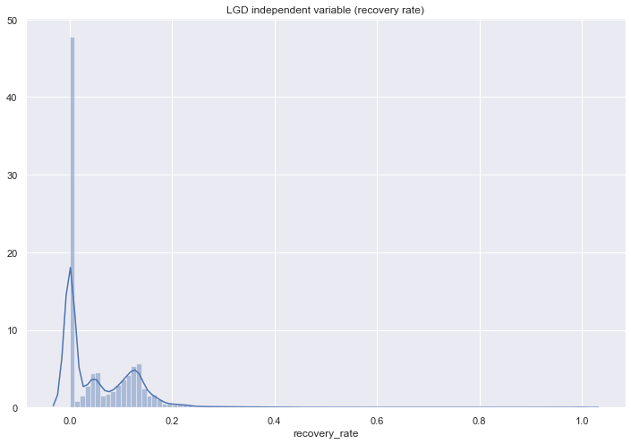


```python
loan_data_defaults['recovery_rate_binary'] = loan_data_defaults['recovery_rate'].apply(lambda x: x if x == 0 else 1)
loan_data_defaults['recovery_rate_binary'].describe()
```

    /Users/omaromeiri/anaconda3/lib/python3.7/site-packages/ipykernel_launcher.py:1: SettingWithCopyWarning: 
    A value is trying to be set on a copy of a slice from a DataFrame.
    Try using .loc[row_indexer,col_indexer] = value instead
    
    See the caveats in the documentation: http://pandas.pydata.org/pandas-docs/stable/indexing.html#indexing-view-versus-copy
      """Entry point for launching an IPython kernel.


    count    43236.000000
    mean         0.563674
    std          0.495935
    min          0.000000
    25%          0.000000
    50%          1.000000
    75%          1.000000
    max          1.000000
    Name: recovery_rate_binary, dtype: float64


# EAD

#### CCF is much more homogeneously distributed, so I will use a multiple linear regression model to estimate CCF


```python
fig = plt.figure(figsize=(12,8))
sns.distplot(loan_data_defaults['CCF'], bins=100)
plt.title('EAD independent variable (CCF)')
```


    Text(0.5, 1.0, 'EAD independent variable (CCF)')


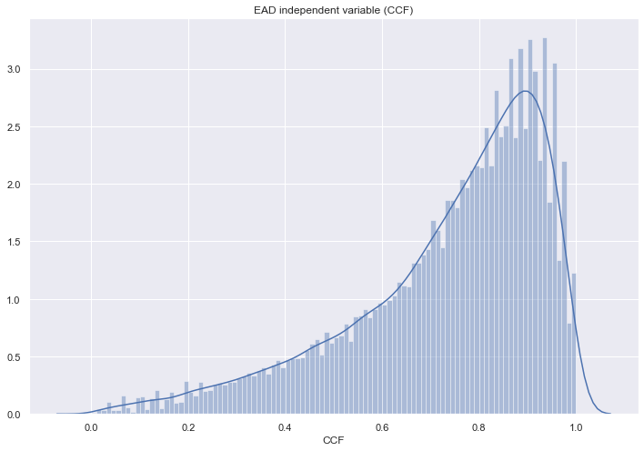


# LGD Model stage 1 (Logistic regression)


```python
from sklearn.model_selection import train_test_split
from sklearn.linear_model import LogisticRegression, LinearRegression
import pickle
```


```python
x_train_lgd_1, x_test_lgd_1, y_train_lgd_1, y_test_lgd_1 = train_test_split(loan_data_defaults.drop(['Y', 'recovery_rate', 'recovery_rate_binary', 'CCF'], axis=1),
                                                                    loan_data_defaults['recovery_rate_binary'], test_size=0.2, shuffle=True, random_state=42)

print(f'Train: X:{x_train_lgd_1.shape}, Y:{y_train_lgd_1.shape}')
print(f'Test : X:{x_test_lgd_1.shape}, Y:{y_test_lgd_1.shape}')
```

    Train: X:(34588, 204), Y:(34588,)
    Test : X:(8648, 204), Y:(8648,)


```python
vars_to_use = pickle.load(open('vars_usable_preprocessing.pickle', 'rb'))
len(vars_to_use)
```


    50


```python
'''
    Popping this variable from the vars list because it has only 0 values for this dataset,
    and will cause a SINGULAR MATRIX ERROR while trying to perform the transformations for the p-value calculations
'''

vars_to_use.pop(7)
```


    'home_ownership:ANY'


```python
len(vars_to_use)
```


    49


```python
ref_vars = ['grade:G', 'home_ownership:RENT', 'verification_status:Verified', 'purpose:credit_card', 'initial_list_status:f']
```


```python
x_train_lgd_1 = x_train_lgd_1[vars_to_use]


print(x_train_lgd_1.shape)
pd.DataFrame(x_train_lgd_1.isnull().sum()).T
```

    (34588, 49)


<div>
<style scoped>
    .dataframe tbody tr th:only-of-type {
        vertical-align: middle;
    }

    .dataframe tbody tr th {
        vertical-align: top;
    }

    .dataframe thead th {
        text-align: right;
    }
</style>
<table border="1" class="dataframe">
  <thead>
    <tr style="text-align: right;">
      <th></th>
      <th>grade:A</th>
      <th>grade:B</th>
      <th>grade:C</th>
      <th>grade:D</th>
      <th>grade:E</th>
      <th>grade:F</th>
      <th>grade:G</th>
      <th>home_ownership:MORTGAGE</th>
      <th>home_ownership:NONE</th>
      <th>home_ownership:OTHER</th>
      <th>home_ownership:OWN</th>
      <th>home_ownership:RENT</th>
      <th>verification_status:Not Verified</th>
      <th>verification_status:Source Verified</th>
      <th>verification_status:Verified</th>
      <th>purpose:car</th>
      <th>purpose:credit_card</th>
      <th>purpose:debt_consolidation</th>
      <th>purpose:educational</th>
      <th>purpose:home_improvement</th>
      <th>purpose:house</th>
      <th>purpose:major_purchase</th>
      <th>purpose:medical</th>
      <th>purpose:moving</th>
      <th>purpose:other</th>
      <th>purpose:renewable_energy</th>
      <th>purpose:small_business</th>
      <th>purpose:vacation</th>
      <th>purpose:wedding</th>
      <th>initial_list_status:f</th>
      <th>initial_list_status:w</th>
      <th>term</th>
      <th>emp_length_int</th>
      <th>mths_since_issue_d</th>
      <th>mths_since_earliest_cr_line</th>
      <th>funded_amnt</th>
      <th>int_rate</th>
      <th>installment</th>
      <th>annual_inc</th>
      <th>dti</th>
      <th>delinq_2yrs</th>
      <th>inq_last_6mths</th>
      <th>mths_since_last_delinq</th>
      <th>mths_since_last_record</th>
      <th>open_acc</th>
      <th>pub_rec</th>
      <th>total_acc</th>
      <th>acc_now_delinq</th>
      <th>total_rev_hi_lim</th>
    </tr>
  </thead>
  <tbody>
    <tr>
      <th>0</th>
      <td>0</td>
      <td>0</td>
      <td>0</td>
      <td>0</td>
      <td>0</td>
      <td>0</td>
      <td>0</td>
      <td>0</td>
      <td>0</td>
      <td>0</td>
      <td>0</td>
      <td>0</td>
      <td>0</td>
      <td>0</td>
      <td>0</td>
      <td>0</td>
      <td>0</td>
      <td>0</td>
      <td>0</td>
      <td>0</td>
      <td>0</td>
      <td>0</td>
      <td>0</td>
      <td>0</td>
      <td>0</td>
      <td>0</td>
      <td>0</td>
      <td>0</td>
      <td>0</td>
      <td>0</td>
      <td>0</td>
      <td>0</td>
      <td>0</td>
      <td>0</td>
      <td>0</td>
      <td>0</td>
      <td>0</td>
      <td>0</td>
      <td>0</td>
      <td>0</td>
      <td>0</td>
      <td>0</td>
      <td>0</td>
      <td>0</td>
      <td>0</td>
      <td>0</td>
      <td>0</td>
      <td>0</td>
      <td>0</td>
    </tr>
  </tbody>
</table>
</div>


```python
x_train_lgd_1.drop(ref_vars, axis=1, inplace=True)
print(x_train_lgd_1.shape)
```

    (34588, 44)


```python
from sklearn import linear_model
import scipy.stats as stat

class LogisticRegression_with_p_values:
    
    def __init__(self,*args,**kwargs):
        self.model = linear_model.LogisticRegression(*args,**kwargs)
        
    def fit(self,X,y):
        self.model.fit(X,y)
        
        #### Get p-values for the fitted model ####
        denom = (2.0 * (1.0 + np.cosh(self.model.decision_function(X))))
        denom = np.tile(denom,(X.shape[1],1)).T
        F_ij = np.dot((X / denom).T,X)
        Cramer_Rao = np.linalg.inv(F_ij)
        sigma_estimates = np.sqrt(np.diagonal(Cramer_Rao))
        z_scores = self.model.coef_[0] / sigma_estimates
        p_values = [stat.norm.sf(abs(x)) * 2 for x in z_scores]
        
        self.coef_ = self.model.coef_
        self.intercept_ = self.model.intercept_
        self.p_values = p_values
```


```python
log_reg_lgd = LogisticRegression_with_p_values()

log_reg_lgd.fit(x_train_lgd_1.values, y_train_lgd_1.values)
```

    /Users/omaromeiri/anaconda3/lib/python3.7/site-packages/sklearn/linear_model/logistic.py:432: FutureWarning: Default solver will be changed to 'lbfgs' in 0.22. Specify a solver to silence this warning.
      FutureWarning)


```python
summary_table = pd.DataFrame(columns = ['Feature name', 'Coef'])

summary_table['Feature name'] = x_train_lgd_1.columns.values
summary_table['Coef'] = log_reg_lgd.coef_[0]
summary_table.index = summary_table.index + 1
summary_table.loc[0] = ['Intercept', log_reg_lgd.intercept_[0]]
summary_table = summary_table.sort_index()

p_values = log_reg_lgd.p_values
p_values = np.append(np.nan, np.array(p_values))
summary_table['p_values'] = p_values

summary_table
```


<div>
<style scoped>
    .dataframe tbody tr th:only-of-type {
        vertical-align: middle;
    }

    .dataframe tbody tr th {
        vertical-align: top;
    }

    .dataframe thead th {
        text-align: right;
    }
</style>
<table border="1" class="dataframe">
  <thead>
    <tr style="text-align: right;">
      <th></th>
      <th>Feature name</th>
      <th>Coef</th>
      <th>p_values</th>
    </tr>
  </thead>
  <tbody>
    <tr>
      <th>0</th>
      <td>Intercept</td>
      <td>-1.110901e-03</td>
      <td>NaN</td>
    </tr>
    <tr>
      <th>1</th>
      <td>grade:A</td>
      <td>-3.608582e-04</td>
      <td>9.966515e-01</td>
    </tr>
    <tr>
      <th>2</th>
      <td>grade:B</td>
      <td>-1.134001e-03</td>
      <td>9.869645e-01</td>
    </tr>
    <tr>
      <th>3</th>
      <td>grade:C</td>
      <td>-1.259614e-03</td>
      <td>9.849665e-01</td>
    </tr>
    <tr>
      <th>4</th>
      <td>grade:D</td>
      <td>3.291937e-04</td>
      <td>9.962227e-01</td>
    </tr>
    <tr>
      <th>5</th>
      <td>grade:E</td>
      <td>3.533240e-04</td>
      <td>9.963228e-01</td>
    </tr>
    <tr>
      <th>6</th>
      <td>grade:F</td>
      <td>8.030837e-04</td>
      <td>9.927258e-01</td>
    </tr>
    <tr>
      <th>7</th>
      <td>home_ownership:MORTGAGE</td>
      <td>-1.483000e-04</td>
      <td>9.953845e-01</td>
    </tr>
    <tr>
      <th>8</th>
      <td>home_ownership:NONE</td>
      <td>7.190958e-06</td>
      <td>9.999929e-01</td>
    </tr>
    <tr>
      <th>9</th>
      <td>home_ownership:OTHER</td>
      <td>-9.911362e-06</td>
      <td>9.999818e-01</td>
    </tr>
    <tr>
      <th>10</th>
      <td>home_ownership:OWN</td>
      <td>-4.218493e-05</td>
      <td>9.991919e-01</td>
    </tr>
    <tr>
      <th>11</th>
      <td>verification_status:Not Verified</td>
      <td>-1.381891e-03</td>
      <td>9.636992e-01</td>
    </tr>
    <tr>
      <th>12</th>
      <td>verification_status:Source Verified</td>
      <td>-1.190502e-03</td>
      <td>9.654230e-01</td>
    </tr>
    <tr>
      <th>13</th>
      <td>purpose:car</td>
      <td>5.959565e-05</td>
      <td>9.995982e-01</td>
    </tr>
    <tr>
      <th>14</th>
      <td>purpose:debt_consolidation</td>
      <td>-1.034470e-03</td>
      <td>9.729777e-01</td>
    </tr>
    <tr>
      <th>15</th>
      <td>purpose:educational</td>
      <td>-2.951704e-05</td>
      <td>9.999281e-01</td>
    </tr>
    <tr>
      <th>16</th>
      <td>purpose:home_improvement</td>
      <td>4.048459e-05</td>
      <td>9.994413e-01</td>
    </tr>
    <tr>
      <th>17</th>
      <td>purpose:house</td>
      <td>8.122308e-05</td>
      <td>9.995553e-01</td>
    </tr>
    <tr>
      <th>18</th>
      <td>purpose:major_purchase</td>
      <td>9.375574e-05</td>
      <td>9.991476e-01</td>
    </tr>
    <tr>
      <th>19</th>
      <td>purpose:medical</td>
      <td>-2.355535e-06</td>
      <td>9.999825e-01</td>
    </tr>
    <tr>
      <th>20</th>
      <td>purpose:moving</td>
      <td>1.498313e-05</td>
      <td>9.999018e-01</td>
    </tr>
    <tr>
      <th>21</th>
      <td>purpose:other</td>
      <td>2.247337e-04</td>
      <td>9.966432e-01</td>
    </tr>
    <tr>
      <th>22</th>
      <td>purpose:renewable_energy</td>
      <td>2.338162e-05</td>
      <td>9.999461e-01</td>
    </tr>
    <tr>
      <th>23</th>
      <td>purpose:small_business</td>
      <td>2.685086e-04</td>
      <td>9.970803e-01</td>
    </tr>
    <tr>
      <th>24</th>
      <td>purpose:vacation</td>
      <td>2.848121e-05</td>
      <td>9.998443e-01</td>
    </tr>
    <tr>
      <th>25</th>
      <td>purpose:wedding</td>
      <td>5.462642e-05</td>
      <td>9.997101e-01</td>
    </tr>
    <tr>
      <th>26</th>
      <td>initial_list_status:w</td>
      <td>-6.024366e-03</td>
      <td>8.239325e-01</td>
    </tr>
    <tr>
      <th>27</th>
      <td>term</td>
      <td>-1.547360e-02</td>
      <td>9.177198e-10</td>
    </tr>
    <tr>
      <th>28</th>
      <td>emp_length_int</td>
      <td>-1.908702e-03</td>
      <td>5.376285e-01</td>
    </tr>
    <tr>
      <th>29</th>
      <td>mths_since_issue_d</td>
      <td>2.780206e-02</td>
      <td>1.472390e-198</td>
    </tr>
    <tr>
      <th>30</th>
      <td>mths_since_earliest_cr_line</td>
      <td>-1.339119e-03</td>
      <td>4.528417e-20</td>
    </tr>
    <tr>
      <th>31</th>
      <td>funded_amnt</td>
      <td>6.837061e-05</td>
      <td>1.291439e-11</td>
    </tr>
    <tr>
      <th>32</th>
      <td>int_rate</td>
      <td>8.767259e-03</td>
      <td>1.363276e-01</td>
    </tr>
    <tr>
      <th>33</th>
      <td>installment</td>
      <td>-1.602509e-03</td>
      <td>3.269745e-07</td>
    </tr>
    <tr>
      <th>34</th>
      <td>annual_inc</td>
      <td>1.174036e-07</td>
      <td>7.378605e-01</td>
    </tr>
    <tr>
      <th>35</th>
      <td>dti</td>
      <td>-1.905633e-02</td>
      <td>6.809826e-31</td>
    </tr>
    <tr>
      <th>36</th>
      <td>delinq_2yrs</td>
      <td>3.645997e-04</td>
      <td>9.803135e-01</td>
    </tr>
    <tr>
      <th>37</th>
      <td>inq_last_6mths</td>
      <td>8.554108e-04</td>
      <td>9.296924e-01</td>
    </tr>
    <tr>
      <th>38</th>
      <td>mths_since_last_delinq</td>
      <td>-2.174807e-04</td>
      <td>6.716572e-01</td>
    </tr>
    <tr>
      <th>39</th>
      <td>mths_since_last_record</td>
      <td>-3.512850e-03</td>
      <td>1.845134e-08</td>
    </tr>
    <tr>
      <th>40</th>
      <td>open_acc</td>
      <td>-5.903254e-03</td>
      <td>7.430472e-02</td>
    </tr>
    <tr>
      <th>41</th>
      <td>pub_rec</td>
      <td>-9.284738e-05</td>
      <td>9.981397e-01</td>
    </tr>
    <tr>
      <th>42</th>
      <td>total_acc</td>
      <td>-8.865031e-03</td>
      <td>1.590530e-09</td>
    </tr>
    <tr>
      <th>43</th>
      <td>acc_now_delinq</td>
      <td>5.369124e-05</td>
      <td>9.997566e-01</td>
    </tr>
    <tr>
      <th>44</th>
      <td>total_rev_hi_lim</td>
      <td>-9.850321e-07</td>
      <td>1.350083e-01</td>
    </tr>
  </tbody>
</table>
</div>


# Validation


```python
import sklearn.metrics as sklm
```


```python
x_test_lgd_1 = x_test_lgd_1[vars_to_use]
x_test_lgd_1 = x_test_lgd_1.drop(ref_vars, axis=1)
x_test_lgd_1.shape
```


    (8648, 44)


```python
preds_1 = pd.DataFrame(log_reg_lgd.model.predict(x_test_lgd_1), columns=['Preds'])
```


```python
probs = log_reg_lgd.model.predict_proba(x_test_lgd_1)[:,1]
```


```python
fpr, tpr, thresh = sklm.roc_curve(y_test_lgd_1, probs)
```


```python
fig = plt.figure(figsize=(12,8))
plt.plot(fpr, tpr)
plt.plot(fpr, fpr, '--')
plt.xlabel('False positive rate')
plt.ylabel('True positive rate')
plt.title('ROC curve', fontsize=20)
```


    Text(0.5, 1.0, 'ROC curve')


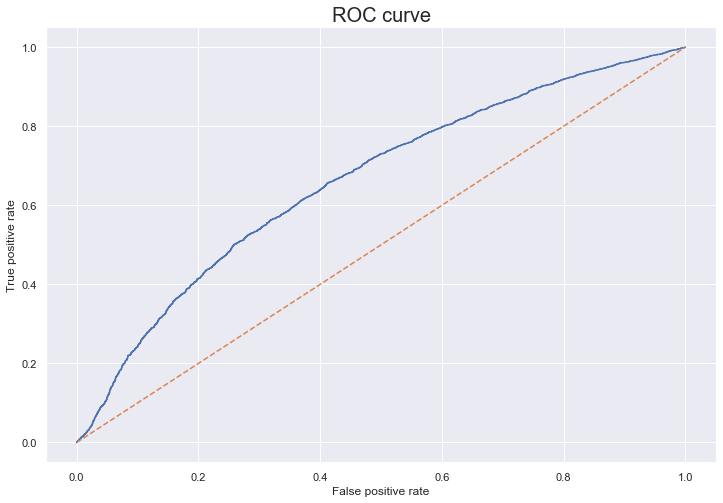


```python
AUROC = sklm.roc_auc_score(y_test_lgd_1, probs)
AUROC
```


    0.6616361277422957


```python
print(sklm.classification_report(y_test_lgd_1, preds_1))
```

                  precision    recall  f1-score   support
    
             0.0       0.60      0.43      0.50      3762
             1.0       0.64      0.78      0.70      4886
    
        accuracy                           0.63      8648
       macro avg       0.62      0.60      0.60      8648
    weighted avg       0.62      0.63      0.61      8648
    


```python
conf_mat = pd.crosstab(y_test_lgd_1.values, preds_1['Preds'].values, rownames=['True'], colnames=['Pred'])
conf_mat['Total'] = conf_mat.sum(axis=1)
conf_mat.loc[2, :] = conf_mat.sum(axis=0)

conf_mat = conf_mat.astype('int')
conf_mat.rename(index = {2:'Total'}, inplace=True)
conf_mat
```


<div>
<style scoped>
    .dataframe tbody tr th:only-of-type {
        vertical-align: middle;
    }

    .dataframe tbody tr th {
        vertical-align: top;
    }

    .dataframe thead th {
        text-align: right;
    }
</style>
<table border="1" class="dataframe">
  <thead>
    <tr style="text-align: right;">
      <th>Pred</th>
      <th>0.0</th>
      <th>1.0</th>
      <th>Total</th>
    </tr>
    <tr>
      <th>True</th>
      <th></th>
      <th></th>
      <th></th>
    </tr>
  </thead>
  <tbody>
    <tr>
      <th>0.0</th>
      <td>1600</td>
      <td>2162</td>
      <td>3762</td>
    </tr>
    <tr>
      <th>1.0</th>
      <td>1067</td>
      <td>3819</td>
      <td>4886</td>
    </tr>
    <tr>
      <th>Total</th>
      <td>2667</td>
      <td>5981</td>
      <td>8648</td>
    </tr>
  </tbody>
</table>
</div>


```python

```


```python
cut_off = 0.52
cut_off_preds = np.where(probs >= cut_off, 1, 0)
```


```python
print(sklm.classification_report(y_test_lgd_1, cut_off_preds))
```

                  precision    recall  f1-score   support
    
             0.0       0.59      0.50      0.54      3762
             1.0       0.65      0.73      0.69      4886
    
        accuracy                           0.63      8648
       macro avg       0.62      0.62      0.62      8648
    weighted avg       0.63      0.63      0.63      8648
    


```python
conf_mat = pd.crosstab(y_test_lgd_1, cut_off_preds, rownames=['True'], colnames=['Pred'])
conf_mat['Total'] = conf_mat.sum(axis=1)
conf_mat.loc[2, :] = conf_mat.sum(axis=0)

conf_mat = conf_mat.astype('int')
conf_mat.rename(index = {2:'Total'}, inplace=True)
conf_mat
```


<div>
<style scoped>
    .dataframe tbody tr th:only-of-type {
        vertical-align: middle;
    }

    .dataframe tbody tr th {
        vertical-align: top;
    }

    .dataframe thead th {
        text-align: right;
    }
</style>
<table border="1" class="dataframe">
  <thead>
    <tr style="text-align: right;">
      <th>Pred</th>
      <th>0</th>
      <th>1</th>
      <th>Total</th>
    </tr>
    <tr>
      <th>True</th>
      <th></th>
      <th></th>
      <th></th>
    </tr>
  </thead>
  <tbody>
    <tr>
      <th>0.0</th>
      <td>1882</td>
      <td>1880</td>
      <td>3762</td>
    </tr>
    <tr>
      <th>1.0</th>
      <td>1320</td>
      <td>3566</td>
      <td>4886</td>
    </tr>
    <tr>
      <th>Total</th>
      <td>3202</td>
      <td>5446</td>
      <td>8648</td>
    </tr>
  </tbody>
</table>
</div>


```python
pickle.dump(log_reg_lgd,open('model_LGD_log_reg_2007-2014.sav', 'wb'))
```

# LGD model stage 2 (Linear Regression)


```python
loan_data_defaults_recoveries = loan_data_defaults[loan_data_defaults['recovery_rate'] > 0].copy()
loan_data_defaults_recoveries.shape
```


    (24371, 208)


```python
loan_data_defaults_recoveries['recovery_rate_binary'].sum()
```


    24371.0


```python
x_train_lgd_2, x_test_lgd_2, y_train_lgd_2, y_test_lgd_2 = train_test_split(loan_data_defaults_recoveries.drop(['recovery_rate', 'recovery_rate_binary', 'Y', 'CCF'], axis=1),
                                                                            loan_data_defaults_recoveries['recovery_rate'], test_size=0.2, shuffle=True, random_state=42)

print(f'Train: X:{x_train_lgd_2.shape}, Y:{y_train_lgd_2.shape}')
print(f'Test : X:{x_test_lgd_2.shape}, Y:{y_test_lgd_2.shape}')
```

    Train: X:(19496, 204), Y:(19496,)
    Test : X:(4875, 204), Y:(4875,)


```python
import scipy.stats as stat

class LinearRegression(linear_model.LinearRegression):
    def __init__(self, fit_intercept=True, normalize=True, copy_X=True, n_jobs=1):
        self.fit_intercept = fit_intercept
        self.normalize = normalize
        self.copy_X = copy_X
        self.n_jobs = n_jobs
        
    def fit(self, X, y, n_jobs=1):
        self = super(LinearRegression, self).fit(X, y, n_jobs)
        sse = np.sum((self.predict(X) - y) ** 2, axis=0) / float(X.shape[0] - X.shape[1])
        se = np.array([np.sqrt(np.diagonal(sse * np.linalg.inv(np.dot(X.T, X))))])
        self.t = self.coef_ / se
        self.p = np.squeeze(2 * (1 - stat.t.cdf(np.abs(self.t), y.shape[0] - X.shape[1])))
        return self
```


```python
x_train_lgd_2 = x_train_lgd_2[vars_to_use]
x_train_lgd_2 = x_train_lgd_2.drop(ref_vars, axis=1)
x_train_lgd_2.shape
```


    (19496, 44)


```python
lin_reg_lgd = LinearRegression()
lin_reg_lgd.fit(x_train_lgd_2, y_train_lgd_2)
```


    LinearRegression(copy_X=True, fit_intercept=True, n_jobs=1, normalize=True)


```python
summary_table = pd.DataFrame(columns = ['Feature name', 'Coef'])

summary_table['Feature name'] = x_train_lgd_2.columns.values
summary_table['Coef'] = lin_reg_lgd.coef_
summary_table.index = summary_table.index + 1
summary_table.loc[0] = ['Intercept', lin_reg_lgd.intercept_]
summary_table = summary_table.sort_index()

p_values = lin_reg_lgd.p
p_values = np.append(np.nan, np.array(p_values))
summary_table['p_values'] = p_values.round(4)
```

#### recovery rate coefficients interpretation<br>
Remembering that recovery rate is the proportion that the bank managed to recover from the total default

Positive coefs = Increase in RR (Lower risk)<br>
Negative coefs = Decrease in RR (Higher risk)


```python
summary_table
```


<div>
<style scoped>
    .dataframe tbody tr th:only-of-type {
        vertical-align: middle;
    }

    .dataframe tbody tr th {
        vertical-align: top;
    }

    .dataframe thead th {
        text-align: right;
    }
</style>
<table border="1" class="dataframe">
  <thead>
    <tr style="text-align: right;">
      <th></th>
      <th>Feature name</th>
      <th>Coef</th>
      <th>p_values</th>
    </tr>
  </thead>
  <tbody>
    <tr>
      <th>0</th>
      <td>Intercept</td>
      <td>2.407060e-01</td>
      <td>NaN</td>
    </tr>
    <tr>
      <th>1</th>
      <td>grade:A</td>
      <td>-6.826469e-02</td>
      <td>0.0000</td>
    </tr>
    <tr>
      <th>2</th>
      <td>grade:B</td>
      <td>-5.083300e-02</td>
      <td>0.0000</td>
    </tr>
    <tr>
      <th>3</th>
      <td>grade:C</td>
      <td>-3.747936e-02</td>
      <td>0.0000</td>
    </tr>
    <tr>
      <th>4</th>
      <td>grade:D</td>
      <td>-2.717280e-02</td>
      <td>0.0000</td>
    </tr>
    <tr>
      <th>5</th>
      <td>grade:E</td>
      <td>-1.316041e-02</td>
      <td>0.0019</td>
    </tr>
    <tr>
      <th>6</th>
      <td>grade:F</td>
      <td>-5.259127e-03</td>
      <td>0.2750</td>
    </tr>
    <tr>
      <th>7</th>
      <td>home_ownership:MORTGAGE</td>
      <td>2.834188e-03</td>
      <td>0.0603</td>
    </tr>
    <tr>
      <th>8</th>
      <td>home_ownership:NONE</td>
      <td>1.459157e-01</td>
      <td>0.0001</td>
    </tr>
    <tr>
      <th>9</th>
      <td>home_ownership:OTHER</td>
      <td>-9.472643e-03</td>
      <td>0.6438</td>
    </tr>
    <tr>
      <th>10</th>
      <td>home_ownership:OWN</td>
      <td>5.000600e-03</td>
      <td>0.0396</td>
    </tr>
    <tr>
      <th>11</th>
      <td>verification_status:Not Verified</td>
      <td>1.055988e-03</td>
      <td>0.5531</td>
    </tr>
    <tr>
      <th>12</th>
      <td>verification_status:Source Verified</td>
      <td>-1.010887e-03</td>
      <td>0.5351</td>
    </tr>
    <tr>
      <th>13</th>
      <td>purpose:car</td>
      <td>-2.996834e-03</td>
      <td>0.6340</td>
    </tr>
    <tr>
      <th>14</th>
      <td>purpose:debt_consolidation</td>
      <td>8.205794e-05</td>
      <td>0.9647</td>
    </tr>
    <tr>
      <th>15</th>
      <td>purpose:educational</td>
      <td>7.626182e-02</td>
      <td>0.0000</td>
    </tr>
    <tr>
      <th>16</th>
      <td>purpose:home_improvement</td>
      <td>-3.709477e-03</td>
      <td>0.2720</td>
    </tr>
    <tr>
      <th>17</th>
      <td>purpose:house</td>
      <td>-3.784643e-03</td>
      <td>0.6202</td>
    </tr>
    <tr>
      <th>18</th>
      <td>purpose:major_purchase</td>
      <td>2.913643e-03</td>
      <td>0.5378</td>
    </tr>
    <tr>
      <th>19</th>
      <td>purpose:medical</td>
      <td>1.079137e-02</td>
      <td>0.0738</td>
    </tr>
    <tr>
      <th>20</th>
      <td>purpose:moving</td>
      <td>1.399088e-02</td>
      <td>0.0386</td>
    </tr>
    <tr>
      <th>21</th>
      <td>purpose:other</td>
      <td>4.843035e-03</td>
      <td>0.1088</td>
    </tr>
    <tr>
      <th>22</th>
      <td>purpose:renewable_energy</td>
      <td>2.421212e-02</td>
      <td>0.1422</td>
    </tr>
    <tr>
      <th>23</th>
      <td>purpose:small_business</td>
      <td>6.236575e-04</td>
      <td>0.8687</td>
    </tr>
    <tr>
      <th>24</th>
      <td>purpose:vacation</td>
      <td>-3.021965e-03</td>
      <td>0.7295</td>
    </tr>
    <tr>
      <th>25</th>
      <td>purpose:wedding</td>
      <td>2.034709e-02</td>
      <td>0.0055</td>
    </tr>
    <tr>
      <th>26</th>
      <td>initial_list_status:w</td>
      <td>1.464935e-02</td>
      <td>0.0000</td>
    </tr>
    <tr>
      <th>27</th>
      <td>term</td>
      <td>3.315123e-04</td>
      <td>0.0205</td>
    </tr>
    <tr>
      <th>28</th>
      <td>emp_length_int</td>
      <td>8.839199e-05</td>
      <td>0.6307</td>
    </tr>
    <tr>
      <th>29</th>
      <td>mths_since_issue_d</td>
      <td>-1.521470e-03</td>
      <td>0.0000</td>
    </tr>
    <tr>
      <th>30</th>
      <td>mths_since_earliest_cr_line</td>
      <td>3.395486e-05</td>
      <td>0.0001</td>
    </tr>
    <tr>
      <th>31</th>
      <td>funded_amnt</td>
      <td>-2.182303e-07</td>
      <td>0.6999</td>
    </tr>
    <tr>
      <th>32</th>
      <td>int_rate</td>
      <td>-2.544599e-03</td>
      <td>0.0000</td>
    </tr>
    <tr>
      <th>33</th>
      <td>installment</td>
      <td>-1.038606e-05</td>
      <td>0.5565</td>
    </tr>
    <tr>
      <th>34</th>
      <td>annual_inc</td>
      <td>6.396260e-08</td>
      <td>0.0013</td>
    </tr>
    <tr>
      <th>35</th>
      <td>dti</td>
      <td>1.775835e-04</td>
      <td>0.0690</td>
    </tr>
    <tr>
      <th>36</th>
      <td>delinq_2yrs</td>
      <td>1.759398e-03</td>
      <td>0.0502</td>
    </tr>
    <tr>
      <th>37</th>
      <td>inq_last_6mths</td>
      <td>1.273553e-03</td>
      <td>0.0182</td>
    </tr>
    <tr>
      <th>38</th>
      <td>mths_since_last_delinq</td>
      <td>-1.038074e-06</td>
      <td>0.9724</td>
    </tr>
    <tr>
      <th>39</th>
      <td>mths_since_last_record</td>
      <td>-5.538534e-05</td>
      <td>0.1825</td>
    </tr>
    <tr>
      <th>40</th>
      <td>open_acc</td>
      <td>-1.196640e-03</td>
      <td>0.0000</td>
    </tr>
    <tr>
      <th>41</th>
      <td>pub_rec</td>
      <td>3.433792e-03</td>
      <td>0.2098</td>
    </tr>
    <tr>
      <th>42</th>
      <td>total_acc</td>
      <td>4.771140e-04</td>
      <td>0.0000</td>
    </tr>
    <tr>
      <th>43</th>
      <td>acc_now_delinq</td>
      <td>4.228832e-03</td>
      <td>0.6621</td>
    </tr>
    <tr>
      <th>44</th>
      <td>total_rev_hi_lim</td>
      <td>2.262902e-07</td>
      <td>0.0000</td>
    </tr>
  </tbody>
</table>
</div>


```python
x_test_lgd_2 = x_test_lgd_2[vars_to_use]
x_test_lgd_2 = x_test_lgd_2.drop(ref_vars, axis=1)
x_test_lgd_2.shape
```


    (4875, 44)


```python
preds_2 = pd.DataFrame(lin_reg_lgd.predict(x_test_lgd_2), columns=['Preds'])
preds_2['True'] = y_test_lgd_2.values
```


```python
def print_metrics(y_true, y_predicted, n_parameters):
    import math
    ## First compute R^2 and the adjusted R^2
    r2 = sklm.r2_score(y_true, y_predicted)
    r2_adj = r2 - (n_parameters - 1)/(y_true.shape[0] - n_parameters) * (1 - r2)
    
    ## Print the usual metrics and the R^2 values
    print('Mean value of true values = ' + str(np.mean(y_true)))
    print('Mean Square Error         = ' + str(sklm.mean_squared_error(y_true, y_predicted)))
    print('Root Mean Square Error    = ' + str(math.sqrt(sklm.mean_squared_error(y_true, y_predicted))))
    print('Mean Absolute Error       = ' + str(sklm.mean_absolute_error(y_true, y_predicted)))
    print('Median Absolute Error     = ' + str(sklm.median_absolute_error(y_true, y_predicted)))
    print('R^2                       = ' + str(r2))
    print('Adjusted R^2              = ' + str(r2_adj))
    
    

print_metrics(preds_2['True'], preds_2['Preds'], (len(vars_to_use) - len(ref_vars)))  


```

    Mean value of true values = 0.10665266651601348
    Mean Square Error         = 0.007855197632174342
    Root Mean Square Error    = 0.0886295528149293
    Mean Absolute Error       = 0.04311708408776568
    Median Absolute Error     = 0.02344551722275011
    R^2                       = 0.09468634957185729
    Adjusted R^2              = 0.08662828975641325


```python

```

#### Not so great correlations, but acceptable for a LGD model


```python
preds_2.corr()
```


<div>
<style scoped>
    .dataframe tbody tr th:only-of-type {
        vertical-align: middle;
    }

    .dataframe tbody tr th {
        vertical-align: top;
    }

    .dataframe thead th {
        text-align: right;
    }
</style>
<table border="1" class="dataframe">
  <thead>
    <tr style="text-align: right;">
      <th></th>
      <th>Preds</th>
      <th>True</th>
    </tr>
  </thead>
  <tbody>
    <tr>
      <th>Preds</th>
      <td>1.000000</td>
      <td>0.308012</td>
    </tr>
    <tr>
      <th>True</th>
      <td>0.308012</td>
      <td>1.000000</td>
    </tr>
  </tbody>
</table>
</div>


```python
preds_2['True'].describe()
```


    count    4875.000000
    mean        0.106653
    std         0.093159
    min         0.000257
    25%         0.050246
    50%         0.105937
    75%         0.134014
    max         1.000000
    Name: True, dtype: float64


```python
fig = plt.figure(figsize=(12,8))
sns.distplot(preds_2['True'], label='True', bins=100)
sns.distplot(preds_2['Preds'], label='Predictions', bins=100)

plt.legend()
```


    <matplotlib.legend.Legend at 0x123e95048>


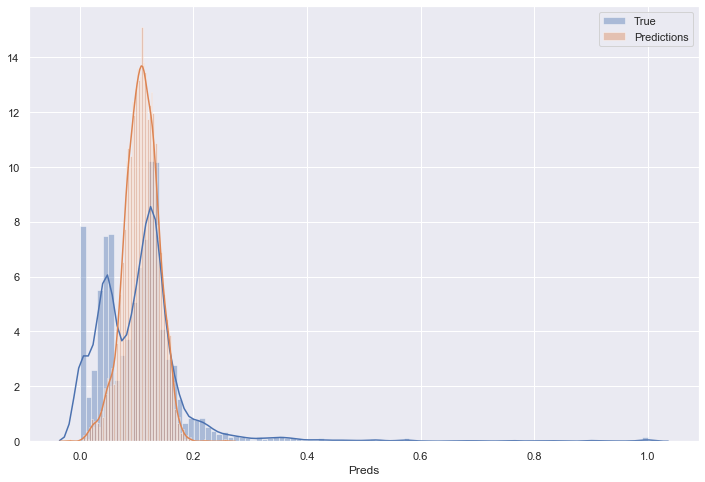


### Plotting residuals


```python
resids = np.subtract(preds_2['True'], preds_2['Preds']).values

fig = plt.figure(figsize=(12,8))
sns.distplot(resids, bins=100)
```


    <matplotlib.axes._subplots.AxesSubplot at 0x123f93048>


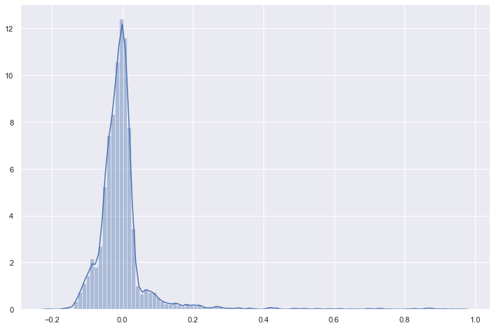


```python
sns.scatterplot(preds_2['Preds'], resids)
plt.title('Residuals vs. predicted values')
plt.xlabel('Predicted values')
plt.ylabel('Residual')
```


    Text(0, 0.5, 'Residual')


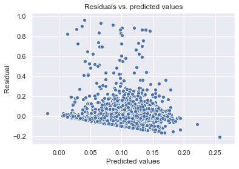


I like this plot, shows no dependency between the output and the residuals


```python
stat.probplot(resids.flatten(), plot = plt)
plt.title('Residuals vs. predicted values')
plt.xlabel('Predicted values')
plt.ylabel('Residual')
plt.xticks([])
```


    ([], <a list of 0 Text xticklabel objects>)


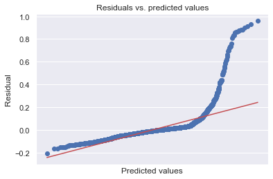


I really don't like this huge steep pattern, this in and indicative of outliers and that the predictions are skewing from a normal distribution, but looking at the distribution plot we see, that very few points ended up too far in the scale


```python
pickle.dump(lin_reg_lgd, open('model_LGD_lin_reg_2007-2014.sav', 'wb'))
```

# LGD combining stage 1 and stage 2

First, predicting the recovery rate for all of the test data


```python
recovery_rate_preds_all = pd.DataFrame(lin_reg_lgd.predict(x_test_lgd_1), columns=['predicted_recovery_rate'])
print(recovery_rate_preds_all.shape)
recovery_rate_preds_all.describe()
```

    (8648, 1)


<div>
<style scoped>
    .dataframe tbody tr th:only-of-type {
        vertical-align: middle;
    }

    .dataframe tbody tr th {
        vertical-align: top;
    }

    .dataframe thead th {
        text-align: right;
    }
</style>
<table border="1" class="dataframe">
  <thead>
    <tr style="text-align: right;">
      <th></th>
      <th>predicted_recovery_rate</th>
    </tr>
  </thead>
  <tbody>
    <tr>
      <th>count</th>
      <td>8648.000000</td>
    </tr>
    <tr>
      <th>mean</th>
      <td>0.114528</td>
    </tr>
    <tr>
      <th>std</th>
      <td>0.030488</td>
    </tr>
    <tr>
      <th>min</th>
      <td>-0.007588</td>
    </tr>
    <tr>
      <th>25%</th>
      <td>0.095538</td>
    </tr>
    <tr>
      <th>50%</th>
      <td>0.116451</td>
    </tr>
    <tr>
      <th>75%</th>
      <td>0.135718</td>
    </tr>
    <tr>
      <th>max</th>
      <td>0.586705</td>
    </tr>
  </tbody>
</table>
</div>


#### Due to the linear regression model is not constrainted between 0 and 1, we might get values outside the range.<br> A beta regression would be preferred for this, but there is still no implemetation in python :(


```python
recovery_rate_preds_all['predicted_recovery_rate'] = recovery_rate_preds_all['predicted_recovery_rate'].apply(lambda x: 0 if x <= 0 else (1 if x > 1 else x))
recovery_rate_preds_all.describe()
```


<div>
<style scoped>
    .dataframe tbody tr th:only-of-type {
        vertical-align: middle;
    }

    .dataframe tbody tr th {
        vertical-align: top;
    }

    .dataframe thead th {
        text-align: right;
    }
</style>
<table border="1" class="dataframe">
  <thead>
    <tr style="text-align: right;">
      <th></th>
      <th>predicted_recovery_rate</th>
    </tr>
  </thead>
  <tbody>
    <tr>
      <th>count</th>
      <td>8648.000000</td>
    </tr>
    <tr>
      <th>mean</th>
      <td>0.114529</td>
    </tr>
    <tr>
      <th>std</th>
      <td>0.030481</td>
    </tr>
    <tr>
      <th>min</th>
      <td>0.000000</td>
    </tr>
    <tr>
      <th>25%</th>
      <td>0.095538</td>
    </tr>
    <tr>
      <th>50%</th>
      <td>0.116451</td>
    </tr>
    <tr>
      <th>75%</th>
      <td>0.135718</td>
    </tr>
    <tr>
      <th>max</th>
      <td>0.586705</td>
    </tr>
  </tbody>
</table>
</div>


#### Multiplying the predicted recovery rate to the binary output of the logistic model, we move to zero the recoveries we predicted not to happen<br> and leaving the values we predicted to recover unchanged<br><br>

Remebering that the x_test_lgd_2 is a subset of the x_test_lgd_1.<br>
I used the x_test_lgd_2 only to train and now predicted for all of the x_test_lgd_1 data points.


```python
x_test_lgd_1['predicted_recovery_rate'] = recovery_rate_preds_all['predicted_recovery_rate'].values * cut_off_preds
```


```python
'''
Predicted recovery rates
'''
x_test_lgd_1['predicted_recovery_rate'].describe()
```


    count    8648.000000
    mean        0.063585
    std         0.053285
    min         0.000000
    25%         0.000000
    50%         0.081307
    75%         0.109014
    max         0.237010
    Name: predicted_recovery_rate, dtype: float64


```python
'''
Real recovery rates for the test dataset
'''

loan_data_defaults.loc[x_test_lgd_1.index.values, 'recovery_rate'].describe()
```


    count    8648.000000
    mean        0.061434
    std         0.090809
    min         0.000000
    25%         0.000000
    50%         0.029521
    75%         0.114983
    max         1.000000
    Name: recovery_rate, dtype: float64


```python
fig = plt.figure(figsize=(12,8))
sns.distplot(x_test_lgd_1['predicted_recovery_rate'], bins=100, label='Predicted recovery rates for the test dataset')
#sns.distplot(loan_data_defaults.loc[x_test_lgd_1.index.values, 'recovery_rate'], bins=100, label='Real recovery rates for the test dataset')
plt.legend()
```


    <matplotlib.legend.Legend at 0x12cc45fd0>


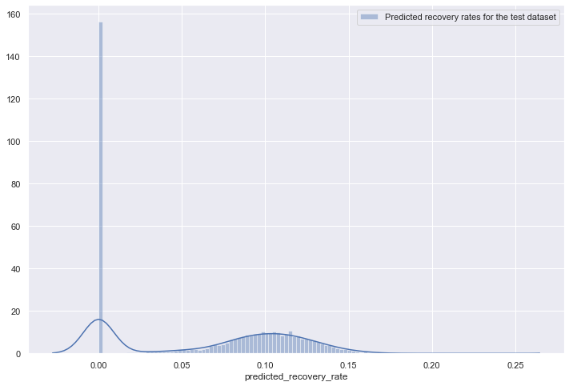


#### Just checking how well the linear regression predicted not to recover


```python
recovery_rate_preds_all.describe()
```


<div>
<style scoped>
    .dataframe tbody tr th:only-of-type {
        vertical-align: middle;
    }

    .dataframe tbody tr th {
        vertical-align: top;
    }

    .dataframe thead th {
        text-align: right;
    }
</style>
<table border="1" class="dataframe">
  <thead>
    <tr style="text-align: right;">
      <th></th>
      <th>predicted_recovery_rate</th>
    </tr>
  </thead>
  <tbody>
    <tr>
      <th>count</th>
      <td>8648.000000</td>
    </tr>
    <tr>
      <th>mean</th>
      <td>0.114529</td>
    </tr>
    <tr>
      <th>std</th>
      <td>0.030481</td>
    </tr>
    <tr>
      <th>min</th>
      <td>0.000000</td>
    </tr>
    <tr>
      <th>25%</th>
      <td>0.095538</td>
    </tr>
    <tr>
      <th>50%</th>
      <td>0.116451</td>
    </tr>
    <tr>
      <th>75%</th>
      <td>0.135718</td>
    </tr>
    <tr>
      <th>max</th>
      <td>0.586705</td>
    </tr>
  </tbody>
</table>
</div>


```python
x_test_lgd_1['predicted_recovery_rate_binary'] = np.where(x_test_lgd_1['predicted_recovery_rate'] > 0, 1, 0)
```


```python
print(sklm.classification_report(y_test_lgd_1, x_test_lgd_1['predicted_recovery_rate_binary']))
```

                  precision    recall  f1-score   support
    
             0.0       0.59      0.50      0.54      3762
             1.0       0.65      0.73      0.69      4886
    
        accuracy                           0.63      8648
       macro avg       0.62      0.61      0.62      8648
    weighted avg       0.63      0.63      0.63      8648
    


```python
conf_mat = pd.crosstab(y_test_lgd_1, x_test_lgd_1['predicted_recovery_rate_binary'], rownames=['True'], colnames=['Pred'])
conf_mat['Total'] = conf_mat.sum(axis=1)
conf_mat.loc[2, :] = conf_mat.sum(axis=0)

conf_mat = conf_mat.astype('int')
conf_mat.rename(index = {2:'Total'}, inplace=True)
conf_mat
```


<div>
<style scoped>
    .dataframe tbody tr th:only-of-type {
        vertical-align: middle;
    }

    .dataframe tbody tr th {
        vertical-align: top;
    }

    .dataframe thead th {
        text-align: right;
    }
</style>
<table border="1" class="dataframe">
  <thead>
    <tr style="text-align: right;">
      <th>Pred</th>
      <th>0</th>
      <th>1</th>
      <th>Total</th>
    </tr>
    <tr>
      <th>True</th>
      <th></th>
      <th></th>
      <th></th>
    </tr>
  </thead>
  <tbody>
    <tr>
      <th>0.0</th>
      <td>1883</td>
      <td>1879</td>
      <td>3762</td>
    </tr>
    <tr>
      <th>1.0</th>
      <td>1322</td>
      <td>3564</td>
      <td>4886</td>
    </tr>
    <tr>
      <th>Total</th>
      <td>3205</td>
      <td>5443</td>
      <td>8648</td>
    </tr>
  </tbody>
</table>
</div>


# EAD Model (Linear regression, CCF estimation)


```python
x_train_ead, x_test_ead, y_train_ead, y_test_ead = train_test_split(loan_data_defaults.drop(['CCF', 'Y', 'recovery_rate', 'recovery_rate_binary'], axis=1),
                                                                    loan_data_defaults['CCF'], test_size=0.2, shuffle=True, random_state=42)

print(f'Train: X:{x_train_ead.shape}, Y:{y_train_ead.shape}')
print(f'Test : X:{x_test_ead.shape}, Y:{y_test_ead.shape}')
```

    Train: X:(34588, 204), Y:(34588,)
    Test : X:(8648, 204), Y:(8648,)


```python
x_train_ead = x_train_ead[vars_to_use]
x_train_ead.drop(ref_vars, axis=1, inplace=True)
x_train_ead.shape
```


    (34588, 44)


```python
x_test_ead = x_test_ead[vars_to_use]
x_test_ead.drop(ref_vars, axis=1, inplace=True)
x_test_ead.shape
```


    (8648, 44)


```python
lin_reg_ead = LinearRegression()

lin_reg_ead.fit(x_train_ead, y_train_ead)
```


    LinearRegression(copy_X=True, fit_intercept=True, n_jobs=1, normalize=True)


```python
summary_table = pd.DataFrame(columns = ['Feature name', 'Coef'])

summary_table['Feature name'] = x_train_ead.columns.values
summary_table['Coef'] = lin_reg_ead.coef_
summary_table.index = summary_table.index + 1
summary_table.loc[0] = ['Intercept', lin_reg_ead.intercept_]
summary_table = summary_table.sort_index()

p_values = lin_reg_ead.p
p_values = np.append(np.nan, np.array(p_values))
summary_table['p_values'] = p_values.round(4)
```

#### CCF coefficients interpretation<br>
Remembering that CCF is the proportion still outstanding at the moment of default

Positive coefs = Increase in CCF (higher risk)<br>
Negative coefs = Decrease in CCF (Lower risk)


```python
summary_table
```


<div>
<style scoped>
    .dataframe tbody tr th:only-of-type {
        vertical-align: middle;
    }

    .dataframe tbody tr th {
        vertical-align: top;
    }

    .dataframe thead th {
        text-align: right;
    }
</style>
<table border="1" class="dataframe">
  <thead>
    <tr style="text-align: right;">
      <th></th>
      <th>Feature name</th>
      <th>Coef</th>
      <th>p_values</th>
    </tr>
  </thead>
  <tbody>
    <tr>
      <th>0</th>
      <td>Intercept</td>
      <td>1.109750e+00</td>
      <td>NaN</td>
    </tr>
    <tr>
      <th>1</th>
      <td>grade:A</td>
      <td>-3.029920e-01</td>
      <td>0.0000</td>
    </tr>
    <tr>
      <th>2</th>
      <td>grade:B</td>
      <td>-2.364187e-01</td>
      <td>0.0000</td>
    </tr>
    <tr>
      <th>3</th>
      <td>grade:C</td>
      <td>-1.720165e-01</td>
      <td>0.0000</td>
    </tr>
    <tr>
      <th>4</th>
      <td>grade:D</td>
      <td>-1.198412e-01</td>
      <td>0.0000</td>
    </tr>
    <tr>
      <th>5</th>
      <td>grade:E</td>
      <td>-6.768169e-02</td>
      <td>0.0000</td>
    </tr>
    <tr>
      <th>6</th>
      <td>grade:F</td>
      <td>-2.045856e-02</td>
      <td>0.0044</td>
    </tr>
    <tr>
      <th>7</th>
      <td>home_ownership:MORTGAGE</td>
      <td>-6.341084e-03</td>
      <td>0.0026</td>
    </tr>
    <tr>
      <th>8</th>
      <td>home_ownership:NONE</td>
      <td>-5.539816e-03</td>
      <td>0.9319</td>
    </tr>
    <tr>
      <th>9</th>
      <td>home_ownership:OTHER</td>
      <td>-2.428389e-03</td>
      <td>0.9335</td>
    </tr>
    <tr>
      <th>10</th>
      <td>home_ownership:OWN</td>
      <td>-1.612266e-03</td>
      <td>0.6381</td>
    </tr>
    <tr>
      <th>11</th>
      <td>verification_status:Not Verified</td>
      <td>4.698958e-05</td>
      <td>0.9849</td>
    </tr>
    <tr>
      <th>12</th>
      <td>verification_status:Source Verified</td>
      <td>8.963725e-03</td>
      <td>0.0001</td>
    </tr>
    <tr>
      <th>13</th>
      <td>purpose:car</td>
      <td>7.929486e-04</td>
      <td>0.9328</td>
    </tr>
    <tr>
      <th>14</th>
      <td>purpose:debt_consolidation</td>
      <td>1.264928e-02</td>
      <td>0.0000</td>
    </tr>
    <tr>
      <th>15</th>
      <td>purpose:educational</td>
      <td>9.643342e-02</td>
      <td>0.0000</td>
    </tr>
    <tr>
      <th>16</th>
      <td>purpose:home_improvement</td>
      <td>1.923707e-02</td>
      <td>0.0000</td>
    </tr>
    <tr>
      <th>17</th>
      <td>purpose:house</td>
      <td>1.606787e-02</td>
      <td>0.1655</td>
    </tr>
    <tr>
      <th>18</th>
      <td>purpose:major_purchase</td>
      <td>2.984543e-02</td>
      <td>0.0000</td>
    </tr>
    <tr>
      <th>19</th>
      <td>purpose:medical</td>
      <td>3.962892e-02</td>
      <td>0.0000</td>
    </tr>
    <tr>
      <th>20</th>
      <td>purpose:moving</td>
      <td>4.578715e-02</td>
      <td>0.0000</td>
    </tr>
    <tr>
      <th>21</th>
      <td>purpose:other</td>
      <td>3.706647e-02</td>
      <td>0.0000</td>
    </tr>
    <tr>
      <th>22</th>
      <td>purpose:renewable_energy</td>
      <td>7.212682e-02</td>
      <td>0.0089</td>
    </tr>
    <tr>
      <th>23</th>
      <td>purpose:small_business</td>
      <td>5.128430e-02</td>
      <td>0.0000</td>
    </tr>
    <tr>
      <th>24</th>
      <td>purpose:vacation</td>
      <td>1.874788e-02</td>
      <td>0.1153</td>
    </tr>
    <tr>
      <th>25</th>
      <td>purpose:wedding</td>
      <td>4.350131e-02</td>
      <td>0.0002</td>
    </tr>
    <tr>
      <th>26</th>
      <td>initial_list_status:w</td>
      <td>1.318159e-02</td>
      <td>0.0000</td>
    </tr>
    <tr>
      <th>27</th>
      <td>term</td>
      <td>4.551936e-03</td>
      <td>0.0000</td>
    </tr>
    <tr>
      <th>28</th>
      <td>emp_length_int</td>
      <td>-1.591986e-03</td>
      <td>0.0000</td>
    </tr>
    <tr>
      <th>29</th>
      <td>mths_since_issue_d</td>
      <td>-4.305232e-03</td>
      <td>0.0000</td>
    </tr>
    <tr>
      <th>30</th>
      <td>mths_since_earliest_cr_line</td>
      <td>-3.638897e-05</td>
      <td>0.0025</td>
    </tr>
    <tr>
      <th>31</th>
      <td>funded_amnt</td>
      <td>2.211725e-06</td>
      <td>0.0072</td>
    </tr>
    <tr>
      <th>32</th>
      <td>int_rate</td>
      <td>-1.172650e-02</td>
      <td>0.0000</td>
    </tr>
    <tr>
      <th>33</th>
      <td>installment</td>
      <td>-6.864393e-05</td>
      <td>0.0074</td>
    </tr>
    <tr>
      <th>34</th>
      <td>annual_inc</td>
      <td>4.964786e-09</td>
      <td>0.8591</td>
    </tr>
    <tr>
      <th>35</th>
      <td>dti</td>
      <td>2.832128e-04</td>
      <td>0.0364</td>
    </tr>
    <tr>
      <th>36</th>
      <td>delinq_2yrs</td>
      <td>4.842413e-04</td>
      <td>0.6941</td>
    </tr>
    <tr>
      <th>37</th>
      <td>inq_last_6mths</td>
      <td>1.131761e-02</td>
      <td>0.0000</td>
    </tr>
    <tr>
      <th>38</th>
      <td>mths_since_last_delinq</td>
      <td>-1.965671e-04</td>
      <td>0.0000</td>
    </tr>
    <tr>
      <th>39</th>
      <td>mths_since_last_record</td>
      <td>-5.093503e-05</td>
      <td>0.3284</td>
    </tr>
    <tr>
      <th>40</th>
      <td>open_acc</td>
      <td>-2.142438e-03</td>
      <td>0.0000</td>
    </tr>
    <tr>
      <th>41</th>
      <td>pub_rec</td>
      <td>6.790156e-03</td>
      <td>0.0423</td>
    </tr>
    <tr>
      <th>42</th>
      <td>total_acc</td>
      <td>4.520208e-04</td>
      <td>0.0002</td>
    </tr>
    <tr>
      <th>43</th>
      <td>acc_now_delinq</td>
      <td>1.000973e-02</td>
      <td>0.4998</td>
    </tr>
    <tr>
      <th>44</th>
      <td>total_rev_hi_lim</td>
      <td>2.168846e-07</td>
      <td>0.0001</td>
    </tr>
  </tbody>
</table>
</div>


## Validation

I'm happy with theese metrics, good correlation values, low RMSE compared to the CCF mean values, residuals around 0


```python
preds_ead = pd.DataFrame(lin_reg_ead.predict(x_test_ead), columns=['Preds'])
print(preds_ead.shape)
preds_ead.head()
```

    (8648, 1)


<div>
<style scoped>
    .dataframe tbody tr th:only-of-type {
        vertical-align: middle;
    }

    .dataframe tbody tr th {
        vertical-align: top;
    }

    .dataframe thead th {
        text-align: right;
    }
</style>
<table border="1" class="dataframe">
  <thead>
    <tr style="text-align: right;">
      <th></th>
      <th>Preds</th>
    </tr>
  </thead>
  <tbody>
    <tr>
      <th>0</th>
      <td>0.680035</td>
    </tr>
    <tr>
      <th>1</th>
      <td>0.657592</td>
    </tr>
    <tr>
      <th>2</th>
      <td>0.869509</td>
    </tr>
    <tr>
      <th>3</th>
      <td>0.663892</td>
    </tr>
    <tr>
      <th>4</th>
      <td>0.801124</td>
    </tr>
  </tbody>
</table>
</div>


```python
print(preds_ead['Preds'].describe())
preds_ead['Preds'] = np.where(preds_ead['Preds'] >= 1, 1, preds_ead['Preds'])
preds_ead['Preds'] = np.where(preds_ead['Preds'] < 0, 0, preds_ead['Preds'])
print(preds_ead['Preds'].describe())

```

    count    8648.000000
    mean        0.736012
    std         0.105196
    min         0.384781
    25%         0.661564
    50%         0.731747
    75%         0.810546
    max         1.161524
    Name: Preds, dtype: float64
    count    8648.000000
    mean        0.735991
    std         0.105129
    min         0.384781
    25%         0.661564
    50%         0.731747
    75%         0.810546
    max         1.000000
    Name: Preds, dtype: float64


```python
preds_ead['True'] = y_test_ead.values
preds_ead.corr()
```


<div>
<style scoped>
    .dataframe tbody tr th:only-of-type {
        vertical-align: middle;
    }

    .dataframe tbody tr th {
        vertical-align: top;
    }

    .dataframe thead th {
        text-align: right;
    }
</style>
<table border="1" class="dataframe">
  <thead>
    <tr style="text-align: right;">
      <th></th>
      <th>Preds</th>
      <th>True</th>
    </tr>
  </thead>
  <tbody>
    <tr>
      <th>Preds</th>
      <td>1.000000</td>
      <td>0.531485</td>
    </tr>
    <tr>
      <th>True</th>
      <td>0.531485</td>
      <td>1.000000</td>
    </tr>
  </tbody>
</table>
</div>


```python
print_metrics(preds_ead['True'], preds_ead['Preds'], (len(vars_to_use) - len(ref_vars)))  
```

    Mean value of true values = 0.7339729266433811
    Mean Square Error         = 0.0291751039145631
    Root Mean Square Error    = 0.17080721271235327
    Mean Absolute Error       = 0.12871768327007876
    Median Absolute Error     = 0.09680155670830137
    R^2                       = 0.28227452232302996
    Adjusted R^2              = 0.2786875632876848


```python
preds_ead.describe()
```


<div>
<style scoped>
    .dataframe tbody tr th:only-of-type {
        vertical-align: middle;
    }

    .dataframe tbody tr th {
        vertical-align: top;
    }

    .dataframe thead th {
        text-align: right;
    }
</style>
<table border="1" class="dataframe">
  <thead>
    <tr style="text-align: right;">
      <th></th>
      <th>Preds</th>
      <th>True</th>
    </tr>
  </thead>
  <tbody>
    <tr>
      <th>count</th>
      <td>8648.000000</td>
      <td>8648.000000</td>
    </tr>
    <tr>
      <th>mean</th>
      <td>0.735991</td>
      <td>0.733973</td>
    </tr>
    <tr>
      <th>std</th>
      <td>0.105129</td>
      <td>0.201629</td>
    </tr>
    <tr>
      <th>min</th>
      <td>0.384781</td>
      <td>0.011554</td>
    </tr>
    <tr>
      <th>25%</th>
      <td>0.661564</td>
      <td>0.629341</td>
    </tr>
    <tr>
      <th>50%</th>
      <td>0.731747</td>
      <td>0.789212</td>
    </tr>
    <tr>
      <th>75%</th>
      <td>0.810546</td>
      <td>0.886812</td>
    </tr>
    <tr>
      <th>max</th>
      <td>1.000000</td>
      <td>1.000000</td>
    </tr>
  </tbody>
</table>
</div>


```python
plt.figure(figsize=(10,6))
sns.distplot(y_test_ead, label='True')
sns.distplot(preds_ead['Preds'], label='Predicted', color='red')
plt.legend()
plt.title('True vs predicted CCF')
```


    Text(0.5, 1.0, 'True vs predicted CCF')


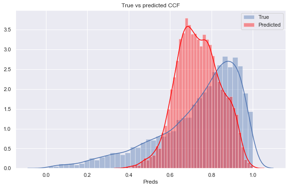


```python
plt.figure(figsize=(10,6))
sns.distplot(y_test_ead.values - preds_ead['Preds'].values, label='Residuals')

plt.legend()
plt.title('CCF residuals')
```


    Text(0.5, 1.0, 'CCF residuals')


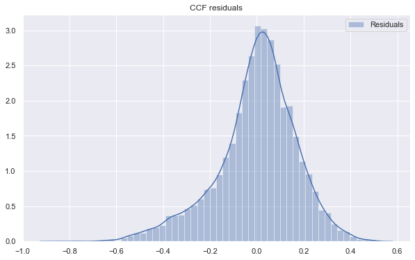


```python
resids = np.subtract(preds_ead['True'], preds_ead['Preds'])

sns.regplot(preds_ead['Preds'], resids, fit_reg=False)
plt.title('Residuals vs. predicted values')
plt.xlabel('Predicted values')
plt.ylabel('Residual')
```


    Text(0, 0.5, 'Residual')


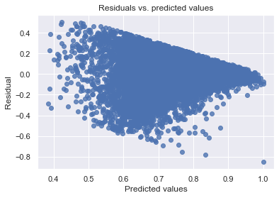


```python
resids = np.subtract(preds_ead['True'], preds_ead['Preds']).values
## now make the residual plots
stat.probplot(resids.flatten(), plot = plt)
plt.title('Residuals vs. predicted values')
plt.xlabel('Predicted values')
plt.ylabel('Residual')
    
```


    Text(0, 0.5, 'Residual')


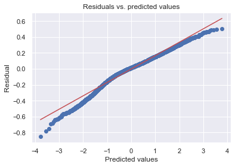


```python
pickle.dump(lin_reg_ead, open('model_EAD_lin_reg_2007-2014.sav', 'wb'))
```


```python

```
