# Model maintenance

The data I used to buid the model is from 2007 to 2014. Now I'll use data from 2015 to compare the two populations. If the Populatio Stability Index is topo high, we'll need to update the model.


```python
import pandas as pd
import numpy as np
import pickle
import matplotlib.pyplot as plt
import seaborn as sns
from sklearn.preprocessing import MinMaxScaler
from matplotlib import cm
import matplotlib as mpl

pd.options.display.max_rows = None
sns.set()
```


```python
train = pd.read_csv('loan_data_train_dataset_2007-2014.csv')
test = pd.read_csv('loan_data_test_dataset_2007-2014.csv')
```


```python
var_s = pickle.load(open('vars_discretized_for_PD.pickle', 'rb'))

ref_vars = pickle.load(open('vars_discretized_reference_for_PD.pickle', 'rb'))
all_vars = var_s + list(np.ravel(ref_vars))
all_vars.sort()

x_train = train.drop('Y', axis=1).copy()
y_train = train['Y'].copy()

x_test = test.drop('Y', axis=1).copy()
y_test = test['Y'].copy()
```

#### 2015 data preprocessing

discretizing the same way as for the older data to calculate PSI


```python
new_data_bkp = pd.read_csv('loan_data_2015.csv')
print(new_data_bkp.shape)
new_data_bkp.head()
```

    /Users/omaromeiri/anaconda3/lib/python3.7/site-packages/IPython/core/interactiveshell.py:3058: DtypeWarning: Columns (19,55) have mixed types. Specify dtype option on import or set low_memory=False.
      interactivity=interactivity, compiler=compiler, result=result)


    (421094, 74)


<div>
<style scoped>
    .dataframe tbody tr th:only-of-type {
        vertical-align: middle;
    }

    .dataframe tbody tr th {
        vertical-align: top;
    }

    .dataframe thead th {
        text-align: right;
    }
</style>
<table border="1" class="dataframe">
  <thead>
    <tr style="text-align: right;">
      <th></th>
      <th>id</th>
      <th>member_id</th>
      <th>loan_amnt</th>
      <th>funded_amnt</th>
      <th>funded_amnt_inv</th>
      <th>term</th>
      <th>int_rate</th>
      <th>installment</th>
      <th>grade</th>
      <th>sub_grade</th>
      <th>...</th>
      <th>total_bal_il</th>
      <th>il_util</th>
      <th>open_rv_12m</th>
      <th>open_rv_24m</th>
      <th>max_bal_bc</th>
      <th>all_util</th>
      <th>total_rev_hi_lim</th>
      <th>inq_fi</th>
      <th>total_cu_tl</th>
      <th>inq_last_12m</th>
    </tr>
  </thead>
  <tbody>
    <tr>
      <th>0</th>
      <td>68444620</td>
      <td>73334399</td>
      <td>35000</td>
      <td>35000</td>
      <td>35000.0</td>
      <td>60 months</td>
      <td>11.99</td>
      <td>778.38</td>
      <td>C</td>
      <td>C1</td>
      <td>...</td>
      <td>35367.0</td>
      <td>49.3</td>
      <td>0.0</td>
      <td>1.0</td>
      <td>5020.0</td>
      <td>40.1</td>
      <td>52200.0</td>
      <td>1.0</td>
      <td>4.0</td>
      <td>0.0</td>
    </tr>
    <tr>
      <th>1</th>
      <td>68547583</td>
      <td>73437441</td>
      <td>8650</td>
      <td>8650</td>
      <td>8650.0</td>
      <td>36 months</td>
      <td>5.32</td>
      <td>260.50</td>
      <td>A</td>
      <td>A1</td>
      <td>...</td>
      <td>24041.0</td>
      <td>88.8</td>
      <td>0.0</td>
      <td>3.0</td>
      <td>3081.0</td>
      <td>57.9</td>
      <td>26800.0</td>
      <td>1.0</td>
      <td>0.0</td>
      <td>5.0</td>
    </tr>
    <tr>
      <th>2</th>
      <td>67849662</td>
      <td>72708407</td>
      <td>4225</td>
      <td>4225</td>
      <td>4225.0</td>
      <td>36 months</td>
      <td>14.85</td>
      <td>146.16</td>
      <td>C</td>
      <td>C5</td>
      <td>...</td>
      <td>3830.0</td>
      <td>21.9</td>
      <td>0.0</td>
      <td>0.0</td>
      <td>367.0</td>
      <td>22.4</td>
      <td>4300.0</td>
      <td>0.0</td>
      <td>0.0</td>
      <td>0.0</td>
    </tr>
    <tr>
      <th>3</th>
      <td>68506885</td>
      <td>73396712</td>
      <td>10000</td>
      <td>10000</td>
      <td>10000.0</td>
      <td>60 months</td>
      <td>11.99</td>
      <td>222.40</td>
      <td>C</td>
      <td>C1</td>
      <td>...</td>
      <td>35354.0</td>
      <td>75.5</td>
      <td>1.0</td>
      <td>1.0</td>
      <td>3118.0</td>
      <td>67.4</td>
      <td>14200.0</td>
      <td>1.0</td>
      <td>1.0</td>
      <td>1.0</td>
    </tr>
    <tr>
      <th>4</th>
      <td>68341763</td>
      <td>72928789</td>
      <td>20000</td>
      <td>20000</td>
      <td>20000.0</td>
      <td>60 months</td>
      <td>10.78</td>
      <td>432.66</td>
      <td>B</td>
      <td>B4</td>
      <td>...</td>
      <td>10827.0</td>
      <td>72.8</td>
      <td>0.0</td>
      <td>2.0</td>
      <td>2081.0</td>
      <td>64.7</td>
      <td>14000.0</td>
      <td>2.0</td>
      <td>5.0</td>
      <td>1.0</td>
    </tr>
  </tbody>
</table>
<p>5 rows × 74 columns</p>
</div>


```python
new_data = new_data_bkp.copy()
```

# General preprocessing for the newer data
The same done for the PD model, but for the newer data


```python
new_data.info()
```

    <class 'pandas.core.frame.DataFrame'>
    RangeIndex: 421094 entries, 0 to 421093
    Data columns (total 74 columns):
    id                             421094 non-null int64
    member_id                      421094 non-null int64
    loan_amnt                      421094 non-null int64
    funded_amnt                    421094 non-null int64
    funded_amnt_inv                421094 non-null float64
    term                           421094 non-null object
    int_rate                       421094 non-null float64
    installment                    421094 non-null float64
    grade                          421094 non-null object
    sub_grade                      421094 non-null object
    emp_title                      397220 non-null object
    emp_length                     397277 non-null object
    home_ownership                 421094 non-null object
    annual_inc                     421094 non-null float64
    verification_status            421094 non-null object
    issue_d                        421094 non-null object
    loan_status                    421094 non-null object
    pymnt_plan                     421094 non-null object
    url                            421094 non-null object
    desc                           45 non-null object
    purpose                        421094 non-null object
    title                          420962 non-null object
    zip_code                       421094 non-null object
    addr_state                     421094 non-null object
    dti                            421094 non-null float64
    delinq_2yrs                    421094 non-null float64
    earliest_cr_line               421094 non-null object
    inq_last_6mths                 421094 non-null float64
    mths_since_last_delinq         217133 non-null float64
    mths_since_last_record         74415 non-null float64
    open_acc                       421094 non-null float64
    pub_rec                        421094 non-null float64
    revol_bal                      421094 non-null int64
    revol_util                     420932 non-null float64
    total_acc                      421094 non-null float64
    initial_list_status            421094 non-null object
    out_prncp                      421094 non-null float64
    out_prncp_inv                  421094 non-null float64
    total_pymnt                    421094 non-null float64
    total_pymnt_inv                421094 non-null float64
    total_rec_prncp                421094 non-null float64
    total_rec_int                  421094 non-null float64
    total_rec_late_fee             421094 non-null float64
    recoveries                     421094 non-null float64
    collection_recovery_fee        421094 non-null float64
    last_pymnt_d                   403811 non-null object
    last_pymnt_amnt                421094 non-null float64
    next_pymnt_d                   395337 non-null object
    last_credit_pull_d             421083 non-null object
    collections_12_mths_ex_med     421094 non-null float64
    mths_since_last_major_derog    122729 non-null float64
    policy_code                    421094 non-null int64
    application_type               421094 non-null object
    annual_inc_joint               511 non-null float64
    dti_joint                      509 non-null float64
    verification_status_joint      511 non-null object
    acc_now_delinq                 421094 non-null float64
    tot_coll_amt                   421094 non-null float64
    tot_cur_bal                    421094 non-null float64
    open_acc_6m                    21372 non-null float64
    open_il_6m                     21372 non-null float64
    open_il_12m                    21372 non-null float64
    open_il_24m                    21372 non-null float64
    mths_since_rcnt_il             20810 non-null float64
    total_bal_il                   21372 non-null float64
    il_util                        18617 non-null float64
    open_rv_12m                    21372 non-null float64
    open_rv_24m                    21372 non-null float64
    max_bal_bc                     21372 non-null float64
    all_util                       21372 non-null float64
    total_rev_hi_lim               421094 non-null float64
    inq_fi                         21372 non-null float64
    total_cu_tl                    21372 non-null float64
    inq_last_12m                   21372 non-null float64
    dtypes: float64(45), int64(6), object(23)
    memory usage: 237.7+ MB


# Data Exploration and preprocessing<br>

'emp_length' to int


```python
new_data['emp_length'].unique()
```


    array(['10+ years', '< 1 year', '5 years', '3 years', '4 years', nan,
           '2 years', '8 years', '9 years', '1 year', '6 years', '7 years'],
          dtype=object)


```python
new_data['emp_length_int'] = new_data['emp_length'].apply(lambda x: str(x).replace('+ years','').replace('< 1 year','0').replace('nan','0').replace(' years','').replace(' year','')).astype('int')
```


```python
new_data['emp_length_int'].unique()
```


    array([10,  0,  5,  3,  4,  2,  8,  9,  1,  6,  7])


'term' to int


```python
new_data['term'].unique()
```


    array([' 60 months', ' 36 months'], dtype=object)


```python
new_data['term'] = new_data['term'].apply(lambda x: str(x).replace('months','').strip()).astype('int')
new_data['term'].unique()
```


    array([60, 36])


parsing dates from ['earliest_cr_line_date', 'earliest_cr_line_date', 'issue_d']<br>
and later calculating time delta in months assuming todays date is 2017-12-01


```python
new_data['earliest_cr_line_date'] = pd.to_datetime(new_data['earliest_cr_line'], format='%b-%y')

new_data['earliest_cr_line_date'].head()
```


    0   1990-02-01
    1   2001-07-01
    2   2011-07-01
    3   1998-12-01
    4   2000-08-01
    Name: earliest_cr_line_date, dtype: datetime64[ns]


```python
new_data['mths_since_earliest_cr_line'] = round((pd.to_datetime('2018-12-01') - new_data['earliest_cr_line_date'])/np.timedelta64(1, 'M'))
new_data['mths_since_earliest_cr_line'].describe()
```


    count    421094.000000
    mean        239.354876
    std          98.123989
    min        -600.000000
    25%         179.000000
    50%         224.000000
    75%         289.000000
    max         599.000000
    Name: mths_since_earliest_cr_line, dtype: float64


```python
new_data['earliest_cr_line_date'] = new_data['earliest_cr_line_date'].apply(lambda x: x-np.timedelta64(100,'Y') if x.year > 2020 else x)
```


```python
new_data['mths_since_earliest_cr_line'] = round((pd.to_datetime('2018-12-01') - new_data['earliest_cr_line_date'])/np.timedelta64(1, 'M'))
new_data['mths_since_earliest_cr_line'].describe()
```


    count    421094.000000
    mean        242.586458
    std          91.329014
    min          73.000000
    25%         180.000000
    50%         224.000000
    75%         290.000000
    max         899.000000
    Name: mths_since_earliest_cr_line, dtype: float64


```python
new_data['issue_d'].head()
```


    0    Dec-15
    1    Dec-15
    2    Dec-15
    3    Dec-15
    4    Dec-15
    Name: issue_d, dtype: object


```python
new_data['issue_d'] = pd.to_datetime(new_data['issue_d'], format='%b-%y')
new_data['issue_d'].head()
```


    0   2015-12-01
    1   2015-12-01
    2   2015-12-01
    3   2015-12-01
    4   2015-12-01
    Name: issue_d, dtype: datetime64[ns]


```python
new_data['issue_d_date'] = pd.to_datetime(new_data['issue_d'], format = '%b-%y')
new_data['mths_since_issue_d'] = round(pd.to_numeric((pd.to_datetime('2018-12-01') - new_data['issue_d_date']) / np.timedelta64(1, 'M')))
new_data['mths_since_issue_d'].describe()
```


    count    421094.000000
    mean         41.044629
    std           3.458162
    min          36.000000
    25%          38.000000
    50%          41.000000
    75%          44.000000
    max          47.000000
    Name: mths_since_issue_d, dtype: float64


```python
new_data[['issue_d','mths_since_issue_d']].head()
```


<div>
<style scoped>
    .dataframe tbody tr th:only-of-type {
        vertical-align: middle;
    }

    .dataframe tbody tr th {
        vertical-align: top;
    }

    .dataframe thead th {
        text-align: right;
    }
</style>
<table border="1" class="dataframe">
  <thead>
    <tr style="text-align: right;">
      <th></th>
      <th>issue_d</th>
      <th>mths_since_issue_d</th>
    </tr>
  </thead>
  <tbody>
    <tr>
      <th>0</th>
      <td>2015-12-01</td>
      <td>36.0</td>
    </tr>
    <tr>
      <th>1</th>
      <td>2015-12-01</td>
      <td>36.0</td>
    </tr>
    <tr>
      <th>2</th>
      <td>2015-12-01</td>
      <td>36.0</td>
    </tr>
    <tr>
      <th>3</th>
      <td>2015-12-01</td>
      <td>36.0</td>
    </tr>
    <tr>
      <th>4</th>
      <td>2015-12-01</td>
      <td>36.0</td>
    </tr>
  </tbody>
</table>
</div>


### Categorical columns to dummy variables


```python
catg_cols = ['grade', 'sub_grade', 'home_ownership', 'verification_status',
             'loan_status', 'purpose', 'addr_state', 'initial_list_status']
```


```python
new_data[catg_cols].head()
```


<div>
<style scoped>
    .dataframe tbody tr th:only-of-type {
        vertical-align: middle;
    }

    .dataframe tbody tr th {
        vertical-align: top;
    }

    .dataframe thead th {
        text-align: right;
    }
</style>
<table border="1" class="dataframe">
  <thead>
    <tr style="text-align: right;">
      <th></th>
      <th>grade</th>
      <th>sub_grade</th>
      <th>home_ownership</th>
      <th>verification_status</th>
      <th>loan_status</th>
      <th>purpose</th>
      <th>addr_state</th>
      <th>initial_list_status</th>
    </tr>
  </thead>
  <tbody>
    <tr>
      <th>0</th>
      <td>C</td>
      <td>C1</td>
      <td>MORTGAGE</td>
      <td>Source Verified</td>
      <td>Issued</td>
      <td>home_improvement</td>
      <td>DC</td>
      <td>w</td>
    </tr>
    <tr>
      <th>1</th>
      <td>A</td>
      <td>A1</td>
      <td>MORTGAGE</td>
      <td>Not Verified</td>
      <td>Issued</td>
      <td>credit_card</td>
      <td>IN</td>
      <td>w</td>
    </tr>
    <tr>
      <th>2</th>
      <td>C</td>
      <td>C5</td>
      <td>RENT</td>
      <td>Source Verified</td>
      <td>Issued</td>
      <td>debt_consolidation</td>
      <td>KS</td>
      <td>w</td>
    </tr>
    <tr>
      <th>3</th>
      <td>C</td>
      <td>C1</td>
      <td>RENT</td>
      <td>Not Verified</td>
      <td>Issued</td>
      <td>debt_consolidation</td>
      <td>IN</td>
      <td>w</td>
    </tr>
    <tr>
      <th>4</th>
      <td>B</td>
      <td>B4</td>
      <td>MORTGAGE</td>
      <td>Not Verified</td>
      <td>Issued</td>
      <td>home_improvement</td>
      <td>IL</td>
      <td>w</td>
    </tr>
  </tbody>
</table>
</div>


```python
'''
Note that I'm not using the drop_first argument of the get_dummies function.
I'll eliminate the category with the smallest weight of evidence later on
'''

dummies = pd.DataFrame()

for col in catg_cols:
    temp_dummy = pd.get_dummies(new_data[col], prefix=col, prefix_sep=':', drop_first=False)
    dummies = pd.concat([dummies, temp_dummy], axis=1)
dummies.head()
```


<div>
<style scoped>
    .dataframe tbody tr th:only-of-type {
        vertical-align: middle;
    }

    .dataframe tbody tr th {
        vertical-align: top;
    }

    .dataframe thead th {
        text-align: right;
    }
</style>
<table border="1" class="dataframe">
  <thead>
    <tr style="text-align: right;">
      <th></th>
      <th>grade:A</th>
      <th>grade:B</th>
      <th>grade:C</th>
      <th>grade:D</th>
      <th>grade:E</th>
      <th>grade:F</th>
      <th>grade:G</th>
      <th>sub_grade:A1</th>
      <th>sub_grade:A2</th>
      <th>sub_grade:A3</th>
      <th>...</th>
      <th>addr_state:TX</th>
      <th>addr_state:UT</th>
      <th>addr_state:VA</th>
      <th>addr_state:VT</th>
      <th>addr_state:WA</th>
      <th>addr_state:WI</th>
      <th>addr_state:WV</th>
      <th>addr_state:WY</th>
      <th>initial_list_status:f</th>
      <th>initial_list_status:w</th>
    </tr>
  </thead>
  <tbody>
    <tr>
      <th>0</th>
      <td>0</td>
      <td>0</td>
      <td>1</td>
      <td>0</td>
      <td>0</td>
      <td>0</td>
      <td>0</td>
      <td>0</td>
      <td>0</td>
      <td>0</td>
      <td>...</td>
      <td>0</td>
      <td>0</td>
      <td>0</td>
      <td>0</td>
      <td>0</td>
      <td>0</td>
      <td>0</td>
      <td>0</td>
      <td>0</td>
      <td>1</td>
    </tr>
    <tr>
      <th>1</th>
      <td>1</td>
      <td>0</td>
      <td>0</td>
      <td>0</td>
      <td>0</td>
      <td>0</td>
      <td>0</td>
      <td>1</td>
      <td>0</td>
      <td>0</td>
      <td>...</td>
      <td>0</td>
      <td>0</td>
      <td>0</td>
      <td>0</td>
      <td>0</td>
      <td>0</td>
      <td>0</td>
      <td>0</td>
      <td>0</td>
      <td>1</td>
    </tr>
    <tr>
      <th>2</th>
      <td>0</td>
      <td>0</td>
      <td>1</td>
      <td>0</td>
      <td>0</td>
      <td>0</td>
      <td>0</td>
      <td>0</td>
      <td>0</td>
      <td>0</td>
      <td>...</td>
      <td>0</td>
      <td>0</td>
      <td>0</td>
      <td>0</td>
      <td>0</td>
      <td>0</td>
      <td>0</td>
      <td>0</td>
      <td>0</td>
      <td>1</td>
    </tr>
    <tr>
      <th>3</th>
      <td>0</td>
      <td>0</td>
      <td>1</td>
      <td>0</td>
      <td>0</td>
      <td>0</td>
      <td>0</td>
      <td>0</td>
      <td>0</td>
      <td>0</td>
      <td>...</td>
      <td>0</td>
      <td>0</td>
      <td>0</td>
      <td>0</td>
      <td>0</td>
      <td>0</td>
      <td>0</td>
      <td>0</td>
      <td>0</td>
      <td>1</td>
    </tr>
    <tr>
      <th>4</th>
      <td>0</td>
      <td>1</td>
      <td>0</td>
      <td>0</td>
      <td>0</td>
      <td>0</td>
      <td>0</td>
      <td>0</td>
      <td>0</td>
      <td>0</td>
      <td>...</td>
      <td>0</td>
      <td>0</td>
      <td>0</td>
      <td>0</td>
      <td>0</td>
      <td>0</td>
      <td>0</td>
      <td>0</td>
      <td>0</td>
      <td>1</td>
    </tr>
  </tbody>
</table>
<p>5 rows × 122 columns</p>
</div>


```python
new_data = pd.concat([new_data, dummies], axis=1)
new_data.columns
```


    Index(['id', 'member_id', 'loan_amnt', 'funded_amnt', 'funded_amnt_inv',
           'term', 'int_rate', 'installment', 'grade', 'sub_grade',
           ...
           'addr_state:TX', 'addr_state:UT', 'addr_state:VA', 'addr_state:VT',
           'addr_state:WA', 'addr_state:WI', 'addr_state:WV', 'addr_state:WY',
           'initial_list_status:f', 'initial_list_status:w'],
          dtype='object', length=201)


### Dealing with missing data


```python

fig = plt.figure(figsize=(35,10))
sns.heatmap(new_data.isnull(), cmap='gnuplot', cbar=False)
```


    <matplotlib.axes._subplots.AxesSubplot at 0x1a1ab7ba20>


```python
vars_to_clean = ['annual_inc', 'delinq_2yrs', 'inq_last_6mths', 'open_acc', 'pub_rec',
                  'total_acc', 'acc_now_delinq', 'total_rev_hi_lim', 'emp_length_int', 'mths_since_earliest_cr_line', 'tot_coll_amt', 'tot_cur_bal']
```


```python
new_data[vars_to_clean].describe()
```


<div>
<style scoped>
    .dataframe tbody tr th:only-of-type {
        vertical-align: middle;
    }

    .dataframe tbody tr th {
        vertical-align: top;
    }

    .dataframe thead th {
        text-align: right;
    }
</style>
<table border="1" class="dataframe">
  <thead>
    <tr style="text-align: right;">
      <th></th>
      <th>annual_inc</th>
      <th>delinq_2yrs</th>
      <th>inq_last_6mths</th>
      <th>open_acc</th>
      <th>pub_rec</th>
      <th>total_acc</th>
      <th>acc_now_delinq</th>
      <th>total_rev_hi_lim</th>
      <th>emp_length_int</th>
      <th>mths_since_earliest_cr_line</th>
      <th>tot_coll_amt</th>
      <th>tot_cur_bal</th>
    </tr>
  </thead>
  <tbody>
    <tr>
      <th>count</th>
      <td>4.210940e+05</td>
      <td>421094.000000</td>
      <td>421094.000000</td>
      <td>421094.000000</td>
      <td>421094.000000</td>
      <td>421094.000000</td>
      <td>421094.000000</td>
      <td>4.210940e+05</td>
      <td>421094.000000</td>
      <td>421094.000000</td>
      <td>421094.000000</td>
      <td>4.210940e+05</td>
    </tr>
    <tr>
      <th>mean</th>
      <td>7.696561e+04</td>
      <td>0.347397</td>
      <td>0.572692</td>
      <td>11.948629</td>
      <td>0.233777</td>
      <td>25.493458</td>
      <td>0.006087</td>
      <td>3.365751e+04</td>
      <td>5.685092</td>
      <td>242.586458</td>
      <td>257.478853</td>
      <td>1.400756e+05</td>
    </tr>
    <tr>
      <th>std</th>
      <td>7.395005e+04</td>
      <td>0.927696</td>
      <td>0.867777</td>
      <td>5.633118</td>
      <td>0.649778</td>
      <td>12.097212</td>
      <td>0.086482</td>
      <td>3.766386e+04</td>
      <td>3.862544</td>
      <td>91.329014</td>
      <td>2240.650788</td>
      <td>1.552698e+05</td>
    </tr>
    <tr>
      <th>min</th>
      <td>0.000000e+00</td>
      <td>0.000000</td>
      <td>0.000000</td>
      <td>1.000000</td>
      <td>0.000000</td>
      <td>4.000000</td>
      <td>0.000000</td>
      <td>0.000000e+00</td>
      <td>0.000000</td>
      <td>73.000000</td>
      <td>0.000000</td>
      <td>0.000000e+00</td>
    </tr>
    <tr>
      <th>25%</th>
      <td>4.600000e+04</td>
      <td>0.000000</td>
      <td>0.000000</td>
      <td>8.000000</td>
      <td>0.000000</td>
      <td>17.000000</td>
      <td>0.000000</td>
      <td>1.440000e+04</td>
      <td>2.000000</td>
      <td>180.000000</td>
      <td>0.000000</td>
      <td>3.103900e+04</td>
    </tr>
    <tr>
      <th>50%</th>
      <td>6.500000e+04</td>
      <td>0.000000</td>
      <td>0.000000</td>
      <td>11.000000</td>
      <td>0.000000</td>
      <td>24.000000</td>
      <td>0.000000</td>
      <td>2.460000e+04</td>
      <td>6.000000</td>
      <td>224.000000</td>
      <td>0.000000</td>
      <td>7.972900e+04</td>
    </tr>
    <tr>
      <th>75%</th>
      <td>9.169125e+04</td>
      <td>0.000000</td>
      <td>1.000000</td>
      <td>15.000000</td>
      <td>0.000000</td>
      <td>32.000000</td>
      <td>0.000000</td>
      <td>4.167425e+04</td>
      <td>10.000000</td>
      <td>290.000000</td>
      <td>0.000000</td>
      <td>2.074755e+05</td>
    </tr>
    <tr>
      <th>max</th>
      <td>9.500000e+06</td>
      <td>39.000000</td>
      <td>6.000000</td>
      <td>90.000000</td>
      <td>86.000000</td>
      <td>169.000000</td>
      <td>14.000000</td>
      <td>9.999999e+06</td>
      <td>10.000000</td>
      <td>899.000000</td>
      <td>496651.000000</td>
      <td>4.447397e+06</td>
    </tr>
  </tbody>
</table>
</div>


```python
fig = plt.figure(figsize=(35,10))
sns.heatmap(new_data[vars_to_clean].isnull(), cmap='gnuplot', cbar=False)
```


    <matplotlib.axes._subplots.AxesSubplot at 0x1a1b6047f0>


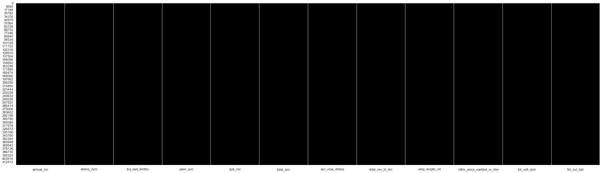


```python
def find_missing_vals():

    missing_vals = pd.DataFrame(new_data[vars_to_clean].isnull().sum()).T
    return missing_vals

find_missing_vals()
```


<div>
<style scoped>
    .dataframe tbody tr th:only-of-type {
        vertical-align: middle;
    }

    .dataframe tbody tr th {
        vertical-align: top;
    }

    .dataframe thead th {
        text-align: right;
    }
</style>
<table border="1" class="dataframe">
  <thead>
    <tr style="text-align: right;">
      <th></th>
      <th>annual_inc</th>
      <th>delinq_2yrs</th>
      <th>inq_last_6mths</th>
      <th>open_acc</th>
      <th>pub_rec</th>
      <th>total_acc</th>
      <th>acc_now_delinq</th>
      <th>total_rev_hi_lim</th>
      <th>emp_length_int</th>
      <th>mths_since_earliest_cr_line</th>
      <th>tot_coll_amt</th>
      <th>tot_cur_bal</th>
    </tr>
  </thead>
  <tbody>
    <tr>
      <th>0</th>
      <td>0</td>
      <td>0</td>
      <td>0</td>
      <td>0</td>
      <td>0</td>
      <td>0</td>
      <td>0</td>
      <td>0</td>
      <td>0</td>
      <td>0</td>
      <td>0</td>
      <td>0</td>
    </tr>
  </tbody>
</table>
</div>


Assuming that 'total_rev_hi_lim' is equal to 'funded_amnt' where data is missing


```python
new_data['total_rev_hi_lim'].fillna(new_data['funded_amnt'], inplace=True)
```


```python
find_missing_vals()
```


<div>
<style scoped>
    .dataframe tbody tr th:only-of-type {
        vertical-align: middle;
    }

    .dataframe tbody tr th {
        vertical-align: top;
    }

    .dataframe thead th {
        text-align: right;
    }
</style>
<table border="1" class="dataframe">
  <thead>
    <tr style="text-align: right;">
      <th></th>
      <th>annual_inc</th>
      <th>delinq_2yrs</th>
      <th>inq_last_6mths</th>
      <th>open_acc</th>
      <th>pub_rec</th>
      <th>total_acc</th>
      <th>acc_now_delinq</th>
      <th>total_rev_hi_lim</th>
      <th>emp_length_int</th>
      <th>mths_since_earliest_cr_line</th>
      <th>tot_coll_amt</th>
      <th>tot_cur_bal</th>
    </tr>
  </thead>
  <tbody>
    <tr>
      <th>0</th>
      <td>0</td>
      <td>0</td>
      <td>0</td>
      <td>0</td>
      <td>0</td>
      <td>0</td>
      <td>0</td>
      <td>0</td>
      <td>0</td>
      <td>0</td>
      <td>0</td>
      <td>0</td>
    </tr>
  </tbody>
</table>
</div>


I don't know what I'm going to do with the columns ['tot_coll_amt', 'tot_cur_bal']<br>
I will check their explanatory power later, if they are good predictors, I'll impute some values or drop the missing rows<br>
If not, I'll drop the entire columns

filling 29 missing values from the important columns


```python
new_data['mths_since_earliest_cr_line'].fillna(0, inplace=True)
new_data['acc_now_delinq'].fillna(0, inplace=True)
new_data['total_acc'].fillna(0, inplace=True)
new_data['pub_rec'].fillna(0, inplace=True)
new_data['open_acc'].fillna(0, inplace=True)
new_data['inq_last_6mths'].fillna(0, inplace=True)
new_data['delinq_2yrs'].fillna(0, inplace=True)
new_data['emp_length_int'].fillna(0, inplace=True)

new_data['annual_inc'].fillna(new_data['annual_inc'].mean(), inplace=True)
```


```python
find_missing_vals()
```


<div>
<style scoped>
    .dataframe tbody tr th:only-of-type {
        vertical-align: middle;
    }

    .dataframe tbody tr th {
        vertical-align: top;
    }

    .dataframe thead th {
        text-align: right;
    }
</style>
<table border="1" class="dataframe">
  <thead>
    <tr style="text-align: right;">
      <th></th>
      <th>annual_inc</th>
      <th>delinq_2yrs</th>
      <th>inq_last_6mths</th>
      <th>open_acc</th>
      <th>pub_rec</th>
      <th>total_acc</th>
      <th>acc_now_delinq</th>
      <th>total_rev_hi_lim</th>
      <th>emp_length_int</th>
      <th>mths_since_earliest_cr_line</th>
      <th>tot_coll_amt</th>
      <th>tot_cur_bal</th>
    </tr>
  </thead>
  <tbody>
    <tr>
      <th>0</th>
      <td>0</td>
      <td>0</td>
      <td>0</td>
      <td>0</td>
      <td>0</td>
      <td>0</td>
      <td>0</td>
      <td>0</td>
      <td>0</td>
      <td>0</td>
      <td>0</td>
      <td>0</td>
    </tr>
  </tbody>
</table>
</div>


### Organizing default into binary


```python
new_data['loan_status'].unique()
```


    array(['Issued', 'Current', 'Fully Paid', 'In Grace Period',
           'Late (16-30 days)', 'Late (31-120 days)', 'Charged Off',
           'Default'], dtype=object)


```python
fig = plt.figure(figsize=(12,8))
sns.barplot(new_data['loan_status'].value_counts().index, new_data['loan_status'].value_counts())
plt.xticks(rotation=90)
#plt.tight_layout()
```


    (array([0, 1, 2, 3, 4, 5, 6, 7]), <a list of 8 Text xticklabel objects>)


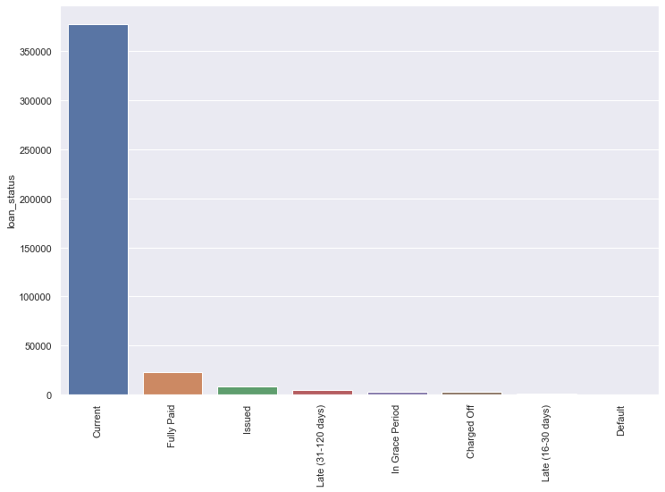


```python
new_data['Y'] = np.where(new_data['loan_status'].isin(['Charged Off',  'Default','Late (31-120 days)',
                                                       'Does not meet the credit policy. Status:Fully Paid',
                                                       'Does not meet the credit policy. Status:Charged Off']), 0, 1)

fig = plt.figure(figsize=(12,8))
sns.barplot(new_data['Y'].value_counts().index, new_data['Y'].value_counts())
plt.xticks([0,1],['default', 'non_default'])
```


    ([<matplotlib.axis.XTick at 0x1a18673080>,
      <matplotlib.axis.XTick at 0x1a1866f908>],
     <a list of 2 Text xticklabel objects>)


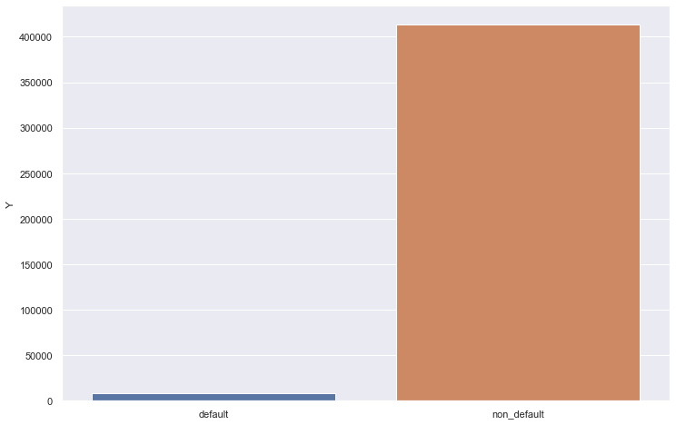


```python
def_nondef_ratio = round(new_data['Y'].value_counts()[0]/new_data['Y'].value_counts()[1],2)*100

print(f"The defaulted clients represent {def_nondef_ratio}% of the total clients")

if def_nondef_ratio > 45 and def_nondef_ratio < 55:
    print('Balanced dataset.')
else:
    print("Unbalanced, dataset. We'll need to think of sampling strategies" )
```

    The defaulted clients represent 2.0% of the total clients
    Unbalanced, dataset. We'll need to think of sampling strategies


```python

```


```python
x_train_prep = new_data.drop('Y', axis=1).copy()
y_train_prep = new_data['Y'].copy()
```


```python
vars_to_use = []
ref_vars = []


'''
Helper function to calculate WoE and plot a graph, for the discrete variables
'''


def woe_discrete(df, discrete_variable_name, targets, rot_x_ticks=0, plot_rows_start=0, plot_rows_end=None, hide_df=False, vlines=None):
    
    df = pd.concat([df[discrete_variable_name], targets], axis=1)
    
    df = pd.concat([df.groupby(df.columns[0], as_index=False).count(), df.groupby(df.columns[0], as_index=False).mean()], axis=1)
    df = df.iloc[:,[0,1,3]]
    df.columns = [df.columns[0], 'n_obs', 'prop_non_defaults']
    
    df['prop_n_obs'] = df['n_obs'] / df['n_obs'].sum()
    df['n_defaults'] = (1 - df['prop_non_defaults']) * df['n_obs']
    df['n_non_defaults'] = (df['prop_non_defaults'] * df['n_obs'])
    df['prop_n_non_defaults'] = df['n_non_defaults'] / df['n_non_defaults'].sum()
    df['prop_n_defaults'] = df['n_defaults'] / df['n_defaults'].sum()
    df['WoE'] = np.log(df['prop_n_non_defaults'] / df['prop_n_defaults'])
    
    df = df.sort_values(['WoE']).reset_index(drop=True)
    
    df['diff_prop_non_defaults'] = df['prop_n_non_defaults'].diff().abs()
    
    df.replace([np.inf, -np.inf], np.nan, inplace=True)
    
    df['diff_WoE'] = df['WoE'].diff().abs()
    df['IV'] = (df['prop_n_non_defaults'] - df['prop_n_defaults']) * df['WoE']
    df['IV'] = df['IV'].sum()
    
    
    
    
    
    
    
    def gen_colormap(length, scaled_vals, colormap):
    
        '''
        Input: length = number of colors for colormap, scaled_vals = scaled between 0-1 
        '''

        cmp = cm.get_cmap(colormap, length)
        colors = cmp(scaled_vals)[:,:3]
        colors = [tuple(x) for x in colors]
        return colors

    
    
    
    if plot_rows_end == None:
        
        


        N = df.shape[0]

        cmap = df.iloc[plot_rows_start:,:]['n_obs']

        scaler = MinMaxScaler(feature_range=(0,1))

        cmap = np.ravel(scaler.fit_transform(cmap.values.reshape(-1,1)))

        cmap = np.array(gen_colormap(N, cmap, 'coolwarm'))


        fig, ax = plt.subplots(figsize=(20,10))


        index = df.iloc[plot_rows_start:,0].index.values

        c1ax = fig.add_axes([0.9, 0.15, 0.05, 0.7])
        ax.bar(range(len(df.iloc[plot_rows_start:,0])), df.iloc[plot_rows_start:,:]['WoE'], color=cmap[index])
        
        
        
        norm = mpl.colors.Normalize(vmin=df.iloc[plot_rows_start:,:]['n_obs'].min(), vmax=df.iloc[plot_rows_start:,:]['n_obs'].max())
        
        cb1 = mpl.colorbar.ColorbarBase(c1ax, cmap=mpl.cm.coolwarm, norm=norm,orientation='vertical')
        plt.title('N_obs')
        
        labels = df[discrete_variable_name].values
        #print(labels)
        ax.set_xticks(range(len(df.iloc[plot_rows_start:,:])))
        ax.set_xticklabels(labels, rotation=rot_x_ticks)
        
        if vlines != None:
            for vline in vlines:
                ax.axvline(vline)
        


    
    else:
        
        
        
        N = df.shape[0]

        cmap = df.iloc[plot_rows_start:plot_rows_end,:]['n_obs']

        scaler = MinMaxScaler(feature_range=(0,1))

        cmap = np.ravel(scaler.fit_transform(cmap.values.reshape(-1,1)))

        cmap = np.array(gen_colormap(N, cmap, 'coolwarm'))


        fig, ax = plt.subplots(figsize=(20,10))


        
        
        
        index = range(len(df.iloc[plot_rows_start:plot_rows_end,0].index.values))
        #print(index)
        c1ax = fig.add_axes([0.9, 0.15, 0.05, 0.7])
        
       
        ax.bar(range(len(df.iloc[plot_rows_start:plot_rows_end,0])), df.iloc[plot_rows_start:plot_rows_end,:]['WoE'], color=cmap[index])
        
        norm = mpl.colors.Normalize(vmin=df.iloc[plot_rows_start:plot_rows_end,:]['n_obs'].min(), vmax=df.iloc[plot_rows_start:plot_rows_end,:]['n_obs'].max())
        
        cb1 = mpl.colorbar.ColorbarBase(c1ax, cmap=mpl.cm.coolwarm, norm=norm,orientation='vertical')
        plt.title('N_obs')

        
        labels = df.iloc[plot_rows_start:plot_rows_end,:][discrete_variable_name].values
        ax.set_xticks(range(len(df.iloc[plot_rows_start:plot_rows_end,0])))
        ax.set_xticklabels(labels, rotation=rot_x_ticks)
    
    ax.set_title(f'WoE {discrete_variable_name}')
    


    return df


'''
Helper function to calculate WoE and plot a graph, for the continuous variables
'''


def woe_ordered_continuous(df, continuous_variable_name, targets, rot_x_ticks=0, plot_rows_start=0, plot_rows_end=None, vlines=None, ascending=True):
    
    df = pd.concat([df[continuous_variable_name], targets], axis=1)
    
    df = pd.concat([df.groupby(df.columns[0], as_index=False).count(), df.groupby(df.columns[0], as_index=False).mean()], axis=1)
    df = df.iloc[:,[0,1,3]]
    df.columns = [df.columns[0], 'n_obs', 'prop_non_defaults']
    
    df['prop_n_obs'] = df['n_obs'] / df['n_obs'].sum()
    df['n_defaults'] = (1 - df['prop_non_defaults']) * df['n_obs']
    df['n_non_defaults'] = (df['prop_non_defaults'] * df['n_obs'])
    df['prop_n_non_defaults'] = df['n_non_defaults'] / df['n_non_defaults'].sum()
    df['prop_n_defaults'] = df['n_defaults'] / df['n_defaults'].sum()
    df['WoE'] = np.log(df['prop_n_non_defaults'] / df['prop_n_defaults'])
    
    df = df.sort_values(continuous_variable_name, ascending=ascending).reset_index(drop=True)
    
    df['diff_prop_non_defaults'] = df['prop_n_non_defaults'].diff().abs()
    
    df.replace([np.inf, -np.inf], np.nan, inplace=True)
    
    df['diff_WoE'] = df['WoE'].diff().abs()
    df['IV'] = (df['prop_n_non_defaults'] - df['prop_n_defaults']) * df['WoE']
    df['IV'] = df['IV'].sum()
    
   


    def gen_colormap(length, scaled_vals, colormap):
    
        '''
        Input: length = number of colors for colormap, scaled_vals = scaled between 0-1 
        '''

        cmp = cm.get_cmap(colormap, length)
        colors = cmp(scaled_vals)[:,:3]
        colors = [tuple(x) for x in colors]
        return colors

    

    
    
    
    if plot_rows_end == None:
        
        


        N = df.shape[0]

        cmap = df.iloc[plot_rows_start:,:]['n_obs']

        scaler = MinMaxScaler(feature_range=(0,1))

        cmap = np.ravel(scaler.fit_transform(cmap.values.reshape(-1,1)))

        cmap = np.array(gen_colormap(N, cmap, 'coolwarm'))


        fig, ax = plt.subplots(figsize=(20,10))


        index = df.iloc[plot_rows_start:,0].index.values

        c1ax = fig.add_axes([0.9, 0.15, 0.05, 0.7])
        ax.bar(range(len(df.iloc[plot_rows_start:,0])), df.iloc[plot_rows_start:,:]['WoE'], color=cmap[index])
        
        
        
        norm = mpl.colors.Normalize(vmin=df.iloc[plot_rows_start:,:]['n_obs'].min(), vmax=df.iloc[plot_rows_start:,:]['n_obs'].max())
        
        cb1 = mpl.colorbar.ColorbarBase(c1ax, cmap=mpl.cm.coolwarm, norm=norm,orientation='vertical')
        plt.title('N_obs')
        
        labels = df[continuous_variable_name].values
        #print(labels)
        ax.set_xticks(range(len(df.iloc[plot_rows_start:,:])))
        ax.set_xticklabels(labels, rotation=rot_x_ticks)
        
        if vlines != None:
            for vline in vlines:
                ax.axvline(vline)
        


    
    else:
        
        
        
        N = df.shape[0]

        cmap = df.iloc[plot_rows_start:plot_rows_end,:]['n_obs']

        scaler = MinMaxScaler(feature_range=(0,1))

        cmap = np.ravel(scaler.fit_transform(cmap.values.reshape(-1,1)))

        cmap = np.array(gen_colormap(N, cmap, 'coolwarm'))


        fig, ax = plt.subplots(figsize=(20,10))


        
        
        
        index = range(len(df.iloc[plot_rows_start:plot_rows_end,0].index.values))
        #print(index)
        c1ax = fig.add_axes([0.9, 0.15, 0.05, 0.7])
        
        
        ax.bar(range(len(df.iloc[plot_rows_start:plot_rows_end,0])), df.iloc[plot_rows_start:plot_rows_end,:]['WoE'], color=cmap[index])
        
        norm = mpl.colors.Normalize(vmin=df.iloc[plot_rows_start:plot_rows_end,:]['n_obs'].min(), vmax=df.iloc[plot_rows_start:plot_rows_end,:]['n_obs'].max())
        
        cb1 = mpl.colorbar.ColorbarBase(c1ax, cmap=mpl.cm.coolwarm, norm=norm,orientation='vertical')
        plt.title('N_obs')

        
        labels = df.iloc[plot_rows_start:plot_rows_end,:][continuous_variable_name].values
        ax.set_xticks(range(len(df.iloc[plot_rows_start:plot_rows_end,0])))
        ax.set_xticklabels(labels, rotation=rot_x_ticks)
        
        
        if vlines != None:
            for vline in vlines:
                ax.axvline(vline)
    
    ax.set_title(f'WoE {continuous_variable_name}')
    

    
    
    
    
    
    

    return df
```


```python

```

# Discrete variables

### 'grade' independent variable<br>

This variable is a strong predictor of the target, the Information Value (IV) is very high


```python
woe_df = woe_discrete(x_train_prep, 'grade', y_train_prep)
woe_df
```


<div>
<style scoped>
    .dataframe tbody tr th:only-of-type {
        vertical-align: middle;
    }

    .dataframe tbody tr th {
        vertical-align: top;
    }

    .dataframe thead th {
        text-align: right;
    }
</style>
<table border="1" class="dataframe">
  <thead>
    <tr style="text-align: right;">
      <th></th>
      <th>grade</th>
      <th>n_obs</th>
      <th>prop_non_defaults</th>
      <th>prop_n_obs</th>
      <th>n_defaults</th>
      <th>n_non_defaults</th>
      <th>prop_n_non_defaults</th>
      <th>prop_n_defaults</th>
      <th>WoE</th>
      <th>diff_prop_non_defaults</th>
      <th>diff_WoE</th>
      <th>IV</th>
    </tr>
  </thead>
  <tbody>
    <tr>
      <th>0</th>
      <td>G</td>
      <td>2167</td>
      <td>0.904015</td>
      <td>0.005146</td>
      <td>208.0</td>
      <td>1959.0</td>
      <td>0.004741</td>
      <td>0.026493</td>
      <td>-1.720744</td>
      <td>NaN</td>
      <td>NaN</td>
      <td>0.633941</td>
    </tr>
    <tr>
      <th>1</th>
      <td>F</td>
      <td>9817</td>
      <td>0.930529</td>
      <td>0.023313</td>
      <td>682.0</td>
      <td>9135.0</td>
      <td>0.022106</td>
      <td>0.086868</td>
      <td>-1.368556</td>
      <td>0.017365</td>
      <td>0.352187</td>
      <td>0.633941</td>
    </tr>
    <tr>
      <th>2</th>
      <td>E</td>
      <td>34948</td>
      <td>0.956936</td>
      <td>0.082993</td>
      <td>1505.0</td>
      <td>33443.0</td>
      <td>0.080928</td>
      <td>0.191695</td>
      <td>-0.862345</td>
      <td>0.058823</td>
      <td>0.506211</td>
      <td>0.633941</td>
    </tr>
    <tr>
      <th>3</th>
      <td>D</td>
      <td>62654</td>
      <td>0.967488</td>
      <td>0.148789</td>
      <td>2037.0</td>
      <td>60617.0</td>
      <td>0.146686</td>
      <td>0.259457</td>
      <td>-0.570298</td>
      <td>0.065758</td>
      <td>0.292048</td>
      <td>0.633941</td>
    </tr>
    <tr>
      <th>4</th>
      <td>C</td>
      <td>120567</td>
      <td>0.982541</td>
      <td>0.286318</td>
      <td>2105.0</td>
      <td>118462.0</td>
      <td>0.286664</td>
      <td>0.268119</td>
      <td>0.066882</td>
      <td>0.139978</td>
      <td>0.637180</td>
      <td>0.633941</td>
    </tr>
    <tr>
      <th>5</th>
      <td>B</td>
      <td>117606</td>
      <td>0.991097</td>
      <td>0.279287</td>
      <td>1047.0</td>
      <td>116559.0</td>
      <td>0.282059</td>
      <td>0.133359</td>
      <td>0.749074</td>
      <td>0.004605</td>
      <td>0.682192</td>
      <td>0.633941</td>
    </tr>
    <tr>
      <th>6</th>
      <td>A</td>
      <td>73335</td>
      <td>0.996359</td>
      <td>0.174154</td>
      <td>267.0</td>
      <td>73068.0</td>
      <td>0.176816</td>
      <td>0.034008</td>
      <td>1.648502</td>
      <td>0.105243</td>
      <td>0.899428</td>
      <td>0.633941</td>
    </tr>
  </tbody>
</table>
</div>


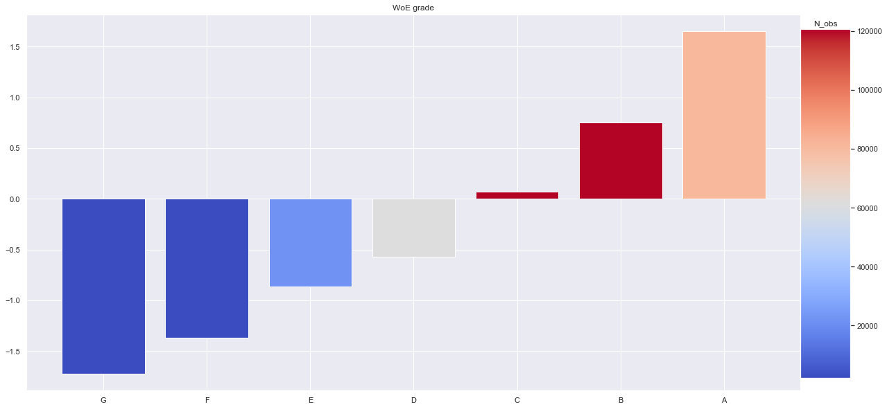


```python
fig, ax = plt.subplots(figsize=(20,8))

woe_df.set_index('grade').iloc[:, [3,4]].plot(kind='bar', stacked=True, ax=ax)

plt.legend()
```


    <matplotlib.legend.Legend at 0x1a21769390>


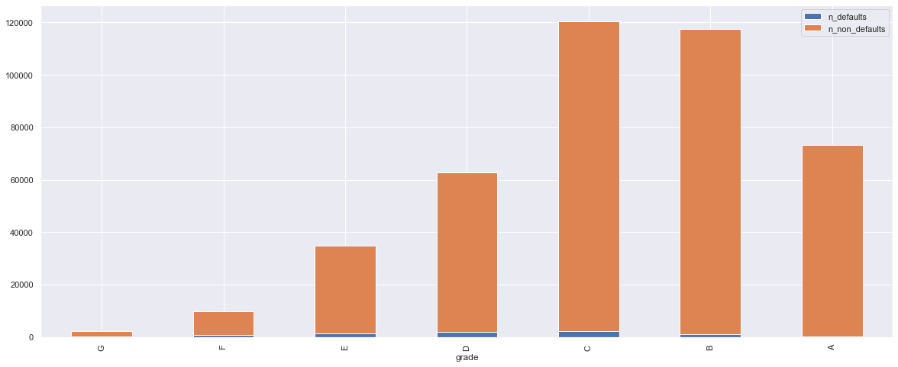

'''
Note that I'm not including the smaller WoE category.
I'll do this for all subsequent variables
'''
vars_to_use.append(['grade:F', 'grade:E', 'grade:D', 'grade:C', 'grade:B', 'grade:A'])
ref_vars.append(['grade:G'])

vars_to_use

We'll leave the grades categories as it is, no need to change them.<br>
All categories are representative and have significantly different WoE's<br><br><br>


### 'home_ownership' independent variable<br>
This variable has a weak predicting power IV is lower than 0.1


```python
woe_df = woe_discrete(x_train_prep, 'home_ownership', y_train_prep)
woe_df
```


<div>
<style scoped>
    .dataframe tbody tr th:only-of-type {
        vertical-align: middle;
    }

    .dataframe tbody tr th {
        vertical-align: top;
    }

    .dataframe thead th {
        text-align: right;
    }
</style>
<table border="1" class="dataframe">
  <thead>
    <tr style="text-align: right;">
      <th></th>
      <th>home_ownership</th>
      <th>n_obs</th>
      <th>prop_non_defaults</th>
      <th>prop_n_obs</th>
      <th>n_defaults</th>
      <th>n_non_defaults</th>
      <th>prop_n_non_defaults</th>
      <th>prop_n_defaults</th>
      <th>WoE</th>
      <th>diff_prop_non_defaults</th>
      <th>diff_WoE</th>
      <th>IV</th>
    </tr>
  </thead>
  <tbody>
    <tr>
      <th>0</th>
      <td>RENT</td>
      <td>167644</td>
      <td>0.976933</td>
      <td>0.398115</td>
      <td>3867.0</td>
      <td>163777.0</td>
      <td>0.396321</td>
      <td>0.492549</td>
      <td>-0.217368</td>
      <td>NaN</td>
      <td>NaN</td>
      <td>0.043513</td>
    </tr>
    <tr>
      <th>1</th>
      <td>OWN</td>
      <td>45766</td>
      <td>0.980750</td>
      <td>0.108684</td>
      <td>881.0</td>
      <td>44885.0</td>
      <td>0.108616</td>
      <td>0.112215</td>
      <td>-0.032594</td>
      <td>0.287705</td>
      <td>0.184775</td>
      <td>0.043513</td>
    </tr>
    <tr>
      <th>2</th>
      <td>MORTGAGE</td>
      <td>207682</td>
      <td>0.985059</td>
      <td>0.493196</td>
      <td>3103.0</td>
      <td>204579.0</td>
      <td>0.495057</td>
      <td>0.395236</td>
      <td>0.225190</td>
      <td>0.386441</td>
      <td>0.257784</td>
      <td>0.043513</td>
    </tr>
    <tr>
      <th>3</th>
      <td>ANY</td>
      <td>2</td>
      <td>1.000000</td>
      <td>0.000005</td>
      <td>0.0</td>
      <td>2.0</td>
      <td>0.000005</td>
      <td>0.000000</td>
      <td>NaN</td>
      <td>0.495053</td>
      <td>NaN</td>
      <td>0.043513</td>
    </tr>
  </tbody>
</table>
</div>


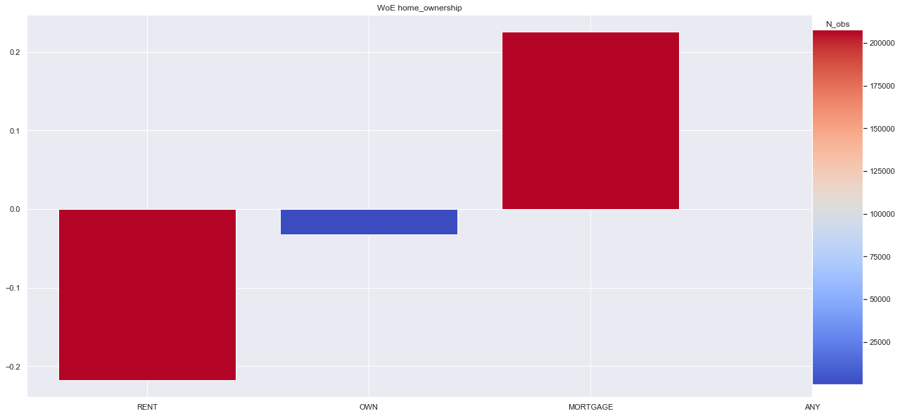


We can see that the 'OTHER' and 'NONE' categories are missing, comparing to the older data from 2007 to 2014<br>

This is an indicative of population change, but since the missing categories are general and not very explainable, we'll ignore them assuming the bank has improved its data collecting.


```python
fig, ax = plt.subplots(figsize=(20,8))

woe_df.set_index('home_ownership').iloc[:, [3,4]].plot(kind='bar', stacked=True, ax=ax)

plt.legend()
```


    <matplotlib.legend.Legend at 0x1a1c405940>


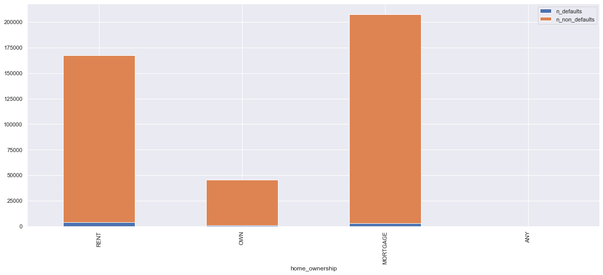


```python
fig = plt.figure(figsize=(12,8))

sns.countplot(x='home_ownership', hue='Y', data=new_data)

index = 0
for cat in new_data['home_ownership'].unique():
    temp_df = new_data[new_data['home_ownership'] == cat]
    ratio = round(temp_df[temp_df['Y'] == 0].shape[0] / temp_df[temp_df['Y'] == 1].shape[0],2)
    plt.annotate(f'{round(ratio*100,2)}% \ndefault', (index-.2, 75000), fontsize=20)
    index += 1
```


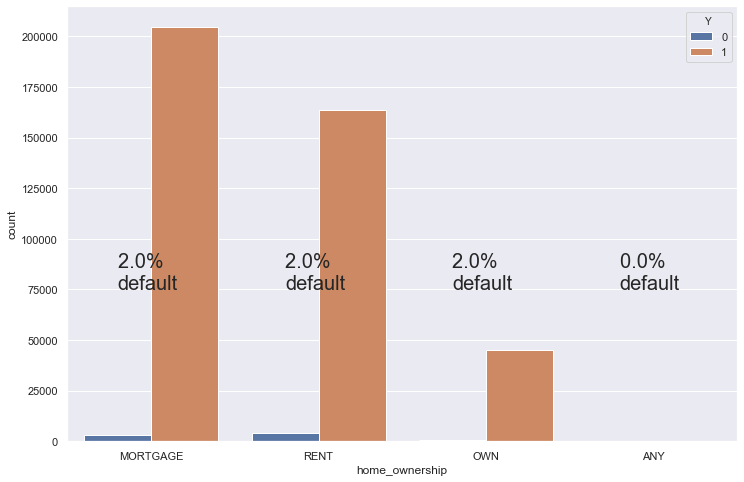

print('There are ',raw_data[raw_data['home_ownership'] == 'OTHER'].shape[0],' records of clients in the "OTHER" category of home_ownership and' ,
      round((raw_data[(raw_data['home_ownership'] == 'OTHER') & (raw_data['Y'] == 0)].shape[0] / raw_data[(raw_data['home_ownership'] == 'OTHER') & (raw_data['Y'] == 1)].shape[0])*100,2),
     '% defaulted')

```python
x_train_prep['home_ownership:RENT_OTHER_NONE'] = x_train_prep['home_ownership:RENT'] + x_train_prep['home_ownership:ANY']
```


```python
fig, ax = plt.subplots(figsize=(20,8))

var_s = ['home_ownership:RENT_OTHER_NONE', 'home_ownership:OWN', 'home_ownership:MORTGAGE']
pd.concat([x_train_prep, y_train_prep], axis=1).groupby('Y').sum().loc[:, var_s].T.plot(kind='bar', stacked=True, ax=ax)

plt.legend()
```


    <matplotlib.legend.Legend at 0x1a1f3f0e48>


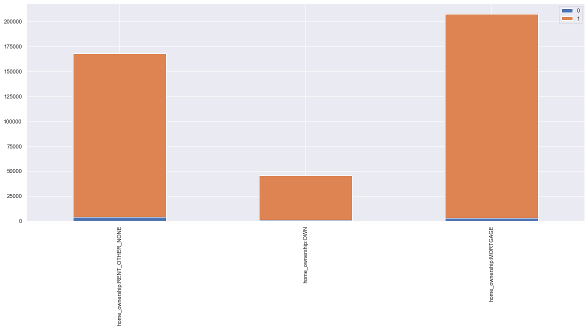

'''
Note that I'm leaving the 'home_ownership:RENT_OTHER_NONE' category out (smallest WoE)
to avoid multicolinearity
'''

vars_to_use.append(['home_ownership:OWN', 'home_ownership:MORTGAGE'])
ref_vars.append(['home_ownership:RENT_OTHER_NONE'])
vars_to_use


```python

```

### 'addr_state' independent variable<br>
this variable has a very weak predictive power


```python
woe_df = woe_discrete(x_train_prep, 'addr_state', y_train_prep)
woe_df
```


<div>
<style scoped>
    .dataframe tbody tr th:only-of-type {
        vertical-align: middle;
    }

    .dataframe tbody tr th {
        vertical-align: top;
    }

    .dataframe thead th {
        text-align: right;
    }
</style>
<table border="1" class="dataframe">
  <thead>
    <tr style="text-align: right;">
      <th></th>
      <th>addr_state</th>
      <th>n_obs</th>
      <th>prop_non_defaults</th>
      <th>prop_n_obs</th>
      <th>n_defaults</th>
      <th>n_non_defaults</th>
      <th>prop_n_non_defaults</th>
      <th>prop_n_defaults</th>
      <th>WoE</th>
      <th>diff_prop_non_defaults</th>
      <th>diff_WoE</th>
      <th>IV</th>
    </tr>
  </thead>
  <tbody>
    <tr>
      <th>0</th>
      <td>NV</td>
      <td>5924</td>
      <td>0.969953</td>
      <td>0.014068</td>
      <td>178.0</td>
      <td>5746.0</td>
      <td>0.013905</td>
      <td>0.022672</td>
      <td>-0.488919</td>
      <td>NaN</td>
      <td>NaN</td>
      <td>0.032523</td>
    </tr>
    <tr>
      <th>1</th>
      <td>SD</td>
      <td>835</td>
      <td>0.970060</td>
      <td>0.001983</td>
      <td>25.0</td>
      <td>810.0</td>
      <td>0.001960</td>
      <td>0.003184</td>
      <td>-0.485236</td>
      <td>0.011945</td>
      <td>0.003683</td>
      <td>0.032523</td>
    </tr>
    <tr>
      <th>2</th>
      <td>HI</td>
      <td>2083</td>
      <td>0.973596</td>
      <td>0.004947</td>
      <td>55.0</td>
      <td>2028.0</td>
      <td>0.004908</td>
      <td>0.007005</td>
      <td>-0.355923</td>
      <td>0.002947</td>
      <td>0.129314</td>
      <td>0.032523</td>
    </tr>
    <tr>
      <th>3</th>
      <td>OK</td>
      <td>3968</td>
      <td>0.976310</td>
      <td>0.009423</td>
      <td>94.0</td>
      <td>3874.0</td>
      <td>0.009375</td>
      <td>0.011973</td>
      <td>-0.244647</td>
      <td>0.004467</td>
      <td>0.111276</td>
      <td>0.032523</td>
    </tr>
    <tr>
      <th>4</th>
      <td>AK</td>
      <td>954</td>
      <td>0.977987</td>
      <td>0.002266</td>
      <td>21.0</td>
      <td>933.0</td>
      <td>0.002258</td>
      <td>0.002675</td>
      <td>-0.169512</td>
      <td>0.007117</td>
      <td>0.075135</td>
      <td>0.032523</td>
    </tr>
    <tr>
      <th>5</th>
      <td>NY</td>
      <td>33844</td>
      <td>0.978253</td>
      <td>0.080372</td>
      <td>736.0</td>
      <td>33108.0</td>
      <td>0.080118</td>
      <td>0.093746</td>
      <td>-0.157095</td>
      <td>0.077860</td>
      <td>0.012417</td>
      <td>0.032523</td>
    </tr>
    <tr>
      <th>6</th>
      <td>AL</td>
      <td>5347</td>
      <td>0.978306</td>
      <td>0.012698</td>
      <td>116.0</td>
      <td>5231.0</td>
      <td>0.012658</td>
      <td>0.014775</td>
      <td>-0.154627</td>
      <td>0.067459</td>
      <td>0.002467</td>
      <td>0.032523</td>
    </tr>
    <tr>
      <th>7</th>
      <td>UT</td>
      <td>2836</td>
      <td>0.978491</td>
      <td>0.006735</td>
      <td>61.0</td>
      <td>2775.0</td>
      <td>0.006715</td>
      <td>0.007770</td>
      <td>-0.145863</td>
      <td>0.005943</td>
      <td>0.008765</td>
      <td>0.032523</td>
    </tr>
    <tr>
      <th>8</th>
      <td>WY</td>
      <td>900</td>
      <td>0.978889</td>
      <td>0.002137</td>
      <td>19.0</td>
      <td>881.0</td>
      <td>0.002132</td>
      <td>0.002420</td>
      <td>-0.126776</td>
      <td>0.004583</td>
      <td>0.019086</td>
      <td>0.032523</td>
    </tr>
    <tr>
      <th>9</th>
      <td>FL</td>
      <td>29298</td>
      <td>0.979111</td>
      <td>0.069576</td>
      <td>612.0</td>
      <td>28686.0</td>
      <td>0.069417</td>
      <td>0.077952</td>
      <td>-0.115963</td>
      <td>0.067285</td>
      <td>0.010814</td>
      <td>0.032523</td>
    </tr>
    <tr>
      <th>10</th>
      <td>NM</td>
      <td>2351</td>
      <td>0.979158</td>
      <td>0.005583</td>
      <td>49.0</td>
      <td>2302.0</td>
      <td>0.005571</td>
      <td>0.006241</td>
      <td>-0.113682</td>
      <td>0.063846</td>
      <td>0.002281</td>
      <td>0.032523</td>
    </tr>
    <tr>
      <th>11</th>
      <td>VA</td>
      <td>12033</td>
      <td>0.979224</td>
      <td>0.028576</td>
      <td>250.0</td>
      <td>11783.0</td>
      <td>0.028513</td>
      <td>0.031843</td>
      <td>-0.110443</td>
      <td>0.022943</td>
      <td>0.003239</td>
      <td>0.032523</td>
    </tr>
    <tr>
      <th>12</th>
      <td>LA</td>
      <td>5098</td>
      <td>0.979600</td>
      <td>0.012107</td>
      <td>104.0</td>
      <td>4994.0</td>
      <td>0.012085</td>
      <td>0.013247</td>
      <td>-0.091793</td>
      <td>0.016429</td>
      <td>0.018649</td>
      <td>0.032523</td>
    </tr>
    <tr>
      <th>13</th>
      <td>MN</td>
      <td>7799</td>
      <td>0.979869</td>
      <td>0.018521</td>
      <td>157.0</td>
      <td>7642.0</td>
      <td>0.018493</td>
      <td>0.019997</td>
      <td>-0.078226</td>
      <td>0.006408</td>
      <td>0.013567</td>
      <td>0.032523</td>
    </tr>
    <tr>
      <th>14</th>
      <td>CA</td>
      <td>58067</td>
      <td>0.979885</td>
      <td>0.137896</td>
      <td>1168.0</td>
      <td>56899.0</td>
      <td>0.137689</td>
      <td>0.148771</td>
      <td>-0.077410</td>
      <td>0.119196</td>
      <td>0.000816</td>
      <td>0.032523</td>
    </tr>
    <tr>
      <th>15</th>
      <td>AZ</td>
      <td>9700</td>
      <td>0.980206</td>
      <td>0.023035</td>
      <td>192.0</td>
      <td>9508.0</td>
      <td>0.023008</td>
      <td>0.024455</td>
      <td>-0.061001</td>
      <td>0.114681</td>
      <td>0.016409</td>
      <td>0.032523</td>
    </tr>
    <tr>
      <th>16</th>
      <td>NC</td>
      <td>12038</td>
      <td>0.980312</td>
      <td>0.028587</td>
      <td>237.0</td>
      <td>11801.0</td>
      <td>0.028557</td>
      <td>0.030187</td>
      <td>-0.055515</td>
      <td>0.005549</td>
      <td>0.005486</td>
      <td>0.032523</td>
    </tr>
    <tr>
      <th>17</th>
      <td>IN</td>
      <td>7264</td>
      <td>0.980589</td>
      <td>0.017250</td>
      <td>141.0</td>
      <td>7123.0</td>
      <td>0.017237</td>
      <td>0.017959</td>
      <td>-0.041071</td>
      <td>0.011320</td>
      <td>0.014445</td>
      <td>0.032523</td>
    </tr>
    <tr>
      <th>18</th>
      <td>DE</td>
      <td>1239</td>
      <td>0.980630</td>
      <td>0.002942</td>
      <td>24.0</td>
      <td>1215.0</td>
      <td>0.002940</td>
      <td>0.003057</td>
      <td>-0.038949</td>
      <td>0.014297</td>
      <td>0.002121</td>
      <td>0.032523</td>
    </tr>
    <tr>
      <th>19</th>
      <td>MD</td>
      <td>10057</td>
      <td>0.980710</td>
      <td>0.023883</td>
      <td>194.0</td>
      <td>9863.0</td>
      <td>0.023867</td>
      <td>0.024710</td>
      <td>-0.034707</td>
      <td>0.020927</td>
      <td>0.004242</td>
      <td>0.032523</td>
    </tr>
    <tr>
      <th>20</th>
      <td>MS</td>
      <td>2593</td>
      <td>0.981489</td>
      <td>0.006158</td>
      <td>48.0</td>
      <td>2545.0</td>
      <td>0.006159</td>
      <td>0.006114</td>
      <td>0.007290</td>
      <td>0.017709</td>
      <td>0.041997</td>
      <td>0.032523</td>
    </tr>
    <tr>
      <th>21</th>
      <td>WI</td>
      <td>5663</td>
      <td>0.981635</td>
      <td>0.013448</td>
      <td>104.0</td>
      <td>5559.0</td>
      <td>0.013452</td>
      <td>0.013247</td>
      <td>0.015388</td>
      <td>0.007294</td>
      <td>0.008098</td>
      <td>0.032523</td>
    </tr>
    <tr>
      <th>22</th>
      <td>TX</td>
      <td>34699</td>
      <td>0.981786</td>
      <td>0.082402</td>
      <td>632.0</td>
      <td>34067.0</td>
      <td>0.082438</td>
      <td>0.080499</td>
      <td>0.023800</td>
      <td>0.068986</td>
      <td>0.008412</td>
      <td>0.032523</td>
    </tr>
    <tr>
      <th>23</th>
      <td>OH</td>
      <td>14394</td>
      <td>0.982076</td>
      <td>0.034182</td>
      <td>258.0</td>
      <td>14136.0</td>
      <td>0.034207</td>
      <td>0.032862</td>
      <td>0.040126</td>
      <td>0.048231</td>
      <td>0.016325</td>
      <td>0.032523</td>
    </tr>
    <tr>
      <th>24</th>
      <td>RI</td>
      <td>1843</td>
      <td>0.982094</td>
      <td>0.004377</td>
      <td>33.0</td>
      <td>1810.0</td>
      <td>0.004380</td>
      <td>0.004203</td>
      <td>0.041180</td>
      <td>0.029827</td>
      <td>0.001054</td>
      <td>0.032523</td>
    </tr>
    <tr>
      <th>25</th>
      <td>NJ</td>
      <td>15195</td>
      <td>0.982231</td>
      <td>0.036085</td>
      <td>270.0</td>
      <td>14925.0</td>
      <td>0.036117</td>
      <td>0.034391</td>
      <td>0.048976</td>
      <td>0.031737</td>
      <td>0.007796</td>
      <td>0.032523</td>
    </tr>
    <tr>
      <th>26</th>
      <td>MI</td>
      <td>11436</td>
      <td>0.982336</td>
      <td>0.027158</td>
      <td>202.0</td>
      <td>11234.0</td>
      <td>0.027185</td>
      <td>0.025729</td>
      <td>0.055038</td>
      <td>0.008932</td>
      <td>0.006061</td>
      <td>0.032523</td>
    </tr>
    <tr>
      <th>27</th>
      <td>PA</td>
      <td>14969</td>
      <td>0.982965</td>
      <td>0.035548</td>
      <td>255.0</td>
      <td>14714.0</td>
      <td>0.035606</td>
      <td>0.032480</td>
      <td>0.091896</td>
      <td>0.008421</td>
      <td>0.036859</td>
      <td>0.032523</td>
    </tr>
    <tr>
      <th>28</th>
      <td>WA</td>
      <td>8917</td>
      <td>0.983178</td>
      <td>0.021176</td>
      <td>150.0</td>
      <td>8767.0</td>
      <td>0.021215</td>
      <td>0.019106</td>
      <td>0.104720</td>
      <td>0.014391</td>
      <td>0.012824</td>
      <td>0.032523</td>
    </tr>
    <tr>
      <th>29</th>
      <td>TN</td>
      <td>6903</td>
      <td>0.983196</td>
      <td>0.016393</td>
      <td>116.0</td>
      <td>6787.0</td>
      <td>0.016424</td>
      <td>0.014775</td>
      <td>0.105779</td>
      <td>0.004791</td>
      <td>0.001059</td>
      <td>0.032523</td>
    </tr>
    <tr>
      <th>30</th>
      <td>KY</td>
      <td>4112</td>
      <td>0.983463</td>
      <td>0.009765</td>
      <td>68.0</td>
      <td>4044.0</td>
      <td>0.009786</td>
      <td>0.008661</td>
      <td>0.122087</td>
      <td>0.006638</td>
      <td>0.016308</td>
      <td>0.032523</td>
    </tr>
    <tr>
      <th>31</th>
      <td>MO</td>
      <td>6699</td>
      <td>0.983729</td>
      <td>0.015909</td>
      <td>109.0</td>
      <td>6590.0</td>
      <td>0.015947</td>
      <td>0.013884</td>
      <td>0.138566</td>
      <td>0.006161</td>
      <td>0.016479</td>
      <td>0.032523</td>
    </tr>
    <tr>
      <th>32</th>
      <td>AR</td>
      <td>3152</td>
      <td>0.983820</td>
      <td>0.007485</td>
      <td>51.0</td>
      <td>3101.0</td>
      <td>0.007504</td>
      <td>0.006496</td>
      <td>0.144259</td>
      <td>0.008443</td>
      <td>0.005694</td>
      <td>0.032523</td>
    </tr>
    <tr>
      <th>33</th>
      <td>KS</td>
      <td>3736</td>
      <td>0.983940</td>
      <td>0.008872</td>
      <td>60.0</td>
      <td>3676.0</td>
      <td>0.008895</td>
      <td>0.007642</td>
      <td>0.151841</td>
      <td>0.001391</td>
      <td>0.007582</td>
      <td>0.032523</td>
    </tr>
    <tr>
      <th>34</th>
      <td>MA</td>
      <td>9521</td>
      <td>0.984140</td>
      <td>0.022610</td>
      <td>151.0</td>
      <td>9370.0</td>
      <td>0.022674</td>
      <td>0.019233</td>
      <td>0.164594</td>
      <td>0.013779</td>
      <td>0.012753</td>
      <td>0.032523</td>
    </tr>
    <tr>
      <th>35</th>
      <td>GA</td>
      <td>14110</td>
      <td>0.984196</td>
      <td>0.033508</td>
      <td>223.0</td>
      <td>13887.0</td>
      <td>0.033605</td>
      <td>0.028404</td>
      <td>0.168142</td>
      <td>0.010931</td>
      <td>0.003548</td>
      <td>0.032523</td>
    </tr>
    <tr>
      <th>36</th>
      <td>OR</td>
      <td>4944</td>
      <td>0.984628</td>
      <td>0.011741</td>
      <td>76.0</td>
      <td>4868.0</td>
      <td>0.011780</td>
      <td>0.009680</td>
      <td>0.196310</td>
      <td>0.021825</td>
      <td>0.028168</td>
      <td>0.032523</td>
    </tr>
    <tr>
      <th>37</th>
      <td>SC</td>
      <td>5056</td>
      <td>0.984771</td>
      <td>0.012007</td>
      <td>77.0</td>
      <td>4979.0</td>
      <td>0.012049</td>
      <td>0.009808</td>
      <td>0.205784</td>
      <td>0.000269</td>
      <td>0.009474</td>
      <td>0.032523</td>
    </tr>
    <tr>
      <th>38</th>
      <td>CO</td>
      <td>9068</td>
      <td>0.985223</td>
      <td>0.021534</td>
      <td>134.0</td>
      <td>8934.0</td>
      <td>0.021619</td>
      <td>0.017068</td>
      <td>0.236385</td>
      <td>0.009571</td>
      <td>0.030601</td>
      <td>0.032523</td>
    </tr>
    <tr>
      <th>39</th>
      <td>MT</td>
      <td>1162</td>
      <td>0.985370</td>
      <td>0.002759</td>
      <td>17.0</td>
      <td>1145.0</td>
      <td>0.002771</td>
      <td>0.002165</td>
      <td>0.246552</td>
      <td>0.018848</td>
      <td>0.010167</td>
      <td>0.032523</td>
    </tr>
    <tr>
      <th>40</th>
      <td>CT</td>
      <td>6327</td>
      <td>0.985459</td>
      <td>0.015025</td>
      <td>92.0</td>
      <td>6235.0</td>
      <td>0.015088</td>
      <td>0.011718</td>
      <td>0.252750</td>
      <td>0.012317</td>
      <td>0.006199</td>
      <td>0.032523</td>
    </tr>
    <tr>
      <th>41</th>
      <td>WV</td>
      <td>1974</td>
      <td>0.985816</td>
      <td>0.004688</td>
      <td>28.0</td>
      <td>1946.0</td>
      <td>0.004709</td>
      <td>0.003566</td>
      <td>0.277932</td>
      <td>0.010379</td>
      <td>0.025181</td>
      <td>0.032523</td>
    </tr>
    <tr>
      <th>42</th>
      <td>IL</td>
      <td>16864</td>
      <td>0.986539</td>
      <td>0.040048</td>
      <td>227.0</td>
      <td>16637.0</td>
      <td>0.040260</td>
      <td>0.028914</td>
      <td>0.331040</td>
      <td>0.035551</td>
      <td>0.053108</td>
      <td>0.032523</td>
    </tr>
    <tr>
      <th>43</th>
      <td>DC</td>
      <td>1006</td>
      <td>0.989066</td>
      <td>0.002389</td>
      <td>11.0</td>
      <td>995.0</td>
      <td>0.002408</td>
      <td>0.001401</td>
      <td>0.541453</td>
      <td>0.037852</td>
      <td>0.210413</td>
      <td>0.032523</td>
    </tr>
    <tr>
      <th>44</th>
      <td>VT</td>
      <td>892</td>
      <td>0.992152</td>
      <td>0.002118</td>
      <td>7.0</td>
      <td>885.0</td>
      <td>0.002142</td>
      <td>0.000892</td>
      <td>0.876283</td>
      <td>0.000266</td>
      <td>0.334830</td>
      <td>0.032523</td>
    </tr>
    <tr>
      <th>45</th>
      <td>NH</td>
      <td>2062</td>
      <td>0.994180</td>
      <td>0.004897</td>
      <td>12.0</td>
      <td>2050.0</td>
      <td>0.004961</td>
      <td>0.001528</td>
      <td>1.177294</td>
      <td>0.002819</td>
      <td>0.301011</td>
      <td>0.032523</td>
    </tr>
    <tr>
      <th>46</th>
      <td>NE</td>
      <td>1162</td>
      <td>0.994836</td>
      <td>0.002759</td>
      <td>6.0</td>
      <td>1156.0</td>
      <td>0.002797</td>
      <td>0.000764</td>
      <td>1.297567</td>
      <td>0.002163</td>
      <td>0.120273</td>
      <td>0.032523</td>
    </tr>
    <tr>
      <th>47</th>
      <td>ND</td>
      <td>479</td>
      <td>0.997912</td>
      <td>0.001138</td>
      <td>1.0</td>
      <td>478.0</td>
      <td>0.001157</td>
      <td>0.000127</td>
      <td>2.206216</td>
      <td>0.001641</td>
      <td>0.908649</td>
      <td>0.032523</td>
    </tr>
    <tr>
      <th>48</th>
      <td>ME</td>
      <td>521</td>
      <td>1.000000</td>
      <td>0.001237</td>
      <td>0.0</td>
      <td>521.0</td>
      <td>0.001261</td>
      <td>0.000000</td>
      <td>NaN</td>
      <td>0.000104</td>
      <td>NaN</td>
      <td>0.032523</td>
    </tr>
  </tbody>
</table>
</div>


There is no data of borrowers from 'ND', so we'll add the column in case future borrowers show up


```python
if 'addr_state:ND' in x_train_prep.columns:
    pass
else:
    x_train_prep['addr_state:ND'] = 0
    
    
if 'addr_state:ID' in x_train_prep.columns:
    pass
else:
    x_train_prep['addr_state:ID'] = 0

    
if 'addr_state:IA' in x_train_prep.columns:
    pass
else:
    x_train_prep['addr_state:IA'] = 0

```

There is not enough data for the states 'ME, ID, IA, NE and ND'<br>
I'll group them together with FL, and leave them in the highest risk category, since we want to be conservative


```python
x_train_prep['addr_state:ME_NE_IA_ID_NV_FL_ND'] = x_train_prep['addr_state:ME'] + x_train_prep['addr_state:NE'] + x_train_prep['addr_state:IA'] + x_train_prep['addr_state:ID'] +\
                                                     x_train_prep['addr_state:NV'] + x_train_prep['addr_state:FL'] + x_train_prep['addr_state:ND']
```


```python
woe_df = woe_discrete(x_train_prep, 'addr_state', y_train_prep, plot_rows_start=5, plot_rows_end=-1)
```


Moving on, the states AL, HI, MO, NM, DE are going to be combined due to their similar WoE's and their low number of observations<br><br>
NY is going to be left alone, since the number of observations for it is really high.


```python
x_train_prep['addr_state:AL_HI_MO_NM_DE'] = x_train_prep['addr_state:AL'] + x_train_prep['addr_state:HI'] + x_train_prep['addr_state:MO'] + x_train_prep['addr_state:NM'] +\
                                                     x_train_prep['addr_state:DE'] + x_train_prep['addr_state:OK'] + x_train_prep['addr_state:NC'] + x_train_prep['addr_state:SD']
```

CA is also going to be left as it is, because it has a very high number of observations.<br><br>
Next, I will group AZ and PA together, because their similar WoE's and relative high number of obs.


```python
woe_df = woe_discrete(x_train_prep, 'addr_state', y_train_prep, plot_rows_start=10, plot_rows_end=-10)
```


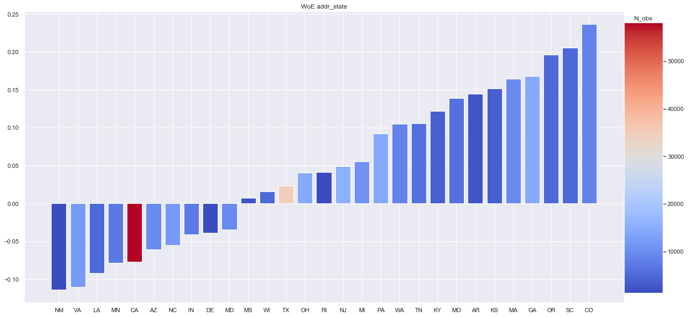


VA up to CA


```python
x_train_prep['addr_state:VA_OK_MD_LA_KY'] = x_train_prep['addr_state:VA'] + x_train_prep['addr_state:OK'] + x_train_prep['addr_state:MD'] + x_train_prep['addr_state:LA'] + x_train_prep['addr_state:KY']
```

Now, NJ up to UT 


```python
x_train_prep['addr_state:NJ_TN_NC_UT'] = x_train_prep['addr_state:NJ'] + x_train_prep['addr_state:TN'] + x_train_prep['addr_state:NC'] + x_train_prep['addr_state:UT']
```

PA up to AZ


```python
x_train_prep['addr_state:PA_OH_MI_AZ'] = x_train_prep['addr_state:PA'] + x_train_prep['addr_state:OH'] + x_train_prep['addr_state:MI'] + x_train_prep['addr_state:AZ']
```


```python
woe_df = woe_discrete(x_train_prep, 'addr_state', y_train_prep, plot_rows_start=24, plot_rows_end=-10)
```


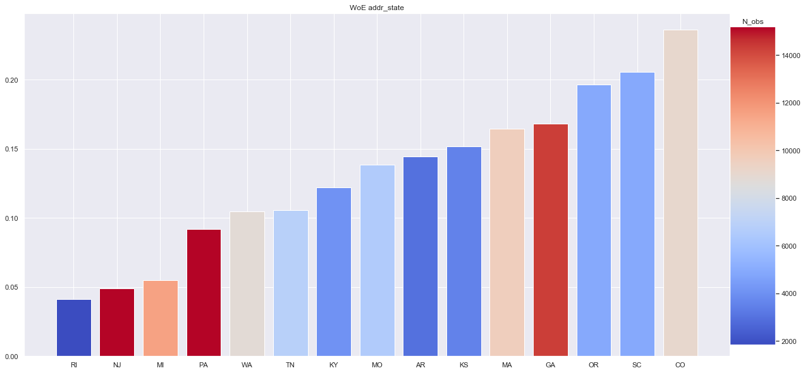


Now, MA up to RI


```python
x_train_prep['addr_state:MA_AR_NM_RI'] = x_train_prep['addr_state:MA'] + x_train_prep['addr_state:AR'] + x_train_prep['addr_state:MN'] + x_train_prep['addr_state:RI']
```


```python
woe_df = woe_discrete(x_train_prep, 'addr_state', y_train_prep, plot_rows_start=28, plot_rows_end=-10)
```


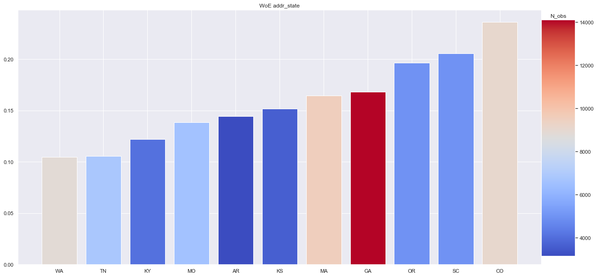


Grouping SD up to WA


```python
x_train_prep['addr_state:SD_WI_GA_IN_WA'] = x_train_prep['addr_state:SD'] + x_train_prep['addr_state:WI'] + x_train_prep['addr_state:GA'] + x_train_prep['addr_state:IN'] + x_train_prep['addr_state:WA']
```


```python
woe_df = woe_discrete(x_train_prep, 'addr_state', y_train_prep, plot_rows_start=33, plot_rows_end=-1)
```


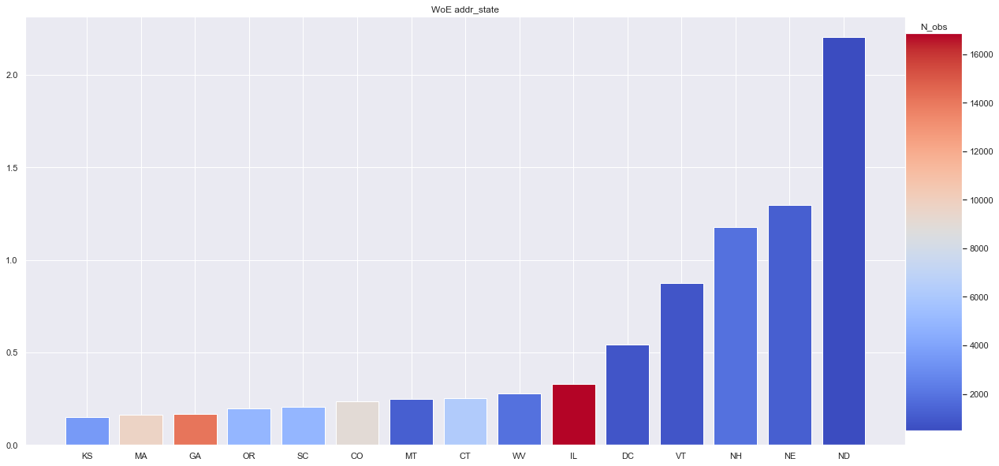


Now I'm grouping OR UP TO IL.<br>
Leaving TX as it is because of the high number of observations


```python
x_train_prep['addr_state:OR_MT_CT_IL'] = x_train_prep['addr_state:OR'] + x_train_prep['addr_state:MT'] + x_train_prep['addr_state:CT'] + x_train_prep['addr_state:IL']
```

Grouping from KS up to MS


```python
x_train_prep['addr_state:KS_CO_SC_AK_VT_MS'] = x_train_prep['addr_state:KS'] + x_train_prep['addr_state:CO'] + x_train_prep['addr_state:SC'] \
                                                + x_train_prep['addr_state:AK'] + x_train_prep['addr_state:VT'] + x_train_prep['addr_state:MS']
```

Now, I'm gonna group the 4 states that on the higher end of the scale, due to their low number of observations


```python
woe_df = woe_discrete(x_train_prep, 'addr_state', y_train_prep, plot_rows_start=43, plot_rows_end=-1)
```


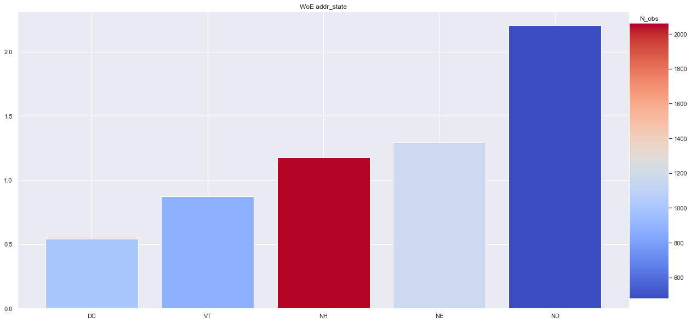


```python
x_train_prep['addr_state:NH_WV_WY_DC'] = x_train_prep['addr_state:NH'] + x_train_prep['addr_state:WV'] + x_train_prep['addr_state:WY'] + x_train_prep['addr_state:DC'] 
```

#### Final 'addr_state' categories


```python
woe_df = woe_discrete(x_train_prep, 'addr_state', y_train_prep, plot_rows_start=0, plot_rows_end=None)


```


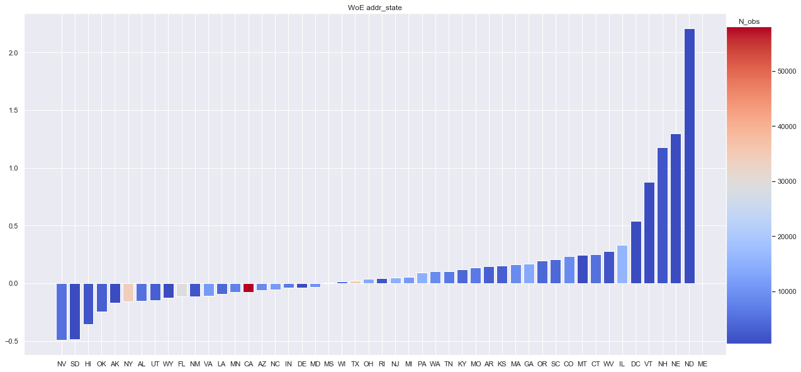


```python
fig, ax = plt.subplots(figsize=(20,8))

woe_df.set_index('addr_state').iloc[:, [3,4]].plot(kind='bar', stacked=True, ax=ax)

plt.legend()
```


    <matplotlib.legend.Legend at 0x1a2021b518>


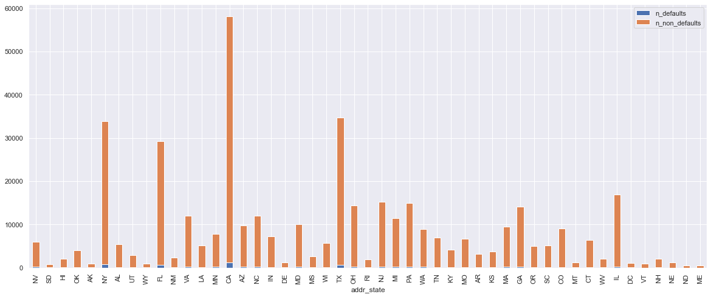


```python
fig, ax = plt.subplots(figsize=(20,8))

var_s = ['addr_state:ME_NE_IA_ID_NV_FL_ND' , 'addr_state:AL_HI_MO_NM_DE', 'addr_state:NY', 'addr_state:VA_OK_MD_LA_KY', 'addr_state:CA',
                    'addr_state:NJ_TN_NC_UT', 'addr_state:PA_OH_MI_AZ', 'addr_state:MA_AR_NM_RI', 'addr_state:SD_WI_GA_IN_WA',
                    'addr_state:OR_MT_CT_IL', 'addr_state:TX', 'addr_state:KS_CO_SC_AK_VT_MS', 'addr_state:NH_WV_WY_DC']
pd.concat([x_train_prep, y_train_prep], axis=1).groupby('Y').sum().loc[:, var_s].T.plot(kind='bar', stacked=True, ax=ax)

plt.legend()
```


    <matplotlib.legend.Legend at 0x1a1dd6e0b8>


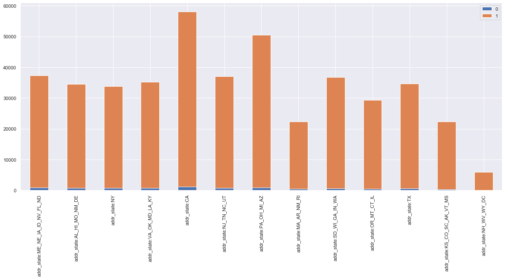

'''
Note that I'm leaving the smallest WoE category out ('addr_state:ME_NE_IA_ID_NV_FL_ND')
'''

vars_to_use.append(['addr_state:AL_HI_MO_NM_DE', 'addr_state:NY', 'addr_state:VA_OK_MD_LA_KY', 'addr_state:CA',
                    'addr_state:NJ_TN_NC_UT', 'addr_state:PA_OH_MI_AZ', 'addr_state:MA_AR_NM_RI', 'addr_state:SD_WI_GA_IN_WA',
                    'addr_state:OR_MT_CT_IL', 'addr_state:TX', 'addr_state:KS_CO_SC_AK_VT_MS', 'addr_state:NH_WV_WY_DC'])

ref_vars.append(['addr_state:ME_NE_IA_ID_NV_FL_ND'])

vars_to_use

```python

```


```python

```

#### 'verification_status' independent variable<br>
This variable has a almost no predictive power, IV is lower than 0.02


```python
woe_df = woe_discrete(x_train_prep, 'verification_status', y_train_prep)
woe_df
```


<div>
<style scoped>
    .dataframe tbody tr th:only-of-type {
        vertical-align: middle;
    }

    .dataframe tbody tr th {
        vertical-align: top;
    }

    .dataframe thead th {
        text-align: right;
    }
</style>
<table border="1" class="dataframe">
  <thead>
    <tr style="text-align: right;">
      <th></th>
      <th>verification_status</th>
      <th>n_obs</th>
      <th>prop_non_defaults</th>
      <th>prop_n_obs</th>
      <th>n_defaults</th>
      <th>n_non_defaults</th>
      <th>prop_n_non_defaults</th>
      <th>prop_n_defaults</th>
      <th>WoE</th>
      <th>diff_prop_non_defaults</th>
      <th>diff_WoE</th>
      <th>IV</th>
    </tr>
  </thead>
  <tbody>
    <tr>
      <th>0</th>
      <td>Verified</td>
      <td>123016</td>
      <td>0.976532</td>
      <td>0.292134</td>
      <td>2887.0</td>
      <td>120129.0</td>
      <td>0.290698</td>
      <td>0.367724</td>
      <td>-0.235047</td>
      <td>NaN</td>
      <td>NaN</td>
      <td>0.046808</td>
    </tr>
    <tr>
      <th>1</th>
      <td>Source Verified</td>
      <td>179565</td>
      <td>0.981110</td>
      <td>0.426425</td>
      <td>3392.0</td>
      <td>176173.0</td>
      <td>0.426318</td>
      <td>0.432047</td>
      <td>-0.013348</td>
      <td>0.135620</td>
      <td>0.221698</td>
      <td>0.046808</td>
    </tr>
    <tr>
      <th>2</th>
      <td>Not Verified</td>
      <td>118513</td>
      <td>0.986736</td>
      <td>0.281441</td>
      <td>1572.0</td>
      <td>116941.0</td>
      <td>0.282984</td>
      <td>0.200229</td>
      <td>0.345926</td>
      <td>0.143335</td>
      <td>0.359274</td>
      <td>0.046808</td>
    </tr>
  </tbody>
</table>
</div>


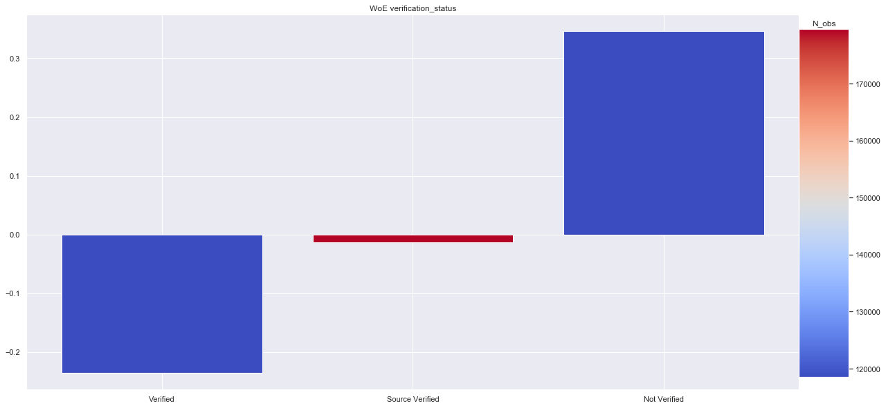


```python
fig, ax = plt.subplots(figsize=(20,8))

woe_df.set_index('verification_status').iloc[:, [3,4]].plot(kind='bar', stacked=True, ax=ax)

plt.legend()
```


    <matplotlib.legend.Legend at 0x1a19722be0>


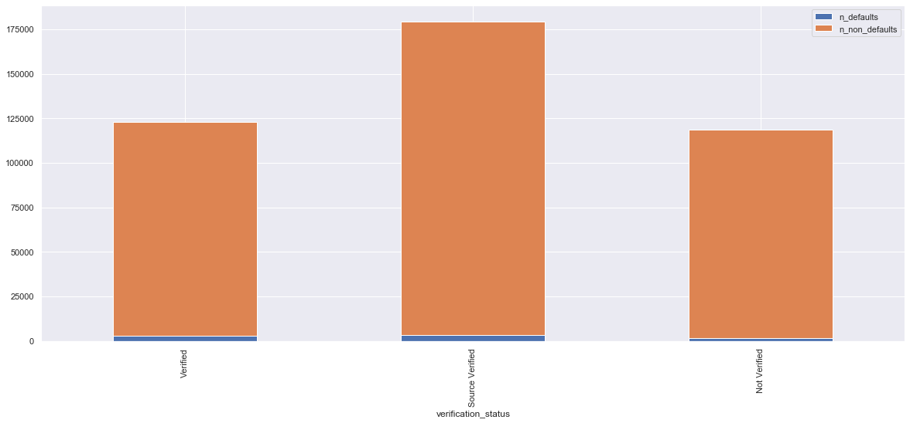

vars_to_use.append(['verification_status:Not Verified', 'verification_status:Source Verified'])
ref_vars.append(['verification_status:Verified'])

vars_to_use
I'll leave this as it is, since predictive power is so weak and WoE's seem ok<br>
I'll probably leave this variable out of the model

## initial_status


```python
woe_df = woe_discrete(x_train_prep, 'initial_list_status', y_train_prep)
woe_df
```


<div>
<style scoped>
    .dataframe tbody tr th:only-of-type {
        vertical-align: middle;
    }

    .dataframe tbody tr th {
        vertical-align: top;
    }

    .dataframe thead th {
        text-align: right;
    }
</style>
<table border="1" class="dataframe">
  <thead>
    <tr style="text-align: right;">
      <th></th>
      <th>initial_list_status</th>
      <th>n_obs</th>
      <th>prop_non_defaults</th>
      <th>prop_n_obs</th>
      <th>n_defaults</th>
      <th>n_non_defaults</th>
      <th>prop_n_non_defaults</th>
      <th>prop_n_defaults</th>
      <th>WoE</th>
      <th>diff_prop_non_defaults</th>
      <th>diff_WoE</th>
      <th>IV</th>
    </tr>
  </thead>
  <tbody>
    <tr>
      <th>0</th>
      <td>f</td>
      <td>153843</td>
      <td>0.972550</td>
      <td>0.365341</td>
      <td>4223.0</td>
      <td>149620.0</td>
      <td>0.362063</td>
      <td>0.537893</td>
      <td>-0.395842</td>
      <td>NaN</td>
      <td>NaN</td>
      <td>0.126296</td>
    </tr>
    <tr>
      <th>1</th>
      <td>w</td>
      <td>267251</td>
      <td>0.986425</td>
      <td>0.634659</td>
      <td>3628.0</td>
      <td>263623.0</td>
      <td>0.637937</td>
      <td>0.462107</td>
      <td>0.322444</td>
      <td>0.275874</td>
      <td>0.718286</td>
      <td>0.126296</td>
    </tr>
  </tbody>
</table>
</div>


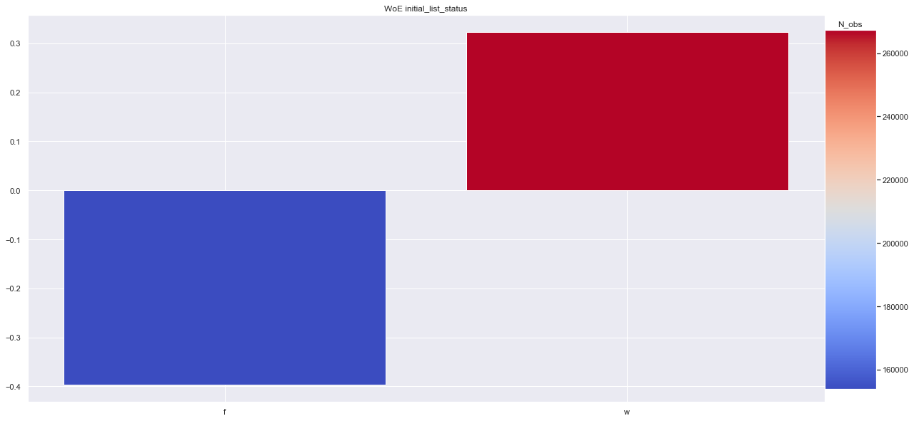


```python
fig, ax = plt.subplots(figsize=(20,8))

woe_df.set_index('initial_list_status').iloc[:, [3,4]].plot(kind='bar', stacked=True, ax=ax)

plt.legend()
```


    <matplotlib.legend.Legend at 0x1a21769898>


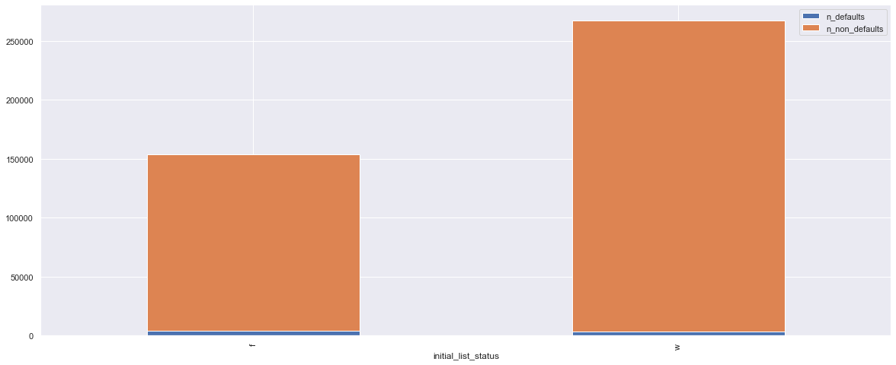

vars_to_use.append(['initial_list_status:w'])
ref_vars.append(['initial_list_status:f'])

vars_to_use

```python

```

## purpose


```python
woe_df = woe_discrete(x_train_prep, 'purpose', y_train_prep, rot_x_ticks=45, vlines=[3.5, 8.5])
woe_df
```


<div>
<style scoped>
    .dataframe tbody tr th:only-of-type {
        vertical-align: middle;
    }

    .dataframe tbody tr th {
        vertical-align: top;
    }

    .dataframe thead th {
        text-align: right;
    }
</style>
<table border="1" class="dataframe">
  <thead>
    <tr style="text-align: right;">
      <th></th>
      <th>purpose</th>
      <th>n_obs</th>
      <th>prop_non_defaults</th>
      <th>prop_n_obs</th>
      <th>n_defaults</th>
      <th>n_non_defaults</th>
      <th>prop_n_non_defaults</th>
      <th>prop_n_defaults</th>
      <th>WoE</th>
      <th>diff_prop_non_defaults</th>
      <th>diff_WoE</th>
      <th>IV</th>
    </tr>
  </thead>
  <tbody>
    <tr>
      <th>0</th>
      <td>wedding</td>
      <td>4</td>
      <td>0.750000</td>
      <td>0.000009</td>
      <td>1.0</td>
      <td>3.0</td>
      <td>0.000007</td>
      <td>0.000127</td>
      <td>-2.864783</td>
      <td>NaN</td>
      <td>NaN</td>
      <td>0.061514</td>
    </tr>
    <tr>
      <th>1</th>
      <td>renewable_energy</td>
      <td>224</td>
      <td>0.955357</td>
      <td>0.000532</td>
      <td>10.0</td>
      <td>214.0</td>
      <td>0.000518</td>
      <td>0.001274</td>
      <td>-0.900004</td>
      <td>0.000511</td>
      <td>1.964779</td>
      <td>0.061514</td>
    </tr>
    <tr>
      <th>2</th>
      <td>small_business</td>
      <td>3364</td>
      <td>0.958680</td>
      <td>0.007989</td>
      <td>139.0</td>
      <td>3225.0</td>
      <td>0.007804</td>
      <td>0.017705</td>
      <td>-0.819181</td>
      <td>0.007286</td>
      <td>0.080823</td>
      <td>0.061514</td>
    </tr>
    <tr>
      <th>3</th>
      <td>moving</td>
      <td>2420</td>
      <td>0.965289</td>
      <td>0.005747</td>
      <td>84.0</td>
      <td>2336.0</td>
      <td>0.005653</td>
      <td>0.010699</td>
      <td>-0.638016</td>
      <td>0.002151</td>
      <td>0.181164</td>
      <td>0.061514</td>
    </tr>
    <tr>
      <th>4</th>
      <td>house</td>
      <td>1438</td>
      <td>0.967316</td>
      <td>0.003415</td>
      <td>47.0</td>
      <td>1391.0</td>
      <td>0.003366</td>
      <td>0.005986</td>
      <td>-0.575764</td>
      <td>0.002287</td>
      <td>0.062252</td>
      <td>0.061514</td>
    </tr>
    <tr>
      <th>5</th>
      <td>medical</td>
      <td>3938</td>
      <td>0.970797</td>
      <td>0.009352</td>
      <td>115.0</td>
      <td>3823.0</td>
      <td>0.009251</td>
      <td>0.014648</td>
      <td>-0.459536</td>
      <td>0.005885</td>
      <td>0.116228</td>
      <td>0.061514</td>
    </tr>
    <tr>
      <th>6</th>
      <td>major_purchase</td>
      <td>7449</td>
      <td>0.975970</td>
      <td>0.017690</td>
      <td>179.0</td>
      <td>7270.0</td>
      <td>0.017593</td>
      <td>0.022800</td>
      <td>-0.259269</td>
      <td>0.008341</td>
      <td>0.200267</td>
      <td>0.061514</td>
    </tr>
    <tr>
      <th>7</th>
      <td>other</td>
      <td>19204</td>
      <td>0.976672</td>
      <td>0.045605</td>
      <td>448.0</td>
      <td>18756.0</td>
      <td>0.045387</td>
      <td>0.057063</td>
      <td>-0.228919</td>
      <td>0.027795</td>
      <td>0.030350</td>
      <td>0.061514</td>
    </tr>
    <tr>
      <th>8</th>
      <td>vacation</td>
      <td>2249</td>
      <td>0.977768</td>
      <td>0.005341</td>
      <td>50.0</td>
      <td>2199.0</td>
      <td>0.005321</td>
      <td>0.006369</td>
      <td>-0.179660</td>
      <td>0.040066</td>
      <td>0.049259</td>
      <td>0.061514</td>
    </tr>
    <tr>
      <th>9</th>
      <td>debt_consolidation</td>
      <td>250020</td>
      <td>0.979878</td>
      <td>0.593739</td>
      <td>5031.0</td>
      <td>244989.0</td>
      <td>0.592845</td>
      <td>0.640810</td>
      <td>-0.077800</td>
      <td>0.587524</td>
      <td>0.101860</td>
      <td>0.061514</td>
    </tr>
    <tr>
      <th>10</th>
      <td>home_improvement</td>
      <td>25292</td>
      <td>0.982445</td>
      <td>0.060063</td>
      <td>444.0</td>
      <td>24848.0</td>
      <td>0.060129</td>
      <td>0.056553</td>
      <td>0.061313</td>
      <td>0.532716</td>
      <td>0.139113</td>
      <td>0.061514</td>
    </tr>
    <tr>
      <th>11</th>
      <td>car</td>
      <td>3466</td>
      <td>0.982689</td>
      <td>0.008231</td>
      <td>60.0</td>
      <td>3406.0</td>
      <td>0.008242</td>
      <td>0.007642</td>
      <td>0.075554</td>
      <td>0.051887</td>
      <td>0.014241</td>
      <td>0.061514</td>
    </tr>
    <tr>
      <th>12</th>
      <td>credit_card</td>
      <td>102025</td>
      <td>0.987817</td>
      <td>0.242286</td>
      <td>1243.0</td>
      <td>100782.0</td>
      <td>0.243881</td>
      <td>0.158324</td>
      <td>0.432037</td>
      <td>0.235639</td>
      <td>0.356483</td>
      <td>0.061514</td>
    </tr>
    <tr>
      <th>13</th>
      <td>educational</td>
      <td>1</td>
      <td>1.000000</td>
      <td>0.000002</td>
      <td>0.0</td>
      <td>1.0</td>
      <td>0.000002</td>
      <td>0.000000</td>
      <td>NaN</td>
      <td>0.243878</td>
      <td>NaN</td>
      <td>0.061514</td>
    </tr>
  </tbody>
</table>
</div>


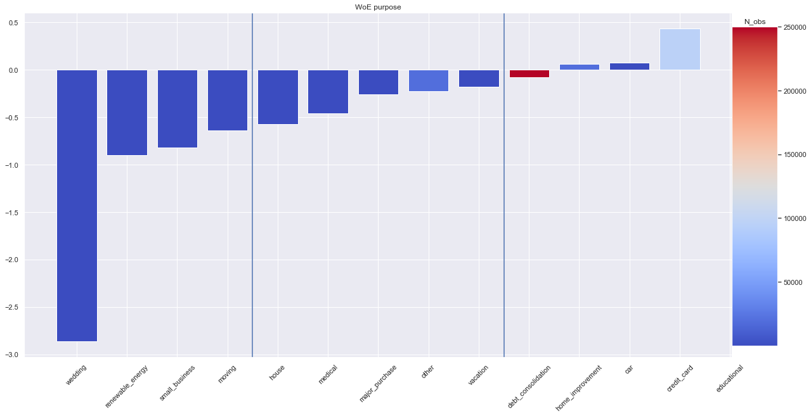


Surprisingly, educational loans appear extremely likely to default, but there is not enough data on it to say it for sure.<br>
Small businesses loans are also very likely to default.


```python
fig, ax = plt.subplots(figsize=(20,8))

woe_df.set_index('purpose').iloc[:, [3,4]].plot(kind='bar', stacked=True, ax=ax)

plt.legend()
```


    <matplotlib.legend.Legend at 0x1a1b5b7550>


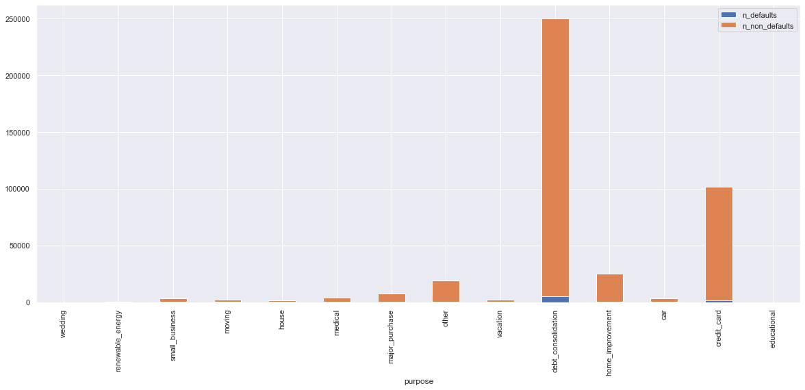


Grouping educ, sm, mov and house <br>
renw, other, med, wedding, vacation<br>
debtc, majpur, homeimp, car and credc<br>


```python
x_train_prep['purpose:educ_sm_mov_house'] = x_train_prep['purpose:educational'] + x_train_prep['purpose:small_business'] + x_train_prep['purpose:moving'] + x_train_prep['purpose:house']
x_train_prep['purpose:ren_oth_med_wedd_vac'] = x_train_prep['purpose:renewable_energy'] + x_train_prep['purpose:other'] + x_train_prep['purpose:medical'] + x_train_prep['purpose:wedding'] + x_train_prep['purpose:vacation']
x_train_prep['purpose:debtc_majpur_homeimp_car_credc'] = x_train_prep['purpose:debt_consolidation'] + x_train_prep['purpose:major_purchase'] + x_train_prep['purpose:home_improvement'] + x_train_prep['purpose:car'] + x_train_prep['purpose:credit_card']
```


```python
fig, ax = plt.subplots(figsize=(20,8))

var_s = ['purpose:educ_sm_mov_house', 'purpose:ren_oth_med_wedd_vac', 'purpose:debtc_majpur_homeimp_car_credc']
pd.concat([x_train_prep, y_train_prep], axis=1).groupby('Y').sum().loc[:, var_s].T.plot(kind='bar', stacked=True, ax=ax)

plt.legend()
```


    <matplotlib.legend.Legend at 0x1a1dd88668>


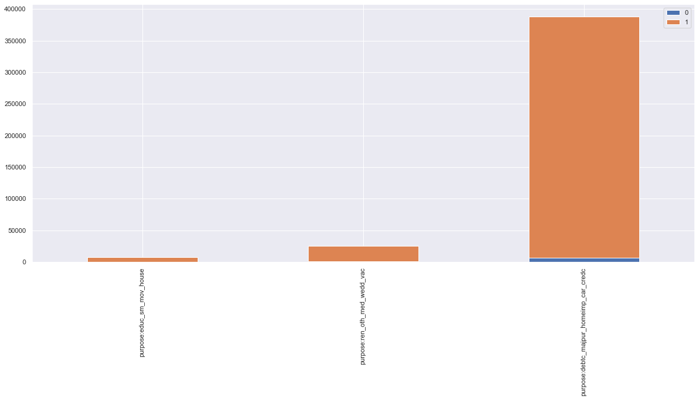

vars_to_use.append(['purpose:ren_oth_med_wedd_vac', 'purpose:debtc_majpur_homeimp_car_credc'])
ref_vars.append(['purpose:educ_sm_mov_house'])

vars_to_use

```python

```


```python

```


```python

```

# Continuous variables<br>

the procedure is the same as for catg variables, but we can't order tge woe_df by WoE, instead we have to order it by the values of the variable itself<br>
we want to preserve the natural order


```python

```

### term independent variable


```python
woe_df = woe_ordered_continuous(x_train_prep, 'term', y_train_prep)
woe_df
```


<div>
<style scoped>
    .dataframe tbody tr th:only-of-type {
        vertical-align: middle;
    }

    .dataframe tbody tr th {
        vertical-align: top;
    }

    .dataframe thead th {
        text-align: right;
    }
</style>
<table border="1" class="dataframe">
  <thead>
    <tr style="text-align: right;">
      <th></th>
      <th>term</th>
      <th>n_obs</th>
      <th>prop_non_defaults</th>
      <th>prop_n_obs</th>
      <th>n_defaults</th>
      <th>n_non_defaults</th>
      <th>prop_n_non_defaults</th>
      <th>prop_n_defaults</th>
      <th>WoE</th>
      <th>diff_prop_non_defaults</th>
      <th>diff_WoE</th>
      <th>IV</th>
    </tr>
  </thead>
  <tbody>
    <tr>
      <th>0</th>
      <td>36</td>
      <td>283172</td>
      <td>0.983533</td>
      <td>0.672467</td>
      <td>4663.0</td>
      <td>278509.0</td>
      <td>0.673959</td>
      <td>0.593937</td>
      <td>0.126396</td>
      <td>NaN</td>
      <td>NaN</td>
      <td>0.027678</td>
    </tr>
    <tr>
      <th>1</th>
      <td>60</td>
      <td>137922</td>
      <td>0.976885</td>
      <td>0.327533</td>
      <td>3188.0</td>
      <td>134734.0</td>
      <td>0.326041</td>
      <td>0.406063</td>
      <td>-0.219486</td>
      <td>0.347919</td>
      <td>0.345883</td>
      <td>0.027678</td>
    </tr>
  </tbody>
</table>
</div>


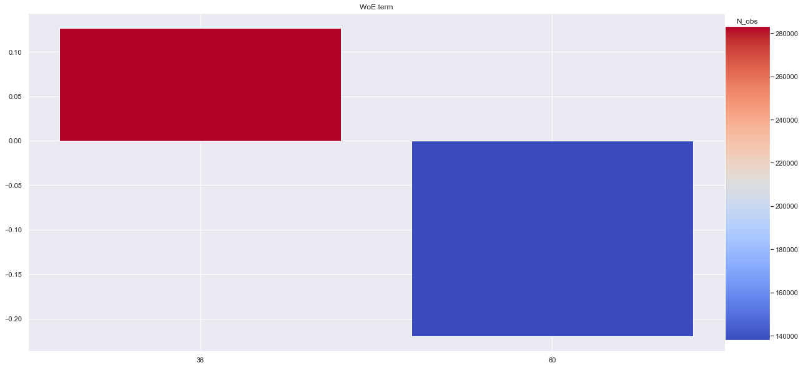


60 month is much riskier, I'll leave as it is. Only two very distinct categories.<br>


```python
fig, ax = plt.subplots(figsize=(20,8))

woe_df.set_index('term').iloc[:, [3,4]].plot(kind='bar', stacked=True, ax=ax)

plt.legend()
```


    <matplotlib.legend.Legend at 0x1a1c25c9b0>


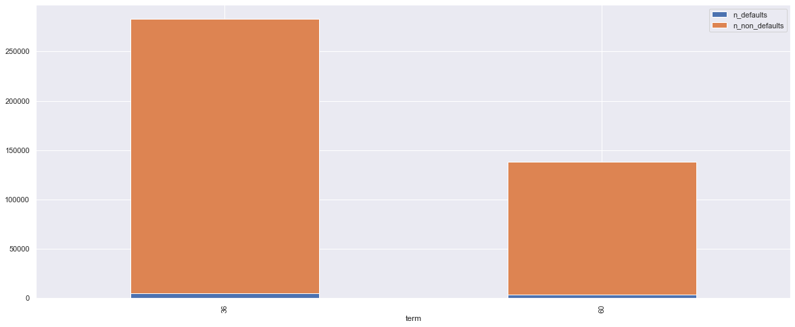


```python
temp_dummies = pd.get_dummies(x_train_prep['term'], prefix='term', prefix_sep=':')
x_train_prep = pd.concat([x_train_prep, temp_dummies], axis=1)
```
vars_to_use.append(['term:36'])
ref_vars.append(['term:60'])

vars_to_use
### emp_length_int independent variable


```python
woe_df = woe_ordered_continuous(x_train_prep, 'emp_length_int', y_train_prep, vlines=[0.5,1.5, 4.5, 6.5, 9.5])
woe_df
```


<div>
<style scoped>
    .dataframe tbody tr th:only-of-type {
        vertical-align: middle;
    }

    .dataframe tbody tr th {
        vertical-align: top;
    }

    .dataframe thead th {
        text-align: right;
    }
</style>
<table border="1" class="dataframe">
  <thead>
    <tr style="text-align: right;">
      <th></th>
      <th>emp_length_int</th>
      <th>n_obs</th>
      <th>prop_non_defaults</th>
      <th>prop_n_obs</th>
      <th>n_defaults</th>
      <th>n_non_defaults</th>
      <th>prop_n_non_defaults</th>
      <th>prop_n_defaults</th>
      <th>WoE</th>
      <th>diff_prop_non_defaults</th>
      <th>diff_WoE</th>
      <th>IV</th>
    </tr>
  </thead>
  <tbody>
    <tr>
      <th>0</th>
      <td>0</td>
      <td>58157</td>
      <td>0.977733</td>
      <td>0.138109</td>
      <td>1295.0</td>
      <td>56862.0</td>
      <td>0.137599</td>
      <td>0.164947</td>
      <td>-0.181278</td>
      <td>NaN</td>
      <td>NaN</td>
      <td>0.019134</td>
    </tr>
    <tr>
      <th>1</th>
      <td>1</td>
      <td>27473</td>
      <td>0.977687</td>
      <td>0.065242</td>
      <td>613.0</td>
      <td>26860.0</td>
      <td>0.064998</td>
      <td>0.078079</td>
      <td>-0.183366</td>
      <td>0.072601</td>
      <td>0.002088</td>
      <td>0.019134</td>
    </tr>
    <tr>
      <th>2</th>
      <td>2</td>
      <td>37497</td>
      <td>0.980932</td>
      <td>0.089047</td>
      <td>715.0</td>
      <td>36782.0</td>
      <td>0.089008</td>
      <td>0.091071</td>
      <td>-0.022914</td>
      <td>0.024010</td>
      <td>0.160453</td>
      <td>0.019134</td>
    </tr>
    <tr>
      <th>3</th>
      <td>3</td>
      <td>33430</td>
      <td>0.980975</td>
      <td>0.079388</td>
      <td>636.0</td>
      <td>32794.0</td>
      <td>0.079358</td>
      <td>0.081009</td>
      <td>-0.020593</td>
      <td>0.009650</td>
      <td>0.002321</td>
      <td>0.019134</td>
    </tr>
    <tr>
      <th>4</th>
      <td>4</td>
      <td>24506</td>
      <td>0.979678</td>
      <td>0.058196</td>
      <td>498.0</td>
      <td>24008.0</td>
      <td>0.058097</td>
      <td>0.063431</td>
      <td>-0.087853</td>
      <td>0.021261</td>
      <td>0.067260</td>
      <td>0.019134</td>
    </tr>
    <tr>
      <th>5</th>
      <td>5</td>
      <td>24930</td>
      <td>0.980866</td>
      <td>0.059203</td>
      <td>477.0</td>
      <td>24453.0</td>
      <td>0.059173</td>
      <td>0.060757</td>
      <td>-0.026403</td>
      <td>0.001077</td>
      <td>0.061449</td>
      <td>0.019134</td>
    </tr>
    <tr>
      <th>6</th>
      <td>6</td>
      <td>16838</td>
      <td>0.978976</td>
      <td>0.039986</td>
      <td>354.0</td>
      <td>16484.0</td>
      <td>0.039889</td>
      <td>0.045090</td>
      <td>-0.122546</td>
      <td>0.019284</td>
      <td>0.096143</td>
      <td>0.019134</td>
    </tr>
    <tr>
      <th>7</th>
      <td>7</td>
      <td>18414</td>
      <td>0.979201</td>
      <td>0.043729</td>
      <td>383.0</td>
      <td>18031.0</td>
      <td>0.043633</td>
      <td>0.048784</td>
      <td>-0.111582</td>
      <td>0.003744</td>
      <td>0.010964</td>
      <td>0.019134</td>
    </tr>
    <tr>
      <th>8</th>
      <td>8</td>
      <td>21560</td>
      <td>0.983905</td>
      <td>0.051200</td>
      <td>347.0</td>
      <td>21213.0</td>
      <td>0.051333</td>
      <td>0.044198</td>
      <td>0.149650</td>
      <td>0.007700</td>
      <td>0.261232</td>
      <td>0.019134</td>
    </tr>
    <tr>
      <th>9</th>
      <td>9</td>
      <td>16769</td>
      <td>0.982289</td>
      <td>0.039822</td>
      <td>297.0</td>
      <td>16472.0</td>
      <td>0.039860</td>
      <td>0.037830</td>
      <td>0.052290</td>
      <td>0.011473</td>
      <td>0.097360</td>
      <td>0.019134</td>
    </tr>
    <tr>
      <th>10</th>
      <td>10</td>
      <td>141520</td>
      <td>0.984200</td>
      <td>0.336077</td>
      <td>2236.0</td>
      <td>139284.0</td>
      <td>0.337051</td>
      <td>0.284804</td>
      <td>0.168432</td>
      <td>0.297191</td>
      <td>0.116141</td>
      <td>0.019134</td>
    </tr>
  </tbody>
</table>
</div>


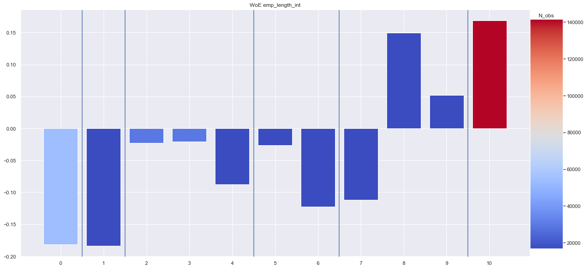


```python
fig, ax = plt.subplots(figsize=(20,8))

woe_df.set_index('emp_length_int').iloc[:, [3,4]].plot(kind='bar', stacked=True, ax=ax)

plt.legend()
```


    <matplotlib.legend.Legend at 0x1a1ca574e0>


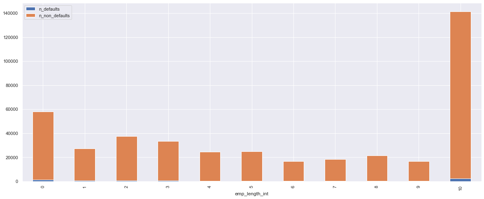


```python
temp_dummies = pd.get_dummies(x_train_prep['emp_length_int'], prefix='emp_length_int', prefix_sep=':')
```


```python
x_train_prep['emp_length_int:0'] = temp_dummies['emp_length_int:0'].values
x_train_prep['emp_length_int:1'] = temp_dummies['emp_length_int:1'].values
x_train_prep['emp_length_int:2_3_4'] = (temp_dummies['emp_length_int:2'] + temp_dummies['emp_length_int:3'] + temp_dummies['emp_length_int:4']).values
x_train_prep['emp_length_int:5_6'] = (temp_dummies['emp_length_int:5'] + temp_dummies['emp_length_int:6']).values
x_train_prep['emp_length_int:7_8_9'] = (temp_dummies['emp_length_int:7'] + temp_dummies['emp_length_int:8'] + temp_dummies['emp_length_int:9']).values
x_train_prep['emp_length_int:10'] = temp_dummies['emp_length_int:10'].values
```


```python
fig, ax = plt.subplots(figsize=(20,8))

var_s = ['emp_length_int:0', 'emp_length_int:1','emp_length_int:2_3_4','emp_length_int:5_6','emp_length_int:7_8_9','emp_length_int:10']
pd.concat([x_train_prep, y_train_prep], axis=1).groupby('Y').sum().loc[:, var_s].T.plot(kind='bar', stacked=True, ax=ax)

plt.legend()
```


    <matplotlib.legend.Legend at 0x1a1ca75da0>


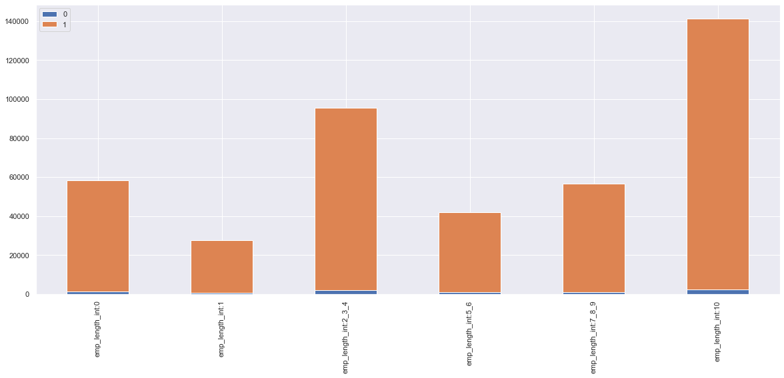

vars_to_use.append(['emp_length_int:1','emp_length_int:2_3_4','emp_length_int:5_6','emp_length_int:7_8_9','emp_length_int:10'])
ref_vars.append(['emp_length_int:0'])


vars_to_use
### 'mths_since_issue_d' independent variable<br>
There are 91 distinct values, first we fine class (un-ruled grouping) and later coarse class them (group by WoE)


```python
x_train_prep['mths_since_issue_d'].nunique()
```


    12


```python
x_train_prep['mths_since_issue_d_factor'] = pd.cut(x_train_prep['mths_since_issue_d'], 50)
```


```python
woe_df = woe_ordered_continuous(x_train_prep, 'mths_since_issue_d_factor', y_train_prep, rot_x_ticks=90,)
plt.grid(True)


woe_df
```


<div>
<style scoped>
    .dataframe tbody tr th:only-of-type {
        vertical-align: middle;
    }

    .dataframe tbody tr th {
        vertical-align: top;
    }

    .dataframe thead th {
        text-align: right;
    }
</style>
<table border="1" class="dataframe">
  <thead>
    <tr style="text-align: right;">
      <th></th>
      <th>mths_since_issue_d_factor</th>
      <th>n_obs</th>
      <th>prop_non_defaults</th>
      <th>prop_n_obs</th>
      <th>n_defaults</th>
      <th>n_non_defaults</th>
      <th>prop_n_non_defaults</th>
      <th>prop_n_defaults</th>
      <th>WoE</th>
      <th>diff_prop_non_defaults</th>
      <th>diff_WoE</th>
      <th>IV</th>
    </tr>
  </thead>
  <tbody>
    <tr>
      <th>0</th>
      <td>(35.989, 36.22]</td>
      <td>44342</td>
      <td>1.000000</td>
      <td>0.105302</td>
      <td>0.0</td>
      <td>44342.0</td>
      <td>0.107302</td>
      <td>0.000000</td>
      <td>NaN</td>
      <td>NaN</td>
      <td>NaN</td>
      <td>0.78299</td>
    </tr>
    <tr>
      <th>1</th>
      <td>(36.22, 36.44]</td>
      <td>0</td>
      <td>NaN</td>
      <td>0.000000</td>
      <td>NaN</td>
      <td>NaN</td>
      <td>NaN</td>
      <td>NaN</td>
      <td>NaN</td>
      <td>NaN</td>
      <td>NaN</td>
      <td>0.78299</td>
    </tr>
    <tr>
      <th>2</th>
      <td>(36.44, 36.66]</td>
      <td>0</td>
      <td>NaN</td>
      <td>0.000000</td>
      <td>NaN</td>
      <td>NaN</td>
      <td>NaN</td>
      <td>NaN</td>
      <td>NaN</td>
      <td>NaN</td>
      <td>NaN</td>
      <td>0.78299</td>
    </tr>
    <tr>
      <th>3</th>
      <td>(36.66, 36.88]</td>
      <td>0</td>
      <td>NaN</td>
      <td>0.000000</td>
      <td>NaN</td>
      <td>NaN</td>
      <td>NaN</td>
      <td>NaN</td>
      <td>NaN</td>
      <td>NaN</td>
      <td>NaN</td>
      <td>0.78299</td>
    </tr>
    <tr>
      <th>4</th>
      <td>(36.88, 37.1]</td>
      <td>37530</td>
      <td>0.998082</td>
      <td>0.089125</td>
      <td>72.0</td>
      <td>37458.0</td>
      <td>0.090644</td>
      <td>0.009171</td>
      <td>2.290915</td>
      <td>NaN</td>
      <td>NaN</td>
      <td>0.78299</td>
    </tr>
    <tr>
      <th>5</th>
      <td>(37.1, 37.32]</td>
      <td>0</td>
      <td>NaN</td>
      <td>0.000000</td>
      <td>NaN</td>
      <td>NaN</td>
      <td>NaN</td>
      <td>NaN</td>
      <td>NaN</td>
      <td>NaN</td>
      <td>NaN</td>
      <td>0.78299</td>
    </tr>
    <tr>
      <th>6</th>
      <td>(37.32, 37.54]</td>
      <td>0</td>
      <td>NaN</td>
      <td>0.000000</td>
      <td>NaN</td>
      <td>NaN</td>
      <td>NaN</td>
      <td>NaN</td>
      <td>NaN</td>
      <td>NaN</td>
      <td>NaN</td>
      <td>0.78299</td>
    </tr>
    <tr>
      <th>7</th>
      <td>(37.54, 37.76]</td>
      <td>0</td>
      <td>NaN</td>
      <td>0.000000</td>
      <td>NaN</td>
      <td>NaN</td>
      <td>NaN</td>
      <td>NaN</td>
      <td>NaN</td>
      <td>NaN</td>
      <td>NaN</td>
      <td>0.78299</td>
    </tr>
    <tr>
      <th>8</th>
      <td>(37.76, 37.98]</td>
      <td>0</td>
      <td>NaN</td>
      <td>0.000000</td>
      <td>NaN</td>
      <td>NaN</td>
      <td>NaN</td>
      <td>NaN</td>
      <td>NaN</td>
      <td>NaN</td>
      <td>NaN</td>
      <td>0.78299</td>
    </tr>
    <tr>
      <th>9</th>
      <td>(37.98, 38.2]</td>
      <td>48631</td>
      <td>0.997327</td>
      <td>0.115487</td>
      <td>130.0</td>
      <td>48501.0</td>
      <td>0.117367</td>
      <td>0.016558</td>
      <td>1.958410</td>
      <td>NaN</td>
      <td>NaN</td>
      <td>0.78299</td>
    </tr>
    <tr>
      <th>10</th>
      <td>(38.2, 38.42]</td>
      <td>0</td>
      <td>NaN</td>
      <td>0.000000</td>
      <td>NaN</td>
      <td>NaN</td>
      <td>NaN</td>
      <td>NaN</td>
      <td>NaN</td>
      <td>NaN</td>
      <td>NaN</td>
      <td>0.78299</td>
    </tr>
    <tr>
      <th>11</th>
      <td>(38.42, 38.64]</td>
      <td>0</td>
      <td>NaN</td>
      <td>0.000000</td>
      <td>NaN</td>
      <td>NaN</td>
      <td>NaN</td>
      <td>NaN</td>
      <td>NaN</td>
      <td>NaN</td>
      <td>NaN</td>
      <td>0.78299</td>
    </tr>
    <tr>
      <th>12</th>
      <td>(38.64, 38.86]</td>
      <td>0</td>
      <td>NaN</td>
      <td>0.000000</td>
      <td>NaN</td>
      <td>NaN</td>
      <td>NaN</td>
      <td>NaN</td>
      <td>NaN</td>
      <td>NaN</td>
      <td>NaN</td>
      <td>0.78299</td>
    </tr>
    <tr>
      <th>13</th>
      <td>(38.86, 39.08]</td>
      <td>28641</td>
      <td>0.993401</td>
      <td>0.068016</td>
      <td>189.0</td>
      <td>28452.0</td>
      <td>0.068851</td>
      <td>0.024073</td>
      <td>1.050832</td>
      <td>NaN</td>
      <td>NaN</td>
      <td>0.78299</td>
    </tr>
    <tr>
      <th>14</th>
      <td>(39.08, 39.3]</td>
      <td>0</td>
      <td>NaN</td>
      <td>0.000000</td>
      <td>NaN</td>
      <td>NaN</td>
      <td>NaN</td>
      <td>NaN</td>
      <td>NaN</td>
      <td>NaN</td>
      <td>NaN</td>
      <td>0.78299</td>
    </tr>
    <tr>
      <th>15</th>
      <td>(39.3, 39.52]</td>
      <td>0</td>
      <td>NaN</td>
      <td>0.000000</td>
      <td>NaN</td>
      <td>NaN</td>
      <td>NaN</td>
      <td>NaN</td>
      <td>NaN</td>
      <td>NaN</td>
      <td>NaN</td>
      <td>0.78299</td>
    </tr>
    <tr>
      <th>16</th>
      <td>(39.52, 39.74]</td>
      <td>0</td>
      <td>NaN</td>
      <td>0.000000</td>
      <td>NaN</td>
      <td>NaN</td>
      <td>NaN</td>
      <td>NaN</td>
      <td>NaN</td>
      <td>NaN</td>
      <td>NaN</td>
      <td>0.78299</td>
    </tr>
    <tr>
      <th>17</th>
      <td>(39.74, 39.96]</td>
      <td>0</td>
      <td>NaN</td>
      <td>0.000000</td>
      <td>NaN</td>
      <td>NaN</td>
      <td>NaN</td>
      <td>NaN</td>
      <td>NaN</td>
      <td>NaN</td>
      <td>NaN</td>
      <td>0.78299</td>
    </tr>
    <tr>
      <th>18</th>
      <td>(39.96, 40.18]</td>
      <td>35886</td>
      <td>0.990721</td>
      <td>0.085221</td>
      <td>333.0</td>
      <td>35553.0</td>
      <td>0.086034</td>
      <td>0.042415</td>
      <td>0.707242</td>
      <td>NaN</td>
      <td>NaN</td>
      <td>0.78299</td>
    </tr>
    <tr>
      <th>19</th>
      <td>(40.18, 40.4]</td>
      <td>0</td>
      <td>NaN</td>
      <td>0.000000</td>
      <td>NaN</td>
      <td>NaN</td>
      <td>NaN</td>
      <td>NaN</td>
      <td>NaN</td>
      <td>NaN</td>
      <td>NaN</td>
      <td>0.78299</td>
    </tr>
    <tr>
      <th>20</th>
      <td>(40.4, 40.62]</td>
      <td>0</td>
      <td>NaN</td>
      <td>0.000000</td>
      <td>NaN</td>
      <td>NaN</td>
      <td>NaN</td>
      <td>NaN</td>
      <td>NaN</td>
      <td>NaN</td>
      <td>NaN</td>
      <td>0.78299</td>
    </tr>
    <tr>
      <th>21</th>
      <td>(40.62, 40.84]</td>
      <td>0</td>
      <td>NaN</td>
      <td>0.000000</td>
      <td>NaN</td>
      <td>NaN</td>
      <td>NaN</td>
      <td>NaN</td>
      <td>NaN</td>
      <td>NaN</td>
      <td>NaN</td>
      <td>0.78299</td>
    </tr>
    <tr>
      <th>22</th>
      <td>(40.84, 41.06]</td>
      <td>45962</td>
      <td>0.984509</td>
      <td>0.109149</td>
      <td>712.0</td>
      <td>45250.0</td>
      <td>0.109500</td>
      <td>0.090689</td>
      <td>0.188485</td>
      <td>NaN</td>
      <td>NaN</td>
      <td>0.78299</td>
    </tr>
    <tr>
      <th>23</th>
      <td>(41.06, 41.28]</td>
      <td>0</td>
      <td>NaN</td>
      <td>0.000000</td>
      <td>NaN</td>
      <td>NaN</td>
      <td>NaN</td>
      <td>NaN</td>
      <td>NaN</td>
      <td>NaN</td>
      <td>NaN</td>
      <td>0.78299</td>
    </tr>
    <tr>
      <th>24</th>
      <td>(41.28, 41.5]</td>
      <td>0</td>
      <td>NaN</td>
      <td>0.000000</td>
      <td>NaN</td>
      <td>NaN</td>
      <td>NaN</td>
      <td>NaN</td>
      <td>NaN</td>
      <td>NaN</td>
      <td>NaN</td>
      <td>0.78299</td>
    </tr>
    <tr>
      <th>25</th>
      <td>(41.5, 41.72]</td>
      <td>0</td>
      <td>NaN</td>
      <td>0.000000</td>
      <td>NaN</td>
      <td>NaN</td>
      <td>NaN</td>
      <td>NaN</td>
      <td>NaN</td>
      <td>NaN</td>
      <td>NaN</td>
      <td>0.78299</td>
    </tr>
    <tr>
      <th>26</th>
      <td>(41.72, 41.94]</td>
      <td>0</td>
      <td>NaN</td>
      <td>0.000000</td>
      <td>NaN</td>
      <td>NaN</td>
      <td>NaN</td>
      <td>NaN</td>
      <td>NaN</td>
      <td>NaN</td>
      <td>NaN</td>
      <td>0.78299</td>
    </tr>
    <tr>
      <th>27</th>
      <td>(41.94, 42.16]</td>
      <td>28485</td>
      <td>0.978866</td>
      <td>0.067645</td>
      <td>602.0</td>
      <td>27883.0</td>
      <td>0.067474</td>
      <td>0.076678</td>
      <td>-0.127880</td>
      <td>NaN</td>
      <td>NaN</td>
      <td>0.78299</td>
    </tr>
    <tr>
      <th>28</th>
      <td>(42.16, 42.38]</td>
      <td>0</td>
      <td>NaN</td>
      <td>0.000000</td>
      <td>NaN</td>
      <td>NaN</td>
      <td>NaN</td>
      <td>NaN</td>
      <td>NaN</td>
      <td>NaN</td>
      <td>NaN</td>
      <td>0.78299</td>
    </tr>
    <tr>
      <th>29</th>
      <td>(42.38, 42.6]</td>
      <td>0</td>
      <td>NaN</td>
      <td>0.000000</td>
      <td>NaN</td>
      <td>NaN</td>
      <td>NaN</td>
      <td>NaN</td>
      <td>NaN</td>
      <td>NaN</td>
      <td>NaN</td>
      <td>0.78299</td>
    </tr>
    <tr>
      <th>30</th>
      <td>(42.6, 42.82]</td>
      <td>0</td>
      <td>NaN</td>
      <td>0.000000</td>
      <td>NaN</td>
      <td>NaN</td>
      <td>NaN</td>
      <td>NaN</td>
      <td>NaN</td>
      <td>NaN</td>
      <td>NaN</td>
      <td>0.78299</td>
    </tr>
    <tr>
      <th>31</th>
      <td>(42.82, 43.04]</td>
      <td>31913</td>
      <td>0.972644</td>
      <td>0.075786</td>
      <td>873.0</td>
      <td>31040.0</td>
      <td>0.075113</td>
      <td>0.111196</td>
      <td>-0.392298</td>
      <td>NaN</td>
      <td>NaN</td>
      <td>0.78299</td>
    </tr>
    <tr>
      <th>32</th>
      <td>(43.04, 43.26]</td>
      <td>0</td>
      <td>NaN</td>
      <td>0.000000</td>
      <td>NaN</td>
      <td>NaN</td>
      <td>NaN</td>
      <td>NaN</td>
      <td>NaN</td>
      <td>NaN</td>
      <td>NaN</td>
      <td>0.78299</td>
    </tr>
    <tr>
      <th>33</th>
      <td>(43.26, 43.48]</td>
      <td>0</td>
      <td>NaN</td>
      <td>0.000000</td>
      <td>NaN</td>
      <td>NaN</td>
      <td>NaN</td>
      <td>NaN</td>
      <td>NaN</td>
      <td>NaN</td>
      <td>NaN</td>
      <td>0.78299</td>
    </tr>
    <tr>
      <th>34</th>
      <td>(43.48, 43.7]</td>
      <td>0</td>
      <td>NaN</td>
      <td>0.000000</td>
      <td>NaN</td>
      <td>NaN</td>
      <td>NaN</td>
      <td>NaN</td>
      <td>NaN</td>
      <td>NaN</td>
      <td>NaN</td>
      <td>0.78299</td>
    </tr>
    <tr>
      <th>35</th>
      <td>(43.7, 43.92]</td>
      <td>0</td>
      <td>NaN</td>
      <td>0.000000</td>
      <td>NaN</td>
      <td>NaN</td>
      <td>NaN</td>
      <td>NaN</td>
      <td>NaN</td>
      <td>NaN</td>
      <td>NaN</td>
      <td>0.78299</td>
    </tr>
    <tr>
      <th>36</th>
      <td>(43.92, 44.14]</td>
      <td>35427</td>
      <td>0.967878</td>
      <td>0.084131</td>
      <td>1138.0</td>
      <td>34289.0</td>
      <td>0.082975</td>
      <td>0.144950</td>
      <td>-0.557843</td>
      <td>NaN</td>
      <td>NaN</td>
      <td>0.78299</td>
    </tr>
    <tr>
      <th>37</th>
      <td>(44.14, 44.36]</td>
      <td>0</td>
      <td>NaN</td>
      <td>0.000000</td>
      <td>NaN</td>
      <td>NaN</td>
      <td>NaN</td>
      <td>NaN</td>
      <td>NaN</td>
      <td>NaN</td>
      <td>NaN</td>
      <td>0.78299</td>
    </tr>
    <tr>
      <th>38</th>
      <td>(44.36, 44.58]</td>
      <td>0</td>
      <td>NaN</td>
      <td>0.000000</td>
      <td>NaN</td>
      <td>NaN</td>
      <td>NaN</td>
      <td>NaN</td>
      <td>NaN</td>
      <td>NaN</td>
      <td>NaN</td>
      <td>0.78299</td>
    </tr>
    <tr>
      <th>39</th>
      <td>(44.58, 44.8]</td>
      <td>0</td>
      <td>NaN</td>
      <td>0.000000</td>
      <td>NaN</td>
      <td>NaN</td>
      <td>NaN</td>
      <td>NaN</td>
      <td>NaN</td>
      <td>NaN</td>
      <td>NaN</td>
      <td>0.78299</td>
    </tr>
    <tr>
      <th>40</th>
      <td>(44.8, 45.02]</td>
      <td>25400</td>
      <td>0.960748</td>
      <td>0.060319</td>
      <td>997.0</td>
      <td>24403.0</td>
      <td>0.059052</td>
      <td>0.126990</td>
      <td>-0.765684</td>
      <td>NaN</td>
      <td>NaN</td>
      <td>0.78299</td>
    </tr>
    <tr>
      <th>41</th>
      <td>(45.02, 45.24]</td>
      <td>0</td>
      <td>NaN</td>
      <td>0.000000</td>
      <td>NaN</td>
      <td>NaN</td>
      <td>NaN</td>
      <td>NaN</td>
      <td>NaN</td>
      <td>NaN</td>
      <td>NaN</td>
      <td>0.78299</td>
    </tr>
    <tr>
      <th>42</th>
      <td>(45.24, 45.46]</td>
      <td>0</td>
      <td>NaN</td>
      <td>0.000000</td>
      <td>NaN</td>
      <td>NaN</td>
      <td>NaN</td>
      <td>NaN</td>
      <td>NaN</td>
      <td>NaN</td>
      <td>NaN</td>
      <td>0.78299</td>
    </tr>
    <tr>
      <th>43</th>
      <td>(45.46, 45.68]</td>
      <td>0</td>
      <td>NaN</td>
      <td>0.000000</td>
      <td>NaN</td>
      <td>NaN</td>
      <td>NaN</td>
      <td>NaN</td>
      <td>NaN</td>
      <td>NaN</td>
      <td>NaN</td>
      <td>0.78299</td>
    </tr>
    <tr>
      <th>44</th>
      <td>(45.68, 45.9]</td>
      <td>0</td>
      <td>NaN</td>
      <td>0.000000</td>
      <td>NaN</td>
      <td>NaN</td>
      <td>NaN</td>
      <td>NaN</td>
      <td>NaN</td>
      <td>NaN</td>
      <td>NaN</td>
      <td>0.78299</td>
    </tr>
    <tr>
      <th>45</th>
      <td>(45.9, 46.12]</td>
      <td>23770</td>
      <td>0.955869</td>
      <td>0.056448</td>
      <td>1049.0</td>
      <td>22721.0</td>
      <td>0.054982</td>
      <td>0.133614</td>
      <td>-0.887943</td>
      <td>NaN</td>
      <td>NaN</td>
      <td>0.78299</td>
    </tr>
    <tr>
      <th>46</th>
      <td>(46.12, 46.34]</td>
      <td>0</td>
      <td>NaN</td>
      <td>0.000000</td>
      <td>NaN</td>
      <td>NaN</td>
      <td>NaN</td>
      <td>NaN</td>
      <td>NaN</td>
      <td>NaN</td>
      <td>NaN</td>
      <td>0.78299</td>
    </tr>
    <tr>
      <th>47</th>
      <td>(46.34, 46.56]</td>
      <td>0</td>
      <td>NaN</td>
      <td>0.000000</td>
      <td>NaN</td>
      <td>NaN</td>
      <td>NaN</td>
      <td>NaN</td>
      <td>NaN</td>
      <td>NaN</td>
      <td>NaN</td>
      <td>0.78299</td>
    </tr>
    <tr>
      <th>48</th>
      <td>(46.56, 46.78]</td>
      <td>0</td>
      <td>NaN</td>
      <td>0.000000</td>
      <td>NaN</td>
      <td>NaN</td>
      <td>NaN</td>
      <td>NaN</td>
      <td>NaN</td>
      <td>NaN</td>
      <td>NaN</td>
      <td>0.78299</td>
    </tr>
    <tr>
      <th>49</th>
      <td>(46.78, 47.0]</td>
      <td>35107</td>
      <td>0.949981</td>
      <td>0.083371</td>
      <td>1756.0</td>
      <td>33351.0</td>
      <td>0.080706</td>
      <td>0.223666</td>
      <td>-1.019346</td>
      <td>NaN</td>
      <td>NaN</td>
      <td>0.78299</td>
    </tr>
  </tbody>
</table>
</div>


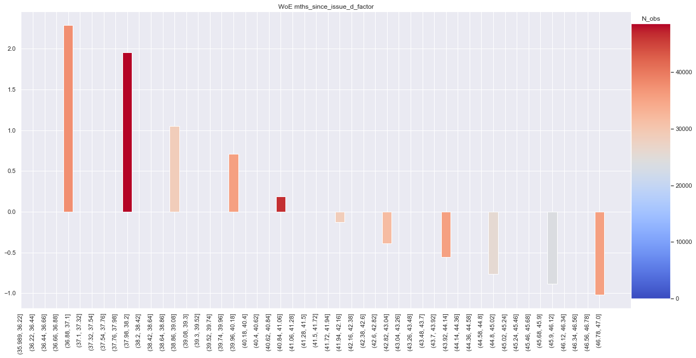


```python
fig, ax = plt.subplots(figsize=(20,8))

woe_df.set_index('mths_since_issue_d_factor').iloc[:, [3,4]].plot(kind='bar', stacked=True, ax=ax)

plt.legend()
```


    <matplotlib.legend.Legend at 0x1a18f7e0f0>


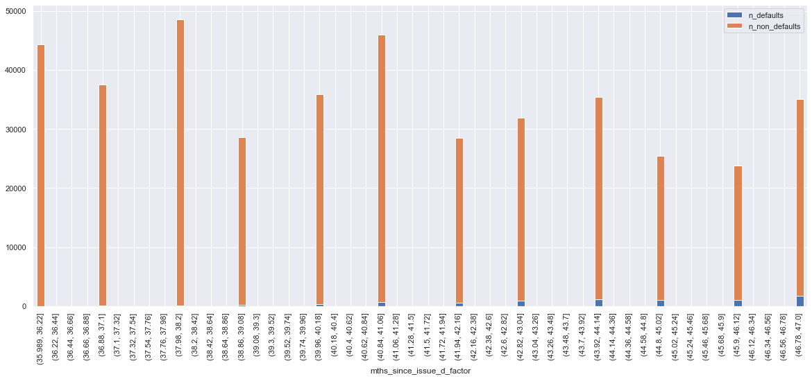


```python
x_train_prep['mths_since_issue_d:<38'] = np.where(x_train_prep['mths_since_issue_d'].isin(range(38)), 1, 0)
x_train_prep['mths_since_issue_d:38_39'] = np.where(x_train_prep['mths_since_issue_d'].isin(range(38, 40)), 1, 0)
x_train_prep['mths_since_issue_d:40_41'] = np.where(x_train_prep['mths_since_issue_d'].isin(range(40, 42)), 1, 0)

x_train_prep['mths_since_issue_d:42_48'] = np.where(x_train_prep['mths_since_issue_d'].isin(range(42, 49)), 1, 0)
x_train_prep['mths_since_issue_d:49_52'] = np.where(x_train_prep['mths_since_issue_d'].isin(range(49, 53)), 1, 0)
x_train_prep['mths_since_issue_d:53_64'] = np.where(x_train_prep['mths_since_issue_d'].isin(range(53, 65)), 1, 0)
x_train_prep['mths_since_issue_d:65_84'] = np.where(x_train_prep['mths_since_issue_d'].isin(range(65, 85)), 1, 0)
x_train_prep['mths_since_issue_d:>84'] = np.where(x_train_prep['mths_since_issue_d'] > 85, 1, 0)
```


```python
fig, ax = plt.subplots(figsize=(20,8))

var_s = ['mths_since_issue_d:<38', 'mths_since_issue_d:38_39', 'mths_since_issue_d:40_41', 'mths_since_issue_d:42_48',
                    'mths_since_issue_d:49_52', 'mths_since_issue_d:53_64', 'mths_since_issue_d:65_84', 'mths_since_issue_d:>84']
pd.concat([x_train_prep, y_train_prep], axis=1).groupby('Y').sum().loc[:, var_s].T.plot(kind='bar', stacked=True, ax=ax)

plt.legend()
```


    <matplotlib.legend.Legend at 0x1a18887550>


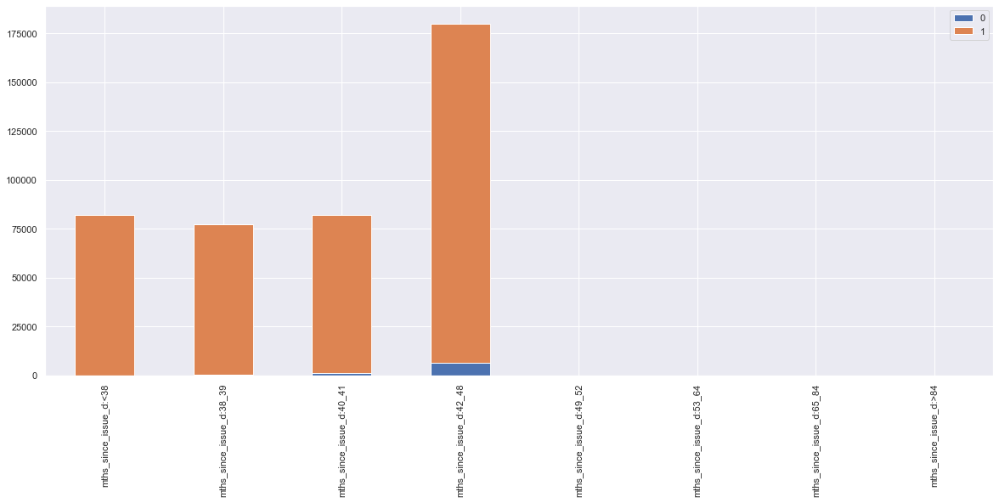

vars_to_use.append(['mths_since_issue_d:<38', 'mths_since_issue_d:38_39', 'mths_since_issue_d:40_41', 'mths_since_issue_d:42_48',
                    'mths_since_issue_d:49_52', 'mths_since_issue_d:53_64', 'mths_since_issue_d:65_84'])

ref_vars.append(['mths_since_issue_d:>84'])
vars_to_use
### 'int_rate' variable


```python
x_train_prep['int_rate_factor'] = pd.cut(x_train_prep['int_rate'], 50)

woe_df = woe_ordered_continuous(x_train_prep, 'int_rate_factor', y_train_prep, rot_x_ticks=90, vlines=[9.5, 15.5, 21.5, 29.5])

woe_df
```


<div>
<style scoped>
    .dataframe tbody tr th:only-of-type {
        vertical-align: middle;
    }

    .dataframe tbody tr th {
        vertical-align: top;
    }

    .dataframe thead th {
        text-align: right;
    }
</style>
<table border="1" class="dataframe">
  <thead>
    <tr style="text-align: right;">
      <th></th>
      <th>int_rate_factor</th>
      <th>n_obs</th>
      <th>prop_non_defaults</th>
      <th>prop_n_obs</th>
      <th>n_defaults</th>
      <th>n_non_defaults</th>
      <th>prop_n_non_defaults</th>
      <th>prop_n_defaults</th>
      <th>WoE</th>
      <th>diff_prop_non_defaults</th>
      <th>diff_WoE</th>
      <th>IV</th>
    </tr>
  </thead>
  <tbody>
    <tr>
      <th>0</th>
      <td>(5.296, 5.793]</td>
      <td>9651</td>
      <td>0.999689</td>
      <td>0.022919</td>
      <td>3.0</td>
      <td>9648.0</td>
      <td>0.023347</td>
      <td>0.000382</td>
      <td>4.112499</td>
      <td>NaN</td>
      <td>NaN</td>
      <td>0.786679</td>
    </tr>
    <tr>
      <th>1</th>
      <td>(5.793, 6.267]</td>
      <td>10214</td>
      <td>0.997259</td>
      <td>0.024256</td>
      <td>28.0</td>
      <td>10186.0</td>
      <td>0.024649</td>
      <td>0.003566</td>
      <td>1.933170</td>
      <td>0.001302</td>
      <td>2.179329</td>
      <td>0.786679</td>
    </tr>
    <tr>
      <th>2</th>
      <td>(6.267, 6.74]</td>
      <td>6530</td>
      <td>0.994793</td>
      <td>0.015507</td>
      <td>34.0</td>
      <td>6496.0</td>
      <td>0.015720</td>
      <td>0.004331</td>
      <td>1.289186</td>
      <td>0.008929</td>
      <td>0.643984</td>
      <td>0.786679</td>
    </tr>
    <tr>
      <th>3</th>
      <td>(6.74, 7.214]</td>
      <td>12488</td>
      <td>0.995275</td>
      <td>0.029656</td>
      <td>59.0</td>
      <td>12429.0</td>
      <td>0.030077</td>
      <td>0.007515</td>
      <td>1.386855</td>
      <td>0.014357</td>
      <td>0.097669</td>
      <td>0.786679</td>
    </tr>
    <tr>
      <th>4</th>
      <td>(7.214, 7.687]</td>
      <td>11416</td>
      <td>0.997985</td>
      <td>0.027110</td>
      <td>23.0</td>
      <td>11393.0</td>
      <td>0.027570</td>
      <td>0.002930</td>
      <td>2.241865</td>
      <td>0.002507</td>
      <td>0.855010</td>
      <td>0.786679</td>
    </tr>
    <tr>
      <th>5</th>
      <td>(7.687, 8.16]</td>
      <td>20636</td>
      <td>0.995687</td>
      <td>0.049006</td>
      <td>89.0</td>
      <td>20547.0</td>
      <td>0.049721</td>
      <td>0.011336</td>
      <td>1.478439</td>
      <td>0.022152</td>
      <td>0.763426</td>
      <td>0.786679</td>
    </tr>
    <tr>
      <th>6</th>
      <td>(8.16, 8.634]</td>
      <td>22498</td>
      <td>0.994133</td>
      <td>0.053428</td>
      <td>132.0</td>
      <td>22366.0</td>
      <td>0.054123</td>
      <td>0.016813</td>
      <td>1.169100</td>
      <td>0.004402</td>
      <td>0.309339</td>
      <td>0.786679</td>
    </tr>
    <tr>
      <th>7</th>
      <td>(8.634, 9.107]</td>
      <td>2020</td>
      <td>0.979703</td>
      <td>0.004797</td>
      <td>41.0</td>
      <td>1979.0</td>
      <td>0.004789</td>
      <td>0.005222</td>
      <td>-0.086620</td>
      <td>0.049334</td>
      <td>1.255720</td>
      <td>0.786679</td>
    </tr>
    <tr>
      <th>8</th>
      <td>(9.107, 9.581]</td>
      <td>22171</td>
      <td>0.992783</td>
      <td>0.052651</td>
      <td>160.0</td>
      <td>22011.0</td>
      <td>0.053264</td>
      <td>0.020380</td>
      <td>0.960729</td>
      <td>0.048475</td>
      <td>1.047349</td>
      <td>0.786679</td>
    </tr>
    <tr>
      <th>9</th>
      <td>(9.581, 10.054]</td>
      <td>22364</td>
      <td>0.993829</td>
      <td>0.053109</td>
      <td>138.0</td>
      <td>22226.0</td>
      <td>0.053784</td>
      <td>0.017577</td>
      <td>1.118369</td>
      <td>0.000520</td>
      <td>0.157641</td>
      <td>0.786679</td>
    </tr>
    <tr>
      <th>10</th>
      <td>(10.054, 10.527]</td>
      <td>2271</td>
      <td>0.975341</td>
      <td>0.005393</td>
      <td>56.0</td>
      <td>2215.0</td>
      <td>0.005360</td>
      <td>0.007133</td>
      <td>-0.285739</td>
      <td>0.048424</td>
      <td>1.404108</td>
      <td>0.786679</td>
    </tr>
    <tr>
      <th>11</th>
      <td>(10.527, 11.001]</td>
      <td>22559</td>
      <td>0.991400</td>
      <td>0.053572</td>
      <td>194.0</td>
      <td>22365.0</td>
      <td>0.054121</td>
      <td>0.024710</td>
      <td>0.783999</td>
      <td>0.048761</td>
      <td>1.069738</td>
      <td>0.786679</td>
    </tr>
    <tr>
      <th>12</th>
      <td>(11.001, 11.474]</td>
      <td>4780</td>
      <td>0.985565</td>
      <td>0.011351</td>
      <td>69.0</td>
      <td>4711.0</td>
      <td>0.011400</td>
      <td>0.008789</td>
      <td>0.260154</td>
      <td>0.042721</td>
      <td>0.523845</td>
      <td>0.786679</td>
    </tr>
    <tr>
      <th>13</th>
      <td>(11.474, 11.948]</td>
      <td>18875</td>
      <td>0.990305</td>
      <td>0.044824</td>
      <td>183.0</td>
      <td>18692.0</td>
      <td>0.045232</td>
      <td>0.023309</td>
      <td>0.662970</td>
      <td>0.033832</td>
      <td>0.402816</td>
      <td>0.786679</td>
    </tr>
    <tr>
      <th>14</th>
      <td>(11.948, 12.421]</td>
      <td>28919</td>
      <td>0.983436</td>
      <td>0.068676</td>
      <td>479.0</td>
      <td>28440.0</td>
      <td>0.068821</td>
      <td>0.061011</td>
      <td>0.120456</td>
      <td>0.023589</td>
      <td>0.542513</td>
      <td>0.786679</td>
    </tr>
    <tr>
      <th>15</th>
      <td>(12.421, 12.894]</td>
      <td>22799</td>
      <td>0.986271</td>
      <td>0.054142</td>
      <td>313.0</td>
      <td>22486.0</td>
      <td>0.054414</td>
      <td>0.039868</td>
      <td>0.311050</td>
      <td>0.014408</td>
      <td>0.190594</td>
      <td>0.786679</td>
    </tr>
    <tr>
      <th>16</th>
      <td>(12.894, 13.368]</td>
      <td>24609</td>
      <td>0.983014</td>
      <td>0.058441</td>
      <td>418.0</td>
      <td>24191.0</td>
      <td>0.058539</td>
      <td>0.053242</td>
      <td>0.094860</td>
      <td>0.004126</td>
      <td>0.216190</td>
      <td>0.786679</td>
    </tr>
    <tr>
      <th>17</th>
      <td>(13.368, 13.841]</td>
      <td>7433</td>
      <td>0.985067</td>
      <td>0.017652</td>
      <td>111.0</td>
      <td>7322.0</td>
      <td>0.017718</td>
      <td>0.014138</td>
      <td>0.225714</td>
      <td>0.040821</td>
      <td>0.130854</td>
      <td>0.786679</td>
    </tr>
    <tr>
      <th>18</th>
      <td>(13.841, 14.315]</td>
      <td>20243</td>
      <td>0.977671</td>
      <td>0.048072</td>
      <td>452.0</td>
      <td>19791.0</td>
      <td>0.047892</td>
      <td>0.057572</td>
      <td>-0.184094</td>
      <td>0.030174</td>
      <td>0.409808</td>
      <td>0.786679</td>
    </tr>
    <tr>
      <th>19</th>
      <td>(14.315, 14.788]</td>
      <td>16697</td>
      <td>0.980476</td>
      <td>0.039651</td>
      <td>326.0</td>
      <td>16371.0</td>
      <td>0.039616</td>
      <td>0.041523</td>
      <td>-0.047026</td>
      <td>0.008276</td>
      <td>0.137069</td>
      <td>0.786679</td>
    </tr>
    <tr>
      <th>20</th>
      <td>(14.788, 15.261]</td>
      <td>2344</td>
      <td>0.952218</td>
      <td>0.005566</td>
      <td>112.0</td>
      <td>2232.0</td>
      <td>0.005401</td>
      <td>0.014266</td>
      <td>-0.971240</td>
      <td>0.034215</td>
      <td>0.924215</td>
      <td>0.786679</td>
    </tr>
    <tr>
      <th>21</th>
      <td>(15.261, 15.735]</td>
      <td>16718</td>
      <td>0.974160</td>
      <td>0.039701</td>
      <td>432.0</td>
      <td>16286.0</td>
      <td>0.039410</td>
      <td>0.055025</td>
      <td>-0.333759</td>
      <td>0.034009</td>
      <td>0.637481</td>
      <td>0.786679</td>
    </tr>
    <tr>
      <th>22</th>
      <td>(15.735, 16.208]</td>
      <td>1852</td>
      <td>0.938985</td>
      <td>0.004398</td>
      <td>113.0</td>
      <td>1739.0</td>
      <td>0.004208</td>
      <td>0.014393</td>
      <td>-1.229717</td>
      <td>0.035202</td>
      <td>0.895958</td>
      <td>0.786679</td>
    </tr>
    <tr>
      <th>23</th>
      <td>(16.208, 16.682]</td>
      <td>12548</td>
      <td>0.967565</td>
      <td>0.029799</td>
      <td>407.0</td>
      <td>12141.0</td>
      <td>0.029380</td>
      <td>0.051841</td>
      <td>-0.567865</td>
      <td>0.025172</td>
      <td>0.661853</td>
      <td>0.786679</td>
    </tr>
    <tr>
      <th>24</th>
      <td>(16.682, 17.155]</td>
      <td>11482</td>
      <td>0.965424</td>
      <td>0.027267</td>
      <td>397.0</td>
      <td>11085.0</td>
      <td>0.026824</td>
      <td>0.050567</td>
      <td>-0.633983</td>
      <td>0.002555</td>
      <td>0.066118</td>
      <td>0.786679</td>
    </tr>
    <tr>
      <th>25</th>
      <td>(17.155, 17.628]</td>
      <td>10062</td>
      <td>0.968297</td>
      <td>0.023895</td>
      <td>319.0</td>
      <td>9743.0</td>
      <td>0.023577</td>
      <td>0.040632</td>
      <td>-0.544282</td>
      <td>0.003247</td>
      <td>0.089701</td>
      <td>0.786679</td>
    </tr>
    <tr>
      <th>26</th>
      <td>(17.628, 18.102]</td>
      <td>9854</td>
      <td>0.962655</td>
      <td>0.023401</td>
      <td>368.0</td>
      <td>9486.0</td>
      <td>0.022955</td>
      <td>0.046873</td>
      <td>-0.713906</td>
      <td>0.000622</td>
      <td>0.169624</td>
      <td>0.786679</td>
    </tr>
    <tr>
      <th>27</th>
      <td>(18.102, 18.575]</td>
      <td>14616</td>
      <td>0.969007</td>
      <td>0.034710</td>
      <td>453.0</td>
      <td>14163.0</td>
      <td>0.034273</td>
      <td>0.057700</td>
      <td>-0.520899</td>
      <td>0.011318</td>
      <td>0.193007</td>
      <td>0.786679</td>
    </tr>
    <tr>
      <th>28</th>
      <td>(18.575, 19.049]</td>
      <td>3139</td>
      <td>0.956356</td>
      <td>0.007454</td>
      <td>137.0</td>
      <td>3002.0</td>
      <td>0.007264</td>
      <td>0.017450</td>
      <td>-0.876342</td>
      <td>0.027008</td>
      <td>0.355443</td>
      <td>0.786679</td>
    </tr>
    <tr>
      <th>29</th>
      <td>(19.049, 19.522]</td>
      <td>6273</td>
      <td>0.947075</td>
      <td>0.014897</td>
      <td>332.0</td>
      <td>5941.0</td>
      <td>0.014377</td>
      <td>0.042288</td>
      <td>-1.078897</td>
      <td>0.007112</td>
      <td>0.202555</td>
      <td>0.786679</td>
    </tr>
    <tr>
      <th>30</th>
      <td>(19.522, 19.995]</td>
      <td>4564</td>
      <td>0.959027</td>
      <td>0.010838</td>
      <td>187.0</td>
      <td>4377.0</td>
      <td>0.010592</td>
      <td>0.023819</td>
      <td>-0.810385</td>
      <td>0.003785</td>
      <td>0.268512</td>
      <td>0.786679</td>
    </tr>
    <tr>
      <th>31</th>
      <td>(19.995, 20.469]</td>
      <td>0</td>
      <td>NaN</td>
      <td>0.000000</td>
      <td>NaN</td>
      <td>NaN</td>
      <td>NaN</td>
      <td>NaN</td>
      <td>NaN</td>
      <td>NaN</td>
      <td>NaN</td>
      <td>0.786679</td>
    </tr>
    <tr>
      <th>32</th>
      <td>(20.469, 20.942]</td>
      <td>1449</td>
      <td>0.930297</td>
      <td>0.003441</td>
      <td>101.0</td>
      <td>1348.0</td>
      <td>0.003262</td>
      <td>0.012865</td>
      <td>-1.372138</td>
      <td>NaN</td>
      <td>NaN</td>
      <td>0.786679</td>
    </tr>
    <tr>
      <th>33</th>
      <td>(20.942, 21.416]</td>
      <td>3417</td>
      <td>0.964881</td>
      <td>0.008115</td>
      <td>120.0</td>
      <td>3297.0</td>
      <td>0.007978</td>
      <td>0.015285</td>
      <td>-0.650118</td>
      <td>0.004716</td>
      <td>0.722020</td>
      <td>0.786679</td>
    </tr>
    <tr>
      <th>34</th>
      <td>(21.416, 21.889]</td>
      <td>1137</td>
      <td>0.898857</td>
      <td>0.002700</td>
      <td>115.0</td>
      <td>1022.0</td>
      <td>0.002473</td>
      <td>0.014648</td>
      <td>-1.778810</td>
      <td>0.005505</td>
      <td>1.128692</td>
      <td>0.786679</td>
    </tr>
    <tr>
      <th>35</th>
      <td>(21.889, 22.362]</td>
      <td>2659</td>
      <td>0.950357</td>
      <td>0.006315</td>
      <td>132.0</td>
      <td>2527.0</td>
      <td>0.006115</td>
      <td>0.016813</td>
      <td>-1.011409</td>
      <td>0.003642</td>
      <td>0.767402</td>
      <td>0.786679</td>
    </tr>
    <tr>
      <th>36</th>
      <td>(22.362, 22.836]</td>
      <td>49</td>
      <td>1.000000</td>
      <td>0.000116</td>
      <td>0.0</td>
      <td>49.0</td>
      <td>0.000119</td>
      <td>0.000000</td>
      <td>NaN</td>
      <td>0.005996</td>
      <td>NaN</td>
      <td>0.786679</td>
    </tr>
    <tr>
      <th>37</th>
      <td>(22.836, 23.309]</td>
      <td>2677</td>
      <td>0.930146</td>
      <td>0.006357</td>
      <td>187.0</td>
      <td>2490.0</td>
      <td>0.006026</td>
      <td>0.023819</td>
      <td>-1.374466</td>
      <td>0.005907</td>
      <td>NaN</td>
      <td>0.786679</td>
    </tr>
    <tr>
      <th>38</th>
      <td>(23.309, 23.783]</td>
      <td>0</td>
      <td>NaN</td>
      <td>0.000000</td>
      <td>NaN</td>
      <td>NaN</td>
      <td>NaN</td>
      <td>NaN</td>
      <td>NaN</td>
      <td>NaN</td>
      <td>NaN</td>
      <td>0.786679</td>
    </tr>
    <tr>
      <th>39</th>
      <td>(23.783, 24.256]</td>
      <td>1910</td>
      <td>0.930890</td>
      <td>0.004536</td>
      <td>132.0</td>
      <td>1778.0</td>
      <td>0.004303</td>
      <td>0.016813</td>
      <td>-1.362952</td>
      <td>NaN</td>
      <td>NaN</td>
      <td>0.786679</td>
    </tr>
    <tr>
      <th>40</th>
      <td>(24.256, 24.729]</td>
      <td>582</td>
      <td>0.850515</td>
      <td>0.001382</td>
      <td>87.0</td>
      <td>495.0</td>
      <td>0.001198</td>
      <td>0.011081</td>
      <td>-2.224745</td>
      <td>0.003105</td>
      <td>0.861793</td>
      <td>0.786679</td>
    </tr>
    <tr>
      <th>41</th>
      <td>(24.729, 25.203]</td>
      <td>1342</td>
      <td>0.918033</td>
      <td>0.003187</td>
      <td>110.0</td>
      <td>1232.0</td>
      <td>0.002981</td>
      <td>0.014011</td>
      <td>-1.547481</td>
      <td>0.001783</td>
      <td>0.677264</td>
      <td>0.786679</td>
    </tr>
    <tr>
      <th>42</th>
      <td>(25.203, 25.676]</td>
      <td>415</td>
      <td>0.843373</td>
      <td>0.000986</td>
      <td>65.0</td>
      <td>350.0</td>
      <td>0.000847</td>
      <td>0.008279</td>
      <td>-2.279849</td>
      <td>0.002134</td>
      <td>0.732368</td>
      <td>0.786679</td>
    </tr>
    <tr>
      <th>43</th>
      <td>(25.676, 26.15]</td>
      <td>1547</td>
      <td>0.895281</td>
      <td>0.003674</td>
      <td>162.0</td>
      <td>1385.0</td>
      <td>0.003352</td>
      <td>0.020634</td>
      <td>-1.817536</td>
      <td>0.002505</td>
      <td>0.462313</td>
      <td>0.786679</td>
    </tr>
    <tr>
      <th>44</th>
      <td>(26.15, 26.623]</td>
      <td>0</td>
      <td>NaN</td>
      <td>0.000000</td>
      <td>NaN</td>
      <td>NaN</td>
      <td>NaN</td>
      <td>NaN</td>
      <td>NaN</td>
      <td>NaN</td>
      <td>NaN</td>
      <td>0.786679</td>
    </tr>
    <tr>
      <th>45</th>
      <td>(26.623, 27.096]</td>
      <td>453</td>
      <td>0.951435</td>
      <td>0.001076</td>
      <td>22.0</td>
      <td>431.0</td>
      <td>0.001043</td>
      <td>0.002802</td>
      <td>-0.988329</td>
      <td>NaN</td>
      <td>NaN</td>
      <td>0.786679</td>
    </tr>
    <tr>
      <th>46</th>
      <td>(27.096, 27.57]</td>
      <td>354</td>
      <td>0.932203</td>
      <td>0.000841</td>
      <td>24.0</td>
      <td>330.0</td>
      <td>0.000799</td>
      <td>0.003057</td>
      <td>-1.342356</td>
      <td>0.000244</td>
      <td>0.354027</td>
      <td>0.786679</td>
    </tr>
    <tr>
      <th>47</th>
      <td>(27.57, 28.043]</td>
      <td>227</td>
      <td>0.955947</td>
      <td>0.000539</td>
      <td>10.0</td>
      <td>217.0</td>
      <td>0.000525</td>
      <td>0.001274</td>
      <td>-0.886083</td>
      <td>0.000273</td>
      <td>0.456273</td>
      <td>0.786679</td>
    </tr>
    <tr>
      <th>48</th>
      <td>(28.043, 28.517]</td>
      <td>139</td>
      <td>0.956835</td>
      <td>0.000330</td>
      <td>6.0</td>
      <td>133.0</td>
      <td>0.000322</td>
      <td>0.000764</td>
      <td>-0.864805</td>
      <td>0.000203</td>
      <td>0.021277</td>
      <td>0.786679</td>
    </tr>
    <tr>
      <th>49</th>
      <td>(28.517, 28.99]</td>
      <td>112</td>
      <td>0.883929</td>
      <td>0.000266</td>
      <td>13.0</td>
      <td>99.0</td>
      <td>0.000240</td>
      <td>0.001656</td>
      <td>-1.933224</td>
      <td>0.000082</td>
      <td>1.068419</td>
      <td>0.786679</td>
    </tr>
  </tbody>
</table>
</div>


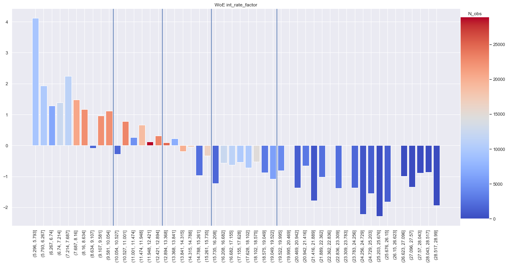


```python
fig, ax = plt.subplots(figsize=(20,8))

woe_df.set_index('int_rate_factor').iloc[:, [3,4]].plot(kind='bar', stacked=True, ax=ax)

plt.legend()
```


    <matplotlib.legend.Legend at 0x1a23233f98>


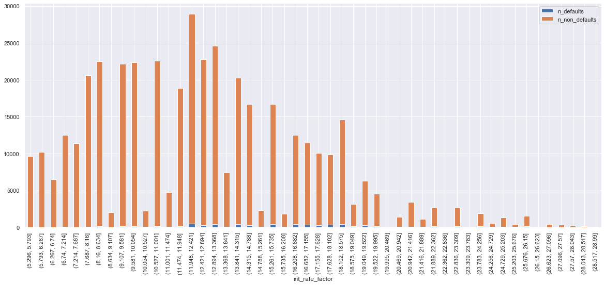


```python
x_train_prep['int_rate:<9.548'] = np.where(x_train_prep['int_rate'] <= 9.548, 1, 0)
x_train_prep['int_rate:9.548_12.025'] = np.where((x_train_prep['int_rate'] > 9.548) & (x_train_prep['int_rate'] <= 12.025), 1, 0)
x_train_prep['int_rate:12.025_14.502'] = np.where((x_train_prep['int_rate'] > 12.025) & (x_train_prep['int_rate'] <= 14.502), 1, 0)
x_train_prep['int_rate:14.502_17.804'] = np.where((x_train_prep['int_rate'] > 12.025) & (x_train_prep['int_rate'] <= 17.804), 1, 0)
x_train_prep['int_rate:>17.804'] = np.where(x_train_prep['int_rate'] > 17.804, 1, 0)
```


```python
fig, ax = plt.subplots(figsize=(20,8))

var_s = ['int_rate:<9.548', 'int_rate:9.548_12.025', 'int_rate:12.025_14.502', 'int_rate:14.502_17.804', 'int_rate:>17.804']

pd.concat([x_train_prep, y_train_prep], axis=1).groupby('Y').sum().loc[:, var_s].T.plot(kind='bar', stacked=True, ax=ax)

plt.legend()
```


    <matplotlib.legend.Legend at 0x1a23241128>


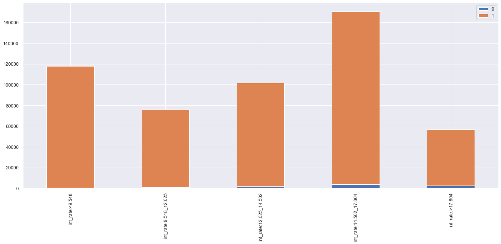

vars_to_use.append(['int_rate:<9.548', 'int_rate:9.548_12.025', 'int_rate:12.025_14.502', 'int_rate:14.502_17.804'])
ref_vars.append(['int_rate:>17.804'])

vars_to_use
### 'funded_amnt' variable


```python
x_train_prep['funded_amnt_factor'] = pd.cut(x_train_prep['funded_amnt'], 50)

woe_df = woe_ordered_continuous(x_train_prep, 'funded_amnt_factor', y_train_prep, rot_x_ticks=90)
woe_df
```


<div>
<style scoped>
    .dataframe tbody tr th:only-of-type {
        vertical-align: middle;
    }

    .dataframe tbody tr th {
        vertical-align: top;
    }

    .dataframe thead th {
        text-align: right;
    }
</style>
<table border="1" class="dataframe">
  <thead>
    <tr style="text-align: right;">
      <th></th>
      <th>funded_amnt_factor</th>
      <th>n_obs</th>
      <th>prop_non_defaults</th>
      <th>prop_n_obs</th>
      <th>n_defaults</th>
      <th>n_non_defaults</th>
      <th>prop_n_non_defaults</th>
      <th>prop_n_defaults</th>
      <th>WoE</th>
      <th>diff_prop_non_defaults</th>
      <th>diff_WoE</th>
      <th>IV</th>
    </tr>
  </thead>
  <tbody>
    <tr>
      <th>0</th>
      <td>(966.0, 1680.0]</td>
      <td>3391</td>
      <td>0.982306</td>
      <td>0.008053</td>
      <td>60.0</td>
      <td>3331.0</td>
      <td>0.008061</td>
      <td>0.007642</td>
      <td>0.053288</td>
      <td>NaN</td>
      <td>NaN</td>
      <td>0.027107</td>
    </tr>
    <tr>
      <th>1</th>
      <td>(1680.0, 2360.0]</td>
      <td>3751</td>
      <td>0.981338</td>
      <td>0.008908</td>
      <td>70.0</td>
      <td>3681.0</td>
      <td>0.008908</td>
      <td>0.008916</td>
      <td>-0.000950</td>
      <td>0.000847</td>
      <td>0.054239</td>
      <td>0.027107</td>
    </tr>
    <tr>
      <th>2</th>
      <td>(2360.0, 3040.0]</td>
      <td>8134</td>
      <td>0.981190</td>
      <td>0.019316</td>
      <td>153.0</td>
      <td>7981.0</td>
      <td>0.019313</td>
      <td>0.019488</td>
      <td>-0.009014</td>
      <td>0.010405</td>
      <td>0.008063</td>
      <td>0.027107</td>
    </tr>
    <tr>
      <th>3</th>
      <td>(3040.0, 3720.0]</td>
      <td>5133</td>
      <td>0.983246</td>
      <td>0.012190</td>
      <td>86.0</td>
      <td>5047.0</td>
      <td>0.012213</td>
      <td>0.010954</td>
      <td>0.108807</td>
      <td>0.007100</td>
      <td>0.117821</td>
      <td>0.027107</td>
    </tr>
    <tr>
      <th>4</th>
      <td>(3720.0, 4400.0]</td>
      <td>7315</td>
      <td>0.980041</td>
      <td>0.017371</td>
      <td>146.0</td>
      <td>7169.0</td>
      <td>0.017348</td>
      <td>0.018596</td>
      <td>-0.069480</td>
      <td>0.005135</td>
      <td>0.178287</td>
      <td>0.027107</td>
    </tr>
    <tr>
      <th>5</th>
      <td>(4400.0, 5080.0]</td>
      <td>18150</td>
      <td>0.982479</td>
      <td>0.043102</td>
      <td>318.0</td>
      <td>17832.0</td>
      <td>0.043151</td>
      <td>0.040504</td>
      <td>0.063304</td>
      <td>0.025803</td>
      <td>0.132784</td>
      <td>0.027107</td>
    </tr>
    <tr>
      <th>6</th>
      <td>(5080.0, 5760.0]</td>
      <td>5617</td>
      <td>0.984867</td>
      <td>0.013339</td>
      <td>85.0</td>
      <td>5532.0</td>
      <td>0.013387</td>
      <td>0.010827</td>
      <td>0.212259</td>
      <td>0.029765</td>
      <td>0.148955</td>
      <td>0.027107</td>
    </tr>
    <tr>
      <th>7</th>
      <td>(5760.0, 6440.0]</td>
      <td>16224</td>
      <td>0.982618</td>
      <td>0.038528</td>
      <td>282.0</td>
      <td>15942.0</td>
      <td>0.038578</td>
      <td>0.035919</td>
      <td>0.071410</td>
      <td>0.025191</td>
      <td>0.140848</td>
      <td>0.027107</td>
    </tr>
    <tr>
      <th>8</th>
      <td>(6440.0, 7120.0]</td>
      <td>10565</td>
      <td>0.982489</td>
      <td>0.025089</td>
      <td>185.0</td>
      <td>10380.0</td>
      <td>0.025118</td>
      <td>0.023564</td>
      <td>0.063885</td>
      <td>0.013459</td>
      <td>0.007525</td>
      <td>0.027107</td>
    </tr>
    <tr>
      <th>9</th>
      <td>(7120.0, 7800.0]</td>
      <td>8423</td>
      <td>0.980173</td>
      <td>0.020003</td>
      <td>167.0</td>
      <td>8256.0</td>
      <td>0.019979</td>
      <td>0.021271</td>
      <td>-0.062693</td>
      <td>0.005140</td>
      <td>0.126579</td>
      <td>0.027107</td>
    </tr>
    <tr>
      <th>10</th>
      <td>(7800.0, 8480.0]</td>
      <td>17295</td>
      <td>0.981151</td>
      <td>0.041072</td>
      <td>326.0</td>
      <td>16969.0</td>
      <td>0.041063</td>
      <td>0.041523</td>
      <td>-0.011149</td>
      <td>0.021084</td>
      <td>0.051544</td>
      <td>0.027107</td>
    </tr>
    <tr>
      <th>11</th>
      <td>(8480.0, 9160.0]</td>
      <td>9255</td>
      <td>0.981740</td>
      <td>0.021978</td>
      <td>169.0</td>
      <td>9086.0</td>
      <td>0.021987</td>
      <td>0.021526</td>
      <td>0.021196</td>
      <td>0.019076</td>
      <td>0.032345</td>
      <td>0.027107</td>
    </tr>
    <tr>
      <th>12</th>
      <td>(9160.0, 9840.0]</td>
      <td>6898</td>
      <td>0.981879</td>
      <td>0.016381</td>
      <td>125.0</td>
      <td>6773.0</td>
      <td>0.016390</td>
      <td>0.015922</td>
      <td>0.028991</td>
      <td>0.005597</td>
      <td>0.007794</td>
      <td>0.027107</td>
    </tr>
    <tr>
      <th>13</th>
      <td>(9840.0, 10520.0]</td>
      <td>33582</td>
      <td>0.983265</td>
      <td>0.079749</td>
      <td>562.0</td>
      <td>33020.0</td>
      <td>0.079905</td>
      <td>0.071583</td>
      <td>0.109972</td>
      <td>0.063515</td>
      <td>0.080981</td>
      <td>0.027107</td>
    </tr>
    <tr>
      <th>14</th>
      <td>(10520.0, 11200.0]</td>
      <td>9958</td>
      <td>0.977104</td>
      <td>0.023648</td>
      <td>228.0</td>
      <td>9730.0</td>
      <td>0.023545</td>
      <td>0.029041</td>
      <td>-0.209771</td>
      <td>0.056359</td>
      <td>0.319743</td>
      <td>0.027107</td>
    </tr>
    <tr>
      <th>15</th>
      <td>(11200.0, 11880.0]</td>
      <td>3813</td>
      <td>0.967480</td>
      <td>0.009055</td>
      <td>124.0</td>
      <td>3689.0</td>
      <td>0.008927</td>
      <td>0.015794</td>
      <td>-0.570566</td>
      <td>0.014619</td>
      <td>0.360794</td>
      <td>0.027107</td>
    </tr>
    <tr>
      <th>16</th>
      <td>(11880.0, 12560.0]</td>
      <td>28601</td>
      <td>0.981539</td>
      <td>0.067921</td>
      <td>528.0</td>
      <td>28073.0</td>
      <td>0.067933</td>
      <td>0.067253</td>
      <td>0.010072</td>
      <td>0.059006</td>
      <td>0.580638</td>
      <td>0.027107</td>
    </tr>
    <tr>
      <th>17</th>
      <td>(12560.0, 13240.0]</td>
      <td>7923</td>
      <td>0.979553</td>
      <td>0.018815</td>
      <td>162.0</td>
      <td>7761.0</td>
      <td>0.018781</td>
      <td>0.020634</td>
      <td>-0.094125</td>
      <td>0.049153</td>
      <td>0.104197</td>
      <td>0.027107</td>
    </tr>
    <tr>
      <th>18</th>
      <td>(13240.0, 13920.0]</td>
      <td>3723</td>
      <td>0.971797</td>
      <td>0.008841</td>
      <td>105.0</td>
      <td>3618.0</td>
      <td>0.008755</td>
      <td>0.013374</td>
      <td>-0.423679</td>
      <td>0.010026</td>
      <td>0.329554</td>
      <td>0.027107</td>
    </tr>
    <tr>
      <th>19</th>
      <td>(13920.0, 14600.0]</td>
      <td>12209</td>
      <td>0.979851</td>
      <td>0.028994</td>
      <td>246.0</td>
      <td>11963.0</td>
      <td>0.028949</td>
      <td>0.031334</td>
      <td>-0.079153</td>
      <td>0.020194</td>
      <td>0.344526</td>
      <td>0.027107</td>
    </tr>
    <tr>
      <th>20</th>
      <td>(14600.0, 15280.0]</td>
      <td>26506</td>
      <td>0.983438</td>
      <td>0.062946</td>
      <td>439.0</td>
      <td>26067.0</td>
      <td>0.063079</td>
      <td>0.055916</td>
      <td>0.120531</td>
      <td>0.034130</td>
      <td>0.199684</td>
      <td>0.027107</td>
    </tr>
    <tr>
      <th>21</th>
      <td>(15280.0, 15960.0]</td>
      <td>3535</td>
      <td>0.972277</td>
      <td>0.008395</td>
      <td>98.0</td>
      <td>3437.0</td>
      <td>0.008317</td>
      <td>0.012482</td>
      <td>-0.406008</td>
      <td>0.054762</td>
      <td>0.526539</td>
      <td>0.027107</td>
    </tr>
    <tr>
      <th>22</th>
      <td>(15960.0, 16640.0]</td>
      <td>14142</td>
      <td>0.982888</td>
      <td>0.033584</td>
      <td>242.0</td>
      <td>13900.0</td>
      <td>0.033636</td>
      <td>0.030824</td>
      <td>0.087312</td>
      <td>0.025319</td>
      <td>0.493320</td>
      <td>0.027107</td>
    </tr>
    <tr>
      <th>23</th>
      <td>(16640.0, 17320.0]</td>
      <td>6096</td>
      <td>0.979823</td>
      <td>0.014477</td>
      <td>123.0</td>
      <td>5973.0</td>
      <td>0.014454</td>
      <td>0.015667</td>
      <td>-0.080575</td>
      <td>0.019182</td>
      <td>0.167886</td>
      <td>0.027107</td>
    </tr>
    <tr>
      <th>24</th>
      <td>(17320.0, 18000.0]</td>
      <td>13664</td>
      <td>0.982436</td>
      <td>0.032449</td>
      <td>240.0</td>
      <td>13424.0</td>
      <td>0.032485</td>
      <td>0.030569</td>
      <td>0.060766</td>
      <td>0.018031</td>
      <td>0.141340</td>
      <td>0.027107</td>
    </tr>
    <tr>
      <th>25</th>
      <td>(18000.0, 18680.0]</td>
      <td>2739</td>
      <td>0.974443</td>
      <td>0.006504</td>
      <td>70.0</td>
      <td>2669.0</td>
      <td>0.006459</td>
      <td>0.008916</td>
      <td>-0.322431</td>
      <td>0.026026</td>
      <td>0.383197</td>
      <td>0.027107</td>
    </tr>
    <tr>
      <th>26</th>
      <td>(18680.0, 19360.0]</td>
      <td>4923</td>
      <td>0.977250</td>
      <td>0.011691</td>
      <td>112.0</td>
      <td>4811.0</td>
      <td>0.011642</td>
      <td>0.014266</td>
      <td>-0.203234</td>
      <td>0.005183</td>
      <td>0.119197</td>
      <td>0.027107</td>
    </tr>
    <tr>
      <th>27</th>
      <td>(19360.0, 20040.0]</td>
      <td>26477</td>
      <td>0.983231</td>
      <td>0.062877</td>
      <td>444.0</td>
      <td>26033.0</td>
      <td>0.062997</td>
      <td>0.056553</td>
      <td>0.107901</td>
      <td>0.051355</td>
      <td>0.311134</td>
      <td>0.027107</td>
    </tr>
    <tr>
      <th>28</th>
      <td>(20040.0, 20720.0]</td>
      <td>2233</td>
      <td>0.978504</td>
      <td>0.005303</td>
      <td>48.0</td>
      <td>2185.0</td>
      <td>0.005287</td>
      <td>0.006114</td>
      <td>-0.145225</td>
      <td>0.057709</td>
      <td>0.253126</td>
      <td>0.027107</td>
    </tr>
    <tr>
      <th>29</th>
      <td>(20720.0, 21400.0]</td>
      <td>7925</td>
      <td>0.979685</td>
      <td>0.018820</td>
      <td>161.0</td>
      <td>7764.0</td>
      <td>0.018788</td>
      <td>0.020507</td>
      <td>-0.087546</td>
      <td>0.013501</td>
      <td>0.057678</td>
      <td>0.027107</td>
    </tr>
    <tr>
      <th>30</th>
      <td>(21400.0, 22080.0]</td>
      <td>4795</td>
      <td>0.980188</td>
      <td>0.011387</td>
      <td>95.0</td>
      <td>4700.0</td>
      <td>0.011373</td>
      <td>0.012100</td>
      <td>-0.061954</td>
      <td>0.007415</td>
      <td>0.025592</td>
      <td>0.027107</td>
    </tr>
    <tr>
      <th>31</th>
      <td>(22080.0, 22760.0]</td>
      <td>2136</td>
      <td>0.973783</td>
      <td>0.005073</td>
      <td>56.0</td>
      <td>2080.0</td>
      <td>0.005033</td>
      <td>0.007133</td>
      <td>-0.348623</td>
      <td>0.006340</td>
      <td>0.286669</td>
      <td>0.027107</td>
    </tr>
    <tr>
      <th>32</th>
      <td>(22760.0, 23440.0]</td>
      <td>3008</td>
      <td>0.984375</td>
      <td>0.007143</td>
      <td>47.0</td>
      <td>2961.0</td>
      <td>0.007165</td>
      <td>0.005986</td>
      <td>0.179740</td>
      <td>0.002132</td>
      <td>0.528363</td>
      <td>0.027107</td>
    </tr>
    <tr>
      <th>33</th>
      <td>(23440.0, 24120.0]</td>
      <td>13806</td>
      <td>0.980298</td>
      <td>0.032786</td>
      <td>272.0</td>
      <td>13534.0</td>
      <td>0.032751</td>
      <td>0.034645</td>
      <td>-0.056237</td>
      <td>0.025585</td>
      <td>0.235976</td>
      <td>0.027107</td>
    </tr>
    <tr>
      <th>34</th>
      <td>(24120.0, 24800.0]</td>
      <td>1803</td>
      <td>0.970050</td>
      <td>0.004282</td>
      <td>54.0</td>
      <td>1749.0</td>
      <td>0.004232</td>
      <td>0.006878</td>
      <td>-0.485579</td>
      <td>0.028518</td>
      <td>0.429343</td>
      <td>0.027107</td>
    </tr>
    <tr>
      <th>35</th>
      <td>(24800.0, 25480.0]</td>
      <td>13964</td>
      <td>0.986322</td>
      <td>0.033161</td>
      <td>191.0</td>
      <td>13773.0</td>
      <td>0.033329</td>
      <td>0.024328</td>
      <td>0.314797</td>
      <td>0.029097</td>
      <td>0.800377</td>
      <td>0.027107</td>
    </tr>
    <tr>
      <th>36</th>
      <td>(25480.0, 26160.0]</td>
      <td>2063</td>
      <td>0.984973</td>
      <td>0.004899</td>
      <td>31.0</td>
      <td>2032.0</td>
      <td>0.004917</td>
      <td>0.003949</td>
      <td>0.219394</td>
      <td>0.028412</td>
      <td>0.095403</td>
      <td>0.027107</td>
    </tr>
    <tr>
      <th>37</th>
      <td>(26160.0, 26840.0]</td>
      <td>1336</td>
      <td>0.973802</td>
      <td>0.003173</td>
      <td>35.0</td>
      <td>1301.0</td>
      <td>0.003148</td>
      <td>0.004458</td>
      <td>-0.347854</td>
      <td>0.001769</td>
      <td>0.567248</td>
      <td>0.027107</td>
    </tr>
    <tr>
      <th>38</th>
      <td>(26840.0, 27520.0]</td>
      <td>2199</td>
      <td>0.982719</td>
      <td>0.005222</td>
      <td>38.0</td>
      <td>2161.0</td>
      <td>0.005229</td>
      <td>0.004840</td>
      <td>0.077345</td>
      <td>0.002081</td>
      <td>0.425200</td>
      <td>0.027107</td>
    </tr>
    <tr>
      <th>39</th>
      <td>(27520.0, 28200.0]</td>
      <td>9083</td>
      <td>0.987119</td>
      <td>0.021570</td>
      <td>117.0</td>
      <td>8966.0</td>
      <td>0.021697</td>
      <td>0.014903</td>
      <td>0.375626</td>
      <td>0.016467</td>
      <td>0.298281</td>
      <td>0.027107</td>
    </tr>
    <tr>
      <th>40</th>
      <td>(28200.0, 28880.0]</td>
      <td>1106</td>
      <td>0.973779</td>
      <td>0.002626</td>
      <td>29.0</td>
      <td>1077.0</td>
      <td>0.002606</td>
      <td>0.003694</td>
      <td>-0.348756</td>
      <td>0.019090</td>
      <td>0.724382</td>
      <td>0.027107</td>
    </tr>
    <tr>
      <th>41</th>
      <td>(28880.0, 29560.0]</td>
      <td>1217</td>
      <td>0.975349</td>
      <td>0.002890</td>
      <td>30.0</td>
      <td>1187.0</td>
      <td>0.002872</td>
      <td>0.003821</td>
      <td>-0.285408</td>
      <td>0.000266</td>
      <td>0.063348</td>
      <td>0.027107</td>
    </tr>
    <tr>
      <th>42</th>
      <td>(29560.0, 30240.0]</td>
      <td>10292</td>
      <td>0.983288</td>
      <td>0.024441</td>
      <td>172.0</td>
      <td>10120.0</td>
      <td>0.024489</td>
      <td>0.021908</td>
      <td>0.111380</td>
      <td>0.021617</td>
      <td>0.396787</td>
      <td>0.027107</td>
    </tr>
    <tr>
      <th>43</th>
      <td>(30240.0, 30920.0]</td>
      <td>580</td>
      <td>0.968966</td>
      <td>0.001377</td>
      <td>18.0</td>
      <td>562.0</td>
      <td>0.001360</td>
      <td>0.002293</td>
      <td>-0.522265</td>
      <td>0.023129</td>
      <td>0.633644</td>
      <td>0.027107</td>
    </tr>
    <tr>
      <th>44</th>
      <td>(30920.0, 31600.0]</td>
      <td>915</td>
      <td>0.981421</td>
      <td>0.002173</td>
      <td>17.0</td>
      <td>898.0</td>
      <td>0.002173</td>
      <td>0.002165</td>
      <td>0.003562</td>
      <td>0.000813</td>
      <td>0.525827</td>
      <td>0.027107</td>
    </tr>
    <tr>
      <th>45</th>
      <td>(31600.0, 32280.0]</td>
      <td>1987</td>
      <td>0.977353</td>
      <td>0.004719</td>
      <td>45.0</td>
      <td>1942.0</td>
      <td>0.004699</td>
      <td>0.005732</td>
      <td>-0.198584</td>
      <td>0.002526</td>
      <td>0.202146</td>
      <td>0.027107</td>
    </tr>
    <tr>
      <th>46</th>
      <td>(32280.0, 32960.0]</td>
      <td>632</td>
      <td>0.974684</td>
      <td>0.001501</td>
      <td>16.0</td>
      <td>616.0</td>
      <td>0.001491</td>
      <td>0.002038</td>
      <td>-0.312737</td>
      <td>0.003209</td>
      <td>0.114153</td>
      <td>0.027107</td>
    </tr>
    <tr>
      <th>47</th>
      <td>(32960.0, 33640.0]</td>
      <td>1106</td>
      <td>0.978300</td>
      <td>0.002626</td>
      <td>24.0</td>
      <td>1082.0</td>
      <td>0.002618</td>
      <td>0.003057</td>
      <td>-0.154882</td>
      <td>0.001128</td>
      <td>0.157854</td>
      <td>0.027107</td>
    </tr>
    <tr>
      <th>48</th>
      <td>(33640.0, 34320.0]</td>
      <td>665</td>
      <td>0.984962</td>
      <td>0.001579</td>
      <td>10.0</td>
      <td>655.0</td>
      <td>0.001585</td>
      <td>0.001274</td>
      <td>0.218655</td>
      <td>0.001033</td>
      <td>0.373538</td>
      <td>0.027107</td>
    </tr>
    <tr>
      <th>49</th>
      <td>(34320.0, 35000.0]</td>
      <td>20201</td>
      <td>0.977724</td>
      <td>0.047973</td>
      <td>450.0</td>
      <td>19751.0</td>
      <td>0.047795</td>
      <td>0.057318</td>
      <td>-0.181683</td>
      <td>0.046210</td>
      <td>0.400338</td>
      <td>0.027107</td>
    </tr>
  </tbody>
</table>
</div>


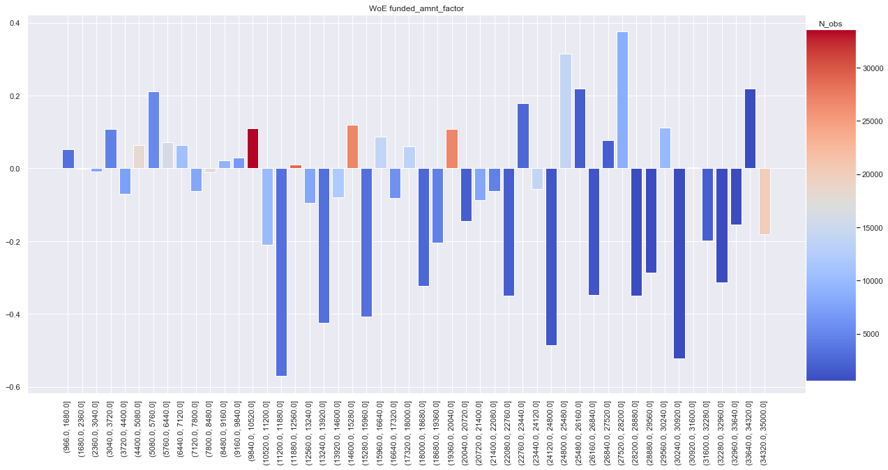


As the WoE's of the intervals are very different, show an almost horizontal trend, and we see no actual relation between 'funded_amnt' and the dependent variable. We won't use this variable for the PD model


```python
fig, ax = plt.subplots(figsize=(20,8))

woe_df.set_index('funded_amnt_factor').iloc[:, [3,4]].plot(kind='bar', stacked=True, ax=ax)

plt.legend()
```


    <matplotlib.legend.Legend at 0x1a233dfb70>


## 'mths_since_earliest_cr_line'


```python
x_train_prep['mths_since_earliest_cr_line'].nunique()
```


    668


```python
x_train_prep['mths_since_earliest_cr_line'].describe()
```


    count    421094.000000
    mean        242.586458
    std          91.329014
    min          73.000000
    25%         180.000000
    50%         224.000000
    75%         290.000000
    max         899.000000
    Name: mths_since_earliest_cr_line, dtype: float64


```python
x_train_prep['mths_since_earliest_cr_line_factor'] = pd.cut(x_train_prep['mths_since_earliest_cr_line'], 50)

woe_df = woe_ordered_continuous(x_train_prep, 'mths_since_earliest_cr_line_factor', y_train_prep, rot_x_ticks=90)
woe_df
```


<div>
<style scoped>
    .dataframe tbody tr th:only-of-type {
        vertical-align: middle;
    }

    .dataframe tbody tr th {
        vertical-align: top;
    }

    .dataframe thead th {
        text-align: right;
    }
</style>
<table border="1" class="dataframe">
  <thead>
    <tr style="text-align: right;">
      <th></th>
      <th>mths_since_earliest_cr_line_factor</th>
      <th>n_obs</th>
      <th>prop_non_defaults</th>
      <th>prop_n_obs</th>
      <th>n_defaults</th>
      <th>n_non_defaults</th>
      <th>prop_n_non_defaults</th>
      <th>prop_n_defaults</th>
      <th>WoE</th>
      <th>diff_prop_non_defaults</th>
      <th>diff_WoE</th>
      <th>IV</th>
    </tr>
  </thead>
  <tbody>
    <tr>
      <th>0</th>
      <td>(72.174, 89.52]</td>
      <td>4727</td>
      <td>0.977787</td>
      <td>0.011226</td>
      <td>105.0</td>
      <td>4622.0</td>
      <td>0.011185</td>
      <td>0.013374</td>
      <td>-0.178772</td>
      <td>NaN</td>
      <td>NaN</td>
      <td>0.037178</td>
    </tr>
    <tr>
      <th>1</th>
      <td>(89.52, 106.04]</td>
      <td>7570</td>
      <td>0.973052</td>
      <td>0.017977</td>
      <td>204.0</td>
      <td>7366.0</td>
      <td>0.017825</td>
      <td>0.025984</td>
      <td>-0.376885</td>
      <td>0.006640</td>
      <td>0.198112</td>
      <td>0.037178</td>
    </tr>
    <tr>
      <th>2</th>
      <td>(106.04, 122.56]</td>
      <td>7983</td>
      <td>0.971439</td>
      <td>0.018958</td>
      <td>228.0</td>
      <td>7755.0</td>
      <td>0.018766</td>
      <td>0.029041</td>
      <td>-0.436647</td>
      <td>0.000941</td>
      <td>0.059763</td>
      <td>0.037178</td>
    </tr>
    <tr>
      <th>3</th>
      <td>(122.56, 139.08]</td>
      <td>16247</td>
      <td>0.976980</td>
      <td>0.038583</td>
      <td>374.0</td>
      <td>15873.0</td>
      <td>0.038411</td>
      <td>0.047637</td>
      <td>-0.215276</td>
      <td>0.019645</td>
      <td>0.221372</td>
      <td>0.037178</td>
    </tr>
    <tr>
      <th>4</th>
      <td>(139.08, 155.6]</td>
      <td>20569</td>
      <td>0.975011</td>
      <td>0.048847</td>
      <td>514.0</td>
      <td>20055.0</td>
      <td>0.048531</td>
      <td>0.065469</td>
      <td>-0.299384</td>
      <td>0.010120</td>
      <td>0.084109</td>
      <td>0.037178</td>
    </tr>
    <tr>
      <th>5</th>
      <td>(155.6, 172.12]</td>
      <td>33434</td>
      <td>0.978585</td>
      <td>0.079398</td>
      <td>716.0</td>
      <td>32718.0</td>
      <td>0.079174</td>
      <td>0.091199</td>
      <td>-0.141394</td>
      <td>0.030643</td>
      <td>0.157990</td>
      <td>0.037178</td>
    </tr>
    <tr>
      <th>6</th>
      <td>(172.12, 188.64]</td>
      <td>35962</td>
      <td>0.979423</td>
      <td>0.085401</td>
      <td>740.0</td>
      <td>35222.0</td>
      <td>0.085233</td>
      <td>0.094256</td>
      <td>-0.100619</td>
      <td>0.006059</td>
      <td>0.040775</td>
      <td>0.037178</td>
    </tr>
    <tr>
      <th>7</th>
      <td>(188.64, 205.16]</td>
      <td>39155</td>
      <td>0.979339</td>
      <td>0.092984</td>
      <td>809.0</td>
      <td>38346.0</td>
      <td>0.092793</td>
      <td>0.103044</td>
      <td>-0.104788</td>
      <td>0.007560</td>
      <td>0.004169</td>
      <td>0.037178</td>
    </tr>
    <tr>
      <th>8</th>
      <td>(205.16, 221.68]</td>
      <td>39248</td>
      <td>0.981579</td>
      <td>0.093205</td>
      <td>723.0</td>
      <td>38525.0</td>
      <td>0.093226</td>
      <td>0.092090</td>
      <td>0.012259</td>
      <td>0.000433</td>
      <td>0.117047</td>
      <td>0.037178</td>
    </tr>
    <tr>
      <th>9</th>
      <td>(221.68, 238.2]</td>
      <td>34783</td>
      <td>0.982261</td>
      <td>0.082602</td>
      <td>617.0</td>
      <td>34166.0</td>
      <td>0.082678</td>
      <td>0.078589</td>
      <td>0.050722</td>
      <td>0.010548</td>
      <td>0.038464</td>
      <td>0.037178</td>
    </tr>
    <tr>
      <th>10</th>
      <td>(238.2, 254.72]</td>
      <td>27046</td>
      <td>0.982955</td>
      <td>0.064228</td>
      <td>461.0</td>
      <td>26585.0</td>
      <td>0.064333</td>
      <td>0.058719</td>
      <td>0.091309</td>
      <td>0.018345</td>
      <td>0.040587</td>
      <td>0.037178</td>
    </tr>
    <tr>
      <th>11</th>
      <td>(254.72, 271.24]</td>
      <td>24640</td>
      <td>0.982873</td>
      <td>0.058514</td>
      <td>422.0</td>
      <td>24218.0</td>
      <td>0.058605</td>
      <td>0.053751</td>
      <td>0.086451</td>
      <td>0.005728</td>
      <td>0.004858</td>
      <td>0.037178</td>
    </tr>
    <tr>
      <th>12</th>
      <td>(271.24, 287.76]</td>
      <td>21513</td>
      <td>0.983963</td>
      <td>0.051088</td>
      <td>345.0</td>
      <td>21168.0</td>
      <td>0.051224</td>
      <td>0.043943</td>
      <td>0.153307</td>
      <td>0.007381</td>
      <td>0.066855</td>
      <td>0.037178</td>
    </tr>
    <tr>
      <th>13</th>
      <td>(287.76, 304.28]</td>
      <td>21154</td>
      <td>0.984778</td>
      <td>0.050236</td>
      <td>322.0</td>
      <td>20832.0</td>
      <td>0.050411</td>
      <td>0.041014</td>
      <td>0.206299</td>
      <td>0.000813</td>
      <td>0.052993</td>
      <td>0.037178</td>
    </tr>
    <tr>
      <th>14</th>
      <td>(304.28, 320.8]</td>
      <td>13060</td>
      <td>0.985452</td>
      <td>0.031014</td>
      <td>190.0</td>
      <td>12870.0</td>
      <td>0.031144</td>
      <td>0.024201</td>
      <td>0.252235</td>
      <td>0.019267</td>
      <td>0.045936</td>
      <td>0.037178</td>
    </tr>
    <tr>
      <th>15</th>
      <td>(320.8, 337.32]</td>
      <td>11391</td>
      <td>0.984374</td>
      <td>0.027051</td>
      <td>178.0</td>
      <td>11213.0</td>
      <td>0.027134</td>
      <td>0.022672</td>
      <td>0.179651</td>
      <td>0.004010</td>
      <td>0.072585</td>
      <td>0.037178</td>
    </tr>
    <tr>
      <th>16</th>
      <td>(337.32, 353.84]</td>
      <td>11483</td>
      <td>0.985718</td>
      <td>0.027269</td>
      <td>164.0</td>
      <td>11319.0</td>
      <td>0.027391</td>
      <td>0.020889</td>
      <td>0.270977</td>
      <td>0.000257</td>
      <td>0.091326</td>
      <td>0.037178</td>
    </tr>
    <tr>
      <th>17</th>
      <td>(353.84, 370.36]</td>
      <td>10229</td>
      <td>0.985434</td>
      <td>0.024291</td>
      <td>149.0</td>
      <td>10080.0</td>
      <td>0.024392</td>
      <td>0.018978</td>
      <td>0.250967</td>
      <td>0.002998</td>
      <td>0.020009</td>
      <td>0.037178</td>
    </tr>
    <tr>
      <th>18</th>
      <td>(370.36, 386.88]</td>
      <td>7967</td>
      <td>0.985942</td>
      <td>0.018920</td>
      <td>112.0</td>
      <td>7855.0</td>
      <td>0.019008</td>
      <td>0.014266</td>
      <td>0.287012</td>
      <td>0.005384</td>
      <td>0.036044</td>
      <td>0.037178</td>
    </tr>
    <tr>
      <th>19</th>
      <td>(386.88, 403.4]</td>
      <td>6855</td>
      <td>0.985412</td>
      <td>0.016279</td>
      <td>100.0</td>
      <td>6755.0</td>
      <td>0.016346</td>
      <td>0.012737</td>
      <td>0.249473</td>
      <td>0.002662</td>
      <td>0.037539</td>
      <td>0.037178</td>
    </tr>
    <tr>
      <th>20</th>
      <td>(403.4, 419.92]</td>
      <td>5772</td>
      <td>0.983888</td>
      <td>0.013707</td>
      <td>93.0</td>
      <td>5679.0</td>
      <td>0.013743</td>
      <td>0.011846</td>
      <td>0.148536</td>
      <td>0.002604</td>
      <td>0.100937</td>
      <td>0.037178</td>
    </tr>
    <tr>
      <th>21</th>
      <td>(419.92, 436.44]</td>
      <td>4634</td>
      <td>0.988563</td>
      <td>0.011005</td>
      <td>53.0</td>
      <td>4581.0</td>
      <td>0.011085</td>
      <td>0.006751</td>
      <td>0.495986</td>
      <td>0.002657</td>
      <td>0.347450</td>
      <td>0.037178</td>
    </tr>
    <tr>
      <th>22</th>
      <td>(436.44, 452.96]</td>
      <td>2951</td>
      <td>0.987462</td>
      <td>0.007008</td>
      <td>37.0</td>
      <td>2914.0</td>
      <td>0.007052</td>
      <td>0.004713</td>
      <td>0.402969</td>
      <td>0.004034</td>
      <td>0.093017</td>
      <td>0.037178</td>
    </tr>
    <tr>
      <th>23</th>
      <td>(452.96, 469.48]</td>
      <td>2364</td>
      <td>0.987733</td>
      <td>0.005614</td>
      <td>29.0</td>
      <td>2335.0</td>
      <td>0.005650</td>
      <td>0.003694</td>
      <td>0.425076</td>
      <td>0.001401</td>
      <td>0.022107</td>
      <td>0.037178</td>
    </tr>
    <tr>
      <th>24</th>
      <td>(469.48, 486.0]</td>
      <td>2285</td>
      <td>0.984245</td>
      <td>0.005426</td>
      <td>36.0</td>
      <td>2249.0</td>
      <td>0.005442</td>
      <td>0.004585</td>
      <td>0.171327</td>
      <td>0.000208</td>
      <td>0.253749</td>
      <td>0.037178</td>
    </tr>
    <tr>
      <th>25</th>
      <td>(486.0, 502.52]</td>
      <td>1988</td>
      <td>0.985915</td>
      <td>0.004721</td>
      <td>28.0</td>
      <td>1960.0</td>
      <td>0.004743</td>
      <td>0.003566</td>
      <td>0.285100</td>
      <td>0.000699</td>
      <td>0.113773</td>
      <td>0.037178</td>
    </tr>
    <tr>
      <th>26</th>
      <td>(502.52, 519.04]</td>
      <td>1505</td>
      <td>0.987375</td>
      <td>0.003574</td>
      <td>19.0</td>
      <td>1486.0</td>
      <td>0.003596</td>
      <td>0.002420</td>
      <td>0.396009</td>
      <td>0.001147</td>
      <td>0.110909</td>
      <td>0.037178</td>
    </tr>
    <tr>
      <th>27</th>
      <td>(519.04, 535.56]</td>
      <td>965</td>
      <td>0.983420</td>
      <td>0.002292</td>
      <td>16.0</td>
      <td>949.0</td>
      <td>0.002296</td>
      <td>0.002038</td>
      <td>0.119425</td>
      <td>0.001299</td>
      <td>0.276584</td>
      <td>0.037178</td>
    </tr>
    <tr>
      <th>28</th>
      <td>(535.56, 552.08]</td>
      <td>939</td>
      <td>0.988285</td>
      <td>0.002230</td>
      <td>11.0</td>
      <td>928.0</td>
      <td>0.002246</td>
      <td>0.001401</td>
      <td>0.471742</td>
      <td>0.000051</td>
      <td>0.352316</td>
      <td>0.037178</td>
    </tr>
    <tr>
      <th>29</th>
      <td>(552.08, 568.6]</td>
      <td>665</td>
      <td>0.983459</td>
      <td>0.001579</td>
      <td>11.0</td>
      <td>654.0</td>
      <td>0.001583</td>
      <td>0.001401</td>
      <td>0.121817</td>
      <td>0.000663</td>
      <td>0.349924</td>
      <td>0.037178</td>
    </tr>
    <tr>
      <th>30</th>
      <td>(568.6, 585.12]</td>
      <td>502</td>
      <td>0.978088</td>
      <td>0.001192</td>
      <td>11.0</td>
      <td>491.0</td>
      <td>0.001188</td>
      <td>0.001401</td>
      <td>-0.164846</td>
      <td>0.000394</td>
      <td>0.286663</td>
      <td>0.037178</td>
    </tr>
    <tr>
      <th>31</th>
      <td>(585.12, 601.64]</td>
      <td>410</td>
      <td>0.980488</td>
      <td>0.000974</td>
      <td>8.0</td>
      <td>402.0</td>
      <td>0.000973</td>
      <td>0.001019</td>
      <td>-0.046384</td>
      <td>0.000215</td>
      <td>0.118462</td>
      <td>0.037178</td>
    </tr>
    <tr>
      <th>32</th>
      <td>(601.64, 618.16]</td>
      <td>333</td>
      <td>0.981982</td>
      <td>0.000791</td>
      <td>6.0</td>
      <td>327.0</td>
      <td>0.000791</td>
      <td>0.000764</td>
      <td>0.034806</td>
      <td>0.000181</td>
      <td>0.081190</td>
      <td>0.037178</td>
    </tr>
    <tr>
      <th>33</th>
      <td>(618.16, 634.68]</td>
      <td>244</td>
      <td>0.975410</td>
      <td>0.000579</td>
      <td>6.0</td>
      <td>238.0</td>
      <td>0.000576</td>
      <td>0.000764</td>
      <td>-0.282884</td>
      <td>0.000215</td>
      <td>0.317689</td>
      <td>0.037178</td>
    </tr>
    <tr>
      <th>34</th>
      <td>(634.68, 651.2]</td>
      <td>206</td>
      <td>0.966019</td>
      <td>0.000489</td>
      <td>7.0</td>
      <td>199.0</td>
      <td>0.000482</td>
      <td>0.000892</td>
      <td>-0.616000</td>
      <td>0.000094</td>
      <td>0.333117</td>
      <td>0.037178</td>
    </tr>
    <tr>
      <th>35</th>
      <td>(651.2, 667.72]</td>
      <td>92</td>
      <td>1.000000</td>
      <td>0.000218</td>
      <td>0.0</td>
      <td>92.0</td>
      <td>0.000223</td>
      <td>0.000000</td>
      <td>NaN</td>
      <td>0.000259</td>
      <td>NaN</td>
      <td>0.037178</td>
    </tr>
    <tr>
      <th>36</th>
      <td>(667.72, 684.24]</td>
      <td>84</td>
      <td>0.964286</td>
      <td>0.000199</td>
      <td>3.0</td>
      <td>81.0</td>
      <td>0.000196</td>
      <td>0.000382</td>
      <td>-0.667558</td>
      <td>0.000027</td>
      <td>NaN</td>
      <td>0.037178</td>
    </tr>
    <tr>
      <th>37</th>
      <td>(684.24, 700.76]</td>
      <td>35</td>
      <td>0.942857</td>
      <td>0.000083</td>
      <td>2.0</td>
      <td>33.0</td>
      <td>0.000080</td>
      <td>0.000255</td>
      <td>-1.160035</td>
      <td>0.000116</td>
      <td>0.492476</td>
      <td>0.037178</td>
    </tr>
    <tr>
      <th>38</th>
      <td>(700.76, 717.28]</td>
      <td>39</td>
      <td>0.974359</td>
      <td>0.000093</td>
      <td>1.0</td>
      <td>38.0</td>
      <td>0.000092</td>
      <td>0.000127</td>
      <td>-0.325809</td>
      <td>0.000012</td>
      <td>0.834226</td>
      <td>0.037178</td>
    </tr>
    <tr>
      <th>39</th>
      <td>(717.28, 733.8]</td>
      <td>25</td>
      <td>0.960000</td>
      <td>0.000059</td>
      <td>1.0</td>
      <td>24.0</td>
      <td>0.000058</td>
      <td>0.000127</td>
      <td>-0.785341</td>
      <td>0.000034</td>
      <td>0.459532</td>
      <td>0.037178</td>
    </tr>
    <tr>
      <th>40</th>
      <td>(733.8, 750.32]</td>
      <td>12</td>
      <td>1.000000</td>
      <td>0.000028</td>
      <td>0.0</td>
      <td>12.0</td>
      <td>0.000029</td>
      <td>0.000000</td>
      <td>NaN</td>
      <td>0.000029</td>
      <td>NaN</td>
      <td>0.037178</td>
    </tr>
    <tr>
      <th>41</th>
      <td>(750.32, 766.84]</td>
      <td>13</td>
      <td>1.000000</td>
      <td>0.000031</td>
      <td>0.0</td>
      <td>13.0</td>
      <td>0.000031</td>
      <td>0.000000</td>
      <td>NaN</td>
      <td>0.000002</td>
      <td>NaN</td>
      <td>0.037178</td>
    </tr>
    <tr>
      <th>42</th>
      <td>(766.84, 783.36]</td>
      <td>3</td>
      <td>1.000000</td>
      <td>0.000007</td>
      <td>0.0</td>
      <td>3.0</td>
      <td>0.000007</td>
      <td>0.000000</td>
      <td>NaN</td>
      <td>0.000024</td>
      <td>NaN</td>
      <td>0.037178</td>
    </tr>
    <tr>
      <th>43</th>
      <td>(783.36, 799.88]</td>
      <td>1</td>
      <td>1.000000</td>
      <td>0.000002</td>
      <td>0.0</td>
      <td>1.0</td>
      <td>0.000002</td>
      <td>0.000000</td>
      <td>NaN</td>
      <td>0.000005</td>
      <td>NaN</td>
      <td>0.037178</td>
    </tr>
    <tr>
      <th>44</th>
      <td>(799.88, 816.4]</td>
      <td>6</td>
      <td>1.000000</td>
      <td>0.000014</td>
      <td>0.0</td>
      <td>6.0</td>
      <td>0.000015</td>
      <td>0.000000</td>
      <td>NaN</td>
      <td>0.000012</td>
      <td>NaN</td>
      <td>0.037178</td>
    </tr>
    <tr>
      <th>45</th>
      <td>(816.4, 832.92]</td>
      <td>4</td>
      <td>1.000000</td>
      <td>0.000009</td>
      <td>0.0</td>
      <td>4.0</td>
      <td>0.000010</td>
      <td>0.000000</td>
      <td>NaN</td>
      <td>0.000005</td>
      <td>NaN</td>
      <td>0.037178</td>
    </tr>
    <tr>
      <th>46</th>
      <td>(832.92, 849.44]</td>
      <td>0</td>
      <td>NaN</td>
      <td>0.000000</td>
      <td>NaN</td>
      <td>NaN</td>
      <td>NaN</td>
      <td>NaN</td>
      <td>NaN</td>
      <td>NaN</td>
      <td>NaN</td>
      <td>0.037178</td>
    </tr>
    <tr>
      <th>47</th>
      <td>(849.44, 865.96]</td>
      <td>0</td>
      <td>NaN</td>
      <td>0.000000</td>
      <td>NaN</td>
      <td>NaN</td>
      <td>NaN</td>
      <td>NaN</td>
      <td>NaN</td>
      <td>NaN</td>
      <td>NaN</td>
      <td>0.037178</td>
    </tr>
    <tr>
      <th>48</th>
      <td>(865.96, 882.48]</td>
      <td>0</td>
      <td>NaN</td>
      <td>0.000000</td>
      <td>NaN</td>
      <td>NaN</td>
      <td>NaN</td>
      <td>NaN</td>
      <td>NaN</td>
      <td>NaN</td>
      <td>NaN</td>
      <td>0.037178</td>
    </tr>
    <tr>
      <th>49</th>
      <td>(882.48, 899.0]</td>
      <td>1</td>
      <td>1.000000</td>
      <td>0.000002</td>
      <td>0.0</td>
      <td>1.0</td>
      <td>0.000002</td>
      <td>0.000000</td>
      <td>NaN</td>
      <td>NaN</td>
      <td>NaN</td>
      <td>0.037178</td>
    </tr>
  </tbody>
</table>
</div>


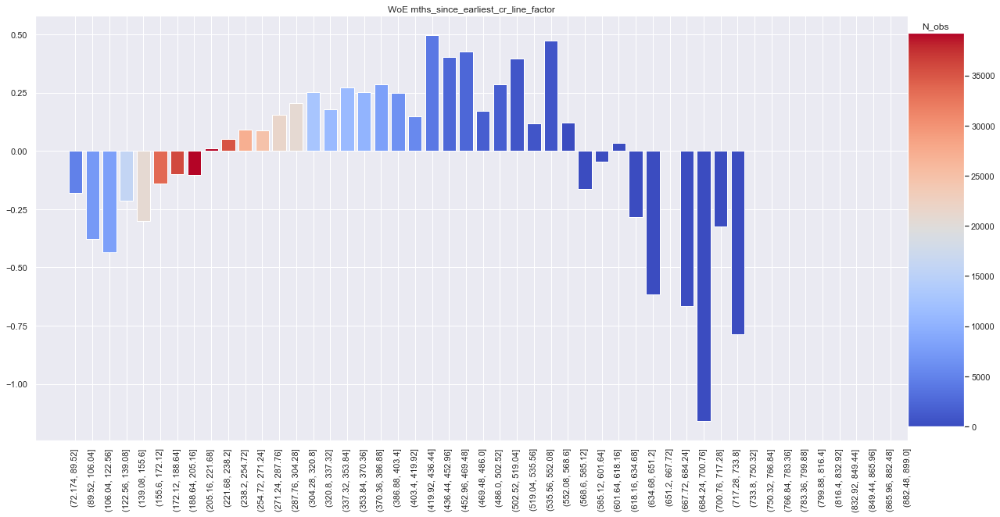


```python
fig, ax = plt.subplots(figsize=(20,8))

woe_df.set_index('mths_since_earliest_cr_line_factor').iloc[:, [3,4]].plot(kind='bar', stacked=True, ax=ax)

plt.legend()
```


    <matplotlib.legend.Legend at 0x1a1a46ebe0>


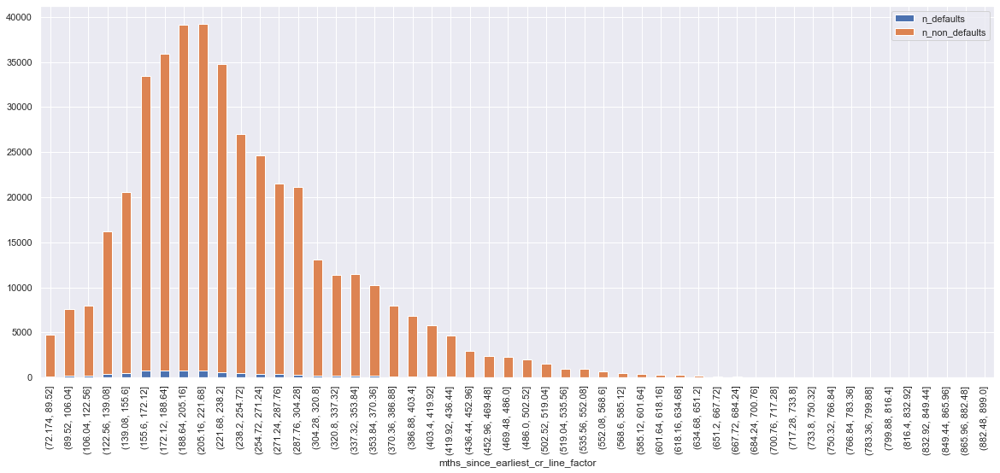


```python
x_train_prep['mths_since_earliest_cr_line:<140'] = np.where(x_train_prep['mths_since_earliest_cr_line'] <= 140, 1, 0)
x_train_prep['mths_since_earliest_cr_line:141_265'] = np.where((x_train_prep['mths_since_earliest_cr_line'] > 140) & (x_train_prep['mths_since_earliest_cr_line'] <= 265 ), 1, 0)
x_train_prep['mths_since_earliest_cr_line:266_353'] = np.where((x_train_prep['mths_since_earliest_cr_line'] > 265) & (x_train_prep['mths_since_earliest_cr_line'] <= 353), 1, 0)
x_train_prep['mths_since_earliest_cr_line:>354'] = np.where(x_train_prep['mths_since_earliest_cr_line'] > 354, 1, 0)
```


```python
fig, ax = plt.subplots(figsize=(20,8))

var_s = ['mths_since_earliest_cr_line:<140', 'mths_since_earliest_cr_line:141_265', 'mths_since_earliest_cr_line:266_353', 
                    'mths_since_earliest_cr_line:>354']

pd.concat([x_train_prep, y_train_prep], axis=1).groupby('Y').sum().loc[:, var_s].T.plot(kind='bar', stacked=True, ax=ax)

plt.legend()
```


    <matplotlib.legend.Legend at 0x1a1a4791d0>


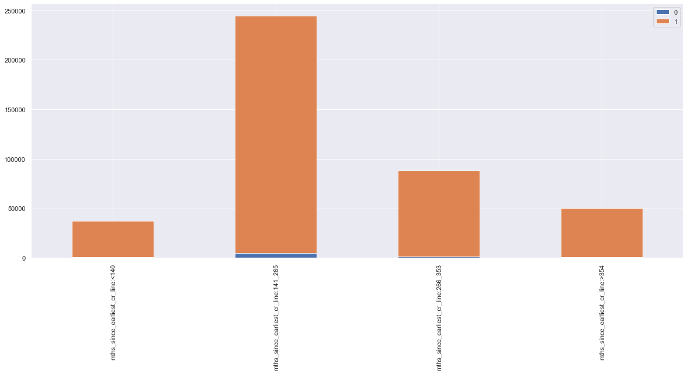

vars_to_use.append(['mths_since_earliest_cr_line:<140', 'mths_since_earliest_cr_line:141_265', 'mths_since_earliest_cr_line:266_353'])

ref_vars.append(['mths_since_earliest_cr_line:>354'])

vars_to_use
### 'installment'


```python
print(x_train_prep['installment'].nunique())
x_train_prep['installment'].describe()
```

    40447


    count    421094.000000
    mean        441.872719
    std         244.857549
    min          30.120000
    25%         263.930000
    50%         385.425000
    75%         578.790000
    max        1445.460000
    Name: installment, dtype: float64


```python
x_train_prep['installment_factor'] = pd.cut(x_train_prep['installment'], 50)
```


```python
woe_df = woe_ordered_continuous(x_train_prep, 'installment_factor', y_train_prep, rot_x_ticks=90)
woe_df
```


<div>
<style scoped>
    .dataframe tbody tr th:only-of-type {
        vertical-align: middle;
    }

    .dataframe tbody tr th {
        vertical-align: top;
    }

    .dataframe thead th {
        text-align: right;
    }
</style>
<table border="1" class="dataframe">
  <thead>
    <tr style="text-align: right;">
      <th></th>
      <th>installment_factor</th>
      <th>n_obs</th>
      <th>prop_non_defaults</th>
      <th>prop_n_obs</th>
      <th>n_defaults</th>
      <th>n_non_defaults</th>
      <th>prop_n_non_defaults</th>
      <th>prop_n_defaults</th>
      <th>WoE</th>
      <th>diff_prop_non_defaults</th>
      <th>diff_WoE</th>
      <th>IV</th>
    </tr>
  </thead>
  <tbody>
    <tr>
      <th>0</th>
      <td>(28.705, 58.427]</td>
      <td>3506</td>
      <td>0.982886</td>
      <td>0.008326</td>
      <td>60.0</td>
      <td>3446.0</td>
      <td>0.008339</td>
      <td>0.007642</td>
      <td>0.087230</td>
      <td>NaN</td>
      <td>NaN</td>
      <td>0.040575</td>
    </tr>
    <tr>
      <th>1</th>
      <td>(58.427, 86.734]</td>
      <td>5832</td>
      <td>0.981310</td>
      <td>0.013850</td>
      <td>109.0</td>
      <td>5723.0</td>
      <td>0.013849</td>
      <td>0.013884</td>
      <td>-0.002494</td>
      <td>0.005510</td>
      <td>0.089724</td>
      <td>0.040575</td>
    </tr>
    <tr>
      <th>2</th>
      <td>(86.734, 115.04]</td>
      <td>8123</td>
      <td>0.983134</td>
      <td>0.019290</td>
      <td>137.0</td>
      <td>7986.0</td>
      <td>0.019325</td>
      <td>0.017450</td>
      <td>0.102069</td>
      <td>0.005476</td>
      <td>0.104564</td>
      <td>0.040575</td>
    </tr>
    <tr>
      <th>3</th>
      <td>(115.04, 143.347]</td>
      <td>9139</td>
      <td>0.982383</td>
      <td>0.021703</td>
      <td>161.0</td>
      <td>8978.0</td>
      <td>0.021726</td>
      <td>0.020507</td>
      <td>0.057733</td>
      <td>0.002401</td>
      <td>0.044336</td>
      <td>0.040575</td>
    </tr>
    <tr>
      <th>4</th>
      <td>(143.347, 171.654]</td>
      <td>17953</td>
      <td>0.984459</td>
      <td>0.042634</td>
      <td>279.0</td>
      <td>17674.0</td>
      <td>0.042769</td>
      <td>0.035537</td>
      <td>0.185243</td>
      <td>0.021043</td>
      <td>0.127510</td>
      <td>0.040575</td>
    </tr>
    <tr>
      <th>5</th>
      <td>(171.654, 199.961]</td>
      <td>15515</td>
      <td>0.985691</td>
      <td>0.036845</td>
      <td>222.0</td>
      <td>15293.0</td>
      <td>0.037007</td>
      <td>0.028277</td>
      <td>0.269078</td>
      <td>0.005762</td>
      <td>0.083835</td>
      <td>0.040575</td>
    </tr>
    <tr>
      <th>6</th>
      <td>(199.961, 228.268]</td>
      <td>16515</td>
      <td>0.982864</td>
      <td>0.039219</td>
      <td>283.0</td>
      <td>16232.0</td>
      <td>0.039280</td>
      <td>0.036046</td>
      <td>0.085898</td>
      <td>0.002272</td>
      <td>0.183180</td>
      <td>0.040575</td>
    </tr>
    <tr>
      <th>7</th>
      <td>(228.268, 256.574]</td>
      <td>22043</td>
      <td>0.983033</td>
      <td>0.052347</td>
      <td>374.0</td>
      <td>21669.0</td>
      <td>0.052436</td>
      <td>0.047637</td>
      <td>0.095987</td>
      <td>0.013157</td>
      <td>0.010089</td>
      <td>0.040575</td>
    </tr>
    <tr>
      <th>8</th>
      <td>(256.574, 284.881]</td>
      <td>25323</td>
      <td>0.980966</td>
      <td>0.060136</td>
      <td>482.0</td>
      <td>24841.0</td>
      <td>0.060112</td>
      <td>0.061393</td>
      <td>-0.021088</td>
      <td>0.007676</td>
      <td>0.117075</td>
      <td>0.040575</td>
    </tr>
    <tr>
      <th>9</th>
      <td>(284.881, 313.188]</td>
      <td>24135</td>
      <td>0.980443</td>
      <td>0.057315</td>
      <td>472.0</td>
      <td>23663.0</td>
      <td>0.057262</td>
      <td>0.060120</td>
      <td>-0.048706</td>
      <td>0.002851</td>
      <td>0.027618</td>
      <td>0.040575</td>
    </tr>
    <tr>
      <th>10</th>
      <td>(313.188, 341.495]</td>
      <td>28788</td>
      <td>0.982771</td>
      <td>0.068365</td>
      <td>496.0</td>
      <td>28292.0</td>
      <td>0.068463</td>
      <td>0.063177</td>
      <td>0.080364</td>
      <td>0.011202</td>
      <td>0.129069</td>
      <td>0.040575</td>
    </tr>
    <tr>
      <th>11</th>
      <td>(341.495, 369.802]</td>
      <td>20609</td>
      <td>0.978844</td>
      <td>0.048942</td>
      <td>436.0</td>
      <td>20173.0</td>
      <td>0.048816</td>
      <td>0.055534</td>
      <td>-0.128937</td>
      <td>0.019647</td>
      <td>0.209300</td>
      <td>0.040575</td>
    </tr>
    <tr>
      <th>12</th>
      <td>(369.802, 398.108]</td>
      <td>21869</td>
      <td>0.981572</td>
      <td>0.051934</td>
      <td>403.0</td>
      <td>21466.0</td>
      <td>0.051945</td>
      <td>0.051331</td>
      <td>0.011894</td>
      <td>0.003129</td>
      <td>0.140831</td>
      <td>0.040575</td>
    </tr>
    <tr>
      <th>13</th>
      <td>(398.108, 426.415]</td>
      <td>15594</td>
      <td>0.978068</td>
      <td>0.037032</td>
      <td>342.0</td>
      <td>15252.0</td>
      <td>0.036908</td>
      <td>0.043561</td>
      <td>-0.165740</td>
      <td>0.015037</td>
      <td>0.177634</td>
      <td>0.040575</td>
    </tr>
    <tr>
      <th>14</th>
      <td>(426.415, 454.722]</td>
      <td>13310</td>
      <td>0.982119</td>
      <td>0.031608</td>
      <td>238.0</td>
      <td>13072.0</td>
      <td>0.031633</td>
      <td>0.030315</td>
      <td>0.042562</td>
      <td>0.005275</td>
      <td>0.208302</td>
      <td>0.040575</td>
    </tr>
    <tr>
      <th>15</th>
      <td>(454.722, 483.029]</td>
      <td>19281</td>
      <td>0.984441</td>
      <td>0.045788</td>
      <td>300.0</td>
      <td>18981.0</td>
      <td>0.045932</td>
      <td>0.038212</td>
      <td>0.184016</td>
      <td>0.014299</td>
      <td>0.141454</td>
      <td>0.040575</td>
    </tr>
    <tr>
      <th>16</th>
      <td>(483.029, 511.336]</td>
      <td>19023</td>
      <td>0.983126</td>
      <td>0.045175</td>
      <td>321.0</td>
      <td>18702.0</td>
      <td>0.045257</td>
      <td>0.040887</td>
      <td>0.101550</td>
      <td>0.000675</td>
      <td>0.082467</td>
      <td>0.040575</td>
    </tr>
    <tr>
      <th>17</th>
      <td>(511.336, 539.642]</td>
      <td>12597</td>
      <td>0.976740</td>
      <td>0.029915</td>
      <td>293.0</td>
      <td>12304.0</td>
      <td>0.029774</td>
      <td>0.037320</td>
      <td>-0.225888</td>
      <td>0.015482</td>
      <td>0.327438</td>
      <td>0.040575</td>
    </tr>
    <tr>
      <th>18</th>
      <td>(539.642, 567.949]</td>
      <td>12682</td>
      <td>0.979972</td>
      <td>0.030117</td>
      <td>254.0</td>
      <td>12428.0</td>
      <td>0.030074</td>
      <td>0.032353</td>
      <td>-0.073022</td>
      <td>0.000300</td>
      <td>0.152866</td>
      <td>0.040575</td>
    </tr>
    <tr>
      <th>19</th>
      <td>(567.949, 596.256]</td>
      <td>9797</td>
      <td>0.979994</td>
      <td>0.023266</td>
      <td>196.0</td>
      <td>9601.0</td>
      <td>0.023233</td>
      <td>0.024965</td>
      <td>-0.071887</td>
      <td>0.006841</td>
      <td>0.001135</td>
      <td>0.040575</td>
    </tr>
    <tr>
      <th>20</th>
      <td>(596.256, 624.563]</td>
      <td>9996</td>
      <td>0.980692</td>
      <td>0.023738</td>
      <td>193.0</td>
      <td>9803.0</td>
      <td>0.023722</td>
      <td>0.024583</td>
      <td>-0.035641</td>
      <td>0.000489</td>
      <td>0.036246</td>
      <td>0.040575</td>
    </tr>
    <tr>
      <th>21</th>
      <td>(624.563, 652.87]</td>
      <td>11278</td>
      <td>0.984572</td>
      <td>0.026783</td>
      <td>174.0</td>
      <td>11104.0</td>
      <td>0.026870</td>
      <td>0.022163</td>
      <td>0.192610</td>
      <td>0.003148</td>
      <td>0.228252</td>
      <td>0.040575</td>
    </tr>
    <tr>
      <th>22</th>
      <td>(652.87, 681.176]</td>
      <td>10696</td>
      <td>0.981582</td>
      <td>0.025401</td>
      <td>197.0</td>
      <td>10499.0</td>
      <td>0.025406</td>
      <td>0.025092</td>
      <td>0.012437</td>
      <td>0.001464</td>
      <td>0.180174</td>
      <td>0.040575</td>
    </tr>
    <tr>
      <th>23</th>
      <td>(681.176, 709.483]</td>
      <td>6952</td>
      <td>0.977273</td>
      <td>0.016509</td>
      <td>158.0</td>
      <td>6794.0</td>
      <td>0.016441</td>
      <td>0.020125</td>
      <td>-0.202195</td>
      <td>0.008966</td>
      <td>0.214631</td>
      <td>0.040575</td>
    </tr>
    <tr>
      <th>24</th>
      <td>(709.483, 737.79]</td>
      <td>4753</td>
      <td>0.980013</td>
      <td>0.011287</td>
      <td>95.0</td>
      <td>4658.0</td>
      <td>0.011272</td>
      <td>0.012100</td>
      <td>-0.070930</td>
      <td>0.005169</td>
      <td>0.131264</td>
      <td>0.040575</td>
    </tr>
    <tr>
      <th>25</th>
      <td>(737.79, 766.097]</td>
      <td>7827</td>
      <td>0.984668</td>
      <td>0.018587</td>
      <td>120.0</td>
      <td>7707.0</td>
      <td>0.018650</td>
      <td>0.015285</td>
      <td>0.198998</td>
      <td>0.007378</td>
      <td>0.269928</td>
      <td>0.040575</td>
    </tr>
    <tr>
      <th>26</th>
      <td>(766.097, 794.404]</td>
      <td>7850</td>
      <td>0.986242</td>
      <td>0.018642</td>
      <td>108.0</td>
      <td>7742.0</td>
      <td>0.018735</td>
      <td>0.013756</td>
      <td>0.308889</td>
      <td>0.000085</td>
      <td>0.109892</td>
      <td>0.040575</td>
    </tr>
    <tr>
      <th>27</th>
      <td>(794.404, 822.71]</td>
      <td>5084</td>
      <td>0.979150</td>
      <td>0.012073</td>
      <td>106.0</td>
      <td>4978.0</td>
      <td>0.012046</td>
      <td>0.013501</td>
      <td>-0.114050</td>
      <td>0.006689</td>
      <td>0.422940</td>
      <td>0.040575</td>
    </tr>
    <tr>
      <th>28</th>
      <td>(822.71, 851.017]</td>
      <td>4503</td>
      <td>0.978015</td>
      <td>0.010694</td>
      <td>99.0</td>
      <td>4404.0</td>
      <td>0.010657</td>
      <td>0.012610</td>
      <td>-0.168246</td>
      <td>0.001389</td>
      <td>0.054196</td>
      <td>0.040575</td>
    </tr>
    <tr>
      <th>29</th>
      <td>(851.017, 879.324]</td>
      <td>4938</td>
      <td>0.984407</td>
      <td>0.011727</td>
      <td>77.0</td>
      <td>4861.0</td>
      <td>0.011763</td>
      <td>0.009808</td>
      <td>0.181799</td>
      <td>0.001106</td>
      <td>0.350045</td>
      <td>0.040575</td>
    </tr>
    <tr>
      <th>30</th>
      <td>(879.324, 907.631]</td>
      <td>4222</td>
      <td>0.968735</td>
      <td>0.010026</td>
      <td>132.0</td>
      <td>4090.0</td>
      <td>0.009897</td>
      <td>0.016813</td>
      <td>-0.529897</td>
      <td>0.001866</td>
      <td>0.711696</td>
      <td>0.040575</td>
    </tr>
    <tr>
      <th>31</th>
      <td>(907.631, 935.938]</td>
      <td>2392</td>
      <td>0.979933</td>
      <td>0.005680</td>
      <td>48.0</td>
      <td>2344.0</td>
      <td>0.005672</td>
      <td>0.006114</td>
      <td>-0.074982</td>
      <td>0.004225</td>
      <td>0.454915</td>
      <td>0.040575</td>
    </tr>
    <tr>
      <th>32</th>
      <td>(935.938, 964.244]</td>
      <td>2450</td>
      <td>0.973878</td>
      <td>0.005818</td>
      <td>64.0</td>
      <td>2386.0</td>
      <td>0.005774</td>
      <td>0.008152</td>
      <td>-0.344904</td>
      <td>0.000102</td>
      <td>0.269923</td>
      <td>0.040575</td>
    </tr>
    <tr>
      <th>33</th>
      <td>(964.244, 992.551]</td>
      <td>2208</td>
      <td>0.972373</td>
      <td>0.005243</td>
      <td>61.0</td>
      <td>2147.0</td>
      <td>0.005195</td>
      <td>0.007770</td>
      <td>-0.402442</td>
      <td>0.000578</td>
      <td>0.057538</td>
      <td>0.040575</td>
    </tr>
    <tr>
      <th>34</th>
      <td>(992.551, 1020.858]</td>
      <td>1627</td>
      <td>0.974800</td>
      <td>0.003864</td>
      <td>41.0</td>
      <td>1586.0</td>
      <td>0.003838</td>
      <td>0.005222</td>
      <td>-0.307997</td>
      <td>0.001358</td>
      <td>0.094445</td>
      <td>0.040575</td>
    </tr>
    <tr>
      <th>35</th>
      <td>(1020.858, 1049.165]</td>
      <td>1256</td>
      <td>0.952229</td>
      <td>0.002983</td>
      <td>60.0</td>
      <td>1196.0</td>
      <td>0.002894</td>
      <td>0.007642</td>
      <td>-0.971002</td>
      <td>0.000944</td>
      <td>0.663005</td>
      <td>0.040575</td>
    </tr>
    <tr>
      <th>36</th>
      <td>(1049.165, 1077.472]</td>
      <td>854</td>
      <td>0.978923</td>
      <td>0.002028</td>
      <td>18.0</td>
      <td>836.0</td>
      <td>0.002023</td>
      <td>0.002293</td>
      <td>-0.125138</td>
      <td>0.000871</td>
      <td>0.845863</td>
      <td>0.040575</td>
    </tr>
    <tr>
      <th>37</th>
      <td>(1077.472, 1105.778]</td>
      <td>2504</td>
      <td>0.986821</td>
      <td>0.005946</td>
      <td>33.0</td>
      <td>2471.0</td>
      <td>0.005980</td>
      <td>0.004203</td>
      <td>0.352476</td>
      <td>0.003957</td>
      <td>0.477614</td>
      <td>0.040575</td>
    </tr>
    <tr>
      <th>38</th>
      <td>(1105.778, 1134.085]</td>
      <td>1665</td>
      <td>0.988589</td>
      <td>0.003954</td>
      <td>19.0</td>
      <td>1646.0</td>
      <td>0.003983</td>
      <td>0.002420</td>
      <td>0.498270</td>
      <td>0.001996</td>
      <td>0.145794</td>
      <td>0.040575</td>
    </tr>
    <tr>
      <th>39</th>
      <td>(1134.085, 1162.392]</td>
      <td>1206</td>
      <td>0.985075</td>
      <td>0.002864</td>
      <td>18.0</td>
      <td>1188.0</td>
      <td>0.002875</td>
      <td>0.002293</td>
      <td>0.226260</td>
      <td>0.001108</td>
      <td>0.272010</td>
      <td>0.040575</td>
    </tr>
    <tr>
      <th>40</th>
      <td>(1162.392, 1190.699]</td>
      <td>1928</td>
      <td>0.983921</td>
      <td>0.004579</td>
      <td>31.0</td>
      <td>1897.0</td>
      <td>0.004591</td>
      <td>0.003949</td>
      <td>0.150647</td>
      <td>0.001716</td>
      <td>0.075613</td>
      <td>0.040575</td>
    </tr>
    <tr>
      <th>41</th>
      <td>(1190.699, 1219.006]</td>
      <td>1008</td>
      <td>0.979167</td>
      <td>0.002394</td>
      <td>21.0</td>
      <td>987.0</td>
      <td>0.002388</td>
      <td>0.002675</td>
      <td>-0.113247</td>
      <td>0.002202</td>
      <td>0.263894</td>
      <td>0.040575</td>
    </tr>
    <tr>
      <th>42</th>
      <td>(1219.006, 1247.312]</td>
      <td>779</td>
      <td>0.952503</td>
      <td>0.001850</td>
      <td>37.0</td>
      <td>742.0</td>
      <td>0.001796</td>
      <td>0.004713</td>
      <td>-0.964964</td>
      <td>0.000593</td>
      <td>0.851716</td>
      <td>0.040575</td>
    </tr>
    <tr>
      <th>43</th>
      <td>(1247.312, 1275.619]</td>
      <td>1178</td>
      <td>0.950764</td>
      <td>0.002797</td>
      <td>58.0</td>
      <td>1120.0</td>
      <td>0.002710</td>
      <td>0.007388</td>
      <td>-1.002754</td>
      <td>0.000915</td>
      <td>0.037790</td>
      <td>0.040575</td>
    </tr>
    <tr>
      <th>44</th>
      <td>(1275.619, 1303.926]</td>
      <td>215</td>
      <td>0.948837</td>
      <td>0.000511</td>
      <td>11.0</td>
      <td>204.0</td>
      <td>0.000494</td>
      <td>0.001401</td>
      <td>-1.043170</td>
      <td>0.002217</td>
      <td>0.040416</td>
      <td>0.040575</td>
    </tr>
    <tr>
      <th>45</th>
      <td>(1303.926, 1332.233]</td>
      <td>47</td>
      <td>0.851064</td>
      <td>0.000112</td>
      <td>7.0</td>
      <td>40.0</td>
      <td>0.000097</td>
      <td>0.000892</td>
      <td>-2.220426</td>
      <td>0.000397</td>
      <td>1.177255</td>
      <td>0.040575</td>
    </tr>
    <tr>
      <th>46</th>
      <td>(1332.233, 1360.54]</td>
      <td>25</td>
      <td>0.800000</td>
      <td>0.000059</td>
      <td>5.0</td>
      <td>20.0</td>
      <td>0.000048</td>
      <td>0.000637</td>
      <td>-2.577101</td>
      <td>0.000048</td>
      <td>0.356675</td>
      <td>0.040575</td>
    </tr>
    <tr>
      <th>47</th>
      <td>(1360.54, 1388.846]</td>
      <td>11</td>
      <td>0.909091</td>
      <td>0.000026</td>
      <td>1.0</td>
      <td>10.0</td>
      <td>0.000024</td>
      <td>0.000127</td>
      <td>-1.660810</td>
      <td>0.000024</td>
      <td>0.916291</td>
      <td>0.040575</td>
    </tr>
    <tr>
      <th>48</th>
      <td>(1388.846, 1417.153]</td>
      <td>4</td>
      <td>1.000000</td>
      <td>0.000009</td>
      <td>0.0</td>
      <td>4.0</td>
      <td>0.000010</td>
      <td>0.000000</td>
      <td>NaN</td>
      <td>0.000015</td>
      <td>NaN</td>
      <td>0.040575</td>
    </tr>
    <tr>
      <th>49</th>
      <td>(1417.153, 1445.46]</td>
      <td>4</td>
      <td>0.750000</td>
      <td>0.000009</td>
      <td>1.0</td>
      <td>3.0</td>
      <td>0.000007</td>
      <td>0.000127</td>
      <td>-2.864783</td>
      <td>0.000002</td>
      <td>NaN</td>
      <td>0.040575</td>
    </tr>
  </tbody>
</table>
</div>


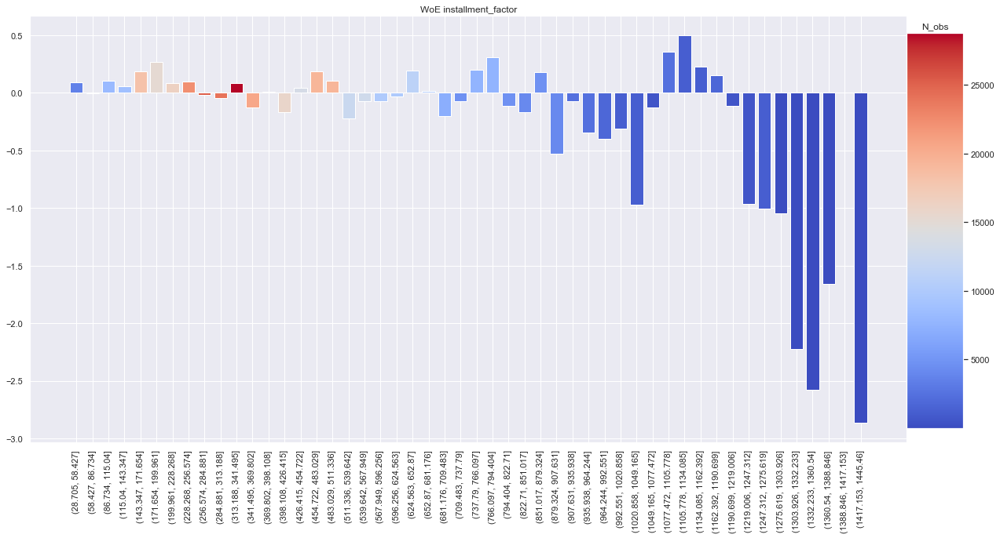


```python
fig, ax = plt.subplots(figsize=(20,8))

woe_df.set_index('installment_factor').iloc[:, [3,4]].plot(kind='bar', stacked=True, ax=ax)

plt.legend()
```


    <matplotlib.legend.Legend at 0x1a376aa5f8>


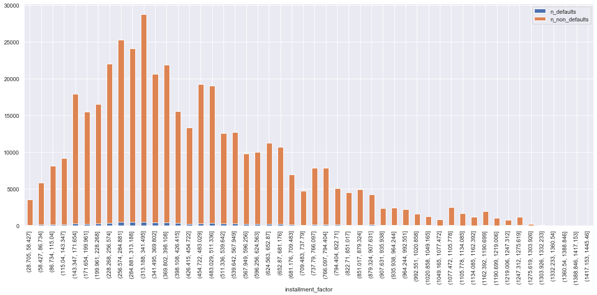


### No need to do anything here, linear horizontal trend

### 'delinq_2yrs'


```python
print(x_train_prep['delinq_2yrs'].nunique())
x_train_prep['delinq_2yrs'].describe()
```

    26


    count    421094.000000
    mean          0.347397
    std           0.927696
    min           0.000000
    25%           0.000000
    50%           0.000000
    75%           0.000000
    max          39.000000
    Name: delinq_2yrs, dtype: float64


```python
woe_df = woe_ordered_continuous(x_train_prep, 'delinq_2yrs', y_train_prep)
woe_df
```


<div>
<style scoped>
    .dataframe tbody tr th:only-of-type {
        vertical-align: middle;
    }

    .dataframe tbody tr th {
        vertical-align: top;
    }

    .dataframe thead th {
        text-align: right;
    }
</style>
<table border="1" class="dataframe">
  <thead>
    <tr style="text-align: right;">
      <th></th>
      <th>delinq_2yrs</th>
      <th>n_obs</th>
      <th>prop_non_defaults</th>
      <th>prop_n_obs</th>
      <th>n_defaults</th>
      <th>n_non_defaults</th>
      <th>prop_n_non_defaults</th>
      <th>prop_n_defaults</th>
      <th>WoE</th>
      <th>diff_prop_non_defaults</th>
      <th>diff_WoE</th>
      <th>IV</th>
    </tr>
  </thead>
  <tbody>
    <tr>
      <th>0</th>
      <td>0.0</td>
      <td>334007</td>
      <td>0.981812</td>
      <td>0.793189</td>
      <td>6075.0</td>
      <td>327932.0</td>
      <td>0.793557</td>
      <td>0.773787</td>
      <td>0.025229</td>
      <td>NaN</td>
      <td>NaN</td>
      <td>0.003866</td>
    </tr>
    <tr>
      <th>1</th>
      <td>1.0</td>
      <td>57000</td>
      <td>0.980246</td>
      <td>0.135362</td>
      <td>1126.0</td>
      <td>55874.0</td>
      <td>0.135209</td>
      <td>0.143421</td>
      <td>-0.058967</td>
      <td>0.658349</td>
      <td>0.084197</td>
      <td>0.003866</td>
    </tr>
    <tr>
      <th>2</th>
      <td>2.0</td>
      <td>17241</td>
      <td>0.979120</td>
      <td>0.040943</td>
      <td>360.0</td>
      <td>16881.0</td>
      <td>0.040850</td>
      <td>0.045854</td>
      <td>-0.115555</td>
      <td>0.094359</td>
      <td>0.056588</td>
      <td>0.003866</td>
    </tr>
    <tr>
      <th>3</th>
      <td>3.0</td>
      <td>6293</td>
      <td>0.976800</td>
      <td>0.014944</td>
      <td>146.0</td>
      <td>6147.0</td>
      <td>0.014875</td>
      <td>0.018596</td>
      <td>-0.223282</td>
      <td>0.025975</td>
      <td>0.107727</td>
      <td>0.003866</td>
    </tr>
    <tr>
      <th>4</th>
      <td>4.0</td>
      <td>2949</td>
      <td>0.976263</td>
      <td>0.007003</td>
      <td>70.0</td>
      <td>2879.0</td>
      <td>0.006967</td>
      <td>0.008916</td>
      <td>-0.246692</td>
      <td>0.007908</td>
      <td>0.023410</td>
      <td>0.003866</td>
    </tr>
    <tr>
      <th>5</th>
      <td>5.0</td>
      <td>1475</td>
      <td>0.978305</td>
      <td>0.003503</td>
      <td>32.0</td>
      <td>1443.0</td>
      <td>0.003492</td>
      <td>0.004076</td>
      <td>-0.154651</td>
      <td>0.003475</td>
      <td>0.092041</td>
      <td>0.003866</td>
    </tr>
    <tr>
      <th>6</th>
      <td>6.0</td>
      <td>842</td>
      <td>0.980998</td>
      <td>0.002000</td>
      <td>16.0</td>
      <td>826.0</td>
      <td>0.001999</td>
      <td>0.002038</td>
      <td>-0.019389</td>
      <td>0.001493</td>
      <td>0.135262</td>
      <td>0.003866</td>
    </tr>
    <tr>
      <th>7</th>
      <td>7.0</td>
      <td>438</td>
      <td>0.984018</td>
      <td>0.001040</td>
      <td>7.0</td>
      <td>431.0</td>
      <td>0.001043</td>
      <td>0.000892</td>
      <td>0.156803</td>
      <td>0.000956</td>
      <td>0.176192</td>
      <td>0.003866</td>
    </tr>
    <tr>
      <th>8</th>
      <td>8.0</td>
      <td>284</td>
      <td>0.982394</td>
      <td>0.000674</td>
      <td>5.0</td>
      <td>279.0</td>
      <td>0.000675</td>
      <td>0.000637</td>
      <td>0.058379</td>
      <td>0.000368</td>
      <td>0.098424</td>
      <td>0.003866</td>
    </tr>
    <tr>
      <th>9</th>
      <td>9.0</td>
      <td>173</td>
      <td>0.976879</td>
      <td>0.000411</td>
      <td>4.0</td>
      <td>169.0</td>
      <td>0.000409</td>
      <td>0.000509</td>
      <td>-0.219791</td>
      <td>0.000266</td>
      <td>0.278170</td>
      <td>0.003866</td>
    </tr>
    <tr>
      <th>10</th>
      <td>10.0</td>
      <td>127</td>
      <td>0.968504</td>
      <td>0.000302</td>
      <td>4.0</td>
      <td>123.0</td>
      <td>0.000298</td>
      <td>0.000509</td>
      <td>-0.537505</td>
      <td>0.000111</td>
      <td>0.317714</td>
      <td>0.003866</td>
    </tr>
    <tr>
      <th>11</th>
      <td>11.0</td>
      <td>80</td>
      <td>0.962500</td>
      <td>0.000190</td>
      <td>3.0</td>
      <td>77.0</td>
      <td>0.000186</td>
      <td>0.000382</td>
      <td>-0.718202</td>
      <td>0.000111</td>
      <td>0.180697</td>
      <td>0.003866</td>
    </tr>
    <tr>
      <th>12</th>
      <td>12.0</td>
      <td>51</td>
      <td>0.960784</td>
      <td>0.000121</td>
      <td>2.0</td>
      <td>49.0</td>
      <td>0.000119</td>
      <td>0.000255</td>
      <td>-0.764722</td>
      <td>0.000068</td>
      <td>0.046520</td>
      <td>0.003866</td>
    </tr>
    <tr>
      <th>13</th>
      <td>13.0</td>
      <td>39</td>
      <td>1.000000</td>
      <td>0.000093</td>
      <td>0.0</td>
      <td>39.0</td>
      <td>0.000094</td>
      <td>0.000000</td>
      <td>NaN</td>
      <td>0.000024</td>
      <td>NaN</td>
      <td>0.003866</td>
    </tr>
    <tr>
      <th>14</th>
      <td>14.0</td>
      <td>37</td>
      <td>1.000000</td>
      <td>0.000088</td>
      <td>0.0</td>
      <td>37.0</td>
      <td>0.000090</td>
      <td>0.000000</td>
      <td>NaN</td>
      <td>0.000005</td>
      <td>NaN</td>
      <td>0.003866</td>
    </tr>
    <tr>
      <th>15</th>
      <td>15.0</td>
      <td>21</td>
      <td>1.000000</td>
      <td>0.000050</td>
      <td>0.0</td>
      <td>21.0</td>
      <td>0.000051</td>
      <td>0.000000</td>
      <td>NaN</td>
      <td>0.000039</td>
      <td>NaN</td>
      <td>0.003866</td>
    </tr>
    <tr>
      <th>16</th>
      <td>16.0</td>
      <td>12</td>
      <td>1.000000</td>
      <td>0.000028</td>
      <td>0.0</td>
      <td>12.0</td>
      <td>0.000029</td>
      <td>0.000000</td>
      <td>NaN</td>
      <td>0.000022</td>
      <td>NaN</td>
      <td>0.003866</td>
    </tr>
    <tr>
      <th>17</th>
      <td>17.0</td>
      <td>7</td>
      <td>1.000000</td>
      <td>0.000017</td>
      <td>0.0</td>
      <td>7.0</td>
      <td>0.000017</td>
      <td>0.000000</td>
      <td>NaN</td>
      <td>0.000012</td>
      <td>NaN</td>
      <td>0.003866</td>
    </tr>
    <tr>
      <th>18</th>
      <td>18.0</td>
      <td>5</td>
      <td>1.000000</td>
      <td>0.000012</td>
      <td>0.0</td>
      <td>5.0</td>
      <td>0.000012</td>
      <td>0.000000</td>
      <td>NaN</td>
      <td>0.000005</td>
      <td>NaN</td>
      <td>0.003866</td>
    </tr>
    <tr>
      <th>19</th>
      <td>19.0</td>
      <td>5</td>
      <td>1.000000</td>
      <td>0.000012</td>
      <td>0.0</td>
      <td>5.0</td>
      <td>0.000012</td>
      <td>0.000000</td>
      <td>NaN</td>
      <td>0.000000</td>
      <td>NaN</td>
      <td>0.003866</td>
    </tr>
    <tr>
      <th>20</th>
      <td>20.0</td>
      <td>2</td>
      <td>0.500000</td>
      <td>0.000005</td>
      <td>1.0</td>
      <td>1.0</td>
      <td>0.000002</td>
      <td>0.000127</td>
      <td>-3.963395</td>
      <td>0.000010</td>
      <td>NaN</td>
      <td>0.003866</td>
    </tr>
    <tr>
      <th>21</th>
      <td>22.0</td>
      <td>1</td>
      <td>1.000000</td>
      <td>0.000002</td>
      <td>0.0</td>
      <td>1.0</td>
      <td>0.000002</td>
      <td>0.000000</td>
      <td>NaN</td>
      <td>0.000000</td>
      <td>NaN</td>
      <td>0.003866</td>
    </tr>
    <tr>
      <th>22</th>
      <td>26.0</td>
      <td>2</td>
      <td>1.000000</td>
      <td>0.000005</td>
      <td>0.0</td>
      <td>2.0</td>
      <td>0.000005</td>
      <td>0.000000</td>
      <td>NaN</td>
      <td>0.000002</td>
      <td>NaN</td>
      <td>0.003866</td>
    </tr>
    <tr>
      <th>23</th>
      <td>27.0</td>
      <td>1</td>
      <td>1.000000</td>
      <td>0.000002</td>
      <td>0.0</td>
      <td>1.0</td>
      <td>0.000002</td>
      <td>0.000000</td>
      <td>NaN</td>
      <td>0.000002</td>
      <td>NaN</td>
      <td>0.003866</td>
    </tr>
    <tr>
      <th>24</th>
      <td>30.0</td>
      <td>1</td>
      <td>1.000000</td>
      <td>0.000002</td>
      <td>0.0</td>
      <td>1.0</td>
      <td>0.000002</td>
      <td>0.000000</td>
      <td>NaN</td>
      <td>0.000000</td>
      <td>NaN</td>
      <td>0.003866</td>
    </tr>
    <tr>
      <th>25</th>
      <td>39.0</td>
      <td>1</td>
      <td>1.000000</td>
      <td>0.000002</td>
      <td>0.0</td>
      <td>1.0</td>
      <td>0.000002</td>
      <td>0.000000</td>
      <td>NaN</td>
      <td>0.000000</td>
      <td>NaN</td>
      <td>0.003866</td>
    </tr>
  </tbody>
</table>
</div>


```python
fig, ax = plt.subplots(figsize=(20,8))

woe_df.set_index('delinq_2yrs').iloc[:, [3,4]].plot(kind='bar', stacked=True, ax=ax)

plt.legend()
```


    <matplotlib.legend.Legend at 0x1a1ba80898>


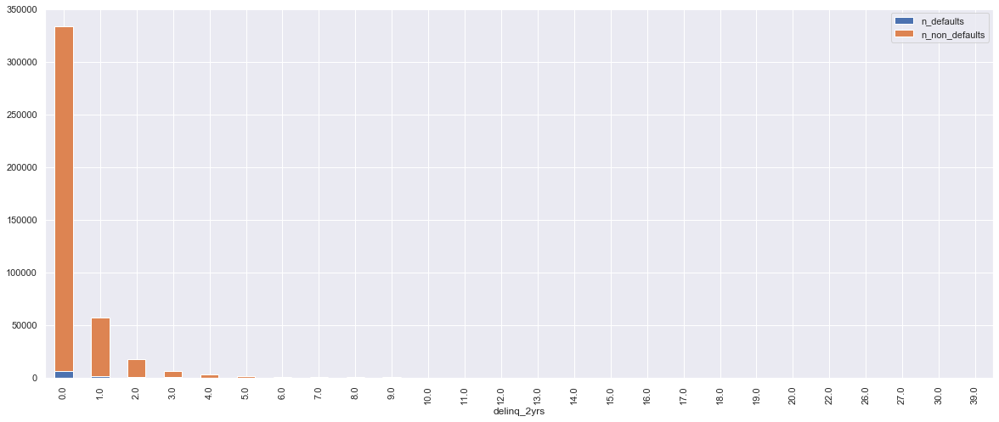


```python
x_train_prep['delinq_2yrs:0'] = np.where((x_train_prep['delinq_2yrs'] == 0), 1, 0)
x_train_prep['delinq_2yrs:1-3'] = np.where((x_train_prep['delinq_2yrs'] >= 1) & (x_train_prep['delinq_2yrs'] <= 3), 1, 0)
x_train_prep['delinq_2yrs:>=4'] = np.where((x_train_prep['delinq_2yrs'] >= 9), 1, 0)
```


```python
fig, ax = plt.subplots(figsize=(20,8))

var_s = ['delinq_2yrs:0', 'delinq_2yrs:1-3', 'delinq_2yrs:>=4']

pd.concat([x_train_prep, y_train_prep], axis=1).groupby('Y').sum().loc[:, var_s].T.plot(kind='bar', stacked=True, ax=ax)

plt.legend()
```


    <matplotlib.legend.Legend at 0x1a376f6198>


vars_to_use.append(['delinq_2yrs:0', 'delinq_2yrs:1-3'])

ref_vars.append(['delinq_2yrs:>=4'])
vars_to_use
### 'inq_last_6mths'


```python
print(x_train_prep['inq_last_6mths'].nunique())
x_train_prep['inq_last_6mths'].describe()
```

    7


    count    421094.000000
    mean          0.572692
    std           0.867777
    min           0.000000
    25%           0.000000
    50%           0.000000
    75%           1.000000
    max           6.000000
    Name: inq_last_6mths, dtype: float64


```python
woe_df = woe_ordered_continuous(x_train_prep, 'inq_last_6mths', y_train_prep)
woe_df
```


<div>
<style scoped>
    .dataframe tbody tr th:only-of-type {
        vertical-align: middle;
    }

    .dataframe tbody tr th {
        vertical-align: top;
    }

    .dataframe thead th {
        text-align: right;
    }
</style>
<table border="1" class="dataframe">
  <thead>
    <tr style="text-align: right;">
      <th></th>
      <th>inq_last_6mths</th>
      <th>n_obs</th>
      <th>prop_non_defaults</th>
      <th>prop_n_obs</th>
      <th>n_defaults</th>
      <th>n_non_defaults</th>
      <th>prop_n_non_defaults</th>
      <th>prop_n_defaults</th>
      <th>WoE</th>
      <th>diff_prop_non_defaults</th>
      <th>diff_WoE</th>
      <th>IV</th>
    </tr>
  </thead>
  <tbody>
    <tr>
      <th>0</th>
      <td>0.0</td>
      <td>256407</td>
      <td>0.984813</td>
      <td>0.608907</td>
      <td>3894.0</td>
      <td>252513.0</td>
      <td>0.611052</td>
      <td>0.495988</td>
      <td>0.208631</td>
      <td>NaN</td>
      <td>NaN</td>
      <td>0.06837</td>
    </tr>
    <tr>
      <th>1</th>
      <td>1.0</td>
      <td>111346</td>
      <td>0.978571</td>
      <td>0.264421</td>
      <td>2386.0</td>
      <td>108960.0</td>
      <td>0.263671</td>
      <td>0.303910</td>
      <td>-0.142032</td>
      <td>0.347382</td>
      <td>0.350663</td>
      <td>0.06837</td>
    </tr>
    <tr>
      <th>2</th>
      <td>2.0</td>
      <td>36292</td>
      <td>0.973438</td>
      <td>0.086185</td>
      <td>964.0</td>
      <td>35328.0</td>
      <td>0.085490</td>
      <td>0.122787</td>
      <td>-0.362055</td>
      <td>0.178181</td>
      <td>0.220023</td>
      <td>0.06837</td>
    </tr>
    <tr>
      <th>3</th>
      <td>3.0</td>
      <td>12272</td>
      <td>0.964635</td>
      <td>0.029143</td>
      <td>434.0</td>
      <td>11838.0</td>
      <td>0.028647</td>
      <td>0.055280</td>
      <td>-0.657369</td>
      <td>0.056843</td>
      <td>0.295314</td>
      <td>0.06837</td>
    </tr>
    <tr>
      <th>4</th>
      <td>4.0</td>
      <td>3517</td>
      <td>0.966164</td>
      <td>0.008352</td>
      <td>119.0</td>
      <td>3398.0</td>
      <td>0.008223</td>
      <td>0.015157</td>
      <td>-0.611576</td>
      <td>0.020424</td>
      <td>0.045793</td>
      <td>0.06837</td>
    </tr>
    <tr>
      <th>5</th>
      <td>5.0</td>
      <td>1217</td>
      <td>0.957272</td>
      <td>0.002890</td>
      <td>52.0</td>
      <td>1165.0</td>
      <td>0.002819</td>
      <td>0.006623</td>
      <td>-0.854162</td>
      <td>0.005404</td>
      <td>0.242586</td>
      <td>0.06837</td>
    </tr>
    <tr>
      <th>6</th>
      <td>6.0</td>
      <td>43</td>
      <td>0.953488</td>
      <td>0.000102</td>
      <td>2.0</td>
      <td>41.0</td>
      <td>0.000099</td>
      <td>0.000255</td>
      <td>-0.942970</td>
      <td>0.002720</td>
      <td>0.088808</td>
      <td>0.06837</td>
    </tr>
  </tbody>
</table>
</div>


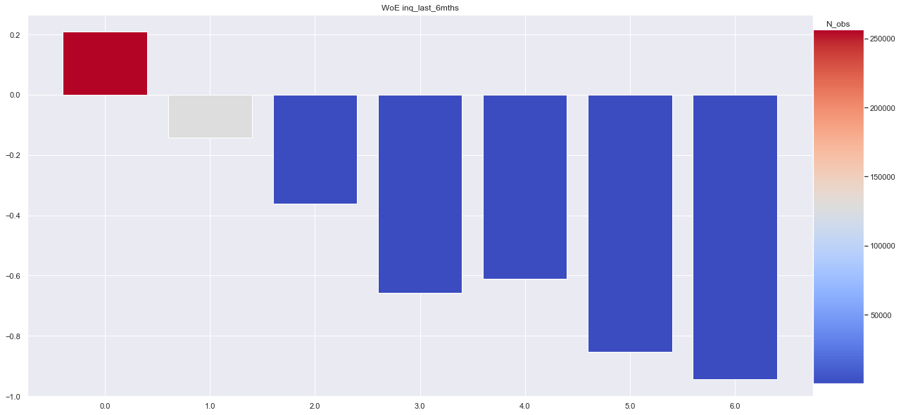


```python
fig, ax = plt.subplots(figsize=(20,8))

woe_df.set_index('inq_last_6mths').iloc[:, [3,4]].plot(kind='bar', stacked=True, ax=ax)

plt.legend()
```


    <matplotlib.legend.Legend at 0x1a1ba53400>


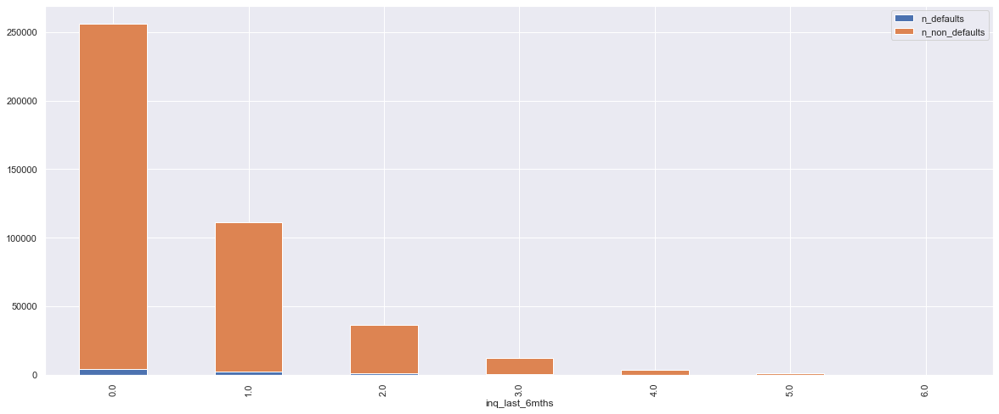


```python
x_train_prep['inq_last_6mths:0'] = np.where((x_train_prep['inq_last_6mths'] == 0), 1, 0)
x_train_prep['inq_last_6mths:1-2'] = np.where((x_train_prep['inq_last_6mths'] >= 1) & (x_train_prep['inq_last_6mths'] <= 2), 1, 0)
x_train_prep['inq_last_6mths:3-6'] = np.where((x_train_prep['inq_last_6mths'] >= 3) & (x_train_prep['inq_last_6mths'] <= 6), 1, 0)
x_train_prep['inq_last_6mths:>6'] = np.where((x_train_prep['inq_last_6mths'] > 6), 1, 0)
```


```python
fig, ax = plt.subplots(figsize=(20,8))

var_s = ['inq_last_6mths:0', 'inq_last_6mths:1-2', 'inq_last_6mths:3-6', 'inq_last_6mths:>6']

pd.concat([x_train_prep, y_train_prep], axis=1).groupby('Y').sum().loc[:, var_s].T.plot(kind='bar', stacked=True, ax=ax)

plt.legend()
```


    <matplotlib.legend.Legend at 0x1a3771aba8>


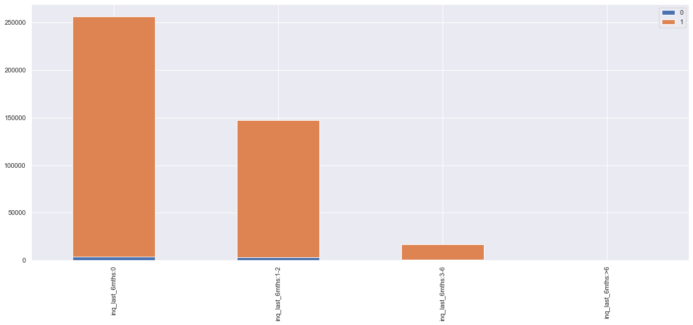

vars_to_use.append(['inq_last_6mths:0', 'inq_last_6mths:1-2', 'inq_last_6mths:3-6'])
ref_vars.append(['inq_last_6mths:>6'])

vars_to_use
### 'open_acc'


```python
print(x_train_prep['open_acc'].nunique())
x_train_prep['open_acc'].describe()
```

    73


    count    421094.000000
    mean         11.948629
    std           5.633118
    min           1.000000
    25%           8.000000
    50%          11.000000
    75%          15.000000
    max          90.000000
    Name: open_acc, dtype: float64


```python
woe_df = woe_ordered_continuous(x_train_prep, 'open_acc', y_train_prep, rot_x_ticks=90)

woe_df
```


<div>
<style scoped>
    .dataframe tbody tr th:only-of-type {
        vertical-align: middle;
    }

    .dataframe tbody tr th {
        vertical-align: top;
    }

    .dataframe thead th {
        text-align: right;
    }
</style>
<table border="1" class="dataframe">
  <thead>
    <tr style="text-align: right;">
      <th></th>
      <th>open_acc</th>
      <th>n_obs</th>
      <th>prop_non_defaults</th>
      <th>prop_n_obs</th>
      <th>n_defaults</th>
      <th>n_non_defaults</th>
      <th>prop_n_non_defaults</th>
      <th>prop_n_defaults</th>
      <th>WoE</th>
      <th>diff_prop_non_defaults</th>
      <th>diff_WoE</th>
      <th>IV</th>
    </tr>
  </thead>
  <tbody>
    <tr>
      <th>0</th>
      <td>1.0</td>
      <td>90</td>
      <td>0.988889</td>
      <td>0.000214</td>
      <td>1.0</td>
      <td>89.0</td>
      <td>0.000215</td>
      <td>0.000127</td>
      <td>0.525241</td>
      <td>NaN</td>
      <td>NaN</td>
      <td>0.008136</td>
    </tr>
    <tr>
      <th>1</th>
      <td>2.0</td>
      <td>986</td>
      <td>0.972617</td>
      <td>0.002342</td>
      <td>27.0</td>
      <td>959.0</td>
      <td>0.002321</td>
      <td>0.003439</td>
      <td>-0.393341</td>
      <td>0.002105</td>
      <td>0.918582</td>
      <td>0.008136</td>
    </tr>
    <tr>
      <th>2</th>
      <td>3.0</td>
      <td>4119</td>
      <td>0.984462</td>
      <td>0.009782</td>
      <td>64.0</td>
      <td>4055.0</td>
      <td>0.009813</td>
      <td>0.008152</td>
      <td>0.185428</td>
      <td>0.007492</td>
      <td>0.578769</td>
      <td>0.008136</td>
    </tr>
    <tr>
      <th>3</th>
      <td>4.0</td>
      <td>10779</td>
      <td>0.978941</td>
      <td>0.025598</td>
      <td>227.0</td>
      <td>10552.0</td>
      <td>0.025535</td>
      <td>0.028914</td>
      <td>-0.124274</td>
      <td>0.015722</td>
      <td>0.309702</td>
      <td>0.008136</td>
    </tr>
    <tr>
      <th>4</th>
      <td>5.0</td>
      <td>18222</td>
      <td>0.980738</td>
      <td>0.043273</td>
      <td>351.0</td>
      <td>17871.0</td>
      <td>0.043246</td>
      <td>0.044708</td>
      <td>-0.033247</td>
      <td>0.017711</td>
      <td>0.091028</td>
      <td>0.008136</td>
    </tr>
    <tr>
      <th>5</th>
      <td>6.0</td>
      <td>25117</td>
      <td>0.980491</td>
      <td>0.059647</td>
      <td>490.0</td>
      <td>24627.0</td>
      <td>0.059594</td>
      <td>0.062412</td>
      <td>-0.046202</td>
      <td>0.016349</td>
      <td>0.012955</td>
      <td>0.008136</td>
    </tr>
    <tr>
      <th>6</th>
      <td>7.0</td>
      <td>30294</td>
      <td>0.981283</td>
      <td>0.071941</td>
      <td>567.0</td>
      <td>29727.0</td>
      <td>0.071936</td>
      <td>0.072220</td>
      <td>-0.003943</td>
      <td>0.012341</td>
      <td>0.042258</td>
      <td>0.008136</td>
    </tr>
    <tr>
      <th>7</th>
      <td>8.0</td>
      <td>34685</td>
      <td>0.980885</td>
      <td>0.082369</td>
      <td>663.0</td>
      <td>34022.0</td>
      <td>0.082329</td>
      <td>0.084448</td>
      <td>-0.025407</td>
      <td>0.010393</td>
      <td>0.021464</td>
      <td>0.008136</td>
    </tr>
    <tr>
      <th>8</th>
      <td>9.0</td>
      <td>36266</td>
      <td>0.981801</td>
      <td>0.086123</td>
      <td>660.0</td>
      <td>35606.0</td>
      <td>0.086162</td>
      <td>0.084066</td>
      <td>0.024635</td>
      <td>0.003833</td>
      <td>0.050042</td>
      <td>0.008136</td>
    </tr>
    <tr>
      <th>9</th>
      <td>10.0</td>
      <td>35809</td>
      <td>0.980647</td>
      <td>0.085038</td>
      <td>693.0</td>
      <td>35116.0</td>
      <td>0.084977</td>
      <td>0.088269</td>
      <td>-0.038013</td>
      <td>0.001186</td>
      <td>0.062647</td>
      <td>0.008136</td>
    </tr>
    <tr>
      <th>10</th>
      <td>11.0</td>
      <td>33153</td>
      <td>0.980364</td>
      <td>0.078731</td>
      <td>651.0</td>
      <td>32502.0</td>
      <td>0.078651</td>
      <td>0.082919</td>
      <td>-0.052848</td>
      <td>0.006326</td>
      <td>0.014835</td>
      <td>0.008136</td>
    </tr>
    <tr>
      <th>11</th>
      <td>12.0</td>
      <td>30105</td>
      <td>0.979173</td>
      <td>0.071492</td>
      <td>627.0</td>
      <td>29478.0</td>
      <td>0.071333</td>
      <td>0.079862</td>
      <td>-0.112942</td>
      <td>0.007318</td>
      <td>0.060094</td>
      <td>0.008136</td>
    </tr>
    <tr>
      <th>12</th>
      <td>13.0</td>
      <td>26836</td>
      <td>0.982300</td>
      <td>0.063729</td>
      <td>475.0</td>
      <td>26361.0</td>
      <td>0.063791</td>
      <td>0.060502</td>
      <td>0.052931</td>
      <td>0.007543</td>
      <td>0.165873</td>
      <td>0.008136</td>
    </tr>
    <tr>
      <th>13</th>
      <td>14.0</td>
      <td>23084</td>
      <td>0.982109</td>
      <td>0.054819</td>
      <td>413.0</td>
      <td>22671.0</td>
      <td>0.054861</td>
      <td>0.052605</td>
      <td>0.041999</td>
      <td>0.008929</td>
      <td>0.010932</td>
      <td>0.008136</td>
    </tr>
    <tr>
      <th>14</th>
      <td>15.0</td>
      <td>19544</td>
      <td>0.981273</td>
      <td>0.046412</td>
      <td>366.0</td>
      <td>19178.0</td>
      <td>0.046409</td>
      <td>0.046618</td>
      <td>-0.004509</td>
      <td>0.008453</td>
      <td>0.046509</td>
      <td>0.008136</td>
    </tr>
    <tr>
      <th>15</th>
      <td>16.0</td>
      <td>16501</td>
      <td>0.982547</td>
      <td>0.039186</td>
      <td>288.0</td>
      <td>16213.0</td>
      <td>0.039234</td>
      <td>0.036683</td>
      <td>0.067213</td>
      <td>0.007175</td>
      <td>0.071722</td>
      <td>0.008136</td>
    </tr>
    <tr>
      <th>16</th>
      <td>17.0</td>
      <td>13870</td>
      <td>0.982408</td>
      <td>0.032938</td>
      <td>244.0</td>
      <td>13626.0</td>
      <td>0.032973</td>
      <td>0.031079</td>
      <td>0.059172</td>
      <td>0.006260</td>
      <td>0.008041</td>
      <td>0.008136</td>
    </tr>
    <tr>
      <th>17</th>
      <td>18.0</td>
      <td>11462</td>
      <td>0.982900</td>
      <td>0.027220</td>
      <td>196.0</td>
      <td>11266.0</td>
      <td>0.027262</td>
      <td>0.024965</td>
      <td>0.088035</td>
      <td>0.005711</td>
      <td>0.028863</td>
      <td>0.008136</td>
    </tr>
    <tr>
      <th>18</th>
      <td>19.0</td>
      <td>9627</td>
      <td>0.983484</td>
      <td>0.022862</td>
      <td>159.0</td>
      <td>9468.0</td>
      <td>0.022911</td>
      <td>0.020252</td>
      <td>0.123374</td>
      <td>0.004351</td>
      <td>0.035339</td>
      <td>0.008136</td>
    </tr>
    <tr>
      <th>19</th>
      <td>20.0</td>
      <td>7807</td>
      <td>0.982195</td>
      <td>0.018540</td>
      <td>139.0</td>
      <td>7668.0</td>
      <td>0.018556</td>
      <td>0.017705</td>
      <td>0.046942</td>
      <td>0.004356</td>
      <td>0.076432</td>
      <td>0.008136</td>
    </tr>
    <tr>
      <th>20</th>
      <td>21.0</td>
      <td>6321</td>
      <td>0.982914</td>
      <td>0.015011</td>
      <td>108.0</td>
      <td>6213.0</td>
      <td>0.015035</td>
      <td>0.013756</td>
      <td>0.088873</td>
      <td>0.003521</td>
      <td>0.041931</td>
      <td>0.008136</td>
    </tr>
    <tr>
      <th>21</th>
      <td>22.0</td>
      <td>5209</td>
      <td>0.982722</td>
      <td>0.012370</td>
      <td>90.0</td>
      <td>5119.0</td>
      <td>0.012387</td>
      <td>0.011464</td>
      <td>0.077510</td>
      <td>0.002647</td>
      <td>0.011363</td>
      <td>0.008136</td>
    </tr>
    <tr>
      <th>22</th>
      <td>23.0</td>
      <td>4170</td>
      <td>0.982734</td>
      <td>0.009903</td>
      <td>72.0</td>
      <td>4098.0</td>
      <td>0.009917</td>
      <td>0.009171</td>
      <td>0.078193</td>
      <td>0.002471</td>
      <td>0.000683</td>
      <td>0.008136</td>
    </tr>
    <tr>
      <th>23</th>
      <td>24.0</td>
      <td>3423</td>
      <td>0.978966</td>
      <td>0.008129</td>
      <td>72.0</td>
      <td>3351.0</td>
      <td>0.008109</td>
      <td>0.009171</td>
      <td>-0.123047</td>
      <td>0.001808</td>
      <td>0.201240</td>
      <td>0.008136</td>
    </tr>
    <tr>
      <th>24</th>
      <td>25.0</td>
      <td>2767</td>
      <td>0.987712</td>
      <td>0.006571</td>
      <td>34.0</td>
      <td>2733.0</td>
      <td>0.006614</td>
      <td>0.004331</td>
      <td>0.423400</td>
      <td>0.001495</td>
      <td>0.546447</td>
      <td>0.008136</td>
    </tr>
    <tr>
      <th>25</th>
      <td>26.0</td>
      <td>2088</td>
      <td>0.982280</td>
      <td>0.004959</td>
      <td>37.0</td>
      <td>2051.0</td>
      <td>0.004963</td>
      <td>0.004713</td>
      <td>0.051770</td>
      <td>0.001650</td>
      <td>0.371630</td>
      <td>0.008136</td>
    </tr>
    <tr>
      <th>26</th>
      <td>27.0</td>
      <td>1758</td>
      <td>0.982366</td>
      <td>0.004175</td>
      <td>31.0</td>
      <td>1727.0</td>
      <td>0.004179</td>
      <td>0.003949</td>
      <td>0.056759</td>
      <td>0.000784</td>
      <td>0.004989</td>
      <td>0.008136</td>
    </tr>
    <tr>
      <th>27</th>
      <td>28.0</td>
      <td>1356</td>
      <td>0.988201</td>
      <td>0.003220</td>
      <td>16.0</td>
      <td>1340.0</td>
      <td>0.003243</td>
      <td>0.002038</td>
      <td>0.464441</td>
      <td>0.000936</td>
      <td>0.407682</td>
      <td>0.008136</td>
    </tr>
    <tr>
      <th>28</th>
      <td>29.0</td>
      <td>1126</td>
      <td>0.989343</td>
      <td>0.002674</td>
      <td>12.0</td>
      <td>1114.0</td>
      <td>0.002696</td>
      <td>0.001528</td>
      <td>0.567411</td>
      <td>0.000547</td>
      <td>0.102970</td>
      <td>0.008136</td>
    </tr>
    <tr>
      <th>29</th>
      <td>30.0</td>
      <td>845</td>
      <td>0.984615</td>
      <td>0.002007</td>
      <td>13.0</td>
      <td>832.0</td>
      <td>0.002013</td>
      <td>0.001656</td>
      <td>0.195488</td>
      <td>0.000682</td>
      <td>0.371923</td>
      <td>0.008136</td>
    </tr>
    <tr>
      <th>30</th>
      <td>31.0</td>
      <td>689</td>
      <td>0.985486</td>
      <td>0.001636</td>
      <td>10.0</td>
      <td>679.0</td>
      <td>0.001643</td>
      <td>0.001274</td>
      <td>0.254641</td>
      <td>0.000370</td>
      <td>0.059153</td>
      <td>0.008136</td>
    </tr>
    <tr>
      <th>31</th>
      <td>32.0</td>
      <td>638</td>
      <td>0.979624</td>
      <td>0.001515</td>
      <td>13.0</td>
      <td>625.0</td>
      <td>0.001512</td>
      <td>0.001656</td>
      <td>-0.090593</td>
      <td>0.000131</td>
      <td>0.345234</td>
      <td>0.008136</td>
    </tr>
    <tr>
      <th>32</th>
      <td>33.0</td>
      <td>482</td>
      <td>0.979253</td>
      <td>0.001145</td>
      <td>10.0</td>
      <td>472.0</td>
      <td>0.001142</td>
      <td>0.001274</td>
      <td>-0.109001</td>
      <td>0.000370</td>
      <td>0.018408</td>
      <td>0.008136</td>
    </tr>
    <tr>
      <th>33</th>
      <td>34.0</td>
      <td>362</td>
      <td>0.991713</td>
      <td>0.000860</td>
      <td>3.0</td>
      <td>359.0</td>
      <td>0.000869</td>
      <td>0.000382</td>
      <td>0.821315</td>
      <td>0.000273</td>
      <td>0.930316</td>
      <td>0.008136</td>
    </tr>
    <tr>
      <th>34</th>
      <td>35.0</td>
      <td>284</td>
      <td>0.989437</td>
      <td>0.000674</td>
      <td>3.0</td>
      <td>281.0</td>
      <td>0.000680</td>
      <td>0.000382</td>
      <td>0.576347</td>
      <td>0.000189</td>
      <td>0.244968</td>
      <td>0.008136</td>
    </tr>
    <tr>
      <th>35</th>
      <td>36.0</td>
      <td>219</td>
      <td>0.981735</td>
      <td>0.000520</td>
      <td>4.0</td>
      <td>215.0</td>
      <td>0.000520</td>
      <td>0.000509</td>
      <td>0.020949</td>
      <td>0.000160</td>
      <td>0.555399</td>
      <td>0.008136</td>
    </tr>
    <tr>
      <th>36</th>
      <td>37.0</td>
      <td>187</td>
      <td>0.973262</td>
      <td>0.000444</td>
      <td>5.0</td>
      <td>182.0</td>
      <td>0.000440</td>
      <td>0.000637</td>
      <td>-0.368826</td>
      <td>0.000080</td>
      <td>0.389775</td>
      <td>0.008136</td>
    </tr>
    <tr>
      <th>37</th>
      <td>38.0</td>
      <td>141</td>
      <td>0.978723</td>
      <td>0.000335</td>
      <td>3.0</td>
      <td>138.0</td>
      <td>0.000334</td>
      <td>0.000382</td>
      <td>-0.134753</td>
      <td>0.000106</td>
      <td>0.234073</td>
      <td>0.008136</td>
    </tr>
    <tr>
      <th>38</th>
      <td>39.0</td>
      <td>124</td>
      <td>0.983871</td>
      <td>0.000294</td>
      <td>2.0</td>
      <td>122.0</td>
      <td>0.000295</td>
      <td>0.000255</td>
      <td>0.147479</td>
      <td>0.000039</td>
      <td>0.282232</td>
      <td>0.008136</td>
    </tr>
    <tr>
      <th>39</th>
      <td>40.0</td>
      <td>99</td>
      <td>0.969697</td>
      <td>0.000235</td>
      <td>3.0</td>
      <td>96.0</td>
      <td>0.000232</td>
      <td>0.000382</td>
      <td>-0.497659</td>
      <td>0.000063</td>
      <td>0.645138</td>
      <td>0.008136</td>
    </tr>
    <tr>
      <th>40</th>
      <td>41.0</td>
      <td>78</td>
      <td>0.987179</td>
      <td>0.000185</td>
      <td>1.0</td>
      <td>77.0</td>
      <td>0.000186</td>
      <td>0.000127</td>
      <td>0.380411</td>
      <td>0.000046</td>
      <td>0.878070</td>
      <td>0.008136</td>
    </tr>
    <tr>
      <th>41</th>
      <td>42.0</td>
      <td>81</td>
      <td>0.975309</td>
      <td>0.000192</td>
      <td>2.0</td>
      <td>79.0</td>
      <td>0.000191</td>
      <td>0.000255</td>
      <td>-0.287094</td>
      <td>0.000005</td>
      <td>0.667505</td>
      <td>0.008136</td>
    </tr>
    <tr>
      <th>42</th>
      <td>43.0</td>
      <td>53</td>
      <td>1.000000</td>
      <td>0.000126</td>
      <td>0.0</td>
      <td>53.0</td>
      <td>0.000128</td>
      <td>0.000000</td>
      <td>NaN</td>
      <td>0.000063</td>
      <td>NaN</td>
      <td>0.008136</td>
    </tr>
    <tr>
      <th>43</th>
      <td>44.0</td>
      <td>34</td>
      <td>0.941176</td>
      <td>0.000081</td>
      <td>2.0</td>
      <td>32.0</td>
      <td>0.000077</td>
      <td>0.000255</td>
      <td>-1.190806</td>
      <td>0.000051</td>
      <td>NaN</td>
      <td>0.008136</td>
    </tr>
    <tr>
      <th>44</th>
      <td>45.0</td>
      <td>30</td>
      <td>0.966667</td>
      <td>0.000071</td>
      <td>1.0</td>
      <td>29.0</td>
      <td>0.000070</td>
      <td>0.000127</td>
      <td>-0.596099</td>
      <td>0.000007</td>
      <td>0.594707</td>
      <td>0.008136</td>
    </tr>
    <tr>
      <th>45</th>
      <td>46.0</td>
      <td>32</td>
      <td>0.968750</td>
      <td>0.000076</td>
      <td>1.0</td>
      <td>31.0</td>
      <td>0.000075</td>
      <td>0.000127</td>
      <td>-0.529408</td>
      <td>0.000005</td>
      <td>0.066691</td>
      <td>0.008136</td>
    </tr>
    <tr>
      <th>46</th>
      <td>47.0</td>
      <td>24</td>
      <td>1.000000</td>
      <td>0.000057</td>
      <td>0.0</td>
      <td>24.0</td>
      <td>0.000058</td>
      <td>0.000000</td>
      <td>NaN</td>
      <td>0.000017</td>
      <td>NaN</td>
      <td>0.008136</td>
    </tr>
    <tr>
      <th>47</th>
      <td>48.0</td>
      <td>26</td>
      <td>1.000000</td>
      <td>0.000062</td>
      <td>0.0</td>
      <td>26.0</td>
      <td>0.000063</td>
      <td>0.000000</td>
      <td>NaN</td>
      <td>0.000005</td>
      <td>NaN</td>
      <td>0.008136</td>
    </tr>
    <tr>
      <th>48</th>
      <td>49.0</td>
      <td>15</td>
      <td>1.000000</td>
      <td>0.000036</td>
      <td>0.0</td>
      <td>15.0</td>
      <td>0.000036</td>
      <td>0.000000</td>
      <td>NaN</td>
      <td>0.000027</td>
      <td>NaN</td>
      <td>0.008136</td>
    </tr>
    <tr>
      <th>49</th>
      <td>50.0</td>
      <td>9</td>
      <td>0.888889</td>
      <td>0.000021</td>
      <td>1.0</td>
      <td>8.0</td>
      <td>0.000019</td>
      <td>0.000127</td>
      <td>-1.883953</td>
      <td>0.000017</td>
      <td>NaN</td>
      <td>0.008136</td>
    </tr>
    <tr>
      <th>50</th>
      <td>51.0</td>
      <td>12</td>
      <td>1.000000</td>
      <td>0.000028</td>
      <td>0.0</td>
      <td>12.0</td>
      <td>0.000029</td>
      <td>0.000000</td>
      <td>NaN</td>
      <td>0.000010</td>
      <td>NaN</td>
      <td>0.008136</td>
    </tr>
    <tr>
      <th>51</th>
      <td>52.0</td>
      <td>11</td>
      <td>0.909091</td>
      <td>0.000026</td>
      <td>1.0</td>
      <td>10.0</td>
      <td>0.000024</td>
      <td>0.000127</td>
      <td>-1.660810</td>
      <td>0.000005</td>
      <td>NaN</td>
      <td>0.008136</td>
    </tr>
    <tr>
      <th>52</th>
      <td>53.0</td>
      <td>11</td>
      <td>1.000000</td>
      <td>0.000026</td>
      <td>0.0</td>
      <td>11.0</td>
      <td>0.000027</td>
      <td>0.000000</td>
      <td>NaN</td>
      <td>0.000002</td>
      <td>NaN</td>
      <td>0.008136</td>
    </tr>
    <tr>
      <th>53</th>
      <td>54.0</td>
      <td>3</td>
      <td>1.000000</td>
      <td>0.000007</td>
      <td>0.0</td>
      <td>3.0</td>
      <td>0.000007</td>
      <td>0.000000</td>
      <td>NaN</td>
      <td>0.000019</td>
      <td>NaN</td>
      <td>0.008136</td>
    </tr>
    <tr>
      <th>54</th>
      <td>55.0</td>
      <td>6</td>
      <td>1.000000</td>
      <td>0.000014</td>
      <td>0.0</td>
      <td>6.0</td>
      <td>0.000015</td>
      <td>0.000000</td>
      <td>NaN</td>
      <td>0.000007</td>
      <td>NaN</td>
      <td>0.008136</td>
    </tr>
    <tr>
      <th>55</th>
      <td>56.0</td>
      <td>6</td>
      <td>1.000000</td>
      <td>0.000014</td>
      <td>0.0</td>
      <td>6.0</td>
      <td>0.000015</td>
      <td>0.000000</td>
      <td>NaN</td>
      <td>0.000000</td>
      <td>NaN</td>
      <td>0.008136</td>
    </tr>
    <tr>
      <th>56</th>
      <td>57.0</td>
      <td>1</td>
      <td>1.000000</td>
      <td>0.000002</td>
      <td>0.0</td>
      <td>1.0</td>
      <td>0.000002</td>
      <td>0.000000</td>
      <td>NaN</td>
      <td>0.000012</td>
      <td>NaN</td>
      <td>0.008136</td>
    </tr>
    <tr>
      <th>57</th>
      <td>58.0</td>
      <td>1</td>
      <td>1.000000</td>
      <td>0.000002</td>
      <td>0.0</td>
      <td>1.0</td>
      <td>0.000002</td>
      <td>0.000000</td>
      <td>NaN</td>
      <td>0.000000</td>
      <td>NaN</td>
      <td>0.008136</td>
    </tr>
    <tr>
      <th>58</th>
      <td>59.0</td>
      <td>2</td>
      <td>1.000000</td>
      <td>0.000005</td>
      <td>0.0</td>
      <td>2.0</td>
      <td>0.000005</td>
      <td>0.000000</td>
      <td>NaN</td>
      <td>0.000002</td>
      <td>NaN</td>
      <td>0.008136</td>
    </tr>
    <tr>
      <th>59</th>
      <td>60.0</td>
      <td>2</td>
      <td>1.000000</td>
      <td>0.000005</td>
      <td>0.0</td>
      <td>2.0</td>
      <td>0.000005</td>
      <td>0.000000</td>
      <td>NaN</td>
      <td>0.000000</td>
      <td>NaN</td>
      <td>0.008136</td>
    </tr>
    <tr>
      <th>60</th>
      <td>61.0</td>
      <td>1</td>
      <td>1.000000</td>
      <td>0.000002</td>
      <td>0.0</td>
      <td>1.0</td>
      <td>0.000002</td>
      <td>0.000000</td>
      <td>NaN</td>
      <td>0.000002</td>
      <td>NaN</td>
      <td>0.008136</td>
    </tr>
    <tr>
      <th>61</th>
      <td>62.0</td>
      <td>1</td>
      <td>1.000000</td>
      <td>0.000002</td>
      <td>0.0</td>
      <td>1.0</td>
      <td>0.000002</td>
      <td>0.000000</td>
      <td>NaN</td>
      <td>0.000000</td>
      <td>NaN</td>
      <td>0.008136</td>
    </tr>
    <tr>
      <th>62</th>
      <td>63.0</td>
      <td>1</td>
      <td>1.000000</td>
      <td>0.000002</td>
      <td>0.0</td>
      <td>1.0</td>
      <td>0.000002</td>
      <td>0.000000</td>
      <td>NaN</td>
      <td>0.000000</td>
      <td>NaN</td>
      <td>0.008136</td>
    </tr>
    <tr>
      <th>63</th>
      <td>64.0</td>
      <td>1</td>
      <td>1.000000</td>
      <td>0.000002</td>
      <td>0.0</td>
      <td>1.0</td>
      <td>0.000002</td>
      <td>0.000000</td>
      <td>NaN</td>
      <td>0.000000</td>
      <td>NaN</td>
      <td>0.008136</td>
    </tr>
    <tr>
      <th>64</th>
      <td>65.0</td>
      <td>1</td>
      <td>1.000000</td>
      <td>0.000002</td>
      <td>0.0</td>
      <td>1.0</td>
      <td>0.000002</td>
      <td>0.000000</td>
      <td>NaN</td>
      <td>0.000000</td>
      <td>NaN</td>
      <td>0.008136</td>
    </tr>
    <tr>
      <th>65</th>
      <td>66.0</td>
      <td>1</td>
      <td>1.000000</td>
      <td>0.000002</td>
      <td>0.0</td>
      <td>1.0</td>
      <td>0.000002</td>
      <td>0.000000</td>
      <td>NaN</td>
      <td>0.000000</td>
      <td>NaN</td>
      <td>0.008136</td>
    </tr>
    <tr>
      <th>66</th>
      <td>67.0</td>
      <td>1</td>
      <td>1.000000</td>
      <td>0.000002</td>
      <td>0.0</td>
      <td>1.0</td>
      <td>0.000002</td>
      <td>0.000000</td>
      <td>NaN</td>
      <td>0.000000</td>
      <td>NaN</td>
      <td>0.008136</td>
    </tr>
    <tr>
      <th>67</th>
      <td>68.0</td>
      <td>1</td>
      <td>1.000000</td>
      <td>0.000002</td>
      <td>0.0</td>
      <td>1.0</td>
      <td>0.000002</td>
      <td>0.000000</td>
      <td>NaN</td>
      <td>0.000000</td>
      <td>NaN</td>
      <td>0.008136</td>
    </tr>
    <tr>
      <th>68</th>
      <td>70.0</td>
      <td>1</td>
      <td>1.000000</td>
      <td>0.000002</td>
      <td>0.0</td>
      <td>1.0</td>
      <td>0.000002</td>
      <td>0.000000</td>
      <td>NaN</td>
      <td>0.000000</td>
      <td>NaN</td>
      <td>0.008136</td>
    </tr>
    <tr>
      <th>69</th>
      <td>74.0</td>
      <td>1</td>
      <td>1.000000</td>
      <td>0.000002</td>
      <td>0.0</td>
      <td>1.0</td>
      <td>0.000002</td>
      <td>0.000000</td>
      <td>NaN</td>
      <td>0.000000</td>
      <td>NaN</td>
      <td>0.008136</td>
    </tr>
    <tr>
      <th>70</th>
      <td>79.0</td>
      <td>1</td>
      <td>1.000000</td>
      <td>0.000002</td>
      <td>0.0</td>
      <td>1.0</td>
      <td>0.000002</td>
      <td>0.000000</td>
      <td>NaN</td>
      <td>0.000000</td>
      <td>NaN</td>
      <td>0.008136</td>
    </tr>
    <tr>
      <th>71</th>
      <td>82.0</td>
      <td>1</td>
      <td>1.000000</td>
      <td>0.000002</td>
      <td>0.0</td>
      <td>1.0</td>
      <td>0.000002</td>
      <td>0.000000</td>
      <td>NaN</td>
      <td>0.000000</td>
      <td>NaN</td>
      <td>0.008136</td>
    </tr>
    <tr>
      <th>72</th>
      <td>90.0</td>
      <td>1</td>
      <td>1.000000</td>
      <td>0.000002</td>
      <td>0.0</td>
      <td>1.0</td>
      <td>0.000002</td>
      <td>0.000000</td>
      <td>NaN</td>
      <td>0.000000</td>
      <td>NaN</td>
      <td>0.008136</td>
    </tr>
  </tbody>
</table>
</div>


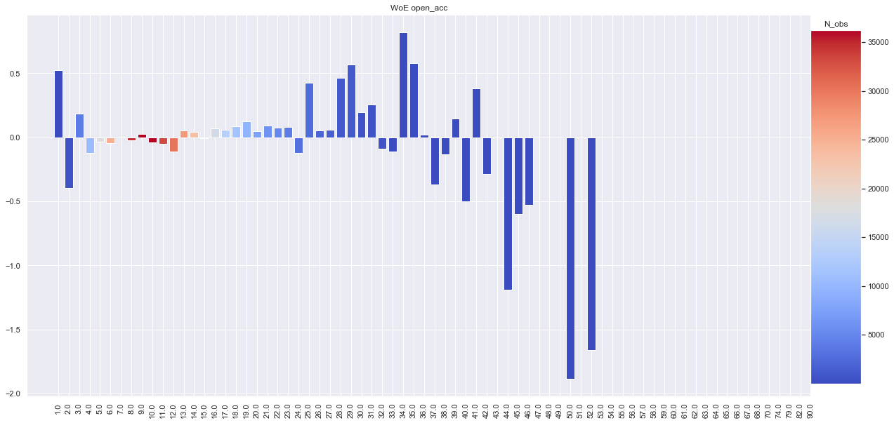


```python
woe_df = woe_ordered_continuous(x_train_prep, 'open_acc', y_train_prep, plot_rows_start=4, plot_rows_end=-30, rot_x_ticks=90)
```


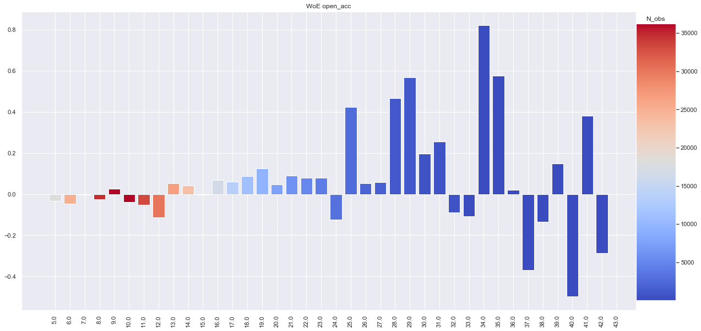


```python
fig, ax = plt.subplots(figsize=(20,8))

woe_df.set_index('open_acc').iloc[:, [3,4]].plot(kind='bar', stacked=True, ax=ax)

plt.legend()
```


    <matplotlib.legend.Legend at 0x1a39965048>


```python
x_train_prep['open_acc:0'] = np.where((x_train_prep['open_acc'] == 0), 1, 0)
x_train_prep['open_acc:1-3'] = np.where((x_train_prep['open_acc'] >= 1) & (x_train_prep['open_acc'] <= 3), 1, 0)
x_train_prep['open_acc:4-12'] = np.where((x_train_prep['open_acc'] >= 4) & (x_train_prep['open_acc'] <= 12), 1, 0)
x_train_prep['open_acc:13-17'] = np.where((x_train_prep['open_acc'] >= 13) & (x_train_prep['open_acc'] <= 17), 1, 0)
x_train_prep['open_acc:18-22'] = np.where((x_train_prep['open_acc'] >= 18) & (x_train_prep['open_acc'] <= 22), 1, 0)
x_train_prep['open_acc:23-25'] = np.where((x_train_prep['open_acc'] >= 23) & (x_train_prep['open_acc'] <= 25), 1, 0)
x_train_prep['open_acc:26-30'] = np.where((x_train_prep['open_acc'] >= 26) & (x_train_prep['open_acc'] <= 30), 1, 0)
x_train_prep['open_acc:>=31'] = np.where((x_train_prep['open_acc'] >= 31), 1, 0)
```


```python
fig, ax = plt.subplots(figsize=(20,8))

var_s = ['open_acc:0', 'open_acc:1-3', 'open_acc:4-12', 'open_acc:13-17', 'open_acc:18-22', 'open_acc:23-25', 'open_acc:26-30', 'open_acc:>=31']

pd.concat([x_train_prep, y_train_prep], axis=1).groupby('Y').sum().loc[:, var_s].T.plot(kind='bar', stacked=True, ax=ax)

plt.legend()
```


    <matplotlib.legend.Legend at 0x1a1b3286a0>


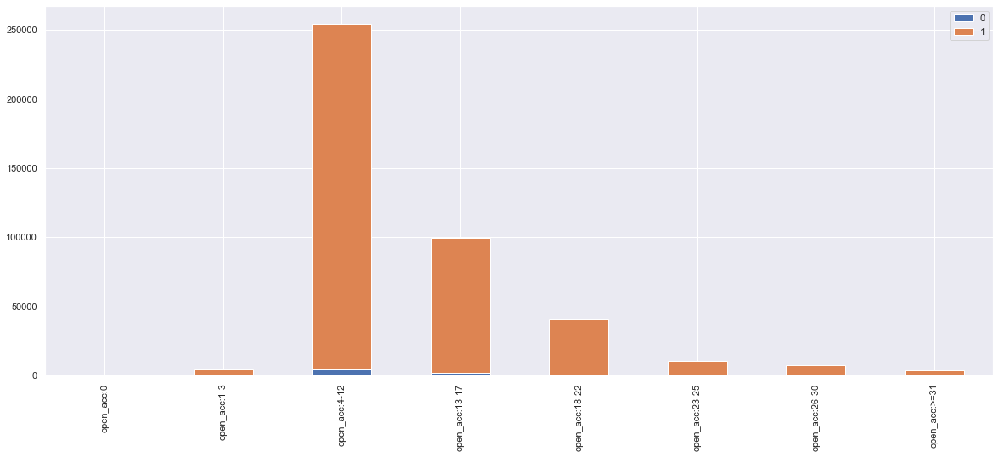

vars_to_use.append(['open_acc:1-3', 'open_acc:4-12', 'open_acc:13-17', 'open_acc:18-22', 'open_acc:23-25', 'open_acc:26-30', 'open_acc:>=31'])
ref_vars.append(['open_acc:0'])

vars_to_use
### pub_rec


```python
print(x_train_prep['pub_rec'].nunique())
x_train_prep['pub_rec'].describe()
```

    28


    count    421094.000000
    mean          0.233777
    std           0.649778
    min           0.000000
    25%           0.000000
    50%           0.000000
    75%           0.000000
    max          86.000000
    Name: pub_rec, dtype: float64


```python
woe_df = woe_ordered_continuous(x_train_prep, 'pub_rec', y_train_prep)
woe_df
```


<div>
<style scoped>
    .dataframe tbody tr th:only-of-type {
        vertical-align: middle;
    }

    .dataframe tbody tr th {
        vertical-align: top;
    }

    .dataframe thead th {
        text-align: right;
    }
</style>
<table border="1" class="dataframe">
  <thead>
    <tr style="text-align: right;">
      <th></th>
      <th>pub_rec</th>
      <th>n_obs</th>
      <th>prop_non_defaults</th>
      <th>prop_n_obs</th>
      <th>n_defaults</th>
      <th>n_non_defaults</th>
      <th>prop_n_non_defaults</th>
      <th>prop_n_defaults</th>
      <th>WoE</th>
      <th>diff_prop_non_defaults</th>
      <th>diff_WoE</th>
      <th>IV</th>
    </tr>
  </thead>
  <tbody>
    <tr>
      <th>0</th>
      <td>0.0</td>
      <td>346679</td>
      <td>0.981594</td>
      <td>0.823282</td>
      <td>6381.0</td>
      <td>340298.0</td>
      <td>0.823482</td>
      <td>0.812763</td>
      <td>0.013102</td>
      <td>NaN</td>
      <td>NaN</td>
      <td>0.001449</td>
    </tr>
    <tr>
      <th>1</th>
      <td>1.0</td>
      <td>60215</td>
      <td>0.979972</td>
      <td>0.142997</td>
      <td>1206.0</td>
      <td>59009.0</td>
      <td>0.142795</td>
      <td>0.153611</td>
      <td>-0.073014</td>
      <td>0.680687</td>
      <td>0.086116</td>
      <td>0.001449</td>
    </tr>
    <tr>
      <th>2</th>
      <td>2.0</td>
      <td>9230</td>
      <td>0.982124</td>
      <td>0.021919</td>
      <td>165.0</td>
      <td>9065.0</td>
      <td>0.021936</td>
      <td>0.021016</td>
      <td>0.042836</td>
      <td>0.120859</td>
      <td>0.115850</td>
      <td>0.001449</td>
    </tr>
    <tr>
      <th>3</th>
      <td>3.0</td>
      <td>2876</td>
      <td>0.979833</td>
      <td>0.006830</td>
      <td>58.0</td>
      <td>2818.0</td>
      <td>0.006819</td>
      <td>0.007388</td>
      <td>-0.080055</td>
      <td>0.015117</td>
      <td>0.122891</td>
      <td>0.001449</td>
    </tr>
    <tr>
      <th>4</th>
      <td>4.0</td>
      <td>1044</td>
      <td>0.977011</td>
      <td>0.002479</td>
      <td>24.0</td>
      <td>1020.0</td>
      <td>0.002468</td>
      <td>0.003057</td>
      <td>-0.213891</td>
      <td>0.004351</td>
      <td>0.133836</td>
      <td>0.001449</td>
    </tr>
    <tr>
      <th>5</th>
      <td>5.0</td>
      <td>481</td>
      <td>0.979210</td>
      <td>0.001142</td>
      <td>10.0</td>
      <td>471.0</td>
      <td>0.001140</td>
      <td>0.001274</td>
      <td>-0.111122</td>
      <td>0.001329</td>
      <td>0.102769</td>
      <td>0.001449</td>
    </tr>
    <tr>
      <th>6</th>
      <td>6.0</td>
      <td>249</td>
      <td>0.983936</td>
      <td>0.000591</td>
      <td>4.0</td>
      <td>245.0</td>
      <td>0.000593</td>
      <td>0.000509</td>
      <td>0.151569</td>
      <td>0.000547</td>
      <td>0.262691</td>
      <td>0.001449</td>
    </tr>
    <tr>
      <th>7</th>
      <td>7.0</td>
      <td>108</td>
      <td>1.000000</td>
      <td>0.000256</td>
      <td>0.0</td>
      <td>108.0</td>
      <td>0.000261</td>
      <td>0.000000</td>
      <td>NaN</td>
      <td>0.000332</td>
      <td>NaN</td>
      <td>0.001449</td>
    </tr>
    <tr>
      <th>8</th>
      <td>8.0</td>
      <td>84</td>
      <td>1.000000</td>
      <td>0.000199</td>
      <td>0.0</td>
      <td>84.0</td>
      <td>0.000203</td>
      <td>0.000000</td>
      <td>NaN</td>
      <td>0.000058</td>
      <td>NaN</td>
      <td>0.001449</td>
    </tr>
    <tr>
      <th>9</th>
      <td>9.0</td>
      <td>34</td>
      <td>0.970588</td>
      <td>0.000081</td>
      <td>1.0</td>
      <td>33.0</td>
      <td>0.000080</td>
      <td>0.000127</td>
      <td>-0.466887</td>
      <td>0.000123</td>
      <td>NaN</td>
      <td>0.001449</td>
    </tr>
    <tr>
      <th>10</th>
      <td>10.0</td>
      <td>29</td>
      <td>1.000000</td>
      <td>0.000069</td>
      <td>0.0</td>
      <td>29.0</td>
      <td>0.000070</td>
      <td>0.000000</td>
      <td>NaN</td>
      <td>0.000010</td>
      <td>NaN</td>
      <td>0.001449</td>
    </tr>
    <tr>
      <th>11</th>
      <td>11.0</td>
      <td>15</td>
      <td>0.933333</td>
      <td>0.000036</td>
      <td>1.0</td>
      <td>14.0</td>
      <td>0.000034</td>
      <td>0.000127</td>
      <td>-1.324338</td>
      <td>0.000036</td>
      <td>NaN</td>
      <td>0.001449</td>
    </tr>
    <tr>
      <th>12</th>
      <td>12.0</td>
      <td>14</td>
      <td>0.928571</td>
      <td>0.000033</td>
      <td>1.0</td>
      <td>13.0</td>
      <td>0.000031</td>
      <td>0.000127</td>
      <td>-1.398446</td>
      <td>0.000002</td>
      <td>0.074108</td>
      <td>0.001449</td>
    </tr>
    <tr>
      <th>13</th>
      <td>13.0</td>
      <td>10</td>
      <td>1.000000</td>
      <td>0.000024</td>
      <td>0.0</td>
      <td>10.0</td>
      <td>0.000024</td>
      <td>0.000000</td>
      <td>NaN</td>
      <td>0.000007</td>
      <td>NaN</td>
      <td>0.001449</td>
    </tr>
    <tr>
      <th>14</th>
      <td>14.0</td>
      <td>1</td>
      <td>1.000000</td>
      <td>0.000002</td>
      <td>0.0</td>
      <td>1.0</td>
      <td>0.000002</td>
      <td>0.000000</td>
      <td>NaN</td>
      <td>0.000022</td>
      <td>NaN</td>
      <td>0.001449</td>
    </tr>
    <tr>
      <th>15</th>
      <td>15.0</td>
      <td>5</td>
      <td>1.000000</td>
      <td>0.000012</td>
      <td>0.0</td>
      <td>5.0</td>
      <td>0.000012</td>
      <td>0.000000</td>
      <td>NaN</td>
      <td>0.000010</td>
      <td>NaN</td>
      <td>0.001449</td>
    </tr>
    <tr>
      <th>16</th>
      <td>16.0</td>
      <td>4</td>
      <td>1.000000</td>
      <td>0.000009</td>
      <td>0.0</td>
      <td>4.0</td>
      <td>0.000010</td>
      <td>0.000000</td>
      <td>NaN</td>
      <td>0.000002</td>
      <td>NaN</td>
      <td>0.001449</td>
    </tr>
    <tr>
      <th>17</th>
      <td>17.0</td>
      <td>2</td>
      <td>1.000000</td>
      <td>0.000005</td>
      <td>0.0</td>
      <td>2.0</td>
      <td>0.000005</td>
      <td>0.000000</td>
      <td>NaN</td>
      <td>0.000005</td>
      <td>NaN</td>
      <td>0.001449</td>
    </tr>
    <tr>
      <th>18</th>
      <td>18.0</td>
      <td>3</td>
      <td>1.000000</td>
      <td>0.000007</td>
      <td>0.0</td>
      <td>3.0</td>
      <td>0.000007</td>
      <td>0.000000</td>
      <td>NaN</td>
      <td>0.000002</td>
      <td>NaN</td>
      <td>0.001449</td>
    </tr>
    <tr>
      <th>19</th>
      <td>19.0</td>
      <td>1</td>
      <td>1.000000</td>
      <td>0.000002</td>
      <td>0.0</td>
      <td>1.0</td>
      <td>0.000002</td>
      <td>0.000000</td>
      <td>NaN</td>
      <td>0.000005</td>
      <td>NaN</td>
      <td>0.001449</td>
    </tr>
    <tr>
      <th>20</th>
      <td>20.0</td>
      <td>1</td>
      <td>1.000000</td>
      <td>0.000002</td>
      <td>0.0</td>
      <td>1.0</td>
      <td>0.000002</td>
      <td>0.000000</td>
      <td>NaN</td>
      <td>0.000000</td>
      <td>NaN</td>
      <td>0.001449</td>
    </tr>
    <tr>
      <th>21</th>
      <td>21.0</td>
      <td>3</td>
      <td>1.000000</td>
      <td>0.000007</td>
      <td>0.0</td>
      <td>3.0</td>
      <td>0.000007</td>
      <td>0.000000</td>
      <td>NaN</td>
      <td>0.000005</td>
      <td>NaN</td>
      <td>0.001449</td>
    </tr>
    <tr>
      <th>22</th>
      <td>22.0</td>
      <td>1</td>
      <td>1.000000</td>
      <td>0.000002</td>
      <td>0.0</td>
      <td>1.0</td>
      <td>0.000002</td>
      <td>0.000000</td>
      <td>NaN</td>
      <td>0.000005</td>
      <td>NaN</td>
      <td>0.001449</td>
    </tr>
    <tr>
      <th>23</th>
      <td>23.0</td>
      <td>1</td>
      <td>1.000000</td>
      <td>0.000002</td>
      <td>0.0</td>
      <td>1.0</td>
      <td>0.000002</td>
      <td>0.000000</td>
      <td>NaN</td>
      <td>0.000000</td>
      <td>NaN</td>
      <td>0.001449</td>
    </tr>
    <tr>
      <th>24</th>
      <td>26.0</td>
      <td>1</td>
      <td>1.000000</td>
      <td>0.000002</td>
      <td>0.0</td>
      <td>1.0</td>
      <td>0.000002</td>
      <td>0.000000</td>
      <td>NaN</td>
      <td>0.000000</td>
      <td>NaN</td>
      <td>0.001449</td>
    </tr>
    <tr>
      <th>25</th>
      <td>28.0</td>
      <td>1</td>
      <td>1.000000</td>
      <td>0.000002</td>
      <td>0.0</td>
      <td>1.0</td>
      <td>0.000002</td>
      <td>0.000000</td>
      <td>NaN</td>
      <td>0.000000</td>
      <td>NaN</td>
      <td>0.001449</td>
    </tr>
    <tr>
      <th>26</th>
      <td>49.0</td>
      <td>1</td>
      <td>1.000000</td>
      <td>0.000002</td>
      <td>0.0</td>
      <td>1.0</td>
      <td>0.000002</td>
      <td>0.000000</td>
      <td>NaN</td>
      <td>0.000000</td>
      <td>NaN</td>
      <td>0.001449</td>
    </tr>
    <tr>
      <th>27</th>
      <td>86.0</td>
      <td>1</td>
      <td>1.000000</td>
      <td>0.000002</td>
      <td>0.0</td>
      <td>1.0</td>
      <td>0.000002</td>
      <td>0.000000</td>
      <td>NaN</td>
      <td>0.000000</td>
      <td>NaN</td>
      <td>0.001449</td>
    </tr>
  </tbody>
</table>
</div>


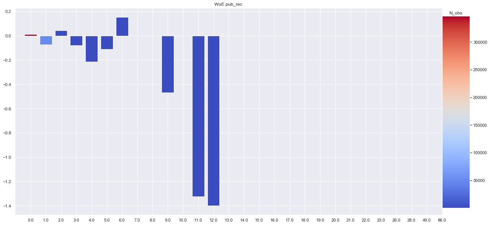


```python
fig, ax = plt.subplots(figsize=(20,8))

woe_df.set_index('pub_rec').iloc[:, [3,4]].plot(kind='bar', stacked=True, ax=ax)

plt.legend()
```


    <matplotlib.legend.Legend at 0x1a1b328978>


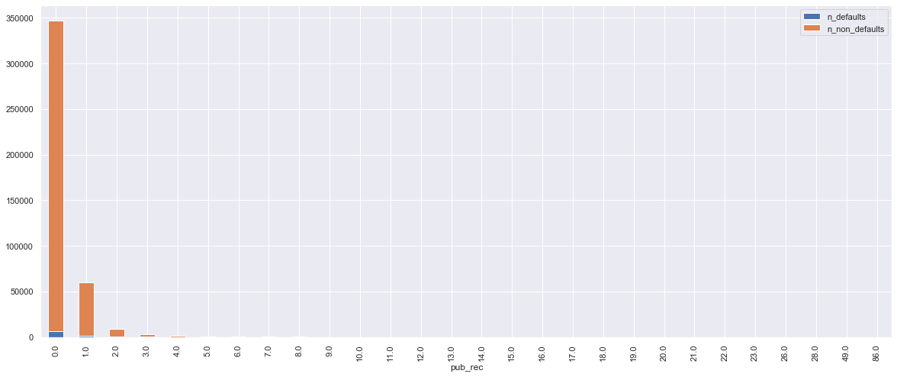


```python
x_train_prep['pub_rec:0-2'] = np.where((x_train_prep['pub_rec'] >= 0) & (x_train_prep['pub_rec'] <= 2), 1, 0)
x_train_prep['pub_rec:3-4'] = np.where((x_train_prep['pub_rec'] >= 3) & (x_train_prep['pub_rec'] <= 4), 1, 0)
x_train_prep['pub_rec:>=5'] = np.where((x_train_prep['pub_rec'] >= 5), 1, 0)
```


```python
fig, ax = plt.subplots(figsize=(20,8))

var_s = ['pub_rec:0-2', 'pub_rec:3-4', 'pub_rec:>=5']

pd.concat([x_train_prep, y_train_prep], axis=1).groupby('Y').sum().loc[:, var_s].T.plot(kind='bar', stacked=True, ax=ax)

plt.legend()
```


    <matplotlib.legend.Legend at 0x1a377c0c50>


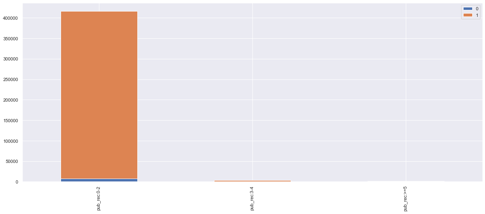

vars_to_use.append(['pub_rec:0-2', 'pub_rec:3-4'])
ref_vars.append(['pub_rec:>=5'])

vars_to_use
### total_acc


```python
print(x_train_prep['total_acc'].nunique())
x_train_prep['total_acc'].describe()
```

    126


    count    421094.000000
    mean         25.493458
    std          12.097212
    min           4.000000
    25%          17.000000
    50%          24.000000
    75%          32.000000
    max         169.000000
    Name: total_acc, dtype: float64


```python
x_train_prep['total_acc_factor'] = pd.cut(x_train_prep['total_acc'], 50)

woe_df = woe_ordered_continuous(x_train_prep, 'total_acc_factor', y_train_prep, rot_x_ticks=90, vlines=[8.5, 16.5])
woe_df
```


<div>
<style scoped>
    .dataframe tbody tr th:only-of-type {
        vertical-align: middle;
    }

    .dataframe tbody tr th {
        vertical-align: top;
    }

    .dataframe thead th {
        text-align: right;
    }
</style>
<table border="1" class="dataframe">
  <thead>
    <tr style="text-align: right;">
      <th></th>
      <th>total_acc_factor</th>
      <th>n_obs</th>
      <th>prop_non_defaults</th>
      <th>prop_n_obs</th>
      <th>n_defaults</th>
      <th>n_non_defaults</th>
      <th>prop_n_non_defaults</th>
      <th>prop_n_defaults</th>
      <th>WoE</th>
      <th>diff_prop_non_defaults</th>
      <th>diff_WoE</th>
      <th>IV</th>
    </tr>
  </thead>
  <tbody>
    <tr>
      <th>0</th>
      <td>(3.835, 7.3]</td>
      <td>11333</td>
      <td>0.976970</td>
      <td>0.026913</td>
      <td>261.0</td>
      <td>11072.0</td>
      <td>0.026793</td>
      <td>0.033244</td>
      <td>-0.215741</td>
      <td>NaN</td>
      <td>NaN</td>
      <td>0.007337</td>
    </tr>
    <tr>
      <th>1</th>
      <td>(7.3, 10.6]</td>
      <td>21005</td>
      <td>0.979767</td>
      <td>0.049882</td>
      <td>425.0</td>
      <td>20580.0</td>
      <td>0.049801</td>
      <td>0.054133</td>
      <td>-0.083409</td>
      <td>0.023008</td>
      <td>0.132332</td>
      <td>0.007337</td>
    </tr>
    <tr>
      <th>2</th>
      <td>(10.6, 13.9]</td>
      <td>31446</td>
      <td>0.979457</td>
      <td>0.074677</td>
      <td>646.0</td>
      <td>30800.0</td>
      <td>0.074532</td>
      <td>0.082283</td>
      <td>-0.098924</td>
      <td>0.024731</td>
      <td>0.015515</td>
      <td>0.007337</td>
    </tr>
    <tr>
      <th>3</th>
      <td>(13.9, 17.2]</td>
      <td>53180</td>
      <td>0.980557</td>
      <td>0.126290</td>
      <td>1034.0</td>
      <td>52146.0</td>
      <td>0.126187</td>
      <td>0.131703</td>
      <td>-0.042782</td>
      <td>0.051655</td>
      <td>0.056142</td>
      <td>0.007337</td>
    </tr>
    <tr>
      <th>4</th>
      <td>(17.2, 20.5]</td>
      <td>44528</td>
      <td>0.981742</td>
      <td>0.105744</td>
      <td>813.0</td>
      <td>43715.0</td>
      <td>0.105785</td>
      <td>0.103554</td>
      <td>0.021321</td>
      <td>0.020402</td>
      <td>0.064103</td>
      <td>0.007337</td>
    </tr>
    <tr>
      <th>5</th>
      <td>(20.5, 23.8]</td>
      <td>44749</td>
      <td>0.981676</td>
      <td>0.106268</td>
      <td>820.0</td>
      <td>43929.0</td>
      <td>0.106303</td>
      <td>0.104445</td>
      <td>0.017631</td>
      <td>0.000518</td>
      <td>0.003690</td>
      <td>0.007337</td>
    </tr>
    <tr>
      <th>6</th>
      <td>(23.8, 27.1]</td>
      <td>55586</td>
      <td>0.981182</td>
      <td>0.132004</td>
      <td>1046.0</td>
      <td>54540.0</td>
      <td>0.131980</td>
      <td>0.133231</td>
      <td>-0.009434</td>
      <td>0.025677</td>
      <td>0.027065</td>
      <td>0.007337</td>
    </tr>
    <tr>
      <th>7</th>
      <td>(27.1, 30.4]</td>
      <td>35493</td>
      <td>0.982363</td>
      <td>0.084288</td>
      <td>626.0</td>
      <td>34867.0</td>
      <td>0.084374</td>
      <td>0.079735</td>
      <td>0.056551</td>
      <td>0.047606</td>
      <td>0.065985</td>
      <td>0.007337</td>
    </tr>
    <tr>
      <th>8</th>
      <td>(30.4, 33.7]</td>
      <td>29540</td>
      <td>0.982668</td>
      <td>0.070151</td>
      <td>512.0</td>
      <td>29028.0</td>
      <td>0.070244</td>
      <td>0.065215</td>
      <td>0.074297</td>
      <td>0.014130</td>
      <td>0.017746</td>
      <td>0.007337</td>
    </tr>
    <tr>
      <th>9</th>
      <td>(33.7, 37.0]</td>
      <td>30463</td>
      <td>0.982405</td>
      <td>0.072343</td>
      <td>536.0</td>
      <td>29927.0</td>
      <td>0.072420</td>
      <td>0.068272</td>
      <td>0.058987</td>
      <td>0.002175</td>
      <td>0.015309</td>
      <td>0.007337</td>
    </tr>
    <tr>
      <th>10</th>
      <td>(37.0, 40.3]</td>
      <td>16888</td>
      <td>0.982946</td>
      <td>0.040105</td>
      <td>288.0</td>
      <td>16600.0</td>
      <td>0.040170</td>
      <td>0.036683</td>
      <td>0.090803</td>
      <td>0.032250</td>
      <td>0.031815</td>
      <td>0.007337</td>
    </tr>
    <tr>
      <th>11</th>
      <td>(40.3, 43.6]</td>
      <td>12873</td>
      <td>0.983764</td>
      <td>0.030570</td>
      <td>209.0</td>
      <td>12664.0</td>
      <td>0.030645</td>
      <td>0.026621</td>
      <td>0.140789</td>
      <td>0.009525</td>
      <td>0.049987</td>
      <td>0.007337</td>
    </tr>
    <tr>
      <th>12</th>
      <td>(43.6, 46.9]</td>
      <td>9721</td>
      <td>0.980763</td>
      <td>0.023085</td>
      <td>187.0</td>
      <td>9534.0</td>
      <td>0.023071</td>
      <td>0.023819</td>
      <td>-0.031884</td>
      <td>0.007574</td>
      <td>0.172673</td>
      <td>0.007337</td>
    </tr>
    <tr>
      <th>13</th>
      <td>(46.9, 50.2]</td>
      <td>9005</td>
      <td>0.981233</td>
      <td>0.021385</td>
      <td>169.0</td>
      <td>8836.0</td>
      <td>0.021382</td>
      <td>0.021526</td>
      <td>-0.006704</td>
      <td>0.001689</td>
      <td>0.025180</td>
      <td>0.007337</td>
    </tr>
    <tr>
      <th>14</th>
      <td>(50.2, 53.5]</td>
      <td>4532</td>
      <td>0.982789</td>
      <td>0.010762</td>
      <td>78.0</td>
      <td>4454.0</td>
      <td>0.010778</td>
      <td>0.009935</td>
      <td>0.081454</td>
      <td>0.010604</td>
      <td>0.088158</td>
      <td>0.007337</td>
    </tr>
    <tr>
      <th>15</th>
      <td>(53.5, 56.8]</td>
      <td>3179</td>
      <td>0.982070</td>
      <td>0.007549</td>
      <td>57.0</td>
      <td>3122.0</td>
      <td>0.007555</td>
      <td>0.007260</td>
      <td>0.039783</td>
      <td>0.003223</td>
      <td>0.041671</td>
      <td>0.007337</td>
    </tr>
    <tr>
      <th>16</th>
      <td>(56.8, 60.1]</td>
      <td>2870</td>
      <td>0.981533</td>
      <td>0.006816</td>
      <td>53.0</td>
      <td>2817.0</td>
      <td>0.006817</td>
      <td>0.006751</td>
      <td>0.009741</td>
      <td>0.000738</td>
      <td>0.030042</td>
      <td>0.007337</td>
    </tr>
    <tr>
      <th>17</th>
      <td>(60.1, 63.4]</td>
      <td>1465</td>
      <td>0.986348</td>
      <td>0.003479</td>
      <td>20.0</td>
      <td>1445.0</td>
      <td>0.003497</td>
      <td>0.002547</td>
      <td>0.316737</td>
      <td>0.003320</td>
      <td>0.306996</td>
      <td>0.007337</td>
    </tr>
    <tr>
      <th>18</th>
      <td>(63.4, 66.7]</td>
      <td>965</td>
      <td>0.982383</td>
      <td>0.002292</td>
      <td>17.0</td>
      <td>948.0</td>
      <td>0.002294</td>
      <td>0.002165</td>
      <td>0.057746</td>
      <td>0.001203</td>
      <td>0.258991</td>
      <td>0.007337</td>
    </tr>
    <tr>
      <th>19</th>
      <td>(66.7, 70.0]</td>
      <td>849</td>
      <td>0.981154</td>
      <td>0.002016</td>
      <td>16.0</td>
      <td>833.0</td>
      <td>0.002016</td>
      <td>0.002038</td>
      <td>-0.010950</td>
      <td>0.000278</td>
      <td>0.068696</td>
      <td>0.007337</td>
    </tr>
    <tr>
      <th>20</th>
      <td>(70.0, 73.3]</td>
      <td>428</td>
      <td>0.981308</td>
      <td>0.001016</td>
      <td>8.0</td>
      <td>420.0</td>
      <td>0.001016</td>
      <td>0.001019</td>
      <td>-0.002582</td>
      <td>0.000999</td>
      <td>0.008368</td>
      <td>0.007337</td>
    </tr>
    <tr>
      <th>21</th>
      <td>(73.3, 76.6]</td>
      <td>272</td>
      <td>0.966912</td>
      <td>0.000646</td>
      <td>9.0</td>
      <td>263.0</td>
      <td>0.000636</td>
      <td>0.001146</td>
      <td>-0.588465</td>
      <td>0.000380</td>
      <td>0.585884</td>
      <td>0.007337</td>
    </tr>
    <tr>
      <th>22</th>
      <td>(76.6, 79.9]</td>
      <td>197</td>
      <td>0.964467</td>
      <td>0.000468</td>
      <td>7.0</td>
      <td>190.0</td>
      <td>0.000460</td>
      <td>0.000892</td>
      <td>-0.662281</td>
      <td>0.000177</td>
      <td>0.073816</td>
      <td>0.007337</td>
    </tr>
    <tr>
      <th>23</th>
      <td>(79.9, 83.2]</td>
      <td>173</td>
      <td>0.953757</td>
      <td>0.000411</td>
      <td>8.0</td>
      <td>165.0</td>
      <td>0.000399</td>
      <td>0.001019</td>
      <td>-0.936891</td>
      <td>0.000060</td>
      <td>0.274610</td>
      <td>0.007337</td>
    </tr>
    <tr>
      <th>24</th>
      <td>(83.2, 86.5]</td>
      <td>96</td>
      <td>0.989583</td>
      <td>0.000228</td>
      <td>1.0</td>
      <td>95.0</td>
      <td>0.000230</td>
      <td>0.000127</td>
      <td>0.590482</td>
      <td>0.000169</td>
      <td>1.527373</td>
      <td>0.007337</td>
    </tr>
    <tr>
      <th>25</th>
      <td>(86.5, 89.8]</td>
      <td>66</td>
      <td>0.984848</td>
      <td>0.000157</td>
      <td>1.0</td>
      <td>65.0</td>
      <td>0.000157</td>
      <td>0.000127</td>
      <td>0.210992</td>
      <td>0.000073</td>
      <td>0.379490</td>
      <td>0.007337</td>
    </tr>
    <tr>
      <th>26</th>
      <td>(89.8, 93.1]</td>
      <td>74</td>
      <td>1.000000</td>
      <td>0.000176</td>
      <td>0.0</td>
      <td>74.0</td>
      <td>0.000179</td>
      <td>0.000000</td>
      <td>NaN</td>
      <td>0.000022</td>
      <td>NaN</td>
      <td>0.007337</td>
    </tr>
    <tr>
      <th>27</th>
      <td>(93.1, 96.4]</td>
      <td>34</td>
      <td>1.000000</td>
      <td>0.000081</td>
      <td>0.0</td>
      <td>34.0</td>
      <td>0.000082</td>
      <td>0.000000</td>
      <td>NaN</td>
      <td>0.000097</td>
      <td>NaN</td>
      <td>0.007337</td>
    </tr>
    <tr>
      <th>28</th>
      <td>(96.4, 99.7]</td>
      <td>19</td>
      <td>0.894737</td>
      <td>0.000045</td>
      <td>2.0</td>
      <td>17.0</td>
      <td>0.000041</td>
      <td>0.000255</td>
      <td>-1.823329</td>
      <td>0.000041</td>
      <td>NaN</td>
      <td>0.007337</td>
    </tr>
    <tr>
      <th>29</th>
      <td>(99.7, 103.0]</td>
      <td>17</td>
      <td>1.000000</td>
      <td>0.000040</td>
      <td>0.0</td>
      <td>17.0</td>
      <td>0.000041</td>
      <td>0.000000</td>
      <td>NaN</td>
      <td>0.000000</td>
      <td>NaN</td>
      <td>0.007337</td>
    </tr>
    <tr>
      <th>30</th>
      <td>(103.0, 106.3]</td>
      <td>14</td>
      <td>1.000000</td>
      <td>0.000033</td>
      <td>0.0</td>
      <td>14.0</td>
      <td>0.000034</td>
      <td>0.000000</td>
      <td>NaN</td>
      <td>0.000007</td>
      <td>NaN</td>
      <td>0.007337</td>
    </tr>
    <tr>
      <th>31</th>
      <td>(106.3, 109.6]</td>
      <td>5</td>
      <td>1.000000</td>
      <td>0.000012</td>
      <td>0.0</td>
      <td>5.0</td>
      <td>0.000012</td>
      <td>0.000000</td>
      <td>NaN</td>
      <td>0.000022</td>
      <td>NaN</td>
      <td>0.007337</td>
    </tr>
    <tr>
      <th>32</th>
      <td>(109.6, 112.9]</td>
      <td>8</td>
      <td>0.750000</td>
      <td>0.000019</td>
      <td>2.0</td>
      <td>6.0</td>
      <td>0.000015</td>
      <td>0.000255</td>
      <td>-2.864783</td>
      <td>0.000002</td>
      <td>NaN</td>
      <td>0.007337</td>
    </tr>
    <tr>
      <th>33</th>
      <td>(112.9, 116.2]</td>
      <td>6</td>
      <td>1.000000</td>
      <td>0.000014</td>
      <td>0.0</td>
      <td>6.0</td>
      <td>0.000015</td>
      <td>0.000000</td>
      <td>NaN</td>
      <td>0.000000</td>
      <td>NaN</td>
      <td>0.007337</td>
    </tr>
    <tr>
      <th>34</th>
      <td>(116.2, 119.5]</td>
      <td>0</td>
      <td>NaN</td>
      <td>0.000000</td>
      <td>NaN</td>
      <td>NaN</td>
      <td>NaN</td>
      <td>NaN</td>
      <td>NaN</td>
      <td>NaN</td>
      <td>NaN</td>
      <td>0.007337</td>
    </tr>
    <tr>
      <th>35</th>
      <td>(119.5, 122.8]</td>
      <td>0</td>
      <td>NaN</td>
      <td>0.000000</td>
      <td>NaN</td>
      <td>NaN</td>
      <td>NaN</td>
      <td>NaN</td>
      <td>NaN</td>
      <td>NaN</td>
      <td>NaN</td>
      <td>0.007337</td>
    </tr>
    <tr>
      <th>36</th>
      <td>(122.8, 126.1]</td>
      <td>4</td>
      <td>1.000000</td>
      <td>0.000009</td>
      <td>0.0</td>
      <td>4.0</td>
      <td>0.000010</td>
      <td>0.000000</td>
      <td>NaN</td>
      <td>NaN</td>
      <td>NaN</td>
      <td>0.007337</td>
    </tr>
    <tr>
      <th>37</th>
      <td>(126.1, 129.4]</td>
      <td>2</td>
      <td>1.000000</td>
      <td>0.000005</td>
      <td>0.0</td>
      <td>2.0</td>
      <td>0.000005</td>
      <td>0.000000</td>
      <td>NaN</td>
      <td>0.000005</td>
      <td>NaN</td>
      <td>0.007337</td>
    </tr>
    <tr>
      <th>38</th>
      <td>(129.4, 132.7]</td>
      <td>1</td>
      <td>1.000000</td>
      <td>0.000002</td>
      <td>0.0</td>
      <td>1.0</td>
      <td>0.000002</td>
      <td>0.000000</td>
      <td>NaN</td>
      <td>0.000002</td>
      <td>NaN</td>
      <td>0.007337</td>
    </tr>
    <tr>
      <th>39</th>
      <td>(132.7, 136.0]</td>
      <td>1</td>
      <td>1.000000</td>
      <td>0.000002</td>
      <td>0.0</td>
      <td>1.0</td>
      <td>0.000002</td>
      <td>0.000000</td>
      <td>NaN</td>
      <td>0.000000</td>
      <td>NaN</td>
      <td>0.007337</td>
    </tr>
    <tr>
      <th>40</th>
      <td>(136.0, 139.3]</td>
      <td>2</td>
      <td>1.000000</td>
      <td>0.000005</td>
      <td>0.0</td>
      <td>2.0</td>
      <td>0.000005</td>
      <td>0.000000</td>
      <td>NaN</td>
      <td>0.000002</td>
      <td>NaN</td>
      <td>0.007337</td>
    </tr>
    <tr>
      <th>41</th>
      <td>(139.3, 142.6]</td>
      <td>1</td>
      <td>1.000000</td>
      <td>0.000002</td>
      <td>0.0</td>
      <td>1.0</td>
      <td>0.000002</td>
      <td>0.000000</td>
      <td>NaN</td>
      <td>0.000002</td>
      <td>NaN</td>
      <td>0.007337</td>
    </tr>
    <tr>
      <th>42</th>
      <td>(142.6, 145.9]</td>
      <td>0</td>
      <td>NaN</td>
      <td>0.000000</td>
      <td>NaN</td>
      <td>NaN</td>
      <td>NaN</td>
      <td>NaN</td>
      <td>NaN</td>
      <td>NaN</td>
      <td>NaN</td>
      <td>0.007337</td>
    </tr>
    <tr>
      <th>43</th>
      <td>(145.9, 149.2]</td>
      <td>1</td>
      <td>1.000000</td>
      <td>0.000002</td>
      <td>0.0</td>
      <td>1.0</td>
      <td>0.000002</td>
      <td>0.000000</td>
      <td>NaN</td>
      <td>NaN</td>
      <td>NaN</td>
      <td>0.007337</td>
    </tr>
    <tr>
      <th>44</th>
      <td>(149.2, 152.5]</td>
      <td>1</td>
      <td>1.000000</td>
      <td>0.000002</td>
      <td>0.0</td>
      <td>1.0</td>
      <td>0.000002</td>
      <td>0.000000</td>
      <td>NaN</td>
      <td>0.000000</td>
      <td>NaN</td>
      <td>0.007337</td>
    </tr>
    <tr>
      <th>45</th>
      <td>(152.5, 155.8]</td>
      <td>0</td>
      <td>NaN</td>
      <td>0.000000</td>
      <td>NaN</td>
      <td>NaN</td>
      <td>NaN</td>
      <td>NaN</td>
      <td>NaN</td>
      <td>NaN</td>
      <td>NaN</td>
      <td>0.007337</td>
    </tr>
    <tr>
      <th>46</th>
      <td>(155.8, 159.1]</td>
      <td>0</td>
      <td>NaN</td>
      <td>0.000000</td>
      <td>NaN</td>
      <td>NaN</td>
      <td>NaN</td>
      <td>NaN</td>
      <td>NaN</td>
      <td>NaN</td>
      <td>NaN</td>
      <td>0.007337</td>
    </tr>
    <tr>
      <th>47</th>
      <td>(159.1, 162.4]</td>
      <td>1</td>
      <td>1.000000</td>
      <td>0.000002</td>
      <td>0.0</td>
      <td>1.0</td>
      <td>0.000002</td>
      <td>0.000000</td>
      <td>NaN</td>
      <td>NaN</td>
      <td>NaN</td>
      <td>0.007337</td>
    </tr>
    <tr>
      <th>48</th>
      <td>(162.4, 165.7]</td>
      <td>0</td>
      <td>NaN</td>
      <td>0.000000</td>
      <td>NaN</td>
      <td>NaN</td>
      <td>NaN</td>
      <td>NaN</td>
      <td>NaN</td>
      <td>NaN</td>
      <td>NaN</td>
      <td>0.007337</td>
    </tr>
    <tr>
      <th>49</th>
      <td>(165.7, 169.0]</td>
      <td>1</td>
      <td>1.000000</td>
      <td>0.000002</td>
      <td>0.0</td>
      <td>1.0</td>
      <td>0.000002</td>
      <td>0.000000</td>
      <td>NaN</td>
      <td>NaN</td>
      <td>NaN</td>
      <td>0.007337</td>
    </tr>
  </tbody>
</table>
</div>


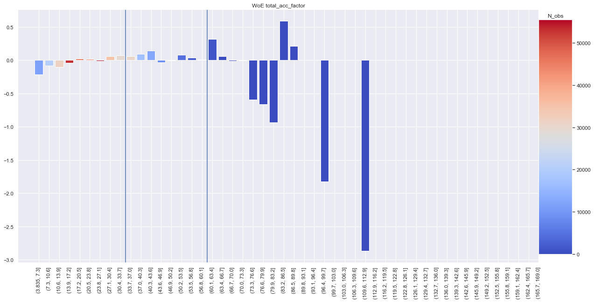


```python
fig, ax = plt.subplots(figsize=(20,8))

woe_df.set_index('total_acc_factor').iloc[:, [3,4]].plot(kind='bar', stacked=True, ax=ax)

plt.legend()
```


    <matplotlib.legend.Legend at 0x1a3d3c74e0>


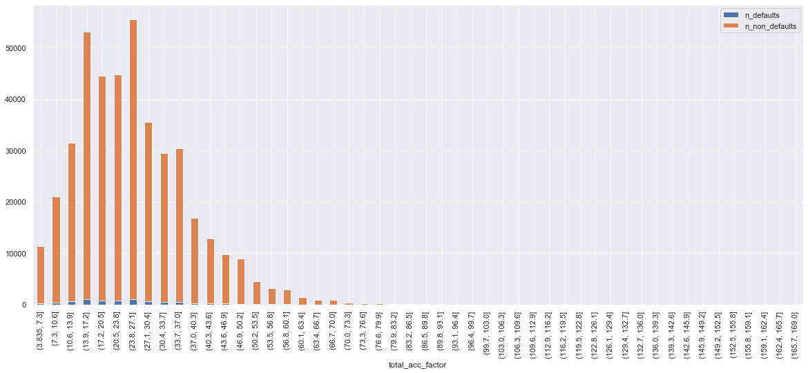


```python
x_train_prep['total_acc:<=27'] = np.where((x_train_prep['total_acc'] <= 27), 1, 0)
x_train_prep['total_acc:28_51'] = np.where((x_train_prep['total_acc'] >= 28) & (x_train_prep['total_acc'] <= 51), 1, 0)
x_train_prep['total_acc:>=52'] = np.where((x_train_prep['total_acc'] >= 52), 1, 0)
```


```python
fig, ax = plt.subplots(figsize=(20,8))

var_s = ['total_acc:<=27', 'total_acc:28_51', 'total_acc:>=52']

pd.concat([x_train_prep, y_train_prep], axis=1).groupby('Y').sum().loc[:, var_s].T.plot(kind='bar', stacked=True, ax=ax)

plt.legend()
```


    <matplotlib.legend.Legend at 0x1a1c128f60>


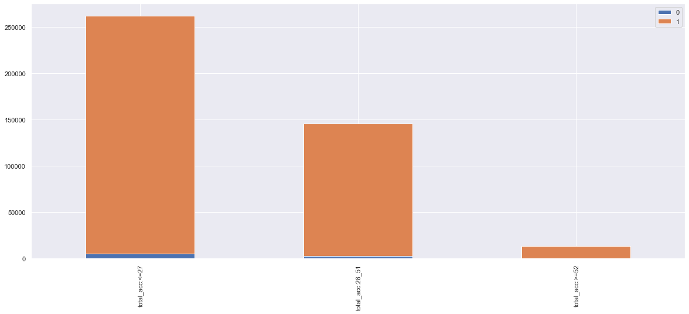

vars_to_use.append(['total_acc:28_51', 'total_acc:>=52'])

ref_vars.append(['total_acc:<=27'])
vars_to_use
### 'acc_now_delinq'


```python
print(x_train_prep['acc_now_delinq'].nunique())
x_train_prep['acc_now_delinq'].describe()
```

    8


    count    421094.000000
    mean          0.006087
    std           0.086482
    min           0.000000
    25%           0.000000
    50%           0.000000
    75%           0.000000
    max          14.000000
    Name: acc_now_delinq, dtype: float64


```python
woe_df = woe_ordered_continuous(x_train_prep, 'acc_now_delinq', y_train_prep, vlines=[0.5])
woe_df
```


<div>
<style scoped>
    .dataframe tbody tr th:only-of-type {
        vertical-align: middle;
    }

    .dataframe tbody tr th {
        vertical-align: top;
    }

    .dataframe thead th {
        text-align: right;
    }
</style>
<table border="1" class="dataframe">
  <thead>
    <tr style="text-align: right;">
      <th></th>
      <th>acc_now_delinq</th>
      <th>n_obs</th>
      <th>prop_non_defaults</th>
      <th>prop_n_obs</th>
      <th>n_defaults</th>
      <th>n_non_defaults</th>
      <th>prop_n_non_defaults</th>
      <th>prop_n_defaults</th>
      <th>WoE</th>
      <th>diff_prop_non_defaults</th>
      <th>diff_WoE</th>
      <th>IV</th>
    </tr>
  </thead>
  <tbody>
    <tr>
      <th>0</th>
      <td>0.0</td>
      <td>418712</td>
      <td>0.981424</td>
      <td>0.994343</td>
      <td>7778.0</td>
      <td>410934.0</td>
      <td>0.994412</td>
      <td>0.990702</td>
      <td>0.003738</td>
      <td>NaN</td>
      <td>NaN</td>
      <td>0.002538</td>
    </tr>
    <tr>
      <th>1</th>
      <td>1.0</td>
      <td>2243</td>
      <td>0.971021</td>
      <td>0.005327</td>
      <td>65.0</td>
      <td>2178.0</td>
      <td>0.005271</td>
      <td>0.008279</td>
      <td>-0.451620</td>
      <td>0.989142</td>
      <td>0.455358</td>
      <td>0.002538</td>
    </tr>
    <tr>
      <th>2</th>
      <td>2.0</td>
      <td>116</td>
      <td>0.939655</td>
      <td>0.000275</td>
      <td>7.0</td>
      <td>109.0</td>
      <td>0.000264</td>
      <td>0.000892</td>
      <td>-1.217957</td>
      <td>0.005007</td>
      <td>0.766337</td>
      <td>0.002538</td>
    </tr>
    <tr>
      <th>3</th>
      <td>3.0</td>
      <td>17</td>
      <td>1.000000</td>
      <td>0.000040</td>
      <td>0.0</td>
      <td>17.0</td>
      <td>0.000041</td>
      <td>0.000000</td>
      <td>NaN</td>
      <td>0.000223</td>
      <td>NaN</td>
      <td>0.002538</td>
    </tr>
    <tr>
      <th>4</th>
      <td>4.0</td>
      <td>3</td>
      <td>0.666667</td>
      <td>0.000007</td>
      <td>1.0</td>
      <td>2.0</td>
      <td>0.000005</td>
      <td>0.000127</td>
      <td>-3.270248</td>
      <td>0.000036</td>
      <td>NaN</td>
      <td>0.002538</td>
    </tr>
    <tr>
      <th>5</th>
      <td>5.0</td>
      <td>1</td>
      <td>1.000000</td>
      <td>0.000002</td>
      <td>0.0</td>
      <td>1.0</td>
      <td>0.000002</td>
      <td>0.000000</td>
      <td>NaN</td>
      <td>0.000002</td>
      <td>NaN</td>
      <td>0.002538</td>
    </tr>
    <tr>
      <th>6</th>
      <td>6.0</td>
      <td>1</td>
      <td>1.000000</td>
      <td>0.000002</td>
      <td>0.0</td>
      <td>1.0</td>
      <td>0.000002</td>
      <td>0.000000</td>
      <td>NaN</td>
      <td>0.000000</td>
      <td>NaN</td>
      <td>0.002538</td>
    </tr>
    <tr>
      <th>7</th>
      <td>14.0</td>
      <td>1</td>
      <td>1.000000</td>
      <td>0.000002</td>
      <td>0.0</td>
      <td>1.0</td>
      <td>0.000002</td>
      <td>0.000000</td>
      <td>NaN</td>
      <td>0.000000</td>
      <td>NaN</td>
      <td>0.002538</td>
    </tr>
  </tbody>
</table>
</div>


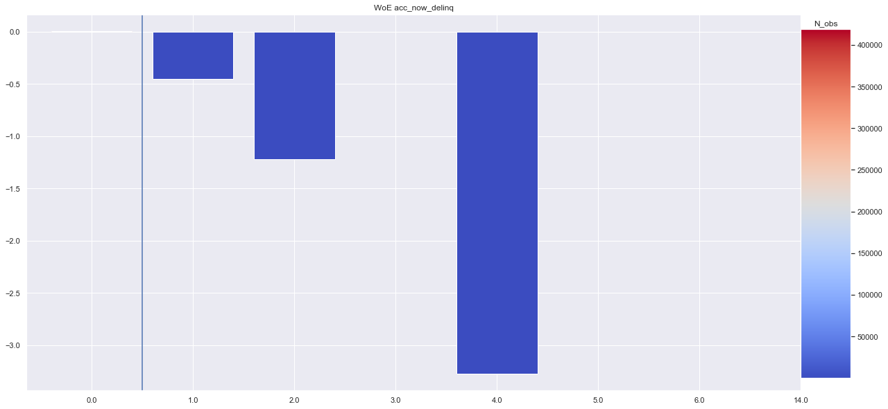


```python
fig, ax = plt.subplots(figsize=(20,8))

woe_df.set_index('acc_now_delinq').iloc[:, [3,4]].plot(kind='bar', stacked=True, ax=ax)

plt.legend()
```


    <matplotlib.legend.Legend at 0x1a1b0a72e8>


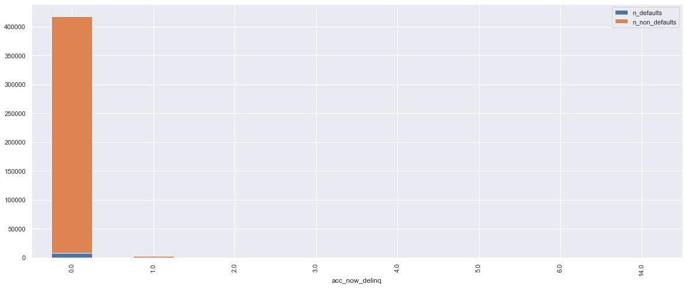


```python
x_train_prep['acc_now_delinq:0'] = np.where((x_train_prep['acc_now_delinq'] == 0), 1, 0)
x_train_prep['acc_now_delinq:>=1'] = np.where((x_train_prep['acc_now_delinq'] >= 1), 1, 0)
```


```python
fig, ax = plt.subplots(figsize=(20,8))

var_s = ['acc_now_delinq:0', 'acc_now_delinq:>=1']

pd.concat([x_train_prep, y_train_prep], axis=1).groupby('Y').sum().loc[:, var_s].T.plot(kind='bar', stacked=True, ax=ax)

plt.legend()
```


    <matplotlib.legend.Legend at 0x1a3d37bb70>


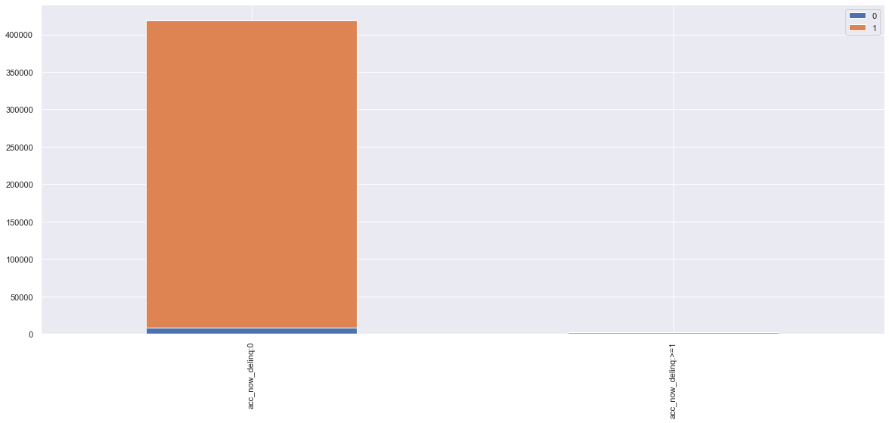

vars_to_use.append(['acc_now_delinq:0'])
ref_vars.append(['acc_now_delinq:>=1'])

vars_to_use
## total_rev_hi_lim


```python
print(x_train_prep['total_rev_hi_lim'].nunique())
x_train_prep['total_rev_hi_lim'].describe()
```

    10694


    count    4.210940e+05
    mean     3.365751e+04
    std      3.766386e+04
    min      0.000000e+00
    25%      1.440000e+04
    50%      2.460000e+04
    75%      4.167425e+04
    max      9.999999e+06
    Name: total_rev_hi_lim, dtype: float64


```python
x_train_prep['total_rev_hi_lim_factor'] = pd.cut(x_train_prep['total_rev_hi_lim'], 2000)

woe_df = woe_ordered_continuous(x_train_prep, 'total_rev_hi_lim_factor', y_train_prep, rot_x_ticks=90, plot_rows_start=0, plot_rows_end=50)
woe_df
```

    /Users/omaromeiri/anaconda3/lib/python3.7/site-packages/ipykernel_launcher.py:177: RuntimeWarning: divide by zero encountered in log


<div>
<style scoped>
    .dataframe tbody tr th:only-of-type {
        vertical-align: middle;
    }

    .dataframe tbody tr th {
        vertical-align: top;
    }

    .dataframe thead th {
        text-align: right;
    }
</style>
<table border="1" class="dataframe">
  <thead>
    <tr style="text-align: right;">
      <th></th>
      <th>total_rev_hi_lim_factor</th>
      <th>n_obs</th>
      <th>prop_non_defaults</th>
      <th>prop_n_obs</th>
      <th>n_defaults</th>
      <th>n_non_defaults</th>
      <th>prop_n_non_defaults</th>
      <th>prop_n_defaults</th>
      <th>WoE</th>
      <th>diff_prop_non_defaults</th>
      <th>diff_WoE</th>
      <th>IV</th>
    </tr>
  </thead>
  <tbody>
    <tr>
      <th>0</th>
      <td>(-9999.999, 5000.0]</td>
      <td>12981</td>
      <td>0.971266</td>
      <td>0.030827</td>
      <td>373.0</td>
      <td>12608.0</td>
      <td>0.030510</td>
      <td>0.047510</td>
      <td>-0.442886</td>
      <td>NaN</td>
      <td>NaN</td>
      <td>0.064952</td>
    </tr>
    <tr>
      <th>1</th>
      <td>(5000.0, 9999.999]</td>
      <td>42858</td>
      <td>0.974801</td>
      <td>0.101778</td>
      <td>1080.0</td>
      <td>41778.0</td>
      <td>0.101098</td>
      <td>0.137562</td>
      <td>-0.307986</td>
      <td>0.070588</td>
      <td>0.134900</td>
      <td>0.064952</td>
    </tr>
    <tr>
      <th>2</th>
      <td>(9999.999, 14999.998]</td>
      <td>56173</td>
      <td>0.977658</td>
      <td>0.133398</td>
      <td>1255.0</td>
      <td>54918.0</td>
      <td>0.132895</td>
      <td>0.159852</td>
      <td>-0.184689</td>
      <td>0.031797</td>
      <td>0.123297</td>
      <td>0.064952</td>
    </tr>
    <tr>
      <th>3</th>
      <td>(14999.998, 19999.998]</td>
      <td>54873</td>
      <td>0.979498</td>
      <td>0.130311</td>
      <td>1125.0</td>
      <td>53748.0</td>
      <td>0.130064</td>
      <td>0.143294</td>
      <td>-0.096871</td>
      <td>0.002831</td>
      <td>0.087818</td>
      <td>0.064952</td>
    </tr>
    <tr>
      <th>4</th>
      <td>(19999.998, 24999.997]</td>
      <td>46739</td>
      <td>0.981942</td>
      <td>0.110994</td>
      <td>844.0</td>
      <td>45895.0</td>
      <td>0.111061</td>
      <td>0.107502</td>
      <td>0.032564</td>
      <td>0.019003</td>
      <td>0.129436</td>
      <td>0.064952</td>
    </tr>
    <tr>
      <th>5</th>
      <td>(24999.997, 29999.997]</td>
      <td>38749</td>
      <td>0.981883</td>
      <td>0.092020</td>
      <td>702.0</td>
      <td>38047.0</td>
      <td>0.092069</td>
      <td>0.089415</td>
      <td>0.029249</td>
      <td>0.018991</td>
      <td>0.003315</td>
      <td>0.064952</td>
    </tr>
    <tr>
      <th>6</th>
      <td>(29999.997, 34999.996]</td>
      <td>31075</td>
      <td>0.983073</td>
      <td>0.073796</td>
      <td>526.0</td>
      <td>30549.0</td>
      <td>0.073925</td>
      <td>0.066998</td>
      <td>0.098391</td>
      <td>0.018144</td>
      <td>0.069142</td>
      <td>0.064952</td>
    </tr>
    <tr>
      <th>7</th>
      <td>(34999.996, 39999.996]</td>
      <td>24932</td>
      <td>0.982071</td>
      <td>0.059208</td>
      <td>447.0</td>
      <td>24485.0</td>
      <td>0.059251</td>
      <td>0.056935</td>
      <td>0.039862</td>
      <td>0.014674</td>
      <td>0.058529</td>
      <td>0.064952</td>
    </tr>
    <tr>
      <th>8</th>
      <td>(39999.996, 44999.996]</td>
      <td>20201</td>
      <td>0.983912</td>
      <td>0.047973</td>
      <td>325.0</td>
      <td>19876.0</td>
      <td>0.048098</td>
      <td>0.041396</td>
      <td>0.150048</td>
      <td>0.011153</td>
      <td>0.110186</td>
      <td>0.064952</td>
    </tr>
    <tr>
      <th>9</th>
      <td>(44999.996, 49999.995]</td>
      <td>16418</td>
      <td>0.986113</td>
      <td>0.038989</td>
      <td>228.0</td>
      <td>16190.0</td>
      <td>0.039178</td>
      <td>0.029041</td>
      <td>0.299409</td>
      <td>0.008920</td>
      <td>0.149360</td>
      <td>0.064952</td>
    </tr>
    <tr>
      <th>10</th>
      <td>(49999.995, 54999.994]</td>
      <td>13224</td>
      <td>0.985405</td>
      <td>0.031404</td>
      <td>193.0</td>
      <td>13031.0</td>
      <td>0.031534</td>
      <td>0.024583</td>
      <td>0.249001</td>
      <td>0.007644</td>
      <td>0.050407</td>
      <td>0.064952</td>
    </tr>
    <tr>
      <th>11</th>
      <td>(54999.994, 59999.994]</td>
      <td>10621</td>
      <td>0.987195</td>
      <td>0.025222</td>
      <td>136.0</td>
      <td>10485.0</td>
      <td>0.025372</td>
      <td>0.017323</td>
      <td>0.381651</td>
      <td>0.006161</td>
      <td>0.132650</td>
      <td>0.064952</td>
    </tr>
    <tr>
      <th>12</th>
      <td>(59999.994, 64999.994]</td>
      <td>8361</td>
      <td>0.987442</td>
      <td>0.019855</td>
      <td>105.0</td>
      <td>8256.0</td>
      <td>0.019979</td>
      <td>0.013374</td>
      <td>0.401340</td>
      <td>0.005394</td>
      <td>0.019689</td>
      <td>0.064952</td>
    </tr>
    <tr>
      <th>13</th>
      <td>(64999.994, 69999.993]</td>
      <td>6894</td>
      <td>0.986075</td>
      <td>0.016372</td>
      <td>96.0</td>
      <td>6798.0</td>
      <td>0.016450</td>
      <td>0.012228</td>
      <td>0.296641</td>
      <td>0.003528</td>
      <td>0.104700</td>
      <td>0.064952</td>
    </tr>
    <tr>
      <th>14</th>
      <td>(69999.993, 74999.992]</td>
      <td>5547</td>
      <td>0.986840</td>
      <td>0.013173</td>
      <td>73.0</td>
      <td>5474.0</td>
      <td>0.013246</td>
      <td>0.009298</td>
      <td>0.353911</td>
      <td>0.003204</td>
      <td>0.057270</td>
      <td>0.064952</td>
    </tr>
    <tr>
      <th>15</th>
      <td>(74999.992, 79999.992]</td>
      <td>4515</td>
      <td>0.987154</td>
      <td>0.010722</td>
      <td>58.0</td>
      <td>4457.0</td>
      <td>0.010785</td>
      <td>0.007388</td>
      <td>0.378393</td>
      <td>0.002461</td>
      <td>0.024483</td>
      <td>0.064952</td>
    </tr>
    <tr>
      <th>16</th>
      <td>(79999.992, 84999.992]</td>
      <td>3662</td>
      <td>0.990442</td>
      <td>0.008696</td>
      <td>35.0</td>
      <td>3627.0</td>
      <td>0.008777</td>
      <td>0.004458</td>
      <td>0.677418</td>
      <td>0.002009</td>
      <td>0.299025</td>
      <td>0.064952</td>
    </tr>
    <tr>
      <th>17</th>
      <td>(84999.992, 89999.991]</td>
      <td>3102</td>
      <td>0.990651</td>
      <td>0.007367</td>
      <td>29.0</td>
      <td>3073.0</td>
      <td>0.007436</td>
      <td>0.003694</td>
      <td>0.699719</td>
      <td>0.001341</td>
      <td>0.022301</td>
      <td>0.064952</td>
    </tr>
    <tr>
      <th>18</th>
      <td>(89999.991, 94999.99]</td>
      <td>2650</td>
      <td>0.986038</td>
      <td>0.006293</td>
      <td>37.0</td>
      <td>2613.0</td>
      <td>0.006323</td>
      <td>0.004713</td>
      <td>0.293941</td>
      <td>0.001113</td>
      <td>0.405777</td>
      <td>0.064952</td>
    </tr>
    <tr>
      <th>19</th>
      <td>(94999.99, 99999.99]</td>
      <td>2163</td>
      <td>0.992603</td>
      <td>0.005137</td>
      <td>16.0</td>
      <td>2147.0</td>
      <td>0.005195</td>
      <td>0.002038</td>
      <td>0.935843</td>
      <td>0.001128</td>
      <td>0.641902</td>
      <td>0.064952</td>
    </tr>
    <tr>
      <th>20</th>
      <td>(99999.99, 104999.99]</td>
      <td>1830</td>
      <td>0.990710</td>
      <td>0.004346</td>
      <td>17.0</td>
      <td>1813.0</td>
      <td>0.004387</td>
      <td>0.002165</td>
      <td>0.706130</td>
      <td>0.000808</td>
      <td>0.229713</td>
      <td>0.064952</td>
    </tr>
    <tr>
      <th>21</th>
      <td>(104999.99, 109999.989]</td>
      <td>1543</td>
      <td>0.988983</td>
      <td>0.003664</td>
      <td>17.0</td>
      <td>1526.0</td>
      <td>0.003693</td>
      <td>0.002165</td>
      <td>0.533797</td>
      <td>0.000695</td>
      <td>0.172333</td>
      <td>0.064952</td>
    </tr>
    <tr>
      <th>22</th>
      <td>(109999.989, 114999.988]</td>
      <td>1340</td>
      <td>0.984328</td>
      <td>0.003182</td>
      <td>21.0</td>
      <td>1319.0</td>
      <td>0.003192</td>
      <td>0.002675</td>
      <td>0.176712</td>
      <td>0.000501</td>
      <td>0.357085</td>
      <td>0.064952</td>
    </tr>
    <tr>
      <th>23</th>
      <td>(114999.988, 119999.988]</td>
      <td>1178</td>
      <td>0.991511</td>
      <td>0.002797</td>
      <td>10.0</td>
      <td>1168.0</td>
      <td>0.002826</td>
      <td>0.001274</td>
      <td>0.797068</td>
      <td>0.000365</td>
      <td>0.620356</td>
      <td>0.064952</td>
    </tr>
    <tr>
      <th>24</th>
      <td>(119999.988, 124999.988]</td>
      <td>961</td>
      <td>0.991675</td>
      <td>0.002282</td>
      <td>8.0</td>
      <td>953.0</td>
      <td>0.002306</td>
      <td>0.001019</td>
      <td>0.816778</td>
      <td>0.000520</td>
      <td>0.019710</td>
      <td>0.064952</td>
    </tr>
    <tr>
      <th>25</th>
      <td>(124999.988, 129999.987]</td>
      <td>816</td>
      <td>0.995098</td>
      <td>0.001938</td>
      <td>4.0</td>
      <td>812.0</td>
      <td>0.001965</td>
      <td>0.000509</td>
      <td>1.349811</td>
      <td>0.000341</td>
      <td>0.533033</td>
      <td>0.064952</td>
    </tr>
    <tr>
      <th>26</th>
      <td>(129999.987, 134999.986]</td>
      <td>780</td>
      <td>0.991026</td>
      <td>0.001852</td>
      <td>7.0</td>
      <td>773.0</td>
      <td>0.001871</td>
      <td>0.000892</td>
      <td>0.740974</td>
      <td>0.000094</td>
      <td>0.608837</td>
      <td>0.064952</td>
    </tr>
    <tr>
      <th>27</th>
      <td>(134999.986, 139999.986]</td>
      <td>633</td>
      <td>0.993681</td>
      <td>0.001503</td>
      <td>4.0</td>
      <td>629.0</td>
      <td>0.001522</td>
      <td>0.000509</td>
      <td>1.094442</td>
      <td>0.000348</td>
      <td>0.353468</td>
      <td>0.064952</td>
    </tr>
    <tr>
      <th>28</th>
      <td>(139999.986, 144999.986]</td>
      <td>531</td>
      <td>0.986817</td>
      <td>0.001261</td>
      <td>7.0</td>
      <td>524.0</td>
      <td>0.001268</td>
      <td>0.000892</td>
      <td>0.352187</td>
      <td>0.000254</td>
      <td>0.742255</td>
      <td>0.064952</td>
    </tr>
    <tr>
      <th>29</th>
      <td>(144999.986, 149999.985]</td>
      <td>468</td>
      <td>0.993590</td>
      <td>0.001111</td>
      <td>3.0</td>
      <td>465.0</td>
      <td>0.001125</td>
      <td>0.000382</td>
      <td>1.080030</td>
      <td>0.000143</td>
      <td>0.727844</td>
      <td>0.064952</td>
    </tr>
    <tr>
      <th>30</th>
      <td>(149999.985, 154999.984]</td>
      <td>420</td>
      <td>0.983333</td>
      <td>0.000997</td>
      <td>7.0</td>
      <td>413.0</td>
      <td>0.000999</td>
      <td>0.000892</td>
      <td>0.114143</td>
      <td>0.000126</td>
      <td>0.965888</td>
      <td>0.064952</td>
    </tr>
    <tr>
      <th>31</th>
      <td>(154999.984, 159999.984]</td>
      <td>404</td>
      <td>0.982673</td>
      <td>0.000959</td>
      <td>7.0</td>
      <td>397.0</td>
      <td>0.000961</td>
      <td>0.000892</td>
      <td>0.074631</td>
      <td>0.000039</td>
      <td>0.039511</td>
      <td>0.064952</td>
    </tr>
    <tr>
      <th>32</th>
      <td>(159999.984, 164999.984]</td>
      <td>361</td>
      <td>0.997230</td>
      <td>0.000857</td>
      <td>1.0</td>
      <td>360.0</td>
      <td>0.000871</td>
      <td>0.000127</td>
      <td>1.922709</td>
      <td>0.000090</td>
      <td>1.848078</td>
      <td>0.064952</td>
    </tr>
    <tr>
      <th>33</th>
      <td>(164999.984, 169999.983]</td>
      <td>336</td>
      <td>0.991071</td>
      <td>0.000798</td>
      <td>3.0</td>
      <td>333.0</td>
      <td>0.000806</td>
      <td>0.000382</td>
      <td>0.746135</td>
      <td>0.000065</td>
      <td>1.176574</td>
      <td>0.064952</td>
    </tr>
    <tr>
      <th>34</th>
      <td>(169999.983, 174999.982]</td>
      <td>283</td>
      <td>0.989399</td>
      <td>0.000672</td>
      <td>3.0</td>
      <td>280.0</td>
      <td>0.000678</td>
      <td>0.000382</td>
      <td>0.572782</td>
      <td>0.000128</td>
      <td>0.173353</td>
      <td>0.064952</td>
    </tr>
    <tr>
      <th>35</th>
      <td>(174999.982, 179999.982]</td>
      <td>242</td>
      <td>0.987603</td>
      <td>0.000575</td>
      <td>3.0</td>
      <td>239.0</td>
      <td>0.000578</td>
      <td>0.000382</td>
      <td>0.414456</td>
      <td>0.000099</td>
      <td>0.158326</td>
      <td>0.064952</td>
    </tr>
    <tr>
      <th>36</th>
      <td>(179999.982, 184999.982]</td>
      <td>237</td>
      <td>0.978903</td>
      <td>0.000563</td>
      <td>5.0</td>
      <td>232.0</td>
      <td>0.000561</td>
      <td>0.000637</td>
      <td>-0.126095</td>
      <td>0.000017</td>
      <td>0.540552</td>
      <td>0.064952</td>
    </tr>
    <tr>
      <th>37</th>
      <td>(184999.982, 189999.981]</td>
      <td>225</td>
      <td>0.977778</td>
      <td>0.000534</td>
      <td>5.0</td>
      <td>220.0</td>
      <td>0.000532</td>
      <td>0.000637</td>
      <td>-0.179205</td>
      <td>0.000029</td>
      <td>0.053110</td>
      <td>0.064952</td>
    </tr>
    <tr>
      <th>38</th>
      <td>(189999.981, 194999.98]</td>
      <td>175</td>
      <td>0.994286</td>
      <td>0.000416</td>
      <td>1.0</td>
      <td>174.0</td>
      <td>0.000421</td>
      <td>0.000127</td>
      <td>1.195660</td>
      <td>0.000111</td>
      <td>1.374866</td>
      <td>0.064952</td>
    </tr>
    <tr>
      <th>39</th>
      <td>(194999.98, 199999.98]</td>
      <td>166</td>
      <td>0.987952</td>
      <td>0.000394</td>
      <td>2.0</td>
      <td>164.0</td>
      <td>0.000397</td>
      <td>0.000255</td>
      <td>0.443324</td>
      <td>0.000024</td>
      <td>0.752336</td>
      <td>0.064952</td>
    </tr>
    <tr>
      <th>40</th>
      <td>(199999.98, 204999.98]</td>
      <td>167</td>
      <td>1.000000</td>
      <td>0.000397</td>
      <td>0.0</td>
      <td>167.0</td>
      <td>0.000404</td>
      <td>0.000000</td>
      <td>NaN</td>
      <td>0.000007</td>
      <td>NaN</td>
      <td>0.064952</td>
    </tr>
    <tr>
      <th>41</th>
      <td>(204999.98, 209999.979]</td>
      <td>152</td>
      <td>0.993421</td>
      <td>0.000361</td>
      <td>1.0</td>
      <td>151.0</td>
      <td>0.000365</td>
      <td>0.000127</td>
      <td>1.053885</td>
      <td>0.000039</td>
      <td>NaN</td>
      <td>0.064952</td>
    </tr>
    <tr>
      <th>42</th>
      <td>(209999.979, 214999.978]</td>
      <td>136</td>
      <td>0.977941</td>
      <td>0.000323</td>
      <td>3.0</td>
      <td>133.0</td>
      <td>0.000322</td>
      <td>0.000382</td>
      <td>-0.171658</td>
      <td>0.000044</td>
      <td>1.225543</td>
      <td>0.064952</td>
    </tr>
    <tr>
      <th>43</th>
      <td>(214999.978, 219999.978]</td>
      <td>127</td>
      <td>0.976378</td>
      <td>0.000302</td>
      <td>3.0</td>
      <td>124.0</td>
      <td>0.000300</td>
      <td>0.000382</td>
      <td>-0.241726</td>
      <td>0.000022</td>
      <td>0.070068</td>
      <td>0.064952</td>
    </tr>
    <tr>
      <th>44</th>
      <td>(219999.978, 224999.978]</td>
      <td>129</td>
      <td>0.992248</td>
      <td>0.000306</td>
      <td>1.0</td>
      <td>128.0</td>
      <td>0.000310</td>
      <td>0.000127</td>
      <td>0.888635</td>
      <td>0.000010</td>
      <td>1.130361</td>
      <td>0.064952</td>
    </tr>
    <tr>
      <th>45</th>
      <td>(224999.978, 229999.977]</td>
      <td>105</td>
      <td>0.990476</td>
      <td>0.000249</td>
      <td>1.0</td>
      <td>104.0</td>
      <td>0.000252</td>
      <td>0.000127</td>
      <td>0.680996</td>
      <td>0.000058</td>
      <td>0.207639</td>
      <td>0.064952</td>
    </tr>
    <tr>
      <th>46</th>
      <td>(229999.977, 234999.976]</td>
      <td>120</td>
      <td>0.991667</td>
      <td>0.000285</td>
      <td>1.0</td>
      <td>119.0</td>
      <td>0.000288</td>
      <td>0.000127</td>
      <td>0.815729</td>
      <td>0.000036</td>
      <td>0.134733</td>
      <td>0.064952</td>
    </tr>
    <tr>
      <th>47</th>
      <td>(234999.976, 239999.976]</td>
      <td>86</td>
      <td>1.000000</td>
      <td>0.000204</td>
      <td>0.0</td>
      <td>86.0</td>
      <td>0.000208</td>
      <td>0.000000</td>
      <td>NaN</td>
      <td>0.000080</td>
      <td>NaN</td>
      <td>0.064952</td>
    </tr>
    <tr>
      <th>48</th>
      <td>(239999.976, 244999.976]</td>
      <td>84</td>
      <td>1.000000</td>
      <td>0.000199</td>
      <td>0.0</td>
      <td>84.0</td>
      <td>0.000203</td>
      <td>0.000000</td>
      <td>NaN</td>
      <td>0.000005</td>
      <td>NaN</td>
      <td>0.064952</td>
    </tr>
    <tr>
      <th>49</th>
      <td>(244999.976, 249999.975]</td>
      <td>57</td>
      <td>0.982456</td>
      <td>0.000135</td>
      <td>1.0</td>
      <td>56.0</td>
      <td>0.000136</td>
      <td>0.000127</td>
      <td>0.061957</td>
      <td>0.000068</td>
      <td>NaN</td>
      <td>0.064952</td>
    </tr>
    <tr>
      <th>50</th>
      <td>(249999.975, 254999.974]</td>
      <td>61</td>
      <td>0.983607</td>
      <td>0.000145</td>
      <td>1.0</td>
      <td>60.0</td>
      <td>0.000145</td>
      <td>0.000127</td>
      <td>0.130950</td>
      <td>0.000010</td>
      <td>0.068993</td>
      <td>0.064952</td>
    </tr>
    <tr>
      <th>51</th>
      <td>(254999.974, 259999.974]</td>
      <td>64</td>
      <td>0.953125</td>
      <td>0.000152</td>
      <td>3.0</td>
      <td>61.0</td>
      <td>0.000148</td>
      <td>0.000382</td>
      <td>-0.951133</td>
      <td>0.000002</td>
      <td>1.082083</td>
      <td>0.064952</td>
    </tr>
    <tr>
      <th>52</th>
      <td>(259999.974, 264999.974]</td>
      <td>68</td>
      <td>0.985294</td>
      <td>0.000161</td>
      <td>1.0</td>
      <td>67.0</td>
      <td>0.000162</td>
      <td>0.000127</td>
      <td>0.241298</td>
      <td>0.000015</td>
      <td>1.192431</td>
      <td>0.064952</td>
    </tr>
    <tr>
      <th>53</th>
      <td>(264999.974, 269999.973]</td>
      <td>57</td>
      <td>0.982456</td>
      <td>0.000135</td>
      <td>1.0</td>
      <td>56.0</td>
      <td>0.000136</td>
      <td>0.000127</td>
      <td>0.061957</td>
      <td>0.000027</td>
      <td>0.179341</td>
      <td>0.064952</td>
    </tr>
    <tr>
      <th>54</th>
      <td>(269999.973, 274999.972]</td>
      <td>52</td>
      <td>1.000000</td>
      <td>0.000123</td>
      <td>0.0</td>
      <td>52.0</td>
      <td>0.000126</td>
      <td>0.000000</td>
      <td>NaN</td>
      <td>0.000010</td>
      <td>NaN</td>
      <td>0.064952</td>
    </tr>
    <tr>
      <th>55</th>
      <td>(274999.972, 279999.972]</td>
      <td>47</td>
      <td>1.000000</td>
      <td>0.000112</td>
      <td>0.0</td>
      <td>47.0</td>
      <td>0.000114</td>
      <td>0.000000</td>
      <td>NaN</td>
      <td>0.000012</td>
      <td>NaN</td>
      <td>0.064952</td>
    </tr>
    <tr>
      <th>56</th>
      <td>(279999.972, 284999.972]</td>
      <td>56</td>
      <td>1.000000</td>
      <td>0.000133</td>
      <td>0.0</td>
      <td>56.0</td>
      <td>0.000136</td>
      <td>0.000000</td>
      <td>NaN</td>
      <td>0.000022</td>
      <td>NaN</td>
      <td>0.064952</td>
    </tr>
    <tr>
      <th>57</th>
      <td>(284999.972, 289999.971]</td>
      <td>38</td>
      <td>0.947368</td>
      <td>0.000090</td>
      <td>2.0</td>
      <td>36.0</td>
      <td>0.000087</td>
      <td>0.000255</td>
      <td>-1.073023</td>
      <td>0.000048</td>
      <td>NaN</td>
      <td>0.064952</td>
    </tr>
    <tr>
      <th>58</th>
      <td>(289999.971, 294999.97]</td>
      <td>38</td>
      <td>0.973684</td>
      <td>0.000090</td>
      <td>1.0</td>
      <td>37.0</td>
      <td>0.000090</td>
      <td>0.000127</td>
      <td>-0.352477</td>
      <td>0.000002</td>
      <td>0.720546</td>
      <td>0.064952</td>
    </tr>
    <tr>
      <th>59</th>
      <td>(294999.97, 299999.97]</td>
      <td>33</td>
      <td>0.969697</td>
      <td>0.000078</td>
      <td>1.0</td>
      <td>32.0</td>
      <td>0.000077</td>
      <td>0.000127</td>
      <td>-0.497659</td>
      <td>0.000012</td>
      <td>0.145182</td>
      <td>0.064952</td>
    </tr>
    <tr>
      <th>60</th>
      <td>(299999.97, 304999.97]</td>
      <td>45</td>
      <td>0.955556</td>
      <td>0.000107</td>
      <td>2.0</td>
      <td>43.0</td>
      <td>0.000104</td>
      <td>0.000255</td>
      <td>-0.895342</td>
      <td>0.000027</td>
      <td>0.397683</td>
      <td>0.064952</td>
    </tr>
    <tr>
      <th>61</th>
      <td>(304999.97, 309999.969]</td>
      <td>30</td>
      <td>1.000000</td>
      <td>0.000071</td>
      <td>0.0</td>
      <td>30.0</td>
      <td>0.000073</td>
      <td>0.000000</td>
      <td>NaN</td>
      <td>0.000031</td>
      <td>NaN</td>
      <td>0.064952</td>
    </tr>
    <tr>
      <th>62</th>
      <td>(309999.969, 314999.968]</td>
      <td>33</td>
      <td>1.000000</td>
      <td>0.000078</td>
      <td>0.0</td>
      <td>33.0</td>
      <td>0.000080</td>
      <td>0.000000</td>
      <td>NaN</td>
      <td>0.000007</td>
      <td>NaN</td>
      <td>0.064952</td>
    </tr>
    <tr>
      <th>63</th>
      <td>(314999.968, 319999.968]</td>
      <td>26</td>
      <td>1.000000</td>
      <td>0.000062</td>
      <td>0.0</td>
      <td>26.0</td>
      <td>0.000063</td>
      <td>0.000000</td>
      <td>NaN</td>
      <td>0.000017</td>
      <td>NaN</td>
      <td>0.064952</td>
    </tr>
    <tr>
      <th>64</th>
      <td>(319999.968, 324999.967]</td>
      <td>31</td>
      <td>1.000000</td>
      <td>0.000074</td>
      <td>0.0</td>
      <td>31.0</td>
      <td>0.000075</td>
      <td>0.000000</td>
      <td>NaN</td>
      <td>0.000012</td>
      <td>NaN</td>
      <td>0.064952</td>
    </tr>
    <tr>
      <th>65</th>
      <td>(324999.967, 329999.967]</td>
      <td>42</td>
      <td>1.000000</td>
      <td>0.000100</td>
      <td>0.0</td>
      <td>42.0</td>
      <td>0.000102</td>
      <td>0.000000</td>
      <td>NaN</td>
      <td>0.000027</td>
      <td>NaN</td>
      <td>0.064952</td>
    </tr>
    <tr>
      <th>66</th>
      <td>(329999.967, 334999.966]</td>
      <td>27</td>
      <td>1.000000</td>
      <td>0.000064</td>
      <td>0.0</td>
      <td>27.0</td>
      <td>0.000065</td>
      <td>0.000000</td>
      <td>NaN</td>
      <td>0.000036</td>
      <td>NaN</td>
      <td>0.064952</td>
    </tr>
    <tr>
      <th>67</th>
      <td>(334999.966, 339999.966]</td>
      <td>25</td>
      <td>0.960000</td>
      <td>0.000059</td>
      <td>1.0</td>
      <td>24.0</td>
      <td>0.000058</td>
      <td>0.000127</td>
      <td>-0.785341</td>
      <td>0.000007</td>
      <td>NaN</td>
      <td>0.064952</td>
    </tr>
    <tr>
      <th>68</th>
      <td>(339999.966, 344999.966]</td>
      <td>20</td>
      <td>1.000000</td>
      <td>0.000047</td>
      <td>0.0</td>
      <td>20.0</td>
      <td>0.000048</td>
      <td>0.000000</td>
      <td>NaN</td>
      <td>0.000010</td>
      <td>NaN</td>
      <td>0.064952</td>
    </tr>
    <tr>
      <th>69</th>
      <td>(344999.966, 349999.965]</td>
      <td>20</td>
      <td>1.000000</td>
      <td>0.000047</td>
      <td>0.0</td>
      <td>20.0</td>
      <td>0.000048</td>
      <td>0.000000</td>
      <td>NaN</td>
      <td>0.000000</td>
      <td>NaN</td>
      <td>0.064952</td>
    </tr>
    <tr>
      <th>70</th>
      <td>(349999.965, 354999.964]</td>
      <td>25</td>
      <td>0.960000</td>
      <td>0.000059</td>
      <td>1.0</td>
      <td>24.0</td>
      <td>0.000058</td>
      <td>0.000127</td>
      <td>-0.785341</td>
      <td>0.000010</td>
      <td>NaN</td>
      <td>0.064952</td>
    </tr>
    <tr>
      <th>71</th>
      <td>(354999.964, 359999.964]</td>
      <td>25</td>
      <td>0.960000</td>
      <td>0.000059</td>
      <td>1.0</td>
      <td>24.0</td>
      <td>0.000058</td>
      <td>0.000127</td>
      <td>-0.785341</td>
      <td>0.000000</td>
      <td>0.000000</td>
      <td>0.064952</td>
    </tr>
    <tr>
      <th>72</th>
      <td>(359999.964, 364999.964]</td>
      <td>23</td>
      <td>1.000000</td>
      <td>0.000055</td>
      <td>0.0</td>
      <td>23.0</td>
      <td>0.000056</td>
      <td>0.000000</td>
      <td>NaN</td>
      <td>0.000002</td>
      <td>NaN</td>
      <td>0.064952</td>
    </tr>
    <tr>
      <th>73</th>
      <td>(364999.964, 369999.963]</td>
      <td>15</td>
      <td>1.000000</td>
      <td>0.000036</td>
      <td>0.0</td>
      <td>15.0</td>
      <td>0.000036</td>
      <td>0.000000</td>
      <td>NaN</td>
      <td>0.000019</td>
      <td>NaN</td>
      <td>0.064952</td>
    </tr>
    <tr>
      <th>74</th>
      <td>(369999.963, 374999.962]</td>
      <td>19</td>
      <td>1.000000</td>
      <td>0.000045</td>
      <td>0.0</td>
      <td>19.0</td>
      <td>0.000046</td>
      <td>0.000000</td>
      <td>NaN</td>
      <td>0.000010</td>
      <td>NaN</td>
      <td>0.064952</td>
    </tr>
    <tr>
      <th>75</th>
      <td>(374999.962, 379999.962]</td>
      <td>14</td>
      <td>0.928571</td>
      <td>0.000033</td>
      <td>1.0</td>
      <td>13.0</td>
      <td>0.000031</td>
      <td>0.000127</td>
      <td>-1.398446</td>
      <td>0.000015</td>
      <td>NaN</td>
      <td>0.064952</td>
    </tr>
    <tr>
      <th>76</th>
      <td>(379999.962, 384999.962]</td>
      <td>12</td>
      <td>1.000000</td>
      <td>0.000028</td>
      <td>0.0</td>
      <td>12.0</td>
      <td>0.000029</td>
      <td>0.000000</td>
      <td>NaN</td>
      <td>0.000002</td>
      <td>NaN</td>
      <td>0.064952</td>
    </tr>
    <tr>
      <th>77</th>
      <td>(384999.962, 389999.961]</td>
      <td>14</td>
      <td>1.000000</td>
      <td>0.000033</td>
      <td>0.0</td>
      <td>14.0</td>
      <td>0.000034</td>
      <td>0.000000</td>
      <td>NaN</td>
      <td>0.000005</td>
      <td>NaN</td>
      <td>0.064952</td>
    </tr>
    <tr>
      <th>78</th>
      <td>(389999.961, 394999.96]</td>
      <td>10</td>
      <td>1.000000</td>
      <td>0.000024</td>
      <td>0.0</td>
      <td>10.0</td>
      <td>0.000024</td>
      <td>0.000000</td>
      <td>NaN</td>
      <td>0.000010</td>
      <td>NaN</td>
      <td>0.064952</td>
    </tr>
    <tr>
      <th>79</th>
      <td>(394999.96, 399999.96]</td>
      <td>10</td>
      <td>1.000000</td>
      <td>0.000024</td>
      <td>0.0</td>
      <td>10.0</td>
      <td>0.000024</td>
      <td>0.000000</td>
      <td>NaN</td>
      <td>0.000000</td>
      <td>NaN</td>
      <td>0.064952</td>
    </tr>
    <tr>
      <th>80</th>
      <td>(399999.96, 404999.96]</td>
      <td>7</td>
      <td>1.000000</td>
      <td>0.000017</td>
      <td>0.0</td>
      <td>7.0</td>
      <td>0.000017</td>
      <td>0.000000</td>
      <td>NaN</td>
      <td>0.000007</td>
      <td>NaN</td>
      <td>0.064952</td>
    </tr>
    <tr>
      <th>81</th>
      <td>(404999.96, 409999.959]</td>
      <td>11</td>
      <td>1.000000</td>
      <td>0.000026</td>
      <td>0.0</td>
      <td>11.0</td>
      <td>0.000027</td>
      <td>0.000000</td>
      <td>NaN</td>
      <td>0.000010</td>
      <td>NaN</td>
      <td>0.064952</td>
    </tr>
    <tr>
      <th>82</th>
      <td>(409999.959, 414999.958]</td>
      <td>14</td>
      <td>1.000000</td>
      <td>0.000033</td>
      <td>0.0</td>
      <td>14.0</td>
      <td>0.000034</td>
      <td>0.000000</td>
      <td>NaN</td>
      <td>0.000007</td>
      <td>NaN</td>
      <td>0.064952</td>
    </tr>
    <tr>
      <th>83</th>
      <td>(414999.958, 419999.958]</td>
      <td>9</td>
      <td>0.888889</td>
      <td>0.000021</td>
      <td>1.0</td>
      <td>8.0</td>
      <td>0.000019</td>
      <td>0.000127</td>
      <td>-1.883953</td>
      <td>0.000015</td>
      <td>NaN</td>
      <td>0.064952</td>
    </tr>
    <tr>
      <th>84</th>
      <td>(419999.958, 424999.958]</td>
      <td>12</td>
      <td>1.000000</td>
      <td>0.000028</td>
      <td>0.0</td>
      <td>12.0</td>
      <td>0.000029</td>
      <td>0.000000</td>
      <td>NaN</td>
      <td>0.000010</td>
      <td>NaN</td>
      <td>0.064952</td>
    </tr>
    <tr>
      <th>85</th>
      <td>(424999.958, 429999.957]</td>
      <td>12</td>
      <td>1.000000</td>
      <td>0.000028</td>
      <td>0.0</td>
      <td>12.0</td>
      <td>0.000029</td>
      <td>0.000000</td>
      <td>NaN</td>
      <td>0.000000</td>
      <td>NaN</td>
      <td>0.064952</td>
    </tr>
    <tr>
      <th>86</th>
      <td>(429999.957, 434999.956]</td>
      <td>7</td>
      <td>1.000000</td>
      <td>0.000017</td>
      <td>0.0</td>
      <td>7.0</td>
      <td>0.000017</td>
      <td>0.000000</td>
      <td>NaN</td>
      <td>0.000012</td>
      <td>NaN</td>
      <td>0.064952</td>
    </tr>
    <tr>
      <th>87</th>
      <td>(434999.956, 439999.956]</td>
      <td>9</td>
      <td>1.000000</td>
      <td>0.000021</td>
      <td>0.0</td>
      <td>9.0</td>
      <td>0.000022</td>
      <td>0.000000</td>
      <td>NaN</td>
      <td>0.000005</td>
      <td>NaN</td>
      <td>0.064952</td>
    </tr>
    <tr>
      <th>88</th>
      <td>(439999.956, 444999.956]</td>
      <td>7</td>
      <td>0.857143</td>
      <td>0.000017</td>
      <td>1.0</td>
      <td>6.0</td>
      <td>0.000015</td>
      <td>0.000127</td>
      <td>-2.171635</td>
      <td>0.000007</td>
      <td>NaN</td>
      <td>0.064952</td>
    </tr>
    <tr>
      <th>89</th>
      <td>(444999.956, 449999.955]</td>
      <td>7</td>
      <td>1.000000</td>
      <td>0.000017</td>
      <td>0.0</td>
      <td>7.0</td>
      <td>0.000017</td>
      <td>0.000000</td>
      <td>NaN</td>
      <td>0.000002</td>
      <td>NaN</td>
      <td>0.064952</td>
    </tr>
    <tr>
      <th>90</th>
      <td>(449999.955, 454999.954]</td>
      <td>8</td>
      <td>1.000000</td>
      <td>0.000019</td>
      <td>0.0</td>
      <td>8.0</td>
      <td>0.000019</td>
      <td>0.000000</td>
      <td>NaN</td>
      <td>0.000002</td>
      <td>NaN</td>
      <td>0.064952</td>
    </tr>
    <tr>
      <th>91</th>
      <td>(454999.954, 459999.954]</td>
      <td>5</td>
      <td>1.000000</td>
      <td>0.000012</td>
      <td>0.0</td>
      <td>5.0</td>
      <td>0.000012</td>
      <td>0.000000</td>
      <td>NaN</td>
      <td>0.000007</td>
      <td>NaN</td>
      <td>0.064952</td>
    </tr>
    <tr>
      <th>92</th>
      <td>(459999.954, 464999.954]</td>
      <td>6</td>
      <td>1.000000</td>
      <td>0.000014</td>
      <td>0.0</td>
      <td>6.0</td>
      <td>0.000015</td>
      <td>0.000000</td>
      <td>NaN</td>
      <td>0.000002</td>
      <td>NaN</td>
      <td>0.064952</td>
    </tr>
    <tr>
      <th>93</th>
      <td>(464999.954, 469999.953]</td>
      <td>9</td>
      <td>1.000000</td>
      <td>0.000021</td>
      <td>0.0</td>
      <td>9.0</td>
      <td>0.000022</td>
      <td>0.000000</td>
      <td>NaN</td>
      <td>0.000007</td>
      <td>NaN</td>
      <td>0.064952</td>
    </tr>
    <tr>
      <th>94</th>
      <td>(469999.953, 474999.952]</td>
      <td>4</td>
      <td>1.000000</td>
      <td>0.000009</td>
      <td>0.0</td>
      <td>4.0</td>
      <td>0.000010</td>
      <td>0.000000</td>
      <td>NaN</td>
      <td>0.000012</td>
      <td>NaN</td>
      <td>0.064952</td>
    </tr>
    <tr>
      <th>95</th>
      <td>(474999.952, 479999.952]</td>
      <td>6</td>
      <td>0.833333</td>
      <td>0.000014</td>
      <td>1.0</td>
      <td>5.0</td>
      <td>0.000012</td>
      <td>0.000127</td>
      <td>-2.353957</td>
      <td>0.000002</td>
      <td>NaN</td>
      <td>0.064952</td>
    </tr>
    <tr>
      <th>96</th>
      <td>(479999.952, 484999.951]</td>
      <td>3</td>
      <td>1.000000</td>
      <td>0.000007</td>
      <td>0.0</td>
      <td>3.0</td>
      <td>0.000007</td>
      <td>0.000000</td>
      <td>NaN</td>
      <td>0.000005</td>
      <td>NaN</td>
      <td>0.064952</td>
    </tr>
    <tr>
      <th>97</th>
      <td>(484999.951, 489999.951]</td>
      <td>4</td>
      <td>0.750000</td>
      <td>0.000009</td>
      <td>1.0</td>
      <td>3.0</td>
      <td>0.000007</td>
      <td>0.000127</td>
      <td>-2.864783</td>
      <td>0.000000</td>
      <td>NaN</td>
      <td>0.064952</td>
    </tr>
    <tr>
      <th>98</th>
      <td>(489999.951, 494999.95]</td>
      <td>3</td>
      <td>1.000000</td>
      <td>0.000007</td>
      <td>0.0</td>
      <td>3.0</td>
      <td>0.000007</td>
      <td>0.000000</td>
      <td>NaN</td>
      <td>0.000000</td>
      <td>NaN</td>
      <td>0.064952</td>
    </tr>
    <tr>
      <th>99</th>
      <td>(494999.95, 499999.95]</td>
      <td>3</td>
      <td>1.000000</td>
      <td>0.000007</td>
      <td>0.0</td>
      <td>3.0</td>
      <td>0.000007</td>
      <td>0.000000</td>
      <td>NaN</td>
      <td>0.000000</td>
      <td>NaN</td>
      <td>0.064952</td>
    </tr>
    <tr>
      <th>100</th>
      <td>(499999.95, 504999.95]</td>
      <td>4</td>
      <td>1.000000</td>
      <td>0.000009</td>
      <td>0.0</td>
      <td>4.0</td>
      <td>0.000010</td>
      <td>0.000000</td>
      <td>NaN</td>
      <td>0.000002</td>
      <td>NaN</td>
      <td>0.064952</td>
    </tr>
    <tr>
      <th>101</th>
      <td>(504999.95, 509999.949]</td>
      <td>2</td>
      <td>1.000000</td>
      <td>0.000005</td>
      <td>0.0</td>
      <td>2.0</td>
      <td>0.000005</td>
      <td>0.000000</td>
      <td>NaN</td>
      <td>0.000005</td>
      <td>NaN</td>
      <td>0.064952</td>
    </tr>
    <tr>
      <th>102</th>
      <td>(509999.949, 514999.948]</td>
      <td>8</td>
      <td>1.000000</td>
      <td>0.000019</td>
      <td>0.0</td>
      <td>8.0</td>
      <td>0.000019</td>
      <td>0.000000</td>
      <td>NaN</td>
      <td>0.000015</td>
      <td>NaN</td>
      <td>0.064952</td>
    </tr>
    <tr>
      <th>103</th>
      <td>(514999.948, 519999.948]</td>
      <td>3</td>
      <td>1.000000</td>
      <td>0.000007</td>
      <td>0.0</td>
      <td>3.0</td>
      <td>0.000007</td>
      <td>0.000000</td>
      <td>NaN</td>
      <td>0.000012</td>
      <td>NaN</td>
      <td>0.064952</td>
    </tr>
    <tr>
      <th>104</th>
      <td>(519999.948, 524999.948]</td>
      <td>4</td>
      <td>1.000000</td>
      <td>0.000009</td>
      <td>0.0</td>
      <td>4.0</td>
      <td>0.000010</td>
      <td>0.000000</td>
      <td>NaN</td>
      <td>0.000002</td>
      <td>NaN</td>
      <td>0.064952</td>
    </tr>
    <tr>
      <th>105</th>
      <td>(524999.948, 529999.947]</td>
      <td>5</td>
      <td>1.000000</td>
      <td>0.000012</td>
      <td>0.0</td>
      <td>5.0</td>
      <td>0.000012</td>
      <td>0.000000</td>
      <td>NaN</td>
      <td>0.000002</td>
      <td>NaN</td>
      <td>0.064952</td>
    </tr>
    <tr>
      <th>106</th>
      <td>(529999.947, 534999.946]</td>
      <td>5</td>
      <td>1.000000</td>
      <td>0.000012</td>
      <td>0.0</td>
      <td>5.0</td>
      <td>0.000012</td>
      <td>0.000000</td>
      <td>NaN</td>
      <td>0.000000</td>
      <td>NaN</td>
      <td>0.064952</td>
    </tr>
    <tr>
      <th>107</th>
      <td>(534999.946, 539999.946]</td>
      <td>2</td>
      <td>1.000000</td>
      <td>0.000005</td>
      <td>0.0</td>
      <td>2.0</td>
      <td>0.000005</td>
      <td>0.000000</td>
      <td>NaN</td>
      <td>0.000007</td>
      <td>NaN</td>
      <td>0.064952</td>
    </tr>
    <tr>
      <th>108</th>
      <td>(539999.946, 544999.946]</td>
      <td>5</td>
      <td>1.000000</td>
      <td>0.000012</td>
      <td>0.0</td>
      <td>5.0</td>
      <td>0.000012</td>
      <td>0.000000</td>
      <td>NaN</td>
      <td>0.000007</td>
      <td>NaN</td>
      <td>0.064952</td>
    </tr>
    <tr>
      <th>109</th>
      <td>(544999.946, 549999.945]</td>
      <td>2</td>
      <td>1.000000</td>
      <td>0.000005</td>
      <td>0.0</td>
      <td>2.0</td>
      <td>0.000005</td>
      <td>0.000000</td>
      <td>NaN</td>
      <td>0.000007</td>
      <td>NaN</td>
      <td>0.064952</td>
    </tr>
    <tr>
      <th>110</th>
      <td>(549999.945, 554999.944]</td>
      <td>1</td>
      <td>1.000000</td>
      <td>0.000002</td>
      <td>0.0</td>
      <td>1.0</td>
      <td>0.000002</td>
      <td>0.000000</td>
      <td>NaN</td>
      <td>0.000002</td>
      <td>NaN</td>
      <td>0.064952</td>
    </tr>
    <tr>
      <th>111</th>
      <td>(554999.944, 559999.944]</td>
      <td>4</td>
      <td>1.000000</td>
      <td>0.000009</td>
      <td>0.0</td>
      <td>4.0</td>
      <td>0.000010</td>
      <td>0.000000</td>
      <td>NaN</td>
      <td>0.000007</td>
      <td>NaN</td>
      <td>0.064952</td>
    </tr>
    <tr>
      <th>112</th>
      <td>(559999.944, 564999.943]</td>
      <td>4</td>
      <td>1.000000</td>
      <td>0.000009</td>
      <td>0.0</td>
      <td>4.0</td>
      <td>0.000010</td>
      <td>0.000000</td>
      <td>NaN</td>
      <td>0.000000</td>
      <td>NaN</td>
      <td>0.064952</td>
    </tr>
    <tr>
      <th>113</th>
      <td>(564999.943, 569999.943]</td>
      <td>4</td>
      <td>1.000000</td>
      <td>0.000009</td>
      <td>0.0</td>
      <td>4.0</td>
      <td>0.000010</td>
      <td>0.000000</td>
      <td>NaN</td>
      <td>0.000000</td>
      <td>NaN</td>
      <td>0.064952</td>
    </tr>
    <tr>
      <th>114</th>
      <td>(569999.943, 574999.942]</td>
      <td>6</td>
      <td>1.000000</td>
      <td>0.000014</td>
      <td>0.0</td>
      <td>6.0</td>
      <td>0.000015</td>
      <td>0.000000</td>
      <td>NaN</td>
      <td>0.000005</td>
      <td>NaN</td>
      <td>0.064952</td>
    </tr>
    <tr>
      <th>115</th>
      <td>(574999.942, 579999.942]</td>
      <td>2</td>
      <td>1.000000</td>
      <td>0.000005</td>
      <td>0.0</td>
      <td>2.0</td>
      <td>0.000005</td>
      <td>0.000000</td>
      <td>NaN</td>
      <td>0.000010</td>
      <td>NaN</td>
      <td>0.064952</td>
    </tr>
    <tr>
      <th>116</th>
      <td>(579999.942, 584999.942]</td>
      <td>3</td>
      <td>1.000000</td>
      <td>0.000007</td>
      <td>0.0</td>
      <td>3.0</td>
      <td>0.000007</td>
      <td>0.000000</td>
      <td>NaN</td>
      <td>0.000002</td>
      <td>NaN</td>
      <td>0.064952</td>
    </tr>
    <tr>
      <th>117</th>
      <td>(584999.942, 589999.941]</td>
      <td>2</td>
      <td>1.000000</td>
      <td>0.000005</td>
      <td>0.0</td>
      <td>2.0</td>
      <td>0.000005</td>
      <td>0.000000</td>
      <td>NaN</td>
      <td>0.000002</td>
      <td>NaN</td>
      <td>0.064952</td>
    </tr>
    <tr>
      <th>118</th>
      <td>(589999.941, 594999.94]</td>
      <td>4</td>
      <td>1.000000</td>
      <td>0.000009</td>
      <td>0.0</td>
      <td>4.0</td>
      <td>0.000010</td>
      <td>0.000000</td>
      <td>NaN</td>
      <td>0.000005</td>
      <td>NaN</td>
      <td>0.064952</td>
    </tr>
    <tr>
      <th>119</th>
      <td>(594999.94, 599999.94]</td>
      <td>1</td>
      <td>1.000000</td>
      <td>0.000002</td>
      <td>0.0</td>
      <td>1.0</td>
      <td>0.000002</td>
      <td>0.000000</td>
      <td>NaN</td>
      <td>0.000007</td>
      <td>NaN</td>
      <td>0.064952</td>
    </tr>
    <tr>
      <th>120</th>
      <td>(599999.94, 604999.94]</td>
      <td>2</td>
      <td>1.000000</td>
      <td>0.000005</td>
      <td>0.0</td>
      <td>2.0</td>
      <td>0.000005</td>
      <td>0.000000</td>
      <td>NaN</td>
      <td>0.000002</td>
      <td>NaN</td>
      <td>0.064952</td>
    </tr>
    <tr>
      <th>121</th>
      <td>(604999.94, 609999.939]</td>
      <td>4</td>
      <td>1.000000</td>
      <td>0.000009</td>
      <td>0.0</td>
      <td>4.0</td>
      <td>0.000010</td>
      <td>0.000000</td>
      <td>NaN</td>
      <td>0.000005</td>
      <td>NaN</td>
      <td>0.064952</td>
    </tr>
    <tr>
      <th>122</th>
      <td>(609999.939, 614999.938]</td>
      <td>0</td>
      <td>NaN</td>
      <td>0.000000</td>
      <td>NaN</td>
      <td>NaN</td>
      <td>NaN</td>
      <td>NaN</td>
      <td>NaN</td>
      <td>NaN</td>
      <td>NaN</td>
      <td>0.064952</td>
    </tr>
    <tr>
      <th>123</th>
      <td>(614999.938, 619999.938]</td>
      <td>3</td>
      <td>1.000000</td>
      <td>0.000007</td>
      <td>0.0</td>
      <td>3.0</td>
      <td>0.000007</td>
      <td>0.000000</td>
      <td>NaN</td>
      <td>NaN</td>
      <td>NaN</td>
      <td>0.064952</td>
    </tr>
    <tr>
      <th>124</th>
      <td>(619999.938, 624999.938]</td>
      <td>3</td>
      <td>1.000000</td>
      <td>0.000007</td>
      <td>0.0</td>
      <td>3.0</td>
      <td>0.000007</td>
      <td>0.000000</td>
      <td>NaN</td>
      <td>0.000000</td>
      <td>NaN</td>
      <td>0.064952</td>
    </tr>
    <tr>
      <th>125</th>
      <td>(624999.938, 629999.937]</td>
      <td>2</td>
      <td>1.000000</td>
      <td>0.000005</td>
      <td>0.0</td>
      <td>2.0</td>
      <td>0.000005</td>
      <td>0.000000</td>
      <td>NaN</td>
      <td>0.000002</td>
      <td>NaN</td>
      <td>0.064952</td>
    </tr>
    <tr>
      <th>126</th>
      <td>(629999.937, 634999.936]</td>
      <td>3</td>
      <td>1.000000</td>
      <td>0.000007</td>
      <td>0.0</td>
      <td>3.0</td>
      <td>0.000007</td>
      <td>0.000000</td>
      <td>NaN</td>
      <td>0.000002</td>
      <td>NaN</td>
      <td>0.064952</td>
    </tr>
    <tr>
      <th>127</th>
      <td>(634999.936, 639999.936]</td>
      <td>1</td>
      <td>1.000000</td>
      <td>0.000002</td>
      <td>0.0</td>
      <td>1.0</td>
      <td>0.000002</td>
      <td>0.000000</td>
      <td>NaN</td>
      <td>0.000005</td>
      <td>NaN</td>
      <td>0.064952</td>
    </tr>
    <tr>
      <th>128</th>
      <td>(639999.936, 644999.936]</td>
      <td>0</td>
      <td>NaN</td>
      <td>0.000000</td>
      <td>NaN</td>
      <td>NaN</td>
      <td>NaN</td>
      <td>NaN</td>
      <td>NaN</td>
      <td>NaN</td>
      <td>NaN</td>
      <td>0.064952</td>
    </tr>
    <tr>
      <th>129</th>
      <td>(644999.936, 649999.935]</td>
      <td>1</td>
      <td>1.000000</td>
      <td>0.000002</td>
      <td>0.0</td>
      <td>1.0</td>
      <td>0.000002</td>
      <td>0.000000</td>
      <td>NaN</td>
      <td>NaN</td>
      <td>NaN</td>
      <td>0.064952</td>
    </tr>
    <tr>
      <th>130</th>
      <td>(649999.935, 654999.934]</td>
      <td>2</td>
      <td>1.000000</td>
      <td>0.000005</td>
      <td>0.0</td>
      <td>2.0</td>
      <td>0.000005</td>
      <td>0.000000</td>
      <td>NaN</td>
      <td>0.000002</td>
      <td>NaN</td>
      <td>0.064952</td>
    </tr>
    <tr>
      <th>131</th>
      <td>(654999.934, 659999.934]</td>
      <td>2</td>
      <td>1.000000</td>
      <td>0.000005</td>
      <td>0.0</td>
      <td>2.0</td>
      <td>0.000005</td>
      <td>0.000000</td>
      <td>NaN</td>
      <td>0.000000</td>
      <td>NaN</td>
      <td>0.064952</td>
    </tr>
    <tr>
      <th>132</th>
      <td>(659999.934, 664999.934]</td>
      <td>1</td>
      <td>1.000000</td>
      <td>0.000002</td>
      <td>0.0</td>
      <td>1.0</td>
      <td>0.000002</td>
      <td>0.000000</td>
      <td>NaN</td>
      <td>0.000002</td>
      <td>NaN</td>
      <td>0.064952</td>
    </tr>
    <tr>
      <th>133</th>
      <td>(664999.934, 669999.933]</td>
      <td>0</td>
      <td>NaN</td>
      <td>0.000000</td>
      <td>NaN</td>
      <td>NaN</td>
      <td>NaN</td>
      <td>NaN</td>
      <td>NaN</td>
      <td>NaN</td>
      <td>NaN</td>
      <td>0.064952</td>
    </tr>
    <tr>
      <th>134</th>
      <td>(669999.933, 674999.932]</td>
      <td>1</td>
      <td>1.000000</td>
      <td>0.000002</td>
      <td>0.0</td>
      <td>1.0</td>
      <td>0.000002</td>
      <td>0.000000</td>
      <td>NaN</td>
      <td>NaN</td>
      <td>NaN</td>
      <td>0.064952</td>
    </tr>
    <tr>
      <th>135</th>
      <td>(674999.932, 679999.932]</td>
      <td>3</td>
      <td>1.000000</td>
      <td>0.000007</td>
      <td>0.0</td>
      <td>3.0</td>
      <td>0.000007</td>
      <td>0.000000</td>
      <td>NaN</td>
      <td>0.000005</td>
      <td>NaN</td>
      <td>0.064952</td>
    </tr>
    <tr>
      <th>136</th>
      <td>(679999.932, 684999.932]</td>
      <td>1</td>
      <td>1.000000</td>
      <td>0.000002</td>
      <td>0.0</td>
      <td>1.0</td>
      <td>0.000002</td>
      <td>0.000000</td>
      <td>NaN</td>
      <td>0.000005</td>
      <td>NaN</td>
      <td>0.064952</td>
    </tr>
    <tr>
      <th>137</th>
      <td>(684999.932, 689999.931]</td>
      <td>2</td>
      <td>1.000000</td>
      <td>0.000005</td>
      <td>0.0</td>
      <td>2.0</td>
      <td>0.000005</td>
      <td>0.000000</td>
      <td>NaN</td>
      <td>0.000002</td>
      <td>NaN</td>
      <td>0.064952</td>
    </tr>
    <tr>
      <th>138</th>
      <td>(689999.931, 694999.93]</td>
      <td>1</td>
      <td>1.000000</td>
      <td>0.000002</td>
      <td>0.0</td>
      <td>1.0</td>
      <td>0.000002</td>
      <td>0.000000</td>
      <td>NaN</td>
      <td>0.000002</td>
      <td>NaN</td>
      <td>0.064952</td>
    </tr>
    <tr>
      <th>139</th>
      <td>(694999.93, 699999.93]</td>
      <td>0</td>
      <td>NaN</td>
      <td>0.000000</td>
      <td>NaN</td>
      <td>NaN</td>
      <td>NaN</td>
      <td>NaN</td>
      <td>NaN</td>
      <td>NaN</td>
      <td>NaN</td>
      <td>0.064952</td>
    </tr>
    <tr>
      <th>140</th>
      <td>(699999.93, 704999.93]</td>
      <td>0</td>
      <td>NaN</td>
      <td>0.000000</td>
      <td>NaN</td>
      <td>NaN</td>
      <td>NaN</td>
      <td>NaN</td>
      <td>NaN</td>
      <td>NaN</td>
      <td>NaN</td>
      <td>0.064952</td>
    </tr>
    <tr>
      <th>141</th>
      <td>(704999.93, 709999.929]</td>
      <td>0</td>
      <td>NaN</td>
      <td>0.000000</td>
      <td>NaN</td>
      <td>NaN</td>
      <td>NaN</td>
      <td>NaN</td>
      <td>NaN</td>
      <td>NaN</td>
      <td>NaN</td>
      <td>0.064952</td>
    </tr>
    <tr>
      <th>142</th>
      <td>(709999.929, 714999.928]</td>
      <td>1</td>
      <td>1.000000</td>
      <td>0.000002</td>
      <td>0.0</td>
      <td>1.0</td>
      <td>0.000002</td>
      <td>0.000000</td>
      <td>NaN</td>
      <td>NaN</td>
      <td>NaN</td>
      <td>0.064952</td>
    </tr>
    <tr>
      <th>143</th>
      <td>(714999.928, 719999.928]</td>
      <td>0</td>
      <td>NaN</td>
      <td>0.000000</td>
      <td>NaN</td>
      <td>NaN</td>
      <td>NaN</td>
      <td>NaN</td>
      <td>NaN</td>
      <td>NaN</td>
      <td>NaN</td>
      <td>0.064952</td>
    </tr>
    <tr>
      <th>144</th>
      <td>(719999.928, 724999.928]</td>
      <td>2</td>
      <td>1.000000</td>
      <td>0.000005</td>
      <td>0.0</td>
      <td>2.0</td>
      <td>0.000005</td>
      <td>0.000000</td>
      <td>NaN</td>
      <td>NaN</td>
      <td>NaN</td>
      <td>0.064952</td>
    </tr>
    <tr>
      <th>145</th>
      <td>(724999.928, 729999.927]</td>
      <td>0</td>
      <td>NaN</td>
      <td>0.000000</td>
      <td>NaN</td>
      <td>NaN</td>
      <td>NaN</td>
      <td>NaN</td>
      <td>NaN</td>
      <td>NaN</td>
      <td>NaN</td>
      <td>0.064952</td>
    </tr>
    <tr>
      <th>146</th>
      <td>(729999.927, 734999.926]</td>
      <td>2</td>
      <td>1.000000</td>
      <td>0.000005</td>
      <td>0.0</td>
      <td>2.0</td>
      <td>0.000005</td>
      <td>0.000000</td>
      <td>NaN</td>
      <td>NaN</td>
      <td>NaN</td>
      <td>0.064952</td>
    </tr>
    <tr>
      <th>147</th>
      <td>(734999.926, 739999.926]</td>
      <td>0</td>
      <td>NaN</td>
      <td>0.000000</td>
      <td>NaN</td>
      <td>NaN</td>
      <td>NaN</td>
      <td>NaN</td>
      <td>NaN</td>
      <td>NaN</td>
      <td>NaN</td>
      <td>0.064952</td>
    </tr>
    <tr>
      <th>148</th>
      <td>(739999.926, 744999.926]</td>
      <td>0</td>
      <td>NaN</td>
      <td>0.000000</td>
      <td>NaN</td>
      <td>NaN</td>
      <td>NaN</td>
      <td>NaN</td>
      <td>NaN</td>
      <td>NaN</td>
      <td>NaN</td>
      <td>0.064952</td>
    </tr>
    <tr>
      <th>149</th>
      <td>(744999.926, 749999.925]</td>
      <td>1</td>
      <td>1.000000</td>
      <td>0.000002</td>
      <td>0.0</td>
      <td>1.0</td>
      <td>0.000002</td>
      <td>0.000000</td>
      <td>NaN</td>
      <td>NaN</td>
      <td>NaN</td>
      <td>0.064952</td>
    </tr>
    <tr>
      <th>150</th>
      <td>(749999.925, 754999.924]</td>
      <td>0</td>
      <td>NaN</td>
      <td>0.000000</td>
      <td>NaN</td>
      <td>NaN</td>
      <td>NaN</td>
      <td>NaN</td>
      <td>NaN</td>
      <td>NaN</td>
      <td>NaN</td>
      <td>0.064952</td>
    </tr>
    <tr>
      <th>151</th>
      <td>(754999.924, 759999.924]</td>
      <td>1</td>
      <td>1.000000</td>
      <td>0.000002</td>
      <td>0.0</td>
      <td>1.0</td>
      <td>0.000002</td>
      <td>0.000000</td>
      <td>NaN</td>
      <td>NaN</td>
      <td>NaN</td>
      <td>0.064952</td>
    </tr>
    <tr>
      <th>152</th>
      <td>(759999.924, 764999.924]</td>
      <td>0</td>
      <td>NaN</td>
      <td>0.000000</td>
      <td>NaN</td>
      <td>NaN</td>
      <td>NaN</td>
      <td>NaN</td>
      <td>NaN</td>
      <td>NaN</td>
      <td>NaN</td>
      <td>0.064952</td>
    </tr>
    <tr>
      <th>153</th>
      <td>(764999.924, 769999.923]</td>
      <td>0</td>
      <td>NaN</td>
      <td>0.000000</td>
      <td>NaN</td>
      <td>NaN</td>
      <td>NaN</td>
      <td>NaN</td>
      <td>NaN</td>
      <td>NaN</td>
      <td>NaN</td>
      <td>0.064952</td>
    </tr>
    <tr>
      <th>154</th>
      <td>(769999.923, 774999.922]</td>
      <td>1</td>
      <td>1.000000</td>
      <td>0.000002</td>
      <td>0.0</td>
      <td>1.0</td>
      <td>0.000002</td>
      <td>0.000000</td>
      <td>NaN</td>
      <td>NaN</td>
      <td>NaN</td>
      <td>0.064952</td>
    </tr>
    <tr>
      <th>155</th>
      <td>(774999.922, 779999.922]</td>
      <td>2</td>
      <td>1.000000</td>
      <td>0.000005</td>
      <td>0.0</td>
      <td>2.0</td>
      <td>0.000005</td>
      <td>0.000000</td>
      <td>NaN</td>
      <td>0.000002</td>
      <td>NaN</td>
      <td>0.064952</td>
    </tr>
    <tr>
      <th>156</th>
      <td>(779999.922, 784999.921]</td>
      <td>0</td>
      <td>NaN</td>
      <td>0.000000</td>
      <td>NaN</td>
      <td>NaN</td>
      <td>NaN</td>
      <td>NaN</td>
      <td>NaN</td>
      <td>NaN</td>
      <td>NaN</td>
      <td>0.064952</td>
    </tr>
    <tr>
      <th>157</th>
      <td>(784999.921, 789999.921]</td>
      <td>0</td>
      <td>NaN</td>
      <td>0.000000</td>
      <td>NaN</td>
      <td>NaN</td>
      <td>NaN</td>
      <td>NaN</td>
      <td>NaN</td>
      <td>NaN</td>
      <td>NaN</td>
      <td>0.064952</td>
    </tr>
    <tr>
      <th>158</th>
      <td>(789999.921, 794999.92]</td>
      <td>1</td>
      <td>1.000000</td>
      <td>0.000002</td>
      <td>0.0</td>
      <td>1.0</td>
      <td>0.000002</td>
      <td>0.000000</td>
      <td>NaN</td>
      <td>NaN</td>
      <td>NaN</td>
      <td>0.064952</td>
    </tr>
    <tr>
      <th>159</th>
      <td>(794999.92, 799999.92]</td>
      <td>1</td>
      <td>1.000000</td>
      <td>0.000002</td>
      <td>0.0</td>
      <td>1.0</td>
      <td>0.000002</td>
      <td>0.000000</td>
      <td>NaN</td>
      <td>0.000000</td>
      <td>NaN</td>
      <td>0.064952</td>
    </tr>
    <tr>
      <th>160</th>
      <td>(799999.92, 804999.92]</td>
      <td>1</td>
      <td>1.000000</td>
      <td>0.000002</td>
      <td>0.0</td>
      <td>1.0</td>
      <td>0.000002</td>
      <td>0.000000</td>
      <td>NaN</td>
      <td>0.000000</td>
      <td>NaN</td>
      <td>0.064952</td>
    </tr>
    <tr>
      <th>161</th>
      <td>(804999.92, 809999.919]</td>
      <td>0</td>
      <td>NaN</td>
      <td>0.000000</td>
      <td>NaN</td>
      <td>NaN</td>
      <td>NaN</td>
      <td>NaN</td>
      <td>NaN</td>
      <td>NaN</td>
      <td>NaN</td>
      <td>0.064952</td>
    </tr>
    <tr>
      <th>162</th>
      <td>(809999.919, 814999.918]</td>
      <td>1</td>
      <td>1.000000</td>
      <td>0.000002</td>
      <td>0.0</td>
      <td>1.0</td>
      <td>0.000002</td>
      <td>0.000000</td>
      <td>NaN</td>
      <td>NaN</td>
      <td>NaN</td>
      <td>0.064952</td>
    </tr>
    <tr>
      <th>163</th>
      <td>(814999.918, 819999.918]</td>
      <td>0</td>
      <td>NaN</td>
      <td>0.000000</td>
      <td>NaN</td>
      <td>NaN</td>
      <td>NaN</td>
      <td>NaN</td>
      <td>NaN</td>
      <td>NaN</td>
      <td>NaN</td>
      <td>0.064952</td>
    </tr>
    <tr>
      <th>164</th>
      <td>(819999.918, 824999.918]</td>
      <td>0</td>
      <td>NaN</td>
      <td>0.000000</td>
      <td>NaN</td>
      <td>NaN</td>
      <td>NaN</td>
      <td>NaN</td>
      <td>NaN</td>
      <td>NaN</td>
      <td>NaN</td>
      <td>0.064952</td>
    </tr>
    <tr>
      <th>165</th>
      <td>(824999.918, 829999.917]</td>
      <td>1</td>
      <td>1.000000</td>
      <td>0.000002</td>
      <td>0.0</td>
      <td>1.0</td>
      <td>0.000002</td>
      <td>0.000000</td>
      <td>NaN</td>
      <td>NaN</td>
      <td>NaN</td>
      <td>0.064952</td>
    </tr>
    <tr>
      <th>166</th>
      <td>(829999.917, 834999.916]</td>
      <td>0</td>
      <td>NaN</td>
      <td>0.000000</td>
      <td>NaN</td>
      <td>NaN</td>
      <td>NaN</td>
      <td>NaN</td>
      <td>NaN</td>
      <td>NaN</td>
      <td>NaN</td>
      <td>0.064952</td>
    </tr>
    <tr>
      <th>167</th>
      <td>(834999.916, 839999.916]</td>
      <td>0</td>
      <td>NaN</td>
      <td>0.000000</td>
      <td>NaN</td>
      <td>NaN</td>
      <td>NaN</td>
      <td>NaN</td>
      <td>NaN</td>
      <td>NaN</td>
      <td>NaN</td>
      <td>0.064952</td>
    </tr>
    <tr>
      <th>168</th>
      <td>(839999.916, 844999.916]</td>
      <td>0</td>
      <td>NaN</td>
      <td>0.000000</td>
      <td>NaN</td>
      <td>NaN</td>
      <td>NaN</td>
      <td>NaN</td>
      <td>NaN</td>
      <td>NaN</td>
      <td>NaN</td>
      <td>0.064952</td>
    </tr>
    <tr>
      <th>169</th>
      <td>(844999.916, 849999.915]</td>
      <td>0</td>
      <td>NaN</td>
      <td>0.000000</td>
      <td>NaN</td>
      <td>NaN</td>
      <td>NaN</td>
      <td>NaN</td>
      <td>NaN</td>
      <td>NaN</td>
      <td>NaN</td>
      <td>0.064952</td>
    </tr>
    <tr>
      <th>170</th>
      <td>(849999.915, 854999.914]</td>
      <td>0</td>
      <td>NaN</td>
      <td>0.000000</td>
      <td>NaN</td>
      <td>NaN</td>
      <td>NaN</td>
      <td>NaN</td>
      <td>NaN</td>
      <td>NaN</td>
      <td>NaN</td>
      <td>0.064952</td>
    </tr>
    <tr>
      <th>171</th>
      <td>(854999.914, 859999.914]</td>
      <td>0</td>
      <td>NaN</td>
      <td>0.000000</td>
      <td>NaN</td>
      <td>NaN</td>
      <td>NaN</td>
      <td>NaN</td>
      <td>NaN</td>
      <td>NaN</td>
      <td>NaN</td>
      <td>0.064952</td>
    </tr>
    <tr>
      <th>172</th>
      <td>(859999.914, 864999.914]</td>
      <td>1</td>
      <td>1.000000</td>
      <td>0.000002</td>
      <td>0.0</td>
      <td>1.0</td>
      <td>0.000002</td>
      <td>0.000000</td>
      <td>NaN</td>
      <td>NaN</td>
      <td>NaN</td>
      <td>0.064952</td>
    </tr>
    <tr>
      <th>173</th>
      <td>(864999.914, 869999.913]</td>
      <td>0</td>
      <td>NaN</td>
      <td>0.000000</td>
      <td>NaN</td>
      <td>NaN</td>
      <td>NaN</td>
      <td>NaN</td>
      <td>NaN</td>
      <td>NaN</td>
      <td>NaN</td>
      <td>0.064952</td>
    </tr>
    <tr>
      <th>174</th>
      <td>(869999.913, 874999.912]</td>
      <td>0</td>
      <td>NaN</td>
      <td>0.000000</td>
      <td>NaN</td>
      <td>NaN</td>
      <td>NaN</td>
      <td>NaN</td>
      <td>NaN</td>
      <td>NaN</td>
      <td>NaN</td>
      <td>0.064952</td>
    </tr>
    <tr>
      <th>175</th>
      <td>(874999.912, 879999.912]</td>
      <td>0</td>
      <td>NaN</td>
      <td>0.000000</td>
      <td>NaN</td>
      <td>NaN</td>
      <td>NaN</td>
      <td>NaN</td>
      <td>NaN</td>
      <td>NaN</td>
      <td>NaN</td>
      <td>0.064952</td>
    </tr>
    <tr>
      <th>176</th>
      <td>(879999.912, 884999.911]</td>
      <td>0</td>
      <td>NaN</td>
      <td>0.000000</td>
      <td>NaN</td>
      <td>NaN</td>
      <td>NaN</td>
      <td>NaN</td>
      <td>NaN</td>
      <td>NaN</td>
      <td>NaN</td>
      <td>0.064952</td>
    </tr>
    <tr>
      <th>177</th>
      <td>(884999.911, 889999.911]</td>
      <td>1</td>
      <td>1.000000</td>
      <td>0.000002</td>
      <td>0.0</td>
      <td>1.0</td>
      <td>0.000002</td>
      <td>0.000000</td>
      <td>NaN</td>
      <td>NaN</td>
      <td>NaN</td>
      <td>0.064952</td>
    </tr>
    <tr>
      <th>178</th>
      <td>(889999.911, 894999.91]</td>
      <td>0</td>
      <td>NaN</td>
      <td>0.000000</td>
      <td>NaN</td>
      <td>NaN</td>
      <td>NaN</td>
      <td>NaN</td>
      <td>NaN</td>
      <td>NaN</td>
      <td>NaN</td>
      <td>0.064952</td>
    </tr>
    <tr>
      <th>179</th>
      <td>(894999.91, 899999.91]</td>
      <td>1</td>
      <td>1.000000</td>
      <td>0.000002</td>
      <td>0.0</td>
      <td>1.0</td>
      <td>0.000002</td>
      <td>0.000000</td>
      <td>NaN</td>
      <td>NaN</td>
      <td>NaN</td>
      <td>0.064952</td>
    </tr>
    <tr>
      <th>180</th>
      <td>(899999.91, 904999.91]</td>
      <td>0</td>
      <td>NaN</td>
      <td>0.000000</td>
      <td>NaN</td>
      <td>NaN</td>
      <td>NaN</td>
      <td>NaN</td>
      <td>NaN</td>
      <td>NaN</td>
      <td>NaN</td>
      <td>0.064952</td>
    </tr>
    <tr>
      <th>181</th>
      <td>(904999.91, 909999.909]</td>
      <td>0</td>
      <td>NaN</td>
      <td>0.000000</td>
      <td>NaN</td>
      <td>NaN</td>
      <td>NaN</td>
      <td>NaN</td>
      <td>NaN</td>
      <td>NaN</td>
      <td>NaN</td>
      <td>0.064952</td>
    </tr>
    <tr>
      <th>182</th>
      <td>(909999.909, 914999.908]</td>
      <td>1</td>
      <td>1.000000</td>
      <td>0.000002</td>
      <td>0.0</td>
      <td>1.0</td>
      <td>0.000002</td>
      <td>0.000000</td>
      <td>NaN</td>
      <td>NaN</td>
      <td>NaN</td>
      <td>0.064952</td>
    </tr>
    <tr>
      <th>183</th>
      <td>(914999.908, 919999.908]</td>
      <td>1</td>
      <td>1.000000</td>
      <td>0.000002</td>
      <td>0.0</td>
      <td>1.0</td>
      <td>0.000002</td>
      <td>0.000000</td>
      <td>NaN</td>
      <td>0.000000</td>
      <td>NaN</td>
      <td>0.064952</td>
    </tr>
    <tr>
      <th>184</th>
      <td>(919999.908, 924999.908]</td>
      <td>0</td>
      <td>NaN</td>
      <td>0.000000</td>
      <td>NaN</td>
      <td>NaN</td>
      <td>NaN</td>
      <td>NaN</td>
      <td>NaN</td>
      <td>NaN</td>
      <td>NaN</td>
      <td>0.064952</td>
    </tr>
    <tr>
      <th>185</th>
      <td>(924999.908, 929999.907]</td>
      <td>0</td>
      <td>NaN</td>
      <td>0.000000</td>
      <td>NaN</td>
      <td>NaN</td>
      <td>NaN</td>
      <td>NaN</td>
      <td>NaN</td>
      <td>NaN</td>
      <td>NaN</td>
      <td>0.064952</td>
    </tr>
    <tr>
      <th>186</th>
      <td>(929999.907, 934999.906]</td>
      <td>0</td>
      <td>NaN</td>
      <td>0.000000</td>
      <td>NaN</td>
      <td>NaN</td>
      <td>NaN</td>
      <td>NaN</td>
      <td>NaN</td>
      <td>NaN</td>
      <td>NaN</td>
      <td>0.064952</td>
    </tr>
    <tr>
      <th>187</th>
      <td>(934999.906, 939999.906]</td>
      <td>1</td>
      <td>1.000000</td>
      <td>0.000002</td>
      <td>0.0</td>
      <td>1.0</td>
      <td>0.000002</td>
      <td>0.000000</td>
      <td>NaN</td>
      <td>NaN</td>
      <td>NaN</td>
      <td>0.064952</td>
    </tr>
    <tr>
      <th>188</th>
      <td>(939999.906, 944999.906]</td>
      <td>0</td>
      <td>NaN</td>
      <td>0.000000</td>
      <td>NaN</td>
      <td>NaN</td>
      <td>NaN</td>
      <td>NaN</td>
      <td>NaN</td>
      <td>NaN</td>
      <td>NaN</td>
      <td>0.064952</td>
    </tr>
    <tr>
      <th>189</th>
      <td>(944999.906, 949999.905]</td>
      <td>0</td>
      <td>NaN</td>
      <td>0.000000</td>
      <td>NaN</td>
      <td>NaN</td>
      <td>NaN</td>
      <td>NaN</td>
      <td>NaN</td>
      <td>NaN</td>
      <td>NaN</td>
      <td>0.064952</td>
    </tr>
    <tr>
      <th>190</th>
      <td>(949999.905, 954999.904]</td>
      <td>0</td>
      <td>NaN</td>
      <td>0.000000</td>
      <td>NaN</td>
      <td>NaN</td>
      <td>NaN</td>
      <td>NaN</td>
      <td>NaN</td>
      <td>NaN</td>
      <td>NaN</td>
      <td>0.064952</td>
    </tr>
    <tr>
      <th>191</th>
      <td>(954999.904, 959999.904]</td>
      <td>0</td>
      <td>NaN</td>
      <td>0.000000</td>
      <td>NaN</td>
      <td>NaN</td>
      <td>NaN</td>
      <td>NaN</td>
      <td>NaN</td>
      <td>NaN</td>
      <td>NaN</td>
      <td>0.064952</td>
    </tr>
    <tr>
      <th>192</th>
      <td>(959999.904, 964999.904]</td>
      <td>0</td>
      <td>NaN</td>
      <td>0.000000</td>
      <td>NaN</td>
      <td>NaN</td>
      <td>NaN</td>
      <td>NaN</td>
      <td>NaN</td>
      <td>NaN</td>
      <td>NaN</td>
      <td>0.064952</td>
    </tr>
    <tr>
      <th>193</th>
      <td>(964999.904, 969999.903]</td>
      <td>0</td>
      <td>NaN</td>
      <td>0.000000</td>
      <td>NaN</td>
      <td>NaN</td>
      <td>NaN</td>
      <td>NaN</td>
      <td>NaN</td>
      <td>NaN</td>
      <td>NaN</td>
      <td>0.064952</td>
    </tr>
    <tr>
      <th>194</th>
      <td>(969999.903, 974999.902]</td>
      <td>0</td>
      <td>NaN</td>
      <td>0.000000</td>
      <td>NaN</td>
      <td>NaN</td>
      <td>NaN</td>
      <td>NaN</td>
      <td>NaN</td>
      <td>NaN</td>
      <td>NaN</td>
      <td>0.064952</td>
    </tr>
    <tr>
      <th>195</th>
      <td>(974999.902, 979999.902]</td>
      <td>0</td>
      <td>NaN</td>
      <td>0.000000</td>
      <td>NaN</td>
      <td>NaN</td>
      <td>NaN</td>
      <td>NaN</td>
      <td>NaN</td>
      <td>NaN</td>
      <td>NaN</td>
      <td>0.064952</td>
    </tr>
    <tr>
      <th>196</th>
      <td>(979999.902, 984999.902]</td>
      <td>0</td>
      <td>NaN</td>
      <td>0.000000</td>
      <td>NaN</td>
      <td>NaN</td>
      <td>NaN</td>
      <td>NaN</td>
      <td>NaN</td>
      <td>NaN</td>
      <td>NaN</td>
      <td>0.064952</td>
    </tr>
    <tr>
      <th>197</th>
      <td>(984999.902, 989999.901]</td>
      <td>0</td>
      <td>NaN</td>
      <td>0.000000</td>
      <td>NaN</td>
      <td>NaN</td>
      <td>NaN</td>
      <td>NaN</td>
      <td>NaN</td>
      <td>NaN</td>
      <td>NaN</td>
      <td>0.064952</td>
    </tr>
    <tr>
      <th>198</th>
      <td>(989999.901, 994999.9]</td>
      <td>0</td>
      <td>NaN</td>
      <td>0.000000</td>
      <td>NaN</td>
      <td>NaN</td>
      <td>NaN</td>
      <td>NaN</td>
      <td>NaN</td>
      <td>NaN</td>
      <td>NaN</td>
      <td>0.064952</td>
    </tr>
    <tr>
      <th>199</th>
      <td>(994999.9, 999999.9]</td>
      <td>0</td>
      <td>NaN</td>
      <td>0.000000</td>
      <td>NaN</td>
      <td>NaN</td>
      <td>NaN</td>
      <td>NaN</td>
      <td>NaN</td>
      <td>NaN</td>
      <td>NaN</td>
      <td>0.064952</td>
    </tr>
    <tr>
      <th>200</th>
      <td>(999999.9, 1004999.9]</td>
      <td>0</td>
      <td>NaN</td>
      <td>0.000000</td>
      <td>NaN</td>
      <td>NaN</td>
      <td>NaN</td>
      <td>NaN</td>
      <td>NaN</td>
      <td>NaN</td>
      <td>NaN</td>
      <td>0.064952</td>
    </tr>
    <tr>
      <th>201</th>
      <td>(1004999.9, 1009999.899]</td>
      <td>0</td>
      <td>NaN</td>
      <td>0.000000</td>
      <td>NaN</td>
      <td>NaN</td>
      <td>NaN</td>
      <td>NaN</td>
      <td>NaN</td>
      <td>NaN</td>
      <td>NaN</td>
      <td>0.064952</td>
    </tr>
    <tr>
      <th>202</th>
      <td>(1009999.899, 1014999.898]</td>
      <td>1</td>
      <td>0.000000</td>
      <td>0.000002</td>
      <td>1.0</td>
      <td>0.0</td>
      <td>0.000000</td>
      <td>0.000127</td>
      <td>NaN</td>
      <td>NaN</td>
      <td>NaN</td>
      <td>0.064952</td>
    </tr>
    <tr>
      <th>203</th>
      <td>(1014999.898, 1019999.898]</td>
      <td>0</td>
      <td>NaN</td>
      <td>0.000000</td>
      <td>NaN</td>
      <td>NaN</td>
      <td>NaN</td>
      <td>NaN</td>
      <td>NaN</td>
      <td>NaN</td>
      <td>NaN</td>
      <td>0.064952</td>
    </tr>
    <tr>
      <th>204</th>
      <td>(1019999.898, 1024999.898]</td>
      <td>0</td>
      <td>NaN</td>
      <td>0.000000</td>
      <td>NaN</td>
      <td>NaN</td>
      <td>NaN</td>
      <td>NaN</td>
      <td>NaN</td>
      <td>NaN</td>
      <td>NaN</td>
      <td>0.064952</td>
    </tr>
    <tr>
      <th>205</th>
      <td>(1024999.898, 1029999.897]</td>
      <td>1</td>
      <td>1.000000</td>
      <td>0.000002</td>
      <td>0.0</td>
      <td>1.0</td>
      <td>0.000002</td>
      <td>0.000000</td>
      <td>NaN</td>
      <td>NaN</td>
      <td>NaN</td>
      <td>0.064952</td>
    </tr>
    <tr>
      <th>206</th>
      <td>(1029999.897, 1034999.896]</td>
      <td>1</td>
      <td>1.000000</td>
      <td>0.000002</td>
      <td>0.0</td>
      <td>1.0</td>
      <td>0.000002</td>
      <td>0.000000</td>
      <td>NaN</td>
      <td>0.000000</td>
      <td>NaN</td>
      <td>0.064952</td>
    </tr>
    <tr>
      <th>207</th>
      <td>(1034999.896, 1039999.896]</td>
      <td>1</td>
      <td>0.000000</td>
      <td>0.000002</td>
      <td>1.0</td>
      <td>0.0</td>
      <td>0.000000</td>
      <td>0.000127</td>
      <td>NaN</td>
      <td>0.000002</td>
      <td>NaN</td>
      <td>0.064952</td>
    </tr>
    <tr>
      <th>208</th>
      <td>(1039999.896, 1044999.896]</td>
      <td>1</td>
      <td>1.000000</td>
      <td>0.000002</td>
      <td>0.0</td>
      <td>1.0</td>
      <td>0.000002</td>
      <td>0.000000</td>
      <td>NaN</td>
      <td>0.000002</td>
      <td>NaN</td>
      <td>0.064952</td>
    </tr>
    <tr>
      <th>209</th>
      <td>(1044999.896, 1049999.895]</td>
      <td>1</td>
      <td>1.000000</td>
      <td>0.000002</td>
      <td>0.0</td>
      <td>1.0</td>
      <td>0.000002</td>
      <td>0.000000</td>
      <td>NaN</td>
      <td>0.000000</td>
      <td>NaN</td>
      <td>0.064952</td>
    </tr>
    <tr>
      <th>210</th>
      <td>(1049999.895, 1054999.894]</td>
      <td>0</td>
      <td>NaN</td>
      <td>0.000000</td>
      <td>NaN</td>
      <td>NaN</td>
      <td>NaN</td>
      <td>NaN</td>
      <td>NaN</td>
      <td>NaN</td>
      <td>NaN</td>
      <td>0.064952</td>
    </tr>
    <tr>
      <th>211</th>
      <td>(1054999.894, 1059999.894]</td>
      <td>1</td>
      <td>1.000000</td>
      <td>0.000002</td>
      <td>0.0</td>
      <td>1.0</td>
      <td>0.000002</td>
      <td>0.000000</td>
      <td>NaN</td>
      <td>NaN</td>
      <td>NaN</td>
      <td>0.064952</td>
    </tr>
    <tr>
      <th>212</th>
      <td>(1059999.894, 1064999.894]</td>
      <td>0</td>
      <td>NaN</td>
      <td>0.000000</td>
      <td>NaN</td>
      <td>NaN</td>
      <td>NaN</td>
      <td>NaN</td>
      <td>NaN</td>
      <td>NaN</td>
      <td>NaN</td>
      <td>0.064952</td>
    </tr>
    <tr>
      <th>213</th>
      <td>(1064999.894, 1069999.893]</td>
      <td>1</td>
      <td>1.000000</td>
      <td>0.000002</td>
      <td>0.0</td>
      <td>1.0</td>
      <td>0.000002</td>
      <td>0.000000</td>
      <td>NaN</td>
      <td>NaN</td>
      <td>NaN</td>
      <td>0.064952</td>
    </tr>
    <tr>
      <th>214</th>
      <td>(1069999.893, 1074999.892]</td>
      <td>0</td>
      <td>NaN</td>
      <td>0.000000</td>
      <td>NaN</td>
      <td>NaN</td>
      <td>NaN</td>
      <td>NaN</td>
      <td>NaN</td>
      <td>NaN</td>
      <td>NaN</td>
      <td>0.064952</td>
    </tr>
    <tr>
      <th>215</th>
      <td>(1074999.892, 1079999.892]</td>
      <td>0</td>
      <td>NaN</td>
      <td>0.000000</td>
      <td>NaN</td>
      <td>NaN</td>
      <td>NaN</td>
      <td>NaN</td>
      <td>NaN</td>
      <td>NaN</td>
      <td>NaN</td>
      <td>0.064952</td>
    </tr>
    <tr>
      <th>216</th>
      <td>(1079999.892, 1084999.892]</td>
      <td>0</td>
      <td>NaN</td>
      <td>0.000000</td>
      <td>NaN</td>
      <td>NaN</td>
      <td>NaN</td>
      <td>NaN</td>
      <td>NaN</td>
      <td>NaN</td>
      <td>NaN</td>
      <td>0.064952</td>
    </tr>
    <tr>
      <th>217</th>
      <td>(1084999.892, 1089999.891]</td>
      <td>0</td>
      <td>NaN</td>
      <td>0.000000</td>
      <td>NaN</td>
      <td>NaN</td>
      <td>NaN</td>
      <td>NaN</td>
      <td>NaN</td>
      <td>NaN</td>
      <td>NaN</td>
      <td>0.064952</td>
    </tr>
    <tr>
      <th>218</th>
      <td>(1089999.891, 1094999.89]</td>
      <td>1</td>
      <td>1.000000</td>
      <td>0.000002</td>
      <td>0.0</td>
      <td>1.0</td>
      <td>0.000002</td>
      <td>0.000000</td>
      <td>NaN</td>
      <td>NaN</td>
      <td>NaN</td>
      <td>0.064952</td>
    </tr>
    <tr>
      <th>219</th>
      <td>(1094999.89, 1099999.89]</td>
      <td>0</td>
      <td>NaN</td>
      <td>0.000000</td>
      <td>NaN</td>
      <td>NaN</td>
      <td>NaN</td>
      <td>NaN</td>
      <td>NaN</td>
      <td>NaN</td>
      <td>NaN</td>
      <td>0.064952</td>
    </tr>
    <tr>
      <th>220</th>
      <td>(1099999.89, 1104999.89]</td>
      <td>0</td>
      <td>NaN</td>
      <td>0.000000</td>
      <td>NaN</td>
      <td>NaN</td>
      <td>NaN</td>
      <td>NaN</td>
      <td>NaN</td>
      <td>NaN</td>
      <td>NaN</td>
      <td>0.064952</td>
    </tr>
    <tr>
      <th>221</th>
      <td>(1104999.89, 1109999.889]</td>
      <td>0</td>
      <td>NaN</td>
      <td>0.000000</td>
      <td>NaN</td>
      <td>NaN</td>
      <td>NaN</td>
      <td>NaN</td>
      <td>NaN</td>
      <td>NaN</td>
      <td>NaN</td>
      <td>0.064952</td>
    </tr>
    <tr>
      <th>222</th>
      <td>(1109999.889, 1114999.888]</td>
      <td>0</td>
      <td>NaN</td>
      <td>0.000000</td>
      <td>NaN</td>
      <td>NaN</td>
      <td>NaN</td>
      <td>NaN</td>
      <td>NaN</td>
      <td>NaN</td>
      <td>NaN</td>
      <td>0.064952</td>
    </tr>
    <tr>
      <th>223</th>
      <td>(1114999.888, 1119999.888]</td>
      <td>1</td>
      <td>1.000000</td>
      <td>0.000002</td>
      <td>0.0</td>
      <td>1.0</td>
      <td>0.000002</td>
      <td>0.000000</td>
      <td>NaN</td>
      <td>NaN</td>
      <td>NaN</td>
      <td>0.064952</td>
    </tr>
    <tr>
      <th>224</th>
      <td>(1119999.888, 1124999.888]</td>
      <td>0</td>
      <td>NaN</td>
      <td>0.000000</td>
      <td>NaN</td>
      <td>NaN</td>
      <td>NaN</td>
      <td>NaN</td>
      <td>NaN</td>
      <td>NaN</td>
      <td>NaN</td>
      <td>0.064952</td>
    </tr>
    <tr>
      <th>225</th>
      <td>(1124999.888, 1129999.887]</td>
      <td>0</td>
      <td>NaN</td>
      <td>0.000000</td>
      <td>NaN</td>
      <td>NaN</td>
      <td>NaN</td>
      <td>NaN</td>
      <td>NaN</td>
      <td>NaN</td>
      <td>NaN</td>
      <td>0.064952</td>
    </tr>
    <tr>
      <th>226</th>
      <td>(1129999.887, 1134999.886]</td>
      <td>0</td>
      <td>NaN</td>
      <td>0.000000</td>
      <td>NaN</td>
      <td>NaN</td>
      <td>NaN</td>
      <td>NaN</td>
      <td>NaN</td>
      <td>NaN</td>
      <td>NaN</td>
      <td>0.064952</td>
    </tr>
    <tr>
      <th>227</th>
      <td>(1134999.886, 1139999.886]</td>
      <td>0</td>
      <td>NaN</td>
      <td>0.000000</td>
      <td>NaN</td>
      <td>NaN</td>
      <td>NaN</td>
      <td>NaN</td>
      <td>NaN</td>
      <td>NaN</td>
      <td>NaN</td>
      <td>0.064952</td>
    </tr>
    <tr>
      <th>228</th>
      <td>(1139999.886, 1144999.886]</td>
      <td>0</td>
      <td>NaN</td>
      <td>0.000000</td>
      <td>NaN</td>
      <td>NaN</td>
      <td>NaN</td>
      <td>NaN</td>
      <td>NaN</td>
      <td>NaN</td>
      <td>NaN</td>
      <td>0.064952</td>
    </tr>
    <tr>
      <th>229</th>
      <td>(1144999.886, 1149999.885]</td>
      <td>0</td>
      <td>NaN</td>
      <td>0.000000</td>
      <td>NaN</td>
      <td>NaN</td>
      <td>NaN</td>
      <td>NaN</td>
      <td>NaN</td>
      <td>NaN</td>
      <td>NaN</td>
      <td>0.064952</td>
    </tr>
    <tr>
      <th>230</th>
      <td>(1149999.885, 1154999.884]</td>
      <td>0</td>
      <td>NaN</td>
      <td>0.000000</td>
      <td>NaN</td>
      <td>NaN</td>
      <td>NaN</td>
      <td>NaN</td>
      <td>NaN</td>
      <td>NaN</td>
      <td>NaN</td>
      <td>0.064952</td>
    </tr>
    <tr>
      <th>231</th>
      <td>(1154999.884, 1159999.884]</td>
      <td>0</td>
      <td>NaN</td>
      <td>0.000000</td>
      <td>NaN</td>
      <td>NaN</td>
      <td>NaN</td>
      <td>NaN</td>
      <td>NaN</td>
      <td>NaN</td>
      <td>NaN</td>
      <td>0.064952</td>
    </tr>
    <tr>
      <th>232</th>
      <td>(1159999.884, 1164999.884]</td>
      <td>0</td>
      <td>NaN</td>
      <td>0.000000</td>
      <td>NaN</td>
      <td>NaN</td>
      <td>NaN</td>
      <td>NaN</td>
      <td>NaN</td>
      <td>NaN</td>
      <td>NaN</td>
      <td>0.064952</td>
    </tr>
    <tr>
      <th>233</th>
      <td>(1164999.884, 1169999.883]</td>
      <td>1</td>
      <td>1.000000</td>
      <td>0.000002</td>
      <td>0.0</td>
      <td>1.0</td>
      <td>0.000002</td>
      <td>0.000000</td>
      <td>NaN</td>
      <td>NaN</td>
      <td>NaN</td>
      <td>0.064952</td>
    </tr>
    <tr>
      <th>234</th>
      <td>(1169999.883, 1174999.882]</td>
      <td>0</td>
      <td>NaN</td>
      <td>0.000000</td>
      <td>NaN</td>
      <td>NaN</td>
      <td>NaN</td>
      <td>NaN</td>
      <td>NaN</td>
      <td>NaN</td>
      <td>NaN</td>
      <td>0.064952</td>
    </tr>
    <tr>
      <th>235</th>
      <td>(1174999.882, 1179999.882]</td>
      <td>0</td>
      <td>NaN</td>
      <td>0.000000</td>
      <td>NaN</td>
      <td>NaN</td>
      <td>NaN</td>
      <td>NaN</td>
      <td>NaN</td>
      <td>NaN</td>
      <td>NaN</td>
      <td>0.064952</td>
    </tr>
    <tr>
      <th>236</th>
      <td>(1179999.882, 1184999.882]</td>
      <td>0</td>
      <td>NaN</td>
      <td>0.000000</td>
      <td>NaN</td>
      <td>NaN</td>
      <td>NaN</td>
      <td>NaN</td>
      <td>NaN</td>
      <td>NaN</td>
      <td>NaN</td>
      <td>0.064952</td>
    </tr>
    <tr>
      <th>237</th>
      <td>(1184999.882, 1189999.881]</td>
      <td>0</td>
      <td>NaN</td>
      <td>0.000000</td>
      <td>NaN</td>
      <td>NaN</td>
      <td>NaN</td>
      <td>NaN</td>
      <td>NaN</td>
      <td>NaN</td>
      <td>NaN</td>
      <td>0.064952</td>
    </tr>
    <tr>
      <th>238</th>
      <td>(1189999.881, 1194999.88]</td>
      <td>0</td>
      <td>NaN</td>
      <td>0.000000</td>
      <td>NaN</td>
      <td>NaN</td>
      <td>NaN</td>
      <td>NaN</td>
      <td>NaN</td>
      <td>NaN</td>
      <td>NaN</td>
      <td>0.064952</td>
    </tr>
    <tr>
      <th>239</th>
      <td>(1194999.88, 1199999.88]</td>
      <td>0</td>
      <td>NaN</td>
      <td>0.000000</td>
      <td>NaN</td>
      <td>NaN</td>
      <td>NaN</td>
      <td>NaN</td>
      <td>NaN</td>
      <td>NaN</td>
      <td>NaN</td>
      <td>0.064952</td>
    </tr>
    <tr>
      <th>240</th>
      <td>(1199999.88, 1204999.88]</td>
      <td>1</td>
      <td>1.000000</td>
      <td>0.000002</td>
      <td>0.0</td>
      <td>1.0</td>
      <td>0.000002</td>
      <td>0.000000</td>
      <td>NaN</td>
      <td>NaN</td>
      <td>NaN</td>
      <td>0.064952</td>
    </tr>
    <tr>
      <th>241</th>
      <td>(1204999.88, 1209999.879]</td>
      <td>0</td>
      <td>NaN</td>
      <td>0.000000</td>
      <td>NaN</td>
      <td>NaN</td>
      <td>NaN</td>
      <td>NaN</td>
      <td>NaN</td>
      <td>NaN</td>
      <td>NaN</td>
      <td>0.064952</td>
    </tr>
    <tr>
      <th>242</th>
      <td>(1209999.879, 1214999.878]</td>
      <td>0</td>
      <td>NaN</td>
      <td>0.000000</td>
      <td>NaN</td>
      <td>NaN</td>
      <td>NaN</td>
      <td>NaN</td>
      <td>NaN</td>
      <td>NaN</td>
      <td>NaN</td>
      <td>0.064952</td>
    </tr>
    <tr>
      <th>243</th>
      <td>(1214999.878, 1219999.878]</td>
      <td>0</td>
      <td>NaN</td>
      <td>0.000000</td>
      <td>NaN</td>
      <td>NaN</td>
      <td>NaN</td>
      <td>NaN</td>
      <td>NaN</td>
      <td>NaN</td>
      <td>NaN</td>
      <td>0.064952</td>
    </tr>
    <tr>
      <th>244</th>
      <td>(1219999.878, 1224999.878]</td>
      <td>0</td>
      <td>NaN</td>
      <td>0.000000</td>
      <td>NaN</td>
      <td>NaN</td>
      <td>NaN</td>
      <td>NaN</td>
      <td>NaN</td>
      <td>NaN</td>
      <td>NaN</td>
      <td>0.064952</td>
    </tr>
    <tr>
      <th>245</th>
      <td>(1224999.878, 1229999.877]</td>
      <td>0</td>
      <td>NaN</td>
      <td>0.000000</td>
      <td>NaN</td>
      <td>NaN</td>
      <td>NaN</td>
      <td>NaN</td>
      <td>NaN</td>
      <td>NaN</td>
      <td>NaN</td>
      <td>0.064952</td>
    </tr>
    <tr>
      <th>246</th>
      <td>(1229999.877, 1234999.876]</td>
      <td>0</td>
      <td>NaN</td>
      <td>0.000000</td>
      <td>NaN</td>
      <td>NaN</td>
      <td>NaN</td>
      <td>NaN</td>
      <td>NaN</td>
      <td>NaN</td>
      <td>NaN</td>
      <td>0.064952</td>
    </tr>
    <tr>
      <th>247</th>
      <td>(1234999.876, 1239999.876]</td>
      <td>0</td>
      <td>NaN</td>
      <td>0.000000</td>
      <td>NaN</td>
      <td>NaN</td>
      <td>NaN</td>
      <td>NaN</td>
      <td>NaN</td>
      <td>NaN</td>
      <td>NaN</td>
      <td>0.064952</td>
    </tr>
    <tr>
      <th>248</th>
      <td>(1239999.876, 1244999.876]</td>
      <td>0</td>
      <td>NaN</td>
      <td>0.000000</td>
      <td>NaN</td>
      <td>NaN</td>
      <td>NaN</td>
      <td>NaN</td>
      <td>NaN</td>
      <td>NaN</td>
      <td>NaN</td>
      <td>0.064952</td>
    </tr>
    <tr>
      <th>249</th>
      <td>(1244999.876, 1249999.875]</td>
      <td>0</td>
      <td>NaN</td>
      <td>0.000000</td>
      <td>NaN</td>
      <td>NaN</td>
      <td>NaN</td>
      <td>NaN</td>
      <td>NaN</td>
      <td>NaN</td>
      <td>NaN</td>
      <td>0.064952</td>
    </tr>
    <tr>
      <th>250</th>
      <td>(1249999.875, 1254999.874]</td>
      <td>0</td>
      <td>NaN</td>
      <td>0.000000</td>
      <td>NaN</td>
      <td>NaN</td>
      <td>NaN</td>
      <td>NaN</td>
      <td>NaN</td>
      <td>NaN</td>
      <td>NaN</td>
      <td>0.064952</td>
    </tr>
    <tr>
      <th>251</th>
      <td>(1254999.874, 1259999.874]</td>
      <td>0</td>
      <td>NaN</td>
      <td>0.000000</td>
      <td>NaN</td>
      <td>NaN</td>
      <td>NaN</td>
      <td>NaN</td>
      <td>NaN</td>
      <td>NaN</td>
      <td>NaN</td>
      <td>0.064952</td>
    </tr>
    <tr>
      <th>252</th>
      <td>(1259999.874, 1264999.874]</td>
      <td>0</td>
      <td>NaN</td>
      <td>0.000000</td>
      <td>NaN</td>
      <td>NaN</td>
      <td>NaN</td>
      <td>NaN</td>
      <td>NaN</td>
      <td>NaN</td>
      <td>NaN</td>
      <td>0.064952</td>
    </tr>
    <tr>
      <th>253</th>
      <td>(1264999.874, 1269999.873]</td>
      <td>0</td>
      <td>NaN</td>
      <td>0.000000</td>
      <td>NaN</td>
      <td>NaN</td>
      <td>NaN</td>
      <td>NaN</td>
      <td>NaN</td>
      <td>NaN</td>
      <td>NaN</td>
      <td>0.064952</td>
    </tr>
    <tr>
      <th>254</th>
      <td>(1269999.873, 1274999.872]</td>
      <td>0</td>
      <td>NaN</td>
      <td>0.000000</td>
      <td>NaN</td>
      <td>NaN</td>
      <td>NaN</td>
      <td>NaN</td>
      <td>NaN</td>
      <td>NaN</td>
      <td>NaN</td>
      <td>0.064952</td>
    </tr>
    <tr>
      <th>255</th>
      <td>(1274999.872, 1279999.872]</td>
      <td>0</td>
      <td>NaN</td>
      <td>0.000000</td>
      <td>NaN</td>
      <td>NaN</td>
      <td>NaN</td>
      <td>NaN</td>
      <td>NaN</td>
      <td>NaN</td>
      <td>NaN</td>
      <td>0.064952</td>
    </tr>
    <tr>
      <th>256</th>
      <td>(1279999.872, 1284999.872]</td>
      <td>0</td>
      <td>NaN</td>
      <td>0.000000</td>
      <td>NaN</td>
      <td>NaN</td>
      <td>NaN</td>
      <td>NaN</td>
      <td>NaN</td>
      <td>NaN</td>
      <td>NaN</td>
      <td>0.064952</td>
    </tr>
    <tr>
      <th>257</th>
      <td>(1284999.872, 1289999.871]</td>
      <td>0</td>
      <td>NaN</td>
      <td>0.000000</td>
      <td>NaN</td>
      <td>NaN</td>
      <td>NaN</td>
      <td>NaN</td>
      <td>NaN</td>
      <td>NaN</td>
      <td>NaN</td>
      <td>0.064952</td>
    </tr>
    <tr>
      <th>258</th>
      <td>(1289999.871, 1294999.87]</td>
      <td>0</td>
      <td>NaN</td>
      <td>0.000000</td>
      <td>NaN</td>
      <td>NaN</td>
      <td>NaN</td>
      <td>NaN</td>
      <td>NaN</td>
      <td>NaN</td>
      <td>NaN</td>
      <td>0.064952</td>
    </tr>
    <tr>
      <th>259</th>
      <td>(1294999.87, 1299999.87]</td>
      <td>0</td>
      <td>NaN</td>
      <td>0.000000</td>
      <td>NaN</td>
      <td>NaN</td>
      <td>NaN</td>
      <td>NaN</td>
      <td>NaN</td>
      <td>NaN</td>
      <td>NaN</td>
      <td>0.064952</td>
    </tr>
    <tr>
      <th>260</th>
      <td>(1299999.87, 1304999.87]</td>
      <td>0</td>
      <td>NaN</td>
      <td>0.000000</td>
      <td>NaN</td>
      <td>NaN</td>
      <td>NaN</td>
      <td>NaN</td>
      <td>NaN</td>
      <td>NaN</td>
      <td>NaN</td>
      <td>0.064952</td>
    </tr>
    <tr>
      <th>261</th>
      <td>(1304999.87, 1309999.869]</td>
      <td>0</td>
      <td>NaN</td>
      <td>0.000000</td>
      <td>NaN</td>
      <td>NaN</td>
      <td>NaN</td>
      <td>NaN</td>
      <td>NaN</td>
      <td>NaN</td>
      <td>NaN</td>
      <td>0.064952</td>
    </tr>
    <tr>
      <th>262</th>
      <td>(1309999.869, 1314999.868]</td>
      <td>0</td>
      <td>NaN</td>
      <td>0.000000</td>
      <td>NaN</td>
      <td>NaN</td>
      <td>NaN</td>
      <td>NaN</td>
      <td>NaN</td>
      <td>NaN</td>
      <td>NaN</td>
      <td>0.064952</td>
    </tr>
    <tr>
      <th>263</th>
      <td>(1314999.868, 1319999.868]</td>
      <td>0</td>
      <td>NaN</td>
      <td>0.000000</td>
      <td>NaN</td>
      <td>NaN</td>
      <td>NaN</td>
      <td>NaN</td>
      <td>NaN</td>
      <td>NaN</td>
      <td>NaN</td>
      <td>0.064952</td>
    </tr>
    <tr>
      <th>264</th>
      <td>(1319999.868, 1324999.868]</td>
      <td>0</td>
      <td>NaN</td>
      <td>0.000000</td>
      <td>NaN</td>
      <td>NaN</td>
      <td>NaN</td>
      <td>NaN</td>
      <td>NaN</td>
      <td>NaN</td>
      <td>NaN</td>
      <td>0.064952</td>
    </tr>
    <tr>
      <th>265</th>
      <td>(1324999.868, 1329999.867]</td>
      <td>0</td>
      <td>NaN</td>
      <td>0.000000</td>
      <td>NaN</td>
      <td>NaN</td>
      <td>NaN</td>
      <td>NaN</td>
      <td>NaN</td>
      <td>NaN</td>
      <td>NaN</td>
      <td>0.064952</td>
    </tr>
    <tr>
      <th>266</th>
      <td>(1329999.867, 1334999.866]</td>
      <td>0</td>
      <td>NaN</td>
      <td>0.000000</td>
      <td>NaN</td>
      <td>NaN</td>
      <td>NaN</td>
      <td>NaN</td>
      <td>NaN</td>
      <td>NaN</td>
      <td>NaN</td>
      <td>0.064952</td>
    </tr>
    <tr>
      <th>267</th>
      <td>(1334999.866, 1339999.866]</td>
      <td>0</td>
      <td>NaN</td>
      <td>0.000000</td>
      <td>NaN</td>
      <td>NaN</td>
      <td>NaN</td>
      <td>NaN</td>
      <td>NaN</td>
      <td>NaN</td>
      <td>NaN</td>
      <td>0.064952</td>
    </tr>
    <tr>
      <th>268</th>
      <td>(1339999.866, 1344999.866]</td>
      <td>0</td>
      <td>NaN</td>
      <td>0.000000</td>
      <td>NaN</td>
      <td>NaN</td>
      <td>NaN</td>
      <td>NaN</td>
      <td>NaN</td>
      <td>NaN</td>
      <td>NaN</td>
      <td>0.064952</td>
    </tr>
    <tr>
      <th>269</th>
      <td>(1344999.866, 1349999.865]</td>
      <td>0</td>
      <td>NaN</td>
      <td>0.000000</td>
      <td>NaN</td>
      <td>NaN</td>
      <td>NaN</td>
      <td>NaN</td>
      <td>NaN</td>
      <td>NaN</td>
      <td>NaN</td>
      <td>0.064952</td>
    </tr>
    <tr>
      <th>270</th>
      <td>(1349999.865, 1354999.864]</td>
      <td>0</td>
      <td>NaN</td>
      <td>0.000000</td>
      <td>NaN</td>
      <td>NaN</td>
      <td>NaN</td>
      <td>NaN</td>
      <td>NaN</td>
      <td>NaN</td>
      <td>NaN</td>
      <td>0.064952</td>
    </tr>
    <tr>
      <th>271</th>
      <td>(1354999.864, 1359999.864]</td>
      <td>0</td>
      <td>NaN</td>
      <td>0.000000</td>
      <td>NaN</td>
      <td>NaN</td>
      <td>NaN</td>
      <td>NaN</td>
      <td>NaN</td>
      <td>NaN</td>
      <td>NaN</td>
      <td>0.064952</td>
    </tr>
    <tr>
      <th>272</th>
      <td>(1359999.864, 1364999.864]</td>
      <td>0</td>
      <td>NaN</td>
      <td>0.000000</td>
      <td>NaN</td>
      <td>NaN</td>
      <td>NaN</td>
      <td>NaN</td>
      <td>NaN</td>
      <td>NaN</td>
      <td>NaN</td>
      <td>0.064952</td>
    </tr>
    <tr>
      <th>273</th>
      <td>(1364999.864, 1369999.863]</td>
      <td>0</td>
      <td>NaN</td>
      <td>0.000000</td>
      <td>NaN</td>
      <td>NaN</td>
      <td>NaN</td>
      <td>NaN</td>
      <td>NaN</td>
      <td>NaN</td>
      <td>NaN</td>
      <td>0.064952</td>
    </tr>
    <tr>
      <th>274</th>
      <td>(1369999.863, 1374999.862]</td>
      <td>0</td>
      <td>NaN</td>
      <td>0.000000</td>
      <td>NaN</td>
      <td>NaN</td>
      <td>NaN</td>
      <td>NaN</td>
      <td>NaN</td>
      <td>NaN</td>
      <td>NaN</td>
      <td>0.064952</td>
    </tr>
    <tr>
      <th>275</th>
      <td>(1374999.862, 1379999.862]</td>
      <td>0</td>
      <td>NaN</td>
      <td>0.000000</td>
      <td>NaN</td>
      <td>NaN</td>
      <td>NaN</td>
      <td>NaN</td>
      <td>NaN</td>
      <td>NaN</td>
      <td>NaN</td>
      <td>0.064952</td>
    </tr>
    <tr>
      <th>276</th>
      <td>(1379999.862, 1384999.862]</td>
      <td>0</td>
      <td>NaN</td>
      <td>0.000000</td>
      <td>NaN</td>
      <td>NaN</td>
      <td>NaN</td>
      <td>NaN</td>
      <td>NaN</td>
      <td>NaN</td>
      <td>NaN</td>
      <td>0.064952</td>
    </tr>
    <tr>
      <th>277</th>
      <td>(1384999.862, 1389999.861]</td>
      <td>0</td>
      <td>NaN</td>
      <td>0.000000</td>
      <td>NaN</td>
      <td>NaN</td>
      <td>NaN</td>
      <td>NaN</td>
      <td>NaN</td>
      <td>NaN</td>
      <td>NaN</td>
      <td>0.064952</td>
    </tr>
    <tr>
      <th>278</th>
      <td>(1389999.861, 1394999.86]</td>
      <td>0</td>
      <td>NaN</td>
      <td>0.000000</td>
      <td>NaN</td>
      <td>NaN</td>
      <td>NaN</td>
      <td>NaN</td>
      <td>NaN</td>
      <td>NaN</td>
      <td>NaN</td>
      <td>0.064952</td>
    </tr>
    <tr>
      <th>279</th>
      <td>(1394999.86, 1399999.86]</td>
      <td>0</td>
      <td>NaN</td>
      <td>0.000000</td>
      <td>NaN</td>
      <td>NaN</td>
      <td>NaN</td>
      <td>NaN</td>
      <td>NaN</td>
      <td>NaN</td>
      <td>NaN</td>
      <td>0.064952</td>
    </tr>
    <tr>
      <th>280</th>
      <td>(1399999.86, 1404999.86]</td>
      <td>0</td>
      <td>NaN</td>
      <td>0.000000</td>
      <td>NaN</td>
      <td>NaN</td>
      <td>NaN</td>
      <td>NaN</td>
      <td>NaN</td>
      <td>NaN</td>
      <td>NaN</td>
      <td>0.064952</td>
    </tr>
    <tr>
      <th>281</th>
      <td>(1404999.86, 1409999.859]</td>
      <td>0</td>
      <td>NaN</td>
      <td>0.000000</td>
      <td>NaN</td>
      <td>NaN</td>
      <td>NaN</td>
      <td>NaN</td>
      <td>NaN</td>
      <td>NaN</td>
      <td>NaN</td>
      <td>0.064952</td>
    </tr>
    <tr>
      <th>282</th>
      <td>(1409999.859, 1414999.858]</td>
      <td>0</td>
      <td>NaN</td>
      <td>0.000000</td>
      <td>NaN</td>
      <td>NaN</td>
      <td>NaN</td>
      <td>NaN</td>
      <td>NaN</td>
      <td>NaN</td>
      <td>NaN</td>
      <td>0.064952</td>
    </tr>
    <tr>
      <th>283</th>
      <td>(1414999.858, 1419999.858]</td>
      <td>0</td>
      <td>NaN</td>
      <td>0.000000</td>
      <td>NaN</td>
      <td>NaN</td>
      <td>NaN</td>
      <td>NaN</td>
      <td>NaN</td>
      <td>NaN</td>
      <td>NaN</td>
      <td>0.064952</td>
    </tr>
    <tr>
      <th>284</th>
      <td>(1419999.858, 1424999.858]</td>
      <td>0</td>
      <td>NaN</td>
      <td>0.000000</td>
      <td>NaN</td>
      <td>NaN</td>
      <td>NaN</td>
      <td>NaN</td>
      <td>NaN</td>
      <td>NaN</td>
      <td>NaN</td>
      <td>0.064952</td>
    </tr>
    <tr>
      <th>285</th>
      <td>(1424999.858, 1429999.857]</td>
      <td>0</td>
      <td>NaN</td>
      <td>0.000000</td>
      <td>NaN</td>
      <td>NaN</td>
      <td>NaN</td>
      <td>NaN</td>
      <td>NaN</td>
      <td>NaN</td>
      <td>NaN</td>
      <td>0.064952</td>
    </tr>
    <tr>
      <th>286</th>
      <td>(1429999.857, 1434999.856]</td>
      <td>0</td>
      <td>NaN</td>
      <td>0.000000</td>
      <td>NaN</td>
      <td>NaN</td>
      <td>NaN</td>
      <td>NaN</td>
      <td>NaN</td>
      <td>NaN</td>
      <td>NaN</td>
      <td>0.064952</td>
    </tr>
    <tr>
      <th>287</th>
      <td>(1434999.856, 1439999.856]</td>
      <td>0</td>
      <td>NaN</td>
      <td>0.000000</td>
      <td>NaN</td>
      <td>NaN</td>
      <td>NaN</td>
      <td>NaN</td>
      <td>NaN</td>
      <td>NaN</td>
      <td>NaN</td>
      <td>0.064952</td>
    </tr>
    <tr>
      <th>288</th>
      <td>(1439999.856, 1444999.856]</td>
      <td>0</td>
      <td>NaN</td>
      <td>0.000000</td>
      <td>NaN</td>
      <td>NaN</td>
      <td>NaN</td>
      <td>NaN</td>
      <td>NaN</td>
      <td>NaN</td>
      <td>NaN</td>
      <td>0.064952</td>
    </tr>
    <tr>
      <th>289</th>
      <td>(1444999.856, 1449999.855]</td>
      <td>0</td>
      <td>NaN</td>
      <td>0.000000</td>
      <td>NaN</td>
      <td>NaN</td>
      <td>NaN</td>
      <td>NaN</td>
      <td>NaN</td>
      <td>NaN</td>
      <td>NaN</td>
      <td>0.064952</td>
    </tr>
    <tr>
      <th>290</th>
      <td>(1449999.855, 1454999.854]</td>
      <td>0</td>
      <td>NaN</td>
      <td>0.000000</td>
      <td>NaN</td>
      <td>NaN</td>
      <td>NaN</td>
      <td>NaN</td>
      <td>NaN</td>
      <td>NaN</td>
      <td>NaN</td>
      <td>0.064952</td>
    </tr>
    <tr>
      <th>291</th>
      <td>(1454999.854, 1459999.854]</td>
      <td>0</td>
      <td>NaN</td>
      <td>0.000000</td>
      <td>NaN</td>
      <td>NaN</td>
      <td>NaN</td>
      <td>NaN</td>
      <td>NaN</td>
      <td>NaN</td>
      <td>NaN</td>
      <td>0.064952</td>
    </tr>
    <tr>
      <th>292</th>
      <td>(1459999.854, 1464999.854]</td>
      <td>0</td>
      <td>NaN</td>
      <td>0.000000</td>
      <td>NaN</td>
      <td>NaN</td>
      <td>NaN</td>
      <td>NaN</td>
      <td>NaN</td>
      <td>NaN</td>
      <td>NaN</td>
      <td>0.064952</td>
    </tr>
    <tr>
      <th>293</th>
      <td>(1464999.854, 1469999.853]</td>
      <td>0</td>
      <td>NaN</td>
      <td>0.000000</td>
      <td>NaN</td>
      <td>NaN</td>
      <td>NaN</td>
      <td>NaN</td>
      <td>NaN</td>
      <td>NaN</td>
      <td>NaN</td>
      <td>0.064952</td>
    </tr>
    <tr>
      <th>294</th>
      <td>(1469999.853, 1474999.852]</td>
      <td>0</td>
      <td>NaN</td>
      <td>0.000000</td>
      <td>NaN</td>
      <td>NaN</td>
      <td>NaN</td>
      <td>NaN</td>
      <td>NaN</td>
      <td>NaN</td>
      <td>NaN</td>
      <td>0.064952</td>
    </tr>
    <tr>
      <th>295</th>
      <td>(1474999.852, 1479999.852]</td>
      <td>0</td>
      <td>NaN</td>
      <td>0.000000</td>
      <td>NaN</td>
      <td>NaN</td>
      <td>NaN</td>
      <td>NaN</td>
      <td>NaN</td>
      <td>NaN</td>
      <td>NaN</td>
      <td>0.064952</td>
    </tr>
    <tr>
      <th>296</th>
      <td>(1479999.852, 1484999.851]</td>
      <td>0</td>
      <td>NaN</td>
      <td>0.000000</td>
      <td>NaN</td>
      <td>NaN</td>
      <td>NaN</td>
      <td>NaN</td>
      <td>NaN</td>
      <td>NaN</td>
      <td>NaN</td>
      <td>0.064952</td>
    </tr>
    <tr>
      <th>297</th>
      <td>(1484999.851, 1489999.851]</td>
      <td>0</td>
      <td>NaN</td>
      <td>0.000000</td>
      <td>NaN</td>
      <td>NaN</td>
      <td>NaN</td>
      <td>NaN</td>
      <td>NaN</td>
      <td>NaN</td>
      <td>NaN</td>
      <td>0.064952</td>
    </tr>
    <tr>
      <th>298</th>
      <td>(1489999.851, 1494999.85]</td>
      <td>0</td>
      <td>NaN</td>
      <td>0.000000</td>
      <td>NaN</td>
      <td>NaN</td>
      <td>NaN</td>
      <td>NaN</td>
      <td>NaN</td>
      <td>NaN</td>
      <td>NaN</td>
      <td>0.064952</td>
    </tr>
    <tr>
      <th>299</th>
      <td>(1494999.85, 1499999.85]</td>
      <td>0</td>
      <td>NaN</td>
      <td>0.000000</td>
      <td>NaN</td>
      <td>NaN</td>
      <td>NaN</td>
      <td>NaN</td>
      <td>NaN</td>
      <td>NaN</td>
      <td>NaN</td>
      <td>0.064952</td>
    </tr>
    <tr>
      <th>300</th>
      <td>(1499999.85, 1504999.85]</td>
      <td>0</td>
      <td>NaN</td>
      <td>0.000000</td>
      <td>NaN</td>
      <td>NaN</td>
      <td>NaN</td>
      <td>NaN</td>
      <td>NaN</td>
      <td>NaN</td>
      <td>NaN</td>
      <td>0.064952</td>
    </tr>
    <tr>
      <th>301</th>
      <td>(1504999.85, 1509999.849]</td>
      <td>0</td>
      <td>NaN</td>
      <td>0.000000</td>
      <td>NaN</td>
      <td>NaN</td>
      <td>NaN</td>
      <td>NaN</td>
      <td>NaN</td>
      <td>NaN</td>
      <td>NaN</td>
      <td>0.064952</td>
    </tr>
    <tr>
      <th>302</th>
      <td>(1509999.849, 1514999.848]</td>
      <td>0</td>
      <td>NaN</td>
      <td>0.000000</td>
      <td>NaN</td>
      <td>NaN</td>
      <td>NaN</td>
      <td>NaN</td>
      <td>NaN</td>
      <td>NaN</td>
      <td>NaN</td>
      <td>0.064952</td>
    </tr>
    <tr>
      <th>303</th>
      <td>(1514999.848, 1519999.848]</td>
      <td>0</td>
      <td>NaN</td>
      <td>0.000000</td>
      <td>NaN</td>
      <td>NaN</td>
      <td>NaN</td>
      <td>NaN</td>
      <td>NaN</td>
      <td>NaN</td>
      <td>NaN</td>
      <td>0.064952</td>
    </tr>
    <tr>
      <th>304</th>
      <td>(1519999.848, 1524999.848]</td>
      <td>0</td>
      <td>NaN</td>
      <td>0.000000</td>
      <td>NaN</td>
      <td>NaN</td>
      <td>NaN</td>
      <td>NaN</td>
      <td>NaN</td>
      <td>NaN</td>
      <td>NaN</td>
      <td>0.064952</td>
    </tr>
    <tr>
      <th>305</th>
      <td>(1524999.848, 1529999.847]</td>
      <td>0</td>
      <td>NaN</td>
      <td>0.000000</td>
      <td>NaN</td>
      <td>NaN</td>
      <td>NaN</td>
      <td>NaN</td>
      <td>NaN</td>
      <td>NaN</td>
      <td>NaN</td>
      <td>0.064952</td>
    </tr>
    <tr>
      <th>306</th>
      <td>(1529999.847, 1534999.846]</td>
      <td>0</td>
      <td>NaN</td>
      <td>0.000000</td>
      <td>NaN</td>
      <td>NaN</td>
      <td>NaN</td>
      <td>NaN</td>
      <td>NaN</td>
      <td>NaN</td>
      <td>NaN</td>
      <td>0.064952</td>
    </tr>
    <tr>
      <th>307</th>
      <td>(1534999.846, 1539999.846]</td>
      <td>0</td>
      <td>NaN</td>
      <td>0.000000</td>
      <td>NaN</td>
      <td>NaN</td>
      <td>NaN</td>
      <td>NaN</td>
      <td>NaN</td>
      <td>NaN</td>
      <td>NaN</td>
      <td>0.064952</td>
    </tr>
    <tr>
      <th>308</th>
      <td>(1539999.846, 1544999.846]</td>
      <td>0</td>
      <td>NaN</td>
      <td>0.000000</td>
      <td>NaN</td>
      <td>NaN</td>
      <td>NaN</td>
      <td>NaN</td>
      <td>NaN</td>
      <td>NaN</td>
      <td>NaN</td>
      <td>0.064952</td>
    </tr>
    <tr>
      <th>309</th>
      <td>(1544999.846, 1549999.845]</td>
      <td>0</td>
      <td>NaN</td>
      <td>0.000000</td>
      <td>NaN</td>
      <td>NaN</td>
      <td>NaN</td>
      <td>NaN</td>
      <td>NaN</td>
      <td>NaN</td>
      <td>NaN</td>
      <td>0.064952</td>
    </tr>
    <tr>
      <th>310</th>
      <td>(1549999.845, 1554999.844]</td>
      <td>0</td>
      <td>NaN</td>
      <td>0.000000</td>
      <td>NaN</td>
      <td>NaN</td>
      <td>NaN</td>
      <td>NaN</td>
      <td>NaN</td>
      <td>NaN</td>
      <td>NaN</td>
      <td>0.064952</td>
    </tr>
    <tr>
      <th>311</th>
      <td>(1554999.844, 1559999.844]</td>
      <td>0</td>
      <td>NaN</td>
      <td>0.000000</td>
      <td>NaN</td>
      <td>NaN</td>
      <td>NaN</td>
      <td>NaN</td>
      <td>NaN</td>
      <td>NaN</td>
      <td>NaN</td>
      <td>0.064952</td>
    </tr>
    <tr>
      <th>312</th>
      <td>(1559999.844, 1564999.844]</td>
      <td>0</td>
      <td>NaN</td>
      <td>0.000000</td>
      <td>NaN</td>
      <td>NaN</td>
      <td>NaN</td>
      <td>NaN</td>
      <td>NaN</td>
      <td>NaN</td>
      <td>NaN</td>
      <td>0.064952</td>
    </tr>
    <tr>
      <th>313</th>
      <td>(1564999.844, 1569999.843]</td>
      <td>0</td>
      <td>NaN</td>
      <td>0.000000</td>
      <td>NaN</td>
      <td>NaN</td>
      <td>NaN</td>
      <td>NaN</td>
      <td>NaN</td>
      <td>NaN</td>
      <td>NaN</td>
      <td>0.064952</td>
    </tr>
    <tr>
      <th>314</th>
      <td>(1569999.843, 1574999.842]</td>
      <td>0</td>
      <td>NaN</td>
      <td>0.000000</td>
      <td>NaN</td>
      <td>NaN</td>
      <td>NaN</td>
      <td>NaN</td>
      <td>NaN</td>
      <td>NaN</td>
      <td>NaN</td>
      <td>0.064952</td>
    </tr>
    <tr>
      <th>315</th>
      <td>(1574999.842, 1579999.842]</td>
      <td>0</td>
      <td>NaN</td>
      <td>0.000000</td>
      <td>NaN</td>
      <td>NaN</td>
      <td>NaN</td>
      <td>NaN</td>
      <td>NaN</td>
      <td>NaN</td>
      <td>NaN</td>
      <td>0.064952</td>
    </tr>
    <tr>
      <th>316</th>
      <td>(1579999.842, 1584999.841]</td>
      <td>0</td>
      <td>NaN</td>
      <td>0.000000</td>
      <td>NaN</td>
      <td>NaN</td>
      <td>NaN</td>
      <td>NaN</td>
      <td>NaN</td>
      <td>NaN</td>
      <td>NaN</td>
      <td>0.064952</td>
    </tr>
    <tr>
      <th>317</th>
      <td>(1584999.841, 1589999.841]</td>
      <td>0</td>
      <td>NaN</td>
      <td>0.000000</td>
      <td>NaN</td>
      <td>NaN</td>
      <td>NaN</td>
      <td>NaN</td>
      <td>NaN</td>
      <td>NaN</td>
      <td>NaN</td>
      <td>0.064952</td>
    </tr>
    <tr>
      <th>318</th>
      <td>(1589999.841, 1594999.84]</td>
      <td>0</td>
      <td>NaN</td>
      <td>0.000000</td>
      <td>NaN</td>
      <td>NaN</td>
      <td>NaN</td>
      <td>NaN</td>
      <td>NaN</td>
      <td>NaN</td>
      <td>NaN</td>
      <td>0.064952</td>
    </tr>
    <tr>
      <th>319</th>
      <td>(1594999.84, 1599999.84]</td>
      <td>0</td>
      <td>NaN</td>
      <td>0.000000</td>
      <td>NaN</td>
      <td>NaN</td>
      <td>NaN</td>
      <td>NaN</td>
      <td>NaN</td>
      <td>NaN</td>
      <td>NaN</td>
      <td>0.064952</td>
    </tr>
    <tr>
      <th>320</th>
      <td>(1599999.84, 1604999.84]</td>
      <td>0</td>
      <td>NaN</td>
      <td>0.000000</td>
      <td>NaN</td>
      <td>NaN</td>
      <td>NaN</td>
      <td>NaN</td>
      <td>NaN</td>
      <td>NaN</td>
      <td>NaN</td>
      <td>0.064952</td>
    </tr>
    <tr>
      <th>321</th>
      <td>(1604999.84, 1609999.839]</td>
      <td>0</td>
      <td>NaN</td>
      <td>0.000000</td>
      <td>NaN</td>
      <td>NaN</td>
      <td>NaN</td>
      <td>NaN</td>
      <td>NaN</td>
      <td>NaN</td>
      <td>NaN</td>
      <td>0.064952</td>
    </tr>
    <tr>
      <th>322</th>
      <td>(1609999.839, 1614999.838]</td>
      <td>0</td>
      <td>NaN</td>
      <td>0.000000</td>
      <td>NaN</td>
      <td>NaN</td>
      <td>NaN</td>
      <td>NaN</td>
      <td>NaN</td>
      <td>NaN</td>
      <td>NaN</td>
      <td>0.064952</td>
    </tr>
    <tr>
      <th>323</th>
      <td>(1614999.838, 1619999.838]</td>
      <td>0</td>
      <td>NaN</td>
      <td>0.000000</td>
      <td>NaN</td>
      <td>NaN</td>
      <td>NaN</td>
      <td>NaN</td>
      <td>NaN</td>
      <td>NaN</td>
      <td>NaN</td>
      <td>0.064952</td>
    </tr>
    <tr>
      <th>324</th>
      <td>(1619999.838, 1624999.838]</td>
      <td>0</td>
      <td>NaN</td>
      <td>0.000000</td>
      <td>NaN</td>
      <td>NaN</td>
      <td>NaN</td>
      <td>NaN</td>
      <td>NaN</td>
      <td>NaN</td>
      <td>NaN</td>
      <td>0.064952</td>
    </tr>
    <tr>
      <th>325</th>
      <td>(1624999.838, 1629999.837]</td>
      <td>0</td>
      <td>NaN</td>
      <td>0.000000</td>
      <td>NaN</td>
      <td>NaN</td>
      <td>NaN</td>
      <td>NaN</td>
      <td>NaN</td>
      <td>NaN</td>
      <td>NaN</td>
      <td>0.064952</td>
    </tr>
    <tr>
      <th>326</th>
      <td>(1629999.837, 1634999.836]</td>
      <td>0</td>
      <td>NaN</td>
      <td>0.000000</td>
      <td>NaN</td>
      <td>NaN</td>
      <td>NaN</td>
      <td>NaN</td>
      <td>NaN</td>
      <td>NaN</td>
      <td>NaN</td>
      <td>0.064952</td>
    </tr>
    <tr>
      <th>327</th>
      <td>(1634999.836, 1639999.836]</td>
      <td>0</td>
      <td>NaN</td>
      <td>0.000000</td>
      <td>NaN</td>
      <td>NaN</td>
      <td>NaN</td>
      <td>NaN</td>
      <td>NaN</td>
      <td>NaN</td>
      <td>NaN</td>
      <td>0.064952</td>
    </tr>
    <tr>
      <th>328</th>
      <td>(1639999.836, 1644999.836]</td>
      <td>1</td>
      <td>1.000000</td>
      <td>0.000002</td>
      <td>0.0</td>
      <td>1.0</td>
      <td>0.000002</td>
      <td>0.000000</td>
      <td>NaN</td>
      <td>NaN</td>
      <td>NaN</td>
      <td>0.064952</td>
    </tr>
    <tr>
      <th>329</th>
      <td>(1644999.836, 1649999.835]</td>
      <td>0</td>
      <td>NaN</td>
      <td>0.000000</td>
      <td>NaN</td>
      <td>NaN</td>
      <td>NaN</td>
      <td>NaN</td>
      <td>NaN</td>
      <td>NaN</td>
      <td>NaN</td>
      <td>0.064952</td>
    </tr>
    <tr>
      <th>330</th>
      <td>(1649999.835, 1654999.834]</td>
      <td>0</td>
      <td>NaN</td>
      <td>0.000000</td>
      <td>NaN</td>
      <td>NaN</td>
      <td>NaN</td>
      <td>NaN</td>
      <td>NaN</td>
      <td>NaN</td>
      <td>NaN</td>
      <td>0.064952</td>
    </tr>
    <tr>
      <th>331</th>
      <td>(1654999.834, 1659999.834]</td>
      <td>0</td>
      <td>NaN</td>
      <td>0.000000</td>
      <td>NaN</td>
      <td>NaN</td>
      <td>NaN</td>
      <td>NaN</td>
      <td>NaN</td>
      <td>NaN</td>
      <td>NaN</td>
      <td>0.064952</td>
    </tr>
    <tr>
      <th>332</th>
      <td>(1659999.834, 1664999.834]</td>
      <td>0</td>
      <td>NaN</td>
      <td>0.000000</td>
      <td>NaN</td>
      <td>NaN</td>
      <td>NaN</td>
      <td>NaN</td>
      <td>NaN</td>
      <td>NaN</td>
      <td>NaN</td>
      <td>0.064952</td>
    </tr>
    <tr>
      <th>333</th>
      <td>(1664999.834, 1669999.833]</td>
      <td>0</td>
      <td>NaN</td>
      <td>0.000000</td>
      <td>NaN</td>
      <td>NaN</td>
      <td>NaN</td>
      <td>NaN</td>
      <td>NaN</td>
      <td>NaN</td>
      <td>NaN</td>
      <td>0.064952</td>
    </tr>
    <tr>
      <th>334</th>
      <td>(1669999.833, 1674999.832]</td>
      <td>0</td>
      <td>NaN</td>
      <td>0.000000</td>
      <td>NaN</td>
      <td>NaN</td>
      <td>NaN</td>
      <td>NaN</td>
      <td>NaN</td>
      <td>NaN</td>
      <td>NaN</td>
      <td>0.064952</td>
    </tr>
    <tr>
      <th>335</th>
      <td>(1674999.832, 1679999.832]</td>
      <td>0</td>
      <td>NaN</td>
      <td>0.000000</td>
      <td>NaN</td>
      <td>NaN</td>
      <td>NaN</td>
      <td>NaN</td>
      <td>NaN</td>
      <td>NaN</td>
      <td>NaN</td>
      <td>0.064952</td>
    </tr>
    <tr>
      <th>336</th>
      <td>(1679999.832, 1684999.831]</td>
      <td>0</td>
      <td>NaN</td>
      <td>0.000000</td>
      <td>NaN</td>
      <td>NaN</td>
      <td>NaN</td>
      <td>NaN</td>
      <td>NaN</td>
      <td>NaN</td>
      <td>NaN</td>
      <td>0.064952</td>
    </tr>
    <tr>
      <th>337</th>
      <td>(1684999.831, 1689999.831]</td>
      <td>0</td>
      <td>NaN</td>
      <td>0.000000</td>
      <td>NaN</td>
      <td>NaN</td>
      <td>NaN</td>
      <td>NaN</td>
      <td>NaN</td>
      <td>NaN</td>
      <td>NaN</td>
      <td>0.064952</td>
    </tr>
    <tr>
      <th>338</th>
      <td>(1689999.831, 1694999.83]</td>
      <td>0</td>
      <td>NaN</td>
      <td>0.000000</td>
      <td>NaN</td>
      <td>NaN</td>
      <td>NaN</td>
      <td>NaN</td>
      <td>NaN</td>
      <td>NaN</td>
      <td>NaN</td>
      <td>0.064952</td>
    </tr>
    <tr>
      <th>339</th>
      <td>(1694999.83, 1699999.83]</td>
      <td>0</td>
      <td>NaN</td>
      <td>0.000000</td>
      <td>NaN</td>
      <td>NaN</td>
      <td>NaN</td>
      <td>NaN</td>
      <td>NaN</td>
      <td>NaN</td>
      <td>NaN</td>
      <td>0.064952</td>
    </tr>
    <tr>
      <th>340</th>
      <td>(1699999.83, 1704999.83]</td>
      <td>0</td>
      <td>NaN</td>
      <td>0.000000</td>
      <td>NaN</td>
      <td>NaN</td>
      <td>NaN</td>
      <td>NaN</td>
      <td>NaN</td>
      <td>NaN</td>
      <td>NaN</td>
      <td>0.064952</td>
    </tr>
    <tr>
      <th>341</th>
      <td>(1704999.83, 1709999.829]</td>
      <td>0</td>
      <td>NaN</td>
      <td>0.000000</td>
      <td>NaN</td>
      <td>NaN</td>
      <td>NaN</td>
      <td>NaN</td>
      <td>NaN</td>
      <td>NaN</td>
      <td>NaN</td>
      <td>0.064952</td>
    </tr>
    <tr>
      <th>342</th>
      <td>(1709999.829, 1714999.828]</td>
      <td>0</td>
      <td>NaN</td>
      <td>0.000000</td>
      <td>NaN</td>
      <td>NaN</td>
      <td>NaN</td>
      <td>NaN</td>
      <td>NaN</td>
      <td>NaN</td>
      <td>NaN</td>
      <td>0.064952</td>
    </tr>
    <tr>
      <th>343</th>
      <td>(1714999.828, 1719999.828]</td>
      <td>0</td>
      <td>NaN</td>
      <td>0.000000</td>
      <td>NaN</td>
      <td>NaN</td>
      <td>NaN</td>
      <td>NaN</td>
      <td>NaN</td>
      <td>NaN</td>
      <td>NaN</td>
      <td>0.064952</td>
    </tr>
    <tr>
      <th>344</th>
      <td>(1719999.828, 1724999.828]</td>
      <td>0</td>
      <td>NaN</td>
      <td>0.000000</td>
      <td>NaN</td>
      <td>NaN</td>
      <td>NaN</td>
      <td>NaN</td>
      <td>NaN</td>
      <td>NaN</td>
      <td>NaN</td>
      <td>0.064952</td>
    </tr>
    <tr>
      <th>345</th>
      <td>(1724999.828, 1729999.827]</td>
      <td>0</td>
      <td>NaN</td>
      <td>0.000000</td>
      <td>NaN</td>
      <td>NaN</td>
      <td>NaN</td>
      <td>NaN</td>
      <td>NaN</td>
      <td>NaN</td>
      <td>NaN</td>
      <td>0.064952</td>
    </tr>
    <tr>
      <th>346</th>
      <td>(1729999.827, 1734999.826]</td>
      <td>0</td>
      <td>NaN</td>
      <td>0.000000</td>
      <td>NaN</td>
      <td>NaN</td>
      <td>NaN</td>
      <td>NaN</td>
      <td>NaN</td>
      <td>NaN</td>
      <td>NaN</td>
      <td>0.064952</td>
    </tr>
    <tr>
      <th>347</th>
      <td>(1734999.826, 1739999.826]</td>
      <td>0</td>
      <td>NaN</td>
      <td>0.000000</td>
      <td>NaN</td>
      <td>NaN</td>
      <td>NaN</td>
      <td>NaN</td>
      <td>NaN</td>
      <td>NaN</td>
      <td>NaN</td>
      <td>0.064952</td>
    </tr>
    <tr>
      <th>348</th>
      <td>(1739999.826, 1744999.826]</td>
      <td>0</td>
      <td>NaN</td>
      <td>0.000000</td>
      <td>NaN</td>
      <td>NaN</td>
      <td>NaN</td>
      <td>NaN</td>
      <td>NaN</td>
      <td>NaN</td>
      <td>NaN</td>
      <td>0.064952</td>
    </tr>
    <tr>
      <th>349</th>
      <td>(1744999.826, 1749999.825]</td>
      <td>0</td>
      <td>NaN</td>
      <td>0.000000</td>
      <td>NaN</td>
      <td>NaN</td>
      <td>NaN</td>
      <td>NaN</td>
      <td>NaN</td>
      <td>NaN</td>
      <td>NaN</td>
      <td>0.064952</td>
    </tr>
    <tr>
      <th>350</th>
      <td>(1749999.825, 1754999.824]</td>
      <td>0</td>
      <td>NaN</td>
      <td>0.000000</td>
      <td>NaN</td>
      <td>NaN</td>
      <td>NaN</td>
      <td>NaN</td>
      <td>NaN</td>
      <td>NaN</td>
      <td>NaN</td>
      <td>0.064952</td>
    </tr>
    <tr>
      <th>351</th>
      <td>(1754999.824, 1759999.824]</td>
      <td>0</td>
      <td>NaN</td>
      <td>0.000000</td>
      <td>NaN</td>
      <td>NaN</td>
      <td>NaN</td>
      <td>NaN</td>
      <td>NaN</td>
      <td>NaN</td>
      <td>NaN</td>
      <td>0.064952</td>
    </tr>
    <tr>
      <th>352</th>
      <td>(1759999.824, 1764999.824]</td>
      <td>0</td>
      <td>NaN</td>
      <td>0.000000</td>
      <td>NaN</td>
      <td>NaN</td>
      <td>NaN</td>
      <td>NaN</td>
      <td>NaN</td>
      <td>NaN</td>
      <td>NaN</td>
      <td>0.064952</td>
    </tr>
    <tr>
      <th>353</th>
      <td>(1764999.824, 1769999.823]</td>
      <td>0</td>
      <td>NaN</td>
      <td>0.000000</td>
      <td>NaN</td>
      <td>NaN</td>
      <td>NaN</td>
      <td>NaN</td>
      <td>NaN</td>
      <td>NaN</td>
      <td>NaN</td>
      <td>0.064952</td>
    </tr>
    <tr>
      <th>354</th>
      <td>(1769999.823, 1774999.822]</td>
      <td>0</td>
      <td>NaN</td>
      <td>0.000000</td>
      <td>NaN</td>
      <td>NaN</td>
      <td>NaN</td>
      <td>NaN</td>
      <td>NaN</td>
      <td>NaN</td>
      <td>NaN</td>
      <td>0.064952</td>
    </tr>
    <tr>
      <th>355</th>
      <td>(1774999.822, 1779999.822]</td>
      <td>0</td>
      <td>NaN</td>
      <td>0.000000</td>
      <td>NaN</td>
      <td>NaN</td>
      <td>NaN</td>
      <td>NaN</td>
      <td>NaN</td>
      <td>NaN</td>
      <td>NaN</td>
      <td>0.064952</td>
    </tr>
    <tr>
      <th>356</th>
      <td>(1779999.822, 1784999.822]</td>
      <td>0</td>
      <td>NaN</td>
      <td>0.000000</td>
      <td>NaN</td>
      <td>NaN</td>
      <td>NaN</td>
      <td>NaN</td>
      <td>NaN</td>
      <td>NaN</td>
      <td>NaN</td>
      <td>0.064952</td>
    </tr>
    <tr>
      <th>357</th>
      <td>(1784999.822, 1789999.821]</td>
      <td>0</td>
      <td>NaN</td>
      <td>0.000000</td>
      <td>NaN</td>
      <td>NaN</td>
      <td>NaN</td>
      <td>NaN</td>
      <td>NaN</td>
      <td>NaN</td>
      <td>NaN</td>
      <td>0.064952</td>
    </tr>
    <tr>
      <th>358</th>
      <td>(1789999.821, 1794999.82]</td>
      <td>0</td>
      <td>NaN</td>
      <td>0.000000</td>
      <td>NaN</td>
      <td>NaN</td>
      <td>NaN</td>
      <td>NaN</td>
      <td>NaN</td>
      <td>NaN</td>
      <td>NaN</td>
      <td>0.064952</td>
    </tr>
    <tr>
      <th>359</th>
      <td>(1794999.82, 1799999.82]</td>
      <td>0</td>
      <td>NaN</td>
      <td>0.000000</td>
      <td>NaN</td>
      <td>NaN</td>
      <td>NaN</td>
      <td>NaN</td>
      <td>NaN</td>
      <td>NaN</td>
      <td>NaN</td>
      <td>0.064952</td>
    </tr>
    <tr>
      <th>360</th>
      <td>(1799999.82, 1804999.82]</td>
      <td>0</td>
      <td>NaN</td>
      <td>0.000000</td>
      <td>NaN</td>
      <td>NaN</td>
      <td>NaN</td>
      <td>NaN</td>
      <td>NaN</td>
      <td>NaN</td>
      <td>NaN</td>
      <td>0.064952</td>
    </tr>
    <tr>
      <th>361</th>
      <td>(1804999.82, 1809999.819]</td>
      <td>0</td>
      <td>NaN</td>
      <td>0.000000</td>
      <td>NaN</td>
      <td>NaN</td>
      <td>NaN</td>
      <td>NaN</td>
      <td>NaN</td>
      <td>NaN</td>
      <td>NaN</td>
      <td>0.064952</td>
    </tr>
    <tr>
      <th>362</th>
      <td>(1809999.819, 1814999.818]</td>
      <td>0</td>
      <td>NaN</td>
      <td>0.000000</td>
      <td>NaN</td>
      <td>NaN</td>
      <td>NaN</td>
      <td>NaN</td>
      <td>NaN</td>
      <td>NaN</td>
      <td>NaN</td>
      <td>0.064952</td>
    </tr>
    <tr>
      <th>363</th>
      <td>(1814999.818, 1819999.818]</td>
      <td>0</td>
      <td>NaN</td>
      <td>0.000000</td>
      <td>NaN</td>
      <td>NaN</td>
      <td>NaN</td>
      <td>NaN</td>
      <td>NaN</td>
      <td>NaN</td>
      <td>NaN</td>
      <td>0.064952</td>
    </tr>
    <tr>
      <th>364</th>
      <td>(1819999.818, 1824999.818]</td>
      <td>0</td>
      <td>NaN</td>
      <td>0.000000</td>
      <td>NaN</td>
      <td>NaN</td>
      <td>NaN</td>
      <td>NaN</td>
      <td>NaN</td>
      <td>NaN</td>
      <td>NaN</td>
      <td>0.064952</td>
    </tr>
    <tr>
      <th>365</th>
      <td>(1824999.818, 1829999.817]</td>
      <td>0</td>
      <td>NaN</td>
      <td>0.000000</td>
      <td>NaN</td>
      <td>NaN</td>
      <td>NaN</td>
      <td>NaN</td>
      <td>NaN</td>
      <td>NaN</td>
      <td>NaN</td>
      <td>0.064952</td>
    </tr>
    <tr>
      <th>366</th>
      <td>(1829999.817, 1834999.816]</td>
      <td>0</td>
      <td>NaN</td>
      <td>0.000000</td>
      <td>NaN</td>
      <td>NaN</td>
      <td>NaN</td>
      <td>NaN</td>
      <td>NaN</td>
      <td>NaN</td>
      <td>NaN</td>
      <td>0.064952</td>
    </tr>
    <tr>
      <th>367</th>
      <td>(1834999.816, 1839999.816]</td>
      <td>0</td>
      <td>NaN</td>
      <td>0.000000</td>
      <td>NaN</td>
      <td>NaN</td>
      <td>NaN</td>
      <td>NaN</td>
      <td>NaN</td>
      <td>NaN</td>
      <td>NaN</td>
      <td>0.064952</td>
    </tr>
    <tr>
      <th>368</th>
      <td>(1839999.816, 1844999.816]</td>
      <td>0</td>
      <td>NaN</td>
      <td>0.000000</td>
      <td>NaN</td>
      <td>NaN</td>
      <td>NaN</td>
      <td>NaN</td>
      <td>NaN</td>
      <td>NaN</td>
      <td>NaN</td>
      <td>0.064952</td>
    </tr>
    <tr>
      <th>369</th>
      <td>(1844999.816, 1849999.815]</td>
      <td>0</td>
      <td>NaN</td>
      <td>0.000000</td>
      <td>NaN</td>
      <td>NaN</td>
      <td>NaN</td>
      <td>NaN</td>
      <td>NaN</td>
      <td>NaN</td>
      <td>NaN</td>
      <td>0.064952</td>
    </tr>
    <tr>
      <th>370</th>
      <td>(1849999.815, 1854999.814]</td>
      <td>0</td>
      <td>NaN</td>
      <td>0.000000</td>
      <td>NaN</td>
      <td>NaN</td>
      <td>NaN</td>
      <td>NaN</td>
      <td>NaN</td>
      <td>NaN</td>
      <td>NaN</td>
      <td>0.064952</td>
    </tr>
    <tr>
      <th>371</th>
      <td>(1854999.814, 1859999.814]</td>
      <td>0</td>
      <td>NaN</td>
      <td>0.000000</td>
      <td>NaN</td>
      <td>NaN</td>
      <td>NaN</td>
      <td>NaN</td>
      <td>NaN</td>
      <td>NaN</td>
      <td>NaN</td>
      <td>0.064952</td>
    </tr>
    <tr>
      <th>372</th>
      <td>(1859999.814, 1864999.814]</td>
      <td>0</td>
      <td>NaN</td>
      <td>0.000000</td>
      <td>NaN</td>
      <td>NaN</td>
      <td>NaN</td>
      <td>NaN</td>
      <td>NaN</td>
      <td>NaN</td>
      <td>NaN</td>
      <td>0.064952</td>
    </tr>
    <tr>
      <th>373</th>
      <td>(1864999.814, 1869999.813]</td>
      <td>0</td>
      <td>NaN</td>
      <td>0.000000</td>
      <td>NaN</td>
      <td>NaN</td>
      <td>NaN</td>
      <td>NaN</td>
      <td>NaN</td>
      <td>NaN</td>
      <td>NaN</td>
      <td>0.064952</td>
    </tr>
    <tr>
      <th>374</th>
      <td>(1869999.813, 1874999.812]</td>
      <td>0</td>
      <td>NaN</td>
      <td>0.000000</td>
      <td>NaN</td>
      <td>NaN</td>
      <td>NaN</td>
      <td>NaN</td>
      <td>NaN</td>
      <td>NaN</td>
      <td>NaN</td>
      <td>0.064952</td>
    </tr>
    <tr>
      <th>375</th>
      <td>(1874999.812, 1879999.812]</td>
      <td>0</td>
      <td>NaN</td>
      <td>0.000000</td>
      <td>NaN</td>
      <td>NaN</td>
      <td>NaN</td>
      <td>NaN</td>
      <td>NaN</td>
      <td>NaN</td>
      <td>NaN</td>
      <td>0.064952</td>
    </tr>
    <tr>
      <th>376</th>
      <td>(1879999.812, 1884999.812]</td>
      <td>0</td>
      <td>NaN</td>
      <td>0.000000</td>
      <td>NaN</td>
      <td>NaN</td>
      <td>NaN</td>
      <td>NaN</td>
      <td>NaN</td>
      <td>NaN</td>
      <td>NaN</td>
      <td>0.064952</td>
    </tr>
    <tr>
      <th>377</th>
      <td>(1884999.812, 1889999.811]</td>
      <td>0</td>
      <td>NaN</td>
      <td>0.000000</td>
      <td>NaN</td>
      <td>NaN</td>
      <td>NaN</td>
      <td>NaN</td>
      <td>NaN</td>
      <td>NaN</td>
      <td>NaN</td>
      <td>0.064952</td>
    </tr>
    <tr>
      <th>378</th>
      <td>(1889999.811, 1894999.81]</td>
      <td>0</td>
      <td>NaN</td>
      <td>0.000000</td>
      <td>NaN</td>
      <td>NaN</td>
      <td>NaN</td>
      <td>NaN</td>
      <td>NaN</td>
      <td>NaN</td>
      <td>NaN</td>
      <td>0.064952</td>
    </tr>
    <tr>
      <th>379</th>
      <td>(1894999.81, 1899999.81]</td>
      <td>0</td>
      <td>NaN</td>
      <td>0.000000</td>
      <td>NaN</td>
      <td>NaN</td>
      <td>NaN</td>
      <td>NaN</td>
      <td>NaN</td>
      <td>NaN</td>
      <td>NaN</td>
      <td>0.064952</td>
    </tr>
    <tr>
      <th>380</th>
      <td>(1899999.81, 1904999.81]</td>
      <td>0</td>
      <td>NaN</td>
      <td>0.000000</td>
      <td>NaN</td>
      <td>NaN</td>
      <td>NaN</td>
      <td>NaN</td>
      <td>NaN</td>
      <td>NaN</td>
      <td>NaN</td>
      <td>0.064952</td>
    </tr>
    <tr>
      <th>381</th>
      <td>(1904999.81, 1909999.809]</td>
      <td>0</td>
      <td>NaN</td>
      <td>0.000000</td>
      <td>NaN</td>
      <td>NaN</td>
      <td>NaN</td>
      <td>NaN</td>
      <td>NaN</td>
      <td>NaN</td>
      <td>NaN</td>
      <td>0.064952</td>
    </tr>
    <tr>
      <th>382</th>
      <td>(1909999.809, 1914999.808]</td>
      <td>0</td>
      <td>NaN</td>
      <td>0.000000</td>
      <td>NaN</td>
      <td>NaN</td>
      <td>NaN</td>
      <td>NaN</td>
      <td>NaN</td>
      <td>NaN</td>
      <td>NaN</td>
      <td>0.064952</td>
    </tr>
    <tr>
      <th>383</th>
      <td>(1914999.808, 1919999.808]</td>
      <td>0</td>
      <td>NaN</td>
      <td>0.000000</td>
      <td>NaN</td>
      <td>NaN</td>
      <td>NaN</td>
      <td>NaN</td>
      <td>NaN</td>
      <td>NaN</td>
      <td>NaN</td>
      <td>0.064952</td>
    </tr>
    <tr>
      <th>384</th>
      <td>(1919999.808, 1924999.807]</td>
      <td>0</td>
      <td>NaN</td>
      <td>0.000000</td>
      <td>NaN</td>
      <td>NaN</td>
      <td>NaN</td>
      <td>NaN</td>
      <td>NaN</td>
      <td>NaN</td>
      <td>NaN</td>
      <td>0.064952</td>
    </tr>
    <tr>
      <th>385</th>
      <td>(1924999.807, 1929999.807]</td>
      <td>0</td>
      <td>NaN</td>
      <td>0.000000</td>
      <td>NaN</td>
      <td>NaN</td>
      <td>NaN</td>
      <td>NaN</td>
      <td>NaN</td>
      <td>NaN</td>
      <td>NaN</td>
      <td>0.064952</td>
    </tr>
    <tr>
      <th>386</th>
      <td>(1929999.807, 1934999.806]</td>
      <td>0</td>
      <td>NaN</td>
      <td>0.000000</td>
      <td>NaN</td>
      <td>NaN</td>
      <td>NaN</td>
      <td>NaN</td>
      <td>NaN</td>
      <td>NaN</td>
      <td>NaN</td>
      <td>0.064952</td>
    </tr>
    <tr>
      <th>387</th>
      <td>(1934999.806, 1939999.806]</td>
      <td>0</td>
      <td>NaN</td>
      <td>0.000000</td>
      <td>NaN</td>
      <td>NaN</td>
      <td>NaN</td>
      <td>NaN</td>
      <td>NaN</td>
      <td>NaN</td>
      <td>NaN</td>
      <td>0.064952</td>
    </tr>
    <tr>
      <th>388</th>
      <td>(1939999.806, 1944999.806]</td>
      <td>0</td>
      <td>NaN</td>
      <td>0.000000</td>
      <td>NaN</td>
      <td>NaN</td>
      <td>NaN</td>
      <td>NaN</td>
      <td>NaN</td>
      <td>NaN</td>
      <td>NaN</td>
      <td>0.064952</td>
    </tr>
    <tr>
      <th>389</th>
      <td>(1944999.806, 1949999.805]</td>
      <td>0</td>
      <td>NaN</td>
      <td>0.000000</td>
      <td>NaN</td>
      <td>NaN</td>
      <td>NaN</td>
      <td>NaN</td>
      <td>NaN</td>
      <td>NaN</td>
      <td>NaN</td>
      <td>0.064952</td>
    </tr>
    <tr>
      <th>390</th>
      <td>(1949999.805, 1954999.804]</td>
      <td>0</td>
      <td>NaN</td>
      <td>0.000000</td>
      <td>NaN</td>
      <td>NaN</td>
      <td>NaN</td>
      <td>NaN</td>
      <td>NaN</td>
      <td>NaN</td>
      <td>NaN</td>
      <td>0.064952</td>
    </tr>
    <tr>
      <th>391</th>
      <td>(1954999.804, 1959999.804]</td>
      <td>0</td>
      <td>NaN</td>
      <td>0.000000</td>
      <td>NaN</td>
      <td>NaN</td>
      <td>NaN</td>
      <td>NaN</td>
      <td>NaN</td>
      <td>NaN</td>
      <td>NaN</td>
      <td>0.064952</td>
    </tr>
    <tr>
      <th>392</th>
      <td>(1959999.804, 1964999.804]</td>
      <td>0</td>
      <td>NaN</td>
      <td>0.000000</td>
      <td>NaN</td>
      <td>NaN</td>
      <td>NaN</td>
      <td>NaN</td>
      <td>NaN</td>
      <td>NaN</td>
      <td>NaN</td>
      <td>0.064952</td>
    </tr>
    <tr>
      <th>393</th>
      <td>(1964999.804, 1969999.803]</td>
      <td>0</td>
      <td>NaN</td>
      <td>0.000000</td>
      <td>NaN</td>
      <td>NaN</td>
      <td>NaN</td>
      <td>NaN</td>
      <td>NaN</td>
      <td>NaN</td>
      <td>NaN</td>
      <td>0.064952</td>
    </tr>
    <tr>
      <th>394</th>
      <td>(1969999.803, 1974999.802]</td>
      <td>0</td>
      <td>NaN</td>
      <td>0.000000</td>
      <td>NaN</td>
      <td>NaN</td>
      <td>NaN</td>
      <td>NaN</td>
      <td>NaN</td>
      <td>NaN</td>
      <td>NaN</td>
      <td>0.064952</td>
    </tr>
    <tr>
      <th>395</th>
      <td>(1974999.802, 1979999.802]</td>
      <td>0</td>
      <td>NaN</td>
      <td>0.000000</td>
      <td>NaN</td>
      <td>NaN</td>
      <td>NaN</td>
      <td>NaN</td>
      <td>NaN</td>
      <td>NaN</td>
      <td>NaN</td>
      <td>0.064952</td>
    </tr>
    <tr>
      <th>396</th>
      <td>(1979999.802, 1984999.802]</td>
      <td>0</td>
      <td>NaN</td>
      <td>0.000000</td>
      <td>NaN</td>
      <td>NaN</td>
      <td>NaN</td>
      <td>NaN</td>
      <td>NaN</td>
      <td>NaN</td>
      <td>NaN</td>
      <td>0.064952</td>
    </tr>
    <tr>
      <th>397</th>
      <td>(1984999.802, 1989999.801]</td>
      <td>0</td>
      <td>NaN</td>
      <td>0.000000</td>
      <td>NaN</td>
      <td>NaN</td>
      <td>NaN</td>
      <td>NaN</td>
      <td>NaN</td>
      <td>NaN</td>
      <td>NaN</td>
      <td>0.064952</td>
    </tr>
    <tr>
      <th>398</th>
      <td>(1989999.801, 1994999.8]</td>
      <td>0</td>
      <td>NaN</td>
      <td>0.000000</td>
      <td>NaN</td>
      <td>NaN</td>
      <td>NaN</td>
      <td>NaN</td>
      <td>NaN</td>
      <td>NaN</td>
      <td>NaN</td>
      <td>0.064952</td>
    </tr>
    <tr>
      <th>399</th>
      <td>(1994999.8, 1999999.8]</td>
      <td>0</td>
      <td>NaN</td>
      <td>0.000000</td>
      <td>NaN</td>
      <td>NaN</td>
      <td>NaN</td>
      <td>NaN</td>
      <td>NaN</td>
      <td>NaN</td>
      <td>NaN</td>
      <td>0.064952</td>
    </tr>
    <tr>
      <th>400</th>
      <td>(1999999.8, 2004999.8]</td>
      <td>0</td>
      <td>NaN</td>
      <td>0.000000</td>
      <td>NaN</td>
      <td>NaN</td>
      <td>NaN</td>
      <td>NaN</td>
      <td>NaN</td>
      <td>NaN</td>
      <td>NaN</td>
      <td>0.064952</td>
    </tr>
    <tr>
      <th>401</th>
      <td>(2004999.8, 2009999.799]</td>
      <td>0</td>
      <td>NaN</td>
      <td>0.000000</td>
      <td>NaN</td>
      <td>NaN</td>
      <td>NaN</td>
      <td>NaN</td>
      <td>NaN</td>
      <td>NaN</td>
      <td>NaN</td>
      <td>0.064952</td>
    </tr>
    <tr>
      <th>402</th>
      <td>(2009999.799, 2014999.798]</td>
      <td>0</td>
      <td>NaN</td>
      <td>0.000000</td>
      <td>NaN</td>
      <td>NaN</td>
      <td>NaN</td>
      <td>NaN</td>
      <td>NaN</td>
      <td>NaN</td>
      <td>NaN</td>
      <td>0.064952</td>
    </tr>
    <tr>
      <th>403</th>
      <td>(2014999.798, 2019999.798]</td>
      <td>0</td>
      <td>NaN</td>
      <td>0.000000</td>
      <td>NaN</td>
      <td>NaN</td>
      <td>NaN</td>
      <td>NaN</td>
      <td>NaN</td>
      <td>NaN</td>
      <td>NaN</td>
      <td>0.064952</td>
    </tr>
    <tr>
      <th>404</th>
      <td>(2019999.798, 2024999.797]</td>
      <td>0</td>
      <td>NaN</td>
      <td>0.000000</td>
      <td>NaN</td>
      <td>NaN</td>
      <td>NaN</td>
      <td>NaN</td>
      <td>NaN</td>
      <td>NaN</td>
      <td>NaN</td>
      <td>0.064952</td>
    </tr>
    <tr>
      <th>405</th>
      <td>(2024999.797, 2029999.797]</td>
      <td>0</td>
      <td>NaN</td>
      <td>0.000000</td>
      <td>NaN</td>
      <td>NaN</td>
      <td>NaN</td>
      <td>NaN</td>
      <td>NaN</td>
      <td>NaN</td>
      <td>NaN</td>
      <td>0.064952</td>
    </tr>
    <tr>
      <th>406</th>
      <td>(2029999.797, 2034999.796]</td>
      <td>0</td>
      <td>NaN</td>
      <td>0.000000</td>
      <td>NaN</td>
      <td>NaN</td>
      <td>NaN</td>
      <td>NaN</td>
      <td>NaN</td>
      <td>NaN</td>
      <td>NaN</td>
      <td>0.064952</td>
    </tr>
    <tr>
      <th>407</th>
      <td>(2034999.796, 2039999.796]</td>
      <td>0</td>
      <td>NaN</td>
      <td>0.000000</td>
      <td>NaN</td>
      <td>NaN</td>
      <td>NaN</td>
      <td>NaN</td>
      <td>NaN</td>
      <td>NaN</td>
      <td>NaN</td>
      <td>0.064952</td>
    </tr>
    <tr>
      <th>408</th>
      <td>(2039999.796, 2044999.796]</td>
      <td>0</td>
      <td>NaN</td>
      <td>0.000000</td>
      <td>NaN</td>
      <td>NaN</td>
      <td>NaN</td>
      <td>NaN</td>
      <td>NaN</td>
      <td>NaN</td>
      <td>NaN</td>
      <td>0.064952</td>
    </tr>
    <tr>
      <th>409</th>
      <td>(2044999.796, 2049999.795]</td>
      <td>0</td>
      <td>NaN</td>
      <td>0.000000</td>
      <td>NaN</td>
      <td>NaN</td>
      <td>NaN</td>
      <td>NaN</td>
      <td>NaN</td>
      <td>NaN</td>
      <td>NaN</td>
      <td>0.064952</td>
    </tr>
    <tr>
      <th>410</th>
      <td>(2049999.795, 2054999.794]</td>
      <td>0</td>
      <td>NaN</td>
      <td>0.000000</td>
      <td>NaN</td>
      <td>NaN</td>
      <td>NaN</td>
      <td>NaN</td>
      <td>NaN</td>
      <td>NaN</td>
      <td>NaN</td>
      <td>0.064952</td>
    </tr>
    <tr>
      <th>411</th>
      <td>(2054999.794, 2059999.794]</td>
      <td>0</td>
      <td>NaN</td>
      <td>0.000000</td>
      <td>NaN</td>
      <td>NaN</td>
      <td>NaN</td>
      <td>NaN</td>
      <td>NaN</td>
      <td>NaN</td>
      <td>NaN</td>
      <td>0.064952</td>
    </tr>
    <tr>
      <th>412</th>
      <td>(2059999.794, 2064999.794]</td>
      <td>0</td>
      <td>NaN</td>
      <td>0.000000</td>
      <td>NaN</td>
      <td>NaN</td>
      <td>NaN</td>
      <td>NaN</td>
      <td>NaN</td>
      <td>NaN</td>
      <td>NaN</td>
      <td>0.064952</td>
    </tr>
    <tr>
      <th>413</th>
      <td>(2064999.794, 2069999.793]</td>
      <td>0</td>
      <td>NaN</td>
      <td>0.000000</td>
      <td>NaN</td>
      <td>NaN</td>
      <td>NaN</td>
      <td>NaN</td>
      <td>NaN</td>
      <td>NaN</td>
      <td>NaN</td>
      <td>0.064952</td>
    </tr>
    <tr>
      <th>414</th>
      <td>(2069999.793, 2074999.792]</td>
      <td>0</td>
      <td>NaN</td>
      <td>0.000000</td>
      <td>NaN</td>
      <td>NaN</td>
      <td>NaN</td>
      <td>NaN</td>
      <td>NaN</td>
      <td>NaN</td>
      <td>NaN</td>
      <td>0.064952</td>
    </tr>
    <tr>
      <th>415</th>
      <td>(2074999.792, 2079999.792]</td>
      <td>0</td>
      <td>NaN</td>
      <td>0.000000</td>
      <td>NaN</td>
      <td>NaN</td>
      <td>NaN</td>
      <td>NaN</td>
      <td>NaN</td>
      <td>NaN</td>
      <td>NaN</td>
      <td>0.064952</td>
    </tr>
    <tr>
      <th>416</th>
      <td>(2079999.792, 2084999.792]</td>
      <td>0</td>
      <td>NaN</td>
      <td>0.000000</td>
      <td>NaN</td>
      <td>NaN</td>
      <td>NaN</td>
      <td>NaN</td>
      <td>NaN</td>
      <td>NaN</td>
      <td>NaN</td>
      <td>0.064952</td>
    </tr>
    <tr>
      <th>417</th>
      <td>(2084999.792, 2089999.791]</td>
      <td>0</td>
      <td>NaN</td>
      <td>0.000000</td>
      <td>NaN</td>
      <td>NaN</td>
      <td>NaN</td>
      <td>NaN</td>
      <td>NaN</td>
      <td>NaN</td>
      <td>NaN</td>
      <td>0.064952</td>
    </tr>
    <tr>
      <th>418</th>
      <td>(2089999.791, 2094999.79]</td>
      <td>0</td>
      <td>NaN</td>
      <td>0.000000</td>
      <td>NaN</td>
      <td>NaN</td>
      <td>NaN</td>
      <td>NaN</td>
      <td>NaN</td>
      <td>NaN</td>
      <td>NaN</td>
      <td>0.064952</td>
    </tr>
    <tr>
      <th>419</th>
      <td>(2094999.79, 2099999.79]</td>
      <td>0</td>
      <td>NaN</td>
      <td>0.000000</td>
      <td>NaN</td>
      <td>NaN</td>
      <td>NaN</td>
      <td>NaN</td>
      <td>NaN</td>
      <td>NaN</td>
      <td>NaN</td>
      <td>0.064952</td>
    </tr>
    <tr>
      <th>420</th>
      <td>(2099999.79, 2104999.79]</td>
      <td>0</td>
      <td>NaN</td>
      <td>0.000000</td>
      <td>NaN</td>
      <td>NaN</td>
      <td>NaN</td>
      <td>NaN</td>
      <td>NaN</td>
      <td>NaN</td>
      <td>NaN</td>
      <td>0.064952</td>
    </tr>
    <tr>
      <th>421</th>
      <td>(2104999.79, 2109999.789]</td>
      <td>0</td>
      <td>NaN</td>
      <td>0.000000</td>
      <td>NaN</td>
      <td>NaN</td>
      <td>NaN</td>
      <td>NaN</td>
      <td>NaN</td>
      <td>NaN</td>
      <td>NaN</td>
      <td>0.064952</td>
    </tr>
    <tr>
      <th>422</th>
      <td>(2109999.789, 2114999.788]</td>
      <td>0</td>
      <td>NaN</td>
      <td>0.000000</td>
      <td>NaN</td>
      <td>NaN</td>
      <td>NaN</td>
      <td>NaN</td>
      <td>NaN</td>
      <td>NaN</td>
      <td>NaN</td>
      <td>0.064952</td>
    </tr>
    <tr>
      <th>423</th>
      <td>(2114999.788, 2119999.788]</td>
      <td>0</td>
      <td>NaN</td>
      <td>0.000000</td>
      <td>NaN</td>
      <td>NaN</td>
      <td>NaN</td>
      <td>NaN</td>
      <td>NaN</td>
      <td>NaN</td>
      <td>NaN</td>
      <td>0.064952</td>
    </tr>
    <tr>
      <th>424</th>
      <td>(2119999.788, 2124999.788]</td>
      <td>0</td>
      <td>NaN</td>
      <td>0.000000</td>
      <td>NaN</td>
      <td>NaN</td>
      <td>NaN</td>
      <td>NaN</td>
      <td>NaN</td>
      <td>NaN</td>
      <td>NaN</td>
      <td>0.064952</td>
    </tr>
    <tr>
      <th>425</th>
      <td>(2124999.788, 2129999.787]</td>
      <td>0</td>
      <td>NaN</td>
      <td>0.000000</td>
      <td>NaN</td>
      <td>NaN</td>
      <td>NaN</td>
      <td>NaN</td>
      <td>NaN</td>
      <td>NaN</td>
      <td>NaN</td>
      <td>0.064952</td>
    </tr>
    <tr>
      <th>426</th>
      <td>(2129999.787, 2134999.786]</td>
      <td>0</td>
      <td>NaN</td>
      <td>0.000000</td>
      <td>NaN</td>
      <td>NaN</td>
      <td>NaN</td>
      <td>NaN</td>
      <td>NaN</td>
      <td>NaN</td>
      <td>NaN</td>
      <td>0.064952</td>
    </tr>
    <tr>
      <th>427</th>
      <td>(2134999.786, 2139999.786]</td>
      <td>0</td>
      <td>NaN</td>
      <td>0.000000</td>
      <td>NaN</td>
      <td>NaN</td>
      <td>NaN</td>
      <td>NaN</td>
      <td>NaN</td>
      <td>NaN</td>
      <td>NaN</td>
      <td>0.064952</td>
    </tr>
    <tr>
      <th>428</th>
      <td>(2139999.786, 2144999.785]</td>
      <td>0</td>
      <td>NaN</td>
      <td>0.000000</td>
      <td>NaN</td>
      <td>NaN</td>
      <td>NaN</td>
      <td>NaN</td>
      <td>NaN</td>
      <td>NaN</td>
      <td>NaN</td>
      <td>0.064952</td>
    </tr>
    <tr>
      <th>429</th>
      <td>(2144999.785, 2149999.785]</td>
      <td>0</td>
      <td>NaN</td>
      <td>0.000000</td>
      <td>NaN</td>
      <td>NaN</td>
      <td>NaN</td>
      <td>NaN</td>
      <td>NaN</td>
      <td>NaN</td>
      <td>NaN</td>
      <td>0.064952</td>
    </tr>
    <tr>
      <th>430</th>
      <td>(2149999.785, 2154999.784]</td>
      <td>0</td>
      <td>NaN</td>
      <td>0.000000</td>
      <td>NaN</td>
      <td>NaN</td>
      <td>NaN</td>
      <td>NaN</td>
      <td>NaN</td>
      <td>NaN</td>
      <td>NaN</td>
      <td>0.064952</td>
    </tr>
    <tr>
      <th>431</th>
      <td>(2154999.784, 2159999.784]</td>
      <td>0</td>
      <td>NaN</td>
      <td>0.000000</td>
      <td>NaN</td>
      <td>NaN</td>
      <td>NaN</td>
      <td>NaN</td>
      <td>NaN</td>
      <td>NaN</td>
      <td>NaN</td>
      <td>0.064952</td>
    </tr>
    <tr>
      <th>432</th>
      <td>(2159999.784, 2164999.784]</td>
      <td>0</td>
      <td>NaN</td>
      <td>0.000000</td>
      <td>NaN</td>
      <td>NaN</td>
      <td>NaN</td>
      <td>NaN</td>
      <td>NaN</td>
      <td>NaN</td>
      <td>NaN</td>
      <td>0.064952</td>
    </tr>
    <tr>
      <th>433</th>
      <td>(2164999.784, 2169999.783]</td>
      <td>0</td>
      <td>NaN</td>
      <td>0.000000</td>
      <td>NaN</td>
      <td>NaN</td>
      <td>NaN</td>
      <td>NaN</td>
      <td>NaN</td>
      <td>NaN</td>
      <td>NaN</td>
      <td>0.064952</td>
    </tr>
    <tr>
      <th>434</th>
      <td>(2169999.783, 2174999.782]</td>
      <td>0</td>
      <td>NaN</td>
      <td>0.000000</td>
      <td>NaN</td>
      <td>NaN</td>
      <td>NaN</td>
      <td>NaN</td>
      <td>NaN</td>
      <td>NaN</td>
      <td>NaN</td>
      <td>0.064952</td>
    </tr>
    <tr>
      <th>435</th>
      <td>(2174999.782, 2179999.782]</td>
      <td>0</td>
      <td>NaN</td>
      <td>0.000000</td>
      <td>NaN</td>
      <td>NaN</td>
      <td>NaN</td>
      <td>NaN</td>
      <td>NaN</td>
      <td>NaN</td>
      <td>NaN</td>
      <td>0.064952</td>
    </tr>
    <tr>
      <th>436</th>
      <td>(2179999.782, 2184999.782]</td>
      <td>0</td>
      <td>NaN</td>
      <td>0.000000</td>
      <td>NaN</td>
      <td>NaN</td>
      <td>NaN</td>
      <td>NaN</td>
      <td>NaN</td>
      <td>NaN</td>
      <td>NaN</td>
      <td>0.064952</td>
    </tr>
    <tr>
      <th>437</th>
      <td>(2184999.782, 2189999.781]</td>
      <td>0</td>
      <td>NaN</td>
      <td>0.000000</td>
      <td>NaN</td>
      <td>NaN</td>
      <td>NaN</td>
      <td>NaN</td>
      <td>NaN</td>
      <td>NaN</td>
      <td>NaN</td>
      <td>0.064952</td>
    </tr>
    <tr>
      <th>438</th>
      <td>(2189999.781, 2194999.78]</td>
      <td>0</td>
      <td>NaN</td>
      <td>0.000000</td>
      <td>NaN</td>
      <td>NaN</td>
      <td>NaN</td>
      <td>NaN</td>
      <td>NaN</td>
      <td>NaN</td>
      <td>NaN</td>
      <td>0.064952</td>
    </tr>
    <tr>
      <th>439</th>
      <td>(2194999.78, 2199999.78]</td>
      <td>0</td>
      <td>NaN</td>
      <td>0.000000</td>
      <td>NaN</td>
      <td>NaN</td>
      <td>NaN</td>
      <td>NaN</td>
      <td>NaN</td>
      <td>NaN</td>
      <td>NaN</td>
      <td>0.064952</td>
    </tr>
    <tr>
      <th>440</th>
      <td>(2199999.78, 2204999.78]</td>
      <td>0</td>
      <td>NaN</td>
      <td>0.000000</td>
      <td>NaN</td>
      <td>NaN</td>
      <td>NaN</td>
      <td>NaN</td>
      <td>NaN</td>
      <td>NaN</td>
      <td>NaN</td>
      <td>0.064952</td>
    </tr>
    <tr>
      <th>441</th>
      <td>(2204999.78, 2209999.779]</td>
      <td>0</td>
      <td>NaN</td>
      <td>0.000000</td>
      <td>NaN</td>
      <td>NaN</td>
      <td>NaN</td>
      <td>NaN</td>
      <td>NaN</td>
      <td>NaN</td>
      <td>NaN</td>
      <td>0.064952</td>
    </tr>
    <tr>
      <th>442</th>
      <td>(2209999.779, 2214999.778]</td>
      <td>0</td>
      <td>NaN</td>
      <td>0.000000</td>
      <td>NaN</td>
      <td>NaN</td>
      <td>NaN</td>
      <td>NaN</td>
      <td>NaN</td>
      <td>NaN</td>
      <td>NaN</td>
      <td>0.064952</td>
    </tr>
    <tr>
      <th>443</th>
      <td>(2214999.778, 2219999.778]</td>
      <td>0</td>
      <td>NaN</td>
      <td>0.000000</td>
      <td>NaN</td>
      <td>NaN</td>
      <td>NaN</td>
      <td>NaN</td>
      <td>NaN</td>
      <td>NaN</td>
      <td>NaN</td>
      <td>0.064952</td>
    </tr>
    <tr>
      <th>444</th>
      <td>(2219999.778, 2224999.778]</td>
      <td>0</td>
      <td>NaN</td>
      <td>0.000000</td>
      <td>NaN</td>
      <td>NaN</td>
      <td>NaN</td>
      <td>NaN</td>
      <td>NaN</td>
      <td>NaN</td>
      <td>NaN</td>
      <td>0.064952</td>
    </tr>
    <tr>
      <th>445</th>
      <td>(2224999.778, 2229999.777]</td>
      <td>0</td>
      <td>NaN</td>
      <td>0.000000</td>
      <td>NaN</td>
      <td>NaN</td>
      <td>NaN</td>
      <td>NaN</td>
      <td>NaN</td>
      <td>NaN</td>
      <td>NaN</td>
      <td>0.064952</td>
    </tr>
    <tr>
      <th>446</th>
      <td>(2229999.777, 2234999.776]</td>
      <td>0</td>
      <td>NaN</td>
      <td>0.000000</td>
      <td>NaN</td>
      <td>NaN</td>
      <td>NaN</td>
      <td>NaN</td>
      <td>NaN</td>
      <td>NaN</td>
      <td>NaN</td>
      <td>0.064952</td>
    </tr>
    <tr>
      <th>447</th>
      <td>(2234999.776, 2239999.776]</td>
      <td>0</td>
      <td>NaN</td>
      <td>0.000000</td>
      <td>NaN</td>
      <td>NaN</td>
      <td>NaN</td>
      <td>NaN</td>
      <td>NaN</td>
      <td>NaN</td>
      <td>NaN</td>
      <td>0.064952</td>
    </tr>
    <tr>
      <th>448</th>
      <td>(2239999.776, 2244999.776]</td>
      <td>0</td>
      <td>NaN</td>
      <td>0.000000</td>
      <td>NaN</td>
      <td>NaN</td>
      <td>NaN</td>
      <td>NaN</td>
      <td>NaN</td>
      <td>NaN</td>
      <td>NaN</td>
      <td>0.064952</td>
    </tr>
    <tr>
      <th>449</th>
      <td>(2244999.776, 2249999.775]</td>
      <td>0</td>
      <td>NaN</td>
      <td>0.000000</td>
      <td>NaN</td>
      <td>NaN</td>
      <td>NaN</td>
      <td>NaN</td>
      <td>NaN</td>
      <td>NaN</td>
      <td>NaN</td>
      <td>0.064952</td>
    </tr>
    <tr>
      <th>450</th>
      <td>(2249999.775, 2254999.774]</td>
      <td>0</td>
      <td>NaN</td>
      <td>0.000000</td>
      <td>NaN</td>
      <td>NaN</td>
      <td>NaN</td>
      <td>NaN</td>
      <td>NaN</td>
      <td>NaN</td>
      <td>NaN</td>
      <td>0.064952</td>
    </tr>
    <tr>
      <th>451</th>
      <td>(2254999.774, 2259999.774]</td>
      <td>0</td>
      <td>NaN</td>
      <td>0.000000</td>
      <td>NaN</td>
      <td>NaN</td>
      <td>NaN</td>
      <td>NaN</td>
      <td>NaN</td>
      <td>NaN</td>
      <td>NaN</td>
      <td>0.064952</td>
    </tr>
    <tr>
      <th>452</th>
      <td>(2259999.774, 2264999.774]</td>
      <td>0</td>
      <td>NaN</td>
      <td>0.000000</td>
      <td>NaN</td>
      <td>NaN</td>
      <td>NaN</td>
      <td>NaN</td>
      <td>NaN</td>
      <td>NaN</td>
      <td>NaN</td>
      <td>0.064952</td>
    </tr>
    <tr>
      <th>453</th>
      <td>(2264999.774, 2269999.773]</td>
      <td>0</td>
      <td>NaN</td>
      <td>0.000000</td>
      <td>NaN</td>
      <td>NaN</td>
      <td>NaN</td>
      <td>NaN</td>
      <td>NaN</td>
      <td>NaN</td>
      <td>NaN</td>
      <td>0.064952</td>
    </tr>
    <tr>
      <th>454</th>
      <td>(2269999.773, 2274999.772]</td>
      <td>0</td>
      <td>NaN</td>
      <td>0.000000</td>
      <td>NaN</td>
      <td>NaN</td>
      <td>NaN</td>
      <td>NaN</td>
      <td>NaN</td>
      <td>NaN</td>
      <td>NaN</td>
      <td>0.064952</td>
    </tr>
    <tr>
      <th>455</th>
      <td>(2274999.772, 2279999.772]</td>
      <td>0</td>
      <td>NaN</td>
      <td>0.000000</td>
      <td>NaN</td>
      <td>NaN</td>
      <td>NaN</td>
      <td>NaN</td>
      <td>NaN</td>
      <td>NaN</td>
      <td>NaN</td>
      <td>0.064952</td>
    </tr>
    <tr>
      <th>456</th>
      <td>(2279999.772, 2284999.772]</td>
      <td>0</td>
      <td>NaN</td>
      <td>0.000000</td>
      <td>NaN</td>
      <td>NaN</td>
      <td>NaN</td>
      <td>NaN</td>
      <td>NaN</td>
      <td>NaN</td>
      <td>NaN</td>
      <td>0.064952</td>
    </tr>
    <tr>
      <th>457</th>
      <td>(2284999.772, 2289999.771]</td>
      <td>0</td>
      <td>NaN</td>
      <td>0.000000</td>
      <td>NaN</td>
      <td>NaN</td>
      <td>NaN</td>
      <td>NaN</td>
      <td>NaN</td>
      <td>NaN</td>
      <td>NaN</td>
      <td>0.064952</td>
    </tr>
    <tr>
      <th>458</th>
      <td>(2289999.771, 2294999.77]</td>
      <td>0</td>
      <td>NaN</td>
      <td>0.000000</td>
      <td>NaN</td>
      <td>NaN</td>
      <td>NaN</td>
      <td>NaN</td>
      <td>NaN</td>
      <td>NaN</td>
      <td>NaN</td>
      <td>0.064952</td>
    </tr>
    <tr>
      <th>459</th>
      <td>(2294999.77, 2299999.77]</td>
      <td>0</td>
      <td>NaN</td>
      <td>0.000000</td>
      <td>NaN</td>
      <td>NaN</td>
      <td>NaN</td>
      <td>NaN</td>
      <td>NaN</td>
      <td>NaN</td>
      <td>NaN</td>
      <td>0.064952</td>
    </tr>
    <tr>
      <th>460</th>
      <td>(2299999.77, 2304999.77]</td>
      <td>0</td>
      <td>NaN</td>
      <td>0.000000</td>
      <td>NaN</td>
      <td>NaN</td>
      <td>NaN</td>
      <td>NaN</td>
      <td>NaN</td>
      <td>NaN</td>
      <td>NaN</td>
      <td>0.064952</td>
    </tr>
    <tr>
      <th>461</th>
      <td>(2304999.77, 2309999.769]</td>
      <td>0</td>
      <td>NaN</td>
      <td>0.000000</td>
      <td>NaN</td>
      <td>NaN</td>
      <td>NaN</td>
      <td>NaN</td>
      <td>NaN</td>
      <td>NaN</td>
      <td>NaN</td>
      <td>0.064952</td>
    </tr>
    <tr>
      <th>462</th>
      <td>(2309999.769, 2314999.768]</td>
      <td>0</td>
      <td>NaN</td>
      <td>0.000000</td>
      <td>NaN</td>
      <td>NaN</td>
      <td>NaN</td>
      <td>NaN</td>
      <td>NaN</td>
      <td>NaN</td>
      <td>NaN</td>
      <td>0.064952</td>
    </tr>
    <tr>
      <th>463</th>
      <td>(2314999.768, 2319999.768]</td>
      <td>0</td>
      <td>NaN</td>
      <td>0.000000</td>
      <td>NaN</td>
      <td>NaN</td>
      <td>NaN</td>
      <td>NaN</td>
      <td>NaN</td>
      <td>NaN</td>
      <td>NaN</td>
      <td>0.064952</td>
    </tr>
    <tr>
      <th>464</th>
      <td>(2319999.768, 2324999.768]</td>
      <td>0</td>
      <td>NaN</td>
      <td>0.000000</td>
      <td>NaN</td>
      <td>NaN</td>
      <td>NaN</td>
      <td>NaN</td>
      <td>NaN</td>
      <td>NaN</td>
      <td>NaN</td>
      <td>0.064952</td>
    </tr>
    <tr>
      <th>465</th>
      <td>(2324999.768, 2329999.767]</td>
      <td>0</td>
      <td>NaN</td>
      <td>0.000000</td>
      <td>NaN</td>
      <td>NaN</td>
      <td>NaN</td>
      <td>NaN</td>
      <td>NaN</td>
      <td>NaN</td>
      <td>NaN</td>
      <td>0.064952</td>
    </tr>
    <tr>
      <th>466</th>
      <td>(2329999.767, 2334999.766]</td>
      <td>0</td>
      <td>NaN</td>
      <td>0.000000</td>
      <td>NaN</td>
      <td>NaN</td>
      <td>NaN</td>
      <td>NaN</td>
      <td>NaN</td>
      <td>NaN</td>
      <td>NaN</td>
      <td>0.064952</td>
    </tr>
    <tr>
      <th>467</th>
      <td>(2334999.766, 2339999.766]</td>
      <td>0</td>
      <td>NaN</td>
      <td>0.000000</td>
      <td>NaN</td>
      <td>NaN</td>
      <td>NaN</td>
      <td>NaN</td>
      <td>NaN</td>
      <td>NaN</td>
      <td>NaN</td>
      <td>0.064952</td>
    </tr>
    <tr>
      <th>468</th>
      <td>(2339999.766, 2344999.765]</td>
      <td>0</td>
      <td>NaN</td>
      <td>0.000000</td>
      <td>NaN</td>
      <td>NaN</td>
      <td>NaN</td>
      <td>NaN</td>
      <td>NaN</td>
      <td>NaN</td>
      <td>NaN</td>
      <td>0.064952</td>
    </tr>
    <tr>
      <th>469</th>
      <td>(2344999.765, 2349999.765]</td>
      <td>0</td>
      <td>NaN</td>
      <td>0.000000</td>
      <td>NaN</td>
      <td>NaN</td>
      <td>NaN</td>
      <td>NaN</td>
      <td>NaN</td>
      <td>NaN</td>
      <td>NaN</td>
      <td>0.064952</td>
    </tr>
    <tr>
      <th>470</th>
      <td>(2349999.765, 2354999.764]</td>
      <td>0</td>
      <td>NaN</td>
      <td>0.000000</td>
      <td>NaN</td>
      <td>NaN</td>
      <td>NaN</td>
      <td>NaN</td>
      <td>NaN</td>
      <td>NaN</td>
      <td>NaN</td>
      <td>0.064952</td>
    </tr>
    <tr>
      <th>471</th>
      <td>(2354999.764, 2359999.764]</td>
      <td>0</td>
      <td>NaN</td>
      <td>0.000000</td>
      <td>NaN</td>
      <td>NaN</td>
      <td>NaN</td>
      <td>NaN</td>
      <td>NaN</td>
      <td>NaN</td>
      <td>NaN</td>
      <td>0.064952</td>
    </tr>
    <tr>
      <th>472</th>
      <td>(2359999.764, 2364999.764]</td>
      <td>0</td>
      <td>NaN</td>
      <td>0.000000</td>
      <td>NaN</td>
      <td>NaN</td>
      <td>NaN</td>
      <td>NaN</td>
      <td>NaN</td>
      <td>NaN</td>
      <td>NaN</td>
      <td>0.064952</td>
    </tr>
    <tr>
      <th>473</th>
      <td>(2364999.764, 2369999.763]</td>
      <td>0</td>
      <td>NaN</td>
      <td>0.000000</td>
      <td>NaN</td>
      <td>NaN</td>
      <td>NaN</td>
      <td>NaN</td>
      <td>NaN</td>
      <td>NaN</td>
      <td>NaN</td>
      <td>0.064952</td>
    </tr>
    <tr>
      <th>474</th>
      <td>(2369999.763, 2374999.762]</td>
      <td>0</td>
      <td>NaN</td>
      <td>0.000000</td>
      <td>NaN</td>
      <td>NaN</td>
      <td>NaN</td>
      <td>NaN</td>
      <td>NaN</td>
      <td>NaN</td>
      <td>NaN</td>
      <td>0.064952</td>
    </tr>
    <tr>
      <th>475</th>
      <td>(2374999.762, 2379999.762]</td>
      <td>0</td>
      <td>NaN</td>
      <td>0.000000</td>
      <td>NaN</td>
      <td>NaN</td>
      <td>NaN</td>
      <td>NaN</td>
      <td>NaN</td>
      <td>NaN</td>
      <td>NaN</td>
      <td>0.064952</td>
    </tr>
    <tr>
      <th>476</th>
      <td>(2379999.762, 2384999.762]</td>
      <td>0</td>
      <td>NaN</td>
      <td>0.000000</td>
      <td>NaN</td>
      <td>NaN</td>
      <td>NaN</td>
      <td>NaN</td>
      <td>NaN</td>
      <td>NaN</td>
      <td>NaN</td>
      <td>0.064952</td>
    </tr>
    <tr>
      <th>477</th>
      <td>(2384999.762, 2389999.761]</td>
      <td>0</td>
      <td>NaN</td>
      <td>0.000000</td>
      <td>NaN</td>
      <td>NaN</td>
      <td>NaN</td>
      <td>NaN</td>
      <td>NaN</td>
      <td>NaN</td>
      <td>NaN</td>
      <td>0.064952</td>
    </tr>
    <tr>
      <th>478</th>
      <td>(2389999.761, 2394999.76]</td>
      <td>0</td>
      <td>NaN</td>
      <td>0.000000</td>
      <td>NaN</td>
      <td>NaN</td>
      <td>NaN</td>
      <td>NaN</td>
      <td>NaN</td>
      <td>NaN</td>
      <td>NaN</td>
      <td>0.064952</td>
    </tr>
    <tr>
      <th>479</th>
      <td>(2394999.76, 2399999.76]</td>
      <td>0</td>
      <td>NaN</td>
      <td>0.000000</td>
      <td>NaN</td>
      <td>NaN</td>
      <td>NaN</td>
      <td>NaN</td>
      <td>NaN</td>
      <td>NaN</td>
      <td>NaN</td>
      <td>0.064952</td>
    </tr>
    <tr>
      <th>480</th>
      <td>(2399999.76, 2404999.76]</td>
      <td>0</td>
      <td>NaN</td>
      <td>0.000000</td>
      <td>NaN</td>
      <td>NaN</td>
      <td>NaN</td>
      <td>NaN</td>
      <td>NaN</td>
      <td>NaN</td>
      <td>NaN</td>
      <td>0.064952</td>
    </tr>
    <tr>
      <th>481</th>
      <td>(2404999.76, 2409999.759]</td>
      <td>0</td>
      <td>NaN</td>
      <td>0.000000</td>
      <td>NaN</td>
      <td>NaN</td>
      <td>NaN</td>
      <td>NaN</td>
      <td>NaN</td>
      <td>NaN</td>
      <td>NaN</td>
      <td>0.064952</td>
    </tr>
    <tr>
      <th>482</th>
      <td>(2409999.759, 2414999.758]</td>
      <td>0</td>
      <td>NaN</td>
      <td>0.000000</td>
      <td>NaN</td>
      <td>NaN</td>
      <td>NaN</td>
      <td>NaN</td>
      <td>NaN</td>
      <td>NaN</td>
      <td>NaN</td>
      <td>0.064952</td>
    </tr>
    <tr>
      <th>483</th>
      <td>(2414999.758, 2419999.758]</td>
      <td>0</td>
      <td>NaN</td>
      <td>0.000000</td>
      <td>NaN</td>
      <td>NaN</td>
      <td>NaN</td>
      <td>NaN</td>
      <td>NaN</td>
      <td>NaN</td>
      <td>NaN</td>
      <td>0.064952</td>
    </tr>
    <tr>
      <th>484</th>
      <td>(2419999.758, 2424999.758]</td>
      <td>0</td>
      <td>NaN</td>
      <td>0.000000</td>
      <td>NaN</td>
      <td>NaN</td>
      <td>NaN</td>
      <td>NaN</td>
      <td>NaN</td>
      <td>NaN</td>
      <td>NaN</td>
      <td>0.064952</td>
    </tr>
    <tr>
      <th>485</th>
      <td>(2424999.758, 2429999.757]</td>
      <td>0</td>
      <td>NaN</td>
      <td>0.000000</td>
      <td>NaN</td>
      <td>NaN</td>
      <td>NaN</td>
      <td>NaN</td>
      <td>NaN</td>
      <td>NaN</td>
      <td>NaN</td>
      <td>0.064952</td>
    </tr>
    <tr>
      <th>486</th>
      <td>(2429999.757, 2434999.756]</td>
      <td>0</td>
      <td>NaN</td>
      <td>0.000000</td>
      <td>NaN</td>
      <td>NaN</td>
      <td>NaN</td>
      <td>NaN</td>
      <td>NaN</td>
      <td>NaN</td>
      <td>NaN</td>
      <td>0.064952</td>
    </tr>
    <tr>
      <th>487</th>
      <td>(2434999.756, 2439999.756]</td>
      <td>0</td>
      <td>NaN</td>
      <td>0.000000</td>
      <td>NaN</td>
      <td>NaN</td>
      <td>NaN</td>
      <td>NaN</td>
      <td>NaN</td>
      <td>NaN</td>
      <td>NaN</td>
      <td>0.064952</td>
    </tr>
    <tr>
      <th>488</th>
      <td>(2439999.756, 2444999.756]</td>
      <td>0</td>
      <td>NaN</td>
      <td>0.000000</td>
      <td>NaN</td>
      <td>NaN</td>
      <td>NaN</td>
      <td>NaN</td>
      <td>NaN</td>
      <td>NaN</td>
      <td>NaN</td>
      <td>0.064952</td>
    </tr>
    <tr>
      <th>489</th>
      <td>(2444999.756, 2449999.755]</td>
      <td>0</td>
      <td>NaN</td>
      <td>0.000000</td>
      <td>NaN</td>
      <td>NaN</td>
      <td>NaN</td>
      <td>NaN</td>
      <td>NaN</td>
      <td>NaN</td>
      <td>NaN</td>
      <td>0.064952</td>
    </tr>
    <tr>
      <th>490</th>
      <td>(2449999.755, 2454999.754]</td>
      <td>0</td>
      <td>NaN</td>
      <td>0.000000</td>
      <td>NaN</td>
      <td>NaN</td>
      <td>NaN</td>
      <td>NaN</td>
      <td>NaN</td>
      <td>NaN</td>
      <td>NaN</td>
      <td>0.064952</td>
    </tr>
    <tr>
      <th>491</th>
      <td>(2454999.754, 2459999.754]</td>
      <td>0</td>
      <td>NaN</td>
      <td>0.000000</td>
      <td>NaN</td>
      <td>NaN</td>
      <td>NaN</td>
      <td>NaN</td>
      <td>NaN</td>
      <td>NaN</td>
      <td>NaN</td>
      <td>0.064952</td>
    </tr>
    <tr>
      <th>492</th>
      <td>(2459999.754, 2464999.754]</td>
      <td>0</td>
      <td>NaN</td>
      <td>0.000000</td>
      <td>NaN</td>
      <td>NaN</td>
      <td>NaN</td>
      <td>NaN</td>
      <td>NaN</td>
      <td>NaN</td>
      <td>NaN</td>
      <td>0.064952</td>
    </tr>
    <tr>
      <th>493</th>
      <td>(2464999.754, 2469999.753]</td>
      <td>0</td>
      <td>NaN</td>
      <td>0.000000</td>
      <td>NaN</td>
      <td>NaN</td>
      <td>NaN</td>
      <td>NaN</td>
      <td>NaN</td>
      <td>NaN</td>
      <td>NaN</td>
      <td>0.064952</td>
    </tr>
    <tr>
      <th>494</th>
      <td>(2469999.753, 2474999.752]</td>
      <td>0</td>
      <td>NaN</td>
      <td>0.000000</td>
      <td>NaN</td>
      <td>NaN</td>
      <td>NaN</td>
      <td>NaN</td>
      <td>NaN</td>
      <td>NaN</td>
      <td>NaN</td>
      <td>0.064952</td>
    </tr>
    <tr>
      <th>495</th>
      <td>(2474999.752, 2479999.752]</td>
      <td>0</td>
      <td>NaN</td>
      <td>0.000000</td>
      <td>NaN</td>
      <td>NaN</td>
      <td>NaN</td>
      <td>NaN</td>
      <td>NaN</td>
      <td>NaN</td>
      <td>NaN</td>
      <td>0.064952</td>
    </tr>
    <tr>
      <th>496</th>
      <td>(2479999.752, 2484999.752]</td>
      <td>0</td>
      <td>NaN</td>
      <td>0.000000</td>
      <td>NaN</td>
      <td>NaN</td>
      <td>NaN</td>
      <td>NaN</td>
      <td>NaN</td>
      <td>NaN</td>
      <td>NaN</td>
      <td>0.064952</td>
    </tr>
    <tr>
      <th>497</th>
      <td>(2484999.752, 2489999.751]</td>
      <td>0</td>
      <td>NaN</td>
      <td>0.000000</td>
      <td>NaN</td>
      <td>NaN</td>
      <td>NaN</td>
      <td>NaN</td>
      <td>NaN</td>
      <td>NaN</td>
      <td>NaN</td>
      <td>0.064952</td>
    </tr>
    <tr>
      <th>498</th>
      <td>(2489999.751, 2494999.75]</td>
      <td>0</td>
      <td>NaN</td>
      <td>0.000000</td>
      <td>NaN</td>
      <td>NaN</td>
      <td>NaN</td>
      <td>NaN</td>
      <td>NaN</td>
      <td>NaN</td>
      <td>NaN</td>
      <td>0.064952</td>
    </tr>
    <tr>
      <th>499</th>
      <td>(2494999.75, 2499999.75]</td>
      <td>0</td>
      <td>NaN</td>
      <td>0.000000</td>
      <td>NaN</td>
      <td>NaN</td>
      <td>NaN</td>
      <td>NaN</td>
      <td>NaN</td>
      <td>NaN</td>
      <td>NaN</td>
      <td>0.064952</td>
    </tr>
    <tr>
      <th>500</th>
      <td>(2499999.75, 2504999.75]</td>
      <td>0</td>
      <td>NaN</td>
      <td>0.000000</td>
      <td>NaN</td>
      <td>NaN</td>
      <td>NaN</td>
      <td>NaN</td>
      <td>NaN</td>
      <td>NaN</td>
      <td>NaN</td>
      <td>0.064952</td>
    </tr>
    <tr>
      <th>501</th>
      <td>(2504999.75, 2509999.749]</td>
      <td>0</td>
      <td>NaN</td>
      <td>0.000000</td>
      <td>NaN</td>
      <td>NaN</td>
      <td>NaN</td>
      <td>NaN</td>
      <td>NaN</td>
      <td>NaN</td>
      <td>NaN</td>
      <td>0.064952</td>
    </tr>
    <tr>
      <th>502</th>
      <td>(2509999.749, 2514999.748]</td>
      <td>0</td>
      <td>NaN</td>
      <td>0.000000</td>
      <td>NaN</td>
      <td>NaN</td>
      <td>NaN</td>
      <td>NaN</td>
      <td>NaN</td>
      <td>NaN</td>
      <td>NaN</td>
      <td>0.064952</td>
    </tr>
    <tr>
      <th>503</th>
      <td>(2514999.748, 2519999.748]</td>
      <td>0</td>
      <td>NaN</td>
      <td>0.000000</td>
      <td>NaN</td>
      <td>NaN</td>
      <td>NaN</td>
      <td>NaN</td>
      <td>NaN</td>
      <td>NaN</td>
      <td>NaN</td>
      <td>0.064952</td>
    </tr>
    <tr>
      <th>504</th>
      <td>(2519999.748, 2524999.748]</td>
      <td>0</td>
      <td>NaN</td>
      <td>0.000000</td>
      <td>NaN</td>
      <td>NaN</td>
      <td>NaN</td>
      <td>NaN</td>
      <td>NaN</td>
      <td>NaN</td>
      <td>NaN</td>
      <td>0.064952</td>
    </tr>
    <tr>
      <th>505</th>
      <td>(2524999.748, 2529999.747]</td>
      <td>0</td>
      <td>NaN</td>
      <td>0.000000</td>
      <td>NaN</td>
      <td>NaN</td>
      <td>NaN</td>
      <td>NaN</td>
      <td>NaN</td>
      <td>NaN</td>
      <td>NaN</td>
      <td>0.064952</td>
    </tr>
    <tr>
      <th>506</th>
      <td>(2529999.747, 2534999.746]</td>
      <td>0</td>
      <td>NaN</td>
      <td>0.000000</td>
      <td>NaN</td>
      <td>NaN</td>
      <td>NaN</td>
      <td>NaN</td>
      <td>NaN</td>
      <td>NaN</td>
      <td>NaN</td>
      <td>0.064952</td>
    </tr>
    <tr>
      <th>507</th>
      <td>(2534999.746, 2539999.746]</td>
      <td>0</td>
      <td>NaN</td>
      <td>0.000000</td>
      <td>NaN</td>
      <td>NaN</td>
      <td>NaN</td>
      <td>NaN</td>
      <td>NaN</td>
      <td>NaN</td>
      <td>NaN</td>
      <td>0.064952</td>
    </tr>
    <tr>
      <th>508</th>
      <td>(2539999.746, 2544999.745]</td>
      <td>0</td>
      <td>NaN</td>
      <td>0.000000</td>
      <td>NaN</td>
      <td>NaN</td>
      <td>NaN</td>
      <td>NaN</td>
      <td>NaN</td>
      <td>NaN</td>
      <td>NaN</td>
      <td>0.064952</td>
    </tr>
    <tr>
      <th>509</th>
      <td>(2544999.745, 2549999.745]</td>
      <td>0</td>
      <td>NaN</td>
      <td>0.000000</td>
      <td>NaN</td>
      <td>NaN</td>
      <td>NaN</td>
      <td>NaN</td>
      <td>NaN</td>
      <td>NaN</td>
      <td>NaN</td>
      <td>0.064952</td>
    </tr>
    <tr>
      <th>510</th>
      <td>(2549999.745, 2554999.744]</td>
      <td>0</td>
      <td>NaN</td>
      <td>0.000000</td>
      <td>NaN</td>
      <td>NaN</td>
      <td>NaN</td>
      <td>NaN</td>
      <td>NaN</td>
      <td>NaN</td>
      <td>NaN</td>
      <td>0.064952</td>
    </tr>
    <tr>
      <th>511</th>
      <td>(2554999.744, 2559999.744]</td>
      <td>0</td>
      <td>NaN</td>
      <td>0.000000</td>
      <td>NaN</td>
      <td>NaN</td>
      <td>NaN</td>
      <td>NaN</td>
      <td>NaN</td>
      <td>NaN</td>
      <td>NaN</td>
      <td>0.064952</td>
    </tr>
    <tr>
      <th>512</th>
      <td>(2559999.744, 2564999.744]</td>
      <td>0</td>
      <td>NaN</td>
      <td>0.000000</td>
      <td>NaN</td>
      <td>NaN</td>
      <td>NaN</td>
      <td>NaN</td>
      <td>NaN</td>
      <td>NaN</td>
      <td>NaN</td>
      <td>0.064952</td>
    </tr>
    <tr>
      <th>513</th>
      <td>(2564999.744, 2569999.743]</td>
      <td>0</td>
      <td>NaN</td>
      <td>0.000000</td>
      <td>NaN</td>
      <td>NaN</td>
      <td>NaN</td>
      <td>NaN</td>
      <td>NaN</td>
      <td>NaN</td>
      <td>NaN</td>
      <td>0.064952</td>
    </tr>
    <tr>
      <th>514</th>
      <td>(2569999.743, 2574999.742]</td>
      <td>0</td>
      <td>NaN</td>
      <td>0.000000</td>
      <td>NaN</td>
      <td>NaN</td>
      <td>NaN</td>
      <td>NaN</td>
      <td>NaN</td>
      <td>NaN</td>
      <td>NaN</td>
      <td>0.064952</td>
    </tr>
    <tr>
      <th>515</th>
      <td>(2574999.742, 2579999.742]</td>
      <td>0</td>
      <td>NaN</td>
      <td>0.000000</td>
      <td>NaN</td>
      <td>NaN</td>
      <td>NaN</td>
      <td>NaN</td>
      <td>NaN</td>
      <td>NaN</td>
      <td>NaN</td>
      <td>0.064952</td>
    </tr>
    <tr>
      <th>516</th>
      <td>(2579999.742, 2584999.742]</td>
      <td>0</td>
      <td>NaN</td>
      <td>0.000000</td>
      <td>NaN</td>
      <td>NaN</td>
      <td>NaN</td>
      <td>NaN</td>
      <td>NaN</td>
      <td>NaN</td>
      <td>NaN</td>
      <td>0.064952</td>
    </tr>
    <tr>
      <th>517</th>
      <td>(2584999.742, 2589999.741]</td>
      <td>0</td>
      <td>NaN</td>
      <td>0.000000</td>
      <td>NaN</td>
      <td>NaN</td>
      <td>NaN</td>
      <td>NaN</td>
      <td>NaN</td>
      <td>NaN</td>
      <td>NaN</td>
      <td>0.064952</td>
    </tr>
    <tr>
      <th>518</th>
      <td>(2589999.741, 2594999.74]</td>
      <td>0</td>
      <td>NaN</td>
      <td>0.000000</td>
      <td>NaN</td>
      <td>NaN</td>
      <td>NaN</td>
      <td>NaN</td>
      <td>NaN</td>
      <td>NaN</td>
      <td>NaN</td>
      <td>0.064952</td>
    </tr>
    <tr>
      <th>519</th>
      <td>(2594999.74, 2599999.74]</td>
      <td>0</td>
      <td>NaN</td>
      <td>0.000000</td>
      <td>NaN</td>
      <td>NaN</td>
      <td>NaN</td>
      <td>NaN</td>
      <td>NaN</td>
      <td>NaN</td>
      <td>NaN</td>
      <td>0.064952</td>
    </tr>
    <tr>
      <th>520</th>
      <td>(2599999.74, 2604999.74]</td>
      <td>0</td>
      <td>NaN</td>
      <td>0.000000</td>
      <td>NaN</td>
      <td>NaN</td>
      <td>NaN</td>
      <td>NaN</td>
      <td>NaN</td>
      <td>NaN</td>
      <td>NaN</td>
      <td>0.064952</td>
    </tr>
    <tr>
      <th>521</th>
      <td>(2604999.74, 2609999.739]</td>
      <td>0</td>
      <td>NaN</td>
      <td>0.000000</td>
      <td>NaN</td>
      <td>NaN</td>
      <td>NaN</td>
      <td>NaN</td>
      <td>NaN</td>
      <td>NaN</td>
      <td>NaN</td>
      <td>0.064952</td>
    </tr>
    <tr>
      <th>522</th>
      <td>(2609999.739, 2614999.738]</td>
      <td>0</td>
      <td>NaN</td>
      <td>0.000000</td>
      <td>NaN</td>
      <td>NaN</td>
      <td>NaN</td>
      <td>NaN</td>
      <td>NaN</td>
      <td>NaN</td>
      <td>NaN</td>
      <td>0.064952</td>
    </tr>
    <tr>
      <th>523</th>
      <td>(2614999.738, 2619999.738]</td>
      <td>0</td>
      <td>NaN</td>
      <td>0.000000</td>
      <td>NaN</td>
      <td>NaN</td>
      <td>NaN</td>
      <td>NaN</td>
      <td>NaN</td>
      <td>NaN</td>
      <td>NaN</td>
      <td>0.064952</td>
    </tr>
    <tr>
      <th>524</th>
      <td>(2619999.738, 2624999.738]</td>
      <td>0</td>
      <td>NaN</td>
      <td>0.000000</td>
      <td>NaN</td>
      <td>NaN</td>
      <td>NaN</td>
      <td>NaN</td>
      <td>NaN</td>
      <td>NaN</td>
      <td>NaN</td>
      <td>0.064952</td>
    </tr>
    <tr>
      <th>525</th>
      <td>(2624999.738, 2629999.737]</td>
      <td>0</td>
      <td>NaN</td>
      <td>0.000000</td>
      <td>NaN</td>
      <td>NaN</td>
      <td>NaN</td>
      <td>NaN</td>
      <td>NaN</td>
      <td>NaN</td>
      <td>NaN</td>
      <td>0.064952</td>
    </tr>
    <tr>
      <th>526</th>
      <td>(2629999.737, 2634999.736]</td>
      <td>0</td>
      <td>NaN</td>
      <td>0.000000</td>
      <td>NaN</td>
      <td>NaN</td>
      <td>NaN</td>
      <td>NaN</td>
      <td>NaN</td>
      <td>NaN</td>
      <td>NaN</td>
      <td>0.064952</td>
    </tr>
    <tr>
      <th>527</th>
      <td>(2634999.736, 2639999.736]</td>
      <td>0</td>
      <td>NaN</td>
      <td>0.000000</td>
      <td>NaN</td>
      <td>NaN</td>
      <td>NaN</td>
      <td>NaN</td>
      <td>NaN</td>
      <td>NaN</td>
      <td>NaN</td>
      <td>0.064952</td>
    </tr>
    <tr>
      <th>528</th>
      <td>(2639999.736, 2644999.736]</td>
      <td>0</td>
      <td>NaN</td>
      <td>0.000000</td>
      <td>NaN</td>
      <td>NaN</td>
      <td>NaN</td>
      <td>NaN</td>
      <td>NaN</td>
      <td>NaN</td>
      <td>NaN</td>
      <td>0.064952</td>
    </tr>
    <tr>
      <th>529</th>
      <td>(2644999.736, 2649999.735]</td>
      <td>0</td>
      <td>NaN</td>
      <td>0.000000</td>
      <td>NaN</td>
      <td>NaN</td>
      <td>NaN</td>
      <td>NaN</td>
      <td>NaN</td>
      <td>NaN</td>
      <td>NaN</td>
      <td>0.064952</td>
    </tr>
    <tr>
      <th>530</th>
      <td>(2649999.735, 2654999.734]</td>
      <td>0</td>
      <td>NaN</td>
      <td>0.000000</td>
      <td>NaN</td>
      <td>NaN</td>
      <td>NaN</td>
      <td>NaN</td>
      <td>NaN</td>
      <td>NaN</td>
      <td>NaN</td>
      <td>0.064952</td>
    </tr>
    <tr>
      <th>531</th>
      <td>(2654999.734, 2659999.734]</td>
      <td>0</td>
      <td>NaN</td>
      <td>0.000000</td>
      <td>NaN</td>
      <td>NaN</td>
      <td>NaN</td>
      <td>NaN</td>
      <td>NaN</td>
      <td>NaN</td>
      <td>NaN</td>
      <td>0.064952</td>
    </tr>
    <tr>
      <th>532</th>
      <td>(2659999.734, 2664999.734]</td>
      <td>0</td>
      <td>NaN</td>
      <td>0.000000</td>
      <td>NaN</td>
      <td>NaN</td>
      <td>NaN</td>
      <td>NaN</td>
      <td>NaN</td>
      <td>NaN</td>
      <td>NaN</td>
      <td>0.064952</td>
    </tr>
    <tr>
      <th>533</th>
      <td>(2664999.734, 2669999.733]</td>
      <td>0</td>
      <td>NaN</td>
      <td>0.000000</td>
      <td>NaN</td>
      <td>NaN</td>
      <td>NaN</td>
      <td>NaN</td>
      <td>NaN</td>
      <td>NaN</td>
      <td>NaN</td>
      <td>0.064952</td>
    </tr>
    <tr>
      <th>534</th>
      <td>(2669999.733, 2674999.732]</td>
      <td>0</td>
      <td>NaN</td>
      <td>0.000000</td>
      <td>NaN</td>
      <td>NaN</td>
      <td>NaN</td>
      <td>NaN</td>
      <td>NaN</td>
      <td>NaN</td>
      <td>NaN</td>
      <td>0.064952</td>
    </tr>
    <tr>
      <th>535</th>
      <td>(2674999.732, 2679999.732]</td>
      <td>0</td>
      <td>NaN</td>
      <td>0.000000</td>
      <td>NaN</td>
      <td>NaN</td>
      <td>NaN</td>
      <td>NaN</td>
      <td>NaN</td>
      <td>NaN</td>
      <td>NaN</td>
      <td>0.064952</td>
    </tr>
    <tr>
      <th>536</th>
      <td>(2679999.732, 2684999.732]</td>
      <td>0</td>
      <td>NaN</td>
      <td>0.000000</td>
      <td>NaN</td>
      <td>NaN</td>
      <td>NaN</td>
      <td>NaN</td>
      <td>NaN</td>
      <td>NaN</td>
      <td>NaN</td>
      <td>0.064952</td>
    </tr>
    <tr>
      <th>537</th>
      <td>(2684999.732, 2689999.731]</td>
      <td>0</td>
      <td>NaN</td>
      <td>0.000000</td>
      <td>NaN</td>
      <td>NaN</td>
      <td>NaN</td>
      <td>NaN</td>
      <td>NaN</td>
      <td>NaN</td>
      <td>NaN</td>
      <td>0.064952</td>
    </tr>
    <tr>
      <th>538</th>
      <td>(2689999.731, 2694999.73]</td>
      <td>0</td>
      <td>NaN</td>
      <td>0.000000</td>
      <td>NaN</td>
      <td>NaN</td>
      <td>NaN</td>
      <td>NaN</td>
      <td>NaN</td>
      <td>NaN</td>
      <td>NaN</td>
      <td>0.064952</td>
    </tr>
    <tr>
      <th>539</th>
      <td>(2694999.73, 2699999.73]</td>
      <td>0</td>
      <td>NaN</td>
      <td>0.000000</td>
      <td>NaN</td>
      <td>NaN</td>
      <td>NaN</td>
      <td>NaN</td>
      <td>NaN</td>
      <td>NaN</td>
      <td>NaN</td>
      <td>0.064952</td>
    </tr>
    <tr>
      <th>540</th>
      <td>(2699999.73, 2704999.73]</td>
      <td>0</td>
      <td>NaN</td>
      <td>0.000000</td>
      <td>NaN</td>
      <td>NaN</td>
      <td>NaN</td>
      <td>NaN</td>
      <td>NaN</td>
      <td>NaN</td>
      <td>NaN</td>
      <td>0.064952</td>
    </tr>
    <tr>
      <th>541</th>
      <td>(2704999.73, 2709999.729]</td>
      <td>0</td>
      <td>NaN</td>
      <td>0.000000</td>
      <td>NaN</td>
      <td>NaN</td>
      <td>NaN</td>
      <td>NaN</td>
      <td>NaN</td>
      <td>NaN</td>
      <td>NaN</td>
      <td>0.064952</td>
    </tr>
    <tr>
      <th>542</th>
      <td>(2709999.729, 2714999.728]</td>
      <td>0</td>
      <td>NaN</td>
      <td>0.000000</td>
      <td>NaN</td>
      <td>NaN</td>
      <td>NaN</td>
      <td>NaN</td>
      <td>NaN</td>
      <td>NaN</td>
      <td>NaN</td>
      <td>0.064952</td>
    </tr>
    <tr>
      <th>543</th>
      <td>(2714999.728, 2719999.728]</td>
      <td>0</td>
      <td>NaN</td>
      <td>0.000000</td>
      <td>NaN</td>
      <td>NaN</td>
      <td>NaN</td>
      <td>NaN</td>
      <td>NaN</td>
      <td>NaN</td>
      <td>NaN</td>
      <td>0.064952</td>
    </tr>
    <tr>
      <th>544</th>
      <td>(2719999.728, 2724999.728]</td>
      <td>0</td>
      <td>NaN</td>
      <td>0.000000</td>
      <td>NaN</td>
      <td>NaN</td>
      <td>NaN</td>
      <td>NaN</td>
      <td>NaN</td>
      <td>NaN</td>
      <td>NaN</td>
      <td>0.064952</td>
    </tr>
    <tr>
      <th>545</th>
      <td>(2724999.728, 2729999.727]</td>
      <td>0</td>
      <td>NaN</td>
      <td>0.000000</td>
      <td>NaN</td>
      <td>NaN</td>
      <td>NaN</td>
      <td>NaN</td>
      <td>NaN</td>
      <td>NaN</td>
      <td>NaN</td>
      <td>0.064952</td>
    </tr>
    <tr>
      <th>546</th>
      <td>(2729999.727, 2734999.726]</td>
      <td>0</td>
      <td>NaN</td>
      <td>0.000000</td>
      <td>NaN</td>
      <td>NaN</td>
      <td>NaN</td>
      <td>NaN</td>
      <td>NaN</td>
      <td>NaN</td>
      <td>NaN</td>
      <td>0.064952</td>
    </tr>
    <tr>
      <th>547</th>
      <td>(2734999.726, 2739999.726]</td>
      <td>0</td>
      <td>NaN</td>
      <td>0.000000</td>
      <td>NaN</td>
      <td>NaN</td>
      <td>NaN</td>
      <td>NaN</td>
      <td>NaN</td>
      <td>NaN</td>
      <td>NaN</td>
      <td>0.064952</td>
    </tr>
    <tr>
      <th>548</th>
      <td>(2739999.726, 2744999.726]</td>
      <td>0</td>
      <td>NaN</td>
      <td>0.000000</td>
      <td>NaN</td>
      <td>NaN</td>
      <td>NaN</td>
      <td>NaN</td>
      <td>NaN</td>
      <td>NaN</td>
      <td>NaN</td>
      <td>0.064952</td>
    </tr>
    <tr>
      <th>549</th>
      <td>(2744999.726, 2749999.725]</td>
      <td>0</td>
      <td>NaN</td>
      <td>0.000000</td>
      <td>NaN</td>
      <td>NaN</td>
      <td>NaN</td>
      <td>NaN</td>
      <td>NaN</td>
      <td>NaN</td>
      <td>NaN</td>
      <td>0.064952</td>
    </tr>
    <tr>
      <th>550</th>
      <td>(2749999.725, 2754999.724]</td>
      <td>0</td>
      <td>NaN</td>
      <td>0.000000</td>
      <td>NaN</td>
      <td>NaN</td>
      <td>NaN</td>
      <td>NaN</td>
      <td>NaN</td>
      <td>NaN</td>
      <td>NaN</td>
      <td>0.064952</td>
    </tr>
    <tr>
      <th>551</th>
      <td>(2754999.724, 2759999.724]</td>
      <td>0</td>
      <td>NaN</td>
      <td>0.000000</td>
      <td>NaN</td>
      <td>NaN</td>
      <td>NaN</td>
      <td>NaN</td>
      <td>NaN</td>
      <td>NaN</td>
      <td>NaN</td>
      <td>0.064952</td>
    </tr>
    <tr>
      <th>552</th>
      <td>(2759999.724, 2764999.724]</td>
      <td>0</td>
      <td>NaN</td>
      <td>0.000000</td>
      <td>NaN</td>
      <td>NaN</td>
      <td>NaN</td>
      <td>NaN</td>
      <td>NaN</td>
      <td>NaN</td>
      <td>NaN</td>
      <td>0.064952</td>
    </tr>
    <tr>
      <th>553</th>
      <td>(2764999.724, 2769999.723]</td>
      <td>0</td>
      <td>NaN</td>
      <td>0.000000</td>
      <td>NaN</td>
      <td>NaN</td>
      <td>NaN</td>
      <td>NaN</td>
      <td>NaN</td>
      <td>NaN</td>
      <td>NaN</td>
      <td>0.064952</td>
    </tr>
    <tr>
      <th>554</th>
      <td>(2769999.723, 2774999.722]</td>
      <td>0</td>
      <td>NaN</td>
      <td>0.000000</td>
      <td>NaN</td>
      <td>NaN</td>
      <td>NaN</td>
      <td>NaN</td>
      <td>NaN</td>
      <td>NaN</td>
      <td>NaN</td>
      <td>0.064952</td>
    </tr>
    <tr>
      <th>555</th>
      <td>(2774999.722, 2779999.722]</td>
      <td>0</td>
      <td>NaN</td>
      <td>0.000000</td>
      <td>NaN</td>
      <td>NaN</td>
      <td>NaN</td>
      <td>NaN</td>
      <td>NaN</td>
      <td>NaN</td>
      <td>NaN</td>
      <td>0.064952</td>
    </tr>
    <tr>
      <th>556</th>
      <td>(2779999.722, 2784999.722]</td>
      <td>0</td>
      <td>NaN</td>
      <td>0.000000</td>
      <td>NaN</td>
      <td>NaN</td>
      <td>NaN</td>
      <td>NaN</td>
      <td>NaN</td>
      <td>NaN</td>
      <td>NaN</td>
      <td>0.064952</td>
    </tr>
    <tr>
      <th>557</th>
      <td>(2784999.722, 2789999.721]</td>
      <td>0</td>
      <td>NaN</td>
      <td>0.000000</td>
      <td>NaN</td>
      <td>NaN</td>
      <td>NaN</td>
      <td>NaN</td>
      <td>NaN</td>
      <td>NaN</td>
      <td>NaN</td>
      <td>0.064952</td>
    </tr>
    <tr>
      <th>558</th>
      <td>(2789999.721, 2794999.72]</td>
      <td>0</td>
      <td>NaN</td>
      <td>0.000000</td>
      <td>NaN</td>
      <td>NaN</td>
      <td>NaN</td>
      <td>NaN</td>
      <td>NaN</td>
      <td>NaN</td>
      <td>NaN</td>
      <td>0.064952</td>
    </tr>
    <tr>
      <th>559</th>
      <td>(2794999.72, 2799999.72]</td>
      <td>0</td>
      <td>NaN</td>
      <td>0.000000</td>
      <td>NaN</td>
      <td>NaN</td>
      <td>NaN</td>
      <td>NaN</td>
      <td>NaN</td>
      <td>NaN</td>
      <td>NaN</td>
      <td>0.064952</td>
    </tr>
    <tr>
      <th>560</th>
      <td>(2799999.72, 2804999.72]</td>
      <td>0</td>
      <td>NaN</td>
      <td>0.000000</td>
      <td>NaN</td>
      <td>NaN</td>
      <td>NaN</td>
      <td>NaN</td>
      <td>NaN</td>
      <td>NaN</td>
      <td>NaN</td>
      <td>0.064952</td>
    </tr>
    <tr>
      <th>561</th>
      <td>(2804999.72, 2809999.719]</td>
      <td>0</td>
      <td>NaN</td>
      <td>0.000000</td>
      <td>NaN</td>
      <td>NaN</td>
      <td>NaN</td>
      <td>NaN</td>
      <td>NaN</td>
      <td>NaN</td>
      <td>NaN</td>
      <td>0.064952</td>
    </tr>
    <tr>
      <th>562</th>
      <td>(2809999.719, 2814999.718]</td>
      <td>0</td>
      <td>NaN</td>
      <td>0.000000</td>
      <td>NaN</td>
      <td>NaN</td>
      <td>NaN</td>
      <td>NaN</td>
      <td>NaN</td>
      <td>NaN</td>
      <td>NaN</td>
      <td>0.064952</td>
    </tr>
    <tr>
      <th>563</th>
      <td>(2814999.718, 2819999.718]</td>
      <td>0</td>
      <td>NaN</td>
      <td>0.000000</td>
      <td>NaN</td>
      <td>NaN</td>
      <td>NaN</td>
      <td>NaN</td>
      <td>NaN</td>
      <td>NaN</td>
      <td>NaN</td>
      <td>0.064952</td>
    </tr>
    <tr>
      <th>564</th>
      <td>(2819999.718, 2824999.718]</td>
      <td>0</td>
      <td>NaN</td>
      <td>0.000000</td>
      <td>NaN</td>
      <td>NaN</td>
      <td>NaN</td>
      <td>NaN</td>
      <td>NaN</td>
      <td>NaN</td>
      <td>NaN</td>
      <td>0.064952</td>
    </tr>
    <tr>
      <th>565</th>
      <td>(2824999.718, 2829999.717]</td>
      <td>0</td>
      <td>NaN</td>
      <td>0.000000</td>
      <td>NaN</td>
      <td>NaN</td>
      <td>NaN</td>
      <td>NaN</td>
      <td>NaN</td>
      <td>NaN</td>
      <td>NaN</td>
      <td>0.064952</td>
    </tr>
    <tr>
      <th>566</th>
      <td>(2829999.717, 2834999.716]</td>
      <td>0</td>
      <td>NaN</td>
      <td>0.000000</td>
      <td>NaN</td>
      <td>NaN</td>
      <td>NaN</td>
      <td>NaN</td>
      <td>NaN</td>
      <td>NaN</td>
      <td>NaN</td>
      <td>0.064952</td>
    </tr>
    <tr>
      <th>567</th>
      <td>(2834999.716, 2839999.716]</td>
      <td>0</td>
      <td>NaN</td>
      <td>0.000000</td>
      <td>NaN</td>
      <td>NaN</td>
      <td>NaN</td>
      <td>NaN</td>
      <td>NaN</td>
      <td>NaN</td>
      <td>NaN</td>
      <td>0.064952</td>
    </tr>
    <tr>
      <th>568</th>
      <td>(2839999.716, 2844999.716]</td>
      <td>0</td>
      <td>NaN</td>
      <td>0.000000</td>
      <td>NaN</td>
      <td>NaN</td>
      <td>NaN</td>
      <td>NaN</td>
      <td>NaN</td>
      <td>NaN</td>
      <td>NaN</td>
      <td>0.064952</td>
    </tr>
    <tr>
      <th>569</th>
      <td>(2844999.716, 2849999.715]</td>
      <td>0</td>
      <td>NaN</td>
      <td>0.000000</td>
      <td>NaN</td>
      <td>NaN</td>
      <td>NaN</td>
      <td>NaN</td>
      <td>NaN</td>
      <td>NaN</td>
      <td>NaN</td>
      <td>0.064952</td>
    </tr>
    <tr>
      <th>570</th>
      <td>(2849999.715, 2854999.714]</td>
      <td>0</td>
      <td>NaN</td>
      <td>0.000000</td>
      <td>NaN</td>
      <td>NaN</td>
      <td>NaN</td>
      <td>NaN</td>
      <td>NaN</td>
      <td>NaN</td>
      <td>NaN</td>
      <td>0.064952</td>
    </tr>
    <tr>
      <th>571</th>
      <td>(2854999.714, 2859999.714]</td>
      <td>0</td>
      <td>NaN</td>
      <td>0.000000</td>
      <td>NaN</td>
      <td>NaN</td>
      <td>NaN</td>
      <td>NaN</td>
      <td>NaN</td>
      <td>NaN</td>
      <td>NaN</td>
      <td>0.064952</td>
    </tr>
    <tr>
      <th>572</th>
      <td>(2859999.714, 2864999.714]</td>
      <td>0</td>
      <td>NaN</td>
      <td>0.000000</td>
      <td>NaN</td>
      <td>NaN</td>
      <td>NaN</td>
      <td>NaN</td>
      <td>NaN</td>
      <td>NaN</td>
      <td>NaN</td>
      <td>0.064952</td>
    </tr>
    <tr>
      <th>573</th>
      <td>(2864999.714, 2869999.713]</td>
      <td>0</td>
      <td>NaN</td>
      <td>0.000000</td>
      <td>NaN</td>
      <td>NaN</td>
      <td>NaN</td>
      <td>NaN</td>
      <td>NaN</td>
      <td>NaN</td>
      <td>NaN</td>
      <td>0.064952</td>
    </tr>
    <tr>
      <th>574</th>
      <td>(2869999.713, 2874999.712]</td>
      <td>0</td>
      <td>NaN</td>
      <td>0.000000</td>
      <td>NaN</td>
      <td>NaN</td>
      <td>NaN</td>
      <td>NaN</td>
      <td>NaN</td>
      <td>NaN</td>
      <td>NaN</td>
      <td>0.064952</td>
    </tr>
    <tr>
      <th>575</th>
      <td>(2874999.712, 2879999.712]</td>
      <td>0</td>
      <td>NaN</td>
      <td>0.000000</td>
      <td>NaN</td>
      <td>NaN</td>
      <td>NaN</td>
      <td>NaN</td>
      <td>NaN</td>
      <td>NaN</td>
      <td>NaN</td>
      <td>0.064952</td>
    </tr>
    <tr>
      <th>576</th>
      <td>(2879999.712, 2884999.711]</td>
      <td>0</td>
      <td>NaN</td>
      <td>0.000000</td>
      <td>NaN</td>
      <td>NaN</td>
      <td>NaN</td>
      <td>NaN</td>
      <td>NaN</td>
      <td>NaN</td>
      <td>NaN</td>
      <td>0.064952</td>
    </tr>
    <tr>
      <th>577</th>
      <td>(2884999.711, 2889999.711]</td>
      <td>0</td>
      <td>NaN</td>
      <td>0.000000</td>
      <td>NaN</td>
      <td>NaN</td>
      <td>NaN</td>
      <td>NaN</td>
      <td>NaN</td>
      <td>NaN</td>
      <td>NaN</td>
      <td>0.064952</td>
    </tr>
    <tr>
      <th>578</th>
      <td>(2889999.711, 2894999.71]</td>
      <td>0</td>
      <td>NaN</td>
      <td>0.000000</td>
      <td>NaN</td>
      <td>NaN</td>
      <td>NaN</td>
      <td>NaN</td>
      <td>NaN</td>
      <td>NaN</td>
      <td>NaN</td>
      <td>0.064952</td>
    </tr>
    <tr>
      <th>579</th>
      <td>(2894999.71, 2899999.71]</td>
      <td>0</td>
      <td>NaN</td>
      <td>0.000000</td>
      <td>NaN</td>
      <td>NaN</td>
      <td>NaN</td>
      <td>NaN</td>
      <td>NaN</td>
      <td>NaN</td>
      <td>NaN</td>
      <td>0.064952</td>
    </tr>
    <tr>
      <th>580</th>
      <td>(2899999.71, 2904999.71]</td>
      <td>0</td>
      <td>NaN</td>
      <td>0.000000</td>
      <td>NaN</td>
      <td>NaN</td>
      <td>NaN</td>
      <td>NaN</td>
      <td>NaN</td>
      <td>NaN</td>
      <td>NaN</td>
      <td>0.064952</td>
    </tr>
    <tr>
      <th>581</th>
      <td>(2904999.71, 2909999.709]</td>
      <td>0</td>
      <td>NaN</td>
      <td>0.000000</td>
      <td>NaN</td>
      <td>NaN</td>
      <td>NaN</td>
      <td>NaN</td>
      <td>NaN</td>
      <td>NaN</td>
      <td>NaN</td>
      <td>0.064952</td>
    </tr>
    <tr>
      <th>582</th>
      <td>(2909999.709, 2914999.708]</td>
      <td>0</td>
      <td>NaN</td>
      <td>0.000000</td>
      <td>NaN</td>
      <td>NaN</td>
      <td>NaN</td>
      <td>NaN</td>
      <td>NaN</td>
      <td>NaN</td>
      <td>NaN</td>
      <td>0.064952</td>
    </tr>
    <tr>
      <th>583</th>
      <td>(2914999.708, 2919999.708]</td>
      <td>0</td>
      <td>NaN</td>
      <td>0.000000</td>
      <td>NaN</td>
      <td>NaN</td>
      <td>NaN</td>
      <td>NaN</td>
      <td>NaN</td>
      <td>NaN</td>
      <td>NaN</td>
      <td>0.064952</td>
    </tr>
    <tr>
      <th>584</th>
      <td>(2919999.708, 2924999.708]</td>
      <td>0</td>
      <td>NaN</td>
      <td>0.000000</td>
      <td>NaN</td>
      <td>NaN</td>
      <td>NaN</td>
      <td>NaN</td>
      <td>NaN</td>
      <td>NaN</td>
      <td>NaN</td>
      <td>0.064952</td>
    </tr>
    <tr>
      <th>585</th>
      <td>(2924999.708, 2929999.707]</td>
      <td>0</td>
      <td>NaN</td>
      <td>0.000000</td>
      <td>NaN</td>
      <td>NaN</td>
      <td>NaN</td>
      <td>NaN</td>
      <td>NaN</td>
      <td>NaN</td>
      <td>NaN</td>
      <td>0.064952</td>
    </tr>
    <tr>
      <th>586</th>
      <td>(2929999.707, 2934999.706]</td>
      <td>0</td>
      <td>NaN</td>
      <td>0.000000</td>
      <td>NaN</td>
      <td>NaN</td>
      <td>NaN</td>
      <td>NaN</td>
      <td>NaN</td>
      <td>NaN</td>
      <td>NaN</td>
      <td>0.064952</td>
    </tr>
    <tr>
      <th>587</th>
      <td>(2934999.706, 2939999.706]</td>
      <td>0</td>
      <td>NaN</td>
      <td>0.000000</td>
      <td>NaN</td>
      <td>NaN</td>
      <td>NaN</td>
      <td>NaN</td>
      <td>NaN</td>
      <td>NaN</td>
      <td>NaN</td>
      <td>0.064952</td>
    </tr>
    <tr>
      <th>588</th>
      <td>(2939999.706, 2944999.706]</td>
      <td>0</td>
      <td>NaN</td>
      <td>0.000000</td>
      <td>NaN</td>
      <td>NaN</td>
      <td>NaN</td>
      <td>NaN</td>
      <td>NaN</td>
      <td>NaN</td>
      <td>NaN</td>
      <td>0.064952</td>
    </tr>
    <tr>
      <th>589</th>
      <td>(2944999.706, 2949999.705]</td>
      <td>0</td>
      <td>NaN</td>
      <td>0.000000</td>
      <td>NaN</td>
      <td>NaN</td>
      <td>NaN</td>
      <td>NaN</td>
      <td>NaN</td>
      <td>NaN</td>
      <td>NaN</td>
      <td>0.064952</td>
    </tr>
    <tr>
      <th>590</th>
      <td>(2949999.705, 2954999.704]</td>
      <td>0</td>
      <td>NaN</td>
      <td>0.000000</td>
      <td>NaN</td>
      <td>NaN</td>
      <td>NaN</td>
      <td>NaN</td>
      <td>NaN</td>
      <td>NaN</td>
      <td>NaN</td>
      <td>0.064952</td>
    </tr>
    <tr>
      <th>591</th>
      <td>(2954999.704, 2959999.704]</td>
      <td>0</td>
      <td>NaN</td>
      <td>0.000000</td>
      <td>NaN</td>
      <td>NaN</td>
      <td>NaN</td>
      <td>NaN</td>
      <td>NaN</td>
      <td>NaN</td>
      <td>NaN</td>
      <td>0.064952</td>
    </tr>
    <tr>
      <th>592</th>
      <td>(2959999.704, 2964999.704]</td>
      <td>0</td>
      <td>NaN</td>
      <td>0.000000</td>
      <td>NaN</td>
      <td>NaN</td>
      <td>NaN</td>
      <td>NaN</td>
      <td>NaN</td>
      <td>NaN</td>
      <td>NaN</td>
      <td>0.064952</td>
    </tr>
    <tr>
      <th>593</th>
      <td>(2964999.704, 2969999.703]</td>
      <td>0</td>
      <td>NaN</td>
      <td>0.000000</td>
      <td>NaN</td>
      <td>NaN</td>
      <td>NaN</td>
      <td>NaN</td>
      <td>NaN</td>
      <td>NaN</td>
      <td>NaN</td>
      <td>0.064952</td>
    </tr>
    <tr>
      <th>594</th>
      <td>(2969999.703, 2974999.702]</td>
      <td>0</td>
      <td>NaN</td>
      <td>0.000000</td>
      <td>NaN</td>
      <td>NaN</td>
      <td>NaN</td>
      <td>NaN</td>
      <td>NaN</td>
      <td>NaN</td>
      <td>NaN</td>
      <td>0.064952</td>
    </tr>
    <tr>
      <th>595</th>
      <td>(2974999.702, 2979999.702]</td>
      <td>0</td>
      <td>NaN</td>
      <td>0.000000</td>
      <td>NaN</td>
      <td>NaN</td>
      <td>NaN</td>
      <td>NaN</td>
      <td>NaN</td>
      <td>NaN</td>
      <td>NaN</td>
      <td>0.064952</td>
    </tr>
    <tr>
      <th>596</th>
      <td>(2979999.702, 2984999.702]</td>
      <td>0</td>
      <td>NaN</td>
      <td>0.000000</td>
      <td>NaN</td>
      <td>NaN</td>
      <td>NaN</td>
      <td>NaN</td>
      <td>NaN</td>
      <td>NaN</td>
      <td>NaN</td>
      <td>0.064952</td>
    </tr>
    <tr>
      <th>597</th>
      <td>(2984999.702, 2989999.701]</td>
      <td>0</td>
      <td>NaN</td>
      <td>0.000000</td>
      <td>NaN</td>
      <td>NaN</td>
      <td>NaN</td>
      <td>NaN</td>
      <td>NaN</td>
      <td>NaN</td>
      <td>NaN</td>
      <td>0.064952</td>
    </tr>
    <tr>
      <th>598</th>
      <td>(2989999.701, 2994999.7]</td>
      <td>0</td>
      <td>NaN</td>
      <td>0.000000</td>
      <td>NaN</td>
      <td>NaN</td>
      <td>NaN</td>
      <td>NaN</td>
      <td>NaN</td>
      <td>NaN</td>
      <td>NaN</td>
      <td>0.064952</td>
    </tr>
    <tr>
      <th>599</th>
      <td>(2994999.7, 2999999.7]</td>
      <td>0</td>
      <td>NaN</td>
      <td>0.000000</td>
      <td>NaN</td>
      <td>NaN</td>
      <td>NaN</td>
      <td>NaN</td>
      <td>NaN</td>
      <td>NaN</td>
      <td>NaN</td>
      <td>0.064952</td>
    </tr>
    <tr>
      <th>600</th>
      <td>(2999999.7, 3004999.7]</td>
      <td>0</td>
      <td>NaN</td>
      <td>0.000000</td>
      <td>NaN</td>
      <td>NaN</td>
      <td>NaN</td>
      <td>NaN</td>
      <td>NaN</td>
      <td>NaN</td>
      <td>NaN</td>
      <td>0.064952</td>
    </tr>
    <tr>
      <th>601</th>
      <td>(3004999.7, 3009999.699]</td>
      <td>0</td>
      <td>NaN</td>
      <td>0.000000</td>
      <td>NaN</td>
      <td>NaN</td>
      <td>NaN</td>
      <td>NaN</td>
      <td>NaN</td>
      <td>NaN</td>
      <td>NaN</td>
      <td>0.064952</td>
    </tr>
    <tr>
      <th>602</th>
      <td>(3009999.699, 3014999.698]</td>
      <td>0</td>
      <td>NaN</td>
      <td>0.000000</td>
      <td>NaN</td>
      <td>NaN</td>
      <td>NaN</td>
      <td>NaN</td>
      <td>NaN</td>
      <td>NaN</td>
      <td>NaN</td>
      <td>0.064952</td>
    </tr>
    <tr>
      <th>603</th>
      <td>(3014999.698, 3019999.698]</td>
      <td>0</td>
      <td>NaN</td>
      <td>0.000000</td>
      <td>NaN</td>
      <td>NaN</td>
      <td>NaN</td>
      <td>NaN</td>
      <td>NaN</td>
      <td>NaN</td>
      <td>NaN</td>
      <td>0.064952</td>
    </tr>
    <tr>
      <th>604</th>
      <td>(3019999.698, 3024999.698]</td>
      <td>0</td>
      <td>NaN</td>
      <td>0.000000</td>
      <td>NaN</td>
      <td>NaN</td>
      <td>NaN</td>
      <td>NaN</td>
      <td>NaN</td>
      <td>NaN</td>
      <td>NaN</td>
      <td>0.064952</td>
    </tr>
    <tr>
      <th>605</th>
      <td>(3024999.698, 3029999.697]</td>
      <td>0</td>
      <td>NaN</td>
      <td>0.000000</td>
      <td>NaN</td>
      <td>NaN</td>
      <td>NaN</td>
      <td>NaN</td>
      <td>NaN</td>
      <td>NaN</td>
      <td>NaN</td>
      <td>0.064952</td>
    </tr>
    <tr>
      <th>606</th>
      <td>(3029999.697, 3034999.696]</td>
      <td>0</td>
      <td>NaN</td>
      <td>0.000000</td>
      <td>NaN</td>
      <td>NaN</td>
      <td>NaN</td>
      <td>NaN</td>
      <td>NaN</td>
      <td>NaN</td>
      <td>NaN</td>
      <td>0.064952</td>
    </tr>
    <tr>
      <th>607</th>
      <td>(3034999.696, 3039999.696]</td>
      <td>0</td>
      <td>NaN</td>
      <td>0.000000</td>
      <td>NaN</td>
      <td>NaN</td>
      <td>NaN</td>
      <td>NaN</td>
      <td>NaN</td>
      <td>NaN</td>
      <td>NaN</td>
      <td>0.064952</td>
    </tr>
    <tr>
      <th>608</th>
      <td>(3039999.696, 3044999.696]</td>
      <td>0</td>
      <td>NaN</td>
      <td>0.000000</td>
      <td>NaN</td>
      <td>NaN</td>
      <td>NaN</td>
      <td>NaN</td>
      <td>NaN</td>
      <td>NaN</td>
      <td>NaN</td>
      <td>0.064952</td>
    </tr>
    <tr>
      <th>609</th>
      <td>(3044999.696, 3049999.695]</td>
      <td>0</td>
      <td>NaN</td>
      <td>0.000000</td>
      <td>NaN</td>
      <td>NaN</td>
      <td>NaN</td>
      <td>NaN</td>
      <td>NaN</td>
      <td>NaN</td>
      <td>NaN</td>
      <td>0.064952</td>
    </tr>
    <tr>
      <th>610</th>
      <td>(3049999.695, 3054999.694]</td>
      <td>0</td>
      <td>NaN</td>
      <td>0.000000</td>
      <td>NaN</td>
      <td>NaN</td>
      <td>NaN</td>
      <td>NaN</td>
      <td>NaN</td>
      <td>NaN</td>
      <td>NaN</td>
      <td>0.064952</td>
    </tr>
    <tr>
      <th>611</th>
      <td>(3054999.694, 3059999.694]</td>
      <td>0</td>
      <td>NaN</td>
      <td>0.000000</td>
      <td>NaN</td>
      <td>NaN</td>
      <td>NaN</td>
      <td>NaN</td>
      <td>NaN</td>
      <td>NaN</td>
      <td>NaN</td>
      <td>0.064952</td>
    </tr>
    <tr>
      <th>612</th>
      <td>(3059999.694, 3064999.694]</td>
      <td>0</td>
      <td>NaN</td>
      <td>0.000000</td>
      <td>NaN</td>
      <td>NaN</td>
      <td>NaN</td>
      <td>NaN</td>
      <td>NaN</td>
      <td>NaN</td>
      <td>NaN</td>
      <td>0.064952</td>
    </tr>
    <tr>
      <th>613</th>
      <td>(3064999.694, 3069999.693]</td>
      <td>0</td>
      <td>NaN</td>
      <td>0.000000</td>
      <td>NaN</td>
      <td>NaN</td>
      <td>NaN</td>
      <td>NaN</td>
      <td>NaN</td>
      <td>NaN</td>
      <td>NaN</td>
      <td>0.064952</td>
    </tr>
    <tr>
      <th>614</th>
      <td>(3069999.693, 3074999.692]</td>
      <td>0</td>
      <td>NaN</td>
      <td>0.000000</td>
      <td>NaN</td>
      <td>NaN</td>
      <td>NaN</td>
      <td>NaN</td>
      <td>NaN</td>
      <td>NaN</td>
      <td>NaN</td>
      <td>0.064952</td>
    </tr>
    <tr>
      <th>615</th>
      <td>(3074999.692, 3079999.692]</td>
      <td>0</td>
      <td>NaN</td>
      <td>0.000000</td>
      <td>NaN</td>
      <td>NaN</td>
      <td>NaN</td>
      <td>NaN</td>
      <td>NaN</td>
      <td>NaN</td>
      <td>NaN</td>
      <td>0.064952</td>
    </tr>
    <tr>
      <th>616</th>
      <td>(3079999.692, 3084999.691]</td>
      <td>0</td>
      <td>NaN</td>
      <td>0.000000</td>
      <td>NaN</td>
      <td>NaN</td>
      <td>NaN</td>
      <td>NaN</td>
      <td>NaN</td>
      <td>NaN</td>
      <td>NaN</td>
      <td>0.064952</td>
    </tr>
    <tr>
      <th>617</th>
      <td>(3084999.691, 3089999.691]</td>
      <td>0</td>
      <td>NaN</td>
      <td>0.000000</td>
      <td>NaN</td>
      <td>NaN</td>
      <td>NaN</td>
      <td>NaN</td>
      <td>NaN</td>
      <td>NaN</td>
      <td>NaN</td>
      <td>0.064952</td>
    </tr>
    <tr>
      <th>618</th>
      <td>(3089999.691, 3094999.69]</td>
      <td>0</td>
      <td>NaN</td>
      <td>0.000000</td>
      <td>NaN</td>
      <td>NaN</td>
      <td>NaN</td>
      <td>NaN</td>
      <td>NaN</td>
      <td>NaN</td>
      <td>NaN</td>
      <td>0.064952</td>
    </tr>
    <tr>
      <th>619</th>
      <td>(3094999.69, 3099999.69]</td>
      <td>0</td>
      <td>NaN</td>
      <td>0.000000</td>
      <td>NaN</td>
      <td>NaN</td>
      <td>NaN</td>
      <td>NaN</td>
      <td>NaN</td>
      <td>NaN</td>
      <td>NaN</td>
      <td>0.064952</td>
    </tr>
    <tr>
      <th>620</th>
      <td>(3099999.69, 3104999.69]</td>
      <td>0</td>
      <td>NaN</td>
      <td>0.000000</td>
      <td>NaN</td>
      <td>NaN</td>
      <td>NaN</td>
      <td>NaN</td>
      <td>NaN</td>
      <td>NaN</td>
      <td>NaN</td>
      <td>0.064952</td>
    </tr>
    <tr>
      <th>621</th>
      <td>(3104999.69, 3109999.689]</td>
      <td>0</td>
      <td>NaN</td>
      <td>0.000000</td>
      <td>NaN</td>
      <td>NaN</td>
      <td>NaN</td>
      <td>NaN</td>
      <td>NaN</td>
      <td>NaN</td>
      <td>NaN</td>
      <td>0.064952</td>
    </tr>
    <tr>
      <th>622</th>
      <td>(3109999.689, 3114999.688]</td>
      <td>0</td>
      <td>NaN</td>
      <td>0.000000</td>
      <td>NaN</td>
      <td>NaN</td>
      <td>NaN</td>
      <td>NaN</td>
      <td>NaN</td>
      <td>NaN</td>
      <td>NaN</td>
      <td>0.064952</td>
    </tr>
    <tr>
      <th>623</th>
      <td>(3114999.688, 3119999.688]</td>
      <td>0</td>
      <td>NaN</td>
      <td>0.000000</td>
      <td>NaN</td>
      <td>NaN</td>
      <td>NaN</td>
      <td>NaN</td>
      <td>NaN</td>
      <td>NaN</td>
      <td>NaN</td>
      <td>0.064952</td>
    </tr>
    <tr>
      <th>624</th>
      <td>(3119999.688, 3124999.688]</td>
      <td>0</td>
      <td>NaN</td>
      <td>0.000000</td>
      <td>NaN</td>
      <td>NaN</td>
      <td>NaN</td>
      <td>NaN</td>
      <td>NaN</td>
      <td>NaN</td>
      <td>NaN</td>
      <td>0.064952</td>
    </tr>
    <tr>
      <th>625</th>
      <td>(3124999.688, 3129999.687]</td>
      <td>0</td>
      <td>NaN</td>
      <td>0.000000</td>
      <td>NaN</td>
      <td>NaN</td>
      <td>NaN</td>
      <td>NaN</td>
      <td>NaN</td>
      <td>NaN</td>
      <td>NaN</td>
      <td>0.064952</td>
    </tr>
    <tr>
      <th>626</th>
      <td>(3129999.687, 3134999.686]</td>
      <td>0</td>
      <td>NaN</td>
      <td>0.000000</td>
      <td>NaN</td>
      <td>NaN</td>
      <td>NaN</td>
      <td>NaN</td>
      <td>NaN</td>
      <td>NaN</td>
      <td>NaN</td>
      <td>0.064952</td>
    </tr>
    <tr>
      <th>627</th>
      <td>(3134999.686, 3139999.686]</td>
      <td>0</td>
      <td>NaN</td>
      <td>0.000000</td>
      <td>NaN</td>
      <td>NaN</td>
      <td>NaN</td>
      <td>NaN</td>
      <td>NaN</td>
      <td>NaN</td>
      <td>NaN</td>
      <td>0.064952</td>
    </tr>
    <tr>
      <th>628</th>
      <td>(3139999.686, 3144999.686]</td>
      <td>0</td>
      <td>NaN</td>
      <td>0.000000</td>
      <td>NaN</td>
      <td>NaN</td>
      <td>NaN</td>
      <td>NaN</td>
      <td>NaN</td>
      <td>NaN</td>
      <td>NaN</td>
      <td>0.064952</td>
    </tr>
    <tr>
      <th>629</th>
      <td>(3144999.686, 3149999.685]</td>
      <td>0</td>
      <td>NaN</td>
      <td>0.000000</td>
      <td>NaN</td>
      <td>NaN</td>
      <td>NaN</td>
      <td>NaN</td>
      <td>NaN</td>
      <td>NaN</td>
      <td>NaN</td>
      <td>0.064952</td>
    </tr>
    <tr>
      <th>630</th>
      <td>(3149999.685, 3154999.684]</td>
      <td>0</td>
      <td>NaN</td>
      <td>0.000000</td>
      <td>NaN</td>
      <td>NaN</td>
      <td>NaN</td>
      <td>NaN</td>
      <td>NaN</td>
      <td>NaN</td>
      <td>NaN</td>
      <td>0.064952</td>
    </tr>
    <tr>
      <th>631</th>
      <td>(3154999.684, 3159999.684]</td>
      <td>0</td>
      <td>NaN</td>
      <td>0.000000</td>
      <td>NaN</td>
      <td>NaN</td>
      <td>NaN</td>
      <td>NaN</td>
      <td>NaN</td>
      <td>NaN</td>
      <td>NaN</td>
      <td>0.064952</td>
    </tr>
    <tr>
      <th>632</th>
      <td>(3159999.684, 3164999.684]</td>
      <td>0</td>
      <td>NaN</td>
      <td>0.000000</td>
      <td>NaN</td>
      <td>NaN</td>
      <td>NaN</td>
      <td>NaN</td>
      <td>NaN</td>
      <td>NaN</td>
      <td>NaN</td>
      <td>0.064952</td>
    </tr>
    <tr>
      <th>633</th>
      <td>(3164999.684, 3169999.683]</td>
      <td>0</td>
      <td>NaN</td>
      <td>0.000000</td>
      <td>NaN</td>
      <td>NaN</td>
      <td>NaN</td>
      <td>NaN</td>
      <td>NaN</td>
      <td>NaN</td>
      <td>NaN</td>
      <td>0.064952</td>
    </tr>
    <tr>
      <th>634</th>
      <td>(3169999.683, 3174999.682]</td>
      <td>0</td>
      <td>NaN</td>
      <td>0.000000</td>
      <td>NaN</td>
      <td>NaN</td>
      <td>NaN</td>
      <td>NaN</td>
      <td>NaN</td>
      <td>NaN</td>
      <td>NaN</td>
      <td>0.064952</td>
    </tr>
    <tr>
      <th>635</th>
      <td>(3174999.682, 3179999.682]</td>
      <td>0</td>
      <td>NaN</td>
      <td>0.000000</td>
      <td>NaN</td>
      <td>NaN</td>
      <td>NaN</td>
      <td>NaN</td>
      <td>NaN</td>
      <td>NaN</td>
      <td>NaN</td>
      <td>0.064952</td>
    </tr>
    <tr>
      <th>636</th>
      <td>(3179999.682, 3184999.682]</td>
      <td>0</td>
      <td>NaN</td>
      <td>0.000000</td>
      <td>NaN</td>
      <td>NaN</td>
      <td>NaN</td>
      <td>NaN</td>
      <td>NaN</td>
      <td>NaN</td>
      <td>NaN</td>
      <td>0.064952</td>
    </tr>
    <tr>
      <th>637</th>
      <td>(3184999.682, 3189999.681]</td>
      <td>0</td>
      <td>NaN</td>
      <td>0.000000</td>
      <td>NaN</td>
      <td>NaN</td>
      <td>NaN</td>
      <td>NaN</td>
      <td>NaN</td>
      <td>NaN</td>
      <td>NaN</td>
      <td>0.064952</td>
    </tr>
    <tr>
      <th>638</th>
      <td>(3189999.681, 3194999.68]</td>
      <td>0</td>
      <td>NaN</td>
      <td>0.000000</td>
      <td>NaN</td>
      <td>NaN</td>
      <td>NaN</td>
      <td>NaN</td>
      <td>NaN</td>
      <td>NaN</td>
      <td>NaN</td>
      <td>0.064952</td>
    </tr>
    <tr>
      <th>639</th>
      <td>(3194999.68, 3199999.68]</td>
      <td>0</td>
      <td>NaN</td>
      <td>0.000000</td>
      <td>NaN</td>
      <td>NaN</td>
      <td>NaN</td>
      <td>NaN</td>
      <td>NaN</td>
      <td>NaN</td>
      <td>NaN</td>
      <td>0.064952</td>
    </tr>
    <tr>
      <th>640</th>
      <td>(3199999.68, 3204999.68]</td>
      <td>0</td>
      <td>NaN</td>
      <td>0.000000</td>
      <td>NaN</td>
      <td>NaN</td>
      <td>NaN</td>
      <td>NaN</td>
      <td>NaN</td>
      <td>NaN</td>
      <td>NaN</td>
      <td>0.064952</td>
    </tr>
    <tr>
      <th>641</th>
      <td>(3204999.68, 3209999.679]</td>
      <td>0</td>
      <td>NaN</td>
      <td>0.000000</td>
      <td>NaN</td>
      <td>NaN</td>
      <td>NaN</td>
      <td>NaN</td>
      <td>NaN</td>
      <td>NaN</td>
      <td>NaN</td>
      <td>0.064952</td>
    </tr>
    <tr>
      <th>642</th>
      <td>(3209999.679, 3214999.678]</td>
      <td>0</td>
      <td>NaN</td>
      <td>0.000000</td>
      <td>NaN</td>
      <td>NaN</td>
      <td>NaN</td>
      <td>NaN</td>
      <td>NaN</td>
      <td>NaN</td>
      <td>NaN</td>
      <td>0.064952</td>
    </tr>
    <tr>
      <th>643</th>
      <td>(3214999.678, 3219999.678]</td>
      <td>0</td>
      <td>NaN</td>
      <td>0.000000</td>
      <td>NaN</td>
      <td>NaN</td>
      <td>NaN</td>
      <td>NaN</td>
      <td>NaN</td>
      <td>NaN</td>
      <td>NaN</td>
      <td>0.064952</td>
    </tr>
    <tr>
      <th>644</th>
      <td>(3219999.678, 3224999.677]</td>
      <td>0</td>
      <td>NaN</td>
      <td>0.000000</td>
      <td>NaN</td>
      <td>NaN</td>
      <td>NaN</td>
      <td>NaN</td>
      <td>NaN</td>
      <td>NaN</td>
      <td>NaN</td>
      <td>0.064952</td>
    </tr>
    <tr>
      <th>645</th>
      <td>(3224999.677, 3229999.677]</td>
      <td>0</td>
      <td>NaN</td>
      <td>0.000000</td>
      <td>NaN</td>
      <td>NaN</td>
      <td>NaN</td>
      <td>NaN</td>
      <td>NaN</td>
      <td>NaN</td>
      <td>NaN</td>
      <td>0.064952</td>
    </tr>
    <tr>
      <th>646</th>
      <td>(3229999.677, 3234999.676]</td>
      <td>0</td>
      <td>NaN</td>
      <td>0.000000</td>
      <td>NaN</td>
      <td>NaN</td>
      <td>NaN</td>
      <td>NaN</td>
      <td>NaN</td>
      <td>NaN</td>
      <td>NaN</td>
      <td>0.064952</td>
    </tr>
    <tr>
      <th>647</th>
      <td>(3234999.676, 3239999.676]</td>
      <td>0</td>
      <td>NaN</td>
      <td>0.000000</td>
      <td>NaN</td>
      <td>NaN</td>
      <td>NaN</td>
      <td>NaN</td>
      <td>NaN</td>
      <td>NaN</td>
      <td>NaN</td>
      <td>0.064952</td>
    </tr>
    <tr>
      <th>648</th>
      <td>(3239999.676, 3244999.676]</td>
      <td>0</td>
      <td>NaN</td>
      <td>0.000000</td>
      <td>NaN</td>
      <td>NaN</td>
      <td>NaN</td>
      <td>NaN</td>
      <td>NaN</td>
      <td>NaN</td>
      <td>NaN</td>
      <td>0.064952</td>
    </tr>
    <tr>
      <th>649</th>
      <td>(3244999.676, 3249999.675]</td>
      <td>0</td>
      <td>NaN</td>
      <td>0.000000</td>
      <td>NaN</td>
      <td>NaN</td>
      <td>NaN</td>
      <td>NaN</td>
      <td>NaN</td>
      <td>NaN</td>
      <td>NaN</td>
      <td>0.064952</td>
    </tr>
    <tr>
      <th>650</th>
      <td>(3249999.675, 3254999.674]</td>
      <td>0</td>
      <td>NaN</td>
      <td>0.000000</td>
      <td>NaN</td>
      <td>NaN</td>
      <td>NaN</td>
      <td>NaN</td>
      <td>NaN</td>
      <td>NaN</td>
      <td>NaN</td>
      <td>0.064952</td>
    </tr>
    <tr>
      <th>651</th>
      <td>(3254999.674, 3259999.674]</td>
      <td>0</td>
      <td>NaN</td>
      <td>0.000000</td>
      <td>NaN</td>
      <td>NaN</td>
      <td>NaN</td>
      <td>NaN</td>
      <td>NaN</td>
      <td>NaN</td>
      <td>NaN</td>
      <td>0.064952</td>
    </tr>
    <tr>
      <th>652</th>
      <td>(3259999.674, 3264999.674]</td>
      <td>0</td>
      <td>NaN</td>
      <td>0.000000</td>
      <td>NaN</td>
      <td>NaN</td>
      <td>NaN</td>
      <td>NaN</td>
      <td>NaN</td>
      <td>NaN</td>
      <td>NaN</td>
      <td>0.064952</td>
    </tr>
    <tr>
      <th>653</th>
      <td>(3264999.674, 3269999.673]</td>
      <td>0</td>
      <td>NaN</td>
      <td>0.000000</td>
      <td>NaN</td>
      <td>NaN</td>
      <td>NaN</td>
      <td>NaN</td>
      <td>NaN</td>
      <td>NaN</td>
      <td>NaN</td>
      <td>0.064952</td>
    </tr>
    <tr>
      <th>654</th>
      <td>(3269999.673, 3274999.672]</td>
      <td>0</td>
      <td>NaN</td>
      <td>0.000000</td>
      <td>NaN</td>
      <td>NaN</td>
      <td>NaN</td>
      <td>NaN</td>
      <td>NaN</td>
      <td>NaN</td>
      <td>NaN</td>
      <td>0.064952</td>
    </tr>
    <tr>
      <th>655</th>
      <td>(3274999.672, 3279999.672]</td>
      <td>0</td>
      <td>NaN</td>
      <td>0.000000</td>
      <td>NaN</td>
      <td>NaN</td>
      <td>NaN</td>
      <td>NaN</td>
      <td>NaN</td>
      <td>NaN</td>
      <td>NaN</td>
      <td>0.064952</td>
    </tr>
    <tr>
      <th>656</th>
      <td>(3279999.672, 3284999.671]</td>
      <td>0</td>
      <td>NaN</td>
      <td>0.000000</td>
      <td>NaN</td>
      <td>NaN</td>
      <td>NaN</td>
      <td>NaN</td>
      <td>NaN</td>
      <td>NaN</td>
      <td>NaN</td>
      <td>0.064952</td>
    </tr>
    <tr>
      <th>657</th>
      <td>(3284999.671, 3289999.671]</td>
      <td>0</td>
      <td>NaN</td>
      <td>0.000000</td>
      <td>NaN</td>
      <td>NaN</td>
      <td>NaN</td>
      <td>NaN</td>
      <td>NaN</td>
      <td>NaN</td>
      <td>NaN</td>
      <td>0.064952</td>
    </tr>
    <tr>
      <th>658</th>
      <td>(3289999.671, 3294999.67]</td>
      <td>0</td>
      <td>NaN</td>
      <td>0.000000</td>
      <td>NaN</td>
      <td>NaN</td>
      <td>NaN</td>
      <td>NaN</td>
      <td>NaN</td>
      <td>NaN</td>
      <td>NaN</td>
      <td>0.064952</td>
    </tr>
    <tr>
      <th>659</th>
      <td>(3294999.67, 3299999.67]</td>
      <td>0</td>
      <td>NaN</td>
      <td>0.000000</td>
      <td>NaN</td>
      <td>NaN</td>
      <td>NaN</td>
      <td>NaN</td>
      <td>NaN</td>
      <td>NaN</td>
      <td>NaN</td>
      <td>0.064952</td>
    </tr>
    <tr>
      <th>660</th>
      <td>(3299999.67, 3304999.67]</td>
      <td>0</td>
      <td>NaN</td>
      <td>0.000000</td>
      <td>NaN</td>
      <td>NaN</td>
      <td>NaN</td>
      <td>NaN</td>
      <td>NaN</td>
      <td>NaN</td>
      <td>NaN</td>
      <td>0.064952</td>
    </tr>
    <tr>
      <th>661</th>
      <td>(3304999.67, 3309999.669]</td>
      <td>0</td>
      <td>NaN</td>
      <td>0.000000</td>
      <td>NaN</td>
      <td>NaN</td>
      <td>NaN</td>
      <td>NaN</td>
      <td>NaN</td>
      <td>NaN</td>
      <td>NaN</td>
      <td>0.064952</td>
    </tr>
    <tr>
      <th>662</th>
      <td>(3309999.669, 3314999.668]</td>
      <td>0</td>
      <td>NaN</td>
      <td>0.000000</td>
      <td>NaN</td>
      <td>NaN</td>
      <td>NaN</td>
      <td>NaN</td>
      <td>NaN</td>
      <td>NaN</td>
      <td>NaN</td>
      <td>0.064952</td>
    </tr>
    <tr>
      <th>663</th>
      <td>(3314999.668, 3319999.668]</td>
      <td>0</td>
      <td>NaN</td>
      <td>0.000000</td>
      <td>NaN</td>
      <td>NaN</td>
      <td>NaN</td>
      <td>NaN</td>
      <td>NaN</td>
      <td>NaN</td>
      <td>NaN</td>
      <td>0.064952</td>
    </tr>
    <tr>
      <th>664</th>
      <td>(3319999.668, 3324999.668]</td>
      <td>0</td>
      <td>NaN</td>
      <td>0.000000</td>
      <td>NaN</td>
      <td>NaN</td>
      <td>NaN</td>
      <td>NaN</td>
      <td>NaN</td>
      <td>NaN</td>
      <td>NaN</td>
      <td>0.064952</td>
    </tr>
    <tr>
      <th>665</th>
      <td>(3324999.668, 3329999.667]</td>
      <td>0</td>
      <td>NaN</td>
      <td>0.000000</td>
      <td>NaN</td>
      <td>NaN</td>
      <td>NaN</td>
      <td>NaN</td>
      <td>NaN</td>
      <td>NaN</td>
      <td>NaN</td>
      <td>0.064952</td>
    </tr>
    <tr>
      <th>666</th>
      <td>(3329999.667, 3334999.666]</td>
      <td>0</td>
      <td>NaN</td>
      <td>0.000000</td>
      <td>NaN</td>
      <td>NaN</td>
      <td>NaN</td>
      <td>NaN</td>
      <td>NaN</td>
      <td>NaN</td>
      <td>NaN</td>
      <td>0.064952</td>
    </tr>
    <tr>
      <th>667</th>
      <td>(3334999.666, 3339999.666]</td>
      <td>0</td>
      <td>NaN</td>
      <td>0.000000</td>
      <td>NaN</td>
      <td>NaN</td>
      <td>NaN</td>
      <td>NaN</td>
      <td>NaN</td>
      <td>NaN</td>
      <td>NaN</td>
      <td>0.064952</td>
    </tr>
    <tr>
      <th>668</th>
      <td>(3339999.666, 3344999.666]</td>
      <td>0</td>
      <td>NaN</td>
      <td>0.000000</td>
      <td>NaN</td>
      <td>NaN</td>
      <td>NaN</td>
      <td>NaN</td>
      <td>NaN</td>
      <td>NaN</td>
      <td>NaN</td>
      <td>0.064952</td>
    </tr>
    <tr>
      <th>669</th>
      <td>(3344999.666, 3349999.665]</td>
      <td>0</td>
      <td>NaN</td>
      <td>0.000000</td>
      <td>NaN</td>
      <td>NaN</td>
      <td>NaN</td>
      <td>NaN</td>
      <td>NaN</td>
      <td>NaN</td>
      <td>NaN</td>
      <td>0.064952</td>
    </tr>
    <tr>
      <th>670</th>
      <td>(3349999.665, 3354999.664]</td>
      <td>0</td>
      <td>NaN</td>
      <td>0.000000</td>
      <td>NaN</td>
      <td>NaN</td>
      <td>NaN</td>
      <td>NaN</td>
      <td>NaN</td>
      <td>NaN</td>
      <td>NaN</td>
      <td>0.064952</td>
    </tr>
    <tr>
      <th>671</th>
      <td>(3354999.664, 3359999.664]</td>
      <td>0</td>
      <td>NaN</td>
      <td>0.000000</td>
      <td>NaN</td>
      <td>NaN</td>
      <td>NaN</td>
      <td>NaN</td>
      <td>NaN</td>
      <td>NaN</td>
      <td>NaN</td>
      <td>0.064952</td>
    </tr>
    <tr>
      <th>672</th>
      <td>(3359999.664, 3364999.664]</td>
      <td>0</td>
      <td>NaN</td>
      <td>0.000000</td>
      <td>NaN</td>
      <td>NaN</td>
      <td>NaN</td>
      <td>NaN</td>
      <td>NaN</td>
      <td>NaN</td>
      <td>NaN</td>
      <td>0.064952</td>
    </tr>
    <tr>
      <th>673</th>
      <td>(3364999.664, 3369999.663]</td>
      <td>0</td>
      <td>NaN</td>
      <td>0.000000</td>
      <td>NaN</td>
      <td>NaN</td>
      <td>NaN</td>
      <td>NaN</td>
      <td>NaN</td>
      <td>NaN</td>
      <td>NaN</td>
      <td>0.064952</td>
    </tr>
    <tr>
      <th>674</th>
      <td>(3369999.663, 3374999.662]</td>
      <td>0</td>
      <td>NaN</td>
      <td>0.000000</td>
      <td>NaN</td>
      <td>NaN</td>
      <td>NaN</td>
      <td>NaN</td>
      <td>NaN</td>
      <td>NaN</td>
      <td>NaN</td>
      <td>0.064952</td>
    </tr>
    <tr>
      <th>675</th>
      <td>(3374999.662, 3379999.662]</td>
      <td>0</td>
      <td>NaN</td>
      <td>0.000000</td>
      <td>NaN</td>
      <td>NaN</td>
      <td>NaN</td>
      <td>NaN</td>
      <td>NaN</td>
      <td>NaN</td>
      <td>NaN</td>
      <td>0.064952</td>
    </tr>
    <tr>
      <th>676</th>
      <td>(3379999.662, 3384999.662]</td>
      <td>0</td>
      <td>NaN</td>
      <td>0.000000</td>
      <td>NaN</td>
      <td>NaN</td>
      <td>NaN</td>
      <td>NaN</td>
      <td>NaN</td>
      <td>NaN</td>
      <td>NaN</td>
      <td>0.064952</td>
    </tr>
    <tr>
      <th>677</th>
      <td>(3384999.662, 3389999.661]</td>
      <td>0</td>
      <td>NaN</td>
      <td>0.000000</td>
      <td>NaN</td>
      <td>NaN</td>
      <td>NaN</td>
      <td>NaN</td>
      <td>NaN</td>
      <td>NaN</td>
      <td>NaN</td>
      <td>0.064952</td>
    </tr>
    <tr>
      <th>678</th>
      <td>(3389999.661, 3394999.66]</td>
      <td>0</td>
      <td>NaN</td>
      <td>0.000000</td>
      <td>NaN</td>
      <td>NaN</td>
      <td>NaN</td>
      <td>NaN</td>
      <td>NaN</td>
      <td>NaN</td>
      <td>NaN</td>
      <td>0.064952</td>
    </tr>
    <tr>
      <th>679</th>
      <td>(3394999.66, 3399999.66]</td>
      <td>0</td>
      <td>NaN</td>
      <td>0.000000</td>
      <td>NaN</td>
      <td>NaN</td>
      <td>NaN</td>
      <td>NaN</td>
      <td>NaN</td>
      <td>NaN</td>
      <td>NaN</td>
      <td>0.064952</td>
    </tr>
    <tr>
      <th>680</th>
      <td>(3399999.66, 3404999.66]</td>
      <td>0</td>
      <td>NaN</td>
      <td>0.000000</td>
      <td>NaN</td>
      <td>NaN</td>
      <td>NaN</td>
      <td>NaN</td>
      <td>NaN</td>
      <td>NaN</td>
      <td>NaN</td>
      <td>0.064952</td>
    </tr>
    <tr>
      <th>681</th>
      <td>(3404999.66, 3409999.659]</td>
      <td>0</td>
      <td>NaN</td>
      <td>0.000000</td>
      <td>NaN</td>
      <td>NaN</td>
      <td>NaN</td>
      <td>NaN</td>
      <td>NaN</td>
      <td>NaN</td>
      <td>NaN</td>
      <td>0.064952</td>
    </tr>
    <tr>
      <th>682</th>
      <td>(3409999.659, 3414999.658]</td>
      <td>0</td>
      <td>NaN</td>
      <td>0.000000</td>
      <td>NaN</td>
      <td>NaN</td>
      <td>NaN</td>
      <td>NaN</td>
      <td>NaN</td>
      <td>NaN</td>
      <td>NaN</td>
      <td>0.064952</td>
    </tr>
    <tr>
      <th>683</th>
      <td>(3414999.658, 3419999.658]</td>
      <td>0</td>
      <td>NaN</td>
      <td>0.000000</td>
      <td>NaN</td>
      <td>NaN</td>
      <td>NaN</td>
      <td>NaN</td>
      <td>NaN</td>
      <td>NaN</td>
      <td>NaN</td>
      <td>0.064952</td>
    </tr>
    <tr>
      <th>684</th>
      <td>(3419999.658, 3424999.657]</td>
      <td>0</td>
      <td>NaN</td>
      <td>0.000000</td>
      <td>NaN</td>
      <td>NaN</td>
      <td>NaN</td>
      <td>NaN</td>
      <td>NaN</td>
      <td>NaN</td>
      <td>NaN</td>
      <td>0.064952</td>
    </tr>
    <tr>
      <th>685</th>
      <td>(3424999.657, 3429999.657]</td>
      <td>0</td>
      <td>NaN</td>
      <td>0.000000</td>
      <td>NaN</td>
      <td>NaN</td>
      <td>NaN</td>
      <td>NaN</td>
      <td>NaN</td>
      <td>NaN</td>
      <td>NaN</td>
      <td>0.064952</td>
    </tr>
    <tr>
      <th>686</th>
      <td>(3429999.657, 3434999.656]</td>
      <td>0</td>
      <td>NaN</td>
      <td>0.000000</td>
      <td>NaN</td>
      <td>NaN</td>
      <td>NaN</td>
      <td>NaN</td>
      <td>NaN</td>
      <td>NaN</td>
      <td>NaN</td>
      <td>0.064952</td>
    </tr>
    <tr>
      <th>687</th>
      <td>(3434999.656, 3439999.656]</td>
      <td>0</td>
      <td>NaN</td>
      <td>0.000000</td>
      <td>NaN</td>
      <td>NaN</td>
      <td>NaN</td>
      <td>NaN</td>
      <td>NaN</td>
      <td>NaN</td>
      <td>NaN</td>
      <td>0.064952</td>
    </tr>
    <tr>
      <th>688</th>
      <td>(3439999.656, 3444999.656]</td>
      <td>0</td>
      <td>NaN</td>
      <td>0.000000</td>
      <td>NaN</td>
      <td>NaN</td>
      <td>NaN</td>
      <td>NaN</td>
      <td>NaN</td>
      <td>NaN</td>
      <td>NaN</td>
      <td>0.064952</td>
    </tr>
    <tr>
      <th>689</th>
      <td>(3444999.656, 3449999.655]</td>
      <td>0</td>
      <td>NaN</td>
      <td>0.000000</td>
      <td>NaN</td>
      <td>NaN</td>
      <td>NaN</td>
      <td>NaN</td>
      <td>NaN</td>
      <td>NaN</td>
      <td>NaN</td>
      <td>0.064952</td>
    </tr>
    <tr>
      <th>690</th>
      <td>(3449999.655, 3454999.654]</td>
      <td>0</td>
      <td>NaN</td>
      <td>0.000000</td>
      <td>NaN</td>
      <td>NaN</td>
      <td>NaN</td>
      <td>NaN</td>
      <td>NaN</td>
      <td>NaN</td>
      <td>NaN</td>
      <td>0.064952</td>
    </tr>
    <tr>
      <th>691</th>
      <td>(3454999.654, 3459999.654]</td>
      <td>0</td>
      <td>NaN</td>
      <td>0.000000</td>
      <td>NaN</td>
      <td>NaN</td>
      <td>NaN</td>
      <td>NaN</td>
      <td>NaN</td>
      <td>NaN</td>
      <td>NaN</td>
      <td>0.064952</td>
    </tr>
    <tr>
      <th>692</th>
      <td>(3459999.654, 3464999.654]</td>
      <td>0</td>
      <td>NaN</td>
      <td>0.000000</td>
      <td>NaN</td>
      <td>NaN</td>
      <td>NaN</td>
      <td>NaN</td>
      <td>NaN</td>
      <td>NaN</td>
      <td>NaN</td>
      <td>0.064952</td>
    </tr>
    <tr>
      <th>693</th>
      <td>(3464999.654, 3469999.653]</td>
      <td>0</td>
      <td>NaN</td>
      <td>0.000000</td>
      <td>NaN</td>
      <td>NaN</td>
      <td>NaN</td>
      <td>NaN</td>
      <td>NaN</td>
      <td>NaN</td>
      <td>NaN</td>
      <td>0.064952</td>
    </tr>
    <tr>
      <th>694</th>
      <td>(3469999.653, 3474999.652]</td>
      <td>0</td>
      <td>NaN</td>
      <td>0.000000</td>
      <td>NaN</td>
      <td>NaN</td>
      <td>NaN</td>
      <td>NaN</td>
      <td>NaN</td>
      <td>NaN</td>
      <td>NaN</td>
      <td>0.064952</td>
    </tr>
    <tr>
      <th>695</th>
      <td>(3474999.652, 3479999.652]</td>
      <td>0</td>
      <td>NaN</td>
      <td>0.000000</td>
      <td>NaN</td>
      <td>NaN</td>
      <td>NaN</td>
      <td>NaN</td>
      <td>NaN</td>
      <td>NaN</td>
      <td>NaN</td>
      <td>0.064952</td>
    </tr>
    <tr>
      <th>696</th>
      <td>(3479999.652, 3484999.652]</td>
      <td>0</td>
      <td>NaN</td>
      <td>0.000000</td>
      <td>NaN</td>
      <td>NaN</td>
      <td>NaN</td>
      <td>NaN</td>
      <td>NaN</td>
      <td>NaN</td>
      <td>NaN</td>
      <td>0.064952</td>
    </tr>
    <tr>
      <th>697</th>
      <td>(3484999.652, 3489999.651]</td>
      <td>0</td>
      <td>NaN</td>
      <td>0.000000</td>
      <td>NaN</td>
      <td>NaN</td>
      <td>NaN</td>
      <td>NaN</td>
      <td>NaN</td>
      <td>NaN</td>
      <td>NaN</td>
      <td>0.064952</td>
    </tr>
    <tr>
      <th>698</th>
      <td>(3489999.651, 3494999.65]</td>
      <td>0</td>
      <td>NaN</td>
      <td>0.000000</td>
      <td>NaN</td>
      <td>NaN</td>
      <td>NaN</td>
      <td>NaN</td>
      <td>NaN</td>
      <td>NaN</td>
      <td>NaN</td>
      <td>0.064952</td>
    </tr>
    <tr>
      <th>699</th>
      <td>(3494999.65, 3499999.65]</td>
      <td>0</td>
      <td>NaN</td>
      <td>0.000000</td>
      <td>NaN</td>
      <td>NaN</td>
      <td>NaN</td>
      <td>NaN</td>
      <td>NaN</td>
      <td>NaN</td>
      <td>NaN</td>
      <td>0.064952</td>
    </tr>
    <tr>
      <th>700</th>
      <td>(3499999.65, 3504999.65]</td>
      <td>0</td>
      <td>NaN</td>
      <td>0.000000</td>
      <td>NaN</td>
      <td>NaN</td>
      <td>NaN</td>
      <td>NaN</td>
      <td>NaN</td>
      <td>NaN</td>
      <td>NaN</td>
      <td>0.064952</td>
    </tr>
    <tr>
      <th>701</th>
      <td>(3504999.65, 3509999.649]</td>
      <td>0</td>
      <td>NaN</td>
      <td>0.000000</td>
      <td>NaN</td>
      <td>NaN</td>
      <td>NaN</td>
      <td>NaN</td>
      <td>NaN</td>
      <td>NaN</td>
      <td>NaN</td>
      <td>0.064952</td>
    </tr>
    <tr>
      <th>702</th>
      <td>(3509999.649, 3514999.648]</td>
      <td>0</td>
      <td>NaN</td>
      <td>0.000000</td>
      <td>NaN</td>
      <td>NaN</td>
      <td>NaN</td>
      <td>NaN</td>
      <td>NaN</td>
      <td>NaN</td>
      <td>NaN</td>
      <td>0.064952</td>
    </tr>
    <tr>
      <th>703</th>
      <td>(3514999.648, 3519999.648]</td>
      <td>0</td>
      <td>NaN</td>
      <td>0.000000</td>
      <td>NaN</td>
      <td>NaN</td>
      <td>NaN</td>
      <td>NaN</td>
      <td>NaN</td>
      <td>NaN</td>
      <td>NaN</td>
      <td>0.064952</td>
    </tr>
    <tr>
      <th>704</th>
      <td>(3519999.648, 3524999.648]</td>
      <td>0</td>
      <td>NaN</td>
      <td>0.000000</td>
      <td>NaN</td>
      <td>NaN</td>
      <td>NaN</td>
      <td>NaN</td>
      <td>NaN</td>
      <td>NaN</td>
      <td>NaN</td>
      <td>0.064952</td>
    </tr>
    <tr>
      <th>705</th>
      <td>(3524999.648, 3529999.647]</td>
      <td>0</td>
      <td>NaN</td>
      <td>0.000000</td>
      <td>NaN</td>
      <td>NaN</td>
      <td>NaN</td>
      <td>NaN</td>
      <td>NaN</td>
      <td>NaN</td>
      <td>NaN</td>
      <td>0.064952</td>
    </tr>
    <tr>
      <th>706</th>
      <td>(3529999.647, 3534999.646]</td>
      <td>0</td>
      <td>NaN</td>
      <td>0.000000</td>
      <td>NaN</td>
      <td>NaN</td>
      <td>NaN</td>
      <td>NaN</td>
      <td>NaN</td>
      <td>NaN</td>
      <td>NaN</td>
      <td>0.064952</td>
    </tr>
    <tr>
      <th>707</th>
      <td>(3534999.646, 3539999.646]</td>
      <td>0</td>
      <td>NaN</td>
      <td>0.000000</td>
      <td>NaN</td>
      <td>NaN</td>
      <td>NaN</td>
      <td>NaN</td>
      <td>NaN</td>
      <td>NaN</td>
      <td>NaN</td>
      <td>0.064952</td>
    </tr>
    <tr>
      <th>708</th>
      <td>(3539999.646, 3544999.646]</td>
      <td>0</td>
      <td>NaN</td>
      <td>0.000000</td>
      <td>NaN</td>
      <td>NaN</td>
      <td>NaN</td>
      <td>NaN</td>
      <td>NaN</td>
      <td>NaN</td>
      <td>NaN</td>
      <td>0.064952</td>
    </tr>
    <tr>
      <th>709</th>
      <td>(3544999.646, 3549999.645]</td>
      <td>0</td>
      <td>NaN</td>
      <td>0.000000</td>
      <td>NaN</td>
      <td>NaN</td>
      <td>NaN</td>
      <td>NaN</td>
      <td>NaN</td>
      <td>NaN</td>
      <td>NaN</td>
      <td>0.064952</td>
    </tr>
    <tr>
      <th>710</th>
      <td>(3549999.645, 3554999.644]</td>
      <td>0</td>
      <td>NaN</td>
      <td>0.000000</td>
      <td>NaN</td>
      <td>NaN</td>
      <td>NaN</td>
      <td>NaN</td>
      <td>NaN</td>
      <td>NaN</td>
      <td>NaN</td>
      <td>0.064952</td>
    </tr>
    <tr>
      <th>711</th>
      <td>(3554999.644, 3559999.644]</td>
      <td>0</td>
      <td>NaN</td>
      <td>0.000000</td>
      <td>NaN</td>
      <td>NaN</td>
      <td>NaN</td>
      <td>NaN</td>
      <td>NaN</td>
      <td>NaN</td>
      <td>NaN</td>
      <td>0.064952</td>
    </tr>
    <tr>
      <th>712</th>
      <td>(3559999.644, 3564999.644]</td>
      <td>0</td>
      <td>NaN</td>
      <td>0.000000</td>
      <td>NaN</td>
      <td>NaN</td>
      <td>NaN</td>
      <td>NaN</td>
      <td>NaN</td>
      <td>NaN</td>
      <td>NaN</td>
      <td>0.064952</td>
    </tr>
    <tr>
      <th>713</th>
      <td>(3564999.644, 3569999.643]</td>
      <td>0</td>
      <td>NaN</td>
      <td>0.000000</td>
      <td>NaN</td>
      <td>NaN</td>
      <td>NaN</td>
      <td>NaN</td>
      <td>NaN</td>
      <td>NaN</td>
      <td>NaN</td>
      <td>0.064952</td>
    </tr>
    <tr>
      <th>714</th>
      <td>(3569999.643, 3574999.642]</td>
      <td>0</td>
      <td>NaN</td>
      <td>0.000000</td>
      <td>NaN</td>
      <td>NaN</td>
      <td>NaN</td>
      <td>NaN</td>
      <td>NaN</td>
      <td>NaN</td>
      <td>NaN</td>
      <td>0.064952</td>
    </tr>
    <tr>
      <th>715</th>
      <td>(3574999.642, 3579999.642]</td>
      <td>0</td>
      <td>NaN</td>
      <td>0.000000</td>
      <td>NaN</td>
      <td>NaN</td>
      <td>NaN</td>
      <td>NaN</td>
      <td>NaN</td>
      <td>NaN</td>
      <td>NaN</td>
      <td>0.064952</td>
    </tr>
    <tr>
      <th>716</th>
      <td>(3579999.642, 3584999.642]</td>
      <td>0</td>
      <td>NaN</td>
      <td>0.000000</td>
      <td>NaN</td>
      <td>NaN</td>
      <td>NaN</td>
      <td>NaN</td>
      <td>NaN</td>
      <td>NaN</td>
      <td>NaN</td>
      <td>0.064952</td>
    </tr>
    <tr>
      <th>717</th>
      <td>(3584999.642, 3589999.641]</td>
      <td>0</td>
      <td>NaN</td>
      <td>0.000000</td>
      <td>NaN</td>
      <td>NaN</td>
      <td>NaN</td>
      <td>NaN</td>
      <td>NaN</td>
      <td>NaN</td>
      <td>NaN</td>
      <td>0.064952</td>
    </tr>
    <tr>
      <th>718</th>
      <td>(3589999.641, 3594999.64]</td>
      <td>0</td>
      <td>NaN</td>
      <td>0.000000</td>
      <td>NaN</td>
      <td>NaN</td>
      <td>NaN</td>
      <td>NaN</td>
      <td>NaN</td>
      <td>NaN</td>
      <td>NaN</td>
      <td>0.064952</td>
    </tr>
    <tr>
      <th>719</th>
      <td>(3594999.64, 3599999.64]</td>
      <td>0</td>
      <td>NaN</td>
      <td>0.000000</td>
      <td>NaN</td>
      <td>NaN</td>
      <td>NaN</td>
      <td>NaN</td>
      <td>NaN</td>
      <td>NaN</td>
      <td>NaN</td>
      <td>0.064952</td>
    </tr>
    <tr>
      <th>720</th>
      <td>(3599999.64, 3604999.64]</td>
      <td>0</td>
      <td>NaN</td>
      <td>0.000000</td>
      <td>NaN</td>
      <td>NaN</td>
      <td>NaN</td>
      <td>NaN</td>
      <td>NaN</td>
      <td>NaN</td>
      <td>NaN</td>
      <td>0.064952</td>
    </tr>
    <tr>
      <th>721</th>
      <td>(3604999.64, 3609999.639]</td>
      <td>0</td>
      <td>NaN</td>
      <td>0.000000</td>
      <td>NaN</td>
      <td>NaN</td>
      <td>NaN</td>
      <td>NaN</td>
      <td>NaN</td>
      <td>NaN</td>
      <td>NaN</td>
      <td>0.064952</td>
    </tr>
    <tr>
      <th>722</th>
      <td>(3609999.639, 3614999.638]</td>
      <td>0</td>
      <td>NaN</td>
      <td>0.000000</td>
      <td>NaN</td>
      <td>NaN</td>
      <td>NaN</td>
      <td>NaN</td>
      <td>NaN</td>
      <td>NaN</td>
      <td>NaN</td>
      <td>0.064952</td>
    </tr>
    <tr>
      <th>723</th>
      <td>(3614999.638, 3619999.638]</td>
      <td>0</td>
      <td>NaN</td>
      <td>0.000000</td>
      <td>NaN</td>
      <td>NaN</td>
      <td>NaN</td>
      <td>NaN</td>
      <td>NaN</td>
      <td>NaN</td>
      <td>NaN</td>
      <td>0.064952</td>
    </tr>
    <tr>
      <th>724</th>
      <td>(3619999.638, 3624999.637]</td>
      <td>0</td>
      <td>NaN</td>
      <td>0.000000</td>
      <td>NaN</td>
      <td>NaN</td>
      <td>NaN</td>
      <td>NaN</td>
      <td>NaN</td>
      <td>NaN</td>
      <td>NaN</td>
      <td>0.064952</td>
    </tr>
    <tr>
      <th>725</th>
      <td>(3624999.637, 3629999.637]</td>
      <td>0</td>
      <td>NaN</td>
      <td>0.000000</td>
      <td>NaN</td>
      <td>NaN</td>
      <td>NaN</td>
      <td>NaN</td>
      <td>NaN</td>
      <td>NaN</td>
      <td>NaN</td>
      <td>0.064952</td>
    </tr>
    <tr>
      <th>726</th>
      <td>(3629999.637, 3634999.636]</td>
      <td>0</td>
      <td>NaN</td>
      <td>0.000000</td>
      <td>NaN</td>
      <td>NaN</td>
      <td>NaN</td>
      <td>NaN</td>
      <td>NaN</td>
      <td>NaN</td>
      <td>NaN</td>
      <td>0.064952</td>
    </tr>
    <tr>
      <th>727</th>
      <td>(3634999.636, 3639999.636]</td>
      <td>0</td>
      <td>NaN</td>
      <td>0.000000</td>
      <td>NaN</td>
      <td>NaN</td>
      <td>NaN</td>
      <td>NaN</td>
      <td>NaN</td>
      <td>NaN</td>
      <td>NaN</td>
      <td>0.064952</td>
    </tr>
    <tr>
      <th>728</th>
      <td>(3639999.636, 3644999.636]</td>
      <td>0</td>
      <td>NaN</td>
      <td>0.000000</td>
      <td>NaN</td>
      <td>NaN</td>
      <td>NaN</td>
      <td>NaN</td>
      <td>NaN</td>
      <td>NaN</td>
      <td>NaN</td>
      <td>0.064952</td>
    </tr>
    <tr>
      <th>729</th>
      <td>(3644999.636, 3649999.635]</td>
      <td>0</td>
      <td>NaN</td>
      <td>0.000000</td>
      <td>NaN</td>
      <td>NaN</td>
      <td>NaN</td>
      <td>NaN</td>
      <td>NaN</td>
      <td>NaN</td>
      <td>NaN</td>
      <td>0.064952</td>
    </tr>
    <tr>
      <th>730</th>
      <td>(3649999.635, 3654999.634]</td>
      <td>0</td>
      <td>NaN</td>
      <td>0.000000</td>
      <td>NaN</td>
      <td>NaN</td>
      <td>NaN</td>
      <td>NaN</td>
      <td>NaN</td>
      <td>NaN</td>
      <td>NaN</td>
      <td>0.064952</td>
    </tr>
    <tr>
      <th>731</th>
      <td>(3654999.634, 3659999.634]</td>
      <td>0</td>
      <td>NaN</td>
      <td>0.000000</td>
      <td>NaN</td>
      <td>NaN</td>
      <td>NaN</td>
      <td>NaN</td>
      <td>NaN</td>
      <td>NaN</td>
      <td>NaN</td>
      <td>0.064952</td>
    </tr>
    <tr>
      <th>732</th>
      <td>(3659999.634, 3664999.634]</td>
      <td>0</td>
      <td>NaN</td>
      <td>0.000000</td>
      <td>NaN</td>
      <td>NaN</td>
      <td>NaN</td>
      <td>NaN</td>
      <td>NaN</td>
      <td>NaN</td>
      <td>NaN</td>
      <td>0.064952</td>
    </tr>
    <tr>
      <th>733</th>
      <td>(3664999.634, 3669999.633]</td>
      <td>0</td>
      <td>NaN</td>
      <td>0.000000</td>
      <td>NaN</td>
      <td>NaN</td>
      <td>NaN</td>
      <td>NaN</td>
      <td>NaN</td>
      <td>NaN</td>
      <td>NaN</td>
      <td>0.064952</td>
    </tr>
    <tr>
      <th>734</th>
      <td>(3669999.633, 3674999.632]</td>
      <td>0</td>
      <td>NaN</td>
      <td>0.000000</td>
      <td>NaN</td>
      <td>NaN</td>
      <td>NaN</td>
      <td>NaN</td>
      <td>NaN</td>
      <td>NaN</td>
      <td>NaN</td>
      <td>0.064952</td>
    </tr>
    <tr>
      <th>735</th>
      <td>(3674999.632, 3679999.632]</td>
      <td>0</td>
      <td>NaN</td>
      <td>0.000000</td>
      <td>NaN</td>
      <td>NaN</td>
      <td>NaN</td>
      <td>NaN</td>
      <td>NaN</td>
      <td>NaN</td>
      <td>NaN</td>
      <td>0.064952</td>
    </tr>
    <tr>
      <th>736</th>
      <td>(3679999.632, 3684999.632]</td>
      <td>0</td>
      <td>NaN</td>
      <td>0.000000</td>
      <td>NaN</td>
      <td>NaN</td>
      <td>NaN</td>
      <td>NaN</td>
      <td>NaN</td>
      <td>NaN</td>
      <td>NaN</td>
      <td>0.064952</td>
    </tr>
    <tr>
      <th>737</th>
      <td>(3684999.632, 3689999.631]</td>
      <td>0</td>
      <td>NaN</td>
      <td>0.000000</td>
      <td>NaN</td>
      <td>NaN</td>
      <td>NaN</td>
      <td>NaN</td>
      <td>NaN</td>
      <td>NaN</td>
      <td>NaN</td>
      <td>0.064952</td>
    </tr>
    <tr>
      <th>738</th>
      <td>(3689999.631, 3694999.63]</td>
      <td>0</td>
      <td>NaN</td>
      <td>0.000000</td>
      <td>NaN</td>
      <td>NaN</td>
      <td>NaN</td>
      <td>NaN</td>
      <td>NaN</td>
      <td>NaN</td>
      <td>NaN</td>
      <td>0.064952</td>
    </tr>
    <tr>
      <th>739</th>
      <td>(3694999.63, 3699999.63]</td>
      <td>0</td>
      <td>NaN</td>
      <td>0.000000</td>
      <td>NaN</td>
      <td>NaN</td>
      <td>NaN</td>
      <td>NaN</td>
      <td>NaN</td>
      <td>NaN</td>
      <td>NaN</td>
      <td>0.064952</td>
    </tr>
    <tr>
      <th>740</th>
      <td>(3699999.63, 3704999.63]</td>
      <td>0</td>
      <td>NaN</td>
      <td>0.000000</td>
      <td>NaN</td>
      <td>NaN</td>
      <td>NaN</td>
      <td>NaN</td>
      <td>NaN</td>
      <td>NaN</td>
      <td>NaN</td>
      <td>0.064952</td>
    </tr>
    <tr>
      <th>741</th>
      <td>(3704999.63, 3709999.629]</td>
      <td>0</td>
      <td>NaN</td>
      <td>0.000000</td>
      <td>NaN</td>
      <td>NaN</td>
      <td>NaN</td>
      <td>NaN</td>
      <td>NaN</td>
      <td>NaN</td>
      <td>NaN</td>
      <td>0.064952</td>
    </tr>
    <tr>
      <th>742</th>
      <td>(3709999.629, 3714999.628]</td>
      <td>0</td>
      <td>NaN</td>
      <td>0.000000</td>
      <td>NaN</td>
      <td>NaN</td>
      <td>NaN</td>
      <td>NaN</td>
      <td>NaN</td>
      <td>NaN</td>
      <td>NaN</td>
      <td>0.064952</td>
    </tr>
    <tr>
      <th>743</th>
      <td>(3714999.628, 3719999.628]</td>
      <td>0</td>
      <td>NaN</td>
      <td>0.000000</td>
      <td>NaN</td>
      <td>NaN</td>
      <td>NaN</td>
      <td>NaN</td>
      <td>NaN</td>
      <td>NaN</td>
      <td>NaN</td>
      <td>0.064952</td>
    </tr>
    <tr>
      <th>744</th>
      <td>(3719999.628, 3724999.628]</td>
      <td>0</td>
      <td>NaN</td>
      <td>0.000000</td>
      <td>NaN</td>
      <td>NaN</td>
      <td>NaN</td>
      <td>NaN</td>
      <td>NaN</td>
      <td>NaN</td>
      <td>NaN</td>
      <td>0.064952</td>
    </tr>
    <tr>
      <th>745</th>
      <td>(3724999.628, 3729999.627]</td>
      <td>0</td>
      <td>NaN</td>
      <td>0.000000</td>
      <td>NaN</td>
      <td>NaN</td>
      <td>NaN</td>
      <td>NaN</td>
      <td>NaN</td>
      <td>NaN</td>
      <td>NaN</td>
      <td>0.064952</td>
    </tr>
    <tr>
      <th>746</th>
      <td>(3729999.627, 3734999.626]</td>
      <td>0</td>
      <td>NaN</td>
      <td>0.000000</td>
      <td>NaN</td>
      <td>NaN</td>
      <td>NaN</td>
      <td>NaN</td>
      <td>NaN</td>
      <td>NaN</td>
      <td>NaN</td>
      <td>0.064952</td>
    </tr>
    <tr>
      <th>747</th>
      <td>(3734999.626, 3739999.626]</td>
      <td>0</td>
      <td>NaN</td>
      <td>0.000000</td>
      <td>NaN</td>
      <td>NaN</td>
      <td>NaN</td>
      <td>NaN</td>
      <td>NaN</td>
      <td>NaN</td>
      <td>NaN</td>
      <td>0.064952</td>
    </tr>
    <tr>
      <th>748</th>
      <td>(3739999.626, 3744999.626]</td>
      <td>0</td>
      <td>NaN</td>
      <td>0.000000</td>
      <td>NaN</td>
      <td>NaN</td>
      <td>NaN</td>
      <td>NaN</td>
      <td>NaN</td>
      <td>NaN</td>
      <td>NaN</td>
      <td>0.064952</td>
    </tr>
    <tr>
      <th>749</th>
      <td>(3744999.626, 3749999.625]</td>
      <td>0</td>
      <td>NaN</td>
      <td>0.000000</td>
      <td>NaN</td>
      <td>NaN</td>
      <td>NaN</td>
      <td>NaN</td>
      <td>NaN</td>
      <td>NaN</td>
      <td>NaN</td>
      <td>0.064952</td>
    </tr>
    <tr>
      <th>750</th>
      <td>(3749999.625, 3754999.624]</td>
      <td>0</td>
      <td>NaN</td>
      <td>0.000000</td>
      <td>NaN</td>
      <td>NaN</td>
      <td>NaN</td>
      <td>NaN</td>
      <td>NaN</td>
      <td>NaN</td>
      <td>NaN</td>
      <td>0.064952</td>
    </tr>
    <tr>
      <th>751</th>
      <td>(3754999.624, 3759999.624]</td>
      <td>0</td>
      <td>NaN</td>
      <td>0.000000</td>
      <td>NaN</td>
      <td>NaN</td>
      <td>NaN</td>
      <td>NaN</td>
      <td>NaN</td>
      <td>NaN</td>
      <td>NaN</td>
      <td>0.064952</td>
    </tr>
    <tr>
      <th>752</th>
      <td>(3759999.624, 3764999.623]</td>
      <td>0</td>
      <td>NaN</td>
      <td>0.000000</td>
      <td>NaN</td>
      <td>NaN</td>
      <td>NaN</td>
      <td>NaN</td>
      <td>NaN</td>
      <td>NaN</td>
      <td>NaN</td>
      <td>0.064952</td>
    </tr>
    <tr>
      <th>753</th>
      <td>(3764999.623, 3769999.623]</td>
      <td>0</td>
      <td>NaN</td>
      <td>0.000000</td>
      <td>NaN</td>
      <td>NaN</td>
      <td>NaN</td>
      <td>NaN</td>
      <td>NaN</td>
      <td>NaN</td>
      <td>NaN</td>
      <td>0.064952</td>
    </tr>
    <tr>
      <th>754</th>
      <td>(3769999.623, 3774999.622]</td>
      <td>0</td>
      <td>NaN</td>
      <td>0.000000</td>
      <td>NaN</td>
      <td>NaN</td>
      <td>NaN</td>
      <td>NaN</td>
      <td>NaN</td>
      <td>NaN</td>
      <td>NaN</td>
      <td>0.064952</td>
    </tr>
    <tr>
      <th>755</th>
      <td>(3774999.622, 3779999.622]</td>
      <td>0</td>
      <td>NaN</td>
      <td>0.000000</td>
      <td>NaN</td>
      <td>NaN</td>
      <td>NaN</td>
      <td>NaN</td>
      <td>NaN</td>
      <td>NaN</td>
      <td>NaN</td>
      <td>0.064952</td>
    </tr>
    <tr>
      <th>756</th>
      <td>(3779999.622, 3784999.622]</td>
      <td>0</td>
      <td>NaN</td>
      <td>0.000000</td>
      <td>NaN</td>
      <td>NaN</td>
      <td>NaN</td>
      <td>NaN</td>
      <td>NaN</td>
      <td>NaN</td>
      <td>NaN</td>
      <td>0.064952</td>
    </tr>
    <tr>
      <th>757</th>
      <td>(3784999.622, 3789999.621]</td>
      <td>0</td>
      <td>NaN</td>
      <td>0.000000</td>
      <td>NaN</td>
      <td>NaN</td>
      <td>NaN</td>
      <td>NaN</td>
      <td>NaN</td>
      <td>NaN</td>
      <td>NaN</td>
      <td>0.064952</td>
    </tr>
    <tr>
      <th>758</th>
      <td>(3789999.621, 3794999.62]</td>
      <td>0</td>
      <td>NaN</td>
      <td>0.000000</td>
      <td>NaN</td>
      <td>NaN</td>
      <td>NaN</td>
      <td>NaN</td>
      <td>NaN</td>
      <td>NaN</td>
      <td>NaN</td>
      <td>0.064952</td>
    </tr>
    <tr>
      <th>759</th>
      <td>(3794999.62, 3799999.62]</td>
      <td>0</td>
      <td>NaN</td>
      <td>0.000000</td>
      <td>NaN</td>
      <td>NaN</td>
      <td>NaN</td>
      <td>NaN</td>
      <td>NaN</td>
      <td>NaN</td>
      <td>NaN</td>
      <td>0.064952</td>
    </tr>
    <tr>
      <th>760</th>
      <td>(3799999.62, 3804999.62]</td>
      <td>0</td>
      <td>NaN</td>
      <td>0.000000</td>
      <td>NaN</td>
      <td>NaN</td>
      <td>NaN</td>
      <td>NaN</td>
      <td>NaN</td>
      <td>NaN</td>
      <td>NaN</td>
      <td>0.064952</td>
    </tr>
    <tr>
      <th>761</th>
      <td>(3804999.62, 3809999.619]</td>
      <td>0</td>
      <td>NaN</td>
      <td>0.000000</td>
      <td>NaN</td>
      <td>NaN</td>
      <td>NaN</td>
      <td>NaN</td>
      <td>NaN</td>
      <td>NaN</td>
      <td>NaN</td>
      <td>0.064952</td>
    </tr>
    <tr>
      <th>762</th>
      <td>(3809999.619, 3814999.618]</td>
      <td>0</td>
      <td>NaN</td>
      <td>0.000000</td>
      <td>NaN</td>
      <td>NaN</td>
      <td>NaN</td>
      <td>NaN</td>
      <td>NaN</td>
      <td>NaN</td>
      <td>NaN</td>
      <td>0.064952</td>
    </tr>
    <tr>
      <th>763</th>
      <td>(3814999.618, 3819999.618]</td>
      <td>0</td>
      <td>NaN</td>
      <td>0.000000</td>
      <td>NaN</td>
      <td>NaN</td>
      <td>NaN</td>
      <td>NaN</td>
      <td>NaN</td>
      <td>NaN</td>
      <td>NaN</td>
      <td>0.064952</td>
    </tr>
    <tr>
      <th>764</th>
      <td>(3819999.618, 3824999.617]</td>
      <td>0</td>
      <td>NaN</td>
      <td>0.000000</td>
      <td>NaN</td>
      <td>NaN</td>
      <td>NaN</td>
      <td>NaN</td>
      <td>NaN</td>
      <td>NaN</td>
      <td>NaN</td>
      <td>0.064952</td>
    </tr>
    <tr>
      <th>765</th>
      <td>(3824999.617, 3829999.617]</td>
      <td>0</td>
      <td>NaN</td>
      <td>0.000000</td>
      <td>NaN</td>
      <td>NaN</td>
      <td>NaN</td>
      <td>NaN</td>
      <td>NaN</td>
      <td>NaN</td>
      <td>NaN</td>
      <td>0.064952</td>
    </tr>
    <tr>
      <th>766</th>
      <td>(3829999.617, 3834999.616]</td>
      <td>0</td>
      <td>NaN</td>
      <td>0.000000</td>
      <td>NaN</td>
      <td>NaN</td>
      <td>NaN</td>
      <td>NaN</td>
      <td>NaN</td>
      <td>NaN</td>
      <td>NaN</td>
      <td>0.064952</td>
    </tr>
    <tr>
      <th>767</th>
      <td>(3834999.616, 3839999.616]</td>
      <td>0</td>
      <td>NaN</td>
      <td>0.000000</td>
      <td>NaN</td>
      <td>NaN</td>
      <td>NaN</td>
      <td>NaN</td>
      <td>NaN</td>
      <td>NaN</td>
      <td>NaN</td>
      <td>0.064952</td>
    </tr>
    <tr>
      <th>768</th>
      <td>(3839999.616, 3844999.616]</td>
      <td>0</td>
      <td>NaN</td>
      <td>0.000000</td>
      <td>NaN</td>
      <td>NaN</td>
      <td>NaN</td>
      <td>NaN</td>
      <td>NaN</td>
      <td>NaN</td>
      <td>NaN</td>
      <td>0.064952</td>
    </tr>
    <tr>
      <th>769</th>
      <td>(3844999.616, 3849999.615]</td>
      <td>0</td>
      <td>NaN</td>
      <td>0.000000</td>
      <td>NaN</td>
      <td>NaN</td>
      <td>NaN</td>
      <td>NaN</td>
      <td>NaN</td>
      <td>NaN</td>
      <td>NaN</td>
      <td>0.064952</td>
    </tr>
    <tr>
      <th>770</th>
      <td>(3849999.615, 3854999.614]</td>
      <td>0</td>
      <td>NaN</td>
      <td>0.000000</td>
      <td>NaN</td>
      <td>NaN</td>
      <td>NaN</td>
      <td>NaN</td>
      <td>NaN</td>
      <td>NaN</td>
      <td>NaN</td>
      <td>0.064952</td>
    </tr>
    <tr>
      <th>771</th>
      <td>(3854999.614, 3859999.614]</td>
      <td>0</td>
      <td>NaN</td>
      <td>0.000000</td>
      <td>NaN</td>
      <td>NaN</td>
      <td>NaN</td>
      <td>NaN</td>
      <td>NaN</td>
      <td>NaN</td>
      <td>NaN</td>
      <td>0.064952</td>
    </tr>
    <tr>
      <th>772</th>
      <td>(3859999.614, 3864999.614]</td>
      <td>0</td>
      <td>NaN</td>
      <td>0.000000</td>
      <td>NaN</td>
      <td>NaN</td>
      <td>NaN</td>
      <td>NaN</td>
      <td>NaN</td>
      <td>NaN</td>
      <td>NaN</td>
      <td>0.064952</td>
    </tr>
    <tr>
      <th>773</th>
      <td>(3864999.614, 3869999.613]</td>
      <td>0</td>
      <td>NaN</td>
      <td>0.000000</td>
      <td>NaN</td>
      <td>NaN</td>
      <td>NaN</td>
      <td>NaN</td>
      <td>NaN</td>
      <td>NaN</td>
      <td>NaN</td>
      <td>0.064952</td>
    </tr>
    <tr>
      <th>774</th>
      <td>(3869999.613, 3874999.612]</td>
      <td>0</td>
      <td>NaN</td>
      <td>0.000000</td>
      <td>NaN</td>
      <td>NaN</td>
      <td>NaN</td>
      <td>NaN</td>
      <td>NaN</td>
      <td>NaN</td>
      <td>NaN</td>
      <td>0.064952</td>
    </tr>
    <tr>
      <th>775</th>
      <td>(3874999.612, 3879999.612]</td>
      <td>0</td>
      <td>NaN</td>
      <td>0.000000</td>
      <td>NaN</td>
      <td>NaN</td>
      <td>NaN</td>
      <td>NaN</td>
      <td>NaN</td>
      <td>NaN</td>
      <td>NaN</td>
      <td>0.064952</td>
    </tr>
    <tr>
      <th>776</th>
      <td>(3879999.612, 3884999.612]</td>
      <td>0</td>
      <td>NaN</td>
      <td>0.000000</td>
      <td>NaN</td>
      <td>NaN</td>
      <td>NaN</td>
      <td>NaN</td>
      <td>NaN</td>
      <td>NaN</td>
      <td>NaN</td>
      <td>0.064952</td>
    </tr>
    <tr>
      <th>777</th>
      <td>(3884999.612, 3889999.611]</td>
      <td>0</td>
      <td>NaN</td>
      <td>0.000000</td>
      <td>NaN</td>
      <td>NaN</td>
      <td>NaN</td>
      <td>NaN</td>
      <td>NaN</td>
      <td>NaN</td>
      <td>NaN</td>
      <td>0.064952</td>
    </tr>
    <tr>
      <th>778</th>
      <td>(3889999.611, 3894999.61]</td>
      <td>0</td>
      <td>NaN</td>
      <td>0.000000</td>
      <td>NaN</td>
      <td>NaN</td>
      <td>NaN</td>
      <td>NaN</td>
      <td>NaN</td>
      <td>NaN</td>
      <td>NaN</td>
      <td>0.064952</td>
    </tr>
    <tr>
      <th>779</th>
      <td>(3894999.61, 3899999.61]</td>
      <td>0</td>
      <td>NaN</td>
      <td>0.000000</td>
      <td>NaN</td>
      <td>NaN</td>
      <td>NaN</td>
      <td>NaN</td>
      <td>NaN</td>
      <td>NaN</td>
      <td>NaN</td>
      <td>0.064952</td>
    </tr>
    <tr>
      <th>780</th>
      <td>(3899999.61, 3904999.61]</td>
      <td>0</td>
      <td>NaN</td>
      <td>0.000000</td>
      <td>NaN</td>
      <td>NaN</td>
      <td>NaN</td>
      <td>NaN</td>
      <td>NaN</td>
      <td>NaN</td>
      <td>NaN</td>
      <td>0.064952</td>
    </tr>
    <tr>
      <th>781</th>
      <td>(3904999.61, 3909999.609]</td>
      <td>0</td>
      <td>NaN</td>
      <td>0.000000</td>
      <td>NaN</td>
      <td>NaN</td>
      <td>NaN</td>
      <td>NaN</td>
      <td>NaN</td>
      <td>NaN</td>
      <td>NaN</td>
      <td>0.064952</td>
    </tr>
    <tr>
      <th>782</th>
      <td>(3909999.609, 3914999.608]</td>
      <td>0</td>
      <td>NaN</td>
      <td>0.000000</td>
      <td>NaN</td>
      <td>NaN</td>
      <td>NaN</td>
      <td>NaN</td>
      <td>NaN</td>
      <td>NaN</td>
      <td>NaN</td>
      <td>0.064952</td>
    </tr>
    <tr>
      <th>783</th>
      <td>(3914999.608, 3919999.608]</td>
      <td>0</td>
      <td>NaN</td>
      <td>0.000000</td>
      <td>NaN</td>
      <td>NaN</td>
      <td>NaN</td>
      <td>NaN</td>
      <td>NaN</td>
      <td>NaN</td>
      <td>NaN</td>
      <td>0.064952</td>
    </tr>
    <tr>
      <th>784</th>
      <td>(3919999.608, 3924999.608]</td>
      <td>0</td>
      <td>NaN</td>
      <td>0.000000</td>
      <td>NaN</td>
      <td>NaN</td>
      <td>NaN</td>
      <td>NaN</td>
      <td>NaN</td>
      <td>NaN</td>
      <td>NaN</td>
      <td>0.064952</td>
    </tr>
    <tr>
      <th>785</th>
      <td>(3924999.608, 3929999.607]</td>
      <td>0</td>
      <td>NaN</td>
      <td>0.000000</td>
      <td>NaN</td>
      <td>NaN</td>
      <td>NaN</td>
      <td>NaN</td>
      <td>NaN</td>
      <td>NaN</td>
      <td>NaN</td>
      <td>0.064952</td>
    </tr>
    <tr>
      <th>786</th>
      <td>(3929999.607, 3934999.606]</td>
      <td>0</td>
      <td>NaN</td>
      <td>0.000000</td>
      <td>NaN</td>
      <td>NaN</td>
      <td>NaN</td>
      <td>NaN</td>
      <td>NaN</td>
      <td>NaN</td>
      <td>NaN</td>
      <td>0.064952</td>
    </tr>
    <tr>
      <th>787</th>
      <td>(3934999.606, 3939999.606]</td>
      <td>0</td>
      <td>NaN</td>
      <td>0.000000</td>
      <td>NaN</td>
      <td>NaN</td>
      <td>NaN</td>
      <td>NaN</td>
      <td>NaN</td>
      <td>NaN</td>
      <td>NaN</td>
      <td>0.064952</td>
    </tr>
    <tr>
      <th>788</th>
      <td>(3939999.606, 3944999.606]</td>
      <td>0</td>
      <td>NaN</td>
      <td>0.000000</td>
      <td>NaN</td>
      <td>NaN</td>
      <td>NaN</td>
      <td>NaN</td>
      <td>NaN</td>
      <td>NaN</td>
      <td>NaN</td>
      <td>0.064952</td>
    </tr>
    <tr>
      <th>789</th>
      <td>(3944999.606, 3949999.605]</td>
      <td>0</td>
      <td>NaN</td>
      <td>0.000000</td>
      <td>NaN</td>
      <td>NaN</td>
      <td>NaN</td>
      <td>NaN</td>
      <td>NaN</td>
      <td>NaN</td>
      <td>NaN</td>
      <td>0.064952</td>
    </tr>
    <tr>
      <th>790</th>
      <td>(3949999.605, 3954999.604]</td>
      <td>0</td>
      <td>NaN</td>
      <td>0.000000</td>
      <td>NaN</td>
      <td>NaN</td>
      <td>NaN</td>
      <td>NaN</td>
      <td>NaN</td>
      <td>NaN</td>
      <td>NaN</td>
      <td>0.064952</td>
    </tr>
    <tr>
      <th>791</th>
      <td>(3954999.604, 3959999.604]</td>
      <td>0</td>
      <td>NaN</td>
      <td>0.000000</td>
      <td>NaN</td>
      <td>NaN</td>
      <td>NaN</td>
      <td>NaN</td>
      <td>NaN</td>
      <td>NaN</td>
      <td>NaN</td>
      <td>0.064952</td>
    </tr>
    <tr>
      <th>792</th>
      <td>(3959999.604, 3964999.603]</td>
      <td>0</td>
      <td>NaN</td>
      <td>0.000000</td>
      <td>NaN</td>
      <td>NaN</td>
      <td>NaN</td>
      <td>NaN</td>
      <td>NaN</td>
      <td>NaN</td>
      <td>NaN</td>
      <td>0.064952</td>
    </tr>
    <tr>
      <th>793</th>
      <td>(3964999.603, 3969999.603]</td>
      <td>0</td>
      <td>NaN</td>
      <td>0.000000</td>
      <td>NaN</td>
      <td>NaN</td>
      <td>NaN</td>
      <td>NaN</td>
      <td>NaN</td>
      <td>NaN</td>
      <td>NaN</td>
      <td>0.064952</td>
    </tr>
    <tr>
      <th>794</th>
      <td>(3969999.603, 3974999.602]</td>
      <td>0</td>
      <td>NaN</td>
      <td>0.000000</td>
      <td>NaN</td>
      <td>NaN</td>
      <td>NaN</td>
      <td>NaN</td>
      <td>NaN</td>
      <td>NaN</td>
      <td>NaN</td>
      <td>0.064952</td>
    </tr>
    <tr>
      <th>795</th>
      <td>(3974999.602, 3979999.602]</td>
      <td>0</td>
      <td>NaN</td>
      <td>0.000000</td>
      <td>NaN</td>
      <td>NaN</td>
      <td>NaN</td>
      <td>NaN</td>
      <td>NaN</td>
      <td>NaN</td>
      <td>NaN</td>
      <td>0.064952</td>
    </tr>
    <tr>
      <th>796</th>
      <td>(3979999.602, 3984999.602]</td>
      <td>0</td>
      <td>NaN</td>
      <td>0.000000</td>
      <td>NaN</td>
      <td>NaN</td>
      <td>NaN</td>
      <td>NaN</td>
      <td>NaN</td>
      <td>NaN</td>
      <td>NaN</td>
      <td>0.064952</td>
    </tr>
    <tr>
      <th>797</th>
      <td>(3984999.602, 3989999.601]</td>
      <td>0</td>
      <td>NaN</td>
      <td>0.000000</td>
      <td>NaN</td>
      <td>NaN</td>
      <td>NaN</td>
      <td>NaN</td>
      <td>NaN</td>
      <td>NaN</td>
      <td>NaN</td>
      <td>0.064952</td>
    </tr>
    <tr>
      <th>798</th>
      <td>(3989999.601, 3994999.6]</td>
      <td>0</td>
      <td>NaN</td>
      <td>0.000000</td>
      <td>NaN</td>
      <td>NaN</td>
      <td>NaN</td>
      <td>NaN</td>
      <td>NaN</td>
      <td>NaN</td>
      <td>NaN</td>
      <td>0.064952</td>
    </tr>
    <tr>
      <th>799</th>
      <td>(3994999.6, 3999999.6]</td>
      <td>0</td>
      <td>NaN</td>
      <td>0.000000</td>
      <td>NaN</td>
      <td>NaN</td>
      <td>NaN</td>
      <td>NaN</td>
      <td>NaN</td>
      <td>NaN</td>
      <td>NaN</td>
      <td>0.064952</td>
    </tr>
    <tr>
      <th>800</th>
      <td>(3999999.6, 4004999.6]</td>
      <td>0</td>
      <td>NaN</td>
      <td>0.000000</td>
      <td>NaN</td>
      <td>NaN</td>
      <td>NaN</td>
      <td>NaN</td>
      <td>NaN</td>
      <td>NaN</td>
      <td>NaN</td>
      <td>0.064952</td>
    </tr>
    <tr>
      <th>801</th>
      <td>(4004999.6, 4009999.599]</td>
      <td>0</td>
      <td>NaN</td>
      <td>0.000000</td>
      <td>NaN</td>
      <td>NaN</td>
      <td>NaN</td>
      <td>NaN</td>
      <td>NaN</td>
      <td>NaN</td>
      <td>NaN</td>
      <td>0.064952</td>
    </tr>
    <tr>
      <th>802</th>
      <td>(4009999.599, 4014999.598]</td>
      <td>0</td>
      <td>NaN</td>
      <td>0.000000</td>
      <td>NaN</td>
      <td>NaN</td>
      <td>NaN</td>
      <td>NaN</td>
      <td>NaN</td>
      <td>NaN</td>
      <td>NaN</td>
      <td>0.064952</td>
    </tr>
    <tr>
      <th>803</th>
      <td>(4014999.598, 4019999.598]</td>
      <td>0</td>
      <td>NaN</td>
      <td>0.000000</td>
      <td>NaN</td>
      <td>NaN</td>
      <td>NaN</td>
      <td>NaN</td>
      <td>NaN</td>
      <td>NaN</td>
      <td>NaN</td>
      <td>0.064952</td>
    </tr>
    <tr>
      <th>804</th>
      <td>(4019999.598, 4024999.598]</td>
      <td>0</td>
      <td>NaN</td>
      <td>0.000000</td>
      <td>NaN</td>
      <td>NaN</td>
      <td>NaN</td>
      <td>NaN</td>
      <td>NaN</td>
      <td>NaN</td>
      <td>NaN</td>
      <td>0.064952</td>
    </tr>
    <tr>
      <th>805</th>
      <td>(4024999.598, 4029999.597]</td>
      <td>0</td>
      <td>NaN</td>
      <td>0.000000</td>
      <td>NaN</td>
      <td>NaN</td>
      <td>NaN</td>
      <td>NaN</td>
      <td>NaN</td>
      <td>NaN</td>
      <td>NaN</td>
      <td>0.064952</td>
    </tr>
    <tr>
      <th>806</th>
      <td>(4029999.597, 4034999.596]</td>
      <td>0</td>
      <td>NaN</td>
      <td>0.000000</td>
      <td>NaN</td>
      <td>NaN</td>
      <td>NaN</td>
      <td>NaN</td>
      <td>NaN</td>
      <td>NaN</td>
      <td>NaN</td>
      <td>0.064952</td>
    </tr>
    <tr>
      <th>807</th>
      <td>(4034999.596, 4039999.596]</td>
      <td>0</td>
      <td>NaN</td>
      <td>0.000000</td>
      <td>NaN</td>
      <td>NaN</td>
      <td>NaN</td>
      <td>NaN</td>
      <td>NaN</td>
      <td>NaN</td>
      <td>NaN</td>
      <td>0.064952</td>
    </tr>
    <tr>
      <th>808</th>
      <td>(4039999.596, 4044999.596]</td>
      <td>0</td>
      <td>NaN</td>
      <td>0.000000</td>
      <td>NaN</td>
      <td>NaN</td>
      <td>NaN</td>
      <td>NaN</td>
      <td>NaN</td>
      <td>NaN</td>
      <td>NaN</td>
      <td>0.064952</td>
    </tr>
    <tr>
      <th>809</th>
      <td>(4044999.596, 4049999.595]</td>
      <td>0</td>
      <td>NaN</td>
      <td>0.000000</td>
      <td>NaN</td>
      <td>NaN</td>
      <td>NaN</td>
      <td>NaN</td>
      <td>NaN</td>
      <td>NaN</td>
      <td>NaN</td>
      <td>0.064952</td>
    </tr>
    <tr>
      <th>810</th>
      <td>(4049999.595, 4054999.594]</td>
      <td>0</td>
      <td>NaN</td>
      <td>0.000000</td>
      <td>NaN</td>
      <td>NaN</td>
      <td>NaN</td>
      <td>NaN</td>
      <td>NaN</td>
      <td>NaN</td>
      <td>NaN</td>
      <td>0.064952</td>
    </tr>
    <tr>
      <th>811</th>
      <td>(4054999.594, 4059999.594]</td>
      <td>0</td>
      <td>NaN</td>
      <td>0.000000</td>
      <td>NaN</td>
      <td>NaN</td>
      <td>NaN</td>
      <td>NaN</td>
      <td>NaN</td>
      <td>NaN</td>
      <td>NaN</td>
      <td>0.064952</td>
    </tr>
    <tr>
      <th>812</th>
      <td>(4059999.594, 4064999.594]</td>
      <td>0</td>
      <td>NaN</td>
      <td>0.000000</td>
      <td>NaN</td>
      <td>NaN</td>
      <td>NaN</td>
      <td>NaN</td>
      <td>NaN</td>
      <td>NaN</td>
      <td>NaN</td>
      <td>0.064952</td>
    </tr>
    <tr>
      <th>813</th>
      <td>(4064999.594, 4069999.593]</td>
      <td>0</td>
      <td>NaN</td>
      <td>0.000000</td>
      <td>NaN</td>
      <td>NaN</td>
      <td>NaN</td>
      <td>NaN</td>
      <td>NaN</td>
      <td>NaN</td>
      <td>NaN</td>
      <td>0.064952</td>
    </tr>
    <tr>
      <th>814</th>
      <td>(4069999.593, 4074999.592]</td>
      <td>0</td>
      <td>NaN</td>
      <td>0.000000</td>
      <td>NaN</td>
      <td>NaN</td>
      <td>NaN</td>
      <td>NaN</td>
      <td>NaN</td>
      <td>NaN</td>
      <td>NaN</td>
      <td>0.064952</td>
    </tr>
    <tr>
      <th>815</th>
      <td>(4074999.592, 4079999.592]</td>
      <td>0</td>
      <td>NaN</td>
      <td>0.000000</td>
      <td>NaN</td>
      <td>NaN</td>
      <td>NaN</td>
      <td>NaN</td>
      <td>NaN</td>
      <td>NaN</td>
      <td>NaN</td>
      <td>0.064952</td>
    </tr>
    <tr>
      <th>816</th>
      <td>(4079999.592, 4084999.592]</td>
      <td>0</td>
      <td>NaN</td>
      <td>0.000000</td>
      <td>NaN</td>
      <td>NaN</td>
      <td>NaN</td>
      <td>NaN</td>
      <td>NaN</td>
      <td>NaN</td>
      <td>NaN</td>
      <td>0.064952</td>
    </tr>
    <tr>
      <th>817</th>
      <td>(4084999.592, 4089999.591]</td>
      <td>0</td>
      <td>NaN</td>
      <td>0.000000</td>
      <td>NaN</td>
      <td>NaN</td>
      <td>NaN</td>
      <td>NaN</td>
      <td>NaN</td>
      <td>NaN</td>
      <td>NaN</td>
      <td>0.064952</td>
    </tr>
    <tr>
      <th>818</th>
      <td>(4089999.591, 4094999.59]</td>
      <td>0</td>
      <td>NaN</td>
      <td>0.000000</td>
      <td>NaN</td>
      <td>NaN</td>
      <td>NaN</td>
      <td>NaN</td>
      <td>NaN</td>
      <td>NaN</td>
      <td>NaN</td>
      <td>0.064952</td>
    </tr>
    <tr>
      <th>819</th>
      <td>(4094999.59, 4099999.59]</td>
      <td>0</td>
      <td>NaN</td>
      <td>0.000000</td>
      <td>NaN</td>
      <td>NaN</td>
      <td>NaN</td>
      <td>NaN</td>
      <td>NaN</td>
      <td>NaN</td>
      <td>NaN</td>
      <td>0.064952</td>
    </tr>
    <tr>
      <th>820</th>
      <td>(4099999.59, 4104999.59]</td>
      <td>0</td>
      <td>NaN</td>
      <td>0.000000</td>
      <td>NaN</td>
      <td>NaN</td>
      <td>NaN</td>
      <td>NaN</td>
      <td>NaN</td>
      <td>NaN</td>
      <td>NaN</td>
      <td>0.064952</td>
    </tr>
    <tr>
      <th>821</th>
      <td>(4104999.59, 4109999.589]</td>
      <td>0</td>
      <td>NaN</td>
      <td>0.000000</td>
      <td>NaN</td>
      <td>NaN</td>
      <td>NaN</td>
      <td>NaN</td>
      <td>NaN</td>
      <td>NaN</td>
      <td>NaN</td>
      <td>0.064952</td>
    </tr>
    <tr>
      <th>822</th>
      <td>(4109999.589, 4114999.588]</td>
      <td>0</td>
      <td>NaN</td>
      <td>0.000000</td>
      <td>NaN</td>
      <td>NaN</td>
      <td>NaN</td>
      <td>NaN</td>
      <td>NaN</td>
      <td>NaN</td>
      <td>NaN</td>
      <td>0.064952</td>
    </tr>
    <tr>
      <th>823</th>
      <td>(4114999.588, 4119999.588]</td>
      <td>0</td>
      <td>NaN</td>
      <td>0.000000</td>
      <td>NaN</td>
      <td>NaN</td>
      <td>NaN</td>
      <td>NaN</td>
      <td>NaN</td>
      <td>NaN</td>
      <td>NaN</td>
      <td>0.064952</td>
    </tr>
    <tr>
      <th>824</th>
      <td>(4119999.588, 4124999.588]</td>
      <td>0</td>
      <td>NaN</td>
      <td>0.000000</td>
      <td>NaN</td>
      <td>NaN</td>
      <td>NaN</td>
      <td>NaN</td>
      <td>NaN</td>
      <td>NaN</td>
      <td>NaN</td>
      <td>0.064952</td>
    </tr>
    <tr>
      <th>825</th>
      <td>(4124999.588, 4129999.587]</td>
      <td>0</td>
      <td>NaN</td>
      <td>0.000000</td>
      <td>NaN</td>
      <td>NaN</td>
      <td>NaN</td>
      <td>NaN</td>
      <td>NaN</td>
      <td>NaN</td>
      <td>NaN</td>
      <td>0.064952</td>
    </tr>
    <tr>
      <th>826</th>
      <td>(4129999.587, 4134999.586]</td>
      <td>0</td>
      <td>NaN</td>
      <td>0.000000</td>
      <td>NaN</td>
      <td>NaN</td>
      <td>NaN</td>
      <td>NaN</td>
      <td>NaN</td>
      <td>NaN</td>
      <td>NaN</td>
      <td>0.064952</td>
    </tr>
    <tr>
      <th>827</th>
      <td>(4134999.586, 4139999.586]</td>
      <td>0</td>
      <td>NaN</td>
      <td>0.000000</td>
      <td>NaN</td>
      <td>NaN</td>
      <td>NaN</td>
      <td>NaN</td>
      <td>NaN</td>
      <td>NaN</td>
      <td>NaN</td>
      <td>0.064952</td>
    </tr>
    <tr>
      <th>828</th>
      <td>(4139999.586, 4144999.586]</td>
      <td>0</td>
      <td>NaN</td>
      <td>0.000000</td>
      <td>NaN</td>
      <td>NaN</td>
      <td>NaN</td>
      <td>NaN</td>
      <td>NaN</td>
      <td>NaN</td>
      <td>NaN</td>
      <td>0.064952</td>
    </tr>
    <tr>
      <th>829</th>
      <td>(4144999.586, 4149999.585]</td>
      <td>0</td>
      <td>NaN</td>
      <td>0.000000</td>
      <td>NaN</td>
      <td>NaN</td>
      <td>NaN</td>
      <td>NaN</td>
      <td>NaN</td>
      <td>NaN</td>
      <td>NaN</td>
      <td>0.064952</td>
    </tr>
    <tr>
      <th>830</th>
      <td>(4149999.585, 4154999.584]</td>
      <td>0</td>
      <td>NaN</td>
      <td>0.000000</td>
      <td>NaN</td>
      <td>NaN</td>
      <td>NaN</td>
      <td>NaN</td>
      <td>NaN</td>
      <td>NaN</td>
      <td>NaN</td>
      <td>0.064952</td>
    </tr>
    <tr>
      <th>831</th>
      <td>(4154999.584, 4159999.584]</td>
      <td>0</td>
      <td>NaN</td>
      <td>0.000000</td>
      <td>NaN</td>
      <td>NaN</td>
      <td>NaN</td>
      <td>NaN</td>
      <td>NaN</td>
      <td>NaN</td>
      <td>NaN</td>
      <td>0.064952</td>
    </tr>
    <tr>
      <th>832</th>
      <td>(4159999.584, 4164999.583]</td>
      <td>0</td>
      <td>NaN</td>
      <td>0.000000</td>
      <td>NaN</td>
      <td>NaN</td>
      <td>NaN</td>
      <td>NaN</td>
      <td>NaN</td>
      <td>NaN</td>
      <td>NaN</td>
      <td>0.064952</td>
    </tr>
    <tr>
      <th>833</th>
      <td>(4164999.583, 4169999.583]</td>
      <td>0</td>
      <td>NaN</td>
      <td>0.000000</td>
      <td>NaN</td>
      <td>NaN</td>
      <td>NaN</td>
      <td>NaN</td>
      <td>NaN</td>
      <td>NaN</td>
      <td>NaN</td>
      <td>0.064952</td>
    </tr>
    <tr>
      <th>834</th>
      <td>(4169999.583, 4174999.582]</td>
      <td>0</td>
      <td>NaN</td>
      <td>0.000000</td>
      <td>NaN</td>
      <td>NaN</td>
      <td>NaN</td>
      <td>NaN</td>
      <td>NaN</td>
      <td>NaN</td>
      <td>NaN</td>
      <td>0.064952</td>
    </tr>
    <tr>
      <th>835</th>
      <td>(4174999.582, 4179999.582]</td>
      <td>0</td>
      <td>NaN</td>
      <td>0.000000</td>
      <td>NaN</td>
      <td>NaN</td>
      <td>NaN</td>
      <td>NaN</td>
      <td>NaN</td>
      <td>NaN</td>
      <td>NaN</td>
      <td>0.064952</td>
    </tr>
    <tr>
      <th>836</th>
      <td>(4179999.582, 4184999.582]</td>
      <td>0</td>
      <td>NaN</td>
      <td>0.000000</td>
      <td>NaN</td>
      <td>NaN</td>
      <td>NaN</td>
      <td>NaN</td>
      <td>NaN</td>
      <td>NaN</td>
      <td>NaN</td>
      <td>0.064952</td>
    </tr>
    <tr>
      <th>837</th>
      <td>(4184999.582, 4189999.581]</td>
      <td>0</td>
      <td>NaN</td>
      <td>0.000000</td>
      <td>NaN</td>
      <td>NaN</td>
      <td>NaN</td>
      <td>NaN</td>
      <td>NaN</td>
      <td>NaN</td>
      <td>NaN</td>
      <td>0.064952</td>
    </tr>
    <tr>
      <th>838</th>
      <td>(4189999.581, 4194999.58]</td>
      <td>0</td>
      <td>NaN</td>
      <td>0.000000</td>
      <td>NaN</td>
      <td>NaN</td>
      <td>NaN</td>
      <td>NaN</td>
      <td>NaN</td>
      <td>NaN</td>
      <td>NaN</td>
      <td>0.064952</td>
    </tr>
    <tr>
      <th>839</th>
      <td>(4194999.58, 4199999.58]</td>
      <td>0</td>
      <td>NaN</td>
      <td>0.000000</td>
      <td>NaN</td>
      <td>NaN</td>
      <td>NaN</td>
      <td>NaN</td>
      <td>NaN</td>
      <td>NaN</td>
      <td>NaN</td>
      <td>0.064952</td>
    </tr>
    <tr>
      <th>840</th>
      <td>(4199999.58, 4204999.58]</td>
      <td>0</td>
      <td>NaN</td>
      <td>0.000000</td>
      <td>NaN</td>
      <td>NaN</td>
      <td>NaN</td>
      <td>NaN</td>
      <td>NaN</td>
      <td>NaN</td>
      <td>NaN</td>
      <td>0.064952</td>
    </tr>
    <tr>
      <th>841</th>
      <td>(4204999.58, 4209999.579]</td>
      <td>0</td>
      <td>NaN</td>
      <td>0.000000</td>
      <td>NaN</td>
      <td>NaN</td>
      <td>NaN</td>
      <td>NaN</td>
      <td>NaN</td>
      <td>NaN</td>
      <td>NaN</td>
      <td>0.064952</td>
    </tr>
    <tr>
      <th>842</th>
      <td>(4209999.579, 4214999.578]</td>
      <td>0</td>
      <td>NaN</td>
      <td>0.000000</td>
      <td>NaN</td>
      <td>NaN</td>
      <td>NaN</td>
      <td>NaN</td>
      <td>NaN</td>
      <td>NaN</td>
      <td>NaN</td>
      <td>0.064952</td>
    </tr>
    <tr>
      <th>843</th>
      <td>(4214999.578, 4219999.578]</td>
      <td>0</td>
      <td>NaN</td>
      <td>0.000000</td>
      <td>NaN</td>
      <td>NaN</td>
      <td>NaN</td>
      <td>NaN</td>
      <td>NaN</td>
      <td>NaN</td>
      <td>NaN</td>
      <td>0.064952</td>
    </tr>
    <tr>
      <th>844</th>
      <td>(4219999.578, 4224999.577]</td>
      <td>0</td>
      <td>NaN</td>
      <td>0.000000</td>
      <td>NaN</td>
      <td>NaN</td>
      <td>NaN</td>
      <td>NaN</td>
      <td>NaN</td>
      <td>NaN</td>
      <td>NaN</td>
      <td>0.064952</td>
    </tr>
    <tr>
      <th>845</th>
      <td>(4224999.577, 4229999.577]</td>
      <td>0</td>
      <td>NaN</td>
      <td>0.000000</td>
      <td>NaN</td>
      <td>NaN</td>
      <td>NaN</td>
      <td>NaN</td>
      <td>NaN</td>
      <td>NaN</td>
      <td>NaN</td>
      <td>0.064952</td>
    </tr>
    <tr>
      <th>846</th>
      <td>(4229999.577, 4234999.576]</td>
      <td>0</td>
      <td>NaN</td>
      <td>0.000000</td>
      <td>NaN</td>
      <td>NaN</td>
      <td>NaN</td>
      <td>NaN</td>
      <td>NaN</td>
      <td>NaN</td>
      <td>NaN</td>
      <td>0.064952</td>
    </tr>
    <tr>
      <th>847</th>
      <td>(4234999.576, 4239999.576]</td>
      <td>0</td>
      <td>NaN</td>
      <td>0.000000</td>
      <td>NaN</td>
      <td>NaN</td>
      <td>NaN</td>
      <td>NaN</td>
      <td>NaN</td>
      <td>NaN</td>
      <td>NaN</td>
      <td>0.064952</td>
    </tr>
    <tr>
      <th>848</th>
      <td>(4239999.576, 4244999.576]</td>
      <td>0</td>
      <td>NaN</td>
      <td>0.000000</td>
      <td>NaN</td>
      <td>NaN</td>
      <td>NaN</td>
      <td>NaN</td>
      <td>NaN</td>
      <td>NaN</td>
      <td>NaN</td>
      <td>0.064952</td>
    </tr>
    <tr>
      <th>849</th>
      <td>(4244999.576, 4249999.575]</td>
      <td>0</td>
      <td>NaN</td>
      <td>0.000000</td>
      <td>NaN</td>
      <td>NaN</td>
      <td>NaN</td>
      <td>NaN</td>
      <td>NaN</td>
      <td>NaN</td>
      <td>NaN</td>
      <td>0.064952</td>
    </tr>
    <tr>
      <th>850</th>
      <td>(4249999.575, 4254999.574]</td>
      <td>0</td>
      <td>NaN</td>
      <td>0.000000</td>
      <td>NaN</td>
      <td>NaN</td>
      <td>NaN</td>
      <td>NaN</td>
      <td>NaN</td>
      <td>NaN</td>
      <td>NaN</td>
      <td>0.064952</td>
    </tr>
    <tr>
      <th>851</th>
      <td>(4254999.574, 4259999.574]</td>
      <td>0</td>
      <td>NaN</td>
      <td>0.000000</td>
      <td>NaN</td>
      <td>NaN</td>
      <td>NaN</td>
      <td>NaN</td>
      <td>NaN</td>
      <td>NaN</td>
      <td>NaN</td>
      <td>0.064952</td>
    </tr>
    <tr>
      <th>852</th>
      <td>(4259999.574, 4264999.574]</td>
      <td>0</td>
      <td>NaN</td>
      <td>0.000000</td>
      <td>NaN</td>
      <td>NaN</td>
      <td>NaN</td>
      <td>NaN</td>
      <td>NaN</td>
      <td>NaN</td>
      <td>NaN</td>
      <td>0.064952</td>
    </tr>
    <tr>
      <th>853</th>
      <td>(4264999.574, 4269999.573]</td>
      <td>0</td>
      <td>NaN</td>
      <td>0.000000</td>
      <td>NaN</td>
      <td>NaN</td>
      <td>NaN</td>
      <td>NaN</td>
      <td>NaN</td>
      <td>NaN</td>
      <td>NaN</td>
      <td>0.064952</td>
    </tr>
    <tr>
      <th>854</th>
      <td>(4269999.573, 4274999.572]</td>
      <td>0</td>
      <td>NaN</td>
      <td>0.000000</td>
      <td>NaN</td>
      <td>NaN</td>
      <td>NaN</td>
      <td>NaN</td>
      <td>NaN</td>
      <td>NaN</td>
      <td>NaN</td>
      <td>0.064952</td>
    </tr>
    <tr>
      <th>855</th>
      <td>(4274999.572, 4279999.572]</td>
      <td>0</td>
      <td>NaN</td>
      <td>0.000000</td>
      <td>NaN</td>
      <td>NaN</td>
      <td>NaN</td>
      <td>NaN</td>
      <td>NaN</td>
      <td>NaN</td>
      <td>NaN</td>
      <td>0.064952</td>
    </tr>
    <tr>
      <th>856</th>
      <td>(4279999.572, 4284999.571]</td>
      <td>0</td>
      <td>NaN</td>
      <td>0.000000</td>
      <td>NaN</td>
      <td>NaN</td>
      <td>NaN</td>
      <td>NaN</td>
      <td>NaN</td>
      <td>NaN</td>
      <td>NaN</td>
      <td>0.064952</td>
    </tr>
    <tr>
      <th>857</th>
      <td>(4284999.571, 4289999.571]</td>
      <td>0</td>
      <td>NaN</td>
      <td>0.000000</td>
      <td>NaN</td>
      <td>NaN</td>
      <td>NaN</td>
      <td>NaN</td>
      <td>NaN</td>
      <td>NaN</td>
      <td>NaN</td>
      <td>0.064952</td>
    </tr>
    <tr>
      <th>858</th>
      <td>(4289999.571, 4294999.57]</td>
      <td>0</td>
      <td>NaN</td>
      <td>0.000000</td>
      <td>NaN</td>
      <td>NaN</td>
      <td>NaN</td>
      <td>NaN</td>
      <td>NaN</td>
      <td>NaN</td>
      <td>NaN</td>
      <td>0.064952</td>
    </tr>
    <tr>
      <th>859</th>
      <td>(4294999.57, 4299999.57]</td>
      <td>0</td>
      <td>NaN</td>
      <td>0.000000</td>
      <td>NaN</td>
      <td>NaN</td>
      <td>NaN</td>
      <td>NaN</td>
      <td>NaN</td>
      <td>NaN</td>
      <td>NaN</td>
      <td>0.064952</td>
    </tr>
    <tr>
      <th>860</th>
      <td>(4299999.57, 4304999.57]</td>
      <td>0</td>
      <td>NaN</td>
      <td>0.000000</td>
      <td>NaN</td>
      <td>NaN</td>
      <td>NaN</td>
      <td>NaN</td>
      <td>NaN</td>
      <td>NaN</td>
      <td>NaN</td>
      <td>0.064952</td>
    </tr>
    <tr>
      <th>861</th>
      <td>(4304999.57, 4309999.569]</td>
      <td>0</td>
      <td>NaN</td>
      <td>0.000000</td>
      <td>NaN</td>
      <td>NaN</td>
      <td>NaN</td>
      <td>NaN</td>
      <td>NaN</td>
      <td>NaN</td>
      <td>NaN</td>
      <td>0.064952</td>
    </tr>
    <tr>
      <th>862</th>
      <td>(4309999.569, 4314999.568]</td>
      <td>0</td>
      <td>NaN</td>
      <td>0.000000</td>
      <td>NaN</td>
      <td>NaN</td>
      <td>NaN</td>
      <td>NaN</td>
      <td>NaN</td>
      <td>NaN</td>
      <td>NaN</td>
      <td>0.064952</td>
    </tr>
    <tr>
      <th>863</th>
      <td>(4314999.568, 4319999.568]</td>
      <td>0</td>
      <td>NaN</td>
      <td>0.000000</td>
      <td>NaN</td>
      <td>NaN</td>
      <td>NaN</td>
      <td>NaN</td>
      <td>NaN</td>
      <td>NaN</td>
      <td>NaN</td>
      <td>0.064952</td>
    </tr>
    <tr>
      <th>864</th>
      <td>(4319999.568, 4324999.568]</td>
      <td>0</td>
      <td>NaN</td>
      <td>0.000000</td>
      <td>NaN</td>
      <td>NaN</td>
      <td>NaN</td>
      <td>NaN</td>
      <td>NaN</td>
      <td>NaN</td>
      <td>NaN</td>
      <td>0.064952</td>
    </tr>
    <tr>
      <th>865</th>
      <td>(4324999.568, 4329999.567]</td>
      <td>0</td>
      <td>NaN</td>
      <td>0.000000</td>
      <td>NaN</td>
      <td>NaN</td>
      <td>NaN</td>
      <td>NaN</td>
      <td>NaN</td>
      <td>NaN</td>
      <td>NaN</td>
      <td>0.064952</td>
    </tr>
    <tr>
      <th>866</th>
      <td>(4329999.567, 4334999.566]</td>
      <td>0</td>
      <td>NaN</td>
      <td>0.000000</td>
      <td>NaN</td>
      <td>NaN</td>
      <td>NaN</td>
      <td>NaN</td>
      <td>NaN</td>
      <td>NaN</td>
      <td>NaN</td>
      <td>0.064952</td>
    </tr>
    <tr>
      <th>867</th>
      <td>(4334999.566, 4339999.566]</td>
      <td>0</td>
      <td>NaN</td>
      <td>0.000000</td>
      <td>NaN</td>
      <td>NaN</td>
      <td>NaN</td>
      <td>NaN</td>
      <td>NaN</td>
      <td>NaN</td>
      <td>NaN</td>
      <td>0.064952</td>
    </tr>
    <tr>
      <th>868</th>
      <td>(4339999.566, 4344999.566]</td>
      <td>0</td>
      <td>NaN</td>
      <td>0.000000</td>
      <td>NaN</td>
      <td>NaN</td>
      <td>NaN</td>
      <td>NaN</td>
      <td>NaN</td>
      <td>NaN</td>
      <td>NaN</td>
      <td>0.064952</td>
    </tr>
    <tr>
      <th>869</th>
      <td>(4344999.566, 4349999.565]</td>
      <td>0</td>
      <td>NaN</td>
      <td>0.000000</td>
      <td>NaN</td>
      <td>NaN</td>
      <td>NaN</td>
      <td>NaN</td>
      <td>NaN</td>
      <td>NaN</td>
      <td>NaN</td>
      <td>0.064952</td>
    </tr>
    <tr>
      <th>870</th>
      <td>(4349999.565, 4354999.564]</td>
      <td>0</td>
      <td>NaN</td>
      <td>0.000000</td>
      <td>NaN</td>
      <td>NaN</td>
      <td>NaN</td>
      <td>NaN</td>
      <td>NaN</td>
      <td>NaN</td>
      <td>NaN</td>
      <td>0.064952</td>
    </tr>
    <tr>
      <th>871</th>
      <td>(4354999.564, 4359999.564]</td>
      <td>0</td>
      <td>NaN</td>
      <td>0.000000</td>
      <td>NaN</td>
      <td>NaN</td>
      <td>NaN</td>
      <td>NaN</td>
      <td>NaN</td>
      <td>NaN</td>
      <td>NaN</td>
      <td>0.064952</td>
    </tr>
    <tr>
      <th>872</th>
      <td>(4359999.564, 4364999.564]</td>
      <td>0</td>
      <td>NaN</td>
      <td>0.000000</td>
      <td>NaN</td>
      <td>NaN</td>
      <td>NaN</td>
      <td>NaN</td>
      <td>NaN</td>
      <td>NaN</td>
      <td>NaN</td>
      <td>0.064952</td>
    </tr>
    <tr>
      <th>873</th>
      <td>(4364999.564, 4369999.563]</td>
      <td>0</td>
      <td>NaN</td>
      <td>0.000000</td>
      <td>NaN</td>
      <td>NaN</td>
      <td>NaN</td>
      <td>NaN</td>
      <td>NaN</td>
      <td>NaN</td>
      <td>NaN</td>
      <td>0.064952</td>
    </tr>
    <tr>
      <th>874</th>
      <td>(4369999.563, 4374999.562]</td>
      <td>0</td>
      <td>NaN</td>
      <td>0.000000</td>
      <td>NaN</td>
      <td>NaN</td>
      <td>NaN</td>
      <td>NaN</td>
      <td>NaN</td>
      <td>NaN</td>
      <td>NaN</td>
      <td>0.064952</td>
    </tr>
    <tr>
      <th>875</th>
      <td>(4374999.562, 4379999.562]</td>
      <td>0</td>
      <td>NaN</td>
      <td>0.000000</td>
      <td>NaN</td>
      <td>NaN</td>
      <td>NaN</td>
      <td>NaN</td>
      <td>NaN</td>
      <td>NaN</td>
      <td>NaN</td>
      <td>0.064952</td>
    </tr>
    <tr>
      <th>876</th>
      <td>(4379999.562, 4384999.562]</td>
      <td>0</td>
      <td>NaN</td>
      <td>0.000000</td>
      <td>NaN</td>
      <td>NaN</td>
      <td>NaN</td>
      <td>NaN</td>
      <td>NaN</td>
      <td>NaN</td>
      <td>NaN</td>
      <td>0.064952</td>
    </tr>
    <tr>
      <th>877</th>
      <td>(4384999.562, 4389999.561]</td>
      <td>0</td>
      <td>NaN</td>
      <td>0.000000</td>
      <td>NaN</td>
      <td>NaN</td>
      <td>NaN</td>
      <td>NaN</td>
      <td>NaN</td>
      <td>NaN</td>
      <td>NaN</td>
      <td>0.064952</td>
    </tr>
    <tr>
      <th>878</th>
      <td>(4389999.561, 4394999.56]</td>
      <td>0</td>
      <td>NaN</td>
      <td>0.000000</td>
      <td>NaN</td>
      <td>NaN</td>
      <td>NaN</td>
      <td>NaN</td>
      <td>NaN</td>
      <td>NaN</td>
      <td>NaN</td>
      <td>0.064952</td>
    </tr>
    <tr>
      <th>879</th>
      <td>(4394999.56, 4399999.56]</td>
      <td>0</td>
      <td>NaN</td>
      <td>0.000000</td>
      <td>NaN</td>
      <td>NaN</td>
      <td>NaN</td>
      <td>NaN</td>
      <td>NaN</td>
      <td>NaN</td>
      <td>NaN</td>
      <td>0.064952</td>
    </tr>
    <tr>
      <th>880</th>
      <td>(4399999.56, 4404999.559]</td>
      <td>0</td>
      <td>NaN</td>
      <td>0.000000</td>
      <td>NaN</td>
      <td>NaN</td>
      <td>NaN</td>
      <td>NaN</td>
      <td>NaN</td>
      <td>NaN</td>
      <td>NaN</td>
      <td>0.064952</td>
    </tr>
    <tr>
      <th>881</th>
      <td>(4404999.559, 4409999.559]</td>
      <td>0</td>
      <td>NaN</td>
      <td>0.000000</td>
      <td>NaN</td>
      <td>NaN</td>
      <td>NaN</td>
      <td>NaN</td>
      <td>NaN</td>
      <td>NaN</td>
      <td>NaN</td>
      <td>0.064952</td>
    </tr>
    <tr>
      <th>882</th>
      <td>(4409999.559, 4414999.558]</td>
      <td>0</td>
      <td>NaN</td>
      <td>0.000000</td>
      <td>NaN</td>
      <td>NaN</td>
      <td>NaN</td>
      <td>NaN</td>
      <td>NaN</td>
      <td>NaN</td>
      <td>NaN</td>
      <td>0.064952</td>
    </tr>
    <tr>
      <th>883</th>
      <td>(4414999.558, 4419999.558]</td>
      <td>0</td>
      <td>NaN</td>
      <td>0.000000</td>
      <td>NaN</td>
      <td>NaN</td>
      <td>NaN</td>
      <td>NaN</td>
      <td>NaN</td>
      <td>NaN</td>
      <td>NaN</td>
      <td>0.064952</td>
    </tr>
    <tr>
      <th>884</th>
      <td>(4419999.558, 4424999.558]</td>
      <td>0</td>
      <td>NaN</td>
      <td>0.000000</td>
      <td>NaN</td>
      <td>NaN</td>
      <td>NaN</td>
      <td>NaN</td>
      <td>NaN</td>
      <td>NaN</td>
      <td>NaN</td>
      <td>0.064952</td>
    </tr>
    <tr>
      <th>885</th>
      <td>(4424999.558, 4429999.557]</td>
      <td>0</td>
      <td>NaN</td>
      <td>0.000000</td>
      <td>NaN</td>
      <td>NaN</td>
      <td>NaN</td>
      <td>NaN</td>
      <td>NaN</td>
      <td>NaN</td>
      <td>NaN</td>
      <td>0.064952</td>
    </tr>
    <tr>
      <th>886</th>
      <td>(4429999.557, 4434999.556]</td>
      <td>0</td>
      <td>NaN</td>
      <td>0.000000</td>
      <td>NaN</td>
      <td>NaN</td>
      <td>NaN</td>
      <td>NaN</td>
      <td>NaN</td>
      <td>NaN</td>
      <td>NaN</td>
      <td>0.064952</td>
    </tr>
    <tr>
      <th>887</th>
      <td>(4434999.556, 4439999.556]</td>
      <td>0</td>
      <td>NaN</td>
      <td>0.000000</td>
      <td>NaN</td>
      <td>NaN</td>
      <td>NaN</td>
      <td>NaN</td>
      <td>NaN</td>
      <td>NaN</td>
      <td>NaN</td>
      <td>0.064952</td>
    </tr>
    <tr>
      <th>888</th>
      <td>(4439999.556, 4444999.556]</td>
      <td>0</td>
      <td>NaN</td>
      <td>0.000000</td>
      <td>NaN</td>
      <td>NaN</td>
      <td>NaN</td>
      <td>NaN</td>
      <td>NaN</td>
      <td>NaN</td>
      <td>NaN</td>
      <td>0.064952</td>
    </tr>
    <tr>
      <th>889</th>
      <td>(4444999.556, 4449999.555]</td>
      <td>0</td>
      <td>NaN</td>
      <td>0.000000</td>
      <td>NaN</td>
      <td>NaN</td>
      <td>NaN</td>
      <td>NaN</td>
      <td>NaN</td>
      <td>NaN</td>
      <td>NaN</td>
      <td>0.064952</td>
    </tr>
    <tr>
      <th>890</th>
      <td>(4449999.555, 4454999.554]</td>
      <td>0</td>
      <td>NaN</td>
      <td>0.000000</td>
      <td>NaN</td>
      <td>NaN</td>
      <td>NaN</td>
      <td>NaN</td>
      <td>NaN</td>
      <td>NaN</td>
      <td>NaN</td>
      <td>0.064952</td>
    </tr>
    <tr>
      <th>891</th>
      <td>(4454999.554, 4459999.554]</td>
      <td>0</td>
      <td>NaN</td>
      <td>0.000000</td>
      <td>NaN</td>
      <td>NaN</td>
      <td>NaN</td>
      <td>NaN</td>
      <td>NaN</td>
      <td>NaN</td>
      <td>NaN</td>
      <td>0.064952</td>
    </tr>
    <tr>
      <th>892</th>
      <td>(4459999.554, 4464999.553]</td>
      <td>0</td>
      <td>NaN</td>
      <td>0.000000</td>
      <td>NaN</td>
      <td>NaN</td>
      <td>NaN</td>
      <td>NaN</td>
      <td>NaN</td>
      <td>NaN</td>
      <td>NaN</td>
      <td>0.064952</td>
    </tr>
    <tr>
      <th>893</th>
      <td>(4464999.553, 4469999.553]</td>
      <td>0</td>
      <td>NaN</td>
      <td>0.000000</td>
      <td>NaN</td>
      <td>NaN</td>
      <td>NaN</td>
      <td>NaN</td>
      <td>NaN</td>
      <td>NaN</td>
      <td>NaN</td>
      <td>0.064952</td>
    </tr>
    <tr>
      <th>894</th>
      <td>(4469999.553, 4474999.552]</td>
      <td>0</td>
      <td>NaN</td>
      <td>0.000000</td>
      <td>NaN</td>
      <td>NaN</td>
      <td>NaN</td>
      <td>NaN</td>
      <td>NaN</td>
      <td>NaN</td>
      <td>NaN</td>
      <td>0.064952</td>
    </tr>
    <tr>
      <th>895</th>
      <td>(4474999.552, 4479999.552]</td>
      <td>0</td>
      <td>NaN</td>
      <td>0.000000</td>
      <td>NaN</td>
      <td>NaN</td>
      <td>NaN</td>
      <td>NaN</td>
      <td>NaN</td>
      <td>NaN</td>
      <td>NaN</td>
      <td>0.064952</td>
    </tr>
    <tr>
      <th>896</th>
      <td>(4479999.552, 4484999.552]</td>
      <td>0</td>
      <td>NaN</td>
      <td>0.000000</td>
      <td>NaN</td>
      <td>NaN</td>
      <td>NaN</td>
      <td>NaN</td>
      <td>NaN</td>
      <td>NaN</td>
      <td>NaN</td>
      <td>0.064952</td>
    </tr>
    <tr>
      <th>897</th>
      <td>(4484999.552, 4489999.551]</td>
      <td>0</td>
      <td>NaN</td>
      <td>0.000000</td>
      <td>NaN</td>
      <td>NaN</td>
      <td>NaN</td>
      <td>NaN</td>
      <td>NaN</td>
      <td>NaN</td>
      <td>NaN</td>
      <td>0.064952</td>
    </tr>
    <tr>
      <th>898</th>
      <td>(4489999.551, 4494999.55]</td>
      <td>0</td>
      <td>NaN</td>
      <td>0.000000</td>
      <td>NaN</td>
      <td>NaN</td>
      <td>NaN</td>
      <td>NaN</td>
      <td>NaN</td>
      <td>NaN</td>
      <td>NaN</td>
      <td>0.064952</td>
    </tr>
    <tr>
      <th>899</th>
      <td>(4494999.55, 4499999.55]</td>
      <td>0</td>
      <td>NaN</td>
      <td>0.000000</td>
      <td>NaN</td>
      <td>NaN</td>
      <td>NaN</td>
      <td>NaN</td>
      <td>NaN</td>
      <td>NaN</td>
      <td>NaN</td>
      <td>0.064952</td>
    </tr>
    <tr>
      <th>900</th>
      <td>(4499999.55, 4504999.55]</td>
      <td>0</td>
      <td>NaN</td>
      <td>0.000000</td>
      <td>NaN</td>
      <td>NaN</td>
      <td>NaN</td>
      <td>NaN</td>
      <td>NaN</td>
      <td>NaN</td>
      <td>NaN</td>
      <td>0.064952</td>
    </tr>
    <tr>
      <th>901</th>
      <td>(4504999.55, 4509999.549]</td>
      <td>0</td>
      <td>NaN</td>
      <td>0.000000</td>
      <td>NaN</td>
      <td>NaN</td>
      <td>NaN</td>
      <td>NaN</td>
      <td>NaN</td>
      <td>NaN</td>
      <td>NaN</td>
      <td>0.064952</td>
    </tr>
    <tr>
      <th>902</th>
      <td>(4509999.549, 4514999.548]</td>
      <td>0</td>
      <td>NaN</td>
      <td>0.000000</td>
      <td>NaN</td>
      <td>NaN</td>
      <td>NaN</td>
      <td>NaN</td>
      <td>NaN</td>
      <td>NaN</td>
      <td>NaN</td>
      <td>0.064952</td>
    </tr>
    <tr>
      <th>903</th>
      <td>(4514999.548, 4519999.548]</td>
      <td>0</td>
      <td>NaN</td>
      <td>0.000000</td>
      <td>NaN</td>
      <td>NaN</td>
      <td>NaN</td>
      <td>NaN</td>
      <td>NaN</td>
      <td>NaN</td>
      <td>NaN</td>
      <td>0.064952</td>
    </tr>
    <tr>
      <th>904</th>
      <td>(4519999.548, 4524999.548]</td>
      <td>0</td>
      <td>NaN</td>
      <td>0.000000</td>
      <td>NaN</td>
      <td>NaN</td>
      <td>NaN</td>
      <td>NaN</td>
      <td>NaN</td>
      <td>NaN</td>
      <td>NaN</td>
      <td>0.064952</td>
    </tr>
    <tr>
      <th>905</th>
      <td>(4524999.548, 4529999.547]</td>
      <td>0</td>
      <td>NaN</td>
      <td>0.000000</td>
      <td>NaN</td>
      <td>NaN</td>
      <td>NaN</td>
      <td>NaN</td>
      <td>NaN</td>
      <td>NaN</td>
      <td>NaN</td>
      <td>0.064952</td>
    </tr>
    <tr>
      <th>906</th>
      <td>(4529999.547, 4534999.546]</td>
      <td>0</td>
      <td>NaN</td>
      <td>0.000000</td>
      <td>NaN</td>
      <td>NaN</td>
      <td>NaN</td>
      <td>NaN</td>
      <td>NaN</td>
      <td>NaN</td>
      <td>NaN</td>
      <td>0.064952</td>
    </tr>
    <tr>
      <th>907</th>
      <td>(4534999.546, 4539999.546]</td>
      <td>0</td>
      <td>NaN</td>
      <td>0.000000</td>
      <td>NaN</td>
      <td>NaN</td>
      <td>NaN</td>
      <td>NaN</td>
      <td>NaN</td>
      <td>NaN</td>
      <td>NaN</td>
      <td>0.064952</td>
    </tr>
    <tr>
      <th>908</th>
      <td>(4539999.546, 4544999.546]</td>
      <td>0</td>
      <td>NaN</td>
      <td>0.000000</td>
      <td>NaN</td>
      <td>NaN</td>
      <td>NaN</td>
      <td>NaN</td>
      <td>NaN</td>
      <td>NaN</td>
      <td>NaN</td>
      <td>0.064952</td>
    </tr>
    <tr>
      <th>909</th>
      <td>(4544999.546, 4549999.545]</td>
      <td>0</td>
      <td>NaN</td>
      <td>0.000000</td>
      <td>NaN</td>
      <td>NaN</td>
      <td>NaN</td>
      <td>NaN</td>
      <td>NaN</td>
      <td>NaN</td>
      <td>NaN</td>
      <td>0.064952</td>
    </tr>
    <tr>
      <th>910</th>
      <td>(4549999.545, 4554999.544]</td>
      <td>0</td>
      <td>NaN</td>
      <td>0.000000</td>
      <td>NaN</td>
      <td>NaN</td>
      <td>NaN</td>
      <td>NaN</td>
      <td>NaN</td>
      <td>NaN</td>
      <td>NaN</td>
      <td>0.064952</td>
    </tr>
    <tr>
      <th>911</th>
      <td>(4554999.544, 4559999.544]</td>
      <td>0</td>
      <td>NaN</td>
      <td>0.000000</td>
      <td>NaN</td>
      <td>NaN</td>
      <td>NaN</td>
      <td>NaN</td>
      <td>NaN</td>
      <td>NaN</td>
      <td>NaN</td>
      <td>0.064952</td>
    </tr>
    <tr>
      <th>912</th>
      <td>(4559999.544, 4564999.544]</td>
      <td>0</td>
      <td>NaN</td>
      <td>0.000000</td>
      <td>NaN</td>
      <td>NaN</td>
      <td>NaN</td>
      <td>NaN</td>
      <td>NaN</td>
      <td>NaN</td>
      <td>NaN</td>
      <td>0.064952</td>
    </tr>
    <tr>
      <th>913</th>
      <td>(4564999.544, 4569999.543]</td>
      <td>0</td>
      <td>NaN</td>
      <td>0.000000</td>
      <td>NaN</td>
      <td>NaN</td>
      <td>NaN</td>
      <td>NaN</td>
      <td>NaN</td>
      <td>NaN</td>
      <td>NaN</td>
      <td>0.064952</td>
    </tr>
    <tr>
      <th>914</th>
      <td>(4569999.543, 4574999.542]</td>
      <td>0</td>
      <td>NaN</td>
      <td>0.000000</td>
      <td>NaN</td>
      <td>NaN</td>
      <td>NaN</td>
      <td>NaN</td>
      <td>NaN</td>
      <td>NaN</td>
      <td>NaN</td>
      <td>0.064952</td>
    </tr>
    <tr>
      <th>915</th>
      <td>(4574999.542, 4579999.542]</td>
      <td>0</td>
      <td>NaN</td>
      <td>0.000000</td>
      <td>NaN</td>
      <td>NaN</td>
      <td>NaN</td>
      <td>NaN</td>
      <td>NaN</td>
      <td>NaN</td>
      <td>NaN</td>
      <td>0.064952</td>
    </tr>
    <tr>
      <th>916</th>
      <td>(4579999.542, 4584999.542]</td>
      <td>0</td>
      <td>NaN</td>
      <td>0.000000</td>
      <td>NaN</td>
      <td>NaN</td>
      <td>NaN</td>
      <td>NaN</td>
      <td>NaN</td>
      <td>NaN</td>
      <td>NaN</td>
      <td>0.064952</td>
    </tr>
    <tr>
      <th>917</th>
      <td>(4584999.542, 4589999.541]</td>
      <td>0</td>
      <td>NaN</td>
      <td>0.000000</td>
      <td>NaN</td>
      <td>NaN</td>
      <td>NaN</td>
      <td>NaN</td>
      <td>NaN</td>
      <td>NaN</td>
      <td>NaN</td>
      <td>0.064952</td>
    </tr>
    <tr>
      <th>918</th>
      <td>(4589999.541, 4594999.54]</td>
      <td>0</td>
      <td>NaN</td>
      <td>0.000000</td>
      <td>NaN</td>
      <td>NaN</td>
      <td>NaN</td>
      <td>NaN</td>
      <td>NaN</td>
      <td>NaN</td>
      <td>NaN</td>
      <td>0.064952</td>
    </tr>
    <tr>
      <th>919</th>
      <td>(4594999.54, 4599999.54]</td>
      <td>0</td>
      <td>NaN</td>
      <td>0.000000</td>
      <td>NaN</td>
      <td>NaN</td>
      <td>NaN</td>
      <td>NaN</td>
      <td>NaN</td>
      <td>NaN</td>
      <td>NaN</td>
      <td>0.064952</td>
    </tr>
    <tr>
      <th>920</th>
      <td>(4599999.54, 4604999.54]</td>
      <td>0</td>
      <td>NaN</td>
      <td>0.000000</td>
      <td>NaN</td>
      <td>NaN</td>
      <td>NaN</td>
      <td>NaN</td>
      <td>NaN</td>
      <td>NaN</td>
      <td>NaN</td>
      <td>0.064952</td>
    </tr>
    <tr>
      <th>921</th>
      <td>(4604999.54, 4609999.539]</td>
      <td>0</td>
      <td>NaN</td>
      <td>0.000000</td>
      <td>NaN</td>
      <td>NaN</td>
      <td>NaN</td>
      <td>NaN</td>
      <td>NaN</td>
      <td>NaN</td>
      <td>NaN</td>
      <td>0.064952</td>
    </tr>
    <tr>
      <th>922</th>
      <td>(4609999.539, 4614999.538]</td>
      <td>0</td>
      <td>NaN</td>
      <td>0.000000</td>
      <td>NaN</td>
      <td>NaN</td>
      <td>NaN</td>
      <td>NaN</td>
      <td>NaN</td>
      <td>NaN</td>
      <td>NaN</td>
      <td>0.064952</td>
    </tr>
    <tr>
      <th>923</th>
      <td>(4614999.538, 4619999.538]</td>
      <td>0</td>
      <td>NaN</td>
      <td>0.000000</td>
      <td>NaN</td>
      <td>NaN</td>
      <td>NaN</td>
      <td>NaN</td>
      <td>NaN</td>
      <td>NaN</td>
      <td>NaN</td>
      <td>0.064952</td>
    </tr>
    <tr>
      <th>924</th>
      <td>(4619999.538, 4624999.538]</td>
      <td>0</td>
      <td>NaN</td>
      <td>0.000000</td>
      <td>NaN</td>
      <td>NaN</td>
      <td>NaN</td>
      <td>NaN</td>
      <td>NaN</td>
      <td>NaN</td>
      <td>NaN</td>
      <td>0.064952</td>
    </tr>
    <tr>
      <th>925</th>
      <td>(4624999.538, 4629999.537]</td>
      <td>0</td>
      <td>NaN</td>
      <td>0.000000</td>
      <td>NaN</td>
      <td>NaN</td>
      <td>NaN</td>
      <td>NaN</td>
      <td>NaN</td>
      <td>NaN</td>
      <td>NaN</td>
      <td>0.064952</td>
    </tr>
    <tr>
      <th>926</th>
      <td>(4629999.537, 4634999.536]</td>
      <td>0</td>
      <td>NaN</td>
      <td>0.000000</td>
      <td>NaN</td>
      <td>NaN</td>
      <td>NaN</td>
      <td>NaN</td>
      <td>NaN</td>
      <td>NaN</td>
      <td>NaN</td>
      <td>0.064952</td>
    </tr>
    <tr>
      <th>927</th>
      <td>(4634999.536, 4639999.536]</td>
      <td>0</td>
      <td>NaN</td>
      <td>0.000000</td>
      <td>NaN</td>
      <td>NaN</td>
      <td>NaN</td>
      <td>NaN</td>
      <td>NaN</td>
      <td>NaN</td>
      <td>NaN</td>
      <td>0.064952</td>
    </tr>
    <tr>
      <th>928</th>
      <td>(4639999.536, 4644999.536]</td>
      <td>0</td>
      <td>NaN</td>
      <td>0.000000</td>
      <td>NaN</td>
      <td>NaN</td>
      <td>NaN</td>
      <td>NaN</td>
      <td>NaN</td>
      <td>NaN</td>
      <td>NaN</td>
      <td>0.064952</td>
    </tr>
    <tr>
      <th>929</th>
      <td>(4644999.536, 4649999.535]</td>
      <td>0</td>
      <td>NaN</td>
      <td>0.000000</td>
      <td>NaN</td>
      <td>NaN</td>
      <td>NaN</td>
      <td>NaN</td>
      <td>NaN</td>
      <td>NaN</td>
      <td>NaN</td>
      <td>0.064952</td>
    </tr>
    <tr>
      <th>930</th>
      <td>(4649999.535, 4654999.534]</td>
      <td>0</td>
      <td>NaN</td>
      <td>0.000000</td>
      <td>NaN</td>
      <td>NaN</td>
      <td>NaN</td>
      <td>NaN</td>
      <td>NaN</td>
      <td>NaN</td>
      <td>NaN</td>
      <td>0.064952</td>
    </tr>
    <tr>
      <th>931</th>
      <td>(4654999.534, 4659999.534]</td>
      <td>0</td>
      <td>NaN</td>
      <td>0.000000</td>
      <td>NaN</td>
      <td>NaN</td>
      <td>NaN</td>
      <td>NaN</td>
      <td>NaN</td>
      <td>NaN</td>
      <td>NaN</td>
      <td>0.064952</td>
    </tr>
    <tr>
      <th>932</th>
      <td>(4659999.534, 4664999.534]</td>
      <td>0</td>
      <td>NaN</td>
      <td>0.000000</td>
      <td>NaN</td>
      <td>NaN</td>
      <td>NaN</td>
      <td>NaN</td>
      <td>NaN</td>
      <td>NaN</td>
      <td>NaN</td>
      <td>0.064952</td>
    </tr>
    <tr>
      <th>933</th>
      <td>(4664999.534, 4669999.533]</td>
      <td>0</td>
      <td>NaN</td>
      <td>0.000000</td>
      <td>NaN</td>
      <td>NaN</td>
      <td>NaN</td>
      <td>NaN</td>
      <td>NaN</td>
      <td>NaN</td>
      <td>NaN</td>
      <td>0.064952</td>
    </tr>
    <tr>
      <th>934</th>
      <td>(4669999.533, 4674999.532]</td>
      <td>0</td>
      <td>NaN</td>
      <td>0.000000</td>
      <td>NaN</td>
      <td>NaN</td>
      <td>NaN</td>
      <td>NaN</td>
      <td>NaN</td>
      <td>NaN</td>
      <td>NaN</td>
      <td>0.064952</td>
    </tr>
    <tr>
      <th>935</th>
      <td>(4674999.532, 4679999.532]</td>
      <td>0</td>
      <td>NaN</td>
      <td>0.000000</td>
      <td>NaN</td>
      <td>NaN</td>
      <td>NaN</td>
      <td>NaN</td>
      <td>NaN</td>
      <td>NaN</td>
      <td>NaN</td>
      <td>0.064952</td>
    </tr>
    <tr>
      <th>936</th>
      <td>(4679999.532, 4684999.532]</td>
      <td>0</td>
      <td>NaN</td>
      <td>0.000000</td>
      <td>NaN</td>
      <td>NaN</td>
      <td>NaN</td>
      <td>NaN</td>
      <td>NaN</td>
      <td>NaN</td>
      <td>NaN</td>
      <td>0.064952</td>
    </tr>
    <tr>
      <th>937</th>
      <td>(4684999.532, 4689999.531]</td>
      <td>0</td>
      <td>NaN</td>
      <td>0.000000</td>
      <td>NaN</td>
      <td>NaN</td>
      <td>NaN</td>
      <td>NaN</td>
      <td>NaN</td>
      <td>NaN</td>
      <td>NaN</td>
      <td>0.064952</td>
    </tr>
    <tr>
      <th>938</th>
      <td>(4689999.531, 4694999.53]</td>
      <td>0</td>
      <td>NaN</td>
      <td>0.000000</td>
      <td>NaN</td>
      <td>NaN</td>
      <td>NaN</td>
      <td>NaN</td>
      <td>NaN</td>
      <td>NaN</td>
      <td>NaN</td>
      <td>0.064952</td>
    </tr>
    <tr>
      <th>939</th>
      <td>(4694999.53, 4699999.53]</td>
      <td>0</td>
      <td>NaN</td>
      <td>0.000000</td>
      <td>NaN</td>
      <td>NaN</td>
      <td>NaN</td>
      <td>NaN</td>
      <td>NaN</td>
      <td>NaN</td>
      <td>NaN</td>
      <td>0.064952</td>
    </tr>
    <tr>
      <th>940</th>
      <td>(4699999.53, 4704999.53]</td>
      <td>0</td>
      <td>NaN</td>
      <td>0.000000</td>
      <td>NaN</td>
      <td>NaN</td>
      <td>NaN</td>
      <td>NaN</td>
      <td>NaN</td>
      <td>NaN</td>
      <td>NaN</td>
      <td>0.064952</td>
    </tr>
    <tr>
      <th>941</th>
      <td>(4704999.53, 4709999.529]</td>
      <td>0</td>
      <td>NaN</td>
      <td>0.000000</td>
      <td>NaN</td>
      <td>NaN</td>
      <td>NaN</td>
      <td>NaN</td>
      <td>NaN</td>
      <td>NaN</td>
      <td>NaN</td>
      <td>0.064952</td>
    </tr>
    <tr>
      <th>942</th>
      <td>(4709999.529, 4714999.528]</td>
      <td>0</td>
      <td>NaN</td>
      <td>0.000000</td>
      <td>NaN</td>
      <td>NaN</td>
      <td>NaN</td>
      <td>NaN</td>
      <td>NaN</td>
      <td>NaN</td>
      <td>NaN</td>
      <td>0.064952</td>
    </tr>
    <tr>
      <th>943</th>
      <td>(4714999.528, 4719999.528]</td>
      <td>0</td>
      <td>NaN</td>
      <td>0.000000</td>
      <td>NaN</td>
      <td>NaN</td>
      <td>NaN</td>
      <td>NaN</td>
      <td>NaN</td>
      <td>NaN</td>
      <td>NaN</td>
      <td>0.064952</td>
    </tr>
    <tr>
      <th>944</th>
      <td>(4719999.528, 4724999.528]</td>
      <td>0</td>
      <td>NaN</td>
      <td>0.000000</td>
      <td>NaN</td>
      <td>NaN</td>
      <td>NaN</td>
      <td>NaN</td>
      <td>NaN</td>
      <td>NaN</td>
      <td>NaN</td>
      <td>0.064952</td>
    </tr>
    <tr>
      <th>945</th>
      <td>(4724999.528, 4729999.527]</td>
      <td>0</td>
      <td>NaN</td>
      <td>0.000000</td>
      <td>NaN</td>
      <td>NaN</td>
      <td>NaN</td>
      <td>NaN</td>
      <td>NaN</td>
      <td>NaN</td>
      <td>NaN</td>
      <td>0.064952</td>
    </tr>
    <tr>
      <th>946</th>
      <td>(4729999.527, 4734999.526]</td>
      <td>0</td>
      <td>NaN</td>
      <td>0.000000</td>
      <td>NaN</td>
      <td>NaN</td>
      <td>NaN</td>
      <td>NaN</td>
      <td>NaN</td>
      <td>NaN</td>
      <td>NaN</td>
      <td>0.064952</td>
    </tr>
    <tr>
      <th>947</th>
      <td>(4734999.526, 4739999.526]</td>
      <td>0</td>
      <td>NaN</td>
      <td>0.000000</td>
      <td>NaN</td>
      <td>NaN</td>
      <td>NaN</td>
      <td>NaN</td>
      <td>NaN</td>
      <td>NaN</td>
      <td>NaN</td>
      <td>0.064952</td>
    </tr>
    <tr>
      <th>948</th>
      <td>(4739999.526, 4744999.526]</td>
      <td>0</td>
      <td>NaN</td>
      <td>0.000000</td>
      <td>NaN</td>
      <td>NaN</td>
      <td>NaN</td>
      <td>NaN</td>
      <td>NaN</td>
      <td>NaN</td>
      <td>NaN</td>
      <td>0.064952</td>
    </tr>
    <tr>
      <th>949</th>
      <td>(4744999.526, 4749999.525]</td>
      <td>0</td>
      <td>NaN</td>
      <td>0.000000</td>
      <td>NaN</td>
      <td>NaN</td>
      <td>NaN</td>
      <td>NaN</td>
      <td>NaN</td>
      <td>NaN</td>
      <td>NaN</td>
      <td>0.064952</td>
    </tr>
    <tr>
      <th>950</th>
      <td>(4749999.525, 4754999.524]</td>
      <td>0</td>
      <td>NaN</td>
      <td>0.000000</td>
      <td>NaN</td>
      <td>NaN</td>
      <td>NaN</td>
      <td>NaN</td>
      <td>NaN</td>
      <td>NaN</td>
      <td>NaN</td>
      <td>0.064952</td>
    </tr>
    <tr>
      <th>951</th>
      <td>(4754999.524, 4759999.524]</td>
      <td>0</td>
      <td>NaN</td>
      <td>0.000000</td>
      <td>NaN</td>
      <td>NaN</td>
      <td>NaN</td>
      <td>NaN</td>
      <td>NaN</td>
      <td>NaN</td>
      <td>NaN</td>
      <td>0.064952</td>
    </tr>
    <tr>
      <th>952</th>
      <td>(4759999.524, 4764999.524]</td>
      <td>0</td>
      <td>NaN</td>
      <td>0.000000</td>
      <td>NaN</td>
      <td>NaN</td>
      <td>NaN</td>
      <td>NaN</td>
      <td>NaN</td>
      <td>NaN</td>
      <td>NaN</td>
      <td>0.064952</td>
    </tr>
    <tr>
      <th>953</th>
      <td>(4764999.524, 4769999.523]</td>
      <td>0</td>
      <td>NaN</td>
      <td>0.000000</td>
      <td>NaN</td>
      <td>NaN</td>
      <td>NaN</td>
      <td>NaN</td>
      <td>NaN</td>
      <td>NaN</td>
      <td>NaN</td>
      <td>0.064952</td>
    </tr>
    <tr>
      <th>954</th>
      <td>(4769999.523, 4774999.522]</td>
      <td>0</td>
      <td>NaN</td>
      <td>0.000000</td>
      <td>NaN</td>
      <td>NaN</td>
      <td>NaN</td>
      <td>NaN</td>
      <td>NaN</td>
      <td>NaN</td>
      <td>NaN</td>
      <td>0.064952</td>
    </tr>
    <tr>
      <th>955</th>
      <td>(4774999.522, 4779999.522]</td>
      <td>0</td>
      <td>NaN</td>
      <td>0.000000</td>
      <td>NaN</td>
      <td>NaN</td>
      <td>NaN</td>
      <td>NaN</td>
      <td>NaN</td>
      <td>NaN</td>
      <td>NaN</td>
      <td>0.064952</td>
    </tr>
    <tr>
      <th>956</th>
      <td>(4779999.522, 4784999.522]</td>
      <td>0</td>
      <td>NaN</td>
      <td>0.000000</td>
      <td>NaN</td>
      <td>NaN</td>
      <td>NaN</td>
      <td>NaN</td>
      <td>NaN</td>
      <td>NaN</td>
      <td>NaN</td>
      <td>0.064952</td>
    </tr>
    <tr>
      <th>957</th>
      <td>(4784999.522, 4789999.521]</td>
      <td>0</td>
      <td>NaN</td>
      <td>0.000000</td>
      <td>NaN</td>
      <td>NaN</td>
      <td>NaN</td>
      <td>NaN</td>
      <td>NaN</td>
      <td>NaN</td>
      <td>NaN</td>
      <td>0.064952</td>
    </tr>
    <tr>
      <th>958</th>
      <td>(4789999.521, 4794999.52]</td>
      <td>0</td>
      <td>NaN</td>
      <td>0.000000</td>
      <td>NaN</td>
      <td>NaN</td>
      <td>NaN</td>
      <td>NaN</td>
      <td>NaN</td>
      <td>NaN</td>
      <td>NaN</td>
      <td>0.064952</td>
    </tr>
    <tr>
      <th>959</th>
      <td>(4794999.52, 4799999.52]</td>
      <td>0</td>
      <td>NaN</td>
      <td>0.000000</td>
      <td>NaN</td>
      <td>NaN</td>
      <td>NaN</td>
      <td>NaN</td>
      <td>NaN</td>
      <td>NaN</td>
      <td>NaN</td>
      <td>0.064952</td>
    </tr>
    <tr>
      <th>960</th>
      <td>(4799999.52, 4804999.519]</td>
      <td>0</td>
      <td>NaN</td>
      <td>0.000000</td>
      <td>NaN</td>
      <td>NaN</td>
      <td>NaN</td>
      <td>NaN</td>
      <td>NaN</td>
      <td>NaN</td>
      <td>NaN</td>
      <td>0.064952</td>
    </tr>
    <tr>
      <th>961</th>
      <td>(4804999.519, 4809999.519]</td>
      <td>0</td>
      <td>NaN</td>
      <td>0.000000</td>
      <td>NaN</td>
      <td>NaN</td>
      <td>NaN</td>
      <td>NaN</td>
      <td>NaN</td>
      <td>NaN</td>
      <td>NaN</td>
      <td>0.064952</td>
    </tr>
    <tr>
      <th>962</th>
      <td>(4809999.519, 4814999.518]</td>
      <td>0</td>
      <td>NaN</td>
      <td>0.000000</td>
      <td>NaN</td>
      <td>NaN</td>
      <td>NaN</td>
      <td>NaN</td>
      <td>NaN</td>
      <td>NaN</td>
      <td>NaN</td>
      <td>0.064952</td>
    </tr>
    <tr>
      <th>963</th>
      <td>(4814999.518, 4819999.518]</td>
      <td>0</td>
      <td>NaN</td>
      <td>0.000000</td>
      <td>NaN</td>
      <td>NaN</td>
      <td>NaN</td>
      <td>NaN</td>
      <td>NaN</td>
      <td>NaN</td>
      <td>NaN</td>
      <td>0.064952</td>
    </tr>
    <tr>
      <th>964</th>
      <td>(4819999.518, 4824999.518]</td>
      <td>0</td>
      <td>NaN</td>
      <td>0.000000</td>
      <td>NaN</td>
      <td>NaN</td>
      <td>NaN</td>
      <td>NaN</td>
      <td>NaN</td>
      <td>NaN</td>
      <td>NaN</td>
      <td>0.064952</td>
    </tr>
    <tr>
      <th>965</th>
      <td>(4824999.518, 4829999.517]</td>
      <td>0</td>
      <td>NaN</td>
      <td>0.000000</td>
      <td>NaN</td>
      <td>NaN</td>
      <td>NaN</td>
      <td>NaN</td>
      <td>NaN</td>
      <td>NaN</td>
      <td>NaN</td>
      <td>0.064952</td>
    </tr>
    <tr>
      <th>966</th>
      <td>(4829999.517, 4834999.516]</td>
      <td>0</td>
      <td>NaN</td>
      <td>0.000000</td>
      <td>NaN</td>
      <td>NaN</td>
      <td>NaN</td>
      <td>NaN</td>
      <td>NaN</td>
      <td>NaN</td>
      <td>NaN</td>
      <td>0.064952</td>
    </tr>
    <tr>
      <th>967</th>
      <td>(4834999.516, 4839999.516]</td>
      <td>0</td>
      <td>NaN</td>
      <td>0.000000</td>
      <td>NaN</td>
      <td>NaN</td>
      <td>NaN</td>
      <td>NaN</td>
      <td>NaN</td>
      <td>NaN</td>
      <td>NaN</td>
      <td>0.064952</td>
    </tr>
    <tr>
      <th>968</th>
      <td>(4839999.516, 4844999.516]</td>
      <td>0</td>
      <td>NaN</td>
      <td>0.000000</td>
      <td>NaN</td>
      <td>NaN</td>
      <td>NaN</td>
      <td>NaN</td>
      <td>NaN</td>
      <td>NaN</td>
      <td>NaN</td>
      <td>0.064952</td>
    </tr>
    <tr>
      <th>969</th>
      <td>(4844999.516, 4849999.515]</td>
      <td>0</td>
      <td>NaN</td>
      <td>0.000000</td>
      <td>NaN</td>
      <td>NaN</td>
      <td>NaN</td>
      <td>NaN</td>
      <td>NaN</td>
      <td>NaN</td>
      <td>NaN</td>
      <td>0.064952</td>
    </tr>
    <tr>
      <th>970</th>
      <td>(4849999.515, 4854999.514]</td>
      <td>0</td>
      <td>NaN</td>
      <td>0.000000</td>
      <td>NaN</td>
      <td>NaN</td>
      <td>NaN</td>
      <td>NaN</td>
      <td>NaN</td>
      <td>NaN</td>
      <td>NaN</td>
      <td>0.064952</td>
    </tr>
    <tr>
      <th>971</th>
      <td>(4854999.514, 4859999.514]</td>
      <td>0</td>
      <td>NaN</td>
      <td>0.000000</td>
      <td>NaN</td>
      <td>NaN</td>
      <td>NaN</td>
      <td>NaN</td>
      <td>NaN</td>
      <td>NaN</td>
      <td>NaN</td>
      <td>0.064952</td>
    </tr>
    <tr>
      <th>972</th>
      <td>(4859999.514, 4864999.514]</td>
      <td>0</td>
      <td>NaN</td>
      <td>0.000000</td>
      <td>NaN</td>
      <td>NaN</td>
      <td>NaN</td>
      <td>NaN</td>
      <td>NaN</td>
      <td>NaN</td>
      <td>NaN</td>
      <td>0.064952</td>
    </tr>
    <tr>
      <th>973</th>
      <td>(4864999.514, 4869999.513]</td>
      <td>0</td>
      <td>NaN</td>
      <td>0.000000</td>
      <td>NaN</td>
      <td>NaN</td>
      <td>NaN</td>
      <td>NaN</td>
      <td>NaN</td>
      <td>NaN</td>
      <td>NaN</td>
      <td>0.064952</td>
    </tr>
    <tr>
      <th>974</th>
      <td>(4869999.513, 4874999.512]</td>
      <td>0</td>
      <td>NaN</td>
      <td>0.000000</td>
      <td>NaN</td>
      <td>NaN</td>
      <td>NaN</td>
      <td>NaN</td>
      <td>NaN</td>
      <td>NaN</td>
      <td>NaN</td>
      <td>0.064952</td>
    </tr>
    <tr>
      <th>975</th>
      <td>(4874999.512, 4879999.512]</td>
      <td>0</td>
      <td>NaN</td>
      <td>0.000000</td>
      <td>NaN</td>
      <td>NaN</td>
      <td>NaN</td>
      <td>NaN</td>
      <td>NaN</td>
      <td>NaN</td>
      <td>NaN</td>
      <td>0.064952</td>
    </tr>
    <tr>
      <th>976</th>
      <td>(4879999.512, 4884999.512]</td>
      <td>0</td>
      <td>NaN</td>
      <td>0.000000</td>
      <td>NaN</td>
      <td>NaN</td>
      <td>NaN</td>
      <td>NaN</td>
      <td>NaN</td>
      <td>NaN</td>
      <td>NaN</td>
      <td>0.064952</td>
    </tr>
    <tr>
      <th>977</th>
      <td>(4884999.512, 4889999.511]</td>
      <td>0</td>
      <td>NaN</td>
      <td>0.000000</td>
      <td>NaN</td>
      <td>NaN</td>
      <td>NaN</td>
      <td>NaN</td>
      <td>NaN</td>
      <td>NaN</td>
      <td>NaN</td>
      <td>0.064952</td>
    </tr>
    <tr>
      <th>978</th>
      <td>(4889999.511, 4894999.51]</td>
      <td>0</td>
      <td>NaN</td>
      <td>0.000000</td>
      <td>NaN</td>
      <td>NaN</td>
      <td>NaN</td>
      <td>NaN</td>
      <td>NaN</td>
      <td>NaN</td>
      <td>NaN</td>
      <td>0.064952</td>
    </tr>
    <tr>
      <th>979</th>
      <td>(4894999.51, 4899999.51]</td>
      <td>0</td>
      <td>NaN</td>
      <td>0.000000</td>
      <td>NaN</td>
      <td>NaN</td>
      <td>NaN</td>
      <td>NaN</td>
      <td>NaN</td>
      <td>NaN</td>
      <td>NaN</td>
      <td>0.064952</td>
    </tr>
    <tr>
      <th>980</th>
      <td>(4899999.51, 4904999.51]</td>
      <td>0</td>
      <td>NaN</td>
      <td>0.000000</td>
      <td>NaN</td>
      <td>NaN</td>
      <td>NaN</td>
      <td>NaN</td>
      <td>NaN</td>
      <td>NaN</td>
      <td>NaN</td>
      <td>0.064952</td>
    </tr>
    <tr>
      <th>981</th>
      <td>(4904999.51, 4909999.509]</td>
      <td>0</td>
      <td>NaN</td>
      <td>0.000000</td>
      <td>NaN</td>
      <td>NaN</td>
      <td>NaN</td>
      <td>NaN</td>
      <td>NaN</td>
      <td>NaN</td>
      <td>NaN</td>
      <td>0.064952</td>
    </tr>
    <tr>
      <th>982</th>
      <td>(4909999.509, 4914999.508]</td>
      <td>0</td>
      <td>NaN</td>
      <td>0.000000</td>
      <td>NaN</td>
      <td>NaN</td>
      <td>NaN</td>
      <td>NaN</td>
      <td>NaN</td>
      <td>NaN</td>
      <td>NaN</td>
      <td>0.064952</td>
    </tr>
    <tr>
      <th>983</th>
      <td>(4914999.508, 4919999.508]</td>
      <td>0</td>
      <td>NaN</td>
      <td>0.000000</td>
      <td>NaN</td>
      <td>NaN</td>
      <td>NaN</td>
      <td>NaN</td>
      <td>NaN</td>
      <td>NaN</td>
      <td>NaN</td>
      <td>0.064952</td>
    </tr>
    <tr>
      <th>984</th>
      <td>(4919999.508, 4924999.508]</td>
      <td>0</td>
      <td>NaN</td>
      <td>0.000000</td>
      <td>NaN</td>
      <td>NaN</td>
      <td>NaN</td>
      <td>NaN</td>
      <td>NaN</td>
      <td>NaN</td>
      <td>NaN</td>
      <td>0.064952</td>
    </tr>
    <tr>
      <th>985</th>
      <td>(4924999.508, 4929999.507]</td>
      <td>0</td>
      <td>NaN</td>
      <td>0.000000</td>
      <td>NaN</td>
      <td>NaN</td>
      <td>NaN</td>
      <td>NaN</td>
      <td>NaN</td>
      <td>NaN</td>
      <td>NaN</td>
      <td>0.064952</td>
    </tr>
    <tr>
      <th>986</th>
      <td>(4929999.507, 4934999.506]</td>
      <td>0</td>
      <td>NaN</td>
      <td>0.000000</td>
      <td>NaN</td>
      <td>NaN</td>
      <td>NaN</td>
      <td>NaN</td>
      <td>NaN</td>
      <td>NaN</td>
      <td>NaN</td>
      <td>0.064952</td>
    </tr>
    <tr>
      <th>987</th>
      <td>(4934999.506, 4939999.506]</td>
      <td>0</td>
      <td>NaN</td>
      <td>0.000000</td>
      <td>NaN</td>
      <td>NaN</td>
      <td>NaN</td>
      <td>NaN</td>
      <td>NaN</td>
      <td>NaN</td>
      <td>NaN</td>
      <td>0.064952</td>
    </tr>
    <tr>
      <th>988</th>
      <td>(4939999.506, 4944999.506]</td>
      <td>0</td>
      <td>NaN</td>
      <td>0.000000</td>
      <td>NaN</td>
      <td>NaN</td>
      <td>NaN</td>
      <td>NaN</td>
      <td>NaN</td>
      <td>NaN</td>
      <td>NaN</td>
      <td>0.064952</td>
    </tr>
    <tr>
      <th>989</th>
      <td>(4944999.506, 4949999.505]</td>
      <td>0</td>
      <td>NaN</td>
      <td>0.000000</td>
      <td>NaN</td>
      <td>NaN</td>
      <td>NaN</td>
      <td>NaN</td>
      <td>NaN</td>
      <td>NaN</td>
      <td>NaN</td>
      <td>0.064952</td>
    </tr>
    <tr>
      <th>990</th>
      <td>(4949999.505, 4954999.504]</td>
      <td>0</td>
      <td>NaN</td>
      <td>0.000000</td>
      <td>NaN</td>
      <td>NaN</td>
      <td>NaN</td>
      <td>NaN</td>
      <td>NaN</td>
      <td>NaN</td>
      <td>NaN</td>
      <td>0.064952</td>
    </tr>
    <tr>
      <th>991</th>
      <td>(4954999.504, 4959999.504]</td>
      <td>0</td>
      <td>NaN</td>
      <td>0.000000</td>
      <td>NaN</td>
      <td>NaN</td>
      <td>NaN</td>
      <td>NaN</td>
      <td>NaN</td>
      <td>NaN</td>
      <td>NaN</td>
      <td>0.064952</td>
    </tr>
    <tr>
      <th>992</th>
      <td>(4959999.504, 4964999.504]</td>
      <td>0</td>
      <td>NaN</td>
      <td>0.000000</td>
      <td>NaN</td>
      <td>NaN</td>
      <td>NaN</td>
      <td>NaN</td>
      <td>NaN</td>
      <td>NaN</td>
      <td>NaN</td>
      <td>0.064952</td>
    </tr>
    <tr>
      <th>993</th>
      <td>(4964999.504, 4969999.503]</td>
      <td>0</td>
      <td>NaN</td>
      <td>0.000000</td>
      <td>NaN</td>
      <td>NaN</td>
      <td>NaN</td>
      <td>NaN</td>
      <td>NaN</td>
      <td>NaN</td>
      <td>NaN</td>
      <td>0.064952</td>
    </tr>
    <tr>
      <th>994</th>
      <td>(4969999.503, 4974999.502]</td>
      <td>0</td>
      <td>NaN</td>
      <td>0.000000</td>
      <td>NaN</td>
      <td>NaN</td>
      <td>NaN</td>
      <td>NaN</td>
      <td>NaN</td>
      <td>NaN</td>
      <td>NaN</td>
      <td>0.064952</td>
    </tr>
    <tr>
      <th>995</th>
      <td>(4974999.502, 4979999.502]</td>
      <td>0</td>
      <td>NaN</td>
      <td>0.000000</td>
      <td>NaN</td>
      <td>NaN</td>
      <td>NaN</td>
      <td>NaN</td>
      <td>NaN</td>
      <td>NaN</td>
      <td>NaN</td>
      <td>0.064952</td>
    </tr>
    <tr>
      <th>996</th>
      <td>(4979999.502, 4984999.502]</td>
      <td>0</td>
      <td>NaN</td>
      <td>0.000000</td>
      <td>NaN</td>
      <td>NaN</td>
      <td>NaN</td>
      <td>NaN</td>
      <td>NaN</td>
      <td>NaN</td>
      <td>NaN</td>
      <td>0.064952</td>
    </tr>
    <tr>
      <th>997</th>
      <td>(4984999.502, 4989999.501]</td>
      <td>0</td>
      <td>NaN</td>
      <td>0.000000</td>
      <td>NaN</td>
      <td>NaN</td>
      <td>NaN</td>
      <td>NaN</td>
      <td>NaN</td>
      <td>NaN</td>
      <td>NaN</td>
      <td>0.064952</td>
    </tr>
    <tr>
      <th>998</th>
      <td>(4989999.501, 4994999.5]</td>
      <td>0</td>
      <td>NaN</td>
      <td>0.000000</td>
      <td>NaN</td>
      <td>NaN</td>
      <td>NaN</td>
      <td>NaN</td>
      <td>NaN</td>
      <td>NaN</td>
      <td>NaN</td>
      <td>0.064952</td>
    </tr>
    <tr>
      <th>999</th>
      <td>(4994999.5, 4999999.5]</td>
      <td>0</td>
      <td>NaN</td>
      <td>0.000000</td>
      <td>NaN</td>
      <td>NaN</td>
      <td>NaN</td>
      <td>NaN</td>
      <td>NaN</td>
      <td>NaN</td>
      <td>NaN</td>
      <td>0.064952</td>
    </tr>
    <tr>
      <th>1000</th>
      <td>(4999999.5, 5004999.5]</td>
      <td>0</td>
      <td>NaN</td>
      <td>0.000000</td>
      <td>NaN</td>
      <td>NaN</td>
      <td>NaN</td>
      <td>NaN</td>
      <td>NaN</td>
      <td>NaN</td>
      <td>NaN</td>
      <td>0.064952</td>
    </tr>
    <tr>
      <th>1001</th>
      <td>(5004999.5, 5009999.499]</td>
      <td>0</td>
      <td>NaN</td>
      <td>0.000000</td>
      <td>NaN</td>
      <td>NaN</td>
      <td>NaN</td>
      <td>NaN</td>
      <td>NaN</td>
      <td>NaN</td>
      <td>NaN</td>
      <td>0.064952</td>
    </tr>
    <tr>
      <th>1002</th>
      <td>(5009999.499, 5014999.498]</td>
      <td>0</td>
      <td>NaN</td>
      <td>0.000000</td>
      <td>NaN</td>
      <td>NaN</td>
      <td>NaN</td>
      <td>NaN</td>
      <td>NaN</td>
      <td>NaN</td>
      <td>NaN</td>
      <td>0.064952</td>
    </tr>
    <tr>
      <th>1003</th>
      <td>(5014999.498, 5019999.498]</td>
      <td>0</td>
      <td>NaN</td>
      <td>0.000000</td>
      <td>NaN</td>
      <td>NaN</td>
      <td>NaN</td>
      <td>NaN</td>
      <td>NaN</td>
      <td>NaN</td>
      <td>NaN</td>
      <td>0.064952</td>
    </tr>
    <tr>
      <th>1004</th>
      <td>(5019999.498, 5024999.498]</td>
      <td>0</td>
      <td>NaN</td>
      <td>0.000000</td>
      <td>NaN</td>
      <td>NaN</td>
      <td>NaN</td>
      <td>NaN</td>
      <td>NaN</td>
      <td>NaN</td>
      <td>NaN</td>
      <td>0.064952</td>
    </tr>
    <tr>
      <th>1005</th>
      <td>(5024999.498, 5029999.497]</td>
      <td>0</td>
      <td>NaN</td>
      <td>0.000000</td>
      <td>NaN</td>
      <td>NaN</td>
      <td>NaN</td>
      <td>NaN</td>
      <td>NaN</td>
      <td>NaN</td>
      <td>NaN</td>
      <td>0.064952</td>
    </tr>
    <tr>
      <th>1006</th>
      <td>(5029999.497, 5034999.496]</td>
      <td>0</td>
      <td>NaN</td>
      <td>0.000000</td>
      <td>NaN</td>
      <td>NaN</td>
      <td>NaN</td>
      <td>NaN</td>
      <td>NaN</td>
      <td>NaN</td>
      <td>NaN</td>
      <td>0.064952</td>
    </tr>
    <tr>
      <th>1007</th>
      <td>(5034999.496, 5039999.496]</td>
      <td>0</td>
      <td>NaN</td>
      <td>0.000000</td>
      <td>NaN</td>
      <td>NaN</td>
      <td>NaN</td>
      <td>NaN</td>
      <td>NaN</td>
      <td>NaN</td>
      <td>NaN</td>
      <td>0.064952</td>
    </tr>
    <tr>
      <th>1008</th>
      <td>(5039999.496, 5044999.496]</td>
      <td>0</td>
      <td>NaN</td>
      <td>0.000000</td>
      <td>NaN</td>
      <td>NaN</td>
      <td>NaN</td>
      <td>NaN</td>
      <td>NaN</td>
      <td>NaN</td>
      <td>NaN</td>
      <td>0.064952</td>
    </tr>
    <tr>
      <th>1009</th>
      <td>(5044999.496, 5049999.495]</td>
      <td>0</td>
      <td>NaN</td>
      <td>0.000000</td>
      <td>NaN</td>
      <td>NaN</td>
      <td>NaN</td>
      <td>NaN</td>
      <td>NaN</td>
      <td>NaN</td>
      <td>NaN</td>
      <td>0.064952</td>
    </tr>
    <tr>
      <th>1010</th>
      <td>(5049999.495, 5054999.494]</td>
      <td>0</td>
      <td>NaN</td>
      <td>0.000000</td>
      <td>NaN</td>
      <td>NaN</td>
      <td>NaN</td>
      <td>NaN</td>
      <td>NaN</td>
      <td>NaN</td>
      <td>NaN</td>
      <td>0.064952</td>
    </tr>
    <tr>
      <th>1011</th>
      <td>(5054999.494, 5059999.494]</td>
      <td>0</td>
      <td>NaN</td>
      <td>0.000000</td>
      <td>NaN</td>
      <td>NaN</td>
      <td>NaN</td>
      <td>NaN</td>
      <td>NaN</td>
      <td>NaN</td>
      <td>NaN</td>
      <td>0.064952</td>
    </tr>
    <tr>
      <th>1012</th>
      <td>(5059999.494, 5064999.494]</td>
      <td>0</td>
      <td>NaN</td>
      <td>0.000000</td>
      <td>NaN</td>
      <td>NaN</td>
      <td>NaN</td>
      <td>NaN</td>
      <td>NaN</td>
      <td>NaN</td>
      <td>NaN</td>
      <td>0.064952</td>
    </tr>
    <tr>
      <th>1013</th>
      <td>(5064999.494, 5069999.493]</td>
      <td>0</td>
      <td>NaN</td>
      <td>0.000000</td>
      <td>NaN</td>
      <td>NaN</td>
      <td>NaN</td>
      <td>NaN</td>
      <td>NaN</td>
      <td>NaN</td>
      <td>NaN</td>
      <td>0.064952</td>
    </tr>
    <tr>
      <th>1014</th>
      <td>(5069999.493, 5074999.492]</td>
      <td>0</td>
      <td>NaN</td>
      <td>0.000000</td>
      <td>NaN</td>
      <td>NaN</td>
      <td>NaN</td>
      <td>NaN</td>
      <td>NaN</td>
      <td>NaN</td>
      <td>NaN</td>
      <td>0.064952</td>
    </tr>
    <tr>
      <th>1015</th>
      <td>(5074999.492, 5079999.492]</td>
      <td>0</td>
      <td>NaN</td>
      <td>0.000000</td>
      <td>NaN</td>
      <td>NaN</td>
      <td>NaN</td>
      <td>NaN</td>
      <td>NaN</td>
      <td>NaN</td>
      <td>NaN</td>
      <td>0.064952</td>
    </tr>
    <tr>
      <th>1016</th>
      <td>(5079999.492, 5084999.492]</td>
      <td>0</td>
      <td>NaN</td>
      <td>0.000000</td>
      <td>NaN</td>
      <td>NaN</td>
      <td>NaN</td>
      <td>NaN</td>
      <td>NaN</td>
      <td>NaN</td>
      <td>NaN</td>
      <td>0.064952</td>
    </tr>
    <tr>
      <th>1017</th>
      <td>(5084999.492, 5089999.491]</td>
      <td>0</td>
      <td>NaN</td>
      <td>0.000000</td>
      <td>NaN</td>
      <td>NaN</td>
      <td>NaN</td>
      <td>NaN</td>
      <td>NaN</td>
      <td>NaN</td>
      <td>NaN</td>
      <td>0.064952</td>
    </tr>
    <tr>
      <th>1018</th>
      <td>(5089999.491, 5094999.49]</td>
      <td>0</td>
      <td>NaN</td>
      <td>0.000000</td>
      <td>NaN</td>
      <td>NaN</td>
      <td>NaN</td>
      <td>NaN</td>
      <td>NaN</td>
      <td>NaN</td>
      <td>NaN</td>
      <td>0.064952</td>
    </tr>
    <tr>
      <th>1019</th>
      <td>(5094999.49, 5099999.49]</td>
      <td>0</td>
      <td>NaN</td>
      <td>0.000000</td>
      <td>NaN</td>
      <td>NaN</td>
      <td>NaN</td>
      <td>NaN</td>
      <td>NaN</td>
      <td>NaN</td>
      <td>NaN</td>
      <td>0.064952</td>
    </tr>
    <tr>
      <th>1020</th>
      <td>(5099999.49, 5104999.49]</td>
      <td>0</td>
      <td>NaN</td>
      <td>0.000000</td>
      <td>NaN</td>
      <td>NaN</td>
      <td>NaN</td>
      <td>NaN</td>
      <td>NaN</td>
      <td>NaN</td>
      <td>NaN</td>
      <td>0.064952</td>
    </tr>
    <tr>
      <th>1021</th>
      <td>(5104999.49, 5109999.489]</td>
      <td>0</td>
      <td>NaN</td>
      <td>0.000000</td>
      <td>NaN</td>
      <td>NaN</td>
      <td>NaN</td>
      <td>NaN</td>
      <td>NaN</td>
      <td>NaN</td>
      <td>NaN</td>
      <td>0.064952</td>
    </tr>
    <tr>
      <th>1022</th>
      <td>(5109999.489, 5114999.488]</td>
      <td>0</td>
      <td>NaN</td>
      <td>0.000000</td>
      <td>NaN</td>
      <td>NaN</td>
      <td>NaN</td>
      <td>NaN</td>
      <td>NaN</td>
      <td>NaN</td>
      <td>NaN</td>
      <td>0.064952</td>
    </tr>
    <tr>
      <th>1023</th>
      <td>(5114999.488, 5119999.488]</td>
      <td>0</td>
      <td>NaN</td>
      <td>0.000000</td>
      <td>NaN</td>
      <td>NaN</td>
      <td>NaN</td>
      <td>NaN</td>
      <td>NaN</td>
      <td>NaN</td>
      <td>NaN</td>
      <td>0.064952</td>
    </tr>
    <tr>
      <th>1024</th>
      <td>(5119999.488, 5124999.488]</td>
      <td>0</td>
      <td>NaN</td>
      <td>0.000000</td>
      <td>NaN</td>
      <td>NaN</td>
      <td>NaN</td>
      <td>NaN</td>
      <td>NaN</td>
      <td>NaN</td>
      <td>NaN</td>
      <td>0.064952</td>
    </tr>
    <tr>
      <th>1025</th>
      <td>(5124999.488, 5129999.487]</td>
      <td>0</td>
      <td>NaN</td>
      <td>0.000000</td>
      <td>NaN</td>
      <td>NaN</td>
      <td>NaN</td>
      <td>NaN</td>
      <td>NaN</td>
      <td>NaN</td>
      <td>NaN</td>
      <td>0.064952</td>
    </tr>
    <tr>
      <th>1026</th>
      <td>(5129999.487, 5134999.486]</td>
      <td>0</td>
      <td>NaN</td>
      <td>0.000000</td>
      <td>NaN</td>
      <td>NaN</td>
      <td>NaN</td>
      <td>NaN</td>
      <td>NaN</td>
      <td>NaN</td>
      <td>NaN</td>
      <td>0.064952</td>
    </tr>
    <tr>
      <th>1027</th>
      <td>(5134999.486, 5139999.486]</td>
      <td>0</td>
      <td>NaN</td>
      <td>0.000000</td>
      <td>NaN</td>
      <td>NaN</td>
      <td>NaN</td>
      <td>NaN</td>
      <td>NaN</td>
      <td>NaN</td>
      <td>NaN</td>
      <td>0.064952</td>
    </tr>
    <tr>
      <th>1028</th>
      <td>(5139999.486, 5144999.485]</td>
      <td>0</td>
      <td>NaN</td>
      <td>0.000000</td>
      <td>NaN</td>
      <td>NaN</td>
      <td>NaN</td>
      <td>NaN</td>
      <td>NaN</td>
      <td>NaN</td>
      <td>NaN</td>
      <td>0.064952</td>
    </tr>
    <tr>
      <th>1029</th>
      <td>(5144999.485, 5149999.485]</td>
      <td>0</td>
      <td>NaN</td>
      <td>0.000000</td>
      <td>NaN</td>
      <td>NaN</td>
      <td>NaN</td>
      <td>NaN</td>
      <td>NaN</td>
      <td>NaN</td>
      <td>NaN</td>
      <td>0.064952</td>
    </tr>
    <tr>
      <th>1030</th>
      <td>(5149999.485, 5154999.484]</td>
      <td>0</td>
      <td>NaN</td>
      <td>0.000000</td>
      <td>NaN</td>
      <td>NaN</td>
      <td>NaN</td>
      <td>NaN</td>
      <td>NaN</td>
      <td>NaN</td>
      <td>NaN</td>
      <td>0.064952</td>
    </tr>
    <tr>
      <th>1031</th>
      <td>(5154999.484, 5159999.484]</td>
      <td>0</td>
      <td>NaN</td>
      <td>0.000000</td>
      <td>NaN</td>
      <td>NaN</td>
      <td>NaN</td>
      <td>NaN</td>
      <td>NaN</td>
      <td>NaN</td>
      <td>NaN</td>
      <td>0.064952</td>
    </tr>
    <tr>
      <th>1032</th>
      <td>(5159999.484, 5164999.484]</td>
      <td>0</td>
      <td>NaN</td>
      <td>0.000000</td>
      <td>NaN</td>
      <td>NaN</td>
      <td>NaN</td>
      <td>NaN</td>
      <td>NaN</td>
      <td>NaN</td>
      <td>NaN</td>
      <td>0.064952</td>
    </tr>
    <tr>
      <th>1033</th>
      <td>(5164999.484, 5169999.483]</td>
      <td>0</td>
      <td>NaN</td>
      <td>0.000000</td>
      <td>NaN</td>
      <td>NaN</td>
      <td>NaN</td>
      <td>NaN</td>
      <td>NaN</td>
      <td>NaN</td>
      <td>NaN</td>
      <td>0.064952</td>
    </tr>
    <tr>
      <th>1034</th>
      <td>(5169999.483, 5174999.482]</td>
      <td>0</td>
      <td>NaN</td>
      <td>0.000000</td>
      <td>NaN</td>
      <td>NaN</td>
      <td>NaN</td>
      <td>NaN</td>
      <td>NaN</td>
      <td>NaN</td>
      <td>NaN</td>
      <td>0.064952</td>
    </tr>
    <tr>
      <th>1035</th>
      <td>(5174999.482, 5179999.482]</td>
      <td>0</td>
      <td>NaN</td>
      <td>0.000000</td>
      <td>NaN</td>
      <td>NaN</td>
      <td>NaN</td>
      <td>NaN</td>
      <td>NaN</td>
      <td>NaN</td>
      <td>NaN</td>
      <td>0.064952</td>
    </tr>
    <tr>
      <th>1036</th>
      <td>(5179999.482, 5184999.482]</td>
      <td>0</td>
      <td>NaN</td>
      <td>0.000000</td>
      <td>NaN</td>
      <td>NaN</td>
      <td>NaN</td>
      <td>NaN</td>
      <td>NaN</td>
      <td>NaN</td>
      <td>NaN</td>
      <td>0.064952</td>
    </tr>
    <tr>
      <th>1037</th>
      <td>(5184999.482, 5189999.481]</td>
      <td>0</td>
      <td>NaN</td>
      <td>0.000000</td>
      <td>NaN</td>
      <td>NaN</td>
      <td>NaN</td>
      <td>NaN</td>
      <td>NaN</td>
      <td>NaN</td>
      <td>NaN</td>
      <td>0.064952</td>
    </tr>
    <tr>
      <th>1038</th>
      <td>(5189999.481, 5194999.48]</td>
      <td>0</td>
      <td>NaN</td>
      <td>0.000000</td>
      <td>NaN</td>
      <td>NaN</td>
      <td>NaN</td>
      <td>NaN</td>
      <td>NaN</td>
      <td>NaN</td>
      <td>NaN</td>
      <td>0.064952</td>
    </tr>
    <tr>
      <th>1039</th>
      <td>(5194999.48, 5199999.48]</td>
      <td>0</td>
      <td>NaN</td>
      <td>0.000000</td>
      <td>NaN</td>
      <td>NaN</td>
      <td>NaN</td>
      <td>NaN</td>
      <td>NaN</td>
      <td>NaN</td>
      <td>NaN</td>
      <td>0.064952</td>
    </tr>
    <tr>
      <th>1040</th>
      <td>(5199999.48, 5204999.479]</td>
      <td>0</td>
      <td>NaN</td>
      <td>0.000000</td>
      <td>NaN</td>
      <td>NaN</td>
      <td>NaN</td>
      <td>NaN</td>
      <td>NaN</td>
      <td>NaN</td>
      <td>NaN</td>
      <td>0.064952</td>
    </tr>
    <tr>
      <th>1041</th>
      <td>(5204999.479, 5209999.479]</td>
      <td>0</td>
      <td>NaN</td>
      <td>0.000000</td>
      <td>NaN</td>
      <td>NaN</td>
      <td>NaN</td>
      <td>NaN</td>
      <td>NaN</td>
      <td>NaN</td>
      <td>NaN</td>
      <td>0.064952</td>
    </tr>
    <tr>
      <th>1042</th>
      <td>(5209999.479, 5214999.478]</td>
      <td>0</td>
      <td>NaN</td>
      <td>0.000000</td>
      <td>NaN</td>
      <td>NaN</td>
      <td>NaN</td>
      <td>NaN</td>
      <td>NaN</td>
      <td>NaN</td>
      <td>NaN</td>
      <td>0.064952</td>
    </tr>
    <tr>
      <th>1043</th>
      <td>(5214999.478, 5219999.478]</td>
      <td>0</td>
      <td>NaN</td>
      <td>0.000000</td>
      <td>NaN</td>
      <td>NaN</td>
      <td>NaN</td>
      <td>NaN</td>
      <td>NaN</td>
      <td>NaN</td>
      <td>NaN</td>
      <td>0.064952</td>
    </tr>
    <tr>
      <th>1044</th>
      <td>(5219999.478, 5224999.478]</td>
      <td>0</td>
      <td>NaN</td>
      <td>0.000000</td>
      <td>NaN</td>
      <td>NaN</td>
      <td>NaN</td>
      <td>NaN</td>
      <td>NaN</td>
      <td>NaN</td>
      <td>NaN</td>
      <td>0.064952</td>
    </tr>
    <tr>
      <th>1045</th>
      <td>(5224999.478, 5229999.477]</td>
      <td>0</td>
      <td>NaN</td>
      <td>0.000000</td>
      <td>NaN</td>
      <td>NaN</td>
      <td>NaN</td>
      <td>NaN</td>
      <td>NaN</td>
      <td>NaN</td>
      <td>NaN</td>
      <td>0.064952</td>
    </tr>
    <tr>
      <th>1046</th>
      <td>(5229999.477, 5234999.476]</td>
      <td>0</td>
      <td>NaN</td>
      <td>0.000000</td>
      <td>NaN</td>
      <td>NaN</td>
      <td>NaN</td>
      <td>NaN</td>
      <td>NaN</td>
      <td>NaN</td>
      <td>NaN</td>
      <td>0.064952</td>
    </tr>
    <tr>
      <th>1047</th>
      <td>(5234999.476, 5239999.476]</td>
      <td>0</td>
      <td>NaN</td>
      <td>0.000000</td>
      <td>NaN</td>
      <td>NaN</td>
      <td>NaN</td>
      <td>NaN</td>
      <td>NaN</td>
      <td>NaN</td>
      <td>NaN</td>
      <td>0.064952</td>
    </tr>
    <tr>
      <th>1048</th>
      <td>(5239999.476, 5244999.476]</td>
      <td>0</td>
      <td>NaN</td>
      <td>0.000000</td>
      <td>NaN</td>
      <td>NaN</td>
      <td>NaN</td>
      <td>NaN</td>
      <td>NaN</td>
      <td>NaN</td>
      <td>NaN</td>
      <td>0.064952</td>
    </tr>
    <tr>
      <th>1049</th>
      <td>(5244999.476, 5249999.475]</td>
      <td>0</td>
      <td>NaN</td>
      <td>0.000000</td>
      <td>NaN</td>
      <td>NaN</td>
      <td>NaN</td>
      <td>NaN</td>
      <td>NaN</td>
      <td>NaN</td>
      <td>NaN</td>
      <td>0.064952</td>
    </tr>
    <tr>
      <th>1050</th>
      <td>(5249999.475, 5254999.474]</td>
      <td>0</td>
      <td>NaN</td>
      <td>0.000000</td>
      <td>NaN</td>
      <td>NaN</td>
      <td>NaN</td>
      <td>NaN</td>
      <td>NaN</td>
      <td>NaN</td>
      <td>NaN</td>
      <td>0.064952</td>
    </tr>
    <tr>
      <th>1051</th>
      <td>(5254999.474, 5259999.474]</td>
      <td>0</td>
      <td>NaN</td>
      <td>0.000000</td>
      <td>NaN</td>
      <td>NaN</td>
      <td>NaN</td>
      <td>NaN</td>
      <td>NaN</td>
      <td>NaN</td>
      <td>NaN</td>
      <td>0.064952</td>
    </tr>
    <tr>
      <th>1052</th>
      <td>(5259999.474, 5264999.474]</td>
      <td>0</td>
      <td>NaN</td>
      <td>0.000000</td>
      <td>NaN</td>
      <td>NaN</td>
      <td>NaN</td>
      <td>NaN</td>
      <td>NaN</td>
      <td>NaN</td>
      <td>NaN</td>
      <td>0.064952</td>
    </tr>
    <tr>
      <th>1053</th>
      <td>(5264999.474, 5269999.473]</td>
      <td>0</td>
      <td>NaN</td>
      <td>0.000000</td>
      <td>NaN</td>
      <td>NaN</td>
      <td>NaN</td>
      <td>NaN</td>
      <td>NaN</td>
      <td>NaN</td>
      <td>NaN</td>
      <td>0.064952</td>
    </tr>
    <tr>
      <th>1054</th>
      <td>(5269999.473, 5274999.472]</td>
      <td>0</td>
      <td>NaN</td>
      <td>0.000000</td>
      <td>NaN</td>
      <td>NaN</td>
      <td>NaN</td>
      <td>NaN</td>
      <td>NaN</td>
      <td>NaN</td>
      <td>NaN</td>
      <td>0.064952</td>
    </tr>
    <tr>
      <th>1055</th>
      <td>(5274999.472, 5279999.472]</td>
      <td>0</td>
      <td>NaN</td>
      <td>0.000000</td>
      <td>NaN</td>
      <td>NaN</td>
      <td>NaN</td>
      <td>NaN</td>
      <td>NaN</td>
      <td>NaN</td>
      <td>NaN</td>
      <td>0.064952</td>
    </tr>
    <tr>
      <th>1056</th>
      <td>(5279999.472, 5284999.472]</td>
      <td>0</td>
      <td>NaN</td>
      <td>0.000000</td>
      <td>NaN</td>
      <td>NaN</td>
      <td>NaN</td>
      <td>NaN</td>
      <td>NaN</td>
      <td>NaN</td>
      <td>NaN</td>
      <td>0.064952</td>
    </tr>
    <tr>
      <th>1057</th>
      <td>(5284999.472, 5289999.471]</td>
      <td>0</td>
      <td>NaN</td>
      <td>0.000000</td>
      <td>NaN</td>
      <td>NaN</td>
      <td>NaN</td>
      <td>NaN</td>
      <td>NaN</td>
      <td>NaN</td>
      <td>NaN</td>
      <td>0.064952</td>
    </tr>
    <tr>
      <th>1058</th>
      <td>(5289999.471, 5294999.47]</td>
      <td>0</td>
      <td>NaN</td>
      <td>0.000000</td>
      <td>NaN</td>
      <td>NaN</td>
      <td>NaN</td>
      <td>NaN</td>
      <td>NaN</td>
      <td>NaN</td>
      <td>NaN</td>
      <td>0.064952</td>
    </tr>
    <tr>
      <th>1059</th>
      <td>(5294999.47, 5299999.47]</td>
      <td>0</td>
      <td>NaN</td>
      <td>0.000000</td>
      <td>NaN</td>
      <td>NaN</td>
      <td>NaN</td>
      <td>NaN</td>
      <td>NaN</td>
      <td>NaN</td>
      <td>NaN</td>
      <td>0.064952</td>
    </tr>
    <tr>
      <th>1060</th>
      <td>(5299999.47, 5304999.47]</td>
      <td>0</td>
      <td>NaN</td>
      <td>0.000000</td>
      <td>NaN</td>
      <td>NaN</td>
      <td>NaN</td>
      <td>NaN</td>
      <td>NaN</td>
      <td>NaN</td>
      <td>NaN</td>
      <td>0.064952</td>
    </tr>
    <tr>
      <th>1061</th>
      <td>(5304999.47, 5309999.469]</td>
      <td>0</td>
      <td>NaN</td>
      <td>0.000000</td>
      <td>NaN</td>
      <td>NaN</td>
      <td>NaN</td>
      <td>NaN</td>
      <td>NaN</td>
      <td>NaN</td>
      <td>NaN</td>
      <td>0.064952</td>
    </tr>
    <tr>
      <th>1062</th>
      <td>(5309999.469, 5314999.468]</td>
      <td>0</td>
      <td>NaN</td>
      <td>0.000000</td>
      <td>NaN</td>
      <td>NaN</td>
      <td>NaN</td>
      <td>NaN</td>
      <td>NaN</td>
      <td>NaN</td>
      <td>NaN</td>
      <td>0.064952</td>
    </tr>
    <tr>
      <th>1063</th>
      <td>(5314999.468, 5319999.468]</td>
      <td>0</td>
      <td>NaN</td>
      <td>0.000000</td>
      <td>NaN</td>
      <td>NaN</td>
      <td>NaN</td>
      <td>NaN</td>
      <td>NaN</td>
      <td>NaN</td>
      <td>NaN</td>
      <td>0.064952</td>
    </tr>
    <tr>
      <th>1064</th>
      <td>(5319999.468, 5324999.468]</td>
      <td>0</td>
      <td>NaN</td>
      <td>0.000000</td>
      <td>NaN</td>
      <td>NaN</td>
      <td>NaN</td>
      <td>NaN</td>
      <td>NaN</td>
      <td>NaN</td>
      <td>NaN</td>
      <td>0.064952</td>
    </tr>
    <tr>
      <th>1065</th>
      <td>(5324999.468, 5329999.467]</td>
      <td>0</td>
      <td>NaN</td>
      <td>0.000000</td>
      <td>NaN</td>
      <td>NaN</td>
      <td>NaN</td>
      <td>NaN</td>
      <td>NaN</td>
      <td>NaN</td>
      <td>NaN</td>
      <td>0.064952</td>
    </tr>
    <tr>
      <th>1066</th>
      <td>(5329999.467, 5334999.466]</td>
      <td>0</td>
      <td>NaN</td>
      <td>0.000000</td>
      <td>NaN</td>
      <td>NaN</td>
      <td>NaN</td>
      <td>NaN</td>
      <td>NaN</td>
      <td>NaN</td>
      <td>NaN</td>
      <td>0.064952</td>
    </tr>
    <tr>
      <th>1067</th>
      <td>(5334999.466, 5339999.466]</td>
      <td>0</td>
      <td>NaN</td>
      <td>0.000000</td>
      <td>NaN</td>
      <td>NaN</td>
      <td>NaN</td>
      <td>NaN</td>
      <td>NaN</td>
      <td>NaN</td>
      <td>NaN</td>
      <td>0.064952</td>
    </tr>
    <tr>
      <th>1068</th>
      <td>(5339999.466, 5344999.466]</td>
      <td>0</td>
      <td>NaN</td>
      <td>0.000000</td>
      <td>NaN</td>
      <td>NaN</td>
      <td>NaN</td>
      <td>NaN</td>
      <td>NaN</td>
      <td>NaN</td>
      <td>NaN</td>
      <td>0.064952</td>
    </tr>
    <tr>
      <th>1069</th>
      <td>(5344999.466, 5349999.465]</td>
      <td>0</td>
      <td>NaN</td>
      <td>0.000000</td>
      <td>NaN</td>
      <td>NaN</td>
      <td>NaN</td>
      <td>NaN</td>
      <td>NaN</td>
      <td>NaN</td>
      <td>NaN</td>
      <td>0.064952</td>
    </tr>
    <tr>
      <th>1070</th>
      <td>(5349999.465, 5354999.464]</td>
      <td>0</td>
      <td>NaN</td>
      <td>0.000000</td>
      <td>NaN</td>
      <td>NaN</td>
      <td>NaN</td>
      <td>NaN</td>
      <td>NaN</td>
      <td>NaN</td>
      <td>NaN</td>
      <td>0.064952</td>
    </tr>
    <tr>
      <th>1071</th>
      <td>(5354999.464, 5359999.464]</td>
      <td>0</td>
      <td>NaN</td>
      <td>0.000000</td>
      <td>NaN</td>
      <td>NaN</td>
      <td>NaN</td>
      <td>NaN</td>
      <td>NaN</td>
      <td>NaN</td>
      <td>NaN</td>
      <td>0.064952</td>
    </tr>
    <tr>
      <th>1072</th>
      <td>(5359999.464, 5364999.464]</td>
      <td>0</td>
      <td>NaN</td>
      <td>0.000000</td>
      <td>NaN</td>
      <td>NaN</td>
      <td>NaN</td>
      <td>NaN</td>
      <td>NaN</td>
      <td>NaN</td>
      <td>NaN</td>
      <td>0.064952</td>
    </tr>
    <tr>
      <th>1073</th>
      <td>(5364999.464, 5369999.463]</td>
      <td>0</td>
      <td>NaN</td>
      <td>0.000000</td>
      <td>NaN</td>
      <td>NaN</td>
      <td>NaN</td>
      <td>NaN</td>
      <td>NaN</td>
      <td>NaN</td>
      <td>NaN</td>
      <td>0.064952</td>
    </tr>
    <tr>
      <th>1074</th>
      <td>(5369999.463, 5374999.462]</td>
      <td>0</td>
      <td>NaN</td>
      <td>0.000000</td>
      <td>NaN</td>
      <td>NaN</td>
      <td>NaN</td>
      <td>NaN</td>
      <td>NaN</td>
      <td>NaN</td>
      <td>NaN</td>
      <td>0.064952</td>
    </tr>
    <tr>
      <th>1075</th>
      <td>(5374999.462, 5379999.462]</td>
      <td>0</td>
      <td>NaN</td>
      <td>0.000000</td>
      <td>NaN</td>
      <td>NaN</td>
      <td>NaN</td>
      <td>NaN</td>
      <td>NaN</td>
      <td>NaN</td>
      <td>NaN</td>
      <td>0.064952</td>
    </tr>
    <tr>
      <th>1076</th>
      <td>(5379999.462, 5384999.462]</td>
      <td>0</td>
      <td>NaN</td>
      <td>0.000000</td>
      <td>NaN</td>
      <td>NaN</td>
      <td>NaN</td>
      <td>NaN</td>
      <td>NaN</td>
      <td>NaN</td>
      <td>NaN</td>
      <td>0.064952</td>
    </tr>
    <tr>
      <th>1077</th>
      <td>(5384999.462, 5389999.461]</td>
      <td>0</td>
      <td>NaN</td>
      <td>0.000000</td>
      <td>NaN</td>
      <td>NaN</td>
      <td>NaN</td>
      <td>NaN</td>
      <td>NaN</td>
      <td>NaN</td>
      <td>NaN</td>
      <td>0.064952</td>
    </tr>
    <tr>
      <th>1078</th>
      <td>(5389999.461, 5394999.46]</td>
      <td>0</td>
      <td>NaN</td>
      <td>0.000000</td>
      <td>NaN</td>
      <td>NaN</td>
      <td>NaN</td>
      <td>NaN</td>
      <td>NaN</td>
      <td>NaN</td>
      <td>NaN</td>
      <td>0.064952</td>
    </tr>
    <tr>
      <th>1079</th>
      <td>(5394999.46, 5399999.46]</td>
      <td>0</td>
      <td>NaN</td>
      <td>0.000000</td>
      <td>NaN</td>
      <td>NaN</td>
      <td>NaN</td>
      <td>NaN</td>
      <td>NaN</td>
      <td>NaN</td>
      <td>NaN</td>
      <td>0.064952</td>
    </tr>
    <tr>
      <th>1080</th>
      <td>(5399999.46, 5404999.46]</td>
      <td>0</td>
      <td>NaN</td>
      <td>0.000000</td>
      <td>NaN</td>
      <td>NaN</td>
      <td>NaN</td>
      <td>NaN</td>
      <td>NaN</td>
      <td>NaN</td>
      <td>NaN</td>
      <td>0.064952</td>
    </tr>
    <tr>
      <th>1081</th>
      <td>(5404999.46, 5409999.459]</td>
      <td>0</td>
      <td>NaN</td>
      <td>0.000000</td>
      <td>NaN</td>
      <td>NaN</td>
      <td>NaN</td>
      <td>NaN</td>
      <td>NaN</td>
      <td>NaN</td>
      <td>NaN</td>
      <td>0.064952</td>
    </tr>
    <tr>
      <th>1082</th>
      <td>(5409999.459, 5414999.458]</td>
      <td>0</td>
      <td>NaN</td>
      <td>0.000000</td>
      <td>NaN</td>
      <td>NaN</td>
      <td>NaN</td>
      <td>NaN</td>
      <td>NaN</td>
      <td>NaN</td>
      <td>NaN</td>
      <td>0.064952</td>
    </tr>
    <tr>
      <th>1083</th>
      <td>(5414999.458, 5419999.458]</td>
      <td>0</td>
      <td>NaN</td>
      <td>0.000000</td>
      <td>NaN</td>
      <td>NaN</td>
      <td>NaN</td>
      <td>NaN</td>
      <td>NaN</td>
      <td>NaN</td>
      <td>NaN</td>
      <td>0.064952</td>
    </tr>
    <tr>
      <th>1084</th>
      <td>(5419999.458, 5424999.458]</td>
      <td>0</td>
      <td>NaN</td>
      <td>0.000000</td>
      <td>NaN</td>
      <td>NaN</td>
      <td>NaN</td>
      <td>NaN</td>
      <td>NaN</td>
      <td>NaN</td>
      <td>NaN</td>
      <td>0.064952</td>
    </tr>
    <tr>
      <th>1085</th>
      <td>(5424999.458, 5429999.457]</td>
      <td>0</td>
      <td>NaN</td>
      <td>0.000000</td>
      <td>NaN</td>
      <td>NaN</td>
      <td>NaN</td>
      <td>NaN</td>
      <td>NaN</td>
      <td>NaN</td>
      <td>NaN</td>
      <td>0.064952</td>
    </tr>
    <tr>
      <th>1086</th>
      <td>(5429999.457, 5434999.456]</td>
      <td>0</td>
      <td>NaN</td>
      <td>0.000000</td>
      <td>NaN</td>
      <td>NaN</td>
      <td>NaN</td>
      <td>NaN</td>
      <td>NaN</td>
      <td>NaN</td>
      <td>NaN</td>
      <td>0.064952</td>
    </tr>
    <tr>
      <th>1087</th>
      <td>(5434999.456, 5439999.456]</td>
      <td>0</td>
      <td>NaN</td>
      <td>0.000000</td>
      <td>NaN</td>
      <td>NaN</td>
      <td>NaN</td>
      <td>NaN</td>
      <td>NaN</td>
      <td>NaN</td>
      <td>NaN</td>
      <td>0.064952</td>
    </tr>
    <tr>
      <th>1088</th>
      <td>(5439999.456, 5444999.456]</td>
      <td>0</td>
      <td>NaN</td>
      <td>0.000000</td>
      <td>NaN</td>
      <td>NaN</td>
      <td>NaN</td>
      <td>NaN</td>
      <td>NaN</td>
      <td>NaN</td>
      <td>NaN</td>
      <td>0.064952</td>
    </tr>
    <tr>
      <th>1089</th>
      <td>(5444999.456, 5449999.455]</td>
      <td>0</td>
      <td>NaN</td>
      <td>0.000000</td>
      <td>NaN</td>
      <td>NaN</td>
      <td>NaN</td>
      <td>NaN</td>
      <td>NaN</td>
      <td>NaN</td>
      <td>NaN</td>
      <td>0.064952</td>
    </tr>
    <tr>
      <th>1090</th>
      <td>(5449999.455, 5454999.454]</td>
      <td>0</td>
      <td>NaN</td>
      <td>0.000000</td>
      <td>NaN</td>
      <td>NaN</td>
      <td>NaN</td>
      <td>NaN</td>
      <td>NaN</td>
      <td>NaN</td>
      <td>NaN</td>
      <td>0.064952</td>
    </tr>
    <tr>
      <th>1091</th>
      <td>(5454999.454, 5459999.454]</td>
      <td>0</td>
      <td>NaN</td>
      <td>0.000000</td>
      <td>NaN</td>
      <td>NaN</td>
      <td>NaN</td>
      <td>NaN</td>
      <td>NaN</td>
      <td>NaN</td>
      <td>NaN</td>
      <td>0.064952</td>
    </tr>
    <tr>
      <th>1092</th>
      <td>(5459999.454, 5464999.454]</td>
      <td>0</td>
      <td>NaN</td>
      <td>0.000000</td>
      <td>NaN</td>
      <td>NaN</td>
      <td>NaN</td>
      <td>NaN</td>
      <td>NaN</td>
      <td>NaN</td>
      <td>NaN</td>
      <td>0.064952</td>
    </tr>
    <tr>
      <th>1093</th>
      <td>(5464999.454, 5469999.453]</td>
      <td>0</td>
      <td>NaN</td>
      <td>0.000000</td>
      <td>NaN</td>
      <td>NaN</td>
      <td>NaN</td>
      <td>NaN</td>
      <td>NaN</td>
      <td>NaN</td>
      <td>NaN</td>
      <td>0.064952</td>
    </tr>
    <tr>
      <th>1094</th>
      <td>(5469999.453, 5474999.452]</td>
      <td>0</td>
      <td>NaN</td>
      <td>0.000000</td>
      <td>NaN</td>
      <td>NaN</td>
      <td>NaN</td>
      <td>NaN</td>
      <td>NaN</td>
      <td>NaN</td>
      <td>NaN</td>
      <td>0.064952</td>
    </tr>
    <tr>
      <th>1095</th>
      <td>(5474999.452, 5479999.452]</td>
      <td>0</td>
      <td>NaN</td>
      <td>0.000000</td>
      <td>NaN</td>
      <td>NaN</td>
      <td>NaN</td>
      <td>NaN</td>
      <td>NaN</td>
      <td>NaN</td>
      <td>NaN</td>
      <td>0.064952</td>
    </tr>
    <tr>
      <th>1096</th>
      <td>(5479999.452, 5484999.451]</td>
      <td>0</td>
      <td>NaN</td>
      <td>0.000000</td>
      <td>NaN</td>
      <td>NaN</td>
      <td>NaN</td>
      <td>NaN</td>
      <td>NaN</td>
      <td>NaN</td>
      <td>NaN</td>
      <td>0.064952</td>
    </tr>
    <tr>
      <th>1097</th>
      <td>(5484999.451, 5489999.451]</td>
      <td>0</td>
      <td>NaN</td>
      <td>0.000000</td>
      <td>NaN</td>
      <td>NaN</td>
      <td>NaN</td>
      <td>NaN</td>
      <td>NaN</td>
      <td>NaN</td>
      <td>NaN</td>
      <td>0.064952</td>
    </tr>
    <tr>
      <th>1098</th>
      <td>(5489999.451, 5494999.45]</td>
      <td>0</td>
      <td>NaN</td>
      <td>0.000000</td>
      <td>NaN</td>
      <td>NaN</td>
      <td>NaN</td>
      <td>NaN</td>
      <td>NaN</td>
      <td>NaN</td>
      <td>NaN</td>
      <td>0.064952</td>
    </tr>
    <tr>
      <th>1099</th>
      <td>(5494999.45, 5499999.45]</td>
      <td>0</td>
      <td>NaN</td>
      <td>0.000000</td>
      <td>NaN</td>
      <td>NaN</td>
      <td>NaN</td>
      <td>NaN</td>
      <td>NaN</td>
      <td>NaN</td>
      <td>NaN</td>
      <td>0.064952</td>
    </tr>
    <tr>
      <th>1100</th>
      <td>(5499999.45, 5504999.45]</td>
      <td>0</td>
      <td>NaN</td>
      <td>0.000000</td>
      <td>NaN</td>
      <td>NaN</td>
      <td>NaN</td>
      <td>NaN</td>
      <td>NaN</td>
      <td>NaN</td>
      <td>NaN</td>
      <td>0.064952</td>
    </tr>
    <tr>
      <th>1101</th>
      <td>(5504999.45, 5509999.449]</td>
      <td>0</td>
      <td>NaN</td>
      <td>0.000000</td>
      <td>NaN</td>
      <td>NaN</td>
      <td>NaN</td>
      <td>NaN</td>
      <td>NaN</td>
      <td>NaN</td>
      <td>NaN</td>
      <td>0.064952</td>
    </tr>
    <tr>
      <th>1102</th>
      <td>(5509999.449, 5514999.448]</td>
      <td>0</td>
      <td>NaN</td>
      <td>0.000000</td>
      <td>NaN</td>
      <td>NaN</td>
      <td>NaN</td>
      <td>NaN</td>
      <td>NaN</td>
      <td>NaN</td>
      <td>NaN</td>
      <td>0.064952</td>
    </tr>
    <tr>
      <th>1103</th>
      <td>(5514999.448, 5519999.448]</td>
      <td>0</td>
      <td>NaN</td>
      <td>0.000000</td>
      <td>NaN</td>
      <td>NaN</td>
      <td>NaN</td>
      <td>NaN</td>
      <td>NaN</td>
      <td>NaN</td>
      <td>NaN</td>
      <td>0.064952</td>
    </tr>
    <tr>
      <th>1104</th>
      <td>(5519999.448, 5524999.448]</td>
      <td>0</td>
      <td>NaN</td>
      <td>0.000000</td>
      <td>NaN</td>
      <td>NaN</td>
      <td>NaN</td>
      <td>NaN</td>
      <td>NaN</td>
      <td>NaN</td>
      <td>NaN</td>
      <td>0.064952</td>
    </tr>
    <tr>
      <th>1105</th>
      <td>(5524999.448, 5529999.447]</td>
      <td>0</td>
      <td>NaN</td>
      <td>0.000000</td>
      <td>NaN</td>
      <td>NaN</td>
      <td>NaN</td>
      <td>NaN</td>
      <td>NaN</td>
      <td>NaN</td>
      <td>NaN</td>
      <td>0.064952</td>
    </tr>
    <tr>
      <th>1106</th>
      <td>(5529999.447, 5534999.446]</td>
      <td>0</td>
      <td>NaN</td>
      <td>0.000000</td>
      <td>NaN</td>
      <td>NaN</td>
      <td>NaN</td>
      <td>NaN</td>
      <td>NaN</td>
      <td>NaN</td>
      <td>NaN</td>
      <td>0.064952</td>
    </tr>
    <tr>
      <th>1107</th>
      <td>(5534999.446, 5539999.446]</td>
      <td>0</td>
      <td>NaN</td>
      <td>0.000000</td>
      <td>NaN</td>
      <td>NaN</td>
      <td>NaN</td>
      <td>NaN</td>
      <td>NaN</td>
      <td>NaN</td>
      <td>NaN</td>
      <td>0.064952</td>
    </tr>
    <tr>
      <th>1108</th>
      <td>(5539999.446, 5544999.445]</td>
      <td>0</td>
      <td>NaN</td>
      <td>0.000000</td>
      <td>NaN</td>
      <td>NaN</td>
      <td>NaN</td>
      <td>NaN</td>
      <td>NaN</td>
      <td>NaN</td>
      <td>NaN</td>
      <td>0.064952</td>
    </tr>
    <tr>
      <th>1109</th>
      <td>(5544999.445, 5549999.445]</td>
      <td>0</td>
      <td>NaN</td>
      <td>0.000000</td>
      <td>NaN</td>
      <td>NaN</td>
      <td>NaN</td>
      <td>NaN</td>
      <td>NaN</td>
      <td>NaN</td>
      <td>NaN</td>
      <td>0.064952</td>
    </tr>
    <tr>
      <th>1110</th>
      <td>(5549999.445, 5554999.444]</td>
      <td>0</td>
      <td>NaN</td>
      <td>0.000000</td>
      <td>NaN</td>
      <td>NaN</td>
      <td>NaN</td>
      <td>NaN</td>
      <td>NaN</td>
      <td>NaN</td>
      <td>NaN</td>
      <td>0.064952</td>
    </tr>
    <tr>
      <th>1111</th>
      <td>(5554999.444, 5559999.444]</td>
      <td>0</td>
      <td>NaN</td>
      <td>0.000000</td>
      <td>NaN</td>
      <td>NaN</td>
      <td>NaN</td>
      <td>NaN</td>
      <td>NaN</td>
      <td>NaN</td>
      <td>NaN</td>
      <td>0.064952</td>
    </tr>
    <tr>
      <th>1112</th>
      <td>(5559999.444, 5564999.444]</td>
      <td>0</td>
      <td>NaN</td>
      <td>0.000000</td>
      <td>NaN</td>
      <td>NaN</td>
      <td>NaN</td>
      <td>NaN</td>
      <td>NaN</td>
      <td>NaN</td>
      <td>NaN</td>
      <td>0.064952</td>
    </tr>
    <tr>
      <th>1113</th>
      <td>(5564999.444, 5569999.443]</td>
      <td>0</td>
      <td>NaN</td>
      <td>0.000000</td>
      <td>NaN</td>
      <td>NaN</td>
      <td>NaN</td>
      <td>NaN</td>
      <td>NaN</td>
      <td>NaN</td>
      <td>NaN</td>
      <td>0.064952</td>
    </tr>
    <tr>
      <th>1114</th>
      <td>(5569999.443, 5574999.442]</td>
      <td>0</td>
      <td>NaN</td>
      <td>0.000000</td>
      <td>NaN</td>
      <td>NaN</td>
      <td>NaN</td>
      <td>NaN</td>
      <td>NaN</td>
      <td>NaN</td>
      <td>NaN</td>
      <td>0.064952</td>
    </tr>
    <tr>
      <th>1115</th>
      <td>(5574999.442, 5579999.442]</td>
      <td>0</td>
      <td>NaN</td>
      <td>0.000000</td>
      <td>NaN</td>
      <td>NaN</td>
      <td>NaN</td>
      <td>NaN</td>
      <td>NaN</td>
      <td>NaN</td>
      <td>NaN</td>
      <td>0.064952</td>
    </tr>
    <tr>
      <th>1116</th>
      <td>(5579999.442, 5584999.442]</td>
      <td>0</td>
      <td>NaN</td>
      <td>0.000000</td>
      <td>NaN</td>
      <td>NaN</td>
      <td>NaN</td>
      <td>NaN</td>
      <td>NaN</td>
      <td>NaN</td>
      <td>NaN</td>
      <td>0.064952</td>
    </tr>
    <tr>
      <th>1117</th>
      <td>(5584999.442, 5589999.441]</td>
      <td>0</td>
      <td>NaN</td>
      <td>0.000000</td>
      <td>NaN</td>
      <td>NaN</td>
      <td>NaN</td>
      <td>NaN</td>
      <td>NaN</td>
      <td>NaN</td>
      <td>NaN</td>
      <td>0.064952</td>
    </tr>
    <tr>
      <th>1118</th>
      <td>(5589999.441, 5594999.44]</td>
      <td>0</td>
      <td>NaN</td>
      <td>0.000000</td>
      <td>NaN</td>
      <td>NaN</td>
      <td>NaN</td>
      <td>NaN</td>
      <td>NaN</td>
      <td>NaN</td>
      <td>NaN</td>
      <td>0.064952</td>
    </tr>
    <tr>
      <th>1119</th>
      <td>(5594999.44, 5599999.44]</td>
      <td>0</td>
      <td>NaN</td>
      <td>0.000000</td>
      <td>NaN</td>
      <td>NaN</td>
      <td>NaN</td>
      <td>NaN</td>
      <td>NaN</td>
      <td>NaN</td>
      <td>NaN</td>
      <td>0.064952</td>
    </tr>
    <tr>
      <th>1120</th>
      <td>(5599999.44, 5604999.44]</td>
      <td>0</td>
      <td>NaN</td>
      <td>0.000000</td>
      <td>NaN</td>
      <td>NaN</td>
      <td>NaN</td>
      <td>NaN</td>
      <td>NaN</td>
      <td>NaN</td>
      <td>NaN</td>
      <td>0.064952</td>
    </tr>
    <tr>
      <th>1121</th>
      <td>(5604999.44, 5609999.439]</td>
      <td>0</td>
      <td>NaN</td>
      <td>0.000000</td>
      <td>NaN</td>
      <td>NaN</td>
      <td>NaN</td>
      <td>NaN</td>
      <td>NaN</td>
      <td>NaN</td>
      <td>NaN</td>
      <td>0.064952</td>
    </tr>
    <tr>
      <th>1122</th>
      <td>(5609999.439, 5614999.438]</td>
      <td>0</td>
      <td>NaN</td>
      <td>0.000000</td>
      <td>NaN</td>
      <td>NaN</td>
      <td>NaN</td>
      <td>NaN</td>
      <td>NaN</td>
      <td>NaN</td>
      <td>NaN</td>
      <td>0.064952</td>
    </tr>
    <tr>
      <th>1123</th>
      <td>(5614999.438, 5619999.438]</td>
      <td>0</td>
      <td>NaN</td>
      <td>0.000000</td>
      <td>NaN</td>
      <td>NaN</td>
      <td>NaN</td>
      <td>NaN</td>
      <td>NaN</td>
      <td>NaN</td>
      <td>NaN</td>
      <td>0.064952</td>
    </tr>
    <tr>
      <th>1124</th>
      <td>(5619999.438, 5624999.438]</td>
      <td>0</td>
      <td>NaN</td>
      <td>0.000000</td>
      <td>NaN</td>
      <td>NaN</td>
      <td>NaN</td>
      <td>NaN</td>
      <td>NaN</td>
      <td>NaN</td>
      <td>NaN</td>
      <td>0.064952</td>
    </tr>
    <tr>
      <th>1125</th>
      <td>(5624999.438, 5629999.437]</td>
      <td>0</td>
      <td>NaN</td>
      <td>0.000000</td>
      <td>NaN</td>
      <td>NaN</td>
      <td>NaN</td>
      <td>NaN</td>
      <td>NaN</td>
      <td>NaN</td>
      <td>NaN</td>
      <td>0.064952</td>
    </tr>
    <tr>
      <th>1126</th>
      <td>(5629999.437, 5634999.436]</td>
      <td>0</td>
      <td>NaN</td>
      <td>0.000000</td>
      <td>NaN</td>
      <td>NaN</td>
      <td>NaN</td>
      <td>NaN</td>
      <td>NaN</td>
      <td>NaN</td>
      <td>NaN</td>
      <td>0.064952</td>
    </tr>
    <tr>
      <th>1127</th>
      <td>(5634999.436, 5639999.436]</td>
      <td>0</td>
      <td>NaN</td>
      <td>0.000000</td>
      <td>NaN</td>
      <td>NaN</td>
      <td>NaN</td>
      <td>NaN</td>
      <td>NaN</td>
      <td>NaN</td>
      <td>NaN</td>
      <td>0.064952</td>
    </tr>
    <tr>
      <th>1128</th>
      <td>(5639999.436, 5644999.436]</td>
      <td>0</td>
      <td>NaN</td>
      <td>0.000000</td>
      <td>NaN</td>
      <td>NaN</td>
      <td>NaN</td>
      <td>NaN</td>
      <td>NaN</td>
      <td>NaN</td>
      <td>NaN</td>
      <td>0.064952</td>
    </tr>
    <tr>
      <th>1129</th>
      <td>(5644999.436, 5649999.435]</td>
      <td>0</td>
      <td>NaN</td>
      <td>0.000000</td>
      <td>NaN</td>
      <td>NaN</td>
      <td>NaN</td>
      <td>NaN</td>
      <td>NaN</td>
      <td>NaN</td>
      <td>NaN</td>
      <td>0.064952</td>
    </tr>
    <tr>
      <th>1130</th>
      <td>(5649999.435, 5654999.434]</td>
      <td>0</td>
      <td>NaN</td>
      <td>0.000000</td>
      <td>NaN</td>
      <td>NaN</td>
      <td>NaN</td>
      <td>NaN</td>
      <td>NaN</td>
      <td>NaN</td>
      <td>NaN</td>
      <td>0.064952</td>
    </tr>
    <tr>
      <th>1131</th>
      <td>(5654999.434, 5659999.434]</td>
      <td>0</td>
      <td>NaN</td>
      <td>0.000000</td>
      <td>NaN</td>
      <td>NaN</td>
      <td>NaN</td>
      <td>NaN</td>
      <td>NaN</td>
      <td>NaN</td>
      <td>NaN</td>
      <td>0.064952</td>
    </tr>
    <tr>
      <th>1132</th>
      <td>(5659999.434, 5664999.434]</td>
      <td>0</td>
      <td>NaN</td>
      <td>0.000000</td>
      <td>NaN</td>
      <td>NaN</td>
      <td>NaN</td>
      <td>NaN</td>
      <td>NaN</td>
      <td>NaN</td>
      <td>NaN</td>
      <td>0.064952</td>
    </tr>
    <tr>
      <th>1133</th>
      <td>(5664999.434, 5669999.433]</td>
      <td>0</td>
      <td>NaN</td>
      <td>0.000000</td>
      <td>NaN</td>
      <td>NaN</td>
      <td>NaN</td>
      <td>NaN</td>
      <td>NaN</td>
      <td>NaN</td>
      <td>NaN</td>
      <td>0.064952</td>
    </tr>
    <tr>
      <th>1134</th>
      <td>(5669999.433, 5674999.432]</td>
      <td>0</td>
      <td>NaN</td>
      <td>0.000000</td>
      <td>NaN</td>
      <td>NaN</td>
      <td>NaN</td>
      <td>NaN</td>
      <td>NaN</td>
      <td>NaN</td>
      <td>NaN</td>
      <td>0.064952</td>
    </tr>
    <tr>
      <th>1135</th>
      <td>(5674999.432, 5679999.432]</td>
      <td>0</td>
      <td>NaN</td>
      <td>0.000000</td>
      <td>NaN</td>
      <td>NaN</td>
      <td>NaN</td>
      <td>NaN</td>
      <td>NaN</td>
      <td>NaN</td>
      <td>NaN</td>
      <td>0.064952</td>
    </tr>
    <tr>
      <th>1136</th>
      <td>(5679999.432, 5684999.432]</td>
      <td>0</td>
      <td>NaN</td>
      <td>0.000000</td>
      <td>NaN</td>
      <td>NaN</td>
      <td>NaN</td>
      <td>NaN</td>
      <td>NaN</td>
      <td>NaN</td>
      <td>NaN</td>
      <td>0.064952</td>
    </tr>
    <tr>
      <th>1137</th>
      <td>(5684999.432, 5689999.431]</td>
      <td>0</td>
      <td>NaN</td>
      <td>0.000000</td>
      <td>NaN</td>
      <td>NaN</td>
      <td>NaN</td>
      <td>NaN</td>
      <td>NaN</td>
      <td>NaN</td>
      <td>NaN</td>
      <td>0.064952</td>
    </tr>
    <tr>
      <th>1138</th>
      <td>(5689999.431, 5694999.43]</td>
      <td>0</td>
      <td>NaN</td>
      <td>0.000000</td>
      <td>NaN</td>
      <td>NaN</td>
      <td>NaN</td>
      <td>NaN</td>
      <td>NaN</td>
      <td>NaN</td>
      <td>NaN</td>
      <td>0.064952</td>
    </tr>
    <tr>
      <th>1139</th>
      <td>(5694999.43, 5699999.43]</td>
      <td>0</td>
      <td>NaN</td>
      <td>0.000000</td>
      <td>NaN</td>
      <td>NaN</td>
      <td>NaN</td>
      <td>NaN</td>
      <td>NaN</td>
      <td>NaN</td>
      <td>NaN</td>
      <td>0.064952</td>
    </tr>
    <tr>
      <th>1140</th>
      <td>(5699999.43, 5704999.43]</td>
      <td>0</td>
      <td>NaN</td>
      <td>0.000000</td>
      <td>NaN</td>
      <td>NaN</td>
      <td>NaN</td>
      <td>NaN</td>
      <td>NaN</td>
      <td>NaN</td>
      <td>NaN</td>
      <td>0.064952</td>
    </tr>
    <tr>
      <th>1141</th>
      <td>(5704999.43, 5709999.429]</td>
      <td>0</td>
      <td>NaN</td>
      <td>0.000000</td>
      <td>NaN</td>
      <td>NaN</td>
      <td>NaN</td>
      <td>NaN</td>
      <td>NaN</td>
      <td>NaN</td>
      <td>NaN</td>
      <td>0.064952</td>
    </tr>
    <tr>
      <th>1142</th>
      <td>(5709999.429, 5714999.428]</td>
      <td>0</td>
      <td>NaN</td>
      <td>0.000000</td>
      <td>NaN</td>
      <td>NaN</td>
      <td>NaN</td>
      <td>NaN</td>
      <td>NaN</td>
      <td>NaN</td>
      <td>NaN</td>
      <td>0.064952</td>
    </tr>
    <tr>
      <th>1143</th>
      <td>(5714999.428, 5719999.428]</td>
      <td>0</td>
      <td>NaN</td>
      <td>0.000000</td>
      <td>NaN</td>
      <td>NaN</td>
      <td>NaN</td>
      <td>NaN</td>
      <td>NaN</td>
      <td>NaN</td>
      <td>NaN</td>
      <td>0.064952</td>
    </tr>
    <tr>
      <th>1144</th>
      <td>(5719999.428, 5724999.428]</td>
      <td>0</td>
      <td>NaN</td>
      <td>0.000000</td>
      <td>NaN</td>
      <td>NaN</td>
      <td>NaN</td>
      <td>NaN</td>
      <td>NaN</td>
      <td>NaN</td>
      <td>NaN</td>
      <td>0.064952</td>
    </tr>
    <tr>
      <th>1145</th>
      <td>(5724999.428, 5729999.427]</td>
      <td>0</td>
      <td>NaN</td>
      <td>0.000000</td>
      <td>NaN</td>
      <td>NaN</td>
      <td>NaN</td>
      <td>NaN</td>
      <td>NaN</td>
      <td>NaN</td>
      <td>NaN</td>
      <td>0.064952</td>
    </tr>
    <tr>
      <th>1146</th>
      <td>(5729999.427, 5734999.426]</td>
      <td>0</td>
      <td>NaN</td>
      <td>0.000000</td>
      <td>NaN</td>
      <td>NaN</td>
      <td>NaN</td>
      <td>NaN</td>
      <td>NaN</td>
      <td>NaN</td>
      <td>NaN</td>
      <td>0.064952</td>
    </tr>
    <tr>
      <th>1147</th>
      <td>(5734999.426, 5739999.426]</td>
      <td>0</td>
      <td>NaN</td>
      <td>0.000000</td>
      <td>NaN</td>
      <td>NaN</td>
      <td>NaN</td>
      <td>NaN</td>
      <td>NaN</td>
      <td>NaN</td>
      <td>NaN</td>
      <td>0.064952</td>
    </tr>
    <tr>
      <th>1148</th>
      <td>(5739999.426, 5744999.426]</td>
      <td>0</td>
      <td>NaN</td>
      <td>0.000000</td>
      <td>NaN</td>
      <td>NaN</td>
      <td>NaN</td>
      <td>NaN</td>
      <td>NaN</td>
      <td>NaN</td>
      <td>NaN</td>
      <td>0.064952</td>
    </tr>
    <tr>
      <th>1149</th>
      <td>(5744999.426, 5749999.425]</td>
      <td>0</td>
      <td>NaN</td>
      <td>0.000000</td>
      <td>NaN</td>
      <td>NaN</td>
      <td>NaN</td>
      <td>NaN</td>
      <td>NaN</td>
      <td>NaN</td>
      <td>NaN</td>
      <td>0.064952</td>
    </tr>
    <tr>
      <th>1150</th>
      <td>(5749999.425, 5754999.424]</td>
      <td>0</td>
      <td>NaN</td>
      <td>0.000000</td>
      <td>NaN</td>
      <td>NaN</td>
      <td>NaN</td>
      <td>NaN</td>
      <td>NaN</td>
      <td>NaN</td>
      <td>NaN</td>
      <td>0.064952</td>
    </tr>
    <tr>
      <th>1151</th>
      <td>(5754999.424, 5759999.424]</td>
      <td>0</td>
      <td>NaN</td>
      <td>0.000000</td>
      <td>NaN</td>
      <td>NaN</td>
      <td>NaN</td>
      <td>NaN</td>
      <td>NaN</td>
      <td>NaN</td>
      <td>NaN</td>
      <td>0.064952</td>
    </tr>
    <tr>
      <th>1152</th>
      <td>(5759999.424, 5764999.424]</td>
      <td>0</td>
      <td>NaN</td>
      <td>0.000000</td>
      <td>NaN</td>
      <td>NaN</td>
      <td>NaN</td>
      <td>NaN</td>
      <td>NaN</td>
      <td>NaN</td>
      <td>NaN</td>
      <td>0.064952</td>
    </tr>
    <tr>
      <th>1153</th>
      <td>(5764999.424, 5769999.423]</td>
      <td>0</td>
      <td>NaN</td>
      <td>0.000000</td>
      <td>NaN</td>
      <td>NaN</td>
      <td>NaN</td>
      <td>NaN</td>
      <td>NaN</td>
      <td>NaN</td>
      <td>NaN</td>
      <td>0.064952</td>
    </tr>
    <tr>
      <th>1154</th>
      <td>(5769999.423, 5774999.422]</td>
      <td>0</td>
      <td>NaN</td>
      <td>0.000000</td>
      <td>NaN</td>
      <td>NaN</td>
      <td>NaN</td>
      <td>NaN</td>
      <td>NaN</td>
      <td>NaN</td>
      <td>NaN</td>
      <td>0.064952</td>
    </tr>
    <tr>
      <th>1155</th>
      <td>(5774999.422, 5779999.422]</td>
      <td>0</td>
      <td>NaN</td>
      <td>0.000000</td>
      <td>NaN</td>
      <td>NaN</td>
      <td>NaN</td>
      <td>NaN</td>
      <td>NaN</td>
      <td>NaN</td>
      <td>NaN</td>
      <td>0.064952</td>
    </tr>
    <tr>
      <th>1156</th>
      <td>(5779999.422, 5784999.422]</td>
      <td>0</td>
      <td>NaN</td>
      <td>0.000000</td>
      <td>NaN</td>
      <td>NaN</td>
      <td>NaN</td>
      <td>NaN</td>
      <td>NaN</td>
      <td>NaN</td>
      <td>NaN</td>
      <td>0.064952</td>
    </tr>
    <tr>
      <th>1157</th>
      <td>(5784999.422, 5789999.421]</td>
      <td>0</td>
      <td>NaN</td>
      <td>0.000000</td>
      <td>NaN</td>
      <td>NaN</td>
      <td>NaN</td>
      <td>NaN</td>
      <td>NaN</td>
      <td>NaN</td>
      <td>NaN</td>
      <td>0.064952</td>
    </tr>
    <tr>
      <th>1158</th>
      <td>(5789999.421, 5794999.42]</td>
      <td>0</td>
      <td>NaN</td>
      <td>0.000000</td>
      <td>NaN</td>
      <td>NaN</td>
      <td>NaN</td>
      <td>NaN</td>
      <td>NaN</td>
      <td>NaN</td>
      <td>NaN</td>
      <td>0.064952</td>
    </tr>
    <tr>
      <th>1159</th>
      <td>(5794999.42, 5799999.42]</td>
      <td>0</td>
      <td>NaN</td>
      <td>0.000000</td>
      <td>NaN</td>
      <td>NaN</td>
      <td>NaN</td>
      <td>NaN</td>
      <td>NaN</td>
      <td>NaN</td>
      <td>NaN</td>
      <td>0.064952</td>
    </tr>
    <tr>
      <th>1160</th>
      <td>(5799999.42, 5804999.42]</td>
      <td>0</td>
      <td>NaN</td>
      <td>0.000000</td>
      <td>NaN</td>
      <td>NaN</td>
      <td>NaN</td>
      <td>NaN</td>
      <td>NaN</td>
      <td>NaN</td>
      <td>NaN</td>
      <td>0.064952</td>
    </tr>
    <tr>
      <th>1161</th>
      <td>(5804999.42, 5809999.419]</td>
      <td>0</td>
      <td>NaN</td>
      <td>0.000000</td>
      <td>NaN</td>
      <td>NaN</td>
      <td>NaN</td>
      <td>NaN</td>
      <td>NaN</td>
      <td>NaN</td>
      <td>NaN</td>
      <td>0.064952</td>
    </tr>
    <tr>
      <th>1162</th>
      <td>(5809999.419, 5814999.418]</td>
      <td>0</td>
      <td>NaN</td>
      <td>0.000000</td>
      <td>NaN</td>
      <td>NaN</td>
      <td>NaN</td>
      <td>NaN</td>
      <td>NaN</td>
      <td>NaN</td>
      <td>NaN</td>
      <td>0.064952</td>
    </tr>
    <tr>
      <th>1163</th>
      <td>(5814999.418, 5819999.418]</td>
      <td>0</td>
      <td>NaN</td>
      <td>0.000000</td>
      <td>NaN</td>
      <td>NaN</td>
      <td>NaN</td>
      <td>NaN</td>
      <td>NaN</td>
      <td>NaN</td>
      <td>NaN</td>
      <td>0.064952</td>
    </tr>
    <tr>
      <th>1164</th>
      <td>(5819999.418, 5824999.417]</td>
      <td>0</td>
      <td>NaN</td>
      <td>0.000000</td>
      <td>NaN</td>
      <td>NaN</td>
      <td>NaN</td>
      <td>NaN</td>
      <td>NaN</td>
      <td>NaN</td>
      <td>NaN</td>
      <td>0.064952</td>
    </tr>
    <tr>
      <th>1165</th>
      <td>(5824999.417, 5829999.417]</td>
      <td>0</td>
      <td>NaN</td>
      <td>0.000000</td>
      <td>NaN</td>
      <td>NaN</td>
      <td>NaN</td>
      <td>NaN</td>
      <td>NaN</td>
      <td>NaN</td>
      <td>NaN</td>
      <td>0.064952</td>
    </tr>
    <tr>
      <th>1166</th>
      <td>(5829999.417, 5834999.416]</td>
      <td>0</td>
      <td>NaN</td>
      <td>0.000000</td>
      <td>NaN</td>
      <td>NaN</td>
      <td>NaN</td>
      <td>NaN</td>
      <td>NaN</td>
      <td>NaN</td>
      <td>NaN</td>
      <td>0.064952</td>
    </tr>
    <tr>
      <th>1167</th>
      <td>(5834999.416, 5839999.416]</td>
      <td>0</td>
      <td>NaN</td>
      <td>0.000000</td>
      <td>NaN</td>
      <td>NaN</td>
      <td>NaN</td>
      <td>NaN</td>
      <td>NaN</td>
      <td>NaN</td>
      <td>NaN</td>
      <td>0.064952</td>
    </tr>
    <tr>
      <th>1168</th>
      <td>(5839999.416, 5844999.416]</td>
      <td>0</td>
      <td>NaN</td>
      <td>0.000000</td>
      <td>NaN</td>
      <td>NaN</td>
      <td>NaN</td>
      <td>NaN</td>
      <td>NaN</td>
      <td>NaN</td>
      <td>NaN</td>
      <td>0.064952</td>
    </tr>
    <tr>
      <th>1169</th>
      <td>(5844999.416, 5849999.415]</td>
      <td>0</td>
      <td>NaN</td>
      <td>0.000000</td>
      <td>NaN</td>
      <td>NaN</td>
      <td>NaN</td>
      <td>NaN</td>
      <td>NaN</td>
      <td>NaN</td>
      <td>NaN</td>
      <td>0.064952</td>
    </tr>
    <tr>
      <th>1170</th>
      <td>(5849999.415, 5854999.414]</td>
      <td>0</td>
      <td>NaN</td>
      <td>0.000000</td>
      <td>NaN</td>
      <td>NaN</td>
      <td>NaN</td>
      <td>NaN</td>
      <td>NaN</td>
      <td>NaN</td>
      <td>NaN</td>
      <td>0.064952</td>
    </tr>
    <tr>
      <th>1171</th>
      <td>(5854999.414, 5859999.414]</td>
      <td>0</td>
      <td>NaN</td>
      <td>0.000000</td>
      <td>NaN</td>
      <td>NaN</td>
      <td>NaN</td>
      <td>NaN</td>
      <td>NaN</td>
      <td>NaN</td>
      <td>NaN</td>
      <td>0.064952</td>
    </tr>
    <tr>
      <th>1172</th>
      <td>(5859999.414, 5864999.414]</td>
      <td>0</td>
      <td>NaN</td>
      <td>0.000000</td>
      <td>NaN</td>
      <td>NaN</td>
      <td>NaN</td>
      <td>NaN</td>
      <td>NaN</td>
      <td>NaN</td>
      <td>NaN</td>
      <td>0.064952</td>
    </tr>
    <tr>
      <th>1173</th>
      <td>(5864999.414, 5869999.413]</td>
      <td>0</td>
      <td>NaN</td>
      <td>0.000000</td>
      <td>NaN</td>
      <td>NaN</td>
      <td>NaN</td>
      <td>NaN</td>
      <td>NaN</td>
      <td>NaN</td>
      <td>NaN</td>
      <td>0.064952</td>
    </tr>
    <tr>
      <th>1174</th>
      <td>(5869999.413, 5874999.412]</td>
      <td>0</td>
      <td>NaN</td>
      <td>0.000000</td>
      <td>NaN</td>
      <td>NaN</td>
      <td>NaN</td>
      <td>NaN</td>
      <td>NaN</td>
      <td>NaN</td>
      <td>NaN</td>
      <td>0.064952</td>
    </tr>
    <tr>
      <th>1175</th>
      <td>(5874999.412, 5879999.412]</td>
      <td>0</td>
      <td>NaN</td>
      <td>0.000000</td>
      <td>NaN</td>
      <td>NaN</td>
      <td>NaN</td>
      <td>NaN</td>
      <td>NaN</td>
      <td>NaN</td>
      <td>NaN</td>
      <td>0.064952</td>
    </tr>
    <tr>
      <th>1176</th>
      <td>(5879999.412, 5884999.411]</td>
      <td>0</td>
      <td>NaN</td>
      <td>0.000000</td>
      <td>NaN</td>
      <td>NaN</td>
      <td>NaN</td>
      <td>NaN</td>
      <td>NaN</td>
      <td>NaN</td>
      <td>NaN</td>
      <td>0.064952</td>
    </tr>
    <tr>
      <th>1177</th>
      <td>(5884999.411, 5889999.411]</td>
      <td>0</td>
      <td>NaN</td>
      <td>0.000000</td>
      <td>NaN</td>
      <td>NaN</td>
      <td>NaN</td>
      <td>NaN</td>
      <td>NaN</td>
      <td>NaN</td>
      <td>NaN</td>
      <td>0.064952</td>
    </tr>
    <tr>
      <th>1178</th>
      <td>(5889999.411, 5894999.41]</td>
      <td>0</td>
      <td>NaN</td>
      <td>0.000000</td>
      <td>NaN</td>
      <td>NaN</td>
      <td>NaN</td>
      <td>NaN</td>
      <td>NaN</td>
      <td>NaN</td>
      <td>NaN</td>
      <td>0.064952</td>
    </tr>
    <tr>
      <th>1179</th>
      <td>(5894999.41, 5899999.41]</td>
      <td>0</td>
      <td>NaN</td>
      <td>0.000000</td>
      <td>NaN</td>
      <td>NaN</td>
      <td>NaN</td>
      <td>NaN</td>
      <td>NaN</td>
      <td>NaN</td>
      <td>NaN</td>
      <td>0.064952</td>
    </tr>
    <tr>
      <th>1180</th>
      <td>(5899999.41, 5904999.41]</td>
      <td>0</td>
      <td>NaN</td>
      <td>0.000000</td>
      <td>NaN</td>
      <td>NaN</td>
      <td>NaN</td>
      <td>NaN</td>
      <td>NaN</td>
      <td>NaN</td>
      <td>NaN</td>
      <td>0.064952</td>
    </tr>
    <tr>
      <th>1181</th>
      <td>(5904999.41, 5909999.409]</td>
      <td>0</td>
      <td>NaN</td>
      <td>0.000000</td>
      <td>NaN</td>
      <td>NaN</td>
      <td>NaN</td>
      <td>NaN</td>
      <td>NaN</td>
      <td>NaN</td>
      <td>NaN</td>
      <td>0.064952</td>
    </tr>
    <tr>
      <th>1182</th>
      <td>(5909999.409, 5914999.408]</td>
      <td>0</td>
      <td>NaN</td>
      <td>0.000000</td>
      <td>NaN</td>
      <td>NaN</td>
      <td>NaN</td>
      <td>NaN</td>
      <td>NaN</td>
      <td>NaN</td>
      <td>NaN</td>
      <td>0.064952</td>
    </tr>
    <tr>
      <th>1183</th>
      <td>(5914999.408, 5919999.408]</td>
      <td>0</td>
      <td>NaN</td>
      <td>0.000000</td>
      <td>NaN</td>
      <td>NaN</td>
      <td>NaN</td>
      <td>NaN</td>
      <td>NaN</td>
      <td>NaN</td>
      <td>NaN</td>
      <td>0.064952</td>
    </tr>
    <tr>
      <th>1184</th>
      <td>(5919999.408, 5924999.408]</td>
      <td>0</td>
      <td>NaN</td>
      <td>0.000000</td>
      <td>NaN</td>
      <td>NaN</td>
      <td>NaN</td>
      <td>NaN</td>
      <td>NaN</td>
      <td>NaN</td>
      <td>NaN</td>
      <td>0.064952</td>
    </tr>
    <tr>
      <th>1185</th>
      <td>(5924999.408, 5929999.407]</td>
      <td>0</td>
      <td>NaN</td>
      <td>0.000000</td>
      <td>NaN</td>
      <td>NaN</td>
      <td>NaN</td>
      <td>NaN</td>
      <td>NaN</td>
      <td>NaN</td>
      <td>NaN</td>
      <td>0.064952</td>
    </tr>
    <tr>
      <th>1186</th>
      <td>(5929999.407, 5934999.406]</td>
      <td>0</td>
      <td>NaN</td>
      <td>0.000000</td>
      <td>NaN</td>
      <td>NaN</td>
      <td>NaN</td>
      <td>NaN</td>
      <td>NaN</td>
      <td>NaN</td>
      <td>NaN</td>
      <td>0.064952</td>
    </tr>
    <tr>
      <th>1187</th>
      <td>(5934999.406, 5939999.406]</td>
      <td>0</td>
      <td>NaN</td>
      <td>0.000000</td>
      <td>NaN</td>
      <td>NaN</td>
      <td>NaN</td>
      <td>NaN</td>
      <td>NaN</td>
      <td>NaN</td>
      <td>NaN</td>
      <td>0.064952</td>
    </tr>
    <tr>
      <th>1188</th>
      <td>(5939999.406, 5944999.406]</td>
      <td>0</td>
      <td>NaN</td>
      <td>0.000000</td>
      <td>NaN</td>
      <td>NaN</td>
      <td>NaN</td>
      <td>NaN</td>
      <td>NaN</td>
      <td>NaN</td>
      <td>NaN</td>
      <td>0.064952</td>
    </tr>
    <tr>
      <th>1189</th>
      <td>(5944999.406, 5949999.405]</td>
      <td>0</td>
      <td>NaN</td>
      <td>0.000000</td>
      <td>NaN</td>
      <td>NaN</td>
      <td>NaN</td>
      <td>NaN</td>
      <td>NaN</td>
      <td>NaN</td>
      <td>NaN</td>
      <td>0.064952</td>
    </tr>
    <tr>
      <th>1190</th>
      <td>(5949999.405, 5954999.404]</td>
      <td>0</td>
      <td>NaN</td>
      <td>0.000000</td>
      <td>NaN</td>
      <td>NaN</td>
      <td>NaN</td>
      <td>NaN</td>
      <td>NaN</td>
      <td>NaN</td>
      <td>NaN</td>
      <td>0.064952</td>
    </tr>
    <tr>
      <th>1191</th>
      <td>(5954999.404, 5959999.404]</td>
      <td>0</td>
      <td>NaN</td>
      <td>0.000000</td>
      <td>NaN</td>
      <td>NaN</td>
      <td>NaN</td>
      <td>NaN</td>
      <td>NaN</td>
      <td>NaN</td>
      <td>NaN</td>
      <td>0.064952</td>
    </tr>
    <tr>
      <th>1192</th>
      <td>(5959999.404, 5964999.404]</td>
      <td>0</td>
      <td>NaN</td>
      <td>0.000000</td>
      <td>NaN</td>
      <td>NaN</td>
      <td>NaN</td>
      <td>NaN</td>
      <td>NaN</td>
      <td>NaN</td>
      <td>NaN</td>
      <td>0.064952</td>
    </tr>
    <tr>
      <th>1193</th>
      <td>(5964999.404, 5969999.403]</td>
      <td>0</td>
      <td>NaN</td>
      <td>0.000000</td>
      <td>NaN</td>
      <td>NaN</td>
      <td>NaN</td>
      <td>NaN</td>
      <td>NaN</td>
      <td>NaN</td>
      <td>NaN</td>
      <td>0.064952</td>
    </tr>
    <tr>
      <th>1194</th>
      <td>(5969999.403, 5974999.402]</td>
      <td>0</td>
      <td>NaN</td>
      <td>0.000000</td>
      <td>NaN</td>
      <td>NaN</td>
      <td>NaN</td>
      <td>NaN</td>
      <td>NaN</td>
      <td>NaN</td>
      <td>NaN</td>
      <td>0.064952</td>
    </tr>
    <tr>
      <th>1195</th>
      <td>(5974999.402, 5979999.402]</td>
      <td>0</td>
      <td>NaN</td>
      <td>0.000000</td>
      <td>NaN</td>
      <td>NaN</td>
      <td>NaN</td>
      <td>NaN</td>
      <td>NaN</td>
      <td>NaN</td>
      <td>NaN</td>
      <td>0.064952</td>
    </tr>
    <tr>
      <th>1196</th>
      <td>(5979999.402, 5984999.402]</td>
      <td>0</td>
      <td>NaN</td>
      <td>0.000000</td>
      <td>NaN</td>
      <td>NaN</td>
      <td>NaN</td>
      <td>NaN</td>
      <td>NaN</td>
      <td>NaN</td>
      <td>NaN</td>
      <td>0.064952</td>
    </tr>
    <tr>
      <th>1197</th>
      <td>(5984999.402, 5989999.401]</td>
      <td>0</td>
      <td>NaN</td>
      <td>0.000000</td>
      <td>NaN</td>
      <td>NaN</td>
      <td>NaN</td>
      <td>NaN</td>
      <td>NaN</td>
      <td>NaN</td>
      <td>NaN</td>
      <td>0.064952</td>
    </tr>
    <tr>
      <th>1198</th>
      <td>(5989999.401, 5994999.4]</td>
      <td>0</td>
      <td>NaN</td>
      <td>0.000000</td>
      <td>NaN</td>
      <td>NaN</td>
      <td>NaN</td>
      <td>NaN</td>
      <td>NaN</td>
      <td>NaN</td>
      <td>NaN</td>
      <td>0.064952</td>
    </tr>
    <tr>
      <th>1199</th>
      <td>(5994999.4, 5999999.4]</td>
      <td>0</td>
      <td>NaN</td>
      <td>0.000000</td>
      <td>NaN</td>
      <td>NaN</td>
      <td>NaN</td>
      <td>NaN</td>
      <td>NaN</td>
      <td>NaN</td>
      <td>NaN</td>
      <td>0.064952</td>
    </tr>
    <tr>
      <th>1200</th>
      <td>(5999999.4, 6004999.4]</td>
      <td>0</td>
      <td>NaN</td>
      <td>0.000000</td>
      <td>NaN</td>
      <td>NaN</td>
      <td>NaN</td>
      <td>NaN</td>
      <td>NaN</td>
      <td>NaN</td>
      <td>NaN</td>
      <td>0.064952</td>
    </tr>
    <tr>
      <th>1201</th>
      <td>(6004999.4, 6009999.399]</td>
      <td>0</td>
      <td>NaN</td>
      <td>0.000000</td>
      <td>NaN</td>
      <td>NaN</td>
      <td>NaN</td>
      <td>NaN</td>
      <td>NaN</td>
      <td>NaN</td>
      <td>NaN</td>
      <td>0.064952</td>
    </tr>
    <tr>
      <th>1202</th>
      <td>(6009999.399, 6014999.398]</td>
      <td>0</td>
      <td>NaN</td>
      <td>0.000000</td>
      <td>NaN</td>
      <td>NaN</td>
      <td>NaN</td>
      <td>NaN</td>
      <td>NaN</td>
      <td>NaN</td>
      <td>NaN</td>
      <td>0.064952</td>
    </tr>
    <tr>
      <th>1203</th>
      <td>(6014999.398, 6019999.398]</td>
      <td>0</td>
      <td>NaN</td>
      <td>0.000000</td>
      <td>NaN</td>
      <td>NaN</td>
      <td>NaN</td>
      <td>NaN</td>
      <td>NaN</td>
      <td>NaN</td>
      <td>NaN</td>
      <td>0.064952</td>
    </tr>
    <tr>
      <th>1204</th>
      <td>(6019999.398, 6024999.398]</td>
      <td>0</td>
      <td>NaN</td>
      <td>0.000000</td>
      <td>NaN</td>
      <td>NaN</td>
      <td>NaN</td>
      <td>NaN</td>
      <td>NaN</td>
      <td>NaN</td>
      <td>NaN</td>
      <td>0.064952</td>
    </tr>
    <tr>
      <th>1205</th>
      <td>(6024999.398, 6029999.397]</td>
      <td>0</td>
      <td>NaN</td>
      <td>0.000000</td>
      <td>NaN</td>
      <td>NaN</td>
      <td>NaN</td>
      <td>NaN</td>
      <td>NaN</td>
      <td>NaN</td>
      <td>NaN</td>
      <td>0.064952</td>
    </tr>
    <tr>
      <th>1206</th>
      <td>(6029999.397, 6034999.396]</td>
      <td>0</td>
      <td>NaN</td>
      <td>0.000000</td>
      <td>NaN</td>
      <td>NaN</td>
      <td>NaN</td>
      <td>NaN</td>
      <td>NaN</td>
      <td>NaN</td>
      <td>NaN</td>
      <td>0.064952</td>
    </tr>
    <tr>
      <th>1207</th>
      <td>(6034999.396, 6039999.396]</td>
      <td>0</td>
      <td>NaN</td>
      <td>0.000000</td>
      <td>NaN</td>
      <td>NaN</td>
      <td>NaN</td>
      <td>NaN</td>
      <td>NaN</td>
      <td>NaN</td>
      <td>NaN</td>
      <td>0.064952</td>
    </tr>
    <tr>
      <th>1208</th>
      <td>(6039999.396, 6044999.396]</td>
      <td>0</td>
      <td>NaN</td>
      <td>0.000000</td>
      <td>NaN</td>
      <td>NaN</td>
      <td>NaN</td>
      <td>NaN</td>
      <td>NaN</td>
      <td>NaN</td>
      <td>NaN</td>
      <td>0.064952</td>
    </tr>
    <tr>
      <th>1209</th>
      <td>(6044999.396, 6049999.395]</td>
      <td>0</td>
      <td>NaN</td>
      <td>0.000000</td>
      <td>NaN</td>
      <td>NaN</td>
      <td>NaN</td>
      <td>NaN</td>
      <td>NaN</td>
      <td>NaN</td>
      <td>NaN</td>
      <td>0.064952</td>
    </tr>
    <tr>
      <th>1210</th>
      <td>(6049999.395, 6054999.394]</td>
      <td>0</td>
      <td>NaN</td>
      <td>0.000000</td>
      <td>NaN</td>
      <td>NaN</td>
      <td>NaN</td>
      <td>NaN</td>
      <td>NaN</td>
      <td>NaN</td>
      <td>NaN</td>
      <td>0.064952</td>
    </tr>
    <tr>
      <th>1211</th>
      <td>(6054999.394, 6059999.394]</td>
      <td>0</td>
      <td>NaN</td>
      <td>0.000000</td>
      <td>NaN</td>
      <td>NaN</td>
      <td>NaN</td>
      <td>NaN</td>
      <td>NaN</td>
      <td>NaN</td>
      <td>NaN</td>
      <td>0.064952</td>
    </tr>
    <tr>
      <th>1212</th>
      <td>(6059999.394, 6064999.394]</td>
      <td>0</td>
      <td>NaN</td>
      <td>0.000000</td>
      <td>NaN</td>
      <td>NaN</td>
      <td>NaN</td>
      <td>NaN</td>
      <td>NaN</td>
      <td>NaN</td>
      <td>NaN</td>
      <td>0.064952</td>
    </tr>
    <tr>
      <th>1213</th>
      <td>(6064999.394, 6069999.393]</td>
      <td>0</td>
      <td>NaN</td>
      <td>0.000000</td>
      <td>NaN</td>
      <td>NaN</td>
      <td>NaN</td>
      <td>NaN</td>
      <td>NaN</td>
      <td>NaN</td>
      <td>NaN</td>
      <td>0.064952</td>
    </tr>
    <tr>
      <th>1214</th>
      <td>(6069999.393, 6074999.392]</td>
      <td>0</td>
      <td>NaN</td>
      <td>0.000000</td>
      <td>NaN</td>
      <td>NaN</td>
      <td>NaN</td>
      <td>NaN</td>
      <td>NaN</td>
      <td>NaN</td>
      <td>NaN</td>
      <td>0.064952</td>
    </tr>
    <tr>
      <th>1215</th>
      <td>(6074999.392, 6079999.392]</td>
      <td>0</td>
      <td>NaN</td>
      <td>0.000000</td>
      <td>NaN</td>
      <td>NaN</td>
      <td>NaN</td>
      <td>NaN</td>
      <td>NaN</td>
      <td>NaN</td>
      <td>NaN</td>
      <td>0.064952</td>
    </tr>
    <tr>
      <th>1216</th>
      <td>(6079999.392, 6084999.392]</td>
      <td>0</td>
      <td>NaN</td>
      <td>0.000000</td>
      <td>NaN</td>
      <td>NaN</td>
      <td>NaN</td>
      <td>NaN</td>
      <td>NaN</td>
      <td>NaN</td>
      <td>NaN</td>
      <td>0.064952</td>
    </tr>
    <tr>
      <th>1217</th>
      <td>(6084999.392, 6089999.391]</td>
      <td>0</td>
      <td>NaN</td>
      <td>0.000000</td>
      <td>NaN</td>
      <td>NaN</td>
      <td>NaN</td>
      <td>NaN</td>
      <td>NaN</td>
      <td>NaN</td>
      <td>NaN</td>
      <td>0.064952</td>
    </tr>
    <tr>
      <th>1218</th>
      <td>(6089999.391, 6094999.39]</td>
      <td>0</td>
      <td>NaN</td>
      <td>0.000000</td>
      <td>NaN</td>
      <td>NaN</td>
      <td>NaN</td>
      <td>NaN</td>
      <td>NaN</td>
      <td>NaN</td>
      <td>NaN</td>
      <td>0.064952</td>
    </tr>
    <tr>
      <th>1219</th>
      <td>(6094999.39, 6099999.39]</td>
      <td>0</td>
      <td>NaN</td>
      <td>0.000000</td>
      <td>NaN</td>
      <td>NaN</td>
      <td>NaN</td>
      <td>NaN</td>
      <td>NaN</td>
      <td>NaN</td>
      <td>NaN</td>
      <td>0.064952</td>
    </tr>
    <tr>
      <th>1220</th>
      <td>(6099999.39, 6104999.39]</td>
      <td>0</td>
      <td>NaN</td>
      <td>0.000000</td>
      <td>NaN</td>
      <td>NaN</td>
      <td>NaN</td>
      <td>NaN</td>
      <td>NaN</td>
      <td>NaN</td>
      <td>NaN</td>
      <td>0.064952</td>
    </tr>
    <tr>
      <th>1221</th>
      <td>(6104999.39, 6109999.389]</td>
      <td>0</td>
      <td>NaN</td>
      <td>0.000000</td>
      <td>NaN</td>
      <td>NaN</td>
      <td>NaN</td>
      <td>NaN</td>
      <td>NaN</td>
      <td>NaN</td>
      <td>NaN</td>
      <td>0.064952</td>
    </tr>
    <tr>
      <th>1222</th>
      <td>(6109999.389, 6114999.388]</td>
      <td>0</td>
      <td>NaN</td>
      <td>0.000000</td>
      <td>NaN</td>
      <td>NaN</td>
      <td>NaN</td>
      <td>NaN</td>
      <td>NaN</td>
      <td>NaN</td>
      <td>NaN</td>
      <td>0.064952</td>
    </tr>
    <tr>
      <th>1223</th>
      <td>(6114999.388, 6119999.388]</td>
      <td>0</td>
      <td>NaN</td>
      <td>0.000000</td>
      <td>NaN</td>
      <td>NaN</td>
      <td>NaN</td>
      <td>NaN</td>
      <td>NaN</td>
      <td>NaN</td>
      <td>NaN</td>
      <td>0.064952</td>
    </tr>
    <tr>
      <th>1224</th>
      <td>(6119999.388, 6124999.388]</td>
      <td>0</td>
      <td>NaN</td>
      <td>0.000000</td>
      <td>NaN</td>
      <td>NaN</td>
      <td>NaN</td>
      <td>NaN</td>
      <td>NaN</td>
      <td>NaN</td>
      <td>NaN</td>
      <td>0.064952</td>
    </tr>
    <tr>
      <th>1225</th>
      <td>(6124999.388, 6129999.387]</td>
      <td>0</td>
      <td>NaN</td>
      <td>0.000000</td>
      <td>NaN</td>
      <td>NaN</td>
      <td>NaN</td>
      <td>NaN</td>
      <td>NaN</td>
      <td>NaN</td>
      <td>NaN</td>
      <td>0.064952</td>
    </tr>
    <tr>
      <th>1226</th>
      <td>(6129999.387, 6134999.386]</td>
      <td>0</td>
      <td>NaN</td>
      <td>0.000000</td>
      <td>NaN</td>
      <td>NaN</td>
      <td>NaN</td>
      <td>NaN</td>
      <td>NaN</td>
      <td>NaN</td>
      <td>NaN</td>
      <td>0.064952</td>
    </tr>
    <tr>
      <th>1227</th>
      <td>(6134999.386, 6139999.386]</td>
      <td>0</td>
      <td>NaN</td>
      <td>0.000000</td>
      <td>NaN</td>
      <td>NaN</td>
      <td>NaN</td>
      <td>NaN</td>
      <td>NaN</td>
      <td>NaN</td>
      <td>NaN</td>
      <td>0.064952</td>
    </tr>
    <tr>
      <th>1228</th>
      <td>(6139999.386, 6144999.386]</td>
      <td>0</td>
      <td>NaN</td>
      <td>0.000000</td>
      <td>NaN</td>
      <td>NaN</td>
      <td>NaN</td>
      <td>NaN</td>
      <td>NaN</td>
      <td>NaN</td>
      <td>NaN</td>
      <td>0.064952</td>
    </tr>
    <tr>
      <th>1229</th>
      <td>(6144999.386, 6149999.385]</td>
      <td>0</td>
      <td>NaN</td>
      <td>0.000000</td>
      <td>NaN</td>
      <td>NaN</td>
      <td>NaN</td>
      <td>NaN</td>
      <td>NaN</td>
      <td>NaN</td>
      <td>NaN</td>
      <td>0.064952</td>
    </tr>
    <tr>
      <th>1230</th>
      <td>(6149999.385, 6154999.384]</td>
      <td>0</td>
      <td>NaN</td>
      <td>0.000000</td>
      <td>NaN</td>
      <td>NaN</td>
      <td>NaN</td>
      <td>NaN</td>
      <td>NaN</td>
      <td>NaN</td>
      <td>NaN</td>
      <td>0.064952</td>
    </tr>
    <tr>
      <th>1231</th>
      <td>(6154999.384, 6159999.384]</td>
      <td>0</td>
      <td>NaN</td>
      <td>0.000000</td>
      <td>NaN</td>
      <td>NaN</td>
      <td>NaN</td>
      <td>NaN</td>
      <td>NaN</td>
      <td>NaN</td>
      <td>NaN</td>
      <td>0.064952</td>
    </tr>
    <tr>
      <th>1232</th>
      <td>(6159999.384, 6164999.384]</td>
      <td>0</td>
      <td>NaN</td>
      <td>0.000000</td>
      <td>NaN</td>
      <td>NaN</td>
      <td>NaN</td>
      <td>NaN</td>
      <td>NaN</td>
      <td>NaN</td>
      <td>NaN</td>
      <td>0.064952</td>
    </tr>
    <tr>
      <th>1233</th>
      <td>(6164999.384, 6169999.383]</td>
      <td>0</td>
      <td>NaN</td>
      <td>0.000000</td>
      <td>NaN</td>
      <td>NaN</td>
      <td>NaN</td>
      <td>NaN</td>
      <td>NaN</td>
      <td>NaN</td>
      <td>NaN</td>
      <td>0.064952</td>
    </tr>
    <tr>
      <th>1234</th>
      <td>(6169999.383, 6174999.382]</td>
      <td>0</td>
      <td>NaN</td>
      <td>0.000000</td>
      <td>NaN</td>
      <td>NaN</td>
      <td>NaN</td>
      <td>NaN</td>
      <td>NaN</td>
      <td>NaN</td>
      <td>NaN</td>
      <td>0.064952</td>
    </tr>
    <tr>
      <th>1235</th>
      <td>(6174999.382, 6179999.382]</td>
      <td>0</td>
      <td>NaN</td>
      <td>0.000000</td>
      <td>NaN</td>
      <td>NaN</td>
      <td>NaN</td>
      <td>NaN</td>
      <td>NaN</td>
      <td>NaN</td>
      <td>NaN</td>
      <td>0.064952</td>
    </tr>
    <tr>
      <th>1236</th>
      <td>(6179999.382, 6184999.382]</td>
      <td>0</td>
      <td>NaN</td>
      <td>0.000000</td>
      <td>NaN</td>
      <td>NaN</td>
      <td>NaN</td>
      <td>NaN</td>
      <td>NaN</td>
      <td>NaN</td>
      <td>NaN</td>
      <td>0.064952</td>
    </tr>
    <tr>
      <th>1237</th>
      <td>(6184999.382, 6189999.381]</td>
      <td>0</td>
      <td>NaN</td>
      <td>0.000000</td>
      <td>NaN</td>
      <td>NaN</td>
      <td>NaN</td>
      <td>NaN</td>
      <td>NaN</td>
      <td>NaN</td>
      <td>NaN</td>
      <td>0.064952</td>
    </tr>
    <tr>
      <th>1238</th>
      <td>(6189999.381, 6194999.38]</td>
      <td>0</td>
      <td>NaN</td>
      <td>0.000000</td>
      <td>NaN</td>
      <td>NaN</td>
      <td>NaN</td>
      <td>NaN</td>
      <td>NaN</td>
      <td>NaN</td>
      <td>NaN</td>
      <td>0.064952</td>
    </tr>
    <tr>
      <th>1239</th>
      <td>(6194999.38, 6199999.38]</td>
      <td>0</td>
      <td>NaN</td>
      <td>0.000000</td>
      <td>NaN</td>
      <td>NaN</td>
      <td>NaN</td>
      <td>NaN</td>
      <td>NaN</td>
      <td>NaN</td>
      <td>NaN</td>
      <td>0.064952</td>
    </tr>
    <tr>
      <th>1240</th>
      <td>(6199999.38, 6204999.38]</td>
      <td>0</td>
      <td>NaN</td>
      <td>0.000000</td>
      <td>NaN</td>
      <td>NaN</td>
      <td>NaN</td>
      <td>NaN</td>
      <td>NaN</td>
      <td>NaN</td>
      <td>NaN</td>
      <td>0.064952</td>
    </tr>
    <tr>
      <th>1241</th>
      <td>(6204999.38, 6209999.379]</td>
      <td>0</td>
      <td>NaN</td>
      <td>0.000000</td>
      <td>NaN</td>
      <td>NaN</td>
      <td>NaN</td>
      <td>NaN</td>
      <td>NaN</td>
      <td>NaN</td>
      <td>NaN</td>
      <td>0.064952</td>
    </tr>
    <tr>
      <th>1242</th>
      <td>(6209999.379, 6214999.378]</td>
      <td>0</td>
      <td>NaN</td>
      <td>0.000000</td>
      <td>NaN</td>
      <td>NaN</td>
      <td>NaN</td>
      <td>NaN</td>
      <td>NaN</td>
      <td>NaN</td>
      <td>NaN</td>
      <td>0.064952</td>
    </tr>
    <tr>
      <th>1243</th>
      <td>(6214999.378, 6219999.378]</td>
      <td>0</td>
      <td>NaN</td>
      <td>0.000000</td>
      <td>NaN</td>
      <td>NaN</td>
      <td>NaN</td>
      <td>NaN</td>
      <td>NaN</td>
      <td>NaN</td>
      <td>NaN</td>
      <td>0.064952</td>
    </tr>
    <tr>
      <th>1244</th>
      <td>(6219999.378, 6224999.377]</td>
      <td>0</td>
      <td>NaN</td>
      <td>0.000000</td>
      <td>NaN</td>
      <td>NaN</td>
      <td>NaN</td>
      <td>NaN</td>
      <td>NaN</td>
      <td>NaN</td>
      <td>NaN</td>
      <td>0.064952</td>
    </tr>
    <tr>
      <th>1245</th>
      <td>(6224999.377, 6229999.377]</td>
      <td>0</td>
      <td>NaN</td>
      <td>0.000000</td>
      <td>NaN</td>
      <td>NaN</td>
      <td>NaN</td>
      <td>NaN</td>
      <td>NaN</td>
      <td>NaN</td>
      <td>NaN</td>
      <td>0.064952</td>
    </tr>
    <tr>
      <th>1246</th>
      <td>(6229999.377, 6234999.376]</td>
      <td>0</td>
      <td>NaN</td>
      <td>0.000000</td>
      <td>NaN</td>
      <td>NaN</td>
      <td>NaN</td>
      <td>NaN</td>
      <td>NaN</td>
      <td>NaN</td>
      <td>NaN</td>
      <td>0.064952</td>
    </tr>
    <tr>
      <th>1247</th>
      <td>(6234999.376, 6239999.376]</td>
      <td>0</td>
      <td>NaN</td>
      <td>0.000000</td>
      <td>NaN</td>
      <td>NaN</td>
      <td>NaN</td>
      <td>NaN</td>
      <td>NaN</td>
      <td>NaN</td>
      <td>NaN</td>
      <td>0.064952</td>
    </tr>
    <tr>
      <th>1248</th>
      <td>(6239999.376, 6244999.376]</td>
      <td>0</td>
      <td>NaN</td>
      <td>0.000000</td>
      <td>NaN</td>
      <td>NaN</td>
      <td>NaN</td>
      <td>NaN</td>
      <td>NaN</td>
      <td>NaN</td>
      <td>NaN</td>
      <td>0.064952</td>
    </tr>
    <tr>
      <th>1249</th>
      <td>(6244999.376, 6249999.375]</td>
      <td>0</td>
      <td>NaN</td>
      <td>0.000000</td>
      <td>NaN</td>
      <td>NaN</td>
      <td>NaN</td>
      <td>NaN</td>
      <td>NaN</td>
      <td>NaN</td>
      <td>NaN</td>
      <td>0.064952</td>
    </tr>
    <tr>
      <th>1250</th>
      <td>(6249999.375, 6254999.374]</td>
      <td>0</td>
      <td>NaN</td>
      <td>0.000000</td>
      <td>NaN</td>
      <td>NaN</td>
      <td>NaN</td>
      <td>NaN</td>
      <td>NaN</td>
      <td>NaN</td>
      <td>NaN</td>
      <td>0.064952</td>
    </tr>
    <tr>
      <th>1251</th>
      <td>(6254999.374, 6259999.374]</td>
      <td>0</td>
      <td>NaN</td>
      <td>0.000000</td>
      <td>NaN</td>
      <td>NaN</td>
      <td>NaN</td>
      <td>NaN</td>
      <td>NaN</td>
      <td>NaN</td>
      <td>NaN</td>
      <td>0.064952</td>
    </tr>
    <tr>
      <th>1252</th>
      <td>(6259999.374, 6264999.374]</td>
      <td>0</td>
      <td>NaN</td>
      <td>0.000000</td>
      <td>NaN</td>
      <td>NaN</td>
      <td>NaN</td>
      <td>NaN</td>
      <td>NaN</td>
      <td>NaN</td>
      <td>NaN</td>
      <td>0.064952</td>
    </tr>
    <tr>
      <th>1253</th>
      <td>(6264999.374, 6269999.373]</td>
      <td>0</td>
      <td>NaN</td>
      <td>0.000000</td>
      <td>NaN</td>
      <td>NaN</td>
      <td>NaN</td>
      <td>NaN</td>
      <td>NaN</td>
      <td>NaN</td>
      <td>NaN</td>
      <td>0.064952</td>
    </tr>
    <tr>
      <th>1254</th>
      <td>(6269999.373, 6274999.372]</td>
      <td>0</td>
      <td>NaN</td>
      <td>0.000000</td>
      <td>NaN</td>
      <td>NaN</td>
      <td>NaN</td>
      <td>NaN</td>
      <td>NaN</td>
      <td>NaN</td>
      <td>NaN</td>
      <td>0.064952</td>
    </tr>
    <tr>
      <th>1255</th>
      <td>(6274999.372, 6279999.372]</td>
      <td>0</td>
      <td>NaN</td>
      <td>0.000000</td>
      <td>NaN</td>
      <td>NaN</td>
      <td>NaN</td>
      <td>NaN</td>
      <td>NaN</td>
      <td>NaN</td>
      <td>NaN</td>
      <td>0.064952</td>
    </tr>
    <tr>
      <th>1256</th>
      <td>(6279999.372, 6284999.371]</td>
      <td>0</td>
      <td>NaN</td>
      <td>0.000000</td>
      <td>NaN</td>
      <td>NaN</td>
      <td>NaN</td>
      <td>NaN</td>
      <td>NaN</td>
      <td>NaN</td>
      <td>NaN</td>
      <td>0.064952</td>
    </tr>
    <tr>
      <th>1257</th>
      <td>(6284999.371, 6289999.371]</td>
      <td>0</td>
      <td>NaN</td>
      <td>0.000000</td>
      <td>NaN</td>
      <td>NaN</td>
      <td>NaN</td>
      <td>NaN</td>
      <td>NaN</td>
      <td>NaN</td>
      <td>NaN</td>
      <td>0.064952</td>
    </tr>
    <tr>
      <th>1258</th>
      <td>(6289999.371, 6294999.37]</td>
      <td>0</td>
      <td>NaN</td>
      <td>0.000000</td>
      <td>NaN</td>
      <td>NaN</td>
      <td>NaN</td>
      <td>NaN</td>
      <td>NaN</td>
      <td>NaN</td>
      <td>NaN</td>
      <td>0.064952</td>
    </tr>
    <tr>
      <th>1259</th>
      <td>(6294999.37, 6299999.37]</td>
      <td>0</td>
      <td>NaN</td>
      <td>0.000000</td>
      <td>NaN</td>
      <td>NaN</td>
      <td>NaN</td>
      <td>NaN</td>
      <td>NaN</td>
      <td>NaN</td>
      <td>NaN</td>
      <td>0.064952</td>
    </tr>
    <tr>
      <th>1260</th>
      <td>(6299999.37, 6304999.37]</td>
      <td>0</td>
      <td>NaN</td>
      <td>0.000000</td>
      <td>NaN</td>
      <td>NaN</td>
      <td>NaN</td>
      <td>NaN</td>
      <td>NaN</td>
      <td>NaN</td>
      <td>NaN</td>
      <td>0.064952</td>
    </tr>
    <tr>
      <th>1261</th>
      <td>(6304999.37, 6309999.369]</td>
      <td>0</td>
      <td>NaN</td>
      <td>0.000000</td>
      <td>NaN</td>
      <td>NaN</td>
      <td>NaN</td>
      <td>NaN</td>
      <td>NaN</td>
      <td>NaN</td>
      <td>NaN</td>
      <td>0.064952</td>
    </tr>
    <tr>
      <th>1262</th>
      <td>(6309999.369, 6314999.368]</td>
      <td>0</td>
      <td>NaN</td>
      <td>0.000000</td>
      <td>NaN</td>
      <td>NaN</td>
      <td>NaN</td>
      <td>NaN</td>
      <td>NaN</td>
      <td>NaN</td>
      <td>NaN</td>
      <td>0.064952</td>
    </tr>
    <tr>
      <th>1263</th>
      <td>(6314999.368, 6319999.368]</td>
      <td>0</td>
      <td>NaN</td>
      <td>0.000000</td>
      <td>NaN</td>
      <td>NaN</td>
      <td>NaN</td>
      <td>NaN</td>
      <td>NaN</td>
      <td>NaN</td>
      <td>NaN</td>
      <td>0.064952</td>
    </tr>
    <tr>
      <th>1264</th>
      <td>(6319999.368, 6324999.368]</td>
      <td>0</td>
      <td>NaN</td>
      <td>0.000000</td>
      <td>NaN</td>
      <td>NaN</td>
      <td>NaN</td>
      <td>NaN</td>
      <td>NaN</td>
      <td>NaN</td>
      <td>NaN</td>
      <td>0.064952</td>
    </tr>
    <tr>
      <th>1265</th>
      <td>(6324999.368, 6329999.367]</td>
      <td>0</td>
      <td>NaN</td>
      <td>0.000000</td>
      <td>NaN</td>
      <td>NaN</td>
      <td>NaN</td>
      <td>NaN</td>
      <td>NaN</td>
      <td>NaN</td>
      <td>NaN</td>
      <td>0.064952</td>
    </tr>
    <tr>
      <th>1266</th>
      <td>(6329999.367, 6334999.366]</td>
      <td>0</td>
      <td>NaN</td>
      <td>0.000000</td>
      <td>NaN</td>
      <td>NaN</td>
      <td>NaN</td>
      <td>NaN</td>
      <td>NaN</td>
      <td>NaN</td>
      <td>NaN</td>
      <td>0.064952</td>
    </tr>
    <tr>
      <th>1267</th>
      <td>(6334999.366, 6339999.366]</td>
      <td>0</td>
      <td>NaN</td>
      <td>0.000000</td>
      <td>NaN</td>
      <td>NaN</td>
      <td>NaN</td>
      <td>NaN</td>
      <td>NaN</td>
      <td>NaN</td>
      <td>NaN</td>
      <td>0.064952</td>
    </tr>
    <tr>
      <th>1268</th>
      <td>(6339999.366, 6344999.366]</td>
      <td>0</td>
      <td>NaN</td>
      <td>0.000000</td>
      <td>NaN</td>
      <td>NaN</td>
      <td>NaN</td>
      <td>NaN</td>
      <td>NaN</td>
      <td>NaN</td>
      <td>NaN</td>
      <td>0.064952</td>
    </tr>
    <tr>
      <th>1269</th>
      <td>(6344999.366, 6349999.365]</td>
      <td>0</td>
      <td>NaN</td>
      <td>0.000000</td>
      <td>NaN</td>
      <td>NaN</td>
      <td>NaN</td>
      <td>NaN</td>
      <td>NaN</td>
      <td>NaN</td>
      <td>NaN</td>
      <td>0.064952</td>
    </tr>
    <tr>
      <th>1270</th>
      <td>(6349999.365, 6354999.364]</td>
      <td>0</td>
      <td>NaN</td>
      <td>0.000000</td>
      <td>NaN</td>
      <td>NaN</td>
      <td>NaN</td>
      <td>NaN</td>
      <td>NaN</td>
      <td>NaN</td>
      <td>NaN</td>
      <td>0.064952</td>
    </tr>
    <tr>
      <th>1271</th>
      <td>(6354999.364, 6359999.364]</td>
      <td>0</td>
      <td>NaN</td>
      <td>0.000000</td>
      <td>NaN</td>
      <td>NaN</td>
      <td>NaN</td>
      <td>NaN</td>
      <td>NaN</td>
      <td>NaN</td>
      <td>NaN</td>
      <td>0.064952</td>
    </tr>
    <tr>
      <th>1272</th>
      <td>(6359999.364, 6364999.364]</td>
      <td>0</td>
      <td>NaN</td>
      <td>0.000000</td>
      <td>NaN</td>
      <td>NaN</td>
      <td>NaN</td>
      <td>NaN</td>
      <td>NaN</td>
      <td>NaN</td>
      <td>NaN</td>
      <td>0.064952</td>
    </tr>
    <tr>
      <th>1273</th>
      <td>(6364999.364, 6369999.363]</td>
      <td>0</td>
      <td>NaN</td>
      <td>0.000000</td>
      <td>NaN</td>
      <td>NaN</td>
      <td>NaN</td>
      <td>NaN</td>
      <td>NaN</td>
      <td>NaN</td>
      <td>NaN</td>
      <td>0.064952</td>
    </tr>
    <tr>
      <th>1274</th>
      <td>(6369999.363, 6374999.362]</td>
      <td>0</td>
      <td>NaN</td>
      <td>0.000000</td>
      <td>NaN</td>
      <td>NaN</td>
      <td>NaN</td>
      <td>NaN</td>
      <td>NaN</td>
      <td>NaN</td>
      <td>NaN</td>
      <td>0.064952</td>
    </tr>
    <tr>
      <th>1275</th>
      <td>(6374999.362, 6379999.362]</td>
      <td>0</td>
      <td>NaN</td>
      <td>0.000000</td>
      <td>NaN</td>
      <td>NaN</td>
      <td>NaN</td>
      <td>NaN</td>
      <td>NaN</td>
      <td>NaN</td>
      <td>NaN</td>
      <td>0.064952</td>
    </tr>
    <tr>
      <th>1276</th>
      <td>(6379999.362, 6384999.362]</td>
      <td>0</td>
      <td>NaN</td>
      <td>0.000000</td>
      <td>NaN</td>
      <td>NaN</td>
      <td>NaN</td>
      <td>NaN</td>
      <td>NaN</td>
      <td>NaN</td>
      <td>NaN</td>
      <td>0.064952</td>
    </tr>
    <tr>
      <th>1277</th>
      <td>(6384999.362, 6389999.361]</td>
      <td>0</td>
      <td>NaN</td>
      <td>0.000000</td>
      <td>NaN</td>
      <td>NaN</td>
      <td>NaN</td>
      <td>NaN</td>
      <td>NaN</td>
      <td>NaN</td>
      <td>NaN</td>
      <td>0.064952</td>
    </tr>
    <tr>
      <th>1278</th>
      <td>(6389999.361, 6394999.36]</td>
      <td>0</td>
      <td>NaN</td>
      <td>0.000000</td>
      <td>NaN</td>
      <td>NaN</td>
      <td>NaN</td>
      <td>NaN</td>
      <td>NaN</td>
      <td>NaN</td>
      <td>NaN</td>
      <td>0.064952</td>
    </tr>
    <tr>
      <th>1279</th>
      <td>(6394999.36, 6399999.36]</td>
      <td>0</td>
      <td>NaN</td>
      <td>0.000000</td>
      <td>NaN</td>
      <td>NaN</td>
      <td>NaN</td>
      <td>NaN</td>
      <td>NaN</td>
      <td>NaN</td>
      <td>NaN</td>
      <td>0.064952</td>
    </tr>
    <tr>
      <th>1280</th>
      <td>(6399999.36, 6404999.36]</td>
      <td>0</td>
      <td>NaN</td>
      <td>0.000000</td>
      <td>NaN</td>
      <td>NaN</td>
      <td>NaN</td>
      <td>NaN</td>
      <td>NaN</td>
      <td>NaN</td>
      <td>NaN</td>
      <td>0.064952</td>
    </tr>
    <tr>
      <th>1281</th>
      <td>(6404999.36, 6409999.359]</td>
      <td>0</td>
      <td>NaN</td>
      <td>0.000000</td>
      <td>NaN</td>
      <td>NaN</td>
      <td>NaN</td>
      <td>NaN</td>
      <td>NaN</td>
      <td>NaN</td>
      <td>NaN</td>
      <td>0.064952</td>
    </tr>
    <tr>
      <th>1282</th>
      <td>(6409999.359, 6414999.358]</td>
      <td>0</td>
      <td>NaN</td>
      <td>0.000000</td>
      <td>NaN</td>
      <td>NaN</td>
      <td>NaN</td>
      <td>NaN</td>
      <td>NaN</td>
      <td>NaN</td>
      <td>NaN</td>
      <td>0.064952</td>
    </tr>
    <tr>
      <th>1283</th>
      <td>(6414999.358, 6419999.358]</td>
      <td>0</td>
      <td>NaN</td>
      <td>0.000000</td>
      <td>NaN</td>
      <td>NaN</td>
      <td>NaN</td>
      <td>NaN</td>
      <td>NaN</td>
      <td>NaN</td>
      <td>NaN</td>
      <td>0.064952</td>
    </tr>
    <tr>
      <th>1284</th>
      <td>(6419999.358, 6424999.358]</td>
      <td>0</td>
      <td>NaN</td>
      <td>0.000000</td>
      <td>NaN</td>
      <td>NaN</td>
      <td>NaN</td>
      <td>NaN</td>
      <td>NaN</td>
      <td>NaN</td>
      <td>NaN</td>
      <td>0.064952</td>
    </tr>
    <tr>
      <th>1285</th>
      <td>(6424999.358, 6429999.357]</td>
      <td>0</td>
      <td>NaN</td>
      <td>0.000000</td>
      <td>NaN</td>
      <td>NaN</td>
      <td>NaN</td>
      <td>NaN</td>
      <td>NaN</td>
      <td>NaN</td>
      <td>NaN</td>
      <td>0.064952</td>
    </tr>
    <tr>
      <th>1286</th>
      <td>(6429999.357, 6434999.356]</td>
      <td>0</td>
      <td>NaN</td>
      <td>0.000000</td>
      <td>NaN</td>
      <td>NaN</td>
      <td>NaN</td>
      <td>NaN</td>
      <td>NaN</td>
      <td>NaN</td>
      <td>NaN</td>
      <td>0.064952</td>
    </tr>
    <tr>
      <th>1287</th>
      <td>(6434999.356, 6439999.356]</td>
      <td>0</td>
      <td>NaN</td>
      <td>0.000000</td>
      <td>NaN</td>
      <td>NaN</td>
      <td>NaN</td>
      <td>NaN</td>
      <td>NaN</td>
      <td>NaN</td>
      <td>NaN</td>
      <td>0.064952</td>
    </tr>
    <tr>
      <th>1288</th>
      <td>(6439999.356, 6444999.356]</td>
      <td>0</td>
      <td>NaN</td>
      <td>0.000000</td>
      <td>NaN</td>
      <td>NaN</td>
      <td>NaN</td>
      <td>NaN</td>
      <td>NaN</td>
      <td>NaN</td>
      <td>NaN</td>
      <td>0.064952</td>
    </tr>
    <tr>
      <th>1289</th>
      <td>(6444999.356, 6449999.355]</td>
      <td>0</td>
      <td>NaN</td>
      <td>0.000000</td>
      <td>NaN</td>
      <td>NaN</td>
      <td>NaN</td>
      <td>NaN</td>
      <td>NaN</td>
      <td>NaN</td>
      <td>NaN</td>
      <td>0.064952</td>
    </tr>
    <tr>
      <th>1290</th>
      <td>(6449999.355, 6454999.354]</td>
      <td>0</td>
      <td>NaN</td>
      <td>0.000000</td>
      <td>NaN</td>
      <td>NaN</td>
      <td>NaN</td>
      <td>NaN</td>
      <td>NaN</td>
      <td>NaN</td>
      <td>NaN</td>
      <td>0.064952</td>
    </tr>
    <tr>
      <th>1291</th>
      <td>(6454999.354, 6459999.354]</td>
      <td>0</td>
      <td>NaN</td>
      <td>0.000000</td>
      <td>NaN</td>
      <td>NaN</td>
      <td>NaN</td>
      <td>NaN</td>
      <td>NaN</td>
      <td>NaN</td>
      <td>NaN</td>
      <td>0.064952</td>
    </tr>
    <tr>
      <th>1292</th>
      <td>(6459999.354, 6464999.354]</td>
      <td>0</td>
      <td>NaN</td>
      <td>0.000000</td>
      <td>NaN</td>
      <td>NaN</td>
      <td>NaN</td>
      <td>NaN</td>
      <td>NaN</td>
      <td>NaN</td>
      <td>NaN</td>
      <td>0.064952</td>
    </tr>
    <tr>
      <th>1293</th>
      <td>(6464999.354, 6469999.353]</td>
      <td>0</td>
      <td>NaN</td>
      <td>0.000000</td>
      <td>NaN</td>
      <td>NaN</td>
      <td>NaN</td>
      <td>NaN</td>
      <td>NaN</td>
      <td>NaN</td>
      <td>NaN</td>
      <td>0.064952</td>
    </tr>
    <tr>
      <th>1294</th>
      <td>(6469999.353, 6474999.352]</td>
      <td>0</td>
      <td>NaN</td>
      <td>0.000000</td>
      <td>NaN</td>
      <td>NaN</td>
      <td>NaN</td>
      <td>NaN</td>
      <td>NaN</td>
      <td>NaN</td>
      <td>NaN</td>
      <td>0.064952</td>
    </tr>
    <tr>
      <th>1295</th>
      <td>(6474999.352, 6479999.352]</td>
      <td>0</td>
      <td>NaN</td>
      <td>0.000000</td>
      <td>NaN</td>
      <td>NaN</td>
      <td>NaN</td>
      <td>NaN</td>
      <td>NaN</td>
      <td>NaN</td>
      <td>NaN</td>
      <td>0.064952</td>
    </tr>
    <tr>
      <th>1296</th>
      <td>(6479999.352, 6484999.352]</td>
      <td>0</td>
      <td>NaN</td>
      <td>0.000000</td>
      <td>NaN</td>
      <td>NaN</td>
      <td>NaN</td>
      <td>NaN</td>
      <td>NaN</td>
      <td>NaN</td>
      <td>NaN</td>
      <td>0.064952</td>
    </tr>
    <tr>
      <th>1297</th>
      <td>(6484999.352, 6489999.351]</td>
      <td>0</td>
      <td>NaN</td>
      <td>0.000000</td>
      <td>NaN</td>
      <td>NaN</td>
      <td>NaN</td>
      <td>NaN</td>
      <td>NaN</td>
      <td>NaN</td>
      <td>NaN</td>
      <td>0.064952</td>
    </tr>
    <tr>
      <th>1298</th>
      <td>(6489999.351, 6494999.35]</td>
      <td>0</td>
      <td>NaN</td>
      <td>0.000000</td>
      <td>NaN</td>
      <td>NaN</td>
      <td>NaN</td>
      <td>NaN</td>
      <td>NaN</td>
      <td>NaN</td>
      <td>NaN</td>
      <td>0.064952</td>
    </tr>
    <tr>
      <th>1299</th>
      <td>(6494999.35, 6499999.35]</td>
      <td>0</td>
      <td>NaN</td>
      <td>0.000000</td>
      <td>NaN</td>
      <td>NaN</td>
      <td>NaN</td>
      <td>NaN</td>
      <td>NaN</td>
      <td>NaN</td>
      <td>NaN</td>
      <td>0.064952</td>
    </tr>
    <tr>
      <th>1300</th>
      <td>(6499999.35, 6504999.35]</td>
      <td>0</td>
      <td>NaN</td>
      <td>0.000000</td>
      <td>NaN</td>
      <td>NaN</td>
      <td>NaN</td>
      <td>NaN</td>
      <td>NaN</td>
      <td>NaN</td>
      <td>NaN</td>
      <td>0.064952</td>
    </tr>
    <tr>
      <th>1301</th>
      <td>(6504999.35, 6509999.349]</td>
      <td>0</td>
      <td>NaN</td>
      <td>0.000000</td>
      <td>NaN</td>
      <td>NaN</td>
      <td>NaN</td>
      <td>NaN</td>
      <td>NaN</td>
      <td>NaN</td>
      <td>NaN</td>
      <td>0.064952</td>
    </tr>
    <tr>
      <th>1302</th>
      <td>(6509999.349, 6514999.348]</td>
      <td>0</td>
      <td>NaN</td>
      <td>0.000000</td>
      <td>NaN</td>
      <td>NaN</td>
      <td>NaN</td>
      <td>NaN</td>
      <td>NaN</td>
      <td>NaN</td>
      <td>NaN</td>
      <td>0.064952</td>
    </tr>
    <tr>
      <th>1303</th>
      <td>(6514999.348, 6519999.348]</td>
      <td>0</td>
      <td>NaN</td>
      <td>0.000000</td>
      <td>NaN</td>
      <td>NaN</td>
      <td>NaN</td>
      <td>NaN</td>
      <td>NaN</td>
      <td>NaN</td>
      <td>NaN</td>
      <td>0.064952</td>
    </tr>
    <tr>
      <th>1304</th>
      <td>(6519999.348, 6524999.348]</td>
      <td>0</td>
      <td>NaN</td>
      <td>0.000000</td>
      <td>NaN</td>
      <td>NaN</td>
      <td>NaN</td>
      <td>NaN</td>
      <td>NaN</td>
      <td>NaN</td>
      <td>NaN</td>
      <td>0.064952</td>
    </tr>
    <tr>
      <th>1305</th>
      <td>(6524999.348, 6529999.347]</td>
      <td>0</td>
      <td>NaN</td>
      <td>0.000000</td>
      <td>NaN</td>
      <td>NaN</td>
      <td>NaN</td>
      <td>NaN</td>
      <td>NaN</td>
      <td>NaN</td>
      <td>NaN</td>
      <td>0.064952</td>
    </tr>
    <tr>
      <th>1306</th>
      <td>(6529999.347, 6534999.346]</td>
      <td>0</td>
      <td>NaN</td>
      <td>0.000000</td>
      <td>NaN</td>
      <td>NaN</td>
      <td>NaN</td>
      <td>NaN</td>
      <td>NaN</td>
      <td>NaN</td>
      <td>NaN</td>
      <td>0.064952</td>
    </tr>
    <tr>
      <th>1307</th>
      <td>(6534999.346, 6539999.346]</td>
      <td>0</td>
      <td>NaN</td>
      <td>0.000000</td>
      <td>NaN</td>
      <td>NaN</td>
      <td>NaN</td>
      <td>NaN</td>
      <td>NaN</td>
      <td>NaN</td>
      <td>NaN</td>
      <td>0.064952</td>
    </tr>
    <tr>
      <th>1308</th>
      <td>(6539999.346, 6544999.346]</td>
      <td>0</td>
      <td>NaN</td>
      <td>0.000000</td>
      <td>NaN</td>
      <td>NaN</td>
      <td>NaN</td>
      <td>NaN</td>
      <td>NaN</td>
      <td>NaN</td>
      <td>NaN</td>
      <td>0.064952</td>
    </tr>
    <tr>
      <th>1309</th>
      <td>(6544999.346, 6549999.345]</td>
      <td>0</td>
      <td>NaN</td>
      <td>0.000000</td>
      <td>NaN</td>
      <td>NaN</td>
      <td>NaN</td>
      <td>NaN</td>
      <td>NaN</td>
      <td>NaN</td>
      <td>NaN</td>
      <td>0.064952</td>
    </tr>
    <tr>
      <th>1310</th>
      <td>(6549999.345, 6554999.344]</td>
      <td>0</td>
      <td>NaN</td>
      <td>0.000000</td>
      <td>NaN</td>
      <td>NaN</td>
      <td>NaN</td>
      <td>NaN</td>
      <td>NaN</td>
      <td>NaN</td>
      <td>NaN</td>
      <td>0.064952</td>
    </tr>
    <tr>
      <th>1311</th>
      <td>(6554999.344, 6559999.344]</td>
      <td>0</td>
      <td>NaN</td>
      <td>0.000000</td>
      <td>NaN</td>
      <td>NaN</td>
      <td>NaN</td>
      <td>NaN</td>
      <td>NaN</td>
      <td>NaN</td>
      <td>NaN</td>
      <td>0.064952</td>
    </tr>
    <tr>
      <th>1312</th>
      <td>(6559999.344, 6564999.343]</td>
      <td>0</td>
      <td>NaN</td>
      <td>0.000000</td>
      <td>NaN</td>
      <td>NaN</td>
      <td>NaN</td>
      <td>NaN</td>
      <td>NaN</td>
      <td>NaN</td>
      <td>NaN</td>
      <td>0.064952</td>
    </tr>
    <tr>
      <th>1313</th>
      <td>(6564999.343, 6569999.343]</td>
      <td>0</td>
      <td>NaN</td>
      <td>0.000000</td>
      <td>NaN</td>
      <td>NaN</td>
      <td>NaN</td>
      <td>NaN</td>
      <td>NaN</td>
      <td>NaN</td>
      <td>NaN</td>
      <td>0.064952</td>
    </tr>
    <tr>
      <th>1314</th>
      <td>(6569999.343, 6574999.342]</td>
      <td>0</td>
      <td>NaN</td>
      <td>0.000000</td>
      <td>NaN</td>
      <td>NaN</td>
      <td>NaN</td>
      <td>NaN</td>
      <td>NaN</td>
      <td>NaN</td>
      <td>NaN</td>
      <td>0.064952</td>
    </tr>
    <tr>
      <th>1315</th>
      <td>(6574999.342, 6579999.342]</td>
      <td>0</td>
      <td>NaN</td>
      <td>0.000000</td>
      <td>NaN</td>
      <td>NaN</td>
      <td>NaN</td>
      <td>NaN</td>
      <td>NaN</td>
      <td>NaN</td>
      <td>NaN</td>
      <td>0.064952</td>
    </tr>
    <tr>
      <th>1316</th>
      <td>(6579999.342, 6584999.342]</td>
      <td>0</td>
      <td>NaN</td>
      <td>0.000000</td>
      <td>NaN</td>
      <td>NaN</td>
      <td>NaN</td>
      <td>NaN</td>
      <td>NaN</td>
      <td>NaN</td>
      <td>NaN</td>
      <td>0.064952</td>
    </tr>
    <tr>
      <th>1317</th>
      <td>(6584999.342, 6589999.341]</td>
      <td>0</td>
      <td>NaN</td>
      <td>0.000000</td>
      <td>NaN</td>
      <td>NaN</td>
      <td>NaN</td>
      <td>NaN</td>
      <td>NaN</td>
      <td>NaN</td>
      <td>NaN</td>
      <td>0.064952</td>
    </tr>
    <tr>
      <th>1318</th>
      <td>(6589999.341, 6594999.34]</td>
      <td>0</td>
      <td>NaN</td>
      <td>0.000000</td>
      <td>NaN</td>
      <td>NaN</td>
      <td>NaN</td>
      <td>NaN</td>
      <td>NaN</td>
      <td>NaN</td>
      <td>NaN</td>
      <td>0.064952</td>
    </tr>
    <tr>
      <th>1319</th>
      <td>(6594999.34, 6599999.34]</td>
      <td>0</td>
      <td>NaN</td>
      <td>0.000000</td>
      <td>NaN</td>
      <td>NaN</td>
      <td>NaN</td>
      <td>NaN</td>
      <td>NaN</td>
      <td>NaN</td>
      <td>NaN</td>
      <td>0.064952</td>
    </tr>
    <tr>
      <th>1320</th>
      <td>(6599999.34, 6604999.34]</td>
      <td>0</td>
      <td>NaN</td>
      <td>0.000000</td>
      <td>NaN</td>
      <td>NaN</td>
      <td>NaN</td>
      <td>NaN</td>
      <td>NaN</td>
      <td>NaN</td>
      <td>NaN</td>
      <td>0.064952</td>
    </tr>
    <tr>
      <th>1321</th>
      <td>(6604999.34, 6609999.339]</td>
      <td>0</td>
      <td>NaN</td>
      <td>0.000000</td>
      <td>NaN</td>
      <td>NaN</td>
      <td>NaN</td>
      <td>NaN</td>
      <td>NaN</td>
      <td>NaN</td>
      <td>NaN</td>
      <td>0.064952</td>
    </tr>
    <tr>
      <th>1322</th>
      <td>(6609999.339, 6614999.338]</td>
      <td>0</td>
      <td>NaN</td>
      <td>0.000000</td>
      <td>NaN</td>
      <td>NaN</td>
      <td>NaN</td>
      <td>NaN</td>
      <td>NaN</td>
      <td>NaN</td>
      <td>NaN</td>
      <td>0.064952</td>
    </tr>
    <tr>
      <th>1323</th>
      <td>(6614999.338, 6619999.338]</td>
      <td>0</td>
      <td>NaN</td>
      <td>0.000000</td>
      <td>NaN</td>
      <td>NaN</td>
      <td>NaN</td>
      <td>NaN</td>
      <td>NaN</td>
      <td>NaN</td>
      <td>NaN</td>
      <td>0.064952</td>
    </tr>
    <tr>
      <th>1324</th>
      <td>(6619999.338, 6624999.337]</td>
      <td>0</td>
      <td>NaN</td>
      <td>0.000000</td>
      <td>NaN</td>
      <td>NaN</td>
      <td>NaN</td>
      <td>NaN</td>
      <td>NaN</td>
      <td>NaN</td>
      <td>NaN</td>
      <td>0.064952</td>
    </tr>
    <tr>
      <th>1325</th>
      <td>(6624999.337, 6629999.337]</td>
      <td>0</td>
      <td>NaN</td>
      <td>0.000000</td>
      <td>NaN</td>
      <td>NaN</td>
      <td>NaN</td>
      <td>NaN</td>
      <td>NaN</td>
      <td>NaN</td>
      <td>NaN</td>
      <td>0.064952</td>
    </tr>
    <tr>
      <th>1326</th>
      <td>(6629999.337, 6634999.336]</td>
      <td>0</td>
      <td>NaN</td>
      <td>0.000000</td>
      <td>NaN</td>
      <td>NaN</td>
      <td>NaN</td>
      <td>NaN</td>
      <td>NaN</td>
      <td>NaN</td>
      <td>NaN</td>
      <td>0.064952</td>
    </tr>
    <tr>
      <th>1327</th>
      <td>(6634999.336, 6639999.336]</td>
      <td>0</td>
      <td>NaN</td>
      <td>0.000000</td>
      <td>NaN</td>
      <td>NaN</td>
      <td>NaN</td>
      <td>NaN</td>
      <td>NaN</td>
      <td>NaN</td>
      <td>NaN</td>
      <td>0.064952</td>
    </tr>
    <tr>
      <th>1328</th>
      <td>(6639999.336, 6644999.336]</td>
      <td>0</td>
      <td>NaN</td>
      <td>0.000000</td>
      <td>NaN</td>
      <td>NaN</td>
      <td>NaN</td>
      <td>NaN</td>
      <td>NaN</td>
      <td>NaN</td>
      <td>NaN</td>
      <td>0.064952</td>
    </tr>
    <tr>
      <th>1329</th>
      <td>(6644999.336, 6649999.335]</td>
      <td>0</td>
      <td>NaN</td>
      <td>0.000000</td>
      <td>NaN</td>
      <td>NaN</td>
      <td>NaN</td>
      <td>NaN</td>
      <td>NaN</td>
      <td>NaN</td>
      <td>NaN</td>
      <td>0.064952</td>
    </tr>
    <tr>
      <th>1330</th>
      <td>(6649999.335, 6654999.334]</td>
      <td>0</td>
      <td>NaN</td>
      <td>0.000000</td>
      <td>NaN</td>
      <td>NaN</td>
      <td>NaN</td>
      <td>NaN</td>
      <td>NaN</td>
      <td>NaN</td>
      <td>NaN</td>
      <td>0.064952</td>
    </tr>
    <tr>
      <th>1331</th>
      <td>(6654999.334, 6659999.334]</td>
      <td>0</td>
      <td>NaN</td>
      <td>0.000000</td>
      <td>NaN</td>
      <td>NaN</td>
      <td>NaN</td>
      <td>NaN</td>
      <td>NaN</td>
      <td>NaN</td>
      <td>NaN</td>
      <td>0.064952</td>
    </tr>
    <tr>
      <th>1332</th>
      <td>(6659999.334, 6664999.334]</td>
      <td>0</td>
      <td>NaN</td>
      <td>0.000000</td>
      <td>NaN</td>
      <td>NaN</td>
      <td>NaN</td>
      <td>NaN</td>
      <td>NaN</td>
      <td>NaN</td>
      <td>NaN</td>
      <td>0.064952</td>
    </tr>
    <tr>
      <th>1333</th>
      <td>(6664999.334, 6669999.333]</td>
      <td>0</td>
      <td>NaN</td>
      <td>0.000000</td>
      <td>NaN</td>
      <td>NaN</td>
      <td>NaN</td>
      <td>NaN</td>
      <td>NaN</td>
      <td>NaN</td>
      <td>NaN</td>
      <td>0.064952</td>
    </tr>
    <tr>
      <th>1334</th>
      <td>(6669999.333, 6674999.332]</td>
      <td>0</td>
      <td>NaN</td>
      <td>0.000000</td>
      <td>NaN</td>
      <td>NaN</td>
      <td>NaN</td>
      <td>NaN</td>
      <td>NaN</td>
      <td>NaN</td>
      <td>NaN</td>
      <td>0.064952</td>
    </tr>
    <tr>
      <th>1335</th>
      <td>(6674999.332, 6679999.332]</td>
      <td>0</td>
      <td>NaN</td>
      <td>0.000000</td>
      <td>NaN</td>
      <td>NaN</td>
      <td>NaN</td>
      <td>NaN</td>
      <td>NaN</td>
      <td>NaN</td>
      <td>NaN</td>
      <td>0.064952</td>
    </tr>
    <tr>
      <th>1336</th>
      <td>(6679999.332, 6684999.332]</td>
      <td>0</td>
      <td>NaN</td>
      <td>0.000000</td>
      <td>NaN</td>
      <td>NaN</td>
      <td>NaN</td>
      <td>NaN</td>
      <td>NaN</td>
      <td>NaN</td>
      <td>NaN</td>
      <td>0.064952</td>
    </tr>
    <tr>
      <th>1337</th>
      <td>(6684999.332, 6689999.331]</td>
      <td>0</td>
      <td>NaN</td>
      <td>0.000000</td>
      <td>NaN</td>
      <td>NaN</td>
      <td>NaN</td>
      <td>NaN</td>
      <td>NaN</td>
      <td>NaN</td>
      <td>NaN</td>
      <td>0.064952</td>
    </tr>
    <tr>
      <th>1338</th>
      <td>(6689999.331, 6694999.33]</td>
      <td>0</td>
      <td>NaN</td>
      <td>0.000000</td>
      <td>NaN</td>
      <td>NaN</td>
      <td>NaN</td>
      <td>NaN</td>
      <td>NaN</td>
      <td>NaN</td>
      <td>NaN</td>
      <td>0.064952</td>
    </tr>
    <tr>
      <th>1339</th>
      <td>(6694999.33, 6699999.33]</td>
      <td>0</td>
      <td>NaN</td>
      <td>0.000000</td>
      <td>NaN</td>
      <td>NaN</td>
      <td>NaN</td>
      <td>NaN</td>
      <td>NaN</td>
      <td>NaN</td>
      <td>NaN</td>
      <td>0.064952</td>
    </tr>
    <tr>
      <th>1340</th>
      <td>(6699999.33, 6704999.33]</td>
      <td>0</td>
      <td>NaN</td>
      <td>0.000000</td>
      <td>NaN</td>
      <td>NaN</td>
      <td>NaN</td>
      <td>NaN</td>
      <td>NaN</td>
      <td>NaN</td>
      <td>NaN</td>
      <td>0.064952</td>
    </tr>
    <tr>
      <th>1341</th>
      <td>(6704999.33, 6709999.329]</td>
      <td>0</td>
      <td>NaN</td>
      <td>0.000000</td>
      <td>NaN</td>
      <td>NaN</td>
      <td>NaN</td>
      <td>NaN</td>
      <td>NaN</td>
      <td>NaN</td>
      <td>NaN</td>
      <td>0.064952</td>
    </tr>
    <tr>
      <th>1342</th>
      <td>(6709999.329, 6714999.328]</td>
      <td>0</td>
      <td>NaN</td>
      <td>0.000000</td>
      <td>NaN</td>
      <td>NaN</td>
      <td>NaN</td>
      <td>NaN</td>
      <td>NaN</td>
      <td>NaN</td>
      <td>NaN</td>
      <td>0.064952</td>
    </tr>
    <tr>
      <th>1343</th>
      <td>(6714999.328, 6719999.328]</td>
      <td>0</td>
      <td>NaN</td>
      <td>0.000000</td>
      <td>NaN</td>
      <td>NaN</td>
      <td>NaN</td>
      <td>NaN</td>
      <td>NaN</td>
      <td>NaN</td>
      <td>NaN</td>
      <td>0.064952</td>
    </tr>
    <tr>
      <th>1344</th>
      <td>(6719999.328, 6724999.328]</td>
      <td>0</td>
      <td>NaN</td>
      <td>0.000000</td>
      <td>NaN</td>
      <td>NaN</td>
      <td>NaN</td>
      <td>NaN</td>
      <td>NaN</td>
      <td>NaN</td>
      <td>NaN</td>
      <td>0.064952</td>
    </tr>
    <tr>
      <th>1345</th>
      <td>(6724999.328, 6729999.327]</td>
      <td>0</td>
      <td>NaN</td>
      <td>0.000000</td>
      <td>NaN</td>
      <td>NaN</td>
      <td>NaN</td>
      <td>NaN</td>
      <td>NaN</td>
      <td>NaN</td>
      <td>NaN</td>
      <td>0.064952</td>
    </tr>
    <tr>
      <th>1346</th>
      <td>(6729999.327, 6734999.326]</td>
      <td>0</td>
      <td>NaN</td>
      <td>0.000000</td>
      <td>NaN</td>
      <td>NaN</td>
      <td>NaN</td>
      <td>NaN</td>
      <td>NaN</td>
      <td>NaN</td>
      <td>NaN</td>
      <td>0.064952</td>
    </tr>
    <tr>
      <th>1347</th>
      <td>(6734999.326, 6739999.326]</td>
      <td>0</td>
      <td>NaN</td>
      <td>0.000000</td>
      <td>NaN</td>
      <td>NaN</td>
      <td>NaN</td>
      <td>NaN</td>
      <td>NaN</td>
      <td>NaN</td>
      <td>NaN</td>
      <td>0.064952</td>
    </tr>
    <tr>
      <th>1348</th>
      <td>(6739999.326, 6744999.326]</td>
      <td>0</td>
      <td>NaN</td>
      <td>0.000000</td>
      <td>NaN</td>
      <td>NaN</td>
      <td>NaN</td>
      <td>NaN</td>
      <td>NaN</td>
      <td>NaN</td>
      <td>NaN</td>
      <td>0.064952</td>
    </tr>
    <tr>
      <th>1349</th>
      <td>(6744999.326, 6749999.325]</td>
      <td>0</td>
      <td>NaN</td>
      <td>0.000000</td>
      <td>NaN</td>
      <td>NaN</td>
      <td>NaN</td>
      <td>NaN</td>
      <td>NaN</td>
      <td>NaN</td>
      <td>NaN</td>
      <td>0.064952</td>
    </tr>
    <tr>
      <th>1350</th>
      <td>(6749999.325, 6754999.324]</td>
      <td>0</td>
      <td>NaN</td>
      <td>0.000000</td>
      <td>NaN</td>
      <td>NaN</td>
      <td>NaN</td>
      <td>NaN</td>
      <td>NaN</td>
      <td>NaN</td>
      <td>NaN</td>
      <td>0.064952</td>
    </tr>
    <tr>
      <th>1351</th>
      <td>(6754999.324, 6759999.324]</td>
      <td>0</td>
      <td>NaN</td>
      <td>0.000000</td>
      <td>NaN</td>
      <td>NaN</td>
      <td>NaN</td>
      <td>NaN</td>
      <td>NaN</td>
      <td>NaN</td>
      <td>NaN</td>
      <td>0.064952</td>
    </tr>
    <tr>
      <th>1352</th>
      <td>(6759999.324, 6764999.324]</td>
      <td>0</td>
      <td>NaN</td>
      <td>0.000000</td>
      <td>NaN</td>
      <td>NaN</td>
      <td>NaN</td>
      <td>NaN</td>
      <td>NaN</td>
      <td>NaN</td>
      <td>NaN</td>
      <td>0.064952</td>
    </tr>
    <tr>
      <th>1353</th>
      <td>(6764999.324, 6769999.323]</td>
      <td>0</td>
      <td>NaN</td>
      <td>0.000000</td>
      <td>NaN</td>
      <td>NaN</td>
      <td>NaN</td>
      <td>NaN</td>
      <td>NaN</td>
      <td>NaN</td>
      <td>NaN</td>
      <td>0.064952</td>
    </tr>
    <tr>
      <th>1354</th>
      <td>(6769999.323, 6774999.322]</td>
      <td>0</td>
      <td>NaN</td>
      <td>0.000000</td>
      <td>NaN</td>
      <td>NaN</td>
      <td>NaN</td>
      <td>NaN</td>
      <td>NaN</td>
      <td>NaN</td>
      <td>NaN</td>
      <td>0.064952</td>
    </tr>
    <tr>
      <th>1355</th>
      <td>(6774999.322, 6779999.322]</td>
      <td>0</td>
      <td>NaN</td>
      <td>0.000000</td>
      <td>NaN</td>
      <td>NaN</td>
      <td>NaN</td>
      <td>NaN</td>
      <td>NaN</td>
      <td>NaN</td>
      <td>NaN</td>
      <td>0.064952</td>
    </tr>
    <tr>
      <th>1356</th>
      <td>(6779999.322, 6784999.322]</td>
      <td>0</td>
      <td>NaN</td>
      <td>0.000000</td>
      <td>NaN</td>
      <td>NaN</td>
      <td>NaN</td>
      <td>NaN</td>
      <td>NaN</td>
      <td>NaN</td>
      <td>NaN</td>
      <td>0.064952</td>
    </tr>
    <tr>
      <th>1357</th>
      <td>(6784999.322, 6789999.321]</td>
      <td>0</td>
      <td>NaN</td>
      <td>0.000000</td>
      <td>NaN</td>
      <td>NaN</td>
      <td>NaN</td>
      <td>NaN</td>
      <td>NaN</td>
      <td>NaN</td>
      <td>NaN</td>
      <td>0.064952</td>
    </tr>
    <tr>
      <th>1358</th>
      <td>(6789999.321, 6794999.32]</td>
      <td>0</td>
      <td>NaN</td>
      <td>0.000000</td>
      <td>NaN</td>
      <td>NaN</td>
      <td>NaN</td>
      <td>NaN</td>
      <td>NaN</td>
      <td>NaN</td>
      <td>NaN</td>
      <td>0.064952</td>
    </tr>
    <tr>
      <th>1359</th>
      <td>(6794999.32, 6799999.32]</td>
      <td>0</td>
      <td>NaN</td>
      <td>0.000000</td>
      <td>NaN</td>
      <td>NaN</td>
      <td>NaN</td>
      <td>NaN</td>
      <td>NaN</td>
      <td>NaN</td>
      <td>NaN</td>
      <td>0.064952</td>
    </tr>
    <tr>
      <th>1360</th>
      <td>(6799999.32, 6804999.32]</td>
      <td>0</td>
      <td>NaN</td>
      <td>0.000000</td>
      <td>NaN</td>
      <td>NaN</td>
      <td>NaN</td>
      <td>NaN</td>
      <td>NaN</td>
      <td>NaN</td>
      <td>NaN</td>
      <td>0.064952</td>
    </tr>
    <tr>
      <th>1361</th>
      <td>(6804999.32, 6809999.319]</td>
      <td>0</td>
      <td>NaN</td>
      <td>0.000000</td>
      <td>NaN</td>
      <td>NaN</td>
      <td>NaN</td>
      <td>NaN</td>
      <td>NaN</td>
      <td>NaN</td>
      <td>NaN</td>
      <td>0.064952</td>
    </tr>
    <tr>
      <th>1362</th>
      <td>(6809999.319, 6814999.318]</td>
      <td>0</td>
      <td>NaN</td>
      <td>0.000000</td>
      <td>NaN</td>
      <td>NaN</td>
      <td>NaN</td>
      <td>NaN</td>
      <td>NaN</td>
      <td>NaN</td>
      <td>NaN</td>
      <td>0.064952</td>
    </tr>
    <tr>
      <th>1363</th>
      <td>(6814999.318, 6819999.318]</td>
      <td>0</td>
      <td>NaN</td>
      <td>0.000000</td>
      <td>NaN</td>
      <td>NaN</td>
      <td>NaN</td>
      <td>NaN</td>
      <td>NaN</td>
      <td>NaN</td>
      <td>NaN</td>
      <td>0.064952</td>
    </tr>
    <tr>
      <th>1364</th>
      <td>(6819999.318, 6824999.318]</td>
      <td>0</td>
      <td>NaN</td>
      <td>0.000000</td>
      <td>NaN</td>
      <td>NaN</td>
      <td>NaN</td>
      <td>NaN</td>
      <td>NaN</td>
      <td>NaN</td>
      <td>NaN</td>
      <td>0.064952</td>
    </tr>
    <tr>
      <th>1365</th>
      <td>(6824999.318, 6829999.317]</td>
      <td>0</td>
      <td>NaN</td>
      <td>0.000000</td>
      <td>NaN</td>
      <td>NaN</td>
      <td>NaN</td>
      <td>NaN</td>
      <td>NaN</td>
      <td>NaN</td>
      <td>NaN</td>
      <td>0.064952</td>
    </tr>
    <tr>
      <th>1366</th>
      <td>(6829999.317, 6834999.316]</td>
      <td>0</td>
      <td>NaN</td>
      <td>0.000000</td>
      <td>NaN</td>
      <td>NaN</td>
      <td>NaN</td>
      <td>NaN</td>
      <td>NaN</td>
      <td>NaN</td>
      <td>NaN</td>
      <td>0.064952</td>
    </tr>
    <tr>
      <th>1367</th>
      <td>(6834999.316, 6839999.316]</td>
      <td>0</td>
      <td>NaN</td>
      <td>0.000000</td>
      <td>NaN</td>
      <td>NaN</td>
      <td>NaN</td>
      <td>NaN</td>
      <td>NaN</td>
      <td>NaN</td>
      <td>NaN</td>
      <td>0.064952</td>
    </tr>
    <tr>
      <th>1368</th>
      <td>(6839999.316, 6844999.316]</td>
      <td>0</td>
      <td>NaN</td>
      <td>0.000000</td>
      <td>NaN</td>
      <td>NaN</td>
      <td>NaN</td>
      <td>NaN</td>
      <td>NaN</td>
      <td>NaN</td>
      <td>NaN</td>
      <td>0.064952</td>
    </tr>
    <tr>
      <th>1369</th>
      <td>(6844999.316, 6849999.315]</td>
      <td>0</td>
      <td>NaN</td>
      <td>0.000000</td>
      <td>NaN</td>
      <td>NaN</td>
      <td>NaN</td>
      <td>NaN</td>
      <td>NaN</td>
      <td>NaN</td>
      <td>NaN</td>
      <td>0.064952</td>
    </tr>
    <tr>
      <th>1370</th>
      <td>(6849999.315, 6854999.314]</td>
      <td>0</td>
      <td>NaN</td>
      <td>0.000000</td>
      <td>NaN</td>
      <td>NaN</td>
      <td>NaN</td>
      <td>NaN</td>
      <td>NaN</td>
      <td>NaN</td>
      <td>NaN</td>
      <td>0.064952</td>
    </tr>
    <tr>
      <th>1371</th>
      <td>(6854999.314, 6859999.314]</td>
      <td>0</td>
      <td>NaN</td>
      <td>0.000000</td>
      <td>NaN</td>
      <td>NaN</td>
      <td>NaN</td>
      <td>NaN</td>
      <td>NaN</td>
      <td>NaN</td>
      <td>NaN</td>
      <td>0.064952</td>
    </tr>
    <tr>
      <th>1372</th>
      <td>(6859999.314, 6864999.314]</td>
      <td>0</td>
      <td>NaN</td>
      <td>0.000000</td>
      <td>NaN</td>
      <td>NaN</td>
      <td>NaN</td>
      <td>NaN</td>
      <td>NaN</td>
      <td>NaN</td>
      <td>NaN</td>
      <td>0.064952</td>
    </tr>
    <tr>
      <th>1373</th>
      <td>(6864999.314, 6869999.313]</td>
      <td>0</td>
      <td>NaN</td>
      <td>0.000000</td>
      <td>NaN</td>
      <td>NaN</td>
      <td>NaN</td>
      <td>NaN</td>
      <td>NaN</td>
      <td>NaN</td>
      <td>NaN</td>
      <td>0.064952</td>
    </tr>
    <tr>
      <th>1374</th>
      <td>(6869999.313, 6874999.312]</td>
      <td>0</td>
      <td>NaN</td>
      <td>0.000000</td>
      <td>NaN</td>
      <td>NaN</td>
      <td>NaN</td>
      <td>NaN</td>
      <td>NaN</td>
      <td>NaN</td>
      <td>NaN</td>
      <td>0.064952</td>
    </tr>
    <tr>
      <th>1375</th>
      <td>(6874999.312, 6879999.312]</td>
      <td>0</td>
      <td>NaN</td>
      <td>0.000000</td>
      <td>NaN</td>
      <td>NaN</td>
      <td>NaN</td>
      <td>NaN</td>
      <td>NaN</td>
      <td>NaN</td>
      <td>NaN</td>
      <td>0.064952</td>
    </tr>
    <tr>
      <th>1376</th>
      <td>(6879999.312, 6884999.312]</td>
      <td>0</td>
      <td>NaN</td>
      <td>0.000000</td>
      <td>NaN</td>
      <td>NaN</td>
      <td>NaN</td>
      <td>NaN</td>
      <td>NaN</td>
      <td>NaN</td>
      <td>NaN</td>
      <td>0.064952</td>
    </tr>
    <tr>
      <th>1377</th>
      <td>(6884999.312, 6889999.311]</td>
      <td>0</td>
      <td>NaN</td>
      <td>0.000000</td>
      <td>NaN</td>
      <td>NaN</td>
      <td>NaN</td>
      <td>NaN</td>
      <td>NaN</td>
      <td>NaN</td>
      <td>NaN</td>
      <td>0.064952</td>
    </tr>
    <tr>
      <th>1378</th>
      <td>(6889999.311, 6894999.31]</td>
      <td>0</td>
      <td>NaN</td>
      <td>0.000000</td>
      <td>NaN</td>
      <td>NaN</td>
      <td>NaN</td>
      <td>NaN</td>
      <td>NaN</td>
      <td>NaN</td>
      <td>NaN</td>
      <td>0.064952</td>
    </tr>
    <tr>
      <th>1379</th>
      <td>(6894999.31, 6899999.31]</td>
      <td>0</td>
      <td>NaN</td>
      <td>0.000000</td>
      <td>NaN</td>
      <td>NaN</td>
      <td>NaN</td>
      <td>NaN</td>
      <td>NaN</td>
      <td>NaN</td>
      <td>NaN</td>
      <td>0.064952</td>
    </tr>
    <tr>
      <th>1380</th>
      <td>(6899999.31, 6904999.309]</td>
      <td>0</td>
      <td>NaN</td>
      <td>0.000000</td>
      <td>NaN</td>
      <td>NaN</td>
      <td>NaN</td>
      <td>NaN</td>
      <td>NaN</td>
      <td>NaN</td>
      <td>NaN</td>
      <td>0.064952</td>
    </tr>
    <tr>
      <th>1381</th>
      <td>(6904999.309, 6909999.309]</td>
      <td>0</td>
      <td>NaN</td>
      <td>0.000000</td>
      <td>NaN</td>
      <td>NaN</td>
      <td>NaN</td>
      <td>NaN</td>
      <td>NaN</td>
      <td>NaN</td>
      <td>NaN</td>
      <td>0.064952</td>
    </tr>
    <tr>
      <th>1382</th>
      <td>(6909999.309, 6914999.308]</td>
      <td>0</td>
      <td>NaN</td>
      <td>0.000000</td>
      <td>NaN</td>
      <td>NaN</td>
      <td>NaN</td>
      <td>NaN</td>
      <td>NaN</td>
      <td>NaN</td>
      <td>NaN</td>
      <td>0.064952</td>
    </tr>
    <tr>
      <th>1383</th>
      <td>(6914999.308, 6919999.308]</td>
      <td>0</td>
      <td>NaN</td>
      <td>0.000000</td>
      <td>NaN</td>
      <td>NaN</td>
      <td>NaN</td>
      <td>NaN</td>
      <td>NaN</td>
      <td>NaN</td>
      <td>NaN</td>
      <td>0.064952</td>
    </tr>
    <tr>
      <th>1384</th>
      <td>(6919999.308, 6924999.308]</td>
      <td>0</td>
      <td>NaN</td>
      <td>0.000000</td>
      <td>NaN</td>
      <td>NaN</td>
      <td>NaN</td>
      <td>NaN</td>
      <td>NaN</td>
      <td>NaN</td>
      <td>NaN</td>
      <td>0.064952</td>
    </tr>
    <tr>
      <th>1385</th>
      <td>(6924999.308, 6929999.307]</td>
      <td>0</td>
      <td>NaN</td>
      <td>0.000000</td>
      <td>NaN</td>
      <td>NaN</td>
      <td>NaN</td>
      <td>NaN</td>
      <td>NaN</td>
      <td>NaN</td>
      <td>NaN</td>
      <td>0.064952</td>
    </tr>
    <tr>
      <th>1386</th>
      <td>(6929999.307, 6934999.306]</td>
      <td>0</td>
      <td>NaN</td>
      <td>0.000000</td>
      <td>NaN</td>
      <td>NaN</td>
      <td>NaN</td>
      <td>NaN</td>
      <td>NaN</td>
      <td>NaN</td>
      <td>NaN</td>
      <td>0.064952</td>
    </tr>
    <tr>
      <th>1387</th>
      <td>(6934999.306, 6939999.306]</td>
      <td>0</td>
      <td>NaN</td>
      <td>0.000000</td>
      <td>NaN</td>
      <td>NaN</td>
      <td>NaN</td>
      <td>NaN</td>
      <td>NaN</td>
      <td>NaN</td>
      <td>NaN</td>
      <td>0.064952</td>
    </tr>
    <tr>
      <th>1388</th>
      <td>(6939999.306, 6944999.306]</td>
      <td>0</td>
      <td>NaN</td>
      <td>0.000000</td>
      <td>NaN</td>
      <td>NaN</td>
      <td>NaN</td>
      <td>NaN</td>
      <td>NaN</td>
      <td>NaN</td>
      <td>NaN</td>
      <td>0.064952</td>
    </tr>
    <tr>
      <th>1389</th>
      <td>(6944999.306, 6949999.305]</td>
      <td>0</td>
      <td>NaN</td>
      <td>0.000000</td>
      <td>NaN</td>
      <td>NaN</td>
      <td>NaN</td>
      <td>NaN</td>
      <td>NaN</td>
      <td>NaN</td>
      <td>NaN</td>
      <td>0.064952</td>
    </tr>
    <tr>
      <th>1390</th>
      <td>(6949999.305, 6954999.304]</td>
      <td>0</td>
      <td>NaN</td>
      <td>0.000000</td>
      <td>NaN</td>
      <td>NaN</td>
      <td>NaN</td>
      <td>NaN</td>
      <td>NaN</td>
      <td>NaN</td>
      <td>NaN</td>
      <td>0.064952</td>
    </tr>
    <tr>
      <th>1391</th>
      <td>(6954999.304, 6959999.304]</td>
      <td>0</td>
      <td>NaN</td>
      <td>0.000000</td>
      <td>NaN</td>
      <td>NaN</td>
      <td>NaN</td>
      <td>NaN</td>
      <td>NaN</td>
      <td>NaN</td>
      <td>NaN</td>
      <td>0.064952</td>
    </tr>
    <tr>
      <th>1392</th>
      <td>(6959999.304, 6964999.303]</td>
      <td>0</td>
      <td>NaN</td>
      <td>0.000000</td>
      <td>NaN</td>
      <td>NaN</td>
      <td>NaN</td>
      <td>NaN</td>
      <td>NaN</td>
      <td>NaN</td>
      <td>NaN</td>
      <td>0.064952</td>
    </tr>
    <tr>
      <th>1393</th>
      <td>(6964999.303, 6969999.303]</td>
      <td>0</td>
      <td>NaN</td>
      <td>0.000000</td>
      <td>NaN</td>
      <td>NaN</td>
      <td>NaN</td>
      <td>NaN</td>
      <td>NaN</td>
      <td>NaN</td>
      <td>NaN</td>
      <td>0.064952</td>
    </tr>
    <tr>
      <th>1394</th>
      <td>(6969999.303, 6974999.302]</td>
      <td>0</td>
      <td>NaN</td>
      <td>0.000000</td>
      <td>NaN</td>
      <td>NaN</td>
      <td>NaN</td>
      <td>NaN</td>
      <td>NaN</td>
      <td>NaN</td>
      <td>NaN</td>
      <td>0.064952</td>
    </tr>
    <tr>
      <th>1395</th>
      <td>(6974999.302, 6979999.302]</td>
      <td>0</td>
      <td>NaN</td>
      <td>0.000000</td>
      <td>NaN</td>
      <td>NaN</td>
      <td>NaN</td>
      <td>NaN</td>
      <td>NaN</td>
      <td>NaN</td>
      <td>NaN</td>
      <td>0.064952</td>
    </tr>
    <tr>
      <th>1396</th>
      <td>(6979999.302, 6984999.302]</td>
      <td>0</td>
      <td>NaN</td>
      <td>0.000000</td>
      <td>NaN</td>
      <td>NaN</td>
      <td>NaN</td>
      <td>NaN</td>
      <td>NaN</td>
      <td>NaN</td>
      <td>NaN</td>
      <td>0.064952</td>
    </tr>
    <tr>
      <th>1397</th>
      <td>(6984999.302, 6989999.301]</td>
      <td>0</td>
      <td>NaN</td>
      <td>0.000000</td>
      <td>NaN</td>
      <td>NaN</td>
      <td>NaN</td>
      <td>NaN</td>
      <td>NaN</td>
      <td>NaN</td>
      <td>NaN</td>
      <td>0.064952</td>
    </tr>
    <tr>
      <th>1398</th>
      <td>(6989999.301, 6994999.3]</td>
      <td>0</td>
      <td>NaN</td>
      <td>0.000000</td>
      <td>NaN</td>
      <td>NaN</td>
      <td>NaN</td>
      <td>NaN</td>
      <td>NaN</td>
      <td>NaN</td>
      <td>NaN</td>
      <td>0.064952</td>
    </tr>
    <tr>
      <th>1399</th>
      <td>(6994999.3, 6999999.3]</td>
      <td>0</td>
      <td>NaN</td>
      <td>0.000000</td>
      <td>NaN</td>
      <td>NaN</td>
      <td>NaN</td>
      <td>NaN</td>
      <td>NaN</td>
      <td>NaN</td>
      <td>NaN</td>
      <td>0.064952</td>
    </tr>
    <tr>
      <th>1400</th>
      <td>(6999999.3, 7004999.3]</td>
      <td>0</td>
      <td>NaN</td>
      <td>0.000000</td>
      <td>NaN</td>
      <td>NaN</td>
      <td>NaN</td>
      <td>NaN</td>
      <td>NaN</td>
      <td>NaN</td>
      <td>NaN</td>
      <td>0.064952</td>
    </tr>
    <tr>
      <th>1401</th>
      <td>(7004999.3, 7009999.299]</td>
      <td>0</td>
      <td>NaN</td>
      <td>0.000000</td>
      <td>NaN</td>
      <td>NaN</td>
      <td>NaN</td>
      <td>NaN</td>
      <td>NaN</td>
      <td>NaN</td>
      <td>NaN</td>
      <td>0.064952</td>
    </tr>
    <tr>
      <th>1402</th>
      <td>(7009999.299, 7014999.298]</td>
      <td>0</td>
      <td>NaN</td>
      <td>0.000000</td>
      <td>NaN</td>
      <td>NaN</td>
      <td>NaN</td>
      <td>NaN</td>
      <td>NaN</td>
      <td>NaN</td>
      <td>NaN</td>
      <td>0.064952</td>
    </tr>
    <tr>
      <th>1403</th>
      <td>(7014999.298, 7019999.298]</td>
      <td>0</td>
      <td>NaN</td>
      <td>0.000000</td>
      <td>NaN</td>
      <td>NaN</td>
      <td>NaN</td>
      <td>NaN</td>
      <td>NaN</td>
      <td>NaN</td>
      <td>NaN</td>
      <td>0.064952</td>
    </tr>
    <tr>
      <th>1404</th>
      <td>(7019999.298, 7024999.297]</td>
      <td>0</td>
      <td>NaN</td>
      <td>0.000000</td>
      <td>NaN</td>
      <td>NaN</td>
      <td>NaN</td>
      <td>NaN</td>
      <td>NaN</td>
      <td>NaN</td>
      <td>NaN</td>
      <td>0.064952</td>
    </tr>
    <tr>
      <th>1405</th>
      <td>(7024999.297, 7029999.297]</td>
      <td>0</td>
      <td>NaN</td>
      <td>0.000000</td>
      <td>NaN</td>
      <td>NaN</td>
      <td>NaN</td>
      <td>NaN</td>
      <td>NaN</td>
      <td>NaN</td>
      <td>NaN</td>
      <td>0.064952</td>
    </tr>
    <tr>
      <th>1406</th>
      <td>(7029999.297, 7034999.296]</td>
      <td>0</td>
      <td>NaN</td>
      <td>0.000000</td>
      <td>NaN</td>
      <td>NaN</td>
      <td>NaN</td>
      <td>NaN</td>
      <td>NaN</td>
      <td>NaN</td>
      <td>NaN</td>
      <td>0.064952</td>
    </tr>
    <tr>
      <th>1407</th>
      <td>(7034999.296, 7039999.296]</td>
      <td>0</td>
      <td>NaN</td>
      <td>0.000000</td>
      <td>NaN</td>
      <td>NaN</td>
      <td>NaN</td>
      <td>NaN</td>
      <td>NaN</td>
      <td>NaN</td>
      <td>NaN</td>
      <td>0.064952</td>
    </tr>
    <tr>
      <th>1408</th>
      <td>(7039999.296, 7044999.296]</td>
      <td>0</td>
      <td>NaN</td>
      <td>0.000000</td>
      <td>NaN</td>
      <td>NaN</td>
      <td>NaN</td>
      <td>NaN</td>
      <td>NaN</td>
      <td>NaN</td>
      <td>NaN</td>
      <td>0.064952</td>
    </tr>
    <tr>
      <th>1409</th>
      <td>(7044999.296, 7049999.295]</td>
      <td>0</td>
      <td>NaN</td>
      <td>0.000000</td>
      <td>NaN</td>
      <td>NaN</td>
      <td>NaN</td>
      <td>NaN</td>
      <td>NaN</td>
      <td>NaN</td>
      <td>NaN</td>
      <td>0.064952</td>
    </tr>
    <tr>
      <th>1410</th>
      <td>(7049999.295, 7054999.294]</td>
      <td>0</td>
      <td>NaN</td>
      <td>0.000000</td>
      <td>NaN</td>
      <td>NaN</td>
      <td>NaN</td>
      <td>NaN</td>
      <td>NaN</td>
      <td>NaN</td>
      <td>NaN</td>
      <td>0.064952</td>
    </tr>
    <tr>
      <th>1411</th>
      <td>(7054999.294, 7059999.294]</td>
      <td>0</td>
      <td>NaN</td>
      <td>0.000000</td>
      <td>NaN</td>
      <td>NaN</td>
      <td>NaN</td>
      <td>NaN</td>
      <td>NaN</td>
      <td>NaN</td>
      <td>NaN</td>
      <td>0.064952</td>
    </tr>
    <tr>
      <th>1412</th>
      <td>(7059999.294, 7064999.294]</td>
      <td>0</td>
      <td>NaN</td>
      <td>0.000000</td>
      <td>NaN</td>
      <td>NaN</td>
      <td>NaN</td>
      <td>NaN</td>
      <td>NaN</td>
      <td>NaN</td>
      <td>NaN</td>
      <td>0.064952</td>
    </tr>
    <tr>
      <th>1413</th>
      <td>(7064999.294, 7069999.293]</td>
      <td>0</td>
      <td>NaN</td>
      <td>0.000000</td>
      <td>NaN</td>
      <td>NaN</td>
      <td>NaN</td>
      <td>NaN</td>
      <td>NaN</td>
      <td>NaN</td>
      <td>NaN</td>
      <td>0.064952</td>
    </tr>
    <tr>
      <th>1414</th>
      <td>(7069999.293, 7074999.292]</td>
      <td>0</td>
      <td>NaN</td>
      <td>0.000000</td>
      <td>NaN</td>
      <td>NaN</td>
      <td>NaN</td>
      <td>NaN</td>
      <td>NaN</td>
      <td>NaN</td>
      <td>NaN</td>
      <td>0.064952</td>
    </tr>
    <tr>
      <th>1415</th>
      <td>(7074999.292, 7079999.292]</td>
      <td>0</td>
      <td>NaN</td>
      <td>0.000000</td>
      <td>NaN</td>
      <td>NaN</td>
      <td>NaN</td>
      <td>NaN</td>
      <td>NaN</td>
      <td>NaN</td>
      <td>NaN</td>
      <td>0.064952</td>
    </tr>
    <tr>
      <th>1416</th>
      <td>(7079999.292, 7084999.292]</td>
      <td>0</td>
      <td>NaN</td>
      <td>0.000000</td>
      <td>NaN</td>
      <td>NaN</td>
      <td>NaN</td>
      <td>NaN</td>
      <td>NaN</td>
      <td>NaN</td>
      <td>NaN</td>
      <td>0.064952</td>
    </tr>
    <tr>
      <th>1417</th>
      <td>(7084999.292, 7089999.291]</td>
      <td>0</td>
      <td>NaN</td>
      <td>0.000000</td>
      <td>NaN</td>
      <td>NaN</td>
      <td>NaN</td>
      <td>NaN</td>
      <td>NaN</td>
      <td>NaN</td>
      <td>NaN</td>
      <td>0.064952</td>
    </tr>
    <tr>
      <th>1418</th>
      <td>(7089999.291, 7094999.29]</td>
      <td>0</td>
      <td>NaN</td>
      <td>0.000000</td>
      <td>NaN</td>
      <td>NaN</td>
      <td>NaN</td>
      <td>NaN</td>
      <td>NaN</td>
      <td>NaN</td>
      <td>NaN</td>
      <td>0.064952</td>
    </tr>
    <tr>
      <th>1419</th>
      <td>(7094999.29, 7099999.29]</td>
      <td>0</td>
      <td>NaN</td>
      <td>0.000000</td>
      <td>NaN</td>
      <td>NaN</td>
      <td>NaN</td>
      <td>NaN</td>
      <td>NaN</td>
      <td>NaN</td>
      <td>NaN</td>
      <td>0.064952</td>
    </tr>
    <tr>
      <th>1420</th>
      <td>(7099999.29, 7104999.29]</td>
      <td>0</td>
      <td>NaN</td>
      <td>0.000000</td>
      <td>NaN</td>
      <td>NaN</td>
      <td>NaN</td>
      <td>NaN</td>
      <td>NaN</td>
      <td>NaN</td>
      <td>NaN</td>
      <td>0.064952</td>
    </tr>
    <tr>
      <th>1421</th>
      <td>(7104999.29, 7109999.289]</td>
      <td>0</td>
      <td>NaN</td>
      <td>0.000000</td>
      <td>NaN</td>
      <td>NaN</td>
      <td>NaN</td>
      <td>NaN</td>
      <td>NaN</td>
      <td>NaN</td>
      <td>NaN</td>
      <td>0.064952</td>
    </tr>
    <tr>
      <th>1422</th>
      <td>(7109999.289, 7114999.288]</td>
      <td>0</td>
      <td>NaN</td>
      <td>0.000000</td>
      <td>NaN</td>
      <td>NaN</td>
      <td>NaN</td>
      <td>NaN</td>
      <td>NaN</td>
      <td>NaN</td>
      <td>NaN</td>
      <td>0.064952</td>
    </tr>
    <tr>
      <th>1423</th>
      <td>(7114999.288, 7119999.288]</td>
      <td>0</td>
      <td>NaN</td>
      <td>0.000000</td>
      <td>NaN</td>
      <td>NaN</td>
      <td>NaN</td>
      <td>NaN</td>
      <td>NaN</td>
      <td>NaN</td>
      <td>NaN</td>
      <td>0.064952</td>
    </tr>
    <tr>
      <th>1424</th>
      <td>(7119999.288, 7124999.288]</td>
      <td>0</td>
      <td>NaN</td>
      <td>0.000000</td>
      <td>NaN</td>
      <td>NaN</td>
      <td>NaN</td>
      <td>NaN</td>
      <td>NaN</td>
      <td>NaN</td>
      <td>NaN</td>
      <td>0.064952</td>
    </tr>
    <tr>
      <th>1425</th>
      <td>(7124999.288, 7129999.287]</td>
      <td>0</td>
      <td>NaN</td>
      <td>0.000000</td>
      <td>NaN</td>
      <td>NaN</td>
      <td>NaN</td>
      <td>NaN</td>
      <td>NaN</td>
      <td>NaN</td>
      <td>NaN</td>
      <td>0.064952</td>
    </tr>
    <tr>
      <th>1426</th>
      <td>(7129999.287, 7134999.286]</td>
      <td>0</td>
      <td>NaN</td>
      <td>0.000000</td>
      <td>NaN</td>
      <td>NaN</td>
      <td>NaN</td>
      <td>NaN</td>
      <td>NaN</td>
      <td>NaN</td>
      <td>NaN</td>
      <td>0.064952</td>
    </tr>
    <tr>
      <th>1427</th>
      <td>(7134999.286, 7139999.286]</td>
      <td>0</td>
      <td>NaN</td>
      <td>0.000000</td>
      <td>NaN</td>
      <td>NaN</td>
      <td>NaN</td>
      <td>NaN</td>
      <td>NaN</td>
      <td>NaN</td>
      <td>NaN</td>
      <td>0.064952</td>
    </tr>
    <tr>
      <th>1428</th>
      <td>(7139999.286, 7144999.286]</td>
      <td>0</td>
      <td>NaN</td>
      <td>0.000000</td>
      <td>NaN</td>
      <td>NaN</td>
      <td>NaN</td>
      <td>NaN</td>
      <td>NaN</td>
      <td>NaN</td>
      <td>NaN</td>
      <td>0.064952</td>
    </tr>
    <tr>
      <th>1429</th>
      <td>(7144999.286, 7149999.285]</td>
      <td>0</td>
      <td>NaN</td>
      <td>0.000000</td>
      <td>NaN</td>
      <td>NaN</td>
      <td>NaN</td>
      <td>NaN</td>
      <td>NaN</td>
      <td>NaN</td>
      <td>NaN</td>
      <td>0.064952</td>
    </tr>
    <tr>
      <th>1430</th>
      <td>(7149999.285, 7154999.284]</td>
      <td>0</td>
      <td>NaN</td>
      <td>0.000000</td>
      <td>NaN</td>
      <td>NaN</td>
      <td>NaN</td>
      <td>NaN</td>
      <td>NaN</td>
      <td>NaN</td>
      <td>NaN</td>
      <td>0.064952</td>
    </tr>
    <tr>
      <th>1431</th>
      <td>(7154999.284, 7159999.284]</td>
      <td>0</td>
      <td>NaN</td>
      <td>0.000000</td>
      <td>NaN</td>
      <td>NaN</td>
      <td>NaN</td>
      <td>NaN</td>
      <td>NaN</td>
      <td>NaN</td>
      <td>NaN</td>
      <td>0.064952</td>
    </tr>
    <tr>
      <th>1432</th>
      <td>(7159999.284, 7164999.284]</td>
      <td>0</td>
      <td>NaN</td>
      <td>0.000000</td>
      <td>NaN</td>
      <td>NaN</td>
      <td>NaN</td>
      <td>NaN</td>
      <td>NaN</td>
      <td>NaN</td>
      <td>NaN</td>
      <td>0.064952</td>
    </tr>
    <tr>
      <th>1433</th>
      <td>(7164999.284, 7169999.283]</td>
      <td>0</td>
      <td>NaN</td>
      <td>0.000000</td>
      <td>NaN</td>
      <td>NaN</td>
      <td>NaN</td>
      <td>NaN</td>
      <td>NaN</td>
      <td>NaN</td>
      <td>NaN</td>
      <td>0.064952</td>
    </tr>
    <tr>
      <th>1434</th>
      <td>(7169999.283, 7174999.282]</td>
      <td>0</td>
      <td>NaN</td>
      <td>0.000000</td>
      <td>NaN</td>
      <td>NaN</td>
      <td>NaN</td>
      <td>NaN</td>
      <td>NaN</td>
      <td>NaN</td>
      <td>NaN</td>
      <td>0.064952</td>
    </tr>
    <tr>
      <th>1435</th>
      <td>(7174999.282, 7179999.282]</td>
      <td>0</td>
      <td>NaN</td>
      <td>0.000000</td>
      <td>NaN</td>
      <td>NaN</td>
      <td>NaN</td>
      <td>NaN</td>
      <td>NaN</td>
      <td>NaN</td>
      <td>NaN</td>
      <td>0.064952</td>
    </tr>
    <tr>
      <th>1436</th>
      <td>(7179999.282, 7184999.282]</td>
      <td>0</td>
      <td>NaN</td>
      <td>0.000000</td>
      <td>NaN</td>
      <td>NaN</td>
      <td>NaN</td>
      <td>NaN</td>
      <td>NaN</td>
      <td>NaN</td>
      <td>NaN</td>
      <td>0.064952</td>
    </tr>
    <tr>
      <th>1437</th>
      <td>(7184999.282, 7189999.281]</td>
      <td>0</td>
      <td>NaN</td>
      <td>0.000000</td>
      <td>NaN</td>
      <td>NaN</td>
      <td>NaN</td>
      <td>NaN</td>
      <td>NaN</td>
      <td>NaN</td>
      <td>NaN</td>
      <td>0.064952</td>
    </tr>
    <tr>
      <th>1438</th>
      <td>(7189999.281, 7194999.28]</td>
      <td>0</td>
      <td>NaN</td>
      <td>0.000000</td>
      <td>NaN</td>
      <td>NaN</td>
      <td>NaN</td>
      <td>NaN</td>
      <td>NaN</td>
      <td>NaN</td>
      <td>NaN</td>
      <td>0.064952</td>
    </tr>
    <tr>
      <th>1439</th>
      <td>(7194999.28, 7199999.28]</td>
      <td>0</td>
      <td>NaN</td>
      <td>0.000000</td>
      <td>NaN</td>
      <td>NaN</td>
      <td>NaN</td>
      <td>NaN</td>
      <td>NaN</td>
      <td>NaN</td>
      <td>NaN</td>
      <td>0.064952</td>
    </tr>
    <tr>
      <th>1440</th>
      <td>(7199999.28, 7204999.28]</td>
      <td>0</td>
      <td>NaN</td>
      <td>0.000000</td>
      <td>NaN</td>
      <td>NaN</td>
      <td>NaN</td>
      <td>NaN</td>
      <td>NaN</td>
      <td>NaN</td>
      <td>NaN</td>
      <td>0.064952</td>
    </tr>
    <tr>
      <th>1441</th>
      <td>(7204999.28, 7209999.279]</td>
      <td>0</td>
      <td>NaN</td>
      <td>0.000000</td>
      <td>NaN</td>
      <td>NaN</td>
      <td>NaN</td>
      <td>NaN</td>
      <td>NaN</td>
      <td>NaN</td>
      <td>NaN</td>
      <td>0.064952</td>
    </tr>
    <tr>
      <th>1442</th>
      <td>(7209999.279, 7214999.278]</td>
      <td>0</td>
      <td>NaN</td>
      <td>0.000000</td>
      <td>NaN</td>
      <td>NaN</td>
      <td>NaN</td>
      <td>NaN</td>
      <td>NaN</td>
      <td>NaN</td>
      <td>NaN</td>
      <td>0.064952</td>
    </tr>
    <tr>
      <th>1443</th>
      <td>(7214999.278, 7219999.278]</td>
      <td>0</td>
      <td>NaN</td>
      <td>0.000000</td>
      <td>NaN</td>
      <td>NaN</td>
      <td>NaN</td>
      <td>NaN</td>
      <td>NaN</td>
      <td>NaN</td>
      <td>NaN</td>
      <td>0.064952</td>
    </tr>
    <tr>
      <th>1444</th>
      <td>(7219999.278, 7224999.278]</td>
      <td>0</td>
      <td>NaN</td>
      <td>0.000000</td>
      <td>NaN</td>
      <td>NaN</td>
      <td>NaN</td>
      <td>NaN</td>
      <td>NaN</td>
      <td>NaN</td>
      <td>NaN</td>
      <td>0.064952</td>
    </tr>
    <tr>
      <th>1445</th>
      <td>(7224999.278, 7229999.277]</td>
      <td>0</td>
      <td>NaN</td>
      <td>0.000000</td>
      <td>NaN</td>
      <td>NaN</td>
      <td>NaN</td>
      <td>NaN</td>
      <td>NaN</td>
      <td>NaN</td>
      <td>NaN</td>
      <td>0.064952</td>
    </tr>
    <tr>
      <th>1446</th>
      <td>(7229999.277, 7234999.276]</td>
      <td>0</td>
      <td>NaN</td>
      <td>0.000000</td>
      <td>NaN</td>
      <td>NaN</td>
      <td>NaN</td>
      <td>NaN</td>
      <td>NaN</td>
      <td>NaN</td>
      <td>NaN</td>
      <td>0.064952</td>
    </tr>
    <tr>
      <th>1447</th>
      <td>(7234999.276, 7239999.276]</td>
      <td>0</td>
      <td>NaN</td>
      <td>0.000000</td>
      <td>NaN</td>
      <td>NaN</td>
      <td>NaN</td>
      <td>NaN</td>
      <td>NaN</td>
      <td>NaN</td>
      <td>NaN</td>
      <td>0.064952</td>
    </tr>
    <tr>
      <th>1448</th>
      <td>(7239999.276, 7244999.276]</td>
      <td>0</td>
      <td>NaN</td>
      <td>0.000000</td>
      <td>NaN</td>
      <td>NaN</td>
      <td>NaN</td>
      <td>NaN</td>
      <td>NaN</td>
      <td>NaN</td>
      <td>NaN</td>
      <td>0.064952</td>
    </tr>
    <tr>
      <th>1449</th>
      <td>(7244999.276, 7249999.275]</td>
      <td>0</td>
      <td>NaN</td>
      <td>0.000000</td>
      <td>NaN</td>
      <td>NaN</td>
      <td>NaN</td>
      <td>NaN</td>
      <td>NaN</td>
      <td>NaN</td>
      <td>NaN</td>
      <td>0.064952</td>
    </tr>
    <tr>
      <th>1450</th>
      <td>(7249999.275, 7254999.274]</td>
      <td>0</td>
      <td>NaN</td>
      <td>0.000000</td>
      <td>NaN</td>
      <td>NaN</td>
      <td>NaN</td>
      <td>NaN</td>
      <td>NaN</td>
      <td>NaN</td>
      <td>NaN</td>
      <td>0.064952</td>
    </tr>
    <tr>
      <th>1451</th>
      <td>(7254999.274, 7259999.274]</td>
      <td>0</td>
      <td>NaN</td>
      <td>0.000000</td>
      <td>NaN</td>
      <td>NaN</td>
      <td>NaN</td>
      <td>NaN</td>
      <td>NaN</td>
      <td>NaN</td>
      <td>NaN</td>
      <td>0.064952</td>
    </tr>
    <tr>
      <th>1452</th>
      <td>(7259999.274, 7264999.274]</td>
      <td>0</td>
      <td>NaN</td>
      <td>0.000000</td>
      <td>NaN</td>
      <td>NaN</td>
      <td>NaN</td>
      <td>NaN</td>
      <td>NaN</td>
      <td>NaN</td>
      <td>NaN</td>
      <td>0.064952</td>
    </tr>
    <tr>
      <th>1453</th>
      <td>(7264999.274, 7269999.273]</td>
      <td>0</td>
      <td>NaN</td>
      <td>0.000000</td>
      <td>NaN</td>
      <td>NaN</td>
      <td>NaN</td>
      <td>NaN</td>
      <td>NaN</td>
      <td>NaN</td>
      <td>NaN</td>
      <td>0.064952</td>
    </tr>
    <tr>
      <th>1454</th>
      <td>(7269999.273, 7274999.272]</td>
      <td>0</td>
      <td>NaN</td>
      <td>0.000000</td>
      <td>NaN</td>
      <td>NaN</td>
      <td>NaN</td>
      <td>NaN</td>
      <td>NaN</td>
      <td>NaN</td>
      <td>NaN</td>
      <td>0.064952</td>
    </tr>
    <tr>
      <th>1455</th>
      <td>(7274999.272, 7279999.272]</td>
      <td>0</td>
      <td>NaN</td>
      <td>0.000000</td>
      <td>NaN</td>
      <td>NaN</td>
      <td>NaN</td>
      <td>NaN</td>
      <td>NaN</td>
      <td>NaN</td>
      <td>NaN</td>
      <td>0.064952</td>
    </tr>
    <tr>
      <th>1456</th>
      <td>(7279999.272, 7284999.272]</td>
      <td>0</td>
      <td>NaN</td>
      <td>0.000000</td>
      <td>NaN</td>
      <td>NaN</td>
      <td>NaN</td>
      <td>NaN</td>
      <td>NaN</td>
      <td>NaN</td>
      <td>NaN</td>
      <td>0.064952</td>
    </tr>
    <tr>
      <th>1457</th>
      <td>(7284999.272, 7289999.271]</td>
      <td>0</td>
      <td>NaN</td>
      <td>0.000000</td>
      <td>NaN</td>
      <td>NaN</td>
      <td>NaN</td>
      <td>NaN</td>
      <td>NaN</td>
      <td>NaN</td>
      <td>NaN</td>
      <td>0.064952</td>
    </tr>
    <tr>
      <th>1458</th>
      <td>(7289999.271, 7294999.27]</td>
      <td>0</td>
      <td>NaN</td>
      <td>0.000000</td>
      <td>NaN</td>
      <td>NaN</td>
      <td>NaN</td>
      <td>NaN</td>
      <td>NaN</td>
      <td>NaN</td>
      <td>NaN</td>
      <td>0.064952</td>
    </tr>
    <tr>
      <th>1459</th>
      <td>(7294999.27, 7299999.27]</td>
      <td>0</td>
      <td>NaN</td>
      <td>0.000000</td>
      <td>NaN</td>
      <td>NaN</td>
      <td>NaN</td>
      <td>NaN</td>
      <td>NaN</td>
      <td>NaN</td>
      <td>NaN</td>
      <td>0.064952</td>
    </tr>
    <tr>
      <th>1460</th>
      <td>(7299999.27, 7304999.269]</td>
      <td>0</td>
      <td>NaN</td>
      <td>0.000000</td>
      <td>NaN</td>
      <td>NaN</td>
      <td>NaN</td>
      <td>NaN</td>
      <td>NaN</td>
      <td>NaN</td>
      <td>NaN</td>
      <td>0.064952</td>
    </tr>
    <tr>
      <th>1461</th>
      <td>(7304999.269, 7309999.269]</td>
      <td>0</td>
      <td>NaN</td>
      <td>0.000000</td>
      <td>NaN</td>
      <td>NaN</td>
      <td>NaN</td>
      <td>NaN</td>
      <td>NaN</td>
      <td>NaN</td>
      <td>NaN</td>
      <td>0.064952</td>
    </tr>
    <tr>
      <th>1462</th>
      <td>(7309999.269, 7314999.268]</td>
      <td>0</td>
      <td>NaN</td>
      <td>0.000000</td>
      <td>NaN</td>
      <td>NaN</td>
      <td>NaN</td>
      <td>NaN</td>
      <td>NaN</td>
      <td>NaN</td>
      <td>NaN</td>
      <td>0.064952</td>
    </tr>
    <tr>
      <th>1463</th>
      <td>(7314999.268, 7319999.268]</td>
      <td>0</td>
      <td>NaN</td>
      <td>0.000000</td>
      <td>NaN</td>
      <td>NaN</td>
      <td>NaN</td>
      <td>NaN</td>
      <td>NaN</td>
      <td>NaN</td>
      <td>NaN</td>
      <td>0.064952</td>
    </tr>
    <tr>
      <th>1464</th>
      <td>(7319999.268, 7324999.268]</td>
      <td>0</td>
      <td>NaN</td>
      <td>0.000000</td>
      <td>NaN</td>
      <td>NaN</td>
      <td>NaN</td>
      <td>NaN</td>
      <td>NaN</td>
      <td>NaN</td>
      <td>NaN</td>
      <td>0.064952</td>
    </tr>
    <tr>
      <th>1465</th>
      <td>(7324999.268, 7329999.267]</td>
      <td>0</td>
      <td>NaN</td>
      <td>0.000000</td>
      <td>NaN</td>
      <td>NaN</td>
      <td>NaN</td>
      <td>NaN</td>
      <td>NaN</td>
      <td>NaN</td>
      <td>NaN</td>
      <td>0.064952</td>
    </tr>
    <tr>
      <th>1466</th>
      <td>(7329999.267, 7334999.266]</td>
      <td>0</td>
      <td>NaN</td>
      <td>0.000000</td>
      <td>NaN</td>
      <td>NaN</td>
      <td>NaN</td>
      <td>NaN</td>
      <td>NaN</td>
      <td>NaN</td>
      <td>NaN</td>
      <td>0.064952</td>
    </tr>
    <tr>
      <th>1467</th>
      <td>(7334999.266, 7339999.266]</td>
      <td>0</td>
      <td>NaN</td>
      <td>0.000000</td>
      <td>NaN</td>
      <td>NaN</td>
      <td>NaN</td>
      <td>NaN</td>
      <td>NaN</td>
      <td>NaN</td>
      <td>NaN</td>
      <td>0.064952</td>
    </tr>
    <tr>
      <th>1468</th>
      <td>(7339999.266, 7344999.266]</td>
      <td>0</td>
      <td>NaN</td>
      <td>0.000000</td>
      <td>NaN</td>
      <td>NaN</td>
      <td>NaN</td>
      <td>NaN</td>
      <td>NaN</td>
      <td>NaN</td>
      <td>NaN</td>
      <td>0.064952</td>
    </tr>
    <tr>
      <th>1469</th>
      <td>(7344999.266, 7349999.265]</td>
      <td>0</td>
      <td>NaN</td>
      <td>0.000000</td>
      <td>NaN</td>
      <td>NaN</td>
      <td>NaN</td>
      <td>NaN</td>
      <td>NaN</td>
      <td>NaN</td>
      <td>NaN</td>
      <td>0.064952</td>
    </tr>
    <tr>
      <th>1470</th>
      <td>(7349999.265, 7354999.264]</td>
      <td>0</td>
      <td>NaN</td>
      <td>0.000000</td>
      <td>NaN</td>
      <td>NaN</td>
      <td>NaN</td>
      <td>NaN</td>
      <td>NaN</td>
      <td>NaN</td>
      <td>NaN</td>
      <td>0.064952</td>
    </tr>
    <tr>
      <th>1471</th>
      <td>(7354999.264, 7359999.264]</td>
      <td>0</td>
      <td>NaN</td>
      <td>0.000000</td>
      <td>NaN</td>
      <td>NaN</td>
      <td>NaN</td>
      <td>NaN</td>
      <td>NaN</td>
      <td>NaN</td>
      <td>NaN</td>
      <td>0.064952</td>
    </tr>
    <tr>
      <th>1472</th>
      <td>(7359999.264, 7364999.263]</td>
      <td>0</td>
      <td>NaN</td>
      <td>0.000000</td>
      <td>NaN</td>
      <td>NaN</td>
      <td>NaN</td>
      <td>NaN</td>
      <td>NaN</td>
      <td>NaN</td>
      <td>NaN</td>
      <td>0.064952</td>
    </tr>
    <tr>
      <th>1473</th>
      <td>(7364999.263, 7369999.263]</td>
      <td>0</td>
      <td>NaN</td>
      <td>0.000000</td>
      <td>NaN</td>
      <td>NaN</td>
      <td>NaN</td>
      <td>NaN</td>
      <td>NaN</td>
      <td>NaN</td>
      <td>NaN</td>
      <td>0.064952</td>
    </tr>
    <tr>
      <th>1474</th>
      <td>(7369999.263, 7374999.262]</td>
      <td>0</td>
      <td>NaN</td>
      <td>0.000000</td>
      <td>NaN</td>
      <td>NaN</td>
      <td>NaN</td>
      <td>NaN</td>
      <td>NaN</td>
      <td>NaN</td>
      <td>NaN</td>
      <td>0.064952</td>
    </tr>
    <tr>
      <th>1475</th>
      <td>(7374999.262, 7379999.262]</td>
      <td>0</td>
      <td>NaN</td>
      <td>0.000000</td>
      <td>NaN</td>
      <td>NaN</td>
      <td>NaN</td>
      <td>NaN</td>
      <td>NaN</td>
      <td>NaN</td>
      <td>NaN</td>
      <td>0.064952</td>
    </tr>
    <tr>
      <th>1476</th>
      <td>(7379999.262, 7384999.262]</td>
      <td>0</td>
      <td>NaN</td>
      <td>0.000000</td>
      <td>NaN</td>
      <td>NaN</td>
      <td>NaN</td>
      <td>NaN</td>
      <td>NaN</td>
      <td>NaN</td>
      <td>NaN</td>
      <td>0.064952</td>
    </tr>
    <tr>
      <th>1477</th>
      <td>(7384999.262, 7389999.261]</td>
      <td>0</td>
      <td>NaN</td>
      <td>0.000000</td>
      <td>NaN</td>
      <td>NaN</td>
      <td>NaN</td>
      <td>NaN</td>
      <td>NaN</td>
      <td>NaN</td>
      <td>NaN</td>
      <td>0.064952</td>
    </tr>
    <tr>
      <th>1478</th>
      <td>(7389999.261, 7394999.26]</td>
      <td>0</td>
      <td>NaN</td>
      <td>0.000000</td>
      <td>NaN</td>
      <td>NaN</td>
      <td>NaN</td>
      <td>NaN</td>
      <td>NaN</td>
      <td>NaN</td>
      <td>NaN</td>
      <td>0.064952</td>
    </tr>
    <tr>
      <th>1479</th>
      <td>(7394999.26, 7399999.26]</td>
      <td>0</td>
      <td>NaN</td>
      <td>0.000000</td>
      <td>NaN</td>
      <td>NaN</td>
      <td>NaN</td>
      <td>NaN</td>
      <td>NaN</td>
      <td>NaN</td>
      <td>NaN</td>
      <td>0.064952</td>
    </tr>
    <tr>
      <th>1480</th>
      <td>(7399999.26, 7404999.26]</td>
      <td>0</td>
      <td>NaN</td>
      <td>0.000000</td>
      <td>NaN</td>
      <td>NaN</td>
      <td>NaN</td>
      <td>NaN</td>
      <td>NaN</td>
      <td>NaN</td>
      <td>NaN</td>
      <td>0.064952</td>
    </tr>
    <tr>
      <th>1481</th>
      <td>(7404999.26, 7409999.259]</td>
      <td>0</td>
      <td>NaN</td>
      <td>0.000000</td>
      <td>NaN</td>
      <td>NaN</td>
      <td>NaN</td>
      <td>NaN</td>
      <td>NaN</td>
      <td>NaN</td>
      <td>NaN</td>
      <td>0.064952</td>
    </tr>
    <tr>
      <th>1482</th>
      <td>(7409999.259, 7414999.258]</td>
      <td>0</td>
      <td>NaN</td>
      <td>0.000000</td>
      <td>NaN</td>
      <td>NaN</td>
      <td>NaN</td>
      <td>NaN</td>
      <td>NaN</td>
      <td>NaN</td>
      <td>NaN</td>
      <td>0.064952</td>
    </tr>
    <tr>
      <th>1483</th>
      <td>(7414999.258, 7419999.258]</td>
      <td>0</td>
      <td>NaN</td>
      <td>0.000000</td>
      <td>NaN</td>
      <td>NaN</td>
      <td>NaN</td>
      <td>NaN</td>
      <td>NaN</td>
      <td>NaN</td>
      <td>NaN</td>
      <td>0.064952</td>
    </tr>
    <tr>
      <th>1484</th>
      <td>(7419999.258, 7424999.258]</td>
      <td>0</td>
      <td>NaN</td>
      <td>0.000000</td>
      <td>NaN</td>
      <td>NaN</td>
      <td>NaN</td>
      <td>NaN</td>
      <td>NaN</td>
      <td>NaN</td>
      <td>NaN</td>
      <td>0.064952</td>
    </tr>
    <tr>
      <th>1485</th>
      <td>(7424999.258, 7429999.257]</td>
      <td>0</td>
      <td>NaN</td>
      <td>0.000000</td>
      <td>NaN</td>
      <td>NaN</td>
      <td>NaN</td>
      <td>NaN</td>
      <td>NaN</td>
      <td>NaN</td>
      <td>NaN</td>
      <td>0.064952</td>
    </tr>
    <tr>
      <th>1486</th>
      <td>(7429999.257, 7434999.256]</td>
      <td>0</td>
      <td>NaN</td>
      <td>0.000000</td>
      <td>NaN</td>
      <td>NaN</td>
      <td>NaN</td>
      <td>NaN</td>
      <td>NaN</td>
      <td>NaN</td>
      <td>NaN</td>
      <td>0.064952</td>
    </tr>
    <tr>
      <th>1487</th>
      <td>(7434999.256, 7439999.256]</td>
      <td>0</td>
      <td>NaN</td>
      <td>0.000000</td>
      <td>NaN</td>
      <td>NaN</td>
      <td>NaN</td>
      <td>NaN</td>
      <td>NaN</td>
      <td>NaN</td>
      <td>NaN</td>
      <td>0.064952</td>
    </tr>
    <tr>
      <th>1488</th>
      <td>(7439999.256, 7444999.256]</td>
      <td>0</td>
      <td>NaN</td>
      <td>0.000000</td>
      <td>NaN</td>
      <td>NaN</td>
      <td>NaN</td>
      <td>NaN</td>
      <td>NaN</td>
      <td>NaN</td>
      <td>NaN</td>
      <td>0.064952</td>
    </tr>
    <tr>
      <th>1489</th>
      <td>(7444999.256, 7449999.255]</td>
      <td>0</td>
      <td>NaN</td>
      <td>0.000000</td>
      <td>NaN</td>
      <td>NaN</td>
      <td>NaN</td>
      <td>NaN</td>
      <td>NaN</td>
      <td>NaN</td>
      <td>NaN</td>
      <td>0.064952</td>
    </tr>
    <tr>
      <th>1490</th>
      <td>(7449999.255, 7454999.254]</td>
      <td>0</td>
      <td>NaN</td>
      <td>0.000000</td>
      <td>NaN</td>
      <td>NaN</td>
      <td>NaN</td>
      <td>NaN</td>
      <td>NaN</td>
      <td>NaN</td>
      <td>NaN</td>
      <td>0.064952</td>
    </tr>
    <tr>
      <th>1491</th>
      <td>(7454999.254, 7459999.254]</td>
      <td>0</td>
      <td>NaN</td>
      <td>0.000000</td>
      <td>NaN</td>
      <td>NaN</td>
      <td>NaN</td>
      <td>NaN</td>
      <td>NaN</td>
      <td>NaN</td>
      <td>NaN</td>
      <td>0.064952</td>
    </tr>
    <tr>
      <th>1492</th>
      <td>(7459999.254, 7464999.254]</td>
      <td>0</td>
      <td>NaN</td>
      <td>0.000000</td>
      <td>NaN</td>
      <td>NaN</td>
      <td>NaN</td>
      <td>NaN</td>
      <td>NaN</td>
      <td>NaN</td>
      <td>NaN</td>
      <td>0.064952</td>
    </tr>
    <tr>
      <th>1493</th>
      <td>(7464999.254, 7469999.253]</td>
      <td>0</td>
      <td>NaN</td>
      <td>0.000000</td>
      <td>NaN</td>
      <td>NaN</td>
      <td>NaN</td>
      <td>NaN</td>
      <td>NaN</td>
      <td>NaN</td>
      <td>NaN</td>
      <td>0.064952</td>
    </tr>
    <tr>
      <th>1494</th>
      <td>(7469999.253, 7474999.252]</td>
      <td>0</td>
      <td>NaN</td>
      <td>0.000000</td>
      <td>NaN</td>
      <td>NaN</td>
      <td>NaN</td>
      <td>NaN</td>
      <td>NaN</td>
      <td>NaN</td>
      <td>NaN</td>
      <td>0.064952</td>
    </tr>
    <tr>
      <th>1495</th>
      <td>(7474999.252, 7479999.252]</td>
      <td>0</td>
      <td>NaN</td>
      <td>0.000000</td>
      <td>NaN</td>
      <td>NaN</td>
      <td>NaN</td>
      <td>NaN</td>
      <td>NaN</td>
      <td>NaN</td>
      <td>NaN</td>
      <td>0.064952</td>
    </tr>
    <tr>
      <th>1496</th>
      <td>(7479999.252, 7484999.252]</td>
      <td>0</td>
      <td>NaN</td>
      <td>0.000000</td>
      <td>NaN</td>
      <td>NaN</td>
      <td>NaN</td>
      <td>NaN</td>
      <td>NaN</td>
      <td>NaN</td>
      <td>NaN</td>
      <td>0.064952</td>
    </tr>
    <tr>
      <th>1497</th>
      <td>(7484999.252, 7489999.251]</td>
      <td>0</td>
      <td>NaN</td>
      <td>0.000000</td>
      <td>NaN</td>
      <td>NaN</td>
      <td>NaN</td>
      <td>NaN</td>
      <td>NaN</td>
      <td>NaN</td>
      <td>NaN</td>
      <td>0.064952</td>
    </tr>
    <tr>
      <th>1498</th>
      <td>(7489999.251, 7494999.25]</td>
      <td>0</td>
      <td>NaN</td>
      <td>0.000000</td>
      <td>NaN</td>
      <td>NaN</td>
      <td>NaN</td>
      <td>NaN</td>
      <td>NaN</td>
      <td>NaN</td>
      <td>NaN</td>
      <td>0.064952</td>
    </tr>
    <tr>
      <th>1499</th>
      <td>(7494999.25, 7499999.25]</td>
      <td>0</td>
      <td>NaN</td>
      <td>0.000000</td>
      <td>NaN</td>
      <td>NaN</td>
      <td>NaN</td>
      <td>NaN</td>
      <td>NaN</td>
      <td>NaN</td>
      <td>NaN</td>
      <td>0.064952</td>
    </tr>
    <tr>
      <th>1500</th>
      <td>(7499999.25, 7504999.25]</td>
      <td>0</td>
      <td>NaN</td>
      <td>0.000000</td>
      <td>NaN</td>
      <td>NaN</td>
      <td>NaN</td>
      <td>NaN</td>
      <td>NaN</td>
      <td>NaN</td>
      <td>NaN</td>
      <td>0.064952</td>
    </tr>
    <tr>
      <th>1501</th>
      <td>(7504999.25, 7509999.249]</td>
      <td>0</td>
      <td>NaN</td>
      <td>0.000000</td>
      <td>NaN</td>
      <td>NaN</td>
      <td>NaN</td>
      <td>NaN</td>
      <td>NaN</td>
      <td>NaN</td>
      <td>NaN</td>
      <td>0.064952</td>
    </tr>
    <tr>
      <th>1502</th>
      <td>(7509999.249, 7514999.248]</td>
      <td>0</td>
      <td>NaN</td>
      <td>0.000000</td>
      <td>NaN</td>
      <td>NaN</td>
      <td>NaN</td>
      <td>NaN</td>
      <td>NaN</td>
      <td>NaN</td>
      <td>NaN</td>
      <td>0.064952</td>
    </tr>
    <tr>
      <th>1503</th>
      <td>(7514999.248, 7519999.248]</td>
      <td>0</td>
      <td>NaN</td>
      <td>0.000000</td>
      <td>NaN</td>
      <td>NaN</td>
      <td>NaN</td>
      <td>NaN</td>
      <td>NaN</td>
      <td>NaN</td>
      <td>NaN</td>
      <td>0.064952</td>
    </tr>
    <tr>
      <th>1504</th>
      <td>(7519999.248, 7524999.248]</td>
      <td>0</td>
      <td>NaN</td>
      <td>0.000000</td>
      <td>NaN</td>
      <td>NaN</td>
      <td>NaN</td>
      <td>NaN</td>
      <td>NaN</td>
      <td>NaN</td>
      <td>NaN</td>
      <td>0.064952</td>
    </tr>
    <tr>
      <th>1505</th>
      <td>(7524999.248, 7529999.247]</td>
      <td>0</td>
      <td>NaN</td>
      <td>0.000000</td>
      <td>NaN</td>
      <td>NaN</td>
      <td>NaN</td>
      <td>NaN</td>
      <td>NaN</td>
      <td>NaN</td>
      <td>NaN</td>
      <td>0.064952</td>
    </tr>
    <tr>
      <th>1506</th>
      <td>(7529999.247, 7534999.246]</td>
      <td>0</td>
      <td>NaN</td>
      <td>0.000000</td>
      <td>NaN</td>
      <td>NaN</td>
      <td>NaN</td>
      <td>NaN</td>
      <td>NaN</td>
      <td>NaN</td>
      <td>NaN</td>
      <td>0.064952</td>
    </tr>
    <tr>
      <th>1507</th>
      <td>(7534999.246, 7539999.246]</td>
      <td>0</td>
      <td>NaN</td>
      <td>0.000000</td>
      <td>NaN</td>
      <td>NaN</td>
      <td>NaN</td>
      <td>NaN</td>
      <td>NaN</td>
      <td>NaN</td>
      <td>NaN</td>
      <td>0.064952</td>
    </tr>
    <tr>
      <th>1508</th>
      <td>(7539999.246, 7544999.246]</td>
      <td>0</td>
      <td>NaN</td>
      <td>0.000000</td>
      <td>NaN</td>
      <td>NaN</td>
      <td>NaN</td>
      <td>NaN</td>
      <td>NaN</td>
      <td>NaN</td>
      <td>NaN</td>
      <td>0.064952</td>
    </tr>
    <tr>
      <th>1509</th>
      <td>(7544999.246, 7549999.245]</td>
      <td>0</td>
      <td>NaN</td>
      <td>0.000000</td>
      <td>NaN</td>
      <td>NaN</td>
      <td>NaN</td>
      <td>NaN</td>
      <td>NaN</td>
      <td>NaN</td>
      <td>NaN</td>
      <td>0.064952</td>
    </tr>
    <tr>
      <th>1510</th>
      <td>(7549999.245, 7554999.244]</td>
      <td>0</td>
      <td>NaN</td>
      <td>0.000000</td>
      <td>NaN</td>
      <td>NaN</td>
      <td>NaN</td>
      <td>NaN</td>
      <td>NaN</td>
      <td>NaN</td>
      <td>NaN</td>
      <td>0.064952</td>
    </tr>
    <tr>
      <th>1511</th>
      <td>(7554999.244, 7559999.244]</td>
      <td>0</td>
      <td>NaN</td>
      <td>0.000000</td>
      <td>NaN</td>
      <td>NaN</td>
      <td>NaN</td>
      <td>NaN</td>
      <td>NaN</td>
      <td>NaN</td>
      <td>NaN</td>
      <td>0.064952</td>
    </tr>
    <tr>
      <th>1512</th>
      <td>(7559999.244, 7564999.244]</td>
      <td>0</td>
      <td>NaN</td>
      <td>0.000000</td>
      <td>NaN</td>
      <td>NaN</td>
      <td>NaN</td>
      <td>NaN</td>
      <td>NaN</td>
      <td>NaN</td>
      <td>NaN</td>
      <td>0.064952</td>
    </tr>
    <tr>
      <th>1513</th>
      <td>(7564999.244, 7569999.243]</td>
      <td>0</td>
      <td>NaN</td>
      <td>0.000000</td>
      <td>NaN</td>
      <td>NaN</td>
      <td>NaN</td>
      <td>NaN</td>
      <td>NaN</td>
      <td>NaN</td>
      <td>NaN</td>
      <td>0.064952</td>
    </tr>
    <tr>
      <th>1514</th>
      <td>(7569999.243, 7574999.242]</td>
      <td>0</td>
      <td>NaN</td>
      <td>0.000000</td>
      <td>NaN</td>
      <td>NaN</td>
      <td>NaN</td>
      <td>NaN</td>
      <td>NaN</td>
      <td>NaN</td>
      <td>NaN</td>
      <td>0.064952</td>
    </tr>
    <tr>
      <th>1515</th>
      <td>(7574999.242, 7579999.242]</td>
      <td>0</td>
      <td>NaN</td>
      <td>0.000000</td>
      <td>NaN</td>
      <td>NaN</td>
      <td>NaN</td>
      <td>NaN</td>
      <td>NaN</td>
      <td>NaN</td>
      <td>NaN</td>
      <td>0.064952</td>
    </tr>
    <tr>
      <th>1516</th>
      <td>(7579999.242, 7584999.242]</td>
      <td>0</td>
      <td>NaN</td>
      <td>0.000000</td>
      <td>NaN</td>
      <td>NaN</td>
      <td>NaN</td>
      <td>NaN</td>
      <td>NaN</td>
      <td>NaN</td>
      <td>NaN</td>
      <td>0.064952</td>
    </tr>
    <tr>
      <th>1517</th>
      <td>(7584999.242, 7589999.241]</td>
      <td>0</td>
      <td>NaN</td>
      <td>0.000000</td>
      <td>NaN</td>
      <td>NaN</td>
      <td>NaN</td>
      <td>NaN</td>
      <td>NaN</td>
      <td>NaN</td>
      <td>NaN</td>
      <td>0.064952</td>
    </tr>
    <tr>
      <th>1518</th>
      <td>(7589999.241, 7594999.24]</td>
      <td>0</td>
      <td>NaN</td>
      <td>0.000000</td>
      <td>NaN</td>
      <td>NaN</td>
      <td>NaN</td>
      <td>NaN</td>
      <td>NaN</td>
      <td>NaN</td>
      <td>NaN</td>
      <td>0.064952</td>
    </tr>
    <tr>
      <th>1519</th>
      <td>(7594999.24, 7599999.24]</td>
      <td>0</td>
      <td>NaN</td>
      <td>0.000000</td>
      <td>NaN</td>
      <td>NaN</td>
      <td>NaN</td>
      <td>NaN</td>
      <td>NaN</td>
      <td>NaN</td>
      <td>NaN</td>
      <td>0.064952</td>
    </tr>
    <tr>
      <th>1520</th>
      <td>(7599999.24, 7604999.24]</td>
      <td>0</td>
      <td>NaN</td>
      <td>0.000000</td>
      <td>NaN</td>
      <td>NaN</td>
      <td>NaN</td>
      <td>NaN</td>
      <td>NaN</td>
      <td>NaN</td>
      <td>NaN</td>
      <td>0.064952</td>
    </tr>
    <tr>
      <th>1521</th>
      <td>(7604999.24, 7609999.239]</td>
      <td>0</td>
      <td>NaN</td>
      <td>0.000000</td>
      <td>NaN</td>
      <td>NaN</td>
      <td>NaN</td>
      <td>NaN</td>
      <td>NaN</td>
      <td>NaN</td>
      <td>NaN</td>
      <td>0.064952</td>
    </tr>
    <tr>
      <th>1522</th>
      <td>(7609999.239, 7614999.238]</td>
      <td>0</td>
      <td>NaN</td>
      <td>0.000000</td>
      <td>NaN</td>
      <td>NaN</td>
      <td>NaN</td>
      <td>NaN</td>
      <td>NaN</td>
      <td>NaN</td>
      <td>NaN</td>
      <td>0.064952</td>
    </tr>
    <tr>
      <th>1523</th>
      <td>(7614999.238, 7619999.238]</td>
      <td>0</td>
      <td>NaN</td>
      <td>0.000000</td>
      <td>NaN</td>
      <td>NaN</td>
      <td>NaN</td>
      <td>NaN</td>
      <td>NaN</td>
      <td>NaN</td>
      <td>NaN</td>
      <td>0.064952</td>
    </tr>
    <tr>
      <th>1524</th>
      <td>(7619999.238, 7624999.238]</td>
      <td>0</td>
      <td>NaN</td>
      <td>0.000000</td>
      <td>NaN</td>
      <td>NaN</td>
      <td>NaN</td>
      <td>NaN</td>
      <td>NaN</td>
      <td>NaN</td>
      <td>NaN</td>
      <td>0.064952</td>
    </tr>
    <tr>
      <th>1525</th>
      <td>(7624999.238, 7629999.237]</td>
      <td>0</td>
      <td>NaN</td>
      <td>0.000000</td>
      <td>NaN</td>
      <td>NaN</td>
      <td>NaN</td>
      <td>NaN</td>
      <td>NaN</td>
      <td>NaN</td>
      <td>NaN</td>
      <td>0.064952</td>
    </tr>
    <tr>
      <th>1526</th>
      <td>(7629999.237, 7634999.236]</td>
      <td>0</td>
      <td>NaN</td>
      <td>0.000000</td>
      <td>NaN</td>
      <td>NaN</td>
      <td>NaN</td>
      <td>NaN</td>
      <td>NaN</td>
      <td>NaN</td>
      <td>NaN</td>
      <td>0.064952</td>
    </tr>
    <tr>
      <th>1527</th>
      <td>(7634999.236, 7639999.236]</td>
      <td>0</td>
      <td>NaN</td>
      <td>0.000000</td>
      <td>NaN</td>
      <td>NaN</td>
      <td>NaN</td>
      <td>NaN</td>
      <td>NaN</td>
      <td>NaN</td>
      <td>NaN</td>
      <td>0.064952</td>
    </tr>
    <tr>
      <th>1528</th>
      <td>(7639999.236, 7644999.235]</td>
      <td>0</td>
      <td>NaN</td>
      <td>0.000000</td>
      <td>NaN</td>
      <td>NaN</td>
      <td>NaN</td>
      <td>NaN</td>
      <td>NaN</td>
      <td>NaN</td>
      <td>NaN</td>
      <td>0.064952</td>
    </tr>
    <tr>
      <th>1529</th>
      <td>(7644999.235, 7649999.235]</td>
      <td>0</td>
      <td>NaN</td>
      <td>0.000000</td>
      <td>NaN</td>
      <td>NaN</td>
      <td>NaN</td>
      <td>NaN</td>
      <td>NaN</td>
      <td>NaN</td>
      <td>NaN</td>
      <td>0.064952</td>
    </tr>
    <tr>
      <th>1530</th>
      <td>(7649999.235, 7654999.234]</td>
      <td>0</td>
      <td>NaN</td>
      <td>0.000000</td>
      <td>NaN</td>
      <td>NaN</td>
      <td>NaN</td>
      <td>NaN</td>
      <td>NaN</td>
      <td>NaN</td>
      <td>NaN</td>
      <td>0.064952</td>
    </tr>
    <tr>
      <th>1531</th>
      <td>(7654999.234, 7659999.234]</td>
      <td>0</td>
      <td>NaN</td>
      <td>0.000000</td>
      <td>NaN</td>
      <td>NaN</td>
      <td>NaN</td>
      <td>NaN</td>
      <td>NaN</td>
      <td>NaN</td>
      <td>NaN</td>
      <td>0.064952</td>
    </tr>
    <tr>
      <th>1532</th>
      <td>(7659999.234, 7664999.234]</td>
      <td>0</td>
      <td>NaN</td>
      <td>0.000000</td>
      <td>NaN</td>
      <td>NaN</td>
      <td>NaN</td>
      <td>NaN</td>
      <td>NaN</td>
      <td>NaN</td>
      <td>NaN</td>
      <td>0.064952</td>
    </tr>
    <tr>
      <th>1533</th>
      <td>(7664999.234, 7669999.233]</td>
      <td>0</td>
      <td>NaN</td>
      <td>0.000000</td>
      <td>NaN</td>
      <td>NaN</td>
      <td>NaN</td>
      <td>NaN</td>
      <td>NaN</td>
      <td>NaN</td>
      <td>NaN</td>
      <td>0.064952</td>
    </tr>
    <tr>
      <th>1534</th>
      <td>(7669999.233, 7674999.232]</td>
      <td>0</td>
      <td>NaN</td>
      <td>0.000000</td>
      <td>NaN</td>
      <td>NaN</td>
      <td>NaN</td>
      <td>NaN</td>
      <td>NaN</td>
      <td>NaN</td>
      <td>NaN</td>
      <td>0.064952</td>
    </tr>
    <tr>
      <th>1535</th>
      <td>(7674999.232, 7679999.232]</td>
      <td>0</td>
      <td>NaN</td>
      <td>0.000000</td>
      <td>NaN</td>
      <td>NaN</td>
      <td>NaN</td>
      <td>NaN</td>
      <td>NaN</td>
      <td>NaN</td>
      <td>NaN</td>
      <td>0.064952</td>
    </tr>
    <tr>
      <th>1536</th>
      <td>(7679999.232, 7684999.232]</td>
      <td>0</td>
      <td>NaN</td>
      <td>0.000000</td>
      <td>NaN</td>
      <td>NaN</td>
      <td>NaN</td>
      <td>NaN</td>
      <td>NaN</td>
      <td>NaN</td>
      <td>NaN</td>
      <td>0.064952</td>
    </tr>
    <tr>
      <th>1537</th>
      <td>(7684999.232, 7689999.231]</td>
      <td>0</td>
      <td>NaN</td>
      <td>0.000000</td>
      <td>NaN</td>
      <td>NaN</td>
      <td>NaN</td>
      <td>NaN</td>
      <td>NaN</td>
      <td>NaN</td>
      <td>NaN</td>
      <td>0.064952</td>
    </tr>
    <tr>
      <th>1538</th>
      <td>(7689999.231, 7694999.23]</td>
      <td>0</td>
      <td>NaN</td>
      <td>0.000000</td>
      <td>NaN</td>
      <td>NaN</td>
      <td>NaN</td>
      <td>NaN</td>
      <td>NaN</td>
      <td>NaN</td>
      <td>NaN</td>
      <td>0.064952</td>
    </tr>
    <tr>
      <th>1539</th>
      <td>(7694999.23, 7699999.23]</td>
      <td>0</td>
      <td>NaN</td>
      <td>0.000000</td>
      <td>NaN</td>
      <td>NaN</td>
      <td>NaN</td>
      <td>NaN</td>
      <td>NaN</td>
      <td>NaN</td>
      <td>NaN</td>
      <td>0.064952</td>
    </tr>
    <tr>
      <th>1540</th>
      <td>(7699999.23, 7704999.229]</td>
      <td>0</td>
      <td>NaN</td>
      <td>0.000000</td>
      <td>NaN</td>
      <td>NaN</td>
      <td>NaN</td>
      <td>NaN</td>
      <td>NaN</td>
      <td>NaN</td>
      <td>NaN</td>
      <td>0.064952</td>
    </tr>
    <tr>
      <th>1541</th>
      <td>(7704999.229, 7709999.229]</td>
      <td>0</td>
      <td>NaN</td>
      <td>0.000000</td>
      <td>NaN</td>
      <td>NaN</td>
      <td>NaN</td>
      <td>NaN</td>
      <td>NaN</td>
      <td>NaN</td>
      <td>NaN</td>
      <td>0.064952</td>
    </tr>
    <tr>
      <th>1542</th>
      <td>(7709999.229, 7714999.228]</td>
      <td>0</td>
      <td>NaN</td>
      <td>0.000000</td>
      <td>NaN</td>
      <td>NaN</td>
      <td>NaN</td>
      <td>NaN</td>
      <td>NaN</td>
      <td>NaN</td>
      <td>NaN</td>
      <td>0.064952</td>
    </tr>
    <tr>
      <th>1543</th>
      <td>(7714999.228, 7719999.228]</td>
      <td>0</td>
      <td>NaN</td>
      <td>0.000000</td>
      <td>NaN</td>
      <td>NaN</td>
      <td>NaN</td>
      <td>NaN</td>
      <td>NaN</td>
      <td>NaN</td>
      <td>NaN</td>
      <td>0.064952</td>
    </tr>
    <tr>
      <th>1544</th>
      <td>(7719999.228, 7724999.228]</td>
      <td>0</td>
      <td>NaN</td>
      <td>0.000000</td>
      <td>NaN</td>
      <td>NaN</td>
      <td>NaN</td>
      <td>NaN</td>
      <td>NaN</td>
      <td>NaN</td>
      <td>NaN</td>
      <td>0.064952</td>
    </tr>
    <tr>
      <th>1545</th>
      <td>(7724999.228, 7729999.227]</td>
      <td>0</td>
      <td>NaN</td>
      <td>0.000000</td>
      <td>NaN</td>
      <td>NaN</td>
      <td>NaN</td>
      <td>NaN</td>
      <td>NaN</td>
      <td>NaN</td>
      <td>NaN</td>
      <td>0.064952</td>
    </tr>
    <tr>
      <th>1546</th>
      <td>(7729999.227, 7734999.226]</td>
      <td>0</td>
      <td>NaN</td>
      <td>0.000000</td>
      <td>NaN</td>
      <td>NaN</td>
      <td>NaN</td>
      <td>NaN</td>
      <td>NaN</td>
      <td>NaN</td>
      <td>NaN</td>
      <td>0.064952</td>
    </tr>
    <tr>
      <th>1547</th>
      <td>(7734999.226, 7739999.226]</td>
      <td>0</td>
      <td>NaN</td>
      <td>0.000000</td>
      <td>NaN</td>
      <td>NaN</td>
      <td>NaN</td>
      <td>NaN</td>
      <td>NaN</td>
      <td>NaN</td>
      <td>NaN</td>
      <td>0.064952</td>
    </tr>
    <tr>
      <th>1548</th>
      <td>(7739999.226, 7744999.226]</td>
      <td>0</td>
      <td>NaN</td>
      <td>0.000000</td>
      <td>NaN</td>
      <td>NaN</td>
      <td>NaN</td>
      <td>NaN</td>
      <td>NaN</td>
      <td>NaN</td>
      <td>NaN</td>
      <td>0.064952</td>
    </tr>
    <tr>
      <th>1549</th>
      <td>(7744999.226, 7749999.225]</td>
      <td>0</td>
      <td>NaN</td>
      <td>0.000000</td>
      <td>NaN</td>
      <td>NaN</td>
      <td>NaN</td>
      <td>NaN</td>
      <td>NaN</td>
      <td>NaN</td>
      <td>NaN</td>
      <td>0.064952</td>
    </tr>
    <tr>
      <th>1550</th>
      <td>(7749999.225, 7754999.224]</td>
      <td>0</td>
      <td>NaN</td>
      <td>0.000000</td>
      <td>NaN</td>
      <td>NaN</td>
      <td>NaN</td>
      <td>NaN</td>
      <td>NaN</td>
      <td>NaN</td>
      <td>NaN</td>
      <td>0.064952</td>
    </tr>
    <tr>
      <th>1551</th>
      <td>(7754999.224, 7759999.224]</td>
      <td>0</td>
      <td>NaN</td>
      <td>0.000000</td>
      <td>NaN</td>
      <td>NaN</td>
      <td>NaN</td>
      <td>NaN</td>
      <td>NaN</td>
      <td>NaN</td>
      <td>NaN</td>
      <td>0.064952</td>
    </tr>
    <tr>
      <th>1552</th>
      <td>(7759999.224, 7764999.223]</td>
      <td>0</td>
      <td>NaN</td>
      <td>0.000000</td>
      <td>NaN</td>
      <td>NaN</td>
      <td>NaN</td>
      <td>NaN</td>
      <td>NaN</td>
      <td>NaN</td>
      <td>NaN</td>
      <td>0.064952</td>
    </tr>
    <tr>
      <th>1553</th>
      <td>(7764999.223, 7769999.223]</td>
      <td>0</td>
      <td>NaN</td>
      <td>0.000000</td>
      <td>NaN</td>
      <td>NaN</td>
      <td>NaN</td>
      <td>NaN</td>
      <td>NaN</td>
      <td>NaN</td>
      <td>NaN</td>
      <td>0.064952</td>
    </tr>
    <tr>
      <th>1554</th>
      <td>(7769999.223, 7774999.222]</td>
      <td>0</td>
      <td>NaN</td>
      <td>0.000000</td>
      <td>NaN</td>
      <td>NaN</td>
      <td>NaN</td>
      <td>NaN</td>
      <td>NaN</td>
      <td>NaN</td>
      <td>NaN</td>
      <td>0.064952</td>
    </tr>
    <tr>
      <th>1555</th>
      <td>(7774999.222, 7779999.222]</td>
      <td>0</td>
      <td>NaN</td>
      <td>0.000000</td>
      <td>NaN</td>
      <td>NaN</td>
      <td>NaN</td>
      <td>NaN</td>
      <td>NaN</td>
      <td>NaN</td>
      <td>NaN</td>
      <td>0.064952</td>
    </tr>
    <tr>
      <th>1556</th>
      <td>(7779999.222, 7784999.222]</td>
      <td>0</td>
      <td>NaN</td>
      <td>0.000000</td>
      <td>NaN</td>
      <td>NaN</td>
      <td>NaN</td>
      <td>NaN</td>
      <td>NaN</td>
      <td>NaN</td>
      <td>NaN</td>
      <td>0.064952</td>
    </tr>
    <tr>
      <th>1557</th>
      <td>(7784999.222, 7789999.221]</td>
      <td>0</td>
      <td>NaN</td>
      <td>0.000000</td>
      <td>NaN</td>
      <td>NaN</td>
      <td>NaN</td>
      <td>NaN</td>
      <td>NaN</td>
      <td>NaN</td>
      <td>NaN</td>
      <td>0.064952</td>
    </tr>
    <tr>
      <th>1558</th>
      <td>(7789999.221, 7794999.22]</td>
      <td>0</td>
      <td>NaN</td>
      <td>0.000000</td>
      <td>NaN</td>
      <td>NaN</td>
      <td>NaN</td>
      <td>NaN</td>
      <td>NaN</td>
      <td>NaN</td>
      <td>NaN</td>
      <td>0.064952</td>
    </tr>
    <tr>
      <th>1559</th>
      <td>(7794999.22, 7799999.22]</td>
      <td>0</td>
      <td>NaN</td>
      <td>0.000000</td>
      <td>NaN</td>
      <td>NaN</td>
      <td>NaN</td>
      <td>NaN</td>
      <td>NaN</td>
      <td>NaN</td>
      <td>NaN</td>
      <td>0.064952</td>
    </tr>
    <tr>
      <th>1560</th>
      <td>(7799999.22, 7804999.22]</td>
      <td>0</td>
      <td>NaN</td>
      <td>0.000000</td>
      <td>NaN</td>
      <td>NaN</td>
      <td>NaN</td>
      <td>NaN</td>
      <td>NaN</td>
      <td>NaN</td>
      <td>NaN</td>
      <td>0.064952</td>
    </tr>
    <tr>
      <th>1561</th>
      <td>(7804999.22, 7809999.219]</td>
      <td>0</td>
      <td>NaN</td>
      <td>0.000000</td>
      <td>NaN</td>
      <td>NaN</td>
      <td>NaN</td>
      <td>NaN</td>
      <td>NaN</td>
      <td>NaN</td>
      <td>NaN</td>
      <td>0.064952</td>
    </tr>
    <tr>
      <th>1562</th>
      <td>(7809999.219, 7814999.218]</td>
      <td>0</td>
      <td>NaN</td>
      <td>0.000000</td>
      <td>NaN</td>
      <td>NaN</td>
      <td>NaN</td>
      <td>NaN</td>
      <td>NaN</td>
      <td>NaN</td>
      <td>NaN</td>
      <td>0.064952</td>
    </tr>
    <tr>
      <th>1563</th>
      <td>(7814999.218, 7819999.218]</td>
      <td>0</td>
      <td>NaN</td>
      <td>0.000000</td>
      <td>NaN</td>
      <td>NaN</td>
      <td>NaN</td>
      <td>NaN</td>
      <td>NaN</td>
      <td>NaN</td>
      <td>NaN</td>
      <td>0.064952</td>
    </tr>
    <tr>
      <th>1564</th>
      <td>(7819999.218, 7824999.218]</td>
      <td>0</td>
      <td>NaN</td>
      <td>0.000000</td>
      <td>NaN</td>
      <td>NaN</td>
      <td>NaN</td>
      <td>NaN</td>
      <td>NaN</td>
      <td>NaN</td>
      <td>NaN</td>
      <td>0.064952</td>
    </tr>
    <tr>
      <th>1565</th>
      <td>(7824999.218, 7829999.217]</td>
      <td>0</td>
      <td>NaN</td>
      <td>0.000000</td>
      <td>NaN</td>
      <td>NaN</td>
      <td>NaN</td>
      <td>NaN</td>
      <td>NaN</td>
      <td>NaN</td>
      <td>NaN</td>
      <td>0.064952</td>
    </tr>
    <tr>
      <th>1566</th>
      <td>(7829999.217, 7834999.216]</td>
      <td>0</td>
      <td>NaN</td>
      <td>0.000000</td>
      <td>NaN</td>
      <td>NaN</td>
      <td>NaN</td>
      <td>NaN</td>
      <td>NaN</td>
      <td>NaN</td>
      <td>NaN</td>
      <td>0.064952</td>
    </tr>
    <tr>
      <th>1567</th>
      <td>(7834999.216, 7839999.216]</td>
      <td>0</td>
      <td>NaN</td>
      <td>0.000000</td>
      <td>NaN</td>
      <td>NaN</td>
      <td>NaN</td>
      <td>NaN</td>
      <td>NaN</td>
      <td>NaN</td>
      <td>NaN</td>
      <td>0.064952</td>
    </tr>
    <tr>
      <th>1568</th>
      <td>(7839999.216, 7844999.216]</td>
      <td>0</td>
      <td>NaN</td>
      <td>0.000000</td>
      <td>NaN</td>
      <td>NaN</td>
      <td>NaN</td>
      <td>NaN</td>
      <td>NaN</td>
      <td>NaN</td>
      <td>NaN</td>
      <td>0.064952</td>
    </tr>
    <tr>
      <th>1569</th>
      <td>(7844999.216, 7849999.215]</td>
      <td>0</td>
      <td>NaN</td>
      <td>0.000000</td>
      <td>NaN</td>
      <td>NaN</td>
      <td>NaN</td>
      <td>NaN</td>
      <td>NaN</td>
      <td>NaN</td>
      <td>NaN</td>
      <td>0.064952</td>
    </tr>
    <tr>
      <th>1570</th>
      <td>(7849999.215, 7854999.214]</td>
      <td>0</td>
      <td>NaN</td>
      <td>0.000000</td>
      <td>NaN</td>
      <td>NaN</td>
      <td>NaN</td>
      <td>NaN</td>
      <td>NaN</td>
      <td>NaN</td>
      <td>NaN</td>
      <td>0.064952</td>
    </tr>
    <tr>
      <th>1571</th>
      <td>(7854999.214, 7859999.214]</td>
      <td>0</td>
      <td>NaN</td>
      <td>0.000000</td>
      <td>NaN</td>
      <td>NaN</td>
      <td>NaN</td>
      <td>NaN</td>
      <td>NaN</td>
      <td>NaN</td>
      <td>NaN</td>
      <td>0.064952</td>
    </tr>
    <tr>
      <th>1572</th>
      <td>(7859999.214, 7864999.214]</td>
      <td>0</td>
      <td>NaN</td>
      <td>0.000000</td>
      <td>NaN</td>
      <td>NaN</td>
      <td>NaN</td>
      <td>NaN</td>
      <td>NaN</td>
      <td>NaN</td>
      <td>NaN</td>
      <td>0.064952</td>
    </tr>
    <tr>
      <th>1573</th>
      <td>(7864999.214, 7869999.213]</td>
      <td>0</td>
      <td>NaN</td>
      <td>0.000000</td>
      <td>NaN</td>
      <td>NaN</td>
      <td>NaN</td>
      <td>NaN</td>
      <td>NaN</td>
      <td>NaN</td>
      <td>NaN</td>
      <td>0.064952</td>
    </tr>
    <tr>
      <th>1574</th>
      <td>(7869999.213, 7874999.212]</td>
      <td>0</td>
      <td>NaN</td>
      <td>0.000000</td>
      <td>NaN</td>
      <td>NaN</td>
      <td>NaN</td>
      <td>NaN</td>
      <td>NaN</td>
      <td>NaN</td>
      <td>NaN</td>
      <td>0.064952</td>
    </tr>
    <tr>
      <th>1575</th>
      <td>(7874999.212, 7879999.212]</td>
      <td>0</td>
      <td>NaN</td>
      <td>0.000000</td>
      <td>NaN</td>
      <td>NaN</td>
      <td>NaN</td>
      <td>NaN</td>
      <td>NaN</td>
      <td>NaN</td>
      <td>NaN</td>
      <td>0.064952</td>
    </tr>
    <tr>
      <th>1576</th>
      <td>(7879999.212, 7884999.212]</td>
      <td>0</td>
      <td>NaN</td>
      <td>0.000000</td>
      <td>NaN</td>
      <td>NaN</td>
      <td>NaN</td>
      <td>NaN</td>
      <td>NaN</td>
      <td>NaN</td>
      <td>NaN</td>
      <td>0.064952</td>
    </tr>
    <tr>
      <th>1577</th>
      <td>(7884999.212, 7889999.211]</td>
      <td>0</td>
      <td>NaN</td>
      <td>0.000000</td>
      <td>NaN</td>
      <td>NaN</td>
      <td>NaN</td>
      <td>NaN</td>
      <td>NaN</td>
      <td>NaN</td>
      <td>NaN</td>
      <td>0.064952</td>
    </tr>
    <tr>
      <th>1578</th>
      <td>(7889999.211, 7894999.21]</td>
      <td>0</td>
      <td>NaN</td>
      <td>0.000000</td>
      <td>NaN</td>
      <td>NaN</td>
      <td>NaN</td>
      <td>NaN</td>
      <td>NaN</td>
      <td>NaN</td>
      <td>NaN</td>
      <td>0.064952</td>
    </tr>
    <tr>
      <th>1579</th>
      <td>(7894999.21, 7899999.21]</td>
      <td>0</td>
      <td>NaN</td>
      <td>0.000000</td>
      <td>NaN</td>
      <td>NaN</td>
      <td>NaN</td>
      <td>NaN</td>
      <td>NaN</td>
      <td>NaN</td>
      <td>NaN</td>
      <td>0.064952</td>
    </tr>
    <tr>
      <th>1580</th>
      <td>(7899999.21, 7904999.21]</td>
      <td>0</td>
      <td>NaN</td>
      <td>0.000000</td>
      <td>NaN</td>
      <td>NaN</td>
      <td>NaN</td>
      <td>NaN</td>
      <td>NaN</td>
      <td>NaN</td>
      <td>NaN</td>
      <td>0.064952</td>
    </tr>
    <tr>
      <th>1581</th>
      <td>(7904999.21, 7909999.209]</td>
      <td>0</td>
      <td>NaN</td>
      <td>0.000000</td>
      <td>NaN</td>
      <td>NaN</td>
      <td>NaN</td>
      <td>NaN</td>
      <td>NaN</td>
      <td>NaN</td>
      <td>NaN</td>
      <td>0.064952</td>
    </tr>
    <tr>
      <th>1582</th>
      <td>(7909999.209, 7914999.208]</td>
      <td>0</td>
      <td>NaN</td>
      <td>0.000000</td>
      <td>NaN</td>
      <td>NaN</td>
      <td>NaN</td>
      <td>NaN</td>
      <td>NaN</td>
      <td>NaN</td>
      <td>NaN</td>
      <td>0.064952</td>
    </tr>
    <tr>
      <th>1583</th>
      <td>(7914999.208, 7919999.208]</td>
      <td>0</td>
      <td>NaN</td>
      <td>0.000000</td>
      <td>NaN</td>
      <td>NaN</td>
      <td>NaN</td>
      <td>NaN</td>
      <td>NaN</td>
      <td>NaN</td>
      <td>NaN</td>
      <td>0.064952</td>
    </tr>
    <tr>
      <th>1584</th>
      <td>(7919999.208, 7924999.208]</td>
      <td>0</td>
      <td>NaN</td>
      <td>0.000000</td>
      <td>NaN</td>
      <td>NaN</td>
      <td>NaN</td>
      <td>NaN</td>
      <td>NaN</td>
      <td>NaN</td>
      <td>NaN</td>
      <td>0.064952</td>
    </tr>
    <tr>
      <th>1585</th>
      <td>(7924999.208, 7929999.207]</td>
      <td>0</td>
      <td>NaN</td>
      <td>0.000000</td>
      <td>NaN</td>
      <td>NaN</td>
      <td>NaN</td>
      <td>NaN</td>
      <td>NaN</td>
      <td>NaN</td>
      <td>NaN</td>
      <td>0.064952</td>
    </tr>
    <tr>
      <th>1586</th>
      <td>(7929999.207, 7934999.206]</td>
      <td>0</td>
      <td>NaN</td>
      <td>0.000000</td>
      <td>NaN</td>
      <td>NaN</td>
      <td>NaN</td>
      <td>NaN</td>
      <td>NaN</td>
      <td>NaN</td>
      <td>NaN</td>
      <td>0.064952</td>
    </tr>
    <tr>
      <th>1587</th>
      <td>(7934999.206, 7939999.206]</td>
      <td>0</td>
      <td>NaN</td>
      <td>0.000000</td>
      <td>NaN</td>
      <td>NaN</td>
      <td>NaN</td>
      <td>NaN</td>
      <td>NaN</td>
      <td>NaN</td>
      <td>NaN</td>
      <td>0.064952</td>
    </tr>
    <tr>
      <th>1588</th>
      <td>(7939999.206, 7944999.206]</td>
      <td>0</td>
      <td>NaN</td>
      <td>0.000000</td>
      <td>NaN</td>
      <td>NaN</td>
      <td>NaN</td>
      <td>NaN</td>
      <td>NaN</td>
      <td>NaN</td>
      <td>NaN</td>
      <td>0.064952</td>
    </tr>
    <tr>
      <th>1589</th>
      <td>(7944999.206, 7949999.205]</td>
      <td>0</td>
      <td>NaN</td>
      <td>0.000000</td>
      <td>NaN</td>
      <td>NaN</td>
      <td>NaN</td>
      <td>NaN</td>
      <td>NaN</td>
      <td>NaN</td>
      <td>NaN</td>
      <td>0.064952</td>
    </tr>
    <tr>
      <th>1590</th>
      <td>(7949999.205, 7954999.204]</td>
      <td>0</td>
      <td>NaN</td>
      <td>0.000000</td>
      <td>NaN</td>
      <td>NaN</td>
      <td>NaN</td>
      <td>NaN</td>
      <td>NaN</td>
      <td>NaN</td>
      <td>NaN</td>
      <td>0.064952</td>
    </tr>
    <tr>
      <th>1591</th>
      <td>(7954999.204, 7959999.204]</td>
      <td>0</td>
      <td>NaN</td>
      <td>0.000000</td>
      <td>NaN</td>
      <td>NaN</td>
      <td>NaN</td>
      <td>NaN</td>
      <td>NaN</td>
      <td>NaN</td>
      <td>NaN</td>
      <td>0.064952</td>
    </tr>
    <tr>
      <th>1592</th>
      <td>(7959999.204, 7964999.204]</td>
      <td>0</td>
      <td>NaN</td>
      <td>0.000000</td>
      <td>NaN</td>
      <td>NaN</td>
      <td>NaN</td>
      <td>NaN</td>
      <td>NaN</td>
      <td>NaN</td>
      <td>NaN</td>
      <td>0.064952</td>
    </tr>
    <tr>
      <th>1593</th>
      <td>(7964999.204, 7969999.203]</td>
      <td>0</td>
      <td>NaN</td>
      <td>0.000000</td>
      <td>NaN</td>
      <td>NaN</td>
      <td>NaN</td>
      <td>NaN</td>
      <td>NaN</td>
      <td>NaN</td>
      <td>NaN</td>
      <td>0.064952</td>
    </tr>
    <tr>
      <th>1594</th>
      <td>(7969999.203, 7974999.202]</td>
      <td>0</td>
      <td>NaN</td>
      <td>0.000000</td>
      <td>NaN</td>
      <td>NaN</td>
      <td>NaN</td>
      <td>NaN</td>
      <td>NaN</td>
      <td>NaN</td>
      <td>NaN</td>
      <td>0.064952</td>
    </tr>
    <tr>
      <th>1595</th>
      <td>(7974999.202, 7979999.202]</td>
      <td>0</td>
      <td>NaN</td>
      <td>0.000000</td>
      <td>NaN</td>
      <td>NaN</td>
      <td>NaN</td>
      <td>NaN</td>
      <td>NaN</td>
      <td>NaN</td>
      <td>NaN</td>
      <td>0.064952</td>
    </tr>
    <tr>
      <th>1596</th>
      <td>(7979999.202, 7984999.201]</td>
      <td>0</td>
      <td>NaN</td>
      <td>0.000000</td>
      <td>NaN</td>
      <td>NaN</td>
      <td>NaN</td>
      <td>NaN</td>
      <td>NaN</td>
      <td>NaN</td>
      <td>NaN</td>
      <td>0.064952</td>
    </tr>
    <tr>
      <th>1597</th>
      <td>(7984999.201, 7989999.201]</td>
      <td>0</td>
      <td>NaN</td>
      <td>0.000000</td>
      <td>NaN</td>
      <td>NaN</td>
      <td>NaN</td>
      <td>NaN</td>
      <td>NaN</td>
      <td>NaN</td>
      <td>NaN</td>
      <td>0.064952</td>
    </tr>
    <tr>
      <th>1598</th>
      <td>(7989999.201, 7994999.2]</td>
      <td>0</td>
      <td>NaN</td>
      <td>0.000000</td>
      <td>NaN</td>
      <td>NaN</td>
      <td>NaN</td>
      <td>NaN</td>
      <td>NaN</td>
      <td>NaN</td>
      <td>NaN</td>
      <td>0.064952</td>
    </tr>
    <tr>
      <th>1599</th>
      <td>(7994999.2, 7999999.2]</td>
      <td>0</td>
      <td>NaN</td>
      <td>0.000000</td>
      <td>NaN</td>
      <td>NaN</td>
      <td>NaN</td>
      <td>NaN</td>
      <td>NaN</td>
      <td>NaN</td>
      <td>NaN</td>
      <td>0.064952</td>
    </tr>
    <tr>
      <th>1600</th>
      <td>(7999999.2, 8004999.2]</td>
      <td>0</td>
      <td>NaN</td>
      <td>0.000000</td>
      <td>NaN</td>
      <td>NaN</td>
      <td>NaN</td>
      <td>NaN</td>
      <td>NaN</td>
      <td>NaN</td>
      <td>NaN</td>
      <td>0.064952</td>
    </tr>
    <tr>
      <th>1601</th>
      <td>(8004999.2, 8009999.199]</td>
      <td>0</td>
      <td>NaN</td>
      <td>0.000000</td>
      <td>NaN</td>
      <td>NaN</td>
      <td>NaN</td>
      <td>NaN</td>
      <td>NaN</td>
      <td>NaN</td>
      <td>NaN</td>
      <td>0.064952</td>
    </tr>
    <tr>
      <th>1602</th>
      <td>(8009999.199, 8014999.198]</td>
      <td>0</td>
      <td>NaN</td>
      <td>0.000000</td>
      <td>NaN</td>
      <td>NaN</td>
      <td>NaN</td>
      <td>NaN</td>
      <td>NaN</td>
      <td>NaN</td>
      <td>NaN</td>
      <td>0.064952</td>
    </tr>
    <tr>
      <th>1603</th>
      <td>(8014999.198, 8019999.198]</td>
      <td>0</td>
      <td>NaN</td>
      <td>0.000000</td>
      <td>NaN</td>
      <td>NaN</td>
      <td>NaN</td>
      <td>NaN</td>
      <td>NaN</td>
      <td>NaN</td>
      <td>NaN</td>
      <td>0.064952</td>
    </tr>
    <tr>
      <th>1604</th>
      <td>(8019999.198, 8024999.198]</td>
      <td>0</td>
      <td>NaN</td>
      <td>0.000000</td>
      <td>NaN</td>
      <td>NaN</td>
      <td>NaN</td>
      <td>NaN</td>
      <td>NaN</td>
      <td>NaN</td>
      <td>NaN</td>
      <td>0.064952</td>
    </tr>
    <tr>
      <th>1605</th>
      <td>(8024999.198, 8029999.197]</td>
      <td>0</td>
      <td>NaN</td>
      <td>0.000000</td>
      <td>NaN</td>
      <td>NaN</td>
      <td>NaN</td>
      <td>NaN</td>
      <td>NaN</td>
      <td>NaN</td>
      <td>NaN</td>
      <td>0.064952</td>
    </tr>
    <tr>
      <th>1606</th>
      <td>(8029999.197, 8034999.196]</td>
      <td>0</td>
      <td>NaN</td>
      <td>0.000000</td>
      <td>NaN</td>
      <td>NaN</td>
      <td>NaN</td>
      <td>NaN</td>
      <td>NaN</td>
      <td>NaN</td>
      <td>NaN</td>
      <td>0.064952</td>
    </tr>
    <tr>
      <th>1607</th>
      <td>(8034999.196, 8039999.196]</td>
      <td>0</td>
      <td>NaN</td>
      <td>0.000000</td>
      <td>NaN</td>
      <td>NaN</td>
      <td>NaN</td>
      <td>NaN</td>
      <td>NaN</td>
      <td>NaN</td>
      <td>NaN</td>
      <td>0.064952</td>
    </tr>
    <tr>
      <th>1608</th>
      <td>(8039999.196, 8044999.195]</td>
      <td>0</td>
      <td>NaN</td>
      <td>0.000000</td>
      <td>NaN</td>
      <td>NaN</td>
      <td>NaN</td>
      <td>NaN</td>
      <td>NaN</td>
      <td>NaN</td>
      <td>NaN</td>
      <td>0.064952</td>
    </tr>
    <tr>
      <th>1609</th>
      <td>(8044999.195, 8049999.195]</td>
      <td>0</td>
      <td>NaN</td>
      <td>0.000000</td>
      <td>NaN</td>
      <td>NaN</td>
      <td>NaN</td>
      <td>NaN</td>
      <td>NaN</td>
      <td>NaN</td>
      <td>NaN</td>
      <td>0.064952</td>
    </tr>
    <tr>
      <th>1610</th>
      <td>(8049999.195, 8054999.194]</td>
      <td>0</td>
      <td>NaN</td>
      <td>0.000000</td>
      <td>NaN</td>
      <td>NaN</td>
      <td>NaN</td>
      <td>NaN</td>
      <td>NaN</td>
      <td>NaN</td>
      <td>NaN</td>
      <td>0.064952</td>
    </tr>
    <tr>
      <th>1611</th>
      <td>(8054999.194, 8059999.194]</td>
      <td>0</td>
      <td>NaN</td>
      <td>0.000000</td>
      <td>NaN</td>
      <td>NaN</td>
      <td>NaN</td>
      <td>NaN</td>
      <td>NaN</td>
      <td>NaN</td>
      <td>NaN</td>
      <td>0.064952</td>
    </tr>
    <tr>
      <th>1612</th>
      <td>(8059999.194, 8064999.194]</td>
      <td>0</td>
      <td>NaN</td>
      <td>0.000000</td>
      <td>NaN</td>
      <td>NaN</td>
      <td>NaN</td>
      <td>NaN</td>
      <td>NaN</td>
      <td>NaN</td>
      <td>NaN</td>
      <td>0.064952</td>
    </tr>
    <tr>
      <th>1613</th>
      <td>(8064999.194, 8069999.193]</td>
      <td>0</td>
      <td>NaN</td>
      <td>0.000000</td>
      <td>NaN</td>
      <td>NaN</td>
      <td>NaN</td>
      <td>NaN</td>
      <td>NaN</td>
      <td>NaN</td>
      <td>NaN</td>
      <td>0.064952</td>
    </tr>
    <tr>
      <th>1614</th>
      <td>(8069999.193, 8074999.192]</td>
      <td>0</td>
      <td>NaN</td>
      <td>0.000000</td>
      <td>NaN</td>
      <td>NaN</td>
      <td>NaN</td>
      <td>NaN</td>
      <td>NaN</td>
      <td>NaN</td>
      <td>NaN</td>
      <td>0.064952</td>
    </tr>
    <tr>
      <th>1615</th>
      <td>(8074999.192, 8079999.192]</td>
      <td>0</td>
      <td>NaN</td>
      <td>0.000000</td>
      <td>NaN</td>
      <td>NaN</td>
      <td>NaN</td>
      <td>NaN</td>
      <td>NaN</td>
      <td>NaN</td>
      <td>NaN</td>
      <td>0.064952</td>
    </tr>
    <tr>
      <th>1616</th>
      <td>(8079999.192, 8084999.192]</td>
      <td>0</td>
      <td>NaN</td>
      <td>0.000000</td>
      <td>NaN</td>
      <td>NaN</td>
      <td>NaN</td>
      <td>NaN</td>
      <td>NaN</td>
      <td>NaN</td>
      <td>NaN</td>
      <td>0.064952</td>
    </tr>
    <tr>
      <th>1617</th>
      <td>(8084999.192, 8089999.191]</td>
      <td>0</td>
      <td>NaN</td>
      <td>0.000000</td>
      <td>NaN</td>
      <td>NaN</td>
      <td>NaN</td>
      <td>NaN</td>
      <td>NaN</td>
      <td>NaN</td>
      <td>NaN</td>
      <td>0.064952</td>
    </tr>
    <tr>
      <th>1618</th>
      <td>(8089999.191, 8094999.19]</td>
      <td>0</td>
      <td>NaN</td>
      <td>0.000000</td>
      <td>NaN</td>
      <td>NaN</td>
      <td>NaN</td>
      <td>NaN</td>
      <td>NaN</td>
      <td>NaN</td>
      <td>NaN</td>
      <td>0.064952</td>
    </tr>
    <tr>
      <th>1619</th>
      <td>(8094999.19, 8099999.19]</td>
      <td>0</td>
      <td>NaN</td>
      <td>0.000000</td>
      <td>NaN</td>
      <td>NaN</td>
      <td>NaN</td>
      <td>NaN</td>
      <td>NaN</td>
      <td>NaN</td>
      <td>NaN</td>
      <td>0.064952</td>
    </tr>
    <tr>
      <th>1620</th>
      <td>(8099999.19, 8104999.189]</td>
      <td>0</td>
      <td>NaN</td>
      <td>0.000000</td>
      <td>NaN</td>
      <td>NaN</td>
      <td>NaN</td>
      <td>NaN</td>
      <td>NaN</td>
      <td>NaN</td>
      <td>NaN</td>
      <td>0.064952</td>
    </tr>
    <tr>
      <th>1621</th>
      <td>(8104999.189, 8109999.189]</td>
      <td>0</td>
      <td>NaN</td>
      <td>0.000000</td>
      <td>NaN</td>
      <td>NaN</td>
      <td>NaN</td>
      <td>NaN</td>
      <td>NaN</td>
      <td>NaN</td>
      <td>NaN</td>
      <td>0.064952</td>
    </tr>
    <tr>
      <th>1622</th>
      <td>(8109999.189, 8114999.188]</td>
      <td>0</td>
      <td>NaN</td>
      <td>0.000000</td>
      <td>NaN</td>
      <td>NaN</td>
      <td>NaN</td>
      <td>NaN</td>
      <td>NaN</td>
      <td>NaN</td>
      <td>NaN</td>
      <td>0.064952</td>
    </tr>
    <tr>
      <th>1623</th>
      <td>(8114999.188, 8119999.188]</td>
      <td>0</td>
      <td>NaN</td>
      <td>0.000000</td>
      <td>NaN</td>
      <td>NaN</td>
      <td>NaN</td>
      <td>NaN</td>
      <td>NaN</td>
      <td>NaN</td>
      <td>NaN</td>
      <td>0.064952</td>
    </tr>
    <tr>
      <th>1624</th>
      <td>(8119999.188, 8124999.188]</td>
      <td>0</td>
      <td>NaN</td>
      <td>0.000000</td>
      <td>NaN</td>
      <td>NaN</td>
      <td>NaN</td>
      <td>NaN</td>
      <td>NaN</td>
      <td>NaN</td>
      <td>NaN</td>
      <td>0.064952</td>
    </tr>
    <tr>
      <th>1625</th>
      <td>(8124999.188, 8129999.187]</td>
      <td>0</td>
      <td>NaN</td>
      <td>0.000000</td>
      <td>NaN</td>
      <td>NaN</td>
      <td>NaN</td>
      <td>NaN</td>
      <td>NaN</td>
      <td>NaN</td>
      <td>NaN</td>
      <td>0.064952</td>
    </tr>
    <tr>
      <th>1626</th>
      <td>(8129999.187, 8134999.186]</td>
      <td>0</td>
      <td>NaN</td>
      <td>0.000000</td>
      <td>NaN</td>
      <td>NaN</td>
      <td>NaN</td>
      <td>NaN</td>
      <td>NaN</td>
      <td>NaN</td>
      <td>NaN</td>
      <td>0.064952</td>
    </tr>
    <tr>
      <th>1627</th>
      <td>(8134999.186, 8139999.186]</td>
      <td>0</td>
      <td>NaN</td>
      <td>0.000000</td>
      <td>NaN</td>
      <td>NaN</td>
      <td>NaN</td>
      <td>NaN</td>
      <td>NaN</td>
      <td>NaN</td>
      <td>NaN</td>
      <td>0.064952</td>
    </tr>
    <tr>
      <th>1628</th>
      <td>(8139999.186, 8144999.186]</td>
      <td>0</td>
      <td>NaN</td>
      <td>0.000000</td>
      <td>NaN</td>
      <td>NaN</td>
      <td>NaN</td>
      <td>NaN</td>
      <td>NaN</td>
      <td>NaN</td>
      <td>NaN</td>
      <td>0.064952</td>
    </tr>
    <tr>
      <th>1629</th>
      <td>(8144999.186, 8149999.185]</td>
      <td>0</td>
      <td>NaN</td>
      <td>0.000000</td>
      <td>NaN</td>
      <td>NaN</td>
      <td>NaN</td>
      <td>NaN</td>
      <td>NaN</td>
      <td>NaN</td>
      <td>NaN</td>
      <td>0.064952</td>
    </tr>
    <tr>
      <th>1630</th>
      <td>(8149999.185, 8154999.184]</td>
      <td>0</td>
      <td>NaN</td>
      <td>0.000000</td>
      <td>NaN</td>
      <td>NaN</td>
      <td>NaN</td>
      <td>NaN</td>
      <td>NaN</td>
      <td>NaN</td>
      <td>NaN</td>
      <td>0.064952</td>
    </tr>
    <tr>
      <th>1631</th>
      <td>(8154999.184, 8159999.184]</td>
      <td>0</td>
      <td>NaN</td>
      <td>0.000000</td>
      <td>NaN</td>
      <td>NaN</td>
      <td>NaN</td>
      <td>NaN</td>
      <td>NaN</td>
      <td>NaN</td>
      <td>NaN</td>
      <td>0.064952</td>
    </tr>
    <tr>
      <th>1632</th>
      <td>(8159999.184, 8164999.184]</td>
      <td>0</td>
      <td>NaN</td>
      <td>0.000000</td>
      <td>NaN</td>
      <td>NaN</td>
      <td>NaN</td>
      <td>NaN</td>
      <td>NaN</td>
      <td>NaN</td>
      <td>NaN</td>
      <td>0.064952</td>
    </tr>
    <tr>
      <th>1633</th>
      <td>(8164999.184, 8169999.183]</td>
      <td>0</td>
      <td>NaN</td>
      <td>0.000000</td>
      <td>NaN</td>
      <td>NaN</td>
      <td>NaN</td>
      <td>NaN</td>
      <td>NaN</td>
      <td>NaN</td>
      <td>NaN</td>
      <td>0.064952</td>
    </tr>
    <tr>
      <th>1634</th>
      <td>(8169999.183, 8174999.182]</td>
      <td>0</td>
      <td>NaN</td>
      <td>0.000000</td>
      <td>NaN</td>
      <td>NaN</td>
      <td>NaN</td>
      <td>NaN</td>
      <td>NaN</td>
      <td>NaN</td>
      <td>NaN</td>
      <td>0.064952</td>
    </tr>
    <tr>
      <th>1635</th>
      <td>(8174999.182, 8179999.182]</td>
      <td>0</td>
      <td>NaN</td>
      <td>0.000000</td>
      <td>NaN</td>
      <td>NaN</td>
      <td>NaN</td>
      <td>NaN</td>
      <td>NaN</td>
      <td>NaN</td>
      <td>NaN</td>
      <td>0.064952</td>
    </tr>
    <tr>
      <th>1636</th>
      <td>(8179999.182, 8184999.182]</td>
      <td>0</td>
      <td>NaN</td>
      <td>0.000000</td>
      <td>NaN</td>
      <td>NaN</td>
      <td>NaN</td>
      <td>NaN</td>
      <td>NaN</td>
      <td>NaN</td>
      <td>NaN</td>
      <td>0.064952</td>
    </tr>
    <tr>
      <th>1637</th>
      <td>(8184999.182, 8189999.181]</td>
      <td>0</td>
      <td>NaN</td>
      <td>0.000000</td>
      <td>NaN</td>
      <td>NaN</td>
      <td>NaN</td>
      <td>NaN</td>
      <td>NaN</td>
      <td>NaN</td>
      <td>NaN</td>
      <td>0.064952</td>
    </tr>
    <tr>
      <th>1638</th>
      <td>(8189999.181, 8194999.18]</td>
      <td>0</td>
      <td>NaN</td>
      <td>0.000000</td>
      <td>NaN</td>
      <td>NaN</td>
      <td>NaN</td>
      <td>NaN</td>
      <td>NaN</td>
      <td>NaN</td>
      <td>NaN</td>
      <td>0.064952</td>
    </tr>
    <tr>
      <th>1639</th>
      <td>(8194999.18, 8199999.18]</td>
      <td>0</td>
      <td>NaN</td>
      <td>0.000000</td>
      <td>NaN</td>
      <td>NaN</td>
      <td>NaN</td>
      <td>NaN</td>
      <td>NaN</td>
      <td>NaN</td>
      <td>NaN</td>
      <td>0.064952</td>
    </tr>
    <tr>
      <th>1640</th>
      <td>(8199999.18, 8204999.18]</td>
      <td>0</td>
      <td>NaN</td>
      <td>0.000000</td>
      <td>NaN</td>
      <td>NaN</td>
      <td>NaN</td>
      <td>NaN</td>
      <td>NaN</td>
      <td>NaN</td>
      <td>NaN</td>
      <td>0.064952</td>
    </tr>
    <tr>
      <th>1641</th>
      <td>(8204999.18, 8209999.179]</td>
      <td>0</td>
      <td>NaN</td>
      <td>0.000000</td>
      <td>NaN</td>
      <td>NaN</td>
      <td>NaN</td>
      <td>NaN</td>
      <td>NaN</td>
      <td>NaN</td>
      <td>NaN</td>
      <td>0.064952</td>
    </tr>
    <tr>
      <th>1642</th>
      <td>(8209999.179, 8214999.178]</td>
      <td>0</td>
      <td>NaN</td>
      <td>0.000000</td>
      <td>NaN</td>
      <td>NaN</td>
      <td>NaN</td>
      <td>NaN</td>
      <td>NaN</td>
      <td>NaN</td>
      <td>NaN</td>
      <td>0.064952</td>
    </tr>
    <tr>
      <th>1643</th>
      <td>(8214999.178, 8219999.178]</td>
      <td>0</td>
      <td>NaN</td>
      <td>0.000000</td>
      <td>NaN</td>
      <td>NaN</td>
      <td>NaN</td>
      <td>NaN</td>
      <td>NaN</td>
      <td>NaN</td>
      <td>NaN</td>
      <td>0.064952</td>
    </tr>
    <tr>
      <th>1644</th>
      <td>(8219999.178, 8224999.178]</td>
      <td>0</td>
      <td>NaN</td>
      <td>0.000000</td>
      <td>NaN</td>
      <td>NaN</td>
      <td>NaN</td>
      <td>NaN</td>
      <td>NaN</td>
      <td>NaN</td>
      <td>NaN</td>
      <td>0.064952</td>
    </tr>
    <tr>
      <th>1645</th>
      <td>(8224999.178, 8229999.177]</td>
      <td>0</td>
      <td>NaN</td>
      <td>0.000000</td>
      <td>NaN</td>
      <td>NaN</td>
      <td>NaN</td>
      <td>NaN</td>
      <td>NaN</td>
      <td>NaN</td>
      <td>NaN</td>
      <td>0.064952</td>
    </tr>
    <tr>
      <th>1646</th>
      <td>(8229999.177, 8234999.176]</td>
      <td>0</td>
      <td>NaN</td>
      <td>0.000000</td>
      <td>NaN</td>
      <td>NaN</td>
      <td>NaN</td>
      <td>NaN</td>
      <td>NaN</td>
      <td>NaN</td>
      <td>NaN</td>
      <td>0.064952</td>
    </tr>
    <tr>
      <th>1647</th>
      <td>(8234999.176, 8239999.176]</td>
      <td>0</td>
      <td>NaN</td>
      <td>0.000000</td>
      <td>NaN</td>
      <td>NaN</td>
      <td>NaN</td>
      <td>NaN</td>
      <td>NaN</td>
      <td>NaN</td>
      <td>NaN</td>
      <td>0.064952</td>
    </tr>
    <tr>
      <th>1648</th>
      <td>(8239999.176, 8244999.176]</td>
      <td>0</td>
      <td>NaN</td>
      <td>0.000000</td>
      <td>NaN</td>
      <td>NaN</td>
      <td>NaN</td>
      <td>NaN</td>
      <td>NaN</td>
      <td>NaN</td>
      <td>NaN</td>
      <td>0.064952</td>
    </tr>
    <tr>
      <th>1649</th>
      <td>(8244999.176, 8249999.175]</td>
      <td>0</td>
      <td>NaN</td>
      <td>0.000000</td>
      <td>NaN</td>
      <td>NaN</td>
      <td>NaN</td>
      <td>NaN</td>
      <td>NaN</td>
      <td>NaN</td>
      <td>NaN</td>
      <td>0.064952</td>
    </tr>
    <tr>
      <th>1650</th>
      <td>(8249999.175, 8254999.174]</td>
      <td>0</td>
      <td>NaN</td>
      <td>0.000000</td>
      <td>NaN</td>
      <td>NaN</td>
      <td>NaN</td>
      <td>NaN</td>
      <td>NaN</td>
      <td>NaN</td>
      <td>NaN</td>
      <td>0.064952</td>
    </tr>
    <tr>
      <th>1651</th>
      <td>(8254999.174, 8259999.174]</td>
      <td>0</td>
      <td>NaN</td>
      <td>0.000000</td>
      <td>NaN</td>
      <td>NaN</td>
      <td>NaN</td>
      <td>NaN</td>
      <td>NaN</td>
      <td>NaN</td>
      <td>NaN</td>
      <td>0.064952</td>
    </tr>
    <tr>
      <th>1652</th>
      <td>(8259999.174, 8264999.174]</td>
      <td>0</td>
      <td>NaN</td>
      <td>0.000000</td>
      <td>NaN</td>
      <td>NaN</td>
      <td>NaN</td>
      <td>NaN</td>
      <td>NaN</td>
      <td>NaN</td>
      <td>NaN</td>
      <td>0.064952</td>
    </tr>
    <tr>
      <th>1653</th>
      <td>(8264999.174, 8269999.173]</td>
      <td>0</td>
      <td>NaN</td>
      <td>0.000000</td>
      <td>NaN</td>
      <td>NaN</td>
      <td>NaN</td>
      <td>NaN</td>
      <td>NaN</td>
      <td>NaN</td>
      <td>NaN</td>
      <td>0.064952</td>
    </tr>
    <tr>
      <th>1654</th>
      <td>(8269999.173, 8274999.172]</td>
      <td>0</td>
      <td>NaN</td>
      <td>0.000000</td>
      <td>NaN</td>
      <td>NaN</td>
      <td>NaN</td>
      <td>NaN</td>
      <td>NaN</td>
      <td>NaN</td>
      <td>NaN</td>
      <td>0.064952</td>
    </tr>
    <tr>
      <th>1655</th>
      <td>(8274999.172, 8279999.172]</td>
      <td>0</td>
      <td>NaN</td>
      <td>0.000000</td>
      <td>NaN</td>
      <td>NaN</td>
      <td>NaN</td>
      <td>NaN</td>
      <td>NaN</td>
      <td>NaN</td>
      <td>NaN</td>
      <td>0.064952</td>
    </tr>
    <tr>
      <th>1656</th>
      <td>(8279999.172, 8284999.172]</td>
      <td>0</td>
      <td>NaN</td>
      <td>0.000000</td>
      <td>NaN</td>
      <td>NaN</td>
      <td>NaN</td>
      <td>NaN</td>
      <td>NaN</td>
      <td>NaN</td>
      <td>NaN</td>
      <td>0.064952</td>
    </tr>
    <tr>
      <th>1657</th>
      <td>(8284999.172, 8289999.171]</td>
      <td>0</td>
      <td>NaN</td>
      <td>0.000000</td>
      <td>NaN</td>
      <td>NaN</td>
      <td>NaN</td>
      <td>NaN</td>
      <td>NaN</td>
      <td>NaN</td>
      <td>NaN</td>
      <td>0.064952</td>
    </tr>
    <tr>
      <th>1658</th>
      <td>(8289999.171, 8294999.17]</td>
      <td>0</td>
      <td>NaN</td>
      <td>0.000000</td>
      <td>NaN</td>
      <td>NaN</td>
      <td>NaN</td>
      <td>NaN</td>
      <td>NaN</td>
      <td>NaN</td>
      <td>NaN</td>
      <td>0.064952</td>
    </tr>
    <tr>
      <th>1659</th>
      <td>(8294999.17, 8299999.17]</td>
      <td>0</td>
      <td>NaN</td>
      <td>0.000000</td>
      <td>NaN</td>
      <td>NaN</td>
      <td>NaN</td>
      <td>NaN</td>
      <td>NaN</td>
      <td>NaN</td>
      <td>NaN</td>
      <td>0.064952</td>
    </tr>
    <tr>
      <th>1660</th>
      <td>(8299999.17, 8304999.17]</td>
      <td>0</td>
      <td>NaN</td>
      <td>0.000000</td>
      <td>NaN</td>
      <td>NaN</td>
      <td>NaN</td>
      <td>NaN</td>
      <td>NaN</td>
      <td>NaN</td>
      <td>NaN</td>
      <td>0.064952</td>
    </tr>
    <tr>
      <th>1661</th>
      <td>(8304999.17, 8309999.169]</td>
      <td>0</td>
      <td>NaN</td>
      <td>0.000000</td>
      <td>NaN</td>
      <td>NaN</td>
      <td>NaN</td>
      <td>NaN</td>
      <td>NaN</td>
      <td>NaN</td>
      <td>NaN</td>
      <td>0.064952</td>
    </tr>
    <tr>
      <th>1662</th>
      <td>(8309999.169, 8314999.168]</td>
      <td>0</td>
      <td>NaN</td>
      <td>0.000000</td>
      <td>NaN</td>
      <td>NaN</td>
      <td>NaN</td>
      <td>NaN</td>
      <td>NaN</td>
      <td>NaN</td>
      <td>NaN</td>
      <td>0.064952</td>
    </tr>
    <tr>
      <th>1663</th>
      <td>(8314999.168, 8319999.168]</td>
      <td>0</td>
      <td>NaN</td>
      <td>0.000000</td>
      <td>NaN</td>
      <td>NaN</td>
      <td>NaN</td>
      <td>NaN</td>
      <td>NaN</td>
      <td>NaN</td>
      <td>NaN</td>
      <td>0.064952</td>
    </tr>
    <tr>
      <th>1664</th>
      <td>(8319999.168, 8324999.167]</td>
      <td>0</td>
      <td>NaN</td>
      <td>0.000000</td>
      <td>NaN</td>
      <td>NaN</td>
      <td>NaN</td>
      <td>NaN</td>
      <td>NaN</td>
      <td>NaN</td>
      <td>NaN</td>
      <td>0.064952</td>
    </tr>
    <tr>
      <th>1665</th>
      <td>(8324999.167, 8329999.167]</td>
      <td>0</td>
      <td>NaN</td>
      <td>0.000000</td>
      <td>NaN</td>
      <td>NaN</td>
      <td>NaN</td>
      <td>NaN</td>
      <td>NaN</td>
      <td>NaN</td>
      <td>NaN</td>
      <td>0.064952</td>
    </tr>
    <tr>
      <th>1666</th>
      <td>(8329999.167, 8334999.166]</td>
      <td>0</td>
      <td>NaN</td>
      <td>0.000000</td>
      <td>NaN</td>
      <td>NaN</td>
      <td>NaN</td>
      <td>NaN</td>
      <td>NaN</td>
      <td>NaN</td>
      <td>NaN</td>
      <td>0.064952</td>
    </tr>
    <tr>
      <th>1667</th>
      <td>(8334999.166, 8339999.166]</td>
      <td>0</td>
      <td>NaN</td>
      <td>0.000000</td>
      <td>NaN</td>
      <td>NaN</td>
      <td>NaN</td>
      <td>NaN</td>
      <td>NaN</td>
      <td>NaN</td>
      <td>NaN</td>
      <td>0.064952</td>
    </tr>
    <tr>
      <th>1668</th>
      <td>(8339999.166, 8344999.166]</td>
      <td>0</td>
      <td>NaN</td>
      <td>0.000000</td>
      <td>NaN</td>
      <td>NaN</td>
      <td>NaN</td>
      <td>NaN</td>
      <td>NaN</td>
      <td>NaN</td>
      <td>NaN</td>
      <td>0.064952</td>
    </tr>
    <tr>
      <th>1669</th>
      <td>(8344999.166, 8349999.165]</td>
      <td>0</td>
      <td>NaN</td>
      <td>0.000000</td>
      <td>NaN</td>
      <td>NaN</td>
      <td>NaN</td>
      <td>NaN</td>
      <td>NaN</td>
      <td>NaN</td>
      <td>NaN</td>
      <td>0.064952</td>
    </tr>
    <tr>
      <th>1670</th>
      <td>(8349999.165, 8354999.164]</td>
      <td>0</td>
      <td>NaN</td>
      <td>0.000000</td>
      <td>NaN</td>
      <td>NaN</td>
      <td>NaN</td>
      <td>NaN</td>
      <td>NaN</td>
      <td>NaN</td>
      <td>NaN</td>
      <td>0.064952</td>
    </tr>
    <tr>
      <th>1671</th>
      <td>(8354999.164, 8359999.164]</td>
      <td>0</td>
      <td>NaN</td>
      <td>0.000000</td>
      <td>NaN</td>
      <td>NaN</td>
      <td>NaN</td>
      <td>NaN</td>
      <td>NaN</td>
      <td>NaN</td>
      <td>NaN</td>
      <td>0.064952</td>
    </tr>
    <tr>
      <th>1672</th>
      <td>(8359999.164, 8364999.164]</td>
      <td>0</td>
      <td>NaN</td>
      <td>0.000000</td>
      <td>NaN</td>
      <td>NaN</td>
      <td>NaN</td>
      <td>NaN</td>
      <td>NaN</td>
      <td>NaN</td>
      <td>NaN</td>
      <td>0.064952</td>
    </tr>
    <tr>
      <th>1673</th>
      <td>(8364999.164, 8369999.163]</td>
      <td>0</td>
      <td>NaN</td>
      <td>0.000000</td>
      <td>NaN</td>
      <td>NaN</td>
      <td>NaN</td>
      <td>NaN</td>
      <td>NaN</td>
      <td>NaN</td>
      <td>NaN</td>
      <td>0.064952</td>
    </tr>
    <tr>
      <th>1674</th>
      <td>(8369999.163, 8374999.162]</td>
      <td>0</td>
      <td>NaN</td>
      <td>0.000000</td>
      <td>NaN</td>
      <td>NaN</td>
      <td>NaN</td>
      <td>NaN</td>
      <td>NaN</td>
      <td>NaN</td>
      <td>NaN</td>
      <td>0.064952</td>
    </tr>
    <tr>
      <th>1675</th>
      <td>(8374999.162, 8379999.162]</td>
      <td>0</td>
      <td>NaN</td>
      <td>0.000000</td>
      <td>NaN</td>
      <td>NaN</td>
      <td>NaN</td>
      <td>NaN</td>
      <td>NaN</td>
      <td>NaN</td>
      <td>NaN</td>
      <td>0.064952</td>
    </tr>
    <tr>
      <th>1676</th>
      <td>(8379999.162, 8384999.161]</td>
      <td>0</td>
      <td>NaN</td>
      <td>0.000000</td>
      <td>NaN</td>
      <td>NaN</td>
      <td>NaN</td>
      <td>NaN</td>
      <td>NaN</td>
      <td>NaN</td>
      <td>NaN</td>
      <td>0.064952</td>
    </tr>
    <tr>
      <th>1677</th>
      <td>(8384999.161, 8389999.161]</td>
      <td>0</td>
      <td>NaN</td>
      <td>0.000000</td>
      <td>NaN</td>
      <td>NaN</td>
      <td>NaN</td>
      <td>NaN</td>
      <td>NaN</td>
      <td>NaN</td>
      <td>NaN</td>
      <td>0.064952</td>
    </tr>
    <tr>
      <th>1678</th>
      <td>(8389999.161, 8394999.16]</td>
      <td>0</td>
      <td>NaN</td>
      <td>0.000000</td>
      <td>NaN</td>
      <td>NaN</td>
      <td>NaN</td>
      <td>NaN</td>
      <td>NaN</td>
      <td>NaN</td>
      <td>NaN</td>
      <td>0.064952</td>
    </tr>
    <tr>
      <th>1679</th>
      <td>(8394999.16, 8399999.16]</td>
      <td>0</td>
      <td>NaN</td>
      <td>0.000000</td>
      <td>NaN</td>
      <td>NaN</td>
      <td>NaN</td>
      <td>NaN</td>
      <td>NaN</td>
      <td>NaN</td>
      <td>NaN</td>
      <td>0.064952</td>
    </tr>
    <tr>
      <th>1680</th>
      <td>(8399999.16, 8404999.159]</td>
      <td>0</td>
      <td>NaN</td>
      <td>0.000000</td>
      <td>NaN</td>
      <td>NaN</td>
      <td>NaN</td>
      <td>NaN</td>
      <td>NaN</td>
      <td>NaN</td>
      <td>NaN</td>
      <td>0.064952</td>
    </tr>
    <tr>
      <th>1681</th>
      <td>(8404999.159, 8409999.159]</td>
      <td>0</td>
      <td>NaN</td>
      <td>0.000000</td>
      <td>NaN</td>
      <td>NaN</td>
      <td>NaN</td>
      <td>NaN</td>
      <td>NaN</td>
      <td>NaN</td>
      <td>NaN</td>
      <td>0.064952</td>
    </tr>
    <tr>
      <th>1682</th>
      <td>(8409999.159, 8414999.158]</td>
      <td>0</td>
      <td>NaN</td>
      <td>0.000000</td>
      <td>NaN</td>
      <td>NaN</td>
      <td>NaN</td>
      <td>NaN</td>
      <td>NaN</td>
      <td>NaN</td>
      <td>NaN</td>
      <td>0.064952</td>
    </tr>
    <tr>
      <th>1683</th>
      <td>(8414999.158, 8419999.158]</td>
      <td>0</td>
      <td>NaN</td>
      <td>0.000000</td>
      <td>NaN</td>
      <td>NaN</td>
      <td>NaN</td>
      <td>NaN</td>
      <td>NaN</td>
      <td>NaN</td>
      <td>NaN</td>
      <td>0.064952</td>
    </tr>
    <tr>
      <th>1684</th>
      <td>(8419999.158, 8424999.158]</td>
      <td>0</td>
      <td>NaN</td>
      <td>0.000000</td>
      <td>NaN</td>
      <td>NaN</td>
      <td>NaN</td>
      <td>NaN</td>
      <td>NaN</td>
      <td>NaN</td>
      <td>NaN</td>
      <td>0.064952</td>
    </tr>
    <tr>
      <th>1685</th>
      <td>(8424999.158, 8429999.157]</td>
      <td>0</td>
      <td>NaN</td>
      <td>0.000000</td>
      <td>NaN</td>
      <td>NaN</td>
      <td>NaN</td>
      <td>NaN</td>
      <td>NaN</td>
      <td>NaN</td>
      <td>NaN</td>
      <td>0.064952</td>
    </tr>
    <tr>
      <th>1686</th>
      <td>(8429999.157, 8434999.157]</td>
      <td>0</td>
      <td>NaN</td>
      <td>0.000000</td>
      <td>NaN</td>
      <td>NaN</td>
      <td>NaN</td>
      <td>NaN</td>
      <td>NaN</td>
      <td>NaN</td>
      <td>NaN</td>
      <td>0.064952</td>
    </tr>
    <tr>
      <th>1687</th>
      <td>(8434999.157, 8439999.156]</td>
      <td>0</td>
      <td>NaN</td>
      <td>0.000000</td>
      <td>NaN</td>
      <td>NaN</td>
      <td>NaN</td>
      <td>NaN</td>
      <td>NaN</td>
      <td>NaN</td>
      <td>NaN</td>
      <td>0.064952</td>
    </tr>
    <tr>
      <th>1688</th>
      <td>(8439999.156, 8444999.156]</td>
      <td>0</td>
      <td>NaN</td>
      <td>0.000000</td>
      <td>NaN</td>
      <td>NaN</td>
      <td>NaN</td>
      <td>NaN</td>
      <td>NaN</td>
      <td>NaN</td>
      <td>NaN</td>
      <td>0.064952</td>
    </tr>
    <tr>
      <th>1689</th>
      <td>(8444999.156, 8449999.155]</td>
      <td>0</td>
      <td>NaN</td>
      <td>0.000000</td>
      <td>NaN</td>
      <td>NaN</td>
      <td>NaN</td>
      <td>NaN</td>
      <td>NaN</td>
      <td>NaN</td>
      <td>NaN</td>
      <td>0.064952</td>
    </tr>
    <tr>
      <th>1690</th>
      <td>(8449999.155, 8454999.154]</td>
      <td>0</td>
      <td>NaN</td>
      <td>0.000000</td>
      <td>NaN</td>
      <td>NaN</td>
      <td>NaN</td>
      <td>NaN</td>
      <td>NaN</td>
      <td>NaN</td>
      <td>NaN</td>
      <td>0.064952</td>
    </tr>
    <tr>
      <th>1691</th>
      <td>(8454999.154, 8459999.154]</td>
      <td>0</td>
      <td>NaN</td>
      <td>0.000000</td>
      <td>NaN</td>
      <td>NaN</td>
      <td>NaN</td>
      <td>NaN</td>
      <td>NaN</td>
      <td>NaN</td>
      <td>NaN</td>
      <td>0.064952</td>
    </tr>
    <tr>
      <th>1692</th>
      <td>(8459999.154, 8464999.154]</td>
      <td>0</td>
      <td>NaN</td>
      <td>0.000000</td>
      <td>NaN</td>
      <td>NaN</td>
      <td>NaN</td>
      <td>NaN</td>
      <td>NaN</td>
      <td>NaN</td>
      <td>NaN</td>
      <td>0.064952</td>
    </tr>
    <tr>
      <th>1693</th>
      <td>(8464999.154, 8469999.153]</td>
      <td>0</td>
      <td>NaN</td>
      <td>0.000000</td>
      <td>NaN</td>
      <td>NaN</td>
      <td>NaN</td>
      <td>NaN</td>
      <td>NaN</td>
      <td>NaN</td>
      <td>NaN</td>
      <td>0.064952</td>
    </tr>
    <tr>
      <th>1694</th>
      <td>(8469999.153, 8474999.152]</td>
      <td>0</td>
      <td>NaN</td>
      <td>0.000000</td>
      <td>NaN</td>
      <td>NaN</td>
      <td>NaN</td>
      <td>NaN</td>
      <td>NaN</td>
      <td>NaN</td>
      <td>NaN</td>
      <td>0.064952</td>
    </tr>
    <tr>
      <th>1695</th>
      <td>(8474999.152, 8479999.152]</td>
      <td>0</td>
      <td>NaN</td>
      <td>0.000000</td>
      <td>NaN</td>
      <td>NaN</td>
      <td>NaN</td>
      <td>NaN</td>
      <td>NaN</td>
      <td>NaN</td>
      <td>NaN</td>
      <td>0.064952</td>
    </tr>
    <tr>
      <th>1696</th>
      <td>(8479999.152, 8484999.152]</td>
      <td>0</td>
      <td>NaN</td>
      <td>0.000000</td>
      <td>NaN</td>
      <td>NaN</td>
      <td>NaN</td>
      <td>NaN</td>
      <td>NaN</td>
      <td>NaN</td>
      <td>NaN</td>
      <td>0.064952</td>
    </tr>
    <tr>
      <th>1697</th>
      <td>(8484999.152, 8489999.151]</td>
      <td>0</td>
      <td>NaN</td>
      <td>0.000000</td>
      <td>NaN</td>
      <td>NaN</td>
      <td>NaN</td>
      <td>NaN</td>
      <td>NaN</td>
      <td>NaN</td>
      <td>NaN</td>
      <td>0.064952</td>
    </tr>
    <tr>
      <th>1698</th>
      <td>(8489999.151, 8494999.15]</td>
      <td>0</td>
      <td>NaN</td>
      <td>0.000000</td>
      <td>NaN</td>
      <td>NaN</td>
      <td>NaN</td>
      <td>NaN</td>
      <td>NaN</td>
      <td>NaN</td>
      <td>NaN</td>
      <td>0.064952</td>
    </tr>
    <tr>
      <th>1699</th>
      <td>(8494999.15, 8499999.15]</td>
      <td>0</td>
      <td>NaN</td>
      <td>0.000000</td>
      <td>NaN</td>
      <td>NaN</td>
      <td>NaN</td>
      <td>NaN</td>
      <td>NaN</td>
      <td>NaN</td>
      <td>NaN</td>
      <td>0.064952</td>
    </tr>
    <tr>
      <th>1700</th>
      <td>(8499999.15, 8504999.149]</td>
      <td>0</td>
      <td>NaN</td>
      <td>0.000000</td>
      <td>NaN</td>
      <td>NaN</td>
      <td>NaN</td>
      <td>NaN</td>
      <td>NaN</td>
      <td>NaN</td>
      <td>NaN</td>
      <td>0.064952</td>
    </tr>
    <tr>
      <th>1701</th>
      <td>(8504999.149, 8509999.149]</td>
      <td>0</td>
      <td>NaN</td>
      <td>0.000000</td>
      <td>NaN</td>
      <td>NaN</td>
      <td>NaN</td>
      <td>NaN</td>
      <td>NaN</td>
      <td>NaN</td>
      <td>NaN</td>
      <td>0.064952</td>
    </tr>
    <tr>
      <th>1702</th>
      <td>(8509999.149, 8514999.148]</td>
      <td>0</td>
      <td>NaN</td>
      <td>0.000000</td>
      <td>NaN</td>
      <td>NaN</td>
      <td>NaN</td>
      <td>NaN</td>
      <td>NaN</td>
      <td>NaN</td>
      <td>NaN</td>
      <td>0.064952</td>
    </tr>
    <tr>
      <th>1703</th>
      <td>(8514999.148, 8519999.148]</td>
      <td>0</td>
      <td>NaN</td>
      <td>0.000000</td>
      <td>NaN</td>
      <td>NaN</td>
      <td>NaN</td>
      <td>NaN</td>
      <td>NaN</td>
      <td>NaN</td>
      <td>NaN</td>
      <td>0.064952</td>
    </tr>
    <tr>
      <th>1704</th>
      <td>(8519999.148, 8524999.147]</td>
      <td>0</td>
      <td>NaN</td>
      <td>0.000000</td>
      <td>NaN</td>
      <td>NaN</td>
      <td>NaN</td>
      <td>NaN</td>
      <td>NaN</td>
      <td>NaN</td>
      <td>NaN</td>
      <td>0.064952</td>
    </tr>
    <tr>
      <th>1705</th>
      <td>(8524999.147, 8529999.147]</td>
      <td>0</td>
      <td>NaN</td>
      <td>0.000000</td>
      <td>NaN</td>
      <td>NaN</td>
      <td>NaN</td>
      <td>NaN</td>
      <td>NaN</td>
      <td>NaN</td>
      <td>NaN</td>
      <td>0.064952</td>
    </tr>
    <tr>
      <th>1706</th>
      <td>(8529999.147, 8534999.147]</td>
      <td>0</td>
      <td>NaN</td>
      <td>0.000000</td>
      <td>NaN</td>
      <td>NaN</td>
      <td>NaN</td>
      <td>NaN</td>
      <td>NaN</td>
      <td>NaN</td>
      <td>NaN</td>
      <td>0.064952</td>
    </tr>
    <tr>
      <th>1707</th>
      <td>(8534999.147, 8539999.146]</td>
      <td>0</td>
      <td>NaN</td>
      <td>0.000000</td>
      <td>NaN</td>
      <td>NaN</td>
      <td>NaN</td>
      <td>NaN</td>
      <td>NaN</td>
      <td>NaN</td>
      <td>NaN</td>
      <td>0.064952</td>
    </tr>
    <tr>
      <th>1708</th>
      <td>(8539999.146, 8544999.146]</td>
      <td>0</td>
      <td>NaN</td>
      <td>0.000000</td>
      <td>NaN</td>
      <td>NaN</td>
      <td>NaN</td>
      <td>NaN</td>
      <td>NaN</td>
      <td>NaN</td>
      <td>NaN</td>
      <td>0.064952</td>
    </tr>
    <tr>
      <th>1709</th>
      <td>(8544999.146, 8549999.145]</td>
      <td>0</td>
      <td>NaN</td>
      <td>0.000000</td>
      <td>NaN</td>
      <td>NaN</td>
      <td>NaN</td>
      <td>NaN</td>
      <td>NaN</td>
      <td>NaN</td>
      <td>NaN</td>
      <td>0.064952</td>
    </tr>
    <tr>
      <th>1710</th>
      <td>(8549999.145, 8554999.144]</td>
      <td>0</td>
      <td>NaN</td>
      <td>0.000000</td>
      <td>NaN</td>
      <td>NaN</td>
      <td>NaN</td>
      <td>NaN</td>
      <td>NaN</td>
      <td>NaN</td>
      <td>NaN</td>
      <td>0.064952</td>
    </tr>
    <tr>
      <th>1711</th>
      <td>(8554999.144, 8559999.144]</td>
      <td>0</td>
      <td>NaN</td>
      <td>0.000000</td>
      <td>NaN</td>
      <td>NaN</td>
      <td>NaN</td>
      <td>NaN</td>
      <td>NaN</td>
      <td>NaN</td>
      <td>NaN</td>
      <td>0.064952</td>
    </tr>
    <tr>
      <th>1712</th>
      <td>(8559999.144, 8564999.144]</td>
      <td>0</td>
      <td>NaN</td>
      <td>0.000000</td>
      <td>NaN</td>
      <td>NaN</td>
      <td>NaN</td>
      <td>NaN</td>
      <td>NaN</td>
      <td>NaN</td>
      <td>NaN</td>
      <td>0.064952</td>
    </tr>
    <tr>
      <th>1713</th>
      <td>(8564999.144, 8569999.143]</td>
      <td>0</td>
      <td>NaN</td>
      <td>0.000000</td>
      <td>NaN</td>
      <td>NaN</td>
      <td>NaN</td>
      <td>NaN</td>
      <td>NaN</td>
      <td>NaN</td>
      <td>NaN</td>
      <td>0.064952</td>
    </tr>
    <tr>
      <th>1714</th>
      <td>(8569999.143, 8574999.142]</td>
      <td>0</td>
      <td>NaN</td>
      <td>0.000000</td>
      <td>NaN</td>
      <td>NaN</td>
      <td>NaN</td>
      <td>NaN</td>
      <td>NaN</td>
      <td>NaN</td>
      <td>NaN</td>
      <td>0.064952</td>
    </tr>
    <tr>
      <th>1715</th>
      <td>(8574999.142, 8579999.142]</td>
      <td>0</td>
      <td>NaN</td>
      <td>0.000000</td>
      <td>NaN</td>
      <td>NaN</td>
      <td>NaN</td>
      <td>NaN</td>
      <td>NaN</td>
      <td>NaN</td>
      <td>NaN</td>
      <td>0.064952</td>
    </tr>
    <tr>
      <th>1716</th>
      <td>(8579999.142, 8584999.142]</td>
      <td>0</td>
      <td>NaN</td>
      <td>0.000000</td>
      <td>NaN</td>
      <td>NaN</td>
      <td>NaN</td>
      <td>NaN</td>
      <td>NaN</td>
      <td>NaN</td>
      <td>NaN</td>
      <td>0.064952</td>
    </tr>
    <tr>
      <th>1717</th>
      <td>(8584999.142, 8589999.141]</td>
      <td>0</td>
      <td>NaN</td>
      <td>0.000000</td>
      <td>NaN</td>
      <td>NaN</td>
      <td>NaN</td>
      <td>NaN</td>
      <td>NaN</td>
      <td>NaN</td>
      <td>NaN</td>
      <td>0.064952</td>
    </tr>
    <tr>
      <th>1718</th>
      <td>(8589999.141, 8594999.14]</td>
      <td>0</td>
      <td>NaN</td>
      <td>0.000000</td>
      <td>NaN</td>
      <td>NaN</td>
      <td>NaN</td>
      <td>NaN</td>
      <td>NaN</td>
      <td>NaN</td>
      <td>NaN</td>
      <td>0.064952</td>
    </tr>
    <tr>
      <th>1719</th>
      <td>(8594999.14, 8599999.14]</td>
      <td>0</td>
      <td>NaN</td>
      <td>0.000000</td>
      <td>NaN</td>
      <td>NaN</td>
      <td>NaN</td>
      <td>NaN</td>
      <td>NaN</td>
      <td>NaN</td>
      <td>NaN</td>
      <td>0.064952</td>
    </tr>
    <tr>
      <th>1720</th>
      <td>(8599999.14, 8604999.14]</td>
      <td>0</td>
      <td>NaN</td>
      <td>0.000000</td>
      <td>NaN</td>
      <td>NaN</td>
      <td>NaN</td>
      <td>NaN</td>
      <td>NaN</td>
      <td>NaN</td>
      <td>NaN</td>
      <td>0.064952</td>
    </tr>
    <tr>
      <th>1721</th>
      <td>(8604999.14, 8609999.139]</td>
      <td>0</td>
      <td>NaN</td>
      <td>0.000000</td>
      <td>NaN</td>
      <td>NaN</td>
      <td>NaN</td>
      <td>NaN</td>
      <td>NaN</td>
      <td>NaN</td>
      <td>NaN</td>
      <td>0.064952</td>
    </tr>
    <tr>
      <th>1722</th>
      <td>(8609999.139, 8614999.138]</td>
      <td>0</td>
      <td>NaN</td>
      <td>0.000000</td>
      <td>NaN</td>
      <td>NaN</td>
      <td>NaN</td>
      <td>NaN</td>
      <td>NaN</td>
      <td>NaN</td>
      <td>NaN</td>
      <td>0.064952</td>
    </tr>
    <tr>
      <th>1723</th>
      <td>(8614999.138, 8619999.138]</td>
      <td>0</td>
      <td>NaN</td>
      <td>0.000000</td>
      <td>NaN</td>
      <td>NaN</td>
      <td>NaN</td>
      <td>NaN</td>
      <td>NaN</td>
      <td>NaN</td>
      <td>NaN</td>
      <td>0.064952</td>
    </tr>
    <tr>
      <th>1724</th>
      <td>(8619999.138, 8624999.138]</td>
      <td>0</td>
      <td>NaN</td>
      <td>0.000000</td>
      <td>NaN</td>
      <td>NaN</td>
      <td>NaN</td>
      <td>NaN</td>
      <td>NaN</td>
      <td>NaN</td>
      <td>NaN</td>
      <td>0.064952</td>
    </tr>
    <tr>
      <th>1725</th>
      <td>(8624999.138, 8629999.137]</td>
      <td>0</td>
      <td>NaN</td>
      <td>0.000000</td>
      <td>NaN</td>
      <td>NaN</td>
      <td>NaN</td>
      <td>NaN</td>
      <td>NaN</td>
      <td>NaN</td>
      <td>NaN</td>
      <td>0.064952</td>
    </tr>
    <tr>
      <th>1726</th>
      <td>(8629999.137, 8634999.136]</td>
      <td>0</td>
      <td>NaN</td>
      <td>0.000000</td>
      <td>NaN</td>
      <td>NaN</td>
      <td>NaN</td>
      <td>NaN</td>
      <td>NaN</td>
      <td>NaN</td>
      <td>NaN</td>
      <td>0.064952</td>
    </tr>
    <tr>
      <th>1727</th>
      <td>(8634999.136, 8639999.136]</td>
      <td>0</td>
      <td>NaN</td>
      <td>0.000000</td>
      <td>NaN</td>
      <td>NaN</td>
      <td>NaN</td>
      <td>NaN</td>
      <td>NaN</td>
      <td>NaN</td>
      <td>NaN</td>
      <td>0.064952</td>
    </tr>
    <tr>
      <th>1728</th>
      <td>(8639999.136, 8644999.135]</td>
      <td>0</td>
      <td>NaN</td>
      <td>0.000000</td>
      <td>NaN</td>
      <td>NaN</td>
      <td>NaN</td>
      <td>NaN</td>
      <td>NaN</td>
      <td>NaN</td>
      <td>NaN</td>
      <td>0.064952</td>
    </tr>
    <tr>
      <th>1729</th>
      <td>(8644999.135, 8649999.135]</td>
      <td>0</td>
      <td>NaN</td>
      <td>0.000000</td>
      <td>NaN</td>
      <td>NaN</td>
      <td>NaN</td>
      <td>NaN</td>
      <td>NaN</td>
      <td>NaN</td>
      <td>NaN</td>
      <td>0.064952</td>
    </tr>
    <tr>
      <th>1730</th>
      <td>(8649999.135, 8654999.134]</td>
      <td>0</td>
      <td>NaN</td>
      <td>0.000000</td>
      <td>NaN</td>
      <td>NaN</td>
      <td>NaN</td>
      <td>NaN</td>
      <td>NaN</td>
      <td>NaN</td>
      <td>NaN</td>
      <td>0.064952</td>
    </tr>
    <tr>
      <th>1731</th>
      <td>(8654999.134, 8659999.134]</td>
      <td>0</td>
      <td>NaN</td>
      <td>0.000000</td>
      <td>NaN</td>
      <td>NaN</td>
      <td>NaN</td>
      <td>NaN</td>
      <td>NaN</td>
      <td>NaN</td>
      <td>NaN</td>
      <td>0.064952</td>
    </tr>
    <tr>
      <th>1732</th>
      <td>(8659999.134, 8664999.134]</td>
      <td>0</td>
      <td>NaN</td>
      <td>0.000000</td>
      <td>NaN</td>
      <td>NaN</td>
      <td>NaN</td>
      <td>NaN</td>
      <td>NaN</td>
      <td>NaN</td>
      <td>NaN</td>
      <td>0.064952</td>
    </tr>
    <tr>
      <th>1733</th>
      <td>(8664999.134, 8669999.133]</td>
      <td>0</td>
      <td>NaN</td>
      <td>0.000000</td>
      <td>NaN</td>
      <td>NaN</td>
      <td>NaN</td>
      <td>NaN</td>
      <td>NaN</td>
      <td>NaN</td>
      <td>NaN</td>
      <td>0.064952</td>
    </tr>
    <tr>
      <th>1734</th>
      <td>(8669999.133, 8674999.132]</td>
      <td>0</td>
      <td>NaN</td>
      <td>0.000000</td>
      <td>NaN</td>
      <td>NaN</td>
      <td>NaN</td>
      <td>NaN</td>
      <td>NaN</td>
      <td>NaN</td>
      <td>NaN</td>
      <td>0.064952</td>
    </tr>
    <tr>
      <th>1735</th>
      <td>(8674999.132, 8679999.132]</td>
      <td>0</td>
      <td>NaN</td>
      <td>0.000000</td>
      <td>NaN</td>
      <td>NaN</td>
      <td>NaN</td>
      <td>NaN</td>
      <td>NaN</td>
      <td>NaN</td>
      <td>NaN</td>
      <td>0.064952</td>
    </tr>
    <tr>
      <th>1736</th>
      <td>(8679999.132, 8684999.132]</td>
      <td>0</td>
      <td>NaN</td>
      <td>0.000000</td>
      <td>NaN</td>
      <td>NaN</td>
      <td>NaN</td>
      <td>NaN</td>
      <td>NaN</td>
      <td>NaN</td>
      <td>NaN</td>
      <td>0.064952</td>
    </tr>
    <tr>
      <th>1737</th>
      <td>(8684999.132, 8689999.131]</td>
      <td>0</td>
      <td>NaN</td>
      <td>0.000000</td>
      <td>NaN</td>
      <td>NaN</td>
      <td>NaN</td>
      <td>NaN</td>
      <td>NaN</td>
      <td>NaN</td>
      <td>NaN</td>
      <td>0.064952</td>
    </tr>
    <tr>
      <th>1738</th>
      <td>(8689999.131, 8694999.13]</td>
      <td>0</td>
      <td>NaN</td>
      <td>0.000000</td>
      <td>NaN</td>
      <td>NaN</td>
      <td>NaN</td>
      <td>NaN</td>
      <td>NaN</td>
      <td>NaN</td>
      <td>NaN</td>
      <td>0.064952</td>
    </tr>
    <tr>
      <th>1739</th>
      <td>(8694999.13, 8699999.13]</td>
      <td>0</td>
      <td>NaN</td>
      <td>0.000000</td>
      <td>NaN</td>
      <td>NaN</td>
      <td>NaN</td>
      <td>NaN</td>
      <td>NaN</td>
      <td>NaN</td>
      <td>NaN</td>
      <td>0.064952</td>
    </tr>
    <tr>
      <th>1740</th>
      <td>(8699999.13, 8704999.13]</td>
      <td>0</td>
      <td>NaN</td>
      <td>0.000000</td>
      <td>NaN</td>
      <td>NaN</td>
      <td>NaN</td>
      <td>NaN</td>
      <td>NaN</td>
      <td>NaN</td>
      <td>NaN</td>
      <td>0.064952</td>
    </tr>
    <tr>
      <th>1741</th>
      <td>(8704999.13, 8709999.129]</td>
      <td>0</td>
      <td>NaN</td>
      <td>0.000000</td>
      <td>NaN</td>
      <td>NaN</td>
      <td>NaN</td>
      <td>NaN</td>
      <td>NaN</td>
      <td>NaN</td>
      <td>NaN</td>
      <td>0.064952</td>
    </tr>
    <tr>
      <th>1742</th>
      <td>(8709999.129, 8714999.128]</td>
      <td>0</td>
      <td>NaN</td>
      <td>0.000000</td>
      <td>NaN</td>
      <td>NaN</td>
      <td>NaN</td>
      <td>NaN</td>
      <td>NaN</td>
      <td>NaN</td>
      <td>NaN</td>
      <td>0.064952</td>
    </tr>
    <tr>
      <th>1743</th>
      <td>(8714999.128, 8719999.128]</td>
      <td>0</td>
      <td>NaN</td>
      <td>0.000000</td>
      <td>NaN</td>
      <td>NaN</td>
      <td>NaN</td>
      <td>NaN</td>
      <td>NaN</td>
      <td>NaN</td>
      <td>NaN</td>
      <td>0.064952</td>
    </tr>
    <tr>
      <th>1744</th>
      <td>(8719999.128, 8724999.128]</td>
      <td>0</td>
      <td>NaN</td>
      <td>0.000000</td>
      <td>NaN</td>
      <td>NaN</td>
      <td>NaN</td>
      <td>NaN</td>
      <td>NaN</td>
      <td>NaN</td>
      <td>NaN</td>
      <td>0.064952</td>
    </tr>
    <tr>
      <th>1745</th>
      <td>(8724999.128, 8729999.127]</td>
      <td>0</td>
      <td>NaN</td>
      <td>0.000000</td>
      <td>NaN</td>
      <td>NaN</td>
      <td>NaN</td>
      <td>NaN</td>
      <td>NaN</td>
      <td>NaN</td>
      <td>NaN</td>
      <td>0.064952</td>
    </tr>
    <tr>
      <th>1746</th>
      <td>(8729999.127, 8734999.126]</td>
      <td>0</td>
      <td>NaN</td>
      <td>0.000000</td>
      <td>NaN</td>
      <td>NaN</td>
      <td>NaN</td>
      <td>NaN</td>
      <td>NaN</td>
      <td>NaN</td>
      <td>NaN</td>
      <td>0.064952</td>
    </tr>
    <tr>
      <th>1747</th>
      <td>(8734999.126, 8739999.126]</td>
      <td>0</td>
      <td>NaN</td>
      <td>0.000000</td>
      <td>NaN</td>
      <td>NaN</td>
      <td>NaN</td>
      <td>NaN</td>
      <td>NaN</td>
      <td>NaN</td>
      <td>NaN</td>
      <td>0.064952</td>
    </tr>
    <tr>
      <th>1748</th>
      <td>(8739999.126, 8744999.126]</td>
      <td>0</td>
      <td>NaN</td>
      <td>0.000000</td>
      <td>NaN</td>
      <td>NaN</td>
      <td>NaN</td>
      <td>NaN</td>
      <td>NaN</td>
      <td>NaN</td>
      <td>NaN</td>
      <td>0.064952</td>
    </tr>
    <tr>
      <th>1749</th>
      <td>(8744999.126, 8749999.125]</td>
      <td>0</td>
      <td>NaN</td>
      <td>0.000000</td>
      <td>NaN</td>
      <td>NaN</td>
      <td>NaN</td>
      <td>NaN</td>
      <td>NaN</td>
      <td>NaN</td>
      <td>NaN</td>
      <td>0.064952</td>
    </tr>
    <tr>
      <th>1750</th>
      <td>(8749999.125, 8754999.124]</td>
      <td>0</td>
      <td>NaN</td>
      <td>0.000000</td>
      <td>NaN</td>
      <td>NaN</td>
      <td>NaN</td>
      <td>NaN</td>
      <td>NaN</td>
      <td>NaN</td>
      <td>NaN</td>
      <td>0.064952</td>
    </tr>
    <tr>
      <th>1751</th>
      <td>(8754999.124, 8759999.124]</td>
      <td>0</td>
      <td>NaN</td>
      <td>0.000000</td>
      <td>NaN</td>
      <td>NaN</td>
      <td>NaN</td>
      <td>NaN</td>
      <td>NaN</td>
      <td>NaN</td>
      <td>NaN</td>
      <td>0.064952</td>
    </tr>
    <tr>
      <th>1752</th>
      <td>(8759999.124, 8764999.124]</td>
      <td>0</td>
      <td>NaN</td>
      <td>0.000000</td>
      <td>NaN</td>
      <td>NaN</td>
      <td>NaN</td>
      <td>NaN</td>
      <td>NaN</td>
      <td>NaN</td>
      <td>NaN</td>
      <td>0.064952</td>
    </tr>
    <tr>
      <th>1753</th>
      <td>(8764999.124, 8769999.123]</td>
      <td>0</td>
      <td>NaN</td>
      <td>0.000000</td>
      <td>NaN</td>
      <td>NaN</td>
      <td>NaN</td>
      <td>NaN</td>
      <td>NaN</td>
      <td>NaN</td>
      <td>NaN</td>
      <td>0.064952</td>
    </tr>
    <tr>
      <th>1754</th>
      <td>(8769999.123, 8774999.122]</td>
      <td>0</td>
      <td>NaN</td>
      <td>0.000000</td>
      <td>NaN</td>
      <td>NaN</td>
      <td>NaN</td>
      <td>NaN</td>
      <td>NaN</td>
      <td>NaN</td>
      <td>NaN</td>
      <td>0.064952</td>
    </tr>
    <tr>
      <th>1755</th>
      <td>(8774999.122, 8779999.122]</td>
      <td>0</td>
      <td>NaN</td>
      <td>0.000000</td>
      <td>NaN</td>
      <td>NaN</td>
      <td>NaN</td>
      <td>NaN</td>
      <td>NaN</td>
      <td>NaN</td>
      <td>NaN</td>
      <td>0.064952</td>
    </tr>
    <tr>
      <th>1756</th>
      <td>(8779999.122, 8784999.122]</td>
      <td>0</td>
      <td>NaN</td>
      <td>0.000000</td>
      <td>NaN</td>
      <td>NaN</td>
      <td>NaN</td>
      <td>NaN</td>
      <td>NaN</td>
      <td>NaN</td>
      <td>NaN</td>
      <td>0.064952</td>
    </tr>
    <tr>
      <th>1757</th>
      <td>(8784999.122, 8789999.121]</td>
      <td>0</td>
      <td>NaN</td>
      <td>0.000000</td>
      <td>NaN</td>
      <td>NaN</td>
      <td>NaN</td>
      <td>NaN</td>
      <td>NaN</td>
      <td>NaN</td>
      <td>NaN</td>
      <td>0.064952</td>
    </tr>
    <tr>
      <th>1758</th>
      <td>(8789999.121, 8794999.12]</td>
      <td>0</td>
      <td>NaN</td>
      <td>0.000000</td>
      <td>NaN</td>
      <td>NaN</td>
      <td>NaN</td>
      <td>NaN</td>
      <td>NaN</td>
      <td>NaN</td>
      <td>NaN</td>
      <td>0.064952</td>
    </tr>
    <tr>
      <th>1759</th>
      <td>(8794999.12, 8799999.12]</td>
      <td>0</td>
      <td>NaN</td>
      <td>0.000000</td>
      <td>NaN</td>
      <td>NaN</td>
      <td>NaN</td>
      <td>NaN</td>
      <td>NaN</td>
      <td>NaN</td>
      <td>NaN</td>
      <td>0.064952</td>
    </tr>
    <tr>
      <th>1760</th>
      <td>(8799999.12, 8804999.12]</td>
      <td>0</td>
      <td>NaN</td>
      <td>0.000000</td>
      <td>NaN</td>
      <td>NaN</td>
      <td>NaN</td>
      <td>NaN</td>
      <td>NaN</td>
      <td>NaN</td>
      <td>NaN</td>
      <td>0.064952</td>
    </tr>
    <tr>
      <th>1761</th>
      <td>(8804999.12, 8809999.119]</td>
      <td>0</td>
      <td>NaN</td>
      <td>0.000000</td>
      <td>NaN</td>
      <td>NaN</td>
      <td>NaN</td>
      <td>NaN</td>
      <td>NaN</td>
      <td>NaN</td>
      <td>NaN</td>
      <td>0.064952</td>
    </tr>
    <tr>
      <th>1762</th>
      <td>(8809999.119, 8814999.118]</td>
      <td>0</td>
      <td>NaN</td>
      <td>0.000000</td>
      <td>NaN</td>
      <td>NaN</td>
      <td>NaN</td>
      <td>NaN</td>
      <td>NaN</td>
      <td>NaN</td>
      <td>NaN</td>
      <td>0.064952</td>
    </tr>
    <tr>
      <th>1763</th>
      <td>(8814999.118, 8819999.118]</td>
      <td>0</td>
      <td>NaN</td>
      <td>0.000000</td>
      <td>NaN</td>
      <td>NaN</td>
      <td>NaN</td>
      <td>NaN</td>
      <td>NaN</td>
      <td>NaN</td>
      <td>NaN</td>
      <td>0.064952</td>
    </tr>
    <tr>
      <th>1764</th>
      <td>(8819999.118, 8824999.118]</td>
      <td>0</td>
      <td>NaN</td>
      <td>0.000000</td>
      <td>NaN</td>
      <td>NaN</td>
      <td>NaN</td>
      <td>NaN</td>
      <td>NaN</td>
      <td>NaN</td>
      <td>NaN</td>
      <td>0.064952</td>
    </tr>
    <tr>
      <th>1765</th>
      <td>(8824999.118, 8829999.117]</td>
      <td>0</td>
      <td>NaN</td>
      <td>0.000000</td>
      <td>NaN</td>
      <td>NaN</td>
      <td>NaN</td>
      <td>NaN</td>
      <td>NaN</td>
      <td>NaN</td>
      <td>NaN</td>
      <td>0.064952</td>
    </tr>
    <tr>
      <th>1766</th>
      <td>(8829999.117, 8834999.116]</td>
      <td>0</td>
      <td>NaN</td>
      <td>0.000000</td>
      <td>NaN</td>
      <td>NaN</td>
      <td>NaN</td>
      <td>NaN</td>
      <td>NaN</td>
      <td>NaN</td>
      <td>NaN</td>
      <td>0.064952</td>
    </tr>
    <tr>
      <th>1767</th>
      <td>(8834999.116, 8839999.116]</td>
      <td>0</td>
      <td>NaN</td>
      <td>0.000000</td>
      <td>NaN</td>
      <td>NaN</td>
      <td>NaN</td>
      <td>NaN</td>
      <td>NaN</td>
      <td>NaN</td>
      <td>NaN</td>
      <td>0.064952</td>
    </tr>
    <tr>
      <th>1768</th>
      <td>(8839999.116, 8844999.116]</td>
      <td>0</td>
      <td>NaN</td>
      <td>0.000000</td>
      <td>NaN</td>
      <td>NaN</td>
      <td>NaN</td>
      <td>NaN</td>
      <td>NaN</td>
      <td>NaN</td>
      <td>NaN</td>
      <td>0.064952</td>
    </tr>
    <tr>
      <th>1769</th>
      <td>(8844999.116, 8849999.115]</td>
      <td>0</td>
      <td>NaN</td>
      <td>0.000000</td>
      <td>NaN</td>
      <td>NaN</td>
      <td>NaN</td>
      <td>NaN</td>
      <td>NaN</td>
      <td>NaN</td>
      <td>NaN</td>
      <td>0.064952</td>
    </tr>
    <tr>
      <th>1770</th>
      <td>(8849999.115, 8854999.114]</td>
      <td>0</td>
      <td>NaN</td>
      <td>0.000000</td>
      <td>NaN</td>
      <td>NaN</td>
      <td>NaN</td>
      <td>NaN</td>
      <td>NaN</td>
      <td>NaN</td>
      <td>NaN</td>
      <td>0.064952</td>
    </tr>
    <tr>
      <th>1771</th>
      <td>(8854999.114, 8859999.114]</td>
      <td>0</td>
      <td>NaN</td>
      <td>0.000000</td>
      <td>NaN</td>
      <td>NaN</td>
      <td>NaN</td>
      <td>NaN</td>
      <td>NaN</td>
      <td>NaN</td>
      <td>NaN</td>
      <td>0.064952</td>
    </tr>
    <tr>
      <th>1772</th>
      <td>(8859999.114, 8864999.114]</td>
      <td>0</td>
      <td>NaN</td>
      <td>0.000000</td>
      <td>NaN</td>
      <td>NaN</td>
      <td>NaN</td>
      <td>NaN</td>
      <td>NaN</td>
      <td>NaN</td>
      <td>NaN</td>
      <td>0.064952</td>
    </tr>
    <tr>
      <th>1773</th>
      <td>(8864999.114, 8869999.113]</td>
      <td>0</td>
      <td>NaN</td>
      <td>0.000000</td>
      <td>NaN</td>
      <td>NaN</td>
      <td>NaN</td>
      <td>NaN</td>
      <td>NaN</td>
      <td>NaN</td>
      <td>NaN</td>
      <td>0.064952</td>
    </tr>
    <tr>
      <th>1774</th>
      <td>(8869999.113, 8874999.112]</td>
      <td>0</td>
      <td>NaN</td>
      <td>0.000000</td>
      <td>NaN</td>
      <td>NaN</td>
      <td>NaN</td>
      <td>NaN</td>
      <td>NaN</td>
      <td>NaN</td>
      <td>NaN</td>
      <td>0.064952</td>
    </tr>
    <tr>
      <th>1775</th>
      <td>(8874999.112, 8879999.112]</td>
      <td>0</td>
      <td>NaN</td>
      <td>0.000000</td>
      <td>NaN</td>
      <td>NaN</td>
      <td>NaN</td>
      <td>NaN</td>
      <td>NaN</td>
      <td>NaN</td>
      <td>NaN</td>
      <td>0.064952</td>
    </tr>
    <tr>
      <th>1776</th>
      <td>(8879999.112, 8884999.112]</td>
      <td>0</td>
      <td>NaN</td>
      <td>0.000000</td>
      <td>NaN</td>
      <td>NaN</td>
      <td>NaN</td>
      <td>NaN</td>
      <td>NaN</td>
      <td>NaN</td>
      <td>NaN</td>
      <td>0.064952</td>
    </tr>
    <tr>
      <th>1777</th>
      <td>(8884999.112, 8889999.111]</td>
      <td>0</td>
      <td>NaN</td>
      <td>0.000000</td>
      <td>NaN</td>
      <td>NaN</td>
      <td>NaN</td>
      <td>NaN</td>
      <td>NaN</td>
      <td>NaN</td>
      <td>NaN</td>
      <td>0.064952</td>
    </tr>
    <tr>
      <th>1778</th>
      <td>(8889999.111, 8894999.11]</td>
      <td>0</td>
      <td>NaN</td>
      <td>0.000000</td>
      <td>NaN</td>
      <td>NaN</td>
      <td>NaN</td>
      <td>NaN</td>
      <td>NaN</td>
      <td>NaN</td>
      <td>NaN</td>
      <td>0.064952</td>
    </tr>
    <tr>
      <th>1779</th>
      <td>(8894999.11, 8899999.11]</td>
      <td>0</td>
      <td>NaN</td>
      <td>0.000000</td>
      <td>NaN</td>
      <td>NaN</td>
      <td>NaN</td>
      <td>NaN</td>
      <td>NaN</td>
      <td>NaN</td>
      <td>NaN</td>
      <td>0.064952</td>
    </tr>
    <tr>
      <th>1780</th>
      <td>(8899999.11, 8904999.11]</td>
      <td>0</td>
      <td>NaN</td>
      <td>0.000000</td>
      <td>NaN</td>
      <td>NaN</td>
      <td>NaN</td>
      <td>NaN</td>
      <td>NaN</td>
      <td>NaN</td>
      <td>NaN</td>
      <td>0.064952</td>
    </tr>
    <tr>
      <th>1781</th>
      <td>(8904999.11, 8909999.109]</td>
      <td>0</td>
      <td>NaN</td>
      <td>0.000000</td>
      <td>NaN</td>
      <td>NaN</td>
      <td>NaN</td>
      <td>NaN</td>
      <td>NaN</td>
      <td>NaN</td>
      <td>NaN</td>
      <td>0.064952</td>
    </tr>
    <tr>
      <th>1782</th>
      <td>(8909999.109, 8914999.108]</td>
      <td>0</td>
      <td>NaN</td>
      <td>0.000000</td>
      <td>NaN</td>
      <td>NaN</td>
      <td>NaN</td>
      <td>NaN</td>
      <td>NaN</td>
      <td>NaN</td>
      <td>NaN</td>
      <td>0.064952</td>
    </tr>
    <tr>
      <th>1783</th>
      <td>(8914999.108, 8919999.108]</td>
      <td>0</td>
      <td>NaN</td>
      <td>0.000000</td>
      <td>NaN</td>
      <td>NaN</td>
      <td>NaN</td>
      <td>NaN</td>
      <td>NaN</td>
      <td>NaN</td>
      <td>NaN</td>
      <td>0.064952</td>
    </tr>
    <tr>
      <th>1784</th>
      <td>(8919999.108, 8924999.108]</td>
      <td>0</td>
      <td>NaN</td>
      <td>0.000000</td>
      <td>NaN</td>
      <td>NaN</td>
      <td>NaN</td>
      <td>NaN</td>
      <td>NaN</td>
      <td>NaN</td>
      <td>NaN</td>
      <td>0.064952</td>
    </tr>
    <tr>
      <th>1785</th>
      <td>(8924999.108, 8929999.107]</td>
      <td>0</td>
      <td>NaN</td>
      <td>0.000000</td>
      <td>NaN</td>
      <td>NaN</td>
      <td>NaN</td>
      <td>NaN</td>
      <td>NaN</td>
      <td>NaN</td>
      <td>NaN</td>
      <td>0.064952</td>
    </tr>
    <tr>
      <th>1786</th>
      <td>(8929999.107, 8934999.106]</td>
      <td>0</td>
      <td>NaN</td>
      <td>0.000000</td>
      <td>NaN</td>
      <td>NaN</td>
      <td>NaN</td>
      <td>NaN</td>
      <td>NaN</td>
      <td>NaN</td>
      <td>NaN</td>
      <td>0.064952</td>
    </tr>
    <tr>
      <th>1787</th>
      <td>(8934999.106, 8939999.106]</td>
      <td>0</td>
      <td>NaN</td>
      <td>0.000000</td>
      <td>NaN</td>
      <td>NaN</td>
      <td>NaN</td>
      <td>NaN</td>
      <td>NaN</td>
      <td>NaN</td>
      <td>NaN</td>
      <td>0.064952</td>
    </tr>
    <tr>
      <th>1788</th>
      <td>(8939999.106, 8944999.106]</td>
      <td>0</td>
      <td>NaN</td>
      <td>0.000000</td>
      <td>NaN</td>
      <td>NaN</td>
      <td>NaN</td>
      <td>NaN</td>
      <td>NaN</td>
      <td>NaN</td>
      <td>NaN</td>
      <td>0.064952</td>
    </tr>
    <tr>
      <th>1789</th>
      <td>(8944999.106, 8949999.105]</td>
      <td>0</td>
      <td>NaN</td>
      <td>0.000000</td>
      <td>NaN</td>
      <td>NaN</td>
      <td>NaN</td>
      <td>NaN</td>
      <td>NaN</td>
      <td>NaN</td>
      <td>NaN</td>
      <td>0.064952</td>
    </tr>
    <tr>
      <th>1790</th>
      <td>(8949999.105, 8954999.104]</td>
      <td>0</td>
      <td>NaN</td>
      <td>0.000000</td>
      <td>NaN</td>
      <td>NaN</td>
      <td>NaN</td>
      <td>NaN</td>
      <td>NaN</td>
      <td>NaN</td>
      <td>NaN</td>
      <td>0.064952</td>
    </tr>
    <tr>
      <th>1791</th>
      <td>(8954999.104, 8959999.104]</td>
      <td>0</td>
      <td>NaN</td>
      <td>0.000000</td>
      <td>NaN</td>
      <td>NaN</td>
      <td>NaN</td>
      <td>NaN</td>
      <td>NaN</td>
      <td>NaN</td>
      <td>NaN</td>
      <td>0.064952</td>
    </tr>
    <tr>
      <th>1792</th>
      <td>(8959999.104, 8964999.104]</td>
      <td>0</td>
      <td>NaN</td>
      <td>0.000000</td>
      <td>NaN</td>
      <td>NaN</td>
      <td>NaN</td>
      <td>NaN</td>
      <td>NaN</td>
      <td>NaN</td>
      <td>NaN</td>
      <td>0.064952</td>
    </tr>
    <tr>
      <th>1793</th>
      <td>(8964999.104, 8969999.103]</td>
      <td>0</td>
      <td>NaN</td>
      <td>0.000000</td>
      <td>NaN</td>
      <td>NaN</td>
      <td>NaN</td>
      <td>NaN</td>
      <td>NaN</td>
      <td>NaN</td>
      <td>NaN</td>
      <td>0.064952</td>
    </tr>
    <tr>
      <th>1794</th>
      <td>(8969999.103, 8974999.102]</td>
      <td>0</td>
      <td>NaN</td>
      <td>0.000000</td>
      <td>NaN</td>
      <td>NaN</td>
      <td>NaN</td>
      <td>NaN</td>
      <td>NaN</td>
      <td>NaN</td>
      <td>NaN</td>
      <td>0.064952</td>
    </tr>
    <tr>
      <th>1795</th>
      <td>(8974999.102, 8979999.102]</td>
      <td>0</td>
      <td>NaN</td>
      <td>0.000000</td>
      <td>NaN</td>
      <td>NaN</td>
      <td>NaN</td>
      <td>NaN</td>
      <td>NaN</td>
      <td>NaN</td>
      <td>NaN</td>
      <td>0.064952</td>
    </tr>
    <tr>
      <th>1796</th>
      <td>(8979999.102, 8984999.101]</td>
      <td>0</td>
      <td>NaN</td>
      <td>0.000000</td>
      <td>NaN</td>
      <td>NaN</td>
      <td>NaN</td>
      <td>NaN</td>
      <td>NaN</td>
      <td>NaN</td>
      <td>NaN</td>
      <td>0.064952</td>
    </tr>
    <tr>
      <th>1797</th>
      <td>(8984999.101, 8989999.101]</td>
      <td>0</td>
      <td>NaN</td>
      <td>0.000000</td>
      <td>NaN</td>
      <td>NaN</td>
      <td>NaN</td>
      <td>NaN</td>
      <td>NaN</td>
      <td>NaN</td>
      <td>NaN</td>
      <td>0.064952</td>
    </tr>
    <tr>
      <th>1798</th>
      <td>(8989999.101, 8994999.1]</td>
      <td>0</td>
      <td>NaN</td>
      <td>0.000000</td>
      <td>NaN</td>
      <td>NaN</td>
      <td>NaN</td>
      <td>NaN</td>
      <td>NaN</td>
      <td>NaN</td>
      <td>NaN</td>
      <td>0.064952</td>
    </tr>
    <tr>
      <th>1799</th>
      <td>(8994999.1, 8999999.1]</td>
      <td>0</td>
      <td>NaN</td>
      <td>0.000000</td>
      <td>NaN</td>
      <td>NaN</td>
      <td>NaN</td>
      <td>NaN</td>
      <td>NaN</td>
      <td>NaN</td>
      <td>NaN</td>
      <td>0.064952</td>
    </tr>
    <tr>
      <th>1800</th>
      <td>(8999999.1, 9004999.1]</td>
      <td>0</td>
      <td>NaN</td>
      <td>0.000000</td>
      <td>NaN</td>
      <td>NaN</td>
      <td>NaN</td>
      <td>NaN</td>
      <td>NaN</td>
      <td>NaN</td>
      <td>NaN</td>
      <td>0.064952</td>
    </tr>
    <tr>
      <th>1801</th>
      <td>(9004999.1, 9009999.099]</td>
      <td>0</td>
      <td>NaN</td>
      <td>0.000000</td>
      <td>NaN</td>
      <td>NaN</td>
      <td>NaN</td>
      <td>NaN</td>
      <td>NaN</td>
      <td>NaN</td>
      <td>NaN</td>
      <td>0.064952</td>
    </tr>
    <tr>
      <th>1802</th>
      <td>(9009999.099, 9014999.098]</td>
      <td>0</td>
      <td>NaN</td>
      <td>0.000000</td>
      <td>NaN</td>
      <td>NaN</td>
      <td>NaN</td>
      <td>NaN</td>
      <td>NaN</td>
      <td>NaN</td>
      <td>NaN</td>
      <td>0.064952</td>
    </tr>
    <tr>
      <th>1803</th>
      <td>(9014999.098, 9019999.098]</td>
      <td>0</td>
      <td>NaN</td>
      <td>0.000000</td>
      <td>NaN</td>
      <td>NaN</td>
      <td>NaN</td>
      <td>NaN</td>
      <td>NaN</td>
      <td>NaN</td>
      <td>NaN</td>
      <td>0.064952</td>
    </tr>
    <tr>
      <th>1804</th>
      <td>(9019999.098, 9024999.098]</td>
      <td>0</td>
      <td>NaN</td>
      <td>0.000000</td>
      <td>NaN</td>
      <td>NaN</td>
      <td>NaN</td>
      <td>NaN</td>
      <td>NaN</td>
      <td>NaN</td>
      <td>NaN</td>
      <td>0.064952</td>
    </tr>
    <tr>
      <th>1805</th>
      <td>(9024999.098, 9029999.097]</td>
      <td>0</td>
      <td>NaN</td>
      <td>0.000000</td>
      <td>NaN</td>
      <td>NaN</td>
      <td>NaN</td>
      <td>NaN</td>
      <td>NaN</td>
      <td>NaN</td>
      <td>NaN</td>
      <td>0.064952</td>
    </tr>
    <tr>
      <th>1806</th>
      <td>(9029999.097, 9034999.096]</td>
      <td>0</td>
      <td>NaN</td>
      <td>0.000000</td>
      <td>NaN</td>
      <td>NaN</td>
      <td>NaN</td>
      <td>NaN</td>
      <td>NaN</td>
      <td>NaN</td>
      <td>NaN</td>
      <td>0.064952</td>
    </tr>
    <tr>
      <th>1807</th>
      <td>(9034999.096, 9039999.096]</td>
      <td>0</td>
      <td>NaN</td>
      <td>0.000000</td>
      <td>NaN</td>
      <td>NaN</td>
      <td>NaN</td>
      <td>NaN</td>
      <td>NaN</td>
      <td>NaN</td>
      <td>NaN</td>
      <td>0.064952</td>
    </tr>
    <tr>
      <th>1808</th>
      <td>(9039999.096, 9044999.096]</td>
      <td>0</td>
      <td>NaN</td>
      <td>0.000000</td>
      <td>NaN</td>
      <td>NaN</td>
      <td>NaN</td>
      <td>NaN</td>
      <td>NaN</td>
      <td>NaN</td>
      <td>NaN</td>
      <td>0.064952</td>
    </tr>
    <tr>
      <th>1809</th>
      <td>(9044999.096, 9049999.095]</td>
      <td>0</td>
      <td>NaN</td>
      <td>0.000000</td>
      <td>NaN</td>
      <td>NaN</td>
      <td>NaN</td>
      <td>NaN</td>
      <td>NaN</td>
      <td>NaN</td>
      <td>NaN</td>
      <td>0.064952</td>
    </tr>
    <tr>
      <th>1810</th>
      <td>(9049999.095, 9054999.094]</td>
      <td>0</td>
      <td>NaN</td>
      <td>0.000000</td>
      <td>NaN</td>
      <td>NaN</td>
      <td>NaN</td>
      <td>NaN</td>
      <td>NaN</td>
      <td>NaN</td>
      <td>NaN</td>
      <td>0.064952</td>
    </tr>
    <tr>
      <th>1811</th>
      <td>(9054999.094, 9059999.094]</td>
      <td>0</td>
      <td>NaN</td>
      <td>0.000000</td>
      <td>NaN</td>
      <td>NaN</td>
      <td>NaN</td>
      <td>NaN</td>
      <td>NaN</td>
      <td>NaN</td>
      <td>NaN</td>
      <td>0.064952</td>
    </tr>
    <tr>
      <th>1812</th>
      <td>(9059999.094, 9064999.094]</td>
      <td>0</td>
      <td>NaN</td>
      <td>0.000000</td>
      <td>NaN</td>
      <td>NaN</td>
      <td>NaN</td>
      <td>NaN</td>
      <td>NaN</td>
      <td>NaN</td>
      <td>NaN</td>
      <td>0.064952</td>
    </tr>
    <tr>
      <th>1813</th>
      <td>(9064999.094, 9069999.093]</td>
      <td>0</td>
      <td>NaN</td>
      <td>0.000000</td>
      <td>NaN</td>
      <td>NaN</td>
      <td>NaN</td>
      <td>NaN</td>
      <td>NaN</td>
      <td>NaN</td>
      <td>NaN</td>
      <td>0.064952</td>
    </tr>
    <tr>
      <th>1814</th>
      <td>(9069999.093, 9074999.092]</td>
      <td>0</td>
      <td>NaN</td>
      <td>0.000000</td>
      <td>NaN</td>
      <td>NaN</td>
      <td>NaN</td>
      <td>NaN</td>
      <td>NaN</td>
      <td>NaN</td>
      <td>NaN</td>
      <td>0.064952</td>
    </tr>
    <tr>
      <th>1815</th>
      <td>(9074999.092, 9079999.092]</td>
      <td>0</td>
      <td>NaN</td>
      <td>0.000000</td>
      <td>NaN</td>
      <td>NaN</td>
      <td>NaN</td>
      <td>NaN</td>
      <td>NaN</td>
      <td>NaN</td>
      <td>NaN</td>
      <td>0.064952</td>
    </tr>
    <tr>
      <th>1816</th>
      <td>(9079999.092, 9084999.092]</td>
      <td>0</td>
      <td>NaN</td>
      <td>0.000000</td>
      <td>NaN</td>
      <td>NaN</td>
      <td>NaN</td>
      <td>NaN</td>
      <td>NaN</td>
      <td>NaN</td>
      <td>NaN</td>
      <td>0.064952</td>
    </tr>
    <tr>
      <th>1817</th>
      <td>(9084999.092, 9089999.091]</td>
      <td>0</td>
      <td>NaN</td>
      <td>0.000000</td>
      <td>NaN</td>
      <td>NaN</td>
      <td>NaN</td>
      <td>NaN</td>
      <td>NaN</td>
      <td>NaN</td>
      <td>NaN</td>
      <td>0.064952</td>
    </tr>
    <tr>
      <th>1818</th>
      <td>(9089999.091, 9094999.09]</td>
      <td>0</td>
      <td>NaN</td>
      <td>0.000000</td>
      <td>NaN</td>
      <td>NaN</td>
      <td>NaN</td>
      <td>NaN</td>
      <td>NaN</td>
      <td>NaN</td>
      <td>NaN</td>
      <td>0.064952</td>
    </tr>
    <tr>
      <th>1819</th>
      <td>(9094999.09, 9099999.09]</td>
      <td>0</td>
      <td>NaN</td>
      <td>0.000000</td>
      <td>NaN</td>
      <td>NaN</td>
      <td>NaN</td>
      <td>NaN</td>
      <td>NaN</td>
      <td>NaN</td>
      <td>NaN</td>
      <td>0.064952</td>
    </tr>
    <tr>
      <th>1820</th>
      <td>(9099999.09, 9104999.09]</td>
      <td>0</td>
      <td>NaN</td>
      <td>0.000000</td>
      <td>NaN</td>
      <td>NaN</td>
      <td>NaN</td>
      <td>NaN</td>
      <td>NaN</td>
      <td>NaN</td>
      <td>NaN</td>
      <td>0.064952</td>
    </tr>
    <tr>
      <th>1821</th>
      <td>(9104999.09, 9109999.089]</td>
      <td>0</td>
      <td>NaN</td>
      <td>0.000000</td>
      <td>NaN</td>
      <td>NaN</td>
      <td>NaN</td>
      <td>NaN</td>
      <td>NaN</td>
      <td>NaN</td>
      <td>NaN</td>
      <td>0.064952</td>
    </tr>
    <tr>
      <th>1822</th>
      <td>(9109999.089, 9114999.088]</td>
      <td>0</td>
      <td>NaN</td>
      <td>0.000000</td>
      <td>NaN</td>
      <td>NaN</td>
      <td>NaN</td>
      <td>NaN</td>
      <td>NaN</td>
      <td>NaN</td>
      <td>NaN</td>
      <td>0.064952</td>
    </tr>
    <tr>
      <th>1823</th>
      <td>(9114999.088, 9119999.088]</td>
      <td>0</td>
      <td>NaN</td>
      <td>0.000000</td>
      <td>NaN</td>
      <td>NaN</td>
      <td>NaN</td>
      <td>NaN</td>
      <td>NaN</td>
      <td>NaN</td>
      <td>NaN</td>
      <td>0.064952</td>
    </tr>
    <tr>
      <th>1824</th>
      <td>(9119999.088, 9124999.088]</td>
      <td>0</td>
      <td>NaN</td>
      <td>0.000000</td>
      <td>NaN</td>
      <td>NaN</td>
      <td>NaN</td>
      <td>NaN</td>
      <td>NaN</td>
      <td>NaN</td>
      <td>NaN</td>
      <td>0.064952</td>
    </tr>
    <tr>
      <th>1825</th>
      <td>(9124999.088, 9129999.087]</td>
      <td>0</td>
      <td>NaN</td>
      <td>0.000000</td>
      <td>NaN</td>
      <td>NaN</td>
      <td>NaN</td>
      <td>NaN</td>
      <td>NaN</td>
      <td>NaN</td>
      <td>NaN</td>
      <td>0.064952</td>
    </tr>
    <tr>
      <th>1826</th>
      <td>(9129999.087, 9134999.086]</td>
      <td>0</td>
      <td>NaN</td>
      <td>0.000000</td>
      <td>NaN</td>
      <td>NaN</td>
      <td>NaN</td>
      <td>NaN</td>
      <td>NaN</td>
      <td>NaN</td>
      <td>NaN</td>
      <td>0.064952</td>
    </tr>
    <tr>
      <th>1827</th>
      <td>(9134999.086, 9139999.086]</td>
      <td>0</td>
      <td>NaN</td>
      <td>0.000000</td>
      <td>NaN</td>
      <td>NaN</td>
      <td>NaN</td>
      <td>NaN</td>
      <td>NaN</td>
      <td>NaN</td>
      <td>NaN</td>
      <td>0.064952</td>
    </tr>
    <tr>
      <th>1828</th>
      <td>(9139999.086, 9144999.086]</td>
      <td>0</td>
      <td>NaN</td>
      <td>0.000000</td>
      <td>NaN</td>
      <td>NaN</td>
      <td>NaN</td>
      <td>NaN</td>
      <td>NaN</td>
      <td>NaN</td>
      <td>NaN</td>
      <td>0.064952</td>
    </tr>
    <tr>
      <th>1829</th>
      <td>(9144999.086, 9149999.085]</td>
      <td>0</td>
      <td>NaN</td>
      <td>0.000000</td>
      <td>NaN</td>
      <td>NaN</td>
      <td>NaN</td>
      <td>NaN</td>
      <td>NaN</td>
      <td>NaN</td>
      <td>NaN</td>
      <td>0.064952</td>
    </tr>
    <tr>
      <th>1830</th>
      <td>(9149999.085, 9154999.084]</td>
      <td>0</td>
      <td>NaN</td>
      <td>0.000000</td>
      <td>NaN</td>
      <td>NaN</td>
      <td>NaN</td>
      <td>NaN</td>
      <td>NaN</td>
      <td>NaN</td>
      <td>NaN</td>
      <td>0.064952</td>
    </tr>
    <tr>
      <th>1831</th>
      <td>(9154999.084, 9159999.084]</td>
      <td>0</td>
      <td>NaN</td>
      <td>0.000000</td>
      <td>NaN</td>
      <td>NaN</td>
      <td>NaN</td>
      <td>NaN</td>
      <td>NaN</td>
      <td>NaN</td>
      <td>NaN</td>
      <td>0.064952</td>
    </tr>
    <tr>
      <th>1832</th>
      <td>(9159999.084, 9164999.084]</td>
      <td>0</td>
      <td>NaN</td>
      <td>0.000000</td>
      <td>NaN</td>
      <td>NaN</td>
      <td>NaN</td>
      <td>NaN</td>
      <td>NaN</td>
      <td>NaN</td>
      <td>NaN</td>
      <td>0.064952</td>
    </tr>
    <tr>
      <th>1833</th>
      <td>(9164999.084, 9169999.083]</td>
      <td>0</td>
      <td>NaN</td>
      <td>0.000000</td>
      <td>NaN</td>
      <td>NaN</td>
      <td>NaN</td>
      <td>NaN</td>
      <td>NaN</td>
      <td>NaN</td>
      <td>NaN</td>
      <td>0.064952</td>
    </tr>
    <tr>
      <th>1834</th>
      <td>(9169999.083, 9174999.082]</td>
      <td>0</td>
      <td>NaN</td>
      <td>0.000000</td>
      <td>NaN</td>
      <td>NaN</td>
      <td>NaN</td>
      <td>NaN</td>
      <td>NaN</td>
      <td>NaN</td>
      <td>NaN</td>
      <td>0.064952</td>
    </tr>
    <tr>
      <th>1835</th>
      <td>(9174999.082, 9179999.082]</td>
      <td>0</td>
      <td>NaN</td>
      <td>0.000000</td>
      <td>NaN</td>
      <td>NaN</td>
      <td>NaN</td>
      <td>NaN</td>
      <td>NaN</td>
      <td>NaN</td>
      <td>NaN</td>
      <td>0.064952</td>
    </tr>
    <tr>
      <th>1836</th>
      <td>(9179999.082, 9184999.082]</td>
      <td>0</td>
      <td>NaN</td>
      <td>0.000000</td>
      <td>NaN</td>
      <td>NaN</td>
      <td>NaN</td>
      <td>NaN</td>
      <td>NaN</td>
      <td>NaN</td>
      <td>NaN</td>
      <td>0.064952</td>
    </tr>
    <tr>
      <th>1837</th>
      <td>(9184999.082, 9189999.081]</td>
      <td>0</td>
      <td>NaN</td>
      <td>0.000000</td>
      <td>NaN</td>
      <td>NaN</td>
      <td>NaN</td>
      <td>NaN</td>
      <td>NaN</td>
      <td>NaN</td>
      <td>NaN</td>
      <td>0.064952</td>
    </tr>
    <tr>
      <th>1838</th>
      <td>(9189999.081, 9194999.08]</td>
      <td>0</td>
      <td>NaN</td>
      <td>0.000000</td>
      <td>NaN</td>
      <td>NaN</td>
      <td>NaN</td>
      <td>NaN</td>
      <td>NaN</td>
      <td>NaN</td>
      <td>NaN</td>
      <td>0.064952</td>
    </tr>
    <tr>
      <th>1839</th>
      <td>(9194999.08, 9199999.08]</td>
      <td>0</td>
      <td>NaN</td>
      <td>0.000000</td>
      <td>NaN</td>
      <td>NaN</td>
      <td>NaN</td>
      <td>NaN</td>
      <td>NaN</td>
      <td>NaN</td>
      <td>NaN</td>
      <td>0.064952</td>
    </tr>
    <tr>
      <th>1840</th>
      <td>(9199999.08, 9204999.08]</td>
      <td>0</td>
      <td>NaN</td>
      <td>0.000000</td>
      <td>NaN</td>
      <td>NaN</td>
      <td>NaN</td>
      <td>NaN</td>
      <td>NaN</td>
      <td>NaN</td>
      <td>NaN</td>
      <td>0.064952</td>
    </tr>
    <tr>
      <th>1841</th>
      <td>(9204999.08, 9209999.079]</td>
      <td>0</td>
      <td>NaN</td>
      <td>0.000000</td>
      <td>NaN</td>
      <td>NaN</td>
      <td>NaN</td>
      <td>NaN</td>
      <td>NaN</td>
      <td>NaN</td>
      <td>NaN</td>
      <td>0.064952</td>
    </tr>
    <tr>
      <th>1842</th>
      <td>(9209999.079, 9214999.078]</td>
      <td>0</td>
      <td>NaN</td>
      <td>0.000000</td>
      <td>NaN</td>
      <td>NaN</td>
      <td>NaN</td>
      <td>NaN</td>
      <td>NaN</td>
      <td>NaN</td>
      <td>NaN</td>
      <td>0.064952</td>
    </tr>
    <tr>
      <th>1843</th>
      <td>(9214999.078, 9219999.078]</td>
      <td>0</td>
      <td>NaN</td>
      <td>0.000000</td>
      <td>NaN</td>
      <td>NaN</td>
      <td>NaN</td>
      <td>NaN</td>
      <td>NaN</td>
      <td>NaN</td>
      <td>NaN</td>
      <td>0.064952</td>
    </tr>
    <tr>
      <th>1844</th>
      <td>(9219999.078, 9224999.078]</td>
      <td>0</td>
      <td>NaN</td>
      <td>0.000000</td>
      <td>NaN</td>
      <td>NaN</td>
      <td>NaN</td>
      <td>NaN</td>
      <td>NaN</td>
      <td>NaN</td>
      <td>NaN</td>
      <td>0.064952</td>
    </tr>
    <tr>
      <th>1845</th>
      <td>(9224999.078, 9229999.077]</td>
      <td>0</td>
      <td>NaN</td>
      <td>0.000000</td>
      <td>NaN</td>
      <td>NaN</td>
      <td>NaN</td>
      <td>NaN</td>
      <td>NaN</td>
      <td>NaN</td>
      <td>NaN</td>
      <td>0.064952</td>
    </tr>
    <tr>
      <th>1846</th>
      <td>(9229999.077, 9234999.076]</td>
      <td>0</td>
      <td>NaN</td>
      <td>0.000000</td>
      <td>NaN</td>
      <td>NaN</td>
      <td>NaN</td>
      <td>NaN</td>
      <td>NaN</td>
      <td>NaN</td>
      <td>NaN</td>
      <td>0.064952</td>
    </tr>
    <tr>
      <th>1847</th>
      <td>(9234999.076, 9239999.076]</td>
      <td>0</td>
      <td>NaN</td>
      <td>0.000000</td>
      <td>NaN</td>
      <td>NaN</td>
      <td>NaN</td>
      <td>NaN</td>
      <td>NaN</td>
      <td>NaN</td>
      <td>NaN</td>
      <td>0.064952</td>
    </tr>
    <tr>
      <th>1848</th>
      <td>(9239999.076, 9244999.076]</td>
      <td>0</td>
      <td>NaN</td>
      <td>0.000000</td>
      <td>NaN</td>
      <td>NaN</td>
      <td>NaN</td>
      <td>NaN</td>
      <td>NaN</td>
      <td>NaN</td>
      <td>NaN</td>
      <td>0.064952</td>
    </tr>
    <tr>
      <th>1849</th>
      <td>(9244999.076, 9249999.075]</td>
      <td>0</td>
      <td>NaN</td>
      <td>0.000000</td>
      <td>NaN</td>
      <td>NaN</td>
      <td>NaN</td>
      <td>NaN</td>
      <td>NaN</td>
      <td>NaN</td>
      <td>NaN</td>
      <td>0.064952</td>
    </tr>
    <tr>
      <th>1850</th>
      <td>(9249999.075, 9254999.074]</td>
      <td>0</td>
      <td>NaN</td>
      <td>0.000000</td>
      <td>NaN</td>
      <td>NaN</td>
      <td>NaN</td>
      <td>NaN</td>
      <td>NaN</td>
      <td>NaN</td>
      <td>NaN</td>
      <td>0.064952</td>
    </tr>
    <tr>
      <th>1851</th>
      <td>(9254999.074, 9259999.074]</td>
      <td>0</td>
      <td>NaN</td>
      <td>0.000000</td>
      <td>NaN</td>
      <td>NaN</td>
      <td>NaN</td>
      <td>NaN</td>
      <td>NaN</td>
      <td>NaN</td>
      <td>NaN</td>
      <td>0.064952</td>
    </tr>
    <tr>
      <th>1852</th>
      <td>(9259999.074, 9264999.074]</td>
      <td>0</td>
      <td>NaN</td>
      <td>0.000000</td>
      <td>NaN</td>
      <td>NaN</td>
      <td>NaN</td>
      <td>NaN</td>
      <td>NaN</td>
      <td>NaN</td>
      <td>NaN</td>
      <td>0.064952</td>
    </tr>
    <tr>
      <th>1853</th>
      <td>(9264999.074, 9269999.073]</td>
      <td>0</td>
      <td>NaN</td>
      <td>0.000000</td>
      <td>NaN</td>
      <td>NaN</td>
      <td>NaN</td>
      <td>NaN</td>
      <td>NaN</td>
      <td>NaN</td>
      <td>NaN</td>
      <td>0.064952</td>
    </tr>
    <tr>
      <th>1854</th>
      <td>(9269999.073, 9274999.072]</td>
      <td>0</td>
      <td>NaN</td>
      <td>0.000000</td>
      <td>NaN</td>
      <td>NaN</td>
      <td>NaN</td>
      <td>NaN</td>
      <td>NaN</td>
      <td>NaN</td>
      <td>NaN</td>
      <td>0.064952</td>
    </tr>
    <tr>
      <th>1855</th>
      <td>(9274999.072, 9279999.072]</td>
      <td>0</td>
      <td>NaN</td>
      <td>0.000000</td>
      <td>NaN</td>
      <td>NaN</td>
      <td>NaN</td>
      <td>NaN</td>
      <td>NaN</td>
      <td>NaN</td>
      <td>NaN</td>
      <td>0.064952</td>
    </tr>
    <tr>
      <th>1856</th>
      <td>(9279999.072, 9284999.072]</td>
      <td>0</td>
      <td>NaN</td>
      <td>0.000000</td>
      <td>NaN</td>
      <td>NaN</td>
      <td>NaN</td>
      <td>NaN</td>
      <td>NaN</td>
      <td>NaN</td>
      <td>NaN</td>
      <td>0.064952</td>
    </tr>
    <tr>
      <th>1857</th>
      <td>(9284999.072, 9289999.071]</td>
      <td>0</td>
      <td>NaN</td>
      <td>0.000000</td>
      <td>NaN</td>
      <td>NaN</td>
      <td>NaN</td>
      <td>NaN</td>
      <td>NaN</td>
      <td>NaN</td>
      <td>NaN</td>
      <td>0.064952</td>
    </tr>
    <tr>
      <th>1858</th>
      <td>(9289999.071, 9294999.07]</td>
      <td>0</td>
      <td>NaN</td>
      <td>0.000000</td>
      <td>NaN</td>
      <td>NaN</td>
      <td>NaN</td>
      <td>NaN</td>
      <td>NaN</td>
      <td>NaN</td>
      <td>NaN</td>
      <td>0.064952</td>
    </tr>
    <tr>
      <th>1859</th>
      <td>(9294999.07, 9299999.07]</td>
      <td>0</td>
      <td>NaN</td>
      <td>0.000000</td>
      <td>NaN</td>
      <td>NaN</td>
      <td>NaN</td>
      <td>NaN</td>
      <td>NaN</td>
      <td>NaN</td>
      <td>NaN</td>
      <td>0.064952</td>
    </tr>
    <tr>
      <th>1860</th>
      <td>(9299999.07, 9304999.07]</td>
      <td>0</td>
      <td>NaN</td>
      <td>0.000000</td>
      <td>NaN</td>
      <td>NaN</td>
      <td>NaN</td>
      <td>NaN</td>
      <td>NaN</td>
      <td>NaN</td>
      <td>NaN</td>
      <td>0.064952</td>
    </tr>
    <tr>
      <th>1861</th>
      <td>(9304999.07, 9309999.069]</td>
      <td>0</td>
      <td>NaN</td>
      <td>0.000000</td>
      <td>NaN</td>
      <td>NaN</td>
      <td>NaN</td>
      <td>NaN</td>
      <td>NaN</td>
      <td>NaN</td>
      <td>NaN</td>
      <td>0.064952</td>
    </tr>
    <tr>
      <th>1862</th>
      <td>(9309999.069, 9314999.068]</td>
      <td>0</td>
      <td>NaN</td>
      <td>0.000000</td>
      <td>NaN</td>
      <td>NaN</td>
      <td>NaN</td>
      <td>NaN</td>
      <td>NaN</td>
      <td>NaN</td>
      <td>NaN</td>
      <td>0.064952</td>
    </tr>
    <tr>
      <th>1863</th>
      <td>(9314999.068, 9319999.068]</td>
      <td>0</td>
      <td>NaN</td>
      <td>0.000000</td>
      <td>NaN</td>
      <td>NaN</td>
      <td>NaN</td>
      <td>NaN</td>
      <td>NaN</td>
      <td>NaN</td>
      <td>NaN</td>
      <td>0.064952</td>
    </tr>
    <tr>
      <th>1864</th>
      <td>(9319999.068, 9324999.067]</td>
      <td>0</td>
      <td>NaN</td>
      <td>0.000000</td>
      <td>NaN</td>
      <td>NaN</td>
      <td>NaN</td>
      <td>NaN</td>
      <td>NaN</td>
      <td>NaN</td>
      <td>NaN</td>
      <td>0.064952</td>
    </tr>
    <tr>
      <th>1865</th>
      <td>(9324999.067, 9329999.067]</td>
      <td>0</td>
      <td>NaN</td>
      <td>0.000000</td>
      <td>NaN</td>
      <td>NaN</td>
      <td>NaN</td>
      <td>NaN</td>
      <td>NaN</td>
      <td>NaN</td>
      <td>NaN</td>
      <td>0.064952</td>
    </tr>
    <tr>
      <th>1866</th>
      <td>(9329999.067, 9334999.066]</td>
      <td>0</td>
      <td>NaN</td>
      <td>0.000000</td>
      <td>NaN</td>
      <td>NaN</td>
      <td>NaN</td>
      <td>NaN</td>
      <td>NaN</td>
      <td>NaN</td>
      <td>NaN</td>
      <td>0.064952</td>
    </tr>
    <tr>
      <th>1867</th>
      <td>(9334999.066, 9339999.066]</td>
      <td>0</td>
      <td>NaN</td>
      <td>0.000000</td>
      <td>NaN</td>
      <td>NaN</td>
      <td>NaN</td>
      <td>NaN</td>
      <td>NaN</td>
      <td>NaN</td>
      <td>NaN</td>
      <td>0.064952</td>
    </tr>
    <tr>
      <th>1868</th>
      <td>(9339999.066, 9344999.066]</td>
      <td>0</td>
      <td>NaN</td>
      <td>0.000000</td>
      <td>NaN</td>
      <td>NaN</td>
      <td>NaN</td>
      <td>NaN</td>
      <td>NaN</td>
      <td>NaN</td>
      <td>NaN</td>
      <td>0.064952</td>
    </tr>
    <tr>
      <th>1869</th>
      <td>(9344999.066, 9349999.065]</td>
      <td>0</td>
      <td>NaN</td>
      <td>0.000000</td>
      <td>NaN</td>
      <td>NaN</td>
      <td>NaN</td>
      <td>NaN</td>
      <td>NaN</td>
      <td>NaN</td>
      <td>NaN</td>
      <td>0.064952</td>
    </tr>
    <tr>
      <th>1870</th>
      <td>(9349999.065, 9354999.064]</td>
      <td>0</td>
      <td>NaN</td>
      <td>0.000000</td>
      <td>NaN</td>
      <td>NaN</td>
      <td>NaN</td>
      <td>NaN</td>
      <td>NaN</td>
      <td>NaN</td>
      <td>NaN</td>
      <td>0.064952</td>
    </tr>
    <tr>
      <th>1871</th>
      <td>(9354999.064, 9359999.064]</td>
      <td>0</td>
      <td>NaN</td>
      <td>0.000000</td>
      <td>NaN</td>
      <td>NaN</td>
      <td>NaN</td>
      <td>NaN</td>
      <td>NaN</td>
      <td>NaN</td>
      <td>NaN</td>
      <td>0.064952</td>
    </tr>
    <tr>
      <th>1872</th>
      <td>(9359999.064, 9364999.064]</td>
      <td>0</td>
      <td>NaN</td>
      <td>0.000000</td>
      <td>NaN</td>
      <td>NaN</td>
      <td>NaN</td>
      <td>NaN</td>
      <td>NaN</td>
      <td>NaN</td>
      <td>NaN</td>
      <td>0.064952</td>
    </tr>
    <tr>
      <th>1873</th>
      <td>(9364999.064, 9369999.063]</td>
      <td>0</td>
      <td>NaN</td>
      <td>0.000000</td>
      <td>NaN</td>
      <td>NaN</td>
      <td>NaN</td>
      <td>NaN</td>
      <td>NaN</td>
      <td>NaN</td>
      <td>NaN</td>
      <td>0.064952</td>
    </tr>
    <tr>
      <th>1874</th>
      <td>(9369999.063, 9374999.062]</td>
      <td>0</td>
      <td>NaN</td>
      <td>0.000000</td>
      <td>NaN</td>
      <td>NaN</td>
      <td>NaN</td>
      <td>NaN</td>
      <td>NaN</td>
      <td>NaN</td>
      <td>NaN</td>
      <td>0.064952</td>
    </tr>
    <tr>
      <th>1875</th>
      <td>(9374999.062, 9379999.062]</td>
      <td>0</td>
      <td>NaN</td>
      <td>0.000000</td>
      <td>NaN</td>
      <td>NaN</td>
      <td>NaN</td>
      <td>NaN</td>
      <td>NaN</td>
      <td>NaN</td>
      <td>NaN</td>
      <td>0.064952</td>
    </tr>
    <tr>
      <th>1876</th>
      <td>(9379999.062, 9384999.062]</td>
      <td>0</td>
      <td>NaN</td>
      <td>0.000000</td>
      <td>NaN</td>
      <td>NaN</td>
      <td>NaN</td>
      <td>NaN</td>
      <td>NaN</td>
      <td>NaN</td>
      <td>NaN</td>
      <td>0.064952</td>
    </tr>
    <tr>
      <th>1877</th>
      <td>(9384999.062, 9389999.061]</td>
      <td>0</td>
      <td>NaN</td>
      <td>0.000000</td>
      <td>NaN</td>
      <td>NaN</td>
      <td>NaN</td>
      <td>NaN</td>
      <td>NaN</td>
      <td>NaN</td>
      <td>NaN</td>
      <td>0.064952</td>
    </tr>
    <tr>
      <th>1878</th>
      <td>(9389999.061, 9394999.06]</td>
      <td>0</td>
      <td>NaN</td>
      <td>0.000000</td>
      <td>NaN</td>
      <td>NaN</td>
      <td>NaN</td>
      <td>NaN</td>
      <td>NaN</td>
      <td>NaN</td>
      <td>NaN</td>
      <td>0.064952</td>
    </tr>
    <tr>
      <th>1879</th>
      <td>(9394999.06, 9399999.06]</td>
      <td>0</td>
      <td>NaN</td>
      <td>0.000000</td>
      <td>NaN</td>
      <td>NaN</td>
      <td>NaN</td>
      <td>NaN</td>
      <td>NaN</td>
      <td>NaN</td>
      <td>NaN</td>
      <td>0.064952</td>
    </tr>
    <tr>
      <th>1880</th>
      <td>(9399999.06, 9404999.06]</td>
      <td>0</td>
      <td>NaN</td>
      <td>0.000000</td>
      <td>NaN</td>
      <td>NaN</td>
      <td>NaN</td>
      <td>NaN</td>
      <td>NaN</td>
      <td>NaN</td>
      <td>NaN</td>
      <td>0.064952</td>
    </tr>
    <tr>
      <th>1881</th>
      <td>(9404999.06, 9409999.059]</td>
      <td>0</td>
      <td>NaN</td>
      <td>0.000000</td>
      <td>NaN</td>
      <td>NaN</td>
      <td>NaN</td>
      <td>NaN</td>
      <td>NaN</td>
      <td>NaN</td>
      <td>NaN</td>
      <td>0.064952</td>
    </tr>
    <tr>
      <th>1882</th>
      <td>(9409999.059, 9414999.058]</td>
      <td>0</td>
      <td>NaN</td>
      <td>0.000000</td>
      <td>NaN</td>
      <td>NaN</td>
      <td>NaN</td>
      <td>NaN</td>
      <td>NaN</td>
      <td>NaN</td>
      <td>NaN</td>
      <td>0.064952</td>
    </tr>
    <tr>
      <th>1883</th>
      <td>(9414999.058, 9419999.058]</td>
      <td>0</td>
      <td>NaN</td>
      <td>0.000000</td>
      <td>NaN</td>
      <td>NaN</td>
      <td>NaN</td>
      <td>NaN</td>
      <td>NaN</td>
      <td>NaN</td>
      <td>NaN</td>
      <td>0.064952</td>
    </tr>
    <tr>
      <th>1884</th>
      <td>(9419999.058, 9424999.058]</td>
      <td>0</td>
      <td>NaN</td>
      <td>0.000000</td>
      <td>NaN</td>
      <td>NaN</td>
      <td>NaN</td>
      <td>NaN</td>
      <td>NaN</td>
      <td>NaN</td>
      <td>NaN</td>
      <td>0.064952</td>
    </tr>
    <tr>
      <th>1885</th>
      <td>(9424999.058, 9429999.057]</td>
      <td>0</td>
      <td>NaN</td>
      <td>0.000000</td>
      <td>NaN</td>
      <td>NaN</td>
      <td>NaN</td>
      <td>NaN</td>
      <td>NaN</td>
      <td>NaN</td>
      <td>NaN</td>
      <td>0.064952</td>
    </tr>
    <tr>
      <th>1886</th>
      <td>(9429999.057, 9434999.056]</td>
      <td>0</td>
      <td>NaN</td>
      <td>0.000000</td>
      <td>NaN</td>
      <td>NaN</td>
      <td>NaN</td>
      <td>NaN</td>
      <td>NaN</td>
      <td>NaN</td>
      <td>NaN</td>
      <td>0.064952</td>
    </tr>
    <tr>
      <th>1887</th>
      <td>(9434999.056, 9439999.056]</td>
      <td>0</td>
      <td>NaN</td>
      <td>0.000000</td>
      <td>NaN</td>
      <td>NaN</td>
      <td>NaN</td>
      <td>NaN</td>
      <td>NaN</td>
      <td>NaN</td>
      <td>NaN</td>
      <td>0.064952</td>
    </tr>
    <tr>
      <th>1888</th>
      <td>(9439999.056, 9444999.056]</td>
      <td>0</td>
      <td>NaN</td>
      <td>0.000000</td>
      <td>NaN</td>
      <td>NaN</td>
      <td>NaN</td>
      <td>NaN</td>
      <td>NaN</td>
      <td>NaN</td>
      <td>NaN</td>
      <td>0.064952</td>
    </tr>
    <tr>
      <th>1889</th>
      <td>(9444999.056, 9449999.055]</td>
      <td>0</td>
      <td>NaN</td>
      <td>0.000000</td>
      <td>NaN</td>
      <td>NaN</td>
      <td>NaN</td>
      <td>NaN</td>
      <td>NaN</td>
      <td>NaN</td>
      <td>NaN</td>
      <td>0.064952</td>
    </tr>
    <tr>
      <th>1890</th>
      <td>(9449999.055, 9454999.054]</td>
      <td>0</td>
      <td>NaN</td>
      <td>0.000000</td>
      <td>NaN</td>
      <td>NaN</td>
      <td>NaN</td>
      <td>NaN</td>
      <td>NaN</td>
      <td>NaN</td>
      <td>NaN</td>
      <td>0.064952</td>
    </tr>
    <tr>
      <th>1891</th>
      <td>(9454999.054, 9459999.054]</td>
      <td>0</td>
      <td>NaN</td>
      <td>0.000000</td>
      <td>NaN</td>
      <td>NaN</td>
      <td>NaN</td>
      <td>NaN</td>
      <td>NaN</td>
      <td>NaN</td>
      <td>NaN</td>
      <td>0.064952</td>
    </tr>
    <tr>
      <th>1892</th>
      <td>(9459999.054, 9464999.054]</td>
      <td>0</td>
      <td>NaN</td>
      <td>0.000000</td>
      <td>NaN</td>
      <td>NaN</td>
      <td>NaN</td>
      <td>NaN</td>
      <td>NaN</td>
      <td>NaN</td>
      <td>NaN</td>
      <td>0.064952</td>
    </tr>
    <tr>
      <th>1893</th>
      <td>(9464999.054, 9469999.053]</td>
      <td>0</td>
      <td>NaN</td>
      <td>0.000000</td>
      <td>NaN</td>
      <td>NaN</td>
      <td>NaN</td>
      <td>NaN</td>
      <td>NaN</td>
      <td>NaN</td>
      <td>NaN</td>
      <td>0.064952</td>
    </tr>
    <tr>
      <th>1894</th>
      <td>(9469999.053, 9474999.052]</td>
      <td>0</td>
      <td>NaN</td>
      <td>0.000000</td>
      <td>NaN</td>
      <td>NaN</td>
      <td>NaN</td>
      <td>NaN</td>
      <td>NaN</td>
      <td>NaN</td>
      <td>NaN</td>
      <td>0.064952</td>
    </tr>
    <tr>
      <th>1895</th>
      <td>(9474999.052, 9479999.052]</td>
      <td>0</td>
      <td>NaN</td>
      <td>0.000000</td>
      <td>NaN</td>
      <td>NaN</td>
      <td>NaN</td>
      <td>NaN</td>
      <td>NaN</td>
      <td>NaN</td>
      <td>NaN</td>
      <td>0.064952</td>
    </tr>
    <tr>
      <th>1896</th>
      <td>(9479999.052, 9484999.052]</td>
      <td>0</td>
      <td>NaN</td>
      <td>0.000000</td>
      <td>NaN</td>
      <td>NaN</td>
      <td>NaN</td>
      <td>NaN</td>
      <td>NaN</td>
      <td>NaN</td>
      <td>NaN</td>
      <td>0.064952</td>
    </tr>
    <tr>
      <th>1897</th>
      <td>(9484999.052, 9489999.051]</td>
      <td>0</td>
      <td>NaN</td>
      <td>0.000000</td>
      <td>NaN</td>
      <td>NaN</td>
      <td>NaN</td>
      <td>NaN</td>
      <td>NaN</td>
      <td>NaN</td>
      <td>NaN</td>
      <td>0.064952</td>
    </tr>
    <tr>
      <th>1898</th>
      <td>(9489999.051, 9494999.05]</td>
      <td>0</td>
      <td>NaN</td>
      <td>0.000000</td>
      <td>NaN</td>
      <td>NaN</td>
      <td>NaN</td>
      <td>NaN</td>
      <td>NaN</td>
      <td>NaN</td>
      <td>NaN</td>
      <td>0.064952</td>
    </tr>
    <tr>
      <th>1899</th>
      <td>(9494999.05, 9499999.05]</td>
      <td>0</td>
      <td>NaN</td>
      <td>0.000000</td>
      <td>NaN</td>
      <td>NaN</td>
      <td>NaN</td>
      <td>NaN</td>
      <td>NaN</td>
      <td>NaN</td>
      <td>NaN</td>
      <td>0.064952</td>
    </tr>
    <tr>
      <th>1900</th>
      <td>(9499999.05, 9504999.05]</td>
      <td>0</td>
      <td>NaN</td>
      <td>0.000000</td>
      <td>NaN</td>
      <td>NaN</td>
      <td>NaN</td>
      <td>NaN</td>
      <td>NaN</td>
      <td>NaN</td>
      <td>NaN</td>
      <td>0.064952</td>
    </tr>
    <tr>
      <th>1901</th>
      <td>(9504999.05, 9509999.049]</td>
      <td>0</td>
      <td>NaN</td>
      <td>0.000000</td>
      <td>NaN</td>
      <td>NaN</td>
      <td>NaN</td>
      <td>NaN</td>
      <td>NaN</td>
      <td>NaN</td>
      <td>NaN</td>
      <td>0.064952</td>
    </tr>
    <tr>
      <th>1902</th>
      <td>(9509999.049, 9514999.048]</td>
      <td>0</td>
      <td>NaN</td>
      <td>0.000000</td>
      <td>NaN</td>
      <td>NaN</td>
      <td>NaN</td>
      <td>NaN</td>
      <td>NaN</td>
      <td>NaN</td>
      <td>NaN</td>
      <td>0.064952</td>
    </tr>
    <tr>
      <th>1903</th>
      <td>(9514999.048, 9519999.048]</td>
      <td>0</td>
      <td>NaN</td>
      <td>0.000000</td>
      <td>NaN</td>
      <td>NaN</td>
      <td>NaN</td>
      <td>NaN</td>
      <td>NaN</td>
      <td>NaN</td>
      <td>NaN</td>
      <td>0.064952</td>
    </tr>
    <tr>
      <th>1904</th>
      <td>(9519999.048, 9524999.048]</td>
      <td>0</td>
      <td>NaN</td>
      <td>0.000000</td>
      <td>NaN</td>
      <td>NaN</td>
      <td>NaN</td>
      <td>NaN</td>
      <td>NaN</td>
      <td>NaN</td>
      <td>NaN</td>
      <td>0.064952</td>
    </tr>
    <tr>
      <th>1905</th>
      <td>(9524999.048, 9529999.047]</td>
      <td>0</td>
      <td>NaN</td>
      <td>0.000000</td>
      <td>NaN</td>
      <td>NaN</td>
      <td>NaN</td>
      <td>NaN</td>
      <td>NaN</td>
      <td>NaN</td>
      <td>NaN</td>
      <td>0.064952</td>
    </tr>
    <tr>
      <th>1906</th>
      <td>(9529999.047, 9534999.046]</td>
      <td>0</td>
      <td>NaN</td>
      <td>0.000000</td>
      <td>NaN</td>
      <td>NaN</td>
      <td>NaN</td>
      <td>NaN</td>
      <td>NaN</td>
      <td>NaN</td>
      <td>NaN</td>
      <td>0.064952</td>
    </tr>
    <tr>
      <th>1907</th>
      <td>(9534999.046, 9539999.046]</td>
      <td>0</td>
      <td>NaN</td>
      <td>0.000000</td>
      <td>NaN</td>
      <td>NaN</td>
      <td>NaN</td>
      <td>NaN</td>
      <td>NaN</td>
      <td>NaN</td>
      <td>NaN</td>
      <td>0.064952</td>
    </tr>
    <tr>
      <th>1908</th>
      <td>(9539999.046, 9544999.046]</td>
      <td>0</td>
      <td>NaN</td>
      <td>0.000000</td>
      <td>NaN</td>
      <td>NaN</td>
      <td>NaN</td>
      <td>NaN</td>
      <td>NaN</td>
      <td>NaN</td>
      <td>NaN</td>
      <td>0.064952</td>
    </tr>
    <tr>
      <th>1909</th>
      <td>(9544999.046, 9549999.045]</td>
      <td>0</td>
      <td>NaN</td>
      <td>0.000000</td>
      <td>NaN</td>
      <td>NaN</td>
      <td>NaN</td>
      <td>NaN</td>
      <td>NaN</td>
      <td>NaN</td>
      <td>NaN</td>
      <td>0.064952</td>
    </tr>
    <tr>
      <th>1910</th>
      <td>(9549999.045, 9554999.044]</td>
      <td>0</td>
      <td>NaN</td>
      <td>0.000000</td>
      <td>NaN</td>
      <td>NaN</td>
      <td>NaN</td>
      <td>NaN</td>
      <td>NaN</td>
      <td>NaN</td>
      <td>NaN</td>
      <td>0.064952</td>
    </tr>
    <tr>
      <th>1911</th>
      <td>(9554999.044, 9559999.044]</td>
      <td>0</td>
      <td>NaN</td>
      <td>0.000000</td>
      <td>NaN</td>
      <td>NaN</td>
      <td>NaN</td>
      <td>NaN</td>
      <td>NaN</td>
      <td>NaN</td>
      <td>NaN</td>
      <td>0.064952</td>
    </tr>
    <tr>
      <th>1912</th>
      <td>(9559999.044, 9564999.044]</td>
      <td>0</td>
      <td>NaN</td>
      <td>0.000000</td>
      <td>NaN</td>
      <td>NaN</td>
      <td>NaN</td>
      <td>NaN</td>
      <td>NaN</td>
      <td>NaN</td>
      <td>NaN</td>
      <td>0.064952</td>
    </tr>
    <tr>
      <th>1913</th>
      <td>(9564999.044, 9569999.043]</td>
      <td>0</td>
      <td>NaN</td>
      <td>0.000000</td>
      <td>NaN</td>
      <td>NaN</td>
      <td>NaN</td>
      <td>NaN</td>
      <td>NaN</td>
      <td>NaN</td>
      <td>NaN</td>
      <td>0.064952</td>
    </tr>
    <tr>
      <th>1914</th>
      <td>(9569999.043, 9574999.042]</td>
      <td>0</td>
      <td>NaN</td>
      <td>0.000000</td>
      <td>NaN</td>
      <td>NaN</td>
      <td>NaN</td>
      <td>NaN</td>
      <td>NaN</td>
      <td>NaN</td>
      <td>NaN</td>
      <td>0.064952</td>
    </tr>
    <tr>
      <th>1915</th>
      <td>(9574999.042, 9579999.042]</td>
      <td>0</td>
      <td>NaN</td>
      <td>0.000000</td>
      <td>NaN</td>
      <td>NaN</td>
      <td>NaN</td>
      <td>NaN</td>
      <td>NaN</td>
      <td>NaN</td>
      <td>NaN</td>
      <td>0.064952</td>
    </tr>
    <tr>
      <th>1916</th>
      <td>(9579999.042, 9584999.042]</td>
      <td>0</td>
      <td>NaN</td>
      <td>0.000000</td>
      <td>NaN</td>
      <td>NaN</td>
      <td>NaN</td>
      <td>NaN</td>
      <td>NaN</td>
      <td>NaN</td>
      <td>NaN</td>
      <td>0.064952</td>
    </tr>
    <tr>
      <th>1917</th>
      <td>(9584999.042, 9589999.041]</td>
      <td>0</td>
      <td>NaN</td>
      <td>0.000000</td>
      <td>NaN</td>
      <td>NaN</td>
      <td>NaN</td>
      <td>NaN</td>
      <td>NaN</td>
      <td>NaN</td>
      <td>NaN</td>
      <td>0.064952</td>
    </tr>
    <tr>
      <th>1918</th>
      <td>(9589999.041, 9594999.04]</td>
      <td>0</td>
      <td>NaN</td>
      <td>0.000000</td>
      <td>NaN</td>
      <td>NaN</td>
      <td>NaN</td>
      <td>NaN</td>
      <td>NaN</td>
      <td>NaN</td>
      <td>NaN</td>
      <td>0.064952</td>
    </tr>
    <tr>
      <th>1919</th>
      <td>(9594999.04, 9599999.04]</td>
      <td>0</td>
      <td>NaN</td>
      <td>0.000000</td>
      <td>NaN</td>
      <td>NaN</td>
      <td>NaN</td>
      <td>NaN</td>
      <td>NaN</td>
      <td>NaN</td>
      <td>NaN</td>
      <td>0.064952</td>
    </tr>
    <tr>
      <th>1920</th>
      <td>(9599999.04, 9604999.04]</td>
      <td>0</td>
      <td>NaN</td>
      <td>0.000000</td>
      <td>NaN</td>
      <td>NaN</td>
      <td>NaN</td>
      <td>NaN</td>
      <td>NaN</td>
      <td>NaN</td>
      <td>NaN</td>
      <td>0.064952</td>
    </tr>
    <tr>
      <th>1921</th>
      <td>(9604999.04, 9609999.039]</td>
      <td>0</td>
      <td>NaN</td>
      <td>0.000000</td>
      <td>NaN</td>
      <td>NaN</td>
      <td>NaN</td>
      <td>NaN</td>
      <td>NaN</td>
      <td>NaN</td>
      <td>NaN</td>
      <td>0.064952</td>
    </tr>
    <tr>
      <th>1922</th>
      <td>(9609999.039, 9614999.038]</td>
      <td>0</td>
      <td>NaN</td>
      <td>0.000000</td>
      <td>NaN</td>
      <td>NaN</td>
      <td>NaN</td>
      <td>NaN</td>
      <td>NaN</td>
      <td>NaN</td>
      <td>NaN</td>
      <td>0.064952</td>
    </tr>
    <tr>
      <th>1923</th>
      <td>(9614999.038, 9619999.038]</td>
      <td>0</td>
      <td>NaN</td>
      <td>0.000000</td>
      <td>NaN</td>
      <td>NaN</td>
      <td>NaN</td>
      <td>NaN</td>
      <td>NaN</td>
      <td>NaN</td>
      <td>NaN</td>
      <td>0.064952</td>
    </tr>
    <tr>
      <th>1924</th>
      <td>(9619999.038, 9624999.038]</td>
      <td>0</td>
      <td>NaN</td>
      <td>0.000000</td>
      <td>NaN</td>
      <td>NaN</td>
      <td>NaN</td>
      <td>NaN</td>
      <td>NaN</td>
      <td>NaN</td>
      <td>NaN</td>
      <td>0.064952</td>
    </tr>
    <tr>
      <th>1925</th>
      <td>(9624999.038, 9629999.037]</td>
      <td>0</td>
      <td>NaN</td>
      <td>0.000000</td>
      <td>NaN</td>
      <td>NaN</td>
      <td>NaN</td>
      <td>NaN</td>
      <td>NaN</td>
      <td>NaN</td>
      <td>NaN</td>
      <td>0.064952</td>
    </tr>
    <tr>
      <th>1926</th>
      <td>(9629999.037, 9634999.036]</td>
      <td>0</td>
      <td>NaN</td>
      <td>0.000000</td>
      <td>NaN</td>
      <td>NaN</td>
      <td>NaN</td>
      <td>NaN</td>
      <td>NaN</td>
      <td>NaN</td>
      <td>NaN</td>
      <td>0.064952</td>
    </tr>
    <tr>
      <th>1927</th>
      <td>(9634999.036, 9639999.036]</td>
      <td>0</td>
      <td>NaN</td>
      <td>0.000000</td>
      <td>NaN</td>
      <td>NaN</td>
      <td>NaN</td>
      <td>NaN</td>
      <td>NaN</td>
      <td>NaN</td>
      <td>NaN</td>
      <td>0.064952</td>
    </tr>
    <tr>
      <th>1928</th>
      <td>(9639999.036, 9644999.036]</td>
      <td>0</td>
      <td>NaN</td>
      <td>0.000000</td>
      <td>NaN</td>
      <td>NaN</td>
      <td>NaN</td>
      <td>NaN</td>
      <td>NaN</td>
      <td>NaN</td>
      <td>NaN</td>
      <td>0.064952</td>
    </tr>
    <tr>
      <th>1929</th>
      <td>(9644999.036, 9649999.035]</td>
      <td>0</td>
      <td>NaN</td>
      <td>0.000000</td>
      <td>NaN</td>
      <td>NaN</td>
      <td>NaN</td>
      <td>NaN</td>
      <td>NaN</td>
      <td>NaN</td>
      <td>NaN</td>
      <td>0.064952</td>
    </tr>
    <tr>
      <th>1930</th>
      <td>(9649999.035, 9654999.034]</td>
      <td>0</td>
      <td>NaN</td>
      <td>0.000000</td>
      <td>NaN</td>
      <td>NaN</td>
      <td>NaN</td>
      <td>NaN</td>
      <td>NaN</td>
      <td>NaN</td>
      <td>NaN</td>
      <td>0.064952</td>
    </tr>
    <tr>
      <th>1931</th>
      <td>(9654999.034, 9659999.034]</td>
      <td>0</td>
      <td>NaN</td>
      <td>0.000000</td>
      <td>NaN</td>
      <td>NaN</td>
      <td>NaN</td>
      <td>NaN</td>
      <td>NaN</td>
      <td>NaN</td>
      <td>NaN</td>
      <td>0.064952</td>
    </tr>
    <tr>
      <th>1932</th>
      <td>(9659999.034, 9664999.033]</td>
      <td>0</td>
      <td>NaN</td>
      <td>0.000000</td>
      <td>NaN</td>
      <td>NaN</td>
      <td>NaN</td>
      <td>NaN</td>
      <td>NaN</td>
      <td>NaN</td>
      <td>NaN</td>
      <td>0.064952</td>
    </tr>
    <tr>
      <th>1933</th>
      <td>(9664999.033, 9669999.033]</td>
      <td>0</td>
      <td>NaN</td>
      <td>0.000000</td>
      <td>NaN</td>
      <td>NaN</td>
      <td>NaN</td>
      <td>NaN</td>
      <td>NaN</td>
      <td>NaN</td>
      <td>NaN</td>
      <td>0.064952</td>
    </tr>
    <tr>
      <th>1934</th>
      <td>(9669999.033, 9674999.032]</td>
      <td>0</td>
      <td>NaN</td>
      <td>0.000000</td>
      <td>NaN</td>
      <td>NaN</td>
      <td>NaN</td>
      <td>NaN</td>
      <td>NaN</td>
      <td>NaN</td>
      <td>NaN</td>
      <td>0.064952</td>
    </tr>
    <tr>
      <th>1935</th>
      <td>(9674999.032, 9679999.032]</td>
      <td>0</td>
      <td>NaN</td>
      <td>0.000000</td>
      <td>NaN</td>
      <td>NaN</td>
      <td>NaN</td>
      <td>NaN</td>
      <td>NaN</td>
      <td>NaN</td>
      <td>NaN</td>
      <td>0.064952</td>
    </tr>
    <tr>
      <th>1936</th>
      <td>(9679999.032, 9684999.032]</td>
      <td>0</td>
      <td>NaN</td>
      <td>0.000000</td>
      <td>NaN</td>
      <td>NaN</td>
      <td>NaN</td>
      <td>NaN</td>
      <td>NaN</td>
      <td>NaN</td>
      <td>NaN</td>
      <td>0.064952</td>
    </tr>
    <tr>
      <th>1937</th>
      <td>(9684999.032, 9689999.031]</td>
      <td>0</td>
      <td>NaN</td>
      <td>0.000000</td>
      <td>NaN</td>
      <td>NaN</td>
      <td>NaN</td>
      <td>NaN</td>
      <td>NaN</td>
      <td>NaN</td>
      <td>NaN</td>
      <td>0.064952</td>
    </tr>
    <tr>
      <th>1938</th>
      <td>(9689999.031, 9694999.03]</td>
      <td>0</td>
      <td>NaN</td>
      <td>0.000000</td>
      <td>NaN</td>
      <td>NaN</td>
      <td>NaN</td>
      <td>NaN</td>
      <td>NaN</td>
      <td>NaN</td>
      <td>NaN</td>
      <td>0.064952</td>
    </tr>
    <tr>
      <th>1939</th>
      <td>(9694999.03, 9699999.03]</td>
      <td>0</td>
      <td>NaN</td>
      <td>0.000000</td>
      <td>NaN</td>
      <td>NaN</td>
      <td>NaN</td>
      <td>NaN</td>
      <td>NaN</td>
      <td>NaN</td>
      <td>NaN</td>
      <td>0.064952</td>
    </tr>
    <tr>
      <th>1940</th>
      <td>(9699999.03, 9704999.03]</td>
      <td>0</td>
      <td>NaN</td>
      <td>0.000000</td>
      <td>NaN</td>
      <td>NaN</td>
      <td>NaN</td>
      <td>NaN</td>
      <td>NaN</td>
      <td>NaN</td>
      <td>NaN</td>
      <td>0.064952</td>
    </tr>
    <tr>
      <th>1941</th>
      <td>(9704999.03, 9709999.029]</td>
      <td>0</td>
      <td>NaN</td>
      <td>0.000000</td>
      <td>NaN</td>
      <td>NaN</td>
      <td>NaN</td>
      <td>NaN</td>
      <td>NaN</td>
      <td>NaN</td>
      <td>NaN</td>
      <td>0.064952</td>
    </tr>
    <tr>
      <th>1942</th>
      <td>(9709999.029, 9714999.028]</td>
      <td>0</td>
      <td>NaN</td>
      <td>0.000000</td>
      <td>NaN</td>
      <td>NaN</td>
      <td>NaN</td>
      <td>NaN</td>
      <td>NaN</td>
      <td>NaN</td>
      <td>NaN</td>
      <td>0.064952</td>
    </tr>
    <tr>
      <th>1943</th>
      <td>(9714999.028, 9719999.028]</td>
      <td>0</td>
      <td>NaN</td>
      <td>0.000000</td>
      <td>NaN</td>
      <td>NaN</td>
      <td>NaN</td>
      <td>NaN</td>
      <td>NaN</td>
      <td>NaN</td>
      <td>NaN</td>
      <td>0.064952</td>
    </tr>
    <tr>
      <th>1944</th>
      <td>(9719999.028, 9724999.028]</td>
      <td>0</td>
      <td>NaN</td>
      <td>0.000000</td>
      <td>NaN</td>
      <td>NaN</td>
      <td>NaN</td>
      <td>NaN</td>
      <td>NaN</td>
      <td>NaN</td>
      <td>NaN</td>
      <td>0.064952</td>
    </tr>
    <tr>
      <th>1945</th>
      <td>(9724999.028, 9729999.027]</td>
      <td>0</td>
      <td>NaN</td>
      <td>0.000000</td>
      <td>NaN</td>
      <td>NaN</td>
      <td>NaN</td>
      <td>NaN</td>
      <td>NaN</td>
      <td>NaN</td>
      <td>NaN</td>
      <td>0.064952</td>
    </tr>
    <tr>
      <th>1946</th>
      <td>(9729999.027, 9734999.026]</td>
      <td>0</td>
      <td>NaN</td>
      <td>0.000000</td>
      <td>NaN</td>
      <td>NaN</td>
      <td>NaN</td>
      <td>NaN</td>
      <td>NaN</td>
      <td>NaN</td>
      <td>NaN</td>
      <td>0.064952</td>
    </tr>
    <tr>
      <th>1947</th>
      <td>(9734999.026, 9739999.026]</td>
      <td>0</td>
      <td>NaN</td>
      <td>0.000000</td>
      <td>NaN</td>
      <td>NaN</td>
      <td>NaN</td>
      <td>NaN</td>
      <td>NaN</td>
      <td>NaN</td>
      <td>NaN</td>
      <td>0.064952</td>
    </tr>
    <tr>
      <th>1948</th>
      <td>(9739999.026, 9744999.026]</td>
      <td>0</td>
      <td>NaN</td>
      <td>0.000000</td>
      <td>NaN</td>
      <td>NaN</td>
      <td>NaN</td>
      <td>NaN</td>
      <td>NaN</td>
      <td>NaN</td>
      <td>NaN</td>
      <td>0.064952</td>
    </tr>
    <tr>
      <th>1949</th>
      <td>(9744999.026, 9749999.025]</td>
      <td>0</td>
      <td>NaN</td>
      <td>0.000000</td>
      <td>NaN</td>
      <td>NaN</td>
      <td>NaN</td>
      <td>NaN</td>
      <td>NaN</td>
      <td>NaN</td>
      <td>NaN</td>
      <td>0.064952</td>
    </tr>
    <tr>
      <th>1950</th>
      <td>(9749999.025, 9754999.024]</td>
      <td>0</td>
      <td>NaN</td>
      <td>0.000000</td>
      <td>NaN</td>
      <td>NaN</td>
      <td>NaN</td>
      <td>NaN</td>
      <td>NaN</td>
      <td>NaN</td>
      <td>NaN</td>
      <td>0.064952</td>
    </tr>
    <tr>
      <th>1951</th>
      <td>(9754999.024, 9759999.024]</td>
      <td>0</td>
      <td>NaN</td>
      <td>0.000000</td>
      <td>NaN</td>
      <td>NaN</td>
      <td>NaN</td>
      <td>NaN</td>
      <td>NaN</td>
      <td>NaN</td>
      <td>NaN</td>
      <td>0.064952</td>
    </tr>
    <tr>
      <th>1952</th>
      <td>(9759999.024, 9764999.024]</td>
      <td>0</td>
      <td>NaN</td>
      <td>0.000000</td>
      <td>NaN</td>
      <td>NaN</td>
      <td>NaN</td>
      <td>NaN</td>
      <td>NaN</td>
      <td>NaN</td>
      <td>NaN</td>
      <td>0.064952</td>
    </tr>
    <tr>
      <th>1953</th>
      <td>(9764999.024, 9769999.023]</td>
      <td>0</td>
      <td>NaN</td>
      <td>0.000000</td>
      <td>NaN</td>
      <td>NaN</td>
      <td>NaN</td>
      <td>NaN</td>
      <td>NaN</td>
      <td>NaN</td>
      <td>NaN</td>
      <td>0.064952</td>
    </tr>
    <tr>
      <th>1954</th>
      <td>(9769999.023, 9774999.022]</td>
      <td>0</td>
      <td>NaN</td>
      <td>0.000000</td>
      <td>NaN</td>
      <td>NaN</td>
      <td>NaN</td>
      <td>NaN</td>
      <td>NaN</td>
      <td>NaN</td>
      <td>NaN</td>
      <td>0.064952</td>
    </tr>
    <tr>
      <th>1955</th>
      <td>(9774999.022, 9779999.022]</td>
      <td>0</td>
      <td>NaN</td>
      <td>0.000000</td>
      <td>NaN</td>
      <td>NaN</td>
      <td>NaN</td>
      <td>NaN</td>
      <td>NaN</td>
      <td>NaN</td>
      <td>NaN</td>
      <td>0.064952</td>
    </tr>
    <tr>
      <th>1956</th>
      <td>(9779999.022, 9784999.022]</td>
      <td>0</td>
      <td>NaN</td>
      <td>0.000000</td>
      <td>NaN</td>
      <td>NaN</td>
      <td>NaN</td>
      <td>NaN</td>
      <td>NaN</td>
      <td>NaN</td>
      <td>NaN</td>
      <td>0.064952</td>
    </tr>
    <tr>
      <th>1957</th>
      <td>(9784999.022, 9789999.021]</td>
      <td>0</td>
      <td>NaN</td>
      <td>0.000000</td>
      <td>NaN</td>
      <td>NaN</td>
      <td>NaN</td>
      <td>NaN</td>
      <td>NaN</td>
      <td>NaN</td>
      <td>NaN</td>
      <td>0.064952</td>
    </tr>
    <tr>
      <th>1958</th>
      <td>(9789999.021, 9794999.02]</td>
      <td>0</td>
      <td>NaN</td>
      <td>0.000000</td>
      <td>NaN</td>
      <td>NaN</td>
      <td>NaN</td>
      <td>NaN</td>
      <td>NaN</td>
      <td>NaN</td>
      <td>NaN</td>
      <td>0.064952</td>
    </tr>
    <tr>
      <th>1959</th>
      <td>(9794999.02, 9799999.02]</td>
      <td>0</td>
      <td>NaN</td>
      <td>0.000000</td>
      <td>NaN</td>
      <td>NaN</td>
      <td>NaN</td>
      <td>NaN</td>
      <td>NaN</td>
      <td>NaN</td>
      <td>NaN</td>
      <td>0.064952</td>
    </tr>
    <tr>
      <th>1960</th>
      <td>(9799999.02, 9804999.02]</td>
      <td>0</td>
      <td>NaN</td>
      <td>0.000000</td>
      <td>NaN</td>
      <td>NaN</td>
      <td>NaN</td>
      <td>NaN</td>
      <td>NaN</td>
      <td>NaN</td>
      <td>NaN</td>
      <td>0.064952</td>
    </tr>
    <tr>
      <th>1961</th>
      <td>(9804999.02, 9809999.019]</td>
      <td>0</td>
      <td>NaN</td>
      <td>0.000000</td>
      <td>NaN</td>
      <td>NaN</td>
      <td>NaN</td>
      <td>NaN</td>
      <td>NaN</td>
      <td>NaN</td>
      <td>NaN</td>
      <td>0.064952</td>
    </tr>
    <tr>
      <th>1962</th>
      <td>(9809999.019, 9814999.018]</td>
      <td>0</td>
      <td>NaN</td>
      <td>0.000000</td>
      <td>NaN</td>
      <td>NaN</td>
      <td>NaN</td>
      <td>NaN</td>
      <td>NaN</td>
      <td>NaN</td>
      <td>NaN</td>
      <td>0.064952</td>
    </tr>
    <tr>
      <th>1963</th>
      <td>(9814999.018, 9819999.018]</td>
      <td>0</td>
      <td>NaN</td>
      <td>0.000000</td>
      <td>NaN</td>
      <td>NaN</td>
      <td>NaN</td>
      <td>NaN</td>
      <td>NaN</td>
      <td>NaN</td>
      <td>NaN</td>
      <td>0.064952</td>
    </tr>
    <tr>
      <th>1964</th>
      <td>(9819999.018, 9824999.018]</td>
      <td>0</td>
      <td>NaN</td>
      <td>0.000000</td>
      <td>NaN</td>
      <td>NaN</td>
      <td>NaN</td>
      <td>NaN</td>
      <td>NaN</td>
      <td>NaN</td>
      <td>NaN</td>
      <td>0.064952</td>
    </tr>
    <tr>
      <th>1965</th>
      <td>(9824999.018, 9829999.017]</td>
      <td>0</td>
      <td>NaN</td>
      <td>0.000000</td>
      <td>NaN</td>
      <td>NaN</td>
      <td>NaN</td>
      <td>NaN</td>
      <td>NaN</td>
      <td>NaN</td>
      <td>NaN</td>
      <td>0.064952</td>
    </tr>
    <tr>
      <th>1966</th>
      <td>(9829999.017, 9834999.016]</td>
      <td>0</td>
      <td>NaN</td>
      <td>0.000000</td>
      <td>NaN</td>
      <td>NaN</td>
      <td>NaN</td>
      <td>NaN</td>
      <td>NaN</td>
      <td>NaN</td>
      <td>NaN</td>
      <td>0.064952</td>
    </tr>
    <tr>
      <th>1967</th>
      <td>(9834999.016, 9839999.016]</td>
      <td>0</td>
      <td>NaN</td>
      <td>0.000000</td>
      <td>NaN</td>
      <td>NaN</td>
      <td>NaN</td>
      <td>NaN</td>
      <td>NaN</td>
      <td>NaN</td>
      <td>NaN</td>
      <td>0.064952</td>
    </tr>
    <tr>
      <th>1968</th>
      <td>(9839999.016, 9844999.016]</td>
      <td>0</td>
      <td>NaN</td>
      <td>0.000000</td>
      <td>NaN</td>
      <td>NaN</td>
      <td>NaN</td>
      <td>NaN</td>
      <td>NaN</td>
      <td>NaN</td>
      <td>NaN</td>
      <td>0.064952</td>
    </tr>
    <tr>
      <th>1969</th>
      <td>(9844999.016, 9849999.015]</td>
      <td>0</td>
      <td>NaN</td>
      <td>0.000000</td>
      <td>NaN</td>
      <td>NaN</td>
      <td>NaN</td>
      <td>NaN</td>
      <td>NaN</td>
      <td>NaN</td>
      <td>NaN</td>
      <td>0.064952</td>
    </tr>
    <tr>
      <th>1970</th>
      <td>(9849999.015, 9854999.014]</td>
      <td>0</td>
      <td>NaN</td>
      <td>0.000000</td>
      <td>NaN</td>
      <td>NaN</td>
      <td>NaN</td>
      <td>NaN</td>
      <td>NaN</td>
      <td>NaN</td>
      <td>NaN</td>
      <td>0.064952</td>
    </tr>
    <tr>
      <th>1971</th>
      <td>(9854999.014, 9859999.014]</td>
      <td>0</td>
      <td>NaN</td>
      <td>0.000000</td>
      <td>NaN</td>
      <td>NaN</td>
      <td>NaN</td>
      <td>NaN</td>
      <td>NaN</td>
      <td>NaN</td>
      <td>NaN</td>
      <td>0.064952</td>
    </tr>
    <tr>
      <th>1972</th>
      <td>(9859999.014, 9864999.014]</td>
      <td>0</td>
      <td>NaN</td>
      <td>0.000000</td>
      <td>NaN</td>
      <td>NaN</td>
      <td>NaN</td>
      <td>NaN</td>
      <td>NaN</td>
      <td>NaN</td>
      <td>NaN</td>
      <td>0.064952</td>
    </tr>
    <tr>
      <th>1973</th>
      <td>(9864999.014, 9869999.013]</td>
      <td>0</td>
      <td>NaN</td>
      <td>0.000000</td>
      <td>NaN</td>
      <td>NaN</td>
      <td>NaN</td>
      <td>NaN</td>
      <td>NaN</td>
      <td>NaN</td>
      <td>NaN</td>
      <td>0.064952</td>
    </tr>
    <tr>
      <th>1974</th>
      <td>(9869999.013, 9874999.012]</td>
      <td>0</td>
      <td>NaN</td>
      <td>0.000000</td>
      <td>NaN</td>
      <td>NaN</td>
      <td>NaN</td>
      <td>NaN</td>
      <td>NaN</td>
      <td>NaN</td>
      <td>NaN</td>
      <td>0.064952</td>
    </tr>
    <tr>
      <th>1975</th>
      <td>(9874999.012, 9879999.012]</td>
      <td>0</td>
      <td>NaN</td>
      <td>0.000000</td>
      <td>NaN</td>
      <td>NaN</td>
      <td>NaN</td>
      <td>NaN</td>
      <td>NaN</td>
      <td>NaN</td>
      <td>NaN</td>
      <td>0.064952</td>
    </tr>
    <tr>
      <th>1976</th>
      <td>(9879999.012, 9884999.012]</td>
      <td>0</td>
      <td>NaN</td>
      <td>0.000000</td>
      <td>NaN</td>
      <td>NaN</td>
      <td>NaN</td>
      <td>NaN</td>
      <td>NaN</td>
      <td>NaN</td>
      <td>NaN</td>
      <td>0.064952</td>
    </tr>
    <tr>
      <th>1977</th>
      <td>(9884999.012, 9889999.011]</td>
      <td>0</td>
      <td>NaN</td>
      <td>0.000000</td>
      <td>NaN</td>
      <td>NaN</td>
      <td>NaN</td>
      <td>NaN</td>
      <td>NaN</td>
      <td>NaN</td>
      <td>NaN</td>
      <td>0.064952</td>
    </tr>
    <tr>
      <th>1978</th>
      <td>(9889999.011, 9894999.01]</td>
      <td>0</td>
      <td>NaN</td>
      <td>0.000000</td>
      <td>NaN</td>
      <td>NaN</td>
      <td>NaN</td>
      <td>NaN</td>
      <td>NaN</td>
      <td>NaN</td>
      <td>NaN</td>
      <td>0.064952</td>
    </tr>
    <tr>
      <th>1979</th>
      <td>(9894999.01, 9899999.01]</td>
      <td>0</td>
      <td>NaN</td>
      <td>0.000000</td>
      <td>NaN</td>
      <td>NaN</td>
      <td>NaN</td>
      <td>NaN</td>
      <td>NaN</td>
      <td>NaN</td>
      <td>NaN</td>
      <td>0.064952</td>
    </tr>
    <tr>
      <th>1980</th>
      <td>(9899999.01, 9904999.01]</td>
      <td>0</td>
      <td>NaN</td>
      <td>0.000000</td>
      <td>NaN</td>
      <td>NaN</td>
      <td>NaN</td>
      <td>NaN</td>
      <td>NaN</td>
      <td>NaN</td>
      <td>NaN</td>
      <td>0.064952</td>
    </tr>
    <tr>
      <th>1981</th>
      <td>(9904999.01, 9909999.009]</td>
      <td>0</td>
      <td>NaN</td>
      <td>0.000000</td>
      <td>NaN</td>
      <td>NaN</td>
      <td>NaN</td>
      <td>NaN</td>
      <td>NaN</td>
      <td>NaN</td>
      <td>NaN</td>
      <td>0.064952</td>
    </tr>
    <tr>
      <th>1982</th>
      <td>(9909999.009, 9914999.008]</td>
      <td>0</td>
      <td>NaN</td>
      <td>0.000000</td>
      <td>NaN</td>
      <td>NaN</td>
      <td>NaN</td>
      <td>NaN</td>
      <td>NaN</td>
      <td>NaN</td>
      <td>NaN</td>
      <td>0.064952</td>
    </tr>
    <tr>
      <th>1983</th>
      <td>(9914999.008, 9919999.008]</td>
      <td>0</td>
      <td>NaN</td>
      <td>0.000000</td>
      <td>NaN</td>
      <td>NaN</td>
      <td>NaN</td>
      <td>NaN</td>
      <td>NaN</td>
      <td>NaN</td>
      <td>NaN</td>
      <td>0.064952</td>
    </tr>
    <tr>
      <th>1984</th>
      <td>(9919999.008, 9924999.008]</td>
      <td>0</td>
      <td>NaN</td>
      <td>0.000000</td>
      <td>NaN</td>
      <td>NaN</td>
      <td>NaN</td>
      <td>NaN</td>
      <td>NaN</td>
      <td>NaN</td>
      <td>NaN</td>
      <td>0.064952</td>
    </tr>
    <tr>
      <th>1985</th>
      <td>(9924999.008, 9929999.007]</td>
      <td>0</td>
      <td>NaN</td>
      <td>0.000000</td>
      <td>NaN</td>
      <td>NaN</td>
      <td>NaN</td>
      <td>NaN</td>
      <td>NaN</td>
      <td>NaN</td>
      <td>NaN</td>
      <td>0.064952</td>
    </tr>
    <tr>
      <th>1986</th>
      <td>(9929999.007, 9934999.006]</td>
      <td>0</td>
      <td>NaN</td>
      <td>0.000000</td>
      <td>NaN</td>
      <td>NaN</td>
      <td>NaN</td>
      <td>NaN</td>
      <td>NaN</td>
      <td>NaN</td>
      <td>NaN</td>
      <td>0.064952</td>
    </tr>
    <tr>
      <th>1987</th>
      <td>(9934999.006, 9939999.006]</td>
      <td>0</td>
      <td>NaN</td>
      <td>0.000000</td>
      <td>NaN</td>
      <td>NaN</td>
      <td>NaN</td>
      <td>NaN</td>
      <td>NaN</td>
      <td>NaN</td>
      <td>NaN</td>
      <td>0.064952</td>
    </tr>
    <tr>
      <th>1988</th>
      <td>(9939999.006, 9944999.006]</td>
      <td>0</td>
      <td>NaN</td>
      <td>0.000000</td>
      <td>NaN</td>
      <td>NaN</td>
      <td>NaN</td>
      <td>NaN</td>
      <td>NaN</td>
      <td>NaN</td>
      <td>NaN</td>
      <td>0.064952</td>
    </tr>
    <tr>
      <th>1989</th>
      <td>(9944999.006, 9949999.005]</td>
      <td>0</td>
      <td>NaN</td>
      <td>0.000000</td>
      <td>NaN</td>
      <td>NaN</td>
      <td>NaN</td>
      <td>NaN</td>
      <td>NaN</td>
      <td>NaN</td>
      <td>NaN</td>
      <td>0.064952</td>
    </tr>
    <tr>
      <th>1990</th>
      <td>(9949999.005, 9954999.004]</td>
      <td>0</td>
      <td>NaN</td>
      <td>0.000000</td>
      <td>NaN</td>
      <td>NaN</td>
      <td>NaN</td>
      <td>NaN</td>
      <td>NaN</td>
      <td>NaN</td>
      <td>NaN</td>
      <td>0.064952</td>
    </tr>
    <tr>
      <th>1991</th>
      <td>(9954999.004, 9959999.004]</td>
      <td>0</td>
      <td>NaN</td>
      <td>0.000000</td>
      <td>NaN</td>
      <td>NaN</td>
      <td>NaN</td>
      <td>NaN</td>
      <td>NaN</td>
      <td>NaN</td>
      <td>NaN</td>
      <td>0.064952</td>
    </tr>
    <tr>
      <th>1992</th>
      <td>(9959999.004, 9964999.004]</td>
      <td>0</td>
      <td>NaN</td>
      <td>0.000000</td>
      <td>NaN</td>
      <td>NaN</td>
      <td>NaN</td>
      <td>NaN</td>
      <td>NaN</td>
      <td>NaN</td>
      <td>NaN</td>
      <td>0.064952</td>
    </tr>
    <tr>
      <th>1993</th>
      <td>(9964999.004, 9969999.003]</td>
      <td>0</td>
      <td>NaN</td>
      <td>0.000000</td>
      <td>NaN</td>
      <td>NaN</td>
      <td>NaN</td>
      <td>NaN</td>
      <td>NaN</td>
      <td>NaN</td>
      <td>NaN</td>
      <td>0.064952</td>
    </tr>
    <tr>
      <th>1994</th>
      <td>(9969999.003, 9974999.002]</td>
      <td>0</td>
      <td>NaN</td>
      <td>0.000000</td>
      <td>NaN</td>
      <td>NaN</td>
      <td>NaN</td>
      <td>NaN</td>
      <td>NaN</td>
      <td>NaN</td>
      <td>NaN</td>
      <td>0.064952</td>
    </tr>
    <tr>
      <th>1995</th>
      <td>(9974999.002, 9979999.002]</td>
      <td>0</td>
      <td>NaN</td>
      <td>0.000000</td>
      <td>NaN</td>
      <td>NaN</td>
      <td>NaN</td>
      <td>NaN</td>
      <td>NaN</td>
      <td>NaN</td>
      <td>NaN</td>
      <td>0.064952</td>
    </tr>
    <tr>
      <th>1996</th>
      <td>(9979999.002, 9984999.002]</td>
      <td>0</td>
      <td>NaN</td>
      <td>0.000000</td>
      <td>NaN</td>
      <td>NaN</td>
      <td>NaN</td>
      <td>NaN</td>
      <td>NaN</td>
      <td>NaN</td>
      <td>NaN</td>
      <td>0.064952</td>
    </tr>
    <tr>
      <th>1997</th>
      <td>(9984999.002, 9989999.001]</td>
      <td>0</td>
      <td>NaN</td>
      <td>0.000000</td>
      <td>NaN</td>
      <td>NaN</td>
      <td>NaN</td>
      <td>NaN</td>
      <td>NaN</td>
      <td>NaN</td>
      <td>NaN</td>
      <td>0.064952</td>
    </tr>
    <tr>
      <th>1998</th>
      <td>(9989999.001, 9994999.0]</td>
      <td>0</td>
      <td>NaN</td>
      <td>0.000000</td>
      <td>NaN</td>
      <td>NaN</td>
      <td>NaN</td>
      <td>NaN</td>
      <td>NaN</td>
      <td>NaN</td>
      <td>NaN</td>
      <td>0.064952</td>
    </tr>
    <tr>
      <th>1999</th>
      <td>(9994999.0, 9999999.0]</td>
      <td>1</td>
      <td>1.000000</td>
      <td>0.000002</td>
      <td>0.0</td>
      <td>1.0</td>
      <td>0.000002</td>
      <td>0.000000</td>
      <td>NaN</td>
      <td>NaN</td>
      <td>NaN</td>
      <td>0.064952</td>
    </tr>
  </tbody>
</table>
</div>


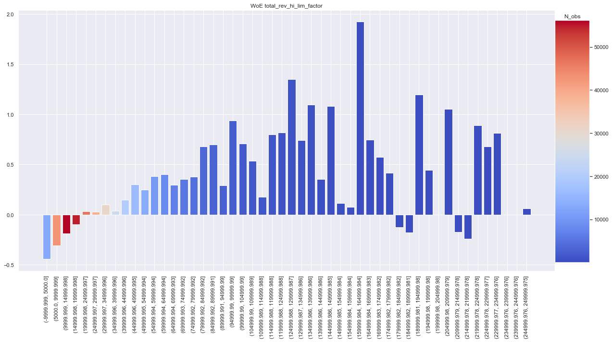


```python
fig, ax = plt.subplots(figsize=(20,8))

woe_df.iloc[:50,:].set_index('total_rev_hi_lim_factor').iloc[:, [3,4]].plot(kind='bar', stacked=True, ax=ax)

plt.legend()
```


    <matplotlib.legend.Legend at 0x1a3d1b3b00>


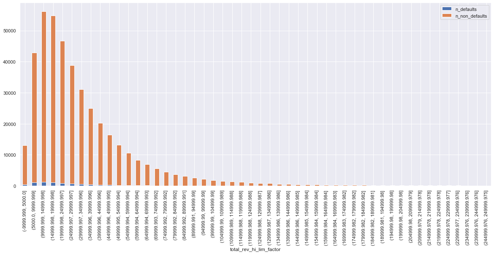


```python
x_train_prep['total_rev_hi_lim:<=5K'] = np.where((x_train_prep['total_rev_hi_lim'] <= 5000), 1, 0)
x_train_prep['total_rev_hi_lim:5K-10K'] = np.where((x_train_prep['total_rev_hi_lim'] > 5000) & (x_train_prep['total_rev_hi_lim'] <= 10000), 1, 0)
x_train_prep['total_rev_hi_lim:10K-20K'] = np.where((x_train_prep['total_rev_hi_lim'] > 10000) & (x_train_prep['total_rev_hi_lim'] <= 20000), 1, 0)
x_train_prep['total_rev_hi_lim:20K-30K'] = np.where((x_train_prep['total_rev_hi_lim'] > 20000) & (x_train_prep['total_rev_hi_lim'] <= 30000), 1, 0)
x_train_prep['total_rev_hi_lim:30K-40K'] = np.where((x_train_prep['total_rev_hi_lim'] > 30000) & (x_train_prep['total_rev_hi_lim'] <= 40000), 1, 0)
x_train_prep['total_rev_hi_lim:40K-55K'] = np.where((x_train_prep['total_rev_hi_lim'] > 40000) & (x_train_prep['total_rev_hi_lim'] <= 55000), 1, 0)
x_train_prep['total_rev_hi_lim:55K-95K'] = np.where((x_train_prep['total_rev_hi_lim'] > 55000) & (x_train_prep['total_rev_hi_lim'] <= 95000), 1, 0)
x_train_prep['total_rev_hi_lim:>95K'] = np.where((x_train_prep['total_rev_hi_lim'] > 95000), 1, 0)
```


```python

fig, ax = plt.subplots(figsize=(20,8))

var_s = ['total_rev_hi_lim:<=5K', 'total_rev_hi_lim:5K-10K', 'total_rev_hi_lim:10K-20K', 'total_rev_hi_lim:20K-30K',
         'total_rev_hi_lim:30K-40K', 'total_rev_hi_lim:40K-55K', 'total_rev_hi_lim:55K-95K', 'total_rev_hi_lim:>95K']

pd.concat([x_train_prep, y_train_prep], axis=1).groupby('Y').sum().loc[:, var_s].T.plot(kind='bar', stacked=True, ax=ax)

plt.legend()
```


    <matplotlib.legend.Legend at 0x1a3f338780>


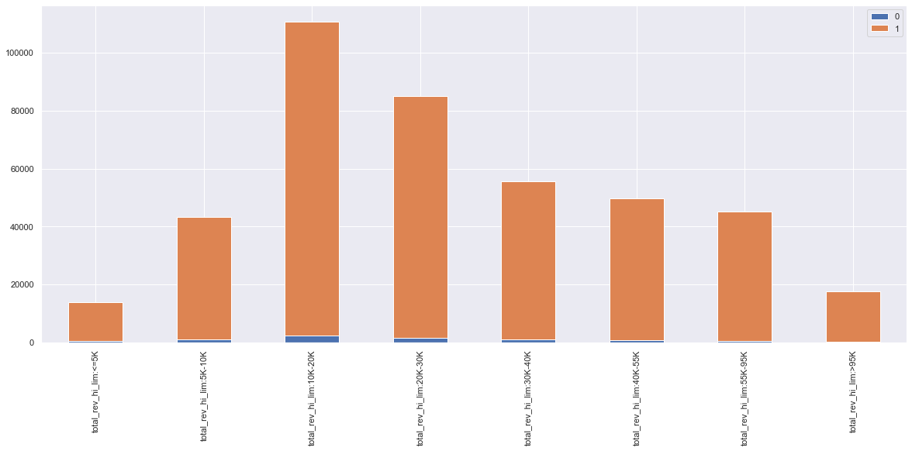

vars_to_use.append(['total_rev_hi_lim:5K-10K', 'total_rev_hi_lim:10K-20K', 'total_rev_hi_lim:20K-30K',
         'total_rev_hi_lim:30K-40K', 'total_rev_hi_lim:40K-55K', 'total_rev_hi_lim:55K-95K', 'total_rev_hi_lim:>95K'])

ref_vars.append(['total_rev_hi_lim:<=5K'])

vars_to_use
### loan_amnt


```python
x_train_prep['loan_amnt_factor'] = pd.cut(x_train_prep['loan_amnt'], 50)

woe_df = woe_ordered_continuous(x_train_prep, 'loan_amnt_factor', y_train_prep, rot_x_ticks=90)
woe_df
```


<div>
<style scoped>
    .dataframe tbody tr th:only-of-type {
        vertical-align: middle;
    }

    .dataframe tbody tr th {
        vertical-align: top;
    }

    .dataframe thead th {
        text-align: right;
    }
</style>
<table border="1" class="dataframe">
  <thead>
    <tr style="text-align: right;">
      <th></th>
      <th>loan_amnt_factor</th>
      <th>n_obs</th>
      <th>prop_non_defaults</th>
      <th>prop_n_obs</th>
      <th>n_defaults</th>
      <th>n_non_defaults</th>
      <th>prop_n_non_defaults</th>
      <th>prop_n_defaults</th>
      <th>WoE</th>
      <th>diff_prop_non_defaults</th>
      <th>diff_WoE</th>
      <th>IV</th>
    </tr>
  </thead>
  <tbody>
    <tr>
      <th>0</th>
      <td>(966.0, 1680.0]</td>
      <td>3391</td>
      <td>0.982306</td>
      <td>0.008053</td>
      <td>60.0</td>
      <td>3331.0</td>
      <td>0.008061</td>
      <td>0.007642</td>
      <td>0.053288</td>
      <td>NaN</td>
      <td>NaN</td>
      <td>0.027107</td>
    </tr>
    <tr>
      <th>1</th>
      <td>(1680.0, 2360.0]</td>
      <td>3751</td>
      <td>0.981338</td>
      <td>0.008908</td>
      <td>70.0</td>
      <td>3681.0</td>
      <td>0.008908</td>
      <td>0.008916</td>
      <td>-0.000950</td>
      <td>0.000847</td>
      <td>0.054239</td>
      <td>0.027107</td>
    </tr>
    <tr>
      <th>2</th>
      <td>(2360.0, 3040.0]</td>
      <td>8134</td>
      <td>0.981190</td>
      <td>0.019316</td>
      <td>153.0</td>
      <td>7981.0</td>
      <td>0.019313</td>
      <td>0.019488</td>
      <td>-0.009014</td>
      <td>0.010405</td>
      <td>0.008063</td>
      <td>0.027107</td>
    </tr>
    <tr>
      <th>3</th>
      <td>(3040.0, 3720.0]</td>
      <td>5133</td>
      <td>0.983246</td>
      <td>0.012190</td>
      <td>86.0</td>
      <td>5047.0</td>
      <td>0.012213</td>
      <td>0.010954</td>
      <td>0.108807</td>
      <td>0.007100</td>
      <td>0.117821</td>
      <td>0.027107</td>
    </tr>
    <tr>
      <th>4</th>
      <td>(3720.0, 4400.0]</td>
      <td>7315</td>
      <td>0.980041</td>
      <td>0.017371</td>
      <td>146.0</td>
      <td>7169.0</td>
      <td>0.017348</td>
      <td>0.018596</td>
      <td>-0.069480</td>
      <td>0.005135</td>
      <td>0.178287</td>
      <td>0.027107</td>
    </tr>
    <tr>
      <th>5</th>
      <td>(4400.0, 5080.0]</td>
      <td>18150</td>
      <td>0.982479</td>
      <td>0.043102</td>
      <td>318.0</td>
      <td>17832.0</td>
      <td>0.043151</td>
      <td>0.040504</td>
      <td>0.063304</td>
      <td>0.025803</td>
      <td>0.132784</td>
      <td>0.027107</td>
    </tr>
    <tr>
      <th>6</th>
      <td>(5080.0, 5760.0]</td>
      <td>5617</td>
      <td>0.984867</td>
      <td>0.013339</td>
      <td>85.0</td>
      <td>5532.0</td>
      <td>0.013387</td>
      <td>0.010827</td>
      <td>0.212259</td>
      <td>0.029765</td>
      <td>0.148955</td>
      <td>0.027107</td>
    </tr>
    <tr>
      <th>7</th>
      <td>(5760.0, 6440.0]</td>
      <td>16224</td>
      <td>0.982618</td>
      <td>0.038528</td>
      <td>282.0</td>
      <td>15942.0</td>
      <td>0.038578</td>
      <td>0.035919</td>
      <td>0.071410</td>
      <td>0.025191</td>
      <td>0.140848</td>
      <td>0.027107</td>
    </tr>
    <tr>
      <th>8</th>
      <td>(6440.0, 7120.0]</td>
      <td>10565</td>
      <td>0.982489</td>
      <td>0.025089</td>
      <td>185.0</td>
      <td>10380.0</td>
      <td>0.025118</td>
      <td>0.023564</td>
      <td>0.063885</td>
      <td>0.013459</td>
      <td>0.007525</td>
      <td>0.027107</td>
    </tr>
    <tr>
      <th>9</th>
      <td>(7120.0, 7800.0]</td>
      <td>8423</td>
      <td>0.980173</td>
      <td>0.020003</td>
      <td>167.0</td>
      <td>8256.0</td>
      <td>0.019979</td>
      <td>0.021271</td>
      <td>-0.062693</td>
      <td>0.005140</td>
      <td>0.126579</td>
      <td>0.027107</td>
    </tr>
    <tr>
      <th>10</th>
      <td>(7800.0, 8480.0]</td>
      <td>17295</td>
      <td>0.981151</td>
      <td>0.041072</td>
      <td>326.0</td>
      <td>16969.0</td>
      <td>0.041063</td>
      <td>0.041523</td>
      <td>-0.011149</td>
      <td>0.021084</td>
      <td>0.051544</td>
      <td>0.027107</td>
    </tr>
    <tr>
      <th>11</th>
      <td>(8480.0, 9160.0]</td>
      <td>9255</td>
      <td>0.981740</td>
      <td>0.021978</td>
      <td>169.0</td>
      <td>9086.0</td>
      <td>0.021987</td>
      <td>0.021526</td>
      <td>0.021196</td>
      <td>0.019076</td>
      <td>0.032345</td>
      <td>0.027107</td>
    </tr>
    <tr>
      <th>12</th>
      <td>(9160.0, 9840.0]</td>
      <td>6898</td>
      <td>0.981879</td>
      <td>0.016381</td>
      <td>125.0</td>
      <td>6773.0</td>
      <td>0.016390</td>
      <td>0.015922</td>
      <td>0.028991</td>
      <td>0.005597</td>
      <td>0.007794</td>
      <td>0.027107</td>
    </tr>
    <tr>
      <th>13</th>
      <td>(9840.0, 10520.0]</td>
      <td>33582</td>
      <td>0.983265</td>
      <td>0.079749</td>
      <td>562.0</td>
      <td>33020.0</td>
      <td>0.079905</td>
      <td>0.071583</td>
      <td>0.109972</td>
      <td>0.063515</td>
      <td>0.080981</td>
      <td>0.027107</td>
    </tr>
    <tr>
      <th>14</th>
      <td>(10520.0, 11200.0]</td>
      <td>9958</td>
      <td>0.977104</td>
      <td>0.023648</td>
      <td>228.0</td>
      <td>9730.0</td>
      <td>0.023545</td>
      <td>0.029041</td>
      <td>-0.209771</td>
      <td>0.056359</td>
      <td>0.319743</td>
      <td>0.027107</td>
    </tr>
    <tr>
      <th>15</th>
      <td>(11200.0, 11880.0]</td>
      <td>3813</td>
      <td>0.967480</td>
      <td>0.009055</td>
      <td>124.0</td>
      <td>3689.0</td>
      <td>0.008927</td>
      <td>0.015794</td>
      <td>-0.570566</td>
      <td>0.014619</td>
      <td>0.360794</td>
      <td>0.027107</td>
    </tr>
    <tr>
      <th>16</th>
      <td>(11880.0, 12560.0]</td>
      <td>28601</td>
      <td>0.981539</td>
      <td>0.067921</td>
      <td>528.0</td>
      <td>28073.0</td>
      <td>0.067933</td>
      <td>0.067253</td>
      <td>0.010072</td>
      <td>0.059006</td>
      <td>0.580638</td>
      <td>0.027107</td>
    </tr>
    <tr>
      <th>17</th>
      <td>(12560.0, 13240.0]</td>
      <td>7923</td>
      <td>0.979553</td>
      <td>0.018815</td>
      <td>162.0</td>
      <td>7761.0</td>
      <td>0.018781</td>
      <td>0.020634</td>
      <td>-0.094125</td>
      <td>0.049153</td>
      <td>0.104197</td>
      <td>0.027107</td>
    </tr>
    <tr>
      <th>18</th>
      <td>(13240.0, 13920.0]</td>
      <td>3723</td>
      <td>0.971797</td>
      <td>0.008841</td>
      <td>105.0</td>
      <td>3618.0</td>
      <td>0.008755</td>
      <td>0.013374</td>
      <td>-0.423679</td>
      <td>0.010026</td>
      <td>0.329554</td>
      <td>0.027107</td>
    </tr>
    <tr>
      <th>19</th>
      <td>(13920.0, 14600.0]</td>
      <td>12209</td>
      <td>0.979851</td>
      <td>0.028994</td>
      <td>246.0</td>
      <td>11963.0</td>
      <td>0.028949</td>
      <td>0.031334</td>
      <td>-0.079153</td>
      <td>0.020194</td>
      <td>0.344526</td>
      <td>0.027107</td>
    </tr>
    <tr>
      <th>20</th>
      <td>(14600.0, 15280.0]</td>
      <td>26506</td>
      <td>0.983438</td>
      <td>0.062946</td>
      <td>439.0</td>
      <td>26067.0</td>
      <td>0.063079</td>
      <td>0.055916</td>
      <td>0.120531</td>
      <td>0.034130</td>
      <td>0.199684</td>
      <td>0.027107</td>
    </tr>
    <tr>
      <th>21</th>
      <td>(15280.0, 15960.0]</td>
      <td>3535</td>
      <td>0.972277</td>
      <td>0.008395</td>
      <td>98.0</td>
      <td>3437.0</td>
      <td>0.008317</td>
      <td>0.012482</td>
      <td>-0.406008</td>
      <td>0.054762</td>
      <td>0.526539</td>
      <td>0.027107</td>
    </tr>
    <tr>
      <th>22</th>
      <td>(15960.0, 16640.0]</td>
      <td>14142</td>
      <td>0.982888</td>
      <td>0.033584</td>
      <td>242.0</td>
      <td>13900.0</td>
      <td>0.033636</td>
      <td>0.030824</td>
      <td>0.087312</td>
      <td>0.025319</td>
      <td>0.493320</td>
      <td>0.027107</td>
    </tr>
    <tr>
      <th>23</th>
      <td>(16640.0, 17320.0]</td>
      <td>6096</td>
      <td>0.979823</td>
      <td>0.014477</td>
      <td>123.0</td>
      <td>5973.0</td>
      <td>0.014454</td>
      <td>0.015667</td>
      <td>-0.080575</td>
      <td>0.019182</td>
      <td>0.167886</td>
      <td>0.027107</td>
    </tr>
    <tr>
      <th>24</th>
      <td>(17320.0, 18000.0]</td>
      <td>13664</td>
      <td>0.982436</td>
      <td>0.032449</td>
      <td>240.0</td>
      <td>13424.0</td>
      <td>0.032485</td>
      <td>0.030569</td>
      <td>0.060766</td>
      <td>0.018031</td>
      <td>0.141340</td>
      <td>0.027107</td>
    </tr>
    <tr>
      <th>25</th>
      <td>(18000.0, 18680.0]</td>
      <td>2739</td>
      <td>0.974443</td>
      <td>0.006504</td>
      <td>70.0</td>
      <td>2669.0</td>
      <td>0.006459</td>
      <td>0.008916</td>
      <td>-0.322431</td>
      <td>0.026026</td>
      <td>0.383197</td>
      <td>0.027107</td>
    </tr>
    <tr>
      <th>26</th>
      <td>(18680.0, 19360.0]</td>
      <td>4923</td>
      <td>0.977250</td>
      <td>0.011691</td>
      <td>112.0</td>
      <td>4811.0</td>
      <td>0.011642</td>
      <td>0.014266</td>
      <td>-0.203234</td>
      <td>0.005183</td>
      <td>0.119197</td>
      <td>0.027107</td>
    </tr>
    <tr>
      <th>27</th>
      <td>(19360.0, 20040.0]</td>
      <td>26477</td>
      <td>0.983231</td>
      <td>0.062877</td>
      <td>444.0</td>
      <td>26033.0</td>
      <td>0.062997</td>
      <td>0.056553</td>
      <td>0.107901</td>
      <td>0.051355</td>
      <td>0.311134</td>
      <td>0.027107</td>
    </tr>
    <tr>
      <th>28</th>
      <td>(20040.0, 20720.0]</td>
      <td>2233</td>
      <td>0.978504</td>
      <td>0.005303</td>
      <td>48.0</td>
      <td>2185.0</td>
      <td>0.005287</td>
      <td>0.006114</td>
      <td>-0.145225</td>
      <td>0.057709</td>
      <td>0.253126</td>
      <td>0.027107</td>
    </tr>
    <tr>
      <th>29</th>
      <td>(20720.0, 21400.0]</td>
      <td>7925</td>
      <td>0.979685</td>
      <td>0.018820</td>
      <td>161.0</td>
      <td>7764.0</td>
      <td>0.018788</td>
      <td>0.020507</td>
      <td>-0.087546</td>
      <td>0.013501</td>
      <td>0.057678</td>
      <td>0.027107</td>
    </tr>
    <tr>
      <th>30</th>
      <td>(21400.0, 22080.0]</td>
      <td>4795</td>
      <td>0.980188</td>
      <td>0.011387</td>
      <td>95.0</td>
      <td>4700.0</td>
      <td>0.011373</td>
      <td>0.012100</td>
      <td>-0.061954</td>
      <td>0.007415</td>
      <td>0.025592</td>
      <td>0.027107</td>
    </tr>
    <tr>
      <th>31</th>
      <td>(22080.0, 22760.0]</td>
      <td>2136</td>
      <td>0.973783</td>
      <td>0.005073</td>
      <td>56.0</td>
      <td>2080.0</td>
      <td>0.005033</td>
      <td>0.007133</td>
      <td>-0.348623</td>
      <td>0.006340</td>
      <td>0.286669</td>
      <td>0.027107</td>
    </tr>
    <tr>
      <th>32</th>
      <td>(22760.0, 23440.0]</td>
      <td>3008</td>
      <td>0.984375</td>
      <td>0.007143</td>
      <td>47.0</td>
      <td>2961.0</td>
      <td>0.007165</td>
      <td>0.005986</td>
      <td>0.179740</td>
      <td>0.002132</td>
      <td>0.528363</td>
      <td>0.027107</td>
    </tr>
    <tr>
      <th>33</th>
      <td>(23440.0, 24120.0]</td>
      <td>13806</td>
      <td>0.980298</td>
      <td>0.032786</td>
      <td>272.0</td>
      <td>13534.0</td>
      <td>0.032751</td>
      <td>0.034645</td>
      <td>-0.056237</td>
      <td>0.025585</td>
      <td>0.235976</td>
      <td>0.027107</td>
    </tr>
    <tr>
      <th>34</th>
      <td>(24120.0, 24800.0]</td>
      <td>1803</td>
      <td>0.970050</td>
      <td>0.004282</td>
      <td>54.0</td>
      <td>1749.0</td>
      <td>0.004232</td>
      <td>0.006878</td>
      <td>-0.485579</td>
      <td>0.028518</td>
      <td>0.429343</td>
      <td>0.027107</td>
    </tr>
    <tr>
      <th>35</th>
      <td>(24800.0, 25480.0]</td>
      <td>13964</td>
      <td>0.986322</td>
      <td>0.033161</td>
      <td>191.0</td>
      <td>13773.0</td>
      <td>0.033329</td>
      <td>0.024328</td>
      <td>0.314797</td>
      <td>0.029097</td>
      <td>0.800377</td>
      <td>0.027107</td>
    </tr>
    <tr>
      <th>36</th>
      <td>(25480.0, 26160.0]</td>
      <td>2063</td>
      <td>0.984973</td>
      <td>0.004899</td>
      <td>31.0</td>
      <td>2032.0</td>
      <td>0.004917</td>
      <td>0.003949</td>
      <td>0.219394</td>
      <td>0.028412</td>
      <td>0.095403</td>
      <td>0.027107</td>
    </tr>
    <tr>
      <th>37</th>
      <td>(26160.0, 26840.0]</td>
      <td>1336</td>
      <td>0.973802</td>
      <td>0.003173</td>
      <td>35.0</td>
      <td>1301.0</td>
      <td>0.003148</td>
      <td>0.004458</td>
      <td>-0.347854</td>
      <td>0.001769</td>
      <td>0.567248</td>
      <td>0.027107</td>
    </tr>
    <tr>
      <th>38</th>
      <td>(26840.0, 27520.0]</td>
      <td>2199</td>
      <td>0.982719</td>
      <td>0.005222</td>
      <td>38.0</td>
      <td>2161.0</td>
      <td>0.005229</td>
      <td>0.004840</td>
      <td>0.077345</td>
      <td>0.002081</td>
      <td>0.425200</td>
      <td>0.027107</td>
    </tr>
    <tr>
      <th>39</th>
      <td>(27520.0, 28200.0]</td>
      <td>9083</td>
      <td>0.987119</td>
      <td>0.021570</td>
      <td>117.0</td>
      <td>8966.0</td>
      <td>0.021697</td>
      <td>0.014903</td>
      <td>0.375626</td>
      <td>0.016467</td>
      <td>0.298281</td>
      <td>0.027107</td>
    </tr>
    <tr>
      <th>40</th>
      <td>(28200.0, 28880.0]</td>
      <td>1106</td>
      <td>0.973779</td>
      <td>0.002626</td>
      <td>29.0</td>
      <td>1077.0</td>
      <td>0.002606</td>
      <td>0.003694</td>
      <td>-0.348756</td>
      <td>0.019090</td>
      <td>0.724382</td>
      <td>0.027107</td>
    </tr>
    <tr>
      <th>41</th>
      <td>(28880.0, 29560.0]</td>
      <td>1217</td>
      <td>0.975349</td>
      <td>0.002890</td>
      <td>30.0</td>
      <td>1187.0</td>
      <td>0.002872</td>
      <td>0.003821</td>
      <td>-0.285408</td>
      <td>0.000266</td>
      <td>0.063348</td>
      <td>0.027107</td>
    </tr>
    <tr>
      <th>42</th>
      <td>(29560.0, 30240.0]</td>
      <td>10292</td>
      <td>0.983288</td>
      <td>0.024441</td>
      <td>172.0</td>
      <td>10120.0</td>
      <td>0.024489</td>
      <td>0.021908</td>
      <td>0.111380</td>
      <td>0.021617</td>
      <td>0.396787</td>
      <td>0.027107</td>
    </tr>
    <tr>
      <th>43</th>
      <td>(30240.0, 30920.0]</td>
      <td>580</td>
      <td>0.968966</td>
      <td>0.001377</td>
      <td>18.0</td>
      <td>562.0</td>
      <td>0.001360</td>
      <td>0.002293</td>
      <td>-0.522265</td>
      <td>0.023129</td>
      <td>0.633644</td>
      <td>0.027107</td>
    </tr>
    <tr>
      <th>44</th>
      <td>(30920.0, 31600.0]</td>
      <td>915</td>
      <td>0.981421</td>
      <td>0.002173</td>
      <td>17.0</td>
      <td>898.0</td>
      <td>0.002173</td>
      <td>0.002165</td>
      <td>0.003562</td>
      <td>0.000813</td>
      <td>0.525827</td>
      <td>0.027107</td>
    </tr>
    <tr>
      <th>45</th>
      <td>(31600.0, 32280.0]</td>
      <td>1987</td>
      <td>0.977353</td>
      <td>0.004719</td>
      <td>45.0</td>
      <td>1942.0</td>
      <td>0.004699</td>
      <td>0.005732</td>
      <td>-0.198584</td>
      <td>0.002526</td>
      <td>0.202146</td>
      <td>0.027107</td>
    </tr>
    <tr>
      <th>46</th>
      <td>(32280.0, 32960.0]</td>
      <td>632</td>
      <td>0.974684</td>
      <td>0.001501</td>
      <td>16.0</td>
      <td>616.0</td>
      <td>0.001491</td>
      <td>0.002038</td>
      <td>-0.312737</td>
      <td>0.003209</td>
      <td>0.114153</td>
      <td>0.027107</td>
    </tr>
    <tr>
      <th>47</th>
      <td>(32960.0, 33640.0]</td>
      <td>1106</td>
      <td>0.978300</td>
      <td>0.002626</td>
      <td>24.0</td>
      <td>1082.0</td>
      <td>0.002618</td>
      <td>0.003057</td>
      <td>-0.154882</td>
      <td>0.001128</td>
      <td>0.157854</td>
      <td>0.027107</td>
    </tr>
    <tr>
      <th>48</th>
      <td>(33640.0, 34320.0]</td>
      <td>665</td>
      <td>0.984962</td>
      <td>0.001579</td>
      <td>10.0</td>
      <td>655.0</td>
      <td>0.001585</td>
      <td>0.001274</td>
      <td>0.218655</td>
      <td>0.001033</td>
      <td>0.373538</td>
      <td>0.027107</td>
    </tr>
    <tr>
      <th>49</th>
      <td>(34320.0, 35000.0]</td>
      <td>20201</td>
      <td>0.977724</td>
      <td>0.047973</td>
      <td>450.0</td>
      <td>19751.0</td>
      <td>0.047795</td>
      <td>0.057318</td>
      <td>-0.181683</td>
      <td>0.046210</td>
      <td>0.400338</td>
      <td>0.027107</td>
    </tr>
  </tbody>
</table>
</div>


```python
fig, ax = plt.subplots(figsize=(20,8))

woe_df.iloc[:50,:].set_index('loan_amnt_factor').iloc[:, [3,4]].plot(kind='bar', stacked=True, ax=ax)

plt.legend()
```


    <matplotlib.legend.Legend at 0x1a3d2df9b0>


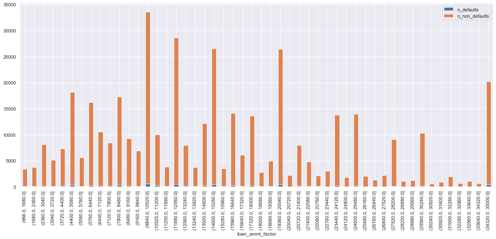


```python
fig, ax = plt.subplots(figsize=(12,8))

sns.distplot(new_data[new_data['Y'] == 0]['loan_amnt'], ax=ax, label='default', bins=35)
sns.distplot(new_data[new_data['Y'] == 1]['loan_amnt'], ax=ax, label='non_default', bins=35)
plt.legend()
```


    <matplotlib.legend.Legend at 0x1a1c7fce10>


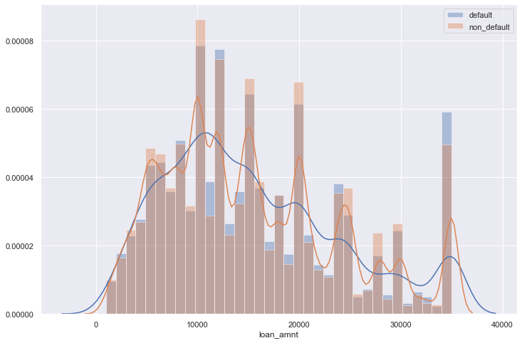


##### Seems like the amount has a minor effect on default. But one can notice that the ratio default/default is lower on the most required amounts mainly each 5000 multiple

### annual_inc


```python
x_train_prep['annual_inc_factor'] = pd.qcut(x_train_prep['annual_inc'], 100, duplicates='drop')
```


```python
woe_df = woe_ordered_continuous(x_train_prep, 'annual_inc_factor', y_train_prep, rot_x_ticks=90)
woe_df
```


<div>
<style scoped>
    .dataframe tbody tr th:only-of-type {
        vertical-align: middle;
    }

    .dataframe tbody tr th {
        vertical-align: top;
    }

    .dataframe thead th {
        text-align: right;
    }
</style>
<table border="1" class="dataframe">
  <thead>
    <tr style="text-align: right;">
      <th></th>
      <th>annual_inc_factor</th>
      <th>n_obs</th>
      <th>prop_non_defaults</th>
      <th>prop_n_obs</th>
      <th>n_defaults</th>
      <th>n_non_defaults</th>
      <th>prop_n_non_defaults</th>
      <th>prop_n_defaults</th>
      <th>WoE</th>
      <th>diff_prop_non_defaults</th>
      <th>diff_WoE</th>
      <th>IV</th>
    </tr>
  </thead>
  <tbody>
    <tr>
      <th>0</th>
      <td>(-0.001, 19000.0]</td>
      <td>4267</td>
      <td>0.970237</td>
      <td>0.010133</td>
      <td>127.0</td>
      <td>4140.0</td>
      <td>0.010018</td>
      <td>0.016176</td>
      <td>-0.479131</td>
      <td>NaN</td>
      <td>NaN</td>
      <td>0.046062</td>
    </tr>
    <tr>
      <th>1</th>
      <td>(19000.0, 22500.0]</td>
      <td>4161</td>
      <td>0.972362</td>
      <td>0.009881</td>
      <td>115.0</td>
      <td>4046.0</td>
      <td>0.009791</td>
      <td>0.014648</td>
      <td>-0.402843</td>
      <td>0.000227</td>
      <td>0.076288</td>
      <td>0.046062</td>
    </tr>
    <tr>
      <th>2</th>
      <td>(22500.0, 25000.0]</td>
      <td>6265</td>
      <td>0.973982</td>
      <td>0.014878</td>
      <td>163.0</td>
      <td>6102.0</td>
      <td>0.014766</td>
      <td>0.020762</td>
      <td>-0.340773</td>
      <td>0.004975</td>
      <td>0.062070</td>
      <td>0.046062</td>
    </tr>
    <tr>
      <th>3</th>
      <td>(25000.0, 26687.72]</td>
      <td>2151</td>
      <td>0.976755</td>
      <td>0.005108</td>
      <td>50.0</td>
      <td>2101.0</td>
      <td>0.005084</td>
      <td>0.006369</td>
      <td>-0.225249</td>
      <td>0.009682</td>
      <td>0.115524</td>
      <td>0.046062</td>
    </tr>
    <tr>
      <th>4</th>
      <td>(26687.72, 28600.0]</td>
      <td>4218</td>
      <td>0.977240</td>
      <td>0.010017</td>
      <td>96.0</td>
      <td>4122.0</td>
      <td>0.009975</td>
      <td>0.012228</td>
      <td>-0.203649</td>
      <td>0.004891</td>
      <td>0.021600</td>
      <td>0.046062</td>
    </tr>
    <tr>
      <th>5</th>
      <td>(28600.0, 30000.0]</td>
      <td>8122</td>
      <td>0.974144</td>
      <td>0.019288</td>
      <td>210.0</td>
      <td>7912.0</td>
      <td>0.019146</td>
      <td>0.026748</td>
      <td>-0.334367</td>
      <td>0.009171</td>
      <td>0.130717</td>
      <td>0.046062</td>
    </tr>
    <tr>
      <th>6</th>
      <td>(30000.0, 30500.0]</td>
      <td>306</td>
      <td>0.967320</td>
      <td>0.000727</td>
      <td>10.0</td>
      <td>296.0</td>
      <td>0.000716</td>
      <td>0.001274</td>
      <td>-0.575621</td>
      <td>0.018430</td>
      <td>0.241254</td>
      <td>0.046062</td>
    </tr>
    <tr>
      <th>7</th>
      <td>(30500.0, 32000.0]</td>
      <td>5460</td>
      <td>0.978205</td>
      <td>0.012966</td>
      <td>119.0</td>
      <td>5341.0</td>
      <td>0.012925</td>
      <td>0.015157</td>
      <td>-0.159350</td>
      <td>0.012208</td>
      <td>0.416270</td>
      <td>0.046062</td>
    </tr>
    <tr>
      <th>8</th>
      <td>(32000.0, 33400.0]</td>
      <td>2954</td>
      <td>0.972918</td>
      <td>0.007015</td>
      <td>80.0</td>
      <td>2874.0</td>
      <td>0.006955</td>
      <td>0.010190</td>
      <td>-0.381961</td>
      <td>0.005970</td>
      <td>0.222611</td>
      <td>0.046062</td>
    </tr>
    <tr>
      <th>9</th>
      <td>(33400.0, 35000.0]</td>
      <td>10400</td>
      <td>0.976058</td>
      <td>0.024698</td>
      <td>249.0</td>
      <td>10151.0</td>
      <td>0.024564</td>
      <td>0.031716</td>
      <td>-0.255520</td>
      <td>0.017609</td>
      <td>0.126441</td>
      <td>0.046062</td>
    </tr>
    <tr>
      <th>10</th>
      <td>(35000.0, 36000.0]</td>
      <td>4237</td>
      <td>0.977578</td>
      <td>0.010062</td>
      <td>95.0</td>
      <td>4142.0</td>
      <td>0.010023</td>
      <td>0.012100</td>
      <td>-0.188338</td>
      <td>0.014541</td>
      <td>0.067183</td>
      <td>0.046062</td>
    </tr>
    <tr>
      <th>11</th>
      <td>(36000.0, 37000.0]</td>
      <td>2790</td>
      <td>0.976344</td>
      <td>0.006626</td>
      <td>66.0</td>
      <td>2724.0</td>
      <td>0.006592</td>
      <td>0.008407</td>
      <td>-0.243193</td>
      <td>0.003431</td>
      <td>0.054855</td>
      <td>0.046062</td>
    </tr>
    <tr>
      <th>12</th>
      <td>(37000.0, 38000.0]</td>
      <td>4403</td>
      <td>0.977515</td>
      <td>0.010456</td>
      <td>99.0</td>
      <td>4304.0</td>
      <td>0.010415</td>
      <td>0.012610</td>
      <td>-0.191215</td>
      <td>0.003823</td>
      <td>0.051978</td>
      <td>0.046062</td>
    </tr>
    <tr>
      <th>13</th>
      <td>(38000.0, 39700.0]</td>
      <td>3453</td>
      <td>0.976253</td>
      <td>0.008200</td>
      <td>82.0</td>
      <td>3371.0</td>
      <td>0.008157</td>
      <td>0.010445</td>
      <td>-0.247149</td>
      <td>0.002258</td>
      <td>0.055935</td>
      <td>0.046062</td>
    </tr>
    <tr>
      <th>14</th>
      <td>(39700.0, 40000.0]</td>
      <td>11297</td>
      <td>0.976454</td>
      <td>0.026828</td>
      <td>266.0</td>
      <td>11031.0</td>
      <td>0.026694</td>
      <td>0.033881</td>
      <td>-0.238426</td>
      <td>0.018536</td>
      <td>0.008723</td>
      <td>0.046062</td>
    </tr>
    <tr>
      <th>15</th>
      <td>(40000.0, 41000.0]</td>
      <td>2776</td>
      <td>0.977666</td>
      <td>0.006592</td>
      <td>62.0</td>
      <td>2714.0</td>
      <td>0.006568</td>
      <td>0.007897</td>
      <td>-0.184350</td>
      <td>0.020126</td>
      <td>0.054076</td>
      <td>0.046062</td>
    </tr>
    <tr>
      <th>16</th>
      <td>(41000.0, 42000.0]</td>
      <td>6323</td>
      <td>0.978491</td>
      <td>0.015016</td>
      <td>136.0</td>
      <td>6187.0</td>
      <td>0.014972</td>
      <td>0.017323</td>
      <td>-0.145844</td>
      <td>0.008404</td>
      <td>0.038506</td>
      <td>0.046062</td>
    </tr>
    <tr>
      <th>17</th>
      <td>(42000.0, 42500.0]</td>
      <td>677</td>
      <td>0.980798</td>
      <td>0.001608</td>
      <td>13.0</td>
      <td>664.0</td>
      <td>0.001607</td>
      <td>0.001656</td>
      <td>-0.030062</td>
      <td>0.013365</td>
      <td>0.115782</td>
      <td>0.046062</td>
    </tr>
    <tr>
      <th>18</th>
      <td>(42500.0, 44000.0]</td>
      <td>6014</td>
      <td>0.978550</td>
      <td>0.014282</td>
      <td>129.0</td>
      <td>5885.0</td>
      <td>0.014241</td>
      <td>0.016431</td>
      <td>-0.143045</td>
      <td>0.012634</td>
      <td>0.112983</td>
      <td>0.046062</td>
    </tr>
    <tr>
      <th>19</th>
      <td>(44000.0, 45000.0]</td>
      <td>11641</td>
      <td>0.978095</td>
      <td>0.027645</td>
      <td>255.0</td>
      <td>11386.0</td>
      <td>0.027553</td>
      <td>0.032480</td>
      <td>-0.164519</td>
      <td>0.013312</td>
      <td>0.021473</td>
      <td>0.046062</td>
    </tr>
    <tr>
      <th>20</th>
      <td>(45000.0, 46000.0]</td>
      <td>3383</td>
      <td>0.979899</td>
      <td>0.008034</td>
      <td>68.0</td>
      <td>3315.0</td>
      <td>0.008022</td>
      <td>0.008661</td>
      <td>-0.076690</td>
      <td>0.019531</td>
      <td>0.087829</td>
      <td>0.046062</td>
    </tr>
    <tr>
      <th>21</th>
      <td>(46000.0, 47860.0]</td>
      <td>4188</td>
      <td>0.982569</td>
      <td>0.009946</td>
      <td>73.0</td>
      <td>4115.0</td>
      <td>0.009958</td>
      <td>0.009298</td>
      <td>0.068540</td>
      <td>0.001936</td>
      <td>0.145229</td>
      <td>0.046062</td>
    </tr>
    <tr>
      <th>22</th>
      <td>(47860.0, 48000.0]</td>
      <td>5312</td>
      <td>0.977410</td>
      <td>0.012615</td>
      <td>120.0</td>
      <td>5192.0</td>
      <td>0.012564</td>
      <td>0.015285</td>
      <td>-0.196012</td>
      <td>0.002606</td>
      <td>0.264552</td>
      <td>0.046062</td>
    </tr>
    <tr>
      <th>23</th>
      <td>(48000.0, 49275.201]</td>
      <td>3109</td>
      <td>0.983596</td>
      <td>0.007383</td>
      <td>51.0</td>
      <td>3058.0</td>
      <td>0.007400</td>
      <td>0.006496</td>
      <td>0.130296</td>
      <td>0.005164</td>
      <td>0.326308</td>
      <td>0.046062</td>
    </tr>
    <tr>
      <th>24</th>
      <td>(49275.201, 50000.0]</td>
      <td>15513</td>
      <td>0.980468</td>
      <td>0.036840</td>
      <td>303.0</td>
      <td>15210.0</td>
      <td>0.036806</td>
      <td>0.038594</td>
      <td>-0.047419</td>
      <td>0.029406</td>
      <td>0.177715</td>
      <td>0.046062</td>
    </tr>
    <tr>
      <th>25</th>
      <td>(50000.0, 51000.0]</td>
      <td>2942</td>
      <td>0.984024</td>
      <td>0.006987</td>
      <td>47.0</td>
      <td>2895.0</td>
      <td>0.007006</td>
      <td>0.005986</td>
      <td>0.157198</td>
      <td>0.029801</td>
      <td>0.204617</td>
      <td>0.046062</td>
    </tr>
    <tr>
      <th>26</th>
      <td>(51000.0, 52000.0]</td>
      <td>6690</td>
      <td>0.981016</td>
      <td>0.015887</td>
      <td>127.0</td>
      <td>6563.0</td>
      <td>0.015882</td>
      <td>0.016176</td>
      <td>-0.018379</td>
      <td>0.008876</td>
      <td>0.175577</td>
      <td>0.046062</td>
    </tr>
    <tr>
      <th>27</th>
      <td>(52000.0, 52200.0]</td>
      <td>132</td>
      <td>0.992424</td>
      <td>0.000313</td>
      <td>1.0</td>
      <td>131.0</td>
      <td>0.000317</td>
      <td>0.000127</td>
      <td>0.911802</td>
      <td>0.015565</td>
      <td>0.930181</td>
      <td>0.046062</td>
    </tr>
    <tr>
      <th>28</th>
      <td>(52200.0, 54000.0]</td>
      <td>7264</td>
      <td>0.979763</td>
      <td>0.017250</td>
      <td>147.0</td>
      <td>7117.0</td>
      <td>0.017222</td>
      <td>0.018724</td>
      <td>-0.083586</td>
      <td>0.016905</td>
      <td>0.995388</td>
      <td>0.046062</td>
    </tr>
    <tr>
      <th>29</th>
      <td>(54000.0, 55000.0]</td>
      <td>10702</td>
      <td>0.983181</td>
      <td>0.025415</td>
      <td>180.0</td>
      <td>10522.0</td>
      <td>0.025462</td>
      <td>0.022927</td>
      <td>0.104872</td>
      <td>0.008240</td>
      <td>0.188458</td>
      <td>0.046062</td>
    </tr>
    <tr>
      <th>30</th>
      <td>(55000.0, 56000.0]</td>
      <td>3966</td>
      <td>0.980837</td>
      <td>0.009418</td>
      <td>76.0</td>
      <td>3890.0</td>
      <td>0.009413</td>
      <td>0.009680</td>
      <td>-0.027964</td>
      <td>0.016049</td>
      <td>0.132836</td>
      <td>0.046062</td>
    </tr>
    <tr>
      <th>31</th>
      <td>(56000.0, 57437.2]</td>
      <td>3322</td>
      <td>0.979229</td>
      <td>0.007889</td>
      <td>69.0</td>
      <td>3253.0</td>
      <td>0.007872</td>
      <td>0.008789</td>
      <td>-0.110168</td>
      <td>0.001541</td>
      <td>0.082205</td>
      <td>0.046062</td>
    </tr>
    <tr>
      <th>32</th>
      <td>(57437.2, 58508.0]</td>
      <td>4212</td>
      <td>0.977208</td>
      <td>0.010003</td>
      <td>96.0</td>
      <td>4116.0</td>
      <td>0.009960</td>
      <td>0.012228</td>
      <td>-0.205106</td>
      <td>0.002088</td>
      <td>0.094938</td>
      <td>0.046062</td>
    </tr>
    <tr>
      <th>33</th>
      <td>(58508.0, 60000.0]</td>
      <td>18608</td>
      <td>0.979901</td>
      <td>0.044190</td>
      <td>374.0</td>
      <td>18234.0</td>
      <td>0.044124</td>
      <td>0.047637</td>
      <td>-0.076607</td>
      <td>0.034164</td>
      <td>0.128499</td>
      <td>0.046062</td>
    </tr>
    <tr>
      <th>34</th>
      <td>(60000.0, 61600.0]</td>
      <td>2455</td>
      <td>0.986151</td>
      <td>0.005830</td>
      <td>34.0</td>
      <td>2421.0</td>
      <td>0.005859</td>
      <td>0.004331</td>
      <td>0.302181</td>
      <td>0.038266</td>
      <td>0.378788</td>
      <td>0.046062</td>
    </tr>
    <tr>
      <th>35</th>
      <td>(61600.0, 62382.84]</td>
      <td>4201</td>
      <td>0.985242</td>
      <td>0.009976</td>
      <td>62.0</td>
      <td>4139.0</td>
      <td>0.010016</td>
      <td>0.007897</td>
      <td>0.237680</td>
      <td>0.004157</td>
      <td>0.064500</td>
      <td>0.046062</td>
    </tr>
    <tr>
      <th>36</th>
      <td>(62382.84, 64000.0]</td>
      <td>5673</td>
      <td>0.980962</td>
      <td>0.013472</td>
      <td>108.0</td>
      <td>5565.0</td>
      <td>0.013467</td>
      <td>0.013756</td>
      <td>-0.021274</td>
      <td>0.003451</td>
      <td>0.258954</td>
      <td>0.046062</td>
    </tr>
    <tr>
      <th>37</th>
      <td>(64000.0, 65000.0]</td>
      <td>12926</td>
      <td>0.981046</td>
      <td>0.030696</td>
      <td>245.0</td>
      <td>12681.0</td>
      <td>0.030687</td>
      <td>0.031206</td>
      <td>-0.016793</td>
      <td>0.017220</td>
      <td>0.004481</td>
      <td>0.046062</td>
    </tr>
    <tr>
      <th>38</th>
      <td>(65000.0, 66500.0]</td>
      <td>2598</td>
      <td>0.983449</td>
      <td>0.006170</td>
      <td>43.0</td>
      <td>2555.0</td>
      <td>0.006183</td>
      <td>0.005477</td>
      <td>0.121213</td>
      <td>0.024504</td>
      <td>0.138006</td>
      <td>0.046062</td>
    </tr>
    <tr>
      <th>39</th>
      <td>(66500.0, 68000.0]</td>
      <td>6137</td>
      <td>0.985498</td>
      <td>0.014574</td>
      <td>89.0</td>
      <td>6048.0</td>
      <td>0.014635</td>
      <td>0.011336</td>
      <td>0.255452</td>
      <td>0.008453</td>
      <td>0.134239</td>
      <td>0.046062</td>
    </tr>
    <tr>
      <th>40</th>
      <td>(68000.0, 69500.0]</td>
      <td>2231</td>
      <td>0.980278</td>
      <td>0.005298</td>
      <td>44.0</td>
      <td>2187.0</td>
      <td>0.005292</td>
      <td>0.005604</td>
      <td>-0.057298</td>
      <td>0.009343</td>
      <td>0.312750</td>
      <td>0.046062</td>
    </tr>
    <tr>
      <th>41</th>
      <td>(69500.0, 70000.0]</td>
      <td>11976</td>
      <td>0.982966</td>
      <td>0.028440</td>
      <td>204.0</td>
      <td>11772.0</td>
      <td>0.028487</td>
      <td>0.025984</td>
      <td>0.091964</td>
      <td>0.023195</td>
      <td>0.149263</td>
      <td>0.046062</td>
    </tr>
    <tr>
      <th>42</th>
      <td>(70000.0, 70825.05]</td>
      <td>569</td>
      <td>0.984183</td>
      <td>0.001351</td>
      <td>9.0</td>
      <td>560.0</td>
      <td>0.001355</td>
      <td>0.001146</td>
      <td>0.167317</td>
      <td>0.027132</td>
      <td>0.075353</td>
      <td>0.046062</td>
    </tr>
    <tr>
      <th>43</th>
      <td>(70825.05, 72000.0]</td>
      <td>6492</td>
      <td>0.983364</td>
      <td>0.015417</td>
      <td>108.0</td>
      <td>6384.0</td>
      <td>0.015449</td>
      <td>0.013756</td>
      <td>0.116024</td>
      <td>0.014093</td>
      <td>0.051293</td>
      <td>0.046062</td>
    </tr>
    <tr>
      <th>44</th>
      <td>(72000.0, 73000.0]</td>
      <td>2333</td>
      <td>0.984141</td>
      <td>0.005540</td>
      <td>37.0</td>
      <td>2296.0</td>
      <td>0.005556</td>
      <td>0.004713</td>
      <td>0.164611</td>
      <td>0.009892</td>
      <td>0.048587</td>
      <td>0.046062</td>
    </tr>
    <tr>
      <th>45</th>
      <td>(73000.0, 75000.0]</td>
      <td>13556</td>
      <td>0.982886</td>
      <td>0.032192</td>
      <td>232.0</td>
      <td>13324.0</td>
      <td>0.032243</td>
      <td>0.029550</td>
      <td>0.087190</td>
      <td>0.026686</td>
      <td>0.077421</td>
      <td>0.046062</td>
    </tr>
    <tr>
      <th>46</th>
      <td>(75000.0, 77000.0]</td>
      <td>3761</td>
      <td>0.981920</td>
      <td>0.008931</td>
      <td>68.0</td>
      <td>3693.0</td>
      <td>0.008937</td>
      <td>0.008661</td>
      <td>0.031292</td>
      <td>0.023306</td>
      <td>0.055898</td>
      <td>0.046062</td>
    </tr>
    <tr>
      <th>47</th>
      <td>(77000.0, 78500.0]</td>
      <td>3440</td>
      <td>0.979942</td>
      <td>0.008169</td>
      <td>69.0</td>
      <td>3371.0</td>
      <td>0.008157</td>
      <td>0.008789</td>
      <td>-0.074537</td>
      <td>0.000779</td>
      <td>0.105828</td>
      <td>0.046062</td>
    </tr>
    <tr>
      <th>48</th>
      <td>(78500.0, 80000.0]</td>
      <td>12785</td>
      <td>0.981619</td>
      <td>0.030361</td>
      <td>235.0</td>
      <td>12550.0</td>
      <td>0.030370</td>
      <td>0.029932</td>
      <td>0.014496</td>
      <td>0.022212</td>
      <td>0.089032</td>
      <td>0.046062</td>
    </tr>
    <tr>
      <th>49</th>
      <td>(80000.0, 82000.0]</td>
      <td>4078</td>
      <td>0.983325</td>
      <td>0.009684</td>
      <td>68.0</td>
      <td>4010.0</td>
      <td>0.009704</td>
      <td>0.008661</td>
      <td>0.113644</td>
      <td>0.020666</td>
      <td>0.099148</td>
      <td>0.046062</td>
    </tr>
    <tr>
      <th>50</th>
      <td>(82000.0, 84000.0]</td>
      <td>4288</td>
      <td>0.980410</td>
      <td>0.010183</td>
      <td>84.0</td>
      <td>4204.0</td>
      <td>0.010173</td>
      <td>0.010699</td>
      <td>-0.050420</td>
      <td>0.000469</td>
      <td>0.164064</td>
      <td>0.046062</td>
    </tr>
    <tr>
      <th>51</th>
      <td>(84000.0, 85000.0]</td>
      <td>8039</td>
      <td>0.982212</td>
      <td>0.019091</td>
      <td>143.0</td>
      <td>7896.0</td>
      <td>0.019107</td>
      <td>0.018214</td>
      <td>0.047872</td>
      <td>0.008934</td>
      <td>0.098292</td>
      <td>0.046062</td>
    </tr>
    <tr>
      <th>52</th>
      <td>(85000.0, 85500.0]</td>
      <td>234</td>
      <td>0.995726</td>
      <td>0.000556</td>
      <td>1.0</td>
      <td>233.0</td>
      <td>0.000564</td>
      <td>0.000127</td>
      <td>1.487644</td>
      <td>0.018544</td>
      <td>1.439772</td>
      <td>0.046062</td>
    </tr>
    <tr>
      <th>53</th>
      <td>(85500.0, 88000.0]</td>
      <td>5169</td>
      <td>0.984330</td>
      <td>0.012275</td>
      <td>81.0</td>
      <td>5088.0</td>
      <td>0.012312</td>
      <td>0.010317</td>
      <td>0.176796</td>
      <td>0.011749</td>
      <td>1.310848</td>
      <td>0.046062</td>
    </tr>
    <tr>
      <th>54</th>
      <td>(88000.0, 90000.0]</td>
      <td>10164</td>
      <td>0.984553</td>
      <td>0.024137</td>
      <td>157.0</td>
      <td>10007.0</td>
      <td>0.024216</td>
      <td>0.019997</td>
      <td>0.191399</td>
      <td>0.011903</td>
      <td>0.014603</td>
      <td>0.046062</td>
    </tr>
    <tr>
      <th>55</th>
      <td>(90000.0, 91691.25]</td>
      <td>1457</td>
      <td>0.985587</td>
      <td>0.003460</td>
      <td>21.0</td>
      <td>1436.0</td>
      <td>0.003475</td>
      <td>0.002675</td>
      <td>0.261699</td>
      <td>0.020741</td>
      <td>0.070300</td>
      <td>0.046062</td>
    </tr>
    <tr>
      <th>56</th>
      <td>(91691.25, 94000.0]</td>
      <td>4996</td>
      <td>0.982986</td>
      <td>0.011864</td>
      <td>85.0</td>
      <td>4911.0</td>
      <td>0.011884</td>
      <td>0.010827</td>
      <td>0.093187</td>
      <td>0.008409</td>
      <td>0.168513</td>
      <td>0.046062</td>
    </tr>
    <tr>
      <th>57</th>
      <td>(94000.0, 95000.0]</td>
      <td>4832</td>
      <td>0.986341</td>
      <td>0.011475</td>
      <td>66.0</td>
      <td>4766.0</td>
      <td>0.011533</td>
      <td>0.008407</td>
      <td>0.316213</td>
      <td>0.000351</td>
      <td>0.223026</td>
      <td>0.046062</td>
    </tr>
    <tr>
      <th>58</th>
      <td>(95000.0, 97000.0]</td>
      <td>3242</td>
      <td>0.982418</td>
      <td>0.007699</td>
      <td>57.0</td>
      <td>3185.0</td>
      <td>0.007707</td>
      <td>0.007260</td>
      <td>0.059761</td>
      <td>0.003826</td>
      <td>0.256452</td>
      <td>0.046062</td>
    </tr>
    <tr>
      <th>59</th>
      <td>(97000.0, 100000.0]</td>
      <td>12098</td>
      <td>0.983716</td>
      <td>0.028730</td>
      <td>197.0</td>
      <td>11901.0</td>
      <td>0.028799</td>
      <td>0.025092</td>
      <td>0.137779</td>
      <td>0.021092</td>
      <td>0.078018</td>
      <td>0.046062</td>
    </tr>
    <tr>
      <th>60</th>
      <td>(100000.0, 100252.32]</td>
      <td>98</td>
      <td>1.000000</td>
      <td>0.000233</td>
      <td>0.0</td>
      <td>98.0</td>
      <td>0.000237</td>
      <td>0.000000</td>
      <td>NaN</td>
      <td>0.028562</td>
      <td>NaN</td>
      <td>0.046062</td>
    </tr>
    <tr>
      <th>61</th>
      <td>(100252.32, 104000.0]</td>
      <td>4959</td>
      <td>0.982658</td>
      <td>0.011776</td>
      <td>86.0</td>
      <td>4873.0</td>
      <td>0.011792</td>
      <td>0.010954</td>
      <td>0.073723</td>
      <td>0.011555</td>
      <td>NaN</td>
      <td>0.046062</td>
    </tr>
    <tr>
      <th>62</th>
      <td>(104000.0, 105100.0]</td>
      <td>3468</td>
      <td>0.985582</td>
      <td>0.008236</td>
      <td>50.0</td>
      <td>3418.0</td>
      <td>0.008271</td>
      <td>0.006369</td>
      <td>0.261393</td>
      <td>0.003521</td>
      <td>0.187670</td>
      <td>0.046062</td>
    </tr>
    <tr>
      <th>63</th>
      <td>(105100.0, 110000.0]</td>
      <td>9493</td>
      <td>0.986306</td>
      <td>0.022544</td>
      <td>130.0</td>
      <td>9363.0</td>
      <td>0.022657</td>
      <td>0.016558</td>
      <td>0.313592</td>
      <td>0.014386</td>
      <td>0.052199</td>
      <td>0.046062</td>
    </tr>
    <tr>
      <th>64</th>
      <td>(110000.0, 115000.0]</td>
      <td>5346</td>
      <td>0.989712</td>
      <td>0.012696</td>
      <td>55.0</td>
      <td>5291.0</td>
      <td>0.012804</td>
      <td>0.007005</td>
      <td>0.603034</td>
      <td>0.009854</td>
      <td>0.289443</td>
      <td>0.046062</td>
    </tr>
    <tr>
      <th>65</th>
      <td>(115000.0, 118839.47]</td>
      <td>1999</td>
      <td>0.987494</td>
      <td>0.004747</td>
      <td>25.0</td>
      <td>1974.0</td>
      <td>0.004777</td>
      <td>0.003184</td>
      <td>0.405547</td>
      <td>0.008027</td>
      <td>0.197488</td>
      <td>0.046062</td>
    </tr>
    <tr>
      <th>66</th>
      <td>(118839.47, 120000.0]</td>
      <td>7028</td>
      <td>0.981503</td>
      <td>0.016690</td>
      <td>130.0</td>
      <td>6898.0</td>
      <td>0.016692</td>
      <td>0.016558</td>
      <td>0.008057</td>
      <td>0.011916</td>
      <td>0.397489</td>
      <td>0.046062</td>
    </tr>
    <tr>
      <th>67</th>
      <td>(120000.0, 124000.0]</td>
      <td>1655</td>
      <td>0.989728</td>
      <td>0.003930</td>
      <td>17.0</td>
      <td>1638.0</td>
      <td>0.003964</td>
      <td>0.002165</td>
      <td>0.604623</td>
      <td>0.012729</td>
      <td>0.596566</td>
      <td>0.046062</td>
    </tr>
    <tr>
      <th>68</th>
      <td>(124000.0, 126000.0]</td>
      <td>4216</td>
      <td>0.983634</td>
      <td>0.010012</td>
      <td>69.0</td>
      <td>4147.0</td>
      <td>0.010035</td>
      <td>0.008789</td>
      <td>0.132639</td>
      <td>0.006071</td>
      <td>0.471984</td>
      <td>0.046062</td>
    </tr>
    <tr>
      <th>69</th>
      <td>(126000.0, 130000.0]</td>
      <td>4578</td>
      <td>0.987112</td>
      <td>0.010872</td>
      <td>59.0</td>
      <td>4519.0</td>
      <td>0.010935</td>
      <td>0.007515</td>
      <td>0.375114</td>
      <td>0.000900</td>
      <td>0.242475</td>
      <td>0.046062</td>
    </tr>
    <tr>
      <th>70</th>
      <td>(130000.0, 136468.32]</td>
      <td>3578</td>
      <td>0.987144</td>
      <td>0.008497</td>
      <td>46.0</td>
      <td>3532.0</td>
      <td>0.008547</td>
      <td>0.005859</td>
      <td>0.377583</td>
      <td>0.002388</td>
      <td>0.002470</td>
      <td>0.046062</td>
    </tr>
    <tr>
      <th>71</th>
      <td>(136468.32, 143000.0]</td>
      <td>4293</td>
      <td>0.985092</td>
      <td>0.010195</td>
      <td>64.0</td>
      <td>4229.0</td>
      <td>0.010234</td>
      <td>0.008152</td>
      <td>0.227443</td>
      <td>0.001687</td>
      <td>0.150140</td>
      <td>0.046062</td>
    </tr>
    <tr>
      <th>72</th>
      <td>(143000.0, 150000.0]</td>
      <td>6674</td>
      <td>0.985616</td>
      <td>0.015849</td>
      <td>96.0</td>
      <td>6578.0</td>
      <td>0.015918</td>
      <td>0.012228</td>
      <td>0.263743</td>
      <td>0.005684</td>
      <td>0.036300</td>
      <td>0.046062</td>
    </tr>
    <tr>
      <th>73</th>
      <td>(150000.0, 156001.75]</td>
      <td>1666</td>
      <td>0.989796</td>
      <td>0.003956</td>
      <td>17.0</td>
      <td>1649.0</td>
      <td>0.003990</td>
      <td>0.002165</td>
      <td>0.611316</td>
      <td>0.011928</td>
      <td>0.347573</td>
      <td>0.046062</td>
    </tr>
    <tr>
      <th>74</th>
      <td>(156001.75, 170000.0]</td>
      <td>4798</td>
      <td>0.984577</td>
      <td>0.011394</td>
      <td>74.0</td>
      <td>4724.0</td>
      <td>0.011432</td>
      <td>0.009426</td>
      <td>0.192951</td>
      <td>0.007441</td>
      <td>0.418365</td>
      <td>0.046062</td>
    </tr>
    <tr>
      <th>75</th>
      <td>(170000.0, 185000.0]</td>
      <td>3974</td>
      <td>0.981882</td>
      <td>0.009437</td>
      <td>72.0</td>
      <td>3902.0</td>
      <td>0.009442</td>
      <td>0.009171</td>
      <td>0.029184</td>
      <td>0.001989</td>
      <td>0.163768</td>
      <td>0.046062</td>
    </tr>
    <tr>
      <th>76</th>
      <td>(185000.0, 210000.0]</td>
      <td>4240</td>
      <td>0.987972</td>
      <td>0.010069</td>
      <td>51.0</td>
      <td>4189.0</td>
      <td>0.010137</td>
      <td>0.006496</td>
      <td>0.444997</td>
      <td>0.000695</td>
      <td>0.415813</td>
      <td>0.046062</td>
    </tr>
    <tr>
      <th>77</th>
      <td>(210000.0, 255000.0]</td>
      <td>3835</td>
      <td>0.982529</td>
      <td>0.009107</td>
      <td>67.0</td>
      <td>3768.0</td>
      <td>0.009118</td>
      <td>0.008534</td>
      <td>0.066212</td>
      <td>0.001019</td>
      <td>0.378785</td>
      <td>0.046062</td>
    </tr>
    <tr>
      <th>78</th>
      <td>(255000.0, 9500000.0]</td>
      <td>4208</td>
      <td>0.990019</td>
      <td>0.009993</td>
      <td>42.0</td>
      <td>4166.0</td>
      <td>0.010081</td>
      <td>0.005350</td>
      <td>0.633647</td>
      <td>0.000963</td>
      <td>0.567435</td>
      <td>0.046062</td>
    </tr>
  </tbody>
</table>
</div>


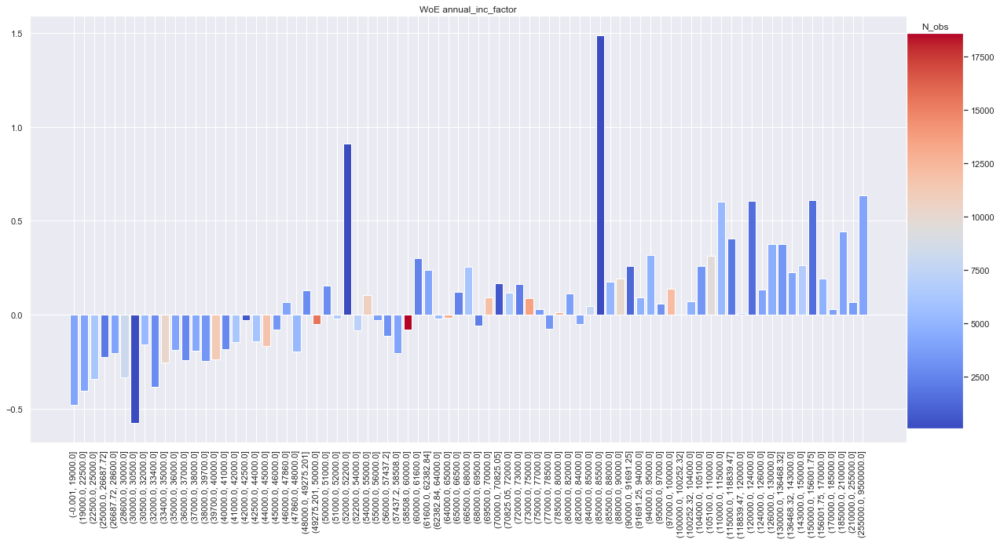


```python
fig, ax = plt.subplots(figsize=(20,8))

woe_df.iloc[:50,:].set_index('annual_inc_factor').iloc[:, [3,4]].plot(kind='bar', stacked=True, ax=ax)

plt.legend()
```


    <matplotlib.legend.Legend at 0x1a3c01fa90>


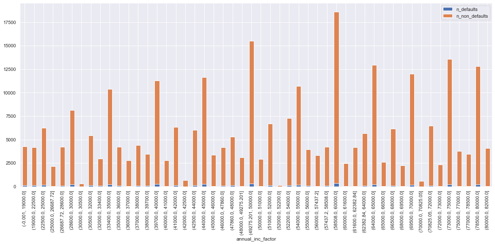


```python
x_train_prep['annual_inc:<20k'] = np.where(x_train_prep['annual_inc'] <= 20000, 1, 0)
x_train_prep['annual_inc:20k_30k'] = np.where((x_train_prep['annual_inc'] > 20000) & (x_train_prep['annual_inc'] <= 30000), 1, 0)
x_train_prep['annual_inc:30k_40k'] = np.where((x_train_prep['annual_inc'] > 30000) & (x_train_prep['annual_inc'] <= 40000), 1, 0)
x_train_prep['annual_inc:40k_50k'] = np.where((x_train_prep['annual_inc'] > 40000) & (x_train_prep['annual_inc'] <= 50000), 1, 0)
x_train_prep['annual_inc:50k_60k'] = np.where((x_train_prep['annual_inc'] > 50000) & (x_train_prep['annual_inc'] <= 60000), 1, 0)
x_train_prep['annual_inc:60k_70k'] = np.where((x_train_prep['annual_inc'] > 60000) & (x_train_prep['annual_inc'] <= 70000), 1, 0)
x_train_prep['annual_inc:70k_80k'] = np.where((x_train_prep['annual_inc'] > 70000) & (x_train_prep['annual_inc'] <= 80000), 1, 0)
x_train_prep['annual_inc:90k_100k'] = np.where((x_train_prep['annual_inc'] > 90000) & (x_train_prep['annual_inc'] <= 100000), 1, 0)
x_train_prep['annual_inc:100k_1200k'] = np.where((x_train_prep['annual_inc'] > 100000) & (x_train_prep['annual_inc'] <= 120000), 1, 0)
x_train_prep['annual_inc:120k_140k'] = np.where((x_train_prep['annual_inc'] > 120000) & (x_train_prep['annual_inc'] <= 140000), 1, 0)
x_train_prep['annual_inc:>140k'] = np.where(x_train_prep['annual_inc'] > 140000, 1, 0)

```


```python
fig, ax = plt.subplots(figsize=(20,8))

var_s = ['annual_inc:<20k', 'annual_inc:20k_30k', 'annual_inc:30k_40k','annual_inc:40k_50k', 'annual_inc:50k_60k', 'annual_inc:60k_70k', 
         'annual_inc:70k_80k', 'annual_inc:90k_100k', 'annual_inc:100k_1200k', 'annual_inc:120k_140k', 'annual_inc:>140k']

pd.concat([x_train_prep, y_train_prep], axis=1).groupby('Y').sum().loc[:, var_s].T.plot(kind='bar', stacked=True, ax=ax)

plt.legend()
```


    <matplotlib.legend.Legend at 0x1a1cd30e10>


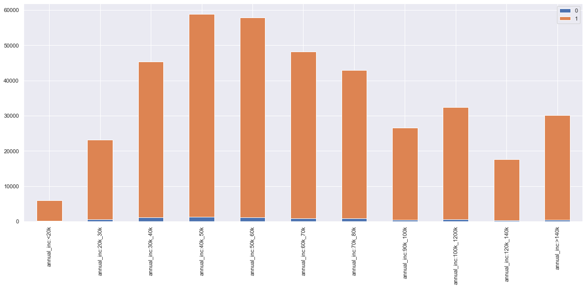

vars_to_use.append([ 'annual_inc:20k_30k', 'annual_inc:30k_40k','annual_inc:40k_50k', 'annual_inc:50k_60k', 'annual_inc:60k_70k', 
                    'annual_inc:70k_80k', 'annual_inc:90k_100k', 'annual_inc:100k_1200k', 'annual_inc:120k_140k', 'annual_inc:>140k'])

ref_vars.append(['annual_inc:<20k'])

vars_to_use
## mths_since_last_delinq


```python
print(x_train_prep['mths_since_last_delinq'].nunique(), 'unique values')
print(x_train_prep['mths_since_last_delinq'].isnull().sum(), 'missing values')
x_train_prep['mths_since_last_delinq'].describe()
```

    140 unique values
    203961 missing values


    count    217133.000000
    mean         34.023391
    std          21.990270
    min           0.000000
    25%          15.000000
    50%          31.000000
    75%          50.000000
    max         176.000000
    Name: mths_since_last_delinq, dtype: float64


```python
temp_not_null = x_train_prep[x_train_prep['mths_since_last_delinq'].notnull()]
temp_not_null['mths_since_last_delinq_factor'] = pd.cut(temp_not_null['mths_since_last_delinq'], 50)
```

    /Users/omaromeiri/anaconda3/lib/python3.7/site-packages/ipykernel_launcher.py:2: SettingWithCopyWarning: 
    A value is trying to be set on a copy of a slice from a DataFrame.
    Try using .loc[row_indexer,col_indexer] = value instead
    
    See the caveats in the documentation: http://pandas.pydata.org/pandas-docs/stable/indexing.html#indexing-view-versus-copy
      


```python
woe_df = woe_ordered_continuous(temp_not_null, 'mths_since_last_delinq_factor', y_train_prep[temp_not_null.index.values], plot_rows_start=0, plot_rows_end=22, rot_x_ticks=90, vlines=[0.5, 7.5, 14.5])
woe_df
```


<div>
<style scoped>
    .dataframe tbody tr th:only-of-type {
        vertical-align: middle;
    }

    .dataframe tbody tr th {
        vertical-align: top;
    }

    .dataframe thead th {
        text-align: right;
    }
</style>
<table border="1" class="dataframe">
  <thead>
    <tr style="text-align: right;">
      <th></th>
      <th>mths_since_last_delinq_factor</th>
      <th>n_obs</th>
      <th>prop_non_defaults</th>
      <th>prop_n_obs</th>
      <th>n_defaults</th>
      <th>n_non_defaults</th>
      <th>prop_n_non_defaults</th>
      <th>prop_n_defaults</th>
      <th>WoE</th>
      <th>diff_prop_non_defaults</th>
      <th>diff_WoE</th>
      <th>IV</th>
    </tr>
  </thead>
  <tbody>
    <tr>
      <th>0</th>
      <td>(-0.176, 3.52]</td>
      <td>7261</td>
      <td>0.973833</td>
      <td>0.033440</td>
      <td>190.0</td>
      <td>7071.0</td>
      <td>0.033183</td>
      <td>0.047041</td>
      <td>-0.349003</td>
      <td>NaN</td>
      <td>NaN</td>
      <td>0.021669</td>
    </tr>
    <tr>
      <th>1</th>
      <td>(3.52, 7.04]</td>
      <td>15763</td>
      <td>0.978367</td>
      <td>0.072596</td>
      <td>341.0</td>
      <td>15422.0</td>
      <td>0.072372</td>
      <td>0.084427</td>
      <td>-0.154068</td>
      <td>0.039189</td>
      <td>0.194935</td>
      <td>0.021669</td>
    </tr>
    <tr>
      <th>2</th>
      <td>(7.04, 10.56]</td>
      <td>12365</td>
      <td>0.980348</td>
      <td>0.056947</td>
      <td>243.0</td>
      <td>12122.0</td>
      <td>0.056886</td>
      <td>0.060163</td>
      <td>-0.056020</td>
      <td>0.015486</td>
      <td>0.098048</td>
      <td>0.021669</td>
    </tr>
    <tr>
      <th>3</th>
      <td>(10.56, 14.08]</td>
      <td>16125</td>
      <td>0.979721</td>
      <td>0.074263</td>
      <td>327.0</td>
      <td>15798.0</td>
      <td>0.074136</td>
      <td>0.080961</td>
      <td>-0.088058</td>
      <td>0.017251</td>
      <td>0.032037</td>
      <td>0.021669</td>
    </tr>
    <tr>
      <th>4</th>
      <td>(14.08, 17.6]</td>
      <td>11384</td>
      <td>0.976985</td>
      <td>0.052429</td>
      <td>262.0</td>
      <td>11122.0</td>
      <td>0.052193</td>
      <td>0.064868</td>
      <td>-0.217400</td>
      <td>0.021943</td>
      <td>0.129343</td>
      <td>0.021669</td>
    </tr>
    <tr>
      <th>5</th>
      <td>(17.6, 21.12]</td>
      <td>14291</td>
      <td>0.983626</td>
      <td>0.065817</td>
      <td>234.0</td>
      <td>14057.0</td>
      <td>0.065966</td>
      <td>0.057935</td>
      <td>0.129818</td>
      <td>0.013773</td>
      <td>0.347219</td>
      <td>0.021669</td>
    </tr>
    <tr>
      <th>6</th>
      <td>(21.12, 24.64]</td>
      <td>10544</td>
      <td>0.982170</td>
      <td>0.048560</td>
      <td>188.0</td>
      <td>10356.0</td>
      <td>0.048598</td>
      <td>0.046546</td>
      <td>0.043143</td>
      <td>0.017368</td>
      <td>0.086675</td>
      <td>0.021669</td>
    </tr>
    <tr>
      <th>7</th>
      <td>(24.64, 28.16]</td>
      <td>13761</td>
      <td>0.981760</td>
      <td>0.063376</td>
      <td>251.0</td>
      <td>13510.0</td>
      <td>0.063399</td>
      <td>0.062144</td>
      <td>0.019996</td>
      <td>0.014801</td>
      <td>0.023147</td>
      <td>0.021669</td>
    </tr>
    <tr>
      <th>8</th>
      <td>(28.16, 31.68]</td>
      <td>9867</td>
      <td>0.985001</td>
      <td>0.045442</td>
      <td>148.0</td>
      <td>9719.0</td>
      <td>0.045609</td>
      <td>0.036643</td>
      <td>0.218889</td>
      <td>0.017790</td>
      <td>0.198893</td>
      <td>0.021669</td>
    </tr>
    <tr>
      <th>9</th>
      <td>(31.68, 35.2]</td>
      <td>12583</td>
      <td>0.985218</td>
      <td>0.057951</td>
      <td>186.0</td>
      <td>12397.0</td>
      <td>0.058176</td>
      <td>0.046051</td>
      <td>0.233727</td>
      <td>0.012567</td>
      <td>0.014837</td>
      <td>0.021669</td>
    </tr>
    <tr>
      <th>10</th>
      <td>(35.2, 38.72]</td>
      <td>8869</td>
      <td>0.980268</td>
      <td>0.040846</td>
      <td>175.0</td>
      <td>8694.0</td>
      <td>0.040799</td>
      <td>0.043328</td>
      <td>-0.060134</td>
      <td>0.017377</td>
      <td>0.293861</td>
      <td>0.021669</td>
    </tr>
    <tr>
      <th>11</th>
      <td>(38.72, 42.24]</td>
      <td>11025</td>
      <td>0.981678</td>
      <td>0.050775</td>
      <td>202.0</td>
      <td>10823.0</td>
      <td>0.050790</td>
      <td>0.050012</td>
      <td>0.015425</td>
      <td>0.009991</td>
      <td>0.075559</td>
      <td>0.021669</td>
    </tr>
    <tr>
      <th>12</th>
      <td>(42.24, 45.76]</td>
      <td>8005</td>
      <td>0.984260</td>
      <td>0.036867</td>
      <td>126.0</td>
      <td>7879.0</td>
      <td>0.036974</td>
      <td>0.031196</td>
      <td>0.169938</td>
      <td>0.013815</td>
      <td>0.154513</td>
      <td>0.021669</td>
    </tr>
    <tr>
      <th>13</th>
      <td>(45.76, 49.28]</td>
      <td>9697</td>
      <td>0.981025</td>
      <td>0.044659</td>
      <td>184.0</td>
      <td>9513.0</td>
      <td>0.044642</td>
      <td>0.045556</td>
      <td>-0.020257</td>
      <td>0.007668</td>
      <td>0.190196</td>
      <td>0.021669</td>
    </tr>
    <tr>
      <th>14</th>
      <td>(49.28, 52.8]</td>
      <td>5298</td>
      <td>0.983012</td>
      <td>0.024400</td>
      <td>90.0</td>
      <td>5208.0</td>
      <td>0.024440</td>
      <td>0.022283</td>
      <td>0.092405</td>
      <td>0.020202</td>
      <td>0.112663</td>
      <td>0.021669</td>
    </tr>
    <tr>
      <th>15</th>
      <td>(52.8, 56.32]</td>
      <td>7492</td>
      <td>0.979979</td>
      <td>0.034504</td>
      <td>150.0</td>
      <td>7342.0</td>
      <td>0.034454</td>
      <td>0.037138</td>
      <td>-0.075005</td>
      <td>0.010014</td>
      <td>0.167410</td>
      <td>0.021669</td>
    </tr>
    <tr>
      <th>16</th>
      <td>(56.32, 59.84]</td>
      <td>5786</td>
      <td>0.980816</td>
      <td>0.026647</td>
      <td>111.0</td>
      <td>5675.0</td>
      <td>0.026631</td>
      <td>0.027482</td>
      <td>-0.031441</td>
      <td>0.007823</td>
      <td>0.043564</td>
      <td>0.021669</td>
    </tr>
    <tr>
      <th>17</th>
      <td>(59.84, 63.36]</td>
      <td>7743</td>
      <td>0.982048</td>
      <td>0.035660</td>
      <td>139.0</td>
      <td>7604.0</td>
      <td>0.035684</td>
      <td>0.034414</td>
      <td>0.036220</td>
      <td>0.009052</td>
      <td>0.067660</td>
      <td>0.021669</td>
    </tr>
    <tr>
      <th>18</th>
      <td>(63.36, 66.88]</td>
      <td>5785</td>
      <td>0.982714</td>
      <td>0.026643</td>
      <td>100.0</td>
      <td>5685.0</td>
      <td>0.026678</td>
      <td>0.024759</td>
      <td>0.074680</td>
      <td>0.009005</td>
      <td>0.038460</td>
      <td>0.021669</td>
    </tr>
    <tr>
      <th>19</th>
      <td>(66.88, 70.4]</td>
      <td>7266</td>
      <td>0.985962</td>
      <td>0.033463</td>
      <td>102.0</td>
      <td>7164.0</td>
      <td>0.033619</td>
      <td>0.025254</td>
      <td>0.286115</td>
      <td>0.006941</td>
      <td>0.211435</td>
      <td>0.021669</td>
    </tr>
    <tr>
      <th>20</th>
      <td>(70.4, 73.92]</td>
      <td>4913</td>
      <td>0.981885</td>
      <td>0.022627</td>
      <td>89.0</td>
      <td>4824.0</td>
      <td>0.022638</td>
      <td>0.022035</td>
      <td>0.026986</td>
      <td>0.010981</td>
      <td>0.259129</td>
      <td>0.021669</td>
    </tr>
    <tr>
      <th>21</th>
      <td>(73.92, 77.44]</td>
      <td>5702</td>
      <td>0.982988</td>
      <td>0.026260</td>
      <td>97.0</td>
      <td>5605.0</td>
      <td>0.026303</td>
      <td>0.024016</td>
      <td>0.090967</td>
      <td>0.003665</td>
      <td>0.063981</td>
      <td>0.021669</td>
    </tr>
    <tr>
      <th>22</th>
      <td>(77.44, 80.96]</td>
      <td>3639</td>
      <td>0.981314</td>
      <td>0.016759</td>
      <td>68.0</td>
      <td>3571.0</td>
      <td>0.016758</td>
      <td>0.016836</td>
      <td>-0.004643</td>
      <td>0.009545</td>
      <td>0.095610</td>
      <td>0.021669</td>
    </tr>
    <tr>
      <th>23</th>
      <td>(80.96, 84.48]</td>
      <td>1650</td>
      <td>0.983030</td>
      <td>0.007599</td>
      <td>28.0</td>
      <td>1622.0</td>
      <td>0.007612</td>
      <td>0.006932</td>
      <td>0.093474</td>
      <td>0.009146</td>
      <td>0.098117</td>
      <td>0.021669</td>
    </tr>
    <tr>
      <th>24</th>
      <td>(84.48, 88.0]</td>
      <td>106</td>
      <td>0.962264</td>
      <td>0.000488</td>
      <td>4.0</td>
      <td>102.0</td>
      <td>0.000479</td>
      <td>0.000990</td>
      <td>-0.727058</td>
      <td>0.007133</td>
      <td>0.820532</td>
      <td>0.021669</td>
    </tr>
    <tr>
      <th>25</th>
      <td>(88.0, 91.52]</td>
      <td>40</td>
      <td>0.950000</td>
      <td>0.000184</td>
      <td>2.0</td>
      <td>38.0</td>
      <td>0.000178</td>
      <td>0.000495</td>
      <td>-1.021297</td>
      <td>0.000300</td>
      <td>0.294239</td>
      <td>0.021669</td>
    </tr>
    <tr>
      <th>26</th>
      <td>(91.52, 95.04]</td>
      <td>40</td>
      <td>0.950000</td>
      <td>0.000184</td>
      <td>2.0</td>
      <td>38.0</td>
      <td>0.000178</td>
      <td>0.000495</td>
      <td>-1.021297</td>
      <td>0.000000</td>
      <td>0.000000</td>
      <td>0.021669</td>
    </tr>
    <tr>
      <th>27</th>
      <td>(95.04, 98.56]</td>
      <td>20</td>
      <td>1.000000</td>
      <td>0.000092</td>
      <td>0.0</td>
      <td>20.0</td>
      <td>0.000094</td>
      <td>0.000000</td>
      <td>NaN</td>
      <td>0.000084</td>
      <td>NaN</td>
      <td>0.021669</td>
    </tr>
    <tr>
      <th>28</th>
      <td>(98.56, 102.08]</td>
      <td>28</td>
      <td>1.000000</td>
      <td>0.000129</td>
      <td>0.0</td>
      <td>28.0</td>
      <td>0.000131</td>
      <td>0.000000</td>
      <td>NaN</td>
      <td>0.000038</td>
      <td>NaN</td>
      <td>0.021669</td>
    </tr>
    <tr>
      <th>29</th>
      <td>(102.08, 105.6]</td>
      <td>11</td>
      <td>1.000000</td>
      <td>0.000051</td>
      <td>0.0</td>
      <td>11.0</td>
      <td>0.000052</td>
      <td>0.000000</td>
      <td>NaN</td>
      <td>0.000080</td>
      <td>NaN</td>
      <td>0.021669</td>
    </tr>
    <tr>
      <th>30</th>
      <td>(105.6, 109.12]</td>
      <td>19</td>
      <td>1.000000</td>
      <td>0.000088</td>
      <td>0.0</td>
      <td>19.0</td>
      <td>0.000089</td>
      <td>0.000000</td>
      <td>NaN</td>
      <td>0.000038</td>
      <td>NaN</td>
      <td>0.021669</td>
    </tr>
    <tr>
      <th>31</th>
      <td>(109.12, 112.64]</td>
      <td>10</td>
      <td>1.000000</td>
      <td>0.000046</td>
      <td>0.0</td>
      <td>10.0</td>
      <td>0.000047</td>
      <td>0.000000</td>
      <td>NaN</td>
      <td>0.000042</td>
      <td>NaN</td>
      <td>0.021669</td>
    </tr>
    <tr>
      <th>32</th>
      <td>(112.64, 116.16]</td>
      <td>10</td>
      <td>1.000000</td>
      <td>0.000046</td>
      <td>0.0</td>
      <td>10.0</td>
      <td>0.000047</td>
      <td>0.000000</td>
      <td>NaN</td>
      <td>0.000000</td>
      <td>NaN</td>
      <td>0.021669</td>
    </tr>
    <tr>
      <th>33</th>
      <td>(116.16, 119.68]</td>
      <td>5</td>
      <td>1.000000</td>
      <td>0.000023</td>
      <td>0.0</td>
      <td>5.0</td>
      <td>0.000023</td>
      <td>0.000000</td>
      <td>NaN</td>
      <td>0.000023</td>
      <td>NaN</td>
      <td>0.021669</td>
    </tr>
    <tr>
      <th>34</th>
      <td>(119.68, 123.2]</td>
      <td>11</td>
      <td>1.000000</td>
      <td>0.000051</td>
      <td>0.0</td>
      <td>11.0</td>
      <td>0.000052</td>
      <td>0.000000</td>
      <td>NaN</td>
      <td>0.000028</td>
      <td>NaN</td>
      <td>0.021669</td>
    </tr>
    <tr>
      <th>35</th>
      <td>(123.2, 126.72]</td>
      <td>1</td>
      <td>1.000000</td>
      <td>0.000005</td>
      <td>0.0</td>
      <td>1.0</td>
      <td>0.000005</td>
      <td>0.000000</td>
      <td>NaN</td>
      <td>0.000047</td>
      <td>NaN</td>
      <td>0.021669</td>
    </tr>
    <tr>
      <th>36</th>
      <td>(126.72, 130.24]</td>
      <td>2</td>
      <td>1.000000</td>
      <td>0.000009</td>
      <td>0.0</td>
      <td>2.0</td>
      <td>0.000009</td>
      <td>0.000000</td>
      <td>NaN</td>
      <td>0.000005</td>
      <td>NaN</td>
      <td>0.021669</td>
    </tr>
    <tr>
      <th>37</th>
      <td>(130.24, 133.76]</td>
      <td>2</td>
      <td>1.000000</td>
      <td>0.000009</td>
      <td>0.0</td>
      <td>2.0</td>
      <td>0.000009</td>
      <td>0.000000</td>
      <td>NaN</td>
      <td>0.000000</td>
      <td>NaN</td>
      <td>0.021669</td>
    </tr>
    <tr>
      <th>38</th>
      <td>(133.76, 137.28]</td>
      <td>2</td>
      <td>1.000000</td>
      <td>0.000009</td>
      <td>0.0</td>
      <td>2.0</td>
      <td>0.000009</td>
      <td>0.000000</td>
      <td>NaN</td>
      <td>0.000000</td>
      <td>NaN</td>
      <td>0.021669</td>
    </tr>
    <tr>
      <th>39</th>
      <td>(137.28, 140.8]</td>
      <td>0</td>
      <td>NaN</td>
      <td>0.000000</td>
      <td>NaN</td>
      <td>NaN</td>
      <td>NaN</td>
      <td>NaN</td>
      <td>NaN</td>
      <td>NaN</td>
      <td>NaN</td>
      <td>0.021669</td>
    </tr>
    <tr>
      <th>40</th>
      <td>(140.8, 144.32]</td>
      <td>1</td>
      <td>1.000000</td>
      <td>0.000005</td>
      <td>0.0</td>
      <td>1.0</td>
      <td>0.000005</td>
      <td>0.000000</td>
      <td>NaN</td>
      <td>NaN</td>
      <td>NaN</td>
      <td>0.021669</td>
    </tr>
    <tr>
      <th>41</th>
      <td>(144.32, 147.84]</td>
      <td>2</td>
      <td>1.000000</td>
      <td>0.000009</td>
      <td>0.0</td>
      <td>2.0</td>
      <td>0.000009</td>
      <td>0.000000</td>
      <td>NaN</td>
      <td>0.000005</td>
      <td>NaN</td>
      <td>0.021669</td>
    </tr>
    <tr>
      <th>42</th>
      <td>(147.84, 151.36]</td>
      <td>1</td>
      <td>1.000000</td>
      <td>0.000005</td>
      <td>0.0</td>
      <td>1.0</td>
      <td>0.000005</td>
      <td>0.000000</td>
      <td>NaN</td>
      <td>0.000005</td>
      <td>NaN</td>
      <td>0.021669</td>
    </tr>
    <tr>
      <th>43</th>
      <td>(151.36, 154.88]</td>
      <td>3</td>
      <td>1.000000</td>
      <td>0.000014</td>
      <td>0.0</td>
      <td>3.0</td>
      <td>0.000014</td>
      <td>0.000000</td>
      <td>NaN</td>
      <td>0.000009</td>
      <td>NaN</td>
      <td>0.021669</td>
    </tr>
    <tr>
      <th>44</th>
      <td>(154.88, 158.4]</td>
      <td>1</td>
      <td>1.000000</td>
      <td>0.000005</td>
      <td>0.0</td>
      <td>1.0</td>
      <td>0.000005</td>
      <td>0.000000</td>
      <td>NaN</td>
      <td>0.000009</td>
      <td>NaN</td>
      <td>0.021669</td>
    </tr>
    <tr>
      <th>45</th>
      <td>(158.4, 161.92]</td>
      <td>0</td>
      <td>NaN</td>
      <td>0.000000</td>
      <td>NaN</td>
      <td>NaN</td>
      <td>NaN</td>
      <td>NaN</td>
      <td>NaN</td>
      <td>NaN</td>
      <td>NaN</td>
      <td>0.021669</td>
    </tr>
    <tr>
      <th>46</th>
      <td>(161.92, 165.44]</td>
      <td>0</td>
      <td>NaN</td>
      <td>0.000000</td>
      <td>NaN</td>
      <td>NaN</td>
      <td>NaN</td>
      <td>NaN</td>
      <td>NaN</td>
      <td>NaN</td>
      <td>NaN</td>
      <td>0.021669</td>
    </tr>
    <tr>
      <th>47</th>
      <td>(165.44, 168.96]</td>
      <td>0</td>
      <td>NaN</td>
      <td>0.000000</td>
      <td>NaN</td>
      <td>NaN</td>
      <td>NaN</td>
      <td>NaN</td>
      <td>NaN</td>
      <td>NaN</td>
      <td>NaN</td>
      <td>0.021669</td>
    </tr>
    <tr>
      <th>48</th>
      <td>(168.96, 172.48]</td>
      <td>3</td>
      <td>1.000000</td>
      <td>0.000014</td>
      <td>0.0</td>
      <td>3.0</td>
      <td>0.000014</td>
      <td>0.000000</td>
      <td>NaN</td>
      <td>NaN</td>
      <td>NaN</td>
      <td>0.021669</td>
    </tr>
    <tr>
      <th>49</th>
      <td>(172.48, 176.0]</td>
      <td>1</td>
      <td>1.000000</td>
      <td>0.000005</td>
      <td>0.0</td>
      <td>1.0</td>
      <td>0.000005</td>
      <td>0.000000</td>
      <td>NaN</td>
      <td>0.000009</td>
      <td>NaN</td>
      <td>0.021669</td>
    </tr>
  </tbody>
</table>
</div>


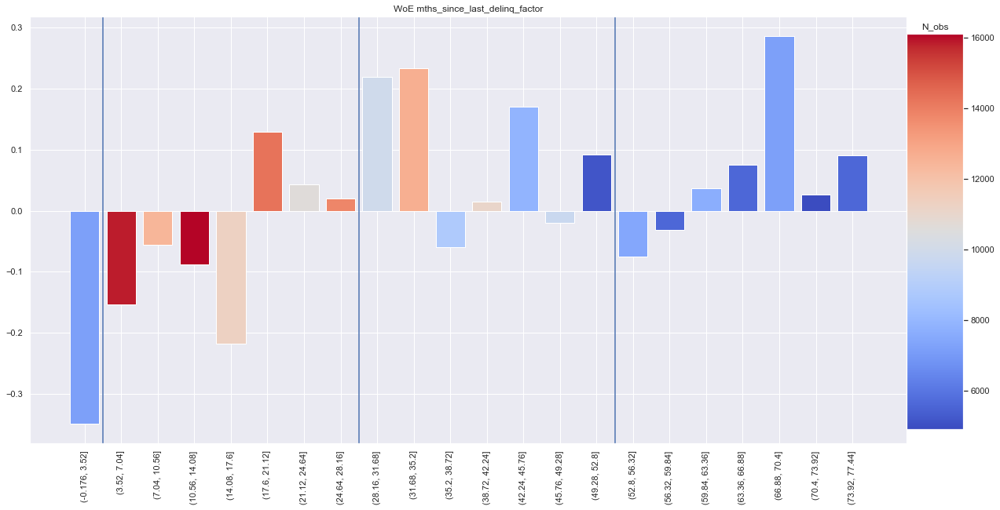


```python
fig, ax = plt.subplots(figsize=(20,8))

woe_df.iloc[:50,:].set_index('mths_since_last_delinq_factor').iloc[:, [3,4]].plot(kind='bar', stacked=True, ax=ax)

plt.legend()
```


    <matplotlib.legend.Legend at 0x1a1ba78a90>


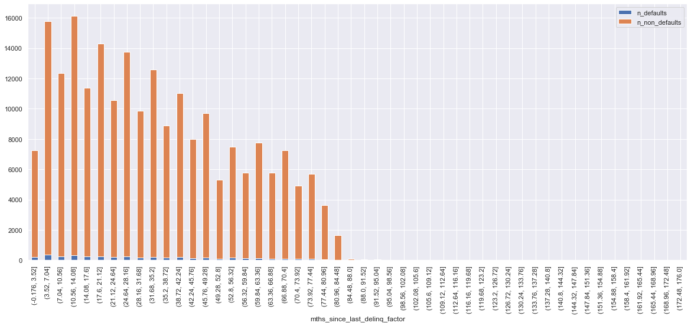


```python
x_train_prep['mths_since_last_delinq:missing'] = np.where(x_train_prep['mths_since_last_delinq'].isnull(), 1, 0)
x_train_prep['mths_since_last_delinq:<4'] = np.where(x_train_prep['mths_since_last_delinq'] <= 4, 1, 0)
x_train_prep['mths_since_last_delinq:4_30'] = np.where((x_train_prep['mths_since_last_delinq'] > 4) & (x_train_prep['mths_since_last_delinq'] <= 30), 1, 0)
x_train_prep['mths_since_last_delinq:31_56'] = np.where((x_train_prep['mths_since_last_delinq'] > 30) & (x_train_prep['mths_since_last_delinq'] <= 56), 1, 0)
x_train_prep['mths_since_last_delinq:>57'] = np.where((x_train_prep['mths_since_last_delinq'] > 4) & (x_train_prep['mths_since_last_delinq'] <= 30), 1, 0)


```


```python
fig, ax = plt.subplots(figsize=(20,8))

var_s = ['mths_since_last_delinq:missing', 'mths_since_last_delinq:<4', 'mths_since_last_delinq:4_30',
         'mths_since_last_delinq:31_56', 'mths_since_last_delinq:>57']

pd.concat([x_train_prep, y_train_prep], axis=1).groupby('Y').sum().loc[:, var_s].T.plot(kind='bar', stacked=True, ax=ax)

plt.legend()
```


    <matplotlib.legend.Legend at 0x1a1dbd62b0>


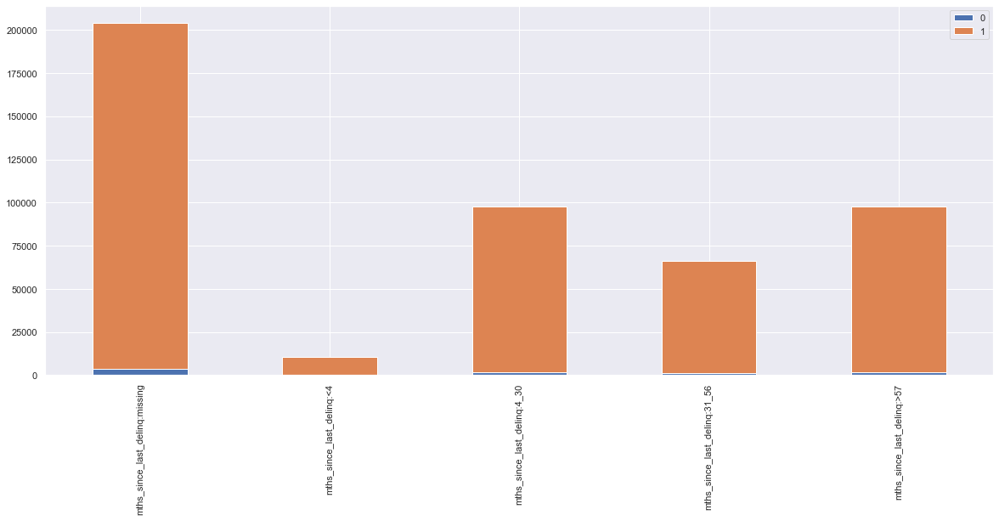

vars_to_use.append(['mths_since_last_delinq:missing', 'mths_since_last_delinq:4_30',
                    'mths_since_last_delinq:31_56', 'mths_since_last_delinq:>57'])
ref_vars.append(['mths_since_last_delinq:<4'])

vars_to_use
## dti


```python
print(x_train_prep['dti'].nunique(), 'unique values')
print(x_train_prep['dti'].isnull().sum(), 'missing values')
x_train_prep['dti'].describe()
```

    4086 unique values
    0 missing values


    count    421094.000000
    mean         19.196014
    std          23.504060
    min           0.000000
    25%          12.590000
    50%          18.600000
    75%          25.340000
    max        9999.000000
    Name: dti, dtype: float64


```python
x_train_prep['dti_factor'] = pd.cut(x_train_prep['dti'], 50)
```


```python
woe_df = woe_ordered_continuous(x_train_prep, 'dti_factor', y_train_prep, rot_x_ticks=90)
woe_df
```


<div>
<style scoped>
    .dataframe tbody tr th:only-of-type {
        vertical-align: middle;
    }

    .dataframe tbody tr th {
        vertical-align: top;
    }

    .dataframe thead th {
        text-align: right;
    }
</style>
<table border="1" class="dataframe">
  <thead>
    <tr style="text-align: right;">
      <th></th>
      <th>dti_factor</th>
      <th>n_obs</th>
      <th>prop_non_defaults</th>
      <th>prop_n_obs</th>
      <th>n_defaults</th>
      <th>n_non_defaults</th>
      <th>prop_n_non_defaults</th>
      <th>prop_n_defaults</th>
      <th>WoE</th>
      <th>diff_prop_non_defaults</th>
      <th>diff_WoE</th>
      <th>IV</th>
    </tr>
  </thead>
  <tbody>
    <tr>
      <th>0</th>
      <td>(-9.999, 199.98]</td>
      <td>421089</td>
      <td>0.981355</td>
      <td>0.999988</td>
      <td>7851.0</td>
      <td>413238.0</td>
      <td>0.999988</td>
      <td>1.0</td>
      <td>-0.000012</td>
      <td>NaN</td>
      <td>NaN</td>
      <td>1.463968e-10</td>
    </tr>
    <tr>
      <th>1</th>
      <td>(199.98, 399.96]</td>
      <td>1</td>
      <td>1.000000</td>
      <td>0.000002</td>
      <td>0.0</td>
      <td>1.0</td>
      <td>0.000002</td>
      <td>0.0</td>
      <td>NaN</td>
      <td>0.999985</td>
      <td>NaN</td>
      <td>1.463968e-10</td>
    </tr>
    <tr>
      <th>2</th>
      <td>(399.96, 599.94]</td>
      <td>0</td>
      <td>NaN</td>
      <td>0.000000</td>
      <td>NaN</td>
      <td>NaN</td>
      <td>NaN</td>
      <td>NaN</td>
      <td>NaN</td>
      <td>NaN</td>
      <td>NaN</td>
      <td>1.463968e-10</td>
    </tr>
    <tr>
      <th>3</th>
      <td>(599.94, 799.92]</td>
      <td>1</td>
      <td>1.000000</td>
      <td>0.000002</td>
      <td>0.0</td>
      <td>1.0</td>
      <td>0.000002</td>
      <td>0.0</td>
      <td>NaN</td>
      <td>NaN</td>
      <td>NaN</td>
      <td>1.463968e-10</td>
    </tr>
    <tr>
      <th>4</th>
      <td>(799.92, 999.9]</td>
      <td>0</td>
      <td>NaN</td>
      <td>0.000000</td>
      <td>NaN</td>
      <td>NaN</td>
      <td>NaN</td>
      <td>NaN</td>
      <td>NaN</td>
      <td>NaN</td>
      <td>NaN</td>
      <td>1.463968e-10</td>
    </tr>
    <tr>
      <th>5</th>
      <td>(999.9, 1199.88]</td>
      <td>1</td>
      <td>1.000000</td>
      <td>0.000002</td>
      <td>0.0</td>
      <td>1.0</td>
      <td>0.000002</td>
      <td>0.0</td>
      <td>NaN</td>
      <td>NaN</td>
      <td>NaN</td>
      <td>1.463968e-10</td>
    </tr>
    <tr>
      <th>6</th>
      <td>(1199.88, 1399.86]</td>
      <td>0</td>
      <td>NaN</td>
      <td>0.000000</td>
      <td>NaN</td>
      <td>NaN</td>
      <td>NaN</td>
      <td>NaN</td>
      <td>NaN</td>
      <td>NaN</td>
      <td>NaN</td>
      <td>1.463968e-10</td>
    </tr>
    <tr>
      <th>7</th>
      <td>(1399.86, 1599.84]</td>
      <td>0</td>
      <td>NaN</td>
      <td>0.000000</td>
      <td>NaN</td>
      <td>NaN</td>
      <td>NaN</td>
      <td>NaN</td>
      <td>NaN</td>
      <td>NaN</td>
      <td>NaN</td>
      <td>1.463968e-10</td>
    </tr>
    <tr>
      <th>8</th>
      <td>(1599.84, 1799.82]</td>
      <td>0</td>
      <td>NaN</td>
      <td>0.000000</td>
      <td>NaN</td>
      <td>NaN</td>
      <td>NaN</td>
      <td>NaN</td>
      <td>NaN</td>
      <td>NaN</td>
      <td>NaN</td>
      <td>1.463968e-10</td>
    </tr>
    <tr>
      <th>9</th>
      <td>(1799.82, 1999.8]</td>
      <td>0</td>
      <td>NaN</td>
      <td>0.000000</td>
      <td>NaN</td>
      <td>NaN</td>
      <td>NaN</td>
      <td>NaN</td>
      <td>NaN</td>
      <td>NaN</td>
      <td>NaN</td>
      <td>1.463968e-10</td>
    </tr>
    <tr>
      <th>10</th>
      <td>(1999.8, 2199.78]</td>
      <td>0</td>
      <td>NaN</td>
      <td>0.000000</td>
      <td>NaN</td>
      <td>NaN</td>
      <td>NaN</td>
      <td>NaN</td>
      <td>NaN</td>
      <td>NaN</td>
      <td>NaN</td>
      <td>1.463968e-10</td>
    </tr>
    <tr>
      <th>11</th>
      <td>(2199.78, 2399.76]</td>
      <td>0</td>
      <td>NaN</td>
      <td>0.000000</td>
      <td>NaN</td>
      <td>NaN</td>
      <td>NaN</td>
      <td>NaN</td>
      <td>NaN</td>
      <td>NaN</td>
      <td>NaN</td>
      <td>1.463968e-10</td>
    </tr>
    <tr>
      <th>12</th>
      <td>(2399.76, 2599.74]</td>
      <td>0</td>
      <td>NaN</td>
      <td>0.000000</td>
      <td>NaN</td>
      <td>NaN</td>
      <td>NaN</td>
      <td>NaN</td>
      <td>NaN</td>
      <td>NaN</td>
      <td>NaN</td>
      <td>1.463968e-10</td>
    </tr>
    <tr>
      <th>13</th>
      <td>(2599.74, 2799.72]</td>
      <td>0</td>
      <td>NaN</td>
      <td>0.000000</td>
      <td>NaN</td>
      <td>NaN</td>
      <td>NaN</td>
      <td>NaN</td>
      <td>NaN</td>
      <td>NaN</td>
      <td>NaN</td>
      <td>1.463968e-10</td>
    </tr>
    <tr>
      <th>14</th>
      <td>(2799.72, 2999.7]</td>
      <td>0</td>
      <td>NaN</td>
      <td>0.000000</td>
      <td>NaN</td>
      <td>NaN</td>
      <td>NaN</td>
      <td>NaN</td>
      <td>NaN</td>
      <td>NaN</td>
      <td>NaN</td>
      <td>1.463968e-10</td>
    </tr>
    <tr>
      <th>15</th>
      <td>(2999.7, 3199.68]</td>
      <td>0</td>
      <td>NaN</td>
      <td>0.000000</td>
      <td>NaN</td>
      <td>NaN</td>
      <td>NaN</td>
      <td>NaN</td>
      <td>NaN</td>
      <td>NaN</td>
      <td>NaN</td>
      <td>1.463968e-10</td>
    </tr>
    <tr>
      <th>16</th>
      <td>(3199.68, 3399.66]</td>
      <td>0</td>
      <td>NaN</td>
      <td>0.000000</td>
      <td>NaN</td>
      <td>NaN</td>
      <td>NaN</td>
      <td>NaN</td>
      <td>NaN</td>
      <td>NaN</td>
      <td>NaN</td>
      <td>1.463968e-10</td>
    </tr>
    <tr>
      <th>17</th>
      <td>(3399.66, 3599.64]</td>
      <td>0</td>
      <td>NaN</td>
      <td>0.000000</td>
      <td>NaN</td>
      <td>NaN</td>
      <td>NaN</td>
      <td>NaN</td>
      <td>NaN</td>
      <td>NaN</td>
      <td>NaN</td>
      <td>1.463968e-10</td>
    </tr>
    <tr>
      <th>18</th>
      <td>(3599.64, 3799.62]</td>
      <td>0</td>
      <td>NaN</td>
      <td>0.000000</td>
      <td>NaN</td>
      <td>NaN</td>
      <td>NaN</td>
      <td>NaN</td>
      <td>NaN</td>
      <td>NaN</td>
      <td>NaN</td>
      <td>1.463968e-10</td>
    </tr>
    <tr>
      <th>19</th>
      <td>(3799.62, 3999.6]</td>
      <td>0</td>
      <td>NaN</td>
      <td>0.000000</td>
      <td>NaN</td>
      <td>NaN</td>
      <td>NaN</td>
      <td>NaN</td>
      <td>NaN</td>
      <td>NaN</td>
      <td>NaN</td>
      <td>1.463968e-10</td>
    </tr>
    <tr>
      <th>20</th>
      <td>(3999.6, 4199.58]</td>
      <td>0</td>
      <td>NaN</td>
      <td>0.000000</td>
      <td>NaN</td>
      <td>NaN</td>
      <td>NaN</td>
      <td>NaN</td>
      <td>NaN</td>
      <td>NaN</td>
      <td>NaN</td>
      <td>1.463968e-10</td>
    </tr>
    <tr>
      <th>21</th>
      <td>(4199.58, 4399.56]</td>
      <td>0</td>
      <td>NaN</td>
      <td>0.000000</td>
      <td>NaN</td>
      <td>NaN</td>
      <td>NaN</td>
      <td>NaN</td>
      <td>NaN</td>
      <td>NaN</td>
      <td>NaN</td>
      <td>1.463968e-10</td>
    </tr>
    <tr>
      <th>22</th>
      <td>(4399.56, 4599.54]</td>
      <td>0</td>
      <td>NaN</td>
      <td>0.000000</td>
      <td>NaN</td>
      <td>NaN</td>
      <td>NaN</td>
      <td>NaN</td>
      <td>NaN</td>
      <td>NaN</td>
      <td>NaN</td>
      <td>1.463968e-10</td>
    </tr>
    <tr>
      <th>23</th>
      <td>(4599.54, 4799.52]</td>
      <td>0</td>
      <td>NaN</td>
      <td>0.000000</td>
      <td>NaN</td>
      <td>NaN</td>
      <td>NaN</td>
      <td>NaN</td>
      <td>NaN</td>
      <td>NaN</td>
      <td>NaN</td>
      <td>1.463968e-10</td>
    </tr>
    <tr>
      <th>24</th>
      <td>(4799.52, 4999.5]</td>
      <td>0</td>
      <td>NaN</td>
      <td>0.000000</td>
      <td>NaN</td>
      <td>NaN</td>
      <td>NaN</td>
      <td>NaN</td>
      <td>NaN</td>
      <td>NaN</td>
      <td>NaN</td>
      <td>1.463968e-10</td>
    </tr>
    <tr>
      <th>25</th>
      <td>(4999.5, 5199.48]</td>
      <td>0</td>
      <td>NaN</td>
      <td>0.000000</td>
      <td>NaN</td>
      <td>NaN</td>
      <td>NaN</td>
      <td>NaN</td>
      <td>NaN</td>
      <td>NaN</td>
      <td>NaN</td>
      <td>1.463968e-10</td>
    </tr>
    <tr>
      <th>26</th>
      <td>(5199.48, 5399.46]</td>
      <td>0</td>
      <td>NaN</td>
      <td>0.000000</td>
      <td>NaN</td>
      <td>NaN</td>
      <td>NaN</td>
      <td>NaN</td>
      <td>NaN</td>
      <td>NaN</td>
      <td>NaN</td>
      <td>1.463968e-10</td>
    </tr>
    <tr>
      <th>27</th>
      <td>(5399.46, 5599.44]</td>
      <td>0</td>
      <td>NaN</td>
      <td>0.000000</td>
      <td>NaN</td>
      <td>NaN</td>
      <td>NaN</td>
      <td>NaN</td>
      <td>NaN</td>
      <td>NaN</td>
      <td>NaN</td>
      <td>1.463968e-10</td>
    </tr>
    <tr>
      <th>28</th>
      <td>(5599.44, 5799.42]</td>
      <td>0</td>
      <td>NaN</td>
      <td>0.000000</td>
      <td>NaN</td>
      <td>NaN</td>
      <td>NaN</td>
      <td>NaN</td>
      <td>NaN</td>
      <td>NaN</td>
      <td>NaN</td>
      <td>1.463968e-10</td>
    </tr>
    <tr>
      <th>29</th>
      <td>(5799.42, 5999.4]</td>
      <td>0</td>
      <td>NaN</td>
      <td>0.000000</td>
      <td>NaN</td>
      <td>NaN</td>
      <td>NaN</td>
      <td>NaN</td>
      <td>NaN</td>
      <td>NaN</td>
      <td>NaN</td>
      <td>1.463968e-10</td>
    </tr>
    <tr>
      <th>30</th>
      <td>(5999.4, 6199.38]</td>
      <td>0</td>
      <td>NaN</td>
      <td>0.000000</td>
      <td>NaN</td>
      <td>NaN</td>
      <td>NaN</td>
      <td>NaN</td>
      <td>NaN</td>
      <td>NaN</td>
      <td>NaN</td>
      <td>1.463968e-10</td>
    </tr>
    <tr>
      <th>31</th>
      <td>(6199.38, 6399.36]</td>
      <td>0</td>
      <td>NaN</td>
      <td>0.000000</td>
      <td>NaN</td>
      <td>NaN</td>
      <td>NaN</td>
      <td>NaN</td>
      <td>NaN</td>
      <td>NaN</td>
      <td>NaN</td>
      <td>1.463968e-10</td>
    </tr>
    <tr>
      <th>32</th>
      <td>(6399.36, 6599.34]</td>
      <td>0</td>
      <td>NaN</td>
      <td>0.000000</td>
      <td>NaN</td>
      <td>NaN</td>
      <td>NaN</td>
      <td>NaN</td>
      <td>NaN</td>
      <td>NaN</td>
      <td>NaN</td>
      <td>1.463968e-10</td>
    </tr>
    <tr>
      <th>33</th>
      <td>(6599.34, 6799.32]</td>
      <td>0</td>
      <td>NaN</td>
      <td>0.000000</td>
      <td>NaN</td>
      <td>NaN</td>
      <td>NaN</td>
      <td>NaN</td>
      <td>NaN</td>
      <td>NaN</td>
      <td>NaN</td>
      <td>1.463968e-10</td>
    </tr>
    <tr>
      <th>34</th>
      <td>(6799.32, 6999.3]</td>
      <td>0</td>
      <td>NaN</td>
      <td>0.000000</td>
      <td>NaN</td>
      <td>NaN</td>
      <td>NaN</td>
      <td>NaN</td>
      <td>NaN</td>
      <td>NaN</td>
      <td>NaN</td>
      <td>1.463968e-10</td>
    </tr>
    <tr>
      <th>35</th>
      <td>(6999.3, 7199.28]</td>
      <td>0</td>
      <td>NaN</td>
      <td>0.000000</td>
      <td>NaN</td>
      <td>NaN</td>
      <td>NaN</td>
      <td>NaN</td>
      <td>NaN</td>
      <td>NaN</td>
      <td>NaN</td>
      <td>1.463968e-10</td>
    </tr>
    <tr>
      <th>36</th>
      <td>(7199.28, 7399.26]</td>
      <td>0</td>
      <td>NaN</td>
      <td>0.000000</td>
      <td>NaN</td>
      <td>NaN</td>
      <td>NaN</td>
      <td>NaN</td>
      <td>NaN</td>
      <td>NaN</td>
      <td>NaN</td>
      <td>1.463968e-10</td>
    </tr>
    <tr>
      <th>37</th>
      <td>(7399.26, 7599.24]</td>
      <td>0</td>
      <td>NaN</td>
      <td>0.000000</td>
      <td>NaN</td>
      <td>NaN</td>
      <td>NaN</td>
      <td>NaN</td>
      <td>NaN</td>
      <td>NaN</td>
      <td>NaN</td>
      <td>1.463968e-10</td>
    </tr>
    <tr>
      <th>38</th>
      <td>(7599.24, 7799.22]</td>
      <td>0</td>
      <td>NaN</td>
      <td>0.000000</td>
      <td>NaN</td>
      <td>NaN</td>
      <td>NaN</td>
      <td>NaN</td>
      <td>NaN</td>
      <td>NaN</td>
      <td>NaN</td>
      <td>1.463968e-10</td>
    </tr>
    <tr>
      <th>39</th>
      <td>(7799.22, 7999.2]</td>
      <td>0</td>
      <td>NaN</td>
      <td>0.000000</td>
      <td>NaN</td>
      <td>NaN</td>
      <td>NaN</td>
      <td>NaN</td>
      <td>NaN</td>
      <td>NaN</td>
      <td>NaN</td>
      <td>1.463968e-10</td>
    </tr>
    <tr>
      <th>40</th>
      <td>(7999.2, 8199.18]</td>
      <td>0</td>
      <td>NaN</td>
      <td>0.000000</td>
      <td>NaN</td>
      <td>NaN</td>
      <td>NaN</td>
      <td>NaN</td>
      <td>NaN</td>
      <td>NaN</td>
      <td>NaN</td>
      <td>1.463968e-10</td>
    </tr>
    <tr>
      <th>41</th>
      <td>(8199.18, 8399.16]</td>
      <td>0</td>
      <td>NaN</td>
      <td>0.000000</td>
      <td>NaN</td>
      <td>NaN</td>
      <td>NaN</td>
      <td>NaN</td>
      <td>NaN</td>
      <td>NaN</td>
      <td>NaN</td>
      <td>1.463968e-10</td>
    </tr>
    <tr>
      <th>42</th>
      <td>(8399.16, 8599.14]</td>
      <td>0</td>
      <td>NaN</td>
      <td>0.000000</td>
      <td>NaN</td>
      <td>NaN</td>
      <td>NaN</td>
      <td>NaN</td>
      <td>NaN</td>
      <td>NaN</td>
      <td>NaN</td>
      <td>1.463968e-10</td>
    </tr>
    <tr>
      <th>43</th>
      <td>(8599.14, 8799.12]</td>
      <td>0</td>
      <td>NaN</td>
      <td>0.000000</td>
      <td>NaN</td>
      <td>NaN</td>
      <td>NaN</td>
      <td>NaN</td>
      <td>NaN</td>
      <td>NaN</td>
      <td>NaN</td>
      <td>1.463968e-10</td>
    </tr>
    <tr>
      <th>44</th>
      <td>(8799.12, 8999.1]</td>
      <td>0</td>
      <td>NaN</td>
      <td>0.000000</td>
      <td>NaN</td>
      <td>NaN</td>
      <td>NaN</td>
      <td>NaN</td>
      <td>NaN</td>
      <td>NaN</td>
      <td>NaN</td>
      <td>1.463968e-10</td>
    </tr>
    <tr>
      <th>45</th>
      <td>(8999.1, 9199.08]</td>
      <td>0</td>
      <td>NaN</td>
      <td>0.000000</td>
      <td>NaN</td>
      <td>NaN</td>
      <td>NaN</td>
      <td>NaN</td>
      <td>NaN</td>
      <td>NaN</td>
      <td>NaN</td>
      <td>1.463968e-10</td>
    </tr>
    <tr>
      <th>46</th>
      <td>(9199.08, 9399.06]</td>
      <td>0</td>
      <td>NaN</td>
      <td>0.000000</td>
      <td>NaN</td>
      <td>NaN</td>
      <td>NaN</td>
      <td>NaN</td>
      <td>NaN</td>
      <td>NaN</td>
      <td>NaN</td>
      <td>1.463968e-10</td>
    </tr>
    <tr>
      <th>47</th>
      <td>(9399.06, 9599.04]</td>
      <td>0</td>
      <td>NaN</td>
      <td>0.000000</td>
      <td>NaN</td>
      <td>NaN</td>
      <td>NaN</td>
      <td>NaN</td>
      <td>NaN</td>
      <td>NaN</td>
      <td>NaN</td>
      <td>1.463968e-10</td>
    </tr>
    <tr>
      <th>48</th>
      <td>(9599.04, 9799.02]</td>
      <td>0</td>
      <td>NaN</td>
      <td>0.000000</td>
      <td>NaN</td>
      <td>NaN</td>
      <td>NaN</td>
      <td>NaN</td>
      <td>NaN</td>
      <td>NaN</td>
      <td>NaN</td>
      <td>1.463968e-10</td>
    </tr>
    <tr>
      <th>49</th>
      <td>(9799.02, 9999.0]</td>
      <td>2</td>
      <td>1.000000</td>
      <td>0.000005</td>
      <td>0.0</td>
      <td>2.0</td>
      <td>0.000005</td>
      <td>0.0</td>
      <td>NaN</td>
      <td>NaN</td>
      <td>NaN</td>
      <td>1.463968e-10</td>
    </tr>
  </tbody>
</table>
</div>


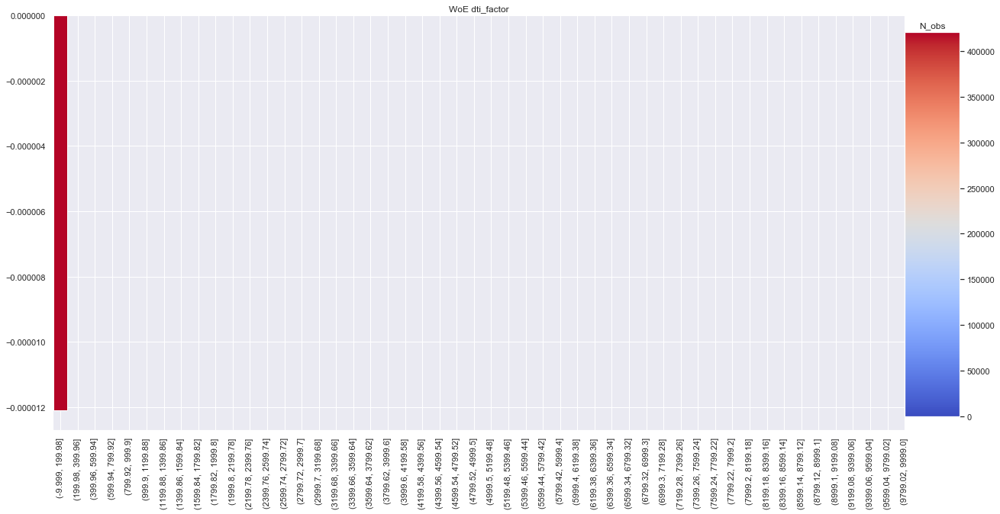


```python
pd.options.display.max_columns=None
new_data[new_data['dti'] > 200]
```


<div>
<style scoped>
    .dataframe tbody tr th:only-of-type {
        vertical-align: middle;
    }

    .dataframe tbody tr th {
        vertical-align: top;
    }

    .dataframe thead th {
        text-align: right;
    }
</style>
<table border="1" class="dataframe">
  <thead>
    <tr style="text-align: right;">
      <th></th>
      <th>id</th>
      <th>member_id</th>
      <th>loan_amnt</th>
      <th>funded_amnt</th>
      <th>funded_amnt_inv</th>
      <th>term</th>
      <th>int_rate</th>
      <th>installment</th>
      <th>grade</th>
      <th>sub_grade</th>
      <th>emp_title</th>
      <th>emp_length</th>
      <th>home_ownership</th>
      <th>annual_inc</th>
      <th>verification_status</th>
      <th>issue_d</th>
      <th>loan_status</th>
      <th>pymnt_plan</th>
      <th>url</th>
      <th>desc</th>
      <th>purpose</th>
      <th>title</th>
      <th>zip_code</th>
      <th>addr_state</th>
      <th>dti</th>
      <th>delinq_2yrs</th>
      <th>earliest_cr_line</th>
      <th>inq_last_6mths</th>
      <th>mths_since_last_delinq</th>
      <th>mths_since_last_record</th>
      <th>open_acc</th>
      <th>pub_rec</th>
      <th>revol_bal</th>
      <th>revol_util</th>
      <th>total_acc</th>
      <th>initial_list_status</th>
      <th>out_prncp</th>
      <th>out_prncp_inv</th>
      <th>total_pymnt</th>
      <th>total_pymnt_inv</th>
      <th>total_rec_prncp</th>
      <th>total_rec_int</th>
      <th>total_rec_late_fee</th>
      <th>recoveries</th>
      <th>collection_recovery_fee</th>
      <th>last_pymnt_d</th>
      <th>last_pymnt_amnt</th>
      <th>next_pymnt_d</th>
      <th>last_credit_pull_d</th>
      <th>collections_12_mths_ex_med</th>
      <th>mths_since_last_major_derog</th>
      <th>policy_code</th>
      <th>application_type</th>
      <th>annual_inc_joint</th>
      <th>dti_joint</th>
      <th>verification_status_joint</th>
      <th>acc_now_delinq</th>
      <th>tot_coll_amt</th>
      <th>tot_cur_bal</th>
      <th>open_acc_6m</th>
      <th>open_il_6m</th>
      <th>open_il_12m</th>
      <th>open_il_24m</th>
      <th>mths_since_rcnt_il</th>
      <th>total_bal_il</th>
      <th>il_util</th>
      <th>open_rv_12m</th>
      <th>open_rv_24m</th>
      <th>max_bal_bc</th>
      <th>all_util</th>
      <th>total_rev_hi_lim</th>
      <th>inq_fi</th>
      <th>total_cu_tl</th>
      <th>inq_last_12m</th>
      <th>emp_length_int</th>
      <th>earliest_cr_line_date</th>
      <th>mths_since_earliest_cr_line</th>
      <th>issue_d_date</th>
      <th>mths_since_issue_d</th>
      <th>grade:A</th>
      <th>grade:B</th>
      <th>grade:C</th>
      <th>grade:D</th>
      <th>grade:E</th>
      <th>grade:F</th>
      <th>grade:G</th>
      <th>sub_grade:A1</th>
      <th>sub_grade:A2</th>
      <th>sub_grade:A3</th>
      <th>sub_grade:A4</th>
      <th>sub_grade:A5</th>
      <th>sub_grade:B1</th>
      <th>sub_grade:B2</th>
      <th>sub_grade:B3</th>
      <th>sub_grade:B4</th>
      <th>sub_grade:B5</th>
      <th>sub_grade:C1</th>
      <th>sub_grade:C2</th>
      <th>sub_grade:C3</th>
      <th>sub_grade:C4</th>
      <th>sub_grade:C5</th>
      <th>sub_grade:D1</th>
      <th>sub_grade:D2</th>
      <th>sub_grade:D3</th>
      <th>sub_grade:D4</th>
      <th>sub_grade:D5</th>
      <th>sub_grade:E1</th>
      <th>sub_grade:E2</th>
      <th>sub_grade:E3</th>
      <th>sub_grade:E4</th>
      <th>sub_grade:E5</th>
      <th>sub_grade:F1</th>
      <th>sub_grade:F2</th>
      <th>sub_grade:F3</th>
      <th>sub_grade:F4</th>
      <th>sub_grade:F5</th>
      <th>sub_grade:G1</th>
      <th>sub_grade:G2</th>
      <th>sub_grade:G3</th>
      <th>sub_grade:G4</th>
      <th>sub_grade:G5</th>
      <th>home_ownership:ANY</th>
      <th>home_ownership:MORTGAGE</th>
      <th>home_ownership:OWN</th>
      <th>home_ownership:RENT</th>
      <th>verification_status:Not Verified</th>
      <th>verification_status:Source Verified</th>
      <th>verification_status:Verified</th>
      <th>loan_status:Charged Off</th>
      <th>loan_status:Current</th>
      <th>loan_status:Default</th>
      <th>loan_status:Fully Paid</th>
      <th>loan_status:In Grace Period</th>
      <th>loan_status:Issued</th>
      <th>loan_status:Late (16-30 days)</th>
      <th>loan_status:Late (31-120 days)</th>
      <th>purpose:car</th>
      <th>purpose:credit_card</th>
      <th>purpose:debt_consolidation</th>
      <th>purpose:educational</th>
      <th>purpose:home_improvement</th>
      <th>purpose:house</th>
      <th>purpose:major_purchase</th>
      <th>purpose:medical</th>
      <th>purpose:moving</th>
      <th>purpose:other</th>
      <th>purpose:renewable_energy</th>
      <th>purpose:small_business</th>
      <th>purpose:vacation</th>
      <th>purpose:wedding</th>
      <th>addr_state:AK</th>
      <th>addr_state:AL</th>
      <th>addr_state:AR</th>
      <th>addr_state:AZ</th>
      <th>addr_state:CA</th>
      <th>addr_state:CO</th>
      <th>addr_state:CT</th>
      <th>addr_state:DC</th>
      <th>addr_state:DE</th>
      <th>addr_state:FL</th>
      <th>addr_state:GA</th>
      <th>addr_state:HI</th>
      <th>addr_state:IL</th>
      <th>addr_state:IN</th>
      <th>addr_state:KS</th>
      <th>addr_state:KY</th>
      <th>addr_state:LA</th>
      <th>addr_state:MA</th>
      <th>addr_state:MD</th>
      <th>addr_state:ME</th>
      <th>addr_state:MI</th>
      <th>addr_state:MN</th>
      <th>addr_state:MO</th>
      <th>addr_state:MS</th>
      <th>addr_state:MT</th>
      <th>addr_state:NC</th>
      <th>addr_state:ND</th>
      <th>addr_state:NE</th>
      <th>addr_state:NH</th>
      <th>addr_state:NJ</th>
      <th>addr_state:NM</th>
      <th>addr_state:NV</th>
      <th>addr_state:NY</th>
      <th>addr_state:OH</th>
      <th>addr_state:OK</th>
      <th>addr_state:OR</th>
      <th>addr_state:PA</th>
      <th>addr_state:RI</th>
      <th>addr_state:SC</th>
      <th>addr_state:SD</th>
      <th>addr_state:TN</th>
      <th>addr_state:TX</th>
      <th>addr_state:UT</th>
      <th>addr_state:VA</th>
      <th>addr_state:VT</th>
      <th>addr_state:WA</th>
      <th>addr_state:WI</th>
      <th>addr_state:WV</th>
      <th>addr_state:WY</th>
      <th>initial_list_status:f</th>
      <th>initial_list_status:w</th>
      <th>Y</th>
    </tr>
  </thead>
  <tbody>
    <tr>
      <th>8761</th>
      <td>67405134</td>
      <td>72216846</td>
      <td>6550</td>
      <td>6550</td>
      <td>6550.0</td>
      <td>36</td>
      <td>17.86</td>
      <td>236.34</td>
      <td>D</td>
      <td>D5</td>
      <td>NaN</td>
      <td>NaN</td>
      <td>MORTGAGE</td>
      <td>1770.0</td>
      <td>Not Verified</td>
      <td>2015-12-01</td>
      <td>Current</td>
      <td>n</td>
      <td>https://www.lendingclub.com/browse/loanDetail....</td>
      <td>NaN</td>
      <td>credit_card</td>
      <td>Credit card refinancing</td>
      <td>773xx</td>
      <td>TX</td>
      <td>1092.52</td>
      <td>2.0</td>
      <td>Jul-91</td>
      <td>0.0</td>
      <td>9.0</td>
      <td>NaN</td>
      <td>10.0</td>
      <td>0.0</td>
      <td>29029</td>
      <td>84.4</td>
      <td>25.0</td>
      <td>w</td>
      <td>6550.00</td>
      <td>6550.00</td>
      <td>0.00</td>
      <td>0.00</td>
      <td>0.00</td>
      <td>0.00</td>
      <td>0.0</td>
      <td>0.0</td>
      <td>0.0</td>
      <td>NaN</td>
      <td>0.00</td>
      <td>Feb-16</td>
      <td>Jan-16</td>
      <td>0.0</td>
      <td>NaN</td>
      <td>1</td>
      <td>JOINT</td>
      <td>62151.0</td>
      <td>31.01</td>
      <td>Not Verified</td>
      <td>0.0</td>
      <td>0.0</td>
      <td>192764.0</td>
      <td>1.0</td>
      <td>1.0</td>
      <td>1.0</td>
      <td>1.0</td>
      <td>6.0</td>
      <td>20519.0</td>
      <td>93.7</td>
      <td>1.0</td>
      <td>5.0</td>
      <td>15885.0</td>
      <td>88.0</td>
      <td>34400.0</td>
      <td>1.0</td>
      <td>0.0</td>
      <td>3.0</td>
      <td>0</td>
      <td>1991-07-01</td>
      <td>329.0</td>
      <td>2015-12-01</td>
      <td>36.0</td>
      <td>0</td>
      <td>0</td>
      <td>0</td>
      <td>1</td>
      <td>0</td>
      <td>0</td>
      <td>0</td>
      <td>0</td>
      <td>0</td>
      <td>0</td>
      <td>0</td>
      <td>0</td>
      <td>0</td>
      <td>0</td>
      <td>0</td>
      <td>0</td>
      <td>0</td>
      <td>0</td>
      <td>0</td>
      <td>0</td>
      <td>0</td>
      <td>0</td>
      <td>0</td>
      <td>0</td>
      <td>0</td>
      <td>0</td>
      <td>1</td>
      <td>0</td>
      <td>0</td>
      <td>0</td>
      <td>0</td>
      <td>0</td>
      <td>0</td>
      <td>0</td>
      <td>0</td>
      <td>0</td>
      <td>0</td>
      <td>0</td>
      <td>0</td>
      <td>0</td>
      <td>0</td>
      <td>0</td>
      <td>0</td>
      <td>1</td>
      <td>0</td>
      <td>0</td>
      <td>1</td>
      <td>0</td>
      <td>0</td>
      <td>0</td>
      <td>1</td>
      <td>0</td>
      <td>0</td>
      <td>0</td>
      <td>0</td>
      <td>0</td>
      <td>0</td>
      <td>0</td>
      <td>1</td>
      <td>0</td>
      <td>0</td>
      <td>0</td>
      <td>0</td>
      <td>0</td>
      <td>0</td>
      <td>0</td>
      <td>0</td>
      <td>0</td>
      <td>0</td>
      <td>0</td>
      <td>0</td>
      <td>0</td>
      <td>0</td>
      <td>0</td>
      <td>0</td>
      <td>0</td>
      <td>0</td>
      <td>0</td>
      <td>0</td>
      <td>0</td>
      <td>0</td>
      <td>0</td>
      <td>0</td>
      <td>0</td>
      <td>0</td>
      <td>0</td>
      <td>0</td>
      <td>0</td>
      <td>0</td>
      <td>0</td>
      <td>0</td>
      <td>0</td>
      <td>0</td>
      <td>0</td>
      <td>0</td>
      <td>0</td>
      <td>0</td>
      <td>0</td>
      <td>0</td>
      <td>0</td>
      <td>0</td>
      <td>0</td>
      <td>0</td>
      <td>0</td>
      <td>0</td>
      <td>0</td>
      <td>0</td>
      <td>0</td>
      <td>0</td>
      <td>0</td>
      <td>0</td>
      <td>0</td>
      <td>1</td>
      <td>0</td>
      <td>0</td>
      <td>0</td>
      <td>0</td>
      <td>0</td>
      <td>0</td>
      <td>0</td>
      <td>0</td>
      <td>1</td>
      <td>1</td>
    </tr>
    <tr>
      <th>18161</th>
      <td>66415476</td>
      <td>71141331</td>
      <td>20000</td>
      <td>20000</td>
      <td>20000.0</td>
      <td>36</td>
      <td>16.99</td>
      <td>712.96</td>
      <td>D</td>
      <td>D3</td>
      <td>NaN</td>
      <td>NaN</td>
      <td>MORTGAGE</td>
      <td>0.0</td>
      <td>Not Verified</td>
      <td>2015-12-01</td>
      <td>Current</td>
      <td>n</td>
      <td>https://www.lendingclub.com/browse/loanDetail....</td>
      <td>NaN</td>
      <td>debt_consolidation</td>
      <td>Debt consolidation</td>
      <td>760xx</td>
      <td>TX</td>
      <td>9999.00</td>
      <td>0.0</td>
      <td>Jul-01</td>
      <td>1.0</td>
      <td>NaN</td>
      <td>NaN</td>
      <td>7.0</td>
      <td>0.0</td>
      <td>7161</td>
      <td>88.4</td>
      <td>11.0</td>
      <td>w</td>
      <td>19570.21</td>
      <td>19570.21</td>
      <td>694.08</td>
      <td>694.08</td>
      <td>429.79</td>
      <td>264.29</td>
      <td>0.0</td>
      <td>0.0</td>
      <td>0.0</td>
      <td>Jan-16</td>
      <td>712.96</td>
      <td>Feb-16</td>
      <td>Jan-16</td>
      <td>0.0</td>
      <td>NaN</td>
      <td>1</td>
      <td>JOINT</td>
      <td>185000.0</td>
      <td>5.31</td>
      <td>Not Verified</td>
      <td>0.0</td>
      <td>0.0</td>
      <td>8715.0</td>
      <td>1.0</td>
      <td>1.0</td>
      <td>0.0</td>
      <td>1.0</td>
      <td>14.0</td>
      <td>1554.0</td>
      <td>51.8</td>
      <td>1.0</td>
      <td>1.0</td>
      <td>3527.0</td>
      <td>78.5</td>
      <td>8100.0</td>
      <td>1.0</td>
      <td>0.0</td>
      <td>1.0</td>
      <td>0</td>
      <td>2001-07-01</td>
      <td>209.0</td>
      <td>2015-12-01</td>
      <td>36.0</td>
      <td>0</td>
      <td>0</td>
      <td>0</td>
      <td>1</td>
      <td>0</td>
      <td>0</td>
      <td>0</td>
      <td>0</td>
      <td>0</td>
      <td>0</td>
      <td>0</td>
      <td>0</td>
      <td>0</td>
      <td>0</td>
      <td>0</td>
      <td>0</td>
      <td>0</td>
      <td>0</td>
      <td>0</td>
      <td>0</td>
      <td>0</td>
      <td>0</td>
      <td>0</td>
      <td>0</td>
      <td>1</td>
      <td>0</td>
      <td>0</td>
      <td>0</td>
      <td>0</td>
      <td>0</td>
      <td>0</td>
      <td>0</td>
      <td>0</td>
      <td>0</td>
      <td>0</td>
      <td>0</td>
      <td>0</td>
      <td>0</td>
      <td>0</td>
      <td>0</td>
      <td>0</td>
      <td>0</td>
      <td>0</td>
      <td>1</td>
      <td>0</td>
      <td>0</td>
      <td>1</td>
      <td>0</td>
      <td>0</td>
      <td>0</td>
      <td>1</td>
      <td>0</td>
      <td>0</td>
      <td>0</td>
      <td>0</td>
      <td>0</td>
      <td>0</td>
      <td>0</td>
      <td>0</td>
      <td>1</td>
      <td>0</td>
      <td>0</td>
      <td>0</td>
      <td>0</td>
      <td>0</td>
      <td>0</td>
      <td>0</td>
      <td>0</td>
      <td>0</td>
      <td>0</td>
      <td>0</td>
      <td>0</td>
      <td>0</td>
      <td>0</td>
      <td>0</td>
      <td>0</td>
      <td>0</td>
      <td>0</td>
      <td>0</td>
      <td>0</td>
      <td>0</td>
      <td>0</td>
      <td>0</td>
      <td>0</td>
      <td>0</td>
      <td>0</td>
      <td>0</td>
      <td>0</td>
      <td>0</td>
      <td>0</td>
      <td>0</td>
      <td>0</td>
      <td>0</td>
      <td>0</td>
      <td>0</td>
      <td>0</td>
      <td>0</td>
      <td>0</td>
      <td>0</td>
      <td>0</td>
      <td>0</td>
      <td>0</td>
      <td>0</td>
      <td>0</td>
      <td>0</td>
      <td>0</td>
      <td>0</td>
      <td>0</td>
      <td>0</td>
      <td>0</td>
      <td>0</td>
      <td>0</td>
      <td>1</td>
      <td>0</td>
      <td>0</td>
      <td>0</td>
      <td>0</td>
      <td>0</td>
      <td>0</td>
      <td>0</td>
      <td>0</td>
      <td>1</td>
      <td>1</td>
    </tr>
    <tr>
      <th>65601</th>
      <td>65199509</td>
      <td>69726237</td>
      <td>3700</td>
      <td>3700</td>
      <td>3700.0</td>
      <td>36</td>
      <td>12.59</td>
      <td>123.94</td>
      <td>C</td>
      <td>C2</td>
      <td>NaN</td>
      <td>NaN</td>
      <td>MORTGAGE</td>
      <td>0.0</td>
      <td>Not Verified</td>
      <td>2015-11-01</td>
      <td>Current</td>
      <td>n</td>
      <td>https://www.lendingclub.com/browse/loanDetail....</td>
      <td>NaN</td>
      <td>credit_card</td>
      <td>Credit card refinancing</td>
      <td>765xx</td>
      <td>TX</td>
      <td>9999.00</td>
      <td>2.0</td>
      <td>Aug-78</td>
      <td>1.0</td>
      <td>10.0</td>
      <td>NaN</td>
      <td>8.0</td>
      <td>0.0</td>
      <td>10649</td>
      <td>56.9</td>
      <td>20.0</td>
      <td>f</td>
      <td>3528.87</td>
      <td>3528.87</td>
      <td>242.70</td>
      <td>242.70</td>
      <td>171.13</td>
      <td>71.57</td>
      <td>0.0</td>
      <td>0.0</td>
      <td>0.0</td>
      <td>Jan-16</td>
      <td>123.94</td>
      <td>Feb-16</td>
      <td>Jan-16</td>
      <td>0.0</td>
      <td>10.0</td>
      <td>1</td>
      <td>JOINT</td>
      <td>40988.0</td>
      <td>28.72</td>
      <td>Not Verified</td>
      <td>0.0</td>
      <td>0.0</td>
      <td>24521.0</td>
      <td>NaN</td>
      <td>NaN</td>
      <td>NaN</td>
      <td>NaN</td>
      <td>NaN</td>
      <td>NaN</td>
      <td>NaN</td>
      <td>NaN</td>
      <td>NaN</td>
      <td>NaN</td>
      <td>NaN</td>
      <td>18700.0</td>
      <td>NaN</td>
      <td>NaN</td>
      <td>NaN</td>
      <td>0</td>
      <td>1978-08-01</td>
      <td>484.0</td>
      <td>2015-11-01</td>
      <td>37.0</td>
      <td>0</td>
      <td>0</td>
      <td>1</td>
      <td>0</td>
      <td>0</td>
      <td>0</td>
      <td>0</td>
      <td>0</td>
      <td>0</td>
      <td>0</td>
      <td>0</td>
      <td>0</td>
      <td>0</td>
      <td>0</td>
      <td>0</td>
      <td>0</td>
      <td>0</td>
      <td>0</td>
      <td>1</td>
      <td>0</td>
      <td>0</td>
      <td>0</td>
      <td>0</td>
      <td>0</td>
      <td>0</td>
      <td>0</td>
      <td>0</td>
      <td>0</td>
      <td>0</td>
      <td>0</td>
      <td>0</td>
      <td>0</td>
      <td>0</td>
      <td>0</td>
      <td>0</td>
      <td>0</td>
      <td>0</td>
      <td>0</td>
      <td>0</td>
      <td>0</td>
      <td>0</td>
      <td>0</td>
      <td>0</td>
      <td>1</td>
      <td>0</td>
      <td>0</td>
      <td>1</td>
      <td>0</td>
      <td>0</td>
      <td>0</td>
      <td>1</td>
      <td>0</td>
      <td>0</td>
      <td>0</td>
      <td>0</td>
      <td>0</td>
      <td>0</td>
      <td>0</td>
      <td>1</td>
      <td>0</td>
      <td>0</td>
      <td>0</td>
      <td>0</td>
      <td>0</td>
      <td>0</td>
      <td>0</td>
      <td>0</td>
      <td>0</td>
      <td>0</td>
      <td>0</td>
      <td>0</td>
      <td>0</td>
      <td>0</td>
      <td>0</td>
      <td>0</td>
      <td>0</td>
      <td>0</td>
      <td>0</td>
      <td>0</td>
      <td>0</td>
      <td>0</td>
      <td>0</td>
      <td>0</td>
      <td>0</td>
      <td>0</td>
      <td>0</td>
      <td>0</td>
      <td>0</td>
      <td>0</td>
      <td>0</td>
      <td>0</td>
      <td>0</td>
      <td>0</td>
      <td>0</td>
      <td>0</td>
      <td>0</td>
      <td>0</td>
      <td>0</td>
      <td>0</td>
      <td>0</td>
      <td>0</td>
      <td>0</td>
      <td>0</td>
      <td>0</td>
      <td>0</td>
      <td>0</td>
      <td>0</td>
      <td>0</td>
      <td>0</td>
      <td>0</td>
      <td>0</td>
      <td>0</td>
      <td>1</td>
      <td>0</td>
      <td>0</td>
      <td>0</td>
      <td>0</td>
      <td>0</td>
      <td>0</td>
      <td>0</td>
      <td>1</td>
      <td>0</td>
      <td>1</td>
    </tr>
    <tr>
      <th>66416</th>
      <td>64957302</td>
      <td>69484023</td>
      <td>19000</td>
      <td>19000</td>
      <td>19000.0</td>
      <td>60</td>
      <td>16.99</td>
      <td>472.10</td>
      <td>D</td>
      <td>D3</td>
      <td>Distributer</td>
      <td>1 year</td>
      <td>MORTGAGE</td>
      <td>5000.0</td>
      <td>Source Verified</td>
      <td>2015-11-01</td>
      <td>Current</td>
      <td>n</td>
      <td>https://www.lendingclub.com/browse/loanDetail....</td>
      <td>NaN</td>
      <td>other</td>
      <td>Other</td>
      <td>774xx</td>
      <td>TX</td>
      <td>380.53</td>
      <td>0.0</td>
      <td>Jul-85</td>
      <td>0.0</td>
      <td>39.0</td>
      <td>NaN</td>
      <td>25.0</td>
      <td>0.0</td>
      <td>19104</td>
      <td>33.3</td>
      <td>62.0</td>
      <td>f</td>
      <td>18796.92</td>
      <td>18796.92</td>
      <td>498.99</td>
      <td>498.99</td>
      <td>203.08</td>
      <td>295.91</td>
      <td>0.0</td>
      <td>0.0</td>
      <td>0.0</td>
      <td>Jan-16</td>
      <td>472.10</td>
      <td>Feb-16</td>
      <td>Jan-16</td>
      <td>0.0</td>
      <td>39.0</td>
      <td>1</td>
      <td>JOINT</td>
      <td>270000.0</td>
      <td>9.70</td>
      <td>Source Verified</td>
      <td>0.0</td>
      <td>0.0</td>
      <td>314343.0</td>
      <td>NaN</td>
      <td>NaN</td>
      <td>NaN</td>
      <td>NaN</td>
      <td>NaN</td>
      <td>NaN</td>
      <td>NaN</td>
      <td>NaN</td>
      <td>NaN</td>
      <td>NaN</td>
      <td>NaN</td>
      <td>57400.0</td>
      <td>NaN</td>
      <td>NaN</td>
      <td>NaN</td>
      <td>1</td>
      <td>1985-07-01</td>
      <td>401.0</td>
      <td>2015-11-01</td>
      <td>37.0</td>
      <td>0</td>
      <td>0</td>
      <td>0</td>
      <td>1</td>
      <td>0</td>
      <td>0</td>
      <td>0</td>
      <td>0</td>
      <td>0</td>
      <td>0</td>
      <td>0</td>
      <td>0</td>
      <td>0</td>
      <td>0</td>
      <td>0</td>
      <td>0</td>
      <td>0</td>
      <td>0</td>
      <td>0</td>
      <td>0</td>
      <td>0</td>
      <td>0</td>
      <td>0</td>
      <td>0</td>
      <td>1</td>
      <td>0</td>
      <td>0</td>
      <td>0</td>
      <td>0</td>
      <td>0</td>
      <td>0</td>
      <td>0</td>
      <td>0</td>
      <td>0</td>
      <td>0</td>
      <td>0</td>
      <td>0</td>
      <td>0</td>
      <td>0</td>
      <td>0</td>
      <td>0</td>
      <td>0</td>
      <td>0</td>
      <td>1</td>
      <td>0</td>
      <td>0</td>
      <td>0</td>
      <td>1</td>
      <td>0</td>
      <td>0</td>
      <td>1</td>
      <td>0</td>
      <td>0</td>
      <td>0</td>
      <td>0</td>
      <td>0</td>
      <td>0</td>
      <td>0</td>
      <td>0</td>
      <td>0</td>
      <td>0</td>
      <td>0</td>
      <td>0</td>
      <td>0</td>
      <td>0</td>
      <td>0</td>
      <td>1</td>
      <td>0</td>
      <td>0</td>
      <td>0</td>
      <td>0</td>
      <td>0</td>
      <td>0</td>
      <td>0</td>
      <td>0</td>
      <td>0</td>
      <td>0</td>
      <td>0</td>
      <td>0</td>
      <td>0</td>
      <td>0</td>
      <td>0</td>
      <td>0</td>
      <td>0</td>
      <td>0</td>
      <td>0</td>
      <td>0</td>
      <td>0</td>
      <td>0</td>
      <td>0</td>
      <td>0</td>
      <td>0</td>
      <td>0</td>
      <td>0</td>
      <td>0</td>
      <td>0</td>
      <td>0</td>
      <td>0</td>
      <td>0</td>
      <td>0</td>
      <td>0</td>
      <td>0</td>
      <td>0</td>
      <td>0</td>
      <td>0</td>
      <td>0</td>
      <td>0</td>
      <td>0</td>
      <td>0</td>
      <td>0</td>
      <td>0</td>
      <td>0</td>
      <td>1</td>
      <td>0</td>
      <td>0</td>
      <td>0</td>
      <td>0</td>
      <td>0</td>
      <td>0</td>
      <td>0</td>
      <td>1</td>
      <td>0</td>
      <td>1</td>
    </tr>
    <tr>
      <th>74171</th>
      <td>64078746</td>
      <td>68509498</td>
      <td>12000</td>
      <td>12000</td>
      <td>12000.0</td>
      <td>36</td>
      <td>19.99</td>
      <td>445.91</td>
      <td>E</td>
      <td>E4</td>
      <td>NaN</td>
      <td>NaN</td>
      <td>RENT</td>
      <td>1200.0</td>
      <td>Verified</td>
      <td>2015-11-01</td>
      <td>Current</td>
      <td>n</td>
      <td>https://www.lendingclub.com/browse/loanDetail....</td>
      <td>NaN</td>
      <td>debt_consolidation</td>
      <td>Debt consolidation</td>
      <td>773xx</td>
      <td>TX</td>
      <td>672.52</td>
      <td>0.0</td>
      <td>Jun-07</td>
      <td>0.0</td>
      <td>75.0</td>
      <td>NaN</td>
      <td>5.0</td>
      <td>0.0</td>
      <td>1661</td>
      <td>72.2</td>
      <td>13.0</td>
      <td>w</td>
      <td>11503.88</td>
      <td>11503.88</td>
      <td>865.17</td>
      <td>865.17</td>
      <td>496.12</td>
      <td>369.05</td>
      <td>0.0</td>
      <td>0.0</td>
      <td>0.0</td>
      <td>Jan-16</td>
      <td>445.91</td>
      <td>Feb-16</td>
      <td>Jan-16</td>
      <td>0.0</td>
      <td>75.0</td>
      <td>1</td>
      <td>JOINT</td>
      <td>141200.0</td>
      <td>21.72</td>
      <td>Verified</td>
      <td>0.0</td>
      <td>0.0</td>
      <td>21380.0</td>
      <td>NaN</td>
      <td>NaN</td>
      <td>NaN</td>
      <td>NaN</td>
      <td>NaN</td>
      <td>NaN</td>
      <td>NaN</td>
      <td>NaN</td>
      <td>NaN</td>
      <td>NaN</td>
      <td>NaN</td>
      <td>2300.0</td>
      <td>NaN</td>
      <td>NaN</td>
      <td>NaN</td>
      <td>0</td>
      <td>2007-06-01</td>
      <td>138.0</td>
      <td>2015-11-01</td>
      <td>37.0</td>
      <td>0</td>
      <td>0</td>
      <td>0</td>
      <td>0</td>
      <td>1</td>
      <td>0</td>
      <td>0</td>
      <td>0</td>
      <td>0</td>
      <td>0</td>
      <td>0</td>
      <td>0</td>
      <td>0</td>
      <td>0</td>
      <td>0</td>
      <td>0</td>
      <td>0</td>
      <td>0</td>
      <td>0</td>
      <td>0</td>
      <td>0</td>
      <td>0</td>
      <td>0</td>
      <td>0</td>
      <td>0</td>
      <td>0</td>
      <td>0</td>
      <td>0</td>
      <td>0</td>
      <td>0</td>
      <td>1</td>
      <td>0</td>
      <td>0</td>
      <td>0</td>
      <td>0</td>
      <td>0</td>
      <td>0</td>
      <td>0</td>
      <td>0</td>
      <td>0</td>
      <td>0</td>
      <td>0</td>
      <td>0</td>
      <td>0</td>
      <td>0</td>
      <td>1</td>
      <td>0</td>
      <td>0</td>
      <td>1</td>
      <td>0</td>
      <td>1</td>
      <td>0</td>
      <td>0</td>
      <td>0</td>
      <td>0</td>
      <td>0</td>
      <td>0</td>
      <td>0</td>
      <td>0</td>
      <td>1</td>
      <td>0</td>
      <td>0</td>
      <td>0</td>
      <td>0</td>
      <td>0</td>
      <td>0</td>
      <td>0</td>
      <td>0</td>
      <td>0</td>
      <td>0</td>
      <td>0</td>
      <td>0</td>
      <td>0</td>
      <td>0</td>
      <td>0</td>
      <td>0</td>
      <td>0</td>
      <td>0</td>
      <td>0</td>
      <td>0</td>
      <td>0</td>
      <td>0</td>
      <td>0</td>
      <td>0</td>
      <td>0</td>
      <td>0</td>
      <td>0</td>
      <td>0</td>
      <td>0</td>
      <td>0</td>
      <td>0</td>
      <td>0</td>
      <td>0</td>
      <td>0</td>
      <td>0</td>
      <td>0</td>
      <td>0</td>
      <td>0</td>
      <td>0</td>
      <td>0</td>
      <td>0</td>
      <td>0</td>
      <td>0</td>
      <td>0</td>
      <td>0</td>
      <td>0</td>
      <td>0</td>
      <td>0</td>
      <td>0</td>
      <td>0</td>
      <td>0</td>
      <td>0</td>
      <td>1</td>
      <td>0</td>
      <td>0</td>
      <td>0</td>
      <td>0</td>
      <td>0</td>
      <td>0</td>
      <td>0</td>
      <td>0</td>
      <td>1</td>
      <td>1</td>
    </tr>
  </tbody>
</table>
</div>


### This probably happened because annual_inc of these records are incorrect data. I'm imputing the mean


```python
new_data.iloc[new_data[new_data['dti'] > 200].index.values, 13] = new_data['annual_inc'].mean()

x_train_prep.iloc[x_train_prep[x_train_prep['dti'] > 200].index.values, 13] = x_train_prep['annual_inc'].mean()
```


```python
new_data.iloc[new_data[new_data['dti'] > 200].index.values, 24] = new_data['funded_amnt'] / new_data['annual_inc']

x_train_prep.iloc[x_train_prep[x_train_prep['dti'] > 200].index.values, 24] = x_train_prep['funded_amnt'] / x_train_prep['annual_inc']
```


```python
new_data[new_data['dti'] > 200]
```


<div>
<style scoped>
    .dataframe tbody tr th:only-of-type {
        vertical-align: middle;
    }

    .dataframe tbody tr th {
        vertical-align: top;
    }

    .dataframe thead th {
        text-align: right;
    }
</style>
<table border="1" class="dataframe">
  <thead>
    <tr style="text-align: right;">
      <th></th>
      <th>id</th>
      <th>member_id</th>
      <th>loan_amnt</th>
      <th>funded_amnt</th>
      <th>funded_amnt_inv</th>
      <th>term</th>
      <th>int_rate</th>
      <th>installment</th>
      <th>grade</th>
      <th>sub_grade</th>
      <th>emp_title</th>
      <th>emp_length</th>
      <th>home_ownership</th>
      <th>annual_inc</th>
      <th>verification_status</th>
      <th>issue_d</th>
      <th>loan_status</th>
      <th>pymnt_plan</th>
      <th>url</th>
      <th>desc</th>
      <th>purpose</th>
      <th>title</th>
      <th>zip_code</th>
      <th>addr_state</th>
      <th>dti</th>
      <th>delinq_2yrs</th>
      <th>earliest_cr_line</th>
      <th>inq_last_6mths</th>
      <th>mths_since_last_delinq</th>
      <th>mths_since_last_record</th>
      <th>open_acc</th>
      <th>pub_rec</th>
      <th>revol_bal</th>
      <th>revol_util</th>
      <th>total_acc</th>
      <th>initial_list_status</th>
      <th>out_prncp</th>
      <th>out_prncp_inv</th>
      <th>total_pymnt</th>
      <th>total_pymnt_inv</th>
      <th>total_rec_prncp</th>
      <th>total_rec_int</th>
      <th>total_rec_late_fee</th>
      <th>recoveries</th>
      <th>collection_recovery_fee</th>
      <th>last_pymnt_d</th>
      <th>last_pymnt_amnt</th>
      <th>next_pymnt_d</th>
      <th>last_credit_pull_d</th>
      <th>collections_12_mths_ex_med</th>
      <th>mths_since_last_major_derog</th>
      <th>policy_code</th>
      <th>application_type</th>
      <th>annual_inc_joint</th>
      <th>dti_joint</th>
      <th>verification_status_joint</th>
      <th>acc_now_delinq</th>
      <th>tot_coll_amt</th>
      <th>tot_cur_bal</th>
      <th>open_acc_6m</th>
      <th>open_il_6m</th>
      <th>open_il_12m</th>
      <th>open_il_24m</th>
      <th>mths_since_rcnt_il</th>
      <th>total_bal_il</th>
      <th>il_util</th>
      <th>open_rv_12m</th>
      <th>open_rv_24m</th>
      <th>max_bal_bc</th>
      <th>all_util</th>
      <th>total_rev_hi_lim</th>
      <th>inq_fi</th>
      <th>total_cu_tl</th>
      <th>inq_last_12m</th>
      <th>emp_length_int</th>
      <th>earliest_cr_line_date</th>
      <th>mths_since_earliest_cr_line</th>
      <th>issue_d_date</th>
      <th>mths_since_issue_d</th>
      <th>grade:A</th>
      <th>grade:B</th>
      <th>grade:C</th>
      <th>grade:D</th>
      <th>grade:E</th>
      <th>grade:F</th>
      <th>grade:G</th>
      <th>sub_grade:A1</th>
      <th>sub_grade:A2</th>
      <th>sub_grade:A3</th>
      <th>sub_grade:A4</th>
      <th>sub_grade:A5</th>
      <th>sub_grade:B1</th>
      <th>sub_grade:B2</th>
      <th>sub_grade:B3</th>
      <th>sub_grade:B4</th>
      <th>sub_grade:B5</th>
      <th>sub_grade:C1</th>
      <th>sub_grade:C2</th>
      <th>sub_grade:C3</th>
      <th>sub_grade:C4</th>
      <th>sub_grade:C5</th>
      <th>sub_grade:D1</th>
      <th>sub_grade:D2</th>
      <th>sub_grade:D3</th>
      <th>sub_grade:D4</th>
      <th>sub_grade:D5</th>
      <th>sub_grade:E1</th>
      <th>sub_grade:E2</th>
      <th>sub_grade:E3</th>
      <th>sub_grade:E4</th>
      <th>sub_grade:E5</th>
      <th>sub_grade:F1</th>
      <th>sub_grade:F2</th>
      <th>sub_grade:F3</th>
      <th>sub_grade:F4</th>
      <th>sub_grade:F5</th>
      <th>sub_grade:G1</th>
      <th>sub_grade:G2</th>
      <th>sub_grade:G3</th>
      <th>sub_grade:G4</th>
      <th>sub_grade:G5</th>
      <th>home_ownership:ANY</th>
      <th>home_ownership:MORTGAGE</th>
      <th>home_ownership:OWN</th>
      <th>home_ownership:RENT</th>
      <th>verification_status:Not Verified</th>
      <th>verification_status:Source Verified</th>
      <th>verification_status:Verified</th>
      <th>loan_status:Charged Off</th>
      <th>loan_status:Current</th>
      <th>loan_status:Default</th>
      <th>loan_status:Fully Paid</th>
      <th>loan_status:In Grace Period</th>
      <th>loan_status:Issued</th>
      <th>loan_status:Late (16-30 days)</th>
      <th>loan_status:Late (31-120 days)</th>
      <th>purpose:car</th>
      <th>purpose:credit_card</th>
      <th>purpose:debt_consolidation</th>
      <th>purpose:educational</th>
      <th>purpose:home_improvement</th>
      <th>purpose:house</th>
      <th>purpose:major_purchase</th>
      <th>purpose:medical</th>
      <th>purpose:moving</th>
      <th>purpose:other</th>
      <th>purpose:renewable_energy</th>
      <th>purpose:small_business</th>
      <th>purpose:vacation</th>
      <th>purpose:wedding</th>
      <th>addr_state:AK</th>
      <th>addr_state:AL</th>
      <th>addr_state:AR</th>
      <th>addr_state:AZ</th>
      <th>addr_state:CA</th>
      <th>addr_state:CO</th>
      <th>addr_state:CT</th>
      <th>addr_state:DC</th>
      <th>addr_state:DE</th>
      <th>addr_state:FL</th>
      <th>addr_state:GA</th>
      <th>addr_state:HI</th>
      <th>addr_state:IL</th>
      <th>addr_state:IN</th>
      <th>addr_state:KS</th>
      <th>addr_state:KY</th>
      <th>addr_state:LA</th>
      <th>addr_state:MA</th>
      <th>addr_state:MD</th>
      <th>addr_state:ME</th>
      <th>addr_state:MI</th>
      <th>addr_state:MN</th>
      <th>addr_state:MO</th>
      <th>addr_state:MS</th>
      <th>addr_state:MT</th>
      <th>addr_state:NC</th>
      <th>addr_state:ND</th>
      <th>addr_state:NE</th>
      <th>addr_state:NH</th>
      <th>addr_state:NJ</th>
      <th>addr_state:NM</th>
      <th>addr_state:NV</th>
      <th>addr_state:NY</th>
      <th>addr_state:OH</th>
      <th>addr_state:OK</th>
      <th>addr_state:OR</th>
      <th>addr_state:PA</th>
      <th>addr_state:RI</th>
      <th>addr_state:SC</th>
      <th>addr_state:SD</th>
      <th>addr_state:TN</th>
      <th>addr_state:TX</th>
      <th>addr_state:UT</th>
      <th>addr_state:VA</th>
      <th>addr_state:VT</th>
      <th>addr_state:WA</th>
      <th>addr_state:WI</th>
      <th>addr_state:WV</th>
      <th>addr_state:WY</th>
      <th>initial_list_status:f</th>
      <th>initial_list_status:w</th>
      <th>Y</th>
    </tr>
  </thead>
  <tbody>
  </tbody>
</table>
</div>


```python
x_train_prep[x_train_prep['dti'] > 200]
```


<div>
<style scoped>
    .dataframe tbody tr th:only-of-type {
        vertical-align: middle;
    }

    .dataframe tbody tr th {
        vertical-align: top;
    }

    .dataframe thead th {
        text-align: right;
    }
</style>
<table border="1" class="dataframe">
  <thead>
    <tr style="text-align: right;">
      <th></th>
      <th>id</th>
      <th>member_id</th>
      <th>loan_amnt</th>
      <th>funded_amnt</th>
      <th>funded_amnt_inv</th>
      <th>term</th>
      <th>int_rate</th>
      <th>installment</th>
      <th>grade</th>
      <th>sub_grade</th>
      <th>emp_title</th>
      <th>emp_length</th>
      <th>home_ownership</th>
      <th>annual_inc</th>
      <th>verification_status</th>
      <th>issue_d</th>
      <th>loan_status</th>
      <th>pymnt_plan</th>
      <th>url</th>
      <th>desc</th>
      <th>purpose</th>
      <th>title</th>
      <th>zip_code</th>
      <th>addr_state</th>
      <th>dti</th>
      <th>delinq_2yrs</th>
      <th>earliest_cr_line</th>
      <th>inq_last_6mths</th>
      <th>mths_since_last_delinq</th>
      <th>mths_since_last_record</th>
      <th>open_acc</th>
      <th>pub_rec</th>
      <th>revol_bal</th>
      <th>revol_util</th>
      <th>total_acc</th>
      <th>initial_list_status</th>
      <th>out_prncp</th>
      <th>out_prncp_inv</th>
      <th>total_pymnt</th>
      <th>total_pymnt_inv</th>
      <th>total_rec_prncp</th>
      <th>total_rec_int</th>
      <th>total_rec_late_fee</th>
      <th>recoveries</th>
      <th>collection_recovery_fee</th>
      <th>last_pymnt_d</th>
      <th>last_pymnt_amnt</th>
      <th>next_pymnt_d</th>
      <th>last_credit_pull_d</th>
      <th>collections_12_mths_ex_med</th>
      <th>mths_since_last_major_derog</th>
      <th>policy_code</th>
      <th>application_type</th>
      <th>annual_inc_joint</th>
      <th>dti_joint</th>
      <th>verification_status_joint</th>
      <th>acc_now_delinq</th>
      <th>tot_coll_amt</th>
      <th>tot_cur_bal</th>
      <th>open_acc_6m</th>
      <th>open_il_6m</th>
      <th>open_il_12m</th>
      <th>open_il_24m</th>
      <th>mths_since_rcnt_il</th>
      <th>total_bal_il</th>
      <th>il_util</th>
      <th>open_rv_12m</th>
      <th>open_rv_24m</th>
      <th>max_bal_bc</th>
      <th>all_util</th>
      <th>total_rev_hi_lim</th>
      <th>inq_fi</th>
      <th>total_cu_tl</th>
      <th>inq_last_12m</th>
      <th>emp_length_int</th>
      <th>earliest_cr_line_date</th>
      <th>mths_since_earliest_cr_line</th>
      <th>issue_d_date</th>
      <th>mths_since_issue_d</th>
      <th>grade:A</th>
      <th>grade:B</th>
      <th>grade:C</th>
      <th>grade:D</th>
      <th>grade:E</th>
      <th>grade:F</th>
      <th>grade:G</th>
      <th>sub_grade:A1</th>
      <th>sub_grade:A2</th>
      <th>sub_grade:A3</th>
      <th>sub_grade:A4</th>
      <th>sub_grade:A5</th>
      <th>sub_grade:B1</th>
      <th>sub_grade:B2</th>
      <th>sub_grade:B3</th>
      <th>sub_grade:B4</th>
      <th>sub_grade:B5</th>
      <th>sub_grade:C1</th>
      <th>sub_grade:C2</th>
      <th>sub_grade:C3</th>
      <th>sub_grade:C4</th>
      <th>sub_grade:C5</th>
      <th>sub_grade:D1</th>
      <th>sub_grade:D2</th>
      <th>sub_grade:D3</th>
      <th>sub_grade:D4</th>
      <th>sub_grade:D5</th>
      <th>sub_grade:E1</th>
      <th>sub_grade:E2</th>
      <th>sub_grade:E3</th>
      <th>sub_grade:E4</th>
      <th>sub_grade:E5</th>
      <th>sub_grade:F1</th>
      <th>sub_grade:F2</th>
      <th>sub_grade:F3</th>
      <th>sub_grade:F4</th>
      <th>sub_grade:F5</th>
      <th>sub_grade:G1</th>
      <th>sub_grade:G2</th>
      <th>sub_grade:G3</th>
      <th>sub_grade:G4</th>
      <th>sub_grade:G5</th>
      <th>home_ownership:ANY</th>
      <th>home_ownership:MORTGAGE</th>
      <th>home_ownership:OWN</th>
      <th>home_ownership:RENT</th>
      <th>verification_status:Not Verified</th>
      <th>verification_status:Source Verified</th>
      <th>verification_status:Verified</th>
      <th>loan_status:Charged Off</th>
      <th>loan_status:Current</th>
      <th>loan_status:Default</th>
      <th>loan_status:Fully Paid</th>
      <th>loan_status:In Grace Period</th>
      <th>loan_status:Issued</th>
      <th>loan_status:Late (16-30 days)</th>
      <th>loan_status:Late (31-120 days)</th>
      <th>purpose:car</th>
      <th>purpose:credit_card</th>
      <th>purpose:debt_consolidation</th>
      <th>purpose:educational</th>
      <th>purpose:home_improvement</th>
      <th>purpose:house</th>
      <th>purpose:major_purchase</th>
      <th>purpose:medical</th>
      <th>purpose:moving</th>
      <th>purpose:other</th>
      <th>purpose:renewable_energy</th>
      <th>purpose:small_business</th>
      <th>purpose:vacation</th>
      <th>purpose:wedding</th>
      <th>addr_state:AK</th>
      <th>addr_state:AL</th>
      <th>addr_state:AR</th>
      <th>addr_state:AZ</th>
      <th>addr_state:CA</th>
      <th>addr_state:CO</th>
      <th>addr_state:CT</th>
      <th>addr_state:DC</th>
      <th>addr_state:DE</th>
      <th>addr_state:FL</th>
      <th>addr_state:GA</th>
      <th>addr_state:HI</th>
      <th>addr_state:IL</th>
      <th>addr_state:IN</th>
      <th>addr_state:KS</th>
      <th>addr_state:KY</th>
      <th>addr_state:LA</th>
      <th>addr_state:MA</th>
      <th>addr_state:MD</th>
      <th>addr_state:ME</th>
      <th>addr_state:MI</th>
      <th>addr_state:MN</th>
      <th>addr_state:MO</th>
      <th>addr_state:MS</th>
      <th>addr_state:MT</th>
      <th>addr_state:NC</th>
      <th>addr_state:ND</th>
      <th>addr_state:NE</th>
      <th>addr_state:NH</th>
      <th>addr_state:NJ</th>
      <th>addr_state:NM</th>
      <th>addr_state:NV</th>
      <th>addr_state:NY</th>
      <th>addr_state:OH</th>
      <th>addr_state:OK</th>
      <th>addr_state:OR</th>
      <th>addr_state:PA</th>
      <th>addr_state:RI</th>
      <th>addr_state:SC</th>
      <th>addr_state:SD</th>
      <th>addr_state:TN</th>
      <th>addr_state:TX</th>
      <th>addr_state:UT</th>
      <th>addr_state:VA</th>
      <th>addr_state:VT</th>
      <th>addr_state:WA</th>
      <th>addr_state:WI</th>
      <th>addr_state:WV</th>
      <th>addr_state:WY</th>
      <th>initial_list_status:f</th>
      <th>initial_list_status:w</th>
      <th>home_ownership:RENT_OTHER_NONE</th>
      <th>addr_state:ID</th>
      <th>addr_state:IA</th>
      <th>addr_state:ME_NE_IA_ID_NV_FL_ND</th>
      <th>addr_state:AL_HI_MO_NM_DE</th>
      <th>addr_state:VA_OK_MD_LA_KY</th>
      <th>addr_state:NJ_TN_NC_UT</th>
      <th>addr_state:PA_OH_MI_AZ</th>
      <th>addr_state:MA_AR_NM_RI</th>
      <th>addr_state:SD_WI_GA_IN_WA</th>
      <th>addr_state:OR_MT_CT_IL</th>
      <th>addr_state:KS_CO_SC_AK_VT_MS</th>
      <th>addr_state:NH_WV_WY_DC</th>
      <th>purpose:educ_sm_mov_house</th>
      <th>purpose:ren_oth_med_wedd_vac</th>
      <th>purpose:debtc_majpur_homeimp_car_credc</th>
      <th>term:36</th>
      <th>term:60</th>
      <th>emp_length_int:0</th>
      <th>emp_length_int:1</th>
      <th>emp_length_int:2_3_4</th>
      <th>emp_length_int:5_6</th>
      <th>emp_length_int:7_8_9</th>
      <th>emp_length_int:10</th>
      <th>mths_since_issue_d_factor</th>
      <th>mths_since_issue_d:&lt;38</th>
      <th>mths_since_issue_d:38_39</th>
      <th>mths_since_issue_d:40_41</th>
      <th>mths_since_issue_d:42_48</th>
      <th>mths_since_issue_d:49_52</th>
      <th>mths_since_issue_d:53_64</th>
      <th>mths_since_issue_d:65_84</th>
      <th>mths_since_issue_d:&gt;84</th>
      <th>int_rate_factor</th>
      <th>int_rate:&lt;9.548</th>
      <th>int_rate:9.548_12.025</th>
      <th>int_rate:12.025_14.502</th>
      <th>int_rate:14.502_17.804</th>
      <th>int_rate:&gt;17.804</th>
      <th>funded_amnt_factor</th>
      <th>mths_since_earliest_cr_line_factor</th>
      <th>mths_since_earliest_cr_line:&lt;140</th>
      <th>mths_since_earliest_cr_line:141_265</th>
      <th>mths_since_earliest_cr_line:266_353</th>
      <th>mths_since_earliest_cr_line:&gt;354</th>
      <th>installment_factor</th>
      <th>delinq_2yrs:0</th>
      <th>delinq_2yrs:1-3</th>
      <th>delinq_2yrs:&gt;=4</th>
      <th>inq_last_6mths:0</th>
      <th>inq_last_6mths:1-2</th>
      <th>inq_last_6mths:3-6</th>
      <th>inq_last_6mths:&gt;6</th>
      <th>open_acc:0</th>
      <th>open_acc:1-3</th>
      <th>open_acc:4-12</th>
      <th>open_acc:13-17</th>
      <th>open_acc:18-22</th>
      <th>open_acc:23-25</th>
      <th>open_acc:26-30</th>
      <th>open_acc:&gt;=31</th>
      <th>pub_rec:0-2</th>
      <th>pub_rec:3-4</th>
      <th>pub_rec:&gt;=5</th>
      <th>total_acc_factor</th>
      <th>total_acc:&lt;=27</th>
      <th>total_acc:28_51</th>
      <th>total_acc:&gt;=52</th>
      <th>acc_now_delinq:0</th>
      <th>acc_now_delinq:&gt;=1</th>
      <th>total_rev_hi_lim_factor</th>
      <th>total_rev_hi_lim:&lt;=5K</th>
      <th>total_rev_hi_lim:5K-10K</th>
      <th>total_rev_hi_lim:10K-20K</th>
      <th>total_rev_hi_lim:20K-30K</th>
      <th>total_rev_hi_lim:30K-40K</th>
      <th>total_rev_hi_lim:40K-55K</th>
      <th>total_rev_hi_lim:55K-95K</th>
      <th>total_rev_hi_lim:&gt;95K</th>
      <th>loan_amnt_factor</th>
      <th>annual_inc_factor</th>
      <th>annual_inc:&lt;20k</th>
      <th>annual_inc:20k_30k</th>
      <th>annual_inc:30k_40k</th>
      <th>annual_inc:40k_50k</th>
      <th>annual_inc:50k_60k</th>
      <th>annual_inc:60k_70k</th>
      <th>annual_inc:70k_80k</th>
      <th>annual_inc:90k_100k</th>
      <th>annual_inc:100k_1200k</th>
      <th>annual_inc:120k_140k</th>
      <th>annual_inc:&gt;140k</th>
      <th>mths_since_last_delinq:missing</th>
      <th>mths_since_last_delinq:&lt;4</th>
      <th>mths_since_last_delinq:4_30</th>
      <th>mths_since_last_delinq:31_56</th>
      <th>mths_since_last_delinq:&gt;57</th>
      <th>dti_factor</th>
    </tr>
  </thead>
  <tbody>
  </tbody>
</table>
</div>


## Issue solved


```python
x_train_prep['dti_factor'] = pd.cut(x_train_prep['dti'], 50)

woe_df = woe_ordered_continuous(x_train_prep, 'dti_factor', y_train_prep, rot_x_ticks=90)
woe_df
```


<div>
<style scoped>
    .dataframe tbody tr th:only-of-type {
        vertical-align: middle;
    }

    .dataframe tbody tr th {
        vertical-align: top;
    }

    .dataframe thead th {
        text-align: right;
    }
</style>
<table border="1" class="dataframe">
  <thead>
    <tr style="text-align: right;">
      <th></th>
      <th>dti_factor</th>
      <th>n_obs</th>
      <th>prop_non_defaults</th>
      <th>prop_n_obs</th>
      <th>n_defaults</th>
      <th>n_non_defaults</th>
      <th>prop_n_non_defaults</th>
      <th>prop_n_defaults</th>
      <th>WoE</th>
      <th>diff_prop_non_defaults</th>
      <th>diff_WoE</th>
      <th>IV</th>
    </tr>
  </thead>
  <tbody>
    <tr>
      <th>0</th>
      <td>(-0.137, 2.748]</td>
      <td>5344</td>
      <td>0.980913</td>
      <td>0.012691</td>
      <td>102.0</td>
      <td>5242.0</td>
      <td>0.012685</td>
      <td>0.012992</td>
      <td>-0.023909</td>
      <td>NaN</td>
      <td>NaN</td>
      <td>0.051091</td>
    </tr>
    <tr>
      <th>1</th>
      <td>(2.748, 5.496]</td>
      <td>14506</td>
      <td>0.985110</td>
      <td>0.034448</td>
      <td>216.0</td>
      <td>14290.0</td>
      <td>0.034580</td>
      <td>0.027512</td>
      <td>0.228642</td>
      <td>0.021895</td>
      <td>0.252551</td>
      <td>0.051091</td>
    </tr>
    <tr>
      <th>2</th>
      <td>(5.496, 8.244]</td>
      <td>25182</td>
      <td>0.986419</td>
      <td>0.059801</td>
      <td>342.0</td>
      <td>24840.0</td>
      <td>0.060110</td>
      <td>0.043561</td>
      <td>0.322005</td>
      <td>0.025530</td>
      <td>0.093363</td>
      <td>0.051091</td>
    </tr>
    <tr>
      <th>3</th>
      <td>(8.244, 10.992]</td>
      <td>35472</td>
      <td>0.985171</td>
      <td>0.084238</td>
      <td>526.0</td>
      <td>34946.0</td>
      <td>0.084565</td>
      <td>0.066998</td>
      <td>0.232863</td>
      <td>0.024455</td>
      <td>0.089142</td>
      <td>0.051091</td>
    </tr>
    <tr>
      <th>4</th>
      <td>(10.992, 13.74]</td>
      <td>44125</td>
      <td>0.985428</td>
      <td>0.104787</td>
      <td>643.0</td>
      <td>43482.0</td>
      <td>0.105221</td>
      <td>0.081900</td>
      <td>0.250563</td>
      <td>0.020656</td>
      <td>0.017700</td>
      <td>0.051091</td>
    </tr>
    <tr>
      <th>5</th>
      <td>(13.74, 16.488]</td>
      <td>48176</td>
      <td>0.983913</td>
      <td>0.114407</td>
      <td>775.0</td>
      <td>47401.0</td>
      <td>0.114705</td>
      <td>0.098714</td>
      <td>0.150141</td>
      <td>0.009484</td>
      <td>0.100422</td>
      <td>0.051091</td>
    </tr>
    <tr>
      <th>6</th>
      <td>(16.488, 19.236]</td>
      <td>48846</td>
      <td>0.982844</td>
      <td>0.115998</td>
      <td>838.0</td>
      <td>48008.0</td>
      <td>0.116174</td>
      <td>0.106738</td>
      <td>0.084710</td>
      <td>0.001469</td>
      <td>0.065431</td>
      <td>0.051091</td>
    </tr>
    <tr>
      <th>7</th>
      <td>(19.236, 21.984]</td>
      <td>45575</td>
      <td>0.981942</td>
      <td>0.108230</td>
      <td>823.0</td>
      <td>44752.0</td>
      <td>0.108295</td>
      <td>0.104827</td>
      <td>0.032540</td>
      <td>0.007879</td>
      <td>0.052170</td>
      <td>0.051091</td>
    </tr>
    <tr>
      <th>8</th>
      <td>(21.984, 24.732]</td>
      <td>40586</td>
      <td>0.980437</td>
      <td>0.096382</td>
      <td>794.0</td>
      <td>39792.0</td>
      <td>0.096292</td>
      <td>0.101134</td>
      <td>-0.049057</td>
      <td>0.012003</td>
      <td>0.081598</td>
      <td>0.051091</td>
    </tr>
    <tr>
      <th>9</th>
      <td>(24.732, 27.48]</td>
      <td>34306</td>
      <td>0.978109</td>
      <td>0.081469</td>
      <td>751.0</td>
      <td>33555.0</td>
      <td>0.081199</td>
      <td>0.095657</td>
      <td>-0.163859</td>
      <td>0.015093</td>
      <td>0.114802</td>
      <td>0.051091</td>
    </tr>
    <tr>
      <th>10</th>
      <td>(27.48, 30.228]</td>
      <td>27808</td>
      <td>0.977668</td>
      <td>0.066038</td>
      <td>621.0</td>
      <td>27187.0</td>
      <td>0.065789</td>
      <td>0.079098</td>
      <td>-0.184232</td>
      <td>0.015410</td>
      <td>0.020372</td>
      <td>0.051091</td>
    </tr>
    <tr>
      <th>11</th>
      <td>(30.228, 32.976]</td>
      <td>21437</td>
      <td>0.973690</td>
      <td>0.050908</td>
      <td>564.0</td>
      <td>20873.0</td>
      <td>0.050510</td>
      <td>0.071838</td>
      <td>-0.352237</td>
      <td>0.015279</td>
      <td>0.168006</td>
      <td>0.051091</td>
    </tr>
    <tr>
      <th>12</th>
      <td>(32.976, 35.724]</td>
      <td>15787</td>
      <td>0.973016</td>
      <td>0.037490</td>
      <td>426.0</td>
      <td>15361.0</td>
      <td>0.037172</td>
      <td>0.054261</td>
      <td>-0.378247</td>
      <td>0.013338</td>
      <td>0.026010</td>
      <td>0.051091</td>
    </tr>
    <tr>
      <th>13</th>
      <td>(35.724, 38.472]</td>
      <td>9904</td>
      <td>0.970416</td>
      <td>0.023520</td>
      <td>293.0</td>
      <td>9611.0</td>
      <td>0.023258</td>
      <td>0.037320</td>
      <td>-0.472904</td>
      <td>0.013914</td>
      <td>0.094657</td>
      <td>0.051091</td>
    </tr>
    <tr>
      <th>14</th>
      <td>(38.472, 41.22]</td>
      <td>3959</td>
      <td>0.965395</td>
      <td>0.009402</td>
      <td>137.0</td>
      <td>3822.0</td>
      <td>0.009249</td>
      <td>0.017450</td>
      <td>-0.634847</td>
      <td>0.014009</td>
      <td>0.161943</td>
      <td>0.051091</td>
    </tr>
    <tr>
      <th>15</th>
      <td>(41.22, 43.968]</td>
      <td>15</td>
      <td>1.000000</td>
      <td>0.000036</td>
      <td>0.0</td>
      <td>15.0</td>
      <td>0.000036</td>
      <td>0.000000</td>
      <td>NaN</td>
      <td>0.009212</td>
      <td>NaN</td>
      <td>0.051091</td>
    </tr>
    <tr>
      <th>16</th>
      <td>(43.968, 46.716]</td>
      <td>18</td>
      <td>1.000000</td>
      <td>0.000043</td>
      <td>0.0</td>
      <td>18.0</td>
      <td>0.000044</td>
      <td>0.000000</td>
      <td>NaN</td>
      <td>0.000007</td>
      <td>NaN</td>
      <td>0.051091</td>
    </tr>
    <tr>
      <th>17</th>
      <td>(46.716, 49.464]</td>
      <td>9</td>
      <td>1.000000</td>
      <td>0.000021</td>
      <td>0.0</td>
      <td>9.0</td>
      <td>0.000022</td>
      <td>0.000000</td>
      <td>NaN</td>
      <td>0.000022</td>
      <td>NaN</td>
      <td>0.051091</td>
    </tr>
    <tr>
      <th>18</th>
      <td>(49.464, 52.212]</td>
      <td>1</td>
      <td>1.000000</td>
      <td>0.000002</td>
      <td>0.0</td>
      <td>1.0</td>
      <td>0.000002</td>
      <td>0.000000</td>
      <td>NaN</td>
      <td>0.000019</td>
      <td>NaN</td>
      <td>0.051091</td>
    </tr>
    <tr>
      <th>19</th>
      <td>(52.212, 54.96]</td>
      <td>6</td>
      <td>1.000000</td>
      <td>0.000014</td>
      <td>0.0</td>
      <td>6.0</td>
      <td>0.000015</td>
      <td>0.000000</td>
      <td>NaN</td>
      <td>0.000012</td>
      <td>NaN</td>
      <td>0.051091</td>
    </tr>
    <tr>
      <th>20</th>
      <td>(54.96, 57.708]</td>
      <td>3</td>
      <td>1.000000</td>
      <td>0.000007</td>
      <td>0.0</td>
      <td>3.0</td>
      <td>0.000007</td>
      <td>0.000000</td>
      <td>NaN</td>
      <td>0.000007</td>
      <td>NaN</td>
      <td>0.051091</td>
    </tr>
    <tr>
      <th>21</th>
      <td>(57.708, 60.456]</td>
      <td>6</td>
      <td>1.000000</td>
      <td>0.000014</td>
      <td>0.0</td>
      <td>6.0</td>
      <td>0.000015</td>
      <td>0.000000</td>
      <td>NaN</td>
      <td>0.000007</td>
      <td>NaN</td>
      <td>0.051091</td>
    </tr>
    <tr>
      <th>22</th>
      <td>(60.456, 63.204]</td>
      <td>1</td>
      <td>1.000000</td>
      <td>0.000002</td>
      <td>0.0</td>
      <td>1.0</td>
      <td>0.000002</td>
      <td>0.000000</td>
      <td>NaN</td>
      <td>0.000012</td>
      <td>NaN</td>
      <td>0.051091</td>
    </tr>
    <tr>
      <th>23</th>
      <td>(63.204, 65.952]</td>
      <td>3</td>
      <td>1.000000</td>
      <td>0.000007</td>
      <td>0.0</td>
      <td>3.0</td>
      <td>0.000007</td>
      <td>0.000000</td>
      <td>NaN</td>
      <td>0.000005</td>
      <td>NaN</td>
      <td>0.051091</td>
    </tr>
    <tr>
      <th>24</th>
      <td>(65.952, 68.7]</td>
      <td>3</td>
      <td>1.000000</td>
      <td>0.000007</td>
      <td>0.0</td>
      <td>3.0</td>
      <td>0.000007</td>
      <td>0.000000</td>
      <td>NaN</td>
      <td>0.000000</td>
      <td>NaN</td>
      <td>0.051091</td>
    </tr>
    <tr>
      <th>25</th>
      <td>(68.7, 71.448]</td>
      <td>2</td>
      <td>1.000000</td>
      <td>0.000005</td>
      <td>0.0</td>
      <td>2.0</td>
      <td>0.000005</td>
      <td>0.000000</td>
      <td>NaN</td>
      <td>0.000002</td>
      <td>NaN</td>
      <td>0.051091</td>
    </tr>
    <tr>
      <th>26</th>
      <td>(71.448, 74.196]</td>
      <td>2</td>
      <td>1.000000</td>
      <td>0.000005</td>
      <td>0.0</td>
      <td>2.0</td>
      <td>0.000005</td>
      <td>0.000000</td>
      <td>NaN</td>
      <td>0.000000</td>
      <td>NaN</td>
      <td>0.051091</td>
    </tr>
    <tr>
      <th>27</th>
      <td>(74.196, 76.944]</td>
      <td>1</td>
      <td>1.000000</td>
      <td>0.000002</td>
      <td>0.0</td>
      <td>1.0</td>
      <td>0.000002</td>
      <td>0.000000</td>
      <td>NaN</td>
      <td>0.000002</td>
      <td>NaN</td>
      <td>0.051091</td>
    </tr>
    <tr>
      <th>28</th>
      <td>(76.944, 79.692]</td>
      <td>1</td>
      <td>1.000000</td>
      <td>0.000002</td>
      <td>0.0</td>
      <td>1.0</td>
      <td>0.000002</td>
      <td>0.000000</td>
      <td>NaN</td>
      <td>0.000000</td>
      <td>NaN</td>
      <td>0.051091</td>
    </tr>
    <tr>
      <th>29</th>
      <td>(79.692, 82.44]</td>
      <td>0</td>
      <td>NaN</td>
      <td>0.000000</td>
      <td>NaN</td>
      <td>NaN</td>
      <td>NaN</td>
      <td>NaN</td>
      <td>NaN</td>
      <td>NaN</td>
      <td>NaN</td>
      <td>0.051091</td>
    </tr>
    <tr>
      <th>30</th>
      <td>(82.44, 85.188]</td>
      <td>2</td>
      <td>1.000000</td>
      <td>0.000005</td>
      <td>0.0</td>
      <td>2.0</td>
      <td>0.000005</td>
      <td>0.000000</td>
      <td>NaN</td>
      <td>NaN</td>
      <td>NaN</td>
      <td>0.051091</td>
    </tr>
    <tr>
      <th>31</th>
      <td>(85.188, 87.936]</td>
      <td>0</td>
      <td>NaN</td>
      <td>0.000000</td>
      <td>NaN</td>
      <td>NaN</td>
      <td>NaN</td>
      <td>NaN</td>
      <td>NaN</td>
      <td>NaN</td>
      <td>NaN</td>
      <td>0.051091</td>
    </tr>
    <tr>
      <th>32</th>
      <td>(87.936, 90.684]</td>
      <td>2</td>
      <td>1.000000</td>
      <td>0.000005</td>
      <td>0.0</td>
      <td>2.0</td>
      <td>0.000005</td>
      <td>0.000000</td>
      <td>NaN</td>
      <td>NaN</td>
      <td>NaN</td>
      <td>0.051091</td>
    </tr>
    <tr>
      <th>33</th>
      <td>(90.684, 93.432]</td>
      <td>0</td>
      <td>NaN</td>
      <td>0.000000</td>
      <td>NaN</td>
      <td>NaN</td>
      <td>NaN</td>
      <td>NaN</td>
      <td>NaN</td>
      <td>NaN</td>
      <td>NaN</td>
      <td>0.051091</td>
    </tr>
    <tr>
      <th>34</th>
      <td>(93.432, 96.18]</td>
      <td>0</td>
      <td>NaN</td>
      <td>0.000000</td>
      <td>NaN</td>
      <td>NaN</td>
      <td>NaN</td>
      <td>NaN</td>
      <td>NaN</td>
      <td>NaN</td>
      <td>NaN</td>
      <td>0.051091</td>
    </tr>
    <tr>
      <th>35</th>
      <td>(96.18, 98.928]</td>
      <td>0</td>
      <td>NaN</td>
      <td>0.000000</td>
      <td>NaN</td>
      <td>NaN</td>
      <td>NaN</td>
      <td>NaN</td>
      <td>NaN</td>
      <td>NaN</td>
      <td>NaN</td>
      <td>0.051091</td>
    </tr>
    <tr>
      <th>36</th>
      <td>(98.928, 101.676]</td>
      <td>1</td>
      <td>1.000000</td>
      <td>0.000002</td>
      <td>0.0</td>
      <td>1.0</td>
      <td>0.000002</td>
      <td>0.000000</td>
      <td>NaN</td>
      <td>NaN</td>
      <td>NaN</td>
      <td>0.051091</td>
    </tr>
    <tr>
      <th>37</th>
      <td>(101.676, 104.424]</td>
      <td>1</td>
      <td>1.000000</td>
      <td>0.000002</td>
      <td>0.0</td>
      <td>1.0</td>
      <td>0.000002</td>
      <td>0.000000</td>
      <td>NaN</td>
      <td>0.000000</td>
      <td>NaN</td>
      <td>0.051091</td>
    </tr>
    <tr>
      <th>38</th>
      <td>(104.424, 107.172]</td>
      <td>0</td>
      <td>NaN</td>
      <td>0.000000</td>
      <td>NaN</td>
      <td>NaN</td>
      <td>NaN</td>
      <td>NaN</td>
      <td>NaN</td>
      <td>NaN</td>
      <td>NaN</td>
      <td>0.051091</td>
    </tr>
    <tr>
      <th>39</th>
      <td>(107.172, 109.92]</td>
      <td>0</td>
      <td>NaN</td>
      <td>0.000000</td>
      <td>NaN</td>
      <td>NaN</td>
      <td>NaN</td>
      <td>NaN</td>
      <td>NaN</td>
      <td>NaN</td>
      <td>NaN</td>
      <td>0.051091</td>
    </tr>
    <tr>
      <th>40</th>
      <td>(109.92, 112.668]</td>
      <td>0</td>
      <td>NaN</td>
      <td>0.000000</td>
      <td>NaN</td>
      <td>NaN</td>
      <td>NaN</td>
      <td>NaN</td>
      <td>NaN</td>
      <td>NaN</td>
      <td>NaN</td>
      <td>0.051091</td>
    </tr>
    <tr>
      <th>41</th>
      <td>(112.668, 115.416]</td>
      <td>0</td>
      <td>NaN</td>
      <td>0.000000</td>
      <td>NaN</td>
      <td>NaN</td>
      <td>NaN</td>
      <td>NaN</td>
      <td>NaN</td>
      <td>NaN</td>
      <td>NaN</td>
      <td>0.051091</td>
    </tr>
    <tr>
      <th>42</th>
      <td>(115.416, 118.164]</td>
      <td>0</td>
      <td>NaN</td>
      <td>0.000000</td>
      <td>NaN</td>
      <td>NaN</td>
      <td>NaN</td>
      <td>NaN</td>
      <td>NaN</td>
      <td>NaN</td>
      <td>NaN</td>
      <td>0.051091</td>
    </tr>
    <tr>
      <th>43</th>
      <td>(118.164, 120.912]</td>
      <td>1</td>
      <td>1.000000</td>
      <td>0.000002</td>
      <td>0.0</td>
      <td>1.0</td>
      <td>0.000002</td>
      <td>0.000000</td>
      <td>NaN</td>
      <td>NaN</td>
      <td>NaN</td>
      <td>0.051091</td>
    </tr>
    <tr>
      <th>44</th>
      <td>(120.912, 123.66]</td>
      <td>0</td>
      <td>NaN</td>
      <td>0.000000</td>
      <td>NaN</td>
      <td>NaN</td>
      <td>NaN</td>
      <td>NaN</td>
      <td>NaN</td>
      <td>NaN</td>
      <td>NaN</td>
      <td>0.051091</td>
    </tr>
    <tr>
      <th>45</th>
      <td>(123.66, 126.408]</td>
      <td>1</td>
      <td>1.000000</td>
      <td>0.000002</td>
      <td>0.0</td>
      <td>1.0</td>
      <td>0.000002</td>
      <td>0.000000</td>
      <td>NaN</td>
      <td>NaN</td>
      <td>NaN</td>
      <td>0.051091</td>
    </tr>
    <tr>
      <th>46</th>
      <td>(126.408, 129.156]</td>
      <td>0</td>
      <td>NaN</td>
      <td>0.000000</td>
      <td>NaN</td>
      <td>NaN</td>
      <td>NaN</td>
      <td>NaN</td>
      <td>NaN</td>
      <td>NaN</td>
      <td>NaN</td>
      <td>0.051091</td>
    </tr>
    <tr>
      <th>47</th>
      <td>(129.156, 131.904]</td>
      <td>0</td>
      <td>NaN</td>
      <td>0.000000</td>
      <td>NaN</td>
      <td>NaN</td>
      <td>NaN</td>
      <td>NaN</td>
      <td>NaN</td>
      <td>NaN</td>
      <td>NaN</td>
      <td>0.051091</td>
    </tr>
    <tr>
      <th>48</th>
      <td>(131.904, 134.652]</td>
      <td>0</td>
      <td>NaN</td>
      <td>0.000000</td>
      <td>NaN</td>
      <td>NaN</td>
      <td>NaN</td>
      <td>NaN</td>
      <td>NaN</td>
      <td>NaN</td>
      <td>NaN</td>
      <td>0.051091</td>
    </tr>
    <tr>
      <th>49</th>
      <td>(134.652, 137.4]</td>
      <td>2</td>
      <td>1.000000</td>
      <td>0.000005</td>
      <td>0.0</td>
      <td>2.0</td>
      <td>0.000005</td>
      <td>0.000000</td>
      <td>NaN</td>
      <td>NaN</td>
      <td>NaN</td>
      <td>0.051091</td>
    </tr>
  </tbody>
</table>
</div>


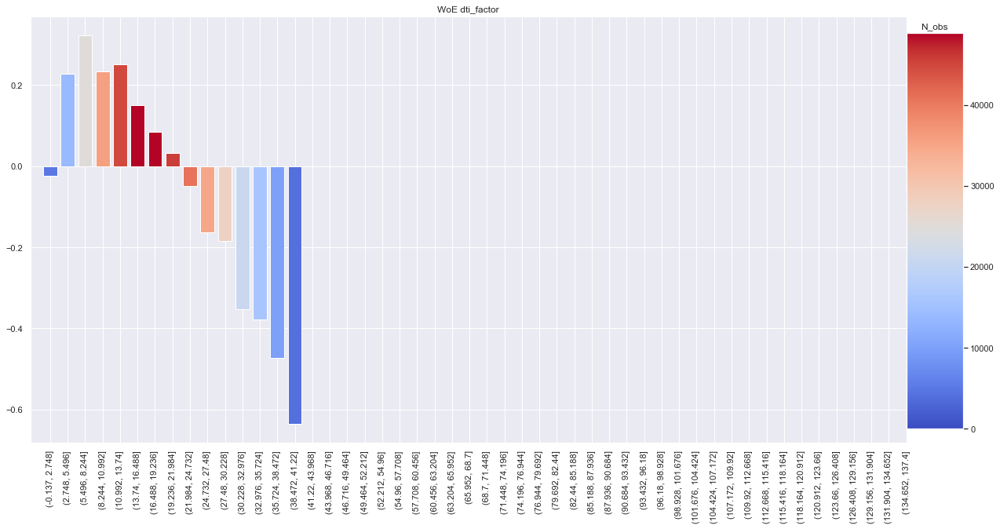


```python
fig, ax = plt.subplots(figsize=(20,8))

woe_df.iloc[:50,:].set_index('dti_factor').iloc[:, [3,4]].plot(kind='bar', stacked=True, ax=ax)

plt.legend()
```


    <matplotlib.legend.Legend at 0x1a61ee04e0>


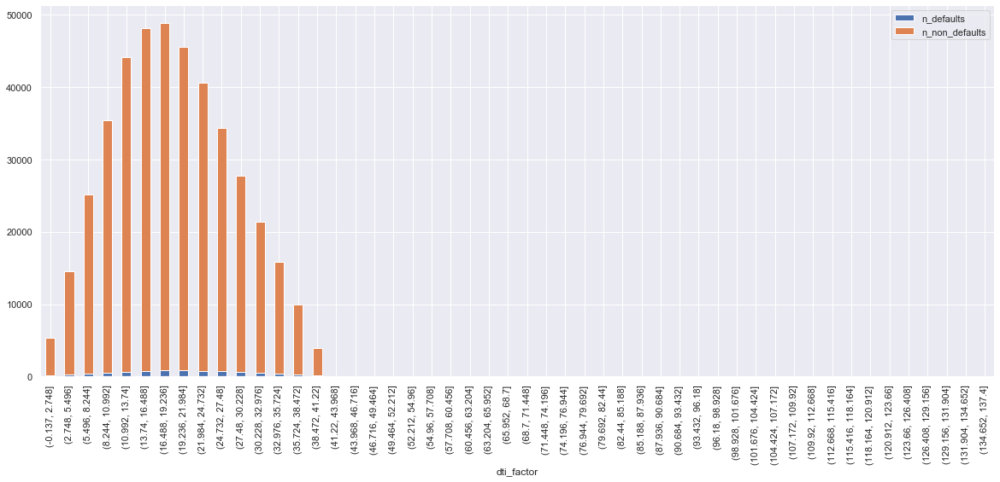


```python
x_train_prep['dti:>1.6'] = np.where(x_train_prep['dti'] <= 1.6, 1, 0)
x_train_prep['dti:1.6_4'] = np.where((x_train_prep['dti'] > 1.6) & (x_train_prep['dti'] <= 4), 1, 0)
x_train_prep['dti:4_8.8'] = np.where((x_train_prep['dti'] > 4) & (x_train_prep['dti'] <= 8.8), 1, 0)
x_train_prep['dti:8.8_12'] = np.where((x_train_prep['dti'] > 8.8) & (x_train_prep['dti'] <= 12), 1, 0)

x_train_prep['dti:12_15.2'] = np.where((x_train_prep['dti'] > 12) & (x_train_prep['dti'] <= 15.2), 1, 0)
x_train_prep['dti:15.2_16.8'] = np.where((x_train_prep['dti'] > 15.2) & (x_train_prep['dti'] <= 16.8), 1, 0)
x_train_prep['dti:16.8_19.2'] = np.where((x_train_prep['dti'] > 16.8) & (x_train_prep['dti'] <= 19.2), 1, 0)
x_train_prep['dti:19.2_21.6'] = np.where((x_train_prep['dti'] > 19.8) & (x_train_prep['dti'] <= 21.6), 1, 0)

x_train_prep['dti:21.6_24'] = np.where((x_train_prep['dti'] > 21.6) & (x_train_prep['dti'] <= 24), 1, 0)
x_train_prep['dti:24_35.2'] = np.where((x_train_prep['dti'] > 24) & (x_train_prep['dti'] <= 35.2), 1, 0)
x_train_prep['dti:>35.2'] = np.where(x_train_prep['dti'] > 35.2, 1, 0)
```


```python
fig, ax = plt.subplots(figsize=(20,8))

var_s = ['dti:>1.6', 'dti:1.6_4','dti:4_8.8', 'dti:8.8_12', 'dti:12_15.2', 'dti:15.2_16.8',
         'dti:16.8_19.2', 'dti:19.2_21.6', 'dti:21.6_24', 'dti:24_35.2', 'dti:>35.2']


pd.concat([x_train_prep, y_train_prep], axis=1).groupby('Y').sum().loc[:, var_s].T.plot(kind='bar', stacked=True, ax=ax)

plt.legend()
```


    <matplotlib.legend.Legend at 0x1a1d80af60>


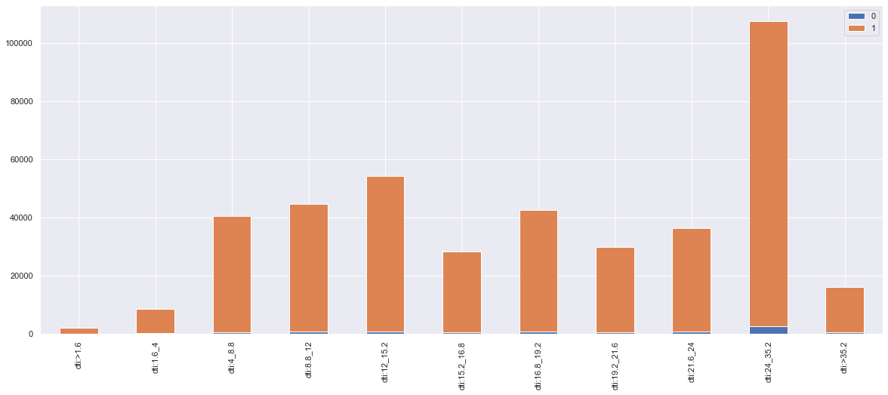

vars_to_use.append(['dti:>1.6', 'dti:1.6_4','dti:4_8.8', 'dti:8.8_12', 'dti:12_15.2', 'dti:15.2_16.8',
                     'dti:16.8_19.2', 'dti:19.2_21.6', 'dti:21.6_24', 'dti:24_35.2'])
ref_vars.append(['dti:>35.2'])

vars_to_use
## mths_since_last_record


```python
print(x_train_prep['mths_since_last_record'].nunique(), 'unique values')
print(x_train_prep['mths_since_last_record'].isnull().sum(), 'missing values')
x_train_prep['mths_since_last_record'].describe()
```

    121 unique values
    346679 missing values


    count    74415.000000
    mean        66.592609
    std         25.577899
    min          0.000000
    25%         50.000000
    50%         67.000000
    75%         82.000000
    max        120.000000
    Name: mths_since_last_record, dtype: float64


```python
temp_not_null = x_train_prep[x_train_prep['mths_since_last_record'].notnull()]

temp_not_null['mths_since_last_record_factor'] = pd.cut(temp_not_null['mths_since_last_record'], 60)
```

    /Users/omaromeiri/anaconda3/lib/python3.7/site-packages/ipykernel_launcher.py:3: SettingWithCopyWarning: 
    A value is trying to be set on a copy of a slice from a DataFrame.
    Try using .loc[row_indexer,col_indexer] = value instead
    
    See the caveats in the documentation: http://pandas.pydata.org/pandas-docs/stable/indexing.html#indexing-view-versus-copy
      This is separate from the ipykernel package so we can avoid doing imports until


```python
woe_df = woe_ordered_continuous(temp_not_null, 'mths_since_last_record_factor', y_train_prep[temp_not_null.index.values], rot_x_ticks=90, vlines=[0.5, 10.5, 14.5, 33.5, 41.5, 47.5])
woe_df
```


<div>
<style scoped>
    .dataframe tbody tr th:only-of-type {
        vertical-align: middle;
    }

    .dataframe tbody tr th {
        vertical-align: top;
    }

    .dataframe thead th {
        text-align: right;
    }
</style>
<table border="1" class="dataframe">
  <thead>
    <tr style="text-align: right;">
      <th></th>
      <th>mths_since_last_record_factor</th>
      <th>n_obs</th>
      <th>prop_non_defaults</th>
      <th>prop_n_obs</th>
      <th>n_defaults</th>
      <th>n_non_defaults</th>
      <th>prop_n_non_defaults</th>
      <th>prop_n_defaults</th>
      <th>WoE</th>
      <th>diff_prop_non_defaults</th>
      <th>diff_WoE</th>
      <th>IV</th>
    </tr>
  </thead>
  <tbody>
    <tr>
      <th>0</th>
      <td>(-0.12, 2.0]</td>
      <td>87</td>
      <td>0.965517</td>
      <td>0.001169</td>
      <td>3.0</td>
      <td>84.0</td>
      <td>0.001152</td>
      <td>0.002041</td>
      <td>-0.572239</td>
      <td>NaN</td>
      <td>NaN</td>
      <td>0.068885</td>
    </tr>
    <tr>
      <th>1</th>
      <td>(2.0, 4.0]</td>
      <td>161</td>
      <td>0.968944</td>
      <td>0.002164</td>
      <td>5.0</td>
      <td>156.0</td>
      <td>0.002139</td>
      <td>0.003401</td>
      <td>-0.464025</td>
      <td>0.000987</td>
      <td>0.108214</td>
      <td>0.068885</td>
    </tr>
    <tr>
      <th>2</th>
      <td>(4.0, 6.0]</td>
      <td>215</td>
      <td>0.981395</td>
      <td>0.002889</td>
      <td>4.0</td>
      <td>211.0</td>
      <td>0.002893</td>
      <td>0.002721</td>
      <td>0.061120</td>
      <td>0.000754</td>
      <td>0.525146</td>
      <td>0.068885</td>
    </tr>
    <tr>
      <th>3</th>
      <td>(6.0, 8.0]</td>
      <td>277</td>
      <td>0.974729</td>
      <td>0.003722</td>
      <td>7.0</td>
      <td>270.0</td>
      <td>0.003701</td>
      <td>0.004762</td>
      <td>-0.251932</td>
      <td>0.000809</td>
      <td>0.313052</td>
      <td>0.068885</td>
    </tr>
    <tr>
      <th>4</th>
      <td>(8.0, 10.0]</td>
      <td>300</td>
      <td>0.976667</td>
      <td>0.004031</td>
      <td>7.0</td>
      <td>293.0</td>
      <td>0.004017</td>
      <td>0.004762</td>
      <td>-0.170181</td>
      <td>0.000315</td>
      <td>0.081751</td>
      <td>0.068885</td>
    </tr>
    <tr>
      <th>5</th>
      <td>(10.0, 12.0]</td>
      <td>380</td>
      <td>0.971053</td>
      <td>0.005106</td>
      <td>11.0</td>
      <td>369.0</td>
      <td>0.005059</td>
      <td>0.007483</td>
      <td>-0.391542</td>
      <td>0.001042</td>
      <td>0.221361</td>
      <td>0.068885</td>
    </tr>
    <tr>
      <th>6</th>
      <td>(12.0, 14.0]</td>
      <td>404</td>
      <td>0.985149</td>
      <td>0.005429</td>
      <td>6.0</td>
      <td>398.0</td>
      <td>0.005456</td>
      <td>0.004082</td>
      <td>0.290249</td>
      <td>0.000398</td>
      <td>0.681791</td>
      <td>0.068885</td>
    </tr>
    <tr>
      <th>7</th>
      <td>(14.0, 16.0]</td>
      <td>410</td>
      <td>0.980488</td>
      <td>0.005510</td>
      <td>8.0</td>
      <td>402.0</td>
      <td>0.005511</td>
      <td>0.005442</td>
      <td>0.012567</td>
      <td>0.000055</td>
      <td>0.277682</td>
      <td>0.068885</td>
    </tr>
    <tr>
      <th>8</th>
      <td>(16.0, 18.0]</td>
      <td>443</td>
      <td>0.988713</td>
      <td>0.005953</td>
      <td>5.0</td>
      <td>438.0</td>
      <td>0.006005</td>
      <td>0.003401</td>
      <td>0.568338</td>
      <td>0.000494</td>
      <td>0.555770</td>
      <td>0.068885</td>
    </tr>
    <tr>
      <th>9</th>
      <td>(18.0, 20.0]</td>
      <td>509</td>
      <td>0.982318</td>
      <td>0.006840</td>
      <td>9.0</td>
      <td>500.0</td>
      <td>0.006854</td>
      <td>0.006122</td>
      <td>0.112940</td>
      <td>0.000850</td>
      <td>0.455397</td>
      <td>0.068885</td>
    </tr>
    <tr>
      <th>10</th>
      <td>(20.0, 22.0]</td>
      <td>540</td>
      <td>0.987037</td>
      <td>0.007257</td>
      <td>7.0</td>
      <td>533.0</td>
      <td>0.007307</td>
      <td>0.004762</td>
      <td>0.428168</td>
      <td>0.000452</td>
      <td>0.315228</td>
      <td>0.068885</td>
    </tr>
    <tr>
      <th>11</th>
      <td>(22.0, 24.0]</td>
      <td>547</td>
      <td>0.978062</td>
      <td>0.007351</td>
      <td>12.0</td>
      <td>535.0</td>
      <td>0.007334</td>
      <td>0.008163</td>
      <td>-0.107083</td>
      <td>0.000027</td>
      <td>0.535251</td>
      <td>0.068885</td>
    </tr>
    <tr>
      <th>12</th>
      <td>(24.0, 26.0]</td>
      <td>653</td>
      <td>0.973966</td>
      <td>0.008775</td>
      <td>17.0</td>
      <td>636.0</td>
      <td>0.008719</td>
      <td>0.011565</td>
      <td>-0.282458</td>
      <td>0.001385</td>
      <td>0.175375</td>
      <td>0.068885</td>
    </tr>
    <tr>
      <th>13</th>
      <td>(26.0, 28.0]</td>
      <td>742</td>
      <td>0.978437</td>
      <td>0.009971</td>
      <td>16.0</td>
      <td>726.0</td>
      <td>0.009953</td>
      <td>0.010884</td>
      <td>-0.089482</td>
      <td>0.001234</td>
      <td>0.192976</td>
      <td>0.068885</td>
    </tr>
    <tr>
      <th>14</th>
      <td>(28.0, 30.0]</td>
      <td>808</td>
      <td>0.983911</td>
      <td>0.010858</td>
      <td>13.0</td>
      <td>795.0</td>
      <td>0.010899</td>
      <td>0.008844</td>
      <td>0.208949</td>
      <td>0.000946</td>
      <td>0.298431</td>
      <td>0.068885</td>
    </tr>
    <tr>
      <th>15</th>
      <td>(30.0, 32.0]</td>
      <td>875</td>
      <td>0.985143</td>
      <td>0.011758</td>
      <td>13.0</td>
      <td>862.0</td>
      <td>0.011817</td>
      <td>0.008844</td>
      <td>0.289863</td>
      <td>0.000919</td>
      <td>0.080913</td>
      <td>0.068885</td>
    </tr>
    <tr>
      <th>16</th>
      <td>(32.0, 34.0]</td>
      <td>995</td>
      <td>0.988945</td>
      <td>0.013371</td>
      <td>11.0</td>
      <td>984.0</td>
      <td>0.013490</td>
      <td>0.007483</td>
      <td>0.589287</td>
      <td>0.001672</td>
      <td>0.299425</td>
      <td>0.068885</td>
    </tr>
    <tr>
      <th>17</th>
      <td>(34.0, 36.0]</td>
      <td>1019</td>
      <td>0.985280</td>
      <td>0.013693</td>
      <td>15.0</td>
      <td>1004.0</td>
      <td>0.013764</td>
      <td>0.010204</td>
      <td>0.299254</td>
      <td>0.000274</td>
      <td>0.290034</td>
      <td>0.068885</td>
    </tr>
    <tr>
      <th>18</th>
      <td>(36.0, 38.0]</td>
      <td>1188</td>
      <td>0.978114</td>
      <td>0.015965</td>
      <td>26.0</td>
      <td>1162.0</td>
      <td>0.015930</td>
      <td>0.017687</td>
      <td>-0.104642</td>
      <td>0.002166</td>
      <td>0.403896</td>
      <td>0.068885</td>
    </tr>
    <tr>
      <th>19</th>
      <td>(38.0, 40.0]</td>
      <td>1219</td>
      <td>0.984413</td>
      <td>0.016381</td>
      <td>19.0</td>
      <td>1200.0</td>
      <td>0.016451</td>
      <td>0.012925</td>
      <td>0.241195</td>
      <td>0.000521</td>
      <td>0.345836</td>
      <td>0.068885</td>
    </tr>
    <tr>
      <th>20</th>
      <td>(40.0, 42.0]</td>
      <td>1292</td>
      <td>0.984520</td>
      <td>0.017362</td>
      <td>20.0</td>
      <td>1272.0</td>
      <td>0.017438</td>
      <td>0.013605</td>
      <td>0.248170</td>
      <td>0.000987</td>
      <td>0.006976</td>
      <td>0.068885</td>
    </tr>
    <tr>
      <th>21</th>
      <td>(42.0, 44.0]</td>
      <td>1306</td>
      <td>0.983920</td>
      <td>0.017550</td>
      <td>21.0</td>
      <td>1285.0</td>
      <td>0.017616</td>
      <td>0.014286</td>
      <td>0.209548</td>
      <td>0.000178</td>
      <td>0.038622</td>
      <td>0.068885</td>
    </tr>
    <tr>
      <th>22</th>
      <td>(44.0, 46.0]</td>
      <td>1439</td>
      <td>0.987491</td>
      <td>0.019337</td>
      <td>18.0</td>
      <td>1421.0</td>
      <td>0.019480</td>
      <td>0.012245</td>
      <td>0.464301</td>
      <td>0.001864</td>
      <td>0.254753</td>
      <td>0.068885</td>
    </tr>
    <tr>
      <th>23</th>
      <td>(46.0, 48.0]</td>
      <td>1540</td>
      <td>0.981818</td>
      <td>0.020695</td>
      <td>28.0</td>
      <td>1512.0</td>
      <td>0.020728</td>
      <td>0.019048</td>
      <td>0.084541</td>
      <td>0.001248</td>
      <td>0.379760</td>
      <td>0.068885</td>
    </tr>
    <tr>
      <th>24</th>
      <td>(48.0, 50.0]</td>
      <td>1654</td>
      <td>0.983676</td>
      <td>0.022227</td>
      <td>27.0</td>
      <td>1627.0</td>
      <td>0.022304</td>
      <td>0.018367</td>
      <td>0.194213</td>
      <td>0.001577</td>
      <td>0.109672</td>
      <td>0.068885</td>
    </tr>
    <tr>
      <th>25</th>
      <td>(50.0, 52.0]</td>
      <td>1834</td>
      <td>0.978735</td>
      <td>0.024646</td>
      <td>39.0</td>
      <td>1795.0</td>
      <td>0.024608</td>
      <td>0.026531</td>
      <td>-0.075245</td>
      <td>0.002303</td>
      <td>0.269458</td>
      <td>0.068885</td>
    </tr>
    <tr>
      <th>26</th>
      <td>(52.0, 54.0]</td>
      <td>2094</td>
      <td>0.977555</td>
      <td>0.028139</td>
      <td>47.0</td>
      <td>2047.0</td>
      <td>0.028062</td>
      <td>0.031973</td>
      <td>-0.130460</td>
      <td>0.003455</td>
      <td>0.055216</td>
      <td>0.068885</td>
    </tr>
    <tr>
      <th>27</th>
      <td>(54.0, 56.0]</td>
      <td>2134</td>
      <td>0.979381</td>
      <td>0.028677</td>
      <td>44.0</td>
      <td>2090.0</td>
      <td>0.028652</td>
      <td>0.029932</td>
      <td>-0.043714</td>
      <td>0.000589</td>
      <td>0.086747</td>
      <td>0.068885</td>
    </tr>
    <tr>
      <th>28</th>
      <td>(56.0, 58.0]</td>
      <td>2222</td>
      <td>0.979748</td>
      <td>0.029860</td>
      <td>45.0</td>
      <td>2177.0</td>
      <td>0.029844</td>
      <td>0.030612</td>
      <td>-0.025403</td>
      <td>0.001193</td>
      <td>0.018311</td>
      <td>0.068885</td>
    </tr>
    <tr>
      <th>29</th>
      <td>(58.0, 60.0]</td>
      <td>2250</td>
      <td>0.982667</td>
      <td>0.030236</td>
      <td>39.0</td>
      <td>2211.0</td>
      <td>0.030311</td>
      <td>0.026531</td>
      <td>0.133195</td>
      <td>0.000466</td>
      <td>0.158598</td>
      <td>0.068885</td>
    </tr>
    <tr>
      <th>30</th>
      <td>(60.0, 62.0]</td>
      <td>2408</td>
      <td>0.988372</td>
      <td>0.032359</td>
      <td>28.0</td>
      <td>2380.0</td>
      <td>0.032627</td>
      <td>0.019048</td>
      <td>0.538208</td>
      <td>0.002317</td>
      <td>0.405013</td>
      <td>0.068885</td>
    </tr>
    <tr>
      <th>31</th>
      <td>(62.0, 64.0]</td>
      <td>2440</td>
      <td>0.981148</td>
      <td>0.032789</td>
      <td>46.0</td>
      <td>2394.0</td>
      <td>0.032819</td>
      <td>0.031293</td>
      <td>0.047636</td>
      <td>0.000192</td>
      <td>0.490572</td>
      <td>0.068885</td>
    </tr>
    <tr>
      <th>32</th>
      <td>(64.0, 66.0]</td>
      <td>2434</td>
      <td>0.985210</td>
      <td>0.032708</td>
      <td>36.0</td>
      <td>2398.0</td>
      <td>0.032874</td>
      <td>0.024490</td>
      <td>0.294428</td>
      <td>0.000055</td>
      <td>0.246792</td>
      <td>0.068885</td>
    </tr>
    <tr>
      <th>33</th>
      <td>(66.0, 68.0]</td>
      <td>2484</td>
      <td>0.982287</td>
      <td>0.033380</td>
      <td>44.0</td>
      <td>2440.0</td>
      <td>0.033450</td>
      <td>0.029932</td>
      <td>0.111120</td>
      <td>0.000576</td>
      <td>0.183308</td>
      <td>0.068885</td>
    </tr>
    <tr>
      <th>34</th>
      <td>(68.0, 70.0]</td>
      <td>2514</td>
      <td>0.977327</td>
      <td>0.033784</td>
      <td>57.0</td>
      <td>2457.0</td>
      <td>0.033683</td>
      <td>0.038776</td>
      <td>-0.140798</td>
      <td>0.000233</td>
      <td>0.251919</td>
      <td>0.068885</td>
    </tr>
    <tr>
      <th>35</th>
      <td>(70.0, 72.0]</td>
      <td>2526</td>
      <td>0.983769</td>
      <td>0.033945</td>
      <td>41.0</td>
      <td>2485.0</td>
      <td>0.034067</td>
      <td>0.027891</td>
      <td>0.200013</td>
      <td>0.000384</td>
      <td>0.340811</td>
      <td>0.068885</td>
    </tr>
    <tr>
      <th>36</th>
      <td>(72.0, 74.0]</td>
      <td>2381</td>
      <td>0.982360</td>
      <td>0.031996</td>
      <td>42.0</td>
      <td>2339.0</td>
      <td>0.032065</td>
      <td>0.028571</td>
      <td>0.115366</td>
      <td>0.002002</td>
      <td>0.084647</td>
      <td>0.068885</td>
    </tr>
    <tr>
      <th>37</th>
      <td>(74.0, 76.0]</td>
      <td>2489</td>
      <td>0.979912</td>
      <td>0.033448</td>
      <td>50.0</td>
      <td>2439.0</td>
      <td>0.033436</td>
      <td>0.034014</td>
      <td>-0.017123</td>
      <td>0.001371</td>
      <td>0.132489</td>
      <td>0.068885</td>
    </tr>
    <tr>
      <th>38</th>
      <td>(76.0, 78.0]</td>
      <td>2301</td>
      <td>0.986093</td>
      <td>0.030921</td>
      <td>32.0</td>
      <td>2269.0</td>
      <td>0.031106</td>
      <td>0.021769</td>
      <td>0.356915</td>
      <td>0.002331</td>
      <td>0.374038</td>
      <td>0.068885</td>
    </tr>
    <tr>
      <th>39</th>
      <td>(78.0, 80.0]</td>
      <td>2303</td>
      <td>0.979592</td>
      <td>0.030948</td>
      <td>47.0</td>
      <td>2256.0</td>
      <td>0.030927</td>
      <td>0.031973</td>
      <td>-0.033242</td>
      <td>0.000178</td>
      <td>0.390158</td>
      <td>0.068885</td>
    </tr>
    <tr>
      <th>40</th>
      <td>(80.0, 82.0]</td>
      <td>2087</td>
      <td>0.978438</td>
      <td>0.028045</td>
      <td>45.0</td>
      <td>2042.0</td>
      <td>0.027994</td>
      <td>0.030612</td>
      <td>-0.089421</td>
      <td>0.002934</td>
      <td>0.056179</td>
      <td>0.068885</td>
    </tr>
    <tr>
      <th>41</th>
      <td>(82.0, 84.0]</td>
      <td>1706</td>
      <td>0.982415</td>
      <td>0.022925</td>
      <td>30.0</td>
      <td>1676.0</td>
      <td>0.022976</td>
      <td>0.020408</td>
      <td>0.118525</td>
      <td>0.005017</td>
      <td>0.207945</td>
      <td>0.068885</td>
    </tr>
    <tr>
      <th>42</th>
      <td>(84.0, 86.0]</td>
      <td>1593</td>
      <td>0.978657</td>
      <td>0.021407</td>
      <td>34.0</td>
      <td>1559.0</td>
      <td>0.021372</td>
      <td>0.023129</td>
      <td>-0.079004</td>
      <td>0.001604</td>
      <td>0.197529</td>
      <td>0.068885</td>
    </tr>
    <tr>
      <th>43</th>
      <td>(86.0, 88.0]</td>
      <td>1413</td>
      <td>0.978061</td>
      <td>0.018988</td>
      <td>31.0</td>
      <td>1382.0</td>
      <td>0.018946</td>
      <td>0.021088</td>
      <td>-0.107144</td>
      <td>0.002426</td>
      <td>0.028140</td>
      <td>0.068885</td>
    </tr>
    <tr>
      <th>44</th>
      <td>(88.0, 90.0]</td>
      <td>1253</td>
      <td>0.976057</td>
      <td>0.016838</td>
      <td>30.0</td>
      <td>1223.0</td>
      <td>0.016766</td>
      <td>0.020408</td>
      <td>-0.196579</td>
      <td>0.002180</td>
      <td>0.089435</td>
      <td>0.068885</td>
    </tr>
    <tr>
      <th>45</th>
      <td>(90.0, 92.0]</td>
      <td>1019</td>
      <td>0.980373</td>
      <td>0.013693</td>
      <td>20.0</td>
      <td>999.0</td>
      <td>0.013695</td>
      <td>0.013605</td>
      <td>0.006579</td>
      <td>0.003071</td>
      <td>0.203158</td>
      <td>0.068885</td>
    </tr>
    <tr>
      <th>46</th>
      <td>(92.0, 94.0]</td>
      <td>998</td>
      <td>0.970942</td>
      <td>0.013411</td>
      <td>29.0</td>
      <td>969.0</td>
      <td>0.013284</td>
      <td>0.019728</td>
      <td>-0.395475</td>
      <td>0.000411</td>
      <td>0.402054</td>
      <td>0.068885</td>
    </tr>
    <tr>
      <th>47</th>
      <td>(94.0, 96.0]</td>
      <td>830</td>
      <td>0.973494</td>
      <td>0.011154</td>
      <td>22.0</td>
      <td>808.0</td>
      <td>0.011077</td>
      <td>0.014966</td>
      <td>-0.300924</td>
      <td>0.002207</td>
      <td>0.094551</td>
      <td>0.068885</td>
    </tr>
    <tr>
      <th>48</th>
      <td>(96.0, 98.0]</td>
      <td>815</td>
      <td>0.969325</td>
      <td>0.010952</td>
      <td>25.0</td>
      <td>790.0</td>
      <td>0.010830</td>
      <td>0.017007</td>
      <td>-0.451286</td>
      <td>0.000247</td>
      <td>0.150362</td>
      <td>0.068885</td>
    </tr>
    <tr>
      <th>49</th>
      <td>(98.0, 100.0]</td>
      <td>733</td>
      <td>0.965894</td>
      <td>0.009850</td>
      <td>25.0</td>
      <td>708.0</td>
      <td>0.009706</td>
      <td>0.017007</td>
      <td>-0.560875</td>
      <td>0.001124</td>
      <td>0.109589</td>
      <td>0.068885</td>
    </tr>
    <tr>
      <th>50</th>
      <td>(100.0, 102.0]</td>
      <td>680</td>
      <td>0.976471</td>
      <td>0.009138</td>
      <td>16.0</td>
      <td>664.0</td>
      <td>0.009103</td>
      <td>0.010884</td>
      <td>-0.178750</td>
      <td>0.000603</td>
      <td>0.382125</td>
      <td>0.068885</td>
    </tr>
    <tr>
      <th>51</th>
      <td>(102.0, 104.0]</td>
      <td>673</td>
      <td>0.989599</td>
      <td>0.009044</td>
      <td>7.0</td>
      <td>666.0</td>
      <td>0.009130</td>
      <td>0.004762</td>
      <td>0.650936</td>
      <td>0.000027</td>
      <td>0.829686</td>
      <td>0.068885</td>
    </tr>
    <tr>
      <th>52</th>
      <td>(104.0, 106.0]</td>
      <td>532</td>
      <td>0.968045</td>
      <td>0.007149</td>
      <td>17.0</td>
      <td>515.0</td>
      <td>0.007060</td>
      <td>0.011565</td>
      <td>-0.493490</td>
      <td>0.002070</td>
      <td>1.144426</td>
      <td>0.068885</td>
    </tr>
    <tr>
      <th>53</th>
      <td>(106.0, 108.0]</td>
      <td>521</td>
      <td>0.969290</td>
      <td>0.007001</td>
      <td>16.0</td>
      <td>505.0</td>
      <td>0.006923</td>
      <td>0.010884</td>
      <td>-0.452474</td>
      <td>0.000137</td>
      <td>0.041016</td>
      <td>0.068885</td>
    </tr>
    <tr>
      <th>54</th>
      <td>(108.0, 110.0]</td>
      <td>546</td>
      <td>0.979853</td>
      <td>0.007337</td>
      <td>11.0</td>
      <td>535.0</td>
      <td>0.007334</td>
      <td>0.007483</td>
      <td>-0.020072</td>
      <td>0.000411</td>
      <td>0.432402</td>
      <td>0.068885</td>
    </tr>
    <tr>
      <th>55</th>
      <td>(110.0, 112.0]</td>
      <td>898</td>
      <td>0.963252</td>
      <td>0.012067</td>
      <td>33.0</td>
      <td>865.0</td>
      <td>0.011858</td>
      <td>0.022449</td>
      <td>-0.638221</td>
      <td>0.004524</td>
      <td>0.618150</td>
      <td>0.068885</td>
    </tr>
    <tr>
      <th>56</th>
      <td>(112.0, 114.0]</td>
      <td>1132</td>
      <td>0.974382</td>
      <td>0.015212</td>
      <td>29.0</td>
      <td>1103.0</td>
      <td>0.015121</td>
      <td>0.019728</td>
      <td>-0.265950</td>
      <td>0.003263</td>
      <td>0.372271</td>
      <td>0.068885</td>
    </tr>
    <tr>
      <th>57</th>
      <td>(114.0, 116.0]</td>
      <td>1266</td>
      <td>0.973934</td>
      <td>0.017013</td>
      <td>33.0</td>
      <td>1233.0</td>
      <td>0.016903</td>
      <td>0.022449</td>
      <td>-0.283745</td>
      <td>0.001782</td>
      <td>0.017795</td>
      <td>0.068885</td>
    </tr>
    <tr>
      <th>58</th>
      <td>(116.0, 118.0]</td>
      <td>1430</td>
      <td>0.973427</td>
      <td>0.019217</td>
      <td>38.0</td>
      <td>1392.0</td>
      <td>0.019083</td>
      <td>0.025850</td>
      <td>-0.303533</td>
      <td>0.002180</td>
      <td>0.019787</td>
      <td>0.068885</td>
    </tr>
    <tr>
      <th>59</th>
      <td>(118.0, 120.0]</td>
      <td>473</td>
      <td>0.970402</td>
      <td>0.006356</td>
      <td>14.0</td>
      <td>459.0</td>
      <td>0.006292</td>
      <td>0.009524</td>
      <td>-0.414450</td>
      <td>0.012790</td>
      <td>0.110918</td>
      <td>0.068885</td>
    </tr>
  </tbody>
</table>
</div>


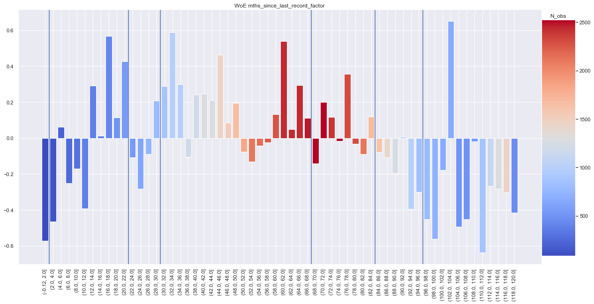


```python
fig, ax = plt.subplots(figsize=(20,8))

woe_df.iloc[:50,:].set_index('mths_since_last_record_factor').iloc[:, [3,4]].plot(kind='bar', stacked=True, ax=ax)

plt.legend()
```


    <matplotlib.legend.Legend at 0x1a1dbfbe48>


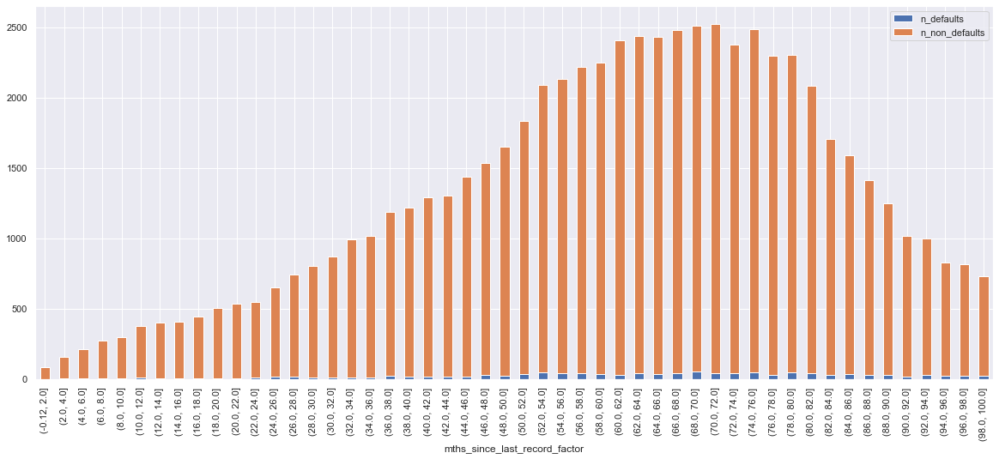


```python
x_train_prep['mths_since_last_record:Missing'] = np.where((x_train_prep['mths_since_last_record'].isnull()), 1, 0)
x_train_prep['mths_since_last_record:0_2'] = np.where((x_train_prep['mths_since_last_record'] >= 0) & (x_train_prep['mths_since_last_record'] <= 2), 1, 0)
x_train_prep['mths_since_last_record:3_22'] = np.where((x_train_prep['mths_since_last_record'] >= 3) & (x_train_prep['mths_since_last_record'] <= 22), 1, 0)
x_train_prep['mths_since_last_record:23_30'] = np.where((x_train_prep['mths_since_last_record'] >= 23) & (x_train_prep['mths_since_last_record'] <= 30), 1, 0)
x_train_prep['mths_since_last_record:31_69'] = np.where((x_train_prep['mths_since_last_record'] >= 31) & (x_train_prep['mths_since_last_record'] <= 69), 1, 0)
x_train_prep['mths_since_last_record:70_85'] = np.where((x_train_prep['mths_since_last_record'] >= 70) & (x_train_prep['mths_since_last_record'] <= 85), 1, 0)
x_train_prep['mths_since_last_record:86_97'] = np.where((x_train_prep['mths_since_last_record'] >= 86) & (x_train_prep['mths_since_last_record'] <= 97), 1, 0)
x_train_prep['mths_since_last_record:>97'] = np.where((x_train_prep['mths_since_last_record'] > 97), 1, 0)
```


```python
fig, ax = plt.subplots(figsize=(20,8))

var_s = ['mths_since_last_record:Missing', 'mths_since_last_record:0_2', 'mths_since_last_record:3_22', 'mths_since_last_record:23_30',
         'mths_since_last_record:31_69', 'mths_since_last_record:70_85', 'mths_since_last_record:86_97', 'mths_since_last_record:>97']


pd.concat([x_train_prep, y_train_prep], axis=1).groupby('Y').sum().loc[:, var_s].T.plot(kind='bar', stacked=True, ax=ax)

plt.legend()
```


    <matplotlib.legend.Legend at 0x1a6106e128>


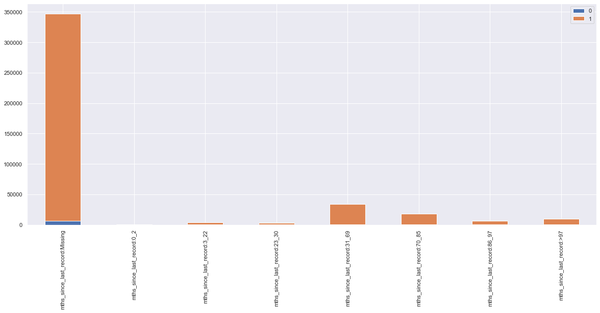

vars_to_use.append(['mths_since_last_record:Missing', 'mths_since_last_record:3_22', 'mths_since_last_record:23_30','mths_since_last_record:31_69',
                    'mths_since_last_record:70_85', 'mths_since_last_record:86_97', 'mths_since_last_record:>97'])
ref_vars.append(['mths_since_last_record:0_2'])
vars_to_use

```python
loan_data_2015_preprocessed = x_train_prep.copy()
```


```python

```


```python
print(x_train.shape)
print(loan_data_2015_preprocessed.shape)
print(y_train_prep.shape)
```

    (373028, 324)
    (421094, 318)
    (421094,)


```python
x_train_with_ref = x_train.loc[:,all_vars]
loan_data_2015_preprocessed_with_ref = loan_data_2015_preprocessed.loc[:, all_vars]

print(x_train_with_ref.shape)
print(loan_data_2015_preprocessed_with_ref.shape)
```

    (373028, 122)
    (421094, 122)


```python
x_train_with_ref.columns.values == loan_data_2015_preprocessed_with_ref.columns.values
```


    array([ True,  True,  True,  True,  True,  True,  True,  True,  True,
            True,  True,  True,  True,  True,  True,  True,  True,  True,
            True,  True,  True,  True,  True,  True,  True,  True,  True,
            True,  True,  True,  True,  True,  True,  True,  True,  True,
            True,  True,  True,  True,  True,  True,  True,  True,  True,
            True,  True,  True,  True,  True,  True,  True,  True,  True,
            True,  True,  True,  True,  True,  True,  True,  True,  True,
            True,  True,  True,  True,  True,  True,  True,  True,  True,
            True,  True,  True,  True,  True,  True,  True,  True,  True,
            True,  True,  True,  True,  True,  True,  True,  True,  True,
            True,  True,  True,  True,  True,  True,  True,  True,  True,
            True,  True,  True,  True,  True,  True,  True,  True,  True,
            True,  True,  True,  True,  True,  True,  True,  True,  True,
            True,  True,  True,  True,  True])


```python
x_train_with_ref_intercept = x_train_with_ref.copy()
x_train_with_ref_intercept.insert(0, 'Intercept', 1)
x_train_with_ref_intercept.head()
```


<div>
<style scoped>
    .dataframe tbody tr th:only-of-type {
        vertical-align: middle;
    }

    .dataframe tbody tr th {
        vertical-align: top;
    }

    .dataframe thead th {
        text-align: right;
    }
</style>
<table border="1" class="dataframe">
  <thead>
    <tr style="text-align: right;">
      <th></th>
      <th>Intercept</th>
      <th>acc_now_delinq:0</th>
      <th>acc_now_delinq:&gt;=1</th>
      <th>addr_state:AL_HI_MO_NM_DE</th>
      <th>addr_state:CA</th>
      <th>addr_state:KS_CO_SC_AK_VT_MS</th>
      <th>addr_state:MA_AR_NM_RI</th>
      <th>addr_state:ME_NE_IA_ID_NV_FL_ND</th>
      <th>addr_state:NH_WV_WY_DC</th>
      <th>addr_state:NJ_TN_NC_UT</th>
      <th>addr_state:NY</th>
      <th>addr_state:OR_MT_CT_IL</th>
      <th>addr_state:PA_OH_MI_AZ</th>
      <th>addr_state:SD_WI_GA_IN_WA</th>
      <th>addr_state:TX</th>
      <th>addr_state:VA_OK_MD_LA_KY</th>
      <th>annual_inc:100k_1200k</th>
      <th>annual_inc:120k_140k</th>
      <th>annual_inc:20k_30k</th>
      <th>annual_inc:30k_40k</th>
      <th>annual_inc:40k_50k</th>
      <th>annual_inc:50k_60k</th>
      <th>annual_inc:60k_70k</th>
      <th>annual_inc:70k_80k</th>
      <th>annual_inc:90k_100k</th>
      <th>annual_inc:&lt;20k</th>
      <th>annual_inc:&gt;140k</th>
      <th>delinq_2yrs:0</th>
      <th>delinq_2yrs:1-3</th>
      <th>delinq_2yrs:&gt;=4</th>
      <th>dti:1.6_4</th>
      <th>dti:12_15.2</th>
      <th>dti:15.2_16.8</th>
      <th>dti:16.8_19.2</th>
      <th>dti:19.2_21.6</th>
      <th>dti:21.6_24</th>
      <th>dti:24_35.2</th>
      <th>dti:4_8.8</th>
      <th>dti:8.8_12</th>
      <th>dti:&gt;1.6</th>
      <th>dti:&gt;35.2</th>
      <th>emp_length_int:0</th>
      <th>emp_length_int:1</th>
      <th>emp_length_int:10</th>
      <th>emp_length_int:2_3_4</th>
      <th>emp_length_int:5_6</th>
      <th>emp_length_int:7_8_9</th>
      <th>grade:A</th>
      <th>grade:B</th>
      <th>grade:C</th>
      <th>grade:D</th>
      <th>grade:E</th>
      <th>grade:F</th>
      <th>grade:G</th>
      <th>home_ownership:MORTGAGE</th>
      <th>home_ownership:OWN</th>
      <th>home_ownership:RENT_OTHER_NONE</th>
      <th>initial_list_status:f</th>
      <th>initial_list_status:w</th>
      <th>inq_last_6mths:0</th>
      <th>inq_last_6mths:1-2</th>
      <th>inq_last_6mths:3-6</th>
      <th>inq_last_6mths:&gt;6</th>
      <th>int_rate:12.025_14.502</th>
      <th>int_rate:14.502_17.804</th>
      <th>int_rate:9.548_12.025</th>
      <th>int_rate:&lt;9.548</th>
      <th>int_rate:&gt;17.804</th>
      <th>mths_since_earliest_cr_line:141_265</th>
      <th>mths_since_earliest_cr_line:266_353</th>
      <th>mths_since_earliest_cr_line:&lt;140</th>
      <th>mths_since_earliest_cr_line:&gt;354</th>
      <th>mths_since_issue_d:38_39</th>
      <th>mths_since_issue_d:40_41</th>
      <th>mths_since_issue_d:42_48</th>
      <th>mths_since_issue_d:49_52</th>
      <th>mths_since_issue_d:53_64</th>
      <th>mths_since_issue_d:65_84</th>
      <th>mths_since_issue_d:&lt;38</th>
      <th>mths_since_issue_d:&gt;84</th>
      <th>mths_since_last_delinq:31_56</th>
      <th>mths_since_last_delinq:4_30</th>
      <th>mths_since_last_delinq:&lt;4</th>
      <th>mths_since_last_delinq:&gt;57</th>
      <th>mths_since_last_delinq:missing</th>
      <th>mths_since_last_record:0_2</th>
      <th>mths_since_last_record:23_30</th>
      <th>mths_since_last_record:31_69</th>
      <th>mths_since_last_record:3_22</th>
      <th>mths_since_last_record:70_85</th>
      <th>mths_since_last_record:86_97</th>
      <th>mths_since_last_record:&gt;97</th>
      <th>mths_since_last_record:Missing</th>
      <th>open_acc:0</th>
      <th>open_acc:1-3</th>
      <th>open_acc:13-17</th>
      <th>open_acc:18-22</th>
      <th>open_acc:23-25</th>
      <th>open_acc:26-30</th>
      <th>open_acc:4-12</th>
      <th>open_acc:&gt;=31</th>
      <th>pub_rec:0-2</th>
      <th>pub_rec:3-4</th>
      <th>pub_rec:&gt;=5</th>
      <th>purpose:debtc_majpur_homeimp_car_credc</th>
      <th>purpose:educ_sm_mov_house</th>
      <th>purpose:ren_oth_med_wedd_vac</th>
      <th>term:36</th>
      <th>term:60</th>
      <th>total_acc:28_51</th>
      <th>total_acc:&lt;=27</th>
      <th>total_acc:&gt;=52</th>
      <th>total_rev_hi_lim:10K-20K</th>
      <th>total_rev_hi_lim:20K-30K</th>
      <th>total_rev_hi_lim:30K-40K</th>
      <th>total_rev_hi_lim:40K-55K</th>
      <th>total_rev_hi_lim:55K-95K</th>
      <th>total_rev_hi_lim:5K-10K</th>
      <th>total_rev_hi_lim:&lt;=5K</th>
      <th>total_rev_hi_lim:&gt;95K</th>
      <th>verification_status:Not Verified</th>
      <th>verification_status:Source Verified</th>
      <th>verification_status:Verified</th>
    </tr>
  </thead>
  <tbody>
    <tr>
      <th>0</th>
      <td>1</td>
      <td>1</td>
      <td>0</td>
      <td>0</td>
      <td>0</td>
      <td>1</td>
      <td>0</td>
      <td>0</td>
      <td>0</td>
      <td>0</td>
      <td>0</td>
      <td>0</td>
      <td>0</td>
      <td>0</td>
      <td>0</td>
      <td>0</td>
      <td>0</td>
      <td>0</td>
      <td>0</td>
      <td>0</td>
      <td>0</td>
      <td>0</td>
      <td>0</td>
      <td>1</td>
      <td>0</td>
      <td>0</td>
      <td>0</td>
      <td>1</td>
      <td>0</td>
      <td>0</td>
      <td>0</td>
      <td>0</td>
      <td>0</td>
      <td>0</td>
      <td>0</td>
      <td>1</td>
      <td>0</td>
      <td>0</td>
      <td>0</td>
      <td>0</td>
      <td>0</td>
      <td>0</td>
      <td>0</td>
      <td>0</td>
      <td>1</td>
      <td>0</td>
      <td>0</td>
      <td>1</td>
      <td>0</td>
      <td>0</td>
      <td>0</td>
      <td>0</td>
      <td>0</td>
      <td>0</td>
      <td>1</td>
      <td>0</td>
      <td>0</td>
      <td>1</td>
      <td>0</td>
      <td>0</td>
      <td>1</td>
      <td>0</td>
      <td>0</td>
      <td>0</td>
      <td>0</td>
      <td>0</td>
      <td>1</td>
      <td>0</td>
      <td>0</td>
      <td>0</td>
      <td>0</td>
      <td>1</td>
      <td>0</td>
      <td>0</td>
      <td>1</td>
      <td>0</td>
      <td>0</td>
      <td>0</td>
      <td>0</td>
      <td>0</td>
      <td>0</td>
      <td>0</td>
      <td>0</td>
      <td>0</td>
      <td>1</td>
      <td>0</td>
      <td>0</td>
      <td>0</td>
      <td>0</td>
      <td>0</td>
      <td>0</td>
      <td>0</td>
      <td>1</td>
      <td>0</td>
      <td>0</td>
      <td>0</td>
      <td>1</td>
      <td>0</td>
      <td>0</td>
      <td>0</td>
      <td>0</td>
      <td>1</td>
      <td>0</td>
      <td>0</td>
      <td>1</td>
      <td>0</td>
      <td>0</td>
      <td>1</td>
      <td>0</td>
      <td>1</td>
      <td>0</td>
      <td>0</td>
      <td>0</td>
      <td>0</td>
      <td>0</td>
      <td>0</td>
      <td>1</td>
      <td>0</td>
      <td>0</td>
      <td>0</td>
      <td>0</td>
      <td>1</td>
      <td>0</td>
    </tr>
    <tr>
      <th>1</th>
      <td>1</td>
      <td>1</td>
      <td>0</td>
      <td>0</td>
      <td>0</td>
      <td>0</td>
      <td>0</td>
      <td>0</td>
      <td>0</td>
      <td>1</td>
      <td>0</td>
      <td>0</td>
      <td>0</td>
      <td>0</td>
      <td>0</td>
      <td>0</td>
      <td>1</td>
      <td>0</td>
      <td>0</td>
      <td>0</td>
      <td>0</td>
      <td>0</td>
      <td>0</td>
      <td>0</td>
      <td>0</td>
      <td>0</td>
      <td>0</td>
      <td>0</td>
      <td>1</td>
      <td>0</td>
      <td>0</td>
      <td>0</td>
      <td>0</td>
      <td>0</td>
      <td>0</td>
      <td>0</td>
      <td>0</td>
      <td>1</td>
      <td>0</td>
      <td>0</td>
      <td>0</td>
      <td>0</td>
      <td>0</td>
      <td>0</td>
      <td>0</td>
      <td>1</td>
      <td>0</td>
      <td>0</td>
      <td>0</td>
      <td>1</td>
      <td>0</td>
      <td>0</td>
      <td>0</td>
      <td>0</td>
      <td>1</td>
      <td>0</td>
      <td>0</td>
      <td>1</td>
      <td>0</td>
      <td>0</td>
      <td>1</td>
      <td>0</td>
      <td>0</td>
      <td>1</td>
      <td>1</td>
      <td>0</td>
      <td>0</td>
      <td>0</td>
      <td>1</td>
      <td>0</td>
      <td>0</td>
      <td>0</td>
      <td>0</td>
      <td>0</td>
      <td>0</td>
      <td>0</td>
      <td>1</td>
      <td>0</td>
      <td>0</td>
      <td>0</td>
      <td>0</td>
      <td>1</td>
      <td>0</td>
      <td>1</td>
      <td>0</td>
      <td>0</td>
      <td>0</td>
      <td>0</td>
      <td>0</td>
      <td>0</td>
      <td>0</td>
      <td>0</td>
      <td>1</td>
      <td>0</td>
      <td>0</td>
      <td>1</td>
      <td>0</td>
      <td>0</td>
      <td>0</td>
      <td>0</td>
      <td>0</td>
      <td>1</td>
      <td>0</td>
      <td>0</td>
      <td>1</td>
      <td>0</td>
      <td>0</td>
      <td>1</td>
      <td>0</td>
      <td>1</td>
      <td>0</td>
      <td>0</td>
      <td>0</td>
      <td>0</td>
      <td>0</td>
      <td>0</td>
      <td>0</td>
      <td>1</td>
      <td>0</td>
      <td>0</td>
      <td>1</td>
      <td>0</td>
      <td>0</td>
    </tr>
    <tr>
      <th>2</th>
      <td>1</td>
      <td>1</td>
      <td>0</td>
      <td>0</td>
      <td>0</td>
      <td>0</td>
      <td>0</td>
      <td>0</td>
      <td>0</td>
      <td>0</td>
      <td>0</td>
      <td>0</td>
      <td>0</td>
      <td>1</td>
      <td>0</td>
      <td>0</td>
      <td>0</td>
      <td>0</td>
      <td>0</td>
      <td>0</td>
      <td>0</td>
      <td>0</td>
      <td>0</td>
      <td>0</td>
      <td>0</td>
      <td>0</td>
      <td>0</td>
      <td>1</td>
      <td>0</td>
      <td>0</td>
      <td>0</td>
      <td>1</td>
      <td>0</td>
      <td>0</td>
      <td>0</td>
      <td>0</td>
      <td>0</td>
      <td>0</td>
      <td>0</td>
      <td>0</td>
      <td>0</td>
      <td>0</td>
      <td>0</td>
      <td>1</td>
      <td>0</td>
      <td>0</td>
      <td>0</td>
      <td>1</td>
      <td>0</td>
      <td>0</td>
      <td>0</td>
      <td>0</td>
      <td>0</td>
      <td>0</td>
      <td>1</td>
      <td>0</td>
      <td>0</td>
      <td>1</td>
      <td>0</td>
      <td>0</td>
      <td>1</td>
      <td>0</td>
      <td>0</td>
      <td>0</td>
      <td>0</td>
      <td>0</td>
      <td>1</td>
      <td>0</td>
      <td>0</td>
      <td>1</td>
      <td>0</td>
      <td>0</td>
      <td>0</td>
      <td>0</td>
      <td>0</td>
      <td>0</td>
      <td>1</td>
      <td>0</td>
      <td>0</td>
      <td>0</td>
      <td>1</td>
      <td>0</td>
      <td>0</td>
      <td>0</td>
      <td>0</td>
      <td>0</td>
      <td>0</td>
      <td>0</td>
      <td>0</td>
      <td>0</td>
      <td>0</td>
      <td>0</td>
      <td>1</td>
      <td>0</td>
      <td>0</td>
      <td>0</td>
      <td>0</td>
      <td>0</td>
      <td>0</td>
      <td>1</td>
      <td>0</td>
      <td>1</td>
      <td>0</td>
      <td>0</td>
      <td>1</td>
      <td>0</td>
      <td>0</td>
      <td>1</td>
      <td>0</td>
      <td>0</td>
      <td>1</td>
      <td>0</td>
      <td>0</td>
      <td>0</td>
      <td>1</td>
      <td>0</td>
      <td>0</td>
      <td>0</td>
      <td>0</td>
      <td>0</td>
      <td>0</td>
      <td>0</td>
      <td>1</td>
    </tr>
    <tr>
      <th>3</th>
      <td>1</td>
      <td>1</td>
      <td>0</td>
      <td>0</td>
      <td>0</td>
      <td>0</td>
      <td>1</td>
      <td>0</td>
      <td>0</td>
      <td>0</td>
      <td>0</td>
      <td>0</td>
      <td>0</td>
      <td>0</td>
      <td>0</td>
      <td>0</td>
      <td>0</td>
      <td>0</td>
      <td>0</td>
      <td>0</td>
      <td>1</td>
      <td>0</td>
      <td>0</td>
      <td>0</td>
      <td>0</td>
      <td>0</td>
      <td>0</td>
      <td>0</td>
      <td>1</td>
      <td>0</td>
      <td>0</td>
      <td>1</td>
      <td>0</td>
      <td>0</td>
      <td>0</td>
      <td>0</td>
      <td>0</td>
      <td>0</td>
      <td>0</td>
      <td>0</td>
      <td>0</td>
      <td>0</td>
      <td>0</td>
      <td>0</td>
      <td>0</td>
      <td>0</td>
      <td>1</td>
      <td>0</td>
      <td>0</td>
      <td>0</td>
      <td>1</td>
      <td>0</td>
      <td>0</td>
      <td>0</td>
      <td>0</td>
      <td>0</td>
      <td>1</td>
      <td>1</td>
      <td>0</td>
      <td>0</td>
      <td>0</td>
      <td>1</td>
      <td>0</td>
      <td>0</td>
      <td>1</td>
      <td>0</td>
      <td>0</td>
      <td>0</td>
      <td>1</td>
      <td>0</td>
      <td>0</td>
      <td>0</td>
      <td>0</td>
      <td>0</td>
      <td>1</td>
      <td>0</td>
      <td>0</td>
      <td>0</td>
      <td>0</td>
      <td>0</td>
      <td>0</td>
      <td>1</td>
      <td>0</td>
      <td>1</td>
      <td>0</td>
      <td>0</td>
      <td>0</td>
      <td>0</td>
      <td>0</td>
      <td>0</td>
      <td>0</td>
      <td>0</td>
      <td>1</td>
      <td>0</td>
      <td>0</td>
      <td>0</td>
      <td>0</td>
      <td>0</td>
      <td>0</td>
      <td>1</td>
      <td>0</td>
      <td>1</td>
      <td>0</td>
      <td>0</td>
      <td>1</td>
      <td>0</td>
      <td>0</td>
      <td>1</td>
      <td>0</td>
      <td>0</td>
      <td>1</td>
      <td>0</td>
      <td>1</td>
      <td>0</td>
      <td>0</td>
      <td>0</td>
      <td>0</td>
      <td>0</td>
      <td>0</td>
      <td>0</td>
      <td>0</td>
      <td>1</td>
      <td>0</td>
    </tr>
    <tr>
      <th>4</th>
      <td>1</td>
      <td>1</td>
      <td>0</td>
      <td>0</td>
      <td>1</td>
      <td>0</td>
      <td>0</td>
      <td>0</td>
      <td>0</td>
      <td>0</td>
      <td>0</td>
      <td>0</td>
      <td>0</td>
      <td>0</td>
      <td>0</td>
      <td>0</td>
      <td>0</td>
      <td>0</td>
      <td>0</td>
      <td>0</td>
      <td>0</td>
      <td>0</td>
      <td>0</td>
      <td>0</td>
      <td>1</td>
      <td>0</td>
      <td>0</td>
      <td>1</td>
      <td>0</td>
      <td>0</td>
      <td>0</td>
      <td>0</td>
      <td>0</td>
      <td>0</td>
      <td>0</td>
      <td>1</td>
      <td>0</td>
      <td>0</td>
      <td>0</td>
      <td>0</td>
      <td>0</td>
      <td>0</td>
      <td>0</td>
      <td>0</td>
      <td>0</td>
      <td>1</td>
      <td>0</td>
      <td>0</td>
      <td>0</td>
      <td>1</td>
      <td>0</td>
      <td>0</td>
      <td>0</td>
      <td>0</td>
      <td>1</td>
      <td>0</td>
      <td>0</td>
      <td>1</td>
      <td>0</td>
      <td>0</td>
      <td>1</td>
      <td>0</td>
      <td>0</td>
      <td>1</td>
      <td>1</td>
      <td>0</td>
      <td>0</td>
      <td>0</td>
      <td>1</td>
      <td>0</td>
      <td>0</td>
      <td>0</td>
      <td>0</td>
      <td>0</td>
      <td>0</td>
      <td>0</td>
      <td>0</td>
      <td>0</td>
      <td>0</td>
      <td>1</td>
      <td>0</td>
      <td>0</td>
      <td>0</td>
      <td>0</td>
      <td>1</td>
      <td>0</td>
      <td>0</td>
      <td>0</td>
      <td>0</td>
      <td>0</td>
      <td>0</td>
      <td>0</td>
      <td>1</td>
      <td>0</td>
      <td>0</td>
      <td>1</td>
      <td>0</td>
      <td>0</td>
      <td>0</td>
      <td>0</td>
      <td>0</td>
      <td>1</td>
      <td>0</td>
      <td>0</td>
      <td>0</td>
      <td>1</td>
      <td>0</td>
      <td>1</td>
      <td>0</td>
      <td>1</td>
      <td>0</td>
      <td>0</td>
      <td>0</td>
      <td>0</td>
      <td>0</td>
      <td>0</td>
      <td>0</td>
      <td>1</td>
      <td>0</td>
      <td>0</td>
      <td>0</td>
      <td>0</td>
      <td>1</td>
    </tr>
  </tbody>
</table>
</div>


```python
loan_data_2015_preprocessed_with_ref_intercept = loan_data_2015_preprocessed_with_ref.copy()
loan_data_2015_preprocessed_with_ref_intercept.insert(0, 'Intercept', 1)
loan_data_2015_preprocessed_with_ref_intercept.head()
```


<div>
<style scoped>
    .dataframe tbody tr th:only-of-type {
        vertical-align: middle;
    }

    .dataframe tbody tr th {
        vertical-align: top;
    }

    .dataframe thead th {
        text-align: right;
    }
</style>
<table border="1" class="dataframe">
  <thead>
    <tr style="text-align: right;">
      <th></th>
      <th>Intercept</th>
      <th>acc_now_delinq:0</th>
      <th>acc_now_delinq:&gt;=1</th>
      <th>addr_state:AL_HI_MO_NM_DE</th>
      <th>addr_state:CA</th>
      <th>addr_state:KS_CO_SC_AK_VT_MS</th>
      <th>addr_state:MA_AR_NM_RI</th>
      <th>addr_state:ME_NE_IA_ID_NV_FL_ND</th>
      <th>addr_state:NH_WV_WY_DC</th>
      <th>addr_state:NJ_TN_NC_UT</th>
      <th>addr_state:NY</th>
      <th>addr_state:OR_MT_CT_IL</th>
      <th>addr_state:PA_OH_MI_AZ</th>
      <th>addr_state:SD_WI_GA_IN_WA</th>
      <th>addr_state:TX</th>
      <th>addr_state:VA_OK_MD_LA_KY</th>
      <th>annual_inc:100k_1200k</th>
      <th>annual_inc:120k_140k</th>
      <th>annual_inc:20k_30k</th>
      <th>annual_inc:30k_40k</th>
      <th>annual_inc:40k_50k</th>
      <th>annual_inc:50k_60k</th>
      <th>annual_inc:60k_70k</th>
      <th>annual_inc:70k_80k</th>
      <th>annual_inc:90k_100k</th>
      <th>annual_inc:&lt;20k</th>
      <th>annual_inc:&gt;140k</th>
      <th>delinq_2yrs:0</th>
      <th>delinq_2yrs:1-3</th>
      <th>delinq_2yrs:&gt;=4</th>
      <th>dti:1.6_4</th>
      <th>dti:12_15.2</th>
      <th>dti:15.2_16.8</th>
      <th>dti:16.8_19.2</th>
      <th>dti:19.2_21.6</th>
      <th>dti:21.6_24</th>
      <th>dti:24_35.2</th>
      <th>dti:4_8.8</th>
      <th>dti:8.8_12</th>
      <th>dti:&gt;1.6</th>
      <th>dti:&gt;35.2</th>
      <th>emp_length_int:0</th>
      <th>emp_length_int:1</th>
      <th>emp_length_int:10</th>
      <th>emp_length_int:2_3_4</th>
      <th>emp_length_int:5_6</th>
      <th>emp_length_int:7_8_9</th>
      <th>grade:A</th>
      <th>grade:B</th>
      <th>grade:C</th>
      <th>grade:D</th>
      <th>grade:E</th>
      <th>grade:F</th>
      <th>grade:G</th>
      <th>home_ownership:MORTGAGE</th>
      <th>home_ownership:OWN</th>
      <th>home_ownership:RENT_OTHER_NONE</th>
      <th>initial_list_status:f</th>
      <th>initial_list_status:w</th>
      <th>inq_last_6mths:0</th>
      <th>inq_last_6mths:1-2</th>
      <th>inq_last_6mths:3-6</th>
      <th>inq_last_6mths:&gt;6</th>
      <th>int_rate:12.025_14.502</th>
      <th>int_rate:14.502_17.804</th>
      <th>int_rate:9.548_12.025</th>
      <th>int_rate:&lt;9.548</th>
      <th>int_rate:&gt;17.804</th>
      <th>mths_since_earliest_cr_line:141_265</th>
      <th>mths_since_earliest_cr_line:266_353</th>
      <th>mths_since_earliest_cr_line:&lt;140</th>
      <th>mths_since_earliest_cr_line:&gt;354</th>
      <th>mths_since_issue_d:38_39</th>
      <th>mths_since_issue_d:40_41</th>
      <th>mths_since_issue_d:42_48</th>
      <th>mths_since_issue_d:49_52</th>
      <th>mths_since_issue_d:53_64</th>
      <th>mths_since_issue_d:65_84</th>
      <th>mths_since_issue_d:&lt;38</th>
      <th>mths_since_issue_d:&gt;84</th>
      <th>mths_since_last_delinq:31_56</th>
      <th>mths_since_last_delinq:4_30</th>
      <th>mths_since_last_delinq:&lt;4</th>
      <th>mths_since_last_delinq:&gt;57</th>
      <th>mths_since_last_delinq:missing</th>
      <th>mths_since_last_record:0_2</th>
      <th>mths_since_last_record:23_30</th>
      <th>mths_since_last_record:31_69</th>
      <th>mths_since_last_record:3_22</th>
      <th>mths_since_last_record:70_85</th>
      <th>mths_since_last_record:86_97</th>
      <th>mths_since_last_record:&gt;97</th>
      <th>mths_since_last_record:Missing</th>
      <th>open_acc:0</th>
      <th>open_acc:1-3</th>
      <th>open_acc:13-17</th>
      <th>open_acc:18-22</th>
      <th>open_acc:23-25</th>
      <th>open_acc:26-30</th>
      <th>open_acc:4-12</th>
      <th>open_acc:&gt;=31</th>
      <th>pub_rec:0-2</th>
      <th>pub_rec:3-4</th>
      <th>pub_rec:&gt;=5</th>
      <th>purpose:debtc_majpur_homeimp_car_credc</th>
      <th>purpose:educ_sm_mov_house</th>
      <th>purpose:ren_oth_med_wedd_vac</th>
      <th>term:36</th>
      <th>term:60</th>
      <th>total_acc:28_51</th>
      <th>total_acc:&lt;=27</th>
      <th>total_acc:&gt;=52</th>
      <th>total_rev_hi_lim:10K-20K</th>
      <th>total_rev_hi_lim:20K-30K</th>
      <th>total_rev_hi_lim:30K-40K</th>
      <th>total_rev_hi_lim:40K-55K</th>
      <th>total_rev_hi_lim:55K-95K</th>
      <th>total_rev_hi_lim:5K-10K</th>
      <th>total_rev_hi_lim:&lt;=5K</th>
      <th>total_rev_hi_lim:&gt;95K</th>
      <th>verification_status:Not Verified</th>
      <th>verification_status:Source Verified</th>
      <th>verification_status:Verified</th>
    </tr>
  </thead>
  <tbody>
    <tr>
      <th>0</th>
      <td>1</td>
      <td>1</td>
      <td>0</td>
      <td>0</td>
      <td>0</td>
      <td>0</td>
      <td>0</td>
      <td>0</td>
      <td>1</td>
      <td>0</td>
      <td>0</td>
      <td>0</td>
      <td>0</td>
      <td>0</td>
      <td>0</td>
      <td>0</td>
      <td>0</td>
      <td>1</td>
      <td>0</td>
      <td>0</td>
      <td>0</td>
      <td>0</td>
      <td>0</td>
      <td>0</td>
      <td>0</td>
      <td>0</td>
      <td>0</td>
      <td>1</td>
      <td>0</td>
      <td>0</td>
      <td>0</td>
      <td>0</td>
      <td>0</td>
      <td>0</td>
      <td>0</td>
      <td>0</td>
      <td>0</td>
      <td>1</td>
      <td>0</td>
      <td>0</td>
      <td>0</td>
      <td>0</td>
      <td>0</td>
      <td>1</td>
      <td>0</td>
      <td>0</td>
      <td>0</td>
      <td>0</td>
      <td>0</td>
      <td>1</td>
      <td>0</td>
      <td>0</td>
      <td>0</td>
      <td>0</td>
      <td>1</td>
      <td>0</td>
      <td>0</td>
      <td>0</td>
      <td>1</td>
      <td>1</td>
      <td>0</td>
      <td>0</td>
      <td>0</td>
      <td>0</td>
      <td>0</td>
      <td>1</td>
      <td>0</td>
      <td>0</td>
      <td>0</td>
      <td>1</td>
      <td>0</td>
      <td>0</td>
      <td>0</td>
      <td>0</td>
      <td>0</td>
      <td>0</td>
      <td>0</td>
      <td>0</td>
      <td>1</td>
      <td>0</td>
      <td>1</td>
      <td>0</td>
      <td>0</td>
      <td>0</td>
      <td>0</td>
      <td>0</td>
      <td>0</td>
      <td>0</td>
      <td>0</td>
      <td>0</td>
      <td>0</td>
      <td>0</td>
      <td>1</td>
      <td>0</td>
      <td>0</td>
      <td>1</td>
      <td>0</td>
      <td>0</td>
      <td>0</td>
      <td>0</td>
      <td>0</td>
      <td>1</td>
      <td>0</td>
      <td>0</td>
      <td>1</td>
      <td>0</td>
      <td>0</td>
      <td>0</td>
      <td>1</td>
      <td>1</td>
      <td>0</td>
      <td>0</td>
      <td>0</td>
      <td>0</td>
      <td>0</td>
      <td>1</td>
      <td>0</td>
      <td>0</td>
      <td>0</td>
      <td>0</td>
      <td>0</td>
      <td>1</td>
      <td>0</td>
    </tr>
    <tr>
      <th>1</th>
      <td>1</td>
      <td>1</td>
      <td>0</td>
      <td>0</td>
      <td>0</td>
      <td>0</td>
      <td>0</td>
      <td>0</td>
      <td>0</td>
      <td>0</td>
      <td>0</td>
      <td>0</td>
      <td>0</td>
      <td>1</td>
      <td>0</td>
      <td>0</td>
      <td>0</td>
      <td>0</td>
      <td>0</td>
      <td>0</td>
      <td>0</td>
      <td>0</td>
      <td>0</td>
      <td>0</td>
      <td>1</td>
      <td>0</td>
      <td>0</td>
      <td>1</td>
      <td>0</td>
      <td>0</td>
      <td>0</td>
      <td>0</td>
      <td>0</td>
      <td>0</td>
      <td>0</td>
      <td>0</td>
      <td>0</td>
      <td>1</td>
      <td>0</td>
      <td>0</td>
      <td>0</td>
      <td>1</td>
      <td>0</td>
      <td>0</td>
      <td>0</td>
      <td>0</td>
      <td>0</td>
      <td>1</td>
      <td>0</td>
      <td>0</td>
      <td>0</td>
      <td>0</td>
      <td>0</td>
      <td>0</td>
      <td>1</td>
      <td>0</td>
      <td>0</td>
      <td>0</td>
      <td>1</td>
      <td>1</td>
      <td>0</td>
      <td>0</td>
      <td>0</td>
      <td>0</td>
      <td>0</td>
      <td>0</td>
      <td>1</td>
      <td>0</td>
      <td>1</td>
      <td>0</td>
      <td>0</td>
      <td>0</td>
      <td>0</td>
      <td>0</td>
      <td>0</td>
      <td>0</td>
      <td>0</td>
      <td>0</td>
      <td>1</td>
      <td>0</td>
      <td>0</td>
      <td>0</td>
      <td>0</td>
      <td>0</td>
      <td>1</td>
      <td>0</td>
      <td>0</td>
      <td>0</td>
      <td>0</td>
      <td>0</td>
      <td>0</td>
      <td>0</td>
      <td>1</td>
      <td>0</td>
      <td>0</td>
      <td>1</td>
      <td>0</td>
      <td>0</td>
      <td>0</td>
      <td>0</td>
      <td>0</td>
      <td>1</td>
      <td>0</td>
      <td>0</td>
      <td>1</td>
      <td>0</td>
      <td>0</td>
      <td>1</td>
      <td>0</td>
      <td>0</td>
      <td>1</td>
      <td>0</td>
      <td>0</td>
      <td>1</td>
      <td>0</td>
      <td>0</td>
      <td>0</td>
      <td>0</td>
      <td>0</td>
      <td>0</td>
      <td>1</td>
      <td>0</td>
      <td>0</td>
    </tr>
    <tr>
      <th>2</th>
      <td>1</td>
      <td>1</td>
      <td>0</td>
      <td>0</td>
      <td>0</td>
      <td>1</td>
      <td>0</td>
      <td>0</td>
      <td>0</td>
      <td>0</td>
      <td>0</td>
      <td>0</td>
      <td>0</td>
      <td>0</td>
      <td>0</td>
      <td>0</td>
      <td>0</td>
      <td>0</td>
      <td>0</td>
      <td>1</td>
      <td>0</td>
      <td>0</td>
      <td>0</td>
      <td>0</td>
      <td>0</td>
      <td>0</td>
      <td>0</td>
      <td>0</td>
      <td>1</td>
      <td>0</td>
      <td>0</td>
      <td>0</td>
      <td>1</td>
      <td>0</td>
      <td>0</td>
      <td>0</td>
      <td>0</td>
      <td>0</td>
      <td>0</td>
      <td>0</td>
      <td>0</td>
      <td>0</td>
      <td>0</td>
      <td>0</td>
      <td>0</td>
      <td>1</td>
      <td>0</td>
      <td>0</td>
      <td>0</td>
      <td>1</td>
      <td>0</td>
      <td>0</td>
      <td>0</td>
      <td>0</td>
      <td>0</td>
      <td>0</td>
      <td>1</td>
      <td>0</td>
      <td>1</td>
      <td>1</td>
      <td>0</td>
      <td>0</td>
      <td>0</td>
      <td>0</td>
      <td>1</td>
      <td>0</td>
      <td>0</td>
      <td>0</td>
      <td>0</td>
      <td>0</td>
      <td>1</td>
      <td>0</td>
      <td>0</td>
      <td>0</td>
      <td>0</td>
      <td>0</td>
      <td>0</td>
      <td>0</td>
      <td>1</td>
      <td>0</td>
      <td>0</td>
      <td>1</td>
      <td>0</td>
      <td>1</td>
      <td>0</td>
      <td>0</td>
      <td>0</td>
      <td>0</td>
      <td>0</td>
      <td>0</td>
      <td>0</td>
      <td>0</td>
      <td>1</td>
      <td>0</td>
      <td>0</td>
      <td>0</td>
      <td>0</td>
      <td>0</td>
      <td>0</td>
      <td>1</td>
      <td>0</td>
      <td>1</td>
      <td>0</td>
      <td>0</td>
      <td>1</td>
      <td>0</td>
      <td>0</td>
      <td>1</td>
      <td>0</td>
      <td>0</td>
      <td>1</td>
      <td>0</td>
      <td>0</td>
      <td>0</td>
      <td>0</td>
      <td>0</td>
      <td>0</td>
      <td>0</td>
      <td>1</td>
      <td>0</td>
      <td>0</td>
      <td>1</td>
      <td>0</td>
    </tr>
    <tr>
      <th>3</th>
      <td>1</td>
      <td>1</td>
      <td>0</td>
      <td>0</td>
      <td>0</td>
      <td>0</td>
      <td>0</td>
      <td>0</td>
      <td>0</td>
      <td>0</td>
      <td>0</td>
      <td>0</td>
      <td>0</td>
      <td>1</td>
      <td>0</td>
      <td>0</td>
      <td>0</td>
      <td>0</td>
      <td>0</td>
      <td>0</td>
      <td>1</td>
      <td>0</td>
      <td>0</td>
      <td>0</td>
      <td>0</td>
      <td>0</td>
      <td>0</td>
      <td>1</td>
      <td>0</td>
      <td>0</td>
      <td>0</td>
      <td>0</td>
      <td>0</td>
      <td>0</td>
      <td>0</td>
      <td>0</td>
      <td>1</td>
      <td>0</td>
      <td>0</td>
      <td>0</td>
      <td>0</td>
      <td>0</td>
      <td>0</td>
      <td>1</td>
      <td>0</td>
      <td>0</td>
      <td>0</td>
      <td>0</td>
      <td>0</td>
      <td>1</td>
      <td>0</td>
      <td>0</td>
      <td>0</td>
      <td>0</td>
      <td>0</td>
      <td>0</td>
      <td>1</td>
      <td>0</td>
      <td>1</td>
      <td>0</td>
      <td>1</td>
      <td>0</td>
      <td>0</td>
      <td>0</td>
      <td>0</td>
      <td>1</td>
      <td>0</td>
      <td>0</td>
      <td>1</td>
      <td>0</td>
      <td>0</td>
      <td>0</td>
      <td>0</td>
      <td>0</td>
      <td>0</td>
      <td>0</td>
      <td>0</td>
      <td>0</td>
      <td>1</td>
      <td>0</td>
      <td>0</td>
      <td>0</td>
      <td>0</td>
      <td>0</td>
      <td>1</td>
      <td>0</td>
      <td>0</td>
      <td>0</td>
      <td>0</td>
      <td>0</td>
      <td>0</td>
      <td>0</td>
      <td>1</td>
      <td>0</td>
      <td>0</td>
      <td>0</td>
      <td>0</td>
      <td>0</td>
      <td>0</td>
      <td>1</td>
      <td>0</td>
      <td>1</td>
      <td>0</td>
      <td>0</td>
      <td>1</td>
      <td>0</td>
      <td>0</td>
      <td>0</td>
      <td>1</td>
      <td>0</td>
      <td>1</td>
      <td>0</td>
      <td>1</td>
      <td>0</td>
      <td>0</td>
      <td>0</td>
      <td>0</td>
      <td>0</td>
      <td>0</td>
      <td>0</td>
      <td>1</td>
      <td>0</td>
      <td>0</td>
    </tr>
    <tr>
      <th>4</th>
      <td>1</td>
      <td>1</td>
      <td>0</td>
      <td>0</td>
      <td>0</td>
      <td>0</td>
      <td>0</td>
      <td>0</td>
      <td>0</td>
      <td>0</td>
      <td>0</td>
      <td>1</td>
      <td>0</td>
      <td>0</td>
      <td>0</td>
      <td>0</td>
      <td>0</td>
      <td>0</td>
      <td>0</td>
      <td>0</td>
      <td>0</td>
      <td>0</td>
      <td>1</td>
      <td>0</td>
      <td>0</td>
      <td>0</td>
      <td>0</td>
      <td>1</td>
      <td>0</td>
      <td>0</td>
      <td>0</td>
      <td>0</td>
      <td>0</td>
      <td>0</td>
      <td>0</td>
      <td>0</td>
      <td>0</td>
      <td>0</td>
      <td>1</td>
      <td>0</td>
      <td>0</td>
      <td>0</td>
      <td>0</td>
      <td>1</td>
      <td>0</td>
      <td>0</td>
      <td>0</td>
      <td>0</td>
      <td>1</td>
      <td>0</td>
      <td>0</td>
      <td>0</td>
      <td>0</td>
      <td>0</td>
      <td>1</td>
      <td>0</td>
      <td>0</td>
      <td>0</td>
      <td>1</td>
      <td>1</td>
      <td>0</td>
      <td>0</td>
      <td>0</td>
      <td>0</td>
      <td>0</td>
      <td>1</td>
      <td>0</td>
      <td>0</td>
      <td>1</td>
      <td>0</td>
      <td>0</td>
      <td>0</td>
      <td>0</td>
      <td>0</td>
      <td>0</td>
      <td>0</td>
      <td>0</td>
      <td>0</td>
      <td>1</td>
      <td>0</td>
      <td>0</td>
      <td>0</td>
      <td>0</td>
      <td>0</td>
      <td>1</td>
      <td>0</td>
      <td>0</td>
      <td>0</td>
      <td>0</td>
      <td>0</td>
      <td>0</td>
      <td>0</td>
      <td>1</td>
      <td>0</td>
      <td>0</td>
      <td>0</td>
      <td>0</td>
      <td>0</td>
      <td>0</td>
      <td>1</td>
      <td>0</td>
      <td>1</td>
      <td>0</td>
      <td>0</td>
      <td>1</td>
      <td>0</td>
      <td>0</td>
      <td>0</td>
      <td>1</td>
      <td>0</td>
      <td>1</td>
      <td>0</td>
      <td>1</td>
      <td>0</td>
      <td>0</td>
      <td>0</td>
      <td>0</td>
      <td>0</td>
      <td>0</td>
      <td>0</td>
      <td>1</td>
      <td>0</td>
      <td>0</td>
    </tr>
  </tbody>
</table>
</div>


```python
scorecard = pd.read_csv('loan_data_scorecard_2007-2014.csv')
```


```python
x_train_with_ref_intercept = x_train_with_ref_intercept[scorecard['Feature name'].values]
x_train_with_ref_intercept.shape
```


    (373028, 91)


```python
loan_data_2015_preprocessed_with_ref_intercept = loan_data_2015_preprocessed_with_ref_intercept[scorecard['Feature name'].values]
loan_data_2015_preprocessed_with_ref_intercept.shape
```


    (421094, 91)


```python
scores_train = x_train_with_ref_intercept.dot(scorecard['Score'].values)
scores_train.head()
```


    0    751
    1    694
    2    738
    3    635
    4    616
    dtype: int64


```python
scores_train.describe()
```


    count    373028.000000
    mean        689.694248
    std          45.129284
    min         349.000000
    25%         659.000000
    50%         688.000000
    75%         719.000000
    max         830.000000
    dtype: float64


```python
x_train_with_ref_intercept = pd.concat([x_train_with_ref_intercept, scores_train], axis=1)

x_train_with_ref_intercept.columns.values[-1] = 'Score'
x_train_with_ref_intercept.head()
```


<div>
<style scoped>
    .dataframe tbody tr th:only-of-type {
        vertical-align: middle;
    }

    .dataframe tbody tr th {
        vertical-align: top;
    }

    .dataframe thead th {
        text-align: right;
    }
</style>
<table border="1" class="dataframe">
  <thead>
    <tr style="text-align: right;">
      <th></th>
      <th>Intercept</th>
      <th>annual_inc:30k_40k</th>
      <th>annual_inc:100k_1200k</th>
      <th>annual_inc:20k_30k</th>
      <th>annual_inc:40k_50k</th>
      <th>annual_inc:120k_140k</th>
      <th>annual_inc:&lt;20k</th>
      <th>annual_inc:&gt;140k</th>
      <th>annual_inc:50k_60k</th>
      <th>annual_inc:60k_70k</th>
      <th>annual_inc:70k_80k</th>
      <th>annual_inc:90k_100k</th>
      <th>dti:16.8_19.2</th>
      <th>dti:&gt;1.6</th>
      <th>dti:1.6_4</th>
      <th>dti:19.2_21.6</th>
      <th>dti:4_8.8</th>
      <th>dti:&gt;35.2</th>
      <th>dti:8.8_12</th>
      <th>dti:12_15.2</th>
      <th>dti:21.6_24</th>
      <th>dti:15.2_16.8</th>
      <th>dti:24_35.2</th>
      <th>emp_length_int:10</th>
      <th>emp_length_int:5_6</th>
      <th>emp_length_int:2_3_4</th>
      <th>emp_length_int:1</th>
      <th>emp_length_int:0</th>
      <th>emp_length_int:7_8_9</th>
      <th>grade:A</th>
      <th>grade:B</th>
      <th>grade:D</th>
      <th>grade:E</th>
      <th>grade:F</th>
      <th>grade:G</th>
      <th>grade:C</th>
      <th>home_ownership:MORTGAGE</th>
      <th>home_ownership:OWN</th>
      <th>home_ownership:RENT_OTHER_NONE</th>
      <th>initial_list_status:f</th>
      <th>initial_list_status:w</th>
      <th>inq_last_6mths:3-6</th>
      <th>inq_last_6mths:0</th>
      <th>inq_last_6mths:&gt;6</th>
      <th>inq_last_6mths:1-2</th>
      <th>int_rate:&gt;17.804</th>
      <th>int_rate:12.025_14.502</th>
      <th>int_rate:14.502_17.804</th>
      <th>int_rate:9.548_12.025</th>
      <th>int_rate:&lt;9.548</th>
      <th>mths_since_earliest_cr_line:&lt;140</th>
      <th>mths_since_earliest_cr_line:141_265</th>
      <th>mths_since_earliest_cr_line:266_353</th>
      <th>mths_since_earliest_cr_line:&gt;354</th>
      <th>mths_since_issue_d:&lt;38</th>
      <th>mths_since_issue_d:38_39</th>
      <th>mths_since_issue_d:40_41</th>
      <th>mths_since_issue_d:42_48</th>
      <th>mths_since_issue_d:49_52</th>
      <th>mths_since_issue_d:53_64</th>
      <th>mths_since_issue_d:&gt;84</th>
      <th>mths_since_issue_d:65_84</th>
      <th>mths_since_last_delinq:4_30</th>
      <th>mths_since_last_delinq:&lt;4</th>
      <th>mths_since_last_delinq:&gt;57</th>
      <th>mths_since_last_delinq:missing</th>
      <th>mths_since_last_delinq:31_56</th>
      <th>mths_since_last_record:0_2</th>
      <th>mths_since_last_record:Missing</th>
      <th>mths_since_last_record:3_22</th>
      <th>mths_since_last_record:23_30</th>
      <th>mths_since_last_record:31_69</th>
      <th>mths_since_last_record:70_85</th>
      <th>mths_since_last_record:&gt;97</th>
      <th>mths_since_last_record:86_97</th>
      <th>purpose:debtc_majpur_homeimp_car_credc</th>
      <th>purpose:ren_oth_med_wedd_vac</th>
      <th>purpose:educ_sm_mov_house</th>
      <th>term:60</th>
      <th>term:36</th>
      <th>total_rev_hi_lim:5K-10K</th>
      <th>total_rev_hi_lim:10K-20K</th>
      <th>total_rev_hi_lim:20K-30K</th>
      <th>total_rev_hi_lim:30K-40K</th>
      <th>total_rev_hi_lim:&lt;=5K</th>
      <th>total_rev_hi_lim:55K-95K</th>
      <th>total_rev_hi_lim:&gt;95K</th>
      <th>total_rev_hi_lim:40K-55K</th>
      <th>verification_status:Verified</th>
      <th>verification_status:Not Verified</th>
      <th>verification_status:Source Verified</th>
      <th>Score</th>
    </tr>
  </thead>
  <tbody>
    <tr>
      <th>0</th>
      <td>1</td>
      <td>0</td>
      <td>0</td>
      <td>0</td>
      <td>0</td>
      <td>0</td>
      <td>0</td>
      <td>0</td>
      <td>0</td>
      <td>0</td>
      <td>1</td>
      <td>0</td>
      <td>0</td>
      <td>0</td>
      <td>0</td>
      <td>0</td>
      <td>0</td>
      <td>0</td>
      <td>0</td>
      <td>0</td>
      <td>1</td>
      <td>0</td>
      <td>0</td>
      <td>0</td>
      <td>0</td>
      <td>1</td>
      <td>0</td>
      <td>0</td>
      <td>0</td>
      <td>1</td>
      <td>0</td>
      <td>0</td>
      <td>0</td>
      <td>0</td>
      <td>0</td>
      <td>0</td>
      <td>1</td>
      <td>0</td>
      <td>0</td>
      <td>1</td>
      <td>0</td>
      <td>0</td>
      <td>0</td>
      <td>0</td>
      <td>1</td>
      <td>0</td>
      <td>0</td>
      <td>0</td>
      <td>0</td>
      <td>1</td>
      <td>0</td>
      <td>0</td>
      <td>0</td>
      <td>1</td>
      <td>0</td>
      <td>0</td>
      <td>0</td>
      <td>1</td>
      <td>0</td>
      <td>0</td>
      <td>0</td>
      <td>0</td>
      <td>0</td>
      <td>0</td>
      <td>0</td>
      <td>1</td>
      <td>0</td>
      <td>0</td>
      <td>1</td>
      <td>0</td>
      <td>0</td>
      <td>0</td>
      <td>0</td>
      <td>0</td>
      <td>0</td>
      <td>1</td>
      <td>0</td>
      <td>0</td>
      <td>0</td>
      <td>1</td>
      <td>0</td>
      <td>0</td>
      <td>0</td>
      <td>0</td>
      <td>0</td>
      <td>1</td>
      <td>0</td>
      <td>0</td>
      <td>0</td>
      <td>0</td>
      <td>1</td>
      <td>751</td>
    </tr>
    <tr>
      <th>1</th>
      <td>1</td>
      <td>0</td>
      <td>1</td>
      <td>0</td>
      <td>0</td>
      <td>0</td>
      <td>0</td>
      <td>0</td>
      <td>0</td>
      <td>0</td>
      <td>0</td>
      <td>0</td>
      <td>0</td>
      <td>0</td>
      <td>0</td>
      <td>0</td>
      <td>1</td>
      <td>0</td>
      <td>0</td>
      <td>0</td>
      <td>0</td>
      <td>0</td>
      <td>0</td>
      <td>0</td>
      <td>1</td>
      <td>0</td>
      <td>0</td>
      <td>0</td>
      <td>0</td>
      <td>0</td>
      <td>0</td>
      <td>0</td>
      <td>0</td>
      <td>0</td>
      <td>0</td>
      <td>1</td>
      <td>1</td>
      <td>0</td>
      <td>0</td>
      <td>1</td>
      <td>0</td>
      <td>0</td>
      <td>0</td>
      <td>0</td>
      <td>1</td>
      <td>0</td>
      <td>1</td>
      <td>1</td>
      <td>0</td>
      <td>0</td>
      <td>0</td>
      <td>1</td>
      <td>0</td>
      <td>0</td>
      <td>0</td>
      <td>0</td>
      <td>0</td>
      <td>0</td>
      <td>0</td>
      <td>1</td>
      <td>0</td>
      <td>0</td>
      <td>1</td>
      <td>0</td>
      <td>1</td>
      <td>0</td>
      <td>0</td>
      <td>0</td>
      <td>1</td>
      <td>0</td>
      <td>0</td>
      <td>0</td>
      <td>0</td>
      <td>0</td>
      <td>0</td>
      <td>1</td>
      <td>0</td>
      <td>0</td>
      <td>0</td>
      <td>1</td>
      <td>1</td>
      <td>0</td>
      <td>0</td>
      <td>0</td>
      <td>0</td>
      <td>0</td>
      <td>0</td>
      <td>0</td>
      <td>0</td>
      <td>1</td>
      <td>0</td>
      <td>694</td>
    </tr>
    <tr>
      <th>2</th>
      <td>1</td>
      <td>0</td>
      <td>0</td>
      <td>0</td>
      <td>0</td>
      <td>0</td>
      <td>0</td>
      <td>0</td>
      <td>0</td>
      <td>0</td>
      <td>0</td>
      <td>0</td>
      <td>0</td>
      <td>0</td>
      <td>0</td>
      <td>0</td>
      <td>0</td>
      <td>0</td>
      <td>0</td>
      <td>1</td>
      <td>0</td>
      <td>0</td>
      <td>0</td>
      <td>1</td>
      <td>0</td>
      <td>0</td>
      <td>0</td>
      <td>0</td>
      <td>0</td>
      <td>1</td>
      <td>0</td>
      <td>0</td>
      <td>0</td>
      <td>0</td>
      <td>0</td>
      <td>0</td>
      <td>1</td>
      <td>0</td>
      <td>0</td>
      <td>1</td>
      <td>0</td>
      <td>0</td>
      <td>0</td>
      <td>0</td>
      <td>1</td>
      <td>0</td>
      <td>0</td>
      <td>0</td>
      <td>0</td>
      <td>1</td>
      <td>0</td>
      <td>0</td>
      <td>1</td>
      <td>0</td>
      <td>0</td>
      <td>0</td>
      <td>0</td>
      <td>0</td>
      <td>0</td>
      <td>1</td>
      <td>0</td>
      <td>0</td>
      <td>0</td>
      <td>0</td>
      <td>0</td>
      <td>0</td>
      <td>1</td>
      <td>0</td>
      <td>1</td>
      <td>0</td>
      <td>0</td>
      <td>0</td>
      <td>0</td>
      <td>0</td>
      <td>0</td>
      <td>1</td>
      <td>0</td>
      <td>0</td>
      <td>0</td>
      <td>1</td>
      <td>0</td>
      <td>0</td>
      <td>0</td>
      <td>1</td>
      <td>0</td>
      <td>0</td>
      <td>0</td>
      <td>0</td>
      <td>1</td>
      <td>0</td>
      <td>0</td>
      <td>738</td>
    </tr>
    <tr>
      <th>3</th>
      <td>1</td>
      <td>0</td>
      <td>0</td>
      <td>0</td>
      <td>1</td>
      <td>0</td>
      <td>0</td>
      <td>0</td>
      <td>0</td>
      <td>0</td>
      <td>0</td>
      <td>0</td>
      <td>0</td>
      <td>0</td>
      <td>0</td>
      <td>0</td>
      <td>0</td>
      <td>0</td>
      <td>0</td>
      <td>1</td>
      <td>0</td>
      <td>0</td>
      <td>0</td>
      <td>0</td>
      <td>0</td>
      <td>0</td>
      <td>0</td>
      <td>0</td>
      <td>1</td>
      <td>0</td>
      <td>0</td>
      <td>1</td>
      <td>0</td>
      <td>0</td>
      <td>0</td>
      <td>0</td>
      <td>0</td>
      <td>0</td>
      <td>1</td>
      <td>1</td>
      <td>0</td>
      <td>1</td>
      <td>0</td>
      <td>0</td>
      <td>0</td>
      <td>0</td>
      <td>0</td>
      <td>1</td>
      <td>0</td>
      <td>0</td>
      <td>0</td>
      <td>1</td>
      <td>0</td>
      <td>0</td>
      <td>0</td>
      <td>0</td>
      <td>0</td>
      <td>1</td>
      <td>0</td>
      <td>0</td>
      <td>0</td>
      <td>0</td>
      <td>1</td>
      <td>0</td>
      <td>1</td>
      <td>0</td>
      <td>0</td>
      <td>0</td>
      <td>1</td>
      <td>0</td>
      <td>0</td>
      <td>0</td>
      <td>0</td>
      <td>0</td>
      <td>0</td>
      <td>1</td>
      <td>0</td>
      <td>0</td>
      <td>0</td>
      <td>1</td>
      <td>0</td>
      <td>1</td>
      <td>0</td>
      <td>0</td>
      <td>0</td>
      <td>0</td>
      <td>0</td>
      <td>0</td>
      <td>0</td>
      <td>0</td>
      <td>1</td>
      <td>635</td>
    </tr>
    <tr>
      <th>4</th>
      <td>1</td>
      <td>0</td>
      <td>0</td>
      <td>0</td>
      <td>0</td>
      <td>0</td>
      <td>0</td>
      <td>0</td>
      <td>0</td>
      <td>0</td>
      <td>0</td>
      <td>1</td>
      <td>0</td>
      <td>0</td>
      <td>0</td>
      <td>0</td>
      <td>0</td>
      <td>0</td>
      <td>0</td>
      <td>0</td>
      <td>1</td>
      <td>0</td>
      <td>0</td>
      <td>0</td>
      <td>1</td>
      <td>0</td>
      <td>0</td>
      <td>0</td>
      <td>0</td>
      <td>0</td>
      <td>0</td>
      <td>0</td>
      <td>0</td>
      <td>0</td>
      <td>0</td>
      <td>1</td>
      <td>1</td>
      <td>0</td>
      <td>0</td>
      <td>1</td>
      <td>0</td>
      <td>0</td>
      <td>0</td>
      <td>0</td>
      <td>1</td>
      <td>0</td>
      <td>1</td>
      <td>1</td>
      <td>0</td>
      <td>0</td>
      <td>0</td>
      <td>1</td>
      <td>0</td>
      <td>0</td>
      <td>0</td>
      <td>0</td>
      <td>0</td>
      <td>0</td>
      <td>0</td>
      <td>0</td>
      <td>1</td>
      <td>0</td>
      <td>0</td>
      <td>0</td>
      <td>0</td>
      <td>1</td>
      <td>0</td>
      <td>0</td>
      <td>1</td>
      <td>0</td>
      <td>0</td>
      <td>0</td>
      <td>0</td>
      <td>0</td>
      <td>0</td>
      <td>0</td>
      <td>0</td>
      <td>1</td>
      <td>0</td>
      <td>1</td>
      <td>1</td>
      <td>0</td>
      <td>0</td>
      <td>0</td>
      <td>0</td>
      <td>0</td>
      <td>0</td>
      <td>0</td>
      <td>1</td>
      <td>0</td>
      <td>0</td>
      <td>616</td>
    </tr>
  </tbody>
</table>
</div>


```python
scores_2015 = loan_data_2015_preprocessed_with_ref_intercept.dot(scorecard['Score'].values)
scores_2015.head()
```


    0    778
    1    800
    2    695
    3    713
    4    759
    dtype: int64


```python
scores_2015.describe()
```


    count    421094.000000
    mean        715.053613
    std          42.527212
    min         562.000000
    25%         683.000000
    50%         714.000000
    75%         748.000000
    max         838.000000
    dtype: float64


```python
loan_data_2015_preprocessed_with_ref_intercept = pd.concat([loan_data_2015_preprocessed_with_ref_intercept, scores_2015], axis=1)

loan_data_2015_preprocessed_with_ref_intercept.columns.values[-1] = 'Score'
loan_data_2015_preprocessed_with_ref_intercept.head()
```


<div>
<style scoped>
    .dataframe tbody tr th:only-of-type {
        vertical-align: middle;
    }

    .dataframe tbody tr th {
        vertical-align: top;
    }

    .dataframe thead th {
        text-align: right;
    }
</style>
<table border="1" class="dataframe">
  <thead>
    <tr style="text-align: right;">
      <th></th>
      <th>Intercept</th>
      <th>annual_inc:30k_40k</th>
      <th>annual_inc:100k_1200k</th>
      <th>annual_inc:20k_30k</th>
      <th>annual_inc:40k_50k</th>
      <th>annual_inc:120k_140k</th>
      <th>annual_inc:&lt;20k</th>
      <th>annual_inc:&gt;140k</th>
      <th>annual_inc:50k_60k</th>
      <th>annual_inc:60k_70k</th>
      <th>annual_inc:70k_80k</th>
      <th>annual_inc:90k_100k</th>
      <th>dti:16.8_19.2</th>
      <th>dti:&gt;1.6</th>
      <th>dti:1.6_4</th>
      <th>dti:19.2_21.6</th>
      <th>dti:4_8.8</th>
      <th>dti:&gt;35.2</th>
      <th>dti:8.8_12</th>
      <th>dti:12_15.2</th>
      <th>dti:21.6_24</th>
      <th>dti:15.2_16.8</th>
      <th>dti:24_35.2</th>
      <th>emp_length_int:10</th>
      <th>emp_length_int:5_6</th>
      <th>emp_length_int:2_3_4</th>
      <th>emp_length_int:1</th>
      <th>emp_length_int:0</th>
      <th>emp_length_int:7_8_9</th>
      <th>grade:A</th>
      <th>grade:B</th>
      <th>grade:D</th>
      <th>grade:E</th>
      <th>grade:F</th>
      <th>grade:G</th>
      <th>grade:C</th>
      <th>home_ownership:MORTGAGE</th>
      <th>home_ownership:OWN</th>
      <th>home_ownership:RENT_OTHER_NONE</th>
      <th>initial_list_status:f</th>
      <th>initial_list_status:w</th>
      <th>inq_last_6mths:3-6</th>
      <th>inq_last_6mths:0</th>
      <th>inq_last_6mths:&gt;6</th>
      <th>inq_last_6mths:1-2</th>
      <th>int_rate:&gt;17.804</th>
      <th>int_rate:12.025_14.502</th>
      <th>int_rate:14.502_17.804</th>
      <th>int_rate:9.548_12.025</th>
      <th>int_rate:&lt;9.548</th>
      <th>mths_since_earliest_cr_line:&lt;140</th>
      <th>mths_since_earliest_cr_line:141_265</th>
      <th>mths_since_earliest_cr_line:266_353</th>
      <th>mths_since_earliest_cr_line:&gt;354</th>
      <th>mths_since_issue_d:&lt;38</th>
      <th>mths_since_issue_d:38_39</th>
      <th>mths_since_issue_d:40_41</th>
      <th>mths_since_issue_d:42_48</th>
      <th>mths_since_issue_d:49_52</th>
      <th>mths_since_issue_d:53_64</th>
      <th>mths_since_issue_d:&gt;84</th>
      <th>mths_since_issue_d:65_84</th>
      <th>mths_since_last_delinq:4_30</th>
      <th>mths_since_last_delinq:&lt;4</th>
      <th>mths_since_last_delinq:&gt;57</th>
      <th>mths_since_last_delinq:missing</th>
      <th>mths_since_last_delinq:31_56</th>
      <th>mths_since_last_record:0_2</th>
      <th>mths_since_last_record:Missing</th>
      <th>mths_since_last_record:3_22</th>
      <th>mths_since_last_record:23_30</th>
      <th>mths_since_last_record:31_69</th>
      <th>mths_since_last_record:70_85</th>
      <th>mths_since_last_record:&gt;97</th>
      <th>mths_since_last_record:86_97</th>
      <th>purpose:debtc_majpur_homeimp_car_credc</th>
      <th>purpose:ren_oth_med_wedd_vac</th>
      <th>purpose:educ_sm_mov_house</th>
      <th>term:60</th>
      <th>term:36</th>
      <th>total_rev_hi_lim:5K-10K</th>
      <th>total_rev_hi_lim:10K-20K</th>
      <th>total_rev_hi_lim:20K-30K</th>
      <th>total_rev_hi_lim:30K-40K</th>
      <th>total_rev_hi_lim:&lt;=5K</th>
      <th>total_rev_hi_lim:55K-95K</th>
      <th>total_rev_hi_lim:&gt;95K</th>
      <th>total_rev_hi_lim:40K-55K</th>
      <th>verification_status:Verified</th>
      <th>verification_status:Not Verified</th>
      <th>verification_status:Source Verified</th>
      <th>Score</th>
    </tr>
  </thead>
  <tbody>
    <tr>
      <th>0</th>
      <td>1</td>
      <td>0</td>
      <td>0</td>
      <td>0</td>
      <td>0</td>
      <td>1</td>
      <td>0</td>
      <td>0</td>
      <td>0</td>
      <td>0</td>
      <td>0</td>
      <td>0</td>
      <td>0</td>
      <td>0</td>
      <td>0</td>
      <td>0</td>
      <td>1</td>
      <td>0</td>
      <td>0</td>
      <td>0</td>
      <td>0</td>
      <td>0</td>
      <td>0</td>
      <td>1</td>
      <td>0</td>
      <td>0</td>
      <td>0</td>
      <td>0</td>
      <td>0</td>
      <td>0</td>
      <td>0</td>
      <td>0</td>
      <td>0</td>
      <td>0</td>
      <td>0</td>
      <td>1</td>
      <td>1</td>
      <td>0</td>
      <td>0</td>
      <td>0</td>
      <td>1</td>
      <td>0</td>
      <td>1</td>
      <td>0</td>
      <td>0</td>
      <td>0</td>
      <td>0</td>
      <td>0</td>
      <td>1</td>
      <td>0</td>
      <td>0</td>
      <td>0</td>
      <td>1</td>
      <td>0</td>
      <td>1</td>
      <td>0</td>
      <td>0</td>
      <td>0</td>
      <td>0</td>
      <td>0</td>
      <td>0</td>
      <td>0</td>
      <td>0</td>
      <td>0</td>
      <td>0</td>
      <td>0</td>
      <td>1</td>
      <td>0</td>
      <td>1</td>
      <td>0</td>
      <td>0</td>
      <td>0</td>
      <td>0</td>
      <td>0</td>
      <td>0</td>
      <td>1</td>
      <td>0</td>
      <td>0</td>
      <td>1</td>
      <td>0</td>
      <td>0</td>
      <td>0</td>
      <td>0</td>
      <td>0</td>
      <td>0</td>
      <td>0</td>
      <td>0</td>
      <td>1</td>
      <td>0</td>
      <td>0</td>
      <td>1</td>
      <td>778</td>
    </tr>
    <tr>
      <th>1</th>
      <td>1</td>
      <td>0</td>
      <td>0</td>
      <td>0</td>
      <td>0</td>
      <td>0</td>
      <td>0</td>
      <td>0</td>
      <td>0</td>
      <td>0</td>
      <td>0</td>
      <td>1</td>
      <td>0</td>
      <td>0</td>
      <td>0</td>
      <td>0</td>
      <td>1</td>
      <td>0</td>
      <td>0</td>
      <td>0</td>
      <td>0</td>
      <td>0</td>
      <td>0</td>
      <td>0</td>
      <td>0</td>
      <td>0</td>
      <td>0</td>
      <td>1</td>
      <td>0</td>
      <td>1</td>
      <td>0</td>
      <td>0</td>
      <td>0</td>
      <td>0</td>
      <td>0</td>
      <td>0</td>
      <td>1</td>
      <td>0</td>
      <td>0</td>
      <td>0</td>
      <td>1</td>
      <td>0</td>
      <td>1</td>
      <td>0</td>
      <td>0</td>
      <td>0</td>
      <td>0</td>
      <td>0</td>
      <td>0</td>
      <td>1</td>
      <td>0</td>
      <td>1</td>
      <td>0</td>
      <td>0</td>
      <td>1</td>
      <td>0</td>
      <td>0</td>
      <td>0</td>
      <td>0</td>
      <td>0</td>
      <td>0</td>
      <td>0</td>
      <td>0</td>
      <td>0</td>
      <td>0</td>
      <td>1</td>
      <td>0</td>
      <td>0</td>
      <td>1</td>
      <td>0</td>
      <td>0</td>
      <td>0</td>
      <td>0</td>
      <td>0</td>
      <td>0</td>
      <td>1</td>
      <td>0</td>
      <td>0</td>
      <td>0</td>
      <td>1</td>
      <td>0</td>
      <td>0</td>
      <td>1</td>
      <td>0</td>
      <td>0</td>
      <td>0</td>
      <td>0</td>
      <td>0</td>
      <td>0</td>
      <td>1</td>
      <td>0</td>
      <td>800</td>
    </tr>
    <tr>
      <th>2</th>
      <td>1</td>
      <td>1</td>
      <td>0</td>
      <td>0</td>
      <td>0</td>
      <td>0</td>
      <td>0</td>
      <td>0</td>
      <td>0</td>
      <td>0</td>
      <td>0</td>
      <td>0</td>
      <td>0</td>
      <td>0</td>
      <td>0</td>
      <td>0</td>
      <td>0</td>
      <td>0</td>
      <td>0</td>
      <td>0</td>
      <td>0</td>
      <td>1</td>
      <td>0</td>
      <td>0</td>
      <td>1</td>
      <td>0</td>
      <td>0</td>
      <td>0</td>
      <td>0</td>
      <td>0</td>
      <td>0</td>
      <td>0</td>
      <td>0</td>
      <td>0</td>
      <td>0</td>
      <td>1</td>
      <td>0</td>
      <td>0</td>
      <td>1</td>
      <td>0</td>
      <td>1</td>
      <td>0</td>
      <td>1</td>
      <td>0</td>
      <td>0</td>
      <td>0</td>
      <td>0</td>
      <td>1</td>
      <td>0</td>
      <td>0</td>
      <td>1</td>
      <td>0</td>
      <td>0</td>
      <td>0</td>
      <td>1</td>
      <td>0</td>
      <td>0</td>
      <td>0</td>
      <td>0</td>
      <td>0</td>
      <td>0</td>
      <td>0</td>
      <td>1</td>
      <td>0</td>
      <td>1</td>
      <td>0</td>
      <td>0</td>
      <td>0</td>
      <td>1</td>
      <td>0</td>
      <td>0</td>
      <td>0</td>
      <td>0</td>
      <td>0</td>
      <td>0</td>
      <td>1</td>
      <td>0</td>
      <td>0</td>
      <td>0</td>
      <td>1</td>
      <td>0</td>
      <td>0</td>
      <td>0</td>
      <td>0</td>
      <td>1</td>
      <td>0</td>
      <td>0</td>
      <td>0</td>
      <td>0</td>
      <td>0</td>
      <td>1</td>
      <td>695</td>
    </tr>
    <tr>
      <th>3</th>
      <td>1</td>
      <td>0</td>
      <td>0</td>
      <td>0</td>
      <td>1</td>
      <td>0</td>
      <td>0</td>
      <td>0</td>
      <td>0</td>
      <td>0</td>
      <td>0</td>
      <td>0</td>
      <td>0</td>
      <td>0</td>
      <td>0</td>
      <td>0</td>
      <td>0</td>
      <td>0</td>
      <td>0</td>
      <td>0</td>
      <td>0</td>
      <td>0</td>
      <td>1</td>
      <td>1</td>
      <td>0</td>
      <td>0</td>
      <td>0</td>
      <td>0</td>
      <td>0</td>
      <td>0</td>
      <td>0</td>
      <td>0</td>
      <td>0</td>
      <td>0</td>
      <td>0</td>
      <td>1</td>
      <td>0</td>
      <td>0</td>
      <td>1</td>
      <td>0</td>
      <td>1</td>
      <td>0</td>
      <td>0</td>
      <td>0</td>
      <td>1</td>
      <td>0</td>
      <td>0</td>
      <td>0</td>
      <td>1</td>
      <td>0</td>
      <td>0</td>
      <td>1</td>
      <td>0</td>
      <td>0</td>
      <td>1</td>
      <td>0</td>
      <td>0</td>
      <td>0</td>
      <td>0</td>
      <td>0</td>
      <td>0</td>
      <td>0</td>
      <td>0</td>
      <td>0</td>
      <td>0</td>
      <td>1</td>
      <td>0</td>
      <td>0</td>
      <td>1</td>
      <td>0</td>
      <td>0</td>
      <td>0</td>
      <td>0</td>
      <td>0</td>
      <td>0</td>
      <td>1</td>
      <td>0</td>
      <td>0</td>
      <td>1</td>
      <td>0</td>
      <td>0</td>
      <td>1</td>
      <td>0</td>
      <td>0</td>
      <td>0</td>
      <td>0</td>
      <td>0</td>
      <td>0</td>
      <td>0</td>
      <td>1</td>
      <td>0</td>
      <td>713</td>
    </tr>
    <tr>
      <th>4</th>
      <td>1</td>
      <td>0</td>
      <td>0</td>
      <td>0</td>
      <td>0</td>
      <td>0</td>
      <td>0</td>
      <td>0</td>
      <td>0</td>
      <td>1</td>
      <td>0</td>
      <td>0</td>
      <td>0</td>
      <td>0</td>
      <td>0</td>
      <td>0</td>
      <td>0</td>
      <td>0</td>
      <td>1</td>
      <td>0</td>
      <td>0</td>
      <td>0</td>
      <td>0</td>
      <td>1</td>
      <td>0</td>
      <td>0</td>
      <td>0</td>
      <td>0</td>
      <td>0</td>
      <td>0</td>
      <td>1</td>
      <td>0</td>
      <td>0</td>
      <td>0</td>
      <td>0</td>
      <td>0</td>
      <td>1</td>
      <td>0</td>
      <td>0</td>
      <td>0</td>
      <td>1</td>
      <td>0</td>
      <td>1</td>
      <td>0</td>
      <td>0</td>
      <td>0</td>
      <td>0</td>
      <td>0</td>
      <td>1</td>
      <td>0</td>
      <td>0</td>
      <td>1</td>
      <td>0</td>
      <td>0</td>
      <td>1</td>
      <td>0</td>
      <td>0</td>
      <td>0</td>
      <td>0</td>
      <td>0</td>
      <td>0</td>
      <td>0</td>
      <td>0</td>
      <td>0</td>
      <td>0</td>
      <td>1</td>
      <td>0</td>
      <td>0</td>
      <td>1</td>
      <td>0</td>
      <td>0</td>
      <td>0</td>
      <td>0</td>
      <td>0</td>
      <td>0</td>
      <td>1</td>
      <td>0</td>
      <td>0</td>
      <td>1</td>
      <td>0</td>
      <td>0</td>
      <td>1</td>
      <td>0</td>
      <td>0</td>
      <td>0</td>
      <td>0</td>
      <td>0</td>
      <td>0</td>
      <td>0</td>
      <td>1</td>
      <td>0</td>
      <td>759</td>
    </tr>
  </tbody>
</table>
</div>


```python

```


```python
fig = plt.figure(figsize=(12,8))

sns.distplot(scores_train, label='Train data')
sns.distplot(scores_2015, label='New data')

plt.legend()
```


    <matplotlib.legend.Legend at 0x1a61a8bac8>


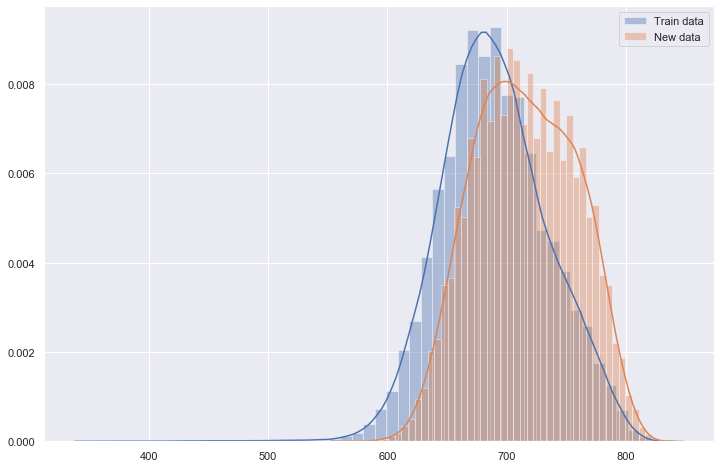


Strong indicative of population change, credit scores are higher in newer data


```python
old_score_dummies = pd.get_dummies(pd.cut(scores_train, bins = np.arange(300, 851, 50)), prefix='Score', prefix_sep=':')
x_train_with_ref_intercept = pd.concat([x_train_with_ref_intercept, old_score_dummies], axis=1)
```


```python
new_score_dummies = pd.get_dummies(pd.cut(scores_2015, bins = np.arange(300, 851, 50)), prefix='Score', prefix_sep=':')
loan_data_2015_preprocessed_with_ref_intercept = pd.concat([loan_data_2015_preprocessed_with_ref_intercept, new_score_dummies], axis=1)
```


```python
x_train_with_ref_intercept.shape
```


    (373028, 103)


```python
loan_data_2015_preprocessed_with_ref_intercept.shape
```


    (421094, 103)


## PSI Calculation


```python
PSI_train = x_train_with_ref_intercept.sum() / x_train_with_ref_intercept.shape[0]
PSI_new = loan_data_2015_preprocessed_with_ref_intercept.sum() / loan_data_2015_preprocessed_with_ref_intercept.shape[0]
```


```python
PSI = pd.concat([PSI_train, PSI_new], axis=1)
PSI.reset_index(inplace=True)
PSI.columns = ['Feature name', '2007-2014', '2015']

PSI['Original feature name'] = PSI['Feature name'].apply(lambda x: x.split(':')[0])
PSI = PSI[['Feature name', 'Original feature name', '2007-2014', '2015']]
PSI = PSI[(PSI['Feature name'] != 'Score') & (PSI['Feature name'] != 'Intercept')]
PSI
```


<div>
<style scoped>
    .dataframe tbody tr th:only-of-type {
        vertical-align: middle;
    }

    .dataframe tbody tr th {
        vertical-align: top;
    }

    .dataframe thead th {
        text-align: right;
    }
</style>
<table border="1" class="dataframe">
  <thead>
    <tr style="text-align: right;">
      <th></th>
      <th>Feature name</th>
      <th>Original feature name</th>
      <th>2007-2014</th>
      <th>2015</th>
    </tr>
  </thead>
  <tbody>
    <tr>
      <th>1</th>
      <td>annual_inc:30k_40k</td>
      <td>annual_inc</td>
      <td>0.115627</td>
      <td>0.107577</td>
    </tr>
    <tr>
      <th>2</th>
      <td>annual_inc:100k_1200k</td>
      <td>annual_inc</td>
      <td>0.070831</td>
      <td>0.076921</td>
    </tr>
    <tr>
      <th>3</th>
      <td>annual_inc:20k_30k</td>
      <td>annual_inc</td>
      <td>0.059848</td>
      <td>0.055011</td>
    </tr>
    <tr>
      <th>4</th>
      <td>annual_inc:40k_50k</td>
      <td>annual_inc</td>
      <td>0.147560</td>
      <td>0.139959</td>
    </tr>
    <tr>
      <th>5</th>
      <td>annual_inc:120k_140k</td>
      <td>annual_inc</td>
      <td>0.036791</td>
      <td>0.041756</td>
    </tr>
    <tr>
      <th>6</th>
      <td>annual_inc:&lt;20k</td>
      <td>annual_inc</td>
      <td>0.015192</td>
      <td>0.014294</td>
    </tr>
    <tr>
      <th>7</th>
      <td>annual_inc:&gt;140k</td>
      <td>annual_inc</td>
      <td>0.058886</td>
      <td>0.071556</td>
    </tr>
    <tr>
      <th>8</th>
      <td>annual_inc:50k_60k</td>
      <td>annual_inc</td>
      <td>0.142917</td>
      <td>0.137352</td>
    </tr>
    <tr>
      <th>9</th>
      <td>annual_inc:60k_70k</td>
      <td>annual_inc</td>
      <td>0.116257</td>
      <td>0.114457</td>
    </tr>
    <tr>
      <th>10</th>
      <td>annual_inc:70k_80k</td>
      <td>annual_inc</td>
      <td>0.100218</td>
      <td>0.101963</td>
    </tr>
    <tr>
      <th>11</th>
      <td>annual_inc:90k_100k</td>
      <td>annual_inc</td>
      <td>0.060553</td>
      <td>0.063228</td>
    </tr>
    <tr>
      <th>12</th>
      <td>dti:16.8_19.2</td>
      <td>dti</td>
      <td>0.108635</td>
      <td>0.101329</td>
    </tr>
    <tr>
      <th>13</th>
      <td>dti:&gt;1.6</td>
      <td>dti</td>
      <td>0.009487</td>
      <td>0.005267</td>
    </tr>
    <tr>
      <th>14</th>
      <td>dti:1.6_4</td>
      <td>dti</td>
      <td>0.026633</td>
      <td>0.020444</td>
    </tr>
    <tr>
      <th>15</th>
      <td>dti:19.2_21.6</td>
      <td>dti</td>
      <td>0.074099</td>
      <td>0.070630</td>
    </tr>
    <tr>
      <th>16</th>
      <td>dti:4_8.8</td>
      <td>dti</td>
      <td>0.117495</td>
      <td>0.096328</td>
    </tr>
    <tr>
      <th>17</th>
      <td>dti:&gt;35.2</td>
      <td>dti</td>
      <td>0.007369</td>
      <td>0.038125</td>
    </tr>
    <tr>
      <th>18</th>
      <td>dti:8.8_12</td>
      <td>dti</td>
      <td>0.123294</td>
      <td>0.105969</td>
    </tr>
    <tr>
      <th>19</th>
      <td>dti:12_15.2</td>
      <td>dti</td>
      <td>0.145630</td>
      <td>0.128624</td>
    </tr>
    <tr>
      <th>20</th>
      <td>dti:21.6_24</td>
      <td>dti</td>
      <td>0.087213</td>
      <td>0.086157</td>
    </tr>
    <tr>
      <th>21</th>
      <td>dti:15.2_16.8</td>
      <td>dti</td>
      <td>0.074287</td>
      <td>0.067258</td>
    </tr>
    <tr>
      <th>22</th>
      <td>dti:24_35.2</td>
      <td>dti</td>
      <td>0.199492</td>
      <td>0.255162</td>
    </tr>
    <tr>
      <th>23</th>
      <td>emp_length_int:10</td>
      <td>emp_length_int</td>
      <td>0.322348</td>
      <td>0.336077</td>
    </tr>
    <tr>
      <th>24</th>
      <td>emp_length_int:5_6</td>
      <td>emp_length_int</td>
      <td>0.121945</td>
      <td>0.099189</td>
    </tr>
    <tr>
      <th>25</th>
      <td>emp_length_int:2_3_4</td>
      <td>emp_length_int</td>
      <td>0.227197</td>
      <td>0.226631</td>
    </tr>
    <tr>
      <th>26</th>
      <td>emp_length_int:1</td>
      <td>emp_length_int</td>
      <td>0.063411</td>
      <td>0.065242</td>
    </tr>
    <tr>
      <th>27</th>
      <td>emp_length_int:0</td>
      <td>emp_length_int</td>
      <td>0.122565</td>
      <td>0.138109</td>
    </tr>
    <tr>
      <th>28</th>
      <td>emp_length_int:7_8_9</td>
      <td>emp_length_int</td>
      <td>0.142534</td>
      <td>0.134751</td>
    </tr>
    <tr>
      <th>29</th>
      <td>grade:A</td>
      <td>grade</td>
      <td>0.160200</td>
      <td>0.174154</td>
    </tr>
    <tr>
      <th>30</th>
      <td>grade:B</td>
      <td>grade</td>
      <td>0.294160</td>
      <td>0.279287</td>
    </tr>
    <tr>
      <th>31</th>
      <td>grade:D</td>
      <td>grade</td>
      <td>0.164862</td>
      <td>0.148789</td>
    </tr>
    <tr>
      <th>32</th>
      <td>grade:E</td>
      <td>grade</td>
      <td>0.076702</td>
      <td>0.082993</td>
    </tr>
    <tr>
      <th>33</th>
      <td>grade:F</td>
      <td>grade</td>
      <td>0.028228</td>
      <td>0.023313</td>
    </tr>
    <tr>
      <th>34</th>
      <td>grade:G</td>
      <td>grade</td>
      <td>0.007115</td>
      <td>0.005146</td>
    </tr>
    <tr>
      <th>35</th>
      <td>grade:C</td>
      <td>grade</td>
      <td>0.268733</td>
      <td>0.286318</td>
    </tr>
    <tr>
      <th>36</th>
      <td>home_ownership:MORTGAGE</td>
      <td>home_ownership</td>
      <td>0.506546</td>
      <td>0.493196</td>
    </tr>
    <tr>
      <th>37</th>
      <td>home_ownership:OWN</td>
      <td>home_ownership</td>
      <td>0.089256</td>
      <td>0.108684</td>
    </tr>
    <tr>
      <th>38</th>
      <td>home_ownership:RENT_OTHER_NONE</td>
      <td>home_ownership</td>
      <td>0.404198</td>
      <td>0.398120</td>
    </tr>
    <tr>
      <th>39</th>
      <td>initial_list_status:f</td>
      <td>initial_list_status</td>
      <td>0.650123</td>
      <td>0.365341</td>
    </tr>
    <tr>
      <th>40</th>
      <td>initial_list_status:w</td>
      <td>initial_list_status</td>
      <td>0.349877</td>
      <td>0.634659</td>
    </tr>
    <tr>
      <th>41</th>
      <td>inq_last_6mths:3-6</td>
      <td>inq_last_6mths</td>
      <td>0.077860</td>
      <td>0.040487</td>
    </tr>
    <tr>
      <th>42</th>
      <td>inq_last_6mths:0</td>
      <td>inq_last_6mths</td>
      <td>0.518009</td>
      <td>0.608907</td>
    </tr>
    <tr>
      <th>43</th>
      <td>inq_last_6mths:&gt;6</td>
      <td>inq_last_6mths</td>
      <td>0.001005</td>
      <td>0.000000</td>
    </tr>
    <tr>
      <th>44</th>
      <td>inq_last_6mths:1-2</td>
      <td>inq_last_6mths</td>
      <td>0.403125</td>
      <td>0.350606</td>
    </tr>
    <tr>
      <th>45</th>
      <td>int_rate:&gt;17.804</td>
      <td>int_rate</td>
      <td>0.173384</td>
      <td>0.135160</td>
    </tr>
    <tr>
      <th>46</th>
      <td>int_rate:12.025_14.502</td>
      <td>int_rate</td>
      <td>0.253464</td>
      <td>0.241929</td>
    </tr>
    <tr>
      <th>47</th>
      <td>int_rate:14.502_17.804</td>
      <td>int_rate</td>
      <td>0.478597</td>
      <td>0.404596</td>
    </tr>
    <tr>
      <th>48</th>
      <td>int_rate:9.548_12.025</td>
      <td>int_rate</td>
      <td>0.168111</td>
      <td>0.180914</td>
    </tr>
    <tr>
      <th>49</th>
      <td>int_rate:&lt;9.548</td>
      <td>int_rate</td>
      <td>0.179909</td>
      <td>0.279330</td>
    </tr>
    <tr>
      <th>50</th>
      <td>mths_since_earliest_cr_line:&lt;140</td>
      <td>mths_since_earliest_cr_line</td>
      <td>0.084449</td>
      <td>0.089037</td>
    </tr>
    <tr>
      <th>51</th>
      <td>mths_since_earliest_cr_line:141_265</td>
      <td>mths_since_earliest_cr_line</td>
      <td>0.593197</td>
      <td>0.580794</td>
    </tr>
    <tr>
      <th>52</th>
      <td>mths_since_earliest_cr_line:266_353</td>
      <td>mths_since_earliest_cr_line</td>
      <td>0.212343</td>
      <td>0.208749</td>
    </tr>
    <tr>
      <th>53</th>
      <td>mths_since_earliest_cr_line:&gt;354</td>
      <td>mths_since_earliest_cr_line</td>
      <td>0.108643</td>
      <td>0.119771</td>
    </tr>
    <tr>
      <th>54</th>
      <td>mths_since_issue_d:&lt;38</td>
      <td>mths_since_issue_d</td>
      <td>0.075517</td>
      <td>0.194427</td>
    </tr>
    <tr>
      <th>55</th>
      <td>mths_since_issue_d:38_39</td>
      <td>mths_since_issue_d</td>
      <td>0.106255</td>
      <td>0.183503</td>
    </tr>
    <tr>
      <th>56</th>
      <td>mths_since_issue_d:40_41</td>
      <td>mths_since_issue_d</td>
      <td>0.103515</td>
      <td>0.194370</td>
    </tr>
    <tr>
      <th>57</th>
      <td>mths_since_issue_d:42_48</td>
      <td>mths_since_issue_d</td>
      <td>0.252048</td>
      <td>0.427700</td>
    </tr>
    <tr>
      <th>58</th>
      <td>mths_since_issue_d:49_52</td>
      <td>mths_since_issue_d</td>
      <td>0.116905</td>
      <td>0.000000</td>
    </tr>
    <tr>
      <th>59</th>
      <td>mths_since_issue_d:53_64</td>
      <td>mths_since_issue_d</td>
      <td>0.204639</td>
      <td>0.000000</td>
    </tr>
    <tr>
      <th>60</th>
      <td>mths_since_issue_d:&gt;84</td>
      <td>mths_since_issue_d</td>
      <td>0.039206</td>
      <td>0.000000</td>
    </tr>
    <tr>
      <th>61</th>
      <td>mths_since_issue_d:65_84</td>
      <td>mths_since_issue_d</td>
      <td>0.099253</td>
      <td>0.000000</td>
    </tr>
    <tr>
      <th>62</th>
      <td>mths_since_last_delinq:4_30</td>
      <td>mths_since_last_delinq</td>
      <td>0.209067</td>
      <td>0.231734</td>
    </tr>
    <tr>
      <th>63</th>
      <td>mths_since_last_delinq:&lt;4</td>
      <td>mths_since_last_delinq</td>
      <td>0.019846</td>
      <td>0.025194</td>
    </tr>
    <tr>
      <th>64</th>
      <td>mths_since_last_delinq:&gt;57</td>
      <td>mths_since_last_delinq</td>
      <td>0.209067</td>
      <td>0.231734</td>
    </tr>
    <tr>
      <th>65</th>
      <td>mths_since_last_delinq:missing</td>
      <td>mths_since_last_delinq</td>
      <td>0.536649</td>
      <td>0.484360</td>
    </tr>
    <tr>
      <th>66</th>
      <td>mths_since_last_delinq:31_56</td>
      <td>mths_since_last_delinq</td>
      <td>0.147426</td>
      <td>0.157065</td>
    </tr>
    <tr>
      <th>67</th>
      <td>mths_since_last_record:0_2</td>
      <td>mths_since_last_record</td>
      <td>0.002911</td>
      <td>0.000207</td>
    </tr>
    <tr>
      <th>68</th>
      <td>mths_since_last_record:Missing</td>
      <td>mths_since_last_record</td>
      <td>0.865782</td>
      <td>0.823282</td>
    </tr>
    <tr>
      <th>69</th>
      <td>mths_since_last_record:3_22</td>
      <td>mths_since_last_record</td>
      <td>0.005005</td>
      <td>0.008642</td>
    </tr>
    <tr>
      <th>70</th>
      <td>mths_since_last_record:23_30</td>
      <td>mths_since_last_record</td>
      <td>0.004024</td>
      <td>0.006531</td>
    </tr>
    <tr>
      <th>71</th>
      <td>mths_since_last_record:31_69</td>
      <td>mths_since_last_record</td>
      <td>0.046409</td>
      <td>0.080944</td>
    </tr>
    <tr>
      <th>72</th>
      <td>mths_since_last_record:70_85</td>
      <td>mths_since_last_record</td>
      <td>0.019666</td>
      <td>0.042385</td>
    </tr>
    <tr>
      <th>73</th>
      <td>mths_since_last_record:&gt;97</td>
      <td>mths_since_last_record</td>
      <td>0.040442</td>
      <td>0.022038</td>
    </tr>
    <tr>
      <th>74</th>
      <td>mths_since_last_record:86_97</td>
      <td>mths_since_last_record</td>
      <td>0.015760</td>
      <td>0.015973</td>
    </tr>
    <tr>
      <th>75</th>
      <td>purpose:debtc_majpur_homeimp_car_credc</td>
      <td>purpose</td>
      <td>0.901176</td>
      <td>0.922008</td>
    </tr>
    <tr>
      <th>76</th>
      <td>purpose:ren_oth_med_wedd_vac</td>
      <td>purpose</td>
      <td>0.071649</td>
      <td>0.060839</td>
    </tr>
    <tr>
      <th>77</th>
      <td>purpose:educ_sm_mov_house</td>
      <td>purpose</td>
      <td>0.027175</td>
      <td>0.017153</td>
    </tr>
    <tr>
      <th>78</th>
      <td>term:60</td>
      <td>term</td>
      <td>0.275071</td>
      <td>0.327533</td>
    </tr>
    <tr>
      <th>79</th>
      <td>term:36</td>
      <td>term</td>
      <td>0.724929</td>
      <td>0.672467</td>
    </tr>
    <tr>
      <th>80</th>
      <td>total_rev_hi_lim:5K-10K</td>
      <td>total_rev_hi_lim</td>
      <td>0.146292</td>
      <td>0.102949</td>
    </tr>
    <tr>
      <th>81</th>
      <td>total_rev_hi_lim:10K-20K</td>
      <td>total_rev_hi_lim</td>
      <td>0.292434</td>
      <td>0.263257</td>
    </tr>
    <tr>
      <th>82</th>
      <td>total_rev_hi_lim:20K-30K</td>
      <td>total_rev_hi_lim</td>
      <td>0.192573</td>
      <td>0.202121</td>
    </tr>
    <tr>
      <th>83</th>
      <td>total_rev_hi_lim:30K-40K</td>
      <td>total_rev_hi_lim</td>
      <td>0.116300</td>
      <td>0.132289</td>
    </tr>
    <tr>
      <th>84</th>
      <td>total_rev_hi_lim:&lt;=5K</td>
      <td>total_rev_hi_lim</td>
      <td>0.060398</td>
      <td>0.032784</td>
    </tr>
    <tr>
      <th>85</th>
      <td>total_rev_hi_lim:55K-95K</td>
      <td>total_rev_hi_lim</td>
      <td>0.073941</td>
      <td>0.107235</td>
    </tr>
    <tr>
      <th>86</th>
      <td>total_rev_hi_lim:&gt;95K</td>
      <td>total_rev_hi_lim</td>
      <td>0.023966</td>
      <td>0.041459</td>
    </tr>
    <tr>
      <th>87</th>
      <td>total_rev_hi_lim:40K-55K</td>
      <td>total_rev_hi_lim</td>
      <td>0.094097</td>
      <td>0.117907</td>
    </tr>
    <tr>
      <th>88</th>
      <td>verification_status:Verified</td>
      <td>verification_status</td>
      <td>0.360332</td>
      <td>0.292134</td>
    </tr>
    <tr>
      <th>89</th>
      <td>verification_status:Not Verified</td>
      <td>verification_status</td>
      <td>0.317896</td>
      <td>0.281441</td>
    </tr>
    <tr>
      <th>90</th>
      <td>verification_status:Source Verified</td>
      <td>verification_status</td>
      <td>0.321772</td>
      <td>0.426425</td>
    </tr>
    <tr>
      <th>92</th>
      <td>Score:(300, 350]</td>
      <td>Score</td>
      <td>0.000005</td>
      <td>0.000000</td>
    </tr>
    <tr>
      <th>93</th>
      <td>Score:(350, 400]</td>
      <td>Score</td>
      <td>0.000099</td>
      <td>0.000000</td>
    </tr>
    <tr>
      <th>94</th>
      <td>Score:(400, 450]</td>
      <td>Score</td>
      <td>0.000332</td>
      <td>0.000000</td>
    </tr>
    <tr>
      <th>95</th>
      <td>Score:(450, 500]</td>
      <td>Score</td>
      <td>0.000627</td>
      <td>0.000000</td>
    </tr>
    <tr>
      <th>96</th>
      <td>Score:(500, 550]</td>
      <td>Score</td>
      <td>0.001273</td>
      <td>0.000000</td>
    </tr>
    <tr>
      <th>97</th>
      <td>Score:(550, 600]</td>
      <td>Score</td>
      <td>0.015176</td>
      <td>0.000622</td>
    </tr>
    <tr>
      <th>98</th>
      <td>Score:(600, 650]</td>
      <td>Score</td>
      <td>0.168826</td>
      <td>0.061340</td>
    </tr>
    <tr>
      <th>99</th>
      <td>Score:(650, 700]</td>
      <td>Score</td>
      <td>0.426724</td>
      <td>0.330171</td>
    </tr>
    <tr>
      <th>100</th>
      <td>Score:(700, 750]</td>
      <td>Score</td>
      <td>0.284027</td>
      <td>0.373114</td>
    </tr>
    <tr>
      <th>101</th>
      <td>Score:(750, 800]</td>
      <td>Score</td>
      <td>0.098926</td>
      <td>0.223359</td>
    </tr>
    <tr>
      <th>102</th>
      <td>Score:(800, 850]</td>
      <td>Score</td>
      <td>0.003984</td>
      <td>0.011394</td>
    </tr>
  </tbody>
</table>
</div>


```python
PSI['Contribution'] = np.where((PSI['2007-2014'] == 0) | (PSI['2015'] == 0), 0, 
                               (PSI['2015'] - PSI['2007-2014']) * np.log(PSI['2015'] / PSI['2007-2014']))
```

    /Users/omaromeiri/anaconda3/lib/python3.7/site-packages/ipykernel_launcher.py:2: RuntimeWarning: divide by zero encountered in log
      


```python
print(PSI['Contribution'].isnull().sum(), ' missing values')
print(PSI['Contribution'].describe())
```

    0  missing values
    count    101.000000
    mean       0.013619
    std        0.031244
    min        0.000000
    25%        0.000402
    50%        0.001768
    75%        0.009587
    max        0.169589
    Name: Contribution, dtype: float64


```python
PSI.groupby('Original feature name')['Contribution'].sum()
```


    Original feature name
    Score                          0.313510
    annual_inc                     0.005440
    dti                            0.078694
    emp_length_int                 0.007619
    grade                          0.006775
    home_ownership                 0.004275
    initial_list_status            0.333717
    inq_last_6mths                 0.046465
    int_rate                       0.067166
    mths_since_earliest_cr_line    0.001651
    mths_since_issue_d             0.304788
    mths_since_last_delinq         0.011914
    mths_since_last_record         0.060327
    purpose                        0.006855
    term                           0.013099
    total_rev_hi_lim               0.065026
    verification_status            0.048219
    Name: Contribution, dtype: float64


### Population Stability Index (PSI)

0------------> No difference in population<br>
<0.1---------> Little to no difference<br>
0.1 to 0.25---> Little difference (requires investigation, but usually no action needed)<br>
'>0.25-------> Big difference (requires intervention)<br>
1------------> Absolute difference

### So, looking at these PSIs we notice that there are three problematic variables: 'initial_list_status', 'mths_since_issue_d' and 'Score'

'initial_list_status' refers to the bank's strategy, not the population<br>
'mths_since_issue_d'  is a product of our own calculations, and it makes sense for newer data to have lower timedeltas<br>

In relation to the 'Score variable', there is a significant change in the scores outputed by our model, that is a strong indicative that our model needs to be re-trained with the new data also


```python

```
