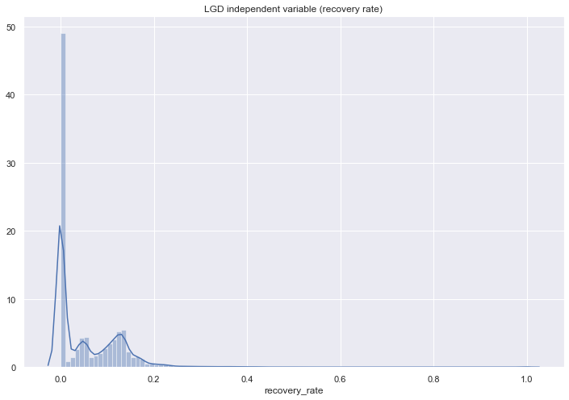
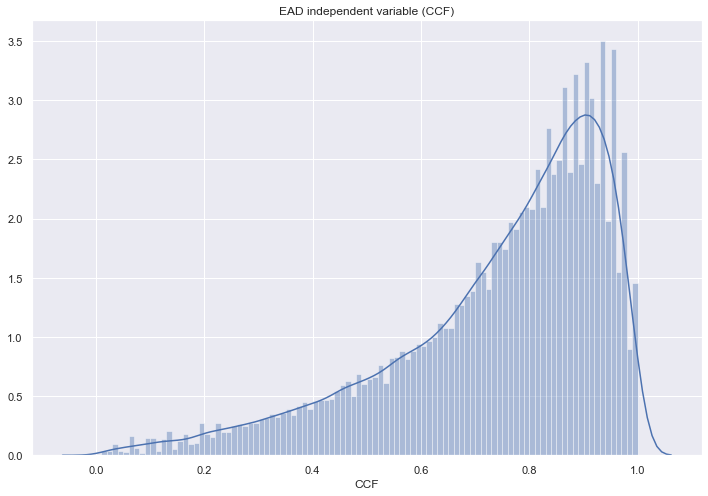
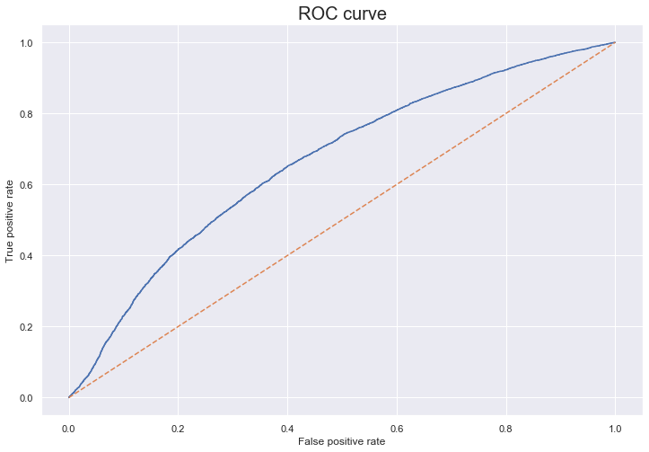
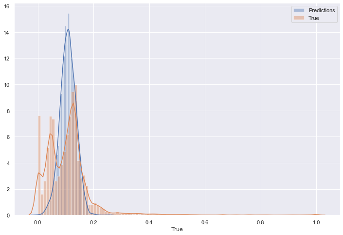
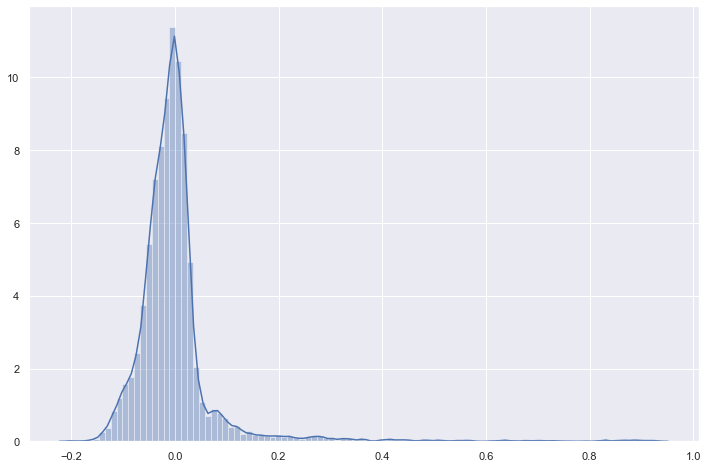
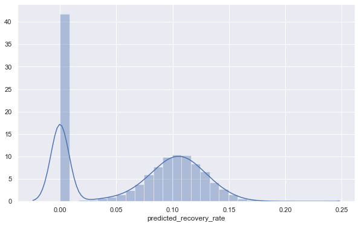
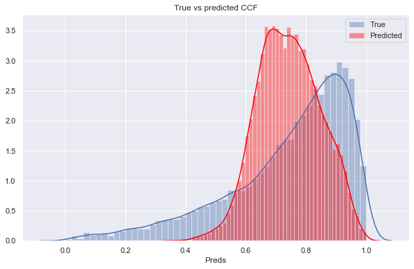
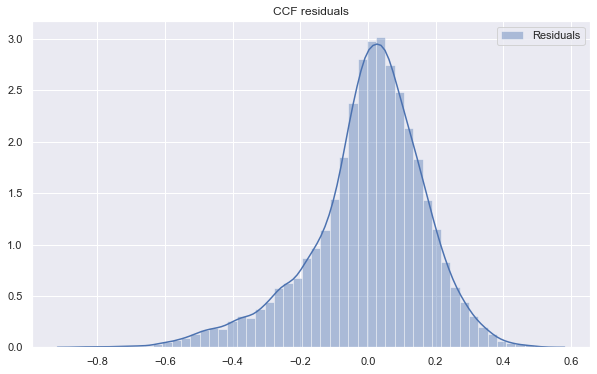
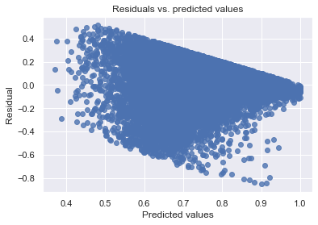
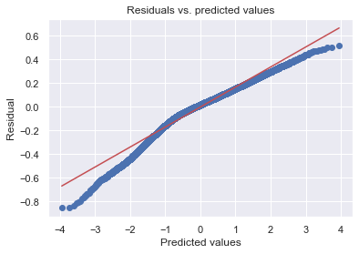

```python
import numpy as np
import pandas as pd
import pickle

pd.options.display.max_rows = None
pd.options.display.max_columns = None
```


```python
loan_data_preprocessed_2015 = pd.read_csv('loan_data_2007-2015_preprocessed.csv', index_col=0)

loan_data_preprocessed_2007_2014 = pd.read_csv('loan_data_2007-2014_preprocessesed_all_vars.csv', index_col=0)
```


```python
print(loan_data_preprocessed_2007_2014.shape)
print(loan_data_preprocessed_2015.shape)

loan_data_preprocessed = pd.concat([loan_data_preprocessed_2007_2014, loan_data_preprocessed_2015])
print(loan_data_preprocessed.shape)
```

    (466285, 205)
    (887379, 207)


    /Users/omaromeiri/anaconda3/lib/python3.7/site-packages/ipykernel_launcher.py:4: FutureWarning: Sorting because non-concatenation axis is not aligned. A future version
    of pandas will change to not sort by default.
    
    To accept the future behavior, pass 'sort=False'.
    
    To retain the current behavior and silence the warning, pass 'sort=True'.
    
      after removing the cwd from sys.path.


    (1353664, 207)


#### The LGD and EAD models should include only data from customers who have defaulted long enough that some of the amount can be recovered.<br>
#### These data exist in the dataframe in the 'loan_status' column under the categories: 'Charged Off' and 'Does not meet the credit policy. Status:Charged Off'


```python
loan_data_preprocessed['loan_status'].unique()
```


    array(['Fully Paid', 'Charged Off', 'Current', 'Default',
           'Late (31-120 days)', 'In Grace Period', 'Late (16-30 days)',
           'Does not meet the credit policy. Status:Fully Paid',
           'Does not meet the credit policy. Status:Charged Off', 'Issued'],
          dtype=object)


```python
loan_data_defaults = loan_data_preprocessed[(loan_data_preprocessed['loan_status'] == 'Charged Off') | (loan_data_preprocessed['loan_status'] == 'Does not meet the credit policy. Status:Charged Off')]
loan_data_defaults.shape
```


    (89245, 207)


```python
loan_data_defaults.isnull().sum()
```


    Y                                                                      0
    acc_now_delinq                                                         0
    addr_state                                                             0
    addr_state:AK                                                          0
    addr_state:AL                                                          0
    addr_state:AR                                                          0
    addr_state:AZ                                                          0
    addr_state:CA                                                          0
    addr_state:CO                                                          0
    addr_state:CT                                                          0
    addr_state:DC                                                          0
    addr_state:DE                                                          0
    addr_state:FL                                                          0
    addr_state:GA                                                          0
    addr_state:HI                                                          0
    addr_state:IA                                                          0
    addr_state:ID                                                          0
    addr_state:IL                                                          0
    addr_state:IN                                                          0
    addr_state:KS                                                          0
    addr_state:KY                                                          0
    addr_state:LA                                                          0
    addr_state:MA                                                          0
    addr_state:MD                                                          0
    addr_state:ME                                                          0
    addr_state:MI                                                          0
    addr_state:MN                                                          0
    addr_state:MO                                                          0
    addr_state:MS                                                          0
    addr_state:MT                                                          0
    addr_state:NC                                                          0
    addr_state:ND                                                      43236
    addr_state:NE                                                          0
    addr_state:NH                                                          0
    addr_state:NJ                                                          0
    addr_state:NM                                                          0
    addr_state:NV                                                          0
    addr_state:NY                                                          0
    addr_state:OH                                                          0
    addr_state:OK                                                          0
    addr_state:OR                                                          0
    addr_state:PA                                                          0
    addr_state:RI                                                          0
    addr_state:SC                                                          0
    addr_state:SD                                                          0
    addr_state:TN                                                          0
    addr_state:TX                                                          0
    addr_state:UT                                                          0
    addr_state:VA                                                          0
    addr_state:VT                                                          0
    addr_state:WA                                                          0
    addr_state:WI                                                          0
    addr_state:WV                                                          0
    addr_state:WY                                                          0
    all_util                                                           89245
    annual_inc                                                             0
    annual_inc_joint                                                   89245
    application_type                                                       0
    collection_recovery_fee                                                0
    collections_12_mths_ex_med                                            56
    delinq_2yrs                                                            0
    desc                                                               57565
    dti                                                                    0
    dti_joint                                                          89245
    earliest_cr_line                                                       6
    earliest_cr_line_date                                                  6
    emp_length                                                          4877
    emp_length_int                                                         0
    emp_title                                                           6777
    funded_amnt                                                            0
    funded_amnt_inv                                                        0
    grade                                                                  0
    grade:A                                                                0
    grade:B                                                                0
    grade:C                                                                0
    grade:D                                                                0
    grade:E                                                                0
    grade:F                                                                0
    grade:G                                                                0
    home_ownership                                                         0
    home_ownership:ANY                                                     0
    home_ownership:MORTGAGE                                                0
    home_ownership:NONE                                                    0
    home_ownership:OTHER                                                   0
    home_ownership:OWN                                                     0
    home_ownership:RENT                                                    0
    id                                                                     0
    il_util                                                            89245
    initial_list_status                                                    0
    initial_list_status:f                                                  0
    initial_list_status:w                                                  0
    inq_fi                                                             89245
    inq_last_12m                                                       89245
    inq_last_6mths                                                         0
    installment                                                            0
    int_rate                                                               0
    issue_d                                                                0
    last_credit_pull_d                                                    12
    last_pymnt_amnt                                                        0
    last_pymnt_d                                                         915
    loan_amnt                                                              0
    loan_status                                                            0
    loan_status:Charged Off                                                0
    loan_status:Current                                                    0
    loan_status:Default                                                    0
    loan_status:Does not meet the credit policy. Status:Charged Off        0
    loan_status:Does not meet the credit policy. Status:Fully Paid         0
    loan_status:Fully Paid                                                 0
    loan_status:In Grace Period                                            0
    loan_status:Issued                                                 43236
    loan_status:Late (16-30 days)                                          0
    loan_status:Late (31-120 days)                                         0
    max_bal_bc                                                         89245
    member_id                                                              0
    mths_since_earliest_cr_line                                            0
    mths_since_issue_d                                                     0
    mths_since_last_delinq                                             49307
    mths_since_last_major_derog                                        72538
    mths_since_last_record                                             77905
    mths_since_rcnt_il                                                 89245
    next_pymnt_d                                                       87723
    open_acc                                                               0
    open_acc_6m                                                        89245
    open_il_12m                                                        89245
    open_il_24m                                                        89245
    open_il_6m                                                         89245
    open_rv_12m                                                        89245
    open_rv_24m                                                        89245
    out_prncp                                                              0
    out_prncp_inv                                                          0
    policy_code                                                            0
    pub_rec                                                                0
    purpose                                                                0
    purpose:car                                                            0
    purpose:credit_card                                                    0
    purpose:debt_consolidation                                             0
    purpose:educational                                                    0
    purpose:home_improvement                                               0
    purpose:house                                                          0
    purpose:major_purchase                                                 0
    purpose:medical                                                        0
    purpose:moving                                                         0
    purpose:other                                                          0
    purpose:renewable_energy                                               0
    purpose:small_business                                                 0
    purpose:vacation                                                       0
    purpose:wedding                                                        0
    pymnt_plan                                                             0
    recoveries                                                             0
    revol_bal                                                              0
    revol_util                                                           106
    sub_grade                                                              0
    sub_grade:A1                                                           0
    sub_grade:A2                                                           0
    sub_grade:A3                                                           0
    sub_grade:A4                                                           0
    sub_grade:A5                                                           0
    sub_grade:B1                                                           0
    sub_grade:B2                                                           0
    sub_grade:B3                                                           0
    sub_grade:B4                                                           0
    sub_grade:B5                                                           0
    sub_grade:C1                                                           0
    sub_grade:C2                                                           0
    sub_grade:C3                                                           0
    sub_grade:C4                                                           0
    sub_grade:C5                                                           0
    sub_grade:D1                                                           0
    sub_grade:D2                                                           0
    sub_grade:D3                                                           0
    sub_grade:D4                                                           0
    sub_grade:D5                                                           0
    sub_grade:E1                                                           0
    sub_grade:E2                                                           0
    sub_grade:E3                                                           0
    sub_grade:E4                                                           0
    sub_grade:E5                                                           0
    sub_grade:F1                                                           0
    sub_grade:F2                                                           0
    sub_grade:F3                                                           0
    sub_grade:F4                                                           0
    sub_grade:F5                                                           0
    sub_grade:G1                                                           0
    sub_grade:G2                                                           0
    sub_grade:G3                                                           0
    sub_grade:G4                                                           0
    sub_grade:G5                                                           0
    term                                                                   0
    title                                                                  6
    tot_coll_amt                                                       21560
    tot_cur_bal                                                        21560
    total_acc                                                              0
    total_bal_il                                                       89245
    total_cu_tl                                                        89245
    total_pymnt                                                            0
    total_pymnt_inv                                                        0
    total_rec_int                                                          0
    total_rec_late_fee                                                     0
    total_rec_prncp                                                        0
    total_rev_hi_lim                                                       0
    url                                                                    0
    verification_status                                                    0
    verification_status:Not Verified                                       0
    verification_status:Source Verified                                    0
    verification_status:Verified                                           0
    verification_status_joint                                          89245
    zip_code                                                               0
    dtype: int64


#### The only important variables that have missing values are 'mths_since_last_delinq' and 'mths_since_last_record'<br>
#### I will impute them to zero, because, as seen in the woe plots, it is the most conservative approach


```python
loan_data_defaults['mths_since_last_delinq'].fillna(0, inplace=True)
loan_data_defaults['mths_since_last_record'].fillna(0, inplace=True)
```

    /Users/omaromeiri/anaconda3/lib/python3.7/site-packages/pandas/core/generic.py:6130: SettingWithCopyWarning: 
    A value is trying to be set on a copy of a slice from a DataFrame
    
    See the caveats in the documentation: http://pandas.pydata.org/pandas-docs/stable/indexing.html#indexing-view-versus-copy
      self._update_inplace(new_data)


```python
loan_data_defaults[['mths_since_last_delinq', 'mths_since_last_record']].isnull().sum()
```


    mths_since_last_delinq    0
    mths_since_last_record    0
    dtype: int64


#### Calcutating recovery rate which is the dependent variable for the Loss Given Default model


```python
loan_data_defaults['recovery_rate'] = loan_data_defaults['recoveries'] / loan_data_defaults['funded_amnt']
```

    /Users/omaromeiri/anaconda3/lib/python3.7/site-packages/ipykernel_launcher.py:1: SettingWithCopyWarning: 
    A value is trying to be set on a copy of a slice from a DataFrame.
    Try using .loc[row_indexer,col_indexer] = value instead
    
    See the caveats in the documentation: http://pandas.pydata.org/pandas-docs/stable/indexing.html#indexing-view-versus-copy
      """Entry point for launching an IPython kernel.


```python
loan_data_defaults['recovery_rate'].describe()
```


    count    89245.000000
    mean         0.059622
    std          0.089725
    min          0.000000
    25%          0.000000
    50%          0.020637
    75%          0.112802
    max          1.220774
    Name: recovery_rate, dtype: float64


```python
loan_data_defaults[loan_data_defaults['recovery_rate'] > 1][['funded_amnt', 'recoveries']]
```


<div>
<style scoped>
    .dataframe tbody tr th:only-of-type {
        vertical-align: middle;
    }

    .dataframe tbody tr th {
        vertical-align: top;
    }

    .dataframe thead th {
        text-align: right;
    }
</style>
<table border="1" class="dataframe">
  <thead>
    <tr style="text-align: right;">
      <th></th>
      <th>funded_amnt</th>
      <th>recoveries</th>
    </tr>
  </thead>
  <tbody>
    <tr>
      <th>10743</th>
      <td>11200</td>
      <td>11816.32000</td>
    </tr>
    <tr>
      <th>28853</th>
      <td>3000</td>
      <td>3100.73000</td>
    </tr>
    <tr>
      <th>29595</th>
      <td>3200</td>
      <td>3345.13000</td>
    </tr>
    <tr>
      <th>33636</th>
      <td>4900</td>
      <td>5037.55000</td>
    </tr>
    <tr>
      <th>38115</th>
      <td>6000</td>
      <td>6272.43000</td>
    </tr>
    <tr>
      <th>39908</th>
      <td>13200</td>
      <td>13425.98797</td>
    </tr>
    <tr>
      <th>40518</th>
      <td>8500</td>
      <td>10335.90000</td>
    </tr>
    <tr>
      <th>41840</th>
      <td>6000</td>
      <td>7048.58000</td>
    </tr>
    <tr>
      <th>42191</th>
      <td>25000</td>
      <td>27750.00000</td>
    </tr>
    <tr>
      <th>49140</th>
      <td>7350</td>
      <td>8303.74000</td>
    </tr>
    <tr>
      <th>67935</th>
      <td>2000</td>
      <td>2415.26000</td>
    </tr>
    <tr>
      <th>129098</th>
      <td>20000</td>
      <td>20814.35000</td>
    </tr>
    <tr>
      <th>182436</th>
      <td>1500</td>
      <td>1516.38000</td>
    </tr>
    <tr>
      <th>183273</th>
      <td>5700</td>
      <td>6307.77000</td>
    </tr>
    <tr>
      <th>193368</th>
      <td>2100</td>
      <td>2273.77000</td>
    </tr>
    <tr>
      <th>202939</th>
      <td>30000</td>
      <td>33520.27000</td>
    </tr>
    <tr>
      <th>227176</th>
      <td>2100</td>
      <td>2472.00000</td>
    </tr>
    <tr>
      <th>239859</th>
      <td>9600</td>
      <td>9901.20000</td>
    </tr>
    <tr>
      <th>244460</th>
      <td>11200</td>
      <td>11935.96000</td>
    </tr>
    <tr>
      <th>249832</th>
      <td>14400</td>
      <td>17579.14000</td>
    </tr>
    <tr>
      <th>281963</th>
      <td>20000</td>
      <td>20502.14000</td>
    </tr>
    <tr>
      <th>314301</th>
      <td>3600</td>
      <td>3781.26000</td>
    </tr>
    <tr>
      <th>327616</th>
      <td>16800</td>
      <td>17076.02000</td>
    </tr>
    <tr>
      <th>365463</th>
      <td>9900</td>
      <td>10217.97000</td>
    </tr>
    <tr>
      <th>379342</th>
      <td>17100</td>
      <td>18173.53000</td>
    </tr>
    <tr>
      <th>408179</th>
      <td>10375</td>
      <td>10691.52000</td>
    </tr>
    <tr>
      <th>424324</th>
      <td>18000</td>
      <td>18920.88000</td>
    </tr>
    <tr>
      <th>10743</th>
      <td>11200</td>
      <td>11816.32000</td>
    </tr>
    <tr>
      <th>28853</th>
      <td>3000</td>
      <td>3100.73000</td>
    </tr>
    <tr>
      <th>29595</th>
      <td>3200</td>
      <td>3345.13000</td>
    </tr>
    <tr>
      <th>33636</th>
      <td>4900</td>
      <td>5037.55000</td>
    </tr>
    <tr>
      <th>38115</th>
      <td>6000</td>
      <td>6272.43000</td>
    </tr>
    <tr>
      <th>39908</th>
      <td>13200</td>
      <td>13425.98797</td>
    </tr>
    <tr>
      <th>40518</th>
      <td>8500</td>
      <td>10335.90000</td>
    </tr>
    <tr>
      <th>41840</th>
      <td>6000</td>
      <td>7048.58000</td>
    </tr>
    <tr>
      <th>42191</th>
      <td>25000</td>
      <td>27750.00000</td>
    </tr>
    <tr>
      <th>49140</th>
      <td>7350</td>
      <td>8303.74000</td>
    </tr>
    <tr>
      <th>67935</th>
      <td>2000</td>
      <td>2415.26000</td>
    </tr>
    <tr>
      <th>129098</th>
      <td>20000</td>
      <td>20814.35000</td>
    </tr>
    <tr>
      <th>182436</th>
      <td>1500</td>
      <td>1516.38000</td>
    </tr>
    <tr>
      <th>183273</th>
      <td>5700</td>
      <td>6307.77000</td>
    </tr>
    <tr>
      <th>193368</th>
      <td>2100</td>
      <td>2273.77000</td>
    </tr>
    <tr>
      <th>202939</th>
      <td>30000</td>
      <td>33520.27000</td>
    </tr>
    <tr>
      <th>227176</th>
      <td>2100</td>
      <td>2472.00000</td>
    </tr>
    <tr>
      <th>239859</th>
      <td>9600</td>
      <td>9901.20000</td>
    </tr>
    <tr>
      <th>244460</th>
      <td>11200</td>
      <td>11935.96000</td>
    </tr>
    <tr>
      <th>249832</th>
      <td>14400</td>
      <td>17579.14000</td>
    </tr>
    <tr>
      <th>281963</th>
      <td>20000</td>
      <td>20502.14000</td>
    </tr>
    <tr>
      <th>314301</th>
      <td>3600</td>
      <td>3781.26000</td>
    </tr>
    <tr>
      <th>327616</th>
      <td>16800</td>
      <td>17076.02000</td>
    </tr>
    <tr>
      <th>365463</th>
      <td>9900</td>
      <td>10217.97000</td>
    </tr>
    <tr>
      <th>379342</th>
      <td>17100</td>
      <td>18173.53000</td>
    </tr>
    <tr>
      <th>408179</th>
      <td>10375</td>
      <td>10691.52000</td>
    </tr>
    <tr>
      <th>424324</th>
      <td>18000</td>
      <td>18920.88000</td>
    </tr>
    <tr>
      <th>705615</th>
      <td>25000</td>
      <td>26308.47000</td>
    </tr>
    <tr>
      <th>758414</th>
      <td>12000</td>
      <td>12427.85000</td>
    </tr>
    <tr>
      <th>800378</th>
      <td>14700</td>
      <td>14746.89000</td>
    </tr>
    <tr>
      <th>841916</th>
      <td>4800</td>
      <td>4850.28000</td>
    </tr>
    <tr>
      <th>855986</th>
      <td>12000</td>
      <td>12679.50000</td>
    </tr>
    <tr>
      <th>886627</th>
      <td>18000</td>
      <td>21941.26000</td>
    </tr>
  </tbody>
</table>
</div>


#### Truncating the 27 values to 1


```python
loan_data_defaults['recovery_rate'] = loan_data_defaults['recovery_rate'].apply(lambda x: 1 if x > 1 else x)
```

    /Users/omaromeiri/anaconda3/lib/python3.7/site-packages/ipykernel_launcher.py:1: SettingWithCopyWarning: 
    A value is trying to be set on a copy of a slice from a DataFrame.
    Try using .loc[row_indexer,col_indexer] = value instead
    
    See the caveats in the documentation: http://pandas.pydata.org/pandas-docs/stable/indexing.html#indexing-view-versus-copy
      """Entry point for launching an IPython kernel.


```python
loan_data_defaults['recovery_rate'].describe()
```


    count    89245.000000
    mean         0.059569
    std          0.089126
    min          0.000000
    25%          0.000000
    50%          0.020637
    75%          0.112802
    max          1.000000
    Name: recovery_rate, dtype: float64


### Calculating Credit conversion factor (CCF) which is the dependent variable for the EAD model

I'll use the 'total_rec_princp' which is the amount the borrower has already paid back at the momet of default<br><br>
CCF is the proportion of the total exposure at the moment of default


```python
loan_data_defaults['CCF'] = (loan_data_defaults['funded_amnt'] - loan_data_defaults['total_rec_prncp']) / loan_data_defaults['funded_amnt']
loan_data_defaults['CCF'].describe()
```

    /Users/omaromeiri/anaconda3/lib/python3.7/site-packages/ipykernel_launcher.py:1: SettingWithCopyWarning: 
    A value is trying to be set on a copy of a slice from a DataFrame.
    Try using .loc[row_indexer,col_indexer] = value instead
    
    See the caveats in the documentation: http://pandas.pydata.org/pandas-docs/stable/indexing.html#indexing-view-versus-copy
      """Entry point for launching an IPython kernel.


    count    89245.000000
    mean         0.742166
    std          0.200926
    min          0.000438
    25%          0.638892
    50%          0.797222
    75%          0.895334
    max          1.000000
    Name: CCF, dtype: float64


### Exploring the dependent varialbles


```python
import matplotlib.pyplot as plt
import seaborn as sns
sns.set()
```

# LGD<br>
#### It is noticeable that almost 50% the cases are in the 0% recovery rate, that is nothing was recovered. It is reasonable to estimate it using a two stage approach<br>
#### 1) Is the recovery rate equal or greater than zero?
#### 2) It recovery rate is larger than 0, how much exactly is it?<br><br>
---
#### I'll use a Logistic regression to estimate whether a recovery rate is 0 or greater than zero
#### If it is larger than zero I'll use a linear regression to estimate how much it is going to be recovered


```python
fig = plt.figure(figsize=(12,8))
sns.distplot(loan_data_defaults['recovery_rate'], bins=100)
plt.title('LGD independent variable (recovery rate)')
```


    Text(0.5, 1.0, 'LGD independent variable (recovery rate)')





```python
loan_data_defaults['recovery_rate_binary'] = loan_data_defaults['recovery_rate'].apply(lambda x: x if x == 0 else 1)
loan_data_defaults['recovery_rate_binary'].describe()
```

    /Users/omaromeiri/anaconda3/lib/python3.7/site-packages/ipykernel_launcher.py:1: SettingWithCopyWarning: 
    A value is trying to be set on a copy of a slice from a DataFrame.
    Try using .loc[row_indexer,col_indexer] = value instead
    
    See the caveats in the documentation: http://pandas.pydata.org/pandas-docs/stable/indexing.html#indexing-view-versus-copy
      """Entry point for launching an IPython kernel.


    count    89245.000000
    mean         0.549588
    std          0.497538
    min          0.000000
    25%          0.000000
    50%          1.000000
    75%          1.000000
    max          1.000000
    Name: recovery_rate_binary, dtype: float64


# EAD

#### CCF is much more homogeneously distributed, so I will use a multiple linear regression model to estimate CCF


```python
fig = plt.figure(figsize=(12,8))
sns.distplot(loan_data_defaults['CCF'], bins=100)
plt.title('EAD independent variable (CCF)')
```


    Text(0.5, 1.0, 'EAD independent variable (CCF)')





# LGD Model stage 1 (Logistic regression)


```python
from sklearn.model_selection import train_test_split
from sklearn.linear_model import LogisticRegression, LinearRegression

```


```python
x_train_lgd_1, x_test_lgd_1, y_train_lgd_1, y_test_lgd_1 = train_test_split(loan_data_defaults.drop(['Y', 'recovery_rate', 'recovery_rate_binary', 'CCF'], axis=1),
                                                                    loan_data_defaults['recovery_rate_binary'], test_size=0.2, shuffle=True, random_state=42)

print(f'Train: X:{x_train_lgd_1.shape}, Y:{y_train_lgd_1.shape}')
print(f'Test : X:{x_test_lgd_1.shape}, Y:{y_test_lgd_1.shape}')
```

    Train: X:(71396, 206), Y:(71396,)
    Test : X:(17849, 206), Y:(17849,)


```python
vars_to_use = pickle.load(open('vars_usable_preprocessing.pickle', 'rb'))
len(vars_to_use)
```


    50


```python
'''
    Popping this variable from the vars list because it has only 0 values for this dataset,
    and will cause a SINGULAR MATRIX ERROR while trying to perform the transformations for the p-value calculations
'''

vars_to_use.pop(7)
```


    'home_ownership:ANY'


```python
len(vars_to_use)
```


    49


```python
ref_vars = ['grade:G', 'home_ownership:RENT', 'verification_status:Verified', 'purpose:credit_card', 'initial_list_status:f']
```


```python
x_train_lgd_1 = x_train_lgd_1[vars_to_use]


print(x_train_lgd_1.shape)
pd.DataFrame(x_train_lgd_1.isnull().sum()).T
```

    (71396, 49)


<div>
<style scoped>
    .dataframe tbody tr th:only-of-type {
        vertical-align: middle;
    }

    .dataframe tbody tr th {
        vertical-align: top;
    }

    .dataframe thead th {
        text-align: right;
    }
</style>
<table border="1" class="dataframe">
  <thead>
    <tr style="text-align: right;">
      <th></th>
      <th>grade:A</th>
      <th>grade:B</th>
      <th>grade:C</th>
      <th>grade:D</th>
      <th>grade:E</th>
      <th>grade:F</th>
      <th>grade:G</th>
      <th>home_ownership:MORTGAGE</th>
      <th>home_ownership:NONE</th>
      <th>home_ownership:OTHER</th>
      <th>home_ownership:OWN</th>
      <th>home_ownership:RENT</th>
      <th>verification_status:Not Verified</th>
      <th>verification_status:Source Verified</th>
      <th>verification_status:Verified</th>
      <th>purpose:car</th>
      <th>purpose:credit_card</th>
      <th>purpose:debt_consolidation</th>
      <th>purpose:educational</th>
      <th>purpose:home_improvement</th>
      <th>purpose:house</th>
      <th>purpose:major_purchase</th>
      <th>purpose:medical</th>
      <th>purpose:moving</th>
      <th>purpose:other</th>
      <th>purpose:renewable_energy</th>
      <th>purpose:small_business</th>
      <th>purpose:vacation</th>
      <th>purpose:wedding</th>
      <th>initial_list_status:f</th>
      <th>initial_list_status:w</th>
      <th>term</th>
      <th>emp_length_int</th>
      <th>mths_since_issue_d</th>
      <th>mths_since_earliest_cr_line</th>
      <th>funded_amnt</th>
      <th>int_rate</th>
      <th>installment</th>
      <th>annual_inc</th>
      <th>dti</th>
      <th>delinq_2yrs</th>
      <th>inq_last_6mths</th>
      <th>mths_since_last_delinq</th>
      <th>mths_since_last_record</th>
      <th>open_acc</th>
      <th>pub_rec</th>
      <th>total_acc</th>
      <th>acc_now_delinq</th>
      <th>total_rev_hi_lim</th>
    </tr>
  </thead>
  <tbody>
    <tr>
      <th>0</th>
      <td>0</td>
      <td>0</td>
      <td>0</td>
      <td>0</td>
      <td>0</td>
      <td>0</td>
      <td>0</td>
      <td>0</td>
      <td>0</td>
      <td>0</td>
      <td>0</td>
      <td>0</td>
      <td>0</td>
      <td>0</td>
      <td>0</td>
      <td>0</td>
      <td>0</td>
      <td>0</td>
      <td>0</td>
      <td>0</td>
      <td>0</td>
      <td>0</td>
      <td>0</td>
      <td>0</td>
      <td>0</td>
      <td>0</td>
      <td>0</td>
      <td>0</td>
      <td>0</td>
      <td>0</td>
      <td>0</td>
      <td>0</td>
      <td>0</td>
      <td>0</td>
      <td>0</td>
      <td>0</td>
      <td>0</td>
      <td>0</td>
      <td>0</td>
      <td>0</td>
      <td>0</td>
      <td>0</td>
      <td>0</td>
      <td>0</td>
      <td>0</td>
      <td>0</td>
      <td>0</td>
      <td>0</td>
      <td>0</td>
    </tr>
  </tbody>
</table>
</div>


```python
x_train_lgd_1.drop(ref_vars, axis=1, inplace=True)
print(x_train_lgd_1.shape)
```

    (71396, 44)


```python
from sklearn import linear_model
import scipy.stats as stat

class LogisticRegression_with_p_values:
    
    def __init__(self,*args,**kwargs):
        self.model = linear_model.LogisticRegression(*args,**kwargs)
        
    def fit(self,X,y):
        self.model.fit(X,y)
        
        #### Get p-values for the fitted model ####
        denom = (2.0 * (1.0 + np.cosh(self.model.decision_function(X))))
        denom = np.tile(denom,(X.shape[1],1)).T
        F_ij = np.dot((X / denom).T,X)
        Cramer_Rao = np.linalg.inv(F_ij)
        sigma_estimates = np.sqrt(np.diagonal(Cramer_Rao))
        z_scores = self.model.coef_[0] / sigma_estimates
        p_values = [stat.norm.sf(abs(x)) * 2 for x in z_scores]
        
        self.coef_ = self.model.coef_
        self.intercept_ = self.model.intercept_
        self.p_values = p_values
```


```python
log_reg_lgd = LogisticRegression_with_p_values()

log_reg_lgd.fit(x_train_lgd_1.values, y_train_lgd_1.values)
```

    /Users/omaromeiri/anaconda3/lib/python3.7/site-packages/sklearn/linear_model/logistic.py:432: FutureWarning: Default solver will be changed to 'lbfgs' in 0.22. Specify a solver to silence this warning.
      FutureWarning)


```python
summary_table = pd.DataFrame(columns = ['Feature name', 'Coef'])

summary_table['Feature name'] = x_train_lgd_1.columns.values
summary_table['Coef'] = log_reg_lgd.coef_[0]
summary_table.index = summary_table.index + 1
summary_table.loc[0] = ['Intercept', log_reg_lgd.intercept_[0]]
summary_table = summary_table.sort_index()

p_values = log_reg_lgd.p_values
p_values = np.append(np.nan, np.array(p_values))
summary_table['p_values'] = p_values

summary_table
```


<div>
<style scoped>
    .dataframe tbody tr th:only-of-type {
        vertical-align: middle;
    }

    .dataframe tbody tr th {
        vertical-align: top;
    }

    .dataframe thead th {
        text-align: right;
    }
</style>
<table border="1" class="dataframe">
  <thead>
    <tr style="text-align: right;">
      <th></th>
      <th>Feature name</th>
      <th>Coef</th>
      <th>p_values</th>
    </tr>
  </thead>
  <tbody>
    <tr>
      <th>0</th>
      <td>Intercept</td>
      <td>-4.096468e-03</td>
      <td>NaN</td>
    </tr>
    <tr>
      <th>1</th>
      <td>grade:A</td>
      <td>-1.399724e-03</td>
      <td>9.812241e-01</td>
    </tr>
    <tr>
      <th>2</th>
      <td>grade:B</td>
      <td>-3.736306e-03</td>
      <td>9.378345e-01</td>
    </tr>
    <tr>
      <th>3</th>
      <td>grade:C</td>
      <td>-3.989706e-03</td>
      <td>9.309664e-01</td>
    </tr>
    <tr>
      <th>4</th>
      <td>grade:D</td>
      <td>2.276348e-04</td>
      <td>9.961942e-01</td>
    </tr>
    <tr>
      <th>5</th>
      <td>grade:E</td>
      <td>1.536763e-03</td>
      <td>9.767009e-01</td>
    </tr>
    <tr>
      <th>6</th>
      <td>grade:F</td>
      <td>2.751240e-03</td>
      <td>9.638179e-01</td>
    </tr>
    <tr>
      <th>7</th>
      <td>home_ownership:MORTGAGE</td>
      <td>-3.753203e-04</td>
      <td>9.831450e-01</td>
    </tr>
    <tr>
      <th>8</th>
      <td>home_ownership:NONE</td>
      <td>3.304471e-05</td>
      <td>9.999520e-01</td>
    </tr>
    <tr>
      <th>9</th>
      <td>home_ownership:OTHER</td>
      <td>-6.344896e-06</td>
      <td>9.999838e-01</td>
    </tr>
    <tr>
      <th>10</th>
      <td>home_ownership:OWN</td>
      <td>8.403347e-05</td>
      <td>9.976741e-01</td>
    </tr>
    <tr>
      <th>11</th>
      <td>verification_status:Not Verified</td>
      <td>-5.737606e-03</td>
      <td>7.854090e-01</td>
    </tr>
    <tr>
      <th>12</th>
      <td>verification_status:Source Verified</td>
      <td>-4.951314e-03</td>
      <td>7.942589e-01</td>
    </tr>
    <tr>
      <th>13</th>
      <td>purpose:car</td>
      <td>2.010890e-04</td>
      <td>9.980572e-01</td>
    </tr>
    <tr>
      <th>14</th>
      <td>purpose:debt_consolidation</td>
      <td>-2.961804e-03</td>
      <td>8.893484e-01</td>
    </tr>
    <tr>
      <th>15</th>
      <td>purpose:educational</td>
      <td>-1.113250e-04</td>
      <td>9.996142e-01</td>
    </tr>
    <tr>
      <th>16</th>
      <td>purpose:home_improvement</td>
      <td>1.490624e-05</td>
      <td>9.997025e-01</td>
    </tr>
    <tr>
      <th>17</th>
      <td>purpose:house</td>
      <td>2.776238e-04</td>
      <td>9.978111e-01</td>
    </tr>
    <tr>
      <th>18</th>
      <td>purpose:major_purchase</td>
      <td>2.348267e-04</td>
      <td>9.968939e-01</td>
    </tr>
    <tr>
      <th>19</th>
      <td>purpose:medical</td>
      <td>-4.720991e-05</td>
      <td>9.994854e-01</td>
    </tr>
    <tr>
      <th>20</th>
      <td>purpose:moving</td>
      <td>2.634216e-05</td>
      <td>9.997492e-01</td>
    </tr>
    <tr>
      <th>21</th>
      <td>purpose:other</td>
      <td>3.978954e-04</td>
      <td>9.914803e-01</td>
    </tr>
    <tr>
      <th>22</th>
      <td>purpose:renewable_energy</td>
      <td>8.174686e-05</td>
      <td>9.997251e-01</td>
    </tr>
    <tr>
      <th>23</th>
      <td>purpose:small_business</td>
      <td>9.942777e-04</td>
      <td>9.843267e-01</td>
    </tr>
    <tr>
      <th>24</th>
      <td>purpose:vacation</td>
      <td>-3.234457e-05</td>
      <td>9.997490e-01</td>
    </tr>
    <tr>
      <th>25</th>
      <td>purpose:wedding</td>
      <td>2.841340e-04</td>
      <td>9.978530e-01</td>
    </tr>
    <tr>
      <th>26</th>
      <td>initial_list_status:w</td>
      <td>-2.404132e-02</td>
      <td>1.954618e-01</td>
    </tr>
    <tr>
      <th>27</th>
      <td>term</td>
      <td>-3.020351e-02</td>
      <td>4.737824e-68</td>
    </tr>
    <tr>
      <th>28</th>
      <td>emp_length_int</td>
      <td>-4.877344e-03</td>
      <td>2.288594e-02</td>
    </tr>
    <tr>
      <th>29</th>
      <td>mths_since_issue_d</td>
      <td>2.665745e-02</td>
      <td>0.000000e+00</td>
    </tr>
    <tr>
      <th>30</th>
      <td>mths_since_earliest_cr_line</td>
      <td>-1.111150e-03</td>
      <td>6.151649e-28</td>
    </tr>
    <tr>
      <th>31</th>
      <td>funded_amnt</td>
      <td>1.182682e-04</td>
      <td>1.116026e-64</td>
    </tr>
    <tr>
      <th>32</th>
      <td>int_rate</td>
      <td>3.650402e-02</td>
      <td>2.425117e-19</td>
    </tr>
    <tr>
      <th>33</th>
      <td>installment</td>
      <td>-3.213426e-03</td>
      <td>6.565003e-50</td>
    </tr>
    <tr>
      <th>34</th>
      <td>annual_inc</td>
      <td>-3.967462e-08</td>
      <td>8.707861e-01</td>
    </tr>
    <tr>
      <th>35</th>
      <td>dti</td>
      <td>-2.231750e-02</td>
      <td>6.743371e-86</td>
    </tr>
    <tr>
      <th>36</th>
      <td>delinq_2yrs</td>
      <td>5.787174e-04</td>
      <td>9.551456e-01</td>
    </tr>
    <tr>
      <th>37</th>
      <td>inq_last_6mths</td>
      <td>1.846052e-03</td>
      <td>7.843447e-01</td>
    </tr>
    <tr>
      <th>38</th>
      <td>mths_since_last_delinq</td>
      <td>5.251076e-04</td>
      <td>1.414367e-01</td>
    </tr>
    <tr>
      <th>39</th>
      <td>mths_since_last_record</td>
      <td>-3.493123e-03</td>
      <td>3.064389e-16</td>
    </tr>
    <tr>
      <th>40</th>
      <td>open_acc</td>
      <td>-4.473782e-03</td>
      <td>5.108993e-02</td>
    </tr>
    <tr>
      <th>41</th>
      <td>pub_rec</td>
      <td>-3.633452e-04</td>
      <td>9.892614e-01</td>
    </tr>
    <tr>
      <th>42</th>
      <td>total_acc</td>
      <td>-4.392065e-03</td>
      <td>1.571401e-05</td>
    </tr>
    <tr>
      <th>43</th>
      <td>acc_now_delinq</td>
      <td>1.540405e-04</td>
      <td>9.989101e-01</td>
    </tr>
    <tr>
      <th>44</th>
      <td>total_rev_hi_lim</td>
      <td>-1.955806e-06</td>
      <td>2.248471e-05</td>
    </tr>
  </tbody>
</table>
</div>


# Validation


```python
import sklearn.metrics as sklm
```


```python
x_test_lgd_1 = x_test_lgd_1[vars_to_use]
x_test_lgd_1 = x_test_lgd_1.drop(ref_vars, axis=1)
x_test_lgd_1.shape
```


    (17849, 44)


```python
preds_1 = pd.DataFrame(log_reg_lgd.model.predict(x_test_lgd_1), columns=['Preds'])
```


```python
probs = log_reg_lgd.model.predict_proba(x_test_lgd_1)[:,1]
```


```python
fpr, tpr, thresh = sklm.roc_curve(y_test_lgd_1, probs)
```


```python
fig = plt.figure(figsize=(12,8))
plt.plot(fpr, tpr)
plt.plot(fpr, fpr, '--')
plt.xlabel('False positive rate')
plt.ylabel('True positive rate')
plt.title('ROC curve', fontsize=20)
```


    Text(0.5, 1.0, 'ROC curve')





```python
AUROC = sklm.roc_auc_score(y_test_lgd_1, probs)
AUROC
```


    0.664477709209337


```python
print(sklm.classification_report(y_test_lgd_1, preds_1))
```

                  precision    recall  f1-score   support
    
             0.0       0.62      0.47      0.54      8147
             1.0       0.63      0.76      0.69      9702
    
        accuracy                           0.63     17849
       macro avg       0.63      0.61      0.61     17849
    weighted avg       0.63      0.63      0.62     17849
    


```python
conf_mat = pd.crosstab(y_test_lgd_1.values, preds_1['Preds'], rownames=['True'], colnames=['Pred'])
conf_mat['Total'] = conf_mat.sum(axis=1)
conf_mat.loc[2, :] = conf_mat.sum(axis=0)

conf_mat = conf_mat.astype('int')
conf_mat.rename(index = {2:'Total'}, inplace=True)
conf_mat
```


<div>
<style scoped>
    .dataframe tbody tr th:only-of-type {
        vertical-align: middle;
    }

    .dataframe tbody tr th {
        vertical-align: top;
    }

    .dataframe thead th {
        text-align: right;
    }
</style>
<table border="1" class="dataframe">
  <thead>
    <tr style="text-align: right;">
      <th>Pred</th>
      <th>0.0</th>
      <th>1.0</th>
      <th>Total</th>
    </tr>
    <tr>
      <th>True</th>
      <th></th>
      <th></th>
      <th></th>
    </tr>
  </thead>
  <tbody>
    <tr>
      <th>0.0</th>
      <td>3838</td>
      <td>4309</td>
      <td>8147</td>
    </tr>
    <tr>
      <th>1.0</th>
      <td>2351</td>
      <td>7351</td>
      <td>9702</td>
    </tr>
    <tr>
      <th>Total</th>
      <td>6189</td>
      <td>11660</td>
      <td>17849</td>
    </tr>
  </tbody>
</table>
</div>


```python

```


```python
cut_off = 0.52
cut_off_preds = np.where(probs >= cut_off, 1, 0)
```


```python
print(sklm.classification_report(y_test_lgd_1, cut_off_preds))
```

                  precision    recall  f1-score   support
    
             0.0       0.60      0.54      0.57      8147
             1.0       0.64      0.70      0.67      9702
    
        accuracy                           0.63     17849
       macro avg       0.62      0.62      0.62     17849
    weighted avg       0.63      0.63      0.63     17849
    


```python
conf_mat = pd.crosstab(y_test_lgd_1, cut_off_preds, rownames=['True'], colnames=['Pred'])
conf_mat['Total'] = conf_mat.sum(axis=1)
conf_mat.loc[2, :] = conf_mat.sum(axis=0)

conf_mat = conf_mat.astype('int')
conf_mat.rename(index = {2:'Total'}, inplace=True)
conf_mat
```


<div>
<style scoped>
    .dataframe tbody tr th:only-of-type {
        vertical-align: middle;
    }

    .dataframe tbody tr th {
        vertical-align: top;
    }

    .dataframe thead th {
        text-align: right;
    }
</style>
<table border="1" class="dataframe">
  <thead>
    <tr style="text-align: right;">
      <th>Pred</th>
      <th>0</th>
      <th>1</th>
      <th>Total</th>
    </tr>
    <tr>
      <th>True</th>
      <th></th>
      <th></th>
      <th></th>
    </tr>
  </thead>
  <tbody>
    <tr>
      <th>0.0</th>
      <td>4385</td>
      <td>3762</td>
      <td>8147</td>
    </tr>
    <tr>
      <th>1.0</th>
      <td>2885</td>
      <td>6817</td>
      <td>9702</td>
    </tr>
    <tr>
      <th>Total</th>
      <td>7270</td>
      <td>10579</td>
      <td>17849</td>
    </tr>
  </tbody>
</table>
</div>


```python
pickle.dump(log_reg_lgd,open('model_LGD_log_reg_2007-2015.sav', 'wb'))
```

# LGD model stage 2 (Linear Regression)


```python
loan_data_defaults_recoveries = loan_data_defaults[loan_data_defaults['recovery_rate'] > 0].copy()
loan_data_defaults_recoveries.shape
```


    (49048, 210)


```python
loan_data_defaults_recoveries['recovery_rate_binary'].sum()
```


    49048.0


```python
x_train_lgd_2, x_test_lgd_2, y_train_lgd_2, y_test_lgd_2 = train_test_split(loan_data_defaults_recoveries.drop(['recovery_rate', 'recovery_rate_binary', 'Y', 'CCF'], axis=1),
                                                                            loan_data_defaults_recoveries['recovery_rate'], test_size=0.2, shuffle=True, random_state=42)

print(f'Train: X:{x_train_lgd_2.shape}, Y:{y_train_lgd_2.shape}')
print(f'Test : X:{x_test_lgd_2.shape}, Y:{y_test_lgd_2.shape}')
```

    Train: X:(39238, 206), Y:(39238,)
    Test : X:(9810, 206), Y:(9810,)


```python
import scipy.stats as stat

class LinearRegression(linear_model.LinearRegression):
    def __init__(self, fit_intercept=True, normalize=True, copy_X=True, n_jobs=1):
        self.fit_intercept = fit_intercept
        self.normalize = normalize
        self.copy_X = copy_X
        self.n_jobs = n_jobs
        
    def fit(self, X, y, n_jobs=1):
        self = super(LinearRegression, self).fit(X, y, n_jobs)
        sse = np.sum((self.predict(X) - y) ** 2, axis=0) / float(X.shape[0] - X.shape[1])
        se = np.array([np.sqrt(np.diagonal(sse * np.linalg.inv(np.dot(X.T, X))))])
        self.t = self.coef_ / se
        self.p = np.squeeze(2 * (1 - stat.t.cdf(np.abs(self.t), y.shape[0] - X.shape[1])))
        return self
```


```python
x_train_lgd_2 = x_train_lgd_2[vars_to_use]
x_train_lgd_2 = x_train_lgd_2.drop(ref_vars, axis=1)
x_train_lgd_2.shape
```


    (39238, 44)


```python
lin_reg_lgd = LinearRegression()
lin_reg_lgd.fit(x_train_lgd_2, y_train_lgd_2)
```


    LinearRegression(copy_X=True, fit_intercept=True, n_jobs=1, normalize=True)


```python
summary_table = pd.DataFrame(columns = ['Feature name', 'Coef'])

summary_table['Feature name'] = x_train_lgd_2.columns.values
summary_table['Coef'] = lin_reg_lgd.coef_[0]
summary_table.index = summary_table.index + 1
summary_table.loc[0] = ['Intercept', lin_reg_lgd.intercept_]
summary_table = summary_table.sort_index()

p_values = lin_reg_lgd.p
p_values = np.append(np.nan, np.array(p_values))
summary_table['p_values'] = p_values.round(4)

summary_table
```


<div>
<style scoped>
    .dataframe tbody tr th:only-of-type {
        vertical-align: middle;
    }

    .dataframe tbody tr th {
        vertical-align: top;
    }

    .dataframe thead th {
        text-align: right;
    }
</style>
<table border="1" class="dataframe">
  <thead>
    <tr style="text-align: right;">
      <th></th>
      <th>Feature name</th>
      <th>Coef</th>
      <th>p_values</th>
    </tr>
  </thead>
  <tbody>
    <tr>
      <th>0</th>
      <td>Intercept</td>
      <td>0.22169</td>
      <td>NaN</td>
    </tr>
    <tr>
      <th>1</th>
      <td>grade:A</td>
      <td>-0.06010</td>
      <td>0.0000</td>
    </tr>
    <tr>
      <th>2</th>
      <td>grade:B</td>
      <td>-0.06010</td>
      <td>0.0000</td>
    </tr>
    <tr>
      <th>3</th>
      <td>grade:C</td>
      <td>-0.06010</td>
      <td>0.0000</td>
    </tr>
    <tr>
      <th>4</th>
      <td>grade:D</td>
      <td>-0.06010</td>
      <td>0.0000</td>
    </tr>
    <tr>
      <th>5</th>
      <td>grade:E</td>
      <td>-0.06010</td>
      <td>0.0000</td>
    </tr>
    <tr>
      <th>6</th>
      <td>grade:F</td>
      <td>-0.06010</td>
      <td>0.2176</td>
    </tr>
    <tr>
      <th>7</th>
      <td>home_ownership:MORTGAGE</td>
      <td>-0.06010</td>
      <td>0.0166</td>
    </tr>
    <tr>
      <th>8</th>
      <td>home_ownership:NONE</td>
      <td>-0.06010</td>
      <td>0.0000</td>
    </tr>
    <tr>
      <th>9</th>
      <td>home_ownership:OTHER</td>
      <td>-0.06010</td>
      <td>0.0019</td>
    </tr>
    <tr>
      <th>10</th>
      <td>home_ownership:OWN</td>
      <td>-0.06010</td>
      <td>0.0002</td>
    </tr>
    <tr>
      <th>11</th>
      <td>verification_status:Not Verified</td>
      <td>-0.06010</td>
      <td>0.3472</td>
    </tr>
    <tr>
      <th>12</th>
      <td>verification_status:Source Verified</td>
      <td>-0.06010</td>
      <td>0.2346</td>
    </tr>
    <tr>
      <th>13</th>
      <td>purpose:car</td>
      <td>-0.06010</td>
      <td>0.4249</td>
    </tr>
    <tr>
      <th>14</th>
      <td>purpose:debt_consolidation</td>
      <td>-0.06010</td>
      <td>0.3119</td>
    </tr>
    <tr>
      <th>15</th>
      <td>purpose:educational</td>
      <td>-0.06010</td>
      <td>0.0000</td>
    </tr>
    <tr>
      <th>16</th>
      <td>purpose:home_improvement</td>
      <td>-0.06010</td>
      <td>0.6162</td>
    </tr>
    <tr>
      <th>17</th>
      <td>purpose:house</td>
      <td>-0.06010</td>
      <td>0.7238</td>
    </tr>
    <tr>
      <th>18</th>
      <td>purpose:major_purchase</td>
      <td>-0.06010</td>
      <td>0.3648</td>
    </tr>
    <tr>
      <th>19</th>
      <td>purpose:medical</td>
      <td>-0.06010</td>
      <td>0.0343</td>
    </tr>
    <tr>
      <th>20</th>
      <td>purpose:moving</td>
      <td>-0.06010</td>
      <td>0.0416</td>
    </tr>
    <tr>
      <th>21</th>
      <td>purpose:other</td>
      <td>-0.06010</td>
      <td>0.1723</td>
    </tr>
    <tr>
      <th>22</th>
      <td>purpose:renewable_energy</td>
      <td>-0.06010</td>
      <td>0.0377</td>
    </tr>
    <tr>
      <th>23</th>
      <td>purpose:small_business</td>
      <td>-0.06010</td>
      <td>0.9590</td>
    </tr>
    <tr>
      <th>24</th>
      <td>purpose:vacation</td>
      <td>-0.06010</td>
      <td>0.3345</td>
    </tr>
    <tr>
      <th>25</th>
      <td>purpose:wedding</td>
      <td>-0.06010</td>
      <td>0.0004</td>
    </tr>
    <tr>
      <th>26</th>
      <td>initial_list_status:w</td>
      <td>-0.06010</td>
      <td>0.0000</td>
    </tr>
    <tr>
      <th>27</th>
      <td>term</td>
      <td>-0.06010</td>
      <td>0.3703</td>
    </tr>
    <tr>
      <th>28</th>
      <td>emp_length_int</td>
      <td>-0.06010</td>
      <td>0.0694</td>
    </tr>
    <tr>
      <th>29</th>
      <td>mths_since_issue_d</td>
      <td>-0.06010</td>
      <td>0.0000</td>
    </tr>
    <tr>
      <th>30</th>
      <td>mths_since_earliest_cr_line</td>
      <td>-0.06010</td>
      <td>0.0000</td>
    </tr>
    <tr>
      <th>31</th>
      <td>funded_amnt</td>
      <td>-0.06010</td>
      <td>0.0825</td>
    </tr>
    <tr>
      <th>32</th>
      <td>int_rate</td>
      <td>-0.06010</td>
      <td>0.0000</td>
    </tr>
    <tr>
      <th>33</th>
      <td>installment</td>
      <td>-0.06010</td>
      <td>0.0010</td>
    </tr>
    <tr>
      <th>34</th>
      <td>annual_inc</td>
      <td>-0.06010</td>
      <td>0.0000</td>
    </tr>
    <tr>
      <th>35</th>
      <td>dti</td>
      <td>-0.06010</td>
      <td>0.0013</td>
    </tr>
    <tr>
      <th>36</th>
      <td>delinq_2yrs</td>
      <td>-0.06010</td>
      <td>0.0021</td>
    </tr>
    <tr>
      <th>37</th>
      <td>inq_last_6mths</td>
      <td>-0.06010</td>
      <td>0.3529</td>
    </tr>
    <tr>
      <th>38</th>
      <td>mths_since_last_delinq</td>
      <td>-0.06010</td>
      <td>0.7490</td>
    </tr>
    <tr>
      <th>39</th>
      <td>mths_since_last_record</td>
      <td>-0.06010</td>
      <td>0.1372</td>
    </tr>
    <tr>
      <th>40</th>
      <td>open_acc</td>
      <td>-0.06010</td>
      <td>0.0000</td>
    </tr>
    <tr>
      <th>41</th>
      <td>pub_rec</td>
      <td>-0.06010</td>
      <td>0.0155</td>
    </tr>
    <tr>
      <th>42</th>
      <td>total_acc</td>
      <td>-0.06010</td>
      <td>0.0000</td>
    </tr>
    <tr>
      <th>43</th>
      <td>acc_now_delinq</td>
      <td>-0.06010</td>
      <td>0.8015</td>
    </tr>
    <tr>
      <th>44</th>
      <td>total_rev_hi_lim</td>
      <td>-0.06010</td>
      <td>0.0000</td>
    </tr>
  </tbody>
</table>
</div>


```python
x_test_lgd_2 = x_test_lgd_2[vars_to_use]
x_test_lgd_2 = x_test_lgd_2.drop(ref_vars, axis=1)
x_test_lgd_2.shape
```


    (9810, 44)


```python
preds_2 = pd.DataFrame(lin_reg_lgd.predict(x_test_lgd_2), columns=['Preds'])
preds_2['True'] = y_test_lgd_2.values
```

#### Not so great correlations, but acceptable for a LGD model


```python
preds_2.corr()
```


<div>
<style scoped>
    .dataframe tbody tr th:only-of-type {
        vertical-align: middle;
    }

    .dataframe tbody tr th {
        vertical-align: top;
    }

    .dataframe thead th {
        text-align: right;
    }
</style>
<table border="1" class="dataframe">
  <thead>
    <tr style="text-align: right;">
      <th></th>
      <th>Preds</th>
      <th>True</th>
    </tr>
  </thead>
  <tbody>
    <tr>
      <th>Preds</th>
      <td>1.000000</td>
      <td>0.304363</td>
    </tr>
    <tr>
      <th>True</th>
      <td>0.304363</td>
      <td>1.000000</td>
    </tr>
  </tbody>
</table>
</div>


```python
np.sqrt(sklm.mean_squared_error(y_test_lgd_2, preds_2['Preds']))
```


    0.08793386220383574


```python
preds_2['True'].describe()
```


    count    9810.000000
    mean        0.107909
    std         0.092313
    min         0.000239
    25%         0.050635
    50%         0.106433
    75%         0.135471
    max         1.000000
    Name: True, dtype: float64


```python
fig = plt.figure(figsize=(12,8))

sns.distplot(preds_2['Preds'], label='Predictions', bins=100)
sns.distplot(preds_2['True'], label='True', bins=100)
plt.legend()
```


    <matplotlib.legend.Legend at 0x13262b438>





#### Plotting the distribution of the residuals


```python
fig = plt.figure(figsize=(12,8))
sns.distplot(preds_2['True'] - preds_2['Preds'], bins=100)
```


    <matplotlib.axes._subplots.AxesSubplot at 0x13b322a58>





```python
pickle.dump(lin_reg_lgd, open('model_LGD_lin_reg_2007-2015.sav', 'wb'))
```

# LGD combining stage 1 and stage 2

First, predicting the recovery rate for all of the test data


```python
recovery_rate_preds_all = pd.DataFrame(lin_reg_lgd.predict(x_test_lgd_1), columns=['predicted_recovery_rate'])
print(recovery_rate_preds_all.shape)
recovery_rate_preds_all.describe()
```

    (17849, 1)


<div>
<style scoped>
    .dataframe tbody tr th:only-of-type {
        vertical-align: middle;
    }

    .dataframe tbody tr th {
        vertical-align: top;
    }

    .dataframe thead th {
        text-align: right;
    }
</style>
<table border="1" class="dataframe">
  <thead>
    <tr style="text-align: right;">
      <th></th>
      <th>predicted_recovery_rate</th>
    </tr>
  </thead>
  <tbody>
    <tr>
      <th>count</th>
      <td>17849.000000</td>
    </tr>
    <tr>
      <th>mean</th>
      <td>0.115434</td>
    </tr>
    <tr>
      <th>std</th>
      <td>0.029691</td>
    </tr>
    <tr>
      <th>min</th>
      <td>-0.001842</td>
    </tr>
    <tr>
      <th>25%</th>
      <td>0.096596</td>
    </tr>
    <tr>
      <th>50%</th>
      <td>0.116583</td>
    </tr>
    <tr>
      <th>75%</th>
      <td>0.135633</td>
    </tr>
    <tr>
      <th>max</th>
      <td>0.765408</td>
    </tr>
  </tbody>
</table>
</div>


#### Due to the linear regression model is not constrainted between 0 and 1, we might get values outside the range.<br> A beta regression would be preferred for this, but there is still no implemetation in python :(


```python
recovery_rate_preds_all['predicted_recovery_rate'] = recovery_rate_preds_all['predicted_recovery_rate'].apply(lambda x: 0 if x <= 0 else (1 if x > 1 else x))
recovery_rate_preds_all.describe()
```


<div>
<style scoped>
    .dataframe tbody tr th:only-of-type {
        vertical-align: middle;
    }

    .dataframe tbody tr th {
        vertical-align: top;
    }

    .dataframe thead th {
        text-align: right;
    }
</style>
<table border="1" class="dataframe">
  <thead>
    <tr style="text-align: right;">
      <th></th>
      <th>predicted_recovery_rate</th>
    </tr>
  </thead>
  <tbody>
    <tr>
      <th>count</th>
      <td>17849.000000</td>
    </tr>
    <tr>
      <th>mean</th>
      <td>0.115434</td>
    </tr>
    <tr>
      <th>std</th>
      <td>0.029690</td>
    </tr>
    <tr>
      <th>min</th>
      <td>0.000000</td>
    </tr>
    <tr>
      <th>25%</th>
      <td>0.096596</td>
    </tr>
    <tr>
      <th>50%</th>
      <td>0.116583</td>
    </tr>
    <tr>
      <th>75%</th>
      <td>0.135633</td>
    </tr>
    <tr>
      <th>max</th>
      <td>0.765408</td>
    </tr>
  </tbody>
</table>
</div>


#### Multiplying the predicted recovery rate to the binary output of the logistic model, we move to zero the recoveries we predicted not to happen<br> and leaving the values we predicted to recover unchanged<br><br>

Remebering that the x_test_lgd_2 is a subset of the x_test_lgd_1.<br>
I used the x_test_lgd_2 only to train and later predicted for all of the x_test_lgd_1 data points.


```python
x_test_lgd_1['predicted_recovery_rate'] = recovery_rate_preds_all['predicted_recovery_rate'].values * preds_1['Preds'].values
```


```python
plt.figure(figsize=(10,6))
sns.distplot(x_test_lgd_1['predicted_recovery_rate'])
```


    <matplotlib.axes._subplots.AxesSubplot at 0x13fcf6f98>





```python
x_test_lgd_1['predicted_recovery_rate'].describe()
```


    count    17849.000000
    mean         0.067522
    std          0.053544
    min          0.000000
    25%          0.000000
    50%          0.085975
    75%          0.111605
    max          0.224069
    Name: predicted_recovery_rate, dtype: float64


#### Just checking how well the linear regression predicted not to recover


```python
x_test_lgd_1['predicted_recovery_rate_binary'] = np.where(x_test_lgd_1['predicted_recovery_rate'] > 0, 1, 0)
```


```python
print(sklm.classification_report(y_test_lgd_1, x_test_lgd_1['predicted_recovery_rate_binary']))
```

                  precision    recall  f1-score   support
    
             0.0       0.62      0.47      0.54      8147
             1.0       0.63      0.76      0.69      9702
    
        accuracy                           0.63     17849
       macro avg       0.63      0.61      0.61     17849
    weighted avg       0.63      0.63      0.62     17849
    


```python
conf_mat = pd.crosstab(y_test_lgd_1, x_test_lgd_1['predicted_recovery_rate_binary'], rownames=['True'], colnames=['Pred'])
conf_mat['Total'] = conf_mat.sum(axis=1)
conf_mat.loc[2, :] = conf_mat.sum(axis=0)

conf_mat = conf_mat.astype('int')
conf_mat.rename(index = {2:'Total'}, inplace=True)
conf_mat
```


<div>
<style scoped>
    .dataframe tbody tr th:only-of-type {
        vertical-align: middle;
    }

    .dataframe tbody tr th {
        vertical-align: top;
    }

    .dataframe thead th {
        text-align: right;
    }
</style>
<table border="1" class="dataframe">
  <thead>
    <tr style="text-align: right;">
      <th>Pred</th>
      <th>0</th>
      <th>1</th>
      <th>Total</th>
    </tr>
    <tr>
      <th>True</th>
      <th></th>
      <th></th>
      <th></th>
    </tr>
  </thead>
  <tbody>
    <tr>
      <th>0.0</th>
      <td>3838</td>
      <td>4309</td>
      <td>8147</td>
    </tr>
    <tr>
      <th>1.0</th>
      <td>2353</td>
      <td>7349</td>
      <td>9702</td>
    </tr>
    <tr>
      <th>Total</th>
      <td>6191</td>
      <td>11658</td>
      <td>17849</td>
    </tr>
  </tbody>
</table>
</div>


```python

```

# EAD Model


```python
x_train_ead, x_test_ead, y_train_ead, y_test_ead = train_test_split(loan_data_defaults.drop(['CCF', 'Y', 'recovery_rate', 'recovery_rate_binary'], axis=1),
                                                                    loan_data_defaults['CCF'], test_size=0.2, shuffle=True, random_state=42)

print(f'Train: X:{x_train_ead.shape}, Y:{y_train_ead.shape}')
print(f'Test : X:{x_test_ead.shape}, Y:{y_test_ead.shape}')
```

    Train: X:(71396, 206), Y:(71396,)
    Test : X:(17849, 206), Y:(17849,)


```python
x_train_ead = x_train_ead[vars_to_use]
x_train_ead.drop(ref_vars, axis=1, inplace=True)
x_train_ead.shape
```


    (71396, 44)


```python
x_test_ead = x_test_ead[vars_to_use]
x_test_ead.drop(ref_vars, axis=1, inplace=True)
x_test_ead.shape
```


    (17849, 44)


```python
lin_reg_ead = LinearRegression()

lin_reg_ead.fit(x_train_ead, y_train_ead)
```


    LinearRegression(copy_X=True, fit_intercept=True, n_jobs=1, normalize=True)


```python
summary_table = pd.DataFrame(columns = ['Feature name', 'Coef'])

summary_table['Feature name'] = x_train_ead.columns.values
summary_table['Coef'] = lin_reg_ead.coef_
summary_table.index = summary_table.index + 1
summary_table.loc[0] = ['Intercept', lin_reg_ead.intercept_]
summary_table = summary_table.sort_index()

p_values = lin_reg_ead.p
p_values = np.append(np.nan, np.array(p_values))
summary_table['p_values'] = p_values.round(4)
```

#### CCF coefficients interpretation<br>
Remembering that CCF is the proportion still outstanding at the moment of default

Positive coefs = Increase in CCF (higher risk)<br>
Negative coefs = Decrease in CCF (Lower risk)


```python
summary_table
```


<div>
<style scoped>
    .dataframe tbody tr th:only-of-type {
        vertical-align: middle;
    }

    .dataframe tbody tr th {
        vertical-align: top;
    }

    .dataframe thead th {
        text-align: right;
    }
</style>
<table border="1" class="dataframe">
  <thead>
    <tr style="text-align: right;">
      <th></th>
      <th>Feature name</th>
      <th>Coef</th>
      <th>p_values</th>
    </tr>
  </thead>
  <tbody>
    <tr>
      <th>0</th>
      <td>Intercept</td>
      <td>1.095419e+00</td>
      <td>NaN</td>
    </tr>
    <tr>
      <th>1</th>
      <td>grade:A</td>
      <td>-2.995177e-01</td>
      <td>0.0000</td>
    </tr>
    <tr>
      <th>2</th>
      <td>grade:B</td>
      <td>-2.328953e-01</td>
      <td>0.0000</td>
    </tr>
    <tr>
      <th>3</th>
      <td>grade:C</td>
      <td>-1.678074e-01</td>
      <td>0.0000</td>
    </tr>
    <tr>
      <th>4</th>
      <td>grade:D</td>
      <td>-1.171416e-01</td>
      <td>0.0000</td>
    </tr>
    <tr>
      <th>5</th>
      <td>grade:E</td>
      <td>-6.676397e-02</td>
      <td>0.0000</td>
    </tr>
    <tr>
      <th>6</th>
      <td>grade:F</td>
      <td>-2.087597e-02</td>
      <td>0.0000</td>
    </tr>
    <tr>
      <th>7</th>
      <td>home_ownership:MORTGAGE</td>
      <td>-6.105346e-03</td>
      <td>0.0000</td>
    </tr>
    <tr>
      <th>8</th>
      <td>home_ownership:NONE</td>
      <td>2.291276e-02</td>
      <td>0.6054</td>
    </tr>
    <tr>
      <th>9</th>
      <td>home_ownership:OTHER</td>
      <td>-2.621656e-02</td>
      <td>0.2272</td>
    </tr>
    <tr>
      <th>10</th>
      <td>home_ownership:OWN</td>
      <td>-1.941402e-03</td>
      <td>0.4147</td>
    </tr>
    <tr>
      <th>11</th>
      <td>verification_status:Not Verified</td>
      <td>-1.397998e-03</td>
      <td>0.4189</td>
    </tr>
    <tr>
      <th>12</th>
      <td>verification_status:Source Verified</td>
      <td>1.323375e-02</td>
      <td>0.0000</td>
    </tr>
    <tr>
      <th>13</th>
      <td>purpose:car</td>
      <td>1.598025e-03</td>
      <td>0.8106</td>
    </tr>
    <tr>
      <th>14</th>
      <td>purpose:debt_consolidation</td>
      <td>1.079766e-02</td>
      <td>0.0000</td>
    </tr>
    <tr>
      <th>15</th>
      <td>purpose:educational</td>
      <td>8.986236e-02</td>
      <td>0.0000</td>
    </tr>
    <tr>
      <th>16</th>
      <td>purpose:home_improvement</td>
      <td>1.821778e-02</td>
      <td>0.0000</td>
    </tr>
    <tr>
      <th>17</th>
      <td>purpose:house</td>
      <td>1.598872e-02</td>
      <td>0.0490</td>
    </tr>
    <tr>
      <th>18</th>
      <td>purpose:major_purchase</td>
      <td>2.976852e-02</td>
      <td>0.0000</td>
    </tr>
    <tr>
      <th>19</th>
      <td>purpose:medical</td>
      <td>3.987129e-02</td>
      <td>0.0000</td>
    </tr>
    <tr>
      <th>20</th>
      <td>purpose:moving</td>
      <td>3.815597e-02</td>
      <td>0.0000</td>
    </tr>
    <tr>
      <th>21</th>
      <td>purpose:other</td>
      <td>3.512735e-02</td>
      <td>0.0000</td>
    </tr>
    <tr>
      <th>22</th>
      <td>purpose:renewable_energy</td>
      <td>6.921090e-02</td>
      <td>0.0003</td>
    </tr>
    <tr>
      <th>23</th>
      <td>purpose:small_business</td>
      <td>4.668566e-02</td>
      <td>0.0000</td>
    </tr>
    <tr>
      <th>24</th>
      <td>purpose:vacation</td>
      <td>1.683093e-02</td>
      <td>0.0465</td>
    </tr>
    <tr>
      <th>25</th>
      <td>purpose:wedding</td>
      <td>2.790532e-02</td>
      <td>0.0008</td>
    </tr>
    <tr>
      <th>26</th>
      <td>initial_list_status:w</td>
      <td>1.972141e-02</td>
      <td>0.0000</td>
    </tr>
    <tr>
      <th>27</th>
      <td>term</td>
      <td>4.196369e-03</td>
      <td>0.0000</td>
    </tr>
    <tr>
      <th>28</th>
      <td>emp_length_int</td>
      <td>-1.614929e-03</td>
      <td>0.0000</td>
    </tr>
    <tr>
      <th>29</th>
      <td>mths_since_issue_d</td>
      <td>-3.784262e-03</td>
      <td>0.0000</td>
    </tr>
    <tr>
      <th>30</th>
      <td>mths_since_earliest_cr_line</td>
      <td>-3.025898e-05</td>
      <td>0.0003</td>
    </tr>
    <tr>
      <th>31</th>
      <td>funded_amnt</td>
      <td>2.989708e-06</td>
      <td>0.0000</td>
    </tr>
    <tr>
      <th>32</th>
      <td>int_rate</td>
      <td>-1.086100e-02</td>
      <td>0.0000</td>
    </tr>
    <tr>
      <th>33</th>
      <td>installment</td>
      <td>-9.065358e-05</td>
      <td>0.0000</td>
    </tr>
    <tr>
      <th>34</th>
      <td>annual_inc</td>
      <td>2.785763e-08</td>
      <td>0.1548</td>
    </tr>
    <tr>
      <th>35</th>
      <td>dti</td>
      <td>6.542212e-04</td>
      <td>0.0000</td>
    </tr>
    <tr>
      <th>36</th>
      <td>delinq_2yrs</td>
      <td>1.899213e-03</td>
      <td>0.0267</td>
    </tr>
    <tr>
      <th>37</th>
      <td>inq_last_6mths</td>
      <td>9.344208e-03</td>
      <td>0.0000</td>
    </tr>
    <tr>
      <th>38</th>
      <td>mths_since_last_delinq</td>
      <td>-1.786505e-04</td>
      <td>0.0000</td>
    </tr>
    <tr>
      <th>39</th>
      <td>mths_since_last_record</td>
      <td>-8.522854e-05</td>
      <td>0.0169</td>
    </tr>
    <tr>
      <th>40</th>
      <td>open_acc</td>
      <td>-1.921543e-03</td>
      <td>0.0000</td>
    </tr>
    <tr>
      <th>41</th>
      <td>pub_rec</td>
      <td>1.028528e-02</td>
      <td>0.0000</td>
    </tr>
    <tr>
      <th>42</th>
      <td>total_acc</td>
      <td>4.306544e-04</td>
      <td>0.0000</td>
    </tr>
    <tr>
      <th>43</th>
      <td>acc_now_delinq</td>
      <td>2.176240e-02</td>
      <td>0.0223</td>
    </tr>
    <tr>
      <th>44</th>
      <td>total_rev_hi_lim</td>
      <td>9.771095e-08</td>
      <td>0.0031</td>
    </tr>
  </tbody>
</table>
</div>


## Validation

I'm happy with theese metrics, good correlation values, low RMSE compared to the CCF mean values, residuals around 0


```python
preds_ead = pd.DataFrame(lin_reg_ead.predict(x_test_ead), columns=['Preds'])
print(preds_ead.shape)
preds_ead.head()
```

    (17849, 1)


<div>
<style scoped>
    .dataframe tbody tr th:only-of-type {
        vertical-align: middle;
    }

    .dataframe tbody tr th {
        vertical-align: top;
    }

    .dataframe thead th {
        text-align: right;
    }
</style>
<table border="1" class="dataframe">
  <thead>
    <tr style="text-align: right;">
      <th></th>
      <th>Preds</th>
    </tr>
  </thead>
  <tbody>
    <tr>
      <th>0</th>
      <td>0.797778</td>
    </tr>
    <tr>
      <th>1</th>
      <td>0.790440</td>
    </tr>
    <tr>
      <th>2</th>
      <td>0.743354</td>
    </tr>
    <tr>
      <th>3</th>
      <td>0.867374</td>
    </tr>
    <tr>
      <th>4</th>
      <td>0.734910</td>
    </tr>
  </tbody>
</table>
</div>


```python
print(preds_ead['Preds'].describe())
preds_ead['Preds'] = np.where(preds_ead['Preds'] >= 1, 1, preds_ead['Preds'])
preds_ead['Preds'] = np.where(preds_ead['Preds'] < 0, 0, preds_ead['Preds'])
print(preds_ead['Preds'].describe())

```

    count    17849.000000
    mean         0.743564
    std          0.103678
    min          0.371335
    25%          0.668505
    50%          0.740333
    75%          0.817956
    max          1.028474
    Name: Preds, dtype: float64
    count    17849.000000
    mean         0.743557
    std          0.103660
    min          0.371335
    25%          0.668505
    50%          0.740333
    75%          0.817956
    max          1.000000
    Name: Preds, dtype: float64


```python
preds_ead['True'] = y_test_ead.values
preds_ead.corr()
```


<div>
<style scoped>
    .dataframe tbody tr th:only-of-type {
        vertical-align: middle;
    }

    .dataframe tbody tr th {
        vertical-align: top;
    }

    .dataframe thead th {
        text-align: right;
    }
</style>
<table border="1" class="dataframe">
  <thead>
    <tr style="text-align: right;">
      <th></th>
      <th>Preds</th>
      <th>True</th>
    </tr>
  </thead>
  <tbody>
    <tr>
      <th>Preds</th>
      <td>1.000000</td>
      <td>0.523384</td>
    </tr>
    <tr>
      <th>True</th>
      <td>0.523384</td>
      <td>1.000000</td>
    </tr>
  </tbody>
</table>
</div>


```python
preds_ead.describe()
```


<div>
<style scoped>
    .dataframe tbody tr th:only-of-type {
        vertical-align: middle;
    }

    .dataframe tbody tr th {
        vertical-align: top;
    }

    .dataframe thead th {
        text-align: right;
    }
</style>
<table border="1" class="dataframe">
  <thead>
    <tr style="text-align: right;">
      <th></th>
      <th>Preds</th>
      <th>True</th>
    </tr>
  </thead>
  <tbody>
    <tr>
      <th>count</th>
      <td>17849.000000</td>
      <td>17849.000000</td>
    </tr>
    <tr>
      <th>mean</th>
      <td>0.743557</td>
      <td>0.741642</td>
    </tr>
    <tr>
      <th>std</th>
      <td>0.103660</td>
      <td>0.201653</td>
    </tr>
    <tr>
      <th>min</th>
      <td>0.371335</td>
      <td>0.000438</td>
    </tr>
    <tr>
      <th>25%</th>
      <td>0.668505</td>
      <td>0.639625</td>
    </tr>
    <tr>
      <th>50%</th>
      <td>0.740333</td>
      <td>0.796220</td>
    </tr>
    <tr>
      <th>75%</th>
      <td>0.817956</td>
      <td>0.894026</td>
    </tr>
    <tr>
      <th>max</th>
      <td>1.000000</td>
      <td>1.000000</td>
    </tr>
  </tbody>
</table>
</div>


```python
np.sqrt(sklm.mean_squared_error(preds_ead['True'], preds_ead['Preds']))
```


    0.17184374692728313


```python
plt.figure(figsize=(10,6))
sns.distplot(y_test_ead, label='True')
sns.distplot(preds_ead['Preds'], label='Predicted', color='red')
plt.legend()
plt.title('True vs predicted CCF')
```


    Text(0.5, 1.0, 'True vs predicted CCF')





```python
plt.figure(figsize=(10,6))
sns.distplot(y_test_ead.values - preds_ead['Preds'].values, label='Residuals')

plt.legend()
plt.title('CCF residuals')
```


    Text(0.5, 1.0, 'CCF residuals')





```python
resids = np.subtract(preds_ead['True'], preds_ead['Preds'])

sns.regplot(preds_ead['Preds'], resids, fit_reg=False)
plt.title('Residuals vs. predicted values')
plt.xlabel('Predicted values')
plt.ylabel('Residual')
```


    Text(0, 0.5, 'Residual')





```python
resids = np.subtract(preds_ead['True'], preds_ead['Preds']).values
## now make the residual plots
stat.probplot(resids.flatten(), plot = plt)
plt.title('Residuals vs. predicted values')
plt.xlabel('Predicted values')
plt.ylabel('Residual')
    
```


    Text(0, 0.5, 'Residual')





```python
pickle.dump(lin_reg_ead, open('model_EAD_lin_reg_2007-2015.sav', 'wb'))
```


```python

```
