# Credit Risk Modeling
## Preprocessing
*Omar El Omeiri Filho*


---
### Table of Contents

* <u>[1 - Summary](#summ)<br></u>
* <u>[2 - Preparations](#prep)<br></u>
* <u>[3 - Data](#data)<br></u>
    * <u>[3.1 - Preprocessing](#preprocess)<br></u>
        * <u>[3.1.1 - Data checking](#check)<br></u>
        * <u>[3.1.2 - Outliers](#outliers)<br></u>
        * <u>[3.1.3 - Missing Data](#missing)<br></u>
        * <u>[3.2.4 - Splitting Data](#split)<br></u>
        * <u>[3.2.5 - Coarse Classing and Variable Explanatory Power](#coarse_class)<br></u>
            * <u>[3.2.5.1 - Discrete Variables](#disc_vars)<br></u>
            * <u>[3.2.5.2 - Continuous Variables](#cont_vars)<br></u>
            * <u>[3.2.5.3 - Test Set](#test)<br></u>

---

## 1 - Summary<a class='anchor' id='summ'></a>


&nbsp;&nbsp;&nbsp;&nbsp;The 2008 financial crisis made banks go bankrupt, which affected the whole world. Thousands of jobs were lost and millions of people went trough financial difficulties. In order to prevent such situations, government regulators imposed some requirement on banks to make sure they conduct their business without risking the stability of the economic system. In summary, banks are required to hold sufficient capital to to absorb the losses from defaults. This obligation is called the "Capital Adequacy". The most important document on how much banks need to have, how capital is defined and how capital is related to risk is The BASEL II Accord. The main idea of the BASEL II Accord is to ensure that the capital allocation is risk sensitive, in other words, the greater the risk a bank is exposed to, the greater the amount of capital it needs to hold. This is what makes Credit Risk Modeling so important.<br><br>

&nbsp;&nbsp;&nbsp;&nbsp;There are three main factors involved in Credit Risk Modeling, Probablity of Default(PD), Loss Given Default (LGD) and Exposure at Default (EAD), the combination of them is called the Expected Loss (EL). Banks need to minimize their losses in providing credit to borrowers. These entities can be people, companies etc. It is very important for banks to categorize borrowers into classes, reject credit for some and provide credit to the majority. This is what Credit Modeling is all about. <br>
&nbsp;&nbsp;&nbsp;&nbsp;The first step is calculating a probability value between 0 and 1 for someone defaulting. This needs to be done in a very explainable way and solely based on their characteristics. The LGD is the share of an asset that is lost once the borrower defaults, this will also need to be predicted based on historical data. Finally, EAD is the total amount that the lender is exposed to when a borrower defaults, it is the maximum value a bank may lose when a borrower defaults on a loan.<br>


The core of Credit Risk Modeling is in this formula:<br>

$$EL=PD*LGD*EAD$$

Simple, isn't it?<br><br>

This first report will focus ONLY in preprocessing the data. 

## 2 - Preparations<a class='anchor' id='prep'></a>


```R
sup <- suppressPackageStartupMessages

sup(library(gmodels))
sup(library(dplyr))
sup(library(tidyr))
sup(library(ggplot2))
sup(library(forcats))
sup(library(mlr))
sup(library(Hmisc))
sup(library(caret))
sup(library(Metrics))
sup(library(stringr))
sup(library(pROC))


opts <- options()
```

# 3 - Data<a class='anchor' id='data'></a>


```R
loan_data <- read.csv('loan_data.csv', header = T, row.names = 1)
```


```R
head(loan_data)
```


<table>
<caption>A data.frame: 6 × 8</caption>
<thead>
	<tr><th scope=col>loan_status</th><th scope=col>loan_amnt</th><th scope=col>int_rate</th><th scope=col>grade</th><th scope=col>emp_length</th><th scope=col>home_ownership</th><th scope=col>annual_inc</th><th scope=col>age</th></tr>
	<tr><th scope=col>&lt;int&gt;</th><th scope=col>&lt;int&gt;</th><th scope=col>&lt;dbl&gt;</th><th scope=col>&lt;fct&gt;</th><th scope=col>&lt;int&gt;</th><th scope=col>&lt;fct&gt;</th><th scope=col>&lt;dbl&gt;</th><th scope=col>&lt;int&gt;</th></tr>
</thead>
<tbody>
	<tr><td>0</td><td> 5000</td><td>10.65</td><td>B</td><td>10</td><td>RENT</td><td>24000</td><td>33</td></tr>
	<tr><td>0</td><td> 2400</td><td>   NA</td><td>C</td><td>25</td><td>RENT</td><td>12252</td><td>31</td></tr>
	<tr><td>0</td><td>10000</td><td>13.49</td><td>C</td><td>13</td><td>RENT</td><td>49200</td><td>24</td></tr>
	<tr><td>0</td><td> 5000</td><td>   NA</td><td>A</td><td> 3</td><td>RENT</td><td>36000</td><td>39</td></tr>
	<tr><td>0</td><td> 3000</td><td>   NA</td><td>E</td><td> 9</td><td>RENT</td><td>48000</td><td>24</td></tr>
	<tr><td>0</td><td>12000</td><td>12.69</td><td>B</td><td>11</td><td>OWN </td><td>75000</td><td>28</td></tr>
</tbody>
</table>


```R
str(loan_data)
```

    'data.frame':	29092 obs. of  8 variables:
     $ loan_status   : int  0 0 0 0 0 0 1 0 1 0 ...
     $ loan_amnt     : int  5000 2400 10000 5000 3000 12000 9000 3000 10000 1000 ...
     $ int_rate      : num  10.7 NA 13.5 NA NA ...
     $ grade         : Factor w/ 7 levels "A","B","C","D",..: 2 3 3 1 5 2 3 2 2 4 ...
     $ emp_length    : int  10 25 13 3 9 11 0 3 3 0 ...
     $ home_ownership: Factor w/ 4 levels "MORTGAGE","OTHER",..: 4 4 4 4 4 3 4 4 4 4 ...
     $ annual_inc    : num  24000 12252 49200 36000 48000 ...
     $ age           : int  33 31 24 39 24 28 22 22 28 22 ...


## 3.1 - Preprocessing<a class='anchor' id='preprocess'></a>

### 3.1.1 - Data checking<a class='anchor' id='check'></a>


```R
catg_vars <- list('loan_status', 'grade', 'emp_length', 'home_ownership')


par(bg = 'white', mfrow = c(2,2))
for (catg_var in catg_vars){
    barplot(t(table(loan_data[,catg_var], loan_data$loan_status)), main = catg_var, col = 1:2)
}
```


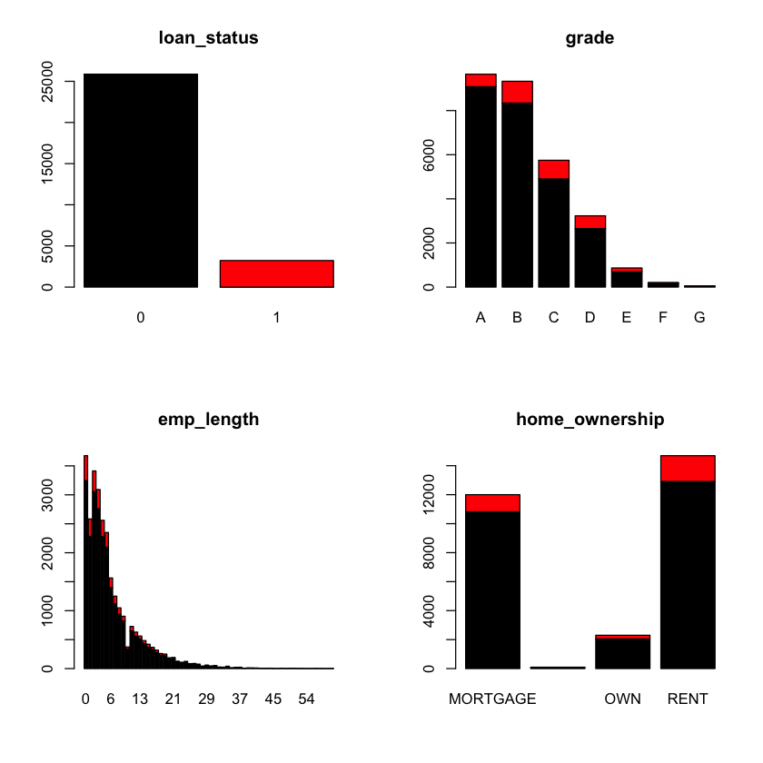


```R
num_vars = list('loan_amnt', 'int_rate', 'emp_length', 'annual_inc', 'age')


par(bg = 'white', mfrow = c(3,2))
for (num_var in num_vars){
    hist_1 <- hist(subset(loan_data[,num_var], loan_data$loan_status == 0), main = num_var, xlab = '', col = rgb(0.15,0.15,0.15))
    hist(subset(loan_data[,num_var], loan_data$loan_status == 1), main = num_var, xlab = '', col = 'red', add = T)
}
```


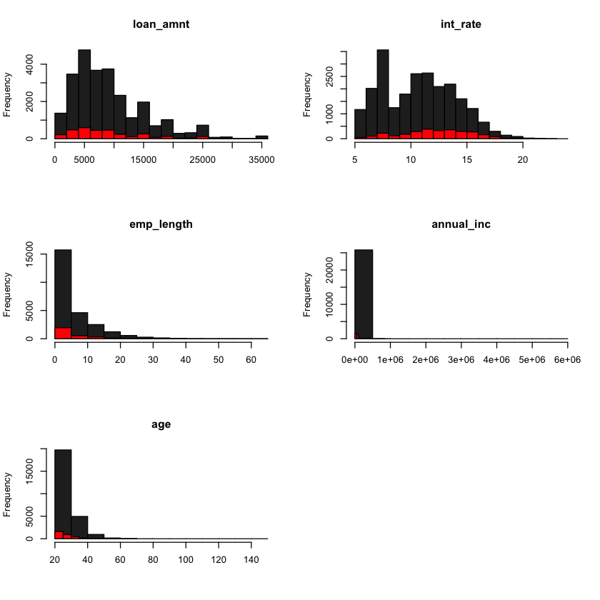


### 3.1.2 - Outliers<a class='anchor' id='outliers'></a>


```R
options(repr.plot.height = 10)
par(bg = 'white', mfrow = c(3,2))
for (var in num_vars){
    

        boxplot(loan_data[,var]~loan_data$loan_status, main = var, col = c(rgb(0.2, 0.2, 0.2), 'red'), ylab = '', xlab = 'Default')
        
        }

```


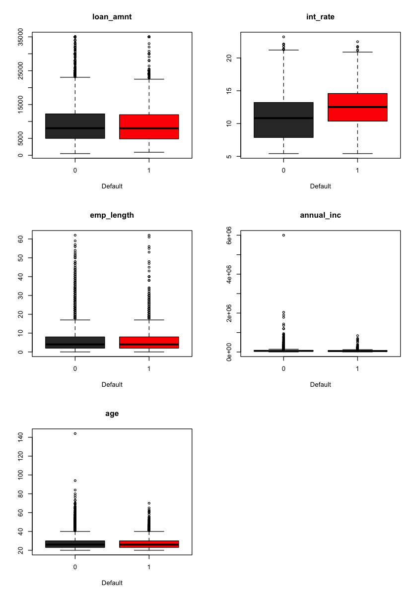


#### Deleting error in age column


```R
loan_data <- loan_data[-c(which.max(loan_data$age)),]
```


```R
options(opts)
par(bg = 'white')
boxplot(loan_data$age~loan_data$loan_status, col = c(rgb(0.2, 0.2, 0.2), 'red'), xlab = 'Default', ylab = 'Age')
```


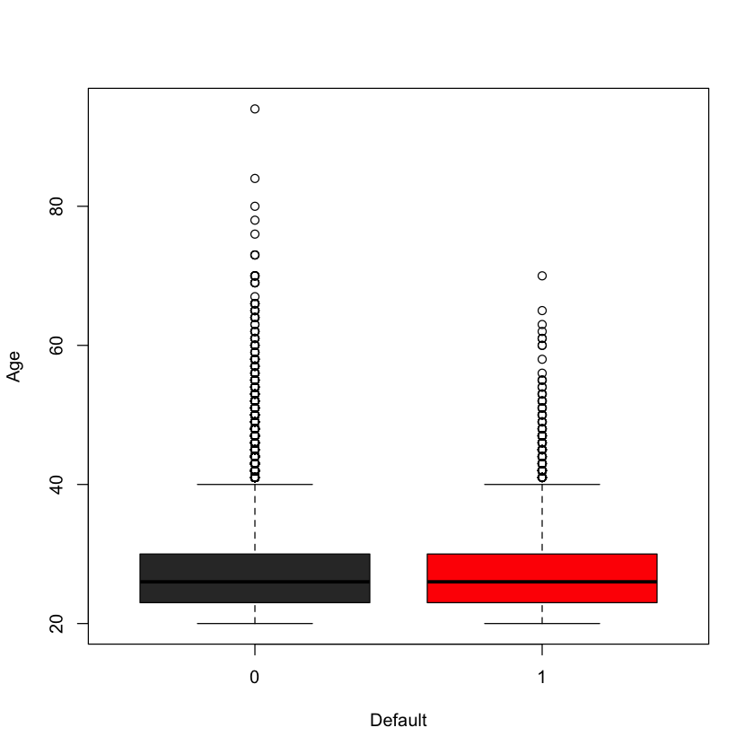


```R
options(opts)
options(repr.plot.width = 12)
par(bg = 'white')

hist_1 <- hist(subset(loan_data$annual_inc, loan_data$loan_status == 0), main = 'Annual Income', xlab = '', col = rgb(0.15,0.15,0.15), breaks = 100)
hist(subset(loan_data$annual_inc, loan_data$loan_status == 1), main = num_var, xlab = '', col = 'red', add = T, breaks = 50)
```


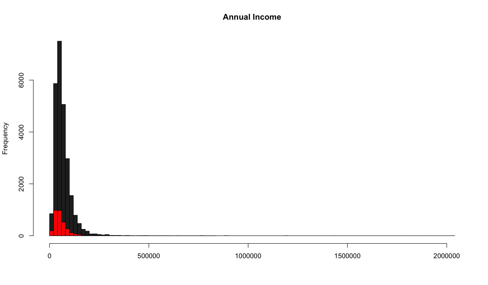


#### Deleting extreme outlier in annual income


```R
loan_data <- loan_data[, -which.max(loan_data$annual_inc)]
```


```R
par(bg = 'white')
options(opts)

boxplot(loan_data$annual_inc~loan_data$loan_status, col = c(rgb(0.2, 0.2, 0.2), 'red'), xlab = 'Default', ylab = 'Annual Income')
```


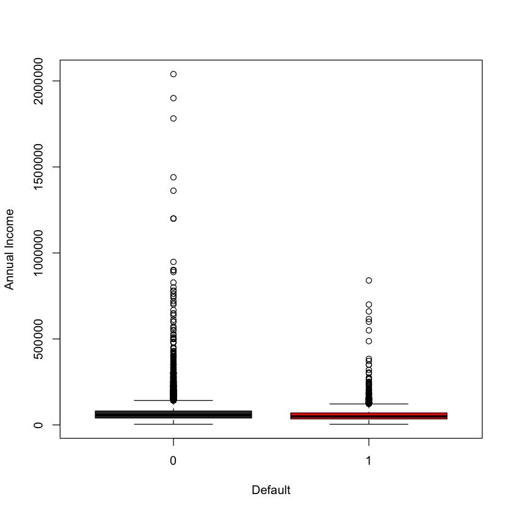


### 3.1.3 - Missing Data<a class='anchor' id='missing'></a>


```R
data.frame(t(colSums(is.na(loan_data))))
```


<table>
<caption>A data.frame: 1 × 8</caption>
<thead>
	<tr><th scope=col>loan_status</th><th scope=col>loan_amnt</th><th scope=col>int_rate</th><th scope=col>grade</th><th scope=col>emp_length</th><th scope=col>home_ownership</th><th scope=col>annual_inc</th><th scope=col>age</th></tr>
	<tr><th scope=col>&lt;dbl&gt;</th><th scope=col>&lt;dbl&gt;</th><th scope=col>&lt;dbl&gt;</th><th scope=col>&lt;dbl&gt;</th><th scope=col>&lt;dbl&gt;</th><th scope=col>&lt;dbl&gt;</th><th scope=col>&lt;dbl&gt;</th><th scope=col>&lt;dbl&gt;</th></tr>
</thead>
<tbody>
	<tr><td>0</td><td>0</td><td>2776</td><td>0</td><td>809</td><td>0</td><td>0</td><td>0</td></tr>
</tbody>
</table>


#### Will impute each grade median for every missing value in int_rate


```R
options(opts)
par(bg = 'white')

boxplot(loan_data[,'int_rate']~loan_data$grade, main = 'Grade vs Int_rate', col = 1:7, ylab = '', xlab = 'Grade')
```


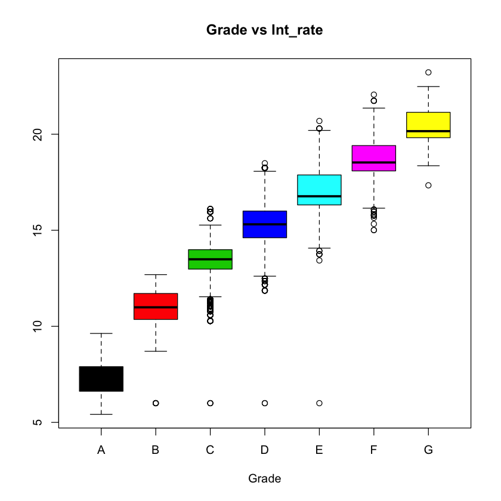


```R

grd_median <- lapply(levels(loan_data$grade), function(x){
     median(subset(loan_data, loan_data$grade == x)$int_rate, na.rm = T)
})

names(grd_median) <- levels(loan_data$grade)
```


```R
grd_median
```


<dl>
	<dt>$A</dt>
		<dd>7.49</dd>
	<dt>$B</dt>
		<dd>10.99</dd>
	<dt>$C</dt>
		<dd>13.49</dd>
	<dt>$D</dt>
		<dd>15.31</dd>
	<dt>$E</dt>
		<dd>16.77</dd>
	<dt>$F</dt>
		<dd>18.53</dd>
	<dt>$G</dt>
		<dd>20.16</dd>
</dl>


```R
for (grd in unique(loan_data$grade)){
    ix <- which(loan_data$grade == grd & is.na(loan_data$int_rate))
    loan_data[ix, 'int_rate'] <- as.numeric(grd_median[grd])
}
```


```R
data.frame(t(colSums(is.na(loan_data))))
```


<table>
<caption>A data.frame: 1 × 8</caption>
<thead>
	<tr><th scope=col>loan_status</th><th scope=col>loan_amnt</th><th scope=col>int_rate</th><th scope=col>grade</th><th scope=col>emp_length</th><th scope=col>home_ownership</th><th scope=col>annual_inc</th><th scope=col>age</th></tr>
	<tr><th scope=col>&lt;dbl&gt;</th><th scope=col>&lt;dbl&gt;</th><th scope=col>&lt;dbl&gt;</th><th scope=col>&lt;dbl&gt;</th><th scope=col>&lt;dbl&gt;</th><th scope=col>&lt;dbl&gt;</th><th scope=col>&lt;dbl&gt;</th><th scope=col>&lt;dbl&gt;</th></tr>
</thead>
<tbody>
	<tr><td>0</td><td>0</td><td>0</td><td>0</td><td>809</td><td>0</td><td>0</td><td>0</td></tr>
</tbody>
</table>


#### For the emp_length i will try two different approaches, one will be to encode missing values as 0, which would make all of them fall in the same category, and imputing the median. We'll which one works the best on model results


```R
loan_data$emp_length_na_median <- loan_data$emp_length
loan_data$emp_length_na_median[is.na(loan_data$emp_length_na_median)] <- median(loan_data$emp_length_na_median, na.rm = T)
```


```R
loan_data$emp_length[is.na(loan_data$emp_length)] <- 0
```


```R
data.frame(t(colSums(is.na(loan_data))))
```


<table>
<caption>A data.frame: 1 × 9</caption>
<thead>
	<tr><th scope=col>loan_status</th><th scope=col>loan_amnt</th><th scope=col>int_rate</th><th scope=col>grade</th><th scope=col>emp_length</th><th scope=col>home_ownership</th><th scope=col>annual_inc</th><th scope=col>age</th><th scope=col>emp_length_na_median</th></tr>
	<tr><th scope=col>&lt;dbl&gt;</th><th scope=col>&lt;dbl&gt;</th><th scope=col>&lt;dbl&gt;</th><th scope=col>&lt;dbl&gt;</th><th scope=col>&lt;dbl&gt;</th><th scope=col>&lt;dbl&gt;</th><th scope=col>&lt;dbl&gt;</th><th scope=col>&lt;dbl&gt;</th><th scope=col>&lt;dbl&gt;</th></tr>
</thead>
<tbody>
	<tr><td>0</td><td>0</td><td>0</td><td>0</td><td>0</td><td>0</td><td>0</td><td>0</td><td>0</td></tr>
</tbody>
</table>


### 3.1.4 - Splitting data<a class='anchor' id='split'></a>


```R
set.seed(567)

train_index <- sample(1:nrow(loan_data), (2 / 3) * nrow(loan_data))
train_set <- loan_data[train_index,]
print(dim(train_set))

test_set <- loan_data[-train_index,]
print(dim(test_set))

write.csv(train_set, 'train.csv')
write.csv(test_set, 'test.csv')
```

    [1] 19394     9
    [1] 9697    9


## 3.2.5 - Coarse Classing and Variable Explanatory Power<a class='anchor' id='coarse_class'></a>

&nbsp;&nbsp;&nbsp;&nbsp;Credit risk modeling requires our model to be as explainable as possible, this characteristic is why we need to discretize all variables and categorize them into groups (Coarse Classing). The variable will be grouped based on similar Weights of Evidence. WoE is the metric that tells us to what extent an independent variable explains the depentent variable. Remember that the least observations a category has, the least significant is its WoE.The WoE tells us how important a category of an independent variable is, but what is the point in calculating this if the variable is useless to begin with. This is where the Information Value come in. The IV show how much information the original independent variable brings in respect to explaining the independent variable. This can be used to find which variables are the most important in predicting our dependent variable.  

&nbsp;&nbsp;&nbsp;&nbsp;For the logistic regression model, we should always leave one category of the categorical variables out of the model. This is needed to avoid multicollinearity, also, the model coefficients will be calculated in relation to this excluded variable. For this next section, we will coarse class all variables and choose the least explanatory category of each variable to leave out as a reference.


```R
woe_discrete <- function(data, variable_name, rot_x_ticks = 0, plot_start = 0, plot_end=NULL, hide_df = F, vlines = NULL, plot_width = 8){
    
    
    options(repr.plot.width = plot_width)
    
    df <- data[,c(variable_name, 'loan_status')]
    n <- nrow(df)
    
    
    
    df <- as.data.frame(table(df)) %>%
        spread(loan_status, Freq)
    df$n_obs <- df[,'0'] + df[,'1']
    
    colnames(df) <- c(variable_name, 'n_non_default', 'n_default', 'n_obs')
    df$prop_non_default <- df$n_non_default / sum(df$n_non_default)
    df$prop_default <- df$n_default / sum(df$n_default)
    df$prop_obs <- df$n_obs / n 
    
    df <- df %>%
        select(variable_name, n_obs, n_default, n_non_default, prop_default, prop_non_default, prop_obs)
    
    df$WoE <- log(df$prop_non_default / df$prop_default)
    
    
    
    df <- df %>%
        arrange(WoE) %>%
        mutate(!!variable_name := fct_reorder(eval(parse(text = variable_name)), WoE))
    
    
    df$diff_prop_non_default = c(0, abs(diff(df$prop_non_default)))
    
    df$diff_WoE <- c(0, abs(diff(df$WoE)))
    
    levels <- df[,variable_name]
    
    df <- lapply(df, function(x){ifelse((is.infinite(x) | is.na(x)), 0, x)})
    df <- data.frame(do.call(cbind, df))
    
    df[,variable_name] <- levels
    
    df$IV <- (df$prop_non_default - df$prop_default) * df$WoE
    df$IV <- sum(df$IV)
    
    
    
    
    
    mycol <- function(x, myrange, n=100) round( 1+(x-myrange[1])/diff(myrange) * (n-1))
    
    par(bg = 'white')
    p <- ggplot(df, aes(eval(parse(text = variable_name)), WoE, fill = n_obs)) +
        geom_bar(stat="identity") +
        scale_fill_gradient(low = "blue", high = "red") +
        xlab(variable_name) +
        ggtitle(variable_name) +
        theme(axis.text.x = element_text(angle = rot_x_ticks))
    
    if (is.null(vlines)){
        print(p)
    } else {
        print(p + geom_vline(xintercept = vlines, linetype = 2))
    }
    
    if (!is.null(hide_df)){
        return (df)
        }
        
    
}


woe_continuous <- function(data, variable_name, rot_x_ticks = 0, plot_start = 0, plot_end=NULL, hide_df=F, vlines=NULL, plot_width = 8){
    
    options(repr.plot.width = plot_width)
    
    
    df <- data[,c(variable_name, 'loan_status')]
    n <- nrow(df)
    
    
    
    df <- as.data.frame(table(df)) %>%
        spread(loan_status, Freq)
    df$n_obs <- df[,'0'] + df[,'1']
    
    colnames(df) <- c(variable_name, 'n_non_default', 'n_default', 'n_obs')
    df$prop_non_default <- df$n_non_default / sum(df$n_non_default)
    df$prop_default <- df$n_default / sum(df$n_default)
    df$prop_obs <- df$n_obs / n 
    
    df <- df %>%
        select(variable_name, n_obs, n_default, n_non_default, prop_default, prop_non_default, prop_obs)
    
    df$WoE <- log(df$prop_non_default / df$prop_default)
    
   
    
    df <- df %>%
        arrange(!!sym(variable_name))

    
    df$diff_prop_non_default = c(0, abs(diff(df$prop_non_default)))
    
    df$diff_WoE <- c(0, abs(diff(df$WoE)))
    
    levels <- df[,variable_name]

    df <- lapply(df, function(x){ifelse((is.infinite(x) | is.na(x)), 0, x)})
    df <- data.frame(do.call(cbind, df))
    
    df$IV <- (df$prop_non_default - df$prop_default) * df$WoE
    df$IV <- sum(df$IV)
    
    df[,variable_name] <- levels
    
    
    
    mycol <- function(x, myrange, n=100) round( 1+(x-myrange[1])/diff(myrange) * (n-1))
    
    par(bg = 'white')
    p <- ggplot(df, aes(eval(parse(text = variable_name)), WoE, fill = n_obs)) +
        geom_bar(stat="identity") +
        scale_fill_gradient(low = "blue", high = "red") +
        xlab(variable_name) +
        ggtitle(variable_name) +
        theme(axis.text.x = element_text(angle = rot_x_ticks))
    
    if (is.null(vlines)){
        print(p)
    } else {
        print(p + geom_vline(xintercept = vlines, linetype = 2))
    }
    
    if (!is.null(hide_df)){
        return (df)
        }
    
    
    
}
```


```R
prep_dummies = createDummyFeatures(train_set)
```

### 3.2.5.1 - Discrete Variables<a class='anchor' id='disc_vars'></a>

#### <br><br><br>Grade


```R
woe_discrete(train_set, 'grade', vlines = c(3.5, 4.5, 5.5, 6.5))
```


<table>
<caption>A data.frame: 7 × 11</caption>
<thead>
	<tr><th scope=col>grade</th><th scope=col>n_obs</th><th scope=col>n_default</th><th scope=col>n_non_default</th><th scope=col>prop_default</th><th scope=col>prop_non_default</th><th scope=col>prop_obs</th><th scope=col>WoE</th><th scope=col>diff_prop_non_default</th><th scope=col>diff_WoE</th><th scope=col>IV</th></tr>
	<tr><th scope=col>&lt;fct&gt;</th><th scope=col>&lt;dbl&gt;</th><th scope=col>&lt;dbl&gt;</th><th scope=col>&lt;dbl&gt;</th><th scope=col>&lt;dbl&gt;</th><th scope=col>&lt;dbl&gt;</th><th scope=col>&lt;dbl&gt;</th><th scope=col>&lt;dbl&gt;</th><th scope=col>&lt;dbl&gt;</th><th scope=col>&lt;dbl&gt;</th><th scope=col>&lt;dbl&gt;</th></tr>
</thead>
<tbody>
	<tr><td>G</td><td>  46</td><td> 18</td><td>  28</td><td>0.008434864</td><td>0.001622248</td><td>0.002371868</td><td>-1.6485608</td><td>0.00000000</td><td>0.00000000</td><td>0.240059</td></tr>
	<tr><td>F</td><td> 132</td><td> 38</td><td>  94</td><td>0.017806935</td><td>0.005446118</td><td>0.006806229</td><td>-1.1846849</td><td>0.00382387</td><td>0.46387587</td><td>0.240059</td></tr>
	<tr><td>E</td><td> 586</td><td>112</td><td> 474</td><td>0.052483599</td><td>0.027462341</td><td>0.030215531</td><td>-0.6476851</td><td>0.02201622</td><td>0.53699983</td><td>0.240059</td></tr>
	<tr><td>D</td><td>2151</td><td>402</td><td>1749</td><td>0.188378632</td><td>0.101332561</td><td>0.110910591</td><td>-0.6200461</td><td>0.07387022</td><td>0.02763894</td><td>0.240059</td></tr>
	<tr><td>C</td><td>3842</td><td>570</td><td>3272</td><td>0.267104030</td><td>0.189571263</td><td>0.198102506</td><td>-0.3428732</td><td>0.08823870</td><td>0.27717295</td><td>0.240059</td></tr>
	<tr><td>B</td><td>6185</td><td>607</td><td>5578</td><td>0.284442362</td><td>0.323174971</td><td>0.318913066</td><td> 0.1276632</td><td>0.13360371</td><td>0.47053644</td><td>0.240059</td></tr>
	<tr><td>A</td><td>6452</td><td>387</td><td>6065</td><td>0.181349578</td><td>0.351390498</td><td>0.332680210</td><td> 0.6614716</td><td>0.02821553</td><td>0.53380835</td><td>0.240059</td></tr>
</tbody>
</table>


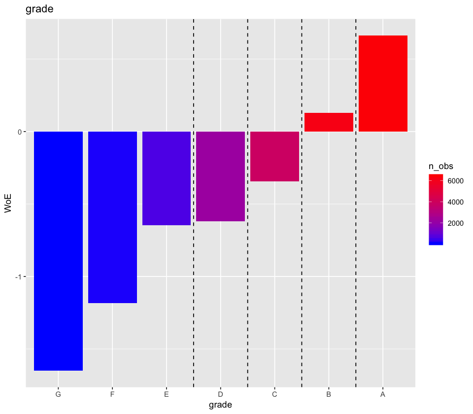


#### Merging grade G and F, because of their low number of observations, they will be left out, as a reference category


```R
prep_loan_data <- data.frame(cbind(grade.A = prep_dummies$grade.A, grade.B = prep_dummies$grade.B, 
                        grade.C = prep_dummies$grade.C, grade.D = prep_dummies$grade.D,
                        grade.F_G_E = (prep_dummies$grade.F + prep_dummies$grade.G + prep_dummies$grade.E)))
ref_vars = c('grade.F_G_E')
```

### <br><br><br>Home ownership <a class='anchor' id=''></a>


```R
woe_discrete(train_set, 'home_ownership', vlines = c(2.5, 3.5))
```


<table>
<caption>A data.frame: 4 × 11</caption>
<thead>
	<tr><th scope=col>home_ownership</th><th scope=col>n_obs</th><th scope=col>n_default</th><th scope=col>n_non_default</th><th scope=col>prop_default</th><th scope=col>prop_non_default</th><th scope=col>prop_obs</th><th scope=col>WoE</th><th scope=col>diff_prop_non_default</th><th scope=col>diff_WoE</th><th scope=col>IV</th></tr>
	<tr><th scope=col>&lt;fct&gt;</th><th scope=col>&lt;dbl&gt;</th><th scope=col>&lt;dbl&gt;</th><th scope=col>&lt;dbl&gt;</th><th scope=col>&lt;dbl&gt;</th><th scope=col>&lt;dbl&gt;</th><th scope=col>&lt;dbl&gt;</th><th scope=col>&lt;dbl&gt;</th><th scope=col>&lt;dbl&gt;</th><th scope=col>&lt;dbl&gt;</th><th scope=col>&lt;dbl&gt;</th></tr>
</thead>
<tbody>
	<tr><td>OTHER   </td><td>  66</td><td>  10</td><td>  56</td><td>0.004686036</td><td>0.003244496</td><td>0.003403114</td><td>-0.36762694</td><td>0.0000000</td><td>0.0000000</td><td>0.01393487</td></tr>
	<tr><td>RENT    </td><td>9775</td><td>1180</td><td>8595</td><td>0.552952202</td><td>0.497972190</td><td>0.504021862</td><td>-0.10472733</td><td>0.4947277</td><td>0.2628996</td><td>0.01393487</td></tr>
	<tr><td>OWN     </td><td>1551</td><td> 167</td><td>1384</td><td>0.078256795</td><td>0.080185400</td><td>0.079973188</td><td> 0.02434579</td><td>0.4177868</td><td>0.1290731</td><td>0.01393487</td></tr>
	<tr><td>MORTGAGE</td><td>8002</td><td> 777</td><td>7225</td><td>0.364104967</td><td>0.418597914</td><td>0.412601836</td><td> 0.13946863</td><td>0.3384125</td><td>0.1151228</td><td>0.01393487</td></tr>
</tbody>
</table>


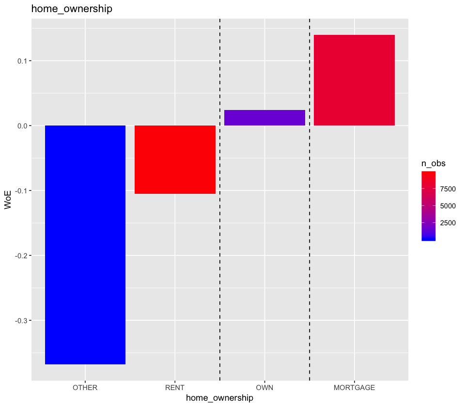


#### Merging OTHER to RENT, because OTHER has too little data representativeness


```R
prep_loan_data <-cbind(prep_loan_data, home_ownership.OTHER_RENT = (prep_dummies$home_ownership.OTHER + prep_dummies$home_ownership.RENT),
                      home_ownership.OWN = prep_dummies$home_ownership.OWN, home_ownership.MORTGAGE = prep_dummies$home_ownership.MORTGAGE)


ref_vars <- c(ref_vars, 'home_ownership.OTHER_RENT')
ref_vars
```


<ol class=list-inline>
	<li>'grade.F_G_E'</li>
	<li>'home_ownership.OTHER_RENT'</li>
</ol>


## <br><br> 3.2.5.2 - Continuous variables<a class='anchor' id='cont_vars'></a>

 ### <br><br><br>Loan_amnt 


```R
train_set$loan_amnt_factor <- cut2(train_set$loan_amnt, cuts = seq(500,35000, 2000))
```


```R
woe_continuous(train_set, 'loan_amnt_factor', rot_x_ticks = 90, plot_width = 12, vlines = c(1.5, 5.5, 7.5, 11.5, 13.5, 16.5))
```


<table>
<caption>A data.frame: 18 × 11</caption>
<thead>
	<tr><th scope=col>loan_amnt_factor</th><th scope=col>n_obs</th><th scope=col>n_default</th><th scope=col>n_non_default</th><th scope=col>prop_default</th><th scope=col>prop_non_default</th><th scope=col>prop_obs</th><th scope=col>WoE</th><th scope=col>diff_prop_non_default</th><th scope=col>diff_WoE</th><th scope=col>IV</th></tr>
	<tr><th scope=col>&lt;fct&gt;</th><th scope=col>&lt;dbl&gt;</th><th scope=col>&lt;dbl&gt;</th><th scope=col>&lt;dbl&gt;</th><th scope=col>&lt;dbl&gt;</th><th scope=col>&lt;dbl&gt;</th><th scope=col>&lt;dbl&gt;</th><th scope=col>&lt;dbl&gt;</th><th scope=col>&lt;dbl&gt;</th><th scope=col>&lt;dbl&gt;</th><th scope=col>&lt;dbl&gt;</th></tr>
</thead>
<tbody>
	<tr><td>[  500, 2500)</td><td>1335</td><td>197</td><td>1138</td><td>0.0923149016</td><td>0.0659327926</td><td>0.0688357224</td><td>-0.3365696468</td><td>0.0000000000</td><td>0.000000000</td><td>0.02881099</td></tr>
	<tr><td>[ 2500, 4500)</td><td>2566</td><td>291</td><td>2275</td><td>0.1363636364</td><td>0.1318076477</td><td>0.1323089615</td><td>-0.0339814686</td><td>0.0658748552</td><td>0.302588178</td><td>0.02881099</td></tr>
	<tr><td>[ 4500, 6500)</td><td>3602</td><td>402</td><td>3200</td><td>0.1883786317</td><td>0.1853997683</td><td>0.1857275446</td><td>-0.0159395326</td><td>0.0535921205</td><td>0.018041936</td><td>0.02881099</td></tr>
	<tr><td>[ 6500, 8500)</td><td>2668</td><td>292</td><td>2376</td><td>0.1368322399</td><td>0.1376593279</td><td>0.1375683201</td><td> 0.0060263454</td><td>0.0477404403</td><td>0.021965878</td><td>0.02881099</td></tr>
	<tr><td>[ 8500,10500)</td><td>2737</td><td>301</td><td>2436</td><td>0.1410496720</td><td>0.1411355736</td><td>0.1411261215</td><td> 0.0006088313</td><td>0.0034762457</td><td>0.005417514</td><td>0.02881099</td></tr>
	<tr><td>[10500,12500)</td><td>1677</td><td>150</td><td>1527</td><td>0.0702905342</td><td>0.0884704519</td><td>0.0864700423</td><td> 0.2300314783</td><td>0.0526651217</td><td>0.229422647</td><td>0.02881099</td></tr>
	<tr><td>[12500,14500)</td><td> 870</td><td> 68</td><td> 802</td><td>0.0318650422</td><td>0.0464658169</td><td>0.0448592348</td><td> 0.3772073699</td><td>0.0420046350</td><td>0.147175892</td><td>0.02881099</td></tr>
	<tr><td>[14500,16500)</td><td>1359</td><td>158</td><td>1201</td><td>0.0740393627</td><td>0.0695828505</td><td>0.0700732185</td><td>-0.0620787437</td><td>0.0231170336</td><td>0.439286114</td><td>0.02881099</td></tr>
	<tr><td>[16500,18500)</td><td> 546</td><td> 49</td><td> 497</td><td>0.0229615745</td><td>0.0287949015</td><td>0.0281530370</td><td> 0.2263761952</td><td>0.0407879490</td><td>0.288454939</td><td>0.02881099</td></tr>
	<tr><td>[18500,20500)</td><td> 751</td><td> 74</td><td> 677</td><td>0.0346766635</td><td>0.0392236385</td><td>0.0387233165</td><td> 0.1232126469</td><td>0.0104287370</td><td>0.103163548</td><td>0.02881099</td></tr>
	<tr><td>[20500,22500)</td><td> 212</td><td> 21</td><td> 191</td><td>0.0098406748</td><td>0.0110660487</td><td>0.0109312158</td><td> 0.1173574575</td><td>0.0281575898</td><td>0.005855189</td><td>0.02881099</td></tr>
	<tr><td>[22500,24500)</td><td> 299</td><td> 37</td><td> 262</td><td>0.0173383318</td><td>0.0151796060</td><td>0.0154171393</td><td>-0.1329669417</td><td>0.0041135574</td><td>0.250324399</td><td>0.02881099</td></tr>
	<tr><td>[24500,26500)</td><td> 518</td><td> 75</td><td> 443</td><td>0.0351452671</td><td>0.0256662804</td><td>0.0267092915</td><td>-0.3143118763</td><td>0.0104866744</td><td>0.181344935</td><td>0.02881099</td></tr>
	<tr><td>[26500,28500)</td><td>  47</td><td>  1</td><td>  46</td><td>0.0004686036</td><td>0.0026651217</td><td>0.0024234299</td><td> 1.7382478637</td><td>0.0230011587</td><td>2.052559740</td><td>0.02881099</td></tr>
	<tr><td>[28500,30500)</td><td>  76</td><td>  7</td><td>  69</td><td>0.0032802249</td><td>0.0039976825</td><td>0.0039187378</td><td> 0.1978028228</td><td>0.0013325608</td><td>1.540445041</td><td>0.02881099</td></tr>
	<tr><td>[30500,32500)</td><td>  15</td><td>  2</td><td>  13</td><td>0.0009372071</td><td>0.0007531866</td><td>0.0007734351</td><td>-0.2185913559</td><td>0.0032444959</td><td>0.416394179</td><td>0.02881099</td></tr>
	<tr><td>[32500,34500)</td><td>   8</td><td>  0</td><td>   8</td><td>0.0000000000</td><td>0.0004634994</td><td>0.0004124987</td><td> 0.0000000000</td><td>0.0002896871</td><td>0.000000000</td><td>0.02881099</td></tr>
	<tr><td>[34500,35000]</td><td> 108</td><td>  9</td><td>  99</td><td>0.0042174321</td><td>0.0057358053</td><td>0.0055687326</td><td> 0.3075017400</td><td>0.0052723059</td><td>0.000000000</td><td>0.02881099</td></tr>
</tbody>
</table>


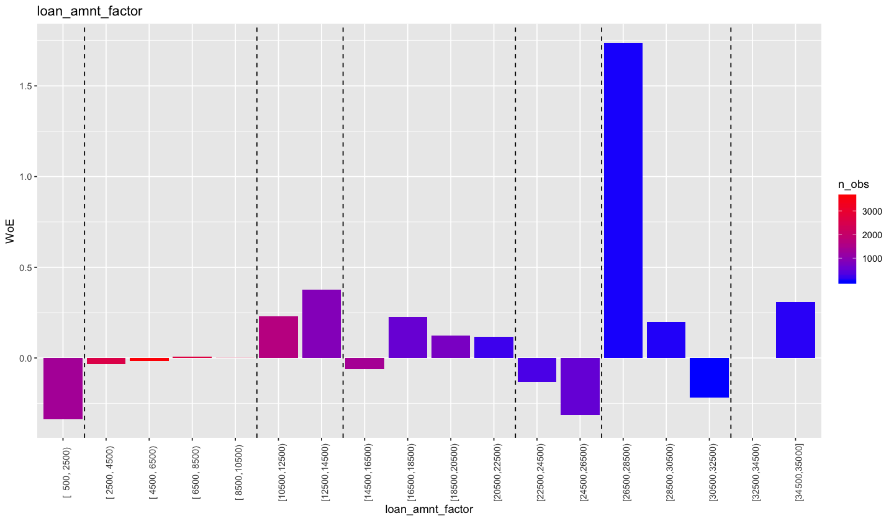


```R
dummy_cols <- as.data.frame(cut2(train_set$loan_amnt, cuts = c(0, 2500, 10500, 14500, 22500, 26500, 32500, 35000, Inf)))
colnames(dummy_cols) <- c('loan_amnt')
dummy_cols <- createDummyFeatures(dummy_cols)

prep_loan_data <- cbind(prep_loan_data, dummy_cols)
```


```R
ref_vars <- c(ref_vars, 'loan_amnt......0..2500.')
ref_vars
```


<ol class=list-inline>
	<li>'grade.F_G_E'</li>
	<li>'home_ownership.OTHER_RENT'</li>
	<li>'loan_amnt......0..2500.'</li>
</ol>


### <br><br><br> Int_rate


```R
train_set$int_rate_factor <- cut2(train_set$int_rate, cuts = seq(5, 23.5, 1))

woe_continuous(train_set, 'int_rate_factor', rot_x_ticks = 90, vlines = c(2.5, 3.5, 6.5, 9.5))
```


<table>
<caption>A data.frame: 19 × 11</caption>
<thead>
	<tr><th scope=col>int_rate_factor</th><th scope=col>n_obs</th><th scope=col>n_default</th><th scope=col>n_non_default</th><th scope=col>prop_default</th><th scope=col>prop_non_default</th><th scope=col>prop_obs</th><th scope=col>WoE</th><th scope=col>diff_prop_non_default</th><th scope=col>diff_WoE</th><th scope=col>IV</th></tr>
	<tr><th scope=col>&lt;fct&gt;</th><th scope=col>&lt;dbl&gt;</th><th scope=col>&lt;dbl&gt;</th><th scope=col>&lt;dbl&gt;</th><th scope=col>&lt;dbl&gt;</th><th scope=col>&lt;dbl&gt;</th><th scope=col>&lt;dbl&gt;</th><th scope=col>&lt;dbl&gt;</th><th scope=col>&lt;dbl&gt;</th><th scope=col>&lt;dbl&gt;</th><th scope=col>&lt;dbl&gt;</th></tr>
</thead>
<tbody>
	<tr><td>[ 5.0, 6.0)</td><td> 810</td><td> 35</td><td> 775</td><td>0.0164011246</td><td>4.490151e-02</td><td>4.176549e-02</td><td> 1.0071214</td><td>0.0000000000</td><td>0.000000000</td><td>0.2575038</td></tr>
	<tr><td>[ 6.0, 7.0)</td><td>1435</td><td> 65</td><td>1370</td><td>0.0304592315</td><td>7.937428e-02</td><td>7.399196e-02</td><td> 0.9577852</td><td>0.0344727694</td><td>0.049336219</td><td>0.2575038</td></tr>
	<tr><td>[ 7.0, 8.0)</td><td>3008</td><td>185</td><td>2823</td><td>0.0866916589</td><td>1.635574e-01</td><td>1.550995e-01</td><td> 0.6348061</td><td>0.0841830823</td><td>0.322979146</td><td>0.2575038</td></tr>
	<tr><td>[ 8.0, 9.0)</td><td> 997</td><td> 85</td><td> 912</td><td>0.0398313027</td><td>5.283893e-02</td><td>5.140765e-02</td><td> 0.2825952</td><td>0.1107184241</td><td>0.352210870</td><td>0.2575038</td></tr>
	<tr><td>[ 9.0,10.0)</td><td>1202</td><td>103</td><td>1099</td><td>0.0482661668</td><td>6.367323e-02</td><td>6.197793e-02</td><td> 0.2770334</td><td>0.0108342990</td><td>0.005561767</td><td>0.2575038</td></tr>
	<tr><td>[10.0,11.0)</td><td>2662</td><td>236</td><td>2426</td><td>0.1105904405</td><td>1.405562e-01</td><td>1.372589e-01</td><td> 0.2397738</td><td>0.0768829664</td><td>0.037259682</td><td>0.2575038</td></tr>
	<tr><td>[11.0,12.0)</td><td>2015</td><td>247</td><td>1768</td><td>0.1157450797</td><td>1.024334e-01</td><td>1.038981e-01</td><td>-0.1221776</td><td>0.0381228273</td><td>0.361951378</td><td>0.2575038</td></tr>
	<tr><td>[12.0,13.0)</td><td>1596</td><td>215</td><td>1381</td><td>0.1007497657</td><td>8.001159e-02</td><td>8.229349e-02</td><td>-0.2304684</td><td>0.0224217845</td><td>0.108290781</td><td>0.2575038</td></tr>
	<tr><td>[13.0,14.0)</td><td>2086</td><td>290</td><td>1796</td><td>0.1358950328</td><td>1.040556e-01</td><td>1.075590e-01</td><td>-0.2669572</td><td>0.0240440324</td><td>0.036488799</td><td>0.2575038</td></tr>
	<tr><td>[14.0,15.0)</td><td>1264</td><td>205</td><td>1059</td><td>0.0960637301</td><td>6.135574e-02</td><td>6.517480e-02</td><td>-0.4483232</td><td>0.0426998841</td><td>0.181365959</td><td>0.2575038</td></tr>
	<tr><td>[15.0,16.0)</td><td>1124</td><td>210</td><td> 914</td><td>0.0984067479</td><td>5.295481e-02</td><td>5.795607e-02</td><td>-0.6196705</td><td>0.0084009270</td><td>0.171347326</td><td>0.2575038</td></tr>
	<tr><td>[16.0,17.0)</td><td> 677</td><td>140</td><td> 537</td><td>0.0656044986</td><td>3.111240e-02</td><td>3.490770e-02</td><td>-0.7460379</td><td>0.0218424102</td><td>0.126367369</td><td>0.2575038</td></tr>
	<tr><td>[17.0,18.0)</td><td> 252</td><td> 51</td><td> 201</td><td>0.0238987816</td><td>1.164542e-02</td><td>1.299371e-02</td><td>-0.7189143</td><td>0.0194669757</td><td>0.027123603</td><td>0.2575038</td></tr>
	<tr><td>[18.0,19.0)</td><td> 136</td><td> 26</td><td> 110</td><td>0.0121836926</td><td>6.373117e-03</td><td>7.012478e-03</td><td>-0.6480097</td><td>0.0052723059</td><td>0.070904552</td><td>0.2575038</td></tr>
	<tr><td>[19.0,20.0)</td><td>  76</td><td> 20</td><td>  56</td><td>0.0093720712</td><td>3.244496e-03</td><td>3.918738e-03</td><td>-1.0607741</td><td>0.0031286211</td><td>0.412764411</td><td>0.2575038</td></tr>
	<tr><td>[20.0,21.0)</td><td>  39</td><td> 18</td><td>  21</td><td>0.0084348641</td><td>1.216686e-03</td><td>2.010931e-03</td><td>-1.9362429</td><td>0.0020278100</td><td>0.875468737</td><td>0.2575038</td></tr>
	<tr><td>[21.0,22.0)</td><td>   9</td><td>  2</td><td>   7</td><td>0.0009372071</td><td>4.055620e-04</td><td>4.640610e-04</td><td>-0.8376306</td><td>0.0008111240</td><td>1.098612289</td><td>0.2575038</td></tr>
	<tr><td>[22.0,23.0)</td><td>   5</td><td>  1</td><td>   4</td><td>0.0004686036</td><td>2.317497e-04</td><td>2.578117e-04</td><td>-0.7040992</td><td>0.0001738123</td><td>0.133531393</td><td>0.2575038</td></tr>
	<tr><td>[23.0,23.2]</td><td>   1</td><td>  0</td><td>   1</td><td>0.0000000000</td><td>5.793743e-05</td><td>5.156234e-05</td><td> 0.0000000</td><td>0.0001738123</td><td>0.000000000</td><td>0.2575038</td></tr>
</tbody>
</table>


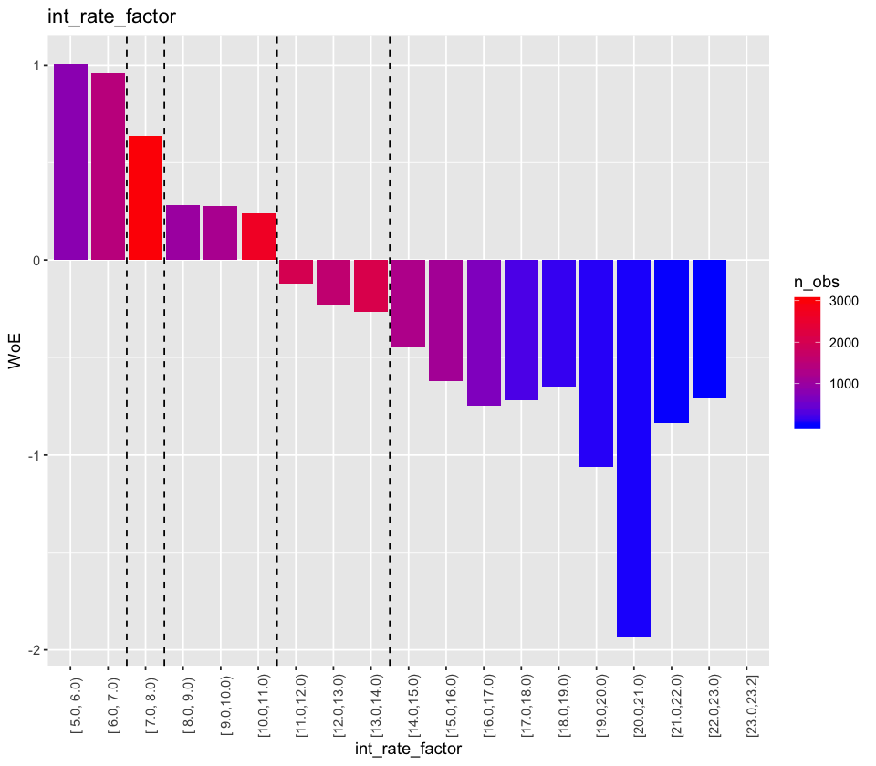


```R
dummy_cols <- as.data.frame(cut2(train_set$int_rate, cuts = c(0, 7, 8, 11, 14, Inf)))
colnames(dummy_cols) <- c('int_rate')
dummy_cols <- createDummyFeatures(dummy_cols)

prep_loan_data <- cbind(prep_loan_data, dummy_cols)
```


```R
ref_vars <- c(ref_vars, 'int_rate...14.Inf.')

ref_vars
```


<ol class=list-inline>
	<li>'grade.F_G_E'</li>
	<li>'home_ownership.OTHER_RENT'</li>
	<li>'loan_amnt......0..2500.'</li>
	<li>'int_rate...14.Inf.'</li>
</ol>


### <br><br><br>Emp_length

For this variable, I will only use the column which I replaced NA's with 0, this choice is made on the IV value, which is a little higher. 


```R
train_set$emp_length_factor <- cut2(train_set$emp_length, g = 10)

woe_continuous(train_set, 'emp_length_factor', rot_x_ticks = 90, vlines = c(1.5, 2.5, 5.5, 8.5))
```


<table>
<caption>A data.frame: 10 × 11</caption>
<thead>
	<tr><th scope=col>emp_length_factor</th><th scope=col>n_obs</th><th scope=col>n_default</th><th scope=col>n_non_default</th><th scope=col>prop_default</th><th scope=col>prop_non_default</th><th scope=col>prop_obs</th><th scope=col>WoE</th><th scope=col>diff_prop_non_default</th><th scope=col>diff_WoE</th><th scope=col>IV</th></tr>
	<tr><th scope=col>&lt;fct&gt;</th><th scope=col>&lt;dbl&gt;</th><th scope=col>&lt;dbl&gt;</th><th scope=col>&lt;dbl&gt;</th><th scope=col>&lt;dbl&gt;</th><th scope=col>&lt;dbl&gt;</th><th scope=col>&lt;dbl&gt;</th><th scope=col>&lt;dbl&gt;</th><th scope=col>&lt;dbl&gt;</th><th scope=col>&lt;dbl&gt;</th><th scope=col>&lt;dbl&gt;</th></tr>
</thead>
<tbody>
	<tr><td> 0     </td><td>2989</td><td>377</td><td>2612</td><td>0.17666354</td><td>0.15133256</td><td>0.15411983</td><td>-0.15476723</td><td>0.000000000</td><td>0.000000000</td><td>0.006532768</td></tr>
	<tr><td> 1     </td><td>1720</td><td>198</td><td>1522</td><td>0.09278351</td><td>0.08818076</td><td>0.08868722</td><td>-0.05088003</td><td>0.063151796</td><td>0.103887205</td><td>0.006532768</td></tr>
	<tr><td> 2     </td><td>2273</td><td>240</td><td>2033</td><td>0.11246485</td><td>0.11778679</td><td>0.11720120</td><td> 0.04623536</td><td>0.029606025</td><td>0.097115383</td><td>0.006532768</td></tr>
	<tr><td> 3     </td><td>2096</td><td>221</td><td>1875</td><td>0.10356139</td><td>0.10863268</td><td>0.10807466</td><td> 0.04780770</td><td>0.009154114</td><td>0.001572347</td><td>0.006532768</td></tr>
	<tr><td> 4     </td><td>1727</td><td>187</td><td>1540</td><td>0.08762887</td><td>0.08922364</td><td>0.08904816</td><td> 0.01803555</td><td>0.019409038</td><td>0.029772158</td><td>0.006532768</td></tr>
	<tr><td> 5     </td><td>1535</td><td>156</td><td>1379</td><td>0.07310216</td><td>0.07989571</td><td>0.07914819</td><td> 0.08886434</td><td>0.009327926</td><td>0.070828792</td><td>0.006532768</td></tr>
	<tr><td>[ 6, 8)</td><td>1845</td><td>200</td><td>1645</td><td>0.09372071</td><td>0.09530707</td><td>0.09513252</td><td> 0.01678476</td><td>0.015411356</td><td>0.072079574</td><td>0.006532768</td></tr>
	<tr><td>[ 8,11)</td><td>1559</td><td>157</td><td>1402</td><td>0.07357076</td><td>0.08122827</td><td>0.08038569</td><td> 0.09901573</td><td>0.014078795</td><td>0.082230966</td><td>0.006532768</td></tr>
	<tr><td>[11,16)</td><td>1846</td><td>210</td><td>1636</td><td>0.09840675</td><td>0.09478563</td><td>0.09518408</td><td>-0.03749155</td><td>0.013557358</td><td>0.136507276</td><td>0.006532768</td></tr>
	<tr><td>[16,59]</td><td>1804</td><td>188</td><td>1616</td><td>0.08809747</td><td>0.09362688</td><td>0.09301846</td><td> 0.06087374</td><td>0.001158749</td><td>0.098365290</td><td>0.006532768</td></tr>
</tbody>
</table>


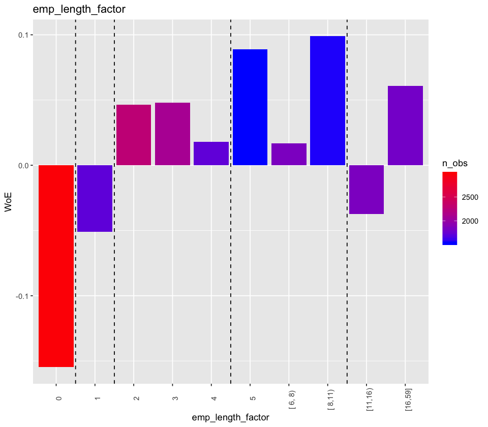


```R
dummy_cols <- data.frame(cut2(train_set$emp_length, cuts = c(0, 1, 4, 11, Inf)))
colnames(dummy_cols) <- c('emp_length')
dummy_cols <- createDummyFeatures(dummy_cols)

prep_loan_data <- cbind(prep_loan_data, dummy_cols)
```


```R
ref_vars <- c(ref_vars, 'emp_length...0')
ref_vars
```


<ol class=list-inline>
	<li>'grade.F_G_E'</li>
	<li>'home_ownership.OTHER_RENT'</li>
	<li>'loan_amnt......0..2500.'</li>
	<li>'int_rate...14.Inf.'</li>
	<li>'emp_length...0'</li>
</ol>


#### This secong chart is only for comparison with the above. 


```R
train_set$emp_length_factor_2 <- cut2(train_set$emp_length_na_median, g = 10)

woe_continuous(train_set, 'emp_length_factor_2', rot_x_ticks = 90)
```


<table>
<caption>A data.frame: 10 × 11</caption>
<thead>
	<tr><th scope=col>emp_length_factor_2</th><th scope=col>n_obs</th><th scope=col>n_default</th><th scope=col>n_non_default</th><th scope=col>prop_default</th><th scope=col>prop_non_default</th><th scope=col>prop_obs</th><th scope=col>WoE</th><th scope=col>diff_prop_non_default</th><th scope=col>diff_WoE</th><th scope=col>IV</th></tr>
	<tr><th scope=col>&lt;fct&gt;</th><th scope=col>&lt;dbl&gt;</th><th scope=col>&lt;dbl&gt;</th><th scope=col>&lt;dbl&gt;</th><th scope=col>&lt;dbl&gt;</th><th scope=col>&lt;dbl&gt;</th><th scope=col>&lt;dbl&gt;</th><th scope=col>&lt;dbl&gt;</th><th scope=col>&lt;dbl&gt;</th><th scope=col>&lt;dbl&gt;</th><th scope=col>&lt;dbl&gt;</th></tr>
</thead>
<tbody>
	<tr><td> 0     </td><td>2454</td><td>285</td><td>2169</td><td>0.13355201</td><td>0.12566628</td><td>0.12653398</td><td>-0.06086120</td><td>0.000000000</td><td>0.000000000</td><td>0.005112037</td></tr>
	<tr><td> 1     </td><td>1720</td><td>198</td><td>1522</td><td>0.09278351</td><td>0.08818076</td><td>0.08868722</td><td>-0.05088003</td><td>0.037485516</td><td>0.009981177</td><td>0.005112037</td></tr>
	<tr><td> 2     </td><td>2273</td><td>240</td><td>2033</td><td>0.11246485</td><td>0.11778679</td><td>0.11720120</td><td> 0.04623536</td><td>0.029606025</td><td>0.097115383</td><td>0.005112037</td></tr>
	<tr><td> 3     </td><td>2096</td><td>221</td><td>1875</td><td>0.10356139</td><td>0.10863268</td><td>0.10807466</td><td> 0.04780770</td><td>0.009154114</td><td>0.001572347</td><td>0.005112037</td></tr>
	<tr><td> 4     </td><td>2262</td><td>279</td><td>1983</td><td>0.13074039</td><td>0.11488992</td><td>0.11663401</td><td>-0.12923919</td><td>0.006257242</td><td>0.177046890</td><td>0.005112037</td></tr>
	<tr><td> 5     </td><td>1535</td><td>156</td><td>1379</td><td>0.07310216</td><td>0.07989571</td><td>0.07914819</td><td> 0.08886434</td><td>0.034994206</td><td>0.218103524</td><td>0.005112037</td></tr>
	<tr><td>[ 6, 8)</td><td>1845</td><td>200</td><td>1645</td><td>0.09372071</td><td>0.09530707</td><td>0.09513252</td><td> 0.01678476</td><td>0.015411356</td><td>0.072079574</td><td>0.005112037</td></tr>
	<tr><td>[ 8,11)</td><td>1559</td><td>157</td><td>1402</td><td>0.07357076</td><td>0.08122827</td><td>0.08038569</td><td> 0.09901573</td><td>0.014078795</td><td>0.082230966</td><td>0.005112037</td></tr>
	<tr><td>[11,16)</td><td>1846</td><td>210</td><td>1636</td><td>0.09840675</td><td>0.09478563</td><td>0.09518408</td><td>-0.03749155</td><td>0.013557358</td><td>0.136507276</td><td>0.005112037</td></tr>
	<tr><td>[16,59]</td><td>1804</td><td>188</td><td>1616</td><td>0.08809747</td><td>0.09362688</td><td>0.09301846</td><td> 0.06087374</td><td>0.001158749</td><td>0.098365290</td><td>0.005112037</td></tr>
</tbody>
</table>


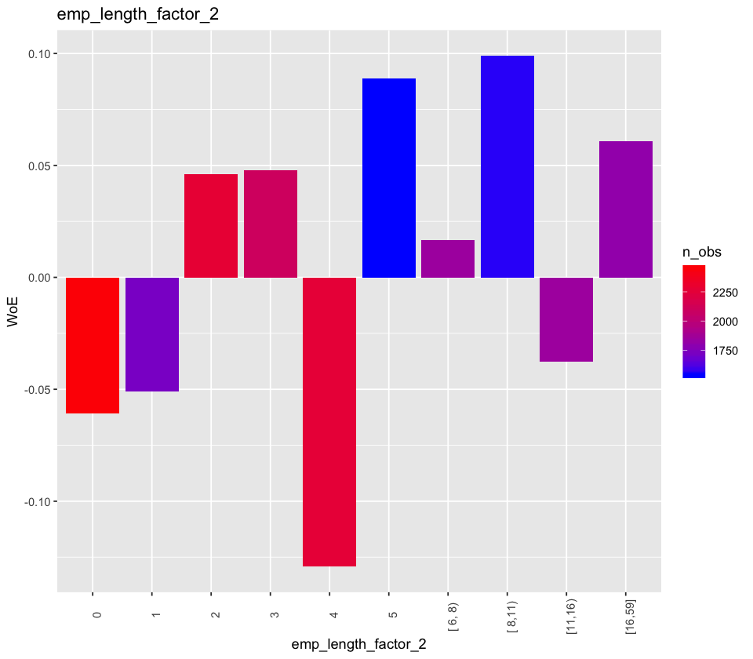


### <br><br><br>Annual Income


```R
train_set$annual_inc_factor <- cut2(train_set$annual_inc, g = 30)

woe_continuous(train_set, 'annual_inc_factor', rot_x_ticks = 90, vlines = c(4.5, 6.5, 9.5, 12.5, 15.5, 17.5, 20.5, 21.5))
```


<table>
<caption>A data.frame: 30 × 11</caption>
<thead>
	<tr><th scope=col>annual_inc_factor</th><th scope=col>n_obs</th><th scope=col>n_default</th><th scope=col>n_non_default</th><th scope=col>prop_default</th><th scope=col>prop_non_default</th><th scope=col>prop_obs</th><th scope=col>WoE</th><th scope=col>diff_prop_non_default</th><th scope=col>diff_WoE</th><th scope=col>IV</th></tr>
	<tr><th scope=col>&lt;fct&gt;</th><th scope=col>&lt;dbl&gt;</th><th scope=col>&lt;dbl&gt;</th><th scope=col>&lt;dbl&gt;</th><th scope=col>&lt;dbl&gt;</th><th scope=col>&lt;dbl&gt;</th><th scope=col>&lt;dbl&gt;</th><th scope=col>&lt;dbl&gt;</th><th scope=col>&lt;dbl&gt;</th><th scope=col>&lt;dbl&gt;</th><th scope=col>&lt;dbl&gt;</th></tr>
</thead>
<tbody>
	<tr><td>[  4000,  20004)</td><td> 668</td><td>109</td><td>559</td><td>0.05107779</td><td>0.032387022</td><td>0.034443642</td><td>-0.45559194</td><td>0.000000e+00</td><td>0.000000000</td><td>0.08900909</td></tr>
	<tr><td>[ 20004,  25000)</td><td> 638</td><td>106</td><td>532</td><td>0.04967198</td><td>0.030822711</td><td>0.032896772</td><td>-0.47718914</td><td>1.564311e-03</td><td>0.021597196</td><td>0.08900909</td></tr>
	<tr><td>[ 25000,  28896)</td><td> 703</td><td>105</td><td>598</td><td>0.04920337</td><td>0.034646582</td><td>0.036248324</td><td>-0.35076313</td><td>3.823870e-03</td><td>0.126426009</td><td>0.08900909</td></tr>
	<tr><td>[ 28896,  30960)</td><td> 577</td><td> 95</td><td>482</td><td>0.04451734</td><td>0.027925840</td><td>0.029751470</td><td>-0.46632631</td><td>6.720742e-03</td><td>0.115563181</td><td>0.08900909</td></tr>
	<tr><td>[ 30960,  34039)</td><td> 692</td><td> 95</td><td>597</td><td>0.04451734</td><td>0.034588644</td><td>0.035681138</td><td>-0.25235331</td><td>6.662804e-03</td><td>0.213972999</td><td>0.08900909</td></tr>
	<tr><td>[ 34039,  36022)</td><td> 755</td><td>110</td><td>645</td><td>0.05154639</td><td>0.037369641</td><td>0.038929566</td><td>-0.32162358</td><td>2.780997e-03</td><td>0.069270271</td><td>0.08900909</td></tr>
	<tr><td>[ 36022,  38423)</td><td> 524</td><td> 65</td><td>459</td><td>0.03045923</td><td>0.026593279</td><td>0.027018666</td><td>-0.13573059</td><td>1.077636e-02</td><td>0.185892989</td><td>0.08900909</td></tr>
	<tr><td>[ 38423,  40008)</td><td> 698</td><td> 87</td><td>611</td><td>0.04076851</td><td>0.035399768</td><td>0.035990513</td><td>-0.14120469</td><td>8.806489e-03</td><td>0.005474100</td><td>0.08900909</td></tr>
	<tr><td>[ 40008,  42230)</td><td> 564</td><td> 78</td><td>486</td><td>0.03655108</td><td>0.028157590</td><td>0.029081159</td><td>-0.26089374</td><td>7.242178e-03</td><td>0.119689043</td><td>0.08900909</td></tr>
	<tr><td>[ 42230,  45004)</td><td> 821</td><td> 96</td><td>725</td><td>0.04498594</td><td>0.042004635</td><td>0.042332680</td><td>-0.06857007</td><td>1.384705e-02</td><td>0.192323666</td><td>0.08900909</td></tr>
	<tr><td>[ 45004,  48048)</td><td> 764</td><td> 81</td><td>683</td><td>0.03795689</td><td>0.039571263</td><td>0.039393627</td><td> 0.04165217</td><td>2.433372e-03</td><td>0.110222242</td><td>0.08900909</td></tr>
	<tr><td>[ 48048,  50000)</td><td> 711</td><td> 91</td><td>620</td><td>0.04264292</td><td>0.035921205</td><td>0.036660823</td><td>-0.17153356</td><td>3.650058e-03</td><td>0.213185733</td><td>0.08900909</td></tr>
	<tr><td>[ 50000,  52000)</td><td> 301</td><td> 34</td><td>267</td><td>0.01593252</td><td>0.015469293</td><td>0.015520264</td><td>-0.02950540</td><td>2.045191e-02</td><td>0.142028162</td><td>0.08900909</td></tr>
	<tr><td>[ 52000,  54503)</td><td> 639</td><td> 69</td><td>570</td><td>0.03233365</td><td>0.033024334</td><td>0.032948335</td><td> 0.02113632</td><td>1.755504e-02</td><td>0.050641722</td><td>0.08900909</td></tr>
	<tr><td>[ 54503,  57006)</td><td> 703</td><td> 71</td><td>632</td><td>0.03327085</td><td>0.036616454</td><td>0.036248324</td><td> 0.09581598</td><td>3.592121e-03</td><td>0.074679661</td><td>0.08900909</td></tr>
	<tr><td>[ 57006,  60036)</td><td>1115</td><td>131</td><td>984</td><td>0.06138707</td><td>0.057010429</td><td>0.057492008</td><td>-0.07396496</td><td>2.039397e-02</td><td>0.169780943</td><td>0.08900909</td></tr>
	<tr><td>[ 60036,  61250)</td><td> 117</td><td> 14</td><td>103</td><td>0.00656045</td><td>0.005967555</td><td>0.006032794</td><td>-0.09472187</td><td>5.104287e-02</td><td>0.020756915</td><td>0.08900909</td></tr>
	<tr><td>[ 61250,  65004)</td><td> 925</td><td> 79</td><td>846</td><td>0.03701968</td><td>0.049015064</td><td>0.047695163</td><td> 0.28067797</td><td>4.304751e-02</td><td>0.375399849</td><td>0.08900909</td></tr>
	<tr><td>[ 65004,  68004)</td><td> 425</td><td> 36</td><td>389</td><td>0.01686973</td><td>0.022537659</td><td>0.021913994</td><td> 0.28966687</td><td>2.647740e-02</td><td>0.008988898</td><td>0.08900909</td></tr>
	<tr><td>[ 68004,  71004)</td><td> 619</td><td> 57</td><td>562</td><td>0.02671040</td><td>0.032560834</td><td>0.031917088</td><td> 0.19805705</td><td>1.002317e-02</td><td>0.091609823</td><td>0.08900909</td></tr>
	<tr><td>[ 71004,  75108)</td><td> 907</td><td> 94</td><td>813</td><td>0.04404873</td><td>0.047103129</td><td>0.046767041</td><td> 0.06704279</td><td>1.454229e-02</td><td>0.131014255</td><td>0.08900909</td></tr>
	<tr><td>[ 75108,  79100)</td><td> 378</td><td> 33</td><td>345</td><td>0.01546392</td><td>0.019988413</td><td>0.019490564</td><td> 0.25664332</td><td>2.711472e-02</td><td>0.189600528</td><td>0.08900909</td></tr>
	<tr><td>[ 79100,  83196)</td><td> 625</td><td> 50</td><td>575</td><td>0.02343018</td><td>0.033314021</td><td>0.032226462</td><td> 0.35195350</td><td>1.332561e-02</td><td>0.095310180</td><td>0.08900909</td></tr>
	<tr><td>[ 83196,  89204)</td><td> 647</td><td> 55</td><td>592</td><td>0.02577320</td><td>0.034298957</td><td>0.033360833</td><td> 0.28577992</td><td>9.849363e-04</td><td>0.066173586</td><td>0.08900909</td></tr>
	<tr><td>[ 89204,  95004)</td><td> 697</td><td> 57</td><td>640</td><td>0.02671040</td><td>0.037079954</td><td>0.035938950</td><td> 0.32802338</td><td>2.780997e-03</td><td>0.042243459</td><td>0.08900909</td></tr>
	<tr><td>[ 95004, 101400)</td><td> 597</td><td> 46</td><td>551</td><td>0.02155576</td><td>0.031923523</td><td>0.030782716</td><td> 0.39269988</td><td>5.156431e-03</td><td>0.064676504</td><td>0.08900909</td></tr>
	<tr><td>[101400, 115000)</td><td> 645</td><td> 37</td><td>608</td><td>0.01733833</td><td>0.035225956</td><td>0.033257709</td><td> 0.70886344</td><td>3.302433e-03</td><td>0.316163557</td><td>0.08900909</td></tr>
	<tr><td>[115000, 128000)</td><td> 647</td><td> 50</td><td>597</td><td>0.02343018</td><td>0.034588644</td><td>0.033360833</td><td> 0.38950058</td><td>6.373117e-04</td><td>0.319362861</td><td>0.08900909</td></tr>
	<tr><td>[128000, 156326)</td><td> 651</td><td> 57</td><td>594</td><td>0.02671040</td><td>0.034414832</td><td>0.033567083</td><td> 0.25343452</td><td>1.738123e-04</td><td>0.136066056</td><td>0.08900909</td></tr>
	<tr><td>[156326,2039784]</td><td> 641</td><td> 46</td><td>595</td><td>0.02155576</td><td>0.034472769</td><td>0.033051459</td><td> 0.46952648</td><td>5.793743e-05</td><td>0.216091958</td><td>0.08900909</td></tr>
</tbody>
</table>


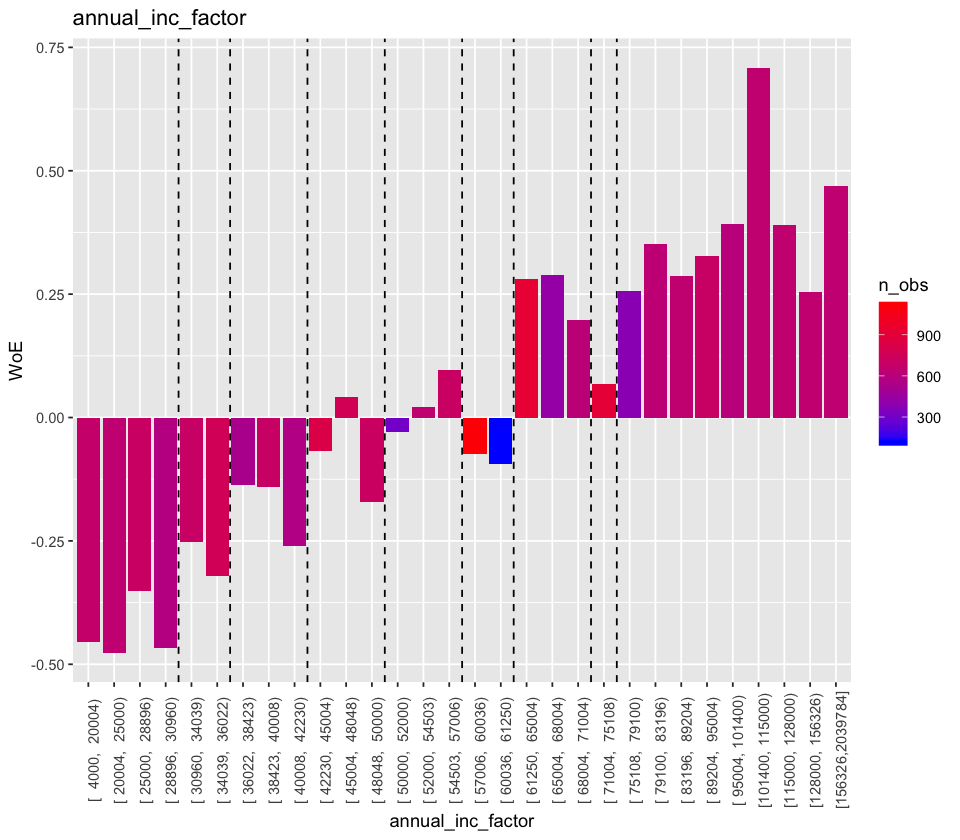


```R
dummy_cols <- data.frame(cut2(train_set$annual_inc, cuts = c(0, 30960, 36022, 42230, 50000, 57006, 61250, 71004, 75108, Inf)))
colnames(dummy_cols) <- c('annual_inc')

dummy_cols <- createDummyFeatures(dummy_cols)

prep_loan_data <- cbind(prep_loan_data, dummy_cols)
```


```R
ref_vars <- c(ref_vars, 'annual_inc......0.30960.')
ref_vars
```


<ol class=list-inline>
	<li>'grade.F_G_E'</li>
	<li>'home_ownership.OTHER_RENT'</li>
	<li>'loan_amnt......0..2500.'</li>
	<li>'int_rate...14.Inf.'</li>
	<li>'emp_length...0'</li>
	<li>'annual_inc......0.30960.'</li>
</ol>


### <br><br><br> Age


```R
train_set$age_factor <- cut2(train_set$age, g = 18)

woe_continuous(train_set, 'age_factor', rot_x_ticks = 90, vlines = c(2.5, 4.5, 7.5, 11.5))
```


<table>
<caption>A data.frame: 13 × 11</caption>
<thead>
	<tr><th scope=col>age_factor</th><th scope=col>n_obs</th><th scope=col>n_default</th><th scope=col>n_non_default</th><th scope=col>prop_default</th><th scope=col>prop_non_default</th><th scope=col>prop_obs</th><th scope=col>WoE</th><th scope=col>diff_prop_non_default</th><th scope=col>diff_WoE</th><th scope=col>IV</th></tr>
	<tr><th scope=col>&lt;fct&gt;</th><th scope=col>&lt;dbl&gt;</th><th scope=col>&lt;dbl&gt;</th><th scope=col>&lt;dbl&gt;</th><th scope=col>&lt;dbl&gt;</th><th scope=col>&lt;dbl&gt;</th><th scope=col>&lt;dbl&gt;</th><th scope=col>&lt;dbl&gt;</th><th scope=col>&lt;dbl&gt;</th><th scope=col>&lt;dbl&gt;</th><th scope=col>&lt;dbl&gt;</th></tr>
</thead>
<tbody>
	<tr><td>[20,23)</td><td>2904</td><td>379</td><td>2525</td><td>0.17760075</td><td>0.14629200</td><td>0.14973703</td><td>-0.193933396</td><td>0.000000000</td><td>0.00000000</td><td>0.01076162</td></tr>
	<tr><td>23     </td><td>2293</td><td>256</td><td>2037</td><td>0.11996251</td><td>0.11801854</td><td>0.11823244</td><td>-0.016337561</td><td>0.028273465</td><td>0.17759584</td><td>0.01076162</td></tr>
	<tr><td>24     </td><td>2091</td><td>210</td><td>1881</td><td>0.09840675</td><td>0.10898030</td><td>0.10781685</td><td> 0.102057766</td><td>0.009038239</td><td>0.11839533</td><td>0.01076162</td></tr>
	<tr><td>25     </td><td>1787</td><td>209</td><td>1578</td><td>0.09793814</td><td>0.09142526</td><td>0.09214190</td><td>-0.068814283</td><td>0.017555041</td><td>0.17087205</td><td>0.01076162</td></tr>
	<tr><td>26     </td><td>1475</td><td>151</td><td>1324</td><td>0.07075914</td><td>0.07670915</td><td>0.07605445</td><td> 0.080739367</td><td>0.014716107</td><td>0.14955365</td><td>0.01076162</td></tr>
	<tr><td>27     </td><td>1277</td><td>138</td><td>1139</td><td>0.06466729</td><td>0.06599073</td><td>0.06584511</td><td> 0.020258746</td><td>0.010718424</td><td>0.06048062</td><td>0.01076162</td></tr>
	<tr><td>28     </td><td>1119</td><td>118</td><td>1001</td><td>0.05529522</td><td>0.05799537</td><td>0.05769826</td><td> 0.047676622</td><td>0.007995365</td><td>0.02741788</td><td>0.01076162</td></tr>
	<tr><td>[29,31)</td><td>1795</td><td>180</td><td>1615</td><td>0.08434864</td><td>0.09356895</td><td>0.09255440</td><td> 0.103739852</td><td>0.035573581</td><td>0.05606323</td><td>0.01076162</td></tr>
	<tr><td>31     </td><td> 694</td><td> 77</td><td> 617</td><td>0.03608247</td><td>0.03574739</td><td>0.03578426</td><td>-0.009329931</td><td>0.057821553</td><td>0.11306978</td><td>0.01076162</td></tr>
	<tr><td>[32,34)</td><td>1109</td><td>112</td><td> 997</td><td>0.05248360</td><td>0.05776362</td><td>0.05718263</td><td> 0.095858366</td><td>0.022016222</td><td>0.10518830</td><td>0.01076162</td></tr>
	<tr><td>[34,36)</td><td> 789</td><td> 75</td><td> 714</td><td>0.03514527</td><td>0.04136732</td><td>0.04068269</td><td> 0.163001316</td><td>0.016396292</td><td>0.06714295</td><td>0.01076162</td></tr>
	<tr><td>[36,40)</td><td>1030</td><td>114</td><td> 916</td><td>0.05342081</td><td>0.05307068</td><td>0.05310921</td><td>-0.006575616</td><td>0.011703360</td><td>0.16957693</td><td>0.01076162</td></tr>
	<tr><td>[40,94]</td><td>1031</td><td>115</td><td> 916</td><td>0.05388941</td><td>0.05307068</td><td>0.05316077</td><td>-0.015309296</td><td>0.000000000</td><td>0.00873368</td><td>0.01076162</td></tr>
</tbody>
</table>


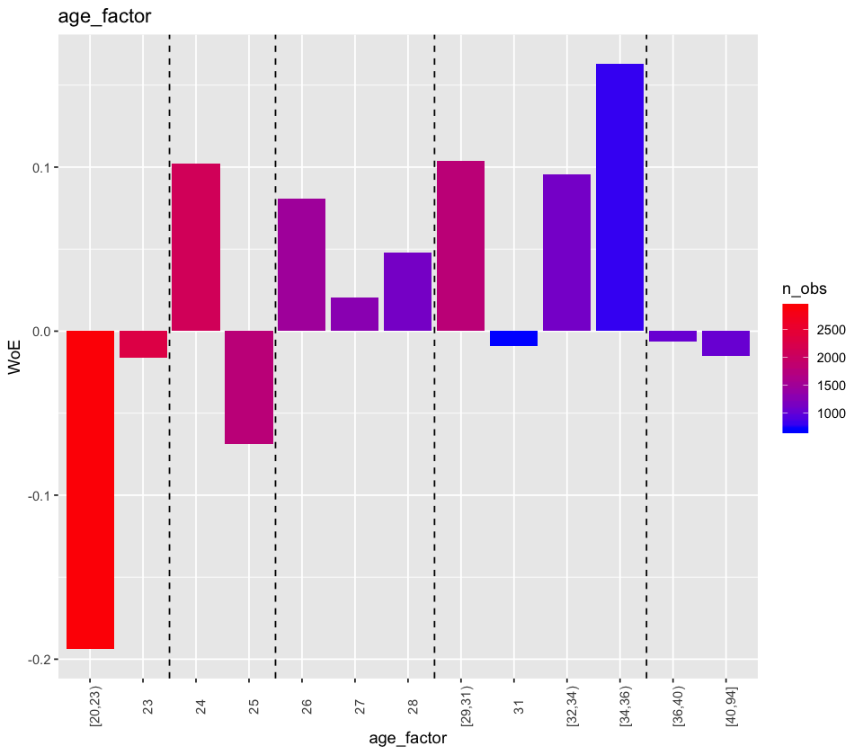


```R
dummy_cols <- data.frame(cut2(train_set$age, cuts = c(0, 23, 25, 28, 36, 94, Inf)))
colnames(dummy_cols) <- c('age')
dummy_cols <- createDummyFeatures(dummy_cols)


prep_loan_data <- cbind(prep_loan_data, dummy_cols)
```


```R
ref_vars <- c(ref_vars, 'age....0..23.')
ref_vars
saveRDS(ref_vars, 'ref_vars.rds')
```


<ol class=list-inline>
	<li>'grade.F_G_E'</li>
	<li>'home_ownership.OTHER_RENT'</li>
	<li>'loan_amnt......0..2500.'</li>
	<li>'int_rate...14.Inf.'</li>
	<li>'emp_length...0'</li>
	<li>'annual_inc......0.30960.'</li>
	<li>'age....0..23.'</li>
</ol>


```R
train_preprocessed <- prep_loan_data
```


```R
write.csv(train_preprocessed, 'train_preprocessed.csv')
write.csv(train_set$loan_status, 'y_train.csv')
```

## 3.2.5.4 - Test set<a class='anchor' id='test'></a>

&nbsp;&nbsp;&nbsp;&nbsp; These pre-processing steps are exactly the same used for the train set.


```R
prep_dummies = createDummyFeatures(test_set)
```

## Discrete Variables

### Grade

#### Merging grade G and F, because of their low number of observations, they will be left out, as a reference category


```R
prep_loan_data <- data.frame(cbind(grade.A = prep_dummies$grade.A, grade.B = prep_dummies$grade.B, 
                        grade.C = prep_dummies$grade.C, grade.D = prep_dummies$grade.D,
                        grade.F_G_E = (prep_dummies$grade.F + prep_dummies$grade.G + prep_dummies$grade.E)))

```

### Home ownership

#### Merging OTHER to RENT, because OTHER has too little data representativeness


```R
prep_loan_data <-cbind(prep_loan_data, home_ownership.OTHER_RENT = (prep_dummies$home_ownership.OTHER + prep_dummies$home_ownership.RENT),
                      home_ownership.OWN = prep_dummies$home_ownership.OWN, home_ownership.MORTGAGE = prep_dummies$home_ownership.MORTGAGE)


```

## Continuous variables

### Loan_amnt


```R
dummy_cols <- as.data.frame(cut2(test_set$loan_amnt, cuts = c(0, 2500, 10500, 14500, 22500, 26500, 32500, 35000, Inf)))
colnames(dummy_cols) <- c('loan_amnt')
dummy_cols <- createDummyFeatures(dummy_cols)

prep_loan_data <- cbind(prep_loan_data, dummy_cols)

```

### Int_rate


```R
dummy_cols <- as.data.frame(cut2(test_set$int_rate, cuts = c(0, 7, 8, 11, 14, Inf)))
colnames(dummy_cols) <- c('int_rate')
dummy_cols <- createDummyFeatures(dummy_cols)

prep_loan_data <- cbind(prep_loan_data, dummy_cols)
```

### Emp_length

For this variable, I will only use the column whic I replaced NA's with 0, this choice is made on the IV value, which is a little higher. 


```R
dummy_cols <- data.frame(cut2(test_set$emp_length, cuts = c(0, 1, 4, 11, Inf)))
colnames(dummy_cols) <- c('emp_length')
dummy_cols <- createDummyFeatures(dummy_cols)

prep_loan_data <- cbind(prep_loan_data, dummy_cols)
```

### Annual Income


```R
dummy_cols <- data.frame(cut2(test_set$annual_inc, cuts = c(0, 30960, 36022, 42230, 50000, 57006, 61250, 71004, 75108, Inf)))
colnames(dummy_cols) <- c('annual_inc')

dummy_cols <- createDummyFeatures(dummy_cols)

prep_loan_data <- cbind(prep_loan_data, dummy_cols)
```

### Age


```R
dummy_cols <- data.frame(cut2(test_set$age, cuts = c(0, 23, 25, 28, 36, 94, Inf)))
colnames(dummy_cols) <- c('age')
dummy_cols <- createDummyFeatures(dummy_cols)


prep_loan_data <- cbind(prep_loan_data, dummy_cols)
```


```R
test_preprocessed <- prep_loan_data
```


```R
dim(train_preprocessed)
dim(test_preprocessed)
```


<ol class=list-inline>
	<li>19394</li>
	<li>40</li>
</ol>


<ol class=list-inline>
	<li>9697</li>
	<li>40</li>
</ol>


```R
write.csv(test_preprocessed, 'test_preprocessed.csv')
write.csv(test_set$loan_status, 'y_test.csv')
saveRDS(colnames(loan_data), 'original_variables.rds')
```


```R

```
