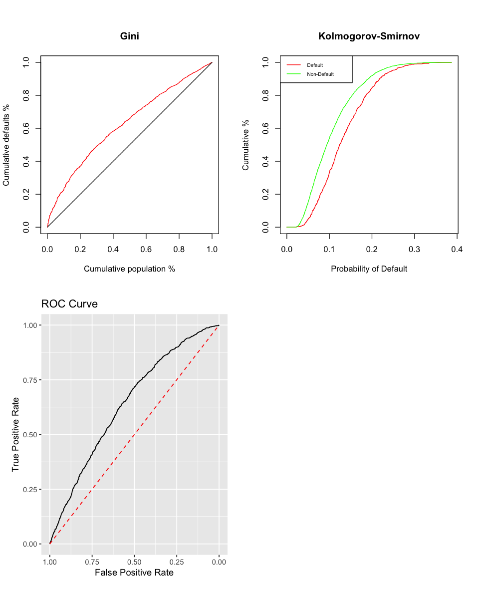
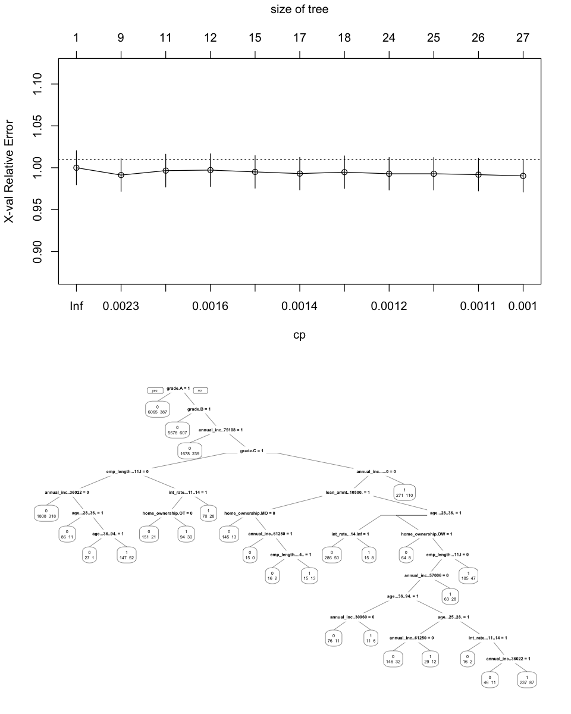
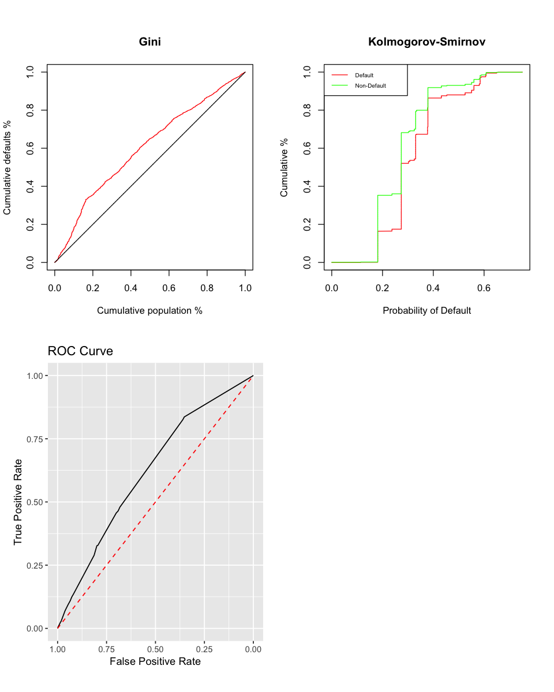
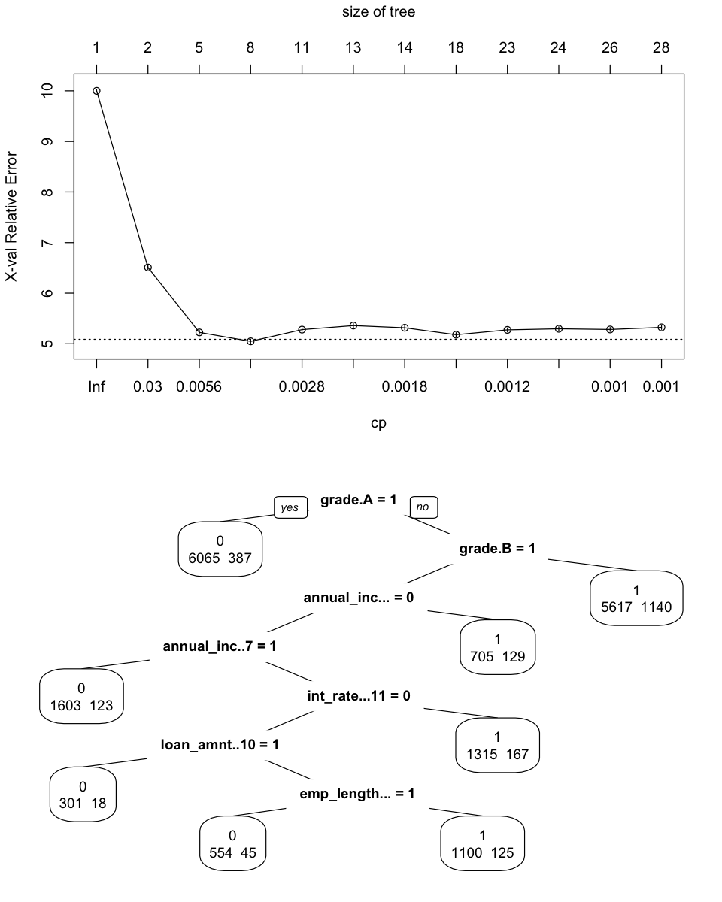
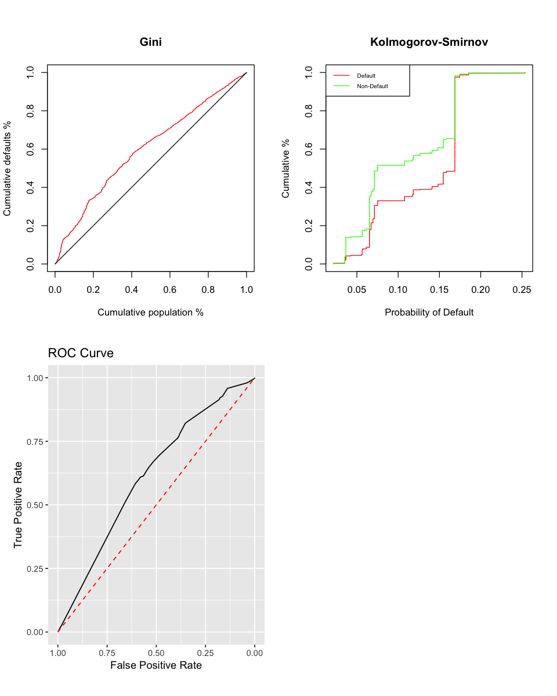
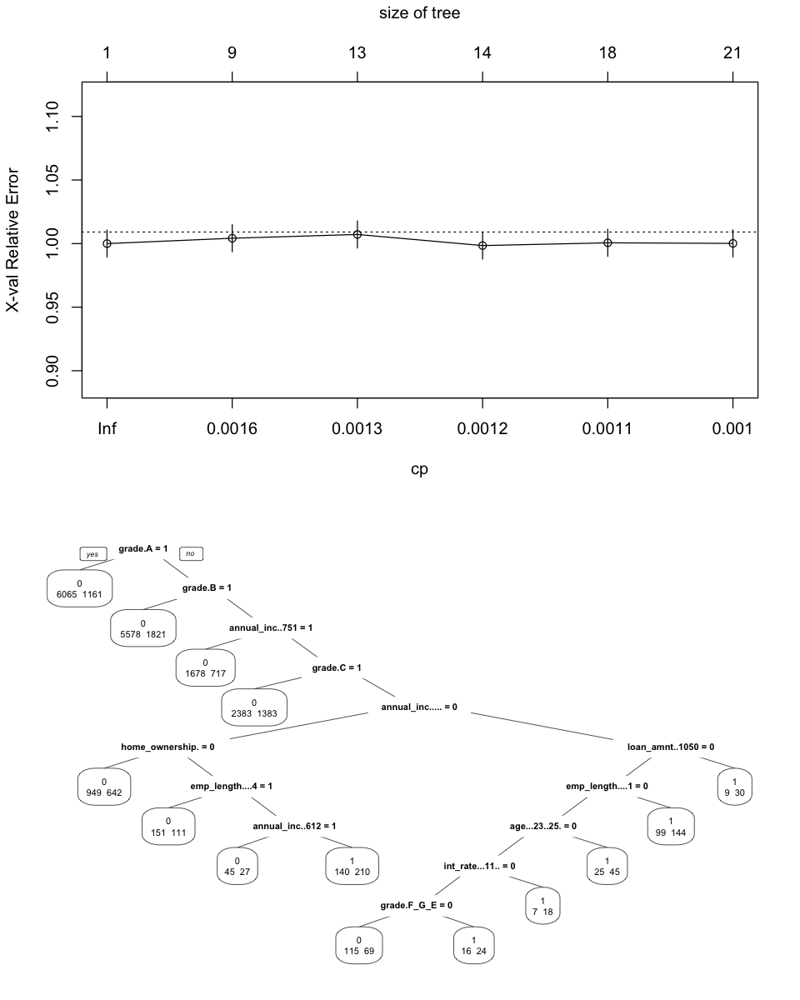
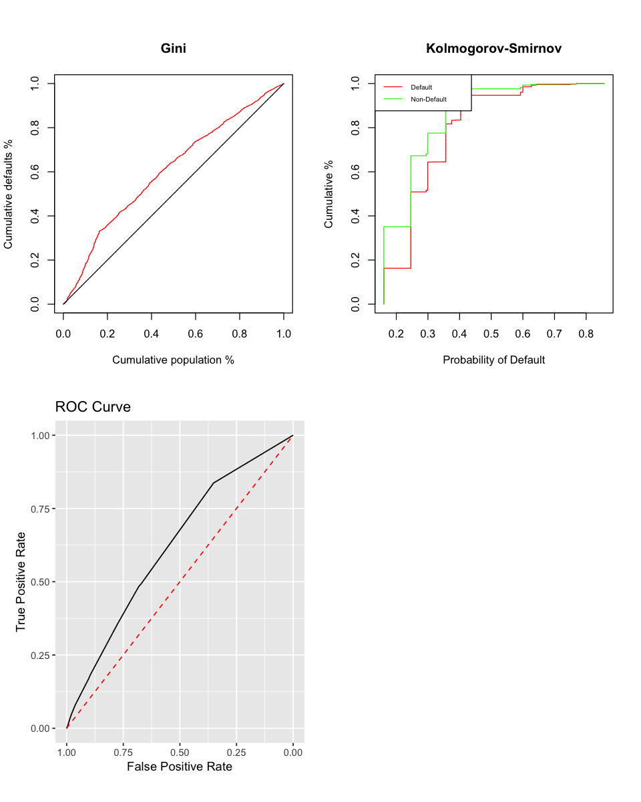

# Credit Risk Modeling
## Probability of Default

*Omar El Omeiri Filho*

---

### Table of Contents

* <u>[1 - Summary](#summ)<br></u>
* <u>[2 - Preparations](#prep)<br></u>
* <u>[3 - Data](#data)<br></u>
* <u>[4 - Preprocessing](#prepr)<br></u>
* <u>[5 - Logistic Regression Model](#mdl_1)<br></u>
    * <u>[5.1 - Evaluation Model Fit](#eval_mdl_fit)<br></u>
    * <u>[5.2 - Classification Model Fit](#mdl_1_fit)<br></u>
    * <u>[5.3 - Classification Model Evaluation](#mdl_1_eval)<br></u>
* <u>[6 - Decision Trees](#trees)<br></u>
    * <u>[6.1 - Prior Probability Tree](#tree_pr)<br></u>
    * <u>[6.1.1 - Prior Probability Tree Evaluation](#tree_pr_eval)<br></u>
    * <u>[6.2 - Loss Matrix Tree](#tree_loss)<br></u>
    * <u>[6.2.1 - Loss Matrix Tree Evaluation](#tree_loss_eval)<br></u>
    * <u>[6.3 - Tree with Weights](#tree_weights)<br></u>
    * <u>[6.3.1 - Tree with Weights Evaluation](#tree_weights_eval)<br></u>
* <u>[7 - Model Selection](#mod_sel)<br></u>

## 1 - Summary<a class='anchor' id='summ'></a>

This is where Credit risk modeling actually starts. We have a dataset which is entirely discretized and coarse classed. The probability of default can be calculated by various methods, but as our model needs to be very explainable, only two types of models can be applied. The most common one is the Logistic regression, the second the Decision Forests. Here we will calculate PD with both and compare them. Whichever is better evaluated will be selected as our PD model.

For the logistic regression, we'll estimate a first model just to see which of the variables is actually statistically significant. Once we remove the non significant variables, another model is going to be estimated only with those selected variables.

## 2 - Preparations<a class='anchor' id='prep'></a>


```R
sup <- suppressPackageStartupMessages

sup(library(dplyr))
sup(library(stringr))
sup(library(tidyr))
sup(library(pROC))
sup(library(ggplot2))
sup(library(rpart))
sup(library(rpart.plot))
sup(library(cowplot))
sup(library(gridGraphics))
sup(library(gridBase))
```

## 3 - Data<a class='anchor' id='data'></a>

This is the preprocessed dataset saved by the file 1 - Preprocessing.ipynb.


```R
train_preprocessed <- read.csv('train_preprocessed.csv', header = T, row.names = 1)
test_preprocessed <- read.csv('test_preprocessed.csv', header = T, row.names = 1)

y_train <- read.csv('y_train.csv', row.names = 1)$x
y_test <- read.csv('y_test.csv', row.names = 1)$x
```

## 4 - Preprocessing<a class='anchor' id='prepr'></a>

#### Removing reference variables


```R
ref_vars <- readRDS('ref_vars.rds')
ref_vars
```


<ol class=list-inline>
	<li>'grade.F_G_E'</li>
	<li>'home_ownership.OTHER_RENT'</li>
	<li>'loan_amnt......0..2500.'</li>
	<li>'int_rate...14.Inf.'</li>
	<li>'emp_length...0'</li>
	<li>'annual_inc......0.30960.'</li>
	<li>'age....0..23.'</li>
</ol>


```R
original_variables <- readRDS('original_variables.rds')
original_variables
```


<ol class=list-inline>
	<li>'loan_status'</li>
	<li>'loan_amnt'</li>
	<li>'int_rate'</li>
	<li>'grade'</li>
	<li>'emp_length'</li>
	<li>'home_ownership'</li>
	<li>'annual_inc'</li>
	<li>'age'</li>
	<li>'emp_length_na_median'</li>
</ol>


```R
x_train_no_ref <- train_preprocessed %>%
    select(-ref_vars)
dim(x_train_no_ref)
```


<ol class=list-inline>
	<li>19394</li>
	<li>33</li>
</ol>


### 5 - Logistic Regression Model<a class='anchor' id='mdl_1'></a>

### 5.1 - Evaluation Model Fit<a class='anchor' id='eval_mdl_fit'></a>

Remember that this model does not actually classify anything, it is estimated only to inspect the p-Values and remove the non significant variables.


```R
pd_model <- glm(y_train ~ ., family = 'binomial', data = x_train_no_ref)
(summ <- summary(pd_model))
```


    
    Call:
    glm(formula = y_train ~ ., family = "binomial", data = x_train_no_ref)
    
    Deviance Residuals: 
        Min       1Q   Median       3Q      Max  
    -0.9915  -0.5325  -0.4225  -0.3213   2.6947  
    
    Coefficients:
                              Estimate Std. Error z value Pr(>|z|)    
    (Intercept)               -0.45430    0.13999  -3.245  0.00117 ** 
    grade.A                   -0.82669    0.18857  -4.384 1.17e-05 ***
    grade.B                   -0.80202    0.14638  -5.479 4.28e-08 ***
    grade.C                   -0.51919    0.12625  -4.112 3.92e-05 ***
    grade.D                   -0.29157    0.10531  -2.769  0.00563 ** 
    home_ownership.OWN        -0.08865    0.08953  -0.990  0.32211    
    home_ownership.MORTGAGE    0.07213    0.05391   1.338  0.18095    
    loan_amnt...2500.10500.   -0.15777    0.08558  -1.844  0.06525 .  
    loan_amnt..10500.14500.   -0.34654    0.10954  -3.164  0.00156 ** 
    loan_amnt..14500.22500.   -0.14728    0.10596  -1.390  0.16453    
    loan_amnt..22500.26500.    0.15463    0.13912   1.111  0.26638    
    loan_amnt..26500.32500.   -0.39942    0.34577  -1.155  0.24802    
    loan_amnt..32500.35000.  -10.56036  106.32869  -0.099  0.92089    
    loan_amnt..35000...Inf.   -0.26348    0.36571  -0.720  0.47123    
    int_rate....0...7.        -1.05293    0.19460  -5.411 6.27e-08 ***
    int_rate....7...8.        -0.71496    0.18236  -3.921 8.84e-05 ***
    int_rate....8..11.        -0.37431    0.12954  -2.890  0.00386 ** 
    int_rate...11..14.        -0.07200    0.09839  -0.732  0.46430    
    emp_length....1...4.      -0.14320    0.07068  -2.026  0.04277 *  
    emp_length....4..11.      -0.07472    0.07073  -1.056  0.29078    
    emp_length...11.Inf.       0.09121    0.08130   1.122  0.26190    
    annual_inc..30960.36022.  -0.13514    0.09480  -1.425  0.15401    
    annual_inc..36022.42230.  -0.21126    0.09171  -2.304  0.02124 *  
    annual_inc..42230.50000.  -0.40817    0.09638  -4.235 2.29e-05 ***
    annual_inc..50000.57006.  -0.38899    0.09132  -4.259 2.05e-05 ***
    annual_inc..57006.61250.  -0.35490    0.10840  -3.274  0.00106 ** 
    annual_inc..61250.71004.  -0.67316    0.10250  -6.567 5.13e-11 ***
    annual_inc..71004.75108.  -0.52256    0.12835  -4.071 4.67e-05 ***
    annual_inc..75108...Inf.  -0.88141    0.08721 -10.107  < 2e-16 ***
    age...23..25.             -0.13038    0.07566  -1.723  0.08484 .  
    age...25..28.             -0.07677    0.07493  -1.025  0.30558    
    age...28..36.             -0.16375    0.07307  -2.241  0.02502 *  
    age...36..94.             -0.06872    0.09162  -0.750  0.45321    
    age...94.Inf.            -11.21960  324.74371  -0.035  0.97244    
    ---
    Signif. codes:  0 ‘***’ 0.001 ‘**’ 0.01 ‘*’ 0.05 ‘.’ 0.1 ‘ ’ 1
    
    (Dispersion parameter for binomial family taken to be 1)
    
        Null deviance: 13443  on 19393  degrees of freedom
    Residual deviance: 12765  on 19360  degrees of freedom
    AIC: 12833
    
    Number of Fisher Scoring iterations: 11


#### <br><br><br>Removing non-significant variables

A variable to be removed must have a p-value higher than 0.05 for all of its classes.


```R
coefs <- as.data.frame(coef(summ))

signif_p_vals <- coefs[2:nrow(coefs),4] <= 0.05
signif_p_vals <- rownames(coefs)[2:nrow(coefs)][signif_p_vals]
signif_p_vals
```


<ol class=list-inline>
	<li>'grade.A'</li>
	<li>'grade.B'</li>
	<li>'grade.C'</li>
	<li>'grade.D'</li>
	<li>'loan_amnt..10500.14500.'</li>
	<li>'int_rate....0...7.'</li>
	<li>'int_rate....7...8.'</li>
	<li>'int_rate....8..11.'</li>
	<li>'emp_length....1...4.'</li>
	<li>'annual_inc..36022.42230.'</li>
	<li>'annual_inc..42230.50000.'</li>
	<li>'annual_inc..50000.57006.'</li>
	<li>'annual_inc..57006.61250.'</li>
	<li>'annual_inc..61250.71004.'</li>
	<li>'annual_inc..71004.75108.'</li>
	<li>'annual_inc..75108...Inf.'</li>
	<li>'age...28..36.'</li>
</ol>


```R
(signif_vars <- unique(lapply(str_split(signif_p_vals, '\\.'), function(x){x[1]})))
```


<ol>
	<li>'grade'</li>
	<li>'loan_amnt'</li>
	<li>'int_rate'</li>
	<li>'emp_length'</li>
	<li>'annual_inc'</li>
	<li>'age'</li>
</ol>


```R
(non_signif_vars <- setdiff(original_variables, signif_vars))
```


<ol class=list-inline>
	<li>'loan_status'</li>
	<li>'home_ownership'</li>
	<li>'emp_length_na_median'</li>
</ol>


```R
remove_vars <- !startsWith(colnames(x_train_no_ref), 'home')


x_train_no_ref <- x_train_no_ref[,remove_vars]
dim(x_train_no_ref)
```


<ol class=list-inline>
	<li>19394</li>
	<li>31</li>
</ol>


### 5.2 - Classification Model<a class='anchor' id='mdl_1_fit'></a>

This model has only the statistically significant variables and wil be used to estimate the probability of default.


```R
pd_model <- glm(y_train ~ ., family = 'binomial', data = x_train_no_ref)
(summ <- summary(pd_model))
```


    
    Call:
    glm(formula = y_train ~ ., family = "binomial", data = x_train_no_ref)
    
    Deviance Residuals: 
        Min       1Q   Median       3Q      Max  
    -0.9892  -0.5313  -0.4225  -0.3215   2.6726  
    
    Coefficients:
                              Estimate Std. Error z value Pr(>|z|)    
    (Intercept)               -0.46017    0.13945  -3.300 0.000967 ***
    grade.A                   -0.82599    0.18845  -4.383 1.17e-05 ***
    grade.B                   -0.80291    0.14634  -5.487 4.10e-08 ***
    grade.C                   -0.51938    0.12623  -4.114 3.88e-05 ***
    grade.D                   -0.29199    0.10530  -2.773 0.005556 ** 
    loan_amnt...2500.10500.   -0.15978    0.08554  -1.868 0.061759 .  
    loan_amnt..10500.14500.   -0.34951    0.10950  -3.192 0.001413 ** 
    loan_amnt..14500.22500.   -0.14991    0.10590  -1.416 0.156902    
    loan_amnt..22500.26500.    0.15246    0.13905   1.096 0.272912    
    loan_amnt..26500.32500.   -0.39766    0.34559  -1.151 0.249866    
    loan_amnt..32500.35000.  -10.56244  106.11487  -0.100 0.920711    
    loan_amnt..35000...Inf.   -0.26265    0.36573  -0.718 0.472666    
    int_rate....0...7.        -1.04140    0.19445  -5.356 8.52e-08 ***
    int_rate....7...8.        -0.70674    0.18229  -3.877 0.000106 ***
    int_rate....8..11.        -0.36896    0.12949  -2.849 0.004380 ** 
    int_rate...11..14.        -0.07069    0.09838  -0.719 0.472408    
    emp_length....1...4.      -0.14147    0.07066  -2.002 0.045281 *  
    emp_length....4..11.      -0.06704    0.07053  -0.951 0.341810    
    emp_length...11.Inf.       0.10539    0.08055   1.308 0.190725    
    annual_inc..30960.36022.  -0.12644    0.09467  -1.336 0.181683    
    annual_inc..36022.42230.  -0.19826    0.09141  -2.169 0.030099 *  
    annual_inc..42230.50000.  -0.39159    0.09595  -4.081 4.48e-05 ***
    annual_inc..50000.57006.  -0.36930    0.09068  -4.073 4.65e-05 ***
    annual_inc..57006.61250.  -0.33214    0.10762  -3.086 0.002028 ** 
    annual_inc..61250.71004.  -0.64627    0.10137  -6.376 1.82e-10 ***
    annual_inc..71004.75108.  -0.49219    0.12718  -3.870 0.000109 ***
    annual_inc..75108...Inf.  -0.84306    0.08421 -10.011  < 2e-16 ***
    age...23..25.             -0.13166    0.07565  -1.740 0.081775 .  
    age...25..28.             -0.07721    0.07492  -1.031 0.302725    
    age...28..36.             -0.16454    0.07306  -2.252 0.024307 *  
    age...36..94.             -0.07089    0.09159  -0.774 0.438927    
    age...94.Inf.            -11.21456  324.74371  -0.035 0.972452    
    ---
    Signif. codes:  0 ‘***’ 0.001 ‘**’ 0.01 ‘*’ 0.05 ‘.’ 0.1 ‘ ’ 1
    
    (Dispersion parameter for binomial family taken to be 1)
    
        Null deviance: 13443  on 19393  degrees of freedom
    Residual deviance: 12769  on 19362  degrees of freedom
    AIC: 12833
    
    Number of Fisher Scoring iterations: 11


### <br><br><br> 5.3 - Classification Model Evaluation<a class='anchor' id='mdl_1_eval'></a>

#### Processing the test set, to be equal the train set:

1 - remove reference variables<br>
2 - remove home_ownership variable (statistically not significant)


```R
dim(test_preprocessed)
x_test_no_ref <- test_preprocessed %>%
    select(-ref_vars)
dim(x_test_no_ref)
```


<ol class=list-inline>
	<li>9697</li>
	<li>40</li>
</ol>


<ol class=list-inline>
	<li>9697</li>
	<li>33</li>
</ol>


```R
remove_vars <- !startsWith(colnames(x_test_no_ref), 'home')


x_test_no_ref <- x_test_no_ref[,remove_vars]
dim(x_test_no_ref)
```


<ol class=list-inline>
	<li>9697</li>
	<li>31</li>
</ol>


#### Helper function to evaluate the model


```R
eval_metrics <- function(true, pred, cutoff, binary = F, noacc = F){
    
    
    if (binary == F){
        
        pred_bin <- ifelse(pred > cutoff, 1, 0)
        
        conf_matrix <- table(true, pred_bin)
        
        
        pred_df <- data.frame(pred)
        colnames(pred_df) <- c('Proba')
        pred_df$Class <- pred_bin
        pred_df$Y <- true
        
        pred_df <- pred_df %>%
                    arrange(Proba)


        pred_df$cum_population <- seq(1:nrow(pred_df))
        pred_df$cum_population_pct <- pred_df$cum_population / dim(pred_df)[1]
        pred_df$cum_default <- cumsum(pred_df$Y)
        pred_df$cum_default_pct <- pred_df$cum_default / sum(pred_df$Y)
        pred_df$cum_non_default <- pred_df$cum_population - pred_df$cum_default
        pred_df$cum_non_default_pct <- pred_df$cum_non_default / (dim(pred_df)[1] - sum(pred_df$Y))
        
        
        par(mfrow = c(2,2))
        
        
        
        line <- data.frame(x = c(1,0), y = c(0,1))
        par(bg = 'white', pty = 's')
        plot(pred_df$cum_default_pct, pred_df$cum_population_pct, type = 'l', xlab = 'Cumulative population %', ylab = 'Cumulative defaults %', col = 'red', main = 'Gini')
        lines(pred_df$cum_population_pct, pred_df$cum_population_pct)
        
        

        
        par(bg = 'white', pty = 's')
        plot(pred_df$Proba, pred_df$cum_default_pct, type = 'l', xlab = 'Probability of Default', ylab = 'Cumulative %', col = 'red', main = 'Kolmogorov-Smirnov')
        lines(pred_df$Proba, pred_df$cum_non_default_pct, type = 'l', col = 'green')
        legend('topleft', legend = c('Default', 'Non-Default'), col = c('red', 'green'), lty = 1, cex = 0.6)
        KS = max(abs(pred_df$cum_default_pct - pred_df$cum_non_default_pct))
        
        
        plot.new()
        vps <- baseViewports()
        pushViewport(vps$figure)
        vp1 <-plotViewport(c(1.8,1,0,1))
        
        roc <- roc(true, pred, auc = T)
        p_roc <- ggroc(roc) + 
            xlab('False Positive Rate') +
            ylab('True Positive Rate') +
            ggtitle('ROC Curve') +
            geom_line(data =line, aes(x = x, y = y), col = 'red', lty = 2) + 
            theme(plot.margin = unit(c(0, 0, 0, 0), "cm"))
        
        
        print(p_roc,vp = vp1)
        #return (pred_df)
        

        
        }else {
        
        conf_matrix <- table(true, pred)
        
        }
    
    if (noacc == F){

        accuracy <- (conf_matrix[2,2] + conf_matrix[1,1]) / (conf_matrix[1,1] + conf_matrix[2,1] + conf_matrix[1,2] + conf_matrix[2,2])
        print(paste('Accuracy:', round(accuracy,3)))

        recall <- conf_matrix[2,2] / (conf_matrix[2,2] + conf_matrix[2,1])
        print(paste('Recall:',round(recall, 3)))

        precision <-  conf_matrix[2,2] / (conf_matrix[2,2] + conf_matrix[1,2])
        print(paste('Precision:', round(precision,3)))

        f1 <- 2*(recall * precision) / (recall + precision)
        print(paste('F1:',round(f1,3)))
        
        }
    
    if (binary == F){
        print(paste('Gini Coefficient:', round((roc$auc * 2 - 1), 3) * 100, '%'))
        print(paste('KS statistic:', round(KS,3)))
        print(paste('ROC AUC:',roc$auc))
        
    }
    
    

    print('')
    conf_matrix <- data.frame(t(spread(as.data.frame(conf_matrix), true, Freq)))
    rownames(conf_matrix) <- c('', 'True 0', 'True 1')
    colnames(conf_matrix) <- c('Pred 0', 'Pred 1')
    conf_matrix[2:3,]
                
     }
```


```R
pred_log <- predict(pd_model, newdata = x_test_no_ref, type = 'response')
```


```R
df <- eval_metrics(y_test, pred_log, 0.14)
```

    Setting levels: control = 0, case = 1
    Setting direction: controls < cases


    [1] "Accuracy: 0.711"
    [1] "Recall: 0.413"
    [1] "Precision: 0.173"
    [1] "F1: 0.244"
    [1] "Gini Coefficient: 28.3 %"
    [1] "KS statistic: 0.218"
    [1] "ROC AUC: 0.641405910057791"
    [1] ""





### Classification Evaluation Interpretation


1 - **Gini**:<br>
&nbsp;&nbsp;&nbsp;&nbsp; The Gini coefficient measures inequality between non-defaulted and defaulted borrowers, it is a measure of how well our model can separate both classes. The numeric coefficient is closely related to the AUC, the greater the better.<br>

2 - **ROC and AUC**:<br>
&nbsp;&nbsp;&nbsp;&nbsp;The ROC curve tells us our false positives and true positives for every cutoff value possible (0 - 1). The diagonal line shows us how we would have performed by randomly classifying the observations. The AUC is the area under the curve delimited by the x-axis. The greater the area, the better.

3 - **Kolmogorov-Smirnov**:<br>
&nbsp;&nbsp;&nbsp;&nbsp;The KS statistic is the maximum distance between the probability distributions of bad borrowers and good borrowers, it is also a measure of how well our model separates both classes.

These metrics are barely acceptable, this is a great indicative that we need more data.


```R
saveRDS(pd_model, file = 'log_pd_model.rda')
```

## 6 - Decision Trees<a class='anchor' id='trees'></a>

&nbsp;&nbsp;&nbsp;&nbsp; In this section we will evaluate how decision trees compare to our logistic regression model. Decision trees don't handle imbalanced data very well, we need to tune the hyperparameters to weigh the defaults much more heavily.<br>
For this, I will compute 3 different trees:<br>

* The first will attribute a prior probability of default as 70% and 30% for non-default, This measure is taken to try to minimize class imbalance missclassification.<br>
* The second will use the loss matrix to try to solve this issue.
* For the third I will attribute a weight of 3 for the defaults and 1 for the non-defaults.

### 6.1 - Prior Probabilities Tree<a class='anchor' id='tree_pr'></a>


```R
set.seed(42)

base_tree <- rpart(y_train ~ ., method = "class", data = train_preprocessed, parms = list(prior=c(0.7, 0.3)), control = rpart.control(cp = 0.001))

min_index <- which.min(base_tree$cp[ , "xerror"])
min_error_cp <- base_tree$cp[min_index, 'CP']


prune_base_tree <- prune(base_tree, cp = min_error_cp)
```


```R
options(repr.plot.width = 8, repr.plot.height = 10)
par(bg = 'white', mfrow = c(2,1))
plotcp(base_tree)
prp(prune_base_tree, extra = 1)
```





### 6.1.1 - Prior Probabilities Tree Evaluation<a class='anchor' id='tree_pr_eval'></a>


```R
pred_base <- predict(base_tree, newdata = test_preprocessed, type = 'prob')
eval_metrics(y_test, pred_base[,2], binary = F, cutoff = 0.2, noacc = T)
```

    Setting levels: control = 0, case = 1
    Setting direction: controls < cases


    [1] "Gini Coefficient: 23.9 %"
    [1] "KS statistic: 0.189"
    [1] "ROC AUC: 0.619505683222298"
    [1] ""


<table>
<caption>A data.frame: 2 × 2</caption>
<thead>
	<tr><th></th><th scope=col>Pred 0</th><th scope=col>Pred 1</th></tr>
	<tr><th></th><th scope=col>&lt;fct&gt;</th><th scope=col>&lt;fct&gt;</th></tr>
</thead>
<tbody>
	<tr><th scope=row>True 0</th><td>3036</td><td>5568</td></tr>
	<tr><th scope=row>True 1</th><td>179 </td><td>914 </td></tr>
</tbody>
</table>





### 6.2 - Loss Matrix Tree<a class='anchor' id='tree_loss'></a>


```R
set.seed(42)
tree_loss_matrix  <- rpart(y_train ~ ., method = "class", data = train_preprocessed,
                           parms = list(loss=matrix(c(0, 10, 1, 0), ncol = 2)),
                           control = rpart.control(cp = 0.001))

min_index <- which.min(tree_loss_matrix$cp[,'xerror'])
min_error_cp <- tree_loss_matrix$cp[min_index, 'CP']

prune_loss_matrix <- prune(tree_loss_matrix, cp = min_error_cp)

par(bg = 'white', mfrow = c(2,1))
plotcp(tree_loss_matrix)
prp(prune_loss_matrix, extra = 1)
```





### 6.2.1 - Loss Matrix Tree Evaluation<a class='anchor' id='tree_loss_eval'></a>


```R
pred_loss_matrix <- predict(tree_loss_matrix, newdata = test_preprocessed)
eval_metrics(y_test, pred_loss_matrix[,2], binary = F, cutoff = 0.2, noacc = T)
```

    Setting levels: control = 0, case = 1
    Setting direction: controls < cases


    [1] "Gini Coefficient: 23.1 %"
    [1] "KS statistic: 0.193"
    [1] "ROC AUC: 0.615483266363057"
    [1] ""


<table>
<caption>A data.frame: 2 × 2</caption>
<thead>
	<tr><th></th><th scope=col>Pred 0</th><th scope=col>Pred 1</th></tr>
	<tr><th></th><th scope=col>&lt;fct&gt;</th><th scope=col>&lt;fct&gt;</th></tr>
</thead>
<tbody>
	<tr><th scope=row>True 0</th><td>8581</td><td>  23</td></tr>
	<tr><th scope=row>True 1</th><td>1089</td><td>   4</td></tr>
</tbody>
</table>





### 6.3 - Tree with Weights<a class='anchor' id='tree_weights'></a>


```R
set.seed(42)

case_weights <- ifelse(y_train == 0, 1, 3)

tree_weights <- rpart(y_train ~ ., method = "class",
                      data = train_preprocessed, weights = case_weights,
                      control = rpart.control(minsplit = 5, minbucket = 2, cp = 0.001))


min_index <- which.min(tree_weights$cp[ , "xerror"])
min_error_cp <- tree_weights$cp[index, "CP"]

prune_tree_weights <- prune(tree_weights, cp = min_error_cp)

par(bg = 'white', mfrow = c(2,1))
plotcp(tree_weights)
prp(prune_tree_weights, extra = 1)
```





### 6.3 - Weigths Tree Evaluation<a class='anchor' id='tree_weights_eval'></a>


```R
pred_weights <- predict(tree_weights, newdata = test_preprocessed)
eval_metrics(y_test, pred_weights[,2], binary = F, cutoff = 0.37, noacc = T)
```

    Setting levels: control = 0, case = 1
    Setting direction: controls < cases


    [1] "Gini Coefficient: 24.5 %"
    [1] "KS statistic: 0.188"
    [1] "ROC AUC: 0.622293860639725"
    [1] ""


<table>
<caption>A data.frame: 2 × 2</caption>
<thead>
	<tr><th></th><th scope=col>Pred 0</th><th scope=col>Pred 1</th></tr>
	<tr><th></th><th scope=col>&lt;fct&gt;</th><th scope=col>&lt;fct&gt;</th></tr>
</thead>
<tbody>
	<tr><th scope=row>True 0</th><td>7701</td><td> 903</td></tr>
	<tr><th scope=row>True 1</th><td>893 </td><td>200 </td></tr>
</tbody>
</table>





## 7 - Model Selection<a class='anchor' id='mod_sel'></a>

&nbsp;&nbsp;&nbsp;&nbsp; Model selection should not only be selected by validation metrics, sometimes models behave differently when different cutoff values are attributed. Banks should select their models based on the proportion of bad loans given a minimum acceptance rate also. This function below produces a table for a range of acceptance rates, which results in a range of cutoff values and its respective bad loan proportion.


```R
strategy <- function(prob_of_def, true){
    
    cutoff=rep(NA, 21)
    bad_rate=rep(NA, 21)
    accept_rate=seq(1,0,by=-0.05)
    for (i in 1:21){
      cutoff[i]=quantile(prob_of_def,accept_rate[i])
      pred_i=ifelse(prob_of_def> cutoff[i], 1, 0)
      pred_as_good=true[pred_i==0]
      bad_rate[i]=sum(pred_as_good)/length(pred_as_good)}
    table=cbind(accept_rate,cutoff=round(cutoff,4),bad_rate=round(bad_rate,4))
    return(table)
    
}
```

This following tables shows the percentage of bad borrowers for each cutoff value. This can be used by banks to limit the percentage of bad borrowers. So a more conservative bank strategy would choose a lower cutoff value. 

In this case, the logistic regression model beats the best tree for all cutoff values, but it is not always like this. So our preferred model is the logistic regression.


```R
strategy(pred_log, y_test)
```


<table>
<caption>A matrix: 21 × 3 of type dbl</caption>
<thead>
	<tr><th scope=col>accept_rate</th><th scope=col>cutoff</th><th scope=col>bad_rate</th></tr>
</thead>
<tbody>
	<tr><td>1.00</td><td>0.3869</td><td>0.1127</td></tr>
	<tr><td>0.95</td><td>0.2231</td><td>0.1082</td></tr>
	<tr><td>0.90</td><td>0.1953</td><td>0.1037</td></tr>
	<tr><td>0.85</td><td>0.1759</td><td>0.0992</td></tr>
	<tr><td>0.80</td><td>0.1578</td><td>0.0954</td></tr>
	<tr><td>0.75</td><td>0.1447</td><td>0.0925</td></tr>
	<tr><td>0.70</td><td>0.1319</td><td>0.0877</td></tr>
	<tr><td>0.65</td><td>0.1226</td><td>0.0846</td></tr>
	<tr><td>0.60</td><td>0.1135</td><td>0.0799</td></tr>
	<tr><td>0.55</td><td>0.1058</td><td>0.0742</td></tr>
	<tr><td>0.50</td><td>0.0978</td><td>0.0701</td></tr>
	<tr><td>0.45</td><td>0.0904</td><td>0.0650</td></tr>
	<tr><td>0.40</td><td>0.0834</td><td>0.0621</td></tr>
	<tr><td>0.35</td><td>0.0763</td><td>0.0572</td></tr>
	<tr><td>0.30</td><td>0.0693</td><td>0.0522</td></tr>
	<tr><td>0.25</td><td>0.0637</td><td>0.0497</td></tr>
	<tr><td>0.20</td><td>0.0576</td><td>0.0431</td></tr>
	<tr><td>0.15</td><td>0.0513</td><td>0.0385</td></tr>
	<tr><td>0.10</td><td>0.0450</td><td>0.0330</td></tr>
	<tr><td>0.05</td><td>0.0367</td><td>0.0206</td></tr>
	<tr><td>0.00</td><td>0.0000</td><td>0.0000</td></tr>
</tbody>
</table>


```R
strategy(pred_weights[,2], y_test)
```


<table>
<caption>A matrix: 21 × 3 of type dbl</caption>
<thead>
	<tr><th scope=col>accept_rate</th><th scope=col>cutoff</th><th scope=col>bad_rate</th></tr>
</thead>
<tbody>
	<tr><td>1.00</td><td>0.8571</td><td>0.1127</td></tr>
	<tr><td>0.95</td><td>0.4035</td><td>0.1084</td></tr>
	<tr><td>0.90</td><td>0.4035</td><td>0.1084</td></tr>
	<tr><td>0.85</td><td>0.3566</td><td>0.1039</td></tr>
	<tr><td>0.80</td><td>0.3566</td><td>0.1039</td></tr>
	<tr><td>0.75</td><td>0.2994</td><td>0.0955</td></tr>
	<tr><td>0.70</td><td>0.2994</td><td>0.0955</td></tr>
	<tr><td>0.65</td><td>0.2461</td><td>0.0877</td></tr>
	<tr><td>0.60</td><td>0.2461</td><td>0.0877</td></tr>
	<tr><td>0.55</td><td>0.2461</td><td>0.0877</td></tr>
	<tr><td>0.50</td><td>0.2461</td><td>0.0877</td></tr>
	<tr><td>0.45</td><td>0.2461</td><td>0.0877</td></tr>
	<tr><td>0.40</td><td>0.2461</td><td>0.0877</td></tr>
	<tr><td>0.35</td><td>0.2461</td><td>0.0877</td></tr>
	<tr><td>0.30</td><td>0.1607</td><td>0.0557</td></tr>
	<tr><td>0.25</td><td>0.1607</td><td>0.0557</td></tr>
	<tr><td>0.20</td><td>0.1607</td><td>0.0557</td></tr>
	<tr><td>0.15</td><td>0.1607</td><td>0.0557</td></tr>
	<tr><td>0.10</td><td>0.1607</td><td>0.0557</td></tr>
	<tr><td>0.05</td><td>0.1607</td><td>0.0557</td></tr>
	<tr><td>0.00</td><td>0.1607</td><td>0.0557</td></tr>
</tbody>
</table>


```R

```
