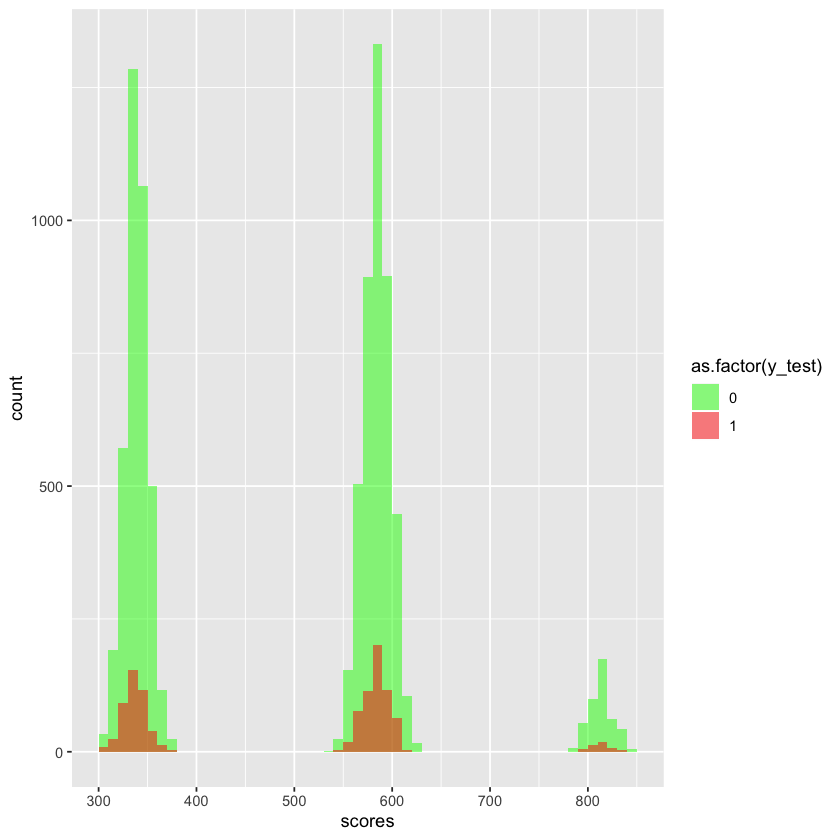

# Credit Risk Modeling
## Probability of Default

*Omar El Omeiri Filho*

---

### Table of Contents

* <u>[1 - Summary](#summ)<br></u>
* <u>[2 - Preparations](#prep)<br></u>
* <u>[3 - Data](#data)<br></u>
* <u>[4 - Preprocessing](#prepr)<br></u>
* <u>[5 - Results](#results)<br></u>


## 1 - Summary<a class='anchor' id='summ'></a>

&nbsp;&nbsp;&nbsp;&nbsp;This section of the Credit Risk Modeling series will attribute scores for each customer based on their demographic characteristics. For this, we use the coefficients of the PD model, each variable has the power of raising or lowering someones credit score. 

## 2 - Preparations<a class='anchor' id='prep'></a>


```R
sup <- suppressPackageStartupMessages

sup(library(dplyr))
sup(library(tidyr))
sup(library(ggplot2))
```

## 3 - Data<a class='anchor' id='data'></a>

We must import the PD model and the test set from the previous analysis.


```R
x_test <- read.csv('test_preprocessed.csv', header = T, row.names = 1)
y_test <- read.csv('y_test.csv', header = T, row.names = 1)

x_test <- x_test[,-c(7,8,9)]

dim(x_test)
dim(y_test)
```


<ol class=list-inline>
	<li>9697</li>
	<li>37</li>
</ol>


<ol class=list-inline>
	<li>9697</li>
	<li>1</li>
</ol>


```R
pd_model <- readRDS('log_pd_model.rda')
ref_vars <- readRDS('ref_vars.rds')
ref_vars <- ref_vars[-2]
ref_vars
```


<ol class=list-inline>
	<li>'grade.F_G_E'</li>
	<li>'loan_amnt......0..2500.'</li>
	<li>'int_rate...14.Inf.'</li>
	<li>'emp_length...0'</li>
	<li>'annual_inc......0.30960.'</li>
	<li>'age....0..23.'</li>
</ol>


## 4 - Preprocessing<a class='anchor' id='prepr'></a>

#### Creating Scorecard DataFrame


```R
ref_vars_df <- data.frame(feature_name = ref_vars, coef = rep(0,length(ref_vars)), p_value = rep(0,length(ref_vars)))
rownames(ref_vars_df) <- ref_vars
```

#### Populating with Model Coefficients and Ordering


```R
scorecard <- cbind(feature_name = names(pd_model$coefficients), data.frame(coef = pd_model$coefficients * -1), p_value = coef(summary(pd_model))[,4])
scorecard <- rbind(scorecard, ref_vars_df)
scorecard$feature_name <- as.character(scorecard$feature_name)
rownames(scorecard) <- NULL

scorecard <- scorecard %>%
                arrange(feature_name)
```


```R
scorecard$original_feature_name <- as.character(lapply(strsplit(scorecard$feature_name, '\\.'), function(x){x[1]}))
```

#### Checking Range of Non-scaled Score


```R
min_possible_coef <- scorecard %>%
                        group_by(original_feature_name) %>%
                        summarize(min_coef = min(coef))
min_possible_coef <- sum(min_possible_coef$min_coef)

min_possible_coef
```


0.20232438403965


```R
max_possible_coef <- scorecard %>%
                        group_by(original_feature_name) %>%
                        summarize(max_coef = max(coef))
max_possible_coef <- sum(max_possible_coef$max_coef)

max_possible_coef
```


25.0890906398797


#### Scaling the Scores


```R
max_score = 850
min_score <- 300

scorecard$score_pre <- as.numeric(lapply(scorecard$coef, function(x){x * (max_score - min_score) / (max_possible_coef - min_possible_coef)}))
```


```R
scorecard[1, 'score_pre'] = ((scorecard[1, 'coef'] - min_possible_coef) / (max_possible_coef - min_possible_coef)) * ((max_score - min_score)) + min_score
```


```R
scorecard$score <- round(scorecard$score_pre)
```


```R
max_possible_score <- scorecard %>%
                        group_by(original_feature_name) %>%
                        summarize(max_score = max(score_pre))
max_possible_score <- sum(max_possible_score$max_score)
max_possible_score
```


850


```R
min_possible_score <- scorecard %>%
                        group_by(original_feature_name) %>%
                        summarize(min_score = min(score_pre))
min_possible_score <- sum(min_possible_score$min_score)
min_possible_score
```


300


#### Adding Intercept column to test DataFrame


```R
x_test_with_intercept <- cbind(data.frame(intercept = rep(1, nrow(x_test))), x_test)
```


```R
head(x_test_with_intercept)
```


<table>
<caption>A data.frame: 6 × 38</caption>
<thead>
	<tr><th scope=col>intercept</th><th scope=col>grade.A</th><th scope=col>grade.B</th><th scope=col>grade.C</th><th scope=col>grade.D</th><th scope=col>grade.F_G_E</th><th scope=col>home_ownership.OTHER_RENT</th><th scope=col>loan_amnt...2500.10500.</th><th scope=col>loan_amnt..10500.14500.</th><th scope=col>loan_amnt..14500.22500.</th><th scope=col>⋯</th><th scope=col>annual_inc..57006.61250.</th><th scope=col>annual_inc..61250.71004.</th><th scope=col>annual_inc..71004.75108.</th><th scope=col>annual_inc..75108...Inf.</th><th scope=col>age....0..23.</th><th scope=col>age...23..25.</th><th scope=col>age...25..28.</th><th scope=col>age...28..36.</th><th scope=col>age...36..94.</th><th scope=col>age...94.Inf.</th></tr>
	<tr><th scope=col>&lt;dbl&gt;</th><th scope=col>&lt;int&gt;</th><th scope=col>&lt;int&gt;</th><th scope=col>&lt;int&gt;</th><th scope=col>&lt;int&gt;</th><th scope=col>&lt;int&gt;</th><th scope=col>&lt;int&gt;</th><th scope=col>&lt;int&gt;</th><th scope=col>&lt;int&gt;</th><th scope=col>&lt;int&gt;</th><th scope=col>⋯</th><th scope=col>&lt;int&gt;</th><th scope=col>&lt;int&gt;</th><th scope=col>&lt;int&gt;</th><th scope=col>&lt;int&gt;</th><th scope=col>&lt;int&gt;</th><th scope=col>&lt;int&gt;</th><th scope=col>&lt;int&gt;</th><th scope=col>&lt;int&gt;</th><th scope=col>&lt;int&gt;</th><th scope=col>&lt;int&gt;</th></tr>
</thead>
<tbody>
	<tr><td>1</td><td>0</td><td>0</td><td>1</td><td>0</td><td>0</td><td>1</td><td>0</td><td>0</td><td>0</td><td>⋯</td><td>0</td><td>0</td><td>0</td><td>0</td><td>0</td><td>0</td><td>0</td><td>1</td><td>0</td><td>0</td></tr>
	<tr><td>1</td><td>0</td><td>1</td><td>0</td><td>0</td><td>0</td><td>0</td><td>0</td><td>1</td><td>0</td><td>⋯</td><td>0</td><td>0</td><td>1</td><td>0</td><td>0</td><td>0</td><td>0</td><td>1</td><td>0</td><td>0</td></tr>
	<tr><td>1</td><td>0</td><td>0</td><td>1</td><td>0</td><td>0</td><td>1</td><td>1</td><td>0</td><td>0</td><td>⋯</td><td>0</td><td>0</td><td>0</td><td>0</td><td>1</td><td>0</td><td>0</td><td>0</td><td>0</td><td>0</td></tr>
	<tr><td>1</td><td>0</td><td>0</td><td>0</td><td>1</td><td>0</td><td>1</td><td>0</td><td>0</td><td>0</td><td>⋯</td><td>0</td><td>0</td><td>0</td><td>0</td><td>1</td><td>0</td><td>0</td><td>0</td><td>0</td><td>0</td></tr>
	<tr><td>1</td><td>0</td><td>0</td><td>1</td><td>0</td><td>0</td><td>1</td><td>1</td><td>0</td><td>0</td><td>⋯</td><td>0</td><td>0</td><td>0</td><td>0</td><td>0</td><td>1</td><td>0</td><td>0</td><td>0</td><td>0</td></tr>
	<tr><td>1</td><td>0</td><td>1</td><td>0</td><td>0</td><td>0</td><td>0</td><td>1</td><td>0</td><td>0</td><td>⋯</td><td>0</td><td>0</td><td>0</td><td>1</td><td>0</td><td>0</td><td>0</td><td>1</td><td>0</td><td>0</td></tr>
</tbody>
</table>


## 5 - Results<a class='anchor' id='results'></a>

The dot product between the test set and the score column of the Scorecard results in the adjusted scores.


```R
scores <- cbind(data.frame(scores = as.matrix(x_test_with_intercept) %*% as.matrix(scorecard$score)), data.frame(y_test = y_test$x))
#scores$group <- ifelse(scores$y_test == 0, 'a', 'b')
head(scores)
```


<table>
<caption>A data.frame: 6 × 2</caption>
<thead>
	<tr><th scope=col>scores</th><th scope=col>y_test</th></tr>
	<tr><th scope=col>&lt;dbl&gt;</th><th scope=col>&lt;int&gt;</th></tr>
</thead>
<tbody>
	<tr><td>583</td><td>0</td></tr>
	<tr><td>333</td><td>0</td></tr>
	<tr><td>569</td><td>1</td></tr>
	<tr><td>570</td><td>0</td></tr>
	<tr><td>601</td><td>0</td></tr>
	<tr><td>343</td><td>0</td></tr>
</tbody>
</table>


#### &nbsp;&nbsp;&nbsp;&nbsp;The Scores distribution does not look very good. Scores are clumped into 3 regions. It would be best if they were closer to normally distributed, since the score is derived from demographic data. This happened because our model is thirsty for more data, we need more variables to make our scores more precise.


```R
ggplot(scores, aes(scores, fill = as.factor(y_test))) +
    geom_histogram(alpha = 0.5, position = 'identity', breaks = seq(300, 850, 10)) +
    scale_fill_manual(values = c('green', 'red'))
```





&nbsp;&nbsp;&nbsp;&nbsp;This is our final Scorecard, the score column shows how much a variable impacts on the score of a customer. The intercept is the initial value and subsequent variables add or remove points to reach the final Credit Score.


```R
scorecard
```


<table>
<caption>A data.frame: 38 × 6</caption>
<thead>
	<tr><th scope=col>feature_name</th><th scope=col>coef</th><th scope=col>p_value</th><th scope=col>original_feature_name</th><th scope=col>score_pre</th><th scope=col>score</th></tr>
	<tr><th scope=col>&lt;chr&gt;</th><th scope=col>&lt;dbl&gt;</th><th scope=col>&lt;dbl&gt;</th><th scope=col>&lt;chr&gt;</th><th scope=col>&lt;dbl&gt;</th><th scope=col>&lt;dbl&gt;</th></tr>
</thead>
<tbody>
	<tr><td>(Intercept)             </td><td> 0.46017060</td><td>9.669436e-04</td><td>(Intercept)</td><td>305.698427</td><td>306</td></tr>
	<tr><td>age....0..23.           </td><td> 0.00000000</td><td>0.000000e+00</td><td>age        </td><td>  0.000000</td><td>  0</td></tr>
	<tr><td>age...23..25.           </td><td> 0.13166005</td><td>8.177516e-02</td><td>age        </td><td>  2.909700</td><td>  3</td></tr>
	<tr><td>age...25..28.           </td><td> 0.07721404</td><td>3.027251e-01</td><td>age        </td><td>  1.706438</td><td>  2</td></tr>
	<tr><td>age...28..36.           </td><td> 0.16453801</td><td>2.430740e-02</td><td>age        </td><td>  3.636306</td><td>  4</td></tr>
	<tr><td>age...36..94.           </td><td> 0.07089240</td><td>4.389273e-01</td><td>age        </td><td>  1.566729</td><td>  2</td></tr>
	<tr><td>age...94.Inf.           </td><td>11.21456069</td><td>9.724517e-01</td><td>age        </td><td>247.842902</td><td>248</td></tr>
	<tr><td>annual_inc......0.30960.</td><td> 0.00000000</td><td>0.000000e+00</td><td>annual_inc </td><td>  0.000000</td><td>  0</td></tr>
	<tr><td>annual_inc..30960.36022.</td><td> 0.12643511</td><td>1.816833e-01</td><td>annual_inc </td><td>  2.794228</td><td>  3</td></tr>
	<tr><td>annual_inc..36022.42230.</td><td> 0.19825617</td><td>3.009917e-02</td><td>annual_inc </td><td>  4.381481</td><td>  4</td></tr>
	<tr><td>annual_inc..42230.50000.</td><td> 0.39159282</td><td>4.480100e-05</td><td>annual_inc </td><td>  8.654240</td><td>  9</td></tr>
	<tr><td>annual_inc..50000.57006.</td><td> 0.36930468</td><td>4.650505e-05</td><td>annual_inc </td><td>  8.161670</td><td>  8</td></tr>
	<tr><td>annual_inc..57006.61250.</td><td> 0.33214416</td><td>2.027539e-03</td><td>annual_inc </td><td>  7.340419</td><td>  7</td></tr>
	<tr><td>annual_inc..61250.71004.</td><td> 0.64627242</td><td>1.821906e-10</td><td>annual_inc </td><td> 14.282684</td><td> 14</td></tr>
	<tr><td>annual_inc..71004.75108.</td><td> 0.49219445</td><td>1.087821e-04</td><td>annual_inc </td><td> 10.877546</td><td> 11</td></tr>
	<tr><td>annual_inc..75108...Inf.</td><td> 0.84305958</td><td>1.365688e-23</td><td>annual_inc </td><td> 18.631700</td><td> 19</td></tr>
	<tr><td>emp_length....1...4.    </td><td> 0.14147135</td><td>4.528061e-02</td><td>emp_length </td><td>  3.126531</td><td>  3</td></tr>
	<tr><td>emp_length....4..11.    </td><td> 0.06704157</td><td>3.418100e-01</td><td>emp_length </td><td>  1.481625</td><td>  1</td></tr>
	<tr><td>emp_length...0          </td><td> 0.00000000</td><td>0.000000e+00</td><td>emp_length </td><td>  0.000000</td><td>  0</td></tr>
	<tr><td>emp_length...11.Inf.    </td><td>-0.10539076</td><td>1.907249e-01</td><td>emp_length </td><td> -2.329146</td><td> -2</td></tr>
	<tr><td>grade.A                 </td><td> 0.82598568</td><td>1.169892e-05</td><td>grade      </td><td> 18.254365</td><td> 18</td></tr>
	<tr><td>grade.B                 </td><td> 0.80291154</td><td>4.098107e-08</td><td>grade      </td><td> 17.744425</td><td> 18</td></tr>
	<tr><td>grade.C                 </td><td> 0.51938150</td><td>3.881443e-05</td><td>grade      </td><td> 11.478383</td><td> 11</td></tr>
	<tr><td>grade.D                 </td><td> 0.29198690</td><td>5.555976e-03</td><td>grade      </td><td>  6.452939</td><td>  6</td></tr>
	<tr><td>grade.F_G_E             </td><td> 0.00000000</td><td>0.000000e+00</td><td>grade      </td><td>  0.000000</td><td>  0</td></tr>
	<tr><td>int_rate....0...7.      </td><td> 1.04140023</td><td>8.524614e-08</td><td>int_rate   </td><td> 23.015048</td><td> 23</td></tr>
	<tr><td>int_rate....7...8.      </td><td> 0.70674285</td><td>1.057334e-04</td><td>int_rate   </td><td> 15.619087</td><td> 16</td></tr>
	<tr><td>int_rate....8..11.      </td><td> 0.36896133</td><td>4.379861e-03</td><td>int_rate   </td><td>  8.154082</td><td>  8</td></tr>
	<tr><td>int_rate...11..14.      </td><td> 0.07069397</td><td>4.724076e-01</td><td>int_rate   </td><td>  1.562344</td><td>  2</td></tr>
	<tr><td>int_rate...14.Inf.      </td><td> 0.00000000</td><td>0.000000e+00</td><td>int_rate   </td><td>  0.000000</td><td>  0</td></tr>
	<tr><td>loan_amnt......0..2500. </td><td> 0.00000000</td><td>0.000000e+00</td><td>loan_amnt  </td><td>  0.000000</td><td>  0</td></tr>
	<tr><td>loan_amnt...2500.10500. </td><td> 0.15978489</td><td>6.175945e-02</td><td>loan_amnt  </td><td>  3.531262</td><td>  4</td></tr>
	<tr><td>loan_amnt..10500.14500. </td><td> 0.34951249</td><td>1.412717e-03</td><td>loan_amnt  </td><td>  7.724261</td><td>  8</td></tr>
	<tr><td>loan_amnt..14500.22500. </td><td> 0.14991451</td><td>1.569016e-01</td><td>loan_amnt  </td><td>  3.313126</td><td>  3</td></tr>
	<tr><td>loan_amnt..22500.26500. </td><td>-0.15245546</td><td>2.729125e-01</td><td>loan_amnt  </td><td> -3.369281</td><td> -3</td></tr>
	<tr><td>loan_amnt..26500.32500. </td><td> 0.39766274</td><td>2.498658e-01</td><td>loan_amnt  </td><td>  8.788386</td><td>  9</td></tr>
	<tr><td>loan_amnt..32500.35000. </td><td>10.56244251</td><td>9.207113e-01</td><td>loan_amnt  </td><td>233.431026</td><td>233</td></tr>
	<tr><td>loan_amnt..35000...Inf. </td><td> 0.26264897</td><td>4.726657e-01</td><td>loan_amnt  </td><td>  5.804568</td><td>  6</td></tr>
</tbody>
</table>


```R

```
