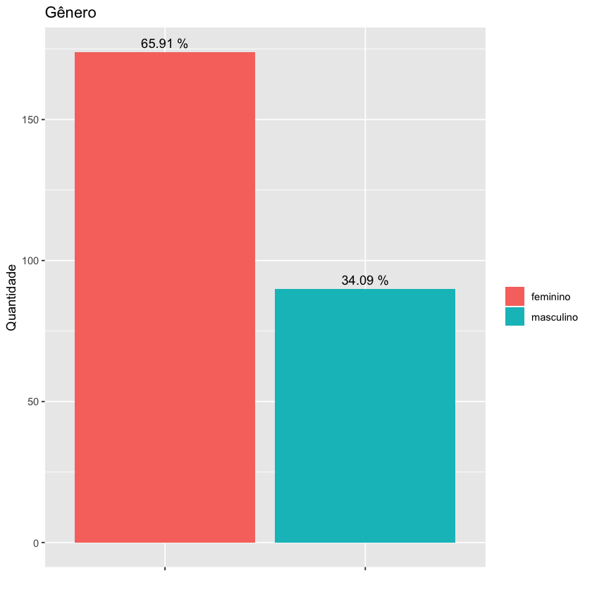
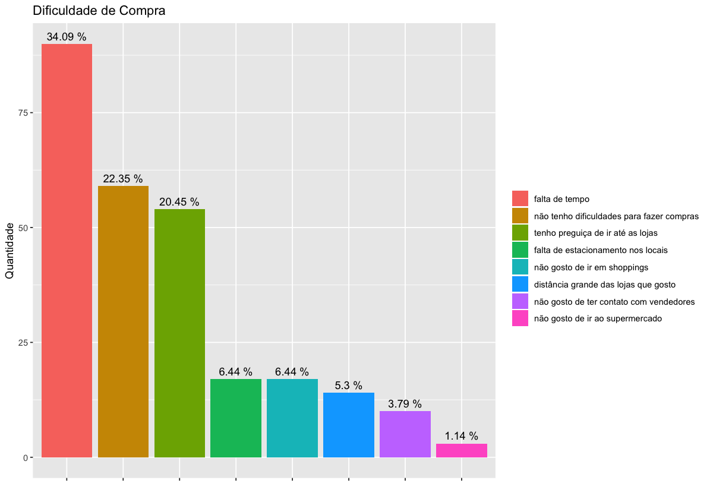
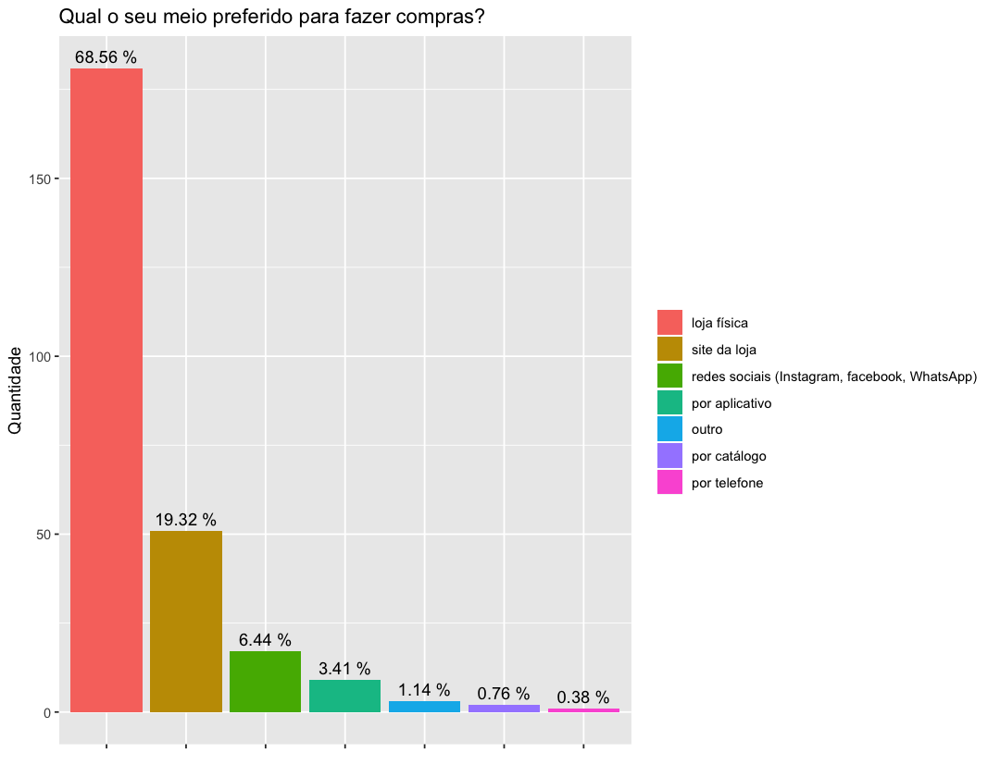
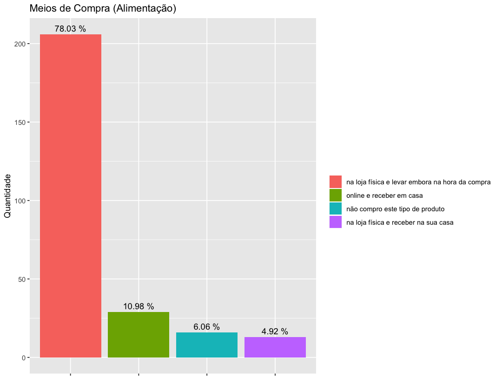
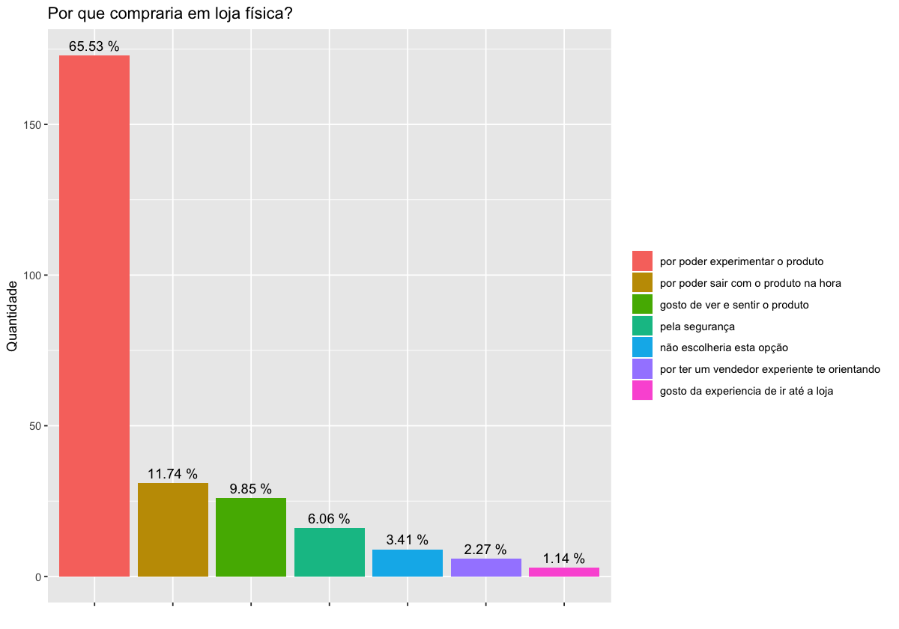

```R
library(tidyr)
library(dplyr)
library(ggplot2)
library(reshape)
library(forcats)

options(repr.matrix.max.cols = 50)
opts <- options()
```


```R
duda <- read.csv('pesquisa_duda.csv', header = T)
head(duda)
```


<table>
<caption>A data.frame: 6 × 31</caption>
<thead>
	<tr><th scope=col>Start.Date</th><th scope=col>Duration..in.seconds.</th><th scope=col>Faixa.etária.</th><th scope=col>Gênero</th><th scope=col>Grau.de.escolaridade..até.que.ano.estudou..</th><th scope=col>Região.onde.mora.</th><th scope=col>Ocupação.</th><th scope=col>Faixa.de.renda.familiar..sua.renda.junto.com.a.renda.das.pessoas.que.moram.com.você..</th><th scope=col>De.forma.geral..você.gosta.de.fazer.compras.</th><th scope=col>Qual..a.maior.dificuldade.no.seu.dia.a.dia.que.torna.a.atividade.de.compra.mais.desafiadora.</th><th scope=col>Que.tipos.de.lojas..você.mais.frequenta.ou.gosta.de.frequentar...você.pode.escolher.mais.de.uma.opção....Selected.Choice</th><th scope=col>Onde.você.costuma.buscar.informação.antes.de.comprar.nas.lojas.que.você.gosta...pode.assinalar.mais.de.uma.opção....Selected.Choice</th><th scope=col>O.que.você.leva.em.consideração.na.hora.de.escolher.uma.loja.para.comprar...pode.assinalar.mais.de.uma.opção.</th><th scope=col>Como.é.a.sua.relação.com.as.lojas.onde.gosta.de.comprar.na.internet...pode.assinalar.mais.de.uma.alternativa.</th><th scope=col>Qual.o.seu.meio.preferido.para.fazer.compras....Selected.Choice</th><th scope=col>Para.você.qual.o.papel.da.internet.na.hora.de.você.fazer.uma.compra.numa.loja.</th><th scope=col>Voce.costuma.fazer.compras.online.</th><th scope=col>Que.tipos.de.produtos.você.costuma.compra.online....Selected.Choice</th><th scope=col>Você.costuma.comprar.da.mesma.loja.de.diferentes.maneiras..compra.na.loja.física.e.online.</th><th scope=col>Voce.prefere.que.as.lojas.tenham.mais.de.uma.forma.de.compra.</th><th scope=col>Considerando.comprar..produtos.de.beleza.como.maquiagem..shampoo..perfume..etc..você.prefere.comprar.de.qual.forma.</th><th scope=col>Considerando.comprar.livros..você.prefere.comprar.de.qual.forma.</th><th scope=col>Considerando.comprar.alimentos.de.hortifruti.e.supermercado..você.prefere.comprar.de.qual.forma.</th><th scope=col>Considerando.comprar.roupas.e.sapatos..você.prefere.comprar.de.qual.forma.</th><th scope=col>Considerando.comprar..eletrodomesticos.e.produtos.eletronicos..você.prefere.comprar.de.qual.forma.</th><th scope=col>Se.você.vai.até.a.loja.e.o.produto.que.você.deseja.não.esta.disponível..você.preferiria....Selected.Choice</th><th scope=col>Por.que.você.escolheria.comprar.online.e.retirar.na.loja.física.</th><th scope=col>Por.que.você.escolheria.comprar.um.produto.direto.na.loja.física.</th><th scope=col>Por.que.voce.escolheria.comprar.um.produto.online.e.receber.em.casa.</th><th scope=col>Por.que.voce.escolheria.comprar.um.produto.na.loja.fisica.e.receber.em.casa.</th><th scope=col>Oque.te.impede.de.realizar.compras.online....Selected.Choice</th></tr>
	<tr><th scope=col>&lt;fct&gt;</th><th scope=col>&lt;int&gt;</th><th scope=col>&lt;fct&gt;</th><th scope=col>&lt;fct&gt;</th><th scope=col>&lt;fct&gt;</th><th scope=col>&lt;fct&gt;</th><th scope=col>&lt;fct&gt;</th><th scope=col>&lt;fct&gt;</th><th scope=col>&lt;fct&gt;</th><th scope=col>&lt;fct&gt;</th><th scope=col>&lt;fct&gt;</th><th scope=col>&lt;fct&gt;</th><th scope=col>&lt;fct&gt;</th><th scope=col>&lt;fct&gt;</th><th scope=col>&lt;fct&gt;</th><th scope=col>&lt;fct&gt;</th><th scope=col>&lt;fct&gt;</th><th scope=col>&lt;fct&gt;</th><th scope=col>&lt;fct&gt;</th><th scope=col>&lt;fct&gt;</th><th scope=col>&lt;fct&gt;</th><th scope=col>&lt;fct&gt;</th><th scope=col>&lt;fct&gt;</th><th scope=col>&lt;fct&gt;</th><th scope=col>&lt;fct&gt;</th><th scope=col>&lt;fct&gt;</th><th scope=col>&lt;fct&gt;</th><th scope=col>&lt;fct&gt;</th><th scope=col>&lt;fct&gt;</th><th scope=col>&lt;fct&gt;</th><th scope=col>&lt;fct&gt;</th></tr>
</thead>
<tbody>
	<tr><td>10/10/19 18:15</td><td>585</td><td>30-45 anos     </td><td>masculino</td><td>doutorado                 </td><td>Curitiba              </td><td>empregado de empresa privada    </td><td>5.000 a 10.000 </td><td>sim</td><td>falta de tempo                           </td><td>roupas,supermercado                       </td><td>vitrines,pesquisando na internet                                                                            </td><td>qualidade do produto,localização da loja,confiança na marca/produto,experiencia de compra na loja                                        </td><td>estou sempre visitando o site das lojas que gosto                                                                                                                                         </td><td>loja física </td><td>pesquiso informações sobre produtos na internet</td><td>sim, faço algumas compras online             </td><td>eletrónicos                                      </td><td>não, costumo fazer minhas compras sempre em loja física</td><td>com certeza não                                                                     </td><td>online e receber em casa                       </td><td>online e receber em casa                       </td><td>online e receber em casa                       </td><td>online e receber em casa                       </td><td>online e receber em casa                       </td><td>                                                  </td><td>tenho certeza de que o produto que eu quero vai estar na loja</td><td>por poder sair com o produto na hora</td><td>por ter preço mais baixo </td><td>pela praticidade         </td><td>a inseguranca se o poduto realmente chegara                                                  </td></tr>
	<tr><td>10/13/19 11:56</td><td>249</td><td>18-29 anos     </td><td>feminino </td><td>ensino médio              </td><td>Curitiba              </td><td>estudante                       </td><td>10.000 a 15.000</td><td>sim</td><td>tenho preguiça de ir até as lojas        </td><td>roupas                                    </td><td>seguindo as lojas nas redes sociais,pesquisando na internet                                                 </td><td>qualidade do produto,promoção                                                                                                            </td><td>estou sempre visitando o site das lojas que gosto,sigo as lojas que gosto nas redes sociais                                                                                               </td><td>site da loja</td><td>saber as novidades das lojas                   </td><td>sim, faço algumas compras online             </td><td>roupas,acessórios                                </td><td>sim, vario dependendo da disponibilidade do produto    </td><td>sim, seria bom ter diferentes opções de compra e entrega                            </td><td>na loja física e levar embora na hora da compra</td><td>na loja física e levar embora na hora da compra</td><td>na loja física e levar embora na hora da compra</td><td>na loja física e levar embora na hora da compra</td><td>online e ir retirar na loja                    </td><td>voltar na loja quando o produto estiver disponível</td><td>tenho certeza de que o produto que eu quero vai estar na loja</td><td>por poder experimentar o produto    </td><td>pela comodidade          </td><td>não escolheria esta opção</td><td>a incerteza se o produto ira servir,gostar da experiencia que tenho quando vou na loja física</td></tr>
	<tr><td>10/13/19 11:57</td><td>305</td><td>61 anos ou mais</td><td>masculino</td><td>ensino superior completo  </td><td>Outra cidade do Paraná</td><td>profissional liberal ou autônomo</td><td>mais de 15.000 </td><td>sim</td><td>não tenho dificuldades para fazer compras</td><td>esportes,produtos eletrônicos             </td><td>propagandas redes sociais,pesquisando na internet,sites de promoção                                         </td><td>qualidade do produto,confiança na marca/produto,experiencia de compra na loja                                                            </td><td>estou sempre visitando o site das lojas que gosto                                                                                                                                         </td><td>site da loja</td><td>faço pesquisa de preço  na internet            </td><td>sim, faço algumas compras online             </td><td>eletrónicos,passagem aérea,outros                </td><td>sim, vario dependendo da disponibilidade do produto    </td><td>sim, seria bom ter diferentes opções de compra e entrega                            </td><td>na loja física e levar embora na hora da compra</td><td>na loja física e levar embora na hora da compra</td><td>na loja física e levar embora na hora da compra</td><td>na loja física e levar embora na hora da compra</td><td>online e receber em casa                       </td><td>voltar na loja quando o produto estiver disponível</td><td>não escolheria esta opção                                    </td><td>por poder sair com o produto na hora</td><td>por ter preço mais baixo </td><td>pela praticidade         </td><td>a insegurança em relacao ao pagamento,nada me impede de comprar online                       </td></tr>
	<tr><td>10/13/19 11:51</td><td>707</td><td>61 anos ou mais</td><td>masculino</td><td>ensino médio              </td><td>Curitiba              </td><td>aposentado                      </td><td>5.000 a 10.000 </td><td>sim</td><td>não gosto de ir em shoppings             </td><td>supermercado                              </td><td>televisão                                                                                                   </td><td>qualidade do produto,promoção                                                                                                            </td><td>vejo propaganda nas redes sociais                                                                                                                                                         </td><td>loja física </td><td>uso a internet somente para realizar a compra  </td><td>sim, faço algumas compras online             </td><td>eletrodomêsticos                                 </td><td>não, costumo fazer minhas compras sempre em loja física</td><td>indiferente                                                                         </td><td>na loja física e levar embora na hora da compra</td><td>não compro este tipo de produto                </td><td>na loja física e levar embora na hora da compra</td><td>na loja física e levar embora na hora da compra</td><td>online e receber em casa                       </td><td>comprar em outra loja                             </td><td>não escolheria esta opção                                    </td><td>por poder experimentar o produto    </td><td>não escolheria esta opção</td><td>não escolheria esta opção</td><td>outros                                                                                       </td></tr>
	<tr><td>10/13/19 11:58</td><td>417</td><td>18-29 anos     </td><td>masculino</td><td>ensino médio              </td><td>exterior              </td><td>empregado de empresa privada    </td><td>5.000 a 10.000 </td><td>sim</td><td>não tenho dificuldades para fazer compras</td><td>roupas,sapatos,produtos eletrônicos,outros</td><td>propagandas redes sociais,seguindo as lojas nas redes sociais,pesquisando na internet,amigos/ colegas       </td><td>qualidade do produto,produto personalizado/ exclusivo,confiança na marca/produto                                                         </td><td>estou sempre visitando o site das lojas que gosto,não sigo as lojas que gosto  mas acompanho o seu perfil nas redes sociais,vejo propaganda nas redes sociais                             </td><td>loja física </td><td>pesquiso informações sobre produtos na internet</td><td>não, não gosto de comprar online             </td><td>passagem aérea,ingressos de cinema/ shows/ teatro</td><td>não, costumo fazer minhas compras sempre em loja física</td><td>indiferente                                                                         </td><td>na loja física e levar embora na hora da compra</td><td>na loja física e levar embora na hora da compra</td><td>na loja física e levar embora na hora da compra</td><td>na loja física e levar embora na hora da compra</td><td>na loja física e levar embora na hora da compra</td><td>comprar em outra loja                             </td><td>não escolheria esta opção                                    </td><td>por poder experimentar o produto    </td><td>não escolheria esta opção</td><td>não escolheria esta opção</td><td>nada me impede de comprar online                                                             </td></tr>
	<tr><td>10/13/19 12:00</td><td>331</td><td>18-29 anos     </td><td>feminino </td><td>ensino superior incompleto</td><td>Curitiba              </td><td>estudante                       </td><td>mais de 15.000 </td><td>sim</td><td>tenho preguiça de ir até as lojas        </td><td>roupas,sapatos,móveis/ decoração          </td><td>propagandas redes sociais,seguindo as lojas nas redes sociais,pesquisando na internet,WhatsApp,blogueiras/os</td><td>qualidade do produto,venda online,qualidade do atendimento,diferentes opções de entrega do produto,promoção,experiencia de compra na loja</td><td>estou sempre visitando o site das lojas que gosto,sigo as lojas que gosto nas redes sociais,vejo propaganda nas redes sociais,sempre entro em contato com o vendedor da loja pelo WhatsApp</td><td>site da loja</td><td>saber as novidades das lojas                   </td><td>sim, faço a maioria das minhas compras online</td><td>roupas                                           </td><td>sim, vario dependendo da minha rotina                  </td><td>com certeza sim, seria demais a loja me oferecer diversas opções de compra e entrega</td><td>online e receber em casa                       </td><td>não compro este tipo de produto                </td><td>não compro este tipo de produto                </td><td>online e receber em casa                       </td><td>na loja física e levar embora na hora da compra</td><td>voltar na loja quando o produto estiver disponível</td><td>posso ver e provar                                           </td><td>por poder experimentar o produto    </td><td>pela comodidade          </td><td>não escolheria esta opção</td><td>nada me impede de comprar online                                                             </td></tr>
</tbody>
</table>


```R
colnames(duda)
```


<ol class=list-inline>
	<li>'Start.Date'</li>
	<li>'Duration..in.seconds.'</li>
	<li>'Faixa.etária.'</li>
	<li>'Gênero'</li>
	<li>'Grau.de.escolaridade..até.que.ano.estudou..'</li>
	<li>'Região.onde.mora.'</li>
	<li>'Ocupação.'</li>
	<li>'Faixa.de.renda.familiar..sua.renda.junto.com.a.renda.das.pessoas.que.moram.com.você..'</li>
	<li>'De.forma.geral..você.gosta.de.fazer.compras.'</li>
	<li>'Qual..a.maior.dificuldade.no.seu.dia.a.dia.que.torna.a.atividade.de.compra.mais.desafiadora.'</li>
	<li>'Que.tipos.de.lojas..você.mais.frequenta.ou.gosta.de.frequentar...você.pode.escolher.mais.de.uma.opção....Selected.Choice'</li>
	<li>'Onde.você.costuma.buscar.informação.antes.de.comprar.nas.lojas.que.você.gosta...pode.assinalar.mais.de.uma.opção....Selected.Choice'</li>
	<li>'O.que.você.leva.em.consideração.na.hora.de.escolher.uma.loja.para.comprar...pode.assinalar.mais.de.uma.opção.'</li>
	<li>'Como.é.a.sua.relação.com.as.lojas.onde.gosta.de.comprar.na.internet...pode.assinalar.mais.de.uma.alternativa.'</li>
	<li>'Qual.o.seu.meio.preferido.para.fazer.compras....Selected.Choice'</li>
	<li>'Para.você.qual.o.papel.da.internet.na.hora.de.você.fazer.uma.compra.numa.loja.'</li>
	<li>'Voce.costuma.fazer.compras.online.'</li>
	<li>'Que.tipos.de.produtos.você.costuma.compra.online....Selected.Choice'</li>
	<li>'Você.costuma.comprar.da.mesma.loja.de.diferentes.maneiras..compra.na.loja.física.e.online.'</li>
	<li>'Voce.prefere.que.as.lojas.tenham.mais.de.uma.forma.de.compra.'</li>
	<li>'Considerando.comprar..produtos.de.beleza.como.maquiagem..shampoo..perfume..etc..você.prefere.comprar.de.qual.forma.'</li>
	<li>'Considerando.comprar.livros..você.prefere.comprar.de.qual.forma.'</li>
	<li>'Considerando.comprar.alimentos.de.hortifruti.e.supermercado..você.prefere.comprar.de.qual.forma.'</li>
	<li>'Considerando.comprar.roupas.e.sapatos..você.prefere.comprar.de.qual.forma.'</li>
	<li>'Considerando.comprar..eletrodomesticos.e.produtos.eletronicos..você.prefere.comprar.de.qual.forma.'</li>
	<li>'Se.você.vai.até.a.loja.e.o.produto.que.você.deseja.não.esta.disponível..você.preferiria....Selected.Choice'</li>
	<li>'Por.que.você.escolheria.comprar.online.e.retirar.na.loja.física.'</li>
	<li>'Por.que.você.escolheria.comprar.um.produto.direto.na.loja.física.'</li>
	<li>'Por.que.voce.escolheria.comprar.um.produto.online.e.receber.em.casa.'</li>
	<li>'Por.que.voce.escolheria.comprar.um.produto.na.loja.fisica.e.receber.em.casa.'</li>
	<li>'Oque.te.impede.de.realizar.compras.online....Selected.Choice'</li>
</ol>


```R
colnames(duda) <- c('date', 'duration', 'faixa_etaria', 'genero', 'escolaridade', 'regiao', 'ocupacao', 'renda_familiar',
                   'gosta_compras', 'dificuldade_compra', 'tipo_loja', 'fonte_informacao', 'consideracao_loja', 'relacao_loja_online',
                    'meio_preferido', 'papel_internet', 'faz_compra_online', 'tipos_prod_online', 'mesma_loja_diferente_maneira', 'gosta_mais_meio_compra',
                   'beleza_meio_compra', 'livro_meio_compra', 'alimento_meio_compra', 'vestuario_meio_compra', 'eletrodomestico_meio_compra', 'produto_nao_disp_acao',
                    'pq_compra_online_retira_fisico', 'pq_compra_fisica', 'pq_compra_online_recebe_casa', 'pq_compra_fisica_recebe_casa', 'impedimento_compra_online')

duda$date <- as.POSIXct(strptime(duda$date, format="%m/%d/%y %H:%M"))

duda <- cbind(seq(1:nrow(duda)), duda)
colnames(duda)[1] <- 'ID'
head(duda, 20)
```


<table>
<caption>A data.frame: 20 × 32</caption>
<thead>
	<tr><th scope=col>ID</th><th scope=col>date</th><th scope=col>duration</th><th scope=col>faixa_etaria</th><th scope=col>genero</th><th scope=col>escolaridade</th><th scope=col>regiao</th><th scope=col>ocupacao</th><th scope=col>renda_familiar</th><th scope=col>gosta_compras</th><th scope=col>dificuldade_compra</th><th scope=col>tipo_loja</th><th scope=col>fonte_informacao</th><th scope=col>consideracao_loja</th><th scope=col>relacao_loja_online</th><th scope=col>meio_preferido</th><th scope=col>papel_internet</th><th scope=col>faz_compra_online</th><th scope=col>tipos_prod_online</th><th scope=col>mesma_loja_diferente_maneira</th><th scope=col>gosta_mais_meio_compra</th><th scope=col>beleza_meio_compra</th><th scope=col>livro_meio_compra</th><th scope=col>alimento_meio_compra</th><th scope=col>vestuario_meio_compra</th><th scope=col>eletrodomestico_meio_compra</th><th scope=col>produto_nao_disp_acao</th><th scope=col>pq_compra_online_retira_fisico</th><th scope=col>pq_compra_fisica</th><th scope=col>pq_compra_online_recebe_casa</th><th scope=col>pq_compra_fisica_recebe_casa</th><th scope=col>impedimento_compra_online</th></tr>
	<tr><th scope=col>&lt;int&gt;</th><th scope=col>&lt;dttm&gt;</th><th scope=col>&lt;int&gt;</th><th scope=col>&lt;fct&gt;</th><th scope=col>&lt;fct&gt;</th><th scope=col>&lt;fct&gt;</th><th scope=col>&lt;fct&gt;</th><th scope=col>&lt;fct&gt;</th><th scope=col>&lt;fct&gt;</th><th scope=col>&lt;fct&gt;</th><th scope=col>&lt;fct&gt;</th><th scope=col>&lt;fct&gt;</th><th scope=col>&lt;fct&gt;</th><th scope=col>&lt;fct&gt;</th><th scope=col>&lt;fct&gt;</th><th scope=col>&lt;fct&gt;</th><th scope=col>&lt;fct&gt;</th><th scope=col>&lt;fct&gt;</th><th scope=col>&lt;fct&gt;</th><th scope=col>&lt;fct&gt;</th><th scope=col>&lt;fct&gt;</th><th scope=col>&lt;fct&gt;</th><th scope=col>&lt;fct&gt;</th><th scope=col>&lt;fct&gt;</th><th scope=col>&lt;fct&gt;</th><th scope=col>&lt;fct&gt;</th><th scope=col>&lt;fct&gt;</th><th scope=col>&lt;fct&gt;</th><th scope=col>&lt;fct&gt;</th><th scope=col>&lt;fct&gt;</th><th scope=col>&lt;fct&gt;</th><th scope=col>&lt;fct&gt;</th></tr>
</thead>
<tbody>
	<tr><td> 1</td><td>2019-10-10 18:15:00</td><td>585</td><td>30-45 anos     </td><td>masculino</td><td>doutorado                 </td><td>Curitiba              </td><td>empregado de empresa privada    </td><td>5.000 a 10.000 </td><td>sim</td><td>falta de tempo                           </td><td>roupas,supermercado                          </td><td>vitrines,pesquisando na internet                                                                                                                                                                     </td><td>qualidade do produto,localização da loja,confiança na marca/produto,experiencia de compra na loja                                                                                                                                                                                                 </td><td>estou sempre visitando o site das lojas que gosto                                                                                                                                                                                    </td><td>loja física </td><td>pesquiso informações sobre produtos na internet  </td><td>sim, faço algumas compras online             </td><td>eletrónicos                                                                                                                        </td><td>não, costumo fazer minhas compras sempre em loja física</td><td>com certeza não                                                                     </td><td>online e receber em casa                       </td><td>online e receber em casa                       </td><td>online e receber em casa                       </td><td>online e receber em casa                       </td><td>online e receber em casa                       </td><td>                                                  </td><td>tenho certeza de que o produto que eu quero vai estar na loja</td><td>por poder sair com o produto na hora</td><td>por ter preço mais baixo         </td><td>pela praticidade                                    </td><td>a inseguranca se o poduto realmente chegara                                                                                                                                                        </td></tr>
	<tr><td> 2</td><td>2019-10-13 11:56:00</td><td>249</td><td>18-29 anos     </td><td>feminino </td><td>ensino médio              </td><td>Curitiba              </td><td>estudante                       </td><td>10.000 a 15.000</td><td>sim</td><td>tenho preguiça de ir até as lojas        </td><td>roupas                                       </td><td>seguindo as lojas nas redes sociais,pesquisando na internet                                                                                                                                          </td><td>qualidade do produto,promoção                                                                                                                                                                                                                                                                     </td><td>estou sempre visitando o site das lojas que gosto,sigo as lojas que gosto nas redes sociais                                                                                                                                          </td><td>site da loja</td><td>saber as novidades das lojas                     </td><td>sim, faço algumas compras online             </td><td>roupas,acessórios                                                                                                                  </td><td>sim, vario dependendo da disponibilidade do produto    </td><td>sim, seria bom ter diferentes opções de compra e entrega                            </td><td>na loja física e levar embora na hora da compra</td><td>na loja física e levar embora na hora da compra</td><td>na loja física e levar embora na hora da compra</td><td>na loja física e levar embora na hora da compra</td><td>online e ir retirar na loja                    </td><td>voltar na loja quando o produto estiver disponível</td><td>tenho certeza de que o produto que eu quero vai estar na loja</td><td>por poder experimentar o produto    </td><td>pela comodidade                  </td><td>não escolheria esta opção                           </td><td>a incerteza se o produto ira servir,gostar da experiencia que tenho quando vou na loja física                                                                                                      </td></tr>
	<tr><td> 3</td><td>2019-10-13 11:57:00</td><td>305</td><td>61 anos ou mais</td><td>masculino</td><td>ensino superior completo  </td><td>Outra cidade do Paraná</td><td>profissional liberal ou autônomo</td><td>mais de 15.000 </td><td>sim</td><td>não tenho dificuldades para fazer compras</td><td>esportes,produtos eletrônicos                </td><td>propagandas redes sociais,pesquisando na internet,sites de promoção                                                                                                                                  </td><td>qualidade do produto,confiança na marca/produto,experiencia de compra na loja                                                                                                                                                                                                                     </td><td>estou sempre visitando o site das lojas que gosto                                                                                                                                                                                    </td><td>site da loja</td><td>faço pesquisa de preço  na internet              </td><td>sim, faço algumas compras online             </td><td>eletrónicos,passagem aérea,outros                                                                                                  </td><td>sim, vario dependendo da disponibilidade do produto    </td><td>sim, seria bom ter diferentes opções de compra e entrega                            </td><td>na loja física e levar embora na hora da compra</td><td>na loja física e levar embora na hora da compra</td><td>na loja física e levar embora na hora da compra</td><td>na loja física e levar embora na hora da compra</td><td>online e receber em casa                       </td><td>voltar na loja quando o produto estiver disponível</td><td>não escolheria esta opção                                    </td><td>por poder sair com o produto na hora</td><td>por ter preço mais baixo         </td><td>pela praticidade                                    </td><td>a insegurança em relacao ao pagamento,nada me impede de comprar online                                                                                                                             </td></tr>
	<tr><td> 4</td><td>2019-10-13 11:51:00</td><td>707</td><td>61 anos ou mais</td><td>masculino</td><td>ensino médio              </td><td>Curitiba              </td><td>aposentado                      </td><td>5.000 a 10.000 </td><td>sim</td><td>não gosto de ir em shoppings             </td><td>supermercado                                 </td><td>televisão                                                                                                                                                                                            </td><td>qualidade do produto,promoção                                                                                                                                                                                                                                                                     </td><td>vejo propaganda nas redes sociais                                                                                                                                                                                                    </td><td>loja física </td><td>uso a internet somente para realizar a compra    </td><td>sim, faço algumas compras online             </td><td>eletrodomêsticos                                                                                                                   </td><td>não, costumo fazer minhas compras sempre em loja física</td><td>indiferente                                                                         </td><td>na loja física e levar embora na hora da compra</td><td>não compro este tipo de produto                </td><td>na loja física e levar embora na hora da compra</td><td>na loja física e levar embora na hora da compra</td><td>online e receber em casa                       </td><td>comprar em outra loja                             </td><td>não escolheria esta opção                                    </td><td>por poder experimentar o produto    </td><td>não escolheria esta opção        </td><td>não escolheria esta opção                           </td><td>outros                                                                                                                                                                                             </td></tr>
	<tr><td> 5</td><td>2019-10-13 11:58:00</td><td>417</td><td>18-29 anos     </td><td>masculino</td><td>ensino médio              </td><td>exterior              </td><td>empregado de empresa privada    </td><td>5.000 a 10.000 </td><td>sim</td><td>não tenho dificuldades para fazer compras</td><td>roupas,sapatos,produtos eletrônicos,outros   </td><td>propagandas redes sociais,seguindo as lojas nas redes sociais,pesquisando na internet,amigos/ colegas                                                                                                </td><td>qualidade do produto,produto personalizado/ exclusivo,confiança na marca/produto                                                                                                                                                                                                                  </td><td>estou sempre visitando o site das lojas que gosto,não sigo as lojas que gosto  mas acompanho o seu perfil nas redes sociais,vejo propaganda nas redes sociais                                                                        </td><td>loja física </td><td>pesquiso informações sobre produtos na internet  </td><td>não, não gosto de comprar online             </td><td>passagem aérea,ingressos de cinema/ shows/ teatro                                                                                  </td><td>não, costumo fazer minhas compras sempre em loja física</td><td>indiferente                                                                         </td><td>na loja física e levar embora na hora da compra</td><td>na loja física e levar embora na hora da compra</td><td>na loja física e levar embora na hora da compra</td><td>na loja física e levar embora na hora da compra</td><td>na loja física e levar embora na hora da compra</td><td>comprar em outra loja                             </td><td>não escolheria esta opção                                    </td><td>por poder experimentar o produto    </td><td>não escolheria esta opção        </td><td>não escolheria esta opção                           </td><td>nada me impede de comprar online                                                                                                                                                                   </td></tr>
	<tr><td> 6</td><td>2019-10-13 12:00:00</td><td>331</td><td>18-29 anos     </td><td>feminino </td><td>ensino superior incompleto</td><td>Curitiba              </td><td>estudante                       </td><td>mais de 15.000 </td><td>sim</td><td>tenho preguiça de ir até as lojas        </td><td>roupas,sapatos,móveis/ decoração             </td><td>propagandas redes sociais,seguindo as lojas nas redes sociais,pesquisando na internet,WhatsApp,blogueiras/os                                                                                         </td><td>qualidade do produto,venda online,qualidade do atendimento,diferentes opções de entrega do produto,promoção,experiencia de compra na loja                                                                                                                                                         </td><td>estou sempre visitando o site das lojas que gosto,sigo as lojas que gosto nas redes sociais,vejo propaganda nas redes sociais,sempre entro em contato com o vendedor da loja pelo WhatsApp                                           </td><td>site da loja</td><td>saber as novidades das lojas                     </td><td>sim, faço a maioria das minhas compras online</td><td>roupas                                                                                                                             </td><td>sim, vario dependendo da minha rotina                  </td><td>com certeza sim, seria demais a loja me oferecer diversas opções de compra e entrega</td><td>online e receber em casa                       </td><td>não compro este tipo de produto                </td><td>não compro este tipo de produto                </td><td>online e receber em casa                       </td><td>na loja física e levar embora na hora da compra</td><td>voltar na loja quando o produto estiver disponível</td><td>posso ver e provar                                           </td><td>por poder experimentar o produto    </td><td>pela comodidade                  </td><td>não escolheria esta opção                           </td><td>nada me impede de comprar online                                                                                                                                                                   </td></tr>
	<tr><td> 7</td><td>2019-10-13 11:59:00</td><td>422</td><td>18-29 anos     </td><td>feminino </td><td>ensino superior incompleto</td><td>Curitiba              </td><td>estudante                       </td><td>5.000 a 10.000 </td><td>sim</td><td>não tenho dificuldades para fazer compras</td><td>roupas                                       </td><td>propagandas redes sociais,seguindo as lojas nas redes sociais,amigos/ colegas                                                                                                                        </td><td>qualidade do produto,qualidade do atendimento,confiança na marca/produto                                                                                                                                                                                                                          </td><td>estou sempre visitando o site das lojas que gosto                                                                                                                                                                                    </td><td>site da loja</td><td>pesquiso informações sobre produtos na internet  </td><td>sim, faço algumas compras online             </td><td>roupas,acessórios,sapato,produtos de beleza,passagem aérea                                                                         </td><td>sim, vario dependendo da disponibilidade do produto    </td><td>sim, seria bom ter diferentes opções de compra e entrega                            </td><td>online e receber em casa                       </td><td>online e receber em casa                       </td><td>na loja física e levar embora na hora da compra</td><td>online e receber em casa                       </td><td>na loja física e levar embora na hora da compra</td><td>realizar a compra na loja e receber na sua casa   </td><td>não escolheria esta opção                                    </td><td>gosto de ver e sentir o produto     </td><td>pela comodidade                  </td><td>por nao precisar carregar os produtos               </td><td>a insegurança em relacao ao pagamento,a inseguranca se o poduto realmente chegara,não poder experimentar o produto                                                                                 </td></tr>
	<tr><td> 8</td><td>2019-10-13 11:59:00</td><td>457</td><td>18-29 anos     </td><td>feminino </td><td>pós graduação,            </td><td>Curitiba              </td><td>profissional liberal ou autônomo</td><td>5.000 a 10.000 </td><td>sim</td><td>tenho preguiça de ir até as lojas        </td><td>roupas,sapatos,livrarias                     </td><td>vitrines,propagandas em revista/jornal,propagandas redes sociais,seguindo as lojas nas redes sociais,pesquisando na internet,sites de promoção,WhatsApp,amigos/ colegas,blogueiras/os,email marketing</td><td>qualidade do produto,presença nas mídias sociais,informações sobre o produto,localização da loja,produto personalizado/ exclusivo,venda online,qualidade do atendimento,padronização do produto em relação a numeração,diferentes opções de entrega do produto,confiança na marca/produto,promoção</td><td>sigo as lojas que gosto nas redes sociais                                                                                                                                                                                            </td><td>loja física </td><td>saber as novidades das lojas                     </td><td>sim, faço algumas compras online             </td><td>roupas,sapato,produtos de beleza,livros,passagem aérea,ingressos de cinema/ shows/ teatro                                          </td><td>sim, vario dependendo da disponibilidade do produto    </td><td>sim, seria bom ter diferentes opções de compra e entrega                            </td><td>na loja física e levar embora na hora da compra</td><td>online e receber em casa                       </td><td>na loja física e levar embora na hora da compra</td><td>na loja física e levar embora na hora da compra</td><td>na loja física e receber na sua casa           </td><td>comprar em outra loja                             </td><td>não tem custo adicional de frete                             </td><td>por poder experimentar o produto    </td><td>pela comodidade                  </td><td>não escolheria esta opção                           </td><td>não poder experimentar o produto,a demora para receber o produto                                                                                                                                   </td></tr>
	<tr><td> 9</td><td>2019-10-13 12:02:00</td><td>296</td><td>30-45 anos     </td><td>feminino </td><td>ensino superior completo  </td><td>Curitiba              </td><td>empregado de empresa privada    </td><td>mais de 15.000 </td><td>sim</td><td>falta de estacionamento nos locais       </td><td>roupas,supermercado                          </td><td>seguindo as lojas nas redes sociais                                                                                                                                                                  </td><td>experiencia de compra na loja                                                                                                                                                                                                                                                                     </td><td>sigo as lojas que gosto nas redes sociais                                                                                                                                                                                            </td><td>loja física </td><td>saber as novidades das lojas                     </td><td>sim, faço algumas compras online             </td><td>filmes,passagem aérea,ingressos de cinema/ shows/ teatro                                                                           </td><td>não, costumo fazer minhas compras sempre em loja física</td><td>indiferente                                                                         </td><td>na loja física e levar embora na hora da compra</td><td>na loja física e levar embora na hora da compra</td><td>na loja física e levar embora na hora da compra</td><td>na loja física e levar embora na hora da compra</td><td>na loja física e receber na sua casa           </td><td>comprar em outra loja                             </td><td>não escolheria esta opção                                    </td><td>gosto de ver e sentir o produto     </td><td>pela comodidade                  </td><td>não escolheria esta opção                           </td><td>a incerteza se o produto ira servir                                                                                                                                                                </td></tr>
	<tr><td>10</td><td>2019-10-13 12:02:00</td><td>299</td><td>18-29 anos     </td><td>feminino </td><td>pós graduação,            </td><td>Curitiba              </td><td>profissional liberal ou autônomo</td><td>2.000 a 5.000  </td><td>não</td><td>falta de tempo                           </td><td>roupas,sapatos,produtos eletrônicos,livrarias</td><td>vitrines,propagandas redes sociais                                                                                                                                                                   </td><td>qualidade do produto,produto personalizado/ exclusivo,qualidade do atendimento,confiança na marca/produto,experiencia de compra na loja                                                                                                                                                           </td><td>sigo as lojas que gosto nas redes sociais                                                                                                                                                                                            </td><td>loja física </td><td>saber as novidades das lojas                     </td><td>não, não gosto de comprar online             </td><td>livros,passagem aérea,ingressos de cinema/ shows/ teatro                                                                           </td><td>não, costumo fazer minhas compras sempre em loja física</td><td>indiferente                                                                         </td><td>na loja física e levar embora na hora da compra</td><td>online e receber em casa                       </td><td>na loja física e levar embora na hora da compra</td><td>na loja física e levar embora na hora da compra</td><td>na loja física e levar embora na hora da compra</td><td>voltar na loja quando o produto estiver disponível</td><td>não tem custo adicional de frete                             </td><td>por poder experimentar o produto    </td><td>pela comodidade                  </td><td>não escolheria esta opção                           </td><td>a insegurança em relacao ao pagamento,gostar da experiencia que tenho quando vou na loja física,não poder experimentar o produto,a falta de padronização dos tamanhos                              </td></tr>
	<tr><td>11</td><td>2019-10-13 12:03:00</td><td>315</td><td>18-29 anos     </td><td>feminino </td><td>ensino superior incompleto</td><td>Curitiba              </td><td>estudante                       </td><td>mais de 15.000 </td><td>sim</td><td>falta de tempo                           </td><td>roupas,sapatos                               </td><td>seguindo as lojas nas redes sociais,amigos/ colegas,blogueiras/os                                                                                                                                    </td><td>qualidade do produto,promoção,experiencia de compra na loja                                                                                                                                                                                                                                       </td><td>estou sempre visitando o site das lojas que gosto                                                                                                                                                                                    </td><td>loja física </td><td>pesquiso informações sobre produtos na internet  </td><td>sim, faço algumas compras online             </td><td>roupas,sapato                                                                                                                      </td><td>sim, vario dependendo da disponibilidade do produto    </td><td>com certeza sim, seria demais a loja me oferecer diversas opções de compra e entrega</td><td>na loja física e levar embora na hora da compra</td><td>online e receber em casa                       </td><td>na loja física e levar embora na hora da compra</td><td>na loja física e levar embora na hora da compra</td><td>na loja física e levar embora na hora da compra</td><td>realizar a compra na loja e receber na sua casa   </td><td>não tem custo adicional de frete                             </td><td>por poder experimentar o produto    </td><td>pela comodidade                  </td><td>pela praticidade                                    </td><td>não poder experimentar o produto                                                                                                                                                                   </td></tr>
	<tr><td>12</td><td>2019-10-13 12:02:00</td><td>446</td><td>30-45 anos     </td><td>feminino </td><td>ensino superior completo  </td><td>Curitiba              </td><td>empregado de empresa privada    </td><td>10.000 a 15.000</td><td>sim</td><td>tenho preguiça de ir até as lojas        </td><td>roupas,sapatos,supermercado                  </td><td>propagandas redes sociais,seguindo as lojas nas redes sociais,blogueiras/os                                                                                                                          </td><td>qualidade do produto,presença nas mídias sociais,venda online,padronização do produto em relação a numeração,diferentes opções de entrega do produto,confiança na marca/produto,promoção                                                                                                          </td><td>estou sempre visitando o site das lojas que gosto,sigo as lojas que gosto nas redes sociais,vejo propaganda nas redes sociais                                                                                                        </td><td>site da loja</td><td>utilizo a internet em todo meu processo de compra</td><td>sim, faço a maioria das minhas compras online</td><td>roupas,acessórios,sapato,produtos de beleza,livros,passagem aérea                                                                  </td><td>sim, vario dependendo da minha rotina                  </td><td>com certeza sim, seria demais a loja me oferecer diversas opções de compra e entrega</td><td>online e receber em casa                       </td><td>online e receber em casa                       </td><td>na loja física e receber na sua casa           </td><td>online e receber em casa                       </td><td>online e receber em casa                       </td><td>realizar a compra na loja e receber na sua casa   </td><td>não tem custo adicional de frete                             </td><td>por poder experimentar o produto    </td><td>pela comodidade                  </td><td>por não precisa voltar na loja para buscar o produto</td><td>a incerteza se o produto ira servir,não poder experimentar o produto,não poder ver e tocar o produto                                                                                               </td></tr>
	<tr><td>13</td><td>2019-10-13 12:05:00</td><td>302</td><td>18-29 anos     </td><td>feminino </td><td>pós graduação,            </td><td>Curitiba              </td><td>empregado de empresa privada    </td><td>5.000 a 10.000 </td><td>sim</td><td>tenho preguiça de ir até as lojas        </td><td>roupas,sapatos                               </td><td>pesquisando na internet                                                                                                                                                                              </td><td>qualidade do produto                                                                                                                                                                                                                                                                              </td><td>estou sempre visitando o site das lojas que gosto,sigo as lojas que gosto nas redes sociais                                                                                                                                          </td><td>site da loja</td><td>utilizo a internet em todo meu processo de compra</td><td>sim, faço a maioria das minhas compras online</td><td>roupas,acessórios,sapato,fármacia,eletrónicos,eletrodomêsticos,produtos de beleza,passagem aérea,ingressos de cinema/ shows/ teatro</td><td>não, costuma fazer minhas compras sempre online        </td><td>com certeza sim, seria demais a loja me oferecer diversas opções de compra e entrega</td><td>online e receber em casa                       </td><td>online e receber em casa                       </td><td>na loja física e levar embora na hora da compra</td><td>online e receber em casa                       </td><td>online e receber em casa                       </td><td>desistir de comprar                               </td><td>não escolheria esta opção                                    </td><td>não escolheria esta opção           </td><td>pela comodidade                  </td><td>não escolheria esta opção                           </td><td>nada me impede de comprar online                                                                                                                                                                   </td></tr>
	<tr><td>14</td><td>2019-10-13 12:06:00</td><td>282</td><td>18-29 anos     </td><td>feminino </td><td>pós graduação,            </td><td>Curitiba              </td><td>empregado de empresa privada    </td><td>mais de 15.000 </td><td>sim</td><td>falta de tempo                           </td><td>roupas,sapatos                               </td><td>propagandas redes sociais,blogueiras/os,email marketing                                                                                                                                              </td><td>qualidade do produto                                                                                                                                                                                                                                                                              </td><td>não sigo as lojas que gosto  mas acompanho o seu perfil nas redes sociais,abro os emails marketing que recebo das lojas que gosto,tenho o aplicativo das lojas que gosto,sempre entro em contato com o vendedor da loja pelo WhatsApp</td><td>loja física </td><td>saber as novidades das lojas                     </td><td>sim, faço algumas compras online             </td><td>roupas,sapato,produtos de beleza                                                                                                   </td><td>sim, vario dependendo da disponibilidade do produto    </td><td>sim, seria bom ter diferentes opções de compra e entrega                            </td><td>na loja física e levar embora na hora da compra</td><td>online e receber em casa                       </td><td>não compro este tipo de produto                </td><td>na loja física e levar embora na hora da compra</td><td>online e receber em casa                       </td><td>realizar a compra na loja e receber na sua casa   </td><td>não escolheria esta opção                                    </td><td>por poder experimentar o produto    </td><td>pela comodidade                  </td><td>pela praticidade                                    </td><td>a incerteza se o produto ira servir,não poder experimentar o produto,não poder ver e tocar o produto,a falta de padronização dos tamanhos                                                          </td></tr>
	<tr><td>15</td><td>2019-10-13 12:07:00</td><td>241</td><td>até 17 anos    </td><td>masculino</td><td>ensino médio              </td><td>exterior              </td><td>estudante                       </td><td>mais de 15.000 </td><td>sim</td><td>não tenho dificuldades para fazer compras</td><td>roupas,sapatos,esportes,produtos eletrônicos </td><td>propagandas redes sociais,seguindo as lojas nas redes sociais,WhatsApp,amigos/ colegas                                                                                                               </td><td>qualidade do produto,presença nas mídias sociais,informações sobre o produto,qualidade do atendimento,confiança na marca/produto,promoção                                                                                                                                                         </td><td>vejo propaganda nas redes sociais,tenho o aplicativo das lojas que gosto                                                                                                                                                             </td><td>loja física </td><td>saber as novidades das lojas                     </td><td>sim, faço algumas compras online             </td><td>roupas,acessórios,sapato,eletrónicos,passagem aérea,ingressos de cinema/ shows/ teatro                                             </td><td>sim, vario dependendo da minha rotina                  </td><td>com certeza sim, seria demais a loja me oferecer diversas opções de compra e entrega</td><td>na loja física e levar embora na hora da compra</td><td>na loja física e levar embora na hora da compra</td><td>na loja física e levar embora na hora da compra</td><td>na loja física e levar embora na hora da compra</td><td>na loja física e levar embora na hora da compra</td><td>realizar a compra na loja e receber na sua casa   </td><td>não escolheria esta opção                                    </td><td>por poder experimentar o produto    </td><td>por só ter certos produtos online</td><td>por nao precisar carregar os produtos               </td><td>nada me impede de comprar online                                                                                                                                                                   </td></tr>
	<tr><td>16</td><td>2019-10-13 12:06:00</td><td>305</td><td>18-29 anos     </td><td>feminino </td><td>ensino superior incompleto</td><td>Curitiba              </td><td>estudante                       </td><td>10.000 a 15.000</td><td>sim</td><td>falta de tempo                           </td><td>roupas,sapatos                               </td><td>seguindo as lojas nas redes sociais,pesquisando na internet,blogueiras/os                                                                                                                            </td><td>qualidade do produto,venda online,padronização do produto em relação a numeração,experiencia de compra na loja                                                                                                                                                                                    </td><td>estou sempre visitando o site das lojas que gosto,sigo as lojas que gosto nas redes sociais                                                                                                                                          </td><td>loja física </td><td>saber as novidades das lojas                     </td><td>sim, faço algumas compras online             </td><td>roupas,acessórios,eletrónicos,produtos de beleza,passagem aérea,ingressos de cinema/ shows/ teatro                                 </td><td>sim, vario dependendo da minha rotina                  </td><td>com certeza sim, seria demais a loja me oferecer diversas opções de compra e entrega</td><td>na loja física e levar embora na hora da compra</td><td>na loja física e levar embora na hora da compra</td><td>na loja física e levar embora na hora da compra</td><td>na loja física e levar embora na hora da compra</td><td>na loja física e levar embora na hora da compra</td><td>comprar em outra loja                             </td><td>tenho certeza de que o produto que eu quero vai estar na loja</td><td>gosto de ver e sentir o produto     </td><td>pela comodidade                  </td><td>por nao precisar carregar os produtos               </td><td>a incerteza se o produto ira servir,gostar da experiencia que tenho quando vou na loja física,não poder experimentar o produto,a demora para receber o produto,a falta de padronização dos tamanhos</td></tr>
	<tr><td>17</td><td>2019-10-13 12:07:00</td><td>282</td><td>até 17 anos    </td><td>feminino </td><td>ensino superior incompleto</td><td>Curitiba              </td><td>estudante                       </td><td>5.000 a 10.000 </td><td>sim</td><td>não gosto de ter contato com vendedores  </td><td>roupas,sapatos                               </td><td>seguindo as lojas nas redes sociais                                                                                                                                                                  </td><td>qualidade do produto,informações sobre o produto,confiança na marca/produto,promoção                                                                                                                                                                                                              </td><td>sigo as lojas que gosto nas redes sociais                                                                                                                                                                                            </td><td>loja física </td><td>não uso a internet antes de fazer uma compra     </td><td>não, não gosto de comprar online             </td><td>não compro online                                                                                                                  </td><td>não, costumo fazer minhas compras sempre em loja física</td><td>indiferente                                                                         </td><td>na loja física e levar embora na hora da compra</td><td>na loja física e levar embora na hora da compra</td><td>na loja física e levar embora na hora da compra</td><td>na loja física e levar embora na hora da compra</td><td>na loja física e levar embora na hora da compra</td><td>desistir de comprar                               </td><td>não escolheria esta opção                                    </td><td>não escolheria esta opção           </td><td>não escolheria esta opção        </td><td>não escolheria esta opção                           </td><td>gostar da experiencia que tenho quando vou na loja física,não poder experimentar o produto,não poder ver e tocar o produto,a demora para receber o produto,a falta de padronização dos tamanhos    </td></tr>
	<tr><td>18</td><td>2019-10-13 12:05:00</td><td>426</td><td>até 17 anos    </td><td>feminino </td><td>ensino médio              </td><td>Curitiba              </td><td>estudante                       </td><td>mais de 15.000 </td><td>sim</td><td>falta de tempo                           </td><td>roupas,sapatos                               </td><td>propagandas redes sociais,seguindo as lojas nas redes sociais,pesquisando na internet,blogueiras/os                                                                                                  </td><td>qualidade do produto,presença nas mídias sociais,localização da loja,produto personalizado/ exclusivo,venda online                                                                                                                                                                                </td><td>estou sempre visitando o site das lojas que gosto,sigo as lojas que gosto nas redes sociais                                                                                                                                          </td><td>loja física </td><td>saber as novidades das lojas                     </td><td>sim, faço algumas compras online             </td><td>roupas,sapato,produtos de beleza,passagem aérea,ingressos de cinema/ shows/ teatro                                                 </td><td>sim, vario dependendo da disponibilidade do produto    </td><td>com certeza sim, seria demais a loja me oferecer diversas opções de compra e entrega</td><td>online e receber em casa                       </td><td>online e receber em casa                       </td><td>na loja física e levar embora na hora da compra</td><td>na loja física e levar embora na hora da compra</td><td>online e receber em casa                       </td><td>realizar a compra na loja e receber na sua casa   </td><td>não escolheria esta opção                                    </td><td>por poder experimentar o produto    </td><td>pela comodidade                  </td><td>pela praticidade                                    </td><td>a incerteza se o produto ira servir,a demora para receber o produto                                                                                                                                </td></tr>
	<tr><td>19</td><td>2019-10-13 12:07:00</td><td>340</td><td>18-29 anos     </td><td>feminino </td><td>ensino superior incompleto</td><td>Curitiba              </td><td>estudante                       </td><td>mais de 15.000 </td><td>sim</td><td>falta de tempo                           </td><td>roupas,sapatos,livrarias,outros              </td><td>vitrines,propagandas redes sociais,seguindo as lojas nas redes sociais,blogueiras/os                                                                                                                 </td><td>qualidade do produto,localização da loja,qualidade do atendimento,experiencia de compra na loja                                                                                                                                                                                                   </td><td>estou sempre visitando o site das lojas que gosto,sigo as lojas que gosto nas redes sociais,tenho o aplicativo das lojas que gosto                                                                                                   </td><td>loja física </td><td>saber as novidades das lojas                     </td><td>sim, faço algumas compras online             </td><td>acessórios,produtos de beleza,livros,passagem aérea,ingressos de cinema/ shows/ teatro                                             </td><td>sim, vario dependendo da minha rotina                  </td><td>com certeza sim, seria demais a loja me oferecer diversas opções de compra e entrega</td><td>online e receber em casa                       </td><td>na loja física e levar embora na hora da compra</td><td>na loja física e receber na sua casa           </td><td>na loja física e levar embora na hora da compra</td><td>na loja física e levar embora na hora da compra</td><td>realizar a compra na loja e receber na sua casa   </td><td>não escolheria esta opção                                    </td><td>por poder experimentar o produto    </td><td>pela comodidade                  </td><td>pela praticidade                                    </td><td>a incerteza se o produto ira servir,a inseguranca se o poduto realmente chegara                                                                                                                    </td></tr>
	<tr><td>20</td><td>2019-10-13 12:11:00</td><td>345</td><td>46-60 anos     </td><td>feminino </td><td>pós graduação,            </td><td>Curitiba              </td><td>funcionário publico             </td><td>mais de 15.000 </td><td>sim</td><td>falta de tempo                           </td><td>roupas,sapatos,supermercado                  </td><td>propagandas redes sociais,seguindo as lojas nas redes sociais,sites de promoção,WhatsApp                                                                                                             </td><td>qualidade do produto,presença nas mídias sociais,qualidade do atendimento,confiança na marca/produto,promoção                                                                                                                                                                                     </td><td>sigo as lojas que gosto nas redes sociais,sempre entro em contato com o vendedor da loja pelo WhatsApp                                                                                                                               </td><td>loja física </td><td>saber as novidades das lojas                     </td><td>sim, faço algumas compras online             </td><td>roupas,eletrodomêsticos                                                                                                            </td><td>não, costumo fazer minhas compras sempre em loja física</td><td>indiferente                                                                         </td><td>na loja física e levar embora na hora da compra</td><td>na loja física e levar embora na hora da compra</td><td>na loja física e levar embora na hora da compra</td><td>na loja física e levar embora na hora da compra</td><td>online e receber em casa                       </td><td>comprar em outra loja                             </td><td>tenho certeza de que o produto que eu quero vai estar na loja</td><td>gosto de ver e sentir o produto     </td><td>pela comodidade                  </td><td>por nao precisar carregar os produtos               </td><td>a incerteza se o produto ira servir,não poder experimentar o produto,não poder ver e tocar o produto                                                                                               </td></tr>
</tbody>
</table>


```R
multi_cols <- c('tipo_loja', 'fonte_informacao', 'consideracao_loja', 'relacao_loja_online', 'tipos_prod_online', 'impedimento_compra_online')
```


```R
max_unique_multi <- max(unlist(lapply(multi_cols, function(x){
        uniques <- apply(data.frame(do.call(rbind, strsplit(as.character(duda[,x]), ','))), 1, unique)
        max(unlist(lapply(uniques, length)))
})))
```

    Warning message in (function (..., deparse.level = 1) :
    “number of columns of result is not a multiple of vector length (arg 1)”Warning message in (function (..., deparse.level = 1) :
    “number of columns of result is not a multiple of vector length (arg 3)”Warning message in (function (..., deparse.level = 1) :
    “number of columns of result is not a multiple of vector length (arg 8)”Warning message in (function (..., deparse.level = 1) :
    “number of columns of result is not a multiple of vector length (arg 6)”Warning message in (function (..., deparse.level = 1) :
    “number of columns of result is not a multiple of vector length (arg 7)”Warning message in (function (..., deparse.level = 1) :
    “number of columns of result is not a multiple of vector length (arg 7)”


```R
multi_df_list <- list()
i <- 1

for (col in multi_cols){
    unique_type <- data.frame(do.call(rbind, apply(data.frame(do.call(rbind, strsplit(as.character(duda[, col]), ','))), 1, unique)))
    colnames(unique_type) <- c(sprintf(paste(col,'.%s'),seq(1:(ncol(unique_type)))))
    multi_df_list[[i]] <- unique_type
    i <- i + 1
    }

head(multi_df_list[[1]])
```

    Warning message in (function (..., deparse.level = 1) :
    “number of columns of result is not a multiple of vector length (arg 1)”Warning message in (function (..., deparse.level = 1) :
    “number of columns of result is not a multiple of vector length (arg 1)”Warning message in (function (..., deparse.level = 1) :
    “number of columns of result is not a multiple of vector length (arg 3)”Warning message in (function (..., deparse.level = 1) :
    “number of columns of result is not a multiple of vector length (arg 3)”Warning message in (function (..., deparse.level = 1) :
    “number of columns of result is not a multiple of vector length (arg 8)”Warning message in (function (..., deparse.level = 1) :
    “number of columns of result is not a multiple of vector length (arg 8)”Warning message in (function (..., deparse.level = 1) :
    “number of columns of result is not a multiple of vector length (arg 6)”Warning message in (function (..., deparse.level = 1) :
    “number of columns of result is not a multiple of vector length (arg 6)”Warning message in (function (..., deparse.level = 1) :
    “number of columns of result is not a multiple of vector length (arg 7)”Warning message in (function (..., deparse.level = 1) :
    “number of columns of result is not a multiple of vector length (arg 7)”Warning message in (function (..., deparse.level = 1) :
    “number of columns of result is not a multiple of vector length (arg 7)”Warning message in (function (..., deparse.level = 1) :
    “number of columns of result is not a multiple of vector length (arg 7)”


<table>
<caption>A data.frame: 6 × 7</caption>
<thead>
	<tr><th scope=col>tipo_loja .1</th><th scope=col>tipo_loja .2</th><th scope=col>tipo_loja .3</th><th scope=col>tipo_loja .4</th><th scope=col>tipo_loja .5</th><th scope=col>tipo_loja .6</th><th scope=col>tipo_loja .7</th></tr>
	<tr><th scope=col>&lt;fct&gt;</th><th scope=col>&lt;fct&gt;</th><th scope=col>&lt;fct&gt;</th><th scope=col>&lt;fct&gt;</th><th scope=col>&lt;fct&gt;</th><th scope=col>&lt;fct&gt;</th><th scope=col>&lt;fct&gt;</th></tr>
</thead>
<tbody>
	<tr><td>roupas      </td><td>supermercado        </td><td>roupas              </td><td>supermercado        </td><td>roupas      </td><td>supermercado        </td><td>roupas              </td></tr>
	<tr><td>roupas      </td><td>roupas              </td><td>roupas              </td><td>roupas              </td><td>roupas      </td><td>roupas              </td><td>roupas              </td></tr>
	<tr><td>esportes    </td><td>produtos eletrônicos</td><td>esportes            </td><td>produtos eletrônicos</td><td>esportes    </td><td>produtos eletrônicos</td><td>esportes            </td></tr>
	<tr><td>supermercado</td><td>supermercado        </td><td>supermercado        </td><td>supermercado        </td><td>supermercado</td><td>supermercado        </td><td>supermercado        </td></tr>
	<tr><td>roupas      </td><td>sapatos             </td><td>produtos eletrônicos</td><td>outros              </td><td>roupas      </td><td>sapatos             </td><td>produtos eletrônicos</td></tr>
	<tr><td>roupas      </td><td>sapatos             </td><td>móveis/ decoração   </td><td>roupas              </td><td>sapatos     </td><td>móveis/ decoração   </td><td>roupas              </td></tr>
</tbody>
</table>


```R
multi_df_list <- lapply(multi_df_list, function(df){
    
    name <- substr(colnames(df)[[1]],  1, nchar(colnames(df)[[1]]) - 3)
    new_df <- data.frame(t(apply(df, 1, function(row){
        l <- length(row)
        c(unique(row), rep(NA, l - length(unique(row))))
    })))
    colnames(new_df) <- c(sprintf(paste(name,'.%s'),seq(1:(ncol(new_df)))))
    return (new_df)
})
```


```R
multi_df <- do.call(cbind, multi_df_list)
multi_df <- cbind(seq(1:nrow(multi_df)), multi_df)
colnames(multi_df)[1] <- 'ID'

```


```R
multi_df_long <- arrange(gather(multi_df, key, value, -ID), ID)
```

    Warning message:
    “attributes are not identical across measure variables;
    they will be dropped”


```R
head(multi_df_long, 20)
```


<table>
<caption>A data.frame: 20 × 3</caption>
<thead>
	<tr><th scope=col>ID</th><th scope=col>key</th><th scope=col>value</th></tr>
	<tr><th scope=col>&lt;int&gt;</th><th scope=col>&lt;chr&gt;</th><th scope=col>&lt;chr&gt;</th></tr>
</thead>
<tbody>
	<tr><td>1</td><td>tipo_loja .1        </td><td>roupas                    </td></tr>
	<tr><td>1</td><td>tipo_loja .2        </td><td>supermercado              </td></tr>
	<tr><td>1</td><td>tipo_loja .3        </td><td>NA                        </td></tr>
	<tr><td>1</td><td>tipo_loja .4        </td><td>NA                        </td></tr>
	<tr><td>1</td><td>tipo_loja .5        </td><td>NA                        </td></tr>
	<tr><td>1</td><td>tipo_loja .6        </td><td>NA                        </td></tr>
	<tr><td>1</td><td>tipo_loja .7        </td><td>NA                        </td></tr>
	<tr><td>1</td><td>fonte_informacao .1 </td><td>vitrines                  </td></tr>
	<tr><td>1</td><td>fonte_informacao .2 </td><td>pesquisando na internet   </td></tr>
	<tr><td>1</td><td>fonte_informacao .3 </td><td>NA                        </td></tr>
	<tr><td>1</td><td>fonte_informacao .4 </td><td>NA                        </td></tr>
	<tr><td>1</td><td>fonte_informacao .5 </td><td>NA                        </td></tr>
	<tr><td>1</td><td>fonte_informacao .6 </td><td>NA                        </td></tr>
	<tr><td>1</td><td>fonte_informacao .7 </td><td>NA                        </td></tr>
	<tr><td>1</td><td>fonte_informacao .8 </td><td>NA                        </td></tr>
	<tr><td>1</td><td>fonte_informacao .9 </td><td>NA                        </td></tr>
	<tr><td>1</td><td>fonte_informacao .10</td><td>NA                        </td></tr>
	<tr><td>1</td><td>consideracao_loja .1</td><td>qualidade do produto      </td></tr>
	<tr><td>1</td><td>consideracao_loja .2</td><td>localização da loja       </td></tr>
	<tr><td>1</td><td>consideracao_loja .3</td><td>confiança na marca/produto</td></tr>
</tbody>
</table>


```R
plot_duda <- function(col, reorder = F, levels = F, title = '', ylab = 'Quantidade', xlab = '', legend_lab = '', width = 7, height = 7){
    
    options(repr.plot.width = width, repr.plot.height = height)
    
    tbl <- data.frame(with(duda, table(eval(parse(text = col)))))
    tbl$pct <- round((tbl$Freq / sum(tbl$Freq))*100, 2) 
    tbl <- tbl[!(tbl[,1]==""), ]
    
    if (reorder == T){
        
        tbl$Var1 <- fct_rev(fct_reorder(tbl$Var1, tbl$Freq))
        }
    
    if (levels == T){
        
        tbl$Var1 <- factor(tbl$Var1, levels = levels)
    }
    
    

    print(ggplot(tbl, aes(x = Var1, y = Freq, fill = Var1)) + 
        geom_col(position = 'identity') +
        ylab(ylab) + 
        xlab(xlab) +
        labs(fill = legend_lab) +
        ggtitle(title) +
        theme(axis.text.x = element_blank()) +
        geom_text(aes(label = paste(tbl$pct,'%')), position = position_dodge(width = .9), vjust = -.5))
    return(tbl)

}
```


```R
plot_multi <- function(col, reorder = F, levels = F, title = '', ylab = 'Quantidade', xlab = '', legend_lab = '', width = 7, height = 7){
    
    options(repr.plot.width = width, repr.plot.height = height)
    
    temp_df <- na.exclude(subset(multi_df_long, startsWith(multi_df_long$key, col)))
    
    tbl <- data.frame(with(temp_df, table(value)))
    tbl$pct <- round((tbl$Freq / sum(tbl$Freq)) * 100,2)
    tbl <- tbl[!(tbl[,1]==""), ]
    
    if (reorder == T){
        
        tbl$value <- fct_rev(fct_reorder(tbl$value, tbl$Freq))
        }
    
    if (levels == T){
        
        tbl$value <- factor(tbl$value, levels = levels)
    }
    
    

    print(ggplot(tbl, aes(x = value, y = Freq, fill = value)) + 
        geom_col(position = 'identity') +
        ylab(ylab) + 
        xlab(xlab) +
        labs(fill = legend_lab) +
        ggtitle(title) +
        theme(axis.text.x = element_blank()) +
        geom_text(aes(label = paste(tbl$pct,'%')), position = position_dodge(width = .9), vjust = -.5))
    return(tbl)

}
```


```R
plot_duda('faixa_etaria', reorder = T, title = 'Faixa Etária')
```


<table>
<caption>A data.frame: 5 × 3</caption>
<thead>
	<tr><th scope=col>Var1</th><th scope=col>Freq</th><th scope=col>pct</th></tr>
	<tr><th scope=col>&lt;fct&gt;</th><th scope=col>&lt;int&gt;</th><th scope=col>&lt;dbl&gt;</th></tr>
</thead>
<tbody>
	<tr><td>até 17 anos    </td><td>  9</td><td> 3.41</td></tr>
	<tr><td>18-29 anos     </td><td>129</td><td>48.86</td></tr>
	<tr><td>30-45 anos     </td><td> 67</td><td>25.38</td></tr>
	<tr><td>46-60 anos     </td><td> 53</td><td>20.08</td></tr>
	<tr><td>61 anos ou mais</td><td>  6</td><td> 2.27</td></tr>
</tbody>
</table>


```R
duda$faixa_etaria <- factor(duda$faixa_etaria, levels = c('até 17 anos', '18-29 anos', '30-45 anos', '46-60 anos', '61 anos ou mais'))

ggplot(duda, aes(x = factor(faixa_etaria), fill = factor(genero))) + 
    geom_histogram(stat = 'count', position = 'identity') +
    ylab('Quantidade') + 
    xlab('Faixa Etária') +
    labs(fill = 'Gênero') +
    ggtitle('Distribuição da Faixa Etária por Gênero')
```

    Warning message:
    “Ignoring unknown parameters: binwidth, bins, pad”


```R
with(duda, table(genero, faixa_etaria))
```


               faixa_etaria
    genero      até 17 anos 18-29 anos 30-45 anos 46-60 anos 61 anos ou mais
      feminino            8         76         57         31               2
      masculino           1         53         10         22               4


```R
plot_duda('genero', reorder = T, title = 'Gênero')
```


<table>
<caption>A data.frame: 2 × 3</caption>
<thead>
	<tr><th scope=col>Var1</th><th scope=col>Freq</th><th scope=col>pct</th></tr>
	<tr><th scope=col>&lt;fct&gt;</th><th scope=col>&lt;int&gt;</th><th scope=col>&lt;dbl&gt;</th></tr>
</thead>
<tbody>
	<tr><td>feminino </td><td>174</td><td>65.91</td></tr>
	<tr><td>masculino</td><td> 90</td><td>34.09</td></tr>
</tbody>
</table>





```R
with(duda, table(genero))
```


    genero
     feminino masculino 
          174        90 


```R
plot_duda('regiao', reorder = T, title = 'Região')
```


<table>
<caption>A data.frame: 5 × 3</caption>
<thead>
	<tr><th scope=col>Var1</th><th scope=col>Freq</th><th scope=col>pct</th></tr>
	<tr><th scope=col>&lt;fct&gt;</th><th scope=col>&lt;int&gt;</th><th scope=col>&lt;dbl&gt;</th></tr>
</thead>
<tbody>
	<tr><td>Curitiba                </td><td>237</td><td>89.77</td></tr>
	<tr><td>Outra cidade do Paraná  </td><td>  8</td><td> 3.03</td></tr>
	<tr><td>Região Metropolitana    </td><td>  8</td><td> 3.03</td></tr>
	<tr><td>exterior                </td><td>  6</td><td> 2.27</td></tr>
	<tr><td>Fora do estado do Paraná</td><td>  5</td><td> 1.89</td></tr>
</tbody>
</table>


```R
plot_duda('ocupacao', reorder = T, width = 10, title = 'Ocupação')
```


<table>
<caption>A data.frame: 8 × 3</caption>
<thead>
	<tr><th scope=col>Var1</th><th scope=col>Freq</th><th scope=col>pct</th></tr>
	<tr><th scope=col>&lt;fct&gt;</th><th scope=col>&lt;int&gt;</th><th scope=col>&lt;dbl&gt;</th></tr>
</thead>
<tbody>
	<tr><td>falta de tempo                           </td><td>90</td><td>34.09</td></tr>
	<tr><td>não tenho dificuldades para fazer compras</td><td>59</td><td>22.35</td></tr>
	<tr><td>tenho preguiça de ir até as lojas        </td><td>54</td><td>20.45</td></tr>
	<tr><td>não gosto de ir em shoppings             </td><td>17</td><td> 6.44</td></tr>
	<tr><td>falta de estacionamento nos locais       </td><td>17</td><td> 6.44</td></tr>
	<tr><td>distância grande das lojas que gosto     </td><td>14</td><td> 5.30</td></tr>
	<tr><td>não gosto de ter contato com vendedores  </td><td>10</td><td> 3.79</td></tr>
	<tr><td>não gosto de ir ao supermercado          </td><td> 3</td><td> 1.14</td></tr>
</tbody>
</table>


```R
plot_duda('renda_familiar', levels = c('até 2.000', '2.000 a 5.000', '5.000 a 10.000', '10.000 a 15.000', 'mais de 15.000'), title = 'Renda Familiar')
```

    Warning message in if (levels == T) {:
    “the condition has length > 1 and only the first element will be used”


<table>
<caption>A data.frame: 5 × 3</caption>
<thead>
	<tr><th scope=col>Var1</th><th scope=col>Freq</th><th scope=col>pct</th></tr>
	<tr><th scope=col>&lt;fct&gt;</th><th scope=col>&lt;int&gt;</th><th scope=col>&lt;dbl&gt;</th></tr>
</thead>
<tbody>
	<tr><td>até 2.000      </td><td>  5</td><td> 1.89</td></tr>
	<tr><td>2.000 a 5.000  </td><td> 17</td><td> 6.44</td></tr>
	<tr><td>5.000 a 10.000 </td><td> 35</td><td>13.26</td></tr>
	<tr><td>10.000 a 15.000</td><td> 37</td><td>14.02</td></tr>
	<tr><td>mais de 15.000 </td><td>170</td><td>64.39</td></tr>
</tbody>
</table>


```R
plot_duda('gosta_compras', title = 'Gosta de fazer compras?')
```


<table>
<caption>A data.frame: 2 × 3</caption>
<thead>
	<tr><th scope=col>Var1</th><th scope=col>Freq</th><th scope=col>pct</th></tr>
	<tr><th scope=col>&lt;fct&gt;</th><th scope=col>&lt;int&gt;</th><th scope=col>&lt;dbl&gt;</th></tr>
</thead>
<tbody>
	<tr><td>não</td><td> 20</td><td> 7.58</td></tr>
	<tr><td>sim</td><td>244</td><td>92.42</td></tr>
</tbody>
</table>


```R
plot_duda('dificuldade_compra', width = 10, title = 'Dificuldade de Compra')
```


<table>
<caption>A data.frame: 8 × 3</caption>
<thead>
	<tr><th scope=col>Var1</th><th scope=col>Freq</th><th scope=col>pct</th></tr>
	<tr><th scope=col>&lt;fct&gt;</th><th scope=col>&lt;int&gt;</th><th scope=col>&lt;dbl&gt;</th></tr>
</thead>
<tbody>
	<tr><td>falta de tempo                           </td><td>90</td><td>34.09</td></tr>
	<tr><td>não tenho dificuldades para fazer compras</td><td>59</td><td>22.35</td></tr>
	<tr><td>tenho preguiça de ir até as lojas        </td><td>54</td><td>20.45</td></tr>
	<tr><td>falta de estacionamento nos locais       </td><td>17</td><td> 6.44</td></tr>
	<tr><td>não gosto de ir em shoppings             </td><td>17</td><td> 6.44</td></tr>
	<tr><td>distância grande das lojas que gosto     </td><td>14</td><td> 5.30</td></tr>
	<tr><td>não gosto de ter contato com vendedores  </td><td>10</td><td> 3.79</td></tr>
	<tr><td>não gosto de ir ao supermercado          </td><td> 3</td><td> 1.14</td></tr>
</tbody>
</table>





```R
plot_multi('tipo_loja', reorder = T, width = 10, title = 'Tipo de Loja')
```


<table>
<caption>A data.frame: 10 × 3</caption>
<thead>
	<tr><th scope=col>value</th><th scope=col>Freq</th><th scope=col>pct</th></tr>
	<tr><th scope=col>&lt;fct&gt;</th><th scope=col>&lt;int&gt;</th><th scope=col>&lt;dbl&gt;</th></tr>
</thead>
<tbody>
	<tr><td>brinquedos          </td><td> 15</td><td> 2.06</td></tr>
	<tr><td>eletrodomêsticos    </td><td>  8</td><td> 1.10</td></tr>
	<tr><td>esportes            </td><td> 74</td><td>10.15</td></tr>
	<tr><td>livrarias           </td><td> 66</td><td> 9.05</td></tr>
	<tr><td>móveis/ decoração   </td><td> 35</td><td> 4.80</td></tr>
	<tr><td>outros              </td><td> 22</td><td> 3.02</td></tr>
	<tr><td>produtos eletrônicos</td><td> 43</td><td> 5.90</td></tr>
	<tr><td>roupas              </td><td>230</td><td>31.55</td></tr>
	<tr><td>sapatos             </td><td>127</td><td>17.42</td></tr>
	<tr><td>supermercado        </td><td>109</td><td>14.95</td></tr>
</tbody>
</table>


```R
plot_multi('fonte', reorder = T, width = 11, title = 'Fonte de Informação')
```


<table>
<caption>A data.frame: 12 × 3</caption>
<thead>
	<tr><th scope=col>value</th><th scope=col>Freq</th><th scope=col>pct</th></tr>
	<tr><th scope=col>&lt;fct&gt;</th><th scope=col>&lt;int&gt;</th><th scope=col>&lt;dbl&gt;</th></tr>
</thead>
<tbody>
	<tr><td>amigos/ colegas                    </td><td> 89</td><td>10.80</td></tr>
	<tr><td>blogueiras/os                      </td><td> 67</td><td> 8.13</td></tr>
	<tr><td>email marketing                    </td><td> 14</td><td> 1.70</td></tr>
	<tr><td>outros                             </td><td>  4</td><td> 0.49</td></tr>
	<tr><td>pesquisando na internet            </td><td>150</td><td>18.20</td></tr>
	<tr><td>propagandas em revista/jornal      </td><td> 15</td><td> 1.82</td></tr>
	<tr><td>propagandas redes sociais          </td><td>145</td><td>17.60</td></tr>
	<tr><td>seguindo as lojas nas redes sociais</td><td>144</td><td>17.48</td></tr>
	<tr><td>sites de promoção                  </td><td> 45</td><td> 5.46</td></tr>
	<tr><td>televisão                          </td><td> 11</td><td> 1.33</td></tr>
	<tr><td>vitrines                           </td><td> 97</td><td>11.77</td></tr>
	<tr><td>WhatsApp                           </td><td> 43</td><td> 5.22</td></tr>
</tbody>
</table>


```R
plot_multi('consid', reorder = T, title = 'O que você leva em consideração na hora de escolher uma loja?', width = 11)
```


<table>
<caption>A data.frame: 12 × 3</caption>
<thead>
	<tr><th scope=col>value</th><th scope=col>Freq</th><th scope=col>pct</th></tr>
	<tr><th scope=col>&lt;fct&gt;</th><th scope=col>&lt;int&gt;</th><th scope=col>&lt;dbl&gt;</th></tr>
</thead>
<tbody>
	<tr><td>confiança na marca/produto                    </td><td>129</td><td>12.26</td></tr>
	<tr><td>diferentes opções de entrega do produto       </td><td> 19</td><td> 1.81</td></tr>
	<tr><td>experiencia de compra na loja                 </td><td>104</td><td> 9.89</td></tr>
	<tr><td>informações sobre o produto                   </td><td> 76</td><td> 7.22</td></tr>
	<tr><td>localização da loja                           </td><td> 89</td><td> 8.46</td></tr>
	<tr><td>padronização do produto em relação a numeração</td><td> 24</td><td> 2.28</td></tr>
	<tr><td>presença nas mídias sociais                   </td><td> 24</td><td> 2.28</td></tr>
	<tr><td>produto personalizado/ exclusivo              </td><td> 47</td><td> 4.47</td></tr>
	<tr><td>promoção                                      </td><td>125</td><td>11.88</td></tr>
	<tr><td>qualidade do atendimento                      </td><td>121</td><td>11.50</td></tr>
	<tr><td>qualidade do produto                          </td><td>234</td><td>22.24</td></tr>
	<tr><td>venda online                                  </td><td> 60</td><td> 5.70</td></tr>
</tbody>
</table>


```R
plot_multi('relac', reorder = T, title = 'O que você leva em consideração na hora de escolher uma loja?', width = 10)
```


<table>
<caption>A data.frame: 7 × 3</caption>
<thead>
	<tr><th scope=col>value</th><th scope=col>Freq</th><th scope=col>pct</th></tr>
	<tr><th scope=col>&lt;fct&gt;</th><th scope=col>&lt;int&gt;</th><th scope=col>&lt;dbl&gt;</th></tr>
</thead>
<tbody>
	<tr><td>abro os emails marketing que recebo das lojas que gosto                  </td><td> 39</td><td> 7.34</td></tr>
	<tr><td>estou sempre visitando o site das lojas que gosto                        </td><td>141</td><td>26.55</td></tr>
	<tr><td>não sigo as lojas que gosto  mas acompanho o seu perfil nas redes sociais</td><td> 32</td><td> 6.03</td></tr>
	<tr><td>sempre entro em contato com o vendedor da loja pelo WhatsApp             </td><td> 35</td><td> 6.59</td></tr>
	<tr><td>sigo as lojas que gosto nas redes sociais                                </td><td>161</td><td>30.32</td></tr>
	<tr><td>tenho o aplicativo das lojas que gosto                                   </td><td> 43</td><td> 8.10</td></tr>
	<tr><td>vejo propaganda nas redes sociais                                        </td><td> 80</td><td>15.07</td></tr>
</tbody>
</table>


```R
plot_duda('meio_preferido', reorder = T, title = 'Qual o seu meio preferido para fazer compras?', width = 9)
```


<table>
<caption>A data.frame: 7 × 3</caption>
<thead>
	<tr><th scope=col>Var1</th><th scope=col>Freq</th><th scope=col>pct</th></tr>
	<tr><th scope=col>&lt;fct&gt;</th><th scope=col>&lt;int&gt;</th><th scope=col>&lt;dbl&gt;</th></tr>
</thead>
<tbody>
	<tr><td>loja física                                  </td><td>181</td><td>68.56</td></tr>
	<tr><td>site da loja                                 </td><td> 51</td><td>19.32</td></tr>
	<tr><td>redes sociais (Instagram, facebook, WhatsApp)</td><td> 17</td><td> 6.44</td></tr>
	<tr><td>por aplicativo                               </td><td>  9</td><td> 3.41</td></tr>
	<tr><td>outro                                        </td><td>  3</td><td> 1.14</td></tr>
	<tr><td>por catálogo                                 </td><td>  2</td><td> 0.76</td></tr>
	<tr><td>por telefone                                 </td><td>  1</td><td> 0.38</td></tr>
</tbody>
</table>





```R
plot_duda('papel_internet', reorder = T, title = 'Qual o papel da internet na hora de fazer compras?', width = 10)
```


<table>
<caption>A data.frame: 8 × 3</caption>
<thead>
	<tr><th scope=col>Var1</th><th scope=col>Freq</th><th scope=col>pct</th></tr>
	<tr><th scope=col>&lt;fct&gt;</th><th scope=col>&lt;int&gt;</th><th scope=col>&lt;dbl&gt;</th></tr>
</thead>
<tbody>
	<tr><td>saber as novidades das lojas                                        </td><td>85</td><td>32.20</td></tr>
	<tr><td>faço pesquisa de preço  na internet                                 </td><td>51</td><td>19.32</td></tr>
	<tr><td>é na internet que vejo propagandas e promoções que me levam a compra</td><td>41</td><td>15.53</td></tr>
	<tr><td>pesquiso informações sobre produtos na internet                     </td><td>39</td><td>14.77</td></tr>
	<tr><td>utilizo a internet em todo meu processo de compra                   </td><td>32</td><td>12.12</td></tr>
	<tr><td>não uso a internet antes de fazer uma compra                        </td><td> 8</td><td> 3.03</td></tr>
	<tr><td>vejo avaliações de lojas na internet                                </td><td> 5</td><td> 1.89</td></tr>
	<tr><td>uso a internet somente para realizar a compra                       </td><td> 3</td><td> 1.14</td></tr>
</tbody>
</table>


```R
plot_duda('faz_compra_online', reorder = T, title = 'Você costuma fazer compras online?', width = 9)
```


<table>
<caption>A data.frame: 3 × 3</caption>
<thead>
	<tr><th scope=col>Var1</th><th scope=col>Freq</th><th scope=col>pct</th></tr>
	<tr><th scope=col>&lt;fct&gt;</th><th scope=col>&lt;int&gt;</th><th scope=col>&lt;dbl&gt;</th></tr>
</thead>
<tbody>
	<tr><td>sim, faço algumas compras online             </td><td>180</td><td>68.18</td></tr>
	<tr><td>sim, faço a maioria das minhas compras online</td><td> 46</td><td>17.42</td></tr>
	<tr><td>não, não gosto de comprar online             </td><td> 38</td><td>14.39</td></tr>
</tbody>
</table>


```R
plot_multi('tipos_prod', reorder = T, width = 10, title = 'Que tipo de produtos você costuma comprar online?')
```


<table>
<caption>A data.frame: 15 × 3</caption>
<thead>
	<tr><th scope=col>value</th><th scope=col>Freq</th><th scope=col>pct</th></tr>
	<tr><th scope=col>&lt;fct&gt;</th><th scope=col>&lt;int&gt;</th><th scope=col>&lt;dbl&gt;</th></tr>
</thead>
<tbody>
	<tr><td>acessórios                        </td><td> 94</td><td> 8.42</td></tr>
	<tr><td>eletrodomêsticos                  </td><td> 58</td><td> 5.20</td></tr>
	<tr><td>eletrónicos                       </td><td> 98</td><td> 8.78</td></tr>
	<tr><td>fármacia                          </td><td> 32</td><td> 2.87</td></tr>
	<tr><td>filmes                            </td><td> 21</td><td> 1.88</td></tr>
	<tr><td>ingressos de cinema/ shows/ teatro</td><td>148</td><td>13.26</td></tr>
	<tr><td>livros                            </td><td> 74</td><td> 6.63</td></tr>
	<tr><td>não compro online                 </td><td> 18</td><td> 1.61</td></tr>
	<tr><td>outros                            </td><td>  8</td><td> 0.72</td></tr>
	<tr><td>passagem aérea                    </td><td>171</td><td>15.32</td></tr>
	<tr><td>produtos de beleza                </td><td> 79</td><td> 7.08</td></tr>
	<tr><td>produtos esportivos               </td><td> 44</td><td> 3.94</td></tr>
	<tr><td>roupas                            </td><td>151</td><td>13.53</td></tr>
	<tr><td>sapato                            </td><td>102</td><td> 9.14</td></tr>
	<tr><td>supermercado                      </td><td> 18</td><td> 1.61</td></tr>
</tbody>
</table>


```R
plot_duda('mesma_loja_diferente_maneira', reorder = T, width = 9, title = 'Você costuma comprar da mesma loja de diferentes maneiras?')
```


<table>
<caption>A data.frame: 4 × 3</caption>
<thead>
	<tr><th scope=col>Var1</th><th scope=col>Freq</th><th scope=col>pct</th></tr>
	<tr><th scope=col>&lt;fct&gt;</th><th scope=col>&lt;int&gt;</th><th scope=col>&lt;dbl&gt;</th></tr>
</thead>
<tbody>
	<tr><td>sim, vario dependendo da minha rotina                  </td><td>108</td><td>40.91</td></tr>
	<tr><td>sim, vario dependendo da disponibilidade do produto    </td><td> 83</td><td>31.44</td></tr>
	<tr><td>não, costumo fazer minhas compras sempre em loja física</td><td> 63</td><td>23.86</td></tr>
	<tr><td>não, costuma fazer minhas compras sempre online        </td><td> 10</td><td> 3.79</td></tr>
</tbody>
</table>


```R
plot_duda('gosta_mais_meio_compra', reorder = T, width = 12, title = 'Você prefere que as lojas tenham mais de uma forma de compra?')
```


<table>
<caption>A data.frame: 5 × 3</caption>
<thead>
	<tr><th scope=col>Var1</th><th scope=col>Freq</th><th scope=col>pct</th></tr>
	<tr><th scope=col>&lt;fct&gt;</th><th scope=col>&lt;int&gt;</th><th scope=col>&lt;dbl&gt;</th></tr>
</thead>
<tbody>
	<tr><td>com certeza não                                                                     </td><td>  2</td><td> 0.76</td></tr>
	<tr><td>com certeza sim, seria demais a loja me oferecer diversas opções de compra e entrega</td><td> 97</td><td>36.74</td></tr>
	<tr><td>indiferente                                                                         </td><td> 61</td><td>23.11</td></tr>
	<tr><td>não                                                                                 </td><td>  4</td><td> 1.52</td></tr>
	<tr><td>sim, seria bom ter diferentes opções de compra e entrega                            </td><td>100</td><td>37.88</td></tr>
</tbody>
</table>


```R
plot_duda('beleza_meio_compra', reorder = T, width = 10, title = 'Meios de Compra (Produtos de Beleza)')
```


<table>
<caption>A data.frame: 5 × 3</caption>
<thead>
	<tr><th scope=col>Var1</th><th scope=col>Freq</th><th scope=col>pct</th></tr>
	<tr><th scope=col>&lt;fct&gt;</th><th scope=col>&lt;int&gt;</th><th scope=col>&lt;dbl&gt;</th></tr>
</thead>
<tbody>
	<tr><td>na loja física e levar embora na hora da compra</td><td>166</td><td>62.88</td></tr>
	<tr><td>na loja física e receber na sua casa           </td><td>  2</td><td> 0.76</td></tr>
	<tr><td>não compro este tipo de produto                </td><td> 19</td><td> 7.20</td></tr>
	<tr><td>online e ir retirar na loja                    </td><td>  4</td><td> 1.52</td></tr>
	<tr><td>online e receber em casa                       </td><td> 73</td><td>27.65</td></tr>
</tbody>
</table>


```R
plot_duda('livro_meio_compra', reorder = T, width = 10, title = 'Meios de Compra (Produtos de Beleza)')
```


<table>
<caption>A data.frame: 5 × 3</caption>
<thead>
	<tr><th scope=col>Var1</th><th scope=col>Freq</th><th scope=col>pct</th></tr>
	<tr><th scope=col>&lt;fct&gt;</th><th scope=col>&lt;int&gt;</th><th scope=col>&lt;dbl&gt;</th></tr>
</thead>
<tbody>
	<tr><td>na loja física e levar embora na hora da compra</td><td>100</td><td>37.88</td></tr>
	<tr><td>na loja física e receber na sua casa           </td><td>  2</td><td> 0.76</td></tr>
	<tr><td>não compro este tipo de produto                </td><td> 22</td><td> 8.33</td></tr>
	<tr><td>online e ir retirar na loja                    </td><td>  6</td><td> 2.27</td></tr>
	<tr><td>online e receber em casa                       </td><td>134</td><td>50.76</td></tr>
</tbody>
</table>


```R
colnames(duda)
```


<ol class=list-inline>
	<li>'ID'</li>
	<li>'date'</li>
	<li>'duration'</li>
	<li>'faixa_etaria'</li>
	<li>'genero'</li>
	<li>'escolaridade'</li>
	<li>'regiao'</li>
	<li>'ocupacao'</li>
	<li>'renda_familiar'</li>
	<li>'gosta_compras'</li>
	<li>'dificuldade_compra'</li>
	<li>'tipo_loja'</li>
	<li>'fonte_informacao'</li>
	<li>'consideracao_loja'</li>
	<li>'relacao_loja_online'</li>
	<li>'meio_preferido'</li>
	<li>'papel_internet'</li>
	<li>'faz_compra_online'</li>
	<li>'tipos_prod_online'</li>
	<li>'mesma_loja_diferente_maneira'</li>
	<li>'gosta_mais_meio_compra'</li>
	<li>'beleza_meio_compra'</li>
	<li>'livro_meio_compra'</li>
	<li>'alimento_meio_compra'</li>
	<li>'vestuario_meio_compra'</li>
	<li>'eletrodomestico_meio_compra'</li>
	<li>'produto_nao_disp_acao'</li>
	<li>'pq_compra_online_retira_fisico'</li>
	<li>'pq_compra_fisica'</li>
	<li>'pq_compra_online_recebe_casa'</li>
	<li>'pq_compra_fisica_recebe_casa'</li>
	<li>'impedimento_compra_online'</li>
</ol>


```R
plot_duda('alimento_meio_compra', reorder = T, width = 9, title = 'Meios de Compra (Alimentação)')
```


<table>
<caption>A data.frame: 4 × 3</caption>
<thead>
	<tr><th scope=col>Var1</th><th scope=col>Freq</th><th scope=col>pct</th></tr>
	<tr><th scope=col>&lt;fct&gt;</th><th scope=col>&lt;int&gt;</th><th scope=col>&lt;dbl&gt;</th></tr>
</thead>
<tbody>
	<tr><td>na loja física e levar embora na hora da compra</td><td>206</td><td>78.03</td></tr>
	<tr><td>na loja física e receber na sua casa           </td><td> 13</td><td> 4.92</td></tr>
	<tr><td>não compro este tipo de produto                </td><td> 16</td><td> 6.06</td></tr>
	<tr><td>online e receber em casa                       </td><td> 29</td><td>10.98</td></tr>
</tbody>
</table>





```R
plot_duda('vestuario_meio_compra', reorder = T, width = 10, title = 'Meios de Compra (Vestuário)')
```


<table>
<caption>A data.frame: 5 × 3</caption>
<thead>
	<tr><th></th><th scope=col>Var1</th><th scope=col>Freq</th><th scope=col>pct</th></tr>
	<tr><th></th><th scope=col>&lt;fct&gt;</th><th scope=col>&lt;int&gt;</th><th scope=col>&lt;dbl&gt;</th></tr>
</thead>
<tbody>
	<tr><th scope=row>2</th><td>na loja física e levar embora na hora da compra</td><td>191</td><td>72.35</td></tr>
	<tr><th scope=row>3</th><td>na loja física e receber na sua casa           </td><td>  5</td><td> 1.89</td></tr>
	<tr><th scope=row>4</th><td>não compro este tipo de produto                </td><td>  1</td><td> 0.38</td></tr>
	<tr><th scope=row>5</th><td>online e ir retirar na loja                    </td><td>  5</td><td> 1.89</td></tr>
	<tr><th scope=row>6</th><td>online e receber em casa                       </td><td> 61</td><td>23.11</td></tr>
</tbody>
</table>


```R
plot_duda('eletrodomestico_meio_compra', reorder = T, width = 10, title = 'Meios de Compra (Eletrodomésticos)')
```


<table>
<caption>A data.frame: 5 × 3</caption>
<thead>
	<tr><th scope=col>Var1</th><th scope=col>Freq</th><th scope=col>pct</th></tr>
	<tr><th scope=col>&lt;fct&gt;</th><th scope=col>&lt;int&gt;</th><th scope=col>&lt;dbl&gt;</th></tr>
</thead>
<tbody>
	<tr><td>na loja física e levar embora na hora da compra</td><td> 72</td><td>27.27</td></tr>
	<tr><td>na loja física e receber na sua casa           </td><td> 30</td><td>11.36</td></tr>
	<tr><td>não compro este tipo de produto                </td><td>  7</td><td> 2.65</td></tr>
	<tr><td>online e ir retirar na loja                    </td><td>  4</td><td> 1.52</td></tr>
	<tr><td>online e receber em casa                       </td><td>151</td><td>57.20</td></tr>
</tbody>
</table>


```R
plot_duda('produto_nao_disp_acao', reorder = T, width = 10, title = 'Ação ao encontrar produto não disponível')
```


<table>
<caption>A data.frame: 5 × 3</caption>
<thead>
	<tr><th></th><th scope=col>Var1</th><th scope=col>Freq</th><th scope=col>pct</th></tr>
	<tr><th></th><th scope=col>&lt;fct&gt;</th><th scope=col>&lt;int&gt;</th><th scope=col>&lt;dbl&gt;</th></tr>
</thead>
<tbody>
	<tr><th scope=row>2</th><td>comprar em outra loja                             </td><td> 88</td><td>33.33</td></tr>
	<tr><th scope=row>3</th><td>desistir de comprar                               </td><td> 14</td><td> 5.30</td></tr>
	<tr><th scope=row>4</th><td>outro                                             </td><td>  8</td><td> 3.03</td></tr>
	<tr><th scope=row>5</th><td>realizar a compra na loja e receber na sua casa   </td><td>114</td><td>43.18</td></tr>
	<tr><th scope=row>6</th><td>voltar na loja quando o produto estiver disponível</td><td> 39</td><td>14.77</td></tr>
</tbody>
</table>


```R
plot_duda('pq_compra_fisica', reorder = T, width = 10, title = 'Por que compraria em loja física?')
```


<table>
<caption>A data.frame: 7 × 3</caption>
<thead>
	<tr><th scope=col>Var1</th><th scope=col>Freq</th><th scope=col>pct</th></tr>
	<tr><th scope=col>&lt;fct&gt;</th><th scope=col>&lt;int&gt;</th><th scope=col>&lt;dbl&gt;</th></tr>
</thead>
<tbody>
	<tr><td>gosto da experiencia de ir até a loja       </td><td>  3</td><td> 1.14</td></tr>
	<tr><td>gosto de ver e sentir o produto             </td><td> 26</td><td> 9.85</td></tr>
	<tr><td>não escolheria esta opção                   </td><td>  9</td><td> 3.41</td></tr>
	<tr><td>pela segurança                              </td><td> 16</td><td> 6.06</td></tr>
	<tr><td>por poder experimentar o produto            </td><td>173</td><td>65.53</td></tr>
	<tr><td>por poder sair com o produto na hora        </td><td> 31</td><td>11.74</td></tr>
	<tr><td>por ter um vendedor experiente te orientando</td><td>  6</td><td> 2.27</td></tr>
</tbody>
</table>





```R
plot_duda('pq_compra_online_retira_fisico', reorder = T, width = 10, title = 'Por que compraria online e retiraria na loja física?')
```


<table>
<caption>A data.frame: 7 × 3</caption>
<thead>
	<tr><th scope=col>Var1</th><th scope=col>Freq</th><th scope=col>pct</th></tr>
	<tr><th scope=col>&lt;fct&gt;</th><th scope=col>&lt;int&gt;</th><th scope=col>&lt;dbl&gt;</th></tr>
</thead>
<tbody>
	<tr><td>gosto de ir até a loja                                       </td><td>  6</td><td> 2.27</td></tr>
	<tr><td>não escolheria esta opção                                    </td><td>102</td><td>38.64</td></tr>
	<tr><td>não tem custo adicional de frete                             </td><td> 44</td><td>16.67</td></tr>
	<tr><td>o produto chega mais rápido                                  </td><td> 25</td><td> 9.47</td></tr>
	<tr><td>posso trocar na mesma hora se não gostar                     </td><td> 22</td><td> 8.33</td></tr>
	<tr><td>posso ver e provar                                           </td><td> 47</td><td>17.80</td></tr>
	<tr><td>tenho certeza de que o produto que eu quero vai estar na loja</td><td> 18</td><td> 6.82</td></tr>
</tbody>
</table>


```R
plot_duda('pq_compra_online_recebe_casa', reorder = T, width = 10, title = 'Por que compraria online para receber em casa?')
```


<table>
<caption>A data.frame: 7 × 3</caption>
<thead>
	<tr><th scope=col>Var1</th><th scope=col>Freq</th><th scope=col>pct</th></tr>
	<tr><th scope=col>&lt;fct&gt;</th><th scope=col>&lt;int&gt;</th><th scope=col>&lt;dbl&gt;</th></tr>
</thead>
<tbody>
	<tr><td>não escolheria esta opção        </td><td> 23</td><td> 8.71</td></tr>
	<tr><td>não tenho tempo de ir até a loja </td><td>  4</td><td> 1.52</td></tr>
	<tr><td>pela comodidade                  </td><td>162</td><td>61.36</td></tr>
	<tr><td>pela rapidez                     </td><td>  6</td><td> 2.27</td></tr>
	<tr><td>por só ter certos produtos online</td><td> 13</td><td> 4.92</td></tr>
	<tr><td>por ter preço mais baixo         </td><td> 41</td><td>15.53</td></tr>
	<tr><td>por ter promoção                 </td><td> 15</td><td> 5.68</td></tr>
</tbody>
</table>


```R
plot_duda('pq_compra_fisica_recebe_casa', reorder = T, width = 10, title = 'Por que compraria online para receber em casa?')
```


<table>
<caption>A data.frame: 7 × 3</caption>
<thead>
	<tr><th scope=col>Var1</th><th scope=col>Freq</th><th scope=col>pct</th></tr>
	<tr><th scope=col>&lt;fct&gt;</th><th scope=col>&lt;int&gt;</th><th scope=col>&lt;dbl&gt;</th></tr>
</thead>
<tbody>
	<tr><td>não escolheria esta opção                           </td><td>117</td><td>44.32</td></tr>
	<tr><td>pela facilidade de achar o produto                  </td><td> 13</td><td> 4.92</td></tr>
	<tr><td>pela praticidade                                    </td><td> 47</td><td>17.80</td></tr>
	<tr><td>por não precisa voltar na loja para buscar o produto</td><td> 28</td><td>10.61</td></tr>
	<tr><td>por nao precisar carregar os produtos               </td><td> 44</td><td>16.67</td></tr>
	<tr><td>por poder personalizar meu produto                  </td><td>  6</td><td> 2.27</td></tr>
	<tr><td>por receber orientacao do vendedor                  </td><td>  9</td><td> 3.41</td></tr>
</tbody>
</table>


```R
plot_multi('impedimento_compra_online', reorder = T, width = 10, title = 'O que te impede de fazer compras online?')
```


<table>
<caption>A data.frame: 11 × 3</caption>
<thead>
	<tr><th scope=col>value</th><th scope=col>Freq</th><th scope=col>pct</th></tr>
	<tr><th scope=col>&lt;fct&gt;</th><th scope=col>&lt;int&gt;</th><th scope=col>&lt;dbl&gt;</th></tr>
</thead>
<tbody>
	<tr><td>a demora para receber o produto                          </td><td> 36</td><td> 6.47</td></tr>
	<tr><td>a falta de informações sobre o produto                   </td><td> 25</td><td> 4.50</td></tr>
	<tr><td>a falta de padronização dos tamanhos                     </td><td> 36</td><td> 6.47</td></tr>
	<tr><td>a incerteza se o produto ira servir                      </td><td>113</td><td>20.32</td></tr>
	<tr><td>a insegurança em relacao ao pagamento                    </td><td> 28</td><td> 5.04</td></tr>
	<tr><td>a inseguranca se o poduto realmente chegara              </td><td> 41</td><td> 7.37</td></tr>
	<tr><td>gostar da experiencia que tenho quando vou na loja física</td><td> 42</td><td> 7.55</td></tr>
	<tr><td>nada me impede de comprar online                         </td><td> 54</td><td> 9.71</td></tr>
	<tr><td>não poder experimentar o produto                         </td><td>110</td><td>19.78</td></tr>
	<tr><td>não poder ver e tocar o produto                          </td><td> 62</td><td>11.15</td></tr>
	<tr><td>outros                                                   </td><td>  9</td><td> 1.62</td></tr>
</tbody>
</table>


```R

```


```R

```


```R

```


```R

```


```R

```


```R

```


```R

```


```R

```


```R
ggplot(duda, aes(x = factor(gosta_compras), fill = factor(faixa_etaria))) + 
    geom_histogram(stat = 'count', position = 'identity') +
    ylab('Quantidade') + 
    xlab('Faixa Etária') +
    labs(fill = 'Faixa Etária') +
    ggtitle('Gosta de fazer compras?')
```

    Warning message:
    “Ignoring unknown parameters: binwidth, bins, pad”


```R
with(duda, table(gosta_compras, faixa_etaria))
```


                 faixa_etaria
    gosta_compras até 17 anos 18-29 anos 30-45 anos 46-60 anos 61 anos ou mais
              não           0         10          4          6               0
              sim           9        119         63         47               6


```R
par(bg = 'white')
for (col1 in plot_cols){
    for (col2 in plot_cols){
        plot(as.numeric(duda[,col1]), as.numeric(duda[,col2]), xlab=as.character(col1), ylab=as.character(col2), col=rgb(0,0,0,0.1))
    }
}
```


```R
ggplot(duda, aes(faixa_etaria, genero)) +
    geom_point(alpha = 0.1)
```


```R

```
