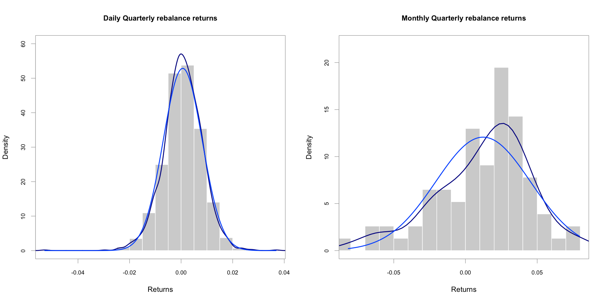

# Portfolio analysis project
## Finding a mixed risk efficient porfolio
*Omar El Omeiri Filho*<br><br>

---

### Table of contents

* <u>[1 - Summary](#summ)<br></u>
* <u>[2 - Preparations](#preps)<br></u>
* <u>[3 - Data](#data)<br></u>
    * <u>[3.1 - Importing data](#impdata)<br></u>
        * <u>[3.1.1 - IBOV composition](#import_ibovcomp)<br></u>
        * <u>[3.1.2 - Stock prices](#import_stockprc)<br></u>
        * <u>[3.1.3 - Benchmark](#import_benchmark)<br></u>
        * <u>[3.1.4 - Funds](#import_funds)<br></u>
        * <u>[3.1.5 - Risk free (Selic)](#import_rf)<br></u>
    * <u>[3.2 - Preprocessing](#prepr)<br></u>
        * <u>[3.2.1 - Stocks](#prepr_stocks)<br></u>
        * <u>[3.2.2 - Benchmark (IBOV)](#prepr_ibov)<br></u>
        * <u>[3.2.3 - Funds](#prepr_funds)<br></u>
        * <u>[3.2.4 - Risk free (Selic)](#prepr_rf)<br></u> 
* <u>[4 - Stock Screening](#stk_scr)<br></u>
    * <u>[4.1 - Sorting by risk and return](#sort_rsk_ret)<br></u>
    * <u>[4.2 - Correlation Matrix](#corr_mat)<br></u>
    * <u>[4.3 - Selecting least correlated pairs](#least_corr_pairs)<br></u>
    * <u>[4.3 - Covariance matrix](#cov_mat)<br></u>
* <u>[5 - Results](#results)<br></u>
    * <u>[5.1 - Individual Asset Performance](#indv_perf)</u>
        * <u>[5.1.1 - Stocks](#stk_perf)<br></u>
        * <u>[5.1.2 - Benchmark (IBOV)](#bench_perf)<br></u>
        * <u>[5.1.3 - Funds](#funds_perf)<br></u>
        * <u>[5.1.4 - Risk free (Selic)](#rf_perf)<br></u>
        * <u>[5.1.5 - Plot Risk/Return all assets indivudually](#plot_rsk_ret)<br></u>
        * <u>[5.1.6 - Plot risk contributions](#plot_rsk_contrib)<br></u>
    * <u>[5.2 - Portfolio Building](#portf_build)<br></u>
        * <u>[5.2.1 - Buy & Hold vs Quarterly rebalance](#plot_bhxrebal)<br></u>
        * <u>[5.2.2 - Weights over time comparison](#plot_wgtxtime)<br></u>
    * <u>[5.3 - Assessing performance](#assess_perf)<br></u>
        * <u>[5.3.1 - Buy & Hold](#bh_perf)<br></u>
        * <u>[5.3.2 - Quarterly rebalance](#rebal_perf)<br></u>
        * <u>[5.3.3 - Comparing portfolios](#bh_rebal_comp)<br></u>
    * <u>[5.4 - Portfolio optimization](#optim)<br></u>
        * <u>[5.4.1 - Creating base portfolio](#base_pf)<br></u>
        * <u>[5.4.2 - Second porftolio](#2nd_pf)<br></u>
        * <u>[5.4.3 - Third portfolio](#3rd_pf)<br></u>
    * <u>[5.5 - Final Comparison](#final_comp)<br></u>
* <u>[6 - Final Comments](#concl)<br></u>
        
        
---

# 1 - Summary <a class='anchor' id='summ'></a>


&nbsp;&nbsp;&nbsp;&nbsp;&nbsp;Portfolio optimization is the process of choosing assets and allocating the best set of weights between them as possible. In this project, we will focus on evaluating assets, filtering assets, building equal weights portfolios and later trying to optimize them under a set of constraints. We will focus on Brazilian assets, for this, we will collect data for all the stocks that compose the IBOV index, which is the main index that tracks the most significant companies of the Brazilian stock market. After that, the filtering process begins, which consists of finding stocks with simultaneously higher returns and lower risks. We will also collect data on 4 mutual funds, each belonging from a different class and level of risk.<br><br>

&nbsp;&nbsp;&nbsp;&nbsp;&nbsp;Once all the data is collected and preprocessed, we will evaluate how a fixed equal allocation of 10% for each of our 10 chosen assets compares against a portfolio that is rebalanced quarterly. This will be used as a measure of how well our optimized portfolios are performing. A fixed allocation portfolio is not actually fixed, if we distribute 10% of our total capital for each asset, as their individual values change, the weights vary simultaneously, this is illustrated here. This is the reason we will take a closer look ate the rebalanced portfolio. It ensures we remain with similar weights for the entire investment horizon. After establishing these two portfolios as benchmarks, we will move on to optimization and backtesting. For this study, optimization and backtesting will be done together, the process consists of running an optimization on the first 12 months of our data and using it as a starting point for our 8-month rolling optimization. Think of it like we were training our optimization in the first 12 months and feeding it new daily data, when 8 months have passed, we run another optimization and tweak our model to account for the different asset behavior of the period that passed.<br><br>

&nbsp;&nbsp;&nbsp;&nbsp;Finally, we will comment on how the different portfolios have performed and what might be the reasons for the different behavior.

# 2 - Preparations <a class='anchor' id='preps'></a>


```R
sup <- suppressPackageStartupMessages

sup(library(xts))
sup(library(PerformanceAnalytics))
sup(library(dplyr))
sup(library(tidyr))
sup(library(ggplot2))
sup(library(tseries))
sup(library(PortfolioAnalytics))
sup(library(gplots))
sup(library(quantmod))
sup(library(lubridate))
sup(library(data.table))
sup(library(stringr))
sup(library(corrplot))
sup(library(RColorBrewer))

opts <- options() 
```

# 3 - Data<a class='anchor' id='data'></a>

<span style="color:red"><u> For every piece of data collected, we will display the first few lines of it, just for better visualization.</u></span>

## 3.1 - Importing data <a class='anchor' id='impdata'></a>

### 3.1.1 - IBOV composition<a class='anchor' id='import_ibovcomp'></a>

This is a list containing all the instrument symbols of the stocks composing the IBOV index. This was scraped from this [link](http://www.b3.com.br/pt_br/market-data-e-indices/indices/indices-amplos/indice-ibovespa-ibovespa-composicao-da-carteira.htm).


```R
ibov_symbols <- as.list(read.csv('IBOV.csv', stringsAsFactors = F, header = F))
suffix = '.SA'

ibov_symbols_with_suffix <- lapply(ibov_symbols, function(x){paste(x,suffix, sep = '')})
ibov_symbols_with_suffix <- unlist(ibov_symbols_with_suffix, use.names = F)
ibov_symbols_with_suffix[1:4]
```


<ol class=list-inline>
	<li>'ITUB4.SA'</li>
	<li>'VALE3.SA'</li>
	<li>'BBDC4.SA'</li>
	<li>'PETR4.SA'</li>
</ol>


### 3.1.2 - Stock prices<a class='anchor' id='import_stockprc'></a>

Making good use of the quantmod library, we will use the function GetSympols to fetch data for all symbols contained in the list above.


```R
start_date = '2013-04-01'

stock_list <- lapply(ibov_symbols_with_suffix, function(x){suppressWarnings(getSymbols(x, from = start_date, auto.assign = F))})
```

    ‘getSymbols’ currently uses auto.assign=TRUE by default, but will
    use auto.assign=FALSE in 0.5-0. You will still be able to use
    ‘loadSymbols’ to automatically load data. getOption("getSymbols.env")
    and getOption("getSymbols.auto.assign") will still be checked for
    alternate defaults.
    
    This message is shown once per session and may be disabled by setting 
    options("getSymbols.warning4.0"=FALSE). See ?getSymbols for details.
    


```R
print(paste('This data frame contains OHLCV data for', length(stock_list), 'stocks.'))
as.data.frame(lapply(stock_list, head))
```

    [1] "This data frame contains OHLCV data for 65 stocks."


<table>
<caption>A data.frame: 6 × 390</caption>
<thead>
	<tr><th></th><th scope=col>ITUB4.SA.Open</th><th scope=col>ITUB4.SA.High</th><th scope=col>ITUB4.SA.Low</th><th scope=col>ITUB4.SA.Close</th><th scope=col>ITUB4.SA.Volume</th><th scope=col>ITUB4.SA.Adjusted</th><th scope=col>VALE3.SA.Open</th><th scope=col>VALE3.SA.High</th><th scope=col>VALE3.SA.Low</th><th scope=col>VALE3.SA.Close</th><th scope=col>⋯</th><th scope=col>ECOR3.SA.Low</th><th scope=col>ECOR3.SA.Close</th><th scope=col>ECOR3.SA.Volume</th><th scope=col>ECOR3.SA.Adjusted</th><th scope=col>SMLS3.SA.Open</th><th scope=col>SMLS3.SA.High</th><th scope=col>SMLS3.SA.Low</th><th scope=col>SMLS3.SA.Close</th><th scope=col>SMLS3.SA.Volume</th><th scope=col>SMLS3.SA.Adjusted</th></tr>
	<tr><th></th><th scope=col>&lt;dbl&gt;</th><th scope=col>&lt;dbl&gt;</th><th scope=col>&lt;dbl&gt;</th><th scope=col>&lt;dbl&gt;</th><th scope=col>&lt;dbl&gt;</th><th scope=col>&lt;dbl&gt;</th><th scope=col>&lt;dbl&gt;</th><th scope=col>&lt;dbl&gt;</th><th scope=col>&lt;dbl&gt;</th><th scope=col>&lt;dbl&gt;</th><th scope=col>⋯</th><th scope=col>&lt;dbl&gt;</th><th scope=col>&lt;dbl&gt;</th><th scope=col>&lt;dbl&gt;</th><th scope=col>&lt;dbl&gt;</th><th scope=col>&lt;dbl&gt;</th><th scope=col>&lt;dbl&gt;</th><th scope=col>&lt;dbl&gt;</th><th scope=col>&lt;dbl&gt;</th><th scope=col>&lt;dbl&gt;</th><th scope=col>&lt;dbl&gt;</th></tr>
</thead>
<tbody>
	<tr><th scope=row>2013-04-01</th><td>16.3013</td><td>16.4287</td><td>16.0280</td><td>16.1146</td><td>14616257</td><td>12.24826</td><td>34.81</td><td>34.92</td><td>33.94</td><td>34.00</td><td>⋯</td><td>17.12</td><td>17.24</td><td> 822800</td><td>11.65557</td><td>22.75</td><td>24.10</td><td>22.75</td><td>23.00</td><td>14324600</td><td>12.88748</td></tr>
	<tr><th scope=row>2013-04-02</th><td>16.3013</td><td>16.4287</td><td>15.7913</td><td>15.8277</td><td>20004511</td><td>12.03020</td><td>34.81</td><td>34.92</td><td>33.18</td><td>33.25</td><td>⋯</td><td>17.12</td><td>17.45</td><td>1294500</td><td>11.79755</td><td>23.35</td><td>23.50</td><td>21.90</td><td>23.01</td><td> 2470900</td><td>12.89308</td></tr>
	<tr><th scope=row>2013-04-03</th><td>15.8231</td><td>15.9097</td><td>15.6228</td><td>15.8550</td><td>18105280</td><td>12.05094</td><td>33.18</td><td>35.35</td><td>33.06</td><td>35.35</td><td>⋯</td><td>17.12</td><td>17.28</td><td>1227000</td><td>11.68262</td><td>22.70</td><td>23.40</td><td>22.15</td><td>23.40</td><td>  298600</td><td>13.11161</td></tr>
	<tr><th scope=row>2013-04-04</th><td>15.8823</td><td>15.9097</td><td>15.3541</td><td>15.4042</td><td>21925703</td><td>11.70830</td><td>34.95</td><td>35.20</td><td>34.09</td><td>34.19</td><td>⋯</td><td>16.83</td><td>16.96</td><td> 966600</td><td>11.46627</td><td>23.36</td><td>23.85</td><td>23.13</td><td>23.85</td><td> 1011000</td><td>13.36376</td></tr>
	<tr><th scope=row>2013-04-05</th><td>15.2949</td><td>15.4908</td><td>14.9899</td><td>15.3997</td><td>30436662</td><td>11.70488</td><td>33.74</td><td>34.83</td><td>33.44</td><td>34.56</td><td>⋯</td><td>16.59</td><td>16.88</td><td>1368600</td><td>11.41219</td><td>24.00</td><td>24.15</td><td>23.63</td><td>23.99</td><td>  176900</td><td>13.44220</td></tr>
	<tr><th scope=row>2013-04-08</th><td>15.4088</td><td>15.4680</td><td>15.1265</td><td>15.3906</td><td>13823447</td><td>11.69797</td><td>34.69</td><td>34.88</td><td>34.08</td><td>34.70</td><td>⋯</td><td>16.80</td><td>17.10</td><td> 997700</td><td>11.56092</td><td>24.00</td><td>24.85</td><td>23.96</td><td>24.10</td><td>  450900</td><td>13.50384</td></tr>
</tbody>
</table>


### 3.1.3 - Benchmark<a class='anchor' id='import_benchmark'></a>

The main stock market index in Brazil is the Bovespa index, which tracks the performance of biggest companies in the country. Later we will use it as a benchmark to compare it to our portfolio optimization.<br><br>


```R
bovespa <-  read.csv('Bovespa.csv', header = T)
head(bovespa)
```


<table>
<caption>A data.frame: 6 × 2</caption>
<thead>
	<tr><th scope=col>date</th><th scope=col>price</th></tr>
	<tr><th scope=col>&lt;fct&gt;</th><th scope=col>&lt;fct&gt;</th></tr>
</thead>
<tbody>
	<tr><td>27-Sep-19</td><td>105,077.63</td></tr>
	<tr><td>26-Sep-19</td><td>105,319.40</td></tr>
	<tr><td>25-Sep-19</td><td>104,480.98</td></tr>
	<tr><td>24-Sep-19</td><td>103,875.66</td></tr>
	<tr><td>23-Sep-19</td><td>104,637.82</td></tr>
	<tr><td>20-Sep-19</td><td>104,817.40</td></tr>
</tbody>
</table>


### 3.1.4 - Funds <a class='anchor' id='import_funds'></a>

#### [BNP Paribas Inflação RF](https://www.bnpparibas.com.br/DocumentosLaminasDemonstracoesAsset/Lamina_1006241_BNP_PARIBAS_INFLACAO_FIC_DE_FI.pdf)

This fund is is a relative low risk asset, it's main allocations are in national treasury bills with 0% leverage. Can negotiate derivatives only for risk minimization. More information in the title link.

| Type | Allocation
| --- | --- |
| Federal treasury | 95.08% |
| Buy-Back transactions on Federal Treasury | 4.06% |
| Derivatives | 2.12% |
| Private Credit | 0.99% |
| Bank Credit Bills | 0.14% |


```R
bnp_paribas_infl_rf <- read.csv('BNP_Paribas_Inflacao_RF.csv', header = T)
head(bnp_paribas_infl_rf)
```


<table>
<caption>A data.frame: 6 × 2</caption>
<thead>
	<tr><th scope=col>date</th><th scope=col>return</th></tr>
	<tr><th scope=col>&lt;fct&gt;</th><th scope=col>&lt;dbl&gt;</th></tr>
</thead>
<tbody>
	<tr><td>2019-9-26</td><td> 0.001771859</td></tr>
	<tr><td>2019-9-25</td><td> 0.003709570</td></tr>
	<tr><td>2019-9-24</td><td>-0.002165500</td></tr>
	<tr><td>2019-9-23</td><td>-0.001394080</td></tr>
	<tr><td>2019-9-20</td><td> 0.005631008</td></tr>
	<tr><td>2019-9-19</td><td> 0.005404344</td></tr>
</tbody>
</table>


#### [Brasil Capital 30](https://www.btgpactualdigital.com/fundos-de-investimento/brasil-capital-30-fic-fia) 

This equity fund is a riskier one, it's allocation is entirely on brazilian stocks. More information can be found at the link.


| Type | Allocation |
| --- | --- |
| Equities | min 95% max 100% |
| Federal Treasury | min 0% max 5% |


```R
brasil_capital_30_rv <- read.csv('Brasil_capita_30_RV.csv', header = T)
head(brasil_capital_30_rv)
```


<table>
<caption>A data.frame: 6 × 2</caption>
<thead>
	<tr><th scope=col>date</th><th scope=col>return</th></tr>
	<tr><th scope=col>&lt;fct&gt;</th><th scope=col>&lt;dbl&gt;</th></tr>
</thead>
<tbody>
	<tr><td>2019-9-26</td><td> 0.010700135</td></tr>
	<tr><td>2019-9-25</td><td> 0.002545867</td></tr>
	<tr><td>2019-9-24</td><td>-0.002404896</td></tr>
	<tr><td>2019-9-23</td><td>-0.007269663</td></tr>
	<tr><td>2019-9-20</td><td> 0.004232347</td></tr>
	<tr><td>2019-9-19</td><td> 0.010181300</td></tr>
</tbody>
</table>


#### [XP Top Crédito Privado](https://institucional.xpi.com.br/investimentos/fundos-de-investimento/detalhes-de-fundos-de-investimento.aspx?F=2832)

This is a moderate risk fixed income mutual fund. Its objective is to provide credit mainly to financial institutions and the government. Also, it aims to beat the brazilian risk free Selic or treasury bill with minimal risk.

| Type | Allocation (Up to) |
| --- | --- |
| Financial institutions | 20% |
| Publicly held companies | 10% |
| Natural person | 0% |
| Privately held companies | 5% |
| States and cities | 5% |
| Federal union | 100% |


```R
xp_top_rf <- read.csv('XP_top_cr_RF.csv', header = T)
head(xp_top_rf)
```


<table>
<caption>A data.frame: 6 × 2</caption>
<thead>
	<tr><th scope=col>date</th><th scope=col>return</th></tr>
	<tr><th scope=col>&lt;fct&gt;</th><th scope=col>&lt;dbl&gt;</th></tr>
</thead>
<tbody>
	<tr><td>2019-9-26</td><td>0.000277082</td></tr>
	<tr><td>2019-9-25</td><td>0.000291149</td></tr>
	<tr><td>2019-9-24</td><td>0.000243932</td></tr>
	<tr><td>2019-9-23</td><td>0.000322066</td></tr>
	<tr><td>2019-9-20</td><td>0.000239561</td></tr>
	<tr><td>2019-9-19</td><td>0.000256725</td></tr>
</tbody>
</table>


####  [BB Multimercado Macro LP](http://www37.bb.com.br/portalbb/fundosInvestimento/fundosinvestimento/gf07,802,10340,10340,6,0.bbx?fundo=153)

This is also a moderate risk multi-market mutual fund. Its main goal is diversification.

| Type | Allocation |
| --- | --- |
| Federal Treasury | 30% |
| Federal Treasury Buy-back transactions | 23% |
| Foreign investment | 17% |
| Equities | 13% |
| Private Credit bills | 13% |


```R
bb_lp_mm <- read.csv('BB_LP_MM.csv', header = T)
head(bb_lp_mm)
```


<table>
<caption>A data.frame: 6 × 2</caption>
<thead>
	<tr><th scope=col>Data</th><th scope=col>return</th></tr>
	<tr><th scope=col>&lt;fct&gt;</th><th scope=col>&lt;dbl&gt;</th></tr>
</thead>
<tbody>
	<tr><td>26/09/2019</td><td> 0.000492813</td></tr>
	<tr><td>25/09/2019</td><td> 0.001221173</td></tr>
	<tr><td>24/09/2019</td><td>-0.000921506</td></tr>
	<tr><td>23/09/2019</td><td>-0.000147337</td></tr>
	<tr><td>20/09/2019</td><td> 0.000577035</td></tr>
	<tr><td>19/09/2019</td><td>-0.000140340</td></tr>
</tbody>
</table>


### 3.1.5 Risk free ([Selic](https://www.bcb.gov.br/controleinflacao/historicotaxasjuros))<a class='anchor' id = 'import_rf'></a>

The Selic rate is the brazilian government base interest rate.


```R
selic <- read.csv('SELIC.csv', header = TRUE)
selic
```


<table>
<caption>A data.frame: 24 × 13</caption>
<thead>
	<tr><th scope=col>Year</th><th scope=col>Jan</th><th scope=col>Feb</th><th scope=col>Mar</th><th scope=col>Apr</th><th scope=col>May</th><th scope=col>Jun</th><th scope=col>Jul</th><th scope=col>Aug</th><th scope=col>Sep</th><th scope=col>Oct</th><th scope=col>Nov</th><th scope=col>Dec</th></tr>
	<tr><th scope=col>&lt;int&gt;</th><th scope=col>&lt;fct&gt;</th><th scope=col>&lt;fct&gt;</th><th scope=col>&lt;fct&gt;</th><th scope=col>&lt;fct&gt;</th><th scope=col>&lt;fct&gt;</th><th scope=col>&lt;fct&gt;</th><th scope=col>&lt;fct&gt;</th><th scope=col>&lt;fct&gt;</th><th scope=col>&lt;fct&gt;</th><th scope=col>&lt;fct&gt;</th><th scope=col>&lt;fct&gt;</th><th scope=col>&lt;fct&gt;</th></tr>
</thead>
<tbody>
	<tr><td>1996</td><td>2,58</td><td>2,35</td><td>2,22</td><td>2,07</td><td>2,01</td><td>1,98</td><td>1,93</td><td>1,97</td><td>1,90</td><td>1,86</td><td>1,80</td><td>1,80</td></tr>
	<tr><td>1997</td><td>1,73</td><td>1,67</td><td>1,64</td><td>1,66</td><td>1,58</td><td>1,61</td><td>1,60</td><td>1,59</td><td>1,59</td><td>1,67</td><td>3,04</td><td>2,97</td></tr>
	<tr><td>1998</td><td>2,67</td><td>2,13</td><td>2,20</td><td>1,71</td><td>1,63</td><td>1,60</td><td>1,70</td><td>1,48</td><td>2,49</td><td>2,94</td><td>2,63</td><td>2,40</td></tr>
	<tr><td>1999</td><td>2,18</td><td>2,38</td><td>3,33</td><td>2,35</td><td>2,02</td><td>1,67</td><td>1,66</td><td>1,57</td><td>1,49</td><td>1,38</td><td>1,39</td><td>1,60</td></tr>
	<tr><td>2000</td><td>1,46</td><td>1,45</td><td>1,45</td><td>1,30</td><td>1,49</td><td>1,39</td><td>1,31</td><td>1,41</td><td>1,22</td><td>1,29</td><td>1,22</td><td>1,20</td></tr>
	<tr><td>2001</td><td>1,27</td><td>1,02</td><td>1,26</td><td>1,19</td><td>1,34</td><td>1,27</td><td>1,50</td><td>1,60</td><td>1,32</td><td>1,53</td><td>1,39</td><td>1,39</td></tr>
	<tr><td>2002</td><td>1,53</td><td>1,25</td><td>1,37</td><td>1,48</td><td>1,41</td><td>1,33</td><td>1,54</td><td>1,44</td><td>1,38</td><td>1,65</td><td>1,54</td><td>1,74</td></tr>
	<tr><td>2003</td><td>1,97</td><td>1,83</td><td>1,78</td><td>1,87</td><td>1,97</td><td>1,86</td><td>2,08</td><td>1,77</td><td>1,68</td><td>1,64</td><td>1,34</td><td>1,37</td></tr>
	<tr><td>2004</td><td>1,27</td><td>1,08</td><td>1,38</td><td>1,18</td><td>1,23</td><td>1,23</td><td>1,29</td><td>1,29</td><td>1,25</td><td>1,21</td><td>1,25</td><td>1,48</td></tr>
	<tr><td>2005</td><td>1,38</td><td>1,22</td><td>1,53</td><td>1,41</td><td>1,50</td><td>1,59</td><td>1,51</td><td>1,66</td><td>1,50</td><td>1,41</td><td>1,38</td><td>1,47</td></tr>
	<tr><td>2006</td><td>1,43</td><td>1,15</td><td>1,42</td><td>1,08</td><td>1,28</td><td>1,18</td><td>1,17</td><td>1,26</td><td>1,06</td><td>1,09</td><td>1,02</td><td>0,99</td></tr>
	<tr><td>2007</td><td>1,08</td><td>0,87</td><td>1,05</td><td>0,94</td><td>1,03</td><td>0,91</td><td>0,97</td><td>0,99</td><td>0,80</td><td>0,93</td><td>0,84</td><td>0,84</td></tr>
	<tr><td>2008</td><td>0,93</td><td>0,80</td><td>0,84</td><td>0,90</td><td>0,88</td><td>0,96</td><td>1,07</td><td>1,02</td><td>1,10</td><td>1,18</td><td>1,02</td><td>1,12</td></tr>
	<tr><td>2009</td><td>1,05</td><td>0,86</td><td>0,97</td><td>0,84</td><td>0,77</td><td>0,76</td><td>0,79</td><td>0,69</td><td>0,69</td><td>0,69</td><td>0,66</td><td>0,73</td></tr>
	<tr><td>2010</td><td>0,66</td><td>0,59</td><td>0,76</td><td>0,67</td><td>0,75</td><td>0,79</td><td>0,86</td><td>0,89</td><td>0,85</td><td>0,81</td><td>0,81</td><td>0,93</td></tr>
	<tr><td>2011</td><td>0,86</td><td>0,84</td><td>0,92</td><td>0,84</td><td>0,99</td><td>0,96</td><td>0,97</td><td>1,07</td><td>0,94</td><td>0,88</td><td>0,86</td><td>0,91</td></tr>
	<tr><td>2012</td><td>0,89</td><td>0,75</td><td>0,82</td><td>0,71</td><td>0,74</td><td>0,64</td><td>0,68</td><td>0,69</td><td>0,54</td><td>0,61</td><td>0,55</td><td>0,55</td></tr>
	<tr><td>2013</td><td>0,60</td><td>0,49</td><td>0,55</td><td>0,61</td><td>0,60</td><td>0,61</td><td>0,72</td><td>0,71</td><td>0,71</td><td>0,81</td><td>0,72</td><td>0,79</td></tr>
	<tr><td>2014</td><td>0,85</td><td>0,79</td><td>0,77</td><td>0,82</td><td>0,87</td><td>0,82</td><td>0,95</td><td>0,87</td><td>0,91</td><td>0,95</td><td>0,84</td><td>0,96</td></tr>
	<tr><td>2015</td><td>0,94</td><td>0,82</td><td>1,04</td><td>0,95</td><td>0,99</td><td>1,07</td><td>1,18</td><td>1,11</td><td>1,11</td><td>1,11</td><td>1,06</td><td>1,16</td></tr>
	<tr><td>2016</td><td>1,06</td><td>1,00</td><td>1,16</td><td>1,06</td><td>1,11</td><td>1,16</td><td>1,11</td><td>1,22</td><td>1,11</td><td>1,05</td><td>1,04</td><td>1,12</td></tr>
	<tr><td>2017</td><td>1,09</td><td>0,87</td><td>1,05</td><td>0,79</td><td>0,93</td><td>0,81</td><td>0,80</td><td>0,80</td><td>0,64</td><td>0,64</td><td>0,57</td><td>0,54</td></tr>
	<tr><td>2018</td><td>0,58</td><td>0,47</td><td>0,53</td><td>0,52</td><td>0,52</td><td>0,52</td><td>0,54</td><td>0,57</td><td>0,47</td><td>0,54</td><td>0,49</td><td>0,49</td></tr>
	<tr><td>2019</td><td>0,54</td><td>0,49</td><td>0,47</td><td>0,52</td><td>0,54</td><td>0,47</td><td>0,57</td><td>0,50</td><td>    </td><td>    </td><td>    </td><td>    </td></tr>
</tbody>
</table>


## 3.2 - Preprocessing<a class='anchor' id='prepr'></a>

In this section, we are going to transform all the messy data into tidy data. e.g: Transforming the tables into date indexed time series objects, so we can go further with our analysis.

### 3.2.1 - Stocks<a class='anchor' id='prepr_stocks'></a>

Steps:<br>

1 - Extract all Adjusted close prices from the OHLCV data and merging into one xts(Extensible Time Series) object named stocks_cl.<br>
2 - Check for any missing values in stocks_cl.<br>
3 - Compute daily logarithmic returns and store it in stock_daily_returns.<br>
4 - Compute logarithmic montlhy returns and save it in monthly_stock_returns


```R
# Step 1

stocks_cl_split <- lapply(stock_list, function(x){Ad(x)})
stocks_cl <- do.call(merge, stocks_cl_split)

colnames(stocks_cl) <- substr(colnames(stocks_cl), start = 1, stop = 5)
stocks_cl <- stocks_cl[,-which(colSums(is.na(stocks_cl)) > 100)]
stocks_cl <- na.omit(stocks_cl)

print(periodicity(stocks_cl))
head(as.data.frame(stocks_cl))
```

    Daily periodicity from 2013-04-29 to 2019-09-30 


<table>
<caption>A data.frame: 6 × 56</caption>
<thead>
	<tr><th></th><th scope=col>ITUB4</th><th scope=col>VALE3</th><th scope=col>BBDC4</th><th scope=col>PETR4</th><th scope=col>B3SA3</th><th scope=col>PETR3</th><th scope=col>ABEV3</th><th scope=col>BBAS3</th><th scope=col>ITSA4</th><th scope=col>JBSS3</th><th scope=col>⋯</th><th scope=col>CYRE3</th><th scope=col>ENBR3</th><th scope=col>MRVE3</th><th scope=col>GOLL4</th><th scope=col>USIM5</th><th scope=col>IGTA3</th><th scope=col>GOAU4</th><th scope=col>MRFG3</th><th scope=col>ECOR3</th><th scope=col>SMLS3</th></tr>
	<tr><th></th><th scope=col>&lt;dbl&gt;</th><th scope=col>&lt;dbl&gt;</th><th scope=col>&lt;dbl&gt;</th><th scope=col>&lt;dbl&gt;</th><th scope=col>&lt;dbl&gt;</th><th scope=col>&lt;dbl&gt;</th><th scope=col>&lt;dbl&gt;</th><th scope=col>&lt;dbl&gt;</th><th scope=col>&lt;dbl&gt;</th><th scope=col>&lt;dbl&gt;</th><th scope=col>⋯</th><th scope=col>&lt;dbl&gt;</th><th scope=col>&lt;dbl&gt;</th><th scope=col>&lt;dbl&gt;</th><th scope=col>&lt;dbl&gt;</th><th scope=col>&lt;dbl&gt;</th><th scope=col>&lt;dbl&gt;</th><th scope=col>&lt;dbl&gt;</th><th scope=col>&lt;dbl&gt;</th><th scope=col>&lt;dbl&gt;</th><th scope=col>&lt;dbl&gt;</th></tr>
</thead>
<tbody>
	<tr><th scope=row>2013-04-29</th><td>11.35183</td><td>26.71754</td><td>11.98390</td><td>17.79558</td><td>10.49576</td><td>17.97430</td><td>12.48290</td><td>16.92499</td><td>4.014230</td><td>5.573283</td><td>⋯</td><td>14.49718</td><td>8.284427</td><td>5.685984</td><td>12.86</td><td>9.397206</td><td>21.66264</td><td>17.62742</td><td>6.48</td><td>11.95853</td><td>12.88748</td></tr>
	<tr><th scope=row>2013-04-30</th><td>11.64948</td><td>27.26620</td><td>12.38219</td><td>17.83998</td><td>10.80790</td><td>18.13308</td><td>13.27829</td><td>17.11479</td><td>4.156099</td><td>5.916397</td><td>⋯</td><td>14.84838</td><td>8.484675</td><td>5.806963</td><td>12.42</td><td>9.601916</td><td>21.88122</td><td>18.27056</td><td>6.83</td><td>12.15287</td><td>12.89308</td></tr>
	<tr><th scope=row>2013-05-02</th><td>11.51542</td><td>26.63007</td><td>12.35965</td><td>17.98206</td><td>11.04981</td><td>18.18978</td><td>12.97959</td><td>16.91821</td><td>4.112704</td><td>5.823664</td><td>⋯</td><td>14.49839</td><td>8.332738</td><td>5.638934</td><td>12.13</td><td>9.260730</td><td>22.45490</td><td>17.54589</td><td>6.87</td><td>12.17369</td><td>13.11161</td></tr>
	<tr><th scope=row>2013-05-03</th><td>11.67474</td><td>26.87657</td><td>12.33852</td><td>17.73342</td><td>11.19807</td><td>17.95354</td><td>13.27829</td><td>16.80299</td><td>4.172375</td><td>5.740203</td><td>⋯</td><td>14.68191</td><td>8.415636</td><td>5.618773</td><td>11.99</td><td>9.172997</td><td>22.70074</td><td>17.55495</td><td>6.86</td><td>12.06958</td><td>13.36376</td></tr>
	<tr><th scope=row>2013-05-06</th><td>11.65746</td><td>26.90042</td><td>12.22569</td><td>18.05310</td><td>11.14345</td><td>18.35986</td><td>13.24745</td><td>16.51831</td><td>4.163198</td><td>5.647469</td><td>⋯</td><td>14.23979</td><td>8.146351</td><td>5.511235</td><td>12.35</td><td>8.909798</td><td>22.85549</td><td>17.69083</td><td>6.97</td><td>11.90995</td><td>13.44220</td></tr>
	<tr><th scope=row>2013-05-07</th><td>12.00044</td><td>27.71149</td><td>12.56419</td><td>18.31062</td><td>11.22929</td><td>18.51105</td><td>13.27829</td><td>17.22324</td><td>4.232045</td><td>5.860756</td><td>⋯</td><td>14.37326</td><td>8.339670</td><td>5.692704</td><td>12.40</td><td>9.163249</td><td>22.76448</td><td>17.46437</td><td>7.04</td><td>12.18063</td><td>13.50384</td></tr>
</tbody>
</table>


```R
# Step 2
t(as.data.frame(colSums(is.na(stocks_cl))))
```


<table>
<caption>A matrix: 1 × 56 of type dbl</caption>
<thead>
	<tr><th></th><th scope=col>ITUB4</th><th scope=col>VALE3</th><th scope=col>BBDC4</th><th scope=col>PETR4</th><th scope=col>B3SA3</th><th scope=col>PETR3</th><th scope=col>ABEV3</th><th scope=col>BBAS3</th><th scope=col>ITSA4</th><th scope=col>JBSS3</th><th scope=col>⋯</th><th scope=col>CYRE3</th><th scope=col>ENBR3</th><th scope=col>MRVE3</th><th scope=col>GOLL4</th><th scope=col>USIM5</th><th scope=col>IGTA3</th><th scope=col>GOAU4</th><th scope=col>MRFG3</th><th scope=col>ECOR3</th><th scope=col>SMLS3</th></tr>
</thead>
<tbody>
	<tr><th scope=row>colSums(is.na(stocks_cl))</th><td>0</td><td>0</td><td>0</td><td>0</td><td>0</td><td>0</td><td>0</td><td>0</td><td>0</td><td>0</td><td>⋯</td><td>0</td><td>0</td><td>0</td><td>0</td><td>0</td><td>0</td><td>0</td><td>0</td><td>0</td><td>0</td></tr>
</tbody>
</table>


```R
# Step 3
stock_daily_returns <- lapply(stocks_cl, dailyReturn, type = 'log')
stock_daily_returns <- do.call(merge, stock_daily_returns)
colnames(stock_daily_returns) <- colnames(stocks_cl)

head(as.data.frame(stock_daily_returns))
```


<table>
<caption>A data.frame: 6 × 56</caption>
<thead>
	<tr><th></th><th scope=col>ITUB4</th><th scope=col>VALE3</th><th scope=col>BBDC4</th><th scope=col>PETR4</th><th scope=col>B3SA3</th><th scope=col>PETR3</th><th scope=col>ABEV3</th><th scope=col>BBAS3</th><th scope=col>ITSA4</th><th scope=col>JBSS3</th><th scope=col>⋯</th><th scope=col>CYRE3</th><th scope=col>ENBR3</th><th scope=col>MRVE3</th><th scope=col>GOLL4</th><th scope=col>USIM5</th><th scope=col>IGTA3</th><th scope=col>GOAU4</th><th scope=col>MRFG3</th><th scope=col>ECOR3</th><th scope=col>SMLS3</th></tr>
	<tr><th></th><th scope=col>&lt;dbl&gt;</th><th scope=col>&lt;dbl&gt;</th><th scope=col>&lt;dbl&gt;</th><th scope=col>&lt;dbl&gt;</th><th scope=col>&lt;dbl&gt;</th><th scope=col>&lt;dbl&gt;</th><th scope=col>&lt;dbl&gt;</th><th scope=col>&lt;dbl&gt;</th><th scope=col>&lt;dbl&gt;</th><th scope=col>&lt;dbl&gt;</th><th scope=col>⋯</th><th scope=col>&lt;dbl&gt;</th><th scope=col>&lt;dbl&gt;</th><th scope=col>&lt;dbl&gt;</th><th scope=col>&lt;dbl&gt;</th><th scope=col>&lt;dbl&gt;</th><th scope=col>&lt;dbl&gt;</th><th scope=col>&lt;dbl&gt;</th><th scope=col>&lt;dbl&gt;</th><th scope=col>&lt;dbl&gt;</th><th scope=col>&lt;dbl&gt;</th></tr>
</thead>
<tbody>
	<tr><th scope=row>2013-04-29</th><td> 0.000000000</td><td> 0.0000000000</td><td> 0.000000000</td><td> 0.000000000</td><td> 0.000000000</td><td> 0.000000000</td><td> 0.000000000</td><td> 0.000000000</td><td> 0.000000000</td><td> 0.00000000</td><td>⋯</td><td> 0.000000000</td><td> 0.00000000</td><td> 0.000000000</td><td> 0.00000000</td><td> 0.00000000</td><td> 0.000000000</td><td> 0.000000000</td><td> 0.000000000</td><td> 0.000000000</td><td>0.0000000000</td></tr>
	<tr><th scope=row>2013-04-30</th><td> 0.025882414</td><td> 0.0203278570</td><td> 0.032695644</td><td> 0.002491838</td><td> 0.029306271</td><td> 0.008794990</td><td> 0.061770804</td><td> 0.011151421</td><td> 0.034731346</td><td> 0.05974336</td><td>⋯</td><td> 0.023936621</td><td> 0.02388411</td><td> 0.021053515</td><td>-0.03481364</td><td> 0.02155025</td><td> 0.010039616</td><td> 0.035835270</td><td> 0.052604163</td><td> 0.016120028</td><td>0.0004345909</td></tr>
	<tr><th scope=row>2013-05-02</th><td>-0.011574542</td><td>-0.0236069197</td><td>-0.001822015</td><td> 0.007932700</td><td> 0.022135797</td><td> 0.003121783</td><td>-0.022752933</td><td>-0.011552151</td><td>-0.010496174</td><td>-0.01579803</td><td>⋯</td><td>-0.023853229</td><td>-0.01806950</td><td>-0.029362674</td><td>-0.02362635</td><td>-0.03617978</td><td> 0.025879804</td><td>-0.040470952</td><td> 0.005839433</td><td> 0.001711957</td><td>0.0168069761</td></tr>
	<tr><th scope=row>2013-05-03</th><td> 0.013740618</td><td> 0.0092137254</td><td>-0.001711058</td><td>-0.013923711</td><td> 0.013328747</td><td>-0.013072145</td><td> 0.022752933</td><td>-0.006834125</td><td> 0.014404698</td><td>-0.01443504</td><td>⋯</td><td> 0.012578788</td><td> 0.00989931</td><td>-0.003581728</td><td>-0.01160875</td><td>-0.00951882</td><td> 0.010889025</td><td> 0.000516113</td><td>-0.001456664</td><td>-0.008588663</td><td>0.0190483187</td></tr>
	<tr><th scope=row>2013-05-06</th><td>-0.001480529</td><td> 0.0008871825</td><td>-0.009187007</td><td> 0.017866587</td><td>-0.004889828</td><td> 0.022379335</td><td>-0.002325742</td><td>-0.017087449</td><td>-0.002201889</td><td>-0.01628710</td><td>⋯</td><td>-0.030576380</td><td>-0.03252131</td><td>-0.019324577</td><td> 0.02958309</td><td>-0.02911249</td><td> 0.006793871</td><td> 0.007710295</td><td> 0.015907783</td><td>-0.013314219</td><td>0.0058528938</td></tr>
	<tr><th scope=row>2013-05-07</th><td> 0.028996404</td><td> 0.0297052255</td><td> 0.027311711</td><td> 0.014163748</td><td> 0.007673394</td><td> 0.008200874</td><td> 0.002325742</td><td> 0.041790359</td><td> 0.016401799</td><td> 0.03707113</td><td>⋯</td><td> 0.009329588</td><td> 0.02345355</td><td> 0.032396619</td><td> 0.00404041</td><td> 0.02804924</td><td>-0.003990012</td><td>-0.012883565</td><td> 0.009992945</td><td> 0.022472884</td><td>0.0045747056</td></tr>
</tbody>
</table>


```R
# Step 4

monthly_closes <- lapply(stocks_cl, to.monthly)
monthly_closes <- lapply(monthly_closes, Cl)
monthly_closes <- lapply(names(monthly_closes), function(x){
                         temp_lst <- monthly_closes[[x]]
                         names(temp_lst) <- x
                         temp_lst
    })

monthly_stock_returns <- lapply(monthly_closes, monthlyReturn, type = 'log')
monthly_stock_returns <- do.call(merge, monthly_stock_returns)
monthly_stock_returns <- na.exclude(monthly_stock_returns)
colnames(monthly_stock_returns) <- colnames(stocks_cl)

print(periodicity(monthly_stock_returns))
head(as.data.frame(monthly_stock_returns))
```

    Monthly periodicity from Apr 2013 to Sep 2019 


<table>
<caption>A data.frame: 6 × 56</caption>
<thead>
	<tr><th></th><th scope=col>ITUB4</th><th scope=col>VALE3</th><th scope=col>BBDC4</th><th scope=col>PETR4</th><th scope=col>B3SA3</th><th scope=col>PETR3</th><th scope=col>ABEV3</th><th scope=col>BBAS3</th><th scope=col>ITSA4</th><th scope=col>JBSS3</th><th scope=col>⋯</th><th scope=col>CYRE3</th><th scope=col>ENBR3</th><th scope=col>MRVE3</th><th scope=col>GOLL4</th><th scope=col>USIM5</th><th scope=col>IGTA3</th><th scope=col>GOAU4</th><th scope=col>MRFG3</th><th scope=col>ECOR3</th><th scope=col>SMLS3</th></tr>
	<tr><th></th><th scope=col>&lt;dbl&gt;</th><th scope=col>&lt;dbl&gt;</th><th scope=col>&lt;dbl&gt;</th><th scope=col>&lt;dbl&gt;</th><th scope=col>&lt;dbl&gt;</th><th scope=col>&lt;dbl&gt;</th><th scope=col>&lt;dbl&gt;</th><th scope=col>&lt;dbl&gt;</th><th scope=col>&lt;dbl&gt;</th><th scope=col>&lt;dbl&gt;</th><th scope=col>⋯</th><th scope=col>&lt;dbl&gt;</th><th scope=col>&lt;dbl&gt;</th><th scope=col>&lt;dbl&gt;</th><th scope=col>&lt;dbl&gt;</th><th scope=col>&lt;dbl&gt;</th><th scope=col>&lt;dbl&gt;</th><th scope=col>&lt;dbl&gt;</th><th scope=col>&lt;dbl&gt;</th><th scope=col>&lt;dbl&gt;</th><th scope=col>&lt;dbl&gt;</th></tr>
</thead>
<tbody>
	<tr><th scope=row>Apr 2013</th><td> 0.000000000</td><td> 0.00000000</td><td> 0.000000000</td><td> 0.000000000</td><td> 0.000000000</td><td> 0.00000000</td><td> 0.00000000</td><td> 0.000000000</td><td> 0.00000000</td><td> 0.00000000</td><td>⋯</td><td> 0.00000000</td><td> 0.00000000</td><td> 0.000000000</td><td> 0.00000000</td><td> 0.00000000</td><td> 0.00000000</td><td> 0.00000000</td><td> 0.00000000</td><td> 0.00000000</td><td> 0.000000000</td></tr>
	<tr><th scope=row>May 2013</th><td> 0.057522341</td><td>-0.11876797</td><td> 0.042059494</td><td>-0.001494504</td><td> 0.023198598</td><td>-0.01153074</td><td> 0.00305168</td><td> 0.009671286</td><td> 0.04493804</td><td> 0.10692666</td><td>⋯</td><td>-0.04596009</td><td> 0.02252050</td><td>-0.225370600</td><td>-0.28821899</td><td>-0.10142028</td><td> 0.03378775</td><td>-0.20333210</td><td> 0.10154652</td><td>-0.00559422</td><td> 0.078939057</td></tr>
	<tr><th scope=row>Jun 2013</th><td>-0.117978681</td><td>-0.05189841</td><td>-0.176194227</td><td>-0.215569966</td><td>-0.128547610</td><td>-0.24823132</td><td> 0.01006594</td><td>-0.128833152</td><td>-0.13298767</td><td>-0.09137433</td><td>⋯</td><td>-0.09884582</td><td>-0.10385550</td><td>-0.013730245</td><td>-0.25423414</td><td>-0.17381842</td><td>-0.12151695</td><td>-0.02775397</td><td>-0.02139119</td><td>-0.07915835</td><td>-0.016194748</td></tr>
	<tr><th scope=row>Jul 2013</th><td> 0.013827918</td><td> 0.07044453</td><td>-0.035824257</td><td> 0.007393794</td><td>-0.001624599</td><td> 0.03844067</td><td> 0.03683484</td><td> 0.027275804</td><td> 0.01930196</td><td>-0.01712090</td><td>⋯</td><td> 0.05618409</td><td> 0.04149407</td><td>-0.003076669</td><td> 0.07982960</td><td> 0.15223912</td><td> 0.04536135</td><td> 0.13110497</td><td>-0.02601105</td><td> 0.02459920</td><td> 0.133531538</td></tr>
	<tr><th scope=row>Aug 2013</th><td>-0.002755902</td><td> 0.10167866</td><td> 0.003559422</td><td> 0.042073572</td><td>-0.034487769</td><td> 0.04264084</td><td>-0.02938135</td><td> 0.052846663</td><td> 0.00000000</td><td> 0.14446037</td><td>⋯</td><td>-0.02486160</td><td>-0.09404419</td><td> 0.251999000</td><td> 0.09391418</td><td> 0.17637188</td><td>-0.04445174</td><td> 0.15515062</td><td>-0.16718018</td><td>-0.04785588</td><td>-0.005327725</td></tr>
	<tr><th scope=row>Sep 2013</th><td> 0.105359262</td><td> 0.02359829</td><td> 0.131925042</td><td> 0.084064035</td><td> 0.067571081</td><td> 0.07673032</td><td> 0.08659073</td><td> 0.147996266</td><td> 0.09721098</td><td> 0.04775435</td><td>⋯</td><td> 0.06043961</td><td> 0.10582545</td><td> 0.098028711</td><td> 0.21308146</td><td> 0.02189529</td><td> 0.10107857</td><td> 0.01453686</td><td>-0.02154184</td><td> 0.02453303</td><td> 0.007246514</td></tr>
</tbody>
</table>


### 3.2.2 - Benchmark ([Ibov](http://www.bmfbovespa.com.br/pt_br/produtos/indices/indices-amplos/indice-bovespa-ibovespa.htm))<a class='anchor' id='prepr_ibov'></a>

Steps:<br>

1 - Transform data types.<br>
2 - Cast it to an xts object.<br>
3 - Calculating daily log returns.<br>
4 - Calculating cumulative returns.<br>


```R

# Step 1
bovespa$date <- as.Date(bovespa$date, '%d-%b-%y')
bovespa$price <- str_replace(bovespa$price, ',', '')
bovespa$price <- as.numeric(bovespa$price)

# Step 2
bovespa <- xts(bovespa$price, order.by = bovespa$date)
colnames(bovespa) <- c('Bovespa')

# Step 3
bovespa$returns <- dailyReturn(bovespa$Bovespa, type = 'log')
bovespa <- na.exclude(bovespa)

# Step 4
bovespa$cum_return <- cumprod(bovespa$returns + 1) - 1

periodicity(bovespa)
head(bovespa)
```


    Daily periodicity from 2013-04-01 to 2019-09-27 


                Bovespa       returns  cum_return
    2013-04-01 55902.18  0.0000000000  0.00000000
    2013-04-02 54889.10 -0.0182885916 -0.01828859
    2013-04-03 55562.74  0.0121980467 -0.00631363
    2013-04-04 54648.15 -0.0165974705 -0.02280631
    2013-04-05 55050.60  0.0073374000 -0.01563625
    2013-04-08 55092.31  0.0007573797 -0.01489071


### 3.2.3 - Funds<a class='anchor' id='prepr_funds'><a/>

    
All Funds go through the same preprocessing steps.<br><br>
    
Steps:<br>
    
1 - Transform data type.<br>
2 - Cast it to an xts object.<br>
3 - Subset it to match with date span from the stocks.<br>
4 - Calculate daily cummulative returns.


#### [BNP Paribas Inflação RF](https://www.bnpparibas.com.br/DocumentosLaminasDemonstracoesAsset/Lamina_1006241_BNP_PARIBAS_INFLACAO_FIC_DE_FI.pdf)


```R
# Step 1
bnp_paribas_infl_rf$date <- as.Date(bnp_paribas_infl_rf$date)

# Step 2
bnp_paribas_infl_rf <- xts(bnp_paribas_infl_rf$return, order.by = bnp_paribas_infl_rf$date)

# Step 3
bnp_paribas_infl_rf <- window(bnp_paribas_infl_rf, start = start_date)
colnames(bnp_paribas_infl_rf) <- c('bnp_paribas_RF')

# Step 4
bnp_paribas_infl_rf$bnp_cum_returns <- cumprod(bnp_paribas_infl_rf$bnp_paribas_RF + 1) - 1


periodicity(bnp_paribas_infl_rf)
head(bnp_paribas_infl_rf)
```


    Daily periodicity from 2013-04-01 to 2019-09-26 


               bnp_paribas_RF bnp_cum_returns
    2013-04-01   -0.008901162    -0.008901162
    2013-04-02    0.004871932    -0.004072596
    2013-04-03   -0.004623625    -0.008677391
    2013-04-04    0.002971614    -0.005731563
    2013-04-05    0.013272073     0.007464441
    2013-04-08   -0.002438654     0.005007584


#### [Brasil Capital 30](https://www.btgpactualdigital.com/fundos-de-investimento/brasil-capital-30-fic-fia) 


```R
# Step 1
brasil_capital_30_rv$date <- as.Date(brasil_capital_30_rv$date)

# Step 2
brasil_capital_30_rv <- xts(brasil_capital_30_rv$return, order.by = brasil_capital_30_rv$date)

# Step 3
brasil_capital_30_rv <- window(brasil_capital_30_rv, start = start_date)
colnames(brasil_capital_30_rv) <- c('br_cap_RV')

# Step 4
brasil_capital_30_rv$br_cap_cum_returns <- cumprod(brasil_capital_30_rv$br_cap_RV + 1) -1

periodicity(brasil_capital_30_rv)
head(brasil_capital_30_rv)
```


    Daily periodicity from 2013-04-01 to 2019-09-26 


                  br_cap_RV br_cap_cum_returns
    2013-04-01 -0.008865370        -0.00886537
    2013-04-02 -0.012858993        -0.02161036
    2013-04-03  0.007459487        -0.01431208
    2013-04-04 -0.011457641        -0.02560574
    2013-04-05  0.013881563        -0.01207962
    2013-04-08 -0.001290882        -0.01335491


#### [XP Top Crédito Privado](https://institucional.xpi.com.br/investimentos/fundos-de-investimento/detalhes-de-fundos-de-investimento.aspx?F=2832)


```R
# Step 1
xp_top_rf$date <- as.Date(xp_top_rf$date)

# Step 2
xp_top_rf <- xts(xp_top_rf$return, order.by = xp_top_rf$date)

# Step 3
xp_top_rf <- window(xp_top_rf, start = start_date)
colnames(xp_top_rf) <- c('xp_top_RF')

# Step 4
xp_top_rf$xp_top_cum_returns <- cumprod(xp_top_rf$xp_top_RF + 1) -1

periodicity(xp_top_rf)
head(xp_top_rf)
```


    Daily periodicity from 2013-04-01 to 2019-09-26 


                 xp_top_RF xp_top_cum_returns
    2013-04-01 0.000325332       0.0003253320
    2013-04-02 0.000283317       0.0006087412
    2013-04-03 0.000371912       0.0009808796
    2013-04-04 0.000319947       0.0013011404
    2013-04-05 0.000308854       0.0016103963
    2013-04-08 0.000227644       0.0018384069


####  [BB Multimercado Macro LP](http://www37.bb.com.br/portalbb/fundosInvestimento/fundosinvestimento/gf07,802,10340,10340,6,0.bbx?fundo=153)


```R
# Step 1
bb_lp_mm$Data <- as.Date(bb_lp_mm$Data, '%d/%m/%Y')

# Step 2
bb_lp_mm <- xts(bb_lp_mm$return, order.by = bb_lp_mm$Data)

# Step 3
bb_lp_mm <- window(bb_lp_mm, start = start_date)
colnames(bb_lp_mm) <- c('bb_lp_MM')

# Step 4
bb_lp_mm$bb_lp_cum_returns <- cumprod(bb_lp_mm$bb_lp_MM + 1) -1

periodicity(bb_lp_mm)
head(bb_lp_mm)
```


    Daily periodicity from 2013-04-01 to 2019-09-26 


                   bb_lp_MM bb_lp_cum_returns
    2013-04-01 -0.000701159      -0.000701159
    2013-04-02 -0.002315978      -0.003015513
    2013-04-03  0.001188750      -0.001830348
    2013-04-04 -0.001954082      -0.003780853
    2013-04-05  0.001482720      -0.002303739
    2013-04-08 -0.000190567      -0.002493867


### 3.2.4 - Risk free returns ([Selic](https://www.bcb.gov.br/controleinflacao/historicotaxasjuros))<a class='anchor' id='prepr_rf'></a>

In Brazil, the most important risk free benchmarks are the SELIC rate, which is the government basic interest rate, and the Interbank Deposit Certificates (CDI).<br>
CDI is the basic rate that banks pay to borrow capital from each other, and it is closely related to the SELIC rate.


```R

selic <- gather(selic, month, value, -Year) %>%
    arrange(Year)  %>%
    unite(col = 'date', c(Year, month), sep = '-') %>%
    mutate(date = as.yearmon(date, '%Y-%b')) %>%
    mutate(value = str_replace(value, ',', '.')) %>%
    mutate(value = as.numeric(value)/100)

selic <- xts(selic$value, order.by = selic$date)

start_date <- as.Date(as.yearmon(time(stocks_cl)[1]))
end_date <- as.Date(as.yearmon(time(stocks_cl)[nrow(stocks_cl)]))
selic <- selic[paste(start_date, end_date, sep = '/')]

selic <- merge(selic, cumprod(selic[,1] + 1) - 1)
selic <- na.exclude(selic)

colnames(selic) <- c('selic', 'cum_return')

periodicity(selic)
head(selic)
```

    Warning message:
    “attributes are not identical across measure variables;
    they will be dropped”


    Monthly periodicity from Apr 2013 to Aug 2019 


              selic cum_return
    Apr 2013 0.0061 0.00610000
    May 2013 0.0060 0.01213660
    Jun 2013 0.0061 0.01831063
    Jul 2013 0.0072 0.02564247
    Aug 2013 0.0071 0.03292453
    Sep 2013 0.0071 0.04025830


# 4 - Stock screening<a class='anchor' id='stk_scr'></a>

&nbsp;&nbsp;&nbsp;&nbsp;In this section of the document, we will focus on selecting 6 stocks from our universe of 68. At first I will calculate annualized returns and volatilities for all of them, then I will order them by volatility first and secondly by annualized return. From this ordered table I will pick the top 10 stocks. The following step is to calculate the correlation matrix between these top 10 stock and selecting the three lowest correlation pairs. The lower the correlation the better, it means that our stocks picks don't show similar movements, which minimizes risks.<br><br>

1 - Calculating annualized returns and volatilities for all stocks.<br>
2 - Ordering them by volatility and returns.<br>
3 - Selecting the 10 lowest volatilities with the higher returns<br>
4 - Calculating correlation matrix.<br>
5 - Filtering the 3 lowest correlation pairs.<br>
6 - Showing the covariance matrix

## 4.1 - Sorting by risk and returns<a class='anchor' id='sort_rsk_ret'></a>

Choosing the 10 lowest risk assets with the higher returns.


```R
# Step 1
mean_annual_ret <- lapply(lapply(stocks_cl, annualReturn), mean)
mean_annual_ret <- t(as.data.frame(mean_annual_ret))
mean_annual_sd <- t(as.data.frame(lapply(stock_daily_returns, sd)))
mean_annual_ret_sd <- merge(mean_annual_ret, mean_annual_sd, by = 'row.names')
colnames(mean_annual_ret_sd) <- c('inst_symbol', 'mean_ann_return', 'mean_daily_sd')

# Step 2
mean_annual_ret_sd <- mean_annual_ret_sd %>%
                         arrange(mean_daily_sd, desc(mean_ann_return))

# Step 3
mean_annual_10_best <- unlist(mean_annual_ret_sd[1:10,1])

print('The 10 best stocks are:')
as.character(mean_annual_10_best)
```

    [1] "The 10 best stocks are:"


<ol class=list-inline>
	<li>'ABEV3'</li>
	<li>'EQTL3'</li>
	<li>'EGIE3'</li>
	<li>'VIVT4'</li>
	<li>'WEGE3'</li>
	<li>'HYPE3'</li>
	<li>'UGPA3'</li>
	<li>'MULT3'</li>
	<li>'IGTA3'</li>
	<li>'RADL3'</li>
</ol>


## 4.2 -  Correlation Matrix<a class='anchor' id='corr_mat'></a>

&nbsp;&nbsp;&nbsp;&nbsp;The correlation is a statistical measure that quantifies how strongly related are two variables (in this case, the returns between stocks).
Our objective here is to remove any strongly correlated stocks. These highly related assets are a bad choice when it comes to portfolio optimization, as stock prices are considered random, a large positive or negative movement may occur at any time, so when choosing assets that behave as differently as possible would be a risk mitigating strategy.<br><br>
If the correlation > 0, than the variables show some level of positive linear dependency, in other words, when one increases, the other tends to increase together.<br>
If the correlation < 0, than the variables show some level of negative linear dependency, in other words, when one increases, the other tends to decrease.<br>
If the correlation ≈ 0, than the variables show no linear dependency.<br><br>


| Correlation | Categorization |
| --- | --- |
| ± 0.91 >< ± 1.0 | Suspiciously strong |
| ± 0.71 >< ± 0.90 | Very strong |
| ± 0.51 >< ± 0.70 | Moderate |
| ± 0.31 >< ± 0.50 | Weak |
| ± 0.10 >< ± 0.30 | Very weak |
| ± 0.00 >< 0.10 | Negligible |


```R
options(opts)


# Step 4
cor_matrix <- cor(stock_daily_returns[,c(mean_annual_10_best)], method = 'spearman')


corrplot(cor_matrix, method = 'color', order = 'hclust', addCoef.col = 'black')
```


## 4.3 - Selecting least correlated pairs<a class='anchor' id='least_corr_pairs'></a>


```R
# Step 5

cor_matrix <- as.data.frame(cor_matrix)
cor_matrix <- tibble::rownames_to_column(cor_matrix, "inst_symbol")

least_corr_6 <- cor_matrix %>%
                gather(name, cor, -inst_symbol) %>%
                arrange(cor) %>%
                select(inst_symbol, name)
least_corr_6 <- least_corr_6[1:20,]
least_corr_6 <- c(unlist(least_corr_6[,1]),unlist(least_corr_6[,2]))
least_corr_6 <- unique(least_corr_6)[1:6]

print('The 6 least correlated stocks are:')
least_corr_6
```

    [1] "The 6 least correlated stocks are:"


<ol class=list-inline>
	<li>'WEGE3'</li>
	<li>'EQTL3'</li>
	<li>'IGTA3'</li>
	<li>'RADL3'</li>
	<li>'ABEV3'</li>
	<li>'HYPE3'</li>
</ol>


### 4.4 - Covariance matrix<a class='anchor' id='cov_mat'></a>

The correlation measures how strong is the dependency between two variables. The covariance is essencially a measure of the correlation. It tells us how much one variable moves in relation to another.<br>

The covariance of two return series is the product between their volatilities and their correlation, and the covariance of an asset return with itself is its variance.


```R
# Step 6

cov_matrix <- cov(stock_daily_returns[,least_corr_6])


cov_matrix
```


<table>
<caption>A matrix: 6 × 6 of type dbl</caption>
<thead>
	<tr><th></th><th scope=col>WEGE3</th><th scope=col>EQTL3</th><th scope=col>IGTA3</th><th scope=col>RADL3</th><th scope=col>ABEV3</th><th scope=col>HYPE3</th></tr>
</thead>
<tbody>
	<tr><th scope=row>WEGE3</th><td>2.791743e-04</td><td>5.936253e-05</td><td>8.020509e-05</td><td>8.439626e-05</td><td>7.046118e-05</td><td>6.745253e-05</td></tr>
	<tr><th scope=row>EQTL3</th><td>5.936253e-05</td><td>2.241488e-04</td><td>1.005172e-04</td><td>6.823303e-05</td><td>5.545258e-05</td><td>7.830160e-05</td></tr>
	<tr><th scope=row>IGTA3</th><td>8.020509e-05</td><td>1.005172e-04</td><td>3.380198e-04</td><td>1.029953e-04</td><td>7.593472e-05</td><td>1.170855e-04</td></tr>
	<tr><th scope=row>RADL3</th><td>8.439626e-05</td><td>6.823303e-05</td><td>1.029953e-04</td><td>3.566003e-04</td><td>7.485928e-05</td><td>9.245968e-05</td></tr>
	<tr><th scope=row>ABEV3</th><td>7.046118e-05</td><td>5.545258e-05</td><td>7.593472e-05</td><td>7.485928e-05</td><td>2.038305e-04</td><td>7.428904e-05</td></tr>
	<tr><th scope=row>HYPE3</th><td>6.745253e-05</td><td>7.830160e-05</td><td>1.170855e-04</td><td>9.245968e-05</td><td>7.428904e-05</td><td>3.185641e-04</td></tr>
</tbody>
</table>


```R
# adding zero to the diagonal to show the colors better, to look at the variance (volatility^2), look at the table above


cov_matrix_diag_0 <- cov_matrix
diag(cov_matrix_diag_0) <- 0


par(bg = 'white')
options(repr.plot.width = 10, repr.plot.height = 10)

heatmap.2(cov_matrix_diag_0, dendrogram = 'none', trace = 'none',
          cellnote = formatC(cov_matrix_diag_0, format = 'e', digits = 1),
          notecex = 0.8, notecol = 'black', col = bluered(75),
         lwid = c(1,4), margin = c(6,8))
```


# 5 - Results<a class='anchor' id='results'></a>

## 5.1 Individual asset performance<a class='anchor' id='indv_perf'></a>

### 5.1.1 - Stocks<a class='anchor' id='stk_perf'></a>


```R
stock_daily_returns <- stock_daily_returns[,c(least_corr_6)]
stock_monthly_returns <- monthly_stock_returns[,c(least_corr_6)]
```


```R
par(mfrow = c(3,2), mar = rep(2, 4))
options(repr.plot.width = 12, repr.plot.height = 12)

lapply(stock_daily_returns, function(x){plot(cumprod(x + 1) - 1 , main = names(x), col = 1:8)})
```


    $WEGE3
    
    $EQTL3
    
    $IGTA3
    
    $RADL3
    
    $ABEV3
    
    $HYPE3


```R
(stock_stats <- do.call(cbind, lapply(stock_daily_returns, table.AnnualizedReturns, Rf = mean(selic$selic)/252)))
```


<table>
<caption>A data.frame: 3 × 6</caption>
<thead>
	<tr><th></th><th scope=col>WEGE3</th><th scope=col>EQTL3</th><th scope=col>IGTA3</th><th scope=col>RADL3</th><th scope=col>ABEV3</th><th scope=col>HYPE3</th></tr>
	<tr><th></th><th scope=col>&lt;dbl&gt;</th><th scope=col>&lt;dbl&gt;</th><th scope=col>&lt;dbl&gt;</th><th scope=col>&lt;dbl&gt;</th><th scope=col>&lt;dbl&gt;</th><th scope=col>&lt;dbl&gt;</th></tr>
</thead>
<tbody>
	<tr><th scope=row>Annualized Return</th><td>0.2137</td><td>0.2702</td><td>0.0876</td><td>0.2291</td><td>0.0452</td><td>0.1064</td></tr>
	<tr><th scope=row>Annualized Std Dev</th><td>0.2652</td><td>0.2377</td><td>0.2919</td><td>0.2998</td><td>0.2266</td><td>0.2833</td></tr>
	<tr><th scope=row>Annualized Sharpe (Rf=0.81%)</th><td>0.7689</td><td>1.0937</td><td>0.2702</td><td>0.7311</td><td>0.1623</td><td>0.3441</td></tr>
</tbody>
</table>


<br><br><br>

### 5.1.2 - Benchmark ([Ibov](http://www.bmfbovespa.com.br/pt_br/produtos/indices/indices-amplos/indice-bovespa-ibovespa.htm))<a class='anchor' id='bench_perf'></a>


```R
options(opts)

plot(bovespa$cum_return, main = 'IBOV')
```


```R
(bench_stats <- table.AnnualizedReturns(bovespa$returns))
```


<table>
<caption>A data.frame: 3 × 1</caption>
<thead>
	<tr><th></th><th scope=col>returns</th></tr>
	<tr><th></th><th scope=col>&lt;dbl&gt;</th></tr>
</thead>
<tbody>
	<tr><th scope=row>Annualized Return</th><td>0.0742</td></tr>
	<tr><th scope=row>Annualized Std Dev</th><td>0.2257</td></tr>
	<tr><th scope=row>Annualized Sharpe (Rf=0%)</th><td>0.3288</td></tr>
</tbody>
</table>


### 5.1.3 Funds <a class='anchor' id='funds_perf'></a>


```R
funds_list <- list(BNP_Paribas_Inflation_RF = bnp_paribas_infl_rf, Brasil_Capital_30_RV = brasil_capital_30_rv, XP_Top_RF = xp_top_rf, BB_lp_MM = bb_lp_mm)
funds_daily_returns <- do.call(merge, funds_list)


funds_monthly_split <- split(funds_daily_returns[,c(1,3,5,7)], 'months')
funds_monthly_returns <- lapply(funds_monthly_split, function(x){
                                    cumprod(x + 1) - 1
})

funds_monthly_returns <- lapply(funds_monthly_returns, last)
funds_monthly_returns <- do.call(rbind, funds_monthly_returns)
time(funds_monthly_returns) <- as.yearmon(time(funds_monthly_returns), '%Y-%m-%d')


plot_funds_list <- list(BNP_Paribas_Inflation_RF = bnp_paribas_infl_rf$bnp_cum_returns, Brasil_Capital_30_RV = brasil_capital_30_rv$br_cap_cum_returns, XP_Top_RF = xp_top_rf$xp_top_cum_returns, BB_lp_MM = bb_lp_mm$bb_lp_cum_returns)

plot_funds_list <- lapply(names(plot_funds_list), function(x){
                            temp_list <- plot_funds_list[[x]]
                            names(temp_list) <- x
                            temp_list
})

par(mfrow = c(2,2))
options(repr.plot.width = 12)

lapply(plot_funds_list, function(x){plot(x, main = names(x), col = 1:8)})
```


    [[1]]
    
    [[2]]
    
    [[3]]
    
    [[4]]


```R
(funds_stats <- do.call(cbind, lapply(funds_list , function(x){table.AnnualizedReturns(x[,1], Rf = 0.06/12)})))
```


<table>
<caption>A data.frame: 3 × 4</caption>
<thead>
	<tr><th></th><th scope=col>bnp_paribas_RF</th><th scope=col>br_cap_RV</th><th scope=col>xp_top_RF</th><th scope=col>bb_lp_MM</th></tr>
	<tr><th></th><th scope=col>&lt;dbl&gt;</th><th scope=col>&lt;dbl&gt;</th><th scope=col>&lt;dbl&gt;</th><th scope=col>&lt;dbl&gt;</th></tr>
</thead>
<tbody>
	<tr><th scope=row>Annualized Return</th><td> 0.1231</td><td> 0.1566</td><td>   0.1079</td><td>  0.0795</td></tr>
	<tr><th scope=row>Annualized Std Dev</th><td> 0.0836</td><td> 0.1517</td><td>   0.0062</td><td>  0.0487</td></tr>
	<tr><th scope=row>Annualized Sharpe (Rf=126%)</th><td>-8.1582</td><td>-4.4340</td><td>-110.3827</td><td>-14.2782</td></tr>
</tbody>
</table>


### 5.1.4 Risk free ([Selic](https://www.bcb.gov.br/controleinflacao/historicotaxasjuros)) <a class='anchor' id='rf_perf'></a>


```R
options(opts)
plot(selic$cum_return)
```


```R
table.AnnualizedReturns(selic$selic, Rf = NA)
```


<table>
<caption>A data.frame: 3 × 1</caption>
<thead>
	<tr><th></th><th scope=col>selic</th></tr>
	<tr><th></th><th scope=col>&lt;dbl&gt;</th></tr>
</thead>
<tbody>
	<tr><th scope=row>Annualized Return</th><td>0.1015</td></tr>
	<tr><th scope=row>Annualized Std Dev</th><td>0.0081</td></tr>
	<tr><th scope=row>Annualized Sharpe (Rf=NA%)</th><td>0.0000</td></tr>
</tbody>
</table>


### 5.1.5 - Plotting risk/return for each asset individually<a class='anchor' id='plot_rsk_ret'></a>

Here we can see the relation between annualized returns and the risk or volatility for each one of our chosen assets, this relation is called the Sharpe Ratio. It measures how much return is expected for each unit of risk.


```R
daily_asset_returns <- na.omit(merge(stock_daily_returns, funds_daily_returns[,c(1,3,5,7)]))
monthly_returns_with_rf <- na.omit(merge(stock_monthly_returns, selic$selic, funds_monthly_returns))
```


```R
mean_monthly_returns_with_rf <- colMeans(monthly_returns_with_rf)
mean_monthly_vol <- apply(monthly_returns_with_rf, 2, sd)


options(opts)
options(repr.plot.width = 10)

par(bg = 'white')
plot(mean_monthly_vol*100, mean_monthly_returns_with_rf*100, ylim = c(-0.07, 2.5), xlim = c(0, 15.8), axes = F,
     xlab = 'Mean monthly volatility', ylab = 'Mean monthly return', main = ' Individual Sharpe ratios', pch = 21, col = 'blue', bg = 'red')
mtext(side=3, line=0, at=7.5, cex=0.7, 'Assuming risk free = 0')
text(mean_monthly_vol*100, mean_monthly_returns_with_rf*100, labels = names(mean_monthly_returns_with_rf), adj = c(-0.2,1))
abline(h = 0, lty = 3, col = 'red')
axis(side = 1, at = seq(-1,15,1))
axis(side = 2, at = seq(-1, 2.6, 0.2))

abline(v = seq(-1,15,1), h = seq(-1, 2.6, 0.2), lty = 3, col = 'lightgray')
```


### 5.1.6 - Plot risk contributions

Assuming equal allocation for all our assets we can compute the percentage of risk caused by each one of them. Later we wil use this as a optimization strategy called risk budgetting.


```R
equal_weights <- rep(1/(ncol(monthly_returns_with_rf) - 1), ncol(monthly_returns_with_rf) - 1)

selic_col <- which(colnames(monthly_returns_with_rf) == 'selic')

vol_budget <- StdDev(monthly_returns_with_rf[,-selic_col], portfolio_method = 'component', weights = equal_weights)
vol_budget <- lapply(vol_budget, function(x){ifelse(x < 0, 0, x)})


weights_perc_risk <- cbind(equal_weights, vol_budget$pct_contrib_StdDev)
colnames(weights_perc_risk) <- c('weights', 'perc_risk_contibution')
```


```R
par(bg = 'white', mfrow = c(1,2), mar = c(4,4,4,4))
options(repr.plot.width = 15)

pct <- round(weights_perc_risk[,1]/sum(weights_perc_risk[,1])*100)
lbls <- rownames(weights_perc_risk)
lbls <- paste(lbls, pct)
lbls <- paste(lbls,"%",sep="")
pie(weights_perc_risk[,1], labels = lbls, radius = 2.5, main = "Portfolio weights")


pct <- round(weights_perc_risk[,2]/sum(weights_perc_risk[,2])*100)
lbls <- rownames(weights_perc_risk)
lbls <- paste(lbls, pct)
lbls <- paste(lbls,"%",sep="")
pie(weights_perc_risk[,2], labels = lbls, radius = 2.5, main = 'Portfolio risk contribution')
```


<br><br><br>

## 5.2 Portfolio building<a class='anchor' id='portf_build'></a>

### 5.2.1 - Comparing rebalancing vs buy and hold<a class='anchor' id='plot_bhxrebal'></a>

&nbsp;&nbsp;&nbsp;&nbsp;In this section, we will create to simple non-optimized portfolios for later comparison. For the first we will allocate equal weights between all assets and leave them for the whole investment horizon. As you will see later, as assets move differently from each other, our initial equal weights change over time. To remedy this problem, we will create a second portfolio that in every quarter of the year the weights are rebalanced to ensure we remain with similar weights for the entire investment horizon.<br>

The portfolios are named Buy & Hold and Quarterly rabalance.<br>

 After presenting the two portfolios characteristics, we wil compare them and comment on the difference in their behavior.


```R
pf_bh <- Return.portfolio(R = daily_asset_returns, weights = equal_weights, verbose = T)
pf_rebal <- Return.portfolio(R = daily_asset_returns, weights = equal_weights, rebalance_on = 'quarters', verbose = T)
```


```R
options(opts)

pf_returns <- merge(cumprod(pf_bh$returns + 1) - 1, cumprod(pf_rebal$returns + 1) - 1)
names(pf_returns) <- c('Buy and hold', 'Quarterly rebalance')

plot(pf_returns, legend.loc = 'topleft', main = 'Equal weights portfolios')

```


#### 5.2.2 - Weight over time comparison<a class='anchor' id='plot_wgtxtime'></a>

#### Buy and Hold

We can see that the weights are very far from constant, in this case we have a complete lack of control over our allocation.


```R
col_vector <- brewer.pal(n = 10, name = "Paired")

eop_weights_bh <- pf_bh$EOP.Weight
plot(eop_weights_bh, legend.loc = 'topleft', main = 'Rolling weights', col = col_vector)
```


#### Quarterly rebalance

This is a much more controlled situation, where we change the allocation according to asset price variation. This ensures we have roughly 10% of our capital allocated for each asset at all times.


```R
eop_weights_rebal <- pf_rebal$EOP.Weight
p <- plot(eop_weights_rebal, ylim = c(0.03, 0.32), col = col_vector)
     addLegend(legend.loc = "topleft", legend.names = names(pf_bh$EOP.Weight), col = col_vector, ncol = 1, on = 1, fill = col_vector)
```


## 5.3 - Assessing performance<a class='anchor' id='assess_perf'></a>

### 5.3.1 - Buy & Hold<a class='anchor' id='bh_perf'></a>

#### Portfolio vs Risk-free return


```R
selic_pf_bh_returns <- merge(pf_bh$returns, cumprod(pf_bh$returns + 1) - 1 , selic$selic, selic$cum_return)
selic_pf_bh_returns <- na.approx(selic_pf_bh_returns)
colnames(selic_pf_bh_returns) <- c('pf_bh_return', 'pf_bh_cum_return','selic_returns', 'selic_cum_return')


par(bg = 'white')

p <- plot(selic_pf_bh_returns[,c(2,4)], main = 'Risk-free vs Buy & Hold')
addLegend('topleft', legend.names = c('Risk-free', 'Buy & Hold'), col = 2:1, fill = 2:1)
```


#### Calendar returns


```R
options(opts)


monthly_pf_bh <- Return.portfolio(monthly_returns_with_rf[,-selic_col], equal_weights)
pf_bh_returns <- table.CalendarReturns(monthly_pf_bh)


df <- as.data.frame(t(pf_bh_returns))
df$month <- rownames(df)
rownames(df) <- c()
df[nrow(df), ncol(df)] <- 'Annual'


df2 <- melt(df, id.var = "month")
df2$month <- factor(df2$month, ordered = T, levels = c('Jan', 'Feb', 'Mar', 'Apr', 'May', 'Jun', 'Jul', 'Aug', 'Sep', 'Oct', 'Nov', 'Dec', 'Annual'))

print(ggplot(df2, aes(x=month, y=variable)) + 
      geom_tile( fill= "white", color = "white") +
      geom_text(aes(label=value, color= value < 0)) +
      scale_color_manual(guide=FALSE, values=c("black", "red")) +
      ggtitle("Calendar Monthly Returns (Buy & Hold)") +  
      theme(axis.text = element_text(face = "bold")))
```

    Warning message:
    “Removed 7 rows containing missing values (geom_text).”


#### 1 year rolling performance

From this plot, we can see our portfolio is very risky, annualized returns vary a lot and volatility remains constantly high, above 10%.


```R
charts.RollingPerformance(pf_bh$returns, 252, Rf = mean(selic$selic)/12)
```


#### Return distribution

&nbsp;&nbsp;&nbsp;&nbsp;Daily returns seem to be close from a normal distribution, which is a good sign of return predictability, in other words, less chances of huge surprises. In the other hand, the look of the monthly returns distribution is not so good, the tails are very fat (negative kurtosis), that indicates we have higher chances of going through very large unexpected movements either positive or negative. But there is also good news, for the monthly distribution, we have some left skew, which means we have higher chances of monthly positive returns.<br><br>


```R
par(bg = 'white', mfrow = c(1,2))
options(repr.plot.width = 14)

chart.Histogram(pf_bh$returns, methods = c('add.density', 'add.normal'), main = 'Daily Buy & Hold returns', breaks = 20)
legend('topleft', legend = c('Normal distribution', 'Return distribution'), col=c('blue', 'blue4'), lty = 1, cex = 0.7)
chart.Histogram(monthly_pf_bh, methods = c('add.density', 'add.normal'), main = 'Monthly Buy & Hold returns', breaks = 20)
```


#### Drawdowns

&nbsp;&nbsp;&nbsp;&nbsp;The drawdowns are always negative and they account for whenever our total cummulative returns fall below the maximum total return. We can see that we have 3 period with major losses. The two biggest drawdonws were two major economic crises in Brazil. In 2015 we lost approximately 10% of our current capital it took roughly 10 months for total recovery. In 2018 we lost 15% of our investments, it also took almost a year for full recovery.


```R
dr_dw_calc <- pf_bh$returns
time(dr_dw_calc) <- as.Date(time(dr_dw_calc))

table.Drawdowns(dr_dw_calc)
```


<table>
<caption>A data.frame: 5 × 7</caption>
<thead>
	<tr><th scope=col>From</th><th scope=col>Trough</th><th scope=col>To</th><th scope=col>Depth</th><th scope=col>Length</th><th scope=col>To Trough</th><th scope=col>Recovery</th></tr>
	<tr><th scope=col>&lt;date&gt;</th><th scope=col>&lt;date&gt;</th><th scope=col>&lt;date&gt;</th><th scope=col>&lt;dbl&gt;</th><th scope=col>&lt;dbl&gt;</th><th scope=col>&lt;dbl&gt;</th><th scope=col>&lt;dbl&gt;</th></tr>
</thead>
<tbody>
	<tr><td>2018-01-29</td><td>2018-06-27</td><td>2019-02-01</td><td>-0.1640</td><td>249</td><td>103</td><td>146</td></tr>
	<tr><td>2015-07-16</td><td>2016-01-20</td><td>2016-03-18</td><td>-0.1426</td><td>166</td><td>127</td><td> 39</td></tr>
	<tr><td>2013-05-23</td><td>2014-02-03</td><td>2014-06-09</td><td>-0.1219</td><td>224</td><td>139</td><td> 85</td></tr>
	<tr><td>2016-10-25</td><td>2016-12-20</td><td>2017-02-15</td><td>-0.1002</td><td> 78</td><td> 39</td><td> 39</td></tr>
	<tr><td>2019-02-05</td><td>2019-03-27</td><td>2019-06-03</td><td>-0.0746</td><td> 81</td><td> 35</td><td> 46</td></tr>
</tbody>
</table>


```R
options(opts)
chart.Drawdown(monthly_pf_bh)
```


#### Portfolio performance summary

We will comment on this summary a bit later.


```R
print_portf_stats <- function(monthly_returns, daily_returns = NULL, Rf, name){


stats <- table.AnnualizedReturns(monthly_returns, Rf = Rf/12)
colnames(stats) <- c(name)

stats <- rbind('Avg. Monthly Return' = mean(monthly_returns), stats)
stats <- rbind('Avg. Daily Return' = mean(daily_returns), stats)
stats <- rbind(stats, 'Daily Volatility' = sd(daily_returns))
stats <- rbind(stats, 'Monthly Volatility' = sd(monthly_returns))
stats <- rbind(stats, 'Annualized Volatility' = StdDev.annualized(daily_returns)[1])
stats <- rbind(stats, 'Daily Skewness' = skewness(daily_returns))
stats <- rbind(stats, 'Monthly Skewness' = skewness(monthly_returns))
stats <- rbind(stats, 'Daily Kurtosis' = kurtosis(daily_returns))
stats <- rbind(stats, 'Monthly Kurtosis' = kurtosis(monthly_returns))
stats <- rbind(stats, 'Daily Semi Deviation' = SemiDeviation(daily_returns)[1])
stats <- rbind(stats, 'Monthly Semi Deviation' = SemiDeviation(monthly_returns)[1])
stats <- rbind(stats, 'Daily Value at Risk' = VaR(daily_returns, p = 0.05)[1])
stats <- rbind(stats, 'Monthly Value at Risk' = VaR(monthly_returns, p = 0.05)[1])
stats <- rbind(stats, 'Daily Expected Shortfall' = ES(daily_returns, p = 0.05)[1])
stats <- rbind(stats, 'Monthly Expected Shortfall' = ES(monthly_returns, p = 0.05)[1])

    return (stats)
    
    }
```


```R
(pf_bh_stats <- print_portf_stats(monthly_pf_bh,pf_bh$returns, Rf = mean(selic$selic), name = 'BH_stats'))
```


<table>
<caption>A data.frame: 18 × 1</caption>
<thead>
	<tr><th></th><th scope=col>BH_stats</th></tr>
	<tr><th></th><th scope=col>&lt;dbl&gt;</th></tr>
</thead>
<tbody>
	<tr><th scope=row>Avg. Daily Return</th><td> 0.0006023161</td></tr>
	<tr><th scope=row>Avg. Monthly Return</th><td> 0.0118236560</td></tr>
	<tr><th scope=row>Annualized Return</th><td> 0.1437000000</td></tr>
	<tr><th scope=row>Annualized Std Dev</th><td> 0.1175000000</td></tr>
	<tr><th scope=row>Annualized Sharpe (Rf=0.81%)</th><td> 1.1454000000</td></tr>
	<tr><th scope=row>Daily Volatility</th><td> 0.0078765878</td></tr>
	<tr><th scope=row>Monthly Volatility</th><td> 0.0339258378</td></tr>
	<tr><th scope=row>Annualized Volatility</th><td> 0.1250369547</td></tr>
	<tr><th scope=row>Daily Skewness</th><td>-0.2468010686</td></tr>
	<tr><th scope=row>Monthly Skewness</th><td>-0.5706958918</td></tr>
	<tr><th scope=row>Daily Kurtosis</th><td> 1.4275831733</td></tr>
	<tr><th scope=row>Monthly Kurtosis</th><td> 0.3937716856</td></tr>
	<tr><th scope=row>Daily Semi Deviation</th><td> 0.0056857943</td></tr>
	<tr><th scope=row>Monthly Semi Deviation</th><td> 0.0258438986</td></tr>
	<tr><th scope=row>Daily Value at Risk</th><td>-0.0126658980</td></tr>
	<tr><th scope=row>Monthly Value at Risk</th><td>-0.0486095601</td></tr>
	<tr><th scope=row>Daily Expected Shortfall</th><td>-0.0185563020</td></tr>
	<tr><th scope=row>Monthly Expected Shortfall</th><td>-0.0673946182</td></tr>
</tbody>
</table>


<br><br><br>

### 5.3.2 - Quarterly rebalancing<a class='anchor' id='rebal_perf'></a>

#### Portfolio vs Risk free return


```R
selic_pf_rebal_returns <- merge(pf_rebal$returns, cumprod(pf_bh$returns + 1) - 1 , selic$selic, selic$cum_return)
selic_pf_rebal_returns <- na.approx(selic_pf_rebal_returns)
colnames(selic_pf_rebal_returns) <- c('pf_rebal_return', 'pf_rebal_cum_return','selic_returns', 'selic_cum_return')


par(bg = 'white')

p <- plot(selic_pf_rebal_returns[,c(2,4)], main = 'Risk-free vs Quarterly rebalance')
addLegend('topleft', legend.names = c('Risk-free', 'Quarterly rebalance'), col = 2:1, fill = 2:1)

```


#### Calendar returns


```R
monthly_pf_rebal <- Return.portfolio(monthly_returns_with_rf[,-selic_col], equal_weights, rebalance_on = 'quarters')

pf_rebal_returns <- table.CalendarReturns(monthly_pf_rebal)

df <- as.data.frame(t(pf_rebal_returns))
df$month <- rownames(df)
rownames(df) <- c()
df[nrow(df), ncol(df)] <- 'Annual'

df2 <- melt(df, id.var = "month")
df2$month <- factor(df2$month, ordered = T, levels = c('Jan', 'Feb', 'Mar', 'Apr', 'May', 'Jun', 'Jul', 'Aug', 'Sep', 'Oct', 'Nov', 'Dec', 'Annual'))

ggplot(df2, aes(x=month, y=variable)) + 
      geom_tile( fill= "white", color = "white") +
      geom_text(aes(label=value, color= value < 0)) +
      scale_color_manual(guide=FALSE, values=c("black", "red")) +
      ggtitle("Calendar Monthly Returns (Quarterly rebalance)") +
      theme(axis.text = element_text(face = "bold"))
```

    Warning message:
    “Removed 7 rows containing missing values (geom_text).”


#### 1 year rolling performance


```R
charts.RollingPerformance(pf_rebal$returns, 252, Rf = mean(selic$selic)/12)
```


#### Returns distribution


```R
par(bg = 'white', mfrow = c(1,2))
options(repr.plot.width = 14)

chart.Histogram(pf_rebal$returns, methods = c('add.density', 'add.normal'), main = 'Daily Quarterly rebalance returns', breaks = 20)
chart.Histogram(monthly_pf_rebal, methods = c('add.density', 'add.normal'), main = 'Monthly Quarterly rebalance returns', breaks = 20)
```





#### Drawdowns


```R
# 5 biggest drawdowns

dr_dw_calc <- pf_rebal$returns
time(dr_dw_calc) <- as.Date(time(dr_dw_calc))

table.Drawdowns(dr_dw_calc)
```


<table>
<caption>A data.frame: 5 × 7</caption>
<thead>
	<tr><th scope=col>From</th><th scope=col>Trough</th><th scope=col>To</th><th scope=col>Depth</th><th scope=col>Length</th><th scope=col>To Trough</th><th scope=col>Recovery</th></tr>
	<tr><th scope=col>&lt;date&gt;</th><th scope=col>&lt;date&gt;</th><th scope=col>&lt;date&gt;</th><th scope=col>&lt;dbl&gt;</th><th scope=col>&lt;dbl&gt;</th><th scope=col>&lt;dbl&gt;</th><th scope=col>&lt;dbl&gt;</th></tr>
</thead>
<tbody>
	<tr><td>2018-01-29</td><td>2018-06-14</td><td>2019-01-16</td><td>-0.1511</td><td>238</td><td> 94</td><td>144</td></tr>
	<tr><td>2015-07-16</td><td>2015-09-28</td><td>2016-03-08</td><td>-0.1285</td><td>158</td><td> 52</td><td>106</td></tr>
	<tr><td>2013-05-23</td><td>2014-02-03</td><td>2014-06-06</td><td>-0.1213</td><td>223</td><td>139</td><td> 84</td></tr>
	<tr><td>2016-10-24</td><td>2016-12-20</td><td>2017-02-15</td><td>-0.0937</td><td> 79</td><td> 40</td><td> 39</td></tr>
	<tr><td>2014-08-28</td><td>2014-10-23</td><td>2014-11-21</td><td>-0.0779</td><td> 61</td><td> 41</td><td> 20</td></tr>
</tbody>
</table>


```R
options(opts)

chart.Drawdown(monthly_pf_rebal)
```


#### Portfolio performance summary


```R
(pf_rebal_stats <- print_portf_stats(monthly_pf_rebal, pf_rebal$returns, Rf = mean(selic$selic), name = 'Rebal_stats'))
```


<table>
<caption>A data.frame: 18 × 1</caption>
<thead>
	<tr><th></th><th scope=col>Rebal_stats</th></tr>
	<tr><th></th><th scope=col>&lt;dbl&gt;</th></tr>
</thead>
<tbody>
	<tr><th scope=row>Avg. Daily Return</th><td> 0.000623209</td></tr>
	<tr><th scope=row>Avg. Monthly Return</th><td> 0.012291197</td></tr>
	<tr><th scope=row>Annualized Return</th><td> 0.150500000</td></tr>
	<tr><th scope=row>Annualized Std Dev</th><td> 0.114500000</td></tr>
	<tr><th scope=row>Annualized Sharpe (Rf=0.81%)</th><td> 1.233800000</td></tr>
	<tr><th scope=row>Daily Volatility</th><td> 0.007547806</td></tr>
	<tr><th scope=row>Monthly Volatility</th><td> 0.033063713</td></tr>
	<tr><th scope=row>Annualized Volatility</th><td> 0.119817707</td></tr>
	<tr><th scope=row>Daily Skewness</th><td>-0.270664296</td></tr>
	<tr><th scope=row>Monthly Skewness</th><td>-0.593970380</td></tr>
	<tr><th scope=row>Daily Kurtosis</th><td> 2.200338188</td></tr>
	<tr><th scope=row>Monthly Kurtosis</th><td> 0.277177008</td></tr>
	<tr><th scope=row>Daily Semi Deviation</th><td> 0.005450640</td></tr>
	<tr><th scope=row>Monthly Semi Deviation</th><td> 0.025329932</td></tr>
	<tr><th scope=row>Daily Value at Risk</th><td>-0.012022932</td></tr>
	<tr><th scope=row>Monthly Value at Risk</th><td>-0.046884177</td></tr>
	<tr><th scope=row>Daily Expected Shortfall</th><td>-0.018709725</td></tr>
	<tr><th scope=row>Monthly Expected Shortfall</th><td>-0.063996227</td></tr>
</tbody>
</table>


### 5.3.3 - Comparing portfolios<a class='anchor' id='bh_rebal_comp'></a>


```R
comp <- cbind(pf_bh_stats, pf_rebal_stats)
comp$diff <- comp$Rebal_stats - comp$BH_stats
comp <- comp[!(rownames(comp) %in% c('Annualized Std Dev')),]

format(comp, scientific=F)
```


<table>
<caption>A data.frame: 17 × 3</caption>
<thead>
	<tr><th></th><th scope=col>BH_stats</th><th scope=col>Rebal_stats</th><th scope=col>diff</th></tr>
	<tr><th></th><th scope=col>&lt;I&lt;chr&gt;&gt;</th><th scope=col>&lt;I&lt;chr&gt;&gt;</th><th scope=col>&lt;I&lt;chr&gt;&gt;</th></tr>
</thead>
<tbody>
	<tr><th scope=row>Avg. Daily Return</th><td> 0.0006023161</td><td> 0.000623209</td><td> 0.00002089294</td></tr>
	<tr><th scope=row>Avg. Monthly Return</th><td> 0.0118236560</td><td> 0.012291197</td><td> 0.00046754111</td></tr>
	<tr><th scope=row>Annualized Return</th><td> 0.1437000000</td><td> 0.150500000</td><td> 0.00680000000</td></tr>
	<tr><th scope=row>Annualized Sharpe (Rf=0.81%)</th><td> 1.1454000000</td><td> 1.233800000</td><td> 0.08840000000</td></tr>
	<tr><th scope=row>Daily Volatility</th><td> 0.0078765878</td><td> 0.007547806</td><td>-0.00032878171</td></tr>
	<tr><th scope=row>Monthly Volatility</th><td> 0.0339258378</td><td> 0.033063713</td><td>-0.00086212462</td></tr>
	<tr><th scope=row>Annualized Volatility</th><td> 0.1250369547</td><td> 0.119817707</td><td>-0.00521924785</td></tr>
	<tr><th scope=row>Daily Skewness</th><td>-0.2468010686</td><td>-0.270664296</td><td>-0.02386322786</td></tr>
	<tr><th scope=row>Monthly Skewness</th><td>-0.5706958918</td><td>-0.593970380</td><td>-0.02327448862</td></tr>
	<tr><th scope=row>Daily Kurtosis</th><td> 1.4275831733</td><td> 2.200338188</td><td> 0.77275501432</td></tr>
	<tr><th scope=row>Monthly Kurtosis</th><td> 0.3937716856</td><td> 0.277177008</td><td>-0.11659467714</td></tr>
	<tr><th scope=row>Daily Semi Deviation</th><td> 0.0056857943</td><td> 0.005450640</td><td>-0.00023515419</td></tr>
	<tr><th scope=row>Monthly Semi Deviation</th><td> 0.0258438986</td><td> 0.025329932</td><td>-0.00051396681</td></tr>
	<tr><th scope=row>Daily Value at Risk</th><td>-0.0126658980</td><td>-0.012022932</td><td> 0.00064296598</td></tr>
	<tr><th scope=row>Monthly Value at Risk</th><td>-0.0486095601</td><td>-0.046884177</td><td> 0.00172538314</td></tr>
	<tr><th scope=row>Daily Expected Shortfall</th><td>-0.0185563020</td><td>-0.018709725</td><td>-0.00015342333</td></tr>
	<tr><th scope=row>Monthly Expected Shortfall</th><td>-0.0673946182</td><td>-0.063996227</td><td> 0.00339839111</td></tr>
</tbody>
</table>


### Quarterly rebalance vs Buy & Hold conclusion
<br>


1 - Monthly Avg. return is practically the same <br>
2 - Annualized returns are similar<br>
3 - Sharpe ratio are also very similar (SR > 1 is barely acceptable)<br>
4 - Mean daily volatility difference between porfolios is negligible<br>
5 - Mean monthly volatility show same behavior for the rebalanced portfolio<br>
6 - Annualized volatility is 0.2% higher for the rebalanced portfolio (annual 0.2% is negligible)<br>
7 - Skewness is higher for the rebalanced portfolio<br>
8 - Monthly return kurtosis is a little lower for the rebalanced portfolio<br>
9 - Semi Deviation is lower for the rebalanced portfolio (negligible)<br>
10 - Value at Risk (p = 5%) higher for the rebalanced portfolio but also negligible<br>
11 - Expected Shortfall is higher for the rebalanced portfolio (0.02% is also negligible)<br><br><br>


#### Interpretation

1 - Return: Higher returns are better.<br>
2 - Volatility: Higher volatility is riskier.<br>
3 - Sharpe ratio: It is the risk adjusted return, in other words, it is the ratio between mean returns and volatility (Higher SR is better, but in this case, values are too low, let's hope we can improve this in th optimization).<br>
4 - Skewness: Lower skewness is better, it tells us that there is a higher probability of positive returns over negative returns.<br>
5 - Kurtosis: Higher kurtosis is worse, it indicates a higher probability of large positive or negative returns when compared to a normal distribution.(Higher kurtosis increases risk)<br>
6 - Semi Deviation: Semi deviation is the measure of return variability only for returns below the average. Higher Semi Deviation is worse, it says that the less than average returns have more variability.<br>
7 - Value at Risk: VaR is always negative, this is the negative return (loss) in which there is only a 5% chance of worse returns.<br>
8 - Expected Shortfall: ES is also always negative, it is the average of the 5% worst returns, so a higher (negative) ES is better. It indicates that the average of the 5% worst returns is higher.<br><br>

#### Further clarification

1 - The standard deviation gives equal importance to positive and negative returns in calculating the return variability. When the return distribution is asymmetric (skewed), investors use additional risk measures that focus on describing the potential losses. One such measure of downside risk is the Semi-Deviation. The Semi-Deviation is the calculation of the variability of returns below the mean return.

2 - Another more popular measure is the so-called Value-at-Risk (or VaR). Loosely speaking, the VaR corresponds to the 5% quantile of the return distribution, meaning that a more negative return can only happen with a probability of 5%.

3 - The expected shortfall is another measure of risk that focuses on the average loss below the 5% VaR quantile.

4 - The volatility, semi-deviation, value-at-risk, and expected shortfall are all measures that describe risk over 1 period. These metrics do not do a great job at describing the worst case risk of buying at a peak, and selling at a trough. This sort of risk can be quantified by analyzing the portfolio's drawdowns, or peak-to-trough decline in cumulative returns.  


#### Comment<br>

&nbsp;&nbsp;&nbsp;&nbsp;Looking at these results, we can notice that the both portfolios are very similar. There is no preffered portfolio for this case, usually rebalanced portfolios behave a little better. In this case, we have good returns, but very high volatility as well. It is a very risky portfolio.

<br><br><br><br>

## 5.4 - Portfolio optimization<a class='anchor' id='optim'></a>


&nbsp;&nbsp;&nbsp;&nbsp;In this section we will create 3 different portfolios, they will all be trained using the first 12 months of data and rebalanced every 8 months.<br>
1 - The first one has only one major constraint that prevents any allocation to be higher than 40% for any idividual asset.<br><br>
2 - Then for the second we will add a group constraint, we will group the low risk assets and restric them to have at least 50% and maximum 70% of our total capital. This will obviously reduce returns, while hopefully greatly reducing risks.<br><br>

3 - For the third optimization we will add a risk budget constraint, this will ensure no individual asset can account for more than 10% of our total risk.

#### Treating data to feed to portfolio optimization


```R
monthly_asset_returns <- monthly_returns_with_rf[,-selic_col]
time(monthly_asset_returns) <- as.Date(time(monthly_asset_returns))
```

### 5.4.1 - Creating baseline portfolio<a class='anchor' id='base_pf'></a>

&nbsp;&nbsp;&nbsp;&nbsp;This portfolio is constrained with an almost full investment, which means we have to have at least 98% of our capital invested and we can borrow only 1% of our capital (leverage). There is no possibility of shorting assets, this is specified in the 'long_only' constraint.The third constraint is the 'box' constraint which means we cannot have more than 40% of our total capital invested in a single asset.  We compute the moments (expected returns, and covariance matrix) using the robust boudt method, calculating these metrics with sample data is sub-optimal. The objectives of this optimization is minimize risk and maximize the expected returns (Sharpe ratio). This porfolio optimization will probably perform OK but it is likely we need more constraints riskwise, this will be accounted for in the next portfolios.


```R
base_pf <- portfolio.spec(colnames(monthly_asset_returns))

base_pf <- add.constraint(portfolio = base_pf, type = 'weight_sum', max_sum = 1.01, min_sum = 0.98)

base_pf <- add.constraint(portfolio = base_pf, type = 'long_only')

moments <- set.portfolio.moments(monthly_asset_returns, portfolio = base_pf, method = 'boudt', k = 3)

base_pf <- add.constraint(portfolio = base_pf, type = 'box', min = 0, max = 0.4)

base_pf <- add.objective(portfolio = base_pf, type = 'return', name = 'mean')

base_pf <- add.objective(portfolio = base_pf, type = 'risk', name = 'var')

#rp <- random_portfolios(base_pf, 50000, 'sample')


```

#### Running the portfolio with backtest


```R
backtest_1 <- optimize.portfolio.rebalancing(monthly_asset_returns, portfolio = base_pf, optimize_method = 'random', rebalance_on = 'quarters', training_period = 12, rolling_window = 8)
```

#### Calculating returns


```R
backtest_1_monthly_returns <- Return.portfolio(monthly_asset_returns, weights = extractWeights(backtest_1))
backtest_1_daily_returns <- Return.portfolio(daily_asset_returns, weights = extractWeights(backtest_1))
```

    Warning message in Return.portfolio.geometric(R = R, weights = weights, wealth.index = wealth.index, :
    “The weights for one or more periods do not sum up to 1: assuming a return of 0 for the residual weights”Warning message in Return.portfolio.geometric(R = R, weights = weights, wealth.index = wealth.index, :
    “The weights for one or more periods do not sum up to 1: assuming a return of 0 for the residual weights”


```R
plot(cumprod(backtest_1_monthly_returns + 1) - 1, main = 'Baseline Portfolio Returns')
```


#### Plotting the allocation in relation to time


```R
par(bg = 'white')
chart.Weights(backtest_1, col = col_vector)
```


#### Base portfolio summary


```R
(backtest_1_stats <- print_portf_stats(backtest_1_monthly_returns, backtest_1_daily_returns, Rf = mean(selic$selic), name = 'Portfolio_1'))
```


<table>
<caption>A data.frame: 18 × 1</caption>
<thead>
	<tr><th></th><th scope=col>Portfolio_1</th></tr>
	<tr><th></th><th scope=col>&lt;dbl&gt;</th></tr>
</thead>
<tbody>
	<tr><th scope=row>Avg. Daily Return</th><td> 0.0005597767</td></tr>
	<tr><th scope=row>Avg. Monthly Return</th><td> 0.0079686865</td></tr>
	<tr><th scope=row>Annualized Return</th><td> 0.0930000000</td></tr>
	<tr><th scope=row>Annualized Std Dev</th><td> 0.1119000000</td></tr>
	<tr><th scope=row>Annualized Sharpe (Rf=0.81%)</th><td> 0.7530000000</td></tr>
	<tr><th scope=row>Daily Volatility</th><td> 0.0060752720</td></tr>
	<tr><th scope=row>Monthly Volatility</th><td> 0.0322969287</td></tr>
	<tr><th scope=row>Annualized Volatility</th><td> 0.0964419526</td></tr>
	<tr><th scope=row>Daily Skewness</th><td>-0.3047612004</td></tr>
	<tr><th scope=row>Monthly Skewness</th><td>-1.7741695689</td></tr>
	<tr><th scope=row>Daily Kurtosis</th><td> 5.2360868107</td></tr>
	<tr><th scope=row>Monthly Kurtosis</th><td> 6.3178470559</td></tr>
	<tr><th scope=row>Daily Semi Deviation</th><td> 0.0044575144</td></tr>
	<tr><th scope=row>Monthly Semi Deviation</th><td> 0.0264484158</td></tr>
	<tr><th scope=row>Daily Value at Risk</th><td>-0.0093033240</td></tr>
	<tr><th scope=row>Monthly Value at Risk</th><td>-0.0549262973</td></tr>
	<tr><th scope=row>Daily Expected Shortfall</th><td>-0.0168545416</td></tr>
	<tr><th scope=row>Monthly Expected Shortfall</th><td>-0.1096915708</td></tr>
</tbody>
</table>


## 5.4.2 - Second portfolio<a class='anchor' id='2nd_pf'></a>

For this next portfolio we add another constraint, which groups all the less risky assets and allows allocations from 50% to 70% for this group. Meaning we cannot have less than 50% or more than 70% of our capital invested in low risk assets. 


```R
base_pf <- add.constraint(base_pf, type = 'group', groups = list(c(7, 9, 10)), group_min = 0.5, group_max = 0.7)
```

#### Running the optimization with backtest


```R
backtest_2 <- optimize.portfolio.rebalancing(monthly_asset_returns, portfolio = base_pf, optimize_method = 'random', rebalance_on = 'quarters', training_period = 12, rolling_window = 8)
```


```R
backtest_2_daily_returns <-  Return.portfolio(daily_asset_returns, weights = extractWeights(backtest_2))
backtest_2_monthly_returns <- Return.portfolio(monthly_asset_returns, weights = extractWeights(backtest_2))


plot(cumprod(backtest_2_monthly_returns + 1) - 1)
```

    Warning message in Return.portfolio.geometric(R = R, weights = weights, wealth.index = wealth.index, :
    “The weights for one or more periods do not sum up to 1: assuming a return of 0 for the residual weights”Warning message in Return.portfolio.geometric(R = R, weights = weights, wealth.index = wealth.index, :
    “The weights for one or more periods do not sum up to 1: assuming a return of 0 for the residual weights”


#### Plotting allocation in relation to time


```R
par(bg = 'white')

chart.Weights(backtest_2, col = col_vector)
```


#### Portfolio summary


```R
(backtest_2_stats <- print_portf_stats(backtest_2_monthly_returns, backtest_2_daily_returns, Rf = mean(selic$selic), name = 'Portfolio_2'))
```


<table>
<caption>A data.frame: 18 × 1</caption>
<thead>
	<tr><th></th><th scope=col>Portfolio_2</th></tr>
	<tr><th></th><th scope=col>&lt;dbl&gt;</th></tr>
</thead>
<tbody>
	<tr><th scope=row>Avg. Daily Return</th><td> 0.0006263858</td></tr>
	<tr><th scope=row>Avg. Monthly Return</th><td> 0.0112963950</td></tr>
	<tr><th scope=row>Annualized Return</th><td> 0.1407000000</td></tr>
	<tr><th scope=row>Annualized Std Dev</th><td> 0.0799000000</td></tr>
	<tr><th scope=row>Annualized Sharpe (Rf=0.81%)</th><td> 1.6466000000</td></tr>
	<tr><th scope=row>Daily Volatility</th><td> 0.0051291692</td></tr>
	<tr><th scope=row>Monthly Volatility</th><td> 0.0230792559</td></tr>
	<tr><th scope=row>Annualized Volatility</th><td> 0.0814230373</td></tr>
	<tr><th scope=row>Daily Skewness</th><td>-0.1972409816</td></tr>
	<tr><th scope=row>Monthly Skewness</th><td>-0.7513044283</td></tr>
	<tr><th scope=row>Daily Kurtosis</th><td> 2.9548209914</td></tr>
	<tr><th scope=row>Monthly Kurtosis</th><td> 2.8697362759</td></tr>
	<tr><th scope=row>Daily Semi Deviation</th><td> 0.0037090570</td></tr>
	<tr><th scope=row>Monthly Semi Deviation</th><td> 0.0175239676</td></tr>
	<tr><th scope=row>Daily Value at Risk</th><td>-0.0077852726</td></tr>
	<tr><th scope=row>Monthly Value at Risk</th><td>-0.0296942105</td></tr>
	<tr><th scope=row>Daily Expected Shortfall</th><td>-0.0125933333</td></tr>
	<tr><th scope=row>Monthly Expected Shortfall</th><td>-0.0565583853</td></tr>
</tbody>
</table>


### Third portfolio<a class='anchor' id='3rd_pf'></a>

This third optimization we add another constraint, which is the risk budget constraint. It permits a single asset to account at maximum 10% of our total risk. In the event of one asset accounting for more than 10% we have to reduce the allocation for this asset.


```R
base_pf <- add.objective(portfolio = base_pf, type = 'risk_budget', name = 'StdDev', min_prisk = 0.05, max_prisk = 0.8)
```

#### Running optimization with backtest


```R
backtest_3 <- optimize.portfolio.rebalancing(monthly_asset_returns, portfolio = base_pf, optimize_method = 'random', trace = T, rebalance_on = 'quarters', training_period = 12, rolling_window = 8)
```

#### Calculating returns


```R
backtest_3_daily_returns <-  Return.portfolio(daily_asset_returns, weights = extractWeights(backtest_3))
backtest_3_monthly_returns <- Return.portfolio(monthly_asset_returns, weights = extractWeights(backtest_3))

options(opts)
plot(cumprod(backtest_3_monthly_returns + 1) - 1)
```

    Warning message in Return.portfolio.geometric(R = R, weights = weights, wealth.index = wealth.index, :
    “The weights for one or more periods do not sum up to 1: assuming a return of 0 for the residual weights”Warning message in Return.portfolio.geometric(R = R, weights = weights, wealth.index = wealth.index, :
    “The weights for one or more periods do not sum up to 1: assuming a return of 0 for the residual weights”


#### Plotting allocation in relation to time


```R
par(bg = 'white')

chart.Weights(backtest_3, col = col_vector)
```


#### Portfolio summary


```R
(backtest_3_stats <- print_portf_stats(backtest_3_monthly_returns, backtest_3_daily_returns, Rf = mean(selic$selic), name = 'Portfolio_3'))
```


<table>
<caption>A data.frame: 18 × 1</caption>
<thead>
	<tr><th></th><th scope=col>Portfolio_3</th></tr>
	<tr><th></th><th scope=col>&lt;dbl&gt;</th></tr>
</thead>
<tbody>
	<tr><th scope=row>Avg. Daily Return</th><td> 0.000594019</td></tr>
	<tr><th scope=row>Avg. Monthly Return</th><td> 0.012801098</td></tr>
	<tr><th scope=row>Annualized Return</th><td> 0.162200000</td></tr>
	<tr><th scope=row>Annualized Std Dev</th><td> 0.069000000</td></tr>
	<tr><th scope=row>Annualized Sharpe (Rf=0.81%)</th><td> 2.217700000</td></tr>
	<tr><th scope=row>Daily Volatility</th><td> 0.004815081</td></tr>
	<tr><th scope=row>Monthly Volatility</th><td> 0.019913095</td></tr>
	<tr><th scope=row>Annualized Volatility</th><td> 0.076437041</td></tr>
	<tr><th scope=row>Daily Skewness</th><td>-0.276721934</td></tr>
	<tr><th scope=row>Monthly Skewness</th><td>-0.453522188</td></tr>
	<tr><th scope=row>Daily Kurtosis</th><td> 1.653758458</td></tr>
	<tr><th scope=row>Monthly Kurtosis</th><td> 0.573329733</td></tr>
	<tr><th scope=row>Daily Semi Deviation</th><td> 0.003486761</td></tr>
	<tr><th scope=row>Monthly Semi Deviation</th><td> 0.014848732</td></tr>
	<tr><th scope=row>Daily Value at Risk</th><td>-0.007534269</td></tr>
	<tr><th scope=row>Monthly Value at Risk</th><td>-0.021942454</td></tr>
	<tr><th scope=row>Daily Expected Shortfall</th><td>-0.011383731</td></tr>
	<tr><th scope=row>Monthly Expected Shortfall</th><td>-0.034051134</td></tr>
</tbody>
</table>


## 5.5 - Final Comparison<a class='anchor' id='final_comp'></a>


```R
comp_backtest <- cbind(pf_bh_stats, pf_rebal_stats,backtest_1_stats, backtest_2_stats, backtest_3_stats)
colnames(comp_backtest) <- c('Portfolio Buy & Hold','Portfolio Quarterly rebalance','Optimized Portfolio 1','Optimized Portfolio 2','Optimized Portfolio 3')

comp_backtest
```


<table>
<caption>A data.frame: 18 × 5</caption>
<thead>
	<tr><th></th><th scope=col>Portfolio Buy &amp; Hold</th><th scope=col>Portfolio Quarterly rebalance</th><th scope=col>Optimized Portfolio 1</th><th scope=col>Optimized Portfolio 2</th><th scope=col>Optimized Portfolio 3</th></tr>
	<tr><th></th><th scope=col>&lt;dbl&gt;</th><th scope=col>&lt;dbl&gt;</th><th scope=col>&lt;dbl&gt;</th><th scope=col>&lt;dbl&gt;</th><th scope=col>&lt;dbl&gt;</th></tr>
</thead>
<tbody>
	<tr><th scope=row>Avg. Daily Return</th><td> 0.0006023161</td><td> 0.000623209</td><td> 0.0005597767</td><td> 0.0006263858</td><td> 0.000594019</td></tr>
	<tr><th scope=row>Avg. Monthly Return</th><td> 0.0118236560</td><td> 0.012291197</td><td> 0.0079686865</td><td> 0.0112963950</td><td> 0.012801098</td></tr>
	<tr><th scope=row>Annualized Return</th><td> 0.1437000000</td><td> 0.150500000</td><td> 0.0930000000</td><td> 0.1407000000</td><td> 0.162200000</td></tr>
	<tr><th scope=row>Annualized Std Dev</th><td> 0.1175000000</td><td> 0.114500000</td><td> 0.1119000000</td><td> 0.0799000000</td><td> 0.069000000</td></tr>
	<tr><th scope=row>Annualized Sharpe (Rf=0.81%)</th><td> 1.1454000000</td><td> 1.233800000</td><td> 0.7530000000</td><td> 1.6466000000</td><td> 2.217700000</td></tr>
	<tr><th scope=row>Daily Volatility</th><td> 0.0078765878</td><td> 0.007547806</td><td> 0.0060752720</td><td> 0.0051291692</td><td> 0.004815081</td></tr>
	<tr><th scope=row>Monthly Volatility</th><td> 0.0339258378</td><td> 0.033063713</td><td> 0.0322969287</td><td> 0.0230792559</td><td> 0.019913095</td></tr>
	<tr><th scope=row>Annualized Volatility</th><td> 0.1250369547</td><td> 0.119817707</td><td> 0.0964419526</td><td> 0.0814230373</td><td> 0.076437041</td></tr>
	<tr><th scope=row>Daily Skewness</th><td>-0.2468010686</td><td>-0.270664296</td><td>-0.3047612004</td><td>-0.1972409816</td><td>-0.276721934</td></tr>
	<tr><th scope=row>Monthly Skewness</th><td>-0.5706958918</td><td>-0.593970380</td><td>-1.7741695689</td><td>-0.7513044283</td><td>-0.453522188</td></tr>
	<tr><th scope=row>Daily Kurtosis</th><td> 1.4275831733</td><td> 2.200338188</td><td> 5.2360868107</td><td> 2.9548209914</td><td> 1.653758458</td></tr>
	<tr><th scope=row>Monthly Kurtosis</th><td> 0.3937716856</td><td> 0.277177008</td><td> 6.3178470559</td><td> 2.8697362759</td><td> 0.573329733</td></tr>
	<tr><th scope=row>Daily Semi Deviation</th><td> 0.0056857943</td><td> 0.005450640</td><td> 0.0044575144</td><td> 0.0037090570</td><td> 0.003486761</td></tr>
	<tr><th scope=row>Monthly Semi Deviation</th><td> 0.0258438986</td><td> 0.025329932</td><td> 0.0264484158</td><td> 0.0175239676</td><td> 0.014848732</td></tr>
	<tr><th scope=row>Daily Value at Risk</th><td>-0.0126658980</td><td>-0.012022932</td><td>-0.0093033240</td><td>-0.0077852726</td><td>-0.007534269</td></tr>
	<tr><th scope=row>Monthly Value at Risk</th><td>-0.0486095601</td><td>-0.046884177</td><td>-0.0549262973</td><td>-0.0296942105</td><td>-0.021942454</td></tr>
	<tr><th scope=row>Daily Expected Shortfall</th><td>-0.0185563020</td><td>-0.018709725</td><td>-0.0168545416</td><td>-0.0125933333</td><td>-0.011383731</td></tr>
	<tr><th scope=row>Monthly Expected Shortfall</th><td>-0.0673946182</td><td>-0.063996227</td><td>-0.1096915708</td><td>-0.0565583853</td><td>-0.034051134</td></tr>
</tbody>
</table>


```R
all_portfs_returns <- na.omit(merge(pf_bh$returns, pf_rebal$returns, backtest_1_daily_returns, backtest_2_daily_returns, backtest_3_daily_returns))

selic_pf <- window(selic$selic, start = time(all_portfs_returns)[1])
selic_pf <- cumprod(selic_pf + 1) - 1

all_portfs_returns_with_rf <- na.approx(merge(cumprod(all_portfs_returns + 1) - 1, selic_pf))
all_portfs_returns_with_rf <- merge(all_portfs_returns_with_rf, bovespa$cum_return)
all_portfs_returns_with_rf <- na.approx(window(all_portfs_returns_with_rf, start = '2014-03-01'))
colnames(all_portfs_returns_with_rf) <- c('Portfolio Buy & Hold','Portfolio Quarterly rebalance','Optimized Portfolio 1','Optimized Portfolio 2','Optimized Portfolio 3','Selic', 'Benchmark(IBOV)')

plot(all_portfs_returns_with_rf, legend.loc = 'topleft', col = c(1:6,8))
```


# 6 - Final comments

&nbsp;&nbsp;&nbsp;&nbsp; We have a few options of portfolios to choose from, we can alter the constraints to fit any desired level of risk. We should not simply choose portfolios based on returns, the most important measure is risk. Even though the optimized <span style="color:cyan"><u>Portfolio 3</u></span> is not among the best returns it shows the lowest measures of risk for all metrics. It shows much more steadiness over time (less variance). The risk_budget constraint traded off returns for better measures of risk, which caused a very positive impact. The optimized <span style='color:blue'><u>Portfolio 2</u></span> also shows good metrics it is up to ourselves to choose between returns over risk. The equal weights simple portfolios were the highest in terms of returns, but its measures of risk, like monthly VaR, Expected shortfall are scary. Even a risk resistant investor would have stomachaches looking at monthly 7% losses. The wise and safe choice would be to choose the 3rd optimized portfolio, It has decent return metrics while having much lower risk measures.


```R

```
