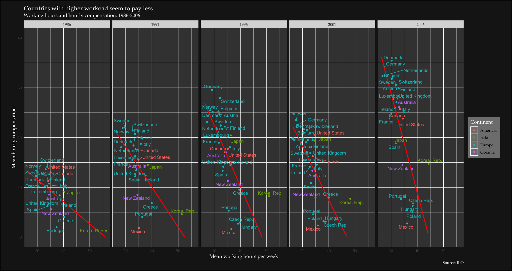

# The advance in working conditions 
## *Looking at the change between 1986 and 2006*
*Omar El Omeiri Filho*<br><br>

---

### Table Of Contents

* <u>[Summary](#summ)<br></u>
* <u>[Preparations](#prep)<br></u>
* <u>[Data](#data)<br></u>
    * <u>[Preprocessing](#prepr)<br></u>
    * <u>[Results](#res)<br></u>
        * <u>[Relationship between hourly compensation and workload (2006)](#scat_plot_1)</u>
        * <u>[Relationship between hourly compensation and workload (1986 - 2006)](#scat_plot_2)</u>
        * <u>[The change in workload from 1986 to 2006 (plot ordered by latest value)](#path_plot_1)</u>
        * <u>[The change in workload from 1986 to 2006 (plot ordered by variation)](#path_plot_2)</u>
        * <u>[Comparing change in workload and compensation from 1986 to 2006 (plot ordered by variation of workload)](#path_plot_3)</u>
        * <u>[Comparing change in workload and compensation from 1986 to 2006 (plot ordered by variation of compensation)](#path_plot_4)</u>
* <u>[Final Comments](#final_com)</u>

---

## Summary <a class="anchor" id="summ"></a>

&nbsp;&nbsp;&nbsp;&nbsp;This document uses a dataset collected in the **[International Labor Organization - ILO](https://www.ilo.org/global/statistics-and-databases/lang--en/index.htm)**, these data contain information on the mean workload in hours and the mean monetary compensation between some countries in Asia, Europe and the Americas.  The objective of this report is to assess how working conditions over the world are changing. At first, we will explore the relationship between the workload and the mean hourly compensation in USD for the most recent year in the dataset. Once we are familiar with how these two variables affect each other we will move to see how this is changing over the course of 20 years (1986 - 2006). We will also focus on how different are the working conditions between countries and continents. After reading this document you will be able to identify which are the best places to work and which ones have the hardest working conditions.

## Preparations <a class="anchor" id="prep"></a>


```R
library(ggplot2)
library(repr)
library(dplyr)
library(tidyr)
library(lubridate)
library(countrycode)
library(forcats)
library(xts)
library(ggrepel)
library(gridExtra)
```

### Data <a class='anchor' id='data'></a>

The data is sourced at two different tables, one containing information about the hourly compensation and the other one has data about the mean weekly workload in hours.<br>
I will show the first few lines of them.


```R
ilo_hourly_compensation <- read.table('ilo_hourly_compensation.txt', header = T, stringsAsFactors = F)
dim(ilo_hourly_compensation)
head(ilo_hourly_compensation)
```


<ol class=list-inline>
	<li>831</li>
	<li>3</li>
</ol>


<table>
<caption>A data.frame: 6 × 3</caption>
<thead>
	<tr><th scope=col>country</th><th scope=col>year</th><th scope=col>hourly_compensation</th></tr>
	<tr><th scope=col>&lt;chr&gt;</th><th scope=col>&lt;dbl&gt;</th><th scope=col>&lt;dbl&gt;</th></tr>
</thead>
<tbody>
	<tr><td>Australia</td><td>1980</td><td> 8.44</td></tr>
	<tr><td>Austria  </td><td>1980</td><td> 8.87</td></tr>
	<tr><td>Belgium  </td><td>1980</td><td>11.74</td></tr>
	<tr><td>Canada   </td><td>1980</td><td> 8.87</td></tr>
	<tr><td>Denmark  </td><td>1980</td><td>10.83</td></tr>
	<tr><td>Finland  </td><td>1980</td><td> 8.61</td></tr>
</tbody>
</table>


```R
ilo_working_hours <- read.table('ilo_working_hours.txt', header = T, stringsAsFactors = F)
dim(ilo_working_hours)
head(ilo_working_hours)
```


<ol class=list-inline>
	<li>737</li>
	<li>3</li>
</ol>


<table>
<caption>A data.frame: 6 × 3</caption>
<thead>
	<tr><th scope=col>country</th><th scope=col>year</th><th scope=col>working_hours</th></tr>
	<tr><th scope=col>&lt;chr&gt;</th><th scope=col>&lt;dbl&gt;</th><th scope=col>&lt;dbl&gt;</th></tr>
</thead>
<tbody>
	<tr><td>Australia</td><td>1980</td><td>34.57885</td></tr>
	<tr><td>Canada   </td><td>1980</td><td>34.85000</td></tr>
	<tr><td>Denmark  </td><td>1980</td><td>31.89808</td></tr>
	<tr><td>Finland  </td><td>1980</td><td>35.56346</td></tr>
	<tr><td>France   </td><td>1980</td><td>35.42308</td></tr>
	<tr><td>Iceland  </td><td>1980</td><td>35.84615</td></tr>
</tbody>
</table>


### Preprocessing <a class='anchor' id='prepr'></a>

1 - Joining the two tables.<br>
2 - Creating the Continent column.<br>
3 - Listing all available countries that have data from 1986 and 2006 (There are missing data for some years).<br>
4 - Creating new dataframe (path_plot_df) with data only from 1986 and 2006 for available countries for the path plots.<br>
5 - Calculating the change in workload and the hourly compensation between 2006 and 1986 and merging it to path_plot_df <br>


```R
# Step 1

ilo_data <- ilo_hourly_compensation %>%
                inner_join(ilo_working_hours, by = c('country', 'year'))

ilo_data <- ilo_data %>%
    mutate(country = as.factor(country))

dim(ilo_data)
head(ilo_data)
```


<ol class=list-inline>
	<li>612</li>
	<li>4</li>
</ol>


<table>
<caption>A data.frame: 6 × 4</caption>
<thead>
	<tr><th scope=col>country</th><th scope=col>year</th><th scope=col>hourly_compensation</th><th scope=col>working_hours</th></tr>
	<tr><th scope=col>&lt;fct&gt;</th><th scope=col>&lt;dbl&gt;</th><th scope=col>&lt;dbl&gt;</th><th scope=col>&lt;dbl&gt;</th></tr>
</thead>
<tbody>
	<tr><td>Australia</td><td>1980</td><td> 8.44</td><td>34.57885</td></tr>
	<tr><td>Canada   </td><td>1980</td><td> 8.87</td><td>34.85000</td></tr>
	<tr><td>Denmark  </td><td>1980</td><td>10.83</td><td>31.89808</td></tr>
	<tr><td>Finland  </td><td>1980</td><td> 8.61</td><td>35.56346</td></tr>
	<tr><td>France   </td><td>1980</td><td> 8.90</td><td>35.42308</td></tr>
	<tr><td>Italy    </td><td>1980</td><td> 8.09</td><td>35.74635</td></tr>
</tbody>
</table>


```R
# Step 2

ilo_data$continent <- countrycode(ilo_data$country, origin = 'country.name', destination = 'continent')

head(ilo_data)
```


<table>
<caption>A data.frame: 6 × 5</caption>
<thead>
	<tr><th scope=col>country</th><th scope=col>year</th><th scope=col>hourly_compensation</th><th scope=col>working_hours</th><th scope=col>continent</th></tr>
	<tr><th scope=col>&lt;fct&gt;</th><th scope=col>&lt;dbl&gt;</th><th scope=col>&lt;dbl&gt;</th><th scope=col>&lt;dbl&gt;</th><th scope=col>&lt;chr&gt;</th></tr>
</thead>
<tbody>
	<tr><td>Australia</td><td>1980</td><td> 8.44</td><td>34.57885</td><td>Oceania </td></tr>
	<tr><td>Canada   </td><td>1980</td><td> 8.87</td><td>34.85000</td><td>Americas</td></tr>
	<tr><td>Denmark  </td><td>1980</td><td>10.83</td><td>31.89808</td><td>Europe  </td></tr>
	<tr><td>Finland  </td><td>1980</td><td> 8.61</td><td>35.56346</td><td>Europe  </td></tr>
	<tr><td>France   </td><td>1980</td><td> 8.90</td><td>35.42308</td><td>Europe  </td></tr>
	<tr><td>Italy    </td><td>1980</td><td> 8.09</td><td>35.74635</td><td>Europe  </td></tr>
</tbody>
</table>


```R
# Step 3

countries_1986_2006 <- as.character((filter(ilo_data, year %in% c(1986, 2006)) %>%
                                        group_by(country) %>%
                                        count() %>%
                                        filter(n == 2) %>%
                                        select(country))$country)

countries_1986_2006
```


<ol class=list-inline>
	<li>'Australia'</li>
	<li>'Belgium'</li>
	<li>'Canada'</li>
	<li>'Denmark'</li>
	<li>'Finland'</li>
	<li>'France'</li>
	<li>'Ireland'</li>
	<li>'Italy'</li>
	<li>'Japan'</li>
	<li>'Korea, Rep.'</li>
	<li>'Luxembourg'</li>
	<li>'New Zealand'</li>
	<li>'Norway'</li>
	<li>'Portugal'</li>
	<li>'Spain'</li>
	<li>'Sweden'</li>
	<li>'Switzerland'</li>
	<li>'United Kingdom'</li>
	<li>'United States'</li>
</ol>


```R
# Step 4

path_plot_df <- ilo_data %>%
                    filter(year %in% c(1986, 2006), country %in% countries_1986_2006) %>%
                    arrange(country, desc(year)) %>%
                    droplevels()

head(path_plot_df)
```


<table>
<caption>A data.frame: 6 × 5</caption>
<thead>
	<tr><th scope=col>country</th><th scope=col>year</th><th scope=col>hourly_compensation</th><th scope=col>working_hours</th><th scope=col>continent</th></tr>
	<tr><th scope=col>&lt;fct&gt;</th><th scope=col>&lt;dbl&gt;</th><th scope=col>&lt;dbl&gt;</th><th scope=col>&lt;dbl&gt;</th><th scope=col>&lt;chr&gt;</th></tr>
</thead>
<tbody>
	<tr><td>Australia</td><td>2006</td><td>26.14</td><td>33.14039</td><td>Oceania </td></tr>
	<tr><td>Australia</td><td>1986</td><td> 8.55</td><td>34.48269</td><td>Oceania </td></tr>
	<tr><td>Belgium  </td><td>2006</td><td>31.85</td><td>30.21154</td><td>Europe  </td></tr>
	<tr><td>Belgium  </td><td>1986</td><td>11.25</td><td>34.21154</td><td>Europe  </td></tr>
	<tr><td>Canada   </td><td>2006</td><td>25.74</td><td>33.42308</td><td>Americas</td></tr>
	<tr><td>Canada   </td><td>1986</td><td>11.33</td><td>34.23269</td><td>Americas</td></tr>
</tbody>
</table>


```R
# Step 5

country_split <- split(path_plot_df, path_plot_df$country)

diff_country <- country_split %>%
                        lapply(select_if, is.numeric) %>%
                        lapply( FUN = function(x){apply(x, MARGIN = 2, FUN = diff)})

diff_country <- do.call(rbind, diff_country) %>%
                        as.data.frame()

diff_country$country <- rownames(diff_country)

rownames(diff_country) <- c()

colnames(diff_country) <- c('year', 'diff_hourly_compensation', 'diff_working_hours', 'country')

path_plot_df <- merge(path_plot_df, diff_country[,-1], by = "country")

head(path_plot_df)
```


<table>
<caption>A data.frame: 6 × 7</caption>
<thead>
	<tr><th scope=col>country</th><th scope=col>year</th><th scope=col>hourly_compensation</th><th scope=col>working_hours</th><th scope=col>continent</th><th scope=col>diff_hourly_compensation</th><th scope=col>diff_working_hours</th></tr>
	<tr><th scope=col>&lt;fct&gt;</th><th scope=col>&lt;dbl&gt;</th><th scope=col>&lt;dbl&gt;</th><th scope=col>&lt;dbl&gt;</th><th scope=col>&lt;chr&gt;</th><th scope=col>&lt;dbl&gt;</th><th scope=col>&lt;dbl&gt;</th></tr>
</thead>
<tbody>
	<tr><td>Australia</td><td>2006</td><td>26.14</td><td>33.14039</td><td>Oceania </td><td>-17.59</td><td>1.3423063</td></tr>
	<tr><td>Australia</td><td>1986</td><td> 8.55</td><td>34.48269</td><td>Oceania </td><td>-17.59</td><td>1.3423063</td></tr>
	<tr><td>Belgium  </td><td>2006</td><td>31.85</td><td>30.21154</td><td>Europe  </td><td>-20.60</td><td>4.0000000</td></tr>
	<tr><td>Belgium  </td><td>1986</td><td>11.25</td><td>34.21154</td><td>Europe  </td><td>-20.60</td><td>4.0000000</td></tr>
	<tr><td>Canada   </td><td>2006</td><td>25.74</td><td>33.42308</td><td>Americas</td><td>-14.41</td><td>0.8096149</td></tr>
	<tr><td>Canada   </td><td>1986</td><td>11.33</td><td>34.23269</td><td>Americas</td><td>-14.41</td><td>0.8096149</td></tr>
</tbody>
</table>


## Results <a class='anchor' id='res'></a>

### Relationship between hourly compensation and workload (2006) <a class='anchor' id='scat_plot_1'></a>

&nbsp;&nbsp;&nbsp;&nbsp;This is the most recent year of the dataset. Here we can notice that there is an unfortunate negative correlation between the workload and the monetary compensation. In other words, the countries
that have the highest workloads tend to be the ones that compensate their workers the least. The nordic and the most developed countries in Europe seem to be the best places to work, while countries from eastern Europe, Mexico and Korea have the toughest conditions.


```R
options(repr.plot.width = 10)

whour_x_comp_scatter <-  ggplot(filter(ilo_data, year == 2006), aes(working_hours, hourly_compensation, col = continent)) +
                            
                        geom_point() + 
                            
                        geom_smooth(method = 'lm', color = 'red', fullrange = T, se = F)+

                        geom_text_repel(aes(working_hours, hourly_compensation, label = country), show.legend = F)+

                        labs(x = 'Mean working hours per week',
                             y = 'Mean hourly compensation',
                             title = 'Countries with higher workoad seem to pay less',
                             subtitle = 'Working hours and hourly compensation, 2006',
                             caption = 'Source: ILO',
                             color = 'Continent') + 

                        theme(text = element_text(family = 'Palatino', size = 12),
                              title = element_text(color = 'white'),
                              plot.subtitle = element_text(color = 'white'),
                              axis.text = element_text(color = 'white'),
                              panel.grid.major = element_line(color = 'gray20'),
                              panel.grid.minor = element_line(color = 'gray20'),
                              plot.background = element_rect(fill = 'gray10'),
                              plot.margin = unit(c(5,10,5,10), units = 'mm'), # margin top, left, bottom, right
                              panel.background = element_rect(fill = 'grey25'),
                              legend.background = element_rect(fill = 'grey50'),
                              legend.key = element_rect(fill = 'grey50'))

whour_x_comp_scatter
```


```R
wload_comp_cor <- round(cor(path_plot_df$working_hours, path_plot_df$hourly_compensation),2)
```

<span style="font-size:17px;">The Correlation between workload and compensation is -0.54</span>

 

 

 

 

 

### Relationship between hourly compensation and workload (1986 - 2006) <a class='anchor' id='scat_plot_2'></a>

Countries that work less showed a strong upward trend in income, with no expressive changes in workload. This makes this disparity even more evident for more recent years.  
Korea still has the highest workload, but compensation has increased. Portugal, Mexico and the eastern European countries presented no significant changes either in workload neither in compensation


```R
options(repr.plot.width = 17)

whour_x_comp_scatter %+% filter(ilo_data, year %in% seq(1986, 2006, length.out = 5)) + 
    facet_grid(.~year) +
    scale_y_continuous(limits = c(0,40)) +
    labs(subtitle = 'Working hours and hourly compensation, 1986-2006')
```

    Warning message:
    “Removed 1 rows containing non-finite values (stat_smooth).”Warning message:
    “Removed 1 rows containing missing values (geom_point).”Warning message:
    “Removed 89 rows containing missing values (geom_smooth).”Warning message:
    “Removed 1 rows containing missing values (geom_text_repel).”





  

 

 

 

### The change in workload from 1986 to 2006 (plot ordered by latest value) <a class='anchor' id='path_plot_1'></a>


```R
path_plot_df <- path_plot_df %>%
                    arrange(year) %>%
                    mutate(country = fct_reorder(country, working_hours, last))


increase_countries_whours <- as.character(as.matrix(path_plot_df %>%
                            filter(diff_working_hours >= 0) %>%
                            select(country)))


options(repr.plot.width = 6, repr.plot.height = 8)

path_plot_w_hours_1986_2006_order_last <- ggplot(path_plot_df, aes(working_hours, country, color = continent)) +
                     
                     geom_path(size = 1.2, arrow = arrow(length = unit(1.5, 'mm'), type = 'closed')) +
                     scale_color_manual(values = c("#d11f1f", "#F3DE2C", "#1f81d1", "#5C8001")) +
                 geom_text(aes(working_hours, country, label = round(working_hours,1), hjust = ifelse(country %in% increase_countries_whours, 
                                                                                                      ifelse(year == '2006', 1.3, -0.3),
                                                                                                             ifelse(year == '2006', -0.3, 1.3))), show.legend = F) +
                theme(plot.background = element_rect(fill = 'grey20'),
                      plot.subtitle = element_text(size = 10),
                      panel.background = element_rect(fill = 'grey25'),
                      text = element_text(color = 'white', family = 'Palatino', size = 15),
                      legend.background = element_rect(fill = 'gray30'),
                      axis.text = element_text(color = 'white'),
                      panel.grid.major = element_line(color ='gray30'),
                      panel.grid.minor = element_line(color = 'gray30'),
                      legend.key = element_rect(fill = 'grey40', color = 'grey45')) +
                coord_cartesian(xlim = c(21,61),) + 
                labs(
                     x = 'Mean working hours per week',
                     y = '',
                     title = 'The change in workload',
                     subtitle = 'Working hours change between 1986 and 2006\n(Ordered by latest value)',
                     caption = 'Source: ILO',
                     color = 'Continent')

path_plot_w_hours_1986_2006_order_last
```


### The change in workload from 1986 to 2006 (plot ordered by variation) <a class='anchor' id='path_plot_2'></a>

We can see that asian countries have the higher workload, but they show a very fast reduction between 1986 and 2006.<br>
Next we will compare this insight with the change in compensation.


```R
path_plot_df <- path_plot_df %>%
                    arrange(year) %>%
                    mutate(country = fct_reorder(country, diff_working_hours, max))

options(repr.plot.width = 6, repr.plot.height = 8)

path_plot_w_hours_1986_2006_order_var <- ggplot(path_plot_df, aes(working_hours, country, color = continent)) +
                    
                     geom_path(size = 1.2, arrow = arrow(length = unit(1.5, 'mm'), type = 'closed')) +
                     scale_color_manual(values = c("#d11f1f", "#F3DE2C", "#1f81d1", "#5C8001")) +
                 geom_text(aes(working_hours, country, label = round(working_hours,1), hjust = ifelse(country %in% increase_countries_whours, 
                                                                                                      ifelse(year == '2006', 1.3, -0.3),
                                                                                                             ifelse(year == '2006', -0.3, 1.3))), show.legend = F) +
                theme(plot.background = element_rect(fill = 'grey20'),
                      plot.subtitle = element_text(size = 10),
                      panel.background = element_rect(fill = 'grey25'),
                      text = element_text(color = 'white', family = 'Palatino', size = 15),
                      legend.background = element_rect(fill = 'gray30'),
                      axis.text = element_text(color = 'white'),
                      panel.grid.major = element_line(color ='gray30'),
                      panel.grid.minor = element_line(color = 'gray30'),
                      legend.key = element_rect(fill = 'grey40', color = 'grey45')) +
                coord_cartesian(xlim = c(21,61),) + 
                labs(
                     x = 'Mean working hours per week',
                     y = '',
                     title = 'The change in workload',
                     subtitle = 'Working hours change between 1986 and 2006\n(Ordered by variation)',
                     caption = 'Source: ILO',
                     color = 'Continent')

path_plot_w_hours_1986_2006_order_var
```


 

 

 

 

### Comparing change in workload and compensation from 1986 to 2006 (plot ordered by variation of workload)<a class='anchor' id='path_plot_3'></a>

We see that the countries with the highest increases in hourly compensations did not show significant decrease in workload, in 1986 they were already pretty low.


```R
path_plot_df <- path_plot_df %>%
                    arrange(year) %>%
                    mutate(country = fct_reorder(country, diff_working_hours, max))


increase_countries_hcomp <- as.character(as.matrix(path_plot_df %>%
                            filter(diff_hourly_compensation >= 0) %>%
                            select(country)))


path_plot_h_comp_1986_2006_order_var_whours <- ggplot(path_plot_df, aes(hourly_compensation, country, color = continent)) +
                               
                             geom_path(size = 1.2, arrow = arrow(length = unit(1.5, 'mm'), type = 'closed')) +
                             scale_color_manual(values = c("#d11f1f", "#F3DE2C", "#1f81d1", "#5C8001")) +
                         geom_text(aes(hourly_compensation, country, label = round(hourly_compensation,1), hjust = ifelse(country %in% increase_countries_hcomp, 
                                                                                                                          ifelse(year == '2006', -1.3, 1.5),
                                                                                                                                 ifelse(year == '2006', -0.3, 1.3))), show.legend = F) +
                        theme(plot.background = element_rect(fill = 'grey20'),
                              plot.subtitle = element_text(size = 10),
                              panel.background = element_rect(fill = 'grey25'),
                              text = element_text(color = 'white', family = 'Palatino', size = 15),
                              legend.background = element_rect(fill = 'gray30'),
                              axis.text = element_text(color = 'white'),
                              axis.text.y = element_blank(),
                              panel.grid.major = element_line(color ='gray30'),
                              panel.grid.minor = element_line(color = 'gray30'),
                              legend.key = element_rect(fill = 'grey40', color = 'grey45')) +
                        coord_cartesian(xlim = c(-5,50),) + 
                        labs(
                             x = 'Mean working hours per week',
                             y = '',
                             title = 'The change in hourly compensation',
                             subtitle = 'Hourly compensation change between 1986 and 2006\n(Ordered by variation of workload)',
                             caption = 'Source: ILO',
                             color = 'Continent')
```


```R
options(repr.plot.width = 12, repr.plot.height = 9)

grid.arrange(path_plot_w_hours_1986_2006_order_var + theme(legend.position = 'none',plot.margin = unit(c(5,10,5,0), units = 'mm')),
             path_plot_h_comp_1986_2006_order_var_whours + theme(plot.margin = unit(c(5,10,5,0), units = 'mm')), ncol = 2)
```


### Comparing change in workload and compensation from 1986 to 2006 (plot ordered by variation of compensation)<a class='anchor' id='path_plot_4'></a>


```R
path_plot_df <- path_plot_df %>%
                    arrange(year) %>%
                    mutate(country = fct_rev(fct_reorder(country, diff_hourly_compensation, max)))


path_plot_h_comp_1986_2006_order_var_hcomp <- ggplot(path_plot_df, aes(hourly_compensation, country, color = continent)) +
                            

                        geom_path(size = 1.2, arrow = arrow(length = unit(1.5, 'mm'), type = 'closed')) +
                        scale_color_manual(values = c("#d11f1f", "#F3DE2C", "#1f81d1", "#5C8001")) +
                     geom_text(aes(hourly_compensation, country, label = round(hourly_compensation,1), hjust = ifelse(country %in% increase_countries_hcomp, 
                                                                                                                      ifelse(year == '2006', -1.3, 1.5),
                                                                                                                             ifelse(year == '2006', -0.3, 1.3))), show.legend = F) +
                    theme(plot.background = element_rect(fill = 'grey20'),
                          plot.subtitle = element_text(size = 10),
                          panel.background = element_rect(fill = 'grey25'),
                          text = element_text(color = 'white', family = 'Palatino', size = 15),
                          legend.background = element_rect(fill = 'gray30'),
                          axis.text = element_text(color = 'white'),
                          axis.text.y = element_blank(),
                          panel.grid.major = element_line(color ='gray30'),
                          panel.grid.minor = element_line(color = 'gray30'),
                          legend.key = element_rect(fill = 'grey40', color = 'grey45')) +
                    coord_cartesian(xlim = c(-5,50),) + 
                    labs(
                         x = 'Mean working hours per week',
                         y = '',
                         title = 'The change in hourly compensation',
                         subtitle = 'Working hours change between 1986 and 2006\n (Ordered by variation)',
                         caption = 'Source: ILO',
                         color = 'Continent')
```


```R

grid.arrange(path_plot_w_hours_1986_2006_order_var %+% path_plot_df + 
                 theme(legend.position = 'none', plot.subtitle = element_text(size = 10)
                       ,plot.margin = unit(c(5,5,5,0), units = 'mm')) +
                 labs(subtitle = 'Working hours change between 1986 and 2006\n (Ordered by variation of hourly compensation)'),
             path_plot_h_comp_1986_2006_order_var_hcomp +
                 theme(plot.margin = unit(c(5,10,5,0), units = 'mm')), ncol = 2)
```


 

 

 

 

## Final Comments <a class='anchor' id='final_com'></a>

&nbsp;&nbsp;&nbsp;&nbsp; As you can see, all countries had improvements in working conditions. Fortunately, workloads are getting lighter and compensation is getting higher overall. On the other hand, there is an unfair correlation between workload and monetary compensation.<br>
The countries where people work the most are the greatest underpayers. Asian countries tend to have the hardest workloads and the lowest compensations, but are the fastest changers. This relationship is certainly affected by other macro-economic performance indicators, though. In conclusion, it seems like the world is heading to better working conditions, where people can live healthier lives while making more money.
